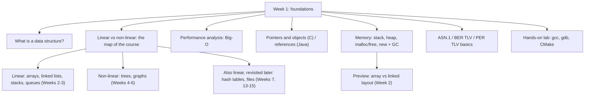

# Week 1 — Introduction to Data Structures

*CEN207 Data Structures (formerly CE205) · Fall 2026–2027 · 18.09.2026*

<!-- materials:start -->

<div class="materials" markdown>

[:material-file-pdf-box: Lecture notes (PDF)](cen207-week-1-notes.pdf){ .md-button download="cen207-week-1-notes.pdf" }
[:material-file-word-box: Lecture notes (DOCX)](cen207-week-1-notes.docx){ .md-button download="cen207-week-1-notes.docx" }
[:material-presentation: Slides (PDF)](cen207-week-1-slides.pdf){ .md-button download="cen207-week-1-slides.pdf" }
[:material-microsoft-powerpoint: Slides (PPTX)](cen207-week-1-slides.pptx){ .md-button download="cen207-week-1-slides.pptx" }
[:material-language-html5: Slides (HTML, offline)](cen207-week-1-slides.html){ .md-button download="cen207-week-1-slides.html" }
[:material-folder-zip: Download all (ZIP)](cen207-week-1-materials.zip){ .md-button download="cen207-week-1-materials.zip" }
[:material-fullscreen: Open slides full screen](cen207-week-1-slides.html){ .md-button .md-button--primary target=_blank }

</div>

<div class="deck-frame">
<iframe src="../cen207-week-1-slides.html" title="Week 1 — Introduction, Big-O, Pointers" loading="lazy" allowfullscreen></iframe>
</div>

<p class="deck-hint">Click inside the slides and use the arrow keys; use the button at the bottom right of the slides, or the "Open slides full screen" link above, for full screen.</p>

<!-- materials:end -->

!!! abstract "This week"
    **Learning outcomes.** This is the first week, so today is about building the foundation everything else in the
    course stands on. By the end of the week you will be able to say what a data structure is and why there is more
    than one kind; tell a **linear** structure from a **non-linear** one and place every structure you will meet
    this semester on one map; count the steps an algorithm takes and describe its growth with **Big-O**; explain
    what a **pointer** is in C and how a **reference** plays the same role in Java; draw the difference between the
    **stack** and the **heap** in memory, and what `malloc`/`free` and Java's `new` plus garbage collection each do
    about it; hand-encode a small record as **TLV** bytes, the same idea behind ASN.1's BER and PER; and, in a
    hands-on lab, compile, run and debug a C program with **gcc**, **gdb** and **CMake**. These outcomes map to
    **LO.1** (explain the definitions, representations and basic operations of linear and non-linear data
    structures), **LO.2** (analyze time and space complexity with Big-O), and **LO.7** (select the data structures
    and algorithms best suited to a problem) of the course syllabus.

    **What you need already.** Nothing from this course — it is week one. You do need the CEN107/CEN108 background
    listed on the [prerequisites page](../prerequisites/index.md): a working C toolchain, and enough C to read a
    loop and a function.

    **Time plan for a 3-hour session.** Course plan and the map of the course (~15 min) · what a data structure is,
    linear vs non-linear (~25 min) · performance analysis and Big-O (~40 min) · short break · pointers, memory,
    stack and heap (~50 min) · ASN.1/TLV basics (~25 min) · hands-on C workshop lab (~25 min).

## 0. Before we start

### 0.1 Course plan and communication

The full weekly schedule, grading breakdown, textbooks and office-hours policy are in the
[syllabus](../syllabus/syllabus.md); the term project you will build over the whole semester — first in C, then in
Java — is described in the [project guide](../project-guide/index.md); and the tools and background you are
expected to already have are listed on the [prerequisites page](../prerequisites/index.md). Read all three before
next week if you have not already. In class we will only touch the highlights: **one project, two checkpoints**
(a midterm check in C, a final check in Java), **weekly notes like this one** in English and Turkish, and **two
quizzes** (no separate homework). If anything in an older syllabus PDF ever looks out of date compared to what is
said in class or in these notes, ask — do not guess.

### 0.2 The map of this week — and of the course

Data structures is a course about exactly two things: **how to arrange data in memory**, and **how much that
arrangement costs** for the operations you actually need. Every week from here on introduces one more way to
arrange data (linked lists, stacks and queues, trees, graphs, hash tables, files) and measures its cost with the
tool you will learn today: Big-O. This week itself previews the whole map, then lays the two foundations —
performance analysis, and memory (pointers, stack, heap) — that every later week assumes you already have.



Every box under "Week 1: foundations" gets its own section below, most with a short step-by-step animation, a
complete C and Java program, and a note on when things go wrong.

## 1. What is a data structure?

### 1.1 A question to start

Your phone's contacts app can find "Alice" among ten thousand names almost instantly, insert a new contact without
re-sorting everything, and still list everyone alphabetically on demand. None of that is magic — it is a choice of
**how the names are arranged in memory**. Arrange them differently (say, in the order you added them, with no
structure at all) and the very same phone would need to scan every single name to find "Alice". The arrangement
*is* the difference. That arrangement is what we call a data structure.

### 1.2 A short history

The term **data structure** itself became common in computer science through the 1960s, alongside the first
systematic study of algorithms and their costs. Donald Knuth's *The Art of Computer Programming*, Volume 1:
*Fundamental Algorithms* (1968) was the first major text to treat data structures — lists, stacks, trees — as
objects of study in their own right, with their operations and costs analyzed side by side. A few years later,
Barbara Liskov and Stephen Zilles (1974) gave the idea of an **abstract data type** — *what* a structure does,
independent of *how* it is built — its modern, precise form, a distinction this course leans on constantly (you
will meet it formally in Section 1.4 of Week 3, and informally starting today).

### 1.3 Intuition

Think of a data structure the way you think of furniture for storing physical things: a filing cabinet, a bookshelf
sorted by author, a stack of trays on a desk, a phone book. Each one holds the same kind of content — papers, books,
documents, names — but each one is *good at different things*. A stack of trays is fast to add to and take from at
the top, terrible for finding something in the middle. A sorted bookshelf is fast to search, slow to insert into (you
may have to shift many books to keep the order). There is no single "best" way to arrange things; there is only the
best arrangement *for what you are about to do with it*.

A **data structure** is exactly this idea, made precise for a computer's memory: a way of organizing data so that
certain operations — access an element, search for a value, insert a new one, delete one — can be done, and done at
a known, analyzable cost.

### 1.4 Why there isn't just one

Every data structure makes trade-offs. The table below previews four operations that recur across this entire
course; you will fill in the exact costs for each specific structure as you meet it in the coming weeks. For now,
notice only the pattern: nothing is fast at everything.

| Operation | What it means | Why it isn't free |
| --- | --- | --- |
| Access | Read the value at a given position | Some layouts compute a position directly (O(1)); others must walk from the start (O(n)) |
| Search | Find whether/where a value occurs | Unsorted data must be checked one by one; sorted data can be halved repeatedly (Week 3 previews this fully in Section 3 below) |
| Insert | Add a new value | Some layouts shift everything after the insertion point; others just relink a couple of pointers |
| Delete | Remove a value | Same trade-off as insert, mirrored |

Choosing a data structure is choosing which of these operations you need to be fast, because — as you will see
concretely today and all semester — you cannot usually have all four be fast at once in the same structure.

## 2. Linear vs non-linear structures: the map of the course

### 2.1 A question to start

Take the last five songs you played and the org chart of a company. Both are collections of things, but they feel
different to draw: the songs form a single line (song 1, then 2, then 3, ...), while the org chart branches (one CEO,
several VPs, each with several reports). Is that difference just about drawing, or is it a real, structural fact
about the data — one that changes what operations are cheap or expensive?

### 2.2 Definitions

A structure is **linear** when its elements form a sequence: every element (except the first) has exactly one
element before it, and every element (except the last) has exactly one element after it. You can always ask "what
comes next?" and get a single, unambiguous answer.

A structure is **non-linear** when an element can have more than one "next" (or more than one "previous"). A tree
node can have several children; a graph node (often called a **vertex**) can connect to several others. There is no
single "next" any more — traversing the structure means *choosing* which branch to follow.

### 2.3 The whole course, sorted onto this one line

Every structure you will meet this semester falls into one of these two families. Some, like hash tables and files,
are still linear in how their *slots* are laid out, but solve a different problem (fast lookup by key, not by
position) — we will point that out again when we get there.

| Family | Structure | When | Defining trade-off |
| --- | --- | --- | --- |
| Linear | Array | Week 2 | O(1) access by index; O(n) insert/delete in the middle |
| Linear | Linked list (singly, doubly, circular) | Week 2 | O(n) access; O(1) insert/delete once you are there |
| Linear | Stack (LIFO) | Week 3 | Touch one end only; every operation O(1) |
| Linear | Queue (FIFO) | Week 3 | Add at one end, remove at the other; every operation O(1) |
| Non-linear | Binary tree, heap | Week 4 | Each node has up to two children; O(log n) operations when balanced |
| Non-linear | Graph | Weeks 5–6 | Nodes connect to any number of others; models networks, maps, dependencies |
| Linear (by key) | Hash table | Week 7 | O(1) average access by key, not by position |
| Linear (on disk) | Sequential, direct and indexed files | Weeks 13–15 | The same trade-offs, now paid in disk I/O instead of memory access |

The mermaid map in Section 0.2 shows the same grouping visually. Keep coming back to it: every week adds exactly one
row to this table, and every row is judged by the same measuring stick — the one you are about to learn.

!!! warning "Common mistakes"
    - Assuming "non-linear" means "disorganized". A tree and a graph are extremely structured — they simply allow
      more than one "next", which linear structures do not.
    - Confusing "sorted" with "linear". A sorted array is linear (each element still has exactly one next); sorting
      is a property of the *values*, linearity is a property of the *shape*.
    - Thinking a hash table or a file is an exception to everything you will learn about linear structures. Their
      *slots* are laid out linearly; only the *access pattern* (by key, via a computed position) is new. You will see
      this explicitly in Week 7.

??? success "Test yourself: linear vs non-linear"
    **1. Is a stack of plates linear or non-linear? Why?**

    Linear: every plate (except the top one) has exactly one plate above it, and every plate (except the bottom
    one) has exactly one plate below it. There is a single, unambiguous "next".

    **2. Is a family tree linear or non-linear?**

    Non-linear: a parent can have several children, so there is more than one "next" from a given person.

## 3. Performance analysis: counting steps, not seconds

### 3.1 A question to start

You write a function that searches an array for a value. It works. Is it *fast*? Timing it on your laptop tells you
about your laptop, today, for that one input size — a different machine, a bigger input, or a background process
stealing CPU time can all change the number of seconds without the algorithm changing at all. What we actually want
to know is a property of the **algorithm itself**: how does its work grow as the input grows? The tool for that
question is **Big-O**, and the rest of this section builds it from scratch.

### 3.2 A short history

The notation predates computer science by decades: the German mathematician Paul Bachmann introduced the capital-O
notation in 1894 to describe how closely one function approximates another, and Edmund Landau popularized and
refined it in the early 1900s (it is still sometimes called a **Landau symbol**). Computer science adopted it to
describe algorithm cost starting in the 1960s; Donald Knuth's widely read 1976 article "Big Omicron and Big Omega
and Big Theta" (ACM SIGACT News) argued for, and helped standardize, exactly the O/Ω/Θ vocabulary this course uses.

### 3.3 Intuition: count the steps, not the seconds

Instead of a stopwatch, count how many times the algorithm does its basic unit of work — usually one comparison, one
array access, or one arithmetic operation — as a function of the input size `n`. That count does not depend on the
machine, the language, or how busy the computer is today; it depends only on the algorithm and `n`. Two searches over
the same ten numbers make this concrete straightaway.

### 3.4 Linear search: try every box

**Linear search** starts at the front of the array and checks one element after another until it finds the target
or runs out of elements. It needs no particular order in the data — it works on any array at all.

Play the animation to watch it count comparisons on an 11-element array, hunting for a value in the middle.

<iframe class="dsanim" src="../anim/linear-search.html" title="Linear search: counting comparisons" loading="lazy"></iframe>
<div class="dsanim-baski" markdown>

</div>

In the picker, also try **20 values, duplicate target, first match** (hard) and the edge cases **not found: target
is not in the array**, **best case: target is in the first box (index 0)**, and **one-element array** — or press
🎲 for random data at four difficulty levels, or type your own array and target.

=== "C"

    ```c
    int linear_search(const int arr[], int n, int target, int *comparisons) {
        for (int i = 0; i < n; i++) {
            (*comparisons)++;
            if (arr[i] == target)
                return i;
        }
        return -1;
    }
    ```

=== "Java"

    ```java
    static int linearSearch(int[] arr, int target) {
        comparisons = 0;
        for (int i = 0; i < arr.length; i++) {
            comparisons++;
            if (arr[i] == target)
                return i;
        }
        return -1;
    }
    ```

    The full class (`code/week-01/java/LinearSearch.java`) mirrors the C program's five scenarios exactly.

??? example "Full program: `linear_search.c` / `LinearSearch.java`"

    === "C"

        ```c
        /* Week 1 -- Introduction to Data Structures
         * Linear search: scan the array from the front, one comparison at a time.
         * Runs the same normal / hard / edge-case scenarios as the linear-search animation.
         * CEN207 Data Structures (CS50-style lecture notes)
         */
        #include <stdio.h>

        int linear_search(const int arr[], int n, int target, int *comparisons) {
            for (int i = 0; i < n; i++) {
                (*comparisons)++;
                if (arr[i] == target)
                    return i;
            }
            return -1;
        }

        static void print_array(const int arr[], int n) {
            printf("arr:");
            for (int i = 0; i < n; i++)
                printf(" %d", arr[i]);
            printf("  (n = %d)\n", n);
        }

        static void run_scenario(const char *label, const int arr[], int n, int target) {
            printf("-- %s --\n", label);
            print_array(arr, n);
            int comparisons = 0;
            int index = linear_search(arr, n, target, &comparisons);
            if (index >= 0)
                printf("linear_search(target=%d) -> found at index %d, %d comparison%s\n\n",
                       target, index, comparisons, comparisons == 1 ? "" : "s");
            else
                printf("linear_search(target=%d) -> not found, %d comparisons\n\n", target, comparisons);
        }

        int main(void) {
            /* normal: 11 values, target in the middle */
            int normal[] = {4, 8, 15, 16, 23, 27, 31, 38, 42, 50, 61};
            run_scenario("normal: 11 values, target in the middle", normal, 11, 27);

            /* hard: 20 values, duplicate target, first match */
            int hard[] = {12, 47, 3, 88, 25, 61, 9, 34, 77, 15, 52, 6, 41, 18, 63, 99, 5, 29, 99, 71};
            run_scenario("hard: 20 values, duplicate target, first match", hard, 20, 99);

            /* edge: not found -- target is not in the array */
            int notFound[] = {2, 4, 6, 8, 10, 12, 14, 16, 18, 20};
            run_scenario("edge: not found, target is not in the array", notFound, 10, 7);

            /* edge: best case -- target is in the first box (index 0) */
            int firstIndex[] = {5, 13, 21, 34, 42, 55, 67, 78, 89, 91};
            run_scenario("edge: best case, target is in the first box (index 0)", firstIndex, 10, 5);

            /* edge: one-element array */
            int one[] = {42};
            run_scenario("edge: one-element array", one, 1, 42);

            return 0;
        }
        ```

    === "Java"

        ```java
        /* Week 1 -- Introduction to Data Structures
         * Linear search: scan the array from the front, one comparison at a time.
         * Runs the same normal / hard / edge-case scenarios as the linear-search animation.
         * CEN207 Data Structures (CS50-style lecture notes)
         */
        public class LinearSearch {
            static int comparisons;

            static int linearSearch(int[] arr, int target) {
                comparisons = 0;
                for (int i = 0; i < arr.length; i++) {
                    comparisons++;
                    if (arr[i] == target)
                        return i;
                }
                return -1;
            }

            static void printArray(int[] arr) {
                StringBuilder sb = new StringBuilder("arr:");
                for (int v : arr) sb.append(' ').append(v);
                sb.append("  (n = ").append(arr.length).append(')');
                System.out.println(sb);
            }

            static void runScenario(String label, int[] arr, int target) {
                System.out.println("-- " + label + " --");
                printArray(arr);
                int index = linearSearch(arr, target);
                if (index >= 0)
                    System.out.println("linearSearch(target=" + target + ") -> found at index " + index
                            + ", " + comparisons + " comparison" + (comparisons == 1 ? "" : "s"));
                else
                    System.out.println("linearSearch(target=" + target + ") -> not found, "
                            + comparisons + " comparisons");
                System.out.println();
            }

            public static void main(String[] args) {
                // normal: 11 values, target in the middle
                int[] normal = {4, 8, 15, 16, 23, 27, 31, 38, 42, 50, 61};
                runScenario("normal: 11 values, target in the middle", normal, 27);

                // hard: 20 values, duplicate target, first match
                int[] hard = {12, 47, 3, 88, 25, 61, 9, 34, 77, 15, 52, 6, 41, 18, 63, 99, 5, 29, 99, 71};
                runScenario("hard: 20 values, duplicate target, first match", hard, 99);

                // edge: not found -- target is not in the array
                int[] notFound = {2, 4, 6, 8, 10, 12, 14, 16, 18, 20};
                runScenario("edge: not found, target is not in the array", notFound, 7);

                // edge: best case -- target is in the first box (index 0)
                int[] firstIndex = {5, 13, 21, 34, 42, 55, 67, 78, 89, 91};
                runScenario("edge: best case, target is in the first box (index 0)", firstIndex, 5);

                // edge: one-element array
                int[] one = {42};
                runScenario("edge: one-element array", one, 42);
            }
        }
        ```

??? example "Full program: `linear_search.c` / `LinearSearch.java`"

    === "C"

        ```c
        /* Week 1 -- Introduction to Data Structures
         * Linear search: scan the array from the front, one comparison at a time.
         * Runs the same normal / hard / edge-case scenarios as the linear-search animation.
         * CEN207 Data Structures (CS50-style lecture notes)
         */
        #include <stdio.h>

        int linear_search(const int arr[], int n, int target, int *comparisons) {
            for (int i = 0; i < n; i++) {
                (*comparisons)++;
                if (arr[i] == target)
                    return i;
            }
            return -1;
        }

        static void print_array(const int arr[], int n) {
            printf("arr:");
            for (int i = 0; i < n; i++)
                printf(" %d", arr[i]);
            printf("  (n = %d)\n", n);
        }

        static void run_scenario(const char *label, const int arr[], int n, int target) {
            printf("-- %s --\n", label);
            print_array(arr, n);
            int comparisons = 0;
            int index = linear_search(arr, n, target, &comparisons);
            if (index >= 0)
                printf("linear_search(target=%d) -> found at index %d, %d comparison%s\n\n",
                       target, index, comparisons, comparisons == 1 ? "" : "s");
            else
                printf("linear_search(target=%d) -> not found, %d comparisons\n\n", target, comparisons);
        }

        int main(void) {
            /* normal: 11 values, target in the middle */
            int normal[] = {4, 8, 15, 16, 23, 27, 31, 38, 42, 50, 61};
            run_scenario("normal: 11 values, target in the middle", normal, 11, 27);

            /* hard: 20 values, duplicate target, first match */
            int hard[] = {12, 47, 3, 88, 25, 61, 9, 34, 77, 15, 52, 6, 41, 18, 63, 99, 5, 29, 99, 71};
            run_scenario("hard: 20 values, duplicate target, first match", hard, 20, 99);

            /* edge: not found -- target is not in the array */
            int notFound[] = {2, 4, 6, 8, 10, 12, 14, 16, 18, 20};
            run_scenario("edge: not found, target is not in the array", notFound, 10, 7);

            /* edge: best case -- target is in the first box (index 0) */
            int firstIndex[] = {5, 13, 21, 34, 42, 55, 67, 78, 89, 91};
            run_scenario("edge: best case, target is in the first box (index 0)", firstIndex, 10, 5);

            /* edge: one-element array */
            int one[] = {42};
            run_scenario("edge: one-element array", one, 1, 42);

            return 0;
        }
        ```

    === "Java"

        ```java
        /* Week 1 -- Introduction to Data Structures
         * Linear search: scan the array from the front, one comparison at a time.
         * Runs the same normal / hard / edge-case scenarios as the linear-search animation.
         * CEN207 Data Structures (CS50-style lecture notes)
         */
        public class LinearSearch {
            static int comparisons;

            static int linearSearch(int[] arr, int target) {
                comparisons = 0;
                for (int i = 0; i < arr.length; i++) {
                    comparisons++;
                    if (arr[i] == target)
                        return i;
                }
                return -1;
            }

            static void printArray(int[] arr) {
                StringBuilder sb = new StringBuilder("arr:");
                for (int v : arr) sb.append(' ').append(v);
                sb.append("  (n = ").append(arr.length).append(')');
                System.out.println(sb);
            }

            static void runScenario(String label, int[] arr, int target) {
                System.out.println("-- " + label + " --");
                printArray(arr);
                int index = linearSearch(arr, target);
                if (index >= 0)
                    System.out.println("linearSearch(target=" + target + ") -> found at index " + index
                            + ", " + comparisons + " comparison" + (comparisons == 1 ? "" : "s"));
                else
                    System.out.println("linearSearch(target=" + target + ") -> not found, "
                            + comparisons + " comparisons");
                System.out.println();
            }

            public static void main(String[] args) {
                // normal: 11 values, target in the middle
                int[] normal = {4, 8, 15, 16, 23, 27, 31, 38, 42, 50, 61};
                runScenario("normal: 11 values, target in the middle", normal, 27);

                // hard: 20 values, duplicate target, first match
                int[] hard = {12, 47, 3, 88, 25, 61, 9, 34, 77, 15, 52, 6, 41, 18, 63, 99, 5, 29, 99, 71};
                runScenario("hard: 20 values, duplicate target, first match", hard, 99);

                // edge: not found -- target is not in the array
                int[] notFound = {2, 4, 6, 8, 10, 12, 14, 16, 18, 20};
                runScenario("edge: not found, target is not in the array", notFound, 7);

                // edge: best case -- target is in the first box (index 0)
                int[] firstIndex = {5, 13, 21, 34, 42, 55, 67, 78, 89, 91};
                runScenario("edge: best case, target is in the first box (index 0)", firstIndex, 5);

                // edge: one-element array
                int[] one = {42};
                runScenario("edge: one-element array", one, 42);
            }
        }
        ```

**Try it**

=== "C"

    ```console
    gcc -std=c11 -Wall -Wextra -o /tmp/x linear_search.c && /tmp/x
    ```

    Expected output:

    ```text
    -- normal: 11 values, target in the middle --
    arr: 4 8 15 16 23 27 31 38 42 50 61  (n = 11)
    linear_search(target=27) -> found at index 5, 6 comparisons

    -- hard: 20 values, duplicate target, first match --
    arr: 12 47 3 88 25 61 9 34 77 15 52 6 41 18 63 99 5 29 99 71  (n = 20)
    linear_search(target=99) -> found at index 15, 16 comparisons

    -- edge: not found, target is not in the array --
    arr: 2 4 6 8 10 12 14 16 18 20  (n = 10)
    linear_search(target=7) -> not found, 10 comparisons

    -- edge: best case, target is in the first box (index 0) --
    arr: 5 13 21 34 42 55 67 78 89 91  (n = 10)
    linear_search(target=5) -> found at index 0, 1 comparison

    -- edge: one-element array --
    arr: 42  (n = 1)
    linear_search(target=42) -> found at index 0, 1 comparison
    ```

=== "Java"

    ```console
    javac -d /tmp/j LinearSearch.java && java -cp /tmp/j LinearSearch
    ```

    Expected output:

    ```text
    -- normal: 11 values, target in the middle --
    arr: 4 8 15 16 23 27 31 38 42 50 61  (n = 11)
    linearSearch(target=27) -> found at index 5, 6 comparisons

    -- hard: 20 values, duplicate target, first match --
    arr: 12 47 3 88 25 61 9 34 77 15 52 6 41 18 63 99 5 29 99 71  (n = 20)
    linearSearch(target=99) -> found at index 15, 16 comparisons

    -- edge: not found, target is not in the array --
    arr: 2 4 6 8 10 12 14 16 18 20  (n = 10)
    linearSearch(target=7) -> not found, 10 comparisons

    -- edge: best case, target is in the first box (index 0) --
    arr: 5 13 21 34 42 55 67 78 89 91  (n = 10)
    linearSearch(target=5) -> found at index 0, 1 comparison

    -- edge: one-element array --
    arr: 42  (n = 1)
    linearSearch(target=42) -> found at index 0, 1 comparison
    ```

Eleven values or twenty, the shape stays the same: `target = 27` sat at index 5, six comparisons in, and the hard
scenario's duplicate `99` was found at its *first* occurrence (index 15, 16 comparisons), not its second. If the
array had a million elements, the worst case would be a million comparisons. The cost grows **directly with n** —
this is **O(n)**, linear time.

### 3.5 Binary search: eliminate half the array every time

If the array is **sorted**, we can do far better. Check the middle element: if it is the target, we are done; if
the target is smaller, it can only be in the left half, so throw away the right half (and vice versa). Repeat on
the half that is left. This is **binary search**.

Play the animation on a 16-element sorted array, searching for `47`.

<iframe class="dsanim" src="../anim/binary-search.html" title="Binary search: halving the range" loading="lazy"></iframe>
<div class="dsanim-baski" markdown>

</div>

In the picker, also try **31 values, not found: lo > hi at the end** (hard) and the edge cases **target is smaller
than every value**, **target is larger than every value**, and **searching among duplicate values** — or press 🎲
for random data at four difficulty levels, or type your own sorted array and target.

=== "C"

    ```c
    int binary_search(const int arr[], int n, int target, int *comparisons) {
        int lo = 0, hi = n - 1;
        while (lo <= hi) {
            int mid = lo + (hi - lo) / 2;
            (*comparisons)++;
            if (arr[mid] == target)
                return mid;
            if (arr[mid] < target)
                lo = mid + 1;
            else
                hi = mid - 1;
        }
        return -1;
    }
    ```

=== "Java"

    ```java
    static int binarySearch(int[] arr, int target) {
        comparisons = 0;
        int lo = 0, hi = arr.length - 1;
        while (lo <= hi) {
            int mid = lo + (hi - lo) / 2;
            comparisons++;
            if (arr[mid] == target)
                return mid;
            if (arr[mid] < target)
                lo = mid + 1;
            else
                hi = mid - 1;
        }
        return -1;
    }
    ```

    The full class (`code/week-01/java/BinarySearch.java`) mirrors the C program's five scenarios exactly.

??? example "Full program: `binary_search.c` / `BinarySearch.java`"

    === "C"

        ```c
        /* Week 1 -- Introduction to Data Structures
         * Binary search: repeatedly halve the search range on a SORTED array.
         * Runs the same normal / hard / edge-case scenarios as the binary-search animation.
         * CEN207 Data Structures (CS50-style lecture notes)
         */
        #include <stdio.h>

        int binary_search(const int arr[], int n, int target, int *comparisons) {
            int lo = 0, hi = n - 1;
            while (lo <= hi) {
                int mid = lo + (hi - lo) / 2;
                (*comparisons)++;
                if (arr[mid] == target)
                    return mid;
                if (arr[mid] < target)
                    lo = mid + 1;
                else
                    hi = mid - 1;
            }
            return -1;
        }

        static void print_array(const int arr[], int n) {
            printf("arr:");
            for (int i = 0; i < n; i++)
                printf(" %d", arr[i]);
            printf("  (n = %d)\n", n);
        }

        static void run_scenario(const char *label, const int arr[], int n, int target) {
            printf("-- %s --\n", label);
            print_array(arr, n);
            int comparisons = 0;
            int index = binary_search(arr, n, target, &comparisons);
            if (index >= 0)
                printf("binary_search(target=%d) -> found at index %d, %d comparison%s\n\n",
                       target, index, comparisons, comparisons == 1 ? "" : "s");
            else
                printf("binary_search(target=%d) -> not found, %d comparisons\n\n", target, comparisons);
        }

        int main(void) {
            /* normal: 16 values, target found */
            int normal[] = {3, 7, 11, 15, 19, 23, 29, 34, 41, 47, 53, 60, 68, 75, 83, 90};
            run_scenario("normal: 16 values, target found", normal, 16, 47);

            /* hard: 31 values, not found: lo > hi at the end */
            int hard[] = {2, 6, 10, 14, 18, 22, 26, 30, 34, 38, 42, 46, 50, 54, 58, 62,
                          66, 70, 74, 78, 82, 86, 90, 94, 98, 102, 106, 110, 114, 118, 122};
            run_scenario("hard: 31 values, not found (lo > hi at the end)", hard, 31, 5);

            /* edge: target is smaller than every value */
            int smallerThanAll[] = {10, 20, 30, 40, 50, 60, 70, 80, 90, 100};
            run_scenario("edge: target is smaller than every value", smallerThanAll, 10, 1);

            /* edge: target is larger than every value */
            int largerThanAll[] = {15, 25, 35, 45, 55, 65, 75, 85, 95, 105};
            run_scenario("edge: target is larger than every value", largerThanAll, 10, 999);

            /* edge: searching among duplicate values */
            int duplicates[] = {5, 5, 5, 10, 15, 20, 20, 25, 30, 35};
            run_scenario("edge: searching among duplicate values", duplicates, 10, 20);

            return 0;
        }
        ```

    === "Java"

        ```java
        /* Week 1 -- Introduction to Data Structures
         * Binary search: repeatedly halve the search range on a SORTED array.
         * Runs the same normal / hard / edge-case scenarios as the binary-search animation.
         * CEN207 Data Structures (CS50-style lecture notes)
         */
        public class BinarySearch {
            static int comparisons;

            static int binarySearch(int[] arr, int target) {
                comparisons = 0;
                int lo = 0, hi = arr.length - 1;
                while (lo <= hi) {
                    int mid = lo + (hi - lo) / 2;
                    comparisons++;
                    if (arr[mid] == target)
                        return mid;
                    if (arr[mid] < target)
                        lo = mid + 1;
                    else
                        hi = mid - 1;
                }
                return -1;
            }

            static void printArray(int[] arr) {
                StringBuilder sb = new StringBuilder("arr:");
                for (int v : arr) sb.append(' ').append(v);
                sb.append("  (n = ").append(arr.length).append(')');
                System.out.println(sb);
            }

            static void runScenario(String label, int[] arr, int target) {
                System.out.println("-- " + label + " --");
                printArray(arr);
                int index = binarySearch(arr, target);
                if (index >= 0)
                    System.out.println("binarySearch(target=" + target + ") -> found at index " + index
                            + ", " + comparisons + " comparison" + (comparisons == 1 ? "" : "s"));
                else
                    System.out.println("binarySearch(target=" + target + ") -> not found, "
                            + comparisons + " comparisons");
                System.out.println();
            }

            public static void main(String[] args) {
                // normal: 16 values, target found
                int[] normal = {3, 7, 11, 15, 19, 23, 29, 34, 41, 47, 53, 60, 68, 75, 83, 90};
                runScenario("normal: 16 values, target found", normal, 47);

                // hard: 31 values, not found: lo > hi at the end
                int[] hard = {2, 6, 10, 14, 18, 22, 26, 30, 34, 38, 42, 46, 50, 54, 58, 62,
                              66, 70, 74, 78, 82, 86, 90, 94, 98, 102, 106, 110, 114, 118, 122};
                runScenario("hard: 31 values, not found (lo > hi at the end)", hard, 5);

                // edge: target is smaller than every value
                int[] smallerThanAll = {10, 20, 30, 40, 50, 60, 70, 80, 90, 100};
                runScenario("edge: target is smaller than every value", smallerThanAll, 1);

                // edge: target is larger than every value
                int[] largerThanAll = {15, 25, 35, 45, 55, 65, 75, 85, 95, 105};
                runScenario("edge: target is larger than every value", largerThanAll, 999);

                // edge: searching among duplicate values
                int[] duplicates = {5, 5, 5, 10, 15, 20, 20, 25, 30, 35};
                runScenario("edge: searching among duplicate values", duplicates, 20);
            }
        }
        ```

??? example "Full program: `binary_search.c` / `BinarySearch.java`"

    === "C"

        ```c
        /* Week 1 -- Introduction to Data Structures
         * Binary search: repeatedly halve the search range on a SORTED array.
         * Runs the same normal / hard / edge-case scenarios as the binary-search animation.
         * CEN207 Data Structures (CS50-style lecture notes)
         */
        #include <stdio.h>

        int binary_search(const int arr[], int n, int target, int *comparisons) {
            int lo = 0, hi = n - 1;
            while (lo <= hi) {
                int mid = lo + (hi - lo) / 2;
                (*comparisons)++;
                if (arr[mid] == target)
                    return mid;
                if (arr[mid] < target)
                    lo = mid + 1;
                else
                    hi = mid - 1;
            }
            return -1;
        }

        static void print_array(const int arr[], int n) {
            printf("arr:");
            for (int i = 0; i < n; i++)
                printf(" %d", arr[i]);
            printf("  (n = %d)\n", n);
        }

        static void run_scenario(const char *label, const int arr[], int n, int target) {
            printf("-- %s --\n", label);
            print_array(arr, n);
            int comparisons = 0;
            int index = binary_search(arr, n, target, &comparisons);
            if (index >= 0)
                printf("binary_search(target=%d) -> found at index %d, %d comparison%s\n\n",
                       target, index, comparisons, comparisons == 1 ? "" : "s");
            else
                printf("binary_search(target=%d) -> not found, %d comparisons\n\n", target, comparisons);
        }

        int main(void) {
            /* normal: 16 values, target found */
            int normal[] = {3, 7, 11, 15, 19, 23, 29, 34, 41, 47, 53, 60, 68, 75, 83, 90};
            run_scenario("normal: 16 values, target found", normal, 16, 47);

            /* hard: 31 values, not found: lo > hi at the end */
            int hard[] = {2, 6, 10, 14, 18, 22, 26, 30, 34, 38, 42, 46, 50, 54, 58, 62,
                          66, 70, 74, 78, 82, 86, 90, 94, 98, 102, 106, 110, 114, 118, 122};
            run_scenario("hard: 31 values, not found (lo > hi at the end)", hard, 31, 5);

            /* edge: target is smaller than every value */
            int smallerThanAll[] = {10, 20, 30, 40, 50, 60, 70, 80, 90, 100};
            run_scenario("edge: target is smaller than every value", smallerThanAll, 10, 1);

            /* edge: target is larger than every value */
            int largerThanAll[] = {15, 25, 35, 45, 55, 65, 75, 85, 95, 105};
            run_scenario("edge: target is larger than every value", largerThanAll, 10, 999);

            /* edge: searching among duplicate values */
            int duplicates[] = {5, 5, 5, 10, 15, 20, 20, 25, 30, 35};
            run_scenario("edge: searching among duplicate values", duplicates, 10, 20);

            return 0;
        }
        ```

    === "Java"

        ```java
        /* Week 1 -- Introduction to Data Structures
         * Binary search: repeatedly halve the search range on a SORTED array.
         * Runs the same normal / hard / edge-case scenarios as the binary-search animation.
         * CEN207 Data Structures (CS50-style lecture notes)
         */
        public class BinarySearch {
            static int comparisons;

            static int binarySearch(int[] arr, int target) {
                comparisons = 0;
                int lo = 0, hi = arr.length - 1;
                while (lo <= hi) {
                    int mid = lo + (hi - lo) / 2;
                    comparisons++;
                    if (arr[mid] == target)
                        return mid;
                    if (arr[mid] < target)
                        lo = mid + 1;
                    else
                        hi = mid - 1;
                }
                return -1;
            }

            static void printArray(int[] arr) {
                StringBuilder sb = new StringBuilder("arr:");
                for (int v : arr) sb.append(' ').append(v);
                sb.append("  (n = ").append(arr.length).append(')');
                System.out.println(sb);
            }

            static void runScenario(String label, int[] arr, int target) {
                System.out.println("-- " + label + " --");
                printArray(arr);
                int index = binarySearch(arr, target);
                if (index >= 0)
                    System.out.println("binarySearch(target=" + target + ") -> found at index " + index
                            + ", " + comparisons + " comparison" + (comparisons == 1 ? "" : "s"));
                else
                    System.out.println("binarySearch(target=" + target + ") -> not found, "
                            + comparisons + " comparisons");
                System.out.println();
            }

            public static void main(String[] args) {
                // normal: 16 values, target found
                int[] normal = {3, 7, 11, 15, 19, 23, 29, 34, 41, 47, 53, 60, 68, 75, 83, 90};
                runScenario("normal: 16 values, target found", normal, 47);

                // hard: 31 values, not found: lo > hi at the end
                int[] hard = {2, 6, 10, 14, 18, 22, 26, 30, 34, 38, 42, 46, 50, 54, 58, 62,
                              66, 70, 74, 78, 82, 86, 90, 94, 98, 102, 106, 110, 114, 118, 122};
                runScenario("hard: 31 values, not found (lo > hi at the end)", hard, 5);

                // edge: target is smaller than every value
                int[] smallerThanAll = {10, 20, 30, 40, 50, 60, 70, 80, 90, 100};
                runScenario("edge: target is smaller than every value", smallerThanAll, 1);

                // edge: target is larger than every value
                int[] largerThanAll = {15, 25, 35, 45, 55, 65, 75, 85, 95, 105};
                runScenario("edge: target is larger than every value", largerThanAll, 999);

                // edge: searching among duplicate values
                int[] duplicates = {5, 5, 5, 10, 15, 20, 20, 25, 30, 35};
                runScenario("edge: searching among duplicate values", duplicates, 20);
            }
        }
        ```

**Try it**

=== "C"

    ```console
    gcc -std=c11 -Wall -Wextra -o /tmp/x binary_search.c && /tmp/x
    ```

    Expected output:

    ```text
    -- normal: 16 values, target found --
    arr: 3 7 11 15 19 23 29 34 41 47 53 60 68 75 83 90  (n = 16)
    binary_search(target=47) -> found at index 9, 3 comparisons

    -- hard: 31 values, not found (lo > hi at the end) --
    arr: 2 6 10 14 18 22 26 30 34 38 42 46 50 54 58 62 66 70 74 78 82 86 90 94 98 102 106 110 114 118 122  (n = 31)
    binary_search(target=5) -> not found, 5 comparisons

    -- edge: target is smaller than every value --
    arr: 10 20 30 40 50 60 70 80 90 100  (n = 10)
    binary_search(target=1) -> not found, 3 comparisons

    -- edge: target is larger than every value --
    arr: 15 25 35 45 55 65 75 85 95 105  (n = 10)
    binary_search(target=999) -> not found, 4 comparisons

    -- edge: searching among duplicate values --
    arr: 5 5 5 10 15 20 20 25 30 35  (n = 10)
    binary_search(target=20) -> found at index 5, 3 comparisons
    ```

=== "Java"

    ```console
    javac -d /tmp/j BinarySearch.java && java -cp /tmp/j BinarySearch
    ```

    Expected output:

    ```text
    -- normal: 16 values, target found --
    arr: 3 7 11 15 19 23 29 34 41 47 53 60 68 75 83 90  (n = 16)
    binarySearch(target=47) -> found at index 9, 3 comparisons

    -- hard: 31 values, not found (lo > hi at the end) --
    arr: 2 6 10 14 18 22 26 30 34 38 42 46 50 54 58 62 66 70 74 78 82 86 90 94 98 102 106 110 114 118 122  (n = 31)
    binarySearch(target=5) -> not found, 5 comparisons

    -- edge: target is smaller than every value --
    arr: 10 20 30 40 50 60 70 80 90 100  (n = 10)
    binarySearch(target=1) -> not found, 3 comparisons

    -- edge: target is larger than every value --
    arr: 15 25 35 45 55 65 75 85 95 105  (n = 10)
    binarySearch(target=999) -> not found, 4 comparisons

    -- edge: searching among duplicate values --
    arr: 5 5 5 10 15 20 20 25 30 35  (n = 10)
    binarySearch(target=20) -> found at index 5, 3 comparisons
    ```

The same `target = 47` that took linear search 6 comparisons (Section 3.4's normal scenario used a different
array, but the shape holds generally) took binary search only 3 — and even the 31-element hard scenario, searching
for a value not present at all, needed only 5. Every comparison throws away half of what is left, so the number of
comparisons needed is the number of times you can halve `n` before reaching 1 — that is exactly `log₂ n`. This is
**O(log n)**, logarithmic time. The trade-off: binary search needs the array sorted first, and sorting itself costs
more than one search (Week 9 covers sorting in depth).

### 3.6 The growth race: why the shape of the curve is what matters

O(n) and O(log n) are two points on a much larger scale. Watch five functions race as `n` doubles again and
again, from `1` to `512`: `log₂n`, `n`, `n·log₂n` (typical of the best sorting algorithms), `n²` (typical of the
simplest ones, and of nested loops in general), and `2ⁿ` (exponential — the Tower of Hanoi in Week 3).

<iframe class="dsanim" src="../anim/growth-race.html" title="The growth race: log2 n, n, n log n, n squared, 2^n" loading="lazy"></iframe>
<div class="dsanim-baski" markdown>

</div>

In the picker, also try **doubling, longer: 1→4096** (hard) and the edge cases **large n from the start: 2^n
overflows on the very first step**, **a single value: n = 1**, and **an increasing sequence that is not a power of
two** — or press 🎲 for random data at four difficulty levels, or type your own list of `n` values.

The same five functions, computed for the animation's own `n` values instead of read off the bars. `2^n` needs an
**exact**, arbitrarily large integer once `n` passes a few dozen — Java's `java.math.BigInteger` gives that for
free; C has no built-in big-integer type, so the C version below builds the exact decimal digit string itself, one
doubling at a time (multiply every digit by 2, right to left, carrying into the next digit) — the standard
grade-school-arithmetic trick, just automated.

=== "C"

    ```c
    /* out[] holds the decimal digits of 2^n, most significant digit first, NUL-terminated.
     * Doubling a decimal number is: multiply every digit by 2, right to left, carrying into the next digit. */
    static void pow2_decimal(int n, char *out) {
        char digits[MAX_DIGITS];
        int len = 1;
        digits[0] = 1;   /* start at 2^0 = 1 */
        for (int step = 0; step < n; step++) {
            int carry = 0;
            for (int i = 0; i < len; i++) {
                int v = digits[i] * 2 + carry;
                digits[i] = (char) (v % 10);
                carry = v / 10;
            }
            if (carry) {
                digits[len] = (char) carry;
                len++;
            }
        }
        for (int i = 0; i < len; i++)
            out[i] = (char) ('0' + digits[len - 1 - i]);
        out[len] = '\0';
    }
    ```

=== "Java"

    ```java
    static void printRow(long n) {
        double log2n = Math.round(Math.log(n) / Math.log(2));
        double nlogn = Math.round(n * (Math.log(n) / Math.log(2)));
        long nsq = n * n;
        BigInteger pow2n = BigInteger.ONE.shiftLeft((int) n);   // exact, however large n is
        System.out.printf("n=%-6d log2(n)=%-4.0f n*log2(n)=%-8.0f n^2=%-9d 2^n=%s%n",
                n, log2n, nlogn, nsq, pow2n.toString());
    }
    ```

    The full class (`code/week-01/java/GrowthTable.java`) mirrors the C program's three scenarios exactly.

??? example "Full program: `growth_table.c` / `GrowthTable.java`"

    === "C"

        ```c
        /* Week 1 -- Introduction to Data Structures
         * The growth race: for a list of n values, print log2(n), n, n*log2(n), n^2 and 2^n side by side.
         * 2^n is computed EXACTLY, as a decimal digit string built by repeated doubling (no library big-integer
         * type in C) so it can be compared byte for byte with Java's BigInteger version.
         * Runs the same normal / edge-case scenarios as the growth-race animation.
         * CEN207 Data Structures (CS50-style lecture notes)
         */
        #include <math.h>
        #include <stdio.h>
        #include <string.h>

        #define MAX_DIGITS 2000

        /* out[] holds the decimal digits of 2^n, most significant digit first, NUL-terminated.
         * Doubling a decimal number is: multiply every digit by 2, right to left, carrying into the next digit. */
        static void pow2_decimal(int n, char *out) {
            char digits[MAX_DIGITS];
            int len = 1;
            digits[0] = 1;   /* start at 2^0 = 1 */
            for (int step = 0; step < n; step++) {
                int carry = 0;
                for (int i = 0; i < len; i++) {
                    int v = digits[i] * 2 + carry;
                    digits[i] = (char) (v % 10);
                    carry = v / 10;
                }
                if (carry) {
                    digits[len] = (char) carry;
                    len++;
                }
            }
            for (int i = 0; i < len; i++)
                out[i] = (char) ('0' + digits[len - 1 - i]);
            out[len] = '\0';
        }

        static void print_row(long n) {
            double log2n = round(log2((double) n));
            double nlogn = round((double) n * log2((double) n));
            long nsq = n * n;
            char pow2n[MAX_DIGITS];
            pow2_decimal((int) n, pow2n);
            printf("n=%-6ld log2(n)=%-4.0f n*log2(n)=%-8.0f n^2=%-9ld 2^n=%s\n", n, log2n, nlogn, nsq, pow2n);
        }

        static void run_scenario(const char *label, const long ns[], int count) {
            printf("-- %s --\n", label);
            for (int i = 0; i < count; i++)
                print_row(ns[i]);
            printf("\n");
        }

        int main(void) {
            /* normal: doubling, 1 -> 512 */
            long normal[] = {1, 2, 4, 8, 16, 32, 64, 128, 256, 512};
            run_scenario("normal: doubling, 1 -> 512", normal, 10);

            /* edge: a single value, n = 1 */
            long single[] = {1};
            run_scenario("edge: a single value, n = 1", single, 1);

            /* edge: an increasing sequence that is not a power of two */
            long nonPower[] = {1, 3, 5, 9, 14, 20, 27, 35, 44, 54};
            run_scenario("edge: an increasing sequence that is not a power of two", nonPower, 10);

            return 0;
        }
        ```

    === "Java"

        ```java
        /* Week 1 -- Introduction to Data Structures
         * The growth race: for a list of n values, print log2(n), n, n*log2(n), n^2 and 2^n side by side.
         * 2^n uses java.math.BigInteger, which gives EXACT arbitrary-precision integers out of the box --
         * unlike C, which has no built-in big-integer type (see growth_table.c's hand-rolled decimal doubling).
         * Runs the same normal / edge-case scenarios as the growth-race animation.
         * CEN207 Data Structures (CS50-style lecture notes)
         */
        import java.math.BigInteger;

        public class GrowthTable {
            static void printRow(long n) {
                double log2n = Math.round(Math.log(n) / Math.log(2));
                double nlogn = Math.round(n * (Math.log(n) / Math.log(2)));
                long nsq = n * n;
                BigInteger pow2n = BigInteger.ONE.shiftLeft((int) n);
                System.out.printf("n=%-6d log2(n)=%-4.0f n*log2(n)=%-8.0f n^2=%-9d 2^n=%s%n",
                        n, log2n, nlogn, nsq, pow2n.toString());
            }

            static void runScenario(String label, long[] ns) {
                System.out.println("-- " + label + " --");
                for (long n : ns) printRow(n);
                System.out.println();
            }

            public static void main(String[] args) {
                // normal: doubling, 1 -> 512
                long[] normal = {1, 2, 4, 8, 16, 32, 64, 128, 256, 512};
                runScenario("normal: doubling, 1 -> 512", normal);

                // edge: a single value, n = 1
                long[] single = {1};
                runScenario("edge: a single value, n = 1", single);

                // edge: an increasing sequence that is not a power of two
                long[] nonPower = {1, 3, 5, 9, 14, 20, 27, 35, 44, 54};
                runScenario("edge: an increasing sequence that is not a power of two", nonPower);
            }
        }
        ```

??? example "Full program: `growth_table.c` / `GrowthTable.java`"

    === "C"

        ```c
        /* Week 1 -- Introduction to Data Structures
         * The growth race: for a list of n values, print log2(n), n, n*log2(n), n^2 and 2^n side by side.
         * 2^n is computed EXACTLY, as a decimal digit string built by repeated doubling (no library big-integer
         * type in C) so it can be compared byte for byte with Java's BigInteger version.
         * Runs the same normal / edge-case scenarios as the growth-race animation.
         * CEN207 Data Structures (CS50-style lecture notes)
         */
        #include <math.h>
        #include <stdio.h>
        #include <string.h>

        #define MAX_DIGITS 2000

        /* out[] holds the decimal digits of 2^n, most significant digit first, NUL-terminated.
         * Doubling a decimal number is: multiply every digit by 2, right to left, carrying into the next digit. */
        static void pow2_decimal(int n, char *out) {
            char digits[MAX_DIGITS];
            int len = 1;
            digits[0] = 1;   /* start at 2^0 = 1 */
            for (int step = 0; step < n; step++) {
                int carry = 0;
                for (int i = 0; i < len; i++) {
                    int v = digits[i] * 2 + carry;
                    digits[i] = (char) (v % 10);
                    carry = v / 10;
                }
                if (carry) {
                    digits[len] = (char) carry;
                    len++;
                }
            }
            for (int i = 0; i < len; i++)
                out[i] = (char) ('0' + digits[len - 1 - i]);
            out[len] = '\0';
        }

        static void print_row(long n) {
            double log2n = round(log2((double) n));
            double nlogn = round((double) n * log2((double) n));
            long nsq = n * n;
            char pow2n[MAX_DIGITS];
            pow2_decimal((int) n, pow2n);
            printf("n=%-6ld log2(n)=%-4.0f n*log2(n)=%-8.0f n^2=%-9ld 2^n=%s\n", n, log2n, nlogn, nsq, pow2n);
        }

        static void run_scenario(const char *label, const long ns[], int count) {
            printf("-- %s --\n", label);
            for (int i = 0; i < count; i++)
                print_row(ns[i]);
            printf("\n");
        }

        int main(void) {
            /* normal: doubling, 1 -> 512 */
            long normal[] = {1, 2, 4, 8, 16, 32, 64, 128, 256, 512};
            run_scenario("normal: doubling, 1 -> 512", normal, 10);

            /* edge: a single value, n = 1 */
            long single[] = {1};
            run_scenario("edge: a single value, n = 1", single, 1);

            /* edge: an increasing sequence that is not a power of two */
            long nonPower[] = {1, 3, 5, 9, 14, 20, 27, 35, 44, 54};
            run_scenario("edge: an increasing sequence that is not a power of two", nonPower, 10);

            return 0;
        }
        ```

    === "Java"

        ```java
        /* Week 1 -- Introduction to Data Structures
         * The growth race: for a list of n values, print log2(n), n, n*log2(n), n^2 and 2^n side by side.
         * 2^n uses java.math.BigInteger, which gives EXACT arbitrary-precision integers out of the box --
         * unlike C, which has no built-in big-integer type (see growth_table.c's hand-rolled decimal doubling).
         * Runs the same normal / edge-case scenarios as the growth-race animation.
         * CEN207 Data Structures (CS50-style lecture notes)
         */
        import java.math.BigInteger;

        public class GrowthTable {
            static void printRow(long n) {
                double log2n = Math.round(Math.log(n) / Math.log(2));
                double nlogn = Math.round(n * (Math.log(n) / Math.log(2)));
                long nsq = n * n;
                BigInteger pow2n = BigInteger.ONE.shiftLeft((int) n);
                System.out.printf("n=%-6d log2(n)=%-4.0f n*log2(n)=%-8.0f n^2=%-9d 2^n=%s%n",
                        n, log2n, nlogn, nsq, pow2n.toString());
            }

            static void runScenario(String label, long[] ns) {
                System.out.println("-- " + label + " --");
                for (long n : ns) printRow(n);
                System.out.println();
            }

            public static void main(String[] args) {
                // normal: doubling, 1 -> 512
                long[] normal = {1, 2, 4, 8, 16, 32, 64, 128, 256, 512};
                runScenario("normal: doubling, 1 -> 512", normal);

                // edge: a single value, n = 1
                long[] single = {1};
                runScenario("edge: a single value, n = 1", single);

                // edge: an increasing sequence that is not a power of two
                long[] nonPower = {1, 3, 5, 9, 14, 20, 27, 35, 44, 54};
                runScenario("edge: an increasing sequence that is not a power of two", nonPower);
            }
        }
        ```

**Try it**

=== "C"

    ```console
    gcc -std=c11 -Wall -Wextra -o /tmp/x growth_table.c -lm && /tmp/x
    ```

    Expected output:

    ```text
    -- normal: doubling, 1 -> 512 --
    n=1      log2(n)=0    n*log2(n)=0        n^2=1         2^n=2
    n=2      log2(n)=1    n*log2(n)=2        n^2=4         2^n=4
    n=4      log2(n)=2    n*log2(n)=8        n^2=16        2^n=16
    n=8      log2(n)=3    n*log2(n)=24       n^2=64        2^n=256
    n=16     log2(n)=4    n*log2(n)=64       n^2=256       2^n=65536
    n=32     log2(n)=5    n*log2(n)=160      n^2=1024      2^n=4294967296
    n=64     log2(n)=6    n*log2(n)=384      n^2=4096      2^n=18446744073709551616
    n=128    log2(n)=7    n*log2(n)=896      n^2=16384     2^n=340282366920938463463374607431768211456
    n=256    log2(n)=8    n*log2(n)=2048     n^2=65536     2^n=115792089237316195423570985008687907853269984665640564039457584007913129639936
    n=512    log2(n)=9    n*log2(n)=4608     n^2=262144    2^n=13407807929942597099574024998205846127479365820592393377723561443721764030073546976801874298166903427690031858186486050853753882811946569946433649006084096

    -- edge: a single value, n = 1 --
    n=1      log2(n)=0    n*log2(n)=0        n^2=1         2^n=2

    -- edge: an increasing sequence that is not a power of two --
    n=1      log2(n)=0    n*log2(n)=0        n^2=1         2^n=2
    n=3      log2(n)=2    n*log2(n)=5        n^2=9         2^n=8
    n=5      log2(n)=2    n*log2(n)=12       n^2=25        2^n=32
    n=9      log2(n)=3    n*log2(n)=29       n^2=81        2^n=512
    n=14     log2(n)=4    n*log2(n)=53       n^2=196       2^n=16384
    n=20     log2(n)=4    n*log2(n)=86       n^2=400       2^n=1048576
    n=27     log2(n)=5    n*log2(n)=128      n^2=729       2^n=134217728
    n=35     log2(n)=5    n*log2(n)=180      n^2=1225      2^n=34359738368
    n=44     log2(n)=5    n*log2(n)=240      n^2=1936      2^n=17592186044416
    n=54     log2(n)=6    n*log2(n)=311      n^2=2916      2^n=18014398509481984
    ```

=== "Java"

    ```console
    javac -d /tmp/j GrowthTable.java && java -cp /tmp/j GrowthTable
    ```

    Expected output: identical to the C output above, digit for digit — including the 155-digit `2^512` — because
    `growth_table.c`'s hand-rolled doubling and Java's `BigInteger` both compute the exact value, not an
    approximation.

At `n = 512`, `n²` is a modest 262144 but `2ⁿ` is a number with **155 digits**. An O(n²) algorithm and an
O(2ⁿ) algorithm can both look instant on a toy input of a handful of elements and behave completely differently
the moment `n` grows past a few dozen. This is the entire reason Big-O matters: it predicts what happens at the
sizes you have not tested yet.

### 3.7 Big-O, precisely

**Big-O** describes an **upper bound** on how an algorithm's cost grows as `n` grows, ignoring constant factors and
lower-order terms. Formally, `f(n)` is `O(g(n))` if there exist constants `c > 0` and `n₀` such that
`f(n) ≤ c · g(n)` for all `n ≥ n₀` — in plain words, *from some point on, `f` never grows faster than a constant
multiple of `g`*. In practice you rarely compute `c` and `n₀`; you count the steps, drop the constants and the
smaller terms, and read off the dominant one:

| Steps counted | Dominant term | Big-O |
| --- | --- | --- |
| `3n + 7` | `n` | O(n) |
| `n² + 2n + 1` | `n²` | O(n²) |
| `2·log₂n + 5` | `log n` | O(log n) |
| `100` (fixed, no matter what `n` is) | constant | O(1) |

From fastest-growing to slowest, the orders you will meet this semester are:
`O(1) < O(log n) < O(n) < O(n log n) < O(n²) < O(2ⁿ)`. You already met the first three today (constant-time array
access from Week 1's own pointer arithmetic, O(log n) binary search, O(n) linear search); `O(n log n)` arrives with
the good sorting algorithms in Week 9, `O(2ⁿ)` with the Tower of Hanoi in Week 3.

Let's build one of these formulas by hand instead of taking the table on faith. A **nested loop** — a loop inside
another loop — is the classic source of an `n²` term: for every one of the `n` outer iterations, the inner loop runs
all `n` of its own iterations.

<iframe class="dsanim" src="../anim/nested-loop-counting.html" title="Counting a nested loop to build T(n)" loading="lazy"></iframe>
<div class="dsanim-baski" markdown>

</div>

In the picker, also try **triangle loop, n = 4 in detail, then 10 more n values** (hard) and the edge cases
**halving loop, n = 1: zero executions** and **square loop, n = 2 in detail, Fibonacci-spaced n values** — or press
🎲 for random data at four difficulty levels, or type your own shape and `n` values.

=== "C"

    ```c
    long t_square(int n, long *operations) {
        long count = 0;
        for (int i = 0; i < n; i++) {
            for (int j = 0; j < n; j++) {
                count++;
                (*operations)++;
            }
        }
        return count;
    }
    ```

=== "Java"

    ```java
    static long tSquare(int n) {
        long count = 0;
        for (int i = 0; i < n; i++) {
            for (int j = 0; j < n; j++) {
                count++;
                operations++;
            }
        }
        return count;
    }
    ```

    The full class (`code/week-01/java/NestedLoopCounting.java`) also has `tTriangle` (`j < i`) and `tHalving`
    (`j *= 2`), and mirrors the C program's four scenarios exactly.

??? example "Full program: `nested_loop_counting.c` / `NestedLoopCounting.java`"

    === "C"

        ```c
        /* Week 1 -- Introduction to Data Structures
         * Count the operations of a nested loop to build T(n) by hand, for three loop shapes:
         * square (j < n), triangle (j < i), and halving (j *= 2).
         * Runs the same normal / hard / edge-case scenarios as the nested-loop-counting animation.
         * CEN207 Data Structures (CS50-style lecture notes)
         */
        #include <stdio.h>

        long t_square(int n, long *operations) {
            long count = 0;
            for (int i = 0; i < n; i++) {
                for (int j = 0; j < n; j++) {
                    count++;
                    (*operations)++;
                }
            }
            return count;
        }

        long t_triangle(int n, long *operations) {
            long count = 0;
            for (int i = 0; i < n; i++) {
                for (int j = 0; j < i; j++) {
                    count++;
                    (*operations)++;
                }
            }
            return count;
        }

        long t_halving(int n, long *operations) {
            long count = 0;
            for (int i = 0; i < n; i++) {
                for (int j = 1; j < n; j *= 2) {
                    count++;
                    (*operations)++;
                }
            }
            return count;
        }

        typedef long (*counter_fn)(int, long *);

        static void run_scenario(const char *label, counter_fn f, const char *shape, const int ns[], int count) {
            printf("-- %s (%s) --\n", label, shape);
            for (int k = 0; k < count; k++) {
                int n = ns[k];
                long operations = 0;
                long total = f(n, &operations);
                printf("n = %d: inner body ran %ld times, total = %ld\n", n, operations, total);
            }
            printf("\n");
        }

        int main(void) {
            /* normal: square loop, n = 3 in detail, then 9 more n values */
            int normalNs[] = {3, 4, 5, 6, 8, 10, 12, 16, 20, 25};
            run_scenario("normal: square loop", t_square, "square, j < n", normalNs, 10);

            /* hard: triangle loop, n = 4 in detail, then 10 more n values */
            int hardNs[] = {4, 5, 6, 8, 10, 14, 18, 24, 32, 40, 50};
            run_scenario("hard: triangle loop", t_triangle, "triangle, j < i", hardNs, 11);

            /* edge: halving loop, n = 1: zero executions */
            int halvingNs[] = {1, 2, 4, 8, 16, 32, 64, 128, 256, 512};
            run_scenario("edge: halving loop, n = 1 (zero executions)", t_halving, "halving, j *= 2", halvingNs, 10);

            /* edge: square loop, n = 2 in detail, Fibonacci-spaced n values */
            int fibNs[] = {2, 3, 5, 8, 13, 21, 34, 55, 89, 144};
            run_scenario("edge: square loop, Fibonacci-spaced n values", t_square, "square, j < n", fibNs, 10);

            return 0;
        }
        ```

    === "Java"

        ```java
        /* Week 1 -- Introduction to Data Structures
         * Count the operations of a nested loop to build T(n) by hand, for three loop shapes:
         * square (j < n), triangle (j < i), and halving (j *= 2).
         * Runs the same normal / hard / edge-case scenarios as the nested-loop-counting animation.
         * CEN207 Data Structures (CS50-style lecture notes)
         */
        public class NestedLoopCounting {
            static long operations;

            static long tSquare(int n) {
                long count = 0;
                for (int i = 0; i < n; i++) {
                    for (int j = 0; j < n; j++) {
                        count++;
                        operations++;
                    }
                }
                return count;
            }

            static long tTriangle(int n) {
                long count = 0;
                for (int i = 0; i < n; i++) {
                    for (int j = 0; j < i; j++) {
                        count++;
                        operations++;
                    }
                }
                return count;
            }

            static long tHalving(int n) {
                long count = 0;
                for (int i = 0; i < n; i++) {
                    for (int j = 1; j < n; j *= 2) {
                        count++;
                        operations++;
                    }
                }
                return count;
            }

            interface CounterFn {
                long apply(int n);
            }

            static void runScenario(String label, CounterFn f, String shape, int[] ns) {
                System.out.println("-- " + label + " (" + shape + ") --");
                for (int n : ns) {
                    operations = 0;
                    long total = f.apply(n);
                    System.out.println("n = " + n + ": inner body ran " + operations + " times, total = " + total);
                }
                System.out.println();
            }

            public static void main(String[] args) {
                // normal: square loop, n = 3 in detail, then 9 more n values
                int[] normalNs = {3, 4, 5, 6, 8, 10, 12, 16, 20, 25};
                runScenario("normal: square loop", NestedLoopCounting::tSquare, "square, j < n", normalNs);

                // hard: triangle loop, n = 4 in detail, then 10 more n values
                int[] hardNs = {4, 5, 6, 8, 10, 14, 18, 24, 32, 40, 50};
                runScenario("hard: triangle loop", NestedLoopCounting::tTriangle, "triangle, j < i", hardNs);

                // edge: halving loop, n = 1 (zero executions)
                int[] halvingNs = {1, 2, 4, 8, 16, 32, 64, 128, 256, 512};
                runScenario("edge: halving loop, n = 1 (zero executions)", NestedLoopCounting::tHalving, "halving, j *= 2", halvingNs);

                // edge: square loop, Fibonacci-spaced n values
                int[] fibNs = {2, 3, 5, 8, 13, 21, 34, 55, 89, 144};
                runScenario("edge: square loop, Fibonacci-spaced n values", NestedLoopCounting::tSquare, "square, j < n", fibNs);
            }
        }
        ```

??? example "Full program: `nested_loop_counting.c` / `NestedLoopCounting.java`"

    === "C"

        ```c
        /* Week 1 -- Introduction to Data Structures
         * Count the operations of a nested loop to build T(n) by hand, for three loop shapes:
         * square (j < n), triangle (j < i), and halving (j *= 2).
         * Runs the same normal / hard / edge-case scenarios as the nested-loop-counting animation.
         * CEN207 Data Structures (CS50-style lecture notes)
         */
        #include <stdio.h>

        long t_square(int n, long *operations) {
            long count = 0;
            for (int i = 0; i < n; i++) {
                for (int j = 0; j < n; j++) {
                    count++;
                    (*operations)++;
                }
            }
            return count;
        }

        long t_triangle(int n, long *operations) {
            long count = 0;
            for (int i = 0; i < n; i++) {
                for (int j = 0; j < i; j++) {
                    count++;
                    (*operations)++;
                }
            }
            return count;
        }

        long t_halving(int n, long *operations) {
            long count = 0;
            for (int i = 0; i < n; i++) {
                for (int j = 1; j < n; j *= 2) {
                    count++;
                    (*operations)++;
                }
            }
            return count;
        }

        typedef long (*counter_fn)(int, long *);

        static void run_scenario(const char *label, counter_fn f, const char *shape, const int ns[], int count) {
            printf("-- %s (%s) --\n", label, shape);
            for (int k = 0; k < count; k++) {
                int n = ns[k];
                long operations = 0;
                long total = f(n, &operations);
                printf("n = %d: inner body ran %ld times, total = %ld\n", n, operations, total);
            }
            printf("\n");
        }

        int main(void) {
            /* normal: square loop, n = 3 in detail, then 9 more n values */
            int normalNs[] = {3, 4, 5, 6, 8, 10, 12, 16, 20, 25};
            run_scenario("normal: square loop", t_square, "square, j < n", normalNs, 10);

            /* hard: triangle loop, n = 4 in detail, then 10 more n values */
            int hardNs[] = {4, 5, 6, 8, 10, 14, 18, 24, 32, 40, 50};
            run_scenario("hard: triangle loop", t_triangle, "triangle, j < i", hardNs, 11);

            /* edge: halving loop, n = 1: zero executions */
            int halvingNs[] = {1, 2, 4, 8, 16, 32, 64, 128, 256, 512};
            run_scenario("edge: halving loop, n = 1 (zero executions)", t_halving, "halving, j *= 2", halvingNs, 10);

            /* edge: square loop, n = 2 in detail, Fibonacci-spaced n values */
            int fibNs[] = {2, 3, 5, 8, 13, 21, 34, 55, 89, 144};
            run_scenario("edge: square loop, Fibonacci-spaced n values", t_square, "square, j < n", fibNs, 10);

            return 0;
        }
        ```

    === "Java"

        ```java
        /* Week 1 -- Introduction to Data Structures
         * Count the operations of a nested loop to build T(n) by hand, for three loop shapes:
         * square (j < n), triangle (j < i), and halving (j *= 2).
         * Runs the same normal / hard / edge-case scenarios as the nested-loop-counting animation.
         * CEN207 Data Structures (CS50-style lecture notes)
         */
        public class NestedLoopCounting {
            static long operations;

            static long tSquare(int n) {
                long count = 0;
                for (int i = 0; i < n; i++) {
                    for (int j = 0; j < n; j++) {
                        count++;
                        operations++;
                    }
                }
                return count;
            }

            static long tTriangle(int n) {
                long count = 0;
                for (int i = 0; i < n; i++) {
                    for (int j = 0; j < i; j++) {
                        count++;
                        operations++;
                    }
                }
                return count;
            }

            static long tHalving(int n) {
                long count = 0;
                for (int i = 0; i < n; i++) {
                    for (int j = 1; j < n; j *= 2) {
                        count++;
                        operations++;
                    }
                }
                return count;
            }

            interface CounterFn {
                long apply(int n);
            }

            static void runScenario(String label, CounterFn f, String shape, int[] ns) {
                System.out.println("-- " + label + " (" + shape + ") --");
                for (int n : ns) {
                    operations = 0;
                    long total = f.apply(n);
                    System.out.println("n = " + n + ": inner body ran " + operations + " times, total = " + total);
                }
                System.out.println();
            }

            public static void main(String[] args) {
                // normal: square loop, n = 3 in detail, then 9 more n values
                int[] normalNs = {3, 4, 5, 6, 8, 10, 12, 16, 20, 25};
                runScenario("normal: square loop", NestedLoopCounting::tSquare, "square, j < n", normalNs);

                // hard: triangle loop, n = 4 in detail, then 10 more n values
                int[] hardNs = {4, 5, 6, 8, 10, 14, 18, 24, 32, 40, 50};
                runScenario("hard: triangle loop", NestedLoopCounting::tTriangle, "triangle, j < i", hardNs);

                // edge: halving loop, n = 1 (zero executions)
                int[] halvingNs = {1, 2, 4, 8, 16, 32, 64, 128, 256, 512};
                runScenario("edge: halving loop, n = 1 (zero executions)", NestedLoopCounting::tHalving, "halving, j *= 2", halvingNs);

                // edge: square loop, Fibonacci-spaced n values
                int[] fibNs = {2, 3, 5, 8, 13, 21, 34, 55, 89, 144};
                runScenario("edge: square loop, Fibonacci-spaced n values", NestedLoopCounting::tSquare, "square, j < n", fibNs);
            }
        }
        ```

**Try it**

=== "C"

    ```console
    gcc -std=c11 -Wall -Wextra -o /tmp/x nested_loop_counting.c && /tmp/x
    ```

    Expected output:

    ```text
    -- normal: square loop (square, j < n) --
    n = 3: inner body ran 9 times, total = 9
    n = 4: inner body ran 16 times, total = 16
    n = 5: inner body ran 25 times, total = 25
    n = 6: inner body ran 36 times, total = 36
    n = 8: inner body ran 64 times, total = 64
    n = 10: inner body ran 100 times, total = 100
    n = 12: inner body ran 144 times, total = 144
    n = 16: inner body ran 256 times, total = 256
    n = 20: inner body ran 400 times, total = 400
    n = 25: inner body ran 625 times, total = 625

    -- hard: triangle loop (triangle, j < i) --
    n = 4: inner body ran 6 times, total = 6
    n = 5: inner body ran 10 times, total = 10
    n = 6: inner body ran 15 times, total = 15
    n = 8: inner body ran 28 times, total = 28
    n = 10: inner body ran 45 times, total = 45
    n = 14: inner body ran 91 times, total = 91
    n = 18: inner body ran 153 times, total = 153
    n = 24: inner body ran 276 times, total = 276
    n = 32: inner body ran 496 times, total = 496
    n = 40: inner body ran 780 times, total = 780
    n = 50: inner body ran 1225 times, total = 1225

    -- edge: halving loop, n = 1 (zero executions) (halving, j *= 2) --
    n = 1: inner body ran 0 times, total = 0
    n = 2: inner body ran 2 times, total = 2
    n = 4: inner body ran 8 times, total = 8
    n = 8: inner body ran 24 times, total = 24
    n = 16: inner body ran 64 times, total = 64
    n = 32: inner body ran 160 times, total = 160
    n = 64: inner body ran 384 times, total = 384
    n = 128: inner body ran 896 times, total = 896
    n = 256: inner body ran 2048 times, total = 2048
    n = 512: inner body ran 4608 times, total = 4608

    -- edge: square loop, Fibonacci-spaced n values (square, j < n) --
    n = 2: inner body ran 4 times, total = 4
    n = 3: inner body ran 9 times, total = 9
    n = 5: inner body ran 25 times, total = 25
    n = 8: inner body ran 64 times, total = 64
    n = 13: inner body ran 169 times, total = 169
    n = 21: inner body ran 441 times, total = 441
    n = 34: inner body ran 1156 times, total = 1156
    n = 55: inner body ran 3025 times, total = 3025
    n = 89: inner body ran 7921 times, total = 7921
    n = 144: inner body ran 20736 times, total = 20736
    ```

=== "Java"

    ```console
    javac -d /tmp/j NestedLoopCounting.java && java -cp /tmp/j NestedLoopCounting
    ```

    Expected output: identical to the C output above.

The measured counts match the closed forms exactly: `n²` for the square shape, `n·(n-1)/2` for the triangle shape
(`n = 50` gives `1225 = 50·49/2`), and `n·⌈log₂n⌉` for the halving shape (`n = 512` gives `4608 = 512·9`, since
`⌈log₂512⌉ = 9`) — and at `n = 1` the halving loop's condition (`j < 1`, starting at `j = 1`) is already false, so
the inner body runs **zero** times. Writing the square count out as `T(n) = 1·n² + c₁·n + c₂` (the `n²` from the
inner body, a smaller `c₁·n` from loop bookkeeping, a constant `c₂` from setup and the return), dropping the
constant `c₂` and the lower-order term `c₁·n` leaves exactly `n²` — which is exactly the "drop the constants and
the smaller terms" rule from the table above, now built from a real, counted program instead of asserted.

### 3.8 Best, worst, and average case

The same algorithm can take a different number of steps depending on *which* input it gets, not just how big the
input is. Linear search made this concrete already:

- **Best case**: the target is the very first element checked — 1 comparison, regardless of `n`.
- **Worst case**: the target is the last element checked, or is not present at all — `n` comparisons.
- **Average case**: averaged over every position the target could be in, `(1 + 2 + ... + n) / n = (n + 1) / 2`
  comparisons — the program above computed this directly and printed `5.5`, matching the formula exactly.

When people say an algorithm "is O(n)" without qualification, they usually mean its **worst case** — the guarantee
that matters most when you cannot control the input. Binary search's worst case is O(log n); its best case (target
exactly at the first `mid` checked) is O(1), same as linear search's best case — best cases tend to look similar
across algorithms, which is exactly why the worst case is the more useful thing to compare.

### 3.9 Space complexity

Big-O measures **time** by counting steps; the identical idea, **space complexity**, measures **memory** by
counting the extra storage an algorithm needs beyond its input. Both `linear_search` and `binary_search` above use
a handful of fixed-size local variables (`i`, or `lo`/`hi`/`mid`) no matter how large the array is — that is
**O(1) extra space**. A recursive version of binary search, by contrast, would push one stack frame per call
(Section 5 below draws exactly what a stack frame is) — `O(log n)` calls deep, so `O(log n)` extra space, even
though it does the same number of comparisons. You will see this trade-off again explicitly with recursion and the
call stack in Week 3.

Two ways to sum an array make the difference between O(n) and O(1) extra space completely concrete: one recurses,
one loops.

<iframe class="dsanim" src="../anim/space-recursive-vs-iterative.html" title="Space complexity: recursive sum vs iterative sum" loading="lazy"></iframe>
<div class="dsanim-baski" markdown>

</div>

In the picker, also try **20 values with mixed signs** (hard) and the edge cases **10 negative values** and **22
values: deep recursion** — or press 🎲 for random data at four difficulty levels, or type your own array.

=== "C"

    ```c
    int sum_recursive(const int arr[], int n) {
        if (n == 0)              /* base case: 0 elements left */
            return 0;
        return arr[n - 1] + sum_recursive(arr, n - 1);   /* one stack frame per call */
    }

    int sum_iterative(const int arr[], int n) {
        int total = 0;           /* ONE set of variables, reused every iteration */
        for (int i = 0; i < n; i++)
            total += arr[i];
        return total;
    }
    ```

=== "Java"

    ```java
    static int sumRecursive(int[] arr, int n) {
        if (n == 0)               // base case: 0 elements left
            return 0;
        return arr[n - 1] + sumRecursive(arr, n - 1);   // one stack frame per call
    }

    static int sumIterative(int[] arr, int n) {
        int total = 0;            // ONE set of variables, reused every iteration
        for (int i = 0; i < n; i++)
            total += arr[i];
        return total;
    }
    ```

    The full class (`code/week-01/java/SpaceRecursiveVsIterative.java`) mirrors the C program's four scenarios
    exactly.

??? example "Full program: `space_recursive_vs_iterative.c` / `SpaceRecursiveVsIterative.java`"

    === "C"

        ```c
        /* Week 1 -- Introduction to Data Structures
         * Space complexity: a recursive sum pushes one stack frame per call;
         * an iterative sum reuses a single set of variables.
         * Runs the same normal / hard / edge-case scenarios as the space-recursive-vs-iterative animation.
         * CEN207 Data Structures (CS50-style lecture notes)
         */
        #include <stdio.h>

        int sum_recursive(const int arr[], int n) {
            if (n == 0)              /* base case: 0 elements left */
                return 0;
            return arr[n - 1] + sum_recursive(arr, n - 1);   /* one stack frame per call */
        }

        int sum_iterative(const int arr[], int n) {
            int total = 0;           /* ONE set of variables, reused every iteration */
            for (int i = 0; i < n; i++)
                total += arr[i];
            return total;
        }

        static void print_array(const int arr[], int n) {
            printf("arr:");
            for (int i = 0; i < n; i++)
                printf(" %d", arr[i]);
            printf("  (n = %d)\n", n);
        }

        static void run_scenario(const char *label, const int arr[], int n) {
            printf("-- %s --\n", label);
            print_array(arr, n);
            printf("sum_recursive -> %d (uses O(n) stack space: %d frames)\n", sum_recursive(arr, n), n);
            printf("sum_iterative -> %d (uses O(1) stack space: 1 frame, reused)\n\n", sum_iterative(arr, n));
        }

        int main(void) {
            /* normal: 10 positive values */
            int normal[] = {10, 20, 30, 40, 50, 60, 70, 80, 90, 100};
            run_scenario("normal: 10 positive values", normal, 10);

            /* hard: 20 values with mixed signs */
            int hard[] = {5, -3, 12, 8, -7, 15, 22, -10, 6, 18, 9, -4, 11, 27, -15, 3, 19, -8, 14, 7};
            run_scenario("hard: 20 values with mixed signs", hard, 20);

            /* edge: 10 negative values */
            int allNegative[] = {-5, -10, -15, -20, -25, -30, -35, -40, -45, -50};
            run_scenario("edge: 10 negative values", allNegative, 10);

            /* edge: 22 values, deep recursion */
            int deep[] = {1, 2, 3, 4, 5, 6, 7, 8, 9, 10, 11, 12, 13, 14, 15, 16, 17, 18, 19, 20, 21, 22};
            run_scenario("edge: 22 values, deep recursion", deep, 22);

            return 0;
        }
        ```

    === "Java"

        ```java
        /* Week 1 -- Introduction to Data Structures
         * Space complexity: a recursive sum pushes one stack frame per call;
         * an iterative sum reuses a single set of variables.
         * Runs the same normal / hard / edge-case scenarios as the space-recursive-vs-iterative animation.
         * CEN207 Data Structures (CS50-style lecture notes)
         */
        public class SpaceRecursiveVsIterative {
            static int sumRecursive(int[] arr, int n) {
                if (n == 0)               // base case: 0 elements left
                    return 0;
                return arr[n - 1] + sumRecursive(arr, n - 1);   // one stack frame per call
            }

            static int sumIterative(int[] arr, int n) {
                int total = 0;            // ONE set of variables, reused every iteration
                for (int i = 0; i < n; i++)
                    total += arr[i];
                return total;
            }

            static void printArray(int[] arr) {
                StringBuilder sb = new StringBuilder("arr:");
                for (int v : arr) sb.append(' ').append(v);
                sb.append("  (n = ").append(arr.length).append(')');
                System.out.println(sb);
            }

            static void runScenario(String label, int[] arr) {
                System.out.println("-- " + label + " --");
                printArray(arr);
                int n = arr.length;
                System.out.println("sumRecursive -> " + sumRecursive(arr, n) + " (uses O(n) stack space: " + n + " frames)");
                System.out.println("sumIterative -> " + sumIterative(arr, n) + " (uses O(1) stack space: 1 frame, reused)");
                System.out.println();
            }

            public static void main(String[] args) {
                // normal: 10 positive values
                int[] normal = {10, 20, 30, 40, 50, 60, 70, 80, 90, 100};
                runScenario("normal: 10 positive values", normal);

                // hard: 20 values with mixed signs
                int[] hard = {5, -3, 12, 8, -7, 15, 22, -10, 6, 18, 9, -4, 11, 27, -15, 3, 19, -8, 14, 7};
                runScenario("hard: 20 values with mixed signs", hard);

                // edge: 10 negative values
                int[] allNegative = {-5, -10, -15, -20, -25, -30, -35, -40, -45, -50};
                runScenario("edge: 10 negative values", allNegative);

                // edge: 22 values, deep recursion
                int[] deep = {1, 2, 3, 4, 5, 6, 7, 8, 9, 10, 11, 12, 13, 14, 15, 16, 17, 18, 19, 20, 21, 22};
                runScenario("edge: 22 values, deep recursion", deep);
            }
        }
        ```

??? example "Full program: `space_recursive_vs_iterative.c` / `SpaceRecursiveVsIterative.java`"

    === "C"

        ```c
        /* Week 1 -- Introduction to Data Structures
         * Space complexity: a recursive sum pushes one stack frame per call;
         * an iterative sum reuses a single set of variables.
         * Runs the same normal / hard / edge-case scenarios as the space-recursive-vs-iterative animation.
         * CEN207 Data Structures (CS50-style lecture notes)
         */
        #include <stdio.h>

        int sum_recursive(const int arr[], int n) {
            if (n == 0)              /* base case: 0 elements left */
                return 0;
            return arr[n - 1] + sum_recursive(arr, n - 1);   /* one stack frame per call */
        }

        int sum_iterative(const int arr[], int n) {
            int total = 0;           /* ONE set of variables, reused every iteration */
            for (int i = 0; i < n; i++)
                total += arr[i];
            return total;
        }

        static void print_array(const int arr[], int n) {
            printf("arr:");
            for (int i = 0; i < n; i++)
                printf(" %d", arr[i]);
            printf("  (n = %d)\n", n);
        }

        static void run_scenario(const char *label, const int arr[], int n) {
            printf("-- %s --\n", label);
            print_array(arr, n);
            printf("sum_recursive -> %d (uses O(n) stack space: %d frames)\n", sum_recursive(arr, n), n);
            printf("sum_iterative -> %d (uses O(1) stack space: 1 frame, reused)\n\n", sum_iterative(arr, n));
        }

        int main(void) {
            /* normal: 10 positive values */
            int normal[] = {10, 20, 30, 40, 50, 60, 70, 80, 90, 100};
            run_scenario("normal: 10 positive values", normal, 10);

            /* hard: 20 values with mixed signs */
            int hard[] = {5, -3, 12, 8, -7, 15, 22, -10, 6, 18, 9, -4, 11, 27, -15, 3, 19, -8, 14, 7};
            run_scenario("hard: 20 values with mixed signs", hard, 20);

            /* edge: 10 negative values */
            int allNegative[] = {-5, -10, -15, -20, -25, -30, -35, -40, -45, -50};
            run_scenario("edge: 10 negative values", allNegative, 10);

            /* edge: 22 values, deep recursion */
            int deep[] = {1, 2, 3, 4, 5, 6, 7, 8, 9, 10, 11, 12, 13, 14, 15, 16, 17, 18, 19, 20, 21, 22};
            run_scenario("edge: 22 values, deep recursion", deep, 22);

            return 0;
        }
        ```

    === "Java"

        ```java
        /* Week 1 -- Introduction to Data Structures
         * Space complexity: a recursive sum pushes one stack frame per call;
         * an iterative sum reuses a single set of variables.
         * Runs the same normal / hard / edge-case scenarios as the space-recursive-vs-iterative animation.
         * CEN207 Data Structures (CS50-style lecture notes)
         */
        public class SpaceRecursiveVsIterative {
            static int sumRecursive(int[] arr, int n) {
                if (n == 0)               // base case: 0 elements left
                    return 0;
                return arr[n - 1] + sumRecursive(arr, n - 1);   // one stack frame per call
            }

            static int sumIterative(int[] arr, int n) {
                int total = 0;            // ONE set of variables, reused every iteration
                for (int i = 0; i < n; i++)
                    total += arr[i];
                return total;
            }

            static void printArray(int[] arr) {
                StringBuilder sb = new StringBuilder("arr:");
                for (int v : arr) sb.append(' ').append(v);
                sb.append("  (n = ").append(arr.length).append(')');
                System.out.println(sb);
            }

            static void runScenario(String label, int[] arr) {
                System.out.println("-- " + label + " --");
                printArray(arr);
                int n = arr.length;
                System.out.println("sumRecursive -> " + sumRecursive(arr, n) + " (uses O(n) stack space: " + n + " frames)");
                System.out.println("sumIterative -> " + sumIterative(arr, n) + " (uses O(1) stack space: 1 frame, reused)");
                System.out.println();
            }

            public static void main(String[] args) {
                // normal: 10 positive values
                int[] normal = {10, 20, 30, 40, 50, 60, 70, 80, 90, 100};
                runScenario("normal: 10 positive values", normal);

                // hard: 20 values with mixed signs
                int[] hard = {5, -3, 12, 8, -7, 15, 22, -10, 6, 18, 9, -4, 11, 27, -15, 3, 19, -8, 14, 7};
                runScenario("hard: 20 values with mixed signs", hard);

                // edge: 10 negative values
                int[] allNegative = {-5, -10, -15, -20, -25, -30, -35, -40, -45, -50};
                runScenario("edge: 10 negative values", allNegative);

                // edge: 22 values, deep recursion
                int[] deep = {1, 2, 3, 4, 5, 6, 7, 8, 9, 10, 11, 12, 13, 14, 15, 16, 17, 18, 19, 20, 21, 22};
                runScenario("edge: 22 values, deep recursion", deep);
            }
        }
        ```

**Try it**

=== "C"

    ```console
    gcc -std=c11 -Wall -Wextra -o /tmp/x space_recursive_vs_iterative.c && /tmp/x
    ```

    Expected output:

    ```text
    -- normal: 10 positive values --
    arr: 10 20 30 40 50 60 70 80 90 100  (n = 10)
    sum_recursive -> 550 (uses O(n) stack space: 10 frames)
    sum_iterative -> 550 (uses O(1) stack space: 1 frame, reused)

    -- hard: 20 values with mixed signs --
    arr: 5 -3 12 8 -7 15 22 -10 6 18 9 -4 11 27 -15 3 19 -8 14 7  (n = 20)
    sum_recursive -> 129 (uses O(n) stack space: 20 frames)
    sum_iterative -> 129 (uses O(1) stack space: 1 frame, reused)

    -- edge: 10 negative values --
    arr: -5 -10 -15 -20 -25 -30 -35 -40 -45 -50  (n = 10)
    sum_recursive -> -275 (uses O(n) stack space: 10 frames)
    sum_iterative -> -275 (uses O(1) stack space: 1 frame, reused)

    -- edge: 22 values, deep recursion --
    arr: 1 2 3 4 5 6 7 8 9 10 11 12 13 14 15 16 17 18 19 20 21 22  (n = 22)
    sum_recursive -> 253 (uses O(n) stack space: 22 frames)
    sum_iterative -> 253 (uses O(1) stack space: 1 frame, reused)
    ```

=== "Java"

    ```console
    javac -d /tmp/j SpaceRecursiveVsIterative.java && java -cp /tmp/j SpaceRecursiveVsIterative
    ```

    Expected output (identical values, `sumRecursive`/`sumIterative` naming):

    ```text
    -- normal: 10 positive values --
    arr: 10 20 30 40 50 60 70 80 90 100  (n = 10)
    sumRecursive -> 550 (uses O(n) stack space: 10 frames)
    sumIterative -> 550 (uses O(1) stack space: 1 frame, reused)

    -- hard: 20 values with mixed signs --
    arr: 5 -3 12 8 -7 15 22 -10 6 18 9 -4 11 27 -15 3 19 -8 14 7  (n = 20)
    sumRecursive -> 129 (uses O(n) stack space: 20 frames)
    sumIterative -> 129 (uses O(1) stack space: 1 frame, reused)

    -- edge: 10 negative values --
    arr: -5 -10 -15 -20 -25 -30 -35 -40 -45 -50  (n = 10)
    sumRecursive -> -275 (uses O(n) stack space: 10 frames)
    sumIterative -> -275 (uses O(1) stack space: 1 frame, reused)

    -- edge: 22 values, deep recursion --
    arr: 1 2 3 4 5 6 7 8 9 10 11 12 13 14 15 16 17 18 19 20 21 22  (n = 22)
    sumRecursive -> 253 (uses O(n) stack space: 22 frames)
    sumIterative -> 253 (uses O(1) stack space: 1 frame, reused)
    ```

Every scenario returns the same value from both functions. `sum_recursive` peaks at `n` simultaneous stack frames
(22 for the deep scenario) — grow the array and the peak grows with it, one frame per element: O(n). `sum_iterative`
never has more than the one frame `main` calls it with, no matter how large `n` gets: O(1).

!!! warning "Common mistakes"
    - Reading Big-O off the *code* instead of the *steps*. A single line can hide a loop (`arr.contains(x)` inside a
      loop is O(n) *inside* another O(n) loop = O(n²) overall) — always ask what the line actually does, not how
      many characters it takes to write.
    - Forgetting that Big-O needs a *sorted* input for binary search. Running binary search on unsorted data gives
      wrong answers, not just slow ones — the halving logic assumes order.
    - Confusing "O(1)" with "instant" or "free". O(1) means the cost does not grow with `n`; it can still be a
      slow constant (reading a value from a network call is O(1) in `n` and still slower than an in-memory O(log n)
      search for any n you will meet in this course).
    - Quoting only the worst case and ignoring that average case can matter more in practice (and vice versa) —
      state *which* case you mean.

??? success "Test yourself: performance analysis"
    **1. An algorithm does exactly `5n + 20` basic operations. What is its Big-O?**

    O(n). Drop the constant factor (5) and the additive constant (20); only the fastest-growing term, `n`, survives.

    **2. Why can binary search not be used directly on a linked list the way it is used on an array?**

    Binary search needs O(1) access to the middle element by index. An array gives that directly (`arr[mid]`); a
    linked list (Week 2) must be walked node by node to reach position `mid`, which is already O(n) — that single
    step would erase binary search's entire advantage.

    **3. Which case — best, worst, or average — does "Big-O of an algorithm" usually refer to when stated without
    qualification?**

    The worst case: the guaranteed upper bound, useful precisely because it holds no matter what input you are
    given.

## 4. Pointers and objects for data and variables

### 4.1 A question to start

Write a function `swap(a, b)` that exchanges the values of two variables in the caller. In many languages this is
surprisingly impossible to write directly — the function only ever sees *copies* of `a` and `b`, and swapping the
copies does nothing to the originals. To actually reach back into the caller's variables, the function needs the
*location* of each variable, not just its value. That location is a **pointer**.

### 4.2 A short history

The idea of a variable that holds another variable's address goes back to assembly language and to early systems
languages: BCPL (Martin Richards, 1966) and B (Ken Thompson, 1969) already had address-of and dereference
operations, and Dennis Ritchie's C (1972) — BCPL and B's direct descendant — made the pointer, and `struct` pointers
in particular, central to how the language is used. Java (James Gosling and others, first released 1995) deliberately
removed raw pointers and pointer arithmetic from the language, replacing them with **references**: you can still
have two variables name the same object, but you can no longer compute an arbitrary address or step a pointer past
the end of an array. Section 4.6 and the animations below show exactly what that trade gains and costs.

### 4.3 Intuition: memory as numbered mailboxes

Picture memory as a long street of numbered mailboxes. A variable is a mailbox: it has an address (its number) and
contents (the value inside). `int x = 3;` puts 3 in some mailbox — say, number 1000. `&x` asks "what is x's mailbox
number?" and gets `1000`. A **pointer** is a mailbox whose *contents are themselves a mailbox number* — a pointer
variable `p` can hold `1000`, meaning "go look at mailbox 1000". Reading through a pointer (**dereferencing**,
written `*p`) means: go to the mailbox number stored in `p`, and read (or write) what is there.

### 4.4 The pointer operations

| Operation | Syntax | What it does | Complexity |
| --- | --- | --- | --- |
| Address-of | `&x` | Produces the address of variable `x` | O(1) |
| Declare a pointer | `int *p;` | Declares `p` as a variable that will hold an address of an `int` | O(1) |
| Assign an address | `p = &x;` | Stores x's address in p; p now "points to" x | O(1) |
| Dereference (read) | `*p` | Follows p to its target and reads the value there | O(1) |
| Dereference (write) | `*p = v;` | Follows p to its target and writes `v` there | O(1) |
| Pointer arithmetic | `p + k` | Computes a new address `k * sizeof(*p)` bytes ahead of `p`, without changing `p` (Section 4.7) | O(1) |

Every one of these is O(1): following a pointer, or computing a new address from one, is always a single jump or a
single multiply-and-add, never a search — this is exactly why pointers (and, in Week 2, the linked structures built
from them) are efficient.

### 4.5 A variable, its address, and a pointer

<iframe class="dsanim" src="../anim/pointer-basics.html" title="A variable, its address, and a pointer" loading="lazy"></iframe>
<div class="dsanim-baski" markdown>

</div>

=== "C"

    ```c
    /* Week 1 -- Introduction to Data Structures
     * A variable, its address, and a pointer that stores that address.
     * CEN207 Data Structures (CS50-style lecture notes)
     */
    #include <stdio.h>

    int main(void) {
        int x = 3;
        int *p = &x;

        printf("x = %d, stored at address %p\n", x, (void *) &x);
        printf("p = %p (p holds the address of x)\n", (void *) p);
        printf("*p = %d (dereferencing p reads the value at that address)\n", *p);

        *p = 5;
        printf("after *p = 5: x = %d\n", x);

        return 0;
    }
    ```

=== "Java"

    ```java
    /* Week 1 -- Introduction to Data Structures
     * Java has no raw pointers, but arrays and objects are REFERENCE types:
     * a variable holds a reference to the data, not the data itself.
     * CEN207 Data Structures (CS50-style lecture notes)
     */
    public class ReferenceBasics {
        public static void main(String[] args) {
            int x = 3;                 // a plain int: the VALUE 3 is stored directly
            int[] box = {3};           // an array: box is a REFERENCE to a one-element block

            System.out.println("x = " + x);
            System.out.println("box[0] = " + box[0] + " (box holds a reference to the array)");

            int[] alias = box;         // alias refers to the SAME array as box, not a copy
            alias[0] = 5;               // writing through alias is visible through box too
            System.out.println("after alias[0] = 5: box[0] = " + box[0]);

            int y = x;                  // y is an independent COPY of x's value
            y = 99;
            System.out.println("after y = 99: x = " + x + " (unchanged, x and y are independent)");
        }
    }
    ```

**Try it**

=== "C"

    ```console
    gcc -std=c11 -Wall -Wextra -o /tmp/x pointer_basics.c && /tmp/x
    ```

    Expected output (your addresses will be different — the pattern is what matters, not the exact numbers):

    ```text
    x = 3, stored at address 000000F7F05FFA34
    p = 000000F7F05FFA34 (p holds the address of x)
    *p = 3 (dereferencing p reads the value at that address)
    after *p = 5: x = 5
    ```

=== "Java"

    ```console
    javac -d /tmp/j ReferenceBasics.java && java -cp /tmp/j ReferenceBasics
    ```

    Expected output:

    ```text
    x = 3
    box[0] = 3 (box holds a reference to the array)
    after alias[0] = 5: box[0] = 5
    after y = 99: x = 3 (unchanged, x and y are independent)
    ```

Notice the two halves of the Java program tell opposite stories with the same syntax `int[] alias = box;` versus
`int y = x;`: `box` is an array, a reference type, so `alias` becomes a second name for the *same* array — exactly
like `p` pointing at `x` in C. But `x` is a primitive `int`, a value type, so `y = x;` copies the *value* — changing
`y` never touches `x`. C's pointers make this distinction explicit and controllable (`int x` vs `int *p`); Java
makes the same distinction implicit in the type (`int` vs `int[]`/object types) and never lets you turn one into
the other.

### 4.6 Pointer to a struct, and `->`

A `struct` groups related fields into one value; a pointer to a struct lets you reach — and modify — the *original*
struct through that pointer, not a copy of it. Writing `(*p).field` (dereference first, then access a field) is so
common that C gives it a shorthand: `p->field`.

<iframe class="dsanim" src="../anim/struct-pointer.html" title="A pointer to a struct, and ->" loading="lazy"></iframe>
<div class="dsanim-baski" markdown>

</div>

=== "C"

    ```c
    /* Week 1 -- Introduction to Data Structures
     * A pointer to a struct, and the -> shorthand for (*p).field.
     * CEN207 Data Structures (CS50-style lecture notes)
     */
    #include <stdio.h>

    typedef struct Point {
        int x;
        int y;
    } Point;

    int main(void) {
        Point a = {3, 4};
        Point *p = &a;

        printf("a = (%d, %d)\n", a.x, a.y);
        printf("(*p).x = %d, p->x = %d (same value, -> is shorthand)\n", (*p).x, p->x);

        p->x = 10;
        printf("after p->x = 10: a = (%d, %d)\n", a.x, a.y);

        return 0;
    }
    ```

=== "Java"

    ```java
    /* Week 1 -- Introduction to Data Structures
     * A reference to an object, and the '.' access that plays the role of C's '->'.
     * CEN207 Data Structures (CS50-style lecture notes)
     */
    public class PointRef {
        static class Point {
            int x;
            int y;
            Point(int x, int y) { this.x = x; this.y = y; }
        }

        public static void main(String[] args) {
            Point a = new Point(3, 4);
            Point p = a;                // p is another reference to the SAME object as a

            System.out.println("a = (" + a.x + ", " + a.y + ")");
            System.out.println("p.x = " + p.x + " (same object as a, reached through p)");

            p.x = 10;
            System.out.println("after p.x = 10: a = (" + a.x + ", " + a.y + ")");
        }
    }
    ```

**Try it**

=== "C"

    ```console
    gcc -std=c11 -Wall -Wextra -o /tmp/x struct_pointer.c && /tmp/x
    ```

    Expected output:

    ```text
    a = (3, 4)
    (*p).x = 3, p->x = 3 (same value, -> is shorthand)
    after p->x = 10: a = (10, 4)
    ```

=== "Java"

    ```console
    javac -d /tmp/j PointRef.java && java -cp /tmp/j PointRef
    ```

    Expected output:

    ```text
    a = (3, 4)
    p.x = 3 (same object as a, reached through p)
    after p.x = 10: a = (10, 4)
    ```

Java has no `->` at all, and does not need one: every object variable is already a reference, so `.` always means
"follow the reference, then access the field" — there is no separate "dereference first" step to write out.

### 4.7 Pointer arithmetic: `p + k` means `k * sizeof(*p)`

Section 4.4 listed `*p` — dereferencing a pointer — as O(1). There is a second pointer operation that looks like
plain arithmetic but is not: `p + k`. It does **not** move `k` bytes forward; it moves `k * sizeof(*p)` bytes
forward, because the compiler knows the *type* `p` points to and scales the offset for you. `p + k` also never
changes `p` itself — it **computes** a new address, which `*(p + k)` then dereferences.

<iframe class="dsanim" src="../anim/pointer-arithmetic.html" title="Pointer arithmetic: p + k means k * sizeof(*p)" loading="lazy"></iframe>
<div class="dsanim-baski" markdown>

</div>

In the picker, also try **double array (sizeof = 8), 7 offsets** (hard) and the edge cases **out-of-range offsets:
negative and beyond N** and **char array (sizeof = 1): `p + k` coincides with `k` bytes** — or press 🎲 for random
data (and a random type) at four difficulty levels, or type your own array, type and offsets.

=== "C"

    ```c
    int *p = a;                  /* array decays to a pointer to its first element */

    if (k < 0 || k >= N) {
        /* p + k lands outside a[]: reading *(p + k) is undefined behavior (UB) */
    } else {
        void *addr = (void *) (p + k);   /* address + k * sizeof(int) */
        int v = *(p + k);                /* dereference: read the value at that address */
    }
    ```

=== "Java"

    ```java
    // Java has no pointer arithmetic; indices are the only way to move between elements
    if (k < 0 || k >= N) {
        // out of range: throws ArrayIndexOutOfBoundsException, not undefined behaviour
    } else {
        int v = a[k];             // a[k] is the closest Java equivalent of *(p + k)
    }
    ```

    The full class (`code/week-01/java/ArrayIndexing.java`) mirrors the C program's four scenarios, printing the
    same `base + k * sizeof(type)` arithmetic for comparison even though Java itself only ever indexes with `a[k]`.

??? example "Full program: `pointer_arithmetic.c` / `ArrayIndexing.java`"

    === "C"

        ```c
        /* Week 1 -- Introduction to Data Structures
         * Pointer arithmetic: p + k means base address + k * sizeof(*p), never k bytes.
         * An out-of-range k is undefined behavior (UB); the guard below reports it instead of reading it.
         * Addresses are a PRETEND base (matching the animation), not real OS addresses, so the output is
         * reproducible and can be compared byte for byte with the Java version.
         * Runs the same normal / hard / edge-case scenarios as the pointer-arithmetic animation.
         * CEN207 Data Structures (CS50-style lecture notes)
         */
        #include <stdio.h>

        static void run_int_scenario(const char *label, long base, const int values[], int n,
                                      const int offsets[], int offCount) {
            printf("-- %s (type = int, sizeof = %zu) --\n", label, sizeof(int));
            const int *p = values;   /* p decays to point at values[0] */
            for (int i = 0; i < offCount; i++) {
                int k = offsets[i];
                if (k < 0 || k >= n) {
                    printf("p + %d -> out of range (UB): 0 <= k < %d required\n", k, n);
                    continue;
                }
                long addr = base + (long) k * (long) sizeof(int);
                printf("p + %d = %ld, *(p + %d) = %d\n", k, addr, k, *(p + k));
            }
            printf("\n");
        }

        static void run_double_scenario(const char *label, long base, const double values[], int n,
                                         const int offsets[], int offCount) {
            printf("-- %s (type = double, sizeof = %zu) --\n", label, sizeof(double));
            const double *p = values;
            for (int i = 0; i < offCount; i++) {
                int k = offsets[i];
                if (k < 0 || k >= n) {
                    printf("p + %d -> out of range (UB): 0 <= k < %d required\n", k, n);
                    continue;
                }
                long addr = base + (long) k * (long) sizeof(double);
                printf("p + %d = %ld, *(p + %d) = %.0f\n", k, addr, k, *(p + k));
            }
            printf("\n");
        }

        static void run_char_scenario(const char *label, long base, const char values[], int n,
                                       const int offsets[], int offCount) {
            printf("-- %s (type = char, sizeof = %zu) --\n", label, sizeof(char));
            const char *p = values;
            for (int i = 0; i < offCount; i++) {
                int k = offsets[i];
                if (k < 0 || k >= n) {
                    printf("p + %d -> out of range (UB): 0 <= k < %d required\n", k, n);
                    continue;
                }
                long addr = base + (long) k * (long) sizeof(char);   /* sizeof(char) is always 1 */
                printf("p + %d = %ld, *(p + %d) = %d\n", k, addr, k, (int) *(p + k));
            }
            printf("\n");
        }

        int main(void) {
            /* normal: int array, 5 valid offsets */
            int normalValues[] = {10, 20, 30, 40, 50, 60, 70, 80, 90, 100};
            int normalOffsets[] = {0, 1, 2, 4, 9};
            run_int_scenario("normal: int array, 5 valid offsets", 1000, normalValues, 10, normalOffsets, 5);

            /* hard: double array (sizeof = 8), 7 offsets */
            double hardValues[] = {1, 2, 3, 4, 5, 6, 7, 8, 9, 10, 11, 12};
            int hardOffsets[] = {0, 2, 5, 8, 11, 6, 3};
            run_double_scenario("hard: double array (sizeof = 8), 7 offsets", 2000, hardValues, 12, hardOffsets, 7);

            /* edge: out-of-range offsets, negative and beyond N */
            int edgeValues[] = {4, 8, 15, 16, 23, 42, 8, 9, 15, 3};
            int edgeOffsets[] = {-1, 0, 5, 10, 15};
            run_int_scenario("edge: out-of-range offsets (negative and beyond N)", 1000, edgeValues, 10, edgeOffsets, 5);

            /* edge: char array (sizeof = 1), p + k coincides with k bytes */
            char charValues[] = {65, 66, 67, 68, 69, 70, 71, 72, 73, 74};
            int charOffsets[] = {0, 1, 2, 3, 4, 5, 6, 7, 8, 9};
            run_char_scenario("edge: char array (sizeof = 1)", 500, charValues, 10, charOffsets, 10);

            return 0;
        }
        ```

    === "Java"

        ```java
        /* Week 1 -- Introduction to Data Structures
         * Java has no pointer arithmetic -- array indexing is the only way to move between elements.
         * These scenarios still print the SAME "address = base + k * sizeof(type)" arithmetic as the C
         * version, using the type's C size, purely to compare the formula's result side by side; Java
         * itself never computes a real address, it only ever indexes with a[k].
         * Runs the same normal / hard / edge-case scenarios as the pointer-arithmetic animation.
         * CEN207 Data Structures (CS50-style lecture notes)
         */
        public class ArrayIndexing {
            static void runIntScenario(String label, long base, int[] values, int[] offsets) {
                int n = values.length, sizeofInt = 4;
                System.out.println("-- " + label + " (type = int, sizeof = " + sizeofInt + ") --");
                for (int k : offsets) {
                    if (k < 0 || k >= n) {
                        System.out.println("a[" + k + "] -> out of range: throws ArrayIndexOutOfBoundsException in real Java");
                        continue;
                    }
                    long addr = base + (long) k * sizeofInt;
                    System.out.println("p + " + k + " = " + addr + ", a[" + k + "] = " + values[k]);
                }
                System.out.println();
            }

            static void runDoubleScenario(String label, long base, double[] values, int[] offsets) {
                int n = values.length, sizeofDouble = 8;
                System.out.println("-- " + label + " (type = double, sizeof = " + sizeofDouble + ") --");
                for (int k : offsets) {
                    if (k < 0 || k >= n) {
                        System.out.println("a[" + k + "] -> out of range: throws ArrayIndexOutOfBoundsException in real Java");
                        continue;
                    }
                    long addr = base + (long) k * sizeofDouble;
                    System.out.printf("p + %d = %d, a[%d] = %.0f%n", k, addr, k, values[k]);
                }
                System.out.println();
            }

            static void runCharScenario(String label, long base, char[] values, int[] offsets) {
                int n = values.length, sizeofChar = 1;
                System.out.println("-- " + label + " (type = char, sizeof = " + sizeofChar + ") --");
                for (int k : offsets) {
                    if (k < 0 || k >= n) {
                        System.out.println("a[" + k + "] -> out of range: throws ArrayIndexOutOfBoundsException in real Java");
                        continue;
                    }
                    long addr = base + (long) k * sizeofChar;
                    System.out.println("p + " + k + " = " + addr + ", a[" + k + "] = " + (int) values[k]);
                }
                System.out.println();
            }

            public static void main(String[] args) {
                // normal: int array, 5 valid offsets
                int[] normalValues = {10, 20, 30, 40, 50, 60, 70, 80, 90, 100};
                int[] normalOffsets = {0, 1, 2, 4, 9};
                runIntScenario("normal: int array, 5 valid offsets", 1000, normalValues, normalOffsets);

                // hard: double array (sizeof = 8), 7 offsets
                double[] hardValues = {1, 2, 3, 4, 5, 6, 7, 8, 9, 10, 11, 12};
                int[] hardOffsets = {0, 2, 5, 8, 11, 6, 3};
                runDoubleScenario("hard: double array (sizeof = 8), 7 offsets", 2000, hardValues, hardOffsets);

                // edge: out-of-range offsets, negative and beyond N
                int[] edgeValues = {4, 8, 15, 16, 23, 42, 8, 9, 15, 3};
                int[] edgeOffsets = {-1, 0, 5, 10, 15};
                runIntScenario("edge: out-of-range offsets (negative and beyond N)", 1000, edgeValues, edgeOffsets);

                // edge: char array (sizeof = 1), p + k coincides with k bytes
                char[] charValues = {65, 66, 67, 68, 69, 70, 71, 72, 73, 74};
                int[] charOffsets = {0, 1, 2, 3, 4, 5, 6, 7, 8, 9};
                runCharScenario("edge: char array (sizeof = 1)", 500, charValues, charOffsets);
            }
        }
        ```

??? example "Full program: `pointer_arithmetic.c` / `ArrayIndexing.java`"

    === "C"

        ```c
        /* Week 1 -- Introduction to Data Structures
         * Pointer arithmetic: p + k means base address + k * sizeof(*p), never k bytes.
         * An out-of-range k is undefined behavior (UB); the guard below reports it instead of reading it.
         * Addresses are a PRETEND base (matching the animation), not real OS addresses, so the output is
         * reproducible and can be compared byte for byte with the Java version.
         * Runs the same normal / hard / edge-case scenarios as the pointer-arithmetic animation.
         * CEN207 Data Structures (CS50-style lecture notes)
         */
        #include <stdio.h>

        static void run_int_scenario(const char *label, long base, const int values[], int n,
                                      const int offsets[], int offCount) {
            printf("-- %s (type = int, sizeof = %zu) --\n", label, sizeof(int));
            const int *p = values;   /* p decays to point at values[0] */
            for (int i = 0; i < offCount; i++) {
                int k = offsets[i];
                if (k < 0 || k >= n) {
                    printf("p + %d -> out of range (UB): 0 <= k < %d required\n", k, n);
                    continue;
                }
                long addr = base + (long) k * (long) sizeof(int);
                printf("p + %d = %ld, *(p + %d) = %d\n", k, addr, k, *(p + k));
            }
            printf("\n");
        }

        static void run_double_scenario(const char *label, long base, const double values[], int n,
                                         const int offsets[], int offCount) {
            printf("-- %s (type = double, sizeof = %zu) --\n", label, sizeof(double));
            const double *p = values;
            for (int i = 0; i < offCount; i++) {
                int k = offsets[i];
                if (k < 0 || k >= n) {
                    printf("p + %d -> out of range (UB): 0 <= k < %d required\n", k, n);
                    continue;
                }
                long addr = base + (long) k * (long) sizeof(double);
                printf("p + %d = %ld, *(p + %d) = %.0f\n", k, addr, k, *(p + k));
            }
            printf("\n");
        }

        static void run_char_scenario(const char *label, long base, const char values[], int n,
                                       const int offsets[], int offCount) {
            printf("-- %s (type = char, sizeof = %zu) --\n", label, sizeof(char));
            const char *p = values;
            for (int i = 0; i < offCount; i++) {
                int k = offsets[i];
                if (k < 0 || k >= n) {
                    printf("p + %d -> out of range (UB): 0 <= k < %d required\n", k, n);
                    continue;
                }
                long addr = base + (long) k * (long) sizeof(char);   /* sizeof(char) is always 1 */
                printf("p + %d = %ld, *(p + %d) = %d\n", k, addr, k, (int) *(p + k));
            }
            printf("\n");
        }

        int main(void) {
            /* normal: int array, 5 valid offsets */
            int normalValues[] = {10, 20, 30, 40, 50, 60, 70, 80, 90, 100};
            int normalOffsets[] = {0, 1, 2, 4, 9};
            run_int_scenario("normal: int array, 5 valid offsets", 1000, normalValues, 10, normalOffsets, 5);

            /* hard: double array (sizeof = 8), 7 offsets */
            double hardValues[] = {1, 2, 3, 4, 5, 6, 7, 8, 9, 10, 11, 12};
            int hardOffsets[] = {0, 2, 5, 8, 11, 6, 3};
            run_double_scenario("hard: double array (sizeof = 8), 7 offsets", 2000, hardValues, 12, hardOffsets, 7);

            /* edge: out-of-range offsets, negative and beyond N */
            int edgeValues[] = {4, 8, 15, 16, 23, 42, 8, 9, 15, 3};
            int edgeOffsets[] = {-1, 0, 5, 10, 15};
            run_int_scenario("edge: out-of-range offsets (negative and beyond N)", 1000, edgeValues, 10, edgeOffsets, 5);

            /* edge: char array (sizeof = 1), p + k coincides with k bytes */
            char charValues[] = {65, 66, 67, 68, 69, 70, 71, 72, 73, 74};
            int charOffsets[] = {0, 1, 2, 3, 4, 5, 6, 7, 8, 9};
            run_char_scenario("edge: char array (sizeof = 1)", 500, charValues, 10, charOffsets, 10);

            return 0;
        }
        ```

    === "Java"

        ```java
        /* Week 1 -- Introduction to Data Structures
         * Java has no pointer arithmetic -- array indexing is the only way to move between elements.
         * These scenarios still print the SAME "address = base + k * sizeof(type)" arithmetic as the C
         * version, using the type's C size, purely to compare the formula's result side by side; Java
         * itself never computes a real address, it only ever indexes with a[k].
         * Runs the same normal / hard / edge-case scenarios as the pointer-arithmetic animation.
         * CEN207 Data Structures (CS50-style lecture notes)
         */
        public class ArrayIndexing {
            static void runIntScenario(String label, long base, int[] values, int[] offsets) {
                int n = values.length, sizeofInt = 4;
                System.out.println("-- " + label + " (type = int, sizeof = " + sizeofInt + ") --");
                for (int k : offsets) {
                    if (k < 0 || k >= n) {
                        System.out.println("a[" + k + "] -> out of range: throws ArrayIndexOutOfBoundsException in real Java");
                        continue;
                    }
                    long addr = base + (long) k * sizeofInt;
                    System.out.println("p + " + k + " = " + addr + ", a[" + k + "] = " + values[k]);
                }
                System.out.println();
            }

            static void runDoubleScenario(String label, long base, double[] values, int[] offsets) {
                int n = values.length, sizeofDouble = 8;
                System.out.println("-- " + label + " (type = double, sizeof = " + sizeofDouble + ") --");
                for (int k : offsets) {
                    if (k < 0 || k >= n) {
                        System.out.println("a[" + k + "] -> out of range: throws ArrayIndexOutOfBoundsException in real Java");
                        continue;
                    }
                    long addr = base + (long) k * sizeofDouble;
                    System.out.printf("p + %d = %d, a[%d] = %.0f%n", k, addr, k, values[k]);
                }
                System.out.println();
            }

            static void runCharScenario(String label, long base, char[] values, int[] offsets) {
                int n = values.length, sizeofChar = 1;
                System.out.println("-- " + label + " (type = char, sizeof = " + sizeofChar + ") --");
                for (int k : offsets) {
                    if (k < 0 || k >= n) {
                        System.out.println("a[" + k + "] -> out of range: throws ArrayIndexOutOfBoundsException in real Java");
                        continue;
                    }
                    long addr = base + (long) k * sizeofChar;
                    System.out.println("p + " + k + " = " + addr + ", a[" + k + "] = " + (int) values[k]);
                }
                System.out.println();
            }

            public static void main(String[] args) {
                // normal: int array, 5 valid offsets
                int[] normalValues = {10, 20, 30, 40, 50, 60, 70, 80, 90, 100};
                int[] normalOffsets = {0, 1, 2, 4, 9};
                runIntScenario("normal: int array, 5 valid offsets", 1000, normalValues, normalOffsets);

                // hard: double array (sizeof = 8), 7 offsets
                double[] hardValues = {1, 2, 3, 4, 5, 6, 7, 8, 9, 10, 11, 12};
                int[] hardOffsets = {0, 2, 5, 8, 11, 6, 3};
                runDoubleScenario("hard: double array (sizeof = 8), 7 offsets", 2000, hardValues, hardOffsets);

                // edge: out-of-range offsets, negative and beyond N
                int[] edgeValues = {4, 8, 15, 16, 23, 42, 8, 9, 15, 3};
                int[] edgeOffsets = {-1, 0, 5, 10, 15};
                runIntScenario("edge: out-of-range offsets (negative and beyond N)", 1000, edgeValues, edgeOffsets);

                // edge: char array (sizeof = 1), p + k coincides with k bytes
                char[] charValues = {65, 66, 67, 68, 69, 70, 71, 72, 73, 74};
                int[] charOffsets = {0, 1, 2, 3, 4, 5, 6, 7, 8, 9};
                runCharScenario("edge: char array (sizeof = 1)", 500, charValues, charOffsets);
            }
        }
        ```

**Try it**

=== "C"

    ```console
    gcc -std=c11 -Wall -Wextra -o /tmp/x pointer_arithmetic.c && /tmp/x
    ```

    Expected output:

    ```text
    -- normal: int array, 5 valid offsets (type = int, sizeof = 4) --
    p + 0 = 1000, *(p + 0) = 10
    p + 1 = 1004, *(p + 1) = 20
    p + 2 = 1008, *(p + 2) = 30
    p + 4 = 1016, *(p + 4) = 50
    p + 9 = 1036, *(p + 9) = 100

    -- hard: double array (sizeof = 8), 7 offsets (type = double, sizeof = 8) --
    p + 0 = 2000, *(p + 0) = 1
    p + 2 = 2016, *(p + 2) = 3
    p + 5 = 2040, *(p + 5) = 6
    p + 8 = 2064, *(p + 8) = 9
    p + 11 = 2088, *(p + 11) = 12
    p + 6 = 2048, *(p + 6) = 7
    p + 3 = 2024, *(p + 3) = 4

    -- edge: out-of-range offsets (negative and beyond N) (type = int, sizeof = 4) --
    p + -1 -> out of range (UB): 0 <= k < 10 required
    p + 0 = 1000, *(p + 0) = 4
    p + 5 = 1020, *(p + 5) = 42
    p + 10 -> out of range (UB): 0 <= k < 10 required
    p + 15 -> out of range (UB): 0 <= k < 10 required

    -- edge: char array (sizeof = 1) (type = char, sizeof = 1) --
    p + 0 = 500, *(p + 0) = 65
    p + 1 = 501, *(p + 1) = 66
    p + 2 = 502, *(p + 2) = 67
    p + 3 = 503, *(p + 3) = 68
    p + 4 = 504, *(p + 4) = 69
    p + 5 = 505, *(p + 5) = 70
    p + 6 = 506, *(p + 6) = 71
    p + 7 = 507, *(p + 7) = 72
    p + 8 = 508, *(p + 8) = 73
    p + 9 = 509, *(p + 9) = 74
    ```

=== "Java"

    ```console
    javac -d /tmp/j ArrayIndexing.java && java -cp /tmp/j ArrayIndexing
    ```

    Expected output (same values and addresses; `a[k]` where C prints `*(p + k)`, and a plain message instead of UB
    for out-of-range offsets, since Java throws instead of doing whatever the hardware does):

    ```text
    -- normal: int array, 5 valid offsets (type = int, sizeof = 4) --
    p + 0 = 1000, a[0] = 10
    p + 1 = 1004, a[1] = 20
    p + 2 = 1008, a[2] = 30
    p + 4 = 1016, a[4] = 50
    p + 9 = 1036, a[9] = 100

    -- hard: double array (sizeof = 8), 7 offsets (type = double, sizeof = 8) --
    p + 0 = 2000, a[0] = 1
    p + 2 = 2016, a[2] = 3
    p + 5 = 2040, a[5] = 6
    p + 8 = 2064, a[8] = 9
    p + 11 = 2088, a[11] = 12
    p + 6 = 2048, a[6] = 7
    p + 3 = 2024, a[3] = 4

    -- edge: out-of-range offsets (negative and beyond N) (type = int, sizeof = 4) --
    a[-1] -> out of range: throws ArrayIndexOutOfBoundsException in real Java
    p + 0 = 1000, a[0] = 4
    p + 5 = 1020, a[5] = 42
    a[10] -> out of range: throws ArrayIndexOutOfBoundsException in real Java
    a[15] -> out of range: throws ArrayIndexOutOfBoundsException in real Java

    -- edge: char array (sizeof = 1) (type = char, sizeof = 1) --
    p + 0 = 500, a[0] = 65
    p + 1 = 501, a[1] = 66
    p + 2 = 502, a[2] = 67
    p + 3 = 503, a[3] = 68
    p + 4 = 504, a[4] = 69
    p + 5 = 505, a[5] = 70
    p + 6 = 506, a[6] = 71
    p + 7 = 507, a[7] = 72
    p + 8 = 508, a[8] = 73
    p + 9 = 509, a[9] = 74
    ```

Compare the `int` and `double` scenarios: the same offsets `0, 2, 5, ...` land on completely different addresses
because `sizeof(int) = 4` but `sizeof(double) = 8` — the *same* pointer arithmetic formula, scaled by a different
type. The `char` scenario is the one place `p + k` happens to equal `base + k` in plain bytes, because
`sizeof(char)` is always exactly `1`; every other type scales the offset. The edge scenario's negative and
too-large offsets are never dereferenced at all — reading them would be **undefined behavior (UB)** in C, so the
program checks the range first and reports it instead, exactly as `binary_search`'s `lo <= hi` check protects
against reading past the array in Section 3.5.

!!! warning "Common mistakes"
    - Declaring `int *p;` and using it before it points anywhere. An uninitialized pointer holds garbage — a **wild
      pointer** — and dereferencing it is undefined behavior; always initialize a pointer (even just to `NULL`)
      before using it (Section 5 makes this precise).
    - Misreading `int *p, x;` — only `p` is a pointer here; `x` is a plain `int`. The `*` binds to the name, not to
      `int`. Prefer one declaration per line to avoid this entirely.
    - Confusing the two meanings of `*`: in a **declaration** (`int *p`) it means "p is a pointer"; in an
      **expression** (`*p`) it means "the value p points to". Same symbol, opposite-feeling jobs, disambiguated
      only by context.
    - Expecting Java's `NullPointerException` to mean the same thing as a C crash from a bad pointer. Java checks
      every dereference and fails loudly and safely with an exception; C simply does whatever the hardware does
      with a bad address, which is undefined behavior, not a guaranteed crash.

??? success "Test yourself: pointers and references"
    **1. What is the difference between `p` and `*p`, given `int *p = &x;`?**

    `p` is the address stored in the pointer (x's address). `*p` is the value at that address (x's value, `3` in
    the animation above).

    **2. Why does Java need no `->` operator?**

    Because every object or array variable in Java is already a reference; `.` always means "follow the reference
    first, then access the member" — there is no separate pointer-vs-value distinction to write out at the call
    site the way C has `.` for values and `->` for pointers.

    **3. Given `int *p = a;` and `sizeof(int) = 4`, what address does `p + 3` compute if `p` itself is `1000`?**

    `1012` — `p + 3` means `p + 3 * sizeof(int) = 1000 + 3 * 4 = 1012`, never `1000 + 3 = 1003`. `p` itself is
    unchanged; `p + 3` only computes a new address.

## 5. Memory layout: the stack, the heap, and who cleans up

### 5.1 A question to start

A function declares a local array, fills it in, and returns. Where did that array live, and what happens to it the
instant the function returns? Now compare: a function calls `malloc` for a block of memory, fills it in, and
returns *without* freeing it. What happens to *that* memory? The two questions have completely different answers,
and the difference is the single most important fact about memory you will use all semester.

### 5.2 A short history

Every running program's memory has long been split into (at least) these two regions. The **stack** approach —
one growing/shrinking region holding one frame per active function call — goes back to Algol 60 and the very
first compilers that supported recursion; it is a direct, efficient consequence of function calls being properly
nested (the most recent call is always the first to finish). The **heap**, memory you request and release
explicitly at times of your choosing, needed its own allocator: `malloc` and `free` date to the earliest Unix C
libraries in the early 1970s. A third approach removes the "explicitly" from that sentence: **garbage collection**,
automatically reclaiming memory nothing can reach any more, was invented by John McCarthy for Lisp in 1959 — decades
before Java (1995) made it mainstream for everyday application programming.

### 5.3 Intuition

The **stack** is a neat, disciplined pile: every function call pushes one frame (its local variables and where to
return to) on top, and every return pops that exact frame back off. It is always LIFO, always automatic, and always
fast — pushing or popping a frame is just moving one pointer. The **heap** is a large, shared warehouse: you ask it
for a block of a given size (`malloc`), it hands you the address of a free block wherever one happens to fit, and
that block stays reserved *until you explicitly give it back* (`free`) — nobody does that for you automatically in
C. Section 5.5 shows what Java does differently.

### 5.4 Stack vs heap, side by side

| | Stack | Heap |
| --- | --- | --- |
| Who allocates | The compiler, automatically, on every function call | You, explicitly, with `malloc` (C) or `new` (Java) |
| When it is freed | Automatically, the instant the function returns | In C: only when you call `free`. In Java: whenever the garbage collector decides nothing reaches it any more |
| Lifetime | Exactly as long as the function call that owns it | As long as you (or the GC) decide — can outlive the function that created it |
| Speed | Extremely fast: move one pointer | Slower: the allocator must find a free block of the right size |
| Typical size limit | Small (megabytes) — deep recursion can exhaust it (`stack overflow`) | Large (as much as the OS will give the process) |
| What goes wrong if mishandled | Rare in normal code (the compiler manages it) | Dangling pointers, memory leaks, double frees (C); nothing crashes in Java, but objects can outlive their usefulness |

### 5.5 Stack frames and a heap block, in C

<iframe class="dsanim" src="../anim/stack-vs-heap.html" title="Stack frames vs a heap block" loading="lazy"></iframe>
<div class="dsanim-baski" markdown>

</div>

=== "C"

    ```c
    /* Week 1 -- Introduction to Data Structures
     * Stack frames (one per active function call) versus a heap block
     * requested with malloc and given back with free.
     * CEN207 Data Structures (CS50-style lecture notes)
     */
    #include <stdio.h>
    #include <stdlib.h>

    static void show_frame(int depth) {
        int local = depth * 10;  /* a fresh local variable in THIS call's stack frame */
        printf("depth %d: local = %d, stored at %p\n", depth, local, (void *) &local);
        if (depth < 3)
            show_frame(depth + 1);
    }

    int main(void) {
        printf("-- stack: one frame per call, freed automatically on return --\n");
        show_frame(0);

        printf("\n-- heap: a block we must ask for and give back ourselves --\n");
        int *block = malloc(3 * sizeof(int));
        if (block == NULL) {
            printf("malloc failed\n");
            return 1;
        }
        for (int i = 0; i < 3; i++)
            block[i] = (i + 1) * 100;
        printf("block = %p, block[0..2] = %d %d %d\n",
               (void *) block, block[0], block[1], block[2]);

        free(block);
        block = NULL;   /* good practice: a NULL pointer cannot be a dangling pointer */
        printf("freed and set to NULL: block = %p\n", (void *) block);

        return 0;
    }
    ```

=== "Java"

    ```java
    /* Week 1 -- Introduction to Data Structures
     * Java allocates every object with `new` on the heap; there is no `free`.
     * CEN207 Data Structures (CS50-style lecture notes)
     */
    public class HeapNoFree {
        static void showFrame(int depth) {
            int local = depth * 10;   // a fresh local variable in THIS call's frame
            System.out.println("depth " + depth + ": local = " + local);
            if (depth < 3)
                showFrame(depth + 1);
        }

        public static void main(String[] args) {
            System.out.println("-- call frames: same idea as C, one per active call --");
            showFrame(0);

            System.out.println();
            System.out.println("-- heap: `new` allocates, nothing frees it by hand --");
            int[] block = new int[3];
            for (int i = 0; i < block.length; i++)
                block[i] = (i + 1) * 100;
            System.out.println("block[0..2] = " + block[0] + " " + block[1] + " " + block[2]);

            block = null;   // drop the only reference: the array is now eligible for GC
            System.out.println("reference dropped: block = " + block);
        }
    }
    ```

**Try it**

=== "C"

    ```console
    gcc -std=c11 -Wall -Wextra -o /tmp/x stack_vs_heap.c && /tmp/x
    ```

    Expected output (addresses will differ on your machine; the pattern — four different, nearby stack addresses,
    then one unrelated heap address, then all zeros after `free` — is what matters):

    ```text
    -- stack: one frame per call, freed automatically on return --
    depth 0: local = 0, stored at 000000E0341FFD4C
    depth 1: local = 10, stored at 000000E0341FFD0C
    depth 2: local = 20, stored at 000000E0341FFCCC
    depth 3: local = 30, stored at 000000E0341FFC8C

    -- heap: a block we must ask for and give back ourselves --
    block = 0000022519DB3470, block[0..2] = 100 200 300
    freed and set to NULL: block = 0000000000000000
    ```

=== "Java"

    ```console
    javac -d /tmp/j HeapNoFree.java && java -cp /tmp/j HeapNoFree
    ```

    Expected output:

    ```text
    -- call frames: same idea as C, one per active call --
    depth 0: local = 0
    depth 1: local = 10
    depth 2: local = 20
    depth 3: local = 30

    -- heap: `new` allocates, nothing frees it by hand --
    block[0..2] = 100 200 300
    reference dropped: block = null
    ```

Look at the C stack addresses: `...D4C`, `...D0C`, `...CCC`, `...C8C` — each exactly `0x40` (64) bytes below the
previous one, one fixed-size frame per call, growing downward. The heap address (`...3470`) has no relationship to
any of them — it came from a completely different region, wherever the allocator found 12 free bytes. After `free`,
the block is gone, and setting `block = NULL` is what makes it safe: NULL can never be a dangling pointer.

### 5.6 Java: `new` and garbage collection

In C, forgetting to `free` a block you no longer need — or freeing it and then using the (now dangling) pointer
anyway — are entirely your responsibility to avoid. Java's answer is to remove `free` from the language altogether:
every object lives on the heap until the **garbage collector** determines nothing can reach it any more, and only
then reclaims it, on its own schedule.

<iframe class="dsanim" src="../anim/java-reference-heap.html" title="Java references, aliasing, and GC" loading="lazy"></iframe>
<div class="dsanim-baski" markdown>

</div>

=== "Java"

    ```java
    /* Week 1 -- Introduction to Data Structures
     * Two references can alias the same heap object; when no reference is left,
     * the object becomes eligible for garbage collection.
     * CEN207 Data Structures (CS50-style lecture notes)
     */
    public class ReferenceAliasing {
        static class Counter {
            int value;
            Counter(int value) { this.value = value; }
        }

        public static void main(String[] args) {
            Counter a = new Counter(1);
            Counter b = a;              // b is an ALIAS: same object, not a copy

            System.out.println("a.value = " + a.value + ", b.value = " + b.value);
            System.out.println("a and b refer to the same object: " + (a == b));

            b.value = 99;                // changing through b is visible through a too
            System.out.println("after b.value = 99: a.value = " + a.value);

            a = null;                    // one reference gone; still reachable through b
            System.out.println("a = " + a + ", b.value = " + b.value);

            b = null;                    // last reference gone: now eligible for GC
            System.out.println("b = " + b + " (the Counter object has no reachable reference left)");
        }
    }
    ```

=== "C"

    ```c
    /* Week 1 -- Introduction to Data Structures
     * C has no garbage collector: losing the only pointer to a block
     * without freeing it first is a memory leak.
     * CEN207 Data Structures (CS50-style lecture notes)
     */
    #include <stdio.h>
    #include <stdlib.h>

    int main(void) {
        int *a = malloc(sizeof(int));
        *a = 1;
        printf("a = %p, *a = %d\n", (void *) a, *a);

        int *b = a;               /* b is an ALIAS: same block, not a copy */
        printf("a and b point to the same block: %s\n", (a == b) ? "true" : "false");

        *b = 99;                  /* writing through b is visible through a too */
        printf("after *b = 99: *a = %d\n", *a);

        /* Correct order: free the block through one of the aliases, THEN clear both. */
        free(a);
        a = NULL;
        b = NULL;                 /* free() does not clear pointers for you -- we must */
        printf("freed and cleared: a = %p, b = %p\n", (void *) a, (void *) b);

        /* If we had instead run  a = NULL; b = NULL;  BEFORE calling free, the block
         * would still be sitting allocated with no pointer left to reach it -- a
         * memory leak. C never reclaims it on its own; only free() does. */

        return 0;
    }
    ```

**Try it**

=== "Java"

    ```console
    javac -d /tmp/j ReferenceAliasing.java && java -cp /tmp/j ReferenceAliasing
    ```

    Expected output:

    ```text
    a.value = 1, b.value = 1
    a and b refer to the same object: true
    after b.value = 99: a.value = 99
    a = null, b.value = 99
    b = null (the Counter object has no reachable reference left)
    ```

=== "C"

    ```console
    gcc -std=c11 -Wall -Wextra -o /tmp/x leak_demo.c && /tmp/x
    ```

    Expected output:

    ```text
    a = 0000021EBE192460, *a = 1
    a and b point to the same block: true
    after *b = 99: *a = 99
    freed and cleared: a = 0000000000000000, b = 0000000000000000
    ```

Both programs alias two names to one piece of memory and mutate it through one of the names. The difference is
entirely in what happens at the end: the C program must `free` the block *and* clear every alias by hand — miss
either step and you have a bug (a leak if you forget `free`, a dangling pointer if you clear/reuse an alias without
freeing first). The Java program does neither: once `b = null;` removes the last reference, the object simply
becomes collectible, and the collector — not the programmer — decides when to actually reclaim it. Java trades a
little control (you cannot force an exact reclaim moment, and `System.gc()` is only ever a *hint*, never a command)
for an entire category of bug becoming structurally impossible.

!!! warning "Common mistakes"
    - Using a pointer after `free`ing it (a **dangling pointer**) instead of setting it to `NULL` immediately after
      freeing. Reading or writing through it is undefined behavior — it might silently corrupt unrelated memory
      long before your program visibly misbehaves.
    - Calling `free` twice on the same pointer (a **double free**) — corrupts the allocator's own bookkeeping.
      Setting the pointer to `NULL` after freeing also makes this safe: `free(NULL)` is explicitly guaranteed to do
      nothing.
    - Forgetting `free` on a path your function returns early from (for example, inside an `if` before the normal
      end of the function) — a **memory leak** that only shows up after the program has been running a long time.
    - Assuming Java's GC means memory problems are impossible. Objects you keep an unnecessary reference to (for
      example, in a collection you forgot to clear) cannot be collected and still leak, in effect — the mechanism
      is different, the mistake is the same idea: something still points to data you no longer need.

??? success "Test yourself: stack, heap, and memory management"
    **1. A function declares `int arr[100];` as a local variable and returns a pointer to it. What is wrong?**

    `arr` lives on the stack, in that function's frame. The moment the function returns, its frame is popped and
    `arr`'s memory is no longer valid — the returned pointer is already dangling before the caller even uses it.
    (The fix: allocate with `malloc` instead, so the memory survives the function returning.)

    **2. Why does `free(block); block = NULL;` (in that order) matter, and what would go wrong with `block = NULL; free(block);`?**

    `free` needs the actual address to give back; if you `NULL` it first, `free(NULL)` does nothing and the block
    is never returned to the heap — a memory leak, and the original address is now lost forever (nothing points to
    it any more).

    **3. Why can a dangling pointer never occur in Java the way it does in C?**

    Java has no `free`: an object is only reclaimed once the garbage collector proves nothing can reach it, so
    there is never a moment where a reachable reference points at memory that has already been taken back.

### 5.7 Preview: array layout vs linked layout

One more contrast, previewing next week. An array reserves one contiguous block, so `arr[i]` is a single
calculation — O(1). A linked list, which you will build starting next week, stores each value in its own
individually allocated node, connected only by pointers.

<iframe class="dsanim" src="../anim/array-vs-linked-preview.html" title="Preview: array layout vs linked layout" loading="lazy"></iframe>
<div class="dsanim-baski" markdown>

</div>

=== "C"

    ```c
    /* Week 1 -- Introduction to Data Structures
     * Preview of Week 2: five values laid out as a contiguous array
     * versus the same five values as individually allocated linked nodes.
     * CEN207 Data Structures (CS50-style lecture notes)
     */
    #include <stdio.h>
    #include <stdlib.h>

    typedef struct Node {
        int data;
        struct Node *next;
    } Node;

    int main(void) {
        int arr[5] = {10, 20, 30, 40, 50};

        printf("array (contiguous):\n");
        for (int i = 0; i < 5; i++)
            printf("  arr[%d] = %d at %p\n", i, arr[i], (void *) &arr[i]);

        Node *head = NULL;
        for (int i = 4; i >= 0; i--) {
            Node *n = malloc(sizeof(Node));
            n->data = arr[i];
            n->next = head;
            head = n;
        }

        printf("\nlinked list (scattered, connected by pointers):\n");
        for (Node *n = head; n != NULL; n = n->next)
            printf("  node at %p: data = %d, next = %p\n", (void *) n, n->data, (void *) n->next);

        for (Node *n = head; n != NULL;) {
            Node *tmp = n;
            n = n->next;
            free(tmp);
        }

        return 0;
    }
    ```

=== "Java"

    ```java
    /* Week 1 -- Introduction to Data Structures
     * Preview of Week 2: the same five values as a contiguous array
     * versus a chain of individually created linked nodes.
     * CEN207 Data Structures (CS50-style lecture notes)
     */
    public class ArrayVsLinkedPreview {
        static class Node {
            int data;
            Node next;
            Node(int data, Node next) { this.data = data; this.next = next; }
        }

        public static void main(String[] args) {
            int[] arr = {10, 20, 30, 40, 50};

            System.out.println("array (one contiguous block, indexed access):");
            for (int i = 0; i < arr.length; i++)
                System.out.println("  arr[" + i + "] = " + arr[i]);

            Node head = null;
            for (int i = arr.length - 1; i >= 0; i--)
                head = new Node(arr[i], head);

            System.out.println();
            System.out.println("linked list (separate objects, followed one .next at a time):");
            for (Node n = head; n != null; n = n.next)
                System.out.println("  node@" + Integer.toHexString(System.identityHashCode(n))
                        + ": data = " + n.data);
        }
    }
    ```

??? example "Full program: `array_vs_linked_preview.c` / `ArrayVsLinkedPreview.java`"

    === "C"

        ```c
        /* Week 1 -- Introduction to Data Structures
         * Preview of Week 2: the same values laid out as a contiguous array versus individually
         * allocated linked nodes; compare reaching element k: 1 step in the array vs k hops in the list.
         * Runs the same normal / hard / edge-case scenarios as the array-vs-linked-preview animation.
         * Real addresses are printed (yours will differ) -- only the array's fixed 4-byte stride and the
         * "1 step vs k hops" access-cost story are guaranteed to match.
         * CEN207 Data Structures (CS50-style lecture notes)
         */
        #include <stdio.h>
        #include <stdlib.h>

        typedef struct Node {
            int data;
            struct Node *next;
        } Node;

        static void run_scenario(const char *label, const int values[], int n, int k) {
            printf("-- %s (k = %d) --\n", label, k);

            int arr[64];
            for (int i = 0; i < n; i++) arr[i] = values[i];

            printf("array (contiguous):\n");
            for (int i = 0; i < n; i++)
                printf("  arr[%d] = %d at %p\n", i, arr[i], (void *) &arr[i]);
            printf("array access: arr[%d] = %d, ONE calculation (base + %d*4). O(1).\n", k, arr[k], k);

            Node *head = NULL;
            for (int i = n - 1; i >= 0; i--) {
                Node *node = malloc(sizeof(Node));
                node->data = arr[i];
                node->next = head;
                head = node;
            }

            printf("linked list (scattered, connected by pointers):\n");
            for (Node *p = head; p != NULL; p = p->next)
                printf("  node at %p: data = %d, next = %p\n", (void *) p, p->data, (void *) p->next);

            Node *reached = head;
            int hops = 0;
            for (int h = 0; h < k; h++) { reached = reached->next; hops++; }
            printf("linked access: reached node with data = %d after %d hop%s. O(n).\n\n",
                   reached->data, hops, hops == 1 ? "" : "s");

            for (Node *n2 = head; n2 != NULL;) {
                Node *tmp = n2;
                n2 = n2->next;
                free(tmp);
            }
        }

        int main(void) {
            /* normal: 10 values, k = 4 (in the middle) */
            int normal[] = {10, 20, 30, 40, 50, 60, 70, 80, 90, 100};
            run_scenario("normal: 10 values, k = 4 (in the middle)", normal, 10, 4);

            /* hard: 16 values, k = 13 (near the end) */
            int hard[] = {11, 22, 33, 44, 55, 66, 77, 88, 99, 111, 122, 133, 144, 155, 166, 177};
            run_scenario("hard: 16 values, k = 13 (near the end)", hard, 16, 13);

            /* edge: k = 0, the first element */
            int first[] = {7, 14, 21, 28, 35, 42, 49, 56, 63, 70};
            run_scenario("edge: k = 0, the first element", first, 10, 0);

            /* edge: k = the last index, the most hops */
            int last[] = {3, 6, 9, 12, 15, 18, 21, 24, 27, 30, 33, 36};
            run_scenario("edge: k = the last index, the most hops", last, 12, 11);

            return 0;
        }
        ```

    === "Java"

        ```java
        /* Week 1 -- Introduction to Data Structures
         * Preview of Week 2: the same values laid out as a contiguous array versus individually
         * created linked nodes; compare reaching element k: 1 step in the array vs k hops in the list.
         * Runs the same normal / hard / edge-case scenarios as the array-vs-linked-preview animation.
         * Java has no raw addresses, so per-object identity hashes stand in for "where it lives"
         * (yours will differ) -- only the "1 step vs k hops" access-cost story is guaranteed to match.
         * CEN207 Data Structures (CS50-style lecture notes)
         */
        public class ArrayVsLinkedPreview {
            static class Node {
                int data;
                Node next;
                Node(int data, Node next) { this.data = data; this.next = next; }
            }

            static void runScenario(String label, int[] values, int k) {
                System.out.println("-- " + label + " (k = " + k + ") --");
                int n = values.length;

                System.out.println("array (one contiguous block, indexed access):");
                for (int i = 0; i < n; i++)
                    System.out.println("  arr[" + i + "] = " + values[i]);
                System.out.println("array access: arr[" + k + "] = " + values[k] + ", ONE index computation. O(1).");

                Node head = null;
                for (int i = n - 1; i >= 0; i--)
                    head = new Node(values[i], head);

                System.out.println("linked list (separate objects, followed one .next at a time):");
                for (Node p = head; p != null; p = p.next)
                    System.out.println("  node@" + Integer.toHexString(System.identityHashCode(p)) + ": data = " + p.data);

                Node reached = head;
                int hops = 0;
                for (int h = 0; h < k; h++) { reached = reached.next; hops++; }
                System.out.println("linked access: reached node with data = " + reached.data + " after " + hops
                        + " hop" + (hops == 1 ? "" : "s") + ". O(n).");
                System.out.println();
            }

            public static void main(String[] args) {
                // normal: 10 values, k = 4 (in the middle)
                int[] normal = {10, 20, 30, 40, 50, 60, 70, 80, 90, 100};
                runScenario("normal: 10 values, k = 4 (in the middle)", normal, 4);

                // hard: 16 values, k = 13 (near the end)
                int[] hard = {11, 22, 33, 44, 55, 66, 77, 88, 99, 111, 122, 133, 144, 155, 166, 177};
                runScenario("hard: 16 values, k = 13 (near the end)", hard, 13);

                // edge: k = 0, the first element
                int[] first = {7, 14, 21, 28, 35, 42, 49, 56, 63, 70};
                runScenario("edge: k = 0, the first element", first, 0);

                // edge: k = the last index, the most hops
                int[] last = {3, 6, 9, 12, 15, 18, 21, 24, 27, 30, 33, 36};
                runScenario("edge: k = the last index, the most hops", last, 11);
            }
        }
        ```

**Try it**

=== "C"

    ```console
    gcc -std=c11 -Wall -Wextra -o /tmp/x array_vs_linked_preview.c && /tmp/x
    ```

    Expected output (your addresses will differ):

    ```text
    array (contiguous):
      arr[0] = 10 at 000000A8783FF8A0
      arr[1] = 20 at 000000A8783FF8A4
      arr[2] = 30 at 000000A8783FF8A8
      arr[3] = 40 at 000000A8783FF8AC
      arr[4] = 50 at 000000A8783FF8B0

    linked list (scattered, connected by pointers):
      node at 000001EEABFF34F0: data = 10, next = 000001EEABFF34D0
      node at 000001EEABFF34D0: data = 20, next = 000001EEABFF34B0
      node at 000001EEABFF34B0: data = 30, next = 000001EEABFF3490
      node at 000001EEABFF3490: data = 40, next = 000001EEABFF3470
      node at 000001EEABFF3470: data = 50, next = 0000000000000000
    ```

=== "Java"

    ```console
    javac -d /tmp/j ArrayVsLinkedPreview.java && java -cp /tmp/j ArrayVsLinkedPreview
    ```

    Expected output (the `node@...` identifiers are Java's per-object identity hashes, not real addresses, and
    will differ on your machine):

    ```text
    array (one contiguous block, indexed access):
      arr[0] = 10
      arr[1] = 20
      arr[2] = 30
      arr[3] = 40
      arr[4] = 50

    linked list (separate objects, followed one .next at a time):
      node@1be6f5c3: data = 10
      node@13221655: data = 20
      node@2f2c9b19: data = 30
      node@31befd9f: data = 40
      node@1c20c684: data = 50
    ```

Notice the array addresses: `...8A0`, `...8A4`, `...8A8`, ... — each exactly 4 bytes after the previous one, always,
guaranteed by the language. The linked list's node addresses have no such guarantee at all; on this particular run
they even happened to land close together, but nothing promises that — only the `next` pointers, drawn as arrows
above, are guaranteed to connect the right values in the right order. Next week you will build, search, insert into
and delete from exactly this structure.

## 6. ASN.1, BER TLV, and PER TLV: encoding data for the wire

### 6.1 A question to start

Two programs — maybe written in different languages, running on different machines, one big-endian and one
little-endian — need to exchange a structured record (a name, an age, ...) as a stream of bytes. A `struct` in
memory is not portable: its exact byte layout depends on the compiler, the platform, and padding rules. How do two
completely different programs agree, byte for byte, on what a record looks like on the wire?

### 6.2 A short history

**ASN.1** (Abstract Syntax Notation One) is an ITU-T/ISO standard for describing structured data independently of
any programming language or machine. It originated as CCITT (now ITU-T) recommendation X.409 in 1984, as part of
the X.400 messaging standards, and was split out and substantially revised as the X.680 series starting in 1995 —
the version still in use today. **BER** (Basic Encoding Rules, X.690) is ASN.1's original, self-describing encoding:
every value is tagged and length-prefixed, so a decoder can walk the bytes without knowing the schema in advance.
**PER** (Packed Encoding Rules, X.691, 1994) came later, designed for bandwidth-constrained links: if both sides
already know the schema, most of BER's tags and lengths are redundant and PER packs the bits far more tightly.
ASN.1 with BER still underlies protocols you use constantly and invisibly — X.509 certificates (the basis of HTTPS),
LDAP, and SNMP among them.

### 6.3 Intuition: an envelope with a label, a size, and the contents

The core idea behind BER is simple enough to do by hand: every value is wrapped in three parts, in order —

- **Tag**: what kind of value this is (an integer? a string? a whole record?)
- **Length**: how many bytes the value's content takes
- **Value**: the content itself, which — for a record made of several fields — is simply several more
  Tag-Length-Value groups back to back

This pattern is universally called **TLV**. A decoder that has never seen your specific record before can still
walk it correctly: read a tag, read a length, skip (or interpret) exactly that many bytes, repeat.

### 6.4 The TLV byte layout

| Part | Size | What it encodes |
| --- | --- | --- |
| Tag | 1 byte (for the small tag numbers used here) | 2 bits: class (universal/application/context/private) · 1 bit: primitive (0) or constructed (1, i.e. "contains more TLVs") · 5 bits: tag number |
| Length | 1 byte, **short form** (values 0-127) | The number of content bytes that follow. Values ≥ 128 need the **long form**: a first byte with its top bit set giving the count of following length bytes, then that many bytes of the actual length, big-endian |
| Value | `Length` bytes | The raw content — a number, a string, or (for a constructed type like `SEQUENCE`) more TLVs concatenated |

Two tags used below are real ASN.1 universal-class tag numbers: `INTEGER` is universal tag number 2 (`0x02`),
`UTF8String` is tag number 12 (`0x0C`), and `SEQUENCE` — a constructed type holding an ordered list of other
values — is tag number 16 with the constructed bit set (`0x30`).

### 6.5 Encoding a small record by hand

We will encode `SEQUENCE { name: UTF8String "Rex", age: INTEGER 5 }` — a two-field record — one byte group at a
time.

<iframe class="dsanim" src="../anim/tlv-encoding.html" title="TLV encoding: SEQUENCE of name and age" loading="lazy"></iframe>
<div class="dsanim-baski" markdown>

</div>

=== "C"

    ```c
    /* Week 1 -- Introduction to Data Structures
     * Hand-encode a tiny record as BER TLV: SEQUENCE { name UTF8String, age INTEGER }.
     * CEN207 Data Structures (CS50-style lecture notes)
     */
    #include <stdio.h>
    #include <string.h>

    #define TAG_INTEGER    0x02
    #define TAG_UTF8STRING 0x0C
    #define TAG_SEQUENCE   0x30   /* universal class, constructed, tag number 16 */

    static int encode_tlv(unsigned char *out, unsigned char tag, const unsigned char *value, int len) {
        out[0] = tag;
        out[1] = (unsigned char) len;    /* short form: length < 128 fits in one byte */
        memcpy(out + 2, value, (size_t) len);
        return 2 + len;
    }

    static void print_bytes(const char *label, const unsigned char *buf, int len) {
        printf("%s (%d bytes):", label, len);
        for (int i = 0; i < len; i++)
            printf(" %02X", buf[i]);
        printf("\n");
    }

    int main(void) {
        unsigned char name_tlv[16], age_tlv[16], record[32], content[32];
        const unsigned char name_value[] = "Rex";
        unsigned char age_value = 5;

        int name_len = encode_tlv(name_tlv, TAG_UTF8STRING, name_value, 3);
        print_bytes("name TLV ", name_tlv, name_len);

        int age_len = encode_tlv(age_tlv, TAG_INTEGER, &age_value, 1);
        print_bytes("age TLV  ", age_tlv, age_len);

        memcpy(content, name_tlv, (size_t) name_len);
        memcpy(content + name_len, age_tlv, (size_t) age_len);
        int content_len = name_len + age_len;

        int record_len = encode_tlv(record, TAG_SEQUENCE, content, content_len);
        print_bytes("SEQUENCE ", record, record_len);

        return 0;
    }
    ```

=== "Java"

    ```java
    /* Week 1 -- Introduction to Data Structures
     * Hand-encode a tiny record as BER TLV: SEQUENCE { name UTF8String, age INTEGER }.
     * CEN207 Data Structures (CS50-style lecture notes)
     */
    import java.io.ByteArrayOutputStream;
    import java.nio.charset.StandardCharsets;

    public class TlvEncoding {
        static final int TAG_INTEGER = 0x02;
        static final int TAG_UTF8STRING = 0x0C;
        static final int TAG_SEQUENCE = 0x30;   // universal class, constructed, tag number 16

        static byte[] encodeTlv(int tag, byte[] value) {
            ByteArrayOutputStream out = new ByteArrayOutputStream();
            out.write(tag);
            out.write(value.length);            // short form: length < 128 fits in one byte
            out.writeBytes(value);
            return out.toByteArray();
        }

        static String toHex(byte[] bytes) {
            StringBuilder sb = new StringBuilder();
            for (byte b : bytes)
                sb.append(String.format("%02X ", b));
            return sb.toString().trim();
        }

        public static void main(String[] args) {
            byte[] nameTlv = encodeTlv(TAG_UTF8STRING, "Rex".getBytes(StandardCharsets.UTF_8));
            System.out.println("name TLV  (" + nameTlv.length + " bytes): " + toHex(nameTlv));

            byte[] ageTlv = encodeTlv(TAG_INTEGER, new byte[] {5});
            System.out.println("age TLV   (" + ageTlv.length + " bytes): " + toHex(ageTlv));

            ByteArrayOutputStream content = new ByteArrayOutputStream();
            content.writeBytes(nameTlv);
            content.writeBytes(ageTlv);

            byte[] record = encodeTlv(TAG_SEQUENCE, content.toByteArray());
            System.out.println("SEQUENCE  (" + record.length + " bytes): " + toHex(record));
        }
    }
    ```

**Try it**

=== "C"

    ```console
    gcc -std=c11 -Wall -Wextra -o /tmp/x tlv_encoding.c && /tmp/x
    ```

    Expected output:

    ```text
    name TLV  (5 bytes): 0C 03 52 65 78
    age TLV   (3 bytes): 02 01 05
    SEQUENCE  (10 bytes): 30 08 0C 03 52 65 78 02 01 05
    ```

=== "Java"

    ```console
    javac -d /tmp/j TlvEncoding.java && java -cp /tmp/j TlvEncoding
    ```

    Expected output:

    ```text
    name TLV  (5 bytes): 0C 03 52 65 78
    age TLV   (3 bytes): 02 01 05
    SEQUENCE  (10 bytes): 30 08 0C 03 52 65 78 02 01 05
    ```

Read the final 10 bytes as a decoder would, left to right, with no prior knowledge of the record's shape:
`30` — a constructed, universal, tag-16 value (a `SEQUENCE`) — `08` — its content is the next 8 bytes — then, inside
that content, `0C 03 52 65 78` (a UTF8String of length 3, `"Rex"`) followed by `02 01 05` (an INTEGER of length 1,
`5`). Every byte has a job; nothing is guessed or assumed from context.

### 6.6 BER vs PER

| | BER | PER |
| --- | --- | --- |
| Self-describing | Yes — every value carries its own tag and length | No — both sides must already agree on the schema |
| Size | Larger: at least 2 extra bytes (tag + length) per field | Much smaller: no tags, lengths only where the schema can't infer them, values packed bit by bit |
| Can a generic decoder read it without the schema? | Yes | No — the schema is required to decode at all |
| Typical use | X.509 certificates, LDAP, SNMP — interoperability across many independent implementations | Bandwidth-critical protocols (e.g. cellular signaling) where every byte on the wire matters |

Both encode the exact same abstract information (an ASN.1 schema, written once) — BER trades size for
self-description, PER trades self-description for size. This course's example above is BER; PER is worth knowing
exists, but hand-packing individual bits is outside this course's scope.

!!! warning "Common mistakes"
    - Forgetting the length prefix and hoping a fixed-size read on the other end will "just work". TLV exists
      specifically so the reader never has to guess a size.
    - Assuming length always fits in one byte. The **short form** used here only works for lengths under 128; real
      BER decoders must also handle the **long form** for anything bigger.
    - Mixing up `Length` (the number of *content* bytes, i.e. the `V` in TLV) with the size of the *whole* TLV
      (`Tag` + `Length` bytes + content) — the SEQUENCE example above has `Length = 8` but the whole encoded
      SEQUENCE is 10 bytes.
    - Treating BER and PER as interchangeable on the wire. They are two different byte formats for the same
      schema; a PER decoder cannot parse BER bytes, or vice versa.

??? success "Test yourself: ASN.1 and TLV"
    **1. What do the three letters in TLV stand for, and in what order do they appear on the wire?**

    Tag, Length, Value — in exactly that order: first what kind of thing this is, then how many bytes it takes,
    then the bytes themselves.

    **2. Why is `SEQUENCE`'s tag byte `0x30` and not `0x10` (tag number 16 in binary, `10000`)?**

    Because the top three bits of the tag byte are not part of the tag number: two class bits (`00` for universal)
    and one constructed bit, which is `1` here because a `SEQUENCE` contains other TLVs. `00 1 10000` = `0x30`.

    **3. Why does PER need the schema to decode, while BER does not?**

    PER drops the tag and (where possible) the length to save space, so a PER decoder can only tell where one
    field ends and the next begins if it already knows, from the schema, each field's type and, where relevant,
    its size.

## 7. Hands-on lab: the C toolchain

### 7.1 Why this matters

Every idea in this course is worthless to you until it compiles and runs. From this point on, every week hands you
C and Java programs and asks you to build and run them yourself — and the midterm project (see the
[project guide](../project-guide/index.md)) is graded, in part, on whether it builds cleanly with CMake on a fresh
clone. This lab sets up, once, the exact workflow you will repeat all semester: **compile, run, debug**, plus the
build tool (CMake) the project template uses.

### 7.2 The toolchain, briefly

A C **compiler** translates your source file into machine code; a **linker** (often invoked as part of the same
`gcc` command) stitches your code together with the C standard library into one executable. GCC, the GNU Compiler
Collection, was started by Richard Stallman in 1987 as part of the GNU project and remains one of the two compilers
you are most likely to use in this course (the other being Microsoft's MSVC, inside Visual Studio, on Windows). GDB,
the GNU Debugger, dates to the same GNU project, 1986, and lets you pause a running program, inspect its variables,
and step through it line by line — exactly what Section 7.5 does below. **CMake** is a build-system *generator*: you
describe what to build in a `CMakeLists.txt`, and CMake produces the actual build files for whatever tool you have
installed (Makefiles, Ninja, a Visual Studio solution, ...) — this is why the same project builds on Windows, WSL,
and Linux without three separate sets of instructions.

### 7.3 Step 1: your first compile and run

Every program in this course, from here on, is built and run the same way. Start with the simplest possible one.

=== "C"

    ```c
    /* Week 1 -- Introduction to Data Structures
     * The first program you compile and run this semester.
     * CEN207 Data Structures (CS50-style lecture notes)
     */
    #include <stdio.h>

    int main(void) {
        printf("Hello, Data Structures!\n");
        return 0;
    }
    ```

**Try it**

```console
gcc -std=c11 -Wall -Wextra -o /tmp/x hello_workshop.c && /tmp/x
```

Expected output:

```text
Hello, Data Structures!
```

Three things happened: `gcc` compiled `hello_workshop.c` into an executable named `x` (`-o /tmp/x`); `&&` then ran
that executable only if the compile succeeded (a compile error produces no executable, and there is nothing to
run); the program printed one line and exited.

### 7.4 Step 2: compile with warnings on, and read them

`-Wall -Wextra` turns on a wide set of warnings that a bare `gcc file.c` stays silent about — unused variables,
suspicious comparisons, format-string mismatches, and more. Every program in this course, including your project,
must compile **without warnings** under these flags: a warning is the compiler telling you something is probably a
bug, before you find out the hard way at runtime. Try it yourself: change `printf("%d\n", n)` in any program to
`printf("%s\n", n)` (wrong format specifier for an `int`) and recompile with `-Wall -Wextra` — gcc will point at the
exact line and tell you the format string does not match the argument. Fix the mismatch before moving on, every
time; never "fix" a warning by silencing it.

### 7.5 Step 3: find a bug with gdb

Here is a small program with a genuine bug: the average it prints is wrong.

```c
/* Week 1 -- Introduction to Data Structures
 * A small bug hunt for the C workshop: why is the average wrong?
 * CEN207 Data Structures (CS50-style lecture notes)
 */
#include <stdio.h>

int average_buggy(const int arr[], int n) {
    int sum = 0;
    for (int i = 0; i < n; i++)
        sum = sum + arr[i];
    return sum / n;               /* bug: integer division truncates */
}

double average_fixed(const int arr[], int n) {
    int sum = 0;
    for (int i = 0; i < n; i++)
        sum = sum + arr[i];
    return (double) sum / n;      /* fix: promote to double before dividing */
}

int main(void) {
    int scores[] = {7, 8, 8};
    int n = (int) (sizeof(scores) / sizeof(scores[0]));

    printf("average_buggy  -> %d\n", average_buggy(scores, n));
    printf("average_fixed  -> %.2f\n", average_fixed(scores, n));

    return 0;
}
```

Build it **with debug symbols** (`-g`), so gdb can show source lines and variable names instead of raw addresses:

```console
gcc -std=c11 -Wall -Wextra -g -o /tmp/dbg debug_average.c
gdb /tmp/dbg
```

Inside the `(gdb)` prompt, type these commands one at a time (each `(gdb)` line below is something *you* type;
everything else is gdb's response):

```console
(gdb) break debug_average.c:11
(gdb) run
(gdb) print sum
(gdb) print n
(gdb) print sum / n
(gdb) print (double) sum / n
(gdb) continue
(gdb) quit
```

Expected session (a couple of gdb's own thread-lifecycle lines are trimmed for clarity; everything else is exactly
what gdb prints):

```text
Breakpoint 1 at 0x140001768: file debug_average.c, line 11.

Thread 1 hit Breakpoint 1, average_buggy (arr=0x5ffe80, n=3) at debug_average.c:11
11          return sum / n;               /* bug: integer division truncates */
$1 = 23
$2 = 3
$3 = 7
$4 = 7.666666666666667
average_buggy  -> 7
average_fixed  -> 7.67
```

Walk through what just happened: `break debug_average.c:11` set a breakpoint on the `return` line inside
`average_buggy`; `run` started the program, which stopped exactly there, before that line executed. `print sum` and
`print n` showed the real values at that point (`23` and `3` — correct so far: 7 + 8 + 8 = 23). `print sum / n`
showed `7` — **integer division**, which truncates `23 / 3 = 7.666...` down to `7`. `print (double) sum / n` showed
the *intended* result, `7.666666666666667`, by forcing floating-point division. The bug was never in the loop or the
sum — it was the final division. `average_fixed` (Section-visible in the code above) fixes it with exactly that
cast, and its `%.2f` output, `7.67`, matches. This — form a hypothesis, inspect a variable, confirm or refute it —
is the entire method of debugging with a debugger, and it scales to bugs far subtler than this one.

### 7.6 Step 4: CMake basics

The midterm project template (see the [project guide](../project-guide/index.md)) is built with CMake, not a bare
`gcc` command. A `CMakeLists.txt` describes *what* to build; CMake figures out *how*, for whatever platform you are
on.

```cmake title="CMakeLists.txt"
cmake_minimum_required(VERSION 3.20)
project(week1_cmake_demo C)

add_executable(week1_cmake_demo main.c)
```

```c title="main.c"
/* Week 1 -- Introduction to Data Structures
 * The program built by the CMake basics demo in the C workshop.
 * CEN207 Data Structures (CS50-style lecture notes)
 */
#include <stdio.h>

int main(void) {
    printf("Built with CMake: week1_cmake_demo\n");
    return 0;
}
```

**Try it** (run from inside the `cmake-demo` folder, which holds both files above):

```console
cmake -S . -B build -G "MinGW Makefiles"
cmake --build build
./build/week1_cmake_demo
```

Expected output:

```text
-- The C compiler identification is GNU 13.1.0
-- Detecting C compiler ABI info
-- Detecting C compiler ABI info - done
-- Check for working C compiler: C:/Strawberry/c/bin/gcc.exe - skipped
-- Detecting C compile features
-- Detecting C compile features - done
-- Configuring done (1.8s)
-- Generating done (0.0s)
-- Build files have been written to: <your build folder>

[ 50%] Building C object CMakeFiles/week1_cmake_demo.dir/main.c.obj
[100%] Linking C executable week1_cmake_demo.exe
[100%] Built target week1_cmake_demo

Built with CMake: week1_cmake_demo
```

`cmake -S . -B build` **configures** the project: it reads `CMakeLists.txt`, checks the compiler works, and writes
build files into a new `build/` folder (never commit this folder to Git — the project's `.gitignore` should already
exclude it). `cmake --build build` actually **compiles and links**, calling whatever underlying tool was generated
(here, `mingw32-make`). The `-G "MinGW Makefiles"` flag pins the generator to match the `gcc` used throughout this
course; leaving it out lets CMake pick a sensible default for your system (Unix Makefiles on Linux/WSL, a Visual
Studio solution on Windows) — both are fine, and the [prerequisites page](../prerequisites/index.md) has the exact
setup for each.

### 7.7 A note on Visual Studio

Everything above has a menu-driven equivalent in Visual Studio, which many of you will use on Windows: **Build →
Build Solution** compiles (equivalent to `gcc`/`cmake --build`); **Debug → Start Debugging (F5)** runs under the
debugger; clicking in the left margin of the editor sets a breakpoint (equivalent to gdb's `break`); once stopped,
the **Locals**/**Watch** panes show variable values (equivalent to gdb's `print`), and **Debug → Step Over/Step
Into (F10/F11)** step through code line by line. Visual Studio can also open a `CMakeLists.txt` directly ("Open a
local folder") and will configure and build it without a separate `.sln` file — the same `CMakeLists.txt` from
Section 7.6 works unchanged.

!!! warning "Common mistakes"
    - Forgetting `-std=c11` (or building with an editor's default, which may be an older or newer standard) and
      getting different behavior than a classmate on a different setup. Always pin the standard explicitly, as
      every "Try it" block in this course does.
    - Committing a `build/` folder (or `.o`/`.obj`/`.exe` files) to Git. These are generated from source and belong
      in `.gitignore`, not in version control.
    - Running a stale executable after a compile that actually failed, and being confused why your "fix" had no
      effect — always check the compiler's exit status, or simply chain the run with `&&` as every example in
      these notes does.
    - Reaching for `printf` debugging (adding print statements everywhere) as the *only* tool, when a two-minute
      gdb session — set a breakpoint, print a few variables — answers the same question with no code changes to
      remove afterward.

??? success "Test yourself: the C workshop"
    **1. What does `-Wall -Wextra` do, and why does this course require code to compile cleanly under it?**

    It enables a wide set of compiler warnings beyond the bare minimum. Warnings usually point at real bugs
    (mismatched types, unused variables, suspicious comparisons); requiring a clean build means those bugs get
    fixed immediately, not discovered later at runtime.

    **2. In the gdb session above, why did `print sum / n` and `print (double) sum / n` give different answers for
    the same `sum` and `n`?**

    `sum` and `n` are both `int`, so `sum / n` performs integer division and truncates toward zero (`23 / 3 = 7`).
    Casting to `double` first forces floating-point division, giving the true value (`7.666...`). Same variables,
    different arithmetic.

    **3. What is the difference between what `cmake -S . -B build` does and what `cmake --build build` does?**

    The first **configures**: it reads `CMakeLists.txt` and generates build files for your platform's tool, without
    compiling anything. The second **builds**: it invokes that generated tool to actually compile and link the
    program.

## Summary

| Idea | Key fact |
| --- | --- |
| Data structure | A way of organizing data so specific operations have a known, analyzable cost — there is no single best structure, only trade-offs |
| Linear vs non-linear | Linear: every element has one "next" (arrays, lists, stacks, queues). Non-linear: an element can have several (trees, graphs) |
| Big-O | An upper bound on how cost grows with `n`, ignoring constants — read off the dominant term |
| Best / worst / average case | The same algorithm can take a different number of steps depending on which input it gets, not just how big it is |
| Space complexity | The same counting idea, applied to extra memory instead of steps |
| Pointer (C) | A variable that stores an address; `&` takes an address, `*` follows one, `->` follows-then-accesses-a-field |
| Reference (Java) | The same "points to shared data" idea, with no raw addresses, no arithmetic, and automatic safety |
| Stack (memory region) | One frame per active call, LIFO, freed automatically — fast, but limited in size and lifetime |
| Heap | Explicitly requested (`malloc`/`new`) and, in C, explicitly released (`free`); in Java, reclaimed automatically by the garbage collector |
| TLV / ASN.1 BER | Tag + Length + Value, recursively — a self-describing way to put structured data on the wire |
| C toolchain | Compile with `gcc -std=c11 -Wall -Wextra`, debug with `gdb`, build multi-file projects with CMake |

| Algorithm | Complexity | Needs |
| --- | --- | --- |
| Linear search | O(n) worst case, O(1) best case | Nothing — works on any array |
| Binary search | O(log n) worst case | A **sorted** array |

## Exercises

1. Add a `peek(int i)`-style thought experiment: for an array of `n` elements, what is the Big-O of reading the
   element at index `i` directly (`arr[i]`), and why does that not depend on `i` or `n`?
2. Modify `linear_search` (Section 3.4) so it counts comparisons **and** returns the number of comparisons the
   *first* occurrence of a repeated value took, given an array that may contain duplicates.
3. Using the pointer rules from Section 4.4, write (on paper first) a `swap(int *a, int *b)` function in C that
   actually exchanges the values of two `int` variables in the caller — the problem posed in Section 4.1. Then
   explain in one sentence why the equivalent is not directly possible for two `int` variables in Java.
4. Extend `stack_vs_heap.c` (Section 5.5) with a second heap block, allocated *after* the first is freed. Predict,
   before running it, whether the new block's address will reuse the freed one's address on your system — then run
   it and check.
5. Hand-encode `SEQUENCE { flag: BOOLEAN true, count: INTEGER 200 }` as BER TLV bytes on paper. (Hint: `BOOLEAN` is
   universal tag number 1; `TRUE` is conventionally encoded as the single byte `0xFF`. `200` does not fit in one
   signed byte — you will need two content bytes, `0x00 0xC8`, so the leading bit is not mistaken for a sign bit.)

??? success "Exercise answers (sketch)"
    1. O(1). `arr[i]` computes `base_address + i * element_size` — one multiplication and one addition, always,
       regardless of `n` or `i`.
    2. Keep the existing comparison counter unchanged (it already stops at the *first* match via `return i;`); the
       function already answers this — the exercise is realizing no change is needed, only recognizing why.
    3. `void swap(int *a, int *b) { int t = *a; *a = *b; *b = t; }`, called as `swap(&x, &y);`. Java has no `&`/`*`
       for primitive `int` variables — a Java method only ever receives a *copy* of an `int` argument, so there is
       no way to reach back into the caller's variable at all; the same trick works in Java only for objects/arrays,
       because those parameters already carry a reference to shared data.
    4. Answers vary by system and allocator; many small allocators *do* reuse a just-freed block of the same size
       for the next request of the same size, but this is never guaranteed by the C standard — treat it as an
       implementation detail, never as something your program may rely on.
    5. `BOOLEAN`: tag `0x01`, length `0x01`, value `0xFF` → `01 01 FF`. `INTEGER 200`: tag `0x02`, length `0x02`,
       value `00 C8` → `02 02 00 C8`. Wrapped in a `SEQUENCE`: content = `01 01 FF 02 02 00 C8` (7 bytes), so the
       full encoding is `30 07 01 01 FF 02 02 00 C8` (9 bytes total).

## Self-check quiz

??? success "1. Why can two different algorithms both be correct but have very different Big-O?"
    Big-O measures how the *number of steps* grows with input size, not whether the answer is right. Two correct
    algorithms can reach the same answer through very different amounts of work — linear search and binary search
    both correctly find a value, at O(n) and O(log n) respectively.

??? success "2. Put these in order from fastest- to slowest-growing: O(n log n), O(1), O(n), O(log n), O(n²)."
    O(1) < O(log n) < O(n) < O(n log n) < O(n²).

??? success "3. Why does binary search require a sorted array but linear search does not?"
    Binary search decides which half to discard by comparing the target to the middle element — that comparison
    only tells you anything useful if everything to one side is guaranteed smaller and everything to the other side
    is guaranteed larger, which is exactly what "sorted" means. Linear search never relies on any ordering; it just
    checks every element.

??? success "4. What does `int *p` mean, and what is the difference between `p` and `*p`?"
    `p` is declared as a pointer to an `int` — a variable that stores the address of an `int`. `p` (used later, not
    in the declaration) is that address; `*p` dereferences it, meaning "the `int` value stored at that address."

??? success "5. Why does `p->x` exist as a shorthand, and what is it shorthand for?"
    `p->x` is shorthand for `(*p).x`: dereference the pointer `p` to reach the struct it points to, then access its
    `x` field. It exists because this combination (pointer to a struct, then a field access) is extremely common in
    C code.

??? success "6. A local array declared inside a function is on the stack. What happens to it the instant the function returns?"
    Its stack frame is popped and the memory is no longer valid — any pointer to it becomes dangling immediately.
    This is why a function must never return the address of one of its own local (non-static) variables.

??? success "7. In C, what two things must you do, together, to avoid a dangling pointer after you no longer need a heap block?"
    Call `free()` on the pointer to release the block back to the heap, and then set the pointer itself to `NULL`
    so it can never accidentally be dereferenced afterward.

??? success "8. Why is it structurally impossible to have a dangling pointer in Java?"
    Java has no `free`. The garbage collector only reclaims an object once it has proven nothing in the program can
    reach it any more — so there is never a reachable reference pointing at memory that has already been taken
    back.

??? success "9. In a BER TLV encoding, what does the Length field actually count?"
    The number of bytes in the Value that immediately follows it — not the size of the Tag or Length bytes
    themselves, and not the size of the whole TLV group.

??? success "10. What is the one command that turns a `CMakeLists.txt` into an actual compiled program, after `cmake -S . -B build` has already been run once?"
    `cmake --build build` — it invokes the underlying build tool (Makefiles, Ninja, MSBuild, ...) that the
    configure step generated.

## Looking ahead

Today built the two foundations every later week leans on: a way to measure cost (Big-O) and a picture of memory
(pointers, stack, heap) precise enough to reason about. Next week puts both to immediate use: you will build a
**linked list** — a chain of individually allocated nodes connected by exactly the kind of pointers you met in
Section 4, living on exactly the heap you met in Section 5 — and see the O(1)-insert-anywhere, O(n)-access trade-off
from Section 5.7's preview in full, with insertion, deletion, and traversal all written out and measured. From
there, Week 3 puts a linked list under a very specific set of rules and calls the result a stack or a queue; Week 4
breaks the "one next" rule of linear structures on purpose and calls the result a tree; and every single one of
those structures will be judged, from day one, with the same tool you built today: count the steps, name the O.

## References

- Course syllabus, Week 1: `CEN207-2026-2027-Guz-Izlence.en.md`.
- D. E. Knuth. *The Art of Computer Programming, Volume 1: Fundamental Algorithms*, 3rd ed. Addison-Wesley, 1997
  (1st ed. 1968) — the foundational treatment of data structures and their analysis.
- B. Liskov, S. Zilles. "Programming with Abstract Data Types." *ACM SIGPLAN Notices*, 1974 — the abstract data
  type distinction used throughout this course.
- D. E. Knuth. "Big Omicron and Big Omega and Big Theta." *ACM SIGACT News*, 8(2), 1976 — the article that
  standardized O/Ω/Θ notation for algorithm analysis in computer science.
- T. H. Cormen, C. E. Leiserson, R. L. Rivest, C. Stein. *Introduction to Algorithms*, 3rd ed. MIT Press —
  asymptotic notation, and searching algorithms.
- R. Sedgewick, K. Wayne. *Algorithms*, 4th ed. Addison-Wesley, 2011 — algorithm analysis and binary search.
- B. W. Kernighan, D. M. Ritchie. *The C Programming Language*, 2nd ed. Prentice Hall, 1988 — pointers,
  `struct`, and memory management in C, from the language's own authors.
- Y. Daniel Liang. *Introduction to Java Programming, Comprehensive Version*, 10th ed. — Java references and
  memory management.
- ITU-T Recommendation X.680 (ASN.1 syntax), X.690 (BER, CER, DER), and X.691 (PER) — the current ASN.1 encoding
  standards.
- GNU Project — GCC (GNU Compiler Collection) and GDB (GNU Debugger) documentation, gnu.org.
- Kitware — CMake documentation, cmake.org.
