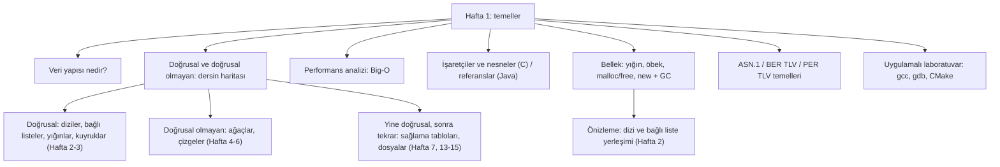

# Hafta 1 — Veri Yapılarına Giriş

*CEN207 Veri Yapıları (eski adıyla CE205) · 2026–2027 Güz · 18.09.2026*

<!-- materials:start -->

<div class="materials" markdown>

[:material-file-pdf-box: Ders notu (PDF)](cen207-week-1-notes.pdf){ .md-button download="cen207-week-1-notes.pdf" }
[:material-file-word-box: Ders notu (DOCX)](cen207-week-1-notes.docx){ .md-button download="cen207-week-1-notes.docx" }
[:material-presentation: Sunum (PDF)](cen207-week-1-slides.pdf){ .md-button download="cen207-week-1-slides.pdf" }
[:material-microsoft-powerpoint: Sunum (PPTX)](cen207-week-1-slides.pptx){ .md-button download="cen207-week-1-slides.pptx" }
[:material-language-html5: Sunum (HTML, çevrimdışı)](cen207-week-1-slides.html){ .md-button download="cen207-week-1-slides.html" }
[:material-folder-zip: Tümünü indir (ZIP)](cen207-week-1-materials.zip){ .md-button download="cen207-week-1-materials.zip" }
[:material-fullscreen: Sunumu tam ekran aç](cen207-week-1-slides.html){ .md-button .md-button--primary target=_blank }

</div>

<div class="deck-frame">
<iframe src="../cen207-week-1-slides.html" title="Hafta 1 — Giriş, Büyük O, İşaretçiler" loading="lazy" allowfullscreen></iframe>
</div>

<p class="deck-hint">Sunumun içine tıklayıp ok tuşlarıyla ilerleyin; tam ekran için sunumun sağ altındaki düğmeyi ya da yukarıdaki "Sunumu tam ekran aç" bağlantısını kullanın.</p>

<!-- materials:end -->

!!! abstract "Bu hafta"
    **Öğrenme hedefleri.** Bu, dönemin ilk haftası; bugün, geri kalan her şeyin üzerine oturacağı temeli kurmakla
    ilgili. Haftanın sonunda şunları yapabileceksiniz: bir **veri yapısının** ne olduğunu ve neden tek bir tür
    olmadığını söylemek; **doğrusal (linear)** bir yapıyı **doğrusal olmayan (non-linear)** bir yapıdan ayırmak ve
    bu dönem göreceğiniz her yapıyı tek bir haritaya yerleştirmek; bir algoritmanın attığı adımları saymak ve
    büyümesini **Big-O** ile anlatmak; C'de bir **işaretçinin (pointer)** ne olduğunu ve Java'da bir **referansın
    (reference)** aynı rolü nasıl oynadığını açıklamak; bellekte **yığın (stack)** ile **öbek (heap)** arasındaki
    farkı çizmek, ve `malloc`/`free` ile Java'nın `new`'i artı çöp toplama (garbage collection) her birinin bu
    konuda ne yaptığını anlatmak; küçük bir kaydı elle **TLV** baytlarına kodlamak — ASN.1'in BER ve PER'inin
    arkasındaki fikrin aynısı; ve uygulamalı bir laboratuvarda **gcc**, **gdb** ve **CMake** ile bir C programını
    derlemek, çalıştırmak ve hata ayıklamak (debug). Bu hedefler, ders izlencesinin **ÖÇ.1** (doğrusal ve doğrusal
    olmayan veri yapılarının tanımlarını, gösterimlerini ve temel işlemlerini açıklama), **ÖÇ.2** (zaman ve alan
    karmaşıklığını Big-O ile analiz etme) ve **ÖÇ.7** (bir probleme en uygun veri yapılarını ve algoritmaları
    seçme) çıktılarıyla eşleşir.

    **Önceden bilmeniz gerekenler.** Bu dersten hiçbir şey — daha ilk hafta. [Ön gereksinimler sayfasında](../prerequisites/index.md)
    listelenen CEN107/CEN108 alt yapısına ihtiyacınız var: çalışan bir C araç zinciri, ve bir döngü ile bir
    fonksiyonu okuyacak kadar C bilgisi.

    **3 saatlik oturum için zaman planı.** Ders planı ve dersin haritası (~15 dk) · veri yapısı nedir, doğrusal ile
    doğrusal olmayan (~25 dk) · performans analizi ve Big-O (~40 dk) · kısa ara · işaretçiler, bellek, yığın ve
    öbek (~50 dk) · ASN.1/TLV temelleri (~25 dk) · uygulamalı C atölyesi laboratuvarı (~25 dk).

## 0. Başlamadan önce

### 0.1 Ders planı ve iletişim

Haftalık planın tamamı, not dağılımı, ders kitapları ve ofis saatleri politikası [izlencededir](../syllabus/syllabus.md);
tüm dönem boyunca kuracağınız — önce C'de, sonra Java'da — dönem projesi [proje rehberinde](../project-guide/index.md)
anlatılır; ve zaten sahip olmanız beklenen araçlar ve alt yapı [ön gereksinimler sayfasında](../prerequisites/index.md)
listelenir. Henüz okumadıysanız, önümüzdeki haftaya kadar üçünü de okuyun. Derste yalnızca özetlere değineceğiz:
**bir proje, iki kontrol noktası** (C'de bir vize kontrolü, Java'da bir final kontrolü), **bu not gibi haftalık
notlar** İngilizce ve Türkçe, ve **iki quiz** (ayrı ödev yok). Eski bir izlence PDF'inde herhangi bir şey derste ya
da bu notlarda söylenenle çelişiyor gibi görünürse sorun — tahmin etmeyin.

### 0.2 Bu haftanın — ve dersin — haritası

Veri yapıları dersi tam olarak iki şeyle ilgilidir: **veriyi bellekte nasıl düzenleriz** ve **bu düzenleme, ihtiyaç
duyduğunuz işlemler için ne kadara mal olur**. Bundan sonraki her hafta veriyi düzenlemenin bir yolunu daha tanıtır
(bağlı listeler, yığınlar ve kuyruklar, ağaçlar, çizgeler, sağlama (hash) tabloları, dosyalar) ve maliyetini bugün
öğreneceğiniz araçla ölçer: Big-O. Bu haftanın kendisi önce dersin tüm haritasını önizler, sonra sonraki her
haftanın hazır bildiğinizi varsaydığı iki temeli — performans analizi, ve bellek (işaretçiler, yığın, öbek) — atar.



"Hafta 1: temeller" altındaki her kutu aşağıda kendi bölümünü alıyor; çoğunun yanında adım adım ilerleyen kısa bir
animasyon, eksiksiz bir C ve Java programı ve işlerin nasıl ters gidebileceğine dair bir not var.

## 1. Veri yapısı nedir?

### 1.1 Başlangıç sorusu

Telefonunuzdaki kişiler uygulaması, on bin isim arasından "Ayşe"yi neredeyse anında bulabilir, her şeyi yeniden
sıralamadan yeni bir kişi ekleyebilir ve yine de istendiğinde herkesi alfabetik sırayla listeleyebilir. Bunların
hiçbiri sihir değil — **isimlerin bellekte nasıl düzenlendiğine** dair bir seçim. Aynı isimleri farklı düzenleyin
(diyelim ki hiç yapı olmadan, eklediğiniz sırayla) ve aynı telefon "Ayşe"yi bulmak için her tek ismi taramak zorunda
kalır. Fark, düzenlemenin *kendisidir*. İşte bu düzenlemeye veri yapısı diyoruz.

### 1.2 Kısa bir tarihçe

**Veri yapısı** terimi, algoritmaların ve maliyetlerinin sistemli incelenmesiyle birlikte 1960'larda bilgisayar
biliminde yaygınlaştı. Donald Knuth'un *The Art of Computer Programming*, Cilt 1: *Fundamental Algorithms* (1968)
kitabı, listeleri, yığınları, ağaçları — işlemleri ve maliyetleriyle yan yana analiz edilen — kendi başlarına
inceleme konusu olarak ele alan ilk büyük ders kitabıydı. Birkaç yıl sonra Barbara Liskov ve Stephen Zilles (1974),
**soyut veri türü (abstract data type)** fikrine — bir yapının *ne* yaptığı, *nasıl* kurulduğundan bağımsız olarak —
bugünkü kesin biçimini verdi; bu dersin sürekli dayandığı bir ayrım (Hafta 3'ün 1.4. bölümünde resmî biçimiyle,
bugünden itibaren de gayriresmî olarak karşınıza çıkacak).

### 1.3 Sezgi

Bir veri yapısını, fiziksel şeyleri saklamak için kullandığınız mobilyalar gibi düşünün: bir dosya dolabı, yazara
göre sıralanmış bir kitaplık, masadaki bir tepsi yığını, bir telefon rehberi. Her biri aynı türden içeriği tutar —
kağıtlar, kitaplar, belgeler, isimler — ama her biri *farklı şeylerde* iyidir. Bir tepsi yığını üste eklemekte ve
üstten almakta hızlıdır, ortadan bir şey bulmakta berbattır. Yazara göre sıralı bir kitaplık aramada hızlıdır,
eklemede yavaştır (sırayı korumak için birçok kitabı kaydırmanız gerekebilir). Tek bir "en iyi" düzenleme yoktur;
yalnızca *ne yapacağınıza göre* en iyi düzenleme vardır.

Bir **veri yapısı**, tam olarak bu fikrin bir bilgisayarın belleği için kesinleştirilmiş hâlidir: veriyi öyle
düzenlemenin bir yolu ki belirli işlemler — bir elemana erişme, bir değeri arama, yeni bir tane ekleme, bir tanesini
silme — yapılabilsin, hem de bilinen, analiz edilebilir bir maliyetle.

### 1.4 Neden tek bir tür yok

Her veri yapısı ödünleşimler (trade-off) yapar. Aşağıdaki tablo, bu dersin tamamında tekrar tekrar karşınıza çıkacak
dört işlemi önizliyor; önümüzdeki haftalarda her belirli yapıyla karşılaştıkça tam maliyetlerini dolduracaksınız.
Şimdilik yalnızca örüntüye dikkat edin: hiçbir şey her konuda hızlı değildir.

| İşlem | Ne anlama gelir | Neden bedava değil |
| --- | --- | --- |
| Erişim (access) | Belirli bir konumdaki değeri okumak | Bazı yerleşimler konumu doğrudan hesaplar (O(1)); bazıları baştan yürümek zorundadır (O(n)) |
| Arama (search) | Bir değerin olup olmadığını/nerede olduğunu bulmak | Sırasız veri tek tek denetlenmelidir; sıralı veri tekrar tekrar ikiye bölünebilir (Hafta 3, aşağıdaki 3. bölümde bunu tam olarak önizler) |
| Ekleme (insert) | Yeni bir değer eklemek | Bazı yerleşimler ekleme noktasından sonraki her şeyi kaydırır; bazıları yalnızca birkaç işaretçiyi yeniden bağlar |
| Silme (delete) | Bir değeri çıkarmak | Eklemeyle aynı ödünleşim, tersinden |

Bir veri yapısı seçmek, bu dört işlemden hangisinin hızlı olması gerektiğini seçmektir; çünkü — bugün somut olarak
ve dönem boyunca göreceğiniz gibi — genellikle aynı yapıda dördünü birden hızlı yapamazsınız.

## 2. Doğrusal ve doğrusal olmayan yapılar: dersin haritası

### 2.1 Başlangıç sorusu

Son çaldığınız beş şarkıyı ve bir şirketin organizasyon şemasını düşünün. İkisi de şeylerin bir koleksiyonu, ama
çizilişleri farklı hissettirir: şarkılar tek bir çizgi oluşturur (1. şarkı, sonra 2., sonra 3., ...), organizasyon
şeması ise dallanır (bir genel müdür, birkaç yardımcısı, her birinin birkaç raporlayanı). Bu fark yalnızca çizimle
mi ilgili, yoksa veri hakkında gerçek, yapısal bir gerçek mi — hangi işlemlerin ucuz ya da pahalı olduğunu
değiştiren bir gerçek?

### 2.2 Tanımlar

Bir yapı **doğrusaldır (linear)** eğer elemanları bir dizi oluşturuyorsa: ilki hariç her elemanın tam olarak bir
önceki elemanı, sonuncusu hariç her elemanın tam olarak bir sonraki elemanı vardır. Her zaman "sırada ne var?"
diye sorabilir ve tek, belirsizliğe yer bırakmayan bir yanıt alabilirsiniz.

Bir yapı **doğrusal değildir (non-linear)** eğer bir elemanın birden fazla "sonraki"si (ya da birden fazla
"önceki"si) olabiliyorsa. Bir ağaç düğümünün birden çok çocuğu olabilir; bir çizge düğümünün (genellikle **köşe
(vertex)** denir) birden çok diğerine bağlantısı olabilir. Artık tek bir "sonraki" yoktur — yapıyı dolaşmak, hangi
dalı izleyeceğinizi *seçmek* demektir.

### 2.3 Bütün ders, bu tek çizgi üzerinde

Bu dönem karşılaşacağınız her yapı bu iki aileden birine girer. Sağlama tabloları ve dosyalar gibi bazıları,
*yuvalarının* nasıl yerleştiği bakımından hâlâ doğrusaldır, ama farklı bir problemi çözerler (konuma göre değil,
anahtara göre hızlı arama) — oraya geldiğimizde bunu tekrar belirteceğiz.

| Aile | Yapı | Ne zaman | Belirleyici ödünleşim |
| --- | --- | --- | --- |
| Doğrusal | Dizi (array) | Hafta 2 | İndeksle O(1) erişim; ortada O(n) ekleme/silme |
| Doğrusal | Bağlı liste (tekli, çiftli, dairesel) | Hafta 2 | O(n) erişim; oraya bir kez ulaştıktan sonra O(1) ekleme/silme |
| Doğrusal | Yığın (stack, LIFO) | Hafta 3 | Yalnızca bir uca dokun; her işlem O(1) |
| Doğrusal | Kuyruk (queue, FIFO) | Hafta 3 | Bir uçtan ekle, diğerinden çıkar; her işlem O(1) |
| Doğrusal olmayan | İkili ağaç (binary tree), yığın (heap) | Hafta 4 | Her düğümün en çok iki çocuğu var; dengeliyken O(log n) işlemler |
| Doğrusal olmayan | Çizge (graph) | Hafta 5–6 | Düğümler herhangi bir sayıda diğerine bağlanır; ağları, haritaları, bağımlılıkları modeller |
| Doğrusal (anahtara göre) | Sağlama tablosu (hash table) | Hafta 7 | Konuma göre değil, anahtara göre ortalama O(1) erişim |
| Doğrusal (diskte) | Sıralı, doğrudan ve indeksli dosyalar | Hafta 13–15 | Aynı ödünleşimler, şimdi bellek erişimi yerine disk G/Ç (I/O) olarak ödeniyor |

0.2. bölümdeki mermaid haritası aynı gruplamayı görsel olarak gösteriyor. Sürekli oraya geri dönün: her hafta bu
tabloya tam olarak bir satır ekler ve her satır tam olarak aynı ölçüyle — birazdan öğreneceğiniz ölçüyle —
değerlendirilir.

!!! warning "Sık yapılan hatalar"
    - "Doğrusal olmayan"ı "düzensiz" sanmak. Bir ağaç ve bir çizge son derece yapılıdır — yalnızca birden fazla
      "sonraki"ye izin verirler, doğrusal yapıların izin vermediği bir şeye.
    - "Sıralı"yı "doğrusal" ile karıştırmak. Sıralı bir dizi doğrusaldır (her elemanın hâlâ tam olarak bir
      sonrakisi vardır); sıralama *değerlerin* bir özelliğidir, doğrusallık ise *şeklin* bir özelliği.
    - Bir sağlama tablosunun ya da bir dosyanın doğrusal yapılar hakkında öğreneceğiniz her şeyin bir istisnası
      olduğunu düşünmek. Onların *yuvaları* doğrusal biçimde yerleşir; yalnızca *erişim örüntüsü* (anahtara göre,
      hesaplanan bir konum üzerinden) yenidir. Bunu Hafta 7'de açıkça göreceksiniz.

??? success "Kendini sına: doğrusal ve doğrusal olmayan"
    **1. Bir tabak yığını doğrusal mı, doğrusal olmayan mı? Neden?**

    Doğrusal: en üstteki hariç her tabağın üstünde tam olarak bir tabak, en alttaki hariç her tabağın altında tam
    olarak bir tabak vardır. Tek, belirsizliğe yer bırakmayan bir "sonraki" vardır.

    **2. Bir aile ağacı doğrusal mı, doğrusal olmayan mı?**

    Doğrusal değil: bir ebeveynin birden çok çocuğu olabilir, yani belirli bir kişiden birden fazla "sonraki"
    vardır.

## 3. Performans analizi: saniyeleri değil, adımları saymak

### 3.1 Başlangıç sorusu

Bir dizide değer arayan bir fonksiyon yazıyorsunuz. Çalışıyor. Peki *hızlı* mı? Onu dizüstü bilgisayarınızda
zamanlamak size bugün, o tek girdi boyutu için, bilgisayarınız hakkında bir şey söyler — farklı bir makine, daha
büyük bir girdi ya da CPU zamanı çalan bir arka plan süreci, algoritma hiç değişmeden saniye sayısını
değiştirebilir. Aslında bilmek istediğimiz **algoritmanın kendisine** ait bir özellik: girdi büyüdükçe yaptığı iş
nasıl büyüyor? Bu sorunun aracı **Big-O**'dur ve bu bölümün geri kalanı onu sıfırdan inşa ediyor.

### 3.2 Kısa bir tarihçe

Bu gösterim bilgisayar bilimden on yıllar öncesine dayanır: Alman matematikçi Paul Bachmann, büyük O gösterimini
1894'te bir fonksiyonun başka bir fonksiyona ne kadar yaklaştığını anlatmak için tanıttı, Edmund Landau da 1900'lerin
başında bunu yaygınlaştırıp inceltti (hâlâ bazen **Landau sembolü** olarak anılır). Bilgisayar bilimi bunu
algoritma maliyetini anlatmak için 1960'lardan itibaren benimsedi; Donald Knuth'un yaygın biçimde okunan 1976
tarihli "Big Omicron and Big Omega and Big Theta" (ACM SIGACT News) makalesi, bu dersin kullandığı tam olarak
O/Ω/Θ sözlüğünü savundu ve standartlaştırılmasına yardımcı oldu.

### 3.3 Sezgi: saniyeleri değil, adımları say

Kronometre yerine, algoritmanın temel iş birimini — genellikle bir karşılaştırma, bir dizi erişimi ya da bir
aritmetik işlem — girdi boyutu `n`'in bir fonksiyonu olarak kaç kez yaptığını sayın. Bu sayı makineye, dile ya da
bilgisayarın bugün ne kadar meşgul olduğuna bağlı değildir; yalnızca algoritmaya ve `n`'e bağlıdır. Aynı on sayı
üzerinde iki arama, bunu hemen somutlaştırıyor.

### 3.4 Doğrusal arama: her kutuyu dene

**Doğrusal arama (linear search)**, dizinin başından başlar ve hedefi bulana ya da elemanlar bitene kadar bir
elemandan sonra diğerine bakar. Veride belirli bir sıra gerektirmez — herhangi bir dizide çalışır.

Animasyonu oynatın: 10 elemanlı bir dizide önce en iyi durumda, sonra sona yakın bir değeri ararken
karşılaştırmaları sayarken izleyin.

<iframe class="dsanim" src="../anim/linear-search.html" title="Linear search: counting comparisons" loading="lazy"></iframe>
<div class="dsanim-baski" markdown>

</div>

=== "C"

    ```c
    /* Week 1 -- Introduction to Data Structures
     * Linear search: scan the array from the front, one comparison at a time.
     * CEN207 Data Structures (CS50-style lecture notes)
     */
    #include <stdio.h>

    int linear_search(const int arr[], int n, int target, int *comparisons) {
        for (int i = 0; i < n; i++) {
            (*comparisons)++;
            if (arr[i] == target)
                return i;
        }
        return -1;
    }

    static void report(const int arr[], int n, int target) {
        int comparisons = 0;
        int index = linear_search(arr, n, target, &comparisons);
        if (index >= 0)
            printf("linear_search(target=%d) -> found at index %d, %d comparison%s\n",
                   target, index, comparisons, comparisons == 1 ? "" : "s");
        else
            printf("linear_search(target=%d) -> not found, %d comparisons\n",
                   target, comparisons);
    }

    int main(void) {
        int arr[] = {4, 8, 15, 16, 23, 27, 31, 38, 42, 50};
        int n = (int) (sizeof(arr) / sizeof(arr[0]));

        printf("array: ");
        for (int i = 0; i < n; i++)
            printf("%d ", arr[i]);
        printf("(n = %d)\n\n", n);

        report(arr, n, 4);    /* best case: first element */
        report(arr, n, 42);   /* near-worst case: second to last element */
        report(arr, n, 50);   /* worst case among hits: last element */
        report(arr, n, 99);   /* worst case: not present at all */

        /* Average case: average the comparison count over every possible target position. */
        long total = 0;
        for (int i = 0; i < n; i++) {
            int comparisons = 0;
            linear_search(arr, n, arr[i], &comparisons);
            total += comparisons;
        }
        printf("\naverage comparisons over all %d positions: %.1f (formula: (n + 1) / 2 = %.1f)\n",
               n, (double) total / n, (n + 1) / 2.0);

        return 0;
    }
    ```

=== "Java"

    ```java
    /* Week 1 -- Introduction to Data Structures
     * Linear search: scan the array from the front, one comparison at a time.
     * CEN207 Data Structures (CS50-style lecture notes)
     */
    public class LinearSearch {
        static int comparisons;

        static int linearSearch(int[] arr, int target) {
            comparisons = 0;
            for (int i = 0; i < arr.length; i++) {
                comparisons++;
                if (arr[i] == target)
                    return i;
            }
            return -1;
        }

        static void report(int[] arr, int target) {
            int index = linearSearch(arr, target);
            if (index >= 0)
                System.out.println("linearSearch(target=" + target + ") -> found at index " + index
                        + ", " + comparisons + " comparison" + (comparisons == 1 ? "" : "s"));
            else
                System.out.println("linearSearch(target=" + target + ") -> not found, "
                        + comparisons + " comparisons");
        }

        public static void main(String[] args) {
            int[] arr = {4, 8, 15, 16, 23, 27, 31, 38, 42, 50};
            int n = arr.length;

            StringBuilder sb = new StringBuilder("array: ");
            for (int v : arr)
                sb.append(v).append(' ');
            System.out.println(sb + "(n = " + n + ")\n");

            report(arr, 4);
            report(arr, 42);
            report(arr, 50);
            report(arr, 99);

            long total = 0;
            for (int v : arr) {
                linearSearch(arr, v);
                total += comparisons;
            }
            System.out.printf("%naverage comparisons over all %d positions: %.1f (formula: (n + 1) / 2 = %.1f)%n",
                    n, (double) total / n, (n + 1) / 2.0);
        }
    }
    ```

??? example "Programın tamamı: `linear_search.c` / `LinearSearch.java`"

    === "C"

        ```c
        /* Week 1 -- Introduction to Data Structures
         * Linear search: scan the array from the front, one comparison at a time.
         * Runs the same normal / hard / edge-case scenarios as the linear-search animation.
         * CEN207 Data Structures (CS50-style lecture notes)
         */
        #include <stdio.h>

        int linear_search(const int arr[], int n, int target, int *comparisons) {
            for (int i = 0; i < n; i++) {
                (*comparisons)++;
                if (arr[i] == target)
                    return i;
            }
            return -1;
        }

        static void print_array(const int arr[], int n) {
            printf("arr:");
            for (int i = 0; i < n; i++)
                printf(" %d", arr[i]);
            printf("  (n = %d)\n", n);
        }

        static void run_scenario(const char *label, const int arr[], int n, int target) {
            printf("-- %s --\n", label);
            print_array(arr, n);
            int comparisons = 0;
            int index = linear_search(arr, n, target, &comparisons);
            if (index >= 0)
                printf("linear_search(target=%d) -> found at index %d, %d comparison%s\n\n",
                       target, index, comparisons, comparisons == 1 ? "" : "s");
            else
                printf("linear_search(target=%d) -> not found, %d comparisons\n\n", target, comparisons);
        }

        int main(void) {
            /* normal: 11 values, target in the middle */
            int normal[] = {4, 8, 15, 16, 23, 27, 31, 38, 42, 50, 61};
            run_scenario("normal: 11 values, target in the middle", normal, 11, 27);

            /* hard: 20 values, duplicate target, first match */
            int hard[] = {12, 47, 3, 88, 25, 61, 9, 34, 77, 15, 52, 6, 41, 18, 63, 99, 5, 29, 99, 71};
            run_scenario("hard: 20 values, duplicate target, first match", hard, 20, 99);

            /* edge: not found -- target is not in the array */
            int notFound[] = {2, 4, 6, 8, 10, 12, 14, 16, 18, 20};
            run_scenario("edge: not found, target is not in the array", notFound, 10, 7);

            /* edge: best case -- target is in the first box (index 0) */
            int firstIndex[] = {5, 13, 21, 34, 42, 55, 67, 78, 89, 91};
            run_scenario("edge: best case, target is in the first box (index 0)", firstIndex, 10, 5);

            /* edge: one-element array */
            int one[] = {42};
            run_scenario("edge: one-element array", one, 1, 42);

            return 0;
        }
        ```

    === "Java"

        ```java
        /* Week 1 -- Introduction to Data Structures
         * Linear search: scan the array from the front, one comparison at a time.
         * Runs the same normal / hard / edge-case scenarios as the linear-search animation.
         * CEN207 Data Structures (CS50-style lecture notes)
         */
        public class LinearSearch {
            static int comparisons;

            static int linearSearch(int[] arr, int target) {
                comparisons = 0;
                for (int i = 0; i < arr.length; i++) {
                    comparisons++;
                    if (arr[i] == target)
                        return i;
                }
                return -1;
            }

            static void printArray(int[] arr) {
                StringBuilder sb = new StringBuilder("arr:");
                for (int v : arr) sb.append(' ').append(v);
                sb.append("  (n = ").append(arr.length).append(')');
                System.out.println(sb);
            }

            static void runScenario(String label, int[] arr, int target) {
                System.out.println("-- " + label + " --");
                printArray(arr);
                int index = linearSearch(arr, target);
                if (index >= 0)
                    System.out.println("linearSearch(target=" + target + ") -> found at index " + index
                            + ", " + comparisons + " comparison" + (comparisons == 1 ? "" : "s"));
                else
                    System.out.println("linearSearch(target=" + target + ") -> not found, "
                            + comparisons + " comparisons");
                System.out.println();
            }

            public static void main(String[] args) {
                // normal: 11 values, target in the middle
                int[] normal = {4, 8, 15, 16, 23, 27, 31, 38, 42, 50, 61};
                runScenario("normal: 11 values, target in the middle", normal, 27);

                // hard: 20 values, duplicate target, first match
                int[] hard = {12, 47, 3, 88, 25, 61, 9, 34, 77, 15, 52, 6, 41, 18, 63, 99, 5, 29, 99, 71};
                runScenario("hard: 20 values, duplicate target, first match", hard, 99);

                // edge: not found -- target is not in the array
                int[] notFound = {2, 4, 6, 8, 10, 12, 14, 16, 18, 20};
                runScenario("edge: not found, target is not in the array", notFound, 7);

                // edge: best case -- target is in the first box (index 0)
                int[] firstIndex = {5, 13, 21, 34, 42, 55, 67, 78, 89, 91};
                runScenario("edge: best case, target is in the first box (index 0)", firstIndex, 5);

                // edge: one-element array
                int[] one = {42};
                runScenario("edge: one-element array", one, 42);
            }
        }
        ```

**Deneyin**

=== "C"

    ```console
    gcc -std=c11 -Wall -Wextra -o /tmp/x linear_search.c && /tmp/x
    ```

    Beklenen çıktı:

    ```text
    -- normal: 11 values, target in the middle --
    arr: 4 8 15 16 23 27 31 38 42 50 61  (n = 11)
    linear_search(target=27) -> found at index 5, 6 comparisons

    -- hard: 20 values, duplicate target, first match --
    arr: 12 47 3 88 25 61 9 34 77 15 52 6 41 18 63 99 5 29 99 71  (n = 20)
    linear_search(target=99) -> found at index 15, 16 comparisons

    -- edge: not found, target is not in the array --
    arr: 2 4 6 8 10 12 14 16 18 20  (n = 10)
    linear_search(target=7) -> not found, 10 comparisons

    -- edge: best case, target is in the first box (index 0) --
    arr: 5 13 21 34 42 55 67 78 89 91  (n = 10)
    linear_search(target=5) -> found at index 0, 1 comparison

    -- edge: one-element array --
    arr: 42  (n = 1)
    linear_search(target=42) -> found at index 0, 1 comparison
    ```

=== "Java"

    ```console
    javac -d /tmp/j LinearSearch.java && java -cp /tmp/j LinearSearch
    ```

    Beklenen çıktı:

    ```text
    -- normal: 11 values, target in the middle --
    arr: 4 8 15 16 23 27 31 38 42 50 61  (n = 11)
    linearSearch(target=27) -> found at index 5, 6 comparisons

    -- hard: 20 values, duplicate target, first match --
    arr: 12 47 3 88 25 61 9 34 77 15 52 6 41 18 63 99 5 29 99 71  (n = 20)
    linearSearch(target=99) -> found at index 15, 16 comparisons

    -- edge: not found, target is not in the array --
    arr: 2 4 6 8 10 12 14 16 18 20  (n = 10)
    linearSearch(target=7) -> not found, 10 comparisons

    -- edge: best case, target is in the first box (index 0) --
    arr: 5 13 21 34 42 55 67 78 89 91  (n = 10)
    linearSearch(target=5) -> found at index 0, 1 comparison

    -- edge: one-element array --
    arr: 42  (n = 1)
    linearSearch(target=42) -> found at index 0, 1 comparison
    ```

On eleman, en fazla on karşılaştırma: dizide bir milyon eleman olsaydı, en kötü durum bir milyon karşılaştırma
olurdu. Maliyet **doğrudan n ile** büyüyor — bu **O(n)**, doğrusal zaman.

### 3.5 İkili arama: her seferinde yarısını ele

Dizi **sıralıysa (sorted)**, çok daha iyisini yapabiliriz. Ortadaki elemana bakın: hedefse işiniz bitti; hedef
ondan küçükse, yalnızca sol yarıda olabilir, o yüzden sağ yarıyı atın (ya da tersi). Kalan yarıda tekrarlayın. Buna
**ikili arama (binary search)** denir.

Animasyonu, doğrusal aramanın az önce 9 karşılaştırma harcadığı aynı dizide ve aynı hedefte (`42`) oynatın.

<iframe class="dsanim" src="../anim/binary-search.html" title="Binary search: halving the range" loading="lazy"></iframe>
<div class="dsanim-baski" markdown>

</div>

=== "C"

    ```c
    /* Week 1 -- Introduction to Data Structures
     * Binary search: repeatedly halve the search range on a SORTED array.
     * CEN207 Data Structures (CS50-style lecture notes)
     */
    #include <stdio.h>

    int binary_search(const int arr[], int n, int target, int *comparisons) {
        int lo = 0, hi = n - 1;
        while (lo <= hi) {
            int mid = lo + (hi - lo) / 2;
            (*comparisons)++;
            if (arr[mid] == target)
                return mid;
            if (arr[mid] < target)
                lo = mid + 1;
            else
                hi = mid - 1;
        }
        return -1;
    }

    static void report(const int arr[], int n, int target) {
        int comparisons = 0;
        int index = binary_search(arr, n, target, &comparisons);
        if (index >= 0)
            printf("binary_search(target=%d) -> found at index %d, %d comparison%s\n",
                   target, index, comparisons, comparisons == 1 ? "" : "s");
        else
            printf("binary_search(target=%d) -> not found, %d comparisons\n",
                   target, comparisons);
    }

    int main(void) {
        int arr[] = {4, 8, 15, 16, 23, 27, 31, 38, 42, 50};
        int n = (int) (sizeof(arr) / sizeof(arr[0]));

        printf("array: ");
        for (int i = 0; i < n; i++)
            printf("%d ", arr[i]);
        printf("(n = %d)\n\n", n);

        report(arr, n, 4);    /* first element: still fast, not "step 1" like linear search */
        report(arr, n, 42);   /* same target as linear_search.c -- compare the comparison counts */
        report(arr, n, 50);   /* last element */
        report(arr, n, 99);   /* not present */

        /* Average case: average the comparison count over every possible target position. */
        long total = 0;
        for (int i = 0; i < n; i++) {
            int comparisons = 0;
            binary_search(arr, n, arr[i], &comparisons);
            total += comparisons;
        }
        printf("\naverage comparisons over all %d positions: %.2f\n", n, (double) total / n);

        return 0;
    }
    ```

=== "Java"

    ```java
    /* Week 1 -- Introduction to Data Structures
     * Binary search: repeatedly halve the search range on a SORTED array.
     * CEN207 Data Structures (CS50-style lecture notes)
     */
    public class BinarySearch {
        static int comparisons;

        static int binarySearch(int[] arr, int target) {
            comparisons = 0;
            int lo = 0, hi = arr.length - 1;
            while (lo <= hi) {
                int mid = lo + (hi - lo) / 2;
                comparisons++;
                if (arr[mid] == target)
                    return mid;
                if (arr[mid] < target)
                    lo = mid + 1;
                else
                    hi = mid - 1;
            }
            return -1;
        }

        static void report(int[] arr, int target) {
            int index = binarySearch(arr, target);
            if (index >= 0)
                System.out.println("binarySearch(target=" + target + ") -> found at index " + index
                        + ", " + comparisons + " comparison" + (comparisons == 1 ? "" : "s"));
            else
                System.out.println("binarySearch(target=" + target + ") -> not found, "
                        + comparisons + " comparisons");
        }

        public static void main(String[] args) {
            int[] arr = {4, 8, 15, 16, 23, 27, 31, 38, 42, 50};
            int n = arr.length;

            StringBuilder sb = new StringBuilder("array: ");
            for (int v : arr)
                sb.append(v).append(' ');
            System.out.println(sb + "(n = " + n + ")\n");

            report(arr, 4);
            report(arr, 42);
            report(arr, 50);
            report(arr, 99);

            long total = 0;
            for (int v : arr) {
                binarySearch(arr, v);
                total += comparisons;
            }
            System.out.printf("%naverage comparisons over all %d positions: %.2f%n", n, (double) total / n);
        }
    }
    ```

??? example "Programın tamamı: `binary_search.c` / `BinarySearch.java`"

    === "C"

        ```c
        /* Week 1 -- Introduction to Data Structures
         * Binary search: repeatedly halve the search range on a SORTED array.
         * Runs the same normal / hard / edge-case scenarios as the binary-search animation.
         * CEN207 Data Structures (CS50-style lecture notes)
         */
        #include <stdio.h>

        int binary_search(const int arr[], int n, int target, int *comparisons) {
            int lo = 0, hi = n - 1;
            while (lo <= hi) {
                int mid = lo + (hi - lo) / 2;
                (*comparisons)++;
                if (arr[mid] == target)
                    return mid;
                if (arr[mid] < target)
                    lo = mid + 1;
                else
                    hi = mid - 1;
            }
            return -1;
        }

        static void print_array(const int arr[], int n) {
            printf("arr:");
            for (int i = 0; i < n; i++)
                printf(" %d", arr[i]);
            printf("  (n = %d)\n", n);
        }

        static void run_scenario(const char *label, const int arr[], int n, int target) {
            printf("-- %s --\n", label);
            print_array(arr, n);
            int comparisons = 0;
            int index = binary_search(arr, n, target, &comparisons);
            if (index >= 0)
                printf("binary_search(target=%d) -> found at index %d, %d comparison%s\n\n",
                       target, index, comparisons, comparisons == 1 ? "" : "s");
            else
                printf("binary_search(target=%d) -> not found, %d comparisons\n\n", target, comparisons);
        }

        int main(void) {
            /* normal: 16 values, target found */
            int normal[] = {3, 7, 11, 15, 19, 23, 29, 34, 41, 47, 53, 60, 68, 75, 83, 90};
            run_scenario("normal: 16 values, target found", normal, 16, 47);

            /* hard: 31 values, not found: lo > hi at the end */
            int hard[] = {2, 6, 10, 14, 18, 22, 26, 30, 34, 38, 42, 46, 50, 54, 58, 62,
                          66, 70, 74, 78, 82, 86, 90, 94, 98, 102, 106, 110, 114, 118, 122};
            run_scenario("hard: 31 values, not found (lo > hi at the end)", hard, 31, 5);

            /* edge: target is smaller than every value */
            int smallerThanAll[] = {10, 20, 30, 40, 50, 60, 70, 80, 90, 100};
            run_scenario("edge: target is smaller than every value", smallerThanAll, 10, 1);

            /* edge: target is larger than every value */
            int largerThanAll[] = {15, 25, 35, 45, 55, 65, 75, 85, 95, 105};
            run_scenario("edge: target is larger than every value", largerThanAll, 10, 999);

            /* edge: searching among duplicate values */
            int duplicates[] = {5, 5, 5, 10, 15, 20, 20, 25, 30, 35};
            run_scenario("edge: searching among duplicate values", duplicates, 10, 20);

            return 0;
        }
        ```

    === "Java"

        ```java
        /* Week 1 -- Introduction to Data Structures
         * Binary search: repeatedly halve the search range on a SORTED array.
         * Runs the same normal / hard / edge-case scenarios as the binary-search animation.
         * CEN207 Data Structures (CS50-style lecture notes)
         */
        public class BinarySearch {
            static int comparisons;

            static int binarySearch(int[] arr, int target) {
                comparisons = 0;
                int lo = 0, hi = arr.length - 1;
                while (lo <= hi) {
                    int mid = lo + (hi - lo) / 2;
                    comparisons++;
                    if (arr[mid] == target)
                        return mid;
                    if (arr[mid] < target)
                        lo = mid + 1;
                    else
                        hi = mid - 1;
                }
                return -1;
            }

            static void printArray(int[] arr) {
                StringBuilder sb = new StringBuilder("arr:");
                for (int v : arr) sb.append(' ').append(v);
                sb.append("  (n = ").append(arr.length).append(')');
                System.out.println(sb);
            }

            static void runScenario(String label, int[] arr, int target) {
                System.out.println("-- " + label + " --");
                printArray(arr);
                int index = binarySearch(arr, target);
                if (index >= 0)
                    System.out.println("binarySearch(target=" + target + ") -> found at index " + index
                            + ", " + comparisons + " comparison" + (comparisons == 1 ? "" : "s"));
                else
                    System.out.println("binarySearch(target=" + target + ") -> not found, "
                            + comparisons + " comparisons");
                System.out.println();
            }

            public static void main(String[] args) {
                // normal: 16 values, target found
                int[] normal = {3, 7, 11, 15, 19, 23, 29, 34, 41, 47, 53, 60, 68, 75, 83, 90};
                runScenario("normal: 16 values, target found", normal, 47);

                // hard: 31 values, not found: lo > hi at the end
                int[] hard = {2, 6, 10, 14, 18, 22, 26, 30, 34, 38, 42, 46, 50, 54, 58, 62,
                              66, 70, 74, 78, 82, 86, 90, 94, 98, 102, 106, 110, 114, 118, 122};
                runScenario("hard: 31 values, not found (lo > hi at the end)", hard, 5);

                // edge: target is smaller than every value
                int[] smallerThanAll = {10, 20, 30, 40, 50, 60, 70, 80, 90, 100};
                runScenario("edge: target is smaller than every value", smallerThanAll, 1);

                // edge: target is larger than every value
                int[] largerThanAll = {15, 25, 35, 45, 55, 65, 75, 85, 95, 105};
                runScenario("edge: target is larger than every value", largerThanAll, 999);

                // edge: searching among duplicate values
                int[] duplicates = {5, 5, 5, 10, 15, 20, 20, 25, 30, 35};
                runScenario("edge: searching among duplicate values", duplicates, 20);
            }
        }
        ```

**Deneyin**

=== "C"

    ```console
    gcc -std=c11 -Wall -Wextra -o /tmp/x binary_search.c && /tmp/x
    ```

    Beklenen çıktı:

    ```text
    -- normal: 16 values, target found --
    arr: 3 7 11 15 19 23 29 34 41 47 53 60 68 75 83 90  (n = 16)
    binary_search(target=47) -> found at index 9, 3 comparisons

    -- hard: 31 values, not found (lo > hi at the end) --
    arr: 2 6 10 14 18 22 26 30 34 38 42 46 50 54 58 62 66 70 74 78 82 86 90 94 98 102 106 110 114 118 122  (n = 31)
    binary_search(target=5) -> not found, 5 comparisons

    -- edge: target is smaller than every value --
    arr: 10 20 30 40 50 60 70 80 90 100  (n = 10)
    binary_search(target=1) -> not found, 3 comparisons

    -- edge: target is larger than every value --
    arr: 15 25 35 45 55 65 75 85 95 105  (n = 10)
    binary_search(target=999) -> not found, 4 comparisons

    -- edge: searching among duplicate values --
    arr: 5 5 5 10 15 20 20 25 30 35  (n = 10)
    binary_search(target=20) -> found at index 5, 3 comparisons
    ```

=== "Java"

    ```console
    javac -d /tmp/j BinarySearch.java && java -cp /tmp/j BinarySearch
    ```

    Beklenen çıktı:

    ```text
    -- normal: 16 values, target found --
    arr: 3 7 11 15 19 23 29 34 41 47 53 60 68 75 83 90  (n = 16)
    binarySearch(target=47) -> found at index 9, 3 comparisons

    -- hard: 31 values, not found (lo > hi at the end) --
    arr: 2 6 10 14 18 22 26 30 34 38 42 46 50 54 58 62 66 70 74 78 82 86 90 94 98 102 106 110 114 118 122  (n = 31)
    binarySearch(target=5) -> not found, 5 comparisons

    -- edge: target is smaller than every value --
    arr: 10 20 30 40 50 60 70 80 90 100  (n = 10)
    binarySearch(target=1) -> not found, 3 comparisons

    -- edge: target is larger than every value --
    arr: 15 25 35 45 55 65 75 85 95 105  (n = 10)
    binarySearch(target=999) -> not found, 4 comparisons

    -- edge: searching among duplicate values --
    arr: 5 5 5 10 15 20 20 25 30 35  (n = 10)
    binarySearch(target=20) -> found at index 5, 3 comparisons
    ```

Doğrusal aramaya 9 karşılaştırmaya mal olan aynı `42`, burada yalnızca 3 karşılaştırmada bulundu. Her karşılaştırma
kalanın yarısını atıyor, o yüzden gereken karşılaştırma sayısı, `n`'i 1'e inene kadar kaç kez ikiye bölebildiğiniz —
tam olarak `log₂ n`. Bu **O(log n)**, logaritmik zaman. Ödünleşim: ikili arama önce dizinin sıralı olmasını ister,
sıralamanın kendisi de tek bir aramadan daha pahalıdır (Hafta 9 sıralamayı derinlemesine ele alır).

### 3.6 Büyüme yarışı: eğrinin şeklinin neden önemli olduğu

O(n) ve O(log n), çok daha büyük bir ölçeğin iki noktası. Üç fonksiyonu, `n` tekrar tekrar ikiye katlandıkça
yarıştırın: düz `n`, `n·log₂n` (en iyi sıralama algoritmalarının tipik büyümesi) ve `n²` (en basit olanların, ve
genel olarak iç içe döngülerin tipik büyümesi).

<iframe class="dsanim" src="../anim/growth-race.html" title="The growth race: n, n log n, n squared" loading="lazy"></iframe>
<div class="dsanim-baski" markdown>

</div>

Aynı üç fonksiyon, animasyondaki küçük ikiye katlama adımları yerine gerçekçi boyutlar için hesaplanmış hâliyle:

=== "C"

    ```c
    /* Week 1 -- Introduction to Data Structures
     * A small table that makes the growth of n, n*log2(n) and n^2 concrete.
     * CEN207 Data Structures (CS50-style lecture notes)
     */
    #include <math.h>
    #include <stdio.h>

    int main(void) {
        long ns[] = {10, 100, 1000, 10000, 100000};
        int count = (int) (sizeof(ns) / sizeof(ns[0]));

        printf("%10s %16s %18s\n", "n", "n*log2(n)", "n^2");
        for (int i = 0; i < count; i++) {
            long n = ns[i];
            double nlogn = (double) n * log2((double) n);
            double nsq = (double) n * (double) n;
            printf("%10ld %16.0f %18.0f\n", n, nlogn, nsq);
        }

        return 0;
    }
    ```

=== "Java"

    ```java
    /* Week 1 -- Introduction to Data Structures
     * A small table that makes the growth of n, n*log2(n) and n^2 concrete.
     * CEN207 Data Structures (CS50-style lecture notes)
     */
    public class GrowthTable {
        public static void main(String[] args) {
            long[] ns = {10, 100, 1000, 10000, 100000};

            System.out.printf("%10s %16s %18s%n", "n", "n*log2(n)", "n^2");
            for (long n : ns) {
                double nlogn = n * (Math.log(n) / Math.log(2));
                double nsq = (double) n * (double) n;
                System.out.printf("%10d %16.0f %18.0f%n", n, nlogn, nsq);
            }
        }
    }
    ```

??? example "Programın tamamı: `growth_table.c` / `GrowthTable.java`"

    === "C"

        ```c
        /* Week 1 -- Introduction to Data Structures
         * The growth race: for a list of n values, print log2(n), n, n*log2(n), n^2 and 2^n side by side.
         * 2^n is computed EXACTLY, as a decimal digit string built by repeated doubling (no library big-integer
         * type in C) so it can be compared byte for byte with Java's BigInteger version.
         * Runs the same normal / edge-case scenarios as the growth-race animation.
         * CEN207 Data Structures (CS50-style lecture notes)
         */
        #include <math.h>
        #include <stdio.h>
        #include <string.h>

        #define MAX_DIGITS 2000

        /* out[] holds the decimal digits of 2^n, most significant digit first, NUL-terminated.
         * Doubling a decimal number is: multiply every digit by 2, right to left, carrying into the next digit. */
        static void pow2_decimal(int n, char *out) {
            char digits[MAX_DIGITS];
            int len = 1;
            digits[0] = 1;   /* start at 2^0 = 1 */
            for (int step = 0; step < n; step++) {
                int carry = 0;
                for (int i = 0; i < len; i++) {
                    int v = digits[i] * 2 + carry;
                    digits[i] = (char) (v % 10);
                    carry = v / 10;
                }
                if (carry) {
                    digits[len] = (char) carry;
                    len++;
                }
            }
            for (int i = 0; i < len; i++)
                out[i] = (char) ('0' + digits[len - 1 - i]);
            out[len] = '\0';
        }

        static void print_row(long n) {
            double log2n = round(log2((double) n));
            double nlogn = round((double) n * log2((double) n));
            long nsq = n * n;
            char pow2n[MAX_DIGITS];
            pow2_decimal((int) n, pow2n);
            printf("n=%-6ld log2(n)=%-4.0f n*log2(n)=%-8.0f n^2=%-9ld 2^n=%s\n", n, log2n, nlogn, nsq, pow2n);
        }

        static void run_scenario(const char *label, const long ns[], int count) {
            printf("-- %s --\n", label);
            for (int i = 0; i < count; i++)
                print_row(ns[i]);
            printf("\n");
        }

        int main(void) {
            /* normal: doubling, 1 -> 512 */
            long normal[] = {1, 2, 4, 8, 16, 32, 64, 128, 256, 512};
            run_scenario("normal: doubling, 1 -> 512", normal, 10);

            /* edge: a single value, n = 1 */
            long single[] = {1};
            run_scenario("edge: a single value, n = 1", single, 1);

            /* edge: an increasing sequence that is not a power of two */
            long nonPower[] = {1, 3, 5, 9, 14, 20, 27, 35, 44, 54};
            run_scenario("edge: an increasing sequence that is not a power of two", nonPower, 10);

            return 0;
        }
        ```

    === "Java"

        ```java
        /* Week 1 -- Introduction to Data Structures
         * The growth race: for a list of n values, print log2(n), n, n*log2(n), n^2 and 2^n side by side.
         * 2^n uses java.math.BigInteger, which gives EXACT arbitrary-precision integers out of the box --
         * unlike C, which has no built-in big-integer type (see growth_table.c's hand-rolled decimal doubling).
         * Runs the same normal / edge-case scenarios as the growth-race animation.
         * CEN207 Data Structures (CS50-style lecture notes)
         */
        import java.math.BigInteger;

        public class GrowthTable {
            static void printRow(long n) {
                double log2n = Math.round(Math.log(n) / Math.log(2));
                double nlogn = Math.round(n * (Math.log(n) / Math.log(2)));
                long nsq = n * n;
                BigInteger pow2n = BigInteger.ONE.shiftLeft((int) n);
                System.out.printf("n=%-6d log2(n)=%-4.0f n*log2(n)=%-8.0f n^2=%-9d 2^n=%s%n",
                        n, log2n, nlogn, nsq, pow2n.toString());
            }

            static void runScenario(String label, long[] ns) {
                System.out.println("-- " + label + " --");
                for (long n : ns) printRow(n);
                System.out.println();
            }

            public static void main(String[] args) {
                // normal: doubling, 1 -> 512
                long[] normal = {1, 2, 4, 8, 16, 32, 64, 128, 256, 512};
                runScenario("normal: doubling, 1 -> 512", normal);

                // edge: a single value, n = 1
                long[] single = {1};
                runScenario("edge: a single value, n = 1", single);

                // edge: an increasing sequence that is not a power of two
                long[] nonPower = {1, 3, 5, 9, 14, 20, 27, 35, 44, 54};
                runScenario("edge: an increasing sequence that is not a power of two", nonPower);
            }
        }
        ```

**Deneyin**

=== "C"

    ```console
    gcc -std=c11 -Wall -Wextra -o /tmp/x growth_table.c && /tmp/x
    ```

    Beklenen çıktı:

    ```text
    -- normal: doubling, 1 -> 512 --
    n=1      log2(n)=0    n*log2(n)=0        n^2=1         2^n=2
    n=2      log2(n)=1    n*log2(n)=2        n^2=4         2^n=4
    n=4      log2(n)=2    n*log2(n)=8        n^2=16        2^n=16
    n=8      log2(n)=3    n*log2(n)=24       n^2=64        2^n=256
    n=16     log2(n)=4    n*log2(n)=64       n^2=256       2^n=65536
    n=32     log2(n)=5    n*log2(n)=160      n^2=1024      2^n=4294967296
    n=64     log2(n)=6    n*log2(n)=384      n^2=4096      2^n=18446744073709551616
    n=128    log2(n)=7    n*log2(n)=896      n^2=16384     2^n=340282366920938463463374607431768211456
    n=256    log2(n)=8    n*log2(n)=2048     n^2=65536     2^n=115792089237316195423570985008687907853269984665640564039457584007913129639936
    n=512    log2(n)=9    n*log2(n)=4608     n^2=262144    2^n=13407807929942597099574024998205846127479365820592393377723561443721764030073546976801874298166903427690031858186486050853753882811946569946433649006084096

    -- edge: a single value, n = 1 --
    n=1      log2(n)=0    n*log2(n)=0        n^2=1         2^n=2

    -- edge: an increasing sequence that is not a power of two --
    n=1      log2(n)=0    n*log2(n)=0        n^2=1         2^n=2
    n=3      log2(n)=2    n*log2(n)=5        n^2=9         2^n=8
    n=5      log2(n)=2    n*log2(n)=12       n^2=25        2^n=32
    n=9      log2(n)=3    n*log2(n)=29       n^2=81        2^n=512
    n=14     log2(n)=4    n*log2(n)=53       n^2=196       2^n=16384
    n=20     log2(n)=4    n*log2(n)=86       n^2=400       2^n=1048576
    n=27     log2(n)=5    n*log2(n)=128      n^2=729       2^n=134217728
    n=35     log2(n)=5    n*log2(n)=180      n^2=1225      2^n=34359738368
    n=44     log2(n)=5    n*log2(n)=240      n^2=1936      2^n=17592186044416
    n=54     log2(n)=6    n*log2(n)=311      n^2=2916      2^n=18014398509481984
    ```

=== "Java"

    ```console
    javac -d /tmp/j GrowthTable.java && java -cp /tmp/j GrowthTable
    ```

    Beklenen çıktı:

    ```text
    -- normal: doubling, 1 -> 512 --
    n=1      log2(n)=0    n*log2(n)=0        n^2=1         2^n=2
    n=2      log2(n)=1    n*log2(n)=2        n^2=4         2^n=4
    n=4      log2(n)=2    n*log2(n)=8        n^2=16        2^n=16
    n=8      log2(n)=3    n*log2(n)=24       n^2=64        2^n=256
    n=16     log2(n)=4    n*log2(n)=64       n^2=256       2^n=65536
    n=32     log2(n)=5    n*log2(n)=160      n^2=1024      2^n=4294967296
    n=64     log2(n)=6    n*log2(n)=384      n^2=4096      2^n=18446744073709551616
    n=128    log2(n)=7    n*log2(n)=896      n^2=16384     2^n=340282366920938463463374607431768211456
    n=256    log2(n)=8    n*log2(n)=2048     n^2=65536     2^n=115792089237316195423570985008687907853269984665640564039457584007913129639936
    n=512    log2(n)=9    n*log2(n)=4608     n^2=262144    2^n=13407807929942597099574024998205846127479365820592393377723561443721764030073546976801874298166903427690031858186486050853753882811946569946433649006084096

    -- edge: a single value, n = 1 --
    n=1      log2(n)=0    n*log2(n)=0        n^2=1         2^n=2

    -- edge: an increasing sequence that is not a power of two --
    n=1      log2(n)=0    n*log2(n)=0        n^2=1         2^n=2
    n=3      log2(n)=2    n*log2(n)=5        n^2=9         2^n=8
    n=5      log2(n)=2    n*log2(n)=12       n^2=25        2^n=32
    n=9      log2(n)=3    n*log2(n)=29       n^2=81        2^n=512
    n=14     log2(n)=4    n*log2(n)=53       n^2=196       2^n=16384
    n=20     log2(n)=4    n*log2(n)=86       n^2=400       2^n=1048576
    n=27     log2(n)=5    n*log2(n)=128      n^2=729       2^n=134217728
    n=35     log2(n)=5    n*log2(n)=180      n^2=1225      2^n=34359738368
    n=44     log2(n)=5    n*log2(n)=240      n^2=1936      2^n=17592186044416
    n=54     log2(n)=6    n*log2(n)=311      n^2=2916      2^n=18014398509481984
    ```

`n = 100000`'de `n·log₂n` iki milyonun altında, ama `n²` on **milyar** — 6.000 kattan fazla büyük. Bir O(n²)
algoritması ile bir O(n log n) algoritması, 100 elemanlık bir oyuncak girdide ikisi de anında görünebilir ve
100.000'de tamamen farklı davranabilir. Big-O'nun önemli olmasının tüm sebebi bu: henüz test etmediğiniz
boyutlarda ne olacağını önceden söyler.

### 3.7 Big-O, kesin olarak

**Big-O**, sabit çarpanları ve daha düşük dereceli terimleri göz ardı ederek, bir algoritmanın maliyetinin `n`
büyüdükçe nasıl büyüdüğüne dair bir **üst sınır** anlatır. Biçimsel olarak, `f(n)`'nin `O(g(n))` olması, öyle
sabitler `c > 0` ve `n₀` var demektir ki tüm `n ≥ n₀` için `f(n) ≤ c · g(n)` — sade dille, *belirli bir noktadan
sonra, `f` asla `g`'nin sabit bir katından daha hızlı büyümez*. Pratikte `c` ve `n₀`'ı nadiren hesaplarsınız;
adımları sayar, sabitleri ve küçük terimleri atar, baskın olanı okursunuz:

| Sayılan adımlar | Baskın terim | Big-O |
| --- | --- | --- |
| `3n + 7` | `n` | O(n) |
| `n² + 2n + 1` | `n²` | O(n²) |
| `2·log₂n + 5` | `log n` | O(log n) |
| `100` (sabit, `n` ne olursa olsun) | sabit | O(1) |

En hızlı büyüyenden en yavaş büyüyene, bu dönem karşılaşacağınız dereceler şunlar:
`O(1) < O(log n) < O(n) < O(n log n) < O(n²) < O(2ⁿ)`. İlk üçüyle bugün zaten karşılaştınız (Hafta 1'in kendi
işaretçi aritmetiğinden sabit zamanlı dizi erişimi, O(log n) ikili arama, O(n) doğrusal arama); `O(n log n)`,
Hafta 9'daki iyi sıralama algoritmalarıyla gelir, `O(2ⁿ)` ise Hafta 3'teki Hanoi Kulesi ile.

### 3.8 En iyi, en kötü ve ortalama durum

Aynı algoritma, girdinin *hangisi* olduğuna bağlı olarak — sadece girdinin boyutuna değil — farklı sayıda adım
atabilir. Doğrusal arama bunu zaten somutlaştırdı:

- **En iyi durum (best case)**: hedef, denetlenen ilk eleman — `n`'den bağımsız olarak 1 karşılaştırma.
- **En kötü durum (worst case)**: hedef, denetlenen son eleman, ya da hiç yok — `n` karşılaştırma.
- **Ortalama durum (average case)**: hedefin olabileceği her konum üzerinden ortalanınca,
  `(1 + 2 + ... + n) / n = (n + 1) / 2` karşılaştırma — yukarıdaki program bunu doğrudan hesapladı ve `5.5`
  yazdırdı, formülle tam olarak eşleşiyor.

İnsanlar bir algoritmanın "O(n) olduğunu" niteleme yapmadan söylediğinde genellikle onun **en kötü durumunu**
kastederler — girdiyi denetleyemediğinizde en çok işe yarayan garanti. İkili aramanın en kötü durumu O(log n); en
iyi durumu (hedef tam olarak denetlenen ilk `mid`'de) O(1), tıpkı doğrusal aramanın en iyi durumu gibi — en iyi
durumlar algoritmalar arasında birbirine benzeme eğilimindedir, bu da en kötü durumun karşılaştırmak için neden
daha işe yarar olduğunu tam olarak açıklar.

### 3.9 Alan karmaşıklığı

Big-O adımları sayarak **zamanı** ölçer; tıpa tıp aynı fikir, **alan karmaşıklığı (space complexity)**, girdisinin
ötesinde bir algoritmanın ihtiyaç duyduğu ek depoyu sayarak **belleği** ölçer. Yukarıdaki `linear_search` ve
`binary_search`'ün ikisi de, dizi ne kadar büyük olursa olsun bir avuç sabit boyutlu yerel değişken kullanır
(`i`, ya da `lo`/`hi`/`mid`) — bu **O(1) ek alan**. Buna karşılık ikili aramanın özyinelemeli bir sürümü, her
çağrıda bir yığın çerçevesi iter (aşağıdaki 5. bölüm bir yığın çerçevesinin tam olarak ne olduğunu çizer) — `O(log n)`
çağrı derinliği, dolayısıyla `O(log n)` ek alan, aynı sayıda karşılaştırma yapsa bile. Bu ödünleşimi Hafta 3'te
özyineleme ve çağrı yığınıyla açıkça tekrar göreceksiniz.

!!! warning "Sık yapılan hatalar"
    - Big-O'yu *koddan* değil, *adımlardan* okumak gerekirken koddan okumak. Tek bir satır bir döngüyü
      gizleyebilir (`arr.contains(x)`, başka bir O(n) döngünün *içinde* O(n) demektir, toplamda O(n²)) — her zaman
      satırın kaç karakter olduğunu değil, gerçekte ne yaptığını sorun.
    - İkili aramanın *sıralı* bir girdi gerektirdiğini unutmak. Sırasız veride ikili arama çalıştırmak yalnızca
      yavaş değil, yanlış sonuç verir — ikiye bölme mantığı sıra varsayar.
    - "O(1)"i "anında" ya da "bedava" ile karıştırmak. O(1), maliyetin `n` ile büyümediği anlamına gelir; yine de
      yavaş bir sabit olabilir (bir ağ çağrısından değer okumak `n` cinsinden O(1)'dir ve yine de bu derste
      karşılaşacağınız herhangi bir `n` için bellek içi bir O(log n) aramadan daha yavaştır).
    - Yalnızca en kötü durumu belirtip ortalama durumun pratikte daha önemli olabileceğini göz ardı etmek (ya da
      tersi) — *hangi* durumu kastettiğinizi belirtin.

??? success "Kendini sına: performans analizi"
    **1. Bir algoritma tam olarak `5n + 20` temel işlem yapıyor. Big-O'su nedir?**

    O(n). Sabit çarpanı (5) ve toplamsal sabiti (20) atın; yalnızca en hızlı büyüyen terim, `n`, hayatta kalır.

    **2. İkili arama, bir dizide kullanıldığı gibi neden doğrudan bağlı bir listede kullanılamaz?**

    İkili arama, indeksle ortadaki elemana O(1) erişim gerektirir. Bir dizi bunu doğrudan verir (`arr[mid]`); bir
    bağlı liste (Hafta 2), `mid` konumuna ulaşmak için düğüm düğüm yürünmelidir, ki bu zaten O(n)'dir — bu tek
    adım, ikili aramanın tüm avantajını yok eder.

    **3. Niteleme yapılmadan söylenen "bir algoritmanın Big-O'su" genellikle hangi duruma — en iyi, en kötü, ya da
    ortalama — işaret eder?**

    En kötü duruma: garanti edilen üst sınır, tam olarak hangi girdiyi alırsanız alın geçerli olduğu için işe
    yarar.

## 4. Veri ve değişkenler için işaretçiler ve nesneler

### 4.1 Başlangıç sorusu

Çağıranda iki değişkenin değerlerini takas eden bir `swap(a, b)` fonksiyonu yazın. Birçok dilde bu, ilk bakışta
şaşırtıcı biçimde imkânsızdır — fonksiyon `a` ve `b`'nin yalnızca *kopyalarını* görür, kopyaları takas etmek
özgünlere hiçbir şey yapmaz. Çağıranın değişkenlerine gerçekten geri ulaşmak için fonksiyonun her değişkenin
*değerine* değil, *konumuna* ihtiyacı var. Bu konum bir **işaretçidir (pointer)**.

### 4.2 Kısa bir tarihçe

Bir değişkenin başka bir değişkenin adresini tuttuğu fikri, makine diline ve ilk sistem dillerine kadar uzanır:
BCPL'de (Martin Richards, 1966) ve B'de (Ken Thompson, 1969) adres-alma ve dereferanslama işlemleri zaten vardı,
ve Dennis Ritchie'nin C'si (1972) — BCPL ve B'nin doğrudan torunu — işaretçiyi, özellikle `struct` işaretçilerini,
dilin nasıl kullanıldığının merkezine koydu. Java (James Gosling ve diğerleri, ilk sürüm 1995), dilden ham
işaretçileri ve işaretçi aritmetiğini bilinçli olarak çıkardı, yerine **referanslar (reference)** koydu: hâlâ iki
değişken aynı nesneyi adlandırabilir, ama artık keyfi bir adres hesaplayamaz ya da bir işaretçiyi bir dizinin
sonundan öteye adımlayamazsınız. Aşağıdaki 4.6. bölüm ve animasyonlar bu takasın tam olarak neyi kazandırıp neye
mal olduğunu gösteriyor.

### 4.3 Sezgi: bellek, numaralı posta kutuları olarak

Belleği, numaralı posta kutularından oluşan uzun bir cadde olarak hayal edin. Bir değişken bir posta kutusudur:
bir adresi (numarası) ve içeriği (içindeki değer) vardır. `int x = 3;`, 3'ü bir posta kutusuna koyar — diyelim ki
1000 numaralı kutuya. `&x`, "x'in posta kutusu numarası nedir?" diye sorar ve `1000` cevabını alır. Bir
**işaretçi (pointer)**, *içeriği bizzat bir posta kutusu numarası olan* bir posta kutusudur — bir işaretçi
değişkeni `p`, `1000`'i tutabilir, yani "1000 numaralı kutuya bak" demektir. Bir işaretçi üzerinden okumak
(**dereferanslamak (dereference)**, `*p` olarak yazılır) şu demektir: `p`'de saklı posta kutusu numarasına git,
oradakini oku (ya da yaz).

### 4.4 İşaretçi işlemleri

| İşlem | Sözdizimi | Ne yapar | Karmaşıklık |
| --- | --- | --- | --- |
| Adres-alma (address-of) | `&x` | `x` değişkeninin adresini üretir | O(1) |
| Bir işaretçi bildirme | `int *p;` | `p`'yi bir `int`'in adresini tutacak bir değişken olarak bildirir | O(1) |
| Bir adres atama | `p = &x;` | x'in adresini p'ye kaydeder; p artık x'i "gösterir" | O(1) |
| Dereferanslama (okuma) | `*p` | p'yi hedefine kadar izler ve oradaki değeri okur | O(1) |
| Dereferanslama (yazma) | `*p = v;` | p'yi hedefine kadar izler ve oraya `v` yazar | O(1) |

Bunların hepsi O(1)'dir: bir işaretçiyi izlemek her zaman tek bir sıçramadır, asla bir arama değil — işaretçilerin
(ve Hafta 2'de bunlardan kurulan bağlı yapıların) verimli olmasının tam sebebi budur.

### 4.5 Bir değişken, adresi ve bir işaretçi

<iframe class="dsanim" src="../anim/pointer-basics.html" title="A variable, its address, and a pointer" loading="lazy"></iframe>
<div class="dsanim-baski" markdown>

</div>

=== "C"

    ```c
    /* Week 1 -- Introduction to Data Structures
     * A variable, its address, and a pointer that stores that address.
     * CEN207 Data Structures (CS50-style lecture notes)
     */
    #include <stdio.h>

    int main(void) {
        int x = 3;
        int *p = &x;

        printf("x = %d, stored at address %p\n", x, (void *) &x);
        printf("p = %p (p holds the address of x)\n", (void *) p);
        printf("*p = %d (dereferencing p reads the value at that address)\n", *p);

        *p = 5;
        printf("after *p = 5: x = %d\n", x);

        return 0;
    }
    ```

=== "Java"

    ```java
    /* Week 1 -- Introduction to Data Structures
     * Java has no raw pointers, but arrays and objects are REFERENCE types:
     * a variable holds a reference to the data, not the data itself.
     * CEN207 Data Structures (CS50-style lecture notes)
     */
    public class ReferenceBasics {
        public static void main(String[] args) {
            int x = 3;                 // a plain int: the VALUE 3 is stored directly
            int[] box = {3};           // an array: box is a REFERENCE to a one-element block

            System.out.println("x = " + x);
            System.out.println("box[0] = " + box[0] + " (box holds a reference to the array)");

            int[] alias = box;         // alias refers to the SAME array as box, not a copy
            alias[0] = 5;               // writing through alias is visible through box too
            System.out.println("after alias[0] = 5: box[0] = " + box[0]);

            int y = x;                  // y is an independent COPY of x's value
            y = 99;
            System.out.println("after y = 99: x = " + x + " (unchanged, x and y are independent)");
        }
    }
    ```

**Deneyin**

=== "C"

    ```console
    gcc -std=c11 -Wall -Wextra -o /tmp/x pointer_basics.c && /tmp/x
    ```

    Beklenen çıktı (sizin adresleriniz farklı olacaktır — önemli olan örüntü, kesin sayılar değil):

    ```text
    x = 3, stored at address 000000F7F05FFA34
    p = 000000F7F05FFA34 (p holds the address of x)
    *p = 3 (dereferencing p reads the value at that address)
    after *p = 5: x = 5
    ```

=== "Java"

    ```console
    javac -d /tmp/j ReferenceBasics.java && java -cp /tmp/j ReferenceBasics
    ```

    Beklenen çıktı:

    ```text
    x = 3
    box[0] = 3 (box holds a reference to the array)
    after alias[0] = 5: box[0] = 5
    after y = 99: x = 3 (unchanged, x and y are independent)
    ```

Java programının iki yarısının aynı sözdizimiyle karşıt hikâyeler anlattığına dikkat edin: `int[] alias = box;` ile
`int y = x;`. `box` bir dizi, yani bir referans türü, dolayısıyla `alias`, *aynı* dizinin ikinci bir adı olur —
tıpkı C'de `p`'nin `x`'i göstermesi gibi. Ama `x` bir ilkel (primitive) `int`, bir değer türü, o yüzden `y = x;`
*değeri* kopyalar — `y`'yi değiştirmek `x`'e asla dokunmaz. C'nin işaretçileri bu ayrımı açık ve denetlenebilir
kılar (`int x` ile `int *p`); Java aynı ayrımı türde örtük tutar (`int` ile `int[]`/nesne türleri) ve birini
diğerine asla çeviremezsiniz.

### 4.6 Bir struct'a işaretçi, ve `->`

Bir `struct`, ilgili alanları tek bir değerde gruplar; bir struct'a işaretçi, o işaretçi üzerinden *kopyasına*
değil *özgününe* ulaşmanızı — ve onu değiştirmenizi — sağlar. `(*p).field` yazmak (önce dereferansla, sonra bir
alana eriş) o kadar yaygındır ki C buna bir kısayol verir: `p->field`.

<iframe class="dsanim" src="../anim/struct-pointer.html" title="A pointer to a struct, and ->" loading="lazy"></iframe>
<div class="dsanim-baski" markdown>

</div>

=== "C"

    ```c
    /* Week 1 -- Introduction to Data Structures
     * A pointer to a struct, and the -> shorthand for (*p).field.
     * CEN207 Data Structures (CS50-style lecture notes)
     */
    #include <stdio.h>

    typedef struct Point {
        int x;
        int y;
    } Point;

    int main(void) {
        Point a = {3, 4};
        Point *p = &a;

        printf("a = (%d, %d)\n", a.x, a.y);
        printf("(*p).x = %d, p->x = %d (same value, -> is shorthand)\n", (*p).x, p->x);

        p->x = 10;
        printf("after p->x = 10: a = (%d, %d)\n", a.x, a.y);

        return 0;
    }
    ```

=== "Java"

    ```java
    /* Week 1 -- Introduction to Data Structures
     * A reference to an object, and the '.' access that plays the role of C's '->'.
     * CEN207 Data Structures (CS50-style lecture notes)
     */
    public class PointRef {
        static class Point {
            int x;
            int y;
            Point(int x, int y) { this.x = x; this.y = y; }
        }

        public static void main(String[] args) {
            Point a = new Point(3, 4);
            Point p = a;                // p is another reference to the SAME object as a

            System.out.println("a = (" + a.x + ", " + a.y + ")");
            System.out.println("p.x = " + p.x + " (same object as a, reached through p)");

            p.x = 10;
            System.out.println("after p.x = 10: a = (" + a.x + ", " + a.y + ")");
        }
    }
    ```

**Deneyin**

=== "C"

    ```console
    gcc -std=c11 -Wall -Wextra -o /tmp/x struct_pointer.c && /tmp/x
    ```

    Beklenen çıktı:

    ```text
    a = (3, 4)
    (*p).x = 3, p->x = 3 (same value, -> is shorthand)
    after p->x = 10: a = (10, 4)
    ```

=== "Java"

    ```console
    javac -d /tmp/j PointRef.java && java -cp /tmp/j PointRef
    ```

    Beklenen çıktı:

    ```text
    a = (3, 4)
    p.x = 3 (same object as a, reached through p)
    after p.x = 10: a = (10, 4)
    ```

Java'da `->` hiç yoktur ve olması da gerekmez: her nesne değişkeni zaten bir referanstır, o yüzden `.` her zaman
"referansı izle, sonra alana eriş" demektir — yazacak ayrı bir "önce dereferansla" adımı yoktur.

!!! warning "Sık yapılan hatalar"
    - `int *p;` bildirip hiçbir şeyi göstermeden önce kullanmak. İlklendirilmemiş bir işaretçi çöp değer tutar —
      bir **başıboş işaretçi (wild pointer)** — ve onu dereferanslamak tanımsız davranıştır; bir işaretçiyi
      kullanmadan önce her zaman ilklendirin (yalnızca `NULL`'a bile olsa; 5. bölüm bunu netleştirir).
    - `int *p, x;`'i yanlış okumak — burada yalnızca `p` bir işaretçidir; `x` sıradan bir `int`'tir. `*`, `int`'e
      değil isme bağlanır. Bunu tamamen önlemek için satır başına bir bildirim tercih edin.
    - `*`'ın iki anlamını karıştırmak: bir **bildirimde** (`int *p`) "p bir işaretçidir" demektir; bir
      **ifadede** (`*p`) "p'nin gösterdiği değer" demektir. Aynı sembol, zıt hisseden işler, yalnızca bağlamla
      ayırt edilir.
    - Java'nın `NullPointerException`'ının C'deki kötü bir işaretçiden gelen çökmeyle aynı şey olduğunu sanmak.
      Java her dereferanslamayı denetler ve bir istisnayla yüksek sesle ve güvenle başarısız olur; C ise kötü bir
      adresle donanımın ne yaparsa onu yapar, ki bu garanti bir çökme değil, tanımsız davranıştır.

??? success "Kendini sına: işaretçiler ve referanslar"
    **1. `int *p = &x;` verildiğinde, `p` ile `*p` arasındaki fark nedir?**

    `p`, işaretçide saklı adrestir (x'in adresi). `*p`, o adresteki değerdir (yukarıdaki animasyonda `3`, x'in
    değeri).

    **2. Java neden bir `->` işlecine ihtiyaç duymaz?**

    Çünkü Java'daki her nesne ya da dizi değişkeni zaten bir referanstır; `.` her zaman "önce referansı izle,
    sonra üyeye eriş" demektir — C'nin değerler için `.`, işaretçiler için `->` kullanması gibi çağrı noktasında
    yazılacak ayrı bir işaretçi-değer ayrımı yoktur.

## 5. Bellek yerleşimi: yığın, öbek, ve kim temizler

### 5.1 Başlangıç sorusu

Bir fonksiyon yerel bir dizi bildirir, doldurur ve döner. O dizi nerede yaşadı, ve fonksiyon döndüğü an ona ne
oluyor? Şimdi karşılaştırın: bir fonksiyon `malloc` ile bir bellek bloğu ister, doldurur ve *serbest bırakmadan*
döner. O belleğe ne oluyor? İki sorunun tamamen farklı yanıtları var, ve bu fark, bu dönem boyunca kullanacağınız
bellekle ilgili en önemli tek gerçek.

### 5.2 Kısa bir tarihçe

Her çalışan programın belleği, uzun zamandır (en azından) bu iki bölgeye ayrılır. **Yığın (stack)** yaklaşımı —
her aktif fonksiyon çağrısı için bir çerçeve tutan, büyüyüp küçülen tek bir bölge — Algol 60'a ve özyinelemeyi
destekleyen ilk derleyicilere kadar uzanır; fonksiyon çağrılarının düzgün iç içe geçmiş olmasının doğrudan, verimli
bir sonucudur (en son çağrı her zaman ilk biten olur). **Öbek (heap)**, istediğiniz anda açıkça istediğiniz ve
bıraktığınız bellek, kendi ayırıcısına ihtiyaç duydu: `malloc` ve `free`, 1970'lerin başındaki ilk Unix C
kütüphanelerine kadar uzanır. Üçüncü bir yaklaşım bu cümledeki "açıkça"yı kaldırır: **çöp toplama (garbage
collection)**, artık hiçbir şeyin ulaşamadığı belleği otomatik olarak geri kazanmak, John McCarthy tarafından
Lisp için 1959'da icat edildi — Java (1995) bunu günlük uygulama programlamasında yaygınlaştırmadan onlarca yıl
önce.

### 5.3 Sezgi

**Yığın**, düzenli, disiplinli bir yığındır (pile): her fonksiyon çağrısı bir çerçeveyi (yerel değişkenleri ve
nereye döneceğini) üste iter, her dönüş de tam o çerçeveyi geri çeker. Her zaman LIFO'dur, her zaman otomatiktir
ve her zaman hızlıdır — bir çerçeve itmek ya da çekmek yalnızca bir işaretçiyi hareket ettirmektir. **Öbek**,
büyük, paylaşılan bir depodur: ondan belirli bir boyutta bir blok istersiniz (`malloc`), o da nerede uyuyorsa
oradaki boş bir bloğun adresini size verir, ve o blok *siz açıkça geri verene kadar* (`free`) ayrılmış kalır —
C'de bunu sizin için kimse otomatik yapmaz. 5.5. bölüm Java'nın farklı ne yaptığını gösteriyor.

### 5.4 Yığın ve öbek, yan yana

| | Yığın (Stack) | Öbek (Heap) |
| --- | --- | --- |
| Kim ayırır | Derleyici, otomatik olarak, her fonksiyon çağrısında | Siz, açıkça, `malloc` (C) ya da `new` (Java) ile |
| Ne zaman serbest kalır | Otomatik olarak, fonksiyon döndüğü an | C'de: yalnızca `free` çağırdığınızda. Java'da: çöp toplayıcı artık hiçbir şeyin ulaşmadığına karar verdiğinde |
| Ömür | Tam olarak onu sahiplenen fonksiyon çağrısı kadar | Siz (ya da GC) karar verdiği kadar — onu yaratan fonksiyondan daha uzun yaşayabilir |
| Hız | Son derece hızlı: bir işaretçiyi hareket ettir | Daha yavaş: ayırıcı doğru boyutta boş bir blok bulmalı |
| Tipik boyut sınırı | Küçük (megabayt) — derin özyineleme onu tüketebilir (`stack overflow`) | Büyük (işletim sisteminin sürece verdiği kadar) |
| Yanlış yönetilirse ne bozulur | Normal kodda nadir (derleyici yönetir) | Sarkan işaretçiler, bellek sızıntıları, çift serbest bırakma (C); Java'da hiçbir şey çökmez, ama nesneler işe yaramaz hâle geldikten sonra da yaşayabilir |

### 5.5 C'de yığın çerçeveleri ve bir öbek bloğu

<iframe class="dsanim" src="../anim/stack-vs-heap.html" title="Stack frames vs a heap block" loading="lazy"></iframe>
<div class="dsanim-baski" markdown>

</div>

=== "C"

    ```c
    /* Week 1 -- Introduction to Data Structures
     * Stack frames (one per active function call) versus a heap block
     * requested with malloc and given back with free.
     * CEN207 Data Structures (CS50-style lecture notes)
     */
    #include <stdio.h>
    #include <stdlib.h>

    static void show_frame(int depth) {
        int local = depth * 10;  /* a fresh local variable in THIS call's stack frame */
        printf("depth %d: local = %d, stored at %p\n", depth, local, (void *) &local);
        if (depth < 3)
            show_frame(depth + 1);
    }

    int main(void) {
        printf("-- stack: one frame per call, freed automatically on return --\n");
        show_frame(0);

        printf("\n-- heap: a block we must ask for and give back ourselves --\n");
        int *block = malloc(3 * sizeof(int));
        if (block == NULL) {
            printf("malloc failed\n");
            return 1;
        }
        for (int i = 0; i < 3; i++)
            block[i] = (i + 1) * 100;
        printf("block = %p, block[0..2] = %d %d %d\n",
               (void *) block, block[0], block[1], block[2]);

        free(block);
        block = NULL;   /* good practice: a NULL pointer cannot be a dangling pointer */
        printf("freed and set to NULL: block = %p\n", (void *) block);

        return 0;
    }
    ```

=== "Java"

    ```java
    /* Week 1 -- Introduction to Data Structures
     * Java allocates every object with `new` on the heap; there is no `free`.
     * CEN207 Data Structures (CS50-style lecture notes)
     */
    public class HeapNoFree {
        static void showFrame(int depth) {
            int local = depth * 10;   // a fresh local variable in THIS call's frame
            System.out.println("depth " + depth + ": local = " + local);
            if (depth < 3)
                showFrame(depth + 1);
        }

        public static void main(String[] args) {
            System.out.println("-- call frames: same idea as C, one per active call --");
            showFrame(0);

            System.out.println();
            System.out.println("-- heap: `new` allocates, nothing frees it by hand --");
            int[] block = new int[3];
            for (int i = 0; i < block.length; i++)
                block[i] = (i + 1) * 100;
            System.out.println("block[0..2] = " + block[0] + " " + block[1] + " " + block[2]);

            block = null;   // drop the only reference: the array is now eligible for GC
            System.out.println("reference dropped: block = " + block);
        }
    }
    ```

**Deneyin**

=== "C"

    ```console
    gcc -std=c11 -Wall -Wextra -o /tmp/x stack_vs_heap.c && /tmp/x
    ```

    Beklenen çıktı (adresler sizin makinenizde farklı olacaktır; önemli olan örüntü — dört farklı, birbirine yakın
    yığın adresi, sonra ilgisiz bir öbek adresi, sonra `free`'den sonra hepsi sıfır):

    ```text
    -- stack: one frame per call, freed automatically on return --
    depth 0: local = 0, stored at 000000E0341FFD4C
    depth 1: local = 10, stored at 000000E0341FFD0C
    depth 2: local = 20, stored at 000000E0341FFCCC
    depth 3: local = 30, stored at 000000E0341FFC8C

    -- heap: a block we must ask for and give back ourselves --
    block = 0000022519DB3470, block[0..2] = 100 200 300
    freed and set to NULL: block = 0000000000000000
    ```

=== "Java"

    ```console
    javac -d /tmp/j HeapNoFree.java && java -cp /tmp/j HeapNoFree
    ```

    Beklenen çıktı:

    ```text
    -- call frames: same idea as C, one per active call --
    depth 0: local = 0
    depth 1: local = 10
    depth 2: local = 20
    depth 3: local = 30

    -- heap: `new` allocates, nothing frees it by hand --
    block[0..2] = 100 200 300
    reference dropped: block = null
    ```

C'nin yığın adreslerine bakın: `...D4C`, `...D0C`, `...CCC`, `...C8C` — her biri bir öncekinden tam olarak `0x40`
(64) bayt aşağıda, her çağrı için sabit boyutlu bir çerçeve, aşağı doğru büyüyor. Öbek adresinin (`...3470`)
bunlardan hiçbiriyle ilişkisi yok — ayırıcının 12 boş bayt bulduğu, tamamen farklı bir bölgeden geldi. `free`'den
sonra blok gitti, ve `block = NULL` yapmak onu güvenli kılan şey: NULL asla sarkan bir işaretçi olamaz.

### 5.6 Java: `new` ve çöp toplama

C'de, artık ihtiyacınız olmayan bir bloğu `free` etmeyi unutmak — ya da onu serbest bırakıp sonra (şimdi sarkan)
işaretçiyi yine de kullanmak — bunlardan kaçınmak tamamen sizin sorumluluğunuzdadır. Java'nın yanıtı `free`'yi
dilden tamamen kaldırmaktır: her nesne, **çöp toplayıcı (garbage collector)** artık hiçbir şeyin ona
ulaşamayacağını belirleyene kadar öbekte yaşar, ve ancak o zaman, kendi zamanlamasıyla geri kazanılır.

<iframe class="dsanim" src="../anim/java-reference-heap.html" title="Java references, aliasing, and GC" loading="lazy"></iframe>
<div class="dsanim-baski" markdown>

</div>

=== "Java"

    ```java
    /* Week 1 -- Introduction to Data Structures
     * Two references can alias the same heap object; when no reference is left,
     * the object becomes eligible for garbage collection.
     * CEN207 Data Structures (CS50-style lecture notes)
     */
    public class ReferenceAliasing {
        static class Counter {
            int value;
            Counter(int value) { this.value = value; }
        }

        public static void main(String[] args) {
            Counter a = new Counter(1);
            Counter b = a;              // b is an ALIAS: same object, not a copy

            System.out.println("a.value = " + a.value + ", b.value = " + b.value);
            System.out.println("a and b refer to the same object: " + (a == b));

            b.value = 99;                // changing through b is visible through a too
            System.out.println("after b.value = 99: a.value = " + a.value);

            a = null;                    // one reference gone; still reachable through b
            System.out.println("a = " + a + ", b.value = " + b.value);

            b = null;                    // last reference gone: now eligible for GC
            System.out.println("b = " + b + " (the Counter object has no reachable reference left)");
        }
    }
    ```

=== "C"

    ```c
    /* Week 1 -- Introduction to Data Structures
     * C has no garbage collector: losing the only pointer to a block
     * without freeing it first is a memory leak.
     * CEN207 Data Structures (CS50-style lecture notes)
     */
    #include <stdio.h>
    #include <stdlib.h>

    int main(void) {
        int *a = malloc(sizeof(int));
        *a = 1;
        printf("a = %p, *a = %d\n", (void *) a, *a);

        int *b = a;               /* b is an ALIAS: same block, not a copy */
        printf("a and b point to the same block: %s\n", (a == b) ? "true" : "false");

        *b = 99;                  /* writing through b is visible through a too */
        printf("after *b = 99: *a = %d\n", *a);

        /* Correct order: free the block through one of the aliases, THEN clear both. */
        free(a);
        a = NULL;
        b = NULL;                 /* free() does not clear pointers for you -- we must */
        printf("freed and cleared: a = %p, b = %p\n", (void *) a, (void *) b);

        /* If we had instead run  a = NULL; b = NULL;  BEFORE calling free, the block
         * would still be sitting allocated with no pointer left to reach it -- a
         * memory leak. C never reclaims it on its own; only free() does. */

        return 0;
    }
    ```

**Deneyin**

=== "Java"

    ```console
    javac -d /tmp/j ReferenceAliasing.java && java -cp /tmp/j ReferenceAliasing
    ```

    Beklenen çıktı:

    ```text
    a.value = 1, b.value = 1
    a and b refer to the same object: true
    after b.value = 99: a.value = 99
    a = null, b.value = 99
    b = null (the Counter object has no reachable reference left)
    ```

=== "C"

    ```console
    gcc -std=c11 -Wall -Wextra -o /tmp/x leak_demo.c && /tmp/x
    ```

    Beklenen çıktı:

    ```text
    a = 0000021EBE192460, *a = 1
    a and b point to the same block: true
    after *b = 99: *a = 99
    freed and cleared: a = 0000000000000000, b = 0000000000000000
    ```

İki program da iki adı tek bir bellek parçasına takıyor ve adlardan biri üzerinden onu değiştiriyor. Fark tamamen
sonda ne olduğunda: C programı bloğu *ve* her takma adı elle temizlemek zorunda — ikisinden birini atlarsanız bir
hata olur (`free`'yi unutursanız bir sızıntı, bir takma adı serbest bırakmadan temizler/yeniden kullanırsanız
sarkan bir işaretçi). Java programı hiçbirini yapmıyor: `b = null;` son referansı kaldırdığında, nesne yalnızca
toplanabilir hâle gelir, ve — programcı değil — toplayıcı, onu gerçekten ne zaman geri kazanacağına karar verir.
Java, biraz denetim karşılığında (kesin bir geri kazanım anını zorlayamazsınız, ve `System.gc()` yalnızca bir
*ipucudur*, asla bir komut değildir) bir hata kategorisinin tamamen imkânsız hâle gelmesini kazanır.

!!! warning "Sık yapılan hatalar"
    - `free`'den sonra bir işaretçiyi kullanmak (bir **sarkan işaretçi (dangling pointer)**), serbest bıraktıktan
      hemen sonra onu `NULL` yapmak yerine. Onun üzerinden okumak ya da yazmak tanımsız davranıştır — programınız
      görünür biçimde bozulmadan çok önce, sessizce ilgisiz belleği bozabilir.
    - Aynı işaretçide `free`'yi iki kez çağırmak (bir **çift serbest bırakma (double free)**) — ayırıcının kendi
      defter tutmasını bozar. Serbest bıraktıktan sonra işaretçiyi `NULL` yapmak bunu da güvenli kılar:
      `free(NULL)`'ın hiçbir şey yapmayacağı açıkça garanti edilir.
    - Fonksiyonunuzun erken döndüğü bir yolda (örneğin fonksiyonun normal sonundan önceki bir `if` içinde) `free`'yi
      unutmak — yalnızca program uzun süre çalıştıktan sonra ortaya çıkan bir **bellek sızıntısı**.
    - Java'nın GC'sinin bellek sorunlarını imkânsız kıldığını varsaymak. Gereksiz bir referans tuttuğunuz nesneler
      (örneğin temizlemeyi unuttuğunuz bir koleksiyonda) toplanamaz ve etkin biçimde sızar — mekanizma farklıdır,
      hata aynı fikirdir: hâlâ artık ihtiyacınız olmayan veriye bir şey işaret ediyor.

??? success "Kendini sına: yığın, öbek ve bellek yönetimi"
    **1. Bir fonksiyon yerel değişken olarak `int arr[100];` bildiriyor ve ona bir işaretçi döndürüyor. Yanlış olan
    ne?**

    `arr`, o fonksiyonun çerçevesinde, yığında yaşar. Fonksiyon döndüğü an çerçevesi çekilir ve `arr`'ın belleği
    artık geçerli değildir — döndürülen işaretçi, çağıran onu daha kullanmadan önce bile zaten sarkmaktadır.
    (Düzeltme: bunun yerine `malloc` ile ayırın, böylece bellek fonksiyon döndükten sonra da yaşar.)

    **2. `free(block); block = NULL;` (bu sırayla) neden önemli, ve `block = NULL; free(block);` ile ne yanlış
    giderdi?**

    `free`'nin geri vermek için gerçek adrese ihtiyacı var; önce `NULL` yaparsanız, `free(NULL)` hiçbir şey
    yapmaz ve blok asla öbeğe geri verilmez — bir bellek sızıntısı, ve özgün adres artık sonsuza dek kaybolmuştur
      (artık ona hiçbir şey işaret etmiyor).

    **3. Sarkan bir işaretçi Java'da neden C'deki gibi hiç oluşamaz?**

    Java'da `free` yoktur: bir nesne, yalnızca çöp toplayıcı hiçbir şeyin ona ulaşamayacağını kanıtladıktan sonra
    geri kazanılır, o yüzden ulaşılabilir bir referansın, zaten geri alınmış belleği gösterdiği bir an asla
    olmaz.

### 5.7 Önizleme: dizi yerleşimi ile bağlı liste yerleşimi

Gelecek haftayı önizleyen bir karşılaştırma daha. Bir dizi tek bir bitişik blok ayırır, o yüzden `arr[i]` tek bir
hesaptır — O(1). Gelecek hafta kuracağınız bir bağlı liste ise her değeri kendi ayrı ayrı ayrılmış düğümünde tutar,
yalnızca işaretçilerle bağlanır.

<iframe class="dsanim" src="../anim/array-vs-linked-preview.html" title="Preview: array layout vs linked layout" loading="lazy"></iframe>
<div class="dsanim-baski" markdown>

</div>

=== "C"

    ```c
    /* Week 1 -- Introduction to Data Structures
     * Preview of Week 2: five values laid out as a contiguous array
     * versus the same five values as individually allocated linked nodes.
     * CEN207 Data Structures (CS50-style lecture notes)
     */
    #include <stdio.h>
    #include <stdlib.h>

    typedef struct Node {
        int data;
        struct Node *next;
    } Node;

    int main(void) {
        int arr[5] = {10, 20, 30, 40, 50};

        printf("array (contiguous):\n");
        for (int i = 0; i < 5; i++)
            printf("  arr[%d] = %d at %p\n", i, arr[i], (void *) &arr[i]);

        Node *head = NULL;
        for (int i = 4; i >= 0; i--) {
            Node *n = malloc(sizeof(Node));
            n->data = arr[i];
            n->next = head;
            head = n;
        }

        printf("\nlinked list (scattered, connected by pointers):\n");
        for (Node *n = head; n != NULL; n = n->next)
            printf("  node at %p: data = %d, next = %p\n", (void *) n, n->data, (void *) n->next);

        for (Node *n = head; n != NULL;) {
            Node *tmp = n;
            n = n->next;
            free(tmp);
        }

        return 0;
    }
    ```

=== "Java"

    ```java
    /* Week 1 -- Introduction to Data Structures
     * Preview of Week 2: the same five values as a contiguous array
     * versus a chain of individually created linked nodes.
     * CEN207 Data Structures (CS50-style lecture notes)
     */
    public class ArrayVsLinkedPreview {
        static class Node {
            int data;
            Node next;
            Node(int data, Node next) { this.data = data; this.next = next; }
        }

        public static void main(String[] args) {
            int[] arr = {10, 20, 30, 40, 50};

            System.out.println("array (one contiguous block, indexed access):");
            for (int i = 0; i < arr.length; i++)
                System.out.println("  arr[" + i + "] = " + arr[i]);

            Node head = null;
            for (int i = arr.length - 1; i >= 0; i--)
                head = new Node(arr[i], head);

            System.out.println();
            System.out.println("linked list (separate objects, followed one .next at a time):");
            for (Node n = head; n != null; n = n.next)
                System.out.println("  node@" + Integer.toHexString(System.identityHashCode(n))
                        + ": data = " + n.data);
        }
    }
    ```

??? example "Programın tamamı: `array_vs_linked_preview.c` / `ArrayVsLinkedPreview.java`"

    === "C"

        ```c
        /* Week 1 -- Introduction to Data Structures
         * Preview of Week 2: the same values laid out as a contiguous array versus individually
         * allocated linked nodes; compare reaching element k: 1 step in the array vs k hops in the list.
         * Runs the same normal / hard / edge-case scenarios as the array-vs-linked-preview animation.
         * Real addresses are printed (yours will differ) -- only the array's fixed 4-byte stride and the
         * "1 step vs k hops" access-cost story are guaranteed to match.
         * CEN207 Data Structures (CS50-style lecture notes)
         */
        #include <stdio.h>
        #include <stdlib.h>

        typedef struct Node {
            int data;
            struct Node *next;
        } Node;

        static void run_scenario(const char *label, const int values[], int n, int k) {
            printf("-- %s (k = %d) --\n", label, k);

            int arr[64];
            for (int i = 0; i < n; i++) arr[i] = values[i];

            printf("array (contiguous):\n");
            for (int i = 0; i < n; i++)
                printf("  arr[%d] = %d at %p\n", i, arr[i], (void *) &arr[i]);
            printf("array access: arr[%d] = %d, ONE calculation (base + %d*4). O(1).\n", k, arr[k], k);

            Node *head = NULL;
            for (int i = n - 1; i >= 0; i--) {
                Node *node = malloc(sizeof(Node));
                node->data = arr[i];
                node->next = head;
                head = node;
            }

            printf("linked list (scattered, connected by pointers):\n");
            for (Node *p = head; p != NULL; p = p->next)
                printf("  node at %p: data = %d, next = %p\n", (void *) p, p->data, (void *) p->next);

            Node *reached = head;
            int hops = 0;
            for (int h = 0; h < k; h++) { reached = reached->next; hops++; }
            printf("linked access: reached node with data = %d after %d hop%s. O(n).\n\n",
                   reached->data, hops, hops == 1 ? "" : "s");

            for (Node *n2 = head; n2 != NULL;) {
                Node *tmp = n2;
                n2 = n2->next;
                free(tmp);
            }
        }

        int main(void) {
            /* normal: 10 values, k = 4 (in the middle) */
            int normal[] = {10, 20, 30, 40, 50, 60, 70, 80, 90, 100};
            run_scenario("normal: 10 values, k = 4 (in the middle)", normal, 10, 4);

            /* hard: 16 values, k = 13 (near the end) */
            int hard[] = {11, 22, 33, 44, 55, 66, 77, 88, 99, 111, 122, 133, 144, 155, 166, 177};
            run_scenario("hard: 16 values, k = 13 (near the end)", hard, 16, 13);

            /* edge: k = 0, the first element */
            int first[] = {7, 14, 21, 28, 35, 42, 49, 56, 63, 70};
            run_scenario("edge: k = 0, the first element", first, 10, 0);

            /* edge: k = the last index, the most hops */
            int last[] = {3, 6, 9, 12, 15, 18, 21, 24, 27, 30, 33, 36};
            run_scenario("edge: k = the last index, the most hops", last, 12, 11);

            return 0;
        }
        ```

    === "Java"

        ```java
        /* Week 1 -- Introduction to Data Structures
         * Preview of Week 2: the same values laid out as a contiguous array versus individually
         * created linked nodes; compare reaching element k: 1 step in the array vs k hops in the list.
         * Runs the same normal / hard / edge-case scenarios as the array-vs-linked-preview animation.
         * Java has no raw addresses, so per-object identity hashes stand in for "where it lives"
         * (yours will differ) -- only the "1 step vs k hops" access-cost story is guaranteed to match.
         * CEN207 Data Structures (CS50-style lecture notes)
         */
        public class ArrayVsLinkedPreview {
            static class Node {
                int data;
                Node next;
                Node(int data, Node next) { this.data = data; this.next = next; }
            }

            static void runScenario(String label, int[] values, int k) {
                System.out.println("-- " + label + " (k = " + k + ") --");
                int n = values.length;

                System.out.println("array (one contiguous block, indexed access):");
                for (int i = 0; i < n; i++)
                    System.out.println("  arr[" + i + "] = " + values[i]);
                System.out.println("array access: arr[" + k + "] = " + values[k] + ", ONE index computation. O(1).");

                Node head = null;
                for (int i = n - 1; i >= 0; i--)
                    head = new Node(values[i], head);

                System.out.println("linked list (separate objects, followed one .next at a time):");
                for (Node p = head; p != null; p = p.next)
                    System.out.println("  node@" + Integer.toHexString(System.identityHashCode(p)) + ": data = " + p.data);

                Node reached = head;
                int hops = 0;
                for (int h = 0; h < k; h++) { reached = reached.next; hops++; }
                System.out.println("linked access: reached node with data = " + reached.data + " after " + hops
                        + " hop" + (hops == 1 ? "" : "s") + ". O(n).");
                System.out.println();
            }

            public static void main(String[] args) {
                // normal: 10 values, k = 4 (in the middle)
                int[] normal = {10, 20, 30, 40, 50, 60, 70, 80, 90, 100};
                runScenario("normal: 10 values, k = 4 (in the middle)", normal, 4);

                // hard: 16 values, k = 13 (near the end)
                int[] hard = {11, 22, 33, 44, 55, 66, 77, 88, 99, 111, 122, 133, 144, 155, 166, 177};
                runScenario("hard: 16 values, k = 13 (near the end)", hard, 13);

                // edge: k = 0, the first element
                int[] first = {7, 14, 21, 28, 35, 42, 49, 56, 63, 70};
                runScenario("edge: k = 0, the first element", first, 0);

                // edge: k = the last index, the most hops
                int[] last = {3, 6, 9, 12, 15, 18, 21, 24, 27, 30, 33, 36};
                runScenario("edge: k = the last index, the most hops", last, 11);
            }
        }
        ```

**Deneyin**

=== "C"

    ```console
    gcc -std=c11 -Wall -Wextra -o /tmp/x array_vs_linked_preview.c && /tmp/x
    ```

    Beklenen çıktı (sizin adresleriniz farklı olacaktır):

    ```text
    array (contiguous):
      arr[0] = 10 at 000000A8783FF8A0
      arr[1] = 20 at 000000A8783FF8A4
      arr[2] = 30 at 000000A8783FF8A8
      arr[3] = 40 at 000000A8783FF8AC
      arr[4] = 50 at 000000A8783FF8B0

    linked list (scattered, connected by pointers):
      node at 000001EEABFF34F0: data = 10, next = 000001EEABFF34D0
      node at 000001EEABFF34D0: data = 20, next = 000001EEABFF34B0
      node at 000001EEABFF34B0: data = 30, next = 000001EEABFF3490
      node at 000001EEABFF3490: data = 40, next = 000001EEABFF3470
      node at 000001EEABFF3470: data = 50, next = 0000000000000000
    ```

=== "Java"

    ```console
    javac -d /tmp/j ArrayVsLinkedPreview.java && java -cp /tmp/j ArrayVsLinkedPreview
    ```

    Beklenen çıktı (`node@...` tanımlayıcıları Java'nın her nesne için ürettiği kimlik özeti (identity hash)
    değerleridir, gerçek adres değildir, ve makinenizde farklı olacaktır):

    ```text
    array (one contiguous block, indexed access):
      arr[0] = 10
      arr[1] = 20
      arr[2] = 30
      arr[3] = 40
      arr[4] = 50

    linked list (separate objects, followed one .next at a time):
      node@1be6f5c3: data = 10
      node@13221655: data = 20
      node@2f2c9b19: data = 30
      node@31befd9f: data = 40
      node@1c20c684: data = 50
    ```

Dizinin adreslerine dikkat edin: `...8A0`, `...8A4`, `...8A8`, ... — her biri bir öncekinden tam olarak 4 bayt
sonra, her zaman, dilin kendisi tarafından garanti edilir. Bağlı listenin düğüm adreslerinde böyle bir garanti
yoktur; bu belirli çalıştırmada birbirine yakın düştüler bile, ama hiçbir şey bunu vaat etmez — yukarıda ok olarak
çizilen yalnızca `next` işaretçileri, doğru değerleri doğru sırayla bağladığını garanti eder. Gelecek hafta tam
olarak bu yapıyı kuracak, içinde arayacak, araya ekleyecek ve ondan sileceksiniz.

## 6. ASN.1, BER TLV ve PER TLV: veriyi hat için kodlamak

### 6.1 Başlangıç sorusu

İki program — belki farklı dillerde yazılmış, farklı makinelerde çalışan, biri big-endian, biri little-endian —
yapılı bir kaydı (bir isim, bir yaş, ...) bir bayt akışı olarak değiş tokuş etmek istiyor. Bellekteki bir `struct`
taşınabilir değildir: tam bayt yerleşimi derleyiciye, platforma ve dolgu (padding) kurallarına bağlıdır. İki
tamamen farklı program, bir kaydın telde bayt bayt neye benzediği konusunda nasıl anlaşır?

### 6.2 Kısa bir tarihçe

**ASN.1** (Abstract Syntax Notation One), yapılı veriyi herhangi bir programlama dilinden ya da makineden bağımsız
biçimde tanımlamak için bir ITU-T/ISO standardıdır. X.400 mesajlaşma standartlarının bir parçası olarak 1984'te
CCITT (şimdiki ITU-T) tavsiyesi X.409 olarak ortaya çıktı, ve 1995'ten itibaren X.680 serisi olarak ayrı bir belge
hâline getirilip önemli ölçüde revize edildi — bugün hâlâ kullanılan sürüm bu. **BER** (Basic Encoding Rules,
X.690), ASN.1'in özgün, kendi kendini tanımlayan kodlamasıdır: her değer etiketlenir ve uzunluk öneki eklenir, bu
sayede bir kod çözücü şemayı önceden bilmeden baytları yürüyebilir. **PER** (Packed Encoding Rules, X.691, 1994)
daha sonra geldi, bant genişliği kısıtlı bağlantılar için tasarlandı: iki taraf da şemayı zaten biliyorsa,
BER'in etiket ve uzunluklarının çoğu gereksizdir, PER bitleri çok daha sıkı paketler. ASN.1, BER ile birlikte,
sürekli ve görünmez biçimde kullandığınız protokollerin altında hâlâ yatıyor — X.509 sertifikaları (HTTPS'in
temeli), LDAP ve SNMP bunlar arasında.

### 6.3 Sezgi: bir etiketi, bir boyutu ve içeriği olan bir zarf

BER'in ardındaki temel fikir, elle yapılacak kadar basittir: her değer, sırasıyla üç parçaya sarılır —

- **Etiket (Tag)**: bu ne tür bir değer (bir tam sayı mı? bir dizgi mi? bütün bir kayıt mı?)
- **Uzunluk (Length)**: değerin içeriği kaç bayt tutuyor
- **Değer (Value)**: içeriğin kendisi — birkaç alandan oluşan bir kayıt için bu, yalnızca art arda birkaç Etiket-
  Uzunluk-Değer grubu daha demektir

Bu örüntüye evrensel olarak **TLV** denir. Sizin belirli kaydınızı daha önce hiç görmemiş bir kod çözücü bile onu
doğru biçimde yürüyebilir: bir etiket oku, bir uzunluk oku, tam olarak o kadar baytı atla (ya da yorumla), tekrar
et.

### 6.4 TLV bayt yerleşimi

| Parça | Boyut | Neyi kodlar |
| --- | --- | --- |
| Etiket (Tag) | 1 bayt (burada kullanılan küçük etiket numaraları için) | 2 bit: sınıf (evrensel/uygulama/bağlam/özel) · 1 bit: ilkel (0) ya da constructed (1, yani "başka TLV'ler içerir") · 5 bit: etiket numarası |
| Uzunluk (Length) | 1 bayt, **kısa biçim (short form)** (0-127 değerleri) | Ardından gelen içerik baytı sayısı. 128 ve üzeri değerler **uzun biçime (long form)** ihtiyaç duyar: en üst biti kurulu, ardından gelen kaç uzunluk baytı olduğunu veren bir ilk bayt, sonra o kadar bayt gerçek uzunluğu büyükten küçüğe (big-endian) verir |
| Değer (Value) | `Length` bayt | Ham içerik — bir sayı, bir dizgi, ya da (constructed bir tür için, `SEQUENCE` gibi) art arda gelen başka TLV'ler |

Aşağıda kullanılan iki etiket gerçek ASN.1 evrensel sınıf etiket numaralarıdır: `INTEGER`, evrensel etiket
numarası 2 (`0x02`)'dir, `UTF8String` etiket numarası 12'dir (`0x0C`), ve `SEQUENCE` — başka değerlerin sıralı bir
listesini tutan constructed bir tür — constructed biti kurulu, etiket numarası 16'dır (`0x30`).

### 6.5 Küçük bir kaydı elle kodlamak

`SEQUENCE { name: UTF8String "Rex", age: INTEGER 5 }` — iki alanlı bir kayıt — kodlayacağız, bir bayt grubunu
diğerine, adım adım.

<iframe class="dsanim" src="../anim/tlv-encoding.html" title="TLV encoding: SEQUENCE of name and age" loading="lazy"></iframe>
<div class="dsanim-baski" markdown>

</div>

=== "C"

    ```c
    /* Week 1 -- Introduction to Data Structures
     * Hand-encode a tiny record as BER TLV: SEQUENCE { name UTF8String, age INTEGER }.
     * CEN207 Data Structures (CS50-style lecture notes)
     */
    #include <stdio.h>
    #include <string.h>

    #define TAG_INTEGER    0x02
    #define TAG_UTF8STRING 0x0C
    #define TAG_SEQUENCE   0x30   /* universal class, constructed, tag number 16 */

    static int encode_tlv(unsigned char *out, unsigned char tag, const unsigned char *value, int len) {
        out[0] = tag;
        out[1] = (unsigned char) len;    /* short form: length < 128 fits in one byte */
        memcpy(out + 2, value, (size_t) len);
        return 2 + len;
    }

    static void print_bytes(const char *label, const unsigned char *buf, int len) {
        printf("%s (%d bytes):", label, len);
        for (int i = 0; i < len; i++)
            printf(" %02X", buf[i]);
        printf("\n");
    }

    int main(void) {
        unsigned char name_tlv[16], age_tlv[16], record[32], content[32];
        const unsigned char name_value[] = "Rex";
        unsigned char age_value = 5;

        int name_len = encode_tlv(name_tlv, TAG_UTF8STRING, name_value, 3);
        print_bytes("name TLV ", name_tlv, name_len);

        int age_len = encode_tlv(age_tlv, TAG_INTEGER, &age_value, 1);
        print_bytes("age TLV  ", age_tlv, age_len);

        memcpy(content, name_tlv, (size_t) name_len);
        memcpy(content + name_len, age_tlv, (size_t) age_len);
        int content_len = name_len + age_len;

        int record_len = encode_tlv(record, TAG_SEQUENCE, content, content_len);
        print_bytes("SEQUENCE ", record, record_len);

        return 0;
    }
    ```

=== "Java"

    ```java
    /* Week 1 -- Introduction to Data Structures
     * Hand-encode a tiny record as BER TLV: SEQUENCE { name UTF8String, age INTEGER }.
     * CEN207 Data Structures (CS50-style lecture notes)
     */
    import java.io.ByteArrayOutputStream;
    import java.nio.charset.StandardCharsets;

    public class TlvEncoding {
        static final int TAG_INTEGER = 0x02;
        static final int TAG_UTF8STRING = 0x0C;
        static final int TAG_SEQUENCE = 0x30;   // universal class, constructed, tag number 16

        static byte[] encodeTlv(int tag, byte[] value) {
            ByteArrayOutputStream out = new ByteArrayOutputStream();
            out.write(tag);
            out.write(value.length);            // short form: length < 128 fits in one byte
            out.writeBytes(value);
            return out.toByteArray();
        }

        static String toHex(byte[] bytes) {
            StringBuilder sb = new StringBuilder();
            for (byte b : bytes)
                sb.append(String.format("%02X ", b));
            return sb.toString().trim();
        }

        public static void main(String[] args) {
            byte[] nameTlv = encodeTlv(TAG_UTF8STRING, "Rex".getBytes(StandardCharsets.UTF_8));
            System.out.println("name TLV  (" + nameTlv.length + " bytes): " + toHex(nameTlv));

            byte[] ageTlv = encodeTlv(TAG_INTEGER, new byte[] {5});
            System.out.println("age TLV   (" + ageTlv.length + " bytes): " + toHex(ageTlv));

            ByteArrayOutputStream content = new ByteArrayOutputStream();
            content.writeBytes(nameTlv);
            content.writeBytes(ageTlv);

            byte[] record = encodeTlv(TAG_SEQUENCE, content.toByteArray());
            System.out.println("SEQUENCE  (" + record.length + " bytes): " + toHex(record));
        }
    }
    ```

**Deneyin**

=== "C"

    ```console
    gcc -std=c11 -Wall -Wextra -o /tmp/x tlv_encoding.c && /tmp/x
    ```

    Beklenen çıktı:

    ```text
    name TLV  (5 bytes): 0C 03 52 65 78
    age TLV   (3 bytes): 02 01 05
    SEQUENCE  (10 bytes): 30 08 0C 03 52 65 78 02 01 05
    ```

=== "Java"

    ```console
    javac -d /tmp/j TlvEncoding.java && java -cp /tmp/j TlvEncoding
    ```

    Beklenen çıktı:

    ```text
    name TLV  (5 bytes): 0C 03 52 65 78
    age TLV   (3 bytes): 02 01 05
    SEQUENCE  (10 bytes): 30 08 0C 03 52 65 78 02 01 05
    ```

Son 10 baytı, kaydın şeklini önceden bilmeyen bir kod çözücünün okuyacağı gibi, soldan sağa okuyun: `30` —
constructed, evrensel, 16 etiketli bir değer (bir `SEQUENCE`) — `08` — içeriği sonraki 8 bayt — sonra, o içeriğin
içinde, `0C 03 52 65 78` (3 uzunluğunda bir UTF8String, `"Rex"`) ve ardından `02 01 05` (1 uzunluğunda bir INTEGER,
`5`). Her baytın bir işi var; hiçbir şey bağlamdan tahmin edilmiyor ya da varsayılmıyor.

### 6.6 BER ile PER

| | BER | PER |
| --- | --- | --- |
| Kendi kendini tanımlar mı | Evet — her değer kendi etiketini ve uzunluğunu taşır | Hayır — iki taraf da şema üzerinde önceden anlaşmış olmalı |
| Boyut | Daha büyük: alan başına en az 2 ekstra bayt (etiket + uzunluk) | Çok daha küçük: etiket yok, yalnızca şemanın çıkaramadığı yerlerde uzunluk, değerler bit bit paketlenir |
| Şema olmadan genel bir kod çözücü okuyabilir mi | Evet | Hayır — kod çözmek için şema gerekir |
| Tipik kullanım | X.509 sertifikaları, LDAP, SNMP — birçok bağımsız gerçekleştirim arasında birlikte çalışabilirlik | Bant genişliğinin kritik olduğu protokoller (ör. hücresel sinyalleşme), teldeki her bayt önemliyken |

İkisi de tam olarak aynı soyut bilgiyi kodlar (bir kez yazılmış bir ASN.1 şeması) — BER boyutu kendi kendini
tanımlamayla takas eder, PER kendi kendini tanımlamayı boyutla takas eder. Bu dersteki yukarıdaki örnek BER'dir;
PER'in var olduğunu bilmekte fayda var, ama tek tek bitleri elle paketlemek bu dersin kapsamı dışında.

!!! warning "Sık yapılan hatalar"
    - Uzunluk önekini unutup karşı tarafta sabit boyutlu bir okumanın "işe yarayacağını" ummak. TLV, tam olarak
      okuyucunun asla bir boyut tahmin etmek zorunda kalmaması için var.
    - Uzunluğun her zaman bir bayta sığacağını varsaymak. Burada kullanılan **kısa biçim**, yalnızca 128'in
      altındaki uzunluklar için çalışır; gerçek BER kod çözücüleri daha büyük her şey için **uzun biçimi** de
      işlemelidir.
    - `Length`'i (TLV'deki `V`, yani yalnızca *içerik* bayt sayısı) TLV'nin *tamamının* boyutuyla (`Tag` +
      `Length` baytları + içerik) karıştırmak — yukarıdaki SEQUENCE örneğinde `Length = 8`, ama kodlanmış
      SEQUENCE'ın tamamı 10 bayttır.
    - BER ile PER'i telde birbirinin yerine geçebilir sanmak. Bunlar aynı şema için iki farklı bayt biçimidir; bir
      PER kod çözücü BER baytlarını ayrıştıramaz, ya da tersi.

??? success "Kendini sına: ASN.1 ve TLV"
    **1. TLV'deki üç harf neyin kısaltması, ve telde hangi sırayla görünürler?**

    Tag (Etiket), Length (Uzunluk), Value (Değer) — tam olarak bu sırayla: önce bunun ne tür bir şey olduğu, sonra
    kaç bayt tuttuğu, sonra baytların kendisi.

    **2. `SEQUENCE`'ın etiket baytı neden `0x10` (ikili olarak 16 sayısı, `10000`) değil de `0x30`?**

    Çünkü etiket baytının en üst üç biti etiket numarasının parçası değildir: iki sınıf biti (evrensel için `00`)
    ve bir constructed biti, ki burada `1`'dir çünkü bir `SEQUENCE` başka TLV'ler içerir. `00 1 10000` = `0x30`.

    **3. PER neden kod çözmek için şemaya ihtiyaç duyar, BER neden duymaz?**

    PER, yer kazanmak için etiketi ve (mümkün olan yerde) uzunluğu atar, o yüzden bir PER kod çözücü bir alanın
    nerede bittiğini, bir sonrakinin nerede başladığını yalnızca şemadan her alanın türünü ve, gerekliyse, boyutunu
    zaten biliyorsa anlayabilir.

## 7. Uygulamalı laboratuvar: C araç zinciri

### 7.1 Bunun neden önemli olduğu

Bu dersteki her fikir, siz onu derleyip çalıştırana kadar sizin için değersizdir. Bu noktadan itibaren, her hafta
size C ve Java programları verir ve onları kendiniz kurup çalıştırmanızı ister — ve dönem projesi
([proje rehberine](../project-guide/index.md) bakın), kısmen, temiz bir klonda CMake ile temiz biçimde kurulup
kurulmadığına göre notlandırılır. Bu laboratuvar, bu dönem boyunca tekrarlayacağınız iş akışını — **derle, çalıştır,
hata ayıkla (debug)** — artı proje şablonunun kullandığı kurma aracını (CMake) bir kez kuruyor.

### 7.2 Araç zinciri, kısaca

Bir C **derleyicisi**, kaynak dosyanızı makine koduna çevirir; bir **bağlayıcı (linker)** (genellikle aynı `gcc`
komutunun bir parçası olarak çağrılır), kodunuzu C standart kütüphanesiyle dikip tek bir çalıştırılabilir dosya
yapar. GCC, GNU Derleyici Koleksiyonu, Richard Stallman tarafından 1987'de GNU projesinin bir parçası olarak
başlatıldı ve bu derste en çok kullanacağınız iki derleyiciden biri olmaya devam ediyor (diğeri, Windows'ta
Visual Studio içindeki Microsoft'un MSVC'si). GDB, GNU Hata Ayıklayıcısı, aynı GNU projesine, 1986'ya kadar uzanır
ve çalışan bir programı duraklatıp değişkenlerini incelemenize, satır satır adım atmanıza izin verir — tam olarak
aşağıdaki 7.5. bölümün yaptığı şey. **CMake**, bir kurma-sistemi *üreticisidir (generator)*: `CMakeLists.txt`
içinde ne kuracağınızı tanımlarsınız, CMake de kurulu olan her ne araç varsa onun için gerçek kurma dosyalarını
üretir (Makefile'lar, Ninja, bir Visual Studio çözümü, ...) — aynı projenin Windows, WSL ve Linux'ta üç ayrı
talimat kümesi olmadan kurulmasının sebebi bu.

### 7.3 Adım 1: ilk derlemeniz ve çalıştırmanız

Bu dersteki her program, bundan sonra, aynı şekilde kurulur ve çalıştırılır. En basitinden başlayın.

=== "C"

    ```c
    /* Week 1 -- Introduction to Data Structures
     * The first program you compile and run this semester.
     * CEN207 Data Structures (CS50-style lecture notes)
     */
    #include <stdio.h>

    int main(void) {
        printf("Hello, Data Structures!\n");
        return 0;
    }
    ```

**Deneyin**

```console
gcc -std=c11 -Wall -Wextra -o /tmp/x hello_workshop.c && /tmp/x
```

Beklenen çıktı:

```text
Hello, Data Structures!
```

Üç şey oldu: `gcc`, `hello_workshop.c`'yi `x` adlı bir çalıştırılabilir dosyaya derledi (`-o /tmp/x`); `&&`, o
çalıştırılabilir dosyayı yalnızca derleme başarılıysa çalıştırdı (bir derleme hatası hiçbir çalıştırılabilir dosya
üretmez, çalıştıracak bir şey yoktur); program bir satır yazdırdı ve çıktı.

### 7.4 Adım 2: uyarıları açık derleyin ve okuyun

`-Wall -Wextra`, sade bir `gcc file.c`'nin sessiz kaldığı geniş bir uyarı kümesini açar — kullanılmayan
değişkenler, şüpheli karşılaştırmalar, biçim dizgisi (format string) uyuşmazlıkları ve daha fazlası. Bu dersteki
her program, dönem projeniz dâhil, bu bayraklar altında **uyarısız** derlenmelidir: bir uyarı, derleyicinin size
muhtemelen bir hatanın olduğunu, siz onu çalışma zamanında zor yoldan öğrenmeden önce söylemesidir. Kendiniz
deneyin: herhangi bir programda `printf("%d\n", n)`'i `printf("%s\n", n)` yapın (bir `int` için yanlış biçim
belirteci) ve `-Wall -Wextra` ile yeniden derleyin — gcc tam satırı gösterip biçim dizgisinin argümanla
uyuşmadığını söyleyecek. Uyuşmazlığı devam etmeden önce her seferinde düzeltin; bir uyarıyı asla susturarak
"düzeltmeyin".

### 7.5 Adım 3: gdb ile bir hata bulun

İşte gerçek bir hatası olan küçük bir program: yazdırdığı ortalama yanlış.

```c
/* Week 1 -- Introduction to Data Structures
 * A small bug hunt for the C workshop: why is the average wrong?
 * CEN207 Data Structures (CS50-style lecture notes)
 */
#include <stdio.h>

int average_buggy(const int arr[], int n) {
    int sum = 0;
    for (int i = 0; i < n; i++)
        sum = sum + arr[i];
    return sum / n;               /* bug: integer division truncates */
}

double average_fixed(const int arr[], int n) {
    int sum = 0;
    for (int i = 0; i < n; i++)
        sum = sum + arr[i];
    return (double) sum / n;      /* fix: promote to double before dividing */
}

int main(void) {
    int scores[] = {7, 8, 8};
    int n = (int) (sizeof(scores) / sizeof(scores[0]));

    printf("average_buggy  -> %d\n", average_buggy(scores, n));
    printf("average_fixed  -> %.2f\n", average_fixed(scores, n));

    return 0;
}
```

Onu **hata ayıklama sembolleriyle** (`-g`) kurun, böylece gdb ham adresler yerine kaynak satırlarını ve değişken
adlarını gösterebilsin:

```console
gcc -std=c11 -Wall -Wextra -g -o /tmp/dbg debug_average.c
gdb /tmp/dbg
```

`(gdb)` istemi içinde, bu komutları birer birer yazın (aşağıdaki her `(gdb)` satırı *sizin* yazdığınız bir şeydir;
geri kalan her şey gdb'nin yanıtıdır):

```console
(gdb) break debug_average.c:11
(gdb) run
(gdb) print sum
(gdb) print n
(gdb) print sum / n
(gdb) print (double) sum / n
(gdb) continue
(gdb) quit
```

Beklenen oturum (gdb'nin kendi iş parçacığı yaşam döngüsüne dair birkaç satırı netlik için kırpıldı; geri kalan
her şey gdb'nin yazdırdığı ile birebir aynı):

```text
Breakpoint 1 at 0x140001768: file debug_average.c, line 11.

Thread 1 hit Breakpoint 1, average_buggy (arr=0x5ffe80, n=3) at debug_average.c:11
11          return sum / n;               /* bug: integer division truncates */
$1 = 23
$2 = 3
$3 = 7
$4 = 7.666666666666667
average_buggy  -> 7
average_fixed  -> 7.67
```

Az önce olanı adım adım geçin: `break debug_average.c:11`, `average_buggy` içindeki `return` satırına bir kesme
noktası (breakpoint) koydu; `run` programı başlattı, program tam orada, o satır çalışmadan önce durdu. `print sum`
ve `print n`, o noktadaki gerçek değerleri gösterdi (`23` ve `3` — şimdiye kadar doğru: 7 + 8 + 8 = 23).
`print sum / n`, `7` gösterdi — **tam sayı bölmesi (integer division)**, ki `23 / 3 = 7.666...`'ü `7`'ye keser.
`print (double) sum / n`, kayan noktalı bölmeyi zorlayarak *asıl istenen* sonucu, `7.666666666666667`'yi gösterdi.
Hata hiçbir zaman döngüde ya da toplamda değildi — son bölmedeydi. `average_fixed` (yukarıdaki kodda görünür),
tam olarak bu tür dönüşümüyle (cast) düzeltiyor, ve `%.2f` çıktısı, `7.67`, eşleşiyor. Bu — bir varsayım kur, bir
değişkeni incele, doğrula ya da çürüt — bir hata ayıklayıcıyla (debugger) hata ayıklamanın tüm yöntemidir, ve
bundan çok daha ince hatalara da ölçeklenir.

### 7.6 Adım 4: CMake temelleri

Dönem projesi şablonu ([proje rehberine](../project-guide/index.md) bakın) sade bir `gcc` komutuyla değil,
CMake ile kurulur. Bir `CMakeLists.txt`, *neyin* kurulacağını tanımlar; CMake, hangi platformda olursanız olun
*nasıl* kurulacağını çözer.

```cmake title="CMakeLists.txt"
cmake_minimum_required(VERSION 3.20)
project(week1_cmake_demo C)

add_executable(week1_cmake_demo main.c)
```

```c title="main.c"
/* Week 1 -- Introduction to Data Structures
 * The program built by the CMake basics demo in the C workshop.
 * CEN207 Data Structures (CS50-style lecture notes)
 */
#include <stdio.h>

int main(void) {
    printf("Built with CMake: week1_cmake_demo\n");
    return 0;
}
```

**Deneyin** (yukarıdaki iki dosyayı da tutan `cmake-demo` klasörünün içinden çalıştırın):

```console
cmake -S . -B build -G "MinGW Makefiles"
cmake --build build
./build/week1_cmake_demo
```

Beklenen çıktı:

```text
-- The C compiler identification is GNU 13.1.0
-- Detecting C compiler ABI info
-- Detecting C compiler ABI info - done
-- Check for working C compiler: C:/Strawberry/c/bin/gcc.exe - skipped
-- Detecting C compile features
-- Detecting C compile features - done
-- Configuring done (1.8s)
-- Generating done (0.0s)
-- Build files have been written to: <your build folder>

[ 50%] Building C object CMakeFiles/week1_cmake_demo.dir/main.c.obj
[100%] Linking C executable week1_cmake_demo.exe
[100%] Built target week1_cmake_demo

Built with CMake: week1_cmake_demo
```

`cmake -S . -B build`, projeyi **yapılandırır (configure)**: `CMakeLists.txt`'yi okur, derleyicinin çalıştığını
denetler ve `build/` adlı yeni bir klasöre kurma dosyaları yazar (bu klasörü asla Git'e eklemeyin — projenin
`.gitignore`'u bunu zaten dışlamalı). `cmake --build build`, gerçekten **derler ve bağlar**, üretilen altta yatan
aracı (burada `mingw32-make`) çağırarak. `-G "MinGW Makefiles"` bayrağı, üreticiyi bu ders boyunca kullanılan
`gcc`'ye uyacak biçimde sabitler; onu atlamak CMake'in sisteminiz için makul bir varsayılan seçmesine izin verir
(Linux/WSL'de Unix Makefiles, Windows'ta bir Visual Studio çözümü) — ikisi de sorun değil, ve
[ön gereksinimler sayfasında](../prerequisites/index.md) her biri için tam kurulum var.

### 7.7 Visual Studio üzerine bir not

Yukarıdakilerin hepsinin, birçoğunuzun Windows'ta kullanacağı Visual Studio'da menüyle yapılan bir karşılığı var:
**Build → Build Solution**, derler (`gcc`/`cmake --build`'in karşılığı); **Debug → Start Debugging (F5)**,
hata ayıklayıcı altında çalıştırır; düzenleyicinin sol kenar boşluğuna tıklamak bir kesme noktası koyar (gdb'nin
`break`'inin karşılığı); durduktan sonra, **Locals**/**Watch** panelleri değişken değerlerini gösterir (gdb'nin
`print`'inin karşılığı), ve **Debug → Step Over/Step Into (F10/F11)**, kodda satır satır adım atar. Visual Studio
bir `CMakeLists.txt`'yi de doğrudan açabilir ("Open a local folder") ve ayrı bir `.sln` dosyası olmadan onu
yapılandırıp kurar — 7.6. bölümdeki aynı `CMakeLists.txt`, değişmeden çalışır.

!!! warning "Sık yapılan hatalar"
    - `-std=c11`'i unutmak (ya da bir düzenleyicinin varsayılanıyla kurmak, ki bu daha eski ya da daha yeni bir
      standart olabilir) ve farklı bir kurulumdaki bir sınıf arkadaşınızdan farklı davranış almak. Standardı her
      zaman açıkça sabitleyin, tıpkı bu dersteki her "Deneyin" bloğunun yaptığı gibi.
    - Bir `build/` klasörünü (ya da `.o`/`.obj`/`.exe` dosyalarını) Git'e eklemek. Bunlar kaynaktan üretilir ve
      sürüm denetimine değil, `.gitignore`'a aittir.
    - Aslında başarısız olan bir derlemeden sonra eski (stale) bir çalıştırılabilir dosyayı çalıştırmak ve
      "düzeltmenizin" neden etkisi olmadığına şaşırmak — her zaman derleyicinin çıkış durumunu denetleyin, ya da
      bu notlardaki her örneğin yaptığı gibi çalıştırmayı `&&` ile zincirleyin.
    - Tek araç olarak `printf` ile hata ayıklamaya (her yere yazdırma ifadeleri eklemeye) başvurmak, hâlbuki
      iki dakikalık bir gdb oturumu — bir kesme noktası koy, birkaç değişkeni yazdır — aynı soruyu, sonradan
      kaldırılacak hiçbir kod değişikliği olmadan yanıtlar.

??? success "Kendini sına: C atölyesi"
    **1. `-Wall -Wextra` ne yapar, ve bu ders neden onun altında temiz derlenmesini gerektirir?**

    Çıplak asgarinin ötesinde geniş bir derleyici uyarı kümesini açar. Uyarılar genellikle gerçek hataları işaret
    eder (uyuşmayan türler, kullanılmayan değişkenler, şüpheli karşılaştırmalar); temiz bir derleme gerektirmek,
    bu hataların sonradan çalışma zamanında keşfedilmek yerine hemen düzeltilmesini sağlar.

    **2. Yukarıdaki gdb oturumunda, `print sum / n` ile `print (double) sum / n`, aynı `sum` ve `n` için neden
    farklı yanıtlar verdi?**

    `sum` ve `n`'in ikisi de `int`'tir, o yüzden `sum / n` tam sayı bölmesi yapar ve sıfıra doğru keser
    (`23 / 3 = 7`). Önce `double`'a dönüştürmek kayan noktalı bölmeyi zorlar, gerçek değeri verir (`7.666...`).
    Aynı değişkenler, farklı aritmetik.

    **3. `cmake -S . -B build`'in yaptığı ile `cmake --build build`'in yaptığı arasındaki fark nedir?**

    İlki **yapılandırır**: `CMakeLists.txt`'yi okur ve platformunuzun aracı için kurma dosyaları üretir, hiçbir
    şey derlemeden. İkincisi **kurar**: o üretilen aracı gerçekten derlemek ve bağlamak için çağırır.

## Özet

| Fikir | Anahtar gerçek |
| --- | --- |
| Veri yapısı | Verinin belirli işlemlerin bilinen, analiz edilebilir bir maliyeti olacak biçimde düzenlenmesinin bir yolu — tek bir en iyi yapı yoktur, yalnızca ödünleşimler vardır |
| Doğrusal ile doğrusal olmayan | Doğrusal: her elemanın bir "sonraki"si var (diziler, listeler, yığınlar, kuyruklar). Doğrusal olmayan: bir elemanın birden fazla olabilir (ağaçlar, çizgeler) |
| Big-O | Maliyetin `n` ile nasıl büyüdüğüne dair, sabitleri göz ardı eden bir üst sınır — baskın terimi okuyun |
| En iyi / en kötü / ortalama durum | Aynı algoritma, yalnızca girdinin boyutuna değil, hangi girdiyi aldığına bağlı olarak farklı sayıda adım atabilir |
| Alan karmaşıklığı | Aynı sayma fikri, adımlar yerine ek belleğe uygulanmış |
| İşaretçi (C) | Bir adres saklayan değişken; `&` bir adres alır, `*` bir tanesini izler, `->` izleyip-sonra-bir-alana-erişir |
| Referans (Java) | Aynı "paylaşılan veriyi gösterir" fikri, ham adres yok, aritmetik yok, otomatik güvenlik var |
| Yığın (bellek bölgesi) | Her aktif çağrı için bir çerçeve, LIFO, otomatik serbest bırakılır — hızlı, ama boyut ve ömür sınırlı |
| Öbek | Açıkça istenir (`malloc`/`new`) ve, C'de, açıkça bırakılır (`free`); Java'da çöp toplayıcı tarafından otomatik geri kazanılır |
| TLV / ASN.1 BER | Etiket + Uzunluk + Değer, özyinelemeli olarak — yapılı veriyi telde göndermenin kendi kendini tanımlayan bir yolu |
| C araç zinciri | `gcc -std=c11 -Wall -Wextra` ile derleyin, `gdb` ile hata ayıklayın, CMake ile çok dosyalı projeler kurun |

| Algoritma | Karmaşıklık | İhtiyaç |
| --- | --- | --- |
| Doğrusal arama | En kötü durumda O(n), en iyi durumda O(1) | Hiçbir şey — herhangi bir dizide çalışır |
| İkili arama | En kötü durumda O(log n) | **Sıralı** bir dizi |

## Alıştırmalar

1. Bir düşünce deneyi ekleyin: `n` elemanlı bir dizi için, `i` indeksindeki elemanı doğrudan okumanın
   (`arr[i]`) Big-O'su nedir, ve bu neden `i`'ye ya da `n`'e bağlı değildir?
2. `linear_search`'ü (3.4. bölüm) değiştirin, öyle ki karşılaştırmaları saysın **ve** yinelenen değerler
   içerebilen bir dizi için, tekrar eden bir değerin *ilk* geçtiği yerin kaç karşılaştırma sürdüğünü döndürsün.
3. 4.4. bölümdeki işaretçi kurallarını kullanarak, C'de (önce kâğıt üzerinde) çağıranda gerçekten iki `int`
   değişkeninin değerlerini takas eden bir `swap(int *a, int *b)` fonksiyonu yazın — 4.1. bölümde ortaya atılan
   problem. Sonra, aynısının Java'da iki `int` değişkeni için neden doğrudan mümkün olmadığını tek cümleyle
   açıklayın.
4. `stack_vs_heap.c`'yi (5.5. bölüm), ilki serbest bırakıldık*tan sonra* ayrılan ikinci bir öbek bloğuyla
   genişletin. Çalıştırmadan önce, yeni bloğun adresinin sisteminizde serbest bırakılan bloğun adresini yeniden
   kullanıp kullanmayacağını tahmin edin — sonra çalıştırıp kontrol edin.
5. `SEQUENCE { flag: BOOLEAN true, count: INTEGER 200 }`'ü kâğıt üzerinde BER TLV baytları olarak elle kodlayın.
   (İpucu: `BOOLEAN`, evrensel etiket numarası 1'dir; `TRUE`, geleneksel olarak tek bir `0xFF` baytı olarak
   kodlanır. `200`, işaretli tek bir bayta sığmaz — önde gelen bit bir işaret biti sanılmasın diye iki içerik
   baytına ihtiyacınız olacak, `0x00 0xC8`.)

??? success "Alıştırma yanıtları (taslak)"
    1. O(1). `arr[i]`, `taban_adres + i * eleman_boyu` hesaplar — her zaman, `n`'den ya da `i`'den bağımsız
       olarak, bir çarpma ve bir toplama.
    2. Mevcut karşılaştırma sayacını değiştirmeden bırakın (zaten `return i;` üzerinden *ilk* eşleşmede durur);
       fonksiyon bu soruyu zaten yanıtlıyor — alıştırma, hiçbir değişikliğe gerek olmadığını fark etmek, yalnızca
       nedenini tanımak.
    3. `void swap(int *a, int *b) { int t = *a; *a = *b; *b = t; }`, `swap(&x, &y);` olarak çağrılır. Java'da
       ilkel `int` değişkenleri için `&`/`*` yoktur — bir Java metodu bir `int` argümanının yalnızca bir
       *kopyasını* alır, o yüzden çağıranın değişkenine geri ulaşmanın hiçbir yolu yoktur; aynı hile Java'da
       yalnızca nesneler/diziler için işe yarar, çünkü o parametreler zaten paylaşılan veriye bir referans taşır.
    4. Yanıtlar sisteme ve ayırıcıya göre değişir; birçok küçük ayırıcı, aynı boyuttaki bir sonraki istek için
       yeni serbest bırakılmış aynı boyutlu bir bloğu *gerçekten* yeniden kullanır, ama bu C standardı tarafından
       asla garanti edilmez — bunu bir gerçekleştirim ayrıntısı olarak görün, programınızın asla güvenebileceği
       bir şey olarak değil.
    5. `BOOLEAN`: etiket `0x01`, uzunluk `0x01`, değer `0xFF` → `01 01 FF`. `INTEGER 200`: etiket `0x02`, uzunluk
       `0x02`, değer `00 C8` → `02 02 00 C8`. Bir `SEQUENCE` içine sarılınca: içerik = `01 01 FF 02 02 00 C8`
       (7 bayt), o yüzden tam kodlama `30 07 01 01 FF 02 02 00 C8`'dir (toplam 9 bayt).

## Kendini sınama testi

??? success "1. İki farklı algoritma neden ikisi de doğru olup çok farklı Big-O'lara sahip olabilir?"
    Big-O, doğru cevabın verilip verilmediğini değil, *adım sayısının* girdi boyutuyla nasıl büyüdüğünü ölçer.
    İki doğru algoritma, aynı cevaba çok farklı miktarda iş üzerinden ulaşabilir — doğrusal arama ile ikili arama
    ikisi de bir değeri doğru bulur, sırasıyla O(n) ve O(log n)'de.

??? success "2. Şunları en hızlı büyüyenden en yavaş büyüyene sıralayın: O(n log n), O(1), O(n), O(log n), O(n²)."
    O(1) < O(log n) < O(n) < O(n log n) < O(n²).

??? success "3. İkili arama neden sıralı bir dizi gerektirir de doğrusal arama gerektirmez?"
    İkili arama, hangi yarıyı atacağına, hedefi ortadaki elemanla karşılaştırarak karar verir — bu karşılaştırma
    yalnızca bir tarafındaki her şeyin garanti biçimde daha küçük, diğer tarafındaki her şeyin garanti biçimde
    daha büyük olduğu durumda bir işe yarar, ki "sıralı" tam olarak bu demektir. Doğrusal arama hiçbir sıralamaya
    güvenmez; yalnızca her elemanı denetler.

??? success "4. `int *p` ne anlama gelir, ve `p` ile `*p` arasındaki fark nedir?"
    `p`, bir `int`'e işaretçi olarak bildirilmiştir — bir `int`'in adresini saklayan bir değişken. `p` (bildirimde
    değil, sonra kullanıldığında) o adrestir; `*p` onu dereferanslar, "o adreste saklı `int` değeri" demektir.

??? success "5. `p->x` neden bir kısayol olarak var, ve neyin kısayoludur?"
    `p->x`, `(*p).x`'in kısayoludur: `p` işaretçisini dereferansla, gösterdiği struct'a ulaş, sonra `x` alanına
    eriş. Var olmasının sebebi, bu birleşimin (bir struct'a işaretçi, sonra bir alan erişimi) C kodunda son derece
    yaygın olmasıdır.

??? success "6. Bir fonksiyon içinde bildirilen yerel bir dizi yığındadır. Fonksiyon döndüğü an ona ne olur?"
    Yığın çerçevesi çekilir ve bellek artık geçerli değildir — ona bir işaretçi anında sarkan hâle gelir. Bu
    yüzden bir fonksiyon asla kendi yerel (static olmayan) değişkenlerinden birinin adresini döndürmemelidir.

??? success "7. C'de, bir öbek bloğuna artık ihtiyacınız kalmadığında sarkan bir işaretçiden kaçınmak için birlikte yapmanız gereken iki şey nedir?"
    Bloğu öbeğe geri vermek için işaretçide `free()`'i çağırmak, ve sonra işaretçinin kendisini, sonradan yanlışlıkla
    dereferanslanamasın diye `NULL` yapmak.

??? success "8. Java'da sarkan bir işaretçiye sahip olmak neden yapısal olarak imkânsızdır?"
    Java'da `free` yoktur. Çöp toplayıcı, bir nesneyi yalnızca programdaki hiçbir şeyin artık ona ulaşamadığını
    kanıtladıktan sonra geri kazanır — o yüzden ulaşılabilir bir referansın, zaten geri alınmış belleği gösterdiği
    bir an asla olmaz.

??? success "9. Bir BER TLV kodlamasında, Length alanı gerçekte neyi sayar?"
    Hemen ardından gelen Değer'deki bayt sayısını — Etiket ya da Length baytlarının kendisinin boyutunu değil, ve
    TLV'nin tamamının boyutunu değil.

??? success "10. `cmake -S . -B build` bir kez çalıştırıldıktan sonra, bir `CMakeLists.txt`'yi gerçekten derlenmiş bir programa çeviren tek komut hangisi?"
    `cmake --build build` — yapılandırma adımının ürettiği altta yatan kurma aracını (Makefile'lar, Ninja, MSBuild,
    ...) çağırır.

## İleriye bakış

Bugün, sonraki her haftanın dayandığı iki temeli kurdu: maliyeti ölçmenin bir yolu (Big-O) ve akıl yürütmeye
yetecek kadar kesin bir bellek resmi (işaretçiler, yığın, öbek). Gelecek hafta ikisini de hemen kullanıma sokuyor:
tam olarak 4. bölümde tanıştığınız türden işaretçilerle bağlanan, tam olarak 5. bölümde tanıştığınız öbekte yaşayan
tek tek ayrılmış düğümlerden oluşan bir zincir olan bir **bağlı liste** kuracaksınız — ve 5.7. bölümün önizlemesinden
O(1)-her-yere-ekleme, O(n)-erişim ödünleşimini eklemesi, silmesi ve dolaşımıyla eksiksiz biçimde, ölçülmüş olarak
göreceksiniz. Oradan, Hafta 3 bir bağlı listeyi çok belirli bir kural kümesinin altına koyar ve sonuca yığın ya da
kuyruk der; Hafta 4, doğrusal yapıların "tek sonraki" kuralını bilerek bozar ve sonuca ağaç der; ve bu yapıların
her biri, ilk günden itibaren, bugün kurduğunuz aynı araçla değerlendirilecek: adımları say, O'yu adlandır.

## Kaynaklar

- Ders izlencesi, Hafta 1: `CEN207-2026-2027-Guz-Izlence.en.md`.
- D. E. Knuth. *The Art of Computer Programming, Volume 1: Fundamental Algorithms*, 3. bs. Addison-Wesley, 1997
  (1. bs. 1968) — veri yapılarının ve analizlerinin temel ele alınışı.
- B. Liskov, S. Zilles. "Programming with Abstract Data Types." *ACM SIGPLAN Notices*, 1974 — bu ders boyunca
  kullanılan soyut veri türü ayrımı.
- D. E. Knuth. "Big Omicron and Big Omega and Big Theta." *ACM SIGACT News*, 8(2), 1976 — bilgisayar biliminde
  algoritma analizi için O/Ω/Θ gösterimini standartlaştıran makale.
- T. H. Cormen, C. E. Leiserson, R. L. Rivest, C. Stein. *Introduction to Algorithms*, 3. bs. MIT Press —
  asimptotik gösterim, ve arama algoritmaları.
- R. Sedgewick, K. Wayne. *Algorithms*, 4. bs. Addison-Wesley, 2011 — algoritma analizi ve ikili arama.
- B. W. Kernighan, D. M. Ritchie. *The C Programming Language*, 2. bs. Prentice Hall, 1988 — dilin kendi
  yazarlarından, C'de işaretçiler, `struct` ve bellek yönetimi.
- Y. Daniel Liang. *Introduction to Java Programming, Comprehensive Version*, 10. bs. — Java referansları ve
  bellek yönetimi.
- ITU-T Tavsiyesi X.680 (ASN.1 söz dizimi), X.690 (BER, CER, DER), ve X.691 (PER) — güncel ASN.1 kodlama
  standartları.
- GNU Project — GCC (GNU Compiler Collection) ve GDB (GNU Debugger) belgeleri, gnu.org.
- Kitware — CMake belgeleri, cmake.org.
