# Week 10 — Sorting

*CEN207 Data Structures (formerly CE205) · Fall 2026–2027*

<!-- materials:start -->

<div class="materials" markdown>

[:material-file-pdf-box: Lecture notes (PDF)](cen207-week-10-notes.pdf){ .md-button download="cen207-week-10-notes.pdf" }
[:material-file-word-box: Lecture notes (DOCX)](cen207-week-10-notes.docx){ .md-button download="cen207-week-10-notes.docx" }
[:material-presentation: Slides (PDF)](cen207-week-10-slides.pdf){ .md-button download="cen207-week-10-slides.pdf" }
[:material-microsoft-powerpoint: Slides (PPTX)](cen207-week-10-slides.pptx){ .md-button download="cen207-week-10-slides.pptx" }
[:material-language-html5: Slides (HTML, offline)](cen207-week-10-slides.html){ .md-button download="cen207-week-10-slides.html" }
[:material-folder-zip: Download all (ZIP)](cen207-week-10-materials.zip){ .md-button download="cen207-week-10-materials.zip" }
[:material-fullscreen: Open slides full screen](cen207-week-10-slides.html){ .md-button .md-button--primary target=_blank }

</div>

<div class="deck-frame">
<iframe src="../cen207-week-10-slides.html" title="Week 10 — Sorting" loading="lazy" allowfullscreen></iframe>
</div>

<p class="deck-hint">Click inside the slides and use the arrow keys; use the button at the bottom right of the slides, or the "Open slides full screen" link above, for full screen.</p>

<!-- materials:end -->

!!! abstract "This week"
    **Learning outcomes.** By the end of this week you will be able to explain, draw, and implement the sorting
    algorithms every data-structures course builds on: **bubble sort**, **selection sort**, and **insertion
    sort** (the simple `O(n^2)` family, and exactly why each one is slow or fast in which situation);
    **shell sort** (insertion sort's gap-based speedup); **merge sort**, both **top-down** (recursive) and
    **bottom-up** (iterative), the first `O(n log n)` guarantee you will meet; **quick sort**, with both the
    **Lomuto** and **Hoare** partitioning schemes, and precisely why and when it degrades to `O(n^2)`; and the
    three **non-comparison** sorts — **counting sort**, **radix sort** (least-significant-digit first), and
    **bucket sort** — which sidestep the `O(n log n)` comparison-sorting lower bound entirely by never
    comparing two keys against each other. Along the way you will learn what **stability** means for a sort
    and why it matters, and you will finish with a working, numeric answer to "which sort should I actually
    use?" — because the honest answer depends on the shape of the input, and this week gives you the tools to
    measure that instead of guessing. These outcomes map to **LO.1** (explain fundamental data structures),
    **LO.2** (analyze algorithmic complexity), and **LO.7** (choose the right structure for a problem) of the
    course syllabus.

    **What you need already.** Week 1 gave you arrays and Big-O notation — this week is, above all, an
    exercise in Big-O, since the entire point of comparing eleven different ways to sort the same array is
    comparing their complexities. Week 4 gave you the binary heap and, with it, **heap sort** — an `O(n log
    n)`, in-place sort you have already implemented; keep it in mind all week as a reference point, since it
    will come up again and again as "the sort that already does X". This week does not require Week 2's linked
    lists, Week 3's stacks and queues, or Week 5's graphs and Week 6's hash tables directly, though merge
    sort's recursion will feel familiar from any divide-and-conquer code you have written, and quick sort's
    partitioning is close cousin to the array-splitting ideas from Week 2.

    **Time plan for a 3-hour session.** The sorting problem and how to measure it (~10 min) · bubble, selection,
    and insertion sort (~35 min) · shell sort (~15 min) · a short break · merge sort, top-down and bottom-up
    (~30 min) · quick sort, Lomuto and Hoare partitioning, and the worst case (~35 min) · counting sort, radix
    sort, and bucket sort (~30 min) · stability, comparing the algorithms empirically, and choosing one
    (~20 min) · wrap-up and self-check (~10 min).

## 0. Before we start

### 0.1 What you already know

Two things from earlier weeks matter most today.

**From Week 1 — arrays and Big-O.** Every algorithm this week operates on a plain array, `arr[i]` in `O(1)`,
exactly as you learned in Week 1. And every algorithm this week is *defined* by its Big-O complexity — best
case, average case, and worst case are not academic decoration; they are literally the reason eleven different
sorting algorithms exist instead of one. If `O(n)`, `O(n log n)`, and `O(n^2)` are not automatic for you yet,
this is the week that will make them automatic, because you will watch the *same* input produce wildly
different comparison counts under different algorithms, with the numbers printed right in front of you.

**From Week 4 — heap sort, your first `O(n log n)` in-place sort.** You already built a complete binary heap,
you already wrote `sift_down`, and you already used it to sort an array in place, in `O(n log n)` time, by
repeatedly moving the root to a shrinking heap's boundary. Heap sort will not get its own section this week —
you have already earned it — but keep it in your head as the yardstick: merge sort matches heap sort's `O(n
log n)` guarantee at the cost of `O(n)` extra memory (heap sort needed none); quick sort matches it *on
average* but can degrade to `O(n^2)` in the worst case (heap sort never does); and none of bubble, selection,
or insertion sort come close on large inputs (heap sort always beats them once `n` is large enough).

**A genuinely new idea, twice over.** Merge sort and quick sort both introduce **divide and conquer**: break
the problem into smaller pieces, solve each piece the same way (recursively), then combine the results. That
idea will reappear constantly for the rest of this course and the next. And counting sort, radix sort, and
bucket sort introduce something you have not seen from any sort so far: **not comparing keys at all**. Every
sort from Week 1 (recall linear and binary search assumed a *sorted* array — something had to produce that
order in the first place) through bubble, selection, insertion, shell, merge, and quick sort all decide order
by comparing two keys with `<` or `>`. There is a famous, provable lower bound — no comparison-based sort can
guarantee better than `O(n log n)` in the worst case, ever, for any algorithm of that kind, a fact you will
prove for yourself as an exercise this week. Counting, radix, and bucket sort beat that bound by refusing to
play the comparison game: they use the *values themselves* as addresses, the same "compute the location
instead of searching for it" idea that gave hashing its `O(1)` average case.

### 0.2 The map of this week

```mermaid
flowchart TD
    W10["Week 10: Sorting"]
    W10 --> S["Comparison-based, O(n^2) family"]
    S --> S1["Bubble sort: adjacent swaps, early exit"]
    S --> S2["Selection sort: find-the-minimum, few swaps"]
    S --> S3["Insertion sort: grow a sorted prefix, shift"]
    S --> S4["Shell sort: insertion sort with a shrinking gap"]
    W10 --> DC["Divide and conquer: O(n log n) guaranteed"]
    DC --> M1["Merge sort, top-down: split, recurse, merge"]
    DC --> M2["Merge sort, bottom-up: merge growing runs, no recursion"]
    W10 --> Q["Quick sort: average O(n log n), in place"]
    Q --> Q1["Lomuto partition: pivot = last element"]
    Q --> Q2["Hoare partition: pivot = first element, two scans"]
    Q --> Q3["Worst case: a bad pivot choice gives O(n^2)"]
    W10 --> NC["Non-comparison sorts: beat the O(n log n) lower bound"]
    NC --> N1["Counting sort: count occurrences, O(n + k)"]
    NC --> N2["Radix sort (LSD): counting sort per digit"]
    NC --> N3["Bucket sort: distribute, sort small buckets, concatenate"]
    W10 --> ST["Stability: do equal keys keep their input order?"]
    W10 --> CH["Choosing a sort: no single winner, it depends on the input"]
```



Every box below gets its own section, most with a step-by-step animation, a complete C and Java program, and a
note on complexity and common mistakes.

## 1. The sorting problem, and how to measure it

### 1.1 The problem, restated

Given an array of `n` values and a comparison rule ("is `a` less than `b`?"), rearrange the array so that every
element is less than or equal to the one after it. That single sentence has produced dozens of distinct
algorithms over the history of computing, because "rearrange the array" leaves an enormous amount of room for
*how*: how much extra memory you are allowed to use, how you decide which pair to compare next, whether you
exploit anything you already know about the input (already-mostly-sorted? all small integers? all equally
likely?), and whether "equal" elements are allowed to change their relative order.

### 1.2 Measuring cost: comparisons and moves

Every algorithm this week is instrumented, in both the animations and the programs, to count two things on the
same input:

| Quantity | What it counts | Why it matters |
| --- | --- | --- |
| **comparisons** | every time the algorithm asks "is `a` less than/greater than/equal to `b`?" | the classic cost measure; the `O(n log n)` comparison lower bound (section 7.6) is a bound on this number specifically |
| **moves / writes / swaps** | every time a value is written into a new array cell | the cost that actually matters when elements are large records and copying them is expensive, or when writes to storage are the bottleneck (flash memory, for instance, wears out faster with more writes) |

These two numbers do not always agree on which algorithm "wins": selection sort (section 3) does the same
number of comparisons every time but the *fewest* swaps of any algorithm this week; counting, radix, and
bucket sort do *zero* key-to-key comparisons by design, because counting occurrences is not comparing. Section
12's `sorting-comparison` animation puts five algorithms side by side on the identical input specifically so
you can watch these two numbers diverge.

### 1.3 Stability

A sort is **stable** if two elements with equal keys keep their original relative order in the output. Picture
a spreadsheet of students already sorted by name, that you now sort by grade: a stable sort leaves every group
of same-grade students in name order (since that was their order going in); an unstable sort might shuffle
them. Stability is not about correctness — an unstable sort's output is still "correctly sorted" by the key you
asked for — it is an *extra* guarantee some algorithms give you for free and others do not. Section 11 makes
this concrete with a dedicated animation: the identical input, sorted by the identical key, produces two
different tag orders depending only on which algorithm did the sorting.

### 1.4 In place versus extra memory

An algorithm sorts **in place** if it rearranges the input array using only `O(1)` extra memory (a handful of
temporary variables), never a second array proportional to `n`. Bubble, selection, insertion, shell, and quick
sort are all in place. Merge sort, as you will see in section 6, needs an auxiliary array of size `n` for its
merge step — that is the price it pays for its guaranteed `O(n log n)`. Counting sort and radix sort need
extra arrays too (an `output[]` array and a small `count[]` array). Keep both axes — time complexity and space
complexity — in mind as you meet each algorithm; the "best" sort is always a trade-off between them, which is
exactly why section 13 ends the week with a decision table instead of a single winner.

## 2. Bubble sort

### 2.1 A question to start

If you had to sort a shelf of books by hand, one very natural instinct is: compare the first two, swap them if
they are out of order, then compare the next two, and so on down the shelf — then just do that whole sweep
again, and again, until a full sweep changes nothing. That instinct *is* bubble sort. It has no single named
inventor and no clean origin date the way quick sort or merge sort do; it is one of the oldest and simplest
sorting ideas, appearing in the computing literature as early as the mid-1950s, and it is usually taught first
precisely because it needs no cleverness to invent — only the discipline to notice when to stop.

### 2.2 The idea: adjacent swaps, with an early exit

Walk the array left to right. At each position, compare the current element with its neighbor; if they are out
of order, swap them. By the time this single pass reaches the end, the largest element has been pushed
("bubbled") all the way to the last position — every step of the walk that finds a bigger element carries it
one cell further right. Repeat the whole walk, but one cell shorter each time (the tail is already settled).
The one refinement that makes bubble sort worth teaching at all: track whether *any* swap happened during a
pass. If a pass makes zero swaps, the array is already sorted — stop immediately, instead of grinding through
the remaining passes for nothing.

### 2.3 In memory, and the code

`bubble_sort` below tracks `comparisons` and `swaps` through two `int *` counters — the same two numbers the
animation displays on the right, so you can check your own hand-trace against both the picture and the code.

=== "C"

    ```c
    void bubble_sort(int a[], int n, int *comparisons, int *swaps) {
        for (int pass = 0; pass < n - 1; pass++) {
            int swapped = 0;
            for (int i = 0; i < n - 1 - pass; i++) {
                (*comparisons)++;
                if (a[i] > a[i + 1]) {
                    int tmp = a[i]; a[i] = a[i + 1]; a[i + 1] = tmp;
                    (*swaps)++;
                    swapped = 1;
                }
            }
            if (!swapped) break;      /* already sorted: early exit */
        }
    }
    ```

=== "Java"

    ```java
    void bubbleSort(int[] a, int n) {
        for (int pass = 0; pass < n - 1; pass++) {
            int swapped = 0;
            for (int i = 0; i < n - 1 - pass; i++) {
                if (a[i] > a[i + 1]) {
                    int tmp = a[i]; a[i] = a[i + 1]; a[i + 1] = tmp;
                    swapped = 1;
                }
            }
            if (!swapped) break;      // already sorted: early exit
        }
    }
    ```

<iframe class="dsanim" src="../anim/bubble-sort.html" title="Bubble sort: adjacent swaps with an early exit" loading="lazy"></iframe>
<div class="dsanim-baski" markdown>

</div>

In the picker, also try **already sorted — early exit** (watch it stop after a single pass) and **reverse
sorted** (the worst case: no early exit is ever possible), or press 🎲 for random data at four difficulty
levels, or type your own array.

### 2.4 Try it

??? example "Full program: `bubble_sort.c` / `BubbleSort.java`"

    === "C"

        ```c
        /* Week 10 -- Sorting
         * Bubble sort with early exit: repeatedly walk the array, swapping adjacent
         * out-of-order pairs; a pass with zero swaps means the array is already
         * sorted and the algorithm stops early. Prints the array after every pass
         * and the total comparisons/swaps.
         * CEN207 Data Structures (CS50-style lecture notes)
         */
        #include <stdio.h>

        static void print_array(const int a[], int n) {
            printf("[");
            for (int i = 0; i < n; i++) printf("%d%s", a[i], i + 1 < n ? ", " : "");
            printf("]\n");
        }

        void bubble_sort(int a[], int n, int *comparisons, int *swaps) {
            for (int pass = 0; pass < n - 1; pass++) {
                int swapped = 0;
                for (int i = 0; i < n - 1 - pass; i++) {
                    (*comparisons)++;
                    if (a[i] > a[i + 1]) {
                        int tmp = a[i]; a[i] = a[i + 1]; a[i + 1] = tmp;
                        (*swaps)++;
                        swapped = 1;
                    }
                }
                printf("  pass %d: ", pass + 1);
                print_array(a, n);
                if (!swapped) { printf("  no swaps this pass -> early exit\n"); break; }
            }
        }

        static void run_scenario(const char *label, int a[], int n) {
            printf("-- %s --\n", label);
            printf("before: ");
            print_array(a, n);
            int comparisons = 0, swaps = 0;
            bubble_sort(a, n, &comparisons, &swaps);
            printf("after:  ");
            print_array(a, n);
            printf("total: %d comparisons, %d swaps\n\n", comparisons, swaps);
        }

        int main(void) {
            int normal[] = {5, 2, 9, 1, 7, 3, 8, 4, 6, 0};
            int hard[] = {40, 11, 27, 8, 33, 16, 45, 2, 19, 37, 24, 6, 50, 29};
            int already_sorted[] = {1, 2, 3, 4, 5, 6, 7, 8, 9, 10, 11, 12};
            int reverse_sorted[] = {12, 11, 10, 9, 8, 7, 6, 5, 4, 3, 2, 1};

            run_scenario("normal: 10 unordered values", normal, 10);
            run_scenario("hard: 14 values, needs many passes", hard, 14);
            run_scenario("edge: already sorted -- early exit after one pass", already_sorted, 12);
            run_scenario("edge: reverse sorted -- worst case, no early exit", reverse_sorted, 12);

            return 0;
        }
        ```

    === "Java"

        ```java
        /* Week 10 -- Sorting
         * Bubble sort with early exit: repeatedly walk the array, swapping adjacent
         * out-of-order pairs; a pass with zero swaps means the array is already
         * sorted and the algorithm stops early. Prints the array after every pass
         * and the total comparisons/swaps.
         * CEN207 Data Structures (CS50-style lecture notes)
         */
        public class BubbleSort {
            static int comparisons, swaps;

            static void printArray(int[] a) {
                StringBuilder sb = new StringBuilder("[");
                for (int i = 0; i < a.length; i++) { sb.append(a[i]); if (i + 1 < a.length) sb.append(", "); }
                sb.append(']');
                System.out.println(sb);
            }

            static void bubbleSort(int[] a) {
                int n = a.length;
                for (int pass = 0; pass < n - 1; pass++) {
                    boolean swapped = false;
                    for (int i = 0; i < n - 1 - pass; i++) {
                        comparisons++;
                        if (a[i] > a[i + 1]) {
                            int tmp = a[i]; a[i] = a[i + 1]; a[i + 1] = tmp;
                            swaps++;
                            swapped = true;
                        }
                    }
                    System.out.print("  pass " + (pass + 1) + ": ");
                    printArray(a);
                    if (!swapped) { System.out.println("  no swaps this pass -> early exit"); break; }
                }
            }

            static void runScenario(String label, int[] a) {
                System.out.println("-- " + label + " --");
                System.out.print("before: ");
                printArray(a);
                comparisons = 0; swaps = 0;
                bubbleSort(a);
                System.out.print("after:  ");
                printArray(a);
                System.out.println("total: " + comparisons + " comparisons, " + swaps + " swaps");
                System.out.println();
            }

            public static void main(String[] args) {
                int[] normal = {5, 2, 9, 1, 7, 3, 8, 4, 6, 0};
                int[] hard = {40, 11, 27, 8, 33, 16, 45, 2, 19, 37, 24, 6, 50, 29};
                int[] alreadySorted = {1, 2, 3, 4, 5, 6, 7, 8, 9, 10, 11, 12};
                int[] reverseSorted = {12, 11, 10, 9, 8, 7, 6, 5, 4, 3, 2, 1};

                runScenario("normal: 10 unordered values", normal);
                runScenario("hard: 14 values, needs many passes", hard);
                runScenario("edge: already sorted -- early exit after one pass", alreadySorted);
                runScenario("edge: reverse sorted -- worst case, no early exit", reverseSorted);
            }
        }
        ```

**Try it**

=== "C"

    ```console
    gcc -std=c11 -Wall -Wextra -o /tmp/x bubble_sort.c && /tmp/x
    ```

    Expected output:

    ```text
    -- normal: 10 unordered values --
    before: [5, 2, 9, 1, 7, 3, 8, 4, 6, 0]
      pass 1: [2, 5, 1, 7, 3, 8, 4, 6, 0, 9]
      pass 2: [2, 1, 5, 3, 7, 4, 6, 0, 8, 9]
      pass 3: [1, 2, 3, 5, 4, 6, 0, 7, 8, 9]
      pass 4: [1, 2, 3, 4, 5, 0, 6, 7, 8, 9]
      pass 5: [1, 2, 3, 4, 0, 5, 6, 7, 8, 9]
      pass 6: [1, 2, 3, 0, 4, 5, 6, 7, 8, 9]
      pass 7: [1, 2, 0, 3, 4, 5, 6, 7, 8, 9]
      pass 8: [1, 0, 2, 3, 4, 5, 6, 7, 8, 9]
      pass 9: [0, 1, 2, 3, 4, 5, 6, 7, 8, 9]
    after:  [0, 1, 2, 3, 4, 5, 6, 7, 8, 9]
    total: 45 comparisons, 25 swaps

    -- hard: 14 values, needs many passes --
    before: [40, 11, 27, 8, 33, 16, 45, 2, 19, 37, 24, 6, 50, 29]
      pass 1: [11, 27, 8, 33, 16, 40, 2, 19, 37, 24, 6, 45, 29, 50]
      pass 2: [11, 8, 27, 16, 33, 2, 19, 37, 24, 6, 40, 29, 45, 50]
      pass 3: [8, 11, 16, 27, 2, 19, 33, 24, 6, 37, 29, 40, 45, 50]
      pass 4: [8, 11, 16, 2, 19, 27, 24, 6, 33, 29, 37, 40, 45, 50]
      pass 5: [8, 11, 2, 16, 19, 24, 6, 27, 29, 33, 37, 40, 45, 50]
      pass 6: [8, 2, 11, 16, 19, 6, 24, 27, 29, 33, 37, 40, 45, 50]
      pass 7: [2, 8, 11, 16, 6, 19, 24, 27, 29, 33, 37, 40, 45, 50]
      pass 8: [2, 8, 11, 6, 16, 19, 24, 27, 29, 33, 37, 40, 45, 50]
      pass 9: [2, 8, 6, 11, 16, 19, 24, 27, 29, 33, 37, 40, 45, 50]
      pass 10: [2, 6, 8, 11, 16, 19, 24, 27, 29, 33, 37, 40, 45, 50]
      pass 11: [2, 6, 8, 11, 16, 19, 24, 27, 29, 33, 37, 40, 45, 50]
      no swaps this pass -> early exit
    after:  [2, 6, 8, 11, 16, 19, 24, 27, 29, 33, 37, 40, 45, 50]
    total: 88 comparisons, 42 swaps

    -- edge: already sorted -- early exit after one pass --
    before: [1, 2, 3, 4, 5, 6, 7, 8, 9, 10, 11, 12]
      pass 1: [1, 2, 3, 4, 5, 6, 7, 8, 9, 10, 11, 12]
      no swaps this pass -> early exit
    after:  [1, 2, 3, 4, 5, 6, 7, 8, 9, 10, 11, 12]
    total: 11 comparisons, 0 swaps

    -- edge: reverse sorted -- worst case, no early exit --
    before: [12, 11, 10, 9, 8, 7, 6, 5, 4, 3, 2, 1]
      pass 1: [11, 10, 9, 8, 7, 6, 5, 4, 3, 2, 1, 12]
      pass 2: [10, 9, 8, 7, 6, 5, 4, 3, 2, 1, 11, 12]
      pass 3: [9, 8, 7, 6, 5, 4, 3, 2, 1, 10, 11, 12]
      pass 4: [8, 7, 6, 5, 4, 3, 2, 1, 9, 10, 11, 12]
      pass 5: [7, 6, 5, 4, 3, 2, 1, 8, 9, 10, 11, 12]
      pass 6: [6, 5, 4, 3, 2, 1, 7, 8, 9, 10, 11, 12]
      pass 7: [5, 4, 3, 2, 1, 6, 7, 8, 9, 10, 11, 12]
      pass 8: [4, 3, 2, 1, 5, 6, 7, 8, 9, 10, 11, 12]
      pass 9: [3, 2, 1, 4, 5, 6, 7, 8, 9, 10, 11, 12]
      pass 10: [2, 1, 3, 4, 5, 6, 7, 8, 9, 10, 11, 12]
      pass 11: [1, 2, 3, 4, 5, 6, 7, 8, 9, 10, 11, 12]
    after:  [1, 2, 3, 4, 5, 6, 7, 8, 9, 10, 11, 12]
    total: 66 comparisons, 66 swaps
    ```

=== "Java"

    ```console
    javac -Xlint:all -d /tmp/j BubbleSort.java && java -cp /tmp/j BubbleSort
    ```

    Expected output: identical to the C run above (same algorithm, same data).

### 2.5 Complexity, mistakes, self-check

**Complexity.** Best case **O(n)** (already sorted: one pass, `n-1` comparisons, the early exit fires
immediately). Worst case and average case both **O(n^2)** (reverse-sorted or random input: roughly `n^2/2`
comparisons and, on average, `n^2/4` swaps). Space: **O(1)**, in place. Bubble sort is **stable**: it only
swaps *strictly* out-of-order neighbors (`a[i] > a[i+1]`), so two equal elements are never swapped past each
other.

!!! warning "Common mistakes"
    - **Forgetting the early-exit flag entirely.** Without it, bubble sort is always `O(n^2)`, even on data
      that is already sorted — the single change that makes it worth teaching at all is exactly this flag.
    - **Shrinking the wrong end of the inner loop.** After `pass` full passes, the *last* `pass` elements are
      guaranteed settled (each pass bubbles one more maximum into place from the *right*), so the inner loop
      must shrink to `n - 1 - pass`, not stay fixed at `n - 1` — the latter still works, just re-compares
      already-settled elements for no reason, silently degrading an already-inefficient algorithm further.
    - **Using `>=` instead of `>` in the swap condition.** `a[i] >= a[i+1]` would swap equal elements too,
      destroying stability for no benefit — always use strict `>` for an ascending stable bubble sort.

??? success "Self-check: best case vs. worst case"
    Explain, in one sentence each, why bubble sort's best case is `O(n)` and why its worst case is `O(n^2)`,
    using the early-exit flag in your answer for the best case.

    **Answer.** Best case: on an already-sorted array, the very first pass makes zero swaps (every adjacent
    pair is already in order), so `swapped` stays `0`, the early exit fires, and only `n-1` comparisons ever
    happen — `O(n)`. Worst case: on a reverse-sorted array, every single pass finds every remaining pair out
    of order, so no pass ever exits early, and the algorithm runs all `n-1` passes, each shrinking by one,
    giving `(n-1) + (n-2) + ... + 1 = n(n-1)/2` comparisons — `O(n^2)`.

## 3. Selection sort

### 3.1 A question to start

Bubble sort's small, local swaps add up to a lot of data movement — section 2's "reverse sorted" scenario did
66 swaps to sort 12 values. What if, instead, you found the single smallest remaining value with a full scan,
and moved it *directly* to its final position in one swap? You would still need to scan the whole unsorted
region every time (no early exit is possible — you cannot know an element is the minimum without checking
every candidate), but you would swap far less. That trade — full scans, but minimal writes — is selection
sort. Like bubble sort, it has no single named inventor; it is the direct algorithmic expression of "repeatedly
pick the smallest remaining item," an idea at least as old as sorting itself.

### 3.2 The idea: find the minimum, swap it into place

For each position `i` from `0` to `n-2`, scan the remainder of the array (`i+1` to `n-1`) to find the index of
its minimum value, `min_idx`. Once the scan finishes, swap `a[i]` and `a[min_idx]` — but only if `min_idx !=
i`; if position `i` already held the minimum, skip the pointless swap. The sorted region grows from the
**left** this time (the opposite of bubble sort's right-growing sorted tail), because each step fixes the
final value of position `i` for good before moving on to `i+1`.

### 3.3 In memory, and the code

=== "C"

    ```c
    void selection_sort(int a[], int n, int *comparisons, int *swaps) {
        for (int i = 0; i < n - 1; i++) {
            int min_idx = i;
            for (int j = i + 1; j < n; j++) {
                (*comparisons)++;
                if (a[j] < a[min_idx]) min_idx = j;
            }
            if (min_idx != i) {              /* skip the swap if i is already the minimum */
                int tmp = a[i];
                a[i] = a[min_idx];
                a[min_idx] = tmp;
                (*swaps)++;
            }
        }
    }
    ```

=== "Java"

    ```java
    void selectionSort(int[] a, int n) {
        for (int i = 0; i < n - 1; i++) {
            int minIdx = i;
            for (int j = i + 1; j < n; j++) {
                if (a[j] < a[minIdx]) minIdx = j;
            }
            if (minIdx != i) {                // skip the swap if i is already the minimum
                int tmp = a[i];
                a[i] = a[minIdx];
                a[minIdx] = tmp;
            }
        }
    }
    ```

<iframe class="dsanim" src="../anim/selection-sort.html" title="Selection sort: find the minimum, swap it into place" loading="lazy"></iframe>
<div class="dsanim-baski" markdown>

</div>

In the picker, also try **duplicates — ties keep the first minimum found** and **already sorted — a full scan
still happens for every `i`** (there is no early exit here, unlike bubble sort), or press 🎲 for random data,
or type your own array.

### 3.4 Try it

??? example "Full program: `selection_sort.c` / `SelectionSort.java`"

    === "C"

        ```c
        /* Week 10 -- Sorting
         * Selection sort: for each position i, scan the unsorted remainder for its
         * minimum and swap it into place. The sorted region grows on the LEFT; at
         * most n-1 swaps ever happen, but every position still does a full scan
         * (no early exit). Prints the array after every position and the total
         * comparisons/swaps.
         * CEN207 Data Structures (CS50-style lecture notes)
         */
        #include <stdio.h>

        static void print_array(const int a[], int n) {
            printf("[");
            for (int i = 0; i < n; i++) printf("%d%s", a[i], i + 1 < n ? ", " : "");
            printf("]\n");
        }

        void selection_sort(int a[], int n, int *comparisons, int *swaps) {
            for (int i = 0; i < n - 1; i++) {
                int min_idx = i;
                for (int j = i + 1; j < n; j++) {
                    (*comparisons)++;
                    if (a[j] < a[min_idx]) min_idx = j;
                }
                if (min_idx != i) {
                    int tmp = a[i]; a[i] = a[min_idx]; a[min_idx] = tmp;
                    (*swaps)++;
                }
                printf("  i=%d: min_idx=%d -> ", i, min_idx);
                print_array(a, n);
            }
        }

        static void run_scenario(const char *label, int a[], int n) {
            printf("-- %s --\n", label);
            printf("before: ");
            print_array(a, n);
            int comparisons = 0, swaps = 0;
            selection_sort(a, n, &comparisons, &swaps);
            printf("after:  ");
            print_array(a, n);
            printf("total: %d comparisons, %d swaps\n\n", comparisons, swaps);
        }

        int main(void) {
            int normal[] = {29, 10, 14, 37, 14, 22, 5, 41, 18, 33};
            int hard[] = {50, 3, 47, 8, 44, 12, 39, 16, 34, 20, 29, 24, 25, 27};
            int already_sorted[] = {1, 2, 3, 4, 5, 6, 7, 8, 9, 10, 11, 12};
            int reverse_sorted[] = {12, 11, 10, 9, 8, 7, 6, 5, 4, 3, 2, 1};

            run_scenario("normal: 10 unordered values", normal, 10);
            run_scenario("hard: 14 values, the minimum keeps moving", hard, 14);
            run_scenario("edge: already sorted -- a full scan still happens for every i", already_sorted, 12);
            run_scenario("edge: reverse sorted -- every step swaps", reverse_sorted, 12);

            return 0;
        }
        ```

    === "Java"

        ```java
        /* Week 10 -- Sorting
         * Selection sort: for each position i, scan the unsorted remainder for its
         * minimum and swap it into place. The sorted region grows on the LEFT; at
         * most n-1 swaps ever happen, but every position still does a full scan
         * (no early exit). Prints the array after every position and the total
         * comparisons/swaps.
         * CEN207 Data Structures (CS50-style lecture notes)
         */
        public class SelectionSort {
            static int comparisons, swaps;

            static void printArray(int[] a) {
                StringBuilder sb = new StringBuilder("[");
                for (int i = 0; i < a.length; i++) { sb.append(a[i]); if (i + 1 < a.length) sb.append(", "); }
                sb.append(']');
                System.out.println(sb);
            }

            static void selectionSort(int[] a) {
                int n = a.length;
                for (int i = 0; i < n - 1; i++) {
                    int minIdx = i;
                    for (int j = i + 1; j < n; j++) {
                        comparisons++;
                        if (a[j] < a[minIdx]) minIdx = j;
                    }
                    if (minIdx != i) {
                        int tmp = a[i]; a[i] = a[minIdx]; a[minIdx] = tmp;
                        swaps++;
                    }
                    System.out.print("  i=" + i + ": min_idx=" + minIdx + " -> ");
                    printArray(a);
                }
            }

            static void runScenario(String label, int[] a) {
                System.out.println("-- " + label + " --");
                System.out.print("before: ");
                printArray(a);
                comparisons = 0; swaps = 0;
                selectionSort(a);
                System.out.print("after:  ");
                printArray(a);
                System.out.println("total: " + comparisons + " comparisons, " + swaps + " swaps");
                System.out.println();
            }

            public static void main(String[] args) {
                int[] normal = {29, 10, 14, 37, 14, 22, 5, 41, 18, 33};
                int[] hard = {50, 3, 47, 8, 44, 12, 39, 16, 34, 20, 29, 24, 25, 27};
                int[] alreadySorted = {1, 2, 3, 4, 5, 6, 7, 8, 9, 10, 11, 12};
                int[] reverseSorted = {12, 11, 10, 9, 8, 7, 6, 5, 4, 3, 2, 1};

                runScenario("normal: 10 unordered values", normal);
                runScenario("hard: 14 values, the minimum keeps moving", hard);
                runScenario("edge: already sorted -- a full scan still happens for every i", alreadySorted);
                runScenario("edge: reverse sorted -- every step swaps", reverseSorted);
            }
        }
        ```

**Try it**

=== "C"

    ```console
    gcc -std=c11 -Wall -Wextra -o /tmp/x selection_sort.c && /tmp/x
    ```

    Expected output:

    ```text
    -- normal: 10 unordered values --
    before: [29, 10, 14, 37, 14, 22, 5, 41, 18, 33]
      i=0: min_idx=6 -> [5, 10, 14, 37, 14, 22, 29, 41, 18, 33]
      i=1: min_idx=1 -> [5, 10, 14, 37, 14, 22, 29, 41, 18, 33]
      i=2: min_idx=2 -> [5, 10, 14, 37, 14, 22, 29, 41, 18, 33]
      i=3: min_idx=4 -> [5, 10, 14, 14, 37, 22, 29, 41, 18, 33]
      i=4: min_idx=8 -> [5, 10, 14, 14, 18, 22, 29, 41, 37, 33]
      i=5: min_idx=5 -> [5, 10, 14, 14, 18, 22, 29, 41, 37, 33]
      i=6: min_idx=6 -> [5, 10, 14, 14, 18, 22, 29, 41, 37, 33]
      i=7: min_idx=9 -> [5, 10, 14, 14, 18, 22, 29, 33, 37, 41]
      i=8: min_idx=8 -> [5, 10, 14, 14, 18, 22, 29, 33, 37, 41]
    after:  [5, 10, 14, 14, 18, 22, 29, 33, 37, 41]
    total: 45 comparisons, 4 swaps

    -- hard: 14 values, the minimum keeps moving --
    before: [50, 3, 47, 8, 44, 12, 39, 16, 34, 20, 29, 24, 25, 27]
      i=0: min_idx=1 -> [3, 50, 47, 8, 44, 12, 39, 16, 34, 20, 29, 24, 25, 27]
      i=1: min_idx=3 -> [3, 8, 47, 50, 44, 12, 39, 16, 34, 20, 29, 24, 25, 27]
      i=2: min_idx=5 -> [3, 8, 12, 50, 44, 47, 39, 16, 34, 20, 29, 24, 25, 27]
      i=3: min_idx=7 -> [3, 8, 12, 16, 44, 47, 39, 50, 34, 20, 29, 24, 25, 27]
      i=4: min_idx=9 -> [3, 8, 12, 16, 20, 47, 39, 50, 34, 44, 29, 24, 25, 27]
      i=5: min_idx=11 -> [3, 8, 12, 16, 20, 24, 39, 50, 34, 44, 29, 47, 25, 27]
      i=6: min_idx=12 -> [3, 8, 12, 16, 20, 24, 25, 50, 34, 44, 29, 47, 39, 27]
      i=7: min_idx=13 -> [3, 8, 12, 16, 20, 24, 25, 27, 34, 44, 29, 47, 39, 50]
      i=8: min_idx=10 -> [3, 8, 12, 16, 20, 24, 25, 27, 29, 44, 34, 47, 39, 50]
      i=9: min_idx=10 -> [3, 8, 12, 16, 20, 24, 25, 27, 29, 34, 44, 47, 39, 50]
      i=10: min_idx=12 -> [3, 8, 12, 16, 20, 24, 25, 27, 29, 34, 39, 47, 44, 50]
      i=11: min_idx=12 -> [3, 8, 12, 16, 20, 24, 25, 27, 29, 34, 39, 44, 47, 50]
      i=12: min_idx=12 -> [3, 8, 12, 16, 20, 24, 25, 27, 29, 34, 39, 44, 47, 50]
    after:  [3, 8, 12, 16, 20, 24, 25, 27, 29, 34, 39, 44, 47, 50]
    total: 91 comparisons, 12 swaps

    -- edge: already sorted -- a full scan still happens for every i --
    before: [1, 2, 3, 4, 5, 6, 7, 8, 9, 10, 11, 12]
      i=0: min_idx=0 -> [1, 2, 3, 4, 5, 6, 7, 8, 9, 10, 11, 12]
      i=1: min_idx=1 -> [1, 2, 3, 4, 5, 6, 7, 8, 9, 10, 11, 12]
      i=2: min_idx=2 -> [1, 2, 3, 4, 5, 6, 7, 8, 9, 10, 11, 12]
      i=3: min_idx=3 -> [1, 2, 3, 4, 5, 6, 7, 8, 9, 10, 11, 12]
      i=4: min_idx=4 -> [1, 2, 3, 4, 5, 6, 7, 8, 9, 10, 11, 12]
      i=5: min_idx=5 -> [1, 2, 3, 4, 5, 6, 7, 8, 9, 10, 11, 12]
      i=6: min_idx=6 -> [1, 2, 3, 4, 5, 6, 7, 8, 9, 10, 11, 12]
      i=7: min_idx=7 -> [1, 2, 3, 4, 5, 6, 7, 8, 9, 10, 11, 12]
      i=8: min_idx=8 -> [1, 2, 3, 4, 5, 6, 7, 8, 9, 10, 11, 12]
      i=9: min_idx=9 -> [1, 2, 3, 4, 5, 6, 7, 8, 9, 10, 11, 12]
      i=10: min_idx=10 -> [1, 2, 3, 4, 5, 6, 7, 8, 9, 10, 11, 12]
    after:  [1, 2, 3, 4, 5, 6, 7, 8, 9, 10, 11, 12]
    total: 66 comparisons, 0 swaps

    -- edge: reverse sorted -- every step swaps --
    before: [12, 11, 10, 9, 8, 7, 6, 5, 4, 3, 2, 1]
      i=0: min_idx=11 -> [1, 11, 10, 9, 8, 7, 6, 5, 4, 3, 2, 12]
      i=1: min_idx=10 -> [1, 2, 10, 9, 8, 7, 6, 5, 4, 3, 11, 12]
      i=2: min_idx=9 -> [1, 2, 3, 9, 8, 7, 6, 5, 4, 10, 11, 12]
      i=3: min_idx=8 -> [1, 2, 3, 4, 8, 7, 6, 5, 9, 10, 11, 12]
      i=4: min_idx=7 -> [1, 2, 3, 4, 5, 7, 6, 8, 9, 10, 11, 12]
      i=5: min_idx=6 -> [1, 2, 3, 4, 5, 6, 7, 8, 9, 10, 11, 12]
      i=6: min_idx=6 -> [1, 2, 3, 4, 5, 6, 7, 8, 9, 10, 11, 12]
      i=7: min_idx=7 -> [1, 2, 3, 4, 5, 6, 7, 8, 9, 10, 11, 12]
      i=8: min_idx=8 -> [1, 2, 3, 4, 5, 6, 7, 8, 9, 10, 11, 12]
      i=9: min_idx=9 -> [1, 2, 3, 4, 5, 6, 7, 8, 9, 10, 11, 12]
      i=10: min_idx=10 -> [1, 2, 3, 4, 5, 6, 7, 8, 9, 10, 11, 12]
    after:  [1, 2, 3, 4, 5, 6, 7, 8, 9, 10, 11, 12]
    total: 66 comparisons, 6 swaps
    ```

=== "Java"

    ```console
    javac -Xlint:all -d /tmp/j SelectionSort.java && java -cp /tmp/j SelectionSort
    ```

    Expected output: identical to the C run above.

### 3.5 Complexity, mistakes, self-check

**Complexity.** Best, average, and worst case are all **O(n^2)** comparisons — always `n(n-1)/2`, regardless of
input order, since the inner scan never has an early exit (you must check every remaining candidate to be sure
you have the true minimum). But **at most `n-1` swaps**, ever — far fewer than bubble sort's up to `n(n-1)/2`.
Space: **O(1)**, in place. Selection sort is **NOT stable** in general: the long-range swap that moves the
minimum into position `i` can jump it past an equal-keyed element sitting in between (section 11 shows this
happening on real data).

!!! warning "Common mistakes"
    - **Swapping unconditionally, even when `min_idx == i`.** It is harmless for correctness but wastes a
      write every time the current position already holds the minimum — exactly the "few swaps" property that
      makes selection sort worth choosing over bubble sort in the first place, so skip it explicitly.
    - **Expecting an early exit that does not exist.** Unlike bubble sort, there is no flag to check here:
      finding the minimum of a range fundamentally requires examining every element in it, so selection sort
      is `O(n^2)` even on already-sorted input — confirm this in the "already sorted" example above (66
      comparisons, the full `n(n-1)/2`, for `n = 12`).
    - **Assuming selection sort is stable because it "looks simple".** It is one of the two clearest unstable
      sorts this week (along with quick sort); see section 11 for a worked example of exactly how a tie gets
      reordered.

??? success "Self-check: why selection sort minimizes swaps"
    Selection sort does at most `n-1` swaps total. Explain why that bound holds regardless of the input, and
    contrast it with bubble sort's worst case of `n(n-1)/2` swaps.

    **Answer.** Selection sort performs *at most one* swap per iteration of the outer loop — and only when
    `min_idx != i` — and the outer loop runs `n-1` times, so the total can never exceed `n-1`, no matter how
    scrambled the input is; every element that needs to move at all moves in one single swap directly to its
    final resting place. Bubble sort, in contrast, moves an out-of-place element one position at a time on
    each pass, so a value that starts at the wrong end of the array (like the `1` in section 2's reverse-sorted
    example) needs many separate adjacent swaps to travel all the way across — up to `n(n-1)/2` of them in
    total across the whole sort.

## 4. Insertion sort

### 4.1 A question to start

Think about how you sort a hand of playing cards. You do not compare every card against every other card the
way bubble or selection sort does. You hold a small sorted hand in your left hand, pick up the next card with
your right, and slide it into the *one* gap where it belongs, shifting the cards in between one space over.
That is exactly insertion sort — and it is the sort you will draw, by hand, on the board every time this
course needs a quick example, because it is the one whose picture matches how people actually sort things.

### 4.2 The idea, drawn the way you will draw it

Insertion sort maintains the invariant that `A[0..i-1]` is **already sorted**. At each step `i`, it pulls out
`A[i]` as the **key** — set it aside, out of the array, the way you would lift a card out of your hand — and
then compares the key against the sorted prefix from the right: while the element just to the key's left is
**greater than the key**, shift that element one cell to the **right** (opening a "hole" that moves left with
every shift), and move the comparison point one further left. The moment you find an element that is **not**
greater than the key (or you run off the left end of the array), the hole is the key's correct spot — drop it
in.

This is drawn, on the board, exactly like this — and the animation below draws it the same way:

- a **brace** over `A[0..i-1]` labeled "already sorted", growing by one element every outer-loop step;
- the key pulled **out of the array** and shown in a separate **red box** above its old position — it is not
  part of the array while it is being compared, exactly like a card held in your other hand;
- the region being scanned splits in two on the fly: elements confirmed **`<= key`** (the scan has not reached
  them, or it stopped there) stay put; elements found **`> key`** shift one cell right, opening the hole;
- a **shift arrow** from the shifting element's old cell to its new cell, so the eye follows the hole moving
  left one step at a time;
- once a comparison finds `a[j] <= key`, the loop stops and the key drops into the hole — the red box
  disappears and a plain array cell appears in its place.

### 4.3 In memory, and the code

=== "C"

    ```c
    void insertion_sort(int a[], int n, int *comparisons, int *shifts) {
        for (int i = 1; i < n; i++) {
            int key = a[i];               /* pull the key out (the red box) */
            int j = i - 1;
            while (j >= 0 && a[j] > key) {
                a[j + 1] = a[j];           /* shift right, opening a hole at j */
                j--;
            }
            a[j + 1] = key;                /* the key drops into the hole */
        }
    }
    ```

=== "Java"

    ```java
    void insertionSort(int[] a, int n) {
        for (int i = 1; i < n; i++) {
            int key = a[i];               // pull the key out (the red box)
            int j = i - 1;
            while (j >= 0 && a[j] > key) {
                a[j + 1] = a[j];           // shift right, opening a hole at j
                j--;
            }
            a[j + 1] = key;                // the key drops into the hole
        }
    }
    ```

<iframe class="dsanim" src="../anim/insertion-sort.html" title="Insertion sort: already-sorted brace, key in red, shift arrows" loading="lazy"></iframe>
<div class="dsanim-baski" markdown>

</div>

In the picker, also try **duplicates — a tie stops the shift (stable)** and **reverse sorted — worst case,
every key shifts to the front**, or press 🎲 for random data, or type your own array. Compare what you see
here against your own board notes from earlier in the course — this animation is drawn to match exactly.

### 4.4 Try it

??? example "Full program: `insertion_sort.c` / `InsertionSort.java`"

    === "C"

        ```c
        /* Week 10 -- Sorting
         * Insertion sort: for each i, pull out a[i] as the key, then shift every
         * element greater than the key one cell right until the key's correct spot
         * (its "hole") is found. Prints the key and the array after every
         * insertion, plus total comparisons/shifts.
         * CEN207 Data Structures (CS50-style lecture notes)
         */
        #include <stdio.h>

        static void print_array(const int a[], int n) {
            printf("[");
            for (int i = 0; i < n; i++) printf("%d%s", a[i], i + 1 < n ? ", " : "");
            printf("]\n");
        }

        void insertion_sort(int a[], int n, int *comparisons, int *shifts) {
            for (int i = 1; i < n; i++) {
                int key = a[i];
                int j = i - 1;
                while (j >= 0) {
                    (*comparisons)++;
                    if (a[j] <= key) break;
                    a[j + 1] = a[j];
                    (*shifts)++;
                    j--;
                }
                a[j + 1] = key;
                printf("  i=%d: key=%d -> ", i, key);
                print_array(a, n);
            }
        }

        static void run_scenario(const char *label, int a[], int n) {
            printf("-- %s --\n", label);
            printf("before: ");
            print_array(a, n);
            int comparisons = 0, shifts = 0;
            insertion_sort(a, n, &comparisons, &shifts);
            printf("after:  ");
            print_array(a, n);
            printf("total: %d comparisons, %d shifts\n\n", comparisons, shifts);
        }

        int main(void) {
            int normal[] = {31, 12, 25, 8, 19, 40, 3, 27, 15, 22};
            int hard[] = {45, 2, 38, 9, 33, 14, 29, 6, 41, 18, 24, 11, 36, 20};
            int already_sorted[] = {1, 2, 3, 4, 5, 6, 7, 8, 9, 10, 11, 12};
            int reverse_sorted[] = {12, 11, 10, 9, 8, 7, 6, 5, 4, 3, 2, 1};

            run_scenario("normal: 10 unordered values", normal, 10);
            run_scenario("hard: 14 values, needs long shifts", hard, 14);
            run_scenario("edge: already sorted -- one comparison per i, zero shifts", already_sorted, 12);
            run_scenario("edge: reverse sorted -- worst case, every key shifts to the front", reverse_sorted, 12);

            return 0;
        }
        ```

    === "Java"

        ```java
        /* Week 10 -- Sorting
         * Insertion sort: for each i, pull out a[i] as the key, then shift every
         * element greater than the key one cell right until the key's correct spot
         * (its "hole") is found. Prints the key and the array after every
         * insertion, plus total comparisons/shifts.
         * CEN207 Data Structures (CS50-style lecture notes)
         */
        public class InsertionSort {
            static int comparisons, shifts;

            static void printArray(int[] a) {
                StringBuilder sb = new StringBuilder("[");
                for (int i = 0; i < a.length; i++) { sb.append(a[i]); if (i + 1 < a.length) sb.append(", "); }
                sb.append(']');
                System.out.println(sb);
            }

            static void insertionSort(int[] a) {
                int n = a.length;
                for (int i = 1; i < n; i++) {
                    int key = a[i];
                    int j = i - 1;
                    while (j >= 0) {
                        comparisons++;
                        if (a[j] <= key) break;
                        a[j + 1] = a[j];
                        shifts++;
                        j--;
                    }
                    a[j + 1] = key;
                    System.out.print("  i=" + i + ": key=" + key + " -> ");
                    printArray(a);
                }
            }

            static void runScenario(String label, int[] a) {
                System.out.println("-- " + label + " --");
                System.out.print("before: ");
                printArray(a);
                comparisons = 0; shifts = 0;
                insertionSort(a);
                System.out.print("after:  ");
                printArray(a);
                System.out.println("total: " + comparisons + " comparisons, " + shifts + " shifts");
                System.out.println();
            }

            public static void main(String[] args) {
                int[] normal = {31, 12, 25, 8, 19, 40, 3, 27, 15, 22};
                int[] hard = {45, 2, 38, 9, 33, 14, 29, 6, 41, 18, 24, 11, 36, 20};
                int[] alreadySorted = {1, 2, 3, 4, 5, 6, 7, 8, 9, 10, 11, 12};
                int[] reverseSorted = {12, 11, 10, 9, 8, 7, 6, 5, 4, 3, 2, 1};

                runScenario("normal: 10 unordered values", normal);
                runScenario("hard: 14 values, needs long shifts", hard);
                runScenario("edge: already sorted -- one comparison per i, zero shifts", alreadySorted);
                runScenario("edge: reverse sorted -- worst case, every key shifts to the front", reverseSorted);
            }
        }
        ```

**Try it**

=== "C"

    ```console
    gcc -std=c11 -Wall -Wextra -o /tmp/x insertion_sort.c && /tmp/x
    ```

    Expected output:

    ```text
    -- normal: 10 unordered values --
    before: [31, 12, 25, 8, 19, 40, 3, 27, 15, 22]
      i=1: key=12 -> [12, 31, 25, 8, 19, 40, 3, 27, 15, 22]
      i=2: key=25 -> [12, 25, 31, 8, 19, 40, 3, 27, 15, 22]
      i=3: key=8 -> [8, 12, 25, 31, 19, 40, 3, 27, 15, 22]
      i=4: key=19 -> [8, 12, 19, 25, 31, 40, 3, 27, 15, 22]
      i=5: key=40 -> [8, 12, 19, 25, 31, 40, 3, 27, 15, 22]
      i=6: key=3 -> [3, 8, 12, 19, 25, 31, 40, 27, 15, 22]
      i=7: key=27 -> [3, 8, 12, 19, 25, 27, 31, 40, 15, 22]
      i=8: key=15 -> [3, 8, 12, 15, 19, 25, 27, 31, 40, 22]
      i=9: key=22 -> [3, 8, 12, 15, 19, 22, 25, 27, 31, 40]
    after:  [3, 8, 12, 15, 19, 22, 25, 27, 31, 40]
    total: 30 comparisons, 24 shifts

    -- hard: 14 values, needs long shifts --
    before: [45, 2, 38, 9, 33, 14, 29, 6, 41, 18, 24, 11, 36, 20]
      i=1: key=2 -> [2, 45, 38, 9, 33, 14, 29, 6, 41, 18, 24, 11, 36, 20]
      i=2: key=38 -> [2, 38, 45, 9, 33, 14, 29, 6, 41, 18, 24, 11, 36, 20]
      i=3: key=9 -> [2, 9, 38, 45, 33, 14, 29, 6, 41, 18, 24, 11, 36, 20]
      i=4: key=33 -> [2, 9, 33, 38, 45, 14, 29, 6, 41, 18, 24, 11, 36, 20]
      i=5: key=14 -> [2, 9, 14, 33, 38, 45, 29, 6, 41, 18, 24, 11, 36, 20]
      i=6: key=29 -> [2, 9, 14, 29, 33, 38, 45, 6, 41, 18, 24, 11, 36, 20]
      i=7: key=6 -> [2, 6, 9, 14, 29, 33, 38, 45, 41, 18, 24, 11, 36, 20]
      i=8: key=41 -> [2, 6, 9, 14, 29, 33, 38, 41, 45, 18, 24, 11, 36, 20]
      i=9: key=18 -> [2, 6, 9, 14, 18, 29, 33, 38, 41, 45, 24, 11, 36, 20]
      i=10: key=24 -> [2, 6, 9, 14, 18, 24, 29, 33, 38, 41, 45, 11, 36, 20]
      i=11: key=11 -> [2, 6, 9, 11, 14, 18, 24, 29, 33, 38, 41, 45, 36, 20]
      i=12: key=36 -> [2, 6, 9, 11, 14, 18, 24, 29, 33, 36, 38, 41, 45, 20]
      i=13: key=20 -> [2, 6, 9, 11, 14, 18, 20, 24, 29, 33, 36, 38, 41, 45]
    after:  [2, 6, 9, 11, 14, 18, 20, 24, 29, 33, 36, 38, 41, 45]
    total: 59 comparisons, 47 shifts

    -- edge: already sorted -- one comparison per i, zero shifts --
    before: [1, 2, 3, 4, 5, 6, 7, 8, 9, 10, 11, 12]
      i=1: key=2 -> [1, 2, 3, 4, 5, 6, 7, 8, 9, 10, 11, 12]
      i=2: key=3 -> [1, 2, 3, 4, 5, 6, 7, 8, 9, 10, 11, 12]
      i=3: key=4 -> [1, 2, 3, 4, 5, 6, 7, 8, 9, 10, 11, 12]
      i=4: key=5 -> [1, 2, 3, 4, 5, 6, 7, 8, 9, 10, 11, 12]
      i=5: key=6 -> [1, 2, 3, 4, 5, 6, 7, 8, 9, 10, 11, 12]
      i=6: key=7 -> [1, 2, 3, 4, 5, 6, 7, 8, 9, 10, 11, 12]
      i=7: key=8 -> [1, 2, 3, 4, 5, 6, 7, 8, 9, 10, 11, 12]
      i=8: key=9 -> [1, 2, 3, 4, 5, 6, 7, 8, 9, 10, 11, 12]
      i=9: key=10 -> [1, 2, 3, 4, 5, 6, 7, 8, 9, 10, 11, 12]
      i=10: key=11 -> [1, 2, 3, 4, 5, 6, 7, 8, 9, 10, 11, 12]
      i=11: key=12 -> [1, 2, 3, 4, 5, 6, 7, 8, 9, 10, 11, 12]
    after:  [1, 2, 3, 4, 5, 6, 7, 8, 9, 10, 11, 12]
    total: 11 comparisons, 0 shifts

    -- edge: reverse sorted -- worst case, every key shifts to the front --
    before: [12, 11, 10, 9, 8, 7, 6, 5, 4, 3, 2, 1]
      i=1: key=11 -> [11, 12, 10, 9, 8, 7, 6, 5, 4, 3, 2, 1]
      i=2: key=10 -> [10, 11, 12, 9, 8, 7, 6, 5, 4, 3, 2, 1]
      i=3: key=9 -> [9, 10, 11, 12, 8, 7, 6, 5, 4, 3, 2, 1]
      i=4: key=8 -> [8, 9, 10, 11, 12, 7, 6, 5, 4, 3, 2, 1]
      i=5: key=7 -> [7, 8, 9, 10, 11, 12, 6, 5, 4, 3, 2, 1]
      i=6: key=6 -> [6, 7, 8, 9, 10, 11, 12, 5, 4, 3, 2, 1]
      i=7: key=5 -> [5, 6, 7, 8, 9, 10, 11, 12, 4, 3, 2, 1]
      i=8: key=4 -> [4, 5, 6, 7, 8, 9, 10, 11, 12, 3, 2, 1]
      i=9: key=3 -> [3, 4, 5, 6, 7, 8, 9, 10, 11, 12, 2, 1]
      i=10: key=2 -> [2, 3, 4, 5, 6, 7, 8, 9, 10, 11, 12, 1]
      i=11: key=1 -> [1, 2, 3, 4, 5, 6, 7, 8, 9, 10, 11, 12]
    after:  [1, 2, 3, 4, 5, 6, 7, 8, 9, 10, 11, 12]
    total: 66 comparisons, 66 shifts
    ```

=== "Java"

    ```console
    javac -Xlint:all -d /tmp/j InsertionSort.java && java -cp /tmp/j InsertionSort
    ```

    Expected output: identical to the C run above.

### 4.5 Complexity, mistakes, self-check

**Complexity.** Best case **O(n)** (already sorted: exactly one comparison per `i`, `a[j] <= key` is true
immediately, zero shifts — confirmed above: 11 comparisons for `n = 12`, no more). Worst case **O(n^2)**
(reverse sorted: every key must shift all the way to the front — confirmed above: 66 comparisons *and* 66
shifts, the full `n(n-1)/2`). Average case also **O(n^2)**, but with a small constant factor that makes
insertion sort genuinely fast in practice on small or nearly-sorted arrays — small enough that real-world
library sorts (including C's `qsort` and Java's `Arrays.sort` for primitives) switch to insertion sort once a
recursive quick/merge sort's sub-array shrinks below some threshold, typically around 16–32 elements. Space:
**O(1)**, in place. Insertion sort is **stable**: the shift condition is strict `a[j] > key`, so an element
equal to the key is never shifted past it — the loop simply stops (see section 11 for a worked, tagged
example).

!!! warning "Common mistakes"
    - **Using `>=` instead of `>` in the shift condition.** `a[j] >= key` would shift an equal element out of
      the way too, which still sorts correctly but destroys stability — always use strict `>` for a stable
      ascending insertion sort, exactly as this section's code does.
    - **Forgetting the `j >= 0` bound check**, or checking `a[j] > key` *before* `j >= 0` in the same
      condition (rather than after, short-circuited). If the key is the new minimum, the scan must run off the
      left end of the array; a comparison ordered `a[j] > key && j >= 0` reads `a[-1]` first, undefined
      behavior in C. The `while (j >= 0 && a[j] > key)` order in this section's animation code (and the
      `while (j >= 0) { if (a[j] <= key) break; ... }` order used in the instrumented program above, which
      counts comparisons explicitly) both check the bound first — always check the index bound before the
      array access that depends on it.
    - **Confusing insertion sort's growing sorted PREFIX with selection sort's.** Both grow their sorted
      region from the left, but insertion sort's prefix is sorted *because every new element gets inserted
      into its correct place inside it*, while selection sort's prefix is sorted because every new position is
      *filled with the correct value from a full scan of the remainder*. The pictures look similar at first
      glance; the mechanism is opposite.

??? success "Self-check: why is insertion sort the natural choice for nearly-sorted data?"
    If an array is already sorted except for `k` elements that are each only a short distance from their
    final position, argue informally why insertion sort costs close to `O(n + k)` rather than `O(n^2)` on such
    an input, and contrast this with selection sort's behavior on the same input.

    **Answer.** For every element that is already in its correct relative position, insertion sort's inner
    `while` loop stops after exactly one comparison (`a[j] <= key` is immediately true) — so the vast majority
    of the `n` outer-loop iterations cost `O(1)`. Only the `k` out-of-place elements trigger any shifting, and
    since each is only a short distance from home, each shift chain is short too — the total extra work is
    proportional to how far those `k` elements have to travel, not to `n^2`. Selection sort gets none of this
    benefit: its inner scan always examines every remaining element to find the true minimum, so it costs the
    same `n(n-1)/2` comparisons whether the input is nearly sorted or completely scrambled — nearly-sorted data
    is insertion sort's best case, but it is not selection sort's.

## 5. Shell sort

### 5.1 A question to start

Insertion sort is fast when elements only need to move a short distance, and slow when an element starts far
from home (section 4.5's reverse-sorted worst case had every key shift all the way to the front, one cell at a
time). What if, before running plain insertion sort, you first moved every element *most* of the way home in
big jumps? Donald **Shell** asked exactly that question, and published the answer — the first sorting
algorithm to beat `O(n^2)` in the worst case — in "A High-Speed Sorting Procedure," *Communications of the
ACM*, 1959.

### 5.2 The idea: insertion sort with a shrinking gap

Shell sort is insertion sort, but comparing and shifting elements `gap` positions apart instead of adjacent
ones. Start with a large gap (this section uses the simplest classic sequence, `gap = n/2`, then `n/4`, and so
on, halving down to `gap = 1`); for each gap, run an insertion-sort pass where "the element to the left" means
"the element `gap` cells to the left", not one cell. A large gap lets a badly out-of-place element jump most of
the distance home in a single pass, with far fewer, far cheaper comparisons than crossing that same distance
one cell at a time. By the time the gap finally shrinks to `1`, the array is "almost sorted" already, so that
last pass — plain insertion sort — is cheap.

### 5.3 In memory, and the code

=== "C"

    ```c
    void shell_sort(int a[], int n) {
        for (int gap = n / 2; gap > 0; gap /= 2) {   /* gap sequence: n/2, n/4, ..., 1 */
            for (int i = gap; i < n; i++) {
                int key = a[i];
                int j = i;
                while (j >= gap && a[j - gap] > key) {
                    a[j] = a[j - gap];               /* shift by gap, not by 1 */
                    j -= gap;
                }
                a[j] = key;
            }
        }
    }
    ```

=== "Java"

    ```java
    void shellSort(int[] a, int n) {
        for (int gap = n / 2; gap > 0; gap /= 2) {   // gap sequence: n/2, n/4, ..., 1
            for (int i = gap; i < n; i++) {
                int key = a[i];
                int j = i;
                while (j >= gap && a[j - gap] > key) {
                    a[j] = a[j - gap];               // shift by gap, not by 1
                    j -= gap;
                }
                a[j] = key;
            }
        }
    }
    ```

<iframe class="dsanim" src="../anim/shell-sort.html" title="Shell sort: insertion sort with a shrinking gap" loading="lazy"></iframe>
<div class="dsanim-baski" markdown>

</div>

In the picker, also try **reverse sorted — large gaps close long distances immediately** and compare it against
section 4's plain insertion sort on the same reverse-sorted input: watch the comparison and shift counts drop
sharply once elements no longer have to cross the whole array one cell at a time. Or press 🎲 for random data,
or type your own array.

### 5.4 Try it

??? example "Full program: `shell_sort.c` / `ShellSort.java`"

    === "C"

        ```c
        /* Week 10 -- Sorting
         * Shell sort: insertion sort, but comparing elements `gap` apart instead of
         * adjacent; the gap starts at n/2 and halves every round down to 1. Prints
         * the array after every gap round and the total comparisons/shifts.
         * CEN207 Data Structures (CS50-style lecture notes)
         */
        #include <stdio.h>

        static void print_array(const int a[], int n) {
            printf("[");
            for (int i = 0; i < n; i++) printf("%d%s", a[i], i + 1 < n ? ", " : "");
            printf("]\n");
        }

        void shell_sort(int a[], int n, int *comparisons, int *shifts) {
            for (int gap = n / 2; gap > 0; gap /= 2) {
                for (int i = gap; i < n; i++) {
                    int key = a[i];
                    int j = i;
                    while (j >= gap) {
                        (*comparisons)++;
                        if (a[j - gap] <= key) break;
                        a[j] = a[j - gap];
                        (*shifts)++;
                        j -= gap;
                    }
                    a[j] = key;
                }
                printf("  gap=%d: ", gap);
                print_array(a, n);
            }
        }

        static void run_scenario(const char *label, int a[], int n) {
            printf("-- %s --\n", label);
            printf("before: ");
            print_array(a, n);
            int comparisons = 0, shifts = 0;
            shell_sort(a, n, &comparisons, &shifts);
            printf("after:  ");
            print_array(a, n);
            printf("total: %d comparisons, %d shifts\n\n", comparisons, shifts);
        }

        int main(void) {
            int normal[] = {23, 9, 41, 5, 33, 17, 2, 46, 12, 28};
            int hard[] = {50, 3, 47, 8, 44, 12, 39, 16, 34, 20, 29, 24, 25, 27, 1, 45};
            int already_sorted[] = {1, 2, 3, 4, 5, 6, 7, 8, 9, 10, 11, 12};
            int reverse_sorted[] = {12, 11, 10, 9, 8, 7, 6, 5, 4, 3, 2, 1};

            run_scenario("normal: 10 values, gap sequence 5, 2, 1", normal, 10);
            run_scenario("hard: 16 values, gap sequence 8, 4, 2, 1", hard, 16);
            run_scenario("edge: already sorted -- zero shifts at every gap", already_sorted, 12);
            run_scenario("edge: reverse sorted -- large gaps close long distances immediately", reverse_sorted, 12);

            return 0;
        }
        ```

    === "Java"

        ```java
        /* Week 10 -- Sorting
         * Shell sort: insertion sort, but comparing elements `gap` apart instead of
         * adjacent; the gap starts at n/2 and halves every round down to 1. Prints
         * the array after every gap round and the total comparisons/shifts.
         * CEN207 Data Structures (CS50-style lecture notes)
         */
        public class ShellSort {
            static int comparisons, shifts;

            static void printArray(int[] a) {
                StringBuilder sb = new StringBuilder("[");
                for (int i = 0; i < a.length; i++) { sb.append(a[i]); if (i + 1 < a.length) sb.append(", "); }
                sb.append(']');
                System.out.println(sb);
            }

            static void shellSort(int[] a) {
                int n = a.length;
                for (int gap = n / 2; gap > 0; gap /= 2) {
                    for (int i = gap; i < n; i++) {
                        int key = a[i];
                        int j = i;
                        while (j >= gap) {
                            comparisons++;
                            if (a[j - gap] <= key) break;
                            a[j] = a[j - gap];
                            shifts++;
                            j -= gap;
                        }
                        a[j] = key;
                    }
                    System.out.print("  gap=" + gap + ": ");
                    printArray(a);
                }
            }

            static void runScenario(String label, int[] a) {
                System.out.println("-- " + label + " --");
                System.out.print("before: ");
                printArray(a);
                comparisons = 0; shifts = 0;
                shellSort(a);
                System.out.print("after:  ");
                printArray(a);
                System.out.println("total: " + comparisons + " comparisons, " + shifts + " shifts");
                System.out.println();
            }

            public static void main(String[] args) {
                int[] normal = {23, 9, 41, 5, 33, 17, 2, 46, 12, 28};
                int[] hard = {50, 3, 47, 8, 44, 12, 39, 16, 34, 20, 29, 24, 25, 27, 1, 45};
                int[] alreadySorted = {1, 2, 3, 4, 5, 6, 7, 8, 9, 10, 11, 12};
                int[] reverseSorted = {12, 11, 10, 9, 8, 7, 6, 5, 4, 3, 2, 1};

                runScenario("normal: 10 values, gap sequence 5, 2, 1", normal);
                runScenario("hard: 16 values, gap sequence 8, 4, 2, 1", hard);
                runScenario("edge: already sorted -- zero shifts at every gap", alreadySorted);
                runScenario("edge: reverse sorted -- large gaps close long distances immediately", reverseSorted);
            }
        }
        ```

**Try it**

=== "C"

    ```console
    gcc -std=c11 -Wall -Wextra -o /tmp/x shell_sort.c && /tmp/x
    ```

    Expected output:

    ```text
    -- normal: 10 values, gap sequence 5, 2, 1 --
    before: [23, 9, 41, 5, 33, 17, 2, 46, 12, 28]
      gap=5: [17, 2, 41, 5, 28, 23, 9, 46, 12, 33]
      gap=2: [9, 2, 12, 5, 17, 23, 28, 33, 41, 46]
      gap=1: [2, 5, 9, 12, 17, 23, 28, 33, 41, 46]
    after:  [2, 5, 9, 12, 17, 23, 28, 33, 41, 46]
    total: 31 comparisons, 14 shifts

    -- hard: 16 values, gap sequence 8, 4, 2, 1 --
    before: [50, 3, 47, 8, 44, 12, 39, 16, 34, 20, 29, 24, 25, 27, 1, 45]
      gap=8: [34, 3, 29, 8, 25, 12, 1, 16, 50, 20, 47, 24, 44, 27, 39, 45]
      gap=4: [25, 3, 1, 8, 34, 12, 29, 16, 44, 20, 39, 24, 50, 27, 47, 45]
      gap=2: [1, 3, 25, 8, 29, 12, 34, 16, 39, 20, 44, 24, 47, 27, 50, 45]
      gap=1: [1, 3, 8, 12, 16, 20, 24, 25, 27, 29, 34, 39, 44, 45, 47, 50]
    after:  [1, 3, 8, 12, 16, 20, 24, 25, 27, 29, 34, 39, 44, 45, 47, 50]
    total: 76 comparisons, 34 shifts

    -- edge: already sorted -- zero shifts at every gap --
    before: [1, 2, 3, 4, 5, 6, 7, 8, 9, 10, 11, 12]
      gap=6: [1, 2, 3, 4, 5, 6, 7, 8, 9, 10, 11, 12]
      gap=3: [1, 2, 3, 4, 5, 6, 7, 8, 9, 10, 11, 12]
      gap=1: [1, 2, 3, 4, 5, 6, 7, 8, 9, 10, 11, 12]
    after:  [1, 2, 3, 4, 5, 6, 7, 8, 9, 10, 11, 12]
    total: 26 comparisons, 0 shifts

    -- edge: reverse sorted -- large gaps close long distances immediately --
    before: [12, 11, 10, 9, 8, 7, 6, 5, 4, 3, 2, 1]
      gap=6: [6, 5, 4, 3, 2, 1, 12, 11, 10, 9, 8, 7]
      gap=3: [3, 2, 1, 6, 5, 4, 9, 8, 7, 12, 11, 10]
      gap=1: [1, 2, 3, 4, 5, 6, 7, 8, 9, 10, 11, 12]
    after:  [1, 2, 3, 4, 5, 6, 7, 8, 9, 10, 11, 12]
    total: 39 comparisons, 24 shifts
    ```

=== "Java"

    ```console
    javac -Xlint:all -d /tmp/j ShellSort.java && java -cp /tmp/j ShellSort
    ```

    Expected output: identical to the C run above.

### 5.5 Complexity, mistakes, self-check

**Complexity.** Depends on the gap sequence — a famous, still slightly open research question in its own
right. With the simple halving sequence used here (`n/2, n/4, ..., 1`), the worst case is **O(n^2)** (though in
practice, on nearly every real input, it runs far faster than plain insertion sort — compare the reverse-sorted
totals above, 39 comparisons for shell sort versus 66 for plain insertion sort on the same 12 values). Better
gap sequences exist — Hibbard's (`2^k - 1`), Sedgewick's, and others — that provably lower the worst case
further, to roughly `O(n^{4/3})` or better, but they are outside this course's scope; the important idea is
the gap itself, not which exact sequence of gaps is optimal. Space: **O(1)**, in place. Shell sort is **NOT
stable**: moving elements by `gap > 1` positions at a time can easily swap two equal-keyed elements past each
other, exactly like selection sort's long-range swap.

!!! warning "Common mistakes"
    - **Using a fixed, non-shrinking gap**, or a gap sequence that does not end at exactly `1`. If the final
      pass is not a plain (`gap = 1`) insertion sort, the array is not guaranteed to end up fully sorted —
      only within `gap` of its correct position.
    - **Off-by-one on the inner loop bound.** The condition must be `j >= gap` (there must be an element `gap`
      positions to the left to compare against), not `j >= 0` — the latter would read `a[j - gap]` with a
      negative index once `j < gap`.
    - **Assuming shell sort is "just insertion sort" and therefore stable.** It is not — only the very last
      pass (`gap = 1`) behaves like plain insertion sort; every earlier pass moves elements past others that
      are more than `gap` apart in the ORIGINAL array but land in between after earlier passes, which can
      reorder ties.

??? success "Self-check: why does a large first gap help so much?"
    In the reverse-sorted example above (`n = 12`), the value `1` starts at the last position and must end at
    the first. Trace how many total gap-sized jumps it takes to get there across the `gap=6`, `gap=3`, and
    `gap=1` passes combined, versus how many single-cell shifts plain insertion sort would need for that same
    value alone.

    **Answer.** Plain insertion sort would need exactly 11 single-cell shifts to move the value `1` from
    index 11 to index 0. With shell sort's gap sequence, `1` shifts from index 11 to index 5 during the
    `gap=6` pass (one shift of size 6), then from index 5 to index 2 during the `gap=3` pass (one shift of
    size 3), then from index 2 to index 0 during the final `gap=1` pass (two shifts of size 1) — four shifts
    in total, covering the same eleven-position distance, because the early large-gap passes each cover far
    more ground per shift.

## 6. Merge sort

### 6.1 A question to start

Everything so far has been a variation on "move elements around inside one array." What if, instead, you split
the array into two halves, sorted each half completely and independently, and then just combined the two
sorted halves? Combining two *already-sorted* lists is cheap — walk both from the front, always take the
smaller of the two current elements — so the only remaining question is how to sort each half. The answer:
the same way, recursively, until a half is small enough (one element) to be trivially sorted already. This is
**divide and conquer**, and merge sort is its founding example in computer science, described by **John von
Neumann in 1945**, in one of the very first algorithms ever written for a stored-program computer.

### 6.2 The idea, and why it guarantees O(n log n)

Split the range `[lo, hi)` at its midpoint into two halves. Recursively sort each half. Merge the two now-sorted
halves back together using an auxiliary array: repeatedly compare the front of each half, copy the smaller
one, and advance that half's pointer; once one half runs out, copy the rest of the other half straight across.
Because the array is halved at every level of recursion, there are exactly `log2(n)` levels; because every
level's merges together touch every element exactly once, each level costs `O(n)`; total cost: `O(n log n)`,
in **every** case — best, average, and worst — unlike every algorithm you have met so far this week. That
"every case" guarantee is merge sort's entire point, and its price is the auxiliary array: merge sort needs
`O(n)` extra memory, unlike the in-place sorts of sections 2–5.

Merge sort comes in two equivalent forms that reach the identical result by different routes, and both get
their own animation this week.

### 6.3 Top-down (recursive): the recursion tree, drawn as rows

The `merge-sort` animation below draws the recursion literally: **each row is one recursion depth**. The top
rows, going down, show the array being *split* — `d=0` is the whole array; `d=1` shows it divided into two
halves by a brace; `d=2` into four quarters; and so on down to the row where every brace covers a single
element. Splitting never changes any value, only the brace boundaries — nothing is copied yet. Then, still
going down the same set of rows, the picture flips to *merging*: the deepest row's single-element "runs" are
merged, two at a time, into the row below; those pairs are merged into the row below that; and so on, until
the very last row is the complete, sorted array. The first merge in the whole animation is shown one
comparison at a time; every later merge is shown as a single before/after step, since the comparison mechanic
is identical every time — only the runs being merged get longer.

=== "C"

    ```c
    void merge(int a[], int lo, int mid, int hi, int tmp[]) {
        int i = lo, j = mid, k = lo;
        while (i < mid && j < hi)
            tmp[k++] = (a[i] <= a[j]) ? a[i++] : a[j++];
        while (i < mid) tmp[k++] = a[i++];    /* copy the left leftovers */
        while (j < hi)  tmp[k++] = a[j++];    /* copy the right leftovers */
        for (int x = lo; x < hi; x++) a[x] = tmp[x];
    }

    void merge_sort(int a[], int lo, int hi, int tmp[]) {
        if (hi - lo <= 1) return;             /* base case: 0 or 1 elements */
        int mid = lo + (hi - lo) / 2;
        merge_sort(a, lo, mid, tmp);          /* sort the left half */
        merge_sort(a, mid, hi, tmp);          /* sort the right half */
        merge(a, lo, mid, hi, tmp);           /* merge the two sorted halves */
    }
    ```

=== "Java"

    ```java
    void merge(int[] a, int lo, int mid, int hi, int[] tmp) {
        int i = lo, j = mid, k = lo;
        while (i < mid && j < hi)
            tmp[k++] = (a[i] <= a[j]) ? a[i++] : a[j++];
        while (i < mid) tmp[k++] = a[i++];    // copy the left leftovers
        while (j < hi)  tmp[k++] = a[j++];    // copy the right leftovers
        for (int x = lo; x < hi; x++) a[x] = tmp[x];
    }

    void mergeSort(int[] a, int lo, int hi, int[] tmp) {
        if (hi - lo <= 1) return;             // base case: 0 or 1 elements
        int mid = lo + (hi - lo) / 2;
        mergeSort(a, lo, mid, tmp);           // sort the left half
        mergeSort(a, mid, hi, tmp);           // sort the right half
        merge(a, lo, mid, hi, tmp);           // merge the two sorted halves
    }
    ```

<iframe class="dsanim" src="../anim/merge-sort.html" title="Merge sort, top-down: recursion depth as rows" loading="lazy"></iframe>
<div class="dsanim-baski" markdown>

</div>

In the picker, also try **already sorted — every split and merge still runs** (merge sort's guarantee is that
it costs `O(n log n)` *regardless* of input order — there is no early exit anywhere in this algorithm), or
press 🎲 for random data, or type your own array.

??? example "Full program: `merge_sort.c` / `MergeSort.java`"

    === "C"

        ```c
        /* Week 10 -- Sorting
         * Merge sort, top-down (recursive): split the range in half, recursively
         * sort each half, then merge the two sorted halves with an auxiliary
         * array. Prints every merge (its two input runs and the merged result)
         * and the total comparisons/moves.
         * CEN207 Data Structures (CS50-style lecture notes)
         */
        #include <stdio.h>

        static int comparisons, moves;

        static void print_range(const int a[], int lo, int hi) {
            printf("[");
            for (int i = lo; i < hi; i++) printf("%d%s", a[i], i + 1 < hi ? "," : "");
            printf("]");
        }

        void merge(int a[], int lo, int mid, int hi, int tmp[]) {
            int i = lo, j = mid, k = lo;
            while (i < mid && j < hi) {
                comparisons++;
                tmp[k++] = (a[i] <= a[j]) ? a[i++] : a[j++];
                moves++;
            }
            while (i < mid) { tmp[k++] = a[i++]; moves++; }
            while (j < hi) { tmp[k++] = a[j++]; moves++; }
            printf("  merge ");
            print_range(a, lo, mid);
            printf(" + ");
            print_range(a, mid, hi);
            printf(" -> ");
            for (int x = lo; x < hi; x++) a[x] = tmp[x];
            print_range(a, lo, hi);
            printf("\n");
        }

        void merge_sort(int a[], int lo, int hi, int tmp[]) {
            if (hi - lo <= 1) return;
            int mid = lo + (hi - lo) / 2;
            merge_sort(a, lo, mid, tmp);
            merge_sort(a, mid, hi, tmp);
            merge(a, lo, mid, hi, tmp);
        }

        static void print_array(const int a[], int n) { print_range(a, 0, n); printf("\n"); }

        static void run_scenario(const char *label, int a[], int n) {
            printf("-- %s --\n", label);
            printf("before: ");
            print_array(a, n);
            int tmp[64];
            comparisons = 0; moves = 0;
            merge_sort(a, 0, n, tmp);
            printf("after:  ");
            print_array(a, n);
            printf("total: %d comparisons, %d moves\n\n", comparisons, moves);
        }

        int main(void) {
            int normal[] = {38, 27, 43, 3, 9, 82, 10, 15, 31, 6};
            int hard[] = {45, 2, 38, 9, 33, 14, 29, 6, 41, 18, 24, 11, 36, 20};
            int already_sorted[] = {1, 2, 3, 4, 5, 6, 7, 8, 9, 10, 11, 12};
            int reverse_sorted[] = {12, 11, 10, 9, 8, 7, 6, 5, 4, 3, 2, 1};

            run_scenario("normal: 10 unordered values", normal, 10);
            run_scenario("hard: 14 values, uneven splits", hard, 14);
            run_scenario("edge: already sorted -- every split and merge still runs", already_sorted, 12);
            run_scenario("edge: reverse sorted", reverse_sorted, 12);

            return 0;
        }
        ```

    === "Java"

        ```java
        /* Week 10 -- Sorting
         * Merge sort, top-down (recursive): split the range in half, recursively
         * sort each half, then merge the two sorted halves with an auxiliary
         * array. Prints every merge (its two input runs and the merged result)
         * and the total comparisons/moves.
         * CEN207 Data Structures (CS50-style lecture notes)
         */
        public class MergeSort {
            static int comparisons, moves;

            static String rangeStr(int[] a, int lo, int hi) {
                StringBuilder sb = new StringBuilder("[");
                for (int i = lo; i < hi; i++) { sb.append(a[i]); if (i + 1 < hi) sb.append(','); }
                sb.append(']');
                return sb.toString();
            }

            static void merge(int[] a, int lo, int mid, int hi, int[] tmp) {
                int i = lo, j = mid, k = lo;
                String leftBefore = rangeStr(a, lo, mid), rightBefore = rangeStr(a, mid, hi);
                while (i < mid && j < hi) {
                    comparisons++;
                    tmp[k++] = (a[i] <= a[j]) ? a[i++] : a[j++];
                    moves++;
                }
                while (i < mid) { tmp[k++] = a[i++]; moves++; }
                while (j < hi) { tmp[k++] = a[j++]; moves++; }
                for (int x = lo; x < hi; x++) a[x] = tmp[x];
                System.out.println("  merge " + leftBefore + " + " + rightBefore + " -> " + rangeStr(a, lo, hi));
            }

            static void mergeSort(int[] a, int lo, int hi, int[] tmp) {
                if (hi - lo <= 1) return;
                int mid = lo + (hi - lo) / 2;
                mergeSort(a, lo, mid, tmp);
                mergeSort(a, mid, hi, tmp);
                merge(a, lo, mid, hi, tmp);
            }

            static void printArray(int[] a) { System.out.println(rangeStr(a, 0, a.length)); }

            static void runScenario(String label, int[] a) {
                System.out.println("-- " + label + " --");
                System.out.print("before: ");
                printArray(a);
                int[] tmp = new int[a.length];
                comparisons = 0; moves = 0;
                mergeSort(a, 0, a.length, tmp);
                System.out.print("after:  ");
                printArray(a);
                System.out.println("total: " + comparisons + " comparisons, " + moves + " moves");
                System.out.println();
            }

            public static void main(String[] args) {
                int[] normal = {38, 27, 43, 3, 9, 82, 10, 15, 31, 6};
                int[] hard = {45, 2, 38, 9, 33, 14, 29, 6, 41, 18, 24, 11, 36, 20};
                int[] alreadySorted = {1, 2, 3, 4, 5, 6, 7, 8, 9, 10, 11, 12};
                int[] reverseSorted = {12, 11, 10, 9, 8, 7, 6, 5, 4, 3, 2, 1};

                runScenario("normal: 10 unordered values", normal);
                runScenario("hard: 14 values, uneven splits", hard);
                runScenario("edge: already sorted -- every split and merge still runs", alreadySorted);
                runScenario("edge: reverse sorted", reverseSorted);
            }
        }
        ```

**Try it**

=== "C"

    ```console
    gcc -std=c11 -Wall -Wextra -o /tmp/x merge_sort.c && /tmp/x
    ```

    Expected output:

    ```text
    -- normal: 10 unordered values --
    before: [38,27,43,3,9,82,10,15,31,6]
      merge [38] + [27] -> [27,38]
      merge [3] + [9] -> [3,9]
      merge [43] + [3,9] -> [3,9,43]
      merge [27,38] + [3,9,43] -> [3,9,27,38,43]
      merge [82] + [10] -> [10,82]
      merge [31] + [6] -> [6,31]
      merge [15] + [6,31] -> [6,15,31]
      merge [10,82] + [6,15,31] -> [6,10,15,31,82]
      merge [3,9,27,38,43] + [6,10,15,31,82] -> [3,6,9,10,15,27,31,38,43,82]
    after:  [3,6,9,10,15,27,31,38,43,82]
    total: 25 comparisons, 34 moves

    -- hard: 14 values, uneven splits --
    before: [45,2,38,9,33,14,29,6,41,18,24,11,36,20]
      merge [2] + [38] -> [2,38]
      merge [45] + [2,38] -> [2,38,45]
      merge [9] + [33] -> [9,33]
      merge [14] + [29] -> [14,29]
      merge [9,33] + [14,29] -> [9,14,29,33]
      merge [2,38,45] + [9,14,29,33] -> [2,9,14,29,33,38,45]
      merge [41] + [18] -> [18,41]
      merge [6] + [18,41] -> [6,18,41]
      merge [24] + [11] -> [11,24]
      merge [36] + [20] -> [20,36]
      merge [11,24] + [20,36] -> [11,20,24,36]
      merge [6,18,41] + [11,20,24,36] -> [6,11,18,20,24,36,41]
      merge [2,9,14,29,33,38,45] + [6,11,18,20,24,36,41] -> [2,6,9,11,14,18,20,24,29,33,36,38,41,45]
    after:  [2,6,9,11,14,18,20,24,29,33,36,38,41,45]
    total: 39 comparisons, 54 moves

    -- edge: already sorted -- every split and merge still runs --
    before: [1,2,3,4,5,6,7,8,9,10,11,12]
      merge [2] + [3] -> [2,3]
      merge [1] + [2,3] -> [1,2,3]
      merge [5] + [6] -> [5,6]
      merge [4] + [5,6] -> [4,5,6]
      merge [1,2,3] + [4,5,6] -> [1,2,3,4,5,6]
      merge [8] + [9] -> [8,9]
      merge [7] + [8,9] -> [7,8,9]
      merge [11] + [12] -> [11,12]
      merge [10] + [11,12] -> [10,11,12]
      merge [7,8,9] + [10,11,12] -> [7,8,9,10,11,12]
      merge [1,2,3,4,5,6] + [7,8,9,10,11,12] -> [1,2,3,4,5,6,7,8,9,10,11,12]
    after:  [1,2,3,4,5,6,7,8,9,10,11,12]
    total: 20 comparisons, 44 moves

    -- edge: reverse sorted --
    before: [12,11,10,9,8,7,6,5,4,3,2,1]
      merge [11] + [10] -> [10,11]
      merge [12] + [10,11] -> [10,11,12]
      merge [8] + [7] -> [7,8]
      merge [9] + [7,8] -> [7,8,9]
      merge [10,11,12] + [7,8,9] -> [7,8,9,10,11,12]
      merge [5] + [4] -> [4,5]
      merge [6] + [4,5] -> [4,5,6]
      merge [2] + [1] -> [1,2]
      merge [3] + [1,2] -> [1,2,3]
      merge [4,5,6] + [1,2,3] -> [1,2,3,4,5,6]
      merge [7,8,9,10,11,12] + [1,2,3,4,5,6] -> [1,2,3,4,5,6,7,8,9,10,11,12]
    after:  [1,2,3,4,5,6,7,8,9,10,11,12]
    total: 24 comparisons, 44 moves
    ```

=== "Java"

    ```console
    javac -Xlint:all -d /tmp/j MergeSort.java && java -cp /tmp/j MergeSort
    ```

    Expected output: identical to the C run above.

### 6.4 Bottom-up (iterative): no recursion at all

`merge-sort-bottom-up` reaches the identical result with **no recursive calls whatsoever**. Treat every single
element as a sorted run of width `1` (trivially true). Merge adjacent runs, left to right across the whole
array, into runs of width `2`. Merge those into runs of width `4`. Keep doubling the run width until one round
produces a single run covering the whole array — the array is sorted, in exactly `log2(n)` rounds, using the
same `merge()` helper as the top-down version, just reached by an explicit loop over widths instead of a call
stack.

=== "C"

    ```c
    void merge_sort_bottom_up(int a[], int n, int tmp[]) {
        for (int width = 1; width < n; width *= 2) {   /* run width doubles every round */
            for (int lo = 0; lo < n - width; lo += 2 * width) {
                int mid = lo + width;
                int hi = mid + width < n ? mid + width : n;
                merge(a, lo, mid, hi, tmp);
            }
        }
    }
    ```

=== "Java"

    ```java
    void mergeSortBottomUp(int[] a, int n, int[] tmp) {
        for (int width = 1; width < n; width *= 2) {   // run width doubles every round
            for (int lo = 0; lo < n - width; lo += 2 * width) {
                int mid = lo + width;
                int hi = Math.min(mid + width, n);
                merge(a, lo, mid, hi, tmp);
            }
        }
    }
    ```

<iframe class="dsanim" src="../anim/merge-sort-bottom-up.html" title="Merge sort, bottom-up: iterative width doubling" loading="lazy"></iframe>
<div class="dsanim-baski" markdown>

</div>

In the picker, also try **16 values: n is exactly a power of 2, every round is even** versus the **hard**
example (14 values, so the last round of each width has an uneven, partial pair) — notice the algorithm
handles both without any special-casing, thanks to the `Math.min` / ternary clamp on `hi`. Or press 🎲 for
random data, or type your own array.

??? example "Full program: `merge_sort_bottom_up.c` / `MergeSortBottomUp.java`"

    === "C"

        ```c
        /* Week 10 -- Sorting
         * Merge sort, bottom-up (iterative): no recursion. Treat every element as
         * a sorted run of width 1, merge adjacent runs into width-2 runs, then
         * width-4, doubling every round until one run covers the whole array.
         * Prints every merge and the total comparisons/moves.
         * CEN207 Data Structures (CS50-style lecture notes)
         */
        #include <stdio.h>

        static int comparisons, moves;

        static void print_range(const int a[], int lo, int hi) {
            printf("[");
            for (int i = lo; i < hi; i++) printf("%d%s", a[i], i + 1 < hi ? "," : "");
            printf("]");
        }

        static void merge(int a[], int lo, int mid, int hi, int tmp[]) {
            int i = lo, j = mid, k = lo;
            printf("  merge ");
            print_range(a, lo, mid);
            printf(" + ");
            print_range(a, mid, hi);
            while (i < mid && j < hi) {
                comparisons++;
                tmp[k++] = (a[i] <= a[j]) ? a[i++] : a[j++];
                moves++;
            }
            while (i < mid) { tmp[k++] = a[i++]; moves++; }
            while (j < hi) { tmp[k++] = a[j++]; moves++; }
            for (int x = lo; x < hi; x++) a[x] = tmp[x];
            printf(" -> ");
            print_range(a, lo, hi);
            printf("\n");
        }

        void merge_sort_bottom_up(int a[], int n, int tmp[]) {
            for (int width = 1; width < n; width *= 2) {
                printf(" width=%d:\n", width);
                for (int lo = 0; lo < n - width; lo += 2 * width) {
                    int mid = lo + width;
                    int hi = mid + width < n ? mid + width : n;
                    merge(a, lo, mid, hi, tmp);
                }
            }
        }

        static void print_array(const int a[], int n) { print_range(a, 0, n); printf("\n"); }

        static void run_scenario(const char *label, int a[], int n) {
            printf("-- %s --\n", label);
            printf("before: ");
            print_array(a, n);
            int tmp[64];
            comparisons = 0; moves = 0;
            merge_sort_bottom_up(a, n, tmp);
            printf("after:  ");
            print_array(a, n);
            printf("total: %d comparisons, %d moves\n\n", comparisons, moves);
        }

        int main(void) {
            int normal[] = {38, 27, 43, 3, 9, 82, 10, 15, 31, 6};
            int power_of_two[] = {16, 3, 9, 14, 1, 12, 7, 10, 5, 15, 2, 11, 8, 13, 4, 6};
            int already_sorted[] = {1, 2, 3, 4, 5, 6, 7, 8, 9, 10, 11, 12};
            int reverse_sorted[] = {12, 11, 10, 9, 8, 7, 6, 5, 4, 3, 2, 1};

            run_scenario("normal: 10 unordered values", normal, 10);
            run_scenario("hard: 16 values, n is exactly a power of 2", power_of_two, 16);
            run_scenario("edge: already sorted -- every round still runs", already_sorted, 12);
            run_scenario("edge: reverse sorted", reverse_sorted, 12);

            return 0;
        }
        ```

    === "Java"

        ```java
        /* Week 10 -- Sorting
         * Merge sort, bottom-up (iterative): no recursion. Treat every element as
         * a sorted run of width 1, merge adjacent runs into width-2 runs, then
         * width-4, doubling every round until one run covers the whole array.
         * Prints every merge and the total comparisons/moves.
         * CEN207 Data Structures (CS50-style lecture notes)
         */
        public class MergeSortBottomUp {
            static int comparisons, moves;

            static String rangeStr(int[] a, int lo, int hi) {
                StringBuilder sb = new StringBuilder("[");
                for (int i = lo; i < hi; i++) { sb.append(a[i]); if (i + 1 < hi) sb.append(','); }
                sb.append(']');
                return sb.toString();
            }

            static void merge(int[] a, int lo, int mid, int hi, int[] tmp) {
                int i = lo, j = mid, k = lo;
                String leftBefore = rangeStr(a, lo, mid), rightBefore = rangeStr(a, mid, hi);
                while (i < mid && j < hi) {
                    comparisons++;
                    tmp[k++] = (a[i] <= a[j]) ? a[i++] : a[j++];
                    moves++;
                }
                while (i < mid) { tmp[k++] = a[i++]; moves++; }
                while (j < hi) { tmp[k++] = a[j++]; moves++; }
                for (int x = lo; x < hi; x++) a[x] = tmp[x];
                System.out.println("  merge " + leftBefore + " + " + rightBefore + " -> " + rangeStr(a, lo, hi));
            }

            static void mergeSortBottomUp(int[] a, int n, int[] tmp) {
                for (int width = 1; width < n; width *= 2) {
                    System.out.println(" width=" + width + ":");
                    for (int lo = 0; lo < n - width; lo += 2 * width) {
                        int mid = lo + width;
                        int hi = Math.min(mid + width, n);
                        merge(a, lo, mid, hi, tmp);
                    }
                }
            }

            static void printArray(int[] a) { System.out.println(rangeStr(a, 0, a.length)); }

            static void runScenario(String label, int[] a) {
                System.out.println("-- " + label + " --");
                System.out.print("before: ");
                printArray(a);
                int[] tmp = new int[a.length];
                comparisons = 0; moves = 0;
                mergeSortBottomUp(a, a.length, tmp);
                System.out.print("after:  ");
                printArray(a);
                System.out.println("total: " + comparisons + " comparisons, " + moves + " moves");
                System.out.println();
            }

            public static void main(String[] args) {
                int[] normal = {38, 27, 43, 3, 9, 82, 10, 15, 31, 6};
                int[] powerOfTwo = {16, 3, 9, 14, 1, 12, 7, 10, 5, 15, 2, 11, 8, 13, 4, 6};
                int[] alreadySorted = {1, 2, 3, 4, 5, 6, 7, 8, 9, 10, 11, 12};
                int[] reverseSorted = {12, 11, 10, 9, 8, 7, 6, 5, 4, 3, 2, 1};

                runScenario("normal: 10 unordered values", normal);
                runScenario("hard: 16 values, n is exactly a power of 2", powerOfTwo);
                runScenario("edge: already sorted -- every round still runs", alreadySorted);
                runScenario("edge: reverse sorted", reverseSorted);
            }
        }
        ```

**Try it**

=== "C"

    ```console
    gcc -std=c11 -Wall -Wextra -o /tmp/x merge_sort_bottom_up.c && /tmp/x
    ```

    Expected output:

    ```text
    -- normal: 10 unordered values --
    before: [38,27,43,3,9,82,10,15,31,6]
     width=1:
      merge [38] + [27] -> [27,38]
      merge [43] + [3] -> [3,43]
      merge [9] + [82] -> [9,82]
      merge [10] + [15] -> [10,15]
      merge [31] + [6] -> [6,31]
     width=2:
      merge [27,38] + [3,43] -> [3,27,38,43]
      merge [9,82] + [10,15] -> [9,10,15,82]
     width=4:
      merge [3,27,38,43] + [9,10,15,82] -> [3,9,10,15,27,38,43,82]
     width=8:
      merge [3,9,10,15,27,38,43,82] + [6,31] -> [3,6,9,10,15,27,31,38,43,82]
    after:  [3,6,9,10,15,27,31,38,43,82]
    total: 25 comparisons, 36 moves

    -- hard: 16 values, n is exactly a power of 2 --
    before: [16,3,9,14,1,12,7,10,5,15,2,11,8,13,4,6]
     width=1:
      merge [16] + [3] -> [3,16]
      merge [9] + [14] -> [9,14]
      merge [1] + [12] -> [1,12]
      merge [7] + [10] -> [7,10]
      merge [5] + [15] -> [5,15]
      merge [2] + [11] -> [2,11]
      merge [8] + [13] -> [8,13]
      merge [4] + [6] -> [4,6]
     width=2:
      merge [3,16] + [9,14] -> [3,9,14,16]
      merge [1,12] + [7,10] -> [1,7,10,12]
      merge [5,15] + [2,11] -> [2,5,11,15]
      merge [8,13] + [4,6] -> [4,6,8,13]
     width=4:
      merge [3,9,14,16] + [1,7,10,12] -> [1,3,7,9,10,12,14,16]
      merge [2,5,11,15] + [4,6,8,13] -> [2,4,5,6,8,11,13,15]
     width=8:
      merge [1,3,7,9,10,12,14,16] + [2,4,5,6,8,11,13,15] -> [1,2,3,4,5,6,7,8,9,10,11,12,13,14,15,16]
    after:  [1,2,3,4,5,6,7,8,9,10,11,12,13,14,15,16]
    total: 47 comparisons, 64 moves

    -- edge: already sorted -- every round still runs --
    before: [1,2,3,4,5,6,7,8,9,10,11,12]
     width=1:
      merge [1] + [2] -> [1,2]
      merge [3] + [4] -> [3,4]
      merge [5] + [6] -> [5,6]
      merge [7] + [8] -> [7,8]
      merge [9] + [10] -> [9,10]
      merge [11] + [12] -> [11,12]
     width=2:
      merge [1,2] + [3,4] -> [1,2,3,4]
      merge [5,6] + [7,8] -> [5,6,7,8]
      merge [9,10] + [11,12] -> [9,10,11,12]
     width=4:
      merge [1,2,3,4] + [5,6,7,8] -> [1,2,3,4,5,6,7,8]
     width=8:
      merge [1,2,3,4,5,6,7,8] + [9,10,11,12] -> [1,2,3,4,5,6,7,8,9,10,11,12]
    after:  [1,2,3,4,5,6,7,8,9,10,11,12]
    total: 24 comparisons, 44 moves

    -- edge: reverse sorted --
    before: [12,11,10,9,8,7,6,5,4,3,2,1]
     width=1:
      merge [12] + [11] -> [11,12]
      merge [10] + [9] -> [9,10]
      merge [8] + [7] -> [7,8]
      merge [6] + [5] -> [5,6]
      merge [4] + [3] -> [3,4]
      merge [2] + [1] -> [1,2]
     width=2:
      merge [11,12] + [9,10] -> [9,10,11,12]
      merge [7,8] + [5,6] -> [5,6,7,8]
      merge [3,4] + [1,2] -> [1,2,3,4]
     width=4:
      merge [9,10,11,12] + [5,6,7,8] -> [5,6,7,8,9,10,11,12]
     width=8:
      merge [5,6,7,8,9,10,11,12] + [1,2,3,4] -> [1,2,3,4,5,6,7,8,9,10,11,12]
    after:  [1,2,3,4,5,6,7,8,9,10,11,12]
    total: 20 comparisons, 44 moves
    ```

=== "Java"

    ```console
    javac -Xlint:all -d /tmp/j MergeSortBottomUp.java && java -cp /tmp/j MergeSortBottomUp
    ```

    Expected output: identical to the C run above.

### 6.5 Complexity, mistakes, self-check

**Complexity.** **O(n log n)** in the best, average, *and* worst case — the only algorithm this week with that
guarantee (heap sort, from Week 4, shares it). Space: **O(n)** extra, for the `tmp` array — the price of that
guarantee. Merge sort is **stable**: the merge step's tie-break, `a[i] <= a[j]`, always prefers the LEFT run
when the two front elements are equal, and the left run's elements were, by construction, positioned no later
than the right run's in the original array — so equal keys keep their relative order all the way up the
recursion.

!!! warning "Common mistakes"
    - **Using `<` instead of `<=` in the merge's tie-break.** `a[i] < a[j]` would, on a tie, take from the
      RIGHT run first — the merge is still numerically correct, but stability is lost. Always use `<=` (prefer
      the left run) for a stable ascending merge.
    - **Allocating a fresh `tmp` array inside every recursive call**, instead of one array of size `n`
      allocated once and reused. It still works, but it turns `O(n)` total extra memory into `O(n log n)` worth
      of allocations across the recursion — wasteful and, in a language with manual memory management, a
      leak risk if any exit path forgets to free it.
    - **Getting `mid` wrong under overflow**, classically writing `mid = (lo + hi) / 2` instead of `mid = lo +
      (hi - lo) / 2`. For array sizes this course ever uses this makes no observable difference, but the
      second form is the one that remains correct even for arrays so large that `lo + hi` would overflow a
      32-bit `int` — a habit worth having from the start.

??? success "Self-check: top-down versus bottom-up"
    Both `merge_sort` and `merge_sort_bottom_up` produce identical output on identical input and do the same
    total work. Explain, in one sentence, the one concrete practical advantage bottom-up merge sort has over
    top-down, and name one advantage top-down has in return.

    **Answer.** Bottom-up merge sort never uses the call stack, so it cannot overflow it no matter how large
    `n` is, and it can be written with no recursion in languages or environments where recursion is
    expensive or disallowed. Top-down merge sort's advantage is that its recursive structure maps directly
    onto the "divide into independent sub-problems" idea, which makes it easier to adapt — for instance, to
    stop recursing early and switch to insertion sort once a sub-array is small (a real optimization used by
    production sort implementations), something that is far more natural to express recursively than as an
    explicit width-doubling loop.

## 7. Quick sort

### 7.1 A question to start

Merge sort guarantees `O(n log n)` but pays for it with `O(n)` extra memory. Is there a divide-and-conquer sort
that guarantees `O(n log n)` on average *and* sorts in place, with no auxiliary array? **Tony Hoare** invented
one in 1959–1960, while a 26-year-old visiting researcher at Moscow State University working on a machine
translation project, and published it as "Quicksort" in *The Computer Journal* in 1962. It remains, to this
day, one of the most widely used general-purpose sorting algorithms in real software — including, in various
tuned forms, the default array sort in many language standard libraries.

### 7.2 The idea: partition around a pivot, then recurse

Pick one element of the range as the **pivot**. **Partition** the range so that every element `<= pivot` ends
up to its left and every element `>= pivot` ends up to its right (the pivot itself lands somewhere in between —
exactly where depends on which partitioning scheme you use, section 7.3 vs. 7.4). Recursively quick-sort the
left part and the right part. Unlike merge sort, there is no separate "combine" step — once partitioning is
done and both sides are recursively sorted, the whole range is sorted, because every element on the left is
already `<=` every element on the right. This section covers the two classic partitioning schemes side by
side, since they differ in a way that trips up almost everyone the first time.

### 7.3 Lomuto partitioning: pivot = the last element

**Lomuto's scheme** (named for Nico Lomuto, who popularized this simpler variant) always picks the range's
**last** element as the pivot. It scans left to right with an index `j`, maintaining a second index `i` that
marks the right boundary of the "confirmed `<= pivot`" region built so far: whenever `a[j] <= pivot`, `i`
advances and `a[i]` swaps with `a[j]`. Once the scan finishes, the pivot swaps from the end into position
`i + 1` — its final, correctly sorted position, guaranteed.

=== "C"

    ```c
    int partition_lomuto(int a[], int lo, int hi) {
        int pivot = a[hi];              /* pivot = last element of the range */
        int i = lo - 1;                 /* boundary of the "<= pivot" region */
        for (int j = lo; j < hi; j++) {
            if (a[j] <= pivot) {
                i++;
                int tmp = a[i]; a[i] = a[j]; a[j] = tmp;
            }
        }
        int tmp2 = a[i + 1]; a[i + 1] = a[hi]; a[hi] = tmp2;   /* pivot to its final spot */
        return i + 1;
    }

    void quick_sort_lomuto(int a[], int lo, int hi) {
        if (lo < hi) {
            int p = partition_lomuto(a, lo, hi);
            quick_sort_lomuto(a, lo, p - 1);      /* left of the pivot */
            quick_sort_lomuto(a, p + 1, hi);      /* right of the pivot */
        }
    }
    ```

=== "Java"

    ```java
    int partitionLomuto(int[] a, int lo, int hi) {
        int pivot = a[hi];              // pivot = last element of the range
        int i = lo - 1;                 // boundary of the "<= pivot" region
        for (int j = lo; j < hi; j++) {
            if (a[j] <= pivot) {
                i++;
                int tmp = a[i]; a[i] = a[j]; a[j] = tmp;
            }
        }
        int tmp2 = a[i + 1]; a[i + 1] = a[hi]; a[hi] = tmp2;   // pivot to its final spot
        return i + 1;
    }

    void quickSortLomuto(int[] a, int lo, int hi) {
        if (lo < hi) {
            int p = partitionLomuto(a, lo, hi);
            quickSortLomuto(a, lo, p - 1);        // left of the pivot
            quickSortLomuto(a, p + 1, hi);        // right of the pivot
        }
    }
    ```

<iframe class="dsanim" src="../anim/quick-sort-lomuto.html" title="Quick sort, Lomuto partition: pivot = last element" loading="lazy"></iframe>
<div class="dsanim-baski" markdown>

</div>

In the picker, also try **all equal — every value equals the pivot** (watch every comparison still run, but
every value sits `<= pivot`, so `i` advances every single step) or press 🎲 for random data, or type your own
array.

??? example "Full program: `quick_sort_lomuto.c` / `QuickSortLomuto.java`"

    === "C"

        ```c
        /* Week 10 -- Sorting
         * Quick sort with Lomuto partitioning: pivot = last element of the range.
         * `i` marks the boundary of the "<= pivot" region; `j` scans left to
         * right. The pivot then swaps into its final position i+1. Prints every
         * partition call and the total comparisons/swaps.
         * CEN207 Data Structures (CS50-style lecture notes)
         */
        #include <stdio.h>

        static int comparisons, swaps;

        static void print_range(const int a[], int lo, int hi) {
            printf("[");
            for (int i = lo; i <= hi; i++) printf("%d%s", a[i], i < hi ? "," : "");
            printf("]");
        }

        int partition_lomuto(int a[], int lo, int hi) {
            int pivot = a[hi];
            int i = lo - 1;
            for (int j = lo; j < hi; j++) {
                comparisons++;
                if (a[j] <= pivot) {
                    i++;
                    int tmp = a[i]; a[i] = a[j]; a[j] = tmp;
                    if (i != j) swaps++;
                }
            }
            int tmp2 = a[i + 1]; a[i + 1] = a[hi]; a[hi] = tmp2;
            swaps++;
            return i + 1;
        }

        void quick_sort_lomuto(int a[], int lo, int hi) {
            if (lo < hi) {
                printf("  partition [%d..%d] ", lo, hi);
                print_range(a, lo, hi);
                printf(" pivot=%d -> ", a[hi]);
                int p = partition_lomuto(a, lo, hi);
                print_range(a, lo, hi);
                printf(" (pivot lands at %d)\n", p);
                quick_sort_lomuto(a, lo, p - 1);
                quick_sort_lomuto(a, p + 1, hi);
            }
        }

        static void print_array(const int a[], int n) { print_range(a, 0, n - 1); printf("\n"); }

        static void run_scenario(const char *label, int a[], int n) {
            printf("-- %s --\n", label);
            printf("before: ");
            print_array(a, n);
            comparisons = 0; swaps = 0;
            quick_sort_lomuto(a, 0, n - 1);
            printf("after:  ");
            print_array(a, n);
            printf("total: %d comparisons, %d swaps\n\n", comparisons, swaps);
        }

        int main(void) {
            int normal[] = {38, 27, 43, 3, 9, 82, 10, 15, 31, 6};
            int repeated[] = {7, 2, 7, 9, 2, 7, 4, 9, 2, 4, 7, 9};
            int already_sorted[] = {1, 2, 3, 4, 5, 6, 7, 8, 9, 10};
            int reverse_sorted[] = {10, 9, 8, 7, 6, 5, 4, 3, 2, 1};

            run_scenario("normal: 10 unordered values", normal, 10);
            run_scenario("hard: 12 values with repeated keys", repeated, 12);
            run_scenario("edge: already sorted -- worst case, every partition is n-1/0", already_sorted, 10);
            run_scenario("edge: reverse sorted -- worst case again", reverse_sorted, 10);

            return 0;
        }
        ```

    === "Java"

        ```java
        /* Week 10 -- Sorting
         * Quick sort with Lomuto partitioning: pivot = last element of the range.
         * `i` marks the boundary of the "<= pivot" region; `j` scans left to
         * right. The pivot then swaps into its final position i+1. Prints every
         * partition call and the total comparisons/swaps.
         * CEN207 Data Structures (CS50-style lecture notes)
         */
        public class QuickSortLomuto {
            static int comparisons, swaps;

            static String rangeStr(int[] a, int lo, int hi) {
                StringBuilder sb = new StringBuilder("[");
                for (int i = lo; i <= hi; i++) { sb.append(a[i]); if (i < hi) sb.append(','); }
                sb.append(']');
                return sb.toString();
            }

            static int partitionLomuto(int[] a, int lo, int hi) {
                int pivot = a[hi];
                int i = lo - 1;
                for (int j = lo; j < hi; j++) {
                    comparisons++;
                    if (a[j] <= pivot) {
                        i++;
                        int tmp = a[i]; a[i] = a[j]; a[j] = tmp;
                        if (i != j) swaps++;
                    }
                }
                int tmp2 = a[i + 1]; a[i + 1] = a[hi]; a[hi] = tmp2;
                swaps++;
                return i + 1;
            }

            static void quickSortLomuto(int[] a, int lo, int hi) {
                if (lo < hi) {
                    String before = rangeStr(a, lo, hi);
                    int pivotVal = a[hi];
                    int p = partitionLomuto(a, lo, hi);
                    System.out.println("  partition [" + lo + ".." + hi + "] " + before + " pivot=" + pivotVal + " -> " + rangeStr(a, lo, hi) + " (pivot lands at " + p + ")");
                    quickSortLomuto(a, lo, p - 1);
                    quickSortLomuto(a, p + 1, hi);
                }
            }

            static void printArray(int[] a) { System.out.println(rangeStr(a, 0, a.length - 1)); }

            static void runScenario(String label, int[] a) {
                System.out.println("-- " + label + " --");
                System.out.print("before: ");
                printArray(a);
                comparisons = 0; swaps = 0;
                quickSortLomuto(a, 0, a.length - 1);
                System.out.print("after:  ");
                printArray(a);
                System.out.println("total: " + comparisons + " comparisons, " + swaps + " swaps");
                System.out.println();
            }

            public static void main(String[] args) {
                int[] normal = {38, 27, 43, 3, 9, 82, 10, 15, 31, 6};
                int[] repeated = {7, 2, 7, 9, 2, 7, 4, 9, 2, 4, 7, 9};
                int[] alreadySorted = {1, 2, 3, 4, 5, 6, 7, 8, 9, 10};
                int[] reverseSorted = {10, 9, 8, 7, 6, 5, 4, 3, 2, 1};

                runScenario("normal: 10 unordered values", normal);
                runScenario("hard: 12 values with repeated keys", repeated);
                runScenario("edge: already sorted -- worst case, every partition is n-1/0", alreadySorted);
                runScenario("edge: reverse sorted -- worst case again", reverseSorted);
            }
        }
        ```

**Try it**

=== "C"

    ```console
    gcc -std=c11 -Wall -Wextra -o /tmp/x quick_sort_lomuto.c && /tmp/x
    ```

    Expected output:

    ```text
    -- normal: 10 unordered values --
    before: [38,27,43,3,9,82,10,15,31,6]
      partition [0..9] [38,27,43,3,9,82,10,15,31,6] pivot=6 -> [3,6,43,38,9,82,10,15,31,27] (pivot lands at 1)
      partition [2..9] [43,38,9,82,10,15,31,27] pivot=27 -> [9,10,15,27,38,43,31,82] (pivot lands at 5)
      partition [2..4] [9,10,15] pivot=15 -> [9,10,15] (pivot lands at 4)
      partition [2..3] [9,10] pivot=10 -> [9,10] (pivot lands at 3)
      partition [6..9] [38,43,31,82] pivot=82 -> [38,43,31,82] (pivot lands at 9)
      partition [6..8] [38,43,31] pivot=31 -> [31,43,38] (pivot lands at 6)
      partition [7..8] [43,38] pivot=38 -> [38,43] (pivot lands at 7)
    after:  [3,6,9,10,15,27,31,38,43,82]
    total: 25 comparisons, 11 swaps

    -- hard: 12 values with repeated keys --
    before: [7,2,7,9,2,7,4,9,2,4,7,9]
      partition [0..11] [7,2,7,9,2,7,4,9,2,4,7,9] pivot=9 -> [7,2,7,9,2,7,4,9,2,4,7,9] (pivot lands at 11)
      partition [0..10] [7,2,7,9,2,7,4,9,2,4,7] pivot=7 -> [7,2,7,2,7,4,2,4,7,9,9] (pivot lands at 8)
      partition [0..7] [7,2,7,2,7,4,2,4] pivot=4 -> [2,2,4,2,4,7,7,7] (pivot lands at 4)
      partition [0..3] [2,2,4,2] pivot=2 -> [2,2,2,4] (pivot lands at 2)
      partition [0..1] [2,2] pivot=2 -> [2,2] (pivot lands at 1)
      partition [5..7] [7,7,7] pivot=7 -> [7,7,7] (pivot lands at 7)
      partition [5..6] [7,7] pivot=7 -> [7,7] (pivot lands at 6)
      partition [9..10] [9,9] pivot=9 -> [9,9] (pivot lands at 10)
    after:  [2,2,2,4,4,7,7,7,7,9,9,9]
    total: 36 comparisons, 17 swaps

    -- edge: already sorted -- worst case, every partition is n-1/0 --
    before: [1,2,3,4,5,6,7,8,9,10]
      partition [0..9] [1,2,3,4,5,6,7,8,9,10] pivot=10 -> [1,2,3,4,5,6,7,8,9,10] (pivot lands at 9)
      partition [0..8] [1,2,3,4,5,6,7,8,9] pivot=9 -> [1,2,3,4,5,6,7,8,9] (pivot lands at 8)
      partition [0..7] [1,2,3,4,5,6,7,8] pivot=8 -> [1,2,3,4,5,6,7,8] (pivot lands at 7)
      partition [0..6] [1,2,3,4,5,6,7] pivot=7 -> [1,2,3,4,5,6,7] (pivot lands at 6)
      partition [0..5] [1,2,3,4,5,6] pivot=6 -> [1,2,3,4,5,6] (pivot lands at 5)
      partition [0..4] [1,2,3,4,5] pivot=5 -> [1,2,3,4,5] (pivot lands at 4)
      partition [0..3] [1,2,3,4] pivot=4 -> [1,2,3,4] (pivot lands at 3)
      partition [0..2] [1,2,3] pivot=3 -> [1,2,3] (pivot lands at 2)
      partition [0..1] [1,2] pivot=2 -> [1,2] (pivot lands at 1)
    after:  [1,2,3,4,5,6,7,8,9,10]
    total: 45 comparisons, 9 swaps

    -- edge: reverse sorted -- worst case again --
    before: [10,9,8,7,6,5,4,3,2,1]
      partition [0..9] [10,9,8,7,6,5,4,3,2,1] pivot=1 -> [1,9,8,7,6,5,4,3,2,10] (pivot lands at 0)
      partition [1..9] [9,8,7,6,5,4,3,2,10] pivot=10 -> [9,8,7,6,5,4,3,2,10] (pivot lands at 9)
      partition [1..8] [9,8,7,6,5,4,3,2] pivot=2 -> [2,8,7,6,5,4,3,9] (pivot lands at 1)
      partition [2..8] [8,7,6,5,4,3,9] pivot=9 -> [8,7,6,5,4,3,9] (pivot lands at 8)
      partition [2..7] [8,7,6,5,4,3] pivot=3 -> [3,7,6,5,4,8] (pivot lands at 2)
      partition [3..7] [7,6,5,4,8] pivot=8 -> [7,6,5,4,8] (pivot lands at 7)
      partition [3..6] [7,6,5,4] pivot=4 -> [4,6,5,7] (pivot lands at 3)
      partition [4..6] [6,5,7] pivot=7 -> [6,5,7] (pivot lands at 6)
      partition [4..5] [6,5] pivot=5 -> [5,6] (pivot lands at 4)
    after:  [1,2,3,4,5,6,7,8,9,10]
    total: 45 comparisons, 9 swaps
    ```

=== "Java"

    ```console
    javac -Xlint:all -d /tmp/j QuickSortLomuto.java && java -cp /tmp/j QuickSortLomuto
    ```

    Expected output: identical to the C run above.

### 7.4 Hoare partitioning: pivot = the first element, two scans

**Hoare's original scheme** (the one Hoare himself published) picks the **first** element of the range as the
pivot and uses two pointers, `i` starting just left of the range and `j` starting just right of it, that scan
**inward** from both ends: `i` moves right until it finds an element `>= pivot`; `j` moves left until it finds
an element `<= pivot`; if the pointers have not yet crossed (`i < j`), those two elements swap, and scanning
continues; once they cross, the partition is done and `j` is returned. **The pivot is not guaranteed to end up
at index `j`** — Hoare's partition only guarantees that every element at or before `j` is `<= pivot` and every
element after `j` is `>= pivot`, not that the pivot itself sits exactly at `j`. That has a direct, easy-to-get
-wrong consequence for the recursive calls: they must be `(lo, p)` and `(p + 1, hi)` — using **`p`, not `p -
1`**, unlike Lomuto's scheme.

=== "C"

    ```c
    int partition_hoare(int a[], int lo, int hi) {
        int pivot = a[lo];               /* pivot = FIRST element */
        int i = lo - 1, j = hi + 1;
        while (1) {
            do { i++; } while (a[i] < pivot);
            do { j--; } while (a[j] > pivot);
            if (i >= j) return j;
            int tmp = a[i]; a[i] = a[j]; a[j] = tmp;
        }
    }

    void quick_sort_hoare(int a[], int lo, int hi) {
        if (lo < hi) {
            int p = partition_hoare(a, lo, hi);
            quick_sort_hoare(a, lo, p);       /* note: p, NOT p - 1 */
            quick_sort_hoare(a, p + 1, hi);
        }
    }
    ```

=== "Java"

    ```java
    int partitionHoare(int[] a, int lo, int hi) {
        int pivot = a[lo];               // pivot = FIRST element
        int i = lo - 1, j = hi + 1;
        while (true) {
            do { i++; } while (a[i] < pivot);
            do { j--; } while (a[j] > pivot);
            if (i >= j) return j;
            int tmp = a[i]; a[i] = a[j]; a[j] = tmp;
        }
    }

    void quickSortHoare(int[] a, int lo, int hi) {
        if (lo < hi) {
            int p = partitionHoare(a, lo, hi);
            quickSortHoare(a, lo, p);         // note: p, NOT p - 1
            quickSortHoare(a, p + 1, hi);
        }
    }
    ```

<iframe class="dsanim" src="../anim/quick-sort-hoare.html" title="Quick sort, Hoare partition: two pointers scan inward" loading="lazy"></iframe>
<div class="dsanim-baski" markdown>

</div>

In the picker, also try **repeated keys** and compare its total swap count against Lomuto's on the identical
input (section 7.6 discusses why Hoare typically does fewer swaps), or press 🎲 for random data, or type your
own array.

??? example "Full program: `quick_sort_hoare.c` / `QuickSortHoare.java`"

    === "C"

        ```c
        /* Week 10 -- Sorting
         * Quick sort with Hoare partitioning: pivot = first element of the range.
         * Two pointers scan inward from both ends and swap out-of-place pairs; the
         * partition does NOT guarantee the pivot itself lands at the returned
         * index. Recursive calls are (lo, p) and (p + 1, hi) -- note p, not
         * p - 1. Prints every partition call and the total comparisons/swaps.
         * CEN207 Data Structures (CS50-style lecture notes)
         */
        #include <stdio.h>

        static int comparisons, swaps;

        static void print_range(const int a[], int lo, int hi) {
            printf("[");
            for (int i = lo; i <= hi; i++) printf("%d%s", a[i], i < hi ? "," : "");
            printf("]");
        }

        int partition_hoare(int a[], int lo, int hi) {
            int pivot = a[lo];
            int i = lo - 1, j = hi + 1;
            while (1) {
                do { i++; comparisons++; } while (a[i] < pivot);
                do { j--; comparisons++; } while (a[j] > pivot);
                if (i >= j) return j;
                int tmp = a[i]; a[i] = a[j]; a[j] = tmp;
                swaps++;
            }
        }

        void quick_sort_hoare(int a[], int lo, int hi) {
            if (lo < hi) {
                printf("  partition [%d..%d] ", lo, hi);
                print_range(a, lo, hi);
                printf(" pivot=%d -> ", a[lo]);
                int p = partition_hoare(a, lo, hi);
                print_range(a, lo, hi);
                printf(" (returns %d)\n", p);
                quick_sort_hoare(a, lo, p);
                quick_sort_hoare(a, p + 1, hi);
            }
        }

        static void print_array(const int a[], int n) { print_range(a, 0, n - 1); printf("\n"); }

        static void run_scenario(const char *label, int a[], int n) {
            printf("-- %s --\n", label);
            printf("before: ");
            print_array(a, n);
            comparisons = 0; swaps = 0;
            quick_sort_hoare(a, 0, n - 1);
            printf("after:  ");
            print_array(a, n);
            printf("total: %d comparisons, %d swaps\n\n", comparisons, swaps);
        }

        int main(void) {
            int normal[] = {38, 27, 43, 3, 9, 82, 10, 15, 31, 6};
            int repeated[] = {7, 2, 7, 9, 2, 7, 4, 9, 2, 4, 7, 9};
            int already_sorted[] = {1, 2, 3, 4, 5, 6, 7, 8, 9, 10};
            int reverse_sorted[] = {10, 9, 8, 7, 6, 5, 4, 3, 2, 1};

            run_scenario("normal: 10 unordered values", normal, 10);
            run_scenario("hard: 12 values with repeated keys", repeated, 12);
            run_scenario("edge: already sorted -- every scan still runs", already_sorted, 10);
            run_scenario("edge: reverse sorted -- worst case", reverse_sorted, 10);

            return 0;
        }
        ```

    === "Java"

        ```java
        /* Week 10 -- Sorting
         * Quick sort with Hoare partitioning: pivot = first element of the range.
         * Two pointers scan inward from both ends and swap out-of-place pairs; the
         * partition does NOT guarantee the pivot itself lands at the returned
         * index. Recursive calls are (lo, p) and (p + 1, hi) -- note p, not
         * p - 1. Prints every partition call and the total comparisons/swaps.
         * CEN207 Data Structures (CS50-style lecture notes)
         */
        public class QuickSortHoare {
            static int comparisons, swaps;

            static String rangeStr(int[] a, int lo, int hi) {
                StringBuilder sb = new StringBuilder("[");
                for (int i = lo; i <= hi; i++) { sb.append(a[i]); if (i < hi) sb.append(','); }
                sb.append(']');
                return sb.toString();
            }

            static int partitionHoare(int[] a, int lo, int hi) {
                int pivot = a[lo];
                int i = lo - 1, j = hi + 1;
                while (true) {
                    do { i++; comparisons++; } while (a[i] < pivot);
                    do { j--; comparisons++; } while (a[j] > pivot);
                    if (i >= j) return j;
                    int tmp = a[i]; a[i] = a[j]; a[j] = tmp;
                    swaps++;
                }
            }

            static void quickSortHoare(int[] a, int lo, int hi) {
                if (lo < hi) {
                    String before = rangeStr(a, lo, hi);
                    int pivotVal = a[lo];
                    int p = partitionHoare(a, lo, hi);
                    System.out.println("  partition [" + lo + ".." + hi + "] " + before + " pivot=" + pivotVal + " -> " + rangeStr(a, lo, hi) + " (returns " + p + ")");
                    quickSortHoare(a, lo, p);
                    quickSortHoare(a, p + 1, hi);
                }
            }

            static void printArray(int[] a) { System.out.println(rangeStr(a, 0, a.length - 1)); }

            static void runScenario(String label, int[] a) {
                System.out.println("-- " + label + " --");
                System.out.print("before: ");
                printArray(a);
                comparisons = 0; swaps = 0;
                quickSortHoare(a, 0, a.length - 1);
                System.out.print("after:  ");
                printArray(a);
                System.out.println("total: " + comparisons + " comparisons, " + swaps + " swaps");
                System.out.println();
            }

            public static void main(String[] args) {
                int[] normal = {38, 27, 43, 3, 9, 82, 10, 15, 31, 6};
                int[] repeated = {7, 2, 7, 9, 2, 7, 4, 9, 2, 4, 7, 9};
                int[] alreadySorted = {1, 2, 3, 4, 5, 6, 7, 8, 9, 10};
                int[] reverseSorted = {10, 9, 8, 7, 6, 5, 4, 3, 2, 1};

                runScenario("normal: 10 unordered values", normal);
                runScenario("hard: 12 values with repeated keys", repeated);
                runScenario("edge: already sorted -- every scan still runs", alreadySorted);
                runScenario("edge: reverse sorted -- worst case", reverseSorted);
            }
        }
        ```

**Try it**

=== "C"

    ```console
    gcc -std=c11 -Wall -Wextra -o /tmp/x quick_sort_hoare.c && /tmp/x
    ```

    Expected output:

    ```text
    -- normal: 10 unordered values --
    before: [38,27,43,3,9,82,10,15,31,6]
      partition [0..9] [38,27,43,3,9,82,10,15,31,6] pivot=38 -> [6,27,31,3,9,15,10,82,43,38] (returns 6)
      partition [0..6] [6,27,31,3,9,15,10] pivot=6 -> [3,27,31,6,9,15,10] (returns 0)
      partition [1..6] [27,31,6,9,15,10] pivot=27 -> [10,15,6,9,31,27] (returns 4)
      partition [1..4] [10,15,6,9] pivot=10 -> [9,6,15,10] (returns 2)
      partition [1..2] [9,6] pivot=9 -> [6,9] (returns 1)
      partition [3..4] [15,10] pivot=15 -> [10,15] (returns 3)
      partition [5..6] [31,27] pivot=31 -> [27,31] (returns 5)
      partition [7..9] [82,43,38] pivot=82 -> [38,43,82] (returns 8)
      partition [7..8] [38,43] pivot=38 -> [38,43] (returns 7)
    after:  [3,6,9,10,15,27,31,38,43,82]
    total: 55 comparisons, 12 swaps

    -- hard: 12 values with repeated keys --
    before: [7,2,7,9,2,7,4,9,2,4,7,9]
      partition [0..11] [7,2,7,9,2,7,4,9,2,4,7,9] pivot=7 -> [7,2,4,2,2,4,7,9,9,7,7,9] (returns 5)
      partition [0..5] [7,2,4,2,2,4] pivot=7 -> [4,2,4,2,2,7] (returns 4)
      partition [0..4] [4,2,4,2,2] pivot=4 -> [2,2,2,4,4] (returns 2)
      partition [0..2] [2,2,2] pivot=2 -> [2,2,2] (returns 1)
      partition [0..1] [2,2] pivot=2 -> [2,2] (returns 0)
      partition [3..4] [4,4] pivot=4 -> [4,4] (returns 3)
      partition [6..11] [7,9,9,7,7,9] pivot=7 -> [7,7,9,9,7,9] (returns 7)
      partition [6..7] [7,7] pivot=7 -> [7,7] (returns 6)
      partition [8..11] [9,9,7,9] pivot=9 -> [9,7,9,9] (returns 9)
      partition [8..9] [9,7] pivot=9 -> [7,9] (returns 8)
      partition [10..11] [9,9] pivot=9 -> [9,9] (returns 10)
    after:  [2,2,2,4,4,7,7,7,7,9,9,9]
    total: 67 comparisons, 17 swaps

    -- edge: already sorted -- every scan still runs --
    before: [1,2,3,4,5,6,7,8,9,10]
      partition [0..9] [1,2,3,4,5,6,7,8,9,10] pivot=1 -> [1,2,3,4,5,6,7,8,9,10] (returns 0)
      partition [1..9] [2,3,4,5,6,7,8,9,10] pivot=2 -> [2,3,4,5,6,7,8,9,10] (returns 1)
      partition [2..9] [3,4,5,6,7,8,9,10] pivot=3 -> [3,4,5,6,7,8,9,10] (returns 2)
      partition [3..9] [4,5,6,7,8,9,10] pivot=4 -> [4,5,6,7,8,9,10] (returns 3)
      partition [4..9] [5,6,7,8,9,10] pivot=5 -> [5,6,7,8,9,10] (returns 4)
      partition [5..9] [6,7,8,9,10] pivot=6 -> [6,7,8,9,10] (returns 5)
      partition [6..9] [7,8,9,10] pivot=7 -> [7,8,9,10] (returns 6)
      partition [7..9] [8,9,10] pivot=8 -> [8,9,10] (returns 7)
      partition [8..9] [9,10] pivot=9 -> [9,10] (returns 8)
    after:  [1,2,3,4,5,6,7,8,9,10]
    total: 63 comparisons, 0 swaps

    -- edge: reverse sorted -- worst case --
    before: [10,9,8,7,6,5,4,3,2,1]
      partition [0..9] [10,9,8,7,6,5,4,3,2,1] pivot=10 -> [1,9,8,7,6,5,4,3,2,10] (returns 8)
      partition [0..8] [1,9,8,7,6,5,4,3,2] pivot=1 -> [1,9,8,7,6,5,4,3,2] (returns 0)
      partition [1..8] [9,8,7,6,5,4,3,2] pivot=9 -> [2,8,7,6,5,4,3,9] (returns 7)
      partition [1..7] [2,8,7,6,5,4,3] pivot=2 -> [2,8,7,6,5,4,3] (returns 1)
      partition [2..7] [8,7,6,5,4,3] pivot=8 -> [3,7,6,5,4,8] (returns 6)
      partition [2..6] [3,7,6,5,4] pivot=3 -> [3,7,6,5,4] (returns 2)
      partition [3..6] [7,6,5,4] pivot=7 -> [4,6,5,7] (returns 5)
      partition [3..5] [4,6,5] pivot=4 -> [4,6,5] (returns 3)
      partition [4..5] [6,5] pivot=6 -> [5,6] (returns 4)
    after:  [1,2,3,4,5,6,7,8,9,10]
    total: 68 comparisons, 5 swaps
    ```

=== "Java"

    ```console
    javac -Xlint:all -d /tmp/j QuickSortHoare.java && java -cp /tmp/j QuickSortHoare
    ```

    Expected output: identical to the C run above.

### 7.5 The worst case, and how pivot choice avoids it

Both schemes above always pick a **fixed corner element** (Lomuto: last; Hoare: first) as the pivot. Look back
at Lomuto's "already sorted" run: every single partition split `n-1` elements against `0` — the worst possible
split, giving `O(n^2)` instead of `O(n log n)`. This is not a coincidence of that one example; it is what
**always** happens when the pivot always turns out to be the smallest or largest remaining element, which is
exactly what "always pick the first/last element" guarantees on already-sorted or reverse-sorted input.

`quick-sort-worst-case` runs the identical input through the identical Lomuto-style partition **three times**,
changing only how the pivot is chosen: always the **first** element (the classic trap); the **middle index**;
and the **median of the first, middle, and last elements** ("median-of-three"), the standard real-world
defense. All three still use exactly the same partitioning mechanic from section 7.3 — only the one line that
picks `pivot_idx` changes.

=== "C"

    ```c
    void swap(int a[], int x, int y) { int t = a[x]; a[x] = a[y]; a[y] = t; }

    int choose_pivot_first(int a[], int lo, int hi)  { return lo; }
    int choose_pivot_middle(int a[], int lo, int hi) { return (lo + hi) / 2; }
    int choose_pivot_median3(int a[], int lo, int hi) {
        int mid = (lo + hi) / 2;
        if (a[mid] < a[lo]) swap(a, lo, mid);
        if (a[hi] < a[lo])  swap(a, lo, hi);
        if (a[hi] < a[mid]) swap(a, mid, hi);
        return mid;                    /* the median of the three now sits at mid */
    }

    int partition_with(int a[], int lo, int hi, int pivot_idx) {
        swap(a, pivot_idx, hi);        /* move the chosen pivot to the end, then run Lomuto */
        int pivot = a[hi];
        int i = lo - 1;
        for (int j = lo; j < hi; j++)
            if (a[j] <= pivot) { i++; swap(a, i, j); }
        swap(a, i + 1, hi);
        return i + 1;
    }
    ```

<iframe class="dsanim" src="../anim/quick-sort-worst-case.html" title="Quick sort's worst case: pivot choice compared" loading="lazy"></iframe>
<div class="dsanim-baski" markdown>

</div>

In the picker, the default example is exactly this trap: **already sorted, first-element is the worst case**.
Also try **random — all three strategies are similar** (when the input has no adversarial structure, even the
naive fixed-corner pivot does fine on average), or type your own array.

??? example "Full program: `quick_sort_worst_case.c` / `QuickSortWorstCase.java`"

    === "C"

        ```c
        /* Week 10 -- Sorting
         * Quick sort's worst case, and how pivot choice avoids it: the SAME input
         * is sorted three times with the same Lomuto-style partition, differing
         * only in which element is chosen as the pivot (first / middle / median-
         * of-three). Prints each strategy's total comparisons and recursion depth
         * on the same input, so the O(n^2) vs O(n log n) gap becomes a number.
         * CEN207 Data Structures (CS50-style lecture notes)
         */
        #include <stdio.h>

        static void swap(int a[], int x, int y) { int t = a[x]; a[x] = a[y]; a[y] = t; }

        static int choose_pivot_first(int a[], int lo, int hi) { (void) a; (void) hi; return lo; }
        static int choose_pivot_middle(int a[], int lo, int hi) { (void) a; return lo + (hi - lo) / 2; }
        static int choose_pivot_median3(int a[], int lo, int hi) {
            int mid = lo + (hi - lo) / 2;
            if (a[mid] < a[lo]) swap(a, lo, mid);
            if (a[hi] < a[lo]) swap(a, lo, hi);
            if (a[hi] < a[mid]) swap(a, mid, hi);
            return mid;
        }

        static int partition_with(int a[], int lo, int hi, int pivot_idx, int *comparisons) {
            swap(a, pivot_idx, hi);
            int pivot = a[hi];
            int i = lo - 1;
            for (int j = lo; j < hi; j++) {
                (*comparisons)++;
                if (a[j] <= pivot) { i++; swap(a, i, j); }
            }
            swap(a, i + 1, hi);
            return i + 1;
        }

        typedef int (*PivotFn)(int[], int, int);

        static void qs(int a[], int lo, int hi, PivotFn pick, int *comparisons, int *calls, int depth, int *max_depth) {
            if (depth > *max_depth) *max_depth = depth;
            if (hi <= lo) return;
            (*calls)++;
            int p_idx = pick(a, lo, hi);
            int p = partition_with(a, lo, hi, p_idx, comparisons);
            qs(a, lo, p - 1, pick, comparisons, calls, depth + 1, max_depth);
            qs(a, p + 1, hi, pick, comparisons, calls, depth + 1, max_depth);
        }

        static void print_array(const int a[], int n) {
            printf("[");
            for (int i = 0; i < n; i++) printf("%d%s", a[i], i + 1 < n ? "," : "");
            printf("]\n");
        }

        static void run_strategy(const char *name, const int src[], int n, PivotFn pick) {
            int a[32];
            for (int i = 0; i < n; i++) a[i] = src[i];
            int comparisons = 0, calls = 0, max_depth = 0;
            qs(a, 0, n - 1, pick, &comparisons, &calls, 0, &max_depth);
            printf("  %-16s comparisons=%-4d calls=%-3d depth=%-3d -> ", name, comparisons, calls, max_depth);
            print_array(a, n);
        }

        static void run_scenario(const char *label, const int a[], int n) {
            printf("-- %s --\n", label);
            printf("before: ");
            print_array(a, n);
            run_strategy("first element", a, n, choose_pivot_first);
            run_strategy("middle index", a, n, choose_pivot_middle);
            run_strategy("median-of-3", a, n, choose_pivot_median3);
            printf("\n");
        }

        int main(void) {
            int sorted10[] = {1, 2, 3, 4, 5, 6, 7, 8, 9, 10};
            int sorted14[] = {1, 2, 3, 4, 5, 6, 7, 8, 9, 10, 11, 12, 13, 14};
            int reverse10[] = {10, 9, 8, 7, 6, 5, 4, 3, 2, 1};
            int random10[] = {38, 27, 43, 3, 9, 82, 10, 15, 31, 6};

            run_scenario("normal: already-sorted 10 values -- first-element is the worst case", sorted10, 10);
            run_scenario("hard: already-sorted 14 values -- the gap widens further", sorted14, 14);
            run_scenario("edge: reverse-sorted 10 values -- first-element is again the worst case", reverse10, 10);
            run_scenario("edge: random 10 values -- all three strategies are similar", random10, 10);

            return 0;
        }
        ```

    === "Java"

        ```java
        /* Week 10 -- Sorting
         * Quick sort's worst case, and how pivot choice avoids it: the SAME input
         * is sorted three times with the same Lomuto-style partition, differing
         * only in which element is chosen as the pivot (first / middle / median-
         * of-three). Prints each strategy's total comparisons and recursion depth
         * on the same input, so the O(n^2) vs O(n log n) gap becomes a number.
         * CEN207 Data Structures (CS50-style lecture notes)
         */
        public class QuickSortWorstCase {
            interface Pivot { int pick(int[] a, int lo, int hi); }

            static void swap(int[] a, int x, int y) { int t = a[x]; a[x] = a[y]; a[y] = t; }

            static int choosePivotFirst(int[] a, int lo, int hi) { return lo; }
            static int choosePivotMiddle(int[] a, int lo, int hi) { return lo + (hi - lo) / 2; }
            static int choosePivotMedian3(int[] a, int lo, int hi) {
                int mid = lo + (hi - lo) / 2;
                if (a[mid] < a[lo]) swap(a, lo, mid);
                if (a[hi] < a[lo]) swap(a, lo, hi);
                if (a[hi] < a[mid]) swap(a, mid, hi);
                return mid;
            }

            static int[] comparisons = new int[1];
            static int[] calls = new int[1];
            static int[] maxDepth = new int[1];

            static int partitionWith(int[] a, int lo, int hi, int pivotIdx) {
                swap(a, pivotIdx, hi);
                int pivot = a[hi];
                int i = lo - 1;
                for (int j = lo; j < hi; j++) {
                    comparisons[0]++;
                    if (a[j] <= pivot) { i++; swap(a, i, j); }
                }
                swap(a, i + 1, hi);
                return i + 1;
            }

            static void qs(int[] a, int lo, int hi, Pivot pick, int depth) {
                if (depth > maxDepth[0]) maxDepth[0] = depth;
                if (hi <= lo) return;
                calls[0]++;
                int pIdx = pick.pick(a, lo, hi);
                int p = partitionWith(a, lo, hi, pIdx);
                qs(a, lo, p - 1, pick, depth + 1);
                qs(a, p + 1, hi, pick, depth + 1);
            }

            static void printArray(int[] a) {
                StringBuilder sb = new StringBuilder("[");
                for (int i = 0; i < a.length; i++) { sb.append(a[i]); if (i + 1 < a.length) sb.append(','); }
                sb.append(']');
                System.out.println(sb);
            }

            static void runStrategy(String name, int[] src, Pivot pick) {
                int[] a = src.clone();
                comparisons[0] = 0; calls[0] = 0; maxDepth[0] = 0;
                qs(a, 0, a.length - 1, pick, 0);
                System.out.printf("  %-16s comparisons=%-4d calls=%-3d depth=%-3d -> ", name, comparisons[0], calls[0], maxDepth[0]);
                printArray(a);
            }

            static void runScenario(String label, int[] a) {
                System.out.println("-- " + label + " --");
                System.out.print("before: ");
                printArray(a);
                runStrategy("first element", a, QuickSortWorstCase::choosePivotFirst);
                runStrategy("middle index", a, QuickSortWorstCase::choosePivotMiddle);
                runStrategy("median-of-3", a, QuickSortWorstCase::choosePivotMedian3);
                System.out.println();
            }

            public static void main(String[] args) {
                int[] sorted10 = {1, 2, 3, 4, 5, 6, 7, 8, 9, 10};
                int[] sorted14 = {1, 2, 3, 4, 5, 6, 7, 8, 9, 10, 11, 12, 13, 14};
                int[] reverse10 = {10, 9, 8, 7, 6, 5, 4, 3, 2, 1};
                int[] random10 = {38, 27, 43, 3, 9, 82, 10, 15, 31, 6};

                runScenario("normal: already-sorted 10 values -- first-element is the worst case", sorted10);
                runScenario("hard: already-sorted 14 values -- the gap widens further", sorted14);
                runScenario("edge: reverse-sorted 10 values -- first-element is again the worst case", reverse10);
                runScenario("edge: random 10 values -- all three strategies are similar", random10);
            }
        }
        ```

**Try it**

=== "C"

    ```console
    gcc -std=c11 -Wall -Wextra -o /tmp/x quick_sort_worst_case.c && /tmp/x
    ```

    Expected output:

    ```text
    -- normal: already-sorted 10 values -- first-element is the worst case --
    before: [1,2,3,4,5,6,7,8,9,10]
      first element    comparisons=45   calls=9   depth=9   -> [1,2,3,4,5,6,7,8,9,10]
      middle index     comparisons=19   calls=6   depth=3   -> [1,2,3,4,5,6,7,8,9,10]
      median-of-3      comparisons=19   calls=6   depth=3   -> [1,2,3,4,5,6,7,8,9,10]

    -- hard: already-sorted 14 values -- the gap widens further --
    before: [1,2,3,4,5,6,7,8,9,10,11,12,13,14]
      first element    comparisons=91   calls=13  depth=13  -> [1,2,3,4,5,6,7,8,9,10,11,12,13,14]
      middle index     comparisons=31   calls=7   depth=3   -> [1,2,3,4,5,6,7,8,9,10,11,12,13,14]
      median-of-3      comparisons=31   calls=7   depth=3   -> [1,2,3,4,5,6,7,8,9,10,11,12,13,14]

    -- edge: reverse-sorted 10 values -- first-element is again the worst case --
    before: [10,9,8,7,6,5,4,3,2,1]
      first element    comparisons=45   calls=9   depth=9   -> [1,2,3,4,5,6,7,8,9,10]
      middle index     comparisons=21   calls=6   depth=4   -> [1,2,3,4,5,6,7,8,9,10]
      median-of-3      comparisons=19   calls=5   depth=3   -> [1,2,3,4,5,6,7,8,9,10]

    -- edge: random 10 values -- all three strategies are similar --
    before: [38,27,43,3,9,82,10,15,31,6]
      first element    comparisons=26   calls=7   depth=6   -> [3,6,9,10,15,27,31,38,43,82]
      middle index     comparisons=27   calls=7   depth=6   -> [3,6,9,10,15,27,31,38,43,82]
      median-of-3      comparisons=21   calls=6   depth=4   -> [3,6,9,10,15,27,31,38,43,82]
    ```

=== "Java"

    ```console
    javac -Xlint:all -d /tmp/j QuickSortWorstCase.java && java -cp /tmp/j QuickSortWorstCase
    ```

    Expected output: identical to the C run above.

Look at the "already sorted, 14 values" numbers: the first-element strategy needed **91 comparisons and a
recursion depth of 13** (one level deeper for every single element — exactly the degenerate, linked-list-like
recursion a bad pivot produces); the middle-index and median-of-three strategies needed only **31 comparisons
and a depth of 3** on the identical input. That gap — 91 versus 31 — is `O(n^2)` versus `O(n log n)` made
concrete.

### 7.6 Complexity, mistakes, self-check

**Complexity.** **Average case O(n log n)**, and in practice the fastest of the comparison-based sorts this
week for large random data, due to good cache behavior and a small constant factor — real-world library sorts
(C's `qsort`, and historically Java's primitive-array sort) are quick sort variants for exactly this reason.
**Worst case O(n^2)**, whenever the pivot choice consistently produces a badly unbalanced split — section 7.5
showed this happening for both Lomuto and Hoare's fixed-corner pivots on sorted/reverse-sorted input. A single
theoretical fact ties every comparison-based sort in this course together: **no comparison-based sorting
algorithm can guarantee better than `O(n log n)` comparisons in the worst case** — there are `n!` possible
orderings of `n` distinct elements, a decision tree of yes/no comparisons that distinguishes all of them needs
at least `log2(n!)` levels, and `log2(n!)` is `O(n log n)` by Stirling's approximation (you will prove this
bound for yourself as an exercise). Merge sort meets that bound exactly, in every case; quick sort meets it
only on average. Space: Lomuto and Hoare partitioning are both **O(1)** extra per partition call, but the
recursion itself uses **O(log n)** stack space on average (O(n) in the worst case, matching the comparison
blow-up). Quick sort is **NOT stable**: both partitioning schemes swap elements across long distances with no
regard for ties (see section 11).

!!! warning "Common mistakes"
    - **Mixing up Lomuto's `p - 1` / `p + 1` recursion with Hoare's `p` / `p + 1`.** This is the single most
      common quick-sort bug. Lomuto's partition guarantees the pivot sits exactly at the returned index `p`,
      so both sub-ranges must exclude it (`lo, p-1` and `p+1, hi`). Hoare's partition makes no such guarantee
      about the pivot's final position, so recursing on `lo, p-1` can drop an element that still needs
      sorting — the correct calls are `lo, p` and `p+1, hi`, as shown in section 7.4's code.
    - **Forgetting the base case `lo < hi` (Lomuto) / equivalent guard**, or writing `lo <= hi`, which
      recurses forever on a single-element range (`lo == hi` should simply return, since one element is
      already sorted).
    - **Choosing a pivot that ignores the input's structure**, i.e., always the first or last element with no
      randomization or median-of-three defense, on data that might realistically already be sorted or nearly
      so (log files, timestamped records, re-sorting after a small update) — exactly the adversarial case
      section 7.5 demonstrates numerically.

??? success "Self-check: the comparison-sorting lower bound"
    There are `n!` distinct orderings of `n` distinct elements. A comparison-based sort must, in the worst
    case, distinguish every one of these orderings using only pairwise (`<`, `>`, `=`) comparisons. Explain
    why this forces at least `log2(n!)` comparisons in the worst case, and why `log2(n!)` is `O(n log n)`.

    **Answer.** Model every possible execution of a comparison-based sort as a binary decision tree: each
    internal node is one comparison, each leaf is one final, fully determined ordering of the output. Since
    the algorithm must be able to correctly sort *any* of the `n!` possible input orderings, the tree must
    have at least `n!` distinct leaves — and a binary tree with `L` leaves needs a height of at least
    `log2(L)`, so the worst-case number of comparisons (the height of the tree) is at least `log2(n!)`. By
    Stirling's approximation, `log2(n!) = n*log2(n) - n*log2(e) + O(log n)`, whose dominant term is
    `n*log2(n)` — so `log2(n!)` is `O(n log n)`, and no comparison-based sort can ever guarantee fewer
    comparisons than that in the worst case, no matter how cleverly it is designed.

## 8. Counting sort

### 8.1 A question to start

Section 7.6 proved that *comparison-based* sorting can never guarantee better than `O(n log n)`. That proof
has a hidden assumption, though: it assumes the only thing you know about a value is how it compares to
another value. What if you know more — say, that every value is a small non-negative integer? Then you do not
need to compare keys at all: you can simply **count** how many times each possible value occurs. **Harold H.
Seward** described this idea in his 1954 master's thesis at MIT, and it remains the simplest way to beat the
comparison lower bound, whenever it applies.

### 8.2 The idea: count, accumulate, place

For values known to lie in `0..maxVal`: first, build `count[]` of size `maxVal + 1` and count how many times
each value occurs (`count[v]++` for every `a[i] == v`). Second, turn those raw counts into a **cumulative**
sum, `count[v] += count[v-1]`, so that `count[v]` now means "how many values are `<= v`" — which is exactly
the *last* (rightmost) index that value `v` should occupy in the sorted output. Third, place every input value
directly into `output[count[a[i]] - 1]`, decrementing `count[a[i]]` afterward so the *next* occurrence of that
same value lands one slot earlier. Scanning the input **backwards** in this last step is what keeps the sort
**stable**: it guarantees that among several equal values, the one that appeared *earlier* in the input lands
in the *earlier* of their reserved output slots.

### 8.3 In memory, and the code

=== "C"

    ```c
    void counting_sort(int a[], int n, int max_val) {
        int count[max_val + 1];
        for (int v = 0; v <= max_val; v++) count[v] = 0;
        for (int i = 0; i < n; i++) count[a[i]]++;          /* raw counts */
        for (int v = 1; v <= max_val; v++) count[v] += count[v - 1];   /* cumulative */
        int output[n];
        for (int i = n - 1; i >= 0; i--) {                  /* backwards: keeps it stable */
            output[count[a[i]] - 1] = a[i];
            count[a[i]]--;
        }
        for (int i = 0; i < n; i++) a[i] = output[i];
    }
    ```

=== "Java"

    ```java
    void countingSort(int[] a, int n, int maxVal) {
        int[] count = new int[maxVal + 1];
        for (int v = 0; v <= maxVal; v++) count[v] = 0;
        for (int i = 0; i < n; i++) count[a[i]]++;          // raw counts
        for (int v = 1; v <= maxVal; v++) count[v] += count[v - 1];   // cumulative
        int[] output = new int[n];
        for (int i = n - 1; i >= 0; i--) {                  // backwards: keeps it stable
            output[count[a[i]] - 1] = a[i];
            count[a[i]]--;
        }
        for (int i = 0; i < n; i++) a[i] = output[i];
    }
    ```

<iframe class="dsanim" src="../anim/counting-sort.html" title="Counting sort: count, accumulate, place" loading="lazy"></iframe>
<div class="dsanim-baski" markdown>

</div>

Watch the counters on the right: **comparisons stays at 0 throughout** — that is the entire point of a
non-comparison sort, not an animation bug. In the picker, also try **sparse range — 10 values but maxVal=15**
(the `O(n + k)` cost made concrete: the `count[]` row has to cover every value up to 15 even though only 10 of
those slots are ever used), or press 🎲 for random data, or type your own array of values in `0..15`.

### 8.4 Try it

??? example "Full program: `counting_sort.c` / `CountingSort.java`"

    === "C"

        ```c
        /* Week 10 -- Sorting
         * Counting sort: a non-comparison sort for small non-negative integers.
         * Counts occurrences of each value, turns the counts into a cumulative
         * total, then places every input value directly at its final index,
         * scanning backwards to stay stable. Prints count[] at each stage and the
         * final result. Zero comparisons; the total writes are reported.
         * CEN207 Data Structures (CS50-style lecture notes)
         */
        #include <stdio.h>

        static void print_array(const int a[], int n) {
            printf("[");
            for (int i = 0; i < n; i++) printf("%d%s", a[i], i + 1 < n ? "," : "");
            printf("]\n");
        }

        void counting_sort(int a[], int n, int max_val, int *writes) {
            int count[64] = {0};
            for (int i = 0; i < n; i++) { count[a[i]]++; (*writes)++; }
            printf("  raw counts:        ");
            print_array(count, max_val + 1);
            for (int v = 1; v <= max_val; v++) count[v] += count[v - 1];
            printf("  cumulative counts: ");
            print_array(count, max_val + 1);

            int output[64];
            for (int i = n - 1; i >= 0; i--) {
                output[count[a[i]] - 1] = a[i];
                (*writes)++;
                count[a[i]]--;
            }
            for (int i = 0; i < n; i++) a[i] = output[i];
        }

        static void run_scenario(const char *label, int a[], int n, int max_val) {
            printf("-- %s --\n", label);
            printf("before: ");
            print_array(a, n);
            int writes = 0;
            counting_sort(a, n, max_val, &writes);
            printf("after:  ");
            print_array(a, n);
            printf("total: 0 comparisons, %d writes\n\n", writes);
        }

        int main(void) {
            int normal[] = {4, 2, 2, 8, 3, 3, 1, 4, 2, 7};
            int hard[] = {5, 1, 5, 9, 2, 5, 1, 9, 5, 2, 1, 9, 5, 0};
            int already_sorted[] = {0, 1, 2, 3, 4, 5, 6, 7, 8, 9};
            int sparse[] = {0, 15, 3, 12, 6, 9, 1, 14, 7, 8};

            run_scenario("normal: 10 values, range 0..9", normal, 10, 9);
            run_scenario("hard: 14 values, range 0..9, heavy repeats", hard, 14, 9);
            run_scenario("edge: already sorted -- every pass still runs", already_sorted, 10, 9);
            run_scenario("edge: sparse range -- 10 values but maxVal=15 (the O(n+k) cost)", sparse, 10, 15);

            return 0;
        }
        ```

    === "Java"

        ```java
        /* Week 10 -- Sorting
         * Counting sort: a non-comparison sort for small non-negative integers.
         * Counts occurrences of each value, turns the counts into a cumulative
         * total, then places every input value directly at its final index,
         * scanning backwards to stay stable. Prints count[] at each stage and the
         * final result. Zero comparisons; the total writes are reported.
         * CEN207 Data Structures (CS50-style lecture notes)
         */
        public class CountingSort {
            static void printArray(int[] a, int n) {
                StringBuilder sb = new StringBuilder("[");
                for (int i = 0; i < n; i++) { sb.append(a[i]); if (i + 1 < n) sb.append(','); }
                sb.append(']');
                System.out.println(sb);
            }

            static int countingSort(int[] a, int n, int maxVal) {
                int writes = 0;
                int[] count = new int[maxVal + 1];
                for (int i = 0; i < n; i++) { count[a[i]]++; writes++; }
                System.out.print("  raw counts:        ");
                printArray(count, maxVal + 1);
                for (int v = 1; v <= maxVal; v++) count[v] += count[v - 1];
                System.out.print("  cumulative counts: ");
                printArray(count, maxVal + 1);

                int[] output = new int[n];
                for (int i = n - 1; i >= 0; i--) {
                    output[count[a[i]] - 1] = a[i];
                    writes++;
                    count[a[i]]--;
                }
                for (int i = 0; i < n; i++) a[i] = output[i];
                return writes;
            }

            static void runScenario(String label, int[] a, int maxVal) {
                System.out.println("-- " + label + " --");
                System.out.print("before: ");
                printArray(a, a.length);
                int writes = countingSort(a, a.length, maxVal);
                System.out.print("after:  ");
                printArray(a, a.length);
                System.out.println("total: 0 comparisons, " + writes + " writes");
                System.out.println();
            }

            public static void main(String[] args) {
                int[] normal = {4, 2, 2, 8, 3, 3, 1, 4, 2, 7};
                int[] hard = {5, 1, 5, 9, 2, 5, 1, 9, 5, 2, 1, 9, 5, 0};
                int[] alreadySorted = {0, 1, 2, 3, 4, 5, 6, 7, 8, 9};
                int[] sparse = {0, 15, 3, 12, 6, 9, 1, 14, 7, 8};

                runScenario("normal: 10 values, range 0..9", normal, 9);
                runScenario("hard: 14 values, range 0..9, heavy repeats", hard, 9);
                runScenario("edge: already sorted -- every pass still runs", alreadySorted, 9);
                runScenario("edge: sparse range -- 10 values but maxVal=15 (the O(n+k) cost)", sparse, 15);
            }
        }
        ```

**Try it**

=== "C"

    ```console
    gcc -std=c11 -Wall -Wextra -o /tmp/x counting_sort.c && /tmp/x
    ```

    Expected output:

    ```text
    -- normal: 10 values, range 0..9 --
    before: [4,2,2,8,3,3,1,4,2,7]
      raw counts:        [0,1,3,2,2,0,0,1,1,0]
      cumulative counts: [0,1,4,6,8,8,8,9,10,10]
    after:  [1,2,2,2,3,3,4,4,7,8]
    total: 0 comparisons, 20 writes

    -- hard: 14 values, range 0..9, heavy repeats --
    before: [5,1,5,9,2,5,1,9,5,2,1,9,5,0]
      raw counts:        [1,3,2,0,0,5,0,0,0,3]
      cumulative counts: [1,4,6,6,6,11,11,11,11,14]
    after:  [0,1,1,1,2,2,5,5,5,5,5,9,9,9]
    total: 0 comparisons, 28 writes

    -- edge: already sorted -- every pass still runs --
    before: [0,1,2,3,4,5,6,7,8,9]
      raw counts:        [1,1,1,1,1,1,1,1,1,1]
      cumulative counts: [1,2,3,4,5,6,7,8,9,10]
    after:  [0,1,2,3,4,5,6,7,8,9]
    total: 0 comparisons, 20 writes

    -- edge: sparse range -- 10 values but maxVal=15 (the O(n+k) cost) --
    before: [0,15,3,12,6,9,1,14,7,8]
      raw counts:        [1,1,0,1,0,0,1,1,1,1,0,0,1,0,1,1]
      cumulative counts: [1,2,2,3,3,3,4,5,6,7,7,7,8,8,9,10]
    after:  [0,1,3,6,7,8,9,12,14,15]
    total: 0 comparisons, 20 writes
    ```

=== "Java"

    ```console
    javac -Xlint:all -d /tmp/j CountingSort.java && java -cp /tmp/j CountingSort
    ```

    Expected output: identical to the C run above.

### 8.5 Complexity, mistakes, self-check

**Complexity.** **O(n + k)** time, where `k = maxVal`, in every case — the array is scanned a small, fixed
number of times, with no dependence on the input's order at all. **O(n + k)** extra space, for `count[]` and
`output[]`. This is genuinely better than any comparison-based sort's `O(n log n)` bound *when `k` is not much
larger than `n`* — but look at the sparse-range example above: `k = 15` for only `n = 10` values, so the extra
memory (and the work of zeroing/scanning `count[]`) is already comparable to `n` itself; for `k` much larger
than `n` (say, sorting 10 values drawn from `0..1000000`), counting sort becomes wildly wasteful, allocating
and scanning a million-entry array to sort ten numbers. Counting sort is **stable** — by design, via the
backwards final scan (section 8.2).

!!! warning "Common mistakes"
    - **Scanning forward instead of backward in the placement step.** Counting sort is still numerically
      correct either way (the multiset of output values is the same), but stability is lost — always scan
      backwards for a stable ascending counting sort.
    - **Using counting sort on data with a large or unbounded range**, or on floating-point or non-integer
      keys, where it does not apply at all — counting sort's `O(n + k)` guarantee is only good when `k` stays
      small relative to `n`; radix sort (section 9) rescues the idea for larger integers by applying counting
      sort one digit at a time instead of over the whole value range at once.
    - **Off-by-one on `count[]`'s size or the cumulative-sum loop bounds.** `count[]` needs `maxVal + 1`
      entries (indices `0..maxVal`), and the cumulative sum starts at `v = 1` (`count[0]` is already correct
      as its own raw count) — an easy place to introduce a silent out-of-bounds write.

??? success "Self-check: why does the backward scan preserve stability?"
    Two equal values `a[p]` and `a[q]`, with `p < q` (so `a[p]` appears earlier in the input), both have the
    same key `v` and are therefore both entitled to consecutive slots in `output[]`. Trace through the
    backward-scanning placement step and explain why `a[p]` always ends up to the LEFT of `a[q]` in the
    output, never the right.

    **Answer.** The scan processes `a[q]` before `a[p]` (since `q > p` and the loop goes from `n-1` down to
    `0`). When `a[q]` is placed, it takes the *last* available slot for value `v`, i.e., index `count[v] - 1`
    at that moment, and decrements `count[v]`. Only afterward does the scan reach `a[p]`, which then takes the
    *next* available slot down — necessarily one position to the LEFT of where `a[q]` landed, since `count[v]`
    was just decremented. So the element that appears later in the input (`a[q]`) always claims the later
    (rightmost remaining) slot, and the element that appears earlier (`a[p]`) always ends up to its left —
    exactly preserving their original relative order.

## 9. Radix sort (least-significant-digit first)

### 9.1 A question to start

Counting sort is only practical when the key range `k` is small. What if your keys are, say, ordinary
telephone numbers or five-digit integers — far too many distinct values for a `count[]` array sized to the
whole range, but each one built from only a handful of decimal *digits*, each digit in the tiny range `0..9`?
**Radix sort** — far older than counting sort itself, tracing back to the mechanical **punched-card tabulating
machines Herman Hollerith built for the 1890 United States census**, whose card sorters processed one column
(digit) of a punched card at a time — answers exactly that question: run counting sort, digit by digit,
instead of value by value.

### 9.2 The idea: counting sort per digit, least-significant first

Find the largest value in the array, to know how many digits matter. Starting at the **ones** place, run a
**stable** counting sort using just that one digit (`0..9`) as the key — 10 buckets, always, no matter how
large the numbers themselves are. Move to the **tens** place and repeat, then **hundreds**, and so on, until
you have processed every digit any value has. The crucial requirement is that **every pass must be stable**:
because passes go from least to most significant digit, a stable pass guarantees that any tie broken by an
earlier (less significant) digit is preserved by every later pass that does not need to break it — so once the
most significant digit's pass finishes, the whole array is correctly sorted.

### 9.3 In memory, and the code

=== "C"

    ```c
    int get_digit(int x, int place) { return (x / place) % 10; }

    void radix_sort_lsd(int a[], int n) {
        int max_val = a[0];
        for (int i = 1; i < n; i++) if (a[i] > max_val) max_val = a[i];
        for (int place = 1; max_val / place > 0; place *= 10) {   /* ones, tens, hundreds, ... */
            int count[10] = {0};
            for (int i = 0; i < n; i++) count[get_digit(a[i], place)]++;
            for (int d = 1; d < 10; d++) count[d] += count[d - 1];
            int output[n];
            for (int i = n - 1; i >= 0; i--) {          /* backwards: keeps each pass stable */
                int dgt = get_digit(a[i], place);
                output[count[dgt] - 1] = a[i];
                count[dgt]--;
            }
            for (int i = 0; i < n; i++) a[i] = output[i];
        }
    }
    ```

=== "Java"

    ```java
    static int getDigit(int x, int place) { return (x / place) % 10; }

    void radixSortLsd(int[] a, int n) {
        int maxVal = a[0];
        for (int i = 1; i < n; i++) if (a[i] > maxVal) maxVal = a[i];
        for (int place = 1; maxVal / place > 0; place *= 10) {   // ones, tens, hundreds, ...
            int[] count = new int[10];
            for (int i = 0; i < n; i++) count[getDigit(a[i], place)]++;
            for (int d = 1; d < 10; d++) count[d] += count[d - 1];
            int[] output = new int[n];
            for (int i = n - 1; i >= 0; i--) {          // backwards: keeps each pass stable
                int dgt = getDigit(a[i], place);
                output[count[dgt] - 1] = a[i];
                count[dgt]--;
            }
            for (int i = 0; i < n; i++) a[i] = output[i];
        }
    }
    ```

<iframe class="dsanim" src="../anim/radix-sort-lsd.html" title="Radix sort, LSD: counting sort per digit" loading="lazy"></iframe>
<div class="dsanim-baski" markdown>

</div>

In the picker, also try **all values single-digit — only one pass** (the loop condition `max_val / place > 0`
naturally stops after the ones place once every value fits in one digit) and **mixed digit lengths** (shorter
numbers behave exactly as if left-padded with invisible zero digits, since `get_digit` on a place beyond a
value's own length simply returns `0`), or press 🎲 for random data, or type your own array.

### 9.4 Try it

??? example "Full program: `radix_sort_lsd.c` / `RadixSortLsd.java`"

    === "C"

        ```c
        /* Week 10 -- Sorting
         * Radix sort, least-significant-digit first (LSD): run a STABLE counting
         * sort on one decimal digit at a time, starting at the ones place, up to
         * the highest place any value needs. Always 10 buckets. Prints the array
         * after every digit pass. Zero comparisons; total writes are reported.
         * CEN207 Data Structures (CS50-style lecture notes)
         */
        #include <stdio.h>

        static int get_digit(int x, int place) { return (x / place) % 10; }

        static void print_array(const int a[], int n) {
            printf("[");
            for (int i = 0; i < n; i++) printf("%d%s", a[i], i + 1 < n ? "," : "");
            printf("]\n");
        }

        void radix_sort_lsd(int a[], int n, int *writes) {
            if (n <= 0) return;               /* empty array: nothing to do, a[0] would be out of bounds */
            int max_val = a[0];
            for (int i = 1; i < n; i++) if (a[i] > max_val) max_val = a[i];

            for (int place = 1; max_val / place > 0; place *= 10) {
                int count[10] = {0};
                for (int i = 0; i < n; i++) { count[get_digit(a[i], place)]++; (*writes)++; }
                for (int d = 1; d < 10; d++) count[d] += count[d - 1];

                int output[64];
                for (int i = n - 1; i >= 0; i--) {
                    int dgt = get_digit(a[i], place);
                    output[count[dgt] - 1] = a[i];
                    (*writes)++;
                    count[dgt]--;
                }
                for (int i = 0; i < n; i++) a[i] = output[i];
                printf("  place=%-4d -> ", place);
                print_array(a, n);
            }
        }

        static void run_scenario(const char *label, int a[], int n) {
            printf("-- %s --\n", label);
            printf("before: ");
            print_array(a, n);
            int writes = 0;
            radix_sort_lsd(a, n, &writes);
            printf("after:  ");
            print_array(a, n);
            printf("total: 0 comparisons, %d writes\n\n", writes);
        }

        int main(void) {
            int normal[] = {329, 457, 657, 839, 436, 720, 355, 21, 8, 100};
            int hard[] = {5, 45, 802, 3, 66, 913, 27, 8, 150, 999, 12, 300, 4, 88};
            int already_sorted[] = {1, 12, 23, 34, 45, 56, 67, 78, 89, 90};
            int single_digit[] = {4, 2, 9, 1, 7, 3, 8, 0, 6, 5};

            run_scenario("normal: 10 values, up to 3 digits, 3 passes", normal, 10);
            run_scenario("hard: 14 values, mixed digit lengths", hard, 14);
            run_scenario("edge: already sorted -- every pass still runs", already_sorted, 10);
            run_scenario("edge: all single-digit values -- only one pass", single_digit, 10);

            return 0;
        }
        ```

    === "Java"

        ```java
        /* Week 10 -- Sorting
         * Radix sort, least-significant-digit first (LSD): run a STABLE counting
         * sort on one decimal digit at a time, starting at the ones place, up to
         * the highest place any value needs. Always 10 buckets. Prints the array
         * after every digit pass. Zero comparisons; total writes are reported.
         * CEN207 Data Structures (CS50-style lecture notes)
         */
        public class RadixSortLsd {
            static int getDigit(int x, int place) { return (x / place) % 10; }

            static void printArray(int[] a) {
                StringBuilder sb = new StringBuilder("[");
                for (int i = 0; i < a.length; i++) { sb.append(a[i]); if (i + 1 < a.length) sb.append(','); }
                sb.append(']');
                System.out.println(sb);
            }

            static int radixSortLsd(int[] a, int n) {
                int writes = 0;
                if (n <= 0) return writes;    // empty array: nothing to do, a[0] would be out of bounds
                int maxVal = a[0];
                for (int i = 1; i < n; i++) if (a[i] > maxVal) maxVal = a[i];

                for (int place = 1; maxVal / place > 0; place *= 10) {
                    int[] count = new int[10];
                    for (int i = 0; i < n; i++) { count[getDigit(a[i], place)]++; writes++; }
                    for (int d = 1; d < 10; d++) count[d] += count[d - 1];

                    int[] output = new int[n];
                    for (int i = n - 1; i >= 0; i--) {
                        int dgt = getDigit(a[i], place);
                        output[count[dgt] - 1] = a[i];
                        writes++;
                        count[dgt]--;
                    }
                    for (int i = 0; i < n; i++) a[i] = output[i];
                    System.out.printf("  place=%-4d -> ", place);
                    printArray(a);
                }
                return writes;
            }

            static void runScenario(String label, int[] a) {
                System.out.println("-- " + label + " --");
                System.out.print("before: ");
                printArray(a);
                int writes = radixSortLsd(a, a.length);
                System.out.print("after:  ");
                printArray(a);
                System.out.println("total: 0 comparisons, " + writes + " writes");
                System.out.println();
            }

            public static void main(String[] args) {
                int[] normal = {329, 457, 657, 839, 436, 720, 355, 21, 8, 100};
                int[] hard = {5, 45, 802, 3, 66, 913, 27, 8, 150, 999, 12, 300, 4, 88};
                int[] alreadySorted = {1, 12, 23, 34, 45, 56, 67, 78, 89, 90};
                int[] singleDigit = {4, 2, 9, 1, 7, 3, 8, 0, 6, 5};

                runScenario("normal: 10 values, up to 3 digits, 3 passes", normal);
                runScenario("hard: 14 values, mixed digit lengths", hard);
                runScenario("edge: already sorted -- every pass still runs", alreadySorted);
                runScenario("edge: all single-digit values -- only one pass", singleDigit);
            }
        }
        ```

**Try it**

=== "C"

    ```console
    gcc -std=c11 -Wall -Wextra -o /tmp/x radix_sort_lsd.c && /tmp/x
    ```

    Expected output:

    ```text
    -- normal: 10 values, up to 3 digits, 3 passes --
    before: [329,457,657,839,436,720,355,21,8,100]
      place=1    -> [720,100,21,355,436,457,657,8,329,839]
      place=10   -> [100,8,720,21,329,436,839,355,457,657]
      place=100  -> [8,21,100,329,355,436,457,657,720,839]
    after:  [8,21,100,329,355,436,457,657,720,839]
    total: 0 comparisons, 60 writes

    -- hard: 14 values, mixed digit lengths --
    before: [5,45,802,3,66,913,27,8,150,999,12,300,4,88]
      place=1    -> [150,300,802,12,3,913,4,5,45,66,27,8,88,999]
      place=10   -> [300,802,3,4,5,8,12,913,27,45,150,66,88,999]
      place=100  -> [3,4,5,8,12,27,45,66,88,150,300,802,913,999]
    after:  [3,4,5,8,12,27,45,66,88,150,300,802,913,999]
    total: 0 comparisons, 84 writes

    -- edge: already sorted -- every pass still runs --
    before: [1,12,23,34,45,56,67,78,89,90]
      place=1    -> [90,1,12,23,34,45,56,67,78,89]
      place=10   -> [1,12,23,34,45,56,67,78,89,90]
    after:  [1,12,23,34,45,56,67,78,89,90]
    total: 0 comparisons, 40 writes

    -- edge: all single-digit values -- only one pass --
    before: [4,2,9,1,7,3,8,0,6,5]
      place=1    -> [0,1,2,3,4,5,6,7,8,9]
    after:  [0,1,2,3,4,5,6,7,8,9]
    total: 0 comparisons, 20 writes
    ```

=== "Java"

    ```console
    javac -Xlint:all -d /tmp/j RadixSortLsd.java && java -cp /tmp/j RadixSortLsd
    ```

    Expected output: identical to the C run above.

### 9.5 Complexity, mistakes, self-check

**Complexity.** **O(d * (n + b))**, where `d` is the number of digits the largest value has and `b` is the
base (10 for decimal digits, so `b` is a small constant here). For fixed-width keys (32-bit integers, for
instance, `d` is at most 10 in base 10, or a fixed 4 passes in base 65536) this is effectively **O(n)** — no
`log n` factor anywhere, beating even the comparison-sort lower bound for the same reason counting sort does.
Space: **O(n + b)**, for `output[]` and `count[]`. Radix sort is **stable**, for the same reason as counting
sort (section 8.5's self-check applies to every pass) — and that stability is not optional here, it is *load-
bearing*: an unstable digit pass would scramble the ordering that earlier, less-significant passes already
established, and the final result would not be correctly sorted at all.

!!! warning "Common mistakes"
    - **Using an unstable sort for the per-digit pass.** This is not merely a stability nicety here, unlike in
      most other contexts — radix sort's *correctness* depends on every pass being stable, because each pass
      relies on the previous pass's tie-breaking being preserved.
    - **Sorting from the most-significant digit instead of the least.** An MSD-first radix sort exists too,
      but it needs a fundamentally different (recursive, per-bucket) structure to work correctly; naively
      running the LSD algorithm's logic starting from the highest digit does not produce a sorted array.
    - **Forgetting that shorter numbers act as if padded with leading zero digits.** `get_digit(5, 100)`
      correctly returns `0` (`5 / 100 == 0`, `0 % 10 == 0`) — no explicit padding logic is needed, but it is
      easy to assume, incorrectly, that a value needs special handling once the "current place" exceeds its
      own digit count.

??? success "Self-check: why LSD first, and not MSD first?"
    Explain, using the ideas from sections 8.5 and 9.2, why sorting by the least-significant digit first (and
    relying on each pass's stability) produces a correctly sorted array, while sorting by the most-significant
    digit first, using the exact same LSD algorithm unmodified, would not.

    **Answer.** After the ones-place pass, the array is sorted by ones digit alone; after the tens-place pass,
    stability guarantees that any two values with the same tens digit keep the relative order the ones-place
    pass already gave them — so the array becomes correctly sorted by the two-digit number `(tens, ones)`
    together. This composes correctly all the way up: after the most significant digit's pass, ties broken by
    it were already correctly resolved by every less-significant digit in every earlier pass, so the whole
    array ends up sorted. Running the same algorithm starting from the most significant digit reverses this:
    the very first pass would group values by their leading digit, but within each group the *remaining*
    digits are still in their original, unsorted order — and no later pass (moving to less-significant digits)
    can fix that, because a stable pass on a less-significant digit does not know to keep each leading-digit
    group internally sorted by the digits already "settled." MSD-first radix sort is a real, different
    algorithm (used for variable-length keys like strings) that solves this by recursing separately into each
    bucket rather than doing flat passes — outside this week's scope.

## 10. Bucket sort

### 10.1 A question to start

Counting sort needs one `count[]` slot per possible *value*. Radix sort processes one *digit* at a time to
keep that manageable for large integers. Bucket sort asks a related but different question: what if you do not
even need exact counts up front — what if you can just throw each value into one of a small, fixed number of
**buckets** based roughly on its magnitude, and then clean up each bucket (which, if the values are spread out
reasonably evenly, will only ever hold a handful of elements) with a simple sort? This is the oldest and most
general of this week's three non-comparison sorts — closer to "distribute into bins, then finish the job
locally" than to counting sort's or radix sort's precise digit arithmetic — and it is usually presented as a
natural generalization of counting sort rather than tied to one inventor or date.

### 10.2 The idea: distribute, sort small buckets, concatenate

For values known to lie in `[0, max_val]`, divide that range into `BUCKETS` (this section uses 10) equal-sized
intervals, and distribute every value into the bucket its interval covers — with `max_val = 99` and 10 buckets,
that interval size is exactly 10, so the bucket number is literally **the tens digit**. Sort each bucket
individually (small buckets, so even plain insertion sort — section 4 — is cheap here). Concatenate the
buckets in order, `0` through `9`: since every value in bucket `b` is smaller than every value in bucket `b+1`
by construction (their intervals do not overlap), the concatenation is automatically fully sorted.

### 10.3 In memory, and the code

=== "C"

    ```c
    #define BUCKETS 10
    #define MAX_N 20

    void bucket_sort(int a[], int n, int max_val) {
        int bucket[BUCKETS][MAX_N];
        int bucket_len[BUCKETS] = {0};
        for (int i = 0; i < n; i++) {
            int b = (a[i] * BUCKETS) / (max_val + 1);   /* which bucket this value belongs to */
            bucket[b][bucket_len[b]++] = a[i];
        }
        int k = 0;
        for (int b = 0; b < BUCKETS; b++) {
            for (int x = 1; x < bucket_len[b]; x++) {          /* insertion sort within the bucket */
                int key = bucket[b][x], y = x - 1;
                while (y >= 0 && bucket[b][y] > key) { bucket[b][y + 1] = bucket[b][y]; y--; }
                bucket[b][y + 1] = key;
            }
            for (int i = 0; i < bucket_len[b]; i++) a[k++] = bucket[b][i];
        }
    }
    ```

=== "Java"

    ```java
    static final int BUCKETS = 10;
    static final int MAX_N = 20;

    void bucketSort(int[] a, int n, int maxVal) {
        int[][] bucket = new int[BUCKETS][MAX_N];
        int[] bucketLen = new int[BUCKETS];
        for (int i = 0; i < n; i++) {
            int b = (a[i] * BUCKETS) / (maxVal + 1);    // which bucket this value belongs to
            bucket[b][bucketLen[b]++] = a[i];
        }
        int k = 0;
        for (int b = 0; b < BUCKETS; b++) {
            for (int x = 1; x < bucketLen[b]; x++) {           // insertion sort within the bucket
                int key = bucket[b][x], y = x - 1;
                while (y >= 0 && bucket[b][y] > key) { bucket[b][y + 1] = bucket[b][y]; y--; }
                bucket[b][y + 1] = key;
            }
            for (int i = 0; i < bucketLen[b]; i++) a[k++] = bucket[b][i];
        }
    }
    ```

<iframe class="dsanim" src="../anim/bucket-sort.html" title="Bucket sort: distribute, sort small buckets, concatenate" loading="lazy"></iframe>
<div class="dsanim-baski" markdown>

</div>

In the picker, also try **all in one bucket — worst case, degrades to O(n²)** (every one of the 10 values
lands in `bucket[4]`, so the "insertion sort within the bucket" step is really plain insertion sort on all `n`
elements — bucket sort's average-case speed depends entirely on the input being roughly evenly spread), or
press 🎲 for random data, or type your own array of values in `0..99`.

### 10.4 Try it

??? example "Full program: `bucket_sort.c` / `BucketSort.java`"

    === "C"

        ```c
        /* Week 10 -- Sorting
         * Bucket sort: for values in [0, 99], distribute into 10 buckets by the
         * tens digit, sort each bucket with insertion sort, then concatenate.
         * Prints the bucket contents and the final result; comparisons/moves are
         * counted (comparisons come from the within-bucket insertion sorts).
         * CEN207 Data Structures (CS50-style lecture notes)
         */
        #include <stdio.h>

        #define BUCKETS 10
        #define MAX_N 20

        static void print_array(const int a[], int n) {
            printf("[");
            for (int i = 0; i < n; i++) printf("%d%s", a[i], i + 1 < n ? "," : "");
            printf("]");
        }

        void bucket_sort(int a[], int n, int max_val, int *comparisons, int *moves) {
            int bucket[BUCKETS][MAX_N];
            int bucket_len[BUCKETS] = {0};
            for (int i = 0; i < n; i++) {
                int b = (a[i] * BUCKETS) / (max_val + 1);
                bucket[b][bucket_len[b]++] = a[i];
                (*moves)++;
            }
            int k = 0;
            for (int b = 0; b < BUCKETS; b++) {
                for (int x = 1; x < bucket_len[b]; x++) {
                    int key = bucket[b][x], y = x - 1;
                    while (y >= 0) {
                        (*comparisons)++;
                        if (bucket[b][y] <= key) break;
                        bucket[b][y + 1] = bucket[b][y];
                        (*moves)++;
                        y--;
                    }
                    bucket[b][y + 1] = key;
                }
                if (bucket_len[b] > 0) {
                    printf("  bucket[%d] (%d-%d) = ", b, 10 * b, 10 * b + 9);
                    print_array(bucket[b], bucket_len[b]);
                    printf("\n");
                }
                for (int i = 0; i < bucket_len[b]; i++) { a[k++] = bucket[b][i]; (*moves)++; }
            }
        }

        static void run_scenario(const char *label, int a[], int n) {
            printf("-- %s --\n", label);
            printf("before: ");
            print_array(a, n);
            printf("\n");
            int comparisons = 0, moves = 0;
            bucket_sort(a, n, 99, &comparisons, &moves);
            printf("after:  ");
            print_array(a, n);
            printf("\n");
            printf("total: %d comparisons, %d moves\n\n", comparisons, moves);
        }

        int main(void) {
            int normal[] = {42, 8, 77, 15, 91, 33, 56, 24, 68, 5};
            int hard[] = {42, 45, 8, 77, 71, 15, 91, 33, 38, 56, 24, 68, 5, 3};
            int same_bucket[] = {40, 41, 42, 43, 44, 45, 46, 47, 48, 49};
            int already_sorted[] = {2, 12, 22, 33, 44, 55, 66, 77, 88, 99};

            run_scenario("normal: 10 values, 0-99, spread well across the buckets", normal, 10);
            run_scenario("hard: 14 values, some buckets collide", hard, 14);
            run_scenario("edge: all in one bucket -- worst case, degrades to O(n^2)", same_bucket, 10);
            run_scenario("edge: already sorted", already_sorted, 10);

            return 0;
        }
        ```

    === "Java"

        ```java
        /* Week 10 -- Sorting
         * Bucket sort: for values in [0, 99], distribute into 10 buckets by the
         * tens digit, sort each bucket with insertion sort, then concatenate.
         * Prints the bucket contents and the final result; comparisons/moves are
         * counted (comparisons come from the within-bucket insertion sorts).
         * CEN207 Data Structures (CS50-style lecture notes)
         */
        public class BucketSort {
            static final int BUCKETS = 10;
            static final int MAX_N = 20;
            static int comparisons, moves;

            static String arrStr(int[] a, int n) {
                StringBuilder sb = new StringBuilder("[");
                for (int i = 0; i < n; i++) { sb.append(a[i]); if (i + 1 < n) sb.append(','); }
                sb.append(']');
                return sb.toString();
            }

            static void bucketSort(int[] a, int n, int maxVal) {
                int[][] bucket = new int[BUCKETS][MAX_N];
                int[] bucketLen = new int[BUCKETS];
                for (int i = 0; i < n; i++) {
                    int b = (a[i] * BUCKETS) / (maxVal + 1);
                    bucket[b][bucketLen[b]++] = a[i];
                    moves++;
                }
                int k = 0;
                for (int b = 0; b < BUCKETS; b++) {
                    for (int x = 1; x < bucketLen[b]; x++) {
                        int key = bucket[b][x], y = x - 1;
                        while (y >= 0) {
                            comparisons++;
                            if (bucket[b][y] <= key) break;
                            bucket[b][y + 1] = bucket[b][y];
                            moves++;
                            y--;
                        }
                        bucket[b][y + 1] = key;
                    }
                    if (bucketLen[b] > 0) System.out.println("  bucket[" + b + "] (" + (10 * b) + "-" + (10 * b + 9) + ") = " + arrStr(bucket[b], bucketLen[b]));
                    for (int i = 0; i < bucketLen[b]; i++) { a[k++] = bucket[b][i]; moves++; }
                }
            }

            static void runScenario(String label, int[] a) {
                System.out.println("-- " + label + " --");
                System.out.println("before: " + arrStr(a, a.length));
                comparisons = 0; moves = 0;
                bucketSort(a, a.length, 99);
                System.out.println("after:  " + arrStr(a, a.length));
                System.out.println("total: " + comparisons + " comparisons, " + moves + " moves");
                System.out.println();
            }

            public static void main(String[] args) {
                int[] normal = {42, 8, 77, 15, 91, 33, 56, 24, 68, 5};
                int[] hard = {42, 45, 8, 77, 71, 15, 91, 33, 38, 56, 24, 68, 5, 3};
                int[] sameBucket = {40, 41, 42, 43, 44, 45, 46, 47, 48, 49};
                int[] alreadySorted = {2, 12, 22, 33, 44, 55, 66, 77, 88, 99};

                runScenario("normal: 10 values, 0-99, spread well across the buckets", normal);
                runScenario("hard: 14 values, some buckets collide", hard);
                runScenario("edge: all in one bucket -- worst case, degrades to O(n^2)", sameBucket);
                runScenario("edge: already sorted", alreadySorted);
            }
        }
        ```

**Try it**

=== "C"

    ```console
    gcc -std=c11 -Wall -Wextra -o /tmp/x bucket_sort.c && /tmp/x
    ```

    Expected output:

    ```text
    -- normal: 10 values, 0-99, spread well across the buckets --
    before: [42,8,77,15,91,33,56,24,68,5]
      bucket[0] (0-9) = [5,8]
      bucket[1] (10-19) = [15]
      bucket[2] (20-29) = [24]
      bucket[3] (30-39) = [33]
      bucket[4] (40-49) = [42]
      bucket[5] (50-59) = [56]
      bucket[6] (60-69) = [68]
      bucket[7] (70-79) = [77]
      bucket[9] (90-99) = [91]
    after:  [5,8,15,24,33,42,56,68,77,91]
    total: 1 comparisons, 21 moves

    -- hard: 14 values, some buckets collide --
    before: [42,45,8,77,71,15,91,33,38,56,24,68,5,3]
      bucket[0] (0-9) = [3,5,8]
      bucket[1] (10-19) = [15]
      bucket[2] (20-29) = [24]
      bucket[3] (30-39) = [33,38]
      bucket[4] (40-49) = [42,45]
      bucket[5] (50-59) = [56]
      bucket[6] (60-69) = [68]
      bucket[7] (70-79) = [71,77]
      bucket[9] (90-99) = [91]
    after:  [3,5,8,15,24,33,38,42,45,56,68,71,77,91]
    total: 6 comparisons, 32 moves

    -- edge: all in one bucket -- worst case, degrades to O(n^2) --
    before: [40,41,42,43,44,45,46,47,48,49]
      bucket[4] (40-49) = [40,41,42,43,44,45,46,47,48,49]
    after:  [40,41,42,43,44,45,46,47,48,49]
    total: 9 comparisons, 20 moves

    -- edge: already sorted --
    before: [2,12,22,33,44,55,66,77,88,99]
      bucket[0] (0-9) = [2]
      bucket[1] (10-19) = [12]
      bucket[2] (20-29) = [22]
      bucket[3] (30-39) = [33]
      bucket[4] (40-49) = [44]
      bucket[5] (50-59) = [55]
      bucket[6] (60-69) = [66]
      bucket[7] (70-79) = [77]
      bucket[8] (80-89) = [88]
      bucket[9] (90-99) = [99]
    after:  [2,12,22,33,44,55,66,77,88,99]
    total: 0 comparisons, 20 moves
    ```

=== "Java"

    ```console
    javac -Xlint:all -d /tmp/j BucketSort.java && java -cp /tmp/j BucketSort
    ```

    Expected output: identical to the C run above.

### 10.5 Complexity, mistakes, self-check

**Complexity.** **Average case O(n)**, when the `n` values are spread roughly evenly across the `BUCKETS`
intervals: each bucket then holds about `n / BUCKETS` elements, and insertion-sorting a small, constant-size
bucket costs `O(1)`, so the total cost across all buckets is `O(n)`. **Worst case O(n^2)**, exactly when every
value collides into one bucket (the "all in one bucket" example above: 9 comparisons for 10 values, which is
already noticeably worse per-element than the well-spread example's 1 comparison for 10 values, and would grow
quadratically for larger `n`) — at that point bucket sort has degraded into plain insertion sort on the whole
array, with the bucket bookkeeping as pure overhead. Space: **O(n + BUCKETS)**. Bucket sort is **stable**,
*provided* the within-bucket sort used is itself stable (insertion sort is, as established in section 4.5) —
values keep their relative order both within a bucket and across buckets, since buckets are concatenated in a
fixed order that never mixes elements from different buckets.

!!! warning "Common mistakes"
    - **Choosing a bucket count or range that does not match the data's actual distribution.** Bucket sort's
      `O(n)` average case is a promise about *evenly spread* data specifically — feeding it data that is
      naturally clustered (like the "all in one bucket" example, or real-world data with a skewed
      distribution) defeats the whole point, and there is no way to detect or fix this from inside the
      algorithm; it depends on choosing bucket boundaries that suit the actual data.
    - **Using an unstable or expensive sort inside each bucket.** Buckets are meant to be small, so insertion
      sort (section 4) is the natural choice — reaching for quick sort or another `O(n log n)` sort here adds
      needless overhead for what should be a handful of elements, and using an unstable one throws away bucket
      sort's stability for no benefit.
    - **Off-by-one in the bucket-index formula.** `b = (a[i] * BUCKETS) / (max_val + 1)` needs that `+ 1` in
      the denominator; without it, the maximum possible value (`a[i] == max_val`) computes to bucket index
      `BUCKETS` itself — one past the last valid bucket, an out-of-bounds write.

??? success "Self-check: bucket sort versus counting sort"
    Both counting sort (section 8) and bucket sort distribute values by magnitude rather than comparing keys.
    Explain, in one or two sentences, the key structural difference between them, and why bucket sort needs an
    internal sort (like insertion sort) for each bucket while counting sort does not need anything similar for
    each count.

    **Answer.** Counting sort keeps one exact count per *individual value*, so every value's final position is
    computed directly and precisely from the cumulative counts — there is nothing left to sort within a single
    value's group, since every occurrence of that value is interchangeable. Bucket sort keeps one bucket per
    *range* of values, so a bucket can hold several genuinely different values that still need to be placed in
    order relative to each other — hence the internal sort. This is exactly why bucket sort works for a wider
    variety of data (including, in its general form, floating-point values, which counting sort's per-value
    counting cannot handle directly) at the cost of needing that extra internal sorting step.

## 11. Stability, demonstrated

### 11.1 A question to start

Section 1.3 defined stability in words. Words are not proof. This section shows it happening on real data:
the **identical** array of key+tag records, sorted by key with **two** different algorithms — one you already
know is stable, one you already know is not — so you can watch the difference appear on screen instead of
taking the definition on faith.

### 11.2 The idea: same input, two algorithms, compare the tag order

Every record is a `(key, tag)` pair, displayed as a short string like `5a` — the number is the sort key, the
letter is a stand-in for "which physical record this was" (imagine it as a row number, or a student's name,
in a real dataset). Several records deliberately share the same key, so there is something for stability to
be tested *on*. Row 1 runs **insertion sort** (section 4) — stable, because its shift condition is the strict
`a[j] > key`, so an element only shifts past another with a *strictly greater* key: two records with *equal*
keys are never swapped past each other. Row 2 runs **selection sort** (section 3) — not stable, because its
swap moves the minimum directly from wherever it is found to position `i`, potentially jumping it past another
record that happens to share its key and sits in between.

### 11.3 In memory, and the code

=== "C"

    ```c
    typedef struct { int key; char tag; } Rec;

    void insertion_sort_stable(Rec a[], int n) {
        for (int i = 1; i < n; i++) {
            Rec key = a[i];
            int j = i - 1;
            while (j >= 0 && a[j].key > key.key) {   /* strict >: equal keys never cross */
                a[j + 1] = a[j];
                j--;
            }
            a[j + 1] = key;
        }
    }

    void selection_sort_unstable(Rec a[], int n) {
        for (int i = 0; i < n - 1; i++) {
            int min_idx = i;
            for (int j = i + 1; j < n; j++)
                if (a[j].key < a[min_idx].key) min_idx = j;
            if (min_idx != i) {
                Rec tmp = a[i]; a[i] = a[min_idx]; a[min_idx] = tmp;   /* can jump a tie out of order */
            }
        }
    }
    ```

=== "Java"

    ```java
    static class Rec { int key; char tag; Rec(int k, char t) { key = k; tag = t; } }

    void insertionSortStable(Rec[] a, int n) {
        for (int i = 1; i < n; i++) {
            Rec key = a[i];
            int j = i - 1;
            while (j >= 0 && a[j].key > key.key) {   // strict >: equal keys never cross
                a[j + 1] = a[j];
                j--;
            }
            a[j + 1] = key;
        }
    }

    void selectionSortUnstable(Rec[] a, int n) {
        for (int i = 0; i < n - 1; i++) {
            int minIdx = i;
            for (int j = i + 1; j < n; j++)
                if (a[j].key < a[minIdx].key) minIdx = j;
            if (minIdx != i) {
                Rec tmp = a[i]; a[i] = a[minIdx]; a[minIdx] = tmp;    // can jump a tie out of order
            }
        }
    }
    ```

<iframe class="dsanim" src="../anim/stability-demo.html" title="Stability: equal keys, two algorithms compared" loading="lazy"></iframe>
<div class="dsanim-baski" markdown>

</div>

In the picker, the default **normal** example is the clearest demonstration: watch the `5a`, `5b`, `5c` group
specifically. In the picker, also try **all keys equal — the whole array is one tie group** (the most extreme
case: a fully stable sort must reproduce the *entire* input order unchanged) or **no ties at all — both sorts
give the identical result** (stability is invisible, and irrelevant, when there is nothing tied to preserve),
or press 🎲 for random data, or type your own records as `key+letter` pairs (e.g. `5a 2a 5b`).

### 11.4 Try it

??? example "Full program: `stability_demo.c` / `StabilityDemo.java`"

    === "C"

        ```c
        /* Week 10 -- Sorting
         * Stability, demonstrated directly: the same key+tag records are sorted by
         * key with insertion sort (stable: strict `>` in the while condition means
         * equal keys never cross) and with selection sort (unstable: a long-range
         * swap can jump a record past another with an equal key). Prints both
         * results so the tag order for tied keys can be compared by eye.
         * CEN207 Data Structures (CS50-style lecture notes)
         */
        #include <stdio.h>

        typedef struct { int key; char tag; } Rec;

        static void print_records(const Rec a[], int n) {
            printf("[");
            for (int i = 0; i < n; i++) printf("%d%c%s", a[i].key, a[i].tag, i + 1 < n ? " " : "");
            printf("]\n");
        }

        void insertion_sort_stable(Rec a[], int n) {
            for (int i = 1; i < n; i++) {
                Rec key = a[i];
                int j = i - 1;
                while (j >= 0 && a[j].key > key.key) {   /* strict >: equal keys never cross */
                    a[j + 1] = a[j];
                    j--;
                }
                a[j + 1] = key;
            }
        }

        void selection_sort_unstable(Rec a[], int n) {
            for (int i = 0; i < n - 1; i++) {
                int min_idx = i;
                for (int j = i + 1; j < n; j++)
                    if (a[j].key < a[min_idx].key) min_idx = j;
                if (min_idx != i) {
                    Rec tmp = a[i]; a[i] = a[min_idx]; a[min_idx] = tmp;   /* can jump a tie out of order */
                }
            }
        }

        static void run_scenario(const char *label, Rec src[], int n) {
            printf("-- %s --\n", label);
            printf("before:            ");
            print_records(src, n);

            Rec a1[16]; for (int i = 0; i < n; i++) a1[i] = src[i];
            insertion_sort_stable(a1, n);
            printf("stable (insert):   ");
            print_records(a1, n);

            Rec a2[16]; for (int i = 0; i < n; i++) a2[i] = src[i];
            selection_sort_unstable(a2, n);
            printf("unstable (select): ");
            print_records(a2, n);
            printf("\n");
        }

        int main(void) {
            Rec normal[] = {{5, 'a'}, {2, 'a'}, {5, 'b'}, {8, 'a'}, {2, 'b'}, {5, 'c'}, {1, 'a'}, {8, 'b'}, {2, 'c'}, {9, 'a'}};
            Rec all_equal[] = {{6, 'a'}, {6, 'b'}, {6, 'c'}, {6, 'd'}, {6, 'e'}, {6, 'f'}, {6, 'g'}, {6, 'h'}, {6, 'i'}, {6, 'j'}};
            Rec already_sorted[] = {{1, 'a'}, {2, 'a'}, {2, 'b'}, {3, 'a'}, {4, 'a'}, {4, 'b'}, {5, 'a'}, {6, 'a'}, {6, 'b'}, {7, 'a'}};
            Rec no_ties[] = {{9, 'a'}, {3, 'a'}, {7, 'a'}, {1, 'a'}, {5, 'a'}, {2, 'a'}, {8, 'a'}, {4, 'a'}, {6, 'a'}, {0, 'a'}};

            run_scenario("normal: 10 records, three groups of equal keys", normal, 10);
            run_scenario("edge: all keys equal -- the whole array is one tie group", all_equal, 10);
            run_scenario("edge: already-sorted keys, with ties present", already_sorted, 10);
            run_scenario("edge: no ties at all -- both sorts give the identical result", no_ties, 10);

            return 0;
        }
        ```

    === "Java"

        ```java
        /* Week 10 -- Sorting
         * Stability, demonstrated directly: the same key+tag records are sorted by
         * key with insertion sort (stable: strict > in the while condition means
         * equal keys never cross) and with selection sort (unstable: a long-range
         * swap can jump a record past another with an equal key). Prints both
         * results so the tag order for tied keys can be compared by eye.
         * CEN207 Data Structures (CS50-style lecture notes)
         */
        public class StabilityDemo {
            static class Rec {
                int key; char tag;
                Rec(int key, char tag) { this.key = key; this.tag = tag; }
            }

            static String recordsStr(Rec[] a) {
                StringBuilder sb = new StringBuilder("[");
                for (int i = 0; i < a.length; i++) { sb.append(a[i].key).append(a[i].tag); if (i + 1 < a.length) sb.append(' '); }
                sb.append(']');
                return sb.toString();
            }

            static void insertionSortStable(Rec[] a) {
                int n = a.length;
                for (int i = 1; i < n; i++) {
                    Rec key = a[i];
                    int j = i - 1;
                    while (j >= 0 && a[j].key > key.key) {   // strict >: equal keys never cross
                        a[j + 1] = a[j];
                        j--;
                    }
                    a[j + 1] = key;
                }
            }

            static void selectionSortUnstable(Rec[] a) {
                int n = a.length;
                for (int i = 0; i < n - 1; i++) {
                    int minIdx = i;
                    for (int j = i + 1; j < n; j++)
                        if (a[j].key < a[minIdx].key) minIdx = j;
                    if (minIdx != i) {
                        Rec tmp = a[i]; a[i] = a[minIdx]; a[minIdx] = tmp;   // can jump a tie out of order
                    }
                }
            }

            static Rec[] clone(Rec[] src) {
                Rec[] out = new Rec[src.length];
                for (int i = 0; i < src.length; i++) out[i] = new Rec(src[i].key, src[i].tag);
                return out;
            }

            static void runScenario(String label, Rec[] src) {
                System.out.println("-- " + label + " --");
                System.out.println("before:            " + recordsStr(src));

                Rec[] a1 = clone(src);
                insertionSortStable(a1);
                System.out.println("stable (insert):   " + recordsStr(a1));

                Rec[] a2 = clone(src);
                selectionSortUnstable(a2);
                System.out.println("unstable (select): " + recordsStr(a2));
                System.out.println();
            }

            public static void main(String[] args) {
                Rec[] normal = {new Rec(5, 'a'), new Rec(2, 'a'), new Rec(5, 'b'), new Rec(8, 'a'), new Rec(2, 'b'),
                                 new Rec(5, 'c'), new Rec(1, 'a'), new Rec(8, 'b'), new Rec(2, 'c'), new Rec(9, 'a')};
                Rec[] allEqual = {new Rec(6, 'a'), new Rec(6, 'b'), new Rec(6, 'c'), new Rec(6, 'd'), new Rec(6, 'e'),
                                   new Rec(6, 'f'), new Rec(6, 'g'), new Rec(6, 'h'), new Rec(6, 'i'), new Rec(6, 'j')};
                Rec[] alreadySorted = {new Rec(1, 'a'), new Rec(2, 'a'), new Rec(2, 'b'), new Rec(3, 'a'), new Rec(4, 'a'),
                                        new Rec(4, 'b'), new Rec(5, 'a'), new Rec(6, 'a'), new Rec(6, 'b'), new Rec(7, 'a')};
                Rec[] noTies = {new Rec(9, 'a'), new Rec(3, 'a'), new Rec(7, 'a'), new Rec(1, 'a'), new Rec(5, 'a'),
                                 new Rec(2, 'a'), new Rec(8, 'a'), new Rec(4, 'a'), new Rec(6, 'a'), new Rec(0, 'a')};

                runScenario("normal: 10 records, three groups of equal keys", normal);
                runScenario("edge: all keys equal -- the whole array is one tie group", allEqual);
                runScenario("edge: already-sorted keys, with ties present", alreadySorted);
                runScenario("edge: no ties at all -- both sorts give the identical result", noTies);
            }
        }
        ```

**Try it**

=== "C"

    ```console
    gcc -std=c11 -Wall -Wextra -o /tmp/x stability_demo.c && /tmp/x
    ```

    Expected output:

    ```text
    -- normal: 10 records, three groups of equal keys --
    before:            [5a 2a 5b 8a 2b 5c 1a 8b 2c 9a]
    stable (insert):   [1a 2a 2b 2c 5a 5b 5c 8a 8b 9a]
    unstable (select): [1a 2a 2b 2c 5b 5c 5a 8b 8a 9a]

    -- edge: all keys equal -- the whole array is one tie group --
    before:            [6a 6b 6c 6d 6e 6f 6g 6h 6i 6j]
    stable (insert):   [6a 6b 6c 6d 6e 6f 6g 6h 6i 6j]
    unstable (select): [6a 6b 6c 6d 6e 6f 6g 6h 6i 6j]

    -- edge: already-sorted keys, with ties present --
    before:            [1a 2a 2b 3a 4a 4b 5a 6a 6b 7a]
    stable (insert):   [1a 2a 2b 3a 4a 4b 5a 6a 6b 7a]
    unstable (select): [1a 2a 2b 3a 4a 4b 5a 6a 6b 7a]

    -- edge: no ties at all -- both sorts give the identical result --
    before:            [9a 3a 7a 1a 5a 2a 8a 4a 6a 0a]
    stable (insert):   [0a 1a 2a 3a 4a 5a 6a 7a 8a 9a]
    unstable (select): [0a 1a 2a 3a 4a 5a 6a 7a 8a 9a]
    ```

    Look closely at the **normal** result: the stable sort's key-5 group reads `5a 5b 5c` — exactly the input
    order. The unstable sort's key-5 group reads `5b 5c 5a` — the `5a` record, which appeared FIRST in the
    input, has been pushed to the END of its tie group. This is not a bug; it is selection sort's long-range
    swap doing exactly what section 3 described, on data specifically chosen to make the consequence visible.
    Notice, too, that the **already-sorted** example shows no difference at all between the two algorithms —
    when the input happens to already group equal keys together in a way neither algorithm's mechanics
    disturb, instability has nothing to act on.

=== "Java"

    ```console
    javac -Xlint:all -d /tmp/j StabilityDemo.java && java -cp /tmp/j StabilityDemo
    ```

    Expected output: identical to the C run above.

### 11.5 Which of this week's algorithms are stable?

| Algorithm | Stable? | Why |
| --- | --- | --- |
| Bubble sort (section 2) | Yes | swaps only on strict `>`; equal elements never cross |
| Selection sort (section 3) | **No** | the long-range swap can jump a tie out of order (demonstrated above) |
| Insertion sort (section 4) | Yes | shifts only on strict `>`; equal elements never cross |
| Shell sort (section 5) | **No** | gapped moves (`gap > 1`) can swap equal elements past each other |
| Merge sort (section 6) | Yes | the merge tie-break always prefers the left run first |
| Quick sort, Lomuto and Hoare (section 7) | **No** | both partitioning schemes swap across long distances with no regard for ties |
| Counting sort (section 8) | Yes | by construction, via the backward final placement scan |
| Radix sort, LSD (section 9) | Yes (required) | each digit pass must be stable for the whole algorithm to be correct |
| Bucket sort (section 10) | Yes, if the per-bucket sort is stable | insertion sort, used here, is stable |

!!! warning "Common mistakes"
    - **Assuming an algorithm is stable "because it seems gentle" or unstable "because it seems aggressive."**
      Stability is a precise structural property of the exact comparison/swap conditions used, not a vague
      impression — shell sort, for instance, *looks* like insertion sort but is not stable, because it moves
      elements `gap` positions at a time instead of one at a time.
    - **Caring about stability when it does not matter.** If your sort key already uniquely identifies every
      record (no two records ever have equal keys), stability is unobservable — there is nothing left to
      preserve, and section 11.4's "no ties" example shows both a stable and an unstable sort producing an
      identical result.
    - **Needing stability and not checking for it.** If you are sorting records by one field but need ties
      broken by a previous sort's order (a very common real pattern: sort by department, but within a
      department keep the existing name order), you must use a stable sort, or you must build the tie-break
      into your comparison explicitly (compare by the primary key, and on a tie, compare by the original
      index) — the table above tells you which of this week's algorithms you can rely on out of the box.

??? success "Self-check: forcing stability onto an unstable sort"
    Selection sort is not stable. Describe, in general terms (no code needed), one way to modify its
    comparison so that it *becomes* stable without changing which algorithm it fundamentally is.

    **Answer.** Attach each element's original index to it (conceptually, sort pairs of `(value, original
    index)`), and change the comparison used to find the minimum so that on a tie in `value`, it prefers the
    element with the smaller original index. Selection sort will now always select the *earliest*-appearing
    among any tied minimum values, and since it still only performs a single swap per outer-loop iteration
    (moving that correctly-chosen minimum directly into place), the relative order of any group of equal
    values is preserved. This "compare by original index as a tie-break" technique works for making *any*
    unstable comparison-based sort stable, at the cost of the extra memory needed to track original indices —
    it is a general trick worth knowing, even though this week's specific algorithms do not need it applied to
    them (each one already is or is not stable by its own natural mechanics, as section 11.5 catalogs).

## 12. Comparing the algorithms, empirically

### 12.1 A question to start

Every section this week has claimed a Big-O complexity. Big-O describes *growth rate*, not an exact number —
it deliberately hides the constant factors and lower-order terms that decide which of two `O(n log n)`
algorithms is actually faster on a specific input of a specific size. The only way to settle "which sort
actually wins on this data" is to run them and count. This section does exactly that: **five algorithms**
(bubble, selection, insertion, merge, and quick with Lomuto partitioning), all sorting the **identical** array,
with comparisons and writes counted through the same two counted primitives for every one of them, so the
numbers are directly, fairly comparable.

### 12.2 In memory, and the code

`sorting-comparison` does not re-teach any single algorithm's mechanics — each already has its own dedicated
animation earlier this week. Instead, every comparison and every array write funnels through two small
counted primitives, so the tallies shown are a measurement, not an estimate:

=== "C"

    ```c
    int comparisons = 0, writes = 0;

    int less(int a[], int x, int y) { comparisons++; return a[x] < a[y]; }
    void write_at(int a[], int idx, int v) { writes++; a[idx] = v; }

    /* every algorithm below is the SAME code from its own dedicated animation, except that
     * every comparison and every assignment into the array goes through less()/write_at() */
    ```

=== "Java"

    ```java
    static int comparisons = 0, writes = 0;

    static boolean less(int[] a, int x, int y) { comparisons++; return a[x] < a[y]; }
    static void writeAt(int[] a, int idx, int v) { writes++; a[idx] = v; }

    // every algorithm below is the SAME code from its own dedicated animation, except that
    // every comparison and every assignment into the array goes through less()/writeAt()
    ```

<iframe class="dsanim" src="../anim/sorting-comparison.html" title="Sorting algorithms, compared: comparisons and writes on the same input" loading="lazy"></iframe>
<div class="dsanim-baski" markdown>

</div>

In the picker, the presets are the whole point: try **already sorted** and watch bubble sort win by a landslide
(its early exit fires immediately) while quick sort (Lomuto) has its worst possible day on the exact same
input — then try **reverse sorted** and watch quick sort's Lomuto partitioning hit its worst case *again*, this
time alongside bubble sort *also* at its worst, both for the same underlying reason (a fixed, predictable
comparison pattern that an adversarial input can exploit). Or press 🎲 for random data, or type your own array.

### 12.3 Try it

??? example "Full program: `sorting_comparison.c` / `SortingComparison.java`"

    === "C"

        ```c
        /* Week 10 -- Sorting
         * Sorting comparison: the SAME input array is sorted five different ways
         * -- bubble, selection, insertion, merge (top-down), quick (Lomuto) -- and
         * each algorithm's comparisons/writes are reported on the identical input,
         * so the O(n^2) vs O(n log n) gap becomes an actual number.
         * CEN207 Data Structures (CS50-style lecture notes)
         */
        #include <stdio.h>
        #include <string.h>

        static void print_array(const int a[], int n) {
            printf("[");
            for (int i = 0; i < n; i++) printf("%d%s", a[i], i + 1 < n ? "," : "");
            printf("]");
        }

        static void bubble(int a[], int n, int *comparisons, int *writes) {
            for (int pass = 0; pass < n - 1; pass++) {
                int swapped = 0;
                for (int i = 0; i < n - 1 - pass; i++) {
                    (*comparisons)++;
                    if (a[i] > a[i + 1]) { int t = a[i]; a[i] = a[i + 1]; a[i + 1] = t; *writes += 2; swapped = 1; }
                }
                if (!swapped) break;
            }
        }

        static void selection(int a[], int n, int *comparisons, int *writes) {
            for (int i = 0; i < n - 1; i++) {
                int m = i;
                for (int j = i + 1; j < n; j++) { (*comparisons)++; if (a[j] < a[m]) m = j; }
                if (m != i) { int t = a[i]; a[i] = a[m]; a[m] = t; *writes += 2; }
            }
        }

        static void insertion(int a[], int n, int *comparisons, int *writes) {
            for (int i = 1; i < n; i++) {
                int key = a[i], j = i - 1;
                while (j >= 0) {
                    (*comparisons)++;
                    if (a[j] <= key) break;
                    a[j + 1] = a[j]; (*writes)++; j--;
                }
                a[j + 1] = key; (*writes)++;
            }
        }

        static void merge_range(int a[], int lo, int mid, int hi, int tmp[], int *comparisons, int *writes) {
            int i = lo, j = mid, k = lo;
            while (i < mid && j < hi) { (*comparisons)++; tmp[k++] = (a[i] <= a[j]) ? a[i++] : a[j++]; (*writes)++; }
            while (i < mid) { tmp[k++] = a[i++]; (*writes)++; }
            while (j < hi) { tmp[k++] = a[j++]; (*writes)++; }
            for (int x = lo; x < hi; x++) a[x] = tmp[x];
        }
        static void merge_sort_rec(int a[], int lo, int hi, int tmp[], int *comparisons, int *writes) {
            if (hi - lo <= 1) return;
            int mid = lo + (hi - lo) / 2;
            merge_sort_rec(a, lo, mid, tmp, comparisons, writes);
            merge_sort_rec(a, mid, hi, tmp, comparisons, writes);
            merge_range(a, lo, mid, hi, tmp, comparisons, writes);
        }
        static void merge_sort_top(int a[], int n, int *comparisons, int *writes) {
            int tmp[64];
            merge_sort_rec(a, 0, n, tmp, comparisons, writes);
        }

        static void quick_sort_rec(int a[], int lo, int hi, int *comparisons, int *writes) {
            if (lo >= hi) return;
            int pivot = a[hi], i = lo - 1;
            for (int j = lo; j < hi; j++) {
                (*comparisons)++;
                if (a[j] <= pivot) { i++; int t = a[i]; a[i] = a[j]; a[j] = t; *writes += 2; }
            }
            int t2 = a[i + 1]; a[i + 1] = a[hi]; a[hi] = t2; *writes += 2;
            int p = i + 1;
            quick_sort_rec(a, lo, p - 1, comparisons, writes);
            quick_sort_rec(a, p + 1, hi, comparisons, writes);
        }
        static void quick_sort_top(int a[], int n, int *comparisons, int *writes) { quick_sort_rec(a, 0, n - 1, comparisons, writes); }

        typedef void (*SortFn)(int[], int, int *, int *);

        static void run_one(const char *name, SortFn fn, const int src[], int n) {
            int a[32];
            memcpy(a, src, sizeof(int) * (size_t) n);
            int comparisons = 0, writes = 0;
            fn(a, n, &comparisons, &writes);
            printf("  %-10s comparisons=%-4d writes=%-4d -> ", name, comparisons, writes);
            print_array(a, n);
            printf("\n");
        }

        static void run_scenario(const char *label, const int a[], int n) {
            printf("-- %s --\n", label);
            printf("before: ");
            print_array(a, n);
            printf("\n");
            run_one("bubble", bubble, a, n);
            run_one("selection", selection, a, n);
            run_one("insertion", insertion, a, n);
            run_one("merge", merge_sort_top, a, n);
            run_one("quick", quick_sort_top, a, n);
            printf("\n");
        }

        int main(void) {
            int normal[] = {38, 27, 43, 3, 9, 82, 10, 15, 31, 6};
            int already_sorted[] = {1, 2, 3, 4, 5, 6, 7, 8, 9, 10, 11, 12};
            int reverse_sorted[] = {12, 11, 10, 9, 8, 7, 6, 5, 4, 3, 2, 1};
            int nearly_sorted[] = {1, 2, 3, 4, 9, 6, 7, 8, 5, 10, 11, 12};

            run_scenario("normal: 10 unordered values", normal, 10);
            run_scenario("edge: already sorted -- bubble wins via early exit, quick (Lomuto) has its worst day", already_sorted, 12);
            run_scenario("edge: reverse sorted -- both bubble and quick (Lomuto) hit their worst case", reverse_sorted, 12);
            run_scenario("edge: nearly sorted -- only two values are swapped", nearly_sorted, 12);

            return 0;
        }
        ```

    === "Java"

        ```java
        /* Week 10 -- Sorting
         * Sorting comparison: the SAME input array is sorted five different ways
         * -- bubble, selection, insertion, merge (top-down), quick (Lomuto) -- and
         * each algorithm's comparisons/writes are reported on the identical input,
         * so the O(n^2) vs O(n log n) gap becomes an actual number.
         * CEN207 Data Structures (CS50-style lecture notes)
         */
        public class SortingComparison {
            interface SortFn { void sort(int[] a, int n); }

            static int comparisons, writes;

            static String arrStr(int[] a, int n) {
                StringBuilder sb = new StringBuilder("[");
                for (int i = 0; i < n; i++) { sb.append(a[i]); if (i + 1 < n) sb.append(','); }
                sb.append(']');
                return sb.toString();
            }

            static void bubble(int[] a, int n) {
                for (int pass = 0; pass < n - 1; pass++) {
                    boolean swapped = false;
                    for (int i = 0; i < n - 1 - pass; i++) {
                        comparisons++;
                        if (a[i] > a[i + 1]) { int t = a[i]; a[i] = a[i + 1]; a[i + 1] = t; writes += 2; swapped = true; }
                    }
                    if (!swapped) break;
                }
            }

            static void selection(int[] a, int n) {
                for (int i = 0; i < n - 1; i++) {
                    int m = i;
                    for (int j = i + 1; j < n; j++) { comparisons++; if (a[j] < a[m]) m = j; }
                    if (m != i) { int t = a[i]; a[i] = a[m]; a[m] = t; writes += 2; }
                }
            }

            static void insertion(int[] a, int n) {
                for (int i = 1; i < n; i++) {
                    int key = a[i], j = i - 1;
                    while (j >= 0) {
                        comparisons++;
                        if (a[j] <= key) break;
                        a[j + 1] = a[j]; writes++; j--;
                    }
                    a[j + 1] = key; writes++;
                }
            }

            static void mergeRange(int[] a, int lo, int mid, int hi, int[] tmp) {
                int i = lo, j = mid, k = lo;
                while (i < mid && j < hi) { comparisons++; tmp[k++] = (a[i] <= a[j]) ? a[i++] : a[j++]; writes++; }
                while (i < mid) { tmp[k++] = a[i++]; writes++; }
                while (j < hi) { tmp[k++] = a[j++]; writes++; }
                for (int x = lo; x < hi; x++) a[x] = tmp[x];
            }
            static void mergeSortRec(int[] a, int lo, int hi, int[] tmp) {
                if (hi - lo <= 1) return;
                int mid = lo + (hi - lo) / 2;
                mergeSortRec(a, lo, mid, tmp);
                mergeSortRec(a, mid, hi, tmp);
                mergeRange(a, lo, mid, hi, tmp);
            }
            static void mergeSortTop(int[] a, int n) { mergeSortRec(a, 0, n, new int[n]); }

            static void quickSortRec(int[] a, int lo, int hi) {
                if (lo >= hi) return;
                int pivot = a[hi], i = lo - 1;
                for (int j = lo; j < hi; j++) {
                    comparisons++;
                    if (a[j] <= pivot) { i++; int t = a[i]; a[i] = a[j]; a[j] = t; writes += 2; }
                }
                int t2 = a[i + 1]; a[i + 1] = a[hi]; a[hi] = t2; writes += 2;
                int p = i + 1;
                quickSortRec(a, lo, p - 1);
                quickSortRec(a, p + 1, hi);
            }
            static void quickSortTop(int[] a, int n) { quickSortRec(a, 0, n - 1); }

            static void runOne(String name, SortFn fn, int[] src, int n) {
                int[] a = new int[n];
                System.arraycopy(src, 0, a, 0, n);
                comparisons = 0; writes = 0;
                fn.sort(a, n);
                System.out.printf("  %-10s comparisons=%-4d writes=%-4d -> ", name, comparisons, writes);
                System.out.println(arrStr(a, n));
            }

            static void runScenario(String label, int[] a) {
                System.out.println("-- " + label + " --");
                System.out.println("before: " + arrStr(a, a.length));
                runOne("bubble", SortingComparison::bubble, a, a.length);
                runOne("selection", SortingComparison::selection, a, a.length);
                runOne("insertion", SortingComparison::insertion, a, a.length);
                runOne("merge", SortingComparison::mergeSortTop, a, a.length);
                runOne("quick", SortingComparison::quickSortTop, a, a.length);
                System.out.println();
            }

            public static void main(String[] args) {
                int[] normal = {38, 27, 43, 3, 9, 82, 10, 15, 31, 6};
                int[] alreadySorted = {1, 2, 3, 4, 5, 6, 7, 8, 9, 10, 11, 12};
                int[] reverseSorted = {12, 11, 10, 9, 8, 7, 6, 5, 4, 3, 2, 1};
                int[] nearlySorted = {1, 2, 3, 4, 9, 6, 7, 8, 5, 10, 11, 12};

                runScenario("normal: 10 unordered values", normal);
                runScenario("edge: already sorted -- bubble wins via early exit, quick (Lomuto) has its worst day", alreadySorted);
                runScenario("edge: reverse sorted -- both bubble and quick (Lomuto) hit their worst case", reverseSorted);
                runScenario("edge: nearly sorted -- only two values are swapped", nearlySorted);
            }
        }
        ```

**Try it**

=== "C"

    ```console
    gcc -std=c11 -Wall -Wextra -o /tmp/x sorting_comparison.c && /tmp/x
    ```

    Expected output:

    ```text
    -- normal: 10 unordered values --
    before: [38,27,43,3,9,82,10,15,31,6]
      bubble     comparisons=45   writes=52   -> [3,6,9,10,15,27,31,38,43,82]
      selection  comparisons=45   writes=16   -> [3,6,9,10,15,27,31,38,43,82]
      insertion  comparisons=33   writes=35   -> [3,6,9,10,15,27,31,38,43,82]
      merge      comparisons=25   writes=34   -> [3,6,9,10,15,27,31,38,43,82]
      quick      comparisons=25   writes=34   -> [3,6,9,10,15,27,31,38,43,82]

    -- edge: already sorted -- bubble wins via early exit, quick (Lomuto) has its worst day --
    before: [1,2,3,4,5,6,7,8,9,10,11,12]
      bubble     comparisons=11   writes=0    -> [1,2,3,4,5,6,7,8,9,10,11,12]
      selection  comparisons=66   writes=0    -> [1,2,3,4,5,6,7,8,9,10,11,12]
      insertion  comparisons=11   writes=11   -> [1,2,3,4,5,6,7,8,9,10,11,12]
      merge      comparisons=20   writes=44   -> [1,2,3,4,5,6,7,8,9,10,11,12]
      quick      comparisons=66   writes=154  -> [1,2,3,4,5,6,7,8,9,10,11,12]

    -- edge: reverse sorted -- both bubble and quick (Lomuto) hit their worst case --
    before: [12,11,10,9,8,7,6,5,4,3,2,1]
      bubble     comparisons=66   writes=132  -> [1,2,3,4,5,6,7,8,9,10,11,12]
      selection  comparisons=66   writes=12   -> [1,2,3,4,5,6,7,8,9,10,11,12]
      insertion  comparisons=66   writes=77   -> [1,2,3,4,5,6,7,8,9,10,11,12]
      merge      comparisons=24   writes=44   -> [1,2,3,4,5,6,7,8,9,10,11,12]
      quick      comparisons=66   writes=82   -> [1,2,3,4,5,6,7,8,9,10,11,12]

    -- edge: nearly sorted -- only two values are swapped --
    before: [1,2,3,4,9,6,7,8,5,10,11,12]
      bubble     comparisons=45   writes=14   -> [1,2,3,4,5,6,7,8,9,10,11,12]
      selection  comparisons=66   writes=2    -> [1,2,3,4,5,6,7,8,9,10,11,12]
      insertion  comparisons=18   writes=18   -> [1,2,3,4,5,6,7,8,9,10,11,12]
      merge      comparisons=24   writes=44   -> [1,2,3,4,5,6,7,8,9,10,11,12]
      quick      comparisons=50   writes=112  -> [1,2,3,4,5,6,7,8,9,10,11,12]
    ```

    Four numbers tell the whole story of this week. On **already-sorted** input, bubble sort needs only **11**
    comparisons (its early exit, section 2) while quick sort (Lomuto) needs **66** — the exact worst case from
    section 7.5, on the exact same data. On **nearly-sorted** input (just two values swapped), insertion sort
    needs only **18** comparisons — close to its `O(n)` best case, since most elements are already in place
    (section 4.5's self-check) — while selection sort, which never benefits from partial ordering, still needs
    the full **66**. There is no algorithm that wins every row of this table; which one you would actually pick
    depends entirely on what your input looks like, which is exactly section 13's subject.

=== "Java"

    ```console
    javac -Xlint:all -d /tmp/j SortingComparison.java && java -cp /tmp/j SortingComparison
    ```

    Expected output: identical to the C run above.

## 13. Choosing a sorting algorithm

| Situation | Best choice | Why |
| --- | --- | --- |
| Tiny array (roughly `n < 16`), or a sub-array inside a bigger recursive sort | Insertion sort (section 4) | Lowest constant factor for small `n`; this is why real library sorts switch to it below a threshold |
| Data is already sorted, or very nearly so | Insertion sort, or bubble sort with its early exit | Both approach `O(n)` on nearly-sorted input; bubble sort's early exit and insertion sort's short shift chains both exploit it directly |
| Writes/swaps are expensive (large records, flash storage) but comparisons are cheap | Selection sort (section 3) | At most `n-1` writes, guaranteed, regardless of input |
| Need a guaranteed `O(n log n)` no matter what the input looks like, and extra memory is affordable | Merge sort (section 6) | The only sort this week with that guarantee in every case; also stable |
| Need `O(n log n)` average performance, in place, extra memory is NOT affordable, and the input is not adversarial or already sorted | Quick sort with median-of-three (section 7.5) | Best real-world average performance and cache behavior; the median-of-three defense avoids the worst case on the common dangerous inputs (sorted/reverse-sorted) |
| Sorting must not use recursion (embedded systems, limited stack) | Merge sort, bottom-up (section 6.4), or heap sort (Week 4) | Both are iterative and `O(n log n)` with no call stack |
| Keys are small non-negative integers, range not much larger than `n` | Counting sort (section 8) | `O(n + k)`, beats the comparison lower bound entirely |
| Keys are larger integers (or fixed-length strings), too big a range for counting sort directly | Radix sort, LSD (section 9) | `O(d * (n + b))`, effectively `O(n)` for fixed-width keys |
| Keys are roughly uniformly spread over a known range | Bucket sort (section 10) | `O(n)` average when the spread assumption holds; degrades badly if it does not |
| Equal keys must keep their original relative order (a secondary sort key, or re-sorting after a previous stable sort) | Merge sort, insertion sort, bubble sort, counting sort, radix sort, or bucket sort with a stable inner sort | Section 11.5's table — never selection sort, shell sort, or quick sort unless you explicitly add a tie-break |

The single biggest decision is not "which sort is fastest in general" — section 12 showed there is no such
thing, since the fastest algorithm changes depending on the input's shape. It is: **what do you actually know
about your data**, and **what do you actually need** — a guarantee that holds no matter what (merge sort), the
best average case in practice (quick sort), the fewest writes (selection sort), stability (several options),
or a chance to sidestep comparison-sorting's `O(n log n)` lower bound entirely because your keys have special
structure (counting, radix, or bucket sort). Knowing all eleven well enough to recognize which situation you
are actually in — that is this week's real skill.

## Summary

This week built a complete map of sorting: the simple, in-place **`O(n^2)` family** — **bubble sort**
(adjacent swaps, an early exit that makes it `O(n)` best case), **selection sort** (find-the-minimum, at most
`n-1` swaps but always `O(n^2)` comparisons), **insertion sort** (grow a sorted prefix one key at a time,
drawn with the "already sorted" brace / red key / shift-arrow model, `O(n)` best case on nearly-sorted data)
— and **shell sort**, insertion sort sped up with a shrinking gap sequence. Then **divide and conquer**:
**merge sort**, guaranteeing `O(n log n)` in every case at the cost of `O(n)` extra memory, in both its
**top-down** (recursive, drawn as recursion-depth rows) and **bottom-up** (iterative, no recursion) forms; and
**quick sort**, guaranteeing `O(n log n)` only on **average** but sorting in place, studied through both
**Lomuto** (pivot = last, simpler) and **Hoare** (pivot = first, two inward scans, and the classic `p` vs.
`p - 1` recursion trap) partitioning, plus a direct numeric demonstration of how a naive fixed-corner pivot
degrades to `O(n^2)` on sorted input and how **median-of-three** pivot selection avoids it. A fundamental
theorem closed that half of the week: no comparison-based sort can ever guarantee better than `O(n log n)`,
because a decision tree distinguishing all `n!` orderings needs at least `log2(n!)` levels. The second half
broke that bound entirely with three **non-comparison** sorts that never compare two keys against each other:
**counting sort** (`O(n + k)`, count occurrences, accumulate, place), **radix sort** (LSD-first, running a
stable counting sort one decimal digit at a time — an idea traceable to Hollerith's 1890 census tabulating
machines), and **bucket sort** (distribute into ranges, sort small buckets locally, concatenate). Along the
way, **stability** — whether equal keys keep their input order — was defined, demonstrated directly on tagged
data (insertion sort stable, selection sort not, on the identical input), and cataloged for all eleven
algorithms; and five algorithms were raced against each other on identical inputs to show, with real numbers,
that no single sort wins every situation — which is exactly why this course, and real software, keeps all of
them in its toolbox.

## Exercises

1. Derive, from first principles, why bubble sort's early-exit optimization changes its best-case complexity
   from `O(n^2)` to `O(n)`, and construct a 10-element input (not simply "already sorted") on which the early
   exit fires after exactly the *second* pass, not the first.
2. Modify `selection_sort.c` so that, instead of finding the minimum on each pass, it finds the minimum AND
   the maximum in a single pass (placing the minimum at the front and the maximum at the back, then shrinking
   the unsorted range from both ends). This is a real, named optimization ("cocktail" or "double-ended"
   selection sort) — trace by hand how many total passes it needs for `n = 12` compared to the original.
3. Using `insertion_sort.c`'s instrumented version, prove by construction that its total shift count for a
   reverse-sorted input of size `n` is exactly `n(n-1)/2`, and explain in one sentence why this is the same
   formula as bubble sort's worst-case swap count even though the two algorithms move data completely
   differently.
4. Trace `shell_sort.c`'s gap sequence by hand for `n = 20` (starting gap `10`, halving to `1`), listing every
   gap value used; then look up (you do not need to implement it) Hibbard's gap sequence `2^k - 1` for the
   same `n` and compare how many rounds each needs.
5. Using `merge_sort.c`'s `merge()` function as a building block, describe (in words, or in code if you want
   the extra practice) how you would merge **three** already-sorted arrays into one, without simply merging
   them pairwise two at a time using the existing two-argument `merge`. What is the resulting time complexity
   in terms of the three arrays' combined size `n`?
6. Prove the comparison-sorting lower bound yourself, following section 7.6's self-check: derive
   `log2(n!) = Omega(n log n)` using Stirling's approximation `n! ~ sqrt(2*pi*n) * (n/e)^n`, showing the
   algebraic steps rather than quoting the result.
7. `quick_sort_worst_case.c`'s `choose_pivot_median3` sorts three specific elements (`a[lo]`, `a[mid]`,
   `a[hi]`) partially in the course of finding their median. Trace by hand what final arrangement of those
   three positions the three `if` statements guarantee, and explain why that arrangement is *not* a full sort
   of all three (i.e., name a case where the three end up out of the fully sorted `lo < mid < hi` order despite
   the median being correctly identified).
8. Using `counting_sort.c`'s "sparse range" scenario (`maxVal = 15` for only 10 values) as a starting point,
   compute the smallest `n` (number of values) at which you would judge that counting sort's `O(n + k)` extra
   memory cost, for `k = 1000`, stops being worth it compared to simply using `insertion_sort.c` instead — and
   justify your threshold with a rough operation-count comparison, not just intuition.
9. `radix_sort_lsd.c` processes decimal digits (base 10). Rewrite (on paper; you do not need to run it) the
   `get_digit` function and the place-multiplication loop to process **base 16** (hexadecimal) digits instead,
   using 16 buckets per pass — how many passes would a 32-bit unsigned integer need in base 16, compared to
   base 10?
10. Using `bucket_sort.c`'s bucket-index formula `b = (a[i] * BUCKETS) / (max_val + 1)`, construct a 10-value
    input in the range `[0, 99]` that is deliberately spread as evenly as possible across all 10 buckets (at
    most one value per bucket beyond the minimum), and a second 10-value input that collides as many values as
    possible into a single bucket; run both through the program and report the comparison counts, confirming
    numerically which one is closer to bucket sort's `O(n)` average case and which is closer to its `O(n^2)`
    worst case.

## Self-check quiz

??? success "1. Why does bubble sort's early-exit optimization not help selection sort at all, even though both grow a sorted region incrementally?"
    Bubble sort's early exit works because a pass making zero swaps is direct proof the whole array is already
    sorted — no further work could possibly be needed. Selection sort has no equivalent signal: finding the
    minimum of the remaining unsorted range fundamentally requires examining every element in that range, every
    single time, regardless of whether the array happens to already be sorted or not — there is no way to
    "notice" the array is sorted without doing the full scan that would notice it, so no early exit is
    possible.

??? success "2. Insertion sort and selection sort both grow a sorted region from the left. Explain the one-sentence mechanical difference that makes one stable and the other not."
    Insertion sort's growing region is sorted because every new element is inserted into its correct spot
    inside it via single-step ADJACENT shifts, using a strict `>` comparison that never lets equal elements
    cross — so relative order among ties is preserved automatically. Selection sort's growing region is sorted
    because every new position is filled by a single LONG-RANGE swap that pulls the true minimum in from
    wherever it currently sits, which can relocate it past an equal-keyed element sitting in between, with no
    mechanism preventing that crossing.

??? success "3. Why is shell sort's worst-case complexity still `O(n^2)` with the simple n/2-halving gap sequence, despite it being empirically much faster than plain insertion sort?"
    The `O(n^2)` worst-case bound is a guarantee about the absolute worst possible input for that specific gap
    sequence — certain adversarial inputs exist that force even the large-gap passes to do nearly as much work
    as plain insertion sort would. In practice, on essentially all real and random inputs, the large early
    gaps move badly-placed elements most of the way home in very few shifts each (as section 5.5's self-check
    demonstrated numerically), which is why the empirical performance is far better than the worst-case bound
    would suggest — the gap sequence changes the AVERAGE and TYPICAL cost dramatically without changing the
    theoretical worst case for this particular sequence.

??? success "4. In merge sort, why must the auxiliary `tmp` array be at least as large as the range being merged, and why can the merge NOT be done directly within the original array with no extra space?"
    During a merge, the algorithm is simultaneously reading from both the left and right halves (via pointers
    `i` and `j`) while writing the merged, reordered result — and the position being written to (`k`) can
    still hold a value from either half that has not been read yet. Writing directly back into `a[]` risks
    overwriting a value before it has been compared and copied, corrupting the very data the merge still needs
    to read; the separate `tmp` array guarantees every write target is independent of every not-yet-read
    source, which is exactly the `O(n)` extra memory merge sort's `O(n log n)` guarantee costs.

??? success "5. Why does Hoare's partition scheme recurse on `(lo, p)` and `(p + 1, hi)`, while Lomuto's recurses on `(lo, p - 1)` and `(p + 1, hi)` — same idea, different boundary?"
    Lomuto's partition guarantees, by construction, that the pivot itself ends up sitting exactly at the
    returned index `p` (its final swap explicitly puts it there) — so `p` is fully placed and correctly
    excluded from both recursive halves. Hoare's partition makes no such guarantee about where the pivot value
    itself ends up; it only guarantees that every index at or before the returned `j` holds a value `<=
    pivot` and every index after `j` holds a value `>= pivot`. Since the element at index `p` in Hoare's
    scheme might still need further sorting relative to its neighbors, excluding it (`p - 1`) as Lomuto does
    would incorrectly drop it from consideration — Hoare's correct recursive ranges must include `p` in the
    left half.

??? success "6. State the comparison-sorting lower bound in one sentence, and name the one property counting sort, radix sort, and bucket sort all share that lets them beat it."
    No comparison-based sorting algorithm can guarantee fewer than `O(n log n)` comparisons in the worst case,
    because a binary decision tree distinguishing all `n!` possible input orderings needs at least `log2(n!)`
    levels. Counting sort, radix sort, and bucket sort all beat this bound by never comparing two keys against
    each other at all — they use the numeric VALUE of each key directly to compute its destination (a count,
    a digit, or a bucket index), which is a fundamentally different operation than a `<` or `>` comparison and
    is therefore simply not subject to the comparison-based lower bound.

??? success "7. Why is counting sort's `O(n + k)` guarantee not automatically an improvement over an `O(n log n)` comparison sort?"
    The bound is `O(n + k)`, not `O(n)` — when `k` (the range of possible key values) is much larger than `n`
    (the number of elements actually being sorted), the `k` term dominates and can make counting sort far
    slower and far more memory-hungry than a comparison sort would have been, as section 8's "sparse range"
    example demonstrated directly (`k = 15` for only `n = 10` values already made the `count[]` array larger
    than the input itself). Counting sort is only a genuine win when `k` stays proportionate to, or smaller
    than, `n`.

??? success "8. Radix sort processes digits from least-significant to most-significant. Explain why every single pass must be stable for the final result to be correctly sorted, using the two-digit case as your example."
    Consider two values that share the same tens digit but differ in their ones digit, versus two values that
    share the same ones digit but differ in their tens digit. After the ones-place pass, the array is
    correctly ordered by ones digit. When the tens-place pass then groups values by tens digit, a STABLE pass
    preserves whatever relative order those values already had from the ones-place pass — so within each
    tens-digit group, the values remain correctly ordered by ones digit too, giving a fully correct two-digit
    sort. If the tens-place pass were unstable, it could freely reorder values within a tens-digit group,
    destroying the ones-place ordering that pass had already correctly established, and the final result would
    not be sorted by the full two-digit value at all.

??? success "9. Bucket sort's average case is `O(n)`. Describe the specific assumption about the input that this average-case analysis depends on, and what happens to bucket sort's performance when that assumption is violated."
    The `O(n)` average case assumes the `n` input values are spread roughly EVENLY across the `BUCKETS`
    intervals, so that each bucket ends up holding only a small, roughly constant number of elements (around
    `n / BUCKETS`), making the per-bucket insertion sort cheap. When the assumption is violated — for
    instance, when the data is naturally clustered and many or all values land in the same bucket, as
    section 10's "all in one bucket" example demonstrated — bucket sort degrades to plain insertion sort on
    the whole array (or on whichever bucket absorbed most of the data), giving `O(n^2)` instead.

??? success "10. Given everything covered this week, in one or two sentences: why does this course teach eleven different sorting algorithms instead of just teaching the single fastest one?"
    Section 12 demonstrated with real, counted numbers that there is no single fastest algorithm across all
    inputs — bubble sort's early exit wins decisively on already-sorted data while being the worst choice on
    random data; quick sort wins on average for large random arrays but can degrade to the worst possible case
    on the exact kind of input (sorted or reverse-sorted) that is common in real systems; counting, radix, and
    bucket sort beat every comparison-based sort but only when the key structure actually supports them. Real
    software engineering requires recognizing which situation you are in — the shape of your data, your memory
    budget, whether you need a guarantee or just good average performance, whether you need stability — and
    section 13's decision table exists precisely because that answer is never the same algorithm twice.

## Looking ahead

Weeks 7 and 8 were project demonstrations and a quiz, consolidating Weeks 1–6; this week, sorting, is the
capstone of everything you have learned about arrays, complexity analysis, and recursion so far, and it feeds
directly into the rest of the course. **Week 11** moves to **advanced tree structures**, several of which
depend directly on ideas from this week: balanced search trees maintain a sorted order incrementally as data
arrives (rather than sorting a static array all at once, as every algorithm this week did), and you will see
merge sort's divide-and-conquer pattern reappear in a tree-shaped form. Later weeks on **file organization**
will return to sorting at a much larger scale — **external sorting**, where the data to be sorted is too large
to fit in memory at all, and merge sort's ability to work from sorted "runs" (exactly the mechanism bottom-up
merge sort used in section 6.4) becomes the foundation for sorting data that lives on disk.

## References

- Course syllabus, Week 10: `CEN207-2026-2027-Guz-Izlence.en.md`.
- T. H. Cormen, C. E. Leiserson, R. L. Rivest, C. Stein. *Introduction to Algorithms*. MIT Press — the chapters
  on heapsort, quicksort (including the comparison-sorting lower bound proof), and sorting in linear time
  (counting sort, radix sort, bucket sort), in either the 3rd or 4th edition.
- D. E. Knuth. *The Art of Computer Programming, Volume 3: Sorting and Searching*, 2nd ed. Addison-Wesley,
  1998 — the definitive historical and mathematical treatment of every algorithm in this chapter, including
  the early references to bubble sort and the analysis of shellsort's gap sequences.
- C. A. R. Hoare. "Quicksort." *The Computer Journal*, 5(1), 1962, pp. 10–16 — the original publication.
- D. L. Shell. "A High-Speed Sorting Procedure." *Communications of the ACM*, 2(7), 1959, pp. 30–32.
- R. Sedgewick, K. Wayne. *Algorithms*, 4th ed. Addison-Wesley, 2011 — the Sorting chapter (elementary sorts,
  mergesort, quicksort, priority queues) and its empirical comparison methodology, which this week's
  `sorting-comparison` animation and section 12 follow in spirit.
- williamfiset/Algorithms (<https://github.com/williamfiset/Algorithms>, MIT License) — Java reference
  implementations of comparison-based and non-comparison sorting algorithms.
- Programiz DSA (<https://www.programiz.com/dsa>) — step-by-step introductions to bubble, selection, insertion,
  shell, merge, quick, counting, radix, and bucket sort.
- Week 4 of this course — binary heaps and heap sort, the `O(n log n)` in-place sort used throughout this
  week as a reference point.

