# Hafta 10 — Sıralama

*CEN207 Veri Yapıları (eski adıyla CE205) · 2026–2027 Güz*

<!-- materials:start -->

<div class="materials" markdown>

[:material-file-pdf-box: Ders notu (PDF)](cen207-week-10-notes.pdf){ .md-button download="cen207-week-10-notes.pdf" }
[:material-file-word-box: Ders notu (DOCX)](cen207-week-10-notes.docx){ .md-button download="cen207-week-10-notes.docx" }
[:material-presentation: Sunum (PDF)](cen207-week-10-slides.pdf){ .md-button download="cen207-week-10-slides.pdf" }
[:material-microsoft-powerpoint: Sunum (PPTX)](cen207-week-10-slides.pptx){ .md-button download="cen207-week-10-slides.pptx" }
[:material-language-html5: Sunum (HTML, çevrimdışı)](cen207-week-10-slides.html){ .md-button download="cen207-week-10-slides.html" }
[:material-folder-zip: Tümünü indir (ZIP)](cen207-week-10-materials.zip){ .md-button download="cen207-week-10-materials.zip" }
[:material-fullscreen: Sunumu tam ekran aç](cen207-week-10-slides.html){ .md-button .md-button--primary target=_blank }

</div>

<div class="deck-frame">
<iframe src="../cen207-week-10-slides.html" title="Hafta 10 — Sıralama" loading="lazy" allowfullscreen></iframe>
</div>

<p class="deck-hint">Sunumun içine tıklayıp ok tuşlarıyla ilerleyin; tam ekran için sunumun sağ altındaki düğmeyi ya da yukarıdaki "Sunumu tam ekran aç" bağlantısını kullanın.</p>

<!-- materials:end -->

!!! abstract "Bu hafta"
    **Öğrenme çıktıları.** Bu haftanın sonunda, veri yapıları derslerinin temelini oluşturan sıralama
    algoritmalarını açıklayabilecek, çizebilecek ve uygulayabilecek durumda olacaksınız: **kabarcık sıralaması
    (bubble sort)**, **seçmeli sıralama (selection sort)** ve **eklemeli sıralama (insertion sort)** (basit
    `O(n²)` ailesi — her birinin hangi durumda neden yavaş ya da hızlı olduğu); **shell sıralaması (shell
    sort)** (eklemeli sıralamanın aralık tabanlı hızlandırılmışı); hem **yukarıdan aşağı (top-down)** hem
    **aşağıdan yukarı (bottom-up)** biçimiyle karşılaştığınız ilk `O(n log n)` garantisi olan **birleştirmeli
    sıralama (merge sort)**; ve hem **Lomuto** hem **Hoare** bölümleme (partitioning) şemasıyla incelenen, ne
    zaman ve neden `O(n²)`'ye düştüğünü tam olarak göreceğiniz **hızlı sıralama (quick sort)**; son olarak,
    hiçbir zaman iki anahtarı birbiriyle karşılaştırmayarak `O(n log n)` karşılaştırmalı-sıralama alt sınırını
    tamamen atlayan üç **karşılaştırmasız (non-comparison)** sıralama — **sayma sıralaması (counting sort)**,
    **radix sıralaması (en az anlamlı basamaktan)** ve **kova sıralaması (bucket sort)**. Bu arada bir
    sıralama için **kararlılığın (stability)** ne anlama geldiğini ve neden önemli olduğunu öğrenecek, hafta
    sonunda "hangi sıralamayı gerçekten kullanmalıyım?" sorusuna çalışan, sayısal bir yanıtla çıkacaksınız —
    çünkü dürüst yanıt girdinin şekline bağlıdır, ve bu hafta size tahmin etmek yerine bunu ölçme aracını
    veriyor. Bu çıktılar ders izlencesinin **ÖÇ.1** (temel veri yapılarını açıklama), **ÖÇ.2** (algoritmik
    karmaşıklığı analiz etme) ve **ÖÇ.7** (bir problem için doğru yapıyı seçme) maddeleriyle eşleşir.

    **Önceden bilmeniz gerekenler.** Hafta 1 size dizileri ve Big-O gösterimini verdi — bu hafta, her şeyden
    önce, bir Big-O alıştırmasıdır, çünkü aynı diziyi on bir farklı şekilde sıralamayı karşılaştırmanın tüm
    amacı karmaşıklıklarını karşılaştırmaktır. Hafta 4 size ikili öbeği (binary heap) ve onunla birlikte
    **öbek sıralamasını (heap sort)** — zaten uyguladığınız, `O(n log n)`, yerinde (in-place) bir sıralamayı —
    verdi; hafta boyunca onu aklınızda bir referans noktası olarak tutun, çünkü tekrar tekrar karşınıza
    çıkacak: "zaten X'i yapan sıralama" olarak. Bu hafta Hafta 2'nin bağlı listelerini, Hafta 3'ün yığın
      (stack) ve kuyruklarını (queue) ya da Hafta 5'in çizgelerini (graph) ve Hafta 6'nın hash tablolarını
    doğrudan gerektirmez, yine de birleştirmeli sıralamanın özyinelemesi (recursion) yazdığınız herhangi bir
    böl-ve-yönet (divide and conquer) koduna tanıdık gelecek, hızlı sıralamanın bölümlemesi de Hafta 2'nin dizi
    bölme fikirlerine yakın bir akrabadır.

    **3 saatlik bir oturum için zaman planı.** Sıralama problemi ve onu ölçme yöntemi (~10 dk) · kabarcık,
    seçmeli ve eklemeli sıralama (~35 dk) · shell sıralaması (~15 dk) · kısa bir ara · birleştirmeli sıralama,
    yukarıdan aşağı ve aşağıdan yukarı (~30 dk) · hızlı sıralama, Lomuto ve Hoare bölümleme, ve en kötü durum
    (~35 dk) · sayma sıralaması, radix sıralaması ve kova sıralaması (~30 dk) · kararlılık, algoritmaları
    deneysel olarak karşılaştırma ve birini seçme (~20 dk) · özet ve kendini sınama (~10 dk).

## 0. Başlamadan önce

### 0.1 Zaten bildikleriniz

Önceki haftalardan iki şey bugün en çok önem taşıyor.

**Hafta 1'den — diziler ve Big-O.** Bu haftaki her algoritma düz bir dizi üzerinde çalışır, `arr[i]` Hafta
1'de öğrendiğiniz gibi `O(1)`'de erişilir. Ve bu haftaki her algoritma Big-O karmaşıklığıyla *tanımlanır* —
en iyi durum, ortalama durum ve en kötü durum akademik süsleme değildir; on bir farklı sıralama algoritmasının
var olmasının tam nedenidir. `O(n)`, `O(n log n)` ve `O(n²)` sizin için henüz otomatik değilse, bu hafta onları
otomatik hale getirecek, çünkü *aynı* girdinin farklı algoritmalar altında önünüzde yazılı sayılarla ne kadar
farklı karşılaştırma sayıları ürettiğini izleyeceksiniz.

**Hafta 4'ten — öbek sıralaması, ilk `O(n log n)` yerinde sıralamanız.** Zaten tam bir ikili öbek kurdunuz,
zaten `sift_down` yazdınız, ve zaten onu kullanarak bir diziyi `O(n log n)` sürede, yerinde, köke tekrar tekrar
küçülen öbeğin sınırına taşıyarak sıraladınız. Öbek sıralaması bu hafta kendi bölümünü almayacak — onu zaten
hak ettiniz — ama aklınızda bir ölçüt olarak tutun: birleştirmeli sıralama `O(n)` ek bellek pahasına öbek
sıralamasının `O(n log n)` garantisini eşler (öbek sıralaması hiç ek bellek gerektirmiyordu); hızlı sıralama
bunu yalnızca *ortalamada* eşler ama en kötü durumda `O(n²)`'ye düşebilir (öbek sıralaması asla düşmez); ve
kabarcık, seçmeli ya da eklemeli sıralamanın hiçbiri büyük girdilerde ona yaklaşamaz (öbek sıralaması `n`
yeterince büyüdüğünde onları her zaman geçer).

**Gerçekten yeni bir fikir, iki kez.** Hem birleştirmeli hem hızlı sıralama **böl ve yönet**'i (divide and
conquer) tanıtır: problemi daha küçük parçalara böl, her parçayı aynı şekilde (özyinelemeli olarak) çöz, sonra
sonuçları birleştir. Bu fikir bu dersin ve bir sonrakinin geri kalanında sürekli tekrar karşınıza çıkacak. Ve
sayma sıralaması, radix sıralaması ve kova sıralaması şimdiye kadar hiçbir sıralamada görmediğiniz bir şey
tanıtır: **anahtarları hiç karşılaştırmamak**. Hafta 1'den (doğrusal ve ikili aramanın *sıralı* bir dizi
varsaydığını hatırlayın — o sırayı önce birinin üretmesi gerekiyordu) kabarcık, seçmeli, eklemeli, shell,
birleştirmeli ve hızlı sıralamaya kadar her sıralama, iki anahtarı `<` ya da `>` ile karşılaştırarak sırayı
belirler. Ünlü, kanıtlanmış bir alt sınır vardır — hiçbir karşılaştırmalı sıralama, bu türden herhangi bir
algoritma için, en kötü durumda `O(n log n)`'den daha iyisini asla garanti edemez; bu haftaki bir alıştırmada
bunu kendiniz kanıtlayacaksınız. Sayma, radix ve kova sıralaması bu sınırı, karşılaştırma oyununu oynamayı
reddederek aşar: *değerlerin kendisini* adres olarak kullanırlar — hash'lemeye `O(1)` ortalama durumu veren
"aramak yerine konumu hesapla" fikrinin tıpkısı.

### 0.2 Bu haftanın haritası

```mermaid
flowchart TD
    W10["Hafta 10: Sıralama"]
    W10 --> S["Karşılaştırmalı, O(n^2) ailesi"]
    S --> S1["Kabarcık sıralaması: bitişik yer değiştirme, erken çıkış"]
    S --> S2["Seçmeli sıralama: minimumu bul, az yer değiştirme"]
    S --> S3["Eklemeli sıralama: sıralı önek büyüt, kaydır"]
    S --> S4["Shell sıralaması: küçülen aralıklı eklemeli sıralama"]
    W10 --> DC["Böl ve yönet: garantili O(n log n)"]
    DC --> M1["Birleştirmeli sıralama, yukarıdan aşağı: böl, özyinele, birleştir"]
    DC --> M2["Birleştirmeli sıralama, aşağıdan yukarı: büyüyen parçaları birleştir, özyineleme yok"]
    W10 --> Q["Hızlı sıralama: ortalama O(n log n), yerinde"]
    Q --> Q1["Lomuto bölümleme: pivot = son eleman"]
    Q --> Q2["Hoare bölümleme: pivot = ilk eleman, iki tarama"]
    Q --> Q3["En kötü durum: kötü pivot seçimi O(n^2) verir"]
    W10 --> NC["Karşılaştırmasız sıralamalar: O(n log n) alt sınırını aşar"]
    NC --> N1["Sayma sıralaması: tekrar sayısı say, O(n + k)"]
    NC --> N2["Radix sıralaması (LSD): basamak başına sayma sıralaması"]
    NC --> N3["Kova sıralaması: dağıt, küçük kovaları sırala, birleştir"]
    W10 --> ST["Kararlılık: eşit anahtarlar girdi sırasını korur mu?"]
    W10 --> CH["Sıralama seçmek: tek kazanan yok, girdiye bağlı"]
```



Aşağıdaki her kutu kendi bölümünü alır, çoğu adım adım bir animasyon, tam bir C ve Java programı, ve
karmaşıklık ile sık yapılan hatalar üzerine bir not içerir.

## 1. Sıralama problemi, ve onu ölçme yöntemi

### 1.1 Problem, yeniden ifade edilmiş

`n` değerlik bir dizi ve bir karşılaştırma kuralı ("`a`, `b`'den küçük mü?") verildiğinde, diziyi her eleman
kendinden sonrakine eşit ya da ondan küçük olacak şekilde yeniden düzenleyin. Bu tek cümle, bilgisayarlığın
tarihi boyunca düzinelerce farklı algoritma üretti, çünkü "diziyi yeniden düzenle" *nasıl* sorusuna muazzam
bir alan bırakır: ne kadar ek bellek kullanmanıza izin var, sıradaki hangi çifti karşılaştıracağınıza nasıl
karar veriyorsunuz, girdi hakkında zaten bildiğiniz bir şeyi kullanıyor musunuz (zaten çoğunlukla sıralı mı?
hepsi küçük tam sayı mı? hepsi eşit olasılıklı mı?), ve "eşit" elemanların göreli sırasını değiştirmesine izin
var mı.

### 1.2 Maliyeti ölçmek: karşılaştırmalar ve taşımalar

Bu haftaki her algoritma, hem animasyonlarda hem programlarda, aynı girdi üzerinde iki şeyi sayacak şekilde
donatılmıştır:

| Miktar | Neyi sayar | Neden önemli |
| --- | --- | --- |
| **karşılaştırmalar (comparisons)** | algoritmanın "`a`, `b`'den küçük mü/büyük mü/eşit mi?" diye her sorduğu an | klasik maliyet ölçütü; `O(n log n)` karşılaştırma alt sınırı (bölüm 7.6) özellikle bu sayı üzerine bir sınırdır |
| **taşımalar / yazmalar / yer değiştirmeler (moves / writes / swaps)** | bir değerin yeni bir dizi hücresine her yazıldığı an | elemanlar büyük kayıtlar olduğunda ve onları kopyalamak pahalı olduğunda, ya da depolamaya yazmalar darboğaz olduğunda (örneğin flash bellek daha çok yazmayla daha hızlı aşınır) gerçekten önemli olan maliyet |

Bu iki sayı her zaman hangi algoritmanın "kazandığı" konusunda hemfikir olmaz: seçmeli sıralama (bölüm 3) her
seferinde aynı sayıda karşılaştırma yapar ama bu haftaki *en az* yer değiştirmeyi yapar; sayma, radix ve kova
sıralaması tasarım gereği *sıfır* anahtar-anahtar karşılaştırması yapar, çünkü tekrar sayısını saymak
karşılaştırmak değildir. Bölüm 12'nin `sorting-comparison` animasyonu, tam olarak bu iki sayının nasıl
ayrıştığını görebilmeniz için beş algoritmayı aynı girdi üzerinde yan yana koyar.

### 1.3 Kararlılık (stability)

Bir sıralama, eşit anahtarlı iki eleman çıktıda özgün göreli sırasını koruyorsa **kararlıdır (stable)**.
Zaten isme göre sıralı bir öğrenci tablosunu, şimdi nota göre sıraladığınızı düşünün: kararlı bir sıralama her
aynı-not grubunu isim sırasında bırakır (çünkü girişte o sıradaydılar); kararsız bir sıralama onları
karıştırabilir. Kararlılık doğrulukla ilgili değildir — kararsız bir sıralamanın çıktısı istediğiniz anahtara
göre yine de "doğru sıralanmıştır" — bazı algoritmaların size ücretsiz verdiği, bazılarının vermediği *ek* bir
garantidir. Bölüm 11 bunu özel bir animasyonla somutlaştırır: aynı girdi, aynı anahtara göre sıralanır ve
yalnızca hangi algoritmanın sıraladığına bağlı olarak iki farklı etiket sırası üretir.

### 1.4 Yerinde (in-place) mi, ek bellek mi

Bir algoritma, girdi dizisini yalnızca `O(1)` ek bellek (birkaç geçici değişken) kullanarak yeniden
düzenliyorsa, `n` ile orantılı ikinci bir dizi hiç kullanmıyorsa **yerinde (in-place)** sıralar. Kabarcık,
seçmeli, eklemeli, shell ve hızlı sıralamanın hepsi yerindedir. Birleştirmeli sıralama, bölüm 6'da göreceğiniz
gibi, birleştirme adımı için `n` büyüklüğünde bir yardımcı dizi gerektirir — bu, garantili `O(n log n)`'i için
ödediği bedeldir. Sayma sıralaması ve radix sıralaması da ek diziler gerektirir (bir `output[]` dizisi ve
küçük bir `count[]` dizisi). Her algoritmayla karşılaştıkça hem zaman karmaşıklığını hem alan karmaşıklığını
aklınızda tutun; "en iyi" sıralama her zaman ikisi arasında bir ödünleşimdir — tam olarak bu yüzden bölüm 13
haftayı tek bir kazananla değil bir karar tablosuyla bitirir.

## 2. Kabarcık sıralaması (bubble sort)

### 2.1 Başlangıç sorusu

Bir kitap rafını elle sıralamanız gerekseydi, çok doğal bir içgüdü şu olurdu: ilk ikisini karşılaştır, sırası
yanlışsa yer değiştir, sonra sıradaki ikisini karşılaştır, ve böyle rafın sonuna kadar devam et — sonra bu
tüm taramayı tekrar yap, tekrar yap, ta ki bir tam tarama hiçbir şeyi değiştirmeyene kadar. Bu içgüdü *tam
olarak* kabarcık sıralamasıdır. Hızlı sıralama ya da birleştirmeli sıralamanın aksine tek bir adı geçen
mucidi ve net bir doğuş tarihi yoktur; bilgisayarlık literatüründe 1950'lerin ortasından itibaren görünen en
eski ve en basit sıralama fikirlerinden biridir ve genellikle icat etmek için hiç zekâ gerektirmediği için —
yalnızca ne zaman durulacağını bilme disiplini gerektirdiği için — ilk öğretilen sıralamadır.

### 2.2 Fikir: bitişik yer değiştirmeler, erken çıkışla

Diziyi soldan sağa yürüyün. Her konumda, geçerli elemanı komşusuyla karşılaştırın; sırası yanlışsa yer
değiştirin. Bu tek tarama sona ulaştığında, en büyük eleman son konuma kadar itilmiş ("kabarcıklanmış")
olur — taramanın daha büyük bir eleman bulduğu her adım onu bir hücre daha sağa taşır. Tüm taramayı tekrarlayın,
ama her seferinde bir hücre daha kısa (kuyruk zaten yerleşmiştir). Kabarcık sıralamasını öğretmeye değer kılan
tek incelik: bir tarama sırasında herhangi bir yer değiştirme olup olmadığını izleyin. Bir tarama sıfır yer
değiştirme yaparsa, dizi zaten sıralıdır — kalan taramalar için boşuna uğraşmak yerine hemen durun.

### 2.3 Bellekte, ve kod

`bubble_sort` aşağıda `comparisons` (karşılaştırmalar) ve `swaps` (yer değiştirmeler) sayaçlarını iki `int *`
üzerinden izler — animasyonun sağda gösterdiği aynı iki sayı, böylece kendi elle-izleme sonucunuzu hem
resimle hem kodla karşılaştırabilirsiniz.

=== "C"

    ```c
    void bubble_sort(int a[], int n, int *comparisons, int *swaps) {
        for (int pass = 0; pass < n - 1; pass++) {
            int swapped = 0;
            for (int i = 0; i < n - 1 - pass; i++) {
                (*comparisons)++;
                if (a[i] > a[i + 1]) {
                    int tmp = a[i]; a[i] = a[i + 1]; a[i + 1] = tmp;
                    (*swaps)++;
                    swapped = 1;
                }
            }
            if (!swapped) break;      /* zaten sıralı: erken çıkış */
        }
    }
    ```

=== "Java"

    ```java
    void bubbleSort(int[] a, int n) {
        for (int pass = 0; pass < n - 1; pass++) {
            int swapped = 0;
            for (int i = 0; i < n - 1 - pass; i++) {
                if (a[i] > a[i + 1]) {
                    int tmp = a[i]; a[i] = a[i + 1]; a[i + 1] = tmp;
                    swapped = 1;
                }
            }
            if (!swapped) break;      // zaten sıralı: erken çıkış
        }
    }
    ```

<iframe class="dsanim" src="../anim/bubble-sort.html" title="Kabarcık sıralaması: erken çıkışlı bitişik yer değiştirme" loading="lazy"></iframe>
<div class="dsanim-baski" markdown>

</div>

Seçicide ayrıca **zaten sıralı — tek taramada erken çıkış** (tek bir taramadan sonra durduğunu izleyin) ve
**tersten sıralı** (en kötü durum: hiçbir zaman erken çıkış mümkün değildir) örneklerini deneyin, ya da dört
zorluk seviyesinde rastgele veri için 🎲'e basın, ya da kendi diziniz yazın.

### 2.4 Deneyin

??? example "Tam program: `bubble_sort.c` / `BubbleSort.java`"

    === "C"

        ```c
        /* Week 10 -- Sorting
         * Bubble sort with early exit: repeatedly walk the array, swapping adjacent
         * out-of-order pairs; a pass with zero swaps means the array is already
         * sorted and the algorithm stops early. Prints the array after every pass
         * and the total comparisons/swaps.
         * CEN207 Data Structures (CS50-style lecture notes)
         */
        #include <stdio.h>

        static void print_array(const int a[], int n) {
            printf("[");
            for (int i = 0; i < n; i++) printf("%d%s", a[i], i + 1 < n ? ", " : "");
            printf("]\n");
        }

        void bubble_sort(int a[], int n, int *comparisons, int *swaps) {
            for (int pass = 0; pass < n - 1; pass++) {
                int swapped = 0;
                for (int i = 0; i < n - 1 - pass; i++) {
                    (*comparisons)++;
                    if (a[i] > a[i + 1]) {
                        int tmp = a[i]; a[i] = a[i + 1]; a[i + 1] = tmp;
                        (*swaps)++;
                        swapped = 1;
                    }
                }
                printf("  pass %d: ", pass + 1);
                print_array(a, n);
                if (!swapped) { printf("  no swaps this pass -> early exit\n"); break; }
            }
        }

        static void run_scenario(const char *label, int a[], int n) {
            printf("-- %s --\n", label);
            printf("before: ");
            print_array(a, n);
            int comparisons = 0, swaps = 0;
            bubble_sort(a, n, &comparisons, &swaps);
            printf("after:  ");
            print_array(a, n);
            printf("total: %d comparisons, %d swaps\n\n", comparisons, swaps);
        }

        int main(void) {
            int normal[] = {5, 2, 9, 1, 7, 3, 8, 4, 6, 0};
            int hard[] = {40, 11, 27, 8, 33, 16, 45, 2, 19, 37, 24, 6, 50, 29};
            int already_sorted[] = {1, 2, 3, 4, 5, 6, 7, 8, 9, 10, 11, 12};
            int reverse_sorted[] = {12, 11, 10, 9, 8, 7, 6, 5, 4, 3, 2, 1};

            run_scenario("normal: 10 unordered values", normal, 10);
            run_scenario("hard: 14 values, needs many passes", hard, 14);
            run_scenario("edge: already sorted -- early exit after one pass", already_sorted, 12);
            run_scenario("edge: reverse sorted -- worst case, no early exit", reverse_sorted, 12);

            return 0;
        }
        ```

    === "Java"

        ```java
        /* Week 10 -- Sorting
         * Bubble sort with early exit: repeatedly walk the array, swapping adjacent
         * out-of-order pairs; a pass with zero swaps means the array is already
         * sorted and the algorithm stops early. Prints the array after every pass
         * and the total comparisons/swaps.
         * CEN207 Data Structures (CS50-style lecture notes)
         */
        public class BubbleSort {
            static int comparisons, swaps;

            static void printArray(int[] a) {
                StringBuilder sb = new StringBuilder("[");
                for (int i = 0; i < a.length; i++) { sb.append(a[i]); if (i + 1 < a.length) sb.append(", "); }
                sb.append(']');
                System.out.println(sb);
            }

            static void bubbleSort(int[] a) {
                int n = a.length;
                for (int pass = 0; pass < n - 1; pass++) {
                    boolean swapped = false;
                    for (int i = 0; i < n - 1 - pass; i++) {
                        comparisons++;
                        if (a[i] > a[i + 1]) {
                            int tmp = a[i]; a[i] = a[i + 1]; a[i + 1] = tmp;
                            swaps++;
                            swapped = true;
                        }
                    }
                    System.out.print("  pass " + (pass + 1) + ": ");
                    printArray(a);
                    if (!swapped) { System.out.println("  no swaps this pass -> early exit"); break; }
                }
            }

            static void runScenario(String label, int[] a) {
                System.out.println("-- " + label + " --");
                System.out.print("before: ");
                printArray(a);
                comparisons = 0; swaps = 0;
                bubbleSort(a);
                System.out.print("after:  ");
                printArray(a);
                System.out.println("total: " + comparisons + " comparisons, " + swaps + " swaps");
                System.out.println();
            }

            public static void main(String[] args) {
                int[] normal = {5, 2, 9, 1, 7, 3, 8, 4, 6, 0};
                int[] hard = {40, 11, 27, 8, 33, 16, 45, 2, 19, 37, 24, 6, 50, 29};
                int[] alreadySorted = {1, 2, 3, 4, 5, 6, 7, 8, 9, 10, 11, 12};
                int[] reverseSorted = {12, 11, 10, 9, 8, 7, 6, 5, 4, 3, 2, 1};

                runScenario("normal: 10 unordered values", normal);
                runScenario("hard: 14 values, needs many passes", hard);
                runScenario("edge: already sorted -- early exit after one pass", alreadySorted);
                runScenario("edge: reverse sorted -- worst case, no early exit", reverseSorted);
            }
        }
        ```

**Deneyin**

=== "C"

    ```console
    gcc -std=c11 -Wall -Wextra -o /tmp/x bubble_sort.c && /tmp/x
    ```

    Beklenen çıktı:

    ```text
    -- normal: 10 unordered values --
    before: [5, 2, 9, 1, 7, 3, 8, 4, 6, 0]
      pass 1: [2, 5, 1, 7, 3, 8, 4, 6, 0, 9]
      pass 2: [2, 1, 5, 3, 7, 4, 6, 0, 8, 9]
      pass 3: [1, 2, 3, 5, 4, 6, 0, 7, 8, 9]
      pass 4: [1, 2, 3, 4, 5, 0, 6, 7, 8, 9]
      pass 5: [1, 2, 3, 4, 0, 5, 6, 7, 8, 9]
      pass 6: [1, 2, 3, 0, 4, 5, 6, 7, 8, 9]
      pass 7: [1, 2, 0, 3, 4, 5, 6, 7, 8, 9]
      pass 8: [1, 0, 2, 3, 4, 5, 6, 7, 8, 9]
      pass 9: [0, 1, 2, 3, 4, 5, 6, 7, 8, 9]
    after:  [0, 1, 2, 3, 4, 5, 6, 7, 8, 9]
    total: 45 comparisons, 25 swaps

    -- hard: 14 values, needs many passes --
    before: [40, 11, 27, 8, 33, 16, 45, 2, 19, 37, 24, 6, 50, 29]
      pass 1: [11, 27, 8, 33, 16, 40, 2, 19, 37, 24, 6, 45, 29, 50]
      pass 2: [11, 8, 27, 16, 33, 2, 19, 37, 24, 6, 40, 29, 45, 50]
      pass 3: [8, 11, 16, 27, 2, 19, 33, 24, 6, 37, 29, 40, 45, 50]
      pass 4: [8, 11, 16, 2, 19, 27, 24, 6, 33, 29, 37, 40, 45, 50]
      pass 5: [8, 11, 2, 16, 19, 24, 6, 27, 29, 33, 37, 40, 45, 50]
      pass 6: [8, 2, 11, 16, 19, 6, 24, 27, 29, 33, 37, 40, 45, 50]
      pass 7: [2, 8, 11, 16, 6, 19, 24, 27, 29, 33, 37, 40, 45, 50]
      pass 8: [2, 8, 11, 6, 16, 19, 24, 27, 29, 33, 37, 40, 45, 50]
      pass 9: [2, 8, 6, 11, 16, 19, 24, 27, 29, 33, 37, 40, 45, 50]
      pass 10: [2, 6, 8, 11, 16, 19, 24, 27, 29, 33, 37, 40, 45, 50]
      pass 11: [2, 6, 8, 11, 16, 19, 24, 27, 29, 33, 37, 40, 45, 50]
      no swaps this pass -> early exit
    after:  [2, 6, 8, 11, 16, 19, 24, 27, 29, 33, 37, 40, 45, 50]
    total: 88 comparisons, 42 swaps

    -- edge: already sorted -- early exit after one pass --
    before: [1, 2, 3, 4, 5, 6, 7, 8, 9, 10, 11, 12]
      pass 1: [1, 2, 3, 4, 5, 6, 7, 8, 9, 10, 11, 12]
      no swaps this pass -> early exit
    after:  [1, 2, 3, 4, 5, 6, 7, 8, 9, 10, 11, 12]
    total: 11 comparisons, 0 swaps

    -- edge: reverse sorted -- worst case, no early exit --
    before: [12, 11, 10, 9, 8, 7, 6, 5, 4, 3, 2, 1]
      pass 1: [11, 10, 9, 8, 7, 6, 5, 4, 3, 2, 1, 12]
      pass 2: [10, 9, 8, 7, 6, 5, 4, 3, 2, 1, 11, 12]
      pass 3: [9, 8, 7, 6, 5, 4, 3, 2, 1, 10, 11, 12]
      pass 4: [8, 7, 6, 5, 4, 3, 2, 1, 9, 10, 11, 12]
      pass 5: [7, 6, 5, 4, 3, 2, 1, 8, 9, 10, 11, 12]
      pass 6: [6, 5, 4, 3, 2, 1, 7, 8, 9, 10, 11, 12]
      pass 7: [5, 4, 3, 2, 1, 6, 7, 8, 9, 10, 11, 12]
      pass 8: [4, 3, 2, 1, 5, 6, 7, 8, 9, 10, 11, 12]
      pass 9: [3, 2, 1, 4, 5, 6, 7, 8, 9, 10, 11, 12]
      pass 10: [2, 1, 3, 4, 5, 6, 7, 8, 9, 10, 11, 12]
      pass 11: [1, 2, 3, 4, 5, 6, 7, 8, 9, 10, 11, 12]
    after:  [1, 2, 3, 4, 5, 6, 7, 8, 9, 10, 11, 12]
    total: 66 comparisons, 66 swaps
    ```

=== "Java"

    ```console
    javac -Xlint:all -d /tmp/j BubbleSort.java && java -cp /tmp/j BubbleSort
    ```

    Beklenen çıktı: yukarıdaki C çalıştırmasıyla birebir aynı.

### 2.5 Karmaşıklık, hatalar, kendini sına

**Karmaşıklık.** En iyi durum **O(n)** (zaten sıralı: tek tarama, `n-1` karşılaştırma, erken çıkış hemen
tetiklenir). En kötü durum ve ortalama durum ikisi de **O(n²)** (tersten sıralı ya da rastgele girdi: kabaca
`n²/2` karşılaştırma ve ortalamada `n²/4` yer değiştirme). Alan: **O(1)**, yerinde. Kabarcık sıralaması
**kararlıdır**: yalnızca *kesinlikle* sırası yanlış komşuları yer değiştirir (`a[i] > a[i+1]`), yani iki eşit
eleman asla birbirinin üzerinden geçirilmez.

!!! warning "Sık yapılan hatalar"
    - **Erken-çıkış bayrağını tamamen unutmak.** Onsuz kabarcık sıralaması, zaten sıralı veri üzerinde bile,
      her zaman `O(n²)`'dir — onu öğretmeye değer kılan tek değişiklik tam olarak bu bayraktır.
    - **İç döngünün yanlış ucunu küçültmek.** `pass` tam tur sonra, *son* `pass` eleman kesinlikle
      yerleşmiştir (her tur, en büyüğü *sağdan* bir tane daha yerine kabarcıklandırır), bu yüzden iç döngü
      `n - 1` sabit kalmak yerine `n - 1 - pass`'e küçülmelidir — ikincisi yine de çalışır, sadece zaten
      yerleşmiş elemanları boşuna tekrar karşılaştırarak zaten verimsiz bir algoritmayı daha da yavaşlatır.
    - **Yer değiştirme koşulunda `>` yerine `>=` kullanmak.** `a[i] >= a[i+1]` eşit elemanları da yer
      değiştirirdi, hiçbir kazanç olmadan kararlılığı bozardı — artan, kararlı bir kabarcık sıralaması için
      her zaman kesin `>` kullanın.

??? success "Kendini sına: en iyi durum ve en kötü durum"
    Kabarcık sıralamasının en iyi durumunun neden `O(n)`, en kötü durumunun neden `O(n²)` olduğunu, en iyi
    durum yanıtınızda erken-çıkış bayrağını kullanarak birer cümleyle açıklayın.

    **Yanıt.** En iyi durum: zaten sıralı bir dizide, ilk tarama sıfır yer değiştirme yapar (her bitişik çift
    zaten sıralıdır), bu yüzden `swapped` `0` kalır, erken çıkış tetiklenir, ve yalnızca `n-1` karşılaştırma
    hiç yapılır — `O(n)`. En kötü durum: tersten sıralı bir dizide, her tek tarama kalan her çiftin sırasının
    yanlış olduğunu bulur, bu yüzden hiçbir tur erken çıkmaz, ve algoritma tüm `n-1` turu çalıştırır, her biri
    bir azalarak, `(n-1) + (n-2) + ... + 1 = n(n-1)/2` karşılaştırma verir — `O(n²)`.

## 3. Seçmeli sıralama (selection sort)

### 3.1 Başlangıç sorusu

Kabarcık sıralamasının küçük, yerel yer değiştirmeleri toplamda çok fazla veri hareketine dönüşür — bölüm
2'nin "tersten sıralı" örneği 12 değeri sıralamak için 66 yer değiştirme yaptı. Onun yerine, kalan en küçük
değeri tam bir taramayla bulup tek bir yer değiştirmeyle *doğrudan* son konumuna taşısanız ne olur? Yine de
her seferinde tüm sıralanmamış bölgeyi taramanız gerekir (erken çıkış mümkün değildir — bir elemanın minimum
olduğunu her adayı kontrol etmeden bilemezsiniz), ama çok daha az yer değiştirirsiniz. Bu ödünleşim — tam
taramalar, ama en az yazma — seçmeli sıralamadır. Kabarcık sıralaması gibi, onun da tek bir adı geçen mucidi
yoktur; "kalan en küçüğü tekrar tekrar seç" fikrinin doğrudan algoritmik ifadesidir, en az sıralamanın kendisi
kadar eski bir fikir.

### 3.2 Fikir: minimumu bul, yerine yerleştir

`0`'dan `n-2`'ye kadar her `i` konumu için, kalanı (`i+1`'den `n-1`'e) tarayarak minimum değerinin indisini,
`min_idx`'i bulun. Tarama bitince, `a[i]` ile `a[min_idx]`'i yer değiştirin — ama yalnızca `min_idx != i` ise;
`i` konumu zaten minimumu tutuyorsa, anlamsız yer değiştirmeyi atlayın. Sıralı bölge bu kez **soldan** büyür
(kabarcık sıralamasının sağdan büyüyen sıralı kuyruğunun tersi), çünkü her adım `i` konumunun son değerini
`i+1`'e geçmeden önce kalıcı olarak sabitler.

### 3.3 Bellekte, ve kod

=== "C"

    ```c
    void selection_sort(int a[], int n, int *comparisons, int *swaps) {
        for (int i = 0; i < n - 1; i++) {
            int min_idx = i;
            for (int j = i + 1; j < n; j++) {
                (*comparisons)++;
                if (a[j] < a[min_idx]) min_idx = j;
            }
            if (min_idx != i) {              /* i zaten minimumsa yer değiştirmeyi atla */
                int tmp = a[i];
                a[i] = a[min_idx];
                a[min_idx] = tmp;
                (*swaps)++;
            }
        }
    }
    ```

=== "Java"

    ```java
    void selectionSort(int[] a, int n) {
        for (int i = 0; i < n - 1; i++) {
            int minIdx = i;
            for (int j = i + 1; j < n; j++) {
                if (a[j] < a[minIdx]) minIdx = j;
            }
            if (minIdx != i) {                // i zaten minimumsa yer değiştirmeyi atla
                int tmp = a[i];
                a[i] = a[minIdx];
                a[minIdx] = tmp;
            }
        }
    }
    ```

<iframe class="dsanim" src="../anim/selection-sort.html" title="Seçmeli sıralama: minimumu bul, yerine yerleştir" loading="lazy"></iframe>
<div class="dsanim-baski" markdown>

</div>

Seçicide ayrıca **tekrarlı değerler — eşitlikte ilk bulunan minimum kalır** ve **zaten sıralı — her `i` için
yine de tam tarama yapılır** (burada kabarcık sıralamasının aksine erken çıkış yoktur) örneklerini deneyin,
ya da rastgele veri için 🎲'e basın, ya da kendi diziniz yazın.

### 3.4 Deneyin

??? example "Tam program: `selection_sort.c` / `SelectionSort.java`"

    === "C"

        ```c
        /* Week 10 -- Sorting
         * Selection sort: for each position i, scan the unsorted remainder for its
         * minimum and swap it into place. The sorted region grows on the LEFT; at
         * most n-1 swaps ever happen, but every position still does a full scan
         * (no early exit). Prints the array after every position and the total
         * comparisons/swaps.
         * CEN207 Data Structures (CS50-style lecture notes)
         */
        #include <stdio.h>

        static void print_array(const int a[], int n) {
            printf("[");
            for (int i = 0; i < n; i++) printf("%d%s", a[i], i + 1 < n ? ", " : "");
            printf("]\n");
        }

        void selection_sort(int a[], int n, int *comparisons, int *swaps) {
            for (int i = 0; i < n - 1; i++) {
                int min_idx = i;
                for (int j = i + 1; j < n; j++) {
                    (*comparisons)++;
                    if (a[j] < a[min_idx]) min_idx = j;
                }
                if (min_idx != i) {
                    int tmp = a[i]; a[i] = a[min_idx]; a[min_idx] = tmp;
                    (*swaps)++;
                }
                printf("  i=%d: min_idx=%d -> ", i, min_idx);
                print_array(a, n);
            }
        }

        static void run_scenario(const char *label, int a[], int n) {
            printf("-- %s --\n", label);
            printf("before: ");
            print_array(a, n);
            int comparisons = 0, swaps = 0;
            selection_sort(a, n, &comparisons, &swaps);
            printf("after:  ");
            print_array(a, n);
            printf("total: %d comparisons, %d swaps\n\n", comparisons, swaps);
        }

        int main(void) {
            int normal[] = {29, 10, 14, 37, 14, 22, 5, 41, 18, 33};
            int hard[] = {50, 3, 47, 8, 44, 12, 39, 16, 34, 20, 29, 24, 25, 27};
            int already_sorted[] = {1, 2, 3, 4, 5, 6, 7, 8, 9, 10, 11, 12};
            int reverse_sorted[] = {12, 11, 10, 9, 8, 7, 6, 5, 4, 3, 2, 1};

            run_scenario("normal: 10 unordered values", normal, 10);
            run_scenario("hard: 14 values, the minimum keeps moving", hard, 14);
            run_scenario("edge: already sorted -- a full scan still happens for every i", already_sorted, 12);
            run_scenario("edge: reverse sorted -- every step swaps", reverse_sorted, 12);

            return 0;
        }
        ```

    === "Java"

        ```java
        /* Week 10 -- Sorting
         * Selection sort: for each position i, scan the unsorted remainder for its
         * minimum and swap it into place. The sorted region grows on the LEFT; at
         * most n-1 swaps ever happen, but every position still does a full scan
         * (no early exit). Prints the array after every position and the total
         * comparisons/swaps.
         * CEN207 Data Structures (CS50-style lecture notes)
         */
        public class SelectionSort {
            static int comparisons, swaps;

            static void printArray(int[] a) {
                StringBuilder sb = new StringBuilder("[");
                for (int i = 0; i < a.length; i++) { sb.append(a[i]); if (i + 1 < a.length) sb.append(", "); }
                sb.append(']');
                System.out.println(sb);
            }

            static void selectionSort(int[] a) {
                int n = a.length;
                for (int i = 0; i < n - 1; i++) {
                    int minIdx = i;
                    for (int j = i + 1; j < n; j++) {
                        comparisons++;
                        if (a[j] < a[minIdx]) minIdx = j;
                    }
                    if (minIdx != i) {
                        int tmp = a[i]; a[i] = a[minIdx]; a[minIdx] = tmp;
                        swaps++;
                    }
                    System.out.print("  i=" + i + ": min_idx=" + minIdx + " -> ");
                    printArray(a);
                }
            }

            static void runScenario(String label, int[] a) {
                System.out.println("-- " + label + " --");
                System.out.print("before: ");
                printArray(a);
                comparisons = 0; swaps = 0;
                selectionSort(a);
                System.out.print("after:  ");
                printArray(a);
                System.out.println("total: " + comparisons + " comparisons, " + swaps + " swaps");
                System.out.println();
            }

            public static void main(String[] args) {
                int[] normal = {29, 10, 14, 37, 14, 22, 5, 41, 18, 33};
                int[] hard = {50, 3, 47, 8, 44, 12, 39, 16, 34, 20, 29, 24, 25, 27};
                int[] alreadySorted = {1, 2, 3, 4, 5, 6, 7, 8, 9, 10, 11, 12};
                int[] reverseSorted = {12, 11, 10, 9, 8, 7, 6, 5, 4, 3, 2, 1};

                runScenario("normal: 10 unordered values", normal);
                runScenario("hard: 14 values, the minimum keeps moving", hard);
                runScenario("edge: already sorted -- a full scan still happens for every i", alreadySorted);
                runScenario("edge: reverse sorted -- every step swaps", reverseSorted);
            }
        }
        ```

**Deneyin**

=== "C"

    ```console
    gcc -std=c11 -Wall -Wextra -o /tmp/x selection_sort.c && /tmp/x
    ```

    Beklenen çıktı:

    ```text
    -- normal: 10 unordered values --
    before: [29, 10, 14, 37, 14, 22, 5, 41, 18, 33]
      i=0: min_idx=6 -> [5, 10, 14, 37, 14, 22, 29, 41, 18, 33]
      i=1: min_idx=1 -> [5, 10, 14, 37, 14, 22, 29, 41, 18, 33]
      i=2: min_idx=2 -> [5, 10, 14, 37, 14, 22, 29, 41, 18, 33]
      i=3: min_idx=4 -> [5, 10, 14, 14, 37, 22, 29, 41, 18, 33]
      i=4: min_idx=8 -> [5, 10, 14, 14, 18, 22, 29, 41, 37, 33]
      i=5: min_idx=5 -> [5, 10, 14, 14, 18, 22, 29, 41, 37, 33]
      i=6: min_idx=6 -> [5, 10, 14, 14, 18, 22, 29, 41, 37, 33]
      i=7: min_idx=9 -> [5, 10, 14, 14, 18, 22, 29, 33, 37, 41]
      i=8: min_idx=8 -> [5, 10, 14, 14, 18, 22, 29, 33, 37, 41]
    after:  [5, 10, 14, 14, 18, 22, 29, 33, 37, 41]
    total: 45 comparisons, 4 swaps

    -- hard: 14 values, the minimum keeps moving --
    before: [50, 3, 47, 8, 44, 12, 39, 16, 34, 20, 29, 24, 25, 27]
      i=0: min_idx=1 -> [3, 50, 47, 8, 44, 12, 39, 16, 34, 20, 29, 24, 25, 27]
      i=1: min_idx=3 -> [3, 8, 47, 50, 44, 12, 39, 16, 34, 20, 29, 24, 25, 27]
      i=2: min_idx=5 -> [3, 8, 12, 50, 44, 47, 39, 16, 34, 20, 29, 24, 25, 27]
      i=3: min_idx=7 -> [3, 8, 12, 16, 44, 47, 39, 50, 34, 20, 29, 24, 25, 27]
      i=4: min_idx=9 -> [3, 8, 12, 16, 20, 47, 39, 50, 34, 44, 29, 24, 25, 27]
      i=5: min_idx=11 -> [3, 8, 12, 16, 20, 24, 39, 50, 34, 44, 29, 47, 25, 27]
      i=6: min_idx=12 -> [3, 8, 12, 16, 20, 24, 25, 50, 34, 44, 29, 47, 39, 27]
      i=7: min_idx=13 -> [3, 8, 12, 16, 20, 24, 25, 27, 34, 44, 29, 47, 39, 50]
      i=8: min_idx=10 -> [3, 8, 12, 16, 20, 24, 25, 27, 29, 44, 34, 47, 39, 50]
      i=9: min_idx=10 -> [3, 8, 12, 16, 20, 24, 25, 27, 29, 34, 44, 47, 39, 50]
      i=10: min_idx=12 -> [3, 8, 12, 16, 20, 24, 25, 27, 29, 34, 39, 47, 44, 50]
      i=11: min_idx=12 -> [3, 8, 12, 16, 20, 24, 25, 27, 29, 34, 39, 44, 47, 50]
      i=12: min_idx=12 -> [3, 8, 12, 16, 20, 24, 25, 27, 29, 34, 39, 44, 47, 50]
    after:  [3, 8, 12, 16, 20, 24, 25, 27, 29, 34, 39, 44, 47, 50]
    total: 91 comparisons, 12 swaps

    -- edge: already sorted -- a full scan still happens for every i --
    before: [1, 2, 3, 4, 5, 6, 7, 8, 9, 10, 11, 12]
      i=0: min_idx=0 -> [1, 2, 3, 4, 5, 6, 7, 8, 9, 10, 11, 12]
      i=1: min_idx=1 -> [1, 2, 3, 4, 5, 6, 7, 8, 9, 10, 11, 12]
      i=2: min_idx=2 -> [1, 2, 3, 4, 5, 6, 7, 8, 9, 10, 11, 12]
      i=3: min_idx=3 -> [1, 2, 3, 4, 5, 6, 7, 8, 9, 10, 11, 12]
      i=4: min_idx=4 -> [1, 2, 3, 4, 5, 6, 7, 8, 9, 10, 11, 12]
      i=5: min_idx=5 -> [1, 2, 3, 4, 5, 6, 7, 8, 9, 10, 11, 12]
      i=6: min_idx=6 -> [1, 2, 3, 4, 5, 6, 7, 8, 9, 10, 11, 12]
      i=7: min_idx=7 -> [1, 2, 3, 4, 5, 6, 7, 8, 9, 10, 11, 12]
      i=8: min_idx=8 -> [1, 2, 3, 4, 5, 6, 7, 8, 9, 10, 11, 12]
      i=9: min_idx=9 -> [1, 2, 3, 4, 5, 6, 7, 8, 9, 10, 11, 12]
      i=10: min_idx=10 -> [1, 2, 3, 4, 5, 6, 7, 8, 9, 10, 11, 12]
    after:  [1, 2, 3, 4, 5, 6, 7, 8, 9, 10, 11, 12]
    total: 66 comparisons, 0 swaps

    -- edge: reverse sorted -- every step swaps --
    before: [12, 11, 10, 9, 8, 7, 6, 5, 4, 3, 2, 1]
      i=0: min_idx=11 -> [1, 11, 10, 9, 8, 7, 6, 5, 4, 3, 2, 12]
      i=1: min_idx=10 -> [1, 2, 10, 9, 8, 7, 6, 5, 4, 3, 11, 12]
      i=2: min_idx=9 -> [1, 2, 3, 9, 8, 7, 6, 5, 4, 10, 11, 12]
      i=3: min_idx=8 -> [1, 2, 3, 4, 8, 7, 6, 5, 9, 10, 11, 12]
      i=4: min_idx=7 -> [1, 2, 3, 4, 5, 7, 6, 8, 9, 10, 11, 12]
      i=5: min_idx=6 -> [1, 2, 3, 4, 5, 6, 7, 8, 9, 10, 11, 12]
      i=6: min_idx=6 -> [1, 2, 3, 4, 5, 6, 7, 8, 9, 10, 11, 12]
      i=7: min_idx=7 -> [1, 2, 3, 4, 5, 6, 7, 8, 9, 10, 11, 12]
      i=8: min_idx=8 -> [1, 2, 3, 4, 5, 6, 7, 8, 9, 10, 11, 12]
      i=9: min_idx=9 -> [1, 2, 3, 4, 5, 6, 7, 8, 9, 10, 11, 12]
      i=10: min_idx=10 -> [1, 2, 3, 4, 5, 6, 7, 8, 9, 10, 11, 12]
    after:  [1, 2, 3, 4, 5, 6, 7, 8, 9, 10, 11, 12]
    total: 66 comparisons, 6 swaps
    ```

=== "Java"

    ```console
    javac -Xlint:all -d /tmp/j SelectionSort.java && java -cp /tmp/j SelectionSort
    ```

    Beklenen çıktı: yukarıdaki C çalıştırmasıyla birebir aynı.

### 3.5 Karmaşıklık, hatalar, kendini sına

**Karmaşıklık.** En iyi, ortalama ve en kötü durum hepsi **O(n²)** karşılaştırma — girdi sırasından bağımsız
olarak her zaman `n(n-1)/2` (iç taramanın hiç erken çıkışı yoktur, gerçek minimumdan emin olmak için kalan
her adayı kontrol etmelisiniz). Ama **en çok `n-1` yer değiştirme**, her zaman — kabarcık sıralamasının en çok
`n(n-1)/2`'sinden çok daha az. Alan: **O(1)**, yerinde. Seçmeli sıralama genelde **kararlı DEĞİLDİR**:
minimumu `i` konumuna taşıyan uzun mesafeli yer değiştirme, arada duran eşit anahtarlı bir elemanın üzerinden
geçebilir (bölüm 11 bunun gerçek veride olduğunu gösterir).

!!! warning "Sık yapılan hatalar"
    - **`min_idx == i` olsa bile koşulsuz yer değiştirmek.** Doğruluk için zararsızdır ama geçerli konum zaten
      minimumu tutuyorsa her seferinde bir yazmayı boşa harcar — bu tam olarak seçmeli sıralamayı kabarcık
      sıralamasına tercih etmeye değer kılan "az yer değiştirme" özelliğidir, o yüzden açıkça atlayın.
    - **Var olmayan bir erken çıkış beklemek.** Kabarcık sıralamasının aksine, kontrol edilecek bir bayrak
      yoktur: bir aralığın minimumunu bulmak temelde içindeki her elemanı incelemeyi gerektirir, bu yüzden
      seçmeli sıralama zaten sıralı girdide bile `O(n²)`'dir — yukarıdaki "zaten sıralı" örneğinde bunu
      doğrulayın (`n = 12` için tam `n(n-1)/2` olan 66 karşılaştırma).
    - **Seçmeli sıralamanın "basit göründüğü için" kararlı olduğunu varsaymak.** Bu haftanın en net iki
      kararsız sıralamasından biridir (hızlı sıralamayla birlikte); bir bağın tam olarak nasıl yeniden
      sıralandığının işlenmiş bir örneği için bölüm 11'e bakın.

??? success "Kendini sına: seçmeli sıralama neden yer değiştirmeyi minimuma indirir"
    Seçmeli sıralama toplamda en çok `n-1` yer değiştirme yapar. Bu sınırın girdiden bağımsız olarak neden
    geçerli olduğunu açıklayın ve kabarcık sıralamasının en kötü durumdaki `n(n-1)/2` yer değiştirmesiyle
    karşılaştırın.

    **Yanıt.** Seçmeli sıralama dış döngünün her tekrarında *en çok bir* yer değiştirme yapar — ve yalnızca
    `min_idx != i` olduğunda — dış döngü `n-1` kez çalışır, bu yüzden toplam hiçbir zaman `n-1`'i geçemez,
    girdi ne kadar karışık olursa olsun; hareket etmesi gereken her eleman tek bir yer değiştirmeyle doğrudan
    son konumuna gider. Kabarcık sıralaması ise sırası yanlış bir elemanı her taramada bir konum taşır, bu
    yüzden dizinin yanlış ucundan başlayan bir değer (bölüm 2'nin tersten sıralı örneğindeki `1` gibi) tüm
    diziyi geçmek için birçok ayrı bitişik yer değiştirme gerektirir — toplamda tüm sıralama boyunca en çok
    `n(n-1)/2` tanesini.

## 4. Eklemeli sıralama (insertion sort)

### 4.1 Başlangıç sorusu

Bir deste oyun kartını nasıl sıraladığınızı düşünün. Kabarcık ya da seçmeli sıralamanın yaptığı gibi her
kartı her kartla karşılaştırmazsınız. Sol elinizde küçük, sıralı bir el tutar, sağ elinizle bir sonraki kartı
alır ve arasındaki kartları bir hücre kaydırarak onu ait olduğu *tek* boşluğa sokarsınız. Bu tam olarak
eklemeli sıralamadır — ve bu ders her hızlı örneğe ihtiyaç duyduğunda tahtaya elle çizeceğiniz sıralamadır,
çünkü resmi insanların gerçekte bir şeyleri nasıl sıraladığıyla eşleşen tek sıralamadır.

### 4.2 Fikir, tam sizin çizeceğiniz şekilde

Eklemeli sıralama, `A[0..i-1]`'in **zaten sıralı** olduğu değişmezini (invariant) korur. Her `i` adımında,
`A[i]`'yi **anahtar (key)** olarak dışarı çeker — elinizden bir kartı kaldırır gibi diziden ayrı tutar — sonra
anahtarı sıralı önekle sağdan karşılaştırır: anahtarın hemen solundaki eleman **anahtardan büyük** olduğu
sürece, o elemanı bir hücre **sağa** kaydırır (her kaydırmada solda hareket eden bir "boşluk" açarak) ve
karşılaştırma noktasını bir daha sola taşır. Anahtardan büyük OLMAYAN bir eleman bulduğunuz an (ya da dizinin
sol ucundan çıktığınız an), boşluk anahtarın doğru yeridir — onu oraya bırakın.

Bu, tahtada tam olarak şöyle çizilir — ve aşağıdaki animasyon da aynı şekilde çizer:

- `A[0..i-1]` üzerinde "zaten sıralı" etiketli bir **parantez (brace)**, her dış-döngü adımında bir eleman
  büyür;
- anahtar **diziden dışarı çekilir** ve eski konumunun üzerinde ayrı bir **kırmızı kutuda** gösterilir — bu
  sırada dizinin parçası değildir, tam olarak diğer elinizde tuttuğunuz bir kart gibi;
- taranan bölge anında ikiye ayrılır: **`<= key`** olduğu doğrulanmış elemanlar (tarama onlara ulaşmamıştır,
  ya da orada durmuştur) yerinde kalır; **`> key`** bulunan elemanlar bir hücre sağa kayarak boşluğu açar;
- kayan elemanın eski hücresinden yeni hücresine bir **kaydırma oku (shift arrow)**, böylece göz boşluğun bir
  adım sola hareketini takip eder;
- bir karşılaştırma `a[j] <= key` bulduğu an döngü durur ve anahtar boşluğa düşer — kırmızı kutu kaybolur,
  yerinde düz bir dizi hücresi belirir.

### 4.3 Bellekte, ve kod

=== "C"

    ```c
    void insertion_sort(int a[], int n, int *comparisons, int *shifts) {
        for (int i = 1; i < n; i++) {
            int key = a[i];               /* anahtarı dışarı çek (kırmızı kutu) */
            int j = i - 1;
            while (j >= 0 && a[j] > key) {
                a[j + 1] = a[j];           /* sağa kaydır, j'de boşluk aç */
                j--;
            }
            a[j + 1] = key;                /* anahtar boşluğa düşer */
        }
    }
    ```

=== "Java"

    ```java
    void insertionSort(int[] a, int n) {
        for (int i = 1; i < n; i++) {
            int key = a[i];               // anahtarı dışarı çek (kırmızı kutu)
            int j = i - 1;
            while (j >= 0 && a[j] > key) {
                a[j + 1] = a[j];           // sağa kaydır, j'de boşluk aç
                j--;
            }
            a[j + 1] = key;                // anahtar boşluğa düşer
        }
    }
    ```

<iframe class="dsanim" src="../anim/insertion-sort.html" title="Eklemeli sıralama: zaten-sıralı parantezi, kırmızı anahtar, kaydırma okları" loading="lazy"></iframe>
<div class="dsanim-baski" markdown>

</div>

Seçicide ayrıca **tekrarlı değerler — bir eşitlik kaydırmayı durdurur (kararlı)** ve **tersten sıralı — en
kötü durum, her anahtar başa kadar kayar** örneklerini deneyin, ya da rastgele veri için 🎲'e basın, ya da
kendi diziniz yazın. Burada gördüklerinizi dersin başındaki kendi tahta notlarınızla karşılaştırın — bu
animasyon onlarla eşleşecek şekilde çizilmiştir.

### 4.4 Deneyin

??? example "Tam program: `insertion_sort.c` / `InsertionSort.java`"

    === "C"

        ```c
        /* Week 10 -- Sorting
         * Insertion sort: for each i, pull out a[i] as the key, then shift every
         * element greater than the key one cell right until the key's correct spot
         * (its "hole") is found. Prints the key and the array after every
         * insertion, plus total comparisons/shifts.
         * CEN207 Data Structures (CS50-style lecture notes)
         */
        #include <stdio.h>

        static void print_array(const int a[], int n) {
            printf("[");
            for (int i = 0; i < n; i++) printf("%d%s", a[i], i + 1 < n ? ", " : "");
            printf("]\n");
        }

        void insertion_sort(int a[], int n, int *comparisons, int *shifts) {
            for (int i = 1; i < n; i++) {
                int key = a[i];
                int j = i - 1;
                while (j >= 0) {
                    (*comparisons)++;
                    if (a[j] <= key) break;
                    a[j + 1] = a[j];
                    (*shifts)++;
                    j--;
                }
                a[j + 1] = key;
                printf("  i=%d: key=%d -> ", i, key);
                print_array(a, n);
            }
        }

        static void run_scenario(const char *label, int a[], int n) {
            printf("-- %s --\n", label);
            printf("before: ");
            print_array(a, n);
            int comparisons = 0, shifts = 0;
            insertion_sort(a, n, &comparisons, &shifts);
            printf("after:  ");
            print_array(a, n);
            printf("total: %d comparisons, %d shifts\n\n", comparisons, shifts);
        }

        int main(void) {
            int normal[] = {31, 12, 25, 8, 19, 40, 3, 27, 15, 22};
            int hard[] = {45, 2, 38, 9, 33, 14, 29, 6, 41, 18, 24, 11, 36, 20};
            int already_sorted[] = {1, 2, 3, 4, 5, 6, 7, 8, 9, 10, 11, 12};
            int reverse_sorted[] = {12, 11, 10, 9, 8, 7, 6, 5, 4, 3, 2, 1};

            run_scenario("normal: 10 unordered values", normal, 10);
            run_scenario("hard: 14 values, needs long shifts", hard, 14);
            run_scenario("edge: already sorted -- one comparison per i, zero shifts", already_sorted, 12);
            run_scenario("edge: reverse sorted -- worst case, every key shifts to the front", reverse_sorted, 12);

            return 0;
        }
        ```

    === "Java"

        ```java
        /* Week 10 -- Sorting
         * Insertion sort: for each i, pull out a[i] as the key, then shift every
         * element greater than the key one cell right until the key's correct spot
         * (its "hole") is found. Prints the key and the array after every
         * insertion, plus total comparisons/shifts.
         * CEN207 Data Structures (CS50-style lecture notes)
         */
        public class InsertionSort {
            static int comparisons, shifts;

            static void printArray(int[] a) {
                StringBuilder sb = new StringBuilder("[");
                for (int i = 0; i < a.length; i++) { sb.append(a[i]); if (i + 1 < a.length) sb.append(", "); }
                sb.append(']');
                System.out.println(sb);
            }

            static void insertionSort(int[] a) {
                int n = a.length;
                for (int i = 1; i < n; i++) {
                    int key = a[i];
                    int j = i - 1;
                    while (j >= 0) {
                        comparisons++;
                        if (a[j] <= key) break;
                        a[j + 1] = a[j];
                        shifts++;
                        j--;
                    }
                    a[j + 1] = key;
                    System.out.print("  i=" + i + ": key=" + key + " -> ");
                    printArray(a);
                }
            }

            static void runScenario(String label, int[] a) {
                System.out.println("-- " + label + " --");
                System.out.print("before: ");
                printArray(a);
                comparisons = 0; shifts = 0;
                insertionSort(a);
                System.out.print("after:  ");
                printArray(a);
                System.out.println("total: " + comparisons + " comparisons, " + shifts + " shifts");
                System.out.println();
            }

            public static void main(String[] args) {
                int[] normal = {31, 12, 25, 8, 19, 40, 3, 27, 15, 22};
                int[] hard = {45, 2, 38, 9, 33, 14, 29, 6, 41, 18, 24, 11, 36, 20};
                int[] alreadySorted = {1, 2, 3, 4, 5, 6, 7, 8, 9, 10, 11, 12};
                int[] reverseSorted = {12, 11, 10, 9, 8, 7, 6, 5, 4, 3, 2, 1};

                runScenario("normal: 10 unordered values", normal);
                runScenario("hard: 14 values, needs long shifts", hard);
                runScenario("edge: already sorted -- one comparison per i, zero shifts", alreadySorted);
                runScenario("edge: reverse sorted -- worst case, every key shifts to the front", reverseSorted);
            }
        }
        ```

**Deneyin**

=== "C"

    ```console
    gcc -std=c11 -Wall -Wextra -o /tmp/x insertion_sort.c && /tmp/x
    ```

    Beklenen çıktı:

    ```text
    -- normal: 10 unordered values --
    before: [31, 12, 25, 8, 19, 40, 3, 27, 15, 22]
      i=1: key=12 -> [12, 31, 25, 8, 19, 40, 3, 27, 15, 22]
      i=2: key=25 -> [12, 25, 31, 8, 19, 40, 3, 27, 15, 22]
      i=3: key=8 -> [8, 12, 25, 31, 19, 40, 3, 27, 15, 22]
      i=4: key=19 -> [8, 12, 19, 25, 31, 40, 3, 27, 15, 22]
      i=5: key=40 -> [8, 12, 19, 25, 31, 40, 3, 27, 15, 22]
      i=6: key=3 -> [3, 8, 12, 19, 25, 31, 40, 27, 15, 22]
      i=7: key=27 -> [3, 8, 12, 19, 25, 27, 31, 40, 15, 22]
      i=8: key=15 -> [3, 8, 12, 15, 19, 25, 27, 31, 40, 22]
      i=9: key=22 -> [3, 8, 12, 15, 19, 22, 25, 27, 31, 40]
    after:  [3, 8, 12, 15, 19, 22, 25, 27, 31, 40]
    total: 30 comparisons, 24 shifts

    -- hard: 14 values, needs long shifts --
    before: [45, 2, 38, 9, 33, 14, 29, 6, 41, 18, 24, 11, 36, 20]
      i=1: key=2 -> [2, 45, 38, 9, 33, 14, 29, 6, 41, 18, 24, 11, 36, 20]
      i=2: key=38 -> [2, 38, 45, 9, 33, 14, 29, 6, 41, 18, 24, 11, 36, 20]
      i=3: key=9 -> [2, 9, 38, 45, 33, 14, 29, 6, 41, 18, 24, 11, 36, 20]
      i=4: key=33 -> [2, 9, 33, 38, 45, 14, 29, 6, 41, 18, 24, 11, 36, 20]
      i=5: key=14 -> [2, 9, 14, 33, 38, 45, 29, 6, 41, 18, 24, 11, 36, 20]
      i=6: key=29 -> [2, 9, 14, 29, 33, 38, 45, 6, 41, 18, 24, 11, 36, 20]
      i=7: key=6 -> [2, 6, 9, 14, 29, 33, 38, 45, 41, 18, 24, 11, 36, 20]
      i=8: key=41 -> [2, 6, 9, 14, 29, 33, 38, 41, 45, 18, 24, 11, 36, 20]
      i=9: key=18 -> [2, 6, 9, 14, 18, 29, 33, 38, 41, 45, 24, 11, 36, 20]
      i=10: key=24 -> [2, 6, 9, 14, 18, 24, 29, 33, 38, 41, 45, 11, 36, 20]
      i=11: key=11 -> [2, 6, 9, 11, 14, 18, 24, 29, 33, 38, 41, 45, 36, 20]
      i=12: key=36 -> [2, 6, 9, 11, 14, 18, 24, 29, 33, 36, 38, 41, 45, 20]
      i=13: key=20 -> [2, 6, 9, 11, 14, 18, 20, 24, 29, 33, 36, 38, 41, 45]
    after:  [2, 6, 9, 11, 14, 18, 20, 24, 29, 33, 36, 38, 41, 45]
    total: 59 comparisons, 47 shifts

    -- edge: already sorted -- one comparison per i, zero shifts --
    before: [1, 2, 3, 4, 5, 6, 7, 8, 9, 10, 11, 12]
      i=1: key=2 -> [1, 2, 3, 4, 5, 6, 7, 8, 9, 10, 11, 12]
      i=2: key=3 -> [1, 2, 3, 4, 5, 6, 7, 8, 9, 10, 11, 12]
      i=3: key=4 -> [1, 2, 3, 4, 5, 6, 7, 8, 9, 10, 11, 12]
      i=4: key=5 -> [1, 2, 3, 4, 5, 6, 7, 8, 9, 10, 11, 12]
      i=5: key=6 -> [1, 2, 3, 4, 5, 6, 7, 8, 9, 10, 11, 12]
      i=6: key=7 -> [1, 2, 3, 4, 5, 6, 7, 8, 9, 10, 11, 12]
      i=7: key=8 -> [1, 2, 3, 4, 5, 6, 7, 8, 9, 10, 11, 12]
      i=8: key=9 -> [1, 2, 3, 4, 5, 6, 7, 8, 9, 10, 11, 12]
      i=9: key=10 -> [1, 2, 3, 4, 5, 6, 7, 8, 9, 10, 11, 12]
      i=10: key=11 -> [1, 2, 3, 4, 5, 6, 7, 8, 9, 10, 11, 12]
      i=11: key=12 -> [1, 2, 3, 4, 5, 6, 7, 8, 9, 10, 11, 12]
    after:  [1, 2, 3, 4, 5, 6, 7, 8, 9, 10, 11, 12]
    total: 11 comparisons, 0 shifts

    -- edge: reverse sorted -- worst case, every key shifts to the front --
    before: [12, 11, 10, 9, 8, 7, 6, 5, 4, 3, 2, 1]
      i=1: key=11 -> [11, 12, 10, 9, 8, 7, 6, 5, 4, 3, 2, 1]
      i=2: key=10 -> [10, 11, 12, 9, 8, 7, 6, 5, 4, 3, 2, 1]
      i=3: key=9 -> [9, 10, 11, 12, 8, 7, 6, 5, 4, 3, 2, 1]
      i=4: key=8 -> [8, 9, 10, 11, 12, 7, 6, 5, 4, 3, 2, 1]
      i=5: key=7 -> [7, 8, 9, 10, 11, 12, 6, 5, 4, 3, 2, 1]
      i=6: key=6 -> [6, 7, 8, 9, 10, 11, 12, 5, 4, 3, 2, 1]
      i=7: key=5 -> [5, 6, 7, 8, 9, 10, 11, 12, 4, 3, 2, 1]
      i=8: key=4 -> [4, 5, 6, 7, 8, 9, 10, 11, 12, 3, 2, 1]
      i=9: key=3 -> [3, 4, 5, 6, 7, 8, 9, 10, 11, 12, 2, 1]
      i=10: key=2 -> [2, 3, 4, 5, 6, 7, 8, 9, 10, 11, 12, 1]
      i=11: key=1 -> [1, 2, 3, 4, 5, 6, 7, 8, 9, 10, 11, 12]
    after:  [1, 2, 3, 4, 5, 6, 7, 8, 9, 10, 11, 12]
    total: 66 comparisons, 66 shifts
    ```

=== "Java"

    ```console
    javac -Xlint:all -d /tmp/j InsertionSort.java && java -cp /tmp/j InsertionSort
    ```

    Beklenen çıktı: yukarıdaki C çalıştırmasıyla birebir aynı.

### 4.5 Karmaşıklık, hatalar, kendini sına

**Karmaşıklık.** En iyi durum **O(n)** (zaten sıralı: her `i` için tam bir karşılaştırma, `a[j] <= key` hemen
doğrudur, sıfır kaydırma — yukarıda doğrulandı: `n = 12` için 11 karşılaştırma, daha fazlası yok). En kötü
durum **O(n²)** (tersten sıralı: her anahtar başa kadar tamamen kaymalıdır — yukarıda doğrulandı: 66
karşılaştırma *ve* 66 kaydırma, tam `n(n-1)/2`). Ortalama durum da **O(n²)**, ama küçük bir sabit çarpanla —
eklemeli sıralamayı küçük ya da neredeyse sıralı dizilerde gerçekten hızlı kılacak kadar küçük — gerçek dünya
kütüphane sıralamaları (C'nin `qsort`'u ve Java'nın ilkel tür `Arrays.sort`'u dahil) özyinelemeli bir hızlı/
birleştirmeli sıralamanın alt dizisi belirli bir eşiğin (genellikle 16–32 eleman civarı) altına düştüğünde
eklemeli sıralamaya geçer. Alan: **O(1)**, yerinde. Eklemeli sıralama **kararlıdır**: kaydırma koşulu kesin
`a[j] > key`'dir, bu yüzden anahtara eşit bir eleman asla onun üzerinden kaydırılmaz — döngü sadece durur
(etiketli, işlenmiş bir örnek için bölüm 11'e bakın).

!!! warning "Sık yapılan hatalar"
    - **Kaydırma koşulunda `>` yerine `>=` kullanmak.** `a[j] >= key` eşit bir elemanı da yoldan çekerdi, yine
      doğru sıralardı ama kararlılığı bozardı — artan, kararlı bir eklemeli sıralama için her zaman kesin `>`
      kullanın.
    - **`j >= 0` sınır kontrolünü unutmak**, ya da aynı koşulda `a[j] > key`'i `j >= 0`'dan ÖNCE kontrol
      etmek (kısa devreyle sonra değil). Anahtar yeni minimumsa, tarama dizinin sol ucundan çıkmalıdır;
      `a[j] > key && j >= 0` sırasıyla yazılmış bir koşul önce `a[-1]`'i okur, C'de tanımsız davranıştır
      (undefined behavior, UB). Bu bölümün animasyon kodundaki `while (j >= 0 && a[j] > key)` sırası (ve
      karşılaştırmaları açıkça sayan yukarıdaki donanımlı programda kullanılan `while (j >= 0) { if (a[j] <=
      key) break; ... }` sırası) her ikisi de önce sınırı kontrol eder — ona bağlı dizi erişiminden önce her
      zaman indis sınırını kontrol edin.
    - **Eklemeli sıralamanın büyüyen sıralı ÖNEKİNİ seçmeli sıralamanınkiyle karıştırmak.** İkisi de sıralı
      bölgesini soldan büyütür, ama eklemeli sıralamanın öneki *her yeni elemanın içindeki doğru yere
      eklenmesiyle* sıralıdır, seçmeli sıralamanın öneki ise *her yeni konumun kalanın tam taramasından doğru
      değerle doldurulmasıyla* sıralıdır. Resimler ilk bakışta benzer görünür; mekanizma zıttır.

??? success "Kendini sına: eklemeli sıralama neden neredeyse-sıralı veri için doğal seçim"
    Bir dizi, her biri son konumundan yalnızca kısa bir mesafede olan `k` eleman dışında zaten sıralıysa,
    eklemeli sıralamanın böyle bir girdide neden `O(n²)` yerine `O(n + k)`'ye yakın maliyete sahip olduğunu
    gayri resmi olarak tartışın ve seçmeli sıralamanın aynı girdideki davranışıyla karşılaştırın.

    **Yanıt.** Zaten doğru göreli konumunda olan her eleman için, eklemeli sıralamanın iç `while` döngüsü tam
    bir karşılaştırmadan sonra durur (`a[j] <= key` hemen doğrudur) — bu yüzden `n` dış-döngü tekrarının büyük
    çoğunluğu `O(1)`'e mal olur. Yalnızca `k` yanlış-yerdeki eleman herhangi bir kaydırmayı tetikler, ve her
    biri evinden yalnızca kısa bir mesafede olduğu için, her kaydırma zinciri de kısadır — toplam ekstra iş,
    bu `k` elemanın ne kadar yol kat etmesi gerektiğiyle orantılıdır, `n²` ile değil. Seçmeli sıralama bu
    avantajın hiçbirini elde edemez: iç taraması gerçek minimumu bulmak için her zaman kalan her elemanı
    inceler, bu yüzden girdi neredeyse sıralı olsun ya da tamamen karışık olsun aynı `n(n-1)/2` karşılaştırmaya
    mal olur — neredeyse sıralı veri eklemeli sıralamanın en iyi durumudur, ama seçmeli sıralamanınki değildir.

## 5. Shell sıralaması (shell sort)

### 5.1 Başlangıç sorusu

Eklemeli sıralama, elemanlar yalnızca kısa bir mesafe hareket etmesi gerektiğinde hızlıdır, ve bir eleman
evinden uzakta başladığında yavaştır (bölüm 4.5'in tersten sıralı en kötü durumunda her anahtar bir seferde
bir hücre olmak üzere başa kadar tamamen kaydı). Ya düz eklemeli sıralamayı çalıştırmadan önce, önce her
elemanı büyük sıçramalarla evinin *çoğu*na taşısaydınız? Donald **Shell** tam olarak bu soruyu sordu ve
yanıtını — en kötü durumda `O(n²)`'yi aşan ilk sıralama algoritmasını — *Communications of the ACM*
dergisinde 1959'da "A High-Speed Sorting Procedure" başlığıyla yayımladı.

### 5.2 Fikir: küçülen aralıklı eklemeli sıralama

Shell sıralaması, bitişik yerine `gap` (aralık) konum uzaklıktaki elemanları karşılaştırıp kaydıran eklemeli
sıralamadır. Büyük bir aralıkla başlayın (bu bölüm en basit klasik diziyi kullanır, `gap = n/2`, sonra `n/4`,
ve böyle `gap = 1`'e kadar yarıya inerek); her aralık için, "solundaki eleman" bir hücre değil `gap` hücre
solundaki eleman anlamına gelen bir eklemeli-sıralama turu çalıştırın. Büyük bir aralık, kötü konumlanmış bir
elemanın evine olan mesafenin çoğunu, bir hücrede bir kat ederek geçmekten çok daha az, çok daha ucuz
karşılaştırmayla tek bir turda sıçramasına izin verir. Aralık sonunda `gap = 1`'e küçüldüğünde, dizi zaten
"neredeyse sıralıdır", bu yüzden o son tur — düz eklemeli sıralama — ucuzdur.

### 5.3 Bellekte, ve kod

=== "C"

    ```c
    void shell_sort(int a[], int n) {
        for (int gap = n / 2; gap > 0; gap /= 2) {   /* aralık dizisi: n/2, n/4, ..., 1 */
            for (int i = gap; i < n; i++) {
                int key = a[i];
                int j = i;
                while (j >= gap && a[j - gap] > key) {
                    a[j] = a[j - gap];               /* 1 değil gap kadar kaydır */
                    j -= gap;
                }
                a[j] = key;
            }
        }
    }
    ```

=== "Java"

    ```java
    void shellSort(int[] a, int n) {
        for (int gap = n / 2; gap > 0; gap /= 2) {   // aralık dizisi: n/2, n/4, ..., 1
            for (int i = gap; i < n; i++) {
                int key = a[i];
                int j = i;
                while (j >= gap && a[j - gap] > key) {
                    a[j] = a[j - gap];               // 1 değil gap kadar kaydır
                    j -= gap;
                }
                a[j] = key;
            }
        }
    }
    ```

<iframe class="dsanim" src="../anim/shell-sort.html" title="Shell sıralaması: küçülen aralıklı eklemeli sıralama" loading="lazy"></iframe>
<div class="dsanim-baski" markdown>

</div>

Seçicide ayrıca **tersten sıralı — büyük aralıklar uzun mesafeleri hemen kapatır** örneğini deneyin ve aynı
tersten sıralı girdide bölüm 4'ün düz eklemeli sıralamasıyla karşılaştırın: elemanlar artık diziyi bir hücrede
bir kat aşmak zorunda kalmadığında karşılaştırma ve kaydırma sayılarının keskin biçimde düştüğünü izleyin. Ya
da rastgele veri için 🎲'e basın, ya da kendi diziniz yazın.

### 5.4 Deneyin

??? example "Tam program: `shell_sort.c` / `ShellSort.java`"

    === "C"

        ```c
        /* Week 10 -- Sorting
         * Shell sort: insertion sort, but comparing elements `gap` apart instead of
         * adjacent; the gap starts at n/2 and halves every round down to 1. Prints
         * the array after every gap round and the total comparisons/shifts.
         * CEN207 Data Structures (CS50-style lecture notes)
         */
        #include <stdio.h>

        static void print_array(const int a[], int n) {
            printf("[");
            for (int i = 0; i < n; i++) printf("%d%s", a[i], i + 1 < n ? ", " : "");
            printf("]\n");
        }

        void shell_sort(int a[], int n, int *comparisons, int *shifts) {
            for (int gap = n / 2; gap > 0; gap /= 2) {
                for (int i = gap; i < n; i++) {
                    int key = a[i];
                    int j = i;
                    while (j >= gap) {
                        (*comparisons)++;
                        if (a[j - gap] <= key) break;
                        a[j] = a[j - gap];
                        (*shifts)++;
                        j -= gap;
                    }
                    a[j] = key;
                }
                printf("  gap=%d: ", gap);
                print_array(a, n);
            }
        }

        static void run_scenario(const char *label, int a[], int n) {
            printf("-- %s --\n", label);
            printf("before: ");
            print_array(a, n);
            int comparisons = 0, shifts = 0;
            shell_sort(a, n, &comparisons, &shifts);
            printf("after:  ");
            print_array(a, n);
            printf("total: %d comparisons, %d shifts\n\n", comparisons, shifts);
        }

        int main(void) {
            int normal[] = {23, 9, 41, 5, 33, 17, 2, 46, 12, 28};
            int hard[] = {50, 3, 47, 8, 44, 12, 39, 16, 34, 20, 29, 24, 25, 27, 1, 45};
            int already_sorted[] = {1, 2, 3, 4, 5, 6, 7, 8, 9, 10, 11, 12};
            int reverse_sorted[] = {12, 11, 10, 9, 8, 7, 6, 5, 4, 3, 2, 1};

            run_scenario("normal: 10 values, gap sequence 5, 2, 1", normal, 10);
            run_scenario("hard: 16 values, gap sequence 8, 4, 2, 1", hard, 16);
            run_scenario("edge: already sorted -- zero shifts at every gap", already_sorted, 12);
            run_scenario("edge: reverse sorted -- large gaps close long distances immediately", reverse_sorted, 12);

            return 0;
        }
        ```

    === "Java"

        ```java
        /* Week 10 -- Sorting
         * Shell sort: insertion sort, but comparing elements `gap` apart instead of
         * adjacent; the gap starts at n/2 and halves every round down to 1. Prints
         * the array after every gap round and the total comparisons/shifts.
         * CEN207 Data Structures (CS50-style lecture notes)
         */
        public class ShellSort {
            static int comparisons, shifts;

            static void printArray(int[] a) {
                StringBuilder sb = new StringBuilder("[");
                for (int i = 0; i < a.length; i++) { sb.append(a[i]); if (i + 1 < a.length) sb.append(", "); }
                sb.append(']');
                System.out.println(sb);
            }

            static void shellSort(int[] a) {
                int n = a.length;
                for (int gap = n / 2; gap > 0; gap /= 2) {
                    for (int i = gap; i < n; i++) {
                        int key = a[i];
                        int j = i;
                        while (j >= gap) {
                            comparisons++;
                            if (a[j - gap] <= key) break;
                            a[j] = a[j - gap];
                            shifts++;
                            j -= gap;
                        }
                        a[j] = key;
                    }
                    System.out.print("  gap=" + gap + ": ");
                    printArray(a);
                }
            }

            static void runScenario(String label, int[] a) {
                System.out.println("-- " + label + " --");
                System.out.print("before: ");
                printArray(a);
                comparisons = 0; shifts = 0;
                shellSort(a);
                System.out.print("after:  ");
                printArray(a);
                System.out.println("total: " + comparisons + " comparisons, " + shifts + " shifts");
                System.out.println();
            }

            public static void main(String[] args) {
                int[] normal = {23, 9, 41, 5, 33, 17, 2, 46, 12, 28};
                int[] hard = {50, 3, 47, 8, 44, 12, 39, 16, 34, 20, 29, 24, 25, 27, 1, 45};
                int[] alreadySorted = {1, 2, 3, 4, 5, 6, 7, 8, 9, 10, 11, 12};
                int[] reverseSorted = {12, 11, 10, 9, 8, 7, 6, 5, 4, 3, 2, 1};

                runScenario("normal: 10 values, gap sequence 5, 2, 1", normal);
                runScenario("hard: 16 values, gap sequence 8, 4, 2, 1", hard);
                runScenario("edge: already sorted -- zero shifts at every gap", alreadySorted);
                runScenario("edge: reverse sorted -- large gaps close long distances immediately", reverseSorted);
            }
        }
        ```

**Deneyin**

=== "C"

    ```console
    gcc -std=c11 -Wall -Wextra -o /tmp/x shell_sort.c && /tmp/x
    ```

    Beklenen çıktı:

    ```text
    -- normal: 10 values, gap sequence 5, 2, 1 --
    before: [23, 9, 41, 5, 33, 17, 2, 46, 12, 28]
      gap=5: [17, 2, 41, 5, 28, 23, 9, 46, 12, 33]
      gap=2: [9, 2, 12, 5, 17, 23, 28, 33, 41, 46]
      gap=1: [2, 5, 9, 12, 17, 23, 28, 33, 41, 46]
    after:  [2, 5, 9, 12, 17, 23, 28, 33, 41, 46]
    total: 31 comparisons, 14 shifts

    -- hard: 16 values, gap sequence 8, 4, 2, 1 --
    before: [50, 3, 47, 8, 44, 12, 39, 16, 34, 20, 29, 24, 25, 27, 1, 45]
      gap=8: [34, 3, 29, 8, 25, 12, 1, 16, 50, 20, 47, 24, 44, 27, 39, 45]
      gap=4: [25, 3, 1, 8, 34, 12, 29, 16, 44, 20, 39, 24, 50, 27, 47, 45]
      gap=2: [1, 3, 25, 8, 29, 12, 34, 16, 39, 20, 44, 24, 47, 27, 50, 45]
      gap=1: [1, 3, 8, 12, 16, 20, 24, 25, 27, 29, 34, 39, 44, 45, 47, 50]
    after:  [1, 3, 8, 12, 16, 20, 24, 25, 27, 29, 34, 39, 44, 45, 47, 50]
    total: 76 comparisons, 34 shifts

    -- edge: already sorted -- zero shifts at every gap --
    before: [1, 2, 3, 4, 5, 6, 7, 8, 9, 10, 11, 12]
      gap=6: [1, 2, 3, 4, 5, 6, 7, 8, 9, 10, 11, 12]
      gap=3: [1, 2, 3, 4, 5, 6, 7, 8, 9, 10, 11, 12]
      gap=1: [1, 2, 3, 4, 5, 6, 7, 8, 9, 10, 11, 12]
    after:  [1, 2, 3, 4, 5, 6, 7, 8, 9, 10, 11, 12]
    total: 26 comparisons, 0 shifts

    -- edge: reverse sorted -- large gaps close long distances immediately --
    before: [12, 11, 10, 9, 8, 7, 6, 5, 4, 3, 2, 1]
      gap=6: [6, 5, 4, 3, 2, 1, 12, 11, 10, 9, 8, 7]
      gap=3: [3, 2, 1, 6, 5, 4, 9, 8, 7, 12, 11, 10]
      gap=1: [1, 2, 3, 4, 5, 6, 7, 8, 9, 10, 11, 12]
    after:  [1, 2, 3, 4, 5, 6, 7, 8, 9, 10, 11, 12]
    total: 39 comparisons, 24 shifts
    ```

=== "Java"

    ```console
    javac -Xlint:all -d /tmp/j ShellSort.java && java -cp /tmp/j ShellSort
    ```

    Beklenen çıktı: yukarıdaki C çalıştırmasıyla birebir aynı.

### 5.5 Karmaşıklık, hatalar, kendini sına

**Karmaşıklık.** Aralık dizisine bağlıdır — kendi başına hâlâ biraz açık bir araştırma sorusu. Burada
kullanılan basit yarıya-indirme diziyle (`n/2, n/4, ..., 1`), en kötü durum **O(n²)**'dir (ama pratikte,
neredeyse her gerçek ve rastgele girdide, düz eklemeli sıralamadan çok daha hızlı çalışır — yukarıdaki tersten
sıralı toplamları karşılaştırın: aynı 12 değer için shell sıralaması 39 karşılaştırma, düz eklemeli sıralama
66). Daha iyi aralık dizileri vardır — Hibbard'ınki (`2^k - 1`), Sedgewick'inki, ve diğerleri — bunlar en kötü
durumu kanıtlanmış şekilde daha da düşürür, kabaca `O(n^{4/3})` ya da daha iyiye, ama bu dersin kapsamı
dışındadır; önemli fikir hangi tam aralık dizisinin optimal olduğu değil, aralığın kendisidir. Alan: **O(1)**,
yerinde. Shell sıralaması **kararlı DEĞİLDİR**: elemanları bir seferde `gap > 1` konum taşımak, iki eşit
anahtarlı elemanı kolayca birbirinin üzerinden geçirebilir, tıpkı seçmeli sıralamanın uzun mesafeli yer
değiştirmesi gibi.

!!! warning "Sık yapılan hatalar"
    - **Sabit, küçülmeyen bir aralık kullanmak**, ya da tam `1`'de bitmeyen bir aralık dizisi. Son tur (`gap =
      1`) düz bir eklemeli sıralama gibi davranmazsa, dizi tamamen sıralı olarak garanti edilmez — yalnızca
      doğru konumunun `gap` içinde olduğu garanti edilir.
    - **İç döngü sınırında birer-fazla-eksik hatası.** Koşul `j >= gap` olmalıdır (solda karşılaştırılacak
      `gap` konum uzaklıkta bir eleman olmalıdır), `j >= 0` değil — ikincisi, `j < gap` olduğunda `a[j - gap]`'i
      negatif bir indisle okurdu.
    - **Shell sıralamasının "sadece eklemeli sıralama" olduğunu ve bu yüzden kararlı olduğunu varsaymak.**
      Değildir — yalnızca en son tur (`gap = 1`) düz eklemeli sıralama gibi davranır; her önceki tur, ORİJİNAL
      dizide `gap`'ten daha uzak ama önceki turlardan sonra arada kalan elemanları geçebilir, bu bir bağı
      yeniden sıralayabilir.

??? success "Kendini sına: büyük ilk aralık neden bu kadar yardımcı olur"
    Yukarıdaki tersten sıralı örnekte (`n = 12`), `1` değeri son konumda başlar ve ilk konumda bitmelidir.
    Oraya ulaşmak için `gap=6`, `gap=3` ve `gap=1` turlarının toplamda kaç tane aralık-büyüklüğünde sıçrama
    gerektirdiğini izleyin, ve düz eklemeli sıralamanın yalnızca o değer için kaç tek-hücrelik kaydırmaya
    ihtiyaç duyacağıyla karşılaştırın.

    **Yanıt.** Düz eklemeli sıralama, `1` değerini indis 11'den indis 0'a taşımak için tam olarak 11 tek-
    hücrelik kaydırmaya ihtiyaç duyardı. Shell sıralamasının aralık dizisiyle, `1`, `gap=6` turunda indis
    11'den indis 5'e kayar (6 büyüklüğünde bir kaydırma), sonra `gap=3` turunda indis 5'ten indis 2'ye
    (3 büyüklüğünde bir kaydırma), sonra son `gap=1` turunda indis 2'den indis 0'a (1 büyüklüğünde iki
    kaydırma) — toplamda dört kaydırma, aynı on bir konumluk mesafeyi kaplayarak, çünkü erken büyük-aralıklı
    turların her biri kaydırma başına çok daha fazla zemin kaplıyor.

## 6. Birleştirmeli sıralama (merge sort)

### 6.1 Başlangıç sorusu

Şimdiye kadar her şey "elemanları tek bir dizinin içinde hareket ettirmenin" bir çeşitlemesiydi. Onun yerine
diziyi ikiye bölseydiniz, her yarıyı tamamen ve bağımsız olarak sıralasaydınız, sonra iki sıralı yarıyı
birleştirseydiniz ne olurdu? İki *zaten sıralı* listeyi birleştirmek ucuzdur — ikisini de baştan yürüyün, her
zaman iki geçerli elemandan küçüğünü alın — bu yüzden geriye kalan tek soru her yarıyı nasıl sıralayacağınızdır.
Yanıt: aynı şekilde, özyinelemeli olarak, bir yarı yeterince küçülene kadar (bir eleman) — ki o zaten önemsiz
şekilde sıralıdır. Bu **böl ve yönet**tir (divide and conquer), ve birleştirmeli sıralama bilgisayar bilimindeki
kurucu örneğidir; **John von Neumann** tarafından 1945'te, saklı-program bir bilgisayar için yazılmış ilk
algoritmalardan birinde tanımlanmıştır.

### 6.2 Fikir, ve neden O(n log n) garanti eder

`[lo, hi)` aralığını orta noktasından ikiye bölün. Her yarıyı özyinelemeli olarak sıralayın. Şimdi sıralı olan
iki yarıyı bir yardımcı dizi kullanarak geri birleştirin: her iki yarının önündeki elemanı tekrar tekrar
karşılaştırın, küçüğünü kopyalayın, o yarının işaretçisini ilerletin; bir yarı biterse, diğer yarının kalanını
doğrudan kopyalayın. Dizi özyinelemenin her seviyesinde ikiye bölündüğü için, tam olarak `log2(n)` seviye
vardır; her seviyenin birleştirmeleri her elemana tam olarak bir kez dokunduğu için, her seviye `O(n)`'e mal
olur; toplam maliyet: **her durumda** — en iyi, ortalama ve en kötü — `O(n log n)`, bu haftaki karşılaştığınız
her algoritmanın aksine. Bu "her durum" garantisi birleştirmeli sıralamanın tüm amacıdır, ve bedeli yardımcı
dizidir: birleştirmeli sıralama, bölüm 2–5'in yerinde sıralamalarının aksine `O(n)` ek belleğe ihtiyaç duyar.

Birleştirmeli sıralama, aynı sonuca farklı yollarla ulaşan iki eşdeğer biçimde gelir, ve ikisi de bu hafta
kendi animasyonunu alır.

### 6.3 Yukarıdan aşağı (özyinelemeli): satır olarak çizilen özyineleme ağacı

Aşağıdaki `merge-sort` animasyonu özyinelemeyi tam anlamıyla çizer: **her satır bir özyineleme derinliğidir**.
Aşağı doğru inen üst satırlar dizinin *bölündüğünü* gösterir — `d=0` tüm dizidir; `d=1` bir parantezle onu
iki yarıya bölünmüş gösterir; `d=2` dört çeyreğe; ve böyle devam eder, her parantezin tek bir elemanı kapladığı
satıra kadar. Bölme hiçbir değeri değiştirmez, yalnızca parantez sınırlarını — henüz hiçbir şey kopyalanmaz.
Sonra, aynı satır kümesinde aşağı inmeye devam ederken, resim *birleştirmeye* döner: en derin satırın tek-
elemanlı "çalışmaları (runs)" ikişer ikişer altındaki satırda birleştirilir; o çiftler bir alttaki satırda
birleştirilir; ve böyle devam eder, ta ki son satır tam, sıralı dizi olana kadar. Animasyondaki ilk
birleştirme bir karşılaştırma seviyesinde ayrıntılı gösterilir; sonraki her birleştirme tek bir öncesi/sonrası
adımı olarak gösterilir, çünkü karşılaştırma mekaniği her seferinde aynıdır — yalnızca birleştirilen çalışmalar
uzar.

=== "C"

    ```c
    void merge(int a[], int lo, int mid, int hi, int tmp[]) {
        int i = lo, j = mid, k = lo;
        while (i < mid && j < hi)
            tmp[k++] = (a[i] <= a[j]) ? a[i++] : a[j++];
        while (i < mid) tmp[k++] = a[i++];    /* sol artıklarını kopyala */
        while (j < hi)  tmp[k++] = a[j++];    /* sağ artıklarını kopyala */
        for (int x = lo; x < hi; x++) a[x] = tmp[x];
    }

    void merge_sort(int a[], int lo, int hi, int tmp[]) {
        if (hi - lo <= 1) return;             /* temel durum: 0 ya da 1 eleman */
        int mid = lo + (hi - lo) / 2;
        merge_sort(a, lo, mid, tmp);          /* sol yarıyı sırala */
        merge_sort(a, mid, hi, tmp);          /* sağ yarıyı sırala */
        merge(a, lo, mid, hi, tmp);           /* iki sıralı yarıyı birleştir */
    }
    ```

=== "Java"

    ```java
    void merge(int[] a, int lo, int mid, int hi, int[] tmp) {
        int i = lo, j = mid, k = lo;
        while (i < mid && j < hi)
            tmp[k++] = (a[i] <= a[j]) ? a[i++] : a[j++];
        while (i < mid) tmp[k++] = a[i++];    // sol artıklarını kopyala
        while (j < hi)  tmp[k++] = a[j++];    // sağ artıklarını kopyala
        for (int x = lo; x < hi; x++) a[x] = tmp[x];
    }

    void mergeSort(int[] a, int lo, int hi, int[] tmp) {
        if (hi - lo <= 1) return;             // temel durum: 0 ya da 1 eleman
        int mid = lo + (hi - lo) / 2;
        mergeSort(a, lo, mid, tmp);           // sol yarıyı sırala
        mergeSort(a, mid, hi, tmp);           // sağ yarıyı sırala
        merge(a, lo, mid, hi, tmp);           // iki sıralı yarıyı birleştir
    }
    ```

<iframe class="dsanim" src="../anim/merge-sort.html" title="Birleştirmeli sıralama, yukarıdan aşağı: satır olarak özyineleme derinliği" loading="lazy"></iframe>
<div class="dsanim-baski" markdown>

</div>

Seçicide ayrıca **zaten sıralı — yine de tüm bölme ve birleştirmeler çalışır** örneğini deneyin (birleştirmeli
sıralamanın garantisi girdi sırasından *bağımsız olarak* `O(n log n)`'e mal olmasıdır — bu algoritmada hiçbir
yerde erken çıkış yoktur), ya da rastgele veri için 🎲'e basın, ya da kendi diziniz yazın.

??? example "Tam program: `merge_sort.c` / `MergeSort.java`"

    === "C"

        ```c
        /* Week 10 -- Sorting
         * Merge sort, top-down (recursive): split the range in half, recursively
         * sort each half, then merge the two sorted halves with an auxiliary
         * array. Prints every merge (its two input runs and the merged result)
         * and the total comparisons/moves.
         * CEN207 Data Structures (CS50-style lecture notes)
         */
        #include <stdio.h>

        static int comparisons, moves;

        static void print_range(const int a[], int lo, int hi) {
            printf("[");
            for (int i = lo; i < hi; i++) printf("%d%s", a[i], i + 1 < hi ? "," : "");
            printf("]");
        }

        void merge(int a[], int lo, int mid, int hi, int tmp[]) {
            int i = lo, j = mid, k = lo;
            while (i < mid && j < hi) {
                comparisons++;
                tmp[k++] = (a[i] <= a[j]) ? a[i++] : a[j++];
                moves++;
            }
            while (i < mid) { tmp[k++] = a[i++]; moves++; }
            while (j < hi) { tmp[k++] = a[j++]; moves++; }
            printf("  merge ");
            print_range(a, lo, mid);
            printf(" + ");
            print_range(a, mid, hi);
            printf(" -> ");
            for (int x = lo; x < hi; x++) a[x] = tmp[x];
            print_range(a, lo, hi);
            printf("\n");
        }

        void merge_sort(int a[], int lo, int hi, int tmp[]) {
            if (hi - lo <= 1) return;
            int mid = lo + (hi - lo) / 2;
            merge_sort(a, lo, mid, tmp);
            merge_sort(a, mid, hi, tmp);
            merge(a, lo, mid, hi, tmp);
        }

        static void print_array(const int a[], int n) { print_range(a, 0, n); printf("\n"); }

        static void run_scenario(const char *label, int a[], int n) {
            printf("-- %s --\n", label);
            printf("before: ");
            print_array(a, n);
            int tmp[64];
            comparisons = 0; moves = 0;
            merge_sort(a, 0, n, tmp);
            printf("after:  ");
            print_array(a, n);
            printf("total: %d comparisons, %d moves\n\n", comparisons, moves);
        }

        int main(void) {
            int normal[] = {38, 27, 43, 3, 9, 82, 10, 15, 31, 6};
            int hard[] = {45, 2, 38, 9, 33, 14, 29, 6, 41, 18, 24, 11, 36, 20};
            int already_sorted[] = {1, 2, 3, 4, 5, 6, 7, 8, 9, 10, 11, 12};
            int reverse_sorted[] = {12, 11, 10, 9, 8, 7, 6, 5, 4, 3, 2, 1};

            run_scenario("normal: 10 unordered values", normal, 10);
            run_scenario("hard: 14 values, uneven splits", hard, 14);
            run_scenario("edge: already sorted -- every split and merge still runs", already_sorted, 12);
            run_scenario("edge: reverse sorted", reverse_sorted, 12);

            return 0;
        }
        ```

    === "Java"

        ```java
        /* Week 10 -- Sorting
         * Merge sort, top-down (recursive): split the range in half, recursively
         * sort each half, then merge the two sorted halves with an auxiliary
         * array. Prints every merge (its two input runs and the merged result)
         * and the total comparisons/moves.
         * CEN207 Data Structures (CS50-style lecture notes)
         */
        public class MergeSort {
            static int comparisons, moves;

            static String rangeStr(int[] a, int lo, int hi) {
                StringBuilder sb = new StringBuilder("[");
                for (int i = lo; i < hi; i++) { sb.append(a[i]); if (i + 1 < hi) sb.append(','); }
                sb.append(']');
                return sb.toString();
            }

            static void merge(int[] a, int lo, int mid, int hi, int[] tmp) {
                int i = lo, j = mid, k = lo;
                String leftBefore = rangeStr(a, lo, mid), rightBefore = rangeStr(a, mid, hi);
                while (i < mid && j < hi) {
                    comparisons++;
                    tmp[k++] = (a[i] <= a[j]) ? a[i++] : a[j++];
                    moves++;
                }
                while (i < mid) { tmp[k++] = a[i++]; moves++; }
                while (j < hi) { tmp[k++] = a[j++]; moves++; }
                for (int x = lo; x < hi; x++) a[x] = tmp[x];
                System.out.println("  merge " + leftBefore + " + " + rightBefore + " -> " + rangeStr(a, lo, hi));
            }

            static void mergeSort(int[] a, int lo, int hi, int[] tmp) {
                if (hi - lo <= 1) return;
                int mid = lo + (hi - lo) / 2;
                mergeSort(a, lo, mid, tmp);
                mergeSort(a, mid, hi, tmp);
                merge(a, lo, mid, hi, tmp);
            }

            static void printArray(int[] a) { System.out.println(rangeStr(a, 0, a.length)); }

            static void runScenario(String label, int[] a) {
                System.out.println("-- " + label + " --");
                System.out.print("before: ");
                printArray(a);
                int[] tmp = new int[a.length];
                comparisons = 0; moves = 0;
                mergeSort(a, 0, a.length, tmp);
                System.out.print("after:  ");
                printArray(a);
                System.out.println("total: " + comparisons + " comparisons, " + moves + " moves");
                System.out.println();
            }

            public static void main(String[] args) {
                int[] normal = {38, 27, 43, 3, 9, 82, 10, 15, 31, 6};
                int[] hard = {45, 2, 38, 9, 33, 14, 29, 6, 41, 18, 24, 11, 36, 20};
                int[] alreadySorted = {1, 2, 3, 4, 5, 6, 7, 8, 9, 10, 11, 12};
                int[] reverseSorted = {12, 11, 10, 9, 8, 7, 6, 5, 4, 3, 2, 1};

                runScenario("normal: 10 unordered values", normal);
                runScenario("hard: 14 values, uneven splits", hard);
                runScenario("edge: already sorted -- every split and merge still runs", alreadySorted);
                runScenario("edge: reverse sorted", reverseSorted);
            }
        }
        ```

**Deneyin**

=== "C"

    ```console
    gcc -std=c11 -Wall -Wextra -o /tmp/x merge_sort.c && /tmp/x
    ```

    Beklenen çıktı:

    ```text
    -- normal: 10 unordered values --
    before: [38,27,43,3,9,82,10,15,31,6]
      merge [38] + [27] -> [27,38]
      merge [3] + [9] -> [3,9]
      merge [43] + [3,9] -> [3,9,43]
      merge [27,38] + [3,9,43] -> [3,9,27,38,43]
      merge [82] + [10] -> [10,82]
      merge [31] + [6] -> [6,31]
      merge [15] + [6,31] -> [6,15,31]
      merge [10,82] + [6,15,31] -> [6,10,15,31,82]
      merge [3,9,27,38,43] + [6,10,15,31,82] -> [3,6,9,10,15,27,31,38,43,82]
    after:  [3,6,9,10,15,27,31,38,43,82]
    total: 25 comparisons, 34 moves

    -- hard: 14 values, uneven splits --
    before: [45,2,38,9,33,14,29,6,41,18,24,11,36,20]
      merge [2] + [38] -> [2,38]
      merge [45] + [2,38] -> [2,38,45]
      merge [9] + [33] -> [9,33]
      merge [14] + [29] -> [14,29]
      merge [9,33] + [14,29] -> [9,14,29,33]
      merge [2,38,45] + [9,14,29,33] -> [2,9,14,29,33,38,45]
      merge [41] + [18] -> [18,41]
      merge [6] + [18,41] -> [6,18,41]
      merge [24] + [11] -> [11,24]
      merge [36] + [20] -> [20,36]
      merge [11,24] + [20,36] -> [11,20,24,36]
      merge [6,18,41] + [11,20,24,36] -> [6,11,18,20,24,36,41]
      merge [2,9,14,29,33,38,45] + [6,11,18,20,24,36,41] -> [2,6,9,11,14,18,20,24,29,33,36,38,41,45]
    after:  [2,6,9,11,14,18,20,24,29,33,36,38,41,45]
    total: 39 comparisons, 54 moves

    -- edge: already sorted -- every split and merge still runs --
    before: [1,2,3,4,5,6,7,8,9,10,11,12]
      merge [2] + [3] -> [2,3]
      merge [1] + [2,3] -> [1,2,3]
      merge [5] + [6] -> [5,6]
      merge [4] + [5,6] -> [4,5,6]
      merge [1,2,3] + [4,5,6] -> [1,2,3,4,5,6]
      merge [8] + [9] -> [8,9]
      merge [7] + [8,9] -> [7,8,9]
      merge [11] + [12] -> [11,12]
      merge [10] + [11,12] -> [10,11,12]
      merge [7,8,9] + [10,11,12] -> [7,8,9,10,11,12]
      merge [1,2,3,4,5,6] + [7,8,9,10,11,12] -> [1,2,3,4,5,6,7,8,9,10,11,12]
    after:  [1,2,3,4,5,6,7,8,9,10,11,12]
    total: 20 comparisons, 44 moves

    -- edge: reverse sorted --
    before: [12,11,10,9,8,7,6,5,4,3,2,1]
      merge [11] + [10] -> [10,11]
      merge [12] + [10,11] -> [10,11,12]
      merge [8] + [7] -> [7,8]
      merge [9] + [7,8] -> [7,8,9]
      merge [10,11,12] + [7,8,9] -> [7,8,9,10,11,12]
      merge [5] + [4] -> [4,5]
      merge [6] + [4,5] -> [4,5,6]
      merge [2] + [1] -> [1,2]
      merge [3] + [1,2] -> [1,2,3]
      merge [4,5,6] + [1,2,3] -> [1,2,3,4,5,6]
      merge [7,8,9,10,11,12] + [1,2,3,4,5,6] -> [1,2,3,4,5,6,7,8,9,10,11,12]
    after:  [1,2,3,4,5,6,7,8,9,10,11,12]
    total: 24 comparisons, 44 moves
    ```

=== "Java"

    ```console
    javac -Xlint:all -d /tmp/j MergeSort.java && java -cp /tmp/j MergeSort
    ```

    Beklenen çıktı: yukarıdaki C çalıştırmasıyla birebir aynı.

### 6.4 Aşağıdan yukarı (yinelemeli): hiç özyineleme yok

`merge-sort-bottom-up`, **hiçbir özyinelemeli çağrı olmadan** özdeş sonuca ulaşır. Her tek elemanı genişliği
`1` olan sıralı bir çalışma (run) sayın (önemsizce doğrudur). Bitişik çalışmaları, dizi boyunca soldan sağa,
genişlik-`2` çalışmalara birleştirin. Onları genişlik-`4`'e birleştirin. Bir tur tüm diziyi kapsayan tek bir
çalışma üretene kadar çalışma genişliğini katlamaya devam edin — dizi, yukarıdan-aşağı sürümüyle aynı
`merge()` yardımcısını kullanarak, ama çağrı yığını yerine genişlikler üzerinde açık bir döngüyle ulaşılarak,
tam olarak `log2(n)` turda sıralanır.

=== "C"

    ```c
    void merge_sort_bottom_up(int a[], int n, int tmp[]) {
        for (int width = 1; width < n; width *= 2) {   /* çalışma genişliği her turda katlanır */
            for (int lo = 0; lo < n - width; lo += 2 * width) {
                int mid = lo + width;
                int hi = mid + width < n ? mid + width : n;
                merge(a, lo, mid, hi, tmp);
            }
        }
    }
    ```

=== "Java"

    ```java
    void mergeSortBottomUp(int[] a, int n, int[] tmp) {
        for (int width = 1; width < n; width *= 2) {   // çalışma genişliği her turda katlanır
            for (int lo = 0; lo < n - width; lo += 2 * width) {
                int mid = lo + width;
                int hi = Math.min(mid + width, n);
                merge(a, lo, mid, hi, tmp);
            }
        }
    }
    ```

<iframe class="dsanim" src="../anim/merge-sort-bottom-up.html" title="Birleştirmeli sıralama, aşağıdan yukarı: yinelemeli genişlik katlama" loading="lazy"></iframe>
<div class="dsanim-baski" markdown>

</div>

Seçicide ayrıca **16 değer: n tam 2 kuvveti, tüm turlar eşit çalışır** örneğini **hard** örneğiyle (14 değer,
bu yüzden her genişliğin son turunda eşit olmayan, kısmi bir çift vardır) karşılaştırarak deneyin — algoritmanın
`hi` üzerindeki `Math.min` / üçlü operatör kelepçesi sayesinde ikisini de hiç özel durum eklemeden ele aldığını
görün. Ya da rastgele veri için 🎲'e basın, ya da kendi diziniz yazın.

??? example "Tam program: `merge_sort_bottom_up.c` / `MergeSortBottomUp.java`"

    === "C"

        ```c
        /* Week 10 -- Sorting
         * Merge sort, bottom-up (iterative): no recursion. Treat every element as
         * a sorted run of width 1, merge adjacent runs into width-2 runs, then
         * width-4, doubling every round until one run covers the whole array.
         * Prints every merge and the total comparisons/moves.
         * CEN207 Data Structures (CS50-style lecture notes)
         */
        #include <stdio.h>

        static int comparisons, moves;

        static void print_range(const int a[], int lo, int hi) {
            printf("[");
            for (int i = lo; i < hi; i++) printf("%d%s", a[i], i + 1 < hi ? "," : "");
            printf("]");
        }

        static void merge(int a[], int lo, int mid, int hi, int tmp[]) {
            int i = lo, j = mid, k = lo;
            printf("  merge ");
            print_range(a, lo, mid);
            printf(" + ");
            print_range(a, mid, hi);
            while (i < mid && j < hi) {
                comparisons++;
                tmp[k++] = (a[i] <= a[j]) ? a[i++] : a[j++];
                moves++;
            }
            while (i < mid) { tmp[k++] = a[i++]; moves++; }
            while (j < hi) { tmp[k++] = a[j++]; moves++; }
            for (int x = lo; x < hi; x++) a[x] = tmp[x];
            printf(" -> ");
            print_range(a, lo, hi);
            printf("\n");
        }

        void merge_sort_bottom_up(int a[], int n, int tmp[]) {
            for (int width = 1; width < n; width *= 2) {
                printf(" width=%d:\n", width);
                for (int lo = 0; lo < n - width; lo += 2 * width) {
                    int mid = lo + width;
                    int hi = mid + width < n ? mid + width : n;
                    merge(a, lo, mid, hi, tmp);
                }
            }
        }

        static void print_array(const int a[], int n) { print_range(a, 0, n); printf("\n"); }

        static void run_scenario(const char *label, int a[], int n) {
            printf("-- %s --\n", label);
            printf("before: ");
            print_array(a, n);
            int tmp[64];
            comparisons = 0; moves = 0;
            merge_sort_bottom_up(a, n, tmp);
            printf("after:  ");
            print_array(a, n);
            printf("total: %d comparisons, %d moves\n\n", comparisons, moves);
        }

        int main(void) {
            int normal[] = {38, 27, 43, 3, 9, 82, 10, 15, 31, 6};
            int power_of_two[] = {16, 3, 9, 14, 1, 12, 7, 10, 5, 15, 2, 11, 8, 13, 4, 6};
            int already_sorted[] = {1, 2, 3, 4, 5, 6, 7, 8, 9, 10, 11, 12};
            int reverse_sorted[] = {12, 11, 10, 9, 8, 7, 6, 5, 4, 3, 2, 1};

            run_scenario("normal: 10 unordered values", normal, 10);
            run_scenario("hard: 16 values, n is exactly a power of 2", power_of_two, 16);
            run_scenario("edge: already sorted -- every round still runs", already_sorted, 12);
            run_scenario("edge: reverse sorted", reverse_sorted, 12);

            return 0;
        }
        ```

    === "Java"

        ```java
        /* Week 10 -- Sorting
         * Merge sort, bottom-up (iterative): no recursion. Treat every element as
         * a sorted run of width 1, merge adjacent runs into width-2 runs, then
         * width-4, doubling every round until one run covers the whole array.
         * Prints every merge and the total comparisons/moves.
         * CEN207 Data Structures (CS50-style lecture notes)
         */
        public class MergeSortBottomUp {
            static int comparisons, moves;

            static String rangeStr(int[] a, int lo, int hi) {
                StringBuilder sb = new StringBuilder("[");
                for (int i = lo; i < hi; i++) { sb.append(a[i]); if (i + 1 < hi) sb.append(','); }
                sb.append(']');
                return sb.toString();
            }

            static void merge(int[] a, int lo, int mid, int hi, int[] tmp) {
                int i = lo, j = mid, k = lo;
                String leftBefore = rangeStr(a, lo, mid), rightBefore = rangeStr(a, mid, hi);
                while (i < mid && j < hi) {
                    comparisons++;
                    tmp[k++] = (a[i] <= a[j]) ? a[i++] : a[j++];
                    moves++;
                }
                while (i < mid) { tmp[k++] = a[i++]; moves++; }
                while (j < hi) { tmp[k++] = a[j++]; moves++; }
                for (int x = lo; x < hi; x++) a[x] = tmp[x];
                System.out.println("  merge " + leftBefore + " + " + rightBefore + " -> " + rangeStr(a, lo, hi));
            }

            static void mergeSortBottomUp(int[] a, int n, int[] tmp) {
                for (int width = 1; width < n; width *= 2) {
                    System.out.println(" width=" + width + ":");
                    for (int lo = 0; lo < n - width; lo += 2 * width) {
                        int mid = lo + width;
                        int hi = Math.min(mid + width, n);
                        merge(a, lo, mid, hi, tmp);
                    }
                }
            }

            static void printArray(int[] a) { System.out.println(rangeStr(a, 0, a.length)); }

            static void runScenario(String label, int[] a) {
                System.out.println("-- " + label + " --");
                System.out.print("before: ");
                printArray(a);
                int[] tmp = new int[a.length];
                comparisons = 0; moves = 0;
                mergeSortBottomUp(a, a.length, tmp);
                System.out.print("after:  ");
                printArray(a);
                System.out.println("total: " + comparisons + " comparisons, " + moves + " moves");
                System.out.println();
            }

            public static void main(String[] args) {
                int[] normal = {38, 27, 43, 3, 9, 82, 10, 15, 31, 6};
                int[] powerOfTwo = {16, 3, 9, 14, 1, 12, 7, 10, 5, 15, 2, 11, 8, 13, 4, 6};
                int[] alreadySorted = {1, 2, 3, 4, 5, 6, 7, 8, 9, 10, 11, 12};
                int[] reverseSorted = {12, 11, 10, 9, 8, 7, 6, 5, 4, 3, 2, 1};

                runScenario("normal: 10 unordered values", normal);
                runScenario("hard: 16 values, n is exactly a power of 2", powerOfTwo);
                runScenario("edge: already sorted -- every round still runs", alreadySorted);
                runScenario("edge: reverse sorted", reverseSorted);
            }
        }
        ```

**Deneyin**

=== "C"

    ```console
    gcc -std=c11 -Wall -Wextra -o /tmp/x merge_sort_bottom_up.c && /tmp/x
    ```

    Beklenen çıktı:

    ```text
    -- normal: 10 unordered values --
    before: [38,27,43,3,9,82,10,15,31,6]
     width=1:
      merge [38] + [27] -> [27,38]
      merge [43] + [3] -> [3,43]
      merge [9] + [82] -> [9,82]
      merge [10] + [15] -> [10,15]
      merge [31] + [6] -> [6,31]
     width=2:
      merge [27,38] + [3,43] -> [3,27,38,43]
      merge [9,82] + [10,15] -> [9,10,15,82]
     width=4:
      merge [3,27,38,43] + [9,10,15,82] -> [3,9,10,15,27,38,43,82]
     width=8:
      merge [3,9,10,15,27,38,43,82] + [6,31] -> [3,6,9,10,15,27,31,38,43,82]
    after:  [3,6,9,10,15,27,31,38,43,82]
    total: 25 comparisons, 36 moves

    -- hard: 16 values, n is exactly a power of 2 --
    before: [16,3,9,14,1,12,7,10,5,15,2,11,8,13,4,6]
     width=1:
      merge [16] + [3] -> [3,16]
      merge [9] + [14] -> [9,14]
      merge [1] + [12] -> [1,12]
      merge [7] + [10] -> [7,10]
      merge [5] + [15] -> [5,15]
      merge [2] + [11] -> [2,11]
      merge [8] + [13] -> [8,13]
      merge [4] + [6] -> [4,6]
     width=2:
      merge [3,16] + [9,14] -> [3,9,14,16]
      merge [1,12] + [7,10] -> [1,7,10,12]
      merge [5,15] + [2,11] -> [2,5,11,15]
      merge [8,13] + [4,6] -> [4,6,8,13]
     width=4:
      merge [3,9,14,16] + [1,7,10,12] -> [1,3,7,9,10,12,14,16]
      merge [2,5,11,15] + [4,6,8,13] -> [2,4,5,6,8,11,13,15]
     width=8:
      merge [1,3,7,9,10,12,14,16] + [2,4,5,6,8,11,13,15] -> [1,2,3,4,5,6,7,8,9,10,11,12,13,14,15,16]
    after:  [1,2,3,4,5,6,7,8,9,10,11,12,13,14,15,16]
    total: 47 comparisons, 64 moves

    -- edge: already sorted -- every round still runs --
    before: [1,2,3,4,5,6,7,8,9,10,11,12]
     width=1:
      merge [1] + [2] -> [1,2]
      merge [3] + [4] -> [3,4]
      merge [5] + [6] -> [5,6]
      merge [7] + [8] -> [7,8]
      merge [9] + [10] -> [9,10]
      merge [11] + [12] -> [11,12]
     width=2:
      merge [1,2] + [3,4] -> [1,2,3,4]
      merge [5,6] + [7,8] -> [5,6,7,8]
      merge [9,10] + [11,12] -> [9,10,11,12]
     width=4:
      merge [1,2,3,4] + [5,6,7,8] -> [1,2,3,4,5,6,7,8]
     width=8:
      merge [1,2,3,4,5,6,7,8] + [9,10,11,12] -> [1,2,3,4,5,6,7,8,9,10,11,12]
    after:  [1,2,3,4,5,6,7,8,9,10,11,12]
    total: 24 comparisons, 44 moves

    -- edge: reverse sorted --
    before: [12,11,10,9,8,7,6,5,4,3,2,1]
     width=1:
      merge [12] + [11] -> [11,12]
      merge [10] + [9] -> [9,10]
      merge [8] + [7] -> [7,8]
      merge [6] + [5] -> [5,6]
      merge [4] + [3] -> [3,4]
      merge [2] + [1] -> [1,2]
     width=2:
      merge [11,12] + [9,10] -> [9,10,11,12]
      merge [7,8] + [5,6] -> [5,6,7,8]
      merge [3,4] + [1,2] -> [1,2,3,4]
     width=4:
      merge [9,10,11,12] + [5,6,7,8] -> [5,6,7,8,9,10,11,12]
     width=8:
      merge [5,6,7,8,9,10,11,12] + [1,2,3,4] -> [1,2,3,4,5,6,7,8,9,10,11,12]
    after:  [1,2,3,4,5,6,7,8,9,10,11,12]
    total: 20 comparisons, 44 moves
    ```

=== "Java"

    ```console
    javac -Xlint:all -d /tmp/j MergeSortBottomUp.java && java -cp /tmp/j MergeSortBottomUp
    ```

    Beklenen çıktı: yukarıdaki C çalıştırmasıyla birebir aynı.

### 6.5 Karmaşıklık, hatalar, kendini sına

**Karmaşıklık.** En iyi, ortalama *ve* en kötü durumda **O(n log n)** — bu haftaki bu garantiye sahip tek
algoritma (Hafta 4'ün öbek sıralaması da paylaşır). Alan: `tmp` dizisi için **O(n)** ek — o garantinin
bedeli. Birleştirmeli sıralama **kararlıdır**: birleştirme adımının eşitlik kırılımı, `a[i] <= a[j]`, iki
önündeki eleman eşit olduğunda her zaman SOL çalışmayı tercih eder, ve sol çalışmanın elemanları, yapı gereği,
özgün dizide sağ çalışmanınkilerden daha geç değildi — bu yüzden eşit anahtarlar özyinelemenin tepesine kadar
göreli sıralarını korur.

!!! warning "Sık yapılan hatalar"
    - **Birleştirmenin eşitlik kırılımında `<=` yerine `<` kullanmak.** `a[i] < a[j]`, eşitlikte SAĞ çalışmayı
      önce alırdı — birleştirme sayısal olarak yine doğrudur, ama kararlılık kaybolur. Artan, kararlı bir
      birleştirme için her zaman `<=` (sol çalışmayı tercih et) kullanın.
    - **Her özyinelemeli çağrının içinde yeni bir `tmp` dizisi ayırmak**, bir kez ayrılıp yeniden kullanılan
      `n` büyüklüğünde tek bir dizi yerine. Yine de çalışır, ama `O(n)` toplam ek belleği özyineleme boyunca
      `O(n log n)` değerinde ayırmaya çevirir — israf, ve elle bellek yönetimli bir dilde, herhangi bir çıkış
      yolu onu serbest bırakmayı unutursa sızıntı riski.
    - **Taşma altında `mid`'i yanlış hesaplamak**, klasik olarak `mid = lo + (hi - lo) / 2` yerine `mid = (lo
      + hi) / 2` yazmak. Bu dersin kullandığı dizi büyüklükleri için gözlemlenebilir bir fark yaratmaz, ama
      ikinci biçim, `lo + hi`'nin 32-bit bir `int`'i taşıracağı kadar büyük diziler için bile doğru kalan
      biçimdir — baştan edinilmeye değer bir alışkanlık.

??? success "Kendini sına: yukarıdan aşağı ve aşağıdan yukarı"
    Hem `merge_sort` hem `merge_sort_bottom_up`, özdeş girdide özdeş çıktı üretir ve aynı toplam işi yapar.
    Aşağıdan yukarı birleştirmeli sıralamanın yukarıdan aşağıya göre sahip olduğu somut, pratik bir avantajı
    bir cümleyle açıklayın, ve karşılığında yukarıdan aşağının bir avantajını adlandırın.

    **Yanıt.** Aşağıdan yukarı birleştirmeli sıralama çağrı yığınını hiç kullanmaz, bu yüzden `n` ne kadar
    büyük olursa olsun onu asla taşıramaz, ve özyinelemenin pahalı ya da yasak olduğu dillerde ya da ortamlarda
    hiç özyineleme olmadan yazılabilir. Yukarıdan aşağı birleştirmeli sıralamanın avantajı, özyinelemeli
    yapısının "bağımsız alt-problemlere böl" fikrine doğrudan eşlenmesidir, bu da onu uyarlamayı kolaylaştırır
    — örneğin, bir alt dizi küçüldüğünde erken durup eklemeli sıralamaya geçmek (gerçek sıralama
    uygulamalarının kullandığı gerçek bir optimizasyon), açık bir genişlik-katlama döngüsünden çok daha doğal
    ifade edilen bir şey.

## 7. Hızlı sıralama (quick sort)

### 7.1 Başlangıç sorusu

Birleştirmeli sıralama `O(n log n)` garanti eder ama bedelini `O(n)` ek bellekle öder. Hem ortalamada `O(n log
n)` garanti eden *hem de* hiç yardımcı dizi olmadan yerinde sıralayan böl-ve-yönet bir sıralama var mı? **Tony
Hoare**, 1959–1960'ta, Moskova Devlet Üniversitesi'nde bir makine çevirisi projesinde çalışan 26 yaşında
ziyaretçi bir araştırmacıyken böyle birini icat etti ve 1962'de *The Computer Journal*'da "Quicksort" olarak
yayımladı. Bugün hâlâ, gerçek yazılımda en yaygın kullanılan genel amaçlı sıralama algoritmalarından biridir —
birçok dil standart kütüphanesinin varsayılan dizi sıralaması dahil, çeşitli ayarlanmış biçimlerde.

### 7.2 Fikir: bir pivot etrafında bölümle, sonra özyinele

Aralığın bir elemanını **pivot** olarak seçin. Aralığı, `<= pivot` olan her eleman soluna, `>= pivot` olan her
eleman sağına gidecek şekilde **bölümleyin (partition)** (pivotun kendisi arada bir yere düşer — tam olarak
nereye, hangi bölümleme şemasını kullandığınıza bağlıdır, bölüm 7.3'e karşı 7.4). Sol parçayı ve sağ parçayı
özyinelemeli olarak hızlı-sıralayın. Birleştirmeli sıralamanın aksine, ayrı bir "birleştir" adımı yoktur — bir
kez bölümleme bitip iki taraf özyinelemeli olarak sıralandığında, tüm aralık sıralıdır, çünkü soldaki her
eleman zaten sağdaki her elemandan `<=`'dır. Bu bölüm, neredeyse herkesi ilk seferinde şaşırtan bir biçimde
farklılaştıkları için iki klasik bölümleme şemasını yan yana ele alır.

### 7.3 Lomuto bölümleme: pivot = son eleman

**Lomuto şeması** (bu daha basit varyantı yaygınlaştıran Nico Lomuto'nun adıyla) her zaman aralığın **son**
elemanını pivot seçer. Soldan sağa `j` indisiyle tarar, şimdiye kadar kurulan "onaylanmış `<= pivot`"
bölgesinin sağ sınırını işaretleyen ikinci bir `i` indisini korur: `a[j] <= pivot` her olduğunda, `i` ilerler
ve `a[i]`, `a[j]` ile yer değiştirir. Tarama bittiğinde, pivot sondan `i + 1` konumuna kayar — garantili,
nihai, doğru sıralanmış konumu.

=== "C"

    ```c
    int partition_lomuto(int a[], int lo, int hi) {
        int pivot = a[hi];              /* pivot = aralığın son elemanı */
        int i = lo - 1;                 /* "<= pivot" bölgesinin sınırı */
        for (int j = lo; j < hi; j++) {
            if (a[j] <= pivot) {
                i++;
                int tmp = a[i]; a[i] = a[j]; a[j] = tmp;
            }
        }
        int tmp2 = a[i + 1]; a[i + 1] = a[hi]; a[hi] = tmp2;   /* pivot son yerine */
        return i + 1;
    }

    void quick_sort_lomuto(int a[], int lo, int hi) {
        if (lo < hi) {
            int p = partition_lomuto(a, lo, hi);
            quick_sort_lomuto(a, lo, p - 1);      /* pivotun solu */
            quick_sort_lomuto(a, p + 1, hi);      /* pivotun sağı */
        }
    }
    ```

=== "Java"

    ```java
    int partitionLomuto(int[] a, int lo, int hi) {
        int pivot = a[hi];              // pivot = aralığın son elemanı
        int i = lo - 1;                 // "<= pivot" bölgesinin sınırı
        for (int j = lo; j < hi; j++) {
            if (a[j] <= pivot) {
                i++;
                int tmp = a[i]; a[i] = a[j]; a[j] = tmp;
            }
        }
        int tmp2 = a[i + 1]; a[i + 1] = a[hi]; a[hi] = tmp2;   // pivot son yerine
        return i + 1;
    }

    void quickSortLomuto(int[] a, int lo, int hi) {
        if (lo < hi) {
            int p = partitionLomuto(a, lo, hi);
            quickSortLomuto(a, lo, p - 1);        // pivotun solu
            quickSortLomuto(a, p + 1, hi);        // pivotun sağı
        }
    }
    ```

<iframe class="dsanim" src="../anim/quick-sort-lomuto.html" title="Hızlı sıralama, Lomuto bölümleme: pivot = son eleman" loading="lazy"></iframe>
<div class="dsanim-baski" markdown>

</div>

Seçicide ayrıca **hepsi eşit — tüm değerler pivota eşit** örneğini deneyin (her karşılaştırmanın yine de
çalıştığını ama her değerin `<= pivot` olduğunu, bu yüzden `i`'nin her tek adımda ilerlediğini izleyin), ya da
rastgele veri için 🎲'e basın, ya da kendi diziniz yazın.

??? example "Tam program: `quick_sort_lomuto.c` / `QuickSortLomuto.java`"

    === "C"

        ```c
        /* Week 10 -- Sorting
         * Quick sort with Lomuto partitioning: pivot = last element of the range.
         * `i` marks the boundary of the "<= pivot" region; `j` scans left to
         * right. The pivot then swaps into its final position i+1. Prints every
         * partition call and the total comparisons/swaps.
         * CEN207 Data Structures (CS50-style lecture notes)
         */
        #include <stdio.h>

        static int comparisons, swaps;

        static void print_range(const int a[], int lo, int hi) {
            printf("[");
            for (int i = lo; i <= hi; i++) printf("%d%s", a[i], i < hi ? "," : "");
            printf("]");
        }

        int partition_lomuto(int a[], int lo, int hi) {
            int pivot = a[hi];
            int i = lo - 1;
            for (int j = lo; j < hi; j++) {
                comparisons++;
                if (a[j] <= pivot) {
                    i++;
                    int tmp = a[i]; a[i] = a[j]; a[j] = tmp;
                    if (i != j) swaps++;
                }
            }
            int tmp2 = a[i + 1]; a[i + 1] = a[hi]; a[hi] = tmp2;
            swaps++;
            return i + 1;
        }

        void quick_sort_lomuto(int a[], int lo, int hi) {
            if (lo < hi) {
                printf("  partition [%d..%d] ", lo, hi);
                print_range(a, lo, hi);
                printf(" pivot=%d -> ", a[hi]);
                int p = partition_lomuto(a, lo, hi);
                print_range(a, lo, hi);
                printf(" (pivot lands at %d)\n", p);
                quick_sort_lomuto(a, lo, p - 1);
                quick_sort_lomuto(a, p + 1, hi);
            }
        }

        static void print_array(const int a[], int n) { print_range(a, 0, n - 1); printf("\n"); }

        static void run_scenario(const char *label, int a[], int n) {
            printf("-- %s --\n", label);
            printf("before: ");
            print_array(a, n);
            comparisons = 0; swaps = 0;
            quick_sort_lomuto(a, 0, n - 1);
            printf("after:  ");
            print_array(a, n);
            printf("total: %d comparisons, %d swaps\n\n", comparisons, swaps);
        }

        int main(void) {
            int normal[] = {38, 27, 43, 3, 9, 82, 10, 15, 31, 6};
            int repeated[] = {7, 2, 7, 9, 2, 7, 4, 9, 2, 4, 7, 9};
            int already_sorted[] = {1, 2, 3, 4, 5, 6, 7, 8, 9, 10};
            int reverse_sorted[] = {10, 9, 8, 7, 6, 5, 4, 3, 2, 1};

            run_scenario("normal: 10 unordered values", normal, 10);
            run_scenario("hard: 12 values with repeated keys", repeated, 12);
            run_scenario("edge: already sorted -- worst case, every partition is n-1/0", already_sorted, 10);
            run_scenario("edge: reverse sorted -- worst case again", reverse_sorted, 10);

            return 0;
        }
        ```

    === "Java"

        ```java
        /* Week 10 -- Sorting
         * Quick sort with Lomuto partitioning: pivot = last element of the range.
         * `i` marks the boundary of the "<= pivot" region; `j` scans left to
         * right. The pivot then swaps into its final position i+1. Prints every
         * partition call and the total comparisons/swaps.
         * CEN207 Data Structures (CS50-style lecture notes)
         */
        public class QuickSortLomuto {
            static int comparisons, swaps;

            static String rangeStr(int[] a, int lo, int hi) {
                StringBuilder sb = new StringBuilder("[");
                for (int i = lo; i <= hi; i++) { sb.append(a[i]); if (i < hi) sb.append(','); }
                sb.append(']');
                return sb.toString();
            }

            static int partitionLomuto(int[] a, int lo, int hi) {
                int pivot = a[hi];
                int i = lo - 1;
                for (int j = lo; j < hi; j++) {
                    comparisons++;
                    if (a[j] <= pivot) {
                        i++;
                        int tmp = a[i]; a[i] = a[j]; a[j] = tmp;
                        if (i != j) swaps++;
                    }
                }
                int tmp2 = a[i + 1]; a[i + 1] = a[hi]; a[hi] = tmp2;
                swaps++;
                return i + 1;
            }

            static void quickSortLomuto(int[] a, int lo, int hi) {
                if (lo < hi) {
                    String before = rangeStr(a, lo, hi);
                    int pivotVal = a[hi];
                    int p = partitionLomuto(a, lo, hi);
                    System.out.println("  partition [" + lo + ".." + hi + "] " + before + " pivot=" + pivotVal + " -> " + rangeStr(a, lo, hi) + " (pivot lands at " + p + ")");
                    quickSortLomuto(a, lo, p - 1);
                    quickSortLomuto(a, p + 1, hi);
                }
            }

            static void printArray(int[] a) { System.out.println(rangeStr(a, 0, a.length - 1)); }

            static void runScenario(String label, int[] a) {
                System.out.println("-- " + label + " --");
                System.out.print("before: ");
                printArray(a);
                comparisons = 0; swaps = 0;
                quickSortLomuto(a, 0, a.length - 1);
                System.out.print("after:  ");
                printArray(a);
                System.out.println("total: " + comparisons + " comparisons, " + swaps + " swaps");
                System.out.println();
            }

            public static void main(String[] args) {
                int[] normal = {38, 27, 43, 3, 9, 82, 10, 15, 31, 6};
                int[] repeated = {7, 2, 7, 9, 2, 7, 4, 9, 2, 4, 7, 9};
                int[] alreadySorted = {1, 2, 3, 4, 5, 6, 7, 8, 9, 10};
                int[] reverseSorted = {10, 9, 8, 7, 6, 5, 4, 3, 2, 1};

                runScenario("normal: 10 unordered values", normal);
                runScenario("hard: 12 values with repeated keys", repeated);
                runScenario("edge: already sorted -- worst case, every partition is n-1/0", alreadySorted);
                runScenario("edge: reverse sorted -- worst case again", reverseSorted);
            }
        }
        ```

**Deneyin**

=== "C"

    ```console
    gcc -std=c11 -Wall -Wextra -o /tmp/x quick_sort_lomuto.c && /tmp/x
    ```

    Beklenen çıktı:

    ```text
    -- normal: 10 unordered values --
    before: [38,27,43,3,9,82,10,15,31,6]
      partition [0..9] [38,27,43,3,9,82,10,15,31,6] pivot=6 -> [3,6,43,38,9,82,10,15,31,27] (pivot lands at 1)
      partition [2..9] [43,38,9,82,10,15,31,27] pivot=27 -> [9,10,15,27,38,43,31,82] (pivot lands at 5)
      partition [2..4] [9,10,15] pivot=15 -> [9,10,15] (pivot lands at 4)
      partition [2..3] [9,10] pivot=10 -> [9,10] (pivot lands at 3)
      partition [6..9] [38,43,31,82] pivot=82 -> [38,43,31,82] (pivot lands at 9)
      partition [6..8] [38,43,31] pivot=31 -> [31,43,38] (pivot lands at 6)
      partition [7..8] [43,38] pivot=38 -> [38,43] (pivot lands at 7)
    after:  [3,6,9,10,15,27,31,38,43,82]
    total: 25 comparisons, 11 swaps

    -- hard: 12 values with repeated keys --
    before: [7,2,7,9,2,7,4,9,2,4,7,9]
      partition [0..11] [7,2,7,9,2,7,4,9,2,4,7,9] pivot=9 -> [7,2,7,9,2,7,4,9,2,4,7,9] (pivot lands at 11)
      partition [0..10] [7,2,7,9,2,7,4,9,2,4,7] pivot=7 -> [7,2,7,2,7,4,2,4,7,9,9] (pivot lands at 8)
      partition [0..7] [7,2,7,2,7,4,2,4] pivot=4 -> [2,2,4,2,4,7,7,7] (pivot lands at 4)
      partition [0..3] [2,2,4,2] pivot=2 -> [2,2,2,4] (pivot lands at 2)
      partition [0..1] [2,2] pivot=2 -> [2,2] (pivot lands at 1)
      partition [5..7] [7,7,7] pivot=7 -> [7,7,7] (pivot lands at 7)
      partition [5..6] [7,7] pivot=7 -> [7,7] (pivot lands at 6)
      partition [9..10] [9,9] pivot=9 -> [9,9] (pivot lands at 10)
    after:  [2,2,2,4,4,7,7,7,7,9,9,9]
    total: 36 comparisons, 17 swaps

    -- edge: already sorted -- worst case, every partition is n-1/0 --
    before: [1,2,3,4,5,6,7,8,9,10]
      partition [0..9] [1,2,3,4,5,6,7,8,9,10] pivot=10 -> [1,2,3,4,5,6,7,8,9,10] (pivot lands at 9)
      partition [0..8] [1,2,3,4,5,6,7,8,9] pivot=9 -> [1,2,3,4,5,6,7,8,9] (pivot lands at 8)
      partition [0..7] [1,2,3,4,5,6,7,8] pivot=8 -> [1,2,3,4,5,6,7,8] (pivot lands at 7)
      partition [0..6] [1,2,3,4,5,6,7] pivot=7 -> [1,2,3,4,5,6,7] (pivot lands at 6)
      partition [0..5] [1,2,3,4,5,6] pivot=6 -> [1,2,3,4,5,6] (pivot lands at 5)
      partition [0..4] [1,2,3,4,5] pivot=5 -> [1,2,3,4,5] (pivot lands at 4)
      partition [0..3] [1,2,3,4] pivot=4 -> [1,2,3,4] (pivot lands at 3)
      partition [0..2] [1,2,3] pivot=3 -> [1,2,3] (pivot lands at 2)
      partition [0..1] [1,2] pivot=2 -> [1,2] (pivot lands at 1)
    after:  [1,2,3,4,5,6,7,8,9,10]
    total: 45 comparisons, 9 swaps

    -- edge: reverse sorted -- worst case again --
    before: [10,9,8,7,6,5,4,3,2,1]
      partition [0..9] [10,9,8,7,6,5,4,3,2,1] pivot=1 -> [1,9,8,7,6,5,4,3,2,10] (pivot lands at 0)
      partition [1..9] [9,8,7,6,5,4,3,2,10] pivot=10 -> [9,8,7,6,5,4,3,2,10] (pivot lands at 9)
      partition [1..8] [9,8,7,6,5,4,3,2] pivot=2 -> [2,8,7,6,5,4,3,9] (pivot lands at 1)
      partition [2..8] [8,7,6,5,4,3,9] pivot=9 -> [8,7,6,5,4,3,9] (pivot lands at 8)
      partition [2..7] [8,7,6,5,4,3] pivot=3 -> [3,7,6,5,4,8] (pivot lands at 2)
      partition [3..7] [7,6,5,4,8] pivot=8 -> [7,6,5,4,8] (pivot lands at 7)
      partition [3..6] [7,6,5,4] pivot=4 -> [4,6,5,7] (pivot lands at 3)
      partition [4..6] [6,5,7] pivot=7 -> [6,5,7] (pivot lands at 6)
      partition [4..5] [6,5] pivot=5 -> [5,6] (pivot lands at 4)
    after:  [1,2,3,4,5,6,7,8,9,10]
    total: 45 comparisons, 9 swaps
    ```

=== "Java"

    ```console
    javac -Xlint:all -d /tmp/j QuickSortLomuto.java && java -cp /tmp/j QuickSortLomuto
    ```

    Beklenen çıktı: yukarıdaki C çalıştırmasıyla birebir aynı.

### 7.4 Hoare bölümleme: pivot = ilk eleman, iki tarama

**Hoare'ın özgün şeması** (Hoare'ın kendisinin yayımladığı) aralığın **ilk** elemanını pivot seçer ve
**içeri doğru** taranan iki işaretçi kullanır: `i` aralığın hemen solundan başlar ve `>= pivot` bir eleman
bulana kadar sağa hareket eder; `j` aralığın hemen sağından başlar ve `<= pivot` bir eleman bulana kadar sola
hareket eder; işaretçiler henüz çapraşmadıysa (`i < j`), o iki eleman yer değiştirir ve tarama devam eder; bir
kez çaprazlaştıklarında, bölümleme biter ve `j` döner. **Pivotun tam olarak `j` indisinde bitmesi garanti
edilmez** — Hoare'ın bölümlemesi yalnızca `j`'de ya da öncesindeki her elemanın `<= pivot`, sonrasındaki her
elemanın `>= pivot` olduğunu garanti eder, pivotun kendisinin tam olarak `j`'de oturduğunu değil. Bunun
özyinelemeli çağrılar için doğrudan, kolayca-yanlış-yapılan bir sonucu vardır: `(lo, p)` ve `(p + 1, hi)`
olmalıdırlar — Lomuto'nun şemasının aksine **`p`, `p - 1` DEĞİL** kullanılarak.

=== "C"

    ```c
    int partition_hoare(int a[], int lo, int hi) {
        int pivot = a[lo];               /* pivot = İLK eleman */
        int i = lo - 1, j = hi + 1;
        while (1) {
            do { i++; } while (a[i] < pivot);
            do { j--; } while (a[j] > pivot);
            if (i >= j) return j;
            int tmp = a[i]; a[i] = a[j]; a[j] = tmp;
        }
    }

    void quick_sort_hoare(int a[], int lo, int hi) {
        if (lo < hi) {
            int p = partition_hoare(a, lo, hi);
            quick_sort_hoare(a, lo, p);       /* dikkat: p, p - 1 DEĞİL */
            quick_sort_hoare(a, p + 1, hi);
        }
    }
    ```

=== "Java"

    ```java
    int partitionHoare(int[] a, int lo, int hi) {
        int pivot = a[lo];               // pivot = İLK eleman
        int i = lo - 1, j = hi + 1;
        while (true) {
            do { i++; } while (a[i] < pivot);
            do { j--; } while (a[j] > pivot);
            if (i >= j) return j;
            int tmp = a[i]; a[i] = a[j]; a[j] = tmp;
        }
    }

    void quickSortHoare(int[] a, int lo, int hi) {
        if (lo < hi) {
            int p = partitionHoare(a, lo, hi);
            quickSortHoare(a, lo, p);         // dikkat: p, p - 1 DEĞİL
            quickSortHoare(a, p + 1, hi);
        }
    }
    ```

<iframe class="dsanim" src="../anim/quick-sort-hoare.html" title="Hızlı sıralama, Hoare bölümleme: içeri doğru iki işaretçi" loading="lazy"></iframe>
<div class="dsanim-baski" markdown>

</div>

Seçicide ayrıca **tekrarlı anahtarlar** örneğini deneyin ve özdeş girdide toplam yer değiştirme sayısını
Lomuto'nunkiyle karşılaştırın (bölüm 7.6, Hoare'ın neden genelde daha az yer değiştirme yaptığını tartışır), ya
da rastgele veri için 🎲'e basın, ya da kendi diziniz yazın.

??? example "Tam program: `quick_sort_hoare.c` / `QuickSortHoare.java`"

    === "C"

        ```c
        /* Week 10 -- Sorting
         * Quick sort with Hoare partitioning: pivot = first element of the range.
         * Two pointers scan inward from both ends and swap out-of-place pairs; the
         * partition does NOT guarantee the pivot itself lands at the returned
         * index. Recursive calls are (lo, p) and (p + 1, hi) -- note p, not
         * p - 1. Prints every partition call and the total comparisons/swaps.
         * CEN207 Data Structures (CS50-style lecture notes)
         */
        #include <stdio.h>

        static int comparisons, swaps;

        static void print_range(const int a[], int lo, int hi) {
            printf("[");
            for (int i = lo; i <= hi; i++) printf("%d%s", a[i], i < hi ? "," : "");
            printf("]");
        }

        int partition_hoare(int a[], int lo, int hi) {
            int pivot = a[lo];
            int i = lo - 1, j = hi + 1;
            while (1) {
                do { i++; comparisons++; } while (a[i] < pivot);
                do { j--; comparisons++; } while (a[j] > pivot);
                if (i >= j) return j;
                int tmp = a[i]; a[i] = a[j]; a[j] = tmp;
                swaps++;
            }
        }

        void quick_sort_hoare(int a[], int lo, int hi) {
            if (lo < hi) {
                printf("  partition [%d..%d] ", lo, hi);
                print_range(a, lo, hi);
                printf(" pivot=%d -> ", a[lo]);
                int p = partition_hoare(a, lo, hi);
                print_range(a, lo, hi);
                printf(" (returns %d)\n", p);
                quick_sort_hoare(a, lo, p);
                quick_sort_hoare(a, p + 1, hi);
            }
        }

        static void print_array(const int a[], int n) { print_range(a, 0, n - 1); printf("\n"); }

        static void run_scenario(const char *label, int a[], int n) {
            printf("-- %s --\n", label);
            printf("before: ");
            print_array(a, n);
            comparisons = 0; swaps = 0;
            quick_sort_hoare(a, 0, n - 1);
            printf("after:  ");
            print_array(a, n);
            printf("total: %d comparisons, %d swaps\n\n", comparisons, swaps);
        }

        int main(void) {
            int normal[] = {38, 27, 43, 3, 9, 82, 10, 15, 31, 6};
            int repeated[] = {7, 2, 7, 9, 2, 7, 4, 9, 2, 4, 7, 9};
            int already_sorted[] = {1, 2, 3, 4, 5, 6, 7, 8, 9, 10};
            int reverse_sorted[] = {10, 9, 8, 7, 6, 5, 4, 3, 2, 1};

            run_scenario("normal: 10 unordered values", normal, 10);
            run_scenario("hard: 12 values with repeated keys", repeated, 12);
            run_scenario("edge: already sorted -- every scan still runs", already_sorted, 10);
            run_scenario("edge: reverse sorted -- worst case", reverse_sorted, 10);

            return 0;
        }
        ```

    === "Java"

        ```java
        /* Week 10 -- Sorting
         * Quick sort with Hoare partitioning: pivot = first element of the range.
         * Two pointers scan inward from both ends and swap out-of-place pairs; the
         * partition does NOT guarantee the pivot itself lands at the returned
         * index. Recursive calls are (lo, p) and (p + 1, hi) -- note p, not
         * p - 1. Prints every partition call and the total comparisons/swaps.
         * CEN207 Data Structures (CS50-style lecture notes)
         */
        public class QuickSortHoare {
            static int comparisons, swaps;

            static String rangeStr(int[] a, int lo, int hi) {
                StringBuilder sb = new StringBuilder("[");
                for (int i = lo; i <= hi; i++) { sb.append(a[i]); if (i < hi) sb.append(','); }
                sb.append(']');
                return sb.toString();
            }

            static int partitionHoare(int[] a, int lo, int hi) {
                int pivot = a[lo];
                int i = lo - 1, j = hi + 1;
                while (true) {
                    do { i++; comparisons++; } while (a[i] < pivot);
                    do { j--; comparisons++; } while (a[j] > pivot);
                    if (i >= j) return j;
                    int tmp = a[i]; a[i] = a[j]; a[j] = tmp;
                    swaps++;
                }
            }

            static void quickSortHoare(int[] a, int lo, int hi) {
                if (lo < hi) {
                    String before = rangeStr(a, lo, hi);
                    int pivotVal = a[lo];
                    int p = partitionHoare(a, lo, hi);
                    System.out.println("  partition [" + lo + ".." + hi + "] " + before + " pivot=" + pivotVal + " -> " + rangeStr(a, lo, hi) + " (returns " + p + ")");
                    quickSortHoare(a, lo, p);
                    quickSortHoare(a, p + 1, hi);
                }
            }

            static void printArray(int[] a) { System.out.println(rangeStr(a, 0, a.length - 1)); }

            static void runScenario(String label, int[] a) {
                System.out.println("-- " + label + " --");
                System.out.print("before: ");
                printArray(a);
                comparisons = 0; swaps = 0;
                quickSortHoare(a, 0, a.length - 1);
                System.out.print("after:  ");
                printArray(a);
                System.out.println("total: " + comparisons + " comparisons, " + swaps + " swaps");
                System.out.println();
            }

            public static void main(String[] args) {
                int[] normal = {38, 27, 43, 3, 9, 82, 10, 15, 31, 6};
                int[] repeated = {7, 2, 7, 9, 2, 7, 4, 9, 2, 4, 7, 9};
                int[] alreadySorted = {1, 2, 3, 4, 5, 6, 7, 8, 9, 10};
                int[] reverseSorted = {10, 9, 8, 7, 6, 5, 4, 3, 2, 1};

                runScenario("normal: 10 unordered values", normal);
                runScenario("hard: 12 values with repeated keys", repeated);
                runScenario("edge: already sorted -- every scan still runs", alreadySorted);
                runScenario("edge: reverse sorted -- worst case", reverseSorted);
            }
        }
        ```

**Deneyin**

=== "C"

    ```console
    gcc -std=c11 -Wall -Wextra -o /tmp/x quick_sort_hoare.c && /tmp/x
    ```

    Beklenen çıktı:

    ```text
    -- normal: 10 unordered values --
    before: [38,27,43,3,9,82,10,15,31,6]
      partition [0..9] [38,27,43,3,9,82,10,15,31,6] pivot=38 -> [6,27,31,3,9,15,10,82,43,38] (returns 6)
      partition [0..6] [6,27,31,3,9,15,10] pivot=6 -> [3,27,31,6,9,15,10] (returns 0)
      partition [1..6] [27,31,6,9,15,10] pivot=27 -> [10,15,6,9,31,27] (returns 4)
      partition [1..4] [10,15,6,9] pivot=10 -> [9,6,15,10] (returns 2)
      partition [1..2] [9,6] pivot=9 -> [6,9] (returns 1)
      partition [3..4] [15,10] pivot=15 -> [10,15] (returns 3)
      partition [5..6] [31,27] pivot=31 -> [27,31] (returns 5)
      partition [7..9] [82,43,38] pivot=82 -> [38,43,82] (returns 8)
      partition [7..8] [38,43] pivot=38 -> [38,43] (returns 7)
    after:  [3,6,9,10,15,27,31,38,43,82]
    total: 55 comparisons, 12 swaps

    -- hard: 12 values with repeated keys --
    before: [7,2,7,9,2,7,4,9,2,4,7,9]
      partition [0..11] [7,2,7,9,2,7,4,9,2,4,7,9] pivot=7 -> [7,2,4,2,2,4,7,9,9,7,7,9] (returns 5)
      partition [0..5] [7,2,4,2,2,4] pivot=7 -> [4,2,4,2,2,7] (returns 4)
      partition [0..4] [4,2,4,2,2] pivot=4 -> [2,2,2,4,4] (returns 2)
      partition [0..2] [2,2,2] pivot=2 -> [2,2,2] (returns 1)
      partition [0..1] [2,2] pivot=2 -> [2,2] (returns 0)
      partition [3..4] [4,4] pivot=4 -> [4,4] (returns 3)
      partition [6..11] [7,9,9,7,7,9] pivot=7 -> [7,7,9,9,7,9] (returns 7)
      partition [6..7] [7,7] pivot=7 -> [7,7] (returns 6)
      partition [8..11] [9,9,7,9] pivot=9 -> [9,7,9,9] (returns 9)
      partition [8..9] [9,7] pivot=9 -> [7,9] (returns 8)
      partition [10..11] [9,9] pivot=9 -> [9,9] (returns 10)
    after:  [2,2,2,4,4,7,7,7,7,9,9,9]
    total: 67 comparisons, 17 swaps

    -- edge: already sorted -- every scan still runs --
    before: [1,2,3,4,5,6,7,8,9,10]
      partition [0..9] [1,2,3,4,5,6,7,8,9,10] pivot=1 -> [1,2,3,4,5,6,7,8,9,10] (returns 0)
      partition [1..9] [2,3,4,5,6,7,8,9,10] pivot=2 -> [2,3,4,5,6,7,8,9,10] (returns 1)
      partition [2..9] [3,4,5,6,7,8,9,10] pivot=3 -> [3,4,5,6,7,8,9,10] (returns 2)
      partition [3..9] [4,5,6,7,8,9,10] pivot=4 -> [4,5,6,7,8,9,10] (returns 3)
      partition [4..9] [5,6,7,8,9,10] pivot=5 -> [5,6,7,8,9,10] (returns 4)
      partition [5..9] [6,7,8,9,10] pivot=6 -> [6,7,8,9,10] (returns 5)
      partition [6..9] [7,8,9,10] pivot=7 -> [7,8,9,10] (returns 6)
      partition [7..9] [8,9,10] pivot=8 -> [8,9,10] (returns 7)
      partition [8..9] [9,10] pivot=9 -> [9,10] (returns 8)
    after:  [1,2,3,4,5,6,7,8,9,10]
    total: 63 comparisons, 0 swaps

    -- edge: reverse sorted -- worst case --
    before: [10,9,8,7,6,5,4,3,2,1]
      partition [0..9] [10,9,8,7,6,5,4,3,2,1] pivot=10 -> [1,9,8,7,6,5,4,3,2,10] (returns 8)
      partition [0..8] [1,9,8,7,6,5,4,3,2] pivot=1 -> [1,9,8,7,6,5,4,3,2] (returns 0)
      partition [1..8] [9,8,7,6,5,4,3,2] pivot=9 -> [2,8,7,6,5,4,3,9] (returns 7)
      partition [1..7] [2,8,7,6,5,4,3] pivot=2 -> [2,8,7,6,5,4,3] (returns 1)
      partition [2..7] [8,7,6,5,4,3] pivot=8 -> [3,7,6,5,4,8] (returns 6)
      partition [2..6] [3,7,6,5,4] pivot=3 -> [3,7,6,5,4] (returns 2)
      partition [3..6] [7,6,5,4] pivot=7 -> [4,6,5,7] (returns 5)
      partition [3..5] [4,6,5] pivot=4 -> [4,6,5] (returns 3)
      partition [4..5] [6,5] pivot=6 -> [5,6] (returns 4)
    after:  [1,2,3,4,5,6,7,8,9,10]
    total: 68 comparisons, 5 swaps
    ```

=== "Java"

    ```console
    javac -Xlint:all -d /tmp/j QuickSortHoare.java && java -cp /tmp/j QuickSortHoare
    ```

    Beklenen çıktı: yukarıdaki C çalıştırmasıyla birebir aynı.

### 7.5 En kötü durum, ve pivot seçimi onu nasıl önler

Yukarıdaki her iki şema da her zaman **sabit bir köşe elemanını** (Lomuto: son; Hoare: ilk) pivot seçer.
Lomuto'nun "zaten sıralı" turuna geri bakın: her tek bölümleme `n-1` elemanı `0`'a karşı böldü — mümkün olan
en kötü bölünme, `O(n log n)` yerine `O(n²)` veriyor. Bu, o tek örneğin bir rastlantısı değildir; pivot her
zaman kalan en küçük ya da en büyük eleman olduğunda **her zaman** olan şeydir, ve "her zaman ilk/son elemanı
seç" zaten-sıralı ya da tersten-sıralı girdide tam olarak bunu garanti eder.

`quick-sort-worst-case`, özdeş girdiyi aynı Lomuto tarzı bölümlemeden **üç kez** geçirir, yalnızca pivotun
nasıl seçildiğini değiştirerek: her zaman **ilk** eleman (klasik tuzak); **orta indis**; ve **ilk, orta ve son
elemanların medyanı** ("üçün medyanı", median-of-three), standart gerçek-dünya savunması. Üçü de hâlâ tam
olarak bölüm 7.3'ün aynı bölümleme mekaniğini kullanır — yalnızca `pivot_idx`'i seçen tek satır değişir.

=== "C"

    ```c
    void swap(int a[], int x, int y) { int t = a[x]; a[x] = a[y]; a[y] = t; }

    int choose_pivot_first(int a[], int lo, int hi)  { return lo; }
    int choose_pivot_middle(int a[], int lo, int hi) { return (lo + hi) / 2; }
    int choose_pivot_median3(int a[], int lo, int hi) {
        int mid = (lo + hi) / 2;
        if (a[mid] < a[lo]) swap(a, lo, mid);
        if (a[hi] < a[lo])  swap(a, lo, hi);
        if (a[hi] < a[mid]) swap(a, mid, hi);
        return mid;                    /* üçün medyanı artık mid'de */
    }

    int partition_with(int a[], int lo, int hi, int pivot_idx) {
        swap(a, pivot_idx, hi);        /* seçilen pivotu sona taşı, sonra Lomuto çalıştır */
        int pivot = a[hi];
        int i = lo - 1;
        for (int j = lo; j < hi; j++)
            if (a[j] <= pivot) { i++; swap(a, i, j); }
        swap(a, i + 1, hi);
        return i + 1;
    }
    ```

<iframe class="dsanim" src="../anim/quick-sort-worst-case.html" title="Hızlı sıralamanın en kötü durumu: pivot seçimi karşılaştırılıyor" loading="lazy"></iframe>
<div class="dsanim-baski" markdown>

</div>

Seçicideki varsayılan örnek tam olarak bu tuzaktır: **zaten sıralı, ilk-eleman en kötü durum**. Ayrıca
**rastgele — üç strateji de benzer** örneğini deneyin (girdi düşmanca bir yapıya sahip olmadığında, sabit-köşe
pivot bile ortalamada iyi çalışır), ya da kendi diziniz yazın.

??? example "Tam program: `quick_sort_worst_case.c` / `QuickSortWorstCase.java`"

    === "C"

        ```c
        /* Week 10 -- Sorting
         * Quick sort's worst case, and how pivot choice avoids it: the SAME input
         * is sorted three times with the same Lomuto-style partition, differing
         * only in which element is chosen as the pivot (first / middle / median-
         * of-three). Prints each strategy's total comparisons and recursion depth
         * on the same input, so the O(n^2) vs O(n log n) gap becomes a number.
         * CEN207 Data Structures (CS50-style lecture notes)
         */
        #include <stdio.h>

        static void swap(int a[], int x, int y) { int t = a[x]; a[x] = a[y]; a[y] = t; }

        static int choose_pivot_first(int a[], int lo, int hi) { (void) a; (void) hi; return lo; }
        static int choose_pivot_middle(int a[], int lo, int hi) { (void) a; return lo + (hi - lo) / 2; }
        static int choose_pivot_median3(int a[], int lo, int hi) {
            int mid = lo + (hi - lo) / 2;
            if (a[mid] < a[lo]) swap(a, lo, mid);
            if (a[hi] < a[lo]) swap(a, lo, hi);
            if (a[hi] < a[mid]) swap(a, mid, hi);
            return mid;
        }

        static int partition_with(int a[], int lo, int hi, int pivot_idx, int *comparisons) {
            swap(a, pivot_idx, hi);
            int pivot = a[hi];
            int i = lo - 1;
            for (int j = lo; j < hi; j++) {
                (*comparisons)++;
                if (a[j] <= pivot) { i++; swap(a, i, j); }
            }
            swap(a, i + 1, hi);
            return i + 1;
        }

        typedef int (*PivotFn)(int[], int, int);

        static void qs(int a[], int lo, int hi, PivotFn pick, int *comparisons, int *calls, int depth, int *max_depth) {
            if (depth > *max_depth) *max_depth = depth;
            if (hi <= lo) return;
            (*calls)++;
            int p_idx = pick(a, lo, hi);
            int p = partition_with(a, lo, hi, p_idx, comparisons);
            qs(a, lo, p - 1, pick, comparisons, calls, depth + 1, max_depth);
            qs(a, p + 1, hi, pick, comparisons, calls, depth + 1, max_depth);
        }

        static void print_array(const int a[], int n) {
            printf("[");
            for (int i = 0; i < n; i++) printf("%d%s", a[i], i + 1 < n ? "," : "");
            printf("]\n");
        }

        static void run_strategy(const char *name, const int src[], int n, PivotFn pick) {
            int a[32];
            for (int i = 0; i < n; i++) a[i] = src[i];
            int comparisons = 0, calls = 0, max_depth = 0;
            qs(a, 0, n - 1, pick, &comparisons, &calls, 0, &max_depth);
            printf("  %-16s comparisons=%-4d calls=%-3d depth=%-3d -> ", name, comparisons, calls, max_depth);
            print_array(a, n);
        }

        static void run_scenario(const char *label, const int a[], int n) {
            printf("-- %s --\n", label);
            printf("before: ");
            print_array(a, n);
            run_strategy("first element", a, n, choose_pivot_first);
            run_strategy("middle index", a, n, choose_pivot_middle);
            run_strategy("median-of-3", a, n, choose_pivot_median3);
            printf("\n");
        }

        int main(void) {
            int sorted10[] = {1, 2, 3, 4, 5, 6, 7, 8, 9, 10};
            int sorted14[] = {1, 2, 3, 4, 5, 6, 7, 8, 9, 10, 11, 12, 13, 14};
            int reverse10[] = {10, 9, 8, 7, 6, 5, 4, 3, 2, 1};
            int random10[] = {38, 27, 43, 3, 9, 82, 10, 15, 31, 6};

            run_scenario("normal: already-sorted 10 values -- first-element is the worst case", sorted10, 10);
            run_scenario("hard: already-sorted 14 values -- the gap widens further", sorted14, 14);
            run_scenario("edge: reverse-sorted 10 values -- first-element is again the worst case", reverse10, 10);
            run_scenario("edge: random 10 values -- all three strategies are similar", random10, 10);

            return 0;
        }
        ```

    === "Java"

        ```java
        /* Week 10 -- Sorting
         * Quick sort's worst case, and how pivot choice avoids it: the SAME input
         * is sorted three times with the same Lomuto-style partition, differing
         * only in which element is chosen as the pivot (first / middle / median-
         * of-three). Prints each strategy's total comparisons and recursion depth
         * on the same input, so the O(n^2) vs O(n log n) gap becomes a number.
         * CEN207 Data Structures (CS50-style lecture notes)
         */
        public class QuickSortWorstCase {
            interface Pivot { int pick(int[] a, int lo, int hi); }

            static void swap(int[] a, int x, int y) { int t = a[x]; a[x] = a[y]; a[y] = t; }

            static int choosePivotFirst(int[] a, int lo, int hi) { return lo; }
            static int choosePivotMiddle(int[] a, int lo, int hi) { return lo + (hi - lo) / 2; }
            static int choosePivotMedian3(int[] a, int lo, int hi) {
                int mid = lo + (hi - lo) / 2;
                if (a[mid] < a[lo]) swap(a, lo, mid);
                if (a[hi] < a[lo]) swap(a, lo, hi);
                if (a[hi] < a[mid]) swap(a, mid, hi);
                return mid;
            }

            static int[] comparisons = new int[1];
            static int[] calls = new int[1];
            static int[] maxDepth = new int[1];

            static int partitionWith(int[] a, int lo, int hi, int pivotIdx) {
                swap(a, pivotIdx, hi);
                int pivot = a[hi];
                int i = lo - 1;
                for (int j = lo; j < hi; j++) {
                    comparisons[0]++;
                    if (a[j] <= pivot) { i++; swap(a, i, j); }
                }
                swap(a, i + 1, hi);
                return i + 1;
            }

            static void qs(int[] a, int lo, int hi, Pivot pick, int depth) {
                if (depth > maxDepth[0]) maxDepth[0] = depth;
                if (hi <= lo) return;
                calls[0]++;
                int pIdx = pick.pick(a, lo, hi);
                int p = partitionWith(a, lo, hi, pIdx);
                qs(a, lo, p - 1, pick, depth + 1);
                qs(a, p + 1, hi, pick, depth + 1);
            }

            static void printArray(int[] a) {
                StringBuilder sb = new StringBuilder("[");
                for (int i = 0; i < a.length; i++) { sb.append(a[i]); if (i + 1 < a.length) sb.append(','); }
                sb.append(']');
                System.out.println(sb);
            }

            static void runStrategy(String name, int[] src, Pivot pick) {
                int[] a = src.clone();
                comparisons[0] = 0; calls[0] = 0; maxDepth[0] = 0;
                qs(a, 0, a.length - 1, pick, 0);
                System.out.printf("  %-16s comparisons=%-4d calls=%-3d depth=%-3d -> ", name, comparisons[0], calls[0], maxDepth[0]);
                printArray(a);
            }

            static void runScenario(String label, int[] a) {
                System.out.println("-- " + label + " --");
                System.out.print("before: ");
                printArray(a);
                runStrategy("first element", a, QuickSortWorstCase::choosePivotFirst);
                runStrategy("middle index", a, QuickSortWorstCase::choosePivotMiddle);
                runStrategy("median-of-3", a, QuickSortWorstCase::choosePivotMedian3);
                System.out.println();
            }

            public static void main(String[] args) {
                int[] sorted10 = {1, 2, 3, 4, 5, 6, 7, 8, 9, 10};
                int[] sorted14 = {1, 2, 3, 4, 5, 6, 7, 8, 9, 10, 11, 12, 13, 14};
                int[] reverse10 = {10, 9, 8, 7, 6, 5, 4, 3, 2, 1};
                int[] random10 = {38, 27, 43, 3, 9, 82, 10, 15, 31, 6};

                runScenario("normal: already-sorted 10 values -- first-element is the worst case", sorted10);
                runScenario("hard: already-sorted 14 values -- the gap widens further", sorted14);
                runScenario("edge: reverse-sorted 10 values -- first-element is again the worst case", reverse10);
                runScenario("edge: random 10 values -- all three strategies are similar", random10);
            }
        }
        ```

**Deneyin**

=== "C"

    ```console
    gcc -std=c11 -Wall -Wextra -o /tmp/x quick_sort_worst_case.c && /tmp/x
    ```

    Beklenen çıktı:

    ```text
    -- normal: already-sorted 10 values -- first-element is the worst case --
    before: [1,2,3,4,5,6,7,8,9,10]
      first element    comparisons=45   calls=9   depth=9   -> [1,2,3,4,5,6,7,8,9,10]
      middle index     comparisons=19   calls=6   depth=3   -> [1,2,3,4,5,6,7,8,9,10]
      median-of-3      comparisons=19   calls=6   depth=3   -> [1,2,3,4,5,6,7,8,9,10]

    -- hard: already-sorted 14 values -- the gap widens further --
    before: [1,2,3,4,5,6,7,8,9,10,11,12,13,14]
      first element    comparisons=91   calls=13  depth=13  -> [1,2,3,4,5,6,7,8,9,10,11,12,13,14]
      middle index     comparisons=31   calls=7   depth=3   -> [1,2,3,4,5,6,7,8,9,10,11,12,13,14]
      median-of-3      comparisons=31   calls=7   depth=3   -> [1,2,3,4,5,6,7,8,9,10,11,12,13,14]

    -- edge: reverse-sorted 10 values -- first-element is again the worst case --
    before: [10,9,8,7,6,5,4,3,2,1]
      first element    comparisons=45   calls=9   depth=9   -> [1,2,3,4,5,6,7,8,9,10]
      middle index     comparisons=21   calls=6   depth=4   -> [1,2,3,4,5,6,7,8,9,10]
      median-of-3      comparisons=19   calls=5   depth=3   -> [1,2,3,4,5,6,7,8,9,10]

    -- edge: random 10 values -- all three strategies are similar --
    before: [38,27,43,3,9,82,10,15,31,6]
      first element    comparisons=26   calls=7   depth=6   -> [3,6,9,10,15,27,31,38,43,82]
      middle index     comparisons=27   calls=7   depth=6   -> [3,6,9,10,15,27,31,38,43,82]
      median-of-3      comparisons=21   calls=6   depth=4   -> [3,6,9,10,15,27,31,38,43,82]
    ```

=== "Java"

    ```console
    javac -Xlint:all -d /tmp/j QuickSortWorstCase.java && java -cp /tmp/j QuickSortWorstCase
    ```

    Beklenen çıktı: yukarıdaki C çalıştırmasıyla birebir aynı.

"Zaten sıralı, 14 değer" sayılarına bakın: ilk-eleman stratejisi **91 karşılaştırma ve 13 özyineleme derinliği**
gerektirdi (her tek eleman için bir seviye daha derin — tam olarak kötü bir pivotun ürettiği yozlaşmış, bağlı-
liste benzeri özyineleme); orta-indis ve üçün-medyanı stratejileri özdeş girdide yalnızca **31 karşılaştırma ve
3 derinlik** gerektirdi. O fark — 91'e karşı 31 — somutlaşmış `O(n²)`'ye karşı `O(n log n)`'dir.

### 7.6 Karmaşıklık, hatalar, kendini sına

**Karmaşıklık.** **Ortalama durum O(n log n)**, ve pratikte iyi önbellek (cache) davranışı ve küçük bir sabit
çarpan sayesinde büyük rastgele veri için bu haftaki karşılaştırmalı sıralamaların en hızlısı — gerçek dünya
kütüphane sıralamaları (C'nin `qsort`'u, ve tarihsel olarak Java'nın ilkel-dizi sıralaması) tam olarak bu
yüzden hızlı sıralama varyantlarıdır. **En kötü durum O(n²)**, pivot seçimi tutarlı olarak kötü dengesiz bir
bölünme ürettiğinde — bölüm 7.5 bunun hem Lomuto hem Hoare'ın sabit-köşe pivotları için sıralı/tersten-sıralı
girdide olduğunu gösterdi. Tek bir kuramsal gerçek bu dersteki her karşılaştırmalı sıralamayı birbirine
bağlar: **hiçbir karşılaştırmalı sıralama algoritması en kötü durumda `O(n log n)`'den daha iyisini garanti
edemez** — `n` ayrık elemanın `n!` olası sıralaması vardır, hepsini ayırt eden bir evet/hayır karşılaştırma
karar ağacının en az `log2(n!)` seviyeye ihtiyacı vardır, ve Stirling yaklaşımıyla `log2(n!)`, `O(n log n)`'dir
(bu sınırı bir alıştırmada kendiniz kanıtlayacaksınız). Birleştirmeli sıralama bu sınırı her durumda tam olarak
karşılar; hızlı sıralama yalnızca ortalamada karşılar. Alan: Lomuto ve Hoare bölümlemesi her bölümleme çağrısı
için **O(1)** ek, ama özyinelemenin kendisi ortalamada **O(log n)** yığın alanı kullanır (en kötü durumda O(n),
karşılaştırma patlamasıyla eşleşerek). Hızlı sıralama **kararlı DEĞİLDİR**: her iki bölümleme şeması da
bağlara hiç aldırmadan uzun mesafeler boyunca eleman yer değiştirir (bölüm 11'e bakın).

!!! warning "Sık yapılan hatalar"
    - **Lomuto'nun `p - 1` / `p + 1` özyinelemesini Hoare'ın `p` / `p + 1`'iyle karıştırmak.** Bu en yaygın
      hızlı-sıralama hatasıdır. Lomuto'nun bölümlemesi pivotun tam olarak döndürülen `p` indisinde oturduğunu
      garanti eder, bu yüzden her iki alt aralık da onu dışlamalıdır (`lo, p-1` ve `p+1, hi`). Hoare'ın
      bölümlemesi pivotun nihai konumu hakkında böyle bir garanti vermez, bu yüzden `lo, p-1` üzerine
      özyinelemek hâlâ sıralanması gereken bir elemanı düşürebilir — doğru çağrılar bölüm 7.4'ün kodunda
      gösterildiği gibi `lo, p` ve `p+1, hi`'dir.
    - **`lo < hi` temel durumunu (Lomuto) / eşdeğer korumayı unutmak**, ya da tek elemanlı bir aralıkta
      sonsuza özyinelenen `lo <= hi` yazmak (`lo == hi` basitçe dönmelidir, çünkü bir eleman zaten sıralıdır).
    - **Girdinin yapısını yok sayan bir pivot seçmek**, yani hiç rastgeleleştirme ya da üçün-medyanı
      savunması olmadan her zaman ilk ya da son eleman, gerçekçi olarak zaten sıralı ya da neredeyse sıralı
      olabilecek veride (günlük dosyaları, zaman damgalı kayıtlar, küçük bir güncellemeden sonra yeniden
      sıralama) — tam olarak bölüm 7.5'in sayısal olarak gösterdiği düşmanca durum.

??? success "Kendini sına: karşılaştırmalı-sıralama alt sınırı"
    `n` ayrık elemanın `n!` farklı sıralaması vardır. Karşılaştırmalı bir sıralama, en kötü durumda, bu
    sıralamaların hepsini yalnızca ikili (`<`, `>`, `=`) karşılaştırmalar kullanarak ayırt etmelidir. Bunun
    neden en kötü durumda en az `log2(n!)` karşılaştırma zorunlu kıldığını, ve `log2(n!)`'in neden `O(n log
    n)` olduğunu açıklayın.

    **Yanıt.** Karşılaştırmalı bir sıralamanın her olası çalışmasını ikili bir karar ağacı olarak modelleyin:
    her iç düğüm bir karşılaştırmadır, her yaprak çıktının nihai, tam olarak belirlenmiş bir sıralamasıdır.
    Algoritma `n!` olası girdi sıralamasının *herhangi birini* doğru sıralayabilmelidir, bu yüzden ağacın en
    az `n!` ayrı yaprağı olmalıdır — ve `L` yapraklı ikili bir ağacın en az `log2(L)` yüksekliğe ihtiyacı
    vardır, bu yüzden en kötü durumdaki karşılaştırma sayısı (ağacın yüksekliği) en az `log2(n!)`'dir.
    Stirling yaklaşımıyla, `log2(n!) = n*log2(n) - n*log2(e) + O(log n)`, baskın terimi `n*log2(n)`'dir — bu
    yüzden `log2(n!)`, `O(n log n)`'dir, ve hiçbir karşılaştırmalı sıralama, ne kadar akıllıca tasarlanırsa
    tasarlansın, en kötü durumda bundan daha azını asla garanti edemez.

## 8. Sayma sıralaması (counting sort)

### 8.1 Başlangıç sorusu

Bölüm 7.6, *karşılaştırmalı* sıralamanın hiçbir zaman `O(n log n)`'den daha iyisini garanti edemeyeceğini
kanıtladı. Bu kanıtın gizli bir varsayımı var: bir değer hakkında bildiğiniz tek şeyin, başka bir değerle nasıl
karşılaştırıldığı olduğunu varsayıyor. Ya daha fazlasını biliyorsanız — diyelim ki, her değerin küçük,
negatif olmayan bir tam sayı olduğunu? O zaman anahtarları hiç karşılaştırmanıza gerek yoktur: basitçe her
olası değerin kaç kez geçtiğini **sayabilirsiniz**. **Harold H. Seward**, bu fikri 1954'te MIT'deki yüksek
lisans tezinde tanımladı, ve o zamandan beri, uygulandığı her yerde, karşılaştırma alt sınırını aşmanın en
basit yolu olarak kalmıştır.

### 8.2 Fikir: say, biriktir, yerleştir

`0..maxVal` aralığında olduğu bilinen değerler için: önce, `maxVal + 1` büyüklüğünde bir `count[]` kurun ve
her değerin kaç kez geçtiğini sayın (her `a[i] == v` için `count[v]++`). İkinci olarak, bu ham sayıları
**kümülatif** bir toplama dönüştürün, `count[v] += count[v-1]`, böylece `count[v]` artık "`<= v` olan kaç
değer var" anlamına gelir — bu, tam olarak `v` değerinin sıralı çıktıda işgal etmesi gereken *son* (en sağdaki)
indistir. Üçüncü olarak, her girdi değerini doğrudan `output[count[a[i]] - 1]`'e yerleştirin, sonra
`count[a[i]]`'yi azaltın, böylece aynı değerin *bir sonraki* geçişi bir önceki hücreye düşer. Bu son adımda
girdiyi **geriye doğru** taramak, sıralamayı **kararlı** tutan şeydir: birkaç eşit değer arasında, girdide
*daha önce* görünenin, ayrılmış çıktı hücrelerinin *daha erken* olanına düşmesini garanti eder.

### 8.3 Bellekte, ve kod

=== "C"

    ```c
    void counting_sort(int a[], int n, int max_val) {
        int count[max_val + 1];
        for (int v = 0; v <= max_val; v++) count[v] = 0;
        for (int i = 0; i < n; i++) count[a[i]]++;          /* ham sayılar */
        for (int v = 1; v <= max_val; v++) count[v] += count[v - 1];   /* kümülatif */
        int output[n];
        for (int i = n - 1; i >= 0; i--) {                  /* geriye doğru: kararlı tutar */
            output[count[a[i]] - 1] = a[i];
            count[a[i]]--;
        }
        for (int i = 0; i < n; i++) a[i] = output[i];
    }
    ```

=== "Java"

    ```java
    void countingSort(int[] a, int n, int maxVal) {
        int[] count = new int[maxVal + 1];
        for (int v = 0; v <= maxVal; v++) count[v] = 0;
        for (int i = 0; i < n; i++) count[a[i]]++;          // ham sayılar
        for (int v = 1; v <= maxVal; v++) count[v] += count[v - 1];   // kümülatif
        int[] output = new int[n];
        for (int i = n - 1; i >= 0; i--) {                  // geriye doğru: kararlı tutar
            output[count[a[i]] - 1] = a[i];
            count[a[i]]--;
        }
        for (int i = 0; i < n; i++) a[i] = output[i];
    }
    ```

<iframe class="dsanim" src="../anim/counting-sort.html" title="Sayma sıralaması: say, biriktir, yerleştir" loading="lazy"></iframe>
<div class="dsanim-baski" markdown>

</div>

Sağdaki sayaçları izleyin: **karşılaştırmalar boyunca 0'da kalır** — bu bir animasyon hatası değil,
karşılaştırmasız bir sıralamanın tüm amacıdır. Seçicide ayrıca **seyrek aralık — 10 değer ama maxVal=15**
örneğini deneyin (`O(n + k)` maliyetinin somutlaşmış hali: `count[]` satırı, yalnızca 10'u hiç kullanılsa bile
15'e kadar her değeri kapsamak zorundadır), ya da rastgele veri için 🎲'e basın, ya da `0..15` aralığında kendi
diziniz yazın.

### 8.4 Deneyin

??? example "Tam program: `counting_sort.c` / `CountingSort.java`"

    === "C"

        ```c
        /* Week 10 -- Sorting
         * Counting sort: a non-comparison sort for small non-negative integers.
         * Counts occurrences of each value, turns the counts into a cumulative
         * total, then places every input value directly at its final index,
         * scanning backwards to stay stable. Prints count[] at each stage and the
         * final result. Zero comparisons; the total writes are reported.
         * CEN207 Data Structures (CS50-style lecture notes)
         */
        #include <stdio.h>

        static void print_array(const int a[], int n) {
            printf("[");
            for (int i = 0; i < n; i++) printf("%d%s", a[i], i + 1 < n ? "," : "");
            printf("]\n");
        }

        void counting_sort(int a[], int n, int max_val, int *writes) {
            int count[64] = {0};
            for (int i = 0; i < n; i++) { count[a[i]]++; (*writes)++; }
            printf("  raw counts:        ");
            print_array(count, max_val + 1);
            for (int v = 1; v <= max_val; v++) count[v] += count[v - 1];
            printf("  cumulative counts: ");
            print_array(count, max_val + 1);

            int output[64];
            for (int i = n - 1; i >= 0; i--) {
                output[count[a[i]] - 1] = a[i];
                (*writes)++;
                count[a[i]]--;
            }
            for (int i = 0; i < n; i++) a[i] = output[i];
        }

        static void run_scenario(const char *label, int a[], int n, int max_val) {
            printf("-- %s --\n", label);
            printf("before: ");
            print_array(a, n);
            int writes = 0;
            counting_sort(a, n, max_val, &writes);
            printf("after:  ");
            print_array(a, n);
            printf("total: 0 comparisons, %d writes\n\n", writes);
        }

        int main(void) {
            int normal[] = {4, 2, 2, 8, 3, 3, 1, 4, 2, 7};
            int hard[] = {5, 1, 5, 9, 2, 5, 1, 9, 5, 2, 1, 9, 5, 0};
            int already_sorted[] = {0, 1, 2, 3, 4, 5, 6, 7, 8, 9};
            int sparse[] = {0, 15, 3, 12, 6, 9, 1, 14, 7, 8};

            run_scenario("normal: 10 values, range 0..9", normal, 10, 9);
            run_scenario("hard: 14 values, range 0..9, heavy repeats", hard, 14, 9);
            run_scenario("edge: already sorted -- every pass still runs", already_sorted, 10, 9);
            run_scenario("edge: sparse range -- 10 values but maxVal=15 (the O(n+k) cost)", sparse, 10, 15);

            return 0;
        }
        ```

    === "Java"

        ```java
        /* Week 10 -- Sorting
         * Counting sort: a non-comparison sort for small non-negative integers.
         * Counts occurrences of each value, turns the counts into a cumulative
         * total, then places every input value directly at its final index,
         * scanning backwards to stay stable. Prints count[] at each stage and the
         * final result. Zero comparisons; the total writes are reported.
         * CEN207 Data Structures (CS50-style lecture notes)
         */
        public class CountingSort {
            static void printArray(int[] a, int n) {
                StringBuilder sb = new StringBuilder("[");
                for (int i = 0; i < n; i++) { sb.append(a[i]); if (i + 1 < n) sb.append(','); }
                sb.append(']');
                System.out.println(sb);
            }

            static int countingSort(int[] a, int n, int maxVal) {
                int writes = 0;
                int[] count = new int[maxVal + 1];
                for (int i = 0; i < n; i++) { count[a[i]]++; writes++; }
                System.out.print("  raw counts:        ");
                printArray(count, maxVal + 1);
                for (int v = 1; v <= maxVal; v++) count[v] += count[v - 1];
                System.out.print("  cumulative counts: ");
                printArray(count, maxVal + 1);

                int[] output = new int[n];
                for (int i = n - 1; i >= 0; i--) {
                    output[count[a[i]] - 1] = a[i];
                    writes++;
                    count[a[i]]--;
                }
                for (int i = 0; i < n; i++) a[i] = output[i];
                return writes;
            }

            static void runScenario(String label, int[] a, int maxVal) {
                System.out.println("-- " + label + " --");
                System.out.print("before: ");
                printArray(a, a.length);
                int writes = countingSort(a, a.length, maxVal);
                System.out.print("after:  ");
                printArray(a, a.length);
                System.out.println("total: 0 comparisons, " + writes + " writes");
                System.out.println();
            }

            public static void main(String[] args) {
                int[] normal = {4, 2, 2, 8, 3, 3, 1, 4, 2, 7};
                int[] hard = {5, 1, 5, 9, 2, 5, 1, 9, 5, 2, 1, 9, 5, 0};
                int[] alreadySorted = {0, 1, 2, 3, 4, 5, 6, 7, 8, 9};
                int[] sparse = {0, 15, 3, 12, 6, 9, 1, 14, 7, 8};

                runScenario("normal: 10 values, range 0..9", normal, 9);
                runScenario("hard: 14 values, range 0..9, heavy repeats", hard, 9);
                runScenario("edge: already sorted -- every pass still runs", alreadySorted, 9);
                runScenario("edge: sparse range -- 10 values but maxVal=15 (the O(n+k) cost)", sparse, 15);
            }
        }
        ```

**Deneyin**

=== "C"

    ```console
    gcc -std=c11 -Wall -Wextra -o /tmp/x counting_sort.c && /tmp/x
    ```

    Beklenen çıktı:

    ```text
    -- normal: 10 values, range 0..9 --
    before: [4,2,2,8,3,3,1,4,2,7]
      raw counts:        [0,1,3,2,2,0,0,1,1,0]
      cumulative counts: [0,1,4,6,8,8,8,9,10,10]
    after:  [1,2,2,2,3,3,4,4,7,8]
    total: 0 comparisons, 20 writes

    -- hard: 14 values, range 0..9, heavy repeats --
    before: [5,1,5,9,2,5,1,9,5,2,1,9,5,0]
      raw counts:        [1,3,2,0,0,5,0,0,0,3]
      cumulative counts: [1,4,6,6,6,11,11,11,11,14]
    after:  [0,1,1,1,2,2,5,5,5,5,5,9,9,9]
    total: 0 comparisons, 28 writes

    -- edge: already sorted -- every pass still runs --
    before: [0,1,2,3,4,5,6,7,8,9]
      raw counts:        [1,1,1,1,1,1,1,1,1,1]
      cumulative counts: [1,2,3,4,5,6,7,8,9,10]
    after:  [0,1,2,3,4,5,6,7,8,9]
    total: 0 comparisons, 20 writes

    -- edge: sparse range -- 10 values but maxVal=15 (the O(n+k) cost) --
    before: [0,15,3,12,6,9,1,14,7,8]
      raw counts:        [1,1,0,1,0,0,1,1,1,1,0,0,1,0,1,1]
      cumulative counts: [1,2,2,3,3,3,4,5,6,7,7,7,8,8,9,10]
    after:  [0,1,3,6,7,8,9,12,14,15]
    total: 0 comparisons, 20 writes
    ```

=== "Java"

    ```console
    javac -Xlint:all -d /tmp/j CountingSort.java && java -cp /tmp/j CountingSort
    ```

    Beklenen çıktı: yukarıdaki C çalıştırmasıyla birebir aynı.

### 8.5 Karmaşıklık, hatalar, kendini sına

**Karmaşıklık.** `k = maxVal` olmak üzere her durumda **O(n + k)** zaman — dizi, girdinin sırasına hiç bağlı
olmayan, küçük, sabit sayıda taranır. `count[]` ve `output[]` için **O(n + k)** ek alan. Bu, *`k`, `n`'den çok
daha büyük olmadığında* gerçekten herhangi bir karşılaştırmalı sıralamanın `O(n log n)` sınırından daha
iyidir — ama yukarıdaki seyrek-aralık örneğine bakın: yalnızca `n = 10` değer için `k = 15`, bu yüzden ek
bellek (ve `count[]`'u sıfırlama/tarama işi) zaten `n`'in kendisiyle karşılaştırılabilir; `n`'den çok daha
büyük `k` için (diyelim ki `0..1000000` aralığından çekilmiş 10 değeri sıralamak), sayma sıralaması on sayıyı
sıralamak için milyon-girişli bir dizi ayırıp tarayarak vahşice israfçı hale gelir. Sayma sıralaması
**kararlıdır** — tasarım gereği, geriye doğru son tarama sayesinde (bölüm 8.2).

!!! warning "Sık yapılan hatalar"
    - **Yerleştirme adımında geriye değil ileriye taramak.** Sayma sıralaması yine de sayısal olarak
      doğrudur (çıktının çoklu-kümesi (multiset) aynıdır), ama kararlılık kaybolur — artan, kararlı bir sayma
      sıralaması için her zaman geriye doğru tarayın.
    - **Sayma sıralamasını büyük ya da sınırsız aralıklı, ya da kayan noktalı ya da tam-sayı-olmayan
      anahtarlı veride kullanmak** — hiç uygulanmadığı yerlerde; sayma sıralamasının `O(n + k)` garantisi
      yalnızca `k`, `n`'e göre küçük kaldığında iyidir; radix sıralaması (bölüm 9), fikri daha büyük tam
      sayılar için, tüm değer aralığı üzerinde bir kerede değil, her seferinde bir basamak uygulayarak
      kurtarır.
    - **`count[]`'un büyüklüğünde ya da kümülatif toplam döngüsünün sınırlarında birer-fazla-eksik hatası.**
      `count[]`'un `maxVal + 1` girişe ihtiyacı vardır (indisler `0..maxVal`), ve kümülatif toplam `v = 1`'de
      başlar (`count[0]` kendi ham sayısı olarak zaten doğrudur) — sessiz bir dizi-dışı yazma için kolay bir
      yer.

??? success "Kendini sına: geriye tarama kararlılığı neden korur"
    `p < q` olacak şekilde (yani `a[p]` girdide daha önce görünür) eşit iki değer `a[p]` ve `a[q]`, aynı `v`
    anahtarına sahiptir ve bu yüzden ikisi de `output[]`'ta ardışık hücrelere hak kazanır. Geriye-tarayan
    yerleştirme adımını izleyin ve `a[p]`'nin neden her zaman çıktıda `a[q]`'nun SOLUNDA bittiğini, asla
    sağında bitmediğini açıklayın.

    **Yanıt.** Tarama `a[p]`'den önce `a[q]`'yu işler (çünkü `q > p` ve döngü `n-1`'den `0`'a gider). `a[q]`
    yerleştirildiğinde, `v` için o anda mevcut *son* hücreyi alır, yani o andaki `count[v] - 1` indisini, ve
    `count[v]`'yi azaltır. Yalnızca sonrasında tarama `a[p]`'ye ulaşır, ki o zaman `v` için mevcut bir sonraki
    hücreyi alır — zorunlu olarak `a[q]`'nun düştüğü yerin bir konum SOLUNDA, çünkü `count[v]` az önce
    azaltılmıştır. Yani girdide daha sonra görünen eleman (`a[q]`) her zaman daha sonraki (kalan en sağdaki)
    hücreyi talep eder, ve girdide daha önce görünen eleman (`a[p]`) her zaman onun solunda biter — özgün
    göreli sıralarını tam olarak koruyarak.

## 9. Radix sıralaması (en az anlamlı basamaktan)

### 9.1 Başlangıç sorusu

Sayma sıralaması yalnızca anahtar aralığı `k` küçük olduğunda pratiktir. Ya anahtarlarınız, diyelim ki, sıradan
telefon numaraları ya da beş basamaklı tam sayılarsa — tüm aralığa göre boyutlandırılmış bir `count[]` dizisi
için çok fazla ayrı değer, ama her biri yalnızca birkaç ondalık *basamaktan* kurulu, her biri `0..9` küçük
aralığında? **Radix sıralaması** — sayma sıralamasının kendisinden çok daha eski, **Herman Hollerith'in 1890
Amerika Birleşik Devletleri nüfus sayımı için inşa ettiği mekanik delikli-kart tabülasyon makinelerine** kadar
uzanan, kart sıralayıcıları bir seferde bir sütun (basamak) işleyen — tam olarak bu soruyu yanıtlar: sayma
sıralamasını değer değil, basamak basamak çalıştırın.

### 9.2 Fikir: basamak başına sayma sıralaması, en az anlamlıdan başlayarak

Kaç basamağın önemli olduğunu bilmek için dizideki en büyük değeri bulun. **Birler** basamağından başlayarak,
yalnızca o tek basamağı (`0..9`) anahtar olarak kullanan **kararlı** bir sayma sıralaması çalıştırın — sayılar
kendileri ne kadar büyük olursa olsun, her zaman 10 kova. **Onlar** basamağına geçin ve tekrarlayın, sonra
**yüzler**, ve böyle herhangi bir değerin sahip olduğu her basamağı işleyene kadar devam edin. Kritik gereklilik,
**her geçişin kararlı olması gerektiğidir**: geçişler en az anlamlıdan en anlamlı basamağa gittiği için, kararlı
bir geçiş, daha önceki (daha az anlamlı) bir basamağın kırdığı herhangi bir bağın, onu kırmaya ihtiyacı olmayan
her sonraki geçiş tarafından korunmasını garanti eder — bu yüzden en anlamlı basamağın geçişi bittiğinde, tüm
dizi doğru sıralanmıştır.

### 9.3 Bellekte, ve kod

=== "C"

    ```c
    int get_digit(int x, int place) { return (x / place) % 10; }

    void radix_sort_lsd(int a[], int n) {
        int max_val = a[0];
        for (int i = 1; i < n; i++) if (a[i] > max_val) max_val = a[i];
        for (int place = 1; max_val / place > 0; place *= 10) {   /* birler, onlar, yüzler, ... */
            int count[10] = {0};
            for (int i = 0; i < n; i++) count[get_digit(a[i], place)]++;
            for (int d = 1; d < 10; d++) count[d] += count[d - 1];
            int output[n];
            for (int i = n - 1; i >= 0; i--) {          /* geriye doğru: her geçişi kararlı tutar */
                int dgt = get_digit(a[i], place);
                output[count[dgt] - 1] = a[i];
                count[dgt]--;
            }
            for (int i = 0; i < n; i++) a[i] = output[i];
        }
    }
    ```

=== "Java"

    ```java
    static int getDigit(int x, int place) { return (x / place) % 10; }

    void radixSortLsd(int[] a, int n) {
        int maxVal = a[0];
        for (int i = 1; i < n; i++) if (a[i] > maxVal) maxVal = a[i];
        for (int place = 1; maxVal / place > 0; place *= 10) {   // birler, onlar, yüzler, ...
            int[] count = new int[10];
            for (int i = 0; i < n; i++) count[getDigit(a[i], place)]++;
            for (int d = 1; d < 10; d++) count[d] += count[d - 1];
            int[] output = new int[n];
            for (int i = n - 1; i >= 0; i--) {          // geriye doğru: her geçişi kararlı tutar
                int dgt = getDigit(a[i], place);
                output[count[dgt] - 1] = a[i];
                count[dgt]--;
            }
            for (int i = 0; i < n; i++) a[i] = output[i];
        }
    }
    ```

<iframe class="dsanim" src="../anim/radix-sort-lsd.html" title="Radix sıralaması, LSD: basamak başına sayma sıralaması" loading="lazy"></iframe>
<div class="dsanim-baski" markdown>

</div>

Seçicide ayrıca **tüm değerler tek basamaklı — yalnızca bir geçiş** (`max_val / place > 0` döngü koşulu, her
değer tek bir basamağa sığdığında birler basamağından sonra doğal olarak durur) ve **karışık basamak
sayıları** (kısa sayılar, görünmez sıfır basamaklarla soldan doldurulmuş gibi tam olarak davranır, çünkü bir
değerin kendi basamak sayısını aşan bir yerde `get_digit`, basitçe `0` döndürür) örneklerini deneyin, ya da
rastgele veri için 🎲'e basın, ya da kendi diziniz yazın.

### 9.4 Deneyin

??? example "Tam program: `radix_sort_lsd.c` / `RadixSortLsd.java`"

    === "C"

        ```c
        /* Week 10 -- Sorting
         * Radix sort, least-significant-digit first (LSD): run a STABLE counting
         * sort on one decimal digit at a time, starting at the ones place, up to
         * the highest place any value needs. Always 10 buckets. Prints the array
         * after every digit pass. Zero comparisons; total writes are reported.
         * CEN207 Data Structures (CS50-style lecture notes)
         */
        #include <stdio.h>

        static int get_digit(int x, int place) { return (x / place) % 10; }

        static void print_array(const int a[], int n) {
            printf("[");
            for (int i = 0; i < n; i++) printf("%d%s", a[i], i + 1 < n ? "," : "");
            printf("]\n");
        }

        void radix_sort_lsd(int a[], int n, int *writes) {
            if (n <= 0) return;               /* empty array: nothing to do, a[0] would be out of bounds */
            int max_val = a[0];
            for (int i = 1; i < n; i++) if (a[i] > max_val) max_val = a[i];

            for (int place = 1; max_val / place > 0; place *= 10) {
                int count[10] = {0};
                for (int i = 0; i < n; i++) { count[get_digit(a[i], place)]++; (*writes)++; }
                for (int d = 1; d < 10; d++) count[d] += count[d - 1];

                int output[64];
                for (int i = n - 1; i >= 0; i--) {
                    int dgt = get_digit(a[i], place);
                    output[count[dgt] - 1] = a[i];
                    (*writes)++;
                    count[dgt]--;
                }
                for (int i = 0; i < n; i++) a[i] = output[i];
                printf("  place=%-4d -> ", place);
                print_array(a, n);
            }
        }

        static void run_scenario(const char *label, int a[], int n) {
            printf("-- %s --\n", label);
            printf("before: ");
            print_array(a, n);
            int writes = 0;
            radix_sort_lsd(a, n, &writes);
            printf("after:  ");
            print_array(a, n);
            printf("total: 0 comparisons, %d writes\n\n", writes);
        }

        int main(void) {
            int normal[] = {329, 457, 657, 839, 436, 720, 355, 21, 8, 100};
            int hard[] = {5, 45, 802, 3, 66, 913, 27, 8, 150, 999, 12, 300, 4, 88};
            int already_sorted[] = {1, 12, 23, 34, 45, 56, 67, 78, 89, 90};
            int single_digit[] = {4, 2, 9, 1, 7, 3, 8, 0, 6, 5};

            run_scenario("normal: 10 values, up to 3 digits, 3 passes", normal, 10);
            run_scenario("hard: 14 values, mixed digit lengths", hard, 14);
            run_scenario("edge: already sorted -- every pass still runs", already_sorted, 10);
            run_scenario("edge: all single-digit values -- only one pass", single_digit, 10);

            return 0;
        }
        ```

    === "Java"

        ```java
        /* Week 10 -- Sorting
         * Radix sort, least-significant-digit first (LSD): run a STABLE counting
         * sort on one decimal digit at a time, starting at the ones place, up to
         * the highest place any value needs. Always 10 buckets. Prints the array
         * after every digit pass. Zero comparisons; total writes are reported.
         * CEN207 Data Structures (CS50-style lecture notes)
         */
        public class RadixSortLsd {
            static int getDigit(int x, int place) { return (x / place) % 10; }

            static void printArray(int[] a) {
                StringBuilder sb = new StringBuilder("[");
                for (int i = 0; i < a.length; i++) { sb.append(a[i]); if (i + 1 < a.length) sb.append(','); }
                sb.append(']');
                System.out.println(sb);
            }

            static int radixSortLsd(int[] a, int n) {
                int writes = 0;
                if (n <= 0) return writes;    // empty array: nothing to do, a[0] would be out of bounds
                int maxVal = a[0];
                for (int i = 1; i < n; i++) if (a[i] > maxVal) maxVal = a[i];

                for (int place = 1; maxVal / place > 0; place *= 10) {
                    int[] count = new int[10];
                    for (int i = 0; i < n; i++) { count[getDigit(a[i], place)]++; writes++; }
                    for (int d = 1; d < 10; d++) count[d] += count[d - 1];

                    int[] output = new int[n];
                    for (int i = n - 1; i >= 0; i--) {
                        int dgt = getDigit(a[i], place);
                        output[count[dgt] - 1] = a[i];
                        writes++;
                        count[dgt]--;
                    }
                    for (int i = 0; i < n; i++) a[i] = output[i];
                    System.out.printf("  place=%-4d -> ", place);
                    printArray(a);
                }
                return writes;
            }

            static void runScenario(String label, int[] a) {
                System.out.println("-- " + label + " --");
                System.out.print("before: ");
                printArray(a);
                int writes = radixSortLsd(a, a.length);
                System.out.print("after:  ");
                printArray(a);
                System.out.println("total: 0 comparisons, " + writes + " writes");
                System.out.println();
            }

            public static void main(String[] args) {
                int[] normal = {329, 457, 657, 839, 436, 720, 355, 21, 8, 100};
                int[] hard = {5, 45, 802, 3, 66, 913, 27, 8, 150, 999, 12, 300, 4, 88};
                int[] alreadySorted = {1, 12, 23, 34, 45, 56, 67, 78, 89, 90};
                int[] singleDigit = {4, 2, 9, 1, 7, 3, 8, 0, 6, 5};

                runScenario("normal: 10 values, up to 3 digits, 3 passes", normal);
                runScenario("hard: 14 values, mixed digit lengths", hard);
                runScenario("edge: already sorted -- every pass still runs", alreadySorted);
                runScenario("edge: all single-digit values -- only one pass", singleDigit);
            }
        }
        ```

**Deneyin**

=== "C"

    ```console
    gcc -std=c11 -Wall -Wextra -o /tmp/x radix_sort_lsd.c && /tmp/x
    ```

    Beklenen çıktı:

    ```text
    -- normal: 10 values, up to 3 digits, 3 passes --
    before: [329,457,657,839,436,720,355,21,8,100]
      place=1    -> [720,100,21,355,436,457,657,8,329,839]
      place=10   -> [100,8,720,21,329,436,839,355,457,657]
      place=100  -> [8,21,100,329,355,436,457,657,720,839]
    after:  [8,21,100,329,355,436,457,657,720,839]
    total: 0 comparisons, 60 writes

    -- hard: 14 values, mixed digit lengths --
    before: [5,45,802,3,66,913,27,8,150,999,12,300,4,88]
      place=1    -> [150,300,802,12,3,913,4,5,45,66,27,8,88,999]
      place=10   -> [300,802,3,4,5,8,12,913,27,45,150,66,88,999]
      place=100  -> [3,4,5,8,12,27,45,66,88,150,300,802,913,999]
    after:  [3,4,5,8,12,27,45,66,88,150,300,802,913,999]
    total: 0 comparisons, 84 writes

    -- edge: already sorted -- every pass still runs --
    before: [1,12,23,34,45,56,67,78,89,90]
      place=1    -> [90,1,12,23,34,45,56,67,78,89]
      place=10   -> [1,12,23,34,45,56,67,78,89,90]
    after:  [1,12,23,34,45,56,67,78,89,90]
    total: 0 comparisons, 40 writes

    -- edge: all single-digit values -- only one pass --
    before: [4,2,9,1,7,3,8,0,6,5]
      place=1    -> [0,1,2,3,4,5,6,7,8,9]
    after:  [0,1,2,3,4,5,6,7,8,9]
    total: 0 comparisons, 20 writes
    ```

=== "Java"

    ```console
    javac -Xlint:all -d /tmp/j RadixSortLsd.java && java -cp /tmp/j RadixSortLsd
    ```

    Beklenen çıktı: yukarıdaki C çalıştırmasıyla birebir aynı.

### 9.5 Karmaşıklık, hatalar, kendini sına

**Karmaşıklık.** `d` en büyük değerin sahip olduğu basamak sayısı ve `b` taban (burada ondalık basamaklar için
10, bu yüzden `b` küçük bir sabittir) olmak üzere **O(d * (n + b))**. Sabit genişlikli anahtarlar için (örneğin
32-bit tam sayılar, `d` taban 10'da en çok 10'dur, ya da taban 65536'da sabit 4 geçiş) bu etkin olarak
**O(n)**'dir — hiçbir yerde `log n` çarpanı yoktur, sayma sıralamasının aynı nedenle karşılaştırmalı-sıralama
alt sınırını da aştığı gibi. Alan: `output[]` ve `count[]` için **O(n + b)**. Radix sıralaması, sayma
sıralamasıyla aynı nedenle **kararlıdır** (bölüm 8.5'in kendini-sınası her geçiş için geçerlidir) — ve bu
kararlılık burada isteğe bağlı değildir, *yük taşıyıcıdır*: kararsız bir basamak geçişi, daha önceki, daha az
anlamlı geçişlerin zaten kurduğu sıralamayı karıştırırdı, ve nihai sonuç hiç doğru sıralanmış olmazdı.

!!! warning "Sık yapılan hatalar"
    - **Basamak başına geçiş için kararsız bir sıralama kullanmak.** Bu, çoğu bağlamdaki gibi yalnızca bir
      kararlılık inceliği değildir burada — radix sıralamasının *doğruluğu*, her geçişin kararlı olmasına
      bağlıdır, çünkü her geçiş önceki geçişin bağ-kırma sırasının korunmasına dayanır.
    - **En az anlamlı yerine en anlamlı basamaktan sıralamak.** MSD-ilk bir radix sıralaması da vardır, ama
      doğru çalışmak için temelde farklı (özyinelemeli, kova-başına) bir yapıya ihtiyaç duyar; LSD
      algoritmasının mantığını en yüksek basamaktan başlayarak saf bir şekilde çalıştırmak sıralı bir dizi
      üretmez.
    - **Kısa sayıların görünmez sıfır basamaklarla doldurulmuş gibi davrandığını unutmak.** `get_digit(5,
      100)` doğru şekilde `0` döndürür (`5 / 100 == 0`, `0 % 10 == 0`) — açık bir doldurma mantığına ihtiyaç
      yoktur, ama "geçerli basamak" kendi basamak sayısını aştığında bir değerin özel işlem gerektirdiğini
      yanlışlıkla varsaymak kolaydır.

??? success "Kendini sına: neden önce LSD, MSD değil"
    Bölüm 8.5 ve 9.2'nin fikirlerini kullanarak, önce en az anlamlı basamağa göre sıralamanın (ve her geçişin
    kararlılığına güvenmenin) neden doğru sıralanmış bir dizi ürettiğini, ama aynı LSD algoritmasını değiştirmeden
    en anlamlı basamaktan başlayarak çalıştırmanın neden üretmeyeceğini açıklayın.

    **Yanıt.** Birler-basamağı geçişinden sonra, dizi yalnızca birler basamağına göre sıralıdır; onlar-basamağı
    geçişinden sonra, kararlılık, aynı onlar basamağına sahip herhangi iki değerin birler-basamağı geçişinin
    zaten verdiği göreli sırayı koruduğunu garanti eder — bu yüzden dizi doğru şekilde iki basamaklı sayıya
    (`onlar`, `birler`) birlikte göre sıralı hale gelir. Bu, en yukarı kadar doğru şekilde birleşir: en anlamlı
    basamağın geçişinden sonra, onun kırdığı bağlar, daha önceki her geçişte her daha-az-anlamlı basamak
    tarafından zaten doğru şekilde çözülmüştür, bu yüzden tüm dizi sıralı hale gelir. Aynı algoritmayı en
    anlamlı basamaktan başlatarak çalıştırmak bunu tersine çevirir: çok ilk geçiş değerleri baştaki basamağına
    göre gruplandırırdı, ama her grubun içinde *kalan* basamaklar hâlâ özgün, sıralanmamış sırasındadır — ve
    hiçbir sonraki geçiş (daha az anlamlı basamaklara geçerek) bunu düzeltemez, çünkü daha az anlamlı bir
    basamaktaki kararlı bir geçiş, her baştaki-basamak grubunu zaten "yerleşmiş" basamaklara göre iç sıralı
    tutmayı bilmez. MSD-ilk radix sıralaması gerçek, farklı bir algoritmadır (değişken uzunluklu anahtarlar,
    örneğin metin dizileri için kullanılır) ve bunu düz geçişler yerine her kovaya ayrı ayrı özyineleyerek
    çözer — bu haftanın kapsamı dışında.

## 10. Kova sıralaması (bucket sort)

### 10.1 Başlangıç sorusu

Sayma sıralaması olası her *değer* için bir `count[]` hücresine ihtiyaç duyar. Radix sıralaması, bunu büyük
tam sayılar için yönetilebilir tutmak amacıyla bir seferde bir *basamak* işler. Kova sıralaması ilgili ama
farklı bir soru sorar: ta baştan tam sayılara ihtiyacınız yoksa — değerleri, büyüklüklerine kabaca göre, küçük,
sabit sayıda **kova**dan (bucket) birine atıp, sonra her kovayı (değerler makul şekilde eşit dağılmışsa, her
zaman yalnızca birkaç eleman tutacak olan) basit bir sıralamayla temizleseniz ne olur? Bu, bu haftaki üç
karşılaştırmasız sıralamanın en eskisi ve en geneli olanıdır — sayma sıralamasının ya da radix sıralamasının
kesin sayma ya da basamak aritmetiğinden çok "kutulara dağıt, sonra işi yerel olarak bitir"e daha yakındır — ve
genellikle tek bir mucide ya da tarihe bağlanmak yerine sayma sıralamasının doğal bir genellemesi olarak
sunulur.

### 10.2 Fikir: dağıt, küçük kovaları sırala, birleştir

`[0, max_val]` aralığında olduğu bilinen değerler için, aralığı `BUCKETS` (bu bölüm 10 kullanır) eşit
büyüklükte aralığa bölün, ve her değeri, aralığının kapsadığı kovaya dağıtın — `max_val = 99` ve 10 kovayla,
bu aralık büyüklüğü tam olarak 10'dur, bu yüzden kova numarası tam anlamıyla **onlar basamağıdır**. Her kovayı
ayrı ayrı sıralayın (küçük kovalar, bu yüzden düz eklemeli sıralama bile — bölüm 4 — burada ucuzdur). Kovaları
sırayla, `0`'dan `9`'a birleştirin: `b` kovasındaki her değer, yapı gereği `b+1` kovasındaki her değerden
küçük olduğu için (aralıkları çakışmaz), birleştirme otomatik olarak tamamen sıralıdır.

### 10.3 Bellekte, ve kod

=== "C"

    ```c
    #define BUCKETS 10
    #define MAX_N 20

    void bucket_sort(int a[], int n, int max_val) {
        int bucket[BUCKETS][MAX_N];
        int bucket_len[BUCKETS] = {0};
        for (int i = 0; i < n; i++) {
            int b = (a[i] * BUCKETS) / (max_val + 1);   /* bu değer hangi kovaya ait */
            bucket[b][bucket_len[b]++] = a[i];
        }
        int k = 0;
        for (int b = 0; b < BUCKETS; b++) {
            for (int x = 1; x < bucket_len[b]; x++) {          /* kova içinde eklemeli sıralama */
                int key = bucket[b][x], y = x - 1;
                while (y >= 0 && bucket[b][y] > key) { bucket[b][y + 1] = bucket[b][y]; y--; }
                bucket[b][y + 1] = key;
            }
            for (int i = 0; i < bucket_len[b]; i++) a[k++] = bucket[b][i];
        }
    }
    ```

=== "Java"

    ```java
    static final int BUCKETS = 10;
    static final int MAX_N = 20;

    void bucketSort(int[] a, int n, int maxVal) {
        int[][] bucket = new int[BUCKETS][MAX_N];
        int[] bucketLen = new int[BUCKETS];
        for (int i = 0; i < n; i++) {
            int b = (a[i] * BUCKETS) / (maxVal + 1);    // bu değer hangi kovaya ait
            bucket[b][bucketLen[b]++] = a[i];
        }
        int k = 0;
        for (int b = 0; b < BUCKETS; b++) {
            for (int x = 1; x < bucketLen[b]; x++) {           // kova içinde eklemeli sıralama
                int key = bucket[b][x], y = x - 1;
                while (y >= 0 && bucket[b][y] > key) { bucket[b][y + 1] = bucket[b][y]; y--; }
                bucket[b][y + 1] = key;
            }
            for (int i = 0; i < bucketLen[b]; i++) a[k++] = bucket[b][i];
        }
    }
    ```

<iframe class="dsanim" src="../anim/bucket-sort.html" title="Kova sıralaması: dağıt, küçük kovaları sırala, birleştir" loading="lazy"></iframe>
<div class="dsanim-baski" markdown>

</div>

Seçicide ayrıca **hepsi tek kovada — en kötü durum, O(n²)'ye düşer** örneğini deneyin (10 değerin her biri
`bucket[4]`'e düşer, bu yüzden "kova içinde eklemeli sıralama" adımı gerçekte tüm `n` eleman üzerinde düz
eklemeli sıralamadır — kova sıralamasının ortalama durum hızı tamamen girdinin kabaca eşit dağılmasına
bağlıdır), ya da rastgele veri için 🎲'e basın, ya da `0..99` aralığında kendi diziniz yazın.

### 10.4 Deneyin

??? example "Tam program: `bucket_sort.c` / `BucketSort.java`"

    === "C"

        ```c
        /* Week 10 -- Sorting
         * Bucket sort: for values in [0, 99], distribute into 10 buckets by the
         * tens digit, sort each bucket with insertion sort, then concatenate.
         * Prints the bucket contents and the final result; comparisons/moves are
         * counted (comparisons come from the within-bucket insertion sorts).
         * CEN207 Data Structures (CS50-style lecture notes)
         */
        #include <stdio.h>

        #define BUCKETS 10
        #define MAX_N 20

        static void print_array(const int a[], int n) {
            printf("[");
            for (int i = 0; i < n; i++) printf("%d%s", a[i], i + 1 < n ? "," : "");
            printf("]");
        }

        void bucket_sort(int a[], int n, int max_val, int *comparisons, int *moves) {
            int bucket[BUCKETS][MAX_N];
            int bucket_len[BUCKETS] = {0};
            for (int i = 0; i < n; i++) {
                int b = (a[i] * BUCKETS) / (max_val + 1);
                bucket[b][bucket_len[b]++] = a[i];
                (*moves)++;
            }
            int k = 0;
            for (int b = 0; b < BUCKETS; b++) {
                for (int x = 1; x < bucket_len[b]; x++) {
                    int key = bucket[b][x], y = x - 1;
                    while (y >= 0) {
                        (*comparisons)++;
                        if (bucket[b][y] <= key) break;
                        bucket[b][y + 1] = bucket[b][y];
                        (*moves)++;
                        y--;
                    }
                    bucket[b][y + 1] = key;
                }
                if (bucket_len[b] > 0) {
                    printf("  bucket[%d] (%d-%d) = ", b, 10 * b, 10 * b + 9);
                    print_array(bucket[b], bucket_len[b]);
                    printf("\n");
                }
                for (int i = 0; i < bucket_len[b]; i++) { a[k++] = bucket[b][i]; (*moves)++; }
            }
        }

        static void run_scenario(const char *label, int a[], int n) {
            printf("-- %s --\n", label);
            printf("before: ");
            print_array(a, n);
            printf("\n");
            int comparisons = 0, moves = 0;
            bucket_sort(a, n, 99, &comparisons, &moves);
            printf("after:  ");
            print_array(a, n);
            printf("\n");
            printf("total: %d comparisons, %d moves\n\n", comparisons, moves);
        }

        int main(void) {
            int normal[] = {42, 8, 77, 15, 91, 33, 56, 24, 68, 5};
            int hard[] = {42, 45, 8, 77, 71, 15, 91, 33, 38, 56, 24, 68, 5, 3};
            int same_bucket[] = {40, 41, 42, 43, 44, 45, 46, 47, 48, 49};
            int already_sorted[] = {2, 12, 22, 33, 44, 55, 66, 77, 88, 99};

            run_scenario("normal: 10 values, 0-99, spread well across the buckets", normal, 10);
            run_scenario("hard: 14 values, some buckets collide", hard, 14);
            run_scenario("edge: all in one bucket -- worst case, degrades to O(n^2)", same_bucket, 10);
            run_scenario("edge: already sorted", already_sorted, 10);

            return 0;
        }
        ```

    === "Java"

        ```java
        /* Week 10 -- Sorting
         * Bucket sort: for values in [0, 99], distribute into 10 buckets by the
         * tens digit, sort each bucket with insertion sort, then concatenate.
         * Prints the bucket contents and the final result; comparisons/moves are
         * counted (comparisons come from the within-bucket insertion sorts).
         * CEN207 Data Structures (CS50-style lecture notes)
         */
        public class BucketSort {
            static final int BUCKETS = 10;
            static final int MAX_N = 20;
            static int comparisons, moves;

            static String arrStr(int[] a, int n) {
                StringBuilder sb = new StringBuilder("[");
                for (int i = 0; i < n; i++) { sb.append(a[i]); if (i + 1 < n) sb.append(','); }
                sb.append(']');
                return sb.toString();
            }

            static void bucketSort(int[] a, int n, int maxVal) {
                int[][] bucket = new int[BUCKETS][MAX_N];
                int[] bucketLen = new int[BUCKETS];
                for (int i = 0; i < n; i++) {
                    int b = (a[i] * BUCKETS) / (maxVal + 1);
                    bucket[b][bucketLen[b]++] = a[i];
                    moves++;
                }
                int k = 0;
                for (int b = 0; b < BUCKETS; b++) {
                    for (int x = 1; x < bucketLen[b]; x++) {
                        int key = bucket[b][x], y = x - 1;
                        while (y >= 0) {
                            comparisons++;
                            if (bucket[b][y] <= key) break;
                            bucket[b][y + 1] = bucket[b][y];
                            moves++;
                            y--;
                        }
                        bucket[b][y + 1] = key;
                    }
                    if (bucketLen[b] > 0) System.out.println("  bucket[" + b + "] (" + (10 * b) + "-" + (10 * b + 9) + ") = " + arrStr(bucket[b], bucketLen[b]));
                    for (int i = 0; i < bucketLen[b]; i++) { a[k++] = bucket[b][i]; moves++; }
                }
            }

            static void runScenario(String label, int[] a) {
                System.out.println("-- " + label + " --");
                System.out.println("before: " + arrStr(a, a.length));
                comparisons = 0; moves = 0;
                bucketSort(a, a.length, 99);
                System.out.println("after:  " + arrStr(a, a.length));
                System.out.println("total: " + comparisons + " comparisons, " + moves + " moves");
                System.out.println();
            }

            public static void main(String[] args) {
                int[] normal = {42, 8, 77, 15, 91, 33, 56, 24, 68, 5};
                int[] hard = {42, 45, 8, 77, 71, 15, 91, 33, 38, 56, 24, 68, 5, 3};
                int[] sameBucket = {40, 41, 42, 43, 44, 45, 46, 47, 48, 49};
                int[] alreadySorted = {2, 12, 22, 33, 44, 55, 66, 77, 88, 99};

                runScenario("normal: 10 values, 0-99, spread well across the buckets", normal);
                runScenario("hard: 14 values, some buckets collide", hard);
                runScenario("edge: all in one bucket -- worst case, degrades to O(n^2)", sameBucket);
                runScenario("edge: already sorted", alreadySorted);
            }
        }
        ```

**Deneyin**

=== "C"

    ```console
    gcc -std=c11 -Wall -Wextra -o /tmp/x bucket_sort.c && /tmp/x
    ```

    Beklenen çıktı:

    ```text
    -- normal: 10 values, 0-99, spread well across the buckets --
    before: [42,8,77,15,91,33,56,24,68,5]
      bucket[0] (0-9) = [5,8]
      bucket[1] (10-19) = [15]
      bucket[2] (20-29) = [24]
      bucket[3] (30-39) = [33]
      bucket[4] (40-49) = [42]
      bucket[5] (50-59) = [56]
      bucket[6] (60-69) = [68]
      bucket[7] (70-79) = [77]
      bucket[9] (90-99) = [91]
    after:  [5,8,15,24,33,42,56,68,77,91]
    total: 1 comparisons, 21 moves

    -- hard: 14 values, some buckets collide --
    before: [42,45,8,77,71,15,91,33,38,56,24,68,5,3]
      bucket[0] (0-9) = [3,5,8]
      bucket[1] (10-19) = [15]
      bucket[2] (20-29) = [24]
      bucket[3] (30-39) = [33,38]
      bucket[4] (40-49) = [42,45]
      bucket[5] (50-59) = [56]
      bucket[6] (60-69) = [68]
      bucket[7] (70-79) = [71,77]
      bucket[9] (90-99) = [91]
    after:  [3,5,8,15,24,33,38,42,45,56,68,71,77,91]
    total: 6 comparisons, 32 moves

    -- edge: all in one bucket -- worst case, degrades to O(n^2) --
    before: [40,41,42,43,44,45,46,47,48,49]
      bucket[4] (40-49) = [40,41,42,43,44,45,46,47,48,49]
    after:  [40,41,42,43,44,45,46,47,48,49]
    total: 9 comparisons, 20 moves

    -- edge: already sorted --
    before: [2,12,22,33,44,55,66,77,88,99]
      bucket[0] (0-9) = [2]
      bucket[1] (10-19) = [12]
      bucket[2] (20-29) = [22]
      bucket[3] (30-39) = [33]
      bucket[4] (40-49) = [44]
      bucket[5] (50-59) = [55]
      bucket[6] (60-69) = [66]
      bucket[7] (70-79) = [77]
      bucket[8] (80-89) = [88]
      bucket[9] (90-99) = [99]
    after:  [2,12,22,33,44,55,66,77,88,99]
    total: 0 comparisons, 20 moves
    ```

=== "Java"

    ```console
    javac -Xlint:all -d /tmp/j BucketSort.java && java -cp /tmp/j BucketSort
    ```

    Beklenen çıktı: yukarıdaki C çalıştırmasıyla birebir aynı.

### 10.5 Karmaşıklık, hatalar, kendini sına

**Karmaşıklık.** `n` değer `BUCKETS` aralığı boyunca kabaca eşit dağıldığında **ortalama durum O(n)**: her
kova o zaman yaklaşık `n / BUCKETS` eleman tutar, ve küçük, sabit-büyüklükte bir kovayı eklemeli-sıralamak
`O(1)`'e mal olur, bu yüzden tüm kovalar boyunca toplam maliyet `O(n)`'dir. Tam olarak her değer tek bir
kovaya çarpıştığında **en kötü durum O(n²)** (yukarıdaki "hepsi tek kovada" örneği: 10 değer için 9
karşılaştırma, ki bu 10 değer için 1 karşılaştırmalı iyi-dağılmış örnekten eleman başına belirgin şekilde
kötü, ve büyük `n` için karesel büyürdü) — o noktada kova sıralaması, kova defter tutması saf ek yük olmak
üzere, tüm dizide düz eklemeli sıralamaya yozlaşmıştır. Alan: **O(n + BUCKETS)**. Kova sıralaması, kullanılan
kova-içi sıralamanın kendisi kararlıysa (eklemeli sıralama, bölüm 4.5'te belirlendiği gibi, kararlıdır)
**kararlıdır** — değerler hem kova içinde hem kovalar arasında göreli sıralarını korur, çünkü kovalar farklı
kovalardan gelen elemanları asla karıştırmayan sabit bir sırayla birleştirilir.

!!! warning "Sık yapılan hatalar"
    - **Verinin gerçek dağılımıyla eşleşmeyen bir kova sayısı ya da aralığı seçmek.** Kova sıralamasının
      `O(n)` ortalama durumu, özellikle *eşit dağılmış* veri hakkında bir sözdür — doğal olarak kümelenmiş
      veriyi (örneğin "hepsi tek kovada" örneği, ya da çarpık dağılımlı gerçek dünya verisi) beslemek tüm
      amacı boşa çıkarır, ve algoritmanın içinden bunu tespit etmenin ya da düzeltmenin bir yolu yoktur;
      gerçek veriye uyan kova sınırları seçmeye bağlıdır.
    - **Her kovanın içinde kararsız ya da pahalı bir sıralama kullanmak.** Kovaların küçük olması
      amaçlanmıştır, bu yüzden eklemeli sıralama (bölüm 4) doğal seçimdir — burada hızlı sıralamaya ya da
      başka bir `O(n log n)` sıralamaya başvurmak, olması gereken bir avuç eleman için gereksiz ek yük
      ekler, ve kararsız birini kullanmak kova sıralamasının kararlılığını hiçbir kazanç olmadan atar.
    - **Kova-indis formülünde birer-fazla-eksik hatası.** `b = (a[i] * BUCKETS) / (max_val + 1)`'in o `+ 1`'e
      paydada ihtiyacı vardır; onsuz, mümkün olan en büyük değer (`a[i] == max_val`) `BUCKETS`'in kendisine —
      son geçerli kovanın bir ötesine — hesaplanır, bir dizi-dışı yazma.

??? success "Kendini sına: kova sıralaması ve sayma sıralaması"
    Hem sayma sıralaması (bölüm 8) hem kova sıralaması, anahtarları karşılaştırmak yerine büyüklüğe göre
    dağıtır. Aralarındaki temel yapısal farkı bir ya da iki cümleyle açıklayın, ve kova sıralamasının neden her
    kova için içsel bir sıralamaya (eklemeli sıralama gibi) ihtiyaç duyduğunu, sayma sıralamasının her sayı
    için buna benzer bir şeye neden ihtiyaç duymadığını açıklayın.

    **Yanıt.** Sayma sıralaması her *tek değer* için tam bir sayı tutar, bu yüzden her değerin nihai konumu
    kümülatif sayılardan doğrudan ve kesin olarak hesaplanır — tek bir değerin içinde sıralanacak bir şey
    kalmaz, çünkü o değerin her geçişi birbirinin yerine geçebilir. Kova sıralaması her değer *aralığı* için
    bir kova tutar, bu yüzden bir kova, birbirine göre yine de sıralanması gereken, gerçekten farklı birkaç
    değer tutabilir — bu yüzden içsel sıralamaya ihtiyaç vardır. Bu tam olarak kova sıralamasının, ek içsel
    sıralama adımına ihtiyaç duyma bedeliyle, daha geniş bir veri çeşitliliği için (genel biçiminde, sayma
    sıralamasının değer-başına saymasının doğrudan işleyemediği kayan-nokta değerleri dahil) çalışmasının
    nedenidir.

## 11. Kararlılık, gösterilmiş

### 11.1 Başlangıç sorusu

Bölüm 1.3 kararlılığı kelimelerle tanımladı. Kelimeler kanıt değildir. Bu bölüm bunu gerçek veride gösterir:
**özdeş** anahtar+etiket kayıt dizisi, anahtara göre **iki** farklı algoritmayla sıralanır — biri zaten kararlı
olduğunu bildiğiniz, biri zaten kararlı olmadığını bildiğiniz — böylece farkı tanımı sorgulamadan ekranda
olurken izleyebilirsiniz.

### 11.2 Fikir: aynı girdi, iki algoritma, etiket sırasını karşılaştır

Her kayıt bir `(key, tag)` çiftidir, `5a` gibi kısa bir dize olarak gösterilir — sayı sıralama anahtarıdır,
harf "bu fiziksel kaydın hangisi olduğu"nun yerine geçer (gerçek bir veri kümesinde bir satır numarası ya da
bir öğrencinin adı olarak düşünün). Birkaç kayıt kasıtlı olarak aynı anahtarı paylaşır, böylece kararlılığın
*üzerinde* sınanacak bir şey vardır. Satır 1 **eklemeli sıralamayı** (bölüm 4) çalıştırır — kararlıdır, çünkü
kaydırma koşulu kesin `a[j] > key`'dir, bu yüzden bir eleman yalnızca *kesinlikle daha büyük* bir anahtarlı
elemanın üzerinden kayar: eşit anahtarlı iki kayıt asla birbirinin üzerinden geçirilmez. Satır 2 **seçmeli
sıralamayı** (bölüm 3) çalıştırır — kararlı değildir, çünkü yer değiştirmesi minimumu nerede bulunursa
bulunsun doğrudan `i` konumuna taşır, potansiyel olarak arada duran ve anahtarını paylaşan bir kaydın üzerinden
atlayarak.

### 11.3 Bellekte, ve kod

=== "C"

    ```c
    typedef struct { int key; char tag; } Rec;

    void insertion_sort_stable(Rec a[], int n) {
        for (int i = 1; i < n; i++) {
            Rec key = a[i];
            int j = i - 1;
            while (j >= 0 && a[j].key > key.key) {   /* strict >: equal keys never cross */
                a[j + 1] = a[j];
                j--;
            }
            a[j + 1] = key;
        }
    }

    void selection_sort_unstable(Rec a[], int n) {
        for (int i = 0; i < n - 1; i++) {
            int min_idx = i;
            for (int j = i + 1; j < n; j++)
                if (a[j].key < a[min_idx].key) min_idx = j;
            if (min_idx != i) {
                Rec tmp = a[i]; a[i] = a[min_idx]; a[min_idx] = tmp;   /* can jump a tie out of order */
            }
        }
    }
    ```

=== "Java"

    ```java
    static class Rec { int key; char tag; Rec(int k, char t) { key = k; tag = t; } }

    void insertionSortStable(Rec[] a, int n) {
        for (int i = 1; i < n; i++) {
            Rec key = a[i];
            int j = i - 1;
            while (j >= 0 && a[j].key > key.key) {   // strict >: equal keys never cross
                a[j + 1] = a[j];
                j--;
            }
            a[j + 1] = key;
        }
    }

    void selectionSortUnstable(Rec[] a, int n) {
        for (int i = 0; i < n - 1; i++) {
            int minIdx = i;
            for (int j = i + 1; j < n; j++)
                if (a[j].key < a[minIdx].key) minIdx = j;
            if (minIdx != i) {
                Rec tmp = a[i]; a[i] = a[minIdx]; a[minIdx] = tmp;    // can jump a tie out of order
            }
        }
    }
    ```

<iframe class="dsanim" src="../anim/stability-demo.html" title="Kararlılık: eşit anahtarlar, iki algoritma karşılaştırılıyor" loading="lazy"></iframe>
<div class="dsanim-baski" markdown>

</div>

Seçicideki varsayılan **normal** örnek en açık gösteridir: özellikle `5a`, `5b`, `5c` grubunu izleyin.
Seçicide ayrıca **tüm anahtarlar eşit — tüm dizi bir bağ grubu** (en uç durum: tamamen kararlı bir sıralama
*tüm* girdi sırasını değiştirmeden yeniden üretmelidir) ya da **eşit anahtar yok — her iki sıralama da aynı
sonucu verir** (korunacak hiçbir şey olmadığında kararlılık görünmez ve alakasızdır) örneklerini deneyin, ya
da rastgele veri için 🎲'e basın, ya da kendi kayıtlarınızı `anahtar+harf` çiftleri olarak yazın (örn.
`5a 2a 5b`).

### 11.4 Deneyin

??? example "Tam program: `stability_demo.c` / `StabilityDemo.java`"

    === "C"

        ```c
        /* Week 10 -- Sorting
         * Stability, demonstrated directly: the same key+tag records are sorted by
         * key with insertion sort (stable: strict `>` in the while condition means
         * equal keys never cross) and with selection sort (unstable: a long-range
         * swap can jump a record past another with an equal key). Prints both
         * results so the tag order for tied keys can be compared by eye.
         * CEN207 Data Structures (CS50-style lecture notes)
         */
        #include <stdio.h>

        typedef struct { int key; char tag; } Rec;

        static void print_records(const Rec a[], int n) {
            printf("[");
            for (int i = 0; i < n; i++) printf("%d%c%s", a[i].key, a[i].tag, i + 1 < n ? " " : "");
            printf("]\n");
        }

        void insertion_sort_stable(Rec a[], int n) {
            for (int i = 1; i < n; i++) {
                Rec key = a[i];
                int j = i - 1;
                while (j >= 0 && a[j].key > key.key) {   /* strict >: equal keys never cross */
                    a[j + 1] = a[j];
                    j--;
                }
                a[j + 1] = key;
            }
        }

        void selection_sort_unstable(Rec a[], int n) {
            for (int i = 0; i < n - 1; i++) {
                int min_idx = i;
                for (int j = i + 1; j < n; j++)
                    if (a[j].key < a[min_idx].key) min_idx = j;
                if (min_idx != i) {
                    Rec tmp = a[i]; a[i] = a[min_idx]; a[min_idx] = tmp;   /* can jump a tie out of order */
                }
            }
        }

        static void run_scenario(const char *label, Rec src[], int n) {
            printf("-- %s --\n", label);
            printf("before:            ");
            print_records(src, n);

            Rec a1[16]; for (int i = 0; i < n; i++) a1[i] = src[i];
            insertion_sort_stable(a1, n);
            printf("stable (insert):   ");
            print_records(a1, n);

            Rec a2[16]; for (int i = 0; i < n; i++) a2[i] = src[i];
            selection_sort_unstable(a2, n);
            printf("unstable (select): ");
            print_records(a2, n);
            printf("\n");
        }

        int main(void) {
            Rec normal[] = {{5, 'a'}, {2, 'a'}, {5, 'b'}, {8, 'a'}, {2, 'b'}, {5, 'c'}, {1, 'a'}, {8, 'b'}, {2, 'c'}, {9, 'a'}};
            Rec all_equal[] = {{6, 'a'}, {6, 'b'}, {6, 'c'}, {6, 'd'}, {6, 'e'}, {6, 'f'}, {6, 'g'}, {6, 'h'}, {6, 'i'}, {6, 'j'}};
            Rec already_sorted[] = {{1, 'a'}, {2, 'a'}, {2, 'b'}, {3, 'a'}, {4, 'a'}, {4, 'b'}, {5, 'a'}, {6, 'a'}, {6, 'b'}, {7, 'a'}};
            Rec no_ties[] = {{9, 'a'}, {3, 'a'}, {7, 'a'}, {1, 'a'}, {5, 'a'}, {2, 'a'}, {8, 'a'}, {4, 'a'}, {6, 'a'}, {0, 'a'}};

            run_scenario("normal: 10 records, three groups of equal keys", normal, 10);
            run_scenario("edge: all keys equal -- the whole array is one tie group", all_equal, 10);
            run_scenario("edge: already-sorted keys, with ties present", already_sorted, 10);
            run_scenario("edge: no ties at all -- both sorts give the identical result", no_ties, 10);

            return 0;
        }
        ```

    === "Java"

        ```java
        /* Week 10 -- Sorting
         * Stability, demonstrated directly: the same key+tag records are sorted by
         * key with insertion sort (stable: strict > in the while condition means
         * equal keys never cross) and with selection sort (unstable: a long-range
         * swap can jump a record past another with an equal key). Prints both
         * results so the tag order for tied keys can be compared by eye.
         * CEN207 Data Structures (CS50-style lecture notes)
         */
        public class StabilityDemo {
            static class Rec {
                int key; char tag;
                Rec(int key, char tag) { this.key = key; this.tag = tag; }
            }

            static String recordsStr(Rec[] a) {
                StringBuilder sb = new StringBuilder("[");
                for (int i = 0; i < a.length; i++) { sb.append(a[i].key).append(a[i].tag); if (i + 1 < a.length) sb.append(' '); }
                sb.append(']');
                return sb.toString();
            }

            static void insertionSortStable(Rec[] a) {
                int n = a.length;
                for (int i = 1; i < n; i++) {
                    Rec key = a[i];
                    int j = i - 1;
                    while (j >= 0 && a[j].key > key.key) {   // strict >: equal keys never cross
                        a[j + 1] = a[j];
                        j--;
                    }
                    a[j + 1] = key;
                }
            }

            static void selectionSortUnstable(Rec[] a) {
                int n = a.length;
                for (int i = 0; i < n - 1; i++) {
                    int minIdx = i;
                    for (int j = i + 1; j < n; j++)
                        if (a[j].key < a[minIdx].key) minIdx = j;
                    if (minIdx != i) {
                        Rec tmp = a[i]; a[i] = a[minIdx]; a[minIdx] = tmp;   // can jump a tie out of order
                    }
                }
            }

            static Rec[] clone(Rec[] src) {
                Rec[] out = new Rec[src.length];
                for (int i = 0; i < src.length; i++) out[i] = new Rec(src[i].key, src[i].tag);
                return out;
            }

            static void runScenario(String label, Rec[] src) {
                System.out.println("-- " + label + " --");
                System.out.println("before:            " + recordsStr(src));

                Rec[] a1 = clone(src);
                insertionSortStable(a1);
                System.out.println("stable (insert):   " + recordsStr(a1));

                Rec[] a2 = clone(src);
                selectionSortUnstable(a2);
                System.out.println("unstable (select): " + recordsStr(a2));
                System.out.println();
            }

            public static void main(String[] args) {
                Rec[] normal = {new Rec(5, 'a'), new Rec(2, 'a'), new Rec(5, 'b'), new Rec(8, 'a'), new Rec(2, 'b'),
                                 new Rec(5, 'c'), new Rec(1, 'a'), new Rec(8, 'b'), new Rec(2, 'c'), new Rec(9, 'a')};
                Rec[] allEqual = {new Rec(6, 'a'), new Rec(6, 'b'), new Rec(6, 'c'), new Rec(6, 'd'), new Rec(6, 'e'),
                                   new Rec(6, 'f'), new Rec(6, 'g'), new Rec(6, 'h'), new Rec(6, 'i'), new Rec(6, 'j')};
                Rec[] alreadySorted = {new Rec(1, 'a'), new Rec(2, 'a'), new Rec(2, 'b'), new Rec(3, 'a'), new Rec(4, 'a'),
                                        new Rec(4, 'b'), new Rec(5, 'a'), new Rec(6, 'a'), new Rec(6, 'b'), new Rec(7, 'a')};
                Rec[] noTies = {new Rec(9, 'a'), new Rec(3, 'a'), new Rec(7, 'a'), new Rec(1, 'a'), new Rec(5, 'a'),
                                 new Rec(2, 'a'), new Rec(8, 'a'), new Rec(4, 'a'), new Rec(6, 'a'), new Rec(0, 'a')};

                runScenario("normal: 10 records, three groups of equal keys", normal);
                runScenario("edge: all keys equal -- the whole array is one tie group", allEqual);
                runScenario("edge: already-sorted keys, with ties present", alreadySorted);
                runScenario("edge: no ties at all -- both sorts give the identical result", noTies);
            }
        }
        ```

**Deneyin**

=== "C"

    ```console
    gcc -std=c11 -Wall -Wextra -o /tmp/x stability_demo.c && /tmp/x
    ```

    Beklenen çıktı:

    ```text
    -- normal: 10 records, three groups of equal keys --
    before:            [5a 2a 5b 8a 2b 5c 1a 8b 2c 9a]
    stable (insert):   [1a 2a 2b 2c 5a 5b 5c 8a 8b 9a]
    unstable (select): [1a 2a 2b 2c 5b 5c 5a 8b 8a 9a]

    -- edge: all keys equal -- the whole array is one tie group --
    before:            [6a 6b 6c 6d 6e 6f 6g 6h 6i 6j]
    stable (insert):   [6a 6b 6c 6d 6e 6f 6g 6h 6i 6j]
    unstable (select): [6a 6b 6c 6d 6e 6f 6g 6h 6i 6j]

    -- edge: already-sorted keys, with ties present --
    before:            [1a 2a 2b 3a 4a 4b 5a 6a 6b 7a]
    stable (insert):   [1a 2a 2b 3a 4a 4b 5a 6a 6b 7a]
    unstable (select): [1a 2a 2b 3a 4a 4b 5a 6a 6b 7a]

    -- edge: no ties at all -- both sorts give the identical result --
    before:            [9a 3a 7a 1a 5a 2a 8a 4a 6a 0a]
    stable (insert):   [0a 1a 2a 3a 4a 5a 6a 7a 8a 9a]
    unstable (select): [0a 1a 2a 3a 4a 5a 6a 7a 8a 9a]
    ```

    **normal** sonucuna yakından bakın: kararlı sıralamanın anahtar-5 grubu `5a 5b 5c` okur — tam olarak
    girdi sırası. Kararsız sıralamanın anahtar-5 grubu `5b 5c 5a` okur — girdide İLK görünen `5a` kaydı,
    bağının SONUNA itilmiştir. Bu bir hata değildir; seçmeli sıralamanın uzun-mesafeli yer değiştirmesinin,
    bölüm 3'ün tanımladığı şeyi, sonucu görünür kılmak için özellikle seçilmiş veride tam olarak yapmasıdır.
    Ayrıca **zaten sıralı** örneğinin iki algoritma arasında hiçbir fark göstermediğine dikkat edin — girdi
    zaten eşit anahtarları hiçbir algoritmanın mekaniğinin bozmayacağı bir şekilde bir arada gruplandırdığında,
    kararsızlığın üzerinde hareket edecek hiçbir şeyi yoktur.

=== "Java"

    ```console
    javac -Xlint:all -d /tmp/j StabilityDemo.java && java -cp /tmp/j StabilityDemo
    ```

    Beklenen çıktı: yukarıdaki C çalıştırmasıyla birebir aynı.

### 11.5 Bu haftaki algoritmalardan hangileri kararlı?

| Algoritma | Kararlı mı? | Neden |
| --- | --- | --- |
| Kabarcık sıralaması (bölüm 2) | Evet | yalnızca kesin `>` ile yer değiştirir; eşit elemanlar asla çaprazlaşmaz |
| Seçmeli sıralama (bölüm 3) | **Hayır** | uzun-mesafeli yer değiştirme bir bağı sıra dışına sıçratabilir (yukarıda gösterildi) |
| Eklemeli sıralama (bölüm 4) | Evet | yalnızca kesin `>` ile kaydırır; eşit elemanlar asla çaprazlaşmaz |
| Shell sıralaması (bölüm 5) | **Hayır** | aralıklı hareketler (`gap > 1`) eşit elemanları birbirinin üzerinden geçirebilir |
| Birleştirmeli sıralama (bölüm 6) | Evet | birleştirme eşitlik kırılımı her zaman sol çalışmayı önce tercih eder |
| Hızlı sıralama, Lomuto ve Hoare (bölüm 7) | **Hayır** | her iki bölümleme şeması da bağlara aldırmadan uzun mesafeler boyunca yer değiştirir |
| Sayma sıralaması (bölüm 8) | Evet | yapı gereği, geriye doğru son yerleştirme taraması sayesinde |
| Radix sıralaması, LSD (bölüm 9) | Evet (zorunlu) | tüm algoritmanın doğru olması için her basamak geçişi kararlı olmalıdır |
| Kova sıralaması (bölüm 10) | Kova-içi sıralama kararlıysa evet | burada kullanılan eklemeli sıralama kararlıdır |

!!! warning "Sık yapılan hatalar"
    - **Bir algoritmanın "yumuşak göründüğü için" kararlı, "agresif göründüğü için" kararsız olduğunu
      varsaymak.** Kararlılık, belirsiz bir izlenim değil, kullanılan tam karşılaştırma/yer-değiştirme
      koşullarının kesin bir yapısal özelliğidir — örneğin shell sıralaması eklemeli sıralama *gibi görünür*
      ama kararlı değildir, çünkü elemanları bir seferde bir değil `gap` konum taşır.
    - **Önemli olmadığında kararlılığı umursamak.** Sıralama anahtarınız zaten her kaydı benzersiz şekilde
      tanımlıyorsa (hiçbir iki kayıt asla eşit anahtara sahip değilse), kararlılık gözlemlenemez — korunacak
      hiçbir şey kalmaz, ve bölüm 11.4'ün "eşit anahtar yok" örneği hem kararlı hem kararsız bir sıralamanın
      özdeş sonuç ürettiğini gösterir.
    - **Kararlılığa ihtiyaç duyup kontrol etmemek.** Kayıtları bir alana göre sıralıyorsanız ama bağların
      önceki bir sıralamanın sırasıyla kırılmasına ihtiyacınız varsa (çok yaygın gerçek bir örüntü: bölüme
      göre sırala, ama bir bölüm içinde var olan isim sırasını koru), kararlı bir sıralama kullanmalısınız,
      ya da bağ-kırmayı açıkça karşılaştırmanıza gömmelisiniz (önce birincil anahtara göre karşılaştırın, bir
      eşitlikte özgün indise göre karşılaştırın) — yukarıdaki tablo bu haftaki hangilerine kutudan çıktığı
      gibi güvenebileceğinizi söyler.

??? success "Kendini sına: kararsız bir sıralamayı kararlı yapmak"
    Seçmeli sıralama kararlı değildir. Temelde hangi algoritma olduğunu değiştirmeden karşılaştırmasını nasıl
    değiştirerek kararlı hale gelebileceğini genel terimlerle (kod gerekmez) betimleyin.

    **Yanıt.** Her elemana özgün indisini ekleyin (kavramsal olarak, `(değer, özgün indis)` çiftlerini
    sıralayın), ve minimumu bulmak için kullanılan karşılaştırmayı, `değer`de bir eşitlikte daha küçük özgün
    indisli elemanı tercih edecek şekilde değiştirin. Seçmeli sıralama artık herhangi bir bağlı minimum
    değerler arasında her zaman *en önce görünenini* seçer, ve dış-döngü başına yalnızca tek bir yer
    değiştirme yapmaya (o doğru şekilde seçilmiş minimumu doğrudan yerine taşıyarak) devam ettiği için, herhangi
    bir eşit değerler grubunun göreli sırası korunur. Bu "bağ-kırma olarak özgün indise göre karşılaştır"
    tekniği, herhangi bir kararsız karşılaştırmalı sıralamayı kararlı yapmak için işe yarar — özgün indisleri
    izlemek için gereken ekstra bellek pahasına — bilinmeye değer genel bir hiledir, bu haftaki belirli
    algoritmalar onu kendilerine uygulamaya ihtiyaç duymasa da (her biri zaten kendi doğal mekaniğiyle
    kararlı ya da kararsızdır, bölüm 11.5'in kataloglaması gibi).

## 12. Algoritmaları deneysel olarak karşılaştırma

### 12.1 Başlangıç sorusu

Bu haftaki her bölüm bir Big-O karmaşıklığı iddia etti. Big-O *büyüme oranını* tanımlar, tam bir sayıyı değil —
kasıtlı olarak, belirli bir büyüklükteki belirli bir girdide iki `O(n log n)` algoritmasından hangisinin
gerçekte daha hızlı olduğuna karar veren sabit çarpanları ve alt-mertebe terimlerini gizler. "Bu veride hangi
sıralama gerçekten kazanıyor" sorusunu çözmenin tek yolu, onları çalıştırıp saymaktır. Bu bölüm tam olarak
bunu yapar: **beş algoritma** (kabarcık, seçmeli, eklemeli, birleştirmeli, ve Lomuto bölümlemeli hızlı),
hepsi **özdeş** diziyi sıralar, karşılaştırmalar ve yazmalar hepsi için aynı iki sayılan ilkel üzerinden
sayılır, bu yüzden sayılar doğrudan, adil şekilde karşılaştırılabilir.

### 12.2 Bellekte, ve kod

`sorting-comparison`, tek bir algoritmanın mekaniğini yeniden öğretmez — her biri zaten bu hafta kendi
animasyonuna sahiptir. Onun yerine, her karşılaştırma ve her dizi yazması iki küçük sayılan ilkel üzerinden
akar, bu yüzden gösterilen toplamlar bir tahmin değil, bir ölçümdür:

=== "C"

    ```c
    int comparisons = 0, writes = 0;

    int less(int a[], int x, int y) { comparisons++; return a[x] < a[y]; }
    void write_at(int a[], int idx, int v) { writes++; a[idx] = v; }

    /* aşağıdaki her algoritma, kendi özel animasyonundaki AYNI koddur, tek fark
     * dizideki her karşılaştırma ve her atamanın less()/write_at() üzerinden geçmesidir */
    ```

=== "Java"

    ```java
    static int comparisons = 0, writes = 0;

    static boolean less(int[] a, int x, int y) { comparisons++; return a[x] < a[y]; }
    static void writeAt(int[] a, int idx, int v) { writes++; a[idx] = v; }

    // aşağıdaki her algoritma, kendi özel animasyonundaki AYNI koddur, tek fark
    // dizideki her karşılaştırma ve her atamanın less()/writeAt() üzerinden geçmesidir
    ```

<iframe class="dsanim" src="../anim/sorting-comparison.html" title="Sıralama algoritmaları, karşılaştırılıyor: aynı girdide karşılaştırma ve yazmalar" loading="lazy"></iframe>
<div class="dsanim-baski" markdown>

</div>

Seçicide örnekler tüm amaçtır: **zaten sıralı**yı deneyin ve kabarcık sıralamasının fark atarak kazandığını
(erken çıkışı hemen tetiklenir) izlerken, hızlı sıralamanın (Lomuto) tam olarak aynı girdide en kötü gününü
yaşadığını izleyin — sonra **tersten sıralı**yı deneyin ve hızlı sıralamanın Lomuto bölümlemesinin *yine* en
kötü durumuna çarptığını, bu kez kabarcık sıralamasının da aynı temel nedenle (düşmanca bir girdinin
sömürebileceği sabit, tahmin edilebilir bir karşılaştırma örüntüsü) en kötü durumda olduğunu izleyin. Ya da
rastgele veri için 🎲'e basın, ya da kendi diziniz yazın.

### 12.3 Deneyin

??? example "Tam program: `sorting_comparison.c` / `SortingComparison.java`"

    === "C"

        ```c
        /* Week 10 -- Sorting
         * Sorting comparison: the SAME input array is sorted five different ways
         * -- bubble, selection, insertion, merge (top-down), quick (Lomuto) -- and
         * each algorithm's comparisons/writes are reported on the identical input,
         * so the O(n^2) vs O(n log n) gap becomes an actual number.
         * CEN207 Data Structures (CS50-style lecture notes)
         */
        #include <stdio.h>
        #include <string.h>

        static void print_array(const int a[], int n) {
            printf("[");
            for (int i = 0; i < n; i++) printf("%d%s", a[i], i + 1 < n ? "," : "");
            printf("]");
        }

        static void bubble(int a[], int n, int *comparisons, int *writes) {
            for (int pass = 0; pass < n - 1; pass++) {
                int swapped = 0;
                for (int i = 0; i < n - 1 - pass; i++) {
                    (*comparisons)++;
                    if (a[i] > a[i + 1]) { int t = a[i]; a[i] = a[i + 1]; a[i + 1] = t; *writes += 2; swapped = 1; }
                }
                if (!swapped) break;
            }
        }

        static void selection(int a[], int n, int *comparisons, int *writes) {
            for (int i = 0; i < n - 1; i++) {
                int m = i;
                for (int j = i + 1; j < n; j++) { (*comparisons)++; if (a[j] < a[m]) m = j; }
                if (m != i) { int t = a[i]; a[i] = a[m]; a[m] = t; *writes += 2; }
            }
        }

        static void insertion(int a[], int n, int *comparisons, int *writes) {
            for (int i = 1; i < n; i++) {
                int key = a[i], j = i - 1;
                while (j >= 0) {
                    (*comparisons)++;
                    if (a[j] <= key) break;
                    a[j + 1] = a[j]; (*writes)++; j--;
                }
                a[j + 1] = key; (*writes)++;
            }
        }

        static void merge_range(int a[], int lo, int mid, int hi, int tmp[], int *comparisons, int *writes) {
            int i = lo, j = mid, k = lo;
            while (i < mid && j < hi) { (*comparisons)++; tmp[k++] = (a[i] <= a[j]) ? a[i++] : a[j++]; (*writes)++; }
            while (i < mid) { tmp[k++] = a[i++]; (*writes)++; }
            while (j < hi) { tmp[k++] = a[j++]; (*writes)++; }
            for (int x = lo; x < hi; x++) a[x] = tmp[x];
        }
        static void merge_sort_rec(int a[], int lo, int hi, int tmp[], int *comparisons, int *writes) {
            if (hi - lo <= 1) return;
            int mid = lo + (hi - lo) / 2;
            merge_sort_rec(a, lo, mid, tmp, comparisons, writes);
            merge_sort_rec(a, mid, hi, tmp, comparisons, writes);
            merge_range(a, lo, mid, hi, tmp, comparisons, writes);
        }
        static void merge_sort_top(int a[], int n, int *comparisons, int *writes) {
            int tmp[64];
            merge_sort_rec(a, 0, n, tmp, comparisons, writes);
        }

        static void quick_sort_rec(int a[], int lo, int hi, int *comparisons, int *writes) {
            if (lo >= hi) return;
            int pivot = a[hi], i = lo - 1;
            for (int j = lo; j < hi; j++) {
                (*comparisons)++;
                if (a[j] <= pivot) { i++; int t = a[i]; a[i] = a[j]; a[j] = t; *writes += 2; }
            }
            int t2 = a[i + 1]; a[i + 1] = a[hi]; a[hi] = t2; *writes += 2;
            int p = i + 1;
            quick_sort_rec(a, lo, p - 1, comparisons, writes);
            quick_sort_rec(a, p + 1, hi, comparisons, writes);
        }
        static void quick_sort_top(int a[], int n, int *comparisons, int *writes) { quick_sort_rec(a, 0, n - 1, comparisons, writes); }

        typedef void (*SortFn)(int[], int, int *, int *);

        static void run_one(const char *name, SortFn fn, const int src[], int n) {
            int a[32];
            memcpy(a, src, sizeof(int) * (size_t) n);
            int comparisons = 0, writes = 0;
            fn(a, n, &comparisons, &writes);
            printf("  %-10s comparisons=%-4d writes=%-4d -> ", name, comparisons, writes);
            print_array(a, n);
            printf("\n");
        }

        static void run_scenario(const char *label, const int a[], int n) {
            printf("-- %s --\n", label);
            printf("before: ");
            print_array(a, n);
            printf("\n");
            run_one("bubble", bubble, a, n);
            run_one("selection", selection, a, n);
            run_one("insertion", insertion, a, n);
            run_one("merge", merge_sort_top, a, n);
            run_one("quick", quick_sort_top, a, n);
            printf("\n");
        }

        int main(void) {
            int normal[] = {38, 27, 43, 3, 9, 82, 10, 15, 31, 6};
            int already_sorted[] = {1, 2, 3, 4, 5, 6, 7, 8, 9, 10, 11, 12};
            int reverse_sorted[] = {12, 11, 10, 9, 8, 7, 6, 5, 4, 3, 2, 1};
            int nearly_sorted[] = {1, 2, 3, 4, 9, 6, 7, 8, 5, 10, 11, 12};

            run_scenario("normal: 10 unordered values", normal, 10);
            run_scenario("edge: already sorted -- bubble wins via early exit, quick (Lomuto) has its worst day", already_sorted, 12);
            run_scenario("edge: reverse sorted -- both bubble and quick (Lomuto) hit their worst case", reverse_sorted, 12);
            run_scenario("edge: nearly sorted -- only two values are swapped", nearly_sorted, 12);

            return 0;
        }
        ```

    === "Java"

        ```java
        /* Week 10 -- Sorting
         * Sorting comparison: the SAME input array is sorted five different ways
         * -- bubble, selection, insertion, merge (top-down), quick (Lomuto) -- and
         * each algorithm's comparisons/writes are reported on the identical input,
         * so the O(n^2) vs O(n log n) gap becomes an actual number.
         * CEN207 Data Structures (CS50-style lecture notes)
         */
        public class SortingComparison {
            interface SortFn { void sort(int[] a, int n); }

            static int comparisons, writes;

            static String arrStr(int[] a, int n) {
                StringBuilder sb = new StringBuilder("[");
                for (int i = 0; i < n; i++) { sb.append(a[i]); if (i + 1 < n) sb.append(','); }
                sb.append(']');
                return sb.toString();
            }

            static void bubble(int[] a, int n) {
                for (int pass = 0; pass < n - 1; pass++) {
                    boolean swapped = false;
                    for (int i = 0; i < n - 1 - pass; i++) {
                        comparisons++;
                        if (a[i] > a[i + 1]) { int t = a[i]; a[i] = a[i + 1]; a[i + 1] = t; writes += 2; swapped = true; }
                    }
                    if (!swapped) break;
                }
            }

            static void selection(int[] a, int n) {
                for (int i = 0; i < n - 1; i++) {
                    int m = i;
                    for (int j = i + 1; j < n; j++) { comparisons++; if (a[j] < a[m]) m = j; }
                    if (m != i) { int t = a[i]; a[i] = a[m]; a[m] = t; writes += 2; }
                }
            }

            static void insertion(int[] a, int n) {
                for (int i = 1; i < n; i++) {
                    int key = a[i], j = i - 1;
                    while (j >= 0) {
                        comparisons++;
                        if (a[j] <= key) break;
                        a[j + 1] = a[j]; writes++; j--;
                    }
                    a[j + 1] = key; writes++;
                }
            }

            static void mergeRange(int[] a, int lo, int mid, int hi, int[] tmp) {
                int i = lo, j = mid, k = lo;
                while (i < mid && j < hi) { comparisons++; tmp[k++] = (a[i] <= a[j]) ? a[i++] : a[j++]; writes++; }
                while (i < mid) { tmp[k++] = a[i++]; writes++; }
                while (j < hi) { tmp[k++] = a[j++]; writes++; }
                for (int x = lo; x < hi; x++) a[x] = tmp[x];
            }
            static void mergeSortRec(int[] a, int lo, int hi, int[] tmp) {
                if (hi - lo <= 1) return;
                int mid = lo + (hi - lo) / 2;
                mergeSortRec(a, lo, mid, tmp);
                mergeSortRec(a, mid, hi, tmp);
                mergeRange(a, lo, mid, hi, tmp);
            }
            static void mergeSortTop(int[] a, int n) { mergeSortRec(a, 0, n, new int[n]); }

            static void quickSortRec(int[] a, int lo, int hi) {
                if (lo >= hi) return;
                int pivot = a[hi], i = lo - 1;
                for (int j = lo; j < hi; j++) {
                    comparisons++;
                    if (a[j] <= pivot) { i++; int t = a[i]; a[i] = a[j]; a[j] = t; writes += 2; }
                }
                int t2 = a[i + 1]; a[i + 1] = a[hi]; a[hi] = t2; writes += 2;
                int p = i + 1;
                quickSortRec(a, lo, p - 1);
                quickSortRec(a, p + 1, hi);
            }
            static void quickSortTop(int[] a, int n) { quickSortRec(a, 0, n - 1); }

            static void runOne(String name, SortFn fn, int[] src, int n) {
                int[] a = new int[n];
                System.arraycopy(src, 0, a, 0, n);
                comparisons = 0; writes = 0;
                fn.sort(a, n);
                System.out.printf("  %-10s comparisons=%-4d writes=%-4d -> ", name, comparisons, writes);
                System.out.println(arrStr(a, n));
            }

            static void runScenario(String label, int[] a) {
                System.out.println("-- " + label + " --");
                System.out.println("before: " + arrStr(a, a.length));
                runOne("bubble", SortingComparison::bubble, a, a.length);
                runOne("selection", SortingComparison::selection, a, a.length);
                runOne("insertion", SortingComparison::insertion, a, a.length);
                runOne("merge", SortingComparison::mergeSortTop, a, a.length);
                runOne("quick", SortingComparison::quickSortTop, a, a.length);
                System.out.println();
            }

            public static void main(String[] args) {
                int[] normal = {38, 27, 43, 3, 9, 82, 10, 15, 31, 6};
                int[] alreadySorted = {1, 2, 3, 4, 5, 6, 7, 8, 9, 10, 11, 12};
                int[] reverseSorted = {12, 11, 10, 9, 8, 7, 6, 5, 4, 3, 2, 1};
                int[] nearlySorted = {1, 2, 3, 4, 9, 6, 7, 8, 5, 10, 11, 12};

                runScenario("normal: 10 unordered values", normal);
                runScenario("edge: already sorted -- bubble wins via early exit, quick (Lomuto) has its worst day", alreadySorted);
                runScenario("edge: reverse sorted -- both bubble and quick (Lomuto) hit their worst case", reverseSorted);
                runScenario("edge: nearly sorted -- only two values are swapped", nearlySorted);
            }
        }
        ```

**Deneyin**

=== "C"

    ```console
    gcc -std=c11 -Wall -Wextra -o /tmp/x sorting_comparison.c && /tmp/x
    ```

    Beklenen çıktı:

    ```text
    -- normal: 10 unordered values --
    before: [38,27,43,3,9,82,10,15,31,6]
      bubble     comparisons=45   writes=52   -> [3,6,9,10,15,27,31,38,43,82]
      selection  comparisons=45   writes=16   -> [3,6,9,10,15,27,31,38,43,82]
      insertion  comparisons=33   writes=35   -> [3,6,9,10,15,27,31,38,43,82]
      merge      comparisons=25   writes=34   -> [3,6,9,10,15,27,31,38,43,82]
      quick      comparisons=25   writes=34   -> [3,6,9,10,15,27,31,38,43,82]

    -- edge: already sorted -- bubble wins via early exit, quick (Lomuto) has its worst day --
    before: [1,2,3,4,5,6,7,8,9,10,11,12]
      bubble     comparisons=11   writes=0    -> [1,2,3,4,5,6,7,8,9,10,11,12]
      selection  comparisons=66   writes=0    -> [1,2,3,4,5,6,7,8,9,10,11,12]
      insertion  comparisons=11   writes=11   -> [1,2,3,4,5,6,7,8,9,10,11,12]
      merge      comparisons=20   writes=44   -> [1,2,3,4,5,6,7,8,9,10,11,12]
      quick      comparisons=66   writes=154  -> [1,2,3,4,5,6,7,8,9,10,11,12]

    -- edge: reverse sorted -- both bubble and quick (Lomuto) hit their worst case --
    before: [12,11,10,9,8,7,6,5,4,3,2,1]
      bubble     comparisons=66   writes=132  -> [1,2,3,4,5,6,7,8,9,10,11,12]
      selection  comparisons=66   writes=12   -> [1,2,3,4,5,6,7,8,9,10,11,12]
      insertion  comparisons=66   writes=77   -> [1,2,3,4,5,6,7,8,9,10,11,12]
      merge      comparisons=24   writes=44   -> [1,2,3,4,5,6,7,8,9,10,11,12]
      quick      comparisons=66   writes=82   -> [1,2,3,4,5,6,7,8,9,10,11,12]

    -- edge: nearly sorted -- only two values are swapped --
    before: [1,2,3,4,9,6,7,8,5,10,11,12]
      bubble     comparisons=45   writes=14   -> [1,2,3,4,5,6,7,8,9,10,11,12]
      selection  comparisons=66   writes=2    -> [1,2,3,4,5,6,7,8,9,10,11,12]
      insertion  comparisons=18   writes=18   -> [1,2,3,4,5,6,7,8,9,10,11,12]
      merge      comparisons=24   writes=44   -> [1,2,3,4,5,6,7,8,9,10,11,12]
      quick      comparisons=50   writes=112  -> [1,2,3,4,5,6,7,8,9,10,11,12]
    ```

    Dört sayı bu haftanın tüm hikayesini anlatır. **Zaten sıralı** girdide, kabarcık sıralaması yalnızca
    **11** karşılaştırmaya ihtiyaç duyar (erken çıkışı, bölüm 2) hızlı sıralama (Lomuto) **66**'ya ihtiyaç
    duyarken — bölüm 7.5'in tam en kötü durumu, aynı veride. **Neredeyse sıralı** girdide (yalnızca iki değer
    yer değiştirmiş), eklemeli sıralama yalnızca **18** karşılaştırmaya ihtiyaç duyar — `O(n)` en iyi
    durumuna yakın, çünkü çoğu eleman zaten yerindedir (bölüm 4.5'in kendini-sınası) — seçmeli sıralama ise,
    kısmi sıralamadan hiçbir zaman fayda görmediği için, hâlâ tam **66**'ya ihtiyaç duyar. Bu tablonun her
    satırını kazanan tek bir algoritma yoktur; gerçekte hangisini seçeceğiniz tamamen girdinizin neye
    benzediğine bağlıdır, ki bu tam olarak bölüm 13'ün konusudur.

=== "Java"

    ```console
    javac -Xlint:all -d /tmp/j SortingComparison.java && java -cp /tmp/j SortingComparison
    ```

    Beklenen çıktı: yukarıdaki C çalıştırmasıyla birebir aynı.

## 13. Bir sıralama algoritması seçmek

| Durum | En iyi seçim | Neden |
| --- | --- | --- |
| Çok küçük dizi (kabaca `n < 16`), ya da daha büyük bir özyinelemeli sıralamanın içindeki bir alt dizi | Eklemeli sıralama (bölüm 4) | Küçük `n` için en düşük sabit çarpan; gerçek kütüphane sıralamalarının belirli bir eşiğin altında ona geçmesinin nedeni budur |
| Veri zaten sıralı, ya da neredeyse öyle | Eklemeli sıralama, ya da erken çıkışlı kabarcık sıralaması | İkisi de neredeyse-sıralı girdide `O(n)`'e yaklaşır; kabarcık sıralamasının erken çıkışı ve eklemeli sıralamanın kısa kaydırma zincirleri ikisi de bunu doğrudan sömürür |
| Yazmalar/yer değiştirmeler pahalı (büyük kayıtlar, flash depolama) ama karşılaştırmalar ucuz | Seçmeli sıralama (bölüm 3) | Girdiden bağımsız olarak, garanti en çok `n-1` yazma |
| Girdi ne olursa olsun garanti `O(n log n)`'e ihtiyaç var, ve ek bellek karşılanabilir | Birleştirmeli sıralama (bölüm 6) | Bu haftanın her durumda bu garantiye sahip tek sıralaması; ayrıca kararlı |
| `O(n log n)` ortalama performansa yerinde ihtiyaç var, ek bellek karşılanamaz, ve girdi düşmanca ya da zaten sıralı değil | Üçün-medyanı ile hızlı sıralama (bölüm 7.5) | En iyi gerçek-dünya ortalama performansı ve önbellek davranışı; üçün-medyanı savunması yaygın tehlikeli girdilerde (sıralı/tersten sıralı) en kötü durumu önler |
| Sıralama özyineleme kullanmamalı (gömülü sistemler, sınırlı yığın) | Birleştirmeli sıralama, aşağıdan yukarı (bölüm 6.4), ya da öbek sıralaması (Hafta 4) | İkisi de yinelemeli ve `O(n log n)`, çağrı yığını yok |
| Anahtarlar küçük, negatif olmayan tam sayılar, aralık `n`'den çok büyük değil | Sayma sıralaması (bölüm 8) | `O(n + k)`, karşılaştırma alt sınırını tamamen aşar |
| Anahtarlar daha büyük tam sayılar (ya da sabit uzunluklu diziler), sayma sıralaması için doğrudan çok büyük bir aralık | Radix sıralaması, LSD (bölüm 9) | `O(d * (n + b))`, sabit genişlikli anahtarlar için etkin olarak `O(n)` |
| Anahtarlar bilinen bir aralık üzerinde kabaca eşit dağılmış | Kova sıralaması (bölüm 10) | Dağılım varsayımı geçerli olduğunda `O(n)` ortalama; geçerli değilse kötü bozulur |
| Eşit anahtarlar özgün göreli sırasını korumalı (ikincil bir sıralama anahtarı, ya da önceki kararlı bir sıralamadan sonra yeniden sıralama) | Birleştirmeli sıralama, eklemeli sıralama, kabarcık sıralaması, sayma sıralaması, radix sıralaması, ya da kararlı bir içsel sıralamalı kova sıralaması | Bölüm 11.5'in tablosu — asla seçmeli sıralama, shell sıralaması, ya da açıkça bir bağ-kırma eklemediğiniz sürece hızlı sıralama değil |

En büyük karar "hangi sıralama genel olarak en hızlı" değildir — bölüm 12, girdinin şekline bağlı olarak en
hızlı algoritmanın değiştiğini gösterdiği için böyle bir şeyin olmadığını gösterdi. Karar şudur: **verileriniz
hakkında gerçekte ne biliyorsunuz**, ve **gerçekte neye ihtiyacınız var** — girdiden bağımsız her zaman
geçerli bir garanti (birleştirmeli sıralama), pratikte en iyi ortalama durum (hızlı sıralama), en az yazma
(seçmeli sıralama), kararlılık (birkaç seçenek), ya da anahtarlarınızın özel bir yapısı olduğu için
karşılaştırmalı-sıralamanın `O(n log n)` alt sınırını tamamen atlama şansı (sayma, radix, ya da kova
sıralaması). On birini de, gerçekte hangi durumda olduğunuzu tanıyacak kadar iyi bilmek — bu haftanın gerçek
becerisi budur.

## Özet

Bu hafta sıralamanın tam bir haritasını kurdu: basit, yerinde **`O(n²)` ailesi** — **kabarcık sıralaması**
(bitişik yer değiştirme, en iyi durumu `O(n)` yapan bir erken çıkış), **seçmeli sıralama** (minimumu bul, en
çok `n-1` yer değiştirme ama her zaman `O(n²)` karşılaştırma), **eklemeli sıralama** (sıralı öneki bir seferde
bir anahtarla büyüt, "zaten sıralı" parantezi / kırmızı anahtar / kaydırma-oku modeliyle çizilmiş, neredeyse-
sıralı veride `O(n)` en iyi durum) — ve **shell sıralaması**, eklemeli sıralamanın küçülen bir aralık
diziyle hızlandırılmışı. Sonra **böl ve yönet**: **birleştirmeli sıralama**, `O(n)` ek bellek bedeliyle her
durumda `O(n log n)` garanti eder, hem **yukarıdan aşağı** (özyinelemeli, özyineleme-derinliği satırları olarak
çizilmiş) hem **aşağıdan yukarı** (yinelemeli, özyineleme yok) biçimlerde; ve **hızlı sıralama**, yalnızca
**ortalamada** `O(n log n)` garanti eder ama yerinde sıralar, hem **Lomuto** (pivot = son, daha basit) hem
**Hoare** (pivot = ilk, iki içeri tarama, ve klasik `p`'ye karşı `p - 1` özyineleme tuzağı) bölümlemeyle
incelendi, artı saf, sabit-köşeli bir pivotun sıralı girdide nasıl `O(n²)`'ye düştüğünün ve **üçün-medyanının**
onu nasıl önlediğinin doğrudan sayısal bir gösterimi. Temel bir teorem o yarım haftayı kapattı: hiçbir
karşılaştırmalı sıralama, tüm `n!` sıralamayı ayırt eden bir karar ağacının en az `log2(n!)` seviyeye ihtiyacı
olduğu için, `O(n log n)`'den daha iyisini asla garanti edemez. İkinci yarım, hiçbir zaman iki anahtarı
birbiriyle karşılaştırmayan üç **karşılaştırmasız** sıralamayla bu sınırı tamamen aştı: **sayma sıralaması**
(`O(n + k)`, tekrar sayısını say, biriktir, yerleştir), **radix sıralaması** (LSD-ilk, kararlı bir sayma
sıralamasını bir seferde bir ondalık basamak çalıştırarak — Hollerith'in 1890 nüfus sayımı tabülasyon
makinelerine kadar izlenebilir bir fikir), ve **kova sıralaması** (aralıklara dağıt, küçük kovaları yerel
olarak sırala, birleştir). Bu arada, **kararlılık** — eşit anahtarların girdi sırasını koruyup korumadığı —
tanımlandı, etiketli veride doğrudan gösterildi (eklemeli sıralama kararlı, seçmeli sıralama değil, özdeş
girdide), ve on bir algoritmanın hepsi için kataloglandı; ve beş algoritma özdeş girdilerde birbirine karşı
yarıştırıldı, hiçbir tek sıralamanın her durumu kazanmadığını gerçek sayılarla göstermek için — ki bu tam
olarak bu dersin, ve gerçek yazılımın, hepsini araç kutusunda tutmasının nedenidir.

## Alıştırmalar

1. Kabarcık sıralamasının erken-çıkış optimizasyonunun neden en iyi durum karmaşıklığını `O(n²)`'den `O(n)`'e
   değiştirdiğini ilk ilkelerden türetin, ve erken çıkışın tam olarak *ikinci* taramadan sonra, birinciden
   değil, tetiklendiği 10 elemanlı bir girdi (basitçe "zaten sıralı" değil) kurun.
2. `selection_sort.c`'yi, her turda yalnızca minimumu bulmak yerine, tek bir taramada hem minimumu HEM
   maksimumu bulacak şekilde değiştirin (minimumu başa, maksimumu sona yerleştirerek, sonra sıralanmamış
   aralığı her iki uçtan küçülterek). Bu gerçek, adı olan bir optimizasyondur ("cocktail" ya da "çift-uçlu"
   seçmeli sıralama) — `n = 12` için toplam kaç tur gerektirdiğini özgün versiyonla karşılaştırarak elle
   izleyin.
3. `insertion_sort.c`'nin donanımlı versiyonunu kullanarak, tersten sıralı `n` büyüklüğündeki bir girdi için
   toplam kaydırma sayısının tam olarak `n(n-1)/2` olduğunu kurgu yoluyla kanıtlayın, ve bunun, iki algoritma
   veriyi tamamen farklı hareket ettirse de, kabarcık sıralamasının en kötü durum yer değiştirme sayısıyla
   neden aynı formül olduğunu bir cümleyle açıklayın.
4. `shell_sort.c`'nin aralık dizisini `n = 20` için (başlangıç aralığı `10`, `1`'e yarıya inerek) elle izleyin,
   kullanılan her aralık değerini listeleyin; sonra aynı `n` için Hibbard'ın `2^k - 1` aralık dizisine bakın
   (uygulamanıza gerek yok) ve her birinin kaç tur gerektirdiğini karşılaştırın.
5. `merge_sort.c`'nin `merge()` fonksiyonunu bir yapı taşı olarak kullanarak, mevcut iki-argümanlı `merge`'i
   basitçe ikişer ikişer kullanmadan **üç** zaten-sıralı diziyi tek bir dizide nasıl birleştireceğinizi
   (kelimelerle, ya da ekstra pratik istiyorsanız kodda) betimleyin. Üç dizinin birleşik büyüklüğü `n`
   cinsinden sonuç zaman karmaşıklığı nedir?
6. Bölüm 7.6'nın kendini-sınamasını izleyerek, karşılaştırmalı-sıralama alt sınırını kendiniz kanıtlayın:
   Stirling yaklaşımını `n! ~ sqrt(2*pi*n) * (n/e)^n` kullanarak `log2(n!) = Omega(n log n)`'i türetin, sonucu
   alıntılamak yerine cebirsel adımları göstererek.
7. `quick_sort_worst_case.c`'nin `choose_pivot_median3`'ü, medyanlarını bulma sürecinde üç belirli elemanı
   (`a[lo]`, `a[mid]`, `a[hi]`) kısmen sıralar. Üç `if` ifadesinin bu üç konumun hangi nihai düzenlenmesini
   garanti ettiğini elle izleyin, ve bu düzenlemenin üçünün de neden tam bir sıralaması OLMADIĞINI açıklayın
   (medyan doğru tanımlanmış olsa da üçünün tam sıralı `lo < mid < hi` sırasının dışında bittiği bir durum
   adlandırın).
8. `counting_sort.c`'nin "seyrek aralık" örneğini (yalnızca 10 değer için `maxVal = 15`) başlangıç noktası
   olarak kullanarak, `k = 1000` için sayma sıralamasının `O(n + k)` ek bellek maliyetinin, onun yerine
   `insertion_sort.c` kullanmaktan daha değerli olmaktan çıktığını değerlendireceğiniz en küçük `n`'yi
   (değer sayısı) hesaplayın — eşiğinizi yalnızca sezgiyle değil, kaba bir işlem-sayısı karşılaştırmasıyla
   gerekçelendirin.
9. `radix_sort_lsd.c` ondalık basamakları (taban 10) işler. `get_digit` fonksiyonunu ve yer-çarpma döngüsünü
   (kağıt üzerinde; çalıştırmanıza gerek yok) her geçişte 16 kova kullanarak **taban 16** (onaltılık)
   basamakları işleyecek şekilde yeniden yazın — 32-bit işaretsiz bir tam sayının taban 16'da kaç geçişe
   ihtiyacı olurdu, taban 10'la karşılaştırıldığında?
10. `bucket_sort.c`'nin kova-indis formülü `b = (a[i] * BUCKETS) / (max_val + 1)`'i kullanarak, `[0, 99]`
    aralığında, kasıtlı olarak 10 kovanın hepsine mümkün olduğunca eşit dağılmış (en aza ek olarak en çok bir
    değer, kova başına) 10 değerlik bir girdi, ve mümkün olduğunca çok değeri tek bir kovaya çarpıştıran
    ikinci bir 10 değerlik girdi kurun; ikisini de programdan geçirin ve karşılaştırma sayılarını bildirin,
    hangisinin kova sıralamasının `O(n)` ortalama durumuna, hangisinin `O(n²)` en kötü durumuna daha yakın
    olduğunu sayısal olarak doğrulayın.

## Kendini sınama sınavı

??? success "1. Kabarcık sıralamasının erken-çıkış optimizasyonu, ikisi de sıralı bölgesini kademeli olarak büyütse de, seçmeli sıralamaya neden hiç yardımcı olmaz?"
    Kabarcık sıralamasının erken çıkışı çalışır, çünkü sıfır yer değiştirme yapan bir tur, tüm dizinin zaten
    sıralı olduğunun doğrudan kanıtıdır — daha fazla işe hiç gerek olamaz. Seçmeli sıralamanın böyle bir
    sinyali yoktur: kalan sıralanmamış aralığın minimumunu bulmak, dizinin zaten sıralı olup olmadığından
    bağımsız olarak, o aralıktaki her elemanı incelemeyi temelde gerektirir — dizinin sıralı olduğunu fark
    edecek tam taramayı yapmadan bunu "fark etmenin" bir yolu yoktur, bu yüzden erken çıkış mümkün değildir.

??? success "2. Eklemeli sıralama ve seçmeli sıralama, ikisi de sıralı bölgesini soldan büyütür. Birini kararlı, diğerini kararsız yapan tek-cümlelik mekanik farkı açıklayın."
    Eklemeli sıralamanın büyüyen bölgesi sıralıdır, çünkü her yeni eleman içindeki doğru yerine TEK ADIMLI
    BİTİŞİK kaydırmalarla eklenir, eşit elemanların asla çaprazlaşmasına izin vermeyen kesin bir `>`
    karşılaştırması kullanarak — bu yüzden bağlar arasındaki göreli sıra otomatik olarak korunur. Seçmeli
    sıralamanın büyüyen bölgesi sıralıdır, çünkü her yeni konum, gerçek minimumu her nerede oturuyorsa oradan
    çeken TEK, UZUN-MESAFELİ bir yer değiştirmeyle doldurulur, ki bu onu arada duran eşit-anahtarlı bir
    elemanın üzerinden geçirebilir, bu çaprazlaşmayı önleyen hiçbir mekanizma yoktur.

??? success "3. Shell sıralamasının en kötü durum karmaşıklığı, basit n/2-yarıya-indirme aralık diziyle, deneysel olarak düz eklemeli sıralamadan çok daha hızlı olmasına rağmen neden hâlâ O(n²)'dir?"
    `O(n²)` en kötü durum sınırı, bu belirli aralık dizisi için mümkün olan en kötü girdi hakkında bir
    garantidir — belirli düşmanca girdiler vardır ki bunlar büyük-aralık turlarını bile neredeyse düz
    eklemeli sıralama kadar iş yapmaya zorlar. Pratikte, hemen hemen her gerçek ve rastgele girdide, büyük
    erken aralıklar kötü-konumlanmış elemanları her seferinde çok az kaydırmayla evlerinin çoğu yoluna
    taşır (bölüm 5.5'in kendini-sınasının sayısal olarak gösterdiği gibi), ki bu yüzden deneysel performans
    en kötü durum sınırının önerebileceğinden çok daha iyidir — aralık dizisi bu belirli dizi için kuramsal
    en kötü durumu değiştirmeden ORTALAMA ve TİPİK maliyeti dramatik şekilde değiştirir.

??? success "4. Birleştirmeli sıralamada, yardımcı `tmp` dizisinin neden birleştirilen aralık kadar büyük olması gerekir, ve birleştirme neden özgün dizinin içinde hiç ek alan olmadan doğrudan yapılamaz?"
    Bir birleştirme sırasında, algoritma aynı anda hem sol hem sağ yarıdan okuyor (`i` ve `j` işaretçileri
    üzerinden) hem de birleştirilmiş, yeniden sıralanmış sonucu yazıyor — ve yazılan konum (`k`) hâlâ henüz
    okunmamış her iki yarıdan da bir değer tutabilir. Doğrudan `a[]`'e geri yazmak, birleştirmenin okumaya
    hâlâ ihtiyacı olan verinin tam üzerine, karşılaştırılıp kopyalanmadan önce, yazma riski taşır; ayrı `tmp`
    dizisi her yazma hedefinin henüz okunmamış her kaynaktan bağımsız olmasını garanti eder — ki bu tam
    olarak birleştirmeli sıralamanın `O(n log n)` garantisinin bedeli olan `O(n)` ek bellektir.

??? success "5. Hoare'ın bölümleme şeması neden `(lo, p)` ve `(p + 1, hi)` üzerine özyinelenir, Lomuto'nunki neden `(lo, p - 1)` ve `(p + 1, hi)` üzerine özyinelenir — aynı fikir, farklı sınır?"
    Lomuto'nun bölümlemesi, yapı gereği, pivotun kendisinin tam olarak döndürülen `p` indisinde bittiğini
    garanti eder (son yer değiştirmesi onu açıkça oraya koyar) — bu yüzden `p` tamamen yerleşmiştir ve her
    iki özyinelemeli yarıdan da doğru şekilde dışlanır. Hoare'ın bölümlemesi, pivot değerinin kendisinin
    nerede bittiği hakkında böyle bir garanti vermez; yalnızca döndürülen `j`'de ya da öncesindeki her
    indisin `<= pivot`, sonrasındaki her indisin `>= pivot` değer tuttuğunu garanti eder. Hoare'ın şemasında
    `p` indisindeki eleman komşularına göre hâlâ sıralanmaya ihtiyaç duyabileceği için, onu Lomuto'nun
    yaptığı gibi (`p - 1`) dışlamak yanlışlıkla değerlendirmeden düşürürdü — Hoare'ın doğru özyinelemeli
    aralıkları `p`'yi sol yarıya dahil etmelidir.

??? success "6. Karşılaştırmalı-sıralama alt sınırını bir cümleyle ifade edin, ve sayma sıralaması, radix sıralaması ve kova sıralamasının hepsinin onu aşmasını sağlayan ortak özelliği adlandırın."
    Hiçbir karşılaştırmalı sıralama algoritması en kötü durumda `O(n log n)`'den daha az karşılaştırma garanti
    edemez, çünkü `n!` olası girdi sıralamasının hepsini ayırt eden bir ikili karar ağacının en az `log2(n!)`
    seviyeye ihtiyacı vardır. Sayma sıralaması, radix sıralaması ve kova sıralaması bu sınırı, iki anahtarı
    hiç birbirleriyle karşılaştırmayarak aşar — her birinin hedefini hesaplamak için doğrudan anahtarın sayısal
    DEĞERİNİ kullanırlar (bir sayı, bir basamak, ya da bir kova indisi), ki bu bir `<` ya da `>`
    karşılaştırmasından temelde farklı bir işlemdir ve bu yüzden basitçe karşılaştırmalı alt sınırına tabi
    değildir.

??? success "7. Sayma sıralamasının O(n + k) garantisi neden otomatik olarak O(n log n) karşılaştırmalı bir sıralamaya göre bir iyileştirme değildir?"
    Sınır `O(n)` değil, `O(n + k)`'dir — `k` (olası anahtar değerlerinin aralığı) sıralanan `n` (eleman
    sayısı) elemandan çok daha büyük olduğunda, `k` terimi baskın hale gelir ve sayma sıralamasını
    karşılaştırmalı bir sıralamadan çok daha yavaş ve çok daha bellek-aç yapabilir; bölüm 8'in "seyrek
    aralık" örneğinin doğrudan gösterdiği gibi (`k = 15`, yalnızca `n = 10` değer için, `count[]` dizisini
    girdinin kendisinden bile daha büyük yaptı bile). Sayma sıralaması yalnızca `k`, `n`'e orantılı ya da
    ondan küçük kaldığında gerçek bir kazançtır.

??? success "8. Radix sıralaması basamakları en az anlamlıdan en anlamlıya işler. İki basamaklı durumu örneğiniz olarak kullanarak, nihai sonucun doğru sıralanması için her tek geçişin neden kararlı olması gerektiğini açıklayın."
    Aynı onlar basamağını paylaşan ama birler basamağında farklılaşan iki değeri, aynı birler basamağını
    paylaşan ama onlar basamağında farklılaşan iki değere karşı düşünün. Birler-basamağı geçişinden sonra,
    dizi birler basamağına göre doğru sıralıdır. Onlar-basamağı geçişi daha sonra değerleri onlar basamağına
    göre gruplandırdığında, KARARLI bir geçiş, bu değerlerin birler-basamağı geçişinden zaten sahip olduğu
    göreli sırayı korur — bu yüzden her onlar-basamağı grubu içinde, değerler birler basamağına göre de doğru
    sıralı kalır, tam olarak doğru bir iki-basamaklı sıralama vererek. Onlar-basamağı geçişi kararsız olsaydı,
    bir onlar-basamağı grubu içinde değerleri özgürce yeniden sıralayabilirdi, bu geçişin zaten kurduğu
    birler-basamağı sıralamasını yok ederdi, ve nihai sonuç tam iki-basamaklı değere göre hiç sıralı olmazdı.

??? success "9. Kova sıralamasının ortalama durumu O(n)'dir. Bu ortalama-durum analizinin dayandığı, girdi hakkındaki belirli varsayımı betimleyin, ve o varsayım ihlal edildiğinde kova sıralamasının performansına ne olduğunu açıklayın."
    `O(n)` ortalama durumu, `n` girdi değerinin `BUCKETS` aralıkları boyunca kabaca EŞİT dağıldığını varsayar,
    böylece her kova yalnızca küçük, kabaca sabit sayıda eleman tutar (yaklaşık `n / BUCKETS`), kova-içi
    eklemeli sıralamayı ucuz kılar. Varsayım ihlal edildiğinde — örneğin, veri doğal olarak kümelendiğinde ve
    birçok ya da tüm değer aynı kovaya düştüğünde, bölüm 10'un "hepsi tek kovada" örneğinin gösterdiği gibi —
    kova sıralaması, `O(n²)` vererek, tüm diziye (ya da verinin çoğunu emen kovaya) düz eklemeli sıralamaya
    bozulur.

??? success "10. Bu hafta ele alınan her şey göz önüne alındığında, bir ya da iki cümleyle: bu ders neden tek en hızlı algoritmayı öğretmek yerine on bir farklı sıralama algoritması öğretiyor?"
    Bölüm 12, tüm girdiler boyunca tek bir en hızlı algoritmanın olmadığını gerçek, sayılmış sayılarla
    gösterdi — kabarcık sıralamasının erken çıkışı zaten-sıralı veride kesin bir farkla kazanırken rastgele
    veride en kötü seçimdir; hızlı sıralama büyük rastgele diziler için ortalamada kazanır ama gerçek
    sistemlerde yaygın olan (sıralı ya da tersten sıralı) tam girdi türünde mümkün olan en kötü duruma
    düşebilir; sayma, radix ve kova sıralaması her karşılaştırmalı sıralamayı aşar ama yalnızca anahtar yapısı
    gerçekten onları destekliyorsa. Gerçek yazılım mühendisliği, hangi durumda olduğunuzu tanımayı gerektirir —
    verinizin şekli, bellek bütçeniz, bir garantiye mi yoksa sadece iyi ortalama performansa mı ihtiyacınız
    olduğu, kararlılığa ihtiyacınız olup olmadığı — ve bölüm 13'ün karar tablosu tam olarak bu yanıtın hiçbir
    zaman aynı algoritma olmadığı için vardır.

## İleriye bakış

Hafta 7 ve 8 proje gösterimleri ve bir sınavdı, Hafta 1–6'yı pekiştirdi; bu hafta, sıralama, dizilere,
karmaşıklık analizine ve özyinelemeye kadar öğrendiğiniz her şeyin doruk noktasıdır, ve doğrudan dersin geri
kalanını besler. **Hafta 11**, bu haftaki fikirlere doğrudan bağlı olan **gelişmiş ağaç yapılarına** geçer:
dengeli arama ağaçları, bu haftaki her algoritmanın yaptığı gibi statik bir diziyi bir kerede sıralamak yerine,
veri geldikçe sıralı bir sırayı kademeli olarak korur, ve birleştirmeli sıralamanın böl-ve-yönet örüntüsünün
ağaç şeklinde bir biçimde yeniden ortaya çıktığını göreceksiniz. Sonraki **dosya organizasyonu** haftaları,
sıralamaya çok daha büyük bir ölçekte geri dönecek — **dış sıralama (external sorting)**, sıralanacak verinin
belleğe hiç sığmayacak kadar büyük olduğu durum — ve birleştirmeli sıralamanın sıralı "çalışmalardan" (bölüm
6.4'ün aşağıdan-yukarı birleştirmeli sıralamasının kullandığı tam mekanizma) çalışabilme yeteneği, diskte
yaşayan veriyi sıralamanın temeli haline gelir.

## Kaynaklar

- Ders izlencesi, Hafta 10: `CEN207-2026-2027-Guz-Izlence.tr.md`.
- T. H. Cormen, C. E. Leiserson, R. L. Rivest, C. Stein. *Introduction to Algorithms*. MIT Press — öbek
  sıralaması, hızlı sıralama (karşılaştırmalı-sıralama alt sınırı kanıtı dahil), ve doğrusal zamanda sıralama
  (sayma sıralaması, radix sıralaması, kova sıralaması) bölümleri, 3. ya da 4. baskıda.
- D. E. Knuth. *The Art of Computer Programming, Volume 3: Sorting and Searching*, 2. baskı. Addison-Wesley,
  1998 — bu bölümdeki her algoritmanın en kesin tarihsel ve matematiksel işlenişi, kabarcık sıralamasına
  erken referanslar ve shell sıralamasının aralık dizilerinin analizi dahil.
- C. A. R. Hoare. "Quicksort." *The Computer Journal*, 5(1), 1962, s. 10–16 — özgün yayın.
- D. L. Shell. "A High-Speed Sorting Procedure." *Communications of the ACM*, 2(7), 1959, s. 30–32.
- R. Sedgewick, K. Wayne. *Algorithms*, 4. baskı. Addison-Wesley, 2011 — Sıralama bölümü (temel sıralamalar,
  birleştirmeli sıralama, hızlı sıralama, öncelik kuyrukları) ve bu haftaki `sorting-comparison` animasyonunun
  ve bölüm 12'nin ruhen izlediği deneysel karşılaştırma metodolojisi.
- williamfiset/Algorithms (<https://github.com/williamfiset/Algorithms>, MIT Lisansı) — karşılaştırmalı ve
  karşılaştırmasız sıralama algoritmalarının Java referans uygulamaları.
- Programiz DSA (<https://www.programiz.com/dsa>) — kabarcık, seçmeli, eklemeli, shell, birleştirmeli, hızlı,
  sayma, radix ve kova sıralamasına adım adım girişler.
- Bu dersin Hafta 4'ü — ikili öbekler ve öbek sıralaması, bu hafta boyunca bir referans noktası olarak
  kullanılan `O(n log n)` yerinde sıralama.
