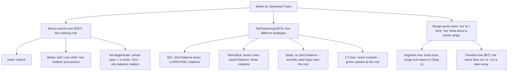

# Week 11 — Advanced Trees

*CEN207 Data Structures (formerly CE205) · Fall 2026–2027*

<!-- materials:start -->

<div class="materials" markdown>

[:material-file-pdf-box: Lecture notes (PDF)](cen207-week-11-notes.pdf){ .md-button download="cen207-week-11-notes.pdf" }
[:material-file-word-box: Lecture notes (DOCX)](cen207-week-11-notes.docx){ .md-button download="cen207-week-11-notes.docx" }
[:material-presentation: Slides (PDF)](cen207-week-11-slides.pdf){ .md-button download="cen207-week-11-slides.pdf" }
[:material-microsoft-powerpoint: Slides (PPTX)](cen207-week-11-slides.pptx){ .md-button download="cen207-week-11-slides.pptx" }
[:material-language-html5: Slides (HTML, offline)](cen207-week-11-slides.html){ .md-button download="cen207-week-11-slides.html" }
[:material-folder-zip: Download all (ZIP)](cen207-week-11-materials.zip){ .md-button download="cen207-week-11-materials.zip" }
[:material-fullscreen: Open slides full screen](cen207-week-11-slides.html){ .md-button .md-button--primary target=_blank }

</div>

<div class="deck-frame">
<iframe src="../cen207-week-11-slides.html" title="Week 11 — Advanced Trees" loading="lazy" allowfullscreen></iframe>
</div>

<p class="deck-hint">Click inside the slides and use the arrow keys; use the button at the bottom right of the slides, or the "Open slides full screen" link above, for full screen.</p>

<!-- materials:end -->

!!! abstract "This week"
    **Learning outcomes.** By the end of this week you will be able to explain, draw, and implement the
    **binary search tree (BST)** — insert, search, and the three cases of delete (leaf, one child, two
    children) — and explain why an unlucky insertion order can degrade it to a linked list. You will then
    meet four ways of preventing that: the **AVL tree** (a strict balance factor and four rotation cases:
    LL, RR, LR, RL), the **red-black tree** (a looser, color-based balance with fewer rotations), the
    **splay tree** (no strict balance at all — it adapts to access patterns instead), and the **2-3 tree**
    (which never gets crooked because it grows upward, at the root, instead of at the leaves). Finally you
    will meet two special-purpose trees that answer *range* questions instead of *single-key* questions in
    `O(log n)`: the **segment tree** (range sums, built once, queried many times) and the **Fenwick tree /
    binary indexed tree** (the same idea, implemented with one arithmetic trick, `i & -i`, and a plain
    array). These outcomes map to **LO.1** (explain fundamental data structures), **LO.2** (analyze
    algorithmic complexity), and **LO.7** (choose the right structure for a problem) of the course syllabus.

    **What you need already.** Week 4 gave you the vocabulary this whole week is built on: a tree is nodes
    connected by parent/child edges with no cycles; **root**, **leaf**, **depth**, **height**, **subtree**;
    the recursive traversals (inorder, preorder, postorder) and the queue-driven level-order traversal
    (`REPO\tools\dsanim\algorithms\week4\level-order-traversal.js` — this week's tree drawings use the exact
    same layout idea: recurse left, place, recurse right). Week 4's heap, though, was never *ordered* the
    way this week's trees are — a heap only promises "parent is better than its children", not "everything
    left is smaller". This week adds that ordering rule for the first time.

    **Time plan for a 3-hour session.** The binary search tree: insert, search, delete (~35 min) · why
    balance matters, the degenerate case (~10 min) · AVL trees: rotations, insert, delete (~45 min) · a
    short break · red-black trees (~25 min) · splay trees (~20 min) · 2-3 trees (~15 min) · segment trees
    (~15 min) · Fenwick trees (~15 min) · choosing a technique, wrap-up and self-check (~10 min).

## 0. Before we start

### 0.1 What you already know

Week 4 gave you every piece of vocabulary this week reuses. A **tree** is a set of nodes connected by
directed edges from parent to child, with exactly one node — the **root** — having no parent, and no
cycles. A node with no children is a **leaf**. A node's **depth** is the number of edges from the root to
it (the root has depth 0); a tree's **height** is the greatest depth of any of its nodes (a single node has
height 0; an empty tree's height is, by convention, -1). A node together with all of its descendants is a
**subtree**. You also already know how to *visit every node* of a tree — inorder, preorder, postorder
(recursive, using the call stack), and level-order (iterative, using an explicit queue) — and you know one
concrete tree shape, the **binary heap**, where every node obeys "parent is better than (>=/<= ) its
children" but *nothing* is promised about left versus right.

**A genuinely new idea: ordering.** This week's first structure, the **binary search tree (BST)**, adds a
rule a heap never had: at every node, *every* key in the left subtree is smaller, and *every* key in the
right subtree is larger. That single rule is what turns "a tree" into a structure you can **search** in
`O(height)` instead of `O(n)` — but, as you will see in section 4, an ordinary BST's height depends entirely
on the *order keys arrive in*, which is exactly the problem the rest of this week's trees each solve in a
different way.

### 0.2 The map of this week



Every box below gets its own step-by-step animation, a complete C and Java program, and a note on
complexity and common mistakes.

## 1. The binary search tree: insert

### 1.1 A question to start

Week 1 gave you binary search on a *sorted array* — fast (`O(log n)`), but inserting a new value into a
sorted array costs `O(n)` (every element after it must shift). Week 2's linked list inserts in `O(1)` but
can only be *searched* in `O(n)` (no shortcuts, you must walk from the front). Is there a structure that
inserts *and* searches in less than `O(n)`? The **binary search tree** answers yes, with one rule at every
node: **left is smaller, right is larger.**

The BST was described independently by several people around 1960 (P. F. Windley, A. D. Booth and A. J. T.
Colin, and T. N. Hibbard all published closely related ideas 1959–1962); Hibbard's 1962 paper is the one
usually credited for working out deletion — precisely the operation section 3 covers.

### 1.2 Abstract data type

| Operation | What it does | Precondition | Complexity (height `h`) |
| --- | --- | --- | --- |
| `insert(key)` | Adds `key` in its correctly ordered spot; a duplicate is ignored | none | `O(h)` |
| `search(key)` | Reports whether `key` is present | none | `O(h)` |
| `delete(key)` | Removes `key` if present; a missing key is a no-op | none | `O(h)` |
| `min` / `max` | The smallest / largest key | tree not empty | `O(h)` |

`h` is the tree's height. For a *balanced* BST, `h = O(log n)`; section 4 shows exactly how bad `h` can get
for an ordinary BST when it is **not** balanced.

### 1.3 In memory, and the code

A BST node is a small struct: a `key`, and two child pointers, `left` and `right` (either may be `NULL`).
`insert` walks down from the root exactly like a search would, comparing `key` at every node, until it
finds an empty spot (a `NULL` child) — that is where the new node is linked in.

Play the animation, or step with ← →, to watch `insert` walk down and link in a new leaf, one comparison at
a time.

<iframe class="dsanim" src="../anim/bst-insert.html" title="Binary search tree: insert" loading="lazy"></iframe>
<div class="dsanim-baski" markdown>

</div>

In the picker, also try **14 keys, negative values and a repeat** (hard) and the edge cases **10 values,
only 3 distinct keys**, **10 keys in ascending order** (watch it start leaning into a chain — section 4
takes this further), and **a single key** — or press 🎲 for random data at four difficulty levels, or type
in your own values.

=== "C"

    ```console
    gcc -std=c11 -Wall -Wextra -o /tmp/x bst_insert.c && /tmp/x
    ```

    Expected output:

    ```text
    -- normal: 10 keys, a moderately mixed order --
    insert(50): inorder = 50  height = 0
    insert(30): inorder = 30 50  height = 1
    insert(70): inorder = 30 50 70  height = 1
    insert(20): inorder = 20 30 50 70  height = 2
    insert(40): inorder = 20 30 40 50 70  height = 2
    insert(60): inorder = 20 30 40 50 60 70  height = 2
    insert(80): inorder = 20 30 40 50 60 70 80  height = 2
    insert(35): inorder = 20 30 35 40 50 60 70 80  height = 3
    insert(65): inorder = 20 30 35 40 50 60 65 70 80  height = 3
    insert(90): inorder = 20 30 35 40 50 60 65 70 80 90  height = 3

    -- hard: 14 keys, negative values and a repeat --
    insert(10): inorder = 10  height = 0
    insert(-5): inorder = -5 10  height = 1
    insert(25): inorder = -5 10 25  height = 1
    insert(10): inorder = -5 10 25  height = 1
    insert(-20): inorder = -20 -5 10 25  height = 2
    insert(5): inorder = -20 -5 5 10 25  height = 2
    insert(17): inorder = -20 -5 5 10 17 25  height = 2
    insert(30): inorder = -20 -5 5 10 17 25 30  height = 2
    insert(-5): inorder = -20 -5 5 10 17 25 30  height = 2
    insert(3): inorder = -20 -5 3 5 10 17 25 30  height = 3
    insert(22): inorder = -20 -5 3 5 10 17 22 25 30  height = 3
    insert(40): inorder = -20 -5 3 5 10 17 22 25 30 40  height = 3
    insert(-15): inorder = -20 -15 -5 3 5 10 17 22 25 30 40  height = 3
    insert(12): inorder = -20 -15 -5 3 5 10 12 17 22 25 30 40  height = 3

    -- edge: 10 values, only 3 distinct keys --
    insert(8): inorder = 8  height = 0
    insert(8): inorder = 8  height = 0
    insert(3): inorder = 3 8  height = 1
    insert(8): inorder = 3 8  height = 1
    insert(3): inorder = 3 8  height = 1
    insert(15): inorder = 3 8 15  height = 1
    insert(3): inorder = 3 8 15  height = 1
    insert(8): inorder = 3 8 15  height = 1
    insert(15): inorder = 3 8 15  height = 1
    insert(8): inorder = 3 8 15  height = 1

    -- edge: 10 keys in ascending order -- forms a near-chain --
    insert(1): inorder = 1  height = 0
    insert(2): inorder = 1 2  height = 1
    insert(3): inorder = 1 2 3  height = 2
    insert(4): inorder = 1 2 3 4  height = 3
    insert(5): inorder = 1 2 3 4 5  height = 4
    insert(6): inorder = 1 2 3 4 5 6  height = 5
    insert(7): inorder = 1 2 3 4 5 6 7  height = 6
    insert(8): inorder = 1 2 3 4 5 6 7 8  height = 7
    insert(9): inorder = 1 2 3 4 5 6 7 8 9  height = 8
    insert(10): inorder = 1 2 3 4 5 6 7 8 9 10  height = 9

    -- edge: a single key --
    insert(42): inorder = 42  height = 0
    ```

    ??? example "Full program: `bst_insert.c`"

        ```c
        /* Week 11 -- Advanced Trees
         * Binary search tree (BST): insert. Duplicates are ignored (tree unchanged).
         * CEN207 Data Structures (CS50-style lecture notes)
         */
        #include <stdio.h>
        #include <stdlib.h>

        typedef struct Node {
            int key;
            struct Node *left;
            struct Node *right;
        } Node;

        Node *bst_insert(Node *root, int key) {
            Node *cur = root, *parent = NULL;
            while (cur != NULL) {
                parent = cur;
                if (key == cur->key) return root;             /* duplicate: tree unchanged */
                if (key < cur->key)  cur = cur->left;
                else                 cur = cur->right;
            }
            Node *n = malloc(sizeof(Node));
            n->key = key;
            n->left = NULL;
            n->right = NULL;
            if (parent == NULL) return n;                      /* empty tree: n is the new root */
            if (key < parent->key) parent->left = n;
            else                    parent->right = n;
            return root;
        }

        static int height(Node *n) {
            if (n == NULL) return -1;
            int l = height(n->left), r = height(n->right);
            return 1 + (l > r ? l : r);
        }

        static void print_inorder(Node *n) {
            if (n == NULL) return;
            print_inorder(n->left);
            printf(" %d", n->key);
            print_inorder(n->right);
        }

        static void free_tree(Node *n) {
            if (n == NULL) return;
            free_tree(n->left);
            free_tree(n->right);
            free(n);
        }

        static void run_scenario(const char *label, const int keys[], int n) {
            printf("-- %s --\n", label);
            Node *root = NULL;
            for (int i = 0; i < n; i++) {
                root = bst_insert(root, keys[i]);
                printf("insert(%d): inorder =", keys[i]);
                print_inorder(root);
                printf("  height = %d\n", height(root));
            }
            printf("\n");
            free_tree(root);
        }

        int main(void) {
            int normal[] = {50, 30, 70, 20, 40, 60, 80, 35, 65, 90};
            run_scenario("normal: 10 keys, a moderately mixed order", normal, 10);

            int hard[] = {10, -5, 25, 10, -20, 5, 17, 30, -5, 3, 22, 40, -15, 12};
            run_scenario("hard: 14 keys, negative values and a repeat", hard, 14);

            int dup[] = {8, 8, 3, 8, 3, 15, 3, 8, 15, 8};
            run_scenario("edge: 10 values, only 3 distinct keys", dup, 10);

            int sorted[] = {1, 2, 3, 4, 5, 6, 7, 8, 9, 10};
            run_scenario("edge: 10 keys in ascending order -- forms a near-chain", sorted, 10);

            int single[] = {42};
            run_scenario("edge: a single key", single, 1);

            return 0;
        }
        ```

=== "Java"

    ```console
    javac -Xlint:all -d /tmp/j BstInsert.java && java -cp /tmp/j BstInsert
    ```

    Expected output: identical to the C run above (same algorithm, same data).

    ??? example "Full program: `BstInsert.java`"

        ```java
        /* Week 11 -- Advanced Trees
         * Binary search tree (BST): insert. Duplicates are ignored (tree unchanged).
         * CEN207 Data Structures (CS50-style lecture notes)
         */
        public class BstInsert {
            static class Node {
                int key;
                Node left;
                Node right;
            }

            static Node bstInsert(Node root, int key) {
                Node cur = root, parent = null;
                while (cur != null) {
                    parent = cur;
                    if (key == cur.key) return root;               // duplicate: tree unchanged
                    if (key < cur.key)  cur = cur.left;
                    else                cur = cur.right;
                }
                Node n = new Node();
                n.key = key;
                n.left = null;
                n.right = null;
                if (parent == null) return n;                       // empty tree: n is the new root
                if (key < parent.key) parent.left = n;
                else                   parent.right = n;
                return root;
            }

            static int height(Node n) {
                if (n == null) return -1;
                int l = height(n.left), r = height(n.right);
                return 1 + Math.max(l, r);
            }

            static void printInorder(Node n, StringBuilder sb) {
                if (n == null) return;
                printInorder(n.left, sb);
                sb.append(' ').append(n.key);
                printInorder(n.right, sb);
            }

            static void runScenario(String label, int[] keys) {
                System.out.println("-- " + label + " --");
                Node root = null;
                for (int key : keys) {
                    root = bstInsert(root, key);
                    StringBuilder sb = new StringBuilder();
                    printInorder(root, sb);
                    System.out.println("insert(" + key + "): inorder =" + sb + "  height = " + height(root));
                }
                System.out.println();
            }

            public static void main(String[] args) {
                int[] normal = {50, 30, 70, 20, 40, 60, 80, 35, 65, 90};
                runScenario("normal: 10 keys, a moderately mixed order", normal);

                int[] hard = {10, -5, 25, 10, -20, 5, 17, 30, -5, 3, 22, 40, -15, 12};
                runScenario("hard: 14 keys, negative values and a repeat", hard);

                int[] dup = {8, 8, 3, 8, 3, 15, 3, 8, 15, 8};
                runScenario("edge: 10 values, only 3 distinct keys", dup);

                int[] sorted = {1, 2, 3, 4, 5, 6, 7, 8, 9, 10};
                runScenario("edge: 10 keys in ascending order -- forms a near-chain", sorted);

                int[] single = {42};
                runScenario("edge: a single key", single);
            }
        }
        ```

### 1.4 Complexity, mistakes, self-check

**Complexity.** Both best and average case are `O(h)` where `h` is the tree's current height; in the worst
case (see section 4) `h` can reach `n - 1`, making `insert` `O(n)`. Space is `O(1)` extra (one new node).

!!! warning "Common mistakes"
    - Forgetting to return the (possibly new) `root` from `insert` — in C/Java without reference parameters,
      the caller's `root` variable does not update itself; you must always write `root = bst_insert(root,
      key);`.
    - Comparing with `<=` instead of `<` (or the reverse) for the duplicate check, silently turning
      "duplicate: ignored" into "duplicate: inserted again as a right child", corrupting the ordering
      invariant.
    - Losing the `parent` pointer: if you walk `cur` all the way to `NULL` without remembering the last
      non-`NULL` node visited, you have nowhere to link the new node.

??? success "Self-check: in the 'ascending order' edge case above, why does every new key become a RIGHT child, never a left one?"
    Every key inserted after the first is *larger* than every key already in the tree (since the input is
    sorted ascending), so at every node visited during the descent, `key > cur->key` is true — the walk
    always goes right, and the new leaf always attaches as a right child. This is exactly the chain shape
    section 4 studies in detail.

## 2. Searching a BST

### 2.1 A question to start

`insert` already walks down comparing keys — `search` is almost the same walk, just without creating
anything. Given the ordering rule, how many nodes must `search` visit in the worst case, and what does that
number depend on?

### 2.2 The idea

At each node, compare the target to the node's key: equal means found; smaller means "it can only be in the
left subtree" (the ordering rule *guarantees* this — nothing in the right subtree can be smaller);
larger means the mirror. A `NULL` reached before a match means the key is not present at all.

### 2.3 In memory, and the code

`search` reuses the identical comparison logic as `insert`'s descent, just returning a boolean instead of
creating a node. A global `probes` counter (matching the style you have used since Week 6's hash tables)
records how many comparisons the search actually made.

<iframe class="dsanim" src="../anim/bst-search.html" title="Binary search tree: search" loading="lazy"></iframe>
<div class="dsanim-baski" markdown>

</div>

In the picker, also try **14 keys with negative values, 5 searches** (hard) and the edge cases **searching
below the minimum and above the maximum**, **searching for the last key in a chain built from ascending
inserts**, and **a single node** — or press 🎲 for random data at four difficulty levels, or type in your
own values.

=== "C"

    ```console
    gcc -std=c11 -Wall -Wextra -o /tmp/x bst_search.c && /tmp/x
    ```

    Expected output:

    ```text
    -- normal: 10 keys, 3 hits and 2 misses --
    tree built from 10 keys
    search(65): found, 4 probes
    search(20): found, 3 probes
    search(90): found, 4 probes
    search(55): not found, 3 probes
    search(100): not found, 4 probes

    -- hard: 14 keys with negative values, 5 searches --
    tree built from 14 keys
    search(-20): found, 3 probes
    search(60): found, 5 probes
    search(0): not found, 4 probes
    search(-5): found, 2 probes
    search(99): not found, 5 probes

    -- edge: searching below the minimum and above the maximum --
    tree built from 10 keys
    search(-1000): not found, 4 probes
    search(1000): not found, 4 probes
    search(50): found, 1 probes

    -- edge: searching for the last key in a chain built from ascending inserts (O(n)) --
    tree built from 10 keys
    search(10): found, 10 probes
    search(1): found, 1 probes
    search(11): not found, 10 probes

    -- edge: a single node, search the root and a missing value --
    tree built from 1 keys
    search(7): found, 1 probes
    search(3): not found, 1 probes
    ```

    ??? example "Full program: `bst_search.c`"

        ```c
        /* Week 11 -- Advanced Trees
         * Binary search tree (BST): search.
         * CEN207 Data Structures (CS50-style lecture notes)
         */
        #include <stdio.h>
        #include <stdlib.h>

        typedef struct Node {
            int key;
            struct Node *left;
            struct Node *right;
        } Node;

        static Node *bst_build_insert(Node *root, int key) {
            Node *cur = root, *parent = NULL;
            while (cur != NULL) {
                parent = cur;
                if (key == cur->key) return root;
                if (key < cur->key) cur = cur->left; else cur = cur->right;
            }
            Node *n = malloc(sizeof(Node));
            n->key = key; n->left = NULL; n->right = NULL;
            if (parent == NULL) return n;
            if (key < parent->key) parent->left = n; else parent->right = n;
            return root;
        }

        int probes;

        int bst_search(Node *root, int key) {
            Node *cur = root;
            probes = 0;
            while (cur != NULL) {
                probes++;
                if (key == cur->key) return 1;
                if (key < cur->key) cur = cur->left;
                else                cur = cur->right;
            }
            return 0;
        }

        static void free_tree(Node *n) {
            if (n == NULL) return;
            free_tree(n->left);
            free_tree(n->right);
            free(n);
        }

        static void run_scenario(const char *label, const int keys[], int nk, const int finds[], int nf) {
            printf("-- %s --\n", label);
            Node *root = NULL;
            for (int i = 0; i < nk; i++) root = bst_build_insert(root, keys[i]);
            printf("tree built from %d keys\n", nk);
            for (int i = 0; i < nf; i++) {
                int found = bst_search(root, finds[i]);
                printf("search(%d): %s, %d probes\n", finds[i], found ? "found" : "not found", probes);
            }
            printf("\n");
            free_tree(root);
        }

        int main(void) {
            int normal_keys[] = {50, 30, 70, 20, 40, 60, 80, 35, 65, 90};
            int normal_finds[] = {65, 20, 90, 55, 100};
            run_scenario("normal: 10 keys, 3 hits and 2 misses", normal_keys, 10, normal_finds, 5);

            int hard_keys[] = {10, -5, 25, 40, -20, 5, 17, 30, 45, 3, 22, -15, 12, 60};
            int hard_finds[] = {-20, 60, 0, -5, 99};
            run_scenario("hard: 14 keys with negative values, 5 searches", hard_keys, 14, hard_finds, 5);

            int bound_keys[] = {50, 30, 70, 20, 40, 60, 80, 10, 45, 90};
            int bound_finds[] = {-1000, 1000, 50};
            run_scenario("edge: searching below the minimum and above the maximum", bound_keys, 10, bound_finds, 3);

            int chain_keys[] = {1, 2, 3, 4, 5, 6, 7, 8, 9, 10};
            int chain_finds[] = {10, 1, 11};
            run_scenario("edge: searching for the last key in a chain built from ascending inserts (O(n))", chain_keys, 10, chain_finds, 3);

            int single_keys[] = {7};
            int single_finds[] = {7, 3};
            run_scenario("edge: a single node, search the root and a missing value", single_keys, 1, single_finds, 2);

            return 0;
        }
        ```

=== "Java"

    ```console
    javac -Xlint:all -d /tmp/j BstSearch.java && java -cp /tmp/j BstSearch
    ```

    Expected output: identical to the C run above (same algorithm, same data).

    ??? example "Full program: `BstSearch.java`"

        ```java
        /* Week 11 -- Advanced Trees
         * Binary search tree (BST): search.
         * CEN207 Data Structures (CS50-style lecture notes)
         */
        public class BstSearch {
            static class Node {
                int key;
                Node left;
                Node right;
            }

            static Node bstBuildInsert(Node root, int key) {
                Node cur = root, parent = null;
                while (cur != null) {
                    parent = cur;
                    if (key == cur.key) return root;
                    if (key < cur.key) cur = cur.left; else cur = cur.right;
                }
                Node n = new Node();
                n.key = key; n.left = null; n.right = null;
                if (parent == null) return n;
                if (key < parent.key) parent.left = n; else parent.right = n;
                return root;
            }

            static int probes;

            static boolean bstSearch(Node root, int key) {
                Node cur = root;
                probes = 0;
                while (cur != null) {
                    probes++;
                    if (key == cur.key) return true;
                    if (key < cur.key) cur = cur.left;
                    else                cur = cur.right;
                }
                return false;
            }

            static void runScenario(String label, int[] keys, int[] finds) {
                System.out.println("-- " + label + " --");
                Node root = null;
                for (int key : keys) root = bstBuildInsert(root, key);
                System.out.println("tree built from " + keys.length + " keys");
                for (int f : finds) {
                    boolean found = bstSearch(root, f);
                    System.out.println("search(" + f + "): " + (found ? "found" : "not found") + ", " + probes + " probes");
                }
                System.out.println();
            }

            public static void main(String[] args) {
                int[] normalKeys = {50, 30, 70, 20, 40, 60, 80, 35, 65, 90};
                int[] normalFinds = {65, 20, 90, 55, 100};
                runScenario("normal: 10 keys, 3 hits and 2 misses", normalKeys, normalFinds);

                int[] hardKeys = {10, -5, 25, 40, -20, 5, 17, 30, 45, 3, 22, -15, 12, 60};
                int[] hardFinds = {-20, 60, 0, -5, 99};
                runScenario("hard: 14 keys with negative values, 5 searches", hardKeys, hardFinds);

                int[] boundKeys = {50, 30, 70, 20, 40, 60, 80, 10, 45, 90};
                int[] boundFinds = {-1000, 1000, 50};
                runScenario("edge: searching below the minimum and above the maximum", boundKeys, boundFinds);

                int[] chainKeys = {1, 2, 3, 4, 5, 6, 7, 8, 9, 10};
                int[] chainFinds = {10, 1, 11};
                runScenario("edge: searching for the last key in a chain built from ascending inserts (O(n))", chainKeys, chainFinds);

                int[] singleKeys = {7};
                int[] singleFinds = {7, 3};
                runScenario("edge: a single node, search the root and a missing value", singleKeys, singleFinds);
            }
        }
        ```

### 2.4 Complexity, mistakes, self-check

**Complexity.** `O(h)`, same as `insert` — a search visits at most one node per level. Best case `O(1)`
(the root itself). No extra space beyond the probe counter.

!!! warning "Common mistakes"
    - Continuing to compare after finding a match (an off-by-one loop) instead of returning immediately.
    - Treating "not found" as an error instead of a normal, expected outcome — a BST search on a missing key
      must return cleanly, not crash or loop forever (the `while (cur != NULL)` guard is what prevents that).

??? success "Self-check: why does search(10) on the 'ascending inserts' chain cost 10 probes, but search(1) costs only 1?"
    That tree is a pure right-leaning chain (see section 1's self-check): `1` sits at the root and `10` sits
    at the deepest leaf, 9 levels down. Searching for the root's own key needs exactly one comparison;
    searching for the deepest leaf's key needs one comparison per level down to it, `10` in total — this
    tree's height (9) plus one.

## 3. Deleting from a BST

### 3.1 A question to start

Deleting a *leaf* is easy: just detach it. Deleting a node with *two children* is not — you cannot just
remove it, because something has to take its place while keeping every remaining key correctly ordered.
What single value can safely replace it?

### 3.2 The idea: three cases

Removing a node reduces to exactly three cases, decided by how many children it has:

1. **Leaf** (no children) — simply detach it.
2. **One child** — splice it out: the parent links directly to the (only) child.
3. **Two children** — find the **in-order successor** (the smallest key in the right subtree — walk left
   from the right child as far as possible), copy *its* key into the node being deleted, then delete the
   successor from its original spot. The successor, by construction, can have at most a right child, so
   this always reduces to case 1 or case 2.

<iframe class="dsanim" src="../anim/bst-delete.html" title="Binary search tree: delete" loading="lazy"></iframe>
<div class="dsanim-baski" markdown>

</div>

In the picker, also try **14 keys with negative values, 6 deletes (including the root)** (hard) and the
edge cases **trying to delete a key that is not there (no-op)**, **delete every key, down to an empty
tree**, and **delete the only node** — or press 🎲 for random data at four difficulty levels, or type in
your own values.

=== "C"

    ```console
    gcc -std=c11 -Wall -Wextra -o /tmp/x bst_delete.c && /tmp/x
    ```

    Expected output:

    ```text
    -- normal: 10 keys, 4 deletes (a mix of leaf, one-child, two-children) --
    tree built from 10 keys, inorder = 20 30 35 40 50 60 65 70 80 90
    delete(35): inorder = 20 30 40 50 60 65 70 80 90
    delete(70): inorder = 20 30 40 50 60 65 80 90
    delete(50): inorder = 20 30 40 60 65 80 90
    delete(20): inorder = 30 40 60 65 80 90

    -- hard: 14 keys with negative values, 6 deletes (including the root) --
    tree built from 14 keys, inorder = -20 -15 -5 3 5 10 12 17 22 25 30 40 45 60
    delete(-5): inorder = -20 -15 3 5 10 12 17 22 25 30 40 45 60
    delete(40): inorder = -20 -15 3 5 10 12 17 22 25 30 45 60
    delete(10): inorder = -20 -15 3 5 12 17 22 25 30 45 60
    delete(17): inorder = -20 -15 3 5 12 22 25 30 45 60
    delete(60): inorder = -20 -15 3 5 12 22 25 30 45
    delete(3): inorder = -20 -15 5 12 22 25 30 45

    -- edge: trying to delete a key that is not there (no-op) --
    tree built from 10 keys, inorder = 10 20 30 40 45 50 60 70 80 90
    delete(999): inorder = 10 20 30 40 45 50 60 70 80 90
    delete(30): inorder = 10 20 40 45 50 60 70 80 90
    delete(-1000): inorder = 10 20 40 45 50 60 70 80 90

    -- edge: delete every key, down to an empty tree --
    tree built from 10 keys, inorder = 1 2 3 4 5 6 7 8 9 10
    delete(10): inorder = 1 2 3 4 5 6 7 8 9
    delete(6): inorder = 1 2 3 4 5 7 8 9
    delete(2): inorder = 1 3 4 5 7 8 9
    delete(9): inorder = 1 3 4 5 7 8
    delete(7): inorder = 1 3 4 5 8
    delete(4): inorder = 1 3 5 8
    delete(1): inorder = 3 5 8
    delete(8): inorder = 3 5
    delete(3): inorder = 5
    delete(5): inorder =

    -- edge: delete the only node --
    tree built from 1 keys, inorder = 7
    delete(7): inorder =
    ```

    ??? example "Full program: `bst_delete.c`"

        ```c
        /* Week 11 -- Advanced Trees
         * Binary search tree (BST): delete (leaf / one child / two children with successor).
         * CEN207 Data Structures (CS50-style lecture notes)
         */
        #include <stdio.h>
        #include <stdlib.h>

        typedef struct Node {
            int key;
            struct Node *left;
            struct Node *right;
        } Node;

        static Node *bst_build_insert(Node *root, int key) {
            Node *cur = root, *parent = NULL;
            while (cur != NULL) {
                parent = cur;
                if (key == cur->key) return root;
                if (key < cur->key) cur = cur->left; else cur = cur->right;
            }
            Node *n = malloc(sizeof(Node));
            n->key = key; n->left = NULL; n->right = NULL;
            if (parent == NULL) return n;
            if (key < parent->key) parent->left = n; else parent->right = n;
            return root;
        }

        Node *bst_delete(Node *root, int key) {
            Node *cur = root, *parent = NULL;
            while (cur != NULL && key != cur->key) {
                parent = cur;
                cur = (key < cur->key) ? cur->left : cur->right;
            }
            if (cur == NULL) return root;                     /* not found: no-op */
            if (cur->left != NULL && cur->right != NULL) {
                Node *succ = cur->right, *succParent = cur;
                while (succ->left != NULL) { succParent = succ; succ = succ->left; }
                cur->key = succ->key;                          /* copy successor key up */
                parent = succParent;
                cur = succ;                                    /* now splice out succ: <= 1 child */
            }
            Node *child = (cur->left != NULL) ? cur->left : cur->right;
            if (parent == NULL)           root = child;
            else if (parent->left == cur) parent->left  = child;
            else                          parent->right = child;
            free(cur);
            return root;
        }

        static void print_inorder(Node *n) {
            if (n == NULL) return;
            print_inorder(n->left);
            printf(" %d", n->key);
            print_inorder(n->right);
        }

        static void free_tree(Node *n) {
            if (n == NULL) return;
            free_tree(n->left);
            free_tree(n->right);
            free(n);
        }

        static void run_scenario(const char *label, const int keys[], int nk, const int dels[], int nd) {
            printf("-- %s --\n", label);
            Node *root = NULL;
            for (int i = 0; i < nk; i++) root = bst_build_insert(root, keys[i]);
            printf("tree built from %d keys, inorder =", nk);
            print_inorder(root);
            printf("\n");
            for (int i = 0; i < nd; i++) {
                root = bst_delete(root, dels[i]);
                printf("delete(%d): inorder =", dels[i]);
                print_inorder(root);
                printf("\n");
            }
            printf("\n");
            free_tree(root);
        }

        int main(void) {
            int normal_keys[] = {50, 30, 70, 20, 40, 60, 80, 35, 65, 90};
            int normal_dels[] = {35, 70, 50, 20};
            run_scenario("normal: 10 keys, 4 deletes (a mix of leaf, one-child, two-children)", normal_keys, 10, normal_dels, 4);

            int hard_keys[] = {10, -5, 25, 40, -20, 5, 17, 30, 45, 3, 22, -15, 12, 60};
            int hard_dels[] = {-5, 40, 10, 17, 60, 3};
            run_scenario("hard: 14 keys with negative values, 6 deletes (including the root)", hard_keys, 14, hard_dels, 6);

            int nf_keys[] = {50, 30, 70, 20, 40, 60, 80, 10, 45, 90};
            int nf_dels[] = {999, 30, -1000};
            run_scenario("edge: trying to delete a key that is not there (no-op)", nf_keys, 10, nf_dels, 3);

            int empty_keys[] = {5, 3, 8, 1, 4, 7, 9, 2, 6, 10};
            int empty_dels[] = {10, 6, 2, 9, 7, 4, 1, 8, 3, 5};
            run_scenario("edge: delete every key, down to an empty tree", empty_keys, 10, empty_dels, 10);

            int single_keys[] = {7};
            int single_dels[] = {7};
            run_scenario("edge: delete the only node", single_keys, 1, single_dels, 1);

            return 0;
        }
        ```

=== "Java"

    ```console
    javac -Xlint:all -d /tmp/j BstDelete.java && java -cp /tmp/j BstDelete
    ```

    Expected output: identical to the C run above (same algorithm, same data).

    ??? example "Full program: `BstDelete.java`"

        ```java
        /* Week 11 -- Advanced Trees
         * Binary search tree (BST): delete (leaf / one child / two children with successor).
         * CEN207 Data Structures (CS50-style lecture notes)
         */
        public class BstDelete {
            static class Node {
                int key;
                Node left;
                Node right;
            }

            static Node bstBuildInsert(Node root, int key) {
                Node cur = root, parent = null;
                while (cur != null) {
                    parent = cur;
                    if (key == cur.key) return root;
                    if (key < cur.key) cur = cur.left; else cur = cur.right;
                }
                Node n = new Node();
                n.key = key; n.left = null; n.right = null;
                if (parent == null) return n;
                if (key < parent.key) parent.left = n; else parent.right = n;
                return root;
            }

            static Node bstDelete(Node root, int key) {
                Node cur = root, parent = null;
                while (cur != null && key != cur.key) {
                    parent = cur;
                    cur = (key < cur.key) ? cur.left : cur.right;
                }
                if (cur == null) return root;                      // not found: no-op
                if (cur.left != null && cur.right != null) {
                    Node succ = cur.right, succParent = cur;
                    while (succ.left != null) { succParent = succ; succ = succ.left; }
                    cur.key = succ.key;                             // copy successor key up
                    parent = succParent;
                    cur = succ;                                     // now splice out succ: <= 1 child
                }
                Node child = (cur.left != null) ? cur.left : cur.right;
                if (parent == null)            root = child;
                else if (parent.left == cur)   parent.left  = child;
                else                           parent.right = child;
                return root;
            }

            static void printInorder(Node n, StringBuilder sb) {
                if (n == null) return;
                printInorder(n.left, sb);
                sb.append(' ').append(n.key);
                printInorder(n.right, sb);
            }

            static void runScenario(String label, int[] keys, int[] dels) {
                System.out.println("-- " + label + " --");
                Node root = null;
                for (int key : keys) root = bstBuildInsert(root, key);
                StringBuilder sb0 = new StringBuilder();
                printInorder(root, sb0);
                System.out.println("tree built from " + keys.length + " keys, inorder =" + sb0);
                for (int d : dels) {
                    root = bstDelete(root, d);
                    StringBuilder sb = new StringBuilder();
                    printInorder(root, sb);
                    System.out.println("delete(" + d + "): inorder =" + sb);
                }
                System.out.println();
            }

            public static void main(String[] args) {
                int[] normalKeys = {50, 30, 70, 20, 40, 60, 80, 35, 65, 90};
                int[] normalDels = {35, 70, 50, 20};
                runScenario("normal: 10 keys, 4 deletes (a mix of leaf, one-child, two-children)", normalKeys, normalDels);

                int[] hardKeys = {10, -5, 25, 40, -20, 5, 17, 30, 45, 3, 22, -15, 12, 60};
                int[] hardDels = {-5, 40, 10, 17, 60, 3};
                runScenario("hard: 14 keys with negative values, 6 deletes (including the root)", hardKeys, hardDels);

                int[] nfKeys = {50, 30, 70, 20, 40, 60, 80, 10, 45, 90};
                int[] nfDels = {999, 30, -1000};
                runScenario("edge: trying to delete a key that is not there (no-op)", nfKeys, nfDels);

                int[] emptyKeys = {5, 3, 8, 1, 4, 7, 9, 2, 6, 10};
                int[] emptyDels = {10, 6, 2, 9, 7, 4, 1, 8, 3, 5};
                runScenario("edge: delete every key, down to an empty tree", emptyKeys, emptyDels);

                int[] singleKeys = {7};
                int[] singleDels = {7};
                runScenario("edge: delete the only node", singleKeys, singleDels);
            }
        }
        ```

### 3.4 Complexity, mistakes, self-check

**Complexity.** `O(h)`: finding the node is `O(h)`, and finding a successor is at most another `O(h)` (it
never revisits nodes already on the search path). Same worst case as insert and search.

!!! warning "Common mistakes"
    - Using the **predecessor** (largest in the left subtree) instead of the successor is equally correct in
      theory, but mixing the two conventions *within the same codebase* makes deletions unpredictable to
      trace — pick one and stay consistent (this course uses the successor).
    - Forgetting to `free()` the spliced-out node in C — deleted keys silently keep consuming memory
      forever (exactly the kind of bug `--sanitize`'s AddressSanitizer leak check would catch).
    - Only handling the two-children case and forgetting that, after copying the successor's key, you must
      delete the *successor's original node*, not the node you started at.

??? success "Self-check: why is a BST delete's successor guaranteed to have at most one child?"
    The successor is the *leftmost* node of the node-being-deleted's right subtree. Being leftmost means it
    has no left child by definition (otherwise you would have walked further left to find an even smaller
    one). It may or may not have a right child, but it can never have both — so deleting it is always case
    1 or case 2, never case 3 again.

## 4. Why balance matters: the degenerate case

### 4.1 A question to start

Sections 1–3 all state their cost as `O(h)`. You have not yet asked: what is `h`, concretely, for a BST
built by inserting `n` keys in an arbitrary order? Is it always close to `log2(n)`?

### 4.2 The idea: order matters, not just the key set

Every technique in sections 1–3 works by comparing the new key at every node down to an empty spot — it
never looks at the tree's *shape*, only at key values. If the keys arrive already sorted (or nearly so),
every new key is larger (or smaller) than everything already present, so it always attaches at the very
bottom, one level deeper than the last: the tree **degenerates into a chain**, height `n - 1`, and every
operation becomes `O(n)` — no better than a plain linked list, despite being drawn as a "tree".

<iframe class="dsanim" src="../anim/bst-degenerate.html" title="Why balancing matters: a degenerate (chain) BST" loading="lazy"></iframe>
<div class="dsanim-baski" markdown>

</div>

In the picker, also try **14 keys in descending order** (hard) and the edge cases **nearly sorted with small
zig-zags (still deep)** and **the SAME 10 keys shuffled — much shallower**, which directly proves the point:
identical key *set*, wildly different height, purely from insertion *order* — or press 🎲 for random data,
or type in your own values.

=== "C"

    ```console
    gcc -std=c11 -Wall -Wextra -o /tmp/x bst_degenerate.c && /tmp/x
    ```

    Expected output:

    ```text
    -- normal: 10 keys in ascending order -- forms a chain --
    insert(1): height = 0  (ideal for 1 nodes = 0)
    insert(2): height = 1  (ideal for 2 nodes = 1)
    insert(3): height = 2  (ideal for 3 nodes = 1)
    insert(4): height = 3  (ideal for 4 nodes = 2)
    insert(5): height = 4  (ideal for 5 nodes = 2)
    insert(6): height = 5  (ideal for 6 nodes = 2)
    insert(7): height = 6  (ideal for 7 nodes = 2)
    insert(8): height = 7  (ideal for 8 nodes = 3)
    insert(9): height = 8  (ideal for 9 nodes = 3)
    insert(10): height = 9  (ideal for 10 nodes = 3)
    final: n = 10, height = 9, ideal = 3

    -- hard: 14 keys in descending order -- a chain the other way --
    insert(140): height = 0  (ideal for 1 nodes = 0)
    insert(130): height = 1  (ideal for 2 nodes = 1)
    insert(120): height = 2  (ideal for 3 nodes = 1)
    insert(110): height = 3  (ideal for 4 nodes = 2)
    insert(100): height = 4  (ideal for 5 nodes = 2)
    insert(90): height = 5  (ideal for 6 nodes = 2)
    insert(80): height = 6  (ideal for 7 nodes = 2)
    insert(70): height = 7  (ideal for 8 nodes = 3)
    insert(60): height = 8  (ideal for 9 nodes = 3)
    insert(50): height = 9  (ideal for 10 nodes = 3)
    insert(40): height = 10  (ideal for 11 nodes = 3)
    insert(30): height = 11  (ideal for 12 nodes = 3)
    insert(20): height = 12  (ideal for 13 nodes = 3)
    insert(10): height = 13  (ideal for 14 nodes = 3)
    final: n = 14, height = 13, ideal = 3

    -- edge: nearly sorted with small zig-zags (still deep) --
    insert(10): height = 0  (ideal for 1 nodes = 0)
    insert(20): height = 1  (ideal for 2 nodes = 1)
    insert(15): height = 2  (ideal for 3 nodes = 1)
    insert(30): height = 2  (ideal for 4 nodes = 2)
    insert(25): height = 3  (ideal for 5 nodes = 2)
    insert(40): height = 3  (ideal for 6 nodes = 2)
    insert(35): height = 4  (ideal for 7 nodes = 2)
    insert(50): height = 4  (ideal for 8 nodes = 3)
    insert(45): height = 5  (ideal for 9 nodes = 3)
    insert(60): height = 5  (ideal for 10 nodes = 3)
    final: n = 10, height = 5, ideal = 3

    -- edge: the SAME 10 keys shuffled -- much shallower --
    insert(6): height = 0  (ideal for 1 nodes = 0)
    insert(9): height = 1  (ideal for 2 nodes = 1)
    insert(2): height = 1  (ideal for 3 nodes = 1)
    insert(10): height = 2  (ideal for 4 nodes = 2)
    insert(4): height = 2  (ideal for 5 nodes = 2)
    insert(8): height = 2  (ideal for 6 nodes = 2)
    insert(1): height = 2  (ideal for 7 nodes = 2)
    insert(7): height = 3  (ideal for 8 nodes = 3)
    insert(3): height = 3  (ideal for 9 nodes = 3)
    insert(5): height = 3  (ideal for 10 nodes = 3)
    final: n = 10, height = 3, ideal = 3

    -- edge: a single key, height 0 --
    insert(42): height = 0  (ideal for 1 nodes = 0)
    final: n = 1, height = 0, ideal = 0
    ```

    ??? example "Full program: `bst_degenerate.c`"

        ```c
        /* Week 11 -- Advanced Trees
         * Why balancing matters: inserting the SAME set of keys in different orders gives wildly different BST
         * shapes. Sorted input degenerates into a chain -- height n-1, every operation O(n).
         * CEN207 Data Structures (CS50-style lecture notes)
         */
        #include <stdio.h>
        #include <stdlib.h>
        #include <math.h>

        typedef struct Node {
            int key;
            struct Node *left;
            struct Node *right;
        } Node;

        Node *bst_insert(Node *root, int key) {
            Node *cur = root, *parent = NULL;
            while (cur != NULL) {
                parent = cur;
                if (key == cur->key) return root;
                if (key < cur->key)  cur = cur->left;
                else                 cur = cur->right;
            }
            Node *n = malloc(sizeof(Node));
            n->key = key; n->left = NULL; n->right = NULL;
            if (parent == NULL) return n;
            if (key < parent->key) parent->left = n;
            else                    parent->right = n;
            return root;
        }

        static int height(Node *n) {
            if (n == NULL) return -1;
            int l = height(n->left), r = height(n->right);
            return 1 + (l > r ? l : r);
        }

        static void free_tree(Node *n) {
            if (n == NULL) return;
            free_tree(n->left);
            free_tree(n->right);
            free(n);
        }

        static int ilog2(int n) {
            int h = 0;
            while (n > 1) { n /= 2; h++; }
            return h;
        }

        static void run_scenario(const char *label, const int keys[], int n) {
            printf("-- %s --\n", label);
            Node *root = NULL;
            for (int i = 0; i < n; i++) {
                root = bst_insert(root, keys[i]);
                printf("insert(%d): height = %d  (ideal for %d nodes = %d)\n",
                       keys[i], height(root), i + 1, ilog2(i + 1));
            }
            int h = height(root), ideal = ilog2(n);
            printf("final: n = %d, height = %d, ideal = %d\n\n", n, h, ideal);
            free_tree(root);
        }

        int main(void) {
            int normal[] = {1, 2, 3, 4, 5, 6, 7, 8, 9, 10};
            run_scenario("normal: 10 keys in ascending order -- forms a chain", normal, 10);

            int hard[] = {140, 130, 120, 110, 100, 90, 80, 70, 60, 50, 40, 30, 20, 10};
            run_scenario("hard: 14 keys in descending order -- a chain the other way", hard, 14);

            int zigzag[] = {10, 20, 15, 30, 25, 40, 35, 50, 45, 60};
            run_scenario("edge: nearly sorted with small zig-zags (still deep)", zigzag, 10);

            int shuffled[] = {6, 9, 2, 10, 4, 8, 1, 7, 3, 5};
            run_scenario("edge: the SAME 10 keys shuffled -- much shallower", shuffled, 10);

            int single[] = {42};
            run_scenario("edge: a single key, height 0", single, 1);

            return 0;
        }
        ```

=== "Java"

    ```console
    javac -Xlint:all -d /tmp/j BstDegenerate.java && java -cp /tmp/j BstDegenerate
    ```

    Expected output: identical to the C run above (same algorithm, same data).

    ??? example "Full program: `BstDegenerate.java`"

        ```java
        /* Week 11 -- Advanced Trees
         * Why balancing matters: inserting the SAME set of keys in different orders gives wildly different BST
         * shapes. Sorted input degenerates into a chain -- height n-1, every operation O(n).
         * CEN207 Data Structures (CS50-style lecture notes)
         */
        public class BstDegenerate {
            static class Node {
                int key;
                Node left;
                Node right;
            }

            static Node bstInsert(Node root, int key) {
                Node cur = root, parent = null;
                while (cur != null) {
                    parent = cur;
                    if (key == cur.key) return root;
                    if (key < cur.key)  cur = cur.left;
                    else                cur = cur.right;
                }
                Node n = new Node();
                n.key = key; n.left = null; n.right = null;
                if (parent == null) return n;
                if (key < parent.key) parent.left = n;
                else                   parent.right = n;
                return root;
            }

            static int height(Node n) {
                if (n == null) return -1;
                int l = height(n.left), r = height(n.right);
                return 1 + Math.max(l, r);
            }

            static int ilog2(int n) {
                int h = 0;
                while (n > 1) { n /= 2; h++; }
                return h;
            }

            static void runScenario(String label, int[] keys) {
                System.out.println("-- " + label + " --");
                Node root = null;
                for (int i = 0; i < keys.length; i++) {
                    root = bstInsert(root, keys[i]);
                    System.out.println("insert(" + keys[i] + "): height = " + height(root)
                            + "  (ideal for " + (i + 1) + " nodes = " + ilog2(i + 1) + ")");
                }
                int h = height(root), ideal = ilog2(keys.length);
                System.out.println("final: n = " + keys.length + ", height = " + h + ", ideal = " + ideal);
                System.out.println();
            }

            public static void main(String[] args) {
                int[] normal = {1, 2, 3, 4, 5, 6, 7, 8, 9, 10};
                runScenario("normal: 10 keys in ascending order -- forms a chain", normal);

                int[] hard = {140, 130, 120, 110, 100, 90, 80, 70, 60, 50, 40, 30, 20, 10};
                runScenario("hard: 14 keys in descending order -- a chain the other way", hard);

                int[] zigzag = {10, 20, 15, 30, 25, 40, 35, 50, 45, 60};
                runScenario("edge: nearly sorted with small zig-zags (still deep)", zigzag);

                int[] shuffled = {6, 9, 2, 10, 4, 8, 1, 7, 3, 5};
                runScenario("edge: the SAME 10 keys shuffled -- much shallower", shuffled);

                int[] single = {42};
                runScenario("edge: a single key, height 0", single);
            }
        }
        ```

### 4.3 Complexity, mistakes, self-check

**Complexity.** Worst-case height `n - 1` (sorted or reverse-sorted input): every operation from sections
1–3 becomes `O(n)`. Average-case height over a *random* insertion order is `O(log n)` (a classical result,
about `2 ln n`), but "random order" is an assumption you cannot always rely on — sorted input is common in
practice (importing an already-sorted file, replaying sorted log entries).

!!! warning "Common mistakes"
    - Assuming "BST" alone guarantees `O(log n)` — it guarantees *at most* `O(n)` and *at best* `O(log n)`;
      only a *self-balancing* BST (sections 5–8) guarantees `O(log n)` in the worst case too.
    - Benchmarking a BST implementation only with random test data, which hides exactly this failure mode.

??? success "Self-check: if you must build a BST from data you know is already sorted, what is the cheapest fix, without switching to a different tree type?"
    Shuffle the keys into a random order before inserting them one by one (or, if you can insert all `n` at
    once, recursively pick the middle element as the root, then recurse on each half — this builds a
    perfectly balanced tree directly in `O(n)`, no rotations needed). Sections 5–8 solve the general problem
    — an unpredictable mix of future insertions and deletions — automatically, without needing to know the
    input is sorted in advance.

## 5. AVL trees: the first self-balancing BST

### 5.1 A question to start, and a short history

Section 4's fix (shuffle first, or build from the middle out) only works when you have *all* the data
up front. Real programs insert and delete over time, in whatever order the application demands. Is there a
BST variant that stays close to `log2(n)` tall no matter what order operations arrive in? Georgy
Adelson-Velsky and Evgenii Landis answered yes in 1962 — the **AVL tree** (their initials), the first
self-balancing binary search tree ever published.

**The idea.** Every node stores (or can cheaply compute) its **balance factor**, `bf = height(left) -
height(right)`. An AVL tree keeps `bf` in `{-1, 0, +1}` at *every* node, always. After an insertion or
deletion could push some node's `bf` to `+2` or `-2`, a **rotation** — a local, `O(1)` pointer
rearrangement — restores the invariant, without ever needing to touch the whole tree.

### 5.2 The four rotation cases

There are exactly four situations a violation can take, named by the path from the unbalanced node down to
where the extra height came from:

| Case | Shape | Fix |
| --- | --- | --- |
| **LL** | left-heavy, and the left child is also left-heavy (or balanced) | one **right** rotation at the unbalanced node |
| **RR** | right-heavy, right child also right-heavy (mirror of LL) | one **left** rotation |
| **LR** | left-heavy, but the left child is *right*-heavy (a "triangle") | rotate the left child **left** first, turning it into an LL shape, then rotate **right** |
| **RL** | right-heavy, but the right child is *left*-heavy (mirror of LR) | rotate the right child **right** first, then rotate **left** |

<iframe class="dsanim" src="../anim/avl-rotations.html" title="AVL tree: the four rebalancing cases" loading="lazy"></iframe>
<div class="dsanim-baski" markdown>

</div>

In the picker, step through all four named cases — **LL** (normal), **RR** (hard), **LR** and **RL**
(edge) — plus the edge case **an insertion that needs no rotation at all**, so you can see the contrast; or
press 🎲 for random data, or type your own `keys=... trigger=...`.

=== "C"

    ```console
    gcc -std=c11 -Wall -Wextra -o /tmp/x avl_rotations.c && /tmp/x
    ```

    Expected output:

    ```text
    -- LL case: a single right rotation --
    insert(50): case = none  root = 50  bf(root) = 0  height = 0
    insert(30): case = none  root = 50  bf(root) = 1  height = 1
    insert(70): case = none  root = 50  bf(root) = 0  height = 1
    insert(20): case = none  root = 50  bf(root) = 1  height = 2
    insert(40): case = none  root = 50  bf(root) = 1  height = 2
    insert(60): case = none  root = 50  bf(root) = 0  height = 2
    insert(80): case = none  root = 50  bf(root) = 0  height = 2
    insert(10): case = none  root = 50  bf(root) = 1  height = 3
    insert(45): case = none  root = 50  bf(root) = 1  height = 3
    insert(5): case = LL    root = 50  bf(root) = 1  height = 3

    -- RR case: a single left rotation --
    insert(50): case = none  root = 50  bf(root) = 0  height = 0
    insert(30): case = none  root = 50  bf(root) = 1  height = 1
    insert(70): case = none  root = 50  bf(root) = 0  height = 1
    insert(20): case = none  root = 50  bf(root) = 1  height = 2
    insert(40): case = none  root = 50  bf(root) = 1  height = 2
    insert(60): case = none  root = 50  bf(root) = 0  height = 2
    insert(80): case = none  root = 50  bf(root) = 0  height = 2
    insert(55): case = none  root = 50  bf(root) = -1  height = 3
    insert(90): case = none  root = 50  bf(root) = -1  height = 3
    insert(95): case = RR    root = 50  bf(root) = -1  height = 3

    -- LR case: a double rotation (left-right) --
    insert(50): case = none  root = 50  bf(root) = 0  height = 0
    insert(70): case = none  root = 50  bf(root) = -1  height = 1
    insert(30): case = none  root = 50  bf(root) = 0  height = 1
    insert(80): case = none  root = 50  bf(root) = -1  height = 2
    insert(60): case = none  root = 50  bf(root) = -1  height = 2
    insert(40): case = none  root = 50  bf(root) = 0  height = 2
    insert(20): case = none  root = 50  bf(root) = 0  height = 2
    insert(55): case = none  root = 50  bf(root) = -1  height = 3
    insert(35): case = none  root = 50  bf(root) = 0  height = 3
    insert(36): case = LR    root = 50  bf(root) = 0  height = 3

    -- RL case: a double rotation (right-left) --
    insert(50): case = none  root = 50  bf(root) = 0  height = 0
    insert(30): case = none  root = 50  bf(root) = 1  height = 1
    insert(70): case = none  root = 50  bf(root) = 0  height = 1
    insert(20): case = none  root = 50  bf(root) = 1  height = 2
    insert(40): case = none  root = 50  bf(root) = 1  height = 2
    insert(60): case = none  root = 50  bf(root) = 0  height = 2
    insert(80): case = none  root = 50  bf(root) = 0  height = 2
    insert(45): case = none  root = 50  bf(root) = 1  height = 3
    insert(65): case = none  root = 50  bf(root) = 0  height = 3
    insert(41): case = RL    root = 50  bf(root) = 0  height = 3

    -- edge: an insertion that needs no rotation at all --
    insert(50): case = none  root = 50  bf(root) = 0  height = 0
    insert(30): case = none  root = 50  bf(root) = 1  height = 1
    insert(70): case = none  root = 50  bf(root) = 0  height = 1
    insert(20): case = none  root = 50  bf(root) = 1  height = 2
    insert(40): case = none  root = 50  bf(root) = 1  height = 2
    insert(60): case = none  root = 50  bf(root) = 0  height = 2
    insert(80): case = none  root = 50  bf(root) = 0  height = 2
    insert(10): case = none  root = 50  bf(root) = 1  height = 3
    insert(90): case = none  root = 50  bf(root) = 0  height = 3
    insert(25): case = none  root = 50  bf(root) = 0  height = 3
    ```

    ??? example "Full program: `avl_rotations.c`"

        ```c
        /* Week 11 -- Advanced Trees
         * AVL tree: the four rebalancing cases (LL, RR, LR, RL). insert() is the standard recursive AVL insert;
         * rebalance() decides the case from the balance factors (not from the just-inserted key) and records which
         * one fired in last_case, purely so this program can print it.
         * CEN207 Data Structures (CS50-style lecture notes)
         */
        #include <stdio.h>
        #include <stdlib.h>

        typedef struct Node {
            int key;
            struct Node *left;
            struct Node *right;
            int height;
        } Node;

        static int height(Node *n) { return n ? n->height : -1; }
        static int max2(int a, int b) { return a > b ? a : b; }
        static void update_height(Node *n) { n->height = 1 + max2(height(n->left), height(n->right)); }

        static Node *rotate_right(Node *y) {
            Node *x = y->left;
            y->left = x->right;
            x->right = y;
            update_height(y);
            update_height(x);
            return x;
        }

        static Node *rotate_left(Node *x) {
            Node *y = x->right;
            x->right = y->left;
            y->left = x;
            update_height(x);
            update_height(y);
            return y;
        }

        const char *last_case;

        Node *rebalance(Node *n) {
            int bf = height(n->left) - height(n->right);
            if (bf > 1  && height(n->left->left)  >= height(n->left->right))  { last_case = "LL"; return rotate_right(n); }
            if (bf > 1)  { n->left  = rotate_left(n->left);   last_case = "LR"; return rotate_right(n); }
            if (bf < -1 && height(n->right->right) >= height(n->right->left)) { last_case = "RR"; return rotate_left(n); }
            if (bf < -1) { n->right = rotate_right(n->right); last_case = "RL"; return rotate_left(n); }
            return n;
        }

        static Node *make_leaf(int key) {
            Node *n = malloc(sizeof(Node));
            n->key = key; n->left = NULL; n->right = NULL; n->height = 0;
            return n;
        }

        Node *avl_insert(Node *root, int key) {
            if (root == NULL) return make_leaf(key);
            if (key == root->key) return root;
            if (key < root->key) root->left  = avl_insert(root->left, key);
            else                  root->right = avl_insert(root->right, key);
            update_height(root);
            return rebalance(root);
        }

        static void free_tree(Node *n) {
            if (n == NULL) return;
            free_tree(n->left);
            free_tree(n->right);
            free(n);
        }

        static void run_scenario(const char *label, const int keys[], int n) {
            printf("-- %s --\n", label);
            Node *root = NULL;
            for (int i = 0; i < n; i++) {
                last_case = "none";
                root = avl_insert(root, keys[i]);
                int bf = height(root->left) - height(root->right);
                printf("insert(%d): case = %-4s  root = %d  bf(root) = %d  height = %d\n",
                       keys[i], last_case, root->key, bf, height(root));
            }
            printf("\n");
            free_tree(root);
        }

        int main(void) {
            int ll[] = {50, 30, 70, 20, 40, 60, 80, 10, 45, 5};
            run_scenario("LL case: a single right rotation", ll, 10);

            int rr[] = {50, 30, 70, 20, 40, 60, 80, 55, 90, 95};
            run_scenario("RR case: a single left rotation", rr, 10);

            int lr[] = {50, 70, 30, 80, 60, 40, 20, 55, 35, 36};
            run_scenario("LR case: a double rotation (left-right)", lr, 10);

            int rl[] = {50, 30, 70, 20, 40, 60, 80, 45, 65, 41};
            run_scenario("RL case: a double rotation (right-left)", rl, 10);

            int none[] = {50, 30, 70, 20, 40, 60, 80, 10, 90, 25};
            run_scenario("edge: an insertion that needs no rotation at all", none, 10);

            return 0;
        }
        ```

=== "Java"

    ```console
    javac -Xlint:all -d /tmp/j AvlRotations.java && java -cp /tmp/j AvlRotations
    ```

    Expected output: identical to the C run above (same algorithm, same data).

    ??? example "Full program: `AvlRotations.java`"

        ```java
        /* Week 11 -- Advanced Trees
         * AVL tree: the four rebalancing cases (LL, RR, LR, RL). insert() is the standard recursive AVL insert;
         * rebalance() decides the case from the balance factors (not from the just-inserted key) and records which
         * one fired in lastCase, purely so this program can print it.
         * CEN207 Data Structures (CS50-style lecture notes)
         */
        public class AvlRotations {
            static class Node {
                int key;
                Node left;
                Node right;
                int height;
            }

            static int height(Node n) { return n == null ? -1 : n.height; }
            static void updateHeight(Node n) { n.height = 1 + Math.max(height(n.left), height(n.right)); }

            static Node rotateRight(Node y) {
                Node x = y.left;
                y.left = x.right;
                x.right = y;
                updateHeight(y);
                updateHeight(x);
                return x;
            }

            static Node rotateLeft(Node x) {
                Node y = x.right;
                x.right = y.left;
                y.left = x;
                updateHeight(x);
                updateHeight(y);
                return y;
            }

            static String lastCase;

            static Node rebalance(Node n) {
                int bf = height(n.left) - height(n.right);
                if (bf > 1  && height(n.left.left)  >= height(n.left.right))  { lastCase = "LL"; return rotateRight(n); }
                if (bf > 1)  { n.left  = rotateLeft(n.left);   lastCase = "LR"; return rotateRight(n); }
                if (bf < -1 && height(n.right.right) >= height(n.right.left)) { lastCase = "RR"; return rotateLeft(n); }
                if (bf < -1) { n.right = rotateRight(n.right); lastCase = "RL"; return rotateLeft(n); }
                return n;
            }

            static Node makeLeaf(int key) {
                Node n = new Node();
                n.key = key; n.left = null; n.right = null; n.height = 0;
                return n;
            }

            static Node avlInsert(Node root, int key) {
                if (root == null) return makeLeaf(key);
                if (key == root.key) return root;
                if (key < root.key) root.left  = avlInsert(root.left, key);
                else                 root.right = avlInsert(root.right, key);
                updateHeight(root);
                return rebalance(root);
            }

            static void runScenario(String label, int[] keys) {
                System.out.println("-- " + label + " --");
                Node root = null;
                for (int key : keys) {
                    lastCase = "none";
                    root = avlInsert(root, key);
                    int bf = height(root.left) - height(root.right);
                    System.out.printf("insert(%d): case = %-4s  root = %d  bf(root) = %d  height = %d%n",
                            key, lastCase, root.key, bf, height(root));
                }
                System.out.println();
            }

            public static void main(String[] args) {
                int[] ll = {50, 30, 70, 20, 40, 60, 80, 10, 45, 5};
                runScenario("LL case: a single right rotation", ll);

                int[] rr = {50, 30, 70, 20, 40, 60, 80, 55, 90, 95};
                runScenario("RR case: a single left rotation", rr);

                int[] lr = {50, 70, 30, 80, 60, 40, 20, 55, 35, 36};
                runScenario("LR case: a double rotation (left-right)", lr);

                int[] rl = {50, 30, 70, 20, 40, 60, 80, 45, 65, 41};
                runScenario("RL case: a double rotation (right-left)", rl);

                int[] none = {50, 30, 70, 20, 40, 60, 80, 10, 90, 25};
                runScenario("edge: an insertion that needs no rotation at all", none);
            }
        }
        ```

### 5.3 Insert, with the balance factor shown on every node

`avl_insert` is a plain recursive BST insert, plus two lines added on the way back up the call stack:
`update_height`, then `rebalance` (section 5.2's four-case logic). Because the check happens at *every*
level as the recursion unwinds, the first (and only) unbalanced node found is fixed immediately — an AVL
insert never needs more than one single, or one double, rotation.

<iframe class="dsanim" src="../anim/avl-insert.html" title="AVL tree: insert, with balance factors on the nodes" loading="lazy"></iframe>
<div class="dsanim-baski" markdown>

</div>

In the picker, also try **14 keys with negative values — all four cases occur** (hard) and the edge cases
**10 keys in ascending order** (contrast this height with section 4's plain-BST chain!), **10 keys in
descending order**, and **10 values, many repeats** — or press 🎲 for random data, or type in your own
values.

=== "C"

    ```console
    gcc -std=c11 -Wall -Wextra -o /tmp/x avl_insert.c && /tmp/x
    ```

    Expected output (excerpt — the normal and one edge scenario; run the program for all five):

    ```text
    -- normal: 10 keys, includes two double rotations (LR, RL) --
    insert(6): height = 0, inorder(bf) = 6(bf=0)
    insert(74): height = 1, inorder(bf) = 6(bf=-1) 74(bf=0)
    insert(51): height = 1, inorder(bf) = 6(bf=0) 51(bf=0) 74(bf=0)
    insert(56): height = 2, inorder(bf) = 6(bf=0) 51(bf=-1) 56(bf=0) 74(bf=1)
    insert(26): height = 2, inorder(bf) = 6(bf=-1) 26(bf=0) 51(bf=0) 56(bf=0) 74(bf=1)
    insert(66): height = 2, inorder(bf) = 6(bf=-1) 26(bf=0) 51(bf=0) 56(bf=0) 66(bf=0) 74(bf=0)
    insert(98): height = 3, inorder(bf) = 6(bf=-1) 26(bf=0) 51(bf=-1) 56(bf=0) 66(bf=-1) 74(bf=-1) 98(bf=0)
    insert(2): height = 3, inorder(bf) = 2(bf=0) 6(bf=0) 26(bf=0) 51(bf=-1) 56(bf=0) 66(bf=-1) 74(bf=-1) 98(bf=0)
    insert(9): height = 3, inorder(bf) = 2(bf=0) 6(bf=-1) 9(bf=0) 26(bf=1) 51(bf=0) 56(bf=0) 66(bf=-1) 74(bf=-1) 98(bf=0)
    insert(72): height = 3, inorder(bf) = 2(bf=0) 6(bf=-1) 9(bf=0) 26(bf=1) 51(bf=0) 56(bf=0) 66(bf=-1) 72(bf=0) 74(bf=0) 98(bf=0)

    -- hard: 14 keys with negative values, all four cases (LL/RR/LR/RL) occur --
    insert(71): height = 0, inorder(bf) = 71(bf=0)
    insert(5): height = 1, inorder(bf) = 5(bf=0) 71(bf=1)
    insert(59): height = 1, inorder(bf) = 5(bf=0) 59(bf=0) 71(bf=0)
    insert(157): height = 2, inorder(bf) = 5(bf=0) 59(bf=-1) 71(bf=-1) 157(bf=0)
    insert(87): height = 2, inorder(bf) = 5(bf=0) 59(bf=-1) 71(bf=0) 87(bf=0) 157(bf=0)
    insert(56): height = 2, inorder(bf) = 5(bf=-1) 56(bf=0) 59(bf=0) 71(bf=0) 87(bf=0) 157(bf=0)
    insert(131): height = 3, inorder(bf) = 5(bf=-1) 56(bf=0) 59(bf=-1) 71(bf=0) 87(bf=-1) 131(bf=0) 157(bf=1)
    insert(141): height = 3, inorder(bf) = 5(bf=-1) 56(bf=0) 59(bf=-1) 71(bf=0) 87(bf=-1) 131(bf=0) 141(bf=0) 157(bf=0)
    insert(-44): height = 3, inorder(bf) = -44(bf=0) 5(bf=0) 56(bf=0) 59(bf=-1) 71(bf=0) 87(bf=-1) 131(bf=0) 141(bf=0) 157(bf=0)
    insert(159): height = 3, inorder(bf) = -44(bf=0) 5(bf=0) 56(bf=0) 59(bf=-1) 71(bf=0) 87(bf=0) 131(bf=0) 141(bf=0) 157(bf=-1) 159(bf=0)
    insert(-14): height = 3, inorder(bf) = -44(bf=-1) -14(bf=0) 5(bf=1) 56(bf=0) 59(bf=0) 71(bf=0) 87(bf=0) 131(bf=0) 141(bf=0) 157(bf=-1) 159(bf=0)
    insert(-18): height = 3, inorder(bf) = -44(bf=0) -18(bf=0) -14(bf=0) 5(bf=1) 56(bf=0) 59(bf=0) 71(bf=0) 87(bf=0) 131(bf=0) 141(bf=0) 157(bf=-1) 159(bf=0)
    insert(158): height = 3, inorder(bf) = -44(bf=0) -18(bf=0) -14(bf=0) 5(bf=1) 56(bf=0) 59(bf=0) 71(bf=0) 87(bf=0) 131(bf=0) 141(bf=0) 157(bf=0) 158(bf=0) 159(bf=0)
    insert(-48): height = 3, inorder(bf) = -48(bf=0) -44(bf=1) -18(bf=0) -14(bf=0) 5(bf=0) 56(bf=0) 59(bf=0) 71(bf=0) 87(bf=0) 131(bf=0) 141(bf=0) 157(bf=0) 158(bf=0) 159(bf=0)

    -- edge: 10 keys in ascending order -- AVL still stays balanced --
    insert(1): height = 0, inorder(bf) = 1(bf=0)
    insert(2): height = 1, inorder(bf) = 1(bf=-1) 2(bf=0)
    insert(3): height = 1, inorder(bf) = 1(bf=0) 2(bf=0) 3(bf=0)
    insert(4): height = 2, inorder(bf) = 1(bf=0) 2(bf=-1) 3(bf=-1) 4(bf=0)
    insert(5): height = 2, inorder(bf) = 1(bf=0) 2(bf=-1) 3(bf=0) 4(bf=0) 5(bf=0)
    insert(6): height = 2, inorder(bf) = 1(bf=0) 2(bf=0) 3(bf=0) 4(bf=0) 5(bf=-1) 6(bf=0)
    insert(7): height = 2, inorder(bf) = 1(bf=0) 2(bf=0) 3(bf=0) 4(bf=0) 5(bf=0) 6(bf=0) 7(bf=0)
    insert(8): height = 3, inorder(bf) = 1(bf=0) 2(bf=0) 3(bf=0) 4(bf=-1) 5(bf=0) 6(bf=-1) 7(bf=-1) 8(bf=0)
    insert(9): height = 3, inorder(bf) = 1(bf=0) 2(bf=0) 3(bf=0) 4(bf=-1) 5(bf=0) 6(bf=-1) 7(bf=0) 8(bf=0) 9(bf=0)
    insert(10): height = 3, inorder(bf) = 1(bf=0) 2(bf=0) 3(bf=0) 4(bf=-1) 5(bf=0) 6(bf=0) 7(bf=0) 8(bf=0) 9(bf=-1) 10(bf=0)

    -- edge: 10 keys in descending order --
    insert(100): height = 0, inorder(bf) = 100(bf=0)
    insert(90): height = 1, inorder(bf) = 90(bf=0) 100(bf=1)
    insert(80): height = 1, inorder(bf) = 80(bf=0) 90(bf=0) 100(bf=0)
    insert(70): height = 2, inorder(bf) = 70(bf=0) 80(bf=1) 90(bf=1) 100(bf=0)
    insert(60): height = 2, inorder(bf) = 60(bf=0) 70(bf=0) 80(bf=0) 90(bf=1) 100(bf=0)
    insert(50): height = 2, inorder(bf) = 50(bf=0) 60(bf=1) 70(bf=0) 80(bf=0) 90(bf=0) 100(bf=0)
    insert(40): height = 2, inorder(bf) = 40(bf=0) 50(bf=0) 60(bf=0) 70(bf=0) 80(bf=0) 90(bf=0) 100(bf=0)
    insert(30): height = 3, inorder(bf) = 30(bf=0) 40(bf=1) 50(bf=1) 60(bf=0) 70(bf=1) 80(bf=0) 90(bf=0) 100(bf=0)
    insert(20): height = 3, inorder(bf) = 20(bf=0) 30(bf=0) 40(bf=0) 50(bf=1) 60(bf=0) 70(bf=1) 80(bf=0) 90(bf=0) 100(bf=0)
    insert(10): height = 3, inorder(bf) = 10(bf=0) 20(bf=1) 30(bf=0) 40(bf=0) 50(bf=0) 60(bf=0) 70(bf=1) 80(bf=0) 90(bf=0) 100(bf=0)

    -- edge: 10 values, many repeats --
    insert(8): height = 0, inorder(bf) = 8(bf=0)
    insert(8): height = 0, inorder(bf) = 8(bf=0)
    insert(3): height = 1, inorder(bf) = 3(bf=0) 8(bf=1)
    insert(8): height = 1, inorder(bf) = 3(bf=0) 8(bf=1)
    insert(15): height = 1, inorder(bf) = 3(bf=0) 8(bf=0) 15(bf=0)
    insert(3): height = 1, inorder(bf) = 3(bf=0) 8(bf=0) 15(bf=0)
    insert(20): height = 2, inorder(bf) = 3(bf=0) 8(bf=-1) 15(bf=-1) 20(bf=0)
    insert(3): height = 2, inorder(bf) = 3(bf=0) 8(bf=-1) 15(bf=-1) 20(bf=0)
    insert(15): height = 2, inorder(bf) = 3(bf=0) 8(bf=-1) 15(bf=-1) 20(bf=0)
    insert(8): height = 2, inorder(bf) = 3(bf=0) 8(bf=-1) 15(bf=-1) 20(bf=0)
    ```

    Compare that last block's `height = 3` for 10 ascending keys against section 4's plain BST, which
    reached `height = 9` for the exact same input — this is the whole point of AVL.

    ??? example "Full program: `avl_insert.c`"

        ```c
        /* Week 11 -- Advanced Trees
         * AVL tree: insert, with the balance factor bf = height(left) - height(right) shown for every step.
         * CEN207 Data Structures (CS50-style lecture notes)
         */
        #include <stdio.h>
        #include <stdlib.h>

        typedef struct Node {
            int key;
            struct Node *left;
            struct Node *right;
            int height;
        } Node;

        static int height(Node *n) { return n ? n->height : -1; }
        static int max2(int a, int b) { return a > b ? a : b; }
        static void update_height(Node *n) { n->height = 1 + max2(height(n->left), height(n->right)); }

        static Node *rotate_right(Node *y) {
            Node *x = y->left;
            y->left = x->right;
            x->right = y;
            update_height(y);
            update_height(x);
            return x;
        }

        static Node *rotate_left(Node *x) {
            Node *y = x->right;
            x->right = y->left;
            y->left = x;
            update_height(x);
            update_height(y);
            return y;
        }

        Node *rebalance(Node *n) {
            int bf = height(n->left) - height(n->right);
            if (bf > 1  && height(n->left->left)  >= height(n->left->right))  return rotate_right(n);
            if (bf > 1)  { n->left  = rotate_left(n->left);   return rotate_right(n); }
            if (bf < -1 && height(n->right->right) >= height(n->right->left)) return rotate_left(n);
            if (bf < -1) { n->right = rotate_right(n->right); return rotate_left(n); }
            return n;
        }

        static Node *make_leaf(int key) {
            Node *n = malloc(sizeof(Node));
            n->key = key; n->left = NULL; n->right = NULL; n->height = 0;
            return n;
        }

        Node *avl_insert(Node *root, int key) {
            if (root == NULL) return make_leaf(key);
            if (key == root->key) return root;                 /* duplicate: unchanged */
            if (key < root->key) root->left  = avl_insert(root->left, key);
            else                  root->right = avl_insert(root->right, key);
            update_height(root);
            return rebalance(root);
        }

        static void print_inorder_bf(Node *n) {
            if (n == NULL) return;
            print_inorder_bf(n->left);
            printf(" %d(bf=%d)", n->key, height(n->left) - height(n->right));
            print_inorder_bf(n->right);
        }

        static void free_tree(Node *n) {
            if (n == NULL) return;
            free_tree(n->left);
            free_tree(n->right);
            free(n);
        }

        static void run_scenario(const char *label, const int keys[], int n) {
            printf("-- %s --\n", label);
            Node *root = NULL;
            for (int i = 0; i < n; i++) {
                root = avl_insert(root, keys[i]);
                printf("insert(%d): height = %d, inorder(bf) =", keys[i], height(root));
                print_inorder_bf(root);
                printf("\n");
            }
            printf("\n");
            free_tree(root);
        }

        int main(void) {
            int normal[] = {6, 74, 51, 56, 26, 66, 98, 2, 9, 72};
            run_scenario("normal: 10 keys, includes two double rotations (LR, RL)", normal, 10);

            int hard[] = {71, 5, 59, 157, 87, 56, 131, 141, -44, 159, -14, -18, 158, -48};
            run_scenario("hard: 14 keys with negative values, all four cases (LL/RR/LR/RL) occur", hard, 14);

            int asc[] = {1, 2, 3, 4, 5, 6, 7, 8, 9, 10};
            run_scenario("edge: 10 keys in ascending order -- AVL still stays balanced", asc, 10);

            int desc[] = {100, 90, 80, 70, 60, 50, 40, 30, 20, 10};
            run_scenario("edge: 10 keys in descending order", desc, 10);

            int dup[] = {8, 8, 3, 8, 15, 3, 20, 3, 15, 8};
            run_scenario("edge: 10 values, many repeats", dup, 10);

            return 0;
        }
        ```

=== "Java"

    ```console
    javac -Xlint:all -d /tmp/j AvlInsert.java && java -cp /tmp/j AvlInsert
    ```

    Expected output: identical to the C run above (same algorithm, same data).

    ??? example "Full program: `AvlInsert.java`"

        ```java
        /* Week 11 -- Advanced Trees
         * AVL tree: insert, with the balance factor bf = height(left) - height(right) shown for every step.
         * CEN207 Data Structures (CS50-style lecture notes)
         */
        public class AvlInsert {
            static class Node {
                int key;
                Node left;
                Node right;
                int height;
            }

            static int height(Node n) { return n == null ? -1 : n.height; }
            static void updateHeight(Node n) { n.height = 1 + Math.max(height(n.left), height(n.right)); }

            static Node rotateRight(Node y) {
                Node x = y.left;
                y.left = x.right;
                x.right = y;
                updateHeight(y);
                updateHeight(x);
                return x;
            }

            static Node rotateLeft(Node x) {
                Node y = x.right;
                x.right = y.left;
                y.left = x;
                updateHeight(x);
                updateHeight(y);
                return y;
            }

            static Node rebalance(Node n) {
                int bf = height(n.left) - height(n.right);
                if (bf > 1  && height(n.left.left)  >= height(n.left.right))  return rotateRight(n);
                if (bf > 1)  { n.left  = rotateLeft(n.left);   return rotateRight(n); }
                if (bf < -1 && height(n.right.right) >= height(n.right.left)) return rotateLeft(n);
                if (bf < -1) { n.right = rotateRight(n.right); return rotateLeft(n); }
                return n;
            }

            static Node makeLeaf(int key) {
                Node n = new Node();
                n.key = key; n.left = null; n.right = null; n.height = 0;
                return n;
            }

            static Node avlInsert(Node root, int key) {
                if (root == null) return makeLeaf(key);
                if (key == root.key) return root;                  // duplicate: unchanged
                if (key < root.key) root.left  = avlInsert(root.left, key);
                else                 root.right = avlInsert(root.right, key);
                updateHeight(root);
                return rebalance(root);
            }

            static void printInorderBf(Node n, StringBuilder sb) {
                if (n == null) return;
                printInorderBf(n.left, sb);
                sb.append(' ').append(n.key).append("(bf=").append(height(n.left) - height(n.right)).append(')');
                printInorderBf(n.right, sb);
            }

            static void runScenario(String label, int[] keys) {
                System.out.println("-- " + label + " --");
                Node root = null;
                for (int key : keys) {
                    root = avlInsert(root, key);
                    StringBuilder sb = new StringBuilder();
                    printInorderBf(root, sb);
                    System.out.println("insert(" + key + "): height = " + height(root) + ", inorder(bf) =" + sb);
                }
                System.out.println();
            }

            public static void main(String[] args) {
                int[] normal = {6, 74, 51, 56, 26, 66, 98, 2, 9, 72};
                runScenario("normal: 10 keys, includes two double rotations (LR, RL)", normal);

                int[] hard = {71, 5, 59, 157, 87, 56, 131, 141, -44, 159, -14, -18, 158, -48};
                runScenario("hard: 14 keys with negative values, all four cases (LL/RR/LR/RL) occur", hard);

                int[] asc = {1, 2, 3, 4, 5, 6, 7, 8, 9, 10};
                runScenario("edge: 10 keys in ascending order -- AVL still stays balanced", asc);

                int[] desc = {100, 90, 80, 70, 60, 50, 40, 30, 20, 10};
                runScenario("edge: 10 keys in descending order", desc);

                int[] dup = {8, 8, 3, 8, 15, 3, 20, 3, 15, 8};
                runScenario("edge: 10 values, many repeats", dup);
            }
        }
        ```

### 5.4 Delete: rebalancing can cascade

AVL delete reuses section 3's exact splice logic (leaf / one child / two children with successor) — the
only difference is that, on the way back up, `rebalance` runs at **every** ancestor, not just the first
unbalanced one found. Unlike insert, a single delete can trigger a rotation at more than one level, because
removing a node can shrink a subtree's height, and that shrink keeps propagating upward.

<iframe class="dsanim" src="../anim/avl-delete.html" title="AVL tree: delete (rebalancing can cascade upward)" loading="lazy"></iframe>
<div class="dsanim-baski" markdown>

</div>

In the picker, also try **16 keys, 6 deletes, at least one cascades rebalancing up to the root** (hard) and
the edge cases **deleting a key that is not there (no-op)**, **delete every key, down to empty (stays
balanced at every step)**, and **delete the only node** — or press 🎲 for random data, or type your own
`keys=... deletes=...`.

=== "C"

    ```console
    gcc -std=c11 -Wall -Wextra -o /tmp/x avl_delete.c && /tmp/x
    ```

    Expected output:

    ```text
    -- normal: 12 keys, 4 deletes (a mix of leaf/one-child/two-children) --
    built from 12 keys, height = 3
    delete(10): height = 3, inorder = 20 25 30 35 40 45 50 60 70 80 90
    delete(25): height = 3, inorder = 20 30 35 40 45 50 60 70 80 90
    delete(90): height = 3, inorder = 20 30 35 40 45 50 60 70 80
    delete(50): height = 3, inorder = 20 30 35 40 45 60 70 80

    -- hard: 16 keys, 6 deletes, rebalancing cascades --
    built from 16 keys, height = 4
    delete(90): height = 3, inorder = 10 20 25 30 35 40 45 50 55 60 65 70 75 80 85
    delete(85): height = 3, inorder = 10 20 25 30 35 40 45 50 55 60 65 70 75 80
    delete(80): height = 3, inorder = 10 20 25 30 35 40 45 50 55 60 65 70 75
    delete(75): height = 3, inorder = 10 20 25 30 35 40 45 50 55 60 65 70
    delete(55): height = 3, inorder = 10 20 25 30 35 40 45 50 60 65 70
    delete(45): height = 3, inorder = 10 20 25 30 35 40 50 60 65 70

    -- edge: deleting a key that is not there (no-op) --
    built from 10 keys, height = 3
    delete(999): height = 3, inorder = 10 20 30 40 45 50 60 70 80 90
    delete(30): height = 3, inorder = 10 20 40 45 50 60 70 80 90
    delete(-1000): height = 3, inorder = 10 20 40 45 50 60 70 80 90

    -- edge: delete every key, down to empty (stays balanced at every step) --
    built from 10 keys, height = 3
    delete(10): height = 3, inorder = 1 2 3 4 5 6 7 8 9
    delete(6): height = 3, inorder = 1 2 3 4 5 7 8 9
    delete(2): height = 2, inorder = 1 3 4 5 7 8 9
    delete(9): height = 2, inorder = 1 3 4 5 7 8
    delete(7): height = 2, inorder = 1 3 4 5 8
    delete(4): height = 2, inorder = 1 3 5 8
    delete(1): height = 1, inorder = 3 5 8
    delete(8): height = 1, inorder = 3 5
    delete(3): height = 0, inorder = 5
    delete(5): height = -1, inorder =

    -- edge: delete the only node --
    built from 1 keys, height = 0
    delete(7): height = -1, inorder =
    ```

    ??? example "Full program: `avl_delete.c`"

        ```c
        /* Week 11 -- Advanced Trees
         * AVL tree: delete. Splicing is exactly bst_delete.c's leaf / one-child / two-children (successor) logic;
         * afterwards rebalance() is applied at EVERY ancestor on the way back up (a delete can rotate more than
         * once, unlike an insert).
         * CEN207 Data Structures (CS50-style lecture notes)
         */
        #include <stdio.h>
        #include <stdlib.h>

        typedef struct Node {
            int key;
            struct Node *left;
            struct Node *right;
            int height;
        } Node;

        static int height(Node *n) { return n ? n->height : -1; }
        static int max2(int a, int b) { return a > b ? a : b; }
        static void update_height(Node *n) { n->height = 1 + max2(height(n->left), height(n->right)); }

        static Node *rotate_right(Node *y) {
            Node *x = y->left;
            y->left = x->right;
            x->right = y;
            update_height(y);
            update_height(x);
            return x;
        }

        static Node *rotate_left(Node *x) {
            Node *y = x->right;
            x->right = y->left;
            y->left = x;
            update_height(x);
            update_height(y);
            return y;
        }

        Node *rebalance(Node *n) {
            if (n == NULL) return NULL;
            int bf = height(n->left) - height(n->right);
            if (bf > 1  && height(n->left->left)  >= height(n->left->right))  return rotate_right(n);
            if (bf > 1)  { n->left  = rotate_left(n->left);   return rotate_right(n); }
            if (bf < -1 && height(n->right->right) >= height(n->right->left)) return rotate_left(n);
            if (bf < -1) { n->right = rotate_right(n->right); return rotate_left(n); }
            return n;
        }

        static Node *make_leaf(int key) {
            Node *n = malloc(sizeof(Node));
            n->key = key; n->left = NULL; n->right = NULL; n->height = 0;
            return n;
        }

        Node *avl_insert(Node *root, int key) {
            if (root == NULL) return make_leaf(key);
            if (key == root->key) return root;
            if (key < root->key) root->left  = avl_insert(root->left, key);
            else                  root->right = avl_insert(root->right, key);
            update_height(root);
            return rebalance(root);
        }

        Node *avl_delete(Node *root, int key) {
            if (root == NULL) return NULL;                      /* not found: no-op */
            if (key < root->key)      root->left  = avl_delete(root->left, key);
            else if (key > root->key) root->right = avl_delete(root->right, key);
            else {
                if (root->left == NULL)  { Node *r = root->right; free(root); return rebalance(r); }
                if (root->right == NULL) { Node *l = root->left;  free(root); return rebalance(l); }
                Node *succ = root->right;
                while (succ->left != NULL) succ = succ->left;
                root->key = succ->key;
                root->right = avl_delete(root->right, succ->key);
            }
            update_height(root);
            return rebalance(root);
        }

        static void print_inorder(Node *n) {
            if (n == NULL) return;
            print_inorder(n->left);
            printf(" %d", n->key);
            print_inorder(n->right);
        }

        static void free_tree(Node *n) {
            if (n == NULL) return;
            free_tree(n->left);
            free_tree(n->right);
            free(n);
        }

        static void run_scenario(const char *label, const int keys[], int nk, const int dels[], int nd) {
            printf("-- %s --\n", label);
            Node *root = NULL;
            for (int i = 0; i < nk; i++) root = avl_insert(root, keys[i]);
            printf("built from %d keys, height = %d\n", nk, height(root));
            for (int i = 0; i < nd; i++) {
                root = avl_delete(root, dels[i]);
                printf("delete(%d): height = %d, inorder =", dels[i], height(root));
                print_inorder(root);
                printf("\n");
            }
            printf("\n");
            free_tree(root);
        }

        int main(void) {
            int normal_keys[] = {50, 30, 70, 20, 40, 60, 80, 10, 25, 35, 45, 90};
            int normal_dels[] = {10, 25, 90, 50};
            run_scenario("normal: 12 keys, 4 deletes (a mix of leaf/one-child/two-children)", normal_keys, 12, normal_dels, 4);

            int hard_keys[] = {50, 30, 70, 20, 40, 60, 80, 10, 25, 35, 45, 55, 65, 75, 85, 90};
            int hard_dels[] = {90, 85, 80, 75, 55, 45};
            run_scenario("hard: 16 keys, 6 deletes, rebalancing cascades", hard_keys, 16, hard_dels, 6);

            int nf_keys[] = {50, 30, 70, 20, 40, 60, 80, 10, 45, 90};
            int nf_dels[] = {999, 30, -1000};
            run_scenario("edge: deleting a key that is not there (no-op)", nf_keys, 10, nf_dels, 3);

            int empty_keys[] = {5, 3, 8, 1, 4, 7, 9, 2, 6, 10};
            int empty_dels[] = {10, 6, 2, 9, 7, 4, 1, 8, 3, 5};
            run_scenario("edge: delete every key, down to empty (stays balanced at every step)", empty_keys, 10, empty_dels, 10);

            int single_keys[] = {7};
            int single_dels[] = {7};
            run_scenario("edge: delete the only node", single_keys, 1, single_dels, 1);

            return 0;
        }
        ```

=== "Java"

    ```console
    javac -Xlint:all -d /tmp/j AvlDelete.java && java -cp /tmp/j AvlDelete
    ```

    Expected output: identical to the C run above (same algorithm, same data).

    ??? example "Full program: `AvlDelete.java`"

        ```java
        /* Week 11 -- Advanced Trees
         * AVL tree: delete. Splicing is exactly BstDelete.java's leaf / one-child / two-children (successor) logic;
         * afterwards rebalance() is applied at EVERY ancestor on the way back up (a delete can rotate more than
         * once, unlike an insert).
         * CEN207 Data Structures (CS50-style lecture notes)
         */
        public class AvlDelete {
            static class Node {
                int key;
                Node left;
                Node right;
                int height;
            }

            static int height(Node n) { return n == null ? -1 : n.height; }
            static void updateHeight(Node n) { n.height = 1 + Math.max(height(n.left), height(n.right)); }

            static Node rotateRight(Node y) {
                Node x = y.left;
                y.left = x.right;
                x.right = y;
                updateHeight(y);
                updateHeight(x);
                return x;
            }

            static Node rotateLeft(Node x) {
                Node y = x.right;
                x.right = y.left;
                y.left = x;
                updateHeight(x);
                updateHeight(y);
                return y;
            }

            static Node rebalance(Node n) {
                if (n == null) return null;
                int bf = height(n.left) - height(n.right);
                if (bf > 1  && height(n.left.left)  >= height(n.left.right))  return rotateRight(n);
                if (bf > 1)  { n.left  = rotateLeft(n.left);   return rotateRight(n); }
                if (bf < -1 && height(n.right.right) >= height(n.right.left)) return rotateLeft(n);
                if (bf < -1) { n.right = rotateRight(n.right); return rotateLeft(n); }
                return n;
            }

            static Node makeLeaf(int key) {
                Node n = new Node();
                n.key = key; n.left = null; n.right = null; n.height = 0;
                return n;
            }

            static Node avlInsert(Node root, int key) {
                if (root == null) return makeLeaf(key);
                if (key == root.key) return root;
                if (key < root.key) root.left  = avlInsert(root.left, key);
                else                 root.right = avlInsert(root.right, key);
                updateHeight(root);
                return rebalance(root);
            }

            static Node avlDelete(Node root, int key) {
                if (root == null) return null;                       // not found: no-op
                if (key < root.key)      root.left  = avlDelete(root.left, key);
                else if (key > root.key) root.right = avlDelete(root.right, key);
                else {
                    if (root.left == null)  { Node r = root.right; return rebalance(r); }
                    if (root.right == null) { Node l = root.left;  return rebalance(l); }
                    Node succ = root.right;
                    while (succ.left != null) succ = succ.left;
                    root.key = succ.key;
                    root.right = avlDelete(root.right, succ.key);
                }
                updateHeight(root);
                return rebalance(root);
            }

            static void printInorder(Node n, StringBuilder sb) {
                if (n == null) return;
                printInorder(n.left, sb);
                sb.append(' ').append(n.key);
                printInorder(n.right, sb);
            }

            static void runScenario(String label, int[] keys, int[] dels) {
                System.out.println("-- " + label + " --");
                Node root = null;
                for (int key : keys) root = avlInsert(root, key);
                System.out.println("built from " + keys.length + " keys, height = " + height(root));
                for (int d : dels) {
                    root = avlDelete(root, d);
                    StringBuilder sb = new StringBuilder();
                    printInorder(root, sb);
                    System.out.println("delete(" + d + "): height = " + height(root) + ", inorder =" + sb);
                }
                System.out.println();
            }

            public static void main(String[] args) {
                int[] normalKeys = {50, 30, 70, 20, 40, 60, 80, 10, 25, 35, 45, 90};
                int[] normalDels = {10, 25, 90, 50};
                runScenario("normal: 12 keys, 4 deletes (a mix of leaf/one-child/two-children)", normalKeys, normalDels);

                int[] hardKeys = {50, 30, 70, 20, 40, 60, 80, 10, 25, 35, 45, 55, 65, 75, 85, 90};
                int[] hardDels = {90, 85, 80, 75, 55, 45};
                runScenario("hard: 16 keys, 6 deletes, rebalancing cascades", hardKeys, hardDels);

                int[] nfKeys = {50, 30, 70, 20, 40, 60, 80, 10, 45, 90};
                int[] nfDels = {999, 30, -1000};
                runScenario("edge: deleting a key that is not there (no-op)", nfKeys, nfDels);

                int[] emptyKeys = {5, 3, 8, 1, 4, 7, 9, 2, 6, 10};
                int[] emptyDels = {10, 6, 2, 9, 7, 4, 1, 8, 3, 5};
                runScenario("edge: delete every key, down to empty (stays balanced at every step)", emptyKeys, emptyDels);

                int[] singleKeys = {7};
                int[] singleDels = {7};
                runScenario("edge: delete the only node", singleKeys, singleDels);
            }
        }
        ```

### 5.5 Complexity, mistakes, self-check

**Complexity.** AVL keeps `height <= 1.44 log2(n + 2)` always, so every operation — `insert`, `search`,
`delete` — is `O(log n)` in the *worst* case, not just on average. `insert` does at most one rotation (or
one double rotation); `delete` can do up to `O(log n)` rotations (one per level on the path back to the
root), but each is still `O(1)`, so the total stays `O(log n)`.

!!! warning "Common mistakes"
    - Forgetting to call `update_height` before checking the balance factor — `rebalance` will read a stale
      height and either miss a real violation or invent a fake one.
    - Deciding LL vs. LR (or RR vs. RL) by looking at the *just-inserted key* instead of the child's own
      balance factor — this works for `insert` alone but breaks for `delete`, where there is no single
      "just-deleted key" to compare against; the balance-factor-based `rebalance` used here works for both.
    - Assuming, like insert, that delete only ever needs one rotation — section 5.4's "hard" scenario is
      deliberately built to cascade, precisely to correct this assumption early.

??? success "Self-check: an AVL tree with height h has at least how many nodes, and why does that bound `insert`'s worst case at O(log n)?"
    Let `N(h)` be the fewest nodes an AVL tree of height `h` can have. The sparsest possible tree at height
    `h` has a root with one subtree of height `h - 1` (also as sparse as possible) and the other of height
    `h - 2` (the largest imbalance still allowed): `N(h) = 1 + N(h-1) + N(h-2)`, the same recurrence as the
    Fibonacci numbers. Because `N(h)` grows *exponentially* in `h`, `h` itself can only grow *logarithmically*
    in `n` — so no matter how insertions arrive, the height (and therefore every operation's cost) stays
    `O(log n)`.

## 6. Red-black trees: a looser, color-based balance

### 6.1 A question to start, and a short history

AVL's strict `bf ∈ {-1,0,1}` gives excellent search speed but can require rebalancing work on almost every
insertion. Rudolf Bayer described a more relaxed alternative in 1972 ("symmetric binary B-trees"); Leonidas
Guibas and Robert Sedgewick gave it the "red-black" name and the modern insertion algorithm in 1978. What
if, instead of comparing subtree *heights* exactly, a tree only had to satisfy a handful of simpler,
local rules?

### 6.2 The idea: four rules, three fixup cases

Every node is colored **red** or **black**. A red-black tree keeps four rules: (1) every node is red or
black; (2) the root is always black; (3) a red node never has a red child ("no two reds in a row"); (4)
every path from any node down to a missing (`NULL`) child passes through the same number of black nodes
(its **black-height**). A new key is inserted as a **red** leaf — this can only break rule (3), never rule
(4) — then `fixup` walks upward fixing rule (3), one of three cases at a time:

- **Case 1 — red uncle:** recolor the parent and uncle black, the grandparent red, and continue checking
  from the grandparent (the violation may now reappear two levels higher).
- **Case 2 — black uncle, "triangle":** the new node is the *inner* grandchild; one rotation at the parent
  turns it into a "line", reducing it to case 3.
- **Case 3 — black uncle, "line":** the new node is the *outer* grandchild; one rotation at the grandparent,
  plus a recolor, and the violation is fully resolved.

<iframe class="dsanim" src="../anim/red-black-insert.html" title="Red-black tree: insert (recoloring and rotations)" loading="lazy"></iframe>
<div class="dsanim-baski" markdown>

</div>

In the picker, also try **14 keys, includes rotation cases (2 and 3)** (hard) and the edge cases **10 keys
in ascending order** and **10 keys in descending order** (both stay balanced, just like AVL did) and **10
values, many repeats** — or press 🎲 for random data, or type in your own values.

=== "C"

    ```console
    gcc -std=c11 -Wall -Wextra -o /tmp/x red_black_insert.c && /tmp/x
    ```

    Expected output (excerpt — the normal scenario; run the program for all five):

    ```text
    -- normal: 10 keys, all three cases (1, 2, 3) occur --
    insert(3): root = 3, bh = 1, inorder = 3B
    insert(69): root = 3, bh = 1, inorder = 3B 69R
    insert(31): root = 31, bh = 1, inorder = 3R 31B 69R
    insert(88): root = 31, bh = 2, inorder = 3B 31B 69B 88R
    insert(50): root = 31, bh = 2, inorder = 3B 31B 50R 69B 88R
    insert(58): root = 31, bh = 2, inorder = 3B 31B 50B 58R 69R 88B
    insert(98): root = 31, bh = 2, inorder = 3B 31B 50B 58R 69R 88B 98R
    insert(29): root = 31, bh = 2, inorder = 3B 29R 31B 50B 58R 69R 88B 98R
    insert(14): root = 31, bh = 2, inorder = 3R 14B 29R 31B 50B 58R 69R 88B 98R
    insert(75): root = 31, bh = 2, inorder = 3R 14B 29R 31B 50B 58R 69R 75R 88B 98R
    ```

    (`3B` means key `3`, colored Black; `69R` means key `69`, colored Red. `bh` is the black-height of the
    root, printed after every insertion.)

    ??? example "Full program: `red_black_insert.c`"

        ```c
        /* Week 11 -- Advanced Trees
         * Red-black tree: insert (recoloring and rotations, the three cases named).
         * CEN207 Data Structures (CS50-style lecture notes)
         */
        #include <stdio.h>
        #include <stdlib.h>

        #define RED 0
        #define BLACK 1

        typedef struct Node {
            int key;
            int color;
            struct Node *left;
            struct Node *right;
            struct Node *parent;
        } Node;

        Node *root;

        static void rotate_left(Node *x) {
            Node *y = x->right;
            x->right = y->left;
            if (y->left) y->left->parent = x;
            y->parent = x->parent;
            if (x->parent == NULL)         root = y;
            else if (x == x->parent->left) x->parent->left  = y;
            else                           x->parent->right = y;
            y->left = x;
            x->parent = y;
        }

        static void rotate_right(Node *y) {
            Node *x = y->left;
            y->left = x->right;
            if (x->right) x->right->parent = y;
            x->parent = y->parent;
            if (y->parent == NULL)          root = x;
            else if (y == y->parent->left)  y->parent->left  = x;
            else                            y->parent->right = x;
            x->right = y;
            y->parent = x;
        }

        void fixup(Node *z) {
            while (z->parent != NULL && z->parent->color == RED) {
                Node *p = z->parent, *g = p->parent;
                Node *u = (p == g->left) ? g->right : g->left;
                if (u != NULL && u->color == RED) {                        /* case 1: red uncle */
                    p->color = BLACK; u->color = BLACK; g->color = RED; z = g; continue;
                }
                if (p == g->left) {
                    if (z == p->right) { z = p; rotate_left(z); p = z->parent; }     /* case 2: triangle */
                    p->color = BLACK; g->color = RED; rotate_right(g);               /* case 3: line */
                } else {
                    if (z == p->left)  { z = p; rotate_right(z); p = z->parent; }
                    p->color = BLACK; g->color = RED; rotate_left(g);
                }
                break;
            }
            root->color = BLACK;
        }

        void insert(int key) {
            Node *y = NULL, *x = root;
            while (x != NULL) {
                if (key == x->key) return;                     /* duplicate: unchanged */
                y = x;
                x = (key < x->key) ? x->left : x->right;
            }
            Node *z = malloc(sizeof(Node));
            z->key = key; z->color = RED; z->left = NULL; z->right = NULL; z->parent = y;
            if (y == NULL) root = z;
            else if (key < y->key) y->left = z;
            else                   y->right = z;
            fixup(z);
        }

        static int black_height(Node *n) {
            if (n == NULL) return 0;
            int l = black_height(n->left), r = black_height(n->right);
            int add = (n->color == BLACK) ? 1 : 0;
            return (l > r ? l : r) + add;                         /* NOT a correctness check, just a printable stat */
        }

        static void print_inorder_color(Node *n) {
            if (n == NULL) return;
            print_inorder_color(n->left);
            printf(" %d%c", n->key, n->color == RED ? 'R' : 'B');
            print_inorder_color(n->right);
        }

        static void free_tree(Node *n) {
            if (n == NULL) return;
            free_tree(n->left);
            free_tree(n->right);
            free(n);
        }

        static void run_scenario(const char *label, const int keys[], int n) {
            printf("-- %s --\n", label);
            root = NULL;
            for (int i = 0; i < n; i++) {
                insert(keys[i]);
                printf("insert(%d): root = %d, bh = %d, inorder =", keys[i], root->key, black_height(root));
                print_inorder_color(root);
                printf("\n");
            }
            printf("\n");
            free_tree(root);
            root = NULL;
        }

        int main(void) {
            int normal[] = {3, 69, 31, 88, 50, 58, 98, 29, 14, 75};
            run_scenario("normal: 10 keys, all three cases (1, 2, 3) occur", normal, 10);

            int hard[] = {50, 40, 60, 30, 45, 55, 70, 20, 35, 42, 48, 80, 75, 10};
            run_scenario("hard: 14 keys, includes rotation cases (2 and 3)", hard, 14);

            int asc[] = {1, 2, 3, 4, 5, 6, 7, 8, 9, 10};
            run_scenario("edge: 10 keys in ascending order -- red-black still stays balanced", asc, 10);

            int desc[] = {100, 90, 80, 70, 60, 50, 40, 30, 20, 10};
            run_scenario("edge: 10 keys in descending order", desc, 10);

            int dup[] = {8, 8, 3, 8, 15, 3, 20, 3, 15, 8};
            run_scenario("edge: 10 values, many repeats", dup, 10);

            return 0;
        }
        ```

=== "Java"

    ```console
    javac -Xlint:all -d /tmp/j RedBlackInsert.java && java -cp /tmp/j RedBlackInsert
    ```

    Expected output: identical to the C run above (same algorithm, same data).

    ??? example "Full program: `RedBlackInsert.java`"

        ```java
        /* Week 11 -- Advanced Trees
         * Red-black tree: insert (recoloring and rotations, the three cases named).
         * CEN207 Data Structures (CS50-style lecture notes)
         */
        public class RedBlackInsert {
            static final int RED = 0;
            static final int BLACK = 1;

            static class Node {
                int key;
                int color;
                Node left;
                Node right;
                Node parent;
            }

            static Node root;

            static void rotateLeft(Node x) {
                Node y = x.right;
                x.right = y.left;
                if (y.left != null) y.left.parent = x;
                y.parent = x.parent;
                if (x.parent == null)          root = y;
                else if (x == x.parent.left)   x.parent.left  = y;
                else                           x.parent.right = y;
                y.left = x;
                x.parent = y;
            }

            static void rotateRight(Node y) {
                Node x = y.left;
                y.left = x.right;
                if (x.right != null) x.right.parent = y;
                x.parent = y.parent;
                if (y.parent == null)           root = x;
                else if (y == y.parent.left)    y.parent.left  = x;
                else                            y.parent.right = x;
                x.right = y;
                y.parent = x;
            }

            static void fixup(Node z) {
                while (z.parent != null && z.parent.color == RED) {
                    Node p = z.parent, g = p.parent;
                    Node u = (p == g.left) ? g.right : g.left;
                    if (u != null && u.color == RED) {                          // case 1: red uncle
                        p.color = BLACK; u.color = BLACK; g.color = RED; z = g; continue;
                    }
                    if (p == g.left) {
                        if (z == p.right) { z = p; rotateLeft(z); p = z.parent; }        // case 2: triangle
                        p.color = BLACK; g.color = RED; rotateRight(g);                  // case 3: line
                    } else {
                        if (z == p.left)   { z = p; rotateRight(z); p = z.parent; }
                        p.color = BLACK; g.color = RED; rotateLeft(g);
                    }
                    break;
                }
                root.color = BLACK;
            }

            static void insert(int key) {
                Node y = null, x = root;
                while (x != null) {
                    if (key == x.key) return;                       // duplicate: unchanged
                    y = x;
                    x = (key < x.key) ? x.left : x.right;
                }
                Node z = new Node();
                z.key = key; z.color = RED; z.left = null; z.right = null; z.parent = y;
                if (y == null) root = z;
                else if (key < y.key) y.left = z;
                else                  y.right = z;
                fixup(z);
            }

            static int blackHeight(Node n) {
                if (n == null) return 0;
                int l = blackHeight(n.left), r = blackHeight(n.right);
                int add = (n.color == BLACK) ? 1 : 0;
                return Math.max(l, r) + add;
            }

            static void printInorderColor(Node n, StringBuilder sb) {
                if (n == null) return;
                printInorderColor(n.left, sb);
                sb.append(' ').append(n.key).append(n.color == RED ? 'R' : 'B');
                printInorderColor(n.right, sb);
            }

            static void runScenario(String label, int[] keys) {
                System.out.println("-- " + label + " --");
                root = null;
                for (int key : keys) {
                    insert(key);
                    StringBuilder sb = new StringBuilder();
                    printInorderColor(root, sb);
                    System.out.println("insert(" + key + "): root = " + root.key + ", bh = " + blackHeight(root) + ", inorder =" + sb);
                }
                System.out.println();
                root = null;
            }

            public static void main(String[] args) {
                int[] normal = {3, 69, 31, 88, 50, 58, 98, 29, 14, 75};
                runScenario("normal: 10 keys, all three cases (1, 2, 3) occur", normal);

                int[] hard = {50, 40, 60, 30, 45, 55, 70, 20, 35, 42, 48, 80, 75, 10};
                runScenario("hard: 14 keys, includes rotation cases (2 and 3)", hard);

                int[] asc = {1, 2, 3, 4, 5, 6, 7, 8, 9, 10};
                runScenario("edge: 10 keys in ascending order -- red-black still stays balanced", asc);

                int[] desc = {100, 90, 80, 70, 60, 50, 40, 30, 20, 10};
                runScenario("edge: 10 keys in descending order", desc);

                int[] dup = {8, 8, 3, 8, 15, 3, 20, 3, 15, 8};
                runScenario("edge: 10 values, many repeats", dup);
            }
        }
        ```

### 6.3 Complexity, mistakes, self-check

**Complexity.** A red-black tree's height never exceeds `2 log2(n + 1)` (proved from rule 4: no path can be
more than twice as long as the shortest, since red nodes can never be adjacent). So every operation is
`O(log n)` worst case — a slightly looser bound than AVL's `1.44 log2(n)`, meaning red-black trees can be
*very slightly* deeper, but `fixup` needs at most one rotation (or double rotation) per insertion, same as
AVL, with fewer recoloring-only passes overall in practice — which is why red-black trees are the choice
behind C++'s `std::map`, Java's `TreeMap`, and the Linux kernel's scheduler.

!!! warning "Common mistakes"
    - Forgetting rule 2 — after `fixup`'s `while` loop, the root itself may have been recolored red (case 1
      can walk the violation all the way up); the unconditional `root->color = BLACK;` at the end is not
      optional.
    - Mixing up "uncle" with "sibling" — the uncle is the **parent's** sibling, not the new node's own
      sibling; getting this wrong silently checks the wrong node's color.
    - Treating red-black as "the same as AVL, just with colors" — its `fixup` decision is based on the
      **uncle's** color, not on comparing subtree heights at all; conflating the two algorithms produces
      code that compiles but rebalances incorrectly.

??? success "Self-check: why can rule 4 (equal black-height on every path) never be broken by inserting a RED leaf, only rule 3?"
    A newly inserted red leaf contributes 0 to any path's black-node count (it is red, not black), so every
    root-to-leaf black-height stays exactly what it was before the insertion — rule 4 is untouched. The only
    thing a red insertion can break is rule 3 ("no two reds in a row"), and only if the new leaf's *parent*
    also happens to be red — which is exactly the situation `fixup` is designed to repair.

## 7. Splay trees: no strict balance, just locality

### 7.1 A question to start, and a short history

AVL and red-black both pay bookkeeping cost (a height or a color) on *every* node, for *every* operation,
even keys that are almost never touched again. Daniel Sleator and Robert Tarjan asked a different question
in 1985: what if a tree adapted to *usage patterns* instead — keeping recently or frequently accessed keys
cheap to reach, at the cost of occasionally leaving rarely used keys deep? Their answer, the **splay tree**,
carries no balance information at all.

### 7.2 The idea: move the accessed key to the root

Every `access(key)` — whether a search or an insert — ends by moving the found (or newly inserted) node all
the way to the **root**, via a sequence of rotations applied two levels at a time when possible:

- **zig** — the node's parent is already the root: one single rotation.
- **zig-zig** — the node and its parent are **both left children** (or both right children) of their
  respective parents: rotate the *parent* up first, then the node — same direction twice.
- **zig-zag** — the node and its parent are on **opposite sides**: rotate the node itself twice, once each
  way (mirroring how a double rotation resolves AVL's LR/RL cases).

Because zig-zig rotates the grandparent-parent pair before the parent-node pair, a splay does not simply
walk the accessed node up one level at a time (which would be no better than repeated single rotations) —
it roughly *halves* the depth of everything on the access path, which is the key to its performance
guarantee.

<iframe class="dsanim" src="../anim/splay-tree.html" title="Splay tree: the accessed key moves to the root" loading="lazy"></iframe>
<div class="dsanim-baski" markdown>

</div>

In the picker, also try **16 accesses with repeats (locality: frequently accessed keys stay near the
root)** (hard) and the edge cases **accessing the root again (no rotation)** and **accessing a missing key
inserts it and splays it to the root** — or press 🎲 for random data, or type in your own values.

=== "C"

    ```console
    gcc -std=c11 -Wall -Wextra -o /tmp/x splay_tree.c && /tmp/x
    ```

    Expected output:

    ```text
    -- normal: 12 accesses: zig, zig-zig, and zig-zag all occur --
    access(50): root = 50, inorder = 50
    access(30): root = 30, inorder = 30 50
    access(70): root = 70, inorder = 30 50 70
    access(20): root = 20, inorder = 20 30 50 70
    access(40): root = 40, inorder = 20 30 40 50 70
    access(60): root = 60, inorder = 20 30 40 50 60 70
    access(80): root = 80, inorder = 20 30 40 50 60 70 80
    access(10): root = 10, inorder = 10 20 30 40 50 60 70 80
    access(45): root = 45, inorder = 10 20 30 40 45 50 60 70 80
    access(20): root = 20, inorder = 10 20 30 40 45 50 60 70 80
    access(80): root = 80, inorder = 10 20 30 40 45 50 60 70 80
    access(10): root = 10, inorder = 10 20 30 40 45 50 60 70 80

    -- hard: 16 accesses with repeats (locality) --
    access(64): root = 64, inorder = 64
    access(32): root = 32, inorder = 32 64
    access(96): root = 96, inorder = 32 64 96
    access(16): root = 16, inorder = 16 32 64 96
    access(48): root = 48, inorder = 16 32 48 64 96
    access(80): root = 80, inorder = 16 32 48 64 80 96
    access(112): root = 112, inorder = 16 32 48 64 80 96 112
    access(8): root = 8, inorder = 8 16 32 48 64 80 96 112
    access(24): root = 24, inorder = 8 16 24 32 48 64 80 96 112
    access(8): root = 8, inorder = 8 16 24 32 48 64 80 96 112
    access(96): root = 96, inorder = 8 16 24 32 48 64 80 96 112
    access(8): root = 8, inorder = 8 16 24 32 48 64 80 96 112
    access(40): root = 40, inorder = 8 16 24 32 40 48 64 80 96 112
    access(96): root = 96, inorder = 8 16 24 32 40 48 64 80 96 112
    access(8): root = 8, inorder = 8 16 24 32 40 48 64 80 96 112
    access(112): root = 112, inorder = 8 16 24 32 40 48 64 80 96 112

    -- edge: accessing the root again (no rotation) --
    access(50): root = 50, inorder = 50
    access(30): root = 30, inorder = 30 50
    access(70): root = 70, inorder = 30 50 70
    access(20): root = 20, inorder = 20 30 50 70
    access(40): root = 40, inorder = 20 30 40 50 70
    access(50): root = 50, inorder = 20 30 40 50 70
    access(50): root = 50, inorder = 20 30 40 50 70
    access(60): root = 60, inorder = 20 30 40 50 60 70
    access(80): root = 80, inorder = 20 30 40 50 60 70 80
    access(50): root = 50, inorder = 20 30 40 50 60 70 80

    -- edge: accessing a missing key inserts it and splays it --
    access(50): root = 50, inorder = 50
    access(30): root = 30, inorder = 30 50
    access(70): root = 70, inorder = 30 50 70
    access(20): root = 20, inorder = 20 30 50 70
    access(40): root = 40, inorder = 20 30 40 50 70
    access(60): root = 60, inorder = 20 30 40 50 60 70
    access(80): root = 80, inorder = 20 30 40 50 60 70 80
    access(35): root = 35, inorder = 20 30 35 40 50 60 70 80
    access(999): root = 999, inorder = 20 30 35 40 50 60 70 80 999
    access(-999): root = -999, inorder = -999 20 30 35 40 50 60 70 80 999

    -- edge: a single access on an empty tree --
    access(7): root = 7, inorder = 7
    ```

    ??? example "Full program: `splay_tree.c`"

        ```c
        /* Week 11 -- Advanced Trees
         * Splay tree: every access moves the accessed key to the root (zig, zig-zig, zig-zag).
         * CEN207 Data Structures (CS50-style lecture notes)
         */
        #include <stdio.h>
        #include <stdlib.h>

        typedef struct Node {
            int key;
            struct Node *left;
            struct Node *right;
            struct Node *parent;
        } Node;

        Node *root;

        static void rotate_left(Node *x) {
            Node *y = x->right;
            x->right = y->left;
            if (y->left) y->left->parent = x;
            y->parent = x->parent;
            if (x->parent == NULL)         root = y;
            else if (x == x->parent->left) x->parent->left  = y;
            else                           x->parent->right = y;
            y->left = x;
            x->parent = y;
        }

        static void rotate_right(Node *y) {
            Node *x = y->left;
            y->left = x->right;
            if (x->right) x->right->parent = y;
            x->parent = y->parent;
            if (y->parent == NULL)          root = x;
            else if (y == y->parent->left)  y->parent->left  = x;
            else                            y->parent->right = x;
            x->right = y;
            y->parent = x;
        }

        static void rotate_up(Node *x) {
            if (x == x->parent->left) rotate_right(x->parent); else rotate_left(x->parent);
        }

        void splay(Node *x) {
            while (x->parent != NULL) {
                Node *p = x->parent, *g = p->parent;
                if (g == NULL)                                    { rotate_up(x); }
                else if ((x == p->left) == (p == g->left))         { rotate_up(p); rotate_up(x); }
                else                                                { rotate_up(x); rotate_up(x); }
            }
        }

        Node *access_key(int key) {
            Node *cur = root, *parent = NULL;
            while (cur != NULL && cur->key != key) { parent = cur; cur = (key < cur->key) ? cur->left : cur->right; }
            if (cur == NULL) {
                cur = malloc(sizeof(Node));
                cur->key = key; cur->left = NULL; cur->right = NULL; cur->parent = parent;
                if (parent == NULL)         root = cur;
                else if (key < parent->key) parent->left  = cur;
                else                        parent->right = cur;
            }
            splay(cur);
            return cur;
        }

        static void print_inorder(Node *n) {
            if (n == NULL) return;
            print_inorder(n->left);
            printf(" %d", n->key);
            print_inorder(n->right);
        }

        static void free_tree(Node *n) {
            if (n == NULL) return;
            free_tree(n->left);
            free_tree(n->right);
            free(n);
        }

        static void run_scenario(const char *label, const int ops[], int n) {
            printf("-- %s --\n", label);
            root = NULL;
            for (int i = 0; i < n; i++) {
                access_key(ops[i]);
                printf("access(%d): root = %d, inorder =", ops[i], root->key);
                print_inorder(root);
                printf("\n");
            }
            printf("\n");
            free_tree(root);
            root = NULL;
        }

        int main(void) {
            int normal[] = {50, 30, 70, 20, 40, 60, 80, 10, 45, 20, 80, 10};
            run_scenario("normal: 12 accesses: zig, zig-zig, and zig-zag all occur", normal, 12);

            int hard[] = {64, 32, 96, 16, 48, 80, 112, 8, 24, 8, 96, 8, 40, 96, 8, 112};
            run_scenario("hard: 16 accesses with repeats (locality)", hard, 16);

            int root_access[] = {50, 30, 70, 20, 40, 50, 50, 60, 80, 50};
            run_scenario("edge: accessing the root again (no rotation)", root_access, 10);

            int new_key[] = {50, 30, 70, 20, 40, 60, 80, 35, 999, -999};
            run_scenario("edge: accessing a missing key inserts it and splays it", new_key, 10);

            int single[] = {7};
            run_scenario("edge: a single access on an empty tree", single, 1);

            return 0;
        }
        ```

=== "Java"

    ```console
    javac -Xlint:all -d /tmp/j SplayTree.java && java -cp /tmp/j SplayTree
    ```

    Expected output: identical to the C run above (same algorithm, same data).

    ??? example "Full program: `SplayTree.java`"

        ```java
        /* Week 11 -- Advanced Trees
         * Splay tree: every access moves the accessed key to the root (zig, zig-zig, zig-zag).
         * CEN207 Data Structures (CS50-style lecture notes)
         */
        public class SplayTree {
            static class Node {
                int key;
                Node left;
                Node right;
                Node parent;
            }

            static Node root;

            static void rotateLeft(Node x) {
                Node y = x.right;
                x.right = y.left;
                if (y.left != null) y.left.parent = x;
                y.parent = x.parent;
                if (x.parent == null)          root = y;
                else if (x == x.parent.left)   x.parent.left  = y;
                else                           x.parent.right = y;
                y.left = x;
                x.parent = y;
            }

            static void rotateRight(Node y) {
                Node x = y.left;
                y.left = x.right;
                if (x.right != null) x.right.parent = y;
                x.parent = y.parent;
                if (y.parent == null)           root = x;
                else if (y == y.parent.left)    y.parent.left  = x;
                else                            y.parent.right = x;
                x.right = y;
                y.parent = x;
            }

            static void rotateUp(Node x) {
                if (x == x.parent.left) rotateRight(x.parent); else rotateLeft(x.parent);
            }

            static void splay(Node x) {
                while (x.parent != null) {
                    Node p = x.parent, g = p.parent;
                    if (g == null)                                    { rotateUp(x); }
                    else if ((x == p.left) == (p == g.left))           { rotateUp(p); rotateUp(x); }
                    else                                                { rotateUp(x); rotateUp(x); }
                }
            }

            static Node accessKey(int key) {
                Node cur = root, parent = null;
                while (cur != null && cur.key != key) { parent = cur; cur = (key < cur.key) ? cur.left : cur.right; }
                if (cur == null) {
                    cur = new Node();
                    cur.key = key; cur.left = null; cur.right = null; cur.parent = parent;
                    if (parent == null)         root = cur;
                    else if (key < parent.key)  parent.left  = cur;
                    else                        parent.right = cur;
                }
                splay(cur);
                return cur;
            }

            static void printInorder(Node n, StringBuilder sb) {
                if (n == null) return;
                printInorder(n.left, sb);
                sb.append(' ').append(n.key);
                printInorder(n.right, sb);
            }

            static void runScenario(String label, int[] ops) {
                System.out.println("-- " + label + " --");
                root = null;
                for (int op : ops) {
                    accessKey(op);
                    StringBuilder sb = new StringBuilder();
                    printInorder(root, sb);
                    System.out.println("access(" + op + "): root = " + root.key + ", inorder =" + sb);
                }
                System.out.println();
                root = null;
            }

            public static void main(String[] args) {
                int[] normal = {50, 30, 70, 20, 40, 60, 80, 10, 45, 20, 80, 10};
                runScenario("normal: 12 accesses: zig, zig-zig, and zig-zag all occur", normal);

                int[] hard = {64, 32, 96, 16, 48, 80, 112, 8, 24, 8, 96, 8, 40, 96, 8, 112};
                runScenario("hard: 16 accesses with repeats (locality)", hard);

                int[] rootAccess = {50, 30, 70, 20, 40, 50, 50, 60, 80, 50};
                runScenario("edge: accessing the root again (no rotation)", rootAccess);

                int[] newKey = {50, 30, 70, 20, 40, 60, 80, 35, 999, -999};
                runScenario("edge: accessing a missing key inserts it and splays it", newKey);

                int[] single = {7};
                runScenario("edge: a single access on an empty tree", single);
            }
        }
        ```

### 7.3 Complexity, mistakes, self-check

**Complexity.** No single access is guaranteed `O(log n)` — one particular access can cost `O(n)` (imagine
the tree is currently a chain, and you access its deepest node). But Sleator and Tarjan proved that **any**
sequence of `m` accesses on an `n`-node splay tree costs `O(m log n)` total — `O(log n)` **amortized** per
access — matching AVL and red-black in the long run, while adapting automatically to skewed access patterns
(a small "working set" of hot keys stays cheap without you ever telling the tree which keys those are).

!!! warning "Common mistakes"
    - Implementing zig-zig as two *separate* single rotations of the node over its immediate parent (a
      "naive splay") — this is a valid tree operation but does **not** give the amortized guarantee; the
      grandparent-then-parent rotation order in section 7.2 is what makes the difference.
    - Forgetting that `access` on a **missing** key still splays *something* — in this design, the newly
      inserted node; other textbook variants instead splay the last node visited during the failed search
      and then attach the new key relative to it — both are valid, but, as with BST delete's
      successor-vs-predecessor choice, pick one convention and stay consistent.

??? success "Self-check: after a long sequence of accesses to the SAME single key, roughly how deep is every OTHER key in the tree, and why?"
    That one key sits at the root (every access re-splays it there), but every other key's relative depth is
    essentially unaffected by those repeated accesses — the splay only reshuffles nodes *along the path to
    the accessed key* each time. Keys never accessed keep whatever depth they had from their original
    insertion order, which is exactly the sense in which a splay tree has no "global" balance guarantee, only
    a *local, per-access* one.

## 8. 2-3 trees: never crooked, because they grow upward

### 8.1 A question to start, and a short history

Every tree so far fixes imbalance *after the fact*, with rotations. Rudolf Bayer and Edward M. McCreight
introduced a different philosophy in 1972 (as a stepping stone to the B-tree you will meet with disk-backed
files in Week 14): what if a tree's structure made it **impossible** to become unbalanced in the first
place?

### 8.2 The idea: 1 or 2 keys per node, and splits instead of rotations

A **2-3 tree** node holds either **one key** (a "2-node", with 2 children) or **two keys** (a "3-node",
with 3 children) — and, crucially, **every leaf sits at exactly the same depth**, always. A new key is
inserted into the correct leaf, in sorted order; if that leaf already held 2 keys, it now temporarily holds
3 — an **overflow**. The node is **split** into two 2-nodes, and its *middle* key is **promoted** to the
parent, which can overflow the same way in turn. If the overflow reaches the root and splits there, a brand
new root is created, and the tree's height grows by exactly one — **everywhere at once**, which is exactly
why every leaf always stays at the same depth.

<iframe class="dsanim" src="../anim/two-three-tree-insert.html" title="2-3 tree: insert (growing upward via node splits)" loading="lazy"></iframe>
<div class="dsanim-baski" markdown>

</div>

In the picker, also try **14 keys, the root splits and the height grows** (hard) and the edge cases **10
values, many repeats** and **10 keys in descending order** — or press 🎲 for random data, or type in your
own values.

=== "C"

    ```console
    gcc -std=c11 -Wall -Wextra -o /tmp/x two_three_tree_insert.c && /tmp/x
    ```

    Expected output:

    ```text
    -- normal: 10 keys in ascending order -- a few splits --
    insert(10): height = 0, level-order = [10] 
    insert(20): height = 0, level-order = [10,20] 
    insert(30): height = 1, level-order = [20] [10] [30] 
    insert(40): height = 1, level-order = [20] [10] [30,40] 
    insert(50): height = 1, level-order = [20,40] [10] [30] [50] 
    insert(60): height = 1, level-order = [20,40] [10] [30] [50,60] 
    insert(70): height = 2, level-order = [40] [20] [60] [10] [30] [50] [70] 
    insert(80): height = 2, level-order = [40] [20] [60] [10] [30] [50] [70,80] 
    insert(90): height = 2, level-order = [40] [20] [60,80] [10] [30] [50] [70] [90] 
    insert(100): height = 2, level-order = [40] [20] [60,80] [10] [30] [50] [70] [90,100] 

    -- hard: 14 keys, the root splits and the height grows --
    insert(50): height = 0, level-order = [50] 
    insert(30): height = 0, level-order = [30,50] 
    insert(70): height = 1, level-order = [50] [30] [70] 
    insert(20): height = 1, level-order = [50] [20,30] [70] 
    insert(40): height = 1, level-order = [30,50] [20] [40] [70] 
    insert(60): height = 1, level-order = [30,50] [20] [40] [60,70] 
    insert(80): height = 2, level-order = [50] [30] [70] [20] [40] [60] [80] 
    insert(10): height = 2, level-order = [50] [30] [70] [10,20] [40] [60] [80] 
    insert(90): height = 2, level-order = [50] [30] [70] [10,20] [40] [60] [80,90] 
    insert(25): height = 2, level-order = [50] [20,30] [70] [10] [25] [40] [60] [80,90] 
    insert(35): height = 2, level-order = [50] [20,30] [70] [10] [25] [35,40] [60] [80,90] 
    insert(45): height = 2, level-order = [30,50] [20] [40] [70] [10] [25] [35] [45] [60] [80,90] 
    insert(55): height = 2, level-order = [30,50] [20] [40] [70] [10] [25] [35] [45] [55,60] [80,90] 
    insert(65): height = 2, level-order = [30,50] [20] [40] [60,70] [10] [25] [35] [45] [55] [65] [80,90] 

    -- edge: 10 values, many repeats --
    insert(8): height = 0, level-order = [8] 
    insert(8): height = 0, level-order = [8] 
    insert(3): height = 0, level-order = [3,8] 
    insert(8): height = 0, level-order = [3,8] 
    insert(15): height = 1, level-order = [8] [3] [15] 
    insert(3): height = 1, level-order = [8] [3] [15] 
    insert(20): height = 1, level-order = [8] [3] [15,20] 
    insert(3): height = 1, level-order = [8] [3] [15,20] 
    insert(15): height = 1, level-order = [8] [3] [15,20] 
    insert(8): height = 1, level-order = [8] [3] [15,20] 

    -- edge: 10 keys in descending order --
    insert(100): height = 0, level-order = [100] 
    insert(90): height = 0, level-order = [90,100] 
    insert(80): height = 1, level-order = [90] [80] [100] 
    insert(70): height = 1, level-order = [90] [70,80] [100] 
    insert(60): height = 1, level-order = [70,90] [60] [80] [100] 
    insert(50): height = 1, level-order = [70,90] [50,60] [80] [100] 
    insert(40): height = 2, level-order = [70] [50] [90] [40] [60] [80] [100] 
    insert(30): height = 2, level-order = [70] [50] [90] [30,40] [60] [80] [100] 
    insert(20): height = 2, level-order = [70] [30,50] [90] [20] [40] [60] [80] [100] 
    insert(10): height = 2, level-order = [70] [30,50] [90] [10,20] [40] [60] [80] [100] 

    -- edge: a single key --
    insert(7): height = 0, level-order = [7] 
    ```

    ??? example "Full program: `two_three_tree_insert.c`"

        ```c
        /* Week 11 -- Advanced Trees
         * 2-3 tree: insert (growing upward via node splits).
         * CEN207 Data Structures (CS50-style lecture notes)
         */
        #include <stdio.h>
        #include <stdlib.h>

        typedef struct Node {
            int nkeys;               /* 1 or 2 (briefly 3 mid-overflow, before it is split) */
            int key[3];
            struct Node *child[4];   /* nkeys + 1 children, or none if a leaf (briefly 4 mid-overflow) */
        } Node;

        static Node *make_leaf(int key) {
            Node *n = malloc(sizeof(Node));
            n->nkeys = 1; n->key[0] = key;
            n->child[0] = n->child[1] = n->child[2] = n->child[3] = NULL;
            return n;
        }

        static int is_leaf(Node *n) { return n->child[0] == NULL; }

        static int child_index(Node *n, int key) {
            int i = 0;
            while (i < n->nkeys && key > n->key[i]) i++;
            return i;
        }

        static int leaf_has(Node *n, int key) {
            for (int i = 0; i < n->nkeys; i++) if (n->key[i] == key) return 1;
            return 0;
        }

        static void insert_sorted(Node *n, int key) {
            n->key[n->nkeys] = key;
            n->nkeys++;
            for (int i = n->nkeys - 1; i > 0 && n->key[i] < n->key[i - 1]; i--) {
                int tmp = n->key[i]; n->key[i] = n->key[i - 1]; n->key[i - 1] = tmp;
            }
        }

        static void split_node(Node *node, Node **left, Node **right, int *promoted) {
            int k0 = node->key[0], k1 = node->key[1], k2 = node->key[2];
            if (is_leaf(node)) {
                *left = make_leaf(k0);
                *right = make_leaf(k2);
            } else {
                *left = malloc(sizeof(Node));
                (*left)->nkeys = 1; (*left)->key[0] = k0;
                (*left)->child[0] = node->child[0]; (*left)->child[1] = node->child[1]; (*left)->child[2] = NULL; (*left)->child[3] = NULL;
                *right = malloc(sizeof(Node));
                (*right)->nkeys = 1; (*right)->key[0] = k2;
                (*right)->child[0] = node->child[2]; (*right)->child[1] = node->child[3]; (*right)->child[2] = NULL; (*right)->child[3] = NULL;
            }
            *promoted = k1;
        }

        static void replace_with_split(Node *parent, Node *old, int promoted, Node *left, Node *right) {
            int idx = 0;
            while (parent->child[idx] != old) idx++;
            for (int i = parent->nkeys; i > idx; i--) parent->child[i + 1] = parent->child[i];
            for (int i = parent->nkeys - 1; i >= idx; i--) parent->key[i + 1] = parent->key[i];
            parent->key[idx] = promoted;
            parent->child[idx] = left;
            parent->child[idx + 1] = right;
            parent->nkeys++;
        }

        Node *insert(Node *root, int key) {
            if (root == NULL) return make_leaf(key);
            Node *path[32]; int depth = 0;
            Node *cur = root;
            while (cur->child[0] != NULL) {                    /* walk down to the right leaf */
                path[depth++] = cur;
                int i = child_index(cur, key);
                if (i < cur->nkeys && cur->key[i] == key) return root;   /* duplicate: unchanged */
                cur = cur->child[i];
            }
            if (leaf_has(cur, key)) return root;                /* duplicate: unchanged */
            insert_sorted(cur, key);                            /* leaf now has 2 or 3 keys */
            Node *node = cur;
            while (node->nkeys == 3) {                          /* overflow: split and promote the middle key */
                Node *left, *right; int promoted;
                split_node(node, &left, &right, &promoted);
                if (depth == 0) {
                    Node *nr = malloc(sizeof(Node));
                    nr->nkeys = 1; nr->key[0] = promoted;
                    nr->child[0] = left; nr->child[1] = right; nr->child[2] = NULL; nr->child[3] = NULL;
                    free(node);                                 /* its key(s)/children were copied into left/right */
                    return nr;                                  /* root split: height + 1 */
                }
                Node *parent = path[--depth];
                replace_with_split(parent, node, promoted, left, right);
                free(node);                                     /* its key(s)/children were copied into left/right */
                node = parent;
            }
            return root;
        }

        static void print_node(Node *n) {
            printf("[");
            for (int i = 0; i < n->nkeys; i++) printf(i ? ",%d" : "%d", n->key[i]);
            printf("]");
        }

        static void print_level_order(Node *root) {
            Node *queue[256]; int qh = 0, qt = 0;
            queue[qt++] = root;
            while (qh < qt) {
                Node *n = queue[qh++];
                print_node(n);
                printf(" ");
                if (!is_leaf(n)) for (int i = 0; i <= n->nkeys; i++) queue[qt++] = n->child[i];
            }
        }

        static int tree_height(Node *n) {
            if (n == NULL || is_leaf(n)) return 0;
            return 1 + tree_height(n->child[0]);
        }

        static void free_tree(Node *n) {
            if (n == NULL) return;
            if (!is_leaf(n)) for (int i = 0; i <= n->nkeys; i++) free_tree(n->child[i]);
            free(n);
        }

        static void run_scenario(const char *label, const int keys[], int n) {
            printf("-- %s --\n", label);
            Node *root = NULL;
            for (int i = 0; i < n; i++) {
                root = insert(root, keys[i]);
                printf("insert(%d): height = %d, level-order = ", keys[i], tree_height(root));
                print_level_order(root);
                printf("\n");
            }
            printf("\n");
            free_tree(root);
        }

        int main(void) {
            int normal[] = {10, 20, 30, 40, 50, 60, 70, 80, 90, 100};
            run_scenario("normal: 10 keys in ascending order -- a few splits", normal, 10);

            int hard[] = {50, 30, 70, 20, 40, 60, 80, 10, 90, 25, 35, 45, 55, 65};
            run_scenario("hard: 14 keys, the root splits and the height grows", hard, 14);

            int dup[] = {8, 8, 3, 8, 15, 3, 20, 3, 15, 8};
            run_scenario("edge: 10 values, many repeats", dup, 10);

            int desc[] = {100, 90, 80, 70, 60, 50, 40, 30, 20, 10};
            run_scenario("edge: 10 keys in descending order", desc, 10);

            int single[] = {7};
            run_scenario("edge: a single key", single, 1);

            return 0;
        }
        ```

=== "Java"

    ```console
    javac -Xlint:all -d /tmp/j TwoThreeTreeInsert.java && java -cp /tmp/j TwoThreeTreeInsert
    ```

    Expected output: identical to the C run above (same algorithm, same data).

    ??? example "Full program: `TwoThreeTreeInsert.java`"

        ```java
        /* Week 11 -- Advanced Trees
         * 2-3 tree: insert (growing upward via node splits).
         * CEN207 Data Structures (CS50-style lecture notes)
         */
        import java.util.ArrayDeque;
        import java.util.Queue;

        public class TwoThreeTreeInsert {
            static class Node {
                int nkeys;                 // 1 or 2 (briefly 3 mid-overflow, before it is split)
                int[] key = new int[3];
                Node[] child = new Node[4]; // nkeys + 1 children, or none if a leaf (briefly 4 mid-overflow)
            }

            static Node makeLeaf(int key) {
                Node n = new Node();
                n.nkeys = 1; n.key[0] = key;
                return n;
            }

            static boolean isLeaf(Node n) { return n.child[0] == null; }

            static int childIndex(Node n, int key) {
                int i = 0;
                while (i < n.nkeys && key > n.key[i]) i++;
                return i;
            }

            static boolean leafHas(Node n, int key) {
                for (int i = 0; i < n.nkeys; i++) if (n.key[i] == key) return true;
                return false;
            }

            static void insertSorted(Node n, int key) {
                n.key[n.nkeys] = key;
                n.nkeys++;
                for (int i = n.nkeys - 1; i > 0 && n.key[i] < n.key[i - 1]; i--) {
                    int tmp = n.key[i]; n.key[i] = n.key[i - 1]; n.key[i - 1] = tmp;
                }
            }

            static class Split { Node left, right; int promoted; }

            static Split splitNode(Node node) {
                int k0 = node.key[0], k1 = node.key[1], k2 = node.key[2];
                Split s = new Split();
                if (isLeaf(node)) {
                    s.left = makeLeaf(k0);
                    s.right = makeLeaf(k2);
                } else {
                    s.left = new Node();
                    s.left.nkeys = 1; s.left.key[0] = k0;
                    s.left.child[0] = node.child[0]; s.left.child[1] = node.child[1];
                    s.right = new Node();
                    s.right.nkeys = 1; s.right.key[0] = k2;
                    s.right.child[0] = node.child[2]; s.right.child[1] = node.child[3];
                }
                s.promoted = k1;
                return s;
            }

            static void replaceWithSplit(Node parent, Node old, int promoted, Node left, Node right) {
                int idx = 0;
                while (parent.child[idx] != old) idx++;
                for (int i = parent.nkeys; i > idx; i--) parent.child[i + 1] = parent.child[i];
                for (int i = parent.nkeys - 1; i >= idx; i--) parent.key[i + 1] = parent.key[i];
                parent.key[idx] = promoted;
                parent.child[idx] = left;
                parent.child[idx + 1] = right;
                parent.nkeys++;
            }

            static Node insert(Node root, int key) {
                if (root == null) return makeLeaf(key);
                Node[] path = new Node[32]; int depth = 0;
                Node cur = root;
                while (cur.child[0] != null) {                      // walk down to the right leaf
                    path[depth++] = cur;
                    int i = childIndex(cur, key);
                    if (i < cur.nkeys && cur.key[i] == key) return root;   // duplicate: unchanged
                    cur = cur.child[i];
                }
                if (leafHas(cur, key)) return root;                  // duplicate: unchanged
                insertSorted(cur, key);                              // leaf now has 2 or 3 keys
                Node node = cur;
                while (node.nkeys == 3) {                            // overflow: split and promote the middle key
                    Split s = splitNode(node);
                    if (depth == 0) {
                        Node nr = new Node();
                        nr.nkeys = 1; nr.key[0] = s.promoted;
                        nr.child[0] = s.left; nr.child[1] = s.right;
                        return nr;                                    // root split: height + 1
                    }
                    Node parent = path[--depth];
                    replaceWithSplit(parent, node, s.promoted, s.left, s.right);
                    node = parent;
                }
                return root;
            }

            static void printNode(Node n, StringBuilder sb) {
                sb.append('[');
                for (int i = 0; i < n.nkeys; i++) { if (i > 0) sb.append(','); sb.append(n.key[i]); }
                sb.append("] ");
            }

            static void printLevelOrder(Node root, StringBuilder sb) {
                Queue<Node> q = new ArrayDeque<>();
                q.add(root);
                while (!q.isEmpty()) {
                    Node n = q.poll();
                    printNode(n, sb);
                    if (!isLeaf(n)) for (int i = 0; i <= n.nkeys; i++) q.add(n.child[i]);
                }
            }

            static int treeHeight(Node n) {
                if (n == null || isLeaf(n)) return 0;
                return 1 + treeHeight(n.child[0]);
            }

            static void runScenario(String label, int[] keys) {
                System.out.println("-- " + label + " --");
                Node root = null;
                for (int key : keys) {
                    root = insert(root, key);
                    StringBuilder sb = new StringBuilder();
                    printLevelOrder(root, sb);
                    System.out.println("insert(" + key + "): height = " + treeHeight(root) + ", level-order = " + sb);
                }
                System.out.println();
            }

            public static void main(String[] args) {
                int[] normal = {10, 20, 30, 40, 50, 60, 70, 80, 90, 100};
                runScenario("normal: 10 keys in ascending order -- a few splits", normal);

                int[] hard = {50, 30, 70, 20, 40, 60, 80, 10, 90, 25, 35, 45, 55, 65};
                runScenario("hard: 14 keys, the root splits and the height grows", hard);

                int[] dup = {8, 8, 3, 8, 15, 3, 20, 3, 15, 8};
                runScenario("edge: 10 values, many repeats", dup);

                int[] desc = {100, 90, 80, 70, 60, 50, 40, 30, 20, 10};
                runScenario("edge: 10 keys in descending order", desc);

                int[] single = {7};
                runScenario("edge: a single key", single);
            }
        }
        ```

### 8.3 Complexity, mistakes, self-check

**Complexity.** Because every leaf is always at the same depth `h`, and every node has 2 or 3 children, `h
= O(log n)` (specifically between `log3(n+1) - 1` and `log2(n+1) - 1`). `insert` walks down `O(h)` to find
the leaf, then splits cascade up at most `O(h)` times, each split being `O(1)` — so `insert` is `O(log n)`
worst case, with **zero** rotations ever, unlike every other tree in this week. (2-3 trees are the direct
ancestor of the B-tree — Week 14 generalizes "1 or 2 keys, split on overflow" to "up to `m - 1` keys",
tuned for disk blocks instead of memory words.)

!!! warning "Common mistakes"
    - Forgetting that a node's `child[]` array briefly needs **4** slots (not 3) during the moment it holds
      3 keys, mid-overflow, before the split resolves it — sizing the array for only the *steady-state*
      maximum (2 keys, 3 children) is a genuine, easy-to-miss buffer overflow.
    - Splitting a node without freeing it afterward once its keys and children have been copied into the two
      new halves — the old node becomes unreachable garbage that a leak checker (like `--sanitize`'s
      AddressSanitizer) will flag.
    - Assuming the *promoted* key is the smallest or largest of the three — it is always the **middle** one;
      promoting the wrong key breaks the ordering invariant silently.

??? success "Self-check: why does a 2-3 tree's height grow ONLY at the root, never partway down?"
    A split only ever happens as a direct response to that specific node's own overflow, and its result (the
    promoted key) is handed to *its own parent* — never to a sibling or a node at a different depth. The
    cascade can only ever travel straight up the same path the new key was inserted along, so the only place
    a split can run out of "parent to promote to" is the root — which is exactly where, and only where, a
    new level gets created.

## 9. Segment trees: answering questions about a RANGE

### 9.1 A question to start

Every tree so far answers "is key `x` here?" — a *single-key* question. A different, very common question
is "what is the **sum** (or min, or max...) of every value between index `l` and index `r`?" A plain loop
answers that in `O(n)` per query; if you must answer *many* such queries on the *same* (or slowly changing)
array, can you do better?

### 9.2 The idea: precompute every range once, query in O(log n)

A **segment tree** is built once over a fixed-size array. Node `i` (using the classic 1-indexed layout —
children `2i` and `2i+1`) is responsible for a range `[lo, hi]`; a leaf holds one array value, and an
internal node holds the **sum of its two children**. Answering `query(l, r)` walks down from the root: a
node **fully outside** `[l, r]` contributes `0` immediately (pruned); a node **fully inside** `[l, r]`
contributes its already-computed sum immediately, with no need to look any further down; only a node that
**partially overlaps** must recurse into both children. Because the tree has `O(log n)` levels and a query
only ever "splits" into two recursive calls at nodes that partially overlap — of which there are at most
`O(log n)` on each side — the whole query costs `O(log n)`, not `O(n)`.

<iframe class="dsanim" src="../anim/segment-tree.html" title="Segment tree: build and a range-sum query" loading="lazy"></iframe>
<div class="dsanim-baski" markdown>

</div>

In the picker, also try **14 values including negatives, 4 queries** (hard) and the edge cases **the query
spans the whole array**, **three single-point queries**, and **a single-element array** — or press 🎲 for
random data, or type in your own `arr=... q=l-r,l-r`.

=== "C"

    ```console
    gcc -std=c11 -Wall -Wextra -o /tmp/x segment_tree.c && /tmp/x
    ```

    Expected output:

    ```text
    -- normal: 10 values, 3 queries: full range, partial, a single point --
    built from 10 values
    query(0,9) = 55
    query(2,5) = 20
    query(7,7) = 4

    -- hard: 14 values including negatives, 4 queries --
    built from 14 values
    query(0,13) = 28
    query(3,8) = 14
    query(10,10) = 6
    query(1,2) = 5

    -- edge: the query spans the whole array --
    built from 10 values
    query(0,9) = 55

    -- edge: three single-point queries --
    built from 10 values
    query(0,0) = 11
    query(9,9) = 100
    query(4,4) = 55

    -- edge: a single-element array --
    built from 1 values
    query(0,0) = 42
    ```

    ??? example "Full program: `segment_tree.c`"

        ```c
        /* Week 11 -- Advanced Trees
         * Segment tree: build once from an array, then answer range-sum queries in O(log n).
         * CEN207 Data Structures (CS50-style lecture notes)
         */
        #include <stdio.h>

        #define MAXN 32

        long tree[4 * MAXN];

        void build(int i, int lo, int hi, int arr[]) {
            if (lo == hi) { tree[i] = arr[lo]; return; }
            int mid = (lo + hi) / 2;
            build(2 * i,     lo,      mid, arr);
            build(2 * i + 1, mid + 1, hi,  arr);
            tree[i] = tree[2 * i] + tree[2 * i + 1];
        }

        long query(int i, int lo, int hi, int l, int r) {
            if (r < lo || hi < l)   return 0;                  /* no overlap: outside [l, r] */
            if (l <= lo && hi <= r) return tree[i];             /* fully inside: precomputed sum */
            int mid = (lo + hi) / 2;                            /* partial overlap: check both halves */
            return query(2 * i, lo, mid, l, r) + query(2 * i + 1, mid + 1, hi, l, r);
        }

        static void run_scenario(const char *label, int arr[], int n, int queries[][2], int nq) {
            printf("-- %s --\n", label);
            build(1, 0, n - 1, arr);
            printf("built from %d values\n", n);
            for (int i = 0; i < nq; i++) {
                long s = query(1, 0, n - 1, queries[i][0], queries[i][1]);
                printf("query(%d,%d) = %ld\n", queries[i][0], queries[i][1], s);
            }
            printf("\n");
        }

        int main(void) {
            int normal[] = {5, 3, 8, 2, 9, 1, 7, 4, 6, 10};
            int normal_q[][2] = {{0, 9}, {2, 5}, {7, 7}};
            run_scenario("normal: 10 values, 3 queries: full range, partial, a single point", normal, 10, normal_q, 3);

            int hard[] = {4, -7, 12, 3, -2, 9, -5, 8, 1, -3, 6, 0, -9, 11};
            int hard_q[][2] = {{0, 13}, {3, 8}, {10, 10}, {1, 2}};
            run_scenario("hard: 14 values including negatives, 4 queries", hard, 14, hard_q, 4);

            int full[] = {1, 2, 3, 4, 5, 6, 7, 8, 9, 10};
            int full_q[][2] = {{0, 9}};
            run_scenario("edge: the query spans the whole array", full, 10, full_q, 1);

            int points[] = {11, 22, 33, 44, 55, 66, 77, 88, 99, 100};
            int points_q[][2] = {{0, 0}, {9, 9}, {4, 4}};
            run_scenario("edge: three single-point queries", points, 10, points_q, 3);

            int single[] = {42};
            int single_q[][2] = {{0, 0}};
            run_scenario("edge: a single-element array", single, 1, single_q, 1);

            return 0;
        }
        ```

=== "Java"

    ```console
    javac -Xlint:all -d /tmp/j SegmentTree.java && java -cp /tmp/j SegmentTree
    ```

    Expected output: identical to the C run above (same algorithm, same data).

    ??? example "Full program: `SegmentTree.java`"

        ```java
        /* Week 11 -- Advanced Trees
         * Segment tree: build once from an array, then answer range-sum queries in O(log n).
         * CEN207 Data Structures (CS50-style lecture notes)
         */
        public class SegmentTree {
            static final int MAXN = 32;
            static long[] tree = new long[4 * MAXN];

            static void build(int i, int lo, int hi, int[] arr) {
                if (lo == hi) { tree[i] = arr[lo]; return; }
                int mid = (lo + hi) / 2;
                build(2 * i,     lo,      mid, arr);
                build(2 * i + 1, mid + 1, hi,  arr);
                tree[i] = tree[2 * i] + tree[2 * i + 1];
            }

            static long query(int i, int lo, int hi, int l, int r) {
                if (r < lo || hi < l)   return 0;                   // no overlap: outside [l, r]
                if (l <= lo && hi <= r) return tree[i];              // fully inside: precomputed sum
                int mid = (lo + hi) / 2;                             // partial overlap: check both halves
                return query(2 * i, lo, mid, l, r) + query(2 * i + 1, mid + 1, hi, l, r);
            }

            static void runScenario(String label, int[] arr, int[][] queries) {
                System.out.println("-- " + label + " --");
                int n = arr.length;
                build(1, 0, n - 1, arr);
                System.out.println("built from " + n + " values");
                for (int[] q : queries) {
                    long s = query(1, 0, n - 1, q[0], q[1]);
                    System.out.println("query(" + q[0] + "," + q[1] + ") = " + s);
                }
                System.out.println();
            }

            public static void main(String[] args) {
                int[] normal = {5, 3, 8, 2, 9, 1, 7, 4, 6, 10};
                int[][] normalQ = {{0, 9}, {2, 5}, {7, 7}};
                runScenario("normal: 10 values, 3 queries: full range, partial, a single point", normal, normalQ);

                int[] hard = {4, -7, 12, 3, -2, 9, -5, 8, 1, -3, 6, 0, -9, 11};
                int[][] hardQ = {{0, 13}, {3, 8}, {10, 10}, {1, 2}};
                runScenario("hard: 14 values including negatives, 4 queries", hard, hardQ);

                int[] full = {1, 2, 3, 4, 5, 6, 7, 8, 9, 10};
                int[][] fullQ = {{0, 9}};
                runScenario("edge: the query spans the whole array", full, fullQ);

                int[] points = {11, 22, 33, 44, 55, 66, 77, 88, 99, 100};
                int[][] pointsQ = {{0, 0}, {9, 9}, {4, 4}};
                runScenario("edge: three single-point queries", points, pointsQ);

                int[] single = {42};
                int[][] singleQ = {{0, 0}};
                runScenario("edge: a single-element array", single, singleQ);
            }
        }
        ```

### 9.3 Complexity, mistakes, self-check

**Complexity.** `build` visits every node once — `O(n)` total (a segment tree over `n` leaves has fewer than
`4n` nodes total, hence the `4 * MAXN` array size). Each `query` is `O(log n)`: at most two nodes per level
are "partially overlapping" and get recursed into, and the tree has `O(log n)` levels. Unlike sections 1–8,
**the tree's shape never depends on the data at all** — it depends only on `n`, so a segment tree can never
degenerate the way section 4's BST did.

!!! warning "Common mistakes"
    - Sizing the backing array as `2 * n` instead of `4 * n` — because the tree is not necessarily a
      *complete* binary tree in terms of `n` being a power of two, the highest index the `2i`/`2i+1`
      recursion actually touches can approach `4n` in the worst case.
    - Confusing "fully inside" (`l <= lo && hi <= r`) with "fully outside" (`r < lo || hi < l`) — swapping
      these two conditions silently makes every query return the *complement* of the intended range.
    - Rebuilding the whole tree (`O(n)`) for every single-point update instead of writing a dedicated
      `O(log n)` point-update function (not shown here, but a natural extension: walk down to the leaf,
      change it, then recompute sums on the way back up — exactly the same shape as `build`).

??? success "Self-check: why is a query's cost O(log n) and not O(log n) TIMES the number of nodes at each level?"
    At any single level of the recursion, at most **two** nodes are ever in the "partially overlapping, must
    recurse into both children" state — one on the left boundary of `[l, r]` and one on the right boundary.
    Every other node at that level is either fully inside (answered immediately, no further recursion) or
    fully outside (pruned immediately). So the total work is proportional to the tree's height, `O(log n)`,
    not to the number of nodes visited at every level.

## 10. Fenwick trees: the same idea, one array, one trick

### 10.1 A question to start, and a short history

A segment tree answers range-sum queries in `O(log n)`, but needs an explicit tree of up to `4n` nodes.
Peter Fenwick published a leaner alternative in 1994: could a *plain array*, with no explicit tree
structure at all, answer prefix-sum queries just as fast? His answer is the **Fenwick tree**, also called a
**binary indexed tree (BIT)**.

### 10.2 The idea: `i & -i` isolates the lowest set bit

A 1-indexed array `bit[1..n]` is built so that `bit[i]` holds the sum of a range of size `i & -i` (the
value of `i`'s lowest set bit, computed from its two's-complement negation) ending exactly at index `i`.
`update(i, delta)` walks **up**: `i += i & -i`, adding `delta` to every cell whose responsibility range
includes `i`. `query(i)` (the prefix sum `v[1] + ... + v[i]`) walks **down**: `i -= i & -i`, summing exactly
the `O(log n)` cells that together cover `1..i` with no overlap. No tree pointers, no recursion — just a
plain array and one bitwise trick.

<iframe class="dsanim" src="../anim/fenwick-tree.html" title="Fenwick tree (BIT): prefix sums and i &amp; -i" loading="lazy"></iframe>
<div class="dsanim-baski" markdown>

</div>

In the picker, also try **n=16, 10 operations, including negative deltas** (hard) and the edge cases
**n=16, update(1) takes 5 steps, query(16) takes only 1** (a direct illustration of `i & -i`'s effect),
**negative deltas can push the sum below zero**, and **an update immediately queried at the same point** —
or press 🎲 for random data, or type your own `n=... add(i,delta) query(i)`.

=== "C"

    ```console
    gcc -std=c11 -Wall -Wextra -o /tmp/x fenwick_tree.c && /tmp/x
    ```

    Expected output:

    ```text
    -- normal: n=10, 8 operations: updates and queries mixed --
    update(3, 5)
    update(7, 2)
    query(10) = 7
    update(1, 4)
    query(5) = 9
    update(10, 3)
    query(10) = 14
    query(1) = 4

    -- hard: n=16, 10 operations, including negative deltas --
    update(5, 8)
    update(12, -3)
    query(16) = 5
    update(1, 6)
    update(16, 4)
    query(8) = 14
    update(9, -5)
    query(16) = 10
    query(12) = 6
    update(8, 2)

    -- edge: n=16, update(1) takes 5 steps, query(16) takes only 1 --
    update(1, 7)
    query(16) = 7

    -- edge: negative deltas can push the sum below zero --
    update(4, -9)
    update(8, 2)
    query(10) = -7
    update(1, -3)
    query(4) = -12
    query(10) = -10

    -- edge: an update immediately queried at the same point --
    update(1, 9)
    query(1) = 9
    ```

    ??? example "Full program: `fenwick_tree.c`"

        ```c
        /* Week 11 -- Advanced Trees
         * Fenwick tree (binary indexed tree, BIT): prefix sums and i & -i.
         * CEN207 Data Structures (CS50-style lecture notes)
         */
        #include <stdio.h>

        #define MAXN 32

        int bit[MAXN + 1];    /* 1-indexed; bit[0] is unused */
        int n;

        void update(int i, int delta) {
            while (i <= n) {
                bit[i] += delta;
                i += i & (-i);        /* move to the next responsible index */
            }
        }

        int query(int i) {             /* prefix sum: v[1] + v[2] + ... + v[i] */
            int sum = 0;
            while (i > 0) {
                sum += bit[i];
                i -= i & (-i);        /* move to the previous responsible index */
            }
            return sum;
        }

        typedef struct { int is_query; int i; int delta; } Op;

        static void run_scenario(const char *label, int size, Op ops[], int nops) {
            printf("-- %s --\n", label);
            n = size;
            for (int i = 0; i <= n; i++) bit[i] = 0;
            for (int k = 0; k < nops; k++) {
                if (ops[k].is_query) {
                    printf("query(%d) = %d\n", ops[k].i, query(ops[k].i));
                } else {
                    update(ops[k].i, ops[k].delta);
                    printf("update(%d, %d)\n", ops[k].i, ops[k].delta);
                }
            }
            printf("\n");
        }

        int main(void) {
            Op normal[] = {
                {0, 3, 5}, {0, 7, 2}, {1, 10, 0}, {0, 1, 4}, {1, 5, 0}, {0, 10, 3}, {1, 10, 0}, {1, 1, 0}
            };
            run_scenario("normal: n=10, 8 operations: updates and queries mixed", 10, normal, 8);

            Op hard[] = {
                {0, 5, 8}, {0, 12, -3}, {1, 16, 0}, {0, 1, 6}, {0, 16, 4}, {1, 8, 0}, {0, 9, -5}, {1, 16, 0}, {1, 12, 0}, {0, 8, 2}
            };
            run_scenario("hard: n=16, 10 operations, including negative deltas", 16, hard, 10);

            Op chain[] = { {0, 1, 7}, {1, 16, 0} };
            run_scenario("edge: n=16, update(1) takes 5 steps, query(16) takes only 1", 16, chain, 2);

            Op neg[] = { {0, 4, -9}, {0, 8, 2}, {1, 10, 0}, {0, 1, -3}, {1, 4, 0}, {1, 10, 0} };
            run_scenario("edge: negative deltas can push the sum below zero", 10, neg, 6);

            Op point[] = { {0, 1, 9}, {1, 1, 0} };
            run_scenario("edge: an update immediately queried at the same point", 10, point, 2);

            return 0;
        }
        ```

=== "Java"

    ```console
    javac -Xlint:all -d /tmp/j FenwickTree.java && java -cp /tmp/j FenwickTree
    ```

    Expected output: identical to the C run above (same algorithm, same data).

    ??? example "Full program: `FenwickTree.java`"

        ```java
        /* Week 11 -- Advanced Trees
         * Fenwick tree (binary indexed tree, BIT): prefix sums and i & -i.
         * CEN207 Data Structures (CS50-style lecture notes)
         */
        public class FenwickTree {
            static final int MAXN = 32;
            static int[] bit = new int[MAXN + 1];  // 1-indexed; bit[0] is unused
            static int n;

            static void update(int i, int delta) {
                while (i <= n) {
                    bit[i] += delta;
                    i += i & (-i);         // move to the next responsible index
                }
            }

            static int query(int i) {              // prefix sum: v[1] + v[2] + ... + v[i]
                int sum = 0;
                while (i > 0) {
                    sum += bit[i];
                    i -= i & (-i);         // move to the previous responsible index
                }
                return sum;
            }

            static class Op {
                boolean isQuery; int i; int delta;
                Op(boolean isQuery, int i, int delta) { this.isQuery = isQuery; this.i = i; this.delta = delta; }
            }

            static void runScenario(String label, int size, Op[] ops) {
                System.out.println("-- " + label + " --");
                n = size;
                for (int i = 0; i <= n; i++) bit[i] = 0;
                for (Op op : ops) {
                    if (op.isQuery) {
                        System.out.println("query(" + op.i + ") = " + query(op.i));
                    } else {
                        update(op.i, op.delta);
                        System.out.println("update(" + op.i + ", " + op.delta + ")");
                    }
                }
                System.out.println();
            }

            public static void main(String[] args) {
                Op[] normal = {
                    new Op(false, 3, 5), new Op(false, 7, 2), new Op(true, 10, 0), new Op(false, 1, 4),
                    new Op(true, 5, 0), new Op(false, 10, 3), new Op(true, 10, 0), new Op(true, 1, 0)
                };
                runScenario("normal: n=10, 8 operations: updates and queries mixed", 10, normal);

                Op[] hard = {
                    new Op(false, 5, 8), new Op(false, 12, -3), new Op(true, 16, 0), new Op(false, 1, 6),
                    new Op(false, 16, 4), new Op(true, 8, 0), new Op(false, 9, -5), new Op(true, 16, 0),
                    new Op(true, 12, 0), new Op(false, 8, 2)
                };
                runScenario("hard: n=16, 10 operations, including negative deltas", 16, hard);

                Op[] chain = { new Op(false, 1, 7), new Op(true, 16, 0) };
                runScenario("edge: n=16, update(1) takes 5 steps, query(16) takes only 1", 16, chain);

                Op[] neg = {
                    new Op(false, 4, -9), new Op(false, 8, 2), new Op(true, 10, 0),
                    new Op(false, 1, -3), new Op(true, 4, 0), new Op(true, 10, 0)
                };
                runScenario("edge: negative deltas can push the sum below zero", 10, neg);

                Op[] point = { new Op(false, 1, 9), new Op(true, 1, 0) };
                runScenario("edge: an update immediately queried at the same point", 10, point);
            }
        }
        ```

### 10.3 Complexity, mistakes, self-check

**Complexity.** Both `update` and `query` are `O(log n)`: `i & -i` at least doubles (for `update`) or at
least halves (for `query`) the distance to the loop's boundary at every step, so each takes at most
`floor(log2(n)) + 1` iterations. Space is `O(n)` — one plain `int` array, dramatically less overhead than a
segment tree's explicit node tree, which is why Fenwick trees are usually preferred in practice whenever the
underlying array's size will not need to change.

!!! warning "Common mistakes"
    - Using **0-indexing**. The `i & -i` trick specifically relies on index `0`'s binary representation
      being all zeros, which would never terminate an `update` or `query` loop correctly — Fenwick trees are
      always 1-indexed.
    - Forgetting `-i` in C/Java relies on two's-complement representation, which both languages' native
      `int` type guarantees — but writing `i & (n - i)` or another home-made "negation" instead of the
      language's own unary `-` operator silently computes the wrong value.
    - Reaching for a Fenwick tree for range **minimum** or **maximum** queries — the `update`/`query` walk
      relies on being able to *undo* a contribution (implicitly, via how the ranges overlap), which works
      cleanly for sums (and other invertible operations) but not for min/max in general; a segment tree
      handles those directly.

??? success "Self-check: for n=16, why does update(1) take exactly 5 steps (i = 1, 2, 4, 8, 16) while query(15) takes 4 steps?"
    `update`'s step is `i += i & -i`. Starting at `i=1`: `1 & -1 = 1`, so `i` becomes `2`; `2 & -2 = 2`, `i`
    becomes `4`; then `8`, then `16`; the loop then checks `16 <= n` (true, `n=16`) once more inside, and
    stops once `i` would exceed `16` — five cells touched (`1, 2, 4, 8, 16`), each responsible for a range
    that includes index 1. `query`'s step is `i -= i & -i`. `15` in binary is `1111`; each step removes its
    *lowest* set bit: `15 -> 14 -> 12 -> 8 -> 0`, exactly four nonzero values before hitting `0` and
    stopping — one step per `1`-bit in `15`'s binary representation, which is the general rule for `query`'s
    cost.

## 11. Choosing a technique

| Structure | Worst-case height/cost | Rebalancing cost | When to reach for it |
| --- | --- | --- | --- |
| Plain BST | `O(n)` | none (does not self-balance) | Only when insertion order is guaranteed random, or as a teaching baseline |
| AVL tree | `O(log n)`, tightest bound | <= 1 (double) rotation per insert; `O(log n)` rotations per delete | Search-heavy workloads: fastest lookups among the balanced trees |
| Red-black tree | `O(log n)`, slightly looser than AVL | <= 1 (double) rotation + recoloring per insert or delete | Balanced mix of insert/delete/search: fewer rotations than AVL, standard library choice |
| Splay tree | `O(log n)` amortized, not worst-case-per-op | a full root-ward splay every access | Skewed, "hot key" access patterns; no extra memory per node |
| 2-3 tree | `O(log n)`, always exactly balanced | node splits, no rotations at all | Conceptual bridge to Week 14's B-tree; never even momentarily crooked |
| Segment tree | `O(log n)` per range query, `O(n)` build | none after build (unless you add point-updates) | Many range-sum/min/max queries over a fixed-size array |
| Fenwick tree | `O(log n)` per update/query | none | Range-sum (or other invertible) queries with frequent point updates, minimal memory |

## Summary

This week replaced Week 4's unordered tree (the heap) with the **binary search tree**'s ordering rule
(left smaller, right larger), giving `insert`, `search`, and a three-case `delete` (leaf, one child, two
children via the in-order successor) all in `O(h)`. Section 4 then showed the catch: `h` depends entirely
on insertion order, and sorted input degrades a BST to a linked list, `O(n)` per operation. Four different
strategies fix that, each trading off differently: the **AVL tree** enforces the tightest possible balance
(`bf in {-1,0,1}` everywhere) via four named rotation cases (LL, RR, LR, RL); the **red-black tree** allows
a looser, color-based balance that needs fewer rotations in practice; the **splay tree** keeps no balance
information at all, instead moving every accessed key to the root (zig, zig-zig, zig-zag), giving an
amortized `O(log n)` that adapts to real access patterns; and the **2-3 tree** sidesteps rotations
altogether by growing upward, at the root, via node splits, so it is never even momentarily unbalanced.
Finally, two special-purpose trees answered *range* questions in `O(log n)`: the **segment tree** (an
explicit tree over a fixed array, `O(n)` to build, `O(log n)` per range-sum query) and the **Fenwick tree /
binary indexed tree** (the same idea with no explicit tree at all — a plain array and the `i & -i` trick).

## Exercises

1. Modify `bst_insert.c` so `insert` also returns (via an output parameter) the **depth** at which the new
   node was placed. Verify it against the "ascending order" edge case: the depth should equal the number of
   keys already present.
2. Using `bst_delete.c`'s "delete every key" edge scenario, trace by hand which of the three delete cases
   (leaf / one child / two children) applies at each of the ten deletions, and check your answers against
   the printed `inorder` after each step.
3. Prove, by induction on `h`, that a plain BST of height `h` has **at most** `2^(h+1) - 1` nodes (the same
   bound as a complete binary tree), and explain in one sentence why this bound says nothing about the
   *minimum* number of nodes at height `h` — which is what section 4 exploits.
4. In `avl_rotations.c`'s `rebalance` function, the LL/LR decision compares `height(n->left->left)` against
   `height(n->left->right)`. Using the "edge: no rotation needed" scenario's final tree, identify one node
   where these two heights are **equal** and explain, from the code, which rotation type is chosen in a tie.
5. Modify `avl_delete.c` to count and print the **total number of rotations** performed across the "hard"
   scenario's 6 deletes. Is it possible, for *some* deletion sequence on *some* AVL tree, for a single
   delete to trigger more than one rotation? Justify your answer from `avl_delete`'s structure.
6. Using `red_black_insert.c`'s "hard" scenario, identify by hand which of the three fixup cases (1, 2, or
   3) fires at `insert(10)`, the final insertion — name the uncle's color and, if a rotation happens, which
   one.
7. `splay_tree.c`'s "hard" scenario accesses key `8` four times among its 16 operations. Modify the program
   to print each access's **splay path length** (how many nodes were rotated over), and comment on whether
   later accesses to `8` tend to be cheaper than the first.
8. Modify `two_three_tree_insert.c` to add a `count_nodes` function and print it after every insertion in
   the "hard" scenario. At which insertion does the root split happen, and by how much does the node count
   change at that step compared to a step with no split?
9. `segment_tree.c` only supports range-**sum**. Sketch (in words, no need to implement it) what would need
   to change in `build` and `query` to instead support range-**minimum** queries, and explain why the
   "no overlap: return 0" base case would need to change.
10. Using `fenwick_tree.c`'s "hard" scenario, trace `query(12)` by hand: which indices does `i` visit
    (`12, ?, ?, ...`), and what is the running sum after each step? Confirm it matches the printed result.

## Self-check quiz

??? success "1. Why does a plain binary search tree guarantee O(h) for insert, search, and delete, but NOT guarantee O(log n)?"
    All three operations walk at most one node per level of the tree, so their cost is always bounded by the
    tree's current height `h` — that part is guaranteed. But `h` itself is not bounded by `log2(n)` unless
    the tree happens to stay balanced; section 4 showed that sorted (or nearly sorted) insertion order makes
    `h` grow to `n - 1`, at which point `O(h)` is really `O(n)`.

??? success "2. In BST delete's two-children case, why must you delete the SUCCESSOR's original node, not just overwrite the successor's key in place and stop?"
    The successor's key now appears twice in the tree — once at the deleted node's old position (where it
    was just copied to) and once at its own original position. Leaving both would violate the "each key
    appears exactly once" assumption and could produce incorrect results on subsequent searches or deletes
    that reach the (stale, unreachable-in-theory-but-still-linked) duplicate. The original successor node
    must be spliced out, using the same leaf/one-child logic as any other delete.

??? success "3. Why can an AVL insert require at most ONE rotation (single or double), while an AVL delete can require rotations at every level?"
    An insertion adds exactly one node, increasing some subtree's height by exactly one; the single rotation
    that fixes the resulting imbalance is proven to restore that subtree's height to exactly what it was
    *before* the insertion, so no ancestor further up can have become unbalanced — the fix never needs to
    propagate. A deletion can *decrease* a subtree's height by one, and that decrease is not undone by a
    single rotation the way insertion's increase is — so the imbalance (and the rebalancing) can keep
    propagating all the way to the root.

??? success "4. What is the practical difference between AVL and red-black trees, given both guarantee O(log n)?"
    AVL's stricter balance factor keeps its height closer to the theoretical minimum, making AVL trees
    slightly faster for **lookup-heavy** workloads. Red-black's looser rule tolerates more imbalance before
    requiring a fix, which means fewer rotations (and therefore less restructuring work) on average across a
    mix of insertions and deletions — which is why general-purpose library implementations (C++
    `std::map`, Java `TreeMap`) typically choose red-black over AVL.

??? success "5. A splay tree's amortized cost is O(log n) per access, but any SINGLE access can cost O(n). Reconcile these two facts."
    "Amortized" means the *total* cost of any sequence of `m` accesses is bounded by `O(m log n)` — some
    individual accesses can be expensive (up to `O(n)`, if the tree happens to be deeply skewed at that
    moment), but the splaying that expensive access performs also *improves* the tree's shape, "prepaying"
    for future accesses. Averaged over the whole sequence, the cost per access works out to `O(log n)`, even
    though no single access is individually guaranteed that bound.

??? success "6. Why does a 2-3 tree never need rotations, unlike AVL and red-black trees?"
    AVL and red-black trees fix imbalance *after* it happens, locally, with a rotation. A 2-3 tree instead
    makes imbalance **structurally impossible**: every leaf is required to sit at the same depth by
    construction, and the only way to add a key is to grow a node (to 3 keys, temporarily) and then
    immediately split it, promoting the middle key upward. The tree is corrected as part of the very same
    step that would have caused the imbalance, never needing a separate repair phase.

??? success "7. Why is a segment tree's SHAPE completely independent of the data values, unlike every BST-family tree this week?"
    A segment tree's structure is determined entirely by the recursive halving of the index range `[0, n-1]`
    — node `i` always covers a range decided purely by `i`'s position in the tree and `n`, never by any
    array *value*. A BST-family tree's shape, in contrast, is decided by comparisons between key *values*
    during insertion, which is exactly why insertion order (section 4) can distort it.

??? success "8. What specific property must an operation have for a Fenwick tree to support it efficiently, and why does that rule out range-minimum queries?"
    The operation must be **invertible** — given the combined result over a big range and the result over
    part of it, you must be able to recover the result over the rest (subtraction undoes addition). Range
    sum qualifies: `sum(1..r) - sum(1..l-1)` gives `sum(l..r)`. Minimum does not: knowing `min(1..r)` and
    `min(1..l-1)` does not let you recover `min(l..r)` in general, because the minimum "forgets" which
    values contributed to it, so nothing can be subtracted back out.

??? success "9. Why does i & -i correctly isolate the lowest set bit of i, for a positive integer i?"
    In two's-complement representation, `-i` is computed as `~i + 1`. Flipping every bit of `i` (via `~i`)
    and adding 1 causes a carry that propagates through every trailing `0` bit of the original `i`, turning
    them into `1`s, until it reaches `i`'s lowest `1` bit, which becomes `0` (with the carry stopping there).
    Every bit *above* that lowest set bit ends up flipped in `-i` relative to `i`, while every bit *at or
    below* it matches — so `i & (-i)` cancels every differing (flipped) bit and leaves only the one bit
    where they agree: `i`'s lowest set bit itself.

??? success "10. A colleague suggests always using a red-black tree, since 'it's the most balanced option and library-tested'. What would you ask them before agreeing?"
    Whether the workload is closer to lookup-heavy (favoring AVL's tighter bound), highly skewed toward a
    small hot-key set with few structural changes (favoring a splay tree's adaptivity and lower per-node
    memory), answering range questions rather than single-key ones (favoring a segment or Fenwick tree), or
    feeding into a disk-backed structure later (favoring the 2-3 tree's direct generalization to the B-tree
    in Week 14) — section 11's table exists precisely because "most balanced" is not the only axis that
    matters; the right choice depends on what the workload actually asks of the structure.

## Looking ahead

Week 12 returns to **strings**: string-matching algorithms and the **trie**, a tree specialized for storing
and searching strings by shared prefixes rather than by numeric comparison — a genuinely different way of
using the "tree" shape than anything in this week. Week 13 covers direct and sequential file organization,
and Week 14 introduces the **B-tree**, which generalizes this week's 2-3 tree (section 8) from "1 or 2 keys
per node" to "up to `m - 1` keys per node", specifically tuned so that one tree node fits exactly one disk
block — turning this week's in-memory balancing idea into the structure that underlies most real database
indexes.

## References

- Course syllabus, Week 11: `CEN207-2026-2027-Guz-Izlence.en.md`.
- T. H. Cormen, C. E. Leiserson, R. L. Rivest, C. Stein. *Introduction to Algorithms*. MIT Press — the
  chapters on binary search trees and red-black trees, in either the 3rd or 4th edition.
- G. M. Adelson-Velsky, E. M. Landis. "An algorithm for the organization of information." *Doklady Akademii
  Nauk SSSR*, 146, 1962 — the original AVL tree paper.
- R. Bayer. "Symmetric binary B-trees: Data structure and maintenance algorithms." *Acta Informatica*, 1(4),
  1972 — the ancestor of both the red-black tree and the 2-3/B-tree family.
- L. J. Guibas, R. Sedgewick. "A dichromatic framework for balanced trees." *19th Annual Symposium on
  Foundations of Computer Science*, 1978 — the modern red-black tree formulation and name.
- D. D. Sleator, R. E. Tarjan. "Self-adjusting binary search trees." *Journal of the ACM*, 32(3), 1985 — the
  original splay tree paper and its amortized analysis.
- R. Bayer, E. M. McCreight. "Organization and maintenance of large ordered indexes." *Acta Informatica*,
  1(3), 1972 — the original B-tree paper (2-3 trees are the special case `m = 3`).
- P. M. Fenwick. "A new data structure for cumulative frequency tables." *Software: Practice and
  Experience*, 24(3), 1994 — the original Fenwick tree / binary indexed tree paper.
- R. Sedgewick, K. Wayne. *Algorithms*, 4th ed. Addison-Wesley, 2011 — the Balanced Search Trees chapter
  (2-3 trees and the left-leaning red-black tree variant).
- williamfiset/Algorithms (<https://github.com/williamfiset/Algorithms>, MIT License) — Java reference
  implementations of AVL trees, segment trees, and Fenwick trees.
- Programiz DSA (<https://www.programiz.com/dsa>) — step-by-step introductions to BSTs, AVL trees, and
  red-black trees.

