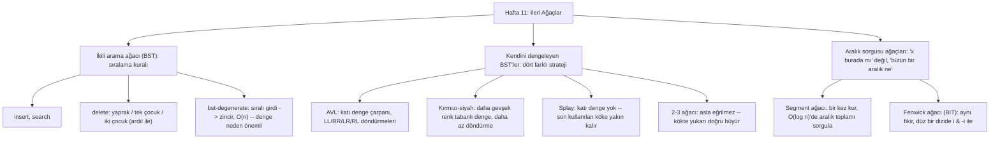

# Hafta 11 — İleri Ağaçlar

*CEN207 Veri Yapıları (eski adıyla CE205) · 2026–2027 Güz*

<!-- materials:start -->

<div class="materials" markdown>

[:material-file-pdf-box: Ders notu (PDF)](cen207-week-11-notes.pdf){ .md-button download="cen207-week-11-notes.pdf" }
[:material-file-word-box: Ders notu (DOCX)](cen207-week-11-notes.docx){ .md-button download="cen207-week-11-notes.docx" }
[:material-presentation: Sunum (PDF)](cen207-week-11-slides.pdf){ .md-button download="cen207-week-11-slides.pdf" }
[:material-microsoft-powerpoint: Sunum (PPTX)](cen207-week-11-slides.pptx){ .md-button download="cen207-week-11-slides.pptx" }
[:material-language-html5: Sunum (HTML, çevrimdışı)](cen207-week-11-slides.html){ .md-button download="cen207-week-11-slides.html" }
[:material-folder-zip: Tümünü indir (ZIP)](cen207-week-11-materials.zip){ .md-button download="cen207-week-11-materials.zip" }
[:material-fullscreen: Sunumu tam ekran aç](cen207-week-11-slides.html){ .md-button .md-button--primary target=_blank }

</div>

<div class="deck-frame">
<iframe src="../cen207-week-11-slides.html" title="Hafta 11 — Gelişmiş Ağaçlar" loading="lazy" allowfullscreen></iframe>
</div>

<p class="deck-hint">Sunumun içine tıklayıp ok tuşlarıyla ilerleyin; tam ekran için sunumun sağ altındaki düğmeyi ya da yukarıdaki "Sunumu tam ekran aç" bağlantısını kullanın.</p>

<!-- materials:end -->

!!! abstract "Bu hafta"
    **Öğrenme çıktıları.** Bu haftanın sonunda **ikili arama ağacını (binary search tree, BST)** — ekleme
    (insert), arama (search) ve silmenin üç durumunu (yaprak, tek çocuk, iki çocuk) — açıklayabilecek,
    çizebilecek ve uygulayabileceksiniz; ayrıca kötü bir ekleme sırasının bir BST'yi bağlı listeye
    dönüştürebileceğini açıklayabileceksiniz. Ardından bunu önleyen dört farklı yaklaşımla tanışacaksınız:
    **AVL ağacı** (katı bir denge çarpanı (balance factor) ve dört döndürme (rotation) durumu: LL, RR, LR,
    RL), **kırmızı-siyah ağaç (red-black tree)** (daha gevşek, renge dayalı bir denge, daha az döndürme),
    **splay ağacı (splay tree)** (hiç katı denge yok — bunun yerine erişim örüntülerine uyum sağlar) ve
    **2-3 ağacı** (asla eğrilmez, çünkü yapraklarda değil kökte, yukarı doğru büyür). Son olarak, tek bir
    anahtar yerine bir **aralık** sorusuna `O(log n)`'de yanıt veren iki özel amaçlı ağaçla tanışacaksınız:
    **segment ağacı (segment tree)** (bir kez kurulur, çok kez aralık toplamı sorgulanır) ve **Fenwick ağacı
    / ikili indeksli ağaç (binary indexed tree, BIT)** (aynı fikir, tek bir aritmetik hile — `i & -i` — ve
    düz bir dizi ile). Bu çıktılar ders izlencesinin **ÖÇ.1** (temel veri yapılarını açıklama), **ÖÇ.2**
    (algoritmik karmaşıklığı analiz etme) ve **ÖÇ.7** (bir problem için doğru yapıyı seçme) çıktılarına
    karşılık gelir.

    **Önceden bilmeniz gerekenler.** Hafta 4, bu haftanın tamamının üzerine kurulduğu kelime dağarcığını
    verdi: bir ağaç, ebeveyn/çocuk kenarlarıyla bağlı, döngüsüz düğümlerdir; **kök (root)**, **yaprak
    (leaf)**, **derinlik (depth)**, **yükseklik (height)**, **alt ağaç (subtree)**; özyinelemeli dolaşmalar
    (inorder, preorder, postorder) ve kuyruk tabanlı seviye sıralı (level-order) dolaşma
    (`REPO\tools\dsanim\algorithms\week4\level-order-traversal.js` — bu haftanın ağaç çizimleri tam olarak
    aynı yerleşim fikrini kullanır: sola özyinele, yerleştir, sağa özyinele). Ama Hafta 4'ün öbeği (heap) bu
    haftanın ağaçları gibi hiç **sıralı** değildi — bir öbek yalnızca "ebeveyn çocuklarından iyidir" der,
    "solda olan her şey küçüktür" demez. Bu hafta, bu sıralama kuralını ilk kez ekliyor.

    **3 saatlik bir oturum için zaman planı.** İkili arama ağacı: ekleme, arama, silme (~35 dk) · denge
    neden önemli, dejenere (degenerate) durum (~10 dk) · AVL ağaçları: döndürmeler, ekleme, silme (~45 dk) ·
    kısa bir ara · kırmızı-siyah ağaçlar (~25 dk) · splay ağaçları (~20 dk) · 2-3 ağaçları (~15 dk) ·
    segment ağaçları (~15 dk) · Fenwick ağaçları (~15 dk) · teknik seçme, toparlama ve kendini sınama (~10
    dk).

## 0. Başlamadan önce

### 0.1 Zaten bildikleriniz

Hafta 4, bu haftanın yeniden kullandığı her kelimeyi verdi. Bir **ağaç (tree)**, ebeveynden çocuğa yönlü
kenarlarla bağlı düğümler kümesidir; tam olarak bir düğümün — **kök (root)** — ebeveyni yoktur ve döngü
yoktur. Çocuğu olmayan bir düğüm **yapraktır (leaf)**. Bir düğümün **derinliği (depth)**, kökten ona kaç
kenar olduğudur (kökün derinliği 0'dır); bir ağacın **yüksekliği (height)**, herhangi bir düğümünün en
büyük derinliğidir (tek düğümlü bir ağacın yüksekliği 0'dır; boş bir ağacın yüksekliği, gelenek gereği,
-1'dir). Bir düğüm, tüm soyu ile birlikte bir **alt ağaçtır (subtree)**. Ayrıca bir ağacın *her düğümünü
ziyaret etmeyi* de zaten biliyorsunuz — inorder, preorder, postorder (özyinelemeli, çağrı yığınını
kullanarak) ve seviye sıralı (level-order, döngüsel, açık bir kuyruk kullanarak) — ve somut bir ağaç
biçimini, **ikili öbeği (binary heap)**, biliyorsunuz; orada her düğüm "ebeveyn, çocuklarından (>=/<=)
iyidir" kuralına uyar, ama sol ile sağ hakkında *hiçbir şey* vaat edilmez.

**Gerçekten yeni bir fikir: sıralama.** Bu haftanın ilk yapısı, **ikili arama ağacı (BST)**, öbeğin hiç
sahip olmadığı bir kural ekler: her düğümde, sol alt ağaçtaki *her* anahtar küçüktür, sağ alt ağaçtaki
*her* anahtar büyüktür. Tam olarak bu kural, "bir ağacı" `O(n)` yerine `O(yükseklik)`'te **arayabileceğiniz**
bir yapıya dönüştürür — ama, bölüm 4'te göreceğiniz gibi, sıradan bir BST'nin yüksekliği tamamen
*anahtarların hangi sırayla geldiğine* bağlıdır — bu da tam olarak bu haftanın geri kalan ağaçlarının her
birinin farklı bir şekilde çözdüğü problemdir.

### 0.2 Bu haftanın haritası



Aşağıdaki her kutunun kendi adım adım animasyonu, tam bir C ve Java programı ve karmaşıklık ile sık
hatalar üzerine bir notu var.

## 1. İkili arama ağacı: ekleme (insert)

### 1.1 Başlangıç sorusu

Hafta 1 size *sıralı bir dizi* üzerinde ikili aramayı (binary search) verdi — hızlı (`O(log n)`), ama sıralı
bir diziye yeni bir değer eklemek `O(n)` tutar (ondan sonraki her eleman kaymalıdır). Hafta 2'nin bağlı
listesi `O(1)`'de ekler ama yalnızca `O(n)`'de *aranabilir* (kısayol yok, baştan yürümelisiniz). `O(n)`'den
daha az sürede hem ekleyen hem de arayan bir yapı var mı? **İkili arama ağacı**, her düğümde tek bir
kuralla evet yanıtını verir: **sol küçük, sağ büyük.**

BST, 1960 civarında birkaç kişi tarafından birbirinden bağımsız tanımlandı (P. F. Windley, A. D. Booth ve
A. J. T. Colin, ve T. N. Hibbard, 1959–1962 arasında birbirine yakın fikirler yayımladılar); Hibbard'ın
1962 makalesi genellikle silme işlemini — tam olarak bölüm 3'ün ele aldığı işlemi — çözmesiyle anılır.

### 1.2 Soyut veri türü

| İşlem | Ne yapar | Ön koşul | Karmaşıklık (yükseklik `h`) |
| --- | --- | --- | --- |
| `insert(key)` | `key`'i doğru sıralı yerine ekler; yinelenen (duplicate) yoksayılır | yok | `O(h)` |
| `search(key)` | `key`'in var olup olmadığını bildirir | yok | `O(h)` |
| `delete(key)` | Varsa `key`'i kaldırır; olmayan bir anahtar hiçbir şey yapmaz (no-op) | yok | `O(h)` |
| `min` / `max` | En küçük / en büyük anahtar | ağaç boş değil | `O(h)` |

`h`, ağacın şu anki yüksekliğidir. *Dengeli* bir BST için `h = O(log n)`'dir; bölüm 4, sıradan bir BST için
`h`'nin ne kadar kötüleşebileceğini tam olarak gösterir.

### 1.3 Bellekte nasıl durur, ve kod

Bir BST düğümü küçük bir yapıdır: bir `key`, ve iki çocuk göstericisi, `left` ve `right` (ikisi de `NULL`
olabilir). `insert`, kökten aşağı, tam olarak bir arama gibi, her düğümde `key`'i karşılaştırarak, boş bir
yuva (bir `NULL` çocuk) bulana kadar yürür — yeni düğüm işte oraya bağlanır.

Animasyonu oynatın, ya da ← → ile adım adım ilerleyin; `insert`'in aşağı yürüyüp yeni bir yaprağı, birer
birer karşılaştırmayla nasıl bağladığını izleyin.

<iframe class="dsanim" src="../anim/bst-insert.html" title="İkili arama ağacı: ekleme" loading="lazy"></iframe>
<div class="dsanim-baski" markdown>

</div>

Seçicide ayrıca **14 anahtar, negatif değerler ve bir yineleneni var** (zor) ve uç durumları — **10 değer,
yalnız 3 farklı anahtar**, **10 anahtar artan sırada** (zincire yaslanmaya başladığını izleyin — bölüm 4
bunu ileri götürür), ve **tek bir anahtar** — deneyin; ya da dört zorluk seviyesinde rastgele veri için 🎲
düğmesine basın, ya da kendi değerlerinizi yazın.

=== "C"

    ```console
    gcc -std=c11 -Wall -Wextra -o /tmp/x bst_insert.c && /tmp/x
    ```

    Beklenen çıktı:

    ```text
    -- normal: 10 keys, a moderately mixed order --
    insert(50): inorder = 50  height = 0
    insert(30): inorder = 30 50  height = 1
    insert(70): inorder = 30 50 70  height = 1
    insert(20): inorder = 20 30 50 70  height = 2
    insert(40): inorder = 20 30 40 50 70  height = 2
    insert(60): inorder = 20 30 40 50 60 70  height = 2
    insert(80): inorder = 20 30 40 50 60 70 80  height = 2
    insert(35): inorder = 20 30 35 40 50 60 70 80  height = 3
    insert(65): inorder = 20 30 35 40 50 60 65 70 80  height = 3
    insert(90): inorder = 20 30 35 40 50 60 65 70 80 90  height = 3

    -- hard: 14 keys, negative values and a repeat --
    insert(10): inorder = 10  height = 0
    insert(-5): inorder = -5 10  height = 1
    insert(25): inorder = -5 10 25  height = 1
    insert(10): inorder = -5 10 25  height = 1
    insert(-20): inorder = -20 -5 10 25  height = 2
    insert(5): inorder = -20 -5 5 10 25  height = 2
    insert(17): inorder = -20 -5 5 10 17 25  height = 2
    insert(30): inorder = -20 -5 5 10 17 25 30  height = 2
    insert(-5): inorder = -20 -5 5 10 17 25 30  height = 2
    insert(3): inorder = -20 -5 3 5 10 17 25 30  height = 3
    insert(22): inorder = -20 -5 3 5 10 17 22 25 30  height = 3
    insert(40): inorder = -20 -5 3 5 10 17 22 25 30 40  height = 3
    insert(-15): inorder = -20 -15 -5 3 5 10 17 22 25 30 40  height = 3
    insert(12): inorder = -20 -15 -5 3 5 10 12 17 22 25 30 40  height = 3

    -- edge: 10 values, only 3 distinct keys --
    insert(8): inorder = 8  height = 0
    insert(8): inorder = 8  height = 0
    insert(3): inorder = 3 8  height = 1
    insert(8): inorder = 3 8  height = 1
    insert(3): inorder = 3 8  height = 1
    insert(15): inorder = 3 8 15  height = 1
    insert(3): inorder = 3 8 15  height = 1
    insert(8): inorder = 3 8 15  height = 1
    insert(15): inorder = 3 8 15  height = 1
    insert(8): inorder = 3 8 15  height = 1

    -- edge: 10 keys in ascending order -- forms a near-chain --
    insert(1): inorder = 1  height = 0
    insert(2): inorder = 1 2  height = 1
    insert(3): inorder = 1 2 3  height = 2
    insert(4): inorder = 1 2 3 4  height = 3
    insert(5): inorder = 1 2 3 4 5  height = 4
    insert(6): inorder = 1 2 3 4 5 6  height = 5
    insert(7): inorder = 1 2 3 4 5 6 7  height = 6
    insert(8): inorder = 1 2 3 4 5 6 7 8  height = 7
    insert(9): inorder = 1 2 3 4 5 6 7 8 9  height = 8
    insert(10): inorder = 1 2 3 4 5 6 7 8 9 10  height = 9

    -- edge: a single key --
    insert(42): inorder = 42  height = 0
    ```

    ??? example "Tam program: `bst_insert.c`"

        ```c
        /* Week 11 -- Advanced Trees
         * Binary search tree (BST): insert. Duplicates are ignored (tree unchanged).
         * CEN207 Data Structures (CS50-style lecture notes)
         */
        #include <stdio.h>
        #include <stdlib.h>

        typedef struct Node {
            int key;
            struct Node *left;
            struct Node *right;
        } Node;

        Node *bst_insert(Node *root, int key) {
            Node *cur = root, *parent = NULL;
            while (cur != NULL) {
                parent = cur;
                if (key == cur->key) return root;             /* duplicate: tree unchanged */
                if (key < cur->key)  cur = cur->left;
                else                 cur = cur->right;
            }
            Node *n = malloc(sizeof(Node));
            n->key = key;
            n->left = NULL;
            n->right = NULL;
            if (parent == NULL) return n;                      /* empty tree: n is the new root */
            if (key < parent->key) parent->left = n;
            else                    parent->right = n;
            return root;
        }

        static int height(Node *n) {
            if (n == NULL) return -1;
            int l = height(n->left), r = height(n->right);
            return 1 + (l > r ? l : r);
        }

        static void print_inorder(Node *n) {
            if (n == NULL) return;
            print_inorder(n->left);
            printf(" %d", n->key);
            print_inorder(n->right);
        }

        static void free_tree(Node *n) {
            if (n == NULL) return;
            free_tree(n->left);
            free_tree(n->right);
            free(n);
        }

        static void run_scenario(const char *label, const int keys[], int n) {
            printf("-- %s --\n", label);
            Node *root = NULL;
            for (int i = 0; i < n; i++) {
                root = bst_insert(root, keys[i]);
                printf("insert(%d): inorder =", keys[i]);
                print_inorder(root);
                printf("  height = %d\n", height(root));
            }
            printf("\n");
            free_tree(root);
        }

        int main(void) {
            int normal[] = {50, 30, 70, 20, 40, 60, 80, 35, 65, 90};
            run_scenario("normal: 10 keys, a moderately mixed order", normal, 10);

            int hard[] = {10, -5, 25, 10, -20, 5, 17, 30, -5, 3, 22, 40, -15, 12};
            run_scenario("hard: 14 keys, negative values and a repeat", hard, 14);

            int dup[] = {8, 8, 3, 8, 3, 15, 3, 8, 15, 8};
            run_scenario("edge: 10 values, only 3 distinct keys", dup, 10);

            int sorted[] = {1, 2, 3, 4, 5, 6, 7, 8, 9, 10};
            run_scenario("edge: 10 keys in ascending order -- forms a near-chain", sorted, 10);

            int single[] = {42};
            run_scenario("edge: a single key", single, 1);

            return 0;
        }
        ```

=== "Java"

    ```console
    javac -Xlint:all -d /tmp/j BstInsert.java && java -cp /tmp/j BstInsert
    ```

    Beklenen çıktı: yukarıdaki C çalıştırmasıyla birebir aynı (aynı algoritma, aynı veri).

    ??? example "Tam program: `BstInsert.java`"

        ```java
        /* Week 11 -- Advanced Trees
         * Binary search tree (BST): insert. Duplicates are ignored (tree unchanged).
         * CEN207 Data Structures (CS50-style lecture notes)
         */
        public class BstInsert {
            static class Node {
                int key;
                Node left;
                Node right;
            }

            static Node bstInsert(Node root, int key) {
                Node cur = root, parent = null;
                while (cur != null) {
                    parent = cur;
                    if (key == cur.key) return root;               // duplicate: tree unchanged
                    if (key < cur.key)  cur = cur.left;
                    else                cur = cur.right;
                }
                Node n = new Node();
                n.key = key;
                n.left = null;
                n.right = null;
                if (parent == null) return n;                       // empty tree: n is the new root
                if (key < parent.key) parent.left = n;
                else                   parent.right = n;
                return root;
            }

            static int height(Node n) {
                if (n == null) return -1;
                int l = height(n.left), r = height(n.right);
                return 1 + Math.max(l, r);
            }

            static void printInorder(Node n, StringBuilder sb) {
                if (n == null) return;
                printInorder(n.left, sb);
                sb.append(' ').append(n.key);
                printInorder(n.right, sb);
            }

            static void runScenario(String label, int[] keys) {
                System.out.println("-- " + label + " --");
                Node root = null;
                for (int key : keys) {
                    root = bstInsert(root, key);
                    StringBuilder sb = new StringBuilder();
                    printInorder(root, sb);
                    System.out.println("insert(" + key + "): inorder =" + sb + "  height = " + height(root));
                }
                System.out.println();
            }

            public static void main(String[] args) {
                int[] normal = {50, 30, 70, 20, 40, 60, 80, 35, 65, 90};
                runScenario("normal: 10 keys, a moderately mixed order", normal);

                int[] hard = {10, -5, 25, 10, -20, 5, 17, 30, -5, 3, 22, 40, -15, 12};
                runScenario("hard: 14 keys, negative values and a repeat", hard);

                int[] dup = {8, 8, 3, 8, 3, 15, 3, 8, 15, 8};
                runScenario("edge: 10 values, only 3 distinct keys", dup);

                int[] sorted = {1, 2, 3, 4, 5, 6, 7, 8, 9, 10};
                runScenario("edge: 10 keys in ascending order -- forms a near-chain", sorted);

                int[] single = {42};
                runScenario("edge: a single key", single);
            }
        }
        ```

### 1.4 Karmaşıklık, sık hatalar, kendini sına

**Karmaşıklık.** Hem en iyi hem ortalama durum `O(h)`'dir; `h` ağacın şu anki yüksekliğidir; en kötü
durumda (bkz. bölüm 4) `h`, `n - 1`'e ulaşabilir, `insert`'i `O(n)` yapar. Ekstra alan `O(1)`'dir (bir yeni
düğüm).

!!! warning "Sık yapılan hatalar"
    - `insert`'ten (olası yeni) `root`'u döndürmeyi unutmak — C/Java'da referans parametreler olmadan,
      çağıranın `root` değişkeni kendiliğinden güncellenmez; her zaman `root = bst_insert(root, key);`
      yazmalısınız.
    - Yinelenen kontrolünde `<=` yerine `<` (ya da tersi) kullanmak, sessizce "yinelenen: yoksayıldı"yı
      "yinelenen: sağ çocuk olarak tekrar eklendi"ye çevirip sıralama değişmezini bozar.
    - `parent` göstericisini kaybetmek: `cur`'u, ziyaret edilen son `NULL`-olmayan düğümü hatırlamadan
      `NULL`'a kadar yürütürseniz, yeni düğümü bağlayacak bir yeriniz kalmaz.

??? success "Kendini sına: yukarıdaki 'artan sıra' uç durumunda, neden her yeni anahtar hep SAĞ çocuk olur, hiç sol olmaz?"
    İlkinden sonra eklenen her anahtar, ağaçta zaten var olan her anahtardan *büyüktür* (girdi artan sırada
    olduğu için), bu yüzden inişteki her düğümde `key > cur->key` doğrudur — yürüyüş her zaman sağa gider ve
    yeni yaprak her zaman bir sağ çocuk olarak eklenir. Bu, bölüm 4'ün ayrıntılı incelediği tam olarak o
    zincir biçimidir.

## 2. Bir BST'de arama (search)

### 2.1 Başlangıç sorusu

`insert` zaten anahtarları karşılaştırarak aşağı yürüyor — `search` de neredeyse aynı yürüyüştür, yalnız
bir şey yaratmadan. Sıralama kuralı verildiğinde, `search`'ün en kötü durumda kaç düğüm ziyaret etmesi
gerekir, ve bu sayı neye bağlıdır?

### 2.2 Fikir

Her düğümde, hedefi düğümün anahtarıyla karşılaştırın: eşitse bulundu; küçükse "yalnızca sol alt ağaçta
olabilir" (sıralama kuralı bunu *garanti eder* — sağ alt ağaçta hiçbir şey daha küçük olamaz); büyükse
ayna görüntüsü. Bir eşleşmeden önce ulaşılan `NULL`, anahtarın hiç var olmadığı anlamına gelir.

### 2.3 Bellekte nasıl durur, ve kod

`search`, `insert`'in inişindeki aynı karşılaştırma mantığını yeniden kullanır, yalnız bir düğüm yaratmak
yerine bir boole döndürür. Genel bir `probes` sayacı (Hafta 6'nın karma (hash) tablolarından beri
kullandığınız üslupla) aramanın gerçekte kaç karşılaştırma yaptığını kaydeder.

<iframe class="dsanim" src="../anim/bst-search.html" title="İkili arama ağacı: arama" loading="lazy"></iframe>
<div class="dsanim-baski" markdown>

</div>

Seçicide ayrıca **14 anahtar, negatif değerler, 5 arama** (zor) ve uç durumları — **en küçükten küçük ve en
büyükten büyük arama**, **artan sırada eklemelerle kurulmuş bir zincirde son anahtarı arama**, ve **tek bir
düğüm** — deneyin; ya da dört zorluk seviyesinde rastgele veri için 🎲 düğmesine basın, ya da kendi
değerlerinizi yazın.

=== "C"

    ```console
    gcc -std=c11 -Wall -Wextra -o /tmp/x bst_search.c && /tmp/x
    ```

    Beklenen çıktı:

    ```text
    -- normal: 10 keys, 3 hits and 2 misses --
    tree built from 10 keys
    search(65): found, 4 probes
    search(20): found, 3 probes
    search(90): found, 4 probes
    search(55): not found, 3 probes
    search(100): not found, 4 probes

    -- hard: 14 keys with negative values, 5 searches --
    tree built from 14 keys
    search(-20): found, 3 probes
    search(60): found, 5 probes
    search(0): not found, 4 probes
    search(-5): found, 2 probes
    search(99): not found, 5 probes

    -- edge: searching below the minimum and above the maximum --
    tree built from 10 keys
    search(-1000): not found, 4 probes
    search(1000): not found, 4 probes
    search(50): found, 1 probes

    -- edge: searching for the last key in a chain built from ascending inserts (O(n)) --
    tree built from 10 keys
    search(10): found, 10 probes
    search(1): found, 1 probes
    search(11): not found, 10 probes

    -- edge: a single node, search the root and a missing value --
    tree built from 1 keys
    search(7): found, 1 probes
    search(3): not found, 1 probes
    ```

    ??? example "Tam program: `bst_search.c`"

        ```c
        /* Week 11 -- Advanced Trees
         * Binary search tree (BST): search.
         * CEN207 Data Structures (CS50-style lecture notes)
         */
        #include <stdio.h>
        #include <stdlib.h>

        typedef struct Node {
            int key;
            struct Node *left;
            struct Node *right;
        } Node;

        static Node *bst_build_insert(Node *root, int key) {
            Node *cur = root, *parent = NULL;
            while (cur != NULL) {
                parent = cur;
                if (key == cur->key) return root;
                if (key < cur->key) cur = cur->left; else cur = cur->right;
            }
            Node *n = malloc(sizeof(Node));
            n->key = key; n->left = NULL; n->right = NULL;
            if (parent == NULL) return n;
            if (key < parent->key) parent->left = n; else parent->right = n;
            return root;
        }

        int probes;

        int bst_search(Node *root, int key) {
            Node *cur = root;
            probes = 0;
            while (cur != NULL) {
                probes++;
                if (key == cur->key) return 1;
                if (key < cur->key) cur = cur->left;
                else                cur = cur->right;
            }
            return 0;
        }

        static void free_tree(Node *n) {
            if (n == NULL) return;
            free_tree(n->left);
            free_tree(n->right);
            free(n);
        }

        static void run_scenario(const char *label, const int keys[], int nk, const int finds[], int nf) {
            printf("-- %s --\n", label);
            Node *root = NULL;
            for (int i = 0; i < nk; i++) root = bst_build_insert(root, keys[i]);
            printf("tree built from %d keys\n", nk);
            for (int i = 0; i < nf; i++) {
                int found = bst_search(root, finds[i]);
                printf("search(%d): %s, %d probes\n", finds[i], found ? "found" : "not found", probes);
            }
            printf("\n");
            free_tree(root);
        }

        int main(void) {
            int normal_keys[] = {50, 30, 70, 20, 40, 60, 80, 35, 65, 90};
            int normal_finds[] = {65, 20, 90, 55, 100};
            run_scenario("normal: 10 keys, 3 hits and 2 misses", normal_keys, 10, normal_finds, 5);

            int hard_keys[] = {10, -5, 25, 40, -20, 5, 17, 30, 45, 3, 22, -15, 12, 60};
            int hard_finds[] = {-20, 60, 0, -5, 99};
            run_scenario("hard: 14 keys with negative values, 5 searches", hard_keys, 14, hard_finds, 5);

            int bound_keys[] = {50, 30, 70, 20, 40, 60, 80, 10, 45, 90};
            int bound_finds[] = {-1000, 1000, 50};
            run_scenario("edge: searching below the minimum and above the maximum", bound_keys, 10, bound_finds, 3);

            int chain_keys[] = {1, 2, 3, 4, 5, 6, 7, 8, 9, 10};
            int chain_finds[] = {10, 1, 11};
            run_scenario("edge: searching for the last key in a chain built from ascending inserts (O(n))", chain_keys, 10, chain_finds, 3);

            int single_keys[] = {7};
            int single_finds[] = {7, 3};
            run_scenario("edge: a single node, search the root and a missing value", single_keys, 1, single_finds, 2);

            return 0;
        }
        ```

=== "Java"

    ```console
    javac -Xlint:all -d /tmp/j BstSearch.java && java -cp /tmp/j BstSearch
    ```

    Beklenen çıktı: yukarıdaki C çalıştırmasıyla birebir aynı (aynı algoritma, aynı veri).

    ??? example "Tam program: `BstSearch.java`"

        ```java
        /* Week 11 -- Advanced Trees
         * Binary search tree (BST): search.
         * CEN207 Data Structures (CS50-style lecture notes)
         */
        public class BstSearch {
            static class Node {
                int key;
                Node left;
                Node right;
            }

            static Node bstBuildInsert(Node root, int key) {
                Node cur = root, parent = null;
                while (cur != null) {
                    parent = cur;
                    if (key == cur.key) return root;
                    if (key < cur.key) cur = cur.left; else cur = cur.right;
                }
                Node n = new Node();
                n.key = key; n.left = null; n.right = null;
                if (parent == null) return n;
                if (key < parent.key) parent.left = n; else parent.right = n;
                return root;
            }

            static int probes;

            static boolean bstSearch(Node root, int key) {
                Node cur = root;
                probes = 0;
                while (cur != null) {
                    probes++;
                    if (key == cur.key) return true;
                    if (key < cur.key) cur = cur.left;
                    else                cur = cur.right;
                }
                return false;
            }

            static void runScenario(String label, int[] keys, int[] finds) {
                System.out.println("-- " + label + " --");
                Node root = null;
                for (int key : keys) root = bstBuildInsert(root, key);
                System.out.println("tree built from " + keys.length + " keys");
                for (int f : finds) {
                    boolean found = bstSearch(root, f);
                    System.out.println("search(" + f + "): " + (found ? "found" : "not found") + ", " + probes + " probes");
                }
                System.out.println();
            }

            public static void main(String[] args) {
                int[] normalKeys = {50, 30, 70, 20, 40, 60, 80, 35, 65, 90};
                int[] normalFinds = {65, 20, 90, 55, 100};
                runScenario("normal: 10 keys, 3 hits and 2 misses", normalKeys, normalFinds);

                int[] hardKeys = {10, -5, 25, 40, -20, 5, 17, 30, 45, 3, 22, -15, 12, 60};
                int[] hardFinds = {-20, 60, 0, -5, 99};
                runScenario("hard: 14 keys with negative values, 5 searches", hardKeys, hardFinds);

                int[] boundKeys = {50, 30, 70, 20, 40, 60, 80, 10, 45, 90};
                int[] boundFinds = {-1000, 1000, 50};
                runScenario("edge: searching below the minimum and above the maximum", boundKeys, boundFinds);

                int[] chainKeys = {1, 2, 3, 4, 5, 6, 7, 8, 9, 10};
                int[] chainFinds = {10, 1, 11};
                runScenario("edge: searching for the last key in a chain built from ascending inserts (O(n))", chainKeys, chainFinds);

                int[] singleKeys = {7};
                int[] singleFinds = {7, 3};
                runScenario("edge: a single node, search the root and a missing value", singleKeys, singleFinds);
            }
        }
        ```

### 2.4 Karmaşıklık, sık hatalar, kendini sına

**Karmaşıklık.** `O(h)`, `insert` ile aynı — bir arama, her seviyede en fazla bir düğüm ziyaret eder. En
iyi durum `O(1)`'dir (kökün kendisi). `probes` sayacının dışında ekstra alan yoktur.

!!! warning "Sık yapılan hatalar"
    - Bir eşleşme bulduktan sonra karşılaştırmaya devam etmek (bire-bir hata, off-by-one döngü), hemen
      döndürmek yerine.
    - "Bulunamadı"yı bir hata olarak ele almak, normal ve beklenen bir sonuç yerine — olmayan bir anahtarda
      BST araması temiz bir şekilde dönmelidir, çökmemeli ya da sonsuza kadar dönmemelidir (bunu önleyen tam
      olarak `while (cur != NULL)` koruyucusudur).

??? success "Kendini sına: yukarıdaki 'artan sırada eklemeler' zincirinde search(10) neden 10 karşılaştırma tutar, ama search(1) yalnız 1 tutar?"
    O ağaç saf bir sağa-eğik zincirdir (bkz. bölüm 1'in kendini sınaması): `1` kökte oturur, `10` en derin
    yaprakta, 9 seviye aşağıda. Kökün kendi anahtarını aramak tam olarak bir karşılaştırma ister; en derin
    yaprağın anahtarını aramak ona kadar her seviye için bir karşılaştırma ister, toplamda `10` — bu ağacın
    yüksekliği (9) artı bir.

## 3. Bir BST'den silme (delete)

### 3.1 Başlangıç sorusu

Bir *yaprağı* silmek kolaydır: yalnızca ayırın. *İki çocuklu* bir düğümü silmek öyle değildir — düğümü
sadece kaldıramazsınız, çünkü kalan her anahtarı doğru sıralı tutarken bir şeyin onun yerini alması
gerekir. Onun yerini hangi tek değer güvenle alabilir?

### 3.2 Fikir: üç durum

Bir düğümü kaldırmak, kaç çocuğu olduğuna göre kararlaştırılan tam olarak üç duruma indirgenir:

1. **Yaprak (leaf)** (çocuğu yok) — yalnızca ayırın.
2. **Tek çocuk (one child)** — dışarı çıkarın: ebeveyn doğrudan (tek) çocuğa bağlanır.
3. **İki çocuk (two children)** — **ardılı (in-order successor)** bulun (sağ alt ağaçtaki en küçük anahtar
   — sağ çocuktan mümkün olduğunca sola yürüyün), *onun* anahtarını silinecek düğüme kopyalayın, sonra
   ardılı kendi asıl yerinden silin. Ardıl, inşa gereği, en fazla bir sağ çocuğa sahip olabilir, bu yüzden
   bu her zaman durum 1'e ya da durum 2'ye indirgenir.

<iframe class="dsanim" src="../anim/bst-delete.html" title="İkili arama ağacı: silme" loading="lazy"></iframe>
<div class="dsanim-baski" markdown>

</div>

Seçicide ayrıca **14 anahtar, negatif değerler, 6 silme (kök dahil)** (zor) ve uç durumları — **var olmayan
bir anahtarı silmeye çalışma (no-op)**, **bütün anahtarları sil, ağaç boşalsın**, ve **tek düğümü sil** —
deneyin; ya da dört zorluk seviyesinde rastgele veri için 🎲 düğmesine basın, ya da kendi değerlerinizi
yazın.

=== "C"

    ```console
    gcc -std=c11 -Wall -Wextra -o /tmp/x bst_delete.c && /tmp/x
    ```

    Beklenen çıktı:

    ```text
    -- normal: 10 keys, 4 deletes (a mix of leaf, one-child, two-children) --
    tree built from 10 keys, inorder = 20 30 35 40 50 60 65 70 80 90
    delete(35): inorder = 20 30 40 50 60 65 70 80 90
    delete(70): inorder = 20 30 40 50 60 65 80 90
    delete(50): inorder = 20 30 40 60 65 80 90
    delete(20): inorder = 30 40 60 65 80 90

    -- hard: 14 keys with negative values, 6 deletes (including the root) --
    tree built from 14 keys, inorder = -20 -15 -5 3 5 10 12 17 22 25 30 40 45 60
    delete(-5): inorder = -20 -15 3 5 10 12 17 22 25 30 40 45 60
    delete(40): inorder = -20 -15 3 5 10 12 17 22 25 30 45 60
    delete(10): inorder = -20 -15 3 5 12 17 22 25 30 45 60
    delete(17): inorder = -20 -15 3 5 12 22 25 30 45 60
    delete(60): inorder = -20 -15 3 5 12 22 25 30 45
    delete(3): inorder = -20 -15 5 12 22 25 30 45

    -- edge: trying to delete a key that is not there (no-op) --
    tree built from 10 keys, inorder = 10 20 30 40 45 50 60 70 80 90
    delete(999): inorder = 10 20 30 40 45 50 60 70 80 90
    delete(30): inorder = 10 20 40 45 50 60 70 80 90
    delete(-1000): inorder = 10 20 40 45 50 60 70 80 90

    -- edge: delete every key, down to an empty tree --
    tree built from 10 keys, inorder = 1 2 3 4 5 6 7 8 9 10
    delete(10): inorder = 1 2 3 4 5 6 7 8 9
    delete(6): inorder = 1 2 3 4 5 7 8 9
    delete(2): inorder = 1 3 4 5 7 8 9
    delete(9): inorder = 1 3 4 5 7 8
    delete(7): inorder = 1 3 4 5 8
    delete(4): inorder = 1 3 5 8
    delete(1): inorder = 3 5 8
    delete(8): inorder = 3 5
    delete(3): inorder = 5
    delete(5): inorder =

    -- edge: delete the only node --
    tree built from 1 keys, inorder = 7
    delete(7): inorder =
    ```

    ??? example "Tam program: `bst_delete.c`"

        ```c
        /* Week 11 -- Advanced Trees
         * Binary search tree (BST): delete (leaf / one child / two children with successor).
         * CEN207 Data Structures (CS50-style lecture notes)
         */
        #include <stdio.h>
        #include <stdlib.h>

        typedef struct Node {
            int key;
            struct Node *left;
            struct Node *right;
        } Node;

        static Node *bst_build_insert(Node *root, int key) {
            Node *cur = root, *parent = NULL;
            while (cur != NULL) {
                parent = cur;
                if (key == cur->key) return root;
                if (key < cur->key) cur = cur->left; else cur = cur->right;
            }
            Node *n = malloc(sizeof(Node));
            n->key = key; n->left = NULL; n->right = NULL;
            if (parent == NULL) return n;
            if (key < parent->key) parent->left = n; else parent->right = n;
            return root;
        }

        Node *bst_delete(Node *root, int key) {
            Node *cur = root, *parent = NULL;
            while (cur != NULL && key != cur->key) {
                parent = cur;
                cur = (key < cur->key) ? cur->left : cur->right;
            }
            if (cur == NULL) return root;                     /* not found: no-op */
            if (cur->left != NULL && cur->right != NULL) {
                Node *succ = cur->right, *succParent = cur;
                while (succ->left != NULL) { succParent = succ; succ = succ->left; }
                cur->key = succ->key;                          /* copy successor key up */
                parent = succParent;
                cur = succ;                                    /* now splice out succ: <= 1 child */
            }
            Node *child = (cur->left != NULL) ? cur->left : cur->right;
            if (parent == NULL)           root = child;
            else if (parent->left == cur) parent->left  = child;
            else                          parent->right = child;
            free(cur);
            return root;
        }

        static void print_inorder(Node *n) {
            if (n == NULL) return;
            print_inorder(n->left);
            printf(" %d", n->key);
            print_inorder(n->right);
        }

        static void free_tree(Node *n) {
            if (n == NULL) return;
            free_tree(n->left);
            free_tree(n->right);
            free(n);
        }

        static void run_scenario(const char *label, const int keys[], int nk, const int dels[], int nd) {
            printf("-- %s --\n", label);
            Node *root = NULL;
            for (int i = 0; i < nk; i++) root = bst_build_insert(root, keys[i]);
            printf("tree built from %d keys, inorder =", nk);
            print_inorder(root);
            printf("\n");
            for (int i = 0; i < nd; i++) {
                root = bst_delete(root, dels[i]);
                printf("delete(%d): inorder =", dels[i]);
                print_inorder(root);
                printf("\n");
            }
            printf("\n");
            free_tree(root);
        }

        int main(void) {
            int normal_keys[] = {50, 30, 70, 20, 40, 60, 80, 35, 65, 90};
            int normal_dels[] = {35, 70, 50, 20};
            run_scenario("normal: 10 keys, 4 deletes (a mix of leaf, one-child, two-children)", normal_keys, 10, normal_dels, 4);

            int hard_keys[] = {10, -5, 25, 40, -20, 5, 17, 30, 45, 3, 22, -15, 12, 60};
            int hard_dels[] = {-5, 40, 10, 17, 60, 3};
            run_scenario("hard: 14 keys with negative values, 6 deletes (including the root)", hard_keys, 14, hard_dels, 6);

            int nf_keys[] = {50, 30, 70, 20, 40, 60, 80, 10, 45, 90};
            int nf_dels[] = {999, 30, -1000};
            run_scenario("edge: trying to delete a key that is not there (no-op)", nf_keys, 10, nf_dels, 3);

            int empty_keys[] = {5, 3, 8, 1, 4, 7, 9, 2, 6, 10};
            int empty_dels[] = {10, 6, 2, 9, 7, 4, 1, 8, 3, 5};
            run_scenario("edge: delete every key, down to an empty tree", empty_keys, 10, empty_dels, 10);

            int single_keys[] = {7};
            int single_dels[] = {7};
            run_scenario("edge: delete the only node", single_keys, 1, single_dels, 1);

            return 0;
        }
        ```

=== "Java"

    ```console
    javac -Xlint:all -d /tmp/j BstDelete.java && java -cp /tmp/j BstDelete
    ```

    Beklenen çıktı: yukarıdaki C çalıştırmasıyla birebir aynı (aynı algoritma, aynı veri).

    ??? example "Tam program: `BstDelete.java`"

        ```java
        /* Week 11 -- Advanced Trees
         * Binary search tree (BST): delete (leaf / one child / two children with successor).
         * CEN207 Data Structures (CS50-style lecture notes)
         */
        public class BstDelete {
            static class Node {
                int key;
                Node left;
                Node right;
            }

            static Node bstBuildInsert(Node root, int key) {
                Node cur = root, parent = null;
                while (cur != null) {
                    parent = cur;
                    if (key == cur.key) return root;
                    if (key < cur.key) cur = cur.left; else cur = cur.right;
                }
                Node n = new Node();
                n.key = key; n.left = null; n.right = null;
                if (parent == null) return n;
                if (key < parent.key) parent.left = n; else parent.right = n;
                return root;
            }

            static Node bstDelete(Node root, int key) {
                Node cur = root, parent = null;
                while (cur != null && key != cur.key) {
                    parent = cur;
                    cur = (key < cur.key) ? cur.left : cur.right;
                }
                if (cur == null) return root;                      // not found: no-op
                if (cur.left != null && cur.right != null) {
                    Node succ = cur.right, succParent = cur;
                    while (succ.left != null) { succParent = succ; succ = succ.left; }
                    cur.key = succ.key;                             // copy successor key up
                    parent = succParent;
                    cur = succ;                                     // now splice out succ: <= 1 child
                }
                Node child = (cur.left != null) ? cur.left : cur.right;
                if (parent == null)            root = child;
                else if (parent.left == cur)   parent.left  = child;
                else                           parent.right = child;
                return root;
            }

            static void printInorder(Node n, StringBuilder sb) {
                if (n == null) return;
                printInorder(n.left, sb);
                sb.append(' ').append(n.key);
                printInorder(n.right, sb);
            }

            static void runScenario(String label, int[] keys, int[] dels) {
                System.out.println("-- " + label + " --");
                Node root = null;
                for (int key : keys) root = bstBuildInsert(root, key);
                StringBuilder sb0 = new StringBuilder();
                printInorder(root, sb0);
                System.out.println("tree built from " + keys.length + " keys, inorder =" + sb0);
                for (int d : dels) {
                    root = bstDelete(root, d);
                    StringBuilder sb = new StringBuilder();
                    printInorder(root, sb);
                    System.out.println("delete(" + d + "): inorder =" + sb);
                }
                System.out.println();
            }

            public static void main(String[] args) {
                int[] normalKeys = {50, 30, 70, 20, 40, 60, 80, 35, 65, 90};
                int[] normalDels = {35, 70, 50, 20};
                runScenario("normal: 10 keys, 4 deletes (a mix of leaf, one-child, two-children)", normalKeys, normalDels);

                int[] hardKeys = {10, -5, 25, 40, -20, 5, 17, 30, 45, 3, 22, -15, 12, 60};
                int[] hardDels = {-5, 40, 10, 17, 60, 3};
                runScenario("hard: 14 keys with negative values, 6 deletes (including the root)", hardKeys, hardDels);

                int[] nfKeys = {50, 30, 70, 20, 40, 60, 80, 10, 45, 90};
                int[] nfDels = {999, 30, -1000};
                runScenario("edge: trying to delete a key that is not there (no-op)", nfKeys, nfDels);

                int[] emptyKeys = {5, 3, 8, 1, 4, 7, 9, 2, 6, 10};
                int[] emptyDels = {10, 6, 2, 9, 7, 4, 1, 8, 3, 5};
                runScenario("edge: delete every key, down to an empty tree", emptyKeys, emptyDels);

                int[] singleKeys = {7};
                int[] singleDels = {7};
                runScenario("edge: delete the only node", singleKeys, singleDels);
            }
        }
        ```

### 3.4 Karmaşıklık, sık hatalar, kendini sına

**Karmaşıklık.** `O(h)`: düğümü bulmak `O(h)`'dir, ardılı bulmak da en fazla bir `O(h)` daha tutar (arama
yolundaki düğümleri asla yeniden ziyaret etmez). `insert` ve `search` ile aynı en kötü durum.

!!! warning "Sık yapılan hatalar"
    - Ardıl (successor) yerine **öncel (predecessor)** (sol alt ağaçtaki en büyük) kullanmak teoride eşit
      derecede doğrudur, ama iki kuralı *aynı kod tabanında* karıştırmak silmeleri izlemeyi öngörülemez
      yapar — birini seçin ve tutarlı kalın (bu ders ardılı kullanır).
    - C'de dışarı çıkarılan düğümü `free()` etmeyi unutmak — silinen anahtarlar sessizce sonsuza kadar
      bellek tüketmeye devam eder (tam olarak `--sanitize`'ın AddressSanitizer sızıntı denetiminin
      yakalayacağı türden bir hata).
    - Yalnızca iki-çocuk durumunu ele alıp, ardılın anahtarını kopyaladıktan sonra *ardılın asıl düğümünü*
      silmeniz gerektiğini unutmak, başladığınız düğümü değil.

??? success "Kendini sına: bir BST silmenin ardılının en fazla bir çocuğa sahip olacağı neden garantidir?"
    Ardıl, silinecek düğümün sağ alt ağacının *en soldaki* düğümüdür. En solda olmak, tanım gereği sol
    çocuğunun olmadığı anlamına gelir (yoksa daha da küçük birini bulmak için daha sola yürürdünüz). Bir sağ
    çocuğu olabilir ya da olmayabilir, ama asla ikisine birden sahip olamaz — bu yüzden onu silmek her zaman
    durum 1 ya da durum 2'dir, bir daha asla durum 3 değil.

## 4. Denge neden önemli: dejenere (degenerate) durum

### 4.1 Başlangıç sorusu

Bölüm 1–3'ün hepsi maliyetini `O(h)` olarak belirtir. Henüz sormadınız: `n` anahtarı rastgele bir sırada
ekleyerek kurulan bir BST için `h`, somut olarak nedir? Her zaman `log2(n)`'ye yakın mıdır?

### 4.2 Fikir: küme değil, sıra önemli

Bölüm 1–3'teki her teknik, her düğümde yeni anahtarı boş bir yuvaya kadar karşılaştırarak çalışır — ağacın
*biçimine* hiç bakmaz, yalnızca anahtar değerlerine bakar. Anahtarlar zaten sıralı (ya da neredeyse sıralı)
gelirse, her yeni anahtar zaten var olan her şeyden büyüktür (ya da küçüktür), bu yüzden her zaman en alta,
sonuncudan bir seviye daha derine eklenir: ağaç **bir zincire dejenere olur (degenerate)**, yükseklik `n -
1`, ve her işlem `O(n)` olur — "ağaç" olarak çizilmesine rağmen düz bir bağlı listeden daha iyi değildir.

<iframe class="dsanim" src="../anim/bst-degenerate.html" title="Neden dengeleme gerekir: dejenere (chain) BST" loading="lazy"></iframe>
<div class="dsanim-baski" markdown>

</div>

Seçicide ayrıca **14 anahtar azalan sırada** (zor) ve uç durumları — **neredeyse sıralı, ufak sıçramalarla
(yine de derin)** ve **AYNI 10 anahtar karışık sırada — çok daha sığ** — deneyin; bu ikincisi tam olarak
noktayı kanıtlıyor: aynı anahtar *kümesi*, tamamen farklı yükseklik, yalnızca ekleme *sırasından* — ya da 🎲
düğmesine basıp rastgele veri, ya da kendi değerlerinizi yazın.

=== "C"

    ```console
    gcc -std=c11 -Wall -Wextra -o /tmp/x bst_degenerate.c && /tmp/x
    ```

    Beklenen çıktı:

    ```text
    -- normal: 10 keys in ascending order -- forms a chain --
    insert(1): height = 0  (ideal for 1 nodes = 0)
    insert(2): height = 1  (ideal for 2 nodes = 1)
    insert(3): height = 2  (ideal for 3 nodes = 1)
    insert(4): height = 3  (ideal for 4 nodes = 2)
    insert(5): height = 4  (ideal for 5 nodes = 2)
    insert(6): height = 5  (ideal for 6 nodes = 2)
    insert(7): height = 6  (ideal for 7 nodes = 2)
    insert(8): height = 7  (ideal for 8 nodes = 3)
    insert(9): height = 8  (ideal for 9 nodes = 3)
    insert(10): height = 9  (ideal for 10 nodes = 3)
    final: n = 10, height = 9, ideal = 3

    -- hard: 14 keys in descending order -- a chain the other way --
    insert(140): height = 0  (ideal for 1 nodes = 0)
    insert(130): height = 1  (ideal for 2 nodes = 1)
    insert(120): height = 2  (ideal for 3 nodes = 1)
    insert(110): height = 3  (ideal for 4 nodes = 2)
    insert(100): height = 4  (ideal for 5 nodes = 2)
    insert(90): height = 5  (ideal for 6 nodes = 2)
    insert(80): height = 6  (ideal for 7 nodes = 2)
    insert(70): height = 7  (ideal for 8 nodes = 3)
    insert(60): height = 8  (ideal for 9 nodes = 3)
    insert(50): height = 9  (ideal for 10 nodes = 3)
    insert(40): height = 10  (ideal for 11 nodes = 3)
    insert(30): height = 11  (ideal for 12 nodes = 3)
    insert(20): height = 12  (ideal for 13 nodes = 3)
    insert(10): height = 13  (ideal for 14 nodes = 3)
    final: n = 14, height = 13, ideal = 3

    -- edge: nearly sorted with small zig-zags (still deep) --
    insert(10): height = 0  (ideal for 1 nodes = 0)
    insert(20): height = 1  (ideal for 2 nodes = 1)
    insert(15): height = 2  (ideal for 3 nodes = 1)
    insert(30): height = 2  (ideal for 4 nodes = 2)
    insert(25): height = 3  (ideal for 5 nodes = 2)
    insert(40): height = 3  (ideal for 6 nodes = 2)
    insert(35): height = 4  (ideal for 7 nodes = 2)
    insert(50): height = 4  (ideal for 8 nodes = 3)
    insert(45): height = 5  (ideal for 9 nodes = 3)
    insert(60): height = 5  (ideal for 10 nodes = 3)
    final: n = 10, height = 5, ideal = 3

    -- edge: the SAME 10 keys shuffled -- much shallower --
    insert(6): height = 0  (ideal for 1 nodes = 0)
    insert(9): height = 1  (ideal for 2 nodes = 1)
    insert(2): height = 1  (ideal for 3 nodes = 1)
    insert(10): height = 2  (ideal for 4 nodes = 2)
    insert(4): height = 2  (ideal for 5 nodes = 2)
    insert(8): height = 2  (ideal for 6 nodes = 2)
    insert(1): height = 2  (ideal for 7 nodes = 2)
    insert(7): height = 3  (ideal for 8 nodes = 3)
    insert(3): height = 3  (ideal for 9 nodes = 3)
    insert(5): height = 3  (ideal for 10 nodes = 3)
    final: n = 10, height = 3, ideal = 3

    -- edge: a single key, height 0 --
    insert(42): height = 0  (ideal for 1 nodes = 0)
    final: n = 1, height = 0, ideal = 0
    ```

    ??? example "Tam program: `bst_degenerate.c`"

        ```c
        /* Week 11 -- Advanced Trees
         * Why balancing matters: inserting the SAME set of keys in different orders gives wildly different BST
         * shapes. Sorted input degenerates into a chain -- height n-1, every operation O(n).
         * CEN207 Data Structures (CS50-style lecture notes)
         */
        #include <stdio.h>
        #include <stdlib.h>
        #include <math.h>

        typedef struct Node {
            int key;
            struct Node *left;
            struct Node *right;
        } Node;

        Node *bst_insert(Node *root, int key) {
            Node *cur = root, *parent = NULL;
            while (cur != NULL) {
                parent = cur;
                if (key == cur->key) return root;
                if (key < cur->key)  cur = cur->left;
                else                 cur = cur->right;
            }
            Node *n = malloc(sizeof(Node));
            n->key = key; n->left = NULL; n->right = NULL;
            if (parent == NULL) return n;
            if (key < parent->key) parent->left = n;
            else                    parent->right = n;
            return root;
        }

        static int height(Node *n) {
            if (n == NULL) return -1;
            int l = height(n->left), r = height(n->right);
            return 1 + (l > r ? l : r);
        }

        static void free_tree(Node *n) {
            if (n == NULL) return;
            free_tree(n->left);
            free_tree(n->right);
            free(n);
        }

        static int ilog2(int n) {
            int h = 0;
            while (n > 1) { n /= 2; h++; }
            return h;
        }

        static void run_scenario(const char *label, const int keys[], int n) {
            printf("-- %s --\n", label);
            Node *root = NULL;
            for (int i = 0; i < n; i++) {
                root = bst_insert(root, keys[i]);
                printf("insert(%d): height = %d  (ideal for %d nodes = %d)\n",
                       keys[i], height(root), i + 1, ilog2(i + 1));
            }
            int h = height(root), ideal = ilog2(n);
            printf("final: n = %d, height = %d, ideal = %d\n\n", n, h, ideal);
            free_tree(root);
        }

        int main(void) {
            int normal[] = {1, 2, 3, 4, 5, 6, 7, 8, 9, 10};
            run_scenario("normal: 10 keys in ascending order -- forms a chain", normal, 10);

            int hard[] = {140, 130, 120, 110, 100, 90, 80, 70, 60, 50, 40, 30, 20, 10};
            run_scenario("hard: 14 keys in descending order -- a chain the other way", hard, 14);

            int zigzag[] = {10, 20, 15, 30, 25, 40, 35, 50, 45, 60};
            run_scenario("edge: nearly sorted with small zig-zags (still deep)", zigzag, 10);

            int shuffled[] = {6, 9, 2, 10, 4, 8, 1, 7, 3, 5};
            run_scenario("edge: the SAME 10 keys shuffled -- much shallower", shuffled, 10);

            int single[] = {42};
            run_scenario("edge: a single key, height 0", single, 1);

            return 0;
        }
        ```

=== "Java"

    ```console
    javac -Xlint:all -d /tmp/j BstDegenerate.java && java -cp /tmp/j BstDegenerate
    ```

    Beklenen çıktı: yukarıdaki C çalıştırmasıyla birebir aynı (aynı algoritma, aynı veri).

    ??? example "Tam program: `BstDegenerate.java`"

        ```java
        /* Week 11 -- Advanced Trees
         * Why balancing matters: inserting the SAME set of keys in different orders gives wildly different BST
         * shapes. Sorted input degenerates into a chain -- height n-1, every operation O(n).
         * CEN207 Data Structures (CS50-style lecture notes)
         */
        public class BstDegenerate {
            static class Node {
                int key;
                Node left;
                Node right;
            }

            static Node bstInsert(Node root, int key) {
                Node cur = root, parent = null;
                while (cur != null) {
                    parent = cur;
                    if (key == cur.key) return root;
                    if (key < cur.key)  cur = cur.left;
                    else                cur = cur.right;
                }
                Node n = new Node();
                n.key = key; n.left = null; n.right = null;
                if (parent == null) return n;
                if (key < parent.key) parent.left = n;
                else                   parent.right = n;
                return root;
            }

            static int height(Node n) {
                if (n == null) return -1;
                int l = height(n.left), r = height(n.right);
                return 1 + Math.max(l, r);
            }

            static int ilog2(int n) {
                int h = 0;
                while (n > 1) { n /= 2; h++; }
                return h;
            }

            static void runScenario(String label, int[] keys) {
                System.out.println("-- " + label + " --");
                Node root = null;
                for (int i = 0; i < keys.length; i++) {
                    root = bstInsert(root, keys[i]);
                    System.out.println("insert(" + keys[i] + "): height = " + height(root)
                            + "  (ideal for " + (i + 1) + " nodes = " + ilog2(i + 1) + ")");
                }
                int h = height(root), ideal = ilog2(keys.length);
                System.out.println("final: n = " + keys.length + ", height = " + h + ", ideal = " + ideal);
                System.out.println();
            }

            public static void main(String[] args) {
                int[] normal = {1, 2, 3, 4, 5, 6, 7, 8, 9, 10};
                runScenario("normal: 10 keys in ascending order -- forms a chain", normal);

                int[] hard = {140, 130, 120, 110, 100, 90, 80, 70, 60, 50, 40, 30, 20, 10};
                runScenario("hard: 14 keys in descending order -- a chain the other way", hard);

                int[] zigzag = {10, 20, 15, 30, 25, 40, 35, 50, 45, 60};
                runScenario("edge: nearly sorted with small zig-zags (still deep)", zigzag);

                int[] shuffled = {6, 9, 2, 10, 4, 8, 1, 7, 3, 5};
                runScenario("edge: the SAME 10 keys shuffled -- much shallower", shuffled);

                int[] single = {42};
                runScenario("edge: a single key, height 0", single);
            }
        }
        ```

### 4.3 Karmaşıklık, sık hatalar, kendini sına

**Karmaşıklık.** En kötü durum yüksekliği `n - 1`'dir (sıralı ya da ters sıralı girdi): bölüm 1–3'ün her
işlemi `O(n)` olur. *Rastgele* bir ekleme sırası üzerinde ortalama durum yüksekliği `O(log n)`'dir (klasik
bir sonuç, yaklaşık `2 ln n`), ama "rastgele sıra" her zaman güvenebileceğiniz bir varsayım değildir —
sıralı girdi pratikte yaygındır (zaten sıralı bir dosyayı içe aktarmak, sıralı günlük (log) kayıtlarını
tekrar oynatmak).

!!! warning "Sık yapılan hatalar"
    - Yalnızca "BST" olmasının `O(log n)` garanti ettiğini varsaymak — *en fazla* `O(n)` ve *en iyi ihtimalle*
      `O(log n)` garanti eder; yalnızca *kendini dengeleyen* bir BST (bölüm 5–8) en kötü durumda da `O(log
      n)` garanti eder.
    - Bir BST uygulamasını yalnızca rastgele test verisiyle kıyaslamak (benchmark), tam olarak bu başarısızlık
      biçimini gizler.

??? success "Kendini sına: zaten sıralı olduğunu bildiğiniz veriden bir BST kurmanız gerekiyorsa, farklı bir ağaç türüne geçmeden en ucuz çözüm nedir?"
    Anahtarları birer birer eklemeden önce rastgele bir sıraya karıştırın (ya da, `n` anahtarın hepsini bir
    kerede ekleyebiliyorsanız, özyinelemeli olarak orta elemanı kök seçin, sonra her yarıda özyineleyin —
    bu, hiç döndürme gerektirmeden doğrudan `O(n)`'de mükemmel dengeli bir ağaç kurar). Bölüm 5–8, genel
    problemi — gelecekteki eklemelerin ve silmelerin öngörülemez bir karışımını — otomatik olarak, girdinin
    sıralı olduğunu önceden bilmeye gerek kalmadan çözer.

## 5. AVL ağaçları: ilk kendini dengeleyen BST

### 5.1 Başlangıç sorusu, ve kısa bir tarihçe

Bölüm 4'ün çözümü (önce karıştır, ya da ortadan başlayarak kur) yalnızca elinizde *bütün* veri önceden
varsa işe yarar. Gerçek programlar, uygulamanın istediği herhangi bir sırada, zaman içinde ekler ve siler.
İşlemler hangi sırada gelirse gelsin `log2(n)`'ye yakın kalan bir BST türevi var mı? Georgy Adelson-Velsky
ve Evgenii Landis 1962'de evet yanıtını verdi — **AVL ağacı** (baş harfleri), yayımlanan ilk kendini
dengeleyen ikili arama ağacı.

**Fikir.** Her düğüm kendi **denge çarpanını (balance factor)**, `bf = height(sol) - height(sağ)`'ı, tutar
(ya da ucuzca hesaplayabilir). Bir AVL ağacı `bf`'yi *her* düğümde her zaman `{-1, 0, +1}` içinde tutar.
Bir ekleme ya da silme bazı düğümlerin `bf`'sini `+2` ya da `-2`'ye iterse, bir **döndürme (rotation)** —
yerel, `O(1)`'lik bir gösterici düzenlemesi — hiç bütün ağaca dokunmadan değişmezi geri kurar.

### 5.2 Dört döndürme durumu

Bir ihlalin alabileceği tam olarak dört durum vardır; dengesiz düğümden fazla yüksekliğin nereden geldiğine
kadar olan yola göre adlandırılır:

| Durum | Biçim | Düzeltme |
| --- | --- | --- |
| **LL** | sol-ağır, ve sol çocuk da sol-ağır (ya da dengeli) | dengesiz düğümde tek bir **sağa** döndürme |
| **RR** | sağ-ağır, sağ çocuk da sağ-ağır (LL'nin aynası) | tek bir **sola** döndürme |
| **LR** | sol-ağır, ama sol çocuk *sağ*-ağır ("üçgen") | önce sol çocuğu **sola** döndür, LL biçimine dönüştür, sonra **sağa** döndür |
| **RL** | sağ-ağır, ama sağ çocuk *sol*-ağır (LR'nin aynası) | önce sağ çocuğu **sağa** döndür, sonra **sola** döndür |

<iframe class="dsanim" src="../anim/avl-rotations.html" title="AVL ağacı: dört dengeleme durumu" loading="lazy"></iframe>
<div class="dsanim-baski" markdown>

</div>

Seçicide dört adlandırılmış durumun hepsinde adım adım ilerleyin — **LL** (normal), **RR** (zor), **LR** ve
**RL** (uç) — artı karşıtlığı görebilmeniz için uç durum **döndürme gerektirmeyen bir ekleme**; ya da
rastgele veri için 🎲 düğmesine basın, ya da kendi `keys=... trigger=...` değerlerinizi yazın.

=== "C"

    ```console
    gcc -std=c11 -Wall -Wextra -o /tmp/x avl_rotations.c && /tmp/x
    ```

    Beklenen çıktı:

    ```text
    -- LL case: a single right rotation --
    insert(50): case = none  root = 50  bf(root) = 0  height = 0
    insert(30): case = none  root = 50  bf(root) = 1  height = 1
    insert(70): case = none  root = 50  bf(root) = 0  height = 1
    insert(20): case = none  root = 50  bf(root) = 1  height = 2
    insert(40): case = none  root = 50  bf(root) = 1  height = 2
    insert(60): case = none  root = 50  bf(root) = 0  height = 2
    insert(80): case = none  root = 50  bf(root) = 0  height = 2
    insert(10): case = none  root = 50  bf(root) = 1  height = 3
    insert(45): case = none  root = 50  bf(root) = 1  height = 3
    insert(5): case = LL    root = 50  bf(root) = 1  height = 3

    -- RR case: a single left rotation --
    insert(50): case = none  root = 50  bf(root) = 0  height = 0
    insert(30): case = none  root = 50  bf(root) = 1  height = 1
    insert(70): case = none  root = 50  bf(root) = 0  height = 1
    insert(20): case = none  root = 50  bf(root) = 1  height = 2
    insert(40): case = none  root = 50  bf(root) = 1  height = 2
    insert(60): case = none  root = 50  bf(root) = 0  height = 2
    insert(80): case = none  root = 50  bf(root) = 0  height = 2
    insert(55): case = none  root = 50  bf(root) = -1  height = 3
    insert(90): case = none  root = 50  bf(root) = -1  height = 3
    insert(95): case = RR    root = 50  bf(root) = -1  height = 3

    -- LR case: a double rotation (left-right) --
    insert(50): case = none  root = 50  bf(root) = 0  height = 0
    insert(70): case = none  root = 50  bf(root) = -1  height = 1
    insert(30): case = none  root = 50  bf(root) = 0  height = 1
    insert(80): case = none  root = 50  bf(root) = -1  height = 2
    insert(60): case = none  root = 50  bf(root) = -1  height = 2
    insert(40): case = none  root = 50  bf(root) = 0  height = 2
    insert(20): case = none  root = 50  bf(root) = 0  height = 2
    insert(55): case = none  root = 50  bf(root) = -1  height = 3
    insert(35): case = none  root = 50  bf(root) = 0  height = 3
    insert(36): case = LR    root = 50  bf(root) = 0  height = 3

    -- RL case: a double rotation (right-left) --
    insert(50): case = none  root = 50  bf(root) = 0  height = 0
    insert(30): case = none  root = 50  bf(root) = 1  height = 1
    insert(70): case = none  root = 50  bf(root) = 0  height = 1
    insert(20): case = none  root = 50  bf(root) = 1  height = 2
    insert(40): case = none  root = 50  bf(root) = 1  height = 2
    insert(60): case = none  root = 50  bf(root) = 0  height = 2
    insert(80): case = none  root = 50  bf(root) = 0  height = 2
    insert(45): case = none  root = 50  bf(root) = 1  height = 3
    insert(65): case = none  root = 50  bf(root) = 0  height = 3
    insert(41): case = RL    root = 50  bf(root) = 0  height = 3

    -- edge: an insertion that needs no rotation at all --
    insert(50): case = none  root = 50  bf(root) = 0  height = 0
    insert(30): case = none  root = 50  bf(root) = 1  height = 1
    insert(70): case = none  root = 50  bf(root) = 0  height = 1
    insert(20): case = none  root = 50  bf(root) = 1  height = 2
    insert(40): case = none  root = 50  bf(root) = 1  height = 2
    insert(60): case = none  root = 50  bf(root) = 0  height = 2
    insert(80): case = none  root = 50  bf(root) = 0  height = 2
    insert(10): case = none  root = 50  bf(root) = 1  height = 3
    insert(90): case = none  root = 50  bf(root) = 0  height = 3
    insert(25): case = none  root = 50  bf(root) = 0  height = 3
    ```

    ??? example "Tam program: `avl_rotations.c`"

        ```c
        /* Week 11 -- Advanced Trees
         * AVL tree: the four rebalancing cases (LL, RR, LR, RL). insert() is the standard recursive AVL insert;
         * rebalance() decides the case from the balance factors (not from the just-inserted key) and records which
         * one fired in last_case, purely so this program can print it.
         * CEN207 Data Structures (CS50-style lecture notes)
         */
        #include <stdio.h>
        #include <stdlib.h>

        typedef struct Node {
            int key;
            struct Node *left;
            struct Node *right;
            int height;
        } Node;

        static int height(Node *n) { return n ? n->height : -1; }
        static int max2(int a, int b) { return a > b ? a : b; }
        static void update_height(Node *n) { n->height = 1 + max2(height(n->left), height(n->right)); }

        static Node *rotate_right(Node *y) {
            Node *x = y->left;
            y->left = x->right;
            x->right = y;
            update_height(y);
            update_height(x);
            return x;
        }

        static Node *rotate_left(Node *x) {
            Node *y = x->right;
            x->right = y->left;
            y->left = x;
            update_height(x);
            update_height(y);
            return y;
        }

        const char *last_case;

        Node *rebalance(Node *n) {
            int bf = height(n->left) - height(n->right);
            if (bf > 1  && height(n->left->left)  >= height(n->left->right))  { last_case = "LL"; return rotate_right(n); }
            if (bf > 1)  { n->left  = rotate_left(n->left);   last_case = "LR"; return rotate_right(n); }
            if (bf < -1 && height(n->right->right) >= height(n->right->left)) { last_case = "RR"; return rotate_left(n); }
            if (bf < -1) { n->right = rotate_right(n->right); last_case = "RL"; return rotate_left(n); }
            return n;
        }

        static Node *make_leaf(int key) {
            Node *n = malloc(sizeof(Node));
            n->key = key; n->left = NULL; n->right = NULL; n->height = 0;
            return n;
        }

        Node *avl_insert(Node *root, int key) {
            if (root == NULL) return make_leaf(key);
            if (key == root->key) return root;
            if (key < root->key) root->left  = avl_insert(root->left, key);
            else                  root->right = avl_insert(root->right, key);
            update_height(root);
            return rebalance(root);
        }

        static void free_tree(Node *n) {
            if (n == NULL) return;
            free_tree(n->left);
            free_tree(n->right);
            free(n);
        }

        static void run_scenario(const char *label, const int keys[], int n) {
            printf("-- %s --\n", label);
            Node *root = NULL;
            for (int i = 0; i < n; i++) {
                last_case = "none";
                root = avl_insert(root, keys[i]);
                int bf = height(root->left) - height(root->right);
                printf("insert(%d): case = %-4s  root = %d  bf(root) = %d  height = %d\n",
                       keys[i], last_case, root->key, bf, height(root));
            }
            printf("\n");
            free_tree(root);
        }

        int main(void) {
            int ll[] = {50, 30, 70, 20, 40, 60, 80, 10, 45, 5};
            run_scenario("LL case: a single right rotation", ll, 10);

            int rr[] = {50, 30, 70, 20, 40, 60, 80, 55, 90, 95};
            run_scenario("RR case: a single left rotation", rr, 10);

            int lr[] = {50, 70, 30, 80, 60, 40, 20, 55, 35, 36};
            run_scenario("LR case: a double rotation (left-right)", lr, 10);

            int rl[] = {50, 30, 70, 20, 40, 60, 80, 45, 65, 41};
            run_scenario("RL case: a double rotation (right-left)", rl, 10);

            int none[] = {50, 30, 70, 20, 40, 60, 80, 10, 90, 25};
            run_scenario("edge: an insertion that needs no rotation at all", none, 10);

            return 0;
        }
        ```

=== "Java"

    ```console
    javac -Xlint:all -d /tmp/j AvlRotations.java && java -cp /tmp/j AvlRotations
    ```

    Beklenen çıktı: yukarıdaki C çalıştırmasıyla birebir aynı (aynı algoritma, aynı veri).

    ??? example "Tam program: `AvlRotations.java`"

        ```java
        /* Week 11 -- Advanced Trees
         * AVL tree: the four rebalancing cases (LL, RR, LR, RL). insert() is the standard recursive AVL insert;
         * rebalance() decides the case from the balance factors (not from the just-inserted key) and records which
         * one fired in lastCase, purely so this program can print it.
         * CEN207 Data Structures (CS50-style lecture notes)
         */
        public class AvlRotations {
            static class Node {
                int key;
                Node left;
                Node right;
                int height;
            }

            static int height(Node n) { return n == null ? -1 : n.height; }
            static void updateHeight(Node n) { n.height = 1 + Math.max(height(n.left), height(n.right)); }

            static Node rotateRight(Node y) {
                Node x = y.left;
                y.left = x.right;
                x.right = y;
                updateHeight(y);
                updateHeight(x);
                return x;
            }

            static Node rotateLeft(Node x) {
                Node y = x.right;
                x.right = y.left;
                y.left = x;
                updateHeight(x);
                updateHeight(y);
                return y;
            }

            static String lastCase;

            static Node rebalance(Node n) {
                int bf = height(n.left) - height(n.right);
                if (bf > 1  && height(n.left.left)  >= height(n.left.right))  { lastCase = "LL"; return rotateRight(n); }
                if (bf > 1)  { n.left  = rotateLeft(n.left);   lastCase = "LR"; return rotateRight(n); }
                if (bf < -1 && height(n.right.right) >= height(n.right.left)) { lastCase = "RR"; return rotateLeft(n); }
                if (bf < -1) { n.right = rotateRight(n.right); lastCase = "RL"; return rotateLeft(n); }
                return n;
            }

            static Node makeLeaf(int key) {
                Node n = new Node();
                n.key = key; n.left = null; n.right = null; n.height = 0;
                return n;
            }

            static Node avlInsert(Node root, int key) {
                if (root == null) return makeLeaf(key);
                if (key == root.key) return root;
                if (key < root.key) root.left  = avlInsert(root.left, key);
                else                 root.right = avlInsert(root.right, key);
                updateHeight(root);
                return rebalance(root);
            }

            static void runScenario(String label, int[] keys) {
                System.out.println("-- " + label + " --");
                Node root = null;
                for (int key : keys) {
                    lastCase = "none";
                    root = avlInsert(root, key);
                    int bf = height(root.left) - height(root.right);
                    System.out.printf("insert(%d): case = %-4s  root = %d  bf(root) = %d  height = %d%n",
                            key, lastCase, root.key, bf, height(root));
                }
                System.out.println();
            }

            public static void main(String[] args) {
                int[] ll = {50, 30, 70, 20, 40, 60, 80, 10, 45, 5};
                runScenario("LL case: a single right rotation", ll);

                int[] rr = {50, 30, 70, 20, 40, 60, 80, 55, 90, 95};
                runScenario("RR case: a single left rotation", rr);

                int[] lr = {50, 70, 30, 80, 60, 40, 20, 55, 35, 36};
                runScenario("LR case: a double rotation (left-right)", lr);

                int[] rl = {50, 30, 70, 20, 40, 60, 80, 45, 65, 41};
                runScenario("RL case: a double rotation (right-left)", rl);

                int[] none = {50, 30, 70, 20, 40, 60, 80, 10, 90, 25};
                runScenario("edge: an insertion that needs no rotation at all", none);
            }
        }
        ```

### 5.3 Ekleme, her düğümde gösterilen denge çarpanı ile

`avl_insert`, sıradan özyinelemeli bir BST eklemesidir, artı çağrı yığını geri sarılırken eklenen iki
satır: `update_height`, sonra `rebalance` (bölüm 5.2'nin dört-durumlu mantığı). Kontrol özyineleme geri
sarılırken *her* seviyede olduğu için, bulunan ilk (ve tek) dengesiz düğüm hemen düzeltilir — bir AVL
eklemesi asla bir tekli, ya da bir çiftli, döndürmeden fazlasını gerektirmez.

<iframe class="dsanim" src="../anim/avl-insert.html" title="AVL ağacı: ekleme, düğümlerde denge çarpanı" loading="lazy"></iframe>
<div class="dsanim-baski" markdown>

</div>

Seçicide ayrıca **14 anahtar, negatif değerler — dört durumun (LL/RR/LR/RL) hepsi görülür** (zor) ve uç
durumları — **10 anahtar artan sırada** (bu yüksekliği bölüm 4'ün düz BST zinciriyle karşılaştırın!), **10
anahtar azalan sırada**, ve **10 değer, çok sayıda yinelenen** — deneyin; ya da rastgele veri için 🎲
düğmesine basın, ya da kendi değerlerinizi yazın.

=== "C"

    ```console
    gcc -std=c11 -Wall -Wextra -o /tmp/x avl_insert.c && /tmp/x
    ```

    Beklenen çıktı (kısaltılmış — normal ve bir uç senaryo; hepsi için programı çalıştırın):

    ```text
    -- normal: 10 keys, includes two double rotations (LR, RL) --
    insert(6): height = 0, inorder(bf) = 6(bf=0)
    insert(74): height = 1, inorder(bf) = 6(bf=-1) 74(bf=0)
    insert(51): height = 1, inorder(bf) = 6(bf=0) 51(bf=0) 74(bf=0)
    insert(56): height = 2, inorder(bf) = 6(bf=0) 51(bf=-1) 56(bf=0) 74(bf=1)
    insert(26): height = 2, inorder(bf) = 6(bf=-1) 26(bf=0) 51(bf=0) 56(bf=0) 74(bf=1)
    insert(66): height = 2, inorder(bf) = 6(bf=-1) 26(bf=0) 51(bf=0) 56(bf=0) 66(bf=0) 74(bf=0)
    insert(98): height = 3, inorder(bf) = 6(bf=-1) 26(bf=0) 51(bf=-1) 56(bf=0) 66(bf=-1) 74(bf=-1) 98(bf=0)
    insert(2): height = 3, inorder(bf) = 2(bf=0) 6(bf=0) 26(bf=0) 51(bf=-1) 56(bf=0) 66(bf=-1) 74(bf=-1) 98(bf=0)
    insert(9): height = 3, inorder(bf) = 2(bf=0) 6(bf=-1) 9(bf=0) 26(bf=1) 51(bf=0) 56(bf=0) 66(bf=-1) 74(bf=-1) 98(bf=0)
    insert(72): height = 3, inorder(bf) = 2(bf=0) 6(bf=-1) 9(bf=0) 26(bf=1) 51(bf=0) 56(bf=0) 66(bf=-1) 72(bf=0) 74(bf=0) 98(bf=0)

    -- hard: 14 keys with negative values, all four cases (LL/RR/LR/RL) occur --
    insert(71): height = 0, inorder(bf) = 71(bf=0)
    insert(5): height = 1, inorder(bf) = 5(bf=0) 71(bf=1)
    insert(59): height = 1, inorder(bf) = 5(bf=0) 59(bf=0) 71(bf=0)
    insert(157): height = 2, inorder(bf) = 5(bf=0) 59(bf=-1) 71(bf=-1) 157(bf=0)
    insert(87): height = 2, inorder(bf) = 5(bf=0) 59(bf=-1) 71(bf=0) 87(bf=0) 157(bf=0)
    insert(56): height = 2, inorder(bf) = 5(bf=-1) 56(bf=0) 59(bf=0) 71(bf=0) 87(bf=0) 157(bf=0)
    insert(131): height = 3, inorder(bf) = 5(bf=-1) 56(bf=0) 59(bf=-1) 71(bf=0) 87(bf=-1) 131(bf=0) 157(bf=1)
    insert(141): height = 3, inorder(bf) = 5(bf=-1) 56(bf=0) 59(bf=-1) 71(bf=0) 87(bf=-1) 131(bf=0) 141(bf=0) 157(bf=0)
    insert(-44): height = 3, inorder(bf) = -44(bf=0) 5(bf=0) 56(bf=0) 59(bf=-1) 71(bf=0) 87(bf=-1) 131(bf=0) 141(bf=0) 157(bf=0)
    insert(159): height = 3, inorder(bf) = -44(bf=0) 5(bf=0) 56(bf=0) 59(bf=-1) 71(bf=0) 87(bf=0) 131(bf=0) 141(bf=0) 157(bf=-1) 159(bf=0)
    insert(-14): height = 3, inorder(bf) = -44(bf=-1) -14(bf=0) 5(bf=1) 56(bf=0) 59(bf=0) 71(bf=0) 87(bf=0) 131(bf=0) 141(bf=0) 157(bf=-1) 159(bf=0)
    insert(-18): height = 3, inorder(bf) = -44(bf=0) -18(bf=0) -14(bf=0) 5(bf=1) 56(bf=0) 59(bf=0) 71(bf=0) 87(bf=0) 131(bf=0) 141(bf=0) 157(bf=-1) 159(bf=0)
    insert(158): height = 3, inorder(bf) = -44(bf=0) -18(bf=0) -14(bf=0) 5(bf=1) 56(bf=0) 59(bf=0) 71(bf=0) 87(bf=0) 131(bf=0) 141(bf=0) 157(bf=0) 158(bf=0) 159(bf=0)
    insert(-48): height = 3, inorder(bf) = -48(bf=0) -44(bf=1) -18(bf=0) -14(bf=0) 5(bf=0) 56(bf=0) 59(bf=0) 71(bf=0) 87(bf=0) 131(bf=0) 141(bf=0) 157(bf=0) 158(bf=0) 159(bf=0)

    -- edge: 10 keys in ascending order -- AVL still stays balanced --
    insert(1): height = 0, inorder(bf) = 1(bf=0)
    insert(2): height = 1, inorder(bf) = 1(bf=-1) 2(bf=0)
    insert(3): height = 1, inorder(bf) = 1(bf=0) 2(bf=0) 3(bf=0)
    insert(4): height = 2, inorder(bf) = 1(bf=0) 2(bf=-1) 3(bf=-1) 4(bf=0)
    insert(5): height = 2, inorder(bf) = 1(bf=0) 2(bf=-1) 3(bf=0) 4(bf=0) 5(bf=0)
    insert(6): height = 2, inorder(bf) = 1(bf=0) 2(bf=0) 3(bf=0) 4(bf=0) 5(bf=-1) 6(bf=0)
    insert(7): height = 2, inorder(bf) = 1(bf=0) 2(bf=0) 3(bf=0) 4(bf=0) 5(bf=0) 6(bf=0) 7(bf=0)
    insert(8): height = 3, inorder(bf) = 1(bf=0) 2(bf=0) 3(bf=0) 4(bf=-1) 5(bf=0) 6(bf=-1) 7(bf=-1) 8(bf=0)
    insert(9): height = 3, inorder(bf) = 1(bf=0) 2(bf=0) 3(bf=0) 4(bf=-1) 5(bf=0) 6(bf=-1) 7(bf=0) 8(bf=0) 9(bf=0)
    insert(10): height = 3, inorder(bf) = 1(bf=0) 2(bf=0) 3(bf=0) 4(bf=-1) 5(bf=0) 6(bf=0) 7(bf=0) 8(bf=0) 9(bf=-1) 10(bf=0)

    -- edge: 10 keys in descending order --
    insert(100): height = 0, inorder(bf) = 100(bf=0)
    insert(90): height = 1, inorder(bf) = 90(bf=0) 100(bf=1)
    insert(80): height = 1, inorder(bf) = 80(bf=0) 90(bf=0) 100(bf=0)
    insert(70): height = 2, inorder(bf) = 70(bf=0) 80(bf=1) 90(bf=1) 100(bf=0)
    insert(60): height = 2, inorder(bf) = 60(bf=0) 70(bf=0) 80(bf=0) 90(bf=1) 100(bf=0)
    insert(50): height = 2, inorder(bf) = 50(bf=0) 60(bf=1) 70(bf=0) 80(bf=0) 90(bf=0) 100(bf=0)
    insert(40): height = 2, inorder(bf) = 40(bf=0) 50(bf=0) 60(bf=0) 70(bf=0) 80(bf=0) 90(bf=0) 100(bf=0)
    insert(30): height = 3, inorder(bf) = 30(bf=0) 40(bf=1) 50(bf=1) 60(bf=0) 70(bf=1) 80(bf=0) 90(bf=0) 100(bf=0)
    insert(20): height = 3, inorder(bf) = 20(bf=0) 30(bf=0) 40(bf=0) 50(bf=1) 60(bf=0) 70(bf=1) 80(bf=0) 90(bf=0) 100(bf=0)
    insert(10): height = 3, inorder(bf) = 10(bf=0) 20(bf=1) 30(bf=0) 40(bf=0) 50(bf=0) 60(bf=0) 70(bf=1) 80(bf=0) 90(bf=0) 100(bf=0)

    -- edge: 10 values, many repeats --
    insert(8): height = 0, inorder(bf) = 8(bf=0)
    insert(8): height = 0, inorder(bf) = 8(bf=0)
    insert(3): height = 1, inorder(bf) = 3(bf=0) 8(bf=1)
    insert(8): height = 1, inorder(bf) = 3(bf=0) 8(bf=1)
    insert(15): height = 1, inorder(bf) = 3(bf=0) 8(bf=0) 15(bf=0)
    insert(3): height = 1, inorder(bf) = 3(bf=0) 8(bf=0) 15(bf=0)
    insert(20): height = 2, inorder(bf) = 3(bf=0) 8(bf=-1) 15(bf=-1) 20(bf=0)
    insert(3): height = 2, inorder(bf) = 3(bf=0) 8(bf=-1) 15(bf=-1) 20(bf=0)
    insert(15): height = 2, inorder(bf) = 3(bf=0) 8(bf=-1) 15(bf=-1) 20(bf=0)
    insert(8): height = 2, inorder(bf) = 3(bf=0) 8(bf=-1) 15(bf=-1) 20(bf=0)
    ```

    O son bloğun `height = 3`'ünü, 10 artan anahtar için, bölüm 4'ün düz BST'sinin AYNI girdi için ulaştığı
    `height = 9` ile karşılaştırın — AVL'nin bütün amacı budur.

    ??? example "Tam program: `avl_insert.c`"

        ```c
        /* Week 11 -- Advanced Trees
         * AVL tree: insert, with the balance factor bf = height(left) - height(right) shown for every step.
         * CEN207 Data Structures (CS50-style lecture notes)
         */
        #include <stdio.h>
        #include <stdlib.h>

        typedef struct Node {
            int key;
            struct Node *left;
            struct Node *right;
            int height;
        } Node;

        static int height(Node *n) { return n ? n->height : -1; }
        static int max2(int a, int b) { return a > b ? a : b; }
        static void update_height(Node *n) { n->height = 1 + max2(height(n->left), height(n->right)); }

        static Node *rotate_right(Node *y) {
            Node *x = y->left;
            y->left = x->right;
            x->right = y;
            update_height(y);
            update_height(x);
            return x;
        }

        static Node *rotate_left(Node *x) {
            Node *y = x->right;
            x->right = y->left;
            y->left = x;
            update_height(x);
            update_height(y);
            return y;
        }

        Node *rebalance(Node *n) {
            int bf = height(n->left) - height(n->right);
            if (bf > 1  && height(n->left->left)  >= height(n->left->right))  return rotate_right(n);
            if (bf > 1)  { n->left  = rotate_left(n->left);   return rotate_right(n); }
            if (bf < -1 && height(n->right->right) >= height(n->right->left)) return rotate_left(n);
            if (bf < -1) { n->right = rotate_right(n->right); return rotate_left(n); }
            return n;
        }

        static Node *make_leaf(int key) {
            Node *n = malloc(sizeof(Node));
            n->key = key; n->left = NULL; n->right = NULL; n->height = 0;
            return n;
        }

        Node *avl_insert(Node *root, int key) {
            if (root == NULL) return make_leaf(key);
            if (key == root->key) return root;                 /* duplicate: unchanged */
            if (key < root->key) root->left  = avl_insert(root->left, key);
            else                  root->right = avl_insert(root->right, key);
            update_height(root);
            return rebalance(root);
        }

        static void print_inorder_bf(Node *n) {
            if (n == NULL) return;
            print_inorder_bf(n->left);
            printf(" %d(bf=%d)", n->key, height(n->left) - height(n->right));
            print_inorder_bf(n->right);
        }

        static void free_tree(Node *n) {
            if (n == NULL) return;
            free_tree(n->left);
            free_tree(n->right);
            free(n);
        }

        static void run_scenario(const char *label, const int keys[], int n) {
            printf("-- %s --\n", label);
            Node *root = NULL;
            for (int i = 0; i < n; i++) {
                root = avl_insert(root, keys[i]);
                printf("insert(%d): height = %d, inorder(bf) =", keys[i], height(root));
                print_inorder_bf(root);
                printf("\n");
            }
            printf("\n");
            free_tree(root);
        }

        int main(void) {
            int normal[] = {6, 74, 51, 56, 26, 66, 98, 2, 9, 72};
            run_scenario("normal: 10 keys, includes two double rotations (LR, RL)", normal, 10);

            int hard[] = {71, 5, 59, 157, 87, 56, 131, 141, -44, 159, -14, -18, 158, -48};
            run_scenario("hard: 14 keys with negative values, all four cases (LL/RR/LR/RL) occur", hard, 14);

            int asc[] = {1, 2, 3, 4, 5, 6, 7, 8, 9, 10};
            run_scenario("edge: 10 keys in ascending order -- AVL still stays balanced", asc, 10);

            int desc[] = {100, 90, 80, 70, 60, 50, 40, 30, 20, 10};
            run_scenario("edge: 10 keys in descending order", desc, 10);

            int dup[] = {8, 8, 3, 8, 15, 3, 20, 3, 15, 8};
            run_scenario("edge: 10 values, many repeats", dup, 10);

            return 0;
        }
        ```

=== "Java"

    ```console
    javac -Xlint:all -d /tmp/j AvlInsert.java && java -cp /tmp/j AvlInsert
    ```

    Beklenen çıktı: yukarıdaki C çalıştırmasıyla birebir aynı (aynı algoritma, aynı veri).

    ??? example "Tam program: `AvlInsert.java`"

        ```java
        /* Week 11 -- Advanced Trees
         * AVL tree: insert, with the balance factor bf = height(left) - height(right) shown for every step.
         * CEN207 Data Structures (CS50-style lecture notes)
         */
        public class AvlInsert {
            static class Node {
                int key;
                Node left;
                Node right;
                int height;
            }

            static int height(Node n) { return n == null ? -1 : n.height; }
            static void updateHeight(Node n) { n.height = 1 + Math.max(height(n.left), height(n.right)); }

            static Node rotateRight(Node y) {
                Node x = y.left;
                y.left = x.right;
                x.right = y;
                updateHeight(y);
                updateHeight(x);
                return x;
            }

            static Node rotateLeft(Node x) {
                Node y = x.right;
                x.right = y.left;
                y.left = x;
                updateHeight(x);
                updateHeight(y);
                return y;
            }

            static Node rebalance(Node n) {
                int bf = height(n.left) - height(n.right);
                if (bf > 1  && height(n.left.left)  >= height(n.left.right))  return rotateRight(n);
                if (bf > 1)  { n.left  = rotateLeft(n.left);   return rotateRight(n); }
                if (bf < -1 && height(n.right.right) >= height(n.right.left)) return rotateLeft(n);
                if (bf < -1) { n.right = rotateRight(n.right); return rotateLeft(n); }
                return n;
            }

            static Node makeLeaf(int key) {
                Node n = new Node();
                n.key = key; n.left = null; n.right = null; n.height = 0;
                return n;
            }

            static Node avlInsert(Node root, int key) {
                if (root == null) return makeLeaf(key);
                if (key == root.key) return root;                  // duplicate: unchanged
                if (key < root.key) root.left  = avlInsert(root.left, key);
                else                 root.right = avlInsert(root.right, key);
                updateHeight(root);
                return rebalance(root);
            }

            static void printInorderBf(Node n, StringBuilder sb) {
                if (n == null) return;
                printInorderBf(n.left, sb);
                sb.append(' ').append(n.key).append("(bf=").append(height(n.left) - height(n.right)).append(')');
                printInorderBf(n.right, sb);
            }

            static void runScenario(String label, int[] keys) {
                System.out.println("-- " + label + " --");
                Node root = null;
                for (int key : keys) {
                    root = avlInsert(root, key);
                    StringBuilder sb = new StringBuilder();
                    printInorderBf(root, sb);
                    System.out.println("insert(" + key + "): height = " + height(root) + ", inorder(bf) =" + sb);
                }
                System.out.println();
            }

            public static void main(String[] args) {
                int[] normal = {6, 74, 51, 56, 26, 66, 98, 2, 9, 72};
                runScenario("normal: 10 keys, includes two double rotations (LR, RL)", normal);

                int[] hard = {71, 5, 59, 157, 87, 56, 131, 141, -44, 159, -14, -18, 158, -48};
                runScenario("hard: 14 keys with negative values, all four cases (LL/RR/LR/RL) occur", hard);

                int[] asc = {1, 2, 3, 4, 5, 6, 7, 8, 9, 10};
                runScenario("edge: 10 keys in ascending order -- AVL still stays balanced", asc);

                int[] desc = {100, 90, 80, 70, 60, 50, 40, 30, 20, 10};
                runScenario("edge: 10 keys in descending order", desc);

                int[] dup = {8, 8, 3, 8, 15, 3, 20, 3, 15, 8};
                runScenario("edge: 10 values, many repeats", dup);
            }
        }
        ```

### 5.4 Silme: dengelemenin katlanması (cascading) mümkündür

AVL silme, bölüm 3'ün ayırma mantığını (leaf / one child / two children with successor) birebir yeniden
kullanır — tek fark, geri dönerken `rebalance`'ın bulunan ilk dengesiz düğümde değil, **her** atada
çalışmasıdır. Eklemenin aksine, tek bir silme birden fazla seviyede döndürme tetikleyebilir, çünkü bir
düğümü kaldırmak bir alt ağacın yüksekliğini küçültebilir ve bu küçülme yukarı doğru katlanmaya devam
edebilir.

<iframe class="dsanim" src="../anim/avl-delete.html" title="AVL ağacı: silme (yeniden dengeleme yukarı doğru katlanabilir)" loading="lazy"></iframe>
<div class="dsanim-baski" markdown>

</div>

Seçicide ayrıca **16 anahtar, 6 silme, en az biri köke kadar katlanan yeniden dengeleme** (zor) ve uç
durumları — **var olmayan bir anahtarı silme (no-op)**, **bütün anahtarları sil, ağaç boşalsın (her adımda
dengeli kalır)**, ve **tek düğümü sil** — deneyin; ya da rastgele veri için 🎲 düğmesine basın, ya da kendi
`keys=... deletes=...` değerlerinizi yazın.

=== "C"

    ```console
    gcc -std=c11 -Wall -Wextra -o /tmp/x avl_delete.c && /tmp/x
    ```

    Beklenen çıktı:

    ```text
    -- normal: 12 keys, 4 deletes (a mix of leaf/one-child/two-children) --
    built from 12 keys, height = 3
    delete(10): height = 3, inorder = 20 25 30 35 40 45 50 60 70 80 90
    delete(25): height = 3, inorder = 20 30 35 40 45 50 60 70 80 90
    delete(90): height = 3, inorder = 20 30 35 40 45 50 60 70 80
    delete(50): height = 3, inorder = 20 30 35 40 45 60 70 80

    -- hard: 16 keys, 6 deletes, rebalancing cascades --
    built from 16 keys, height = 4
    delete(90): height = 3, inorder = 10 20 25 30 35 40 45 50 55 60 65 70 75 80 85
    delete(85): height = 3, inorder = 10 20 25 30 35 40 45 50 55 60 65 70 75 80
    delete(80): height = 3, inorder = 10 20 25 30 35 40 45 50 55 60 65 70 75
    delete(75): height = 3, inorder = 10 20 25 30 35 40 45 50 55 60 65 70
    delete(55): height = 3, inorder = 10 20 25 30 35 40 45 50 60 65 70
    delete(45): height = 3, inorder = 10 20 25 30 35 40 50 60 65 70

    -- edge: deleting a key that is not there (no-op) --
    built from 10 keys, height = 3
    delete(999): height = 3, inorder = 10 20 30 40 45 50 60 70 80 90
    delete(30): height = 3, inorder = 10 20 40 45 50 60 70 80 90
    delete(-1000): height = 3, inorder = 10 20 40 45 50 60 70 80 90

    -- edge: delete every key, down to empty (stays balanced at every step) --
    built from 10 keys, height = 3
    delete(10): height = 3, inorder = 1 2 3 4 5 6 7 8 9
    delete(6): height = 3, inorder = 1 2 3 4 5 7 8 9
    delete(2): height = 2, inorder = 1 3 4 5 7 8 9
    delete(9): height = 2, inorder = 1 3 4 5 7 8
    delete(7): height = 2, inorder = 1 3 4 5 8
    delete(4): height = 2, inorder = 1 3 5 8
    delete(1): height = 1, inorder = 3 5 8
    delete(8): height = 1, inorder = 3 5
    delete(3): height = 0, inorder = 5
    delete(5): height = -1, inorder =

    -- edge: delete the only node --
    built from 1 keys, height = 0
    delete(7): height = -1, inorder =
    ```

    ??? example "Tam program: `avl_delete.c`"

        ```c
        /* Week 11 -- Advanced Trees
         * AVL tree: delete. Splicing is exactly bst_delete.c's leaf / one-child / two-children (successor) logic;
         * afterwards rebalance() is applied at EVERY ancestor on the way back up (a delete can rotate more than
         * once, unlike an insert).
         * CEN207 Data Structures (CS50-style lecture notes)
         */
        #include <stdio.h>
        #include <stdlib.h>

        typedef struct Node {
            int key;
            struct Node *left;
            struct Node *right;
            int height;
        } Node;

        static int height(Node *n) { return n ? n->height : -1; }
        static int max2(int a, int b) { return a > b ? a : b; }
        static void update_height(Node *n) { n->height = 1 + max2(height(n->left), height(n->right)); }

        static Node *rotate_right(Node *y) {
            Node *x = y->left;
            y->left = x->right;
            x->right = y;
            update_height(y);
            update_height(x);
            return x;
        }

        static Node *rotate_left(Node *x) {
            Node *y = x->right;
            x->right = y->left;
            y->left = x;
            update_height(x);
            update_height(y);
            return y;
        }

        Node *rebalance(Node *n) {
            if (n == NULL) return NULL;
            int bf = height(n->left) - height(n->right);
            if (bf > 1  && height(n->left->left)  >= height(n->left->right))  return rotate_right(n);
            if (bf > 1)  { n->left  = rotate_left(n->left);   return rotate_right(n); }
            if (bf < -1 && height(n->right->right) >= height(n->right->left)) return rotate_left(n);
            if (bf < -1) { n->right = rotate_right(n->right); return rotate_left(n); }
            return n;
        }

        static Node *make_leaf(int key) {
            Node *n = malloc(sizeof(Node));
            n->key = key; n->left = NULL; n->right = NULL; n->height = 0;
            return n;
        }

        Node *avl_insert(Node *root, int key) {
            if (root == NULL) return make_leaf(key);
            if (key == root->key) return root;
            if (key < root->key) root->left  = avl_insert(root->left, key);
            else                  root->right = avl_insert(root->right, key);
            update_height(root);
            return rebalance(root);
        }

        Node *avl_delete(Node *root, int key) {
            if (root == NULL) return NULL;                      /* not found: no-op */
            if (key < root->key)      root->left  = avl_delete(root->left, key);
            else if (key > root->key) root->right = avl_delete(root->right, key);
            else {
                if (root->left == NULL)  { Node *r = root->right; free(root); return rebalance(r); }
                if (root->right == NULL) { Node *l = root->left;  free(root); return rebalance(l); }
                Node *succ = root->right;
                while (succ->left != NULL) succ = succ->left;
                root->key = succ->key;
                root->right = avl_delete(root->right, succ->key);
            }
            update_height(root);
            return rebalance(root);
        }

        static void print_inorder(Node *n) {
            if (n == NULL) return;
            print_inorder(n->left);
            printf(" %d", n->key);
            print_inorder(n->right);
        }

        static void free_tree(Node *n) {
            if (n == NULL) return;
            free_tree(n->left);
            free_tree(n->right);
            free(n);
        }

        static void run_scenario(const char *label, const int keys[], int nk, const int dels[], int nd) {
            printf("-- %s --\n", label);
            Node *root = NULL;
            for (int i = 0; i < nk; i++) root = avl_insert(root, keys[i]);
            printf("built from %d keys, height = %d\n", nk, height(root));
            for (int i = 0; i < nd; i++) {
                root = avl_delete(root, dels[i]);
                printf("delete(%d): height = %d, inorder =", dels[i], height(root));
                print_inorder(root);
                printf("\n");
            }
            printf("\n");
            free_tree(root);
        }

        int main(void) {
            int normal_keys[] = {50, 30, 70, 20, 40, 60, 80, 10, 25, 35, 45, 90};
            int normal_dels[] = {10, 25, 90, 50};
            run_scenario("normal: 12 keys, 4 deletes (a mix of leaf/one-child/two-children)", normal_keys, 12, normal_dels, 4);

            int hard_keys[] = {50, 30, 70, 20, 40, 60, 80, 10, 25, 35, 45, 55, 65, 75, 85, 90};
            int hard_dels[] = {90, 85, 80, 75, 55, 45};
            run_scenario("hard: 16 keys, 6 deletes, rebalancing cascades", hard_keys, 16, hard_dels, 6);

            int nf_keys[] = {50, 30, 70, 20, 40, 60, 80, 10, 45, 90};
            int nf_dels[] = {999, 30, -1000};
            run_scenario("edge: deleting a key that is not there (no-op)", nf_keys, 10, nf_dels, 3);

            int empty_keys[] = {5, 3, 8, 1, 4, 7, 9, 2, 6, 10};
            int empty_dels[] = {10, 6, 2, 9, 7, 4, 1, 8, 3, 5};
            run_scenario("edge: delete every key, down to empty (stays balanced at every step)", empty_keys, 10, empty_dels, 10);

            int single_keys[] = {7};
            int single_dels[] = {7};
            run_scenario("edge: delete the only node", single_keys, 1, single_dels, 1);

            return 0;
        }
        ```

=== "Java"

    ```console
    javac -Xlint:all -d /tmp/j AvlDelete.java && java -cp /tmp/j AvlDelete
    ```

    Beklenen çıktı: yukarıdaki C çalıştırmasıyla birebir aynı (aynı algoritma, aynı veri).

    ??? example "Tam program: `AvlDelete.java`"

        ```java
        /* Week 11 -- Advanced Trees
         * AVL tree: delete. Splicing is exactly BstDelete.java's leaf / one-child / two-children (successor) logic;
         * afterwards rebalance() is applied at EVERY ancestor on the way back up (a delete can rotate more than
         * once, unlike an insert).
         * CEN207 Data Structures (CS50-style lecture notes)
         */
        public class AvlDelete {
            static class Node {
                int key;
                Node left;
                Node right;
                int height;
            }

            static int height(Node n) { return n == null ? -1 : n.height; }
            static void updateHeight(Node n) { n.height = 1 + Math.max(height(n.left), height(n.right)); }

            static Node rotateRight(Node y) {
                Node x = y.left;
                y.left = x.right;
                x.right = y;
                updateHeight(y);
                updateHeight(x);
                return x;
            }

            static Node rotateLeft(Node x) {
                Node y = x.right;
                x.right = y.left;
                y.left = x;
                updateHeight(x);
                updateHeight(y);
                return y;
            }

            static Node rebalance(Node n) {
                if (n == null) return null;
                int bf = height(n.left) - height(n.right);
                if (bf > 1  && height(n.left.left)  >= height(n.left.right))  return rotateRight(n);
                if (bf > 1)  { n.left  = rotateLeft(n.left);   return rotateRight(n); }
                if (bf < -1 && height(n.right.right) >= height(n.right.left)) return rotateLeft(n);
                if (bf < -1) { n.right = rotateRight(n.right); return rotateLeft(n); }
                return n;
            }

            static Node makeLeaf(int key) {
                Node n = new Node();
                n.key = key; n.left = null; n.right = null; n.height = 0;
                return n;
            }

            static Node avlInsert(Node root, int key) {
                if (root == null) return makeLeaf(key);
                if (key == root.key) return root;
                if (key < root.key) root.left  = avlInsert(root.left, key);
                else                 root.right = avlInsert(root.right, key);
                updateHeight(root);
                return rebalance(root);
            }

            static Node avlDelete(Node root, int key) {
                if (root == null) return null;                       // not found: no-op
                if (key < root.key)      root.left  = avlDelete(root.left, key);
                else if (key > root.key) root.right = avlDelete(root.right, key);
                else {
                    if (root.left == null)  { Node r = root.right; return rebalance(r); }
                    if (root.right == null) { Node l = root.left;  return rebalance(l); }
                    Node succ = root.right;
                    while (succ.left != null) succ = succ.left;
                    root.key = succ.key;
                    root.right = avlDelete(root.right, succ.key);
                }
                updateHeight(root);
                return rebalance(root);
            }

            static void printInorder(Node n, StringBuilder sb) {
                if (n == null) return;
                printInorder(n.left, sb);
                sb.append(' ').append(n.key);
                printInorder(n.right, sb);
            }

            static void runScenario(String label, int[] keys, int[] dels) {
                System.out.println("-- " + label + " --");
                Node root = null;
                for (int key : keys) root = avlInsert(root, key);
                System.out.println("built from " + keys.length + " keys, height = " + height(root));
                for (int d : dels) {
                    root = avlDelete(root, d);
                    StringBuilder sb = new StringBuilder();
                    printInorder(root, sb);
                    System.out.println("delete(" + d + "): height = " + height(root) + ", inorder =" + sb);
                }
                System.out.println();
            }

            public static void main(String[] args) {
                int[] normalKeys = {50, 30, 70, 20, 40, 60, 80, 10, 25, 35, 45, 90};
                int[] normalDels = {10, 25, 90, 50};
                runScenario("normal: 12 keys, 4 deletes (a mix of leaf/one-child/two-children)", normalKeys, normalDels);

                int[] hardKeys = {50, 30, 70, 20, 40, 60, 80, 10, 25, 35, 45, 55, 65, 75, 85, 90};
                int[] hardDels = {90, 85, 80, 75, 55, 45};
                runScenario("hard: 16 keys, 6 deletes, rebalancing cascades", hardKeys, hardDels);

                int[] nfKeys = {50, 30, 70, 20, 40, 60, 80, 10, 45, 90};
                int[] nfDels = {999, 30, -1000};
                runScenario("edge: deleting a key that is not there (no-op)", nfKeys, nfDels);

                int[] emptyKeys = {5, 3, 8, 1, 4, 7, 9, 2, 6, 10};
                int[] emptyDels = {10, 6, 2, 9, 7, 4, 1, 8, 3, 5};
                runScenario("edge: delete every key, down to empty (stays balanced at every step)", emptyKeys, emptyDels);

                int[] singleKeys = {7};
                int[] singleDels = {7};
                runScenario("edge: delete the only node", singleKeys, singleDels);
            }
        }
        ```

### 5.5 Karmaşıklık, sık hatalar, kendini sına

**Karmaşıklık.** AVL, `height <= 1.44 log2(n + 2)`'yi her zaman korur, bu yüzden her işlem — `insert`,
`search`, `delete` — yalnızca ortalamada değil, *en kötü* durumda da `O(log n)`'dir. `insert` en fazla bir
döndürme (ya da bir çift döndürme) yapar; `delete` `O(log n)`'ye kadar döndürme yapabilir (köke giden
yoldaki her seviyede bir tane), ama her biri yine `O(1)`'dir, bu yüzden toplam `O(log n)` kalır.

!!! warning "Sık yapılan hatalar"
    - Denge çarpanını kontrol etmeden önce `update_height`'ı çağırmayı unutmak — `rebalance` eski bir
      yüksekliği okur ve ya gerçek bir ihlali kaçırır ya da sahte bir tane uydurur.
    - LL'yi mi LR'yi mi (ya da RR'yi mi RL'yi mi) seçeceğini *az önce eklenen anahtara* bakarak kararlaştırmak
      — bu yalnız `insert` için işe yarar ama `delete` için bozulur, çünkü orada karşılaştırılacak tek bir
      "az önce silinen anahtar" yoktur; burada kullanılan denge-çarpanı tabanlı `rebalance` her ikisi için de
      çalışır.
    - Silmenin de, ekleme gibi, yalnızca bir döndürme gerektireceğini varsaymak — bölüm 5.4'ün "zor"
      senaryosu, tam olarak bu varsayımı erken düzeltmek için katlanacak şekilde kurulmuştur.

??? success "Kendini sına: yüksekliği h olan bir AVL ağacının en az kaç düğümü vardır, ve bu sınır insert'in en kötü durumunu neden O(log n)'de sınırlar?"
    `N(h)`, yükseklik `h`'deki bir AVL ağacının sahip olabileceği en az düğüm sayısı olsun. `h`
    yüksekliğindeki en seyrek ağacın kökü, biri `h - 1` yükseklikte (yine mümkün olduğunca seyrek) diğeri
    `h - 2` yükseklikte (izin verilen en büyük dengesizlik) iki alt ağaca sahiptir: `N(h) = 1 + N(h-1) +
    N(h-2)`, Fibonacci sayılarıyla aynı yineleme (recurrence). `N(h)`, `h`'de *üstel* olarak büyüdüğü için,
    `h`'nin kendisi `n`'de yalnızca *logaritmik* olarak büyüyebilir — bu yüzden eklemeler hangi sırayla
    gelirse gelsin, yükseklik (ve dolayısıyla her işlemin maliyeti) `O(log n)` kalır.

## 6. Kırmızı-siyah ağaçlar: daha gevşek, renk tabanlı bir denge

### 6.1 Başlangıç sorusu, ve kısa bir tarihçe

AVL'nin katı `bf ∈ {-1,0,1}`'i mükemmel arama hızı verir ama neredeyse her eklemede yeniden dengeleme işi
gerektirebilir. Rudolf Bayer, 1972'de daha gevşek bir alternatif tanımladı ("simetrik ikili B-ağaçları");
Leonidas Guibas ve Robert Sedgewick, 1978'de ona "kırmızı-siyah" adını ve modern ekleme algoritmasını
verdi. Ya bir ağaç, alt ağaç *yüksekliklerini* tam olarak karşılaştırmak yerine, yalnızca birkaç basit,
yerel kurala uysaydı?

### 6.2 Fikir: dört kural, üç düzeltme (fixup) durumu

Her düğüm **kırmızı (red)** ya da **siyah (black)** renklidir. Bir kırmızı-siyah ağaç dört kuralı korur:
(1) her düğüm kırmızı ya da siyahtır; (2) kök her zaman siyahtır; (3) kırmızı bir düğümün asla kırmızı bir
çocuğu olmaz ("art arda iki kırmızı yok"); (4) herhangi bir düğümden eksik (`NULL`) bir çocuğa giden her
yol, aynı sayıda siyah düğümden geçer (**siyah-yüksekliği (black-height)**). Yeni bir anahtar **kırmızı**
bir yaprak olarak eklenir — bu yalnızca kural (3)'ü bozabilir, kural (4)'ü asla — sonra `fixup` yukarı
doğru yürüyerek kural (3)'ü düzeltir, birer seferde üç durumdan biri:

- **Durum 1 — kırmızı amca (uncle):** ebeveyni ve amcayı siyaha, büyükanne/babayı kırmızıya boyayın, ve
  büyükanne/babadan devam edin (ihlal iki seviye daha yukarıda yeniden ortaya çıkabilir).
- **Durum 2 — siyah amca, "üçgen":** yeni düğüm *iç* torundur; ebeveynde bir döndürme onu "doğrusal
  (line)" hale getirir, durum 3'e indirger.
- **Durum 3 — siyah amca, "doğrusal (line)":** yeni düğüm *dış* torundur; büyükanne/babada bir döndürme,
  artı bir yeniden renklendirme, ihlali tamamen çözer.

<iframe class="dsanim" src="../anim/red-black-insert.html" title="Kırmızı-siyah ağaç: ekleme" loading="lazy"></iframe>
<div class="dsanim-baski" markdown>

</div>

Seçicide ayrıca **14 anahtar, döndürme gerektiren durumlar (2 ve 3) dahil** (zor) ve uç durumları — **10
anahtar artan sırada** ve **10 anahtar azalan sırada** (ikisi de, tıpkı AVL gibi, dengeli kalır) ve **10
değer, çok sayıda yinelenen** — deneyin; ya da rastgele veri için 🎲 düğmesine basın, ya da kendi
değerlerinizi yazın.

=== "C"

    ```console
    gcc -std=c11 -Wall -Wextra -o /tmp/x red_black_insert.c && /tmp/x
    ```

    Beklenen çıktı (kısaltılmış — normal senaryo; hepsi için programı çalıştırın):

    ```text
    -- normal: 10 keys, all three cases (1, 2, 3) occur --
    insert(3): root = 3, bh = 1, inorder = 3B
    insert(69): root = 3, bh = 1, inorder = 3B 69R
    insert(31): root = 31, bh = 1, inorder = 3R 31B 69R
    insert(88): root = 31, bh = 2, inorder = 3B 31B 69B 88R
    insert(50): root = 31, bh = 2, inorder = 3B 31B 50R 69B 88R
    insert(58): root = 31, bh = 2, inorder = 3B 31B 50B 58R 69R 88B
    insert(98): root = 31, bh = 2, inorder = 3B 31B 50B 58R 69R 88B 98R
    insert(29): root = 31, bh = 2, inorder = 3B 29R 31B 50B 58R 69R 88B 98R
    insert(14): root = 31, bh = 2, inorder = 3R 14B 29R 31B 50B 58R 69R 88B 98R
    insert(75): root = 31, bh = 2, inorder = 3R 14B 29R 31B 50B 58R 69R 75R 88B 98R
    ```

    (`3B`, `3` anahtarının Siyah (Black) boyandığı anlamına gelir; `69R`, `69` anahtarının Kırmızı (Red)
    olduğu anlamına gelir. `bh`, kökün siyah-yüksekliğidir, her eklemeden sonra yazdırılır.)

    ??? example "Tam program: `red_black_insert.c`"

        ```c
        /* Week 11 -- Advanced Trees
         * Red-black tree: insert (recoloring and rotations, the three cases named).
         * CEN207 Data Structures (CS50-style lecture notes)
         */
        #include <stdio.h>
        #include <stdlib.h>

        #define RED 0
        #define BLACK 1

        typedef struct Node {
            int key;
            int color;
            struct Node *left;
            struct Node *right;
            struct Node *parent;
        } Node;

        Node *root;

        static void rotate_left(Node *x) {
            Node *y = x->right;
            x->right = y->left;
            if (y->left) y->left->parent = x;
            y->parent = x->parent;
            if (x->parent == NULL)         root = y;
            else if (x == x->parent->left) x->parent->left  = y;
            else                           x->parent->right = y;
            y->left = x;
            x->parent = y;
        }

        static void rotate_right(Node *y) {
            Node *x = y->left;
            y->left = x->right;
            if (x->right) x->right->parent = y;
            x->parent = y->parent;
            if (y->parent == NULL)          root = x;
            else if (y == y->parent->left)  y->parent->left  = x;
            else                            y->parent->right = x;
            x->right = y;
            y->parent = x;
        }

        void fixup(Node *z) {
            while (z->parent != NULL && z->parent->color == RED) {
                Node *p = z->parent, *g = p->parent;
                Node *u = (p == g->left) ? g->right : g->left;
                if (u != NULL && u->color == RED) {                        /* case 1: red uncle */
                    p->color = BLACK; u->color = BLACK; g->color = RED; z = g; continue;
                }
                if (p == g->left) {
                    if (z == p->right) { z = p; rotate_left(z); p = z->parent; }     /* case 2: triangle */
                    p->color = BLACK; g->color = RED; rotate_right(g);               /* case 3: line */
                } else {
                    if (z == p->left)  { z = p; rotate_right(z); p = z->parent; }
                    p->color = BLACK; g->color = RED; rotate_left(g);
                }
                break;
            }
            root->color = BLACK;
        }

        void insert(int key) {
            Node *y = NULL, *x = root;
            while (x != NULL) {
                if (key == x->key) return;                     /* duplicate: unchanged */
                y = x;
                x = (key < x->key) ? x->left : x->right;
            }
            Node *z = malloc(sizeof(Node));
            z->key = key; z->color = RED; z->left = NULL; z->right = NULL; z->parent = y;
            if (y == NULL) root = z;
            else if (key < y->key) y->left = z;
            else                   y->right = z;
            fixup(z);
        }

        static int black_height(Node *n) {
            if (n == NULL) return 0;
            int l = black_height(n->left), r = black_height(n->right);
            int add = (n->color == BLACK) ? 1 : 0;
            return (l > r ? l : r) + add;                         /* NOT a correctness check, just a printable stat */
        }

        static void print_inorder_color(Node *n) {
            if (n == NULL) return;
            print_inorder_color(n->left);
            printf(" %d%c", n->key, n->color == RED ? 'R' : 'B');
            print_inorder_color(n->right);
        }

        static void free_tree(Node *n) {
            if (n == NULL) return;
            free_tree(n->left);
            free_tree(n->right);
            free(n);
        }

        static void run_scenario(const char *label, const int keys[], int n) {
            printf("-- %s --\n", label);
            root = NULL;
            for (int i = 0; i < n; i++) {
                insert(keys[i]);
                printf("insert(%d): root = %d, bh = %d, inorder =", keys[i], root->key, black_height(root));
                print_inorder_color(root);
                printf("\n");
            }
            printf("\n");
            free_tree(root);
            root = NULL;
        }

        int main(void) {
            int normal[] = {3, 69, 31, 88, 50, 58, 98, 29, 14, 75};
            run_scenario("normal: 10 keys, all three cases (1, 2, 3) occur", normal, 10);

            int hard[] = {50, 40, 60, 30, 45, 55, 70, 20, 35, 42, 48, 80, 75, 10};
            run_scenario("hard: 14 keys, includes rotation cases (2 and 3)", hard, 14);

            int asc[] = {1, 2, 3, 4, 5, 6, 7, 8, 9, 10};
            run_scenario("edge: 10 keys in ascending order -- red-black still stays balanced", asc, 10);

            int desc[] = {100, 90, 80, 70, 60, 50, 40, 30, 20, 10};
            run_scenario("edge: 10 keys in descending order", desc, 10);

            int dup[] = {8, 8, 3, 8, 15, 3, 20, 3, 15, 8};
            run_scenario("edge: 10 values, many repeats", dup, 10);

            return 0;
        }
        ```

=== "Java"

    ```console
    javac -Xlint:all -d /tmp/j RedBlackInsert.java && java -cp /tmp/j RedBlackInsert
    ```

    Beklenen çıktı: yukarıdaki C çalıştırmasıyla birebir aynı (aynı algoritma, aynı veri).

    ??? example "Tam program: `RedBlackInsert.java`"

        ```java
        /* Week 11 -- Advanced Trees
         * Red-black tree: insert (recoloring and rotations, the three cases named).
         * CEN207 Data Structures (CS50-style lecture notes)
         */
        public class RedBlackInsert {
            static final int RED = 0;
            static final int BLACK = 1;

            static class Node {
                int key;
                int color;
                Node left;
                Node right;
                Node parent;
            }

            static Node root;

            static void rotateLeft(Node x) {
                Node y = x.right;
                x.right = y.left;
                if (y.left != null) y.left.parent = x;
                y.parent = x.parent;
                if (x.parent == null)          root = y;
                else if (x == x.parent.left)   x.parent.left  = y;
                else                           x.parent.right = y;
                y.left = x;
                x.parent = y;
            }

            static void rotateRight(Node y) {
                Node x = y.left;
                y.left = x.right;
                if (x.right != null) x.right.parent = y;
                x.parent = y.parent;
                if (y.parent == null)           root = x;
                else if (y == y.parent.left)    y.parent.left  = x;
                else                            y.parent.right = x;
                x.right = y;
                y.parent = x;
            }

            static void fixup(Node z) {
                while (z.parent != null && z.parent.color == RED) {
                    Node p = z.parent, g = p.parent;
                    Node u = (p == g.left) ? g.right : g.left;
                    if (u != null && u.color == RED) {                          // case 1: red uncle
                        p.color = BLACK; u.color = BLACK; g.color = RED; z = g; continue;
                    }
                    if (p == g.left) {
                        if (z == p.right) { z = p; rotateLeft(z); p = z.parent; }        // case 2: triangle
                        p.color = BLACK; g.color = RED; rotateRight(g);                  // case 3: line
                    } else {
                        if (z == p.left)   { z = p; rotateRight(z); p = z.parent; }
                        p.color = BLACK; g.color = RED; rotateLeft(g);
                    }
                    break;
                }
                root.color = BLACK;
            }

            static void insert(int key) {
                Node y = null, x = root;
                while (x != null) {
                    if (key == x.key) return;                       // duplicate: unchanged
                    y = x;
                    x = (key < x.key) ? x.left : x.right;
                }
                Node z = new Node();
                z.key = key; z.color = RED; z.left = null; z.right = null; z.parent = y;
                if (y == null) root = z;
                else if (key < y.key) y.left = z;
                else                  y.right = z;
                fixup(z);
            }

            static int blackHeight(Node n) {
                if (n == null) return 0;
                int l = blackHeight(n.left), r = blackHeight(n.right);
                int add = (n.color == BLACK) ? 1 : 0;
                return Math.max(l, r) + add;
            }

            static void printInorderColor(Node n, StringBuilder sb) {
                if (n == null) return;
                printInorderColor(n.left, sb);
                sb.append(' ').append(n.key).append(n.color == RED ? 'R' : 'B');
                printInorderColor(n.right, sb);
            }

            static void runScenario(String label, int[] keys) {
                System.out.println("-- " + label + " --");
                root = null;
                for (int key : keys) {
                    insert(key);
                    StringBuilder sb = new StringBuilder();
                    printInorderColor(root, sb);
                    System.out.println("insert(" + key + "): root = " + root.key + ", bh = " + blackHeight(root) + ", inorder =" + sb);
                }
                System.out.println();
                root = null;
            }

            public static void main(String[] args) {
                int[] normal = {3, 69, 31, 88, 50, 58, 98, 29, 14, 75};
                runScenario("normal: 10 keys, all three cases (1, 2, 3) occur", normal);

                int[] hard = {50, 40, 60, 30, 45, 55, 70, 20, 35, 42, 48, 80, 75, 10};
                runScenario("hard: 14 keys, includes rotation cases (2 and 3)", hard);

                int[] asc = {1, 2, 3, 4, 5, 6, 7, 8, 9, 10};
                runScenario("edge: 10 keys in ascending order -- red-black still stays balanced", asc);

                int[] desc = {100, 90, 80, 70, 60, 50, 40, 30, 20, 10};
                runScenario("edge: 10 keys in descending order", desc);

                int[] dup = {8, 8, 3, 8, 15, 3, 20, 3, 15, 8};
                runScenario("edge: 10 values, many repeats", dup);
            }
        }
        ```

### 6.3 Karmaşıklık, sık hatalar, kendini sına

**Karmaşıklık.** Bir kırmızı-siyah ağacın yüksekliği asla `2 log2(n + 1)`'i geçmez (kural 4'ten kanıtlanır:
hiçbir yol en kısasının iki katından fazla uzun olamaz, çünkü kırmızı düğümler asla bitişik olamaz). Bu
yüzden her işlem en kötü durumda `O(log n)`'dir — AVL'nin `1.44 log2(n)`'sinden biraz daha gevşek bir
sınır, yani kırmızı-siyah ağaçlar *çok hafif* daha derin olabilir, ama `fixup` her eklemede en fazla bir
döndürme (ya da çift döndürme) gerektirir, AVL ile aynı, ama pratikte toplamda daha az yalnızca-yeniden-
renklendirme geçişiyle — bu yüzden kırmızı-siyah ağaçlar C++'ın `std::map`'inin, Java'nın `TreeMap`'inin ve
Linux çekirdeğinin zamanlayıcısının arkasındaki seçimdir.

!!! warning "Sık yapılan hatalar"
    - Kural 2'yi unutmak — `fixup`'ın `while` döngüsünden sonra, kökün kendisi kırmızıya boyanmış olabilir
      (durum 1 ihlali köke kadar taşıyabilir); sonundaki koşulsuz `root->color = BLACK;` isteğe bağlı
      değildir.
    - "Amca"yı (uncle) "kardeş" (sibling) ile karıştırmak — amca **ebeveynin** kardeşidir, yeni düğümün
      kendi kardeşi değil; bunu yanlış yapmak sessizce yanlış düğümün rengini kontrol eder.
    - Kırmızı-siyahı "AVL ile aynı, sadece renklerle" olarak ele almak — `fixup`'ın kararı **amcanın**
      rengine dayanır, alt ağaç yüksekliklerini hiç karşılaştırmaz; iki algoritmayı karıştırmak derlenen ama
      yanlış dengeleyen kod üretir.

??? success "Kendini sına: kural 4 (her yolda eşit siyah-yükseklik), KIRMIZI bir yaprak eklemekle neden hiç bozulamaz, yalnızca kural 3 bozulabilir?"
    Yeni eklenen kırmızı bir yaprak, herhangi bir yolun siyah-düğüm sayısına 0 katkıda bulunur (kırmızıdır,
    siyah değil), bu yüzden her kök-yaprak siyah-yüksekliği eklemeden önce ne idiyse tam olarak öyle kalır —
    kural 4'e dokunulmaz. Kırmızı bir eklemenin bozabileceği tek şey kural 3'tür ("art arda iki kırmızı
    yok"), ve bu yalnızca yeni yaprağın *ebeveyni* de kırmızıysa olur — ki bu tam olarak `fixup`'ın onarmak
    için tasarlandığı durumdur.

## 7. Splay ağaçları: katı denge yok, yalnızca yerellik (locality)

### 7.1 Başlangıç sorusu, ve kısa bir tarihçe

AVL ve kırmızı-siyah, ikisi de *her* düğümde, *her* işlem için, neredeyse hiç tekrar dokunulmayacak
anahtarlar için bile bir defter tutma (bookkeeping) maliyeti öder (bir yükseklik ya da bir renk). Daniel
Sleator ve Robert Tarjan 1985'te farklı bir soru sordu: ya bir ağaç bunun yerine *kullanım örüntülerine*
uyum sağlasaydı — son zamanlarda ya da sık erişilen anahtarları ulaşması ucuz tutarken, nadiren kullanılan
anahtarları bazen derin bırakma pahasına? Yanıtları, **splay ağacı (splay tree)**, hiç denge bilgisi
taşımaz.

### 7.2 Fikir: erişilen anahtarı köke taşı

Her `access(key)` — arama olsun ya da ekleme olsun — bulunan (ya da yeni eklenen) düğümü tamamen **köke**
taşıyarak biter; mümkün olduğunda ikişer seviye halinde uygulanan bir döndürme dizisiyle:

- **zig** — düğümün ebeveyni zaten kök: tek bir döndürme.
- **zig-zig** — düğüm ve ebeveyni **ikisi de sol çocuk** (ya da ikisi de sağ çocuk) kendi ebeveynlerinin:
  önce *ebeveyni* döndür, sonra düğümü — aynı yönde iki kez.
- **zig-zag** — düğüm ve ebeveyni **karşıt taraflarda**: düğümün kendisini iki kez döndür, birer kez her
  yöne (AVL'nin LR/RL durumlarını çift döndürmenin çözmesine benzer şekilde).

Zig-zig, büyükanne/baba-ebeveyn çiftini ebeveyn-düğüm çiftinden önce döndürdüğü için, bir splay erişilen
düğümü birer seviyede yukarı yürütmez (bu, tekrarlanan tekli döndürmelerden daha iyi olmazdı) — erişim
yolundaki her şeyin derinliğini kabaca *yarıya indirir*, ki bu onun performans garantisinin anahtarıdır.

<iframe class="dsanim" src="../anim/splay-tree.html" title="Splay ağacı: erişilen anahtar köke taşınır" loading="lazy"></iframe>
<div class="dsanim-baski" markdown>

</div>

Seçicide ayrıca **16 erişim, tekrar eden anahtarlar (yerellik: sık erişilen köke yakın kalır)** (zor) ve uç
durumları — **kökü tekrar erişme (döndürme yok)** ve **olmayan bir anahtara erişmek onu ekler ve köke
taşır** — deneyin; ya da rastgele veri için 🎲 düğmesine basın, ya da kendi değerlerinizi yazın.

=== "C"

    ```console
    gcc -std=c11 -Wall -Wextra -o /tmp/x splay_tree.c && /tmp/x
    ```

    Beklenen çıktı:

    ```text
    -- normal: 12 accesses: zig, zig-zig, and zig-zag all occur --
    access(50): root = 50, inorder = 50
    access(30): root = 30, inorder = 30 50
    access(70): root = 70, inorder = 30 50 70
    access(20): root = 20, inorder = 20 30 50 70
    access(40): root = 40, inorder = 20 30 40 50 70
    access(60): root = 60, inorder = 20 30 40 50 60 70
    access(80): root = 80, inorder = 20 30 40 50 60 70 80
    access(10): root = 10, inorder = 10 20 30 40 50 60 70 80
    access(45): root = 45, inorder = 10 20 30 40 45 50 60 70 80
    access(20): root = 20, inorder = 10 20 30 40 45 50 60 70 80
    access(80): root = 80, inorder = 10 20 30 40 45 50 60 70 80
    access(10): root = 10, inorder = 10 20 30 40 45 50 60 70 80

    -- hard: 16 accesses with repeats (locality) --
    access(64): root = 64, inorder = 64
    access(32): root = 32, inorder = 32 64
    access(96): root = 96, inorder = 32 64 96
    access(16): root = 16, inorder = 16 32 64 96
    access(48): root = 48, inorder = 16 32 48 64 96
    access(80): root = 80, inorder = 16 32 48 64 80 96
    access(112): root = 112, inorder = 16 32 48 64 80 96 112
    access(8): root = 8, inorder = 8 16 32 48 64 80 96 112
    access(24): root = 24, inorder = 8 16 24 32 48 64 80 96 112
    access(8): root = 8, inorder = 8 16 24 32 48 64 80 96 112
    access(96): root = 96, inorder = 8 16 24 32 48 64 80 96 112
    access(8): root = 8, inorder = 8 16 24 32 48 64 80 96 112
    access(40): root = 40, inorder = 8 16 24 32 40 48 64 80 96 112
    access(96): root = 96, inorder = 8 16 24 32 40 48 64 80 96 112
    access(8): root = 8, inorder = 8 16 24 32 40 48 64 80 96 112
    access(112): root = 112, inorder = 8 16 24 32 40 48 64 80 96 112

    -- edge: accessing the root again (no rotation) --
    access(50): root = 50, inorder = 50
    access(30): root = 30, inorder = 30 50
    access(70): root = 70, inorder = 30 50 70
    access(20): root = 20, inorder = 20 30 50 70
    access(40): root = 40, inorder = 20 30 40 50 70
    access(50): root = 50, inorder = 20 30 40 50 70
    access(50): root = 50, inorder = 20 30 40 50 70
    access(60): root = 60, inorder = 20 30 40 50 60 70
    access(80): root = 80, inorder = 20 30 40 50 60 70 80
    access(50): root = 50, inorder = 20 30 40 50 60 70 80

    -- edge: accessing a missing key inserts it and splays it --
    access(50): root = 50, inorder = 50
    access(30): root = 30, inorder = 30 50
    access(70): root = 70, inorder = 30 50 70
    access(20): root = 20, inorder = 20 30 50 70
    access(40): root = 40, inorder = 20 30 40 50 70
    access(60): root = 60, inorder = 20 30 40 50 60 70
    access(80): root = 80, inorder = 20 30 40 50 60 70 80
    access(35): root = 35, inorder = 20 30 35 40 50 60 70 80
    access(999): root = 999, inorder = 20 30 35 40 50 60 70 80 999
    access(-999): root = -999, inorder = -999 20 30 35 40 50 60 70 80 999

    -- edge: a single access on an empty tree --
    access(7): root = 7, inorder = 7
    ```

    ??? example "Tam program: `splay_tree.c`"

        ```c
        /* Week 11 -- Advanced Trees
         * Splay tree: every access moves the accessed key to the root (zig, zig-zig, zig-zag).
         * CEN207 Data Structures (CS50-style lecture notes)
         */
        #include <stdio.h>
        #include <stdlib.h>

        typedef struct Node {
            int key;
            struct Node *left;
            struct Node *right;
            struct Node *parent;
        } Node;

        Node *root;

        static void rotate_left(Node *x) {
            Node *y = x->right;
            x->right = y->left;
            if (y->left) y->left->parent = x;
            y->parent = x->parent;
            if (x->parent == NULL)         root = y;
            else if (x == x->parent->left) x->parent->left  = y;
            else                           x->parent->right = y;
            y->left = x;
            x->parent = y;
        }

        static void rotate_right(Node *y) {
            Node *x = y->left;
            y->left = x->right;
            if (x->right) x->right->parent = y;
            x->parent = y->parent;
            if (y->parent == NULL)          root = x;
            else if (y == y->parent->left)  y->parent->left  = x;
            else                            y->parent->right = x;
            x->right = y;
            y->parent = x;
        }

        static void rotate_up(Node *x) {
            if (x == x->parent->left) rotate_right(x->parent); else rotate_left(x->parent);
        }

        void splay(Node *x) {
            while (x->parent != NULL) {
                Node *p = x->parent, *g = p->parent;
                if (g == NULL)                                    { rotate_up(x); }
                else if ((x == p->left) == (p == g->left))         { rotate_up(p); rotate_up(x); }
                else                                                { rotate_up(x); rotate_up(x); }
            }
        }

        Node *access_key(int key) {
            Node *cur = root, *parent = NULL;
            while (cur != NULL && cur->key != key) { parent = cur; cur = (key < cur->key) ? cur->left : cur->right; }
            if (cur == NULL) {
                cur = malloc(sizeof(Node));
                cur->key = key; cur->left = NULL; cur->right = NULL; cur->parent = parent;
                if (parent == NULL)         root = cur;
                else if (key < parent->key) parent->left  = cur;
                else                        parent->right = cur;
            }
            splay(cur);
            return cur;
        }

        static void print_inorder(Node *n) {
            if (n == NULL) return;
            print_inorder(n->left);
            printf(" %d", n->key);
            print_inorder(n->right);
        }

        static void free_tree(Node *n) {
            if (n == NULL) return;
            free_tree(n->left);
            free_tree(n->right);
            free(n);
        }

        static void run_scenario(const char *label, const int ops[], int n) {
            printf("-- %s --\n", label);
            root = NULL;
            for (int i = 0; i < n; i++) {
                access_key(ops[i]);
                printf("access(%d): root = %d, inorder =", ops[i], root->key);
                print_inorder(root);
                printf("\n");
            }
            printf("\n");
            free_tree(root);
            root = NULL;
        }

        int main(void) {
            int normal[] = {50, 30, 70, 20, 40, 60, 80, 10, 45, 20, 80, 10};
            run_scenario("normal: 12 accesses: zig, zig-zig, and zig-zag all occur", normal, 12);

            int hard[] = {64, 32, 96, 16, 48, 80, 112, 8, 24, 8, 96, 8, 40, 96, 8, 112};
            run_scenario("hard: 16 accesses with repeats (locality)", hard, 16);

            int root_access[] = {50, 30, 70, 20, 40, 50, 50, 60, 80, 50};
            run_scenario("edge: accessing the root again (no rotation)", root_access, 10);

            int new_key[] = {50, 30, 70, 20, 40, 60, 80, 35, 999, -999};
            run_scenario("edge: accessing a missing key inserts it and splays it", new_key, 10);

            int single[] = {7};
            run_scenario("edge: a single access on an empty tree", single, 1);

            return 0;
        }
        ```

=== "Java"

    ```console
    javac -Xlint:all -d /tmp/j SplayTree.java && java -cp /tmp/j SplayTree
    ```

    Beklenen çıktı: yukarıdaki C çalıştırmasıyla birebir aynı (aynı algoritma, aynı veri).

    ??? example "Tam program: `SplayTree.java`"

        ```java
        /* Week 11 -- Advanced Trees
         * Splay tree: every access moves the accessed key to the root (zig, zig-zig, zig-zag).
         * CEN207 Data Structures (CS50-style lecture notes)
         */
        public class SplayTree {
            static class Node {
                int key;
                Node left;
                Node right;
                Node parent;
            }

            static Node root;

            static void rotateLeft(Node x) {
                Node y = x.right;
                x.right = y.left;
                if (y.left != null) y.left.parent = x;
                y.parent = x.parent;
                if (x.parent == null)          root = y;
                else if (x == x.parent.left)   x.parent.left  = y;
                else                           x.parent.right = y;
                y.left = x;
                x.parent = y;
            }

            static void rotateRight(Node y) {
                Node x = y.left;
                y.left = x.right;
                if (x.right != null) x.right.parent = y;
                x.parent = y.parent;
                if (y.parent == null)           root = x;
                else if (y == y.parent.left)    y.parent.left  = x;
                else                            y.parent.right = x;
                x.right = y;
                y.parent = x;
            }

            static void rotateUp(Node x) {
                if (x == x.parent.left) rotateRight(x.parent); else rotateLeft(x.parent);
            }

            static void splay(Node x) {
                while (x.parent != null) {
                    Node p = x.parent, g = p.parent;
                    if (g == null)                                    { rotateUp(x); }
                    else if ((x == p.left) == (p == g.left))           { rotateUp(p); rotateUp(x); }
                    else                                                { rotateUp(x); rotateUp(x); }
                }
            }

            static Node accessKey(int key) {
                Node cur = root, parent = null;
                while (cur != null && cur.key != key) { parent = cur; cur = (key < cur.key) ? cur.left : cur.right; }
                if (cur == null) {
                    cur = new Node();
                    cur.key = key; cur.left = null; cur.right = null; cur.parent = parent;
                    if (parent == null)         root = cur;
                    else if (key < parent.key)  parent.left  = cur;
                    else                        parent.right = cur;
                }
                splay(cur);
                return cur;
            }

            static void printInorder(Node n, StringBuilder sb) {
                if (n == null) return;
                printInorder(n.left, sb);
                sb.append(' ').append(n.key);
                printInorder(n.right, sb);
            }

            static void runScenario(String label, int[] ops) {
                System.out.println("-- " + label + " --");
                root = null;
                for (int op : ops) {
                    accessKey(op);
                    StringBuilder sb = new StringBuilder();
                    printInorder(root, sb);
                    System.out.println("access(" + op + "): root = " + root.key + ", inorder =" + sb);
                }
                System.out.println();
                root = null;
            }

            public static void main(String[] args) {
                int[] normal = {50, 30, 70, 20, 40, 60, 80, 10, 45, 20, 80, 10};
                runScenario("normal: 12 accesses: zig, zig-zig, and zig-zag all occur", normal);

                int[] hard = {64, 32, 96, 16, 48, 80, 112, 8, 24, 8, 96, 8, 40, 96, 8, 112};
                runScenario("hard: 16 accesses with repeats (locality)", hard);

                int[] rootAccess = {50, 30, 70, 20, 40, 50, 50, 60, 80, 50};
                runScenario("edge: accessing the root again (no rotation)", rootAccess);

                int[] newKey = {50, 30, 70, 20, 40, 60, 80, 35, 999, -999};
                runScenario("edge: accessing a missing key inserts it and splays it", newKey);

                int[] single = {7};
                runScenario("edge: a single access on an empty tree", single);
            }
        }
        ```

### 7.3 Karmaşıklık, sık hatalar, kendini sına

**Karmaşıklık.** Hiçbir tek erişim `O(log n)` garantili değildir (bir erişim `O(n)` tutabilir — ağacın şu
anda bir zincir olduğunu ve en derin düğümüne eriştiğinizi hayal edin). Ama Sleator ve Tarjan, `n`-düğümlü
bir splay ağacında **herhangi** bir `m` erişim dizisinin toplamda `O(m log n)` tuttuğunu kanıtladı — erişim
başına **amortize edilmiş (amortized)** `O(log n)` — uzun vadede AVL ve kırmızı-siyah ile eşleşir, ve eğri
erişim örüntülerine otomatik olarak uyum sağlar (hangi anahtarların "sıcak" olduğunu ağaca hiç söylemeden
küçük bir "çalışma kümesi" ucuz kalır).

!!! warning "Sık yapılan hatalar"
    - Zig-zig'i, düğümü doğrudan ebeveyni üzerinde iki *ayrı* tekli döndürme olarak uygulamak ("saf splay") —
      bu geçerli bir ağaç işlemidir ama amortize garantiyi **vermez**; bölüm 7.2'deki
      büyükanne/baba-sonra-ebeveyn döndürme sırası farkı yaratan şeydir.
    - `access`'in **olmayan** bir anahtarda da hâlâ bir şeyi splay ettiğini unutmak — bu tasarımda, yeni
      eklenen düğümü; diğer bazı ders kitabı türevleri bunun yerine başarısız aramada ziyaret edilen son
      düğümü splay eder ve yeni anahtarı ona göre ekler — ikisi de geçerlidir, ama, BST silmenin
      ardıl-mı-öncel-mi seçimi gibi, bir kuralı seçin ve tutarlı kalın.

??? success "Kendini sına: AYNI tek anahtara uzun bir erişim dizisinden sonra, ağaçtaki her DİĞER anahtar kabaca ne kadar derindedir, ve neden?"
    O tek anahtar kökte oturur (her erişim onu tekrar oraya splay eder), ama her diğer anahtarın görece
    derinliği o tekrarlanan erişimlerden neredeyse hiç etkilenmez — splay yalnızca *erişilen anahtara giden
    yol boyunca* her seferinde düğümleri yeniden düzenler. Hiç erişilmemiş anahtarlar, ilk ekleme sırasından
    kalan derinliği neyse onu korur; bu, tam olarak bir splay ağacının "küresel" bir denge garantisi
    olmadığı, yalnızca *yerel, erişim-başına* bir garantisi olduğu anlamına gelir.

## 8. 2-3 ağaçları: asla eğrilmez, çünkü yukarı doğru büyür

### 8.1 Başlangıç sorusu, ve kısa bir tarihçe

Şimdiye kadarki her ağaç, dengesizliği *olduktan sonra* döndürmelerle düzeltir. Rudolf Bayer ve Edward M.
McCreight, 1972'de farklı bir felsefe tanıttı (Hafta 14'te dosyalarla tanışacağınız B-ağacına bir ara adım
olarak): ya bir ağacın yapısı, dengesiz olmayı **baştan imkansız** kılsaydı?

### 8.2 Fikir: düğüm başına 1 ya da 2 anahtar, döndürme yerine bölünme

Bir **2-3 ağacı** düğümü ya **tek anahtar** (2 çocuklu bir "2-düğümü") ya da **iki anahtar** (3 çocuklu bir
"3-düğümü") tutar — ve, kritik olarak, **her yaprak tam olarak aynı derinliktedir**, her zaman. Yeni bir
anahtar doğru yaprağa, sıralı biçimde eklenir; o yaprak zaten 2 anahtar tutuyorsa, artık geçici olarak 3
tutar — bir **taşma (overflow)**. Düğüm iki 2-düğümüne **bölünür (split)**, ve *orta* anahtarı ebeveyne
**taşınır (promote)**, ki o da aynı şekilde taşabilir. Taşma köke ulaşıp orada bölünürse, yepyeni bir kök
yaratılır, ve ağacın yüksekliği tam olarak bir artar — **her yerde aynı anda**, ki bu tam olarak her
yaprağın her zaman aynı derinlikte kalmasının nedenidir.

<iframe class="dsanim" src="../anim/two-three-tree-insert.html" title="2-3 ağacı: ekleme" loading="lazy"></iframe>
<div class="dsanim-baski" markdown>

</div>

Seçicide ayrıca **14 anahtar, kök bölünüp yükseklik artıyor** (zor) ve uç durumları — **10 değer, çok
sayıda yinelenen** ve **10 anahtar azalan sırada** — deneyin; ya da rastgele veri için 🎲 düğmesine basın,
ya da kendi değerlerinizi yazın.

=== "C"

    ```console
    gcc -std=c11 -Wall -Wextra -o /tmp/x two_three_tree_insert.c && /tmp/x
    ```

    Beklenen çıktı:

    ```text
    -- normal: 10 keys in ascending order -- a few splits --
    insert(10): height = 0, level-order = [10] 
    insert(20): height = 0, level-order = [10,20] 
    insert(30): height = 1, level-order = [20] [10] [30] 
    insert(40): height = 1, level-order = [20] [10] [30,40] 
    insert(50): height = 1, level-order = [20,40] [10] [30] [50] 
    insert(60): height = 1, level-order = [20,40] [10] [30] [50,60] 
    insert(70): height = 2, level-order = [40] [20] [60] [10] [30] [50] [70] 
    insert(80): height = 2, level-order = [40] [20] [60] [10] [30] [50] [70,80] 
    insert(90): height = 2, level-order = [40] [20] [60,80] [10] [30] [50] [70] [90] 
    insert(100): height = 2, level-order = [40] [20] [60,80] [10] [30] [50] [70] [90,100] 

    -- hard: 14 keys, the root splits and the height grows --
    insert(50): height = 0, level-order = [50] 
    insert(30): height = 0, level-order = [30,50] 
    insert(70): height = 1, level-order = [50] [30] [70] 
    insert(20): height = 1, level-order = [50] [20,30] [70] 
    insert(40): height = 1, level-order = [30,50] [20] [40] [70] 
    insert(60): height = 1, level-order = [30,50] [20] [40] [60,70] 
    insert(80): height = 2, level-order = [50] [30] [70] [20] [40] [60] [80] 
    insert(10): height = 2, level-order = [50] [30] [70] [10,20] [40] [60] [80] 
    insert(90): height = 2, level-order = [50] [30] [70] [10,20] [40] [60] [80,90] 
    insert(25): height = 2, level-order = [50] [20,30] [70] [10] [25] [40] [60] [80,90] 
    insert(35): height = 2, level-order = [50] [20,30] [70] [10] [25] [35,40] [60] [80,90] 
    insert(45): height = 2, level-order = [30,50] [20] [40] [70] [10] [25] [35] [45] [60] [80,90] 
    insert(55): height = 2, level-order = [30,50] [20] [40] [70] [10] [25] [35] [45] [55,60] [80,90] 
    insert(65): height = 2, level-order = [30,50] [20] [40] [60,70] [10] [25] [35] [45] [55] [65] [80,90] 

    -- edge: 10 values, many repeats --
    insert(8): height = 0, level-order = [8] 
    insert(8): height = 0, level-order = [8] 
    insert(3): height = 0, level-order = [3,8] 
    insert(8): height = 0, level-order = [3,8] 
    insert(15): height = 1, level-order = [8] [3] [15] 
    insert(3): height = 1, level-order = [8] [3] [15] 
    insert(20): height = 1, level-order = [8] [3] [15,20] 
    insert(3): height = 1, level-order = [8] [3] [15,20] 
    insert(15): height = 1, level-order = [8] [3] [15,20] 
    insert(8): height = 1, level-order = [8] [3] [15,20] 

    -- edge: 10 keys in descending order --
    insert(100): height = 0, level-order = [100] 
    insert(90): height = 0, level-order = [90,100] 
    insert(80): height = 1, level-order = [90] [80] [100] 
    insert(70): height = 1, level-order = [90] [70,80] [100] 
    insert(60): height = 1, level-order = [70,90] [60] [80] [100] 
    insert(50): height = 1, level-order = [70,90] [50,60] [80] [100] 
    insert(40): height = 2, level-order = [70] [50] [90] [40] [60] [80] [100] 
    insert(30): height = 2, level-order = [70] [50] [90] [30,40] [60] [80] [100] 
    insert(20): height = 2, level-order = [70] [30,50] [90] [20] [40] [60] [80] [100] 
    insert(10): height = 2, level-order = [70] [30,50] [90] [10,20] [40] [60] [80] [100] 

    -- edge: a single key --
    insert(7): height = 0, level-order = [7] 
    ```

    ??? example "Tam program: `two_three_tree_insert.c`"

        ```c
        /* Week 11 -- Advanced Trees
         * 2-3 tree: insert (growing upward via node splits).
         * CEN207 Data Structures (CS50-style lecture notes)
         */
        #include <stdio.h>
        #include <stdlib.h>

        typedef struct Node {
            int nkeys;               /* 1 or 2 (briefly 3 mid-overflow, before it is split) */
            int key[3];
            struct Node *child[4];   /* nkeys + 1 children, or none if a leaf (briefly 4 mid-overflow) */
        } Node;

        static Node *make_leaf(int key) {
            Node *n = malloc(sizeof(Node));
            n->nkeys = 1; n->key[0] = key;
            n->child[0] = n->child[1] = n->child[2] = n->child[3] = NULL;
            return n;
        }

        static int is_leaf(Node *n) { return n->child[0] == NULL; }

        static int child_index(Node *n, int key) {
            int i = 0;
            while (i < n->nkeys && key > n->key[i]) i++;
            return i;
        }

        static int leaf_has(Node *n, int key) {
            for (int i = 0; i < n->nkeys; i++) if (n->key[i] == key) return 1;
            return 0;
        }

        static void insert_sorted(Node *n, int key) {
            n->key[n->nkeys] = key;
            n->nkeys++;
            for (int i = n->nkeys - 1; i > 0 && n->key[i] < n->key[i - 1]; i--) {
                int tmp = n->key[i]; n->key[i] = n->key[i - 1]; n->key[i - 1] = tmp;
            }
        }

        static void split_node(Node *node, Node **left, Node **right, int *promoted) {
            int k0 = node->key[0], k1 = node->key[1], k2 = node->key[2];
            if (is_leaf(node)) {
                *left = make_leaf(k0);
                *right = make_leaf(k2);
            } else {
                *left = malloc(sizeof(Node));
                (*left)->nkeys = 1; (*left)->key[0] = k0;
                (*left)->child[0] = node->child[0]; (*left)->child[1] = node->child[1]; (*left)->child[2] = NULL; (*left)->child[3] = NULL;
                *right = malloc(sizeof(Node));
                (*right)->nkeys = 1; (*right)->key[0] = k2;
                (*right)->child[0] = node->child[2]; (*right)->child[1] = node->child[3]; (*right)->child[2] = NULL; (*right)->child[3] = NULL;
            }
            *promoted = k1;
        }

        static void replace_with_split(Node *parent, Node *old, int promoted, Node *left, Node *right) {
            int idx = 0;
            while (parent->child[idx] != old) idx++;
            for (int i = parent->nkeys; i > idx; i--) parent->child[i + 1] = parent->child[i];
            for (int i = parent->nkeys - 1; i >= idx; i--) parent->key[i + 1] = parent->key[i];
            parent->key[idx] = promoted;
            parent->child[idx] = left;
            parent->child[idx + 1] = right;
            parent->nkeys++;
        }

        Node *insert(Node *root, int key) {
            if (root == NULL) return make_leaf(key);
            Node *path[32]; int depth = 0;
            Node *cur = root;
            while (cur->child[0] != NULL) {                    /* walk down to the right leaf */
                path[depth++] = cur;
                int i = child_index(cur, key);
                if (i < cur->nkeys && cur->key[i] == key) return root;   /* duplicate: unchanged */
                cur = cur->child[i];
            }
            if (leaf_has(cur, key)) return root;                /* duplicate: unchanged */
            insert_sorted(cur, key);                            /* leaf now has 2 or 3 keys */
            Node *node = cur;
            while (node->nkeys == 3) {                          /* overflow: split and promote the middle key */
                Node *left, *right; int promoted;
                split_node(node, &left, &right, &promoted);
                if (depth == 0) {
                    Node *nr = malloc(sizeof(Node));
                    nr->nkeys = 1; nr->key[0] = promoted;
                    nr->child[0] = left; nr->child[1] = right; nr->child[2] = NULL; nr->child[3] = NULL;
                    free(node);                                 /* its key(s)/children were copied into left/right */
                    return nr;                                  /* root split: height + 1 */
                }
                Node *parent = path[--depth];
                replace_with_split(parent, node, promoted, left, right);
                free(node);                                     /* its key(s)/children were copied into left/right */
                node = parent;
            }
            return root;
        }

        static void print_node(Node *n) {
            printf("[");
            for (int i = 0; i < n->nkeys; i++) printf(i ? ",%d" : "%d", n->key[i]);
            printf("]");
        }

        static void print_level_order(Node *root) {
            Node *queue[256]; int qh = 0, qt = 0;
            queue[qt++] = root;
            while (qh < qt) {
                Node *n = queue[qh++];
                print_node(n);
                printf(" ");
                if (!is_leaf(n)) for (int i = 0; i <= n->nkeys; i++) queue[qt++] = n->child[i];
            }
        }

        static int tree_height(Node *n) {
            if (n == NULL || is_leaf(n)) return 0;
            return 1 + tree_height(n->child[0]);
        }

        static void free_tree(Node *n) {
            if (n == NULL) return;
            if (!is_leaf(n)) for (int i = 0; i <= n->nkeys; i++) free_tree(n->child[i]);
            free(n);
        }

        static void run_scenario(const char *label, const int keys[], int n) {
            printf("-- %s --\n", label);
            Node *root = NULL;
            for (int i = 0; i < n; i++) {
                root = insert(root, keys[i]);
                printf("insert(%d): height = %d, level-order = ", keys[i], tree_height(root));
                print_level_order(root);
                printf("\n");
            }
            printf("\n");
            free_tree(root);
        }

        int main(void) {
            int normal[] = {10, 20, 30, 40, 50, 60, 70, 80, 90, 100};
            run_scenario("normal: 10 keys in ascending order -- a few splits", normal, 10);

            int hard[] = {50, 30, 70, 20, 40, 60, 80, 10, 90, 25, 35, 45, 55, 65};
            run_scenario("hard: 14 keys, the root splits and the height grows", hard, 14);

            int dup[] = {8, 8, 3, 8, 15, 3, 20, 3, 15, 8};
            run_scenario("edge: 10 values, many repeats", dup, 10);

            int desc[] = {100, 90, 80, 70, 60, 50, 40, 30, 20, 10};
            run_scenario("edge: 10 keys in descending order", desc, 10);

            int single[] = {7};
            run_scenario("edge: a single key", single, 1);

            return 0;
        }
        ```

=== "Java"

    ```console
    javac -Xlint:all -d /tmp/j TwoThreeTreeInsert.java && java -cp /tmp/j TwoThreeTreeInsert
    ```

    Beklenen çıktı: yukarıdaki C çalıştırmasıyla birebir aynı (aynı algoritma, aynı veri).

    ??? example "Tam program: `TwoThreeTreeInsert.java`"

        ```java
        /* Week 11 -- Advanced Trees
         * 2-3 tree: insert (growing upward via node splits).
         * CEN207 Data Structures (CS50-style lecture notes)
         */
        import java.util.ArrayDeque;
        import java.util.Queue;

        public class TwoThreeTreeInsert {
            static class Node {
                int nkeys;                 // 1 or 2 (briefly 3 mid-overflow, before it is split)
                int[] key = new int[3];
                Node[] child = new Node[4]; // nkeys + 1 children, or none if a leaf (briefly 4 mid-overflow)
            }

            static Node makeLeaf(int key) {
                Node n = new Node();
                n.nkeys = 1; n.key[0] = key;
                return n;
            }

            static boolean isLeaf(Node n) { return n.child[0] == null; }

            static int childIndex(Node n, int key) {
                int i = 0;
                while (i < n.nkeys && key > n.key[i]) i++;
                return i;
            }

            static boolean leafHas(Node n, int key) {
                for (int i = 0; i < n.nkeys; i++) if (n.key[i] == key) return true;
                return false;
            }

            static void insertSorted(Node n, int key) {
                n.key[n.nkeys] = key;
                n.nkeys++;
                for (int i = n.nkeys - 1; i > 0 && n.key[i] < n.key[i - 1]; i--) {
                    int tmp = n.key[i]; n.key[i] = n.key[i - 1]; n.key[i - 1] = tmp;
                }
            }

            static class Split { Node left, right; int promoted; }

            static Split splitNode(Node node) {
                int k0 = node.key[0], k1 = node.key[1], k2 = node.key[2];
                Split s = new Split();
                if (isLeaf(node)) {
                    s.left = makeLeaf(k0);
                    s.right = makeLeaf(k2);
                } else {
                    s.left = new Node();
                    s.left.nkeys = 1; s.left.key[0] = k0;
                    s.left.child[0] = node.child[0]; s.left.child[1] = node.child[1];
                    s.right = new Node();
                    s.right.nkeys = 1; s.right.key[0] = k2;
                    s.right.child[0] = node.child[2]; s.right.child[1] = node.child[3];
                }
                s.promoted = k1;
                return s;
            }

            static void replaceWithSplit(Node parent, Node old, int promoted, Node left, Node right) {
                int idx = 0;
                while (parent.child[idx] != old) idx++;
                for (int i = parent.nkeys; i > idx; i--) parent.child[i + 1] = parent.child[i];
                for (int i = parent.nkeys - 1; i >= idx; i--) parent.key[i + 1] = parent.key[i];
                parent.key[idx] = promoted;
                parent.child[idx] = left;
                parent.child[idx + 1] = right;
                parent.nkeys++;
            }

            static Node insert(Node root, int key) {
                if (root == null) return makeLeaf(key);
                Node[] path = new Node[32]; int depth = 0;
                Node cur = root;
                while (cur.child[0] != null) {                      // walk down to the right leaf
                    path[depth++] = cur;
                    int i = childIndex(cur, key);
                    if (i < cur.nkeys && cur.key[i] == key) return root;   // duplicate: unchanged
                    cur = cur.child[i];
                }
                if (leafHas(cur, key)) return root;                  // duplicate: unchanged
                insertSorted(cur, key);                              // leaf now has 2 or 3 keys
                Node node = cur;
                while (node.nkeys == 3) {                            // overflow: split and promote the middle key
                    Split s = splitNode(node);
                    if (depth == 0) {
                        Node nr = new Node();
                        nr.nkeys = 1; nr.key[0] = s.promoted;
                        nr.child[0] = s.left; nr.child[1] = s.right;
                        return nr;                                    // root split: height + 1
                    }
                    Node parent = path[--depth];
                    replaceWithSplit(parent, node, s.promoted, s.left, s.right);
                    node = parent;
                }
                return root;
            }

            static void printNode(Node n, StringBuilder sb) {
                sb.append('[');
                for (int i = 0; i < n.nkeys; i++) { if (i > 0) sb.append(','); sb.append(n.key[i]); }
                sb.append("] ");
            }

            static void printLevelOrder(Node root, StringBuilder sb) {
                Queue<Node> q = new ArrayDeque<>();
                q.add(root);
                while (!q.isEmpty()) {
                    Node n = q.poll();
                    printNode(n, sb);
                    if (!isLeaf(n)) for (int i = 0; i <= n.nkeys; i++) q.add(n.child[i]);
                }
            }

            static int treeHeight(Node n) {
                if (n == null || isLeaf(n)) return 0;
                return 1 + treeHeight(n.child[0]);
            }

            static void runScenario(String label, int[] keys) {
                System.out.println("-- " + label + " --");
                Node root = null;
                for (int key : keys) {
                    root = insert(root, key);
                    StringBuilder sb = new StringBuilder();
                    printLevelOrder(root, sb);
                    System.out.println("insert(" + key + "): height = " + treeHeight(root) + ", level-order = " + sb);
                }
                System.out.println();
            }

            public static void main(String[] args) {
                int[] normal = {10, 20, 30, 40, 50, 60, 70, 80, 90, 100};
                runScenario("normal: 10 keys in ascending order -- a few splits", normal);

                int[] hard = {50, 30, 70, 20, 40, 60, 80, 10, 90, 25, 35, 45, 55, 65};
                runScenario("hard: 14 keys, the root splits and the height grows", hard);

                int[] dup = {8, 8, 3, 8, 15, 3, 20, 3, 15, 8};
                runScenario("edge: 10 values, many repeats", dup);

                int[] desc = {100, 90, 80, 70, 60, 50, 40, 30, 20, 10};
                runScenario("edge: 10 keys in descending order", desc);

                int[] single = {7};
                runScenario("edge: a single key", single);
            }
        }
        ```

### 8.3 Karmaşıklık, sık hatalar, kendini sına

**Karmaşıklık.** Her yaprak her zaman aynı `h` derinliğinde olduğu ve her düğümün 2 ya da 3 çocuğu olduğu
için, `h = O(log n)`'dir (özellikle `log3(n+1) - 1` ile `log2(n+1) - 1` arasında). `insert`, yaprağı bulmak
için `O(h)` aşağı yürür, sonra bölünmeler en fazla `O(h)` kez yukarı katlanır, her biri `O(1)`'dir — bu
yüzden `insert` en kötü durumda `O(log n)`'dir, ve bu haftaki diğer her ağacın aksine **hiç** döndürme
yapmadan. (2-3 ağaçları B-ağacının doğrudan atasıdır — Hafta 14, "1 ya da 2 anahtar, taşmada böl" fikrini
"en fazla `m - 1` anahtar"a genelleştirir, belleğe değil disk bloklarına ayarlanmış olarak.)

!!! warning "Sık yapılan hatalar"
    - Bir düğümün `child[]` dizisinin, taşma anında geçici olarak (bölünme onu çözmeden önce) **4** yuvaya
      ihtiyaç duyduğunu unutmak (3 değil) — diziyi yalnızca *kararlı durumun* (2 anahtar, 3 çocuk) en
      büyüğüne göre boyutlandırmak, gerçek ve fark edilmesi kolay bir tampon taşmasıdır (buffer overflow).
    - Anahtarları ve çocukları iki yeni yarıya kopyalandıktan sonra bir düğümü bölüp serbest bırakmayı
      (free) unutmak — eski düğüm ulaşılamaz çöpe döner, bir sızıntı denetleyicisinin (`--sanitize`'ın
      AddressSanitizer'ı gibi) yakalayacağı türden.
    - Taşınan anahtarın üçünün en küçüğü ya da en büyüğü olduğunu varsaymak — her zaman **orta** olandır;
      yanlış anahtarı taşımak sıralama değişmezini sessizce bozar.

??? success "Kendini sına: bir 2-3 ağacının yüksekliği neden YALNIZCA kökte büyür, hiç ortada bir yerde değil?"
    Bir bölünme yalnızca o belirli düğümün kendi taşmasına doğrudan bir yanıt olarak gerçekleşir, ve sonucu
    (taşınan anahtar) *kendi ebeveynine* verilir — asla bir kardeşe ya da farklı bir derinlikteki bir
    düğüme değil. Katlanma (cascade) yalnızca yeni anahtarın eklendiği aynı yol boyunca yukarı gidebilir, bu
    yüzden bir bölünmenin "taşınacak ebeveyni" tükenebileceği tek yer köktür — ki tam olarak yeni bir
    seviyenin yaratıldığı yer de yalnızca orasıdır.

## 9. Segment ağaçları: bir ARALIK hakkındaki soruları yanıtlama

### 9.1 Başlangıç sorusu

Şimdiye kadarki her ağaç "`x` anahtarı burada mı?" — *tek anahtarlı* bir soruyu yanıtlıyordu. Farklı, çok
yaygın bir soru şudur: "`l` indisi ile `r` indisi arasındaki her değerin **toplamı** (ya da min, ya da
maks...) nedir?" Düz bir döngü bunu sorgu başına `O(n)`'de yanıtlar; *aynı* (ya da yavaşça değişen) dizi
üzerinde *birçok* böyle sorguyu yanıtlamanız gerekiyorsa, daha iyisini yapabilir misiniz?

### 9.2 Fikir: her aralığı bir kez önceden hesapla, O(log n)'de sorgula

Bir **segment ağacı**, sabit boyutlu bir dizi üzerinde bir kez kurulur. Düğüm `i` (klasik 1-indisli
yerleşimi kullanarak — çocuklar `2i` ve `2i+1`), bir `[lo, hi]` aralığından sorumludur; bir yaprak bir dizi
değeri tutar, ve bir iç düğüm **iki çocuğunun toplamını** tutar. `query(l, r)`'yi yanıtlamak kökten aşağı
yürür: `[l, r]`'nin **tamamen dışında** olan bir düğüm hemen `0` katkıda bulunur (budanır); `[l, r]`'nin
**tamamen içinde** olan bir düğüm, daha aşağı inmeye hiç gerek kalmadan, çoktan hesaplanmış toplamıyla hemen
katkıda bulunur; yalnızca **kısmen kesişen** bir düğüm her iki çocuğa da inmelidir. Ağacın `O(log n)`
seviyesi olduğu ve bir sorgu yalnızca kısmen kesişen düğümlerde — her tarafta en fazla `O(log n)` tane —
"ayrıldığı" için, sorgunun tamamı `O(n)` değil `O(log n)` tutar.

<iframe class="dsanim" src="../anim/segment-tree.html" title="Segment ağacı: kurulum ve aralık toplamı sorgusu" loading="lazy"></iframe>
<div class="dsanim-baski" markdown>

</div>

Seçicide ayrıca **14 değer, negatifler dahil, 4 sorgu** (zor) ve uç durumları — **sorgu tüm diziyi
kapsıyor**, **üç tek noktalı sorgu**, ve **tek elemanlı dizi** — deneyin; ya da rastgele veri için 🎲
düğmesine basın, ya da kendi `arr=... q=l-r,l-r` değerlerinizi yazın.

=== "C"

    ```console
    gcc -std=c11 -Wall -Wextra -o /tmp/x segment_tree.c && /tmp/x
    ```

    Beklenen çıktı:

    ```text
    -- normal: 10 values, 3 queries: full range, partial, a single point --
    built from 10 values
    query(0,9) = 55
    query(2,5) = 20
    query(7,7) = 4

    -- hard: 14 values including negatives, 4 queries --
    built from 14 values
    query(0,13) = 28
    query(3,8) = 14
    query(10,10) = 6
    query(1,2) = 5

    -- edge: the query spans the whole array --
    built from 10 values
    query(0,9) = 55

    -- edge: three single-point queries --
    built from 10 values
    query(0,0) = 11
    query(9,9) = 100
    query(4,4) = 55

    -- edge: a single-element array --
    built from 1 values
    query(0,0) = 42
    ```

    ??? example "Tam program: `segment_tree.c`"

        ```c
        /* Week 11 -- Advanced Trees
         * Segment tree: build once from an array, then answer range-sum queries in O(log n).
         * CEN207 Data Structures (CS50-style lecture notes)
         */
        #include <stdio.h>

        #define MAXN 32

        long tree[4 * MAXN];

        void build(int i, int lo, int hi, int arr[]) {
            if (lo == hi) { tree[i] = arr[lo]; return; }
            int mid = (lo + hi) / 2;
            build(2 * i,     lo,      mid, arr);
            build(2 * i + 1, mid + 1, hi,  arr);
            tree[i] = tree[2 * i] + tree[2 * i + 1];
        }

        long query(int i, int lo, int hi, int l, int r) {
            if (r < lo || hi < l)   return 0;                  /* no overlap: outside [l, r] */
            if (l <= lo && hi <= r) return tree[i];             /* fully inside: precomputed sum */
            int mid = (lo + hi) / 2;                            /* partial overlap: check both halves */
            return query(2 * i, lo, mid, l, r) + query(2 * i + 1, mid + 1, hi, l, r);
        }

        static void run_scenario(const char *label, int arr[], int n, int queries[][2], int nq) {
            printf("-- %s --\n", label);
            build(1, 0, n - 1, arr);
            printf("built from %d values\n", n);
            for (int i = 0; i < nq; i++) {
                long s = query(1, 0, n - 1, queries[i][0], queries[i][1]);
                printf("query(%d,%d) = %ld\n", queries[i][0], queries[i][1], s);
            }
            printf("\n");
        }

        int main(void) {
            int normal[] = {5, 3, 8, 2, 9, 1, 7, 4, 6, 10};
            int normal_q[][2] = {{0, 9}, {2, 5}, {7, 7}};
            run_scenario("normal: 10 values, 3 queries: full range, partial, a single point", normal, 10, normal_q, 3);

            int hard[] = {4, -7, 12, 3, -2, 9, -5, 8, 1, -3, 6, 0, -9, 11};
            int hard_q[][2] = {{0, 13}, {3, 8}, {10, 10}, {1, 2}};
            run_scenario("hard: 14 values including negatives, 4 queries", hard, 14, hard_q, 4);

            int full[] = {1, 2, 3, 4, 5, 6, 7, 8, 9, 10};
            int full_q[][2] = {{0, 9}};
            run_scenario("edge: the query spans the whole array", full, 10, full_q, 1);

            int points[] = {11, 22, 33, 44, 55, 66, 77, 88, 99, 100};
            int points_q[][2] = {{0, 0}, {9, 9}, {4, 4}};
            run_scenario("edge: three single-point queries", points, 10, points_q, 3);

            int single[] = {42};
            int single_q[][2] = {{0, 0}};
            run_scenario("edge: a single-element array", single, 1, single_q, 1);

            return 0;
        }
        ```

=== "Java"

    ```console
    javac -Xlint:all -d /tmp/j SegmentTree.java && java -cp /tmp/j SegmentTree
    ```

    Beklenen çıktı: yukarıdaki C çalıştırmasıyla birebir aynı (aynı algoritma, aynı veri).

    ??? example "Tam program: `SegmentTree.java`"

        ```java
        /* Week 11 -- Advanced Trees
         * Segment tree: build once from an array, then answer range-sum queries in O(log n).
         * CEN207 Data Structures (CS50-style lecture notes)
         */
        public class SegmentTree {
            static final int MAXN = 32;
            static long[] tree = new long[4 * MAXN];

            static void build(int i, int lo, int hi, int[] arr) {
                if (lo == hi) { tree[i] = arr[lo]; return; }
                int mid = (lo + hi) / 2;
                build(2 * i,     lo,      mid, arr);
                build(2 * i + 1, mid + 1, hi,  arr);
                tree[i] = tree[2 * i] + tree[2 * i + 1];
            }

            static long query(int i, int lo, int hi, int l, int r) {
                if (r < lo || hi < l)   return 0;                   // no overlap: outside [l, r]
                if (l <= lo && hi <= r) return tree[i];              // fully inside: precomputed sum
                int mid = (lo + hi) / 2;                             // partial overlap: check both halves
                return query(2 * i, lo, mid, l, r) + query(2 * i + 1, mid + 1, hi, l, r);
            }

            static void runScenario(String label, int[] arr, int[][] queries) {
                System.out.println("-- " + label + " --");
                int n = arr.length;
                build(1, 0, n - 1, arr);
                System.out.println("built from " + n + " values");
                for (int[] q : queries) {
                    long s = query(1, 0, n - 1, q[0], q[1]);
                    System.out.println("query(" + q[0] + "," + q[1] + ") = " + s);
                }
                System.out.println();
            }

            public static void main(String[] args) {
                int[] normal = {5, 3, 8, 2, 9, 1, 7, 4, 6, 10};
                int[][] normalQ = {{0, 9}, {2, 5}, {7, 7}};
                runScenario("normal: 10 values, 3 queries: full range, partial, a single point", normal, normalQ);

                int[] hard = {4, -7, 12, 3, -2, 9, -5, 8, 1, -3, 6, 0, -9, 11};
                int[][] hardQ = {{0, 13}, {3, 8}, {10, 10}, {1, 2}};
                runScenario("hard: 14 values including negatives, 4 queries", hard, hardQ);

                int[] full = {1, 2, 3, 4, 5, 6, 7, 8, 9, 10};
                int[][] fullQ = {{0, 9}};
                runScenario("edge: the query spans the whole array", full, fullQ);

                int[] points = {11, 22, 33, 44, 55, 66, 77, 88, 99, 100};
                int[][] pointsQ = {{0, 0}, {9, 9}, {4, 4}};
                runScenario("edge: three single-point queries", points, pointsQ);

                int[] single = {42};
                int[][] singleQ = {{0, 0}};
                runScenario("edge: a single-element array", single, singleQ);
            }
        }
        ```

### 9.3 Karmaşıklık, sık hatalar, kendini sına

**Karmaşıklık.** `build`, her düğümü bir kez ziyaret eder — toplamda `O(n)` (`n` yapraklı bir segment
ağacının toplam düğüm sayısı `4n`'den azdır, dizinin `4 * MAXN` boyutunun nedeni budur). Her `query`,
`O(log n)`'dir: her seviyede en fazla iki düğüm "kısmen kesişir" ve iki çocuğuna da inilir, ve ağacın
`O(log n)` seviyesi vardır. Bölüm 1–8'in aksine, **ağacın biçimi hiç veriye bağlı değildir** — yalnızca
`n`'e bağlıdır, bu yüzden bir segment ağacı bölüm 4'ün BST'sinin dejenere olduğu gibi asla dejenere olamaz.

!!! warning "Sık yapılan hatalar"
    - Arkadaki diziyi `2 * n` olarak boyutlandırmak, `4 * n` yerine — ağaç `n`'in bir ikinin kuvveti olması
      anlamında zorunlu olarak *tam (complete)* bir ikili ağaç olmadığı için, `2i`/`2i+1` özyinelemesinin
      gerçekten dokunduğu en yüksek indis en kötü durumda `4n`'e yaklaşabilir.
    - "Tamamen içinde"yi (`l <= lo && hi <= r`) "tamamen dışında" (`r < lo || hi < l`) ile karıştırmak — bu
      iki koşulu değiştirmek her sorguyu sessizce amaçlanan aralığın *tümleyenini* döndürür hale getirir.
    - Her tek-noktalı güncelleme için bütün ağacı yeniden kurmak (`O(n)`) yerine özel bir `O(log n)`
      nokta-güncelleme fonksiyonu yazmamak (burada gösterilmedi, ama doğal bir genişletme: yaprağa kadar
      aşağı yürü, değiştir, sonra geri dönerken toplamları yeniden hesapla — tam olarak `build` ile aynı
      biçim).

??? success "Kendini sına: bir sorgunun maliyeti neden O(log n)'dir, her seviyedeki düğüm sayısı ÇARPI O(log n) değil?"
    Özyinelemenin herhangi bir tek seviyesinde, en fazla **iki** düğüm "kısmen kesişiyor, her iki çocuğuna
    da inilmeli" durumundadır — biri `[l, r]`'nin sol sınırında, biri sağ sınırında. O seviyedeki her diğer
    düğüm ya tamamen içeridedir (hemen yanıtlanır, daha fazla özyineleme yok) ya da tamamen dışarıdadır
    (hemen budanır). Yani toplam iş ağacın yüksekliğiyle orantılıdır, `O(log n)`, her seviyede ziyaret
    edilen düğüm sayısıyla değil.

## 10. Fenwick ağaçları: aynı fikir, tek bir dizi, tek bir hile

### 10.1 Başlangıç sorusu, ve kısa bir tarihçe

Bir segment ağacı aralık-toplamı sorgularını `O(log n)`'de yanıtlar, ama en fazla `4n` düğümlük açık bir
ağaç gerektirir. Peter Fenwick, 1994'te daha yalın bir alternatif yayımladı: hiç açık ağaç yapısı olmadan
*düz bir dizi*, önek toplamı (prefix sum) sorgularını aynı hızda yanıtlayabilir mi? Yanıtı **Fenwick
ağacı**, aynı zamanda **ikili indeksli ağaç (binary indexed tree, BIT)** olarak da adlandırılır.

### 10.2 Fikir: `i & -i`, en düşük ayarlı biti yalıtır

1-indisli bir `bit[1..n]` dizisi, `bit[i]`'nin, tam olarak `i` indisinde biten `i & -i` büyüklüğünde
(`i`'nin en düşük ayarlı bitinin değeri, ikiler tümleyeni (two's-complement) negatifinden hesaplanır) bir
aralığın toplamını tutacak şekilde kurulur. `update(i, delta)` **yukarı** yürür: `i += i & -i`, sorumluluk
aralığı `i`'yi içeren her hücreye `delta`'yı ekler. `query(i)` (önek toplamı `v[1] + ... + v[i]`) **aşağı**
yürür: `i -= i & -i`, `1..i`'yi hiç çakışmadan birlikte kaplayan tam olarak `O(log n)` hücreyi toplar. Ağaç
göstericisi yok, özyineleme yok — yalnızca düz bir dizi ve bir bitsel hile.

<iframe class="dsanim" src="../anim/fenwick-tree.html" title="Fenwick ağacı (BIT): önek toplamları ve i &amp; -i" loading="lazy"></iframe>
<div class="dsanim-baski" markdown>

</div>

Seçicide ayrıca **n=16, 10 işlem, negatif delta dahil** (zor) ve uç durumları — **n=16, update(1) 5 adım
sürer, query(16) yalnız 1 adım** (`i & -i`'nin etkisinin doğrudan bir örneği), **negatif deltalar toplamı
eksiye düşürebilir**, ve **ekleme ve hemen aynı noktada sorgu** — deneyin; ya da rastgele veri için 🎲
düğmesine basın, ya da kendi `n=... add(i,delta) query(i)` değerlerinizi yazın.

=== "C"

    ```console
    gcc -std=c11 -Wall -Wextra -o /tmp/x fenwick_tree.c && /tmp/x
    ```

    Beklenen çıktı:

    ```text
    -- normal: n=10, 8 operations: updates and queries mixed --
    update(3, 5)
    update(7, 2)
    query(10) = 7
    update(1, 4)
    query(5) = 9
    update(10, 3)
    query(10) = 14
    query(1) = 4

    -- hard: n=16, 10 operations, including negative deltas --
    update(5, 8)
    update(12, -3)
    query(16) = 5
    update(1, 6)
    update(16, 4)
    query(8) = 14
    update(9, -5)
    query(16) = 10
    query(12) = 6
    update(8, 2)

    -- edge: n=16, update(1) takes 5 steps, query(16) takes only 1 --
    update(1, 7)
    query(16) = 7

    -- edge: negative deltas can push the sum below zero --
    update(4, -9)
    update(8, 2)
    query(10) = -7
    update(1, -3)
    query(4) = -12
    query(10) = -10

    -- edge: an update immediately queried at the same point --
    update(1, 9)
    query(1) = 9
    ```

    ??? example "Tam program: `fenwick_tree.c`"

        ```c
        /* Week 11 -- Advanced Trees
         * Fenwick tree (binary indexed tree, BIT): prefix sums and i & -i.
         * CEN207 Data Structures (CS50-style lecture notes)
         */
        #include <stdio.h>

        #define MAXN 32

        int bit[MAXN + 1];    /* 1-indexed; bit[0] is unused */
        int n;

        void update(int i, int delta) {
            while (i <= n) {
                bit[i] += delta;
                i += i & (-i);        /* move to the next responsible index */
            }
        }

        int query(int i) {             /* prefix sum: v[1] + v[2] + ... + v[i] */
            int sum = 0;
            while (i > 0) {
                sum += bit[i];
                i -= i & (-i);        /* move to the previous responsible index */
            }
            return sum;
        }

        typedef struct { int is_query; int i; int delta; } Op;

        static void run_scenario(const char *label, int size, Op ops[], int nops) {
            printf("-- %s --\n", label);
            n = size;
            for (int i = 0; i <= n; i++) bit[i] = 0;
            for (int k = 0; k < nops; k++) {
                if (ops[k].is_query) {
                    printf("query(%d) = %d\n", ops[k].i, query(ops[k].i));
                } else {
                    update(ops[k].i, ops[k].delta);
                    printf("update(%d, %d)\n", ops[k].i, ops[k].delta);
                }
            }
            printf("\n");
        }

        int main(void) {
            Op normal[] = {
                {0, 3, 5}, {0, 7, 2}, {1, 10, 0}, {0, 1, 4}, {1, 5, 0}, {0, 10, 3}, {1, 10, 0}, {1, 1, 0}
            };
            run_scenario("normal: n=10, 8 operations: updates and queries mixed", 10, normal, 8);

            Op hard[] = {
                {0, 5, 8}, {0, 12, -3}, {1, 16, 0}, {0, 1, 6}, {0, 16, 4}, {1, 8, 0}, {0, 9, -5}, {1, 16, 0}, {1, 12, 0}, {0, 8, 2}
            };
            run_scenario("hard: n=16, 10 operations, including negative deltas", 16, hard, 10);

            Op chain[] = { {0, 1, 7}, {1, 16, 0} };
            run_scenario("edge: n=16, update(1) takes 5 steps, query(16) takes only 1", 16, chain, 2);

            Op neg[] = { {0, 4, -9}, {0, 8, 2}, {1, 10, 0}, {0, 1, -3}, {1, 4, 0}, {1, 10, 0} };
            run_scenario("edge: negative deltas can push the sum below zero", 10, neg, 6);

            Op point[] = { {0, 1, 9}, {1, 1, 0} };
            run_scenario("edge: an update immediately queried at the same point", 10, point, 2);

            return 0;
        }
        ```

=== "Java"

    ```console
    javac -Xlint:all -d /tmp/j FenwickTree.java && java -cp /tmp/j FenwickTree
    ```

    Beklenen çıktı: yukarıdaki C çalıştırmasıyla birebir aynı (aynı algoritma, aynı veri).

    ??? example "Tam program: `FenwickTree.java`"

        ```java
        /* Week 11 -- Advanced Trees
         * Fenwick tree (binary indexed tree, BIT): prefix sums and i & -i.
         * CEN207 Data Structures (CS50-style lecture notes)
         */
        public class FenwickTree {
            static final int MAXN = 32;
            static int[] bit = new int[MAXN + 1];  // 1-indexed; bit[0] is unused
            static int n;

            static void update(int i, int delta) {
                while (i <= n) {
                    bit[i] += delta;
                    i += i & (-i);         // move to the next responsible index
                }
            }

            static int query(int i) {              // prefix sum: v[1] + v[2] + ... + v[i]
                int sum = 0;
                while (i > 0) {
                    sum += bit[i];
                    i -= i & (-i);         // move to the previous responsible index
                }
                return sum;
            }

            static class Op {
                boolean isQuery; int i; int delta;
                Op(boolean isQuery, int i, int delta) { this.isQuery = isQuery; this.i = i; this.delta = delta; }
            }

            static void runScenario(String label, int size, Op[] ops) {
                System.out.println("-- " + label + " --");
                n = size;
                for (int i = 0; i <= n; i++) bit[i] = 0;
                for (Op op : ops) {
                    if (op.isQuery) {
                        System.out.println("query(" + op.i + ") = " + query(op.i));
                    } else {
                        update(op.i, op.delta);
                        System.out.println("update(" + op.i + ", " + op.delta + ")");
                    }
                }
                System.out.println();
            }

            public static void main(String[] args) {
                Op[] normal = {
                    new Op(false, 3, 5), new Op(false, 7, 2), new Op(true, 10, 0), new Op(false, 1, 4),
                    new Op(true, 5, 0), new Op(false, 10, 3), new Op(true, 10, 0), new Op(true, 1, 0)
                };
                runScenario("normal: n=10, 8 operations: updates and queries mixed", 10, normal);

                Op[] hard = {
                    new Op(false, 5, 8), new Op(false, 12, -3), new Op(true, 16, 0), new Op(false, 1, 6),
                    new Op(false, 16, 4), new Op(true, 8, 0), new Op(false, 9, -5), new Op(true, 16, 0),
                    new Op(true, 12, 0), new Op(false, 8, 2)
                };
                runScenario("hard: n=16, 10 operations, including negative deltas", 16, hard);

                Op[] chain = { new Op(false, 1, 7), new Op(true, 16, 0) };
                runScenario("edge: n=16, update(1) takes 5 steps, query(16) takes only 1", 16, chain);

                Op[] neg = {
                    new Op(false, 4, -9), new Op(false, 8, 2), new Op(true, 10, 0),
                    new Op(false, 1, -3), new Op(true, 4, 0), new Op(true, 10, 0)
                };
                runScenario("edge: negative deltas can push the sum below zero", 10, neg);

                Op[] point = { new Op(false, 1, 9), new Op(true, 1, 0) };
                runScenario("edge: an update immediately queried at the same point", 10, point);
            }
        }
        ```

### 10.3 Karmaşıklık, sık hatalar, kendini sına

**Karmaşıklık.** Hem `update` hem `query`, `O(log n)`'dir: `i & -i`, her adımda döngünün sınırına olan
mesafeyi en az iki katına çıkarır (`update` için) ya da en az yarıya indirir (`query` için), bu yüzden her
biri en fazla `floor(log2(n)) + 1` yineleme tutar. Alan `O(n)`'dir — düz bir `int` dizisi, bir segment
ağacının açık düğüm ağacından çarpıcı biçimde daha az yük ile — bu yüzden Fenwick ağaçları, arkadaki
dizinin boyutunun değişmesi gerekmeyeceği her durumda pratikte genellikle tercih edilir.

!!! warning "Sık yapılan hatalar"
    - **0-indisleme** kullanmak. `i & -i` hilesi özellikle indis `0`'ın ikili gösteriminin tamamen sıfır
      olmasına dayanır, ki bu bir `update` ya da `query` döngüsünü asla doğru sonlandırmaz — Fenwick
      ağaçları her zaman 1-indislidir.
    - C/Java'da `-i`'nin ikiler tümleyeni gösterimine dayandığını unutmak, ki her iki dilin kendi `int`
      türü de bunu garanti eder — ama dilin kendi tekli `-` işlecinin yerine `i & (n - i)` ya da başka
      kendi yapımı bir "negasyon" yazmak sessizce yanlış değeri hesaplar.
    - Aralık **minimum** ya da **maksimum** sorguları için bir Fenwick ağacına başvurmak — `update`/`query`
      yürüyüşü, bir katkıyı (üstü kapalı olarak, aralıkların nasıl kesiştiğine bağlı olarak) *geri
      alabilmeye* dayanır, ki bu toplamlar için (ve diğer tersinir işlemler için) temiz çalışır ama min/maks
      için genel olarak çalışmaz; bir segment ağacı onları doğrudan ele alır.

??? success "Kendini sına: n=16 için, update(1) neden tam olarak 5 adım tutar (i = 1, 2, 4, 8, 16) ve query(15) neden 4 adım tutar?"
    `update`'in adımı `i += i & -i`'dir. `i=1`'den başlayarak: `1 & -1 = 1`, `i` `2` olur; `2 & -2 = 2`, `i`
    `4` olur; sonra `8`, sonra `16`; döngü sonra `16 <= n`'i (doğru, `n=16`) bir kez daha kontrol eder ve
    `i` `16`'yı geçeceği noktada durur — dokunulan beş hücre (`1, 2, 4, 8, 16`), her biri indis 1'i içeren
    bir aralıktan sorumlu. `query`'nin adımı `i -= i & -i`'dir. `15`, ikilik tabanda `1111`'dir; her adım
    *en düşük* ayarlı bitini kaldırır: `15 -> 14 -> 12 -> 8 -> 0`, `0`'a ulaşıp durmadan önce tam olarak
    dört sıfır-olmayan değer — `15`'in ikili gösterimindeki her `1` biti için bir adım, ki bu `query`'nin
    maliyeti için genel kuraldır.

## 11. Teknik seçme

| Yapı | En kötü durum yüksekliği/maliyeti | Yeniden dengeleme maliyeti | Ne zaman tercih edilir |
| --- | --- | --- | --- |
| Düz BST | `O(n)` | yok (kendini dengelemez) | Yalnız ekleme sırası rastgele olduğu garantiliyse, ya da öğretim taban çizgisi olarak |
| AVL ağacı | `O(log n)`, en sıkı sınır | eklemede en fazla 1 (çift) döndürme; silmede `O(log n)` döndürme | Aramanın ağır bastığı iş yükleri: dengeli ağaçlar arasında en hızlı arama |
| Kırmızı-siyah ağaç | `O(log n)`, AVL'den biraz daha gevşek | eklemede ya da silmede en fazla 1 (çift) döndürme + yeniden renklendirme | Ekleme/silme/arama karışımı dengeli: AVL'den daha az döndürme, standart kütüphane seçimi |
| Splay ağacı | Amortize `O(log n)`, işlem-başına en kötü durum değil | her erişimde köke kadar tam bir splay | Eğri, "sıcak anahtar" erişim örüntüleri; düğüm başına ekstra bellek yok |
| 2-3 ağacı | `O(log n)`, her zaman tam dengeli | düğüm bölünmeleri, hiç döndürme yok | Hafta 14'ün B-ağacına kavramsal köprü; asla anlık olarak bile eğri değil |
| Segment ağacı | Aralık sorgusu başına `O(log n)`, kurulum `O(n)` | kurulumdan sonra yok (nokta-güncelleme eklemediyseniz) | Sabit boyutlu bir dizi üzerinde çok sayıda aralık toplamı/min/maks sorgusu |
| Fenwick ağacı | Güncelleme/sorgu başına `O(log n)` | yok | Sık nokta güncellemeli aralık-toplamı (ya da diğer tersinir) sorguları, asgari bellek |

## Özet

Bu hafta, Hafta 4'ün sırasız ağacının (öbek) yerine **ikili arama ağacının** sıralama kuralını (sol küçük,
sağ büyük) koydu; bu da `insert`, `search`, ve üç durumlu bir `delete`'i (yaprak, tek çocuk, ardıl ile iki
çocuk) hepsini `O(h)`'de verdi. Bölüm 4 sonra tuzağı gösterdi: `h`, tamamen ekleme sırasına bağlıdır, ve
sıralı girdi bir BST'yi bağlı listeye düşürür, işlem başına `O(n)`. Dört farklı strateji bunu düzeltir, her
biri farklı bir ödünleşimle: **AVL ağacı** mümkün olan en sıkı dengeyi (`bf {-1,0,1}` içinde her yerde)
dört adlandırılmış döndürme durumuyla (LL, RR, LR, RL) zorunlu kılar; **kırmızı-siyah ağaç**, pratikte daha
az döndürme gerektiren, daha gevşek, renk tabanlı bir dengeye izin verir; **splay ağacı** hiç denge bilgisi
tutmaz, bunun yerine her erişilen anahtarı köke taşır (zig, zig-zig, zig-zag), gerçek erişim örüntülerine
uyum sağlayan amortize edilmiş bir `O(log n)` verir; ve **2-3 ağacı**, kökte, yukarı doğru büyüyerek, düğüm
bölünmeleriyle döndürmeleri tamamen atlar, bu yüzden asla anlık olarak bile dengesiz değildir. Son olarak,
iki özel amaçlı ağaç, `O(log n)`'de *aralık* sorularını yanıtladı: **segment ağacı** (sabit bir dizi
üzerinde açık bir ağaç, kurmak `O(n)`, aralık-toplamı sorgusu başına `O(log n)`) ve **Fenwick ağacı /
ikili indeksli ağaç** (aynı fikir, hiç açık ağaç olmadan — düz bir dizi ve `i & -i` hilesi).

## Alıştırmalar

1. `bst_insert.c`'yi, `insert`'in yeni düğümün yerleştirildiği **derinliği** de (bir çıktı parametresiyle)
   döndürecek şekilde değiştirin. "Artan sıra" uç durumuna karşı doğrulayın: derinlik, zaten var olan
   anahtar sayısına eşit olmalıdır.
2. `bst_delete.c`'nin "bütün anahtarları sil" uç senaryosunu kullanarak, on silmenin her birinde üç silme
   durumundan (yaprak / tek çocuk / iki çocuk) hangisinin uygulandığını elle izleyin, ve yanıtlarınızı her
   adımdan sonra yazdırılan `inorder` ile karşılaştırın.
3. `h` üzerinde tümevarımla, `h` yüksekliğindeki düz bir BST'nin **en fazla** `2^(h+1) - 1` düğüme sahip
   olduğunu kanıtlayın (tam bir ikili ağaçla aynı sınır), ve bu sınırın `h` yüksekliğindeki *en az* düğüm
   sayısı hakkında neden hiçbir şey söylemediğini bir cümleyle açıklayın — ki bölüm 4'ün kullandığı tam
   olarak budur.
4. `avl_rotations.c`'nin `rebalance` fonksiyonunda, LL/LR kararı `height(n->left->left)`'i
   `height(n->left->right)` ile karşılaştırır. "Uç durum: döndürme gerekmeyen bir ekleme" senaryosunun son
   ağacını kullanarak, bu iki yüksekliğin **eşit** olduğu bir düğüm bulun ve koddan, beraberlikte hangi
   döndürme türünün seçildiğini açıklayın.
5. `avl_delete.c`'yi, "zor" senaryonun 6 silmesi boyunca yapılan **toplam döndürme sayısını** sayıp
   yazdıracak şekilde değiştirin. *Bazı* AVL ağaçlarında *bazı* silme dizileri için, tek bir silmenin
   birden fazla döndürme tetiklemesi mümkün müdür? Yanıtınızı `avl_delete`'in yapısından gerekçelendirin.
6. `red_black_insert.c`'nin "zor" senaryosunu kullanarak, `insert(10)`'da, son eklemede, üç düzeltme
   (fixup) durumundan (1, 2, ya da 3) hangisinin ateşlendiğini elle belirleyin — amcanın rengini, ve bir
   döndürme oluyorsa, hangisi olduğunu adlandırın.
7. `splay_tree.c`'nin "zor" senaryosu, 16 işlem arasında `8` anahtarına dört kez erişir. Programı her
   erişimin **splay yolu uzunluğunu** (kaç düğümün üzerinden döndürüldüğünü) yazdıracak şekilde
   değiştirin, ve `8`'e sonraki erişimlerin ilkinden daha ucuz olma eğiliminde olup olmadığını yorumlayın.
8. `two_three_tree_insert.c`'yi bir `count_nodes` fonksiyonu ekleyip "zor" senaryodaki her eklemeden sonra
   yazdıracak şekilde değiştirin. Kök bölünmesi hangi eklemede olur, ve o adımda düğüm sayısı bölünme
   olmayan bir adıma kıyasla ne kadar değişir?
9. `segment_tree.c` yalnızca aralık-**toplamını** destekler. `build` ve `query`'de aralık-**minimum**
   sorgularını desteklemek için nelerin değişmesi gerektiğini (kelimelerle, uygulamaya gerek yok) taslak
   olarak çizin, ve "kesişme yok: 0 döndür" temel durumunun neden değişmesi gerektiğini açıklayın.
10. `fenwick_tree.c`'nin "zor" senaryosunu kullanarak, `query(12)`'yi elle izleyin: `i` hangi indisleri
    ziyaret eder (`12, ?, ?, ...`), ve her adımdan sonra koşan toplam nedir? Yazdırılan sonuçla eşleştiğini
    doğrulayın.

## Kendini sınama testi

??? success "1. Düz bir ikili arama ağacı insert, search ve delete için neden O(h) garanti eder, ama O(log n) garanti ETMEZ?"
    Üçü de ağacın her seviyesinde en fazla bir düğüm ziyaret eder, bu yüzden maliyetleri her zaman ağacın şu
    anki yüksekliği `h` ile sınırlıdır — bu kısım garantilidir. Ama `h`'nin kendisi, ağaç dengeli kalmadığı
    sürece `log2(n)` ile sınırlı değildir; bölüm 4, sıralı (ya da neredeyse sıralı) ekleme sırasının `h`'yi
    `n - 1`'e büyüttüğünü gösterdi, ki o noktada `O(h)` gerçekten `O(n)`'dir.

??? success "2. BST silmenin iki-çocuk durumunda, ARDILIN asıl düğümünü silmeniz, yalnızca ardılın anahtarını yerinde üzerine yazıp durmamanız neden şart?"
    Ardılın anahtarı şimdi ağaçta iki kez görünür — bir kere silinen düğümün eski konumunda (yeni
    kopyalandığı yer) ve bir kere kendi asıl konumunda. İkisini de bırakmak "her anahtar tam olarak bir kez
    görünür" varsayımını ihlal eder ve (kuramsal olarak ulaşılamaz ama hâlâ bağlı) bayat kopyaya ulaşan
    sonraki aramalarda ya da silmelerde yanlış sonuçlar üretebilir. Asıl ardıl düğüm, başka herhangi bir
    silme gibi aynı yaprak/tek-çocuk mantığıyla dışarı çıkarılmalıdır.

??? success "3. Bir AVL eklemesi neden en fazla BİR döndürme (tekli ya da çiftli) gerektirebilirken, bir AVL silmesi her seviyede döndürme gerektirebilir?"
    Bir ekleme tam olarak bir düğüm ekler, bazı alt ağaçların yüksekliğini tam olarak bir artırır; ortaya
    çıkan dengesizliği düzelten tek döndürmenin, o alt ağacın yüksekliğini eklemeden *önceki* haline tam
    olarak geri getirdiği kanıtlanmıştır, bu yüzden daha yukarıdaki hiçbir ata dengesiz hale gelemez —
    düzeltme asla yayılmak zorunda kalmaz. Bir silme, bir alt ağacın yüksekliğini bir *azaltabilir*, ve bu
    azalma, eklemenin artışının geri alındığı gibi tek bir döndürmeyle geri alınmaz — bu yüzden
    dengesizlik (ve yeniden dengeleme) köke kadar yayılmaya devam edebilir.

??? success "4. İkisi de O(log n) garanti ettiğine göre, AVL ile kırmızı-siyah ağaçlar arasındaki pratik fark nedir?"
    AVL'nin daha katı denge çarpanı, yüksekliğini teorik minimuma daha yakın tutar, bu da AVL ağaçlarını
    **arama-ağırlıklı** iş yükleri için biraz daha hızlı yapar. Kırmızı-siyahın daha gevşek kuralı, bir
    düzeltme gerekmeden önce daha fazla dengesizliğe tolerans gösterir, ki bu ortalamada eklemelerin ve
    silmelerin bir karışımında daha az döndürme (ve dolayısıyla daha az yeniden yapılandırma işi) anlamına
    gelir — bu yüzden genel amaçlı kütüphane uygulamaları (C++ `std::map`, Java `TreeMap`) tipik olarak
    AVL yerine kırmızı-siyahı seçer.

??? success "5. Bir splay ağacının amortize maliyeti erişim başına O(log n)'dir, ama TEK BİR erişim O(n) tutabilir. Bu iki gerçeği uzlaştırın."
    "Amortize" demek, `m` erişimlik herhangi bir dizinin *toplam* maliyetinin `O(m log n)` ile sınırlı
    olduğu demektir — bazı tekil erişimler pahalı olabilir (o anda ağaç derinden eğikse `O(n)`'ye kadar),
    ama o pahalı erişimin yaptığı splaylama da ağacın biçimini *iyileştirir*, gelecekteki erişimler için
    "önceden öder". Bütün dizi boyunca ortalanınca, erişim başına maliyet `O(log n)`'e çıkar, hiçbir tek
    erişim bireysel olarak o sınırı garanti etmese bile.

??? success "6. Bir 2-3 ağacı, AVL ve kırmızı-siyah ağaçların aksine, neden hiç döndürme gerektirmez?"
    AVL ve kırmızı-siyah ağaçlar dengesizliği *olduktan sonra*, yerel olarak, bir döndürmeyle düzeltir. Bir
    2-3 ağacı bunun yerine dengesizliği **yapısal olarak imkansız** kılar: her yaprak, inşa gereği aynı
    derinlikte olmak zorundadır, ve bir anahtar eklemenin tek yolu bir düğümü (geçici olarak 3 anahtara)
    büyütmek ve sonra onu hemen bölüp orta anahtarı yukarı taşımaktır. Ağaç, dengesizliğe neden olacak tam
    olarak aynı adımın bir parçası olarak düzeltilir, ayrı bir onarım aşamasına asla gerek duymaz.

??? success "7. Bir segment ağacının BİÇİMİ, bu haftaki her BST-ailesi ağacının aksine, veri değerlerinden neden tamamen bağımsızdır?"
    Bir segment ağacının yapısı tamamen `[0, n-1]` indis aralığının özyinelemeli yarılanmasıyla belirlenir
    — düğüm `i` her zaman yalnızca `i`'nin ağaçtaki konumu ve `n`'e göre kararlaştırılan bir aralığı
    kapsar, hiçbir dizi *değerine* göre değil. Buna karşılık bir BST-ailesi ağacının biçimi, ekleme
    sırasındaki anahtar *değerleri* arasındaki karşılaştırmalarla kararlaştırılır, ki bu tam olarak ekleme
    sırasının (bölüm 4) onu bozabilmesinin nedenidir.

??? success "8. Bir Fenwick ağacının verimli desteklemesi için bir işlemin sahip olması gereken belirli özellik nedir, ve bu neden aralık-minimum sorgularını dışlar?"
    İşlem **tersinir (invertible)** olmalıdır — büyük bir aralık üzerindeki birleşik sonuç ve onun bir
    kısmı üzerindeki sonuç verildiğinde, geri kalanı üzerindeki sonucu kurtarabilmelisiniz (çıkarma,
    toplamayı geri alır). Aralık toplamı buna uyar: `sum(1..r) - sum(1..l-1)`, `sum(l..r)`'yi verir.
    Minimum uymaz: `min(1..r)` ve `min(1..l-1)`'i bilmek, genel olarak `min(l..r)`'yi kurtarmanıza izin
    vermez, çünkü minimum hangi değerlerin ona katkıda bulunduğunu "unutur", bu yüzden geri çıkarılacak
    hiçbir şey yoktur.

??? success "9. i & -i, pozitif bir tamsayı i için en düşük ayarlı biti neden doğru şekilde yalıtır?"
    İkiler tümleyeni gösteriminde, `-i`, `~i + 1` olarak hesaplanır. `i`'nin her bitini çevirmek (`~i` ile)
    ve 1 eklemek, asıl `i`'nin her art arda gelen `0` bitinden geçen bir elde (carry) yaratır, onları
    `1`'e çevirir, `i`'nin en düşük `1` bitine ulaşana kadar, ki o bit `0` olur (elde orada durur). O en
    düşük ayarlı bitin *üzerindeki* her bit, `-i`'de `i`'ye göre çevrilmiş olarak biter, o bitte ya da
    *altında* olan her bit ise eşleşir — bu yüzden `i & (-i)`, farklı olan (çevrilmiş) her biti iptal eder
    ve yalnızca ikisinin uyuştuğu tek biti bırakır: `i`'nin en düşük ayarlı bitinin kendisini.

??? success "10. Bir meslektaşınız 'en dengeli seçenek ve kütüphane-test edilmiş olduğu için' her zaman kırmızı-siyah ağaç kullanmayı öneriyor. Onaylamadan önce onlara ne sorardınız?"
    İş yükünün arama-ağırlıklıya mı (AVL'nin daha sıkı sınırını destekler), az sayıda yapısal değişiklikle
    küçük bir sıcak-anahtar kümesine doğru yüksek derecede eğik mi (bir splay ağacının uyumluluğunu ve
    düğüm başına daha düşük belleğini destekler), tek-anahtarlı sorular yerine aralık sorularını mı
    yanıtladığına (bir segment ya da Fenwick ağacını destekler), ya da daha sonra disk-destekli bir yapıya
    mı beslendiğine (2-3 ağacının Hafta 14'teki B-ağacına doğrudan genellemesini destekler) yakın olup
    olmadığını sorardım — bölüm 11'in tablosu tam olarak "en dengeli"nin önemli olan tek eksen olmadığı
    için var; doğru seçim, iş yükünün yapıdan gerçekte ne istediğine bağlıdır.

## İleriye bakış

Hafta 12 **dizgelere (strings)** geri döner: dizge-eşleştirme algoritmaları ve **trie**, dizgeleri sayısal
karşılaştırmayla değil paylaşılan öneklere (prefix) göre saklamak ve aramak için özelleşmiş bir ağaç — bu
haftadaki herhangi bir şeyden gerçekten farklı bir "ağaç" biçimi kullanma yolu. Hafta 13, doğrudan ve
sıralı dosya organizasyonunu ele alır, ve Hafta 14, bu haftanın 2-3 ağacını (bölüm 8) "düğüm başına 1 ya da
2 anahtar"dan "düğüm başına en fazla `m - 1` anahtar"a genelleştiren **B-ağacını** tanıtır; özellikle bir
ağaç düğümünün tam olarak bir disk bloğuna sığması için ayarlanmıştır — bu haftanın bellek-içi dengeleme
fikrini, gerçek veritabanı indekslerinin çoğunun altında yatan yapıya dönüştürür.

## Kaynaklar

- Ders izlencesi, Hafta 11: `CEN207-2026-2027-Guz-Izlence.tr.md`.
- T. H. Cormen, C. E. Leiserson, R. L. Rivest, C. Stein. *Introduction to Algorithms*. MIT Press — ikili
  arama ağaçları ve kırmızı-siyah ağaçlar üzerine bölümler, 3. ya da 4. baskıda.
- G. M. Adelson-Velsky, E. M. Landis. "An algorithm for the organization of information." *Doklady
  Akademii Nauk SSSR*, 146, 1962 — özgün AVL ağacı makalesi.
- R. Bayer. "Symmetric binary B-trees: Data structure and maintenance algorithms." *Acta Informatica*,
  1(4), 1972 — hem kırmızı-siyah ağacın hem de 2-3/B-ağacı ailesinin atası.
- L. J. Guibas, R. Sedgewick. "A dichromatic framework for balanced trees." *19th Annual Symposium on
  Foundations of Computer Science*, 1978 — modern kırmızı-siyah ağaç formülasyonu ve adı.
- D. D. Sleator, R. E. Tarjan. "Self-adjusting binary search trees." *Journal of the ACM*, 32(3), 1985 —
  özgün splay ağacı makalesi ve amortize analizi.
- R. Bayer, E. M. McCreight. "Organization and maintenance of large ordered indexes." *Acta Informatica*,
  1(3), 1972 — özgün B-ağacı makalesi (2-3 ağaçları `m = 3` özel durumudur).
- P. M. Fenwick. "A new data structure for cumulative frequency tables." *Software: Practice and
  Experience*, 24(3), 1994 — özgün Fenwick ağacı / ikili indeksli ağaç makalesi.
- R. Sedgewick, K. Wayne. *Algorithms*, 4. baskı. Addison-Wesley, 2011 — Dengeli Arama Ağaçları bölümü
  (2-3 ağaçları ve sola-eğik kırmızı-siyah ağaç türevi).
- williamfiset/Algorithms (<https://github.com/williamfiset/Algorithms>, MIT Lisansı) — AVL ağaçlarının,
  segment ağaçlarının ve Fenwick ağaçlarının Java referans uygulamaları.
- Programiz DSA (<https://www.programiz.com/dsa>) — BST'lere, AVL ağaçlarına ve kırmızı-siyah ağaçlara
  adım adım girişler.

