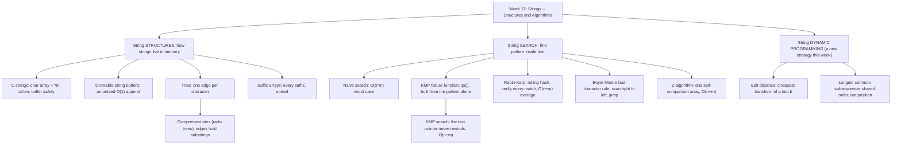

# Week 12 — Strings: Structures and Algorithms

*CEN207 Data Structures (formerly CE205) · Fall 2026–2027*

<!-- materials:start -->

<div class="materials" markdown>

[:material-file-pdf-box: Lecture notes (PDF)](cen207-week-12-notes.pdf){ .md-button download="cen207-week-12-notes.pdf" }
[:material-file-word-box: Lecture notes (DOCX)](cen207-week-12-notes.docx){ .md-button download="cen207-week-12-notes.docx" }
[:material-presentation: Slides (PDF)](cen207-week-12-slides.pdf){ .md-button download="cen207-week-12-slides.pdf" }
[:material-microsoft-powerpoint: Slides (PPTX)](cen207-week-12-slides.pptx){ .md-button download="cen207-week-12-slides.pptx" }
[:material-language-html5: Slides (HTML, offline)](cen207-week-12-slides.html){ .md-button download="cen207-week-12-slides.html" }
[:material-folder-zip: Download all (ZIP)](cen207-week-12-materials.zip){ .md-button download="cen207-week-12-materials.zip" }
[:material-fullscreen: Open slides full screen](cen207-week-12-slides.html){ .md-button .md-button--primary target=_blank }

</div>

<div class="deck-frame">
<iframe src="../cen207-week-12-slides.html" title="Week 12 — Strings" loading="lazy" allowfullscreen></iframe>
</div>

<p class="deck-hint">Click inside the slides and use the arrow keys; use the button at the bottom right of the slides, or the "Open slides full screen" link above, for full screen.</p>

<!-- materials:end -->

!!! abstract "This week"
    **Learning outcomes.** By the end of this week you will be able to explain, draw, and implement the two
    families of string algorithms that sit underneath text editors, compilers, search engines, spell
    checkers, and DNA analysis tools. The first family is **structures**: how a string actually lives in
    memory (a `char` array plus the `'\0'` convention, and the buffer-overflow bug that convention makes
    possible), how a buffer can **grow** itself as characters are appended, how a **trie** stores a whole
    dictionary of words with one edge per character, how a **compressed trie (radix tree)** collapses long
    unbranching chains into single substring-labeled edges, and how a **suffix array** lists every suffix of a
    text in sorted order to answer "does this pattern occur?" with a binary search. The second family is
    **search**: given a text and a pattern, where does the pattern occur? You will meet **naive (brute-force)
    search** and its `O(n*m)` worst case, then three cleverer algorithms that each avoid that worst case in a
    different way — **Knuth-Morris-Pratt (KMP)**, which precomputes a **failure function** so the text pointer
    never rewinds; **Rabin-Karp**, which compares a cheap **rolling hash** of each window instead of the raw
    characters, verifying every hash match to catch **spurious hits**; and **Boyer-Moore**'s **bad-character
    rule**, which scans each window right to left and jumps forward using what it just saw. You will also meet
    the **Z-algorithm**, a single self-comparison trick that solves the same search problem in one pass.
    Finally, you will meet **dynamic programming** for the first time in this course, through two classic
    string problems: **edit distance** (the fewest insertions, deletions, and substitutions to turn one string
    into another) and the **longest common subsequence** (the longest sequence of characters two strings share
    in order). These outcomes map to **LO.1** (explain fundamental data structures), **LO.2** (analyze
    algorithmic complexity), **LO.6** (apply dynamic programming), and **LO.7** (choose the right structure
    for a problem) of the course syllabus.

    **What you need already.** Week 1 gave you the array — a `char` array is exactly what a C string is built
    from. Week 2 gave you the linked list and the idea of a node with pointers to children, which a trie reuses
    directly (a trie node's "next character" pointers are exactly a generalized linked structure). Week 4 gave
    you trees and recursive tree-walking, both central to tries and their compressed cousins; it also gave you
    Huffman coding, which we will explicitly reconnect to compressed tries below. Week 6 gave you hashing,
    which Rabin-Karp reuses as a *rolling* hash instead of a one-shot table lookup. No prior week introduced
    **dynamic programming** — this week introduces it from first principles, the same way every other new idea
    in this course has been introduced: with a question, a naive approach that is too slow, and a table that
    fixes it by never recomputing the same answer twice.

    **Time plan for a 3-hour session.** C strings, `'\0'`, `strlen`, and buffer safety (~15 min) · a growable
    string buffer (~10 min) · tries (~20 min) · compressed tries / radix trees, with the Huffman link-back
    (~15 min) · suffix arrays (~15 min) · short break · the string-matching problem and naive search (~10 min)
    · KMP's failure function (~15 min) · KMP search (~15 min) · Rabin-Karp (~15 min) · Boyer-Moore's
    bad-character rule (~15 min) · the Z-algorithm (~15 min) · comparison table (~5 min) · dynamic programming
    and edit distance (~20 min) · longest common subsequence (~15 min) · wrap-up and self-check (~10 min).

## 0. Before we start

### 0.1 What you already know

Three ideas from earlier weeks matter most this week.

**From Week 1 — arrays.** A `char` array is a contiguous block of memory, `arr[i]` computed directly as
`base_address + i`. A C string is nothing more than a `char` array with one extra convention layered on top —
that convention, and the bug it enables, is section 1's whole subject.

**From Week 2 and Week 4 — linked nodes and trees.** A trie node with 26 "next character" pointers is a
generalized linked-list/tree node: instead of one `next` (a list) or two children (a binary tree), it has one
child per possible next character. Recursive insertion, search, and freeing all work exactly the way they did
for trees in Week 4.

**From Week 6 — hashing.** A hash function turns a key into a number in `O(1)`. Rabin-Karp (section 9) reuses
that idea, but computes a **new window's** hash from the **previous window's** hash in `O(1)`, instead of
hashing from scratch every time — a **rolling hash**.

**A genuinely new idea this week: dynamic programming.** Every algorithm before this week has either walked a
structure once (`O(n)`) or narrowed a search space (`O(log n)`). Sections 13 and 14 introduce a third
strategy: break a problem into overlapping smaller subproblems, solve each one exactly **once**, and store the
answer in a table so it is never recomputed. This is **dynamic programming**, and edit distance is one of the
cleanest possible examples of it.

### 0.2 The map of this week



Every box gets its own section below, most with a step-by-step animation, a complete C and Java program, and a
note on complexity and common mistakes.

## 1. C strings: memory, `'\0'`, and `strlen`

### 1.1 A question to start

Every data structure so far has stored its *size* somewhere — an array's capacity was a separate variable, a
linked list's length could be counted by walking `next` pointers, a tree's node count came from walking it. A
C string stores **no length field at all**. So if you have a `char` array holding `"HELLO"`, how does any
function — `printf`, `strlen`, your own code — know where the text *ends*? C's answer, chosen when the
language was designed in the early 1970s at Bell Labs (Dennis Ritchie), is a single reserved byte: `'\0'`, the
NUL character (value 0). A C string is a `char` array plus the *convention* that the first `'\0'` byte marks
"the string ends here." Every character before it is part of the string; every byte after it, however many
bytes the array actually has, is simply unused space.

### 1.2 The convention, and the bug it makes possible

Because the length is never stored, *every* operation that needs to know where a string ends must **walk the
array one byte at a time until it finds `'\0'`** — there is no shortcut. `strlen("HELLO")` does not somehow
know the answer is 5; it reads `H`, `E`, `L`, `L`, `O`, `\0` and counts five non-`'\0'` bytes before stopping.
Copying a string works the same way: `strcpy(dest, src)` reads `src` one character at a time and writes each
one to `dest`, until it copies the `'\0'` too. Herein lies the classic C bug: if `dest` is a fixed-size buffer
and `src` is longer than that buffer can hold, an unguarded copy keeps writing past the buffer's last valid
index. That single extra write is **undefined behavior (UB)** — it may silently corrupt an unrelated variable,
a saved return address, or crash the program outright, depending on what happens to live in memory right after
the buffer. This is the **buffer overflow**, one of the most consequential bug classes in the history of
software security. This note's animation and program both show the *unsafe* character-by-character copy loop
that causes it, but **guard every write with a bound check** (`if (i == cap) break;`) so the actual out-of-bounds
write is **flagged and stopped, never executed** — you will see the danger without ever triggering it for real.

### 1.3 In memory, and the code

=== "C"

    ```c
    char buf[CAP];

    int i = 0;
    while (src[i] != '\0') {
        if (i == CAP) break;        /* would need buf[CAP]: out of bounds -- stop, never write it */
        buf[i] = src[i];
        i++;
    }
    int overflow = (src[i] != '\0');    /* loop stopped early because of the guard, not '\0' */
    if (!overflow) buf[i] = '\0';         /* room guaranteed: i < CAP here */

    size_t len = 0;
    if (!overflow)
        while (buf[len] != '\0') len++;   /* strlen: walk until the terminator */
    ```

=== "Java"

    ```java
    char[] buf = new char[CAP];

    int i = 0;
    while (i < src.length()) {
        if (i == CAP) break;        // would need buf[CAP]: out of bounds -- stop, never write it
        buf[i] = src.charAt(i);
        i++;
    }
    boolean overflow = (i < src.length());   // loop stopped early because of the guard
    // (no terminator byte needed in Java -- a String already carries its own length)

    int len = 0;
    if (!overflow)
        while (len < buf.length && buf[len] != 0) len++;
    ```

Play the animation to watch each character get copied one at a time, the terminator get written, and then
`strlen` walk the same buffer a second time, from scratch, to recount the length.

<iframe class="dsanim" src="../anim/c-string-memory.html" title="C string memory: the array, \0 and strlen" loading="lazy"></iframe>
<div class="dsanim-baski" markdown>

</div>

In the picker, also try **cap=11, exact fit (0 bytes of slack)** (hard) and the edge cases **cap=8, overflow —
flagged, never executed**, and **repeated character "AAAAAAAAAA"** — or press 🎲 for random data at four
difficulty levels, or type your own capacity and text.

### 1.4 Try it

??? example "Full program: `c_string_memory.c` / `CStringMemory.java`"

    === "C"

        ```c
        /* Week 12 -- Strings: Structures and Algorithms
         * C string memory: a char array plus the '\0' convention, strlen(), and a buffer-overflow edge case that is
         * FLAGGED but never executed (no out-of-bounds write is ever performed -- the guard `if (i == cap) break;`
         * stops the copy one write before it would happen).
         * CEN207 Data Structures (CS50-style lecture notes)
         */
        #include <stdio.h>
        #include <string.h>

        #define MAX_CAP 16

        static char buf[MAX_CAP];

        /* Copies src into buf, character by character, but never writes past index cap-1. If src needs more than
         * cap bytes (cap-1 characters plus the terminator), the copy stops as soon as it WOULD go out of bounds and
         * *overflow is set to 1 -- the out-of-bounds write is flagged, never executed. Returns the number of bytes
         * actually written (== cap on overflow, since buf[0..cap-1] are all filled and all valid). */
        static int safe_store(const char *src, int cap, int *overflow) {
            int i = 0;
            while (src[i] != '\0') {
                if (i == cap) break;      /* would need buf[cap]: out of bounds -- stop, never write it */
                buf[i] = src[i];
                i++;
            }
            *overflow = (src[i] != '\0');
            if (!*overflow) buf[i] = '\0';
            return i;
        }

        static void run_scenario(const char *label, const char *text, int cap) {
            printf("-- %s --\n", label);
            printf("cap = %d, source = \"%s\" (%d letters)\n", cap, text, (int) strlen(text));
            int overflow = 0;
            int written = safe_store(text, cap, &overflow);
            if (overflow) {
                printf("overflow flagged after %d bytes: buf[%d] would be out of bounds (valid indices 0..%d) -- stopped, never executed\n", written, cap, cap - 1);
            } else {
                size_t len = strlen(buf);
                printf("stored \"%s\", strlen = %zu\n", buf, len);
            }
            printf("\n");
        }

        int main(void) {
            run_scenario("normal: cap=16, comfortable fit", "HELLOWORLD", 16);
            run_scenario("hard: cap=12, 1 byte of slack", "ALGORITHMS", 12);
            run_scenario("edge: cap=11, exact fit (0 bytes slack)", "ALGORITHMS", 11);
            run_scenario("edge: cap=8, overflow -- flagged, never executed", "STRUCTURES", 8);
            run_scenario("edge: cap=16, repeated character", "AAAAAAAAAA", 16);
            return 0;
        }
        ```

    === "Java"

        ```java
        /* Week 12 -- Strings: Structures and Algorithms
         * C string memory: a char array plus the '\0' convention, strlen(), and a buffer-overflow edge case that is
         * FLAGGED but never executed. Java strings carry their own length, so the overflow danger below is really a
         * C-only bug; we reproduce the same bounded-array exercise here so the two languages can be compared side by
         * side, with the identical safety guard.
         * CEN207 Data Structures (CS50-style lecture notes)
         */
        public class CStringMemory {
            static final int MAX_CAP = 16;
            static char[] buf = new char[MAX_CAP];

            // Copies src into buf, character by character, but never writes past index cap-1. Returns the number of
            // characters actually written; overflow[0] is set to true if src needed more room than cap allowed.
            static int safeStore(String src, int cap, boolean[] overflow) {
                int i = 0;
                while (i < src.length()) {
                    if (i == cap) break;      // would need buf[cap]: out of bounds -- stop, never write it
                    buf[i] = src.charAt(i);
                    i++;
                }
                overflow[0] = (i < src.length());
                return i;
            }

            static void runScenario(String label, String text, int cap) {
                System.out.println("-- " + label + " --");
                System.out.println("cap = " + cap + ", source = \"" + text + "\" (" + text.length() + " letters)");
                boolean[] overflow = new boolean[1];
                int written = safeStore(text, cap, overflow);
                if (overflow[0]) {
                    System.out.println("overflow flagged after " + written + " bytes: buf[" + cap + "] would be out of bounds (valid indices 0.." + (cap - 1) + ") -- stopped, never executed");
                } else {
                    String stored = new String(buf, 0, written);
                    System.out.println("stored \"" + stored + "\", strlen = " + stored.length());
                }
                System.out.println();
            }

            public static void main(String[] args) {
                runScenario("normal: cap=16, comfortable fit", "HELLOWORLD", 16);
                runScenario("hard: cap=12, 1 byte of slack", "ALGORITHMS", 12);
                runScenario("edge: cap=11, exact fit (0 bytes slack)", "ALGORITHMS", 11);
                runScenario("edge: cap=8, overflow -- flagged, never executed", "STRUCTURES", 8);
                runScenario("edge: cap=16, repeated character", "AAAAAAAAAA", 16);
            }
        }
        ```

=== "C"

    ```console
    gcc -std=c11 -Wall -Wextra -o /tmp/x c_string_memory.c && /tmp/x
    ```

    Expected output:

    ```text
    -- normal: cap=16, comfortable fit --
    cap = 16, source = "HELLOWORLD" (10 letters)
    stored "HELLOWORLD", strlen = 10

    -- hard: cap=12, 1 byte of slack --
    cap = 12, source = "ALGORITHMS" (10 letters)
    stored "ALGORITHMS", strlen = 10

    -- edge: cap=11, exact fit (0 bytes slack) --
    cap = 11, source = "ALGORITHMS" (10 letters)
    stored "ALGORITHMS", strlen = 10

    -- edge: cap=8, overflow -- flagged, never executed --
    cap = 8, source = "STRUCTURES" (10 letters)
    overflow flagged after 8 bytes: buf[8] would be out of bounds (valid indices 0..7) -- stopped, never executed

    -- edge: cap=16, repeated character --
    cap = 16, source = "AAAAAAAAAA" (10 letters)
    stored "AAAAAAAAAA", strlen = 10
    ```

=== "Java"

    ```console
    javac -Xlint:all CStringMemory.java && java CStringMemory
    ```

    Expected output: identical to the C program above (`CStringMemory` and `c_string_memory.c` print the same
    text byte for byte).

### 1.5 Complexity, mistakes, self-check

**Complexity.** Copying a string of length `L` into a buffer is `O(L)` — every character is touched exactly
once. `strlen` is **also** `O(L)`, and critically, it is `O(L)` **every single time it is called**, because the
length is never cached anywhere. Calling `strlen` inside a loop condition (`for (i = 0; i < strlen(s); i++)`)
silently turns an `O(n)` loop into `O(n^2)`, because `strlen` re-walks the whole string on every iteration —
this is one of the single most common accidental-quadratic-time bugs in C.

!!! warning "Common mistakes"
    - **Forgetting the `+1` for the terminator** when sizing a buffer: a 10-character word needs **11** bytes
      (`char buf[11]`), not 10 — the missing byte is exactly where the overflow in this section's edge case
      happens.
    - **Calling `strlen` inside a loop's condition**, silently making an `O(n)` scan `O(n^2)`. Compute the
      length once, store it, and reuse the stored value.
    - **Comparing strings with `==`** instead of `strcmp`. In C, `==` on two `char*` values compares the
      *pointers* (addresses), not the characters — two identical-looking strings stored at different addresses
      compare unequal with `==` even though `strcmp` correctly reports them as equal.

??? success "Self-check: why can't strlen just return a stored field?"
    Because a C string is defined purely as "a `char` array plus wherever the first `'\0'` happens to be" —
    there is no struct, no length field, nothing but the raw bytes. `strlen` has no data source to read a
    length *from*; the only way to find `'\0'` is to look at each byte in order until one is found. This is
    also exactly why every C string function that needs the length (`strcpy`, `strcat`, `strcmp`, …) is at
    least `O(L)`, never `O(1)`.

## 2. A growable string buffer

### 2.1 A question to start

Section 1's `buf[CAP]` had a *fixed* capacity, chosen before a single character was written — and once it was
full, that was that. But an editor's "type into a text box" operation, or a program building a string one
piece at a time (think `printf`-style formatting, or reading a file line by line), does not know the final
length in advance. What if the buffer could **grow itself** as needed, without the caller ever having to
guess a capacity up front? That idea — used inside `java.lang.StringBuilder`, C++'s `std::string`, Python's
list-append machinery, and Week 1's dynamic array — is this section's subject.

### 2.2 The idea: double when full, and why doubling (not +1) matters

A growable buffer keeps three numbers alongside its raw storage: `len` (how many characters are actually
stored), `cap` (how many the current allocation can hold), and the storage itself. Appending a character is
almost always trivial: `buf[len] = c; len++`. The interesting case is when `len == cap` — the buffer is full.
The buffer then **allocates a new block, double the old size**, copies every existing character across, and
only *then* writes the new character. Doubling (rather than growing by a fixed amount, like `+1` or `+10`) is
the crucial design choice: it guarantees that copying happens **exponentially less often** as the buffer gets
bigger, which is exactly what makes the *average* cost of an append `O(1)` even though any *individual* append
that triggers a growth costs `O(len)` — this is called **amortized analysis**, and section 2.5 works out why
it holds.

### 2.3 In memory, and the code

=== "C"

    ```c
    char *buf = malloc(cap);   /* cap = INITCAP */
    int len = 0;

    void append(char c) {
        if (len == cap) {        /* full: grow before writing */
            cap = cap * 2;
            buf = realloc(buf, cap);   /* copies every old byte across */
        }
        buf[len] = c;
        len++;
    }
    ```

=== "Java"

    ```java
    char[] buf = new char[cap];   // cap = INITCAP
    int len = 0;

    void append(char c) {
        if (len == cap) {          // full: grow before writing
            cap = cap * 2;
            char[] bigger = new char[cap];
            System.arraycopy(buf, 0, bigger, 0, len);   // copies every old byte across
            buf = bigger;
        }
        buf[len] = c;
        len++;
    }
    ```

Play the animation to watch the buffer fill up, hit capacity, and grow — the existing characters visibly flash
as "copied" before the row widens and the new character lands in the freshly grown space.

<iframe class="dsanim" src="../anim/string-builder.html" title="Growable string buffer (string builder)" loading="lazy"></iframe>
<div class="dsanim-baski" markdown>

</div>

In the picker, also try **initCap=2, many growths back to back** (hard) and the edge cases **initCap=10, exact
fit, no growth at all**, **initCap=1, the smallest possible start**, and **initCap=9, a single growth right at
the boundary** — or press 🎲 for random data at four difficulty levels, or type your own starting capacity and
text.

### 2.4 Try it

??? example "Full program: `string_builder.c` / `StringBuilderDemo.java`"

    === "C"

        ```c
        /* Week 12 -- Strings: Structures and Algorithms
         * Growable string buffer: characters are appended one at a time; when full, a new block double the size is
         * allocated, every existing byte is copied across (realloc), then the new character is written. Appending is
         * O(1) most of the time and O(len) only on the rare growth step -- amortized O(1) overall.
         * CEN207 Data Structures (CS50-style lecture notes)
         */
        #include <stdio.h>
        #include <stdlib.h>
        #include <string.h>

        typedef struct {
            char *buf;
            int len;
            int cap;
            int growths;
        } Builder;

        static void builder_init(Builder *b, int init_cap) {
            b->cap = init_cap;
            b->buf = malloc((size_t) b->cap);
            b->len = 0;
            b->growths = 0;
        }

        static void builder_append(Builder *b, char c) {
            if (b->len == b->cap) {              /* full: grow before writing */
                b->cap = b->cap * 2;
                b->buf = realloc(b->buf, (size_t) b->cap);   /* copies every old byte across */
                b->growths++;
            }
            b->buf[b->len] = c;
            b->len++;
        }

        static void builder_free(Builder *b) {
            free(b->buf);
            b->buf = NULL;
        }

        static void run_scenario(const char *label, int init_cap, const char *chars) {
            printf("-- %s --\n", label);
            printf("initCap = %d, appending \"%s\" (%d letters)\n", init_cap, chars, (int) strlen(chars));
            Builder b;
            builder_init(&b, init_cap);
            for (int i = 0; chars[i] != '\0'; i++) builder_append(&b, chars[i]);
            printf("result: \"%.*s\", len = %d, finalCap = %d, growths = %d\n\n", b.len, b.buf, b.len, b.cap, b.growths);
            builder_free(&b);
        }

        int main(void) {
            run_scenario("normal: initCap=4", 4, "HELLOWORLD");
            run_scenario("hard: initCap=2, many growths back to back", 2, "ALGORITHMSDATA");
            run_scenario("edge: initCap=10, exact fit, no growth at all", 10, "ABCDEFGHIJ");
            run_scenario("edge: initCap=1, the smallest possible start", 1, "ABCDEFGHIJ");
            run_scenario("edge: initCap=9, a single growth right at the boundary", 9, "ABCDEFGHIJ");
            return 0;
        }
        ```

    === "Java"

        ```java
        /* Week 12 -- Strings: Structures and Algorithms
         * Growable string buffer, built by hand (java.lang.StringBuilder does exactly this internally). Characters
         * are appended one at a time; when full, a new array double the size is allocated, every existing character
         * is copied across, then the new character is written. Amortized O(1) append.
         * CEN207 Data Structures (CS50-style lecture notes)
         */
        public class StringBuilderDemo {
            static class Builder {
                char[] buf;
                int len;
                int cap;
                int growths;

                Builder(int initCap) {
                    cap = initCap;
                    buf = new char[cap];
                    len = 0;
                    growths = 0;
                }

                void append(char c) {
                    if (len == cap) {                          // full: grow before writing
                        cap = cap * 2;
                        char[] bigger = new char[cap];
                        System.arraycopy(buf, 0, bigger, 0, len);   // copies every old byte across
                        buf = bigger;
                        growths++;
                    }
                    buf[len] = c;
                    len++;
                }
            }

            static void runScenario(String label, int initCap, String chars) {
                System.out.println("-- " + label + " --");
                System.out.println("initCap = " + initCap + ", appending \"" + chars + "\" (" + chars.length() + " letters)");
                Builder b = new Builder(initCap);
                for (int i = 0; i < chars.length(); i++) b.append(chars.charAt(i));
                System.out.println("result: \"" + new String(b.buf, 0, b.len) + "\", len = " + b.len + ", finalCap = " + b.cap + ", growths = " + b.growths);
                System.out.println();
            }

            public static void main(String[] args) {
                runScenario("normal: initCap=4", 4, "HELLOWORLD");
                runScenario("hard: initCap=2, many growths back to back", 2, "ALGORITHMSDATA");
                runScenario("edge: initCap=10, exact fit, no growth at all", 10, "ABCDEFGHIJ");
                runScenario("edge: initCap=1, the smallest possible start", 1, "ABCDEFGHIJ");
                runScenario("edge: initCap=9, a single growth right at the boundary", 9, "ABCDEFGHIJ");
            }
        }
        ```

=== "C"

    ```console
    gcc -std=c11 -Wall -Wextra -o /tmp/x string_builder.c && /tmp/x
    ```

    Expected output:

    ```text
    -- normal: initCap=4 --
    initCap = 4, appending "HELLOWORLD" (10 letters)
    result: "HELLOWORLD", len = 10, finalCap = 16, growths = 2

    -- hard: initCap=2, many growths back to back --
    initCap = 2, appending "ALGORITHMSDATA" (14 letters)
    result: "ALGORITHMSDATA", len = 14, finalCap = 16, growths = 3

    -- edge: initCap=10, exact fit, no growth at all --
    initCap = 10, appending "ABCDEFGHIJ" (10 letters)
    result: "ABCDEFGHIJ", len = 10, finalCap = 10, growths = 0

    -- edge: initCap=1, the smallest possible start --
    initCap = 1, appending "ABCDEFGHIJ" (10 letters)
    result: "ABCDEFGHIJ", len = 10, finalCap = 16, growths = 4

    -- edge: initCap=9, a single growth right at the boundary --
    initCap = 9, appending "ABCDEFGHIJ" (10 letters)
    result: "ABCDEFGHIJ", len = 10, finalCap = 18, growths = 1
    ```

=== "Java"

    ```console
    javac -Xlint:all StringBuilderDemo.java && java StringBuilderDemo
    ```

    Expected output: identical to the C program above.

### 2.5 Complexity, mistakes, self-check

**Complexity.** A single append is `O(1)` when there is room, `O(len)` on the rare occasion it triggers a
growth. Appending `n` characters one at a time costs, in total, `n` (the ordinary writes) plus `1 + 2 + 4 + 8 +
... + n` (the copying done at each growth, a geometric series that sums to at most `2n`) — so `n` appends cost
`O(n)` total, i.e. `O(1)` **amortized** per append. This is the same argument, and the same guarantee, as
Week 1's dynamic array.

!!! warning "Common mistakes"
    - **Growing by a fixed amount** (`cap = cap + 10`) instead of doubling. This turns `n` appends into
      `O(n^2)` total work — with `n/10` growths, each copying up to `n` bytes, the total copying is
      `O(n^2/10)`, not `O(n)`.
    - **Forgetting to update the pointer** after `realloc` (C only). `realloc` may move the block to a new
      address; every pointer that referenced the *old* address is now dangling and must not be used again —
      only the returned pointer is valid.
    - **Reading `len` bytes but allocating fewer than `len + 1`** if the buffer will later be treated as a C
      string (needs a `'\0'` too) — the growable buffer here stores raw characters with an explicit `len`, not
      a C string, precisely to sidestep that trap.

??? success "Self-check: why does doubling beat a fixed growth amount?"
    With doubling, the total bytes ever copied across all growths is `1 + 2 + 4 + ... + n/2 < n` — a geometric
    series bounded by the final size. With a fixed growth of `k`, there are `n/k` growths, and the `i`-th one
    copies about `i*k` bytes, so the total is roughly `k * (1 + 2 + ... + n/k) = O(n^2/k)` — quadratic in `n`
    for any constant `k`. Doubling is what keeps the *sum* of all the copying linear.

## 3. Tries: one edge per character

### 3.1 A question to start

Suppose you need to store an entire dictionary — tens of thousands of words — and answer two questions fast:
"is `X` a word?" and "what words start with the prefix `X`?" (exactly what an autocomplete box or a spell
checker needs). A hash table (Week 6) answers the first question in `O(1)` average time, but it cannot answer
the second at all — hashing deliberately scatters similar keys to unrelated slots, destroying any notion of
"starts with." What if, instead, every word that shares a prefix also shared the *path* through the data
structure that represents that prefix? That is the **trie** (the name comes from "re**trie**val," though it is
usually pronounced "try" to avoid confusion with "tree" — Edward Fredkin introduced the structure and the name
in a 1960 paper). A trie is a tree in which **each edge is labeled with one character**, and following the
edges spelled out by a word's letters, starting from the root, traces that word's path through the tree.

### 3.2 The idea: shared prefixes share nodes

Insert `"CAT"`, then `"CAR"`, then `"CARD"`, then `"DOG"` into an empty trie. `"CAT"` creates three new nodes,
one per letter, with the last one marked "end of word." `"CAR"` shares the trie's first two new nodes (`C`,
then `A`) with `"CAT"` — the `C`→`A` edges already exist — and only needs one brand-new node, `R`, marked
"end." `"CARD"` shares `C`→`A`→`R` with `"CAR"` and adds one new node, `D`. `"DOG"` shares nothing with the
other three (no word here starts with `D`) and creates an entirely new branch from the root. Notice that a
node can be **both** a complete word's end **and** the start of a longer word's continuation — `"CAR"`'s `R`
node is marked "end" (a complete word) even though the trie continues past it to `D` for `"CARD"`.

| Operation | What it does | Cost |
| --- | --- | --- |
| `insert(word)` | Follows/creates one edge per character; marks the final node "end" | `O(L)`, `L` = word's length |
| `search(word)` | Follows one edge per character; found only if every edge exists **and** the final node is "end" | `O(L)` |
| prefix check | Same walk as `search`, but success only requires every edge to exist (the final node need not be "end") | `O(L)` |

The single most important property here: every trie operation's cost depends **only on the word's length `L`**
— never on how many other words the trie already holds. A trie with 10 words and a trie with 10 million words
answer `search("CAT")` in exactly the same number of steps.

### 3.3 In memory, and the code

=== "C"

    ```c
    #define ALPHA 26
    typedef struct TrieNode { struct TrieNode *child[ALPHA]; bool isEnd; } TrieNode;

    void insert(TrieNode *root, const char *word) {
        TrieNode *cur = root;
        for (int i = 0; word[i] != '\0'; i++) {
            int c = word[i] - 'A';
            if (cur->child[c] == NULL) {
                cur->child[c] = new_node();
            }
            cur = cur->child[c];
        }
        cur->isEnd = true;
    }

    bool search(TrieNode *root, const char *word, bool *isPrefix) {
        TrieNode *cur = root;
        for (int i = 0; word[i] != '\0'; i++) {
            int c = word[i] - 'A';
            if (cur->child[c] == NULL) {
                *isPrefix = false;
                return false;
            }
            cur = cur->child[c];
        }
        *isPrefix = true;
        return cur->isEnd;
    }
    ```

=== "Java"

    ```java
    static class TrieNode {
        Map<Character, TrieNode> child = new HashMap<>();
        boolean isEnd = false;
    }

    void insert(TrieNode root, String word) {
        TrieNode cur = root;
        for (char c : word.toCharArray()) {
            if (!cur.child.containsKey(c)) {
                cur.child.put(c, new TrieNode());
            }
            cur = cur.child.get(c);
        }
        cur.isEnd = true;
    }

    boolean search(TrieNode root, String word, boolean[] isPrefix) {
        TrieNode cur = root;
        for (char c : word.toCharArray()) {
            if (!cur.child.containsKey(c)) {
                isPrefix[0] = false;
                return false;
            }
            cur = cur.child.get(c);
        }
        isPrefix[0] = true;
        return cur.isEnd;
    }
    ```

Notice the two languages take genuinely different approaches to "one edge per character": C uses a **fixed
26-slot array** per node (fast, `O(1)` lookup, but wastes memory for nodes with few children), while the Java
version above uses a **`HashMap`** per node (memory-proportional to the actual children, at the cost of a
hash lookup instead of a direct array index) — a real, common trade-off you will meet again outside this
course.

Play the animation to watch shared prefixes reuse existing nodes, new branches create fresh ones, and searches
walk the same edges to report "found," "prefix only," or "not found."

<iframe class="dsanim" src="../anim/trie-insert-search.html" title="Trie (prefix tree): insert and search" loading="lazy"></iframe>
<div class="dsanim-baski" markdown>

</div>

In the picker, also try **the TRIE word family: TRIE, TRIED, TRIES, TRY, TRUE, TRUCK** (hard) and the edge
cases **no shared prefix at all**, **a duplicate insert (idempotent)**, and **a branchless chain: A, AB, ABC,
ABCD** — or press 🎲 for random data at four difficulty levels, or type your own words and searches.

### 3.4 Try it

??? example "Full program: `trie_insert_search.c` / `TrieInsertSearch.java`"

    === "C"

        ```c
        /* Week 12 -- Strings: Structures and Algorithms
         * Trie (prefix tree): insert and search, one edge per character, a fixed 26-letter alphabet array per node.
         * CEN207 Data Structures (CS50-style lecture notes)
         */
        #include <stdbool.h>
        #include <stdio.h>
        #include <stdlib.h>

        #define ALPHA 26

        typedef struct TrieNode {
            struct TrieNode *child[ALPHA];
            bool is_end;
        } TrieNode;

        static TrieNode *new_node(void) {
            TrieNode *n = malloc(sizeof(TrieNode));
            for (int i = 0; i < ALPHA; i++) n->child[i] = NULL;
            n->is_end = false;
            return n;
        }

        static void insert(TrieNode *root, const char *word) {
            TrieNode *cur = root;
            for (int i = 0; word[i] != '\0'; i++) {
                int c = word[i] - 'A';
                if (cur->child[c] == NULL)
                    cur->child[c] = new_node();
                cur = cur->child[c];
            }
            cur->is_end = true;
        }

        static bool search(TrieNode *root, const char *word, bool *is_prefix) {
            TrieNode *cur = root;
            for (int i = 0; word[i] != '\0'; i++) {
                int c = word[i] - 'A';
                if (cur->child[c] == NULL) {
                    *is_prefix = false;
                    return false;
                }
                cur = cur->child[c];
            }
            *is_prefix = true;
            return cur->is_end;
        }

        static void free_trie(TrieNode *n) {
            if (n == NULL) return;
            for (int i = 0; i < ALPHA; i++) free_trie(n->child[i]);
            free(n);
        }

        static void run_scenario(const char *label, const char *const words[], int nwords, const char *const queries[], int nqueries) {
            printf("-- %s --\n", label);
            TrieNode *root = new_node();
            for (int i = 0; i < nwords; i++) {
                insert(root, words[i]);
                printf("insert(%s)\n", words[i]);
            }
            for (int i = 0; i < nqueries; i++) {
                bool is_prefix = false;
                bool found = search(root, queries[i], &is_prefix);
                printf("search(%s) -> found=%s, isPrefix=%s\n", queries[i], found ? "true" : "false", is_prefix ? "true" : "false");
            }
            free_trie(root);
            printf("\n");
        }

        int main(void) {
            const char *const w1[] = {"CAT", "CAR", "CARD", "DOG"};
            const char *const q1[] = {"CAR", "CARS", "DO"};
            run_scenario("normal: CAT, CAR, CARD, DOG; search CAR/CARS/DO", w1, 4, q1, 3);

            const char *const w2[] = {"TRIE", "TRIED", "TRIES", "TRY", "TRUE", "TRUCK"};
            const char *const q2[] = {"TRIE", "TR", "TRUCKS", "TRY", "TRUST"};
            run_scenario("hard: the TRIE word family, 5 searches", w2, 6, q2, 5);

            const char *const w3[] = {"AB", "CD", "EF", "GH", "IJ"};
            const char *const q3[] = {"AB", "XY", "A"};
            run_scenario("edge: no shared prefix, every word branches from the root", w3, 5, q3, 3);

            const char *const w4[] = {"DATA", "DATA", "STRUCTURE"};
            const char *const q4[] = {"DATA", "DAT", "STRUCTURES"};
            run_scenario("edge: duplicate insert of DATA (idempotent)", w4, 3, q4, 3);

            const char *const w5[] = {"A", "AB", "ABC", "ABCD"};
            const char *const q5[] = {"A", "ABCD", "ABCDE"};
            run_scenario("edge: a branchless chain A, AB, ABC, ABCD", w5, 4, q5, 3);

            return 0;
        }
        ```

    === "Java"

        ```java
        /* Week 12 -- Strings: Structures and Algorithms
         * Trie (prefix tree): insert and search, one edge per character, a HashMap of children per node.
         * CEN207 Data Structures (CS50-style lecture notes)
         */
        import java.util.HashMap;
        import java.util.Map;

        public class TrieInsertSearch {
            static class TrieNode {
                Map<Character, TrieNode> child = new HashMap<>();
                boolean isEnd = false;
            }

            static void insert(TrieNode root, String word) {
                TrieNode cur = root;
                for (char c : word.toCharArray()) {
                    if (!cur.child.containsKey(c))
                        cur.child.put(c, new TrieNode());
                    cur = cur.child.get(c);
                }
                cur.isEnd = true;
            }

            static boolean search(TrieNode root, String word, boolean[] isPrefix) {
                TrieNode cur = root;
                for (char c : word.toCharArray()) {
                    if (!cur.child.containsKey(c)) {
                        isPrefix[0] = false;
                        return false;
                    }
                    cur = cur.child.get(c);
                }
                isPrefix[0] = true;
                return cur.isEnd;
            }

            static void runScenario(String label, String[] words, String[] queries) {
                System.out.println("-- " + label + " --");
                TrieNode root = new TrieNode();
                for (String w : words) {
                    insert(root, w);
                    System.out.println("insert(" + w + ")");
                }
                for (String q : queries) {
                    boolean[] isPrefix = new boolean[1];
                    boolean found = search(root, q, isPrefix);
                    System.out.println("search(" + q + ") -> found=" + found + ", isPrefix=" + isPrefix[0]);
                }
                System.out.println();
            }

            public static void main(String[] args) {
                runScenario("normal: CAT, CAR, CARD, DOG; search CAR/CARS/DO",
                        new String[]{"CAT", "CAR", "CARD", "DOG"}, new String[]{"CAR", "CARS", "DO"});

                runScenario("hard: the TRIE word family, 5 searches",
                        new String[]{"TRIE", "TRIED", "TRIES", "TRY", "TRUE", "TRUCK"},
                        new String[]{"TRIE", "TR", "TRUCKS", "TRY", "TRUST"});

                runScenario("edge: no shared prefix, every word branches from the root",
                        new String[]{"AB", "CD", "EF", "GH", "IJ"}, new String[]{"AB", "XY", "A"});

                runScenario("edge: duplicate insert of DATA (idempotent)",
                        new String[]{"DATA", "DATA", "STRUCTURE"}, new String[]{"DATA", "DAT", "STRUCTURES"});

                runScenario("edge: a branchless chain A, AB, ABC, ABCD",
                        new String[]{"A", "AB", "ABC", "ABCD"}, new String[]{"A", "ABCD", "ABCDE"});
            }
        }
        ```

=== "C"

    ```console
    gcc -std=c11 -Wall -Wextra -o /tmp/x trie_insert_search.c && /tmp/x
    ```

    Expected output:

    ```text
    -- normal: CAT, CAR, CARD, DOG; search CAR/CARS/DO --
    insert(CAT)
    insert(CAR)
    insert(CARD)
    insert(DOG)
    search(CAR) -> found=true, isPrefix=true
    search(CARS) -> found=false, isPrefix=false
    search(DO) -> found=false, isPrefix=true

    -- hard: the TRIE word family, 5 searches --
    insert(TRIE)
    insert(TRIED)
    insert(TRIES)
    insert(TRY)
    insert(TRUE)
    insert(TRUCK)
    search(TRIE) -> found=true, isPrefix=true
    search(TR) -> found=false, isPrefix=true
    search(TRUCKS) -> found=false, isPrefix=false
    search(TRY) -> found=true, isPrefix=true
    search(TRUST) -> found=false, isPrefix=false

    -- edge: no shared prefix, every word branches from the root --
    insert(AB)
    insert(CD)
    insert(EF)
    insert(GH)
    insert(IJ)
    search(AB) -> found=true, isPrefix=true
    search(XY) -> found=false, isPrefix=false
    search(A) -> found=false, isPrefix=true

    -- edge: duplicate insert of DATA (idempotent) --
    insert(DATA)
    insert(DATA)
    insert(STRUCTURE)
    search(DATA) -> found=true, isPrefix=true
    search(DAT) -> found=false, isPrefix=true
    search(STRUCTURES) -> found=false, isPrefix=false

    -- edge: a branchless chain A, AB, ABC, ABCD --
    insert(A)
    insert(AB)
    insert(ABC)
    insert(ABCD)
    search(A) -> found=true, isPrefix=true
    search(ABCD) -> found=true, isPrefix=true
    search(ABCDE) -> found=false, isPrefix=false
    ```

=== "Java"

    ```console
    javac -Xlint:all TrieInsertSearch.java && java TrieInsertSearch
    ```

    Expected output: identical to the C program above.

### 3.5 Complexity, mistakes, self-check

**Complexity.** `insert`, `search`, and a prefix check are all `O(L)` in the word's length `L`, **independent
of `n`, the number of words already stored** — a trie's biggest advantage over a sorted array or a balanced
tree, both of which cost `O(L * log n)` (each of the `O(log n)` comparisons itself costs up to `O(L)` to
compare two strings). The price is memory: a trie with the C-style 26-slot array per node can use far more
memory than the words themselves need, especially deep in the tree where most nodes have only one or two real
children — exactly the waste that section 4's compressed trie eliminates.

!!! warning "Common mistakes"
    - **Confusing "found" with "is a prefix."** Reaching the end of the query string by following real edges
      only proves the query is a **prefix** of something stored; it is a complete **word** only if that final
      node is also marked `isEnd`. `search("CAR")` and `search("CARP")` walk the same first three edges in a
      trie holding `"CARPET"`, but only one of them is a stored word.
    - **Forgetting a node can be both `isEnd` and have children.** `"CAR"` being a complete word does not stop
      `"CARD"` from also being one — a common bug deletes or mishandles a node's `isEnd` flag when later code
      assumes "has children" and "is a complete word" are mutually exclusive.
    - **Never freeing the trie (C only).** Every `new_node()` call is a `malloc`; without a matching recursive
      `free_trie` that visits every child before freeing the parent, a long-running program leaks memory one
      node at a time.

??? success "Self-check: why is a trie's cost independent of how many words it holds?"
    Because every operation's work is exactly "follow one edge per character of the query" — the number of
    *other* words stored anywhere else in the trie never enters into that walk at all. A hash table's `O(1)`
    average lookup is a *statistical* guarantee (it can degrade under bad hashing or high load); a trie's
    `O(L)` bound is a direct consequence of its shape and holds unconditionally, for any `n`.

## 4. Compressed tries (radix trees)

### 4.1 A question to start

Insert just one long word, say `"INTERNATIONAL"` (13 letters), into an empty plain trie from section 3. It
creates **13 new nodes**, each with only one child — a long, thin chain with no branching at all, exactly like
a linked list. That is a lot of memory and a lot of pointer-chasing to represent something that could, in
principle, be stored as a single 13-character string. What if an edge could carry an entire **substring**
instead of just one character, and nodes only needed to exist where the trie actually **branches**? That is
the **compressed trie**, also called a **radix tree** or, in its classic form, a **PATRICIA trie** (Donald R.
Morrison, 1968 — the name is an acronym for "Practical Algorithm To Retrieve Information Coded In
Alphanumeric"). It is the same idea a plain trie uses, with every maximal non-branching chain collapsed into
one edge.

### 4.2 The idea: extend, create, or split

Inserting a word into a compressed trie walks from the root, character by character, but now compares against
whole **edge labels**, not single characters, and one of three things can happen at each edge:

1. **The word's remaining suffix matches the edge label completely.** Descend past it and continue with what
   is left of the word (possibly nothing, in which case the node the edge leads to is simply marked "end").
2. **No edge starts with the word's next character at all.** The entire remaining suffix becomes a brand-new
   leaf edge — exactly like a plain trie, just holding a whole substring instead of one letter.
3. **The word shares only a partial prefix with an existing edge's label.** The edge is **split**: a new
   branching node appears holding the shared prefix, with the old edge's (now shortened) remainder and the
   new word's remainder as its two children.

Case 3 is the one genuinely new idea here. Insert `"TEST"` into an empty trie: one leaf edge, labeled `"TEST"`.
Now insert `"TEA"`: it shares only `"TE"` with the existing `"TEST"` edge before they diverge (`S` vs `A`), so
the `"TEST"` edge splits — a new node appears holding `"TE"`, with two children: the old node (now reached by
the shortened edge `"ST"`) and a brand-new node for the remaining `"A"`.

### 4.3 The link back to Week 4: two different ways to compress a tree

You have now met **two** completely different techniques for making a tree smaller by removing redundancy, in
two different weeks, and it is worth naming the difference explicitly. Week 4's **Huffman coding** builds a
tree whose *shape* is chosen to make *frequent* symbols cheap (a short root-to-leaf path) and *rare* symbols
expensive — it compresses by exploiting a skewed **probability distribution** over symbols. This week's
**compressed trie** compresses a completely different kind of redundancy: not skewed frequencies, but **long
unbranching chains** in a structure whose shape was determined by the *actual character sequences* being
stored, regardless of how often each one occurs. Put another way: Huffman coding asks "how do I use *fewer
bits per symbol* for the symbols I see most often?"; a compressed trie asks "how do I avoid *storing a tree
node* for every single character when a long stretch has nowhere else to branch?" Both are tree-compression
ideas from this course, and both trade a small amount of extra bookkeeping (a canonical code table; an edge
label instead of a single character) for a real structural saving — but they compress fundamentally different
things.

### 4.4 In memory, and the code

=== "C"

    ```c
    typedef struct RNode {
        char *label;              /* edge INTO this node; root's label is "" */
        bool isEnd;
        struct RNode *child[26];  /* indexed by the first letter of each child edge */
    } RNode;

    int common_prefix_len(const char *a, const char *b) {
        int j = 0;
        while (a[j] && b[j] && a[j] == b[j]) j++;
        return j;
    }

    void insert(RNode *node, const char *word) {
        int i = 0;
        while (word[i] != '\0') {
            int c = word[i] - 'A';
            if (node->child[c] == NULL) {
                node->child[c] = new_leaf(word + i);   /* whole remaining suffix */
                return;
            }
            RNode *child = node->child[c];
            int j = common_prefix_len(word + i, child->label);
            if (j == (int) strlen(child->label)) {      /* whole edge matches: descend */
                node = child; i += j;
                if (word[i] == '\0') { node->isEnd = true; return; }
                continue;
            }
            RNode *mid = split_edge(node, child, j);    /* new node at the mismatch */
            if (word[i + j] == '\0') { mid->isEnd = true; return; }
            mid->child[word[i + j] - 'A'] = new_leaf(word + i + j);
            return;
        }
    }
    ```

=== "Java"

    ```java
    static class RNode {
        String label;              // edge INTO this node; root's label is ""
        boolean isEnd;
        Map<Character, RNode> child = new HashMap<>();
    }

    void insert(RNode node, String word) {
        int i = 0;
        while (i < word.length()) {
            char c = word.charAt(i);
            if (!node.child.containsKey(c)) {
                node.child.put(c, newLeaf(word.substring(i)));   // whole remaining suffix
                return;
            }
            RNode child = node.child.get(c);
            int j = commonPrefixLen(word.substring(i), child.label);
            if (j == child.label.length()) {        // whole edge matches: descend
                node = child; i += j;
                if (i == word.length()) { node.isEnd = true; return; }
                continue;
            }
            RNode mid = splitEdge(node, child, j);   // new node at the mismatch
            if (i + j == word.length()) { mid.isEnd = true; return; }
            mid.child.put(word.charAt(i + j), newLeaf(word.substring(i + j)));
            return;
        }
    }
    ```

Play the animation to watch an edge get created, extended, or split — the shared prefix pulling out into its
own branching node right at the character where two words first disagree.

<iframe class="dsanim" src="../anim/compressed-trie.html" title="Compressed trie (radix tree)" loading="lazy"></iframe>
<div class="dsanim-baski" markdown>

</div>

In the picker, also try **the ROMAN word family: ROMAN, ROMANE, ROMANUS, ROMULUS** (hard, several splits back
to back) and the edge cases **no shared prefix at all**, **CAR is itself a prefix of CARPET and CARD**, and
**ANT, ARM, ART, AXE — splits nested inside splits** — or press 🎲 for random data at four difficulty levels,
or type your own words and searches.

### 4.5 Try it

??? example "Full program: `compressed_trie.c` / `CompressedTrie.java`"

    === "C"

        ```c
        /* Week 12 -- Strings: Structures and Algorithms
         * Compressed trie (radix tree): each edge carries a whole substring; a new word either extends an existing
         * edge, becomes a brand-new leaf edge, or SPLITS an existing edge at the point where it first diverges.
         * CEN207 Data Structures (CS50-style lecture notes)
         */
        #include <stdbool.h>
        #include <stdio.h>
        #include <stdlib.h>
        #include <string.h>

        #define ALPHA 26

        typedef struct RNode {
            char *label;                 /* edge INTO this node; root's label is "" */
            bool is_end;
            struct RNode *child[ALPHA];  /* indexed by the first letter of each child edge */
        } RNode;

        static char *dup_str(const char *s, int len) {
            char *r = malloc((size_t) len + 1);
            memcpy(r, s, (size_t) len);
            r[len] = '\0';
            return r;
        }

        static RNode *new_node(const char *label, int label_len, bool is_end) {
            RNode *n = malloc(sizeof(RNode));
            n->label = dup_str(label, label_len);
            n->is_end = is_end;
            for (int i = 0; i < ALPHA; i++) n->child[i] = NULL;
            return n;
        }

        static int common_prefix_len(const char *a, const char *b) {
            int j = 0;
            while (a[j] && b[j] && a[j] == b[j]) j++;
            return j;
        }

        static void insert(RNode *node, const char *word) {
            if (word[0] == '\0') { node->is_end = true; return; }   /* the empty word ends exactly at this node */
            int i = 0;
            while (word[i] != '\0') {
                int c = word[i] - 'A';
                if (node->child[c] == NULL) {
                    node->child[c] = new_node(word + i, (int) strlen(word + i), true);   /* whole remaining suffix */
                    return;
                }
                RNode *child = node->child[c];
                int label_len = (int) strlen(child->label);
                int j = common_prefix_len(word + i, child->label);
                if (j == label_len) {                 /* whole edge matches: descend */
                    node = child;
                    i += j;
                    if (word[i] == '\0') { node->is_end = true; return; }
                    continue;
                }
                /* split: a new node holds the shared prefix; child keeps only its tail */
                RNode *mid = new_node(child->label, j, false);
                char *tail = dup_str(child->label + j, label_len - j);
                free(child->label);
                child->label = tail;
                mid->child[(unsigned char) (child->label[0] - 'A')] = child;
                node->child[c] = mid;
                if (word[i + j] == '\0') {
                    mid->is_end = true;                /* the inserted word ends exactly at the split point */
                    return;
                }
                mid->child[word[i + j] - 'A'] = new_node(word + i + j, (int) strlen(word + i + j), true);
                return;
            }
        }

        static bool search(RNode *root, const char *word, bool *is_prefix) {
            RNode *node = root;
            int i = 0;
            while (word[i] != '\0') {
                int c = word[i] - 'A';
                if (node->child[c] == NULL) {
                    *is_prefix = false;
                    return false;
                }
                RNode *child = node->child[c];
                int label_len = (int) strlen(child->label);
                int j = common_prefix_len(word + i, child->label);
                if (j < label_len) {
                    *is_prefix = (word[i + j] == '\0');
                    return false;
                }
                node = child;
                i += j;
            }
            *is_prefix = true;
            return node->is_end;
        }

        static void free_radix(RNode *n) {
            if (n == NULL) return;
            for (int i = 0; i < ALPHA; i++) free_radix(n->child[i]);
            free(n->label);
            free(n);
        }

        static void run_scenario(const char *label, const char *const words[], int nwords, const char *const queries[], int nqueries) {
            printf("-- %s --\n", label);
            RNode *root = new_node("", 0, false);
            for (int i = 0; i < nwords; i++) {
                insert(root, words[i]);
                printf("insert(%s)\n", words[i]);
            }
            for (int i = 0; i < nqueries; i++) {
                bool is_prefix = false;
                bool found = search(root, queries[i], &is_prefix);
                printf("search(%s) -> found=%s, isPrefix=%s\n", queries[i], found ? "true" : "false", is_prefix ? "true" : "false");
            }
            free_radix(root);
            printf("\n");
        }

        int main(void) {
            const char *const w1[] = {"TEST", "TEA", "TEAM"};
            const char *const q1[] = {"TEA", "TE", "TEAMS"};
            run_scenario("normal: TEST, TEA, TEAM -- one edge splits in two", w1, 3, q1, 3);

            const char *const w2[] = {"ROMAN", "ROMANE", "ROMANUS", "ROMULUS"};
            const char *const q2[] = {"ROMAN", "ROM", "ROMANEQ", "ROMULUS"};
            run_scenario("hard: the ROMAN word family -- several splits back to back", w2, 4, q2, 4);

            const char *const w3[] = {"APPLE", "BANANA"};
            const char *const q3[] = {"APPLE", "AP"};
            run_scenario("edge: no shared prefix, every word is a single long edge", w3, 2, q3, 2);

            const char *const w4[] = {"CAR", "CARPET", "CARD"};
            const char *const q4[] = {"CAR", "CARP", "CARPET"};
            run_scenario("edge: CAR is a prefix of CARPET and CARD", w4, 3, q4, 3);

            const char *const w5[] = {"ANT", "ARM", "ART", "AXE"};
            const char *const q5[] = {"ART", "AR", "ARK"};
            run_scenario("edge: ANT, ARM, ART, AXE -- splits nested inside splits", w5, 4, q5, 3);

            return 0;
        }
        ```

    === "Java"

        ```java
        /* Week 12 -- Strings: Structures and Algorithms
         * Compressed trie (radix tree): each edge carries a whole substring; a new word either extends an existing
         * edge, becomes a brand-new leaf edge, or SPLITS an existing edge at the point where it first diverges.
         * CEN207 Data Structures (CS50-style lecture notes)
         */
        import java.util.HashMap;
        import java.util.Map;

        public class CompressedTrie {
            static class RNode {
                String label;                            // edge INTO this node; root's label is ""
                boolean isEnd;
                Map<Character, RNode> child = new HashMap<>();
                RNode(String label, boolean isEnd) { this.label = label; this.isEnd = isEnd; }
            }

            static int commonPrefixLen(String a, String b) {
                int j = 0;
                while (j < a.length() && j < b.length() && a.charAt(j) == b.charAt(j)) j++;
                return j;
            }

            static void insert(RNode node, String word) {
                if (word.isEmpty()) { node.isEnd = true; return; }   // the empty word ends exactly at this node
                int i = 0;
                while (i < word.length()) {
                    char c = word.charAt(i);
                    if (!node.child.containsKey(c)) {
                        node.child.put(c, new RNode(word.substring(i), true));   // whole remaining suffix
                        return;
                    }
                    RNode child = node.child.get(c);
                    int j = commonPrefixLen(word.substring(i), child.label);
                    if (j == child.label.length()) {        // whole edge matches: descend
                        node = child;
                        i += j;
                        if (i == word.length()) { node.isEnd = true; return; }
                        continue;
                    }
                    // split: a new node holds the shared prefix; child keeps only its tail
                    RNode mid = new RNode(child.label.substring(0, j), false);
                    child.label = child.label.substring(j);
                    mid.child.put(child.label.charAt(0), child);
                    node.child.put(c, mid);
                    if (i + j == word.length()) {
                        mid.isEnd = true;                     // the inserted word ends exactly at the split point
                        return;
                    }
                    mid.child.put(word.charAt(i + j), new RNode(word.substring(i + j), true));
                    return;
                }
            }

            static boolean search(RNode root, String word, boolean[] isPrefix) {
                RNode node = root;
                int i = 0;
                while (i < word.length()) {
                    char c = word.charAt(i);
                    if (!node.child.containsKey(c)) {
                        isPrefix[0] = false;
                        return false;
                    }
                    RNode child = node.child.get(c);
                    int j = commonPrefixLen(word.substring(i), child.label);
                    if (j < child.label.length()) {
                        isPrefix[0] = (i + j == word.length());
                        return false;
                    }
                    node = child;
                    i += j;
                }
                isPrefix[0] = true;
                return node.isEnd;
            }

            static void runScenario(String label, String[] words, String[] queries) {
                System.out.println("-- " + label + " --");
                RNode root = new RNode("", false);
                for (String w : words) {
                    insert(root, w);
                    System.out.println("insert(" + w + ")");
                }
                for (String q : queries) {
                    boolean[] isPrefix = new boolean[1];
                    boolean found = search(root, q, isPrefix);
                    System.out.println("search(" + q + ") -> found=" + found + ", isPrefix=" + isPrefix[0]);
                }
                System.out.println();
            }

            public static void main(String[] args) {
                runScenario("normal: TEST, TEA, TEAM -- one edge splits in two",
                        new String[]{"TEST", "TEA", "TEAM"}, new String[]{"TEA", "TE", "TEAMS"});

                runScenario("hard: the ROMAN word family -- several splits back to back",
                        new String[]{"ROMAN", "ROMANE", "ROMANUS", "ROMULUS"},
                        new String[]{"ROMAN", "ROM", "ROMANEQ", "ROMULUS"});

                runScenario("edge: no shared prefix, every word is a single long edge",
                        new String[]{"APPLE", "BANANA"}, new String[]{"APPLE", "AP"});

                runScenario("edge: CAR is a prefix of CARPET and CARD",
                        new String[]{"CAR", "CARPET", "CARD"}, new String[]{"CAR", "CARP", "CARPET"});

                runScenario("edge: ANT, ARM, ART, AXE -- splits nested inside splits",
                        new String[]{"ANT", "ARM", "ART", "AXE"}, new String[]{"ART", "AR", "ARK"});
            }
        }
        ```

=== "C"

    ```console
    gcc -std=c11 -Wall -Wextra -o /tmp/x compressed_trie.c && /tmp/x
    ```

    Expected output:

    ```text
    -- normal: TEST, TEA, TEAM -- one edge splits in two --
    insert(TEST)
    insert(TEA)
    insert(TEAM)
    search(TEA) -> found=true, isPrefix=true
    search(TE) -> found=false, isPrefix=true
    search(TEAMS) -> found=false, isPrefix=false

    -- hard: the ROMAN word family -- several splits back to back --
    insert(ROMAN)
    insert(ROMANE)
    insert(ROMANUS)
    insert(ROMULUS)
    search(ROMAN) -> found=true, isPrefix=true
    search(ROM) -> found=false, isPrefix=true
    search(ROMANEQ) -> found=false, isPrefix=false
    search(ROMULUS) -> found=true, isPrefix=true

    -- edge: no shared prefix, every word is a single long edge --
    insert(APPLE)
    insert(BANANA)
    search(APPLE) -> found=true, isPrefix=true
    search(AP) -> found=false, isPrefix=true

    -- edge: CAR is a prefix of CARPET and CARD --
    insert(CAR)
    insert(CARPET)
    insert(CARD)
    search(CAR) -> found=true, isPrefix=true
    search(CARP) -> found=false, isPrefix=true
    search(CARPET) -> found=true, isPrefix=true

    -- edge: ANT, ARM, ART, AXE -- splits nested inside splits --
    insert(ANT)
    insert(ARM)
    insert(ART)
    insert(AXE)
    search(ART) -> found=true, isPrefix=true
    search(AR) -> found=false, isPrefix=true
    search(ARK) -> found=false, isPrefix=false
    ```

=== "Java"

    ```console
    javac -Xlint:all CompressedTrie.java && java CompressedTrie
    ```

    Expected output: identical to the C program above.

### 4.6 Complexity, mistakes, self-check

**Complexity.** `insert` and `search` remain `O(L)` in the word's length `L`, just like a plain trie — the
extra `common_prefix_len` comparison at each edge does not change the asymptotic bound, since across the whole
walk it never compares more than `L` character-pairs in total. The savings are in **space**: the number of
nodes is bounded by the number of **branch points and word endings**, not by the total character count, so a
compressed trie storing words with long unbranching runs (like `"INTERNATIONAL"`) uses dramatically fewer
nodes than a plain trie storing the same words.

!!! warning "Common mistakes"
    - **Splitting at the wrong length.** The split point is the **common prefix length** between the
      remaining query and the existing edge label — not the length of either string alone. Get this wrong and
      the new branching node's label is either too short (losing shared characters) or too long (crossing
      into territory the two words do not actually share).
    - **Forgetting to re-key the split child.** After shortening `child->label`, that child must be re-inserted
      into the new `mid` node's child array/map under its **new** first character (`child->label[0]` *after*
      shortening), not its old one.
    - **Treating "path exists" as "word found."** Exactly as in section 3, reaching the end of a query by
      following real edges (even partway through one) proves the query is a **prefix**, not necessarily that
      it is itself a complete stored word — the final node's `isEnd` flag still decides that.

??? success "Self-check: why does INTERNATIONAL need so many fewer nodes here than in a plain trie?"
    A plain trie needs one node per character on the path — 13 nodes for a 13-letter word with no shared
    prefix, even though every one of those nodes has exactly one child. A compressed trie collapses that
    entire unbranching run into a **single edge** labeled `"INTERNATIONAL"`, using just one leaf node. The
    savings scale with how *long* the unbranching runs are — words that branch early and often (short, similar
    prefixes) see less benefit than words that share almost nothing with anything else already stored.

## 5. Suffix arrays

### 5.1 A question to start

A trie answers "is `X` a stored word?" but that is a different question from "does the pattern `P` occur
*somewhere inside* one long text `T`?" — the kind of question a text editor's "find" feature, or a genome
browser searching a DNA sequence, asks constantly, often with a *different* `P` every time against the *same*
`T`. Building a trie of every substring of `T` would answer it, but a string of length `n` has `O(n^2)`
substrings — far too many. What if, instead, you only needed every **suffix** of `T` (there are only `n` of
those), sorted so that a **binary search** could find any pattern's occurrences in `O(m log n)` time, `m`
being the pattern's length? That sorted list of suffix starting positions is a **suffix array**.

### 5.2 The idea: every suffix, sorted lexicographically

A suffix array for a text of length `n` is simply an array of the `n` integers `0, 1, ..., n-1`, reordered so
that `text[sa[0]..]`, `text[sa[1]..]`, ..., `text[sa[n-1]..]` are in sorted (lexicographic) order. Because two
distinct suffixes of the same finite string always have **different lengths**, one can never be a byte-for-byte
duplicate of the other — when one is a prefix of the other, the *shorter* one simply sorts first (exactly the
way `"CAR"` sorts before `"CARD"` in a dictionary), so no special end-of-string marker is needed to break ties.
This note builds the suffix array with **insertion sort** over `strcmp`-style suffix comparisons — simple to
animate, and each suffix is just a pointer into the *same* underlying buffer, so no character is ever copied
during the sort. Production libraries use `O(n log n)` (or even `O(n)`) construction algorithms instead, but
the final sorted order is identical either way.

### 5.3 In memory, and the code

=== "C"

    ```c
    int compare_suffix(const char *text, int a, int b) {
        return strcmp(text + a, text + b);   /* pointer INTO the same buffer, no copy */
    }

    void build_suffix_array(const char *text, int n, int sa[]) {
        for (int i = 0; i < n; i++) sa[i] = i;   /* start: unsorted, index order */
        for (int i = 1; i < n; i++) {
            int key = sa[i], j = i - 1;
            while (j >= 0 && compare_suffix(text, sa[j], key) > 0) {
                sa[j + 1] = sa[j];
                j--;
            }
            sa[j + 1] = key;
        }
    }
    ```

=== "Java"

    ```java
    static int compareSuffix(String text, int a, int b) {
        return text.substring(a).compareTo(text.substring(b));
    }

    static void buildSuffixArray(String text, int[] sa) {
        int n = text.length();
        for (int i = 0; i < n; i++) sa[i] = i;   // start: unsorted, index order
        for (int i = 1; i < n; i++) {
            int key = sa[i], j = i - 1;
            while (j >= 0 && compareSuffix(text, sa[j], key) > 0) {
                sa[j + 1] = sa[j];
                j--;
            }
            sa[j + 1] = key;
        }
    }
    ```

Play the animation to watch each suffix, drawn as its own row, slide into sorted position among the rows
already placed — exactly like insertion-sorting a list of strings.

<iframe class="dsanim" src="../anim/suffix-array.html" title="Suffix array: sorting the suffixes" loading="lazy"></iframe>
<div class="dsanim-baski" markdown>

</div>

In the picker, also try **"ABABABABAB": comparisons are near-ties throughout** (hard) and the edge cases
**"AAAAAAAAAA": every character identical**, **"ABCDEFGHIJ": already ascending**, and **"JIHGFEDCBA":
descending, the most shifting** — or press 🎲 for random data at four difficulty levels, or type your own
text.

### 5.4 Try it

??? example "Full program: `suffix_array.c` / `SuffixArray.java`"

    === "C"

        ```c
        /* Week 12 -- Strings: Structures and Algorithms
         * Suffix array: every starting position of text, sorted by the suffix beginning there, built here with
         * insertion sort over strcmp(text+a, text+b) -- each suffix is just a pointer into the same buffer, no copy.
         * CEN207 Data Structures (CS50-style lecture notes)
         */
        #include <stdio.h>
        #include <string.h>

        #define MAXN 24

        static int compare_suffix(const char *text, int a, int b) {
            return strcmp(text + a, text + b);   /* pointer INTO the same buffer, no copy */
        }

        static void build_suffix_array(const char *text, int n, int sa[]) {
            for (int i = 0; i < n; i++) sa[i] = i;   /* start: unsorted, index order */
            for (int i = 1; i < n; i++) {
                int key = sa[i], j = i - 1;
                while (j >= 0 && compare_suffix(text, sa[j], key) > 0) {
                    sa[j + 1] = sa[j];
                    j--;
                }
                sa[j + 1] = key;
            }
        }

        static void run_scenario(const char *label, const char *text) {
            printf("-- %s --\n", label);
            int n = (int) strlen(text);
            printf("text = \"%s\" (%d letters)\n", text, n);
            int sa[MAXN];
            build_suffix_array(text, n, sa);
            printf("suffix array:");
            for (int i = 0; i < n; i++) printf(" %d", sa[i]);
            printf("\n");
            for (int i = 0; i < n; i++) printf("  sa[%d]=%d -> \"%s\"\n", i, sa[i], text + sa[i]);
            printf("\n");
        }

        int main(void) {
            run_scenario("normal: MISSISSIPPI, many repeating suffixes", "MISSISSIPPI");
            run_scenario("hard: ABABABABAB, near-ties throughout", "ABABABABAB");
            run_scenario("edge: AAAAAAAAAA, every character identical", "AAAAAAAAAA");
            run_scenario("edge: ABCDEFGHIJ, already ascending", "ABCDEFGHIJ");
            run_scenario("edge: JIHGFEDCBA, descending, the most shifting", "JIHGFEDCBA");
            return 0;
        }
        ```

    === "Java"

        ```java
        /* Week 12 -- Strings: Structures and Algorithms
         * Suffix array: every starting position of text, sorted by the suffix beginning there, built here with
         * insertion sort over String.compareTo on substrings.
         * CEN207 Data Structures (CS50-style lecture notes)
         */
        public class SuffixArray {
            static int compareSuffix(String text, int a, int b) {
                return text.substring(a).compareTo(text.substring(b));
            }

            static int[] buildSuffixArray(String text) {
                int n = text.length();
                int[] sa = new int[n];
                for (int i = 0; i < n; i++) sa[i] = i;   // start: unsorted, index order
                for (int i = 1; i < n; i++) {
                    int key = sa[i], j = i - 1;
                    while (j >= 0 && compareSuffix(text, sa[j], key) > 0) {
                        sa[j + 1] = sa[j];
                        j--;
                    }
                    sa[j + 1] = key;
                }
                return sa;
            }

            static void runScenario(String label, String text) {
                System.out.println("-- " + label + " --");
                System.out.println("text = \"" + text + "\" (" + text.length() + " letters)");
                int[] sa = buildSuffixArray(text);
                StringBuilder line = new StringBuilder("suffix array:");
                for (int v : sa) line.append(' ').append(v);
                System.out.println(line);
                for (int i = 0; i < sa.length; i++) System.out.println("  sa[" + i + "]=" + sa[i] + " -> \"" + text.substring(sa[i]) + "\"");
                System.out.println();
            }

            public static void main(String[] args) {
                runScenario("normal: MISSISSIPPI, many repeating suffixes", "MISSISSIPPI");
                runScenario("hard: ABABABABAB, near-ties throughout", "ABABABABAB");
                runScenario("edge: AAAAAAAAAA, every character identical", "AAAAAAAAAA");
                runScenario("edge: ABCDEFGHIJ, already ascending", "ABCDEFGHIJ");
                runScenario("edge: JIHGFEDCBA, descending, the most shifting", "JIHGFEDCBA");
            }
        }
        ```

=== "C"

    ```console
    gcc -std=c11 -Wall -Wextra -o /tmp/x suffix_array.c && /tmp/x
    ```

    Expected output:

    ```text
    -- normal: MISSISSIPPI, many repeating suffixes --
    text = "MISSISSIPPI" (11 letters)
    suffix array: 10 7 4 1 0 9 8 6 3 5 2
      sa[0]=10 -> "I"
      sa[1]=7 -> "IPPI"
      sa[2]=4 -> "ISSIPPI"
      sa[3]=1 -> "ISSISSIPPI"
      sa[4]=0 -> "MISSISSIPPI"
      sa[5]=9 -> "PI"
      sa[6]=8 -> "PPI"
      sa[7]=6 -> "SIPPI"
      sa[8]=3 -> "SISSIPPI"
      sa[9]=5 -> "SSIPPI"
      sa[10]=2 -> "SSISSIPPI"

    -- hard: ABABABABAB, near-ties throughout --
    text = "ABABABABAB" (10 letters)
    suffix array: 8 6 4 2 0 9 7 5 3 1
      sa[0]=8 -> "AB"
      sa[1]=6 -> "ABAB"
      sa[2]=4 -> "ABABAB"
      sa[3]=2 -> "ABABABAB"
      sa[4]=0 -> "ABABABABAB"
      sa[5]=9 -> "B"
      sa[6]=7 -> "BAB"
      sa[7]=5 -> "BABAB"
      sa[8]=3 -> "BABABAB"
      sa[9]=1 -> "BABABABAB"

    -- edge: AAAAAAAAAA, every character identical --
    text = "AAAAAAAAAA" (10 letters)
    suffix array: 9 8 7 6 5 4 3 2 1 0
      sa[0]=9 -> "A"
      sa[1]=8 -> "AA"
      sa[2]=7 -> "AAA"
      sa[3]=6 -> "AAAA"
      sa[4]=5 -> "AAAAA"
      sa[5]=4 -> "AAAAAA"
      sa[6]=3 -> "AAAAAAA"
      sa[7]=2 -> "AAAAAAAA"
      sa[8]=1 -> "AAAAAAAAA"
      sa[9]=0 -> "AAAAAAAAAA"

    -- edge: ABCDEFGHIJ, already ascending --
    text = "ABCDEFGHIJ" (10 letters)
    suffix array: 0 1 2 3 4 5 6 7 8 9
      sa[0]=0 -> "ABCDEFGHIJ"
      sa[1]=1 -> "BCDEFGHIJ"
      sa[2]=2 -> "CDEFGHIJ"
      sa[3]=3 -> "DEFGHIJ"
      sa[4]=4 -> "EFGHIJ"
      sa[5]=5 -> "FGHIJ"
      sa[6]=6 -> "GHIJ"
      sa[7]=7 -> "HIJ"
      sa[8]=8 -> "IJ"
      sa[9]=9 -> "J"

    -- edge: JIHGFEDCBA, descending, the most shifting --
    text = "JIHGFEDCBA" (10 letters)
    suffix array: 9 8 7 6 5 4 3 2 1 0
      sa[0]=9 -> "A"
      sa[1]=8 -> "BA"
      sa[2]=7 -> "CBA"
      sa[3]=6 -> "DCBA"
      sa[4]=5 -> "EDCBA"
      sa[5]=4 -> "FEDCBA"
      sa[6]=3 -> "GFEDCBA"
      sa[7]=2 -> "HGFEDCBA"
      sa[8]=1 -> "IHGFEDCBA"
      sa[9]=0 -> "JIHGFEDCBA"
    ```

=== "Java"

    ```console
    javac -Xlint:all SuffixArray.java && java SuffixArray
    ```

    Expected output: identical to the C program above.

### 5.5 Complexity, mistakes, self-check

**Complexity.** Insertion sort over `n` suffixes costs `O(n^2)` comparisons in the worst case, and each
comparison can itself cost up to `O(n)` characters — `O(n^3)` worst-case total for the simple construction
shown here. Real libraries build a suffix array in `O(n log n)` or `O(n)` instead. Once built, though, every
implementation pays off the same way: searching for a pattern of length `m` is a **binary search** over the
sorted suffixes, `O(m log n)` — dramatically faster than scanning the whole text (`O(n)`) when many different
patterns will be searched against the same fixed text.

!!! warning "Common mistakes"
    - **Forgetting that shorter-is-smaller-when-a-prefix is automatic**, and adding an unnecessary sentinel
      character. Because two suffixes of one string always differ in length, plain lexicographic comparison
      already puts the shorter one first when it is a prefix of the longer — no `$` marker is required (some
      other suffix-array algorithms *do* need one for a different technical reason, but the comparison rule
      itself does not).
    - **Comparing suffixes by copying substrings** instead of comparing in place. `text.substring(a)` (Java)
      or manual copying (C) allocates a new string for every single comparison — expensive when `strcmp(text +
      a, text + b)` (C) can compare the *same* underlying bytes with zero allocation at all.
    - **Confusing the suffix array's *indices* with the suffixes' *characters*.** `sa[i]` is a **starting
      position** in the original text, not a copy of the suffix itself — printing `text + sa[i]` (C) or
      `text.substring(sa[i])` (Java) is how you recover the actual suffix text for display.

??? success "Self-check: why is no sentinel character needed here?"
    A sentinel (a character smaller than every real character, appended once to the end of the text) is a
    common trick in *other* suffix-array algorithms to guarantee that comparisons never run off the end of the
    buffer. But for the comparison rule itself — "does suffix A sort before suffix B?" — ordinary
    lexicographic comparison already handles the case where one suffix is a prefix of another correctly: a
    shorter string that matches another's start is, by definition, "less than" it (this is exactly how
    dictionary order already works: `"CAR"` comes before `"CARD"`). No suffix of a finite string can ever
    equal another suffix of the same string in both content and length, so ties never actually need to be
    broken by anything beyond this rule.

## 6. The string-matching problem, and naive search

### 6.1 A question to start

This section starts a new family: given one **text** and one **pattern**, at which positions (if any) does
the pattern occur inside the text? Unlike section 5's suffix array, which pays an upfront sorting cost to
answer *many* future queries fast, the four algorithms in this and the next four sections each answer a
**single** search directly against the raw text, with no preprocessing of the text itself (KMP, Rabin-Karp,
and the Z-algorithm *do* preprocess the **pattern**, which is normally much shorter). The simplest possible
approach — try every position, compare character by character, give up and move on at the first mismatch — is
**naive** (or brute-force) search, and it is exactly where you would start if nobody had ever taught you
anything cleverer.

### 6.2 The idea: try every shift

Slide the pattern across the text one position (a **shift** `s`) at a time. At each shift, compare
`pattern[0]` against `text[s]`, then `pattern[1]` against `text[s+1]`, and so on, left to right, stopping at
the first mismatch (move to the next shift) or continuing all the way to a full match (record an occurrence
at `s`, and **still** move on to the next shift afterward — matches can overlap, and naive search finds every
one of them). There are `n - m + 1` possible shifts for a text of length `n` and a pattern of length `m`.

### 6.3 In memory, and the code

=== "C"

    ```c
    void naive_search(const char *text, int n, const char *pattern, int m, int occ[], int *count) {
        int c = 0;
        for (int s = 0; s <= n - m; s++) {          /* try every shift */
            int j = 0;
            while (j < m && text[s + j] == pattern[j]) j++;   /* compare left to right */
            if (j == m) occ[c++] = s;                /* whole pattern matched: occurrence at s */
        }
        *count = c;
    }
    ```

=== "Java"

    ```java
    static int[] naiveSearch(String text, String pattern) {
        int n = text.length(), m = pattern.length(), c = 0;
        int[] occ = new int[n];
        for (int s = 0; s <= n - m; s++) {          // try every shift
            int j = 0;
            while (j < m && text.charAt(s + j) == pattern.charAt(j)) j++;   // compare left to right
            if (j == m) occ[c++] = s;                // whole pattern matched: occurrence at s
        }
        return Arrays.copyOf(occ, c);
    }
    ```

Play the animation to watch the pattern slide one position at a time, comparing left to right and stopping the
instant a mismatch is found.

<iframe class="dsanim" src="../anim/naive-search.html" title="Naive (brute-force) string search" loading="lazy"></iframe>
<div class="dsanim-baski" markdown>

</div>

In the picker, also try **text="AAAAAAAAAA", pattern="AAAB": worst case, fails late every time** (hard) and
the edge cases **never found, always fails early**, **an overlapping match at every shift**, and **text ==
pattern, only one possible shift** — or press 🎲 for random data at four difficulty levels, or type your own
text and pattern.

### 6.4 Try it

??? example "Full program: `naive_search.c` / `NaiveSearch.java`"

    === "C"

        ```c
        /* Week 12 -- Strings: Structures and Algorithms
         * Naive (brute-force) substring search: try every shift, compare left to right until a mismatch or a full
         * match. Worst case O(n*m).
         * CEN207 Data Structures (CS50-style lecture notes)
         */
        #include <stdio.h>
        #include <string.h>

        #define MAXOCC 32

        static int naive_search(const char *text, int n, const char *pattern, int m, int occ[]) {
            int c = 0;
            for (int s = 0; s <= n - m; s++) {          /* try every shift */
                int j = 0;
                while (j < m && text[s + j] == pattern[j]) j++;   /* compare left to right */
                if (j == m) occ[c++] = s;                /* whole pattern matched: occurrence at s */
            }
            return c;
        }

        static void print_occ(const int occ[], int count) {
            if (count == 0) { printf("(none)"); return; }
            for (int i = 0; i < count; i++) printf("%s%d", i ? ", " : "", occ[i]);
        }

        static void run_scenario(const char *label, const char *text, const char *pattern) {
            printf("-- %s --\n", label);
            printf("text = \"%s\" (%d letters), pattern = \"%s\" (%d letters)\n",
                   text, (int) strlen(text), pattern, (int) strlen(pattern));
            int occ[MAXOCC];
            int count = naive_search(text, (int) strlen(text), pattern, (int) strlen(pattern), occ);
            printf("occurrences (%d): ", count);
            print_occ(occ, count);
            printf("\n\n");
        }

        int main(void) {
            run_scenario("normal: a few false starts", "ABABAABABC", "ABABC");
            run_scenario("hard: worst case, fails late every time", "AAAAAAAAAA", "AAAB");
            run_scenario("edge: never found, always fails early", "THEQUICKFOX", "ZEBRA");
            run_scenario("edge: an overlapping match at every shift", "AAAAAAAAAA", "AAA");
            run_scenario("edge: text == pattern, only one possible shift", "ALGORITHMS", "ALGORITHMS");
            return 0;
        }
        ```

    === "Java"

        ```java
        /* Week 12 -- Strings: Structures and Algorithms
         * Naive (brute-force) substring search: try every shift, compare left to right until a mismatch or a full
         * match. Worst case O(n*m).
         * CEN207 Data Structures (CS50-style lecture notes)
         */
        import java.util.ArrayList;
        import java.util.List;

        public class NaiveSearch {
            static List<Integer> naiveSearch(String text, String pattern) {
                int n = text.length(), m = pattern.length();
                List<Integer> occ = new ArrayList<>();
                for (int s = 0; s <= n - m; s++) {          // try every shift
                    int j = 0;
                    while (j < m && text.charAt(s + j) == pattern.charAt(j)) j++;   // compare left to right
                    if (j == m) occ.add(s);                  // whole pattern matched: occurrence at s
                }
                return occ;
            }

            static void runScenario(String label, String text, String pattern) {
                System.out.println("-- " + label + " --");
                System.out.println("text = \"" + text + "\" (" + text.length() + " letters), pattern = \"" + pattern + "\" (" + pattern.length() + " letters)");
                List<Integer> occ = naiveSearch(text, pattern);
                System.out.print("occurrences (" + occ.size() + "): ");
                if (occ.isEmpty()) System.out.print("(none)");
                else {
                    for (int i = 0; i < occ.size(); i++) System.out.print((i > 0 ? ", " : "") + occ.get(i));
                }
                System.out.println();
                System.out.println();
            }

            public static void main(String[] args) {
                runScenario("normal: a few false starts", "ABABAABABC", "ABABC");
                runScenario("hard: worst case, fails late every time", "AAAAAAAAAA", "AAAB");
                runScenario("edge: never found, always fails early", "THEQUICKFOX", "ZEBRA");
                runScenario("edge: an overlapping match at every shift", "AAAAAAAAAA", "AAA");
                runScenario("edge: text == pattern, only one possible shift", "ALGORITHMS", "ALGORITHMS");
            }
        }
        ```

=== "C"

    ```console
    gcc -std=c11 -Wall -Wextra -o /tmp/x naive_search.c && /tmp/x
    ```

    Expected output:

    ```text
    -- normal: a few false starts --
    text = "ABABAABABC" (10 letters), pattern = "ABABC" (5 letters)
    occurrences (1): 5

    -- hard: worst case, fails late every time --
    text = "AAAAAAAAAA" (10 letters), pattern = "AAAB" (4 letters)
    occurrences (0): (none)

    -- edge: never found, always fails early --
    text = "THEQUICKFOX" (11 letters), pattern = "ZEBRA" (5 letters)
    occurrences (0): (none)

    -- edge: an overlapping match at every shift --
    text = "AAAAAAAAAA" (10 letters), pattern = "AAA" (3 letters)
    occurrences (8): 0, 1, 2, 3, 4, 5, 6, 7

    -- edge: text == pattern, only one possible shift --
    text = "ALGORITHMS" (10 letters), pattern = "ALGORITHMS" (10 letters)
    occurrences (1): 0
    ```

=== "Java"

    ```console
    javac -Xlint:all NaiveSearch.java && java NaiveSearch
    ```

    Expected output: identical to the C program above.

### 6.5 Complexity, mistakes, self-check

**Complexity.** Best case `O(n)` (every shift fails on its very first comparison — happens with a rich
alphabet and no accidental repeats). Worst case **`O(n*m)`**: a text like `"AAAA...AB"`. against a pattern
like `"AAAB"` re-compares almost the entire pattern at nearly every shift before finally failing — precisely
the "hard" scenario above. This worst case is naive search's whole reason for existing in this note: sections
7–11 each fix it in a different way.

!!! warning "Common mistakes"
    - **Forgetting matches can overlap.** After a full match at shift `s`, the very next shift `s + 1` must
      still be tried — a common bug jumps ahead by `m` positions after a match (as if matches never overlap),
      silently missing occurrences like the eight overlapping `"AAA"` matches in `"AAAAAAAAAA"` above.
    - **Looping `s` up to `n` instead of `n - m`.** Once fewer than `m` characters remain in the text, no
      further shift can possibly produce a full match; comparing anyway either reads past the end of the array
      or wastes time on comparisons that cannot succeed.
    - **Assuming naive search is "bad" and should never be used.** For a short pattern against a short text
      (or a one-off search where preprocessing a pattern is not worth it), naive search's simplicity and tiny
      constant factor often make it faster *in practice* than a cleverer algorithm's setup cost — worst-case
      complexity is not the only consideration.

??? success "Self-check: construct your own worst-case input"
    Using an alphabet of just two letters, construct a `text` of length 10 and a `pattern` of length 4 that
    forces naive search to compare **all four** pattern characters at **every single shift** before finally
    finding no match at all. (Hint: look at the "hard" scenario above and explain, in one sentence, why the
    mismatch always happens on the pattern's *last* character rather than its first.)

    **Answer.** `text = "AAAAAAAAAA"`, `pattern = "AAAB"` is exactly this case: at every shift, `pattern[0..2]`
    (`"AAA"`) matches three `A`s from the text, and only `pattern[3]` (`'B'`) fails to match the text's `'A'`
    — the mismatch happens on the *last* character precisely because the first three characters of the
    pattern are indistinguishable from the text's repeated letter.

## 7. Knuth-Morris-Pratt: the failure function

### 7.1 A question to start

Naive search's worst case wastes work in a specific, fixable way: after matching `"AAA"` and failing on the
fourth character, it throws away *everything* it just learned and restarts the very next shift from scratch,
comparing the pattern's first character all over again — even though the text characters just examined are
already known. Donald Knuth, James H. Morris, and Vaughan Pratt published an algorithm in 1977 (developed
independently by Morris and Pratt around 1970, and by Knuth slightly later) that never throws that information
away: it precomputes, from the **pattern alone**, exactly how far it can safely skip ahead on a mismatch,
**without ever re-examining a text character it has already looked at**. That precomputed table is the
**failure function**, usually called `lps[]` — "longest proper prefix that is also a suffix."

### 7.2 The idea: what lps[i] means

For every prefix `pattern[0..i]` of the pattern, `lps[i]` is the length of the longest **proper** prefix of
that prefix (proper means "not the whole thing") which is **also a suffix** of it. For `pattern = "ABABCABAB"`:
`lps[3]` looks at the prefix `"ABAB"` and asks "what is the longest string that is both a proper prefix and a
suffix of `ABAB`?" — the answer is `"AB"` (length 2), because `"AB"` is both how `"ABAB"` starts *and* how it
ends, and no longer match (`"ABA"`) satisfies both conditions. This table matters because when a search
mismatches after matching the first `j` pattern characters, `lps[j-1]` tells you exactly how many of those
already-matched characters can be **reused** as the start of the next attempt — no need to re-compare them
against the text at all (section 8 uses the table this way). The table is built by comparing the pattern
**against itself**: two pointers, `i` (the prefix currently being extended) and `len` (the current matched
prefix-suffix length); on a mismatch, `len` falls back to `lps[len-1]` — the same "reuse what you already
know" trick applied recursively — instead of resetting to 0, which is precisely what keeps building the whole
table an `O(m)` operation rather than `O(m^2)`.

### 7.3 In memory, and the code

=== "C"

    ```c
    void compute_lps(const char *pattern, int m, int lps[]) {
        lps[0] = 0;
        int len = 0, i = 1;
        while (i < m) {
            if (pattern[i] == pattern[len]) {
                len++;
                lps[i] = len;
                i++;
            } else if (len != 0) {
                len = lps[len - 1];       /* fall back, do NOT advance i */
            } else {
                lps[i] = 0;
                i++;
            }
        }
    }
    ```

=== "Java"

    ```java
    static int[] computeLps(String pattern) {
        int m = pattern.length();
        int[] lps = new int[m];
        int len = 0, i = 1;
        while (i < m) {
            if (pattern.charAt(i) == pattern.charAt(len)) {
                len++;
                lps[i] = len;
                i++;
            } else if (len != 0) {
                len = lps[len - 1];       // fall back, do NOT advance i
            } else {
                lps[i] = 0;
                i++;
            }
        }
        return lps;
    }
    ```

Play the animation to watch `len` grow on a match, fall back through `lps[len-1]` (never straight to 0) on a
mismatch, and the table fill in one entry at a time.

<iframe class="dsanim" src="../anim/kmp-failure-function.html" title="KMP failure function (the lps[] table)" loading="lazy"></iframe>
<div class="dsanim-baski" markdown>
![KMP failure function (the lps[] table) — step by step](anim/kmp-failure-function.png)
</div>

In the picker, also try **"AAAAAAAAAA": grows at every step, lps[i] = i** (hard) and the edge cases **no
repetition at all, lps is always 0**, **a constantly oscillating pattern**, and **the fallback chases a chain
(lps[len-1])** — or press 🎲 for random data at four difficulty levels, or type your own pattern.

### 7.4 Try it

??? example "Full program: `kmp_failure_function.c` / `KmpFailureFunction.java`"

    === "C"

        ```c
        /* Week 12 -- Strings: Structures and Algorithms
         * KMP failure function (lps[]): for every prefix pattern[0..i], lps[i] is the length of the longest proper
         * prefix of that prefix that is also a suffix of it. Built in O(m) by comparing the pattern to itself.
         * CEN207 Data Structures (CS50-style lecture notes)
         */
        #include <stdio.h>
        #include <string.h>

        static void compute_lps(const char *pattern, int m, int lps[]) {
            lps[0] = 0;
            int len = 0, i = 1;
            while (i < m) {
                if (pattern[i] == pattern[len]) {
                    len++;
                    lps[i] = len;
                    i++;
                } else if (len != 0) {
                    len = lps[len - 1];       /* fall back, do NOT advance i */
                } else {
                    lps[i] = 0;
                    i++;
                }
            }
        }

        static void run_scenario(const char *label, const char *pattern) {
            printf("-- %s --\n", label);
            int m = (int) strlen(pattern);
            printf("pattern = \"%s\" (%d letters)\n", pattern, m);
            int lps[64];
            compute_lps(pattern, m, lps);
            printf("lps:");
            for (int i = 0; i < m; i++) printf(" %d", lps[i]);
            printf("\n\n");
        }

        int main(void) {
            run_scenario("normal: mixed growth and fallback", "ABABCABABA");
            run_scenario("hard: grows at every step, lps[i] = i", "AAAAAAAAAA");
            run_scenario("edge: no repetition at all, lps is always 0", "ABCDEFGHIJ");
            run_scenario("edge: a constantly oscillating pattern", "ABABABABAB");
            run_scenario("edge: the fallback chases a chain (lps[len-1])", "AABAACAABAA");
            return 0;
        }
        ```

    === "Java"

        ```java
        /* Week 12 -- Strings: Structures and Algorithms
         * KMP failure function (lps[]): for every prefix pattern[0..i], lps[i] is the length of the longest proper
         * prefix of that prefix that is also a suffix of it. Built in O(m) by comparing the pattern to itself.
         * CEN207 Data Structures (CS50-style lecture notes)
         */
        public class KmpFailureFunction {
            static int[] computeLps(String pattern) {
                int m = pattern.length();
                int[] lps = new int[m];
                int len = 0, i = 1;
                while (i < m) {
                    if (pattern.charAt(i) == pattern.charAt(len)) {
                        len++;
                        lps[i] = len;
                        i++;
                    } else if (len != 0) {
                        len = lps[len - 1];       // fall back, do NOT advance i
                    } else {
                        lps[i] = 0;
                        i++;
                    }
                }
                return lps;
            }

            static void runScenario(String label, String pattern) {
                System.out.println("-- " + label + " --");
                System.out.println("pattern = \"" + pattern + "\" (" + pattern.length() + " letters)");
                int[] lps = computeLps(pattern);
                StringBuilder line = new StringBuilder("lps:");
                for (int v : lps) line.append(' ').append(v);
                System.out.println(line);
                System.out.println();
            }

            public static void main(String[] args) {
                runScenario("normal: mixed growth and fallback", "ABABCABABA");
                runScenario("hard: grows at every step, lps[i] = i", "AAAAAAAAAA");
                runScenario("edge: no repetition at all, lps is always 0", "ABCDEFGHIJ");
                runScenario("edge: a constantly oscillating pattern", "ABABABABAB");
                runScenario("edge: the fallback chases a chain (lps[len-1])", "AABAACAABAA");
            }
        }
        ```

=== "C"

    ```console
    gcc -std=c11 -Wall -Wextra -o /tmp/x kmp_failure_function.c && /tmp/x
    ```

    Expected output:

    ```text
    -- normal: mixed growth and fallback --
    pattern = "ABABCABABA" (10 letters)
    lps: 0 0 1 2 0 1 2 3 4 3

    -- hard: grows at every step, lps[i] = i --
    pattern = "AAAAAAAAAA" (10 letters)
    lps: 0 1 2 3 4 5 6 7 8 9

    -- edge: no repetition at all, lps is always 0 --
    pattern = "ABCDEFGHIJ" (10 letters)
    lps: 0 0 0 0 0 0 0 0 0 0

    -- edge: a constantly oscillating pattern --
    pattern = "ABABABABAB" (10 letters)
    lps: 0 0 1 2 3 4 5 6 7 8

    -- edge: the fallback chases a chain (lps[len-1]) --
    pattern = "AABAACAABAA" (11 letters)
    lps: 0 1 0 1 2 0 1 2 3 4 5
    ```

=== "Java"

    ```console
    javac -Xlint:all KmpFailureFunction.java && java KmpFailureFunction
    ```

    Expected output: identical to the C program above.

### 7.5 Complexity, mistakes, self-check

**Complexity.** `O(m)` to build the whole table for a pattern of length `m` — despite the fallback loop, `len`
strictly decreases on every fallback step and strictly increases on every match, so across the *entire*
construction `len` can decrease at most as many times as it increased, bounding the total work to `O(m)`, not
`O(m^2)`.

!!! warning "Common mistakes"
    - **Resetting `len` to 0 on every mismatch** instead of falling back to `lps[len-1]`. This is the single
      most common bug in a from-scratch KMP implementation — it still produces *a* table, but the wrong one,
      one that under-reports how much can be safely skipped later.
    - **Off-by-one between "prefix length" and "index."** `lps[i]` describes the prefix `pattern[0..i]`
      (length `i+1`), so the character being compared for a potential extension is `pattern[len]`, not
      `pattern[len+1]` or `pattern[len-1]` — a frequent source of one-past-the-end or one-before-the-start
      bugs.
    - **Forgetting `lps[0] = 0` is a fixed base case**, never computed by the loop. A single-character prefix
      has no proper prefix at all (only the empty string, of length 0), so `lps[0]` must always be 0 by
      definition, not by comparison.

??? success "Self-check: what does lps[m-1] tell you about the whole pattern?"
    `lps[m-1]` is the longest proper prefix of the *entire* pattern that is also a suffix of the entire
    pattern — in other words, the length of the pattern's longest **border**. A pattern with `lps[m-1] = 0` (no
    self-overlap at all, like `"ABCDEFGHIJ"`) has nothing useful to reuse if it fails on its very last
    character; a pattern with a large `lps[m-1]` (like `"AAAAAAAAAA"`, where `lps[m-1] = m-1`) can reuse almost
    everything it already matched.

## 8. Knuth-Morris-Pratt: the search

### 8.1 A question to start

Section 7 built the `lps[]` table from the pattern alone; this section puts it to work. KMP search keeps two
pointers — `i` into the text, `j` into the pattern — with one guarantee that naive search cannot make: **`i`
never moves backward**. On a mismatch, instead of restarting the pattern from its first character at the
*next* text position (naive search's approach, which re-examines text characters already looked at), `j` falls
back to `lps[j-1]` — reusing the partial match already found — while `i` simply continues forward. The result:
every text character is examined a small, bounded number of times, giving `O(n + m)` total time no matter how
repetitive the text or pattern are.

### 8.2 In memory, and the code

=== "C"

    ```c
    void kmp_search(const char *text, int n, const char *pattern, int m, const int lps[], int occ[], int *count) {
        int i = 0, j = 0, c = 0;
        while (i < n) {
            if (text[i] == pattern[j]) {
                i++; j++;
                if (j == m) {
                    occ[c++] = i - m;        /* occurrence found; keep scanning */
                    j = lps[j - 1];
                }
            } else if (j > 0) {
                j = lps[j - 1];              /* fall back in the PATTERN; i never moves back */
            } else {
                i++;
            }
        }
        *count = c;
    }
    ```

=== "Java"

    ```java
    static int[] kmpSearch(String text, String pattern, int[] lps) {
        int n = text.length(), m = pattern.length(), i = 0, j = 0, c = 0;
        int[] occ = new int[n];
        while (i < n) {
            if (text.charAt(i) == pattern.charAt(j)) {
                i++; j++;
                if (j == m) {
                    occ[c++] = i - m;        // occurrence found; keep scanning
                    j = lps[j - 1];
                }
            } else if (j > 0) {
                j = lps[j - 1];              // fall back in the PATTERN; i never moves back
            } else {
                i++;
            }
        }
        return Arrays.copyOf(occ, c);
    }
    ```

Play the animation to watch `i` (the text pointer) march steadily forward while the pattern's alignment jumps
using `lps` on a mismatch — the text is never rescanned.

<iframe class="dsanim" src="../anim/kmp-search.html" title="KMP string search (never rewinds the text)" loading="lazy"></iframe>
<div class="dsanim-baski" markdown>

</div>

In the picker, also try **text="AAAAAAAAAAAAAAAB", pattern="AAAAB": many lps fallbacks** (hard) and the edge
cases **never found**, **overlapping matches**, and **text == pattern, one match, no fallback at all** — or
press 🎲 for random data at four difficulty levels, or type your own text and pattern.

### 8.3 Try it

??? example "Full program: `kmp_search.c` / `KmpSearch.java`"

    === "C"

        ```c
        /* Week 12 -- Strings: Structures and Algorithms
         * KMP search: uses the lps[] failure-function table so the text pointer i never moves backward. O(n + m).
         * CEN207 Data Structures (CS50-style lecture notes)
         */
        #include <stdio.h>
        #include <string.h>

        #define MAXOCC 32

        static void compute_lps(const char *pattern, int m, int lps[]) {
            lps[0] = 0;
            int len = 0, i = 1;
            while (i < m) {
                if (pattern[i] == pattern[len]) {
                    len++;
                    lps[i] = len;
                    i++;
                } else if (len != 0) {
                    len = lps[len - 1];
                } else {
                    lps[i] = 0;
                    i++;
                }
            }
        }

        static int kmp_search(const char *text, int n, const char *pattern, int m, const int lps[], int occ[]) {
            if (m == 0) {                     /* the empty pattern matches at every position, including n */
                for (int s = 0; s <= n; s++) occ[s] = s;
                return n + 1;
            }
            int i = 0, j = 0, c = 0;
            while (i < n) {
                if (text[i] == pattern[j]) {
                    i++; j++;
                    if (j == m) {
                        occ[c++] = i - m;        /* occurrence found; keep scanning */
                        j = lps[j - 1];
                    }
                } else if (j > 0) {
                    j = lps[j - 1];              /* fall back in the PATTERN; i never moves back */
                } else {
                    i++;
                }
            }
            return c;
        }

        static void print_occ(const int occ[], int count) {
            if (count == 0) { printf("(none)"); return; }
            for (int i = 0; i < count; i++) printf("%s%d", i ? ", " : "", occ[i]);
        }

        static void run_scenario(const char *label, const char *text, const char *pattern) {
            printf("-- %s --\n", label);
            int n = (int) strlen(text), m = (int) strlen(pattern);
            printf("text = \"%s\" (%d letters), pattern = \"%s\" (%d letters)\n", text, n, pattern, m);
            int lps[64];
            compute_lps(pattern, m, lps);
            int occ[MAXOCC];
            int count = kmp_search(text, n, pattern, m, lps, occ);
            printf("occurrences (%d): ", count);
            print_occ(occ, count);
            printf("\n\n");
        }

        int main(void) {
            run_scenario("normal: the classic CLRS-style example", "ABABDABACDABABCABAB", "ABABCABAB");
            run_scenario("hard: many lps fallbacks", "AAAAAAAAAAAAAAAB", "AAAAB");
            run_scenario("edge: never found", "THEQUICKBROWNFOX", "ZEBRA");
            run_scenario("edge: overlapping matches", "AAAAAAAAAA", "AAA");
            run_scenario("edge: text == pattern, one match, no fallback at all", "ALGORITHMS", "ALGORITHMS");
            return 0;
        }
        ```

    === "Java"

        ```java
        /* Week 12 -- Strings: Structures and Algorithms
         * KMP search: uses the lps[] failure-function table so the text pointer i never moves backward. O(n + m).
         * CEN207 Data Structures (CS50-style lecture notes)
         */
        import java.util.ArrayList;
        import java.util.List;

        public class KmpSearch {
            static int[] computeLps(String pattern) {
                int m = pattern.length();
                int[] lps = new int[m];
                int len = 0, i = 1;
                while (i < m) {
                    if (pattern.charAt(i) == pattern.charAt(len)) {
                        len++;
                        lps[i] = len;
                        i++;
                    } else if (len != 0) {
                        len = lps[len - 1];
                    } else {
                        lps[i] = 0;
                        i++;
                    }
                }
                return lps;
            }

            static List<Integer> kmpSearch(String text, String pattern, int[] lps) {
                int n = text.length(), m = pattern.length(), i = 0, j = 0;
                List<Integer> occ = new ArrayList<>();
                if (m == 0) {                 // the empty pattern matches at every position, including n
                    for (int s = 0; s <= n; s++) occ.add(s);
                    return occ;
                }
                while (i < n) {
                    if (text.charAt(i) == pattern.charAt(j)) {
                        i++; j++;
                        if (j == m) {
                            occ.add(i - m);              // occurrence found; keep scanning
                            j = lps[j - 1];
                        }
                    } else if (j > 0) {
                        j = lps[j - 1];                  // fall back in the PATTERN; i never moves back
                    } else {
                        i++;
                    }
                }
                return occ;
            }

            static void runScenario(String label, String text, String pattern) {
                System.out.println("-- " + label + " --");
                System.out.println("text = \"" + text + "\" (" + text.length() + " letters), pattern = \"" + pattern + "\" (" + pattern.length() + " letters)");
                int[] lps = computeLps(pattern);
                List<Integer> occ = kmpSearch(text, pattern, lps);
                System.out.print("occurrences (" + occ.size() + "): ");
                if (occ.isEmpty()) System.out.print("(none)");
                else {
                    for (int i = 0; i < occ.size(); i++) System.out.print((i > 0 ? ", " : "") + occ.get(i));
                }
                System.out.println();
                System.out.println();
            }

            public static void main(String[] args) {
                runScenario("normal: the classic CLRS-style example", "ABABDABACDABABCABAB", "ABABCABAB");
                runScenario("hard: many lps fallbacks", "AAAAAAAAAAAAAAAB", "AAAAB");
                runScenario("edge: never found", "THEQUICKBROWNFOX", "ZEBRA");
                runScenario("edge: overlapping matches", "AAAAAAAAAA", "AAA");
                runScenario("edge: text == pattern, one match, no fallback at all", "ALGORITHMS", "ALGORITHMS");
            }
        }
        ```

=== "C"

    ```console
    gcc -std=c11 -Wall -Wextra -o /tmp/x kmp_search.c && /tmp/x
    ```

    Expected output:

    ```text
    -- normal: the classic CLRS-style example --
    text = "ABABDABACDABABCABAB" (19 letters), pattern = "ABABCABAB" (9 letters)
    occurrences (1): 10

    -- hard: many lps fallbacks --
    text = "AAAAAAAAAAAAAAAB" (16 letters), pattern = "AAAAB" (5 letters)
    occurrences (1): 11

    -- edge: never found --
    text = "THEQUICKBROWNFOX" (16 letters), pattern = "ZEBRA" (5 letters)
    occurrences (0): (none)

    -- edge: overlapping matches --
    text = "AAAAAAAAAA" (10 letters), pattern = "AAA" (3 letters)
    occurrences (8): 0, 1, 2, 3, 4, 5, 6, 7

    -- edge: text == pattern, one match, no fallback at all --
    text = "ALGORITHMS" (10 letters), pattern = "ALGORITHMS" (10 letters)
    occurrences (1): 0
    ```

=== "Java"

    ```console
    javac -Xlint:all KmpSearch.java && java KmpSearch
    ```

    Expected output: identical to the C program above.

### 8.4 Complexity, mistakes, self-check

**Complexity.** `O(n + m)`: `O(m)` to build `lps[]` (section 7), `O(n)` for the search itself — `i` advances at
most `n` times total (it never goes backward), and `j`'s fallbacks are bounded by the same amortized argument
used for building the table. This holds **regardless of the text or pattern's content** — unlike naive
search's `O(n*m)` worst case, KMP has no bad input at all.

!!! warning "Common mistakes"
    - **Advancing `i` on a fallback.** The whole point of `lps` is that `i` stays put while `j` falls back —
      advancing `i` too would silently skip text characters that still need to be compared against the
      pattern's new (shorter) alignment.
    - **Forgetting to fall back again after a full match** (`j = lps[j-1]` after recording an occurrence).
      Without it, the next comparison would incorrectly restart from `j = m` instead of resuming from the
      pattern's own self-overlap, missing overlapping occurrences.
    - **Reusing a stale `lps[]` table for a different pattern.** The table is specific to the exact pattern it
      was built from — searching with the wrong table produces silently wrong skip amounts, not a crash, which
      makes this bug easy to miss.

??? success "Self-check: why is O(n + m) achievable here but not for naive search?"
    Naive search's `O(n*m)` worst case comes from **re-examining the same text characters** across different
    shifts — after a mismatch, the next shift starts comparing from the text position right after where the
    *previous* shift started, re-reading characters already looked at. KMP's `lps` table guarantees `i` never
    moves backward, so **no text character is ever compared more than a small, bounded number of times** —
    the total number of comparisons is proportional to `n` (for `i`) plus `m` (for building the table), never
    their product.

## 9. Rabin-Karp: rolling hash and spurious hits

### 9.1 A question to start

KMP fixes naive search's worst case by being smarter about *where* to look next. Michael O. Rabin and Richard
M. Karp, in a 1987 paper, took an entirely different approach: instead of comparing *characters* at all in the
common case, compare a cheap **hash** of each window against the pattern's hash. Two different pieces of text
essentially never hash to the same value (with a well-chosen hash), so a hash **mismatch** rules out a window
instantly, with no character comparison whatsoever. The one subtlety — and it is important — is that a hash
**match** is only a *candidate*: two different substrings *can*, in principle, hash to the same value (a
**collision**, exactly as in Week 6's hash tables), so before reporting an occurrence, the characters must
still be **verified**. A hash match that fails verification is called a **spurious hit**.

### 9.2 The idea: roll the hash instead of recomputing it

Treat each character as a digit in a fixed `base` (this note uses `base = 31`, treating `'A'` as digit 0), and
hash a window the way you would compute a number's value: `h = c0*base^(m-1) + c1*base^(m-2) + ... + c(m-1)`,
all taken `mod` some modulus. Computed from scratch, that is `O(m)` per window — no better than naive search.
The trick is **rolling**: sliding the window forward by one position only removes the outgoing character's
contribution, shifts every remaining term up by one power of `base`, and adds the incoming character — an
`O(1)` update, `((oldHash - outChar*base^(m-1)) * base + inChar) mod mod`, computed **without ever looking at
the `m-2` characters in the middle of the window again**. This is the same "avoid redoing work" spirit as
KMP's `lps` table, applied to hashing instead of character comparison.

### 9.3 In memory, and the code

=== "C"

    ```c
    long long window_hash(const char *s, int m, long long base, long long mod) {
        long long h = 0;
        for (int k = 0; k < m; k++) h = (h * base + (s[k] - 'A')) % mod;
        return h;
    }

    void rabin_karp(const char *text, int n, const char *pattern, int m, long long base, long long mod, int occ[], int *count) {
        long long pHash = window_hash(pattern, m, base, mod);
        long long hPow = 1;
        for (int k = 0; k < m - 1; k++) hPow = (hPow * base) % mod;
        long long tHash = window_hash(text, m, base, mod);      /* first window, computed directly */
        int c = 0;
        for (int s = 0; s <= n - m; s++) {
            if (s > 0)
                tHash = ((tHash - (text[s - 1] - 'A') * hPow % mod + mod) * base + (text[s + m - 1] - 'A')) % mod;
            if (tHash == pHash && strncmp(text + s, pattern, m) == 0)   /* VERIFY: hash match is only a candidate */
                occ[c++] = s;
        }
        *count = c;
    }
    ```

=== "Java"

    ```java
    static long windowHash(String s, int m, long base, long mod) {
        long h = 0;
        for (int k = 0; k < m; k++) h = (h * base + (s.charAt(k) - 'A')) % mod;
        return h;
    }

    static int[] rabinKarp(String text, String pattern, long base, long mod) {
        int n = text.length(), m = pattern.length(), c = 0;
        long pHash = windowHash(pattern, m, base, mod);
        long hPow = 1;
        for (int k = 0; k < m - 1; k++) hPow = (hPow * base) % mod;
        long tHash = windowHash(text, m, base, mod);        // first window, computed directly
        int[] occ = new int[n];
        for (int s = 0; s <= n - m; s++) {
            if (s > 0)
                tHash = ((tHash - (text.charAt(s - 1) - 'A') * hPow % mod + mod) * base + (text.charAt(s + m - 1) - 'A')) % mod;
            if (tHash == pHash && text.regionMatches(s, pattern, 0, m))   // VERIFY: hash match is only a candidate
                occ[c++] = s;
        }
        return Arrays.copyOf(occ, c);
    }
    ```

!!! warning "A real bug caught while building this note"
    The first draft of the C program above declared the hash variables `long` instead of `long long`. On this
    course's Windows/MinGW toolchain, `long` is only **32 bits**, and `mod = 1000000007` combined with `base =
    31` produces intermediate products (`h * base`) up to about `3.1 * 10^10` — larger than a 32-bit `long` can
    hold, causing silent signed-integer overflow (undefined behavior) and a **wrong answer** with no compiler
    warning. Comparing the C and Java output caught it immediately (Java's `long` is *always* 64 bits, so the
    Java version was correct from the start). The lesson generalizes: **never assume `long` means 64 bits in
    C** — its size is platform-defined; use `long long` (guaranteed at least 64 bits since C99) or `int64_t`
    (from `<stdint.h>`) whenever you truly need 64 bits.

Play the animation to watch each window's hash computed by rolling the previous one forward, and — in the
"hard" and "no genuine match" examples — a hash match that still fails character-by-character verification,
a **spurious hit**.

<iframe class="dsanim" src="../anim/rabin-karp.html" title="Rabin-Karp: rolling hash and spurious hits" loading="lazy"></iframe>
<div class="dsanim-baski" markdown>

</div>

In the picker, also try **mod=7 (small): 1 genuine + 2 spurious hits** (hard) and the edge cases **mod=7: no
genuine match at all, but 3 spurious hash collisions**, **a genuine overlapping match everywhere**, and
**mod = 1,000,000,007 (large prime): a spurious hit is practically impossible** — or press 🎲 for random data
at four difficulty levels, or type your own text, pattern, and modulus.

### 9.4 Try it

??? example "Full program: `rabin_karp.c` / `RabinKarp.java`"

    === "C"

        ```c
        /* Week 12 -- Strings: Structures and Algorithms
         * Rabin-Karp search: compare a rolling hash of each window against the pattern's hash; a hash match is only
         * a candidate and must be VERIFIED character by character (a "spurious hit" is a hash match that fails
         * verification).
         * CEN207 Data Structures (CS50-style lecture notes)
         */
        #include <stdio.h>
        #include <string.h>

        #define MAXOCC 32

        static long long window_hash(const char *s, int m, long long base, long long mod) {
            long long h = 0;
            for (int k = 0; k < m; k++) h = (h * base + (s[k] - 'A')) % mod;
            return h;
        }

        static int rabin_karp(const char *text, int n, const char *pattern, int m, long long base, long long mod, int occ[], int *spurious) {
            int c = 0;
            *spurious = 0;
            if (m == 0) {                     /* the empty pattern matches at every position, including n */
                for (int s = 0; s <= n; s++) occ[s] = s;
                return n + 1;
            }
            if (n < m) return 0;              /* pattern longer than the text: no window fits, nothing to hash */
            long long p_hash = window_hash(pattern, m, base, mod);
            long long h_pow = 1;
            for (int k = 0; k < m - 1; k++) h_pow = (h_pow * base) % mod;
            long long t_hash = window_hash(text, m, base, mod);      /* first window, computed directly */
            for (int s = 0; s <= n - m; s++) {
                if (s > 0)
                    t_hash = ((t_hash - (text[s - 1] - 'A') * h_pow % mod + mod) * base + (text[s + m - 1] - 'A')) % mod;
                if (t_hash == p_hash) {                          /* candidate: VERIFY before counting it */
                    if (strncmp(text + s, pattern, (size_t) m) == 0)
                        occ[c++] = s;
                    else
                        (*spurious)++;
                }
            }
            return c;
        }

        static void print_occ(const int occ[], int count) {
            if (count == 0) { printf("(none)"); return; }
            for (int i = 0; i < count; i++) printf("%s%d", i ? ", " : "", occ[i]);
        }

        static void run_scenario(const char *label, const char *text, const char *pattern, long long base, long long mod) {
            printf("-- %s --\n", label);
            int n = (int) strlen(text), m = (int) strlen(pattern);
            printf("text = \"%s\" (%d letters), pattern = \"%s\" (%d letters), base=%lld, mod=%lld\n", text, n, pattern, m, base, mod);
            int occ[MAXOCC], spurious;
            int count = rabin_karp(text, n, pattern, m, base, mod, occ, &spurious);
            printf("occurrences (%d): ", count);
            print_occ(occ, count);
            printf(", spurious hits: %d\n\n", spurious);
        }

        int main(void) {
            run_scenario("normal: mod=101, no spurious hits", "HELLOWORLD", "WORLD", 31, 101);
            run_scenario("hard: mod=7 (small), 1 genuine + 2 spurious hits", "AADBDDBCDBB", "AAD", 4, 7);
            run_scenario("edge: mod=7, no genuine match but 3 spurious collisions", "DBCADADABDC", "BAD", 4, 7);
            run_scenario("edge: a genuine overlapping match everywhere", "AAAAAAAAAA", "AAA", 31, 101);
            run_scenario("edge: mod=1000000007 (large prime), a spurious hit is practically impossible", "ALGORITHMS", "RITHM", 31, 1000000007);
            return 0;
        }
        ```

    === "Java"

        ```java
        /* Week 12 -- Strings: Structures and Algorithms
         * Rabin-Karp search: compare a rolling hash of each window against the pattern's hash; a hash match is only
         * a candidate and must be VERIFIED character by character (a "spurious hit" is a hash match that fails
         * verification).
         * CEN207 Data Structures (CS50-style lecture notes)
         */
        import java.util.ArrayList;
        import java.util.List;

        public class RabinKarp {
            static long windowHash(String s, int m, long base, long mod) {
                long h = 0;
                for (int k = 0; k < m; k++) h = (h * base + (s.charAt(k) - 'A')) % mod;
                return h;
            }

            static class Result {
                List<Integer> occurrences = new ArrayList<>();
                int spurious = 0;
            }

            static Result rabinKarp(String text, String pattern, long base, long mod) {
                int n = text.length(), m = pattern.length();
                Result r = new Result();
                if (m == 0) {                 // the empty pattern matches at every position, including n
                    for (int s = 0; s <= n; s++) r.occurrences.add(s);
                    return r;
                }
                if (n < m) return r;          // pattern longer than the text: no window fits, nothing to hash
                long pHash = windowHash(pattern, m, base, mod);
                long hPow = 1;
                for (int k = 0; k < m - 1; k++) hPow = (hPow * base) % mod;
                long tHash = windowHash(text, m, base, mod);        // first window, computed directly
                for (int s = 0; s <= n - m; s++) {
                    if (s > 0)
                        tHash = ((tHash - (text.charAt(s - 1) - 'A') * hPow % mod + mod) * base + (text.charAt(s + m - 1) - 'A')) % mod;
                    if (tHash == pHash) {                            // candidate: VERIFY before counting it
                        if (text.regionMatches(s, pattern, 0, m)) r.occurrences.add(s);
                        else r.spurious++;
                    }
                }
                return r;
            }

            static void runScenario(String label, String text, String pattern, long base, long mod) {
                System.out.println("-- " + label + " --");
                System.out.println("text = \"" + text + "\" (" + text.length() + " letters), pattern = \"" + pattern + "\" (" + pattern.length() + " letters), base=" + base + ", mod=" + mod);
                Result r = rabinKarp(text, pattern, base, mod);
                System.out.print("occurrences (" + r.occurrences.size() + "): ");
                if (r.occurrences.isEmpty()) System.out.print("(none)");
                else {
                    for (int i = 0; i < r.occurrences.size(); i++) System.out.print((i > 0 ? ", " : "") + r.occurrences.get(i));
                }
                System.out.println(", spurious hits: " + r.spurious);
                System.out.println();
            }

            public static void main(String[] args) {
                runScenario("normal: mod=101, no spurious hits", "HELLOWORLD", "WORLD", 31, 101);
                runScenario("hard: mod=7 (small), 1 genuine + 2 spurious hits", "AADBDDBCDBB", "AAD", 4, 7);
                runScenario("edge: mod=7, no genuine match but 3 spurious collisions", "DBCADADABDC", "BAD", 4, 7);
                runScenario("edge: a genuine overlapping match everywhere", "AAAAAAAAAA", "AAA", 31, 101);
                runScenario("edge: mod=1000000007 (large prime), a spurious hit is practically impossible", "ALGORITHMS", "RITHM", 31, 1000000007L);
            }
        }
        ```

=== "C"

    ```console
    gcc -std=c11 -Wall -Wextra -o /tmp/x rabin_karp.c && /tmp/x
    ```

    Expected output:

    ```text
    -- normal: mod=101, no spurious hits --
    text = "HELLOWORLD" (10 letters), pattern = "WORLD" (5 letters), base=31, mod=101
    occurrences (1): 5, spurious hits: 0

    -- hard: mod=7 (small), 1 genuine + 2 spurious hits --
    text = "AADBDDBCDBB" (11 letters), pattern = "AAD" (3 letters), base=4, mod=7
    occurrences (1): 0, spurious hits: 2

    -- edge: mod=7, no genuine match but 3 spurious collisions --
    text = "DBCADADABDC" (11 letters), pattern = "BAD" (3 letters), base=4, mod=7
    occurrences (0): (none), spurious hits: 3

    -- edge: a genuine overlapping match everywhere --
    text = "AAAAAAAAAA" (10 letters), pattern = "AAA" (3 letters), base=31, mod=101
    occurrences (8): 0, 1, 2, 3, 4, 5, 6, 7, spurious hits: 0

    -- edge: mod=1000000007 (large prime), a spurious hit is practically impossible --
    text = "ALGORITHMS" (10 letters), pattern = "RITHM" (5 letters), base=31, mod=1000000007
    occurrences (1): 4, spurious hits: 0
    ```

=== "Java"

    ```console
    javac -Xlint:all RabinKarp.java && java RabinKarp
    ```

    Expected output: identical to the C program above.

### 9.5 Complexity, mistakes, self-check

**Complexity.** Average case **`O(n + m)`**: `O(m)` to hash the pattern and the first window, `O(1)` per
subsequent window (the rolling update), plus `O(m)` **only** for the rare windows whose hash actually matches
(a well-chosen large prime modulus makes spurious hits vanishingly rare in practice). Worst case degrades
toward `O(n*m)` if the modulus is small or poorly chosen and *every* window collides — exactly the "hard" and
"no genuine match" scenarios above, deliberately using `mod = 7` to make that worst case visible.

!!! warning "Common mistakes"
    - **Skipping verification.** Reporting a match on hash equality alone, without confirming with `strncmp`
      or `regionMatches`, silently reports spurious hits as real occurrences — correctness, not just
      efficiency, depends on verifying every candidate.
    - **Using too small a modulus "for simplicity."** A small `mod` (as this section deliberately demonstrates)
      causes frequent spurious hits, degrading Rabin-Karp's average-case advantage away; production code uses
      a large prime, often combined with a randomized base to defend against adversarial inputs.
    - **Using a fixed-width type too narrow for the arithmetic**, exactly the `long` vs `long long` bug boxed
      above — always verify a hash implementation's intermediate values cannot overflow the chosen type,
      especially in C where integer width is platform-dependent.

??? success "Self-check: why must a hash match always be verified?"
    A hash function maps a (usually huge) space of possible substrings down to a small set of `mod` possible
    hash values, by the pigeonhole principle guaranteeing that **some** distinct substrings must share a hash
    value once there are more possible substrings than `mod` allows for. Two different substrings hashing to
    the same value — a collision — is therefore not a bug, but a mathematical certainty for *some* inputs; the
    only way to distinguish a genuine match from a spurious one is to compare the actual characters.

## 10. Boyer-Moore: the bad-character rule

### 10.1 A question to start

Every algorithm so far compares the pattern against each window **left to right**. Robert S. Boyer and J
Strother Moore, in a 1977 paper, noticed something that seems almost backward at first: comparing **right to
left** instead lets a *single* mismatch throw away information about a potentially large stretch of the text
at once, enabling jumps **larger than one position** — sometimes as large as the whole pattern's length. This
note covers only the simpler of Boyer-Moore's two rules, the **bad-character rule** (the full algorithm adds a
second "good suffix" rule on top of it, beyond this course's scope).

### 10.2 The idea: scan backward, then jump using what you just saw

Compare `pattern[m-1]` against `text[s+m-1]` first, then `pattern[m-2]` against `text[s+m-2]`, and so on,
**right to left**. On a mismatch at pattern position `j` against text character `ch`, look up `ch`'s **last**
occurrence in the pattern (precomputed once, before the search starts): if `ch` never appears in the pattern
at all, the entire pattern can safely jump **past** it — the biggest possible jump, `j + 1` positions. If `ch`
appears in the pattern but only to the *left* of position `j`, the pattern shifts just far enough to line that
occurrence up under `ch`. The shift is never allowed to be less than 1 (a shift of 0 or negative would mean
standing still or going backward).

### 10.3 In memory, and the code

=== "C"

    ```c
    void bad_char_table(const char *pattern, int m, int last[256]) {
        for (int c = 0; c < 256; c++) last[c] = -1;
        for (int j = 0; j < m; j++) last[(unsigned char) pattern[j]] = j;
    }

    void boyer_moore_bad_char(const char *text, int n, const char *pattern, int m, const int last[256], int occ[], int *count) {
        int s = 0, c = 0;
        while (s <= n - m) {
            int j = m - 1;
            while (j >= 0 && pattern[j] == text[s + j]) j--;     /* compare RIGHT to LEFT */
            if (j < 0) {
                occ[c++] = s;                 /* full match at shift s */
                s += 1;
            } else {
                int lo = last[(unsigned char) text[s + j]];
                int shift = j - lo;
                s += shift > 1 ? shift : 1;   /* always advance by at least 1 */
            }
        }
        *count = c;
    }
    ```

=== "Java"

    ```java
    static Map<Character, Integer> badCharTable(String pattern) {
        Map<Character, Integer> last = new HashMap<>();
        for (int j = 0; j < pattern.length(); j++) last.put(pattern.charAt(j), j);
        return last;
    }

    static int[] boyerMooreBadChar(String text, String pattern, Map<Character, Integer> last) {
        int n = text.length(), m = pattern.length(), s = 0, c = 0;
        int[] occ = new int[n];
        while (s <= n - m) {
            int j = m - 1;
            while (j >= 0 && pattern.charAt(j) == text.charAt(s + j)) j--;   // compare RIGHT to LEFT
            if (j < 0) {
                occ[c++] = s;                 // full match at shift s
                s += 1;
            } else {
                int lo = last.getOrDefault(text.charAt(s + j), -1);
                int shift = j - lo;
                s += shift > 1 ? shift : 1;   // always advance by at least 1
            }
        }
        return Arrays.copyOf(occ, c);
    }
    ```

Play the animation to watch the comparison run from the pattern's right end backward, and the pattern jump
forward by more than one position whenever the mismatched text character is rare or absent from the pattern.

<iframe class="dsanim" src="../anim/boyer-moore-bad-character.html" title="Boyer-Moore: the bad-character rule" loading="lazy"></iframe>
<div class="dsanim-baski" markdown>

</div>

In the picker, also try **low diversity, weak jumps** (hard) and the edge cases **never found**, **Z is not in
the pattern — the biggest possible jump every time**, and **the match is near the end** — or press 🎲 for
random data at four difficulty levels, or type your own text and pattern.

### 10.4 Try it

??? example "Full program: `boyer_moore_bad_character.c` / `BoyerMooreBadCharacter.java`"

    === "C"

        ```c
        /* Week 12 -- Strings: Structures and Algorithms
         * Boyer-Moore, bad-character rule only: compare the pattern to each window RIGHT to LEFT; on a mismatch, use
         * the mismatched character's last occurrence in the pattern to jump forward as far as safely possible.
         * CEN207 Data Structures (CS50-style lecture notes)
         */
        #include <stdio.h>
        #include <string.h>

        #define MAXOCC 32

        static void bad_char_table(const char *pattern, int m, int last[256]) {
            for (int c = 0; c < 256; c++) last[c] = -1;
            for (int j = 0; j < m; j++) last[(unsigned char) pattern[j]] = j;
        }

        static int boyer_moore_bad_char(const char *text, int n, const char *pattern, int m, const int last[256], int occ[]) {
            int s = 0, c = 0;
            while (s <= n - m) {
                int j = m - 1;
                while (j >= 0 && pattern[j] == text[s + j]) j--;     /* compare RIGHT to LEFT */
                if (j < 0) {
                    occ[c++] = s;                 /* full match at shift s */
                    s += 1;
                } else {
                    int lo = last[(unsigned char) text[s + j]];
                    int shift = j - lo;
                    s += shift > 1 ? shift : 1;   /* always advance by at least 1 */
                }
            }
            return c;
        }

        static void print_occ(const int occ[], int count) {
            if (count == 0) { printf("(none)"); return; }
            for (int i = 0; i < count; i++) printf("%s%d", i ? ", " : "", occ[i]);
        }

        static void run_scenario(const char *label, const char *text, const char *pattern) {
            printf("-- %s --\n", label);
            int n = (int) strlen(text), m = (int) strlen(pattern);
            printf("text = \"%s\" (%d letters), pattern = \"%s\" (%d letters)\n", text, n, pattern, m);
            int last[256];
            bad_char_table(pattern, m, last);
            int occ[MAXOCC];
            int count = boyer_moore_bad_char(text, n, pattern, m, last, occ);
            printf("occurrences (%d): ", count);
            print_occ(occ, count);
            printf("\n\n");
        }

        int main(void) {
            run_scenario("normal: mixed-size jumps", "ABAAABCDAB", "ABC");
            run_scenario("hard: low diversity, weak jumps", "AAAAAAAAAA", "AAAB");
            run_scenario("edge: never found", "THEQUICKBROWNFOX", "ZEBRA");
            run_scenario("edge: Z is not in the pattern -- the biggest possible jump every time", "ZZZZZZZZZZ", "ABC");
            run_scenario("edge: the match is near the end", "XXXXXXXABC", "ABC");
            return 0;
        }
        ```

    === "Java"

        ```java
        /* Week 12 -- Strings: Structures and Algorithms
         * Boyer-Moore, bad-character rule only: compare the pattern to each window RIGHT to LEFT; on a mismatch, use
         * the mismatched character's last occurrence in the pattern to jump forward as far as safely possible.
         * CEN207 Data Structures (CS50-style lecture notes)
         */
        import java.util.ArrayList;
        import java.util.HashMap;
        import java.util.List;
        import java.util.Map;

        public class BoyerMooreBadCharacter {
            static Map<Character, Integer> badCharTable(String pattern) {
                Map<Character, Integer> last = new HashMap<>();
                for (int j = 0; j < pattern.length(); j++) last.put(pattern.charAt(j), j);
                return last;
            }

            static List<Integer> boyerMooreBadChar(String text, String pattern, Map<Character, Integer> last) {
                int n = text.length(), m = pattern.length(), s = 0;
                List<Integer> occ = new ArrayList<>();
                while (s <= n - m) {
                    int j = m - 1;
                    while (j >= 0 && pattern.charAt(j) == text.charAt(s + j)) j--;   // compare RIGHT to LEFT
                    if (j < 0) {
                        occ.add(s);                 // full match at shift s
                        s += 1;
                    } else {
                        int lo = last.getOrDefault(text.charAt(s + j), -1);
                        int shift = j - lo;
                        s += shift > 1 ? shift : 1; // always advance by at least 1
                    }
                }
                return occ;
            }

            static void runScenario(String label, String text, String pattern) {
                System.out.println("-- " + label + " --");
                System.out.println("text = \"" + text + "\" (" + text.length() + " letters), pattern = \"" + pattern + "\" (" + pattern.length() + " letters)");
                Map<Character, Integer> last = badCharTable(pattern);
                List<Integer> occ = boyerMooreBadChar(text, pattern, last);
                System.out.print("occurrences (" + occ.size() + "): ");
                if (occ.isEmpty()) System.out.print("(none)");
                else {
                    for (int i = 0; i < occ.size(); i++) System.out.print((i > 0 ? ", " : "") + occ.get(i));
                }
                System.out.println();
                System.out.println();
            }

            public static void main(String[] args) {
                runScenario("normal: mixed-size jumps", "ABAAABCDAB", "ABC");
                runScenario("hard: low diversity, weak jumps", "AAAAAAAAAA", "AAAB");
                runScenario("edge: never found", "THEQUICKBROWNFOX", "ZEBRA");
                runScenario("edge: Z is not in the pattern -- the biggest possible jump every time", "ZZZZZZZZZZ", "ABC");
                runScenario("edge: the match is near the end", "XXXXXXXABC", "ABC");
            }
        }
        ```

=== "C"

    ```console
    gcc -std=c11 -Wall -Wextra -o /tmp/x boyer_moore_bad_character.c && /tmp/x
    ```

    Expected output:

    ```text
    -- normal: mixed-size jumps --
    text = "ABAAABCDAB" (10 letters), pattern = "ABC" (3 letters)
    occurrences (1): 4

    -- hard: low diversity, weak jumps --
    text = "AAAAAAAAAA" (10 letters), pattern = "AAAB" (4 letters)
    occurrences (0): (none)

    -- edge: never found --
    text = "THEQUICKBROWNFOX" (16 letters), pattern = "ZEBRA" (5 letters)
    occurrences (0): (none)

    -- edge: Z is not in the pattern -- the biggest possible jump every time --
    text = "ZZZZZZZZZZ" (10 letters), pattern = "ABC" (3 letters)
    occurrences (0): (none)

    -- edge: the match is near the end --
    text = "XXXXXXXABC" (10 letters), pattern = "ABC" (3 letters)
    occurrences (1): 7
    ```

=== "Java"

    ```console
    javac -Xlint:all BoyerMooreBadCharacter.java && java BoyerMooreBadCharacter
    ```

    Expected output: identical to the C program above.

### 10.5 Complexity, mistakes, self-check

**Complexity.** Best case **`O(n/m)`** — when the alphabet is rich and mismatches happen immediately on
characters absent from the pattern, each window can jump the full pattern length. Worst case `O(n*m)` (the
bad-character rule alone, without the good-suffix rule, can degrade on low-diversity text — the "hard"
scenario above shows the jump amounts shrinking toward 1 when the alphabet has only two distinct letters).
Boyer-Moore variants are, in practice, among the fastest string-search algorithms for natural-language text
and large alphabets, precisely because real text rarely triggers the worst case.

!!! warning "Common mistakes"
    - **Forgetting the `shift >= 1` guard.** If the bad character's last occurrence is to the **right** of the
      current mismatch position `j` (possible when the pattern contains repeated characters), `j - lo` can be
      **zero or negative** — without clamping to at least 1, the pattern would stand still or move backward,
      looping forever.
    - **Building the bad-character table from the text instead of the pattern.** The table answers "where does
      this character last occur *in the pattern*?" — it is built once, from the pattern alone, exactly like
      KMP's `lps` table, and reused unchanged across every window.
    - **Comparing left to right by habit.** Boyer-Moore's entire advantage comes from comparing **right to
      left** — scanning left to right instead still produces correct matches but throws away the large-jump
      benefit that is the whole point of the algorithm.

??? success "Self-check: why can Boyer-Moore skip characters naive search must examine?"
    Because a **single** right-to-left comparison, on a mismatch, reveals a text character that the algorithm
    can reason about immediately: "wherever this character last appears in the pattern (if at all), the
    pattern must be repositioned to align with it — anywhere closer cannot possibly produce a match." That one
    piece of information lets the algorithm skip past several text positions it can *prove* cannot contain a
    match, without ever examining the characters at those skipped positions at all — something naive search's
    left-to-right, one-position-at-a-time approach has no way to do.

## 11. The Z-algorithm

### 11.1 A question to start

Every algorithm so far builds its own bespoke bookkeeping — `lps[]` for KMP, a rolling hash for Rabin-Karp, a
bad-character table for Boyer-Moore. The **Z-algorithm** takes a different, almost sleight-of-hand approach:
reduce the *entire* search problem to a **single self-comparison** of one combined string, and read the
answer straight off the result.

### 11.2 The idea: Z[i] is "how much does S[i..] match S itself?"

For any string `S`, define `Z[i]` (for `i >= 1`) as the length of the longest substring starting at `S[i]`
that is **also a prefix of `S`** — in other words, "how many characters does `S[i..]` share with `S` itself,
counted from the start?" Now let `S = pattern + '#' + text`, where `'#'` is a separator character guaranteed
to appear nowhere else in either string. Any position `i` in the **text** part of `S` with `Z[i] >= |pattern|`
means the text starting there shares at least `|pattern|` characters with `S`'s own start — which is exactly
`pattern` itself — so that is an occurrence. Computing the whole `Z[]` array in `O(n + m)` uses a running
window `[l, r)` that remembers the rightmost match found *so far*: when `i` falls inside that window, `Z[i]`
can reuse the already-known value `Z[i-l]` instead of comparing from scratch, and only the part that might
stick out past `r` is ever checked character by character — the same "remember what you already know" spirit
that made KMP and Rabin-Karp fast.

### 11.3 In memory, and the code

=== "C"

    ```c
    int *z_array(const char *s, int n) {
        int *z = calloc(n, sizeof(int));
        int l = 0, r = 0;
        for (int i = 1; i < n; i++) {
            if (i < r)
                z[i] = (r - i < z[i - l]) ? r - i : z[i - l];   /* reuse the [l,r) window */
            while (i + z[i] < n && s[z[i]] == s[i + z[i]])
                z[i]++;                                          /* extend by direct comparison */
            if (i + z[i] > r) { l = i; r = i + z[i]; }            /* window grew: remember it */
        }
        return z;
    }
    ```

=== "Java"

    ```java
    static int[] zArray(String s) {
        int n = s.length();
        int[] z = new int[n];
        int l = 0, r = 0;
        for (int i = 1; i < n; i++) {
            if (i < r)
                z[i] = Math.min(r - i, z[i - l]);   // reuse the [l,r) window
            while (i + z[i] < n && s.charAt(z[i]) == s.charAt(i + z[i]))
                z[i]++;                              // extend by direct comparison
            if (i + z[i] > r) { l = i; r = i + z[i]; }   // window grew: remember it
        }
        return z;
    }
    ```

Play the animation to watch the `[l, r)` window grow, get reused for later positions that fall inside it, and
produce the same occurrences that KMP and Rabin-Karp found — by a completely different route.

<iframe class="dsanim" src="../anim/z-algorithm.html" title="The Z-algorithm: matching a string against itself" loading="lazy"></iframe>
<div class="dsanim-baski" markdown>

</div>

In the picker, also try **"AAA" against "AAAAAAAAAA": the window is reused constantly** (hard) and the edge
cases **no match at all**, **matches only at the very first position**, and **a single-character pattern (the
m=1 boundary case)** — or press 🎲 for random data at four difficulty levels, or type your own pattern and
text.

### 11.4 Try it

??? example "Full program: `z_algorithm.c` / `ZAlgorithm.java`"

    === "C"

        ```c
        /* Week 12 -- Strings: Structures and Algorithms
         * The Z-algorithm: Z[i] is how many characters S[i..] shares with S itself from the start. For
         * S = pattern + '#' + text, positions in the text part with Z[i] >= |pattern| mark occurrences. O(n + m).
         * CEN207 Data Structures (CS50-style lecture notes)
         */
        #include <stdio.h>
        #include <string.h>

        #define MAXN 64
        #define MAXOCC 32

        static void z_array(const char *s, int n, int z[]) {
            for (int i = 0; i < n; i++) z[i] = 0;
            int l = 0, r = 0;
            for (int i = 1; i < n; i++) {
                if (i < r)
                    z[i] = (r - i < z[i - l]) ? r - i : z[i - l];   /* reuse the [l,r) window */
                while (i + z[i] < n && s[z[i]] == s[i + z[i]])
                    z[i]++;                                          /* extend by direct comparison */
                if (i + z[i] > r) { l = i; r = i + z[i]; }            /* window grew: remember it */
            }
        }

        static int z_search(const char *pattern, int m, const char *text, int n, int occ[]) {
            int c = 0;
            if (m == 0) {                     /* the empty pattern matches at every position, including n */
                for (int s = 0; s <= n; s++) occ[s] = s;
                return n + 1;
            }
            char s[MAXN];
            snprintf(s, sizeof(s), "%s#%s", pattern, text);         /* combined string */
            int total = m + 1 + n;
            int z[MAXN];
            z_array(s, total, z);
            for (int i = m + 1; i < total; i++)
                if (z[i] >= m) occ[c++] = i - (m + 1);               /* Z[i] >= m: a full match */
            return c;
        }

        static void print_occ(const int occ[], int count) {
            if (count == 0) { printf("(none)"); return; }
            for (int i = 0; i < count; i++) printf("%s%d", i ? ", " : "", occ[i]);
        }

        static void run_scenario(const char *label, const char *pattern, const char *text) {
            printf("-- %s --\n", label);
            int m = (int) strlen(pattern), n = (int) strlen(text);
            printf("pattern = \"%s\" (%d letters), text = \"%s\" (%d letters)\n", pattern, m, text, n);
            int occ[MAXOCC];
            int count = z_search(pattern, m, text, n, occ);
            printf("occurrences (%d): ", count);
            print_occ(occ, count);
            printf("\n\n");
        }

        int main(void) {
            run_scenario("normal: a periodic Z array", "AB", "ABABABABAB");
            run_scenario("hard: the window is reused constantly", "AAA", "AAAAAAAAAA");
            run_scenario("edge: no match at all, Z stays small", "XYZ", "ABCDEFGHIJ");
            run_scenario("edge: matches only at the very first position", "ABC", "ABCDEFGHIJ");
            run_scenario("edge: the m=1 boundary case, many matches", "A", "BABABABABA");
            return 0;
        }
        ```

    === "Java"

        ```java
        /* Week 12 -- Strings: Structures and Algorithms
         * The Z-algorithm: Z[i] is how many characters S[i..] shares with S itself from the start. For
         * S = pattern + '#' + text, positions in the text part with Z[i] >= |pattern| mark occurrences. O(n + m).
         * CEN207 Data Structures (CS50-style lecture notes)
         */
        import java.util.ArrayList;
        import java.util.List;

        public class ZAlgorithm {
            static int[] zArray(String s) {
                int n = s.length();
                int[] z = new int[n];
                int l = 0, r = 0;
                for (int i = 1; i < n; i++) {
                    if (i < r)
                        z[i] = Math.min(r - i, z[i - l]);   // reuse the [l,r) window
                    while (i + z[i] < n && s.charAt(z[i]) == s.charAt(i + z[i]))
                        z[i]++;                              // extend by direct comparison
                    if (i + z[i] > r) { l = i; r = i + z[i]; }   // window grew: remember it
                }
                return z;
            }

            static List<Integer> zSearch(String pattern, String text) {
                int m = pattern.length(), n = text.length();
                List<Integer> occ = new ArrayList<>();
                if (m == 0) {                 // the empty pattern matches at every position, including n
                    for (int s = 0; s <= n; s++) occ.add(s);
                    return occ;
                }
                String s = pattern + "#" + text;                          // combined string
                int[] z = zArray(s);
                for (int i = m + 1; i < m + 1 + n; i++)
                    if (z[i] >= m) occ.add(i - (m + 1));                    // Z[i] >= m: a full match
                return occ;
            }

            static void runScenario(String label, String pattern, String text) {
                System.out.println("-- " + label + " --");
                System.out.println("pattern = \"" + pattern + "\" (" + pattern.length() + " letters), text = \"" + text + "\" (" + text.length() + " letters)");
                List<Integer> occ = zSearch(pattern, text);
                System.out.print("occurrences (" + occ.size() + "): ");
                if (occ.isEmpty()) System.out.print("(none)");
                else {
                    for (int i = 0; i < occ.size(); i++) System.out.print((i > 0 ? ", " : "") + occ.get(i));
                }
                System.out.println();
                System.out.println();
            }

            public static void main(String[] args) {
                runScenario("normal: a periodic Z array", "AB", "ABABABABAB");
                runScenario("hard: the window is reused constantly", "AAA", "AAAAAAAAAA");
                runScenario("edge: no match at all, Z stays small", "XYZ", "ABCDEFGHIJ");
                runScenario("edge: matches only at the very first position", "ABC", "ABCDEFGHIJ");
                runScenario("edge: the m=1 boundary case, many matches", "A", "BABABABABA");
            }
        }
        ```

=== "C"

    ```console
    gcc -std=c11 -Wall -Wextra -o /tmp/x z_algorithm.c && /tmp/x
    ```

    Expected output:

    ```text
    -- normal: a periodic Z array --
    pattern = "AB" (2 letters), text = "ABABABABAB" (10 letters)
    occurrences (5): 0, 2, 4, 6, 8

    -- hard: the window is reused constantly --
    pattern = "AAA" (3 letters), text = "AAAAAAAAAA" (10 letters)
    occurrences (8): 0, 1, 2, 3, 4, 5, 6, 7

    -- edge: no match at all, Z stays small --
    pattern = "XYZ" (3 letters), text = "ABCDEFGHIJ" (10 letters)
    occurrences (0): (none)

    -- edge: matches only at the very first position --
    pattern = "ABC" (3 letters), text = "ABCDEFGHIJ" (10 letters)
    occurrences (1): 0

    -- edge: the m=1 boundary case, many matches --
    pattern = "A" (1 letters), text = "BABABABABA" (10 letters)
    occurrences (5): 1, 3, 5, 7, 9
    ```

=== "Java"

    ```console
    javac -Xlint:all ZAlgorithm.java && java ZAlgorithm
    ```

    Expected output: identical to the C program above.

### 11.5 Complexity, mistakes, self-check

**Complexity.** `O(n + m)` for the whole combined-string `Z[]` array (the same amortized argument as KMP's
`lps` construction: the window `[l, r)` only ever grows, so the total work done extending past `r` is bounded
by the combined string's length), plus `O(1)` per position to check whether it marks an occurrence.

!!! warning "Common mistakes"
    - **Forgetting the separator, or picking one that can appear in the text.** Without a separator absent from
      both strings, `Z[]` could report a match that actually straddles the boundary between `pattern` and
      `text` — a false positive. `'#'` is safe here because this note's examples only ever use letters `A`–`Z`.
    - **Using `Z[i] == m` instead of `Z[i] >= m`.** A `Z` value can legitimately exceed `m` (the shared prefix
      can keep extending into the text well past the pattern's own length, if the text itself repeats); the
      correct match test is "at least `m`," not "exactly `m`."
    - **Treating `Z[0]` as meaningful.** By this definition, comparing `S` against itself starting at its own
      first character is a degenerate case (trivially the whole string); `Z[0]` is conventionally left unused
      (0, or simply skipped), and the loop always starts from `i = 1`.

??? success "Self-check: how does the Z-algorithm avoid building a separate table like lps?"
    It does not avoid building a table — `Z[]` *is* the table, and it plays a role directly analogous to
    KMP's `lps[]`. The difference is what each table describes: `lps[i]` describes prefix-suffix overlap
    *within the pattern alone*; `Z[i]` describes how much *any* position in the combined string overlaps with
    the combined string's *start*. By gluing the pattern onto the front of the text, the Z-algorithm turns
    "does the pattern occur here?" into "does the text at this position overlap with the very beginning of `S`
    by at least `|pattern|` characters?" — a single, uniform question answered by one array, instead of two
    separate mechanisms (a table plus a second pass using it).

## 12. Comparison table of string-search algorithms

| Algorithm | Preprocessing | Worst case | Best/typical case | Extra idea |
| --- | --- | --- | --- | --- |
| Naive search | None | `O(n*m)` | `O(n)` | None — the baseline every other algorithm improves on |
| KMP | `O(m)`, from the pattern | `O(n + m)` | `O(n + m)` | The text pointer never rewinds; failure function `lps[]` |
| Rabin-Karp | `O(m)`, hash the pattern | `O(n*m)` (many collisions) | `O(n + m)` average | Rolling hash; every candidate must be verified |
| Boyer-Moore (bad character) | `O(alphabet)`, last-occurrence table | `O(n*m)` (low diversity) | `O(n/m)` | Right-to-left scan; jumps by more than one position |
| Z-algorithm | `O(n + m)`, builds `Z[]` for the whole combined string | `O(n + m)` | `O(n + m)` | One self-comparison array answers the whole search |

No single algorithm dominates every other one on every axis. KMP is the only one with a **guaranteed**
`O(n + m)` worst case and no configuration to get wrong, which makes it the safe default when correctness
under adversarial input matters. Rabin-Karp shines when you need to search for **many different patterns of
the same length** against the same text (compute every pattern's hash once, then scan the text's rolling hash
just once). Boyer-Moore variants are frequently the fastest in practice on natural-language text with a large
alphabet, because real text triggers large bad-character jumps far more often than its worst case. The
Z-algorithm is prized for its conceptual simplicity — one array, one pass, no separate preprocessing routine —
and shows up as a building block inside other, more advanced string algorithms.

## 13. A new strategy: dynamic programming, and edit distance

### 13.1 A question to start: how "different" are two strings?

Spell checkers suggest corrections by finding dictionary words close to what you typed. Version control tools
like `git diff` show the minimal set of changes between two versions of a file. DNA analysis software measures
how many mutations separate two gene sequences. All three ask a version of the same question: given two
strings `a` and `b`, what is the **fewest single-character edits** — insertions, deletions, or substitutions —
needed to transform `a` into `b`? This is the **edit distance** (or **Levenshtein distance**, after Vladimir
Levenshtein, who defined it in a 1965 paper). Answering it needs a genuinely new tool: every technique in this
course so far either walks a structure once or narrows a search space, and neither approach, by itself,
handles a problem where the "right" choice at one position depends on choices made at *every other* position
too.

### 13.2 Why brute force is too slow, and what dynamic programming does instead

A direct, recursive definition falls out naturally: to turn `a[0..i)` into `b[0..j)`, either the last
characters match (no cost, recurse on the rest), or they do not, and you pick the cheapest of three options —
substitute the last character (recurse on `a[0..i-1)` vs `b[0..j-1)`, cost 1 + that), delete `a`'s last
character (recurse on `a[0..i-1)` vs `b[0..j)`, cost 1 + that), or insert `b`'s last character (recurse on
`a[0..i)` vs `b[0..j-1)`, cost 1 + that). Coded directly, this recursion is correct but catastrophically slow —
it branches into three recursive calls at nearly every step, and the **same** sub-problem (say, "edit distance
between `a`'s first 3 characters and `b`'s first 4") gets recomputed from scratch every single time it is
reached again through a different path, which happens exponentially often. **Dynamic programming** fixes
exactly this waste with one idea: solve every distinct sub-problem **once**, store its answer in a table, and
whenever that sub-problem is needed again, look it up instead of recomputing it. This works whenever a problem
has two properties: **optimal substructure** (the best answer to the whole problem is built from the best
answers to its sub-problems — true here, since the recursion above already shows that) and **overlapping
sub-problems** (the same sub-problem really does recur many times — also true here, since `a[0..i)` vs
`b[0..j)` is reachable from several different earlier `(i, j)` pairs). Edit distance is one of the cleanest
possible first examples of the technique, which is why it is this course's introduction to it.

### 13.3 The table: dp[i][j] = edit distance between a's first i characters and b's first j characters

Build a table `dp` with `n+1` rows and `m+1` columns (`n = |a|`, `m = |b|`). Row 0 and column 0 are the **base
cases**: turning an empty string into `b`'s first `j` characters costs `j` insertions (`dp[0][j] = j`); turning
`a`'s first `i` characters into an empty string costs `i` deletions (`dp[i][0] = i`). Every other cell looks at
just **three already-computed neighbors** — diagonal (substitute, or free if the two characters being
considered already match), above (delete from `a`), left (insert from `b`) — and takes the cheapest option,
plus one (except the free match, which costs nothing extra). Because every cell only ever depends on cells
above, to the left, or diagonally above-left of it, filling the table row by row, left to right, guarantees
every value a cell needs is already computed by the time that cell is reached — the table can be filled in a
single pass, no recursion needed at all. Once the whole table is filled, `dp[n][m]` (the bottom-right corner)
holds the answer, and walking **backward** from that corner — always toward whichever neighbor actually
produced the stored value — reconstructs one actual shortest sequence of edits.

### 13.4 In memory, and the code

=== "C"

    ```c
    int edit_distance(const char *a, int n, const char *b, int m, int dp[MAXN][MAXM]) {
        for (int i = 0; i <= n; i++) dp[i][0] = i;            /* delete all of a[0..i) */
        for (int j = 0; j <= m; j++) dp[0][j] = j;            /* insert all of b[0..j) */
        for (int i = 1; i <= n; i++) {
            for (int j = 1; j <= m; j++) {
                if (a[i - 1] == b[j - 1])
                    dp[i][j] = dp[i - 1][j - 1];               /* match: no cost */
                else {
                    int sub = dp[i - 1][j - 1], del = dp[i - 1][j], ins = dp[i][j - 1];
                    int best = sub < del ? sub : del;
                    best = best < ins ? best : ins;
                    dp[i][j] = 1 + best;                        /* substitute, delete or insert */
                }
            }
        }
        return dp[n][m];
    }

    void traceback(const char *a, int n, const char *b, int m, int dp[MAXN][MAXM]) {
        int i = n, j = m;
        while (i > 0 || j > 0) {
            if (i > 0 && j > 0 && a[i-1] == b[j-1] && dp[i][j] == dp[i-1][j-1]) { i--; j--; }   /* match */
            else if (i > 0 && j > 0 && dp[i][j] == dp[i-1][j-1] + 1) { i--; j--; }               /* substitute */
            else if (i > 0 && dp[i][j] == dp[i-1][j] + 1) { i--; }                               /* delete */
            else { j--; }                                                                         /* insert */
        }
    }
    ```

=== "Java"

    ```java
    static int editDistance(String a, String b, int[][] dp) {
        int n = a.length(), m = b.length();
        for (int i = 0; i <= n; i++) dp[i][0] = i;            // delete all of a[0..i)
        for (int j = 0; j <= m; j++) dp[0][j] = j;            // insert all of b[0..j)
        for (int i = 1; i <= n; i++) {
            for (int j = 1; j <= m; j++) {
                if (a.charAt(i - 1) == b.charAt(j - 1))
                    dp[i][j] = dp[i - 1][j - 1];               // match: no cost
                else {
                    int sub = dp[i - 1][j - 1], del = dp[i - 1][j], ins = dp[i][j - 1];
                    int best = Math.min(sub, Math.min(del, ins));
                    dp[i][j] = 1 + best;                        // substitute, delete or insert
                }
            }
        }
        return dp[n][m];
    }
    ```

Play the animation to watch the table fill in row by row — each cell's three neighbors highlighted, the
cheapest one chosen — and then a traceback path walk backward from the bottom-right corner, reconstructing one
actual sequence of matches, substitutions, deletions, and insertions.

<iframe class="dsanim" src="../anim/edit-distance.html" title="Edit distance (Levenshtein): the DP table" loading="lazy"></iframe>
<div class="dsanim-baski" markdown>

</div>

In the picker, also try **"INTENTION" -> "EXECUTION": a big table, distance 5** (hard) and the edge cases
**identical strings, distance 0**, **no shared letters at all, every position a substitution**, and **"CAT" ->
"CATERPILLAR": pure insertion** — or press 🎲 for random data at four difficulty levels, or type your own two
strings.

### 13.5 Try it

??? example "Full program: `edit_distance.c` / `EditDistance.java`"

    === "C"

        ```c
        /* Week 12 -- Strings: Structures and Algorithms
         * Edit distance (Levenshtein distance): the fewest insertions, deletions and substitutions to turn a into b,
         * a DP table plus a traceback that reconstructs one shortest edit sequence.
         * CEN207 Data Structures (CS50-style lecture notes)
         */
        #include <stdio.h>
        #include <string.h>

        #define MAXN 16
        #define MAXM 16
        #define MAXOPS 32

        static int edit_distance(const char *a, int n, const char *b, int m, int dp[MAXN][MAXM]) {
            for (int i = 0; i <= n; i++) dp[i][0] = i;            /* delete all of a[0..i) */
            for (int j = 0; j <= m; j++) dp[0][j] = j;            /* insert all of b[0..j) */
            for (int i = 1; i <= n; i++) {
                for (int j = 1; j <= m; j++) {
                    if (a[i - 1] == b[j - 1])
                        dp[i][j] = dp[i - 1][j - 1];               /* match: no cost */
                    else {
                        int sub = dp[i - 1][j - 1], del = dp[i - 1][j], ins = dp[i][j - 1];
                        int best = sub < del ? sub : del;
                        best = best < ins ? best : ins;
                        dp[i][j] = 1 + best;                        /* substitute, delete or insert */
                    }
                }
            }
            return dp[n][m];
        }

        static int traceback(const char *a, int n, const char *b, int m, int dp[MAXN][MAXM], char ops[][12]) {
            int i = n, j = m, k = 0;
            char tmp[MAXOPS][12];
            while (i > 0 || j > 0) {
                if (i > 0 && j > 0 && a[i - 1] == b[j - 1] && dp[i][j] == dp[i - 1][j - 1]) {
                    snprintf(tmp[k++], 12, "match");
                    i--; j--;
                } else if (i > 0 && j > 0 && dp[i][j] == dp[i - 1][j - 1] + 1) {
                    snprintf(tmp[k++], 12, "substitute");
                    i--; j--;
                } else if (i > 0 && dp[i][j] == dp[i - 1][j] + 1) {
                    snprintf(tmp[k++], 12, "delete");
                    i--;
                } else {
                    snprintf(tmp[k++], 12, "insert");
                    j--;
                }
            }
            for (int t = 0; t < k; t++) snprintf(ops[t], 12, "%s", tmp[k - 1 - t]);   /* reverse into order */
            return k;
        }

        static void run_scenario(const char *label, const char *a, const char *b) {
            printf("-- %s --\n", label);
            int n = (int) strlen(a), m = (int) strlen(b);
            printf("a = \"%s\" (%d letters), b = \"%s\" (%d letters)\n", a, n, b, m);
            static int dp[MAXN][MAXM];
            int distance = edit_distance(a, n, b, m, dp);
            char ops[MAXOPS][12];
            int k = traceback(a, n, b, m, dp, ops);
            printf("edit_distance = %d\nops:", distance);
            for (int t = 0; t < k; t++) printf(" %s", ops[t]);
            printf("\n\n");
        }

        int main(void) {
            run_scenario("normal: the classic example, distance 3", "KITTEN", "SITTING");
            run_scenario("hard: a big table, distance 5", "INTENTION", "EXECUTION");
            run_scenario("edge: identical strings, distance 0", "ALGORITHM", "ALGORITHM");
            run_scenario("edge: no shared letters, every position a substitution", "ABCDE", "FGHIJ");
            run_scenario("edge: pure insertion", "CAT", "CATERPILLAR");
            return 0;
        }
        ```

    === "Java"

        ```java
        /* Week 12 -- Strings: Structures and Algorithms
         * Edit distance (Levenshtein distance): the fewest insertions, deletions and substitutions to turn a into b,
         * a DP table plus a traceback that reconstructs one shortest edit sequence.
         * CEN207 Data Structures (CS50-style lecture notes)
         */
        import java.util.ArrayList;
        import java.util.Collections;
        import java.util.List;

        public class EditDistance {
            static int editDistance(String a, String b, int[][] dp) {
                int n = a.length(), m = b.length();
                for (int i = 0; i <= n; i++) dp[i][0] = i;            // delete all of a[0..i)
                for (int j = 0; j <= m; j++) dp[0][j] = j;            // insert all of b[0..j)
                for (int i = 1; i <= n; i++) {
                    for (int j = 1; j <= m; j++) {
                        if (a.charAt(i - 1) == b.charAt(j - 1))
                            dp[i][j] = dp[i - 1][j - 1];               // match: no cost
                        else {
                            int sub = dp[i - 1][j - 1], del = dp[i - 1][j], ins = dp[i][j - 1];
                            int best = Math.min(sub, Math.min(del, ins));
                            dp[i][j] = 1 + best;                        // substitute, delete or insert
                        }
                    }
                }
                return dp[n][m];
            }

            static List<String> traceback(String a, String b, int[][] dp) {
                int i = a.length(), j = b.length();
                List<String> ops = new ArrayList<>();
                while (i > 0 || j > 0) {
                    if (i > 0 && j > 0 && a.charAt(i - 1) == b.charAt(j - 1) && dp[i][j] == dp[i - 1][j - 1]) {
                        ops.add("match");
                        i--; j--;
                    } else if (i > 0 && j > 0 && dp[i][j] == dp[i - 1][j - 1] + 1) {
                        ops.add("substitute");
                        i--; j--;
                    } else if (i > 0 && dp[i][j] == dp[i - 1][j] + 1) {
                        ops.add("delete");
                        i--;
                    } else {
                        ops.add("insert");
                        j--;
                    }
                }
                Collections.reverse(ops);
                return ops;
            }

            static void runScenario(String label, String a, String b) {
                System.out.println("-- " + label + " --");
                System.out.println("a = \"" + a + "\" (" + a.length() + " letters), b = \"" + b + "\" (" + b.length() + " letters)");
                int[][] dp = new int[a.length() + 1][b.length() + 1];
                int distance = editDistance(a, b, dp);
                List<String> ops = traceback(a, b, dp);
                System.out.println("edit_distance = " + distance);
                StringBuilder line = new StringBuilder("ops:");
                for (String op : ops) line.append(' ').append(op);
                System.out.println(line);
                System.out.println();
            }

            public static void main(String[] args) {
                runScenario("normal: the classic example, distance 3", "KITTEN", "SITTING");
                runScenario("hard: a big table, distance 5", "INTENTION", "EXECUTION");
                runScenario("edge: identical strings, distance 0", "ALGORITHM", "ALGORITHM");
                runScenario("edge: no shared letters, every position a substitution", "ABCDE", "FGHIJ");
                runScenario("edge: pure insertion", "CAT", "CATERPILLAR");
            }
        }
        ```

=== "C"

    ```console
    gcc -std=c11 -Wall -Wextra -o /tmp/x edit_distance.c && /tmp/x
    ```

    Expected output:

    ```text
    -- normal: the classic example, distance 3 --
    a = "KITTEN" (6 letters), b = "SITTING" (7 letters)
    edit_distance = 3
    ops: substitute match match match substitute match insert

    -- hard: a big table, distance 5 --
    a = "INTENTION" (9 letters), b = "EXECUTION" (9 letters)
    edit_distance = 5
    ops: substitute substitute substitute substitute substitute match match match match

    -- edge: identical strings, distance 0 --
    a = "ALGORITHM" (9 letters), b = "ALGORITHM" (9 letters)
    edit_distance = 0
    ops: match match match match match match match match match

    -- edge: no shared letters, every position a substitution --
    a = "ABCDE" (5 letters), b = "FGHIJ" (5 letters)
    edit_distance = 5
    ops: substitute substitute substitute substitute substitute

    -- edge: pure insertion --
    a = "CAT" (3 letters), b = "CATERPILLAR" (11 letters)
    edit_distance = 8
    ops: match match match insert insert insert insert insert insert insert insert
    ```

=== "Java"

    ```console
    javac -Xlint:all EditDistance.java && java EditDistance
    ```

    Expected output: identical to the C program above.

### 13.6 Complexity, mistakes, self-check

**Complexity.** `O(n*m)` time (every one of `(n+1)*(m+1)` cells is computed once, in `O(1)`) and `O(n*m)` space
for the table as shown — a dramatic improvement over the naive recursion's exponential time, at the cost of
`O(n*m)` memory instead of the recursion's `O(n+m)` call-stack depth. (A further optimization, keeping only
the *previous* row instead of the whole table, brings the space down to `O(m)` when only the distance itself,
not the edit sequence, is needed — but the full table is required to run the traceback shown here.)

!!! warning "Common mistakes"
    - **Off-by-one between string index and table index.** `dp[i][j]` refers to `a`'s first `i` characters, so
      the character actually being compared is `a[i-1]`, not `a[i]` — a one-character shift that is easy to
      get backward.
    - **Forgetting the base cases are not `0`.** `dp[i][0]` and `dp[0][j]` are `i` and `j` respectively (the
      cost of turning one side into an empty string), not zero — zeroing them by mistake silently makes every
      "compare against an empty prefix" case look free.
    - **Filling the table in the wrong order.** Every cell needs its diagonal, top, and left neighbors already
      computed; filling column by column instead of row by row (or vice versa) still works as long as it is
      consistent, but filling in a genuinely wrong order (say, bottom-right to top-left) reads uninitialized
      values.

??? success "Self-check: why does dynamic programming need BOTH optimal substructure and overlapping sub-problems?"
    Optimal substructure alone (the best whole-problem answer is built from the best sub-problem answers) is
    what makes the recursive definition **correct** — without it, memoizing sub-answers would not even produce
    the right final answer. Overlapping sub-problems alone is what makes memoizing worthwhile **efficiency**-wise
    — if every sub-problem were reached by only one path (no overlap), memoizing would save nothing, since
    nothing would ever be recomputed anyway. Edit distance has both: the recursive definition in section 13.2
    is provably correct (optimal substructure), and the same `(i, j)` pair is reachable through many different
    edit sequences (overlapping sub-problems) — which is exactly why the naive recursion is exponential and the
    table-based version is not.

## 14. Longest common subsequence

### 14.1 A question to start

`git diff` and DNA comparison tools do not only want a single number (the edit distance); they often want to
know **which parts of the two versions actually correspond to each other** — what stayed the same, in order,
even if not contiguously. A **subsequence** of a string is what remains after deleting zero or more characters
*without* reordering what is left — `"BCA"` is a subsequence of `"ABCBDAB"` (delete the first `A`, the second
`B`, and the final `B`), but `"ACB"` is not (that would require reordering). The **longest common subsequence
(LCS)** of two strings `a` and `b` is the longest sequence of characters that is a subsequence of **both** —
the longest thread of "these characters appear in the same relative order in both strings," which is exactly
the notion of "what did *not* change" that a diff tool displays.

### 14.2 The idea: almost the same table, a different recurrence

LCS uses the identical dynamic-programming *shape* as edit distance — a table `dp[i][j]`, filled row by row,
each cell depending only on its diagonal, top, and left neighbors — but a different **meaning** for each cell
and a different **recurrence**. Here, `dp[i][j]` is the **length** of the longest common subsequence of `a`'s
first `i` characters and `b`'s first `j` characters. The base cases are `dp[i][0] = dp[0][j] = 0` (an empty
string shares no common subsequence, of any length, with anything). For every other cell: if the two
characters being considered match, the LCS can be **extended** by one — `dp[i][j] = dp[i-1][j-1] + 1` — because
that matching character can always be appended to whatever the best common subsequence of the two shorter
prefixes was. If they do not match, no new character can be added *this* step, so the cell simply carries
forward the **better** of its two neighbors — `dp[i][j] = max(dp[i-1][j], dp[i][j-1])` — dropping one
character from whichever side does not help. Unlike edit distance, mismatched characters here cost nothing to
"skip"; there is no substitution, insertion, or deletion penalty at all, only the question of which characters
to *keep*.

### 14.3 In memory, and the code

=== "C"

    ```c
    int lcs_length(const char *a, int n, const char *b, int m, int dp[MAXN][MAXM]) {
        for (int i = 0; i <= n; i++) dp[i][0] = 0;
        for (int j = 0; j <= m; j++) dp[0][j] = 0;
        for (int i = 1; i <= n; i++) {
            for (int j = 1; j <= m; j++) {
                if (a[i - 1] == b[j - 1])
                    dp[i][j] = dp[i - 1][j - 1] + 1;         /* extend the diagonal by one */
                else
                    dp[i][j] = dp[i-1][j] >= dp[i][j-1] ? dp[i-1][j] : dp[i][j-1];   /* better neighbor */
            }
        }
        return dp[n][m];
    }

    void traceback(const char *a, int n, const char *b, int m, int dp[MAXN][MAXM], char out[]) {
        int i = n, j = m, k = dp[n][m];
        out[k] = '\0';
        while (i > 0 && j > 0) {
            if (a[i - 1] == b[j - 1]) { out[--k] = a[i - 1]; i--; j--; }     /* part of the LCS */
            else if (dp[i - 1][j] >= dp[i][j - 1]) i--;                      /* came from above */
            else j--;                                                        /* came from the left */
        }
    }
    ```

=== "Java"

    ```java
    static int lcsLength(String a, String b, int[][] dp) {
        int n = a.length(), m = b.length();
        for (int i = 0; i <= n; i++) dp[i][0] = 0;
        for (int j = 0; j <= m; j++) dp[0][j] = 0;
        for (int i = 1; i <= n; i++) {
            for (int j = 1; j <= m; j++) {
                if (a.charAt(i - 1) == b.charAt(j - 1))
                    dp[i][j] = dp[i - 1][j - 1] + 1;         // extend the diagonal by one
                else
                    dp[i][j] = Math.max(dp[i - 1][j], dp[i][j - 1]);   // better neighbor
            }
        }
        return dp[n][m];
    }
    ```

Play the animation to watch the table fill exactly like edit distance's, but with the diagonal-extend-on-match
rule instead of substitution, and a traceback that reconstructs the actual shared characters, not a sequence
of edit operations.

<iframe class="dsanim" src="../anim/longest-common-subsequence.html" title="Longest common subsequence (LCS): the DP table" loading="lazy"></iframe>
<div class="dsanim-baski" markdown>

</div>

In the picker, also try **"AGGTAB" and "GXTXAYB": the bioinformatics classic, length 4** (hard) and the edge
cases **no shared letters at all, length 0**, **identical strings, the LCS is the whole string**, and **"ACEG"
is entirely a subsequence of "ABCDEFGH"** — or press 🎲 for random data at four difficulty levels, or type your
own two strings.

### 14.4 Try it

??? example "Full program: `longest_common_subsequence.c` / `LongestCommonSubsequence.java`"

    === "C"

        ```c
        /* Week 12 -- Strings: Structures and Algorithms
         * Longest common subsequence (LCS): the longest sequence of characters appearing, in order, in both a and b.
         * A DP table plus a traceback that reconstructs one actual longest common subsequence.
         * CEN207 Data Structures (CS50-style lecture notes)
         */
        #include <stdio.h>
        #include <string.h>

        #define MAXN 16
        #define MAXM 16

        static int lcs_length(const char *a, int n, const char *b, int m, int dp[MAXN][MAXM]) {
            for (int i = 0; i <= n; i++) dp[i][0] = 0;
            for (int j = 0; j <= m; j++) dp[0][j] = 0;
            for (int i = 1; i <= n; i++) {
                for (int j = 1; j <= m; j++) {
                    if (a[i - 1] == b[j - 1])
                        dp[i][j] = dp[i - 1][j - 1] + 1;         /* extend the diagonal by one */
                    else
                        dp[i][j] = dp[i-1][j] >= dp[i][j-1] ? dp[i-1][j] : dp[i][j-1];   /* better neighbor */
                }
            }
            return dp[n][m];
        }

        static void traceback(const char *a, int n, const char *b, int m, int dp[MAXN][MAXM], char out[]) {
            int i = n, j = m, k = dp[n][m];
            out[k] = '\0';
            while (i > 0 && j > 0) {
                if (a[i - 1] == b[j - 1]) { out[--k] = a[i - 1]; i--; j--; }     /* part of the LCS */
                else if (dp[i - 1][j] >= dp[i][j - 1]) i--;                      /* came from above */
                else j--;                                                        /* came from the left */
            }
        }

        static void run_scenario(const char *label, const char *a, const char *b) {
            printf("-- %s --\n", label);
            int n = (int) strlen(a), m = (int) strlen(b);
            printf("a = \"%s\" (%d letters), b = \"%s\" (%d letters)\n", a, n, b, m);
            static int dp[MAXN][MAXM];
            int length = lcs_length(a, n, b, m, dp);
            char out[MAXN];
            traceback(a, n, b, m, dp, out);
            printf("lcs_length = %d, one LCS = \"%s\"\n\n", length, out);
        }

        int main(void) {
            run_scenario("normal: the classic example, length 4", "ABCBDAB", "BDCABA");
            run_scenario("hard: the bioinformatics classic, length 4", "AGGTAB", "GXTXAYB");
            run_scenario("edge: no shared letters at all, length 0", "ABCDE", "FGHIJ");
            run_scenario("edge: identical strings, the LCS is the whole string", "ALGORITHM", "ALGORITHM");
            run_scenario("edge: ACEG is entirely a subsequence of ABCDEFGH", "ACEG", "ABCDEFGH");
            return 0;
        }
        ```

    === "Java"

        ```java
        /* Week 12 -- Strings: Structures and Algorithms
         * Longest common subsequence (LCS): the longest sequence of characters appearing, in order, in both a and b.
         * A DP table plus a traceback that reconstructs one actual longest common subsequence.
         * CEN207 Data Structures (CS50-style lecture notes)
         */
        public class LongestCommonSubsequence {
            static int lcsLength(String a, String b, int[][] dp) {
                int n = a.length(), m = b.length();
                for (int i = 0; i <= n; i++) dp[i][0] = 0;
                for (int j = 0; j <= m; j++) dp[0][j] = 0;
                for (int i = 1; i <= n; i++) {
                    for (int j = 1; j <= m; j++) {
                        if (a.charAt(i - 1) == b.charAt(j - 1))
                            dp[i][j] = dp[i - 1][j - 1] + 1;         // extend the diagonal by one
                        else
                            dp[i][j] = Math.max(dp[i - 1][j], dp[i][j - 1]);   // better neighbor
                    }
                }
                return dp[n][m];
            }

            static String traceback(String a, String b, int[][] dp) {
                int i = a.length(), j = b.length(), k = dp[i][j];
                char[] out = new char[k];
                while (i > 0 && j > 0) {
                    if (a.charAt(i - 1) == b.charAt(j - 1)) { out[--k] = a.charAt(i - 1); i--; j--; }   // part of the LCS
                    else if (dp[i - 1][j] >= dp[i][j - 1]) i--;                                          // came from above
                    else j--;                                                                             // came from the left
                }
                return new String(out);
            }

            static void runScenario(String label, String a, String b) {
                System.out.println("-- " + label + " --");
                System.out.println("a = \"" + a + "\" (" + a.length() + " letters), b = \"" + b + "\" (" + b.length() + " letters)");
                int[][] dp = new int[a.length() + 1][b.length() + 1];
                int length = lcsLength(a, b, dp);
                String out = traceback(a, b, dp);
                System.out.println("lcs_length = " + length + ", one LCS = \"" + out + "\"");
                System.out.println();
            }

            public static void main(String[] args) {
                runScenario("normal: the classic example, length 4", "ABCBDAB", "BDCABA");
                runScenario("hard: the bioinformatics classic, length 4", "AGGTAB", "GXTXAYB");
                runScenario("edge: no shared letters at all, length 0", "ABCDE", "FGHIJ");
                runScenario("edge: identical strings, the LCS is the whole string", "ALGORITHM", "ALGORITHM");
                runScenario("edge: ACEG is entirely a subsequence of ABCDEFGH", "ACEG", "ABCDEFGH");
            }
        }
        ```

=== "C"

    ```console
    gcc -std=c11 -Wall -Wextra -o /tmp/x longest_common_subsequence.c && /tmp/x
    ```

    Expected output:

    ```text
    -- normal: the classic example, length 4 --
    a = "ABCBDAB" (7 letters), b = "BDCABA" (6 letters)
    lcs_length = 4, one LCS = "BCBA"

    -- hard: the bioinformatics classic, length 4 --
    a = "AGGTAB" (6 letters), b = "GXTXAYB" (7 letters)
    lcs_length = 4, one LCS = "GTAB"

    -- edge: no shared letters at all, length 0 --
    a = "ABCDE" (5 letters), b = "FGHIJ" (5 letters)
    lcs_length = 0, one LCS = ""

    -- edge: identical strings, the LCS is the whole string --
    a = "ALGORITHM" (9 letters), b = "ALGORITHM" (9 letters)
    lcs_length = 9, one LCS = "ALGORITHM"

    -- edge: ACEG is entirely a subsequence of ABCDEFGH --
    a = "ACEG" (4 letters), b = "ABCDEFGH" (8 letters)
    lcs_length = 4, one LCS = "ACEG"
    ```

=== "Java"

    ```console
    javac -Xlint:all LongestCommonSubsequence.java && java LongestCommonSubsequence
    ```

    Expected output: identical to the C program above.

### 14.5 Complexity, mistakes, self-check

**Complexity.** `O(n*m)` time and space, exactly like edit distance — the same table shape, filled the same
way, just with a different recurrence at each cell.

!!! warning "Common mistakes"
    - **Confusing "subsequence" with "substring."** A substring must be **contiguous**; a subsequence need not
      be. `"ACE"` is a subsequence of `"ABCDE"` but not a substring of it — mixing the two up is the single
      most common conceptual error with this problem.
    - **Reusing edit distance's recurrence by accident.** It is tempting to write `dp[i][j] = dp[i-1][j-1] + 1`
      unconditionally, or to add a "cost" for mismatches — but LCS has **no penalty** for skipping a character
      on either side; only matches ever increase the value, and the `max` of the two neighbors is what carries
      a mismatch's best-so-far answer forward.
    - **Reporting only the length when the actual subsequence is wanted, or vice versa.** `dp[n][m]` alone only
      answers "how long is it?" — recovering the actual characters requires the traceback, walking backward
      from the bottom-right corner exactly as shown above.

??? success "Self-check: why does LCS's recurrence use max instead of min+1 like edit distance?"
    Edit distance counts the **cost** of the cheapest way to transform one string into another, so every
    non-matching step adds 1 and the recurrence takes the *cheapest* (`min`) option. LCS counts the **length**
    of the best *shared* subsequence, so every matching step adds 1 (a genuine gain), while a non-matching step
    adds nothing but must still carry forward whichever side's sub-problem already achieved the *longer* shared
    subsequence — hence `max`, not `min`, and `+1` only ever happens on an actual character match, never as a
    flat penalty for a mismatch.

## Summary

This week covered two families of string algorithms. **Structures**: a C string is a `char` array plus the
`'\0'` convention (and the buffer-overflow bug that convention enables, always guarded against here with an
explicit bound check); a **growable buffer** doubles its capacity to give amortized `O(1)` append; a **trie**
stores a whole set of words with one edge per character, `O(L)` per operation regardless of how many words are
stored; a **compressed trie (radix tree)** collapses long unbranching chains into single substring-labeled
edges, trading a little extra bookkeeping for real space savings — a genuinely different compression idea from
Week 4's Huffman coding, which instead exploits skewed symbol frequencies; a **suffix array** lists every
suffix of a text in sorted order, turning repeated pattern searches into `O(m log n)` binary searches.
**Search**: **naive search** tries every shift, `O(n*m)` worst case; **KMP** precomputes a failure function
`lps[]` from the pattern so its text pointer never rewinds, `O(n + m)` guaranteed; **Rabin-Karp** compares a
rolling hash of each window, `O(n + m)` average, always verifying a hash match to catch **spurious hits**;
**Boyer-Moore**'s bad-character rule scans right to left and jumps using what it just saw; the **Z-algorithm**
reduces the whole problem to one self-comparison array. Finally, this week introduced **dynamic programming**
for the first time in this course — solving overlapping sub-problems exactly once, storing each answer in a
table — through **edit distance** (the fewest edits to transform one string into another) and the **longest
common subsequence** (the longest shared, in-order sequence of characters), both `O(n*m)` via the same table
shape with two different recurrences.

## Exercises

1. Modify `c_string_memory.c`'s `safe_store` so that, instead of silently flagging an overflow, it also
   reports **how many** characters were left uncopied (`strlen(src) - written`). Test it against the "edge:
   cap=8, overflow" scenario from section 1 and confirm the count matches.
2. Using `string_builder.c`'s `Builder`, trace by hand how many growths occur when appending a 100-character
   string starting from `initCap = 3`. What is the final capacity, and how much of it is unused?
3. Modify `trie_insert_search.c` to add a `count_words(TrieNode *root)` function that returns the total number
   of complete words stored (nodes with `is_end == true`). Test it against the "hard" scenario (the TRIE word
   family) and confirm it returns 6.
4. Using `compressed_trie.c`'s "edge: ANT, ARM, ART, AXE" scenario, draw the final tree by hand (nodes,
   edge labels, which nodes are marked `isEnd`) before running the program, then check your drawing against
   the program's structure by adding a small debug-print function that walks and prints every edge label.
5. `suffix_array.c` builds the array with `O(n^2)`-worst-case insertion sort. Trace by hand how many character
   comparisons `compare_suffix` performs in total while sorting `"AAAAAAAAAA"` (10 A's) — the maximal-tie edge
   case — and explain in one sentence why every comparison in this case runs all the way to the shorter
   suffix's end.
6. Using `naive_search.c`, construct a text and pattern (different from the "hard" scenario in section 6) of
   length 10 and 4 respectively that also forces every shift to compare all 4 pattern characters, but where
   the pattern **is** found at least once. Verify your construction by running the program.
7. Trace `kmp_failure_function.c`'s `compute_lps` by hand for `pattern = "AABAABAAA"` (9 letters), writing out
   the full `lps[]` array, then verify your answer by running the program.
8. Using `rabin_karp.c`'s "hard" scenario (`mod = 7`), find a **different** modulus between 5 and 20 (not 7)
   that also produces at least one spurious hit for the same `text` and `pattern`. Explain in one sentence why
   a small modulus makes this more likely than a large one.
9. `boyer_moore_bad_character.c`'s bad-character rule alone (without the good-suffix rule this course does not
   cover) can sometimes produce a smaller jump than is actually safe. Using the "hard" scenario
   (`text="AAAAAAAAAA"`, `pattern="AAAB"`), trace the shift amount computed at each step by hand and explain,
   in one or two sentences, why low-alphabet-diversity text is the bad-character rule's weak case.
10. Using `edit_distance.c`'s "hard" scenario (`"INTENTION"` to `"EXECUTION"`, distance 5), and
    `longest_common_subsequence.c`'s recurrence, compute the LCS length of the same two strings by hand (or by
    adding a call to `lcs_length` in a scratch program). Is there a general relationship between a pair of
    equal-length strings' edit distance and their LCS length? (Hint: every matched character in the LCS is a
    "free" step in an edit sequence too.)

## Self-check quiz

??? success "1. Why does a C string need no separate length field, and what does that cost every operation that needs the length?"
    Because the language defines a C string's length implicitly, as "wherever the first `'\0'` byte happens to
    be" in the underlying `char` array — no length is ever stored anywhere else. The cost: every operation that
    needs the length (`strlen`, `strcpy`, `strcmp`, …) must walk the array byte by byte until it finds `'\0'`,
    making even asking "how long is this string?" an `O(L)` operation, recomputed from scratch on every call.

??? success "2. Why does doubling a buffer's capacity (rather than growing it by a fixed amount) give amortized O(1) append?"
    With doubling, the total number of bytes ever copied across all growths forms a geometric series
    (`1 + 2 + 4 + ... + n/2`) bounded by roughly `n`, the final size — so `n` appends do `O(n)` total copying
    work, `O(1)` amortized per append. A fixed growth amount `k` instead requires `n/k` growths, each copying
    up to `n` bytes, giving `O(n^2/k)` total copying — quadratic, not linear, for any constant `k`.

??? success "3. In a trie, why is reaching the end of a query string by following real edges not, by itself, proof that the query is a stored word?"
    Because following real edges only proves the query is a **prefix** of something the trie holds — the trie
    might continue past that point toward a longer stored word. The query is a complete, previously-inserted
    word only if the *final* node reached is also explicitly marked `isEnd`; a node can be on the path to a
    longer word and simultaneously be the end of a shorter one (as `"CAR"`'s node is, when `"CARD"` is also
    stored).

??? success "4. What specifically does a compressed trie save compared to a plain trie, and under what condition is that saving largest?"
    It saves **nodes** (and the pointers/memory each node costs) by collapsing every maximal run of
    non-branching single-child nodes into one edge holding the whole substring. The saving is largest for long
    words that share little with anything else already stored — a plain trie needs one node per character
    along such a word's entire unbranching path, while a compressed trie needs only one leaf node for the
    whole run.

??? success "5. How does a compressed trie's compression differ fundamentally from Week 4's Huffman coding, even though both make a tree smaller?"
    Huffman coding compresses by exploiting a **skewed probability distribution** over symbols — frequent
    symbols get short codes (short root-to-leaf paths), independent of what the symbols actually are. A
    compressed trie compresses by eliminating **structural redundancy** — long chains of nodes with only one
    child, determined entirely by the actual character sequences stored, regardless of how often any particular
    word occurs. One is a frequency-driven compression; the other is a shape-driven one.

??? success "6. Why does comparing two suffixes of the same text never need a special end-of-string sentinel character to break ties?"
    Because two distinct suffixes of one finite string always have **different lengths** — they can never be
    byte-for-byte identical. When one is a prefix of the other, ordinary lexicographic comparison already
    ranks the shorter one first (exactly as `"CAR"` sorts before `"CARD"` in a dictionary), so the comparison
    rule alone, with no extra marker, correctly and totally orders every pair of suffixes.

??? success "7. Why is naive search's O(n*m) worst case impossible for KMP to hit, no matter what the text and pattern are?"
    Naive search's worst case comes from **re-examining the same text characters** across different shifts —
    each new shift restarts comparing from scratch. KMP's `lps` table guarantees the text pointer `i` **never
    moves backward**, so every text character is compared only a small, bounded number of times in total,
    independent of the pattern's content — the total work is proportional to `n + m`, never their product, for
    any input at all.

??? success "8. Why must every Rabin-Karp hash match still be verified character by character before being reported as a real occurrence?"
    Because a hash function maps a much larger space of possible substrings down onto a small set of `mod`
    possible values — by the pigeonhole principle, distinct substrings sharing a hash value (a collision) is a
    mathematical certainty for some inputs, not a bug to be coded around. The only way to tell a genuine match
    from a coincidental hash collision (a "spurious hit") is to compare the actual characters.

??? success "9. What is the core idea that makes dynamic programming faster than the naive recursive definition of edit distance, and what two properties does a problem need for it to apply?"
    The core idea: solve every distinct sub-problem exactly **once**, store its answer, and look it up instead
    of recomputing it whenever it recurs. It requires **optimal substructure** (the best whole-problem answer
    is built from the best sub-problem answers, making the recursive definition correct in the first place) and
    **overlapping sub-problems** (the same sub-problem really does recur many times through different paths,
    making memoization actually save work rather than nothing).

??? success "10. Edit distance and longest common subsequence use the identical table shape. What is the one genuine difference between them, and why does it change min+1 into max?"
    Edit distance counts a **cost** — every non-matching step is an edit that must be paid for, so the
    recurrence takes the *cheapest* neighbor and adds 1. LCS counts a **length** of shared characters — a
    non-matching step costs nothing and simply carries forward whichever neighbor already achieved the
    *longer* shared subsequence, so the recurrence takes the neighbors' *maximum*, and `+1` happens only on an
    actual character match, never as a flat penalty.

## Looking ahead

Weeks 13 and 14 continue with new material before the course returns to project demonstrations and a second
quiz in weeks 15 and 16, per the course's exam-week policy. The dynamic-programming strategy introduced here
through edit distance and the longest common subsequence is not specific to strings — the same "table of
overlapping sub-problems, filled once, read back via traceback" pattern reappears throughout algorithm design
wherever a problem can be broken into smaller versions of itself whose answers get reused, so keep this week's
`dp[i][j]` table shape in mind as a template you will recognize again.

## References

- Course syllabus, Week 12: `CEN207-2026-2027-Guz-Izlence.en.md`.
- T. H. Cormen, C. E. Leiserson, R. L. Rivest, C. Stein. *Introduction to Algorithms*. MIT Press — the chapters
  on string matching (naive search, Rabin-Karp, KMP) and on dynamic programming (edit distance and the
  longest common subsequence as worked examples), in either the 3rd or 4th edition.
- D. E. Knuth, J. H. Morris, V. R. Pratt, "Fast Pattern Matching in Strings," *SIAM Journal on Computing*,
  6(2), 1977 — the original KMP paper.
- R. S. Boyer, J S. Moore, "A Fast String Searching Algorithm," *Communications of the ACM*, 20(10), 1977 —
  the original Boyer-Moore paper.
- R. M. Karp, M. O. Rabin, "Efficient Randomized Pattern-Matching Algorithms," *IBM Journal of Research and
  Development*, 31(2), 1987 — the original Rabin-Karp paper.
- E. Fredkin, "Trie Memory," *Communications of the ACM*, 3(9), 1960 — the original trie paper.
- D. R. Morrison, "PATRICIA — Practical Algorithm To Retrieve Information Coded In Alphanumeric," *Journal of
  the ACM*, 15(4), 1968 — the classic compressed trie / radix tree.
- V. I. Levenshtein, "Binary Codes Capable of Correcting Deletions, Insertions, and Reversals," *Soviet
  Physics Doklady*, 10(8), 1966 (Russian original 1965) — the origin of edit distance.
- R. Sedgewick, K. Wayne. *Algorithms*, 4th ed. Addison-Wesley, 2011 — the Strings chapter (tries, substring
  search, KMP, Boyer-Moore, Rabin-Karp).
- williamfiset/Algorithms (<https://github.com/williamfiset/Algorithms>, MIT License) — Java reference
  implementations of trie, KMP, and dynamic-programming algorithms.
- Programiz DSA (<https://www.programiz.com/dsa>) — step-by-step introductions to tries, the KMP algorithm,
  and dynamic programming.

