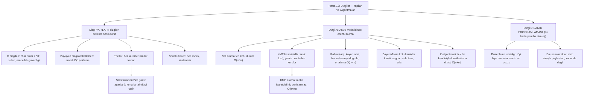

# Hafta 12 — Dizgiler: Yapılar ve Algoritmalar

*CEN207 Veri Yapıları (eski adıyla CE205) · Güz 2026–2027*

<!-- materials:start -->

<div class="materials" markdown>

[:material-file-pdf-box: Ders notu (PDF)](cen207-week-12-notes.pdf){ .md-button download="cen207-week-12-notes.pdf" }
[:material-file-word-box: Ders notu (DOCX)](cen207-week-12-notes.docx){ .md-button download="cen207-week-12-notes.docx" }
[:material-presentation: Sunum (PDF)](cen207-week-12-slides.pdf){ .md-button download="cen207-week-12-slides.pdf" }
[:material-microsoft-powerpoint: Sunum (PPTX)](cen207-week-12-slides.pptx){ .md-button download="cen207-week-12-slides.pptx" }
[:material-language-html5: Sunum (HTML, çevrimdışı)](cen207-week-12-slides.html){ .md-button download="cen207-week-12-slides.html" }
[:material-folder-zip: Tümünü indir (ZIP)](cen207-week-12-materials.zip){ .md-button download="cen207-week-12-materials.zip" }
[:material-fullscreen: Sunumu tam ekran aç](cen207-week-12-slides.html){ .md-button .md-button--primary target=_blank }

</div>

<div class="deck-frame">
<iframe src="../cen207-week-12-slides.html" title="Hafta 12 — Dizeler" loading="lazy" allowfullscreen></iframe>
</div>

<p class="deck-hint">Sunumun içine tıklayıp ok tuşlarıyla ilerleyin; tam ekran için sunumun sağ altındaki düğmeyi ya da yukarıdaki "Sunumu tam ekran aç" bağlantısını kullanın.</p>

<!-- materials:end -->

!!! abstract "Bu hafta"
    **Öğrenme çıktıları.** Bu haftanın sonunda, metin düzenleyicilerin, derleyicilerin, arama motorlarının,
    yazım denetleyicilerin ve DNA analiz araçlarının altında yatan iki dizgi (string) algoritma ailesini
    açıklayabilecek, çizebilecek ve uygulayabilecek olacaksınız. Birinci aile **yapılardır (structures)**: bir
    dizginin bellekte gerçekte nasıl durduğu (bir `char` dizisi artı `'\0'` kuralı, ve bu kuralın olanaklı
    kıldığı arabellek taşması (buffer overflow) hatası), bir arabelleğin karakterler eklendikçe kendini nasıl
    **büyütebildiği**, bir **trie**'nin (önek ağacı) bütün bir sözlüğü, her karakter için bir kenarla nasıl
    sakladığı, bir **sıkıştırılmış trie (compressed trie / radix ağacı)**'nin uzun dallanmasız zincirleri tek
    bir alt-dizgi etiketli kenara nasıl topladığı, ve bir **sonek dizisinin (suffix array)** bir metnin her
    sonekini sıralı listeleyerek "bu örüntü geçiyor mu?" sorusunu bir ikili aramayla nasıl yanıtladığı. İkinci
    aile **arama (search)**: bir metin ve bir örüntü (pattern) verildiğinde, örüntü metnin neresinde geçer?
    **Saf (naif, brute-force) arama**'yı ve onun `O(n*m)` en kötü durumunu göreceksiniz, ardından bu en kötü
    durumdan her biri farklı bir yolla kaçınan üç daha akıllı algoritmayla tanışacaksınız — metin işaretçisinin
    hiç geri sarmaması için bir **başarısızlık işlevi (failure function)** önceden hesaplayan
    **Knuth-Morris-Pratt (KMP)**; ham karakterler yerine her pencerenin ucuz bir **kayan özetini (rolling
    hash)** karşılaştıran, her özet eşleşmesini **sahte isabetleri (spurious hits)** yakalamak için doğrulayan
    **Rabin-Karp**; ve her pencereyi sağdan sola tarayıp az önce gördüğüyle ileri atlayan Boyer-Moore'un
    **kötü karakter kuralı**. Ayrıca aynı arama problemini tek bir geçişte çözen bir kendisiyle-karşılaştırma
    hilesi olan **Z algoritması**'yla da tanışacaksınız. Son olarak, bu derste ilk kez **dinamik programlama
    (dynamic programming)** ile, iki klasik dizgi problemi üzerinden tanışacaksınız: **düzenleme uzaklığı
    (edit distance)** (bir dizgiyi diğerine dönüştürmenin en az sayıda ekleme, silme ve değiştirmesi) ve **en
    uzun ortak alt dizi (longest common subsequence)** (iki dizginin sırayla paylaştığı en uzun karakter
    dizisi). Bu çıktılar ders izlencesinin **ÖÇ.1** (temel veri yapılarını açıklama), **ÖÇ.2** (algoritmik
    karmaşıklığı analiz etme), **ÖÇ.6** (dinamik programlama uygulama) ve **ÖÇ.7** (bir problem için doğru
    yapıyı seçme) maddelerine karşılık gelir.

    **Önceden bilmeniz gerekenler.** Hafta 1 size diziyi (array) verdi — bir `char` dizisi tam olarak bir C
    dizgisinin üzerine kurulduğu şeydir. Hafta 2 size bağlı listeyi (linked list) ve çocuklara işaretçileri
    olan bir düğüm fikrini verdi; bir trie bunu doğrudan yeniden kullanır (bir trie düğümünün "sıradaki
    karakter" işaretçileri tam olarak genelleştirilmiş bir bağlı yapıdır). Hafta 4 size ağaçları (tree) ve
    özyinelemeli ağaç dolaşımını verdi, ikisi de trie'ler ve sıkıştırılmış kuzenleri için merkezidir; ayrıca
    size Huffman kodlamasını verdi — bunu aşağıda sıkıştırılmış trie'lerle açıkça yeniden bağlayacağız. Hafta 6
    size hash'lemeyi verdi; Rabin-Karp bunu tek seferlik bir tablo aramasi yerine *kayan (rolling)* bir hash
    olarak yeniden kullanır. Hiçbir önceki hafta **dinamik programlamayı** tanıtmadı — bu hafta onu, dersteki
    her yeni fikrin tanıtıldığı aynı yolla, sıfırdan tanıtıyor: bir soru, çok yavaş kalan saf bir yaklaşım, ve
    aynı cevabı iki kez asla yeniden hesaplamayarak bunu düzelten bir tablo.

    **3 saatlik bir oturum için zaman planı.** C dizgileri, `'\0'`, `strlen` ve arabellek güvenliği (~15 dk) ·
    büyüyen bir dizgi arabelleği (~10 dk) · trie'ler (~20 dk) · sıkıştırılmış trie'ler / radix ağaçları,
    Huffman bağlantısıyla (~15 dk) · sonek dizileri (~15 dk) · kısa ara · dizgi eşleştirme problemi ve saf
    arama (~10 dk) · KMP'nin başarısızlık işlevi (~15 dk) · KMP araması (~15 dk) · Rabin-Karp (~15 dk) ·
    Boyer-Moore'un kötü karakter kuralı (~15 dk) · Z algoritması (~15 dk) · karşılaştırma tablosu (~5 dk) ·
    dinamik programlama ve düzenleme uzaklığı (~20 dk) · en uzun ortak alt dizi (~15 dk) · toparlama ve
    kendini sınama (~10 dk).

## 0. Başlamadan önce

### 0.1 Zaten bildikleriniz

Önceki haftalardan üç fikir bu hafta en çok işe yarıyor.

**Hafta 1'den — diziler.** Bir `char` dizisi bitişik bir bellek bloğudur, `arr[i]` doğrudan `base_address + i`
olarak hesaplanır. Bir C dizgisi, üzerine tek bir kural daha eklenmiş bir `char` dizisinden başka bir şey
değildir — o kural, ve olanaklı kıldığı hata, bölüm 1'in tüm konusudur.

**Hafta 2 ve Hafta 4'ten — bağlı düğümler ve ağaçlar.** 26 "sıradaki karakter" işaretçisi olan bir trie düğümü,
genelleştirilmiş bir bağlı liste/ağaç düğümüdür: bir `next` (liste) ya da iki çocuk (ikili ağaç) yerine, olası
her sıradaki karakter için bir çocuk vardır. Özyinelemeli ekleme, arama ve serbest bırakma, Hafta 4'te
ağaçlar için çalıştığı gibi çalışır.

**Hafta 6'dan — hash'leme.** Bir hash fonksiyonu bir anahtarı O(1) sürede bir sayıya dönüştürür. Rabin-Karp
(bölüm 9) aynı fikri yeniden kullanır, ama **yeni bir pencerenin** özetini **önceki pencerenin** özetinden
O(1) sürede hesaplar, her seferinde sıfırdan hash'lemek yerine — bir **kayan özet (rolling hash)**.

**Bu hafta gerçekten yeni bir fikir: dinamik programlama.** Bu haftaya kadarki her algoritma ya bir yapıyı bir
kez dolaştı (`O(n)`) ya da bir arama uzayını daralttı (`O(log n)`). Bölüm 13 ve 14 üçüncü bir strateji tanıtır:
bir problemi çakışan (overlapping) daha küçük alt problemlere bölmek, her birini **yalnız bir kez** çözmek, ve
cevabı bir tabloda saklayarak asla yeniden hesaplanmamasını sağlamak. Bu **dinamik programlamadır**, ve
düzenleme uzaklığı bunun mümkün olan en temiz örneklerinden biridir.

### 0.2 Bu haftanın haritası



Aşağıdaki her kutu kendi bölümünü alır, çoğu adım adım bir animasyon, eksiksiz bir C ve Java programı, ve
karmaşıklık ile sık yapılan hatalar üzerine bir notla birlikte.

## 1. C dizgileri: bellek, `'\0'` ve `strlen`

### 1.1 Başlangıç sorusu

Şimdiye kadarki her veri yapısı *boyutunu* bir yerde sakladı — bir dizinin kapasitesi ayrı bir değişkendi, bir
bağlı listenin uzunluğu `next` işaretçileri dolaşılarak sayılabilirdi, bir ağacın düğüm sayısı onu dolaşarak
geldi. Bir C dizgisi **hiçbir uzunluk alanı saklamaz**. Öyleyse `"HELLO"` tutan bir `char` dizisi varsa, hangi
işlev — `printf`, `strlen`, kendi kodunuz — metnin nerede *bittiğini* nasıl bilir? C'nin cevabı, dilin
1970'lerin başında Bell Labs'ta tasarlandığı sırada seçildi (Dennis Ritchie): tek bir ayrılmış bayt, `'\0'`,
NUL karakteri (değeri 0). Bir C dizgisi, bir `char` dizisi artı şu *kural*dır: ilk `'\0'` baytı "dizgi burada
bitiyor" der. Ondan önceki her karakter dizginin parçasıdır; ondan sonraki her bayt, dizi gerçekte kaç bayt
tutuyor olursa olsun, yalnızca kullanılmayan boşluktur.

### 1.2 Kural, ve olanaklı kıldığı hata

Uzunluk hiç saklanmadığından, uzunluğu bilmesi gereken *her* işlem **diziyi bayt bayt, `'\0'` bulana kadar
dolaşmak zorundadır** — hiçbir kestirme yol yoktur. `strlen("HELLO")` cevabın 5 olduğunu bir şekilde bilmez;
`H`, `E`, `L`, `L`, `O`, `\0` okur ve durmadan önce beş `'\0'`-olmayan bayt sayar. Bir dizgiyi kopyalamak aynı
şekilde çalışır: `strcpy(dest, src)`, `src`'yi bir karakter bir karakter okur ve her birini `dest`'e yazar, ta
ki `'\0'`'ı da kopyalayana kadar. İşte klasik C hatası burada yatıyor: `dest` sabit boyutlu bir arabellekse ve
`src` o arabelleğin tutabileceğinden daha uzunsa, korumasız bir kopyalama arabelleğin son geçerli indisinin
ötesine yazmaya devam eder. O tek ekstra yazma **tanımsız davranıştır (undefined behavior, UB)** — arabelleğin
hemen ardından bellekte ne yaşadığına bağlı olarak, ilgisiz bir değişkeni, kaydedilmiş bir dönüş adresini
sessizce bozabilir ya da programı doğrudan çökertebilir. Bu, yazılım güvenliği tarihinin en sonuçlu hata
sınıflarından biri olan **arabellek taşmasıdır (buffer overflow)**. Bu notun animasyonu ve programı, bu taşmaya
neden olan *güvenli olmayan* karakter-karakter kopyalama döngüsünü gösterir, ama her yazmayı bir sınır
kontrolüyle (`if (i == cap) break;`) korur, böylece gerçek sınır dışı yazma **bayraklanır ve durdurulur, hiç
çalıştırılmaz** — hiç gerçekten tetiklemeden tehlikeyi görürsünüz.

### 1.3 Bellekte nasıl durur, ve kod

=== "C"

    ```c
    char buf[CAP];

    int i = 0;
    while (src[i] != '\0') {
        if (i == CAP) break;        /* would need buf[CAP]: out of bounds -- stop, never write it */
        buf[i] = src[i];
        i++;
    }
    int overflow = (src[i] != '\0');    /* loop stopped early because of the guard, not '\0' */
    if (!overflow) buf[i] = '\0';         /* room guaranteed: i < CAP here */

    size_t len = 0;
    if (!overflow)
        while (buf[len] != '\0') len++;   /* strlen: walk until the terminator */
    ```

=== "Java"

    ```java
    char[] buf = new char[CAP];

    int i = 0;
    while (i < src.length()) {
        if (i == CAP) break;        // would need buf[CAP]: out of bounds -- stop, never write it
        buf[i] = src.charAt(i);
        i++;
    }
    boolean overflow = (i < src.length());   // loop stopped early because of the guard
    // (no terminator byte needed in Java -- a String already carries its own length)

    int len = 0;
    if (!overflow)
        while (len < buf.length && buf[len] != 0) len++;
    ```

Animasyonu oynatarak her karakterin bir bir kopyalandığını, sonlandırıcının yazıldığını, sonra `strlen`'in aynı
arabelleği ikinci bir kez, sıfırdan, uzunluğu yeniden saymak için dolaştığını izleyin.

<iframe class="dsanim" src="../anim/c-string-memory.html" title="C string memory: the array, \0 and strlen" loading="lazy"></iframe>
<div class="dsanim-baski" markdown>

</div>

Seçicide ayrıca **cap=11, tam sığar (0 bayt boşluk)** (zor) ve uç durumları **cap=8, taşma — bayraklanır, hiç
çalıştırılmaz** ve **tekrarlı karakter "AAAAAAAAAA"** deneyin — ya da dört zorluk seviyesinde rastgele veri
için 🎲'e basın, ya da kendi kapasitenizi ve metninizi yazın.

### 1.4 Dene

??? example "Tam program: `c_string_memory.c` / `CStringMemory.java`"

    === "C"

        ```c
        /* Week 12 -- Strings: Structures and Algorithms
         * C string memory: a char array plus the '\0' convention, strlen(), and a buffer-overflow edge case that is
         * FLAGGED but never executed (no out-of-bounds write is ever performed -- the guard `if (i == cap) break;`
         * stops the copy one write before it would happen).
         * CEN207 Data Structures (CS50-style lecture notes)
         */
        #include <stdio.h>
        #include <string.h>

        #define MAX_CAP 16

        static char buf[MAX_CAP];

        /* Copies src into buf, character by character, but never writes past index cap-1. If src needs more than
         * cap bytes (cap-1 characters plus the terminator), the copy stops as soon as it WOULD go out of bounds and
         * *overflow is set to 1 -- the out-of-bounds write is flagged, never executed. Returns the number of bytes
         * actually written (== cap on overflow, since buf[0..cap-1] are all filled and all valid). */
        static int safe_store(const char *src, int cap, int *overflow) {
            int i = 0;
            while (src[i] != '\0') {
                if (i == cap) break;      /* would need buf[cap]: out of bounds -- stop, never write it */
                buf[i] = src[i];
                i++;
            }
            *overflow = (src[i] != '\0');
            if (!*overflow) buf[i] = '\0';
            return i;
        }

        static void run_scenario(const char *label, const char *text, int cap) {
            printf("-- %s --\n", label);
            printf("cap = %d, source = \"%s\" (%d letters)\n", cap, text, (int) strlen(text));
            int overflow = 0;
            int written = safe_store(text, cap, &overflow);
            if (overflow) {
                printf("overflow flagged after %d bytes: buf[%d] would be out of bounds (valid indices 0..%d) -- stopped, never executed\n", written, cap, cap - 1);
            } else {
                size_t len = strlen(buf);
                printf("stored \"%s\", strlen = %zu\n", buf, len);
            }
            printf("\n");
        }

        int main(void) {
            run_scenario("normal: cap=16, comfortable fit", "HELLOWORLD", 16);
            run_scenario("hard: cap=12, 1 byte of slack", "ALGORITHMS", 12);
            run_scenario("edge: cap=11, exact fit (0 bytes slack)", "ALGORITHMS", 11);
            run_scenario("edge: cap=8, overflow -- flagged, never executed", "STRUCTURES", 8);
            run_scenario("edge: cap=16, repeated character", "AAAAAAAAAA", 16);
            return 0;
        }
        ```

    === "Java"

        ```java
        /* Week 12 -- Strings: Structures and Algorithms
         * C string memory: a char array plus the '\0' convention, strlen(), and a buffer-overflow edge case that is
         * FLAGGED but never executed. Java strings carry their own length, so the overflow danger below is really a
         * C-only bug; we reproduce the same bounded-array exercise here so the two languages can be compared side by
         * side, with the identical safety guard.
         * CEN207 Data Structures (CS50-style lecture notes)
         */
        public class CStringMemory {
            static final int MAX_CAP = 16;
            static char[] buf = new char[MAX_CAP];

            // Copies src into buf, character by character, but never writes past index cap-1. Returns the number of
            // characters actually written; overflow[0] is set to true if src needed more room than cap allowed.
            static int safeStore(String src, int cap, boolean[] overflow) {
                int i = 0;
                while (i < src.length()) {
                    if (i == cap) break;      // would need buf[cap]: out of bounds -- stop, never write it
                    buf[i] = src.charAt(i);
                    i++;
                }
                overflow[0] = (i < src.length());
                return i;
            }

            static void runScenario(String label, String text, int cap) {
                System.out.println("-- " + label + " --");
                System.out.println("cap = " + cap + ", source = \"" + text + "\" (" + text.length() + " letters)");
                boolean[] overflow = new boolean[1];
                int written = safeStore(text, cap, overflow);
                if (overflow[0]) {
                    System.out.println("overflow flagged after " + written + " bytes: buf[" + cap + "] would be out of bounds (valid indices 0.." + (cap - 1) + ") -- stopped, never executed");
                } else {
                    String stored = new String(buf, 0, written);
                    System.out.println("stored \"" + stored + "\", strlen = " + stored.length());
                }
                System.out.println();
            }

            public static void main(String[] args) {
                runScenario("normal: cap=16, comfortable fit", "HELLOWORLD", 16);
                runScenario("hard: cap=12, 1 byte of slack", "ALGORITHMS", 12);
                runScenario("edge: cap=11, exact fit (0 bytes slack)", "ALGORITHMS", 11);
                runScenario("edge: cap=8, overflow -- flagged, never executed", "STRUCTURES", 8);
                runScenario("edge: cap=16, repeated character", "AAAAAAAAAA", 16);
            }
        }
        ```

**Dene**

=== "C"

    ```console
    gcc -std=c11 -Wall -Wextra -o /tmp/x c_string_memory.c && /tmp/x
    ```

    Beklenen çıktı:

    ```text
    -- normal: cap=16, comfortable fit --
    cap = 16, source = "HELLOWORLD" (10 letters)
    stored "HELLOWORLD", strlen = 10

    -- hard: cap=12, 1 byte of slack --
    cap = 12, source = "ALGORITHMS" (10 letters)
    stored "ALGORITHMS", strlen = 10

    -- edge: cap=11, exact fit (0 bytes slack) --
    cap = 11, source = "ALGORITHMS" (10 letters)
    stored "ALGORITHMS", strlen = 10

    -- edge: cap=8, overflow -- flagged, never executed --
    cap = 8, source = "STRUCTURES" (10 letters)
    overflow flagged after 8 bytes: buf[8] would be out of bounds (valid indices 0..7) -- stopped, never executed

    -- edge: cap=16, repeated character --
    cap = 16, source = "AAAAAAAAAA" (10 letters)
    stored "AAAAAAAAAA", strlen = 10
    ```

=== "Java"

    ```console
    javac -Xlint:all CStringMemory.java && java CStringMemory
    ```

    Beklenen çıktı: yukarıdaki C çalıştırmasıyla birebir aynı (`CStringMemory` ve `c_string_memory.c` aynı
    metni bayt bayt yazdırır).

### 1.5 Karmaşıklık, hatalar, kendini sına

**Karmaşıklık.** `L` uzunluğundaki bir dizgiyi bir arabelleğe kopyalamak `O(L)`'dir — her karakter tam bir kez
dokunulur. `strlen` de **`O(L)`'dir**, ve önemlisi, **her çağrıldığında** `O(L)`'dir, çünkü uzunluk hiçbir
yerde önbelleğe alınmaz. `strlen`'i bir döngü koşulunun içinde çağırmak (`for (i = 0; i < strlen(s); i++)`)
sessizce `O(n)` bir döngüyü `O(n^2)`'ye çevirir, çünkü `strlen` her yinelemede tüm dizgiyi yeniden dolaşır —
bu, C'deki en yaygın kazara-karesel-süre hatalarından biridir.

!!! warning "Sık yapılan hatalar"
    - **Sonlandırıcı için `+1`'i unutmak** bir arabelleği boyutlandırırken: 10 karakterlik bir sözcük 10 değil
      **11** bayt gerektirir (`char buf[11]`) — eksik bayt tam olarak bu bölümün uç durumundaki taşmanın
      olduğu yerdir.
    - **`strlen`'i bir döngünün koşulunun içinde çağırmak**, sessizce `O(n)` bir taramayı `O(n^2)` yapmak.
      Uzunluğu bir kez hesaplayın, saklayın, saklanan değeri yeniden kullanın.
    - **Dizgileri `==` ile karşılaştırmak**, `strcmp` yerine. C'de, iki `char*` değeri üzerinde `==`,
      *karakterleri* değil *işaretçileri* (adresleri) karşılaştırır — aynı görünen iki dizgi, farklı adreslerde
      saklanıyorsa, `strcmp` onları doğru şekilde eşit bildirse bile `==` ile eşit çıkmaz.

??? success "Kendini sına: strlen neden saklı bir alanı doğrudan döndüremez?"
    Çünkü bir C dizgisi tam olarak şöyle tanımlanır: "bir `char` dizisi artı ilk `'\0'` baytının nerede olduğu"
    — hiçbir struct, hiçbir uzunluk alanı yoktur, yalnızca ham baytlar. `strlen`'in uzunluğu *okuyacağı* bir
    veri kaynağı yoktur; `'\0'`'ı bulmanın tek yolu her baytı sırayla bir bulunana kadar incelemektir. Bu aynı
    zamanda uzunluğa ihtiyaç duyan her C dizgi işlevinin (`strcpy`, `strcat`, `strcmp`, …) neden en az `O(L)`
    olduğunun, hiçbir zaman `O(1)` olamayacağının da nedenidir.

## 2. Büyüyen bir dizgi arabelleği

### 2.1 Başlangıç sorusu

Bölüm 1'in `buf[CAP]`'ı, tek bir karakter bile yazılmadan önce seçilen *sabit* bir kapasiteye sahipti — ve dolu
olduğunda iş bitmişti. Ama bir düzenleyicinin "kutuya yaz" işlemi, ya da bir dizgiyi parça parça oluşturan bir
program (`printf` tarzı biçimlendirmeyi ya da bir dosyayı satır satır okumayı düşünün), son uzunluğu önceden
bilmez. Ya arabellek, çağıranın hiç önceden bir kapasite tahmin etmesine gerek kalmadan, ihtiyaç duyulduğunda
**kendini büyütebilseydi**? Bu fikir — `java.lang.StringBuilder`'ın, C++'ın `std::string`'inin, Python'ın
liste-ekleme mekanizmasının ve Hafta 1'in dinamik dizisinin içinde kullanılır — bu bölümün konusudur.

### 2.2 Fikir: dolduğunda ikiye katla, ve neden +1 değil de katlama önemli

Büyüyen bir arabellek, ham depolamasının yanında üç sayı tutar: `len` (gerçekte kaç karakter saklandığı),
`cap` (mevcut ayırmanın kaç tanesini tutabildiği), ve depolamanın kendisi. Bir karakter eklemek neredeyse her
zaman basittir: `buf[len] = c; len++`. İlginç durum `len == cap` olduğunda — arabellek dolu olduğunda —
ortaya çıkar. Arabellek o zaman **eski boyutun iki katı, yeni bir blok ayırır**, var olan her karakteri oraya
**kopyalar**, ve ancak *o zaman* yeni karakteri yazar. Katlama (sabit bir miktarla, `+1` ya da `+10` gibi,
büyütmek yerine) burada kritik tasarım kararıdır: arabellek büyüdükçe kopyalamanın **üstel olarak daha seyrek**
gerçekleşmesini garanti eder, ve bu tam olarak, büyümeyi tetikleyen herhangi bir *tek* ekleme `O(len)`'e mal
olsa da, bir eklemenin *ortalama* maliyetinin `O(1)` olmasını sağlayan şeydir — buna **amorti edilmiş analiz
(amortized analysis)** denir, ve bölüm 2.5 bunun neden geçerli olduğunu hesaplar.

### 2.3 Bellekte nasıl durur, ve kod

=== "C"

    ```c
    char *buf = malloc(cap);   /* cap = INITCAP */
    int len = 0;

    void append(char c) {
        if (len == cap) {        /* full: grow before writing */
            cap = cap * 2;
            buf = realloc(buf, cap);   /* copies every old byte across */
        }
        buf[len] = c;
        len++;
    }
    ```

=== "Java"

    ```java
    char[] buf = new char[cap];   // cap = INITCAP
    int len = 0;

    void append(char c) {
        if (len == cap) {          // full: grow before writing
            cap = cap * 2;
            char[] bigger = new char[cap];
            System.arraycopy(buf, 0, bigger, 0, len);   // copies every old byte across
            buf = bigger;
        }
        buf[len] = c;
        len++;
    }
    ```

Animasyonu oynatarak arabelleğin dolduğunu, kapasiteye ulaştığını, ve büyüdüğünü izleyin — var olan karakterler
"kopyalandı" olarak görünür bir şekilde parlar, sonra satır genişler ve yeni karakter tazece büyümüş boşluğa
iner.

<iframe class="dsanim" src="../anim/string-builder.html" title="Growable string buffer (string builder)" loading="lazy"></iframe>
<div class="dsanim-baski" markdown>

</div>

Seçicide ayrıca **initCap=2, art arda çok sayıda büyüme** (zor) ve uç durumları **initCap=10, tam sığar, hiç
büyüme yok**, **initCap=1, en küçük olası başlangıç**, ve **initCap=9, tam sınırda tek bir büyüme** deneyin —
ya da dört zorluk seviyesinde rastgele veri için 🎲'e basın, ya da kendi başlangıç kapasitenizi ve metninizi
yazın.

### 2.4 Dene

??? example "Tam program: `string_builder.c` / `StringBuilderDemo.java`"

    === "C"

        ```c
        /* Week 12 -- Strings: Structures and Algorithms
         * Growable string buffer: characters are appended one at a time; when full, a new block double the size is
         * allocated, every existing byte is copied across (realloc), then the new character is written. Appending is
         * O(1) most of the time and O(len) only on the rare growth step -- amortized O(1) overall.
         * CEN207 Data Structures (CS50-style lecture notes)
         */
        #include <stdio.h>
        #include <stdlib.h>
        #include <string.h>

        typedef struct {
            char *buf;
            int len;
            int cap;
            int growths;
        } Builder;

        static void builder_init(Builder *b, int init_cap) {
            b->cap = init_cap;
            b->buf = malloc((size_t) b->cap);
            b->len = 0;
            b->growths = 0;
        }

        static void builder_append(Builder *b, char c) {
            if (b->len == b->cap) {              /* full: grow before writing */
                b->cap = b->cap * 2;
                b->buf = realloc(b->buf, (size_t) b->cap);   /* copies every old byte across */
                b->growths++;
            }
            b->buf[b->len] = c;
            b->len++;
        }

        static void builder_free(Builder *b) {
            free(b->buf);
            b->buf = NULL;
        }

        static void run_scenario(const char *label, int init_cap, const char *chars) {
            printf("-- %s --\n", label);
            printf("initCap = %d, appending \"%s\" (%d letters)\n", init_cap, chars, (int) strlen(chars));
            Builder b;
            builder_init(&b, init_cap);
            for (int i = 0; chars[i] != '\0'; i++) builder_append(&b, chars[i]);
            printf("result: \"%.*s\", len = %d, finalCap = %d, growths = %d\n\n", b.len, b.buf, b.len, b.cap, b.growths);
            builder_free(&b);
        }

        int main(void) {
            run_scenario("normal: initCap=4", 4, "HELLOWORLD");
            run_scenario("hard: initCap=2, many growths back to back", 2, "ALGORITHMSDATA");
            run_scenario("edge: initCap=10, exact fit, no growth at all", 10, "ABCDEFGHIJ");
            run_scenario("edge: initCap=1, the smallest possible start", 1, "ABCDEFGHIJ");
            run_scenario("edge: initCap=9, a single growth right at the boundary", 9, "ABCDEFGHIJ");
            return 0;
        }
        ```

    === "Java"

        ```java
        /* Week 12 -- Strings: Structures and Algorithms
         * Growable string buffer, built by hand (java.lang.StringBuilder does exactly this internally). Characters
         * are appended one at a time; when full, a new array double the size is allocated, every existing character
         * is copied across, then the new character is written. Amortized O(1) append.
         * CEN207 Data Structures (CS50-style lecture notes)
         */
        public class StringBuilderDemo {
            static class Builder {
                char[] buf;
                int len;
                int cap;
                int growths;

                Builder(int initCap) {
                    cap = initCap;
                    buf = new char[cap];
                    len = 0;
                    growths = 0;
                }

                void append(char c) {
                    if (len == cap) {                          // full: grow before writing
                        cap = cap * 2;
                        char[] bigger = new char[cap];
                        System.arraycopy(buf, 0, bigger, 0, len);   // copies every old byte across
                        buf = bigger;
                        growths++;
                    }
                    buf[len] = c;
                    len++;
                }
            }

            static void runScenario(String label, int initCap, String chars) {
                System.out.println("-- " + label + " --");
                System.out.println("initCap = " + initCap + ", appending \"" + chars + "\" (" + chars.length() + " letters)");
                Builder b = new Builder(initCap);
                for (int i = 0; i < chars.length(); i++) b.append(chars.charAt(i));
                System.out.println("result: \"" + new String(b.buf, 0, b.len) + "\", len = " + b.len + ", finalCap = " + b.cap + ", growths = " + b.growths);
                System.out.println();
            }

            public static void main(String[] args) {
                runScenario("normal: initCap=4", 4, "HELLOWORLD");
                runScenario("hard: initCap=2, many growths back to back", 2, "ALGORITHMSDATA");
                runScenario("edge: initCap=10, exact fit, no growth at all", 10, "ABCDEFGHIJ");
                runScenario("edge: initCap=1, the smallest possible start", 1, "ABCDEFGHIJ");
                runScenario("edge: initCap=9, a single growth right at the boundary", 9, "ABCDEFGHIJ");
            }
        }
        ```

**Dene**

=== "C"

    ```console
    gcc -std=c11 -Wall -Wextra -o /tmp/x string_builder.c && /tmp/x
    ```

    Beklenen çıktı:

    ```text
    -- normal: initCap=4 --
    initCap = 4, appending "HELLOWORLD" (10 letters)
    result: "HELLOWORLD", len = 10, finalCap = 16, growths = 2

    -- hard: initCap=2, many growths back to back --
    initCap = 2, appending "ALGORITHMSDATA" (14 letters)
    result: "ALGORITHMSDATA", len = 14, finalCap = 16, growths = 3

    -- edge: initCap=10, exact fit, no growth at all --
    initCap = 10, appending "ABCDEFGHIJ" (10 letters)
    result: "ABCDEFGHIJ", len = 10, finalCap = 10, growths = 0

    -- edge: initCap=1, the smallest possible start --
    initCap = 1, appending "ABCDEFGHIJ" (10 letters)
    result: "ABCDEFGHIJ", len = 10, finalCap = 16, growths = 4

    -- edge: initCap=9, a single growth right at the boundary --
    initCap = 9, appending "ABCDEFGHIJ" (10 letters)
    result: "ABCDEFGHIJ", len = 10, finalCap = 18, growths = 1
    ```

=== "Java"

    ```console
    javac -Xlint:all StringBuilderDemo.java && java StringBuilderDemo
    ```

    Beklenen çıktı: yukarıdaki C çalıştırmasıyla birebir aynı.

### 2.5 Karmaşıklık, hatalar, kendini sına

**Karmaşıklık.** Yer varsa tek bir ekleme `O(1)`'dir, ender olarak bir büyümeyi tetiklediğinde `O(len)`'dir.
`n` karakteri birer birer eklemek, toplamda, `n`'e (sıradan yazmalar) artı `1 + 2 + 4 + 8 + ... + n`'e (her
büyümede yapılan kopyalama, `2n`'i aşmayan bir geometrik seri) mal olur — böylece `n` ekleme toplam `O(n)`'e
mal olur, yani ekleme başına **amorti edilmiş** `O(1)`. Bu, Hafta 1'in dinamik dizisiyle aynı argüman ve aynı
garantidir.

!!! warning "Sık yapılan hatalar"
    - **Sabit bir miktarla büyütmek** (`cap = cap + 10`) katlama yerine. Bu, `n` eklemeyi toplam `O(n^2)` işe
      çevirir — `n/10` büyümeyle, her biri `n`'e kadar bayt kopyalayarak, toplam kopyalama `O(n^2/10)`'dur,
      `O(n)` değil.
    - **`realloc`'tan sonra işaretçiyi güncellemeyi unutmak** (yalnızca C). `realloc` bloğu yeni bir adrese
      taşıyabilir; *eski* adresi referans alan her işaretçi artık sarkıktır ve bir daha kullanılmamalıdır —
      yalnızca döndürülen işaretçi geçerlidir.
    - **`len` bayt okumak ama `len + 1`'den az ayırmak**, arabellek daha sonra bir C dizgisi olarak
      işlenecekse (bir `'\0'`'a da ihtiyaç var) — buradaki büyüyen arabellek, tam olarak bu tuzaktan kaçınmak
      için, bir C dizgisi değil, açık bir `len`'le ham karakterler saklar.

??? success "Kendini sına: katlama neden sabit bir büyüme miktarından daha iyidir?"
    Katlamayla, tüm büyümeler boyunca kopyalanan toplam bayt sayısı, son boyutla sınırlı geometrik bir seridir
    (`1 + 2 + 4 + ... + n/2 < n`). Sabit bir `k` büyümesiyle, `n/k` büyüme vardır, ve `i`'inci büyüme yaklaşık
    `i*k` bayt kopyalar, böylece toplam kabaca `k * (1 + 2 + ... + n/k) = O(n^2/k)`'dir — herhangi bir sabit
    `k` için karesel, doğrusal değil. Katlama, tüm kopyalamanın *toplamını* doğrusal tutan şeydir.

## 3. Trie'ler: her karakter için bir kenar

### 3.1 Başlangıç sorusu

Diyelim ki koca bir sözlüğü — on binlerce sözcüğü — saklamanız ve iki soruyu hızlıca yanıtlamanız gerekiyor:
"`X` bir sözcük mü?" ve "`X` öneki ile hangi sözcükler başlıyor?" (tam olarak bir otomatik tamamlama kutusunun
ya da bir yazım denetleyicisinin ihtiyaç duyduğu şey). Bir hash tablosu (Hafta 6) birinci soruyu ortalama
`O(1)` sürede yanıtlar, ama ikincisini hiç yanıtlayamaz — hash'leme, benzer anahtarları bilerek ilgisiz
hücrelere dağıtır, "ile başlıyor" kavramını yok eder. Ya bunun yerine, bir öneki paylaşan her sözcük, o öneki
temsil eden *yolu* da veri yapısı içinde paylaşsaydı? Bu **trie**'dir (ad "re**trie**val"'dan gelir, ama
"tree" ile karışmaması için genellikle "try" diye okunur — Edward Fredkin yapıyı ve adı 1960 tarihli bir
makalede tanıttı). Bir trie, **her kenarının bir karakterle etiketlendiği** bir ağaçtır, ve kökten başlayarak
bir sözcüğün harflerinin çizdiği kenarları izlemek, o sözcüğün ağaç içindeki yolunu izler.

### 3.2 Fikir: paylaşılan önekler düğümleri paylaşır

`"CAT"`, sonra `"CAR"`, sonra `"CARD"`, sonra `"DOG"`'u boş bir trie'ye ekleyin. `"CAT"` üç yeni düğüm
oluşturur, harf başına bir tane, sonuncusu "sözcük sonu" olarak işaretlenmiş. `"CAR"`, trie'nin ilk iki yeni
düğümünü (`C`, sonra `A`) `"CAT"`ile paylaşır — `C`→`A` kenarları zaten var — ve yalnız bir yepyeni düğüme,
`R`'ye, "son" olarak işaretlenmiş, ihtiyaç duyar. `"CARD"`, `C`→`A`→`R`'ı `"CAR"`ile paylaşır ve bir yeni
düğüm, `D`, ekler. `"DOG"`, diğer üçüyle hiçbir şey paylaşmaz (burada hiçbir sözcük `D` ile başlamıyor) ve
kökten tamamen yeni bir dal oluşturur. Dikkat edin: bir düğüm hem tam bir sözcüğün sonu **hem de** daha uzun
bir sözcüğün devamının başlangıcı olabilir — `"CAR"`'ın `R` düğümü, trie `D`'ye devam ederek `"CARD"`'a
uzansa bile "son" olarak işaretlidir.

| İşlem | Ne yapar | Maliyet |
| --- | --- | --- |
| `insert(word)` | Karakter başına bir kenar izler/oluşturur; son düğümü "son" olarak işaretler | `O(L)`, `L` = sözcüğün uzunluğu |
| `search(word)` | Karakter başına bir kenar izler; yalnız her kenar varsa **ve** son düğüm "son" ise bulunur | `O(L)` |
| önek kontrolü | `search` ile aynı yürüyüş, ama başarı yalnız her kenarın var olmasını gerektirir (son düğümün "son" olması gerekmez) | `O(L)` |

Buradaki en önemli tek özellik şudur: her trie işleminin maliyeti **yalnız sözcüğün uzunluğu `L`'ye bağlıdır**
— trie'nin başka kaç sözcük daha tuttuğuna asla bağlı değildir. 10 sözcüklü bir trie ile 10 milyon sözcüklü
bir trie, `search("CAT")`'i tam olarak aynı sayıda adımda yanıtlar.

### 3.3 Bellekte nasıl durur, ve kod

=== "C"

    ```c
    #define ALPHA 26
    typedef struct TrieNode { struct TrieNode *child[ALPHA]; bool isEnd; } TrieNode;

    void insert(TrieNode *root, const char *word) {
        TrieNode *cur = root;
        for (int i = 0; word[i] != '\0'; i++) {
            int c = word[i] - 'A';
            if (cur->child[c] == NULL) {
                cur->child[c] = new_node();
            }
            cur = cur->child[c];
        }
        cur->isEnd = true;
    }

    bool search(TrieNode *root, const char *word, bool *isPrefix) {
        TrieNode *cur = root;
        for (int i = 0; word[i] != '\0'; i++) {
            int c = word[i] - 'A';
            if (cur->child[c] == NULL) {
                *isPrefix = false;
                return false;
            }
            cur = cur->child[c];
        }
        *isPrefix = true;
        return cur->isEnd;
    }
    ```

=== "Java"

    ```java
    static class TrieNode {
        Map<Character, TrieNode> child = new HashMap<>();
        boolean isEnd = false;
    }

    void insert(TrieNode root, String word) {
        TrieNode cur = root;
        for (char c : word.toCharArray()) {
            if (!cur.child.containsKey(c)) {
                cur.child.put(c, new TrieNode());
            }
            cur = cur.child.get(c);
        }
        cur.isEnd = true;
    }

    boolean search(TrieNode root, String word, boolean[] isPrefix) {
        TrieNode cur = root;
        for (char c : word.toCharArray()) {
            if (!cur.child.containsKey(c)) {
                isPrefix[0] = false;
                return false;
            }
            cur = cur.child.get(c);
        }
        isPrefix[0] = true;
        return cur.isEnd;
    }
    ```

İki dilin "her karakter için bir kenar"a gerçekten farklı yaklaştığına dikkat edin: C, düğüm başına **sabit
26 hücreli bir dizi** kullanır (hızlı, `O(1)` arama, ama az çocuklu düğümler için bellek israf eder), yukarıdaki
Java sürümü ise düğüm başına bir **`HashMap`** kullanır (belleği gerçek çocuk sayısıyla orantılı tutar,
bedeli doğrudan dizi indeksleme yerine bir hash araması olur) — bu dersin dışında da tekrar tekrar
karşılaşacağınız gerçek, yaygın bir ödünleşimdir.

Animasyonu oynatarak paylaşılan öneklerin var olan düğümleri yeniden kullandığını, yeni dalların taze düğümler
oluşturduğunu, ve aramaların aynı kenarları izleyerek "bulundu", "yalnız önek" ya da "bulunamadı" bildirdiğini
izleyin.

<iframe class="dsanim" src="../anim/trie-insert-search.html" title="Trie (prefix tree): insert and search" loading="lazy"></iframe>
<div class="dsanim-baski" markdown>

</div>

Seçicide ayrıca **TRIE sözcük ailesi: TRIE, TRIED, TRIES, TRY, TRUE, TRUCK** (zor) ve uç durumları **hiç
paylaşılan önek yok**, **yinelenen bir ekleme (değişmez)**, ve **dallanmasız bir zincir: A, AB, ABC, ABCD**
deneyin — ya da dört zorluk seviyesinde rastgele veri için 🎲'e basın, ya da kendi sözcüklerinizi ve
aramalarınızı yazın.

### 3.4 Dene

??? example "Tam program: `trie_insert_search.c` / `TrieInsertSearch.java`"

    === "C"

        ```c
        /* Week 12 -- Strings: Structures and Algorithms
         * Trie (prefix tree): insert and search, one edge per character, a fixed 26-letter alphabet array per node.
         * CEN207 Data Structures (CS50-style lecture notes)
         */
        #include <stdbool.h>
        #include <stdio.h>
        #include <stdlib.h>

        #define ALPHA 26

        typedef struct TrieNode {
            struct TrieNode *child[ALPHA];
            bool is_end;
        } TrieNode;

        static TrieNode *new_node(void) {
            TrieNode *n = malloc(sizeof(TrieNode));
            for (int i = 0; i < ALPHA; i++) n->child[i] = NULL;
            n->is_end = false;
            return n;
        }

        static void insert(TrieNode *root, const char *word) {
            TrieNode *cur = root;
            for (int i = 0; word[i] != '\0'; i++) {
                int c = word[i] - 'A';
                if (cur->child[c] == NULL)
                    cur->child[c] = new_node();
                cur = cur->child[c];
            }
            cur->is_end = true;
        }

        static bool search(TrieNode *root, const char *word, bool *is_prefix) {
            TrieNode *cur = root;
            for (int i = 0; word[i] != '\0'; i++) {
                int c = word[i] - 'A';
                if (cur->child[c] == NULL) {
                    *is_prefix = false;
                    return false;
                }
                cur = cur->child[c];
            }
            *is_prefix = true;
            return cur->is_end;
        }

        static void free_trie(TrieNode *n) {
            if (n == NULL) return;
            for (int i = 0; i < ALPHA; i++) free_trie(n->child[i]);
            free(n);
        }

        static void run_scenario(const char *label, const char *const words[], int nwords, const char *const queries[], int nqueries) {
            printf("-- %s --\n", label);
            TrieNode *root = new_node();
            for (int i = 0; i < nwords; i++) {
                insert(root, words[i]);
                printf("insert(%s)\n", words[i]);
            }
            for (int i = 0; i < nqueries; i++) {
                bool is_prefix = false;
                bool found = search(root, queries[i], &is_prefix);
                printf("search(%s) -> found=%s, isPrefix=%s\n", queries[i], found ? "true" : "false", is_prefix ? "true" : "false");
            }
            free_trie(root);
            printf("\n");
        }

        int main(void) {
            const char *const w1[] = {"CAT", "CAR", "CARD", "DOG"};
            const char *const q1[] = {"CAR", "CARS", "DO"};
            run_scenario("normal: CAT, CAR, CARD, DOG; search CAR/CARS/DO", w1, 4, q1, 3);

            const char *const w2[] = {"TRIE", "TRIED", "TRIES", "TRY", "TRUE", "TRUCK"};
            const char *const q2[] = {"TRIE", "TR", "TRUCKS", "TRY", "TRUST"};
            run_scenario("hard: the TRIE word family, 5 searches", w2, 6, q2, 5);

            const char *const w3[] = {"AB", "CD", "EF", "GH", "IJ"};
            const char *const q3[] = {"AB", "XY", "A"};
            run_scenario("edge: no shared prefix, every word branches from the root", w3, 5, q3, 3);

            const char *const w4[] = {"DATA", "DATA", "STRUCTURE"};
            const char *const q4[] = {"DATA", "DAT", "STRUCTURES"};
            run_scenario("edge: duplicate insert of DATA (idempotent)", w4, 3, q4, 3);

            const char *const w5[] = {"A", "AB", "ABC", "ABCD"};
            const char *const q5[] = {"A", "ABCD", "ABCDE"};
            run_scenario("edge: a branchless chain A, AB, ABC, ABCD", w5, 4, q5, 3);

            return 0;
        }
        ```

    === "Java"

        ```java
        /* Week 12 -- Strings: Structures and Algorithms
         * Trie (prefix tree): insert and search, one edge per character, a HashMap of children per node.
         * CEN207 Data Structures (CS50-style lecture notes)
         */
        import java.util.HashMap;
        import java.util.Map;

        public class TrieInsertSearch {
            static class TrieNode {
                Map<Character, TrieNode> child = new HashMap<>();
                boolean isEnd = false;
            }

            static void insert(TrieNode root, String word) {
                TrieNode cur = root;
                for (char c : word.toCharArray()) {
                    if (!cur.child.containsKey(c))
                        cur.child.put(c, new TrieNode());
                    cur = cur.child.get(c);
                }
                cur.isEnd = true;
            }

            static boolean search(TrieNode root, String word, boolean[] isPrefix) {
                TrieNode cur = root;
                for (char c : word.toCharArray()) {
                    if (!cur.child.containsKey(c)) {
                        isPrefix[0] = false;
                        return false;
                    }
                    cur = cur.child.get(c);
                }
                isPrefix[0] = true;
                return cur.isEnd;
            }

            static void runScenario(String label, String[] words, String[] queries) {
                System.out.println("-- " + label + " --");
                TrieNode root = new TrieNode();
                for (String w : words) {
                    insert(root, w);
                    System.out.println("insert(" + w + ")");
                }
                for (String q : queries) {
                    boolean[] isPrefix = new boolean[1];
                    boolean found = search(root, q, isPrefix);
                    System.out.println("search(" + q + ") -> found=" + found + ", isPrefix=" + isPrefix[0]);
                }
                System.out.println();
            }

            public static void main(String[] args) {
                runScenario("normal: CAT, CAR, CARD, DOG; search CAR/CARS/DO",
                        new String[]{"CAT", "CAR", "CARD", "DOG"}, new String[]{"CAR", "CARS", "DO"});

                runScenario("hard: the TRIE word family, 5 searches",
                        new String[]{"TRIE", "TRIED", "TRIES", "TRY", "TRUE", "TRUCK"},
                        new String[]{"TRIE", "TR", "TRUCKS", "TRY", "TRUST"});

                runScenario("edge: no shared prefix, every word branches from the root",
                        new String[]{"AB", "CD", "EF", "GH", "IJ"}, new String[]{"AB", "XY", "A"});

                runScenario("edge: duplicate insert of DATA (idempotent)",
                        new String[]{"DATA", "DATA", "STRUCTURE"}, new String[]{"DATA", "DAT", "STRUCTURES"});

                runScenario("edge: a branchless chain A, AB, ABC, ABCD",
                        new String[]{"A", "AB", "ABC", "ABCD"}, new String[]{"A", "ABCD", "ABCDE"});
            }
        }
        ```

**Dene**

=== "C"

    ```console
    gcc -std=c11 -Wall -Wextra -o /tmp/x trie_insert_search.c && /tmp/x
    ```

    Beklenen çıktı:

    ```text
    -- normal: CAT, CAR, CARD, DOG; search CAR/CARS/DO --
    insert(CAT)
    insert(CAR)
    insert(CARD)
    insert(DOG)
    search(CAR) -> found=true, isPrefix=true
    search(CARS) -> found=false, isPrefix=false
    search(DO) -> found=false, isPrefix=true

    -- hard: the TRIE word family, 5 searches --
    insert(TRIE)
    insert(TRIED)
    insert(TRIES)
    insert(TRY)
    insert(TRUE)
    insert(TRUCK)
    search(TRIE) -> found=true, isPrefix=true
    search(TR) -> found=false, isPrefix=true
    search(TRUCKS) -> found=false, isPrefix=false
    search(TRY) -> found=true, isPrefix=true
    search(TRUST) -> found=false, isPrefix=false

    -- edge: no shared prefix, every word branches from the root --
    insert(AB)
    insert(CD)
    insert(EF)
    insert(GH)
    insert(IJ)
    search(AB) -> found=true, isPrefix=true
    search(XY) -> found=false, isPrefix=false
    search(A) -> found=false, isPrefix=true

    -- edge: duplicate insert of DATA (idempotent) --
    insert(DATA)
    insert(DATA)
    insert(STRUCTURE)
    search(DATA) -> found=true, isPrefix=true
    search(DAT) -> found=false, isPrefix=true
    search(STRUCTURES) -> found=false, isPrefix=false

    -- edge: a branchless chain A, AB, ABC, ABCD --
    insert(A)
    insert(AB)
    insert(ABC)
    insert(ABCD)
    search(A) -> found=true, isPrefix=true
    search(ABCD) -> found=true, isPrefix=true
    search(ABCDE) -> found=false, isPrefix=false
    ```

=== "Java"

    ```console
    javac -Xlint:all TrieInsertSearch.java && java TrieInsertSearch
    ```

    Beklenen çıktı: yukarıdaki C çalıştırmasıyla birebir aynı.

### 3.5 Karmaşıklık, hatalar, kendini sına

**Karmaşıklık.** `insert`, `search`, ve bir önek kontrolü hepsi sözcüğün uzunluğu `L`'de `O(L)`'dir, **`n`'den,
şu anda kaç sözcük saklandığından bağımsız olarak** — bir trie'nin sıralı bir dizi ya da dengeli bir ağaç
üzerindeki en büyük avantajı, ikisi de `O(L * log n)`'e mal olur (`O(log n)` karşılaştırmanın her biri, iki
dizgiyi karşılaştırmak için kendisi `O(L)`'ye kadar mal olabilir). Bedel bellektir: C tarzı düğüm başına
26-hücreli diziyle bir trie, sözcüklerin kendisinin ihtiyaç duyduğundan çok daha fazla bellek kullanabilir,
özellikle çoğu düğümün yalnız bir ya da iki gerçek çocuğu olduğu ağacın derinliklerinde — tam olarak bölüm
4'ün sıkıştırılmış trie'sinin ortadan kaldırdığı israf.

!!! warning "Sık yapılan hatalar"
    - **"Bulundu"yu "bir önektir" ile karıştırmak.** Sorgunun sonuna gerçek kenarları izleyerek ulaşmak yalnız
      sorgunun saklı bir şeyin **öneki** olduğunu kanıtlar; yalnız o son düğüm de `isEnd` olarak işaretliyse
      tam bir **sözcüktür**. `search("CAR")` ve `search("CARP")`, `"CARPET"` tutan bir trie'de aynı ilk üç
      kenarı izler, ama yalnız biri saklı bir sözcüktür.
    - **Bir düğümün hem `isEnd` hem de çocuklu olabileceğini unutmak.** `"CAR"`'ın tam bir sözcük olması,
      `"CARD"`'ın da bir sözcük olmasını engellemez — yaygın bir hata, sonraki kodun "çocukları var" ile "tam
      bir sözcük" ün birbirini dışladığını varsaydığı yerde bir düğümün `isEnd` bayrağını yanlış işler ya da
      siler.
    - **Trie'yi hiç serbest bırakmamak (yalnız C).** Her `new_node()` çağrısı bir `malloc`'tur; her çocuğu
      ebeveyn serbest bırakılmadan önce ziyaret eden özyinelemeli bir `free_trie` olmadan, uzun süre çalışan
      bir program belleği bir düğüm bir düğüm sızdırır.

??? success "Kendini sına: bir trie'nin maliyeti neden kaç sözcük tuttuğundan bağımsızdır?"
    Çünkü her işlemin işi tam olarak "sorgunun her karakteri için bir kenar izle"dir — trie'nin başka bir
    yerinde saklı *diğer* sözcüklerin sayısı bu yürüyüşe hiç girmez. Bir hash tablosunun ortalama `O(1)` araması
    *istatistiksel* bir garantidir (kötü hash'leme ya da yüksek yükte kötüleşebilir); bir trie'nin `O(L)`
    sınırı doğrudan şeklinin bir sonucudur ve herhangi bir `n` için koşulsuz olarak geçerlidir.

## 4. Sıkıştırılmış trie'ler (radix ağaçları)

### 4.1 Başlangıç sorusu

Boş bir düz trie'ye yalnız tek uzun bir sözcük, diyelim `"INTERNATIONAL"` (13 harf) ekleyin. Bu **13 yeni
düğüm** oluşturur, her birinin yalnız bir çocuğu vardır — hiç dallanması olmayan uzun, ince bir zincir, tam
olarak bir bağlı liste gibi. Prensipte tek bir 13 karakterlik dizgi olarak saklanabilecek bir şeyi temsil
etmek için çok fazla bellek ve çok fazla işaretçi izleme. Ya bir kenar tek bir karakter yerine bütün bir
**alt-dizgi** taşıyabilseydi, ve düğümler yalnız trie'nin gerçekten **dallandığı** yerlerde var olmak zorunda
kalsaydı? Bu **sıkıştırılmış trie**, **radix ağacı** ya da klasik biçiminde **PATRICIA trie** de denir
(Donald R. Morrison, 1968 — ad "Practical Algorithm To Retrieve Information Coded In Alphanumeric"in
kısaltmasıdır). Bu, düz bir trie'nin kullandığı aynı fikirdir, her maksimal dallanmasız zincir tek bir kenara
toplanmış hali.

### 4.2 Fikir: uzat, oluştur ya da böl

Sıkıştırılmış bir trie'ye bir sözcük eklemek kökten karakter karakter yürür, ama artık tek karakterler yerine
bütün **kenar etiketleriyle** karşılaştırır, ve her kenarda üç şeyden biri olabilir:

1. **Sözcüğün kalan soneki kenar etiketiyle tam olarak eşleşir.** Onu geçip inin ve sözcükten kalanla devam
   edin (belki hiçbir şey kalmamıştır, bu durumda kenarın götürdüğü düğüm yalnız "son" olarak işaretlenir).
2. **Sözcüğün sıradaki karakteriyle başlayan hiçbir kenar yoktur.** Kalan sonek tamamen yeni bir yaprak kenar
   olur — tam olarak düz bir trie gibi, yalnız tek bir harf yerine bütün bir alt-dizgi tutar.
3. **Sözcük var olan bir kenarın etiketiyle yalnız kısmi bir önek paylaşır.** Kenar **bölünür**: paylaşılan
   öneki tutan yeni bir dallanma düğümü belirir, eski kenarın (şimdi kısaltılmış) kalanı ve yeni sözcüğün
   kalanı onun iki çocuğu olur.

Durum 3 burada gerçekten yeni olan fikirdir. `"TEST"`i boş bir trie'ye ekleyin: `"TEST"` etiketli tek bir
yaprak kenar. Şimdi `"TEA"`yı ekleyin: bu, ayrılmadan önce (`S` ile `A`) var olan `"TEST"` kenarıyla yalnız
`"TE"`yi paylaşır, böylece `"TEST"` kenarı bölünür — `"TE"` tutan yeni bir düğüm belirir, iki çocuğuyla: eski
düğüm (artık kısaltılmış `"ST"` kenarıyla ulaşılır) ve kalan `"A"` için yepyeni bir düğüm.

### 4.3 Hafta 4'e bağlantı: bir ağacı küçültmenin iki farklı yolu

Şimdi bir ağacı fazlalığı kaldırarak küçültmenin **iki** tamamen farklı tekniğiyle, iki farklı haftada
tanıştınız, ve aradaki farkı açıkça adlandırmaya değer. Hafta 4'ün **Huffman kodlaması**, *sık* simgeleri ucuz
(kısa bir kök-yaprak yolu) ve *nadir* simgeleri pahalı yapacak şekilde seçilmiş bir *şekle* sahip bir ağaç
kurar — çarpık bir **olasılık dağılımını** simgeler üzerinde sömürerek sıkıştırır. Bu haftanın **sıkıştırılmış
trie**'si tamamen farklı bir fazlalık türünü sıkıştırır: çarpık sıklıklar değil, saklanan gerçek karakter
dizilerinin belirlediği bir şekildeki **uzun dallanmasız zincirler**, her birinin ne kadar sık geçtiğinden
bağımsız olarak. Başka bir deyişle: Huffman kodlaması "en sık gördüğüm simgeler için sembol başına *daha az
bit* nasıl kullanırım?" diye sorar; sıkıştırılmış bir trie "başka hiçbir yere dallanma olmayan uzun bir uzanım
için her tek karakter için bir ağaç düğümü saklamaktan nasıl kaçınırım?" diye sorar. İkisi de bu dersten ağaç
sıkıştırma fikirleridir, ve ikisi de küçük bir ekstra defter tutma (kanonik bir kod tablosu; tek bir karakter
yerine bir kenar etiketi) karşılığında gerçek bir yapısal tasarruf sağlar — ama temelde farklı şeyleri
sıkıştırırlar.

### 4.4 Bellekte nasıl durur, ve kod

=== "C"

    ```c
    typedef struct RNode {
        char *label;              /* edge INTO this node; root's label is "" */
        bool isEnd;
        struct RNode *child[26];  /* indexed by the first letter of each child edge */
    } RNode;

    int common_prefix_len(const char *a, const char *b) {
        int j = 0;
        while (a[j] && b[j] && a[j] == b[j]) j++;
        return j;
    }

    void insert(RNode *node, const char *word) {
        int i = 0;
        while (word[i] != '\0') {
            int c = word[i] - 'A';
            if (node->child[c] == NULL) {
                node->child[c] = new_leaf(word + i);   /* whole remaining suffix */
                return;
            }
            RNode *child = node->child[c];
            int j = common_prefix_len(word + i, child->label);
            if (j == (int) strlen(child->label)) {      /* whole edge matches: descend */
                node = child; i += j;
                if (word[i] == '\0') { node->isEnd = true; return; }
                continue;
            }
            RNode *mid = split_edge(node, child, j);    /* new node at the mismatch */
            if (word[i + j] == '\0') { mid->isEnd = true; return; }
            mid->child[word[i + j] - 'A'] = new_leaf(word + i + j);
            return;
        }
    }
    ```

=== "Java"

    ```java
    static class RNode {
        String label;              // edge INTO this node; root's label is ""
        boolean isEnd;
        Map<Character, RNode> child = new HashMap<>();
    }

    void insert(RNode node, String word) {
        int i = 0;
        while (i < word.length()) {
            char c = word.charAt(i);
            if (!node.child.containsKey(c)) {
                node.child.put(c, newLeaf(word.substring(i)));   // whole remaining suffix
                return;
            }
            RNode child = node.child.get(c);
            int j = commonPrefixLen(word.substring(i), child.label);
            if (j == child.label.length()) {        // whole edge matches: descend
                node = child; i += j;
                if (i == word.length()) { node.isEnd = true; return; }
                continue;
            }
            RNode mid = splitEdge(node, child, j);   // new node at the mismatch
            if (i + j == word.length()) { mid.isEnd = true; return; }
            mid.child.put(word.charAt(i + j), newLeaf(word.substring(i + j)));
            return;
        }
    }
    ```

Animasyonu oynatarak bir kenarın oluşturulduğunu, uzatıldığını, ya da bölündüğünü izleyin — paylaşılan önek,
iki sözcüğün ilk uyuşmadığı tam karakterde kendi dallanma düğümüne çekilir.

<iframe class="dsanim" src="../anim/compressed-trie.html" title="Compressed trie (radix tree)" loading="lazy"></iframe>
<div class="dsanim-baski" markdown>

</div>

Seçicide ayrıca **ROMAN sözcük ailesi: ROMAN, ROMANE, ROMANUS, ROMULUS** (zor, art arda birkaç bölünme) ve uç
durumları **hiç paylaşılan önek yok**, **CAR'ın kendisi CARPET ve CARD'ın öneki**, ve **ANT, ARM, ART, AXE —
iç içe bölünmeler** deneyin — ya da dört zorluk seviyesinde rastgele veri için 🎲'e basın, ya da kendi
sözcüklerinizi ve aramalarınızı yazın.

### 4.5 Dene

??? example "Tam program: `compressed_trie.c` / `CompressedTrie.java`"

    === "C"

        ```c
        /* Week 12 -- Strings: Structures and Algorithms
         * Compressed trie (radix tree): each edge carries a whole substring; a new word either extends an existing
         * edge, becomes a brand-new leaf edge, or SPLITS an existing edge at the point where it first diverges.
         * CEN207 Data Structures (CS50-style lecture notes)
         */
        #include <stdbool.h>
        #include <stdio.h>
        #include <stdlib.h>
        #include <string.h>

        #define ALPHA 26

        typedef struct RNode {
            char *label;                 /* edge INTO this node; root's label is "" */
            bool is_end;
            struct RNode *child[ALPHA];  /* indexed by the first letter of each child edge */
        } RNode;

        static char *dup_str(const char *s, int len) {
            char *r = malloc((size_t) len + 1);
            memcpy(r, s, (size_t) len);
            r[len] = '\0';
            return r;
        }

        static RNode *new_node(const char *label, int label_len, bool is_end) {
            RNode *n = malloc(sizeof(RNode));
            n->label = dup_str(label, label_len);
            n->is_end = is_end;
            for (int i = 0; i < ALPHA; i++) n->child[i] = NULL;
            return n;
        }

        static int common_prefix_len(const char *a, const char *b) {
            int j = 0;
            while (a[j] && b[j] && a[j] == b[j]) j++;
            return j;
        }

        static void insert(RNode *node, const char *word) {
            if (word[0] == '\0') { node->is_end = true; return; }   /* the empty word ends exactly at this node */
            int i = 0;
            while (word[i] != '\0') {
                int c = word[i] - 'A';
                if (node->child[c] == NULL) {
                    node->child[c] = new_node(word + i, (int) strlen(word + i), true);   /* whole remaining suffix */
                    return;
                }
                RNode *child = node->child[c];
                int label_len = (int) strlen(child->label);
                int j = common_prefix_len(word + i, child->label);
                if (j == label_len) {                 /* whole edge matches: descend */
                    node = child;
                    i += j;
                    if (word[i] == '\0') { node->is_end = true; return; }
                    continue;
                }
                /* split: a new node holds the shared prefix; child keeps only its tail */
                RNode *mid = new_node(child->label, j, false);
                char *tail = dup_str(child->label + j, label_len - j);
                free(child->label);
                child->label = tail;
                mid->child[(unsigned char) (child->label[0] - 'A')] = child;
                node->child[c] = mid;
                if (word[i + j] == '\0') {
                    mid->is_end = true;                /* the inserted word ends exactly at the split point */
                    return;
                }
                mid->child[word[i + j] - 'A'] = new_node(word + i + j, (int) strlen(word + i + j), true);
                return;
            }
        }

        static bool search(RNode *root, const char *word, bool *is_prefix) {
            RNode *node = root;
            int i = 0;
            while (word[i] != '\0') {
                int c = word[i] - 'A';
                if (node->child[c] == NULL) {
                    *is_prefix = false;
                    return false;
                }
                RNode *child = node->child[c];
                int label_len = (int) strlen(child->label);
                int j = common_prefix_len(word + i, child->label);
                if (j < label_len) {
                    *is_prefix = (word[i + j] == '\0');
                    return false;
                }
                node = child;
                i += j;
            }
            *is_prefix = true;
            return node->is_end;
        }

        static void free_radix(RNode *n) {
            if (n == NULL) return;
            for (int i = 0; i < ALPHA; i++) free_radix(n->child[i]);
            free(n->label);
            free(n);
        }

        static void run_scenario(const char *label, const char *const words[], int nwords, const char *const queries[], int nqueries) {
            printf("-- %s --\n", label);
            RNode *root = new_node("", 0, false);
            for (int i = 0; i < nwords; i++) {
                insert(root, words[i]);
                printf("insert(%s)\n", words[i]);
            }
            for (int i = 0; i < nqueries; i++) {
                bool is_prefix = false;
                bool found = search(root, queries[i], &is_prefix);
                printf("search(%s) -> found=%s, isPrefix=%s\n", queries[i], found ? "true" : "false", is_prefix ? "true" : "false");
            }
            free_radix(root);
            printf("\n");
        }

        int main(void) {
            const char *const w1[] = {"TEST", "TEA", "TEAM"};
            const char *const q1[] = {"TEA", "TE", "TEAMS"};
            run_scenario("normal: TEST, TEA, TEAM -- one edge splits in two", w1, 3, q1, 3);

            const char *const w2[] = {"ROMAN", "ROMANE", "ROMANUS", "ROMULUS"};
            const char *const q2[] = {"ROMAN", "ROM", "ROMANEQ", "ROMULUS"};
            run_scenario("hard: the ROMAN word family -- several splits back to back", w2, 4, q2, 4);

            const char *const w3[] = {"APPLE", "BANANA"};
            const char *const q3[] = {"APPLE", "AP"};
            run_scenario("edge: no shared prefix, every word is a single long edge", w3, 2, q3, 2);

            const char *const w4[] = {"CAR", "CARPET", "CARD"};
            const char *const q4[] = {"CAR", "CARP", "CARPET"};
            run_scenario("edge: CAR is a prefix of CARPET and CARD", w4, 3, q4, 3);

            const char *const w5[] = {"ANT", "ARM", "ART", "AXE"};
            const char *const q5[] = {"ART", "AR", "ARK"};
            run_scenario("edge: ANT, ARM, ART, AXE -- splits nested inside splits", w5, 4, q5, 3);

            return 0;
        }
        ```

    === "Java"

        ```java
        /* Week 12 -- Strings: Structures and Algorithms
         * Compressed trie (radix tree): each edge carries a whole substring; a new word either extends an existing
         * edge, becomes a brand-new leaf edge, or SPLITS an existing edge at the point where it first diverges.
         * CEN207 Data Structures (CS50-style lecture notes)
         */
        import java.util.HashMap;
        import java.util.Map;

        public class CompressedTrie {
            static class RNode {
                String label;                            // edge INTO this node; root's label is ""
                boolean isEnd;
                Map<Character, RNode> child = new HashMap<>();
                RNode(String label, boolean isEnd) { this.label = label; this.isEnd = isEnd; }
            }

            static int commonPrefixLen(String a, String b) {
                int j = 0;
                while (j < a.length() && j < b.length() && a.charAt(j) == b.charAt(j)) j++;
                return j;
            }

            static void insert(RNode node, String word) {
                if (word.isEmpty()) { node.isEnd = true; return; }   // the empty word ends exactly at this node
                int i = 0;
                while (i < word.length()) {
                    char c = word.charAt(i);
                    if (!node.child.containsKey(c)) {
                        node.child.put(c, new RNode(word.substring(i), true));   // whole remaining suffix
                        return;
                    }
                    RNode child = node.child.get(c);
                    int j = commonPrefixLen(word.substring(i), child.label);
                    if (j == child.label.length()) {        // whole edge matches: descend
                        node = child;
                        i += j;
                        if (i == word.length()) { node.isEnd = true; return; }
                        continue;
                    }
                    // split: a new node holds the shared prefix; child keeps only its tail
                    RNode mid = new RNode(child.label.substring(0, j), false);
                    child.label = child.label.substring(j);
                    mid.child.put(child.label.charAt(0), child);
                    node.child.put(c, mid);
                    if (i + j == word.length()) {
                        mid.isEnd = true;                     // the inserted word ends exactly at the split point
                        return;
                    }
                    mid.child.put(word.charAt(i + j), new RNode(word.substring(i + j), true));
                    return;
                }
            }

            static boolean search(RNode root, String word, boolean[] isPrefix) {
                RNode node = root;
                int i = 0;
                while (i < word.length()) {
                    char c = word.charAt(i);
                    if (!node.child.containsKey(c)) {
                        isPrefix[0] = false;
                        return false;
                    }
                    RNode child = node.child.get(c);
                    int j = commonPrefixLen(word.substring(i), child.label);
                    if (j < child.label.length()) {
                        isPrefix[0] = (i + j == word.length());
                        return false;
                    }
                    node = child;
                    i += j;
                }
                isPrefix[0] = true;
                return node.isEnd;
            }

            static void runScenario(String label, String[] words, String[] queries) {
                System.out.println("-- " + label + " --");
                RNode root = new RNode("", false);
                for (String w : words) {
                    insert(root, w);
                    System.out.println("insert(" + w + ")");
                }
                for (String q : queries) {
                    boolean[] isPrefix = new boolean[1];
                    boolean found = search(root, q, isPrefix);
                    System.out.println("search(" + q + ") -> found=" + found + ", isPrefix=" + isPrefix[0]);
                }
                System.out.println();
            }

            public static void main(String[] args) {
                runScenario("normal: TEST, TEA, TEAM -- one edge splits in two",
                        new String[]{"TEST", "TEA", "TEAM"}, new String[]{"TEA", "TE", "TEAMS"});

                runScenario("hard: the ROMAN word family -- several splits back to back",
                        new String[]{"ROMAN", "ROMANE", "ROMANUS", "ROMULUS"},
                        new String[]{"ROMAN", "ROM", "ROMANEQ", "ROMULUS"});

                runScenario("edge: no shared prefix, every word is a single long edge",
                        new String[]{"APPLE", "BANANA"}, new String[]{"APPLE", "AP"});

                runScenario("edge: CAR is a prefix of CARPET and CARD",
                        new String[]{"CAR", "CARPET", "CARD"}, new String[]{"CAR", "CARP", "CARPET"});

                runScenario("edge: ANT, ARM, ART, AXE -- splits nested inside splits",
                        new String[]{"ANT", "ARM", "ART", "AXE"}, new String[]{"ART", "AR", "ARK"});
            }
        }
        ```

**Dene**

=== "C"

    ```console
    gcc -std=c11 -Wall -Wextra -o /tmp/x compressed_trie.c && /tmp/x
    ```

    Beklenen çıktı:

    ```text
    -- normal: TEST, TEA, TEAM -- one edge splits in two --
    insert(TEST)
    insert(TEA)
    insert(TEAM)
    search(TEA) -> found=true, isPrefix=true
    search(TE) -> found=false, isPrefix=true
    search(TEAMS) -> found=false, isPrefix=false

    -- hard: the ROMAN word family -- several splits back to back --
    insert(ROMAN)
    insert(ROMANE)
    insert(ROMANUS)
    insert(ROMULUS)
    search(ROMAN) -> found=true, isPrefix=true
    search(ROM) -> found=false, isPrefix=true
    search(ROMANEQ) -> found=false, isPrefix=false
    search(ROMULUS) -> found=true, isPrefix=true

    -- edge: no shared prefix, every word is a single long edge --
    insert(APPLE)
    insert(BANANA)
    search(APPLE) -> found=true, isPrefix=true
    search(AP) -> found=false, isPrefix=true

    -- edge: CAR is a prefix of CARPET and CARD --
    insert(CAR)
    insert(CARPET)
    insert(CARD)
    search(CAR) -> found=true, isPrefix=true
    search(CARP) -> found=false, isPrefix=true
    search(CARPET) -> found=true, isPrefix=true

    -- edge: ANT, ARM, ART, AXE -- splits nested inside splits --
    insert(ANT)
    insert(ARM)
    insert(ART)
    insert(AXE)
    search(ART) -> found=true, isPrefix=true
    search(AR) -> found=false, isPrefix=true
    search(ARK) -> found=false, isPrefix=false
    ```

=== "Java"

    ```console
    javac -Xlint:all CompressedTrie.java && java CompressedTrie
    ```

    Beklenen çıktı: yukarıdaki C çalıştırmasıyla birebir aynı.

### 4.6 Karmaşıklık, hatalar, kendini sına

**Karmaşıklık.** `insert` ve `search`, düz bir trie ile tam olarak aynı şekilde, sözcüğün uzunluğu `L`'de
`O(L)` kalır — her kenardaki ekstra `common_prefix_len` karşılaştırması, karmaşıklık sınıfını değiştirmez,
çünkü tüm yürüyüş boyunca toplamda hiçbir zaman `L`'den fazla karakter çiftini karşılaştırmaz. Tasarruflar
**alanda**dır: düğüm sayısı **dallanma noktaları ve sözcük sonlarının** sayısıyla sınırlıdır, toplam karakter
sayısıyla değil, böylece uzun dallanmasız uzanımlı sözcükler (`"INTERNATIONAL"` gibi) saklayan sıkıştırılmış
bir trie, aynı sözcükleri saklayan düz bir trie'den çarpıcı biçimde daha az düğüm kullanır.

!!! warning "Sık yapılan hatalar"
    - **Yanlış uzunlukta bölmek.** Bölme noktası, kalan sorgu ile var olan kenar etiketi arasındaki **ortak
      önek uzunluğudur** — ne birinin ne de diğerinin tek başına uzunluğu değil. Bunu yanlış yapın, yeni
      dallanma düğümünün etiketi ya çok kısa (paylaşılan karakterleri kaybeder) ya da çok uzun (iki sözcüğün
      gerçekte paylaşmadığı bir bölgeye geçer) olur.
    - **Bölünen çocuğu yeniden anahtarlamayı unutmak.** `child->label`'ı kısalttıktan sonra, o çocuk yeni
      `mid` düğümünün çocuk dizisine/haritasına **yeni** ilk karakteri altında (kısaltmadan *sonraki*
      `child->label[0]`) yeniden eklenmelidir, eskisi altında değil.
    - **"Yol var"ı "sözcük bulundu" ile aynı saymak.** Tam olarak bölüm 3'te olduğu gibi, gerçek kenarları
      izleyerek bir sorgunun sonuna ulaşmak (bir kenarın ortasında bile olsa) sorgunun bir **önek** olduğunu
      kanıtlar, saklı tam bir **sözcük** olduğunu değil — bunu hâlâ son düğümün `isEnd` bayrağı belirler.

??? success "Kendini sına: INTERNATIONAL burada neden düz trie'den bu kadar az düğüme ihtiyaç duyar?"
    Düz bir trie yol başına bir düğüme ihtiyaç duyar — hiç paylaşılan önek olmayan 13 harfli bir sözcük için
    13 düğüm, her birinin tam olarak bir çocuğu olsa bile. Sıkıştırılmış bir trie bütün o dallanmasız uzanımı
    **tek bir kenara**, `"INTERNATIONAL"` etiketli, toplar, yalnız bir yaprak düğüm kullanarak. Tasarruflar,
    dallanmasız uzanımların ne kadar *uzun* olduğuyla orantılı ölçeklenir — erken ve sık dallanan sözcükler
    (kısa, benzer önekler) daha az fayda görür, saklı başka herhangi bir şeyle neredeyse hiçbir şey paylaşmayan
    sözcükler daha çok görür.

## 5. Sonek dizileri

### 5.1 Başlangıç sorusu

Bir trie "`X` saklı bir sözcük mü?" sorusunu yanıtlar, ama bu "`P` örüntüsü tek bir uzun `T` metninin
*herhangi bir yerinde* geçiyor mu?" sorusundan farklıdır — bir metin düzenleyicinin "bul" özelliğinin, ya da
bir DNA sırasını arayan bir genom tarayıcısının sürekli sorduğu, genellikle aynı `T` karşısında her seferinde
*farklı* bir `P` ile sorduğu türden bir soru. `T`'nin her alt-dizgisinin bir trie'sini kurmak bunu yanıtlardı,
ama `n` uzunluğundaki bir dizginin `O(n^2)` alt-dizgisi vardır — fazlasıyla çok. Ya bunun yerine yalnız `T`'nin
her **soneğine** ihtiyacınız olsaydı (bunlardan yalnız `n` tane vardır), ve bunlar bir **ikili aramanın**, `m`
örüntünün uzunluğu olmak üzere, herhangi bir örüntünün geçtiği yerleri `O(m log n)` sürede bulabilmesi için
sıralansaydı? Sonek başlangıç konumlarının o sıralı listesi bir **sonek dizisidir (suffix array)**.

### 5.2 Fikir: her sonek, sözlük sırasına göre sıralı

`n` uzunluğundaki bir metnin sonek dizisi, basitçe `0, 1, ..., n-1` tamsayılarının bir dizisidir, öyle yeniden
sıralanmış ki `text[sa[0]..]`, `text[sa[1]..]`, ..., `text[sa[n-1]..]` sıralı (sözlük) sırada olsun. Aynı
sonlu dizginin iki farklı soneği her zaman **farklı uzunluklara** sahip olduğundan, biri diğerinin bayt bayt
bir kopyası olamaz — biri diğerinin öneki olduğunda, *daha kısa* olan basitçe önce sıralanır (tam olarak
`"CAR"`'ın bir sözlükte `"CARD"`'dan önce sıralandığı gibi), böylece hiçbir özel dizgi-sonu işaretine gerek
kalmaz bağları çözmek için. Bu not, sonek dizisini `strcmp` tarzı sonek karşılaştırmaları üzerinde
**ekleme sıralamasıyla (insertion sort)** kurar — canlandırması basittir, ve her sonek aynı alttaki
arabelleğe bir işaretçidir, sıralama sırasında hiçbir karakter kopyalanmaz. Üretim kütüphaneleri bunun yerine
`O(n log n)` (hatta `O(n)`) bir kurma algoritması kullanır, ama son sıralı sıra her iki durumda da aynıdır.

### 5.3 Bellekte nasıl durur, ve kod

=== "C"

    ```c
    int compare_suffix(const char *text, int a, int b) {
        return strcmp(text + a, text + b);   /* pointer INTO the same buffer, no copy */
    }

    void build_suffix_array(const char *text, int n, int sa[]) {
        for (int i = 0; i < n; i++) sa[i] = i;   /* start: unsorted, index order */
        for (int i = 1; i < n; i++) {
            int key = sa[i], j = i - 1;
            while (j >= 0 && compare_suffix(text, sa[j], key) > 0) {
                sa[j + 1] = sa[j];
                j--;
            }
            sa[j + 1] = key;
        }
    }
    ```

=== "Java"

    ```java
    static int compareSuffix(String text, int a, int b) {
        return text.substring(a).compareTo(text.substring(b));
    }

    static void buildSuffixArray(String text, int[] sa) {
        int n = text.length();
        for (int i = 0; i < n; i++) sa[i] = i;   // start: unsorted, index order
        for (int i = 1; i < n; i++) {
            int key = sa[i], j = i - 1;
            while (j >= 0 && compareSuffix(text, sa[j], key) > 0) {
                sa[j + 1] = sa[j];
                j--;
            }
            sa[j + 1] = key;
        }
    }
    ```

Animasyonu oynatarak her soneği, kendi satırı olarak çizilmiş, zaten yerleştirilmiş satırlar arasında sıralı
konumuna kaydığını izleyin — tam olarak bir dizgi listesini ekleme sıralamasıyla sıralamak gibi.

<iframe class="dsanim" src="../anim/suffix-array.html" title="Suffix array: sorting the suffixes" loading="lazy"></iframe>
<div class="dsanim-baski" markdown>

</div>

Seçicide ayrıca **"ABABABABAB": baştan sona neredeyse-berabere karşılaştırmalar** (zor) ve uç durumları
**"AAAAAAAAAA": her karakter aynı**, **"ABCDEFGHIJ": zaten artan**, ve **"JIHGFEDCBA": azalan, en çok
kaydırma** deneyin — ya da dört zorluk seviyesinde rastgele veri için 🎲'e basın, ya da kendi metninizi yazın.

### 5.4 Dene

??? example "Tam program: `suffix_array.c` / `SuffixArray.java`"

    === "C"

        ```c
        /* Week 12 -- Strings: Structures and Algorithms
         * Suffix array: every starting position of text, sorted by the suffix beginning there, built here with
         * insertion sort over strcmp(text+a, text+b) -- each suffix is just a pointer into the same buffer, no copy.
         * CEN207 Data Structures (CS50-style lecture notes)
         */
        #include <stdio.h>
        #include <string.h>

        #define MAXN 24

        static int compare_suffix(const char *text, int a, int b) {
            return strcmp(text + a, text + b);   /* pointer INTO the same buffer, no copy */
        }

        static void build_suffix_array(const char *text, int n, int sa[]) {
            for (int i = 0; i < n; i++) sa[i] = i;   /* start: unsorted, index order */
            for (int i = 1; i < n; i++) {
                int key = sa[i], j = i - 1;
                while (j >= 0 && compare_suffix(text, sa[j], key) > 0) {
                    sa[j + 1] = sa[j];
                    j--;
                }
                sa[j + 1] = key;
            }
        }

        static void run_scenario(const char *label, const char *text) {
            printf("-- %s --\n", label);
            int n = (int) strlen(text);
            printf("text = \"%s\" (%d letters)\n", text, n);
            int sa[MAXN];
            build_suffix_array(text, n, sa);
            printf("suffix array:");
            for (int i = 0; i < n; i++) printf(" %d", sa[i]);
            printf("\n");
            for (int i = 0; i < n; i++) printf("  sa[%d]=%d -> \"%s\"\n", i, sa[i], text + sa[i]);
            printf("\n");
        }

        int main(void) {
            run_scenario("normal: MISSISSIPPI, many repeating suffixes", "MISSISSIPPI");
            run_scenario("hard: ABABABABAB, near-ties throughout", "ABABABABAB");
            run_scenario("edge: AAAAAAAAAA, every character identical", "AAAAAAAAAA");
            run_scenario("edge: ABCDEFGHIJ, already ascending", "ABCDEFGHIJ");
            run_scenario("edge: JIHGFEDCBA, descending, the most shifting", "JIHGFEDCBA");
            return 0;
        }
        ```

    === "Java"

        ```java
        /* Week 12 -- Strings: Structures and Algorithms
         * Suffix array: every starting position of text, sorted by the suffix beginning there, built here with
         * insertion sort over String.compareTo on substrings.
         * CEN207 Data Structures (CS50-style lecture notes)
         */
        public class SuffixArray {
            static int compareSuffix(String text, int a, int b) {
                return text.substring(a).compareTo(text.substring(b));
            }

            static int[] buildSuffixArray(String text) {
                int n = text.length();
                int[] sa = new int[n];
                for (int i = 0; i < n; i++) sa[i] = i;   // start: unsorted, index order
                for (int i = 1; i < n; i++) {
                    int key = sa[i], j = i - 1;
                    while (j >= 0 && compareSuffix(text, sa[j], key) > 0) {
                        sa[j + 1] = sa[j];
                        j--;
                    }
                    sa[j + 1] = key;
                }
                return sa;
            }

            static void runScenario(String label, String text) {
                System.out.println("-- " + label + " --");
                System.out.println("text = \"" + text + "\" (" + text.length() + " letters)");
                int[] sa = buildSuffixArray(text);
                StringBuilder line = new StringBuilder("suffix array:");
                for (int v : sa) line.append(' ').append(v);
                System.out.println(line);
                for (int i = 0; i < sa.length; i++) System.out.println("  sa[" + i + "]=" + sa[i] + " -> \"" + text.substring(sa[i]) + "\"");
                System.out.println();
            }

            public static void main(String[] args) {
                runScenario("normal: MISSISSIPPI, many repeating suffixes", "MISSISSIPPI");
                runScenario("hard: ABABABABAB, near-ties throughout", "ABABABABAB");
                runScenario("edge: AAAAAAAAAA, every character identical", "AAAAAAAAAA");
                runScenario("edge: ABCDEFGHIJ, already ascending", "ABCDEFGHIJ");
                runScenario("edge: JIHGFEDCBA, descending, the most shifting", "JIHGFEDCBA");
            }
        }
        ```

**Dene**

=== "C"

    ```console
    gcc -std=c11 -Wall -Wextra -o /tmp/x suffix_array.c && /tmp/x
    ```

    Beklenen çıktı:

    ```text
    -- normal: MISSISSIPPI, many repeating suffixes --
    text = "MISSISSIPPI" (11 letters)
    suffix array: 10 7 4 1 0 9 8 6 3 5 2
      sa[0]=10 -> "I"
      sa[1]=7 -> "IPPI"
      sa[2]=4 -> "ISSIPPI"
      sa[3]=1 -> "ISSISSIPPI"
      sa[4]=0 -> "MISSISSIPPI"
      sa[5]=9 -> "PI"
      sa[6]=8 -> "PPI"
      sa[7]=6 -> "SIPPI"
      sa[8]=3 -> "SISSIPPI"
      sa[9]=5 -> "SSIPPI"
      sa[10]=2 -> "SSISSIPPI"

    -- hard: ABABABABAB, near-ties throughout --
    text = "ABABABABAB" (10 letters)
    suffix array: 8 6 4 2 0 9 7 5 3 1
      sa[0]=8 -> "AB"
      sa[1]=6 -> "ABAB"
      sa[2]=4 -> "ABABAB"
      sa[3]=2 -> "ABABABAB"
      sa[4]=0 -> "ABABABABAB"
      sa[5]=9 -> "B"
      sa[6]=7 -> "BAB"
      sa[7]=5 -> "BABAB"
      sa[8]=3 -> "BABABAB"
      sa[9]=1 -> "BABABABAB"

    -- edge: AAAAAAAAAA, every character identical --
    text = "AAAAAAAAAA" (10 letters)
    suffix array: 9 8 7 6 5 4 3 2 1 0
      sa[0]=9 -> "A"
      sa[1]=8 -> "AA"
      sa[2]=7 -> "AAA"
      sa[3]=6 -> "AAAA"
      sa[4]=5 -> "AAAAA"
      sa[5]=4 -> "AAAAAA"
      sa[6]=3 -> "AAAAAAA"
      sa[7]=2 -> "AAAAAAAA"
      sa[8]=1 -> "AAAAAAAAA"
      sa[9]=0 -> "AAAAAAAAAA"

    -- edge: ABCDEFGHIJ, already ascending --
    text = "ABCDEFGHIJ" (10 letters)
    suffix array: 0 1 2 3 4 5 6 7 8 9
      sa[0]=0 -> "ABCDEFGHIJ"
      sa[1]=1 -> "BCDEFGHIJ"
      sa[2]=2 -> "CDEFGHIJ"
      sa[3]=3 -> "DEFGHIJ"
      sa[4]=4 -> "EFGHIJ"
      sa[5]=5 -> "FGHIJ"
      sa[6]=6 -> "GHIJ"
      sa[7]=7 -> "HIJ"
      sa[8]=8 -> "IJ"
      sa[9]=9 -> "J"

    -- edge: JIHGFEDCBA, descending, the most shifting --
    text = "JIHGFEDCBA" (10 letters)
    suffix array: 9 8 7 6 5 4 3 2 1 0
      sa[0]=9 -> "A"
      sa[1]=8 -> "BA"
      sa[2]=7 -> "CBA"
      sa[3]=6 -> "DCBA"
      sa[4]=5 -> "EDCBA"
      sa[5]=4 -> "FEDCBA"
      sa[6]=3 -> "GFEDCBA"
      sa[7]=2 -> "HGFEDCBA"
      sa[8]=1 -> "IHGFEDCBA"
      sa[9]=0 -> "JIHGFEDCBA"
    ```

=== "Java"

    ```console
    javac -Xlint:all SuffixArray.java && java SuffixArray
    ```

    Beklenen çıktı: yukarıdaki C çalıştırmasıyla birebir aynı.

### 5.5 Karmaşıklık, hatalar, kendini sına

**Karmaşıklık.** `n` sonek üzerinde ekleme sıralaması en kötü durumda `O(n^2)` karşılaştırmaya mal olur, ve
her karşılaştırma kendisi `O(n)` karaktere kadar mal olabilir — burada gösterilen basit kurma için en kötü
durumda toplam `O(n^3)`. Gerçek kütüphaneler bunun yerine `O(n log n)` ya da `O(n)` sürede bir sonek dizisi
kurar. Ama bir kez kurulduktan sonra, her uygulama aynı şekilde karşılığını verir: `m` uzunluğundaki bir
örüntüyü aramak sıralı sonekler üzerinde bir **ikili aramadır**, `O(m log n)` — aynı sabit metne karşı birçok
farklı örüntü aranacaksa, tüm metni taramaktan (`O(n)`) çarpıcı biçimde daha hızlıdır.

!!! warning "Sık yapılan hatalar"
    - **Bir önek olduğunda daha-kısa-olan-daha-küçüktür kuralının otomatik olduğunu unutup**, gereksiz bir
      bitiş işareti eklemek. Aynı dizginin iki soneği her zaman uzunlukta farklı olduğundan, düz sözlük
      karşılaştırması biri diğerinin öneki olduğunda daha kısa olanı zaten önce koyar — hiçbir `$` işaretine
      gerek yoktur (bazı diğer sonek-dizisi algoritmaları başka teknik bir nedenle *gerçekten* bir tanesine
      ihtiyaç duyar, ama karşılaştırma kuralının kendisi duymaz).
    - **Alt-dizgileri kopyalayarak soneklerin karşılaştırılması**, yerinde karşılaştırma yerine.
      `text.substring(a)` (Java) ya da elle kopyalama (C), her tek karşılaştırma için yeni bir dizgi ayırır —
      `strcmp(text + a, text + b)` (C) aynı alttaki baytları hiç ayırma yapmadan karşılaştırabilirken pahalı.
    - **Sonek dizisinin *indislerini* soneklerin *karakterleriyle* karıştırmak.** `sa[i]`, orijinal metinde
      bir **başlangıç konumudur**, soneğin kendisinin bir kopyası değil — `text + sa[i]`'yi (C) ya da
      `text.substring(sa[i])`'yi (Java) yazdırmak gerçek sonek metnini görüntülemek için kullanılan yoldur.

??? success "Kendini sına: burada neden hiçbir bitiş işaretine gerek yok?"
    Bir bitiş işareti (her gerçek karakterden küçük bir karakter, metnin sonuna bir kez eklenir), *diğer*
    sonek-dizisi algoritmalarında karşılaştırmaların arabelleğin sonunun ötesine hiç geçmemesini garanti
    etmek için yaygın bir hiledir. Ama karşılaştırma kuralının kendisi için — "sonek A, sonek B'den önce mi
    sıralanır?" — sıradan sözlük karşılaştırması, bir soneğin diğerinin öneki olduğu durumu zaten doğru
    işler: diğerinin başlangıcıyla eşleşen daha kısa bir dizgi, tanım gereği ondan "küçüktür" (tam olarak bir
    sözlük sırasının zaten çalıştığı gibi: `"CAR"`, `"CARD"`'dan önce gelir). Aynı dizginin hiçbir soneği,
    başka bir soneğiyle hem içerikte hem uzunlukta asla eşit olamaz, böylece bağların bu kuralın ötesinde
    hiçbir şeyle çözülmesine gerek kalmaz.

## 6. Dizgi eşleştirme problemi, ve saf arama

### 6.1 Başlangıç sorusu

Bu bölüm yeni bir aile başlatıyor: bir **metin** ve bir **örüntü (pattern)** verildiğinde, örüntü metnin
neresinde (varsa) geçer? Bölüm 5'in sonek dizisinin aksine (gelecekte *birçok* sorguyu hızlıca yanıtlamak
için baştan bir sıralama maliyeti öder), bu ve sonraki dört bölümdeki dört algoritmanın her biri, metnin
kendisine hiçbir ön işleme uygulamadan, ham metne karşı doğrudan **tek** bir aramayı yanıtlar (KMP,
Rabin-Karp ve Z algoritması normalde metinden çok daha kısa olan **örüntüyü** ön işler). Olabilecek en basit
yaklaşım — her konumu dene, karakter karakter karşılaştır, ilk uyuşmazlıkta vazgeç ve devam et — **saf (naif,
brute-force) arama**dır, ve size daha akıllı bir şey öğretilmemiş olsaydı tam olarak başlayacağınız yerdir.

### 6.2 Fikir: her kaydırmayı dene

Örüntüyü metin üzerinde bir seferde bir konum (bir **kaydırma (shift)** `s`) kaydırın. Her kaydırmada,
`pattern[0]`'ı `text[s]` ile karşılaştırın, sonra `pattern[1]`'i `text[s+1]` ile, ve böyle devam edin, soldan
sağa, ilk uyuşmazlıkta durarak (bir sonraki kaydırmaya geçin) ya da tam bir eşleşmeye kadar devam ederek (`s`
konumunda bir oluşum kaydedin, ve **yine de** bir sonraki kaydırmaya geçin — eşleşmeler çakışabilir, ve saf
arama hepsini bulur). `n` uzunluğundaki bir metin ve `m` uzunluğundaki bir örüntü için `n - m + 1` olası
kaydırma vardır.

### 6.3 Bellekte nasıl durur, ve kod

=== "C"

    ```c
    void naive_search(const char *text, int n, const char *pattern, int m, int occ[], int *count) {
        int c = 0;
        for (int s = 0; s <= n - m; s++) {          /* try every shift */
            int j = 0;
            while (j < m && text[s + j] == pattern[j]) j++;   /* compare left to right */
            if (j == m) occ[c++] = s;                /* whole pattern matched: occurrence at s */
        }
        *count = c;
    }
    ```

=== "Java"

    ```java
    static int[] naiveSearch(String text, String pattern) {
        int n = text.length(), m = pattern.length(), c = 0;
        int[] occ = new int[n];
        for (int s = 0; s <= n - m; s++) {          // try every shift
            int j = 0;
            while (j < m && text.charAt(s + j) == pattern.charAt(j)) j++;   // compare left to right
            if (j == m) occ[c++] = s;                // whole pattern matched: occurrence at s
        }
        return Arrays.copyOf(occ, c);
    }
    ```

Animasyonu oynatarak örüntünün bir seferde bir konum kaydığını, soldan sağa karşılaştırdığını, ve bir
uyuşmazlık bulunur bulunmaz durduğunu izleyin.

<iframe class="dsanim" src="../anim/naive-search.html" title="Naive (brute-force) string search" loading="lazy"></iframe>
<div class="dsanim-baski" markdown>

</div>

Seçicide ayrıca **text="AAAAAAAAAA", pattern="AAAB": en kötü durum, hep geç başarısız** (zor) ve uç durumları
**hiç bulunmaz, hep erken başarısız**, **her kaydırmada çakışan bir eşleşme**, ve **text == pattern, tek olası
kaydırma** deneyin — ya da dört zorluk seviyesinde rastgele veri için 🎲'e basın, ya da kendi metninizi ve
örüntünüzü yazın.

### 6.4 Dene

??? example "Tam program: `naive_search.c` / `NaiveSearch.java`"

    === "C"

        ```c
        /* Week 12 -- Strings: Structures and Algorithms
         * Naive (brute-force) substring search: try every shift, compare left to right until a mismatch or a full
         * match. Worst case O(n*m).
         * CEN207 Data Structures (CS50-style lecture notes)
         */
        #include <stdio.h>
        #include <string.h>

        #define MAXOCC 32

        static int naive_search(const char *text, int n, const char *pattern, int m, int occ[]) {
            int c = 0;
            for (int s = 0; s <= n - m; s++) {          /* try every shift */
                int j = 0;
                while (j < m && text[s + j] == pattern[j]) j++;   /* compare left to right */
                if (j == m) occ[c++] = s;                /* whole pattern matched: occurrence at s */
            }
            return c;
        }

        static void print_occ(const int occ[], int count) {
            if (count == 0) { printf("(none)"); return; }
            for (int i = 0; i < count; i++) printf("%s%d", i ? ", " : "", occ[i]);
        }

        static void run_scenario(const char *label, const char *text, const char *pattern) {
            printf("-- %s --\n", label);
            printf("text = \"%s\" (%d letters), pattern = \"%s\" (%d letters)\n",
                   text, (int) strlen(text), pattern, (int) strlen(pattern));
            int occ[MAXOCC];
            int count = naive_search(text, (int) strlen(text), pattern, (int) strlen(pattern), occ);
            printf("occurrences (%d): ", count);
            print_occ(occ, count);
            printf("\n\n");
        }

        int main(void) {
            run_scenario("normal: a few false starts", "ABABAABABC", "ABABC");
            run_scenario("hard: worst case, fails late every time", "AAAAAAAAAA", "AAAB");
            run_scenario("edge: never found, always fails early", "THEQUICKFOX", "ZEBRA");
            run_scenario("edge: an overlapping match at every shift", "AAAAAAAAAA", "AAA");
            run_scenario("edge: text == pattern, only one possible shift", "ALGORITHMS", "ALGORITHMS");
            return 0;
        }
        ```

    === "Java"

        ```java
        /* Week 12 -- Strings: Structures and Algorithms
         * Naive (brute-force) substring search: try every shift, compare left to right until a mismatch or a full
         * match. Worst case O(n*m).
         * CEN207 Data Structures (CS50-style lecture notes)
         */
        import java.util.ArrayList;
        import java.util.List;

        public class NaiveSearch {
            static List<Integer> naiveSearch(String text, String pattern) {
                int n = text.length(), m = pattern.length();
                List<Integer> occ = new ArrayList<>();
                for (int s = 0; s <= n - m; s++) {          // try every shift
                    int j = 0;
                    while (j < m && text.charAt(s + j) == pattern.charAt(j)) j++;   // compare left to right
                    if (j == m) occ.add(s);                  // whole pattern matched: occurrence at s
                }
                return occ;
            }

            static void runScenario(String label, String text, String pattern) {
                System.out.println("-- " + label + " --");
                System.out.println("text = \"" + text + "\" (" + text.length() + " letters), pattern = \"" + pattern + "\" (" + pattern.length() + " letters)");
                List<Integer> occ = naiveSearch(text, pattern);
                System.out.print("occurrences (" + occ.size() + "): ");
                if (occ.isEmpty()) System.out.print("(none)");
                else {
                    for (int i = 0; i < occ.size(); i++) System.out.print((i > 0 ? ", " : "") + occ.get(i));
                }
                System.out.println();
                System.out.println();
            }

            public static void main(String[] args) {
                runScenario("normal: a few false starts", "ABABAABABC", "ABABC");
                runScenario("hard: worst case, fails late every time", "AAAAAAAAAA", "AAAB");
                runScenario("edge: never found, always fails early", "THEQUICKFOX", "ZEBRA");
                runScenario("edge: an overlapping match at every shift", "AAAAAAAAAA", "AAA");
                runScenario("edge: text == pattern, only one possible shift", "ALGORITHMS", "ALGORITHMS");
            }
        }
        ```

**Dene**

=== "C"

    ```console
    gcc -std=c11 -Wall -Wextra -o /tmp/x naive_search.c && /tmp/x
    ```

    Beklenen çıktı:

    ```text
    -- normal: a few false starts --
    text = "ABABAABABC" (10 letters), pattern = "ABABC" (5 letters)
    occurrences (1): 5

    -- hard: worst case, fails late every time --
    text = "AAAAAAAAAA" (10 letters), pattern = "AAAB" (4 letters)
    occurrences (0): (none)

    -- edge: never found, always fails early --
    text = "THEQUICKFOX" (11 letters), pattern = "ZEBRA" (5 letters)
    occurrences (0): (none)

    -- edge: an overlapping match at every shift --
    text = "AAAAAAAAAA" (10 letters), pattern = "AAA" (3 letters)
    occurrences (8): 0, 1, 2, 3, 4, 5, 6, 7

    -- edge: text == pattern, only one possible shift --
    text = "ALGORITHMS" (10 letters), pattern = "ALGORITHMS" (10 letters)
    occurrences (1): 0
    ```

=== "Java"

    ```console
    javac -Xlint:all NaiveSearch.java && java NaiveSearch
    ```

    Beklenen çıktı: yukarıdaki C çalıştırmasıyla birebir aynı.

### 6.5 Karmaşıklık, hatalar, kendini sına

**Karmaşıklık.** En iyi durum `O(n)` (her kaydırma tam ilk karşılaştırmasında başarısız olur — zengin bir
alfabe ve kazara tekrar yoksa olur). En kötü durum **`O(n*m)`**: `"AAAA...AB"` gibi bir metne karşı `"AAAB"`
gibi bir örüntü, son başarısız olmadan önce neredeyse her kaydırmada örüntünün neredeyse tamamını yeniden
karşılaştırır — tam olarak yukarıdaki "zor" senaryonun gösterdiği şey. Bu en kötü durum, saf aramanın bu
nottaki tüm var oluş nedenidir: bölüm 7–11'in her biri bunu farklı bir yolla düzeltir.

!!! warning "Sık yapılan hatalar"
    - **Eşleşmelerin çakışabileceğini unutmak.** `s` kaydırmasında tam bir eşleşmeden sonra, bir sonraki
      `s + 1` kaydırması hâlâ denenmelidir — yaygın bir hata, bir eşleşmeden sonra `m` konum ileri atlar
      (sanki eşleşmeler asla çakışmazmış gibi), yukarıdaki `"AAAAAAAAAA"`'daki sekiz çakışan `"AAA"` eşleşmesi
      gibi oluşumları sessizce kaçırır.
    - **`s`'yi `n - m` yerine `n`'e kadar döndürmek.** Metinde `m`'den az karakter kaldığında, hiçbir sonraki
      kaydırma tam bir eşleşme üretemez; yine de karşılaştırmak ya dizinin sonunun ötesini okur ya da
      başarılı olamayacak karşılaştırmalarla zaman israf eder.
    - **Saf aramanın "kötü" olduğunu ve asla kullanılmaması gerektiğini varsaymak.** Kısa bir metne karşı kısa
      bir örüntü için (ya da bir örüntüyü ön işlemenin değmeyeceği tek seferlik bir arama), saf aramanın
      basitliği ve küçük sabit çarpanı onu *pratikte* daha akıllı bir algoritmadan sıkça daha hızlı yapar — en
      kötü durum karmaşıklığı tek dikkate alınacak şey değildir.

??? success "Kendini sına: kendi en kötü durum girdinizi oluşturun"
    Yalnız iki harflik bir alfabe kullanarak, saf aramayı, hiç eşleşme bulunamadan önce, **her tek**
    kaydırmada örüntünün **dört** karakterinin tümünü karşılaştırmaya zorlayan 10 uzunluğunda bir `text` ve 4
    uzunluğunda bir `pattern` oluşturun. (İpucu: yukarıdaki "zor" senaryoya bakın ve uyuşmazlığın neden
    örüntünün *ilk* karakterinde değil de *son* karakterinde olduğunu bir cümlede açıklayın.)

    **Cevap.** `text = "AAAAAAAAAA"`, `pattern = "AAAB"` tam olarak bu durumdur: her kaydırmada,
    `pattern[0..2]` (`"AAA"`) metinden üç `A` ile eşleşir, ve yalnız `pattern[3]` (`'B'`) metnin `'A'`'sıyla
    eşleşemez — uyuşmazlık tam olarak *son* karakterde olur, çünkü örüntünün ilk üç karakteri metnin tekrarlı
    harfinden ayırt edilemez.

## 7. Knuth-Morris-Pratt: başarısızlık işlevi

### 7.1 Başlangıç sorusu

Saf aramanın en kötü durumu, belirli, düzeltilebilir bir şekilde iş israf eder: `"AAA"`'yı eşleştirip
dördüncü karakterde başarısız olduktan sonra, tam öğrendiği *her şeyi* atar ve bir sonraki kaydırmayı
sıfırdan yeniden başlatır, örüntünün ilk karakterini yeniden en baştan karşılaştırır — incelenmiş metin
karakterleri zaten bilinse bile. Donald Knuth, James H. Morris, ve Vaughan Pratt, 1977'de bu bilgiyi asla
atmayan bir algoritma yayımladı (Morris ve Pratt tarafından 1970 civarında, Knuth tarafından biraz daha sonra
bağımsız olarak geliştirildi): **yalnız örüntüden**, bir uyuşmazlıkta ne kadar güvenle ileri atlanabileceğini,
**zaten bakılmış bir metin karakterini asla yeniden incelemeden** önceden hesaplar. O önceden hesaplanmış
tablo **başarısızlık işlevidir (failure function)**, genellikle `lps[]` denir — "en uzun uygun önek ki aynı
zamanda sonek de olsun" (longest proper prefix that is also a suffix).

### 7.2 Fikir: lps[i] ne anlama gelir

Örüntünün her `pattern[0..i]` öneki için, `lps[i]`, o önekin **uygun** (proper — "bütünü değil" anlamına
gelir) en uzun öneki ki aynı zamanda **sonek de olsun**, uzunluğudur. `pattern = "ABABCABABA"` için: `lps[3]`,
`"ABAB"` önekine bakar ve "hem `ABAB`'ın uygun bir öneki hem de soneği olan en uzun dizgi nedir?" diye sorar
— cevap `"AB"`'dir (uzunluk 2), çünkü `"AB"` hem `"ABAB"`'ın nasıl başladığı hem de nasıl bittiğidir, ve daha
uzun bir eşleşme (`"ABA"`) her iki koşulu da sağlamaz. Bu tablo önemlidir çünkü bir arama ilk `j` örüntü
karakterini eşleştirdikten sonra uyuşmazlığa düştüğünde, `lps[j-1]`, o zaten eşleşmiş karakterlerin kaç
tanesinin bir sonraki denemenin başlangıcı olarak **yeniden kullanılabileceğini** tam olarak söyler — onları
metinle yeniden karşılaştırmaya hiç gerek yoktur (bölüm 8 tabloyu bu şekilde kullanır). Tablo, örüntünün
**kendisiyle** karşılaştırılarak kurulur: iki işaretçi, `i` (o anda uzatılan önek) ve `len` (o anki eşleşmiş
önek-sonek uzunluğu); bir uyuşmazlıkta, `len`, 0'a sıfırlanmak yerine `lps[len-1]`'e geri düşer — aynı "zaten
bildiğini yeniden kullan" hilesi özyinelemeli olarak uygulanır — ve tam olarak bu, tüm tabloyu kurmayı
`O(m^2)` değil `O(m)` bir işlem olarak tutan şeydir.

### 7.3 Bellekte nasıl durur, ve kod

=== "C"

    ```c
    void compute_lps(const char *pattern, int m, int lps[]) {
        lps[0] = 0;
        int len = 0, i = 1;
        while (i < m) {
            if (pattern[i] == pattern[len]) {
                len++;
                lps[i] = len;
                i++;
            } else if (len != 0) {
                len = lps[len - 1];       /* fall back, do NOT advance i */
            } else {
                lps[i] = 0;
                i++;
            }
        }
    }
    ```

=== "Java"

    ```java
    static int[] computeLps(String pattern) {
        int m = pattern.length();
        int[] lps = new int[m];
        int len = 0, i = 1;
        while (i < m) {
            if (pattern.charAt(i) == pattern.charAt(len)) {
                len++;
                lps[i] = len;
                i++;
            } else if (len != 0) {
                len = lps[len - 1];       // fall back, do NOT advance i
            } else {
                lps[i] = 0;
                i++;
            }
        }
        return lps;
    }
    ```

Animasyonu oynatarak `len`'in bir eşleşmede büyüdüğünü, bir uyuşmazlıkta `lps[len-1]` üzerinden geri düştüğünü
(asla doğrudan 0'a değil), ve tablonun bir seferde bir girdi dolduğunu izleyin.

<iframe class="dsanim" src="../anim/kmp-failure-function.html" title="KMP failure function (the lps[] table)" loading="lazy"></iframe>
<div class="dsanim-baski" markdown>
![KMP failure function (the lps[] table) — step by step](anim/kmp-failure-function.png)
</div>

Seçicide ayrıca **"AAAAAAAAAA": her adımda büyür, lps[i] = i** (zor) ve uç durumları **hiç tekrar yok, lps hep
0**, **sürekli salınan bir örüntü**, ve **geri düşüş bir zinciri izler (lps[len-1])** deneyin — ya da dört
zorluk seviyesinde rastgele veri için 🎲'e basın, ya da kendi örüntünüzü yazın.

### 7.4 Dene

??? example "Tam program: `kmp_failure_function.c` / `KmpFailureFunction.java`"

    === "C"

        ```c
        /* Week 12 -- Strings: Structures and Algorithms
         * KMP failure function (lps[]): for every prefix pattern[0..i], lps[i] is the length of the longest proper
         * prefix of that prefix that is also a suffix of it. Built in O(m) by comparing the pattern to itself.
         * CEN207 Data Structures (CS50-style lecture notes)
         */
        #include <stdio.h>
        #include <string.h>

        static void compute_lps(const char *pattern, int m, int lps[]) {
            lps[0] = 0;
            int len = 0, i = 1;
            while (i < m) {
                if (pattern[i] == pattern[len]) {
                    len++;
                    lps[i] = len;
                    i++;
                } else if (len != 0) {
                    len = lps[len - 1];       /* fall back, do NOT advance i */
                } else {
                    lps[i] = 0;
                    i++;
                }
            }
        }

        static void run_scenario(const char *label, const char *pattern) {
            printf("-- %s --\n", label);
            int m = (int) strlen(pattern);
            printf("pattern = \"%s\" (%d letters)\n", pattern, m);
            int lps[64];
            compute_lps(pattern, m, lps);
            printf("lps:");
            for (int i = 0; i < m; i++) printf(" %d", lps[i]);
            printf("\n\n");
        }

        int main(void) {
            run_scenario("normal: mixed growth and fallback", "ABABCABABA");
            run_scenario("hard: grows at every step, lps[i] = i", "AAAAAAAAAA");
            run_scenario("edge: no repetition at all, lps is always 0", "ABCDEFGHIJ");
            run_scenario("edge: a constantly oscillating pattern", "ABABABABAB");
            run_scenario("edge: the fallback chases a chain (lps[len-1])", "AABAACAABAA");
            return 0;
        }
        ```

    === "Java"

        ```java
        /* Week 12 -- Strings: Structures and Algorithms
         * KMP failure function (lps[]): for every prefix pattern[0..i], lps[i] is the length of the longest proper
         * prefix of that prefix that is also a suffix of it. Built in O(m) by comparing the pattern to itself.
         * CEN207 Data Structures (CS50-style lecture notes)
         */
        public class KmpFailureFunction {
            static int[] computeLps(String pattern) {
                int m = pattern.length();
                int[] lps = new int[m];
                int len = 0, i = 1;
                while (i < m) {
                    if (pattern.charAt(i) == pattern.charAt(len)) {
                        len++;
                        lps[i] = len;
                        i++;
                    } else if (len != 0) {
                        len = lps[len - 1];       // fall back, do NOT advance i
                    } else {
                        lps[i] = 0;
                        i++;
                    }
                }
                return lps;
            }

            static void runScenario(String label, String pattern) {
                System.out.println("-- " + label + " --");
                System.out.println("pattern = \"" + pattern + "\" (" + pattern.length() + " letters)");
                int[] lps = computeLps(pattern);
                StringBuilder line = new StringBuilder("lps:");
                for (int v : lps) line.append(' ').append(v);
                System.out.println(line);
                System.out.println();
            }

            public static void main(String[] args) {
                runScenario("normal: mixed growth and fallback", "ABABCABABA");
                runScenario("hard: grows at every step, lps[i] = i", "AAAAAAAAAA");
                runScenario("edge: no repetition at all, lps is always 0", "ABCDEFGHIJ");
                runScenario("edge: a constantly oscillating pattern", "ABABABABAB");
                runScenario("edge: the fallback chases a chain (lps[len-1])", "AABAACAABAA");
            }
        }
        ```

**Dene**

=== "C"

    ```console
    gcc -std=c11 -Wall -Wextra -o /tmp/x kmp_failure_function.c && /tmp/x
    ```

    Beklenen çıktı:

    ```text
    -- normal: mixed growth and fallback --
    pattern = "ABABCABABA" (10 letters)
    lps: 0 0 1 2 0 1 2 3 4 3

    -- hard: grows at every step, lps[i] = i --
    pattern = "AAAAAAAAAA" (10 letters)
    lps: 0 1 2 3 4 5 6 7 8 9

    -- edge: no repetition at all, lps is always 0 --
    pattern = "ABCDEFGHIJ" (10 letters)
    lps: 0 0 0 0 0 0 0 0 0 0

    -- edge: a constantly oscillating pattern --
    pattern = "ABABABABAB" (10 letters)
    lps: 0 0 1 2 3 4 5 6 7 8

    -- edge: the fallback chases a chain (lps[len-1]) --
    pattern = "AABAACAABAA" (11 letters)
    lps: 0 1 0 1 2 0 1 2 3 4 5
    ```

=== "Java"

    ```console
    javac -Xlint:all KmpFailureFunction.java && java KmpFailureFunction
    ```

    Beklenen çıktı: yukarıdaki C çalıştırmasıyla birebir aynı.

### 7.5 Karmaşıklık, hatalar, kendini sına

**Karmaşıklık.** `m` uzunluğundaki bir örüntü için tüm tabloyu kurmak `O(m)`'dir — geri düşüş döngüsüne
rağmen, `len` her geri düşüşte kesin olarak azalır ve her eşleşmede kesin olarak artar, böylece tüm kurma
boyunca `len` en fazla arttığı kadar azalabilir, toplam işi `O(m^2)` değil `O(m)` ile sınırlar.

!!! warning "Sık yapılan hatalar"
    - **Her uyuşmazlıkta `len`'i 0'a sıfırlamak**, `lps[len-1]`'e geri düşmek yerine. Bu, sıfırdan bir KMP
      uygulamasındaki en yaygın tek hatadır — yine de *bir* tablo üretir, ama yanlış olanı, daha sonra ne
      kadar güvenle atlanabileceğini eksik bildiren bir tablo.
    - **"Önek uzunluğu" ile "indis" arasında birer kayma.** `lps[i]`, `pattern[0..i]` önekini (uzunluk `i+1`)
      tanımlar, böylece olası bir uzatma için karşılaştırılan karakter `pattern[len]`'dir, `pattern[len+1]`
      ya da `pattern[len-1]` değil — sık görülen bir dizi-sonrası ya da dizi-öncesi hata kaynağı.
    - **`lps[0] = 0`'ın döngü tarafından değil, sabit bir taban durumu olduğunu unutmak.** Tek karakterli bir
      önekin hiç uygun öneki yoktur (yalnız 0 uzunluğundaki boş dizgi), böylece `lps[0]` karşılaştırmayla
      değil, tanım gereği her zaman 0 olmalıdır.

??? success "Kendini sına: lps[m-1] tüm örüntü hakkında size ne söyler?"
    `lps[m-1]`, *tüm* örüntünün en uzun uygun öneki ki aynı zamanda tüm örüntünün soneği olsun — başka bir
    deyişle, örüntünün en uzun **sınırının (border)** uzunluğudur. `lps[m-1] = 0` olan bir örüntünün (hiç
    kendisiyle örtüşmesi yok, `"ABCDEFGHIJ"` gibi) son karakterinde başarısız olursa yeniden kullanacak yararlı
    hiçbir şeyi yoktur; büyük bir `lps[m-1]` olan bir örüntü (`"AAAAAAAAAA"` gibi, `lps[m-1] = m-1`) zaten
    eşleştirdiği neredeyse her şeyi yeniden kullanabilir.

## 8. Knuth-Morris-Pratt: arama

### 8.1 Başlangıç sorusu

Bölüm 7, `lps[]` tablosunu yalnız örüntüden kurdu; bu bölüm onu işe koşar. KMP araması iki işaretçi tutar —
`i` metine, `j` örüntüye — saf aramanın veremeyeceği bir garantiyle: **`i` asla geri gitmez**. Bir
uyuşmazlıkta, örüntüyü *bir sonraki* metin konumunda ilk karakterinden yeniden başlatmak yerine (saf aramanın
yaklaşımı, zaten bakılmış metin karakterlerini yeniden inceler), `j`, `lps[j-1]`'e geri düşer — zaten bulunan
kısmi eşleşmeyi yeniden kullanarak — `i` ise basitçe ileri devam eder. Sonuç: her metin karakteri küçük,
sınırlı sayıda kez incelenir, metin ya da örüntü ne kadar tekrarlı olursa olsun toplam `O(n + m)` süre verir.

### 8.2 Bellekte nasıl durur, ve kod

=== "C"

    ```c
    void kmp_search(const char *text, int n, const char *pattern, int m, const int lps[], int occ[], int *count) {
        int i = 0, j = 0, c = 0;
        while (i < n) {
            if (text[i] == pattern[j]) {
                i++; j++;
                if (j == m) {
                    occ[c++] = i - m;        /* occurrence found; keep scanning */
                    j = lps[j - 1];
                }
            } else if (j > 0) {
                j = lps[j - 1];              /* fall back in the PATTERN; i never moves back */
            } else {
                i++;
            }
        }
        *count = c;
    }
    ```

=== "Java"

    ```java
    static int[] kmpSearch(String text, String pattern, int[] lps) {
        int n = text.length(), m = pattern.length(), i = 0, j = 0, c = 0;
        int[] occ = new int[n];
        while (i < n) {
            if (text.charAt(i) == pattern.charAt(j)) {
                i++; j++;
                if (j == m) {
                    occ[c++] = i - m;        // occurrence found; keep scanning
                    j = lps[j - 1];
                }
            } else if (j > 0) {
                j = lps[j - 1];              // fall back in the PATTERN; i never moves back
            } else {
                i++;
            }
        }
        return Arrays.copyOf(occ, c);
    }
    ```

Animasyonu oynatarak `i`'nin (metin işaretçisi) sürekli ileri yürüdüğünü, örüntünün hizalamasının bir
uyuşmazlıkta `lps`'i kullanarak atladığını izleyin — metin asla yeniden taranmaz.

<iframe class="dsanim" src="../anim/kmp-search.html" title="KMP string search (never rewinds the text)" loading="lazy"></iframe>
<div class="dsanim-baski" markdown>

</div>

Seçicide ayrıca **text="AAAAAAAAAAAAAAAB", pattern="AAAAB": çok sayıda lps geri düşüşü** (zor) ve uç
durumları **hiç bulunmaz**, **çakışan eşleşmeler**, ve **text == pattern, tek eşleşme, hiç geri düşüş yok**
deneyin — ya da dört zorluk seviyesinde rastgele veri için 🎲'e basın, ya da kendi metninizi ve örüntünüzü
yazın.

### 8.3 Dene

??? example "Tam program: `kmp_search.c` / `KmpSearch.java`"

    === "C"

        ```c
        /* Week 12 -- Strings: Structures and Algorithms
         * KMP search: uses the lps[] failure-function table so the text pointer i never moves backward. O(n + m).
         * CEN207 Data Structures (CS50-style lecture notes)
         */
        #include <stdio.h>
        #include <string.h>

        #define MAXOCC 32

        static void compute_lps(const char *pattern, int m, int lps[]) {
            lps[0] = 0;
            int len = 0, i = 1;
            while (i < m) {
                if (pattern[i] == pattern[len]) {
                    len++;
                    lps[i] = len;
                    i++;
                } else if (len != 0) {
                    len = lps[len - 1];
                } else {
                    lps[i] = 0;
                    i++;
                }
            }
        }

        static int kmp_search(const char *text, int n, const char *pattern, int m, const int lps[], int occ[]) {
            if (m == 0) {                     /* the empty pattern matches at every position, including n */
                for (int s = 0; s <= n; s++) occ[s] = s;
                return n + 1;
            }
            int i = 0, j = 0, c = 0;
            while (i < n) {
                if (text[i] == pattern[j]) {
                    i++; j++;
                    if (j == m) {
                        occ[c++] = i - m;        /* occurrence found; keep scanning */
                        j = lps[j - 1];
                    }
                } else if (j > 0) {
                    j = lps[j - 1];              /* fall back in the PATTERN; i never moves back */
                } else {
                    i++;
                }
            }
            return c;
        }

        static void print_occ(const int occ[], int count) {
            if (count == 0) { printf("(none)"); return; }
            for (int i = 0; i < count; i++) printf("%s%d", i ? ", " : "", occ[i]);
        }

        static void run_scenario(const char *label, const char *text, const char *pattern) {
            printf("-- %s --\n", label);
            int n = (int) strlen(text), m = (int) strlen(pattern);
            printf("text = \"%s\" (%d letters), pattern = \"%s\" (%d letters)\n", text, n, pattern, m);
            int lps[64];
            compute_lps(pattern, m, lps);
            int occ[MAXOCC];
            int count = kmp_search(text, n, pattern, m, lps, occ);
            printf("occurrences (%d): ", count);
            print_occ(occ, count);
            printf("\n\n");
        }

        int main(void) {
            run_scenario("normal: the classic CLRS-style example", "ABABDABACDABABCABAB", "ABABCABAB");
            run_scenario("hard: many lps fallbacks", "AAAAAAAAAAAAAAAB", "AAAAB");
            run_scenario("edge: never found", "THEQUICKBROWNFOX", "ZEBRA");
            run_scenario("edge: overlapping matches", "AAAAAAAAAA", "AAA");
            run_scenario("edge: text == pattern, one match, no fallback at all", "ALGORITHMS", "ALGORITHMS");
            return 0;
        }
        ```

    === "Java"

        ```java
        /* Week 12 -- Strings: Structures and Algorithms
         * KMP search: uses the lps[] failure-function table so the text pointer i never moves backward. O(n + m).
         * CEN207 Data Structures (CS50-style lecture notes)
         */
        import java.util.ArrayList;
        import java.util.List;

        public class KmpSearch {
            static int[] computeLps(String pattern) {
                int m = pattern.length();
                int[] lps = new int[m];
                int len = 0, i = 1;
                while (i < m) {
                    if (pattern.charAt(i) == pattern.charAt(len)) {
                        len++;
                        lps[i] = len;
                        i++;
                    } else if (len != 0) {
                        len = lps[len - 1];
                    } else {
                        lps[i] = 0;
                        i++;
                    }
                }
                return lps;
            }

            static List<Integer> kmpSearch(String text, String pattern, int[] lps) {
                int n = text.length(), m = pattern.length(), i = 0, j = 0;
                List<Integer> occ = new ArrayList<>();
                if (m == 0) {                 // the empty pattern matches at every position, including n
                    for (int s = 0; s <= n; s++) occ.add(s);
                    return occ;
                }
                while (i < n) {
                    if (text.charAt(i) == pattern.charAt(j)) {
                        i++; j++;
                        if (j == m) {
                            occ.add(i - m);              // occurrence found; keep scanning
                            j = lps[j - 1];
                        }
                    } else if (j > 0) {
                        j = lps[j - 1];                  // fall back in the PATTERN; i never moves back
                    } else {
                        i++;
                    }
                }
                return occ;
            }

            static void runScenario(String label, String text, String pattern) {
                System.out.println("-- " + label + " --");
                System.out.println("text = \"" + text + "\" (" + text.length() + " letters), pattern = \"" + pattern + "\" (" + pattern.length() + " letters)");
                int[] lps = computeLps(pattern);
                List<Integer> occ = kmpSearch(text, pattern, lps);
                System.out.print("occurrences (" + occ.size() + "): ");
                if (occ.isEmpty()) System.out.print("(none)");
                else {
                    for (int i = 0; i < occ.size(); i++) System.out.print((i > 0 ? ", " : "") + occ.get(i));
                }
                System.out.println();
                System.out.println();
            }

            public static void main(String[] args) {
                runScenario("normal: the classic CLRS-style example", "ABABDABACDABABCABAB", "ABABCABAB");
                runScenario("hard: many lps fallbacks", "AAAAAAAAAAAAAAAB", "AAAAB");
                runScenario("edge: never found", "THEQUICKBROWNFOX", "ZEBRA");
                runScenario("edge: overlapping matches", "AAAAAAAAAA", "AAA");
                runScenario("edge: text == pattern, one match, no fallback at all", "ALGORITHMS", "ALGORITHMS");
            }
        }
        ```

**Dene**

=== "C"

    ```console
    gcc -std=c11 -Wall -Wextra -o /tmp/x kmp_search.c && /tmp/x
    ```

    Beklenen çıktı:

    ```text
    -- normal: the classic CLRS-style example --
    text = "ABABDABACDABABCABAB" (19 letters), pattern = "ABABCABAB" (9 letters)
    occurrences (1): 10

    -- hard: many lps fallbacks --
    text = "AAAAAAAAAAAAAAAB" (16 letters), pattern = "AAAAB" (5 letters)
    occurrences (1): 11

    -- edge: never found --
    text = "THEQUICKBROWNFOX" (16 letters), pattern = "ZEBRA" (5 letters)
    occurrences (0): (none)

    -- edge: overlapping matches --
    text = "AAAAAAAAAA" (10 letters), pattern = "AAA" (3 letters)
    occurrences (8): 0, 1, 2, 3, 4, 5, 6, 7

    -- edge: text == pattern, one match, no fallback at all --
    text = "ALGORITHMS" (10 letters), pattern = "ALGORITHMS" (10 letters)
    occurrences (1): 0
    ```

=== "Java"

    ```console
    javac -Xlint:all KmpSearch.java && java KmpSearch
    ```

    Beklenen çıktı: yukarıdaki C çalıştırmasıyla birebir aynı.

### 8.4 Karmaşıklık, hatalar, kendini sına

**Karmaşıklık.** `O(n + m)`: `lps[]`'i kurmak için `O(m)` (bölüm 7), aramanın kendisi için `O(n)` — `i` en
fazla `n` kez ilerler (asla geri gitmez), ve `j`'nin geri düşüşleri, tabloyu kurmak için kullanılan aynı
amorti edilmiş argümanla sınırlıdır. Bu, **metnin ya da örüntünün içeriğinden bağımsız olarak** geçerlidir —
saf aramanın `O(n*m)` en kötü durumunun aksine, KMP'nin hiç kötü girdisi yoktur.

!!! warning "Sık yapılan hatalar"
    - **Bir geri düşüşte `i`'yi ilerletmek.** `lps`'in tüm amacı, `j` geri düşerken `i`'nin yerinde
      kalmasıdır — `i`'yi de ilerletmek, örüntünün yeni (daha kısa) hizalamasıyla hâlâ karşılaştırılması
      gereken metin karakterlerini sessizce atlardı.
    - **Tam bir eşleşmeden sonra tekrar geri düşmeyi unutmak** (bir oluşumu kaydettikten sonra
      `j = lps[j-1]`). Bunsuz, bir sonraki karşılaştırma yanlışlıkla örüntünün kendi örtüşmesinden devam etmek
      yerine `j = m`'den yeniden başlar, çakışan oluşumları kaçırır.
    - **Farklı bir örüntü için bayat bir `lps[]` tablosunu yeniden kullanmak.** Tablo, kurulduğu tam örüntüye
      özgüdür — yanlış tabloyla aramak sessizce yanlış atlama miktarları üretir, çökme değil, bu da bu hatayı
      fark etmeyi zorlaştırır.

??? success "Kendini sına: O(n + m) burada neden mümkün, saf arama için neden değil?"
    Saf aramanın `O(n*m)` en kötü durumu, **aynı metin karakterlerinin farklı kaydırmalar arasında yeniden
    incelenmesinden** gelir — bir uyuşmazlıktan sonra, bir sonraki kaydırma, *önceki* kaydırmanın başladığı
    yerin hemen sonrasından karşılaştırmaya başlar, zaten bakılmış karakterleri yeniden okur. KMP'nin `lps`
    tablosu, `i`'nin asla geri gitmemesini garanti eder, böylece **hiçbir metin karakteri küçük, sınırlı bir
    sayıdan fazla karşılaştırılmaz** — toplam karşılaştırma sayısı `n`'e (`i` için) artı `m`'e (tabloyu kurmak
    için) orantılıdır, hiçbir zaman çarpımlarına değil.

## 9. Rabin-Karp: kayan özet ve sahte isabetler

### 9.1 Başlangıç sorusu

KMP, saf aramanın en kötü durumunu *nereye* bakılacağı konusunda daha akıllı olarak düzeltir. Michael O. Rabin
ve Richard M. Karp, 1987 tarihli bir makalede, tamamen farklı bir yaklaşım aldı: yaygın durumda karakterleri
hiç karşılaştırmak yerine, her pencerenin bir **özetini (hash)** örüntünün özetiyle karşılaştırın. İki farklı
metin parçası, iyi seçilmiş bir hash ile, neredeyse hiç aynı değere hash'lenmez, böylece bir hash
**uyuşmazlığı** bir pencereyi anında, hiç karakter karşılaştırması yapmadan eler. Tek incelik — ve önemlidir
— bir hash **eşleşmesinin** yalnız bir *aday* olmasıdır: iki farklı alt-dizgi, prensipte, aynı değere
hash'lenebilir (bir **çakışma**, tam olarak Hafta 6'nın hash tablolarındaki gibi), böylece bir oluşum bildirmeden
önce karakterler yine de **doğrulanmalıdır**. Doğrulamadan başarısız olan bir hash eşleşmesine **sahte isabet
(spurious hit)** denir.

### 9.2 Fikir: özeti yeniden hesaplamak yerine kaydır

Her karakteri sabit bir `base`'te bir basamak gibi ele alın (bu not `base = 31` kullanır, `'A'`'yı 0. basamak
sayar), ve bir pencereyi bir sayının değerini hesaplar gibi hash'leyin: `h = c0*base^(m-1) + c1*base^(m-2) +
... + c(m-1)`, hepsi bir `mod` üzerinden alınmış. Sıfırdan hesaplandığında, bu pencere başına `O(m)`'dir —
saf aramadan iyi değil. Hile **kaydırmaktır**: pencereyi bir konum ileri kaydırmak yalnız çıkan karakterin
katkısını çıkarır, kalan her terimi `base`'in bir gücü kadar kaydırır, ve giren karakteri ekler — bir `O(1)`
güncelleme, `((eskiHash - çıkanKarakter*base^(m-1)) * base + girenKarakter) mod mod`, **pencerenin ortasındaki
`m-2` karaktere hiç yeniden bakmadan** hesaplanır. Bu, KMP'nin `lps` tablosuyla aynı "yapılan işi yeniden
yapma" ruhudur, karakter karşılaştırması yerine hash'lemeye uygulanmıştır.

### 9.3 Bellekte nasıl durur, ve kod

=== "C"

    ```c
    long long window_hash(const char *s, int m, long long base, long long mod) {
        long long h = 0;
        for (int k = 0; k < m; k++) h = (h * base + (s[k] - 'A')) % mod;
        return h;
    }

    void rabin_karp(const char *text, int n, const char *pattern, int m, long long base, long long mod, int occ[], int *count) {
        long long pHash = window_hash(pattern, m, base, mod);
        long long hPow = 1;
        for (int k = 0; k < m - 1; k++) hPow = (hPow * base) % mod;
        long long tHash = window_hash(text, m, base, mod);      /* first window, computed directly */
        int c = 0;
        for (int s = 0; s <= n - m; s++) {
            if (s > 0)
                tHash = ((tHash - (text[s - 1] - 'A') * hPow % mod + mod) * base + (text[s + m - 1] - 'A')) % mod;
            if (tHash == pHash && strncmp(text + s, pattern, m) == 0)   /* VERIFY: hash match is only a candidate */
                occ[c++] = s;
        }
        *count = c;
    }
    ```

=== "Java"

    ```java
    static long windowHash(String s, int m, long base, long mod) {
        long h = 0;
        for (int k = 0; k < m; k++) h = (h * base + (s.charAt(k) - 'A')) % mod;
        return h;
    }

    static int[] rabinKarp(String text, String pattern, long base, long mod) {
        int n = text.length(), m = pattern.length(), c = 0;
        long pHash = windowHash(pattern, m, base, mod);
        long hPow = 1;
        for (int k = 0; k < m - 1; k++) hPow = (hPow * base) % mod;
        long tHash = windowHash(text, m, base, mod);        // first window, computed directly
        int[] occ = new int[n];
        for (int s = 0; s <= n - m; s++) {
            if (s > 0)
                tHash = ((tHash - (text.charAt(s - 1) - 'A') * hPow % mod + mod) * base + (text.charAt(s + m - 1) - 'A')) % mod;
            if (tHash == pHash && text.regionMatches(s, pattern, 0, m))   // VERIFY: hash match is only a candidate
                occ[c++] = s;
        }
        return Arrays.copyOf(occ, c);
    }
    ```

!!! warning "Bu notu hazırlarken yakalanan gerçek bir hata"
    Yukarıdaki C programının ilk taslağı hash değişkenlerini `long long` yerine `long` olarak bildirmişti. Bu
    dersin Windows/MinGW araç zincirinde, `long` yalnız **32 bittir**, ve `mod = 1000000007` `base = 31` ile
    birleşince yaklaşık `3.1 * 10^10`'a kadar ara çarpımlar (`h * base`) üretir — 32 bitlik bir `long`'un
    tutabileceğinden daha büyük, hiçbir derleyici uyarısı olmadan sessiz işaretli-tamsayı taşmasına (tanımsız
    davranış) ve **yanlış bir cevaba** neden olur. C ve Java çıktısını karşılaştırmak bunu hemen yakaladı
    (Java'nın `long`'u *her zaman* 64 bittir, böylece Java sürümü baştan itibaren doğruydu). Ders geneller: C'de
    **`long`'un 64 bit anlamına geldiğini asla varsaymayın** — boyutu platforma bağlıdır; gerçekten 64 bite
    ihtiyaç duyduğunuzda `long long`'u (C99'dan beri en az 64 bit garantili) ya da `int64_t`'yi
    (`<stdint.h>`'den) kullanın.

Animasyonu oynatarak her pencerenin özetinin öncekini ileri kaydırarak hesaplandığını, ve — "zor" ve "hiç
gerçek eşleşme yok" örneklerinde — bir hash eşleşmesinin yine de karakter-karakter doğrulamada başarısız
olduğunu, bir **sahte isabeti**, izleyin.

<iframe class="dsanim" src="../anim/rabin-karp.html" title="Rabin-Karp: rolling hash and spurious hits" loading="lazy"></iframe>
<div class="dsanim-baski" markdown>

</div>

Seçicide ayrıca **mod=7 (küçük): 1 gerçek + 2 sahte isabet** (zor) ve uç durumları **mod=7: hiç gerçek
eşleşme yok ama 3 sahte özet çakışması var**, **her yerde gerçek çakışan bir eşleşme**, ve **mod = 1.000.000.007
(büyük asal): sahte isabet neredeyse imkansız** deneyin — ya da dört zorluk seviyesinde rastgele veri için
🎲'e basın, ya da kendi metninizi, örüntünüzü ve modülünüzü yazın.

### 9.4 Dene

??? example "Tam program: `rabin_karp.c` / `RabinKarp.java`"

    === "C"

        ```c
        /* Week 12 -- Strings: Structures and Algorithms
         * Rabin-Karp search: compare a rolling hash of each window against the pattern's hash; a hash match is only
         * a candidate and must be VERIFIED character by character (a "spurious hit" is a hash match that fails
         * verification).
         * CEN207 Data Structures (CS50-style lecture notes)
         */
        #include <stdio.h>
        #include <string.h>

        #define MAXOCC 32

        static long long window_hash(const char *s, int m, long long base, long long mod) {
            long long h = 0;
            for (int k = 0; k < m; k++) h = (h * base + (s[k] - 'A')) % mod;
            return h;
        }

        static int rabin_karp(const char *text, int n, const char *pattern, int m, long long base, long long mod, int occ[], int *spurious) {
            int c = 0;
            *spurious = 0;
            if (m == 0) {                     /* the empty pattern matches at every position, including n */
                for (int s = 0; s <= n; s++) occ[s] = s;
                return n + 1;
            }
            if (n < m) return 0;              /* pattern longer than the text: no window fits, nothing to hash */
            long long p_hash = window_hash(pattern, m, base, mod);
            long long h_pow = 1;
            for (int k = 0; k < m - 1; k++) h_pow = (h_pow * base) % mod;
            long long t_hash = window_hash(text, m, base, mod);      /* first window, computed directly */
            for (int s = 0; s <= n - m; s++) {
                if (s > 0)
                    t_hash = ((t_hash - (text[s - 1] - 'A') * h_pow % mod + mod) * base + (text[s + m - 1] - 'A')) % mod;
                if (t_hash == p_hash) {                          /* candidate: VERIFY before counting it */
                    if (strncmp(text + s, pattern, (size_t) m) == 0)
                        occ[c++] = s;
                    else
                        (*spurious)++;
                }
            }
            return c;
        }

        static void print_occ(const int occ[], int count) {
            if (count == 0) { printf("(none)"); return; }
            for (int i = 0; i < count; i++) printf("%s%d", i ? ", " : "", occ[i]);
        }

        static void run_scenario(const char *label, const char *text, const char *pattern, long long base, long long mod) {
            printf("-- %s --\n", label);
            int n = (int) strlen(text), m = (int) strlen(pattern);
            printf("text = \"%s\" (%d letters), pattern = \"%s\" (%d letters), base=%lld, mod=%lld\n", text, n, pattern, m, base, mod);
            int occ[MAXOCC], spurious;
            int count = rabin_karp(text, n, pattern, m, base, mod, occ, &spurious);
            printf("occurrences (%d): ", count);
            print_occ(occ, count);
            printf(", spurious hits: %d\n\n", spurious);
        }

        int main(void) {
            run_scenario("normal: mod=101, no spurious hits", "HELLOWORLD", "WORLD", 31, 101);
            run_scenario("hard: mod=7 (small), 1 genuine + 2 spurious hits", "AADBDDBCDBB", "AAD", 4, 7);
            run_scenario("edge: mod=7, no genuine match but 3 spurious collisions", "DBCADADABDC", "BAD", 4, 7);
            run_scenario("edge: a genuine overlapping match everywhere", "AAAAAAAAAA", "AAA", 31, 101);
            run_scenario("edge: mod=1000000007 (large prime), a spurious hit is practically impossible", "ALGORITHMS", "RITHM", 31, 1000000007);
            return 0;
        }
        ```

    === "Java"

        ```java
        /* Week 12 -- Strings: Structures and Algorithms
         * Rabin-Karp search: compare a rolling hash of each window against the pattern's hash; a hash match is only
         * a candidate and must be VERIFIED character by character (a "spurious hit" is a hash match that fails
         * verification).
         * CEN207 Data Structures (CS50-style lecture notes)
         */
        import java.util.ArrayList;
        import java.util.List;

        public class RabinKarp {
            static long windowHash(String s, int m, long base, long mod) {
                long h = 0;
                for (int k = 0; k < m; k++) h = (h * base + (s.charAt(k) - 'A')) % mod;
                return h;
            }

            static class Result {
                List<Integer> occurrences = new ArrayList<>();
                int spurious = 0;
            }

            static Result rabinKarp(String text, String pattern, long base, long mod) {
                int n = text.length(), m = pattern.length();
                Result r = new Result();
                if (m == 0) {                 // the empty pattern matches at every position, including n
                    for (int s = 0; s <= n; s++) r.occurrences.add(s);
                    return r;
                }
                if (n < m) return r;          // pattern longer than the text: no window fits, nothing to hash
                long pHash = windowHash(pattern, m, base, mod);
                long hPow = 1;
                for (int k = 0; k < m - 1; k++) hPow = (hPow * base) % mod;
                long tHash = windowHash(text, m, base, mod);        // first window, computed directly
                for (int s = 0; s <= n - m; s++) {
                    if (s > 0)
                        tHash = ((tHash - (text.charAt(s - 1) - 'A') * hPow % mod + mod) * base + (text.charAt(s + m - 1) - 'A')) % mod;
                    if (tHash == pHash) {                            // candidate: VERIFY before counting it
                        if (text.regionMatches(s, pattern, 0, m)) r.occurrences.add(s);
                        else r.spurious++;
                    }
                }
                return r;
            }

            static void runScenario(String label, String text, String pattern, long base, long mod) {
                System.out.println("-- " + label + " --");
                System.out.println("text = \"" + text + "\" (" + text.length() + " letters), pattern = \"" + pattern + "\" (" + pattern.length() + " letters), base=" + base + ", mod=" + mod);
                Result r = rabinKarp(text, pattern, base, mod);
                System.out.print("occurrences (" + r.occurrences.size() + "): ");
                if (r.occurrences.isEmpty()) System.out.print("(none)");
                else {
                    for (int i = 0; i < r.occurrences.size(); i++) System.out.print((i > 0 ? ", " : "") + r.occurrences.get(i));
                }
                System.out.println(", spurious hits: " + r.spurious);
                System.out.println();
            }

            public static void main(String[] args) {
                runScenario("normal: mod=101, no spurious hits", "HELLOWORLD", "WORLD", 31, 101);
                runScenario("hard: mod=7 (small), 1 genuine + 2 spurious hits", "AADBDDBCDBB", "AAD", 4, 7);
                runScenario("edge: mod=7, no genuine match but 3 spurious collisions", "DBCADADABDC", "BAD", 4, 7);
                runScenario("edge: a genuine overlapping match everywhere", "AAAAAAAAAA", "AAA", 31, 101);
                runScenario("edge: mod=1000000007 (large prime), a spurious hit is practically impossible", "ALGORITHMS", "RITHM", 31, 1000000007L);
            }
        }
        ```

**Dene**

=== "C"

    ```console
    gcc -std=c11 -Wall -Wextra -o /tmp/x rabin_karp.c && /tmp/x
    ```

    Beklenen çıktı:

    ```text
    -- normal: mod=101, no spurious hits --
    text = "HELLOWORLD" (10 letters), pattern = "WORLD" (5 letters), base=31, mod=101
    occurrences (1): 5, spurious hits: 0

    -- hard: mod=7 (small), 1 genuine + 2 spurious hits --
    text = "AADBDDBCDBB" (11 letters), pattern = "AAD" (3 letters), base=4, mod=7
    occurrences (1): 0, spurious hits: 2

    -- edge: mod=7, no genuine match but 3 spurious collisions --
    text = "DBCADADABDC" (11 letters), pattern = "BAD" (3 letters), base=4, mod=7
    occurrences (0): (none), spurious hits: 3

    -- edge: a genuine overlapping match everywhere --
    text = "AAAAAAAAAA" (10 letters), pattern = "AAA" (3 letters), base=31, mod=101
    occurrences (8): 0, 1, 2, 3, 4, 5, 6, 7, spurious hits: 0

    -- edge: mod=1000000007 (large prime), a spurious hit is practically impossible --
    text = "ALGORITHMS" (10 letters), pattern = "RITHM" (5 letters), base=31, mod=1000000007
    occurrences (1): 4, spurious hits: 0
    ```

=== "Java"

    ```console
    javac -Xlint:all RabinKarp.java && java RabinKarp
    ```

    Beklenen çıktı: yukarıdaki C çalıştırmasıyla birebir aynı.

### 9.5 Karmaşıklık, hatalar, kendini sına

**Karmaşıklık.** Ortalama durum **`O(n + m)`**: örüntüyü ve ilk pencereyi hash'lemek için `O(m)`, sonraki her
pencere için `O(1)` (kaydıran güncelleme), artı özeti gerçekten eşleşen ender pencereler için **yalnız**
`O(m)` (iyi seçilmiş büyük bir asal modül, pratikte sahte isabetleri yok denecek kadar azaltır). En kötü
durum, modül küçük ya da kötü seçilmişse ve *her* pencere çakışırsa `O(n*m)`'e doğru bozulur — tam olarak
yukarıdaki "zor" ve "hiç gerçek eşleşme yok" senaryolarının, bilerek `mod = 7` kullanarak bu en kötü durumu
görünür kıldığı yer.

!!! warning "Sık yapılan hatalar"
    - **Doğrulamayı atlamak.** Bir eşleşmeyi yalnız hash eşitliğiyle, `strncmp` ya da `regionMatches` ile
      doğrulamadan bildirmek, sahte isabetleri sessizce gerçek oluşumlar olarak bildirir — doğruluk, yalnız
      verimlilik değil, her adayın doğrulanmasına bağlıdır.
    - **"Basitlik için" çok küçük bir modül kullanmak.** Küçük bir `mod` (bu bölümün bilerek gösterdiği gibi)
      sık sahte isabetlere neden olur, Rabin-Karp'ın ortalama-durum avantajını yok eder; üretim kodu büyük
      bir asal, sıkça düşmanca girdilere karşı savunmak için rastgele bir tabanla birlikte kullanır.
    - **Aritmetik için çok dar sabit genişlikli bir tür kullanmak**, tam olarak yukarıda kutulanmış `long` -e-
      `long long` hatası. Bir hash uygulamasının ara değerlerinin seçilen türü taşamayacağını her zaman
      doğrulayın, özellikle C'de tamsayı genişliği platforma bağlıdır.

??? success "Kendini sına: bir hash eşleşmesi neden her zaman doğrulanmalıdır?"
    Bir hash fonksiyonu, olası alt-dizgilerin (genellikle devasa) uzayını, `mod` olası hash değerinden oluşan
    küçük bir kümeye eşler, güvercin yuvası ilkesiyle (pigeonhole principle) bazı farklı alt-dizgilerin bir
    hash değerini paylaşmak zorunda olduğunu garanti eder, olası alt-dizgi sayısı `mod`'un izin verdiğinden
    fazla olduğunda. İki farklı alt-dizginin aynı değere hash'lenmesi — bir çakışma — bu yüzden bir hata değil,
    bazı girdiler için matematiksel bir kesinliktir; gerçek bir eşleşmeyi bir sahte olandan ayırt etmenin tek
    yolu gerçek karakterleri karşılaştırmaktır.

## 10. Boyer-Moore: kötü karakter kuralı

### 10.1 Başlangıç sorusu

Şimdiye kadarki her algoritma örüntüyü her pencereyle **soldan sağa** karşılaştırır. Robert S. Boyer ve J
Strother Moore, 1977 tarihli bir makalede, ilk bakışta neredeyse tersmiş gibi görünen bir şey fark etti:
bunun yerine **sağdan sola** karşılaştırmak, tek bir uyuşmazlığın metnin potansiyel olarak büyük bir uzanımı
hakkında bilgiyi bir kerede atmasına izin verir, birden fazla konumluk atlamaları — bazen örüntünün tüm
uzunluğu kadar büyük — mümkün kılar. Bu not, Boyer-Moore'un iki kuralından yalnız daha basit olanını,
**kötü karakter kuralını** kapsar (tam algoritma bunun üzerine bu dersin kapsamı dışında olan ikinci bir
"iyi sonek" kuralı ekler).

### 10.2 Fikir: geriye tara, sonra az önce gördüğünü kullanarak atla

`pattern[m-1]`'i önce `text[s+m-1]` ile karşılaştırın, sonra `pattern[m-2]`'yi `text[s+m-2]` ile, ve böyle
devam edin, **sağdan sola**. `ch` metin karakterine karşı `j` örüntü konumunda bir uyuşmazlıkta, `ch`'nin
örüntüdeki **son** oluşumuna bakın (arama başlamadan önce bir kez önceden hesaplanmış): `ch` örüntüde hiç
geçmiyorsa, tüm örüntü onun **ötesine** güvenle atlayabilir — olası en büyük atlama, `j + 1` konum. `ch`
örüntüde geçiyor ama yalnız `j` konumunun *solunda* ise, örüntü o oluşumu `ch` ile hizalayacak kadar kaydırılır.
Atlama asla 1'den küçük olmasına izin verilmez (0 ya da negatif bir "atlama" yerinde durmak ya da geri gitmek
anlamına gelirdi).

### 10.3 Bellekte nasıl durur, ve kod

=== "C"

    ```c
    void bad_char_table(const char *pattern, int m, int last[256]) {
        for (int c = 0; c < 256; c++) last[c] = -1;
        for (int j = 0; j < m; j++) last[(unsigned char) pattern[j]] = j;
    }

    void boyer_moore_bad_char(const char *text, int n, const char *pattern, int m, const int last[256], int occ[], int *count) {
        int s = 0, c = 0;
        while (s <= n - m) {
            int j = m - 1;
            while (j >= 0 && pattern[j] == text[s + j]) j--;     /* compare RIGHT to LEFT */
            if (j < 0) {
                occ[c++] = s;                 /* full match at shift s */
                s += 1;
            } else {
                int lo = last[(unsigned char) text[s + j]];
                int shift = j - lo;
                s += shift > 1 ? shift : 1;   /* always advance by at least 1 */
            }
        }
        *count = c;
    }
    ```

=== "Java"

    ```java
    static Map<Character, Integer> badCharTable(String pattern) {
        Map<Character, Integer> last = new HashMap<>();
        for (int j = 0; j < pattern.length(); j++) last.put(pattern.charAt(j), j);
        return last;
    }

    static int[] boyerMooreBadChar(String text, String pattern, Map<Character, Integer> last) {
        int n = text.length(), m = pattern.length(), s = 0, c = 0;
        int[] occ = new int[n];
        while (s <= n - m) {
            int j = m - 1;
            while (j >= 0 && pattern.charAt(j) == text.charAt(s + j)) j--;   // compare RIGHT to LEFT
            if (j < 0) {
                occ[c++] = s;                 // full match at shift s
                s += 1;
            } else {
                int lo = last.getOrDefault(text.charAt(s + j), -1);
                int shift = j - lo;
                s += shift > 1 ? shift : 1;   // always advance by at least 1
            }
        }
        return Arrays.copyOf(occ, c);
    }
    ```

Animasyonu oynatarak karşılaştırmanın örüntünün sağ ucundan geriye doğru çalıştığını, ve uyuşmayan metin
karakteri örüntüde nadirse ya da hiç yoksa örüntünün bir konumdan fazla ileri atladığını izleyin.

<iframe class="dsanim" src="../anim/boyer-moore-bad-character.html" title="Boyer-Moore: the bad-character rule" loading="lazy"></iframe>
<div class="dsanim-baski" markdown>

</div>

Seçicide ayrıca **düşük çeşitlilik, zayıf atlamalar** (zor) ve uç durumları **hiç bulunmaz**, **Z örüntüde
yok — her seferinde en büyük atlama**, ve **eşleşme sona yakın** deneyin — ya da dört zorluk seviyesinde
rastgele veri için 🎲'e basın, ya da kendi metninizi ve örüntünüzü yazın.

### 10.4 Dene

??? example "Tam program: `boyer_moore_bad_character.c` / `BoyerMooreBadCharacter.java`"

    === "C"

        ```c
        /* Week 12 -- Strings: Structures and Algorithms
         * Boyer-Moore, bad-character rule only: compare the pattern to each window RIGHT to LEFT; on a mismatch, use
         * the mismatched character's last occurrence in the pattern to jump forward as far as safely possible.
         * CEN207 Data Structures (CS50-style lecture notes)
         */
        #include <stdio.h>
        #include <string.h>

        #define MAXOCC 32

        static void bad_char_table(const char *pattern, int m, int last[256]) {
            for (int c = 0; c < 256; c++) last[c] = -1;
            for (int j = 0; j < m; j++) last[(unsigned char) pattern[j]] = j;
        }

        static int boyer_moore_bad_char(const char *text, int n, const char *pattern, int m, const int last[256], int occ[]) {
            int s = 0, c = 0;
            while (s <= n - m) {
                int j = m - 1;
                while (j >= 0 && pattern[j] == text[s + j]) j--;     /* compare RIGHT to LEFT */
                if (j < 0) {
                    occ[c++] = s;                 /* full match at shift s */
                    s += 1;
                } else {
                    int lo = last[(unsigned char) text[s + j]];
                    int shift = j - lo;
                    s += shift > 1 ? shift : 1;   /* always advance by at least 1 */
                }
            }
            return c;
        }

        static void print_occ(const int occ[], int count) {
            if (count == 0) { printf("(none)"); return; }
            for (int i = 0; i < count; i++) printf("%s%d", i ? ", " : "", occ[i]);
        }

        static void run_scenario(const char *label, const char *text, const char *pattern) {
            printf("-- %s --\n", label);
            int n = (int) strlen(text), m = (int) strlen(pattern);
            printf("text = \"%s\" (%d letters), pattern = \"%s\" (%d letters)\n", text, n, pattern, m);
            int last[256];
            bad_char_table(pattern, m, last);
            int occ[MAXOCC];
            int count = boyer_moore_bad_char(text, n, pattern, m, last, occ);
            printf("occurrences (%d): ", count);
            print_occ(occ, count);
            printf("\n\n");
        }

        int main(void) {
            run_scenario("normal: mixed-size jumps", "ABAAABCDAB", "ABC");
            run_scenario("hard: low diversity, weak jumps", "AAAAAAAAAA", "AAAB");
            run_scenario("edge: never found", "THEQUICKBROWNFOX", "ZEBRA");
            run_scenario("edge: Z is not in the pattern -- the biggest possible jump every time", "ZZZZZZZZZZ", "ABC");
            run_scenario("edge: the match is near the end", "XXXXXXXABC", "ABC");
            return 0;
        }
        ```

    === "Java"

        ```java
        /* Week 12 -- Strings: Structures and Algorithms
         * Boyer-Moore, bad-character rule only: compare the pattern to each window RIGHT to LEFT; on a mismatch, use
         * the mismatched character's last occurrence in the pattern to jump forward as far as safely possible.
         * CEN207 Data Structures (CS50-style lecture notes)
         */
        import java.util.ArrayList;
        import java.util.HashMap;
        import java.util.List;
        import java.util.Map;

        public class BoyerMooreBadCharacter {
            static Map<Character, Integer> badCharTable(String pattern) {
                Map<Character, Integer> last = new HashMap<>();
                for (int j = 0; j < pattern.length(); j++) last.put(pattern.charAt(j), j);
                return last;
            }

            static List<Integer> boyerMooreBadChar(String text, String pattern, Map<Character, Integer> last) {
                int n = text.length(), m = pattern.length(), s = 0;
                List<Integer> occ = new ArrayList<>();
                while (s <= n - m) {
                    int j = m - 1;
                    while (j >= 0 && pattern.charAt(j) == text.charAt(s + j)) j--;   // compare RIGHT to LEFT
                    if (j < 0) {
                        occ.add(s);                 // full match at shift s
                        s += 1;
                    } else {
                        int lo = last.getOrDefault(text.charAt(s + j), -1);
                        int shift = j - lo;
                        s += shift > 1 ? shift : 1; // always advance by at least 1
                    }
                }
                return occ;
            }

            static void runScenario(String label, String text, String pattern) {
                System.out.println("-- " + label + " --");
                System.out.println("text = \"" + text + "\" (" + text.length() + " letters), pattern = \"" + pattern + "\" (" + pattern.length() + " letters)");
                Map<Character, Integer> last = badCharTable(pattern);
                List<Integer> occ = boyerMooreBadChar(text, pattern, last);
                System.out.print("occurrences (" + occ.size() + "): ");
                if (occ.isEmpty()) System.out.print("(none)");
                else {
                    for (int i = 0; i < occ.size(); i++) System.out.print((i > 0 ? ", " : "") + occ.get(i));
                }
                System.out.println();
                System.out.println();
            }

            public static void main(String[] args) {
                runScenario("normal: mixed-size jumps", "ABAAABCDAB", "ABC");
                runScenario("hard: low diversity, weak jumps", "AAAAAAAAAA", "AAAB");
                runScenario("edge: never found", "THEQUICKBROWNFOX", "ZEBRA");
                runScenario("edge: Z is not in the pattern -- the biggest possible jump every time", "ZZZZZZZZZZ", "ABC");
                runScenario("edge: the match is near the end", "XXXXXXXABC", "ABC");
            }
        }
        ```

**Dene**

=== "C"

    ```console
    gcc -std=c11 -Wall -Wextra -o /tmp/x boyer_moore_bad_character.c && /tmp/x
    ```

    Beklenen çıktı:

    ```text
    -- normal: mixed-size jumps --
    text = "ABAAABCDAB" (10 letters), pattern = "ABC" (3 letters)
    occurrences (1): 4

    -- hard: low diversity, weak jumps --
    text = "AAAAAAAAAA" (10 letters), pattern = "AAAB" (4 letters)
    occurrences (0): (none)

    -- edge: never found --
    text = "THEQUICKBROWNFOX" (16 letters), pattern = "ZEBRA" (5 letters)
    occurrences (0): (none)

    -- edge: Z is not in the pattern -- the biggest possible jump every time --
    text = "ZZZZZZZZZZ" (10 letters), pattern = "ABC" (3 letters)
    occurrences (0): (none)

    -- edge: the match is near the end --
    text = "XXXXXXXABC" (10 letters), pattern = "ABC" (3 letters)
    occurrences (1): 7
    ```

=== "Java"

    ```console
    javac -Xlint:all BoyerMooreBadCharacter.java && java BoyerMooreBadCharacter
    ```

    Beklenen çıktı: yukarıdaki C çalıştırmasıyla birebir aynı.

### 10.5 Karmaşıklık, hatalar, kendini sına

**Karmaşıklık.** En iyi durum **`O(n/m)`** — alfabe zenginse ve uyuşmazlıklar örüntüde bulunmayan karakterlerde
hemen olursa, her pencere tam örüntü uzunluğunca atlayabilir. En kötü durum `O(n*m)` (yalnız kötü karakter
kuralı, iyi sonek kuralı olmadan, düşük çeşitlilikli metinde bozulabilir — yukarıdaki "zor" senaryo, alfabe
yalnız iki farklı harf içerdiğinde atlama miktarlarının 1'e doğru küçüldüğünü gösterir). Boyer-Moore
varyantları, pratikte, doğal dil metni ve büyük alfabeler için en hızlı dizgi arama algoritmaları arasındadır,
tam olarak gerçek metnin en kötü durumu nadiren tetiklemesi nedeniyle.

!!! warning "Sık yapılan hatalar"
    - **`shift >= 1` korumasını unutmak.** Kötü karakterin son oluşumu geçerli uyuşmazlık konumu `j`'nin
      **sağındaysa** (örüntü tekrarlı karakterler içerdiğinde mümkün), `j - lo` **sıfır ya da negatif**
      olabilir — en az 1'e kırpmadan, örüntü yerinde kalır ya da geriye gider, sonsuza dek döngüye girer.
    - **Kötü karakter tablosunu metinden, örüntüden değil, kurmak.** Tablo "bu karakter *örüntüde* en son
      nerede geçer?" sorusunu yanıtlar — tam olarak KMP'nin `lps` tablosu gibi yalnız örüntüden bir kez
      kurulur, her pencerede değişmeden yeniden kullanılır.
    - **Alışkanlıkla soldan sağa karşılaştırmak.** Boyer-Moore'un tüm avantajı **sağdan sola**
      karşılaştırmaktan gelir — bunun yerine soldan sağa karşılaştırmak yine de doğru eşleşmeler üretir ama
      algoritmanın tüm amacı olan büyük-atlama faydasını atar.

??? success "Kendini sına: Boyer-Moore, saf aramanın incelemek zorunda olduğu karakterleri neden atlayabilir?"
    Çünkü tek bir sağdan sola karşılaştırma, bir uyuşmazlıkta, algoritmanın hemen üzerinde muhakeme
    edebileceği bir metin karakterini ortaya çıkarır: "bu karakter örüntüde en son nerede geçerse (hiç
    geçmiyorsa), örüntü onunla hizalanacak şekilde yeniden konumlandırılmalıdır — daha yakın hiçbir yer bir
    eşleşme üretemez." O tek bilgi parçası, algoritmanın eşleşme içermediğini *kanıtlayabildiği* birkaç metin
    konumunu, atlanan konumlardaki karakterlere hiç bakmadan atlamasına izin verir — saf aramanın soldan sağa,
    bir seferde bir konumluk yaklaşımının hiçbir şekilde yapamadığı bir şey.

## 11. Z algoritması

### 11.1 Başlangıç sorusu

Şimdiye kadarki her algoritma kendi özel defter tutmasını kurar — KMP için `lps[]`, Rabin-Karp için kayan bir
özet, Boyer-Moore için bir kötü karakter tablosu. **Z algoritması** farklı, neredeyse el çabukluğu gibi bir
yaklaşım alır: tüm arama problemini tek bir dizginin **tek bir kendisiyle karşılaştırmasına** indirger, ve
cevabı doğrudan sonuçtan okur.

### 11.2 Fikir: Z[i], "S[i..], S'in kendisiyle ne kadar eşleşir?" demektir

Herhangi bir `S` dizgisi için, `Z[i]`'yi (`i >= 1` için) `S[i]`'de başlayan, aynı zamanda `S`'nin de bir öneki
olan en uzun alt-dizginin uzunluğu olarak tanımlayın — başka bir deyişle, "`S[i..]`, `S`'nin kendisiyle,
baştan sayarak, kaç karakter paylaşır?" Şimdi `S = pattern + '#' + text` olsun, burada `'#'` her iki
dizginin de hiçbir yerinde geçmeyeceği garanti edilen bir ayraç karakteridir. `S`'nin **metin** kısmındaki
herhangi bir `i` konumu, `Z[i] >= |pattern|` ile, oradan başlayan metnin `S`'nin kendi başlangıcıyla en az
`|pattern|` karakter paylaştığı anlamına gelir — bu tam olarak `pattern`'in kendisidir, böylece bu bir
oluşumdur. Tüm `Z[]` dizisini `O(n + m)` sürede hesaplamak, *şimdiye kadar* bulunan en sağdaki eşleşmeyi
hatırlayan çalışan bir `[l, r)` penceresi kullanır: `i`, o pencerenin içine düştüğünde, `Z[i]` sıfırdan
karşılaştırmak yerine zaten bilinen `Z[i-l]` değerini yeniden kullanabilir, ve yalnız `r`'nin ötesine
taşabilecek kısım karakter karakter kontrol edilir — KMP'yi ve Rabin-Karp'ı hızlı yapan aynı "zaten
bildiğini hatırla" ruhu.

### 11.3 Bellekte nasıl durur, ve kod

=== "C"

    ```c
    int *z_array(const char *s, int n) {
        int *z = calloc(n, sizeof(int));
        int l = 0, r = 0;
        for (int i = 1; i < n; i++) {
            if (i < r)
                z[i] = (r - i < z[i - l]) ? r - i : z[i - l];   /* reuse the [l,r) window */
            while (i + z[i] < n && s[z[i]] == s[i + z[i]])
                z[i]++;                                          /* extend by direct comparison */
            if (i + z[i] > r) { l = i; r = i + z[i]; }            /* window grew: remember it */
        }
        return z;
    }
    ```

=== "Java"

    ```java
    static int[] zArray(String s) {
        int n = s.length();
        int[] z = new int[n];
        int l = 0, r = 0;
        for (int i = 1; i < n; i++) {
            if (i < r)
                z[i] = Math.min(r - i, z[i - l]);   // reuse the [l,r) window
            while (i + z[i] < n && s.charAt(z[i]) == s.charAt(i + z[i]))
                z[i]++;                              // extend by direct comparison
            if (i + z[i] > r) { l = i; r = i + z[i]; }   // window grew: remember it
        }
        return z;
    }
    ```

Animasyonu oynatarak `[l, r)` penceresinin büyüdüğünü, içine düşen sonraki konumlar için yeniden kullanıldığını,
ve KMP ile Rabin-Karp'ın bulduğu aynı oluşumları, tamamen farklı bir yoldan, ürettiğini izleyin.

<iframe class="dsanim" src="../anim/z-algorithm.html" title="The Z-algorithm: matching a string against itself" loading="lazy"></iframe>
<div class="dsanim-baski" markdown>

</div>

Seçicide ayrıca **"AAA", "AAAAAAAAAA"'ya karşı: pencere sürekli yeniden kullanılır** (zor) ve uç durumları
**hiç eşleşme yok**, **yalnız en baştaki konumda eşleşir**, ve **tek karakterli bir örüntü (m=1 sınır
durumu)** deneyin — ya da dört zorluk seviyesinde rastgele veri için 🎲'e basın, ya da kendi örüntünüzü ve
metninizi yazın.

### 11.4 Dene

??? example "Tam program: `z_algorithm.c` / `ZAlgorithm.java`"

    === "C"

        ```c
        /* Week 12 -- Strings: Structures and Algorithms
         * The Z-algorithm: Z[i] is how many characters S[i..] shares with S itself from the start. For
         * S = pattern + '#' + text, positions in the text part with Z[i] >= |pattern| mark occurrences. O(n + m).
         * CEN207 Data Structures (CS50-style lecture notes)
         */
        #include <stdio.h>
        #include <string.h>

        #define MAXN 64
        #define MAXOCC 32

        static void z_array(const char *s, int n, int z[]) {
            for (int i = 0; i < n; i++) z[i] = 0;
            int l = 0, r = 0;
            for (int i = 1; i < n; i++) {
                if (i < r)
                    z[i] = (r - i < z[i - l]) ? r - i : z[i - l];   /* reuse the [l,r) window */
                while (i + z[i] < n && s[z[i]] == s[i + z[i]])
                    z[i]++;                                          /* extend by direct comparison */
                if (i + z[i] > r) { l = i; r = i + z[i]; }            /* window grew: remember it */
            }
        }

        static int z_search(const char *pattern, int m, const char *text, int n, int occ[]) {
            int c = 0;
            if (m == 0) {                     /* the empty pattern matches at every position, including n */
                for (int s = 0; s <= n; s++) occ[s] = s;
                return n + 1;
            }
            char s[MAXN];
            snprintf(s, sizeof(s), "%s#%s", pattern, text);         /* combined string */
            int total = m + 1 + n;
            int z[MAXN];
            z_array(s, total, z);
            for (int i = m + 1; i < total; i++)
                if (z[i] >= m) occ[c++] = i - (m + 1);               /* Z[i] >= m: a full match */
            return c;
        }

        static void print_occ(const int occ[], int count) {
            if (count == 0) { printf("(none)"); return; }
            for (int i = 0; i < count; i++) printf("%s%d", i ? ", " : "", occ[i]);
        }

        static void run_scenario(const char *label, const char *pattern, const char *text) {
            printf("-- %s --\n", label);
            int m = (int) strlen(pattern), n = (int) strlen(text);
            printf("pattern = \"%s\" (%d letters), text = \"%s\" (%d letters)\n", pattern, m, text, n);
            int occ[MAXOCC];
            int count = z_search(pattern, m, text, n, occ);
            printf("occurrences (%d): ", count);
            print_occ(occ, count);
            printf("\n\n");
        }

        int main(void) {
            run_scenario("normal: a periodic Z array", "AB", "ABABABABAB");
            run_scenario("hard: the window is reused constantly", "AAA", "AAAAAAAAAA");
            run_scenario("edge: no match at all, Z stays small", "XYZ", "ABCDEFGHIJ");
            run_scenario("edge: matches only at the very first position", "ABC", "ABCDEFGHIJ");
            run_scenario("edge: the m=1 boundary case, many matches", "A", "BABABABABA");
            return 0;
        }
        ```

    === "Java"

        ```java
        /* Week 12 -- Strings: Structures and Algorithms
         * The Z-algorithm: Z[i] is how many characters S[i..] shares with S itself from the start. For
         * S = pattern + '#' + text, positions in the text part with Z[i] >= |pattern| mark occurrences. O(n + m).
         * CEN207 Data Structures (CS50-style lecture notes)
         */
        import java.util.ArrayList;
        import java.util.List;

        public class ZAlgorithm {
            static int[] zArray(String s) {
                int n = s.length();
                int[] z = new int[n];
                int l = 0, r = 0;
                for (int i = 1; i < n; i++) {
                    if (i < r)
                        z[i] = Math.min(r - i, z[i - l]);   // reuse the [l,r) window
                    while (i + z[i] < n && s.charAt(z[i]) == s.charAt(i + z[i]))
                        z[i]++;                              // extend by direct comparison
                    if (i + z[i] > r) { l = i; r = i + z[i]; }   // window grew: remember it
                }
                return z;
            }

            static List<Integer> zSearch(String pattern, String text) {
                int m = pattern.length(), n = text.length();
                List<Integer> occ = new ArrayList<>();
                if (m == 0) {                 // the empty pattern matches at every position, including n
                    for (int s = 0; s <= n; s++) occ.add(s);
                    return occ;
                }
                String s = pattern + "#" + text;                          // combined string
                int[] z = zArray(s);
                for (int i = m + 1; i < m + 1 + n; i++)
                    if (z[i] >= m) occ.add(i - (m + 1));                    // Z[i] >= m: a full match
                return occ;
            }

            static void runScenario(String label, String pattern, String text) {
                System.out.println("-- " + label + " --");
                System.out.println("pattern = \"" + pattern + "\" (" + pattern.length() + " letters), text = \"" + text + "\" (" + text.length() + " letters)");
                List<Integer> occ = zSearch(pattern, text);
                System.out.print("occurrences (" + occ.size() + "): ");
                if (occ.isEmpty()) System.out.print("(none)");
                else {
                    for (int i = 0; i < occ.size(); i++) System.out.print((i > 0 ? ", " : "") + occ.get(i));
                }
                System.out.println();
                System.out.println();
            }

            public static void main(String[] args) {
                runScenario("normal: a periodic Z array", "AB", "ABABABABAB");
                runScenario("hard: the window is reused constantly", "AAA", "AAAAAAAAAA");
                runScenario("edge: no match at all, Z stays small", "XYZ", "ABCDEFGHIJ");
                runScenario("edge: matches only at the very first position", "ABC", "ABCDEFGHIJ");
                runScenario("edge: the m=1 boundary case, many matches", "A", "BABABABABA");
            }
        }
        ```

**Dene**

=== "C"

    ```console
    gcc -std=c11 -Wall -Wextra -o /tmp/x z_algorithm.c && /tmp/x
    ```

    Beklenen çıktı:

    ```text
    -- normal: a periodic Z array --
    pattern = "AB" (2 letters), text = "ABABABABAB" (10 letters)
    occurrences (5): 0, 2, 4, 6, 8

    -- hard: the window is reused constantly --
    pattern = "AAA" (3 letters), text = "AAAAAAAAAA" (10 letters)
    occurrences (8): 0, 1, 2, 3, 4, 5, 6, 7

    -- edge: no match at all, Z stays small --
    pattern = "XYZ" (3 letters), text = "ABCDEFGHIJ" (10 letters)
    occurrences (0): (none)

    -- edge: matches only at the very first position --
    pattern = "ABC" (3 letters), text = "ABCDEFGHIJ" (10 letters)
    occurrences (1): 0

    -- edge: the m=1 boundary case, many matches --
    pattern = "A" (1 letters), text = "BABABABABA" (10 letters)
    occurrences (5): 1, 3, 5, 7, 9
    ```

=== "Java"

    ```console
    javac -Xlint:all ZAlgorithm.java && java ZAlgorithm
    ```

    Beklenen çıktı: yukarıdaki C çalıştırmasıyla birebir aynı.

### 11.5 Karmaşıklık, hatalar, kendini sına

**Karmaşıklık.** Tüm birleşik-dizgi `Z[]` dizisi için `O(n + m)` (KMP'nin `lps` kurulumuyla aynı amorti
edilmiş argüman: `[l, r)` penceresi yalnız büyür, böylece `r`'nin ötesinde yapılan toplam iş birleşik
dizginin uzunluğuyla sınırlıdır), artı bir konumun bir oluşum işaretleyip işaretlemediğini kontrol etmek için
`O(1)`.

!!! warning "Sık yapılan hatalar"
    - **Ayracı unutmak, ya da metinde geçebilecek bir ayraç seçmek.** Her iki dizgide de bulunmayan bir ayraç
      olmadan, `Z[]`, `pattern` ve `text` arasındaki sınırı aslında aşan bir eşleşme bildirebilir — yanlış
      bir pozitif. `'#'` burada güvenlidir çünkü bu notun örnekleri yalnız `A`–`Z` harflerini kullanır.
    - **`Z[i] == m` kullanmak, `Z[i] >= m` yerine.** Bir `Z` değeri meşru olarak `m`'yi aşabilir (paylaşılan
      önek, metnin kendisi tekrarlıysa, örüntünün kendi uzunluğunun çok ötesine uzanmaya devam edebilir);
      doğru eşleşme testi "en az `m`"dir, "tam olarak `m`" değil.
    - **`Z[0]`'ı anlamlı saymak.** Bu tanımla, `S`'yi kendisiyle kendi ilk karakterinden başlayarak
      karşılaştırmak dejenere bir durumdur (bariz biçimde tüm dizgi); `Z[0]` geleneksel olarak
      kullanılmaz bırakılır (0, ya da basitçe atlanır), ve döngü her zaman `i = 1`'den başlar.

??? success "Kendini sına: Z algoritması, lps gibi ayrı bir tablo kurmaktan nasıl kaçınır?"
    Aslında ayrı bir tablo kurmaktan kaçınmaz — `Z[]` *tablonun kendisidir*, ve KMP'nin `lps[]`'siyle
    doğrudan benzer bir rol oynar. Fark, her tablonun neyi tanımladığındadır: `lps[i]`, *yalnız örüntü
    içindeki* önek-sonek örtüşmesini tanımlar; `Z[i]`, birleşik dizgideki *herhangi bir* konumun, birleşik
    dizginin *başlangıcıyla* ne kadar örtüştüğünü tanımlar. Örüntüyü metnin önüne yapıştırarak, Z algoritması
    "örüntü burada mı geçer?"i "metindeki bu konum, `S`'nin tam başlangıcıyla en az `|pattern|` karakter mi
    örtüşüyor?"a çevirir — iki ayrı mekanizma (bir tablo artı onu kullanan bir ikinci geçiş) yerine tek, tek
    biçim bir dizi tarafından yanıtlanan tek bir soru.

## 12. Dizgi-arama algoritmalarının karşılaştırma tablosu

| Algoritma | Ön işleme | En kötü durum | En iyi/tipik durum | Ekstra fikir |
| --- | --- | --- | --- | --- |
| Saf arama | Yok | `O(n*m)` | `O(n)` | Yok — diğer her algoritmanın geliştirdiği taban çizgisi |
| KMP | `O(m)`, örüntüden | `O(n + m)` | `O(n + m)` | Metin işaretçisi asla geri sarmaz; başarısızlık işlevi `lps[]` |
| Rabin-Karp | `O(m)`, örüntüyü hash'le | `O(n*m)` (çok çakışma) | `O(n + m)` ortalama | Kayan özet; her aday doğrulanmalı |
| Boyer-Moore (kötü karakter) | `O(alfabe)`, son oluşum tablosu | `O(n*m)` (düşük çeşitlilik) | `O(n/m)` | Sağdan sola tarama; bir konumdan fazla atlar |
| Z algoritması | `O(n + m)`, tüm birleşik dizgi için `Z[]` kurar | `O(n + m)` | `O(n + m)` | Tek bir kendisiyle-karşılaştırma dizisi tüm aramayı yanıtlar |

Hiçbir tek algoritma her eksende diğer her algoritmaya baskın değildir. KMP, **garantili** `O(n + m)` en kötü
durumu olan ve yanlış yapılandırılabilecek hiçbir ayarı olmayan tek algoritmadır, bu da onu düşmanca girdi
altında doğruluğun önemli olduğu durumlarda güvenli varsayılan yapar. Rabin-Karp, aynı metne karşı **aynı
uzunlukta birçok farklı örüntü** aramanız gerektiğinde parlar (her örüntünün özetini bir kez hesaplayın, sonra
metnin kayan özetini yalnız bir kez tarayın). Boyer-Moore varyantları, doğal dil metni ve büyük bir alfabede
pratikte sıkça en hızlısıdır, çünkü gerçek metin en kötü durumundan çok daha sık büyük kötü-karakter
atlamalarını tetikler. Z algoritması kavramsal basitliğiyle takdir edilir — tek bir dizi, tek bir geçiş, ayrı
bir ön işleme yordamı yok — ve diğer, daha ileri dizgi algoritmalarının içinde bir yapı taşı olarak karşınıza
çıkar.

## 13. Yeni bir strateji: dinamik programlama, ve düzenleme uzaklığı

### 13.1 Başlangıç sorusu: iki dizgi ne kadar "farklı"?

Yazım denetleyicileri, yazdığınız şeye yakın sözlük sözcükleri bularak düzeltmeler önerir. `git diff` gibi
sürüm kontrol araçları, bir dosyanın iki sürümü arasındaki en az değişiklik kümesini gösterir. DNA analiz
yazılımı, iki gen dizisini ayıran kaç mutasyon olduğunu ölçer. Üçü de aynı sorunun bir versiyonunu sorar: iki
`a` ve `b` dizgisi verildiğinde, `a`'yı `b`'ye dönüştürmek için gereken **en az sayıda tek karakterlik
düzenleme** — ekleme, silme ya da değiştirme — nedir? Bu **düzenleme uzaklığıdır (edit distance)** (ya da
**Levenshtein uzaklığı**, 1965 tarihli bir makalede bunu tanımlayan Vladimir Levenshtein'dan sonra). Bunu
yanıtlamak gerçekten yeni bir araca ihtiyaç duyar: bu derste şimdiye kadarki her algoritma ya bir yapıyı bir
kez dolaştı ya da bir arama uzayını daralttı, ve hiçbiri, bir konumdaki "doğru" seçimin *her diğer konumdaki*
seçimlere de bağlı olduğu bir problemi ele almaz.

### 13.2 Saf kuvvet neden çok yavaş, ve dinamik programlama bunun yerine ne yapar

Doğrudan, özyinelemeli bir tanım doğal olarak ortaya çıkar: `a[0..i)`'yi `b[0..j)`'ye dönüştürmek için, ya son
karakterler eşleşir (ücretsiz, geri kalanı özyineler), ya eşleşmez, ve üç seçenekten en ucuzunu seçersiniz —
son karakteri değiştirin (`a[0..i-1)` ile `b[0..j-1)`'de özyineleyin, maliyet 1 + o), `a`'nın son karakterini
silin (`a[0..i-1)` ile `b[0..j)`'de özyineleyin, maliyet 1 + o), ya da `b`'nin son karakterini ekleyin
(`a[0..i)` ile `b[0..j-1)`'de özyineleyin, maliyet 1 + o). Doğrudan kodlandığında, bu özyineleme doğrudur ama
felaket derecede yavaştır — neredeyse her adımda üç özyinelemeli çağrıya dallanır, ve **aynı** alt problem
(diyelim "`a`'nın ilk 3 karakteri ile `b`'nin ilk 4 karakteri arasındaki düzenleme uzaklığı") farklı bir yoldan
tekrar ulaşıldığında her seferinde sıfırdan yeniden hesaplanır, bu da üstel olarak sık olur. **Dinamik
programlama** tam olarak bu israfı tek bir fikirle düzeltir: her ayrık alt problemi **yalnız bir kez** çözün,
cevabını bir tabloda saklayın, ve o alt problem tekrar gerektiğinde yeniden hesaplamak yerine bakın. Bu, bir
problem iki özelliğe sahip olduğunda işe yarar: **optimal alt yapı (optimal substructure)** (tüm problemin en
iyi cevabı, alt problemlerinin en iyi cevaplarından kurulur — yukarıdaki özyineleme zaten bunu gösterdiğinden
burada doğrudur) ve **çakışan alt problemler (overlapping sub-problems)** (aynı alt problem gerçekten birçok
kez tekrar eder — burada da doğrudur, çünkü `a[0..i)` ile `b[0..j)`, birkaç farklı önceki `(i, j)` çiftinden
ulaşılabilir). Düzenleme uzaklığı, tekniğin olabilecek en temiz ilk örneklerinden biridir, bu yüzden bu ders
onu tekniğin tanıtımı olarak kullanır.

### 13.3 Tablo: dp[i][j] = a'nın ilk i karakteri ile b'nin ilk j karakteri arasındaki düzenleme uzaklığı

`n+1` satırlı ve `m+1` sütunlu bir `dp` tablosu kurun (`n = |a|`, `m = |b|`). Satır 0 ve sütun 0 **taban
durumlarıdır**: boş bir dizgiyi `b`'nin ilk `j` karakterine dönüştürmek `j` ekleme (`dp[0][j] = j`) gerektirir;
`a`'nın ilk `i` karakterini boş bir dizgiye dönüştürmek `i` silme (`dp[i][0] = i`) gerektirir. Her diğer hücre
yalnız **zaten hesaplanmış üç komşusuna** bakar — köşegen (değiştirme, ya da düşünülen iki karakter zaten
eşleşiyorsa ücretsiz), üst (`a`'dan silme), sol (`b`'den ekleme) — ve en ucuz seçeneği, artı bir alır (ücretsiz
eşleşme hariç, o hiçbir ekstra maliyet getirmez). Her hücre yalnız üstündeki, solundaki ya da sol-üst
köşegenindeki hücrelere bağlı olduğundan, tabloyu satır satır, soldan sağa doldurmak, bir hücrenin ihtiyaç
duyduğu her değerin o hücreye ulaşıldığında zaten hesaplanmış olmasını garanti eder — tablo hiç özyinelemeye
gerek kalmadan tek bir geçişte doldurulabilir. Tüm tablo doldurulduktan sonra, `dp[n][m]` (sağ-alt köşe)
cevabı tutar, ve o köşeden **geriye** yürümek — her zaman saklı değeri gerçekten üreten komşuya doğru — gerçek
bir en kısa düzenleme dizisini yeniden kurar.

### 13.4 Bellekte nasıl durur, ve kod

=== "C"

    ```c
    int edit_distance(const char *a, int n, const char *b, int m, int dp[MAXN][MAXM]) {
        for (int i = 0; i <= n; i++) dp[i][0] = i;            /* delete all of a[0..i) */
        for (int j = 0; j <= m; j++) dp[0][j] = j;            /* insert all of b[0..j) */
        for (int i = 1; i <= n; i++) {
            for (int j = 1; j <= m; j++) {
                if (a[i - 1] == b[j - 1])
                    dp[i][j] = dp[i - 1][j - 1];               /* match: no cost */
                else {
                    int sub = dp[i - 1][j - 1], del = dp[i - 1][j], ins = dp[i][j - 1];
                    int best = sub < del ? sub : del;
                    best = best < ins ? best : ins;
                    dp[i][j] = 1 + best;                        /* substitute, delete or insert */
                }
            }
        }
        return dp[n][m];
    }

    void traceback(const char *a, int n, const char *b, int m, int dp[MAXN][MAXM]) {
        int i = n, j = m;
        while (i > 0 || j > 0) {
            if (i > 0 && j > 0 && a[i-1] == b[j-1] && dp[i][j] == dp[i-1][j-1]) { i--; j--; }   /* match */
            else if (i > 0 && j > 0 && dp[i][j] == dp[i-1][j-1] + 1) { i--; j--; }               /* substitute */
            else if (i > 0 && dp[i][j] == dp[i-1][j] + 1) { i--; }                               /* delete */
            else { j--; }                                                                         /* insert */
        }
    }
    ```

=== "Java"

    ```java
    static int editDistance(String a, String b, int[][] dp) {
        int n = a.length(), m = b.length();
        for (int i = 0; i <= n; i++) dp[i][0] = i;            // delete all of a[0..i)
        for (int j = 0; j <= m; j++) dp[0][j] = j;            // insert all of b[0..j)
        for (int i = 1; i <= n; i++) {
            for (int j = 1; j <= m; j++) {
                if (a.charAt(i - 1) == b.charAt(j - 1))
                    dp[i][j] = dp[i - 1][j - 1];               // match: no cost
                else {
                    int sub = dp[i - 1][j - 1], del = dp[i - 1][j], ins = dp[i][j - 1];
                    int best = Math.min(sub, Math.min(del, ins));
                    dp[i][j] = 1 + best;                        // substitute, delete or insert
                }
            }
        }
        return dp[n][m];
    }
    ```

Animasyonu oynatarak tablonun satır satır dolduğunu — her hücrenin üç komşusu vurgulanmış, en ucuzu seçilmiş —
ve sonra bir geriye-yürüme yolunun sağ-alt köşeden geriye yürüyerek, gerçek bir eşleşme, değiştirme, silme ve
ekleme dizisini yeniden kurduğunu izleyin.

<iframe class="dsanim" src="../anim/edit-distance.html" title="Edit distance (Levenshtein): the DP table" loading="lazy"></iframe>
<div class="dsanim-baski" markdown>

</div>

Seçicide ayrıca **"INTENTION" -> "EXECUTION": büyük bir tablo, uzaklık 5** (zor) ve uç durumları **özdeş
dizgiler, uzaklık 0**, **hiç paylaşılan harf yok, her konum bir değiştirme**, ve **"CAT" -> "CATERPILLAR":
saf ekleme** deneyin — ya da dört zorluk seviyesinde rastgele veri için 🎲'e basın, ya da kendi iki
dizginizi yazın.

### 13.5 Dene

??? example "Tam program: `edit_distance.c` / `EditDistance.java`"

    === "C"

        ```c
        /* Week 12 -- Strings: Structures and Algorithms
         * Edit distance (Levenshtein distance): the fewest insertions, deletions and substitutions to turn a into b,
         * a DP table plus a traceback that reconstructs one shortest edit sequence.
         * CEN207 Data Structures (CS50-style lecture notes)
         */
        #include <stdio.h>
        #include <string.h>

        #define MAXN 16
        #define MAXM 16
        #define MAXOPS 32

        static int edit_distance(const char *a, int n, const char *b, int m, int dp[MAXN][MAXM]) {
            for (int i = 0; i <= n; i++) dp[i][0] = i;            /* delete all of a[0..i) */
            for (int j = 0; j <= m; j++) dp[0][j] = j;            /* insert all of b[0..j) */
            for (int i = 1; i <= n; i++) {
                for (int j = 1; j <= m; j++) {
                    if (a[i - 1] == b[j - 1])
                        dp[i][j] = dp[i - 1][j - 1];               /* match: no cost */
                    else {
                        int sub = dp[i - 1][j - 1], del = dp[i - 1][j], ins = dp[i][j - 1];
                        int best = sub < del ? sub : del;
                        best = best < ins ? best : ins;
                        dp[i][j] = 1 + best;                        /* substitute, delete or insert */
                    }
                }
            }
            return dp[n][m];
        }

        static int traceback(const char *a, int n, const char *b, int m, int dp[MAXN][MAXM], char ops[][12]) {
            int i = n, j = m, k = 0;
            char tmp[MAXOPS][12];
            while (i > 0 || j > 0) {
                if (i > 0 && j > 0 && a[i - 1] == b[j - 1] && dp[i][j] == dp[i - 1][j - 1]) {
                    snprintf(tmp[k++], 12, "match");
                    i--; j--;
                } else if (i > 0 && j > 0 && dp[i][j] == dp[i - 1][j - 1] + 1) {
                    snprintf(tmp[k++], 12, "substitute");
                    i--; j--;
                } else if (i > 0 && dp[i][j] == dp[i - 1][j] + 1) {
                    snprintf(tmp[k++], 12, "delete");
                    i--;
                } else {
                    snprintf(tmp[k++], 12, "insert");
                    j--;
                }
            }
            for (int t = 0; t < k; t++) snprintf(ops[t], 12, "%s", tmp[k - 1 - t]);   /* reverse into order */
            return k;
        }

        static void run_scenario(const char *label, const char *a, const char *b) {
            printf("-- %s --\n", label);
            int n = (int) strlen(a), m = (int) strlen(b);
            printf("a = \"%s\" (%d letters), b = \"%s\" (%d letters)\n", a, n, b, m);
            static int dp[MAXN][MAXM];
            int distance = edit_distance(a, n, b, m, dp);
            char ops[MAXOPS][12];
            int k = traceback(a, n, b, m, dp, ops);
            printf("edit_distance = %d\nops:", distance);
            for (int t = 0; t < k; t++) printf(" %s", ops[t]);
            printf("\n\n");
        }

        int main(void) {
            run_scenario("normal: the classic example, distance 3", "KITTEN", "SITTING");
            run_scenario("hard: a big table, distance 5", "INTENTION", "EXECUTION");
            run_scenario("edge: identical strings, distance 0", "ALGORITHM", "ALGORITHM");
            run_scenario("edge: no shared letters, every position a substitution", "ABCDE", "FGHIJ");
            run_scenario("edge: pure insertion", "CAT", "CATERPILLAR");
            return 0;
        }
        ```

    === "Java"

        ```java
        /* Week 12 -- Strings: Structures and Algorithms
         * Edit distance (Levenshtein distance): the fewest insertions, deletions and substitutions to turn a into b,
         * a DP table plus a traceback that reconstructs one shortest edit sequence.
         * CEN207 Data Structures (CS50-style lecture notes)
         */
        import java.util.ArrayList;
        import java.util.Collections;
        import java.util.List;

        public class EditDistance {
            static int editDistance(String a, String b, int[][] dp) {
                int n = a.length(), m = b.length();
                for (int i = 0; i <= n; i++) dp[i][0] = i;            // delete all of a[0..i)
                for (int j = 0; j <= m; j++) dp[0][j] = j;            // insert all of b[0..j)
                for (int i = 1; i <= n; i++) {
                    for (int j = 1; j <= m; j++) {
                        if (a.charAt(i - 1) == b.charAt(j - 1))
                            dp[i][j] = dp[i - 1][j - 1];               // match: no cost
                        else {
                            int sub = dp[i - 1][j - 1], del = dp[i - 1][j], ins = dp[i][j - 1];
                            int best = Math.min(sub, Math.min(del, ins));
                            dp[i][j] = 1 + best;                        // substitute, delete or insert
                        }
                    }
                }
                return dp[n][m];
            }

            static List<String> traceback(String a, String b, int[][] dp) {
                int i = a.length(), j = b.length();
                List<String> ops = new ArrayList<>();
                while (i > 0 || j > 0) {
                    if (i > 0 && j > 0 && a.charAt(i - 1) == b.charAt(j - 1) && dp[i][j] == dp[i - 1][j - 1]) {
                        ops.add("match");
                        i--; j--;
                    } else if (i > 0 && j > 0 && dp[i][j] == dp[i - 1][j - 1] + 1) {
                        ops.add("substitute");
                        i--; j--;
                    } else if (i > 0 && dp[i][j] == dp[i - 1][j] + 1) {
                        ops.add("delete");
                        i--;
                    } else {
                        ops.add("insert");
                        j--;
                    }
                }
                Collections.reverse(ops);
                return ops;
            }

            static void runScenario(String label, String a, String b) {
                System.out.println("-- " + label + " --");
                System.out.println("a = \"" + a + "\" (" + a.length() + " letters), b = \"" + b + "\" (" + b.length() + " letters)");
                int[][] dp = new int[a.length() + 1][b.length() + 1];
                int distance = editDistance(a, b, dp);
                List<String> ops = traceback(a, b, dp);
                System.out.println("edit_distance = " + distance);
                StringBuilder line = new StringBuilder("ops:");
                for (String op : ops) line.append(' ').append(op);
                System.out.println(line);
                System.out.println();
            }

            public static void main(String[] args) {
                runScenario("normal: the classic example, distance 3", "KITTEN", "SITTING");
                runScenario("hard: a big table, distance 5", "INTENTION", "EXECUTION");
                runScenario("edge: identical strings, distance 0", "ALGORITHM", "ALGORITHM");
                runScenario("edge: no shared letters, every position a substitution", "ABCDE", "FGHIJ");
                runScenario("edge: pure insertion", "CAT", "CATERPILLAR");
            }
        }
        ```

**Dene**

=== "C"

    ```console
    gcc -std=c11 -Wall -Wextra -o /tmp/x edit_distance.c && /tmp/x
    ```

    Beklenen çıktı:

    ```text
    -- normal: the classic example, distance 3 --
    a = "KITTEN" (6 letters), b = "SITTING" (7 letters)
    edit_distance = 3
    ops: substitute match match match substitute match insert

    -- hard: a big table, distance 5 --
    a = "INTENTION" (9 letters), b = "EXECUTION" (9 letters)
    edit_distance = 5
    ops: substitute substitute substitute substitute substitute match match match match

    -- edge: identical strings, distance 0 --
    a = "ALGORITHM" (9 letters), b = "ALGORITHM" (9 letters)
    edit_distance = 0
    ops: match match match match match match match match match

    -- edge: no shared letters, every position a substitution --
    a = "ABCDE" (5 letters), b = "FGHIJ" (5 letters)
    edit_distance = 5
    ops: substitute substitute substitute substitute substitute

    -- edge: pure insertion --
    a = "CAT" (3 letters), b = "CATERPILLAR" (11 letters)
    edit_distance = 8
    ops: match match match insert insert insert insert insert insert insert insert
    ```

=== "Java"

    ```console
    javac -Xlint:all EditDistance.java && java EditDistance
    ```

    Beklenen çıktı: yukarıdaki C çalıştırmasıyla birebir aynı.

### 13.6 Karmaşıklık, hatalar, kendini sına

**Karmaşıklık.** `O(n*m)` süre (`(n+1)*(m+1)` hücrenin her biri bir kez, `O(1)`'de hesaplanır) ve gösterildiği
gibi tablo için `O(n*m)` alan — saf özyinelemenin üstel süresine göre çarpıcı bir gelişme, bedeli özyinelemenin
`O(n+m)` çağrı-yığını derinliği yerine `O(n*m)` bellek olmasıdır. (Daha ileri bir eniyileştirme, tüm tablo
yerine yalnız *önceki* satırı tutmak, yalnız uzaklığın kendisine ihtiyaç duyulduğunda, düzenleme dizisine
değil, alanı `O(m)`'ye indirir — ama burada gösterilen geriye yürümeyi çalıştırmak için tam tablo gerekir.)

!!! warning "Sık yapılan hatalar"
    - **Dizgi indisi ile tablo indisi arasında birer kayma.** `dp[i][j]`, `a`'nın ilk `i` karakterini işaret
      eder, böylece gerçekte karşılaştırılan karakter `a[i-1]`'dir, `a[i]` değil — geriye almak kolay bir tek
      karakterlik kayma.
    - **Taban durumlarının `0` olmadığını unutmak.** `dp[i][0]` ve `dp[0][j]` sırasıyla `i` ve `j`'dir (bir
      tarafı boş bir dizgiye dönüştürmenin maliyeti), sıfır değil — yanlışlıkla sıfırlamak, boş bir önekle
      karşılaştırma durumunu sessizce ücretsiz gösterir.
    - **Tabloyu yanlış sırada doldurmak.** Her hücre köşegen, üst, ve sol komşusunun zaten hesaplanmış olmasına
      ihtiyaç duyar; satır satır yerine sütun sütun doldurmak (ya da tersi) tutarlı olduğu sürece hâlâ çalışır,
      ama gerçekten yanlış bir sırada doldurmak (diyelim, sağ-alttan sol-üste) başlatılmamış değerleri okur.

??? success "Kendini sına: dinamik programlama neden HEM optimal alt yapıya HEM çakışan alt problemlere ihtiyaç duyar?"
    Yalnız optimal alt yapı (tüm problemin en iyi cevabı, alt problemlerin en iyi cevaplarından kurulur), 
    özyinelemeli tanımı **doğru** yapan şeydir — bu olmadan, alt cevapları ezberlemek doğru son cevabı bile
    üretmezdi. Yalnız çakışan alt problemler, ezberlemeyi **verimlilik** açısından değerli kılan şeydir — her
    alt problem yalnız bir yoldan ulaşılsaydı (çakışma yok), ezberlemek hiçbir şey kazandırmazdı, çünkü zaten
    hiçbir şey yeniden hesaplanmazdı. Düzenleme uzaklığı ikisine de sahiptir: bölüm 13.2'deki özyinelemeli tanım
    kanıtlanabilir doğrudur (optimal alt yapı), ve aynı `(i, j)` çifti birçok farklı düzenleme dizisi
    aracılığıyla ulaşılabilir (çakışan alt problemler) — ki bu tam olarak saf özyinelemenin üstel, tablo
    tabanlı sürümün üstel olmayışının nedenidir.

## 14. En uzun ortak alt dizi

### 14.1 Başlangıç sorusu

`git diff` ve DNA karşılaştırma araçları yalnız tek bir sayı (düzenleme uzaklığı) istemez; sıkça iki sürümün
**hangi kısımlarının aslında birbirine karşılık geldiğini** bilmek isterler — bitişik olmasa bile, sırayla ne
kaldı. Bir dizginin bir **alt dizisi (subsequence)**, sıra *değiştirilmeden* sıfır ya da daha fazla karakter
silindikten sonra kalandır — `"BCA"`, `"ABCBDAB"`'nin bir alt dizisidir (ilk `A`'yı, ikinci `B`'yi, ve son
`B`'yi silin), ama `"ACB"` değildir (bu yeniden sıralama gerektirirdi). İki `a` ve `b` dizgisinin **en uzun
ortak alt dizisi (longest common subsequence, LCS)**, **her ikisinin de** alt dizisi olan en uzun karakter
dizisidir — "bu karakterler her iki dizgide de aynı göreceli sırada geçiyor" fikrinin en uzun ipliği, ki bu
tam olarak bir fark (diff) aracının gösterdiği "değişmeyen" kavramıdır.

### 14.2 Fikir: neredeyse aynı tablo, farklı bir yineleme

LCS, düzenleme uzaklığıyla aynı dinamik programlama *şeklini* kullanır — satır satır doldurulan bir
`dp[i][j]` tablosu, her hücre yalnız köşegen, üst, ve sol komşusuna bağlı — ama her hücre için farklı bir
**anlam** ve farklı bir **yineleme (recurrence)** kullanır. Burada, `dp[i][j]`, `a`'nın ilk `i` karakteri ile
`b`'nin ilk `j` karakterinin en uzun ortak alt dizisinin **uzunluğudur**. Taban durumları `dp[i][0] = dp[0][j]
= 0`'dır (boş bir dizgi, herhangi bir uzunlukta hiçbir şeyle ortak bir alt dizi paylaşmaz). Her diğer hücre
için: düşünülen iki karakter eşleşiyorsa, LCS bir karakter **uzatılabilir** — `dp[i][j] = dp[i-1][j-1] + 1` —
çünkü o eşleşen karakter her zaman iki daha kısa önekin en iyi ortak alt dizisine eklenebilir. Eşleşmiyorlarsa,
*bu* adımda hiçbir yeni karakter eklenemez, böylece hücre basitçe iki komşusundan **daha iyisini** taşır —
`dp[i][j] = max(dp[i-1][j], dp[i][j-1])` — hangisi yardımcı olmuyorsa o taraftan bir karakteri düşürerek.
Düzenleme uzaklığından farklı olarak, burada uyuşmayan karakterleri "atlamak" hiçbir şeye mal olmaz; hiçbir
değiştirme, ekleme, ya da silme cezası yoktur, yalnız hangi karakterlerin *tutulacağı* sorusu vardır.

### 14.3 Bellekte nasıl durur, ve kod

=== "C"

    ```c
    int lcs_length(const char *a, int n, const char *b, int m, int dp[MAXN][MAXM]) {
        for (int i = 0; i <= n; i++) dp[i][0] = 0;
        for (int j = 0; j <= m; j++) dp[0][j] = 0;
        for (int i = 1; i <= n; i++) {
            for (int j = 1; j <= m; j++) {
                if (a[i - 1] == b[j - 1])
                    dp[i][j] = dp[i - 1][j - 1] + 1;         /* extend the diagonal by one */
                else
                    dp[i][j] = dp[i-1][j] >= dp[i][j-1] ? dp[i-1][j] : dp[i][j-1];   /* better neighbor */
            }
        }
        return dp[n][m];
    }

    void traceback(const char *a, int n, const char *b, int m, int dp[MAXN][MAXM], char out[]) {
        int i = n, j = m, k = dp[n][m];
        out[k] = '\0';
        while (i > 0 && j > 0) {
            if (a[i - 1] == b[j - 1]) { out[--k] = a[i - 1]; i--; j--; }     /* part of the LCS */
            else if (dp[i - 1][j] >= dp[i][j - 1]) i--;                      /* came from above */
            else j--;                                                        /* came from the left */
        }
    }
    ```

=== "Java"

    ```java
    static int lcsLength(String a, String b, int[][] dp) {
        int n = a.length(), m = b.length();
        for (int i = 0; i <= n; i++) dp[i][0] = 0;
        for (int j = 0; j <= m; j++) dp[0][j] = 0;
        for (int i = 1; i <= n; i++) {
            for (int j = 1; j <= m; j++) {
                if (a.charAt(i - 1) == b.charAt(j - 1))
                    dp[i][j] = dp[i - 1][j - 1] + 1;         // extend the diagonal by one
                else
                    dp[i][j] = Math.max(dp[i - 1][j], dp[i][j - 1]);   // better neighbor
            }
        }
        return dp[n][m];
    }
    ```

Animasyonu oynatarak tablonun tam olarak düzenleme uzaklığınınki gibi dolduğunu, ama değiştirme yerine
eşleşmede-köşegen-uzat kuralıyla, ve gerçek paylaşılan karakterleri yeniden kuran bir geriye yürümeyle
(bir düzenleme işlemleri dizisi değil) izleyin.

<iframe class="dsanim" src="../anim/longest-common-subsequence.html" title="Longest common subsequence (LCS): the DP table" loading="lazy"></iframe>
<div class="dsanim-baski" markdown>

</div>

Seçicide ayrıca **"AGGTAB" ve "GXTXAYB": biyoenformatik klasiği, uzunluk 4** (zor) ve uç durumları **hiç
paylaşılan harf yok, uzunluk 0**, **özdeş dizgiler, LCS dizginin tamamı**, ve **"ACEG" tamamen
"ABCDEFGH"'in bir alt dizisi** deneyin — ya da dört zorluk seviyesinde rastgele veri için 🎲'e basın, ya da
kendi iki dizginizi yazın.

### 14.4 Dene

??? example "Tam program: `longest_common_subsequence.c` / `LongestCommonSubsequence.java`"

    === "C"

        ```c
        /* Week 12 -- Strings: Structures and Algorithms
         * Longest common subsequence (LCS): the longest sequence of characters appearing, in order, in both a and b.
         * A DP table plus a traceback that reconstructs one actual longest common subsequence.
         * CEN207 Data Structures (CS50-style lecture notes)
         */
        #include <stdio.h>
        #include <string.h>

        #define MAXN 16
        #define MAXM 16

        static int lcs_length(const char *a, int n, const char *b, int m, int dp[MAXN][MAXM]) {
            for (int i = 0; i <= n; i++) dp[i][0] = 0;
            for (int j = 0; j <= m; j++) dp[0][j] = 0;
            for (int i = 1; i <= n; i++) {
                for (int j = 1; j <= m; j++) {
                    if (a[i - 1] == b[j - 1])
                        dp[i][j] = dp[i - 1][j - 1] + 1;         /* extend the diagonal by one */
                    else
                        dp[i][j] = dp[i-1][j] >= dp[i][j-1] ? dp[i-1][j] : dp[i][j-1];   /* better neighbor */
                }
            }
            return dp[n][m];
        }

        static void traceback(const char *a, int n, const char *b, int m, int dp[MAXN][MAXM], char out[]) {
            int i = n, j = m, k = dp[n][m];
            out[k] = '\0';
            while (i > 0 && j > 0) {
                if (a[i - 1] == b[j - 1]) { out[--k] = a[i - 1]; i--; j--; }     /* part of the LCS */
                else if (dp[i - 1][j] >= dp[i][j - 1]) i--;                      /* came from above */
                else j--;                                                        /* came from the left */
            }
        }

        static void run_scenario(const char *label, const char *a, const char *b) {
            printf("-- %s --\n", label);
            int n = (int) strlen(a), m = (int) strlen(b);
            printf("a = \"%s\" (%d letters), b = \"%s\" (%d letters)\n", a, n, b, m);
            static int dp[MAXN][MAXM];
            int length = lcs_length(a, n, b, m, dp);
            char out[MAXN];
            traceback(a, n, b, m, dp, out);
            printf("lcs_length = %d, one LCS = \"%s\"\n\n", length, out);
        }

        int main(void) {
            run_scenario("normal: the classic example, length 4", "ABCBDAB", "BDCABA");
            run_scenario("hard: the bioinformatics classic, length 4", "AGGTAB", "GXTXAYB");
            run_scenario("edge: no shared letters at all, length 0", "ABCDE", "FGHIJ");
            run_scenario("edge: identical strings, the LCS is the whole string", "ALGORITHM", "ALGORITHM");
            run_scenario("edge: ACEG is entirely a subsequence of ABCDEFGH", "ACEG", "ABCDEFGH");
            return 0;
        }
        ```

    === "Java"

        ```java
        /* Week 12 -- Strings: Structures and Algorithms
         * Longest common subsequence (LCS): the longest sequence of characters appearing, in order, in both a and b.
         * A DP table plus a traceback that reconstructs one actual longest common subsequence.
         * CEN207 Data Structures (CS50-style lecture notes)
         */
        public class LongestCommonSubsequence {
            static int lcsLength(String a, String b, int[][] dp) {
                int n = a.length(), m = b.length();
                for (int i = 0; i <= n; i++) dp[i][0] = 0;
                for (int j = 0; j <= m; j++) dp[0][j] = 0;
                for (int i = 1; i <= n; i++) {
                    for (int j = 1; j <= m; j++) {
                        if (a.charAt(i - 1) == b.charAt(j - 1))
                            dp[i][j] = dp[i - 1][j - 1] + 1;         // extend the diagonal by one
                        else
                            dp[i][j] = Math.max(dp[i - 1][j], dp[i][j - 1]);   // better neighbor
                    }
                }
                return dp[n][m];
            }

            static String traceback(String a, String b, int[][] dp) {
                int i = a.length(), j = b.length(), k = dp[i][j];
                char[] out = new char[k];
                while (i > 0 && j > 0) {
                    if (a.charAt(i - 1) == b.charAt(j - 1)) { out[--k] = a.charAt(i - 1); i--; j--; }   // part of the LCS
                    else if (dp[i - 1][j] >= dp[i][j - 1]) i--;                                          // came from above
                    else j--;                                                                             // came from the left
                }
                return new String(out);
            }

            static void runScenario(String label, String a, String b) {
                System.out.println("-- " + label + " --");
                System.out.println("a = \"" + a + "\" (" + a.length() + " letters), b = \"" + b + "\" (" + b.length() + " letters)");
                int[][] dp = new int[a.length() + 1][b.length() + 1];
                int length = lcsLength(a, b, dp);
                String out = traceback(a, b, dp);
                System.out.println("lcs_length = " + length + ", one LCS = \"" + out + "\"");
                System.out.println();
            }

            public static void main(String[] args) {
                runScenario("normal: the classic example, length 4", "ABCBDAB", "BDCABA");
                runScenario("hard: the bioinformatics classic, length 4", "AGGTAB", "GXTXAYB");
                runScenario("edge: no shared letters at all, length 0", "ABCDE", "FGHIJ");
                runScenario("edge: identical strings, the LCS is the whole string", "ALGORITHM", "ALGORITHM");
                runScenario("edge: ACEG is entirely a subsequence of ABCDEFGH", "ACEG", "ABCDEFGH");
            }
        }
        ```

**Dene**

=== "C"

    ```console
    gcc -std=c11 -Wall -Wextra -o /tmp/x longest_common_subsequence.c && /tmp/x
    ```

    Beklenen çıktı:

    ```text
    -- normal: the classic example, length 4 --
    a = "ABCBDAB" (7 letters), b = "BDCABA" (6 letters)
    lcs_length = 4, one LCS = "BCBA"

    -- hard: the bioinformatics classic, length 4 --
    a = "AGGTAB" (6 letters), b = "GXTXAYB" (7 letters)
    lcs_length = 4, one LCS = "GTAB"

    -- edge: no shared letters at all, length 0 --
    a = "ABCDE" (5 letters), b = "FGHIJ" (5 letters)
    lcs_length = 0, one LCS = ""

    -- edge: identical strings, the LCS is the whole string --
    a = "ALGORITHM" (9 letters), b = "ALGORITHM" (9 letters)
    lcs_length = 9, one LCS = "ALGORITHM"

    -- edge: ACEG is entirely a subsequence of ABCDEFGH --
    a = "ACEG" (4 letters), b = "ABCDEFGH" (8 letters)
    lcs_length = 4, one LCS = "ACEG"
    ```

=== "Java"

    ```console
    javac -Xlint:all LongestCommonSubsequence.java && java LongestCommonSubsequence
    ```

    Beklenen çıktı: yukarıdaki C çalıştırmasıyla birebir aynı.

### 14.5 Karmaşıklık, hatalar, kendini sına

**Karmaşıklık.** `O(n*m)` süre ve alan, tam olarak düzenleme uzaklığı gibi — aynı tablo şekli, aynı şekilde
doldurulmuş, yalnız her hücrede farklı bir yinelemeyle.

!!! warning "Sık yapılan hatalar"
    - **"Alt dizi"yi "alt dizgi" ile karıştırmak.** Bir alt dizgi **bitişik** olmalıdır; bir alt dizinin bitişik
      olması gerekmez. `"ACE"`, `"ABCDE"`'nin bir alt dizisidir ama onun bir alt dizgisi değildir — ikisini
      karıştırmak bu problemle ilgili en yaygın tek kavramsal hatadır.
    - **Yanlışlıkla düzenleme uzaklığının yinelemesini yeniden kullanmak.** `dp[i][j] = dp[i-1][j-1] + 1`'i
      koşulsuzca yazmak, ya da uyuşmazlıklar için bir "maliyet" eklemek caziptir — ama LCS'nin her iki tarafta
      da bir karakteri atlamak için **hiçbir cezası** yoktur; yalnız eşleşmeler değeri artırır, ve iki
      komşunun `max`'ı, bir uyuşmazlığın şimdiye kadarki en iyisini ileriye taşıyan şeydir.
    - **Yalnız örüntü uzunluğu isteniyorken gerçek alt diziyi bildirmek, ya da tam tersi.** Yalnız `dp[n][m]`
      yalnız "ne kadar uzun?" sorusunu yanıtlar — gerçek karakterleri geri kazanmak, yukarıda gösterildiği
      gibi sağ-alt köşeden geriye yürüyen bir geriye yürüme gerektirir.

??? success "Kendini sına: LCS'nin yinelemesi neden düzenleme uzaklığındaki gibi min+1 yerine max kullanır?"
    Düzenleme uzaklığı bir dizgiyi diğerine dönüştürmenin en ucuz yolunun **maliyetini** sayar, böylece her
    eşleşmeyen adım bir düzenlemedir ve ödenmelidir, bu yüzden yineleme *en ucuz* (`min`) seçeneği alır ve
    1 ekler. LCS, **paylaşılan** karakterlerin bir uzunluğunu sayar, böylece eşleşmeyen bir adım hiçbir şeye
    mal olmaz ve basitçe hangi tarafın alt problemi zaten *daha uzun* bir paylaşılan alt diziye ulaştıysa onu
    ileriye taşır — bu yüzden `min` değil `max`, ve `+1` yalnız gerçek bir karakter eşleşmesinde olur, asla
    bir uyuşmazlık için düz bir ceza olarak değil.

## Özet

Bu hafta iki dizgi algoritması ailesini kapsadı. **Yapılar**: bir C dizgisi, `'\0'` kuralı eklenmiş bir `char`
dizisidir (ve o kuralın olanaklı kıldığı, burada her zaman açık bir sınır kontrolüyle korunan arabellek taşması
hatası); **büyüyen bir arabellek**, amorti edilmiş `O(1)` ekleme vermek için kapasitesini ikiye katlar; bir
**trie**, her karakter için bir kenarla, kaç sözcük saklandığından bağımsız işlem başına `O(L)` ile bütün bir
sözcük kümesini saklar; bir **sıkıştırılmış trie (radix ağacı)**, uzun dallanmasız zincirleri tek alt-dizgi
etiketli kenarlara toplar, küçük bir ekstra defter tutma karşılığında gerçek alan tasarrufu sağlar — Hafta
4'ün, çarpık simge sıklıklarını sömüren Huffman kodlamasından gerçekten farklı bir sıkıştırma fikri; bir
**sonek dizisi**, bir metnin her soneğini sıralı listeler, tekrarlanan örüntü aramalarını `O(m log n)` ikili
aramalara çevirir. **Arama**: **saf arama** her kaydırmayı dener, en kötü durum `O(n*m)`; **KMP**, örüntüden
bir başarısızlık işlevi `lps[]` önceden hesaplar, böylece metin işaretçisi asla geri sarmaz, garantili
`O(n + m)`; **Rabin-Karp**, her pencerenin kayan özetini karşılaştırır, ortalama `O(n + m)`, **sahte
isabetleri** yakalamak için bir hash eşleşmesini her zaman doğrular; **Boyer-Moore**'un kötü karakter kuralı
sağdan sola tarar ve az önce gördüğünü kullanarak atlar; **Z algoritması**, tüm problemi tek bir
kendisiyle-karşılaştırma dizisine indirger. Son olarak, bu hafta bu derste ilk kez **dinamik programlamayı**
— çakışan alt problemleri yalnız bir kez çözmek, her cevabı bir tabloda saklamak — **düzenleme uzaklığı**
(bir dizgiyi diğerine dönüştürmenin en az düzenlemesi) ve **en uzun ortak alt dizi** (karakterlerin en uzun
paylaşılan, sırayla dizisi) üzerinden tanıttı, ikisi de aynı tablo şekliyle iki farklı yinelemeyle `O(n*m)`.

## Alıştırmalar

1. `c_string_memory.c`'nin `safe_store`'unu, bir taşmayı sessizce bayraklamak yerine, kaç karakterin
   kopyalanmadan kaldığını da (`strlen(src) - written`) bildirecek şekilde değiştirin. Bölüm 1'deki "edge:
   cap=8, overflow" senaryosuna karşı test edin ve sayının eşleştiğini doğrulayın.
2. `string_builder.c`'nin `Builder`'ını kullanarak, `initCap = 3`'ten başlayarak 100 karakterlik bir dizgi
   eklerken kaç büyüme olduğunu elle izleyin. Son kapasite nedir, ve ne kadarı kullanılmamış kalır?
3. `trie_insert_search.c`'yi, saklı tam sözcük sayısını (`is_end == true` olan düğümler) döndüren bir
   `count_words(TrieNode *root)` işlevi eklemek için değiştirin. "hard" senaryosuna (TRIE sözcük ailesi)
   karşı test edin ve 6 döndürdüğünü doğrulayın.
4. `compressed_trie.c`'nin "edge: ANT, ARM, ART, AXE" senaryosunu kullanarak, programı çalıştırmadan önce son
   ağacı elle çizin (düğümler, kenar etiketleri, hangi düğümlerin `isEnd` işaretli olduğu), sonra her kenar
   etiketini dolaşıp yazdıran küçük bir hata ayıklama işlevi ekleyerek çiziminizi programın yapısıyla
   karşılaştırın.
5. `suffix_array.c`, `O(n^2)`-en-kötü-durum ekleme sıralamasıyla diziyi kurar. `"AAAAAAAAAA"` (10 A)'yı
   sıralarken `compare_suffix`'in toplam kaç karakter karşılaştırması yaptığını — maksimal-berabere uç
   durumunu — elle izleyin, ve bu durumda her karşılaştırmanın neden her zaman daha kısa soneğin sonuna kadar
   çalıştığını bir cümlede açıklayın.
6. `naive_search.c`'yi kullanarak, (bölüm 6'daki "zor" senaryodan farklı) 10 ve 4 uzunluğunda bir metin ve
   örüntü oluşturun, öyle ki her kaydırma yine 4 örüntü karakterinin tümünü karşılaştırmaya zorlanır, ama
   örüntü en az bir kez bulunur. Yapınızı programı çalıştırarak doğrulayın.
7. `kmp_failure_function.c`'nin `compute_lps`'ini `pattern = "AABAABAAA"` (9 harf) için elle izleyin, tüm
   `lps[]` dizisini yazın, sonra cevabınızı programı çalıştırarak doğrulayın.
8. `rabin_karp.c`'nin "hard" senaryosunu (`mod = 7`) kullanarak, aynı `text` ve `pattern` için de en az bir
   sahte isabet üreten 5 ile 20 arasında **farklı** bir modül (7 değil) bulun. Küçük bir modülün neden bunu
   büyük bir modülden daha olası kıldığını bir cümlede açıklayın.
9. `boyer_moore_bad_character.c`'nin yalnız kötü karakter kuralı (bu dersin kapsamadığı iyi sonek kuralı
   olmadan) bazen gerçekte güvenli olandan daha küçük bir atlama üretebilir. "hard" senaryosunu
   (`text="AAAAAAAAAA"`, `pattern="AAAB"`) kullanarak, her adımda hesaplanan atlama miktarını elle izleyin ve
   düşük-alfabe-çeşitliliği metninin kötü karakter kuralının zayıf durumu olduğunu bir ya da iki cümlede
   açıklayın.
10. `edit_distance.c`'nin "hard" senaryosunu (`"INTENTION"`'dan `"EXECUTION"`'a, uzaklık 5) ve
    `longest_common_subsequence.c`'nin yinelemesini kullanarak, aynı iki dizginin LCS uzunluğunu elle (ya da
    taslak bir programda `lcs_length`'e bir çağrı ekleyerek) hesaplayın. Eşit uzunluktaki bir dizgi çiftinin
    düzenleme uzaklığı ile LCS uzunluğu arasında genel bir ilişki var mı? (İpucu: LCS'deki her eşleşen
    karakter, bir düzenleme dizisinde de "ücretsiz" bir adımdır.)

## Kendini sınama testi

??? success "1. Bir C dizgisi neden ayrı bir uzunluk alanına ihtiyaç duymaz, ve bu, uzunluğa ihtiyaç duyan her işleme neye mal olur?"
    Çünkü dil, bir C dizgisinin uzunluğunu örtük olarak, "ilk `'\0'` baytının alttaki `char` dizisinde nerede
    olduğu" olarak tanımlar — hiçbir uzunluk başka bir yerde saklanmaz. Bedel: uzunluğa ihtiyaç duyan her
    işlem (`strlen`, `strcpy`, `strcmp`, …), `'\0'`'ı bulana kadar diziyi bayt bayt dolaşmalıdır, "bu dizgi ne
    kadar uzun?" diye sormayı bile her çağrıda sıfırdan yeniden hesaplanan bir `O(L)` işlem yapar.

??? success "2. Bir arabelleğin kapasitesini ikiye katlamak (sabit bir miktarla büyütmek yerine) neden amorti edilmiş O(1) ekleme verir?"
    Katlamayla, tüm büyümeler boyunca kopyalanan toplam bayt sayısı, son boyutla (`1 + 2 + 4 + ... + n/2`)
    sınırlı geometrik bir seri oluşturur — böylece `n` ekleme toplam `O(n)` kopyalama işi yapar, ekleme başına
    amorti edilmiş `O(1)`. Bunun yerine sabit bir `k` büyümesi, `n/k` büyüme gerektirir, her biri `n`'e kadar
    bayt kopyalar, herhangi bir sabit `k` için doğrusal değil karesel olan `O(n^2/k)` toplam kopyalama verir.

??? success "3. Bir trie'de, gerçek kenarları izleyerek bir sorgu dizgisinin sonuna ulaşmak, kendi başına, sorgunun saklı bir sözcük olduğunun kanıtı neden değildir?"
    Çünkü gerçek kenarları izlemek yalnız sorgunun trie'nin tuttuğu bir şeyin **öneki** olduğunu kanıtlar —
    trie o noktanın ötesinde daha uzun saklı bir sözcüğe doğru devam edebilir. Sorgu, yalnız ulaşılan *son*
    düğüm de açıkça `isEnd` olarak işaretliyse, önceden eklenmiş tam bir sözcüktür; bir düğüm hem daha uzun
    bir sözcüğün yolunda olabilir hem de aynı anda daha kısa bir sözcüğün sonu olabilir (`"CARD"` da saklıyken
    `"CAR"`'ın düğümünün olduğu gibi).

??? success "4. Sıkıştırılmış bir trie düz bir trie'ye göre özellikle neyi tasarruf eder, ve bu tasarruf en büyük olduğu koşul nedir?"
    Her maksimal dallanmasız tek-çocuklu düğüm uzanımını, tüm alt-dizgiyi tutan tek bir kenara toplayarak
    **düğümleri** (ve her düğümün maliyeti olan işaretçileri/belleği) tasarruf eder. Tasarruf, saklı başka
    herhangi bir şeyle az paylaşan uzun sözcükler için en büyüktür — düz bir trie, böyle bir sözcüğün tüm
    dallanmasız yolu boyunca karakter başına bir düğüme ihtiyaç duyarken, sıkıştırılmış bir trie tüm uzanım
    için yalnız bir yaprak düğüme ihtiyaç duyar.

??? success "5. Bir sıkıştırılmış trie'nin sıkıştırması, ikisi de bir ağacı küçültse de, Hafta 4'ün Huffman kodlamasından temelde nasıl farklıdır?"
    Huffman kodlaması, simgeler üzerinde çarpık bir **olasılık dağılımını** sömürerek sıkıştırır — sık
    simgeler kısa kodlar alır (kısa kök-yaprak yolları), simgelerin gerçekte ne olduğundan bağımsız olarak.
    Sıkıştırılmış bir trie, **yapısal fazlalığı** ortadan kaldırarak sıkıştırır — yalnız bir çocuğu olan
    düğümlerin uzun zincirleri, herhangi bir belirli sözcüğün ne kadar sık geçtiğinden bağımsız olarak,
    tamamen saklanan gerçek karakter dizileriyle belirlenir. Biri sıklık odaklı bir sıkıştırma; diğeri şekil
    odaklı bir sıkıştırmadır.

??? success "6. Aynı metnin iki soneğini karşılaştırmak neden bağları çözmek için özel bir dizgi-sonu bitiş işaretine hiç ihtiyaç duymaz?"
    Çünkü bir sonlu dizginin iki farklı soneği her zaman **farklı uzunluklara** sahiptir — bayt bayt özdeş
    olamazlar. Biri diğerinin öneki olduğunda, sıradan sözlük karşılaştırması zaten daha kısa olanı önce
    sıralar (tam olarak `"CAR"`'ın bir sözlükte `"CARD"`'dan önce sıralanması gibi), böylece hiçbir ekstra
    işaret olmadan karşılaştırma kuralının kendisi her sonek çiftini doğru ve tam olarak sıralar.

??? success "7. Saf aramanın O(n*m) en kötü durumu, metin ve örüntü ne olursa olsun, KMP için neden imkansızdır?"
    Saf aramanın en kötü durumu, farklı kaydırmalar arasında **aynı metin karakterlerini yeniden
    incelemekten** gelir — her yeni kaydırma sıfırdan karşılaştırmaya yeniden başlar. KMP'nin `lps` tablosu,
    metin işaretçisi `i`'nin **asla geri gitmemesini** garanti eder, böylece her metin karakteri toplamda
    yalnız küçük, sınırlı bir sayıda karşılaştırılır, örüntünün içeriğinden bağımsız olarak — toplam iş `n +
    m`'e orantılıdır, hiçbir girdi için asla çarpımlarına değil.

??? success "8. Her Rabin-Karp hash eşleşmesi neden gerçek bir oluşum olarak bildirilmeden önce karakter karakter doğrulanmalıdır?"
    Çünkü bir hash fonksiyonu, olası alt-dizgilerin çok daha büyük uzayını `mod` olası değerden oluşan küçük
    bir kümeye eşler — güvercin yuvası ilkesiyle, bir hash değerini paylaşan farklı alt-dizgiler (bir
    çakışma) bazı girdiler için kodlanarak kaçınılacak bir hata değil, matematiksel bir kesinliktir. Gerçek
    bir eşleşmeyi tesadüfi bir hash çakışmasından ("sahte isabet") ayırt etmenin tek yolu gerçek karakterleri
    karşılaştırmaktır.

??? success "9. Dinamik programlamayı düzenleme uzaklığının saf özyinelemeli tanımından daha hızlı yapan temel fikir nedir, ve bir problemin uygulanabilmesi için ihtiyaç duyduğu iki özellik nedir?"
    Temel fikir: her ayrık alt problemi tam olarak **bir kez** çözün, cevabını saklayın, ve tekrar
    ettiğinde yeniden hesaplamak yerine bakın. **Optimal alt yapı** gerektirir (tüm problemin en iyi cevabı,
    alt problemlerin en iyi cevaplarından kurulur, bu da özyinelemeli tanımı başlangıçta doğru yapar) ve
    **çakışan alt problemler** (aynı alt problem gerçekten farklı yollarla birçok kez tekrar eder, bu da
    ezberlemeyi hiçbir şey yerine gerçekten iş kazandıran bir şey yapar).

??? success "10. Düzenleme uzaklığı ve en uzun ortak alt dizi, aynı tablo şeklini kullanır. Aralarındaki tek gerçek fark nedir, ve bu, min+1'i neden max'a çevirir?"
    Düzenleme uzaklığı bir **maliyeti** sayar — her eşleşmeyen adım ödenmesi gereken bir düzenlemedir, böylece
    yineleme *en ucuz* komşuyu alır ve 1 ekler. LCS, paylaşılan karakterlerin bir **uzunluğunu** sayar —
    eşleşmeyen bir adım hiçbir şeye mal olmaz ve basitçe hangi komşu zaten *daha uzun* paylaşılan alt diziye
    ulaştıysa onu ileriye taşır, bu yüzden yineleme komşuların *maksimumunu* alır, ve `+1` yalnız gerçek bir
    karakter eşleşmesinde olur, asla düz bir uyuşmazlık cezası olarak değil.

## İleriye bakış

Hafta 13 ve 14, dersin sınav haftası politikasına göre, proje gösterimlerine ve ikinci bir sınava dönmeden
önce yeni malzemeyle devam ediyor. Burada düzenleme uzaklığı ve en uzun ortak alt dizi üzerinden tanıtılan
dinamik programlama stratejisi dizgilere özgü değildir — aynı "çakışan alt problemlerin tablosu, bir kez
doldurulur, geriye yürümeyle okunur" örüntüsü, bir problem kendisinin daha küçük sürümlerine bölünebildiğinde
ve cevapları yeniden kullanılabildiğinde algoritma tasarımı boyunca tekrar tekrar karşınıza çıkar, bu yüzden
bu haftanın `dp[i][j]` tablo şeklini yeniden tanıyacağınız bir şablon olarak aklınızda tutun.

## Kaynaklar

- Ders izlencesi, Hafta 12: `CEN207-2026-2027-Guz-Izlence.tr.md`.
- T. H. Cormen, C. E. Leiserson, R. L. Rivest, C. Stein. *Introduction to Algorithms*. MIT Press — dizgi
  eşleştirme (saf arama, Rabin-Karp, KMP) ve dinamik programlama (çalışılmış örnekler olarak düzenleme
  uzaklığı ve en uzun ortak alt dizi) bölümleri, 3. ya da 4. baskıda.
- D. E. Knuth, J. H. Morris, V. R. Pratt, "Fast Pattern Matching in Strings," *SIAM Journal on Computing*,
  6(2), 1977 — özgün KMP makalesi.
- R. S. Boyer, J S. Moore, "A Fast String Searching Algorithm," *Communications of the ACM*, 20(10), 1977 —
  özgün Boyer-Moore makalesi.
- R. M. Karp, M. O. Rabin, "Efficient Randomized Pattern-Matching Algorithms," *IBM Journal of Research and
  Development*, 31(2), 1987 — özgün Rabin-Karp makalesi.
- E. Fredkin, "Trie Memory," *Communications of the ACM*, 3(9), 1960 — özgün trie makalesi.
- D. R. Morrison, "PATRICIA — Practical Algorithm To Retrieve Information Coded In Alphanumeric," *Journal of
  the ACM*, 15(4), 1968 — klasik sıkıştırılmış trie / radix ağacı.
- V. I. Levenshtein, "Binary Codes Capable of Correcting Deletions, Insertions, and Reversals," *Soviet
  Physics Doklady*, 10(8), 1966 (Rusça özgünü 1965) — düzenleme uzaklığının kökeni.
- R. Sedgewick, K. Wayne. *Algorithms*, 4. baskı. Addison-Wesley, 2011 — Dizgiler bölümü (trie'ler, alt-dizgi
  arama, KMP, Boyer-Moore, Rabin-Karp).
- williamfiset/Algorithms (<https://github.com/williamfiset/Algorithms>, MIT Lisansı) — trie, KMP, ve dinamik
  programlama algoritmalarının Java referans uygulamaları.
- Programiz DSA (<https://www.programiz.com/dsa>) — trie'lere, KMP algoritmasına, ve dinamik programlamaya
  adım adım girişler.
