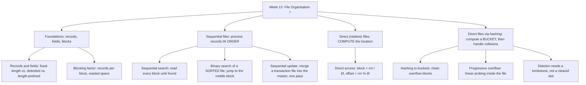

# Week 13 — File Organisation I: Sequential and Direct Files

*CEN207 Data Structures (formerly CE205) · Fall 2026–2027*

<!-- materials:start -->

<div class="materials" markdown>

[:material-file-pdf-box: Lecture notes (PDF)](cen207-week-13-notes.pdf){ .md-button download="cen207-week-13-notes.pdf" }
[:material-file-word-box: Lecture notes (DOCX)](cen207-week-13-notes.docx){ .md-button download="cen207-week-13-notes.docx" }
[:material-presentation: Slides (PDF)](cen207-week-13-slides.pdf){ .md-button download="cen207-week-13-slides.pdf" }
[:material-microsoft-powerpoint: Slides (PPTX)](cen207-week-13-slides.pptx){ .md-button download="cen207-week-13-slides.pptx" }
[:material-language-html5: Slides (HTML, offline)](cen207-week-13-slides.html){ .md-button download="cen207-week-13-slides.html" }
[:material-folder-zip: Download all (ZIP)](cen207-week-13-materials.zip){ .md-button download="cen207-week-13-materials.zip" }
[:material-fullscreen: Open slides full screen](cen207-week-13-slides.html){ .md-button .md-button--primary target=_blank }

</div>

<div class="deck-frame">
<iframe src="../cen207-week-13-slides.html" title="Week 13 — File Organisation I" loading="lazy" allowfullscreen></iframe>
</div>

<p class="deck-hint">Click inside the slides and use the arrow keys; use the button at the bottom right of the slides, or the "Open slides full screen" link above, for full screen.</p>

<!-- materials:end -->

!!! abstract "This week"
    **Learning outcomes.** By the end of this week you will be able to explain, draw, and implement the two
    classical ways a program organises records inside a **file on disk**: **sequential files**, where records
    are searched, scanned, updated and merged in the order they are stored, and **direct (relative) files**,
    where a record's location is computed instead of searched for — either directly from a record number, or
    by **hashing** a key to a **bucket**. You will learn why disk I/O is measured in **block reads and writes**
    rather than in comparisons, what a **blocking factor** is and why it matters for both speed and wasted
    space, how a **sequential update** merges a transaction file into a master file in a single efficient pass
    (add / change / delete, with proper error handling), how a **relative file** gives O(1) access by record
    number, how **hashing to buckets** resolves collisions by chaining overflow blocks, how **progressive
    overflow (linear probing)** resolves collisions directly inside the file itself, and why deleting a record
    from a probed file needs a **tombstone** rather than simply marking the slot empty. Every program you write
    this week performs **real file I/O** — `fopen`, `fseek`, `fread`, `fwrite` in C; `RandomAccessFile` /
    `DataOutputStream` in Java — inside a temporary lab folder your own program creates and cleans up. These
    outcomes map to **LO.1** (explain fundamental data structures), **LO.2** (analyze algorithmic complexity),
    **LO.6** (implement data structures correctly in C and Java), and **LO.7** (choose the right structure for
    a problem) of the course syllabus.

    **What you need already.** Every data structure so far this semester — arrays (Week 1), linked lists (Week
    2), stacks and queues (Week 3), trees and heaps (Week 4), graphs (Week 5), hash tables (Week 6), sorting
    (Week 10), advanced trees (Week 11), strings (Week 12) — assumed the data already sat in **RAM**, where
    accessing `arr[i]` or following a pointer costs (for our purposes) the same handful of nanoseconds no
    matter which `i` or which pointer. This week drops that assumption. A **file** lives on a disk; moving the
    read/write head and waiting for the platter to spin (or, on an SSD, servicing a block-level request) costs
    orders of magnitude more than touching RAM, and — critically — a disk is not read one byte or one record
    at a time; it is read and written one **block** at a time. Week 6's hashing (division method, collision
    resolution by chaining or open addressing, rehashing) reappears here almost unchanged in its *logic*, but
    now every "look at a slot" becomes "read a block from disk", and the cost we count changes from
    *comparisons* to **block reads**.

    **Time plan for a 3-hour session.** Why files are different: block-oriented I/O (~15 min) · records and
    fields (~15 min) · blocking factor (~15 min) · sequential search of a file (~15 min) · binary search of a
    sorted file (~15 min) · short break · sequential update: merging master and transaction files (~30 min) ·
    relative (direct) files (~15 min) · hashing to buckets (~20 min) · progressive overflow / linear probing on
    disk (~20 min) · deletion with tombstones (~15 min) · comparison table, choosing a technique, wrap-up and
    self-check (~15 min).

## 0. Before we start

### 0.1 What you already know

Three ideas from earlier in the course matter most this week.

**From Week 1 — arrays and computed addresses.** `arr[i]` is computed directly as `base_address + i *
element_size`; no searching is needed to *reach* index `i`. This week's **relative file** (section 7) is
exactly this idea moved to disk: `block = rrn / bf`, `offset = rrn % bf` computes a record's location from its
record number, the same way array indexing computes an address from an index — the only difference is that
"the array" is now a file, and reaching a location means one `fseek` plus one block read instead of one
pointer addition.

**From Week 6 — hashing, collisions, and open addressing.** Week 6 built a hash table entirely in RAM: `h(k) =
k mod m` picked a slot, collisions were resolved by chaining a linked list per slot or by probing for another
slot inside the table. Sections 8–10 of this week reuse *exactly* the same two ideas — chaining (now chaining
whole **overflow blocks**, section 8) and open addressing (now called **progressive overflow**, section 9,
because each "slot" is a disk position, not a RAM cell) — but every probe now costs a real disk access, which
is why counting **probes** (equivalently, block reads) matters so much more here than it did in Week 6.

**A genuinely new idea: the cost unit changes from "comparison" to "block read".** Every algorithm from Weeks
1–12 was analyzed by counting comparisons, swaps, or pointer hops — operations that cost (for our purposes) a
constant, tiny amount of time each, so counting *how many* of them happen tells you almost everything about
real-world speed. On disk, a single block read costs so much more than any in-memory operation on that block's
contents that we mostly stop counting comparisons altogether and count **block reads and writes** instead. A
sequential search that reads 100 blocks and compares 1 key per block is, in practice, no faster than one that
reads 100 blocks and compares 1000 keys per block — the disk access dominates. This one shift in what you count
is the organizing idea of the whole week.

### 0.2 The map of this week



Every box gets its own section below, most with a step-by-step animation, a complete C and Java program that
performs real file I/O, and a note on complexity and common mistakes.

## 1. Why files are different: block-oriented I/O

### 1.1 A question to start

Every data structure this semester lived in RAM, where `arr[500000]` costs the same as `arr[0]`. A **file** —
a student roster, a bank's account ledger, a database table — usually cannot fit in RAM at all, and even when
it could, the operating system still moves it to and from disk one **block** at a time (typically 512 bytes,
4 KB, or some other fixed size chosen by the file system). If a program needs one 20-byte record, why does the
disk not just hand over 20 bytes?

### 1.2 The idea: a block is the smallest unit of disk I/O

A disk (spinning or solid-state) is organized into fixed-size **blocks**. Every single read or write transfers
one whole block, never less — even if the program only asked for one record's worth of bytes, the operating
system reads the entire block that record lives in, then hands the program the slice it wanted. This is a
hardware and file-system fact, not a design choice a program can opt out of, and it is *why* file-organisation
techniques exist as a topic at all: every technique in this chapter is really a strategy for **minimizing the
number of block reads and writes**, because that number — not the number of records, not the number of
comparisons — is what determines how long a real program actually takes.

Throughout this week, every drawing follows the same convention: a **disk** row shows named, numbered blocks
(their contents drawn inside them); a **RAM buffer** row shows the one block currently loaded into memory,
where a program can actually inspect individual records; and a running count of **block reads** and **block
writes** is shown on the right, updated every step. That count is this week's `O(...)` — the quantity every
complexity discussion below is really about.

### 1.3 Sequential vs. direct: the two families this week

There are two fundamentally different strategies for organising a file, and this week covers one algorithm or
more from each:

| Family | Idea | How a record is located | This week's sections |
| --- | --- | --- | --- |
| **Sequential** | Records are processed **in the order they are stored** (usually sorted by key) | Read blocks in order (or jump to a middle block on a sorted file) until you find it | 3, 4, 5 |
| **Direct (relative)** | A record's key or record number **computes** its block and offset directly | One arithmetic calculation, then one block read | 6, 7, 8, 9 |

Sequential organisation is simple and is unbeatable when you need to process *every* record anyway (printing
every student's transcript, say); direct organisation is unbeatable when you need to look up *one specific*
record among millions and cannot afford to read the whole file to find it. Real systems very often use both
at once — a sequential file for batch processing, a hashed or indexed file for interactive lookups — which is
exactly why both families are worth knowing well.

## 2. Records and fields

### 2.1 A question to start

A file is a sequence of bytes; a **record** (one student, one transaction, one employee) has several
**fields** (an ID, a name, a score) that need to be packed into those bytes and unpacked again on read. A
name can be three letters or thirty. Should every record reserve the same number of bytes for a name field
regardless of how long the actual name is, or should each record's size adapt to its actual content?

### 2.2 Three layouts for the same field

**Fixed-length.** Every record reserves exactly `NAME_FIXED` bytes for the name, whatever the real name's
length: a short name is **padded** with filler bytes, a name that does not fit is **truncated** — and the
truncated characters are permanently lost. The payoff is that every record is exactly the same size, which
(as the next two sections show) is what makes computing a record's address from its position possible at all.

**Delimited.** The name is written exactly as long as it is, followed by a **delimiter** byte (here `|`) that
marks where it ends. No padding, no truncation, no wasted space — but reading a record back means scanning
byte by byte for the delimiter, since nothing says in advance how long the name will be.

**Length-prefixed.** A single length byte is written first, then exactly that many bytes of the name. Reading
back is now O(1) per field instead of a scan: read the length byte, then read exactly that many more bytes —
no delimiter character is needed at all (and no character has to be reserved as "cannot appear inside a name"
the way a literal `|` inside a name would break the delimited scheme).

### 2.3 In memory, and the code

=== "C"

    ```c
    #define NAME_FIXED 8

    int write_fixed(FILE *fp, int id, const char *name, int score) {
        FixedRecord r; r.id = id; r.score = score;
        int n = (int) strlen(name);
        if (n >= NAME_FIXED) {                 /* too long: truncate, data is lost */
            memcpy(r.name, name, NAME_FIXED);
        } else {
            memcpy(r.name, name, n);
            memset(r.name + n, '_', NAME_FIXED - n);   /* pad with filler bytes */
        }
        return fwrite(&r, sizeof(r), 1, fp) == 1 ? (int) sizeof(r) : -1;
    }

    int write_delim(FILE *fp, int id, const char *name, int score) {
        (void) id; (void) score;   /* still fixed 4-byte fields; only name is variable here */
        return fprintf(fp, "%s|", name) > 0 ? 4 + (int) strlen(name) + 1 + 4 : -1;
    }

    int write_lenpfx(FILE *fp, int id, const char *name, int score) {
        (void) id; (void) score;
        unsigned char len = (unsigned char) strlen(name);   /* 1-byte length prefix */
        fwrite(&len, 1, 1, fp);
        fwrite(name, 1, len, fp);
        return 4 + 1 + (int) len + 4;
    }
    ```

=== "Java"

    ```java
    static final int NAME_FIXED = 8;

    static int writeFixed(DataOutputStream out, int id, String name, int score) throws IOException {
        out.writeInt(id);
        byte[] raw = name.getBytes(StandardCharsets.US_ASCII);
        int n = raw.length;
        if (n >= NAME_FIXED) {                    // too long: truncate, data is lost
            out.write(raw, 0, NAME_FIXED);
        } else {
            out.write(raw);
            for (int i = n; i < NAME_FIXED; i++) out.write('_');   // pad with filler bytes
        }
        out.writeInt(score);
        return 4 + NAME_FIXED + 4;
    }

    static int writeDelim(DataOutputStream out, int id, String name, int score) throws IOException {
        // id and score are still fixed 4-byte fields; only name is variable here
        byte[] raw = name.getBytes(StandardCharsets.US_ASCII);
        out.write(raw); out.writeByte('|');
        return 4 + raw.length + 1 + 4;
    }

    static int writeLenPrefixed(DataOutputStream out, int id, String name, int score) throws IOException {
        // id and score are still fixed 4-byte fields; only the name is variable here
        byte[] raw = name.getBytes(StandardCharsets.US_ASCII);
        out.writeByte(raw.length);            // 1-byte length prefix
        out.write(raw);
        return 4 + 1 + raw.length + 4;
    }
    ```

<iframe class="dsanim" src="../anim/records-and-fields.html" title="Records and fields: fixed-length vs. delimiter vs. length-prefix" loading="lazy"></iframe>
<div class="dsanim-baski" markdown>

</div>

In the picker, also try **hard: 13 records, mixed lengths** (some truncated, some padded, some exact), or the
edge cases **empty name and a very long name** and **every name longer than 8 characters** (every single
record truncated in the fixed layout) — or press 🎲 for random data, or type your own `id:name:score` list.

### 2.4 Try it

??? example "Full program: `records_and_fields.c` / `RecordsAndFields.java`"

    Both programs create a temporary lab folder (in the OS temp directory, never inside the course repository)
    and write three REAL files inside it — `fixed.dat`, `delim.dat`, `lenpfx.dat` — for each scenario below,
    then read each file's actual size back with `ftell` (C) / `File.length()` (Java) before deleting the files
    and, at the end, the lab folder itself.

    === "C"

        ```c
        /* Week 13 -- File Organisation I
         * Records and fields: the same records are written to three REAL files, one per layout --
         * fixed-length (padded/truncated to NAME_FIXED bytes), delimited (name + '|'), and length-prefixed
         * (1-byte length + name). The files are created only inside a temporary lab folder that main()
         * creates and removes.
         * CEN207 Data Structures (formerly CE205)
         */
        #include <stdio.h>
        #include <stdlib.h>
        #include <string.h>
        #include <sys/stat.h>
        #ifdef _WIN32
        #include <direct.h>
        #define MKDIR(path) _mkdir(path)
        #define RMDIR(path) _rmdir(path)
        #else
        #define MKDIR(path) mkdir(path, 0755)
        #define RMDIR(path) rmdir(path)
        #endif

        /* A fresh, empty temporary folder under the OS temp directory -- never inside the repository -- that this
           program creates and removes itself; every file this program writes lives only inside it. */
        static void lab_path(char *out, size_t n) {
        #ifdef _WIN32
            const char *base = getenv("TEMP");
            if (!base) base = getenv("TMP");
            if (!base) base = ".";
        #else
            const char *base = getenv("TMPDIR");
            if (!base) base = "/tmp";
        #endif
            snprintf(out, n, "%s/cen207_week13_records_lab", base);
        }

        #define NAME_FIXED 8

        typedef struct { int id; char name[NAME_FIXED]; int score; } FixedRecord;

        int write_fixed(FILE *fp, int id, const char *name, int score) {
            FixedRecord r; r.id = id; r.score = score;
            int n = (int) strlen(name);
            if (n >= NAME_FIXED) {                 /* too long: truncate, data is lost */
                memcpy(r.name, name, NAME_FIXED);
            } else {
                memcpy(r.name, name, n);
                memset(r.name + n, '_', NAME_FIXED - n);   /* pad with filler bytes */
            }
            return fwrite(&r, sizeof(r), 1, fp) == 1 ? (int) sizeof(r) : -1;
        }

        int write_delim(FILE *fp, int id, const char *name, int score) {
            (void) id; (void) score;   /* still fixed 4-byte fields; only name is variable here */
            return fprintf(fp, "%s|", name) > 0 ? 4 + (int) strlen(name) + 1 + 4 : -1;
        }

        int write_lenpfx(FILE *fp, int id, const char *name, int score) {
            (void) id; (void) score;
            unsigned char len = (unsigned char) strlen(name);   /* 1-byte length prefix */
            fwrite(&len, 1, 1, fp);
            fwrite(name, 1, len, fp);
            return 4 + 1 + (int) len + 4;
        }

        /* ---- driver ------------------------------------------------------------ */

        typedef struct { int id; const char *name; int score; } RecIn;

        static long file_size(const char *path) {
            FILE *fp = fopen(path, "rb");
            if (!fp) return -1;
            fseek(fp, 0, SEEK_END);
            long sz = ftell(fp);
            fclose(fp);
            return sz;
        }

        static void run_scenario(const char *label, const char *lab, RecIn recs[], int n) {
            printf("-- %s --\n", label);
            char pfixed[512], pdelim[512], plen[512];
            snprintf(pfixed, sizeof(pfixed), "%s/fixed.dat", lab);
            snprintf(pdelim, sizeof(pdelim), "%s/delim.dat", lab);
            snprintf(plen, sizeof(plen), "%s/lenpfx.dat", lab);

            FILE *ffixed = fopen(pfixed, "wb");
            FILE *fdelim = fopen(pdelim, "wb");
            FILE *flen = fopen(plen, "wb");
            if (!ffixed || !fdelim || !flen) {                 /* clean up whichever of the three did open */
                if (ffixed) fclose(ffixed);
                if (fdelim) fclose(fdelim);
                if (flen) fclose(flen);
                remove(pfixed); remove(pdelim); remove(plen);
                printf("  could not open lab files\n");
                return;
            }

            int wasted = 0, truncated = 0;
            for (int i = 0; i < n; i++) {
                int nlen = (int) strlen(recs[i].name);
                write_fixed(ffixed, recs[i].id, recs[i].name, recs[i].score);
                write_delim(fdelim, recs[i].id, recs[i].name, recs[i].score);
                write_lenpfx(flen, recs[i].id, recs[i].name, recs[i].score);
                if (nlen >= NAME_FIXED) truncated++; else wasted += NAME_FIXED - nlen;
                printf("  id=%-4d name=\"%-10s\" (%2d B) score=%-4d%s\n",
                       recs[i].id, recs[i].name, nlen, recs[i].score, nlen >= NAME_FIXED ? "  -- truncated in fixed.dat!" : "");
            }
            fclose(ffixed); fclose(fdelim); fclose(flen);

            long szf = file_size(pfixed), szd = file_size(pdelim), szl = file_size(plen);
            printf("  fixed.dat  = %ld B (expected %d, %d B wasted, %d truncated)\n", szf, n * (8 + NAME_FIXED), wasted, truncated);
            printf("  delim.dat  = %ld B\n", szd);
            printf("  lenpfx.dat = %ld B\n", szl);
            printf("summary: %d records, fixed saves nothing here (%ld B) but reads back at a constant stride;\n"
                   "         delim/lenpfx are %ld B smaller, but need parsing to find record boundaries.\n\n",
                   n, szf, szf - szd);

            remove(pfixed); remove(pdelim); remove(plen);
        }

        int main(void) {
            char lab[512];
            lab_path(lab, sizeof(lab));
            RMDIR(lab);           /* in case a previous crashed run left it behind */
            MKDIR(lab);

            RecIn normal[] = {
                {101, "ANN", 91}, {102, "BOB", 77}, {103, "CARL", 85}, {104, "DEE", 60}, {105, "ED", 99},
                {106, "FAY", 72}, {107, "GUS", 88}, {108, "HAL", 65}, {109, "IVY", 93}, {110, "JOE", 58}, {111, "KIM", 80}
            };
            RecIn mixed[] = {
                {201, "AL", 70}, {202, "BRENDA", 84}, {203, "CARLITOX", 66}, {204, "DOMINIQUE", 91}, {205, "ED", 55},
                {206, "FRANCESCA", 62}, {207, "GIA", 89}, {208, "HECTOR", 73}, {209, "IRA", 95}, {210, "JULIETTE", 68},
                {211, "KEN", 81}, {212, "LIONEL", 77}, {213, "MAX", 90}
            };
            RecIn edge_empty_long[] = {
                {301, "", 40}, {302, "ALEXANDRIA", 71}, {303, "A", 50}, {304, "BO", 61}, {305, "CHRISTOPHERSON", 82},
                {306, "", 30}, {307, "D", 45}, {308, "EIGHTCHRS", 59}, {309, "F", 66}, {310, "GABRIELLA", 74}, {311, "H", 53}
            };
            RecIn edge_all_truncated[] = {
                {401, "ABCDEFGHIJ", 10}, {402, "KLMNOPQRST", 20}, {403, "UVWXYZABCD", 30}, {404, "EFGHIJKLMN", 40},
                {405, "OPQRSTUVWX", 50}, {406, "YZABCDEFGH", 60}, {407, "IJKLMNOPQR", 70}, {408, "STUVWXYZAB", 80},
                {409, "CDEFGHIJKL", 90}, {410, "MNOPQRSTUV", 15}
            };

            run_scenario("normal: 11 records, short names (padding, no truncation)", lab, normal, 11);
            run_scenario("hard: 13 records, mixed lengths", lab, mixed, 13);
            run_scenario("edge: empty name and a very long name", lab, edge_empty_long, 11);
            run_scenario("edge: every name longer than 8 characters", lab, edge_all_truncated, 10);

            RMDIR(lab);
            return 0;
        }
        ```

    === "Java"

        ```java
        import java.io.DataOutputStream;
        import java.io.File;
        import java.io.FileOutputStream;
        import java.io.IOException;
        import java.nio.charset.StandardCharsets;

        /* Week 13 -- File Organisation I
         * Records and fields: the same records are written to three REAL files, one per layout --
         * fixed-length (padded/truncated to NAME_FIXED bytes), delimited (name + '|'), and length-prefixed
         * (1-byte length + name). The files are created only inside a temporary lab folder that main()
         * creates and removes.
         * CEN207 Data Structures (formerly CE205)
         */
        public class RecordsAndFields {
            static final int NAME_FIXED = 8;

            static int writeFixed(DataOutputStream out, int id, String name, int score) throws IOException {
                out.writeInt(id);
                byte[] raw = name.getBytes(StandardCharsets.US_ASCII);
                int n = raw.length;
                if (n >= NAME_FIXED) {                    // too long: truncate, data is lost
                    out.write(raw, 0, NAME_FIXED);
                } else {
                    out.write(raw);
                    for (int i = n; i < NAME_FIXED; i++) out.write('_');   // pad with filler bytes
                }
                out.writeInt(score);
                return 4 + NAME_FIXED + 4;
            }

            static int writeDelim(DataOutputStream out, int id, String name, int score) throws IOException {
                // id and score are still fixed 4-byte fields; only name is variable here
                byte[] raw = name.getBytes(StandardCharsets.US_ASCII);
                out.write(raw); out.writeByte('|');
                return 4 + raw.length + 1 + 4;
            }

            static int writeLenPrefixed(DataOutputStream out, int id, String name, int score) throws IOException {
                // id and score are still fixed 4-byte fields; only the name is variable here
                byte[] raw = name.getBytes(StandardCharsets.US_ASCII);
                out.writeByte(raw.length);            // 1-byte length prefix
                out.write(raw);
                return 4 + 1 + raw.length + 4;
            }

            /* ---- driver ------------------------------------------------------------ */

            static class RecIn { int id; String name; int score; RecIn(int i, String n, int s) { id = i; name = n; score = s; } }

            static void runScenario(String label, File lab, RecIn[] recs) throws IOException {
                System.out.println("-- " + label + " --");
                File fixedFile = new File(lab, "fixed.dat"), delimFile = new File(lab, "delim.dat"), lenFile = new File(lab, "lenpfx.dat");
                int wasted = 0, truncated = 0;
                try (DataOutputStream fixedOut = new DataOutputStream(new FileOutputStream(fixedFile));
                     DataOutputStream delimOut = new DataOutputStream(new FileOutputStream(delimFile));
                     DataOutputStream lenOut = new DataOutputStream(new FileOutputStream(lenFile))) {
                    for (RecIn r : recs) {
                        int nlen = r.name.getBytes(StandardCharsets.US_ASCII).length;
                        writeFixed(fixedOut, r.id, r.name, r.score);
                        writeDelim(delimOut, r.id, r.name, r.score);
                        writeLenPrefixed(lenOut, r.id, r.name, r.score);
                        if (nlen >= NAME_FIXED) truncated++; else wasted += NAME_FIXED - nlen;
                        System.out.printf("  id=%-4d name=\"%-10s\" (%2d B) score=%-4d%s%n",
                                r.id, r.name, nlen, r.score, nlen >= NAME_FIXED ? "  -- truncated in fixed.dat!" : "");
                    }
                }
                long szf = fixedFile.length(), szd = delimFile.length(), szl = lenFile.length();
                System.out.printf("  fixed.dat  = %d B (expected %d, %d B wasted, %d truncated)%n", szf, recs.length * (8 + NAME_FIXED), wasted, truncated);
                System.out.printf("  delim.dat  = %d B%n", szd);
                System.out.printf("  lenpfx.dat = %d B%n", szl);
                System.out.printf("summary: %d records, fixed saves nothing here (%d B) but reads back at a constant stride;%n" +
                        "         delim/lenpfx are %d B smaller, but need parsing to find record boundaries.%n%n",
                        recs.length, szf, szf - szd);
                fixedFile.delete(); delimFile.delete(); lenFile.delete();
            }

            public static void main(String[] args) throws IOException {
                File lab = new File(System.getProperty("java.io.tmpdir"), "cen207_week13_records_lab_java");
                if (lab.exists()) for (File f : lab.listFiles()) f.delete();
                lab.mkdir();

                RecIn[] normal = {
                    new RecIn(101, "ANN", 91), new RecIn(102, "BOB", 77), new RecIn(103, "CARL", 85), new RecIn(104, "DEE", 60), new RecIn(105, "ED", 99),
                    new RecIn(106, "FAY", 72), new RecIn(107, "GUS", 88), new RecIn(108, "HAL", 65), new RecIn(109, "IVY", 93), new RecIn(110, "JOE", 58), new RecIn(111, "KIM", 80)
                };
                RecIn[] mixed = {
                    new RecIn(201, "AL", 70), new RecIn(202, "BRENDA", 84), new RecIn(203, "CARLITOX", 66), new RecIn(204, "DOMINIQUE", 91), new RecIn(205, "ED", 55),
                    new RecIn(206, "FRANCESCA", 62), new RecIn(207, "GIA", 89), new RecIn(208, "HECTOR", 73), new RecIn(209, "IRA", 95), new RecIn(210, "JULIETTE", 68),
                    new RecIn(211, "KEN", 81), new RecIn(212, "LIONEL", 77), new RecIn(213, "MAX", 90)
                };
                RecIn[] edgeEmptyLong = {
                    new RecIn(301, "", 40), new RecIn(302, "ALEXANDRIA", 71), new RecIn(303, "A", 50), new RecIn(304, "BO", 61), new RecIn(305, "CHRISTOPHERSON", 82),
                    new RecIn(306, "", 30), new RecIn(307, "D", 45), new RecIn(308, "EIGHTCHRS", 59), new RecIn(309, "F", 66), new RecIn(310, "GABRIELLA", 74), new RecIn(311, "H", 53)
                };
                RecIn[] edgeAllTruncated = {
                    new RecIn(401, "ABCDEFGHIJ", 10), new RecIn(402, "KLMNOPQRST", 20), new RecIn(403, "UVWXYZABCD", 30), new RecIn(404, "EFGHIJKLMN", 40),
                    new RecIn(405, "OPQRSTUVWX", 50), new RecIn(406, "YZABCDEFGH", 60), new RecIn(407, "IJKLMNOPQR", 70), new RecIn(408, "STUVWXYZAB", 80),
                    new RecIn(409, "CDEFGHIJKL", 90), new RecIn(410, "MNOPQRSTUV", 15)
                };

                runScenario("normal: 11 records, short names (padding, no truncation)", lab, normal);
                runScenario("hard: 13 records, mixed lengths", lab, mixed);
                runScenario("edge: empty name and a very long name", lab, edgeEmptyLong);
                runScenario("edge: every name longer than 8 characters", lab, edgeAllTruncated);

                lab.delete();
            }
        }
        ```

**Try it**

=== "C"

    ```console
    gcc -std=c11 -Wall -Wextra -o /tmp/x records_and_fields.c && /tmp/x
    ```

    Expected output:

    ```text
    -- normal: 11 records, short names (padding, no truncation) --
      id=101  name="ANN       " ( 3 B) score=91  
      id=102  name="BOB       " ( 3 B) score=77  
      id=103  name="CARL      " ( 4 B) score=85  
      id=104  name="DEE       " ( 3 B) score=60  
      id=105  name="ED        " ( 2 B) score=99  
      id=106  name="FAY       " ( 3 B) score=72  
      id=107  name="GUS       " ( 3 B) score=88  
      id=108  name="HAL       " ( 3 B) score=65  
      id=109  name="IVY       " ( 3 B) score=93  
      id=110  name="JOE       " ( 3 B) score=58  
      id=111  name="KIM       " ( 3 B) score=80  
      fixed.dat  = 176 B (expected 176, 55 B wasted, 0 truncated)
      delim.dat  = 44 B
      lenpfx.dat = 44 B
    summary: 11 records, fixed saves nothing here (176 B) but reads back at a constant stride;
             delim/lenpfx are 132 B smaller, but need parsing to find record boundaries.

    -- hard: 13 records, mixed lengths --
      id=201  name="AL        " ( 2 B) score=70  
      id=202  name="BRENDA    " ( 6 B) score=84  
      id=203  name="CARLITOX  " ( 8 B) score=66    -- truncated in fixed.dat!
      id=204  name="DOMINIQUE " ( 9 B) score=91    -- truncated in fixed.dat!
      id=205  name="ED        " ( 2 B) score=55  
      id=206  name="FRANCESCA " ( 9 B) score=62    -- truncated in fixed.dat!
      id=207  name="GIA       " ( 3 B) score=89  
      id=208  name="HECTOR    " ( 6 B) score=73  
      id=209  name="IRA       " ( 3 B) score=95  
      id=210  name="JULIETTE  " ( 8 B) score=68    -- truncated in fixed.dat!
      id=211  name="KEN       " ( 3 B) score=81  
      id=212  name="LIONEL    " ( 6 B) score=77  
      id=213  name="MAX       " ( 3 B) score=90  
      fixed.dat  = 208 B (expected 208, 38 B wasted, 4 truncated)
      delim.dat  = 81 B
      lenpfx.dat = 81 B
    summary: 13 records, fixed saves nothing here (208 B) but reads back at a constant stride;
             delim/lenpfx are 127 B smaller, but need parsing to find record boundaries.

    -- edge: empty name and a very long name --
      id=301  name="          " ( 0 B) score=40  
      id=302  name="ALEXANDRIA" (10 B) score=71    -- truncated in fixed.dat!
      id=303  name="A         " ( 1 B) score=50  
      id=304  name="BO        " ( 2 B) score=61  
      id=305  name="CHRISTOPHERSON" (14 B) score=82    -- truncated in fixed.dat!
      id=306  name="          " ( 0 B) score=30  
      id=307  name="D         " ( 1 B) score=45  
      id=308  name="EIGHTCHRS " ( 9 B) score=59    -- truncated in fixed.dat!
      id=309  name="F         " ( 1 B) score=66  
      id=310  name="GABRIELLA " ( 9 B) score=74    -- truncated in fixed.dat!
      id=311  name="H         " ( 1 B) score=53  
      fixed.dat  = 176 B (expected 176, 50 B wasted, 4 truncated)
      delim.dat  = 59 B
      lenpfx.dat = 59 B
    summary: 11 records, fixed saves nothing here (176 B) but reads back at a constant stride;
             delim/lenpfx are 117 B smaller, but need parsing to find record boundaries.

    -- edge: every name longer than 8 characters --
      id=401  name="ABCDEFGHIJ" (10 B) score=10    -- truncated in fixed.dat!
      id=402  name="KLMNOPQRST" (10 B) score=20    -- truncated in fixed.dat!
      id=403  name="UVWXYZABCD" (10 B) score=30    -- truncated in fixed.dat!
      id=404  name="EFGHIJKLMN" (10 B) score=40    -- truncated in fixed.dat!
      id=405  name="OPQRSTUVWX" (10 B) score=50    -- truncated in fixed.dat!
      id=406  name="YZABCDEFGH" (10 B) score=60    -- truncated in fixed.dat!
      id=407  name="IJKLMNOPQR" (10 B) score=70    -- truncated in fixed.dat!
      id=408  name="STUVWXYZAB" (10 B) score=80    -- truncated in fixed.dat!
      id=409  name="CDEFGHIJKL" (10 B) score=90    -- truncated in fixed.dat!
      id=410  name="MNOPQRSTUV" (10 B) score=15    -- truncated in fixed.dat!
      fixed.dat  = 160 B (expected 160, 0 B wasted, 10 truncated)
      delim.dat  = 110 B
      lenpfx.dat = 110 B
    summary: 10 records, fixed saves nothing here (160 B) but reads back at a constant stride;
             delim/lenpfx are 50 B smaller, but need parsing to find record boundaries.
    ```

=== "Java"

    ```console
    javac -Xlint:all -d /tmp/j RecordsAndFields.java && java -cp /tmp/j RecordsAndFields
    ```

    Expected output: identical to the C run above (same algorithm, same data).

### 2.5 Complexity, mistakes, self-check

**Complexity.** Writing or reading one field is O(field length) regardless of layout — the difference between
the three is not asymptotic, it is about **wasted space** (fixed) versus **parsing cost** (delimited) versus
**neither** (length-prefixed, at the cost of a hard limit on field length: one byte can only express lengths
0–255).

!!! warning "Common mistakes"
    - **Forgetting that a fixed-length field is not null-terminated when it is exactly full or truncated.**
      `memcpy(r.name, name, NAME_FIXED)` on a name that is exactly `NAME_FIXED` bytes long, or longer and
      truncated, leaves no room for a trailing `'\0'`; reading it back as a C string without also tracking its
      known fixed length reads past the field into whatever bytes follow it.
    - **Choosing a delimiter character that can legally appear inside the data.** A name field delimited by
      `,` breaks the moment a name legally contains a comma; length-prefixing sidesteps this class of bug
      entirely, at the cost of a maximum field length.
    - **Silently truncating instead of reporting data loss.** The fixed-length layout above prints a warning
      every time a name is truncated specifically so this is visible; a real system that truncates silently
      can corrupt data for years before anyone notices a name was cut short.

??? success "Self-check: why is a length-prefixed field's read cost O(1) plus the field's own length, while a delimited field's read cost is O(scan to the delimiter)?"
    A length-prefixed field tells the reader exactly how many bytes to read *before* reading any of the field's
    content — one byte read (the length), then exactly that many more bytes, no wasted comparisons. A delimited
    field gives the reader no such information in advance: the reader must examine each byte one at a time,
    comparing it against the delimiter character, until it happens to find one — an unavoidable scan whose
    length is exactly the field's own length (which the length-prefixed scheme already told you directly,
    without scanning).

## 3. Blocking factor

### 3.1 A question to start

Section 1 established that disk I/O happens one block at a time. If a block is 100 bytes and one record is 20
bytes, does the disk waste 80 bytes on every single read, or can several records share one block?

### 3.2 The idea: pack `bf` records per block

The **blocking factor**, `bf`, is how many fixed-size records fit in one block: `bf = floor(blockSize /
recSize)`. Records are accumulated in a small **RAM buffer** one at a time; the moment the buffer reaches `bf`
records, the whole buffer is written to disk in a single `fwrite` call — one block, one disk access, `bf`
records, not `bf` disk accesses for `bf` records. This is the entire payoff of blocking: **disk access happens
per block, not per record**.

Blocking does not eliminate waste, it just relocates it. **Internal fragmentation** is the space left over
inside every *full* block when `bf * recSize` does not exactly equal `blockSize` (`bf` is a `floor`, so there
is almost always a remainder). A second, independent kind of waste shows up in the **last block**: if the
total number of records is not an exact multiple of `bf`, the final block is only partly full, yet it still
occupies a whole block on disk — `block_flush` writes it anyway, with however many empty record-slots' worth
of extra waste that implies.

### 3.3 In memory, and the code

=== "C"

    ```c
    #define BLOCK_SIZE 100

    typedef struct { int keys[MAX_BF]; int count; } Block;

    int block_capacity(int rec_size) { return BLOCK_SIZE / rec_size; }   /* bf = floor(BLOCK_SIZE / rec_size) */

    void block_put(Block *b, int bf, int key, FILE *fp, int *written) {
        b->keys[b->count++] = key;
        if (b->count == bf) {                    /* block full: flush it to disk */
            fwrite(b->keys, sizeof(int), bf, fp);
            (*written)++;
            b->count = 0;                        /* start a new, empty block */
        }
    }

    void block_flush(Block *b, FILE *fp, int *written) {
        if (b->count > 0) {                      /* partial last block is still written, with waste */
            fwrite(b->keys, sizeof(int), b->count, fp);
            (*written)++;
        }
    }
    ```

=== "Java"

    ```java
    static final int BLOCK_SIZE = 100;

    static int blockCapacity(int recSize) { return BLOCK_SIZE / recSize; }   // bf = floor(BLOCK_SIZE / recSize)

    static void blockPut(List<Integer> buf, int bf, int key, DataOutputStream out, int[] written) throws IOException {
        buf.add(key);
        if (buf.size() == bf) {                       // block full: flush it to disk
            for (int v : buf) out.writeInt(v);
            written[0]++;
            buf.clear();                              // start a new, empty block
        }
    }

    static void blockFlush(List<Integer> buf, DataOutputStream out, int[] written) throws IOException {
        if (!buf.isEmpty()) {                          // partial last block is still written, with waste
            for (int v : buf) out.writeInt(v);
            written[0]++;
        }
    }
    ```

<iframe class="dsanim" src="../anim/blocking-factor.html" title="Blocking factor: records per block, internal waste" loading="lazy"></iframe>
<div class="dsanim-baski" markdown>

</div>

In the picker, also try **hard: recSize=24, blockSize=100 (bf=4), 14 keys** (internal fragmentation on every
block, plus last-block waste), or the edge cases **record bigger than block (bf=0, error)** — a design error a
real system must detect, not silently misbehave on — and **12 keys divide bf=3 exactly, no last-block waste**
(fragmentation still happens, but only inside full blocks) — or press 🎲 for random data, or type your own
`rec=N blk=N` header and key list.

### 3.4 Try it

??? example "Full program: `blocking_factor.c` / `BlockingFactor.java`"

    === "C"

        ```c
        /* Week 13 -- File Organisation I
         * Blocking factor: how many fixed-size records fit in one disk block (bf), and the waste that comes with it --
         * internal fragmentation inside every full block, plus extra waste in a partial last block. Every block is
         * really written to a file inside a temporary lab folder that main() creates and removes.
         * CEN207 Data Structures (formerly CE205)
         */
        #include <stdio.h>
        #include <stdlib.h>
        #include <string.h>
        #include <sys/stat.h>
        #ifdef _WIN32
        #include <direct.h>
        #define MKDIR(path) _mkdir(path)
        #define RMDIR(path) _rmdir(path)
        #else
        #define MKDIR(path) mkdir(path, 0755)
        #define RMDIR(path) rmdir(path)
        #endif

        static void lab_path(char *out, size_t n) {
        #ifdef _WIN32
            const char *base = getenv("TEMP");
            if (!base) base = getenv("TMP");
            if (!base) base = ".";
        #else
            const char *base = getenv("TMPDIR");
            if (!base) base = "/tmp";
        #endif
            snprintf(out, n, "%s/cen207_week13_blocking_lab", base);
        }

        #define BLOCK_SIZE 100
        #define MAX_BF 20

        typedef struct { int keys[MAX_BF]; int count; } Block;

        int block_capacity(int rec_size) { return BLOCK_SIZE / rec_size; }   /* bf = floor(BLOCK_SIZE / rec_size) */

        void block_put(Block *b, int bf, int key, FILE *fp, int *written) {
            b->keys[b->count++] = key;
            if (b->count == bf) {                    /* block full: flush it to disk */
                fwrite(b->keys, sizeof(int), bf, fp);
                (*written)++;
                b->count = 0;                        /* start a new, empty block */
            }
        }

        void block_flush(Block *b, FILE *fp, int *written) {
            if (b->count > 0) {                      /* partial last block is still written, with waste */
                fwrite(b->keys, sizeof(int), b->count, fp);
                (*written)++;
            }
        }

        /* ---- driver ------------------------------------------------------------ */

        static void run_scenario(const char *label, const char *lab, int rec_size, int block_size, int keys[], int n) {
            printf("-- %s --\n", label);
            int bf = block_size / rec_size;
            printf("recSize=%d blockSize=%d -> bf=%d\n", rec_size, block_size, bf);
            if (bf < 1) {
                printf("ERROR: a record (%d B) does not fit in a block (%d B): no block can hold even one record.\n\n", rec_size, block_size);
                return;
            }

            char path[512];
            snprintf(path, sizeof(path), "%s/blocks.dat", lab);
            FILE *fp = fopen(path, "wb");
            if (!fp) { printf("  could not open lab file\n"); return; }

            Block b; b.count = 0;
            int written = 0, fragTotal = 0;
            for (int i = 0; i < n; i++) {
                int before = written;
                block_put(&b, bf, keys[i], fp, &written);
                if (written > before) {
                    int frag = block_size - bf * rec_size;
                    fragTotal += frag;
                    printf("  key %d -> block full, flushed (write #%d), %d B internal waste\n", keys[i], written, frag);
                } else {
                    printf("  key %d -> buffer (%d/%d)\n", keys[i], b.count, bf);
                }
            }
            int beforeFlush = written;
            int lastWaste = 0;
            if (b.count > 0) lastWaste = (bf - b.count) * rec_size;
            block_flush(&b, fp, &written);
            if (written > beforeFlush) {
                int lastFrag = block_size - bf * rec_size;
                fragTotal += lastFrag;
                printf("  final partial block -> flushed (write #%d), %d B internal waste + %d B last-block waste\n", written, lastFrag, lastWaste);
            }
            fclose(fp);

            fp = fopen(path, "rb");
            fseek(fp, 0, SEEK_END);
            long size = ftell(fp);
            fclose(fp);
            printf("summary: %d keys -> %d block(s) written (%ld B on disk), internal waste %d B, last-block waste %d B\n\n",
                   n, written, size, fragTotal, lastWaste);
            remove(path);
        }

        int main(void) {
            char lab[512];
            lab_path(lab, sizeof(lab));
            RMDIR(lab);
            MKDIR(lab);

            int normal[] = { 12, 45, 7, 89, 23, 56, 34, 78, 19, 61, 42, 90, 15 };
            int hard[] = { 8, 31, 55, 12, 47, 63, 29, 71, 18, 40, 52, 6, 84, 25 };
            int edge_too_big[] = { 1, 2, 3, 4, 5, 6, 7, 8, 9, 10 };
            int edge_exact[] = { 3, 66, 21, 48, 11, 77, 34, 59, 2, 91, 26, 44 };

            run_scenario("normal: recSize=20, blockSize=100 (bf=5), 13 keys", lab, 20, 100, normal, 13);
            run_scenario("hard: recSize=24, blockSize=100 (bf=4), 14 keys", lab, 24, 100, hard, 14);
            run_scenario("edge: record bigger than block (bf=0, error)", lab, 60, 50, edge_too_big, 10);
            run_scenario("edge: 12 keys divide bf=3 exactly, no last-block waste", lab, 30, 100, edge_exact, 12);

            RMDIR(lab);
            return 0;
        }
        ```

    === "Java"

        ```java
        import java.io.DataOutputStream;
        import java.io.FileOutputStream;
        import java.io.IOException;
        import java.util.ArrayList;
        import java.util.List;

        /* Week 13 -- File Organisation I
         * Blocking factor: how many fixed-size records fit in one disk block (bf), and the waste that comes with it --
         * internal fragmentation inside every full block, plus extra waste in a partial last block. Every block is
         * really written to a file inside a temporary lab folder that main() creates and removes.
         * CEN207 Data Structures (formerly CE205)
         */
        public class BlockingFactor {
            static final int BLOCK_SIZE = 100;

            static int blockCapacity(int recSize) { return BLOCK_SIZE / recSize; }   // bf = floor(BLOCK_SIZE / recSize)

            static void blockPut(List<Integer> buf, int bf, int key, DataOutputStream out, int[] written) throws IOException {
                buf.add(key);
                if (buf.size() == bf) {                       // block full: flush it to disk
                    for (int v : buf) out.writeInt(v);
                    written[0]++;
                    buf.clear();                              // start a new, empty block
                }
            }

            static void blockFlush(List<Integer> buf, DataOutputStream out, int[] written) throws IOException {
                if (!buf.isEmpty()) {                          // partial last block is still written, with waste
                    for (int v : buf) out.writeInt(v);
                    written[0]++;
                }
            }

            /* ---- driver ------------------------------------------------------------ */

            static void runScenario(String label, java.io.File lab, int recSize, int blockSize, int[] keys) throws IOException {
                System.out.println("-- " + label + " --");
                int bf = blockSize / recSize;
                System.out.printf("recSize=%d blockSize=%d -> bf=%d%n", recSize, blockSize, bf);
                if (bf < 1) {
                    System.out.printf("ERROR: a record (%d B) does not fit in a block (%d B): no block can hold even one record.%n%n", recSize, blockSize);
                    return;
                }

                java.io.File path = new java.io.File(lab, "blocks.dat");
                List<Integer> buf = new ArrayList<>();
                int[] written = { 0 };
                int fragTotal = 0;
                try (DataOutputStream out = new DataOutputStream(new FileOutputStream(path))) {
                    for (int key : keys) {
                        int before = written[0];
                        blockPut(buf, bf, key, out, written);
                        if (written[0] > before) {
                            int frag = blockSize - bf * recSize;
                            fragTotal += frag;
                            System.out.printf("  key %d -> block full, flushed (write #%d), %d B internal waste%n", key, written[0], frag);
                        } else {
                            System.out.printf("  key %d -> buffer (%d/%d)%n", key, buf.size(), bf);
                        }
                    }
                    int beforeFlush = written[0];
                    int lastWaste = buf.isEmpty() ? 0 : (bf - buf.size()) * recSize;
                    blockFlush(buf, out, written);
                    if (written[0] > beforeFlush) {
                        int lastFrag = blockSize - bf * recSize;
                        fragTotal += lastFrag;
                        System.out.printf("  final partial block -> flushed (write #%d), %d B internal waste + %d B last-block waste%n", written[0], lastFrag, lastWaste);
                    }
                    long size = path.length();
                    System.out.printf("summary: %d keys -> %d block(s) written (%d B on disk), internal waste %d B, last-block waste %d B%n%n",
                            keys.length, written[0], size, fragTotal, lastWaste);
                }
                path.delete();
            }

            public static void main(String[] args) throws IOException {
                java.io.File lab = new java.io.File(System.getProperty("java.io.tmpdir"), "cen207_week13_blocking_lab_java");
                if (lab.exists()) for (java.io.File f : lab.listFiles()) f.delete();
                lab.mkdir();

                int[] normal = { 12, 45, 7, 89, 23, 56, 34, 78, 19, 61, 42, 90, 15 };
                int[] hard = { 8, 31, 55, 12, 47, 63, 29, 71, 18, 40, 52, 6, 84, 25 };
                int[] edgeTooBig = { 1, 2, 3, 4, 5, 6, 7, 8, 9, 10 };
                int[] edgeExact = { 3, 66, 21, 48, 11, 77, 34, 59, 2, 91, 26, 44 };

                runScenario("normal: recSize=20, blockSize=100 (bf=5), 13 keys", lab, 20, 100, normal);
                runScenario("hard: recSize=24, blockSize=100 (bf=4), 14 keys", lab, 24, 100, hard);
                runScenario("edge: record bigger than block (bf=0, error)", lab, 60, 50, edgeTooBig);
                runScenario("edge: 12 keys divide bf=3 exactly, no last-block waste", lab, 30, 100, edgeExact);

                lab.delete();
            }
        }
        ```

**Try it**

=== "C"

    ```console
    gcc -std=c11 -Wall -Wextra -o /tmp/x blocking_factor.c && /tmp/x
    ```

    Expected output:

    ```text
    -- normal: recSize=20, blockSize=100 (bf=5), 13 keys --
    recSize=20 blockSize=100 -> bf=5
      key 12 -> buffer (1/5)
      key 45 -> buffer (2/5)
      key 7 -> buffer (3/5)
      key 89 -> buffer (4/5)
      key 23 -> block full, flushed (write #1), 0 B internal waste
      key 56 -> buffer (1/5)
      key 34 -> buffer (2/5)
      key 78 -> buffer (3/5)
      key 19 -> buffer (4/5)
      key 61 -> block full, flushed (write #2), 0 B internal waste
      key 42 -> buffer (1/5)
      key 90 -> buffer (2/5)
      key 15 -> buffer (3/5)
      final partial block -> flushed (write #3), 0 B internal waste + 40 B last-block waste
    summary: 13 keys -> 3 block(s) written (52 B on disk), internal waste 0 B, last-block waste 40 B

    -- hard: recSize=24, blockSize=100 (bf=4), 14 keys --
    recSize=24 blockSize=100 -> bf=4
      key 8 -> buffer (1/4)
      key 31 -> buffer (2/4)
      key 55 -> buffer (3/4)
      key 12 -> block full, flushed (write #1), 4 B internal waste
      key 47 -> buffer (1/4)
      key 63 -> buffer (2/4)
      key 29 -> buffer (3/4)
      key 71 -> block full, flushed (write #2), 4 B internal waste
      key 18 -> buffer (1/4)
      key 40 -> buffer (2/4)
      key 52 -> buffer (3/4)
      key 6 -> block full, flushed (write #3), 4 B internal waste
      key 84 -> buffer (1/4)
      key 25 -> buffer (2/4)
      final partial block -> flushed (write #4), 4 B internal waste + 48 B last-block waste
    summary: 14 keys -> 4 block(s) written (56 B on disk), internal waste 16 B, last-block waste 48 B

    -- edge: record bigger than block (bf=0, error) --
    recSize=60 blockSize=50 -> bf=0
    ERROR: a record (60 B) does not fit in a block (50 B): no block can hold even one record.

    -- edge: 12 keys divide bf=3 exactly, no last-block waste --
    recSize=30 blockSize=100 -> bf=3
      key 3 -> buffer (1/3)
      key 66 -> buffer (2/3)
      key 21 -> block full, flushed (write #1), 10 B internal waste
      key 48 -> buffer (1/3)
      key 11 -> buffer (2/3)
      key 77 -> block full, flushed (write #2), 10 B internal waste
      key 34 -> buffer (1/3)
      key 59 -> buffer (2/3)
      key 2 -> block full, flushed (write #3), 10 B internal waste
      key 91 -> buffer (1/3)
      key 26 -> buffer (2/3)
      key 44 -> block full, flushed (write #4), 10 B internal waste
    summary: 12 keys -> 4 block(s) written (48 B on disk), internal waste 40 B, last-block waste 0 B
    ```

=== "Java"

    ```console
    javac -Xlint:all -d /tmp/j BlockingFactor.java && java -cp /tmp/j BlockingFactor
    ```

    Expected output: identical to the C run above (same algorithm, same data).

### 3.5 Complexity, mistakes, self-check

**Complexity.** Writing `n` records costs `ceil(n / bf)` block writes instead of `n` — a factor-of-`bf`
reduction in disk accesses. Blocking does not change how much data ultimately moves, only how many separate
*accesses* it takes to move it, and it is the access count, not the byte count, that dominates real-world
disk-bound performance (section 1.2).

!!! warning "Common mistakes"
    - **Forgetting to flush the last, partial block.** A loop that only calls `block_put` and never calls
      `block_flush` after the loop silently drops the final `count < bf` records — they were buffered in RAM
      but never written to disk.
    - **Assuming a larger `bf` is always better.** A larger `bf` means fewer disk accesses, but it also means
      more RAM must be buffered before anything is written (relevant when records are large or memory is
      tight), and — for the sequential-search algorithm in section 4 — a larger `bf` means more records must
      be linearly scanned once the right block is finally found.
    - **Not detecting `bf = 0`.** If a record is larger than the block size, `block_capacity` returns 0, and a
      naive `block_put` would loop forever trying to fill a block that can never reach a full count of zero
      keys — this must be checked and reported as a configuration error, not run.

??? success "Self-check: for recSize=20, blockSize=100, why is the internal fragmentation exactly 0 bytes per block, but for recSize=24 it is 4 bytes per block?"
    `bf = floor(blockSize / recSize)`. For `recSize=20`: `bf = floor(100/20) = 5`, and `bf * recSize = 5 * 20 =
    100`, exactly the block size — no bytes left over. For `recSize=24`: `bf = floor(100/24) = 4` (since `100 /
    24 = 4.16...`), and `bf * recSize = 4 * 24 = 96`, leaving `100 - 96 = 4` bytes unused in every full block.
    The waste is exactly `blockSize mod recSize` whenever that remainder is nonzero.

## 4. Sequential search of a file

### 4.1 A question to start

A file's records are not necessarily sorted. To find one specific key, is there any option other than reading
every single block until the key turns up (or the file ends)?

### 4.2 The idea: read blocks in order, compare every record in the loaded block

**Sequential search** of a file is the direct file-based analogue of Week 1's linear search, adapted to the
fact that records arrive `bf` at a time, not one at a time: read block 0 into the RAM buffer, compare every
record inside it against the target; if not found, read block 1, and so on, until the target is found or the
file is exhausted. The cost that matters is **block reads**, not comparisons — comparing a few extra records
already sitting in a block that has already been read from disk costs almost nothing next to the disk access
that loaded them.

### 4.3 In memory, and the code

=== "C"

    ```c
    #define BF 4   /* records per block */

    int seq_search_file(FILE *fp, int n, int key, int *block_reads, int *comparisons) {
        int buf[BF];
        int nblocks = (n + BF - 1) / BF;
        for (int b = 0; b < nblocks; b++) {
            fseek(fp, (long) b * BF * sizeof(int), SEEK_SET);
            int cnt = (int) fread(buf, sizeof(int), BF, fp);   /* one block read */
            (*block_reads)++;
            for (int i = 0; i < cnt; i++) {
                (*comparisons)++;
                if (buf[i] == key) return b * BF + i;           /* found */
            }
        }
        return -1;                                              /* not found: every block was read */
    }
    ```

=== "Java"

    ```java
    static final int BF = 4;   // records per block

    static int seqSearchFile(RandomAccessFile fp, int n, int key, int[] blockReads, int[] comparisons) throws IOException {
        int[] buf = new int[BF];
        int nblocks = (n + BF - 1) / BF;
        for (int b = 0; b < nblocks; b++) {
            fp.seek((long) b * BF * 4);
            int cnt = 0;
            for (; cnt < BF && fp.getFilePointer() < fp.length(); cnt++) buf[cnt] = fp.readInt();   // one block read
            blockReads[0]++;
            for (int i = 0; i < cnt; i++) {
                comparisons[0]++;
                if (buf[i] == key) return b * BF + i;             // found
            }
        }
        return -1;                                                // not found: every block was read
    }
    ```

<iframe class="dsanim" src="../anim/sequential-search-file.html" title="Sequential search of a file: counting block reads" loading="lazy"></iframe>
<div class="dsanim-baski" markdown>

</div>

In the picker, also try **hard: 14 keys, duplicate target in the last block (worst case)** (the first, earlier
occurrence of a duplicate is what gets returned), or the edge cases **target absent, the whole file is
scanned** and **target is the first record, best case (1 read)** — or press 🎲 for random data, or type your
own `target=N` header and key list.

### 4.4 Try it

??? example "Full program: `sequential_search_file.c` / `SequentialSearchFile.java`"

    === "C"

        ```c
        /* Week 13 -- File Organisation I
         * Sequential search of a file: blocks are read from disk in order, and every record inside a loaded block is
         * compared until the key is found or the file ends. The cost is measured in BLOCK READS. The file really lives
         * on disk, inside a temporary lab folder that main() creates and removes.
         * CEN207 Data Structures (formerly CE205)
         */
        #include <stdio.h>
        #include <stdlib.h>
        #include <sys/stat.h>
        #ifdef _WIN32
        #include <direct.h>
        #define MKDIR(path) _mkdir(path)
        #define RMDIR(path) _rmdir(path)
        #else
        #define MKDIR(path) mkdir(path, 0755)
        #define RMDIR(path) rmdir(path)
        #endif

        static void lab_path(char *out, size_t n) {
        #ifdef _WIN32
            const char *base = getenv("TEMP");
            if (!base) base = getenv("TMP");
            if (!base) base = ".";
        #else
            const char *base = getenv("TMPDIR");
            if (!base) base = "/tmp";
        #endif
            snprintf(out, n, "%s/cen207_week13_seqsearch_lab", base);
        }

        #define BF 4   /* records per block */

        int seq_search_file(FILE *fp, int n, int key, int *block_reads, int *comparisons) {
            int buf[BF];
            int nblocks = (n + BF - 1) / BF;
            for (int b = 0; b < nblocks; b++) {
                fseek(fp, (long) b * BF * sizeof(int), SEEK_SET);
                int cnt = (int) fread(buf, sizeof(int), BF, fp);   /* one block read */
                (*block_reads)++;
                for (int i = 0; i < cnt; i++) {
                    (*comparisons)++;
                    if (buf[i] == key) return b * BF + i;           /* found */
                }
            }
            return -1;                                              /* not found: every block was read */
        }

        /* ---- driver ------------------------------------------------------------ */

        static void run_scenario(const char *label, const char *lab, int keys[], int n, int target) {
            printf("-- %s --\n", label);
            char path[512];
            snprintf(path, sizeof(path), "%s/file.dat", lab);
            FILE *fp = fopen(path, "wb");
            fwrite(keys, sizeof(int), n, fp);
            fclose(fp);

            fp = fopen(path, "rb");
            int reads = 0, comparisons = 0;
            int idx = seq_search_file(fp, n, target, &reads, &comparisons);
            fclose(fp);

            int nblocks = (n + BF - 1) / BF;
            if (idx >= 0) printf("  search(%d): found at position %d, %d/%d block reads, %d comparisons\n", target, idx, reads, nblocks, comparisons);
            else printf("  search(%d): not found, %d/%d block reads, %d comparisons\n", target, reads, nblocks, comparisons);
            printf("summary: %d keys in %d block(s), bf=%d\n\n", n, nblocks, BF);
            remove(path);
        }

        int main(void) {
            char lab[512];
            lab_path(lab, sizeof(lab));
            RMDIR(lab);
            MKDIR(lab);

            int normal[] = { 51, 8, 73, 20, 44, 12, 67, 29, 90, 3, 58, 36, 81 };
            int hard[] = { 15, 42, 7, 63, 28, 91, 50, 19, 77, 33, 5, 62, 95, 62 };
            int edge_not_found[] = { 11, 34, 56, 9, 78, 23, 45, 67, 2, 88, 31, 60 };
            int edge_first[] = { 70, 14, 39, 82, 6, 55, 27, 48, 93, 11 };

            run_scenario("normal: 13 keys, target in the middle (found in block 2)", lab, normal, 13, 67);
            run_scenario("hard: 14 keys, duplicate target in the last block (worst case)", lab, hard, 14, 62);
            run_scenario("edge: target absent, the whole file is scanned", lab, edge_not_found, 12, 999);
            run_scenario("edge: target is the first record, best case (1 read)", lab, edge_first, 10, 70);

            RMDIR(lab);
            return 0;
        }
        ```

    === "Java"

        ```java
        import java.io.File;
        import java.io.IOException;
        import java.io.RandomAccessFile;

        /* Week 13 -- File Organisation I
         * Sequential search of a file: blocks are read from disk in order, and every record inside a loaded block is
         * compared until the key is found or the file ends. The cost is measured in BLOCK READS. The file really lives
         * on disk, inside a temporary lab folder that main() creates and removes.
         * CEN207 Data Structures (formerly CE205)
         */
        public class SequentialSearchFile {
            static final int BF = 4;   // records per block

            static int seqSearchFile(RandomAccessFile fp, int n, int key, int[] blockReads, int[] comparisons) throws IOException {
                int[] buf = new int[BF];
                int nblocks = (n + BF - 1) / BF;
                for (int b = 0; b < nblocks; b++) {
                    fp.seek((long) b * BF * 4);
                    int cnt = 0;
                    for (; cnt < BF && fp.getFilePointer() < fp.length(); cnt++) buf[cnt] = fp.readInt();   // one block read
                    blockReads[0]++;
                    for (int i = 0; i < cnt; i++) {
                        comparisons[0]++;
                        if (buf[i] == key) return b * BF + i;             // found
                    }
                }
                return -1;                                                // not found: every block was read
            }

            /* ---- driver ------------------------------------------------------------ */

            static void runScenario(String label, File lab, int[] keys, int target) throws IOException {
                System.out.println("-- " + label + " --");
                File path = new File(lab, "file.dat");
                try (RandomAccessFile fp = new RandomAccessFile(path, "rw")) {
                    for (int k : keys) fp.writeInt(k);
                }

                int[] reads = { 0 }, comparisons = { 0 };
                int idx;
                try (RandomAccessFile fp = new RandomAccessFile(path, "r")) {
                    idx = seqSearchFile(fp, keys.length, target, reads, comparisons);
                }

                int nblocks = (keys.length + BF - 1) / BF;
                if (idx >= 0) System.out.printf("  search(%d): found at position %d, %d/%d block reads, %d comparisons%n", target, idx, reads[0], nblocks, comparisons[0]);
                else System.out.printf("  search(%d): not found, %d/%d block reads, %d comparisons%n", target, reads[0], nblocks, comparisons[0]);
                System.out.printf("summary: %d keys in %d block(s), bf=%d%n%n", keys.length, nblocks, BF);
                path.delete();
            }

            public static void main(String[] args) throws IOException {
                File lab = new File(System.getProperty("java.io.tmpdir"), "cen207_week13_seqsearch_lab_java");
                if (lab.exists()) for (File f : lab.listFiles()) f.delete();
                lab.mkdir();

                int[] normal = { 51, 8, 73, 20, 44, 12, 67, 29, 90, 3, 58, 36, 81 };
                int[] hard = { 15, 42, 7, 63, 28, 91, 50, 19, 77, 33, 5, 62, 95, 62 };
                int[] edgeNotFound = { 11, 34, 56, 9, 78, 23, 45, 67, 2, 88, 31, 60 };
                int[] edgeFirst = { 70, 14, 39, 82, 6, 55, 27, 48, 93, 11 };

                runScenario("normal: 13 keys, target in the middle (found in block 2)", lab, normal, 67);
                runScenario("hard: 14 keys, duplicate target in the last block (worst case)", lab, hard, 62);
                runScenario("edge: target absent, the whole file is scanned", lab, edgeNotFound, 999);
                runScenario("edge: target is the first record, best case (1 read)", lab, edgeFirst, 70);

                lab.delete();
            }
        }
        ```

**Try it**

=== "C"

    ```console
    gcc -std=c11 -Wall -Wextra -o /tmp/x sequential_search_file.c && /tmp/x
    ```

    Expected output:

    ```text
    -- normal: 13 keys, target in the middle (found in block 2) --
      search(67): found at position 6, 2/4 block reads, 7 comparisons
    summary: 13 keys in 4 block(s), bf=4

    -- hard: 14 keys, duplicate target in the last block (worst case) --
      search(62): found at position 11, 3/4 block reads, 12 comparisons
    summary: 14 keys in 4 block(s), bf=4

    -- edge: target absent, the whole file is scanned --
      search(999): not found, 3/3 block reads, 12 comparisons
    summary: 12 keys in 3 block(s), bf=4

    -- edge: target is the first record, best case (1 read) --
      search(70): found at position 0, 1/3 block reads, 1 comparisons
    summary: 10 keys in 3 block(s), bf=4
    ```

=== "Java"

    ```console
    javac -Xlint:all -d /tmp/j SequentialSearchFile.java && java -cp /tmp/j SequentialSearchFile
    ```

    Expected output: identical to the C run above (same algorithm, same data).

### 4.5 Complexity, mistakes, self-check

**Complexity.** Worst case (not found, or found in the last block) is `ceil(n / bf)` block reads — every block
in the file. Average case, for a target uniformly likely to be anywhere, is about half that. This is the exact
file-based analogue of Week 1's linear search, `O(n)`, except the unit being counted is blocks, not records —
`O(n / bf)` block reads, which is why a larger blocking factor (section 3) directly speeds up sequential
search, up to the point where a block becomes too large to buffer comfortably in RAM.

!!! warning "Common mistakes"
    - **Counting comparisons instead of block reads as the real cost.** Two files holding the same `n` keys
      with different `bf` need the same number of comparisons in the worst case, but very different numbers of
      block reads — it is the block reads that actually dominate wall-clock time on a real disk.
    - **Stopping at the first block that *could* contain the key, without checking** — sequential search has
      no way to know a key is absent without reading every remaining block; unlike section 5's sorted-file
      binary search, an unsorted sequential file offers no shortcut for the not-found case.
    - **Returning the last occurrence of a duplicate key instead of the first.** The animation and the program
      above both stop at the *first* match found while scanning in block order — a common bug is to keep
      scanning and overwrite the returned index with a later match.

??? success "Self-check: why is sequential search's worst case exactly the same whether the target is absent or is the very last record?"
    In both cases, every block in the file must be read before the algorithm can conclude anything — for the
    last record, the match is not found until the final comparison in the final block; for an absent target,
    the algorithm cannot know the target is truly absent until it has ruled out every single block, since
    nothing in an unsorted sequential file indicates where a given key "should" be. Both paths read all `ceil(n
    / bf)` blocks and compare all `n` records, so their costs are identical.

## 5. Binary search of a sorted file

### 5.1 A question to start

If the file from section 4 is kept **sorted** by key, section 4's algorithm still reads every block until it
finds (or rules out) the target — it never uses the fact that the file is sorted at all. Can a sorted file be
searched the way Week 1's binary search searches a sorted array, but block by block instead of record by
record?

### 5.2 The idea: binary search over BLOCKS, then a short scan inside one

Because the whole file is sorted, block `b`'s records form a contiguous, sorted *sub-range* of keys — block
`0` holds the smallest keys, the last block holds the largest, and every block in between holds a range that
does not overlap any other block's range. That means an entire block can be ruled out with **one comparison**,
exactly the way binary search rules out half an array with one comparison: read the middle block, compare the
target to that block's *first* and *last* key. If the target is smaller than the first key, the whole block
(and everything after it) is too big — discard the right half of the block range. If it is larger than the
last key, discard the left half. Otherwise, the target's key — if it exists at all — **must** be inside this
one block, so the binary search stops and a short **linear scan inside the RAM buffer** (section 4's idea, but
now bounded to just `bf` records) finds it, or confirms it is a **gap**: a key that is missing even though it
falls between two keys that are present.

### 5.3 In memory, and the code

=== "C"

    ```c
    #define BF 4   /* records per block; the whole file is sorted by key */

    int bsearch_file(FILE *fp, int nblocks, int key, int *block_reads) {
        int lo = 0, hi = nblocks - 1;
        int buf[BF];
        while (lo <= hi) {
            int mid = (lo + hi) / 2;
            fseek(fp, (long) mid * BF * sizeof(int), SEEK_SET);
            int cnt = (int) fread(buf, sizeof(int), BF, fp);   /* one block read */
            (*block_reads)++;
            if (key < buf[0]) {
                hi = mid - 1;                                  /* whole block is too big: go left */
            } else if (key > buf[cnt - 1]) {
                lo = mid + 1;                                  /* whole block is too small: go right */
            } else {
                for (int i = 0; i < cnt; i++)                  /* key's block found: scan inside it */
                    if (buf[i] == key) return mid * BF + i;
                return -1;                                      /* in range but absent: a gap */
            }
        }
        return -1;                                               /* outside the file's key range */
    }
    ```

=== "Java"

    ```java
    static final int BF = 4;   // records per block; the whole file is sorted by key

    static int bsearchFile(RandomAccessFile fp, int nblocks, int key, int[] blockReads) throws IOException {
        int lo = 0, hi = nblocks - 1;
        int[] buf = new int[BF];
        while (lo <= hi) {
            int mid = (lo + hi) / 2;
            fp.seek((long) mid * BF * 4);
            int cnt = 0;
            for (; cnt < BF && fp.getFilePointer() < fp.length(); cnt++) buf[cnt] = fp.readInt();   // one block read
            blockReads[0]++;
            if (key < buf[0]) {
                hi = mid - 1;                                   // whole block is too big: go left
            } else if (key > buf[cnt - 1]) {
                lo = mid + 1;                                   // whole block is too small: go right
            } else {
                for (int i = 0; i < cnt; i++)                   // key's block found: scan inside it
                    if (buf[i] == key) return mid * BF + i;
                return -1;                                       // in range but absent: a gap
            }
        }
        return -1;                                                // outside the file's key range
    }
    ```

<iframe class="dsanim" src="../anim/binary-search-sorted-file.html" title="Binary search of a sorted file: at block level" loading="lazy"></iframe>
<div class="dsanim-baski" markdown>

</div>

In the picker, also try **hard: bf=4, 24 sorted keys (6 blocks), worst case needs 3 probes** (the same
scenario the program below prints), or the edge cases **target is inside a block's range but absent (a gap)**
and **target is outside the file's range (below the minimum)** — or press 🎲 for random data, or type your own
`target=N bf=N` header and ascending key list.

### 5.4 Try it

??? example "Full program: `binary_search_sorted_file.c` / `BinarySearchSortedFile.java`"

    === "C"

        ```c
        /* Week 13 -- File Organisation I
         * Binary search of a SORTED file: jump to the middle BLOCK (compare the key to the block's first and last
         * key), then scan only inside that one block -- O(log numBlocks) block reads instead of O(numBlocks). The
         * file really lives on disk, inside a temporary lab folder that main() creates and removes.
         * CEN207 Data Structures (formerly CE205)
         */
        #include <stdio.h>
        #include <stdlib.h>
        #include <sys/stat.h>
        #ifdef _WIN32
        #include <direct.h>
        #define MKDIR(path) _mkdir(path)
        #define RMDIR(path) _rmdir(path)
        #else
        #define MKDIR(path) mkdir(path, 0755)
        #define RMDIR(path) rmdir(path)
        #endif

        static void lab_path(char *out, size_t n) {
        #ifdef _WIN32
            const char *base = getenv("TEMP");
            if (!base) base = getenv("TMP");
            if (!base) base = ".";
        #else
            const char *base = getenv("TMPDIR");
            if (!base) base = "/tmp";
        #endif
            snprintf(out, n, "%s/cen207_week13_binsearch_lab", base);
        }

        #define BF 4   /* records per block; the whole file is sorted by key */

        int bsearch_file(FILE *fp, int nblocks, int key, int *block_reads) {
            int lo = 0, hi = nblocks - 1;
            int buf[BF];
            while (lo <= hi) {
                int mid = (lo + hi) / 2;
                fseek(fp, (long) mid * BF * sizeof(int), SEEK_SET);
                int cnt = (int) fread(buf, sizeof(int), BF, fp);   /* one block read */
                (*block_reads)++;
                if (key < buf[0]) {
                    hi = mid - 1;                                  /* whole block is too big: go left */
                } else if (key > buf[cnt - 1]) {
                    lo = mid + 1;                                  /* whole block is too small: go right */
                } else {
                    for (int i = 0; i < cnt; i++)                  /* key's block found: scan inside it */
                        if (buf[i] == key) return mid * BF + i;
                    return -1;                                      /* in range but absent: a gap */
                }
            }
            return -1;                                               /* outside the file's key range */
        }

        /* ---- driver ------------------------------------------------------------ */

        static void run_scenario(const char *label, const char *lab, int keys[], int n, int target) {
            printf("-- %s --\n", label);
            char path[512];
            snprintf(path, sizeof(path), "%s/file.dat", lab);
            FILE *fp = fopen(path, "wb");
            fwrite(keys, sizeof(int), n, fp);
            fclose(fp);

            int nblocks = (n + BF - 1) / BF;
            fp = fopen(path, "rb");
            int reads = 0;
            int idx = bsearch_file(fp, nblocks, target, &reads);
            fclose(fp);

            if (idx >= 0) printf("  search(%d): found at position %d, %d/%d block reads\n", target, idx, reads, nblocks);
            else printf("  search(%d): not found, %d/%d block reads\n", target, reads, nblocks);
            printf("summary: %d keys in %d block(s), bf=%d\n\n", n, nblocks, BF);
            remove(path);
        }

        int main(void) {
            char lab[512];
            lab_path(lab, sizeof(lab));
            RMDIR(lab);
            MKDIR(lab);

            int normal[] = { 3, 9, 14, 20, 27, 31, 38, 44, 50, 57, 63, 70 };
            int hard[24]; for (int i = 0; i < 24; i++) hard[i] = 2 + i * 3;   /* 6 blocks: worst case needs 3 probes */
            int edge_gap[] = { 4, 11, 19, 26, 33, 40, 48, 55, 62, 69, 77, 85 };

            run_scenario("normal: bf=4, 12 sorted keys, target found in the 2nd probed block", lab, normal, 12, 63);
            run_scenario("hard: bf=4, 24 sorted keys (6 blocks), worst case needs 3 probes", lab, hard, 24, 71);
            run_scenario("edge: target is inside a block's range but absent (a gap)", lab, edge_gap, 12, 45);
            run_scenario("edge: target is outside the file's key range (below the minimum)", lab, edge_gap, 12, 1);

            RMDIR(lab);
            return 0;
        }
        ```

    === "Java"

        ```java
        import java.io.File;
        import java.io.IOException;
        import java.io.RandomAccessFile;

        /* Week 13 -- File Organisation I
         * Binary search of a SORTED file: jump to the middle BLOCK (compare the key to the block's first and last
         * key), then scan only inside that one block -- O(log numBlocks) block reads instead of O(numBlocks). The
         * file really lives on disk, inside a temporary lab folder that main() creates and removes.
         * CEN207 Data Structures (formerly CE205)
         */
        public class BinarySearchSortedFile {
            static final int BF = 4;   // records per block; the whole file is sorted by key

            static int bsearchFile(RandomAccessFile fp, int nblocks, int key, int[] blockReads) throws IOException {
                int lo = 0, hi = nblocks - 1;
                int[] buf = new int[BF];
                while (lo <= hi) {
                    int mid = (lo + hi) / 2;
                    fp.seek((long) mid * BF * 4);
                    int cnt = 0;
                    for (; cnt < BF && fp.getFilePointer() < fp.length(); cnt++) buf[cnt] = fp.readInt();   // one block read
                    blockReads[0]++;
                    if (key < buf[0]) {
                        hi = mid - 1;                                   // whole block is too big: go left
                    } else if (key > buf[cnt - 1]) {
                        lo = mid + 1;                                   // whole block is too small: go right
                    } else {
                        for (int i = 0; i < cnt; i++)                   // key's block found: scan inside it
                            if (buf[i] == key) return mid * BF + i;
                        return -1;                                       // in range but absent: a gap
                    }
                }
                return -1;                                                // outside the file's key range
            }

            /* ---- driver ------------------------------------------------------------ */

            static void runScenario(String label, File lab, int[] keys, int target) throws IOException {
                System.out.println("-- " + label + " --");
                File path = new File(lab, "file.dat");
                try (RandomAccessFile fp = new RandomAccessFile(path, "rw")) {
                    for (int k : keys) fp.writeInt(k);
                }

                int nblocks = (keys.length + BF - 1) / BF;
                int[] reads = { 0 };
                int idx;
                try (RandomAccessFile fp = new RandomAccessFile(path, "r")) {
                    idx = bsearchFile(fp, nblocks, target, reads);
                }

                if (idx >= 0) System.out.printf("  search(%d): found at position %d, %d/%d block reads%n", target, idx, reads[0], nblocks);
                else System.out.printf("  search(%d): not found, %d/%d block reads%n", target, reads[0], nblocks);
                System.out.printf("summary: %d keys in %d block(s), bf=%d%n%n", keys.length, nblocks, BF);
                path.delete();
            }

            public static void main(String[] args) throws IOException {
                File lab = new File(System.getProperty("java.io.tmpdir"), "cen207_week13_binsearch_lab_java");
                if (lab.exists()) for (File f : lab.listFiles()) f.delete();
                lab.mkdir();

                int[] normal = { 3, 9, 14, 20, 27, 31, 38, 44, 50, 57, 63, 70 };
                int[] hard = new int[24];
                for (int i = 0; i < 24; i++) hard[i] = 2 + i * 3;   // 6 blocks: worst case needs 3 probes
                int[] edgeGap = { 4, 11, 19, 26, 33, 40, 48, 55, 62, 69, 77, 85 };

                runScenario("normal: bf=4, 12 sorted keys, target found in the 2nd probed block", lab, normal, 63);
                runScenario("hard: bf=4, 24 sorted keys (6 blocks), worst case needs 3 probes", lab, hard, 71);
                runScenario("edge: target is inside a block's range but absent (a gap)", lab, edgeGap, 45);
                runScenario("edge: target is outside the file's key range (below the minimum)", lab, edgeGap, 1);

                lab.delete();
            }
        }
        ```

**Try it**

=== "C"

    ```console
    gcc -std=c11 -Wall -Wextra -o /tmp/x binary_search_sorted_file.c && /tmp/x
    ```

    Expected output:

    ```text
    -- normal: bf=4, 12 sorted keys, target found in the 2nd probed block --
      search(63): found at position 10, 2/3 block reads
    summary: 12 keys in 3 block(s), bf=4

    -- hard: bf=4, 24 sorted keys (6 blocks), worst case needs 3 probes --
      search(71): found at position 23, 3/6 block reads
    summary: 24 keys in 6 block(s), bf=4

    -- edge: target is inside a block's range but absent (a gap) --
      search(45): not found, 1/3 block reads
    summary: 12 keys in 3 block(s), bf=4

    -- edge: target is outside the file's key range (below the minimum) --
      search(1): not found, 2/3 block reads
    summary: 12 keys in 3 block(s), bf=4
    ```

=== "Java"

    ```console
    javac -Xlint:all -d /tmp/j BinarySearchSortedFile.java && java -cp /tmp/j BinarySearchSortedFile
    ```

    Expected output: identical to the C run above (same algorithm, same data).

### 5.5 Complexity, mistakes, self-check

**Complexity.** `O(log2(numBlocks))` block reads, plus a short scan of at most `bf` records inside the one
block found — compare this to section 4's `O(numBlocks)`. For the "hard" scenario above (24 keys, 6 blocks),
binary search needs at most 3 block reads versus sequential search's up to 6; the gap widens dramatically as
the file grows, exactly like Week 1's array binary search versus linear search.

!!! warning "Common mistakes"
    - **Forgetting that "in range" does not mean "present".** A target strictly between a block's first and
      last key must still be searched for *inside* that block — it is not guaranteed to be there (the "gap"
      edge case above): binary search here narrows down *which block could possibly contain the key*, not
      whether the key exists at all.
    - **Comparing against the block's `mid`-position key instead of its first/last key.** Unlike Week 1's
      binary search, which compares against exactly one element (the middle of the array), this algorithm must
      compare against the whole block's **range** (`buf[0]` and `buf[cnt-1]`) because an entire block of
      several records, not a single record, is being ruled in or out at each step.
    - **Applying this algorithm to an unsorted file.** Every step's correctness depends entirely on the file
      being globally sorted by key; on unsorted data this algorithm can silently return the wrong answer
      instead of merely being slow.

??? success "Self-check: why does binary search of a sorted file need only O(log numBlocks) reads, while binary search of a sorted ARRAY (Week 1) needs O(log n) comparisons — is one fundamentally better than the other?"
    They are the same idea applied to different units: array binary search halves the number of *elements*
    remaining at each comparison, needing `log2(n)` comparisons; file binary search halves the number of
    *blocks* remaining at each read, needing `log2(numBlocks)` reads, and `numBlocks = n / bf` is already `bf`
    times smaller than `n`. Neither is "more efficient" in principle — file binary search is simply binary
    search performed one level up, over groups of `bf` records instead of individual records, because grouping
    is what the disk's block-oriented I/O forces on you (section 1.2).

## 6. Sequential update: merging a transaction file into the master

### 6.1 A question to start

A bank's account file changes every day — new accounts opened, balances changed, accounts closed. Re-writing
the *entire* master file from scratch for every single change would be absurd for a file with millions of
records. Section 4 and 5 only *searched* a file; how does a sequential file actually get **updated**, in a
way that touches every changed record but does not require random access to change any one of them?

### 6.2 The idea: merge two SORTED files in one pass

This is the classical algorithm this whole topic is named for, and it is worth understanding thoroughly: a
**transaction file** — sorted by key, exactly like the master — lists every change as a record with a key and
an operation, `'A'` (add a new record), `'C'` (change an existing record's value), or `'D'` (delete a record).
Because *both* files are sorted by the same key, a **new master file** can be produced in a single sequential
pass with two "read heads" (one per file, exactly like the merge step of merge sort in Week 10), comparing the
current master key to the current transaction key at every step:

- **`master.key < txn.key`** — this master record has no transaction waiting for it: copy it to the new master
  unchanged, advance the master pointer.
- **`master.key > txn.key`** — the transaction's key has not been reached yet in the master, meaning it is not
  *currently* in the master. If the operation is `'A'` (add), this is exactly right — insert the transaction as
  a brand-new record. If it is `'C'` or `'D'`, the key that should be changed or deleted **does not exist** —
  this is an **error**; nothing is written for it, and the master pointer is not touched.
- **`master.key == txn.key`** — the transaction applies to *this* record. `'A'` on a key that already exists is
  a **duplicate-add error** (the original record is still copied through unchanged — a rejected transaction
  must never delete data that was never asked to be deleted); `'C'` replaces the record's value and writes the
  updated record; `'D'` simply does not write the record at all — a deletion, in a sequential file, is nothing
  more than *not copying a record forward*.

When one file runs out, the other's remaining records are handled by simple rules: leftover **master** records
are copied through unchanged (nothing asked to change them); leftover **transactions** can only be valid if
they are all `'A'` (their keys are larger than the master's largest key, so `'C'`/`'D'` on them is still an
error — the key still does not exist).

### 6.3 In memory, and the code

=== "C"

    ```c
    typedef struct { int key, val; } Rec;
    typedef struct { int key; char op; int val; } Txn;   /* op: 'A' add, 'C' change, 'D' delete */

    int merge_update(const Rec *master, int nm, const Txn *txn, int nt, FILE *out,
                     int *written, int *deleted, int *errors) {
        int i = 0, j = 0;
        while (i < nm && j < nt) {
            if (master[i].key < txn[j].key) {              /* master record has no transaction: copy it */
                fwrite(&master[i], sizeof(Rec), 1, out); (*written)++; i++;
            } else if (master[i].key > txn[j].key) {        /* transaction key is not in master (yet) */
                if (txn[j].op == 'A') {
                    Rec r = { txn[j].key, txn[j].val };
                    fwrite(&r, sizeof(Rec), 1, out); (*written)++;
                } else { (*errors)++; }                     /* change/delete: key not found */
                j++;
            } else {                                        /* same key: transaction applies to this record */
                if (txn[j].op == 'A') {                                 /* duplicate add: keep the original, flag the error */
                    fwrite(&master[i], sizeof(Rec), 1, out); (*written)++; (*errors)++;
                }
                else if (txn[j].op == 'C') {
                    Rec r = { master[i].key, txn[j].val };
                    fwrite(&r, sizeof(Rec), 1, out); (*written)++;
                } else { (*deleted)++; }                    /* 'D': record is dropped, nothing written */
                i++; j++;
            }
        }
        while (i < nm) { fwrite(&master[i], sizeof(Rec), 1, out); (*written)++; i++; }   /* leftover master */
        while (j < nt) {                                                                  /* leftover transactions */
            if (txn[j].op == 'A') {
                Rec r = { txn[j].key, txn[j].val };
                fwrite(&r, sizeof(Rec), 1, out); (*written)++;
            } else { (*errors)++; }
            j++;
        }
        return *written;
    }
    ```

=== "Java"

    ```java
    static int mergeUpdate(Rec[] master, int nm, Txn[] txn, int nt, DataOutputStream out,
                           int[] written, int[] deleted, int[] errors) throws IOException {
        int i = 0, j = 0;
        while (i < nm && j < nt) {
            if (master[i].key < txn[j].key) {                // master record has no transaction: copy it
                out.writeInt(master[i].key); out.writeInt(master[i].val); written[0]++; i++;
            } else if (master[i].key > txn[j].key) {          // transaction key is not in master (yet)
                if (txn[j].op == 'A') {
                    out.writeInt(txn[j].key); out.writeInt(txn[j].val); written[0]++;
                } else { errors[0]++; }                       // change/delete: key not found
                j++;
            } else {                                          // same key: transaction applies to this record
                if (txn[j].op == 'A') {                                   // duplicate add: keep the original, flag the error
                    out.writeInt(master[i].key); out.writeInt(master[i].val); written[0]++; errors[0]++;
                }
                else if (txn[j].op == 'C') {
                    out.writeInt(master[i].key); out.writeInt(txn[j].val); written[0]++;
                } else { deleted[0]++; }                      // 'D': record is dropped, nothing written
                i++; j++;
            }
        }
        while (i < nm) { out.writeInt(master[i].key); out.writeInt(master[i].val); written[0]++; i++; }   // leftover master
        while (j < nt) {                                                                                   // leftover transactions
            if (txn[j].op == 'A') {
                out.writeInt(txn[j].key); out.writeInt(txn[j].val); written[0]++;
            } else { errors[0]++; }
            j++;
        }
        return written[0];
    }
    ```

<iframe class="dsanim" src="../anim/sequential-update-master-transaction.html" title="Sequential update: merging a sorted transaction file into the master" loading="lazy"></iframe>
<div class="dsanim-baski" markdown>

</div>

In the picker, also try **hard: 11 master, 8 transactions (back-to-back adds)** (two consecutive inserts land
between the same pair of master keys), or the edge cases **adding an existing key + acting on a missing key
(errors)** and **master runs out, trailing transactions (some invalid)** — or press 🎲 for random data, or
type your own `M<key>:<value>` master list and `A/C/D<key>[:<value>]` transaction list, separated by `|`.

### 6.4 Try it

??? example "Full program: `sequential_update_master_transaction.c` / `SequentialUpdateMasterTransaction.java`"

    === "C"

        ```c
        /* Week 13 -- File Organisation I
         * Sequential update: merge a SORTED transaction file into a SORTED master file in one pass, producing a new
         * master file. Every transaction is add / change / delete; a change or delete on a key that is not in the
         * master is an error, and adding a key that already exists is also an error. The new master really lives on
         * disk, inside a temporary lab folder that main() creates and removes.
         * CEN207 Data Structures (formerly CE205)
         */
        #include <stdio.h>
        #include <stdlib.h>
        #include <sys/stat.h>
        #ifdef _WIN32
        #include <direct.h>
        #define MKDIR(path) _mkdir(path)
        #define RMDIR(path) _rmdir(path)
        #else
        #define MKDIR(path) mkdir(path, 0755)
        #define RMDIR(path) rmdir(path)
        #endif

        static void lab_path(char *out, size_t n) {
        #ifdef _WIN32
            const char *base = getenv("TEMP");
            if (!base) base = getenv("TMP");
            if (!base) base = ".";
        #else
            const char *base = getenv("TMPDIR");
            if (!base) base = "/tmp";
        #endif
            snprintf(out, n, "%s/cen207_week13_seqjoin_lab", base);
        }

        typedef struct { int key, val; } Rec;
        typedef struct { int key; char op; int val; } Txn;   /* op: 'A' add, 'C' change, 'D' delete */

        int merge_update(const Rec *master, int nm, const Txn *txn, int nt, FILE *out,
                         int *written, int *deleted, int *errors) {
            int i = 0, j = 0;
            while (i < nm && j < nt) {
                if (master[i].key < txn[j].key) {              /* master record has no transaction: copy it */
                    fwrite(&master[i], sizeof(Rec), 1, out); (*written)++; i++;
                } else if (master[i].key > txn[j].key) {        /* transaction key is not in master (yet) */
                    if (txn[j].op == 'A') {
                        Rec r = { txn[j].key, txn[j].val };
                        fwrite(&r, sizeof(Rec), 1, out); (*written)++;
                    } else { (*errors)++; }                     /* change/delete: key not found */
                    j++;
                } else {                                        /* same key: transaction applies to this record */
                    if (txn[j].op == 'A') {                                 /* duplicate add: keep the original, flag the error */
                        fwrite(&master[i], sizeof(Rec), 1, out); (*written)++; (*errors)++;
                    }
                    else if (txn[j].op == 'C') {
                        Rec r = { master[i].key, txn[j].val };
                        fwrite(&r, sizeof(Rec), 1, out); (*written)++;
                    } else { (*deleted)++; }                    /* 'D': record is dropped, nothing written */
                    i++; j++;
                }
            }
            while (i < nm) { fwrite(&master[i], sizeof(Rec), 1, out); (*written)++; i++; }   /* leftover master */
            while (j < nt) {                                                                  /* leftover transactions */
                if (txn[j].op == 'A') {
                    Rec r = { txn[j].key, txn[j].val };
                    fwrite(&r, sizeof(Rec), 1, out); (*written)++;
                } else { (*errors)++; }
                j++;
            }
            return *written;
        }

        /* ---- driver ------------------------------------------------------------ */

        static void run_scenario(const char *label, const char *lab, Rec master[], int nm, Txn txn[], int nt) {
            printf("-- %s --\n", label);
            char path[512];
            snprintf(path, sizeof(path), "%s/newmaster.dat", lab);
            FILE *fp = fopen(path, "wb");
            int written = 0, deleted = 0, errors = 0;
            merge_update(master, nm, txn, nt, fp, &written, &deleted, &errors);
            fclose(fp);

            fp = fopen(path, "rb");
            Rec r;
            printf("  new master:");
            while (fread(&r, sizeof(r), 1, fp) == 1) printf(" %d:%d", r.key, r.val);
            printf("\n");
            fclose(fp);

            printf("summary: %d master, %d transactions -> written=%d deleted=%d errors=%d\n\n", nm, nt, written, deleted, errors);
            remove(path);
        }

        int main(void) {
            char lab[512];
            lab_path(lab, sizeof(lab));
            RMDIR(lab);
            MKDIR(lab);

            Rec normal_m[] = { { 5, 10 }, { 10, 20 }, { 15, 30 }, { 20, 40 }, { 25, 50 }, { 30, 60 }, { 35, 70 }, { 40, 80 }, { 45, 90 }, { 50, 100 } };
            Txn normal_t[] = { { 8, 'A', 16 }, { 15, 'C', 999 }, { 25, 'D', 0 }, { 42, 'A', 84 }, { 50, 'C', 500 }, { 60, 'A', 120 } };

            Rec hard_m[] = { { 2, 6 }, { 6, 18 }, { 10, 30 }, { 14, 42 }, { 18, 54 }, { 22, 66 }, { 26, 78 }, { 30, 90 }, { 34, 102 }, { 38, 114 }, { 42, 126 } };
            Txn hard_t[] = { { 5, 'A', 15 }, { 12, 'A', 36 }, { 13, 'A', 39 }, { 18, 'C', 999 }, { 22, 'D', 0 }, { 34, 'C', 111 }, { 40, 'A', 120 }, { 50, 'A', 150 } };

            Rec dup_m[] = { { 3, 103 }, { 7, 107 }, { 11, 111 }, { 15, 115 }, { 19, 119 }, { 23, 123 }, { 27, 127 }, { 31, 131 }, { 35, 135 }, { 39, 139 } };
            Txn dup_t[] = { { 7, 'A', 777 }, { 11, 'C', 555 }, { 39, 'C', 999 }, { 45, 'A', 900 }, { 50, 'D', 0 } };

            Rec trail_m[] = { { 1, 2 }, { 4, 8 }, { 7, 14 }, { 10, 20 }, { 13, 26 }, { 16, 32 }, { 19, 38 }, { 22, 44 }, { 25, 50 }, { 28, 56 } };
            Txn trail_t[] = { { 5, 'D', 0 }, { 30, 'A', 60 }, { 35, 'C', 999 }, { 40, 'A', 80 }, { 45, 'D', 0 }, { 50, 'A', 100 } };

            run_scenario("normal: 10 master, 6 valid transactions", lab, normal_m, 10, normal_t, 6);
            run_scenario("hard: 11 master, 8 transactions (back-to-back adds)", lab, hard_m, 11, hard_t, 8);
            run_scenario("edge: adding an existing key + acting on a missing key (errors)", lab, dup_m, 10, dup_t, 5);
            run_scenario("edge: master runs out, trailing transactions (some invalid)", lab, trail_m, 10, trail_t, 6);

            RMDIR(lab);
            return 0;
        }
        ```

    === "Java"

        ```java
        import java.io.DataOutputStream;
        import java.io.File;
        import java.io.FileOutputStream;
        import java.io.IOException;
        import java.io.RandomAccessFile;

        /* Week 13 -- File Organisation I
         * Sequential update: merge a SORTED transaction file into a SORTED master file in one pass, producing a new
         * master file. Every transaction is add / change / delete; a change or delete on a key that is not in the
         * master is an error, and adding a key that already exists is also an error. The new master really lives on
         * disk, inside a temporary lab folder that main() creates and removes.
         * CEN207 Data Structures (formerly CE205)
         */
        public class SequentialUpdateMasterTransaction {
            static class Rec { int key, val; Rec(int k, int v) { key = k; val = v; } }
            static class Txn { int key; char op; int val; Txn(int k, char o, int v) { key = k; op = o; val = v; } }

            static int mergeUpdate(Rec[] master, int nm, Txn[] txn, int nt, DataOutputStream out,
                                   int[] written, int[] deleted, int[] errors) throws IOException {
                int i = 0, j = 0;
                while (i < nm && j < nt) {
                    if (master[i].key < txn[j].key) {                // master record has no transaction: copy it
                        out.writeInt(master[i].key); out.writeInt(master[i].val); written[0]++; i++;
                    } else if (master[i].key > txn[j].key) {          // transaction key is not in master (yet)
                        if (txn[j].op == 'A') {
                            out.writeInt(txn[j].key); out.writeInt(txn[j].val); written[0]++;
                        } else { errors[0]++; }                       // change/delete: key not found
                        j++;
                    } else {                                          // same key: transaction applies to this record
                        if (txn[j].op == 'A') {                                   // duplicate add: keep the original, flag the error
                            out.writeInt(master[i].key); out.writeInt(master[i].val); written[0]++; errors[0]++;
                        }
                        else if (txn[j].op == 'C') {
                            out.writeInt(master[i].key); out.writeInt(txn[j].val); written[0]++;
                        } else { deleted[0]++; }                      // 'D': record is dropped, nothing written
                        i++; j++;
                    }
                }
                while (i < nm) { out.writeInt(master[i].key); out.writeInt(master[i].val); written[0]++; i++; }   // leftover master
                while (j < nt) {                                                                                   // leftover transactions
                    if (txn[j].op == 'A') {
                        out.writeInt(txn[j].key); out.writeInt(txn[j].val); written[0]++;
                    } else { errors[0]++; }
                    j++;
                }
                return written[0];
            }

            /* ---- driver ------------------------------------------------------------ */

            static void runScenario(String label, File lab, Rec[] master, Txn[] txn) throws IOException {
                System.out.println("-- " + label + " --");
                File path = new File(lab, "newmaster.dat");
                int[] written = { 0 }, deleted = { 0 }, errors = { 0 };
                try (DataOutputStream out = new DataOutputStream(new FileOutputStream(path))) {
                    mergeUpdate(master, master.length, txn, txn.length, out, written, deleted, errors);
                }

                StringBuilder sb = new StringBuilder("  new master:");
                try (RandomAccessFile in = new RandomAccessFile(path, "r")) {
                    while (in.getFilePointer() < in.length()) {
                        int k = in.readInt(), v = in.readInt();
                        sb.append(' ').append(k).append(':').append(v);
                    }
                }
                System.out.println(sb);
                System.out.printf("summary: %d master, %d transactions -> written=%d deleted=%d errors=%d%n%n",
                        master.length, txn.length, written[0], deleted[0], errors[0]);
                path.delete();
            }

            public static void main(String[] args) throws IOException {
                File lab = new File(System.getProperty("java.io.tmpdir"), "cen207_week13_seqjoin_lab_java");
                if (lab.exists()) for (File f : lab.listFiles()) f.delete();
                lab.mkdir();

                Rec[] normalM = { new Rec(5, 10), new Rec(10, 20), new Rec(15, 30), new Rec(20, 40), new Rec(25, 50), new Rec(30, 60), new Rec(35, 70), new Rec(40, 80), new Rec(45, 90), new Rec(50, 100) };
                Txn[] normalT = { new Txn(8, 'A', 16), new Txn(15, 'C', 999), new Txn(25, 'D', 0), new Txn(42, 'A', 84), new Txn(50, 'C', 500), new Txn(60, 'A', 120) };

                Rec[] hardM = { new Rec(2, 6), new Rec(6, 18), new Rec(10, 30), new Rec(14, 42), new Rec(18, 54), new Rec(22, 66), new Rec(26, 78), new Rec(30, 90), new Rec(34, 102), new Rec(38, 114), new Rec(42, 126) };
                Txn[] hardT = { new Txn(5, 'A', 15), new Txn(12, 'A', 36), new Txn(13, 'A', 39), new Txn(18, 'C', 999), new Txn(22, 'D', 0), new Txn(34, 'C', 111), new Txn(40, 'A', 120), new Txn(50, 'A', 150) };

                Rec[] dupM = { new Rec(3, 103), new Rec(7, 107), new Rec(11, 111), new Rec(15, 115), new Rec(19, 119), new Rec(23, 123), new Rec(27, 127), new Rec(31, 131), new Rec(35, 135), new Rec(39, 139) };
                Txn[] dupT = { new Txn(7, 'A', 777), new Txn(11, 'C', 555), new Txn(39, 'C', 999), new Txn(45, 'A', 900), new Txn(50, 'D', 0) };

                Rec[] trailM = { new Rec(1, 2), new Rec(4, 8), new Rec(7, 14), new Rec(10, 20), new Rec(13, 26), new Rec(16, 32), new Rec(19, 38), new Rec(22, 44), new Rec(25, 50), new Rec(28, 56) };
                Txn[] trailT = { new Txn(5, 'D', 0), new Txn(30, 'A', 60), new Txn(35, 'C', 999), new Txn(40, 'A', 80), new Txn(45, 'D', 0), new Txn(50, 'A', 100) };

                runScenario("normal: 10 master, 6 valid transactions", lab, normalM, normalT);
                runScenario("hard: 11 master, 8 transactions (back-to-back adds)", lab, hardM, hardT);
                runScenario("edge: adding an existing key + acting on a missing key (errors)", lab, dupM, dupT);
                runScenario("edge: master runs out, trailing transactions (some invalid)", lab, trailM, trailT);

                lab.delete();
            }
        }
        ```

**Try it**

=== "C"

    ```console
    gcc -std=c11 -Wall -Wextra -o /tmp/x sequential_update_master_transaction.c && /tmp/x
    ```

    Expected output:

    ```text
    -- normal: 10 master, 6 valid transactions --
      new master: 5:10 8:16 10:20 15:999 20:40 30:60 35:70 40:80 42:84 45:90 50:500 60:120
    summary: 10 master, 6 transactions -> written=12 deleted=1 errors=0

    -- hard: 11 master, 8 transactions (back-to-back adds) --
      new master: 2:6 5:15 6:18 10:30 12:36 13:39 14:42 18:999 26:78 30:90 34:111 38:114 40:120 42:126 50:150
    summary: 11 master, 8 transactions -> written=15 deleted=1 errors=0

    -- edge: adding an existing key + acting on a missing key (errors) --
      new master: 3:103 7:107 11:555 15:115 19:119 23:123 27:127 31:131 35:135 39:999 45:900
    summary: 10 master, 5 transactions -> written=11 deleted=0 errors=2

    -- edge: master runs out, trailing transactions (some invalid) --
      new master: 1:2 4:8 7:14 10:20 13:26 16:32 19:38 22:44 25:50 28:56 30:60 40:80 50:100
    summary: 10 master, 6 transactions -> written=13 deleted=0 errors=3
    ```

=== "Java"

    ```console
    javac -Xlint:all -d /tmp/j SequentialUpdateMasterTransaction.java && java -cp /tmp/j SequentialUpdateMasterTransaction
    ```

    Expected output: identical to the C run above (same algorithm, same data).

### 6.5 Complexity, mistakes, self-check

**Complexity.** `O(nm + nt)` — one pass, reading each master record and each transaction record exactly once,
regardless of how many transactions apply to any given record (at most one transaction ever matches a given
master key here, since transactions are per-key operations). This is dramatically cheaper than the naive
alternative of, for every transaction, searching the *entire* master file for its key (`O(nt * nm)`), which is
exactly what section 4 or 5's search would cost if applied once per transaction instead.

!!! warning "Common mistakes"
    - **Silently dropping the master record on a duplicate-add error.** It is tempting to write nothing at all
      when `op == 'A'` collides with an existing key, but that would delete a perfectly valid record because
      of an unrelated, rejected transaction — the record must still be copied through unchanged, and only the
      transaction is rejected.
    - **Forgetting the two "leftover" loops after the main merge loop ends.** The main `while (i < nm && j <
      nt)` loop stops the moment *either* file runs out; whichever file still has records left needs its own
      follow-up loop, or those records are silently lost from the new master.
    - **Assuming both files are sorted without checking (or generating) that they actually are.** The entire
      algorithm's correctness depends on both the master and the transaction file being sorted by the same
      key; a single out-of-order record anywhere silently produces a wrong merge, not a crash or an error
      message.

??? success "Self-check: why is a delete, in this algorithm, implemented by NOT writing a record, rather than writing a special \"deleted\" record?"
    The new master file is built by writing exactly the records that should exist going forward; a deleted
    record should not exist in the new master at all, so the simplest and most direct way to achieve that is
    to skip the `fwrite`/`writeInt` call for it entirely — the record's absence from the sequential output *is*
    the deletion, with no extra bookkeeping needed (contrast this with section 9's tombstones, which need an
    explicit "deleted" marker precisely because a *probed* file cannot just leave the deleted position looking
    identical to one that was never used — sequential files rewritten from scratch have no such constraint).

## 7. Relative (direct) file access

### 7.1 A question to start

Sections 4 and 5 both *search* for a record — reading anywhere from 1 to every block. Suppose a program
already knows exactly *which* record it wants: "give me student record number 7." Does finding record 7 still
require any searching at all?

### 7.2 The idea: compute the block and offset, do not search for them

A **relative file** (also called a **direct file**) assigns every record a **relative record number (RRN)** —
`0, 1, 2, ...` — exactly the way an array assigns every element an index. If every block holds exactly `bf`
records, then record number `rrn` is *always* at `block = rrn / bf`, `offset = rrn % bf` — one integer division
and one modulo, computed instantly, with **no comparisons and no searching whatsoever**. One `fseek` to that
block's byte offset, one block read, and the record is in hand: this is genuine **O(1)** access, and it costs
exactly the same one block read whether the file holds a hundred records or a hundred million.

Not every `rrn` a caller asks for is valid: a negative number, or a number at or beyond the file's actual
record count, must be rejected *before* attempting any read — and even a valid-looking `rrn` can land inside
the file's **last, partial block** (section 3), past however many real records that last block actually holds,
which must also be detected and rejected.

### 7.3 In memory, and the code

=== "C"

    ```c
    #define BF 5   /* records per block */

    int direct_read(FILE *fp, int total, int rrn, int *out, int *block_reads) {
        if (rrn < 0 || rrn >= total) return -1;          /* invalid record number */
        int block  = rrn / BF;
        int offset = rrn % BF;
        fseek(fp, (long) block * BF * sizeof(int), SEEK_SET);
        int buf[BF];
        int cnt = (int) fread(buf, sizeof(int), BF, fp);  /* exactly ONE read, always */
        (*block_reads)++;
        if (offset >= cnt) return -1;                     /* past the last, partial block */
        *out = buf[offset];
        return 0;
    }
    ```

=== "Java"

    ```java
    static final int BF = 5;   // records per block

    static int directRead(RandomAccessFile fp, int total, int rrn, int[] out, int[] blockReads) throws IOException {
        if (rrn < 0 || rrn >= total) return -1;                    // invalid record number
        int block  = rrn / BF;
        int offset = rrn % BF;
        fp.seek((long) block * BF * 4);
        int[] buf = new int[BF];
        int cnt = 0;
        for (; cnt < BF && fp.getFilePointer() < fp.length(); cnt++) buf[cnt] = fp.readInt();   // exactly ONE read, always
        blockReads[0]++;
        if (offset >= cnt) return -1;                               // past the last, partial block
        out[0] = buf[offset];
        return 0;
    }
    ```

<iframe class="dsanim" src="../anim/relative-file-direct-access.html" title="Relative file direct access: record number to block/offset" loading="lazy"></iframe>
<div class="dsanim-baski" markdown>

</div>

In the picker, also try **hard: bf=5, 16 records, 5 requests at boundary offsets** (offset 0 and offset `bf-1`
of several blocks), or the edge cases **negative and out-of-range record numbers (errors)** and **the single
record in the last partial block + out of range** — or press 🎲 for random data, or type your own `bf=N
total=N` header and requested-record-number list.

### 7.4 Try it

??? example "Full program: `relative_file_direct_access.c` / `RelativeFileDirectAccess.java`"

    === "C"

        ```c
        /* Week 13 -- File Organisation I
         * Relative (direct) file access: a record number (RRN) maps straight to a block and an offset by arithmetic --
         * block = rrn / bf, offset = rrn % bf -- so a record is fetched with exactly ONE block read and no searching at
         * all. The file really lives on disk, inside a temporary lab folder that main() creates and removes.
         * CEN207 Data Structures (formerly CE205)
         */
        #include <stdio.h>
        #include <stdlib.h>
        #include <sys/stat.h>
        #ifdef _WIN32
        #include <direct.h>
        #define MKDIR(path) _mkdir(path)
        #define RMDIR(path) _rmdir(path)
        #else
        #define MKDIR(path) mkdir(path, 0755)
        #define RMDIR(path) rmdir(path)
        #endif

        static void lab_path(char *out, size_t n) {
        #ifdef _WIN32
            const char *base = getenv("TEMP");
            if (!base) base = getenv("TMP");
            if (!base) base = ".";
        #else
            const char *base = getenv("TMPDIR");
            if (!base) base = "/tmp";
        #endif
            snprintf(out, n, "%s/cen207_week13_relative_lab", base);
        }

        #define BF 5   /* records per block */

        int direct_read(FILE *fp, int total, int rrn, int *out, int *block_reads) {
            if (rrn < 0 || rrn >= total) return -1;          /* invalid record number */
            int block  = rrn / BF;
            int offset = rrn % BF;
            fseek(fp, (long) block * BF * sizeof(int), SEEK_SET);
            int buf[BF];
            int cnt = (int) fread(buf, sizeof(int), BF, fp);  /* exactly ONE read, always */
            (*block_reads)++;
            if (offset >= cnt) return -1;                     /* past the last, partial block */
            *out = buf[offset];
            return 0;
        }

        /* ---- driver ------------------------------------------------------------ */

        static void run_scenario(const char *label, const char *lab, int total, int requests[], int nreq) {
            printf("-- %s --\n", label);
            char path[512];
            snprintf(path, sizeof(path), "%s/file.dat", lab);
            FILE *fp = fopen(path, "wb");
            for (int i = 0; i < total; i++) { int v = 100 + i * 3; fwrite(&v, sizeof(int), 1, fp); }
            fclose(fp);

            fp = fopen(path, "rb");
            int reads = 0, errors = 0;
            for (int i = 0; i < nreq; i++) {
                int val, rc = direct_read(fp, total, requests[i], &val, &reads);
                if (rc == 0) printf("  read(rrn=%d): value=%d (block=%d, offset=%d)\n", requests[i], val, requests[i] / BF, requests[i] % BF);
                else { errors++; printf("  read(rrn=%d): invalid\n", requests[i]); }
            }
            fclose(fp);
            printf("summary: %d request(s), %d block reads, %d errors\n\n", nreq, reads, errors);
            remove(path);
        }

        int main(void) {
            char lab[512];
            lab_path(lab, sizeof(lab));
            RMDIR(lab);
            MKDIR(lab);

            int normal_req[] = { 7, 2, 12 };
            int hard_req[] = { 0, 3, 4, 15, 8 };
            int invalid_req[] = { -1, 15, 5 };
            int last_partial_req[] = { 10, 9, 11 };

            run_scenario("normal: bf=5, 13 records, 3 valid requests", lab, 13, normal_req, 3);
            run_scenario("hard: bf=5, 16 records, 5 requests at boundary offsets", lab, 16, hard_req, 5);
            run_scenario("edge: negative and out-of-range record numbers (errors)", lab, 12, invalid_req, 3);
            run_scenario("edge: the single record in the last partial block + out of range", lab, 11, last_partial_req, 3);

            RMDIR(lab);
            return 0;
        }
        ```

    === "Java"

        ```java
        import java.io.File;
        import java.io.IOException;
        import java.io.RandomAccessFile;

        /* Week 13 -- File Organisation I
         * Relative (direct) file access: a record number (RRN) maps straight to a block and an offset by arithmetic --
         * block = rrn / bf, offset = rrn % bf -- so a record is fetched with exactly ONE block read and no searching at
         * all. The file really lives on disk, inside a temporary lab folder that main() creates and removes.
         * CEN207 Data Structures (formerly CE205)
         */
        public class RelativeFileDirectAccess {
            static final int BF = 5;   // records per block

            static int directRead(RandomAccessFile fp, int total, int rrn, int[] out, int[] blockReads) throws IOException {
                if (rrn < 0 || rrn >= total) return -1;                    // invalid record number
                int block  = rrn / BF;
                int offset = rrn % BF;
                fp.seek((long) block * BF * 4);
                int[] buf = new int[BF];
                int cnt = 0;
                for (; cnt < BF && fp.getFilePointer() < fp.length(); cnt++) buf[cnt] = fp.readInt();   // exactly ONE read, always
                blockReads[0]++;
                if (offset >= cnt) return -1;                               // past the last, partial block
                out[0] = buf[offset];
                return 0;
            }

            /* ---- driver ------------------------------------------------------------ */

            static void runScenario(String label, File lab, int total, int[] requests) throws IOException {
                System.out.println("-- " + label + " --");
                File path = new File(lab, "file.dat");
                try (RandomAccessFile w = new RandomAccessFile(path, "rw")) {
                    w.setLength(0);
                    for (int i = 0; i < total; i++) w.writeInt(100 + i * 3);
                }

                int[] reads = { 0 };
                int errors = 0;
                try (RandomAccessFile fp = new RandomAccessFile(path, "r")) {
                    for (int rrn : requests) {
                        int[] val = new int[1];
                        int rc = directRead(fp, total, rrn, val, reads);
                        if (rc == 0) System.out.printf("  read(rrn=%d): value=%d (block=%d, offset=%d)%n", rrn, val[0], rrn / BF, rrn % BF);
                        else { errors++; System.out.printf("  read(rrn=%d): invalid%n", rrn); }
                    }
                }
                System.out.printf("summary: %d request(s), %d block reads, %d errors%n%n", requests.length, reads[0], errors);
                path.delete();
            }

            public static void main(String[] args) throws IOException {
                File lab = new File(System.getProperty("java.io.tmpdir"), "cen207_week13_relative_lab_java");
                if (lab.exists()) for (File f : lab.listFiles()) f.delete();
                lab.mkdir();

                runScenario("normal: bf=5, 13 records, 3 valid requests", lab, 13, new int[] { 7, 2, 12 });
                runScenario("hard: bf=5, 16 records, 5 requests at boundary offsets", lab, 16, new int[] { 0, 3, 4, 15, 8 });
                runScenario("edge: negative and out-of-range record numbers (errors)", lab, 12, new int[] { -1, 15, 5 });
                runScenario("edge: the single record in the last partial block + out of range", lab, 11, new int[] { 10, 9, 11 });

                lab.delete();
            }
        }
        ```

**Try it**

=== "C"

    ```console
    gcc -std=c11 -Wall -Wextra -o /tmp/x relative_file_direct_access.c && /tmp/x
    ```

    Expected output:

    ```text
    -- normal: bf=5, 13 records, 3 valid requests --
      read(rrn=7): value=121 (block=1, offset=2)
      read(rrn=2): value=106 (block=0, offset=2)
      read(rrn=12): value=136 (block=2, offset=2)
    summary: 3 request(s), 3 block reads, 0 errors

    -- hard: bf=5, 16 records, 5 requests at boundary offsets --
      read(rrn=0): value=100 (block=0, offset=0)
      read(rrn=3): value=109 (block=0, offset=3)
      read(rrn=4): value=112 (block=0, offset=4)
      read(rrn=15): value=145 (block=3, offset=0)
      read(rrn=8): value=124 (block=1, offset=3)
    summary: 5 request(s), 5 block reads, 0 errors

    -- edge: negative and out-of-range record numbers (errors) --
      read(rrn=-1): invalid
      read(rrn=15): invalid
      read(rrn=5): value=115 (block=1, offset=0)
    summary: 3 request(s), 1 block reads, 2 errors

    -- edge: the single record in the last partial block + out of range --
      read(rrn=10): value=130 (block=2, offset=0)
      read(rrn=9): value=127 (block=1, offset=4)
      read(rrn=11): invalid
    summary: 3 request(s), 2 block reads, 1 errors
    ```

=== "Java"

    ```console
    javac -Xlint:all -d /tmp/j RelativeFileDirectAccess.java && java -cp /tmp/j RelativeFileDirectAccess
    ```

    Expected output: identical to the C run above (same algorithm, same data).

### 7.5 Complexity, mistakes, self-check

**Complexity.** **O(1)** — exactly one block read for every valid request, regardless of the file's size. This
is the whole point of a relative file: sections 4 and 5's search cost, `O(numBlocks)` and `O(log numBlocks)`
respectively, both still grow (however slowly) as the file grows; direct access does not grow at all.

!!! warning "Common mistakes"
    - **Checking `rrn >= total` but forgetting `rrn < 0`.** An unchecked negative `rrn` produces a negative
      `block`, and seeking to a negative byte offset is a serious, silent bug — not a clean, reportable error.
    - **Not accounting for a partial last block.** A file of 11 records with `bf = 5` has its last block only
      1/5 full; a request for `rrn = 10` computes `offset = 0` inside a real, correctly-sized block — but the
      *next* record number, `rrn = 11`, must be rejected as out of range even though `offset` alone (`11 % 5 =
      1`) does not look obviously wrong; the check must be against the **total record count**, not just against
      block boundaries.
    - **Assuming direct access means no validation is needed.** Because the location is computed instead of
      searched for, it is tempting to skip validating the request entirely — but an unvalidated `rrn` computed
      into an out-of-bounds `fseek` is exactly the kind of bug that corrupts a file instead of just failing
      cleanly.

??? success "Self-check: why does a relative file's O(1) access cost not depend on the blocking factor bf, while sections 4 and 5's search costs both do?"
    Direct access always performs exactly one `fseek` (computed, not searched for) and one block read,
    regardless of `bf` — the value of `bf` changes *which* block a given `rrn` lands in, but never changes
    *how many* blocks must be read to get there (always one). Sequential and binary search, by contrast, must
    read however many blocks it takes to locate or rule out the target, and that count is expressed directly
    in terms of `bf` (`numBlocks = n / bf` appears in both `O(numBlocks)` and `O(log numBlocks)`), because
    searching fundamentally means visiting blocks one *at a time* until the answer is found, not computing the
    answer's location outright.

## 8. Hashing to buckets

### 8.1 A question to start

Section 7's direct access needs a record **number**, `0, 1, 2, ...`, known in advance. Real keys are rarely
so convenient — a student ID, a product SKU, a customer's phone number. Week 6 solved exactly this problem in
RAM with a hash function; can the same idea — `h(key)` computes a location directly, no searching — work for a
*file*, where "one slot" is naturally "one block", not "one record"?

### 8.2 The idea: hash to a home BUCKET, chain overflow blocks on collision

Each key hashes, `h(key) = key mod m`, to one of `m` **buckets** — but unlike Week 6's in-RAM table, a bucket
here is not one cell, it is an entire **block**, which can hold up to `bf` keys before it is full. Two keys
sharing the same home bucket is not automatically a problem, the way it was in Week 6 — only once a bucket's
`bf` slots are *all* used does a genuine collision occur, and at that point an **overflow block** is
allocated and chained onto the full bucket (exactly like Week 6's separate chaining, except the "linked list
nodes" are now whole disk blocks, not individual records) — a search or insert that finds its home bucket
full simply follows the chain to the first overflow block with room, allocating a further block only if that
one is *also* full.

### 8.3 In memory, and the code

=== "C"

    ```c
    #define BF 3    /* keys per bucket / overflow block */

    typedef struct { int keys[BF]; int count; int next; } Bucket;   /* next = -1: no overflow yet */

    int bucket_put(Bucket b[], int *nblocks, int m, int key, int *writes) {
        int h = key % m, cur = h;                    /* home bucket */
        while (b[cur].count == BF) {                  /* this block is full */
            if (b[cur].next < 0) {                      /* no overflow yet: allocate one */
                b[cur].next = (*nblocks)++;
                b[b[cur].next].count = 0; b[b[cur].next].next = -1;
                (*writes)++;                              /* the new, empty overflow block */
            }
            cur = b[cur].next;                                /* follow the chain */
        }
        b[cur].keys[b[cur].count++] = key;
        (*writes)++;                                          /* the block that now holds the key */
        return h;
    }
    ```

=== "Java"

    ```java
    static final int BF = 3;   // keys per bucket / overflow block

    static class Bucket { int[] keys = new int[BF]; int count = 0; int next = -1; }   // next = -1: no overflow yet

    static int bucketPut(Bucket[] b, int[] nblocks, int m, int key, int[] writes) {
        int h = key % m, cur = h;                       // home bucket
        while (b[cur].count == BF) {                     // this block is full
            if (b[cur].next < 0) {                         // no overflow yet: allocate one
                b[cur].next = nblocks[0]++;
                b[b[cur].next] = new Bucket();
                writes[0]++;                                 // the new, empty overflow block
            }
            cur = b[cur].next;                                // follow the chain
        }
        b[cur].keys[b[cur].count++] = key;
        writes[0]++;                                          // the block that now holds the key
        return h;
    }
    ```

<iframe class="dsanim" src="../anim/hashing-to-buckets.html" title="Hashing to buckets: home bucket and overflow chaining" loading="lazy"></iframe>
<div class="dsanim-baski" markdown>

</div>

In the picker, also try **hard: m=4, 14 keys, several buckets chain**, or the edge cases **all 10 keys hash to
the same bucket (long chain)** and **m=1, one bucket, everything chains** — or press 🎲 for random data, or
type your own `m=N bf=N` header and key list.

### 8.4 Try it

??? example "Full program: `hashing_to_buckets.c` / `HashingToBuckets.java`"

    === "C"

        ```c
        /* Week 13 -- File Organisation I
         * Hashing to buckets: h(key) = key mod m picks a HOME bucket; a bucket holds up to bf keys, and once it is full
         * an OVERFLOW block is allocated and chained onto it (bucket chaining) instead of searching elsewhere. Every
         * bucket and overflow block is a real block written to disk, inside a temporary lab folder that main() creates
         * and removes.
         * CEN207 Data Structures (formerly CE205)
         */
        #include <stdio.h>
        #include <stdlib.h>
        #include <sys/stat.h>
        #ifdef _WIN32
        #include <direct.h>
        #define MKDIR(path) _mkdir(path)
        #define RMDIR(path) _rmdir(path)
        #else
        #define MKDIR(path) mkdir(path, 0755)
        #define RMDIR(path) rmdir(path)
        #endif

        static void lab_path(char *out, size_t n) {
        #ifdef _WIN32
            const char *base = getenv("TEMP");
            if (!base) base = getenv("TMP");
            if (!base) base = ".";
        #else
            const char *base = getenv("TMPDIR");
            if (!base) base = "/tmp";
        #endif
            snprintf(out, n, "%s/cen207_week13_buckets_lab", base);
        }

        #define BF 3    /* keys per bucket / overflow block */
        #define MAXBLOCKS 40

        typedef struct { int keys[BF]; int count; int next; } Bucket;   /* next = -1: no overflow yet */

        int bucket_put(Bucket b[], int *nblocks, int m, int key, int *writes) {
            int h = key % m, cur = h;                    /* home bucket */
            while (b[cur].count == BF) {                  /* this block is full */
                if (b[cur].next < 0) {                      /* no overflow yet: allocate one */
                    b[cur].next = (*nblocks)++;
                    b[b[cur].next].count = 0; b[b[cur].next].next = -1;
                    (*writes)++;                              /* the new, empty overflow block */
                }
                cur = b[cur].next;                                /* follow the chain */
            }
            b[cur].keys[b[cur].count++] = key;
            (*writes)++;                                          /* the block that now holds the key */
            return h;
        }

        /* ---- driver ------------------------------------------------------------ */

        static void write_blocks(FILE *fp, Bucket b[], int nblocks) {
            for (int i = 0; i < nblocks; i++) fwrite(b[i].keys, sizeof(int), BF, fp);
        }

        static void run_scenario(const char *label, const char *lab, int m, int keys[], int n) {
            printf("-- %s --\n", label);
            Bucket b[MAXBLOCKS];
            for (int i = 0; i < m; i++) { b[i].count = 0; b[i].next = -1; }
            int nblocks = m, writes = 0;

            for (int i = 0; i < n; i++) {
                int h = bucket_put(b, &nblocks, m, keys[i], &writes);
                printf("  key %d -> home bucket %d\n", keys[i], h);
            }

            char path[512];
            snprintf(path, sizeof(path), "%s/buckets.dat", lab);
            FILE *fp = fopen(path, "wb");
            write_blocks(fp, b, nblocks);
            fclose(fp);

            fp = fopen(path, "rb");
            fseek(fp, 0, SEEK_END);
            long size = ftell(fp);
            fclose(fp);

            for (int i = 0; i < m; i++) {
                printf("  bucket %d:", i);
                for (int k = 0; k < b[i].count; k++) printf(" %d", b[i].keys[k]);
                int nx = b[i].next;
                while (nx >= 0) { printf(" ->"); for (int k = 0; k < b[nx].count; k++) printf(" %d", b[nx].keys[k]); nx = b[nx].next; }
                printf("\n");
            }
            printf("summary: %d keys, %d home bucket(s), %d overflow block(s) (%d blocks total, %ld B on disk), %d writes\n\n",
                   n, m, nblocks - m, nblocks, size, writes);
            remove(path);
        }

        int main(void) {
            char lab[512];
            lab_path(lab, sizeof(lab));
            RMDIR(lab);
            MKDIR(lab);

            int normal[] = { 12, 7, 23, 18, 4, 29, 15, 31, 9, 26, 3, 37, 21 };
            int hard[] = { 4, 8, 12, 16, 20, 24, 1, 5, 9, 13, 17, 21, 2, 6 };
            int edge_all_same[] = { 6, 12, 18, 24, 30, 36, 42, 48, 54, 60 };
            int edge_one_bucket[] = { 5, 11, 2, 19, 8, 14, 3, 27, 6, 10 };

            run_scenario("normal: m=5, bf=3, 13 keys, little overflow", lab, 5, normal, 13);
            run_scenario("hard: m=4, 14 keys, several buckets chain", lab, 4, hard, 14);
            run_scenario("edge: all 10 keys hash to the same bucket (long chain)", lab, 6, edge_all_same, 10);
            run_scenario("edge: m=1, one bucket, everything chains", lab, 1, edge_one_bucket, 10);

            RMDIR(lab);
            return 0;
        }
        ```

    === "Java"

        ```java
        import java.io.DataOutputStream;
        import java.io.File;
        import java.io.FileOutputStream;
        import java.io.IOException;

        /* Week 13 -- File Organisation I
         * Hashing to buckets: h(key) = key mod m picks a HOME bucket; a bucket holds up to bf keys, and once it is full
         * an OVERFLOW block is allocated and chained onto it (bucket chaining) instead of searching elsewhere. Every
         * bucket and overflow block is a real block written to disk, inside a temporary lab folder that main() creates
         * and removes.
         * CEN207 Data Structures (formerly CE205)
         */
        public class HashingToBuckets {
            static final int BF = 3;   // keys per bucket / overflow block

            static class Bucket { int[] keys = new int[BF]; int count = 0; int next = -1; }   // next = -1: no overflow yet

            static int bucketPut(Bucket[] b, int[] nblocks, int m, int key, int[] writes) {
                int h = key % m, cur = h;                       // home bucket
                while (b[cur].count == BF) {                     // this block is full
                    if (b[cur].next < 0) {                         // no overflow yet: allocate one
                        b[cur].next = nblocks[0]++;
                        b[b[cur].next] = new Bucket();
                        writes[0]++;                                 // the new, empty overflow block
                    }
                    cur = b[cur].next;                                // follow the chain
                }
                b[cur].keys[b[cur].count++] = key;
                writes[0]++;                                          // the block that now holds the key
                return h;
            }

            /* ---- driver ------------------------------------------------------------ */

            static final int MAXBLOCKS = 40;

            static void runScenario(String label, File lab, int m, int[] keys) throws IOException {
                System.out.println("-- " + label + " --");
                Bucket[] b = new Bucket[MAXBLOCKS];
                for (int i = 0; i < m; i++) b[i] = new Bucket();
                int[] nblocks = { m }, writes = { 0 };

                for (int key : keys) {
                    int h = bucketPut(b, nblocks, m, key, writes);
                    System.out.printf("  key %d -> home bucket %d%n", key, h);
                }

                File path = new File(lab, "buckets.dat");
                try (DataOutputStream out = new DataOutputStream(new FileOutputStream(path))) {
                    for (int i = 0; i < nblocks[0]; i++) for (int k = 0; k < BF; k++) out.writeInt(b[i].keys[k]);
                }
                long size = path.length();

                for (int i = 0; i < m; i++) {
                    StringBuilder sb = new StringBuilder("  bucket " + i + ":");
                    for (int k = 0; k < b[i].count; k++) sb.append(' ').append(b[i].keys[k]);
                    int nx = b[i].next;
                    while (nx >= 0) {
                        sb.append(" ->");
                        for (int k = 0; k < b[nx].count; k++) sb.append(' ').append(b[nx].keys[k]);
                        nx = b[nx].next;
                    }
                    System.out.println(sb);
                }
                System.out.printf("summary: %d keys, %d home bucket(s), %d overflow block(s) (%d blocks total, %d B on disk), %d writes%n%n",
                        keys.length, m, nblocks[0] - m, nblocks[0], size, writes[0]);
                path.delete();
            }

            public static void main(String[] args) throws IOException {
                File lab = new File(System.getProperty("java.io.tmpdir"), "cen207_week13_buckets_lab_java");
                if (lab.exists()) for (File f : lab.listFiles()) f.delete();
                lab.mkdir();

                int[] normal = { 12, 7, 23, 18, 4, 29, 15, 31, 9, 26, 3, 37, 21 };
                int[] hard = { 4, 8, 12, 16, 20, 24, 1, 5, 9, 13, 17, 21, 2, 6 };
                int[] edgeAllSame = { 6, 12, 18, 24, 30, 36, 42, 48, 54, 60 };
                int[] edgeOneBucket = { 5, 11, 2, 19, 8, 14, 3, 27, 6, 10 };

                runScenario("normal: m=5, bf=3, 13 keys, little overflow", lab, 5, normal);
                runScenario("hard: m=4, 14 keys, several buckets chain", lab, 4, hard);
                runScenario("edge: all 10 keys hash to the same bucket (long chain)", lab, 6, edgeAllSame);
                runScenario("edge: m=1, one bucket, everything chains", lab, 1, edgeOneBucket);

                lab.delete();
            }
        }
        ```

**Try it**

=== "C"

    ```console
    gcc -std=c11 -Wall -Wextra -o /tmp/x hashing_to_buckets.c && /tmp/x
    ```

    Expected output:

    ```text
    -- normal: m=5, bf=3, 13 keys, little overflow --
      key 12 -> home bucket 2
      key 7 -> home bucket 2
      key 23 -> home bucket 3
      key 18 -> home bucket 3
      key 4 -> home bucket 4
      key 29 -> home bucket 4
      key 15 -> home bucket 0
      key 31 -> home bucket 1
      key 9 -> home bucket 4
      key 26 -> home bucket 1
      key 3 -> home bucket 3
      key 37 -> home bucket 2
      key 21 -> home bucket 1
      bucket 0: 15
      bucket 1: 31 26 21
      bucket 2: 12 7 37
      bucket 3: 23 18 3
      bucket 4: 4 29 9
    summary: 13 keys, 5 home bucket(s), 0 overflow block(s) (5 blocks total, 60 B on disk), 13 writes

    -- hard: m=4, 14 keys, several buckets chain --
      key 4 -> home bucket 0
      key 8 -> home bucket 0
      key 12 -> home bucket 0
      key 16 -> home bucket 0
      key 20 -> home bucket 0
      key 24 -> home bucket 0
      key 1 -> home bucket 1
      key 5 -> home bucket 1
      key 9 -> home bucket 1
      key 13 -> home bucket 1
      key 17 -> home bucket 1
      key 21 -> home bucket 1
      key 2 -> home bucket 2
      key 6 -> home bucket 2
      bucket 0: 4 8 12 -> 16 20 24
      bucket 1: 1 5 9 -> 13 17 21
      bucket 2: 2 6
      bucket 3:
    summary: 14 keys, 4 home bucket(s), 2 overflow block(s) (6 blocks total, 72 B on disk), 16 writes

    -- edge: all 10 keys hash to the same bucket (long chain) --
      key 6 -> home bucket 0
      key 12 -> home bucket 0
      key 18 -> home bucket 0
      key 24 -> home bucket 0
      key 30 -> home bucket 0
      key 36 -> home bucket 0
      key 42 -> home bucket 0
      key 48 -> home bucket 0
      key 54 -> home bucket 0
      key 60 -> home bucket 0
      bucket 0: 6 12 18 -> 24 30 36 -> 42 48 54 -> 60
      bucket 1:
      bucket 2:
      bucket 3:
      bucket 4:
      bucket 5:
    summary: 10 keys, 6 home bucket(s), 3 overflow block(s) (9 blocks total, 108 B on disk), 13 writes

    -- edge: m=1, one bucket, everything chains --
      key 5 -> home bucket 0
      key 11 -> home bucket 0
      key 2 -> home bucket 0
      key 19 -> home bucket 0
      key 8 -> home bucket 0
      key 14 -> home bucket 0
      key 3 -> home bucket 0
      key 27 -> home bucket 0
      key 6 -> home bucket 0
      key 10 -> home bucket 0
      bucket 0: 5 11 2 -> 19 8 14 -> 3 27 6 -> 10
    summary: 10 keys, 1 home bucket(s), 3 overflow block(s) (4 blocks total, 48 B on disk), 13 writes
    ```

=== "Java"

    ```console
    javac -Xlint:all -d /tmp/j HashingToBuckets.java && java -cp /tmp/j HashingToBuckets
    ```

    Expected output: identical to the C run above (same algorithm, same data).

### 8.5 Complexity, mistakes, self-check

**Complexity.** Average case **O(1)** block accesses per key, the same as Week 6's chaining — one read/write
for the home bucket, plus one more for each overflow block that must be followed, which stays small as long
as the **load factor** (`n / (m * bf)`) is kept reasonable. Worst case, exactly like Week 6's "all keys hash to
one slot", degrades toward `O(n / bf)` — the "edge: m=1" scenario above is precisely this worst case, made
maximally bad on purpose.

!!! warning "Common mistakes"
    - **Chaining the new overflow block onto the wrong block.** When a *chain* (home bucket already has one or
      more overflow blocks) is full, the new overflow block must be linked onto the **last block in the
      chain**, not back onto the home bucket directly — otherwise later insertions and searches would only
      ever see the newest overflow block and silently skip over the others.
    - **Choosing `m` too small for the expected key count.** Exactly as in Week 6, a badly undersized `m`
      (`m=1` above being the extreme case) guarantees heavy overflow chaining regardless of how good the hash
      function otherwise is — the function was never given enough home buckets to spread keys across.
    - **Forgetting that a bucket's capacity is `bf`, not 1.** Unlike Week 6's one-key-per-slot table, a
      collision here does not mean "two keys, same slot" — it means "the `bf`-th key competing for one
      already-full block", which is a materially rarer event for the same `m` and key count, precisely because
      each bucket can already absorb `bf` keys before any overflow is needed at all.

??? success "Self-check: why is chaining overflow BLOCKS here a closer match to Week 6's separate chaining than to Week 6's open addressing, even though both approaches eventually appear later in this same week (sections 8 and 9)?"
    Week 6's separate chaining resolves a collision by growing a *separate* structure (a linked list) off to
    the side of the table, leaving the home slot's neighbors untouched; this section does exactly that — a full
    bucket grows a chain of *additional* blocks, never touching any *other* bucket. Week 6's open addressing
    (and this week's section 9) instead resolves a collision by claiming a *different slot inside the same
    table* — probing forward into neighboring positions that "belong" to no particular key. Bucket chaining and
    progressive overflow are therefore the direct file-organisation analogues of Week 6's two collision
    families, not two unrelated new ideas.

## 9. Progressive overflow: linear probing on disk

### 9.1 A question to start

Section 8's overflow blocks are simple, but they cost an entire *extra* block (however few keys it ends up
holding) for every bucket that overflows even by a single key. Week 6's **open addressing** avoided that kind
of waste in RAM by keeping every key *inside the original table*. Can the same idea — no separate structure at
all, just keep probing for the next slot — work when "the table" is a file and "a slot" is one disk position?

### 9.2 The idea: probe the next slot, wrapping around, until you find room

**Progressive overflow** is file-organisation terminology for exactly Week 6's **linear probing**, with one
slot holding exactly one record. A key's home slot is `h(key) = key mod m`; if that slot is occupied by a
*different* key, the algorithm tries the **next** slot, `(h+1) mod m`, then the next, and so on — the `mod m`
makes the probe sequence **wrap around** from the last slot back to slot 0 — until it finds an empty slot (the
key is inserted there), finds the key already present (a duplicate), or has tried every one of the `m` slots
without success (the file is genuinely **full**, and the insert must fail cleanly rather than loop forever).
Every single slot probed, empty or not, costs one real disk access — which is precisely why this technique's
cost is measured in **probes**, and why a heavily loaded file (many keys relative to `m`) gets dramatically
slower as its free slots become scarce and probe sequences grow long.

### 9.3 In memory, and the code

=== "C"

    ```c
    #define EMPTY (-1)    /* marks an unused slot */

    int po_insert(int table[], int m, int key, int *probes) {
        int h = key % m, i = h, tries = 0;
        while (tries < m) {
            (*probes)++;                                   /* one slot probed = one disk access */
            if (table[i] == EMPTY) { table[i] = key; return i; }   /* home or next free slot */
            if (table[i] == key) return -2;                        /* duplicate key */
            i = (i + 1) % m;                                       /* progressive overflow: try the next slot */
            tries++;
        }
        return -1;                                                 /* every slot tried: file is full */
    }
    ```

=== "Java"

    ```java
    static final int EMPTY = -1;   // marks an unused slot

    static int poInsert(int[] table, int m, int key, int[] probes) {
        int h = key % m, i = h, tries = 0;
        while (tries < m) {
            probes[0]++;                                     // one slot probed = one disk access
            if (table[i] == EMPTY) { table[i] = key; return i; }     // home or next free slot
            if (table[i] == key) return -2;                          // duplicate key
            i = (i + 1) % m;                                         // progressive overflow: try the next slot
            tries++;
        }
        return -1;                                                   // every slot tried: file is full
    }
    ```

<iframe class="dsanim" src="../anim/collision-progressive-overflow.html" title="Progressive overflow (linear probing): resolving collisions on disk" loading="lazy"></iframe>
<div class="dsanim-baski" markdown>

</div>

In the picker, also try **hard: m=11, 10 keys, heavy load (91%), long probe runs**, or the edge cases **the
file fills exactly, the 10th insert fails (file full)** and **every key shares the same home slot, the file
fills** — or press 🎲 for random data, or type your own `m=N` header and key list.

### 9.4 Try it

??? example "Full program: `collision_progressive_overflow.c` / `CollisionProgressiveOverflow.java`"

    === "C"

        ```c
        /* Week 13 -- File Organisation I
         * Progressive overflow (linear probing) on disk: one record per slot; if the home slot h(key) = key mod m is
         * occupied, probe the NEXT slot, wrapping around, until an empty slot is found, the key is already there
         * (duplicate), or every slot has been tried (file full). The table really lives on disk, inside a temporary
         * lab folder that main() creates and removes.
         * CEN207 Data Structures (formerly CE205)
         */
        #include <stdio.h>
        #include <stdlib.h>
        #include <sys/stat.h>
        #ifdef _WIN32
        #include <direct.h>
        #define MKDIR(path) _mkdir(path)
        #define RMDIR(path) _rmdir(path)
        #else
        #define MKDIR(path) mkdir(path, 0755)
        #define RMDIR(path) rmdir(path)
        #endif

        static void lab_path(char *out, size_t n) {
        #ifdef _WIN32
            const char *base = getenv("TEMP");
            if (!base) base = getenv("TMP");
            if (!base) base = ".";
        #else
            const char *base = getenv("TMPDIR");
            if (!base) base = "/tmp";
        #endif
            snprintf(out, n, "%s/cen207_week13_probing_lab", base);
        }

        #define EMPTY (-1)
        #define M 20    /* table size: number of slots in the file (large enough for every scenario below) */

        int po_insert(int table[], int m, int key, int *probes) {
            int h = key % m, i = h, tries = 0;
            while (tries < m) {
                (*probes)++;                                   /* one slot probed = one disk access */
                if (table[i] == EMPTY) { table[i] = key; return i; }   /* home or next free slot */
                if (table[i] == key) return -2;                        /* duplicate key */
                i = (i + 1) % m;                                       /* progressive overflow: try the next slot */
                tries++;
            }
            return -1;                                                 /* every slot tried: file is full */
        }

        /* ---- driver ------------------------------------------------------------ */

        static void run_scenario(const char *label, const char *lab, int m, int keys[], int n) {
            printf("-- %s --\n", label);
            int table[M];
            for (int i = 0; i < m; i++) table[i] = EMPTY;
            int probes = 0, inserted = 0, errors = 0;
            for (int i = 0; i < n; i++) {
                int before = probes;
                int slot = po_insert(table, m, keys[i], &probes);
                if (slot >= 0) { inserted++; printf("  insert(%d): slot %d, %d probe(s)\n", keys[i], slot, probes - before); }
                else if (slot == -2) { errors++; printf("  insert(%d): duplicate key\n", keys[i]); }
                else { errors++; printf("  insert(%d): FILE FULL\n", keys[i]); }
            }

            char path[512];
            snprintf(path, sizeof(path), "%s/table.dat", lab);
            FILE *fp = fopen(path, "wb");
            fwrite(table, sizeof(int), m, fp);
            fclose(fp);
            fp = fopen(path, "rb");
            fseek(fp, 0, SEEK_END);
            long size = ftell(fp);
            fclose(fp);

            printf("  table:");
            for (int i = 0; i < m; i++) if (table[i] != EMPTY) printf(" [%d]=%d", i, table[i]);
            printf("\n");
            printf("summary: %d request(s), %d inserted, %d error(s), %d probes total, %ld B on disk\n\n", n, inserted, errors, probes, size);
            remove(path);
        }

        int main(void) {
            char lab[512];
            lab_path(lab, sizeof(lab));
            RMDIR(lab);
            MKDIR(lab);

            int normal[] = { 7, 20, 33, 3, 16, 29, 10, 23, 5, 18 };
            int hard[] = { 2, 13, 24, 35, 4, 15, 26, 6, 17, 8 };
            int edge_full[] = { 1, 2, 3, 4, 5, 6, 7, 8, 9, 45 };
            int edge_same_home[] = { 3, 12, 21, 30, 39, 48, 57, 66, 75, 84 };

            run_scenario("normal: m=13, 10 keys, moderate load (77%)", lab, 13, normal, 10);
            run_scenario("hard: m=11, 10 keys, heavy load (91%), long probe runs", lab, 11, hard, 10);
            run_scenario("edge: the file fills exactly, the 10th insert fails (file full)", lab, 9, edge_full, 10);
            run_scenario("edge: every key shares the same home slot, the file fills", lab, 9, edge_same_home, 10);

            RMDIR(lab);
            return 0;
        }
        ```

    === "Java"

        ```java
        import java.io.DataOutputStream;
        import java.io.File;
        import java.io.FileOutputStream;
        import java.io.IOException;
        import java.io.RandomAccessFile;

        /* Week 13 -- File Organisation I
         * Progressive overflow (linear probing) on disk: one record per slot; if the home slot h(key) = key mod m is
         * occupied, probe the NEXT slot, wrapping around, until an empty slot is found, the key is already there
         * (duplicate), or every slot has been tried (file full). The table really lives on disk, inside a temporary
         * lab folder that main() creates and removes.
         * CEN207 Data Structures (formerly CE205)
         */
        public class CollisionProgressiveOverflow {
            static final int EMPTY = -1;

            static int poInsert(int[] table, int m, int key, int[] probes) {
                int h = key % m, i = h, tries = 0;
                while (tries < m) {
                    probes[0]++;                                     // one slot probed = one disk access
                    if (table[i] == EMPTY) { table[i] = key; return i; }     // home or next free slot
                    if (table[i] == key) return -2;                          // duplicate key
                    i = (i + 1) % m;                                         // progressive overflow: try the next slot
                    tries++;
                }
                return -1;                                                   // every slot tried: file is full
            }

            /* ---- driver ------------------------------------------------------------ */

            static void runScenario(String label, File lab, int m, int[] keys) throws IOException {
                System.out.println("-- " + label + " --");
                int[] table = new int[m];
                for (int i = 0; i < m; i++) table[i] = EMPTY;
                int[] probes = { 0 };
                int inserted = 0, errors = 0;
                for (int key : keys) {
                    int before = probes[0];
                    int slot = poInsert(table, m, key, probes);
                    if (slot >= 0) { inserted++; System.out.printf("  insert(%d): slot %d, %d probe(s)%n", key, slot, probes[0] - before); }
                    else if (slot == -2) { errors++; System.out.printf("  insert(%d): duplicate key%n", key); }
                    else { errors++; System.out.printf("  insert(%d): FILE FULL%n", key); }
                }

                File path = new File(lab, "table.dat");
                try (DataOutputStream out = new DataOutputStream(new FileOutputStream(path))) {
                    for (int v : table) out.writeInt(v);
                }
                long size;
                try (RandomAccessFile r = new RandomAccessFile(path, "r")) { size = r.length(); }

                StringBuilder sb = new StringBuilder("  table:");
                for (int i = 0; i < m; i++) if (table[i] != EMPTY) sb.append(String.format(" [%d]=%d", i, table[i]));
                System.out.println(sb);
                System.out.printf("summary: %d request(s), %d inserted, %d error(s), %d probes total, %d B on disk%n%n",
                        keys.length, inserted, errors, probes[0], size);
                path.delete();
            }

            public static void main(String[] args) throws IOException {
                File lab = new File(System.getProperty("java.io.tmpdir"), "cen207_week13_probing_lab_java");
                if (lab.exists()) for (File f : lab.listFiles()) f.delete();
                lab.mkdir();

                int[] normal = { 7, 20, 33, 3, 16, 29, 10, 23, 5, 18 };
                int[] hard = { 2, 13, 24, 35, 4, 15, 26, 6, 17, 8 };
                int[] edgeFull = { 1, 2, 3, 4, 5, 6, 7, 8, 9, 45 };
                int[] edgeSameHome = { 3, 12, 21, 30, 39, 48, 57, 66, 75, 84 };

                runScenario("normal: m=13, 10 keys, moderate load (77%)", lab, 13, normal);
                runScenario("hard: m=11, 10 keys, heavy load (91%), long probe runs", lab, 11, hard);
                runScenario("edge: the file fills exactly, the 10th insert fails (file full)", lab, 9, edgeFull);
                runScenario("edge: every key shares the same home slot, the file fills", lab, 9, edgeSameHome);

                lab.delete();
            }
        }
        ```

**Try it**

=== "C"

    ```console
    gcc -std=c11 -Wall -Wextra -o /tmp/x collision_progressive_overflow.c && /tmp/x
    ```

    Expected output:

    ```text
    -- normal: m=13, 10 keys, moderate load (77%) --
      insert(7): slot 7, 1 probe(s)
      insert(20): slot 8, 2 probe(s)
      insert(33): slot 9, 3 probe(s)
      insert(3): slot 3, 1 probe(s)
      insert(16): slot 4, 2 probe(s)
      insert(29): slot 5, 3 probe(s)
      insert(10): slot 10, 1 probe(s)
      insert(23): slot 11, 2 probe(s)
      insert(5): slot 6, 2 probe(s)
      insert(18): slot 12, 8 probe(s)
      table: [3]=3 [4]=16 [5]=29 [6]=5 [7]=7 [8]=20 [9]=33 [10]=10 [11]=23 [12]=18
    summary: 10 request(s), 10 inserted, 0 error(s), 25 probes total, 52 B on disk

    -- hard: m=11, 10 keys, heavy load (91%), long probe runs --
      insert(2): slot 2, 1 probe(s)
      insert(13): slot 3, 2 probe(s)
      insert(24): slot 4, 3 probe(s)
      insert(35): slot 5, 4 probe(s)
      insert(4): slot 6, 3 probe(s)
      insert(15): slot 7, 4 probe(s)
      insert(26): slot 8, 5 probe(s)
      insert(6): slot 9, 4 probe(s)
      insert(17): slot 10, 5 probe(s)
      insert(8): slot 0, 4 probe(s)
      table: [0]=8 [2]=2 [3]=13 [4]=24 [5]=35 [6]=4 [7]=15 [8]=26 [9]=6 [10]=17
    summary: 10 request(s), 10 inserted, 0 error(s), 35 probes total, 44 B on disk

    -- edge: the file fills exactly, the 10th insert fails (file full) --
      insert(1): slot 1, 1 probe(s)
      insert(2): slot 2, 1 probe(s)
      insert(3): slot 3, 1 probe(s)
      insert(4): slot 4, 1 probe(s)
      insert(5): slot 5, 1 probe(s)
      insert(6): slot 6, 1 probe(s)
      insert(7): slot 7, 1 probe(s)
      insert(8): slot 8, 1 probe(s)
      insert(9): slot 0, 1 probe(s)
      insert(45): FILE FULL
      table: [0]=9 [1]=1 [2]=2 [3]=3 [4]=4 [5]=5 [6]=6 [7]=7 [8]=8
    summary: 10 request(s), 9 inserted, 1 error(s), 18 probes total, 36 B on disk

    -- edge: every key shares the same home slot, the file fills --
      insert(3): slot 3, 1 probe(s)
      insert(12): slot 4, 2 probe(s)
      insert(21): slot 5, 3 probe(s)
      insert(30): slot 6, 4 probe(s)
      insert(39): slot 7, 5 probe(s)
      insert(48): slot 8, 6 probe(s)
      insert(57): slot 0, 7 probe(s)
      insert(66): slot 1, 8 probe(s)
      insert(75): slot 2, 9 probe(s)
      insert(84): FILE FULL
      table: [0]=57 [1]=66 [2]=75 [3]=3 [4]=12 [5]=21 [6]=30 [7]=39 [8]=48
    summary: 10 request(s), 9 inserted, 1 error(s), 54 probes total, 36 B on disk
    ```

=== "Java"

    ```console
    javac -Xlint:all -d /tmp/j CollisionProgressiveOverflow.java && java -cp /tmp/j CollisionProgressiveOverflow
    ```

    Expected output: identical to the C run above (same algorithm, same data).

### 9.5 Complexity, mistakes, self-check

**Complexity.** Average case is close to `O(1)` probes at a low **load factor** (`n / m`, the fraction of
slots occupied), but this degrades sharply as the load factor rises — the "hard" scenario above (91% loaded)
already needed as many as 5 probes for one insert, and any attempt to fill the very last slot or two can, in
the worst case, need `O(m)` probes (every slot in the file). This is exactly Week 6's open-addressing
degradation, now paid for in real disk accesses rather than RAM comparisons.

!!! warning "Common mistakes"
    - **Not bounding the probe loop.** Without the `tries < m` guard, a completely full table with no matching
      key would make `i = (i + 1) % m` cycle forever — the loop must count how many distinct slots it has tried
      and give up once that reaches `m`, reporting "file full" instead of hanging.
    - **Treating "file full" as a crash-worthy error instead of a normal, reportable outcome.** A well-designed
      file-organisation program must detect and handle a full file gracefully — refusing the insert and telling
      the caller why — exactly as the program above does, rather than corrupting memory or silently dropping
      the key.
    - **Forgetting the negative-key guard from Week 6's `hash_division`.** Progressive overflow's `key % m` has
      exactly the same negative-remainder hazard Week 6 warned about; the programs in this section assume
      non-negative keys (as file record identifiers usually are) and do not include the guard — a real system
      accepting arbitrary integer keys would need it.

??? success "Self-check: what is \"primary clustering\", and why does the \"every key shares the same home slot\" edge case above demonstrate it in its most extreme form?"
    Primary clustering (introduced in Week 6) is the snowball effect where an occupied *run* of consecutive
    slots keeps growing, because any new key whose probe sequence reaches that run is forced to extend it by
    one more slot, making the run even more likely to catch the *next* colliding key too. The "every key shares
    the same home slot" scenario is the most extreme possible case: every single one of the 10 keys shares
    exactly the same home slot, so the very first insert starts a run that every subsequent insert is
    guaranteed to extend by exactly one slot — probe counts grow `1, 2, 3, ..., 9` in lock-step with insertion
    order, the textbook signature of primary clustering.

## 10. Deletion with tombstones

### 10.1 A question to start

Section 9's `po_insert` stops probing the moment it finds an **empty** slot — that is how it eventually
reports "not found" or "here is a free slot to use." What happens to a later *search*, then, if a key that was
deleted was sitting in the *middle* of some other key's probe chain, and its slot were simply cleared back to
empty?

### 10.2 The idea: a tombstone means "keep looking", not "nothing was ever here"

If deleting a record just set its slot back to `EMPTY`, a later search for a *different* key that originally
had to probe *past* that now-cleared slot (because it was occupied at insertion time) would incorrectly stop
right there — `EMPTY` is exactly the signal a search uses to conclude "this key was never inserted, give up" —
silently reporting a key as missing when it is actually still present, further along the very same probe
chain. The fix is a **tombstone**: a special marker, distinct from both `EMPTY` and any real key, meaning
*"something was deleted here — keep probing, do not stop."* A search skips over tombstones exactly as it skips
over any other occupied-but-not-matching slot; only a genuine `EMPTY` slot — one that was truly never probed
past — is allowed to end a search. A later **insert**, on the other hand, is free to treat a tombstone exactly
like an empty slot and **reuse** it, reclaiming the space a deletion left behind without ever breaking any
other key's probe chain.

### 10.3 In memory, and the code

=== "C"

    ```c
    #define EMPTY (-1)
    #define TOMB  (-2)   /* deleted marker: "something was here, keep looking" */

    int ts_find(int table[], int m, int key) {
        int i = key % m, tries = 0;
        while (tries < m) {
            if (table[i] == EMPTY) return -1;              /* truly empty: never probed past here */
            if (table[i] == key) return i;                  /* found */
            i = (i + 1) % m; tries++;                        /* TOMB or a different key: keep going */
        }
        return -1;
    }

    int ts_delete(int table[], int m, int key) {
        int i = ts_find(table, m, key);
        if (i < 0) return -1;
        table[i] = TOMB;                                     /* not EMPTY: later finds must not stop here */
        return i;
    }

    int ts_insert(int table[], int m, int key) {
        int i = key % m, tries = 0;
        while (tries < m) {
            if (table[i] == EMPTY || table[i] == TOMB) { table[i] = key; return i; }  /* reuse a tombstone */
            if (table[i] == key) return -2;                   /* duplicate */
            i = (i + 1) % m; tries++;
        }
        return -1;                                              /* file full */
    }
    ```

=== "Java"

    ```java
    static final int EMPTY = -1, TOMB = -2;   // TOMB = deleted marker: "something was here, keep looking"

    static int tsFind(int[] table, int m, int key) {
        int i = key % m, tries = 0;
        while (tries < m) {
            if (table[i] == EMPTY) return -1;         // truly empty: never probed past here
            if (table[i] == key) return i;              // found
            i = (i + 1) % m; tries++;                    // TOMB or a different key: keep going
        }
        return -1;
    }

    static int tsDelete(int[] table, int m, int key) {
        int i = tsFind(table, m, key);
        if (i < 0) return -1;
        table[i] = TOMB;                                   // not EMPTY: later finds must not stop here
        return i;
    }

    static int tsInsert(int[] table, int m, int key) {
        int i = key % m, tries = 0;
        while (tries < m) {
            if (table[i] == EMPTY || table[i] == TOMB) { table[i] = key; return i; }   // reuse a tombstone
            if (table[i] == key) return -2;                 // duplicate
            i = (i + 1) % m; tries++;
        }
        return -1;                                           // file full
    }
    ```

<iframe class="dsanim" src="../anim/deletion-with-tombstones.html" title="Deletion with tombstones: safe deletion in a probed file" loading="lazy"></iframe>
<div class="dsanim-baski" markdown>

</div>

In the picker, also try **hard: m=13, two deletions in a 5-chain (two tombstones to skip)**, or the edge cases
**a key is deleted, then the very same key is reinserted** (it lands right back on its own tombstone) and **the
file is completely full; a whole chain is deleted, no true-empty slot remains** (a search must be bounded by
the `tries < m` bound alone, since it can never rely on hitting a real `EMPTY` slot to stop) — or press 🎲 for
random data, or type your own `m=N insert=... delete=... found=N missing=N reinsert=N` fields.

### 10.4 Try it

??? example "Full program: `deletion_with_tombstones.c` / `DeletionWithTombstones.java`"

    === "C"

        ```c
        /* Week 13 -- File Organisation I
         * Deletion with tombstones: in a probed (linearly-hashed) file, deleting a record cannot just clear its slot to
         * EMPTY -- a later search for a DIFFERENT key that once probed past this slot would then stop too early and
         * wrongly report "not found". A TOMBSTONE ("something was here, keep looking") fixes this; a search skips over
         * tombstones but a later INSERT may reuse one. The table really lives on disk, inside a temporary lab folder
         * that main() creates and removes.
         * CEN207 Data Structures (formerly CE205)
         */
        #include <stdio.h>
        #include <stdlib.h>
        #include <sys/stat.h>
        #ifdef _WIN32
        #include <direct.h>
        #define MKDIR(path) _mkdir(path)
        #define RMDIR(path) _rmdir(path)
        #else
        #define MKDIR(path) mkdir(path, 0755)
        #define RMDIR(path) rmdir(path)
        #endif

        static void lab_path(char *out, size_t n) {
        #ifdef _WIN32
            const char *base = getenv("TEMP");
            if (!base) base = getenv("TMP");
            if (!base) base = ".";
        #else
            const char *base = getenv("TMPDIR");
            if (!base) base = "/tmp";
        #endif
            snprintf(out, n, "%s/cen207_week13_tombstone_lab", base);
        }

        #define EMPTY (-1)
        #define TOMB  (-2)   /* deleted marker: "something was here, keep looking" */
        #define M 20         /* table size: number of slots (large enough for every scenario below) */

        int ts_find(int table[], int m, int key) {
            int i = key % m, tries = 0;
            while (tries < m) {
                if (table[i] == EMPTY) return -1;      /* truly empty: never probed past here */
                if (table[i] == key) return i;          /* found */
                i = (i + 1) % m; tries++;                /* TOMB or a different key: keep going */
            }
            return -1;
        }

        int ts_delete(int table[], int m, int key) {
            int i = ts_find(table, m, key);
            if (i < 0) return -1;
            table[i] = TOMB;                             /* not EMPTY: later finds must not stop here */
            return i;
        }

        int ts_insert(int table[], int m, int key) {
            int i = key % m, tries = 0;
            while (tries < m) {
                if (table[i] == EMPTY || table[i] == TOMB) { table[i] = key; return i; }  /* reuse a tombstone */
                if (table[i] == key) return -2;                   /* duplicate */
                i = (i + 1) % m; tries++;
            }
            return -1;                                              /* file full */
        }

        /* ---- driver ------------------------------------------------------------ */

        static void print_table(int table[], int m) {
            printf("  table:");
            for (int i = 0; i < m; i++) {
                if (table[i] == EMPTY) continue;
                if (table[i] == TOMB) printf(" [%d]=DEL", i);
                else printf(" [%d]=%d", i, table[i]);
            }
            printf("\n");
        }

        static void run_scenario(const char *label, const char *lab, int m,
                                  int insert_keys[], int n_insert, int delete_keys[], int n_delete,
                                  int search_found, int search_missing, int reinsert_key) {
            printf("-- %s --\n", label);
            int table[M];
            for (int i = 0; i < m; i++) table[i] = EMPTY;

            for (int i = 0; i < n_insert; i++) ts_insert(table, m, insert_keys[i]);
            print_table(table, m);

            for (int i = 0; i < n_delete; i++) {
                int slot = ts_delete(table, m, delete_keys[i]);
                printf("  delete(%d): %s\n", delete_keys[i], slot >= 0 ? "tombstone left" : "not found");
            }
            print_table(table, m);

            int f1 = ts_find(table, m, search_found);
            printf("  find(%d): %s\n", search_found, f1 >= 0 ? "found" : "not found");
            int f2 = ts_find(table, m, search_missing);
            printf("  find(%d): %s\n", search_missing, f2 >= 0 ? "found" : "not found");
            int r = ts_insert(table, m, reinsert_key);
            printf("  reinsert(%d): slot %d\n", reinsert_key, r);
            print_table(table, m);

            char path[512];
            snprintf(path, sizeof(path), "%s/table.dat", lab);
            FILE *fp = fopen(path, "wb");
            fwrite(table, sizeof(int), m, fp);
            fclose(fp);
            fp = fopen(path, "rb");
            fseek(fp, 0, SEEK_END);
            long size = ftell(fp);
            fclose(fp);
            printf("summary: %d B on disk\n\n", size > 0 ? (int) size : 0);
            remove(path);
        }

        int main(void) {
            char lab[512];
            lab_path(lab, sizeof(lab));
            RMDIR(lab);
            MKDIR(lab);

            int normal_ins[] = { 5, 18, 31, 1, 2, 3, 4, 9, 10, 11, 12 };
            int normal_del[] = { 5 };
            int hard_ins[] = { 2, 15, 28, 41, 54, 7, 8, 9, 10, 11, 0 };
            int hard_del[] = { 15, 41 };
            int edge1_ins[] = { 3, 14, 25, 0, 1, 2, 6, 7, 8, 9 };
            int edge1_del[] = { 3 };
            int edge2_ins[] = { 4, 15, 26, 22, 12, 13, 14, 18, 19, 20, 21 };
            int edge2_del[] = { 4, 15, 26 };

            run_scenario("normal: m=13, the head of a 3-chain is deleted, search skips the tombstone",
                         lab, 13, normal_ins, 11, normal_del, 1, 18, 44, 57);
            run_scenario("hard: m=13, two deletions in a 5-chain (two tombstones to skip)",
                         lab, 13, hard_ins, 11, hard_del, 2, 54, 67, 80);
            run_scenario("edge: a key is deleted, then the very same key is reinserted",
                         lab, 11, edge1_ins, 10, edge1_del, 1, 14, 36, 3);
            run_scenario("edge: the file is completely full; a whole chain is deleted, no true-empty slot remains",
                         lab, 11, edge2_ins, 11, edge2_del, 3, 18, 37, 37);

            RMDIR(lab);
            return 0;
        }
        ```

    === "Java"

        ```java
        import java.io.DataOutputStream;
        import java.io.File;
        import java.io.FileOutputStream;
        import java.io.IOException;
        import java.io.RandomAccessFile;

        /* Week 13 -- File Organisation I
         * Deletion with tombstones: in a probed (linearly-hashed) file, deleting a record cannot just clear its slot to
         * EMPTY -- a later search for a DIFFERENT key that once probed past this slot would then stop too early and
         * wrongly report "not found". A TOMBSTONE ("something was here, keep looking") fixes this; a search skips over
         * tombstones but a later INSERT may reuse one. The table really lives on disk, inside a temporary lab folder
         * that main() creates and removes.
         * CEN207 Data Structures (formerly CE205)
         */
        public class DeletionWithTombstones {
            static final int EMPTY = -1, TOMB = -2;   // TOMB = deleted marker: "something was here, keep looking"

            static int tsFind(int[] table, int m, int key) {
                int i = key % m, tries = 0;
                while (tries < m) {
                    if (table[i] == EMPTY) return -1;         // truly empty: nothing was ever probed past here
                    if (table[i] == key) return i;              // found
                    i = (i + 1) % m; tries++;                    // TOMB or a different key: keep going
                }
                return -1;
            }

            static int tsDelete(int[] table, int m, int key) {
                int i = tsFind(table, m, key);
                if (i < 0) return -1;
                table[i] = TOMB;                                   // NOT EMPTY: later finds must not stop here
                return i;
            }

            static int tsInsert(int[] table, int m, int key) {
                int i = key % m, tries = 0;
                while (tries < m) {
                    if (table[i] == EMPTY || table[i] == TOMB) { table[i] = key; return i; }   // reuse a tombstone
                    if (table[i] == key) return -2;                 // duplicate
                    i = (i + 1) % m; tries++;
                }
                return -1;                                           // file full
            }

            /* ---- driver ------------------------------------------------------------ */

            static void printTable(int[] table, int m) {
                StringBuilder sb = new StringBuilder("  table:");
                for (int i = 0; i < m; i++) {
                    if (table[i] == EMPTY) continue;
                    if (table[i] == TOMB) sb.append(String.format(" [%d]=DEL", i));
                    else sb.append(String.format(" [%d]=%d", i, table[i]));
                }
                System.out.println(sb);
            }

            static void runScenario(String label, File lab, int m, int[] insertKeys, int[] deleteKeys,
                                     int searchFound, int searchMissing, int reinsertKey) throws IOException {
                System.out.println("-- " + label + " --");
                int[] table = new int[m];
                for (int i = 0; i < m; i++) table[i] = EMPTY;

                for (int k : insertKeys) tsInsert(table, m, k);
                printTable(table, m);

                for (int k : deleteKeys) {
                    int slot = tsDelete(table, m, k);
                    System.out.printf("  delete(%d): %s%n", k, slot >= 0 ? "tombstone left" : "not found");
                }
                printTable(table, m);

                int f1 = tsFind(table, m, searchFound);
                System.out.printf("  find(%d): %s%n", searchFound, f1 >= 0 ? "found" : "not found");
                int f2 = tsFind(table, m, searchMissing);
                System.out.printf("  find(%d): %s%n", searchMissing, f2 >= 0 ? "found" : "not found");
                int r = tsInsert(table, m, reinsertKey);
                System.out.printf("  reinsert(%d): slot %d%n", reinsertKey, r);
                printTable(table, m);

                File path = new File(lab, "table.dat");
                try (DataOutputStream out = new DataOutputStream(new FileOutputStream(path))) {
                    for (int v : table) out.writeInt(v);
                }
                long size;
                try (RandomAccessFile ra = new RandomAccessFile(path, "r")) { size = ra.length(); }
                System.out.printf("summary: %d B on disk%n%n", size);
                path.delete();
            }

            public static void main(String[] args) throws IOException {
                File lab = new File(System.getProperty("java.io.tmpdir"), "cen207_week13_tombstone_lab_java");
                if (lab.exists()) for (File f : lab.listFiles()) f.delete();
                lab.mkdir();

                int[] normalIns = { 5, 18, 31, 1, 2, 3, 4, 9, 10, 11, 12 };
                int[] normalDel = { 5 };
                int[] hardIns = { 2, 15, 28, 41, 54, 7, 8, 9, 10, 11, 0 };
                int[] hardDel = { 15, 41 };
                int[] edge1Ins = { 3, 14, 25, 0, 1, 2, 6, 7, 8, 9 };
                int[] edge1Del = { 3 };
                int[] edge2Ins = { 4, 15, 26, 22, 12, 13, 14, 18, 19, 20, 21 };
                int[] edge2Del = { 4, 15, 26 };

                runScenario("normal: m=13, the head of a 3-chain is deleted, search skips the tombstone",
                        lab, 13, normalIns, normalDel, 18, 44, 57);
                runScenario("hard: m=13, two deletions in a 5-chain (two tombstones to skip)",
                        lab, 13, hardIns, hardDel, 54, 67, 80);
                runScenario("edge: a key is deleted, then the very same key is reinserted",
                        lab, 11, edge1Ins, edge1Del, 14, 36, 3);
                runScenario("edge: the file is completely full; a whole chain is deleted, no true-empty slot remains",
                        lab, 11, edge2Ins, edge2Del, 18, 37, 37);

                lab.delete();
            }
        }
        ```

**Try it**

=== "C"

    ```console
    gcc -std=c11 -Wall -Wextra -o /tmp/x deletion_with_tombstones.c && /tmp/x
    ```

    Expected output:

    ```text
    -- normal: m=13, the head of a 3-chain is deleted, search skips the tombstone --
      table: [1]=1 [2]=2 [3]=3 [4]=4 [5]=5 [6]=18 [7]=31 [9]=9 [10]=10 [11]=11 [12]=12
      delete(5): tombstone left
      table: [1]=1 [2]=2 [3]=3 [4]=4 [5]=DEL [6]=18 [7]=31 [9]=9 [10]=10 [11]=11 [12]=12
      find(18): found
      find(44): not found
      reinsert(57): slot 5
      table: [1]=1 [2]=2 [3]=3 [4]=4 [5]=57 [6]=18 [7]=31 [9]=9 [10]=10 [11]=11 [12]=12
    summary: 52 B on disk

    -- hard: m=13, two deletions in a 5-chain (two tombstones to skip) --
      table: [0]=0 [2]=2 [3]=15 [4]=28 [5]=41 [6]=54 [7]=7 [8]=8 [9]=9 [10]=10 [11]=11
      delete(15): tombstone left
      delete(41): tombstone left
      table: [0]=0 [2]=2 [3]=DEL [4]=28 [5]=DEL [6]=54 [7]=7 [8]=8 [9]=9 [10]=10 [11]=11
      find(54): found
      find(67): not found
      reinsert(80): slot 3
      table: [0]=0 [2]=2 [3]=80 [4]=28 [5]=DEL [6]=54 [7]=7 [8]=8 [9]=9 [10]=10 [11]=11
    summary: 52 B on disk

    -- edge: a key is deleted, then the very same key is reinserted --
      table: [0]=0 [1]=1 [2]=2 [3]=3 [4]=14 [5]=25 [6]=6 [7]=7 [8]=8 [9]=9
      delete(3): tombstone left
      table: [0]=0 [1]=1 [2]=2 [3]=DEL [4]=14 [5]=25 [6]=6 [7]=7 [8]=8 [9]=9
      find(14): found
      find(36): not found
      reinsert(3): slot 3
      table: [0]=0 [1]=1 [2]=2 [3]=3 [4]=14 [5]=25 [6]=6 [7]=7 [8]=8 [9]=9
    summary: 44 B on disk

    -- edge: the file is completely full; a whole chain is deleted, no true-empty slot remains --
      table: [0]=22 [1]=12 [2]=13 [3]=14 [4]=4 [5]=15 [6]=26 [7]=18 [8]=19 [9]=20 [10]=21
      delete(4): tombstone left
      delete(15): tombstone left
      delete(26): tombstone left
      table: [0]=22 [1]=12 [2]=13 [3]=14 [4]=DEL [5]=DEL [6]=DEL [7]=18 [8]=19 [9]=20 [10]=21
      find(18): found
      find(37): not found
      reinsert(37): slot 4
      table: [0]=22 [1]=12 [2]=13 [3]=14 [4]=37 [5]=DEL [6]=DEL [7]=18 [8]=19 [9]=20 [10]=21
    summary: 44 B on disk
    ```

=== "Java"

    ```console
    javac -Xlint:all -d /tmp/j DeletionWithTombstones.java && java -cp /tmp/j DeletionWithTombstones
    ```

    Expected output: identical to the C run above (same algorithm, same data).

### 10.5 Complexity, mistakes, self-check

**Complexity.** Both `ts_find` and `ts_delete` (which is just a `ts_find` plus one write) cost the same
`O(probe chain length)` as section 9's plain probing — tombstones add no new asymptotic cost, since a search
was always going to walk past occupied slots anyway; the only change is *which* slots it is now willing to
walk past. `ts_insert` similarly costs `O(probe chain length)`, but often *less* in practice than a fresh
insert into a table with the same number of live keys, since it may reuse a tombstone well before it would
otherwise have reached a truly empty slot.

!!! warning "Common mistakes"
    - **Deleting by simply clearing the slot to `EMPTY`.** This is precisely the bug tombstones exist to
      prevent — the "normal" scenario above is a direct demonstration: without a tombstone at slot 5, `find(18)`
      would incorrectly stop at the cleared slot 5 and report "not found", even though key 18 is sitting right
      there at slot 6.
    - **Making `ts_find` treat a tombstone the same as a match, or stop at one.** A tombstone is neither
      "found" nor "safe to stop at" — it must be skipped over exactly like any other occupied-but-different
      slot, which is why `ts_find`'s only stopping conditions are `EMPTY` (stop, not found) and `key` (stop,
      found); everything else, `TOMB` included, falls through to "keep probing."
    - **Forgetting that a fully-tombstoned (or fully-occupied) table has no `EMPTY` slot to rely on.** The last
      edge case above shows why the `tries < m` bound in section 9's design is not just a defensive nicety — it
      is the *only* thing that stops `ts_find` from probing forever when a search for an absent key can never
      reach a genuine `EMPTY` slot.

??? success "Self-check: after `ts_insert` reuses a tombstone slot for a brand-new key, why does a search for some OTHER, unrelated key that also probes past that same slot still work correctly?"
    Once a tombstone slot is reused, it holds a real key again, exactly like any other occupied slot; a search
    for a different key that reaches this slot compares against the key now stored there, finds no match (since
    it is a different key), and continues probing — precisely the same behavior it would have had if that slot
    had never been deleted at all. Reusing a tombstone changes nothing about how *other* keys' searches behave,
    because from any other key's point of view, an occupied slot is an occupied slot, whether it holds its
    original key or a key that was inserted later into a reclaimed tombstone.

## 11. Comparison table of file organisations

| Organisation | Locate a record | Insert | Delete | Best for |
| --- | --- | --- | --- | --- |
| Sequential (unsorted) | O(numBlocks) — read every block | O(1) — append at the end | O(numBlocks) — must find it first | Processing every record anyway; simplicity |
| Sequential (sorted) | O(log numBlocks) — block-level binary search | O(numBlocks) — must keep it sorted | O(numBlocks) — must find, then keep sorted | Frequent lookups on data that changes rarely, in batches (section 6's merge update) |
| Relative (direct) | O(1) — one computed block read | O(1) if the RRN is known/assigned in order | O(1) to mark, but leaves a hole | Record number is naturally known (row N of a fixed-format table) |
| Hashing, bucket chaining | O(1) average, O(chain length) worst case | O(1) average, may allocate an overflow block | O(1) average (no tombstone needed — chains are already "the side structure") | Key-based lookup with unpredictable keys, deletions common |
| Hashing, progressive overflow | O(1) average, O(probe chain) worst case | O(1) average, degrades as load factor rises | O(1) average, but needs a tombstone (section 10) | Key-based lookup, memory/disk-compact (no extra chain structure), deletions less frequent |

The one column every technique in this table shares is the **unit being counted**: block reads and writes, not
comparisons — the organizing idea from section 1 applies to every single row.

## 12. Choosing a technique

| Situation | Best choice | Why |
| --- | --- | --- |
| You will process every record in the file anyway (print every account, compute a total) | Sequential, any order | No technique beats reading every block once; sorting buys nothing here |
| You need to change a large batch of records at once, periodically | Sequential (sorted) + a transaction file | Section 6's merge update touches every changed record in one O(nm + nt) pass, far cheaper than nt separate searches |
| You need occasional exact-match lookups on a file that rarely changes, and it is convenient to keep it sorted | Sequential (sorted), binary search | O(log numBlocks) reads, no extra structure to maintain |
| Records are naturally numbered 0, 1, 2, ... (rows of a fixed-format table) | Relative (direct) file | O(1) access with zero searching and zero extra structure |
| Lookups are by an arbitrary key (not a small dense integer), and you want simplicity over compactness | Hashing with bucket chaining | Never needs a tombstone; a full bucket's collision is confined to its own chain |
| Lookups are by an arbitrary key, and disk space or cache locality matters most, with infrequent deletes | Hashing with progressive overflow | No separate chain structure at all; every key genuinely lives in the table |
| Lookups are by an arbitrary key, deletions ARE frequent, and you chose progressive overflow anyway | Hashing with progressive overflow + tombstones | Tombstones are mandatory the moment deletion enters the picture for any probed file |

The single biggest decision, as in Week 6, is not "which specific technique" — it is "does this file need to
support **efficient exact-match lookup by key**, or will it always be processed as a whole?" If the latter,
plain sequential organisation is simplest and hardest to get wrong. If the former, a relative file is
unbeatable when record numbers are naturally available, and hashing (bucket chaining or progressive overflow)
is the tool of choice when they are not — exactly the same value hashing brought to RAM in Week 6, now
delivering it for data that does not fit in RAM at all.

## Summary

This week moved every idea about "finding things fast" from RAM to **disk**, where the unit that matters is
the **block read**, not the comparison. **Records and fields** can be packed fixed-length (simple, sometimes
wasteful), delimited, or length-prefixed. The **blocking factor** determines how many records share one disk
access, trading internal fragmentation and last-block waste for dramatically fewer reads and writes.
**Sequential files** are searched either by reading every block in order (unsorted, O(numBlocks)) or, once
sorted, by binary search at the block level (O(log numBlocks)) — and updated efficiently by **merging a sorted
transaction file into the sorted master** in a single O(nm + nt) pass, handling add/change/delete and their
error cases. **Relative (direct) files** compute a record's block and offset directly from its record number,
giving true O(1) access. **Hashing to buckets** extends Week 6's division hash function and separate chaining
to disk, chaining whole overflow blocks when a bucket fills; **progressive overflow** extends Week 6's linear
probing to disk instead, keeping every key inside the file itself — and because a probed file cannot simply
clear a deleted slot without breaking other keys' probe chains, deletion needs a **tombstone**, a marker that
tells a later search "keep looking" while still letting a later insert **reuse** the reclaimed space.

## Exercises

1. Modify `records_and_fields.c` to add a fourth layout, `write_fixed_utf` — the same as `write_fixed`, but
   truncation must never cut a multi-byte UTF-8 character in half. Explain in one sentence why this makes a
   *fixed*-length layout materially harder to implement correctly than either variable-length layout.
2. Using `blocking_factor.c`'s `block_capacity` function, find a `(recSize, blockSize)` pair where the internal
   fragmentation is **more than half** the block size (`bf = 1` but there is still room left over), and a
   second pair where it is exactly **zero** for a `bf` greater than 1.
3. Trace `sequential_search_file.c`'s `seq_search_file` by hand for the "hard" scenario's key list searching
   for `95` (the second-to-last key). How many block reads and comparisons does it take, and why is this
   *not* the worst possible case for a 14-key, bf=4 file?
4. Modify `binary_search_sorted_file.c` to also return, on a "gap" result (`-1` while `lo <= hi`'s loop found
   the containing block), the two neighboring keys that DO exist in the file immediately below and above the
   missing target — useful for an "insert this new key in sorted order" feature.
5. Using `sequential_update_master_transaction.c`'s `merge_update` as a model, extend it (on paper, no need to
   implement) to support a fourth operation, `'R'` (rename a key: change a record's *key*, not just its value,
   from `txn.key` to a new key given in `txn.val`). Explain why this operation is fundamentally harder to fit
   into a single sequential merge pass than add, change, or delete.
6. Using `relative_file_direct_access.c`'s `direct_read`, compute by hand the `(block, offset)` pair for `rrn =
   37` when `bf = 6`, and state how many total records the file must have (at minimum) for that request to be
   valid.
7. `hashing_to_buckets.c`'s "edge: m=1" scenario chains every key into one bucket. Modify the program to also
   print each key's **chain position** (0 for the home bucket, 1 for the first overflow block, etc.) next to
   each insertion, and explain in one sentence why this number can never decrease as more keys are inserted
   with a fixed `m`.
8. Using `collision_progressive_overflow.c`'s "edge: every key shares the same home slot" scenario, compute by
   hand what the *total* probe count would have been if the keys had been inserted in the exact **reverse**
   order instead. Is the total the same, larger, or smaller — and why?
9. `deletion_with_tombstones.c`'s "hard" scenario leaves two tombstones behind. Write out, in words, the exact
   probe sequence `ts_find(table, 13, 80)` would follow *before* the reinsert of `80` happens (i.e., searching
   for a key that is not yet in the table but shares home slot 3 with the first tombstone) — which slots does
   it visit, and why does it stop where it does?
10. For a file of `n = 500,000` records with `bf = 20`, compute the approximate number of block reads for (a)
    sequential search (worst case), (b) binary search of a sorted version of the same file (worst case), and
    (c) a relative file, direct access. Comment on how dramatically the three differ, and under what
    circumstance sequential search would nonetheless still be the right choice.

## Self-check quiz

??? success "1. Why does this week's cost model count block reads and writes instead of comparisons, when every earlier week in the course counted comparisons, swaps, or pointer hops?"
    Every operation on data already loaded into RAM (a comparison, a swap, following a pointer) costs, for our
    purposes, a small constant amount of time regardless of how much RAM the program is using. A disk access
    costs orders of magnitude more than any of those RAM operations, and — critically — it always transfers a
    whole **block** regardless of how many bytes the program actually needed. Once one block read costs so much
    more than any number of in-memory operations on that block's contents, counting comparisons stops
    predicting real-world speed, and counting block accesses starts to.

??? success "2. What is lost forever if a fixed-length field's content is longer than the field's reserved size, and what is the corresponding cost of a field that is shorter?"
    A too-long value is **truncated**: the characters beyond the fixed size are never written at all, and that
    data is permanently lost the moment the record is written — there is no way to recover it later, even by
    reading the raw bytes back. A too-short value **wastes space**: the unused bytes are filled with padding
    that carries no information, paid for on disk (and in every future read of that record) even though nothing
    useful lives there.

??? success "3. Why does flushing a partial LAST block still cost a full block write, even though it may hold far fewer than bf records?"
    A disk block is the smallest unit any write operation can transfer — there is no way to write "3 records'
    worth of bytes" if those bytes do not fill an entire block; the block must be written in full, or not
    written at all. A partial last block is therefore written as a complete block on disk regardless of how
    many of its `bf` record-slots actually hold real data, which is exactly the "last-block waste" this week's
    animation and programs both measure.

??? success "4. In sequential search of a file, why is the cost the same — read every block — whether the target is absent or is the very last record in the file?"
    Neither outcome can be determined until every block has been read and every record inside it compared: for
    the last record, the match is not found until the final comparison of the final block; for an absent
    target, there is nothing in an unsorted file to indicate a key "should" be in some particular block, so
    every block must be ruled out individually before concluding the key is not present at all. Both paths read
    the same `ceil(n / bf)` blocks.

??? success "5. Why can binary search of a sorted file conclude \"this key is absent\" after reading only ONE block, in a case where sequential search on the same file would need to read the whole thing?"
    Because the file is globally sorted, block boundaries partition the key space into contiguous, non-overlapping
    ranges; comparing the target against a single block's first and last key tells the algorithm immediately
    whether the target's key — if it exists — *must* be inside that one block (a "gap", if a short scan inside
    it finds no match) or provably cannot exist there at all. Sequential search has no such range information
    to exploit and must rule out every block individually.

??? success "6. In the sequential update algorithm, why must a duplicate-add error (an 'A' transaction on a key that already exists) still copy the original master record forward, rather than writing nothing for it?"
    The master record itself did nothing wrong — only the erroneous transaction should be rejected. If nothing
    were written, the new master file would be missing a record that no one asked to delete, silently losing
    valid data as a side effect of an unrelated error. Copying the original record through unchanged, while
    still counting the error, is what correctly isolates the failure to just the bad transaction.

??? success "7. Why is a relative file's direct-access cost independent of the file's total size, while every other technique in this chapter's cost grows (even if only logarithmically) as the file grows?"
    Direct access computes a record's exact block and offset from its record number using fixed arithmetic
    (`rrn / bf`, `rrn % bf`) and then performs exactly one seek and one block read — nothing about that
    computation or that single read depends on how many other records the file holds. Every searching
    technique (sequential, binary, or probing through a hash table), by contrast, must visit blocks one at a
    time until an answer is found, and how many blocks that takes is inherently tied to how many blocks (hence
    how many records) the file contains.

??? success "8. What is the essential difference between hashing to buckets (section 8) and progressive overflow (section 9) as ways of handling a collision, in one sentence?"
    Bucket chaining resolves a collision by growing an entirely separate chain of overflow blocks off to the
    side, never touching any other bucket's contents, while progressive overflow resolves a collision by
    claiming the *next available slot inside the very same table*, meaning a colliding key's final position can
    end up occupying space that would otherwise have been some other key's home slot.

??? success "9. Why can a search in a probed file never safely stop the moment it encounters a TOMBSTONE, even though a tombstone means the key it is looking for is definitely not AT that particular slot?"
    A tombstone only tells the search that the key at *this specific slot* was deleted — it says nothing about
    whether the key being searched for might still exist further along the very same probe sequence, at a slot
    that was occupied (and never touched) both before and after the deletion. Only a truly `EMPTY` slot — one
    that has never had anything probed past it — can safely end a search, because only that condition guarantees
    the target was never inserted along this particular probe path in the first place.

??? success "10. Why is it safe for an INSERT to reuse a tombstone slot, when a SEARCH must not treat that same tombstone as a stopping point?"
    These are different questions with different correct answers precisely because insert and search have
    different jobs. Search must preserve every other key's ability to be found by continuing past a tombstone
    exactly as it would past any other occupied slot; reusing a tombstone during insert does not interfere with
    that at all, because after reuse the slot simply holds a new, real key — indistinguishable, from any other
    key's search's point of view, from a slot that had always held that key. Insert is free to treat "empty" and
    "tombstoned" as equally available precisely because neither ever needs to be told apart again once a real
    key occupies the slot.

## Looking ahead

Week 14 continues directly from this week with **File Organisation II**: **indexed sequential** files (an
index that speeds up sequential access without abandoning sorted order), **B-trees** (the disk-oriented,
wide-branching cousin of Week 11's balanced trees, built specifically around the block-read cost model this
week introduced), **extendible hashing** (a hashing scheme that grows its directory instead of rehashing the
whole file, addressing the "what happens when a hashed file outgrows its `m`" question this week's sections
8–10 left open), and **external sorting** (how to sort a file far too large to fit in RAM, extending Week 10's
in-memory sorting algorithms to the same block-oriented cost model this week has now made central to every
file-organisation decision).

## References

- Course syllabus, Week 13: `CEN207-2026-2027-Guz-Izlence.en.md`.
- A. L. Tharp. *File Organization and Processing*. John Wiley & Sons, 1988 — the primary course textbook for
  this topic: sequential and direct (relative) file organisation, blocking, sequential file updating (merging
  a transaction file into a master), hashing to buckets, collision resolution on disk (progressive overflow
  and other open-addressing variants), and deletion with tombstones.
- T. H. Cormen, C. E. Leiserson, R. L. Rivest, C. Stein. *Introduction to Algorithms*. MIT Press — the hash
  table chapter (direct addressing, collision resolution by chaining and open addressing), whose in-RAM ideas
  this week adapts directly to disk in sections 8–10.
- D. E. Knuth. *The Art of Computer Programming, Volume 3: Sorting and Searching*, 2nd ed. Addison-Wesley,
  1998 — the chapters on file processing and on hashing (open addressing, including the historical analysis
  of linear probing that underlies this week's "progressive overflow" terminology).
- williamfiset/Algorithms (<https://github.com/williamfiset/Algorithms>, MIT License) — Java reference
  implementations of hashing and collision-resolution algorithms, adapted here to a file/disk setting.
- Programiz DSA (<https://www.programiz.com/dsa>) — step-by-step introductions to hashing and collision
  resolution techniques, whose style this week's presentation follows for the disk-based variants.
