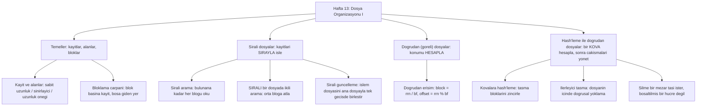

# Hafta 13 — Dosya Organizasyonu I: Sıralı ve Doğrudan Dosyalar

*CEN207 Veri Yapıları (eski adıyla CE205) · Güz 2026–2027*

<!-- materials:start -->

<div class="materials" markdown>

[:material-file-pdf-box: Ders notu (PDF)](cen207-week-13-notes.pdf){ .md-button download="cen207-week-13-notes.pdf" }
[:material-file-word-box: Ders notu (DOCX)](cen207-week-13-notes.docx){ .md-button download="cen207-week-13-notes.docx" }
[:material-presentation: Sunum (PDF)](cen207-week-13-slides.pdf){ .md-button download="cen207-week-13-slides.pdf" }
[:material-microsoft-powerpoint: Sunum (PPTX)](cen207-week-13-slides.pptx){ .md-button download="cen207-week-13-slides.pptx" }
[:material-language-html5: Sunum (HTML, çevrimdışı)](cen207-week-13-slides.html){ .md-button download="cen207-week-13-slides.html" }
[:material-folder-zip: Tümünü indir (ZIP)](cen207-week-13-materials.zip){ .md-button download="cen207-week-13-materials.zip" }
[:material-fullscreen: Sunumu tam ekran aç](cen207-week-13-slides.html){ .md-button .md-button--primary target=_blank }

</div>

<div class="deck-frame">
<iframe src="../cen207-week-13-slides.html" title="Hafta 13 — Dosya Organizasyonu I" loading="lazy" allowfullscreen></iframe>
</div>

<p class="deck-hint">Sunumun içine tıklayıp ok tuşlarıyla ilerleyin; tam ekran için sunumun sağ altındaki düğmeyi ya da yukarıdaki "Sunumu tam ekran aç" bağlantısını kullanın.</p>

<!-- materials:end -->

!!! abstract "Bu hafta"
    **Öğrenme çıktıları.** Bu haftanın sonunda, bir programın **diskteki bir dosyanın** içindeki kayıtları
    düzenlemesinin iki klasik yolunu açıklayabilecek, çizebilecek ve uygulayabilecek olacaksınız: kayıtların
    depolandıkları sırada aranıp tarandığı, güncellendiği ve birleştirildiği **sıralı dosyalar (sequential
    files)**, ve bir kaydın konumunun aranmak yerine **hesaplandığı** — ya doğrudan bir kayıt numarasından, ya
    da bir anahtarın bir **kovaya (bucket)** **hash'lenmesiyle** — **doğrudan (göreli) dosyalar (direct/relative
    files)**. Disk G/Ç'sinin (I/O) neden karşılaştırma yerine **blok okuma ve yazma** sayısıyla ölçüldüğünü, bir
    **bloklama çarpanının (blocking factor)** ne olduğunu ve hem hız hem de boşa giden alan için neden önemli
    olduğunu, bir **sıralı güncellemenin (sequential update)** bir işlem dosyasını tek, verimli bir geçişte
    (ekle / değiştir / sil, doğru hata yönetimiyle) nasıl bir ana dosyayla birleştirdiğini, bir **göreli
    dosyanın** kayıt numarasıyla nasıl O(1) erişim sağladığını, **kovalara hash'lemenin** çakışmaları taşma
    bloklarını zincirleyerek nasıl çözdüğünü, **ilerleyici taşmanın (progressive overflow / doğrusal yoklama)**
    çakışmaları doğrudan dosyanın içinde nasıl çözdüğünü ve yoklamalı bir dosyadan bir kaydı silmenin neden
    yuvayı boş olarak işaretlemek yerine bir **mezar taşı (tombstone)** gerektirdiğini öğreneceksiniz. Bu hafta
    yazacağınız her program, kendi oluşturup temizlediği geçici bir laboratuvar klasörü içinde **gerçek dosya
    G/Ç'si** yapar — C'de `fopen`, `fseek`, `fread`, `fwrite`; Java'da `RandomAccessFile` / `DataOutputStream`.
    Bu çıktılar ders izlencesinin **ÖÇ.1** (temel veri yapılarını açıklama), **ÖÇ.2** (algoritmik karmaşıklığı
    analiz etme), **ÖÇ.6** (veri yapılarını C ve Java'da doğru uygulama) ve **ÖÇ.7**'siyle (bir problem için
    doğru yapıyı seçme) eşleşir.

    **Zaten bildikleriniz.** Bu döneme kadarki her veri yapısı — diziler (Hafta 1), bağlı listeler (Hafta 2),
    yığınlar ve kuyruklar (Hafta 3), ağaçlar ve yığınaklar (Hafta 4), çizgeler (Hafta 5), hash tabloları (Hafta
    6), sıralama (Hafta 10), gelişmiş ağaçlar (Hafta 11), dizgiler (Hafta 12) — verinin zaten **RAM'de**
    olduğunu varsaydı; burada `arr[i]`'ye erişmek ya da bir işaretçiyi izlemek (bizim amacımız için) hangi `i`
    ya da hangi işaretçi olursa olsun aynı birkaç nanosaniyeye mal olur. Bu hafta bu varsayımı bırakır. Bir
    **dosya** bir diskte yaşar; okuma/yazma kafasını hareket ettirmek ve plağın dönmesini beklemek (ya da bir
    SSD'de blok düzeyinde bir isteği karşılamak) RAM'e dokunmaktan kat kat daha maliyetlidir, ve — kritik
    olarak — bir disk tek seferde bir bayt ya da bir kayıt okunmaz; tek seferde bir **blok (block)** okunur ve
    yazılır. Hafta 6'nın hash'lemesi (bölme yöntemi, zincirleme ya da açık adreslemeyle çakışma çözümü, yeniden
    hash'leme) burada *mantık* olarak neredeyse değişmeden yeniden karşımıza çıkar, ama artık her "bir hücreye
    bak" işlemi "diskten bir blok oku" haline gelir, ve saydığımız maliyet *karşılaştırmalardan* **blok
    okumalara** değişir.

    **Gerçekten yeni bir fikir: maliyet birimi "karşılaştırma"dan "blok okuma"ya değişir.** Hafta 1–12'deki her
    algoritma, karşılaştırma, takas ya da işaretçi atlaması sayılarak analiz edildi — bunların her biri (bizim
    amacımız için) sabit, küçük bir zaman alır, dolayısıyla *kaç tane* olduğunu saymak gerçek dünya hızı
    hakkında neredeyse her şeyi söyler. Diskte ise tek bir blok okuma, o bloğun içeriği üzerindeki herhangi bir
    bellek-içi işlemden o kadar pahalıdır ki, karşılaştırma saymayı büyük ölçüde bırakıp yerine **blok okuma ve
    yazma** sayarız. 100 blok okuyup blok başına 1 anahtar karşılaştıran bir sıralı arama, pratikte, 100 blok
    okuyup blok başına 1000 anahtar karşılaştıran bir aramadan daha hızlı değildir — disk erişimi baskındır.
    Sayılan şeydeki bu tek değişim, tüm haftanın düzenleyici fikridir.

    **3 saatlik bir oturum için zaman planı.** Dosyalar neden farklıdır: blok yönelimli G/Ç (~15 dk) · kayıt ve
    alanlar (~15 dk) · bloklama çarpanı (~15 dk) · bir dosyada sıralı arama (~15 dk) · sıralı bir dosyada ikili
    arama (~15 dk) · kısa ara · sıralı güncelleme: ana ve işlem dosyalarının birleştirilmesi (~30 dk) · göreli
    (doğrudan) dosyalar (~15 dk) · kovalara hash'leme (~20 dk) · diskte ilerleyici taşma / doğrusal yoklama (~20
    dk) · mezar taşlarıyla silme (~15 dk) · karşılaştırma tablosu, teknik seçimi, özet ve kendini sınama (~15
    dk).

## 0. Başlamadan önce

### 0.1 Zaten bildikleriniz

Dersin önceki bölümlerinden üç fikir bu hafta en çok işe yarıyor.

**Hafta 1'den — diziler ve hesaplanan adresler.** `arr[i]` doğrudan `base_address + i * element_size` olarak
hesaplanır; `i` indisine *ulaşmak* için arama gerekmez. Bu haftanın **göreli dosyası (relative file)** (bölüm
7) tam olarak bu fikrin diske taşınmış hâlidir: `block = rrn / bf`, `offset = rrn % bf` bir kaydın konumunu
kayıt numarasından hesaplar — dizi indislemenin bir indisten adres hesaplaması ile tamamen aynı şekilde; tek
fark "dizinin" artık bir dosya olması ve bir konuma ulaşmanın bir işaretçi toplamı yerine bir `fseek` artı bir
blok okuma anlamına gelmesidir.

**Hafta 6'dan — hash'leme, çakışmalar ve açık adresleme.** Hafta 6, tamamen RAM'de bir hash tablosu inşa etti:
`h(k) = k mod m` bir hücre seçti, çakışmalar her hücrede bir bağlı liste zincirleyerek ya da tablonun içinde
başka bir hücre yoklayarak çözüldü. Bu haftanın 8–10. bölümleri *tam olarak* aynı iki fikri yeniden kullanır —
zincirleme (artık tüm **taşma bloklarını (overflow blocks)** zincirleyerek, bölüm 8) ve açık adresleme (artık
**ilerleyici taşma (progressive overflow)** adıyla, bölüm 9 — çünkü her "hücre" bir RAM hücresi değil, bir disk
konumudur) — ama artık her yoklama gerçek bir disk erişimine mal olur, bu yüzden **yoklama (probe)** saymak
(eşdeğer olarak, blok okuma) burada Hafta 6'dakinden çok daha önemlidir.

**Gerçekten yeni bir fikir: maliyet birimi "karşılaştırma"dan "blok okuma"ya değişir.** Hafta 1–12'deki her
algoritma karşılaştırma, takas ya da işaretçi atlaması sayılarak analiz edildi — bunlar (bizim amacımız için)
her biri sabit, küçük miktarda zaman alan işlemlerdir, dolayısıyla *kaç tanesinin* gerçekleştiğini saymak
gerçek dünya hızı hakkında neredeyse her şeyi anlatır. Diskte ise tek bir blok okuma, o bloğun içeriği
üzerindeki herhangi bir bellek-içi işlemden o kadar pahalıya mal olur ki, karşılaştırma saymayı büyük ölçüde
bırakıp yerine **blok okuma ve yazma** sayarız. 100 blok okuyup blok başına 1 anahtar karşılaştıran bir sıralı
arama, pratikte, 100 blok okuyup blok başına 1000 anahtar karşılaştıran bir aramadan daha hızlı değildir — disk
erişimi baskın gelir. Sayılan şeydeki bu tek değişim, tüm haftanın düzenleyici fikridir.

### 0.2 Bu haftanın haritası



Aşağıdaki her kutu kendi bölümünü alır; çoğunun adım adım bir animasyonu, gerçek dosya G/Ç'si yapan tam bir C ve
Java programı ve karmaşıklık ile sık yapılan hatalar üzerine bir notu vardır.

## 1. Dosyalar neden farklıdır: blok yönelimli G/Ç

### 1.1 Başlangıç sorusu

Bu dönemki her veri yapısı RAM'de yaşadı; orada `arr[500000]`, `arr[0]` ile aynı maliyete sahiptir. Bir
**dosya** — bir öğrenci listesi, bir bankanın hesap defteri, bir veritabanı tablosu — genellikle RAM'e hiç
sığmaz, sığsa bile işletim sistemi onu diskten ve diske hâlâ tek seferde bir **blok** olarak taşır (genellikle
512 bayt, 4 KB ya da dosya sisteminin seçtiği başka sabit bir boyut). Bir program tek bir 20 baytlık kayıt
istiyorsa, disk neden sadece 20 bayt vermez?

### 1.2 Fikir: bir blok, disk G/Ç'sinin en küçük birimidir

Bir disk (dönen ya da katı hâl) sabit boyutlu **bloklara** ayrılmıştır. Her tekil okuma ya da yazma tam bir
blok aktarır, asla daha azını değil — program yalnız bir kayıt kadar bayt istemiş olsa bile, işletim sistemi o
kaydın yaşadığı bloğun tamamını okur, sonra programa istediği dilimi verir. Bu, bir programın vazgeçebileceği
bir tasarım seçimi değil, bir donanım ve dosya sistemi gerçeğidir, ve dosya organizasyonu tekniklerinin bir
konu olarak var olma *nedeni* tam olarak budur: bu bölümdeki her teknik, aslında **blok okuma ve yazma
sayısını en aza indirme** stratejisidir — çünkü gerçek bir programın ne kadar süreceğini belirleyen bu sayıdır,
kayıt sayısı ya da karşılaştırma sayısı değil.

Bu hafta boyunca her çizim aynı kuralı izler: bir **disk** satırı adlandırılmış, numaralandırılmış blokları
gösterir (içerikleri bloğun içinde çizilir); bir **RAM tamponu (buffer)** satırı o anda belleğe yüklenmiş tek
bloğu gösterir — programın tek tek kayıtları gerçekten inceleyebildiği yer burasıdır; ve sağda, her adımda
güncellenen çalışan bir **blok okuma** ve **blok yazma** sayacı gösterilir. Bu sayı, bu haftanın `O(...)`'sudur
— aşağıdaki her karmaşıklık tartışması aslında bununla ilgilidir.

### 1.3 Sıralı ve doğrudan: bu haftanın iki ailesi

Bir dosyayı organize etmenin temelden farklı iki stratejisi vardır, ve bu hafta her birinden en az bir
algoritma sunar:

| Aile | Fikir | Bir kayıt nasıl bulunur | Bu haftanın bölümleri |
| --- | --- | --- | --- |
| **Sıralı (Sequential)** | Kayıtlar **depolandıkları sırayla** işlenir (genellikle anahtara göre sıralı) | Bulana kadar blokları sırayla oku (ya da sıralı bir dosyada orta bloğa atla) | 3, 4, 5 |
| **Doğrudan (göreli) (Direct/relative)** | Bir kaydın anahtarı ya da kayıt numarası bloğunu ve konumunu doğrudan **hesaplar** | Bir aritmetik işlem, sonra bir blok okuma | 6, 7, 8, 9 |

Sıralı organizasyon basittir ve zaten *her* kaydı işlemeniz gerektiğinde (diyelim ki her öğrencinin transkriptini
yazdırırken) yenilmezdir; doğrudan organizasyon, milyonlarca kayıt arasından *tek bir belirli* kaydı bulmanız
gerektiğinde ve onu bulmak için tüm dosyayı okumaya gücünüzün yetmediği durumlarda yenilmezdir. Gerçek sistemler
çoğu zaman ikisini birden kullanır — toplu işleme için sıralı bir dosya, etkileşimli aramalar için hash'lenmiş
ya da indekslenmiş bir dosya — ki bu da her iki aileyi de iyi bilmenin tam olarak neden değerli olduğudur.

## 2. Kayıt ve alanlar

### 2.1 Başlangıç sorusu

Bir dosya bir bayt dizisidir; bir **kaydın (record)** (bir öğrenci, bir işlem, bir çalışan) o baytların içine
paketlenmesi ve okuma sırasında yeniden açılması gereken birkaç **alanı (field)** vardır (bir ID, bir ad, bir
not). Bir ad üç harf de olabilir, otuz da. Her kayıt, gerçek adın uzunluğu ne olursa olsun bir ad alanı için
aynı sayıda bayt mı ayırmalı, yoksa her kaydın boyutu kendi gerçek içeriğine mi uyum sağlamalı?

### 2.2 Aynı alan için üç yerleşim

**Sabit uzunluk (Fixed-length).** Her kayıt, gerçek adın uzunluğu ne olursa olsun ad için tam olarak
`NAME_FIXED` bayt ayırır: kısa bir ad dolgu baytlarıyla **doldurulur (padded)**, sığmayan bir ad
**kırpılır (truncated)** — ve kırpılan karakterler kalıcı olarak kaybolur. Karşılığında her kayıt tam olarak
aynı boyuttadır, ki (sonraki iki bölümün göstereceği gibi) bir kaydın adresini konumundan hesaplamayı mümkün
kılan tam olarak budur.

**Sınırlayıcılı (Delimited).** Ad tam olduğu uzunlukta yazılır, ardından nerede bittiğini işaretleyen bir
**sınırlayıcı (delimiter)** bayt (burada `|`) gelir. Dolgu yok, kırpma yok, boşa giden yer yok — ama bir kaydı
geri okumak, ad ne kadar uzun olacağını önceden söyleyen hiçbir şey olmadığından, sınırlayıcıyı bulana kadar
bayt bayt taramak anlamına gelir.

**Uzunluk önekli (Length-prefixed).** Önce tek bir uzunluk baytı yazılır, sonra tam olarak o kadar bayt ad.
Geri okumak artık bir tarama yerine alan başına O(1)'dir: uzunluk baytını oku, sonra tam olarak o kadar bayt
daha oku — hiç sınırlayıcı karaktere gerek yoktur (ve sınırlayıcılı düzende bir adın içindeki gerçek bir `|`
karakterinin düzeni bozması gibi, "bir adın içinde asla göründüğü olamaz" diye bir karakter ayırmaya da gerek
yoktur).

### 2.3 Bellekte, ve kod

=== "C"

    ```c
    #define NAME_FIXED 8

    int write_fixed(FILE *fp, int id, const char *name, int score) {
        FixedRecord r; r.id = id; r.score = score;
        int n = (int) strlen(name);
        if (n >= NAME_FIXED) {                 /* too long: truncate, data is lost */
            memcpy(r.name, name, NAME_FIXED);
        } else {
            memcpy(r.name, name, n);
            memset(r.name + n, '_', NAME_FIXED - n);   /* pad with filler bytes */
        }
        return fwrite(&r, sizeof(r), 1, fp) == 1 ? (int) sizeof(r) : -1;
    }

    int write_delim(FILE *fp, int id, const char *name, int score) {
        (void) id; (void) score;   /* still fixed 4-byte fields; only name is variable here */
        return fprintf(fp, "%s|", name) > 0 ? 4 + (int) strlen(name) + 1 + 4 : -1;
    }

    int write_lenpfx(FILE *fp, int id, const char *name, int score) {
        (void) id; (void) score;
        unsigned char len = (unsigned char) strlen(name);   /* 1-byte length prefix */
        fwrite(&len, 1, 1, fp);
        fwrite(name, 1, len, fp);
        return 4 + 1 + (int) len + 4;
    }
    ```

=== "Java"

    ```java
    static final int NAME_FIXED = 8;

    static int writeFixed(DataOutputStream out, int id, String name, int score) throws IOException {
        out.writeInt(id);
        byte[] raw = name.getBytes(StandardCharsets.US_ASCII);
        int n = raw.length;
        if (n >= NAME_FIXED) {                    // too long: truncate, data is lost
            out.write(raw, 0, NAME_FIXED);
        } else {
            out.write(raw);
            for (int i = n; i < NAME_FIXED; i++) out.write('_');   // pad with filler bytes
        }
        out.writeInt(score);
        return 4 + NAME_FIXED + 4;
    }

    static int writeDelim(DataOutputStream out, int id, String name, int score) throws IOException {
        // id and score are still fixed 4-byte fields; only name is variable here
        byte[] raw = name.getBytes(StandardCharsets.US_ASCII);
        out.write(raw); out.writeByte('|');
        return 4 + raw.length + 1 + 4;
    }

    static int writeLenPrefixed(DataOutputStream out, int id, String name, int score) throws IOException {
        // id and score are still fixed 4-byte fields; only the name is variable here
        byte[] raw = name.getBytes(StandardCharsets.US_ASCII);
        out.writeByte(raw.length);            // 1-byte length prefix
        out.write(raw);
        return 4 + 1 + raw.length + 4;
    }
    ```

<iframe class="dsanim" src="../anim/records-and-fields.html" title="Records and fields: fixed-length vs. delimiter vs. length-prefix" loading="lazy"></iframe>
<div class="dsanim-baski" markdown>

</div>

Oynatıcıda ayrıca şunları da deneyin: **13 kayıt, karışık uzunluk** (bazıları kırpılmış, bazıları doldurulmuş,
bazıları tam sığan), ya da uç durumlar **boş ad ve çok uzun ad** ve **tüm adlar 8 karakterden uzun** (sabit
düzende her kayıt kırpılır) — ya da rastgele veri için 🎲'ye basın, ya da kendi `id:ad:not` listenizi yazın.

### 2.4 Dene

??? example "Tam program: `records_and_fields.c` / `RecordsAndFields.java`"

    Her iki program da geçici bir laboratuvar klasörü oluşturur (işletim sisteminin geçici klasöründe, asla ders
    deposunun içinde değil) ve aşağıdaki her senaryo için içine üç GERÇEK dosya yazar — `fixed.dat`, `delim.dat`,
    `lenpfx.dat` — sonra dosyaları ve en sonda laboratuvar klasörünün kendisini silmeden önce her dosyanın gerçek
    boyutunu `ftell` (C) / `File.length()` (Java) ile geri okur.

    === "C"

        ```c
        /* Week 13 -- File Organisation I
         * Records and fields: the same records are written to three REAL files, one per layout --
         * fixed-length (padded/truncated to NAME_FIXED bytes), delimited (name + '|'), and length-prefixed
         * (1-byte length + name). The files are created only inside a temporary lab folder that main()
         * creates and removes.
         * CEN207 Data Structures (CS50-style lecture notes)
         */
        #include <stdio.h>
        #include <stdlib.h>
        #include <string.h>
        #include <sys/stat.h>
        #ifdef _WIN32
        #include <direct.h>
        #define MKDIR(path) _mkdir(path)
        #define RMDIR(path) _rmdir(path)
        #else
        #define MKDIR(path) mkdir(path, 0755)
        #define RMDIR(path) rmdir(path)
        #endif

        /* A fresh, empty temporary folder under the OS temp directory -- never inside the repository -- that this
           program creates and removes itself; every file this program writes lives only inside it. */
        static void lab_path(char *out, size_t n) {
        #ifdef _WIN32
            const char *base = getenv("TEMP");
            if (!base) base = getenv("TMP");
            if (!base) base = ".";
        #else
            const char *base = getenv("TMPDIR");
            if (!base) base = "/tmp";
        #endif
            snprintf(out, n, "%s/cen207_week13_records_lab", base);
        }

        #define NAME_FIXED 8

        typedef struct { int id; char name[NAME_FIXED]; int score; } FixedRecord;

        int write_fixed(FILE *fp, int id, const char *name, int score) {
            FixedRecord r; r.id = id; r.score = score;
            int n = (int) strlen(name);
            if (n >= NAME_FIXED) {                 /* too long: truncate, data is lost */
                memcpy(r.name, name, NAME_FIXED);
            } else {
                memcpy(r.name, name, n);
                memset(r.name + n, '_', NAME_FIXED - n);   /* pad with filler bytes */
            }
            return fwrite(&r, sizeof(r), 1, fp) == 1 ? (int) sizeof(r) : -1;
        }

        int write_delim(FILE *fp, int id, const char *name, int score) {
            (void) id; (void) score;   /* still fixed 4-byte fields; only name is variable here */
            return fprintf(fp, "%s|", name) > 0 ? 4 + (int) strlen(name) + 1 + 4 : -1;
        }

        int write_lenpfx(FILE *fp, int id, const char *name, int score) {
            (void) id; (void) score;
            unsigned char len = (unsigned char) strlen(name);   /* 1-byte length prefix */
            fwrite(&len, 1, 1, fp);
            fwrite(name, 1, len, fp);
            return 4 + 1 + (int) len + 4;
        }

        /* ---- driver ------------------------------------------------------------ */

        typedef struct { int id; const char *name; int score; } RecIn;

        static long file_size(const char *path) {
            FILE *fp = fopen(path, "rb");
            if (!fp) return -1;
            fseek(fp, 0, SEEK_END);
            long sz = ftell(fp);
            fclose(fp);
            return sz;
        }

        static void run_scenario(const char *label, const char *lab, RecIn recs[], int n) {
            printf("-- %s --\n", label);
            char pfixed[512], pdelim[512], plen[512];
            snprintf(pfixed, sizeof(pfixed), "%s/fixed.dat", lab);
            snprintf(pdelim, sizeof(pdelim), "%s/delim.dat", lab);
            snprintf(plen, sizeof(plen), "%s/lenpfx.dat", lab);

            FILE *ffixed = fopen(pfixed, "wb");
            FILE *fdelim = fopen(pdelim, "wb");
            FILE *flen = fopen(plen, "wb");
            if (!ffixed || !fdelim || !flen) {                 /* clean up whichever of the three did open */
                if (ffixed) fclose(ffixed);
                if (fdelim) fclose(fdelim);
                if (flen) fclose(flen);
                remove(pfixed); remove(pdelim); remove(plen);
                printf("  could not open lab files\n");
                return;
            }

            int wasted = 0, truncated = 0;
            for (int i = 0; i < n; i++) {
                int nlen = (int) strlen(recs[i].name);
                write_fixed(ffixed, recs[i].id, recs[i].name, recs[i].score);
                write_delim(fdelim, recs[i].id, recs[i].name, recs[i].score);
                write_lenpfx(flen, recs[i].id, recs[i].name, recs[i].score);
                if (nlen >= NAME_FIXED) truncated++; else wasted += NAME_FIXED - nlen;
                printf("  id=%-4d name=\"%-10s\" (%2d B) score=%-4d%s\n",
                       recs[i].id, recs[i].name, nlen, recs[i].score, nlen >= NAME_FIXED ? "  -- truncated in fixed.dat!" : "");
            }
            fclose(ffixed); fclose(fdelim); fclose(flen);

            long szf = file_size(pfixed), szd = file_size(pdelim), szl = file_size(plen);
            printf("  fixed.dat  = %ld B (expected %d, %d B wasted, %d truncated)\n", szf, n * (8 + NAME_FIXED), wasted, truncated);
            printf("  delim.dat  = %ld B\n", szd);
            printf("  lenpfx.dat = %ld B\n", szl);
            printf("summary: %d records, fixed saves nothing here (%ld B) but reads back at a constant stride;\n"
                   "         delim/lenpfx are %ld B smaller, but need parsing to find record boundaries.\n\n",
                   n, szf, szf - szd);

            remove(pfixed); remove(pdelim); remove(plen);
        }

        int main(void) {
            char lab[512];
            lab_path(lab, sizeof(lab));
            RMDIR(lab);           /* in case a previous crashed run left it behind */
            MKDIR(lab);

            RecIn normal[] = {
                {101, "ANN", 91}, {102, "BOB", 77}, {103, "CARL", 85}, {104, "DEE", 60}, {105, "ED", 99},
                {106, "FAY", 72}, {107, "GUS", 88}, {108, "HAL", 65}, {109, "IVY", 93}, {110, "JOE", 58}, {111, "KIM", 80}
            };
            RecIn mixed[] = {
                {201, "AL", 70}, {202, "BRENDA", 84}, {203, "CARLITOX", 66}, {204, "DOMINIQUE", 91}, {205, "ED", 55},
                {206, "FRANCESCA", 62}, {207, "GIA", 89}, {208, "HECTOR", 73}, {209, "IRA", 95}, {210, "JULIETTE", 68},
                {211, "KEN", 81}, {212, "LIONEL", 77}, {213, "MAX", 90}
            };
            RecIn edge_empty_long[] = {
                {301, "", 40}, {302, "ALEXANDRIA", 71}, {303, "A", 50}, {304, "BO", 61}, {305, "CHRISTOPHERSON", 82},
                {306, "", 30}, {307, "D", 45}, {308, "EIGHTCHRS", 59}, {309, "F", 66}, {310, "GABRIELLA", 74}, {311, "H", 53}
            };
            RecIn edge_all_truncated[] = {
                {401, "ABCDEFGHIJ", 10}, {402, "KLMNOPQRST", 20}, {403, "UVWXYZABCD", 30}, {404, "EFGHIJKLMN", 40},
                {405, "OPQRSTUVWX", 50}, {406, "YZABCDEFGH", 60}, {407, "IJKLMNOPQR", 70}, {408, "STUVWXYZAB", 80},
                {409, "CDEFGHIJKL", 90}, {410, "MNOPQRSTUV", 15}
            };

            run_scenario("normal: 11 records, short names (padding, no truncation)", lab, normal, 11);
            run_scenario("hard: 13 records, mixed lengths", lab, mixed, 13);
            run_scenario("edge: empty name and a very long name", lab, edge_empty_long, 11);
            run_scenario("edge: every name longer than 8 characters", lab, edge_all_truncated, 10);

            RMDIR(lab);
            return 0;
        }
        ```

    === "Java"

        ```java
        import java.io.DataOutputStream;
        import java.io.File;
        import java.io.FileOutputStream;
        import java.io.IOException;
        import java.nio.charset.StandardCharsets;

        /* Week 13 -- File Organisation I
         * Records and fields: the same records are written to three REAL files, one per layout --
         * fixed-length (padded/truncated to NAME_FIXED bytes), delimited (name + '|'), and length-prefixed
         * (1-byte length + name). The files are created only inside a temporary lab folder that main()
         * creates and removes.
         * CEN207 Data Structures (CS50-style lecture notes)
         */
        public class RecordsAndFields {
            static final int NAME_FIXED = 8;

            static int writeFixed(DataOutputStream out, int id, String name, int score) throws IOException {
                out.writeInt(id);
                byte[] raw = name.getBytes(StandardCharsets.US_ASCII);
                int n = raw.length;
                if (n >= NAME_FIXED) {                    // too long: truncate, data is lost
                    out.write(raw, 0, NAME_FIXED);
                } else {
                    out.write(raw);
                    for (int i = n; i < NAME_FIXED; i++) out.write('_');   // pad with filler bytes
                }
                out.writeInt(score);
                return 4 + NAME_FIXED + 4;
            }

            static int writeDelim(DataOutputStream out, int id, String name, int score) throws IOException {
                // id and score are still fixed 4-byte fields; only name is variable here
                byte[] raw = name.getBytes(StandardCharsets.US_ASCII);
                out.write(raw); out.writeByte('|');
                return 4 + raw.length + 1 + 4;
            }

            static int writeLenPrefixed(DataOutputStream out, int id, String name, int score) throws IOException {
                // id and score are still fixed 4-byte fields; only the name is variable here
                byte[] raw = name.getBytes(StandardCharsets.US_ASCII);
                out.writeByte(raw.length);            // 1-byte length prefix
                out.write(raw);
                return 4 + 1 + raw.length + 4;
            }

            /* ---- driver ------------------------------------------------------------ */

            static class RecIn { int id; String name; int score; RecIn(int i, String n, int s) { id = i; name = n; score = s; } }

            static void runScenario(String label, File lab, RecIn[] recs) throws IOException {
                System.out.println("-- " + label + " --");
                File fixedFile = new File(lab, "fixed.dat"), delimFile = new File(lab, "delim.dat"), lenFile = new File(lab, "lenpfx.dat");
                int wasted = 0, truncated = 0;
                try (DataOutputStream fixedOut = new DataOutputStream(new FileOutputStream(fixedFile));
                     DataOutputStream delimOut = new DataOutputStream(new FileOutputStream(delimFile));
                     DataOutputStream lenOut = new DataOutputStream(new FileOutputStream(lenFile))) {
                    for (RecIn r : recs) {
                        int nlen = r.name.getBytes(StandardCharsets.US_ASCII).length;
                        writeFixed(fixedOut, r.id, r.name, r.score);
                        writeDelim(delimOut, r.id, r.name, r.score);
                        writeLenPrefixed(lenOut, r.id, r.name, r.score);
                        if (nlen >= NAME_FIXED) truncated++; else wasted += NAME_FIXED - nlen;
                        System.out.printf("  id=%-4d name=\"%-10s\" (%2d B) score=%-4d%s%n",
                                r.id, r.name, nlen, r.score, nlen >= NAME_FIXED ? "  -- truncated in fixed.dat!" : "");
                    }
                }
                long szf = fixedFile.length(), szd = delimFile.length(), szl = lenFile.length();
                System.out.printf("  fixed.dat  = %d B (expected %d, %d B wasted, %d truncated)%n", szf, recs.length * (8 + NAME_FIXED), wasted, truncated);
                System.out.printf("  delim.dat  = %d B%n", szd);
                System.out.printf("  lenpfx.dat = %d B%n", szl);
                System.out.printf("summary: %d records, fixed saves nothing here (%d B) but reads back at a constant stride;%n" +
                        "         delim/lenpfx are %d B smaller, but need parsing to find record boundaries.%n%n",
                        recs.length, szf, szf - szd);
                fixedFile.delete(); delimFile.delete(); lenFile.delete();
            }

            public static void main(String[] args) throws IOException {
                File lab = new File(System.getProperty("java.io.tmpdir"), "cen207_week13_records_lab_java");
                if (lab.exists()) for (File f : lab.listFiles()) f.delete();
                lab.mkdir();

                RecIn[] normal = {
                    new RecIn(101, "ANN", 91), new RecIn(102, "BOB", 77), new RecIn(103, "CARL", 85), new RecIn(104, "DEE", 60), new RecIn(105, "ED", 99),
                    new RecIn(106, "FAY", 72), new RecIn(107, "GUS", 88), new RecIn(108, "HAL", 65), new RecIn(109, "IVY", 93), new RecIn(110, "JOE", 58), new RecIn(111, "KIM", 80)
                };
                RecIn[] mixed = {
                    new RecIn(201, "AL", 70), new RecIn(202, "BRENDA", 84), new RecIn(203, "CARLITOX", 66), new RecIn(204, "DOMINIQUE", 91), new RecIn(205, "ED", 55),
                    new RecIn(206, "FRANCESCA", 62), new RecIn(207, "GIA", 89), new RecIn(208, "HECTOR", 73), new RecIn(209, "IRA", 95), new RecIn(210, "JULIETTE", 68),
                    new RecIn(211, "KEN", 81), new RecIn(212, "LIONEL", 77), new RecIn(213, "MAX", 90)
                };
                RecIn[] edgeEmptyLong = {
                    new RecIn(301, "", 40), new RecIn(302, "ALEXANDRIA", 71), new RecIn(303, "A", 50), new RecIn(304, "BO", 61), new RecIn(305, "CHRISTOPHERSON", 82),
                    new RecIn(306, "", 30), new RecIn(307, "D", 45), new RecIn(308, "EIGHTCHRS", 59), new RecIn(309, "F", 66), new RecIn(310, "GABRIELLA", 74), new RecIn(311, "H", 53)
                };
                RecIn[] edgeAllTruncated = {
                    new RecIn(401, "ABCDEFGHIJ", 10), new RecIn(402, "KLMNOPQRST", 20), new RecIn(403, "UVWXYZABCD", 30), new RecIn(404, "EFGHIJKLMN", 40),
                    new RecIn(405, "OPQRSTUVWX", 50), new RecIn(406, "YZABCDEFGH", 60), new RecIn(407, "IJKLMNOPQR", 70), new RecIn(408, "STUVWXYZAB", 80),
                    new RecIn(409, "CDEFGHIJKL", 90), new RecIn(410, "MNOPQRSTUV", 15)
                };

                runScenario("normal: 11 records, short names (padding, no truncation)", lab, normal);
                runScenario("hard: 13 records, mixed lengths", lab, mixed);
                runScenario("edge: empty name and a very long name", lab, edgeEmptyLong);
                runScenario("edge: every name longer than 8 characters", lab, edgeAllTruncated);

                lab.delete();
            }
        }
        ```

**Dene**

=== "C"

    ```console
    gcc -std=c11 -Wall -Wextra -o /tmp/x records_and_fields.c && /tmp/x
    ```

    Beklenen çıktı:

    ```text
    -- normal: 11 records, short names (padding, no truncation) --
      id=101  name="ANN       " ( 3 B) score=91  
      id=102  name="BOB       " ( 3 B) score=77  
      id=103  name="CARL      " ( 4 B) score=85  
      id=104  name="DEE       " ( 3 B) score=60  
      id=105  name="ED        " ( 2 B) score=99  
      id=106  name="FAY       " ( 3 B) score=72  
      id=107  name="GUS       " ( 3 B) score=88  
      id=108  name="HAL       " ( 3 B) score=65  
      id=109  name="IVY       " ( 3 B) score=93  
      id=110  name="JOE       " ( 3 B) score=58  
      id=111  name="KIM       " ( 3 B) score=80  
      fixed.dat  = 176 B (expected 176, 55 B wasted, 0 truncated)
      delim.dat  = 44 B
      lenpfx.dat = 44 B
    summary: 11 records, fixed saves nothing here (176 B) but reads back at a constant stride;
             delim/lenpfx are 132 B smaller, but need parsing to find record boundaries.

    -- hard: 13 records, mixed lengths --
      id=201  name="AL        " ( 2 B) score=70  
      id=202  name="BRENDA    " ( 6 B) score=84  
      id=203  name="CARLITOX  " ( 8 B) score=66    -- truncated in fixed.dat!
      id=204  name="DOMINIQUE " ( 9 B) score=91    -- truncated in fixed.dat!
      id=205  name="ED        " ( 2 B) score=55  
      id=206  name="FRANCESCA " ( 9 B) score=62    -- truncated in fixed.dat!
      id=207  name="GIA       " ( 3 B) score=89  
      id=208  name="HECTOR    " ( 6 B) score=73  
      id=209  name="IRA       " ( 3 B) score=95  
      id=210  name="JULIETTE  " ( 8 B) score=68    -- truncated in fixed.dat!
      id=211  name="KEN       " ( 3 B) score=81  
      id=212  name="LIONEL    " ( 6 B) score=77  
      id=213  name="MAX       " ( 3 B) score=90  
      fixed.dat  = 208 B (expected 208, 38 B wasted, 4 truncated)
      delim.dat  = 81 B
      lenpfx.dat = 81 B
    summary: 13 records, fixed saves nothing here (208 B) but reads back at a constant stride;
             delim/lenpfx are 127 B smaller, but need parsing to find record boundaries.

    -- edge: empty name and a very long name --
      id=301  name="          " ( 0 B) score=40  
      id=302  name="ALEXANDRIA" (10 B) score=71    -- truncated in fixed.dat!
      id=303  name="A         " ( 1 B) score=50  
      id=304  name="BO        " ( 2 B) score=61  
      id=305  name="CHRISTOPHERSON" (14 B) score=82    -- truncated in fixed.dat!
      id=306  name="          " ( 0 B) score=30  
      id=307  name="D         " ( 1 B) score=45  
      id=308  name="EIGHTCHRS " ( 9 B) score=59    -- truncated in fixed.dat!
      id=309  name="F         " ( 1 B) score=66  
      id=310  name="GABRIELLA " ( 9 B) score=74    -- truncated in fixed.dat!
      id=311  name="H         " ( 1 B) score=53  
      fixed.dat  = 176 B (expected 176, 50 B wasted, 4 truncated)
      delim.dat  = 59 B
      lenpfx.dat = 59 B
    summary: 11 records, fixed saves nothing here (176 B) but reads back at a constant stride;
             delim/lenpfx are 117 B smaller, but need parsing to find record boundaries.

    -- edge: every name longer than 8 characters --
      id=401  name="ABCDEFGHIJ" (10 B) score=10    -- truncated in fixed.dat!
      id=402  name="KLMNOPQRST" (10 B) score=20    -- truncated in fixed.dat!
      id=403  name="UVWXYZABCD" (10 B) score=30    -- truncated in fixed.dat!
      id=404  name="EFGHIJKLMN" (10 B) score=40    -- truncated in fixed.dat!
      id=405  name="OPQRSTUVWX" (10 B) score=50    -- truncated in fixed.dat!
      id=406  name="YZABCDEFGH" (10 B) score=60    -- truncated in fixed.dat!
      id=407  name="IJKLMNOPQR" (10 B) score=70    -- truncated in fixed.dat!
      id=408  name="STUVWXYZAB" (10 B) score=80    -- truncated in fixed.dat!
      id=409  name="CDEFGHIJKL" (10 B) score=90    -- truncated in fixed.dat!
      id=410  name="MNOPQRSTUV" (10 B) score=15    -- truncated in fixed.dat!
      fixed.dat  = 160 B (expected 160, 0 B wasted, 10 truncated)
      delim.dat  = 110 B
      lenpfx.dat = 110 B
    summary: 10 records, fixed saves nothing here (160 B) but reads back at a constant stride;
             delim/lenpfx are 50 B smaller, but need parsing to find record boundaries.
    ```

=== "Java"

    ```console
    javac -Xlint:all -d /tmp/j RecordsAndFields.java && java -cp /tmp/j RecordsAndFields
    ```

    Beklenen çıktı: yukarıdaki C çalıştırmasıyla birebir aynı (aynı algoritma, aynı veri).

### 2.5 Karmaşıklık, hatalar, kendini sına

**Karmaşıklık.** Bir alanı yazmak ya da okumak, düzen ne olursa olsun O(alan uzunluğu)'dur — üçü arasındaki
fark asimptotik değildir, **boşa giden yer** (sabit) ile **ayrıştırma maliyeti** (sınırlayıcılı) ile
**hiçbiri** (uzunluk önekli — bedeli alan uzunluğuna sert bir sınır: bir bayt yalnız 0–255 arasındaki
uzunlukları ifade edebilir) arasındaki farktır.

!!! warning "Sık yapılan hatalar"
    - **Sabit uzunluklu bir alanın, tam dolduğunda ya da kırpıldığında null ile sonlandırılmadığını unutmak.**
      Tam olarak `NAME_FIXED` bayt uzunluğunda ya da daha uzun ve kırpılmış bir ad üzerinde `memcpy(r.name,
      name, NAME_FIXED)`, sondaki bir `'\0'` için yer bırakmaz; onu bilinen sabit uzunluğunu da takip etmeden
      bir C dizgisi olarak geri okumak, alanın ardından gelen ne bayt varsa onun içine okur.
    - **Verinin içinde yasal olarak görünebilecek bir sınırlayıcı karakter seçmek.** `,` ile sınırlandırılmış
      bir ad alanı, bir ad yasal olarak virgül içerdiği anda bozulur; uzunluk önekleme bu hata sınıfını
      tamamen aşar, bedeli ise bir azami alan uzunluğudur.
    - **Veri kaybını bildirmek yerine sessizce kırpmak.** Yukarıdaki sabit uzunluklu düzen, bunun görünür
      olması için özellikle her ad kırpıldığında bir uyarı yazdırır; sessizce kırpan gerçek bir sistem, bir
      adın kısaltıldığını kimse fark etmeden yıllarca veriyi bozabilir.

??? success "Kendini sına: uzunluk önekli bir alanın okuma maliyeti neden O(1) artı alanın kendi uzunluğuyken, sınırlayıcılı bir alanın okuma maliyeti neden O(sınırlayıcıya kadar tarama)'dır?"
    Uzunluk önekli bir alan, alanın içeriğinden herhangi birini okumadan *önce* okuyucuya kaç bayt okuyacağını
    tam olarak söyler — bir bayt okuma (uzunluk), sonra tam olarak o kadar bayt daha, hiç boşa karşılaştırma
    yok. Sınırlayıcılı bir alan okuyucuya önceden böyle bir bilgi vermez: okuyucu, sınırlayıcı karakteri
    bulana kadar her baytı tek tek incelemek, onu sınırlayıcı karakterle karşılaştırmak zorundadır —
    uzunluğu tam olarak alanın kendi uzunluğu kadar olan kaçınılmaz bir tarama (ki bunu uzunluk önekli düzen
    tarama yapmadan zaten doğrudan söylemişti).

## 3. Bloklama çarpanı

### 3.1 Başlangıç sorusu

Bölüm 1, disk G/Ç'sinin her seferinde bir blok gerçekleştiğini ortaya koydu. Bir blok 100 bayt ve bir kayıt 20
baytsa, disk her tek okumada 80 baytı boşa mı harcar, yoksa birkaç kayıt bir bloğu paylaşabilir mi?

### 3.2 Fikir: bloğa `bf` kayıt sığdırmak

**Bloklama çarpanı (blocking factor)**, `bf`, bir bloğa kaç sabit boyutlu kaydın sığdığıdır: `bf =
floor(blockSize / recSize)`. Kayıtlar küçük bir **RAM tamponunda (buffer)** tek tek biriktirilir; tampon `bf`
kayda ulaştığı anda, tamponun tamamı tek bir `fwrite` çağrısıyla diske yazılır — bir blok, bir disk erişimi,
`bf` kayıt; `bf` kayıt için `bf` disk erişimi değil. Bloklamanın tüm kazancı budur: **disk erişimi kayıt
başına değil, blok başına gerçekleşir**.

Bloklama israfı ortadan kaldırmaz, yalnızca yerini değiştirir. **İç parçalanma (internal fragmentation)**,
`bf * recSize` tam olarak `blockSize`'a eşit olmadığında (`bf` bir `floor` olduğundan neredeyse her zaman bir
kalan vardır) her *dolu* bloğun içinde artakalan yerdir. İkinci, bağımsız bir israf türü de **son blokta**
ortaya çıkar: toplam kayıt sayısı `bf`'in tam katı değilse, son blok yalnızca kısmen doludur, yine de diskte
tam bir blok kaplar — `block_flush` onu yine de yazar, bunun ima ettiği kaç boş kayıt yuvası varsa o kadar
ekstra israfla birlikte.

### 3.3 Bellekte, ve kod

=== "C"

    ```c
    #define BLOCK_SIZE 100

    typedef struct { int keys[MAX_BF]; int count; } Block;

    int block_capacity(int rec_size) { return BLOCK_SIZE / rec_size; }   /* bf = floor(BLOCK_SIZE / rec_size) */

    void block_put(Block *b, int bf, int key, FILE *fp, int *written) {
        b->keys[b->count++] = key;
        if (b->count == bf) {                    /* block full: flush it to disk */
            fwrite(b->keys, sizeof(int), bf, fp);
            (*written)++;
            b->count = 0;                        /* start a new, empty block */
        }
    }

    void block_flush(Block *b, FILE *fp, int *written) {
        if (b->count > 0) {                      /* partial last block is still written, with waste */
            fwrite(b->keys, sizeof(int), b->count, fp);
            (*written)++;
        }
    }
    ```

=== "Java"

    ```java
    static final int BLOCK_SIZE = 100;

    static int blockCapacity(int recSize) { return BLOCK_SIZE / recSize; }   // bf = floor(BLOCK_SIZE / recSize)

    static void blockPut(List<Integer> buf, int bf, int key, DataOutputStream out, int[] written) throws IOException {
        buf.add(key);
        if (buf.size() == bf) {                       // block full: flush it to disk
            for (int v : buf) out.writeInt(v);
            written[0]++;
            buf.clear();                              // start a new, empty block
        }
    }

    static void blockFlush(List<Integer> buf, DataOutputStream out, int[] written) throws IOException {
        if (!buf.isEmpty()) {                          // partial last block is still written, with waste
            for (int v : buf) out.writeInt(v);
            written[0]++;
        }
    }
    ```

<iframe class="dsanim" src="../anim/blocking-factor.html" title="Blocking factor: records per block, internal waste" loading="lazy"></iframe>
<div class="dsanim-baski" markdown>

</div>

Oynatıcıda ayrıca şunları da deneyin: **recSize=24, blockSize=100 (bf=4), 14 anahtar** (her blokta iç
parçalanma, artı son blok israfı), ya da uç durumlar **kayıt bloktan büyük (bf=0, hata)** — gerçek bir
sistemin sessizce yanlış davranmak yerine tespit etmesi gereken bir tasarım hatası — ve **12 anahtar bf=3'e
tam bölünür, son blok israfı yok** (parçalanma yine de olur, ama yalnız dolu bloklarda) — ya da rastgele veri
için 🎲'ye basın, ya da kendi `rec=N blk=N` başlığınızı ve anahtar listenizi yazın.

### 3.4 Dene

??? example "Tam program: `blocking_factor.c` / `BlockingFactor.java`"

    === "C"

        ```c
        /* Week 13 -- File Organisation I
         * Blocking factor: how many fixed-size records fit in one disk block (bf), and the waste that comes with it --
         * internal fragmentation inside every full block, plus extra waste in a partial last block. Every block is
         * really written to a file inside a temporary lab folder that main() creates and removes.
         * CEN207 Data Structures (CS50-style lecture notes)
         */
        #include <stdio.h>
        #include <stdlib.h>
        #include <string.h>
        #include <sys/stat.h>
        #ifdef _WIN32
        #include <direct.h>
        #define MKDIR(path) _mkdir(path)
        #define RMDIR(path) _rmdir(path)
        #else
        #define MKDIR(path) mkdir(path, 0755)
        #define RMDIR(path) rmdir(path)
        #endif

        static void lab_path(char *out, size_t n) {
        #ifdef _WIN32
            const char *base = getenv("TEMP");
            if (!base) base = getenv("TMP");
            if (!base) base = ".";
        #else
            const char *base = getenv("TMPDIR");
            if (!base) base = "/tmp";
        #endif
            snprintf(out, n, "%s/cen207_week13_blocking_lab", base);
        }

        #define BLOCK_SIZE 100
        #define MAX_BF 20

        typedef struct { int keys[MAX_BF]; int count; } Block;

        int block_capacity(int rec_size) { return BLOCK_SIZE / rec_size; }   /* bf = floor(BLOCK_SIZE / rec_size) */

        void block_put(Block *b, int bf, int key, FILE *fp, int *written) {
            b->keys[b->count++] = key;
            if (b->count == bf) {                    /* block full: flush it to disk */
                fwrite(b->keys, sizeof(int), bf, fp);
                (*written)++;
                b->count = 0;                        /* start a new, empty block */
            }
        }

        void block_flush(Block *b, FILE *fp, int *written) {
            if (b->count > 0) {                      /* partial last block is still written, with waste */
                fwrite(b->keys, sizeof(int), b->count, fp);
                (*written)++;
            }
        }

        /* ---- driver ------------------------------------------------------------ */

        static void run_scenario(const char *label, const char *lab, int rec_size, int block_size, int keys[], int n) {
            printf("-- %s --\n", label);
            int bf = block_size / rec_size;
            printf("recSize=%d blockSize=%d -> bf=%d\n", rec_size, block_size, bf);
            if (bf < 1) {
                printf("ERROR: a record (%d B) does not fit in a block (%d B): no block can hold even one record.\n\n", rec_size, block_size);
                return;
            }

            char path[512];
            snprintf(path, sizeof(path), "%s/blocks.dat", lab);
            FILE *fp = fopen(path, "wb");
            if (!fp) { printf("  could not open lab file\n"); return; }

            Block b; b.count = 0;
            int written = 0, fragTotal = 0;
            for (int i = 0; i < n; i++) {
                int before = written;
                block_put(&b, bf, keys[i], fp, &written);
                if (written > before) {
                    int frag = block_size - bf * rec_size;
                    fragTotal += frag;
                    printf("  key %d -> block full, flushed (write #%d), %d B internal waste\n", keys[i], written, frag);
                } else {
                    printf("  key %d -> buffer (%d/%d)\n", keys[i], b.count, bf);
                }
            }
            int beforeFlush = written;
            int lastWaste = 0;
            if (b.count > 0) lastWaste = (bf - b.count) * rec_size;
            block_flush(&b, fp, &written);
            if (written > beforeFlush) {
                int lastFrag = block_size - bf * rec_size;
                fragTotal += lastFrag;
                printf("  final partial block -> flushed (write #%d), %d B internal waste + %d B last-block waste\n", written, lastFrag, lastWaste);
            }
            fclose(fp);

            fp = fopen(path, "rb");
            fseek(fp, 0, SEEK_END);
            long size = ftell(fp);
            fclose(fp);
            printf("summary: %d keys -> %d block(s) written (%ld B on disk), internal waste %d B, last-block waste %d B\n\n",
                   n, written, size, fragTotal, lastWaste);
            remove(path);
        }

        int main(void) {
            char lab[512];
            lab_path(lab, sizeof(lab));
            RMDIR(lab);
            MKDIR(lab);

            int normal[] = { 12, 45, 7, 89, 23, 56, 34, 78, 19, 61, 42, 90, 15 };
            int hard[] = { 8, 31, 55, 12, 47, 63, 29, 71, 18, 40, 52, 6, 84, 25 };
            int edge_too_big[] = { 1, 2, 3, 4, 5, 6, 7, 8, 9, 10 };
            int edge_exact[] = { 3, 66, 21, 48, 11, 77, 34, 59, 2, 91, 26, 44 };

            run_scenario("normal: recSize=20, blockSize=100 (bf=5), 13 keys", lab, 20, 100, normal, 13);
            run_scenario("hard: recSize=24, blockSize=100 (bf=4), 14 keys", lab, 24, 100, hard, 14);
            run_scenario("edge: record bigger than block (bf=0, error)", lab, 60, 50, edge_too_big, 10);
            run_scenario("edge: 12 keys divide bf=3 exactly, no last-block waste", lab, 30, 100, edge_exact, 12);

            RMDIR(lab);
            return 0;
        }
        ```

    === "Java"

        ```java
        import java.io.DataOutputStream;
        import java.io.FileOutputStream;
        import java.io.IOException;
        import java.util.ArrayList;
        import java.util.List;

        /* Week 13 -- File Organisation I
         * Blocking factor: how many fixed-size records fit in one disk block (bf), and the waste that comes with it --
         * internal fragmentation inside every full block, plus extra waste in a partial last block. Every block is
         * really written to a file inside a temporary lab folder that main() creates and removes.
         * CEN207 Data Structures (CS50-style lecture notes)
         */
        public class BlockingFactor {
            static final int BLOCK_SIZE = 100;

            static int blockCapacity(int recSize) { return BLOCK_SIZE / recSize; }   // bf = floor(BLOCK_SIZE / recSize)

            static void blockPut(List<Integer> buf, int bf, int key, DataOutputStream out, int[] written) throws IOException {
                buf.add(key);
                if (buf.size() == bf) {                       // block full: flush it to disk
                    for (int v : buf) out.writeInt(v);
                    written[0]++;
                    buf.clear();                              // start a new, empty block
                }
            }

            static void blockFlush(List<Integer> buf, DataOutputStream out, int[] written) throws IOException {
                if (!buf.isEmpty()) {                          // partial last block is still written, with waste
                    for (int v : buf) out.writeInt(v);
                    written[0]++;
                }
            }

            /* ---- driver ------------------------------------------------------------ */

            static void runScenario(String label, java.io.File lab, int recSize, int blockSize, int[] keys) throws IOException {
                System.out.println("-- " + label + " --");
                int bf = blockSize / recSize;
                System.out.printf("recSize=%d blockSize=%d -> bf=%d%n", recSize, blockSize, bf);
                if (bf < 1) {
                    System.out.printf("ERROR: a record (%d B) does not fit in a block (%d B): no block can hold even one record.%n%n", recSize, blockSize);
                    return;
                }

                java.io.File path = new java.io.File(lab, "blocks.dat");
                List<Integer> buf = new ArrayList<>();
                int[] written = { 0 };
                int fragTotal = 0;
                try (DataOutputStream out = new DataOutputStream(new FileOutputStream(path))) {
                    for (int key : keys) {
                        int before = written[0];
                        blockPut(buf, bf, key, out, written);
                        if (written[0] > before) {
                            int frag = blockSize - bf * recSize;
                            fragTotal += frag;
                            System.out.printf("  key %d -> block full, flushed (write #%d), %d B internal waste%n", key, written[0], frag);
                        } else {
                            System.out.printf("  key %d -> buffer (%d/%d)%n", key, buf.size(), bf);
                        }
                    }
                    int beforeFlush = written[0];
                    int lastWaste = buf.isEmpty() ? 0 : (bf - buf.size()) * recSize;
                    blockFlush(buf, out, written);
                    if (written[0] > beforeFlush) {
                        int lastFrag = blockSize - bf * recSize;
                        fragTotal += lastFrag;
                        System.out.printf("  final partial block -> flushed (write #%d), %d B internal waste + %d B last-block waste%n", written[0], lastFrag, lastWaste);
                    }
                    long size = path.length();
                    System.out.printf("summary: %d keys -> %d block(s) written (%d B on disk), internal waste %d B, last-block waste %d B%n%n",
                            keys.length, written[0], size, fragTotal, lastWaste);
                }
                path.delete();
            }

            public static void main(String[] args) throws IOException {
                java.io.File lab = new java.io.File(System.getProperty("java.io.tmpdir"), "cen207_week13_blocking_lab_java");
                if (lab.exists()) for (java.io.File f : lab.listFiles()) f.delete();
                lab.mkdir();

                int[] normal = { 12, 45, 7, 89, 23, 56, 34, 78, 19, 61, 42, 90, 15 };
                int[] hard = { 8, 31, 55, 12, 47, 63, 29, 71, 18, 40, 52, 6, 84, 25 };
                int[] edgeTooBig = { 1, 2, 3, 4, 5, 6, 7, 8, 9, 10 };
                int[] edgeExact = { 3, 66, 21, 48, 11, 77, 34, 59, 2, 91, 26, 44 };

                runScenario("normal: recSize=20, blockSize=100 (bf=5), 13 keys", lab, 20, 100, normal);
                runScenario("hard: recSize=24, blockSize=100 (bf=4), 14 keys", lab, 24, 100, hard);
                runScenario("edge: record bigger than block (bf=0, error)", lab, 60, 50, edgeTooBig);
                runScenario("edge: 12 keys divide bf=3 exactly, no last-block waste", lab, 30, 100, edgeExact);

                lab.delete();
            }
        }
        ```

**Dene**

=== "C"

    ```console
    gcc -std=c11 -Wall -Wextra -o /tmp/x blocking_factor.c && /tmp/x
    ```

    Beklenen çıktı:

    ```text
    -- normal: recSize=20, blockSize=100 (bf=5), 13 keys --
    recSize=20 blockSize=100 -> bf=5
      key 12 -> buffer (1/5)
      key 45 -> buffer (2/5)
      key 7 -> buffer (3/5)
      key 89 -> buffer (4/5)
      key 23 -> block full, flushed (write #1), 0 B internal waste
      key 56 -> buffer (1/5)
      key 34 -> buffer (2/5)
      key 78 -> buffer (3/5)
      key 19 -> buffer (4/5)
      key 61 -> block full, flushed (write #2), 0 B internal waste
      key 42 -> buffer (1/5)
      key 90 -> buffer (2/5)
      key 15 -> buffer (3/5)
      final partial block -> flushed (write #3), 0 B internal waste + 40 B last-block waste
    summary: 13 keys -> 3 block(s) written (52 B on disk), internal waste 0 B, last-block waste 40 B

    -- hard: recSize=24, blockSize=100 (bf=4), 14 keys --
    recSize=24 blockSize=100 -> bf=4
      key 8 -> buffer (1/4)
      key 31 -> buffer (2/4)
      key 55 -> buffer (3/4)
      key 12 -> block full, flushed (write #1), 4 B internal waste
      key 47 -> buffer (1/4)
      key 63 -> buffer (2/4)
      key 29 -> buffer (3/4)
      key 71 -> block full, flushed (write #2), 4 B internal waste
      key 18 -> buffer (1/4)
      key 40 -> buffer (2/4)
      key 52 -> buffer (3/4)
      key 6 -> block full, flushed (write #3), 4 B internal waste
      key 84 -> buffer (1/4)
      key 25 -> buffer (2/4)
      final partial block -> flushed (write #4), 4 B internal waste + 48 B last-block waste
    summary: 14 keys -> 4 block(s) written (56 B on disk), internal waste 16 B, last-block waste 48 B

    -- edge: record bigger than block (bf=0, error) --
    recSize=60 blockSize=50 -> bf=0
    ERROR: a record (60 B) does not fit in a block (50 B): no block can hold even one record.

    -- edge: 12 keys divide bf=3 exactly, no last-block waste --
    recSize=30 blockSize=100 -> bf=3
      key 3 -> buffer (1/3)
      key 66 -> buffer (2/3)
      key 21 -> block full, flushed (write #1), 10 B internal waste
      key 48 -> buffer (1/3)
      key 11 -> buffer (2/3)
      key 77 -> block full, flushed (write #2), 10 B internal waste
      key 34 -> buffer (1/3)
      key 59 -> buffer (2/3)
      key 2 -> block full, flushed (write #3), 10 B internal waste
      key 91 -> buffer (1/3)
      key 26 -> buffer (2/3)
      key 44 -> block full, flushed (write #4), 10 B internal waste
    summary: 12 keys -> 4 block(s) written (48 B on disk), internal waste 40 B, last-block waste 0 B
    ```

=== "Java"

    ```console
    javac -Xlint:all -d /tmp/j BlockingFactor.java && java -cp /tmp/j BlockingFactor
    ```

    Beklenen çıktı: yukarıdaki C çalıştırmasıyla birebir aynı (aynı algoritma, aynı veri).

### 3.5 Karmaşıklık, hatalar, kendini sına

**Karmaşıklık.** `n` kayıt yazmak, `n` yerine `ceil(n / bf)` blok yazma maliyeti taşır — disk erişimlerinde
`bf` çarpanı kadar bir azalma. Bloklama, sonuçta ne kadar verinin taşındığını değiştirmez, yalnızca onu
taşımak için kaç ayrı *erişim* gerektiğini değiştirir, ve gerçek dünyadaki disk-sınırlı performansa hâkim
olan bayt sayısı değil, erişim sayısıdır (bölüm 1.2).

!!! warning "Sık yapılan hatalar"
    - **Son, kısmi bloğu flush etmeyi unutmak.** Yalnızca `block_put` çağıran ve döngüden sonra hiç
      `block_flush` çağırmayan bir döngü, son `count < bf` kaydı sessizce düşürür — bunlar RAM'de tamponlanmış
      ama hiç diske yazılmamıştır.
    - **Daha büyük bir `bf`'nin her zaman daha iyi olduğunu varsaymak.** Daha büyük bir `bf`, daha az disk
      erişimi demektir, ama aynı zamanda herhangi bir şey yazılmadan önce daha fazla RAM'in tamponlanması
      gerektiği anlamına da gelir (kayıtlar büyükse ya da bellek kıtsa önemlidir), ve — bölüm 4'teki sıralı
      arama algoritması için — daha büyük bir `bf`, doğru blok nihayet bulunduğunda daha fazla kaydın doğrusal
      olarak taranması gerektiği anlamına gelir.
    - **`bf = 0`'ı tespit etmemek.** Bir kayıt blok boyutundan büyükse, `block_capacity` 0 döner, ve saf bir
      `block_put`, asla sıfır anahtarlık dolu bir sayıma ulaşamayacak bir bloğu doldurmaya çalışırken sonsuza
      dek döner — bu, çalıştırılmadan önce kontrol edilip bir yapılandırma hatası olarak bildirilmelidir.

??? success "Kendini sına: recSize=20, blockSize=100 için iç parçalanma neden tam olarak 0 bayt/blok iken, recSize=24 için 4 bayt/blok'tur?"
    `bf = floor(blockSize / recSize)`. `recSize=20` için: `bf = floor(100/20) = 5`, ve `bf * recSize = 5 * 20 =
    100`, tam olarak blok boyutu — geriye bayt kalmaz. `recSize=24` için: `bf = floor(100/24) = 4` (çünkü `100
    / 24 = 4.16...`), ve `bf * recSize = 4 * 24 = 96`, her dolu blokta `100 - 96 = 4` bayt kullanılmadan kalır.
    İsraf, o kalan sıfır olmadığı sürece tam olarak `blockSize mod recSize`'dır.

## 4. Bir dosyada sıralı arama

### 4.1 Başlangıç sorusu

Bir dosyanın kayıtları zorunlu olarak sıralı değildir. Belirli tek bir anahtarı bulmak için, anahtar ortaya
çıkana (ya da dosya bitene) kadar her tek bloğu okumaktan başka bir seçenek var mı?

### 4.2 Fikir: blokları sırayla oku, yüklenen bloktaki her kaydı karşılaştır

Bir dosyanın **sıralı araması (sequential search)**, Hafta 1'in doğrusal aramasının doğrudan dosya tabanlı
karşılığıdır; kayıtların tek tek değil, `bf` tanesi birden geldiği gerçeğine uyarlanmış: blok 0'ı RAM
tamponuna oku, içindeki her kaydı hedefle karşılaştır; bulunamazsa blok 1'i oku, ve hedef bulunana ya da dosya
tükenene kadar böyle devam et. Önemli olan maliyet **blok okumalardır**, karşılaştırmalar değil — diskten zaten
okunmuş bir bloktaki birkaç ekstra kaydı karşılaştırmak, onları yükleyen disk erişiminin yanında neredeyse hiç
maliyet taşımaz.

### 4.3 Bellekte, ve kod

=== "C"

    ```c
    #define BF 4   /* records per block */

    int seq_search_file(FILE *fp, int n, int key, int *block_reads, int *comparisons) {
        int buf[BF];
        int nblocks = (n + BF - 1) / BF;
        for (int b = 0; b < nblocks; b++) {
            fseek(fp, (long) b * BF * sizeof(int), SEEK_SET);
            int cnt = (int) fread(buf, sizeof(int), BF, fp);   /* one block read */
            (*block_reads)++;
            for (int i = 0; i < cnt; i++) {
                (*comparisons)++;
                if (buf[i] == key) return b * BF + i;           /* found */
            }
        }
        return -1;                                              /* not found: every block was read */
    }
    ```

=== "Java"

    ```java
    static final int BF = 4;   // records per block

    static int seqSearchFile(RandomAccessFile fp, int n, int key, int[] blockReads, int[] comparisons) throws IOException {
        int[] buf = new int[BF];
        int nblocks = (n + BF - 1) / BF;
        for (int b = 0; b < nblocks; b++) {
            fp.seek((long) b * BF * 4);
            int cnt = 0;
            for (; cnt < BF && fp.getFilePointer() < fp.length(); cnt++) buf[cnt] = fp.readInt();   // one block read
            blockReads[0]++;
            for (int i = 0; i < cnt; i++) {
                comparisons[0]++;
                if (buf[i] == key) return b * BF + i;             // found
            }
        }
        return -1;                                                // not found: every block was read
    }
    ```

<iframe class="dsanim" src="../anim/sequential-search-file.html" title="Sequential search of a file: counting block reads" loading="lazy"></iframe>
<div class="dsanim-baski" markdown>

</div>

Oynatıcıda ayrıca şunları da deneyin: **14 anahtar, tekrarlı hedef son blokta (en kötü durum)** (bir
tekrarın ilk, daha erken görülen konumu döndürülür), ya da uç durumlar **hedef yok, dosyanın tamamı taranır**
ve **hedef ilk kayıt, en iyi durum (1 okuma)** — ya da rastgele veri için 🎲'ye basın, ya da kendi
`hedef=N` başlığınızı ve anahtar listenizi yazın.

### 4.4 Dene

??? example "Tam program: `sequential_search_file.c` / `SequentialSearchFile.java`"

    === "C"

        ```c
        /* Week 13 -- File Organisation I
         * Sequential search of a file: blocks are read from disk in order, and every record inside a loaded block is
         * compared until the key is found or the file ends. The cost is measured in BLOCK READS. The file really lives
         * on disk, inside a temporary lab folder that main() creates and removes.
         * CEN207 Data Structures (CS50-style lecture notes)
         */
        #include <stdio.h>
        #include <stdlib.h>
        #include <sys/stat.h>
        #ifdef _WIN32
        #include <direct.h>
        #define MKDIR(path) _mkdir(path)
        #define RMDIR(path) _rmdir(path)
        #else
        #define MKDIR(path) mkdir(path, 0755)
        #define RMDIR(path) rmdir(path)
        #endif

        static void lab_path(char *out, size_t n) {
        #ifdef _WIN32
            const char *base = getenv("TEMP");
            if (!base) base = getenv("TMP");
            if (!base) base = ".";
        #else
            const char *base = getenv("TMPDIR");
            if (!base) base = "/tmp";
        #endif
            snprintf(out, n, "%s/cen207_week13_seqsearch_lab", base);
        }

        #define BF 4   /* records per block */

        int seq_search_file(FILE *fp, int n, int key, int *block_reads, int *comparisons) {
            int buf[BF];
            int nblocks = (n + BF - 1) / BF;
            for (int b = 0; b < nblocks; b++) {
                fseek(fp, (long) b * BF * sizeof(int), SEEK_SET);
                int cnt = (int) fread(buf, sizeof(int), BF, fp);   /* one block read */
                (*block_reads)++;
                for (int i = 0; i < cnt; i++) {
                    (*comparisons)++;
                    if (buf[i] == key) return b * BF + i;           /* found */
                }
            }
            return -1;                                              /* not found: every block was read */
        }

        /* ---- driver ------------------------------------------------------------ */

        static void run_scenario(const char *label, const char *lab, int keys[], int n, int target) {
            printf("-- %s --\n", label);
            char path[512];
            snprintf(path, sizeof(path), "%s/file.dat", lab);
            FILE *fp = fopen(path, "wb");
            fwrite(keys, sizeof(int), n, fp);
            fclose(fp);

            fp = fopen(path, "rb");
            int reads = 0, comparisons = 0;
            int idx = seq_search_file(fp, n, target, &reads, &comparisons);
            fclose(fp);

            int nblocks = (n + BF - 1) / BF;
            if (idx >= 0) printf("  search(%d): found at position %d, %d/%d block reads, %d comparisons\n", target, idx, reads, nblocks, comparisons);
            else printf("  search(%d): not found, %d/%d block reads, %d comparisons\n", target, reads, nblocks, comparisons);
            printf("summary: %d keys in %d block(s), bf=%d\n\n", n, nblocks, BF);
            remove(path);
        }

        int main(void) {
            char lab[512];
            lab_path(lab, sizeof(lab));
            RMDIR(lab);
            MKDIR(lab);

            int normal[] = { 51, 8, 73, 20, 44, 12, 67, 29, 90, 3, 58, 36, 81 };
            int hard[] = { 15, 42, 7, 63, 28, 91, 50, 19, 77, 33, 5, 62, 95, 62 };
            int edge_not_found[] = { 11, 34, 56, 9, 78, 23, 45, 67, 2, 88, 31, 60 };
            int edge_first[] = { 70, 14, 39, 82, 6, 55, 27, 48, 93, 11 };

            run_scenario("normal: 13 keys, target in the middle (found in block 2)", lab, normal, 13, 67);
            run_scenario("hard: 14 keys, duplicate target in the last block (worst case)", lab, hard, 14, 62);
            run_scenario("edge: target absent, the whole file is scanned", lab, edge_not_found, 12, 999);
            run_scenario("edge: target is the first record, best case (1 read)", lab, edge_first, 10, 70);

            RMDIR(lab);
            return 0;
        }
        ```

    === "Java"

        ```java
        import java.io.File;
        import java.io.IOException;
        import java.io.RandomAccessFile;

        /* Week 13 -- File Organisation I
         * Sequential search of a file: blocks are read from disk in order, and every record inside a loaded block is
         * compared until the key is found or the file ends. The cost is measured in BLOCK READS. The file really lives
         * on disk, inside a temporary lab folder that main() creates and removes.
         * CEN207 Data Structures (CS50-style lecture notes)
         */
        public class SequentialSearchFile {
            static final int BF = 4;   // records per block

            static int seqSearchFile(RandomAccessFile fp, int n, int key, int[] blockReads, int[] comparisons) throws IOException {
                int[] buf = new int[BF];
                int nblocks = (n + BF - 1) / BF;
                for (int b = 0; b < nblocks; b++) {
                    fp.seek((long) b * BF * 4);
                    int cnt = 0;
                    for (; cnt < BF && fp.getFilePointer() < fp.length(); cnt++) buf[cnt] = fp.readInt();   // one block read
                    blockReads[0]++;
                    for (int i = 0; i < cnt; i++) {
                        comparisons[0]++;
                        if (buf[i] == key) return b * BF + i;             // found
                    }
                }
                return -1;                                                // not found: every block was read
            }

            /* ---- driver ------------------------------------------------------------ */

            static void runScenario(String label, File lab, int[] keys, int target) throws IOException {
                System.out.println("-- " + label + " --");
                File path = new File(lab, "file.dat");
                try (RandomAccessFile fp = new RandomAccessFile(path, "rw")) {
                    for (int k : keys) fp.writeInt(k);
                }

                int[] reads = { 0 }, comparisons = { 0 };
                int idx;
                try (RandomAccessFile fp = new RandomAccessFile(path, "r")) {
                    idx = seqSearchFile(fp, keys.length, target, reads, comparisons);
                }

                int nblocks = (keys.length + BF - 1) / BF;
                if (idx >= 0) System.out.printf("  search(%d): found at position %d, %d/%d block reads, %d comparisons%n", target, idx, reads[0], nblocks, comparisons[0]);
                else System.out.printf("  search(%d): not found, %d/%d block reads, %d comparisons%n", target, reads[0], nblocks, comparisons[0]);
                System.out.printf("summary: %d keys in %d block(s), bf=%d%n%n", keys.length, nblocks, BF);
                path.delete();
            }

            public static void main(String[] args) throws IOException {
                File lab = new File(System.getProperty("java.io.tmpdir"), "cen207_week13_seqsearch_lab_java");
                if (lab.exists()) for (File f : lab.listFiles()) f.delete();
                lab.mkdir();

                int[] normal = { 51, 8, 73, 20, 44, 12, 67, 29, 90, 3, 58, 36, 81 };
                int[] hard = { 15, 42, 7, 63, 28, 91, 50, 19, 77, 33, 5, 62, 95, 62 };
                int[] edgeNotFound = { 11, 34, 56, 9, 78, 23, 45, 67, 2, 88, 31, 60 };
                int[] edgeFirst = { 70, 14, 39, 82, 6, 55, 27, 48, 93, 11 };

                runScenario("normal: 13 keys, target in the middle (found in block 2)", lab, normal, 67);
                runScenario("hard: 14 keys, duplicate target in the last block (worst case)", lab, hard, 62);
                runScenario("edge: target absent, the whole file is scanned", lab, edgeNotFound, 999);
                runScenario("edge: target is the first record, best case (1 read)", lab, edgeFirst, 70);

                lab.delete();
            }
        }
        ```

**Dene**

=== "C"

    ```console
    gcc -std=c11 -Wall -Wextra -o /tmp/x sequential_search_file.c && /tmp/x
    ```

    Beklenen çıktı:

    ```text
    -- normal: 13 keys, target in the middle (found in block 2) --
      search(67): found at position 6, 2/4 block reads, 7 comparisons
    summary: 13 keys in 4 block(s), bf=4

    -- hard: 14 keys, duplicate target in the last block (worst case) --
      search(62): found at position 11, 3/4 block reads, 12 comparisons
    summary: 14 keys in 4 block(s), bf=4

    -- edge: target absent, the whole file is scanned --
      search(999): not found, 3/3 block reads, 12 comparisons
    summary: 12 keys in 3 block(s), bf=4

    -- edge: target is the first record, best case (1 read) --
      search(70): found at position 0, 1/3 block reads, 1 comparisons
    summary: 10 keys in 3 block(s), bf=4
    ```

=== "Java"

    ```console
    javac -Xlint:all -d /tmp/j SequentialSearchFile.java && java -cp /tmp/j SequentialSearchFile
    ```

    Beklenen çıktı: yukarıdaki C çalıştırmasıyla birebir aynı (aynı algoritma, aynı veri).

### 4.5 Karmaşıklık, hatalar, kendini sına

**Karmaşıklık.** En kötü durum (bulunamama, ya da son blokta bulunma) `ceil(n / bf)` blok okumadır — dosyadaki
her blok. Hedefin her yerde eşit olasılıkla olduğu ortalama durum, bunun yaklaşık yarısıdır. Bu, Hafta 1'in
doğrusal aramasının, `O(n)`, tam dosya tabanlı karşılığıdır — tek fark, sayılan birimin kayıt değil blok
olmasıdır: `O(n / bf)` blok okuma, ki bu yüzden daha büyük bir bloklama çarpanı (bölüm 3), bir blok RAM'de
rahatça tamponlanamayacak kadar büyümedikçe, sıralı aramayı doğrudan hızlandırır.

!!! warning "Sık yapılan hatalar"
    - **Gerçek maliyet olarak blok okuma yerine karşılaştırma saymak.** Aynı `n` anahtarı farklı `bf` ile
      tutan iki dosya, en kötü durumda aynı sayıda karşılaştırmaya ihtiyaç duyar, ama çok farklı sayıda blok
      okumaya — gerçek diskte saat süresine asıl hâkim olan blok okumalardır.
    - **Kontrol etmeden anahtarı içerebilecek *ilk* blokta durmak** — sıralı arama, kalan her bloğu
      okumadan bir anahtarın yok olduğunu bilmenin bir yolu yoktur; bölüm 5'in sıralı-dosya ikili aramasının
      aksine, sıralanmamış bir sıralı dosya, bulunamama durumu için hiçbir kısayol sunmaz.
    - **Tekrarlı bir anahtarın ilk yerine son görülen konumunu döndürmek.** Yukarıdaki animasyon ve program,
      blok sırasıyla tararken bulunan *ilk* eşleşmede durur — sık yapılan bir hata, taramaya devam edip
      döndürülen indisi daha sonraki bir eşleşmeyle üzerine yazmaktır.

??? success "Kendini sına: sıralı aramanın en kötü durumu, hedef yok olsun ya da tam olarak son kayıt olsun, neden tamamen aynıdır?"
    Her iki durumda da, algoritma herhangi bir sonuca varmadan önce dosyadaki her blok okunmalıdır — son kayıt
    için, eşleşme son bloktaki son karşılaştırmaya kadar bulunmaz; yok olan bir hedef için, algoritma her tek
    bloğu elemeden hedefin gerçekten yok olduğunu bilemez, çünkü sıralanmamış bir sıralı dosyada belirli bir
    anahtarın "olması gerektiği" yeri gösteren hiçbir şey yoktur. Her iki yol da tüm `ceil(n / bf)` blokları
    okur ve tüm `n` kaydı karşılaştırır, dolayısıyla maliyetleri özdeştir.

## 5. Sıralı bir dosyada ikili arama

### 5.1 Başlangıç sorusu

Bölüm 4'teki dosya anahtara göre **sıralı** tutulursa, bölüm 4'ün algoritması hedefi bulana (ya da eleyene)
kadar yine de her bloğu okur — dosyanın sıralı olduğu gerçeğini hiç kullanmaz. Sıralı bir dosya, Hafta 1'in
ikili aramasının sıralı bir diziyi aradığı gibi, ama kayıt kayıt yerine blok blok aranabilir mi?

### 5.2 Fikir: BLOKLAR üzerinde ikili arama, sonra birinin içinde kısa bir tarama

Dosyanın tamamı sıralı olduğundan, `b` bloğunun kayıtları bitişik, sıralı bir anahtar *alt aralığı* oluşturur
— blok `0` en küçük anahtarları tutar, son blok en büyükleri tutar, ve aradaki her blok başka hiçbir bloğun
aralığıyla örtüşmeyen bir aralık tutar. Bu, tam bir bloğun **tek bir karşılaştırmayla** elenebileceği anlamına
gelir — ikili aramanın bir dizinin yarısını tek bir karşılaştırmayla elemesiyle tamamen aynı şekilde: orta
bloğu oku, hedefi o bloğun *ilk* ve *son* anahtarıyla karşılaştır. Hedef ilk anahtardan küçükse, tüm blok (ve
ondan sonraki her şey) çok büyüktür — blok aralığının sağ yarısını at. Son anahtardan büyükse, sol yarıyı at.
Aksi hâlde, hedefin anahtarı — eğer varsa — **mutlaka** bu bloğun içindedir, dolayısıyla ikili arama durur ve
kısa bir **RAM tamponu içinde doğrusal tarama** (bölüm 4'ün fikri, ama artık yalnız `bf` kayıtla sınırlı) onu
bulur, ya da bunun bir **boşluk (gap)** olduğunu doğrular: var olan iki anahtarın arasına düşse bile eksik
olan bir anahtar.

### 5.3 Bellekte, ve kod

=== "C"

    ```c
    #define BF 4   /* records per block; the whole file is sorted by key */

    int bsearch_file(FILE *fp, int nblocks, int key, int *block_reads) {
        int lo = 0, hi = nblocks - 1;
        int buf[BF];
        while (lo <= hi) {
            int mid = (lo + hi) / 2;
            fseek(fp, (long) mid * BF * sizeof(int), SEEK_SET);
            int cnt = (int) fread(buf, sizeof(int), BF, fp);   /* one block read */
            (*block_reads)++;
            if (key < buf[0]) {
                hi = mid - 1;                                  /* whole block is too big: go left */
            } else if (key > buf[cnt - 1]) {
                lo = mid + 1;                                  /* whole block is too small: go right */
            } else {
                for (int i = 0; i < cnt; i++)                  /* key's block found: scan inside it */
                    if (buf[i] == key) return mid * BF + i;
                return -1;                                      /* in range but absent: a gap */
            }
        }
        return -1;                                               /* outside the file's key range */
    }
    ```

=== "Java"

    ```java
    static final int BF = 4;   // records per block; the whole file is sorted by key

    static int bsearchFile(RandomAccessFile fp, int nblocks, int key, int[] blockReads) throws IOException {
        int lo = 0, hi = nblocks - 1;
        int[] buf = new int[BF];
        while (lo <= hi) {
            int mid = (lo + hi) / 2;
            fp.seek((long) mid * BF * 4);
            int cnt = 0;
            for (; cnt < BF && fp.getFilePointer() < fp.length(); cnt++) buf[cnt] = fp.readInt();   // one block read
            blockReads[0]++;
            if (key < buf[0]) {
                hi = mid - 1;                                   // whole block is too big: go left
            } else if (key > buf[cnt - 1]) {
                lo = mid + 1;                                   // whole block is too small: go right
            } else {
                for (int i = 0; i < cnt; i++)                   // key's block found: scan inside it
                    if (buf[i] == key) return mid * BF + i;
                return -1;                                       // in range but absent: a gap
            }
        }
        return -1;                                                // outside the file's key range
    }
    ```

<iframe class="dsanim" src="../anim/binary-search-sorted-file.html" title="Binary search of a sorted file: at block level" loading="lazy"></iframe>
<div class="dsanim-baski" markdown>

</div>

Oynatıcıda ayrıca şunları da deneyin: **bf=4, 24 sıralı anahtar (6 blok), en kötü durum 3 okuma gerektirir**
(aşağıdaki programın yazdırdığı senaryonun aynısı), ya da uç durumlar **hedef bir bloğun aralığında ama orada
yok (boşluk)** ve **hedef dosyanın anahtar aralığının dışında (en küçükten küçük)** — ya da rastgele veri için
🎲'ye basın, ya da kendi `hedef=N bf=N` başlığınızı ve artan anahtar listenizi yazın.

### 5.4 Dene

??? example "Tam program: `binary_search_sorted_file.c` / `BinarySearchSortedFile.java`"

    === "C"

        ```c
        /* Week 13 -- File Organisation I
         * Binary search of a SORTED file: jump to the middle BLOCK (compare the key to the block's first and last
         * key), then scan only inside that one block -- O(log numBlocks) block reads instead of O(numBlocks). The
         * file really lives on disk, inside a temporary lab folder that main() creates and removes.
         * CEN207 Data Structures (CS50-style lecture notes)
         */
        #include <stdio.h>
        #include <stdlib.h>
        #include <sys/stat.h>
        #ifdef _WIN32
        #include <direct.h>
        #define MKDIR(path) _mkdir(path)
        #define RMDIR(path) _rmdir(path)
        #else
        #define MKDIR(path) mkdir(path, 0755)
        #define RMDIR(path) rmdir(path)
        #endif

        static void lab_path(char *out, size_t n) {
        #ifdef _WIN32
            const char *base = getenv("TEMP");
            if (!base) base = getenv("TMP");
            if (!base) base = ".";
        #else
            const char *base = getenv("TMPDIR");
            if (!base) base = "/tmp";
        #endif
            snprintf(out, n, "%s/cen207_week13_binsearch_lab", base);
        }

        #define BF 4   /* records per block; the whole file is sorted by key */

        int bsearch_file(FILE *fp, int nblocks, int key, int *block_reads) {
            int lo = 0, hi = nblocks - 1;
            int buf[BF];
            while (lo <= hi) {
                int mid = (lo + hi) / 2;
                fseek(fp, (long) mid * BF * sizeof(int), SEEK_SET);
                int cnt = (int) fread(buf, sizeof(int), BF, fp);   /* one block read */
                (*block_reads)++;
                if (key < buf[0]) {
                    hi = mid - 1;                                  /* whole block is too big: go left */
                } else if (key > buf[cnt - 1]) {
                    lo = mid + 1;                                  /* whole block is too small: go right */
                } else {
                    for (int i = 0; i < cnt; i++)                  /* key's block found: scan inside it */
                        if (buf[i] == key) return mid * BF + i;
                    return -1;                                      /* in range but absent: a gap */
                }
            }
            return -1;                                               /* outside the file's key range */
        }

        /* ---- driver ------------------------------------------------------------ */

        static void run_scenario(const char *label, const char *lab, int keys[], int n, int target) {
            printf("-- %s --\n", label);
            char path[512];
            snprintf(path, sizeof(path), "%s/file.dat", lab);
            FILE *fp = fopen(path, "wb");
            fwrite(keys, sizeof(int), n, fp);
            fclose(fp);

            int nblocks = (n + BF - 1) / BF;
            fp = fopen(path, "rb");
            int reads = 0;
            int idx = bsearch_file(fp, nblocks, target, &reads);
            fclose(fp);

            if (idx >= 0) printf("  search(%d): found at position %d, %d/%d block reads\n", target, idx, reads, nblocks);
            else printf("  search(%d): not found, %d/%d block reads\n", target, reads, nblocks);
            printf("summary: %d keys in %d block(s), bf=%d\n\n", n, nblocks, BF);
            remove(path);
        }

        int main(void) {
            char lab[512];
            lab_path(lab, sizeof(lab));
            RMDIR(lab);
            MKDIR(lab);

            int normal[] = { 3, 9, 14, 20, 27, 31, 38, 44, 50, 57, 63, 70 };
            int hard[24]; for (int i = 0; i < 24; i++) hard[i] = 2 + i * 3;   /* 6 blocks: worst case needs 3 probes */
            int edge_gap[] = { 4, 11, 19, 26, 33, 40, 48, 55, 62, 69, 77, 85 };

            run_scenario("normal: bf=4, 12 sorted keys, target found in the 2nd probed block", lab, normal, 12, 63);
            run_scenario("hard: bf=4, 24 sorted keys (6 blocks), worst case needs 3 probes", lab, hard, 24, 71);
            run_scenario("edge: target is inside a block's range but absent (a gap)", lab, edge_gap, 12, 45);
            run_scenario("edge: target is outside the file's key range (below the minimum)", lab, edge_gap, 12, 1);

            RMDIR(lab);
            return 0;
        }
        ```

    === "Java"

        ```java
        import java.io.File;
        import java.io.IOException;
        import java.io.RandomAccessFile;

        /* Week 13 -- File Organisation I
         * Binary search of a SORTED file: jump to the middle BLOCK (compare the key to the block's first and last
         * key), then scan only inside that one block -- O(log numBlocks) block reads instead of O(numBlocks). The
         * file really lives on disk, inside a temporary lab folder that main() creates and removes.
         * CEN207 Data Structures (CS50-style lecture notes)
         */
        public class BinarySearchSortedFile {
            static final int BF = 4;   // records per block; the whole file is sorted by key

            static int bsearchFile(RandomAccessFile fp, int nblocks, int key, int[] blockReads) throws IOException {
                int lo = 0, hi = nblocks - 1;
                int[] buf = new int[BF];
                while (lo <= hi) {
                    int mid = (lo + hi) / 2;
                    fp.seek((long) mid * BF * 4);
                    int cnt = 0;
                    for (; cnt < BF && fp.getFilePointer() < fp.length(); cnt++) buf[cnt] = fp.readInt();   // one block read
                    blockReads[0]++;
                    if (key < buf[0]) {
                        hi = mid - 1;                                   // whole block is too big: go left
                    } else if (key > buf[cnt - 1]) {
                        lo = mid + 1;                                   // whole block is too small: go right
                    } else {
                        for (int i = 0; i < cnt; i++)                   // key's block found: scan inside it
                            if (buf[i] == key) return mid * BF + i;
                        return -1;                                       // in range but absent: a gap
                    }
                }
                return -1;                                                // outside the file's key range
            }

            /* ---- driver ------------------------------------------------------------ */

            static void runScenario(String label, File lab, int[] keys, int target) throws IOException {
                System.out.println("-- " + label + " --");
                File path = new File(lab, "file.dat");
                try (RandomAccessFile fp = new RandomAccessFile(path, "rw")) {
                    for (int k : keys) fp.writeInt(k);
                }

                int nblocks = (keys.length + BF - 1) / BF;
                int[] reads = { 0 };
                int idx;
                try (RandomAccessFile fp = new RandomAccessFile(path, "r")) {
                    idx = bsearchFile(fp, nblocks, target, reads);
                }

                if (idx >= 0) System.out.printf("  search(%d): found at position %d, %d/%d block reads%n", target, idx, reads[0], nblocks);
                else System.out.printf("  search(%d): not found, %d/%d block reads%n", target, reads[0], nblocks);
                System.out.printf("summary: %d keys in %d block(s), bf=%d%n%n", keys.length, nblocks, BF);
                path.delete();
            }

            public static void main(String[] args) throws IOException {
                File lab = new File(System.getProperty("java.io.tmpdir"), "cen207_week13_binsearch_lab_java");
                if (lab.exists()) for (File f : lab.listFiles()) f.delete();
                lab.mkdir();

                int[] normal = { 3, 9, 14, 20, 27, 31, 38, 44, 50, 57, 63, 70 };
                int[] hard = new int[24];
                for (int i = 0; i < 24; i++) hard[i] = 2 + i * 3;   // 6 blocks: worst case needs 3 probes
                int[] edgeGap = { 4, 11, 19, 26, 33, 40, 48, 55, 62, 69, 77, 85 };

                runScenario("normal: bf=4, 12 sorted keys, target found in the 2nd probed block", lab, normal, 63);
                runScenario("hard: bf=4, 24 sorted keys (6 blocks), worst case needs 3 probes", lab, hard, 71);
                runScenario("edge: target is inside a block's range but absent (a gap)", lab, edgeGap, 45);
                runScenario("edge: target is outside the file's key range (below the minimum)", lab, edgeGap, 1);

                lab.delete();
            }
        }
        ```

**Dene**

=== "C"

    ```console
    gcc -std=c11 -Wall -Wextra -o /tmp/x binary_search_sorted_file.c && /tmp/x
    ```

    Beklenen çıktı:

    ```text
    -- normal: bf=4, 12 sorted keys, target found in the 2nd probed block --
      search(63): found at position 10, 2/3 block reads
    summary: 12 keys in 3 block(s), bf=4

    -- hard: bf=4, 24 sorted keys (6 blocks), worst case needs 3 probes --
      search(71): found at position 23, 3/6 block reads
    summary: 24 keys in 6 block(s), bf=4

    -- edge: target is inside a block's range but absent (a gap) --
      search(45): not found, 1/3 block reads
    summary: 12 keys in 3 block(s), bf=4

    -- edge: target is outside the file's key range (below the minimum) --
      search(1): not found, 2/3 block reads
    summary: 12 keys in 3 block(s), bf=4
    ```

=== "Java"

    ```console
    javac -Xlint:all -d /tmp/j BinarySearchSortedFile.java && java -cp /tmp/j BinarySearchSortedFile
    ```

    Beklenen çıktı: yukarıdaki C çalıştırmasıyla birebir aynı (aynı algoritma, aynı veri).

### 5.5 Karmaşıklık, hatalar, kendini sına

**Karmaşıklık.** `O(log2(numBlocks))` blok okuma, artı bulunan bloğun içinde en çok `bf` kayıtlık kısa bir
tarama — bunu bölüm 4'ün `O(numBlocks)`'uyla karşılaştırın. Yukarıdaki "hard" senaryosu için (24 anahtar, 6
blok), ikili arama en çok 3 blok okuma ister, sıralı aramanın 6'ya kadar çıkabileceği yerde; dosya büyüdükçe
bu fark, Hafta 1'in dizi ikili araması ile doğrusal aramasında olduğu gibi, çarpıcı biçimde açılır.

!!! warning "Sık yapılan hatalar"
    - **"Aralıkta olmak"ın "var olmak" anlamına gelmediğini unutmak.** Bir bloğun ilk ve son anahtarı arasında
      kesin olarak kalan bir hedef, yine de o bloğun *içinde* aranmalıdır — orada olacağı garanti değildir
      (yukarıdaki "boşluk" uç durumu): ikili arama burada *hangi bloğun anahtarı içerebileceğini* daraltır,
      anahtarın var olup olmadığını değil.
    - **Bloğun ilk/son anahtarı yerine `mid` konumundaki anahtarla karşılaştırmak.** Tam olarak bir elemanla
      (dizinin ortasıyla) karşılaştıran Hafta 1'in ikili aramasının aksine, bu algoritma her adımda tek bir
      kayıt değil birkaç kayıtlık tüm bir blok ele alındığından/elendiğinden, bloğun tamamının **aralığıyla**
      (`buf[0]` ve `buf[cnt-1]`) karşılaştırmalıdır.
    - **Bu algoritmayı sıralanmamış bir dosyaya uygulamak.** Her adımın doğruluğu, dosyanın anahtara göre
      global olarak sıralı olmasına tamamen bağlıdır; sıralanmamış veride bu algoritma yalnız yavaş olmakla
      kalmaz, sessizce yanlış cevap da döndürebilir.

??? success "Kendini sına: sıralı bir dosyanın ikili araması neden yalnız O(log numBlocks) okuma isterken, sıralı bir DİZİNİN (Hafta 1) ikili araması O(log n) karşılaştırma ister — biri temelden diğerinden daha mı iyidir?"
    Bunlar aynı fikrin farklı birimlere uygulanmasıdır: dizi ikili araması her karşılaştırmada kalan *eleman*
    sayısını yarıya indirir, `log2(n)` karşılaştırma gerektirir; dosya ikili araması her okumada kalan *blok*
    sayısını yarıya indirir, `log2(numBlocks)` okuma gerektirir, ve `numBlocks = n / bf` zaten `n`'den `bf`
    kat daha küçüktür. Hiçbiri ilke olarak "daha verimli" değildir — dosya ikili araması, bireysel kayıtlar
    yerine `bf`'lik kayıt grupları üzerinde, bir seviye yukarıda gerçekleştirilen sıradan ikili aramadır,
    çünkü gruplama, diskin blok yönelimli G/Ç'sinin size dayattığı şeydir (bölüm 1.2).

## 6. Sıralı güncelleme: bir işlem dosyasının ana dosyayla birleştirilmesi

### 6.1 Başlangıç sorusu

Bir bankanın hesap dosyası her gün değişir — yeni hesaplar açılır, bakiyeler değişir, hesaplar kapanır. Her
tek değişiklik için *tüm* ana dosyayı baştan yeniden yazmak, milyonlarca kayıtlı bir dosya için saçma olurdu.
Bölüm 4 ve 5 yalnız bir dosyayı *aradı*; sıralı bir dosya, her değişen kaydı gerçekten değiştirirken, herhangi
birini değiştirmek için rastgele erişim gerektirmeden nasıl **güncellenir**?

### 6.2 Fikir: iki SIRALI dosyayı tek geçişte birleştir

Bu, tüm bu konunun adını aldığı klasik algoritmadır, ve iyice anlaşılmaya değer: bir **işlem dosyası
(transaction file)** — ana dosya gibi anahtara göre sıralı — her değişikliği bir anahtar ve bir işlemle
birlikte bir kayıt olarak listeler: `'A'` (yeni bir kayıt ekle), `'C'` (var olan bir kaydın değerini
değiştir), ya da `'D'` (bir kaydı sil). *Her iki* dosya da aynı anahtara göre sıralı olduğundan, tek bir
sıralı geçişte, her adımda o anki ana dosya anahtarını o anki işlem anahtarıyla karşılaştıran iki "okuma
başlığıyla" (her dosya için bir tane, tam olarak Hafta 10'daki birleştirmeli sıralamanın (merge sort)
birleştirme adımı gibi), yeni bir **ana dosya** üretilebilir:

- **`master.key < txn.key`** — bu ana kayıt için bekleyen bir işlem yok: değişmeden yeni ana dosyaya kopyala,
  ana dosya işaretçisini ilerlet.
- **`master.key > txn.key`** — işlemin anahtarına ana dosyada henüz ulaşılmadı, yani bu anahtar *şu anda* ana
  dosyada yok. İşlem `'A'` (ekleme) ise, bu tam olarak doğrudur — işlemi yepyeni bir kayıt olarak ekle. `'C'`
  ya da `'D'` ise, değiştirilmesi ya da silinmesi gereken anahtar **yoktur** — bu bir **hatadır**; onun için
  hiçbir şey yazılmaz, ve ana dosya işaretçisine dokunulmaz.
- **`master.key == txn.key`** — işlem *bu* kayda uygulanır. Zaten var olan bir anahtara `'A'`, bir
  **yinelenen-ekleme hatasıdır** (orijinal kayıt yine de değişmeden kopyalanır — reddedilen bir işlem, hiç
  silinmesi istenmemiş veriyi asla silmemelidir); `'C'` kaydın değerini değiştirir ve güncellenmiş kaydı
  yazar; `'D'` kaydı hiç yazmaz — sıralı bir dosyada silme, *bir kaydı ileri kopyalamamaktan* başka bir şey
  değildir.

Bir dosya tükendiğinde, diğerinin kalan kayıtları basit kurallarla ele alınır: kalan **ana dosya** kayıtları
değişmeden kopyalanır (onları değiştirmesi istenen hiçbir şey yok); kalan **işlemler**, yalnızca hepsi `'A'`
ise geçerli olabilir (anahtarları ana dosyanın en büyük anahtarından da büyüktür, dolayısıyla üzerlerinde
`'C'`/`'D'` yine de bir hatadır — anahtar hâlâ yoktur).

### 6.3 Bellekte, ve kod

=== "C"

    ```c
    typedef struct { int key, val; } Rec;
    typedef struct { int key; char op; int val; } Txn;   /* op: 'A' add, 'C' change, 'D' delete */

    int merge_update(const Rec *master, int nm, const Txn *txn, int nt, FILE *out,
                     int *written, int *deleted, int *errors) {
        int i = 0, j = 0;
        while (i < nm && j < nt) {
            if (master[i].key < txn[j].key) {              /* master record has no transaction: copy it */
                fwrite(&master[i], sizeof(Rec), 1, out); (*written)++; i++;
            } else if (master[i].key > txn[j].key) {        /* transaction key is not in master (yet) */
                if (txn[j].op == 'A') {
                    Rec r = { txn[j].key, txn[j].val };
                    fwrite(&r, sizeof(Rec), 1, out); (*written)++;
                } else { (*errors)++; }                     /* change/delete: key not found */
                j++;
            } else {                                        /* same key: transaction applies to this record */
                if (txn[j].op == 'A') {                                 /* duplicate add: keep the original, flag the error */
                    fwrite(&master[i], sizeof(Rec), 1, out); (*written)++; (*errors)++;
                }
                else if (txn[j].op == 'C') {
                    Rec r = { master[i].key, txn[j].val };
                    fwrite(&r, sizeof(Rec), 1, out); (*written)++;
                } else { (*deleted)++; }                    /* 'D': record is dropped, nothing written */
                i++; j++;
            }
        }
        while (i < nm) { fwrite(&master[i], sizeof(Rec), 1, out); (*written)++; i++; }   /* leftover master */
        while (j < nt) {                                                                  /* leftover transactions */
            if (txn[j].op == 'A') {
                Rec r = { txn[j].key, txn[j].val };
                fwrite(&r, sizeof(Rec), 1, out); (*written)++;
            } else { (*errors)++; }
            j++;
        }
        return *written;
    }
    ```

=== "Java"

    ```java
    static int mergeUpdate(Rec[] master, int nm, Txn[] txn, int nt, DataOutputStream out,
                           int[] written, int[] deleted, int[] errors) throws IOException {
        int i = 0, j = 0;
        while (i < nm && j < nt) {
            if (master[i].key < txn[j].key) {                // master record has no transaction: copy it
                out.writeInt(master[i].key); out.writeInt(master[i].val); written[0]++; i++;
            } else if (master[i].key > txn[j].key) {          // transaction key is not in master (yet)
                if (txn[j].op == 'A') {
                    out.writeInt(txn[j].key); out.writeInt(txn[j].val); written[0]++;
                } else { errors[0]++; }                       // change/delete: key not found
                j++;
            } else {                                          // same key: transaction applies to this record
                if (txn[j].op == 'A') {                                   // duplicate add: keep the original, flag the error
                    out.writeInt(master[i].key); out.writeInt(master[i].val); written[0]++; errors[0]++;
                }
                else if (txn[j].op == 'C') {
                    out.writeInt(master[i].key); out.writeInt(txn[j].val); written[0]++;
                } else { deleted[0]++; }                      // 'D': record is dropped, nothing written
                i++; j++;
            }
        }
        while (i < nm) { out.writeInt(master[i].key); out.writeInt(master[i].val); written[0]++; i++; }   // leftover master
        while (j < nt) {                                                                                   // leftover transactions
            if (txn[j].op == 'A') {
                out.writeInt(txn[j].key); out.writeInt(txn[j].val); written[0]++;
            } else { errors[0]++; }
            j++;
        }
        return written[0];
    }
    ```

<iframe class="dsanim" src="../anim/sequential-update-master-transaction.html" title="Sequential update: merging a sorted transaction file into the master" loading="lazy"></iframe>
<div class="dsanim-baski" markdown>

</div>

Oynatıcıda ayrıca şunları da deneyin: **11 ana kayıt, 8 işlem (ardışık ekler dahil)** (iki ardışık ekleme aynı
ana kayıt çiftinin arasına düşer), ya da uç durumlar **var olan anahtara ekleme + yok olan anahtara işlem
(hata)** ve **ana dosya biter, kalan işlemler (bazıları hatalı)** — ya da rastgele veri için 🎲'ye basın, ya da
kendi `M<anahtar>:<değer>` ana kayıt listenizi ve `A/C/D<anahtar>[:<değer>]` işlem listenizi `|` ile ayırarak
yazın.

### 6.4 Dene

??? example "Tam program: `sequential_update_master_transaction.c` / `SequentialUpdateMasterTransaction.java`"

    === "C"

        ```c
        /* Week 13 -- File Organisation I
         * Sequential update: merge a SORTED transaction file into a SORTED master file in one pass, producing a new
         * master file. Every transaction is add / change / delete; a change or delete on a key that is not in the
         * master is an error, and adding a key that already exists is also an error. The new master really lives on
         * disk, inside a temporary lab folder that main() creates and removes.
         * CEN207 Data Structures (CS50-style lecture notes)
         */
        #include <stdio.h>
        #include <stdlib.h>
        #include <sys/stat.h>
        #ifdef _WIN32
        #include <direct.h>
        #define MKDIR(path) _mkdir(path)
        #define RMDIR(path) _rmdir(path)
        #else
        #define MKDIR(path) mkdir(path, 0755)
        #define RMDIR(path) rmdir(path)
        #endif

        static void lab_path(char *out, size_t n) {
        #ifdef _WIN32
            const char *base = getenv("TEMP");
            if (!base) base = getenv("TMP");
            if (!base) base = ".";
        #else
            const char *base = getenv("TMPDIR");
            if (!base) base = "/tmp";
        #endif
            snprintf(out, n, "%s/cen207_week13_seqjoin_lab", base);
        }

        typedef struct { int key, val; } Rec;
        typedef struct { int key; char op; int val; } Txn;   /* op: 'A' add, 'C' change, 'D' delete */

        int merge_update(const Rec *master, int nm, const Txn *txn, int nt, FILE *out,
                         int *written, int *deleted, int *errors) {
            int i = 0, j = 0;
            while (i < nm && j < nt) {
                if (master[i].key < txn[j].key) {              /* master record has no transaction: copy it */
                    fwrite(&master[i], sizeof(Rec), 1, out); (*written)++; i++;
                } else if (master[i].key > txn[j].key) {        /* transaction key is not in master (yet) */
                    if (txn[j].op == 'A') {
                        Rec r = { txn[j].key, txn[j].val };
                        fwrite(&r, sizeof(Rec), 1, out); (*written)++;
                    } else { (*errors)++; }                     /* change/delete: key not found */
                    j++;
                } else {                                        /* same key: transaction applies to this record */
                    if (txn[j].op == 'A') {                                 /* duplicate add: keep the original, flag the error */
                        fwrite(&master[i], sizeof(Rec), 1, out); (*written)++; (*errors)++;
                    }
                    else if (txn[j].op == 'C') {
                        Rec r = { master[i].key, txn[j].val };
                        fwrite(&r, sizeof(Rec), 1, out); (*written)++;
                    } else { (*deleted)++; }                    /* 'D': record is dropped, nothing written */
                    i++; j++;
                }
            }
            while (i < nm) { fwrite(&master[i], sizeof(Rec), 1, out); (*written)++; i++; }   /* leftover master */
            while (j < nt) {                                                                  /* leftover transactions */
                if (txn[j].op == 'A') {
                    Rec r = { txn[j].key, txn[j].val };
                    fwrite(&r, sizeof(Rec), 1, out); (*written)++;
                } else { (*errors)++; }
                j++;
            }
            return *written;
        }

        /* ---- driver ------------------------------------------------------------ */

        static void run_scenario(const char *label, const char *lab, Rec master[], int nm, Txn txn[], int nt) {
            printf("-- %s --\n", label);
            char path[512];
            snprintf(path, sizeof(path), "%s/newmaster.dat", lab);
            FILE *fp = fopen(path, "wb");
            int written = 0, deleted = 0, errors = 0;
            merge_update(master, nm, txn, nt, fp, &written, &deleted, &errors);
            fclose(fp);

            fp = fopen(path, "rb");
            Rec r;
            printf("  new master:");
            while (fread(&r, sizeof(r), 1, fp) == 1) printf(" %d:%d", r.key, r.val);
            printf("\n");
            fclose(fp);

            printf("summary: %d master, %d transactions -> written=%d deleted=%d errors=%d\n\n", nm, nt, written, deleted, errors);
            remove(path);
        }

        int main(void) {
            char lab[512];
            lab_path(lab, sizeof(lab));
            RMDIR(lab);
            MKDIR(lab);

            Rec normal_m[] = { { 5, 10 }, { 10, 20 }, { 15, 30 }, { 20, 40 }, { 25, 50 }, { 30, 60 }, { 35, 70 }, { 40, 80 }, { 45, 90 }, { 50, 100 } };
            Txn normal_t[] = { { 8, 'A', 16 }, { 15, 'C', 999 }, { 25, 'D', 0 }, { 42, 'A', 84 }, { 50, 'C', 500 }, { 60, 'A', 120 } };

            Rec hard_m[] = { { 2, 6 }, { 6, 18 }, { 10, 30 }, { 14, 42 }, { 18, 54 }, { 22, 66 }, { 26, 78 }, { 30, 90 }, { 34, 102 }, { 38, 114 }, { 42, 126 } };
            Txn hard_t[] = { { 5, 'A', 15 }, { 12, 'A', 36 }, { 13, 'A', 39 }, { 18, 'C', 999 }, { 22, 'D', 0 }, { 34, 'C', 111 }, { 40, 'A', 120 }, { 50, 'A', 150 } };

            Rec dup_m[] = { { 3, 103 }, { 7, 107 }, { 11, 111 }, { 15, 115 }, { 19, 119 }, { 23, 123 }, { 27, 127 }, { 31, 131 }, { 35, 135 }, { 39, 139 } };
            Txn dup_t[] = { { 7, 'A', 777 }, { 11, 'C', 555 }, { 39, 'C', 999 }, { 45, 'A', 900 }, { 50, 'D', 0 } };

            Rec trail_m[] = { { 1, 2 }, { 4, 8 }, { 7, 14 }, { 10, 20 }, { 13, 26 }, { 16, 32 }, { 19, 38 }, { 22, 44 }, { 25, 50 }, { 28, 56 } };
            Txn trail_t[] = { { 5, 'D', 0 }, { 30, 'A', 60 }, { 35, 'C', 999 }, { 40, 'A', 80 }, { 45, 'D', 0 }, { 50, 'A', 100 } };

            run_scenario("normal: 10 master, 6 valid transactions", lab, normal_m, 10, normal_t, 6);
            run_scenario("hard: 11 master, 8 transactions (back-to-back adds)", lab, hard_m, 11, hard_t, 8);
            run_scenario("edge: adding an existing key + acting on a missing key (errors)", lab, dup_m, 10, dup_t, 5);
            run_scenario("edge: master runs out, trailing transactions (some invalid)", lab, trail_m, 10, trail_t, 6);

            RMDIR(lab);
            return 0;
        }
        ```

    === "Java"

        ```java
        import java.io.DataOutputStream;
        import java.io.File;
        import java.io.FileOutputStream;
        import java.io.IOException;
        import java.io.RandomAccessFile;

        /* Week 13 -- File Organisation I
         * Sequential update: merge a SORTED transaction file into a SORTED master file in one pass, producing a new
         * master file. Every transaction is add / change / delete; a change or delete on a key that is not in the
         * master is an error, and adding a key that already exists is also an error. The new master really lives on
         * disk, inside a temporary lab folder that main() creates and removes.
         * CEN207 Data Structures (CS50-style lecture notes)
         */
        public class SequentialUpdateMasterTransaction {
            static class Rec { int key, val; Rec(int k, int v) { key = k; val = v; } }
            static class Txn { int key; char op; int val; Txn(int k, char o, int v) { key = k; op = o; val = v; } }

            static int mergeUpdate(Rec[] master, int nm, Txn[] txn, int nt, DataOutputStream out,
                                   int[] written, int[] deleted, int[] errors) throws IOException {
                int i = 0, j = 0;
                while (i < nm && j < nt) {
                    if (master[i].key < txn[j].key) {                // master record has no transaction: copy it
                        out.writeInt(master[i].key); out.writeInt(master[i].val); written[0]++; i++;
                    } else if (master[i].key > txn[j].key) {          // transaction key is not in master (yet)
                        if (txn[j].op == 'A') {
                            out.writeInt(txn[j].key); out.writeInt(txn[j].val); written[0]++;
                        } else { errors[0]++; }                       // change/delete: key not found
                        j++;
                    } else {                                          // same key: transaction applies to this record
                        if (txn[j].op == 'A') {                                   // duplicate add: keep the original, flag the error
                            out.writeInt(master[i].key); out.writeInt(master[i].val); written[0]++; errors[0]++;
                        }
                        else if (txn[j].op == 'C') {
                            out.writeInt(master[i].key); out.writeInt(txn[j].val); written[0]++;
                        } else { deleted[0]++; }                      // 'D': record is dropped, nothing written
                        i++; j++;
                    }
                }
                while (i < nm) { out.writeInt(master[i].key); out.writeInt(master[i].val); written[0]++; i++; }   // leftover master
                while (j < nt) {                                                                                   // leftover transactions
                    if (txn[j].op == 'A') {
                        out.writeInt(txn[j].key); out.writeInt(txn[j].val); written[0]++;
                    } else { errors[0]++; }
                    j++;
                }
                return written[0];
            }

            /* ---- driver ------------------------------------------------------------ */

            static void runScenario(String label, File lab, Rec[] master, Txn[] txn) throws IOException {
                System.out.println("-- " + label + " --");
                File path = new File(lab, "newmaster.dat");
                int[] written = { 0 }, deleted = { 0 }, errors = { 0 };
                try (DataOutputStream out = new DataOutputStream(new FileOutputStream(path))) {
                    mergeUpdate(master, master.length, txn, txn.length, out, written, deleted, errors);
                }

                StringBuilder sb = new StringBuilder("  new master:");
                try (RandomAccessFile in = new RandomAccessFile(path, "r")) {
                    while (in.getFilePointer() < in.length()) {
                        int k = in.readInt(), v = in.readInt();
                        sb.append(' ').append(k).append(':').append(v);
                    }
                }
                System.out.println(sb);
                System.out.printf("summary: %d master, %d transactions -> written=%d deleted=%d errors=%d%n%n",
                        master.length, txn.length, written[0], deleted[0], errors[0]);
                path.delete();
            }

            public static void main(String[] args) throws IOException {
                File lab = new File(System.getProperty("java.io.tmpdir"), "cen207_week13_seqjoin_lab_java");
                if (lab.exists()) for (File f : lab.listFiles()) f.delete();
                lab.mkdir();

                Rec[] normalM = { new Rec(5, 10), new Rec(10, 20), new Rec(15, 30), new Rec(20, 40), new Rec(25, 50), new Rec(30, 60), new Rec(35, 70), new Rec(40, 80), new Rec(45, 90), new Rec(50, 100) };
                Txn[] normalT = { new Txn(8, 'A', 16), new Txn(15, 'C', 999), new Txn(25, 'D', 0), new Txn(42, 'A', 84), new Txn(50, 'C', 500), new Txn(60, 'A', 120) };

                Rec[] hardM = { new Rec(2, 6), new Rec(6, 18), new Rec(10, 30), new Rec(14, 42), new Rec(18, 54), new Rec(22, 66), new Rec(26, 78), new Rec(30, 90), new Rec(34, 102), new Rec(38, 114), new Rec(42, 126) };
                Txn[] hardT = { new Txn(5, 'A', 15), new Txn(12, 'A', 36), new Txn(13, 'A', 39), new Txn(18, 'C', 999), new Txn(22, 'D', 0), new Txn(34, 'C', 111), new Txn(40, 'A', 120), new Txn(50, 'A', 150) };

                Rec[] dupM = { new Rec(3, 103), new Rec(7, 107), new Rec(11, 111), new Rec(15, 115), new Rec(19, 119), new Rec(23, 123), new Rec(27, 127), new Rec(31, 131), new Rec(35, 135), new Rec(39, 139) };
                Txn[] dupT = { new Txn(7, 'A', 777), new Txn(11, 'C', 555), new Txn(39, 'C', 999), new Txn(45, 'A', 900), new Txn(50, 'D', 0) };

                Rec[] trailM = { new Rec(1, 2), new Rec(4, 8), new Rec(7, 14), new Rec(10, 20), new Rec(13, 26), new Rec(16, 32), new Rec(19, 38), new Rec(22, 44), new Rec(25, 50), new Rec(28, 56) };
                Txn[] trailT = { new Txn(5, 'D', 0), new Txn(30, 'A', 60), new Txn(35, 'C', 999), new Txn(40, 'A', 80), new Txn(45, 'D', 0), new Txn(50, 'A', 100) };

                runScenario("normal: 10 master, 6 valid transactions", lab, normalM, normalT);
                runScenario("hard: 11 master, 8 transactions (back-to-back adds)", lab, hardM, hardT);
                runScenario("edge: adding an existing key + acting on a missing key (errors)", lab, dupM, dupT);
                runScenario("edge: master runs out, trailing transactions (some invalid)", lab, trailM, trailT);

                lab.delete();
            }
        }
        ```

**Dene**

=== "C"

    ```console
    gcc -std=c11 -Wall -Wextra -o /tmp/x sequential_update_master_transaction.c && /tmp/x
    ```

    Beklenen çıktı:

    ```text
    -- normal: 10 master, 6 valid transactions --
      new master: 5:10 8:16 10:20 15:999 20:40 30:60 35:70 40:80 42:84 45:90 50:500 60:120
    summary: 10 master, 6 transactions -> written=12 deleted=1 errors=0

    -- hard: 11 master, 8 transactions (back-to-back adds) --
      new master: 2:6 5:15 6:18 10:30 12:36 13:39 14:42 18:999 26:78 30:90 34:111 38:114 40:120 42:126 50:150
    summary: 11 master, 8 transactions -> written=15 deleted=1 errors=0

    -- edge: adding an existing key + acting on a missing key (errors) --
      new master: 3:103 7:107 11:555 15:115 19:119 23:123 27:127 31:131 35:135 39:999 45:900
    summary: 10 master, 5 transactions -> written=11 deleted=0 errors=2

    -- edge: master runs out, trailing transactions (some invalid) --
      new master: 1:2 4:8 7:14 10:20 13:26 16:32 19:38 22:44 25:50 28:56 30:60 40:80 50:100
    summary: 10 master, 6 transactions -> written=13 deleted=0 errors=3
    ```

=== "Java"

    ```console
    javac -Xlint:all -d /tmp/j SequentialUpdateMasterTransaction.java && java -cp /tmp/j SequentialUpdateMasterTransaction
    ```

    Beklenen çıktı: yukarıdaki C çalıştırmasıyla birebir aynı (aynı algoritma, aynı veri).

### 6.5 Karmaşıklık, hatalar, kendini sına

**Karmaşıklık.** `O(nm + nt)` — tek bir geçiş, her ana kaydı ve her işlem kaydını, belirli bir kayda kaç işlem
uygulandığından bağımsız olarak, tam olarak bir kez okur (burada belirli bir ana anahtara en çok bir işlem
uyar, çünkü işlemler anahtar başınadır). Bu, saf alternatiften — her işlem için *tüm* ana dosyayı anahtarı
için aramaktan (`O(nt * nm)`) — çarpıcı biçimde ucuzdur; ki bu, bölüm 4 ya da 5'in aramasının işlem başına bir
kez uygulanmış hâlinin tam olarak maliyeti olurdu.

!!! warning "Sık yapılan hatalar"
    - **Yinelenen-ekleme hatasında ana kaydı sessizce düşürmek.** `op == 'A'` var olan bir anahtarla
      çakıştığında hiçbir şey yazmamak cazip gelir, ama bu, ilgisiz, reddedilen bir işlem yüzünden tamamen
      geçerli bir kaydı silerdi — kayıt yine de değişmeden kopyalanmalıdır, yalnız işlem reddedilir.
    - **Ana birleştirme döngüsü bittikten sonraki iki "kalan" döngüsünü unutmak.** Ana `while (i < nm && j <
      nt)` döngüsü, *herhangi bir* dosya tükendiği an durur; hâlâ kaydı kalan hangi dosyaysa kendi takip
      döngüsüne ihtiyaç duyar, yoksa o kayıtlar yeni ana dosyadan sessizce kaybolur.
    - **Her iki dosyanın da gerçekten sıralı olduğunu kontrol etmeden (ya da öyle üretmeden) varsaymak.**
      Algoritmanın tüm doğruluğu, hem ana dosyanın hem işlem dosyasının aynı anahtara göre sıralı olmasına
      bağlıdır; herhangi bir yerdeki tek bir sırasız kayıt, bir çökme ya da hata mesajı değil, sessizce yanlış
      bir birleştirme üretir.

??? success "Kendini sına: bu algoritmada bir silme, neden özel bir \"silindi\" kaydı yazmak yerine bir kaydı YAZMAMAK ile uygulanır?"
    Yeni ana dosya, ileriye doğru var olması gereken kayıtları tam olarak yazarak inşa edilir; silinen bir
    kayıt yeni ana dosyada hiç var olmamalıdır, dolayısıyla bunu başarmanın en basit ve en doğrudan yolu, onun
    için `fwrite`/`writeInt` çağrısını tamamen atlamaktır — kaydın sıralı çıktıdan yokluğu, fazladan hiçbir
    muhasebeye gerek kalmadan, silme işleminin *kendisidir* (bunu bölüm 9'un mezar taşlarıyla karşılaştırın:
    onlar açık bir "silindi" işareti gerektirir, tam olarak çünkü *yoklamalı* bir dosya, silinen konumun hiç
    kullanılmamış bir konumla aynı görünmesine izin veremez — sıfırdan yeniden yazılan sıralı dosyalarda böyle
    bir kısıtlama yoktur).

## 7. Göreli (doğrudan) dosya erişimi

### 7.1 Başlangıç sorusu

Bölüm 4 ve 5'in ikisi de bir kaydı *arar* — 1 ile her blok arasında herhangi bir yerde okuma yapar. Bir
programın zaten tam olarak *hangi* kaydı istediğini bildiğini varsayalım: "bana öğrenci kaydı numara 7'yi
ver." Kayıt 7'yi bulmak yine de bir arama gerektirir mi?

### 7.2 Fikir: bloğu ve konumu hesapla, onlar için arama

Bir **göreli dosya (relative file)** (**doğrudan dosya (direct file)** da denir), tıpkı bir dizinin her
elemana bir indis atadığı gibi, her kayda bir **göreli kayıt numarası (relative record number, RRN)** — `0, 1,
2, ...` — atar. Her blok tam olarak `bf` kayıt tutuyorsa, `rrn` kayıt numarası *her zaman* `block = rrn / bf`,
`offset = rrn % bf`'dedir — anında hesaplanan bir tamsayı bölmesi ve bir mod, **hiç karşılaştırma ve hiç arama
olmadan**. O bloğun bayt konumuna bir `fseek`, bir blok okuma, ve kayıt elinizdedir: bu gerçek bir **O(1)**
erişimdir, ve dosya yüz kayıt da tutsa yüz milyon da tutsa aynı tek blok okumaya mal olur.

Çağıranın istediği her `rrn` geçerli değildir: negatif bir sayı, ya da dosyanın gerçek kayıt sayısında ya da
ötesinde bir sayı, herhangi bir okuma denemeden *önce* reddedilmelidir — ve geçerli görünen bir `rrn` bile
dosyanın **son, kısmi bloğunun** (bölüm 3) içine, o son bloğun gerçekte tuttuğu kaç gerçek kayıt varsa onun
ötesine düşebilir, ki bu da tespit edilip reddedilmelidir.

### 7.3 Bellekte, ve kod

=== "C"

    ```c
    #define BF 5   /* records per block */

    int direct_read(FILE *fp, int total, int rrn, int *out, int *block_reads) {
        if (rrn < 0 || rrn >= total) return -1;          /* invalid record number */
        int block  = rrn / BF;
        int offset = rrn % BF;
        fseek(fp, (long) block * BF * sizeof(int), SEEK_SET);
        int buf[BF];
        int cnt = (int) fread(buf, sizeof(int), BF, fp);  /* exactly ONE read, always */
        (*block_reads)++;
        if (offset >= cnt) return -1;                     /* past the last, partial block */
        *out = buf[offset];
        return 0;
    }
    ```

=== "Java"

    ```java
    static final int BF = 5;   // records per block

    static int directRead(RandomAccessFile fp, int total, int rrn, int[] out, int[] blockReads) throws IOException {
        if (rrn < 0 || rrn >= total) return -1;                    // invalid record number
        int block  = rrn / BF;
        int offset = rrn % BF;
        fp.seek((long) block * BF * 4);
        int[] buf = new int[BF];
        int cnt = 0;
        for (; cnt < BF && fp.getFilePointer() < fp.length(); cnt++) buf[cnt] = fp.readInt();   // exactly ONE read, always
        blockReads[0]++;
        if (offset >= cnt) return -1;                               // past the last, partial block
        out[0] = buf[offset];
        return 0;
    }
    ```

<iframe class="dsanim" src="../anim/relative-file-direct-access.html" title="Relative file direct access: record number to block/offset" loading="lazy"></iframe>
<div class="dsanim-baski" markdown>

</div>

Oynatıcıda ayrıca şunları da deneyin: **bf=5, 16 kayıt, sınır konumlarında 5 istek** (birkaç bloğun konum 0'ı
ve konum `bf-1`'i), ya da uç durumlar **negatif ve aralık dışı kayıt no (hata)** ve **son kısmi bloktaki tek
kayıt + aralık dışı** — ya da rastgele veri için 🎲'ye basın, ya da kendi `bf=N total=N` başlığınızı ve
istenen kayıt numarası listenizi yazın.

### 7.4 Dene

??? example "Tam program: `relative_file_direct_access.c` / `RelativeFileDirectAccess.java`"

    === "C"

        ```c
        /* Week 13 -- File Organisation I
         * Relative (direct) file access: a record number (RRN) maps straight to a block and an offset by arithmetic --
         * block = rrn / bf, offset = rrn % bf -- so a record is fetched with exactly ONE block read and no searching at
         * all. The file really lives on disk, inside a temporary lab folder that main() creates and removes.
         * CEN207 Data Structures (CS50-style lecture notes)
         */
        #include <stdio.h>
        #include <stdlib.h>
        #include <sys/stat.h>
        #ifdef _WIN32
        #include <direct.h>
        #define MKDIR(path) _mkdir(path)
        #define RMDIR(path) _rmdir(path)
        #else
        #define MKDIR(path) mkdir(path, 0755)
        #define RMDIR(path) rmdir(path)
        #endif

        static void lab_path(char *out, size_t n) {
        #ifdef _WIN32
            const char *base = getenv("TEMP");
            if (!base) base = getenv("TMP");
            if (!base) base = ".";
        #else
            const char *base = getenv("TMPDIR");
            if (!base) base = "/tmp";
        #endif
            snprintf(out, n, "%s/cen207_week13_relative_lab", base);
        }

        #define BF 5   /* records per block */

        int direct_read(FILE *fp, int total, int rrn, int *out, int *block_reads) {
            if (rrn < 0 || rrn >= total) return -1;          /* invalid record number */
            int block  = rrn / BF;
            int offset = rrn % BF;
            fseek(fp, (long) block * BF * sizeof(int), SEEK_SET);
            int buf[BF];
            int cnt = (int) fread(buf, sizeof(int), BF, fp);  /* exactly ONE read, always */
            (*block_reads)++;
            if (offset >= cnt) return -1;                     /* past the last, partial block */
            *out = buf[offset];
            return 0;
        }

        /* ---- driver ------------------------------------------------------------ */

        static void run_scenario(const char *label, const char *lab, int total, int requests[], int nreq) {
            printf("-- %s --\n", label);
            char path[512];
            snprintf(path, sizeof(path), "%s/file.dat", lab);
            FILE *fp = fopen(path, "wb");
            for (int i = 0; i < total; i++) { int v = 100 + i * 3; fwrite(&v, sizeof(int), 1, fp); }
            fclose(fp);

            fp = fopen(path, "rb");
            int reads = 0, errors = 0;
            for (int i = 0; i < nreq; i++) {
                int val, rc = direct_read(fp, total, requests[i], &val, &reads);
                if (rc == 0) printf("  read(rrn=%d): value=%d (block=%d, offset=%d)\n", requests[i], val, requests[i] / BF, requests[i] % BF);
                else { errors++; printf("  read(rrn=%d): invalid\n", requests[i]); }
            }
            fclose(fp);
            printf("summary: %d request(s), %d block reads, %d errors\n\n", nreq, reads, errors);
            remove(path);
        }

        int main(void) {
            char lab[512];
            lab_path(lab, sizeof(lab));
            RMDIR(lab);
            MKDIR(lab);

            int normal_req[] = { 7, 2, 12 };
            int hard_req[] = { 0, 3, 4, 15, 8 };
            int invalid_req[] = { -1, 15, 5 };
            int last_partial_req[] = { 10, 9, 11 };

            run_scenario("normal: bf=5, 13 records, 3 valid requests", lab, 13, normal_req, 3);
            run_scenario("hard: bf=5, 16 records, 5 requests at boundary offsets", lab, 16, hard_req, 5);
            run_scenario("edge: negative and out-of-range record numbers (errors)", lab, 12, invalid_req, 3);
            run_scenario("edge: the single record in the last partial block + out of range", lab, 11, last_partial_req, 3);

            RMDIR(lab);
            return 0;
        }
        ```

    === "Java"

        ```java
        import java.io.File;
        import java.io.IOException;
        import java.io.RandomAccessFile;

        /* Week 13 -- File Organisation I
         * Relative (direct) file access: a record number (RRN) maps straight to a block and an offset by arithmetic --
         * block = rrn / bf, offset = rrn % bf -- so a record is fetched with exactly ONE block read and no searching at
         * all. The file really lives on disk, inside a temporary lab folder that main() creates and removes.
         * CEN207 Data Structures (CS50-style lecture notes)
         */
        public class RelativeFileDirectAccess {
            static final int BF = 5;   // records per block

            static int directRead(RandomAccessFile fp, int total, int rrn, int[] out, int[] blockReads) throws IOException {
                if (rrn < 0 || rrn >= total) return -1;                    // invalid record number
                int block  = rrn / BF;
                int offset = rrn % BF;
                fp.seek((long) block * BF * 4);
                int[] buf = new int[BF];
                int cnt = 0;
                for (; cnt < BF && fp.getFilePointer() < fp.length(); cnt++) buf[cnt] = fp.readInt();   // exactly ONE read, always
                blockReads[0]++;
                if (offset >= cnt) return -1;                               // past the last, partial block
                out[0] = buf[offset];
                return 0;
            }

            /* ---- driver ------------------------------------------------------------ */

            static void runScenario(String label, File lab, int total, int[] requests) throws IOException {
                System.out.println("-- " + label + " --");
                File path = new File(lab, "file.dat");
                try (RandomAccessFile w = new RandomAccessFile(path, "rw")) {
                    w.setLength(0);
                    for (int i = 0; i < total; i++) w.writeInt(100 + i * 3);
                }

                int[] reads = { 0 };
                int errors = 0;
                try (RandomAccessFile fp = new RandomAccessFile(path, "r")) {
                    for (int rrn : requests) {
                        int[] val = new int[1];
                        int rc = directRead(fp, total, rrn, val, reads);
                        if (rc == 0) System.out.printf("  read(rrn=%d): value=%d (block=%d, offset=%d)%n", rrn, val[0], rrn / BF, rrn % BF);
                        else { errors++; System.out.printf("  read(rrn=%d): invalid%n", rrn); }
                    }
                }
                System.out.printf("summary: %d request(s), %d block reads, %d errors%n%n", requests.length, reads[0], errors);
                path.delete();
            }

            public static void main(String[] args) throws IOException {
                File lab = new File(System.getProperty("java.io.tmpdir"), "cen207_week13_relative_lab_java");
                if (lab.exists()) for (File f : lab.listFiles()) f.delete();
                lab.mkdir();

                runScenario("normal: bf=5, 13 records, 3 valid requests", lab, 13, new int[] { 7, 2, 12 });
                runScenario("hard: bf=5, 16 records, 5 requests at boundary offsets", lab, 16, new int[] { 0, 3, 4, 15, 8 });
                runScenario("edge: negative and out-of-range record numbers (errors)", lab, 12, new int[] { -1, 15, 5 });
                runScenario("edge: the single record in the last partial block + out of range", lab, 11, new int[] { 10, 9, 11 });

                lab.delete();
            }
        }
        ```

**Dene**

=== "C"

    ```console
    gcc -std=c11 -Wall -Wextra -o /tmp/x relative_file_direct_access.c && /tmp/x
    ```

    Beklenen çıktı:

    ```text
    -- normal: bf=5, 13 records, 3 valid requests --
      read(rrn=7): value=121 (block=1, offset=2)
      read(rrn=2): value=106 (block=0, offset=2)
      read(rrn=12): value=136 (block=2, offset=2)
    summary: 3 request(s), 3 block reads, 0 errors

    -- hard: bf=5, 16 records, 5 requests at boundary offsets --
      read(rrn=0): value=100 (block=0, offset=0)
      read(rrn=3): value=109 (block=0, offset=3)
      read(rrn=4): value=112 (block=0, offset=4)
      read(rrn=15): value=145 (block=3, offset=0)
      read(rrn=8): value=124 (block=1, offset=3)
    summary: 5 request(s), 5 block reads, 0 errors

    -- edge: negative and out-of-range record numbers (errors) --
      read(rrn=-1): invalid
      read(rrn=15): invalid
      read(rrn=5): value=115 (block=1, offset=0)
    summary: 3 request(s), 1 block reads, 2 errors

    -- edge: the single record in the last partial block + out of range --
      read(rrn=10): value=130 (block=2, offset=0)
      read(rrn=9): value=127 (block=1, offset=4)
      read(rrn=11): invalid
    summary: 3 request(s), 2 block reads, 1 errors
    ```

=== "Java"

    ```console
    javac -Xlint:all -d /tmp/j RelativeFileDirectAccess.java && java -cp /tmp/j RelativeFileDirectAccess
    ```

    Beklenen çıktı: yukarıdaki C çalıştırmasıyla birebir aynı (aynı algoritma, aynı veri).

### 7.5 Karmaşıklık, hatalar, kendini sına

**Karmaşıklık.** **O(1)** — dosyanın boyutundan bağımsız olarak her geçerli istek için tam olarak bir blok
okuma. Bu, bir göreli dosyanın tüm amacıdır: bölüm 4 ve 5'in arama maliyetleri, sırasıyla `O(numBlocks)` ve
`O(log numBlocks)`, ikisi de dosya büyüdükçe (ne kadar yavaş olsa da) büyümeye devam eder; doğrudan erişim
hiç büyümez.

!!! warning "Sık yapılan hatalar"
    - **`rrn >= total`'ı kontrol edip `rrn < 0`'ı unutmak.** Kontrol edilmemiş negatif bir `rrn`, negatif bir
      `block` üretir, ve negatif bir bayt konumuna `seek` yapmak, temiz, bildirimi yapılabilir bir hata değil,
      ciddi, sessiz bir hatadır.
    - **Kısmi bir son bloğu hesaba katmamak.** `bf = 5` olan 11 kayıtlık bir dosyanın son bloğu yalnız 1/5
      doludur; `rrn = 10` isteği, gerçek, doğru boyutlu bir bloğun içinde `offset = 0` hesaplar — ama *sonraki*
      kayıt numarası, `rrn = 11`, `offset`'in tek başına (`11 % 5 = 1`) belirgin biçimde yanlış görünmemesine
      rağmen aralık dışı olarak reddedilmelidir; kontrol yalnız blok sınırlarına karşı değil, **toplam kayıt
      sayısına** karşı yapılmalıdır.
    - **Doğrudan erişimin hiç doğrulama gerektirmediğini varsaymak.** Konum aranmak yerine hesaplandığından,
      isteği doğrulamayı tamamen atlamak cazip gelir — ama sınırların dışına bir `fseek`'e hesaplanmış,
      doğrulanmamış bir `rrn`, tam olarak temiz bir başarısızlık yerine bir dosyayı bozan türden bir hatadır.

??? success "Kendini sına: bir göreli dosyanın O(1) erişim maliyeti neden bloklama çarpanı bf'ye bağlı değilken, bölüm 4 ve 5'in arama maliyetlerinin ikisi de bf'ye bağlıdır?"
    Doğrudan erişim, `bf` ne olursa olsun her zaman tam olarak bir `fseek` (aranmış değil, hesaplanmış) ve bir
    blok okuma gerçekleştirir — `bf`'nin değeri belirli bir `rrn`'in *hangi* bloğa düştüğünü değiştirir, ama
    oraya ulaşmak için *kaç* bloğun okunması gerektiğini asla değiştirmez (her zaman bir). Sıralı ve ikili
    arama ise, tam tersine, hedefi bulmak ya da elemek için gereken kaç blok varsa onu okumalıdır, ve bu sayı
    doğrudan `bf` cinsinden ifade edilir (`numBlocks = n / bf`, hem `O(numBlocks)` hem `O(log numBlocks)`'ta
    görünür), çünkü arama, temelden, cevabın konumunu doğrudan hesaplamak değil, cevap bulunana kadar blokları
    tek tek ziyaret etmek demektir.

## 8. Kovalara hash'leme

### 8.1 Başlangıç sorusu

Bölüm 7'nin doğrudan erişimi önceden bilinen bir kayıt **numarası** ister, `0, 1, 2, ...`. Gerçek anahtarlar
nadiren bu kadar uygundur — bir öğrenci ID'si, bir ürün SKU'su, bir müşterinin telefon numarası. Hafta 6 tam
olarak bu problemi RAM'de bir hash fonksiyonuyla çözdü; aynı fikir — `h(key)` bir konumu doğrudan hesaplar,
arama yok — "bir hücrenin" doğal olarak "bir kayıt" değil "bir blok" olduğu bir *dosya* için de işe yarar mı?

### 8.2 Fikir: bir ANA KOVAYA (home bucket) hash'le, çakışmada taşma bloklarını zincirle

Her anahtar, `h(key) = key mod m`, `m` **kovadan (bucket)** birine hash'lenir — ama Hafta 6'nın RAM içi
tablosunun aksine, buradaki bir kova tek bir hücre değil, dolmadan önce `bf` anahtara kadar tutabilen tam bir
**bloktur**. Aynı ana kovayı paylaşan iki anahtar, Hafta 6'daki gibi otomatik olarak bir problem değildir —
gerçek bir çakışma yalnız bir kovanın `bf` yuvasının *hepsi* kullanıldığında olur, ve o noktada dolu kovaya bir
**taşma bloğu (overflow block)** ayrılıp zincirlenir (tam olarak Hafta 6'nın ayrık zincirlemesi gibi, tek fark
"bağlı liste düğümlerinin" artık tek tek kayıtlar değil, bütün disk blokları olmasıdır) — ana kovasını dolu
bulan bir arama ya da ekleme, basitçe zinciri yer olan ilk taşma bloğuna kadar izler, yalnız o da *dolu* ise
başka bir blok ayırır.

### 8.3 Bellekte, ve kod

=== "C"

    ```c
    #define BF 3    /* keys per bucket / overflow block */

    typedef struct { int keys[BF]; int count; int next; } Bucket;   /* next = -1: no overflow yet */

    int bucket_put(Bucket b[], int *nblocks, int m, int key, int *writes) {
        int h = key % m, cur = h;                    /* home bucket */
        while (b[cur].count == BF) {                  /* this block is full */
            if (b[cur].next < 0) {                      /* no overflow yet: allocate one */
                b[cur].next = (*nblocks)++;
                b[b[cur].next].count = 0; b[b[cur].next].next = -1;
                (*writes)++;                              /* the new, empty overflow block */
            }
            cur = b[cur].next;                                /* follow the chain */
        }
        b[cur].keys[b[cur].count++] = key;
        (*writes)++;                                          /* the block that now holds the key */
        return h;
    }
    ```

=== "Java"

    ```java
    static final int BF = 3;   // keys per bucket / overflow block

    static class Bucket { int[] keys = new int[BF]; int count = 0; int next = -1; }   // next = -1: no overflow yet

    static int bucketPut(Bucket[] b, int[] nblocks, int m, int key, int[] writes) {
        int h = key % m, cur = h;                       // home bucket
        while (b[cur].count == BF) {                     // this block is full
            if (b[cur].next < 0) {                         // no overflow yet: allocate one
                b[cur].next = nblocks[0]++;
                b[b[cur].next] = new Bucket();
                writes[0]++;                                 // the new, empty overflow block
            }
            cur = b[cur].next;                                // follow the chain
        }
        b[cur].keys[b[cur].count++] = key;
        writes[0]++;                                          // the block that now holds the key
        return h;
    }
    ```

<iframe class="dsanim" src="../anim/hashing-to-buckets.html" title="Hashing to buckets: home bucket and overflow chaining" loading="lazy"></iframe>
<div class="dsanim-baski" markdown>

</div>

Oynatıcıda ayrıca şunları da deneyin: **m=4, 14 anahtar, birden çok kova zincirlenir**, ya da uç durumlar
**10 anahtar hepsi aynı kovaya (uzun zincir)** ve **m=1, tek kova, her şey zincirlenir** — ya da rastgele veri
için 🎲'ye basın, ya da kendi `m=N bf=N` başlığınızı ve anahtar listenizi yazın.

### 8.4 Dene

??? example "Tam program: `hashing_to_buckets.c` / `HashingToBuckets.java`"

    === "C"

        ```c
        /* Week 13 -- File Organisation I
         * Hashing to buckets: h(key) = key mod m picks a HOME bucket; a bucket holds up to bf keys, and once it is full
         * an OVERFLOW block is allocated and chained onto it (bucket chaining) instead of searching elsewhere. Every
         * bucket and overflow block is a real block written to disk, inside a temporary lab folder that main() creates
         * and removes.
         * CEN207 Data Structures (CS50-style lecture notes)
         */
        #include <stdio.h>
        #include <stdlib.h>
        #include <sys/stat.h>
        #ifdef _WIN32
        #include <direct.h>
        #define MKDIR(path) _mkdir(path)
        #define RMDIR(path) _rmdir(path)
        #else
        #define MKDIR(path) mkdir(path, 0755)
        #define RMDIR(path) rmdir(path)
        #endif

        static void lab_path(char *out, size_t n) {
        #ifdef _WIN32
            const char *base = getenv("TEMP");
            if (!base) base = getenv("TMP");
            if (!base) base = ".";
        #else
            const char *base = getenv("TMPDIR");
            if (!base) base = "/tmp";
        #endif
            snprintf(out, n, "%s/cen207_week13_buckets_lab", base);
        }

        #define BF 3    /* keys per bucket / overflow block */
        #define MAXBLOCKS 40

        typedef struct { int keys[BF]; int count; int next; } Bucket;   /* next = -1: no overflow yet */

        int bucket_put(Bucket b[], int *nblocks, int m, int key, int *writes) {
            int h = key % m, cur = h;                    /* home bucket */
            while (b[cur].count == BF) {                  /* this block is full */
                if (b[cur].next < 0) {                      /* no overflow yet: allocate one */
                    b[cur].next = (*nblocks)++;
                    b[b[cur].next].count = 0; b[b[cur].next].next = -1;
                    (*writes)++;                              /* the new, empty overflow block */
                }
                cur = b[cur].next;                                /* follow the chain */
            }
            b[cur].keys[b[cur].count++] = key;
            (*writes)++;                                          /* the block that now holds the key */
            return h;
        }

        /* ---- driver ------------------------------------------------------------ */

        static void write_blocks(FILE *fp, Bucket b[], int nblocks) {
            for (int i = 0; i < nblocks; i++) fwrite(b[i].keys, sizeof(int), BF, fp);
        }

        static void run_scenario(const char *label, const char *lab, int m, int keys[], int n) {
            printf("-- %s --\n", label);
            Bucket b[MAXBLOCKS];
            for (int i = 0; i < m; i++) { b[i].count = 0; b[i].next = -1; }
            int nblocks = m, writes = 0;

            for (int i = 0; i < n; i++) {
                int h = bucket_put(b, &nblocks, m, keys[i], &writes);
                printf("  key %d -> home bucket %d\n", keys[i], h);
            }

            char path[512];
            snprintf(path, sizeof(path), "%s/buckets.dat", lab);
            FILE *fp = fopen(path, "wb");
            write_blocks(fp, b, nblocks);
            fclose(fp);

            fp = fopen(path, "rb");
            fseek(fp, 0, SEEK_END);
            long size = ftell(fp);
            fclose(fp);

            for (int i = 0; i < m; i++) {
                printf("  bucket %d:", i);
                for (int k = 0; k < b[i].count; k++) printf(" %d", b[i].keys[k]);
                int nx = b[i].next;
                while (nx >= 0) { printf(" ->"); for (int k = 0; k < b[nx].count; k++) printf(" %d", b[nx].keys[k]); nx = b[nx].next; }
                printf("\n");
            }
            printf("summary: %d keys, %d home bucket(s), %d overflow block(s) (%d blocks total, %ld B on disk), %d writes\n\n",
                   n, m, nblocks - m, nblocks, size, writes);
            remove(path);
        }

        int main(void) {
            char lab[512];
            lab_path(lab, sizeof(lab));
            RMDIR(lab);
            MKDIR(lab);

            int normal[] = { 12, 7, 23, 18, 4, 29, 15, 31, 9, 26, 3, 37, 21 };
            int hard[] = { 4, 8, 12, 16, 20, 24, 1, 5, 9, 13, 17, 21, 2, 6 };
            int edge_all_same[] = { 6, 12, 18, 24, 30, 36, 42, 48, 54, 60 };
            int edge_one_bucket[] = { 5, 11, 2, 19, 8, 14, 3, 27, 6, 10 };

            run_scenario("normal: m=5, bf=3, 13 keys, little overflow", lab, 5, normal, 13);
            run_scenario("hard: m=4, 14 keys, several buckets chain", lab, 4, hard, 14);
            run_scenario("edge: all 10 keys hash to the same bucket (long chain)", lab, 6, edge_all_same, 10);
            run_scenario("edge: m=1, one bucket, everything chains", lab, 1, edge_one_bucket, 10);

            RMDIR(lab);
            return 0;
        }
        ```

    === "Java"

        ```java
        import java.io.DataOutputStream;
        import java.io.File;
        import java.io.FileOutputStream;
        import java.io.IOException;

        /* Week 13 -- File Organisation I
         * Hashing to buckets: h(key) = key mod m picks a HOME bucket; a bucket holds up to bf keys, and once it is full
         * an OVERFLOW block is allocated and chained onto it (bucket chaining) instead of searching elsewhere. Every
         * bucket and overflow block is a real block written to disk, inside a temporary lab folder that main() creates
         * and removes.
         * CEN207 Data Structures (CS50-style lecture notes)
         */
        public class HashingToBuckets {
            static final int BF = 3;   // keys per bucket / overflow block

            static class Bucket { int[] keys = new int[BF]; int count = 0; int next = -1; }   // next = -1: no overflow yet

            static int bucketPut(Bucket[] b, int[] nblocks, int m, int key, int[] writes) {
                int h = key % m, cur = h;                       // home bucket
                while (b[cur].count == BF) {                     // this block is full
                    if (b[cur].next < 0) {                         // no overflow yet: allocate one
                        b[cur].next = nblocks[0]++;
                        b[b[cur].next] = new Bucket();
                        writes[0]++;                                 // the new, empty overflow block
                    }
                    cur = b[cur].next;                                // follow the chain
                }
                b[cur].keys[b[cur].count++] = key;
                writes[0]++;                                          // the block that now holds the key
                return h;
            }

            /* ---- driver ------------------------------------------------------------ */

            static final int MAXBLOCKS = 40;

            static void runScenario(String label, File lab, int m, int[] keys) throws IOException {
                System.out.println("-- " + label + " --");
                Bucket[] b = new Bucket[MAXBLOCKS];
                for (int i = 0; i < m; i++) b[i] = new Bucket();
                int[] nblocks = { m }, writes = { 0 };

                for (int key : keys) {
                    int h = bucketPut(b, nblocks, m, key, writes);
                    System.out.printf("  key %d -> home bucket %d%n", key, h);
                }

                File path = new File(lab, "buckets.dat");
                try (DataOutputStream out = new DataOutputStream(new FileOutputStream(path))) {
                    for (int i = 0; i < nblocks[0]; i++) for (int k = 0; k < BF; k++) out.writeInt(b[i].keys[k]);
                }
                long size = path.length();

                for (int i = 0; i < m; i++) {
                    StringBuilder sb = new StringBuilder("  bucket " + i + ":");
                    for (int k = 0; k < b[i].count; k++) sb.append(' ').append(b[i].keys[k]);
                    int nx = b[i].next;
                    while (nx >= 0) {
                        sb.append(" ->");
                        for (int k = 0; k < b[nx].count; k++) sb.append(' ').append(b[nx].keys[k]);
                        nx = b[nx].next;
                    }
                    System.out.println(sb);
                }
                System.out.printf("summary: %d keys, %d home bucket(s), %d overflow block(s) (%d blocks total, %d B on disk), %d writes%n%n",
                        keys.length, m, nblocks[0] - m, nblocks[0], size, writes[0]);
                path.delete();
            }

            public static void main(String[] args) throws IOException {
                File lab = new File(System.getProperty("java.io.tmpdir"), "cen207_week13_buckets_lab_java");
                if (lab.exists()) for (File f : lab.listFiles()) f.delete();
                lab.mkdir();

                int[] normal = { 12, 7, 23, 18, 4, 29, 15, 31, 9, 26, 3, 37, 21 };
                int[] hard = { 4, 8, 12, 16, 20, 24, 1, 5, 9, 13, 17, 21, 2, 6 };
                int[] edgeAllSame = { 6, 12, 18, 24, 30, 36, 42, 48, 54, 60 };
                int[] edgeOneBucket = { 5, 11, 2, 19, 8, 14, 3, 27, 6, 10 };

                runScenario("normal: m=5, bf=3, 13 keys, little overflow", lab, 5, normal);
                runScenario("hard: m=4, 14 keys, several buckets chain", lab, 4, hard);
                runScenario("edge: all 10 keys hash to the same bucket (long chain)", lab, 6, edgeAllSame);
                runScenario("edge: m=1, one bucket, everything chains", lab, 1, edgeOneBucket);

                lab.delete();
            }
        }
        ```

**Dene**

=== "C"

    ```console
    gcc -std=c11 -Wall -Wextra -o /tmp/x hashing_to_buckets.c && /tmp/x
    ```

    Beklenen çıktı:

    ```text
    -- normal: m=5, bf=3, 13 keys, little overflow --
      key 12 -> home bucket 2
      key 7 -> home bucket 2
      key 23 -> home bucket 3
      key 18 -> home bucket 3
      key 4 -> home bucket 4
      key 29 -> home bucket 4
      key 15 -> home bucket 0
      key 31 -> home bucket 1
      key 9 -> home bucket 4
      key 26 -> home bucket 1
      key 3 -> home bucket 3
      key 37 -> home bucket 2
      key 21 -> home bucket 1
      bucket 0: 15
      bucket 1: 31 26 21
      bucket 2: 12 7 37
      bucket 3: 23 18 3
      bucket 4: 4 29 9
    summary: 13 keys, 5 home bucket(s), 0 overflow block(s) (5 blocks total, 60 B on disk), 13 writes

    -- hard: m=4, 14 keys, several buckets chain --
      key 4 -> home bucket 0
      key 8 -> home bucket 0
      key 12 -> home bucket 0
      key 16 -> home bucket 0
      key 20 -> home bucket 0
      key 24 -> home bucket 0
      key 1 -> home bucket 1
      key 5 -> home bucket 1
      key 9 -> home bucket 1
      key 13 -> home bucket 1
      key 17 -> home bucket 1
      key 21 -> home bucket 1
      key 2 -> home bucket 2
      key 6 -> home bucket 2
      bucket 0: 4 8 12 -> 16 20 24
      bucket 1: 1 5 9 -> 13 17 21
      bucket 2: 2 6
      bucket 3:
    summary: 14 keys, 4 home bucket(s), 2 overflow block(s) (6 blocks total, 72 B on disk), 16 writes

    -- edge: all 10 keys hash to the same bucket (long chain) --
      key 6 -> home bucket 0
      key 12 -> home bucket 0
      key 18 -> home bucket 0
      key 24 -> home bucket 0
      key 30 -> home bucket 0
      key 36 -> home bucket 0
      key 42 -> home bucket 0
      key 48 -> home bucket 0
      key 54 -> home bucket 0
      key 60 -> home bucket 0
      bucket 0: 6 12 18 -> 24 30 36 -> 42 48 54 -> 60
      bucket 1:
      bucket 2:
      bucket 3:
      bucket 4:
      bucket 5:
    summary: 10 keys, 6 home bucket(s), 3 overflow block(s) (9 blocks total, 108 B on disk), 13 writes

    -- edge: m=1, one bucket, everything chains --
      key 5 -> home bucket 0
      key 11 -> home bucket 0
      key 2 -> home bucket 0
      key 19 -> home bucket 0
      key 8 -> home bucket 0
      key 14 -> home bucket 0
      key 3 -> home bucket 0
      key 27 -> home bucket 0
      key 6 -> home bucket 0
      key 10 -> home bucket 0
      bucket 0: 5 11 2 -> 19 8 14 -> 3 27 6 -> 10
    summary: 10 keys, 1 home bucket(s), 3 overflow block(s) (4 blocks total, 48 B on disk), 13 writes
    ```

=== "Java"

    ```console
    javac -Xlint:all -d /tmp/j HashingToBuckets.java && java -cp /tmp/j HashingToBuckets
    ```

    Beklenen çıktı: yukarıdaki C çalıştırmasıyla birebir aynı (aynı algoritma, aynı veri).

### 8.5 Karmaşıklık, hatalar, kendini sına

**Karmaşıklık.** Anahtar başına ortalama durumda **O(1)** blok erişimi, Hafta 6'nın zincirlemesiyle aynı — ana
kova için bir okuma/yazma, artı izlenmesi gereken her taşma bloğu için bir tane daha; bu, **yükleme çarpanı**
(`n / (m * bf)`) makul tutulduğu sürece küçük kalır. En kötü durum, tam olarak Hafta 6'nın "tüm anahtarlar bir
hücreye hash'lenir" durumu gibi, `O(n / bf)`'e doğru bozulur — yukarıdaki "uç: m=1" senaryosu tam olarak bu en
kötü durumdur, bilerek olabildiğince kötü yapılmıştır.

!!! warning "Sık yapılan hatalar"
    - **Yeni taşma bloğunu yanlış bloğa zincirlemek.** Bir *zincir* (ana kovanın zaten bir ya da daha fazla
      taşma bloğu var) doluysa, yeni taşma bloğu doğrudan ana kovaya değil, **zincirdeki son bloğa**
      bağlanmalıdır — aksi hâlde sonraki eklemeler ve aramalar yalnız en yeni taşma bloğunu görür ve diğerlerini
      sessizce atlar.
    - **`m`'i beklenen anahtar sayısı için çok küçük seçmek.** Tam olarak Hafta 6'daki gibi, kötü biçimde küçük
      bir `m` (yukarıdaki `m=1` en uç durumdur), hash fonksiyonu başka açılardan ne kadar iyi olursa olsun ağır
      taşma zincirlemesini garantiler — fonksiyona anahtarları dağıtacak yeterli ana kova hiç verilmemiştir.
    - **Bir kovanın kapasitesinin 1 değil `bf` olduğunu unutmak.** Hafta 6'nın hücre başına bir anahtar
      tablosunun aksine, buradaki bir çakışma "iki anahtar, aynı hücre" anlamına gelmez — "zaten dolu bir blok
      için yarışan `bf`. anahtar" anlamına gelir, ki bu aynı `m` ve anahtar sayısı için önemli ölçüde daha
      nadir bir olaydır, tam olarak çünkü her kova, herhangi bir taşmaya gerek kalmadan zaten `bf` anahtar
      absorbe edebilir.

??? success "Kendini sına: buradaki taşma BLOKLARINI zincirlemek, aynı hafta içinde (bölüm 8 ve 9) her iki yaklaşım da sonunda görünmesine rağmen, neden Hafta 6'nın açık adresleme (open addressing) yöntemine değil de ayrık zincirlemesine (separate chaining) daha yakındır?"
    Hafta 6'nın ayrık zincirlemesi bir çakışmayı, tablonun bir kenarında *ayrı* bir yapı (bir bağlı liste)
    büyüterek çözer, ana hücrenin komşularını dokunulmamış bırakarak; bu bölüm tam olarak bunu yapar — dolu bir
    kova *ek* blokların bir zincirini büyütür, *başka hiçbir* kovaya dokunmadan. Hafta 6'nın açık adresleme
    yöntemi (ve bu haftanın bölüm 9'u) ise bir çakışmayı, aynı tablonun içindeki *farklı bir hücreyi* talep
    ederek çözer — hiçbir belirli anahtara "ait olmayan" komşu konumları ileriye doğru yoklayarak. Kova
    zincirleme ve ilerleyici taşma, dolayısıyla, Hafta 6'nın iki çakışma ailesinin doğrudan dosya organizasyonu
    karşılıklarıdır, birbiriyle ilgisiz iki yeni fikir değil.

## 9. İlerleyici taşma: diskte doğrusal yoklama

### 9.1 Başlangıç sorusu

Bölüm 8'in taşma blokları basittir, ama tek bir anahtarla bile taşan her kova için, kaç anahtar tutacağı ne
olursa olsun, tam bir *ekstra* bloğa mal olurlar. Hafta 6'nın **açık adresleme (open addressing)** yöntemi,
her anahtarı *orijinal tablonun içinde* tutarak RAM'de bu tür israftan kaçındı. Aynı fikir — hiç ayrı bir yapı
yok, sadece bir sonraki hücreyi yoklamaya devam et — "tablo" bir dosya ve "bir hücre" bir disk konumu
olduğunda işe yarar mı?

### 9.2 Fikir: yer bulana kadar bir sonraki hücreyi yokla, döngüsel olarak sarmalan

**İlerleyici taşma (progressive overflow)**, tam olarak Hafta 6'nın **doğrusal yoklamasının (linear probing)**
dosya organizasyonu terminolojisidir; her hücre tam olarak bir kayıt tutar. Bir anahtarın ana hücresi `h(key) =
key mod m`'dir; o hücre *farklı* bir anahtarla doluysa, algoritma **sonraki** hücreyi, `(h+1) mod m`'i, sonra
bir sonrakini dener, ve böyle devam eder — `mod m`, yoklama dizisinin son hücreden hücre 0'a geri **döngüsel
olarak sarmalanmasını (wrap around)** sağlar — boş bir hücre bulana (anahtar oraya eklenir), anahtarı zaten
orada bulana (bir yinelenen), ya da `m` hücrenin hepsini başarısızca deneyene kadar (dosya gerçekten
**doludur**, ve ekleme sonsuza dek dönmek yerine temiz biçimde başarısız olmalıdır). Yoklanan her tek hücre,
boş olsun olmasın, gerçek bir disk erişimine mal olur — ki bu yüzden bu tekniğin maliyeti **yoklama (probe)**
sayısıyla ölçülür, ve bu yüzden yoğun yüklü bir dosya (`m`'ye göre çok anahtar) boş hücreleri azaldıkça ve
yoklama dizileri uzadıkça çarpıcı biçimde yavaşlar.

### 9.3 Bellekte, ve kod

=== "C"

    ```c
    #define EMPTY (-1)    /* marks an unused slot */

    int po_insert(int table[], int m, int key, int *probes) {
        int h = key % m, i = h, tries = 0;
        while (tries < m) {
            (*probes)++;                                   /* one slot probed = one disk access */
            if (table[i] == EMPTY) { table[i] = key; return i; }   /* home or next free slot */
            if (table[i] == key) return -2;                        /* duplicate key */
            i = (i + 1) % m;                                       /* progressive overflow: try the next slot */
            tries++;
        }
        return -1;                                                 /* every slot tried: file is full */
    }
    ```

=== "Java"

    ```java
    static final int EMPTY = -1;   // marks an unused slot

    static int poInsert(int[] table, int m, int key, int[] probes) {
        int h = key % m, i = h, tries = 0;
        while (tries < m) {
            probes[0]++;                                     // one slot probed = one disk access
            if (table[i] == EMPTY) { table[i] = key; return i; }     // home or next free slot
            if (table[i] == key) return -2;                          // duplicate key
            i = (i + 1) % m;                                         // progressive overflow: try the next slot
            tries++;
        }
        return -1;                                                   // every slot tried: file is full
    }
    ```

<iframe class="dsanim" src="../anim/collision-progressive-overflow.html" title="Progressive overflow (linear probing): resolving collisions on disk" loading="lazy"></iframe>
<div class="dsanim-baski" markdown>

</div>

Oynatıcıda ayrıca şunları da deneyin: **m=11, 10 anahtar, ağır yük (%91), uzun yoklama zincirleri**, ya da uç
durumlar **dosya tam dolar, 10. ekleme başarısız (dosya dolu)** ve **tüm anahtarlar aynı ana konuma düşer,
dosya dolar** — ya da rastgele veri için 🎲'ye basın, ya da kendi `m=N` başlığınızı ve anahtar listenizi yazın.

### 9.4 Dene

??? example "Tam program: `collision_progressive_overflow.c` / `CollisionProgressiveOverflow.java`"

    === "C"

        ```c
        /* Week 13 -- File Organisation I
         * Progressive overflow (linear probing) on disk: one record per slot; if the home slot h(key) = key mod m is
         * occupied, probe the NEXT slot, wrapping around, until an empty slot is found, the key is already there
         * (duplicate), or every slot has been tried (file full). The table really lives on disk, inside a temporary
         * lab folder that main() creates and removes.
         * CEN207 Data Structures (CS50-style lecture notes)
         */
        #include <stdio.h>
        #include <stdlib.h>
        #include <sys/stat.h>
        #ifdef _WIN32
        #include <direct.h>
        #define MKDIR(path) _mkdir(path)
        #define RMDIR(path) _rmdir(path)
        #else
        #define MKDIR(path) mkdir(path, 0755)
        #define RMDIR(path) rmdir(path)
        #endif

        static void lab_path(char *out, size_t n) {
        #ifdef _WIN32
            const char *base = getenv("TEMP");
            if (!base) base = getenv("TMP");
            if (!base) base = ".";
        #else
            const char *base = getenv("TMPDIR");
            if (!base) base = "/tmp";
        #endif
            snprintf(out, n, "%s/cen207_week13_probing_lab", base);
        }

        #define EMPTY (-1)
        #define M 20    /* table size: number of slots in the file (large enough for every scenario below) */

        int po_insert(int table[], int m, int key, int *probes) {
            int h = key % m, i = h, tries = 0;
            while (tries < m) {
                (*probes)++;                                   /* one slot probed = one disk access */
                if (table[i] == EMPTY) { table[i] = key; return i; }   /* home or next free slot */
                if (table[i] == key) return -2;                        /* duplicate key */
                i = (i + 1) % m;                                       /* progressive overflow: try the next slot */
                tries++;
            }
            return -1;                                                 /* every slot tried: file is full */
        }

        /* ---- driver ------------------------------------------------------------ */

        static void run_scenario(const char *label, const char *lab, int m, int keys[], int n) {
            printf("-- %s --\n", label);
            int table[M];
            for (int i = 0; i < m; i++) table[i] = EMPTY;
            int probes = 0, inserted = 0, errors = 0;
            for (int i = 0; i < n; i++) {
                int before = probes;
                int slot = po_insert(table, m, keys[i], &probes);
                if (slot >= 0) { inserted++; printf("  insert(%d): slot %d, %d probe(s)\n", keys[i], slot, probes - before); }
                else if (slot == -2) { errors++; printf("  insert(%d): duplicate key\n", keys[i]); }
                else { errors++; printf("  insert(%d): FILE FULL\n", keys[i]); }
            }

            char path[512];
            snprintf(path, sizeof(path), "%s/table.dat", lab);
            FILE *fp = fopen(path, "wb");
            fwrite(table, sizeof(int), m, fp);
            fclose(fp);
            fp = fopen(path, "rb");
            fseek(fp, 0, SEEK_END);
            long size = ftell(fp);
            fclose(fp);

            printf("  table:");
            for (int i = 0; i < m; i++) if (table[i] != EMPTY) printf(" [%d]=%d", i, table[i]);
            printf("\n");
            printf("summary: %d request(s), %d inserted, %d error(s), %d probes total, %ld B on disk\n\n", n, inserted, errors, probes, size);
            remove(path);
        }

        int main(void) {
            char lab[512];
            lab_path(lab, sizeof(lab));
            RMDIR(lab);
            MKDIR(lab);

            int normal[] = { 7, 20, 33, 3, 16, 29, 10, 23, 5, 18 };
            int hard[] = { 2, 13, 24, 35, 4, 15, 26, 6, 17, 8 };
            int edge_full[] = { 1, 2, 3, 4, 5, 6, 7, 8, 9, 45 };
            int edge_same_home[] = { 3, 12, 21, 30, 39, 48, 57, 66, 75, 84 };

            run_scenario("normal: m=13, 10 keys, moderate load (77%)", lab, 13, normal, 10);
            run_scenario("hard: m=11, 10 keys, heavy load (91%), long probe runs", lab, 11, hard, 10);
            run_scenario("edge: the file fills exactly, the 10th insert fails (file full)", lab, 9, edge_full, 10);
            run_scenario("edge: every key shares the same home slot, the file fills", lab, 9, edge_same_home, 10);

            RMDIR(lab);
            return 0;
        }
        ```

    === "Java"

        ```java
        import java.io.DataOutputStream;
        import java.io.File;
        import java.io.FileOutputStream;
        import java.io.IOException;
        import java.io.RandomAccessFile;

        /* Week 13 -- File Organisation I
         * Progressive overflow (linear probing) on disk: one record per slot; if the home slot h(key) = key mod m is
         * occupied, probe the NEXT slot, wrapping around, until an empty slot is found, the key is already there
         * (duplicate), or every slot has been tried (file full). The table really lives on disk, inside a temporary
         * lab folder that main() creates and removes.
         * CEN207 Data Structures (CS50-style lecture notes)
         */
        public class CollisionProgressiveOverflow {
            static final int EMPTY = -1;

            static int poInsert(int[] table, int m, int key, int[] probes) {
                int h = key % m, i = h, tries = 0;
                while (tries < m) {
                    probes[0]++;                                     // one slot probed = one disk access
                    if (table[i] == EMPTY) { table[i] = key; return i; }     // home or next free slot
                    if (table[i] == key) return -2;                          // duplicate key
                    i = (i + 1) % m;                                         // progressive overflow: try the next slot
                    tries++;
                }
                return -1;                                                   // every slot tried: file is full
            }

            /* ---- driver ------------------------------------------------------------ */

            static void runScenario(String label, File lab, int m, int[] keys) throws IOException {
                System.out.println("-- " + label + " --");
                int[] table = new int[m];
                for (int i = 0; i < m; i++) table[i] = EMPTY;
                int[] probes = { 0 };
                int inserted = 0, errors = 0;
                for (int key : keys) {
                    int before = probes[0];
                    int slot = poInsert(table, m, key, probes);
                    if (slot >= 0) { inserted++; System.out.printf("  insert(%d): slot %d, %d probe(s)%n", key, slot, probes[0] - before); }
                    else if (slot == -2) { errors++; System.out.printf("  insert(%d): duplicate key%n", key); }
                    else { errors++; System.out.printf("  insert(%d): FILE FULL%n", key); }
                }

                File path = new File(lab, "table.dat");
                try (DataOutputStream out = new DataOutputStream(new FileOutputStream(path))) {
                    for (int v : table) out.writeInt(v);
                }
                long size;
                try (RandomAccessFile r = new RandomAccessFile(path, "r")) { size = r.length(); }

                StringBuilder sb = new StringBuilder("  table:");
                for (int i = 0; i < m; i++) if (table[i] != EMPTY) sb.append(String.format(" [%d]=%d", i, table[i]));
                System.out.println(sb);
                System.out.printf("summary: %d request(s), %d inserted, %d error(s), %d probes total, %d B on disk%n%n",
                        keys.length, inserted, errors, probes[0], size);
                path.delete();
            }

            public static void main(String[] args) throws IOException {
                File lab = new File(System.getProperty("java.io.tmpdir"), "cen207_week13_probing_lab_java");
                if (lab.exists()) for (File f : lab.listFiles()) f.delete();
                lab.mkdir();

                int[] normal = { 7, 20, 33, 3, 16, 29, 10, 23, 5, 18 };
                int[] hard = { 2, 13, 24, 35, 4, 15, 26, 6, 17, 8 };
                int[] edgeFull = { 1, 2, 3, 4, 5, 6, 7, 8, 9, 45 };
                int[] edgeSameHome = { 3, 12, 21, 30, 39, 48, 57, 66, 75, 84 };

                runScenario("normal: m=13, 10 keys, moderate load (77%)", lab, 13, normal);
                runScenario("hard: m=11, 10 keys, heavy load (91%), long probe runs", lab, 11, hard);
                runScenario("edge: the file fills exactly, the 10th insert fails (file full)", lab, 9, edgeFull);
                runScenario("edge: every key shares the same home slot, the file fills", lab, 9, edgeSameHome);

                lab.delete();
            }
        }
        ```

**Dene**

=== "C"

    ```console
    gcc -std=c11 -Wall -Wextra -o /tmp/x collision_progressive_overflow.c && /tmp/x
    ```

    Beklenen çıktı:

    ```text
    -- normal: m=13, 10 keys, moderate load (77%) --
      insert(7): slot 7, 1 probe(s)
      insert(20): slot 8, 2 probe(s)
      insert(33): slot 9, 3 probe(s)
      insert(3): slot 3, 1 probe(s)
      insert(16): slot 4, 2 probe(s)
      insert(29): slot 5, 3 probe(s)
      insert(10): slot 10, 1 probe(s)
      insert(23): slot 11, 2 probe(s)
      insert(5): slot 6, 2 probe(s)
      insert(18): slot 12, 8 probe(s)
      table: [3]=3 [4]=16 [5]=29 [6]=5 [7]=7 [8]=20 [9]=33 [10]=10 [11]=23 [12]=18
    summary: 10 request(s), 10 inserted, 0 error(s), 25 probes total, 52 B on disk

    -- hard: m=11, 10 keys, heavy load (91%), long probe runs --
      insert(2): slot 2, 1 probe(s)
      insert(13): slot 3, 2 probe(s)
      insert(24): slot 4, 3 probe(s)
      insert(35): slot 5, 4 probe(s)
      insert(4): slot 6, 3 probe(s)
      insert(15): slot 7, 4 probe(s)
      insert(26): slot 8, 5 probe(s)
      insert(6): slot 9, 4 probe(s)
      insert(17): slot 10, 5 probe(s)
      insert(8): slot 0, 4 probe(s)
      table: [0]=8 [2]=2 [3]=13 [4]=24 [5]=35 [6]=4 [7]=15 [8]=26 [9]=6 [10]=17
    summary: 10 request(s), 10 inserted, 0 error(s), 35 probes total, 44 B on disk

    -- edge: the file fills exactly, the 10th insert fails (file full) --
      insert(1): slot 1, 1 probe(s)
      insert(2): slot 2, 1 probe(s)
      insert(3): slot 3, 1 probe(s)
      insert(4): slot 4, 1 probe(s)
      insert(5): slot 5, 1 probe(s)
      insert(6): slot 6, 1 probe(s)
      insert(7): slot 7, 1 probe(s)
      insert(8): slot 8, 1 probe(s)
      insert(9): slot 0, 1 probe(s)
      insert(45): FILE FULL
      table: [0]=9 [1]=1 [2]=2 [3]=3 [4]=4 [5]=5 [6]=6 [7]=7 [8]=8
    summary: 10 request(s), 9 inserted, 1 error(s), 18 probes total, 36 B on disk

    -- edge: every key shares the same home slot, the file fills --
      insert(3): slot 3, 1 probe(s)
      insert(12): slot 4, 2 probe(s)
      insert(21): slot 5, 3 probe(s)
      insert(30): slot 6, 4 probe(s)
      insert(39): slot 7, 5 probe(s)
      insert(48): slot 8, 6 probe(s)
      insert(57): slot 0, 7 probe(s)
      insert(66): slot 1, 8 probe(s)
      insert(75): slot 2, 9 probe(s)
      insert(84): FILE FULL
      table: [0]=57 [1]=66 [2]=75 [3]=3 [4]=12 [5]=21 [6]=30 [7]=39 [8]=48
    summary: 10 request(s), 9 inserted, 1 error(s), 54 probes total, 36 B on disk
    ```

=== "Java"

    ```console
    javac -Xlint:all -d /tmp/j CollisionProgressiveOverflow.java && java -cp /tmp/j CollisionProgressiveOverflow
    ```

    Beklenen çıktı: yukarıdaki C çalıştırmasıyla birebir aynı (aynı algoritma, aynı veri).

### 9.5 Karmaşıklık, hatalar, kendini sına

**Karmaşıklık.** Ortalama durum, düşük bir **yükleme çarpanında** (`n / m`, dolu hücrelerin oranı) `O(1)`
yoklamaya yakındır, ama yükleme çarpanı yükseldikçe bu keskin biçimde bozulur — yukarıdaki "hard" senaryosu
(%91 yüklü) bir ekleme için zaten 5 kadar yoklama gerektirdi, ve tam son hücreyi ya da ikisini doldurma
girişimi, en kötü durumda, `O(m)` yoklama (dosyadaki her hücre) gerektirebilir. Bu, tam olarak Hafta 6'nın açık
adresleme bozulmasıdır, artık RAM karşılaştırmaları yerine gerçek disk erişimleriyle ödenir.

!!! warning "Sık yapılan hatalar"
    - **Yoklama döngüsünü sınırlamamak.** `tries < m` koruması olmadan, eşleşen bir anahtar olmadan tamamen
      dolu bir tablo, `i = (i + 1) % m`'in sonsuza dek döngüye girmesine neden olur — döngü, kaç farklı hücre
      denediğini saymalı ve bu `m`'ye ulaştığında, asılı kalmak yerine "dosya dolu" bildirerek vazgeçmelidir.
    - **"Dosya dolu"yu çökmeye değer bir hata olarak değil, normal, bildirilebilir bir sonuç olarak ele
      almamak.** İyi tasarlanmış bir dosya organizasyonu programı, dolu bir dosyayı zarif biçimde tespit edip
      yönetmelidir — eklemeyi reddedip çağırana nedenini söylemek — tam olarak yukarıdaki programın yaptığı
      gibi, belleği bozmak ya da anahtarı sessizce düşürmek yerine.
    - **Hafta 6'nın `hash_division`'ından negatif-anahtar korumasını unutmak.** İlerleyici taşmanın `key % m`'i,
      Hafta 6'nın uyardığı tam olarak aynı negatif-kalan tehlikesini taşır; bu bölümdeki programlar
      negatif-olmayan anahtarları varsayar (dosya kayıt tanımlayıcıları genellikle öyle olduğundan) ve korumayı
      içermez — keyfi tamsayı anahtarları kabul eden gerçek bir sistem buna ihtiyaç duyardı.

??? success "Kendini sına: \"birincil kümelenme (primary clustering)\" nedir, ve yukarıdaki \"tüm anahtarlar aynı ana konuma düşer\" uç durumu bunu neden en uç biçimiyle gösterir?"
    Birincil kümelenme (Hafta 6'da tanıtıldı), dolu bir ardışık hücre *dizisinin* büyümeye devam ettiği kartopu
    etkisidir, çünkü yoklama dizisi bu diziye ulaşan herhangi bir yeni anahtar, onu bir hücre daha uzatmak
    zorunda kalır, bu da diziyi *sonraki* çakışan anahtarı da yakalamaya daha da yatkın hâle getirir. "Tüm
    anahtarlar aynı ana konuma düşer" senaryosu mümkün olan en uç durumdur: 10 anahtarın her biri tam olarak
    aynı ana hücreyi paylaşır, dolayısıyla tam ilk ekleme, her sonraki eklemenin kesinlikle tam olarak bir hücre
    uzatacağı bir diziyi başlatır — yoklama sayıları, ekleme sırasıyla eş adım tutarak `1, 2, 3, ..., 9` olarak
    büyür, birincil kümelenmenin ders kitabı imzası.

## 10. Mezar taşlarıyla silme

### 10.1 Başlangıç sorusu

Bölüm 9'un `po_insert`'i, **boş (empty)** bir hücre bulduğu an yoklamayı durdurur — sonunda "bulunamadı" ya da
"kullanılacak boş hücre burada" diye bildirmesinin yolu budur. Peki, silinen bir anahtar başka bir anahtarın
yoklama zincirinin *ortasında* oturuyor idiyse ve hücresi basitçe boşa geri temizlenseydi, sonraki bir
*aramaya* ne olurdu?

### 10.2 Fikir: bir mezar taşı "aramaya devam et" demektir, "burada hiçbir zaman bir şey yoktu" değil

Bir kaydı silmek yalnızca hücresini `EMPTY`'ye geri ayarlasaydı, o zaman (ekleme sırasında dolu olduğundan)
şimdi temizlenmiş o hücreyi *geçmesi* gereken *farklı* bir anahtarın sonraki bir araması, yanlışlıkla tam
orada dururdu — `EMPTY`, bir aramanın "bu anahtar hiç eklenmedi, vazgeç" sonucuna varmak için kullandığı tam
olarak o sinyaldir — bir anahtarın, aslında tam olarak aynı yoklama zincirinde daha ileride hâlâ var olduğu
hâlde, yok olduğunu sessizce bildirir. Çözüm bir **mezar taşıdır (tombstone)**: hem `EMPTY`'den hem herhangi
gerçek bir anahtardan farklı, *"burada bir şey silindi — yoklamaya devam et, durma"* anlamına gelen özel bir
işaret. Bir arama, mezar taşlarını, dolu-ama-eşleşmeyen başka herhangi bir hücreyi atladığı gibi atlar; bir
aramayı yalnızca gerçek bir `EMPTY` hücre — gerçekten hiç geçilmemiş bir hücre — bitirebilir. Sonraki bir
**ekleme** ise, bir mezar taşını tam olarak boş bir hücre gibi ele alıp **yeniden kullanmakta (reuse)**
özgürdür; başka hiçbir anahtarın yoklama zincirini bozmadan bir silmenin geride bıraktığı yeri geri kazanır.

### 10.3 Bellekte, ve kod

=== "C"

    ```c
    #define EMPTY (-1)
    #define TOMB  (-2)   /* deleted marker: "something was here, keep looking" */

    int ts_find(int table[], int m, int key) {
        int i = key % m, tries = 0;
        while (tries < m) {
            if (table[i] == EMPTY) return -1;              /* truly empty: never probed past here */
            if (table[i] == key) return i;                  /* found */
            i = (i + 1) % m; tries++;                        /* TOMB or a different key: keep going */
        }
        return -1;
    }

    int ts_delete(int table[], int m, int key) {
        int i = ts_find(table, m, key);
        if (i < 0) return -1;
        table[i] = TOMB;                                     /* not EMPTY: later finds must not stop here */
        return i;
    }

    int ts_insert(int table[], int m, int key) {
        int i = key % m, tries = 0;
        while (tries < m) {
            if (table[i] == EMPTY || table[i] == TOMB) { table[i] = key; return i; }  /* reuse a tombstone */
            if (table[i] == key) return -2;                   /* duplicate */
            i = (i + 1) % m; tries++;
        }
        return -1;                                              /* file full */
    }
    ```

=== "Java"

    ```java
    static final int EMPTY = -1, TOMB = -2;   // TOMB = deleted marker: "something was here, keep looking"

    static int tsFind(int[] table, int m, int key) {
        int i = key % m, tries = 0;
        while (tries < m) {
            if (table[i] == EMPTY) return -1;         // truly empty: never probed past here
            if (table[i] == key) return i;              // found
            i = (i + 1) % m; tries++;                    // TOMB or a different key: keep going
        }
        return -1;
    }

    static int tsDelete(int[] table, int m, int key) {
        int i = tsFind(table, m, key);
        if (i < 0) return -1;
        table[i] = TOMB;                                   // not EMPTY: later finds must not stop here
        return i;
    }

    static int tsInsert(int[] table, int m, int key) {
        int i = key % m, tries = 0;
        while (tries < m) {
            if (table[i] == EMPTY || table[i] == TOMB) { table[i] = key; return i; }   // reuse a tombstone
            if (table[i] == key) return -2;                 // duplicate
            i = (i + 1) % m; tries++;
        }
        return -1;                                           // file full
    }
    ```

<iframe class="dsanim" src="../anim/deletion-with-tombstones.html" title="Deletion with tombstones: safe deletion in a probed file" loading="lazy"></iframe>
<div class="dsanim-baski" markdown>

</div>

Oynatıcıda ayrıca şunları da deneyin: **m=13, 5'li zincirde iki silme (iki mezar taşı art arda)**, ya da uç
durumlar **bir anahtar silinip aynı anahtar yeniden eklenir** (tam olarak kendi mezar taşının üzerine düşer)
ve **dosya tamamen dolu; bir zincirin tamamı silinir, gerçek boş yuva yok** (bir arama, gerçek bir `EMPTY`
hücreye çarpmaya asla güvenemeyeceğinden, yalnız `tries < m` sınırıyla sınırlanmalıdır) — ya da rastgele veri
için 🎲'ye basın, ya da kendi `m=N insert=... delete=... found=N missing=N reinsert=N` alanlarınızı yazın.

### 10.4 Dene

??? example "Tam program: `deletion_with_tombstones.c` / `DeletionWithTombstones.java`"

    === "C"

        ```c
        /* Week 13 -- File Organisation I
         * Deletion with tombstones: in a probed (linearly-hashed) file, deleting a record cannot just clear its slot to
         * EMPTY -- a later search for a DIFFERENT key that once probed past this slot would then stop too early and
         * wrongly report "not found". A TOMBSTONE ("something was here, keep looking") fixes this; a search skips over
         * tombstones but a later INSERT may reuse one. The table really lives on disk, inside a temporary lab folder
         * that main() creates and removes.
         * CEN207 Data Structures (CS50-style lecture notes)
         */
        #include <stdio.h>
        #include <stdlib.h>
        #include <sys/stat.h>
        #ifdef _WIN32
        #include <direct.h>
        #define MKDIR(path) _mkdir(path)
        #define RMDIR(path) _rmdir(path)
        #else
        #define MKDIR(path) mkdir(path, 0755)
        #define RMDIR(path) rmdir(path)
        #endif

        static void lab_path(char *out, size_t n) {
        #ifdef _WIN32
            const char *base = getenv("TEMP");
            if (!base) base = getenv("TMP");
            if (!base) base = ".";
        #else
            const char *base = getenv("TMPDIR");
            if (!base) base = "/tmp";
        #endif
            snprintf(out, n, "%s/cen207_week13_tombstone_lab", base);
        }

        #define EMPTY (-1)
        #define TOMB  (-2)   /* deleted marker: "something was here, keep looking" */
        #define M 20         /* table size: number of slots (large enough for every scenario below) */

        int ts_find(int table[], int m, int key) {
            int i = key % m, tries = 0;
            while (tries < m) {
                if (table[i] == EMPTY) return -1;      /* truly empty: never probed past here */
                if (table[i] == key) return i;          /* found */
                i = (i + 1) % m; tries++;                /* TOMB or a different key: keep going */
            }
            return -1;
        }

        int ts_delete(int table[], int m, int key) {
            int i = ts_find(table, m, key);
            if (i < 0) return -1;
            table[i] = TOMB;                             /* not EMPTY: later finds must not stop here */
            return i;
        }

        int ts_insert(int table[], int m, int key) {
            int i = key % m, tries = 0;
            while (tries < m) {
                if (table[i] == EMPTY || table[i] == TOMB) { table[i] = key; return i; }  /* reuse a tombstone */
                if (table[i] == key) return -2;                   /* duplicate */
                i = (i + 1) % m; tries++;
            }
            return -1;                                              /* file full */
        }

        /* ---- driver ------------------------------------------------------------ */

        static void print_table(int table[], int m) {
            printf("  table:");
            for (int i = 0; i < m; i++) {
                if (table[i] == EMPTY) continue;
                if (table[i] == TOMB) printf(" [%d]=DEL", i);
                else printf(" [%d]=%d", i, table[i]);
            }
            printf("\n");
        }

        static void run_scenario(const char *label, const char *lab, int m,
                                  int insert_keys[], int n_insert, int delete_keys[], int n_delete,
                                  int search_found, int search_missing, int reinsert_key) {
            printf("-- %s --\n", label);
            int table[M];
            for (int i = 0; i < m; i++) table[i] = EMPTY;

            for (int i = 0; i < n_insert; i++) ts_insert(table, m, insert_keys[i]);
            print_table(table, m);

            for (int i = 0; i < n_delete; i++) {
                int slot = ts_delete(table, m, delete_keys[i]);
                printf("  delete(%d): %s\n", delete_keys[i], slot >= 0 ? "tombstone left" : "not found");
            }
            print_table(table, m);

            int f1 = ts_find(table, m, search_found);
            printf("  find(%d): %s\n", search_found, f1 >= 0 ? "found" : "not found");
            int f2 = ts_find(table, m, search_missing);
            printf("  find(%d): %s\n", search_missing, f2 >= 0 ? "found" : "not found");
            int r = ts_insert(table, m, reinsert_key);
            printf("  reinsert(%d): slot %d\n", reinsert_key, r);
            print_table(table, m);

            char path[512];
            snprintf(path, sizeof(path), "%s/table.dat", lab);
            FILE *fp = fopen(path, "wb");
            fwrite(table, sizeof(int), m, fp);
            fclose(fp);
            fp = fopen(path, "rb");
            fseek(fp, 0, SEEK_END);
            long size = ftell(fp);
            fclose(fp);
            printf("summary: %d B on disk\n\n", size > 0 ? (int) size : 0);
            remove(path);
        }

        int main(void) {
            char lab[512];
            lab_path(lab, sizeof(lab));
            RMDIR(lab);
            MKDIR(lab);

            int normal_ins[] = { 5, 18, 31, 1, 2, 3, 4, 9, 10, 11, 12 };
            int normal_del[] = { 5 };
            int hard_ins[] = { 2, 15, 28, 41, 54, 7, 8, 9, 10, 11, 0 };
            int hard_del[] = { 15, 41 };
            int edge1_ins[] = { 3, 14, 25, 0, 1, 2, 6, 7, 8, 9 };
            int edge1_del[] = { 3 };
            int edge2_ins[] = { 4, 15, 26, 22, 12, 13, 14, 18, 19, 20, 21 };
            int edge2_del[] = { 4, 15, 26 };

            run_scenario("normal: m=13, the head of a 3-chain is deleted, search skips the tombstone",
                         lab, 13, normal_ins, 11, normal_del, 1, 18, 44, 57);
            run_scenario("hard: m=13, two deletions in a 5-chain (two tombstones to skip)",
                         lab, 13, hard_ins, 11, hard_del, 2, 54, 67, 80);
            run_scenario("edge: a key is deleted, then the very same key is reinserted",
                         lab, 11, edge1_ins, 10, edge1_del, 1, 14, 36, 3);
            run_scenario("edge: the file is completely full; a whole chain is deleted, no true-empty slot remains",
                         lab, 11, edge2_ins, 11, edge2_del, 3, 18, 37, 37);

            RMDIR(lab);
            return 0;
        }
        ```

    === "Java"

        ```java
        import java.io.DataOutputStream;
        import java.io.File;
        import java.io.FileOutputStream;
        import java.io.IOException;
        import java.io.RandomAccessFile;

        /* Week 13 -- File Organisation I
         * Deletion with tombstones: in a probed (linearly-hashed) file, deleting a record cannot just clear its slot to
         * EMPTY -- a later search for a DIFFERENT key that once probed past this slot would then stop too early and
         * wrongly report "not found". A TOMBSTONE ("something was here, keep looking") fixes this; a search skips over
         * tombstones but a later INSERT may reuse one. The table really lives on disk, inside a temporary lab folder
         * that main() creates and removes.
         * CEN207 Data Structures (CS50-style lecture notes)
         */
        public class DeletionWithTombstones {
            static final int EMPTY = -1, TOMB = -2;   // TOMB = deleted marker: "something was here, keep looking"

            static int tsFind(int[] table, int m, int key) {
                int i = key % m, tries = 0;
                while (tries < m) {
                    if (table[i] == EMPTY) return -1;         // truly empty: nothing was ever probed past here
                    if (table[i] == key) return i;              // found
                    i = (i + 1) % m; tries++;                    // TOMB or a different key: keep going
                }
                return -1;
            }

            static int tsDelete(int[] table, int m, int key) {
                int i = tsFind(table, m, key);
                if (i < 0) return -1;
                table[i] = TOMB;                                   // NOT EMPTY: later finds must not stop here
                return i;
            }

            static int tsInsert(int[] table, int m, int key) {
                int i = key % m, tries = 0;
                while (tries < m) {
                    if (table[i] == EMPTY || table[i] == TOMB) { table[i] = key; return i; }   // reuse a tombstone
                    if (table[i] == key) return -2;                 // duplicate
                    i = (i + 1) % m; tries++;
                }
                return -1;                                           // file full
            }

            /* ---- driver ------------------------------------------------------------ */

            static void printTable(int[] table, int m) {
                StringBuilder sb = new StringBuilder("  table:");
                for (int i = 0; i < m; i++) {
                    if (table[i] == EMPTY) continue;
                    if (table[i] == TOMB) sb.append(String.format(" [%d]=DEL", i));
                    else sb.append(String.format(" [%d]=%d", i, table[i]));
                }
                System.out.println(sb);
            }

            static void runScenario(String label, File lab, int m, int[] insertKeys, int[] deleteKeys,
                                     int searchFound, int searchMissing, int reinsertKey) throws IOException {
                System.out.println("-- " + label + " --");
                int[] table = new int[m];
                for (int i = 0; i < m; i++) table[i] = EMPTY;

                for (int k : insertKeys) tsInsert(table, m, k);
                printTable(table, m);

                for (int k : deleteKeys) {
                    int slot = tsDelete(table, m, k);
                    System.out.printf("  delete(%d): %s%n", k, slot >= 0 ? "tombstone left" : "not found");
                }
                printTable(table, m);

                int f1 = tsFind(table, m, searchFound);
                System.out.printf("  find(%d): %s%n", searchFound, f1 >= 0 ? "found" : "not found");
                int f2 = tsFind(table, m, searchMissing);
                System.out.printf("  find(%d): %s%n", searchMissing, f2 >= 0 ? "found" : "not found");
                int r = tsInsert(table, m, reinsertKey);
                System.out.printf("  reinsert(%d): slot %d%n", reinsertKey, r);
                printTable(table, m);

                File path = new File(lab, "table.dat");
                try (DataOutputStream out = new DataOutputStream(new FileOutputStream(path))) {
                    for (int v : table) out.writeInt(v);
                }
                long size;
                try (RandomAccessFile ra = new RandomAccessFile(path, "r")) { size = ra.length(); }
                System.out.printf("summary: %d B on disk%n%n", size);
                path.delete();
            }

            public static void main(String[] args) throws IOException {
                File lab = new File(System.getProperty("java.io.tmpdir"), "cen207_week13_tombstone_lab_java");
                if (lab.exists()) for (File f : lab.listFiles()) f.delete();
                lab.mkdir();

                int[] normalIns = { 5, 18, 31, 1, 2, 3, 4, 9, 10, 11, 12 };
                int[] normalDel = { 5 };
                int[] hardIns = { 2, 15, 28, 41, 54, 7, 8, 9, 10, 11, 0 };
                int[] hardDel = { 15, 41 };
                int[] edge1Ins = { 3, 14, 25, 0, 1, 2, 6, 7, 8, 9 };
                int[] edge1Del = { 3 };
                int[] edge2Ins = { 4, 15, 26, 22, 12, 13, 14, 18, 19, 20, 21 };
                int[] edge2Del = { 4, 15, 26 };

                runScenario("normal: m=13, the head of a 3-chain is deleted, search skips the tombstone",
                        lab, 13, normalIns, normalDel, 18, 44, 57);
                runScenario("hard: m=13, two deletions in a 5-chain (two tombstones to skip)",
                        lab, 13, hardIns, hardDel, 54, 67, 80);
                runScenario("edge: a key is deleted, then the very same key is reinserted",
                        lab, 11, edge1Ins, edge1Del, 14, 36, 3);
                runScenario("edge: the file is completely full; a whole chain is deleted, no true-empty slot remains",
                        lab, 11, edge2Ins, edge2Del, 18, 37, 37);

                lab.delete();
            }
        }
        ```

**Dene**

=== "C"

    ```console
    gcc -std=c11 -Wall -Wextra -o /tmp/x deletion_with_tombstones.c && /tmp/x
    ```

    Beklenen çıktı:

    ```text
    -- normal: m=13, the head of a 3-chain is deleted, search skips the tombstone --
      table: [1]=1 [2]=2 [3]=3 [4]=4 [5]=5 [6]=18 [7]=31 [9]=9 [10]=10 [11]=11 [12]=12
      delete(5): tombstone left
      table: [1]=1 [2]=2 [3]=3 [4]=4 [5]=DEL [6]=18 [7]=31 [9]=9 [10]=10 [11]=11 [12]=12
      find(18): found
      find(44): not found
      reinsert(57): slot 5
      table: [1]=1 [2]=2 [3]=3 [4]=4 [5]=57 [6]=18 [7]=31 [9]=9 [10]=10 [11]=11 [12]=12
    summary: 52 B on disk

    -- hard: m=13, two deletions in a 5-chain (two tombstones to skip) --
      table: [0]=0 [2]=2 [3]=15 [4]=28 [5]=41 [6]=54 [7]=7 [8]=8 [9]=9 [10]=10 [11]=11
      delete(15): tombstone left
      delete(41): tombstone left
      table: [0]=0 [2]=2 [3]=DEL [4]=28 [5]=DEL [6]=54 [7]=7 [8]=8 [9]=9 [10]=10 [11]=11
      find(54): found
      find(67): not found
      reinsert(80): slot 3
      table: [0]=0 [2]=2 [3]=80 [4]=28 [5]=DEL [6]=54 [7]=7 [8]=8 [9]=9 [10]=10 [11]=11
    summary: 52 B on disk

    -- edge: a key is deleted, then the very same key is reinserted --
      table: [0]=0 [1]=1 [2]=2 [3]=3 [4]=14 [5]=25 [6]=6 [7]=7 [8]=8 [9]=9
      delete(3): tombstone left
      table: [0]=0 [1]=1 [2]=2 [3]=DEL [4]=14 [5]=25 [6]=6 [7]=7 [8]=8 [9]=9
      find(14): found
      find(36): not found
      reinsert(3): slot 3
      table: [0]=0 [1]=1 [2]=2 [3]=3 [4]=14 [5]=25 [6]=6 [7]=7 [8]=8 [9]=9
    summary: 44 B on disk

    -- edge: the file is completely full; a whole chain is deleted, no true-empty slot remains --
      table: [0]=22 [1]=12 [2]=13 [3]=14 [4]=4 [5]=15 [6]=26 [7]=18 [8]=19 [9]=20 [10]=21
      delete(4): tombstone left
      delete(15): tombstone left
      delete(26): tombstone left
      table: [0]=22 [1]=12 [2]=13 [3]=14 [4]=DEL [5]=DEL [6]=DEL [7]=18 [8]=19 [9]=20 [10]=21
      find(18): found
      find(37): not found
      reinsert(37): slot 4
      table: [0]=22 [1]=12 [2]=13 [3]=14 [4]=37 [5]=DEL [6]=DEL [7]=18 [8]=19 [9]=20 [10]=21
    summary: 44 B on disk
    ```

=== "Java"

    ```console
    javac -Xlint:all -d /tmp/j DeletionWithTombstones.java && java -cp /tmp/j DeletionWithTombstones
    ```

    Beklenen çıktı: yukarıdaki C çalıştırmasıyla birebir aynı (aynı algoritma, aynı veri).

### 10.5 Karmaşıklık, hatalar, kendini sına

**Karmaşıklık.** Hem `ts_find` hem `ts_delete` (ki bu yalnızca bir `ts_find` artı bir yazma) bölüm 9'un sade
yoklamasıyla aynı `O(yoklama zinciri uzunluğu)` maliyetini taşır — mezar taşları hiç yeni asimptotik maliyet
eklemez, çünkü bir arama zaten dolu hücrelerin yanından geçmek zorundaydı; tek değişen, artık hangi hücrelerin
yanından geçmeye *istekli olduğudur*. `ts_insert` benzer biçimde `O(yoklama zinciri uzunluğu)`'na mal olur, ama
pratikte genellikle aynı sayıda canlı anahtar tutan bir tabloya taze bir eklemeden *daha ucuzdur*, çünkü
aksi hâlde gerçekten boş bir hücreye ulaşmadan çok önce bir mezar taşını yeniden kullanabilir.

!!! warning "Sık yapılan hatalar"
    - **Silmeyi basitçe hücreyi `EMPTY`'ye temizleyerek yapmak.** Bu, tam olarak mezar taşlarının önlemek için
      var olduğu hatadır — yukarıdaki "normal" senaryo doğrudan bir gösteridir: hücre 5'te bir mezar taşı
      olmasaydı, `find(18)` yanlışlıkla temizlenmiş hücre 5'te dururdu ve "bulunamadı" bildirirdi, oysa anahtar
      18 tam orada, hücre 6'da oturuyor.
    - **`ts_find`'ın bir mezar taşını bir eşleşmeyle aynı ele almasına ya da onda durmasına izin vermek.** Bir
      mezar taşı ne "bulundu"dur ne de "durmak güvenlidir" — dolu-ama-farklı başka herhangi bir hücre gibi
      tam olarak atlanmalıdır, ki bu yüzden `ts_find`'ın tek durma koşulları `EMPTY` (dur, bulunamadı) ve `key`
      (dur, bulundu)'dur; `TOMB` dahil her şey diğeri "yoklamaya devam et"e düşer.
    - **Tamamen mezar taşlı (ya da tamamen dolu) bir tablonun güvenilecek hiç `EMPTY` hücresi olmadığını
      unutmak.** Yukarıdaki son uç durum, bölüm 9'un tasarımındaki `tries < m` sınırının yalnız savunmacı bir
      incelik olmadığını gösterir — yok olan bir anahtar için bir arama gerçek bir `EMPTY` hücreye asla
      ulaşamadığında, `ts_find`'ın sonsuza dek yoklamasını durduran *tek* şey odur.

??? success "Kendini sına: `ts_insert` yepyeni bir anahtar için bir mezar taşı hücresini yeniden kullandıktan sonra, o hücrenin yanından geçen BAŞKA, ilgisiz bir anahtarın araması neden yine de doğru çalışır?"
    Bir mezar taşı hücresi yeniden kullanıldığında, başka herhangi bir dolu hücre gibi, tekrar gerçek bir
    anahtar tutar; bu hücreye ulaşan farklı bir anahtarın araması, orada şimdi depolanan anahtarla karşılaştırır,
    hiçbir eşleşme bulamaz (çünkü farklı bir anahtardır), ve yoklamaya devam eder — o hücre hiç silinmemiş
    olsaydı sahip olacağı davranışla tam olarak aynı. Bir mezar taşını yeniden kullanmak, *başka* anahtarların
    aramalarının nasıl davrandığı konusunda hiçbir şeyi değiştirmez, çünkü başka herhangi bir anahtarın bakış
    açısından, dolu bir hücre dolu bir hücredir — orijinal anahtarını tutsun ya da daha sonra geri kazanılmış
    bir mezar taşına eklenmiş bir anahtarı tutsun fark etmez.

## 11. Dosya organizasyonlarının karşılaştırma tablosu

| Organizasyon | Bir kaydı bulmak | Ekleme | Silme | En iyi olduğu yer |
| --- | --- | --- | --- | --- |
| Sıralı (sıralanmamış) | O(numBlocks) — her bloğu oku | O(1) — sona ekle | O(numBlocks) — önce bulmalı | Zaten her kaydı işleme; basitlik |
| Sıralı (sıralanmış) | O(log numBlocks) — blok düzeyinde ikili arama | O(numBlocks) — sıralı tutulmalı | O(numBlocks) — önce bulup sıralı tutmalı | Nadiren, toplu hâlde değişen veride sık aramalar (bölüm 6'nın birleştirme güncellemesi) |
| Göreli (doğrudan) | O(1) — bir hesaplanmış blok okuma | RRN biliniyorsa/sırayla atanıyorsa O(1) | İşaretlemek O(1), ama bir delik bırakır | Kayıt numarası doğal olarak bilinir (sabit biçimli bir tablonun N. satırı) |
| Hash'leme, kova zincirleme | Ortalama O(1), en kötü O(zincir uzunluğu) | Ortalama O(1), bir taşma bloğu ayırabilir | Ortalama O(1) (mezar taşı gerekmez — zincirler zaten "yan yapı"dır) | Öngörülemez anahtarlarla anahtar tabanlı arama, silmeler sık |
| Hash'leme, ilerleyici taşma | Ortalama O(1), en kötü O(yoklama zinciri) | Ortalama O(1), yükleme çarpanı yükseldikçe bozulur | Ortalama O(1), ama bir mezar taşı gerektirir (bölüm 10) | Anahtar tabanlı arama, bellek/disk-tutumlu (ekstra zincir yapısı yok), silmeler daha az sık |

Bu tablodaki her tekniğin paylaştığı tek sütun, **sayılan birimdir**: karşılaştırma değil, blok okuma ve
yazma — bölüm 1'in düzenleyici fikri her tek satıra uygulanır.

## 12. Teknik seçimi

| Durum | En iyi seçim | Neden |
| --- | --- | --- |
| Zaten dosyadaki her kaydı işleyeceksiniz (her hesabı yazdırma, bir toplam hesaplama) | Sıralı, herhangi bir sırada | Hiçbir teknik her bloğu bir kez okumayı yenemez; sıralama burada hiçbir şey kazandırmaz |
| Periyodik olarak, büyük bir kayıt kümesini birden değiştirmeniz gerekiyor | Sıralı (sıralı) + bir işlem dosyası | Bölüm 6'nın birleştirme güncellemesi, her değişen kaydı tek bir O(nm + nt) geçişte ele alır, nt ayrı aramadan çok daha ucuz |
| Nadiren değişen bir dosyada ara sıra tam-eşleşme aramaları gerekiyor, ve onu sıralı tutmak uygun | Sıralı (sıralı), ikili arama | O(log numBlocks) okuma, tutulacak ekstra yapı yok |
| Kayıtlar doğal olarak 0, 1, 2, ... numaralı (sabit biçimli bir tablonun satırları) | Göreli (doğrudan) dosya | Hiç arama ve hiç ekstra yapı olmadan O(1) erişim |
| Aramalar keyfi bir anahtarladır (küçük, yoğun bir tamsayı değil), ve tutumluluk yerine basitlik istiyorsunuz | Kova zincirlemeli hash'leme | Asla mezar taşı gerekmez; dolu bir kovanın çakışması kendi zinciriyle sınırlıdır |
| Aramalar keyfi bir anahtarladır, ve disk alanı ya da önbellek yerelliği en çok önemli, silmeler seyrek | İlerleyici taşmalı hash'leme | Hiç ayrı zincir yapısı yok; her anahtar gerçekten tablonun içinde yaşar |
| Aramalar keyfi bir anahtarladır, silmeler SIKTIR, ve yine de ilerleyici taşmayı seçtiniz | Mezar taşlı ilerleyici taşmalı hash'leme | Mezar taşları, herhangi bir yoklamalı dosya için silme devreye girer girmez zorunludur |

Hafta 6'daki gibi, en büyük tek karar "hangi belirli teknik" değildir — "bu dosyanın anahtara göre **verimli
tam-eşleşme araması** desteklemesi mi gerekiyor, yoksa her zaman bir bütün olarak mı işlenecek?" sorusudur.
İkincisiyse, düz sıralı organizasyon en basitidir ve en zor yanlış yapılandır. Birincisiyse, kayıt numaraları
doğal olarak mevcut olduğunda bir göreli dosya yenilmezdir, ve mevcut değillerse hash'leme (kova zincirleme ya
da ilerleyici taşma) tercih edilen araçtır — Hafta 6'da hash'lemenin RAM'e getirdiği tam olarak aynı değer,
şimdi RAM'e hiç sığmayan veri için sağlanıyor.

## Özet

Bu hafta, "bir şeyleri hızlıca bulma" hakkındaki her fikri RAM'den **diske** taşıdı; burada önemli olan birim
karşılaştırma değil **blok okumadır**. **Kayıt ve alanlar** sabit uzunlukta (basit, bazen israflı),
sınırlayıcılı, ya da uzunluk önekli paketlenebilir. **Bloklama çarpanı**, kaç kaydın bir disk erişimini
paylaştığını belirler; iç parçalanmayı ve son blok israfını, çarpıcı biçimde daha az okuma ve yazmayla takas
eder. **Sıralı dosyalar** ya her bloğu sırayla okuyarak (sıralanmamış, O(numBlocks)) ya da, sıralandıktan
sonra, blok düzeyinde ikili aramayla (O(log numBlocks)) aranır — ve **sıralı bir işlem dosyasının sıralı ana
dosyayla birleştirilmesiyle**, tek bir O(nm + nt) geçişte, ekleme/değiştirme/silmeyi ve hata durumlarını ele
alarak verimli biçimde güncellenir. **Göreli (doğrudan) dosyalar**, bir kaydın bloğunu ve konumunu doğrudan
kayıt numarasından hesaplar, gerçek O(1) erişim sağlar. **Kovalara hash'leme**, Hafta 6'nın bölme hash
fonksiyonunu ve ayrık zincirlemesini diske genişletir, bir kova dolduğunda tüm taşma bloklarını zincirler;
**ilerleyici taşma** ise Hafta 6'nın doğrusal yoklamasını diske genişletir, her anahtarı dosyanın kendisinin
içinde tutarak — ve yoklamalı bir dosya, diğer anahtarların yoklama zincirlerini bozmadan silinen bir hücreyi
basitçe temizleyemeyeceğinden, silme bir **mezar taşı** gerektirir; sonraki bir aramaya "aramaya devam et"
diyen, ama yine de sonraki bir eklemenin geri kazanılan yeri **yeniden kullanmasına** izin veren bir işaret.

## Alıştırmalar

1. `records_and_fields.c`'ı, dördüncü bir düzen eklemek için değiştirin, `write_fixed_utf` — `write_fixed` ile
   aynı, ama kırpma asla çok baytlı bir UTF-8 karakterini ortadan kesmemeli. Bunun *sabit* uzunluklu bir düzeni
   her iki değişken-uzunluklu düzenden neden önemli ölçüde daha zor doğru uygulanır kıldığını tek cümlede
   açıklayın.
2. `blocking_factor.c`'ın `block_capacity` fonksiyonunu kullanarak, iç parçalanmanın blok boyutunun **yarısından
   fazla** olduğu bir `(recSize, blockSize)` çifti bulun (`bf = 1` ama yine de yer artıyor), ve 1'den büyük bir
   `bf` için parçalanmanın tam olarak **sıfır** olduğu ikinci bir çift bulun.
3. `sequential_search_file.c`'ın `seq_search_file`'ını, "hard" senaryosunun anahtar listesinde `95`'i (sondan
   ikinci anahtarı) ararken elle izleyin. Kaç blok okuma ve karşılaştırma alır, ve bu neden 14-anahtarlı,
   bf=4'lük bir dosya için mümkün olan en kötü durum *değildir*?
4. `binary_search_sorted_file.c`'ı, bir "boşluk" sonucunda da (`lo <= hi` döngüsü kapsayan bloğu bulurken `-1`),
   dosyada eksik hedefin hemen altında ve üstünde gerçekten var olan iki komşu anahtarı da döndürecek şekilde
   değiştirin — "bu yeni anahtarı sıralı olarak ekle" özelliği için yararlı.
5. `sequential_update_master_transaction.c`'ın `merge_update`'ini bir model olarak kullanarak, onu (kağıt
   üzerinde, uygulamaya gerek yok) dördüncü bir işlemi, `'R'`'yi (bir anahtarı yeniden adlandır: bir kaydın
   yalnız değerini değil *anahtarını*, `txn.key`'den `txn.val`'de verilen yeni bir anahtara değiştir)
   destekleyecek şekilde genişletin. Bu işlemin neden ekleme, değiştirme ya da silmeden temelden daha zor tek
   bir sıralı birleştirme geçişine sığdığını açıklayın.
6. `relative_file_direct_access.c`'ın `direct_read`'ini kullanarak, `bf = 6` olduğunda `rrn = 37` için
   `(block, offset)` çiftini elle hesaplayın, ve bu isteğin geçerli olması için dosyanın (en az) kaç toplam
   kayda sahip olması gerektiğini belirtin.
7. `hashing_to_buckets.c`'ın "uç: m=1" senaryosu her anahtarı tek bir kovaya zincirler. Programı, her eklemenin
   yanında her anahtarın **zincir konumunu** da (ana kova için 0, ilk taşma bloğu için 1, vb.) yazdıracak
   şekilde değiştirin, ve sabit bir `m` ile daha fazla anahtar eklendikçe bu sayının neden asla azalamayacağını
   tek cümlede açıklayın.
8. `collision_progressive_overflow.c`'ın "uç: tüm anahtarlar aynı ana konuma düşer" senaryosunu kullanarak,
   anahtarlar tam **ters** sırada eklenmiş olsaydı *toplam* yoklama sayısının ne olacağını elle hesaplayın.
   Toplam aynı mı, daha büyük mü, daha küçük mü — ve neden?
9. `deletion_with_tombstones.c`'ın "hard" senaryosu geride iki mezar taşı bırakır. `80`'in yeniden eklenmesi
   *olmadan önce* `ts_find(table, 13, 80)`'in izleyeceği tam yoklama dizisini sözcüklerle yazın (yani, tabloda
   henüz olmayan ama ilk mezar taşıyla hücre 3'ü paylaşan bir anahtarı ararken) — hangi hücreleri ziyaret eder,
   ve neden orada durur?
10. `bf = 20` olan `n = 500.000` kayıtlık bir dosya için, (a) sıralı arama (en kötü durum), (b) aynı dosyanın
    sıralı bir sürümünde ikili arama (en kötü durum), ve (c) bir göreli dosyada doğrudan erişim için yaklaşık
    blok okuma sayısını hesaplayın. Üçünün ne kadar çarpıcı biçimde farklı olduğunu, ve sıralı aramanın yine de
    doğru seçim olacağı bir durumu yorumlayın.

## Kendini sına

??? success "1. Bu haftanın maliyet modeli neden karşılaştırma yerine blok okuma ve yazma sayarken, dersteki her önceki hafta karşılaştırma, takas ya da işaretçi atlaması saydı?"
    Zaten RAM'e yüklenmiş veri üzerindeki her işlem (bir karşılaştırma, bir takas, bir işaretçiyi izlemek),
    bizim amacımız için, programın ne kadar RAM kullandığından bağımsız olarak küçük, sabit bir zaman alır. Bir
    disk erişimi, bu RAM işlemlerinin herhangi birinden kat kat daha maliyetlidir, ve — kritik olarak — program
    gerçekte kaç bayt istediğinden bağımsız olarak her zaman tam bir **blok** aktarır. Tek bir blok okuma, o
    bloğun içeriği üzerindeki herhangi bir sayıda bellek-içi işlemden bu kadar pahalıya mal olduğunda,
    karşılaştırma saymak gerçek dünya hızını tahmin etmeyi bırakır, ve blok erişimi saymak bunu yapmaya başlar.

??? success "2. Sabit uzunluklu bir alanın içeriği alanın ayrılmış boyutundan uzunsa, kalıcı olarak ne kaybolur, ve daha kısa bir alanın karşılık gelen maliyeti nedir?"
    Çok uzun bir değer **kırpılır**: sabit boyutun ötesindeki karakterler hiç yazılmaz, ve o veri, kayıt
    yazıldığı anda kalıcı olarak kaybolur — ham baytları geri okuyarak bile onu daha sonra kurtarmanın hiçbir
    yolu yoktur. Çok kısa bir değer **yer israf eder**: kullanılmayan baytlar hiçbir bilgi taşımayan dolguyla
    doldurulur, diskte (ve o kaydın her gelecek okumasında) orada yararlı hiçbir şey yaşamasa bile ödenir.

??? success "3. Kısmi bir SON bloğu flush etmek, en çok bf kayıttan çok daha azını tutsa bile, neden yine de tam bir blok yazma maliyeti taşır?"
    Bir disk bloğu, herhangi bir yazma işleminin aktarabileceği en küçük birimdir — o baytlar tam bir bloğu
    doldurmuyorsa "3 kayıtlık bayt" yazmanın bir yolu yoktur; blok ya tam olarak yazılır, ya da hiç yazılmaz.
    Kısmi bir son blok, dolayısıyla, `bf` kayıt yuvasından kaçı gerçekten gerçek veri tutuyor olursa olsun,
    diskte tam bir blok olarak yazılır — ki bu, tam olarak bu haftanın animasyonunun ve programlarının ikisinin
    de ölçtüğü "son blok israfıdır".

??? success "4. Bir dosyada sıralı aramada, hedef yok olsun ya da dosyadaki tam olarak son kayıt olsun, maliyet neden aynıdır — her bloğu oku?"
    Hiçbir sonuç, her blok okunup içindeki her kayıt karşılaştırılmadan belirlenemez: son kayıt için, eşleşme
    son bloğun son karşılaştırmasına kadar bulunmaz; yok olan bir hedef için, sıralanmamış bir dosyada bir
    anahtarın belirli bir blokta "olması gerektiğini" gösteren hiçbir şey yoktur, dolayısıyla anahtarın hiç
    var olmadığı sonucuna varmadan önce her blok tek tek elenmelidir. Her iki yol da aynı `ceil(n / bf)`
    bloğu okur.

??? success "5. Sıralı bir dosyanın ikili araması, aynı dosyada sıralı aramanın tamamını okumak zorunda kalacağı bir durumda, neden yalnız TEK bir blok okuduktan sonra \"bu anahtar yok\" sonucuna varabilir?"
    Dosya global olarak sıralı olduğundan, blok sınırları anahtar uzayını bitişik, örtüşmeyen aralıklara böler;
    hedefi tek bir bloğun ilk ve son anahtarıyla karşılaştırmak, algoritmaya hedefin anahtarının — eğer
    varsa — *mutlaka* o bloğun içinde olması gerektiğini (içinde kısa bir tarama eşleşme bulamazsa bir
    "boşluk") ya da orada kesinlikle var olamayacağını hemen söyler. Sıralı aramanın yararlanacağı böyle bir
    aralık bilgisi yoktur ve her bloğu tek tek elemek zorundadır.

??? success "6. Sıralı güncelleme algoritmasında, yinelenen-ekleme hatası (zaten var olan bir anahtara bir 'A' işlemi), neden onun için hiçbir şey yazmamak yerine yine de orijinal ana kaydı ileri kopyalamalıdır?"
    Ana kaydın kendisi hiçbir yanlış yapmadı — yalnız hatalı işlem reddedilmelidir. Hiçbir şey yazılmasaydı,
    yeni ana dosyada kimsenin silinmesini istemediği bir kayıt eksik olurdu, ilgisiz bir hatanın yan etkisi
    olarak sessizce geçerli veri kaybederdi. Orijinal kaydı değişmeden kopyalamak, hatayı yine de sayarken,
    başarısızlığı doğru biçimde yalnız kötü işlemle sınırlayan şeydir.

??? success "7. Bir göreli dosyanın doğrudan erişim maliyeti neden dosyanın toplam boyutundan bağımsızken, bu bölümdeki her diğer tekniğin maliyeti dosya büyüdükçe (yalnız logaritmik olsa bile) büyür?"
    Doğrudan erişim, bir kaydın tam blok ve konumunu kayıt numarasından sabit aritmetikle (`rrn / bf`, `rrn %
    bf`) hesaplar ve sonra tam olarak bir seek ve bir blok okuma gerçekleştirir — bu hesaplama ya da o tek
    okuma hakkında hiçbir şey, dosyanın kaç başka kayıt tuttuğuna bağlı değildir. Her arama tekniği (sıralı,
    ikili, ya da bir hash tablosu üzerinden yoklama), tam tersine, bir cevap bulunana kadar blokları tek tek
    ziyaret etmelidir, ve bunun kaç blok tuttuğu, dosyanın kaç blok (dolayısıyla kaç kayıt) içerdiğine doğal
    olarak bağlıdır.

??? success "8. Bir çakışmayı ele alma yolları olarak kovalara hash'leme (bölüm 8) ile ilerleyici taşma (bölüm 9) arasındaki temel fark, tek cümlede, nedir?"
    Kova zincirleme bir çakışmayı, kenarda tamamen ayrı bir taşma bloğu zinciri büyüterek çözer, başka hiçbir
    kovanın içeriğine hiç dokunmadan; ilerleyici taşma ise bir çakışmayı *tam olarak aynı tablonun içindeki bir
    sonraki uygun hücreyi* talep ederek çözer, yani çakışan bir anahtarın nihai konumu, aksi hâlde başka bir
    anahtarın ana hücresi olacak yeri işgal edebilir.

??? success "9. Yoklamalı bir dosyada bir arama, bir mezar taşı aradığı anahtarın kesinlikle O belirli hücrede OLMADIĞI anlamına gelse bile, neden bir MEZAR TAŞIYLA karşılaştığı anda asla güvenle durmaz?"
    Bir mezar taşı aramaya yalnızca *bu belirli hücredeki* anahtarın silindiğini söyler — aranan anahtarın, o
    silmeden hem önce hem sonra dolu (ve hiç dokunulmamış) bir hücrede, tam olarak aynı yoklama dizisinin daha
    ilerisinde hâlâ var olup olmayabileceği hakkında hiçbir şey söylemez. Bir aramayı yalnız gerçekten `EMPTY`
    bir hücre — hiçbir şeyin hiç yanından geçmediği bir hücre — güvenle bitirebilir, çünkü yalnız bu koşul
    hedefin bu belirli yoklama yolu boyunca hiç eklenmediğini garanti eder.

??? success "10. Bir SİLME aynı mezar taşını bir durma noktası olarak ele almamalıyken, bir EKLEMENİN bir mezar taşı hücresini yeniden kullanması neden güvenlidir?"
    Bunlar farklı doğru cevapları olan farklı sorulardır, tam olarak çünkü ekleme ve aramanın farklı işleri
    vardır. Arama, bir mezar taşının ötesine, tıpkı başka herhangi bir dolu hücrenin ötesine geçtiği gibi
    devam ederek her başka anahtarın bulunabilme yeteneğini korumalıdır; ekleme sırasında bir mezar taşını
    yeniden kullanmak buna hiç müdahale etmez, çünkü yeniden kullanımdan sonra hücre basitçe yeni, gerçek bir
    anahtar tutar — başka herhangi bir anahtarın aramasının bakış açısından, her zaman o anahtarı tutmuş bir
    hücreden ayırt edilemez. Ekleme, "boş" ve "mezar taşlı"yı eşit derecede uygun olarak ele almakta özgürdür,
    tam olarak çünkü gerçek bir anahtar hücreyi işgal ettikten sonra ikisinin bir daha ayırt edilmesine hiç
    gerek yoktur.

## İleriye bakış

Hafta 14, bu haftadan doğrudan devam ederek **Dosya Organizasyonu II** ile sürer: **indekslenmiş sıralı
(indexed sequential)** dosyalar (sıralı düzeni terk etmeden sıralı erişimi hızlandıran bir indeks),
**B-ağaçları (B-trees)** (Hafta 11'in dengeli ağaçlarının, tam olarak bu haftanın tanıttığı blok-okuma maliyet
modeli etrafında inşa edilmiş, disk yönelimli, geniş dallanan kuzeni), **genişleyebilir hash'leme (extendible
hashing)** (tüm dosyayı yeniden hash'lemek yerine dizinini büyüten bir hash'leme düzeni; bu haftanın 8–10.
bölümlerinin açık bıraktığı "hash'lenmiş bir dosya `m`'sini aştığında ne olur" sorusunu ele alır), ve **dış
sıralama (external sorting)** (RAM'e sığmayacak kadar büyük bir dosyayı nasıl sıralarsınız; Hafta 10'un bellek
içi sıralama algoritmalarını, bu haftanın artık her dosya organizasyonu kararının merkezine koyduğu aynı blok
yönelimli maliyet modeline genişletir).

## Kaynaklar

- Ders izlencesi, Hafta 13: `CEN207-2026-2027-Guz-Izlence.en.md`.
- A. L. Tharp. *File Organization and Processing*. John Wiley & Sons, 1988 — bu konunun birincil ders kitabı:
  sıralı ve doğrudan (göreli) dosya organizasyonu, bloklama, sıralı dosya güncelleme (bir işlem dosyasının bir
  ana dosyayla birleştirilmesi), kovalara hash'leme, diskte çakışma çözümü (ilerleyici taşma ve diğer açık
  adresleme türevleri), ve mezar taşlarıyla silme.
- T. H. Cormen, C. E. Leiserson, R. L. Rivest, C. Stein. *Introduction to Algorithms*. MIT Press — hash
  tabloları bölümü (doğrudan adresleme, zincirlemeyle ve açık adreslemeyle çakışma çözümü); bu haftanın 8–10.
  bölümlerinde RAM içi fikirlerini doğrudan diske uyarlar.
- D. E. Knuth. *The Art of Computer Programming, Volume 3: Sorting and Searching*, 2. baskı. Addison-Wesley,
  1998 — dosya işleme ve hash'leme (açık adresleme, ve bu haftanın "ilerleyici taşma" terminolojisinin
  dayandığı doğrusal yoklamanın tarihsel analizi dahil) bölümleri.
- williamfiset/Algorithms (<https://github.com/williamfiset/Algorithms>, MIT Lisansı) — hash'leme ve çakışma
  çözümü algoritmalarının Java referans uygulamaları; burada bir dosya/disk ortamına uyarlanmıştır.
- Programiz DSA (<https://www.programiz.com/dsa>) — hash'leme ve çakışma çözümü teknikleri için adım adım
  girişler; bu haftanın sunumu diske dayalı türevler için bu üslubu izler.
