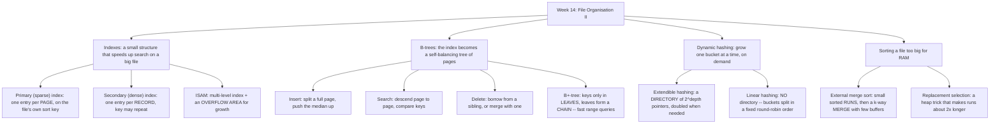

# Week 14 — File Organisation II: Indexes, B-Trees, Extendible Hashing and File Sorting

*CEN207 Data Structures (formerly CE205) · Fall 2026–2027*

<!-- materials:start -->

<div class="materials" markdown>

[:material-file-pdf-box: Lecture notes (PDF)](cen207-week-14-notes.pdf){ .md-button download="cen207-week-14-notes.pdf" }
[:material-file-word-box: Lecture notes (DOCX)](cen207-week-14-notes.docx){ .md-button download="cen207-week-14-notes.docx" }
[:material-presentation: Slides (PDF)](cen207-week-14-slides.pdf){ .md-button download="cen207-week-14-slides.pdf" }
[:material-microsoft-powerpoint: Slides (PPTX)](cen207-week-14-slides.pptx){ .md-button download="cen207-week-14-slides.pptx" }
[:material-language-html5: Slides (HTML, offline)](cen207-week-14-slides.html){ .md-button download="cen207-week-14-slides.html" }
[:material-folder-zip: Download all (ZIP)](cen207-week-14-materials.zip){ .md-button download="cen207-week-14-materials.zip" }
[:material-fullscreen: Open slides full screen](cen207-week-14-slides.html){ .md-button .md-button--primary target=_blank }

</div>

<div class="deck-frame">
<iframe src="../cen207-week-14-slides.html" title="Week 14 — File Organisation II" loading="lazy" allowfullscreen></iframe>
</div>

<p class="deck-hint">Click inside the slides and use the arrow keys; use the button at the bottom right of the slides, or the "Open slides full screen" link above, for full screen.</p>

<!-- materials:end -->

!!! abstract "This week"
    **Learning outcomes.** Week 13 gave you a file as a sorted sequence of disk pages, searchable in `O(n/B)`
    page reads, and a bucket-hashed file, searchable in roughly `O(1)` page reads at the cost of overflow
    chains once a bucket fills. This week asks the natural next questions. First: can a small, separate
    structure — an **index** — cut a sorted file's search cost from `O(n/B)` pages down to `O(log(n/B))` or
    fewer, without touching the data file's layout? You will build a **primary (sparse) index** (one entry per
    page) and a **dense secondary index** (one entry per record, letting a non-key attribute have duplicates),
    then combine both ideas into **ISAM** (Indexed Sequential Access Method), IBM's 1960s production answer,
    complete with the **overflow area** that keeps a growing file usable between reorganisations. Second: can
    the index itself be a *self-balancing tree of disk pages*, so it never needs a separate reorganisation step
    at all? You will meet the **B-tree** (Bayer and McCreight, 1972) — insertion by splitting a full page and
    pushing its median up, search by descending page-to-page, and deletion by borrowing from a sibling or
    merging with one — and its most widely deployed descendant, the **B+-tree**, whose leaves form a **chain**
    so that a **range query** never has to climb back up to the root. Third: bucket hashing from Week 13 froze
    the number of buckets at file-creation time; **extendible hashing** (Fagin et al., 1979) and **linear
    hashing** (Litwin, 1980) both let a hashed file grow one bucket at a time, on demand, with no
    reorganisation pass and no bucket ever going permanently unreachable. Finally, sorting a file too large for
    RAM needs a different algorithm from Week 10's in-memory sorts: **external merge sort** builds small sorted
    **runs** and merges them with a handful of RAM buffers, and **replacement selection** — a min-heap trick —
    makes those initial runs roughly twice as long, halving the number of merge passes a huge file needs. These
    outcomes map to **LO.1** (explain fundamental data structures), **LO.2** (analyze algorithmic complexity),
    **LO.6** (design and implement file-based storage structures), and **LO.7** (choose the right structure for
    a problem) of the course syllabus.

    **What you need already.** Week 13's vocabulary is this week's foundation: a **page** (a fixed-size block
    transferred between disk and RAM in one I/O operation — this week's unit of "reading" and "writing," just
    as it was last week), a **sorted file**, and a **bucket-hashed file** with overflow chaining. Week 6 gave
    you the hash *function* (`h(k) = k mod m`) and the idea of a **collision**; this week reuses both, now
    applied to buckets of records instead of single slots. Week 4's trees, and specifically the idea of
    **rebalancing** after an insertion or deletion, return in a new form: a B-tree rebalances by splitting and
    merging *pages*, not rotating pointers between two-child nodes. Week 10's merge sort supplies the **merge**
    step that external sorting scales up to disk.

    **Time plan for a 3-hour session.** Recap of Week 13, map of this week (~10 min) · primary and secondary
    indexes (~30 min) · ISAM (~20 min) · a short break · B-trees: insertion (~25 min), search (~10 min),
    deletion (~25 min), B+-trees and range queries (~20 min) · extendible hashing (~20 min) · linear hashing
    (~15 min) · external merge sort and replacement selection (~20 min) · comparison table, wrap-up and
    self-check (~15 min).

## 0. Before we start

### 0.1 What you already know

**From Week 13 — files as sequences of pages.** A file lives on disk as a sequence of fixed-size **pages**
(blocks); moving one page between disk and RAM is one **I/O operation**, and every algorithm this week is
judged first by how many pages it reads and writes, not by how many individual records it touches. A **sorted
file** supports binary search over its pages in `O(log(n/B))` page reads (`n` records, `B` records per page),
but *inserting* into a sorted file is expensive — one insertion can shift every later page. A **bucket-hashed
file** computes a record's home page directly from its key, giving close to `O(1)` search, but a bucket that
fills up needs an **overflow chain**, and a badly chosen number of buckets wastes space or overflows badly.

**From Week 6 — hash functions and collisions.** `h(k) = k mod m` (or a similar function) maps a key to a
small integer; two keys mapping to the *same* value are a **collision**. Week 6 resolved collisions inside a
single in-memory table (chaining, open addressing). This week's extendible and linear hashing resolve
collisions between *buckets of a file*, and add something Week 6 never needed: a way to **grow** the number of
buckets as the file grows, without rehashing every record at once.

**From Week 4 — trees and rebalancing.** A binary search tree degrades to `O(n)` on adversarial insertion
order unless it rebalances; Week 4 did not cover rebalancing in depth, but the *idea* — restructure locally,
after a change, to keep the tree's height small — is exactly what a B-tree's split (on insertion) and
merge/borrow (on deletion) do, except every "node" is a whole disk page holding many keys, not a single key
with two children.

### 0.2 The map of this week



Every box below gets its own section, a step-by-step animation, complete C and Java programs, and a note on
complexity and common mistakes. Throughout, every drawing labels each disk page with its **page number** and
tracks a running **reads / writes** count on the right — exactly the currency Week 13 taught you to think in.

## 1. Primary (sparse) indexes

### 1.1 A question to start

Week 13's sorted file already supports binary search over its pages — but binary search over, say, 10,000
pages still costs about `log2(10000) ≈ 14` page reads, each one a real disk seek. What if you could shrink
those 14 reads down to a handful, using a structure so small it never needs to touch the disk at all?

### 1.2 The idea: one index entry per page, not per record

A **primary index** (also called a **sparse index**) exploits one fact about a sorted file: since the file is
sorted on its key, you do not need to know *every* key's location — knowing just the **first key of every
page** is enough to know which single page a target key must be on, if it exists at all. The index is a list
of `(first_key, page_number)` pairs, one pair per data page, sorted the same way the file is. Because it holds
only one entry per page rather than one per record, it is tiny (for `B` records per page, the index is `1/B`
the size of the data), so in practice it is small enough to keep **resident in memory**: scanning it costs no
disk I/O at all. Searching then costs exactly one page read — for the one data page the index points to.

### 1.3 In memory, and the code

`find_page` scans the index for the *last* entry whose `first_key` is still `<=` the search key (the index is
sorted, so once an entry's `first_key` exceeds the target, every later entry does too, and the scan can stop).
`search_key` then reads that one page from disk and scans it for the target.

=== "C"

    ```c
    typedef struct { int first_key; int page; } IndexEntry;

    int find_page(IndexEntry index[], int idx_n, int key) {
        int page = -1;
        for (int i = 0; i < idx_n; i++) {
            if (index[i].first_key <= key)
                page = index[i].page;   /* keep the last entry that still fits */
            else
                break;                  /* index is sorted: later entries start too high */
        }
        return page;
    }

    bool search_key(int data[][MAX_BLOCK], const int page_len[], IndexEntry index[], int idx_n,
                     int key, int *out_page) {
        int page = find_page(index, idx_n, key);
        if (page == -1)
            return false;   /* smaller than every key: guaranteed absent, no disk access */
        for (int i = 0; i < page_len[page]; i++)
            if (data[page][i] == key) { *out_page = page; return true; }
        *out_page = page;
        return false;
    }
    ```

=== "Java"

    ```java
    static int findPage(IndexEntry[] index, int idxN, int key) {
        int page = -1;
        for (int i = 0; i < idxN; i++) {
            if (index[i].firstKey <= key)
                page = index[i].page;   // keep the last entry that still fits
            else
                break;                  // index is sorted: later entries start too high
        }
        return page;
    }

    static boolean searchKey(int[][] data, int[] pageLen, IndexEntry[] index, int idxN,
                              int key, int[] outPage) {
        int page = findPage(index, idxN, key);
        if (page == -1)
            return false;   // smaller than every key: guaranteed absent, no disk access
        for (int i = 0; i < pageLen[page]; i++)
            if (data[page][i] == key) {
                outPage[0] = page;
                return true;
            }
        outPage[0] = page;
        return false;
    }
    ```

Play the animation to watch the index scan (in memory, free) hand off to a single page read (the only disk
cost), and notice the query that is smaller than every key: it is rejected with **zero** disk reads, because
the index alone already proves the key cannot exist.

<iframe class="dsanim" src="../anim/primary-index.html" title="Primary (sparse) index over a sorted file" loading="lazy"></iframe>
<div class="dsanim-baski" markdown>

</div>

In the picker, also try **16 keys, block=3, a partial last page** (hard) and the edge cases **a single page**
(block large enough to hold the whole file) and **every query below the smallest key** (zero disk reads for
every search) — or press 🎲 for random data at four difficulty levels, or type your own `block`, `keys` and
`queries`.

### 1.4 Try it

??? example "Full program: `primary_index.c` / `PrimaryIndex.java`"

    === "C"

        ```c
        /* Week 14 -- File Organisation II
         * Primary (sparse) index over a sorted file: one index entry per disk page.
         * CEN207 Data Structures (formerly CE205)
         */
        #include <stdbool.h>
        #include <stdio.h>

        #define MAX_PAGES 8
        #define MAX_BLOCK 16

        typedef struct {
            int first_key;
            int page;
        } IndexEntry;

        int find_page(IndexEntry index[], int idx_n, int key) {
            int page = -1;
            for (int i = 0; i < idx_n; i++) {
                if (index[i].first_key <= key)
                    page = index[i].page; /* keep the last entry that still fits */
                else
                    break; /* index is sorted: later entries start too high */
            }
            return page;
        }

        bool search_key(int data[][MAX_BLOCK], const int page_len[], IndexEntry index[], int idx_n,
                         int key, int *out_page) {
            int page = find_page(index, idx_n, key);
            if (page == -1)
                return false; /* smaller than every key: guaranteed absent */
            for (int i = 0; i < page_len[page]; i++)
                if (data[page][i] == key) {
                    *out_page = page;
                    return true;
                }
            *out_page = page;
            return false;
        }

        static void run_scenario(const char *label, const int keys[], int n, int block, const int queries[], int qn) {
            printf("-- %s --\n", label);
            int data[MAX_PAGES][MAX_BLOCK];
            int page_len[MAX_PAGES];
            IndexEntry index[MAX_PAGES];
            int pages = 0;

            for (int i = 0; i < n; i += block) {
                int len = 0;
                for (int j = i; j < i + block && j < n; j++)
                    data[pages][len++] = keys[j];
                page_len[pages] = len;
                index[pages].first_key = data[pages][0];
                index[pages].page = pages;
                pages++;
            }

            printf("pages: %d\n", pages);
            for (int p = 0; p < pages; p++) {
                printf("  page %d:", p + 1);
                for (int i = 0; i < page_len[p]; i++)
                    printf(" %d", data[p][i]);
                printf("\n");
            }
            for (int q = 0; q < qn; q++) {
                int out_page = -1;
                bool found = search_key(data, page_len, index, pages, queries[q], &out_page);
                if (out_page == -1)
                    printf("search(%d) -> not found (below the first key, no page read)\n", queries[q]);
                else
                    printf("search(%d) -> %s (page %d)\n", queries[q], found ? "found" : "not found", out_page + 1);
            }
            printf("\n");
        }

        int main(void) {
            const int normal_keys[] = {5, 10, 15, 20, 25, 30, 35, 40, 45, 50, 55, 60};
            const int normal_q[] = {22, 50, 3};
            run_scenario("normal: 12 keys, block=4", normal_keys, 12, 4, normal_q, 3);

            const int hard_keys[] = {2, 8, 14, 19, 23, 29, 34, 41, 47, 53, 58, 64, 69, 75, 81, 88};
            const int hard_q[] = {29, 75, 90, 1, 88};
            run_scenario("hard: 16 keys, block=3, partial last page", hard_keys, 16, 3, hard_q, 5);

            const int single_keys[] = {3, 6, 9, 12, 15, 18, 21, 24, 27, 30};
            const int single_q[] = {9, 25, 1};
            run_scenario("edge: single page, block=12", single_keys, 10, 12, single_q, 3);

            const int below_keys[] = {100, 105, 110, 115, 120, 125, 130, 135, 140, 145, 150, 155};
            const int below_q[] = {10, 50, 99};
            run_scenario("edge: every query below range, block=4", below_keys, 12, 4, below_q, 3);
            return 0;
        }
        ```

    === "Java"

        ```java
        /* Week 14 -- File Organisation II
         * Primary (sparse) index over a sorted file: one index entry per disk page.
         * CEN207 Data Structures (formerly CE205)
         */
        public class PrimaryIndex {
            static final int MAX_PAGES = 8;
            static final int MAX_BLOCK = 16;

            static class IndexEntry {
                int firstKey;
                int page;
            }

            static int findPage(IndexEntry[] index, int idxN, int key) {
                int page = -1;
                for (int i = 0; i < idxN; i++) {
                    if (index[i].firstKey <= key)
                        page = index[i].page; // keep the last entry that still fits
                    else
                        break; // index is sorted: later entries start too high
                }
                return page;
            }

            static boolean searchKey(int[][] data, int[] pageLen, IndexEntry[] index, int idxN,
                                      int key, int[] outPage) {
                int page = findPage(index, idxN, key);
                if (page == -1)
                    return false; // smaller than every key: guaranteed absent
                for (int i = 0; i < pageLen[page]; i++)
                    if (data[page][i] == key) {
                        outPage[0] = page;
                        return true;
                    }
                outPage[0] = page;
                return false;
            }

            static void runScenario(String label, int[] keys, int block, int[] queries) {
                System.out.println("-- " + label + " --");
                int[][] data = new int[MAX_PAGES][MAX_BLOCK];
                int[] pageLen = new int[MAX_PAGES];
                IndexEntry[] index = new IndexEntry[MAX_PAGES];
                int pages = 0;

                for (int i = 0; i < keys.length; i += block) {
                    int len = 0;
                    for (int j = i; j < i + block && j < keys.length; j++)
                        data[pages][len++] = keys[j];
                    pageLen[pages] = len;
                    index[pages] = new IndexEntry();
                    index[pages].firstKey = data[pages][0];
                    index[pages].page = pages;
                    pages++;
                }

                System.out.println("pages: " + pages);
                for (int p = 0; p < pages; p++) {
                    StringBuilder sb = new StringBuilder("  page " + (p + 1) + ":");
                    for (int i = 0; i < pageLen[p]; i++)
                        sb.append(' ').append(data[p][i]);
                    System.out.println(sb);
                }
                for (int q : queries) {
                    int[] outPage = {-1};
                    boolean found = searchKey(data, pageLen, index, pages, q, outPage);
                    if (outPage[0] == -1)
                        System.out.println("search(" + q + ") -> not found (below the first key, no page read)");
                    else
                        System.out.println("search(" + q + ") -> " + (found ? "found" : "not found") + " (page " + (outPage[0] + 1) + ")");
                }
                System.out.println();
            }

            public static void main(String[] args) {
                int[] normalKeys = {5, 10, 15, 20, 25, 30, 35, 40, 45, 50, 55, 60};
                int[] normalQ = {22, 50, 3};
                runScenario("normal: 12 keys, block=4", normalKeys, 4, normalQ);

                int[] hardKeys = {2, 8, 14, 19, 23, 29, 34, 41, 47, 53, 58, 64, 69, 75, 81, 88};
                int[] hardQ = {29, 75, 90, 1, 88};
                runScenario("hard: 16 keys, block=3, partial last page", hardKeys, 3, hardQ);

                int[] singleKeys = {3, 6, 9, 12, 15, 18, 21, 24, 27, 30};
                int[] singleQ = {9, 25, 1};
                runScenario("edge: single page, block=12", singleKeys, 12, singleQ);

                int[] belowKeys = {100, 105, 110, 115, 120, 125, 130, 135, 140, 145, 150, 155};
                int[] belowQ = {10, 50, 99};
                runScenario("edge: every query below range, block=4", belowKeys, 4, belowQ);
            }
        }
        ```

**Try it**

=== "C"

    ```console
    gcc -std=c11 -Wall -Wextra -o /tmp/x primary_index.c && /tmp/x
    ```

    Expected output:

    ```text
    -- normal: 12 keys, block=4 --
    pages: 3
      page 1: 5 10 15 20
      page 2: 25 30 35 40
      page 3: 45 50 55 60
    search(22) -> not found (page 1)
    search(50) -> found (page 3)
    search(3) -> not found (below the first key, no page read)

    -- hard: 16 keys, block=3, partial last page --
    pages: 6
      page 1: 2 8 14
      page 2: 19 23 29
      page 3: 34 41 47
      page 4: 53 58 64
      page 5: 69 75 81
      page 6: 88
    search(29) -> found (page 2)
    search(75) -> found (page 5)
    search(90) -> not found (page 6)
    search(1) -> not found (below the first key, no page read)
    search(88) -> found (page 6)

    -- edge: single page, block=12 --
    pages: 1
      page 1: 3 6 9 12 15 18 21 24 27 30
    search(9) -> found (page 1)
    search(25) -> not found (page 1)
    search(1) -> not found (below the first key, no page read)

    -- edge: every query below range, block=4 --
    pages: 3
      page 1: 100 105 110 115
      page 2: 120 125 130 135
      page 3: 140 145 150 155
    search(10) -> not found (below the first key, no page read)
    search(50) -> not found (below the first key, no page read)
    search(99) -> not found (below the first key, no page read)
    ```

=== "Java"

    ```console
    javac -Xlint:all -d /tmp/j PrimaryIndex.java && java -cp /tmp/j PrimaryIndex
    ```

    Expected output: identical to the C run above (same algorithm, same data).

### 1.5 Complexity, mistakes, self-check

**Complexity.** The in-memory index scan costs `O(n/B)` comparisons in the worst case (a linear scan over one
entry per page) but **zero** disk I/O; a bigger installation would binary-search the index instead, `O(log(n/B))`
comparisons, still zero disk I/O either way. The one guaranteed disk cost is the single data-page read:
`O(1)` I/O per search, against Week 13's `O(log(n/B))` I/O for binary search directly on the file. The index
itself costs `O(n/B)` space — proportional to the number of *pages*, not records.

!!! warning "Common mistakes"
    - **Forgetting that a sparse index only works because the file is sorted on that same key.** If the data
      file is not sorted on the index's key, `find_page`'s "keep the last entry that still fits, otherwise
      break" logic gives a meaningless answer — there is no guarantee the target record is on that page at
      all.
    - **Confusing "not found" with "index says no page qualifies."** `find_page` returning `-1` means the key
      is smaller than every page's first key — genuinely absent, with no disk access needed at all. A page
      being read and *scanned without a match* is a different, more expensive kind of "not found" (one disk
      read spent).
    - **Letting the index itself grow too large to fit in memory.** A sparse index is only free to scan because
      it is small; if `B` (records per page) is tiny, the index approaches the size of the file itself and the
      "index lives in RAM" assumption breaks down — exactly the problem ISAM's multi-level index (section 3)
      is designed to solve.

??? success "Self-check: why does the index need only ONE entry per page, not one per record?"
    Because the data page itself is sorted, and pages are read (and scanned) as a whole unit anyway: once you
    know *which page* a key would be on, a single page read followed by an in-memory scan of that page's `B`
    records finds it (or proves it absent) with no further disk access. Storing more than one entry per page
    would not save any additional disk reads — it would only make the (already free, in-memory) index bigger
    for no benefit.

## 2. Secondary (dense) indexes

### 2.1 A question to start

A primary index works beautifully on a file's own sort key. But real files are searched on other attributes
too — "every employee in the Engineering department," not just "employee id 4021." A department code is not
unique, and the file is not sorted on it. Can an index still help here?

### 2.2 The idea: one entry per record, and duplicates cluster together

A **secondary (dense) index** trades the primary index's size advantage for generality: it holds **one entry
per record** (not per page), each entry a `(key, slot)` pair, **sorted by that key**. Because the index itself
is sorted — even though the underlying data file is *not* sorted on this attribute — every record sharing the
same key value ends up **adjacent** in the index. A search scans forward from the first match, collecting
every consecutive entry with the same key, and stops the instant the key changes. Each matched entry points to
an arbitrary `(page, slot)` in the data file, so a query that matches several records may need several page
reads — but never more than one page read per *distinct* page actually touched, since a query naturally
revisits the same page zero extra times if two matches happen to share it.

### 2.3 In memory, and the code

`search_dense` walks the sorted index once: before a match starts, entries are skipped; once inside a run of
matches, each one is collected; the moment a *different* key appears after at least one match, the run has
ended (sorted order guarantees no more matches can appear later), so the loop breaks.

=== "C"

    ```c
    typedef struct { int key; int slot; } IndexEntry;   /* dense: one per record, sorted by key */

    int search_dense(IndexEntry index[], int n, int key, int matches[], int max_matches) {
        int count = 0;
        for (int i = 0; i < n; i++) {
            if (index[i].key == key) {
                matches[count++] = index[i].slot;  /* remember which record matched */
            } else if (count > 0) {
                break;                              /* dense + sorted: matches always cluster together */
            }
        }
        return count;
    }
    ```

=== "Java"

    ```java
    static int searchDense(IndexEntry[] index, int key, int[] matches) {
        int count = 0;
        for (int i = 0; i < index.length; i++) {
            if (index[i].key == key) {
                matches[count++] = index[i].slot;  // remember which record matched
            } else if (count > 0) {
                break;                              // dense + sorted: matches always cluster together
            }
        }
        return count;
    }
    ```

Watch the "all 10 records share one key" edge case especially closely: the entire index is one giant cluster,
and the search still finds every match in a single pass with no wasted comparisons after the cluster ends.

<iframe class="dsanim" src="../anim/secondary-index.html" title="Dense secondary index: keys with duplicates" loading="lazy"></iframe>
<div class="dsanim-baski" markdown>

</div>

In the picker, also try **14 records, block=3, a partial last page** (hard) and the edge cases **all 10
records share one key** and **no duplicate keys at all** — or press 🎲 for random data at four difficulty
levels, or type your own `block`, record `keys` and `queries`.

### 2.4 Try it

??? example "Full program: `secondary_index.c` / `SecondaryIndex.java`"

    === "C"

        ```c
        /* Week 14 -- File Organisation II
         * Dense secondary index: one index entry per RECORD, sorted by a key that repeats.
         * CEN207 Data Structures (formerly CE205)
         */
        #include <stdio.h>
        #include <stdlib.h>

        #define MAX_RECORDS 16

        typedef struct {
            int key;
            int slot;
        } IndexEntry;

        /* Search a dense, sorted index for every record whose key matches; matching entries cluster
         * together because the index is sorted, so a single pass collects them all. */
        int search_dense(const IndexEntry index[], int n, int key, int matches[], int max_matches) {
            int count = 0;
            for (int i = 0; i < n; i++) {
                if (index[i].key == key) {
                    if (count < max_matches)
                        matches[count] = index[i].slot; /* remember which record matched */
                    count++;
                } else if (count > 0) {
                    break; /* dense + sorted: matches always cluster together */
                }
            }
            return count;
        }

        static int cmp_entry(const void *a, const void *b) {
            const IndexEntry *ea = a, *eb = b;
            if (ea->key != eb->key)
                return ea->key - eb->key;
            return ea->slot - eb->slot;
        }

        static void run_scenario(const char *label, const int keys[], int n, int block, const int queries[], int qn) {
            printf("-- %s --\n", label);
            printf("records: %d, block=%d\n", n, block);

            IndexEntry index[MAX_RECORDS];
            for (int i = 0; i < n; i++) {
                index[i].key = keys[i];
                index[i].slot = i;
            }
            qsort(index, (size_t) n, sizeof(IndexEntry), cmp_entry);

            for (int q = 0; q < qn; q++) {
                int matches[MAX_RECORDS];
                int count = search_dense(index, n, queries[q], matches, MAX_RECORDS);
                printf("search(%d) -> %d match(es):", queries[q], count);
                for (int i = 0; i < count; i++) {
                    int slot = matches[i];
                    printf(" page%d.slot%d", slot / block + 1, slot % block);
                }
                printf("\n");
            }
            printf("\n");
        }

        int main(void) {
            const int normal_keys[] = {3, 1, 4, 1, 2, 3, 1, 4, 2, 3, 1, 4};
            const int normal_q[] = {1, 5, 4};
            run_scenario("normal: 12 records, block=4", normal_keys, 12, 4, normal_q, 3);

            const int hard_keys[] = {2, 5, 1, 3, 5, 4, 1, 5, 2, 3, 5, 1, 4, 2};
            const int hard_q[] = {5, 9, 4};
            run_scenario("hard: 14 records, block=3", hard_keys, 14, 3, hard_q, 3);

            const int same_keys[] = {7, 7, 7, 7, 7, 7, 7, 7, 7, 7};
            const int same_q[] = {7, 3};
            run_scenario("edge: all 10 records share one key", same_keys, 10, 4, same_q, 2);

            const int unique_keys[] = {40, 10, 30, 20, 50, 15, 25, 35, 45, 5};
            const int unique_q[] = {30, 99, 5};
            run_scenario("edge: no duplicate keys", unique_keys, 10, 5, unique_q, 3);
            return 0;
        }
        ```

    === "Java"

        ```java
        /* Week 14 -- File Organisation II
         * Dense secondary index: one index entry per RECORD, sorted by a key that repeats.
         * CEN207 Data Structures (formerly CE205)
         */
        import java.util.Arrays;
        import java.util.Comparator;

        public class SecondaryIndex {
            static final int MAX_RECORDS = 16;

            static class IndexEntry {
                int key;
                int slot;
                IndexEntry(int key, int slot) { this.key = key; this.slot = slot; }
            }

            // Search a dense, sorted index for every record whose key matches; matching entries cluster
            // together because the index is sorted, so a single pass collects them all.
            static int searchDense(IndexEntry[] index, int n, int key, int[] matches, int maxMatches) {
                int count = 0;
                for (int i = 0; i < n; i++) {
                    if (index[i].key == key) {
                        if (count < maxMatches)
                            matches[count] = index[i].slot; // remember which record matched
                        count++;
                    } else if (count > 0) {
                        break; // dense + sorted: matches always cluster together
                    }
                }
                return count;
            }

            static void runScenario(String label, int[] keys, int block, int[] queries) {
                System.out.println("-- " + label + " --");
                System.out.println("records: " + keys.length + ", block=" + block);

                IndexEntry[] index = new IndexEntry[keys.length];
                for (int i = 0; i < keys.length; i++)
                    index[i] = new IndexEntry(keys[i], i);
                Arrays.sort(index, Comparator.<IndexEntry>comparingInt(e -> e.key).thenComparingInt(e -> e.slot));

                for (int q : queries) {
                    int[] matches = new int[MAX_RECORDS];
                    int count = searchDense(index, keys.length, q, matches, MAX_RECORDS);
                    StringBuilder sb = new StringBuilder("search(" + q + ") -> " + count + " match(es):");
                    for (int i = 0; i < count; i++) {
                        int slot = matches[i];
                        sb.append(" page").append(slot / block + 1).append(".slot").append(slot % block);
                    }
                    System.out.println(sb);
                }
                System.out.println();
            }

            public static void main(String[] args) {
                int[] normalKeys = {3, 1, 4, 1, 2, 3, 1, 4, 2, 3, 1, 4};
                int[] normalQ = {1, 5, 4};
                runScenario("normal: 12 records, block=4", normalKeys, 4, normalQ);

                int[] hardKeys = {2, 5, 1, 3, 5, 4, 1, 5, 2, 3, 5, 1, 4, 2};
                int[] hardQ = {5, 9, 4};
                runScenario("hard: 14 records, block=3", hardKeys, 3, hardQ);

                int[] sameKeys = {7, 7, 7, 7, 7, 7, 7, 7, 7, 7};
                int[] sameQ = {7, 3};
                runScenario("edge: all 10 records share one key", sameKeys, 4, sameQ);

                int[] uniqueKeys = {40, 10, 30, 20, 50, 15, 25, 35, 45, 5};
                int[] uniqueQ = {30, 99, 5};
                runScenario("edge: no duplicate keys", uniqueKeys, 5, uniqueQ);
            }
        }
        ```

**Try it**

=== "C"

    ```console
    gcc -std=c11 -Wall -Wextra -o /tmp/x secondary_index.c && /tmp/x
    ```

    Expected output:

    ```text
    -- normal: 12 records, block=4 --
    records: 12, block=4
    search(1) -> 4 match(es): page1.slot1 page1.slot3 page2.slot2 page3.slot2
    search(5) -> 0 match(es):
    search(4) -> 3 match(es): page1.slot2 page2.slot3 page3.slot3

    -- hard: 14 records, block=3 --
    records: 14, block=3
    search(5) -> 4 match(es): page1.slot1 page2.slot1 page3.slot1 page4.slot1
    search(9) -> 0 match(es):
    search(4) -> 2 match(es): page2.slot2 page5.slot0

    -- edge: all 10 records share one key --
    records: 10, block=4
    search(7) -> 10 match(es): page1.slot0 page1.slot1 page1.slot2 page1.slot3 page2.slot0 page2.slot1 page2.slot2 page2.slot3 page3.slot0 page3.slot1
    search(3) -> 0 match(es):

    -- edge: no duplicate keys --
    records: 10, block=5
    search(30) -> 1 match(es): page1.slot2
    search(99) -> 0 match(es):
    search(5) -> 1 match(es): page2.slot4
    ```

=== "Java"

    ```console
    javac -Xlint:all -d /tmp/j SecondaryIndex.java && java -cp /tmp/j SecondaryIndex
    ```

    Expected output: identical to the C run above (same algorithm, same data).

### 2.5 Complexity, mistakes, self-check

**Complexity.** The index scan is `O(n)` in the worst case (a linear pass, as written above); a production
system would binary-search to the *first* match and then scan only the cluster, `O(log n + m)` where `m` is
the number of matches. Disk cost is at most one page read per *distinct* page a match lands on — up to `m`
reads, but often far fewer, since duplicate records inserted around the same time tend to share pages.

!!! warning "Common mistakes"
    - **Assuming a dense index is sorted on the data file's own order.** It is sorted on the *secondary* key,
      which is unrelated to how records are physically laid out in the file — that is exactly why matches can
      point to scattered, non-adjacent pages.
    - **Stopping the scan as soon as `count > 0` on the very first non-match**, without checking that a match
      streak had actually *started*. Every entry *before* the first match is also `!= key`, and must be
      skipped without breaking, or the loop exits before ever finding a match that starts later in the index.
    - **Forgetting a dense index costs `O(n)` space** — one entry per record, unlike a sparse primary index's
      `O(n/B)`. Choosing dense vs. sparse is a direct size/generality trade-off, not a strictly-better
      upgrade.

??? success "Self-check: why must a dense index hold one entry per RECORD, unlike a sparse index's one per PAGE?"
    A sparse index works only because the *data file itself* is sorted on that key, so knowing a page's first
    key is enough to know the whole page's range. A secondary key gives no such guarantee — the data file is
    not sorted on it, so a page could contain any mixture of secondary-key values. Only an entry for every
    single record, in a *separately* sorted index, can guarantee that a "no match" conclusion (or a complete
    list of matches) is actually correct.

## 3. ISAM: a multi-level index and an overflow area

### 3.1 A question to start

Sections 1 and 2 assumed the file never changes after the index is built. Real files grow. If a page that is
already full needs one more record, where does it go — and how do you keep answering "which page?" correctly
once some records are no longer where the index's simple rule would predict?

### 3.2 A short history: IBM and the Indexed Sequential Access Method

**ISAM** (Indexed Sequential Access Method) was IBM's production answer to exactly this problem, shipped for
its mainframe operating systems in the 1960s and used for decades in commercial data processing. It combines
two ideas you have already seen — a sorted primary data area with a sparse index over it (section 1) — with
two new ones this section introduces: **multiple index levels**, so the index itself stays small even over a
very large file, and a dedicated **overflow area**, so a full page can still accept new records without
immediately reorganising the whole file.

### 3.3 The idea: index the index, and give every page an escape valve

ISAM stacks index **levels**: a **level-2** index has one entry per data page (exactly like section 1's
primary index), and a **level-1** index groups every `GROUP` level-2 entries under one level-1 entry, so
searching first scans the (tiny) level-1 index to find the right *group*, then the (still small) level-2
index restricted to that group to find the exact page — turning one linear scan into two much shorter ones. If
an insertion's home page is already full, the new key goes into a separate **overflow area** instead: a linked
chain of overflow records, reachable from the home page. The home page and its index entries never move; only
the chain grows. This keeps insertion cheap in the short term, at a cost: a long overflow chain makes *search*
slower, since every overflow node on the chain may need to be read too — which is exactly why real ISAM files
are periodically **reorganised** (rebuilt from scratch, folding every overflow record back into the sorted
primary area) once their chains grow too long.

### 3.4 In memory, and the code

`find_group` and `find_page` are the same "scan a sorted array of `(key, pointer)` pairs" idea as section 1,
applied twice — once per index level. `isam_insert` reads the home page; if it has room, the key is inserted
directly (a single write); otherwise it is appended to that page's overflow chain instead.

=== "C"

    ```c
    #define BLOCK 4     /* keys per data page (capacity) */
    #define GROUP 2      /* pages per level-1 group */

    int find_group(int l1_key[], int l1_n, int key) {
        int g = 0;
        for (int i = 0; i < l1_n; i++) { if (l1_key[i] <= key) g = i; else break; }
        return g;
    }

    int find_page(int l2_key[], int lo, int hi, int key) {
        int page = lo;
        for (int i = lo; i <= hi; i++) { if (l2_key[i] <= key) page = i; else break; }
        return page;
    }

    void isam_insert(int key) {
        int g = find_group(l1_key, l1_n, key);
        int page = find_page(l2_key, g * GROUP, group_hi(g), key);
        read_page(page);                          /* +1 read: home page */
        if (page_len[page] < BLOCK) {
            insert_sorted(page, key);
            write_page(page);                     /* +1 write */
        } else {
            int walked = walk_overflow_chain(page); /* +1 read per existing overflow node */
            append_overflow(page, key);            /* +1 write: new node, +1 write: predecessor link */
        }
    }
    ```

=== "Java"

    ```java
    static int findGroup(int[] l1Key, int key) {
        int g = 0;
        for (int i = 0; i < l1Key.length; i++) { if (l1Key[i] <= key) g = i; else break; }
        return g;
    }

    static int findPage(int[] l2Key, int lo, int hi, int key) {
        int page = lo;
        for (int i = lo; i <= hi; i++) { if (l2Key[i] <= key) page = i; else break; }
        return page;
    }

    static void isamInsert(int key) {
        int g = findGroup(l1Key, key);
        int page = findPage(l2Key, g * GROUP, groupHi(g), key);
        readPage(page);                            // +1 read: home page
        if (pageLen[page] < BLOCK) {
            insertSorted(page, key);
            writePage(page);                       // +1 write
        } else {
            int walked = walkOverflowChain(page);   // +1 read per existing overflow node
            appendOverflow(page, key);              // +1 write: new node, +1 write: predecessor link
        }
    }
    ```

Watch the "chained overflow" example: three inserts in a row target the same already-full page, and each one
adds a node to that page's chain — the third insert has to walk past the first two overflow nodes before it
can be appended, previewing exactly why chains that grow too long hurt search performance.

<iframe class="dsanim" src="../anim/isam.html" title="ISAM: multi-level index + overflow area" loading="lazy"></iframe>
<div class="dsanim-baski" markdown>

</div>

In the picker, also try **16 keys, chained overflow on the same page** (hard) and the edge cases **plenty of
free room, no overflow at all** and **fill equals capacity, every insert overflows** — or press 🎲 for random
data at four difficulty levels, or type your own `block`, `fill`, `group`, `keys` and `inserts`.

### 3.5 Try it

??? example "Full program: `isam.c` / `Isam.java`"

    === "C"

        ```c
        /* Week 14 -- File Organisation II
         * ISAM: a two-level index over a sorted primary data area, plus an overflow area
         * (a linked chain) for keys that no longer fit their home page.
         * CEN207 Data Structures (formerly CE205)
         */
        #include <stdio.h>
        #include <stdlib.h>

        #define MAX_PAGES 8
        #define MAX_BLOCK 8
        #define MAX_GROUPS 8

        typedef struct OverflowNode {
            int key;
            struct OverflowNode *next;
        } OverflowNode;

        typedef struct {
            int keys[MAX_BLOCK]; /* holds up to BLOCK keys: the page's capacity */
            int len;              /* how many of those slots are currently used */
            OverflowNode *overflow_head;
            OverflowNode *overflow_tail;
        } Page;

        int find_group(const int l1_key[], int l1_n, int key) {
            int g = 0;
            for (int i = 0; i < l1_n; i++) {
                if (l1_key[i] <= key)
                    g = i;
                else
                    break;
            }
            return g;
        }

        int find_page(const int l2_key[], int lo, int hi, int key) {
            int page = lo;
            for (int i = lo; i <= hi; i++) {
                if (l2_key[i] <= key)
                    page = i;
                else
                    break;
            }
            return page;
        }

        /* block = a page's CAPACITY (how many keys it can hold before it overflows). */
        static void isam_insert(Page pages[], int num_pages, int block, const int l1_key[], int l1_n,
                                 int group, int key) {
            int g = find_group(l1_key, l1_n, key);
            int lo = g * group, hi = lo + group - 1;
            if (hi > num_pages - 1)
                hi = num_pages - 1;
            int l2_key[MAX_PAGES];
            for (int i = 0; i < num_pages; i++)
                l2_key[i] = pages[i].keys[0];
            int page = find_page(l2_key, lo, hi, key);

            if (pages[page].len < block) {
                int i = pages[page].len - 1;
                while (i >= 0 && pages[page].keys[i] > key) {
                    pages[page].keys[i + 1] = pages[page].keys[i];
                    i--;
                }
                pages[page].keys[i + 1] = key;
                pages[page].len++;
                printf("insert(%d) -> page %d (%d/%d)\n", key, page + 1, pages[page].len, block);
            } else {
                OverflowNode *node = malloc(sizeof *node);
                node->key = key;
                node->next = NULL;
                if (pages[page].overflow_tail == NULL)
                    pages[page].overflow_head = node;
                else
                    pages[page].overflow_tail->next = node;
                pages[page].overflow_tail = node;
                printf("insert(%d) -> page %d is full: OVERFLOW\n", key, page + 1);
            }
        }

        static void print_pages(const Page pages[], int num_pages) {
            for (int p = 0; p < num_pages; p++) {
                printf("  page %d:", p + 1);
                for (int i = 0; i < pages[p].len; i++)
                    printf(" %d", pages[p].keys[i]);
                if (pages[p].overflow_head != NULL) {
                    printf("  overflow:");
                    for (OverflowNode *n = pages[p].overflow_head; n != NULL; n = n->next)
                        printf(" %d", n->key);
                }
                printf("\n");
            }
        }

        static void free_overflow(Page pages[], int num_pages) {
            for (int p = 0; p < num_pages; p++) {
                OverflowNode *n = pages[p].overflow_head;
                while (n != NULL) {
                    OverflowNode *next = n->next;
                    free(n);
                    n = next;
                }
            }
        }

        /* fill = keys per page when the file is first built (fill <= block, leaving block-fill free slots). */
        static void run_scenario(const char *label, const int keys[], int n, int block, int fill, int group,
                                  const int inserts[], int in_n) {
            printf("-- %s --\n", label);
            Page pages[MAX_PAGES];
            int num_pages = 0;
            for (int i = 0; i < n; i += fill) {
                int len = 0;
                for (int j = i; j < i + fill && j < n; j++)
                    pages[num_pages].keys[len++] = keys[j];
                pages[num_pages].len = len;
                pages[num_pages].overflow_head = NULL;
                pages[num_pages].overflow_tail = NULL;
                num_pages++;
            }
            int l1_key[MAX_GROUPS];
            int l1_n = 0;
            for (int g = 0; g * group < num_pages; g++)
                l1_key[l1_n++] = pages[g * group].keys[0];

            printf("pages: %d (fill=%d, capacity=%d), level-1 groups: %d\n", num_pages, fill, block, l1_n);
            for (int i = 0; i < in_n; i++)
                isam_insert(pages, num_pages, block, l1_key, l1_n, group, inserts[i]);
            print_pages(pages, num_pages);
            free_overflow(pages, num_pages);
            printf("\n");
        }

        int main(void) {
            const int normal_keys[] = {5, 10, 15, 20, 25, 30, 35, 40, 45, 50, 55, 60};
            const int normal_ins[] = {22, 38, 39};
            run_scenario("normal: 12 keys, block=4, fill=3 (1 overflow)", normal_keys, 12, 4, 3, 2, normal_ins, 3);

            const int hard_keys[] = {2, 8, 14, 19, 23, 29, 34, 41, 47, 53, 58, 64, 69, 75, 81, 88};
            const int hard_ins[] = {24, 25, 26};
            run_scenario("hard: 16 keys, block=4, fill=2, chained overflow", hard_keys, 16, 4, 2, 3, hard_ins, 3);

            const int no_of_keys[] = {4, 9, 14, 19, 24, 29, 34, 39, 44, 49, 54, 59};
            const int no_of_ins[] = {11, 46, 12, 47};
            run_scenario("edge: plenty of free room, no overflow", no_of_keys, 12, 8, 3, 2, no_of_ins, 4);

            const int all_of_keys[] = {10, 12, 20, 22, 30, 32, 40, 42, 50, 52};
            const int all_of_ins[] = {11, 21, 31, 41};
            run_scenario("edge: fill=block=2, every insert overflows", all_of_keys, 10, 2, 2, 3, all_of_ins, 4);
            return 0;
        }
        ```

    === "Java"

        ```java
        /* Week 14 -- File Organisation II
         * ISAM: a two-level index over a sorted primary data area, plus an overflow area
         * (a linked chain) for keys that no longer fit their home page.
         * CEN207 Data Structures (formerly CE205)
         */
        public class Isam {
            static final int MAX_PAGES = 8;
            static final int MAX_BLOCK = 8;
            static final int MAX_GROUPS = 8;

            static class OverflowNode {
                int key;
                OverflowNode next;
            }

            static class Page {
                int[] keys = new int[MAX_BLOCK]; // holds up to BLOCK keys: the page's capacity
                int len;                          // how many of those slots are currently used
                OverflowNode overflowHead;
                OverflowNode overflowTail;
            }

            static int findGroup(int[] l1Key, int l1n, int key) {
                int g = 0;
                for (int i = 0; i < l1n; i++) {
                    if (l1Key[i] <= key)
                        g = i;
                    else
                        break;
                }
                return g;
            }

            static int findPage(int[] l2Key, int lo, int hi, int key) {
                int page = lo;
                for (int i = lo; i <= hi; i++) {
                    if (l2Key[i] <= key)
                        page = i;
                    else
                        break;
                }
                return page;
            }

            // block = a page's CAPACITY (how many keys it can hold before it overflows).
            static void isamInsert(Page[] pages, int numPages, int block, int[] l1Key, int l1n, int group, int key) {
                int g = findGroup(l1Key, l1n, key);
                int lo = g * group, hi = lo + group - 1;
                if (hi > numPages - 1)
                    hi = numPages - 1;
                int[] l2Key = new int[MAX_PAGES];
                for (int i = 0; i < numPages; i++)
                    l2Key[i] = pages[i].keys[0];
                int page = findPage(l2Key, lo, hi, key);

                if (pages[page].len < block) {
                    int i = pages[page].len - 1;
                    while (i >= 0 && pages[page].keys[i] > key) {
                        pages[page].keys[i + 1] = pages[page].keys[i];
                        i--;
                    }
                    pages[page].keys[i + 1] = key;
                    pages[page].len++;
                    System.out.println("insert(" + key + ") -> page " + (page + 1) + " (" + pages[page].len + "/" + block + ")");
                } else {
                    OverflowNode node = new OverflowNode();
                    node.key = key;
                    if (pages[page].overflowTail == null)
                        pages[page].overflowHead = node;
                    else
                        pages[page].overflowTail.next = node;
                    pages[page].overflowTail = node;
                    System.out.println("insert(" + key + ") -> page " + (page + 1) + " is full: OVERFLOW");
                }
            }

            static void printPages(Page[] pages, int numPages) {
                for (int p = 0; p < numPages; p++) {
                    StringBuilder sb = new StringBuilder("  page " + (p + 1) + ":");
                    for (int i = 0; i < pages[p].len; i++)
                        sb.append(' ').append(pages[p].keys[i]);
                    if (pages[p].overflowHead != null) {
                        sb.append("  overflow:");
                        for (OverflowNode n = pages[p].overflowHead; n != null; n = n.next)
                            sb.append(' ').append(n.key);
                    }
                    System.out.println(sb);
                }
            }

            // fill = keys per page when the file is first built (fill <= block, leaving block-fill free slots).
            static void runScenario(String label, int[] keys, int block, int fill, int group, int[] inserts) {
                System.out.println("-- " + label + " --");
                Page[] pages = new Page[MAX_PAGES];
                int numPages = 0;
                for (int i = 0; i < keys.length; i += fill) {
                    pages[numPages] = new Page();
                    int len = 0;
                    for (int j = i; j < i + fill && j < keys.length; j++)
                        pages[numPages].keys[len++] = keys[j];
                    pages[numPages].len = len;
                    numPages++;
                }
                int[] l1Key = new int[MAX_GROUPS];
                int l1n = 0;
                for (int g = 0; g * group < numPages; g++)
                    l1Key[l1n++] = pages[g * group].keys[0];

                System.out.println("pages: " + numPages + " (fill=" + fill + ", capacity=" + block + "), level-1 groups: " + l1n);
                for (int key : inserts)
                    isamInsert(pages, numPages, block, l1Key, l1n, group, key);
                printPages(pages, numPages);
                System.out.println();
            }

            public static void main(String[] args) {
                int[] normalKeys = {5, 10, 15, 20, 25, 30, 35, 40, 45, 50, 55, 60};
                int[] normalIns = {22, 38, 39};
                runScenario("normal: 12 keys, block=4, fill=3 (1 overflow)", normalKeys, 4, 3, 2, normalIns);

                int[] hardKeys = {2, 8, 14, 19, 23, 29, 34, 41, 47, 53, 58, 64, 69, 75, 81, 88};
                int[] hardIns = {24, 25, 26};
                runScenario("hard: 16 keys, block=4, fill=2, chained overflow", hardKeys, 4, 2, 3, hardIns);

                int[] noOfKeys = {4, 9, 14, 19, 24, 29, 34, 39, 44, 49, 54, 59};
                int[] noOfIns = {11, 46, 12, 47};
                runScenario("edge: plenty of free room, no overflow", noOfKeys, 8, 3, 2, noOfIns);

                int[] allOfKeys = {10, 12, 20, 22, 30, 32, 40, 42, 50, 52};
                int[] allOfIns = {11, 21, 31, 41};
                runScenario("edge: fill=block=2, every insert overflows", allOfKeys, 2, 2, 3, allOfIns);
            }
        }
        ```

**Try it**

=== "C"

    ```console
    gcc -std=c11 -Wall -Wextra -o /tmp/x isam.c && /tmp/x
    ```

    Expected output:

    ```text
    -- normal: 12 keys, block=4, fill=3 (1 overflow) --
    pages: 4 (fill=3, capacity=4), level-1 groups: 2
    insert(22) -> page 2 (4/4)
    insert(38) -> page 3 (4/4)
    insert(39) -> page 3 is full: OVERFLOW
      page 1: 5 10 15
      page 2: 20 22 25 30
      page 3: 35 38 40 45  overflow: 39
      page 4: 50 55 60

    -- hard: 16 keys, block=4, fill=2, chained overflow --
    pages: 8 (fill=2, capacity=4), level-1 groups: 3
    insert(24) -> page 3 (3/4)
    insert(25) -> page 3 (4/4)
    insert(26) -> page 3 is full: OVERFLOW
      page 1: 2 8
      page 2: 14 19
      page 3: 23 24 25 29  overflow: 26
      page 4: 34 41
      page 5: 47 53
      page 6: 58 64
      page 7: 69 75
      page 8: 81 88

    -- edge: plenty of free room, no overflow --
    pages: 4 (fill=3, capacity=8), level-1 groups: 2
    insert(11) -> page 1 (4/8)
    insert(46) -> page 3 (4/8)
    insert(12) -> page 1 (5/8)
    insert(47) -> page 3 (5/8)
      page 1: 4 9 11 12 14
      page 2: 19 24 29
      page 3: 34 39 44 46 47
      page 4: 49 54 59

    -- edge: fill=block=2, every insert overflows --
    pages: 5 (fill=2, capacity=2), level-1 groups: 2
    insert(11) -> page 1 is full: OVERFLOW
    insert(21) -> page 2 is full: OVERFLOW
    insert(31) -> page 3 is full: OVERFLOW
    insert(41) -> page 4 is full: OVERFLOW
      page 1: 10 12  overflow: 11
      page 2: 20 22  overflow: 21
      page 3: 30 32  overflow: 31
      page 4: 40 42  overflow: 41
      page 5: 50 52
    ```

=== "Java"

    ```console
    javac -Xlint:all -d /tmp/j Isam.java && java -cp /tmp/j Isam
    ```

    Expected output: identical to the C run above (same algorithm, same data).

### 3.6 Complexity, mistakes, self-check

**Complexity.** With `L` index levels, search costs `O(L)` in-memory comparisons (each level's group is small)
plus one disk read for the home page, plus **one additional read per overflow node walked** if the key is not
found on the home page itself — this last part is what degrades as chains grow. Insertion costs the same
search, plus one write if there is room, or one write for the new overflow node plus one for the link that now
points to it if there is not.

!!! warning "Common mistakes"
    - **Letting overflow chains grow unbounded and never reorganising.** ISAM's whole design assumes
      reorganisation happens periodically; treating overflow as a permanent, ever-growing structure defeats
      the point of having an index at all, since search cost then grows with every insertion.
    - **Confusing which page gets a new overflow node.** The new record always attaches to *its own home
      page's* chain (found via the index, exactly as if inserting normally) — never to whichever page happens
      to have the shortest chain, and never to a neighbouring page.
    - **Forgetting the level-1 index only narrows which level-2 entries to scan — it is not itself the answer.**
      A common bug is stopping after finding the right *group*, without then scanning that group's level-2
      entries to find the actual page.

??? success "Self-check: why does ISAM need MULTIPLE index levels, when section 1's primary index used only one?"
    A single-level sparse index has one entry per data page — for a truly large file (millions of pages), even
    that "small" index can grow too large to comfortably keep resident in memory or scan quickly. Grouping the
    level-2 index under a level-1 index shrinks the *top-level* scan to `O(number of groups)`, trading one
    larger linear scan for two much smaller ones — the same idea a phone book's tabbed sections use before you
    scan the (still sorted) page underneath a tab.

## 4. B-trees: the idea and insertion

### 4.1 A question to start

ISAM's index levels are fixed once the file is built; only the overflow area grows. What if the *index
itself* could grow and rebalance as the file grows — never needing a separate reorganisation pass at all,
while still guaranteeing every search costs about the same small number of page reads, forever?

### 4.2 A short history: Bayer and McCreight, 1972

The **B-tree** was introduced by Rudolf Bayer and Edward McCreight, then at Boeing Scientific Research
Laboratories, in their 1972 paper "Organization and Maintenance of Large Ordered Indexes." (The letter "B" is
often read as standing for "Bayer," "Boeing," or simply "balanced" — the authors never settled the question
themselves.) It solved a problem ISAM's fixed structure could not: a search tree whose height stays
provably small — `O(log n)` — no matter how the file grows or shrinks, by making every "node" of the tree an
entire disk page holding *many* keys, not just one.

### 4.3 The idea: every node is a page, full pages split, splits push a key up

A B-tree of **order `m`** allows every node (page) to hold between `ceil(m/2) - 1` and `m - 1` keys (the root
is allowed fewer), and every internal node has one more child than it has keys. **Insertion** first descends to
the correct leaf exactly as a search would, comparing the key against each page's keys to choose a child. The
key is inserted there in sorted order. If that leaf now holds `m` keys — one too many — it **splits**: the
`floor(m/2)`-th key (the **median**) is pushed up into the parent, and the remaining keys divide into two new,
half-full pages on either side of that median. If the *parent* now overflows too, the same split-and-push-up
repeats one level higher — and if the **root itself** splits, a brand-new root is created holding just the one
median key, and the tree grows **one level taller from the top**, not the bottom. This upward growth,
happening only at the root and only when truly necessary, is exactly what keeps a B-tree's height
`O(log_m n)` — provably balanced, with no separate rebalancing step ever required.

### 4.4 In memory, and the code

=== "C"

    ```c
    #define ORDER 4                 /* order m: at most ORDER-1 keys, ORDER children per node */

    void insert_sorted(Node *node, int key) {   /* shift-insert into a leaf, keeps keys ascending */
        int i = node->n - 1;
        while (i >= 0 && node->keys[i] > key) { node->keys[i + 1] = node->keys[i]; i--; }
        node->keys[i + 1] = key;
        node->n++;
    }

    Node *split(Node *node, int *median_out) {   /* node holds ORDER keys: one too many */
        int mid = node->n / 2;
        *median_out = node->keys[mid];
        Node *right = new_node_from(node, mid + 1);  /* right takes keys[mid+1 .. n-1] (and children) */
        node->n = mid;                                /* left keeps keys[0 .. mid-1] */
        return right;
    }

    void b_tree_insert(BTree *t, int key) {
        Node *leaf = find_leaf(t->root, key);         /* descend, comparing key at every node */
        insert_sorted(leaf, key);
        Node *cur = leaf;
        while (cur->n == ORDER) {                     /* overflow: split, push the median up */
            int median; Node *right = split(cur, &median);
            if (cur->parent == NULL) { t->root = new_root(median, cur, right); return; }
            insert_sorted(cur->parent, median);
            attach_child(cur->parent, right);
            cur = cur->parent;
        }
    }
    ```

=== "Java"

    ```java
    static final int ORDER = 4;     // order m: at most ORDER-1 keys, ORDER children per node

    static void insertSorted(Node node, int key) {  // shift-insert into a leaf, keeps keys ascending
        int i = node.n - 1;
        while (i >= 0 && node.keys[i] > key) { node.keys[i + 1] = node.keys[i]; i--; }
        node.keys[i + 1] = key;
        node.n++;
    }

    static Node split(Node node, int[] medianOut) {  // node holds ORDER keys: one too many
        int mid = node.n / 2;
        medianOut[0] = node.keys[mid];
        Node right = newNodeFrom(node, mid + 1);      // right takes keys[mid+1 .. n-1] (and children)
        node.n = mid;                                  // left keeps keys[0 .. mid-1]
        return right;
    }

    static void bTreeInsert(BTree t, int key) {
        Node leaf = findLeaf(t.root, key);              // descend, comparing key at every node
        insertSorted(leaf, key);
        Node cur = leaf;
        while (cur.n == ORDER) {                        // overflow: split, push the median up
            int[] median = new int[1]; Node right = split(cur, median);
            if (cur.parent == null) { t.root = newRoot(median[0], cur, right); return; }
            insertSorted(cur.parent, median[0]);
            attachChild(cur.parent, right);
            cur = cur.parent;
        }
    }
    ```

Watch every page's number stay attached to it as pages split — the two halves of a split page always keep
consecutive-looking page numbers in the animation, but in a real file system they can be any two free pages
anywhere on disk; only the *pointers* in the parent need to be correct.

<iframe class="dsanim" src="../anim/b-tree-insert.html" title="B-tree: insert (node split)" loading="lazy"></iframe>
<div class="dsanim-baski" markdown>

</div>

In the picker, also try **order=3, 14 ascending keys (worst case)** (hard) and the edge cases **order=3, 10
descending keys** and **order=12, 10 keys — never splits** — or press 🎲 for random data at four difficulty
levels, or type your own `order` and `keys`.

### 4.5 Try it

??? example "Full program: `b_tree_insert.c` / `BTreeInsert.java`"

    === "C"

        ```c
        /* Week 14 -- File Organisation II
         * B-tree insert (order m): every node is one disk page; overflow splits a page in two and
         * pushes its median key up, growing the tree upward when the root itself splits.
         * CEN207 Data Structures (formerly CE205)
         */
        #include <stdbool.h>
        #include <stdio.h>
        #include <stdlib.h>

        typedef struct Node {
            int keys[16];
            int n;
            struct Node *child[17];
            bool leaf;
            struct Node *parent;
            int id;
        } Node;

        static int next_id;

        static Node *new_node(bool leaf) {
            Node *node = calloc(1, sizeof *node);
            node->leaf = leaf;
            node->id = ++next_id;
            return node;
        }

        void insert_sorted(Node *node, int key) {
            int i = node->n - 1;
            while (i >= 0 && node->keys[i] > key) {
                node->keys[i + 1] = node->keys[i];
                i--;
            }
            node->keys[i + 1] = key;
            node->n++;
        }

        Node *split(Node *node, int *median_out) {
            int mid = node->n / 2;
            *median_out = node->keys[mid];
            Node *right = new_node(node->leaf);
            for (int i = mid + 1; i < node->n; i++)
                right->keys[right->n++] = node->keys[i];
            if (!node->leaf)
                for (int i = mid + 1; i <= node->n; i++) {
                    right->child[i - mid - 1] = node->child[i];
                    right->child[i - mid - 1]->parent = right;
                }
            node->n = mid;
            return right;
        }

        Node *b_tree_insert(Node *root, int order, int key) {
            Node *leaf = root;
            while (!leaf->leaf) {
                int i = 0;
                while (i < leaf->n && key > leaf->keys[i])
                    i++;
                leaf = leaf->child[i];
            }
            insert_sorted(leaf, key);
            Node *cur = leaf;
            while (cur->n == order) {
                int median;
                Node *right = split(cur, &median);
                if (cur->parent == NULL) {
                    Node *new_root = new_node(false);
                    new_root->keys[new_root->n++] = median;
                    new_root->child[0] = cur;
                    new_root->child[1] = right;
                    cur->parent = new_root;
                    right->parent = new_root;
                    return new_root;
                }
                insert_sorted(cur->parent, median);
                Node *parent = cur->parent;
                int pos = 0;
                while (parent->child[pos] != cur)
                    pos++;
                for (int i = parent->n; i > pos + 1; i--)
                    parent->child[i] = parent->child[i - 1];
                parent->child[pos + 1] = right;
                right->parent = parent;
                cur = parent;
            }
            return root;
        }

        static void free_tree(Node *node) {
            if (node == NULL)
                return;
            if (!node->leaf)
                for (int i = 0; i <= node->n; i++)
                    free_tree(node->child[i]);
            free(node);
        }

        static int tree_height(const Node *node) {
            if (node->leaf)
                return 0;
            int best = 0;
            for (int i = 0; i <= node->n; i++) {
                int h = tree_height(node->child[i]);
                if (h > best)
                    best = h;
            }
            return best + 1;
        }

        static int node_count(const Node *node) {
            if (node->leaf)
                return 1;
            int count = 1;
            for (int i = 0; i <= node->n; i++)
                count += node_count(node->child[i]);
            return count;
        }

        static void print_level_order(Node *root) {
            Node *queue[256];
            int level_end[256];
            int qh = 0, qt = 0;
            queue[qt++] = root;
            level_end[0] = 1;
            int level = 0, printed_in_level = 0;
            printf("level 0:");
            while (qh < qt) {
                Node *node = queue[qh++];
                printf(" [");
                for (int i = 0; i < node->n; i++)
                    printf("%s%d", i ? "," : "", node->keys[i]);
                printf("]");
                if (!node->leaf)
                    for (int i = 0; i <= node->n; i++)
                        queue[qt++] = node->child[i];
                printed_in_level++;
                if (qh == level_end[level] && qt > qh) {
                    printf("\n");
                    level++;
                    printf("level %d:", level);
                    level_end[level] = qt;
                    printed_in_level = 0;
                }
            }
            (void) printed_in_level;
            printf("\n");
        }

        static void run_scenario(const char *label, int order, const int keys[], int n) {
            printf("-- %s --\n", label);
            printf("ORDER=%d\n", order);
            Node *root = new_node(true);
            for (int i = 0; i < n; i++)
                root = b_tree_insert(root, order, keys[i]);
            print_level_order(root);
            printf("nodes=%d height=%d\n", node_count(root), tree_height(root));
            free_tree(root);
            printf("\n");
        }

        int main(void) {
            next_id = 0;
            const int normal_keys[] = {10, 20, 5, 6, 12, 30, 7, 17, 3, 25, 18, 15};
            run_scenario("normal: order=4, 12 mixed keys", 4, normal_keys, 12);

            const int hard_keys[] = {1, 2, 3, 4, 5, 6, 7, 8, 9, 10, 11, 12, 13, 14};
            run_scenario("hard: order=3, 14 ascending keys (worst case)", 3, hard_keys, 14);

            const int desc_keys[] = {95, 85, 75, 65, 55, 45, 35, 25, 15, 5};
            run_scenario("edge: order=3, 10 descending keys", 3, desc_keys, 10);

            const int never_keys[] = {23, 5, 41, 12, 38, 7, 29, 16, 44, 3};
            run_scenario("edge: order=12, 10 keys -- never splits", 12, never_keys, 10);
            return 0;
        }
        ```

    === "Java"

        ```java
        /* Week 14 -- File Organisation II
         * B-tree insert (order m): every node is one disk page; overflow splits a page in two and
         * pushes its median key up, growing the tree upward when the root itself splits.
         * CEN207 Data Structures (formerly CE205)
         */
        import java.util.ArrayList;
        import java.util.List;

        public class BTreeInsert {
            static class Node {
                int[] keys = new int[16];
                int n;
                Node[] child = new Node[17];
                boolean leaf;
                Node parent;

                Node(boolean leaf) { this.leaf = leaf; }
            }

            static void insertSorted(Node node, int key) {
                int i = node.n - 1;
                while (i >= 0 && node.keys[i] > key) {
                    node.keys[i + 1] = node.keys[i];
                    i--;
                }
                node.keys[i + 1] = key;
                node.n++;
            }

            static Node split(Node node, int[] medianOut) {
                int mid = node.n / 2;
                medianOut[0] = node.keys[mid];
                Node right = new Node(node.leaf);
                for (int i = mid + 1; i < node.n; i++)
                    right.keys[right.n++] = node.keys[i];
                if (!node.leaf)
                    for (int i = mid + 1; i <= node.n; i++) {
                        right.child[i - mid - 1] = node.child[i];
                        right.child[i - mid - 1].parent = right;
                    }
                node.n = mid;
                return right;
            }

            static Node bTreeInsert(Node root, int order, int key) {
                Node leaf = root;
                while (!leaf.leaf) {
                    int i = 0;
                    while (i < leaf.n && key > leaf.keys[i])
                        i++;
                    leaf = leaf.child[i];
                }
                insertSorted(leaf, key);
                Node cur = leaf;
                while (cur.n == order) {
                    int[] median = new int[1];
                    Node right = split(cur, median);
                    if (cur.parent == null) {
                        Node newRoot = new Node(false);
                        newRoot.keys[newRoot.n++] = median[0];
                        newRoot.child[0] = cur;
                        newRoot.child[1] = right;
                        cur.parent = newRoot;
                        right.parent = newRoot;
                        return newRoot;
                    }
                    insertSorted(cur.parent, median[0]);
                    Node parent = cur.parent;
                    int pos = 0;
                    while (parent.child[pos] != cur)
                        pos++;
                    for (int i = parent.n; i > pos + 1; i--)
                        parent.child[i] = parent.child[i - 1];
                    parent.child[pos + 1] = right;
                    right.parent = parent;
                    cur = parent;
                }
                return root;
            }

            static int treeHeight(Node node) {
                if (node.leaf)
                    return 0;
                int best = 0;
                for (int i = 0; i <= node.n; i++)
                    best = Math.max(best, treeHeight(node.child[i]));
                return best + 1;
            }

            static int nodeCount(Node node) {
                if (node.leaf)
                    return 1;
                int count = 1;
                for (int i = 0; i <= node.n; i++)
                    count += nodeCount(node.child[i]);
                return count;
            }

            static void printLevelOrder(Node root) {
                List<Node> queue = new ArrayList<>();
                queue.add(root);
                int levelEnd = 1, level = 0, i = 0;
                StringBuilder line = new StringBuilder("level 0:");
                while (i < queue.size()) {
                    Node node = queue.get(i++);
                    line.append(" [");
                    for (int k = 0; k < node.n; k++)
                        line.append(k > 0 ? "," : "").append(node.keys[k]);
                    line.append(']');
                    if (!node.leaf)
                        for (int k = 0; k <= node.n; k++)
                            queue.add(node.child[k]);
                    if (i == levelEnd && queue.size() > i) {
                        System.out.println(line);
                        level++;
                        line = new StringBuilder("level " + level + ":");
                        levelEnd = queue.size();
                    }
                }
                System.out.println(line);
            }

            static void runScenario(String label, int order, int[] keys) {
                System.out.println("-- " + label + " --");
                System.out.println("ORDER=" + order);
                Node root = new Node(true);
                for (int key : keys)
                    root = bTreeInsert(root, order, key);
                printLevelOrder(root);
                System.out.println("nodes=" + nodeCount(root) + " height=" + treeHeight(root));
                System.out.println();
            }

            public static void main(String[] args) {
                int[] normalKeys = {10, 20, 5, 6, 12, 30, 7, 17, 3, 25, 18, 15};
                runScenario("normal: order=4, 12 mixed keys", 4, normalKeys);

                int[] hardKeys = {1, 2, 3, 4, 5, 6, 7, 8, 9, 10, 11, 12, 13, 14};
                runScenario("hard: order=3, 14 ascending keys (worst case)", 3, hardKeys);

                int[] descKeys = {95, 85, 75, 65, 55, 45, 35, 25, 15, 5};
                runScenario("edge: order=3, 10 descending keys", 3, descKeys);

                int[] neverKeys = {23, 5, 41, 12, 38, 7, 29, 16, 44, 3};
                runScenario("edge: order=12, 10 keys -- never splits", 12, neverKeys);
            }
        }
        ```

**Try it**

=== "C"

    ```console
    gcc -std=c11 -Wall -Wextra -o /tmp/x b_tree_insert.c && /tmp/x
    ```

    Expected output:

    ```text
    -- normal: order=4, 12 mixed keys --
    ORDER=4
    level 0: [17]
    level 1: [6,10] [20]
    level 2: [3,5] [7] [12,15] [18] [25,30]
    nodes=8 height=2

    -- hard: order=3, 14 ascending keys (worst case) --
    ORDER=3
    level 0: [4,8]
    level 1: [2] [6] [10,12]
    level 2: [1] [3] [5] [7] [9] [11] [13,14]
    nodes=11 height=2

    -- edge: order=3, 10 descending keys --
    ORDER=3
    level 0: [65]
    level 1: [25,45] [85]
    level 2: [5,15] [35] [55] [75] [95]
    nodes=8 height=2

    -- edge: order=12, 10 keys -- never splits --
    ORDER=12
    level 0: [3,5,7,12,16,23,29,38,41,44]
    nodes=1 height=0
    ```

=== "Java"

    ```console
    javac -Xlint:all -d /tmp/j BTreeInsert.java && java -cp /tmp/j BTreeInsert
    ```

    Expected output: identical to the C run above (same algorithm, same data).

### 4.6 Complexity, mistakes, self-check

**Complexity.** Height is `O(log_m n)` — for order `m = 100` and a billion records, the tree is only about 5
levels tall, meaning search touches only 5 disk pages. A single insertion costs `O(log_m n)` page reads to
find the leaf, plus at most `O(log_m n)` splits (each `O(m)` work to redistribute keys), so `O(m log_m n)` in
the rare worst case where a split cascades all the way to the root — but split cascades happening at *every*
level are uncommon in practice.

!!! warning "Common mistakes"
    - **Splitting only the overflowing node and stopping**, forgetting that the *parent* may now also hold one
      too many keys after the median is inserted into it — the `while (cur->n == order)` loop must keep
      checking upward until a node that does not overflow is reached (or the root splits).
    - **Growing the tree at the wrong end.** A B-tree never grows by adding a new leaf level below; it grows
      by creating a new *root* above, exactly once per split that reaches the top. Confusing this with how an
      unbalanced BST might "grow downward" is a common source of bugs.
    - **Choosing an order so small that ordinary data triggers constant splitting** (this note's "hard" and
      "descending" scenarios both use `order=3`, the smallest legal order, specifically to make that visible)
      — real B-trees use an order in the hundreds, sized so one node exactly fills one disk page.

??? success "Self-check: why does a B-tree's height stay O(log_m n) even under an adversarial insertion order?"
    Every split is *local*: it only ever pushes one key up to the immediate parent, and the tree only grows
    taller when a split reaches the root, which happens at most `O(log_m n)` times total across any sequence
    of insertions (since the root can only split once per full "level" of growth). Unlike an unbalanced binary
    search tree, there is no insertion order that can make a B-tree degenerate into a long chain — every leaf
    is always created at, or promoted to, the same depth as every other leaf.

## 5. B-tree search

### 5.1 A question to start

Section 4 built a B-tree by insertion; this section asks the simpler question search always asks: given a
tree that already exists, how many pages does it cost to find one key, or to prove it is absent?

### 5.2 The idea: descend, comparing against every page's keys

Search starts at the root and, at every node, scans that page's (small) sorted list of keys for an exact
match. If found, the search is done. If not, and the node is a **leaf**, the key cannot be anywhere in the
tree (a B-tree keeps every key somewhere on the path a correctly-guided descent would follow, so falling off a
leaf without a match proves absence). Otherwise, the scan has identified exactly one child to descend into —
the one whose key range brackets the search key — and the process repeats one level down. Every node visited
is one disk read, so the total cost is bounded by the tree's height plus one: `O(log_m n)` reads, exactly the
guarantee section 4's balanced insertion was built to provide.

### 5.3 In memory, and the code

=== "C"

    ```c
    bool b_tree_search(Node *node, int key, Node **out_node) {
        if (node == NULL) return false;              /* fell off a leaf: absent */
        int i = 0;
        while (i < node->n && key > node->keys[i]) i++;
        if (i < node->n && key == node->keys[i]) { *out_node = node; return true; }
        if (node->leaf) return false;                /* no child to descend into */
        return b_tree_search(node->child[i], key, out_node);
    }
    ```

=== "Java"

    ```java
    static Node bTreeSearch(Node node, int key) {
        if (node == null) return null;                // fell off a leaf: absent
        int i = 0;
        while (i < node.n && key > node.keys[i]) i++;
        if (i < node.n && key == node.keys[i]) return node;
        if (node.leaf) return null;                   // no child to descend into
        return bTreeSearch(node.child[i], key);
    }
    ```

Watch the "single node" edge case (`order=12`, only 10 keys, never split): every search — found or not —
costs exactly **one** read, because the whole file fits on one page. Compare that against the "ascending,
order=3" case, where even a found key several levels down costs a read per level.

<iframe class="dsanim" src="../anim/b-tree-search.html" title="B-tree: search" loading="lazy"></iframe>
<div class="dsanim-baski" markdown>

</div>

In the picker, also try **order=3, 14 ascending keys, 4 searches** (hard) and the edge cases **a key found
right at the root** and **order=12, single node, every search is 1 read** — or press 🎲 for random data at
four difficulty levels, or type your own `order`, `keys` and `queries`.

### 5.4 Try it

??? example "Full program: `b_tree_search.c` / `BTreeSearch.java`"

    === "C"

        ```c
        /* Week 14 -- File Organisation II
         * B-tree search (order m): descend from the root comparing the target against each page's
         * keys; every page visited is one disk read.
         * CEN207 Data Structures (formerly CE205)
         */
        #include <stdbool.h>
        #include <stdio.h>
        #include <stdlib.h>

        typedef struct Node {
            int keys[16];
            int n;
            struct Node *child[17];
            bool leaf;
            struct Node *parent;
        } Node;

        static Node *new_node(bool leaf) {
            Node *node = calloc(1, sizeof *node);
            node->leaf = leaf;
            return node;
        }

        static void insert_sorted(Node *node, int key) {
            int i = node->n - 1;
            while (i >= 0 && node->keys[i] > key) {
                node->keys[i + 1] = node->keys[i];
                i--;
            }
            node->keys[i + 1] = key;
            node->n++;
        }

        static Node *split(Node *node, int *median_out) {
            int mid = node->n / 2;
            *median_out = node->keys[mid];
            Node *right = new_node(node->leaf);
            for (int i = mid + 1; i < node->n; i++)
                right->keys[right->n++] = node->keys[i];
            if (!node->leaf)
                for (int i = mid + 1; i <= node->n; i++) {
                    right->child[i - mid - 1] = node->child[i];
                    right->child[i - mid - 1]->parent = right;
                }
            node->n = mid;
            return right;
        }

        static Node *tree_insert(Node *root, int order, int key) {
            Node *leaf = root;
            while (!leaf->leaf) {
                int i = 0;
                while (i < leaf->n && key > leaf->keys[i])
                    i++;
                leaf = leaf->child[i];
            }
            insert_sorted(leaf, key);
            Node *cur = leaf;
            while (cur->n == order) {
                int median;
                Node *right = split(cur, &median);
                if (cur->parent == NULL) {
                    Node *new_root = new_node(false);
                    new_root->keys[new_root->n++] = median;
                    new_root->child[0] = cur;
                    new_root->child[1] = right;
                    cur->parent = new_root;
                    right->parent = new_root;
                    return new_root;
                }
                insert_sorted(cur->parent, median);
                Node *parent = cur->parent;
                int pos = 0;
                while (parent->child[pos] != cur)
                    pos++;
                for (int i = parent->n; i > pos + 1; i--)
                    parent->child[i] = parent->child[i - 1];
                parent->child[pos + 1] = right;
                right->parent = parent;
                cur = parent;
            }
            return root;
        }

        /* Returns the node containing `key` (and its index via *out_idx), or NULL if absent.
         * *reads is incremented once per page visited. */
        bool b_tree_search(Node *node, int key, int *out_idx, Node **out_node, int *reads) {
            while (node != NULL) {
                (*reads)++;
                int i = 0;
                while (i < node->n && key > node->keys[i])
                    i++;
                if (i < node->n && key == node->keys[i]) {
                    *out_idx = i;
                    *out_node = node;
                    return true;
                }
                if (node->leaf)
                    return false;
                node = node->child[i];
            }
            return false;
        }

        static void free_tree(Node *node) {
            if (node == NULL)
                return;
            if (!node->leaf)
                for (int i = 0; i <= node->n; i++)
                    free_tree(node->child[i]);
            free(node);
        }

        static void run_scenario(const char *label, int order, const int keys[], int n, const int queries[], int qn) {
            printf("-- %s --\n", label);
            printf("ORDER=%d\n", order);
            Node *root = new_node(true);
            for (int i = 0; i < n; i++)
                root = tree_insert(root, order, keys[i]);

            int total_reads = 0;
            for (int q = 0; q < qn; q++) {
                int idx = -1, reads = 0;
                Node *found_node = NULL;
                bool found = b_tree_search(root, queries[q], &idx, &found_node, &reads);
                total_reads += reads;
                const char *unit = reads == 1 ? "read" : "reads";
                printf("search(%d) -> %s (%d %s)\n", queries[q], found ? "found" : "not found", reads, unit);
            }
            printf("total reads: %d\n", total_reads);
            free_tree(root);
            printf("\n");
        }

        int main(void) {
            const int normal_keys[] = {10, 20, 5, 6, 12, 30, 7, 17, 3, 25, 18, 15};
            const int normal_q[] = {17, 99, 3};
            run_scenario("normal: order=4, 12 keys, 3 searches", 4, normal_keys, 12, normal_q, 3);

            const int hard_keys[] = {1, 2, 3, 4, 5, 6, 7, 8, 9, 10, 11, 12, 13, 14};
            const int hard_q[] = {1, 14, 7, 100};
            run_scenario("hard: order=3, 14 ascending keys, 4 searches", 3, hard_keys, 14, hard_q, 4);

            const int root_keys[] = {10, 20, 5, 6, 12, 30, 7, 17, 3, 25, 18, 15};
            const int root_q[] = {12};
            run_scenario("edge: a key found right at the root", 4, root_keys, 12, root_q, 1);

            const int never_keys[] = {23, 5, 41, 12, 38, 7, 29, 16, 44, 3};
            const int never_q[] = {41, 100, 3};
            run_scenario("edge: order=12, single node, every search is 1 read", 12, never_keys, 10, never_q, 3);
            return 0;
        }
        ```

    === "Java"

        ```java
        /* Week 14 -- File Organisation II
         * B-tree search (order m): descend from the root comparing the target against each page's
         * keys; every page visited is one disk read.
         * CEN207 Data Structures (formerly CE205)
         */
        public class BTreeSearch {
            static class Node {
                int[] keys = new int[16];
                int n;
                Node[] child = new Node[17];
                boolean leaf;
                Node parent;

                Node(boolean leaf) { this.leaf = leaf; }
            }

            static void insertSorted(Node node, int key) {
                int i = node.n - 1;
                while (i >= 0 && node.keys[i] > key) {
                    node.keys[i + 1] = node.keys[i];
                    i--;
                }
                node.keys[i + 1] = key;
                node.n++;
            }

            static Node split(Node node, int[] medianOut) {
                int mid = node.n / 2;
                medianOut[0] = node.keys[mid];
                Node right = new Node(node.leaf);
                for (int i = mid + 1; i < node.n; i++)
                    right.keys[right.n++] = node.keys[i];
                if (!node.leaf)
                    for (int i = mid + 1; i <= node.n; i++) {
                        right.child[i - mid - 1] = node.child[i];
                        right.child[i - mid - 1].parent = right;
                    }
                node.n = mid;
                return right;
            }

            static Node treeInsert(Node root, int order, int key) {
                Node leaf = root;
                while (!leaf.leaf) {
                    int i = 0;
                    while (i < leaf.n && key > leaf.keys[i])
                        i++;
                    leaf = leaf.child[i];
                }
                insertSorted(leaf, key);
                Node cur = leaf;
                while (cur.n == order) {
                    int[] median = new int[1];
                    Node right = split(cur, median);
                    if (cur.parent == null) {
                        Node newRoot = new Node(false);
                        newRoot.keys[newRoot.n++] = median[0];
                        newRoot.child[0] = cur;
                        newRoot.child[1] = right;
                        cur.parent = newRoot;
                        right.parent = newRoot;
                        return newRoot;
                    }
                    insertSorted(cur.parent, median[0]);
                    Node parent = cur.parent;
                    int pos = 0;
                    while (parent.child[pos] != cur)
                        pos++;
                    for (int i = parent.n; i > pos + 1; i--)
                        parent.child[i] = parent.child[i - 1];
                    parent.child[pos + 1] = right;
                    right.parent = parent;
                    cur = parent;
                }
                return root;
            }

            // Returns the node containing `key`, or null if absent. reads[0] counts pages visited.
            static Node bTreeSearch(Node node, int key, int[] reads) {
                while (node != null) {
                    reads[0]++;
                    int i = 0;
                    while (i < node.n && key > node.keys[i])
                        i++;
                    if (i < node.n && key == node.keys[i])
                        return node;
                    if (node.leaf)
                        return null;
                    node = node.child[i];
                }
                return null;
            }

            static void runScenario(String label, int order, int[] keys, int[] queries) {
                System.out.println("-- " + label + " --");
                System.out.println("ORDER=" + order);
                Node root = new Node(true);
                for (int key : keys)
                    root = treeInsert(root, order, key);

                int totalReads = 0;
                for (int q : queries) {
                    int[] reads = {0};
                    Node found = bTreeSearch(root, q, reads);
                    totalReads += reads[0];
                    String unit = reads[0] == 1 ? "read" : "reads";
                    System.out.println("search(" + q + ") -> " + (found != null ? "found" : "not found") + " (" + reads[0] + " " + unit + ")");
                }
                System.out.println("total reads: " + totalReads);
                System.out.println();
            }

            public static void main(String[] args) {
                int[] normalKeys = {10, 20, 5, 6, 12, 30, 7, 17, 3, 25, 18, 15};
                int[] normalQ = {17, 99, 3};
                runScenario("normal: order=4, 12 keys, 3 searches", 4, normalKeys, normalQ);

                int[] hardKeys = {1, 2, 3, 4, 5, 6, 7, 8, 9, 10, 11, 12, 13, 14};
                int[] hardQ = {1, 14, 7, 100};
                runScenario("hard: order=3, 14 ascending keys, 4 searches", 3, hardKeys, hardQ);

                int[] rootKeys = {10, 20, 5, 6, 12, 30, 7, 17, 3, 25, 18, 15};
                int[] rootQ = {12};
                runScenario("edge: a key found right at the root", 4, rootKeys, rootQ);

                int[] neverKeys = {23, 5, 41, 12, 38, 7, 29, 16, 44, 3};
                int[] neverQ = {41, 100, 3};
                runScenario("edge: order=12, single node, every search is 1 read", 12, neverKeys, neverQ);
            }
        }
        ```

**Try it**

=== "C"

    ```console
    gcc -std=c11 -Wall -Wextra -o /tmp/x b_tree_search.c && /tmp/x
    ```

    Expected output:

    ```text
    -- normal: order=4, 12 keys, 3 searches --
    ORDER=4
    search(17) -> found (1 read)
    search(99) -> not found (3 reads)
    search(3) -> found (3 reads)
    total reads: 7

    -- hard: order=3, 14 ascending keys, 4 searches --
    ORDER=3
    search(1) -> found (3 reads)
    search(14) -> found (3 reads)
    search(7) -> found (3 reads)
    search(100) -> not found (3 reads)
    total reads: 12

    -- edge: a key found right at the root --
    ORDER=4
    search(12) -> found (3 reads)
    total reads: 3

    -- edge: order=12, single node, every search is 1 read --
    ORDER=12
    search(41) -> found (1 read)
    search(100) -> not found (1 read)
    search(3) -> found (1 read)
    total reads: 3
    ```

=== "Java"

    ```console
    javac -Xlint:all -d /tmp/j BTreeSearch.java && java -cp /tmp/j BTreeSearch
    ```

    Expected output: identical to the C run above (same algorithm, same data).

### 5.5 Complexity, mistakes, self-check

**Complexity.** `O(log_m n)` page reads worst case — one per level of the tree — whether the key is found or
proven absent. Within each page, the key comparison is `O(log(m))` if binary-searched or `O(m)` if scanned
linearly (as the code above does, since `m` is small enough that the difference rarely matters in practice).

!!! warning "Common mistakes"
    - **Treating a leaf's "no match" as needing to check `node->leaf` BEFORE looking for a child to descend
      into.** Descending into `node->child[i]` on a leaf reads past the (empty, uninitialised) child array —
      the leaf check must come first.
    - **Off-by-one in the child-selection scan.** The child to descend into is `node->child[i]` where `i` is
      the count of keys strictly less than the target — getting this index wrong sends the search down the
      wrong subtree entirely, silently returning "not found" for a key that is actually present.
    - **Forgetting that "not found" still costs real disk reads.** A search that fails still walks all the way
      down to a leaf — this note's "not found" scenarios above cost the *same* number of reads as most
      successful ones, not zero.

??? success "Self-check: why does B-tree search always cost within one page-read of the tree's height, regardless of which key is searched for?"
    Every leaf in a B-tree sits at exactly the same depth (section 4's insertion never grows the tree from the
    bottom, only from the root). A search either finds its key at some internal node partway down (cheaper),
    or, if the key is absent, must still walk all the way to a leaf to be sure — but that walk is bounded by
    the tree's height either way, since there is no deeper level to fall into.

## 6. B-tree deletion: borrow and merge

### 6.1 A question to start

Insertion splits an overfull page; the natural mirror image would be deletion *merging* two pages that have
become too empty. But merging is not always necessary — sometimes a page just short of the minimum can borrow
a single spare key from a neighbour instead. When does a B-tree borrow, and when must it merge?

### 6.2 The idea: remove, then fix any underflow by borrowing or merging

Deleting a key that lives in a **leaf** is simple: remove it, shifting the remaining keys left. Deleting a key
that lives in an **internal** node is trickier, because removing it would leave a "hole" between two subtrees —
so instead, the key is **replaced** by its **inorder predecessor** (the largest key in its left subtree, found
by descending as far right as possible), and that predecessor is the one actually deleted from the leaf where
it lived. Either way, the deletion happens at a leaf. If that leaf now holds fewer than the minimum allowed
keys (**underflow**), the tree fixes it going up the tree one step at a time: first, check whether the **left
sibling** has a spare key to lend — if so, the parent's separating key moves down into the short node, and the
sibling's outermost key moves up to take its place (a **borrow**, resolved in one step, no further
propagation). If the left sibling has none to spare, try the **right sibling** the same way. If *neither*
sibling can spare a key, the short node **merges** with one sibling — pulling the parent's separating key down
between them into a single combined page — which removes one key and one child pointer from the *parent*,
possibly making the parent underflow too, so the whole check repeats one level up. If this cascades all the
way to the root and leaves it with zero keys, the root's one remaining child becomes the new root, and the
tree **shrinks** by one level — the exact mirror of insertion's root-split growth.

### 6.3 In memory, and the code

=== "C"

    ```c
    #define ORDER 4
    #define MIN_KEYS ((ORDER + 1) / 2 - 1)         /* ceil(ORDER/2) - 1 */

    void remove_at(Node *node, int idx) {           /* shift-remove keys[idx] */
        for (int i = idx; i < node->n - 1; i++) node->keys[i] = node->keys[i + 1];
        node->n--;
    }

    void fix_underflow(Node *node) {
        while (node->parent != NULL && node->n < MIN_KEYS) {
            Node *parent = node->parent;
            int idx = child_index(parent, node);
            Node *left  = idx > 0 ? parent->child[idx - 1] : NULL;
            Node *right = idx < parent->n ? parent->child[idx + 1] : NULL;
            if (left  != NULL && left->n  > MIN_KEYS) { borrow_from_left(node, parent, left, idx); return; }
            if (right != NULL && right->n > MIN_KEYS) { borrow_from_right(node, parent, right, idx); return; }
            if (left != NULL) { merge(left, parent, node, idx - 1); node = parent; }
            else              { merge(node, parent, right, idx); node = parent; }
        }
    }

    void b_tree_delete(BTree *t, int key) {
        Node *node; int idx;
        if (!find_node(t->root, key, &node, &idx)) return;     /* not present */
        if (node->leaf) { remove_at(node, idx); fix_underflow(node); return; }
        Node *pred = node->child[idx];
        while (!pred->leaf) pred = pred->child[pred->n];
        node->keys[idx] = pred->keys[pred->n - 1];              /* replace with predecessor */
        remove_at(pred, pred->n - 1);
        fix_underflow(pred);
        if (!t->root->leaf && t->root->n == 0) {                /* merge emptied the root: drop a level */
            Node *old_root = t->root;
            t->root = t->root->child[0];
            free(old_root);
        }
    }
    ```

=== "Java"

    ```java
    static final int ORDER = 4;
    static final int MIN_KEYS = (ORDER + 1) / 2 - 1;   // ceil(ORDER/2) - 1

    static void removeAt(Node node, int idx) {          // shift-remove keys[idx]
        for (int i = idx; i < node.n - 1; i++) node.keys[i] = node.keys[i + 1];
        node.n--;
    }

    static void fixUnderflow(Node node) {
        while (node.parent != null && node.n < MIN_KEYS) {
            Node parent = node.parent;
            int idx = childIndex(parent, node);
            Node left  = idx > 0 ? parent.child[idx - 1] : null;
            Node right = idx < parent.n ? parent.child[idx + 1] : null;
            if (left  != null && left.n  > MIN_KEYS) { borrowFromLeft(node, parent, left, idx); return; }
            if (right != null && right.n > MIN_KEYS) { borrowFromRight(node, parent, right, idx); return; }
            if (left != null) { merge(left, parent, node, idx - 1); node = parent; }
            else              { merge(node, parent, right, idx); node = parent; }
        }
    }

    static void bTreeDelete(BTree t, int key) {
        Node node; int idx;
        if ((node = findNode(t.root, key)) == null) return;    // not present
        idx = matchIndex(node, key);
        if (node.leaf) { removeAt(node, idx); fixUnderflow(node); return; }
        Node pred = node.child[idx];
        while (!pred.leaf) pred = pred.child[pred.n];
        node.keys[idx] = pred.keys[pred.n - 1];                // replace with predecessor
        removeAt(pred, pred.n - 1);
        fixUnderflow(pred);
        if (!t.root.leaf && t.root.n == 0) {                    // merge emptied the root: drop a level
            t.root = t.root.child[0];
        }
    }
    ```

Watch the "delete until the root shrinks" edge case: seven deletions in a row on an `order=3` tree, each
triggering a merge, until the root itself is left with zero keys and the tree loses an entire level — the
direct opposite of section 4's root split.

<iframe class="dsanim" src="../anim/b-tree-delete.html" title="B-tree: delete (borrow and merge)" loading="lazy"></iframe>
<div class="dsanim-baski" markdown>

</div>

In the picker, also try **order=3, 14 ascending keys, chained merges** (hard) and the edge cases **deleting a
key that is not present** and **delete until the root shrinks** — or press 🎲 for random data at four
difficulty levels, or type your own `order`, `keys` and `deletes`.

### 6.4 Try it

??? example "Full program: `b_tree_delete.c` / `BTreeDelete.java`"

    === "C"

        ```c
        /* Week 14 -- File Organisation II
         * B-tree delete (order m): remove a key, then fix underflow by BORROWING a key from a sibling
         * through the parent, or MERGING with a sibling when no sibling can spare one.
         * CEN207 Data Structures (formerly CE205)
         */
        #include <stdbool.h>
        #include <stdio.h>
        #include <stdlib.h>

        typedef struct Node {
            int keys[16];
            int n;
            struct Node *child[17];
            bool leaf;
            struct Node *parent;
        } Node;

        static int min_keys(int order) { return (order + 1) / 2 - 1; }

        static Node *new_node(bool leaf) {
            Node *node = calloc(1, sizeof *node);
            node->leaf = leaf;
            return node;
        }

        static void insert_sorted(Node *node, int key) {
            int i = node->n - 1;
            while (i >= 0 && node->keys[i] > key) {
                node->keys[i + 1] = node->keys[i];
                i--;
            }
            node->keys[i + 1] = key;
            node->n++;
        }

        static Node *split(Node *node, int *median_out) {
            int mid = node->n / 2;
            *median_out = node->keys[mid];
            Node *right = new_node(node->leaf);
            for (int i = mid + 1; i < node->n; i++)
                right->keys[right->n++] = node->keys[i];
            if (!node->leaf)
                for (int i = mid + 1; i <= node->n; i++) {
                    right->child[i - mid - 1] = node->child[i];
                    right->child[i - mid - 1]->parent = right;
                }
            node->n = mid;
            return right;
        }

        static Node *tree_insert(Node *root, int order, int key) {
            Node *leaf = root;
            while (!leaf->leaf) {
                int i = 0;
                while (i < leaf->n && key > leaf->keys[i])
                    i++;
                leaf = leaf->child[i];
            }
            insert_sorted(leaf, key);
            Node *cur = leaf;
            while (cur->n == order) {
                int median;
                Node *right = split(cur, &median);
                if (cur->parent == NULL) {
                    Node *new_root = new_node(false);
                    new_root->keys[new_root->n++] = median;
                    new_root->child[0] = cur;
                    new_root->child[1] = right;
                    cur->parent = new_root;
                    right->parent = new_root;
                    return new_root;
                }
                insert_sorted(cur->parent, median);
                Node *parent = cur->parent;
                int pos = 0;
                while (parent->child[pos] != cur)
                    pos++;
                for (int i = parent->n; i > pos + 1; i--)
                    parent->child[i] = parent->child[i - 1];
                parent->child[pos + 1] = right;
                right->parent = parent;
                cur = parent;
            }
            return root;
        }

        static void remove_at(Node *node, int idx) {
            for (int i = idx; i < node->n - 1; i++)
                node->keys[i] = node->keys[i + 1];
            node->n--;
        }

        static int child_index(Node *parent, Node *child) {
            int i = 0;
            while (parent->child[i] != child)
                i++;
            return i;
        }

        static void fix_underflow(Node *node, int order) {
            int min_k = min_keys(order);
            while (node->parent != NULL && node->n < min_k) {
                Node *parent = node->parent;
                int idx = child_index(parent, node);
                Node *left = idx > 0 ? parent->child[idx - 1] : NULL;
                Node *right = idx < parent->n ? parent->child[idx + 1] : NULL;

                if (left != NULL && left->n > min_k) {
                    for (int i = node->n; i > 0; i--)
                        node->keys[i] = node->keys[i - 1];
                    node->keys[0] = parent->keys[idx - 1];
                    node->n++;
                    parent->keys[idx - 1] = left->keys[left->n - 1];
                    left->n--;
                    if (!node->leaf) {
                        for (int i = node->n; i > 0; i--)
                            node->child[i] = node->child[i - 1];
                        node->child[0] = left->child[left->n + 1];
                        node->child[0]->parent = node;
                    }
                    return;
                }
                if (right != NULL && right->n > min_k) {
                    node->keys[node->n++] = parent->keys[idx];
                    parent->keys[idx] = right->keys[0];
                    remove_at(right, 0);
                    if (!node->leaf) {
                        node->child[node->n] = right->child[0];
                        node->child[node->n]->parent = node;
                        for (int i = 0; i < right->n + 1; i++)
                            right->child[i] = right->child[i + 1];
                    }
                    return;
                }
                if (left != NULL) {
                    left->keys[left->n++] = parent->keys[idx - 1];
                    for (int i = 0; i < node->n; i++)
                        left->keys[left->n++] = node->keys[i];
                    if (!node->leaf)
                        for (int i = 0; i <= node->n; i++) {
                            left->child[left->n - node->n + i] = node->child[i];
                            left->child[left->n - node->n + i]->parent = left;
                        }
                    for (int i = idx - 1; i < parent->n - 1; i++)
                        parent->keys[i] = parent->keys[i + 1];
                    for (int i = idx; i < parent->n; i++)
                        parent->child[i] = parent->child[i + 1];
                    parent->n--;
                    free(node);
                    node = parent;
                } else {
                    node->keys[node->n++] = parent->keys[idx];
                    for (int i = 0; i < right->n; i++)
                        node->keys[node->n++] = right->keys[i];
                    if (!node->leaf)
                        for (int i = 0; i <= right->n; i++) {
                            node->child[node->n - right->n + i] = right->child[i];
                            node->child[node->n - right->n + i]->parent = node;
                        }
                    for (int i = idx; i < parent->n - 1; i++)
                        parent->keys[i] = parent->keys[i + 1];
                    for (int i = idx + 1; i < parent->n; i++)
                        parent->child[i] = parent->child[i + 1];
                    parent->n--;
                    free(right);
                    node = parent;
                }
            }
        }

        static bool find_node(Node *root, int key, Node **out_node, int *out_idx) {
            Node *node = root;
            while (node != NULL) {
                int i = 0;
                while (i < node->n && key > node->keys[i])
                    i++;
                if (i < node->n && key == node->keys[i]) {
                    *out_node = node;
                    *out_idx = i;
                    return true;
                }
                if (node->leaf)
                    return false;
                node = node->child[i];
            }
            return false;
        }

        static Node *b_tree_delete(Node *root, int order, int key, bool *found) {
            Node *node;
            int idx;
            *found = find_node(root, key, &node, &idx);
            if (!*found)
                return root;
            if (node->leaf) {
                remove_at(node, idx);
                fix_underflow(node, order);
            } else {
                Node *pred = node->child[idx];
                while (!pred->leaf)
                    pred = pred->child[pred->n];
                node->keys[idx] = pred->keys[pred->n - 1];
                remove_at(pred, pred->n - 1);
                fix_underflow(pred, order);
            }
            if (!root->leaf && root->n == 0) {
                Node *new_root = root->child[0];
                new_root->parent = NULL;
                free(root);
                root = new_root;
            }
            return root;
        }

        static void free_tree(Node *node) {
            if (node == NULL)
                return;
            if (!node->leaf)
                for (int i = 0; i <= node->n; i++)
                    free_tree(node->child[i]);
            free(node);
        }

        static int tree_height(const Node *node) {
            if (node->leaf)
                return 0;
            int best = 0;
            for (int i = 0; i <= node->n; i++) {
                int h = tree_height(node->child[i]);
                if (h > best)
                    best = h;
            }
            return best + 1;
        }

        static int node_count(const Node *node) {
            if (node->leaf)
                return 1;
            int count = 1;
            for (int i = 0; i <= node->n; i++)
                count += node_count(node->child[i]);
            return count;
        }

        static void run_scenario(const char *label, int order, const int keys[], int n, const int deletes[], int dn) {
            printf("-- %s --\n", label);
            printf("ORDER=%d MIN_KEYS=%d\n", order, min_keys(order));
            Node *root = new_node(true);
            for (int i = 0; i < n; i++)
                root = tree_insert(root, order, keys[i]);

            for (int i = 0; i < dn; i++) {
                bool found;
                root = b_tree_delete(root, order, deletes[i], &found);
                printf("delete(%d) -> %s\n", deletes[i], found ? "removed" : "not present");
            }
            printf("nodes=%d height=%d\n", node_count(root), tree_height(root));
            free_tree(root);
            printf("\n");
        }

        int main(void) {
            const int normal_keys[] = {10, 20, 5, 6, 12, 30, 7, 17, 3, 25, 18, 15};
            const int normal_del[] = {6, 12, 30};
            run_scenario("normal: order=4, 12 keys, 3 deletes", 4, normal_keys, 12, normal_del, 3);

            const int hard_keys[] = {1, 2, 3, 4, 5, 6, 7, 8, 9, 10, 11, 12, 13, 14};
            const int hard_del[] = {1, 2, 3, 4};
            run_scenario("hard: order=3, 14 ascending keys, chained merges", 3, hard_keys, 14, hard_del, 4);

            const int nf_keys[] = {10, 20, 5, 6, 12, 30, 7, 17, 3, 25, 18, 15};
            const int nf_del[] = {999, 6};
            run_scenario("edge: deleting a key that is not present", 4, nf_keys, 12, nf_del, 2);

            const int shrink_keys[] = {10, 20, 30, 40, 50, 60, 70, 80, 90, 100, 110};
            const int shrink_del[] = {10, 20, 30, 40, 50, 60, 70};
            run_scenario("edge: delete until the root shrinks", 3, shrink_keys, 11, shrink_del, 7);
            return 0;
        }
        ```

    === "Java"

        ```java
        /* Week 14 -- File Organisation II
         * B-tree delete (order m): remove a key, then fix underflow by BORROWING a key from a sibling
         * through the parent, or MERGING with a sibling when no sibling can spare one.
         * CEN207 Data Structures (formerly CE205)
         */
        public class BTreeDelete {
            static class Node {
                int[] keys = new int[16];
                int n;
                Node[] child = new Node[17];
                boolean leaf;
                Node parent;

                Node(boolean leaf) { this.leaf = leaf; }
            }

            static int minKeys(int order) { return (order + 1) / 2 - 1; }

            static void insertSorted(Node node, int key) {
                int i = node.n - 1;
                while (i >= 0 && node.keys[i] > key) {
                    node.keys[i + 1] = node.keys[i];
                    i--;
                }
                node.keys[i + 1] = key;
                node.n++;
            }

            static Node split(Node node, int[] medianOut) {
                int mid = node.n / 2;
                medianOut[0] = node.keys[mid];
                Node right = new Node(node.leaf);
                for (int i = mid + 1; i < node.n; i++)
                    right.keys[right.n++] = node.keys[i];
                if (!node.leaf)
                    for (int i = mid + 1; i <= node.n; i++) {
                        right.child[i - mid - 1] = node.child[i];
                        right.child[i - mid - 1].parent = right;
                    }
                node.n = mid;
                return right;
            }

            static Node treeInsert(Node root, int order, int key) {
                Node leaf = root;
                while (!leaf.leaf) {
                    int i = 0;
                    while (i < leaf.n && key > leaf.keys[i])
                        i++;
                    leaf = leaf.child[i];
                }
                insertSorted(leaf, key);
                Node cur = leaf;
                while (cur.n == order) {
                    int[] median = new int[1];
                    Node right = split(cur, median);
                    if (cur.parent == null) {
                        Node newRoot = new Node(false);
                        newRoot.keys[newRoot.n++] = median[0];
                        newRoot.child[0] = cur;
                        newRoot.child[1] = right;
                        cur.parent = newRoot;
                        right.parent = newRoot;
                        return newRoot;
                    }
                    insertSorted(cur.parent, median[0]);
                    Node parent = cur.parent;
                    int pos = 0;
                    while (parent.child[pos] != cur)
                        pos++;
                    for (int i = parent.n; i > pos + 1; i--)
                        parent.child[i] = parent.child[i - 1];
                    parent.child[pos + 1] = right;
                    right.parent = parent;
                    cur = parent;
                }
                return root;
            }

            static void removeAt(Node node, int idx) {
                for (int i = idx; i < node.n - 1; i++)
                    node.keys[i] = node.keys[i + 1];
                node.n--;
            }

            static int childIndex(Node parent, Node child) {
                int i = 0;
                while (parent.child[i] != child)
                    i++;
                return i;
            }

            static void fixUnderflow(Node node, int order) {
                int minK = minKeys(order);
                while (node.parent != null && node.n < minK) {
                    Node parent = node.parent;
                    int idx = childIndex(parent, node);
                    Node left = idx > 0 ? parent.child[idx - 1] : null;
                    Node right = idx < parent.n ? parent.child[idx + 1] : null;

                    if (left != null && left.n > minK) {
                        for (int i = node.n; i > 0; i--)
                            node.keys[i] = node.keys[i - 1];
                        node.keys[0] = parent.keys[idx - 1];
                        node.n++;
                        parent.keys[idx - 1] = left.keys[left.n - 1];
                        left.n--;
                        if (!node.leaf) {
                            for (int i = node.n; i > 0; i--)
                                node.child[i] = node.child[i - 1];
                            node.child[0] = left.child[left.n + 1];
                            node.child[0].parent = node;
                        }
                        return;
                    }
                    if (right != null && right.n > minK) {
                        node.keys[node.n++] = parent.keys[idx];
                        parent.keys[idx] = right.keys[0];
                        removeAt(right, 0);
                        if (!node.leaf) {
                            node.child[node.n] = right.child[0];
                            node.child[node.n].parent = node;
                            for (int i = 0; i < right.n + 1; i++)
                                right.child[i] = right.child[i + 1];
                        }
                        return;
                    }
                    if (left != null) {
                        left.keys[left.n++] = parent.keys[idx - 1];
                        for (int i = 0; i < node.n; i++)
                            left.keys[left.n++] = node.keys[i];
                        if (!node.leaf)
                            for (int i = 0; i <= node.n; i++) {
                                left.child[left.n - node.n + i] = node.child[i];
                                left.child[left.n - node.n + i].parent = left;
                            }
                        for (int i = idx - 1; i < parent.n - 1; i++)
                            parent.keys[i] = parent.keys[i + 1];
                        for (int i = idx; i < parent.n; i++)
                            parent.child[i] = parent.child[i + 1];
                        parent.n--;
                        node = parent;
                    } else {
                        node.keys[node.n++] = parent.keys[idx];
                        for (int i = 0; i < right.n; i++)
                            node.keys[node.n++] = right.keys[i];
                        if (!node.leaf)
                            for (int i = 0; i <= right.n; i++) {
                                node.child[node.n - right.n + i] = right.child[i];
                                node.child[node.n - right.n + i].parent = node;
                            }
                        for (int i = idx; i < parent.n - 1; i++)
                            parent.keys[i] = parent.keys[i + 1];
                        for (int i = idx + 1; i < parent.n; i++)
                            parent.child[i] = parent.child[i + 1];
                        parent.n--;
                        node = parent;
                    }
                }
            }

            static Node findNode(Node root, int key, int[] outIdx) {
                Node node = root;
                while (node != null) {
                    int i = 0;
                    while (i < node.n && key > node.keys[i])
                        i++;
                    if (i < node.n && key == node.keys[i]) {
                        outIdx[0] = i;
                        return node;
                    }
                    if (node.leaf)
                        return null;
                    node = node.child[i];
                }
                return null;
            }

            static Node bTreeDelete(Node root, int order, int key, boolean[] found) {
                int[] idx = new int[1];
                Node node = findNode(root, key, idx);
                found[0] = node != null;
                if (!found[0])
                    return root;
                if (node.leaf) {
                    removeAt(node, idx[0]);
                    fixUnderflow(node, order);
                } else {
                    Node pred = node.child[idx[0]];
                    while (!pred.leaf)
                        pred = pred.child[pred.n];
                    node.keys[idx[0]] = pred.keys[pred.n - 1];
                    removeAt(pred, pred.n - 1);
                    fixUnderflow(pred, order);
                }
                if (!root.leaf && root.n == 0) {
                    Node newRoot = root.child[0];
                    newRoot.parent = null;
                    root = newRoot;
                }
                return root;
            }

            static int treeHeight(Node node) {
                if (node.leaf)
                    return 0;
                int best = 0;
                for (int i = 0; i <= node.n; i++)
                    best = Math.max(best, treeHeight(node.child[i]));
                return best + 1;
            }

            static int nodeCount(Node node) {
                if (node.leaf)
                    return 1;
                int count = 1;
                for (int i = 0; i <= node.n; i++)
                    count += nodeCount(node.child[i]);
                return count;
            }

            static void runScenario(String label, int order, int[] keys, int[] deletes) {
                System.out.println("-- " + label + " --");
                System.out.println("ORDER=" + order + " MIN_KEYS=" + minKeys(order));
                Node root = new Node(true);
                for (int key : keys)
                    root = treeInsert(root, order, key);

                for (int key : deletes) {
                    boolean[] found = new boolean[1];
                    root = bTreeDelete(root, order, key, found);
                    System.out.println("delete(" + key + ") -> " + (found[0] ? "removed" : "not present"));
                }
                System.out.println("nodes=" + nodeCount(root) + " height=" + treeHeight(root));
                System.out.println();
            }

            public static void main(String[] args) {
                int[] normalKeys = {10, 20, 5, 6, 12, 30, 7, 17, 3, 25, 18, 15};
                int[] normalDel = {6, 12, 30};
                runScenario("normal: order=4, 12 keys, 3 deletes", 4, normalKeys, normalDel);

                int[] hardKeys = {1, 2, 3, 4, 5, 6, 7, 8, 9, 10, 11, 12, 13, 14};
                int[] hardDel = {1, 2, 3, 4};
                runScenario("hard: order=3, 14 ascending keys, chained merges", 3, hardKeys, hardDel);

                int[] nfKeys = {10, 20, 5, 6, 12, 30, 7, 17, 3, 25, 18, 15};
                int[] nfDel = {999, 6};
                runScenario("edge: deleting a key that is not present", 4, nfKeys, nfDel);

                int[] shrinkKeys = {10, 20, 30, 40, 50, 60, 70, 80, 90, 100, 110};
                int[] shrinkDel = {10, 20, 30, 40, 50, 60, 70};
                runScenario("edge: delete until the root shrinks", 3, shrinkKeys, shrinkDel);
            }
        }
        ```

**Try it**

=== "C"

    ```console
    gcc -std=c11 -Wall -Wextra -o /tmp/x b_tree_delete.c && /tmp/x
    ```

    Expected output:

    ```text
    -- normal: order=4, 12 keys, 3 deletes --
    ORDER=4 MIN_KEYS=1
    delete(6) -> removed
    delete(12) -> removed
    delete(30) -> removed
    nodes=8 height=2

    -- hard: order=3, 14 ascending keys, chained merges --
    ORDER=3 MIN_KEYS=1
    delete(1) -> removed
    delete(2) -> removed
    delete(3) -> removed
    delete(4) -> removed
    nodes=8 height=2

    -- edge: deleting a key that is not present --
    ORDER=4 MIN_KEYS=1
    delete(999) -> not present
    delete(6) -> removed
    nodes=8 height=2

    -- edge: delete until the root shrinks --
    ORDER=3 MIN_KEYS=1
    delete(10) -> removed
    delete(20) -> removed
    delete(30) -> removed
    delete(40) -> removed
    delete(50) -> removed
    delete(60) -> removed
    delete(70) -> removed
    nodes=3 height=1
    ```

=== "Java"

    ```console
    javac -Xlint:all -d /tmp/j BTreeDelete.java && java -cp /tmp/j BTreeDelete
    ```

    Expected output: identical to the C run above (same algorithm, same data).

### 6.5 Complexity, mistakes, self-check

**Complexity.** `O(log_m n)` page reads to find the key (same as search), plus `O(log_m n)` more page
writes/rewrites in the worst case, cascading one merge per level, since each merge only ever moves the
underflow check one level up, never more.

!!! warning "Common mistakes"
    - **Borrowing from a sibling that has exactly `MIN_KEYS` keys**, leaving it *also* underflowed — the check
      must be strictly `> MIN_KEYS` (a genuine spare), not `>= MIN_KEYS`.
    - **Forgetting to move a child pointer along with a borrowed or merged key**, when the nodes involved are
      internal (not leaves). A borrow or merge that only moves keys and forgets the corresponding child breaks
      the tree's structure invisibly — it will not crash, but later searches down that branch will find the
      wrong subtree.
    - **Deleting the wrong copy of a key after an internal-node replacement.** Once an internal key is
      replaced by its predecessor, the *predecessor's original leaf position* — not the internal node — is
      where the actual removal (and any resulting underflow fix) must happen.

??? success "Self-check: why does a B-tree prefer to BORROW before it MERGES, when both would resolve an underflow?"
    A borrow is strictly cheaper: it touches only three pages (the short node, its sibling, and their shared
    parent), needs no node to be freed, and resolves the underflow *immediately* with no risk of cascading
    further up the tree. A merge, in contrast, always removes a page and a key from the parent, which can
    itself underflow the parent and force the fix-up to repeat one level higher — so a B-tree only merges when
    no sibling has a key to spare, exactly the same "use the cheaper local fix first" spirit as a dynamic
    array preferring in-place appends over a full reallocation whenever it can.

## 7. B+-trees: leaf chains and range queries

### 7.1 A question to start

"Find every order placed in the last 30 days" is a **range query** — not one key, but every key between two
bounds. A plain B-tree *can* answer this (find the low bound, then an inorder-style walk), but that walk keeps
climbing back up to internal nodes and back down again. Is there a layout that avoids the climbing entirely?

### 7.2 The idea: keys only in leaves, and leaves form a chain

A **B+-tree** changes one thing about section 4's B-tree: internal nodes hold **routing copies** of keys only
— never actual data — while every real key lives in a **leaf**, and leaves are additionally linked together
into a **chain** (each leaf holds a `next` pointer to the leaf immediately to its right, in sorted order).
Insertion is almost the same split-and-push-up idea as before, with one twist: when a **leaf** splits, its
median key is **copied** up to the parent (the right leaf keeps it too, since real data lives only in leaves),
whereas an **internal** node split still **removes** its median and pushes it up (internal nodes are pure
routing, so nothing is lost). A **range query** then needs only **one descent**: find the leaf that would hold
the low bound, then simply **follow the chain** rightward, collecting matches, until a key exceeds the high
bound — never climbing back up to the root for each subsequent leaf, unlike a plain B-tree's repeated
top-down searches.

### 7.3 In memory, and the code

=== "C"

    ```c
    Node *split_leaf(Node *leaf, int *copy_up) {
        int mid = (leaf->n + 1) / 2;                 /* left keeps the larger half */
        *copy_up = leaf->keys[mid];                  /* COPIED up -- stays in the right leaf too */
        Node *right = new_leaf_from(leaf, mid);       /* right takes keys[mid .. n-1] */
        right->next = leaf->next; leaf->next = right;  /* splice into the leaf chain */
        leaf->n = mid;
        return right;
    }

    Node *split_internal(Node *node, int *push_up) {
        int mid = node->n / 2;
        *push_up = node->keys[mid];                  /* REMOVED -- only routes, does not stay */
        Node *right = new_node_from(node, mid + 1);
        node->n = mid;
        return right;
    }

    void range_query(Node *root, int lo, int hi, int out[], int *count) {
        Node *leaf = find_leaf(root, lo);             /* descend ONCE to the first leaf */
        *count = 0;
        while (leaf != NULL) {
            for (int i = 0; i < leaf->n; i++)
                if (leaf->keys[i] >= lo && leaf->keys[i] <= hi) out[(*count)++] = leaf->keys[i];
            if (leaf->n > 0 && leaf->keys[leaf->n - 1] > hi) break;   /* past hi: stop */
            leaf = leaf->next;                        /* follow the LEAF CHAIN, no re-descent */
        }
    }
    ```

=== "Java"

    ```java
    static Node splitLeaf(Node leaf, int[] copyUp) {
        int mid = (leaf.n + 1) / 2;                   // left keeps the larger half
        copyUp[0] = leaf.keys[mid];                    // COPIED up -- stays in the right leaf too
        Node right = newLeafFrom(leaf, mid);            // right takes keys[mid .. n-1]
        right.next = leaf.next; leaf.next = right;      // splice into the leaf chain
        leaf.n = mid;
        return right;
    }

    static Node splitInternal(Node node, int[] pushUp) {
        int mid = node.n / 2;
        pushUp[0] = node.keys[mid];                    // REMOVED -- only routes, does not stay
        Node right = newNodeFrom(node, mid + 1);
        node.n = mid;
        return right;
    }

    static int[] rangeQuery(Node root, int lo, int hi) {
        Node leaf = findLeaf(root, lo);                 // descend ONCE to the first leaf
        List<Integer> out = new ArrayList<>();
        while (leaf != null) {
            for (int i = 0; i < leaf.n; i++)
                if (leaf.keys[i] >= lo && leaf.keys[i] <= hi) out.add(leaf.keys[i]);
            if (leaf.n > 0 && leaf.keys[leaf.n - 1] > hi) break;    // past hi: stop
            leaf = leaf.next;                            // follow the LEAF CHAIN, no re-descent
        }
        return toArray(out);
    }
    ```

Watch the orange **chain arrows** linking every leaf left to right beneath the tree, and notice that a range
query's step-by-step log never says "back to the root" — only "move to the next leaf via the chain."

<iframe class="dsanim" src="../anim/b-plus-tree.html" title="B+-tree: leaf chain and range query" loading="lazy"></iframe>
<div class="dsanim-baski" markdown>

</div>

In the picker, also try **order=3, 14 keys, a long chain walk** (hard) and the edge cases **a range covering
every key** and **a range matching no key** — or press 🎲 for random data at four difficulty levels, or type
your own `order`, `keys` and `ranges` (as `lo-hi` pairs).

### 7.4 Try it

??? example "Full program: `b_plus_tree.c` / `BPlusTree.java`"

    === "C"

        ```c
        /* Week 14 -- File Organisation II
         * B+-tree: every key lives in a LEAF (internal nodes only route); leaves are linked into a
         * chain, so a range query descends once and then just walks the chain.
         * CEN207 Data Structures (formerly CE205)
         */
        #include <stdbool.h>
        #include <stdio.h>
        #include <stdlib.h>

        typedef struct Node {
            int keys[16];
            int n;
            struct Node *child[17];
            bool leaf;
            struct Node *parent;
            struct Node *next; /* leaf chain; NULL for internal nodes and the last leaf */
        } Node;

        static Node *new_node(bool leaf) {
            Node *node = calloc(1, sizeof *node);
            node->leaf = leaf;
            return node;
        }

        static void insert_sorted(Node *node, int key) {
            int i = node->n - 1;
            while (i >= 0 && node->keys[i] > key) {
                node->keys[i + 1] = node->keys[i];
                i--;
            }
            node->keys[i + 1] = key;
            node->n++;
        }

        static Node *insert_into_parent(Node *left, int key, Node *right) {
            if (left->parent == NULL) {
                Node *new_root = new_node(false);
                new_root->keys[new_root->n++] = key;
                new_root->child[0] = left;
                new_root->child[1] = right;
                left->parent = new_root;
                right->parent = new_root;
                return new_root;
            }
            Node *parent = left->parent;
            insert_sorted(parent, key);
            int pos = 0;
            while (parent->child[pos] != left)
                pos++;
            for (int i = parent->n; i > pos + 1; i--)
                parent->child[i] = parent->child[i - 1];
            parent->child[pos + 1] = right;
            right->parent = parent;
            return NULL; /* not a new root */
        }

        static Node *b_plus_insert(Node *root, int order, int key) {
            Node *node = root;
            while (!node->leaf) {
                int i = 0;
                while (i < node->n && key >= node->keys[i])
                    i++;
                node = node->child[i];
            }
            insert_sorted(node, key);
            if (node->n != order)
                return root;

            int mid = (node->n + 1) / 2;
            int copy_up = node->keys[mid];
            Node *right = new_node(true);
            for (int i = mid; i < node->n; i++)
                right->keys[right->n++] = node->keys[i];
            right->next = node->next;
            node->next = right;
            node->n = mid;
            Node *new_root = insert_into_parent(node, copy_up, right);
            if (new_root)
                root = new_root;

            Node *cur = node->parent;
            while (cur != NULL && cur->n == order) {
                int mid2 = cur->n / 2;
                int push_up = cur->keys[mid2];
                Node *right_i = new_node(false);
                for (int i = mid2 + 1; i < cur->n; i++)
                    right_i->keys[right_i->n++] = cur->keys[i];
                for (int i = mid2 + 1; i <= cur->n; i++) {
                    right_i->child[i - mid2 - 1] = cur->child[i];
                    right_i->child[i - mid2 - 1]->parent = right_i;
                }
                cur->n = mid2;
                Node *new_root2 = insert_into_parent(cur, push_up, right_i);
                if (new_root2) {
                    root = new_root2;
                    break;
                }
                cur = cur->parent;
            }
            return root;
        }

        static Node *first_leaf(Node *node) {
            while (!node->leaf)
                node = node->child[0];
            return node;
        }

        /* Descend once to the first leaf that could hold `lo`, then follow the LEAF CHAIN. */
        int range_query(Node *root, int lo, int hi, int out[], int max_out) {
            Node *node = root;
            while (!node->leaf) {
                int i = 0;
                while (i < node->n && lo >= node->keys[i])
                    i++;
                node = node->child[i];
            }
            int count = 0;
            while (node != NULL) {
                for (int i = 0; i < node->n; i++)
                    if (node->keys[i] >= lo && node->keys[i] <= hi && count < max_out)
                        out[count++] = node->keys[i];
                if (node->n > 0 && node->keys[node->n - 1] > hi)
                    break; /* past hi: stop */
                node = node->next; /* follow the chain, no re-descent */
            }
            return count;
        }

        static void free_tree(Node *node, Node **freed, int *nf) {
            if (node == NULL)
                return;
            for (int i = 0; i < *nf; i++)
                if (freed[i] == node)
                    return; /* already scheduled (leaves reached both via child[] and next) */
            freed[(*nf)++] = node;
            if (!node->leaf)
                for (int i = 0; i <= node->n; i++)
                    free_tree(node->child[i], freed, nf);
        }

        static void run_scenario(const char *label, int order, const int keys[], int n,
                                  const int ranges[][2], int rn) {
            printf("-- %s --\n", label);
            printf("ORDER=%d\n", order);
            Node *root = new_node(true);
            for (int i = 0; i < n; i++)
                root = b_plus_insert(root, order, keys[i]);

            printf("leaves:");
            for (Node *leaf = first_leaf(root); leaf != NULL; leaf = leaf->next) {
                printf(" [");
                for (int i = 0; i < leaf->n; i++)
                    printf("%s%d", i ? "," : "", leaf->keys[i]);
                printf("]");
            }
            printf("\n");

            for (int i = 0; i < rn; i++) {
                int out[64];
                int count = range_query(root, ranges[i][0], ranges[i][1], out, 64);
                printf("range(%d,%d) ->", ranges[i][0], ranges[i][1]);
                for (int k = 0; k < count; k++)
                    printf(" %d", out[k]);
                if (count == 0)
                    printf(" (none)");
                printf("\n");
            }
            Node *freed[64];
            int nf = 0;
            free_tree(root, freed, &nf);
            for (int i = 0; i < nf; i++)
                free(freed[i]);
            printf("\n");
        }

        int main(void) {
            const int normal_keys[] = {10, 20, 5, 6, 12, 30, 7, 17, 3, 25, 18, 15};
            const int normal_ranges[][2] = {{6, 18}, {26, 100}, {15, 15}};
            run_scenario("normal: order=4, 12 keys, 3 range queries", 4, normal_keys, 12, normal_ranges, 3);

            const int hard_keys[] = {1, 2, 3, 4, 5, 6, 7, 8, 9, 10, 11, 12, 13, 14};
            const int hard_ranges[][2] = {{3, 11}, {50, 60}};
            run_scenario("hard: order=3, 14 keys, a long chain walk", 3, hard_keys, 14, hard_ranges, 2);

            const int whole_keys[] = {10, 20, 5, 6, 12, 30, 7, 17, 3, 25, 18, 15};
            const int whole_ranges[][2] = {{0, 999}};
            run_scenario("edge: a range covering every key", 4, whole_keys, 12, whole_ranges, 1);

            const int empty_keys[] = {10, 20, 5, 6, 12, 30, 7, 17, 3, 25, 18, 15};
            const int empty_ranges[][2] = {{1000, 2000}, {-50, -1}};
            run_scenario("edge: a range matching no key", 4, empty_keys, 12, empty_ranges, 2);
            return 0;
        }
        ```

    === "Java"

        ```java
        /* Week 14 -- File Organisation II
         * B+-tree: every key lives in a LEAF (internal nodes only route); leaves are linked into a
         * chain, so a range query descends once and then just walks the chain.
         * CEN207 Data Structures (formerly CE205)
         */
        import java.util.ArrayList;
        import java.util.List;

        public class BPlusTree {
            static class Node {
                int[] keys = new int[16];
                int n;
                Node[] child = new Node[17];
                boolean leaf;
                Node parent;
                Node next; // leaf chain; null for internal nodes and the last leaf

                Node(boolean leaf) { this.leaf = leaf; }
            }

            static void insertSorted(Node node, int key) {
                int i = node.n - 1;
                while (i >= 0 && node.keys[i] > key) {
                    node.keys[i + 1] = node.keys[i];
                    i--;
                }
                node.keys[i + 1] = key;
                node.n++;
            }

            static Node insertIntoParent(Node left, int key, Node right) {
                if (left.parent == null) {
                    Node newRoot = new Node(false);
                    newRoot.keys[newRoot.n++] = key;
                    newRoot.child[0] = left;
                    newRoot.child[1] = right;
                    left.parent = newRoot;
                    right.parent = newRoot;
                    return newRoot;
                }
                Node parent = left.parent;
                insertSorted(parent, key);
                int pos = 0;
                while (parent.child[pos] != left)
                    pos++;
                for (int i = parent.n; i > pos + 1; i--)
                    parent.child[i] = parent.child[i - 1];
                parent.child[pos + 1] = right;
                right.parent = parent;
                return null; // not a new root
            }

            static Node bPlusInsert(Node root, int order, int key) {
                Node node = root;
                while (!node.leaf) {
                    int i = 0;
                    while (i < node.n && key >= node.keys[i])
                        i++;
                    node = node.child[i];
                }
                insertSorted(node, key);
                if (node.n != order)
                    return root;

                int mid = (node.n + 1) / 2;
                int copyUp = node.keys[mid];
                Node right = new Node(true);
                for (int i = mid; i < node.n; i++)
                    right.keys[right.n++] = node.keys[i];
                right.next = node.next;
                node.next = right;
                node.n = mid;
                Node newRoot = insertIntoParent(node, copyUp, right);
                if (newRoot != null)
                    root = newRoot;

                Node cur = node.parent;
                while (cur != null && cur.n == order) {
                    int mid2 = cur.n / 2;
                    int pushUp = cur.keys[mid2];
                    Node rightI = new Node(false);
                    for (int i = mid2 + 1; i < cur.n; i++)
                        rightI.keys[rightI.n++] = cur.keys[i];
                    for (int i = mid2 + 1; i <= cur.n; i++) {
                        rightI.child[i - mid2 - 1] = cur.child[i];
                        rightI.child[i - mid2 - 1].parent = rightI;
                    }
                    cur.n = mid2;
                    Node newRoot2 = insertIntoParent(cur, pushUp, rightI);
                    if (newRoot2 != null) {
                        root = newRoot2;
                        break;
                    }
                    cur = cur.parent;
                }
                return root;
            }

            static Node firstLeaf(Node node) {
                while (!node.leaf)
                    node = node.child[0];
                return node;
            }

            // Descend once to the first leaf that could hold lo, then follow the LEAF CHAIN.
            static List<Integer> rangeQuery(Node root, int lo, int hi) {
                Node node = root;
                while (!node.leaf) {
                    int i = 0;
                    while (i < node.n && lo >= node.keys[i])
                        i++;
                    node = node.child[i];
                }
                List<Integer> out = new ArrayList<>();
                while (node != null) {
                    for (int i = 0; i < node.n; i++)
                        if (node.keys[i] >= lo && node.keys[i] <= hi)
                            out.add(node.keys[i]);
                    if (node.n > 0 && node.keys[node.n - 1] > hi)
                        break; // past hi: stop
                    node = node.next; // follow the chain, no re-descent
                }
                return out;
            }

            static void runScenario(String label, int order, int[] keys, int[][] ranges) {
                System.out.println("-- " + label + " --");
                System.out.println("ORDER=" + order);
                Node root = new Node(true);
                for (int key : keys)
                    root = bPlusInsert(root, order, key);

                StringBuilder leavesLine = new StringBuilder("leaves:");
                for (Node leaf = firstLeaf(root); leaf != null; leaf = leaf.next) {
                    leavesLine.append(" [");
                    for (int i = 0; i < leaf.n; i++)
                        leavesLine.append(i > 0 ? "," : "").append(leaf.keys[i]);
                    leavesLine.append(']');
                }
                System.out.println(leavesLine);

                for (int[] rg : ranges) {
                    List<Integer> out = rangeQuery(root, rg[0], rg[1]);
                    StringBuilder sb = new StringBuilder("range(" + rg[0] + "," + rg[1] + ") ->");
                    for (int v : out)
                        sb.append(' ').append(v);
                    if (out.isEmpty())
                        sb.append(" (none)");
                    System.out.println(sb);
                }
                System.out.println();
            }

            public static void main(String[] args) {
                int[] normalKeys = {10, 20, 5, 6, 12, 30, 7, 17, 3, 25, 18, 15};
                int[][] normalRanges = {{6, 18}, {26, 100}, {15, 15}};
                runScenario("normal: order=4, 12 keys, 3 range queries", 4, normalKeys, normalRanges);

                int[] hardKeys = {1, 2, 3, 4, 5, 6, 7, 8, 9, 10, 11, 12, 13, 14};
                int[][] hardRanges = {{3, 11}, {50, 60}};
                runScenario("hard: order=3, 14 keys, a long chain walk", 3, hardKeys, hardRanges);

                int[] wholeKeys = {10, 20, 5, 6, 12, 30, 7, 17, 3, 25, 18, 15};
                int[][] wholeRanges = {{0, 999}};
                runScenario("edge: a range covering every key", 4, wholeKeys, wholeRanges);

                int[] emptyKeys = {10, 20, 5, 6, 12, 30, 7, 17, 3, 25, 18, 15};
                int[][] emptyRanges = {{1000, 2000}, {-50, -1}};
                runScenario("edge: a range matching no key", 4, emptyKeys, emptyRanges);
            }
        }
        ```

**Try it**

=== "C"

    ```console
    gcc -std=c11 -Wall -Wextra -o /tmp/x b_plus_tree.c && /tmp/x
    ```

    Expected output:

    ```text
    -- normal: order=4, 12 keys, 3 range queries --
    ORDER=4
    leaves: [3,5] [6,7] [10,12,15] [17,18] [20,25,30]
    range(6,18) -> 6 7 10 12 15 17 18
    range(26,100) -> 30
    range(15,15) -> 15

    -- hard: order=3, 14 keys, a long chain walk --
    ORDER=3
    leaves: [1,2] [3,4] [5,6] [7,8] [9,10] [11,12] [13,14]
    range(3,11) -> 3 4 5 6 7 8 9 10 11
    range(50,60) -> (none)

    -- edge: a range covering every key --
    ORDER=4
    leaves: [3,5] [6,7] [10,12,15] [17,18] [20,25,30]
    range(0,999) -> 3 5 6 7 10 12 15 17 18 20 25 30

    -- edge: a range matching no key --
    ORDER=4
    leaves: [3,5] [6,7] [10,12,15] [17,18] [20,25,30]
    range(1000,2000) -> (none)
    range(-50,-1) -> (none)
    ```

=== "Java"

    ```console
    javac -Xlint:all -d /tmp/j BPlusTree.java && java -cp /tmp/j BPlusTree
    ```

    Expected output: identical to the C run above (same algorithm, same data).

### 7.5 Complexity, mistakes, self-check

**Complexity.** A single lookup costs `O(log_m n)`, the same as a plain B-tree. A range query returning `k`
matching records costs `O(log_m n)` to reach the first leaf, plus `O(k/B)` further page reads following the
chain — versus a plain B-tree's range query, which would need `O(k)` separate root-to-leaf descents in the
worst case (one per matching *internal* traversal point) if implemented naively.

!!! warning "Common mistakes"
    - **Copying the median on an INTERNAL split, the way a leaf split does.** Only leaf splits copy (data must
      stay reachable from a leaf); internal splits remove the median exactly like a plain B-tree, since
      internal nodes hold no real data to preserve.
    - **Forgetting to splice the `next` pointer when a leaf splits.** If `right->next` is not first set to
      `leaf->next` before `leaf->next` is overwritten to point at `right`, the chain silently loses every leaf
      after the split point.
    - **Running a range query as repeated single-key searches.** That works, but throws away the B+-tree's
      entire advantage — the whole point of the leaf chain is to avoid re-descending from the root for every
      matching record.

??? success "Self-check: why can a B+-tree's range query avoid ever climbing back up to the root, when a plain B-tree's cannot (as easily)?"
    Because every leaf already knows which leaf comes next, directly, via its own `next` pointer — a purely
    local, `O(1)` piece of information. A plain B-tree has no such shortcut between neighbouring leaves; the
    only way from one leaf to the "next" one in sorted order is back up through their common ancestor and down
    the other side, which is exactly the extra cost the B+-tree's chain is built to eliminate.

## 8. Extendible hashing

### 8.1 A question to start

Week 13's bucket-hashed file fixed the number of buckets when the file was created. Grow the file enough and
every bucket overflows, chains everywhere, and performance degrades — the exact problem ISAM's overflow area
manages, but never truly solves. Can a hashed file's bucket *count* itself grow, one bucket at a time, on
demand?

### 8.2 A short history: Fagin, Nievergelt, Pippenger and Strong, 1979

**Extendible hashing** was introduced by Ronald Fagin, Jürg Nievergelt, Nicholas Pippenger, and H. Raymond
Strong in their 1979 paper "Extendible Hashing — A Fast Access Method for Dynamic Files." Its key idea was to
separate the *addressing* structure (a small, memory-resident directory) from the *data* structure (the
buckets themselves on disk), so that growth could touch the directory — cheap, since it never leaves memory —
far more often than it needs to touch an actual disk page.

### 8.3 The idea: a directory of pointers, doubled only when truly needed

A **directory** of `2^global_depth` pointers selects a bucket using the key's last `global_depth` bits.
Multiple directory entries can point to the **same** bucket — specifically, `2^(global_depth - local_depth)`
of them, where a bucket's own **local depth** records how many low-order bits were actually needed to
distinguish it from its sibling the last time it split. When a bucket overflows: if its local depth has
already **caught up** to the global depth (meaning every directory entry pointing to it is already as specific
as the directory currently allows), the **directory doubles** first — purely a memory operation, no disk
cost — giving twice as many, more specific, pointers to work with. Either way, the bucket then **splits**:
its local depth increases by one, a new bucket is created at the same new depth, and the *one additional bit*
that depth increase newly examines is used to redistribute the old bucket's keys between the two. The
**retry** at the end of `insert_key` is essential: on genuinely skewed data (see the "cascading splits"
scenario below), one split is not always enough to separate the colliding keys, and the whole process repeats.

### 8.4 In memory, and the code

=== "C"

    ```c
    #define CAPACITY 2                    /* keys per bucket */

    int last_bits(int key, int depth) { return depth == 0 ? 0 : (key & ((1 << depth) - 1)); }

    void insert_key(Hash *h, int key) {
        int idx = last_bits(key, h->global_depth);
        Bucket *b = h->dir[idx];
        if (b->n < CAPACITY) { b->keys[b->n++] = key; return; }     /* room: just write */
        if (b->local_depth == h->global_depth) {
            h->global_depth++;
            double_directory(h);                                    /* every slot duplicated; memory only */
        }
        split_bucket(h, b);                                         /* local_depth++, redistribute by new bit */
        insert_key(h, key);                                         /* retry: may need to split again */
    }
    ```

=== "Java"

    ```java
    static final int CAPACITY = 2;       // keys per bucket

    static int lastBits(int key, int depth) { return depth == 0 ? 0 : (key & ((1 << depth) - 1)); }

    static void insertKey(Hash h, int key) {
        int idx = lastBits(key, h.globalDepth);
        Bucket b = h.dir[idx];
        if (b.n < CAPACITY) { b.keys[b.n++] = key; return; }        // room: just write
        if (b.localDepth == h.globalDepth) {
            h.globalDepth++;
            doubleDirectory(h);                                     // every slot duplicated; memory only
        }
        splitBucket(h, b);                                          // localDepth++, redistribute by new bit
        insertKey(h, key);                                          // retry: may need to split again
    }
    ```

Watch the "cascading splits" edge case (every key `8 mod 16`) closely: the directory grows all the way to
`global_depth=7` before the keys finally separate, and several intermediate buckets end up **empty** — a
real, if wasteful, possible outcome of extendible hashing on adversarial data.

<iframe class="dsanim" src="../anim/extendible-hashing.html" title="Extendible hashing" loading="lazy"></iframe>
<div class="dsanim-baski" markdown>

</div>

In the picker, also try **capacity=2, 12 odd numbers (all share bit0=1)** (hard) and the edge cases **all keys
are 8 mod 16 — cascading splits** and **capacity=10, never splits** — or press 🎲 for random data at four
difficulty levels, or type your own `capacity` and `keys`.

### 8.5 Try it

??? example "Full program: `extendible_hashing.c` / `ExtendibleHashing.java`"

    === "C"

        ```c
        /* Week 14 -- File Organisation II
         * Extendible hashing: an in-memory directory of 2^global_depth pointers selects a bucket by
         * the key's last global_depth bits; a full bucket splits, doubling the directory first if its
         * local_depth had caught up to global_depth.
         * CEN207 Data Structures (formerly CE205)
         */
        #include <stdio.h>
        #include <stdlib.h>

        #define MAX_BUCKETS 256
        #define MAX_DIR 1024
        #define MAX_KEYS 32

        typedef struct {
            int keys[MAX_KEYS];
            int n;
            int local_depth;
        } Bucket;

        static int last_bits(int key, int depth) { return depth == 0 ? 0 : (key & ((1 << depth) - 1)); }

        static void insert_key(Bucket buckets[], int *bucket_count, int dir[], int *dir_size, int *global_depth,
                                int capacity, int key) {
            int idx = last_bits(key, *global_depth);
            int b = dir[idx];
            if (buckets[b].n < capacity) {
                buckets[b].keys[buckets[b].n++] = key; /* room: just write */
                return;
            }
            if (buckets[b].local_depth == *global_depth) {
                int old_size = *dir_size;
                for (int i = 0; i < old_size; i++)
                    dir[old_size + i] = dir[i]; /* every slot duplicated; memory only */
                *dir_size *= 2;
                (*global_depth)++;
            }
            buckets[b].local_depth++;
            int nb = (*bucket_count)++;
            buckets[nb].n = 0;
            buckets[nb].local_depth = buckets[b].local_depth;
            int split_bit = buckets[b].local_depth - 1;
            for (int i = 0; i < *dir_size; i++)
                if (dir[i] == b && ((i >> split_bit) & 1) == 1)
                    dir[i] = nb;
            int old_n = buckets[b].n;
            int old_keys[MAX_KEYS];
            for (int i = 0; i < old_n; i++)
                old_keys[i] = buckets[b].keys[i];
            buckets[b].n = 0;
            for (int i = 0; i < old_n; i++) {
                if (((old_keys[i] >> split_bit) & 1) == 1)
                    buckets[nb].keys[buckets[nb].n++] = old_keys[i];
                else
                    buckets[b].keys[buckets[b].n++] = old_keys[i];
            }
            insert_key(buckets, bucket_count, dir, dir_size, global_depth, capacity, key); /* retry */
        }

        static void run_scenario(const char *label, int capacity, const int keys[], int n) {
            printf("-- %s --\n", label);
            printf("CAPACITY=%d\n", capacity);
            Bucket buckets[MAX_BUCKETS];
            int bucket_count = 1;
            buckets[0].n = 0;
            buckets[0].local_depth = 0;
            int dir[MAX_DIR] = {0};
            int dir_size = 1;
            int global_depth = 0;

            for (int i = 0; i < n; i++)
                insert_key(buckets, &bucket_count, dir, &dir_size, &global_depth, capacity, keys[i]);

            printf("global_depth=%d directory_size=%d buckets=%d\n", global_depth, dir_size, bucket_count);
            for (int b = 0; b < bucket_count; b++) {
                printf("  bucket %d (local_depth=%d):", b + 1, buckets[b].local_depth);
                for (int i = 0; i < buckets[b].n; i++)
                    printf(" %d", buckets[b].keys[i]);
                printf("\n");
            }
            printf("\n");
        }

        int main(void) {
            const int normal_keys[] = {9, 20, 15, 3, 25, 12, 7, 30, 1, 18};
            run_scenario("normal: capacity=2, 10 keys", 2, normal_keys, 10);

            const int hard_keys[] = {1, 3, 5, 7, 9, 11, 13, 17, 19, 21, 23, 25};
            run_scenario("hard: capacity=2, 12 odd numbers", 2, hard_keys, 12);

            const int skewed_keys[] = {8, 24, 40, 56, 72, 88, 104, 120, 136, 152};
            run_scenario("edge: all keys are 8 mod 16 -- cascading splits", 2, skewed_keys, 10);

            const int never_keys[] = {41, 7, 23, 58, 14, 33, 2, 47, 19, 36};
            run_scenario("edge: capacity=10, never splits", 10, never_keys, 10);
            return 0;
        }
        ```

    === "Java"

        ```java
        /* Week 14 -- File Organisation II
         * Extendible hashing: an in-memory directory of 2^global_depth pointers selects a bucket by
         * the key's last global_depth bits; a full bucket splits, doubling the directory first if its
         * local_depth had caught up to global_depth.
         * CEN207 Data Structures (formerly CE205)
         */
        import java.util.ArrayList;
        import java.util.List;

        public class ExtendibleHashing {
            static class Bucket {
                List<Integer> keys = new ArrayList<>();
                int localDepth;
            }

            static int lastBits(int key, int depth) { return depth == 0 ? 0 : (key & ((1 << depth) - 1)); }

            static class Hash {
                List<Bucket> buckets = new ArrayList<>();
                List<Integer> dir = new ArrayList<>();
                int globalDepth;
            }

            static void insertKey(Hash h, int capacity, int key) {
                int idx = lastBits(key, h.globalDepth);
                int b = h.dir.get(idx);
                Bucket bucket = h.buckets.get(b);
                if (bucket.keys.size() < capacity) {
                    bucket.keys.add(key); // room: just write
                    return;
                }
                if (bucket.localDepth == h.globalDepth) {
                    int oldSize = h.dir.size();
                    for (int i = 0; i < oldSize; i++)
                        h.dir.add(h.dir.get(i)); // every slot duplicated; memory only
                    h.globalDepth++;
                }
                bucket.localDepth++;
                int nb = h.buckets.size();
                Bucket newBucket = new Bucket();
                newBucket.localDepth = bucket.localDepth;
                h.buckets.add(newBucket);
                int splitBit = bucket.localDepth - 1;
                for (int i = 0; i < h.dir.size(); i++)
                    if (h.dir.get(i) == b && ((i >> splitBit) & 1) == 1)
                        h.dir.set(i, nb);
                List<Integer> oldKeys = bucket.keys;
                bucket.keys = new ArrayList<>();
                for (int k : oldKeys) {
                    if (((k >> splitBit) & 1) == 1)
                        newBucket.keys.add(k);
                    else
                        bucket.keys.add(k);
                }
                insertKey(h, capacity, key); // retry
            }

            static void runScenario(String label, int capacity, int[] keys) {
                System.out.println("-- " + label + " --");
                System.out.println("CAPACITY=" + capacity);
                Hash h = new Hash();
                Bucket b0 = new Bucket();
                h.buckets.add(b0);
                h.dir.add(0);

                for (int key : keys)
                    insertKey(h, capacity, key);

                System.out.println("global_depth=" + h.globalDepth + " directory_size=" + h.dir.size() + " buckets=" + h.buckets.size());
                for (int b = 0; b < h.buckets.size(); b++) {
                    StringBuilder sb = new StringBuilder("  bucket " + (b + 1) + " (local_depth=" + h.buckets.get(b).localDepth + "):");
                    for (int k : h.buckets.get(b).keys)
                        sb.append(' ').append(k);
                    System.out.println(sb);
                }
                System.out.println();
            }

            public static void main(String[] args) {
                int[] normalKeys = {9, 20, 15, 3, 25, 12, 7, 30, 1, 18};
                runScenario("normal: capacity=2, 10 keys", 2, normalKeys);

                int[] hardKeys = {1, 3, 5, 7, 9, 11, 13, 17, 19, 21, 23, 25};
                runScenario("hard: capacity=2, 12 odd numbers", 2, hardKeys);

                int[] skewedKeys = {8, 24, 40, 56, 72, 88, 104, 120, 136, 152};
                runScenario("edge: all keys are 8 mod 16 -- cascading splits", 2, skewedKeys);

                int[] neverKeys = {41, 7, 23, 58, 14, 33, 2, 47, 19, 36};
                runScenario("edge: capacity=10, never splits", 10, neverKeys);
            }
        }
        ```

**Try it**

=== "C"

    ```console
    gcc -std=c11 -Wall -Wextra -o /tmp/x extendible_hashing.c && /tmp/x
    ```

    Expected output:

    ```text
    -- normal: capacity=2, 10 keys --
    CAPACITY=2
    global_depth=4 directory_size=16 buckets=7
      bucket 1 (local_depth=2): 20 12
      bucket 2 (local_depth=4): 1
      bucket 3 (local_depth=3): 3
      bucket 4 (local_depth=3): 15 7
      bucket 5 (local_depth=2): 30 18
      bucket 6 (local_depth=3):
      bucket 7 (local_depth=4): 9 25

    -- hard: capacity=2, 12 odd numbers --
    CAPACITY=2
    global_depth=4 directory_size=16 buckets=8
      bucket 1 (local_depth=1):
      bucket 2 (local_depth=4): 1 17
      bucket 3 (local_depth=4): 3 19
      bucket 4 (local_depth=4): 5 21
      bucket 5 (local_depth=3): 7 23
      bucket 6 (local_depth=4): 9 25
      bucket 7 (local_depth=4): 11
      bucket 8 (local_depth=4): 13

    -- edge: all keys are 8 mod 16 -- cascading splits --
    CAPACITY=2
    global_depth=7 directory_size=128 buckets=10
      bucket 1 (local_depth=4):
      bucket 2 (local_depth=1):
      bucket 3 (local_depth=2):
      bucket 4 (local_depth=3):
      bucket 5 (local_depth=7): 8 136
      bucket 6 (local_depth=7): 24 152
      bucket 7 (local_depth=6): 40 104
      bucket 8 (local_depth=6): 56 120
      bucket 9 (local_depth=7): 72
      bucket 10 (local_depth=7): 88

    -- edge: capacity=10, never splits --
    CAPACITY=10
    global_depth=0 directory_size=1 buckets=1
      bucket 1 (local_depth=0): 41 7 23 58 14 33 2 47 19 36
    ```

=== "Java"

    ```console
    javac -Xlint:all -d /tmp/j ExtendibleHashing.java && java -cp /tmp/j ExtendibleHashing
    ```

    Expected output: identical to the C run above (same algorithm, same data).

### 8.6 Complexity, mistakes, self-check

**Complexity.** Every insertion costs `O(1)` directory lookup (in memory, free) plus at most one page read
(the bucket) and one page write, **plus two more page operations per split** (the new bucket, the rewritten
old one) — and splits are `O(1)` *amortised*, exactly like a dynamic array's doubling, since each doubling of
the directory allows twice as many future insertions before the next one is needed. Directory space is
`O(2^global_depth)`, which stays small as long as keys are not adversarially skewed.

!!! warning "Common mistakes"
    - **Splitting the bucket before checking whether the directory needs to double first.** The order matters:
      if `local_depth == global_depth`, the directory must double *before* the split, or there will not be
      enough distinct directory slots to point at both halves of the split.
    - **Forgetting the retry.** A single split does not guarantee the overflowing key now fits — if every
      colliding key shares the *one new bit* the split just examined too (this section's "cascading splits"
      scenario), the bucket is still full immediately after the split, and `insert_key` must run again.
    - **Assuming every bucket the directory ever creates stays non-empty.** As the cascading-splits output
      above shows, an unlucky split can leave a brand-new bucket with zero keys — real, valid, and simply
      waiting for a future insertion that happens to land there.

??? success "Self-check: why must the directory double BEFORE a bucket splits, rather than after?"
    A split always creates a second bucket and needs *some* directory entries to point at it that previously
    pointed at the original. If the directory has not grown, every entry that could point at the original
    bucket is already at the finest resolution the directory currently offers (`local_depth == global_depth`)
    — there is no spare, more specific slot available yet to redirect to the new bucket. Doubling first
    creates exactly the additional, more specific slots the split then needs to use.

## 9. Linear hashing

### 9.1 A question to start

Extendible hashing needs a directory — a whole extra structure, resident in memory, that must be kept
correct. Can a file grow one bucket at a time **without any directory at all**, using only a plain modulo and
a single counter?

### 9.2 A short history: Witold Litwin, 1980

**Linear hashing** was introduced by Witold Litwin in his 1980 paper "Linear Hashing: A New Tool for File and
Table Addressing." Where extendible hashing grows by *doubling a directory*, linear hashing grows by splitting
buckets in a **fixed, predetermined, round-robin order** — bucket 0, then bucket 1, then bucket 2, and so on —
completely independent of which bucket actually just overflowed. That predictability is exactly what lets it
dispense with a directory entirely.

### 9.3 The idea: a counter `n` tracks the next bucket due for splitting

Linear hashing keeps two numbers: `level` (how many complete rounds of doubling the file has been through) and
`n` (how many buckets *within the current round* have already split). A key's address is `key mod
(N0 * 2^level)` — **unless** that computed address is less than `n` (meaning that specific bucket has *already*
split this round), in which case the address is recomputed one level deeper: `key mod (N0 * 2^(level+1))`.
Insertion always writes the new key into whichever bucket this rule selects — an overflowing bucket is simply
allowed to grow past its nominal capacity — and **any** overflow, on **any** bucket, triggers splitting
whichever bucket `n` currently points to (not necessarily the one that just overflowed!). That split
redistributes the target bucket's keys between itself and a brand-new bucket, using the one new bit the
increased depth now examines, then `n` advances; once `n` reaches the round's total bucket count, `n` resets
to `0` and `level` increases — a full round is complete, and every bucket has now been split exactly once.

### 9.4 In memory, and the code

=== "C"

    ```c
    #define N0 4                          /* initial bucket count */
    #define CAPACITY 2                     /* keys per bucket before it overflows */

    int address(int key, int level, int n) {
        int a = key % (N0 << level);          /* N0 * 2^level buckets in the current round */
        if (a < n) a = key % (N0 << (level + 1));  /* already split: use the next level */
        return a;
    }

    void split(Hash *h) {                     /* always splits bucket h->n -- NOT the one that overflowed */
        int new_index = (N0 << h->level) + h->n;
        rehash_into(h, h->n, new_index);       /* bucket n's keys move to n or new_index, by address(key, level+1, 0) */
        h->n++;
        if (h->n == (N0 << h->level)) { h->n = 0; h->level++; }
    }

    void insert_key(Hash *h, int key) {
        int a = address(key, h->level, h->n);
        append(h->buckets[a], key);            /* always fits: an overflowing bucket just grows */
        if (h->buckets[a]->n > CAPACITY) split(h);  /* ANY overflow triggers splitting bucket n */
    }
    ```

=== "Java"

    ```java
    static final int N0 = 4;           // initial bucket count
    static final int CAPACITY = 2;      // keys per bucket before it overflows

    static int address(int key, int level, int n) {
        int a = key % (N0 << level);          // N0 * 2^level buckets in the current round
        if (a < n) a = key % (N0 << (level + 1)); // already split: use the next level
        return a;
    }

    static void split(Hash h) {                // always splits bucket h.n -- NOT the one that overflowed
        int newIndex = (N0 << h.level) + h.n;
        rehashInto(h, h.n, newIndex);           // bucket n's keys move to n or newIndex, by address(key, level+1, 0)
        h.n++;
        if (h.n == (N0 << h.level)) { h.n = 0; h.level++; }
    }

    static void insertKey(Hash h, int key) {
        int a = address(key, h.level, h.n);
        append(h.buckets[a], key);              // always fits: an overflowing bucket just grows
        if (h.buckets[a].n > CAPACITY) split(h); // ANY overflow triggers splitting bucket n
    }
    ```

Watch the "hard: 12 multiples of 4" example: several inserts overflow buckets that are *not* the one currently
due for splitting — the caption spells out, every time, which bucket actually overflowed versus which one
`n` forces to split instead.

<iframe class="dsanim" src="../anim/linear-hashing.html" title="Linear hashing" loading="lazy"></iframe>
<div class="dsanim-baski" markdown>

</div>

In the picker, also try **N0=4, capacity=2, 12 multiples of 4 (clustering)** (hard) and the edge cases **N0=10,
exactly 1 key per bucket, no overflow at all** and **N0=2, capacity=1, frequent splits (a full round)** — or
press 🎲 for random data at four difficulty levels, or type your own `n0`, `capacity` and `keys`.

### 9.5 Try it

??? example "Full program: `linear_hashing.c` / `LinearHashing.java`"

    === "C"

        ```c
        /* Week 14 -- File Organisation II
         * Linear hashing: no directory at all. Buckets split in round-robin order (bucket n, then
         * n+1, ...), triggered by ANY overflow; a key's address is a simple modulo, bumped to the
         * next level only when its home bucket has already been split this round.
         * CEN207 Data Structures (formerly CE205)
         */
        #include <stdio.h>
        #include <stdlib.h>

        #define MAX_BUCKETS 64
        #define MAX_KEYS 32

        static int pow2i(int e) {
            int r = 1;
            for (int i = 0; i < e; i++)
                r *= 2;
            return r;
        }

        int address(int key, int n0, int level, int n) {
            int a = key % (n0 * pow2i(level));
            if (a < n)
                a = key % (n0 * pow2i(level + 1));
            return a;
        }

        static void split(int buckets[][MAX_KEYS], int bucket_len[], int n0, int *level, int *n) {
            int new_index = n0 * pow2i(*level) + *n;
            int old_len = bucket_len[*n];
            int old_keys[MAX_KEYS];
            for (int i = 0; i < old_len; i++)
                old_keys[i] = buckets[*n][i];
            bucket_len[*n] = 0;
            bucket_len[new_index] = 0;
            for (int i = 0; i < old_len; i++) {
                int a2 = old_keys[i] % (n0 * pow2i(*level + 1));
                int dst = (a2 == new_index) ? new_index : *n;
                buckets[dst][bucket_len[dst]++] = old_keys[i];
            }
            (*n)++;
            if (*n == n0 * pow2i(*level)) {
                *n = 0;
                (*level)++;
            }
        }

        static void insert_key(int buckets[][MAX_KEYS], int bucket_len[], int n0, int capacity, int *level, int *n, int key) {
            int a = address(key, n0, *level, *n);
            buckets[a][bucket_len[a]++] = key; /* always fits: an overflowing bucket just grows */
            if (bucket_len[a] > capacity)
                split(buckets, bucket_len, n0, level, n); /* ANY overflow triggers splitting bucket n */
        }

        static void run_scenario(const char *label, int n0, int capacity, const int keys[], int kn) {
            printf("-- %s --\n", label);
            printf("N0=%d CAPACITY=%d\n", n0, capacity);
            static int buckets[MAX_BUCKETS][MAX_KEYS];
            int bucket_len[MAX_BUCKETS] = {0};
            for (int i = 0; i < MAX_BUCKETS; i++)
                bucket_len[i] = 0;
            int level = 0, n = 0;

            for (int i = 0; i < kn; i++)
                insert_key(buckets, bucket_len, n0, capacity, &level, &n, keys[i]);

            int total_buckets = n0 * pow2i(level) + n;
            printf("level=%d n=%d buckets=%d\n", level, n, total_buckets);
            for (int b = 0; b < total_buckets; b++) {
                printf("  bucket %d:", b + 1);
                for (int i = 0; i < bucket_len[b]; i++)
                    printf(" %d", buckets[b][i]);
                printf("\n");
            }
            printf("\n");
        }

        int main(void) {
            const int normal_keys[] = {9, 20, 15, 3, 25, 12, 7, 30, 1, 18};
            run_scenario("normal: N0=4, capacity=2, 10 keys", 4, 2, normal_keys, 10);

            const int hard_keys[] = {4, 8, 12, 16, 20, 24, 28, 32, 36, 40, 44, 48};
            run_scenario("hard: N0=4, capacity=2, 12 multiples of 4", 4, 2, hard_keys, 12);

            const int one_keys[] = {0, 11, 22, 33, 44, 55, 66, 77, 88, 99};
            run_scenario("edge: N0=10, exactly 1 key per bucket, no overflow", 10, 2, one_keys, 10);

            const int tight_keys[] = {5, 3, 8, 2, 7, 4, 9, 6, 11, 10};
            run_scenario("edge: N0=2, capacity=1, frequent splits", 2, 1, tight_keys, 10);
            return 0;
        }
        ```

    === "Java"

        ```java
        /* Week 14 -- File Organisation II
         * Linear hashing: no directory at all. Buckets split in round-robin order (bucket n, then
         * n+1, ...), triggered by ANY overflow; a key's address is a simple modulo, bumped to the
         * next level only when its home bucket has already been split this round.
         * CEN207 Data Structures (formerly CE205)
         */
        import java.util.ArrayList;
        import java.util.List;

        public class LinearHashing {
            static int address(int key, int n0, int level, int n) {
                int a = key % (n0 * (1 << level));
                if (a < n)
                    a = key % (n0 * (1 << (level + 1)));
                return a;
            }

            static class Hash {
                List<List<Integer>> buckets = new ArrayList<>();
                int level;
                int n;
            }

            static void split(Hash h, int n0) {
                int newIndex = n0 * (1 << h.level) + h.n;
                List<Integer> old = h.buckets.get(h.n);
                h.buckets.set(h.n, new ArrayList<>());
                while (h.buckets.size() <= newIndex)
                    h.buckets.add(new ArrayList<>());
                for (int k : old) {
                    int a2 = k % (n0 * (1 << (h.level + 1)));
                    h.buckets.get(a2 == newIndex ? newIndex : h.n).add(k);
                }
                h.n++;
                if (h.n == n0 * (1 << h.level)) {
                    h.n = 0;
                    h.level++;
                }
            }

            static void insertKey(Hash h, int n0, int capacity, int key) {
                int a = address(key, n0, h.level, h.n);
                h.buckets.get(a).add(key); // always fits: an overflowing bucket just grows
                if (h.buckets.get(a).size() > capacity)
                    split(h, n0); // ANY overflow triggers splitting bucket n
            }

            static void runScenario(String label, int n0, int capacity, int[] keys) {
                System.out.println("-- " + label + " --");
                System.out.println("N0=" + n0 + " CAPACITY=" + capacity);
                Hash h = new Hash();
                for (int i = 0; i < n0; i++)
                    h.buckets.add(new ArrayList<>());

                for (int key : keys)
                    insertKey(h, n0, capacity, key);

                System.out.println("level=" + h.level + " n=" + h.n + " buckets=" + h.buckets.size());
                for (int b = 0; b < h.buckets.size(); b++) {
                    StringBuilder sb = new StringBuilder("  bucket " + (b + 1) + ":");
                    for (int k : h.buckets.get(b))
                        sb.append(' ').append(k);
                    System.out.println(sb);
                }
                System.out.println();
            }

            public static void main(String[] args) {
                int[] normalKeys = {9, 20, 15, 3, 25, 12, 7, 30, 1, 18};
                runScenario("normal: N0=4, capacity=2, 10 keys", 4, 2, normalKeys);

                int[] hardKeys = {4, 8, 12, 16, 20, 24, 28, 32, 36, 40, 44, 48};
                runScenario("hard: N0=4, capacity=2, 12 multiples of 4", 4, 2, hardKeys);

                int[] oneKeys = {0, 11, 22, 33, 44, 55, 66, 77, 88, 99};
                runScenario("edge: N0=10, exactly 1 key per bucket, no overflow", 10, 2, oneKeys);

                int[] tightKeys = {5, 3, 8, 2, 7, 4, 9, 6, 11, 10};
                runScenario("edge: N0=2, capacity=1, frequent splits", 2, 1, tightKeys);
            }
        }
        ```

**Try it**

=== "C"

    ```console
    gcc -std=c11 -Wall -Wextra -o /tmp/x linear_hashing.c && /tmp/x
    ```

    Expected output:

    ```text
    -- normal: N0=4, capacity=2, 10 keys --
    N0=4 CAPACITY=2
    level=0 n=2 buckets=6
      bucket 1:
      bucket 2: 9 25 1
      bucket 3: 30 18
      bucket 4: 15 3 7
      bucket 5: 20 12
      bucket 6:

    -- hard: N0=4, capacity=2, 12 multiples of 4 --
    N0=4 CAPACITY=2
    level=1 n=5 buckets=13
      bucket 1: 16 32 48
      bucket 2:
      bucket 3:
      bucket 4:
      bucket 5: 4 20 36
      bucket 6:
      bucket 7:
      bucket 8:
      bucket 9: 8 24 40
      bucket 10:
      bucket 11:
      bucket 12:
      bucket 13: 12 28 44

    -- edge: N0=10, exactly 1 key per bucket, no overflow --
    N0=10 CAPACITY=2
    level=0 n=0 buckets=10
      bucket 1: 0
      bucket 2: 11
      bucket 3: 22
      bucket 4: 33
      bucket 5: 44
      bucket 6: 55
      bucket 7: 66
      bucket 8: 77
      bucket 9: 88
      bucket 10: 99

    -- edge: N0=2, capacity=1, frequent splits --
    N0=2 CAPACITY=1
    level=2 n=1 buckets=9
      bucket 1:
      bucket 2: 9
      bucket 3: 2 10
      bucket 4: 3 11
      bucket 5: 4
      bucket 6: 5
      bucket 7: 6
      bucket 8: 7
      bucket 9: 8
    ```

=== "Java"

    ```console
    javac -Xlint:all -d /tmp/j LinearHashing.java && java -cp /tmp/j LinearHashing
    ```

    Expected output: identical to the C run above (same algorithm, same data).

### 9.6 Complexity, mistakes, self-check

**Complexity.** `O(1)` average-case insertion, the same as extendible hashing, with **no** directory memory
at all — only two integers, `level` and `n`. The trade-off is that a bucket can temporarily hold more than
`CAPACITY` keys (an overflowing bucket that is not yet `n`'s turn to split just keeps growing), so worst-case
bucket size is not as tightly bounded as extendible hashing's.

!!! warning "Common mistakes"
    - **Splitting the bucket that overflowed, instead of bucket `n`.** This is linear hashing's most
      characteristic — and most commonly mis-implemented — rule: the bucket that splits is **always** the one
      the round-robin counter points to, which may be a completely different bucket from the one that just
      triggered the split.
    - **Forgetting the `a < n` bump when computing an address.** Without it, a key could be sent to a bucket
      that has already been split and reorganised this round, landing on the wrong side of that bucket's own
      split.
    - **Never resetting `n` to `0` and advancing `level`.** Without that check, `n` would eventually try to
      index a bucket beyond the current round's actual bucket count.

??? success "Self-check: why can linear hashing avoid a directory entirely, when extendible hashing cannot?"
    Because a bucket's split target is entirely **predictable** from `level` and `n` alone — it is always
    "whichever bucket comes next in round-robin order" — there is no need to record, per bucket, which
    directory entries currently point to it (extendible hashing's whole reason for a directory). Linear
    hashing pays for this simplicity with a looser bound on any *individual* bucket's size, since a bucket can
    keep growing past capacity until its own turn to split finally arrives.

## 10. External merge sort

### 10.1 A question to start

Week 10 sorted arrays that comfortably fit in RAM. A file with a billion records does not. Merge sort's
*divide* step is easy to adapt — split the file into pieces small enough for RAM — but its *combine* step
assumed both halves were already sitting in memory, ready to compare side by side. What has to change when the
"halves" live on disk?

### 10.2 A short history: sorting in the tape era

Sorting data that does not fit in memory is as old as commercial computing itself: 1950s and 1960s mainframes
routinely sorted files far larger than their RAM using sequential magnetic tape, where "merge" was often
literally the only efficient operation available (tapes could not seek to an arbitrary record the way a disk
can). The two-phase structure this section teaches — build small sorted **runs**, then **merge** them — traces
directly back to that era, and Donald Knuth's *The Art of Computer Programming, Volume 3* (1973) remains the
classic, exhaustive reference for the whole family of external sorting techniques it produced.

### 10.3 The idea: small sorted runs, then a k-way merge with few buffers

**Phase 1** splits the input into chunks of `RUN_SIZE` records — as many as comfortably fit in RAM — sorts
each chunk **in memory** (free, using any Week 10 technique), and writes it out as one sorted **run** file.
**Phase 2** then repeatedly **merges** up to `FAN_IN` runs at a time: allocate one small RAM buffer per run
(literally just "the next unread value" from that run, never the whole run), repeatedly pick the smallest
current buffer value across all `FAN_IN` runs, write it to the output run, and refill that one buffer from its
file. This produces one longer, still-sorted run per group. If more than `FAN_IN` runs remain, this whole pass
repeats — merging groups of runs into fewer, longer runs — until exactly one run remains: the fully sorted
file. However many runs a single pass scans, RAM only ever holds `FAN_IN` buffers plus one output buffer, no
matter how enormous the file is.

### 10.4 In memory, and the code

=== "C"

    ```c
    #define RUN_SIZE 4                  /* records that fit in RAM for sorting a run */
    #define FAN_IN 2                    /* runs merged together in one pass */

    int create_runs(int input[], int n, Run runs[]) {
        int r = 0;
        for (int i = 0; i < n; i += RUN_SIZE) {
            int len = min(RUN_SIZE, n - i);
            sort_in_memory(input + i, len);         /* RAM holds RUN_SIZE records: free */
            write_run(&runs[r++], input + i, len);   /* +1 write */
        }
        return r;
    }

    Run merge_group(Run group[], int g) {             /* g <= FAN_IN sorted runs -> one longer run */
        int ptr[FAN_IN] = {0};
        Run out = new_run();
        while (1) {
            int best = -1, best_val = INT_MAX;
            for (int i = 0; i < g; i++)
                if (ptr[i] < group[i].n && group[i].keys[ptr[i]] < best_val) { best_val = group[i].keys[ptr[i]]; best = i; }
            if (best == -1) break;                    /* every buffer is exhausted */
            append(&out, best_val);
            ptr[best]++;
        }
        return out;
    }

    void external_merge_sort(int input[], int n) {
        Run runs[MAX_RUNS];
        int num_runs = create_runs(input, n, runs);
        while (num_runs > 1)                          /* one more PASS */
            num_runs = merge_pass(runs, num_runs);     /* groups of FAN_IN runs -> merge_group each */
    }
    ```

=== "Java"

    ```java
    static final int RUN_SIZE = 4;       // records that fit in RAM for sorting a run
    static final int FAN_IN = 2;         // runs merged together in one pass

    static int createRuns(int[] input, Run[] runs) {
        int r = 0;
        for (int i = 0; i < input.length; i += RUN_SIZE) {
            int len = Math.min(RUN_SIZE, input.length - i);
            sortInMemory(input, i, len);              // RAM holds RUN_SIZE records: free
            runs[r++] = writeRun(input, i, len);        // +1 write
        }
        return r;
    }

    static Run mergeGroup(Run[] group, int g) {         // g <= FAN_IN sorted runs -> one longer run
        int[] ptr = new int[FAN_IN];
        Run out = new Run();
        while (true) {
            int best = -1, bestVal = Integer.MAX_VALUE;
            for (int i = 0; i < g; i++)
                if (ptr[i] < group[i].n && group[i].keys[ptr[i]] < bestVal) { bestVal = group[i].keys[ptr[i]]; best = i; }
            if (best == -1) break;                      // every buffer is exhausted
            out.append(bestVal);
            ptr[best]++;
        }
        return out;
    }

    static void externalMergeSort(int[] input) {
        Run[] runs = new Run[MAX_RUNS];
        int numRuns = createRuns(input, runs);
        while (numRuns > 1)                             // one more PASS
            numRuns = mergePass(runs, numRuns);           // groups of FAN_IN runs -> mergeGroup each
    }
    ```

Watch the very first merge closely: a small RAM buffer per run appears beneath the pass-0 runs, each showing
only its current front value, shrinking as values are consumed and appended to the growing output run —
exactly the "few buffers, however big the file" idea in miniature.

<iframe class="dsanim" src="../anim/external-merge-sort.html" title="External merge sort" loading="lazy"></iframe>
<div class="dsanim-baski" markdown>

</div>

In the picker, also try **14 values, RUN_SIZE=3, FAN_IN=3** (hard) and the edge cases **RUN_SIZE >= n, done in
one pass (no merging)** and **RUN_SIZE=1 (every value is its own run), many passes** — or press 🎲 for random
data at four difficulty levels, or type your own `runSize`, `fanIn` and `keys`.

### 10.5 Try it

This program creates real run files, but only inside a **lab folder it creates itself** (`lab_external_merge_sort/`);
every file, and the folder itself, are removed again before the program exits — nothing is ever written
anywhere else on disk.

??? example "Full program: `external_merge_sort.c` / `ExternalMergeSort.java`"

    === "C"

        ```c
        /* Week 14 -- File Organisation II
         * External merge sort: Pass 0 sorts RUN_SIZE-record chunks in RAM and writes them out as sorted
         * RUN FILES; later passes k-way MERGE up to FAN_IN runs at a time, reading one small buffer (a
         * single next value) per run file, until a single sorted run remains.
         *
         * This program creates real files, but only inside a lab folder it creates itself; every file and
         * the folder are removed again before the program exits.
         * CEN207 Data Structures (formerly CE205)
         */
        #include <stdio.h>
        #include <stdlib.h>
        #include <string.h>

        #if defined(_WIN32)
        #include <direct.h>
        #define MKDIR(p) _mkdir(p)
        #define RMDIR(p) _rmdir(p)
        #else
        #include <sys/stat.h>
        #define MKDIR(p) mkdir(p, 0755)
        #define RMDIR(p) rmdir(p)
        #endif

        #define LAB_DIR "lab_external_merge_sort"
        #define MAX_RUNS 32
        #define MAX_FAN_IN 8

        static char path_buf[256];
        static const char *lab_path(const char *name) {
            snprintf(path_buf, sizeof path_buf, "%s/%s", LAB_DIR, name);
            return path_buf;
        }

        static int cmp_int(const void *a, const void *b) { return *(const int *) a - *(const int *) b; }

        /* Phase 1: RUN_SIZE-record chunks, sorted in RAM, written out as run files (+1 write per run). */
        static int create_runs(const int input[], int n, int run_size, char names[][32], int *writes) {
            int r = 0;
            for (int i = 0; i < n; i += run_size) {
                int len = run_size;
                if (i + len > n)
                    len = n - i;
                int chunk[64];
                for (int k = 0; k < len; k++)
                    chunk[k] = input[i + k];
                qsort(chunk, (size_t) len, sizeof(int), cmp_int);
                snprintf(names[r], 32, "run_%d.txt", r);
                FILE *f = fopen(lab_path(names[r]), "w");
                for (int k = 0; k < len; k++)
                    fprintf(f, "%d\n", chunk[k]);
                fclose(f);
                (*writes)++;
                r++;
            }
            return r;
        }

        /* Merge `g` run files into one new run file: ONE small read buffer per run (its next unread
         * value), never the whole run in RAM. */
        static void merge_group(char names[][32], int g, const char *out_name, int *reads, int *writes) {
            FILE *in[MAX_FAN_IN];
            int val[MAX_FAN_IN], has[MAX_FAN_IN];
            for (int i = 0; i < g; i++) {
                in[i] = fopen(lab_path(names[i]), "r");
                has[i] = fscanf(in[i], "%d", &val[i]) == 1;
                (*reads)++;
            }
            FILE *out = fopen(lab_path(out_name), "w");
            while (1) {
                int best = -1;
                for (int i = 0; i < g; i++)
                    if (has[i] && (best == -1 || val[i] < val[best]))
                        best = i;
                if (best == -1)
                    break;
                fprintf(out, "%d\n", val[best]);
                has[best] = fscanf(in[best], "%d", &val[best]) == 1;
            }
            fclose(out);
            (*writes)++;
            for (int i = 0; i < g; i++) {
                fclose(in[i]);
                remove(lab_path(names[i])); /* the merged-away run is no longer needed */
            }
        }

        static void external_merge_sort(const int input[], int n, int run_size, int fan_in, int *reads, int *writes, int *passes) {
            char names[MAX_RUNS][32];
            int num_runs = create_runs(input, n, run_size, names, writes);
            printf("pass 0: %d runs created\n", num_runs);

            *passes = 0;
            while (num_runs > 1) {
                (*passes)++;
                char next[MAX_RUNS][32];
                int next_n = 0;
                for (int g = 0; g < num_runs; g += fan_in) {
                    int glen = fan_in;
                    if (g + glen > num_runs)
                        glen = num_runs - g;
                    if (glen == 1) {
                        strcpy(next[next_n], names[g]); /* lone run: carry forward, no I/O */
                    } else {
                        snprintf(next[next_n], 32, "pass%d_%d.txt", *passes, next_n);
                        merge_group(&names[g], glen, next[next_n], reads, writes);
                    }
                    next_n++;
                }
                for (int i = 0; i < next_n; i++)
                    strcpy(names[i], next[i]);
                num_runs = next_n;
                printf("pass %d: %d run(s) remain\n", *passes, num_runs);
            }

            printf("sorted output:");
            FILE *f = fopen(lab_path(names[0]), "r");
            int v;
            while (fscanf(f, "%d", &v) == 1)
                printf(" %d", v);
            fclose(f);
            printf("\n");
            remove(lab_path(names[0]));
        }

        static void run_scenario(const char *label, const int keys[], int n, int run_size, int fan_in) {
            printf("-- %s --\n", label);
            printf("RUN_SIZE=%d FAN_IN=%d\n", run_size, fan_in);
            int reads = 0, writes = 0, passes = 0;
            external_merge_sort(keys, n, run_size, fan_in, &reads, &writes, &passes);
            printf("passes=%d reads=%d writes=%d\n\n", passes, reads, writes);
        }

        int main(void) {
            MKDIR(LAB_DIR); /* self-made lab folder; nothing is ever written outside it */

            const int normal_keys[] = {40, 11, 27, 8, 33, 2, 45, 16, 38, 23, 5, 30};
            run_scenario("normal: 12 values, RUN_SIZE=4, FAN_IN=2", normal_keys, 12, 4, 2);

            const int hard_keys[] = {55, 12, 40, 3, 28, 61, 9, 47, 20, 34, 6, 52, 17, 44};
            run_scenario("hard: 14 values, RUN_SIZE=3, FAN_IN=3", hard_keys, 14, 3, 3);

            const int one_run_keys[] = {9, 3, 7, 1, 8, 2, 6, 4, 10, 5};
            run_scenario("edge: RUN_SIZE >= n, done in one pass", one_run_keys, 10, 12, 2);

            const int tiny_keys[] = {9, 3, 7, 1, 8, 2, 6, 4, 10, 5};
            run_scenario("edge: RUN_SIZE=1, many passes", tiny_keys, 10, 1, 2);

            RMDIR(LAB_DIR); /* clean up: the lab folder is empty and removed */
            return 0;
        }
        ```

    === "Java"

        ```java
        /* Week 14 -- File Organisation II
         * External merge sort: Pass 0 sorts RUN_SIZE-record chunks in RAM and writes them out as sorted
         * RUN FILES; later passes k-way MERGE up to FAN_IN runs at a time, reading one small buffer (a
         * single next value) per run file, until a single sorted run remains.
         *
         * This program creates real files, but only inside a lab folder it creates itself; every file and
         * the folder are removed again before the program exits.
         * CEN207 Data Structures (formerly CE205)
         */
        import java.io.BufferedReader;
        import java.io.File;
        import java.io.FileReader;
        import java.io.FileWriter;
        import java.io.IOException;
        import java.io.PrintWriter;
        import java.util.Arrays;

        public class ExternalMergeSort {
            static final File LAB_DIR = new File("lab_external_merge_sort");

            static File labPath(String name) { return new File(LAB_DIR, name); }

            // Phase 1: RUN_SIZE-record chunks, sorted in RAM, written out as run files (+1 write per run).
            static int createRuns(int[] input, int runSize, String[] names, int[] writes) throws IOException {
                int r = 0;
                for (int i = 0; i < input.length; i += runSize) {
                    int len = Math.min(runSize, input.length - i);
                    int[] chunk = Arrays.copyOfRange(input, i, i + len);
                    Arrays.sort(chunk);
                    names[r] = "run_" + r + ".txt";
                    try (PrintWriter out = new PrintWriter(new FileWriter(labPath(names[r])))) {
                        for (int v : chunk)
                            out.println(v);
                    }
                    writes[0]++;
                    r++;
                }
                return r;
            }

            // Merge g run files into one new run file: ONE small read buffer per run (its next unread
            // value), never the whole run in RAM.
            static void mergeGroup(String[] names, int g, String outName, int[] reads, int[] writes) throws IOException {
                BufferedReader[] in = new BufferedReader[g];
                Integer[] val = new Integer[g];
                for (int i = 0; i < g; i++) {
                    in[i] = new BufferedReader(new FileReader(labPath(names[i])));
                    String line = in[i].readLine();
                    val[i] = line != null ? Integer.valueOf(line.trim()) : null;
                    reads[0]++;
                }
                try (PrintWriter out = new PrintWriter(new FileWriter(labPath(outName)))) {
                    while (true) {
                        int best = -1;
                        for (int i = 0; i < g; i++)
                            if (val[i] != null && (best == -1 || val[i] < val[best]))
                                best = i;
                        if (best == -1)
                            break;
                        out.println(val[best]);
                        String line = in[best].readLine();
                        val[best] = line != null ? Integer.valueOf(line.trim()) : null;
                    }
                }
                writes[0]++;
                for (int i = 0; i < g; i++) {
                    in[i].close();
                    labPath(names[i]).delete(); // the merged-away run is no longer needed
                }
            }

            static void externalMergeSort(int[] input, int runSize, int fanIn, int[] reads, int[] writes, int[] passes) throws IOException {
                String[] names = new String[32];
                int numRuns = createRuns(input, runSize, names, writes);
                System.out.println("pass 0: " + numRuns + " runs created");

                passes[0] = 0;
                while (numRuns > 1) {
                    passes[0]++;
                    String[] next = new String[32];
                    int nextN = 0;
                    for (int g = 0; g < numRuns; g += fanIn) {
                        int glen = Math.min(fanIn, numRuns - g);
                        if (glen == 1) {
                            next[nextN] = names[g]; // lone run: carry forward, no I/O
                        } else {
                            next[nextN] = "pass" + passes[0] + "_" + nextN + ".txt";
                            mergeGroup(Arrays.copyOfRange(names, g, g + glen), glen, next[nextN], reads, writes);
                        }
                        nextN++;
                    }
                    names = next;
                    numRuns = nextN;
                    System.out.println("pass " + passes[0] + ": " + numRuns + " run(s) remain");
                }

                StringBuilder sb = new StringBuilder("sorted output:");
                try (BufferedReader r = new BufferedReader(new FileReader(labPath(names[0])))) {
                    String line;
                    while ((line = r.readLine()) != null)
                        sb.append(' ').append(line.trim());
                }
                System.out.println(sb);
                labPath(names[0]).delete();
            }

            static void runScenario(String label, int[] keys, int runSize, int fanIn) throws IOException {
                System.out.println("-- " + label + " --");
                System.out.println("RUN_SIZE=" + runSize + " FAN_IN=" + fanIn);
                int[] reads = {0}, writes = {0}, passes = {0};
                externalMergeSort(keys, runSize, fanIn, reads, writes, passes);
                System.out.println("passes=" + passes[0] + " reads=" + reads[0] + " writes=" + writes[0]);
                System.out.println();
            }

            public static void main(String[] args) throws IOException {
                LAB_DIR.mkdir(); // self-made lab folder; nothing is ever written outside it

                int[] normalKeys = {40, 11, 27, 8, 33, 2, 45, 16, 38, 23, 5, 30};
                runScenario("normal: 12 values, RUN_SIZE=4, FAN_IN=2", normalKeys, 4, 2);

                int[] hardKeys = {55, 12, 40, 3, 28, 61, 9, 47, 20, 34, 6, 52, 17, 44};
                runScenario("hard: 14 values, RUN_SIZE=3, FAN_IN=3", hardKeys, 3, 3);

                int[] oneRunKeys = {9, 3, 7, 1, 8, 2, 6, 4, 10, 5};
                runScenario("edge: RUN_SIZE >= n, done in one pass", oneRunKeys, 12, 2);

                int[] tinyKeys = {9, 3, 7, 1, 8, 2, 6, 4, 10, 5};
                runScenario("edge: RUN_SIZE=1, many passes", tinyKeys, 1, 2);

                LAB_DIR.delete(); // clean up: the lab folder is empty and removed
            }
        }
        ```

**Try it**

=== "C"

    ```console
    gcc -std=c11 -Wall -Wextra -o /tmp/x external_merge_sort.c && /tmp/x
    ```

    Expected output:

    ```text
    -- normal: 12 values, RUN_SIZE=4, FAN_IN=2 --
    RUN_SIZE=4 FAN_IN=2
    pass 0: 3 runs created
    pass 1: 2 run(s) remain
    pass 2: 1 run(s) remain
    sorted output: 2 5 8 11 16 23 27 30 33 38 40 45
    passes=2 reads=4 writes=5

    -- hard: 14 values, RUN_SIZE=3, FAN_IN=3 --
    RUN_SIZE=3 FAN_IN=3
    pass 0: 5 runs created
    pass 1: 2 run(s) remain
    pass 2: 1 run(s) remain
    sorted output: 3 6 9 12 17 20 28 34 40 44 47 52 55 61
    passes=2 reads=7 writes=8

    -- edge: RUN_SIZE >= n, done in one pass --
    RUN_SIZE=12 FAN_IN=2
    pass 0: 1 runs created
    sorted output: 1 2 3 4 5 6 7 8 9 10
    passes=0 reads=0 writes=1

    -- edge: RUN_SIZE=1, many passes --
    RUN_SIZE=1 FAN_IN=2
    pass 0: 10 runs created
    pass 1: 5 run(s) remain
    pass 2: 3 run(s) remain
    pass 3: 2 run(s) remain
    pass 4: 1 run(s) remain
    sorted output: 1 2 3 4 5 6 7 8 9 10
    passes=4 reads=18 writes=19
    ```

=== "Java"

    ```console
    javac -Xlint:all -d /tmp/j ExternalMergeSort.java && java -cp /tmp/j ExternalMergeSort
    ```

    Expected output: identical to the C run above (same algorithm, same data).

### 10.6 Complexity, mistakes, self-check

**Complexity.** Phase 1 creates `ceil(n/RUN_SIZE)` runs, each costing one read (loading the chunk) and one
write (saving it sorted). Each merge pass reduces the number of runs by a factor of `FAN_IN`, so the total
number of passes is `O(log_FAN_IN(n/RUN_SIZE))`; every pass touches every record exactly once (`O(n/B)` page
I/O), for a total I/O cost of `O((n/B) * log_FAN_IN(n/RUN_SIZE))` — dramatically less than a naive approach
that would try to load the whole file into memory at once.

!!! warning "Common mistakes"
    - **Merging a lone leftover run anyway**, wasting a read and a write on a run that has nothing to merge
      with. The "edge: RUN_SIZE >= n" and the lone-run branch in this section's code both show the cheaper
      alternative: carry a solitary run forward to the next pass untouched.
    - **Buffering an entire run in RAM during a merge**, defeating the whole point of external sorting. Only
      the *next unread value* of each run needs to be resident at any moment — this section's code reads
      exactly one value ahead per run, never the whole file.
    - **Forgetting that FAN_IN is bounded by available RAM**, not by convenience. A merge pass needs one
      buffer per run merged simultaneously; choosing `FAN_IN` larger than RAM can actually hold defeats the
      technique's entire premise.

??? success "Self-check: why does external merge sort need only O(FAN_IN) RAM buffers, no matter how huge the file is?"
    Because a k-way merge never needs to see an entire run at once — only its current front value, since the
    runs are already individually sorted. Picking the smallest of `FAN_IN` front values, writing it, and
    refilling just that one buffer is sufficient to guarantee the output is sorted, regardless of how many
    total records each run holds — the same reason Week 10's in-memory two-way merge only ever looks at two
    "current" elements at a time, just generalised to `FAN_IN` runs and moved from RAM to disk.

## 11. Replacement selection: longer runs

### 11.1 A question to start

Section 10's Phase 1 always makes runs of exactly `RUN_SIZE` records — no more, however the data happens to be
arranged. Longer initial runs mean fewer merge passes later. Is there a way to make Phase 1's runs longer than
RAM, using the *same* amount of RAM?

### 11.2 The idea: a record smaller than the last one WRITTEN starts the next run instead

**Replacement selection** keeps a small RAM **window** (a min-heap, in a production implementation) of `m`
records. Repeatedly, it removes the smallest record still tagged for the **current** run and writes it to the
output — extending that run — then reads one new record from the input to refill the window. The key idea is
what happens to that *new* record: if its value is `>=` the value **just written**, it can still extend the
current run later, so it is tagged **current**; but if it is *smaller*, writing it now would break the run's
sorted order, so it is tagged **next** instead, and waits. Once every record left in the window is tagged
`next` (none can extend the current run any further), the current run **ends**, every `next` tag becomes
`current`, and a **new** run begins with whatever remains. On random data, this produces runs **about twice as
long** as `m` on average — literally reusing the same RAM to do noticeably less merging work later. On
already-sorted input, it produces **one single run**, however large the file. Only on the **worst** case —
strictly descending input — does it degrade to runs of exactly `m`, no better than section 10's plain
chunking.

### 11.3 In memory, and the code

=== "C"

    ```c
    #define RAM_SIZE 4                       /* records held in the selection window at once */

    int extract_min_current(Item window[], int w) {   /* -1 if no CURRENT-run item remains */
        int best = -1;
        for (int i = 0; i < w; i++)
            if (window[i].tag == CURRENT && (best == -1 || window[i].val < window[best].val)) best = i;
        return best;
    }

    void replacement_selection(int input[], int n, int m) {
        Item window[RAM_SIZE]; int w = fill(window, input, m);  /* first m values, all tagged CURRENT */
        int next_in = m;
        int last_written = INT_MIN, run = 0;
        while (w > 0) {
            int best = extract_min_current(window, w);
            if (best == -1) { retag_all_current(window, w); last_written = INT_MIN; run++; continue; }  /* new run */
            int val = window[best].val;
            write_output(run, val);                    /* +1 write */
            last_written = val;
            remove_at(window, &w, best);
            if (next_in < n) {
                int v = input[next_in++];               /* +1 read */
                add(window, &w, v, v >= last_written ? CURRENT : NEXT);
            }
        }
    }
    ```

=== "Java"

    ```java
    static final int RAM_SIZE = 4;             // records held in the selection window at once

    static int extractMinCurrent(Item[] window, int w) { // -1 if no CURRENT-run item remains
        int best = -1;
        for (int i = 0; i < w; i++)
            if (window[i].tag == CURRENT && (best == -1 || window[i].val < window[best].val)) best = i;
        return best;
    }

    static void replacementSelection(int[] input, int m) {
        Item[] window = new Item[RAM_SIZE]; int w = fill(window, input, m); // first m values, tagged CURRENT
        int nextIn = m;
        int lastWritten = Integer.MIN_VALUE, run = 0;
        while (w > 0) {
            int best = extractMinCurrent(window, w);
            if (best == -1) { retagAllCurrent(window, w); lastWritten = Integer.MIN_VALUE; run++; continue; } // new run
            int val = window[best].val;
            writeOutput(run, val);                       // +1 write
            lastWritten = val;
            removeAt(window, w, best);
            if (nextIn < input.length) {
                int v = input[nextIn++];                  // +1 read
                add(window, w, v, v >= lastWritten ? CURRENT : NEXT);
            }
        }
    }
    ```

Watch each window box's `below` label switch between **current** and **next** as values are read in, and
notice the "descending" edge case: every run comes out exactly `RAM_SIZE` long, the worst case promised above.

<iframe class="dsanim" src="../anim/replacement-selection.html" title="Replacement selection: longer runs" loading="lazy"></iframe>
<div class="dsanim-baski" markdown>

</div>

In the picker, also try **RAM=3, 14 mixed values** (hard) and the edge cases (worst case) **strictly
descending input — every run is exactly RAM long** and (best case) **RAM >= n — a single run** — or press 🎲
for random data at four difficulty levels, or type your own `m` and `keys`.

### 11.4 Try it

This program creates real run files, but only inside a **lab folder it creates itself** (`lab_replacement_selection/`);
every file, and the folder itself, are removed again before the program exits.

??? example "Full program: `replacement_selection.c` / `ReplacementSelection.java`"

    === "C"

        ```c
        /* Week 14 -- File Organisation II
         * Replacement selection: keep a small RAM window (a min-heap in practice); a record smaller
         * than the last one WRITTEN cannot extend the current run, so it is tagged for the NEXT run.
         * This makes runs longer than RAM -- about 2x on random data, one run in the best case, and
         * exactly RAM_SIZE in the worst case (strictly descending input).
         *
         * This program creates real files, but only inside a lab folder it creates itself; every file and
         * the folder are removed again before the program exits.
         * CEN207 Data Structures (formerly CE205)
         */
        #include <limits.h>
        #include <stdio.h>
        #include <stdlib.h>

        #if defined(_WIN32)
        #include <direct.h>
        #define MKDIR(p) _mkdir(p)
        #define RMDIR(p) _rmdir(p)
        #else
        #include <sys/stat.h>
        #define MKDIR(p) mkdir(p, 0755)
        #define RMDIR(p) rmdir(p)
        #endif

        #define LAB_DIR "lab_replacement_selection"
        #define MAX_WINDOW 32
        #define MAX_RUNS 32

        static char path_buf[256];
        static const char *lab_path(const char *name) {
            snprintf(path_buf, sizeof path_buf, "%s/%s", LAB_DIR, name);
            return path_buf;
        }

        typedef enum { CURRENT, NEXT } Tag;

        typedef struct {
            int val;
            Tag tag;
        } Item;

        int extract_min_current(const Item window[], int w) {
            int best = -1;
            for (int i = 0; i < w; i++)
                if (window[i].tag == CURRENT && (best == -1 || window[i].val < window[best].val))
                    best = i;
            return best;
        }

        static void replacement_selection(FILE *in, int m, int *reads, int *writes, char run_names[][32], int *run_count) {
            Item window[MAX_WINDOW];
            int w = 0;
            for (; w < m; w++) {
                if (fscanf(in, "%d", &window[w].val) != 1)
                    break;
                window[w].tag = CURRENT;
                (*reads)++;
            }
            int last_written = INT_MIN;
            *run_count = 0;
            snprintf(run_names[*run_count], 32, "run_%d.txt", *run_count);
            FILE *out = fopen(lab_path(run_names[*run_count]), "w");

            while (w > 0) {
                int best = extract_min_current(window, w);
                if (best == -1) {
                    for (int i = 0; i < w; i++)
                        window[i].tag = CURRENT;
                    last_written = INT_MIN;
                    fclose(out);
                    (*run_count)++;
                    snprintf(run_names[*run_count], 32, "run_%d.txt", *run_count);
                    out = fopen(lab_path(run_names[*run_count]), "w");
                    continue;
                }
                int val = window[best].val;
                fprintf(out, "%d\n", val);
                (*writes)++;
                last_written = val;
                for (int i = best; i < w - 1; i++)
                    window[i] = window[i + 1];
                w--;
                int v;
                if (fscanf(in, "%d", &v) == 1) {
                    (*reads)++;
                    window[w].val = v;
                    window[w].tag = (v >= last_written) ? CURRENT : NEXT;
                    w++;
                }
            }
            fclose(out);
            (*run_count)++;
        }

        static void run_scenario(const char *label, const int keys[], int n, int m) {
            printf("-- %s --\n", label);
            printf("RAM_SIZE=%d\n", m);

            FILE *input = fopen(lab_path("input.txt"), "w");
            for (int i = 0; i < n; i++)
                fprintf(input, "%d\n", keys[i]);
            fclose(input);

            FILE *in = fopen(lab_path("input.txt"), "r");
            int reads = 0, writes = 0, run_count = 0;
            char run_names[MAX_RUNS][32];
            replacement_selection(in, m, &reads, &writes, run_names, &run_count);
            fclose(in);

            printf("runs=%d reads=%d writes=%d\n", run_count, reads, writes);
            for (int r = 0; r < run_count; r++) {
                printf("  run %d:", r + 1);
                FILE *f = fopen(lab_path(run_names[r]), "r");
                int v;
                while (fscanf(f, "%d", &v) == 1)
                    printf(" %d", v);
                fclose(f);
                printf("\n");
                remove(lab_path(run_names[r]));
            }
            remove(lab_path("input.txt"));
            printf("\n");
        }

        int main(void) {
            MKDIR(LAB_DIR); /* self-made lab folder; nothing is ever written outside it */

            const int normal_keys[] = {40, 11, 27, 8, 33, 2, 45, 16, 38, 23, 5, 30};
            run_scenario("normal: RAM=4, 12 mixed values", normal_keys, 12, 4);

            const int hard_keys[] = {55, 12, 40, 3, 28, 61, 9, 47, 20, 34, 6, 52, 17, 44};
            run_scenario("hard: RAM=3, 14 mixed values", hard_keys, 14, 3);

            const int desc_keys[] = {100, 90, 80, 70, 60, 50, 40, 30, 20, 10};
            run_scenario("edge: worst case, strictly descending input", desc_keys, 10, 4);

            const int all_keys[] = {9, 3, 7, 1, 8, 2, 6, 4, 10, 5};
            run_scenario("edge: best case, RAM >= n -- a single run", all_keys, 10, 15);

            RMDIR(LAB_DIR); /* clean up: the lab folder is empty and removed */
            return 0;
        }
        ```

    === "Java"

        ```java
        /* Week 14 -- File Organisation II
         * Replacement selection: keep a small RAM window (a min-heap in practice); a record smaller
         * than the last one WRITTEN cannot extend the current run, so it is tagged for the NEXT run.
         * This makes runs longer than RAM -- about 2x on random data, one run in the best case, and
         * exactly RAM_SIZE in the worst case (strictly descending input).
         *
         * This program creates real files, but only inside a lab folder it creates itself; every file and
         * the folder are removed again before the program exits.
         * CEN207 Data Structures (formerly CE205)
         */
        import java.io.BufferedReader;
        import java.io.File;
        import java.io.FileReader;
        import java.io.FileWriter;
        import java.io.IOException;
        import java.io.PrintWriter;
        import java.util.ArrayList;
        import java.util.List;

        public class ReplacementSelection {
            static final File LAB_DIR = new File("lab_replacement_selection");

            static File labPath(String name) { return new File(LAB_DIR, name); }

            enum Tag { CURRENT, NEXT }

            static class Item {
                int val;
                Tag tag;
                Item(int val, Tag tag) { this.val = val; this.tag = tag; }
            }

            static int extractMinCurrent(List<Item> window) {
                int best = -1;
                for (int i = 0; i < window.size(); i++)
                    if (window.get(i).tag == Tag.CURRENT && (best == -1 || window.get(i).val < window.get(best).val))
                        best = i;
                return best;
            }

            static Integer readInt(BufferedReader r) throws IOException {
                String line = r.readLine();
                return line != null ? Integer.valueOf(line.trim()) : null;
            }

            static List<String> replacementSelection(BufferedReader in, int m, int[] reads, int[] writes) throws IOException {
                List<Item> window = new ArrayList<>();
                for (int i = 0; i < m; i++) {
                    Integer v = readInt(in);
                    if (v == null)
                        break;
                    window.add(new Item(v, Tag.CURRENT));
                    reads[0]++;
                }
                int lastWritten = Integer.MIN_VALUE;
                List<String> runNames = new ArrayList<>();
                runNames.add("run_" + runNames.size() + ".txt");
                PrintWriter out = new PrintWriter(new FileWriter(labPath(runNames.get(runNames.size() - 1))));

                while (!window.isEmpty()) {
                    int best = extractMinCurrent(window);
                    if (best == -1) {
                        for (Item it : window)
                            it.tag = Tag.CURRENT;
                        lastWritten = Integer.MIN_VALUE;
                        out.close();
                        runNames.add("run_" + runNames.size() + ".txt");
                        out = new PrintWriter(new FileWriter(labPath(runNames.get(runNames.size() - 1))));
                        continue;
                    }
                    int val = window.get(best).val;
                    out.println(val);
                    writes[0]++;
                    lastWritten = val;
                    window.remove(best);
                    Integer v = readInt(in);
                    if (v != null) {
                        reads[0]++;
                        window.add(new Item(v, v >= lastWritten ? Tag.CURRENT : Tag.NEXT));
                    }
                }
                out.close();
                return runNames;
            }

            static void runScenario(String label, int[] keys, int m) throws IOException {
                System.out.println("-- " + label + " --");
                System.out.println("RAM_SIZE=" + m);

                try (PrintWriter input = new PrintWriter(new FileWriter(labPath("input.txt")))) {
                    for (int k : keys)
                        input.println(k);
                }

                int[] reads = {0}, writes = {0};
                List<String> runNames;
                try (BufferedReader in = new BufferedReader(new FileReader(labPath("input.txt")))) {
                    runNames = replacementSelection(in, m, reads, writes);
                }

                System.out.println("runs=" + runNames.size() + " reads=" + reads[0] + " writes=" + writes[0]);
                for (int r = 0; r < runNames.size(); r++) {
                    StringBuilder sb = new StringBuilder("  run " + (r + 1) + ":");
                    try (BufferedReader f = new BufferedReader(new FileReader(labPath(runNames.get(r))))) {
                        String line;
                        while ((line = f.readLine()) != null)
                            sb.append(' ').append(line.trim());
                    }
                    System.out.println(sb);
                    labPath(runNames.get(r)).delete();
                }
                labPath("input.txt").delete();
                System.out.println();
            }

            public static void main(String[] args) throws IOException {
                LAB_DIR.mkdir(); // self-made lab folder; nothing is ever written outside it

                int[] normalKeys = {40, 11, 27, 8, 33, 2, 45, 16, 38, 23, 5, 30};
                runScenario("normal: RAM=4, 12 mixed values", normalKeys, 4);

                int[] hardKeys = {55, 12, 40, 3, 28, 61, 9, 47, 20, 34, 6, 52, 17, 44};
                runScenario("hard: RAM=3, 14 mixed values", hardKeys, 3);

                int[] descKeys = {100, 90, 80, 70, 60, 50, 40, 30, 20, 10};
                runScenario("edge: worst case, strictly descending input", descKeys, 4);

                int[] allKeys = {9, 3, 7, 1, 8, 2, 6, 4, 10, 5};
                runScenario("edge: best case, RAM >= n -- a single run", allKeys, 15);

                LAB_DIR.delete(); // clean up: the lab folder is empty and removed
            }
        }
        ```

**Try it**

=== "C"

    ```console
    gcc -std=c11 -Wall -Wextra -o /tmp/x replacement_selection.c && /tmp/x
    ```

    Expected output:

    ```text
    -- normal: RAM=4, 12 mixed values --
    RAM_SIZE=4
    runs=2 reads=12 writes=12
      run 1: 8 11 27 33 40 45
      run 2: 2 5 16 23 30 38

    -- hard: RAM=3, 14 mixed values --
    RAM_SIZE=3
    runs=3 reads=14 writes=14
      run 1: 12 40 55 61
      run 2: 3 9 20 28 34 47 52
      run 3: 6 17 44

    -- edge: worst case, strictly descending input --
    RAM_SIZE=4
    runs=3 reads=10 writes=10
      run 1: 70 80 90 100
      run 2: 30 40 50 60
      run 3: 10 20

    -- edge: best case, RAM >= n -- a single run --
    RAM_SIZE=15
    runs=1 reads=10 writes=10
      run 1: 1 2 3 4 5 6 7 8 9 10
    ```

=== "Java"

    ```console
    javac -Xlint:all -d /tmp/j ReplacementSelection.java && java -cp /tmp/j ReplacementSelection
    ```

    Expected output: identical to the C run above (same algorithm, same data).

### 11.5 Complexity, mistakes, self-check

**Complexity.** Each record is read once and written once, `O(n)` total I/O for the run-creation phase itself
(the same as section 10's Phase 1), but with `E[run length] ≈ 2m` on random data — half as many runs as plain
`RUN_SIZE = m` chunking produces from the same file, which in turn roughly halves the number of merge passes
section 10 needs afterward. `extract_min_current`'s linear scan is `O(m)` per record here for clarity; a
production implementation keeps the window as an actual **min-heap**, making it `O(log m)` per record instead.

!!! warning "Common mistakes"
    - **Comparing a new record against the window's current minimum, instead of against the *last value
      written*.** The tag decision is `v >= last_written`, not `v >= smallest value still in the window` —
      those are different comparisons that can silently produce an unsorted run.
    - **Forgetting to reset `last_written` when a new run starts.** Carrying over the previous run's last
      value would incorrectly tag some of the new run's very first records as `NEXT` before that run has
      even properly begun.
    - **Assuming the "about 2x longer runs" average also holds in the worst case.** As the descending-input
      scenario shows, replacement selection's worst case is no better than plain fixed-size chunking — the
      benefit is a genuine average-case win, not a guarantee.

??? success "Self-check: why does replacement selection produce runs about TWICE as long as RAM on random data, on average?"
    At any moment, roughly half of the window's `m` records tend to be `>=` the last value written (able to
    extend the current run) and roughly half tend to be `<` it (tagged for the next run) on data with no
    particular order. Each output record frees one window slot, refilled from the input — so the current run
    keeps being extended by roughly the "current-tagged" half of a *continuously refreshed* window of size
    `m`, letting it grow to about `2m` elements before enough of the window has drifted to all-`NEXT` and the
    run finally ends — a classical result analysed in Knuth's *TAOCP, Vol. 3*.

## 12. Comparison table: choosing a file organisation

| Structure | Search | Insert | Range query | Grows how | Needs reorganisation? |
| --- | --- | --- | --- | --- | --- |
| Sorted file (Week 13) | O(log(n/B)) | O(n/B) (shifts) | Excellent (sequential) | N/A | N/A |
| Bucket hash (Week 13) | ~O(1) + overflow | ~O(1) + overflow | Poor (no order) | Fixed bucket count | Yes, when buckets overflow |
| Primary/secondary index (secs. 1-2) | O(1) page + free index scan | Expensive (file must stay sorted) | Good (file sorted) | N/A (index over a static file) | N/A |
| ISAM (sec. 3) | O(L) + overflow chain | O(L) + append to chain | Good | Overflow area | Yes, periodically |
| B-tree (secs. 4-6) | O(log_m n) | O(log_m n) | Needs repeated descents | Splits/merges, always balanced | Never |
| B+-tree (sec. 7) | O(log_m n) | O(log_m n) | Excellent (leaf chain) | Splits/merges, always balanced | Never |
| Extendible hashing (sec. 8) | ~O(1) | ~O(1) + occasional directory doubling | Poor (no order) | One bucket at a time | Never |
| Linear hashing (sec. 9) | ~O(1) | ~O(1), some buckets temporarily oversized | Poor (no order) | One bucket at a time, no directory | Never |

The single biggest decision is the same one Week 13 first raised, sharpened by everything this week added: do
you need **order** (range queries, sorted iteration) or only **exact-match lookups**? If only exact-match
lookups matter and the file will keep growing indefinitely, extendible or linear hashing — never needing
reorganisation — usually wins. If range queries matter, a B+-tree's leaf chain is very hard to beat, and it
shares the B-tree family's other great property: it **never** needs a separate reorganisation pass, unlike
ISAM, because every insertion and deletion keeps it balanced as it goes.

## Summary

This week showed three different ways to speed up search on a large file without redesigning the file itself.
**Indexes** (sections 1-3) add a small, separate structure alongside an already-sorted file: a **primary
(sparse) index** (one entry per page, free to scan since it is memory-resident) for the file's own sort key, a
**dense secondary index** (one entry per record, letting duplicates cluster) for any other attribute, and
**ISAM** (IBM, 1960s), which stacks multiple index **levels** and adds an **overflow area** so the file can
still grow between periodic reorganisations. **B-trees** (Bayer and McCreight, 1972, sections 4-7) went
further: the index *becomes* a self-balancing tree of disk pages, splitting a full page and pushing its median
up on **insertion**, descending page to page for **search**, and **borrowing** from a sibling or **merging**
with one on **deletion** — never needing a separate reorganisation step at all, and its **B+-tree** variant
adds a **leaf chain** that makes range queries fast by never re-climbing to the root. **Dynamic hashing**
(sections 8-9) let a bucket-hashed file grow one bucket at a time, on demand: **extendible hashing** (Fagin et
al., 1979) uses a small, doubling, memory-resident **directory**; **linear hashing** (Litwin, 1980) needs no
directory at all, splitting buckets in a fixed round-robin order instead. Finally, **external sorting**
(sections 10-11) tackled sorting a file too large for RAM: **external merge sort** builds sorted **runs** and
**k-way merges** them using only a handful of RAM buffers, and **replacement selection** — a min-heap trick —
makes those initial runs about twice as long, roughly halving the number of merge passes a huge file needs.

## Exercises

1. Using `primary_index.c`'s "hard" scenario (16 keys, `block=3`), compute by hand which page `find_page`
   would return for `key = 46`, and state whether `search_key` would report it found or not found.
2. Modify `secondary_index.c` so that, alongside `search_dense`'s existing single-key search, it also supports
   a **range** query on the secondary key (every record whose key falls in `[lo, hi]`) by extending the same
   "sorted index, stop once the key leaves the target zone" idea. Test it on the "hard" scenario's 14 records.
3. Using `isam.c`'s "hard" scenario (`block=4`, `fill=2`, chained overflow), trace by hand what happens if a
   **fourth** insert, `key = 27`, is added after the three shown in the note. Does it land on the primary page
   or the overflow chain, and if the latter, at which position in the chain?
4. Trace `b_tree_insert.c`'s "hard" scenario (order=3, ascending 1..14) by hand for just the first 5 keys
   (`1, 2, 3, 4, 5`). At which insertion does the very first split happen, and what is the tree's shape (in
   the `level N: [...] [...]` format the program prints) immediately afterward?
5. Using `b_tree_search.c`'s "hard" scenario's tree, compute by hand the exact page-read cost of searching for
   `key = 6`, showing the sequence of pages visited and the comparisons made at each one.
6. `b_tree_delete.c`'s "edge: delete until the root shrinks" scenario performs 7 deletions on an 11-key,
   order=3 tree. Trace by hand which of those 7 deletions is the one that finally empties the root, and state
   whether it was a borrow or a merge that triggered it.
7. Modify `b_plus_tree.c` to add a `count_range` function that returns only the **count** of keys in
   `[lo, hi]` (not the keys themselves), without allocating an output array — walking the same leaf chain but
   only incrementing a counter. Test it against the "normal" scenario's three range queries.
8. Using `extendible_hashing.c`'s "hard" scenario (12 odd numbers, capacity=2), trace by hand the **first**
   directory doubling: which insertion triggers it, and what are `global_depth` and `directory_size`
   immediately afterward?
9. `linear_hashing.c`'s "hard" scenario (12 multiples of 4) shows several inserts overflowing a bucket that is
   *not* the one currently due for splitting. Find, by tracing the insert sequence by hand, the **first**
   insert where the overflowing bucket and the bucket that actually splits (bucket `n`) are different buckets.
10. Using `external_merge_sort.c`'s "hard" scenario (14 values, `RUN_SIZE=3`, `FAN_IN=3`) together with
    `replacement_selection.c`'s "hard" scenario (14 values, `RAM=3`) — the **same 14 values** in both — compare
    the number of **initial runs** each approach creates from RAM of the same size, and explain in one or two
    sentences why they differ.

## Self-check quiz

??? success "1. Why does a primary (sparse) index cost ZERO disk I/O to scan, while the data page it points to costs exactly one?"
    The index is small enough — one entry per *page*, not per record — to stay resident in memory for the
    lifetime of the program, so scanning it is ordinary RAM access, not a disk operation at all. The one page
    of *data* it points to, in contrast, genuinely has to be read from disk, since the actual records are far
    too numerous to keep permanently in RAM.

??? success "2. Why must a dense secondary index be sorted by the SECONDARY key, even though the data file itself is sorted (if at all) by a different, primary key?"
    Because the secondary index is the *only* structure that groups records by the secondary key's value —
    the data file's own physical order tells you nothing about where records sharing a secondary-key value
    are located. Sorting the index itself by that key is what makes duplicate values cluster together,
    letting a single sequential scan find every match.

??? success "3. What specifically does ISAM's OVERFLOW AREA let a file avoid doing immediately, and what does that avoidance cost later?"
    It lets an insertion into an already-full page succeed without immediately re-splitting or reorganising
    the whole file — the new record is simply chained onto that page's overflow list. The cost comes later:
    every record on a long overflow chain must be walked during a search that does not find its key on the
    home page itself, so search performance degrades as chains grow, which is why ISAM files need periodic
    reorganisation.

??? success "4. In a B-tree, why does an insertion-triggered split always push exactly ONE key up to the parent, never more?"
    A node with the maximum ORDER keys splits at its median: half the keys stay in the original (now
    half-full) node, half move to a brand-new sibling, and the single middle key — the median — is the only
    one that does not fit cleanly into either half, so it is the one promoted to separate the two new
    children in the parent.

??? success "5. Why does B-tree search cost at most (height + 1) page reads, regardless of which key is searched for?"
    Every leaf in a B-tree sits at exactly the same depth, because insertion only ever grows the tree upward
    (at the root), never downward at an individual leaf. A search descends at most one page per level before
    either finding its key or reaching a leaf and definitively failing — there is no deeper level for it to
    fall into.

??? success "6. Why does a B-tree prefer BORROWING a key from a sibling over MERGING with one, whenever a sibling has a spare key to lend?"
    A borrow touches only three pages (the short node, the lending sibling, and their shared parent) and
    resolves the underflow immediately, with no risk of the fix-up cascading further up the tree. A merge
    always removes a key and a child pointer from the parent, which can itself underflow the parent and force
    the whole check to repeat one level higher — strictly more expensive when a cheaper local fix is
    available.

??? success "7. What is the ONE structural difference between a B-tree and a B+-tree that makes the B+-tree's range queries faster?"
    In a B+-tree, every leaf holds a `next` pointer to the leaf immediately to its right, forming a chain.
    Once the first matching leaf is found (one descent from the root), a range query simply follows that
    chain, collecting matches, with no need to climb back up to the root between leaves — a plain B-tree has
    no such shortcut and would need to re-derive the "next" leaf via a full tree traversal.

??? success "8. In extendible hashing, why must the directory sometimes double even though NOT every bucket in the file needs to split?"
    The directory doubles only when the *specific* overflowing bucket's local depth has already caught up to
    the current global depth — meaning every directory pointer that could possibly redirect to a new sibling
    of that bucket is already as fine-grained as the directory allows. Other buckets, whose local depth is
    still behind the global depth, are unaffected by the doubling; they simply gain duplicate directory
    entries pointing at them, same as before.

??? success "9. Why can linear hashing split a bucket OTHER than the one that just overflowed, and why is that not a bug?"
    Linear hashing's whole design commits, in advance, to splitting buckets in a fixed round-robin order
    (tracked by the counter `n`), completely independent of which bucket happens to overflow at any given
    moment. This is deliberate: it is exactly what lets the scheme dispense with a directory entirely, at the
    cost of allowing an overflowing bucket to temporarily hold more than its nominal capacity until its own
    turn to split finally arrives.

??? success "10. Why does replacement selection typically produce runs about TWICE as long as the RAM window `m`, rather than exactly `m`?"
    Because the window keeps refilling as records are written out: at any moment roughly half of its `m`
    slots hold values still `>=` the last value written (able to extend the current run), refreshed
    continuously from the input as older ones are consumed — letting the current run grow to roughly `2m`
    elements on average before the window is dominated by values too small to continue it, on data with no
    particular order.

## Looking ahead

With file organisation complete, Week 15 shifts to **final project demonstrations**, giving you room to bring
everything from Weeks 1-14 together in your course project. Week 16 is the **final exam period**. Looking
beyond this course: every structure this week introduced remains in daily production use — B+-trees are the
default index structure in almost every relational database (MySQL's InnoDB, PostgreSQL, SQLite all use
B+-tree variants for their primary indexes); extendible hashing's directory-doubling idea reappears directly
in dynamic hash tables and distributed hash tables; and external merge sort, updated for modern hardware,
remains exactly how database systems sort result sets and build indexes over tables too large for RAM.

## References

- Course syllabus, Week 14: `CEN207-2026-2027-Guz-Izlence.en.md`.
- R. Bayer, E. McCreight. "Organization and Maintenance of Large Ordered Indexes." *Acta Informatica* 1(3),
  1972 — the original B-tree paper.
- R. Fagin, J. Nievergelt, N. Pippenger, H. R. Strong. "Extendible Hashing — A Fast Access Method for Dynamic
  Files." *ACM Transactions on Database Systems* 4(3), 1979.
- W. Litwin. "Linear Hashing: A New Tool for File and Table Addressing." *Proceedings of the 6th International
  Conference on Very Large Data Bases (VLDB)*, 1980.
- D. E. Knuth. *The Art of Computer Programming, Volume 3: Sorting and Searching*, 2nd ed. Addison-Wesley,
  1998 — external sorting, replacement selection, and B-trees, in depth.
- T. H. Cormen, C. E. Leiserson, R. L. Rivest, C. Stein. *Introduction to Algorithms*. MIT Press — the chapter
  on B-trees, in either the 3rd or 4th edition.
- R. Sedgewick, K. Wayne. *Algorithms*, 4th ed. Addison-Wesley, 2011 — the balanced search trees chapter
  (2-3 trees and B-trees).
- williamfiset/Algorithms (<https://github.com/williamfiset/Algorithms>, MIT License) — Java reference
  implementations of tree and file-structure algorithms.
- Programiz DSA (<https://www.programiz.com/dsa>) — step-by-step introductions to B-trees and file
  organisation concepts.

