# Hafta 14 — Dosya Organizasyonu II: Dizinler, B-Ağaçları, Genişleyebilir Hashleme ve Dosya Sıralama

*CEN207 Veri Yapıları (eski adıyla CE205) · 2026–2027 Güz*

<!-- materials:start -->

<div class="materials" markdown>

[:material-file-pdf-box: Ders notu (PDF)](cen207-week-14-notes.pdf){ .md-button download="cen207-week-14-notes.pdf" }
[:material-file-word-box: Ders notu (DOCX)](cen207-week-14-notes.docx){ .md-button download="cen207-week-14-notes.docx" }
[:material-presentation: Sunum (PDF)](cen207-week-14-slides.pdf){ .md-button download="cen207-week-14-slides.pdf" }
[:material-microsoft-powerpoint: Sunum (PPTX)](cen207-week-14-slides.pptx){ .md-button download="cen207-week-14-slides.pptx" }
[:material-language-html5: Sunum (HTML, çevrimdışı)](cen207-week-14-slides.html){ .md-button download="cen207-week-14-slides.html" }
[:material-folder-zip: Tümünü indir (ZIP)](cen207-week-14-materials.zip){ .md-button download="cen207-week-14-materials.zip" }
[:material-fullscreen: Sunumu tam ekran aç](cen207-week-14-slides.html){ .md-button .md-button--primary target=_blank }

</div>

<div class="deck-frame">
<iframe src="../cen207-week-14-slides.html" title="Hafta 14 — Dosya Organizasyonu II" loading="lazy" allowfullscreen></iframe>
</div>

<p class="deck-hint">Sunumun içine tıklayıp ok tuşlarıyla ilerleyin; tam ekran için sunumun sağ altındaki düğmeyi ya da yukarıdaki "Sunumu tam ekran aç" bağlantısını kullanın.</p>

<!-- materials:end -->

!!! abstract "Bu hafta"
    **Öğrenme çıktıları.** Hafta 13, bir dosyayı `O(n/B)` sayfa okumasıyla aranabilen sıralı disk sayfalarının
    dizisi, ve bir kova taşınca zincirleme (overflow) taşan ama yaklaşık `O(1)` sayfa okumasıyla aranan
    kova-hashli bir dosya olarak öğretti. Bu hafta doğal soruyu soruyor. Birincisi: dosyanın kendi düzenine hiç
    dokunmadan, küçük ve ayrı bir yapı — bir **dizin (index)** — sıralı bir dosyanın arama maliyetini `O(n/B)`
    sayfadan `O(log(n/B))`'ye ya da daha aza indirebilir mi? Bir **birincil (seyrek/sparse) dizin** (sayfa
    başına tek girdi) ve tekrar eden anahtarlara izin veren **yoğun (dense) ikincil dizin** kuracak, sonra iki
    fikri birleştirip **ISAM**'ı (Indexed Sequential Access Method — Dizinli Sıralı Erişim Yöntemi) inşa
      edeceksiniz — IBM'in 1960'lardaki üretim çözümü, büyüyen bir dosyayı yeniden düzenlemeler arasında
    kullanılabilir tutan **taşma (overflow) alanı** dahil. İkincisi: dizinin kendisi, ayrı bir yeniden
    düzenleme adımına hiç ihtiyaç duymayan, *disk sayfalarından oluşan kendi kendini dengeleyen bir ağaç*
    olabilir mi? **B-ağacını (B-tree)** (Bayer ve McCreight, 1972) tanıyacaksınız — dolu bir sayfayı bölüp
    ortanca değerini yukarı iterek **ekleme**, sayfadan sayfaya inerek **arama**, bir kardeşten ödünç alarak ya
    da onunla birleşerek **silme** — ve en yaygın kullanılan türevi **B+-ağacını (B+-tree)**, yapraklarının bir
    **zincir** oluşturmasıyla bir **aralık sorgusunun (range query)** hiçbir zaman köke geri tırmanmasına gerek
    kalmayan yapı. Üçüncüsü: Hafta 13'ün kova-hashli dosyası kova sayısını dosya oluşturulurken dondurdu;
    **genişleyebilir hashleme (extendible hashing)** (Fagin vd., 1979) ve **doğrusal hashleme (linear
    hashing)** (Litwin, 1980), hashlenmiş bir dosyanın hiçbir yeniden düzenleme geçişi olmadan ve hiçbir kova
    kalıcı olarak erişilemez hâle gelmeden, talep üzerine kova kova büyümesine izin verir. Son olarak, RAM'e
    sığmayan bir dosyayı sıralamak Hafta 10'un bellek-içi sıralamalarından farklı bir algoritma ister:
    **dış birleştirmeli sıralama (external merge sort)** küçük sıralı **çalışmalar (runs)** oluşturur ve bunları
    az sayıda RAM arabelleğiyle birleştirir; **yerine koyarak seçim (replacement selection)** — bir min-heap
    hilesi — bu ilk çalışmaları yaklaşık iki katına çıkararak dev bir dosyanın ihtiyaç duyduğu birleştirme
    geçişi sayısını yarıya indirir. Bu çıktılar ders izlencesinin **ÖÇ.1** (temel veri yapılarını açıklama),
    **ÖÇ.2** (algoritmik karmaşıklığı analiz etme), **ÖÇ.6** (dosya tabanlı depolama yapıları tasarlama ve
    gerçekleştirme) ve **ÖÇ.7** (bir problem için doğru yapıyı seçme) maddeleriyle eşleşir.

    **Önceden bilmeniz gerekenler.** Hafta 13'ün kelime dağarcığı bu haftanın temeli: bir **sayfa (page)**
    (disk ile RAM arasında tek bir G/Ç işleminde taşınan sabit boyutlu blok — bu hafta da "okuma" ve "yazma"nın
    birimi, tıpkı geçen hafta olduğu gibi), bir **sıralı dosya (sorted file)**, ve taşma zincirlemeli bir
    **kova-hashli dosya**. Hafta 6 size hash *fonksiyonunu* (`h(k) = k mod m`) ve **çakışma (collision)**
    fikrini verdi; bu hafta ikisini de, artık tek bir yuvaya değil kayıt kovalarına uygulanmış hâlde yeniden
    kullanıyor. Hafta 4'ün ağaçları, ve özellikle bir ekleme ya da silmeden sonra **yeniden dengeleme
    (rebalancing)** fikri, yeni bir biçimde geri dönüyor: bir B-ağacı, iki-çocuklu düğümler arasında işaretçi
    döndürerek değil, *sayfaları* bölüp birleştirerek dengelenir. Hafta 10'un birleştirmeli sıralaması, dış
    sıralamanın diske ölçeklendirdiği **birleştirme (merge)** adımını sağlar.

    **3 saatlik bir oturum için zaman planı.** Hafta 13'ün özeti, bu haftanın haritası (~10 dk) · birincil ve
    ikincil dizinler (~30 dk) · ISAM (~20 dk) · kısa bir ara · B-ağaçları: ekleme (~25 dk), arama (~10 dk),
    silme (~25 dk), B+-ağaçları ve aralık sorguları (~20 dk) · genişleyebilir hashleme (~20 dk) · doğrusal
    hashleme (~15 dk) · dış birleştirmeli sıralama ve yerine koyarak seçim (~20 dk) · karşılaştırma tablosu,
    toparlama ve kendini sınama (~15 dk).

## 0. Başlamadan önce

### 0.1 Zaten bildikleriniz

**Hafta 13'ten — sayfa dizisi olarak dosyalar.** Bir dosya diskte sabit boyutlu **sayfalar (blok)** dizisi
olarak durur; bir sayfayı disk ile RAM arasında taşımak tek bir **G/Ç işlemidir**, ve bu haftaki her algoritma
önce kaç sayfa okuyup yazdığına göre değerlendirilir, kaç tekil kayda dokunduğuna göre değil. **Sıralı bir
dosya**, sayfaları üzerinde `O(log(n/B))` sayfa okumasıyla ikili arama destekler (`n` kayıt, sayfa başına `B`
kayıt), ama sıralı bir dosyaya *ekleme* pahalıdır — tek bir ekleme sonraki her sayfayı kaydırabilir.
**Kova-hashli bir dosya**, bir kaydın ev sayfasını doğrudan anahtarından hesaplar, `O(1)`'e yakın arama
sağlar, ama dolan bir kova bir **taşma zinciri (overflow chain)** ister, ve kötü seçilmiş bir kova sayısı yer
israf eder ya da ağır taşar.

**Hafta 6'dan — hash fonksiyonları ve çakışmalar.** `h(k) = k mod m` (ya da benzer bir fonksiyon) bir anahtarı
küçük bir tam sayıya eşler; iki anahtarın *aynı* değere eşlenmesi bir **çakışmadır (collision)**. Hafta 6
çakışmaları tek bir bellek-içi tablonun içinde çözdü (zincirleme, açık adresleme). Bu haftanın genişleyebilir
ve doğrusal hashlemesi çakışmaları *bir dosyanın kovaları* arasında çözer, ve Hafta 6'nın hiç ihtiyaç
duymadığı bir şey ekler: dosya büyüdükçe, tüm kayıtları tek seferde yeniden hashlemeden kova sayısını
**büyütebilme**.

**Hafta 4'ten — ağaçlar ve yeniden dengeleme.** Bir ikili arama ağacı, yeniden dengelenmediği sürece
düşmanca bir ekleme sırasında `O(n)`'e bozulur; Hafta 4 yeniden dengelemeyi derinlemesine işlemedi, ama
*fikrin kendisi* — bir değişiklikten sonra yerel olarak yeniden yapılandır, ağacın yüksekliğini küçük tut —
tam olarak bir B-ağacının bölme (ekleme sırasında) ve birleştirme/ödünç alma (silme sırasında) işlemlerinin
yaptığı şey, tek fark her "düğümün" tek bir anahtarlı ve iki çocuklu değil, birçok anahtar tutan koca bir disk
sayfası olması.

### 0.2 Bu haftanın haritası

```mermaid
flowchart TD
    W14["Hafta 14: Dosya Organizasyonu II"]
    W14 --> I["Dizinler: büyük bir dosyada aramayı hızlandıran küçük bir yapı"]
    I --> I1["Birincil (seyrek) dizin: SAYFA başına tek girdi, dosyanın kendi sıralama anahtarında"]
    I --> I2["İkincil (yoğun) dizin: KAYIT başına tek girdi, anahtar tekrar edebilir"]
    I --> I3["ISAM: çok seviyeli dizin + büyüme için TAŞMA ALANI"]
    W14 --> B["B-ağaçları: dizin kendisi sayfalardan oluşan kendi kendini dengeleyen bir ağaç olur"]
    B --> B1["Ekleme: dolu bir sayfayı böl, ortancayı yukarı it"]
    B --> B2["Arama: sayfadan sayfaya in, anahtarları karşılaştır"]
    B --> B3["Silme: bir kardeşten ödünç al, ya da onunla birleş"]
    B --> B4["B+-ağacı: anahtarlar yalnız YAPRAKLARDA, yapraklar bir ZİNCİR -- hızlı aralık sorguları"]
    W14 --> H["Dinamik hashleme: talep üzerine kova kova büyü"]
    H --> H1["Genişleyebilir hashleme: 2^derinlik işaretçili bir DİZİN, gerektiğinde ikiye katlanır"]
    H --> H2["Doğrusal hashleme: DİZİN YOK -- kovalar sabit bir sırayla (round-robin) bölünür"]
    W14 --> S["RAM'e sığmayan bir dosyayı sıralamak"]
    S --> S1["Dış birleştirmeli sıralama: küçük sıralı ÇALIŞMALAR, sonra az arabellekle k-yollu BİRLEŞTİRME"]
    S --> S2["Yerine koyarak seçim: çalışmaları yaklaşık 2 kat uzatan bir heap hilesi"]
```



Aşağıdaki her kutu kendi bölümünü, adım adım bir animasyonu, eksiksiz C ve Java programlarını ve karmaşıklık
ile sık yapılan hatalar üzerine bir not alır. Baştan sona, her çizim her disk sayfasını **sayfa numarasıyla**
etiketler ve sağda çalışan bir **okuma / yazma** sayacı tutar — tam olarak Hafta 13'ün size düşünmeyi
öğrettiği para birimi.

## 1. Birincil (seyrek) dizinler

### 1.1 Başlangıç sorusu

Hafta 13'ün sıralı dosyası zaten sayfaları üzerinde ikili arama destekliyor — ama diyelim 10.000 sayfalık bir
dosyada ikili arama yine de yaklaşık `log2(10000) ≈ 14` sayfa okuması ister, her biri gerçek bir disk
erişimidir. Bu 14 okumayı, diske hiç dokunması gerekmeyecek kadar küçük bir yapı kullanarak bir avuca
indirebilseydiniz?

### 1.2 Fikir: kayıt başına değil, sayfa başına tek dizin girdisi

Bir **birincil dizin (primary index)** (**seyrek dizin (sparse index)** de denir), sıralı bir dosya hakkındaki
tek bir gerçeği kullanır: dosya kendi anahtarına göre sıralı olduğundan, *her* anahtarın yerini bilmenize
gerek yok — yalnızca **her sayfanın ilk anahtarını** bilmek, hedef anahtarın (varsa) tam olarak hangi tek
sayfada olması gerektiğini bilmeye yeter. Dizin, dosyayla aynı şekilde sıralanmış `(ilk_anahtar, sayfa_no)`
çiftlerinin bir listesidir. Sayfa başına yalnızca bir girdi tuttuğundan (kayıt başına bir değil), çok küçüktür
(sayfa başına `B` kayıt için dizin, verinin `1/B`'i kadardır), bu yüzden pratikte **bellekte sürekli
tutulacak** kadar küçüktür: taranması hiç disk G/Ç'si gerektirmez. Arama böylece tam olarak bir sayfa okuması
maliyetindedir — dizinin işaret ettiği o tek sayfa için.

### 1.3 Bellekte, ve kod

`find_page`, dizini, `first_key`'i hedef anahtara hâlâ `<=` olan *son* girdiye kadar tarar (dizin sıralı
olduğundan, bir girdinin `first_key`'i hedefi aştığı andan itibaren sonraki her girdi de aşar, tarama orada
durabilir). `search_key` ardından dizinin işaret ettiği o tek sayfayı diskten okur ve hedefi orada arar.

=== "C"

    ```c
    typedef struct { int first_key; int page; } IndexEntry;

    int find_page(IndexEntry index[], int idx_n, int key) {
        int page = -1;
        for (int i = 0; i < idx_n; i++) {
            if (index[i].first_key <= key)
                page = index[i].page;   /* keep the last entry that still fits */
            else
                break;                  /* index is sorted: later entries start too high */
        }
        return page;
    }

    bool search_key(int data[][MAX_BLOCK], const int page_len[], IndexEntry index[], int idx_n,
                     int key, int *out_page) {
        int page = find_page(index, idx_n, key);
        if (page == -1)
            return false;   /* smaller than every key: guaranteed absent, no disk access */
        for (int i = 0; i < page_len[page]; i++)
            if (data[page][i] == key) { *out_page = page; return true; }
        *out_page = page;
        return false;
    }
    ```

=== "Java"

    ```java
    static int findPage(IndexEntry[] index, int idxN, int key) {
        int page = -1;
        for (int i = 0; i < idxN; i++) {
            if (index[i].firstKey <= key)
                page = index[i].page;   // keep the last entry that still fits
            else
                break;                  // index is sorted: later entries start too high
        }
        return page;
    }

    static boolean searchKey(int[][] data, int[] pageLen, IndexEntry[] index, int idxN,
                              int key, int[] outPage) {
        int page = findPage(index, idxN, key);
        if (page == -1)
            return false;   // smaller than every key: guaranteed absent, no disk access
        for (int i = 0; i < pageLen[page]; i++)
            if (data[page][i] == key) {
                outPage[0] = page;
                return true;
            }
        outPage[0] = page;
        return false;
    }
    ```

Animasyonu oynatarak dizin taramasının (bellekte, ücretsiz) tek bir sayfa okumasına (tek disk maliyeti) nasıl
devrettiğini izleyin, ve her anahtardan küçük sorguya dikkat edin: **sıfır** disk okumasıyla reddedilir, çünkü
dizinin kendisi anahtarın var olamayacağını zaten kanıtlar.

<iframe class="dsanim" src="../anim/primary-index.html" title="Sıralı bir dosya üzerinde birincil (seyrek) dizin" loading="lazy"></iframe>
<div class="dsanim-baski" markdown>

</div>

Seçicide ayrıca **16 anahtar, block=3, yarım son sayfa** (zor) ve uç durumlar **tek sayfa** (block tüm dosyayı
sığdıracak kadar büyük) ile **her sorgu en küçük anahtardan küçük** (her arama için sıfır disk okuması)
seçeneklerini de deneyin — ya da 🎲 ile dört zorluk seviyesinde rastgele veri üretin, ya da kendi `block`,
`keys` ve `queries` değerlerinizi yazın.

### 1.4 Deneyin

??? example "Tam program: `primary_index.c` / `PrimaryIndex.java`"

    === "C"

        ```c
        /* Week 14 -- File Organisation II
         * Primary (sparse) index over a sorted file: one index entry per disk page.
         * CEN207 Data Structures (formerly CE205)
         */
        #include <stdbool.h>
        #include <stdio.h>

        #define MAX_PAGES 8
        #define MAX_BLOCK 16

        typedef struct {
            int first_key;
            int page;
        } IndexEntry;

        int find_page(IndexEntry index[], int idx_n, int key) {
            int page = -1;
            for (int i = 0; i < idx_n; i++) {
                if (index[i].first_key <= key)
                    page = index[i].page; /* keep the last entry that still fits */
                else
                    break; /* index is sorted: later entries start too high */
            }
            return page;
        }

        bool search_key(int data[][MAX_BLOCK], const int page_len[], IndexEntry index[], int idx_n,
                         int key, int *out_page) {
            int page = find_page(index, idx_n, key);
            if (page == -1)
                return false; /* smaller than every key: guaranteed absent */
            for (int i = 0; i < page_len[page]; i++)
                if (data[page][i] == key) {
                    *out_page = page;
                    return true;
                }
            *out_page = page;
            return false;
        }

        static void run_scenario(const char *label, const int keys[], int n, int block, const int queries[], int qn) {
            printf("-- %s --\n", label);
            int data[MAX_PAGES][MAX_BLOCK];
            int page_len[MAX_PAGES];
            IndexEntry index[MAX_PAGES];
            int pages = 0;

            for (int i = 0; i < n; i += block) {
                int len = 0;
                for (int j = i; j < i + block && j < n; j++)
                    data[pages][len++] = keys[j];
                page_len[pages] = len;
                index[pages].first_key = data[pages][0];
                index[pages].page = pages;
                pages++;
            }

            printf("pages: %d\n", pages);
            for (int p = 0; p < pages; p++) {
                printf("  page %d:", p + 1);
                for (int i = 0; i < page_len[p]; i++)
                    printf(" %d", data[p][i]);
                printf("\n");
            }
            for (int q = 0; q < qn; q++) {
                int out_page = -1;
                bool found = search_key(data, page_len, index, pages, queries[q], &out_page);
                if (out_page == -1)
                    printf("search(%d) -> not found (below the first key, no page read)\n", queries[q]);
                else
                    printf("search(%d) -> %s (page %d)\n", queries[q], found ? "found" : "not found", out_page + 1);
            }
            printf("\n");
        }

        int main(void) {
            const int normal_keys[] = {5, 10, 15, 20, 25, 30, 35, 40, 45, 50, 55, 60};
            const int normal_q[] = {22, 50, 3};
            run_scenario("normal: 12 keys, block=4", normal_keys, 12, 4, normal_q, 3);

            const int hard_keys[] = {2, 8, 14, 19, 23, 29, 34, 41, 47, 53, 58, 64, 69, 75, 81, 88};
            const int hard_q[] = {29, 75, 90, 1, 88};
            run_scenario("hard: 16 keys, block=3, partial last page", hard_keys, 16, 3, hard_q, 5);

            const int single_keys[] = {3, 6, 9, 12, 15, 18, 21, 24, 27, 30};
            const int single_q[] = {9, 25, 1};
            run_scenario("edge: single page, block=12", single_keys, 10, 12, single_q, 3);

            const int below_keys[] = {100, 105, 110, 115, 120, 125, 130, 135, 140, 145, 150, 155};
            const int below_q[] = {10, 50, 99};
            run_scenario("edge: every query below range, block=4", below_keys, 12, 4, below_q, 3);
            return 0;
        }
        ```

    === "Java"

        ```java
        /* Week 14 -- File Organisation II
         * Primary (sparse) index over a sorted file: one index entry per disk page.
         * CEN207 Data Structures (formerly CE205)
         */
        public class PrimaryIndex {
            static final int MAX_PAGES = 8;
            static final int MAX_BLOCK = 16;

            static class IndexEntry {
                int firstKey;
                int page;
            }

            static int findPage(IndexEntry[] index, int idxN, int key) {
                int page = -1;
                for (int i = 0; i < idxN; i++) {
                    if (index[i].firstKey <= key)
                        page = index[i].page; // keep the last entry that still fits
                    else
                        break; // index is sorted: later entries start too high
                }
                return page;
            }

            static boolean searchKey(int[][] data, int[] pageLen, IndexEntry[] index, int idxN,
                                      int key, int[] outPage) {
                int page = findPage(index, idxN, key);
                if (page == -1)
                    return false; // smaller than every key: guaranteed absent
                for (int i = 0; i < pageLen[page]; i++)
                    if (data[page][i] == key) {
                        outPage[0] = page;
                        return true;
                    }
                outPage[0] = page;
                return false;
            }

            static void runScenario(String label, int[] keys, int block, int[] queries) {
                System.out.println("-- " + label + " --");
                int[][] data = new int[MAX_PAGES][MAX_BLOCK];
                int[] pageLen = new int[MAX_PAGES];
                IndexEntry[] index = new IndexEntry[MAX_PAGES];
                int pages = 0;

                for (int i = 0; i < keys.length; i += block) {
                    int len = 0;
                    for (int j = i; j < i + block && j < keys.length; j++)
                        data[pages][len++] = keys[j];
                    pageLen[pages] = len;
                    index[pages] = new IndexEntry();
                    index[pages].firstKey = data[pages][0];
                    index[pages].page = pages;
                    pages++;
                }

                System.out.println("pages: " + pages);
                for (int p = 0; p < pages; p++) {
                    StringBuilder sb = new StringBuilder("  page " + (p + 1) + ":");
                    for (int i = 0; i < pageLen[p]; i++)
                        sb.append(' ').append(data[p][i]);
                    System.out.println(sb);
                }
                for (int q : queries) {
                    int[] outPage = {-1};
                    boolean found = searchKey(data, pageLen, index, pages, q, outPage);
                    if (outPage[0] == -1)
                        System.out.println("search(" + q + ") -> not found (below the first key, no page read)");
                    else
                        System.out.println("search(" + q + ") -> " + (found ? "found" : "not found") + " (page " + (outPage[0] + 1) + ")");
                }
                System.out.println();
            }

            public static void main(String[] args) {
                int[] normalKeys = {5, 10, 15, 20, 25, 30, 35, 40, 45, 50, 55, 60};
                int[] normalQ = {22, 50, 3};
                runScenario("normal: 12 keys, block=4", normalKeys, 4, normalQ);

                int[] hardKeys = {2, 8, 14, 19, 23, 29, 34, 41, 47, 53, 58, 64, 69, 75, 81, 88};
                int[] hardQ = {29, 75, 90, 1, 88};
                runScenario("hard: 16 keys, block=3, partial last page", hardKeys, 3, hardQ);

                int[] singleKeys = {3, 6, 9, 12, 15, 18, 21, 24, 27, 30};
                int[] singleQ = {9, 25, 1};
                runScenario("edge: single page, block=12", singleKeys, 12, singleQ);

                int[] belowKeys = {100, 105, 110, 115, 120, 125, 130, 135, 140, 145, 150, 155};
                int[] belowQ = {10, 50, 99};
                runScenario("edge: every query below range, block=4", belowKeys, 4, belowQ);
            }
        }
        ```

**Deneyin**

=== "C"

    ```console
    gcc -std=c11 -Wall -Wextra -o /tmp/x primary_index.c && /tmp/x
    ```

    Beklenen çıktı:

    ```text
    -- normal: 12 keys, block=4 --
    pages: 3
      page 1: 5 10 15 20
      page 2: 25 30 35 40
      page 3: 45 50 55 60
    search(22) -> not found (page 1)
    search(50) -> found (page 3)
    search(3) -> not found (below the first key, no page read)

    -- hard: 16 keys, block=3, partial last page --
    pages: 6
      page 1: 2 8 14
      page 2: 19 23 29
      page 3: 34 41 47
      page 4: 53 58 64
      page 5: 69 75 81
      page 6: 88
    search(29) -> found (page 2)
    search(75) -> found (page 5)
    search(90) -> not found (page 6)
    search(1) -> not found (below the first key, no page read)
    search(88) -> found (page 6)

    -- edge: single page, block=12 --
    pages: 1
      page 1: 3 6 9 12 15 18 21 24 27 30
    search(9) -> found (page 1)
    search(25) -> not found (page 1)
    search(1) -> not found (below the first key, no page read)

    -- edge: every query below range, block=4 --
    pages: 3
      page 1: 100 105 110 115
      page 2: 120 125 130 135
      page 3: 140 145 150 155
    search(10) -> not found (below the first key, no page read)
    search(50) -> not found (below the first key, no page read)
    search(99) -> not found (below the first key, no page read)
    ```

=== "Java"

    ```console
    javac -Xlint:all -d /tmp/j PrimaryIndex.java && java -cp /tmp/j PrimaryIndex
    ```

    Beklenen çıktı: yukarıdaki C çalıştırmasıyla birebir aynı (aynı algoritma, aynı veri).

### 1.5 Karmaşıklık, hatalar, kendini sınama

**Karmaşıklık.** Bellek-içi dizin taraması en kötü durumda `O(n/B)` karşılaştırmadır (sayfa başına bir girdi
üzerinde doğrusal tarama) ama **sıfır** disk G/Ç'si; daha büyük bir kurulum dizini bunun yerine ikili
ararardı, `O(log(n/B))` karşılaştırma, yine sıfır disk G/Ç'si. Garanti edilen tek disk maliyeti tek veri
sayfası okumasıdır: Hafta 13'ün doğrudan dosya üzerinde ikili aramasının `O(log(n/B))` G/Ç'sine karşı, arama
başına `O(1)` G/Ç. Dizinin kendisi `O(n/B)` yer kaplar — kayıt sayısıyla değil, *sayfa* sayısıyla orantılı.

!!! warning "Sık yapılan hatalar"
    - **Seyrek bir dizinin yalnızca dosya aynı anahtara göre sıralı olduğu için işe yaradığını unutmak.**
      Veri dosyası dizinin anahtarına göre sıralı değilse, `find_page`'in "hâlâ uyan son girdiyi tut, yoksa
      dur" mantığı anlamsız bir cevap verir — hedef kaydın o sayfada olduğuna dair hiçbir garanti yoktur.
    - **"Bulunamadı"yı "dizin hiçbir sayfa uymuyor diyor" ile karıştırmak.** `find_page`'in `-1` döndürmesi,
      anahtarın her sayfanın ilk anahtarından küçük olduğu anlamına gelir — gerçekten yok, hiç disk erişimi
      gerekmeden. Bir sayfanın okunup eşleşme *bulunamadan* taranması, farklı ve daha pahalı bir "bulunamadı"
      türüdür (bir disk okuması harcanmış).
    - **Dizinin kendisinin belleğe sığmayacak kadar büyümesine izin vermek.** Seyrek bir dizin yalnızca küçük
      olduğu için ücretsiz taranabilir; `B` (sayfa başına kayıt) çok küçükse, dizin dosyanın kendisine
      yaklaşan bir boyuta ulaşır ve "dizin RAM'de yaşıyor" varsayımı bozulur — tam olarak ISAM'ın çok seviyeli
      dizininin (bölüm 3) çözmek için tasarlandığı sorun.

??? success "Kendini sınama: dizin neden kayıt başına değil, yalnız sayfa başına TEK girdiye ihtiyaç duyar?"
    Çünkü veri sayfasının kendisi zaten sıralıdır ve sayfalar zaten bütün bir birim olarak okunup taranır: bir
    anahtarın hangi sayfada olacağını bildiğinizde, o sayfanın tek bir okunması ve ardından bellek-içi bir
    taramayla `B` kaydı arasında bulunabilir (ya da yok olduğu kanıtlanır) — başka disk erişimi gerekmez.
    Sayfa başına birden fazla girdi tutmak ek bir disk okuması tasarruf etmezdi — yalnızca (zaten ücretsiz,
    bellek-içi) dizini boşuna büyütürdü.

## 2. İkincil (yoğun) dizinler

### 2.1 Başlangıç sorusu

Birincil dizin bir dosyanın kendi sıralama anahtarında güzel çalışır. Ama gerçek dosyalar başka özniteliklere
göre de aranır — "Mühendislik bölümündeki her çalışan," sadece "çalışan no 4021" değil. Bir bölüm kodu tekil
değildir, ve dosya o anahtara göre sıralı değildir. Bir dizin yine de yardımcı olabilir mi?

### 2.2 Fikir: kayıt başına tek girdi, ve tekrarlar yan yana kümelenir

Bir **ikincil (yoğun) dizin (secondary/dense index)**, birincil dizinin boyut avantajını genellikten
(generality) yana takas eder: **kayıt başına tek girdi** tutar (sayfa başına değil), her girdi bir
`(anahtar, konum)` çifti, **o anahtara göre sıralı**. Dizinin kendisi sıralı olduğundan — altta yatan veri
dosyası bu özniteliğe göre sıralı *olmasa bile* — aynı anahtar değerini paylaşan her kayıt dizinde **bitişik**
sona erer. Bir arama, ilk eşleşmeden ileriye tarar, aynı anahtarlı her ardışık girdiyi toplar, ve anahtar
değiştiği an durur. Her eşleşen girdi, veri dosyasında rastgele bir `(sayfa, konum)`'a işaret eder, bu yüzden
birkaç kaydı eşleştiren bir sorgu birkaç sayfa okuması gerektirebilir — ama gerçekten dokunulan her *farklı*
sayfa için en çok bir sayfa okuması, çünkü iki eşleşme aynı sayfayı paylaşırsa sorgu o sayfayı doğal olarak
sıfır ekstra kez ziyaret eder.

### 2.3 Bellekte, ve kod

`search_dense`, sıralı dizini bir kez tarar: bir eşleşme başlamadan önceki girdiler atlanır; bir eşleşme
kümesinin içindeyken her biri toplanır; en az bir eşleşmeden sonra *farklı* bir anahtar belirdiği an, küme
bitmiştir (sıralı düzen, daha sonra başka eşleşme çıkmayacağını garantiler), yani döngü durur.

=== "C"

    ```c
    typedef struct { int key; int slot; } IndexEntry;   /* dense: one per record, sorted by key */

    int search_dense(IndexEntry index[], int n, int key, int matches[], int max_matches) {
        int count = 0;
        for (int i = 0; i < n; i++) {
            if (index[i].key == key) {
                matches[count++] = index[i].slot;  /* remember which record matched */
            } else if (count > 0) {
                break;                              /* dense + sorted: matches always cluster together */
            }
        }
        return count;
    }
    ```

=== "Java"

    ```java
    static int searchDense(IndexEntry[] index, int key, int[] matches) {
        int count = 0;
        for (int i = 0; i < index.length; i++) {
            if (index[i].key == key) {
                matches[count++] = index[i].slot;  // remember which record matched
            } else if (count > 0) {
                break;                              // dense + sorted: matches always cluster together
            }
        }
        return count;
    }
    ```

"Tüm 10 kayıt bir anahtarı paylaşıyor" uç durumunu özellikle yakından izleyin: dizinin tamamı tek bir dev
küme, ve arama yine de tek geçişte her eşleşmeyi bulur, küme bittikten sonra hiç boşa karşılaştırma yapmadan.

<iframe class="dsanim" src="../anim/secondary-index.html" title="Yoğun ikincil dizin: tekrarlı anahtarlar" loading="lazy"></iframe>
<div class="dsanim-baski" markdown>

</div>

Seçicide ayrıca **14 kayıt, block=3, yarım son sayfa** (zor) ve uç durumlar **tüm 10 kayıt bir anahtarı
paylaşıyor** ile **hiç tekrarlı anahtar yok** seçeneklerini de deneyin — ya da 🎲 ile dört zorluk seviyesinde
rastgele veri üretin, ya da kendi `block`, kayıt `keys` ve `queries` değerlerinizi yazın.

### 2.4 Deneyin

??? example "Tam program: `secondary_index.c` / `SecondaryIndex.java`"

    === "C"

        ```c
        /* Week 14 -- File Organisation II
         * Dense secondary index: one index entry per RECORD, sorted by a key that repeats.
         * CEN207 Data Structures (formerly CE205)
         */
        #include <stdio.h>
        #include <stdlib.h>

        #define MAX_RECORDS 16

        typedef struct {
            int key;
            int slot;
        } IndexEntry;

        /* Search a dense, sorted index for every record whose key matches; matching entries cluster
         * together because the index is sorted, so a single pass collects them all. */
        int search_dense(const IndexEntry index[], int n, int key, int matches[], int max_matches) {
            int count = 0;
            for (int i = 0; i < n; i++) {
                if (index[i].key == key) {
                    if (count < max_matches)
                        matches[count] = index[i].slot; /* remember which record matched */
                    count++;
                } else if (count > 0) {
                    break; /* dense + sorted: matches always cluster together */
                }
            }
            return count;
        }

        static int cmp_entry(const void *a, const void *b) {
            const IndexEntry *ea = a, *eb = b;
            if (ea->key != eb->key)
                return ea->key - eb->key;
            return ea->slot - eb->slot;
        }

        static void run_scenario(const char *label, const int keys[], int n, int block, const int queries[], int qn) {
            printf("-- %s --\n", label);
            printf("records: %d, block=%d\n", n, block);

            IndexEntry index[MAX_RECORDS];
            for (int i = 0; i < n; i++) {
                index[i].key = keys[i];
                index[i].slot = i;
            }
            qsort(index, (size_t) n, sizeof(IndexEntry), cmp_entry);

            for (int q = 0; q < qn; q++) {
                int matches[MAX_RECORDS];
                int count = search_dense(index, n, queries[q], matches, MAX_RECORDS);
                printf("search(%d) -> %d match(es):", queries[q], count);
                for (int i = 0; i < count; i++) {
                    int slot = matches[i];
                    printf(" page%d.slot%d", slot / block + 1, slot % block);
                }
                printf("\n");
            }
            printf("\n");
        }

        int main(void) {
            const int normal_keys[] = {3, 1, 4, 1, 2, 3, 1, 4, 2, 3, 1, 4};
            const int normal_q[] = {1, 5, 4};
            run_scenario("normal: 12 records, block=4", normal_keys, 12, 4, normal_q, 3);

            const int hard_keys[] = {2, 5, 1, 3, 5, 4, 1, 5, 2, 3, 5, 1, 4, 2};
            const int hard_q[] = {5, 9, 4};
            run_scenario("hard: 14 records, block=3", hard_keys, 14, 3, hard_q, 3);

            const int same_keys[] = {7, 7, 7, 7, 7, 7, 7, 7, 7, 7};
            const int same_q[] = {7, 3};
            run_scenario("edge: all 10 records share one key", same_keys, 10, 4, same_q, 2);

            const int unique_keys[] = {40, 10, 30, 20, 50, 15, 25, 35, 45, 5};
            const int unique_q[] = {30, 99, 5};
            run_scenario("edge: no duplicate keys", unique_keys, 10, 5, unique_q, 3);
            return 0;
        }
        ```

    === "Java"

        ```java
        /* Week 14 -- File Organisation II
         * Dense secondary index: one index entry per RECORD, sorted by a key that repeats.
         * CEN207 Data Structures (formerly CE205)
         */
        import java.util.Arrays;
        import java.util.Comparator;

        public class SecondaryIndex {
            static final int MAX_RECORDS = 16;

            static class IndexEntry {
                int key;
                int slot;
                IndexEntry(int key, int slot) { this.key = key; this.slot = slot; }
            }

            // Search a dense, sorted index for every record whose key matches; matching entries cluster
            // together because the index is sorted, so a single pass collects them all.
            static int searchDense(IndexEntry[] index, int n, int key, int[] matches, int maxMatches) {
                int count = 0;
                for (int i = 0; i < n; i++) {
                    if (index[i].key == key) {
                        if (count < maxMatches)
                            matches[count] = index[i].slot; // remember which record matched
                        count++;
                    } else if (count > 0) {
                        break; // dense + sorted: matches always cluster together
                    }
                }
                return count;
            }

            static void runScenario(String label, int[] keys, int block, int[] queries) {
                System.out.println("-- " + label + " --");
                System.out.println("records: " + keys.length + ", block=" + block);

                IndexEntry[] index = new IndexEntry[keys.length];
                for (int i = 0; i < keys.length; i++)
                    index[i] = new IndexEntry(keys[i], i);
                Arrays.sort(index, Comparator.<IndexEntry>comparingInt(e -> e.key).thenComparingInt(e -> e.slot));

                for (int q : queries) {
                    int[] matches = new int[MAX_RECORDS];
                    int count = searchDense(index, keys.length, q, matches, MAX_RECORDS);
                    StringBuilder sb = new StringBuilder("search(" + q + ") -> " + count + " match(es):");
                    for (int i = 0; i < count; i++) {
                        int slot = matches[i];
                        sb.append(" page").append(slot / block + 1).append(".slot").append(slot % block);
                    }
                    System.out.println(sb);
                }
                System.out.println();
            }

            public static void main(String[] args) {
                int[] normalKeys = {3, 1, 4, 1, 2, 3, 1, 4, 2, 3, 1, 4};
                int[] normalQ = {1, 5, 4};
                runScenario("normal: 12 records, block=4", normalKeys, 4, normalQ);

                int[] hardKeys = {2, 5, 1, 3, 5, 4, 1, 5, 2, 3, 5, 1, 4, 2};
                int[] hardQ = {5, 9, 4};
                runScenario("hard: 14 records, block=3", hardKeys, 3, hardQ);

                int[] sameKeys = {7, 7, 7, 7, 7, 7, 7, 7, 7, 7};
                int[] sameQ = {7, 3};
                runScenario("edge: all 10 records share one key", sameKeys, 4, sameQ);

                int[] uniqueKeys = {40, 10, 30, 20, 50, 15, 25, 35, 45, 5};
                int[] uniqueQ = {30, 99, 5};
                runScenario("edge: no duplicate keys", uniqueKeys, 5, uniqueQ);
            }
        }
        ```

**Deneyin**

=== "C"

    ```console
    gcc -std=c11 -Wall -Wextra -o /tmp/x secondary_index.c && /tmp/x
    ```

    Beklenen çıktı:

    ```text
    -- normal: 12 records, block=4 --
    records: 12, block=4
    search(1) -> 4 match(es): page1.slot1 page1.slot3 page2.slot2 page3.slot2
    search(5) -> 0 match(es):
    search(4) -> 3 match(es): page1.slot2 page2.slot3 page3.slot3

    -- hard: 14 records, block=3 --
    records: 14, block=3
    search(5) -> 4 match(es): page1.slot1 page2.slot1 page3.slot1 page4.slot1
    search(9) -> 0 match(es):
    search(4) -> 2 match(es): page2.slot2 page5.slot0

    -- edge: all 10 records share one key --
    records: 10, block=4
    search(7) -> 10 match(es): page1.slot0 page1.slot1 page1.slot2 page1.slot3 page2.slot0 page2.slot1 page2.slot2 page2.slot3 page3.slot0 page3.slot1
    search(3) -> 0 match(es):

    -- edge: no duplicate keys --
    records: 10, block=5
    search(30) -> 1 match(es): page1.slot2
    search(99) -> 0 match(es):
    search(5) -> 1 match(es): page2.slot4
    ```

=== "Java"

    ```console
    javac -Xlint:all -d /tmp/j SecondaryIndex.java && java -cp /tmp/j SecondaryIndex
    ```

    Beklenen çıktı: yukarıdaki C çalıştırmasıyla birebir aynı (aynı algoritma, aynı veri).

### 2.5 Karmaşıklık, hatalar, kendini sınama

**Karmaşıklık.** Dizin taraması en kötü durumda `O(n)`'dir (yukarıdaki gibi yazılmış doğrusal bir geçiş); bir
üretim sistemi ilk eşleşmeye ikili arama yapar ve ardından yalnızca kümeyi tarardı, `O(log n + m)`, burada `m`
eşleşme sayısıdır. Disk maliyeti, bir eşleşmenin düştüğü her *farklı* sayfa için en çok bir okumadır — `m`'ye
kadar okuma, ama sıklıkla çok daha az, çünkü yaklaşık aynı zamanda eklenen tekrarlı kayıtlar genelde sayfa
paylaşır.

!!! warning "Sık yapılan hatalar"
    - **Yoğun bir dizinin veri dosyasının kendi sırasına göre sıralı olduğunu varsaymak.** Dizin *ikincil*
      anahtara göre sıralıdır, bu da dosyanın fiziksel yerleşiminden bağımsızdır — eşleşmelerin dağınık,
      bitişik olmayan sayfalara işaret edebilmesinin tam nedeni budur.
    - **`count > 0` olur olmaz taramayı ilk eşleşmeyen girdide durdurmak**, bir eşleşme kümesinin gerçekten
      *başlamış* olup olmadığını kontrol etmeden. İlk eşleşmeden *önceki* her girdi de `!= key`'dir, ve
      döngünün kırılmadan atlanması gerekir, yoksa döngü daha sonra başlayacak bir eşleşmeyi bulmadan çıkar.
    - **Yoğun bir dizinin `O(n)` yer kapladığını unutmak** — kayıt başına bir girdi, seyrek bir birincil
      dizinin `O(n/B)`'sinin aksine. Yoğun ile seyrek arasında seçim doğrudan boyut/genellik takasıdır,
      kesinlikle daha iyi bir yükseltme değil.

??? success "Kendini sınama: yoğun bir dizin neden seyrek bir dizinin sayfa başına birine karşı, KAYIT başına bir girdiye ihtiyaç duyar?"
    Seyrek bir dizin yalnızca *veri dosyasının kendisi* o anahtara göre sıralı olduğu için işe yarar, bu
    yüzden bir sayfanın ilk anahtarını bilmek tüm sayfanın aralığını bilmeye yeter. İkincil bir anahtar böyle
    bir garanti vermez — veri dosyası ona göre sıralı değildir, bu yüzden bir sayfa ikincil-anahtar
    değerlerinin herhangi bir karışımını içerebilir. Yalnızca *ayrı olarak* sıralanmış bir dizindeki her tek
    kayıt için bir girdi, bir "eşleşme yok" sonucunun (ya da eksiksiz bir eşleşme listesinin) gerçekten doğru
    olduğunu garanti edebilir.

## 3. ISAM: çok seviyeli dizin ve taşma alanı

### 3.1 Başlangıç sorusu

Bölüm 1 ve 2, dizin kurulduktan sonra dosyanın hiç değişmeyeceğini varsaydı. Gerçek dosyalar büyür. Zaten dolu
bir sayfaya bir kayıt daha gerekirse, nereye gider — ve bazı kayıtlar artık dizinin basit kuralının tahmin
edeceği yerde olmadığında, "hangi sayfa?" sorusuna doğru cevap vermeye nasıl devam edersiniz?

### 3.2 Kısa bir tarihçe: IBM ve Dizinli Sıralı Erişim Yöntemi

**ISAM** (Indexed Sequential Access Method — Dizinli Sıralı Erişim Yöntemi), IBM'in bu soruna tam olarak bu
şekilde verdiği üretim cevabıydı; 1960'larda mainframe işletim sistemleri için piyasaya sürüldü ve onlarca yıl
ticari veri işlemede kullanıldı. İki fikri birleştirir — zaten gördüğünüz sıralı bir birincil veri alanı,
üzerinde seyrek bir dizinle (bölüm 1) — ve bu bölümün getirdiği iki yeni fikirle: dizinin kendisi çok büyük
bir dosya üzerinde bile küçük kalsın diye **çok seviyeli dizin (multiple index levels)**, ve dolu bir sayfanın
yeni kayıtları hemen dosyayı yeniden düzenlemeden kabul edebilmesi için özel bir **taşma alanı (overflow
area)**.

### 3.3 Fikir: dizinin dizinini tutmak, ve her sayfaya bir kaçış valfi vermek

ISAM dizin **seviyelerini (levels)** üst üste yığar: bir **seviye-2** dizin, her veri sayfası için tek bir
girdi tutar (tam olarak bölüm 1'in birincil dizini gibi), ve bir **seviye-1** dizin her `GROUP` seviye-2
girdisini tek bir seviye-1 girdisinin altında gruplar, böylece arama önce (küçücük) seviye-1 dizinini tarayıp
doğru *grubu* bulur, sonra o gruba sınırlanmış (hâlâ küçük) seviye-2 dizinini tarayıp tam sayfayı bulur — tek
bir doğrusal taramayı çok daha kısa iki taramaya dönüştürür. Bir eklemenin ev sayfası zaten doluysa, yeni
anahtar bunun yerine ayrı bir **taşma alanına (overflow area)** gider: ev sayfasından erişilebilen bağlı bir
taşma kaydı zinciri. Ev sayfası ve onun dizin girdileri hiç yer değiştirmez; yalnızca zincir büyür. Bu, kısa
vadede eklemeyi ucuz tutar, ama bir bedeli vardır: uzun bir taşma zinciri *arama*yı yavaşlatır, çünkü
zincirdeki her taşma düğümü de okunması gerekebilir — bu yüzden gerçek ISAM dosyaları periyodik olarak
**yeniden düzenlenir (reorganise)** (sıfırdan yeniden kurulur, her taşma kaydı sıralı birincil alana geri
katılır) zincirler çok uzamadan önce.

### 3.4 Bellekte, ve kod

`find_group` ve `find_page`, bölüm 1'deki "sıralı bir `(anahtar, işaretçi)` çifti dizisini tara" fikrinin aynısı
— her dizin seviyesi için bir kez uygulanmış. `isam_insert` ev sayfasını okur; yer varsa, anahtar doğrudan
eklenir (tek bir yazma); yoksa, o sayfanın taşma zincirine eklenir.

=== "C"

    ```c
    #define BLOCK 4     /* keys per data page (capacity) */
    #define GROUP 2      /* pages per level-1 group */

    int find_group(int l1_key[], int l1_n, int key) {
        int g = 0;
        for (int i = 0; i < l1_n; i++) { if (l1_key[i] <= key) g = i; else break; }
        return g;
    }

    int find_page(int l2_key[], int lo, int hi, int key) {
        int page = lo;
        for (int i = lo; i <= hi; i++) { if (l2_key[i] <= key) page = i; else break; }
        return page;
    }

    void isam_insert(int key) {
        int g = find_group(l1_key, l1_n, key);
        int page = find_page(l2_key, g * GROUP, group_hi(g), key);
        read_page(page);                          /* +1 read: home page */
        if (page_len[page] < BLOCK) {
            insert_sorted(page, key);
            write_page(page);                     /* +1 write */
        } else {
            int walked = walk_overflow_chain(page); /* +1 read per existing overflow node */
            append_overflow(page, key);            /* +1 write: new node, +1 write: predecessor link */
        }
    }
    ```

=== "Java"

    ```java
    static int findGroup(int[] l1Key, int key) {
        int g = 0;
        for (int i = 0; i < l1Key.length; i++) { if (l1Key[i] <= key) g = i; else break; }
        return g;
    }

    static int findPage(int[] l2Key, int lo, int hi, int key) {
        int page = lo;
        for (int i = lo; i <= hi; i++) { if (l2Key[i] <= key) page = i; else break; }
        return page;
    }

    static void isamInsert(int key) {
        int g = findGroup(l1Key, key);
        int page = findPage(l2Key, g * GROUP, groupHi(g), key);
        readPage(page);                            // +1 read: home page
        if (pageLen[page] < BLOCK) {
            insertSorted(page, key);
            writePage(page);                       // +1 write
        } else {
            int walked = walkOverflowChain(page);   // +1 read per existing overflow node
            appendOverflow(page, key);              // +1 write: new node, +1 write: predecessor link
        }
    }
    ```

"Zincirlenen taşma" örneğini izleyin: art arda üç ekleme aynı, zaten dolu sayfayı hedefliyor, ve her biri o
sayfanın zincirine bir düğüm ekliyor — üçüncü ekleme, eklenmeden önce ilk ikisinin taşma düğümlerini geçmek
zorunda kalıyor, tam olarak neden çok uzayan zincirlerin arama başarımına zarar verdiğini önizliyor.

<iframe class="dsanim" src="../anim/isam.html" title="ISAM: çok seviyeli dizin + taşma alanı" loading="lazy"></iframe>
<div class="dsanim-baski" markdown>

</div>

Seçicide ayrıca **16 anahtar, aynı sayfada zincirlenen taşma** (zor) ve uç durumlar **bol boş yer, hiç taşma
yok** ile **dolum kapasiteye eşit, her ekleme taşar** seçeneklerini de deneyin — ya da 🎲 ile dört zorluk
seviyesinde rastgele veri üretin, ya da kendi `block`, `fill`, `group`, `keys` ve `inserts` değerlerinizi
yazın.

### 3.5 Deneyin

??? example "Tam program: `isam.c` / `Isam.java`"

    === "C"

        ```c
        /* Week 14 -- File Organisation II
         * ISAM: a two-level index over a sorted primary data area, plus an overflow area
         * (a linked chain) for keys that no longer fit their home page.
         * CEN207 Data Structures (formerly CE205)
         */
        #include <stdio.h>
        #include <stdlib.h>

        #define MAX_PAGES 8
        #define MAX_BLOCK 8
        #define MAX_GROUPS 8

        typedef struct OverflowNode {
            int key;
            struct OverflowNode *next;
        } OverflowNode;

        typedef struct {
            int keys[MAX_BLOCK]; /* holds up to BLOCK keys: the page's capacity */
            int len;              /* how many of those slots are currently used */
            OverflowNode *overflow_head;
            OverflowNode *overflow_tail;
        } Page;

        int find_group(const int l1_key[], int l1_n, int key) {
            int g = 0;
            for (int i = 0; i < l1_n; i++) {
                if (l1_key[i] <= key)
                    g = i;
                else
                    break;
            }
            return g;
        }

        int find_page(const int l2_key[], int lo, int hi, int key) {
            int page = lo;
            for (int i = lo; i <= hi; i++) {
                if (l2_key[i] <= key)
                    page = i;
                else
                    break;
            }
            return page;
        }

        /* block = a page's CAPACITY (how many keys it can hold before it overflows). */
        static void isam_insert(Page pages[], int num_pages, int block, const int l1_key[], int l1_n,
                                 int group, int key) {
            int g = find_group(l1_key, l1_n, key);
            int lo = g * group, hi = lo + group - 1;
            if (hi > num_pages - 1)
                hi = num_pages - 1;
            int l2_key[MAX_PAGES];
            for (int i = 0; i < num_pages; i++)
                l2_key[i] = pages[i].keys[0];
            int page = find_page(l2_key, lo, hi, key);

            if (pages[page].len < block) {
                int i = pages[page].len - 1;
                while (i >= 0 && pages[page].keys[i] > key) {
                    pages[page].keys[i + 1] = pages[page].keys[i];
                    i--;
                }
                pages[page].keys[i + 1] = key;
                pages[page].len++;
                printf("insert(%d) -> page %d (%d/%d)\n", key, page + 1, pages[page].len, block);
            } else {
                OverflowNode *node = malloc(sizeof *node);
                node->key = key;
                node->next = NULL;
                if (pages[page].overflow_tail == NULL)
                    pages[page].overflow_head = node;
                else
                    pages[page].overflow_tail->next = node;
                pages[page].overflow_tail = node;
                printf("insert(%d) -> page %d is full: OVERFLOW\n", key, page + 1);
            }
        }

        static void print_pages(const Page pages[], int num_pages) {
            for (int p = 0; p < num_pages; p++) {
                printf("  page %d:", p + 1);
                for (int i = 0; i < pages[p].len; i++)
                    printf(" %d", pages[p].keys[i]);
                if (pages[p].overflow_head != NULL) {
                    printf("  overflow:");
                    for (OverflowNode *n = pages[p].overflow_head; n != NULL; n = n->next)
                        printf(" %d", n->key);
                }
                printf("\n");
            }
        }

        static void free_overflow(Page pages[], int num_pages) {
            for (int p = 0; p < num_pages; p++) {
                OverflowNode *n = pages[p].overflow_head;
                while (n != NULL) {
                    OverflowNode *next = n->next;
                    free(n);
                    n = next;
                }
            }
        }

        /* fill = keys per page when the file is first built (fill <= block, leaving block-fill free slots). */
        static void run_scenario(const char *label, const int keys[], int n, int block, int fill, int group,
                                  const int inserts[], int in_n) {
            printf("-- %s --\n", label);
            Page pages[MAX_PAGES];
            int num_pages = 0;
            for (int i = 0; i < n; i += fill) {
                int len = 0;
                for (int j = i; j < i + fill && j < n; j++)
                    pages[num_pages].keys[len++] = keys[j];
                pages[num_pages].len = len;
                pages[num_pages].overflow_head = NULL;
                pages[num_pages].overflow_tail = NULL;
                num_pages++;
            }
            int l1_key[MAX_GROUPS];
            int l1_n = 0;
            for (int g = 0; g * group < num_pages; g++)
                l1_key[l1_n++] = pages[g * group].keys[0];

            printf("pages: %d (fill=%d, capacity=%d), level-1 groups: %d\n", num_pages, fill, block, l1_n);
            for (int i = 0; i < in_n; i++)
                isam_insert(pages, num_pages, block, l1_key, l1_n, group, inserts[i]);
            print_pages(pages, num_pages);
            free_overflow(pages, num_pages);
            printf("\n");
        }

        int main(void) {
            const int normal_keys[] = {5, 10, 15, 20, 25, 30, 35, 40, 45, 50, 55, 60};
            const int normal_ins[] = {22, 38, 39};
            run_scenario("normal: 12 keys, block=4, fill=3 (1 overflow)", normal_keys, 12, 4, 3, 2, normal_ins, 3);

            const int hard_keys[] = {2, 8, 14, 19, 23, 29, 34, 41, 47, 53, 58, 64, 69, 75, 81, 88};
            const int hard_ins[] = {24, 25, 26};
            run_scenario("hard: 16 keys, block=4, fill=2, chained overflow", hard_keys, 16, 4, 2, 3, hard_ins, 3);

            const int no_of_keys[] = {4, 9, 14, 19, 24, 29, 34, 39, 44, 49, 54, 59};
            const int no_of_ins[] = {11, 46, 12, 47};
            run_scenario("edge: plenty of free room, no overflow", no_of_keys, 12, 8, 3, 2, no_of_ins, 4);

            const int all_of_keys[] = {10, 12, 20, 22, 30, 32, 40, 42, 50, 52};
            const int all_of_ins[] = {11, 21, 31, 41};
            run_scenario("edge: fill=block=2, every insert overflows", all_of_keys, 10, 2, 2, 3, all_of_ins, 4);
            return 0;
        }
        ```

    === "Java"

        ```java
        /* Week 14 -- File Organisation II
         * ISAM: a two-level index over a sorted primary data area, plus an overflow area
         * (a linked chain) for keys that no longer fit their home page.
         * CEN207 Data Structures (formerly CE205)
         */
        public class Isam {
            static final int MAX_PAGES = 8;
            static final int MAX_BLOCK = 8;
            static final int MAX_GROUPS = 8;

            static class OverflowNode {
                int key;
                OverflowNode next;
            }

            static class Page {
                int[] keys = new int[MAX_BLOCK]; // holds up to BLOCK keys: the page's capacity
                int len;                          // how many of those slots are currently used
                OverflowNode overflowHead;
                OverflowNode overflowTail;
            }

            static int findGroup(int[] l1Key, int l1n, int key) {
                int g = 0;
                for (int i = 0; i < l1n; i++) {
                    if (l1Key[i] <= key)
                        g = i;
                    else
                        break;
                }
                return g;
            }

            static int findPage(int[] l2Key, int lo, int hi, int key) {
                int page = lo;
                for (int i = lo; i <= hi; i++) {
                    if (l2Key[i] <= key)
                        page = i;
                    else
                        break;
                }
                return page;
            }

            // block = a page's CAPACITY (how many keys it can hold before it overflows).
            static void isamInsert(Page[] pages, int numPages, int block, int[] l1Key, int l1n, int group, int key) {
                int g = findGroup(l1Key, l1n, key);
                int lo = g * group, hi = lo + group - 1;
                if (hi > numPages - 1)
                    hi = numPages - 1;
                int[] l2Key = new int[MAX_PAGES];
                for (int i = 0; i < numPages; i++)
                    l2Key[i] = pages[i].keys[0];
                int page = findPage(l2Key, lo, hi, key);

                if (pages[page].len < block) {
                    int i = pages[page].len - 1;
                    while (i >= 0 && pages[page].keys[i] > key) {
                        pages[page].keys[i + 1] = pages[page].keys[i];
                        i--;
                    }
                    pages[page].keys[i + 1] = key;
                    pages[page].len++;
                    System.out.println("insert(" + key + ") -> page " + (page + 1) + " (" + pages[page].len + "/" + block + ")");
                } else {
                    OverflowNode node = new OverflowNode();
                    node.key = key;
                    if (pages[page].overflowTail == null)
                        pages[page].overflowHead = node;
                    else
                        pages[page].overflowTail.next = node;
                    pages[page].overflowTail = node;
                    System.out.println("insert(" + key + ") -> page " + (page + 1) + " is full: OVERFLOW");
                }
            }

            static void printPages(Page[] pages, int numPages) {
                for (int p = 0; p < numPages; p++) {
                    StringBuilder sb = new StringBuilder("  page " + (p + 1) + ":");
                    for (int i = 0; i < pages[p].len; i++)
                        sb.append(' ').append(pages[p].keys[i]);
                    if (pages[p].overflowHead != null) {
                        sb.append("  overflow:");
                        for (OverflowNode n = pages[p].overflowHead; n != null; n = n.next)
                            sb.append(' ').append(n.key);
                    }
                    System.out.println(sb);
                }
            }

            // fill = keys per page when the file is first built (fill <= block, leaving block-fill free slots).
            static void runScenario(String label, int[] keys, int block, int fill, int group, int[] inserts) {
                System.out.println("-- " + label + " --");
                Page[] pages = new Page[MAX_PAGES];
                int numPages = 0;
                for (int i = 0; i < keys.length; i += fill) {
                    pages[numPages] = new Page();
                    int len = 0;
                    for (int j = i; j < i + fill && j < keys.length; j++)
                        pages[numPages].keys[len++] = keys[j];
                    pages[numPages].len = len;
                    numPages++;
                }
                int[] l1Key = new int[MAX_GROUPS];
                int l1n = 0;
                for (int g = 0; g * group < numPages; g++)
                    l1Key[l1n++] = pages[g * group].keys[0];

                System.out.println("pages: " + numPages + " (fill=" + fill + ", capacity=" + block + "), level-1 groups: " + l1n);
                for (int key : inserts)
                    isamInsert(pages, numPages, block, l1Key, l1n, group, key);
                printPages(pages, numPages);
                System.out.println();
            }

            public static void main(String[] args) {
                int[] normalKeys = {5, 10, 15, 20, 25, 30, 35, 40, 45, 50, 55, 60};
                int[] normalIns = {22, 38, 39};
                runScenario("normal: 12 keys, block=4, fill=3 (1 overflow)", normalKeys, 4, 3, 2, normalIns);

                int[] hardKeys = {2, 8, 14, 19, 23, 29, 34, 41, 47, 53, 58, 64, 69, 75, 81, 88};
                int[] hardIns = {24, 25, 26};
                runScenario("hard: 16 keys, block=4, fill=2, chained overflow", hardKeys, 4, 2, 3, hardIns);

                int[] noOfKeys = {4, 9, 14, 19, 24, 29, 34, 39, 44, 49, 54, 59};
                int[] noOfIns = {11, 46, 12, 47};
                runScenario("edge: plenty of free room, no overflow", noOfKeys, 8, 3, 2, noOfIns);

                int[] allOfKeys = {10, 12, 20, 22, 30, 32, 40, 42, 50, 52};
                int[] allOfIns = {11, 21, 31, 41};
                runScenario("edge: fill=block=2, every insert overflows", allOfKeys, 2, 2, 3, allOfIns);
            }
        }
        ```

**Deneyin**

=== "C"

    ```console
    gcc -std=c11 -Wall -Wextra -o /tmp/x isam.c && /tmp/x
    ```

    Beklenen çıktı:

    ```text
    -- normal: 12 keys, block=4, fill=3 (1 overflow) --
    pages: 4 (fill=3, capacity=4), level-1 groups: 2
    insert(22) -> page 2 (4/4)
    insert(38) -> page 3 (4/4)
    insert(39) -> page 3 is full: OVERFLOW
      page 1: 5 10 15
      page 2: 20 22 25 30
      page 3: 35 38 40 45  overflow: 39
      page 4: 50 55 60

    -- hard: 16 keys, block=4, fill=2, chained overflow --
    pages: 8 (fill=2, capacity=4), level-1 groups: 3
    insert(24) -> page 3 (3/4)
    insert(25) -> page 3 (4/4)
    insert(26) -> page 3 is full: OVERFLOW
      page 1: 2 8
      page 2: 14 19
      page 3: 23 24 25 29  overflow: 26
      page 4: 34 41
      page 5: 47 53
      page 6: 58 64
      page 7: 69 75
      page 8: 81 88

    -- edge: plenty of free room, no overflow --
    pages: 4 (fill=3, capacity=8), level-1 groups: 2
    insert(11) -> page 1 (4/8)
    insert(46) -> page 3 (4/8)
    insert(12) -> page 1 (5/8)
    insert(47) -> page 3 (5/8)
      page 1: 4 9 11 12 14
      page 2: 19 24 29
      page 3: 34 39 44 46 47
      page 4: 49 54 59

    -- edge: fill=block=2, every insert overflows --
    pages: 5 (fill=2, capacity=2), level-1 groups: 2
    insert(11) -> page 1 is full: OVERFLOW
    insert(21) -> page 2 is full: OVERFLOW
    insert(31) -> page 3 is full: OVERFLOW
    insert(41) -> page 4 is full: OVERFLOW
      page 1: 10 12  overflow: 11
      page 2: 20 22  overflow: 21
      page 3: 30 32  overflow: 31
      page 4: 40 42  overflow: 41
      page 5: 50 52
    ```

=== "Java"

    ```console
    javac -Xlint:all -d /tmp/j Isam.java && java -cp /tmp/j Isam
    ```

    Beklenen çıktı: yukarıdaki C çalıştırmasıyla birebir aynı (aynı algoritma, aynı veri).

### 3.6 Karmaşıklık, hatalar, kendini sınama

**Karmaşıklık.** `L` dizin seviyesiyle, arama `O(L)` bellek-içi karşılaştırma (her seviyenin grubu küçük)
artı ev sayfası için bir disk okuması maliyetindedir, artı anahtar ev sayfasında bulunmazsa yürünen her taşma
düğümü için **bir okuma daha** — zincirler uzadıkça bozulan tam olarak bu son kısımdır. Ekleme aynı aramayı,
artı yer varsa bir yazma, yoksa yeni taşma düğümü için bir yazma ve artık ona işaret eden bağlantı için bir
yazma daha maliyetindedir.

!!! warning "Sık yapılan hatalar"
    - **Taşma zincirlerinin sınırsız büyümesine izin verip hiç yeniden düzenlememek.** ISAM'ın tüm tasarımı
      periyodik yeniden düzenlemenin gerçekleşeceğini varsayar; taşmayı kalıcı, sürekli büyüyen bir yapı gibi
      görmek, bir dizin bulundurmanın amacını tamamen yener, çünkü her ekleme ile arama maliyeti büyür.
    - **Yeni bir taşma düğümünün hangi sayfaya ekleneceğini karıştırmak.** Yeni kayıt her zaman *kendi ev
      sayfasının* zincirine eklenir (dizin üzerinden bulunur, tıpkı normal ekleme gibi) — asla en kısa zincire
      sahip olan sayfaya değil, ve asla komşu bir sayfaya değil.
    - **Seviye-1 dizininin yalnız hangi seviye-2 girdilerinin taranacağını daralttığını, kendisinin cevap
      olmadığını unutmak.** Sık görülen bir hata, doğru *grubu* bulduktan sonra durmak, ardından o grubun
      seviye-2 girdilerini tarayıp gerçek sayfayı bulmadan.

??? success "Kendini sınama: ISAM neden ÇOK SEVİYELİ bir dizine ihtiyaç duyar, bölüm 1'in birincil dizini yalnız birine sahipken?"
    Tek seviyeli bir seyrek dizin, veri sayfası başına tek girdi tutar — gerçekten büyük bir dosya için
    (milyonlarca sayfa), bu "küçük" dizin bile bellekte rahatça tutulamayacak ya da hızla taranamayacak kadar
    büyüyebilir. Seviye-2 dizinini bir seviye-1 dizininin altında gruplamak, *en üst seviye* taramayı
    `O(grup sayısı)`'na küçültür, tek büyük bir doğrusal taramayı çok daha küçük iki taramayla takas eder —
    tıpkı bir telefon rehberinin sekmeli bölümlerinin, altındaki (yine sıralı) sayfayı taramadan önce
    kullandığı fikrin aynısı.

## 4. B-ağaçları: fikir ve ekleme

### 4.1 Başlangıç sorusu

ISAM'ın dizin seviyeleri dosya kurulduktan sonra sabittir; yalnızca taşma alanı büyür. Ya *dizinin kendisi*
dosya büyüdükçe büyüyüp dengelenebilseydi — hiç ayrı bir yeniden düzenleme geçişine ihtiyaç duymadan, yine de
her aramanın sonsuza dek aynı küçük sayıda sayfa okuması maliyetinde kalacağını garanti ederek?

### 4.2 Kısa bir tarihçe: Bayer ve McCreight, 1972

**B-ağacı (B-tree)**, o zamanlar Boeing Bilimsel Araştırma Laboratuvarları'nda çalışan Rudolf Bayer ve Edward
McCreight tarafından, 1972 tarihli "Organization and Maintenance of Large Ordered Indexes" makalesinde
tanıtıldı. ("B" harfi genelde "Bayer," "Boeing," ya da basitçe "balanced/dengeli" olarak okunur — yazarların
kendisi bu soruyu hiç kesin olarak çözmedi.) ISAM'ın sabit yapısının çözemediği bir sorunu çözdü: dosya nasıl
büyürse büyüsün ya da küçülürse küçülsün, yüksekliği kanıtlanabilir şekilde küçük kalan — `O(log n)` — bir
arama ağacı, her "düğümü" tek bir anahtar değil, *çok sayıda* anahtar tutan koca bir disk sayfası yaparak.

### 4.3 Fikir: her düğüm bir sayfa, dolu sayfalar bölünür, bölünmeler bir anahtarı yukarı iter

**`m` dereceli (order)** bir B-ağacı, her düğümün (sayfanın) `ceil(m/2) - 1` ile `m - 1` arasında anahtar
tutmasına izin verir (kök daha az tutabilir), ve her iç düğümün sahip olduğu anahtar sayısından bir fazla
çocuğu vardır. **Ekleme**, tam olarak bir aramanın yapacağı gibi doğru yaprağa iner, anahtarı her sayfanın
anahtarlarıyla karşılaştırıp bir çocuk seçer. Anahtar orada sıralı sırayla eklenir. O yaprak artık `m` anahtar
tutuyorsa — bir fazla — **bölünür (splits)**: `floor(m/2)`'inci anahtar (**ortanca/median**) ebeveyne yukarı
itilir, ve kalan anahtarlar ortancanın iki yanında iki yeni, yarı dolu sayfaya ayrılır. *Ebeveyn* de şimdi
taşıyorsa, aynı bölme-ve-yukarı-itme bir seviye daha yukarıda tekrarlanır — ve **kökün kendisi** bölünürse,
yeni bir kök yaratılır, yalnızca o tek ortanca anahtarı tutan, ve ağaç **tepeden bir seviye daha uzun** olur,
alttan değil. Bu yukarı doğru büyüme, yalnızca kökte ve yalnızca gerçekten gerektiğinde olur, ve tam olarak bir
B-ağacının yüksekliğini `O(log_m n)` tutan şeydir — kanıtlanabilir şekilde dengeli, hiçbir ayrı yeniden
dengeleme adımı gerekmeden.

### 4.4 Bellekte, ve kod

=== "C"

    ```c
    #define ORDER 4                 /* order m: at most ORDER-1 keys, ORDER children per node */

    void insert_sorted(Node *node, int key) {   /* shift-insert into a leaf, keeps keys ascending */
        int i = node->n - 1;
        while (i >= 0 && node->keys[i] > key) { node->keys[i + 1] = node->keys[i]; i--; }
        node->keys[i + 1] = key;
        node->n++;
    }

    Node *split(Node *node, int *median_out) {   /* node holds ORDER keys: one too many */
        int mid = node->n / 2;
        *median_out = node->keys[mid];
        Node *right = new_node_from(node, mid + 1);  /* right takes keys[mid+1 .. n-1] (and children) */
        node->n = mid;                                /* left keeps keys[0 .. mid-1] */
        return right;
    }

    void b_tree_insert(BTree *t, int key) {
        Node *leaf = find_leaf(t->root, key);         /* descend, comparing key at every node */
        insert_sorted(leaf, key);
        Node *cur = leaf;
        while (cur->n == ORDER) {                     /* overflow: split, push the median up */
            int median; Node *right = split(cur, &median);
            if (cur->parent == NULL) { t->root = new_root(median, cur, right); return; }
            insert_sorted(cur->parent, median);
            attach_child(cur->parent, right);
            cur = cur->parent;
        }
    }
    ```

=== "Java"

    ```java
    static final int ORDER = 4;     // order m: at most ORDER-1 keys, ORDER children per node

    static void insertSorted(Node node, int key) {  // shift-insert into a leaf, keeps keys ascending
        int i = node.n - 1;
        while (i >= 0 && node.keys[i] > key) { node.keys[i + 1] = node.keys[i]; i--; }
        node.keys[i + 1] = key;
        node.n++;
    }

    static Node split(Node node, int[] medianOut) {  // node holds ORDER keys: one too many
        int mid = node.n / 2;
        medianOut[0] = node.keys[mid];
        Node right = newNodeFrom(node, mid + 1);      // right takes keys[mid+1 .. n-1] (and children)
        node.n = mid;                                  // left keeps keys[0 .. mid-1]
        return right;
    }

    static void bTreeInsert(BTree t, int key) {
        Node leaf = findLeaf(t.root, key);              // descend, comparing key at every node
        insertSorted(leaf, key);
        Node cur = leaf;
        while (cur.n == ORDER) {                        // overflow: split, push the median up
            int[] median = new int[1]; Node right = split(cur, median);
            if (cur.parent == null) { t.root = newRoot(median[0], cur, right); return; }
            insertSorted(cur.parent, median[0]);
            attachChild(cur.parent, right);
            cur = cur.parent;
        }
    }
    ```

Her sayfa numarasının bölünürken sayfaya yapışık kaldığını izleyin — animasyonda bölünen bir sayfanın iki
yarısı hep ardışık görünen sayfa numaraları alır, ama gerçek bir dosya sisteminde diskte herhangi iki boş
sayfa olabilirler; yalnızca ebeveyndeki *işaretçilerin* doğru olması gerekir.

<iframe class="dsanim" src="../anim/b-tree-insert.html" title="B-ağacı: ekleme (düğüm bölünmesi)" loading="lazy"></iframe>
<div class="dsanim-baski" markdown>

</div>

Seçicide ayrıca **order=3, 14 artan anahtar (en kötü durum)** (zor) ve uç durumlar **order=3, 10 azalan
anahtar** ile **order=12, 10 anahtar — hiç bölünmüyor** seçeneklerini de deneyin — ya da 🎲 ile dört zorluk
seviyesinde rastgele veri üretin, ya da kendi `order` ve `keys` değerlerinizi yazın.

### 4.5 Deneyin

??? example "Tam program: `b_tree_insert.c` / `BTreeInsert.java`"

    === "C"

        ```c
        /* Week 14 -- File Organisation II
         * B-tree insert (order m): every node is one disk page; overflow splits a page in two and
         * pushes its median key up, growing the tree upward when the root itself splits.
         * CEN207 Data Structures (formerly CE205)
         */
        #include <stdbool.h>
        #include <stdio.h>
        #include <stdlib.h>

        typedef struct Node {
            int keys[16];
            int n;
            struct Node *child[17];
            bool leaf;
            struct Node *parent;
            int id;
        } Node;

        static int next_id;

        static Node *new_node(bool leaf) {
            Node *node = calloc(1, sizeof *node);
            node->leaf = leaf;
            node->id = ++next_id;
            return node;
        }

        void insert_sorted(Node *node, int key) {
            int i = node->n - 1;
            while (i >= 0 && node->keys[i] > key) {
                node->keys[i + 1] = node->keys[i];
                i--;
            }
            node->keys[i + 1] = key;
            node->n++;
        }

        Node *split(Node *node, int *median_out) {
            int mid = node->n / 2;
            *median_out = node->keys[mid];
            Node *right = new_node(node->leaf);
            for (int i = mid + 1; i < node->n; i++)
                right->keys[right->n++] = node->keys[i];
            if (!node->leaf)
                for (int i = mid + 1; i <= node->n; i++) {
                    right->child[i - mid - 1] = node->child[i];
                    right->child[i - mid - 1]->parent = right;
                }
            node->n = mid;
            return right;
        }

        Node *b_tree_insert(Node *root, int order, int key) {
            Node *leaf = root;
            while (!leaf->leaf) {
                int i = 0;
                while (i < leaf->n && key > leaf->keys[i])
                    i++;
                leaf = leaf->child[i];
            }
            insert_sorted(leaf, key);
            Node *cur = leaf;
            while (cur->n == order) {
                int median;
                Node *right = split(cur, &median);
                if (cur->parent == NULL) {
                    Node *new_root = new_node(false);
                    new_root->keys[new_root->n++] = median;
                    new_root->child[0] = cur;
                    new_root->child[1] = right;
                    cur->parent = new_root;
                    right->parent = new_root;
                    return new_root;
                }
                insert_sorted(cur->parent, median);
                Node *parent = cur->parent;
                int pos = 0;
                while (parent->child[pos] != cur)
                    pos++;
                for (int i = parent->n; i > pos + 1; i--)
                    parent->child[i] = parent->child[i - 1];
                parent->child[pos + 1] = right;
                right->parent = parent;
                cur = parent;
            }
            return root;
        }

        static void free_tree(Node *node) {
            if (node == NULL)
                return;
            if (!node->leaf)
                for (int i = 0; i <= node->n; i++)
                    free_tree(node->child[i]);
            free(node);
        }

        static int tree_height(const Node *node) {
            if (node->leaf)
                return 0;
            int best = 0;
            for (int i = 0; i <= node->n; i++) {
                int h = tree_height(node->child[i]);
                if (h > best)
                    best = h;
            }
            return best + 1;
        }

        static int node_count(const Node *node) {
            if (node->leaf)
                return 1;
            int count = 1;
            for (int i = 0; i <= node->n; i++)
                count += node_count(node->child[i]);
            return count;
        }

        static void print_level_order(Node *root) {
            Node *queue[256];
            int level_end[256];
            int qh = 0, qt = 0;
            queue[qt++] = root;
            level_end[0] = 1;
            int level = 0, printed_in_level = 0;
            printf("level 0:");
            while (qh < qt) {
                Node *node = queue[qh++];
                printf(" [");
                for (int i = 0; i < node->n; i++)
                    printf("%s%d", i ? "," : "", node->keys[i]);
                printf("]");
                if (!node->leaf)
                    for (int i = 0; i <= node->n; i++)
                        queue[qt++] = node->child[i];
                printed_in_level++;
                if (qh == level_end[level] && qt > qh) {
                    printf("\n");
                    level++;
                    printf("level %d:", level);
                    level_end[level] = qt;
                    printed_in_level = 0;
                }
            }
            (void) printed_in_level;
            printf("\n");
        }

        static void run_scenario(const char *label, int order, const int keys[], int n) {
            printf("-- %s --\n", label);
            printf("ORDER=%d\n", order);
            Node *root = new_node(true);
            for (int i = 0; i < n; i++)
                root = b_tree_insert(root, order, keys[i]);
            print_level_order(root);
            printf("nodes=%d height=%d\n", node_count(root), tree_height(root));
            free_tree(root);
            printf("\n");
        }

        int main(void) {
            next_id = 0;
            const int normal_keys[] = {10, 20, 5, 6, 12, 30, 7, 17, 3, 25, 18, 15};
            run_scenario("normal: order=4, 12 mixed keys", 4, normal_keys, 12);

            const int hard_keys[] = {1, 2, 3, 4, 5, 6, 7, 8, 9, 10, 11, 12, 13, 14};
            run_scenario("hard: order=3, 14 ascending keys (worst case)", 3, hard_keys, 14);

            const int desc_keys[] = {95, 85, 75, 65, 55, 45, 35, 25, 15, 5};
            run_scenario("edge: order=3, 10 descending keys", 3, desc_keys, 10);

            const int never_keys[] = {23, 5, 41, 12, 38, 7, 29, 16, 44, 3};
            run_scenario("edge: order=12, 10 keys -- never splits", 12, never_keys, 10);
            return 0;
        }
        ```

    === "Java"

        ```java
        /* Week 14 -- File Organisation II
         * B-tree insert (order m): every node is one disk page; overflow splits a page in two and
         * pushes its median key up, growing the tree upward when the root itself splits.
         * CEN207 Data Structures (formerly CE205)
         */
        import java.util.ArrayList;
        import java.util.List;

        public class BTreeInsert {
            static class Node {
                int[] keys = new int[16];
                int n;
                Node[] child = new Node[17];
                boolean leaf;
                Node parent;

                Node(boolean leaf) { this.leaf = leaf; }
            }

            static void insertSorted(Node node, int key) {
                int i = node.n - 1;
                while (i >= 0 && node.keys[i] > key) {
                    node.keys[i + 1] = node.keys[i];
                    i--;
                }
                node.keys[i + 1] = key;
                node.n++;
            }

            static Node split(Node node, int[] medianOut) {
                int mid = node.n / 2;
                medianOut[0] = node.keys[mid];
                Node right = new Node(node.leaf);
                for (int i = mid + 1; i < node.n; i++)
                    right.keys[right.n++] = node.keys[i];
                if (!node.leaf)
                    for (int i = mid + 1; i <= node.n; i++) {
                        right.child[i - mid - 1] = node.child[i];
                        right.child[i - mid - 1].parent = right;
                    }
                node.n = mid;
                return right;
            }

            static Node bTreeInsert(Node root, int order, int key) {
                Node leaf = root;
                while (!leaf.leaf) {
                    int i = 0;
                    while (i < leaf.n && key > leaf.keys[i])
                        i++;
                    leaf = leaf.child[i];
                }
                insertSorted(leaf, key);
                Node cur = leaf;
                while (cur.n == order) {
                    int[] median = new int[1];
                    Node right = split(cur, median);
                    if (cur.parent == null) {
                        Node newRoot = new Node(false);
                        newRoot.keys[newRoot.n++] = median[0];
                        newRoot.child[0] = cur;
                        newRoot.child[1] = right;
                        cur.parent = newRoot;
                        right.parent = newRoot;
                        return newRoot;
                    }
                    insertSorted(cur.parent, median[0]);
                    Node parent = cur.parent;
                    int pos = 0;
                    while (parent.child[pos] != cur)
                        pos++;
                    for (int i = parent.n; i > pos + 1; i--)
                        parent.child[i] = parent.child[i - 1];
                    parent.child[pos + 1] = right;
                    right.parent = parent;
                    cur = parent;
                }
                return root;
            }

            static int treeHeight(Node node) {
                if (node.leaf)
                    return 0;
                int best = 0;
                for (int i = 0; i <= node.n; i++)
                    best = Math.max(best, treeHeight(node.child[i]));
                return best + 1;
            }

            static int nodeCount(Node node) {
                if (node.leaf)
                    return 1;
                int count = 1;
                for (int i = 0; i <= node.n; i++)
                    count += nodeCount(node.child[i]);
                return count;
            }

            static void printLevelOrder(Node root) {
                List<Node> queue = new ArrayList<>();
                queue.add(root);
                int levelEnd = 1, level = 0, i = 0;
                StringBuilder line = new StringBuilder("level 0:");
                while (i < queue.size()) {
                    Node node = queue.get(i++);
                    line.append(" [");
                    for (int k = 0; k < node.n; k++)
                        line.append(k > 0 ? "," : "").append(node.keys[k]);
                    line.append(']');
                    if (!node.leaf)
                        for (int k = 0; k <= node.n; k++)
                            queue.add(node.child[k]);
                    if (i == levelEnd && queue.size() > i) {
                        System.out.println(line);
                        level++;
                        line = new StringBuilder("level " + level + ":");
                        levelEnd = queue.size();
                    }
                }
                System.out.println(line);
            }

            static void runScenario(String label, int order, int[] keys) {
                System.out.println("-- " + label + " --");
                System.out.println("ORDER=" + order);
                Node root = new Node(true);
                for (int key : keys)
                    root = bTreeInsert(root, order, key);
                printLevelOrder(root);
                System.out.println("nodes=" + nodeCount(root) + " height=" + treeHeight(root));
                System.out.println();
            }

            public static void main(String[] args) {
                int[] normalKeys = {10, 20, 5, 6, 12, 30, 7, 17, 3, 25, 18, 15};
                runScenario("normal: order=4, 12 mixed keys", 4, normalKeys);

                int[] hardKeys = {1, 2, 3, 4, 5, 6, 7, 8, 9, 10, 11, 12, 13, 14};
                runScenario("hard: order=3, 14 ascending keys (worst case)", 3, hardKeys);

                int[] descKeys = {95, 85, 75, 65, 55, 45, 35, 25, 15, 5};
                runScenario("edge: order=3, 10 descending keys", 3, descKeys);

                int[] neverKeys = {23, 5, 41, 12, 38, 7, 29, 16, 44, 3};
                runScenario("edge: order=12, 10 keys -- never splits", 12, neverKeys);
            }
        }
        ```

**Deneyin**

=== "C"

    ```console
    gcc -std=c11 -Wall -Wextra -o /tmp/x b_tree_insert.c && /tmp/x
    ```

    Beklenen çıktı:

    ```text
    -- normal: order=4, 12 mixed keys --
    ORDER=4
    level 0: [17]
    level 1: [6,10] [20]
    level 2: [3,5] [7] [12,15] [18] [25,30]
    nodes=8 height=2

    -- hard: order=3, 14 ascending keys (worst case) --
    ORDER=3
    level 0: [4,8]
    level 1: [2] [6] [10,12]
    level 2: [1] [3] [5] [7] [9] [11] [13,14]
    nodes=11 height=2

    -- edge: order=3, 10 descending keys --
    ORDER=3
    level 0: [65]
    level 1: [25,45] [85]
    level 2: [5,15] [35] [55] [75] [95]
    nodes=8 height=2

    -- edge: order=12, 10 keys -- never splits --
    ORDER=12
    level 0: [3,5,7,12,16,23,29,38,41,44]
    nodes=1 height=0
    ```

=== "Java"

    ```console
    javac -Xlint:all -d /tmp/j BTreeInsert.java && java -cp /tmp/j BTreeInsert
    ```

    Beklenen çıktı: yukarıdaki C çalıştırmasıyla birebir aynı (aynı algoritma, aynı veri).

### 4.6 Karmaşıklık, hatalar, kendini sınama

**Karmaşıklık.** Yükseklik `O(log_m n)`'dir — `m = 100` derece ve bir milyar kayıt için, ağaç yalnızca
yaklaşık 5 seviye yüksekliğindedir, yani arama yalnızca 5 disk sayfasına dokunur. Tek bir ekleme, yaprağı
bulmak için `O(log_m n)` sayfa okuması, artı en çok `O(log_m n)` bölünme (her biri anahtarları yeniden
dağıtmak için `O(m)` iş) maliyetindedir, yani nadir bir en kötü durumda (bir bölünme zinciri köke kadar
kaskad olduğunda) `O(m log_m n)` — ama her seviyede bölünme zincirlenmesi pratikte yaygın değildir.

!!! warning "Sık yapılan hatalar"
    - **Yalnızca taşan düğümü bölüp durmak**, *ebeveynin* de ortanca eklendikten sonra bir fazla anahtar
      tutabileceğini unutarak — `while (cur->n == order)` döngüsü, taşmayan (ya da kök bölünene kadar) bir
      düğüme ulaşana dek yukarı doğru kontrol etmeye devam etmelidir.
    - **Ağacı yanlış uçtan büyütmek.** Bir B-ağacı asla altına yeni bir yaprak seviyesi ekleyerek büyümez;
      tam olarak her bir kökü etkileyen bölünme için bir kez, üstüne yeni bir *kök* yaratarak büyür. Bunu
      dengesiz bir İAA'nın "aşağı doğru büyümesiyle" karıştırmak sık görülen bir hata kaynağıdır.
    - **Sıradan verinin bile sürekli bölünmeyi tetikleyeceği kadar küçük bir derece seçmek** (bu notun "zor"
      ve "azalan" senaryolarının ikisi de bunu görünür kılmak için özellikle `order=3`, en küçük geçerli
      dereceyi kullanır) — gerçek B-ağaçları, bir düğümün tam olarak bir disk sayfasını doldurduğu, yüzlerce
      mertebesinde bir derece kullanır.

??? success "Kendini sınama: bir B-ağacının yüksekliği neden düşmanca bir ekleme sırasında bile O(log_m n) kalır?"
    Her bölünme *yereldir (local)*: yalnızca bir anahtarı hemen üstündeki ebeveyne iter, ve ağaç yalnızca bir
    bölünme köke ulaştığında bir seviye daha uzun olur, bu da herhangi bir ekleme dizisi boyunca en çok
    `O(log_m n)` kez gerçekleşir (kök, ağacın "seviye" başına yalnız bir kez bölünebilir). Dengesiz bir ikili
    arama ağacının aksine, bir B-ağacını uzun bir zincire dönüştürebilecek hiçbir ekleme sırası yoktur — her
    yaprak her zaman diğer her yaprakla aynı derinliğe yaratılır ya da yükseltilir.

## 5. B-ağacı: arama

### 5.1 Başlangıç sorusu

Bölüm 4 ekleme ile bir B-ağacı kurdu; bu bölüm aramanın her zaman sorduğu daha basit soruyu soruyor: zaten var
olan bir ağaç verildiğinde, tek bir anahtarı bulmak, ya da yokluğunu kanıtlamak kaç sayfaya mal olur?

### 5.2 Fikir: her sayfanın anahtarlarıyla karşılaştırarak in

Arama kökten başlar ve her düğümde, o sayfanın (küçük) sıralı anahtar listesini tam bir eşleşme için tarar.
Bulunursa, arama biter. Bulunamazsa, ve düğüm bir **yaprak**sa, anahtar ağacın hiçbir yerinde olamaz (bir
B-ağacı, doğru yönlendirilmiş bir inişin izleyeceği her anahtarı bir yerde tutar, bu yüzden bir eşleşme
olmadan bir yaprağa düşmek yokluğu kanıtlar). Aksi halde, tarama tam olarak inilecek bir çocuğu belirlemiştir
— anahtarı hedef anahtarı köşeleyen o çocuk — ve süreç bir seviye aşağıda tekrarlanır. Ziyaret edilen her
düğüm bir disk okumasıdır, bu yüzden toplam maliyet ağacın yüksekliği artı bir ile sınırlıdır: `O(log_m n)`
okuma, tam olarak bölüm 4'ün dengeli eklemesinin sağlamak için kurulduğu garanti.

### 5.3 Bellekte, ve kod

=== "C"

    ```c
    bool b_tree_search(Node *node, int key, Node **out_node) {
        if (node == NULL) return false;              /* fell off a leaf: absent */
        int i = 0;
        while (i < node->n && key > node->keys[i]) i++;
        if (i < node->n && key == node->keys[i]) { *out_node = node; return true; }
        if (node->leaf) return false;                /* no child to descend into */
        return b_tree_search(node->child[i], key, out_node);
    }
    ```

=== "Java"

    ```java
    static Node bTreeSearch(Node node, int key) {
        if (node == null) return null;                // fell off a leaf: absent
        int i = 0;
        while (i < node.n && key > node.keys[i]) i++;
        if (i < node.n && key == node.keys[i]) return node;
        if (node.leaf) return null;                   // no child to descend into
        return bTreeSearch(node.child[i], key);
    }
    ```

"Tek düğüm" uç durumunu izleyin (`order=12`, yalnız 10 anahtar, hiç bölünmemiş): her arama — bulunsun ya da
bulunmasın — tam olarak **bir** okumaya mal olur, çünkü tüm dosya tek bir sayfaya sığar. Bunu "artan,
order=3" durumuyla karşılaştırın, orada birkaç seviye aşağıda bulunan bir anahtar bile seviye başına bir okuma
gerektirir.

<iframe class="dsanim" src="../anim/b-tree-search.html" title="B-ağacı: arama" loading="lazy"></iframe>
<div class="dsanim-baski" markdown>

</div>

Seçicide ayrıca **order=3, 14 artan anahtar, 4 arama** (zor) ve uç durumlar **kökte hemen bulunan bir anahtar**
ile **order=12, tek düğüm, her arama 1 okuma** seçeneklerini de deneyin — ya da 🎲 ile dört zorluk seviyesinde
rastgele veri üretin, ya da kendi `order`, `keys` ve `queries` değerlerinizi yazın.

### 5.4 Deneyin

??? example "Tam program: `b_tree_search.c` / `BTreeSearch.java`"

    === "C"

        ```c
        /* Week 14 -- File Organisation II
         * B-tree search (order m): descend from the root comparing the target against each page's
         * keys; every page visited is one disk read.
         * CEN207 Data Structures (formerly CE205)
         */
        #include <stdbool.h>
        #include <stdio.h>
        #include <stdlib.h>

        typedef struct Node {
            int keys[16];
            int n;
            struct Node *child[17];
            bool leaf;
            struct Node *parent;
        } Node;

        static Node *new_node(bool leaf) {
            Node *node = calloc(1, sizeof *node);
            node->leaf = leaf;
            return node;
        }

        static void insert_sorted(Node *node, int key) {
            int i = node->n - 1;
            while (i >= 0 && node->keys[i] > key) {
                node->keys[i + 1] = node->keys[i];
                i--;
            }
            node->keys[i + 1] = key;
            node->n++;
        }

        static Node *split(Node *node, int *median_out) {
            int mid = node->n / 2;
            *median_out = node->keys[mid];
            Node *right = new_node(node->leaf);
            for (int i = mid + 1; i < node->n; i++)
                right->keys[right->n++] = node->keys[i];
            if (!node->leaf)
                for (int i = mid + 1; i <= node->n; i++) {
                    right->child[i - mid - 1] = node->child[i];
                    right->child[i - mid - 1]->parent = right;
                }
            node->n = mid;
            return right;
        }

        static Node *tree_insert(Node *root, int order, int key) {
            Node *leaf = root;
            while (!leaf->leaf) {
                int i = 0;
                while (i < leaf->n && key > leaf->keys[i])
                    i++;
                leaf = leaf->child[i];
            }
            insert_sorted(leaf, key);
            Node *cur = leaf;
            while (cur->n == order) {
                int median;
                Node *right = split(cur, &median);
                if (cur->parent == NULL) {
                    Node *new_root = new_node(false);
                    new_root->keys[new_root->n++] = median;
                    new_root->child[0] = cur;
                    new_root->child[1] = right;
                    cur->parent = new_root;
                    right->parent = new_root;
                    return new_root;
                }
                insert_sorted(cur->parent, median);
                Node *parent = cur->parent;
                int pos = 0;
                while (parent->child[pos] != cur)
                    pos++;
                for (int i = parent->n; i > pos + 1; i--)
                    parent->child[i] = parent->child[i - 1];
                parent->child[pos + 1] = right;
                right->parent = parent;
                cur = parent;
            }
            return root;
        }

        /* Returns the node containing `key` (and its index via *out_idx), or NULL if absent.
         * *reads is incremented once per page visited. */
        bool b_tree_search(Node *node, int key, int *out_idx, Node **out_node, int *reads) {
            while (node != NULL) {
                (*reads)++;
                int i = 0;
                while (i < node->n && key > node->keys[i])
                    i++;
                if (i < node->n && key == node->keys[i]) {
                    *out_idx = i;
                    *out_node = node;
                    return true;
                }
                if (node->leaf)
                    return false;
                node = node->child[i];
            }
            return false;
        }

        static void free_tree(Node *node) {
            if (node == NULL)
                return;
            if (!node->leaf)
                for (int i = 0; i <= node->n; i++)
                    free_tree(node->child[i]);
            free(node);
        }

        static void run_scenario(const char *label, int order, const int keys[], int n, const int queries[], int qn) {
            printf("-- %s --\n", label);
            printf("ORDER=%d\n", order);
            Node *root = new_node(true);
            for (int i = 0; i < n; i++)
                root = tree_insert(root, order, keys[i]);

            int total_reads = 0;
            for (int q = 0; q < qn; q++) {
                int idx = -1, reads = 0;
                Node *found_node = NULL;
                bool found = b_tree_search(root, queries[q], &idx, &found_node, &reads);
                total_reads += reads;
                const char *unit = reads == 1 ? "read" : "reads";
                printf("search(%d) -> %s (%d %s)\n", queries[q], found ? "found" : "not found", reads, unit);
            }
            printf("total reads: %d\n", total_reads);
            free_tree(root);
            printf("\n");
        }

        int main(void) {
            const int normal_keys[] = {10, 20, 5, 6, 12, 30, 7, 17, 3, 25, 18, 15};
            const int normal_q[] = {17, 99, 3};
            run_scenario("normal: order=4, 12 keys, 3 searches", 4, normal_keys, 12, normal_q, 3);

            const int hard_keys[] = {1, 2, 3, 4, 5, 6, 7, 8, 9, 10, 11, 12, 13, 14};
            const int hard_q[] = {1, 14, 7, 100};
            run_scenario("hard: order=3, 14 ascending keys, 4 searches", 3, hard_keys, 14, hard_q, 4);

            const int root_keys[] = {10, 20, 5, 6, 12, 30, 7, 17, 3, 25, 18, 15};
            const int root_q[] = {12};
            run_scenario("edge: a key found right at the root", 4, root_keys, 12, root_q, 1);

            const int never_keys[] = {23, 5, 41, 12, 38, 7, 29, 16, 44, 3};
            const int never_q[] = {41, 100, 3};
            run_scenario("edge: order=12, single node, every search is 1 read", 12, never_keys, 10, never_q, 3);
            return 0;
        }
        ```

    === "Java"

        ```java
        /* Week 14 -- File Organisation II
         * B-tree search (order m): descend from the root comparing the target against each page's
         * keys; every page visited is one disk read.
         * CEN207 Data Structures (formerly CE205)
         */
        public class BTreeSearch {
            static class Node {
                int[] keys = new int[16];
                int n;
                Node[] child = new Node[17];
                boolean leaf;
                Node parent;

                Node(boolean leaf) { this.leaf = leaf; }
            }

            static void insertSorted(Node node, int key) {
                int i = node.n - 1;
                while (i >= 0 && node.keys[i] > key) {
                    node.keys[i + 1] = node.keys[i];
                    i--;
                }
                node.keys[i + 1] = key;
                node.n++;
            }

            static Node split(Node node, int[] medianOut) {
                int mid = node.n / 2;
                medianOut[0] = node.keys[mid];
                Node right = new Node(node.leaf);
                for (int i = mid + 1; i < node.n; i++)
                    right.keys[right.n++] = node.keys[i];
                if (!node.leaf)
                    for (int i = mid + 1; i <= node.n; i++) {
                        right.child[i - mid - 1] = node.child[i];
                        right.child[i - mid - 1].parent = right;
                    }
                node.n = mid;
                return right;
            }

            static Node treeInsert(Node root, int order, int key) {
                Node leaf = root;
                while (!leaf.leaf) {
                    int i = 0;
                    while (i < leaf.n && key > leaf.keys[i])
                        i++;
                    leaf = leaf.child[i];
                }
                insertSorted(leaf, key);
                Node cur = leaf;
                while (cur.n == order) {
                    int[] median = new int[1];
                    Node right = split(cur, median);
                    if (cur.parent == null) {
                        Node newRoot = new Node(false);
                        newRoot.keys[newRoot.n++] = median[0];
                        newRoot.child[0] = cur;
                        newRoot.child[1] = right;
                        cur.parent = newRoot;
                        right.parent = newRoot;
                        return newRoot;
                    }
                    insertSorted(cur.parent, median[0]);
                    Node parent = cur.parent;
                    int pos = 0;
                    while (parent.child[pos] != cur)
                        pos++;
                    for (int i = parent.n; i > pos + 1; i--)
                        parent.child[i] = parent.child[i - 1];
                    parent.child[pos + 1] = right;
                    right.parent = parent;
                    cur = parent;
                }
                return root;
            }

            // Returns the node containing `key`, or null if absent. reads[0] counts pages visited.
            static Node bTreeSearch(Node node, int key, int[] reads) {
                while (node != null) {
                    reads[0]++;
                    int i = 0;
                    while (i < node.n && key > node.keys[i])
                        i++;
                    if (i < node.n && key == node.keys[i])
                        return node;
                    if (node.leaf)
                        return null;
                    node = node.child[i];
                }
                return null;
            }

            static void runScenario(String label, int order, int[] keys, int[] queries) {
                System.out.println("-- " + label + " --");
                System.out.println("ORDER=" + order);
                Node root = new Node(true);
                for (int key : keys)
                    root = treeInsert(root, order, key);

                int totalReads = 0;
                for (int q : queries) {
                    int[] reads = {0};
                    Node found = bTreeSearch(root, q, reads);
                    totalReads += reads[0];
                    String unit = reads[0] == 1 ? "read" : "reads";
                    System.out.println("search(" + q + ") -> " + (found != null ? "found" : "not found") + " (" + reads[0] + " " + unit + ")");
                }
                System.out.println("total reads: " + totalReads);
                System.out.println();
            }

            public static void main(String[] args) {
                int[] normalKeys = {10, 20, 5, 6, 12, 30, 7, 17, 3, 25, 18, 15};
                int[] normalQ = {17, 99, 3};
                runScenario("normal: order=4, 12 keys, 3 searches", 4, normalKeys, normalQ);

                int[] hardKeys = {1, 2, 3, 4, 5, 6, 7, 8, 9, 10, 11, 12, 13, 14};
                int[] hardQ = {1, 14, 7, 100};
                runScenario("hard: order=3, 14 ascending keys, 4 searches", 3, hardKeys, hardQ);

                int[] rootKeys = {10, 20, 5, 6, 12, 30, 7, 17, 3, 25, 18, 15};
                int[] rootQ = {12};
                runScenario("edge: a key found right at the root", 4, rootKeys, rootQ);

                int[] neverKeys = {23, 5, 41, 12, 38, 7, 29, 16, 44, 3};
                int[] neverQ = {41, 100, 3};
                runScenario("edge: order=12, single node, every search is 1 read", 12, neverKeys, neverQ);
            }
        }
        ```

**Deneyin**

=== "C"

    ```console
    gcc -std=c11 -Wall -Wextra -o /tmp/x b_tree_search.c && /tmp/x
    ```

    Beklenen çıktı:

    ```text
    -- normal: order=4, 12 keys, 3 searches --
    ORDER=4
    search(17) -> found (1 read)
    search(99) -> not found (3 reads)
    search(3) -> found (3 reads)
    total reads: 7

    -- hard: order=3, 14 ascending keys, 4 searches --
    ORDER=3
    search(1) -> found (3 reads)
    search(14) -> found (3 reads)
    search(7) -> found (3 reads)
    search(100) -> not found (3 reads)
    total reads: 12

    -- edge: a key found right at the root --
    ORDER=4
    search(12) -> found (3 reads)
    total reads: 3

    -- edge: order=12, single node, every search is 1 read --
    ORDER=12
    search(41) -> found (1 read)
    search(100) -> not found (1 read)
    search(3) -> found (1 read)
    total reads: 3
    ```

=== "Java"

    ```console
    javac -Xlint:all -d /tmp/j BTreeSearch.java && java -cp /tmp/j BTreeSearch
    ```

    Beklenen çıktı: yukarıdaki C çalıştırmasıyla birebir aynı (aynı algoritma, aynı veri).

### 5.5 Karmaşıklık, hatalar, kendini sınama

**Karmaşıklık.** Anahtar bulunsun ya da yokluğu kanıtlansın, en kötü durumda `O(log_m n)` sayfa okuması —
ağacın her seviyesi için bir tane. Her sayfa içinde, anahtar karşılaştırması ikili aranırsa `O(log(m))`,
doğrusal taranırsa (yukarıdaki kod gibi, çünkü `m` küçük olduğundan fark pratikte nadiren önemlidir) `O(m)`.

!!! warning "Sık yapılan hatalar"
    - **Bir yaprağın "eşleşme yok" durumunu, inilecek bir çocuk aramadan ÖNCE `node->leaf`'i kontrol etmeden
      ele almak.** Bir yaprakta `node->child[i]`'ye inmek, (boş, ilklendirilmemiş) çocuk dizisinin ötesini
      okur — yaprak kontrolü önce gelmelidir.
    - **Çocuk seçimi taramasında birer birlik hata.** İnilecek çocuk `node->child[i]`'dir, burada `i` hedeften
      kesin olarak küçük anahtar sayısıdır — bu indeksi yanlış almak, aramayı tamamen yanlış alt ağaca
      gönderir, aslında var olan bir anahtar için sessizce "bulunamadı" döndürür.
    - **"Bulunamadı"nın hâlâ gerçek disk okumalarına mal olduğunu unutmak.** Başarısız bir arama yine de bir
      yaprağa kadar iner — bu notun "bulunamadı" senaryoları, çoğu başarılı senaryoyla *aynı* sayıda okuma
      maliyetindedir, sıfır değil.

??? success "Kendini sınama: B-ağacı araması neden her zaman ağacın yüksekliğinin bir okuma içinde kalır, hangi anahtar arandığından bağımsız olarak?"
    Bir B-ağacındaki her yaprak tam olarak aynı derinliktedir (bölüm 4'ün eklemesi ağacı asla alttan
    büyütmez, yalnız kökten). Bir arama, ya ortada bir iç düğümde anahtarını bulur (daha ucuz), ya da anahtar
    yoksa, emin olmak için yine de bir yaprağa kadar inmelidir — ama bu iniş yine de ağacın yüksekliğiyle
    sınırlıdır, çünkü düşülecek daha derin bir seviye yoktur.

## 6. B-ağacında silme: ödünç alma ve birleştirme

### 6.1 Başlangıç sorusu

Ekleme, taşan bir sayfayı böler; doğal ayna görüntüsü, artık çok boşalmış iki sayfayı *birleştirmek* (merge)
olurdu. Ama birleştirme her zaman gerekli değildir — bazen minimumun hemen altına düşen bir sayfa, bunun
yerine bir komşusundan tek bir yedek anahtar ödünç alabilir. Bir B-ağacı ne zaman ödünç alır, ne zaman
birleşmek zorunda kalır?

### 6.2 Fikir: sil, sonra herhangi bir eksikliği ödünç alarak ya da birleştirerek düzelt

**Yaprak (leaf)**'ta yaşayan bir anahtarı silmek basittir: kalan anahtarları sola kaydırarak silin. **İç
(internal)** bir düğümde yaşayan bir anahtarı silmek daha zordur, çünkü onu silmek iki alt ağaç arasında bir
"delik" bırakırdı — bunun yerine, anahtar kendi **sıra-içi öncülü (inorder predecessor)** ile
**değiştirilir** (sol alt ağacındaki en büyük anahtar, mümkün olduğunca sağa inerek bulunur), ve gerçekten
silinen, o öncülün yaşadığı yapraktır. Her iki durumda da, silme bir yaprakta gerçekleşir. O yaprak artık
izin verilen minimumdan az anahtar tutuyorsa (**eksiklik/underflow**), ağaç bunu ağaçta yukarı doğru, bir
adımda bir düzeltir: önce, **sol kardeşin** ödünç verecek yedek bir anahtarı olup olmadığına bakılır — varsa,
ebeveynin ayırıcı anahtarı eksik düğüme aşağı iner, ve kardeşin en dıştaki anahtarı yerini almak üzere yukarı
çıkar (bir **ödünç alma/borrow**, tek adımda çözülür, daha fazla yayılma yok). Sol kardeşin ödünç verecek bir
şeyi yoksa, **sağ kardeş** aynı şekilde denenir. *Hiçbir* kardeş bir anahtar ödünç veremezse, eksik düğüm bir
kardeşle **birleşir (merges)** — ebeveynin ayırıcı anahtarını aralarına çekerek tek bir birleşik sayfa
oluşturur — bu da *ebeveynden* bir anahtar ve bir çocuk işaretçisi kaldırır, muhtemelen ebeveyni de eksik
bırakır, bu yüzden tüm kontrol bir seviye yukarıda tekrarlanır. Bu köke kadar kaskad olur ve kökü sıfır
anahtarla bırakırsa, kökün kalan tek çocuğu yeni kök olur, ve ağaç bir seviye **küçülür** — eklemenin kök
bölünme büyümesinin tam ayna görüntüsü.

### 6.3 Bellekte, ve kod

=== "C"

    ```c
    #define ORDER 4
    #define MIN_KEYS ((ORDER + 1) / 2 - 1)         /* ceil(ORDER/2) - 1 */

    void remove_at(Node *node, int idx) {           /* shift-remove keys[idx] */
        for (int i = idx; i < node->n - 1; i++) node->keys[i] = node->keys[i + 1];
        node->n--;
    }

    void fix_underflow(Node *node) {
        while (node->parent != NULL && node->n < MIN_KEYS) {
            Node *parent = node->parent;
            int idx = child_index(parent, node);
            Node *left  = idx > 0 ? parent->child[idx - 1] : NULL;
            Node *right = idx < parent->n ? parent->child[idx + 1] : NULL;
            if (left  != NULL && left->n  > MIN_KEYS) { borrow_from_left(node, parent, left, idx); return; }
            if (right != NULL && right->n > MIN_KEYS) { borrow_from_right(node, parent, right, idx); return; }
            if (left != NULL) { merge(left, parent, node, idx - 1); node = parent; }
            else              { merge(node, parent, right, idx); node = parent; }
        }
    }

    void b_tree_delete(BTree *t, int key) {
        Node *node; int idx;
        if (!find_node(t->root, key, &node, &idx)) return;     /* not present */
        if (node->leaf) { remove_at(node, idx); fix_underflow(node); return; }
        Node *pred = node->child[idx];
        while (!pred->leaf) pred = pred->child[pred->n];
        node->keys[idx] = pred->keys[pred->n - 1];              /* replace with predecessor */
        remove_at(pred, pred->n - 1);
        fix_underflow(pred);
        if (!t->root->leaf && t->root->n == 0) {                /* merge emptied the root: drop a level */
            Node *old_root = t->root;
            t->root = t->root->child[0];
            free(old_root);
        }
    }
    ```

=== "Java"

    ```java
    static final int ORDER = 4;
    static final int MIN_KEYS = (ORDER + 1) / 2 - 1;   // ceil(ORDER/2) - 1

    static void removeAt(Node node, int idx) {          // shift-remove keys[idx]
        for (int i = idx; i < node.n - 1; i++) node.keys[i] = node.keys[i + 1];
        node.n--;
    }

    static void fixUnderflow(Node node) {
        while (node.parent != null && node.n < MIN_KEYS) {
            Node parent = node.parent;
            int idx = childIndex(parent, node);
            Node left  = idx > 0 ? parent.child[idx - 1] : null;
            Node right = idx < parent.n ? parent.child[idx + 1] : null;
            if (left  != null && left.n  > MIN_KEYS) { borrowFromLeft(node, parent, left, idx); return; }
            if (right != null && right.n > MIN_KEYS) { borrowFromRight(node, parent, right, idx); return; }
            if (left != null) { merge(left, parent, node, idx - 1); node = parent; }
            else              { merge(node, parent, right, idx); node = parent; }
        }
    }

    static void bTreeDelete(BTree t, int key) {
        Node node; int idx;
        if ((node = findNode(t.root, key)) == null) return;    // not present
        idx = matchIndex(node, key);
        if (node.leaf) { removeAt(node, idx); fixUnderflow(node); return; }
        Node pred = node.child[idx];
        while (!pred.leaf) pred = pred.child[pred.n];
        node.keys[idx] = pred.keys[pred.n - 1];                // replace with predecessor
        removeAt(pred, pred.n - 1);
        fixUnderflow(pred);
        if (!t.root.leaf && t.root.n == 0) {                    // merge emptied the root: drop a level
            t.root = t.root.child[0];
        }
    }
    ```

"Kök küçülene kadar sil" uç durumunu izleyin: `order=3` bir ağaç üzerinde art arda yedi silme, her biri bir
birleşmeyi tetikliyor, ta ki kökün kendisi sıfır anahtarla kalıp ağaç bütün bir seviyeyi kaybedene dek —
bölüm 4'ün kök bölünmesinin tam tersi.

<iframe class="dsanim" src="../anim/b-tree-delete.html" title="B-ağacı: silme (ödünç alma ve birleştirme)" loading="lazy"></iframe>
<div class="dsanim-baski" markdown>

</div>

Seçicide ayrıca **order=3, 14 artan anahtar, zincirleme birleştirme** (zor) ve uç durumlar **var olmayan bir
anahtarı silmeye çalışmak** ile **kök küçülene kadar sil** seçeneklerini de deneyin — ya da 🎲 ile dört zorluk
seviyesinde rastgele veri üretin, ya da kendi `order`, `keys` ve `deletes` değerlerinizi yazın.

### 6.4 Deneyin

??? example "Tam program: `b_tree_delete.c` / `BTreeDelete.java`"

    === "C"

        ```c
        /* Week 14 -- File Organisation II
         * B-tree delete (order m): remove a key, then fix underflow by BORROWING a key from a sibling
         * through the parent, or MERGING with a sibling when no sibling can spare one.
         * CEN207 Data Structures (formerly CE205)
         */
        #include <stdbool.h>
        #include <stdio.h>
        #include <stdlib.h>

        typedef struct Node {
            int keys[16];
            int n;
            struct Node *child[17];
            bool leaf;
            struct Node *parent;
        } Node;

        static int min_keys(int order) { return (order + 1) / 2 - 1; }

        static Node *new_node(bool leaf) {
            Node *node = calloc(1, sizeof *node);
            node->leaf = leaf;
            return node;
        }

        static void insert_sorted(Node *node, int key) {
            int i = node->n - 1;
            while (i >= 0 && node->keys[i] > key) {
                node->keys[i + 1] = node->keys[i];
                i--;
            }
            node->keys[i + 1] = key;
            node->n++;
        }

        static Node *split(Node *node, int *median_out) {
            int mid = node->n / 2;
            *median_out = node->keys[mid];
            Node *right = new_node(node->leaf);
            for (int i = mid + 1; i < node->n; i++)
                right->keys[right->n++] = node->keys[i];
            if (!node->leaf)
                for (int i = mid + 1; i <= node->n; i++) {
                    right->child[i - mid - 1] = node->child[i];
                    right->child[i - mid - 1]->parent = right;
                }
            node->n = mid;
            return right;
        }

        static Node *tree_insert(Node *root, int order, int key) {
            Node *leaf = root;
            while (!leaf->leaf) {
                int i = 0;
                while (i < leaf->n && key > leaf->keys[i])
                    i++;
                leaf = leaf->child[i];
            }
            insert_sorted(leaf, key);
            Node *cur = leaf;
            while (cur->n == order) {
                int median;
                Node *right = split(cur, &median);
                if (cur->parent == NULL) {
                    Node *new_root = new_node(false);
                    new_root->keys[new_root->n++] = median;
                    new_root->child[0] = cur;
                    new_root->child[1] = right;
                    cur->parent = new_root;
                    right->parent = new_root;
                    return new_root;
                }
                insert_sorted(cur->parent, median);
                Node *parent = cur->parent;
                int pos = 0;
                while (parent->child[pos] != cur)
                    pos++;
                for (int i = parent->n; i > pos + 1; i--)
                    parent->child[i] = parent->child[i - 1];
                parent->child[pos + 1] = right;
                right->parent = parent;
                cur = parent;
            }
            return root;
        }

        static void remove_at(Node *node, int idx) {
            for (int i = idx; i < node->n - 1; i++)
                node->keys[i] = node->keys[i + 1];
            node->n--;
        }

        static int child_index(Node *parent, Node *child) {
            int i = 0;
            while (parent->child[i] != child)
                i++;
            return i;
        }

        static void fix_underflow(Node *node, int order) {
            int min_k = min_keys(order);
            while (node->parent != NULL && node->n < min_k) {
                Node *parent = node->parent;
                int idx = child_index(parent, node);
                Node *left = idx > 0 ? parent->child[idx - 1] : NULL;
                Node *right = idx < parent->n ? parent->child[idx + 1] : NULL;

                if (left != NULL && left->n > min_k) {
                    for (int i = node->n; i > 0; i--)
                        node->keys[i] = node->keys[i - 1];
                    node->keys[0] = parent->keys[idx - 1];
                    node->n++;
                    parent->keys[idx - 1] = left->keys[left->n - 1];
                    left->n--;
                    if (!node->leaf) {
                        for (int i = node->n; i > 0; i--)
                            node->child[i] = node->child[i - 1];
                        node->child[0] = left->child[left->n + 1];
                        node->child[0]->parent = node;
                    }
                    return;
                }
                if (right != NULL && right->n > min_k) {
                    node->keys[node->n++] = parent->keys[idx];
                    parent->keys[idx] = right->keys[0];
                    remove_at(right, 0);
                    if (!node->leaf) {
                        node->child[node->n] = right->child[0];
                        node->child[node->n]->parent = node;
                        for (int i = 0; i < right->n + 1; i++)
                            right->child[i] = right->child[i + 1];
                    }
                    return;
                }
                if (left != NULL) {
                    left->keys[left->n++] = parent->keys[idx - 1];
                    for (int i = 0; i < node->n; i++)
                        left->keys[left->n++] = node->keys[i];
                    if (!node->leaf)
                        for (int i = 0; i <= node->n; i++) {
                            left->child[left->n - node->n + i] = node->child[i];
                            left->child[left->n - node->n + i]->parent = left;
                        }
                    for (int i = idx - 1; i < parent->n - 1; i++)
                        parent->keys[i] = parent->keys[i + 1];
                    for (int i = idx; i < parent->n; i++)
                        parent->child[i] = parent->child[i + 1];
                    parent->n--;
                    free(node);
                    node = parent;
                } else {
                    node->keys[node->n++] = parent->keys[idx];
                    for (int i = 0; i < right->n; i++)
                        node->keys[node->n++] = right->keys[i];
                    if (!node->leaf)
                        for (int i = 0; i <= right->n; i++) {
                            node->child[node->n - right->n + i] = right->child[i];
                            node->child[node->n - right->n + i]->parent = node;
                        }
                    for (int i = idx; i < parent->n - 1; i++)
                        parent->keys[i] = parent->keys[i + 1];
                    for (int i = idx + 1; i < parent->n; i++)
                        parent->child[i] = parent->child[i + 1];
                    parent->n--;
                    free(right);
                    node = parent;
                }
            }
        }

        static bool find_node(Node *root, int key, Node **out_node, int *out_idx) {
            Node *node = root;
            while (node != NULL) {
                int i = 0;
                while (i < node->n && key > node->keys[i])
                    i++;
                if (i < node->n && key == node->keys[i]) {
                    *out_node = node;
                    *out_idx = i;
                    return true;
                }
                if (node->leaf)
                    return false;
                node = node->child[i];
            }
            return false;
        }

        static Node *b_tree_delete(Node *root, int order, int key, bool *found) {
            Node *node;
            int idx;
            *found = find_node(root, key, &node, &idx);
            if (!*found)
                return root;
            if (node->leaf) {
                remove_at(node, idx);
                fix_underflow(node, order);
            } else {
                Node *pred = node->child[idx];
                while (!pred->leaf)
                    pred = pred->child[pred->n];
                node->keys[idx] = pred->keys[pred->n - 1];
                remove_at(pred, pred->n - 1);
                fix_underflow(pred, order);
            }
            if (!root->leaf && root->n == 0) {
                Node *new_root = root->child[0];
                new_root->parent = NULL;
                free(root);
                root = new_root;
            }
            return root;
        }

        static void free_tree(Node *node) {
            if (node == NULL)
                return;
            if (!node->leaf)
                for (int i = 0; i <= node->n; i++)
                    free_tree(node->child[i]);
            free(node);
        }

        static int tree_height(const Node *node) {
            if (node->leaf)
                return 0;
            int best = 0;
            for (int i = 0; i <= node->n; i++) {
                int h = tree_height(node->child[i]);
                if (h > best)
                    best = h;
            }
            return best + 1;
        }

        static int node_count(const Node *node) {
            if (node->leaf)
                return 1;
            int count = 1;
            for (int i = 0; i <= node->n; i++)
                count += node_count(node->child[i]);
            return count;
        }

        static void run_scenario(const char *label, int order, const int keys[], int n, const int deletes[], int dn) {
            printf("-- %s --\n", label);
            printf("ORDER=%d MIN_KEYS=%d\n", order, min_keys(order));
            Node *root = new_node(true);
            for (int i = 0; i < n; i++)
                root = tree_insert(root, order, keys[i]);

            for (int i = 0; i < dn; i++) {
                bool found;
                root = b_tree_delete(root, order, deletes[i], &found);
                printf("delete(%d) -> %s\n", deletes[i], found ? "removed" : "not present");
            }
            printf("nodes=%d height=%d\n", node_count(root), tree_height(root));
            free_tree(root);
            printf("\n");
        }

        int main(void) {
            const int normal_keys[] = {10, 20, 5, 6, 12, 30, 7, 17, 3, 25, 18, 15};
            const int normal_del[] = {6, 12, 30};
            run_scenario("normal: order=4, 12 keys, 3 deletes", 4, normal_keys, 12, normal_del, 3);

            const int hard_keys[] = {1, 2, 3, 4, 5, 6, 7, 8, 9, 10, 11, 12, 13, 14};
            const int hard_del[] = {1, 2, 3, 4};
            run_scenario("hard: order=3, 14 ascending keys, chained merges", 3, hard_keys, 14, hard_del, 4);

            const int nf_keys[] = {10, 20, 5, 6, 12, 30, 7, 17, 3, 25, 18, 15};
            const int nf_del[] = {999, 6};
            run_scenario("edge: deleting a key that is not present", 4, nf_keys, 12, nf_del, 2);

            const int shrink_keys[] = {10, 20, 30, 40, 50, 60, 70, 80, 90, 100, 110};
            const int shrink_del[] = {10, 20, 30, 40, 50, 60, 70};
            run_scenario("edge: delete until the root shrinks", 3, shrink_keys, 11, shrink_del, 7);
            return 0;
        }
        ```

    === "Java"

        ```java
        /* Week 14 -- File Organisation II
         * B-tree delete (order m): remove a key, then fix underflow by BORROWING a key from a sibling
         * through the parent, or MERGING with a sibling when no sibling can spare one.
         * CEN207 Data Structures (formerly CE205)
         */
        public class BTreeDelete {
            static class Node {
                int[] keys = new int[16];
                int n;
                Node[] child = new Node[17];
                boolean leaf;
                Node parent;

                Node(boolean leaf) { this.leaf = leaf; }
            }

            static int minKeys(int order) { return (order + 1) / 2 - 1; }

            static void insertSorted(Node node, int key) {
                int i = node.n - 1;
                while (i >= 0 && node.keys[i] > key) {
                    node.keys[i + 1] = node.keys[i];
                    i--;
                }
                node.keys[i + 1] = key;
                node.n++;
            }

            static Node split(Node node, int[] medianOut) {
                int mid = node.n / 2;
                medianOut[0] = node.keys[mid];
                Node right = new Node(node.leaf);
                for (int i = mid + 1; i < node.n; i++)
                    right.keys[right.n++] = node.keys[i];
                if (!node.leaf)
                    for (int i = mid + 1; i <= node.n; i++) {
                        right.child[i - mid - 1] = node.child[i];
                        right.child[i - mid - 1].parent = right;
                    }
                node.n = mid;
                return right;
            }

            static Node treeInsert(Node root, int order, int key) {
                Node leaf = root;
                while (!leaf.leaf) {
                    int i = 0;
                    while (i < leaf.n && key > leaf.keys[i])
                        i++;
                    leaf = leaf.child[i];
                }
                insertSorted(leaf, key);
                Node cur = leaf;
                while (cur.n == order) {
                    int[] median = new int[1];
                    Node right = split(cur, median);
                    if (cur.parent == null) {
                        Node newRoot = new Node(false);
                        newRoot.keys[newRoot.n++] = median[0];
                        newRoot.child[0] = cur;
                        newRoot.child[1] = right;
                        cur.parent = newRoot;
                        right.parent = newRoot;
                        return newRoot;
                    }
                    insertSorted(cur.parent, median[0]);
                    Node parent = cur.parent;
                    int pos = 0;
                    while (parent.child[pos] != cur)
                        pos++;
                    for (int i = parent.n; i > pos + 1; i--)
                        parent.child[i] = parent.child[i - 1];
                    parent.child[pos + 1] = right;
                    right.parent = parent;
                    cur = parent;
                }
                return root;
            }

            static void removeAt(Node node, int idx) {
                for (int i = idx; i < node.n - 1; i++)
                    node.keys[i] = node.keys[i + 1];
                node.n--;
            }

            static int childIndex(Node parent, Node child) {
                int i = 0;
                while (parent.child[i] != child)
                    i++;
                return i;
            }

            static void fixUnderflow(Node node, int order) {
                int minK = minKeys(order);
                while (node.parent != null && node.n < minK) {
                    Node parent = node.parent;
                    int idx = childIndex(parent, node);
                    Node left = idx > 0 ? parent.child[idx - 1] : null;
                    Node right = idx < parent.n ? parent.child[idx + 1] : null;

                    if (left != null && left.n > minK) {
                        for (int i = node.n; i > 0; i--)
                            node.keys[i] = node.keys[i - 1];
                        node.keys[0] = parent.keys[idx - 1];
                        node.n++;
                        parent.keys[idx - 1] = left.keys[left.n - 1];
                        left.n--;
                        if (!node.leaf) {
                            for (int i = node.n; i > 0; i--)
                                node.child[i] = node.child[i - 1];
                            node.child[0] = left.child[left.n + 1];
                            node.child[0].parent = node;
                        }
                        return;
                    }
                    if (right != null && right.n > minK) {
                        node.keys[node.n++] = parent.keys[idx];
                        parent.keys[idx] = right.keys[0];
                        removeAt(right, 0);
                        if (!node.leaf) {
                            node.child[node.n] = right.child[0];
                            node.child[node.n].parent = node;
                            for (int i = 0; i < right.n + 1; i++)
                                right.child[i] = right.child[i + 1];
                        }
                        return;
                    }
                    if (left != null) {
                        left.keys[left.n++] = parent.keys[idx - 1];
                        for (int i = 0; i < node.n; i++)
                            left.keys[left.n++] = node.keys[i];
                        if (!node.leaf)
                            for (int i = 0; i <= node.n; i++) {
                                left.child[left.n - node.n + i] = node.child[i];
                                left.child[left.n - node.n + i].parent = left;
                            }
                        for (int i = idx - 1; i < parent.n - 1; i++)
                            parent.keys[i] = parent.keys[i + 1];
                        for (int i = idx; i < parent.n; i++)
                            parent.child[i] = parent.child[i + 1];
                        parent.n--;
                        node = parent;
                    } else {
                        node.keys[node.n++] = parent.keys[idx];
                        for (int i = 0; i < right.n; i++)
                            node.keys[node.n++] = right.keys[i];
                        if (!node.leaf)
                            for (int i = 0; i <= right.n; i++) {
                                node.child[node.n - right.n + i] = right.child[i];
                                node.child[node.n - right.n + i].parent = node;
                            }
                        for (int i = idx; i < parent.n - 1; i++)
                            parent.keys[i] = parent.keys[i + 1];
                        for (int i = idx + 1; i < parent.n; i++)
                            parent.child[i] = parent.child[i + 1];
                        parent.n--;
                        node = parent;
                    }
                }
            }

            static Node findNode(Node root, int key, int[] outIdx) {
                Node node = root;
                while (node != null) {
                    int i = 0;
                    while (i < node.n && key > node.keys[i])
                        i++;
                    if (i < node.n && key == node.keys[i]) {
                        outIdx[0] = i;
                        return node;
                    }
                    if (node.leaf)
                        return null;
                    node = node.child[i];
                }
                return null;
            }

            static Node bTreeDelete(Node root, int order, int key, boolean[] found) {
                int[] idx = new int[1];
                Node node = findNode(root, key, idx);
                found[0] = node != null;
                if (!found[0])
                    return root;
                if (node.leaf) {
                    removeAt(node, idx[0]);
                    fixUnderflow(node, order);
                } else {
                    Node pred = node.child[idx[0]];
                    while (!pred.leaf)
                        pred = pred.child[pred.n];
                    node.keys[idx[0]] = pred.keys[pred.n - 1];
                    removeAt(pred, pred.n - 1);
                    fixUnderflow(pred, order);
                }
                if (!root.leaf && root.n == 0) {
                    Node newRoot = root.child[0];
                    newRoot.parent = null;
                    root = newRoot;
                }
                return root;
            }

            static int treeHeight(Node node) {
                if (node.leaf)
                    return 0;
                int best = 0;
                for (int i = 0; i <= node.n; i++)
                    best = Math.max(best, treeHeight(node.child[i]));
                return best + 1;
            }

            static int nodeCount(Node node) {
                if (node.leaf)
                    return 1;
                int count = 1;
                for (int i = 0; i <= node.n; i++)
                    count += nodeCount(node.child[i]);
                return count;
            }

            static void runScenario(String label, int order, int[] keys, int[] deletes) {
                System.out.println("-- " + label + " --");
                System.out.println("ORDER=" + order + " MIN_KEYS=" + minKeys(order));
                Node root = new Node(true);
                for (int key : keys)
                    root = treeInsert(root, order, key);

                for (int key : deletes) {
                    boolean[] found = new boolean[1];
                    root = bTreeDelete(root, order, key, found);
                    System.out.println("delete(" + key + ") -> " + (found[0] ? "removed" : "not present"));
                }
                System.out.println("nodes=" + nodeCount(root) + " height=" + treeHeight(root));
                System.out.println();
            }

            public static void main(String[] args) {
                int[] normalKeys = {10, 20, 5, 6, 12, 30, 7, 17, 3, 25, 18, 15};
                int[] normalDel = {6, 12, 30};
                runScenario("normal: order=4, 12 keys, 3 deletes", 4, normalKeys, normalDel);

                int[] hardKeys = {1, 2, 3, 4, 5, 6, 7, 8, 9, 10, 11, 12, 13, 14};
                int[] hardDel = {1, 2, 3, 4};
                runScenario("hard: order=3, 14 ascending keys, chained merges", 3, hardKeys, hardDel);

                int[] nfKeys = {10, 20, 5, 6, 12, 30, 7, 17, 3, 25, 18, 15};
                int[] nfDel = {999, 6};
                runScenario("edge: deleting a key that is not present", 4, nfKeys, nfDel);

                int[] shrinkKeys = {10, 20, 30, 40, 50, 60, 70, 80, 90, 100, 110};
                int[] shrinkDel = {10, 20, 30, 40, 50, 60, 70};
                runScenario("edge: delete until the root shrinks", 3, shrinkKeys, shrinkDel);
            }
        }
        ```

**Deneyin**

=== "C"

    ```console
    gcc -std=c11 -Wall -Wextra -o /tmp/x b_tree_delete.c && /tmp/x
    ```

    Beklenen çıktı:

    ```text
    -- normal: order=4, 12 keys, 3 deletes --
    ORDER=4 MIN_KEYS=1
    delete(6) -> removed
    delete(12) -> removed
    delete(30) -> removed
    nodes=8 height=2

    -- hard: order=3, 14 ascending keys, chained merges --
    ORDER=3 MIN_KEYS=1
    delete(1) -> removed
    delete(2) -> removed
    delete(3) -> removed
    delete(4) -> removed
    nodes=8 height=2

    -- edge: deleting a key that is not present --
    ORDER=4 MIN_KEYS=1
    delete(999) -> not present
    delete(6) -> removed
    nodes=8 height=2

    -- edge: delete until the root shrinks --
    ORDER=3 MIN_KEYS=1
    delete(10) -> removed
    delete(20) -> removed
    delete(30) -> removed
    delete(40) -> removed
    delete(50) -> removed
    delete(60) -> removed
    delete(70) -> removed
    nodes=3 height=1
    ```

=== "Java"

    ```console
    javac -Xlint:all -d /tmp/j BTreeDelete.java && java -cp /tmp/j BTreeDelete
    ```

    Beklenen çıktı: yukarıdaki C çalıştırmasıyla birebir aynı (aynı algoritma, aynı veri).

### 6.5 Karmaşıklık, hatalar, kendini sınama

**Karmaşıklık.** Anahtarı bulmak için `O(log_m n)` sayfa okuması (aramayla aynı), artı en kötü durumda
`O(log_m n)` sayfa yazma/yeniden yazma, seviye başına bir birleşme kaskad olarak, çünkü her birleşme eksiklik
kontrolünü yalnızca bir seviye yukarı taşır, daha fazla değil.

!!! warning "Sık yapılan hatalar"
    - **Tam olarak `MIN_KEYS` anahtar tutan bir kardeşten ödünç almak**, onu da eksik bırakarak — kontrol
      kesinlikle `> MIN_KEYS` olmalıdır (gerçek bir yedek), `>= MIN_KEYS` değil.
    - **Düğümler iç düğümse (yaprak değilse), ödünç alınan ya da birleştirilen bir anahtarla birlikte bir
      çocuk işaretçisini taşımayı unutmak.** Yalnızca anahtarları taşıyıp karşılık gelen çocuğu unutan bir
      ödünç ya da birleştirme, ağacın yapısını görünmez bir şekilde bozar — çökmez, ama o dala giden sonraki
      aramalar yanlış alt ağacı bulur.
    - **Bir iç-düğüm değiştirmesinden sonra anahtarın yanlış kopyasını silmek.** Bir iç anahtar öncülüyle
      değiştirildikten sonra, gerçek silme (ve ortaya çıkan herhangi bir eksiklik düzeltmesi) *öncülün
      orijinal yaprak konumunda* olmalıdır — iç düğümde değil.

??? success "Kendini sınama: bir B-ağacı neden ikisi de eksikliği çözecekken, BİRLEŞMEDEN önce ÖDÜNÇ ALMAYI tercih eder?"
    Ödünç alma kesinlikle daha ucuzdur: yalnızca üç sayfaya dokunur (eksik düğüm, kardeşi, ve paylaştıkları
    ebeveyn), hiçbir düğümün serbest bırakılmasını gerektirmez, ve eksikliği *hemen* çözer, ağaçta daha yukarı
    yayılma riski olmadan. Bir birleştirme, buna karşılık, her zaman ebeveynden bir sayfa ve bir anahtar
    kaldırır, bu da ebeveyni de eksik bırakabilir ve düzeltmeyi bir seviye daha yukarıda tekrarlamaya zorlar —
    bu yüzden bir B-ağacı yalnızca hiçbir kardeşin ödünç verecek bir anahtarı olmadığında birleşir, tıpkı
    dinamik bir dizinin tam bir yeniden ayırmadan önce yerinde eklemeleri tercih etmesi gibi.

## 7. B+-ağaçları: yaprak zincirleri ve aralık sorguları

### 7.1 Başlangıç sorusu

"Son 30 günde verilen her siparişi bul" bir **aralık sorgusudur (range query)** — tek bir anahtar değil, `[lo,
hi]` arasındaki her anahtar. Sıradan bir B-ağacı bunu *cevaplayabilir* (alt sınırı bul, sonra sıra-içi bir
gezinme), ama bu gezinme sürekli iç düğümlere geri tırmanır ve tekrar iner. Tırmanmayı tamamen önleyen bir
düzen var mı?

### 7.2 Fikir: anahtarlar yalnız yapraklarda, ve yapraklar bir zincir oluşturur

Bir **B+-ağacı (B+-tree)**, bölüm 4'ün B-ağacında tek bir şeyi değiştirir: iç düğümler yalnızca
**yönlendirme kopyaları (routing copies)** tutar — asla gerçek veri değil — gerçek her anahtar bir **yaprakta**
yaşar, ve yapraklar ek olarak bir **zincir (chain)** oluşturacak şekilde bağlanır (her yaprak, sıralı düzende
hemen sağındaki yaprağa bir `next` işaretçisi tutar). Ekleme, bölüm 4'ün bölme-ve-yukarı-itme fikriyle hemen
hemen aynıdır, tek bir farkla: bir **yaprak** bölündüğünde, ortanca anahtarı ebeveyne **kopyalanır** (sağ
yaprak onu da tutar, çünkü gerçek veri yalnızca yapraklarda yaşar), oysa bir **iç** düğüm bölünmesi hâlâ
ortancasını **kaldırır** ve yukarı iter (iç düğümler saf yönlendirmedir, bu yüzden kaybedilecek bir şey
yoktur). Bir **aralık sorgusu** böylece yalnızca **tek bir inişe** ihtiyaç duyar: alt sınırı tutacak yaprağı
bulun, sonra basitçe **zinciri sağa doğru takip edin**, eşleşmeleri toplayın, bir anahtar üst sınırı aşana
kadar — sonraki her yaprak için köke asla geri tırmanmadan, sıradan bir B-ağacının tekrarlanan yukarıdan-aşağı
aramalarının aksine.

### 7.3 Bellekte, ve kod

=== "C"

    ```c
    Node *split_leaf(Node *leaf, int *copy_up) {
        int mid = (leaf->n + 1) / 2;                 /* left keeps the larger half */
        *copy_up = leaf->keys[mid];                  /* COPIED up -- stays in the right leaf too */
        Node *right = new_leaf_from(leaf, mid);       /* right takes keys[mid .. n-1] */
        right->next = leaf->next; leaf->next = right;  /* splice into the leaf chain */
        leaf->n = mid;
        return right;
    }

    Node *split_internal(Node *node, int *push_up) {
        int mid = node->n / 2;
        *push_up = node->keys[mid];                  /* REMOVED -- only routes, does not stay */
        Node *right = new_node_from(node, mid + 1);
        node->n = mid;
        return right;
    }

    void range_query(Node *root, int lo, int hi, int out[], int *count) {
        Node *leaf = find_leaf(root, lo);             /* descend ONCE to the first leaf */
        *count = 0;
        while (leaf != NULL) {
            for (int i = 0; i < leaf->n; i++)
                if (leaf->keys[i] >= lo && leaf->keys[i] <= hi) out[(*count)++] = leaf->keys[i];
            if (leaf->n > 0 && leaf->keys[leaf->n - 1] > hi) break;   /* past hi: stop */
            leaf = leaf->next;                        /* follow the LEAF CHAIN, no re-descent */
        }
    }
    ```

=== "Java"

    ```java
    static Node splitLeaf(Node leaf, int[] copyUp) {
        int mid = (leaf.n + 1) / 2;                   // left keeps the larger half
        copyUp[0] = leaf.keys[mid];                    // COPIED up -- stays in the right leaf too
        Node right = newLeafFrom(leaf, mid);            // right takes keys[mid .. n-1]
        right.next = leaf.next; leaf.next = right;      // splice into the leaf chain
        leaf.n = mid;
        return right;
    }

    static Node splitInternal(Node node, int[] pushUp) {
        int mid = node.n / 2;
        pushUp[0] = node.keys[mid];                    // REMOVED -- only routes, does not stay
        Node right = newNodeFrom(node, mid + 1);
        node.n = mid;
        return right;
    }

    static int[] rangeQuery(Node root, int lo, int hi) {
        Node leaf = findLeaf(root, lo);                 // descend ONCE to the first leaf
        List<Integer> out = new ArrayList<>();
        while (leaf != null) {
            for (int i = 0; i < leaf.n; i++)
                if (leaf.keys[i] >= lo && leaf.keys[i] <= hi) out.add(leaf.keys[i]);
            if (leaf.n > 0 && leaf.keys[leaf.n - 1] > hi) break;    // past hi: stop
            leaf = leaf.next;                            // follow the LEAF CHAIN, no re-descent
        }
        return toArray(out);
    }
    ```

Her yaprağı soldan sağa birbirine bağlayan turuncu **zincir oklarını** izleyin, ve bir aralık sorgusunun
adım adım günlüğünün hiçbir zaman "köke dön" demediğine dikkat edin — yalnızca "zincir üzerinden bir sonraki
yaprağa geç."

<iframe class="dsanim" src="../anim/b-plus-tree.html" title="B+-ağacı: yaprak zinciri ve aralık sorgusu" loading="lazy"></iframe>
<div class="dsanim-baski" markdown>

</div>

Seçicide ayrıca **order=3, 14 anahtar, uzun bir zincir yürüyüşü** (zor) ve uç durumlar **tüm anahtarları
kapsayan bir aralık** ile **hiçbir anahtarı kapsamayan bir aralık** seçeneklerini de deneyin — ya da 🎲 ile dört
zorluk seviyesinde rastgele veri üretin, ya da kendi `order`, `keys` ve `ranges` (`lo-hi` çiftleri olarak)
değerlerinizi yazın.

### 7.4 Deneyin

??? example "Tam program: `b_plus_tree.c` / `BPlusTree.java`"

    === "C"

        ```c
        /* Week 14 -- File Organisation II
         * B+-tree: every key lives in a LEAF (internal nodes only route); leaves are linked into a
         * chain, so a range query descends once and then just walks the chain.
         * CEN207 Data Structures (formerly CE205)
         */
        #include <stdbool.h>
        #include <stdio.h>
        #include <stdlib.h>

        typedef struct Node {
            int keys[16];
            int n;
            struct Node *child[17];
            bool leaf;
            struct Node *parent;
            struct Node *next; /* leaf chain; NULL for internal nodes and the last leaf */
        } Node;

        static Node *new_node(bool leaf) {
            Node *node = calloc(1, sizeof *node);
            node->leaf = leaf;
            return node;
        }

        static void insert_sorted(Node *node, int key) {
            int i = node->n - 1;
            while (i >= 0 && node->keys[i] > key) {
                node->keys[i + 1] = node->keys[i];
                i--;
            }
            node->keys[i + 1] = key;
            node->n++;
        }

        static Node *insert_into_parent(Node *left, int key, Node *right) {
            if (left->parent == NULL) {
                Node *new_root = new_node(false);
                new_root->keys[new_root->n++] = key;
                new_root->child[0] = left;
                new_root->child[1] = right;
                left->parent = new_root;
                right->parent = new_root;
                return new_root;
            }
            Node *parent = left->parent;
            insert_sorted(parent, key);
            int pos = 0;
            while (parent->child[pos] != left)
                pos++;
            for (int i = parent->n; i > pos + 1; i--)
                parent->child[i] = parent->child[i - 1];
            parent->child[pos + 1] = right;
            right->parent = parent;
            return NULL; /* not a new root */
        }

        static Node *b_plus_insert(Node *root, int order, int key) {
            Node *node = root;
            while (!node->leaf) {
                int i = 0;
                while (i < node->n && key >= node->keys[i])
                    i++;
                node = node->child[i];
            }
            insert_sorted(node, key);
            if (node->n != order)
                return root;

            int mid = (node->n + 1) / 2;
            int copy_up = node->keys[mid];
            Node *right = new_node(true);
            for (int i = mid; i < node->n; i++)
                right->keys[right->n++] = node->keys[i];
            right->next = node->next;
            node->next = right;
            node->n = mid;
            Node *new_root = insert_into_parent(node, copy_up, right);
            if (new_root)
                root = new_root;

            Node *cur = node->parent;
            while (cur != NULL && cur->n == order) {
                int mid2 = cur->n / 2;
                int push_up = cur->keys[mid2];
                Node *right_i = new_node(false);
                for (int i = mid2 + 1; i < cur->n; i++)
                    right_i->keys[right_i->n++] = cur->keys[i];
                for (int i = mid2 + 1; i <= cur->n; i++) {
                    right_i->child[i - mid2 - 1] = cur->child[i];
                    right_i->child[i - mid2 - 1]->parent = right_i;
                }
                cur->n = mid2;
                Node *new_root2 = insert_into_parent(cur, push_up, right_i);
                if (new_root2) {
                    root = new_root2;
                    break;
                }
                cur = cur->parent;
            }
            return root;
        }

        static Node *first_leaf(Node *node) {
            while (!node->leaf)
                node = node->child[0];
            return node;
        }

        /* Descend once to the first leaf that could hold `lo`, then follow the LEAF CHAIN. */
        int range_query(Node *root, int lo, int hi, int out[], int max_out) {
            Node *node = root;
            while (!node->leaf) {
                int i = 0;
                while (i < node->n && lo >= node->keys[i])
                    i++;
                node = node->child[i];
            }
            int count = 0;
            while (node != NULL) {
                for (int i = 0; i < node->n; i++)
                    if (node->keys[i] >= lo && node->keys[i] <= hi && count < max_out)
                        out[count++] = node->keys[i];
                if (node->n > 0 && node->keys[node->n - 1] > hi)
                    break; /* past hi: stop */
                node = node->next; /* follow the chain, no re-descent */
            }
            return count;
        }

        static void free_tree(Node *node, Node **freed, int *nf) {
            if (node == NULL)
                return;
            for (int i = 0; i < *nf; i++)
                if (freed[i] == node)
                    return; /* already scheduled (leaves reached both via child[] and next) */
            freed[(*nf)++] = node;
            if (!node->leaf)
                for (int i = 0; i <= node->n; i++)
                    free_tree(node->child[i], freed, nf);
        }

        static void run_scenario(const char *label, int order, const int keys[], int n,
                                  const int ranges[][2], int rn) {
            printf("-- %s --\n", label);
            printf("ORDER=%d\n", order);
            Node *root = new_node(true);
            for (int i = 0; i < n; i++)
                root = b_plus_insert(root, order, keys[i]);

            printf("leaves:");
            for (Node *leaf = first_leaf(root); leaf != NULL; leaf = leaf->next) {
                printf(" [");
                for (int i = 0; i < leaf->n; i++)
                    printf("%s%d", i ? "," : "", leaf->keys[i]);
                printf("]");
            }
            printf("\n");

            for (int i = 0; i < rn; i++) {
                int out[64];
                int count = range_query(root, ranges[i][0], ranges[i][1], out, 64);
                printf("range(%d,%d) ->", ranges[i][0], ranges[i][1]);
                for (int k = 0; k < count; k++)
                    printf(" %d", out[k]);
                if (count == 0)
                    printf(" (none)");
                printf("\n");
            }
            Node *freed[64];
            int nf = 0;
            free_tree(root, freed, &nf);
            for (int i = 0; i < nf; i++)
                free(freed[i]);
            printf("\n");
        }

        int main(void) {
            const int normal_keys[] = {10, 20, 5, 6, 12, 30, 7, 17, 3, 25, 18, 15};
            const int normal_ranges[][2] = {{6, 18}, {26, 100}, {15, 15}};
            run_scenario("normal: order=4, 12 keys, 3 range queries", 4, normal_keys, 12, normal_ranges, 3);

            const int hard_keys[] = {1, 2, 3, 4, 5, 6, 7, 8, 9, 10, 11, 12, 13, 14};
            const int hard_ranges[][2] = {{3, 11}, {50, 60}};
            run_scenario("hard: order=3, 14 keys, a long chain walk", 3, hard_keys, 14, hard_ranges, 2);

            const int whole_keys[] = {10, 20, 5, 6, 12, 30, 7, 17, 3, 25, 18, 15};
            const int whole_ranges[][2] = {{0, 999}};
            run_scenario("edge: a range covering every key", 4, whole_keys, 12, whole_ranges, 1);

            const int empty_keys[] = {10, 20, 5, 6, 12, 30, 7, 17, 3, 25, 18, 15};
            const int empty_ranges[][2] = {{1000, 2000}, {-50, -1}};
            run_scenario("edge: a range matching no key", 4, empty_keys, 12, empty_ranges, 2);
            return 0;
        }
        ```

    === "Java"

        ```java
        /* Week 14 -- File Organisation II
         * B+-tree: every key lives in a LEAF (internal nodes only route); leaves are linked into a
         * chain, so a range query descends once and then just walks the chain.
         * CEN207 Data Structures (formerly CE205)
         */
        import java.util.ArrayList;
        import java.util.List;

        public class BPlusTree {
            static class Node {
                int[] keys = new int[16];
                int n;
                Node[] child = new Node[17];
                boolean leaf;
                Node parent;
                Node next; // leaf chain; null for internal nodes and the last leaf

                Node(boolean leaf) { this.leaf = leaf; }
            }

            static void insertSorted(Node node, int key) {
                int i = node.n - 1;
                while (i >= 0 && node.keys[i] > key) {
                    node.keys[i + 1] = node.keys[i];
                    i--;
                }
                node.keys[i + 1] = key;
                node.n++;
            }

            static Node insertIntoParent(Node left, int key, Node right) {
                if (left.parent == null) {
                    Node newRoot = new Node(false);
                    newRoot.keys[newRoot.n++] = key;
                    newRoot.child[0] = left;
                    newRoot.child[1] = right;
                    left.parent = newRoot;
                    right.parent = newRoot;
                    return newRoot;
                }
                Node parent = left.parent;
                insertSorted(parent, key);
                int pos = 0;
                while (parent.child[pos] != left)
                    pos++;
                for (int i = parent.n; i > pos + 1; i--)
                    parent.child[i] = parent.child[i - 1];
                parent.child[pos + 1] = right;
                right.parent = parent;
                return null; // not a new root
            }

            static Node bPlusInsert(Node root, int order, int key) {
                Node node = root;
                while (!node.leaf) {
                    int i = 0;
                    while (i < node.n && key >= node.keys[i])
                        i++;
                    node = node.child[i];
                }
                insertSorted(node, key);
                if (node.n != order)
                    return root;

                int mid = (node.n + 1) / 2;
                int copyUp = node.keys[mid];
                Node right = new Node(true);
                for (int i = mid; i < node.n; i++)
                    right.keys[right.n++] = node.keys[i];
                right.next = node.next;
                node.next = right;
                node.n = mid;
                Node newRoot = insertIntoParent(node, copyUp, right);
                if (newRoot != null)
                    root = newRoot;

                Node cur = node.parent;
                while (cur != null && cur.n == order) {
                    int mid2 = cur.n / 2;
                    int pushUp = cur.keys[mid2];
                    Node rightI = new Node(false);
                    for (int i = mid2 + 1; i < cur.n; i++)
                        rightI.keys[rightI.n++] = cur.keys[i];
                    for (int i = mid2 + 1; i <= cur.n; i++) {
                        rightI.child[i - mid2 - 1] = cur.child[i];
                        rightI.child[i - mid2 - 1].parent = rightI;
                    }
                    cur.n = mid2;
                    Node newRoot2 = insertIntoParent(cur, pushUp, rightI);
                    if (newRoot2 != null) {
                        root = newRoot2;
                        break;
                    }
                    cur = cur.parent;
                }
                return root;
            }

            static Node firstLeaf(Node node) {
                while (!node.leaf)
                    node = node.child[0];
                return node;
            }

            // Descend once to the first leaf that could hold lo, then follow the LEAF CHAIN.
            static List<Integer> rangeQuery(Node root, int lo, int hi) {
                Node node = root;
                while (!node.leaf) {
                    int i = 0;
                    while (i < node.n && lo >= node.keys[i])
                        i++;
                    node = node.child[i];
                }
                List<Integer> out = new ArrayList<>();
                while (node != null) {
                    for (int i = 0; i < node.n; i++)
                        if (node.keys[i] >= lo && node.keys[i] <= hi)
                            out.add(node.keys[i]);
                    if (node.n > 0 && node.keys[node.n - 1] > hi)
                        break; // past hi: stop
                    node = node.next; // follow the chain, no re-descent
                }
                return out;
            }

            static void runScenario(String label, int order, int[] keys, int[][] ranges) {
                System.out.println("-- " + label + " --");
                System.out.println("ORDER=" + order);
                Node root = new Node(true);
                for (int key : keys)
                    root = bPlusInsert(root, order, key);

                StringBuilder leavesLine = new StringBuilder("leaves:");
                for (Node leaf = firstLeaf(root); leaf != null; leaf = leaf.next) {
                    leavesLine.append(" [");
                    for (int i = 0; i < leaf.n; i++)
                        leavesLine.append(i > 0 ? "," : "").append(leaf.keys[i]);
                    leavesLine.append(']');
                }
                System.out.println(leavesLine);

                for (int[] rg : ranges) {
                    List<Integer> out = rangeQuery(root, rg[0], rg[1]);
                    StringBuilder sb = new StringBuilder("range(" + rg[0] + "," + rg[1] + ") ->");
                    for (int v : out)
                        sb.append(' ').append(v);
                    if (out.isEmpty())
                        sb.append(" (none)");
                    System.out.println(sb);
                }
                System.out.println();
            }

            public static void main(String[] args) {
                int[] normalKeys = {10, 20, 5, 6, 12, 30, 7, 17, 3, 25, 18, 15};
                int[][] normalRanges = {{6, 18}, {26, 100}, {15, 15}};
                runScenario("normal: order=4, 12 keys, 3 range queries", 4, normalKeys, normalRanges);

                int[] hardKeys = {1, 2, 3, 4, 5, 6, 7, 8, 9, 10, 11, 12, 13, 14};
                int[][] hardRanges = {{3, 11}, {50, 60}};
                runScenario("hard: order=3, 14 keys, a long chain walk", 3, hardKeys, hardRanges);

                int[] wholeKeys = {10, 20, 5, 6, 12, 30, 7, 17, 3, 25, 18, 15};
                int[][] wholeRanges = {{0, 999}};
                runScenario("edge: a range covering every key", 4, wholeKeys, wholeRanges);

                int[] emptyKeys = {10, 20, 5, 6, 12, 30, 7, 17, 3, 25, 18, 15};
                int[][] emptyRanges = {{1000, 2000}, {-50, -1}};
                runScenario("edge: a range matching no key", 4, emptyKeys, emptyRanges);
            }
        }
        ```

**Deneyin**

=== "C"

    ```console
    gcc -std=c11 -Wall -Wextra -o /tmp/x b_plus_tree.c && /tmp/x
    ```

    Beklenen çıktı:

    ```text
    -- normal: order=4, 12 keys, 3 range queries --
    ORDER=4
    leaves: [3,5] [6,7] [10,12,15] [17,18] [20,25,30]
    range(6,18) -> 6 7 10 12 15 17 18
    range(26,100) -> 30
    range(15,15) -> 15

    -- hard: order=3, 14 keys, a long chain walk --
    ORDER=3
    leaves: [1,2] [3,4] [5,6] [7,8] [9,10] [11,12] [13,14]
    range(3,11) -> 3 4 5 6 7 8 9 10 11
    range(50,60) -> (none)

    -- edge: a range covering every key --
    ORDER=4
    leaves: [3,5] [6,7] [10,12,15] [17,18] [20,25,30]
    range(0,999) -> 3 5 6 7 10 12 15 17 18 20 25 30

    -- edge: a range matching no key --
    ORDER=4
    leaves: [3,5] [6,7] [10,12,15] [17,18] [20,25,30]
    range(1000,2000) -> (none)
    range(-50,-1) -> (none)
    ```

=== "Java"

    ```console
    javac -Xlint:all -d /tmp/j BPlusTree.java && java -cp /tmp/j BPlusTree
    ```

    Beklenen çıktı: yukarıdaki C çalıştırmasıyla birebir aynı (aynı algoritma, aynı veri).

### 7.5 Karmaşıklık, hatalar, kendini sınama

**Karmaşıklık.** Tek bir arama `O(log_m n)`'ye mal olur, sıradan bir B-ağacıyla aynı. `k` eşleşen kayıt
döndüren bir aralık sorgusu, ilk yaprağa ulaşmak için `O(log_m n)`'ye, artı zinciri takip ederek `O(k/B)`
daha fazla sayfa okumasına mal olur — sıradan bir B-ağacının aralık sorgusuna karşı, o en kötü durumda (her
eşleşen *iç düğüm* geçiş noktası için bir tane) `O(k)` ayrı kök-yaprak inişine ihtiyaç duyardı, saf olarak
gerçekleştirilirse.

!!! warning "Sık yapılan hatalar"
    - **Bir yaprak bölünmesinin yaptığı gibi bir İÇ bölünmede de ortancayı KOPYALAMAK.** Yalnızca yaprak
      bölünmeleri kopyalar (veri bir yapraktan erişilebilir kalmalıdır); iç bölünmeler tam olarak sıradan bir
      B-ağacı gibi ortancayı kaldırır, çünkü iç düğümlerin korunacak gerçek verisi yoktur.
    - **Bir yaprak bölündüğünde `next` işaretçisini eklemeyi unutmak.** `leaf->next`, `right->next`'e
      atanmadan önce `right->next` önce `leaf->next`'e ayarlanmazsa, zincir bölünme noktasından sonraki her
      yaprağı sessizce kaybeder.
    - **Bir aralık sorgusunu tekrarlanan tek-anahtar aramaları olarak çalıştırmak.** Bu işe yarar, ama
      B+-ağacının tüm avantajını çöpe atar — yaprak zincirinin tüm amacı, her eşleşen kayıt için kökten
      yeniden inmekten kaçınmaktır.

??? success "Kendini sınama: bir B+-ağacının aralık sorgusu neden hiçbir zaman köke geri tırmanmaktan kaçınabilir, sıradan bir B-ağacınınki (bu kadar kolay) kaçınamazken?"
    Çünkü her yaprak, hangi yaprağın sırada geldiğini zaten doğrudan, kendi `next` işaretçisi üzerinden bilir
    — tamamen yerel, `O(1)` bir bilgi parçası. Sıradan bir B-ağacında komşu yapraklar arasında böyle bir kısa
    yol yoktur; bir yapraktan sıralı düzendeki bir sonrakine gitmenin tek yolu, ortak atalarına geri
    çıkmaktır, tam olarak B+-ağacının zincirinin ortadan kaldırmak için kurulduğu ekstra maliyet.

## 8. Genişleyebilir hashleme

### 8.1 Başlangıç sorusu

Hafta 13'ün kova-hashli dosyası, kova sayısını dosya oluşturulurken dondurdu. Dosyayı yeterince büyütün, her
kova taşar, her yerde zincirler oluşur, ve başarım bozulur — tam olarak ISAM'ın taşma alanının yönettiği ama
asla gerçekten çözmediği sorun. Hashlenmiş bir dosyanın kova *sayısı*, talep üzerine, tek seferde bir kova,
büyüyebilir mi?

### 8.2 Kısa bir tarihçe: Fagin, Nievergelt, Pippenger ve Strong, 1979

**Genişleyebilir hashleme (extendible hashing)**, Ronald Fagin, Jürg Nievergelt, Nicholas Pippenger ve H.
Raymond Strong tarafından 1979 tarihli "Extendible Hashing — A Fast Access Method for Dynamic Files"
makalesinde tanıtıldı. Ana fikri, *adresleme* yapısını (küçük, bellekte duran bir dizin) *veri* yapısından
(diskteki kovaların kendisi) ayırmaktı, böylece büyüme çok daha sık olarak dizine dokunabilir — ucuzdur, çünkü
hiç bellekten çıkmaz — gerçek bir disk sayfasına dokunmaktan çok daha sık.

### 8.3 Fikir: bir işaretçi dizini, yalnızca gerçekten gerektiğinde ikiye katlanır

`2^global_depth` işaretçili bir **dizin (directory)**, anahtarın son `global_depth` bitini kullanarak bir kova
seçer. Birden fazla dizin girdisi **aynı** kovaya işaret edebilir — özellikle `2^(global_depth -
local_depth)` tanesi, burada bir kovanın kendi **yerel derinliği (local depth)**, en son bölündüğünde onu
kardeşinden ayırmak için gerçekten kaç düşük-mertebe bit gerektiğini kaydeder. Bir kova taştığında: yerel
derinliği zaten genel derinliğe **yetişmişse** (yani ona işaret eden her dizin girdisi zaten dizinin izin
verdiği kadar özgülse), **dizin ikiye katlanır** önce — tamamen bellek işlemi, disk maliyeti yok — çalışmak
için iki kat daha fazla, daha özgül işaretçi verir. Her iki durumda da, kova sonra **bölünür**: yerel derinliği
bir artar, aynı yeni derinlikte yeni bir kova yaratılır, ve o derinlik artışının yeni incelediği *tek ek bit*,
eski kovanın anahtarlarını ikisi arasında yeniden dağıtmak için kullanılır. `insert_key`'in sonundaki
**yeniden deneme (retry)** önemlidir: gerçekten çarpık verilerde (aşağıdaki "zincirleme bölünmeler"
senaryosuna bakın), tek bir bölünme çakışan anahtarları ayırmaya her zaman yetmez, ve tüm süreç tekrarlanır.

### 8.4 Bellekte, ve kod

=== "C"

    ```c
    #define CAPACITY 2                    /* keys per bucket */

    int last_bits(int key, int depth) { return depth == 0 ? 0 : (key & ((1 << depth) - 1)); }

    void insert_key(Hash *h, int key) {
        int idx = last_bits(key, h->global_depth);
        Bucket *b = h->dir[idx];
        if (b->n < CAPACITY) { b->keys[b->n++] = key; return; }     /* room: just write */
        if (b->local_depth == h->global_depth) {
            h->global_depth++;
            double_directory(h);                                    /* every slot duplicated; memory only */
        }
        split_bucket(h, b);                                         /* local_depth++, redistribute by new bit */
        insert_key(h, key);                                         /* retry: may need to split again */
    }
    ```

=== "Java"

    ```java
    static final int CAPACITY = 2;       // keys per bucket

    static int lastBits(int key, int depth) { return depth == 0 ? 0 : (key & ((1 << depth) - 1)); }

    static void insertKey(Hash h, int key) {
        int idx = lastBits(key, h.globalDepth);
        Bucket b = h.dir[idx];
        if (b.n < CAPACITY) { b.keys[b.n++] = key; return; }        // room: just write
        if (b.localDepth == h.globalDepth) {
            h.globalDepth++;
            doubleDirectory(h);                                     // every slot duplicated; memory only
        }
        splitBucket(h, b);                                          // localDepth++, redistribute by new bit
        insertKey(h, key);                                          // retry: may need to split again
    }
    ```

"Zincirleme bölünmeler" uç durumunu (her anahtar `8 mod 16`) yakından izleyin: anahtarlar sonunda ayrılmadan
önce dizin `global_depth=7`'ye kadar büyür, ve birkaç ara kova **boş** kalır — çarpık veride genişleyebilir
hashlemenin gerçek, ama israflı, mümkün bir sonucu.

<iframe class="dsanim" src="../anim/extendible-hashing.html" title="Genişleyebilir (extendible) hashleme" loading="lazy"></iframe>
<div class="dsanim-baski" markdown>

</div>

Seçicide ayrıca **capacity=2, 12 tek sayı (hepsi bit0=1)** (zor) ve uç durumlar **tüm anahtarlar 8 mod 16 —
zincirleme bölünmeler** ile **capacity=10, hiç bölünmüyor** seçeneklerini de deneyin — ya da 🎲 ile dört
zorluk seviyesinde rastgele veri üretin, ya da kendi `capacity` ve `keys` değerlerinizi yazın.

### 8.5 Deneyin

??? example "Tam program: `extendible_hashing.c` / `ExtendibleHashing.java`"

    === "C"

        ```c
        /* Week 14 -- File Organisation II
         * Extendible hashing: an in-memory directory of 2^global_depth pointers selects a bucket by
         * the key's last global_depth bits; a full bucket splits, doubling the directory first if its
         * local_depth had caught up to global_depth.
         * CEN207 Data Structures (formerly CE205)
         */
        #include <stdio.h>
        #include <stdlib.h>

        #define MAX_BUCKETS 256
        #define MAX_DIR 1024
        #define MAX_KEYS 32

        typedef struct {
            int keys[MAX_KEYS];
            int n;
            int local_depth;
        } Bucket;

        static int last_bits(int key, int depth) { return depth == 0 ? 0 : (key & ((1 << depth) - 1)); }

        static void insert_key(Bucket buckets[], int *bucket_count, int dir[], int *dir_size, int *global_depth,
                                int capacity, int key) {
            int idx = last_bits(key, *global_depth);
            int b = dir[idx];
            if (buckets[b].n < capacity) {
                buckets[b].keys[buckets[b].n++] = key; /* room: just write */
                return;
            }
            if (buckets[b].local_depth == *global_depth) {
                int old_size = *dir_size;
                for (int i = 0; i < old_size; i++)
                    dir[old_size + i] = dir[i]; /* every slot duplicated; memory only */
                *dir_size *= 2;
                (*global_depth)++;
            }
            buckets[b].local_depth++;
            int nb = (*bucket_count)++;
            buckets[nb].n = 0;
            buckets[nb].local_depth = buckets[b].local_depth;
            int split_bit = buckets[b].local_depth - 1;
            for (int i = 0; i < *dir_size; i++)
                if (dir[i] == b && ((i >> split_bit) & 1) == 1)
                    dir[i] = nb;
            int old_n = buckets[b].n;
            int old_keys[MAX_KEYS];
            for (int i = 0; i < old_n; i++)
                old_keys[i] = buckets[b].keys[i];
            buckets[b].n = 0;
            for (int i = 0; i < old_n; i++) {
                if (((old_keys[i] >> split_bit) & 1) == 1)
                    buckets[nb].keys[buckets[nb].n++] = old_keys[i];
                else
                    buckets[b].keys[buckets[b].n++] = old_keys[i];
            }
            insert_key(buckets, bucket_count, dir, dir_size, global_depth, capacity, key); /* retry */
        }

        static void run_scenario(const char *label, int capacity, const int keys[], int n) {
            printf("-- %s --\n", label);
            printf("CAPACITY=%d\n", capacity);
            Bucket buckets[MAX_BUCKETS];
            int bucket_count = 1;
            buckets[0].n = 0;
            buckets[0].local_depth = 0;
            int dir[MAX_DIR] = {0};
            int dir_size = 1;
            int global_depth = 0;

            for (int i = 0; i < n; i++)
                insert_key(buckets, &bucket_count, dir, &dir_size, &global_depth, capacity, keys[i]);

            printf("global_depth=%d directory_size=%d buckets=%d\n", global_depth, dir_size, bucket_count);
            for (int b = 0; b < bucket_count; b++) {
                printf("  bucket %d (local_depth=%d):", b + 1, buckets[b].local_depth);
                for (int i = 0; i < buckets[b].n; i++)
                    printf(" %d", buckets[b].keys[i]);
                printf("\n");
            }
            printf("\n");
        }

        int main(void) {
            const int normal_keys[] = {9, 20, 15, 3, 25, 12, 7, 30, 1, 18};
            run_scenario("normal: capacity=2, 10 keys", 2, normal_keys, 10);

            const int hard_keys[] = {1, 3, 5, 7, 9, 11, 13, 17, 19, 21, 23, 25};
            run_scenario("hard: capacity=2, 12 odd numbers", 2, hard_keys, 12);

            const int skewed_keys[] = {8, 24, 40, 56, 72, 88, 104, 120, 136, 152};
            run_scenario("edge: all keys are 8 mod 16 -- cascading splits", 2, skewed_keys, 10);

            const int never_keys[] = {41, 7, 23, 58, 14, 33, 2, 47, 19, 36};
            run_scenario("edge: capacity=10, never splits", 10, never_keys, 10);
            return 0;
        }
        ```

    === "Java"

        ```java
        /* Week 14 -- File Organisation II
         * Extendible hashing: an in-memory directory of 2^global_depth pointers selects a bucket by
         * the key's last global_depth bits; a full bucket splits, doubling the directory first if its
         * local_depth had caught up to global_depth.
         * CEN207 Data Structures (formerly CE205)
         */
        import java.util.ArrayList;
        import java.util.List;

        public class ExtendibleHashing {
            static class Bucket {
                List<Integer> keys = new ArrayList<>();
                int localDepth;
            }

            static int lastBits(int key, int depth) { return depth == 0 ? 0 : (key & ((1 << depth) - 1)); }

            static class Hash {
                List<Bucket> buckets = new ArrayList<>();
                List<Integer> dir = new ArrayList<>();
                int globalDepth;
            }

            static void insertKey(Hash h, int capacity, int key) {
                int idx = lastBits(key, h.globalDepth);
                int b = h.dir.get(idx);
                Bucket bucket = h.buckets.get(b);
                if (bucket.keys.size() < capacity) {
                    bucket.keys.add(key); // room: just write
                    return;
                }
                if (bucket.localDepth == h.globalDepth) {
                    int oldSize = h.dir.size();
                    for (int i = 0; i < oldSize; i++)
                        h.dir.add(h.dir.get(i)); // every slot duplicated; memory only
                    h.globalDepth++;
                }
                bucket.localDepth++;
                int nb = h.buckets.size();
                Bucket newBucket = new Bucket();
                newBucket.localDepth = bucket.localDepth;
                h.buckets.add(newBucket);
                int splitBit = bucket.localDepth - 1;
                for (int i = 0; i < h.dir.size(); i++)
                    if (h.dir.get(i) == b && ((i >> splitBit) & 1) == 1)
                        h.dir.set(i, nb);
                List<Integer> oldKeys = bucket.keys;
                bucket.keys = new ArrayList<>();
                for (int k : oldKeys) {
                    if (((k >> splitBit) & 1) == 1)
                        newBucket.keys.add(k);
                    else
                        bucket.keys.add(k);
                }
                insertKey(h, capacity, key); // retry
            }

            static void runScenario(String label, int capacity, int[] keys) {
                System.out.println("-- " + label + " --");
                System.out.println("CAPACITY=" + capacity);
                Hash h = new Hash();
                Bucket b0 = new Bucket();
                h.buckets.add(b0);
                h.dir.add(0);

                for (int key : keys)
                    insertKey(h, capacity, key);

                System.out.println("global_depth=" + h.globalDepth + " directory_size=" + h.dir.size() + " buckets=" + h.buckets.size());
                for (int b = 0; b < h.buckets.size(); b++) {
                    StringBuilder sb = new StringBuilder("  bucket " + (b + 1) + " (local_depth=" + h.buckets.get(b).localDepth + "):");
                    for (int k : h.buckets.get(b).keys)
                        sb.append(' ').append(k);
                    System.out.println(sb);
                }
                System.out.println();
            }

            public static void main(String[] args) {
                int[] normalKeys = {9, 20, 15, 3, 25, 12, 7, 30, 1, 18};
                runScenario("normal: capacity=2, 10 keys", 2, normalKeys);

                int[] hardKeys = {1, 3, 5, 7, 9, 11, 13, 17, 19, 21, 23, 25};
                runScenario("hard: capacity=2, 12 odd numbers", 2, hardKeys);

                int[] skewedKeys = {8, 24, 40, 56, 72, 88, 104, 120, 136, 152};
                runScenario("edge: all keys are 8 mod 16 -- cascading splits", 2, skewedKeys);

                int[] neverKeys = {41, 7, 23, 58, 14, 33, 2, 47, 19, 36};
                runScenario("edge: capacity=10, never splits", 10, neverKeys);
            }
        }
        ```

**Deneyin**

=== "C"

    ```console
    gcc -std=c11 -Wall -Wextra -o /tmp/x extendible_hashing.c && /tmp/x
    ```

    Beklenen çıktı:

    ```text
    -- normal: capacity=2, 10 keys --
    CAPACITY=2
    global_depth=4 directory_size=16 buckets=7
      bucket 1 (local_depth=2): 20 12
      bucket 2 (local_depth=4): 1
      bucket 3 (local_depth=3): 3
      bucket 4 (local_depth=3): 15 7
      bucket 5 (local_depth=2): 30 18
      bucket 6 (local_depth=3):
      bucket 7 (local_depth=4): 9 25

    -- hard: capacity=2, 12 odd numbers --
    CAPACITY=2
    global_depth=4 directory_size=16 buckets=8
      bucket 1 (local_depth=1):
      bucket 2 (local_depth=4): 1 17
      bucket 3 (local_depth=4): 3 19
      bucket 4 (local_depth=4): 5 21
      bucket 5 (local_depth=3): 7 23
      bucket 6 (local_depth=4): 9 25
      bucket 7 (local_depth=4): 11
      bucket 8 (local_depth=4): 13

    -- edge: all keys are 8 mod 16 -- cascading splits --
    CAPACITY=2
    global_depth=7 directory_size=128 buckets=10
      bucket 1 (local_depth=4):
      bucket 2 (local_depth=1):
      bucket 3 (local_depth=2):
      bucket 4 (local_depth=3):
      bucket 5 (local_depth=7): 8 136
      bucket 6 (local_depth=7): 24 152
      bucket 7 (local_depth=6): 40 104
      bucket 8 (local_depth=6): 56 120
      bucket 9 (local_depth=7): 72
      bucket 10 (local_depth=7): 88

    -- edge: capacity=10, never splits --
    CAPACITY=10
    global_depth=0 directory_size=1 buckets=1
      bucket 1 (local_depth=0): 41 7 23 58 14 33 2 47 19 36
    ```

=== "Java"

    ```console
    javac -Xlint:all -d /tmp/j ExtendibleHashing.java && java -cp /tmp/j ExtendibleHashing
    ```

    Beklenen çıktı: yukarıdaki C çalıştırmasıyla birebir aynı (aynı algoritma, aynı veri).

### 8.6 Karmaşıklık, hatalar, kendini sınama

**Karmaşıklık.** Her ekleme `O(1)` dizin araması (bellekte, ücretsiz) artı en çok bir sayfa okuması (kova) ve
bir sayfa yazması, **artı bölünme başına iki sayfa işlemi daha** (yeni kova, yeniden yazılan eski kova)
maliyetindedir — ve bölünmeler *amortize* olarak `O(1)`'dir, tam olarak dinamik bir dizinin ikiye katlaması
gibi, çünkü dizinin her katlanması gelecekteki eklemeler için iki kat daha fazla yer açar. Dizin yeri
`O(2^global_depth)`'tir, anahtarlar düşmanca çarpık olmadığı sürece küçük kalır.

!!! warning "Sık yapılan hatalar"
    - **Dizinin önce katlanması gerekip gerekmediğini kontrol etmeden kovayı bölmek.** Sıra önemlidir:
      `local_depth == global_depth` ise, dizin bölünmeden *önce* katlanmalıdır, yoksa bölünmüş iki yarıya da
      işaret edecek yeterli farklı dizin yuvası olmaz.
    - **Yeniden denemeyi unutmak.** Tek bir bölünme, taşan anahtarın artık sığacağını garanti etmez — her
      çakışan anahtar bölünmenin yeni incelediği *tek yeni biti* de paylaşıyorsa (bu bölümün "zincirleme
      bölünmeler" senaryosu), kova bölünmeden hemen sonra yine dolu kalır, ve `insert_key` yeniden çalışmak
      zorundadır.
    - **Dizinin yarattığı her kovanın hep boş olmayacağını varsaymak.** Yukarıdaki zincirleme-bölünmeler
      çıktısının gösterdiği gibi, şanssız bir bölünme yepyeni bir kovayı sıfır anahtarla bırakabilir — gerçek,
      geçerli, ve yalnızca gelecekte oraya düşecek bir ekleme bekliyor.

??? success "Kendini sınama: dizin neden bir kova bölünmeden ÖNCE katlanmalıdır, sonra değil?"
    Bir bölünme her zaman ikinci bir kova yaratır ve öncesinde orijinale işaret eden bazı dizin girdilerinin
    yenisine işaret etmesini ister. Dizin büyümediyse, orijinal kovaya işaret edebilecek her girdi zaten
    dizinin şu anda sunduğu en ince çözünürlüktedir (`local_depth == global_depth`) — yeni kovaya
    yönlendirilecek yedek, daha özgül bir yuva henüz yoktur. Önce katlamak, bölünmenin sonra kullanacağı tam
    olarak o ek, daha özgül yuvaları yaratır.

## 9. Doğrusal hashleme

### 9.1 Başlangıç sorusu

Genişleyebilir hashleme bir dizine ihtiyaç duyar — bellekte duran, doğru tutulması gereken koca bir ek yapı.
Bir dosya, hiç dizin olmadan, yalnızca basit bir mod işlemi ve tek bir sayaçla, tek seferde bir kova
büyüyebilir mi?

### 9.2 Kısa bir tarihçe: Witold Litwin, 1980

**Doğrusal hashleme (linear hashing)**, Witold Litwin tarafından 1980 tarihli "Linear Hashing: A New Tool for
File and Table Addressing" makalesinde tanıtıldı. Genişleyebilir hashleme *bir dizini ikiye katlayarak*
büyürken, doğrusal hashleme kovaları **sabit, önceden belirlenmiş, sıralı (round-robin)** bir sırada bölerek
büyür — kova 0, sonra kova 1, sonra kova 2, ve böyle devam eder — gerçekte hangi kovanın taştığından tamamen
bağımsız olarak. Tam olarak bu öngörülebilirlik, planı dizinden tamamen kurtaran şeydir.

### 9.3 Fikir: bir sayaç `n`, bölünmesi sırada bekleyen bir sonraki kovayı takip eder

Doğrusal hashleme iki sayı tutar: `level` (dosya kaç tam katlama turundan geçti) ve `n` (*şu anki turda* kaç
kova zaten bölündü). Bir anahtarın adresi `key mod (N0 * 2^level)`'dir — **şu şart dışında**: hesaplanan adres
`n`'den küçükse (yani o belirli kova bu turda *zaten* bölünmüş demektir), adres bir seviye daha derinden
yeniden hesaplanır: `key mod (N0 * 2^(level+1))`. Ekleme, yeni anahtarı bu kuralın seçtiği kovaya her zaman
yazar — taşan bir kovanın nominal kapasitesinin ötesine büyümesine basitçe izin verilir — ve **herhangi bir**
kovada **herhangi bir** taşma, `n`'in şu anda işaret ettiği kovayı bölmeyi tetikler (taşan kova illa bu
olmayabilir!). O bölünme, hedef kovanın anahtarlarını, artan derinliğin yeni incelediği tek yeni biti
kullanarak, kendisi ile yepyeni bir kova arasında yeniden dağıtır, sonra `n` ilerler; `n` turun toplam kova
sayısına ulaştığında, `n` sıfıra döner ve `level` artar — bir tur tamamlanmıştır, ve her kova bu turda tam bir
kez bölünmüştür.

### 9.4 Bellekte, ve kod

=== "C"

    ```c
    #define N0 4                          /* initial bucket count */
    #define CAPACITY 2                     /* keys per bucket before it overflows */

    int address(int key, int level, int n) {
        int a = key % (N0 << level);          /* N0 * 2^level buckets in the current round */
        if (a < n) a = key % (N0 << (level + 1));  /* already split: use the next level */
        return a;
    }

    void split(Hash *h) {                     /* always splits bucket h->n -- NOT the one that overflowed */
        int new_index = (N0 << h->level) + h->n;
        rehash_into(h, h->n, new_index);       /* bucket n's keys move to n or new_index, by address(key, level+1, 0) */
        h->n++;
        if (h->n == (N0 << h->level)) { h->n = 0; h->level++; }
    }

    void insert_key(Hash *h, int key) {
        int a = address(key, h->level, h->n);
        append(h->buckets[a], key);            /* always fits: an overflowing bucket just grows */
        if (h->buckets[a]->n > CAPACITY) split(h);  /* ANY overflow triggers splitting bucket n */
    }
    ```

=== "Java"

    ```java
    static final int N0 = 4;           // initial bucket count
    static final int CAPACITY = 2;      // keys per bucket before it overflows

    static int address(int key, int level, int n) {
        int a = key % (N0 << level);          // N0 * 2^level buckets in the current round
        if (a < n) a = key % (N0 << (level + 1)); // already split: use the next level
        return a;
    }

    static void split(Hash h) {                // always splits bucket h.n -- NOT the one that overflowed
        int newIndex = (N0 << h.level) + h.n;
        rehashInto(h, h.n, newIndex);           // bucket n's keys move to n or newIndex, by address(key, level+1, 0)
        h.n++;
        if (h.n == (N0 << h.level)) { h.n = 0; h.level++; }
    }

    static void insertKey(Hash h, int key) {
        int a = address(key, h.level, h.n);
        append(h.buckets[a], key);              // always fits: an overflowing bucket just grows
        if (h.buckets[a].n > CAPACITY) split(h); // ANY overflow triggers splitting bucket n
    }
    ```

"Zor: 4'ün 12 katı" örneğini izleyin: birkaç ekleme, o anda bölünmesi sırada olmayan kovaları taşırıyor —
altyazı, her seferinde, gerçekte hangi kovanın taştığı ile `n`'in hangisini zorla böldüğünü açıkça belirtir.

<iframe class="dsanim" src="../anim/linear-hashing.html" title="Doğrusal (linear) hashleme" loading="lazy"></iframe>
<div class="dsanim-baski" markdown>

</div>

Seçicide ayrıca **N0=4, capacity=2, 12 dörtlü katı (yığılma)** (zor) ve uç durumlar **N0=10, kova başına tam 1
anahtar, hiç taşma yok** ile **N0=2, capacity=1, sık bölünme (tam tur)** seçeneklerini de deneyin — ya da 🎲
ile dört zorluk seviyesinde rastgele veri üretin, ya da kendi `n0`, `capacity` ve `keys` değerlerinizi yazın.

### 9.5 Deneyin

??? example "Tam program: `linear_hashing.c` / `LinearHashing.java`"

    === "C"

        ```c
        /* Week 14 -- File Organisation II
         * Linear hashing: no directory at all. Buckets split in round-robin order (bucket n, then
         * n+1, ...), triggered by ANY overflow; a key's address is a simple modulo, bumped to the
         * next level only when its home bucket has already been split this round.
         * CEN207 Data Structures (formerly CE205)
         */
        #include <stdio.h>
        #include <stdlib.h>

        #define MAX_BUCKETS 64
        #define MAX_KEYS 32

        static int pow2i(int e) {
            int r = 1;
            for (int i = 0; i < e; i++)
                r *= 2;
            return r;
        }

        int address(int key, int n0, int level, int n) {
            int a = key % (n0 * pow2i(level));
            if (a < n)
                a = key % (n0 * pow2i(level + 1));
            return a;
        }

        static void split(int buckets[][MAX_KEYS], int bucket_len[], int n0, int *level, int *n) {
            int new_index = n0 * pow2i(*level) + *n;
            int old_len = bucket_len[*n];
            int old_keys[MAX_KEYS];
            for (int i = 0; i < old_len; i++)
                old_keys[i] = buckets[*n][i];
            bucket_len[*n] = 0;
            bucket_len[new_index] = 0;
            for (int i = 0; i < old_len; i++) {
                int a2 = old_keys[i] % (n0 * pow2i(*level + 1));
                int dst = (a2 == new_index) ? new_index : *n;
                buckets[dst][bucket_len[dst]++] = old_keys[i];
            }
            (*n)++;
            if (*n == n0 * pow2i(*level)) {
                *n = 0;
                (*level)++;
            }
        }

        static void insert_key(int buckets[][MAX_KEYS], int bucket_len[], int n0, int capacity, int *level, int *n, int key) {
            int a = address(key, n0, *level, *n);
            buckets[a][bucket_len[a]++] = key; /* always fits: an overflowing bucket just grows */
            if (bucket_len[a] > capacity)
                split(buckets, bucket_len, n0, level, n); /* ANY overflow triggers splitting bucket n */
        }

        static void run_scenario(const char *label, int n0, int capacity, const int keys[], int kn) {
            printf("-- %s --\n", label);
            printf("N0=%d CAPACITY=%d\n", n0, capacity);
            static int buckets[MAX_BUCKETS][MAX_KEYS];
            int bucket_len[MAX_BUCKETS] = {0};
            for (int i = 0; i < MAX_BUCKETS; i++)
                bucket_len[i] = 0;
            int level = 0, n = 0;

            for (int i = 0; i < kn; i++)
                insert_key(buckets, bucket_len, n0, capacity, &level, &n, keys[i]);

            int total_buckets = n0 * pow2i(level) + n;
            printf("level=%d n=%d buckets=%d\n", level, n, total_buckets);
            for (int b = 0; b < total_buckets; b++) {
                printf("  bucket %d:", b + 1);
                for (int i = 0; i < bucket_len[b]; i++)
                    printf(" %d", buckets[b][i]);
                printf("\n");
            }
            printf("\n");
        }

        int main(void) {
            const int normal_keys[] = {9, 20, 15, 3, 25, 12, 7, 30, 1, 18};
            run_scenario("normal: N0=4, capacity=2, 10 keys", 4, 2, normal_keys, 10);

            const int hard_keys[] = {4, 8, 12, 16, 20, 24, 28, 32, 36, 40, 44, 48};
            run_scenario("hard: N0=4, capacity=2, 12 multiples of 4", 4, 2, hard_keys, 12);

            const int one_keys[] = {0, 11, 22, 33, 44, 55, 66, 77, 88, 99};
            run_scenario("edge: N0=10, exactly 1 key per bucket, no overflow", 10, 2, one_keys, 10);

            const int tight_keys[] = {5, 3, 8, 2, 7, 4, 9, 6, 11, 10};
            run_scenario("edge: N0=2, capacity=1, frequent splits", 2, 1, tight_keys, 10);
            return 0;
        }
        ```

    === "Java"

        ```java
        /* Week 14 -- File Organisation II
         * Linear hashing: no directory at all. Buckets split in round-robin order (bucket n, then
         * n+1, ...), triggered by ANY overflow; a key's address is a simple modulo, bumped to the
         * next level only when its home bucket has already been split this round.
         * CEN207 Data Structures (formerly CE205)
         */
        import java.util.ArrayList;
        import java.util.List;

        public class LinearHashing {
            static int address(int key, int n0, int level, int n) {
                int a = key % (n0 * (1 << level));
                if (a < n)
                    a = key % (n0 * (1 << (level + 1)));
                return a;
            }

            static class Hash {
                List<List<Integer>> buckets = new ArrayList<>();
                int level;
                int n;
            }

            static void split(Hash h, int n0) {
                int newIndex = n0 * (1 << h.level) + h.n;
                List<Integer> old = h.buckets.get(h.n);
                h.buckets.set(h.n, new ArrayList<>());
                while (h.buckets.size() <= newIndex)
                    h.buckets.add(new ArrayList<>());
                for (int k : old) {
                    int a2 = k % (n0 * (1 << (h.level + 1)));
                    h.buckets.get(a2 == newIndex ? newIndex : h.n).add(k);
                }
                h.n++;
                if (h.n == n0 * (1 << h.level)) {
                    h.n = 0;
                    h.level++;
                }
            }

            static void insertKey(Hash h, int n0, int capacity, int key) {
                int a = address(key, n0, h.level, h.n);
                h.buckets.get(a).add(key); // always fits: an overflowing bucket just grows
                if (h.buckets.get(a).size() > capacity)
                    split(h, n0); // ANY overflow triggers splitting bucket n
            }

            static void runScenario(String label, int n0, int capacity, int[] keys) {
                System.out.println("-- " + label + " --");
                System.out.println("N0=" + n0 + " CAPACITY=" + capacity);
                Hash h = new Hash();
                for (int i = 0; i < n0; i++)
                    h.buckets.add(new ArrayList<>());

                for (int key : keys)
                    insertKey(h, n0, capacity, key);

                System.out.println("level=" + h.level + " n=" + h.n + " buckets=" + h.buckets.size());
                for (int b = 0; b < h.buckets.size(); b++) {
                    StringBuilder sb = new StringBuilder("  bucket " + (b + 1) + ":");
                    for (int k : h.buckets.get(b))
                        sb.append(' ').append(k);
                    System.out.println(sb);
                }
                System.out.println();
            }

            public static void main(String[] args) {
                int[] normalKeys = {9, 20, 15, 3, 25, 12, 7, 30, 1, 18};
                runScenario("normal: N0=4, capacity=2, 10 keys", 4, 2, normalKeys);

                int[] hardKeys = {4, 8, 12, 16, 20, 24, 28, 32, 36, 40, 44, 48};
                runScenario("hard: N0=4, capacity=2, 12 multiples of 4", 4, 2, hardKeys);

                int[] oneKeys = {0, 11, 22, 33, 44, 55, 66, 77, 88, 99};
                runScenario("edge: N0=10, exactly 1 key per bucket, no overflow", 10, 2, oneKeys);

                int[] tightKeys = {5, 3, 8, 2, 7, 4, 9, 6, 11, 10};
                runScenario("edge: N0=2, capacity=1, frequent splits", 2, 1, tightKeys);
            }
        }
        ```

**Deneyin**

=== "C"

    ```console
    gcc -std=c11 -Wall -Wextra -o /tmp/x linear_hashing.c && /tmp/x
    ```

    Beklenen çıktı:

    ```text
    -- normal: N0=4, capacity=2, 10 keys --
    N0=4 CAPACITY=2
    level=0 n=2 buckets=6
      bucket 1:
      bucket 2: 9 25 1
      bucket 3: 30 18
      bucket 4: 15 3 7
      bucket 5: 20 12
      bucket 6:

    -- hard: N0=4, capacity=2, 12 multiples of 4 --
    N0=4 CAPACITY=2
    level=1 n=5 buckets=13
      bucket 1: 16 32 48
      bucket 2:
      bucket 3:
      bucket 4:
      bucket 5: 4 20 36
      bucket 6:
      bucket 7:
      bucket 8:
      bucket 9: 8 24 40
      bucket 10:
      bucket 11:
      bucket 12:
      bucket 13: 12 28 44

    -- edge: N0=10, exactly 1 key per bucket, no overflow --
    N0=10 CAPACITY=2
    level=0 n=0 buckets=10
      bucket 1: 0
      bucket 2: 11
      bucket 3: 22
      bucket 4: 33
      bucket 5: 44
      bucket 6: 55
      bucket 7: 66
      bucket 8: 77
      bucket 9: 88
      bucket 10: 99

    -- edge: N0=2, capacity=1, frequent splits --
    N0=2 CAPACITY=1
    level=2 n=1 buckets=9
      bucket 1:
      bucket 2: 9
      bucket 3: 2 10
      bucket 4: 3 11
      bucket 5: 4
      bucket 6: 5
      bucket 7: 6
      bucket 8: 7
      bucket 9: 8
    ```

=== "Java"

    ```console
    javac -Xlint:all -d /tmp/j LinearHashing.java && java -cp /tmp/j LinearHashing
    ```

    Beklenen çıktı: yukarıdaki C çalıştırmasıyla birebir aynı (aynı algoritma, aynı veri).

### 9.6 Karmaşıklık, hatalar, kendini sınama

**Karmaşıklık.** Genişleyebilir hashlemeyle aynı, `O(1)` ortalama durum eklemesi, ve **hiç** dizin belleği
olmadan — yalnızca iki tam sayı, `level` ve `n`. Takas şu ki, bir kova geçici olarak `CAPACITY`'den fazla
anahtar tutabilir (sırası henüz gelmemiş taşan bir kova basitçe büyümeye devam eder), bu yüzden en kötü durum
kova boyutu genişleyebilir hashlemenin sağladığı kadar sıkı sınırlı değildir.

!!! warning "Sık yapılan hatalar"
    - **Taşan kovayı, `n`'in gösterdiği kova yerine bölmek.** Bu doğrusal hashlemenin en karakteristik —
      ve en sık yanlış gerçeklenen — kuralıdır: bölünen kova **her zaman** sıralı sayacın gösterdiğidir, bu
      taşmayı tetikleyenden tamamen farklı bir kova olabilir.
    - **Bir adres hesaplarken `a < n` düzeltmesini unutmak.** Onsuz, bir anahtar bu turda zaten bölünüp yeniden
      düzenlenmiş bir kovaya gönderilebilir, o kovanın kendi bölünmesinin yanlış tarafına düşer.
    - **`n`'i asla sıfıra sıfırlamamak ve `level`'i ilerletmemek.** Bu kontrol olmadan, `n` sonunda şu anki
      turun gerçek kova sayısının ötesinde bir kovayı indekslemeye çalışırdı.

??? success "Kendini sınama: doğrusal hashleme neden bir dizinden tamamen kaçınabilir, genişleyebilir hashleme kaçınamazken?"
    Çünkü bir kovanın bölünme hedefi yalnızca `level` ve `n`'den tamamen **öngörülebilirdir** — her zaman
    "sıralı düzende sırada gelen kova" — hangi dizin girdilerinin şu anda ona işaret ettiğini kova başına
    kaydetmeye gerek yoktur (genişleyebilir hashlemenin dizin bulundurmasının tüm nedeni). Doğrusal hashleme
    bu sadeliğin bedelini, herhangi bir *tekil* kovanın boyutu üzerinde daha gevşek bir sınırla öder, çünkü bir
    kova, kendi bölünme sırası nihayet gelene kadar kapasitesinin ötesinde büyümeye devam edebilir.

## 10. Dış birleştirmeli sıralama

### 10.1 Başlangıç sorusu

Hafta 10 RAM'e rahatça sığan dizileri sıraladı. Milyarlarca kayıtlık bir dosya sığmaz. Birleştirmeli
sıralamanın *böl* adımını uyarlamak kolaydır — dosyayı RAM'e rahatça sığacak kadar küçük parçalara bölün — ama
*birleştir* adımı, her iki "yarının" da yan yana karşılaştırılmaya hazır, zaten bellekte olduğunu varsaydı.
"Yarılar" diskte yaşadığında ne değişmelidir?

### 10.2 Kısa bir tarihçe: bant çağında sıralama

Belleğe sığmayan veriyi sıralamak, ticari bilgisayarcılık kadar eskidir: 1950'ler ve 1960'ların mainframe'leri,
RAM'lerinden çok daha büyük dosyaları sıralı manyetik bant kullanarak rutin olarak sıralıyordu, orada
"birleştirme" genellikle mevcut olan tek verimli işlemdi (bantlar, bir diskin yapabildiği gibi rastgele bir
kayda atlayamıyordu). Bu bölümün öğrettiği iki-fazlı yapı — küçük sıralı **çalışmalar (runs)** kur, sonra
onları **birleştir** — doğrudan o çağa uzanır, ve Donald Knuth'un *The Art of Computer Programming, Cilt 3*'ü
(1973) ürettiği tüm dış sıralama tekniği ailesi için hâlâ klasik, kapsamlı referanstır.

### 10.3 Fikir: küçük sıralı çalışmalar, sonra az arabellekle k-yollu birleştirme

**Faz 1**, girdiyi RAM'e rahat sığacak kadar `RUN_SIZE` kayıtlık parçalara böler, her parçayı **bellekte**
sıralar (ücretsiz, Hafta 10'un herhangi bir tekniğiyle), ve sıralı bir **çalışma (run)** dosyası olarak yazar.
**Faz 2** sonra art arda `FAN_IN` çalışmayı bir kerede **birleştirir**: her çalışma için tek bir küçük RAM
arabelleği ayırın (tam anlamıyla "o çalışmanın okunmamış bir sonraki değeri", asla tüm çalışma değil), tüm
`FAN_IN` çalışma arasındaki mevcut en küçük arabellek değerini tekrar tekrar seçin, çıktı çalışmasına yazın, ve
o tek arabelleği dosyasından yeniden doldurun. Bu, grup başına tek, daha uzun, hâlâ sıralı bir çalışma üretir.
`FAN_IN`'den fazla çalışma kalırsa, bu geçişin tamamı tekrarlanır — çalışma gruplarını daha az, daha uzun
çalışmalara birleştirerek — tam olarak tek bir çalışma kalana dek: tamamen sıralı dosya. Tek bir geçiş kaç
çalışmayı tararsa tarasın, dosya ne kadar dev olursa olsun, RAM her zaman yalnız `FAN_IN` arabellek artı bir
çıktı arabelleği tutar.

### 10.4 Bellekte, ve kod

=== "C"

    ```c
    #define RUN_SIZE 4                  /* records that fit in RAM for sorting a run */
    #define FAN_IN 2                    /* runs merged together in one pass */

    int create_runs(int input[], int n, Run runs[]) {
        int r = 0;
        for (int i = 0; i < n; i += RUN_SIZE) {
            int len = min(RUN_SIZE, n - i);
            sort_in_memory(input + i, len);         /* RAM holds RUN_SIZE records: free */
            write_run(&runs[r++], input + i, len);   /* +1 write */
        }
        return r;
    }

    Run merge_group(Run group[], int g) {             /* g <= FAN_IN sorted runs -> one longer run */
        int ptr[FAN_IN] = {0};
        Run out = new_run();
        while (1) {
            int best = -1, best_val = INT_MAX;
            for (int i = 0; i < g; i++)
                if (ptr[i] < group[i].n && group[i].keys[ptr[i]] < best_val) { best_val = group[i].keys[ptr[i]]; best = i; }
            if (best == -1) break;                    /* every buffer is exhausted */
            append(&out, best_val);
            ptr[best]++;
        }
        return out;
    }

    void external_merge_sort(int input[], int n) {
        Run runs[MAX_RUNS];
        int num_runs = create_runs(input, n, runs);
        while (num_runs > 1)                          /* one more PASS */
            num_runs = merge_pass(runs, num_runs);     /* groups of FAN_IN runs -> merge_group each */
    }
    ```

=== "Java"

    ```java
    static final int RUN_SIZE = 4;       // records that fit in RAM for sorting a run
    static final int FAN_IN = 2;         // runs merged together in one pass

    static int createRuns(int[] input, Run[] runs) {
        int r = 0;
        for (int i = 0; i < input.length; i += RUN_SIZE) {
            int len = Math.min(RUN_SIZE, input.length - i);
            sortInMemory(input, i, len);              // RAM holds RUN_SIZE records: free
            runs[r++] = writeRun(input, i, len);        // +1 write
        }
        return r;
    }

    static Run mergeGroup(Run[] group, int g) {         // g <= FAN_IN sorted runs -> one longer run
        int[] ptr = new int[FAN_IN];
        Run out = new Run();
        while (true) {
            int best = -1, bestVal = Integer.MAX_VALUE;
            for (int i = 0; i < g; i++)
                if (ptr[i] < group[i].n && group[i].keys[ptr[i]] < bestVal) { bestVal = group[i].keys[ptr[i]]; best = i; }
            if (best == -1) break;                      // every buffer is exhausted
            out.append(bestVal);
            ptr[best]++;
        }
        return out;
    }

    static void externalMergeSort(int[] input) {
        Run[] runs = new Run[MAX_RUNS];
        int numRuns = createRuns(input, runs);
        while (numRuns > 1)                             // one more PASS
            numRuns = mergePass(runs, numRuns);           // groups of FAN_IN runs -> mergeGroup each
    }
    ```

İlk birleştirmeyi yakından izleyin: geçiş-0 çalışmalarının altında, her biri yalnızca şu anki önündeki değeri
gösteren, tüketildikçe küçülen ve büyüyen çıktı çalışmasına eklenen, çalışma başına küçük bir RAM arabelleği
belirir — tam olarak "dosya ne kadar büyük olursa olsun az arabellek" fikri minyatürde.

<iframe class="dsanim" src="../anim/external-merge-sort.html" title="Dış birleştirmeli sıralama (external merge sort)" loading="lazy"></iframe>
<div class="dsanim-baski" markdown>

</div>

Seçicide ayrıca **14 değer, RUN_SIZE=3, FAN_IN=3** (zor) ve uç durumlar **RUN_SIZE >= n, tek geçişte biter
(birleştirme yok)** ile **RUN_SIZE=1 (her değer kendi çalışması), çok geçiş** seçeneklerini de deneyin — ya da
🎲 ile dört zorluk seviyesinde rastgele veri üretin, ya da kendi `runSize`, `fanIn` ve `keys` değerlerinizi
yazın.

### 10.5 Deneyin

Bu program gerçek çalışma dosyaları yaratır, ama yalnızca **kendi kurduğu bir lab klasörünün** içinde
(`lab_external_merge_sort/`); program çıkmadan önce her dosya, ve klasörün kendisi, tekrar silinir — hiçbir
şey diskte başka bir yere hiç yazılmaz.

??? example "Tam program: `external_merge_sort.c` / `ExternalMergeSort.java`"

    === "C"

        ```c
        /* Week 14 -- File Organisation II
         * External merge sort: Pass 0 sorts RUN_SIZE-record chunks in RAM and writes them out as sorted
         * RUN FILES; later passes k-way MERGE up to FAN_IN runs at a time, reading one small buffer (a
         * single next value) per run file, until a single sorted run remains.
         *
         * This program creates real files, but only inside a lab folder it creates itself; every file and
         * the folder are removed again before the program exits.
         * CEN207 Data Structures (formerly CE205)
         */
        #include <stdio.h>
        #include <stdlib.h>
        #include <string.h>

        #if defined(_WIN32)
        #include <direct.h>
        #define MKDIR(p) _mkdir(p)
        #define RMDIR(p) _rmdir(p)
        #else
        #include <sys/stat.h>
        #define MKDIR(p) mkdir(p, 0755)
        #define RMDIR(p) rmdir(p)
        #endif

        #define LAB_DIR "lab_external_merge_sort"
        #define MAX_RUNS 32
        #define MAX_FAN_IN 8

        static char path_buf[256];
        static const char *lab_path(const char *name) {
            snprintf(path_buf, sizeof path_buf, "%s/%s", LAB_DIR, name);
            return path_buf;
        }

        static int cmp_int(const void *a, const void *b) { return *(const int *) a - *(const int *) b; }

        /* Phase 1: RUN_SIZE-record chunks, sorted in RAM, written out as run files (+1 write per run). */
        static int create_runs(const int input[], int n, int run_size, char names[][32], int *writes) {
            int r = 0;
            for (int i = 0; i < n; i += run_size) {
                int len = run_size;
                if (i + len > n)
                    len = n - i;
                int chunk[64];
                for (int k = 0; k < len; k++)
                    chunk[k] = input[i + k];
                qsort(chunk, (size_t) len, sizeof(int), cmp_int);
                snprintf(names[r], 32, "run_%d.txt", r);
                FILE *f = fopen(lab_path(names[r]), "w");
                for (int k = 0; k < len; k++)
                    fprintf(f, "%d\n", chunk[k]);
                fclose(f);
                (*writes)++;
                r++;
            }
            return r;
        }

        /* Merge `g` run files into one new run file: ONE small read buffer per run (its next unread
         * value), never the whole run in RAM. */
        static void merge_group(char names[][32], int g, const char *out_name, int *reads, int *writes) {
            FILE *in[MAX_FAN_IN];
            int val[MAX_FAN_IN], has[MAX_FAN_IN];
            for (int i = 0; i < g; i++) {
                in[i] = fopen(lab_path(names[i]), "r");
                has[i] = fscanf(in[i], "%d", &val[i]) == 1;
                (*reads)++;
            }
            FILE *out = fopen(lab_path(out_name), "w");
            while (1) {
                int best = -1;
                for (int i = 0; i < g; i++)
                    if (has[i] && (best == -1 || val[i] < val[best]))
                        best = i;
                if (best == -1)
                    break;
                fprintf(out, "%d\n", val[best]);
                has[best] = fscanf(in[best], "%d", &val[best]) == 1;
            }
            fclose(out);
            (*writes)++;
            for (int i = 0; i < g; i++) {
                fclose(in[i]);
                remove(lab_path(names[i])); /* the merged-away run is no longer needed */
            }
        }

        static void external_merge_sort(const int input[], int n, int run_size, int fan_in, int *reads, int *writes, int *passes) {
            char names[MAX_RUNS][32];
            int num_runs = create_runs(input, n, run_size, names, writes);
            printf("pass 0: %d runs created\n", num_runs);

            *passes = 0;
            while (num_runs > 1) {
                (*passes)++;
                char next[MAX_RUNS][32];
                int next_n = 0;
                for (int g = 0; g < num_runs; g += fan_in) {
                    int glen = fan_in;
                    if (g + glen > num_runs)
                        glen = num_runs - g;
                    if (glen == 1) {
                        strcpy(next[next_n], names[g]); /* lone run: carry forward, no I/O */
                    } else {
                        snprintf(next[next_n], 32, "pass%d_%d.txt", *passes, next_n);
                        merge_group(&names[g], glen, next[next_n], reads, writes);
                    }
                    next_n++;
                }
                for (int i = 0; i < next_n; i++)
                    strcpy(names[i], next[i]);
                num_runs = next_n;
                printf("pass %d: %d run(s) remain\n", *passes, num_runs);
            }

            printf("sorted output:");
            FILE *f = fopen(lab_path(names[0]), "r");
            int v;
            while (fscanf(f, "%d", &v) == 1)
                printf(" %d", v);
            fclose(f);
            printf("\n");
            remove(lab_path(names[0]));
        }

        static void run_scenario(const char *label, const int keys[], int n, int run_size, int fan_in) {
            printf("-- %s --\n", label);
            printf("RUN_SIZE=%d FAN_IN=%d\n", run_size, fan_in);
            int reads = 0, writes = 0, passes = 0;
            external_merge_sort(keys, n, run_size, fan_in, &reads, &writes, &passes);
            printf("passes=%d reads=%d writes=%d\n\n", passes, reads, writes);
        }

        int main(void) {
            MKDIR(LAB_DIR); /* self-made lab folder; nothing is ever written outside it */

            const int normal_keys[] = {40, 11, 27, 8, 33, 2, 45, 16, 38, 23, 5, 30};
            run_scenario("normal: 12 values, RUN_SIZE=4, FAN_IN=2", normal_keys, 12, 4, 2);

            const int hard_keys[] = {55, 12, 40, 3, 28, 61, 9, 47, 20, 34, 6, 52, 17, 44};
            run_scenario("hard: 14 values, RUN_SIZE=3, FAN_IN=3", hard_keys, 14, 3, 3);

            const int one_run_keys[] = {9, 3, 7, 1, 8, 2, 6, 4, 10, 5};
            run_scenario("edge: RUN_SIZE >= n, done in one pass", one_run_keys, 10, 12, 2);

            const int tiny_keys[] = {9, 3, 7, 1, 8, 2, 6, 4, 10, 5};
            run_scenario("edge: RUN_SIZE=1, many passes", tiny_keys, 10, 1, 2);

            RMDIR(LAB_DIR); /* clean up: the lab folder is empty and removed */
            return 0;
        }
        ```

    === "Java"

        ```java
        /* Week 14 -- File Organisation II
         * External merge sort: Pass 0 sorts RUN_SIZE-record chunks in RAM and writes them out as sorted
         * RUN FILES; later passes k-way MERGE up to FAN_IN runs at a time, reading one small buffer (a
         * single next value) per run file, until a single sorted run remains.
         *
         * This program creates real files, but only inside a lab folder it creates itself; every file and
         * the folder are removed again before the program exits.
         * CEN207 Data Structures (formerly CE205)
         */
        import java.io.BufferedReader;
        import java.io.File;
        import java.io.FileReader;
        import java.io.FileWriter;
        import java.io.IOException;
        import java.io.PrintWriter;
        import java.util.Arrays;

        public class ExternalMergeSort {
            static final File LAB_DIR = new File("lab_external_merge_sort");

            static File labPath(String name) { return new File(LAB_DIR, name); }

            // Phase 1: RUN_SIZE-record chunks, sorted in RAM, written out as run files (+1 write per run).
            static int createRuns(int[] input, int runSize, String[] names, int[] writes) throws IOException {
                int r = 0;
                for (int i = 0; i < input.length; i += runSize) {
                    int len = Math.min(runSize, input.length - i);
                    int[] chunk = Arrays.copyOfRange(input, i, i + len);
                    Arrays.sort(chunk);
                    names[r] = "run_" + r + ".txt";
                    try (PrintWriter out = new PrintWriter(new FileWriter(labPath(names[r])))) {
                        for (int v : chunk)
                            out.println(v);
                    }
                    writes[0]++;
                    r++;
                }
                return r;
            }

            // Merge g run files into one new run file: ONE small read buffer per run (its next unread
            // value), never the whole run in RAM.
            static void mergeGroup(String[] names, int g, String outName, int[] reads, int[] writes) throws IOException {
                BufferedReader[] in = new BufferedReader[g];
                Integer[] val = new Integer[g];
                for (int i = 0; i < g; i++) {
                    in[i] = new BufferedReader(new FileReader(labPath(names[i])));
                    String line = in[i].readLine();
                    val[i] = line != null ? Integer.valueOf(line.trim()) : null;
                    reads[0]++;
                }
                try (PrintWriter out = new PrintWriter(new FileWriter(labPath(outName)))) {
                    while (true) {
                        int best = -1;
                        for (int i = 0; i < g; i++)
                            if (val[i] != null && (best == -1 || val[i] < val[best]))
                                best = i;
                        if (best == -1)
                            break;
                        out.println(val[best]);
                        String line = in[best].readLine();
                        val[best] = line != null ? Integer.valueOf(line.trim()) : null;
                    }
                }
                writes[0]++;
                for (int i = 0; i < g; i++) {
                    in[i].close();
                    labPath(names[i]).delete(); // the merged-away run is no longer needed
                }
            }

            static void externalMergeSort(int[] input, int runSize, int fanIn, int[] reads, int[] writes, int[] passes) throws IOException {
                String[] names = new String[32];
                int numRuns = createRuns(input, runSize, names, writes);
                System.out.println("pass 0: " + numRuns + " runs created");

                passes[0] = 0;
                while (numRuns > 1) {
                    passes[0]++;
                    String[] next = new String[32];
                    int nextN = 0;
                    for (int g = 0; g < numRuns; g += fanIn) {
                        int glen = Math.min(fanIn, numRuns - g);
                        if (glen == 1) {
                            next[nextN] = names[g]; // lone run: carry forward, no I/O
                        } else {
                            next[nextN] = "pass" + passes[0] + "_" + nextN + ".txt";
                            mergeGroup(Arrays.copyOfRange(names, g, g + glen), glen, next[nextN], reads, writes);
                        }
                        nextN++;
                    }
                    names = next;
                    numRuns = nextN;
                    System.out.println("pass " + passes[0] + ": " + numRuns + " run(s) remain");
                }

                StringBuilder sb = new StringBuilder("sorted output:");
                try (BufferedReader r = new BufferedReader(new FileReader(labPath(names[0])))) {
                    String line;
                    while ((line = r.readLine()) != null)
                        sb.append(' ').append(line.trim());
                }
                System.out.println(sb);
                labPath(names[0]).delete();
            }

            static void runScenario(String label, int[] keys, int runSize, int fanIn) throws IOException {
                System.out.println("-- " + label + " --");
                System.out.println("RUN_SIZE=" + runSize + " FAN_IN=" + fanIn);
                int[] reads = {0}, writes = {0}, passes = {0};
                externalMergeSort(keys, runSize, fanIn, reads, writes, passes);
                System.out.println("passes=" + passes[0] + " reads=" + reads[0] + " writes=" + writes[0]);
                System.out.println();
            }

            public static void main(String[] args) throws IOException {
                LAB_DIR.mkdir(); // self-made lab folder; nothing is ever written outside it

                int[] normalKeys = {40, 11, 27, 8, 33, 2, 45, 16, 38, 23, 5, 30};
                runScenario("normal: 12 values, RUN_SIZE=4, FAN_IN=2", normalKeys, 4, 2);

                int[] hardKeys = {55, 12, 40, 3, 28, 61, 9, 47, 20, 34, 6, 52, 17, 44};
                runScenario("hard: 14 values, RUN_SIZE=3, FAN_IN=3", hardKeys, 3, 3);

                int[] oneRunKeys = {9, 3, 7, 1, 8, 2, 6, 4, 10, 5};
                runScenario("edge: RUN_SIZE >= n, done in one pass", oneRunKeys, 12, 2);

                int[] tinyKeys = {9, 3, 7, 1, 8, 2, 6, 4, 10, 5};
                runScenario("edge: RUN_SIZE=1, many passes", tinyKeys, 1, 2);

                LAB_DIR.delete(); // clean up: the lab folder is empty and removed
            }
        }
        ```

**Deneyin**

=== "C"

    ```console
    gcc -std=c11 -Wall -Wextra -o /tmp/x external_merge_sort.c && /tmp/x
    ```

    Beklenen çıktı:

    ```text
    -- normal: 12 values, RUN_SIZE=4, FAN_IN=2 --
    RUN_SIZE=4 FAN_IN=2
    pass 0: 3 runs created
    pass 1: 2 run(s) remain
    pass 2: 1 run(s) remain
    sorted output: 2 5 8 11 16 23 27 30 33 38 40 45
    passes=2 reads=4 writes=5

    -- hard: 14 values, RUN_SIZE=3, FAN_IN=3 --
    RUN_SIZE=3 FAN_IN=3
    pass 0: 5 runs created
    pass 1: 2 run(s) remain
    pass 2: 1 run(s) remain
    sorted output: 3 6 9 12 17 20 28 34 40 44 47 52 55 61
    passes=2 reads=7 writes=8

    -- edge: RUN_SIZE >= n, done in one pass --
    RUN_SIZE=12 FAN_IN=2
    pass 0: 1 runs created
    sorted output: 1 2 3 4 5 6 7 8 9 10
    passes=0 reads=0 writes=1

    -- edge: RUN_SIZE=1, many passes --
    RUN_SIZE=1 FAN_IN=2
    pass 0: 10 runs created
    pass 1: 5 run(s) remain
    pass 2: 3 run(s) remain
    pass 3: 2 run(s) remain
    pass 4: 1 run(s) remain
    sorted output: 1 2 3 4 5 6 7 8 9 10
    passes=4 reads=18 writes=19
    ```

=== "Java"

    ```console
    javac -Xlint:all -d /tmp/j ExternalMergeSort.java && java -cp /tmp/j ExternalMergeSort
    ```

    Beklenen çıktı: yukarıdaki C çalıştırmasıyla birebir aynı (aynı algoritma, aynı veri).

### 10.6 Karmaşıklık, hatalar, kendini sınama

**Karmaşıklık.** Faz 1, `ceil(n/RUN_SIZE)` çalışma yaratır, her biri bir okuma (parçayı yükleme) ve bir yazma
(sıralanmış hâliyle kaydetme) maliyetindedir. Her birleştirme geçişi çalışma sayısını `FAN_IN` çarpanı kadar
azaltır, bu yüzden toplam geçiş sayısı `O(log_FAN_IN(n/RUN_SIZE))`'dır; her geçiş her kayda tam bir kez
dokunur (`O(n/B)` sayfa G/Ç'si), toplam G/Ç maliyeti `O((n/B) * log_FAN_IN(n/RUN_SIZE))` — tüm dosyayı tek
seferde belleğe yüklemeye çalışacak saf bir yaklaşımdan çarpıcı biçimde daha az.

!!! warning "Sık yapılan hatalar"
    - **Yalnız kalan bir çalışmayı yine de birleştirmek**, birleşecek hiçbir şeyi olmayan bir çalışma için bir
      okuma ve bir yazma israf ederek. "Edge: RUN_SIZE >= n" senaryosu ve bu bölümün kodundaki tek-çalışma dalı
      ikisi de daha ucuz alternatifi gösterir: tek bir çalışmayı bir sonraki geçişe dokunmadan taşıyın.
    - **Bir birleştirme sırasında tüm bir çalışmayı RAM'de tamponlamak**, dış sıralamanın tüm amacını
      yenerek. Herhangi bir anda yalnızca her çalışmanın *okunmamış bir sonraki değerinin* bellekte olması
      gerekir — bu bölümün kodu, çalışma başına tam olarak bir değer ileriye okur, asla tüm dosyayı değil.
    - **`FAN_IN`'in kullanılabilir RAM ile sınırlı olduğunu, kolaylıkla değil, unutmak.** Bir birleştirme
      geçişi, aynı anda birleştirilen çalışma başına bir arabellek ister; RAM'in gerçekten tutabileceğinden
      daha büyük bir `FAN_IN` seçmek, tekniğin tüm dayanağını yener.

??? success "Kendini sınama: dış birleştirmeli sıralama neden dosya ne kadar dev olursa olsun yalnız O(FAN_IN) RAM arabelleğine ihtiyaç duyar?"
    Çünkü k-yollu bir birleştirme hiçbir zaman bir çalışmanın tamamını bir seferde görmeye ihtiyaç duymaz —
    yalnızca şu anki ön değerini, çünkü çalışmalar zaten tek tek sıralıdır. `FAN_IN` ön değerin en küçüğünü
    seçmek, onu yazmak, ve yalnızca o bir arabelleği yeniden doldurmak, çıktının sıralı olacağını garantiler,
    her çalışmanın toplam kaç kayıt tuttuğundan bağımsız olarak — tıpkı Hafta 10'un bellek-içi iki-yollu
    birleştirmesinin her zaman yalnız iki "şu anki" elemana bakmasının nedeni, yalnız `FAN_IN` çalışmaya
    genellenmiş ve RAM'den diske taşınmış hâli.

## 11. Yerine koyarak seçim: daha uzun çalışmalar

### 11.1 Başlangıç sorusu

Bölüm 10'un Faz 1'i, veri nasıl düzenlenirse düzenlensin, her zaman tam olarak `RUN_SIZE` kayıtlık çalışmalar
yapar — ne fazla, ne az. Daha uzun ilk çalışmalar daha az sonraki birleştirme geçişi demektir. Aynı miktarda
RAM kullanarak, Faz 1'in çalışmalarını RAM'den daha uzun yapmanın bir yolu var mı?

### 11.2 Fikir: son YAZILAN'dan küçük bir kayıt, bunun yerine bir sonraki çalışmayı başlatır

**Yerine koyarak seçim (replacement selection)**, küçük bir RAM **penceresi (window)** tutar (üretimde bir
min-heap) `m` kayıttan. Art arda, hâlâ **şu anki** çalışma için etiketlenmiş en küçük kaydı pencereden
çıkarır ve çıktıya yazar — o çalışmayı uzatır — sonra pencereyi yeniden doldurmak için girdiden bir kayıt daha
okur. Kilit fikir, o *yeni* kayda ne olduğudur: değeri, **az önce yazılan** değerden `>=` ise, daha sonra hâlâ
şu anki çalışmayı uzatabilir, bu yüzden **şu anki (current)** etiketlenir; ama *daha küçükse*, onu şimdi
yazmak çalışmanın sıralı düzenini bozardı, bu yüzden bunun yerine **sonraki (next)** etiketlenir, ve bekler.
Penceredeki her kayıt `next` etiketlendiğinde (hiçbiri şu anki çalışmayı daha fazla uzatamaz), şu anki çalışma
**biter**, her `next` etiketi `current` olur, ve kalanla yeni bir çalışma **başlar**. Rastgele veride bu,
`m`'den ortalama **yaklaşık iki kat** daha uzun çalışmalar üretir — aynı RAM'i yeniden kullanarak sonradan
çok daha az birleştirme işi gerektirir. Zaten sıralı bir girdide, dosya ne kadar büyük olursa olsun, **tek bir
çalışma** üretir. Yalnızca **en kötü** durumda — kesin azalan girdi — bölüm 10'un düz parçalamasından daha
iyi olmayan, tam `m` uzunluğunda çalışmalara bozulur.

### 11.3 Bellekte, ve kod

=== "C"

    ```c
    #define RAM_SIZE 4                       /* records held in the selection window at once */

    int extract_min_current(Item window[], int w) {   /* -1 if no CURRENT-run item remains */
        int best = -1;
        for (int i = 0; i < w; i++)
            if (window[i].tag == CURRENT && (best == -1 || window[i].val < window[best].val)) best = i;
        return best;
    }

    void replacement_selection(int input[], int n, int m) {
        Item window[RAM_SIZE]; int w = fill(window, input, m);  /* first m values, all tagged CURRENT */
        int next_in = m;
        int last_written = INT_MIN, run = 0;
        while (w > 0) {
            int best = extract_min_current(window, w);
            if (best == -1) { retag_all_current(window, w); last_written = INT_MIN; run++; continue; }  /* new run */
            int val = window[best].val;
            write_output(run, val);                    /* +1 write */
            last_written = val;
            remove_at(window, &w, best);
            if (next_in < n) {
                int v = input[next_in++];               /* +1 read */
                add(window, &w, v, v >= last_written ? CURRENT : NEXT);
            }
        }
    }
    ```

=== "Java"

    ```java
    static final int RAM_SIZE = 4;             // records held in the selection window at once

    static int extractMinCurrent(Item[] window, int w) { // -1 if no CURRENT-run item remains
        int best = -1;
        for (int i = 0; i < w; i++)
            if (window[i].tag == CURRENT && (best == -1 || window[i].val < window[best].val)) best = i;
        return best;
    }

    static void replacementSelection(int[] input, int m) {
        Item[] window = new Item[RAM_SIZE]; int w = fill(window, input, m); // first m values, tagged CURRENT
        int nextIn = m;
        int lastWritten = Integer.MIN_VALUE, run = 0;
        while (w > 0) {
            int best = extractMinCurrent(window, w);
            if (best == -1) { retagAllCurrent(window, w); lastWritten = Integer.MIN_VALUE; run++; continue; } // new run
            int val = window[best].val;
            writeOutput(run, val);                       // +1 write
            lastWritten = val;
            removeAt(window, w, best);
            if (nextIn < input.length) {
                int v = input[nextIn++];                  // +1 read
                add(window, w, v, v >= lastWritten ? CURRENT : NEXT);
            }
        }
    }
    ```

Her pencere kutusunun `below` etiketinin, değerler okundukça **current** ile **next** arasında geçiş
yaptığını izleyin, ve "azalan" uç durumuna dikkat edin: her çalışma tam olarak `RAM_SIZE` uzunluğunda çıkar,
yukarıda vaat edilen en kötü durum.

<iframe class="dsanim" src="../anim/replacement-selection.html" title="Yerine koyarak seçim (replacement selection): daha uzun çalışmalar" loading="lazy"></iframe>
<div class="dsanim-baski" markdown>

</div>

Seçicide ayrıca **RAM=3, 14 karışık değer** (zor) ve uç durumlar (en kötü hâl) **kesin azalan girdi — her
çalışma tam RAM uzunluğunda** ile (en iyi hâl) **RAM >= n — tek çalışma** seçeneklerini de deneyin — ya da 🎲
ile dört zorluk seviyesinde rastgele veri üretin, ya da kendi `m` ve `keys` değerlerinizi yazın.

### 11.4 Deneyin

Bu program gerçek çalışma dosyaları yaratır, ama yalnızca **kendi kurduğu bir lab klasörünün** içinde
(`lab_replacement_selection/`); program çıkmadan önce her dosya, ve klasörün kendisi, tekrar silinir.

??? example "Tam program: `replacement_selection.c` / `ReplacementSelection.java`"

    === "C"

        ```c
        /* Week 14 -- File Organisation II
         * Replacement selection: keep a small RAM window (a min-heap in practice); a record smaller
         * than the last one WRITTEN cannot extend the current run, so it is tagged for the NEXT run.
         * This makes runs longer than RAM -- about 2x on random data, one run in the best case, and
         * exactly RAM_SIZE in the worst case (strictly descending input).
         *
         * This program creates real files, but only inside a lab folder it creates itself; every file and
         * the folder are removed again before the program exits.
         * CEN207 Data Structures (formerly CE205)
         */
        #include <limits.h>
        #include <stdio.h>
        #include <stdlib.h>

        #if defined(_WIN32)
        #include <direct.h>
        #define MKDIR(p) _mkdir(p)
        #define RMDIR(p) _rmdir(p)
        #else
        #include <sys/stat.h>
        #define MKDIR(p) mkdir(p, 0755)
        #define RMDIR(p) rmdir(p)
        #endif

        #define LAB_DIR "lab_replacement_selection"
        #define MAX_WINDOW 32
        #define MAX_RUNS 32

        static char path_buf[256];
        static const char *lab_path(const char *name) {
            snprintf(path_buf, sizeof path_buf, "%s/%s", LAB_DIR, name);
            return path_buf;
        }

        typedef enum { CURRENT, NEXT } Tag;

        typedef struct {
            int val;
            Tag tag;
        } Item;

        int extract_min_current(const Item window[], int w) {
            int best = -1;
            for (int i = 0; i < w; i++)
                if (window[i].tag == CURRENT && (best == -1 || window[i].val < window[best].val))
                    best = i;
            return best;
        }

        static void replacement_selection(FILE *in, int m, int *reads, int *writes, char run_names[][32], int *run_count) {
            Item window[MAX_WINDOW];
            int w = 0;
            for (; w < m; w++) {
                if (fscanf(in, "%d", &window[w].val) != 1)
                    break;
                window[w].tag = CURRENT;
                (*reads)++;
            }
            int last_written = INT_MIN;
            *run_count = 0;
            snprintf(run_names[*run_count], 32, "run_%d.txt", *run_count);
            FILE *out = fopen(lab_path(run_names[*run_count]), "w");

            while (w > 0) {
                int best = extract_min_current(window, w);
                if (best == -1) {
                    for (int i = 0; i < w; i++)
                        window[i].tag = CURRENT;
                    last_written = INT_MIN;
                    fclose(out);
                    (*run_count)++;
                    snprintf(run_names[*run_count], 32, "run_%d.txt", *run_count);
                    out = fopen(lab_path(run_names[*run_count]), "w");
                    continue;
                }
                int val = window[best].val;
                fprintf(out, "%d\n", val);
                (*writes)++;
                last_written = val;
                for (int i = best; i < w - 1; i++)
                    window[i] = window[i + 1];
                w--;
                int v;
                if (fscanf(in, "%d", &v) == 1) {
                    (*reads)++;
                    window[w].val = v;
                    window[w].tag = (v >= last_written) ? CURRENT : NEXT;
                    w++;
                }
            }
            fclose(out);
            (*run_count)++;
        }

        static void run_scenario(const char *label, const int keys[], int n, int m) {
            printf("-- %s --\n", label);
            printf("RAM_SIZE=%d\n", m);

            FILE *input = fopen(lab_path("input.txt"), "w");
            for (int i = 0; i < n; i++)
                fprintf(input, "%d\n", keys[i]);
            fclose(input);

            FILE *in = fopen(lab_path("input.txt"), "r");
            int reads = 0, writes = 0, run_count = 0;
            char run_names[MAX_RUNS][32];
            replacement_selection(in, m, &reads, &writes, run_names, &run_count);
            fclose(in);

            printf("runs=%d reads=%d writes=%d\n", run_count, reads, writes);
            for (int r = 0; r < run_count; r++) {
                printf("  run %d:", r + 1);
                FILE *f = fopen(lab_path(run_names[r]), "r");
                int v;
                while (fscanf(f, "%d", &v) == 1)
                    printf(" %d", v);
                fclose(f);
                printf("\n");
                remove(lab_path(run_names[r]));
            }
            remove(lab_path("input.txt"));
            printf("\n");
        }

        int main(void) {
            MKDIR(LAB_DIR); /* self-made lab folder; nothing is ever written outside it */

            const int normal_keys[] = {40, 11, 27, 8, 33, 2, 45, 16, 38, 23, 5, 30};
            run_scenario("normal: RAM=4, 12 mixed values", normal_keys, 12, 4);

            const int hard_keys[] = {55, 12, 40, 3, 28, 61, 9, 47, 20, 34, 6, 52, 17, 44};
            run_scenario("hard: RAM=3, 14 mixed values", hard_keys, 14, 3);

            const int desc_keys[] = {100, 90, 80, 70, 60, 50, 40, 30, 20, 10};
            run_scenario("edge: worst case, strictly descending input", desc_keys, 10, 4);

            const int all_keys[] = {9, 3, 7, 1, 8, 2, 6, 4, 10, 5};
            run_scenario("edge: best case, RAM >= n -- a single run", all_keys, 10, 15);

            RMDIR(LAB_DIR); /* clean up: the lab folder is empty and removed */
            return 0;
        }
        ```

    === "Java"

        ```java
        /* Week 14 -- File Organisation II
         * Replacement selection: keep a small RAM window (a min-heap in practice); a record smaller
         * than the last one WRITTEN cannot extend the current run, so it is tagged for the NEXT run.
         * This makes runs longer than RAM -- about 2x on random data, one run in the best case, and
         * exactly RAM_SIZE in the worst case (strictly descending input).
         *
         * This program creates real files, but only inside a lab folder it creates itself; every file and
         * the folder are removed again before the program exits.
         * CEN207 Data Structures (formerly CE205)
         */
        import java.io.BufferedReader;
        import java.io.File;
        import java.io.FileReader;
        import java.io.FileWriter;
        import java.io.IOException;
        import java.io.PrintWriter;
        import java.util.ArrayList;
        import java.util.List;

        public class ReplacementSelection {
            static final File LAB_DIR = new File("lab_replacement_selection");

            static File labPath(String name) { return new File(LAB_DIR, name); }

            enum Tag { CURRENT, NEXT }

            static class Item {
                int val;
                Tag tag;
                Item(int val, Tag tag) { this.val = val; this.tag = tag; }
            }

            static int extractMinCurrent(List<Item> window) {
                int best = -1;
                for (int i = 0; i < window.size(); i++)
                    if (window.get(i).tag == Tag.CURRENT && (best == -1 || window.get(i).val < window.get(best).val))
                        best = i;
                return best;
            }

            static Integer readInt(BufferedReader r) throws IOException {
                String line = r.readLine();
                return line != null ? Integer.valueOf(line.trim()) : null;
            }

            static List<String> replacementSelection(BufferedReader in, int m, int[] reads, int[] writes) throws IOException {
                List<Item> window = new ArrayList<>();
                for (int i = 0; i < m; i++) {
                    Integer v = readInt(in);
                    if (v == null)
                        break;
                    window.add(new Item(v, Tag.CURRENT));
                    reads[0]++;
                }
                int lastWritten = Integer.MIN_VALUE;
                List<String> runNames = new ArrayList<>();
                runNames.add("run_" + runNames.size() + ".txt");
                PrintWriter out = new PrintWriter(new FileWriter(labPath(runNames.get(runNames.size() - 1))));

                while (!window.isEmpty()) {
                    int best = extractMinCurrent(window);
                    if (best == -1) {
                        for (Item it : window)
                            it.tag = Tag.CURRENT;
                        lastWritten = Integer.MIN_VALUE;
                        out.close();
                        runNames.add("run_" + runNames.size() + ".txt");
                        out = new PrintWriter(new FileWriter(labPath(runNames.get(runNames.size() - 1))));
                        continue;
                    }
                    int val = window.get(best).val;
                    out.println(val);
                    writes[0]++;
                    lastWritten = val;
                    window.remove(best);
                    Integer v = readInt(in);
                    if (v != null) {
                        reads[0]++;
                        window.add(new Item(v, v >= lastWritten ? Tag.CURRENT : Tag.NEXT));
                    }
                }
                out.close();
                return runNames;
            }

            static void runScenario(String label, int[] keys, int m) throws IOException {
                System.out.println("-- " + label + " --");
                System.out.println("RAM_SIZE=" + m);

                try (PrintWriter input = new PrintWriter(new FileWriter(labPath("input.txt")))) {
                    for (int k : keys)
                        input.println(k);
                }

                int[] reads = {0}, writes = {0};
                List<String> runNames;
                try (BufferedReader in = new BufferedReader(new FileReader(labPath("input.txt")))) {
                    runNames = replacementSelection(in, m, reads, writes);
                }

                System.out.println("runs=" + runNames.size() + " reads=" + reads[0] + " writes=" + writes[0]);
                for (int r = 0; r < runNames.size(); r++) {
                    StringBuilder sb = new StringBuilder("  run " + (r + 1) + ":");
                    try (BufferedReader f = new BufferedReader(new FileReader(labPath(runNames.get(r))))) {
                        String line;
                        while ((line = f.readLine()) != null)
                            sb.append(' ').append(line.trim());
                    }
                    System.out.println(sb);
                    labPath(runNames.get(r)).delete();
                }
                labPath("input.txt").delete();
                System.out.println();
            }

            public static void main(String[] args) throws IOException {
                LAB_DIR.mkdir(); // self-made lab folder; nothing is ever written outside it

                int[] normalKeys = {40, 11, 27, 8, 33, 2, 45, 16, 38, 23, 5, 30};
                runScenario("normal: RAM=4, 12 mixed values", normalKeys, 4);

                int[] hardKeys = {55, 12, 40, 3, 28, 61, 9, 47, 20, 34, 6, 52, 17, 44};
                runScenario("hard: RAM=3, 14 mixed values", hardKeys, 3);

                int[] descKeys = {100, 90, 80, 70, 60, 50, 40, 30, 20, 10};
                runScenario("edge: worst case, strictly descending input", descKeys, 4);

                int[] allKeys = {9, 3, 7, 1, 8, 2, 6, 4, 10, 5};
                runScenario("edge: best case, RAM >= n -- a single run", allKeys, 15);

                LAB_DIR.delete(); // clean up: the lab folder is empty and removed
            }
        }
        ```

**Deneyin**

=== "C"

    ```console
    gcc -std=c11 -Wall -Wextra -o /tmp/x replacement_selection.c && /tmp/x
    ```

    Beklenen çıktı:

    ```text
    -- normal: RAM=4, 12 mixed values --
    RAM_SIZE=4
    runs=2 reads=12 writes=12
      run 1: 8 11 27 33 40 45
      run 2: 2 5 16 23 30 38

    -- hard: RAM=3, 14 mixed values --
    RAM_SIZE=3
    runs=3 reads=14 writes=14
      run 1: 12 40 55 61
      run 2: 3 9 20 28 34 47 52
      run 3: 6 17 44

    -- edge: worst case, strictly descending input --
    RAM_SIZE=4
    runs=3 reads=10 writes=10
      run 1: 70 80 90 100
      run 2: 30 40 50 60
      run 3: 10 20

    -- edge: best case, RAM >= n -- a single run --
    RAM_SIZE=15
    runs=1 reads=10 writes=10
      run 1: 1 2 3 4 5 6 7 8 9 10
    ```

=== "Java"

    ```console
    javac -Xlint:all -d /tmp/j ReplacementSelection.java && java -cp /tmp/j ReplacementSelection
    ```

    Beklenen çıktı: yukarıdaki C çalıştırmasıyla birebir aynı (aynı algoritma, aynı veri).

### 11.5 Karmaşıklık, hatalar, kendini sınama

**Karmaşıklık.** Her kayıt bir kez okunur ve bir kez yazılır, çalışma-yaratma fazının kendisi için toplam
`O(n)` G/Ç (bölüm 10'un Faz 1'iyle aynı), ama rastgele veride `E[çalışma uzunluğu] ≈ 2m` ile — aynı dosyadan
düz `RUN_SIZE = m` parçalamanın ürettiğinin yarısı kadar çalışma, bu da bölüm 10'un sonradan ihtiyaç duyduğu
birleştirme geçişi sayısını yaklaşık yarıya indirir. `extract_min_current`'in doğrusal taraması burada
açıklık için kayıt başına `O(m)`'dir; üretim bir gerçekleme pencereyi gerçek bir **min-heap** olarak tutar, bu
da kayıt başına `O(log m)` yapar.

!!! warning "Sık yapılan hatalar"
    - **Yeni bir kaydı pencerenin şu anki minimumuyla karşılaştırmak, *son yazılan değerle* değil.** Etiket
      kararı `v >= last_written`'dır, `v >= pencerede kalan en küçük değer` değil — bunlar farklı
      karşılaştırmalardır ve sessizce sıralanmamış bir çalışma üretebilir.
    - **Yeni bir çalışma başladığında `last_written`'ı sıfırlamayı unutmak.** Önceki çalışmanın son değerini
      taşımak, yeni çalışmanın ilk kayıtlarından bazılarını yanlışlıkla, o çalışma daha düzgün başlamadan bile
      `NEXT` olarak etiketlerdi.
    - **"Yaklaşık 2 kat daha uzun çalışmalar" ortalamasının en kötü durumda da geçerli olduğunu varsaymak.**
      Azalan-girdi senaryosunun gösterdiği gibi, yerine koyarak seçimin en kötü durumu, düz sabit-boyutlu
      parçalamadan daha iyi değildir — kazanç gerçek bir ortalama-durum kazancıdır, bir garanti değil.

??? success "Kendini sınama: yerine koyarak seçim neden rastgele veride, ortalama olarak, RAM'in yaklaşık İKİ KATI uzunlukta çalışmalar üretir?"
    Herhangi bir anda, pencerenin `m` yuvasının kabaca yarısı son yazılan değerden hâlâ `>=` eğilimindedir
    (şu anki çalışmayı uzatabilir) ve kabaca yarısı ondan `<` eğilimindedir (bir sonraki çalışma için
    etiketlenir), özel bir sıra olmayan veride. Her çıktı kaydı bir pencere yuvasını serbest bırakır, girdiden
    yeniden doldurulur — bu yüzden şu anki çalışma, pencerenin sürekli tazelenen "şu anki-etiketli" yaklaşık
    yarısı tarafından uzatılmaya devam eder, penceredeki yeterince değer tamamen `NEXT`'e kayana ve çalışma
    nihayet bitene kadar yaklaşık `2m` elemana büyümesine izin verir — Knuth'un *TAOCP, Cilt 3*'ünde
    incelenen klasik bir sonuç.

## 12. Karşılaştırma tablosu: dosya organizasyonu seçmek

| Yapı | Arama | Ekleme | Aralık sorgusu | Nasıl büyür | Yeniden düzenleme gerekir mi? |
| --- | --- | --- | --- | --- | --- |
| Sıralı dosya (Hafta 13) | O(log(n/B)) | O(n/B) (kaydırma) | Mükemmel (sıralı) | Yok | Yok |
| Kova hash (Hafta 13) | ~O(1) + taşma | ~O(1) + taşma | Zayıf (sıra yok) | Sabit kova sayısı | Evet, kovalar taştığında |
| Birincil/ikincil dizin (böl. 1-2) | O(1) sayfa + ücretsiz dizin taraması | Pahalı (dosya sıralı kalmalı) | İyi (dosya sıralı) | Yok (statik dosya üzerinde dizin) | Yok |
| ISAM (böl. 3) | O(L) + taşma zinciri | O(L) + zincire ekleme | İyi | Taşma alanı | Evet, periyodik |
| B-ağacı (böl. 4-6) | O(log_m n) | O(log_m n) | Tekrarlanan inişler ister | Bölme/birleştirme, hep dengeli | Asla |
| B+-ağacı (böl. 7) | O(log_m n) | O(log_m n) | Mükemmel (yaprak zinciri) | Bölme/birleştirme, hep dengeli | Asla |
| Genişleyebilir hashleme (böl. 8) | ~O(1) | ~O(1) + ara sıra dizin katlama | Zayıf (sıra yok) | Tek seferde bir kova | Asla |
| Doğrusal hashleme (böl. 9) | ~O(1) | ~O(1), bazı kovalar geçici olarak büyük | Zayıf (sıra yok) | Tek seferde bir kova, dizin yok | Asla |

En büyük tek karar, Hafta 13'ün ilk sorduğu, bu haftanın eklediği her şeyle keskinleşen aynı sorudur: **sıraya
(range sorguları, sıralı gezinme)** mi ihtiyacınız var, yoksa yalnızca **tam-eşleşme aramalarına** mı?
Yalnızca tam-eşleşme aramaları önemliyse ve dosya sonsuza dek büyümeye devam edecekse, genişleyebilir ya da
doğrusal hashleme — hiçbir zaman yeniden düzenleme gerektirmeden — genelde kazanır. Aralık sorguları
önemliyse, bir B+-ağacının yaprak zincirini yenmek çok zordur, ve B-ağacı ailesinin diğer büyük özelliğini de
paylaşır: **asla** ayrı bir yeniden düzenleme geçişine ihtiyaç duymaz, ISAM'ın aksine, çünkü her ekleme ve
silme onu ilerledikçe dengeli tutar.

## Özet

Bu hafta, dosyanın kendisini yeniden tasarlamadan büyük bir dosyada aramayı hızlandırmanın üç farklı yolunu
gösterdi. **Dizinler** (bölüm 1-3), zaten sıralı bir dosyanın yanına küçük, ayrı bir yapı ekler: dosyanın
kendi sıralama anahtarı için **birincil (seyrek) dizin** (sayfa başına bir girdi, bellekte durduğundan ücretsiz
taranır), başka herhangi bir öznitelik için tekrarların kümelenmesine izin veren **yoğun ikincil dizin**, ve
birden fazla dizin **seviyesi** yığan ve dosyanın periyodik yeniden düzenlemeler arasında büyümeye devam
edebilmesi için bir **taşma alanı** ekleyen **ISAM** (IBM, 1960'lar). **B-ağaçları** (Bayer ve McCreight, 1972,
bölüm 4-7) daha ileri gitti: dizinin kendisi disk sayfalarından oluşan kendi kendini dengeleyen bir ağaç
**olur**, **eklemede** dolu bir sayfayı bölüp ortancasını yukarı iterek, **aramada** sayfadan sayfaya inerek,
ve **silmede** bir kardeşten **ödünç alarak** ya da onunla **birleşerek** — hiçbir zaman ayrı bir yeniden
düzenleme adımına ihtiyaç duymadan, ve **B+-ağacı** türevi, aralık sorgularını köke asla geri tırmanmadan
hızlandıran bir **yaprak zinciri** ekler. **Dinamik hashleme** (bölüm 8-9), kova-hashli bir dosyanın tek
seferde bir kova, talep üzerine büyümesine izin verdi: **genişleyebilir hashleme** (Fagin vd., 1979), küçük,
katlanan, bellekte duran bir **dizin** kullanır; **doğrusal hashleme** (Litwin, 1980), hiç dizine ihtiyaç
duymaz, kovaları bunun yerine sabit, sıralı bir düzende böler. Son olarak, **dış sıralama** (bölüm 10-11)
RAM'e sığmayan bir dosyayı sıralama işini üstlendi: **dış birleştirmeli sıralama**, sıralı **çalışmalar**
kurar ve onları yalnız bir avuç RAM arabelleği kullanarak **k-yollu birleştirir**, ve **yerine koyarak seçim**
— bir min-heap hilesi — bu ilk çalışmaları yaklaşık iki katına çıkararak dev bir dosyanın ihtiyaç duyduğu
birleştirme geçişi sayısını kabaca yarıya indirir.

## Alıştırmalar

1. `primary_index.c`'nin "zor" senaryosunu (16 anahtar, `block=3`) kullanarak, `find_page`'in `key = 46` için
   hangi sayfayı döndüreceğini elle hesaplayın, ve `search_key`'in bulundu mu yoksa bulunamadı mı bildireceğini
   belirtin.
2. `secondary_index.c`'yi, `search_dense`'in var olan tek-anahtar aramasının yanında, ikincil anahtarda bir
   **aralık** sorgusunu da (`[lo, hi]`'ye düşen her kayıt) aynı "sıralı dizin, anahtar hedef bölgeden çıkar
   çıkmaz dur" fikrini genişleterek destekleyecek şekilde değiştirin. Bunu "zor" senaryosunun 14 kaydı üzerinde
   test edin.
3. `isam.c`'nin "zor" senaryosunu (`block=4`, `fill=2`, zincirlenen taşma) kullanarak, notta gösterilen
   üçten sonra **dördüncü** bir ekleme, `key = 27`, eklenirse ne olacağını elle izleyin. Birincil sayfaya mı
   düşer, taşma zincirine mi, ve sonuncusuysa zincirdeki hangi konuma?
4. `b_tree_insert.c`'nin "zor" senaryosunu (order=3, artan 1..14) yalnızca ilk 5 anahtar için (`1, 2, 3, 4,
   5`) elle izleyin. İlk bölünme hangi eklemede olur, ve hemen ardından ağacın şekli (programın yazdırdığı
   `level N: [...] [...]` biçiminde) nedir?
5. `b_tree_search.c`'nin "zor" senaryosunun ağacını kullanarak, `key = 6` aramasının tam sayfa okuma
   maliyetini elle hesaplayın, ziyaret edilen sayfaların ve her birinde yapılan karşılaştırmaların sırasını
   göstererek.
6. `b_tree_delete.c`'nin "kök küçülene kadar sil" uç durumu, 11 anahtarlı, order=3 bir ağaç üzerinde 7 silme
   yapar. Bu 7 silmeden hangisinin kökü sonunda boşalttığını elle izleyin, ve bunu tetikleyenin bir ödünç
   alma mı yoksa bir birleştirme mi olduğunu belirtin.
7. `b_plus_tree.c`'yi, çıktı dizisi ayırmadan, yalnızca `[lo, hi]`'deki anahtar **sayısını** (anahtarların
   kendisini değil) döndüren bir `count_range` fonksiyonu ekleyecek şekilde değiştirin — aynı yaprak zincirini
   yürüyün ama yalnızca bir sayacı artırın. Bunu "normal" senaryonun üç aralık sorgusuna karşı test edin.
8. `extendible_hashing.c`'nin "zor" senaryosunu (12 tek sayı, capacity=2) kullanarak, **ilk** dizin
   katlanmasını elle izleyin: hangi ekleme onu tetikler, ve hemen ardından `global_depth` ve
   `directory_size` nedir?
9. `linear_hashing.c`'nin "zor" senaryosu (4'ün 12 katı), o anda bölünmesi sırada olmayan bir kovayı taşıran
   birkaç ekleme gösterir. Ekleme dizisini elle izleyerek, taşan kova ile gerçekten bölünen kovanın (kova
   `n`) farklı kovalar olduğu **ilk** eklemeyi bulun.
10. `external_merge_sort.c`'nin "zor" senaryosunu (14 değer, `RUN_SIZE=3`, `FAN_IN=3`) —
    `replacement_selection.c`'nin "zor" senaryosuyla (14 değer, `RAM=3`) birlikte — **aynı 14 değer**
    ikisinde de — her yaklaşımın aynı boyuttaki RAM'den yarattığı **ilk çalışma** sayısını karşılaştırın, ve
    neden farklı olduklarını bir ya da iki cümlede açıklayın.

## Kendini sınama

??? success "1. Birincil (seyrek) bir dizin neden taranması SIFIR disk G/Ç'sine mal olurken, işaret ettiği veri sayfası tam olarak bir tanesine mal olur?"
    Dizin, programın ömrü boyunca bellekte tutulacak kadar küçüktür — kayıt başına değil, *sayfa* başına tek
    girdi — bu yüzden onu taramak sıradan RAM erişimidir, disk işlemi değil. İşaret ettiği tek *veri* sayfası
    ise gerçekten diskten okunmalıdır, çünkü gerçek kayıtlar RAM'de kalıcı olarak tutulamayacak kadar
    fazladır.

??? success "2. Yoğun bir ikincil dizin neden İKİNCİL anahtara göre sıralı olmalıdır, veri dosyasının kendisi (varsa) farklı bir birincil anahtara göre sıralıyken?"
    Çünkü ikincil dizin, kayıtları ikincil anahtarın değerine göre gruplayan *tek* yapıdır — dosyanın kendi
    fiziksel sırası, aynı ikincil-anahtar değerini paylaşan kayıtların nerede olduğu hakkında hiçbir şey
    söylemez. Dizinin kendisini o anahtara göre sıralamak, tekrar eden değerlerin kümelenmesini sağlayan
    şeydir, tek bir sıralı taramanın her eşleşmeyi bulmasına izin verir.

??? success "3. ISAM'ın TAŞMA ALANI, bir dosyanın hangi işlemi hemen yapmaktan kaçınmasına izin verir, ve bu kaçınma daha sonra neye mal olur?"
    Zaten dolu bir sayfaya yapılan bir eklemenin, tüm dosyayı hemen yeniden bölmeden ya da yeniden
    düzenlemeden başarılı olmasına izin verir — yeni kayıt basitçe o sayfanın taşma listesine zincirlenir.
    Maliyet sonra gelir: uzun bir taşma zincirindeki her kayıt, anahtarı ev sayfasında bulamayan bir arama
    tarafından yürünmelidir, bu yüzden zincirler uzadıkça arama başarımı bozulur — bu yüzden ISAM dosyaları
    periyodik yeniden düzenlemeye ihtiyaç duyar.

??? success "4. Bir B-ağacında, ekleme tetiklediği bir bölünme neden her zaman TEK bir anahtarı ebeveyne iter, asla daha fazlasını değil?"
    Maksimum ORDER anahtarlı bir düğüm ortancasında bölünür: anahtarların yarısı orijinalde (şimdi yarı dolu)
    kalır, yarısı yepyeni bir kardeşe geçer, ve tek orta anahtar — ortanca — hiçbir yarıya tam olarak
    sığmayan tek anahtardır, bu yüzden ebeveynde iki yeni çocuğu ayırmak için yukarı çıkarılan odur.

??? success "5. B-ağacı araması neden hangi anahtar arandığından bağımsız olarak en çok (yükseklik + 1) sayfa okumasına mal olur?"
    Bir B-ağacındaki her yaprak tam olarak aynı derinliktedir, çünkü ekleme ağacı yalnızca yukarı doğru
    büyütür (kökte), asla tek tek bir yaprakta aşağı doğru değil. Bir arama, anahtarını bulmadan ya da bir
    yaprağa ulaşıp kesin olarak başarısız olmadan önce en çok seviye başına bir sayfa iner — düşülecek daha
    derin bir seviye yoktur.

??? success "6. Bir B-ağacı neden ÖDÜNÇ ALMAYI bir kardeşle BİRLEŞMEYE tercih eder, o kardeşin ödünç verecek yedek bir anahtarı olduğu her seferinde?"
    Bir ödünç alma yalnızca üç sayfaya dokunur (eksik düğüm, ödünç veren kardeş, ve paylaştıkları ebeveyn) ve
    eksikliği hemen çözer, düzeltmenin ağaçta daha yukarı yayılma riski olmadan. Bir birleştirme her zaman
    ebeveynden bir anahtar ve bir çocuk işaretçisi kaldırır, bu da ebeveyni de eksik bırakabilir ve tüm
    kontrolün bir seviye daha yukarıda tekrarlanmasını zorlar — daha ucuz bir yerel çözüm mevcutken kesinlikle
    daha pahalıdır.

??? success "7. Bir B-ağacı ile bir B+-ağacı arasındaki, B+-ağacının aralık sorgularını hızlandıran TEK yapısal fark nedir?"
    Bir B+-ağacında, her yaprak hemen sağındaki yaprağa bir `next` işaretçisi tutar, bir zincir oluşturur.
    İlk eşleşen yaprak bulunduktan sonra (kökten tek bir iniş), bir aralık sorgusu basitçe o zinciri takip
    eder, eşleşmeleri toplar, yapraklar arasında köke geri tırmanmaya hiç gerek olmadan — sıradan bir
    B-ağacında böyle bir kısa yol yoktur ve "bir sonraki" yaprağı tam bir ağaç gezinmesiyle yeniden türetmesi
    gerekirdi.

??? success "8. Genişleyebilir hashlemede, dosyadaki HER kova bölünmeye ihtiyaç duymasa bile dizin neden bazen katlanmak zorunda kalır?"
    Dizin yalnızca *belirli* taşan kovanın yerel derinliği zaten şu anki genel derinliğe yetiştiğinde
    katlanır — yani o kovanın yeni bir kardeşine yeniden yönlendirilebilecek her dizin işaretçisi zaten
    dizinin izin verdiği kadar ince taneli demektir. Yerel derinliği hâlâ genel derinliğin gerisinde olan
    diğer kovalar katlanmadan etkilenmez; basitçe kendilerine işaret eden yinelenen dizin girdileri kazanırlar,
    öncekiyle aynı.

??? success "9. Doğrusal hashleme neden az önce taşan kovadan BAŞKA bir kovayı bölebilir, ve bu neden bir hata değildir?"
    Doğrusal hashlemenin tüm tasarımı, önceden, kovaları sabit, sıralı bir düzende bölmeyi taahhüt eder
    (`n` sayacı tarafından takip edilir), herhangi bir anda gerçekte hangi kovanın taştığından tamamen
    bağımsız. Bu bilerek yapılır: planın dizinden tamamen kurtulmasını sağlayan tam olarak budur, bedeli, taşan
    bir kovanın kendi bölünme sırası nihayet gelene kadar nominal kapasitesinin ötesinde geçici olarak
    tutulmasına izin vermektir.

??? success "10. Yerine koyarak seçim neden genelde RAM penceresi `m`'den tam olarak değil, yaklaşık İKİ KATI uzunlukta çalışmalar üretir?"
    Çünkü pencere kayıtlar yazıldıkça yeniden dolmaya devam eder: herhangi bir anda `m` yuvasının kabaca
    yarısı son yazılan değerden hâlâ `>=` olan değerler tutar (şu anki çalışmayı uzatabilir), eskiler
    tüketildikçe girdiden sürekli tazelenir — özel bir sıra olmayan veride, şu anki çalışmanın, pencere onu
    devam ettiremeyecek kadar küçük değerlere hâkim olana kadar ortalama yaklaşık `2m` elemana büyümesine izin
    verir.

## İleriye bakış

Dosya organizasyonu tamamlandığına göre, Hafta 15 **final proje gösterimlerine** geçiyor, Hafta 1-14'teki her
şeyi ders projenizde bir araya getirmeniz için alan tanıyor. Hafta 16 **final sınav dönemidir**. Bu dersin
ötesine bakarsak: bu haftanın tanıttığı her yapı günlük üretimde kullanılmaya devam ediyor — B+-ağaçları
neredeyse her ilişkisel veritabanının varsayılan dizin yapısıdır (MySQL'in InnoDB'si, PostgreSQL, SQLite'ın
hepsi birincil dizinleri için B+-ağacı türevleri kullanır); genişleyebilir hashlemenin dizin-katlama fikri
doğrudan dinamik hash tablolarında ve dağıtık hash tablolarında yeniden karşımıza çıkar; ve dış birleştirmeli
sıralama, modern donanım için güncellenmiş hâliyle, veritabanı sistemlerinin sonuç kümelerini sıraladığı ve
RAM'e sığmayan tablolar üzerinde dizin kurduğu tam yöntem olarak kalır.

## Kaynaklar

- Ders izlencesi, Hafta 14: `CEN207-2026-2027-Guz-Izlence.tr.md`.
- R. Bayer, E. McCreight. "Organization and Maintenance of Large Ordered Indexes." *Acta Informatica* 1(3),
  1972 — orijinal B-ağacı makalesi.
- R. Fagin, J. Nievergelt, N. Pippenger, H. R. Strong. "Extendible Hashing — A Fast Access Method for Dynamic
  Files." *ACM Transactions on Database Systems* 4(3), 1979.
- W. Litwin. "Linear Hashing: A New Tool for File and Table Addressing." *Proceedings of the 6th International
  Conference on Very Large Data Bases (VLDB)*, 1980.
- D. E. Knuth. *The Art of Computer Programming, Volume 3: Sorting and Searching*, 2nd ed. Addison-Wesley,
  1998 — dış sıralama, yerine koyarak seçim, ve B-ağaçları, derinlemesine.
- T. H. Cormen, C. E. Leiserson, R. L. Rivest, C. Stein. *Introduction to Algorithms*. MIT Press — B-ağaçları
  bölümü, 3. ya da 4. baskıda.
- R. Sedgewick, K. Wayne. *Algorithms*, 4th ed. Addison-Wesley, 2011 — dengeli arama ağaçları bölümü
  (2-3 ağaçları ve B-ağaçları).
- williamfiset/Algorithms (<https://github.com/williamfiset/Algorithms>, MIT Lisansı) — ağaç ve
  dosya-yapısı algoritmalarının Java referans gerçeklemeleri.
- Programiz DSA (<https://www.programiz.com/dsa>) — B-ağaçları ve dosya organizasyonu kavramlarına adım
  adım girişler.
