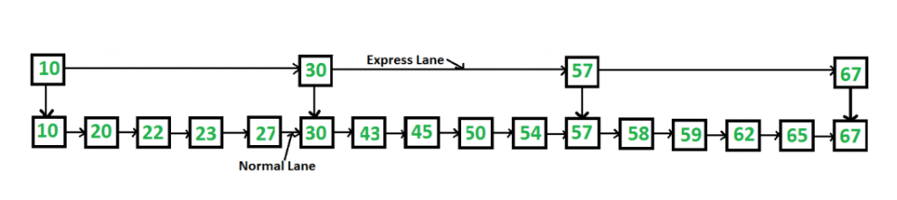

<!-- _backgroundColor: aquq -->

<!-- _color: orange -->

<!-- paginate: false -->

# CE205 Data Structures

## Week-2

### Linked Lists and Related Algorithms Arrays and Matrices

Download [DOC](ce205-week-2-linkedlist.md_doc.pdf), [SLIDE](ce205-week-2-linkedlist.md_slide.pdf), [PPTX](ce205-week-2-linkedlist.md_slide.pptx)

<iframe width=700, height=500 frameBorder=0 src="../ce205-week-2-linkedlist.md_slide.html"></iframe>

---

<!-- paginate: true -->

### Outline-1

- Resources 
- ASN.1 C Workshop
- Single Linked List
- Circular Linked List
- Double Linked List
- XOR Linked List
- Skip List
- Strand Sort

---

### Outline-2

- Arrays
  - Array Rotations
  - Arrangement Rearrangement
  - Array Searching and Sorting
- Matrix
- Sparse Matrix

---

### Resources

- WilliamFiset 
  - [WilliamFiset - YouTube](https://www.youtube.com/c/WilliamFiset-videos/playlists)
  - [GitHub - williamfiset/Algorithms: A collection of algorithms and data structures](https://github.com/williamfiset/Algorithms)
- Btech Smart Class
  - [Data Structures Tutorials - Introduction to Algorithms](http://www.btechsmartclass.com/data_structures/introduction-to-algorithms.html)
- Programiz
  - [Data Structure and Types](https://www.programiz.com/dsa/data-structure-types)
- GeeksforGeeks
  - [Array Data Structure - GeeksforGeeks](https://www.geeksforgeeks.org/array-data-structure/?ref=ghm)
- Visual Algo
  - https://visualgo.net/en

---

### Workshop

Follow the link below and complete steps.

- https://github.com/ucoruh/asn1c-wsl-sample 

There are quick start and reference guides

- http://lionet.info/asn1c/asn1c-quick.pdf
- http://lionet.info/asn1c/asn1c-usage.pdf
- https://www.itu.int/ITU-T/studygroups/com17/languages/

---

### Workshop

Visit TÜBİTAK KAMU SM MA3API Web Page

- https://yazilim.kamusm.gov.tr/?q=tr/node/19&language=en
- https://yazilim.kamusm.gov.tr/?q=/node/14

---

### Workshop

Check out ASN.1 encoded standards. 

- ETSI TS 101 733 CADES digital signature (ASN data structure)
  - https://www.etsi.org/deliver/etsi_ts/101700_101799/101733/02.02.01_60/ts_101733v020201p.pdf
- ETSI TS 102 778 PADES digital signature (PDF data structure)
  - https://www.etsi.org/deliver/etsi_ts/102700_102799/10277803/01.02.01_60/ts_10277803v010201p.pdf
- ETSI TS 101 903 XADES digital signature (XML data structure)
  - https://www.etsi.org/deliver/etsi_ts/101900_101999/101903/01.04.02_60/ts_101903v010402p.pdf
- ETSI TS 102 918 ASiC digital signature
  - https://www.etsi.org/deliver/etsi_ts/102900_102999/102918/01.03.01_60/ts_102918v010301p.pdf

---

### Workshop

Check out ASN.1 encoded standards. 

- Also there is An Implementation of CAdES, XAdES, PAdES and ASiC for Windows in C++
  - https://github.com/WindowsNT/AdES

---

## Workshop

Telecom Standard Example for ASN.1 

- https://www.etsi.org/deliver/etsi_ts/125400_125499/125413/04.09.00_60/ts_125413v040900p.pdf

---

## Workshop

### Industrial Data Standards - Payment

- TLV Utilities
  - https://paymentcardtools.com/
  - https://emvlab.org/dumpasn1/
- Sample EMV ASN.1 
  - https://github.com/mmattice/emv-asn1

---

## Workshop

### Industrial Data Standards - Telco

#### ASN.1 Standartları

- ETSI
  - https://portal.etsi.org/Services/Centre-for-Testing-Interoperability/ETSI-Approach/Specification-Languages/ASN1
- ITU-T
  - https://www.itu.int/ITU-T/recommendations/fl.aspx?lang=1
- ASN.1 Book
  - https://www.oss.com/asn1/resources/books-whitepapers-pubs/dubuisson-asn1-book.PDF

---

## Workshop

### Network Measurement Results Data

- NMR   
  - https://www.etsi.org/deliver/etsi_ts/101500_101599/101503/08.27.00_60/ts_101503v082700p.pdf
- GSM API
  - https://www.etsi.org/deliver/etsi_ts/101400_101499/101476/08.04.01_60/ts_101476v080401p.pdf
- UTRAN
  - https://www.etsi.org/deliver/etsi_ts/125300_125399/125331/13.01.00_60/ts_125331v130100p.pdf
- E-UTRAN
  - https://www.etsi.org/deliver/etsi_ts/136300_136399/136331/15.03.00_60/ts_136331v150300p.pdf

---

### Single Linked List

- Btech Smart Class
  - [Data Structures Tutorials - Single Linked List with an example](http://www.btechsmartclass.com/data_structures/single-linked-list.html)
- Visual Algo
  - https://visualgo.net/en/list

---

### What is Linked List

Like arrays, Linked List is a linear data structure. Unlike arrays, linked list elements are not stored at a contiguous location; the elements are linked using pointers. They include a series of connected nodes. Here, each node stores the data and the address of the next node.


---

Simply a list is a sequence of data, and the linked list is a sequence of data linked with each other.  
The formal definition of a single linked list is as follows...

Single linked list is a sequence of elements in which every element has link to its next element in the sequence.

In any single linked list, the individual element is called as "Node". Every "Node" contains two fields, data field, and the next field. The data field is used to store actual value of the node and next field is used to store the address of next node in the sequence.  
The graphical representation of a node in a single linked list is as follows...


 **Importent Points to be Remembered**  
  In a single linked list, the address of the first node is always stored in a reference node known as "front" (Some times it is also known as "head").  
  Always next part (reference part) of the last node must be NULL.

Example


---

### **Why Linked List?**

Arrays can be used to store linear data of similar types, but arrays have the following limitations:

> - **The size of the arrays is fixed**: So we must know the upper limit on the number of elements in advance. Also, generally, the allocated memory is equal to the upper limit irrespective of the usage. 
> - **Insertion of a new element / Deletion of a existing element in an array of elements is expensive:** The room has to be created for the new elements and to create room existing elements have to be shifted but in Linked list if we have the head node then we can traverse to any node through it and insert new node at the required position.
> 
> **Example:**   
> In a system, if we maintain a sorted list of IDs in an array id[] = [1000, 1010, 1050, 2000, 2040].   
> If we want to insert a new ID 1005, then to maintain the sorted order, we have to move all the elements after 1000 (excluding 1000). 
> 
> Deletion is also expensive with arrays until unless some special techniques are used. For example, to delete 1010 in id[], everything after 1010 has to be moved due to this so much work is being done which affects the efficiency of the code.

---

## **Advantages of Linked Lists over arrays:**

- Dynamic Array.
- Ease of Insertion/Deletion.

---

## Drawbacks of Linked Lists:

- Random access is not allowed. We have to access elements sequentially starting from the first node(head node). So we cannot do a [binary search with linked lists](https://www.geeksforgeeks.org/binary-search-on-singly-linked-list/) efficiently with its default implementation. 
- Extra memory space for a pointer is required with each element of the list. 
- Not cache friendly. Since array elements are contiguous locations, there is locality of reference which is not there in case of linked lists.

---

## Types of Linked Lists:

- **Simple Linked List** – In this type of linked list, one can move or traverse the linked list in only one direction
- **Doubly Linked List** – In this type of linked list, one can move or traverse the linked list in both directions (Forward and Backward)
- **Circular Linked List** – In this type of linked list, the last node of the linked list contains the link of the first/head node of the linked list in its next pointer and the first/head node contains the link of the last node of the linked list in its prev pointer

---

## Basic operations on Linked Lists:

- [Deletion](https://www.geeksforgeeks.org/linked-list-set-3-deleting-node/)
- [Insertion](https://www.geeksforgeeks.org/linked-list-set-2-inserting-a-node/)
- [Search](https://www.geeksforgeeks.org/search-an-element-in-a-linked-list-iterative-and-recursive/)
- Display

---

Before we implement actual operations, first we need to set up an empty list. First, perform the following steps before implementing actual operations.

- Step 1 - Include all the **header files** which are used in the program.
- Step 2 - Declare all the **user defined functions**.
- Step 3 - Define a **Node** structure with two members **data** and **next**
- Step 4 - Define a Node pointer **'head'** and set it to **NULL**.
- Step 5 - Implement the main method by displaying operations menu and make suitable function calls in the main method to perform user selected operation.

---

## **Representation of Linked Lists:**

A linked list is represented by a pointer to the first node of the linked list. The first node is called the head of the linked list. If the linked list is empty, then the value of the head points to NULL. 

---

Each node in a list consists of at least two parts: 

- A Data Item (we can store integer, strings, or any type of data).

- Pointer (Or Reference) to the next node (connects one node to another) or An address of another node

---

- In C, we can represent a node using structures. Below is an example of a linked list node with integer data.   

- In Java or C#, LinkedList can be represented as a class and a Node as a separate class. The LinkedList class contains a reference of Node class type.

---

### Representation of Linked Lists - C / C++ Language

```c
// A linked list node
struct Node {
	int data;
	struct Node* next;
};

```

---

### Representation of Linked Lists -C++ Language (Object based)

```cpp
class Node {
public:
	int data;
	Node* next;
};

```

---

### Representation of Linked Lists -Java Language

```java
class LinkedList {
	Node head; // head of the list

	/* Linked list Node*/
	class Node {
		int data;
		Node next;

		// Constructor to create a new node
		// Next is by default initialized
		// as null
		Node(int d)
		{
			data = d;
			next = null;
		}
	}
}

```

---

### Representation of Linked Lists -C# Language

``` csharp
class LinkedList {
	// The first node(head) of the linked list
	// Will be an object of type Node (null by default)
	Node head;

	class Node {
		int data;
		Node next;

		// Constructor to create a new node
		Node(int d) { data = d; }
	}
}

```

---

### Inserting At Beginning of the list

We can use the following steps to insert a new node at beginning of the single linked list...

- Step 1 - Create a **newNode** with given value.
- Step 2 - Check whether list is **Empty** (**head** == **NULL**)
- Step 3 - If it is **Empty** then, set **newNode→next** = **NULL** and **head** = **newNode**.
- Step 4 - If it is **Not Empty** then, set **newNode→next** = **head** and **head** = **newNode**

---

### Inserting At End of the list

We can use the following steps to insert a new node at end of the single linked list...

- Step 1 - Create a **newNode** with given value and **newNode → next** as **NULL**.
- Step 2 - Check whether list is **Empty** (**head** == **NULL**).
- Step 3 - If it is **Empty** then, set **head** = **newNode**.
- Step 4 - If it is **Not Empty** then, define a node pointer **temp** and initialize with **head**.
- Step 5 - Keep moving the **temp** to its next node until it reaches to the last node in the list (until **temp → next** is equal to **NULL**).
- Step 6 - Set **temp → next** = **newNode**.

---

### Inserting At Specific location in the list (After a Node)

We can use the following steps to insert a new node after a node in the single linked list...

- Step 1 - Create a **newNode** with given value.
- Step 2 - Check whether list is **Empty** (**head** == **NULL**)
- Step 3 - If it is **Empty** then, set **newNode → next** = **NULL** and **head** = **newNode**.
- Step 4 - If it is **Not Empty** then, define a node pointer **temp** and initialize with **head**.
- Step 5 - Keep moving the **temp** to its next node until it reaches to the node after which we want to insert the newNode (until **temp1 → data** is equal to **location**, here location is the node value after which we want to insert the newNode).
- Step 6 - Every time check whether **temp** is reached to last node or not. If it is reached to last node then display **'Given node is not found in the list!!! Insertion not possible!!!'** and terminate the function. Otherwise move the **temp** to next node.
- Step 7 - Finally, Set '**newNode → next** = **temp → next**' and '**temp → next** = **newNode**'

---

### Construction of a simple linked list with 3 nodes - In C Language

``` c
// C program to implement a
// linked list
#include <stdio.h>
#include <stdlib.h>

struct Node {
	int data;
	struct Node* next;
};

// Driver's code
int main()
{
	struct Node* head = NULL;
	struct Node* second = NULL;
	struct Node* third = NULL;

	// allocate 3 nodes in the heap
	head = (struct Node*)malloc(sizeof(struct Node));
	second = (struct Node*)malloc(sizeof(struct Node));
	third = (struct Node*)malloc(sizeof(struct Node));

	/* Three blocks have been allocated dynamically.
	We have pointers to these three blocks as head,
	second and third
	head		 second		 third
		|			 |			 |
		|			 |			 |
	+---+-----+	 +----+----+	 +----+----+
	| # | # |	 | # | # |	 | # | # |
	+---+-----+	 +----+----+	 +----+----+

# represents any random value.
Data is random because we haven’t assigned
anything yet */

	head->data = 1; // assign data in first node
	head->next = second; // Link first node with
	// the second node

	/* data has been assigned to the data part of the first
	block (block pointed by the head). And next
	pointer of first block points to second.
	So they both are linked.

	head		 second		 third
		|			 |			 |
		|			 |			 |
	+---+---+	 +----+----+	 +-----+----+
	| 1 | o----->| # | # |	 | # | # |
	+---+---+	 +----+----+	 +-----+----+
*/

	// assign data to second node
	second->data = 2;

	// Link second node with the third node
	second->next = third;

	/* data has been assigned to the data part of the second
	block (block pointed by second). And next
	pointer of the second block points to the third
	block. So all three blocks are linked.

	head		 second		 third
		|			 |			 |
		|			 |			 |
	+---+---+	 +---+---+	 +----+----+
	| 1 | o----->| 2 | o-----> | # | # |
	+---+---+	 +---+---+	 +----+----+	 */

	third->data = 3; // assign data to third node
	third->next = NULL;

	/* data has been assigned to data part of third
	block (block pointed by third). And next pointer
	of the third block is made NULL to indicate
	that the linked list is terminated here.

	We have the linked list ready.

		head
			|
			|
		+---+---+	 +---+---+	 +----+------+
		| 1 | o----->| 2 | o-----> | 3 | NULL |
		+---+---+	 +---+---+	 +----+------+


	Note that only head is sufficient to represent
	the whole list. We can traverse the complete
	list by following next pointers. */

	return 0;
}

```

---

#### Construction of a simple linked list with 3 nodes - In C++

``` cpp
// C++ program to implement a
// linked list
#include <bits/stdc++.h>
using namespace std;

class Node {
public:
	int data;
	Node* next;
};

// Driver's code
int main()
{
	Node* head = NULL;
	Node* second = NULL;
	Node* third = NULL;

	// allocate 3 nodes in the heap
	head = new Node();
	second = new Node();
	third = new Node();

	/* Three blocks have been allocated dynamically.
	We have pointers to these three blocks as head,
	second and third
	head		 second		 third
		|			 |			 |
		|			 |			 |
	+---+-----+	 +----+----+	 +----+----+
	| # | # |	 | # | # |	 | # | # |
	+---+-----+	 +----+----+	 +----+----+

# represents any random value.
Data is random because we haven’t assigned
anything yet */

	head->data = 1; // assign data in first node
	head->next = second; // Link first node with
	// the second node

	/* data has been assigned to the data part of first
	block (block pointed by the head). And next
	pointer of the first block points to second.
	So they both are linked.

	head		 second		 third
		|			 |			 |
		|			 |			 |
	+---+---+	 +----+----+	 +-----+----+
	| 1 | o----->| # | # |	 | # | # |
	+---+---+	 +----+----+	 +-----+----+
*/

	// assign data to second node
	second->data = 2;

	// Link second node with the third node
	second->next = third;

	/* data has been assigned to the data part of the second
	block (block pointed by second). And next
	pointer of the second block points to the third
	block. So all three blocks are linked.

	head		 second		 third
		|			 |			 |
		|			 |			 |
	+---+---+	 +---+---+	 +----+----+
	| 1 | o----->| 2 | o-----> | # | # |
	+---+---+	 +---+---+	 +----+----+	 */

	third->data = 3; // assign data to third node
	third->next = NULL;

	/* data has been assigned to the data part of the third
	block (block pointed by third). And next pointer
	of the third block is made NULL to indicate
	that the linked list is terminated here.

	We have the linked list ready.

		head
			|
			|
		+---+---+	 +---+---+	 +----+------+
		| 1 | o----->| 2 | o-----> | 3 | NULL |
		+---+---+	 +---+---+	 +----+------+


	Note that only the head is sufficient to represent
	the whole list. We can traverse the complete
	list by following the next pointers. */

	return 0;
}

// This code is contributed by rathbhupendra

```

---

#### Construction of a simple linked list with 3 nodes in Java

``` java
// A simple Java program to introduce a linked list
class LinkedList {
	Node head; // head of list

	/* Linked list Node. This inner class is made static so
	that main() can access it */
	static class Node {
		int data;
		Node next;
		Node(int d)
		{
			data = d;
			next = null;
		} // Constructor
	}

	/* method to create a simple linked list with 3 nodes*/
	public static void main(String[] args)
	{
		/* Start with the empty list. */
		LinkedList llist = new LinkedList();

		llist.head = new Node(1);
		Node second = new Node(2);
		Node third = new Node(3);

		/* Three nodes have been allocated dynamically.
		We have references to these three blocks as head,
		second and third

		llist.head	 second			 third
			|			 |				 |
			|			 |				 |
		+----+------+	 +----+------+	 +----+------+
		| 1 | null |	 | 2 | null |	 | 3 | null |
		+----+------+	 +----+------+	 +----+------+
	*/

		llist.head.next = second; // Link first node with
								// the second node

		/* Now next of the first Node refers to the second.
		So they both are linked.

		llist.head	 second			 third
			|			 |				 |
			|			 |				 |
		+----+------+	 +----+------+	 +----+------+
		| 1 | o-------->| 2 | null |	 | 3 | null |
		+----+------+	 +----+------+	 +----+------+ */

		second.next
			= third; // Link second node with the third node

		/* Now next of the second Node refers to third. So
		all three nodes are linked.

		llist.head	 second			 third
			|			 |				 |
			|			 |				 |
		+----+------+	 +----+------+	 +----+------+
		| 1 | o-------->| 2 | o-------->| 3 | null |
		+----+------+	 +----+------+	 +----+------+ */
	}
}

```

---

#### Construction of a simple linked list with 3 nodes in C#

``` csharp
// A simple C# program to introduce a linked list
using System;

public class LinkedList {
	Node head; // head of list

	/* Linked list Node. This inner class is made static so
	that main() can access it */
	public class Node {
		public int data;
		public Node next;
		public Node(int d)
		{
			data = d;
			next = null;
		} // Constructor
	}

	/* method to create a simple linked list with 3 nodes*/
	public static void Main(String[] args)
	{
		/* Start with the empty list. */
		LinkedList llist = new LinkedList();

		llist.head = new Node(1);
		Node second = new Node(2);
		Node third = new Node(3);

		/* Three nodes have been allocated dynamically.
		We have references to these three blocks as head,
		second and third

		llist.head	 second			 third
			|			 |				 |
			|			 |				 |
		+----+------+	 +----+------+	 +----+------+
		| 1 | null |	 | 2 | null |	 | 3 | null |
		+----+------+	 +----+------+	 +----+------+ */

		llist.head.next = second; // Link first node with
								// the second node

		/* Now next of first Node refers to second. So they
			both are linked.

		llist.head	 second			 third
			|			 |				 |
			|			 |				 |
		+----+------+	 +----+------+	 +----+------+
		| 1 | o-------->| 2 | null |	 | 3 | null |
		+----+------+	 +----+------+	 +----+------+ */

		second.next
			= third; // Link second node with the third node

		/* Now next of the second Node refers to third. So
		all three nodes are linked.

		llist.head	 second			 third
			|			 |				 |
			|			 |				 |
		+----+------+	 +----+------+	 +----+------+
		| 1 | o-------->| 2 | o-------->| 3 | null |
		+----+------+	 +----+------+	 +----+------+ */
	}
}

// This code has been contributed by 29AjayKumar

```

---

### Deletion

In a single linked list, the deletion operation can be performed in three ways. They are as follows...

1. Deleting from Beginning of the list
2. Deleting from End of the list
3. Deleting a Specific Node

---

# Deleting from Beginning of the list

We can use the following steps to delete a node from beginning of the single linked list...

- Step 1 - Check whether list is **Empty** (**head** == **NULL**)
- Step 2 - If it is **Empty** then, display **'List is Empty!!! Deletion is not possible'** and terminate the function.
- Step 3 - If it is **Not Empty** then, define a Node pointer **'temp'** and initialize with **head**.
- Step 4 - Check whether list is having only one node (**temp → next** == **NULL**)
- Step 5 - If it is **TRUE** then set **head** = **NULL** and delete **temp** (Setting **Empty** list conditions)
- Step 6 - If it is **FALSE** then set **head** = **temp → next**, and delete **temp**.

---

#### Deleting from End of the list

We can use the following steps to delete a node from end of the single linked list...

- Step 1 - Check whether list is **Empty** (**head** == **NULL**)
- Step 2 - If it is **Empty** then, display **'List is Empty!!! Deletion is not possible'** and terminate the function.
- Step 3 - If it is **Not Empty** then, define two Node pointers **'temp1'** and '**temp2'** and initialize '**temp1**' with **head**.
- Step 4 - Check whether list has only one Node (**temp1 → next** == **NULL**)
- Step 5 - If it is **TRUE**. Then, set **head** = **NULL** and delete **temp1**. And terminate the function. (Setting **Empty** list condition)
- Step 6 - If it is **FALSE**. Then, set '**temp2 = temp1** ' and move **temp1** to its next node. Repeat the same until it reaches to the last node in the list. (until **temp1 → next** == **NULL**)
- Step 7 - Finally, Set **temp2 → next** = **NULL** and delete **temp1**.

---

#### Deleting a Specific Node from the list

We can use the following steps to delete a specific node from the single linked list...

- Step 1 - Check whether list is **Empty** (**head** == **NULL**)
- Step 2 - If it is **Empty** then, display **'List is Empty!!! Deletion is not possible'** and terminate the function.
- Step 3 - If it is **Not Empty** then, define two Node pointers **'temp1'** and '**temp2**' and initialize '**temp1**' with **head**.
- Step 4 - Keep moving the **temp1** until it reaches to the exact node to be deleted or to the last node. And every time set '**temp2 = temp1**' before moving the '**temp1**' to its next node.
- Step 5 - If it is reached to the last node then display **'Given node not found in the list! Deletion not possible!!!'**. And terminate the function.
- Step 6 - If it is reached to the exact node which we want to delete, then check whether list is having only one node or not
- Step 7 - If list has only one node and that is the node to be deleted, then set **head** = **NULL** and delete **temp1** (**free(temp1)**).
- Step 8 - If list contains multiple nodes, then check whether **temp1** is the first node in the list (**temp1 == head**).
- Step 9 - If **temp1** is the first node then move the **head** to the next node (**head = head → next**) and delete **temp1**.
- Step 10 - If **temp1** is not first node then check whether it is last node in the list (**temp1 → next == NULL**).
- Step 11 - If **temp1** is last node then set **temp2 → next** = **NULL** and delete **temp1** (**free(temp1)**).
- Step 12 - If **temp1** is not first node and not last node then set **temp2 → next** = **temp1 → next** and delete **temp1** (**free(temp1)**).

---

#### Displaying a Single Linked List

We can use the following steps to display the elements of a single linked list...

- Step 1 - Check whether list is **Empty** (**head** == **NULL**)
- Step 2 - If it is **Empty** then, display **'List is Empty!!!'** and terminate the function.
- Step 3 - If it is **Not Empty** then, define a Node pointer **'temp'** and initialize with **head**.
- Step 4 - Keep displaying **temp → data** with an arrow (**--->**) until **temp** reaches to the last node
- Step 5 - Finally display **temp → data** with arrow pointing to **NULL** (**temp → data ---> NULL**).

---

## **Traversal of a Linked List**

In the previous program, we created a simple linked list with three nodes. Let us traverse the created list and print the data of each node. For traversal, let us write a general-purpose function `printList()` that prints any given list.

---

#### Traversal of a Linked List - C

``` c
// A simple C program for
// traversal of a linked list

#include <stdio.h>
#include <stdlib.h>

struct Node {
	int data;
	struct Node* next;
};

// This function prints contents of linked list starting
// from the given node
void printList(struct Node* n)
{
	while (n != NULL) {
		printf(" %d ", n->data);
		n = n->next;
	}
}

// Driver's code
int main()
{
	struct Node* head = NULL;
	struct Node* second = NULL;
	struct Node* third = NULL;

	// allocate 3 nodes in the heap
	head = (struct Node*)malloc(sizeof(struct Node));
	second = (struct Node*)malloc(sizeof(struct Node));
	third = (struct Node*)malloc(sizeof(struct Node));

	head->data = 1; // assign data in first node
	head->next = second; // Link first node with second

	second->data = 2; // assign data to second node
	second->next = third;

	third->data = 3; // assign data to third node
	third->next = NULL;

	// Function call
	printList(head);

	return 0;
}

```

---

#### Traversal of a Linked List - C++

``` cpp
// A simple C++ program for
// traversal of a linked list

#include <bits/stdc++.h>
using namespace std;

class Node {
public:
	int data;
	Node* next;
};

// This function prints contents of linked list
// starting from the given node
void printList(Node* n)
{
	while (n != NULL) {
		cout << n->data << " ";
		n = n->next;
	}
}

// Driver's code
int main()
{
	Node* head = NULL;
	Node* second = NULL;
	Node* third = NULL;

	// allocate 3 nodes in the heap
	head = new Node();
	second = new Node();
	third = new Node();

	head->data = 1; // assign data in first node
	head->next = second; // Link first node with second

	second->data = 2; // assign data to second node
	second->next = third;

	third->data = 3; // assign data to third node
	third->next = NULL;

	// Function call
	printList(head);

	return 0;
}

// This is code is contributed by rathbhupendra

```

---

#### Traversal of a Linked List - Java

``` java
// A simple Java program for traversal of a linked list

class LinkedList {

	Node head; // head of list

	/* Linked list Node. This inner class is made static so
	that main() can access it */
	static class Node {

		int data;
		Node next;
		Node(int d)
		{
			this.data = d;
			next = null;
		} // Constructor
	}

	/* This function prints contents of linked list starting
	* from head */
	public void printList()
	{
		Node n = head;
		while (n != null) {
			System.out.print(n.data + " ");
			n = n.next;
		}
	}

	// Driver's code
	public static void main(String[] args)
	{
		/* Start with the empty list. */
		LinkedList llist = new LinkedList();

		llist.head = new Node(1);
		Node second = new Node(2);
		Node third = new Node(3);

		llist.head.next = second; // Link first node with
								// the second node
		second.next
			= third; // Link second node with the third node

		// Function call
		llist.printList();
	}
}

```

---

#### Traversal of a Linked List - C#

``` csharp
// C# program for traversal of a linked list

using System;

public class LinkedList {
	Node head; // head of list

	/* Linked list Node. This inner
	class is made static so that
	main() can access it */
	public class Node {
		public int data;
		public Node next;
		public Node(int d)
		{
			data = d;
			next = null;

		} // Constructor
	}

	/* This function prints contents of
	linked list starting from head */
	public void printList()
	{
		Node n = head;
		while (n != null) {
			Console.Write(n.data + " ");
			n = n.next;
		}
	}

	// Driver's code
	public static void Main(String[] args)
	{
		/* Start with the empty list. */
		LinkedList llist = new LinkedList();

		llist.head = new Node(1);
		Node second = new Node(2);
		Node third = new Node(3);

		llist.head.next = second; // Link first node with
								// the second node
		second.next
			= third; // Link second node with the third node

		// Function call
		llist.printList();
	}
}

/* This code contributed by PrinciRaj1992 */

```

---

#### Output

``` bash
 1  2  3 
```

---

**Time Complexity:**

| **Time Complexity**     | **Worst Case** | **Average Case** |
| ----------------------- | -------------- | ---------------- |
| **Search**              | O(n)           | O(n)             |
| **Insert at Start**     | O(1)           | O(1)             |
| **Deletion from Start** | O(1)           | O(1)             |

---

**Auxiliary Space:** O(N)

---

#### Complete C Example of Single Linked List

``` c
// SingleLinkedList.c : This file contains the 'main' function. Program execution begins and ends there.
//

#define _CRT_SECURE_NO_WARNINGS

#include<stdio.h>
#include<stdlib.h>

#define clrscr(); system("cls");

void insertAtBeginning(int);
void insertAtEnd(int);
void insertBetween(int, int, int);
void display();
void removeBeginning();
void removeEnd();
void removeSpecific(int);

struct Node
{
	int data;
	struct Node* next;
}*head = NULL;

void main()
{
	int choice, value, choice1, loc1, loc2;
	clrscr();

	while (1) {
		
		printf("\n\n****** MENU ******\n\n");
		printf("1. Insert\n");
		printf("2. Display\n"); 
		printf("3. Delete\n"); 
		printf("4. Exit\n"); 
		printf("Enter your choice : ");
		
		scanf("%d", &choice);

		switch (choice)
		{
		case 1: printf("Enter the value to be insert: ");
			scanf("%d", &value);
			while (1) {
				printf("Where you want to insert: \n"); 
				printf("1. At Beginning\n");
				printf("2. At End\n"); 
				printf("3. Between\n");
				printf("Enter your choice: ");

				scanf("%d", &choice1);

				switch (choice1)
				{
				case 1: 	
					insertAtBeginning(value);
					break;
				case 2: 	
					insertAtEnd(value);
					break;
				case 3:      
					printf("Enter the two values where you want to insert: ");
					scanf("%d%d", &loc1, &loc2);
					insertBetween(value, loc1, loc2);
					break;
				default: 	
					printf("\nWrong Input!! Try again!!!\n\n");
					continue;
				}

				break;
			}
			break;
		case 2: 	
			display();
			break;
		case 3: 	
			
			printf("How do you want to Delete: \n");
			printf("1. From Beginning\n");
			printf("2. From End\n");
			printf("3. Spesific\n");
			printf("Enter your choice: ");
		
			scanf("%d", &choice1);

			switch (choice1){
			case 1: 	
				removeBeginning();
				break;
			case 2: 	
				removeEnd();
				break;
			case 3:      
				printf("Enter the value which you wanto delete: ");
				
				scanf("%d", &loc2);

				removeSpecific(loc2);
				break;
			default: 	
				printf("\nWrong Input!! Try again!!!\n\n");
				break;
			}
			break;
		case 4: 	
			exit(0);
		default: 
			printf("\nWrong input!!! Try again!!\n\n");
		}
	}
}

void insertAtBeginning(int value)
{
	struct Node* newNode;
	newNode = (struct Node*)malloc(sizeof(struct Node));
	newNode->data = value;
	if (head == NULL)
	{
		newNode->next = NULL;
		head = newNode;
	}
	else
	{
		newNode->next = head;
		head = newNode;
	}
	printf("\nOne node inserted!!!\n");
}
void insertAtEnd(int value)
{
	struct Node* newNode;
	newNode = (struct Node*)malloc(sizeof(struct Node));
	newNode->data = value;
	newNode->next = NULL;
	if (head == NULL)
		head = newNode;
	else
	{
		struct Node* temp = head;
		while (temp->next != NULL)
			temp = temp->next;
		temp->next = newNode;
	}
	printf("\nOne node inserted!!!\n");
}
void insertBetween(int value, int loc1, int loc2)
{
	struct Node* newNode;

	newNode = (struct Node*)malloc(sizeof(struct Node));

	newNode->data = value;
	if (head == NULL){
		newNode->next = NULL;
		head = newNode;
	}else{
		struct Node* temp = head;
		while (temp->data != loc1 && temp->data != loc2)
			temp = temp->next;
		newNode->next = temp->next;
		temp->next = newNode;
	}
	printf("\nOne node inserted!!!\n");
}

void removeBeginning()
{
	if (head == NULL)
		printf("\n\nList is Empty!!!");
	else
	{
		struct Node* temp = head;
		if (head->next == NULL)
		{
			head = NULL;
			free(temp);
		}
		else
		{
			head = temp->next;
			free(temp);
			printf("\nOne node deleted!!!\n\n");
		}
	}
}
void removeEnd()
{
	if (head == NULL)
	{
		printf("\nList is Empty!!!\n");
	}
	else
	{
		struct Node* temp1 = head, * temp2 = 0;
		if (head->next == NULL)
			head = NULL;
		else
		{
			while (temp1->next != NULL)
			{
				temp2 = temp1;
				temp1 = temp1->next;
			}
			temp2->next = NULL;
		}
		free(temp1);
		printf("\nOne node deleted!!!\n\n");
	}
}
void removeSpecific(int delValue)
{
	struct Node* temp1 = head, * temp2 = 0;
	while (temp1->data != delValue)
	{
		if (temp1->next == NULL) {
			printf("\nGiven node not found in the list!!!");
			return;
		}
		temp2 = temp1;
		temp1 = temp1->next;
	}
	temp2->next = temp1->next;
	free(temp1);
	printf("\nOne node deleted!!!\n\n");
}

void display()
{
	if (head == NULL)
	{
		printf("\nList is Empty\n");
	}
	else
	{
		struct Node* temp = head;
		printf("\n\nList elements are - \n");
		while (temp->next != NULL)
		{
			printf("%d --->", temp->data);
			temp = temp->next;
		}
		printf("%d --->NULL", temp->data);
	}
}
```

---

#### References

[What is Linked List - GeeksforGeeks](https://www.geeksforgeeks.org/what-is-linked-list/?ref=lbp)


---

### Circular Linked List

- Btech Smart Class
  - [Data Structures Tutorials - Circular Linked List with an example | Implementation](http://www.btechsmartclass.com/data_structures/circular-linked-list.html)
- Geeks for Geeks
  - [Circular Linked List | Set 1 (Introduction and Applications) - GeeksforGeeks](https://www.geeksforgeeks.org/circular-linked-list/)
- Geeks for Geeks
  - [Circular Linked List | Set 2 (Traversal) - GeeksforGeeks](https://www.geeksforgeeks.org/circular-linked-list-set-2-traversal/)

---

### Circular Linked List

---

# Circular Linked List

In this article, you will learn what circular linked list is and its types with implementation.

A circular linked list is a type of [linked list](https://www.programiz.com/dsa/linked-list) in which the first and the last nodes are also connected to each other to form a circle.

There are basically two types of circular linked list:

**1. Circular Singly Linked List**

Here, the address of the last node consists of the address of the first node.


Circular Linked List Representation

**2. Circular Doubly Linked List**

Here, in addition to the last node storing the address of the first node, the first node will also store the address of the last node.


Circular Doubly Linked List Representation

**Note**: We will be using the singly circular linked list to represent the working of circular linked list.

---

## Representation of Circular Linked List

Let's see how we can represent a circular linked list on an algorithm/code. Suppose we have a linked list:


Initial circular linked list

Here, the single node is represented as

``` c
struct Node {
    int data;
    struct Node * next;
};
```

Each struct node has a data item and a pointer to the next struct node.

Now we will create a simple circular linked list with three items to understand how this works.

``` c
/* Initialize nodes */
struct node *last;
struct node *one = NULL;
struct node *two = NULL;
struct node *three = NULL;

/* Allocate memory */
one = malloc(sizeof(struct node));
two = malloc(sizeof(struct node));
three = malloc(sizeof(struct node));

/* Assign data values */
one->data = 1;
two->data = 2;
three->data = 3;

/* Connect nodes */
one->next = two;
two->next = three;
three->next = one;

/* Save address of third node in last */
last = three;
```

In the above code, one, two, and three are the nodes with data items 1, 2, and 3 respectively.

**For node one**

- next stores the address of two (there is no node before it)

**For node two**

- next stores the address of three

**For node three**

- next stores `NULL` (there is no node after it)
- next points to node one

---

## Insertion on a Circular Linked List

We can insert elements at 3 different positions of a circular linked list:

1. [Insertion at the beginning](https://www.programiz.com/dsa/circular-linked-list#insert-beginning)
2. [Insertion in-between nodes](https://www.programiz.com/dsa/circular-linked-list#insert-after)
3. [Insertion at the end](https://www.programiz.com/dsa/circular-linked-list#insert-end)

Suppose we have a circular linked list with elements 1, 2, and 3.


Initial circular linked list

Let's add a node with value 6 at different positions of the circular linked list we made above. The first step is to create a new node.

- allocate memory for `newNode`
- assign the data to `newNode`


New node

---

### 1. Insertion at the Beginning

- store the address of the current first node in the `newNode` (i.e. pointing the `newNode` to the current first node)
- point the last node to `newNode` (i.e making `newNode` as head)


Insert at the beginning

---

### 2. Insertion in between two nodes

Let's insert newNode after the first node.

- travel to the node given (let this node be `p`)
- point the `next` of `newNode` to the node next to `p`
- store the address of `newNode` at `next` of `p`


Insertion at a node

---

### 3. Insertion at the end

- store the address of the head node to `next` of newNode (making `newNode` the last node)
- point the current last node to `newNode`
- make `newNode` as the last node


Insert at the end

---

## Deletion on a Circular Linked List

Suppose we have a double-linked list with elements 1, 2, and 3.


Initial circular linked list

---

### 1. If the node to be deleted is the only node

- free the memory occupied by the node
- store NULL in `last`

### 2. If last node is to be deleted

- find the node before the last node (let it be `temp`)
- store the address of the node next to the last node in `temp`
- free the memory of last
- make `temp` as the last node


Delete the last node

### 3. If any other nodes are to be deleted

- travel to the node to be deleted (here we are deleting node 2)
- let the node before node 2 be `temp`
- store the address of the node next to 2 in `temp`
- free the memory of 2


Delete a specific node

---

## Circular Linked List Code in  Java, C, and C++

``` c
// C code to perform circular linked list operations

#include <stdio.h>
#include <stdlib.h>

struct Node {
  int data;
  struct Node* next;
};

struct Node* addToEmpty(struct Node* last, int data) {
  if (last != NULL) return last;

  // allocate memory to the new node
  struct Node* newNode = (struct Node*)malloc(sizeof(struct Node));

  // assign data to the new node
  newNode->data = data;

  // assign last to newNode
  last = newNode;

  // create link to iteself
  last->next = last;

  return last;
}

// add node to the front
struct Node* addFront(struct Node* last, int data) {
  // check if the list is empty
  if (last == NULL) return addToEmpty(last, data);

  // allocate memory to the new node
  struct Node* newNode = (struct Node*)malloc(sizeof(struct Node));

  // add data to the node
  newNode->data = data;

  // store the address of the current first node in the newNode
  newNode->next = last->next;

  // make newNode as head
  last->next = newNode;

  return last;
}

// add node to the end
struct Node* addEnd(struct Node* last, int data) {
  // check if the node is empty
  if (last == NULL) return addToEmpty(last, data);

  // allocate memory to the new node
  struct Node* newNode = (struct Node*)malloc(sizeof(struct Node));

  // add data to the node
  newNode->data = data;

  // store the address of the head node to next of newNode
  newNode->next = last->next;

  // point the current last node to the newNode
  last->next = newNode;

  // make newNode as the last node
  last = newNode;

  return last;
}

// insert node after a specific node
struct Node* addAfter(struct Node* last, int data, int item) {
  // check if the list is empty
  if (last == NULL) return NULL;

  struct Node *newNode, *p;

  p = last->next;
  do {
  // if the item is found, place newNode after it
  if (p->data == item) {
    // allocate memory to the new node
    newNode = (struct Node*)malloc(sizeof(struct Node));

    // add data to the node
    newNode->data = data;

    // make the next of the current node as the next of newNode
    newNode->next = p->next;

    // put newNode to the next of p
    p->next = newNode;

    // if p is the last node, make newNode as the last node
    if (p == last) last = newNode;
    return last;
  }

  p = p->next;
  } while (p != last->next);

  printf("\nThe given node is not present in the list");
  return last;
}

// delete a node
void deleteNode(struct Node** last, int key) {
  // if linked list is empty
  if (*last == NULL) return;

  // if the list contains only a single node
  if ((*last)->data == key && (*last)->next == *last) {
  free(*last);
  *last = NULL;
  return;
  }

  struct Node *temp = *last, *d;

  // if last is to be deleted
  if ((*last)->data == key) {
  // find the node before the last node
  while (temp->next != *last) temp = temp->next;

  // point temp node to the next of last i.e. first node
  temp->next = (*last)->next;
  free(*last);
  *last = temp->next;
  }

  // travel to the node to be deleted
  while (temp->next != *last && temp->next->data != key) {
  temp = temp->next;
  }

  // if node to be deleted was found
  if (temp->next->data == key) {
  d = temp->next;
  temp->next = d->next;
  free(d);
  }
}

void traverse(struct Node* last) {
  struct Node* p;

  if (last == NULL) {
  printf("The list is empty");
  return;
  }

  p = last->next;

  do {
  printf("%d ", p->data);
  p = p->next;

  } while (p != last->next);
}

int main() {
  struct Node* last = NULL;

  last = addToEmpty(last, 6);
  last = addEnd(last, 8);
  last = addFront(last, 2);

  last = addAfter(last, 10, 2);

  traverse(last);

  deleteNode(&last, 8);

  printf("\n");

  traverse(last);

  return 0;
}
```

---

## Circular Linked List Code in C++

``` cpp
// C++ code to perform circular linked list operations

#include <iostream>

using namespace std;

struct Node {
  int data;
  struct Node* next;
};

struct Node* addToEmpty(struct Node* last, int data) {
  if (last != NULL) return last;

  // allocate memory to the new node
  struct Node* newNode = (struct Node*)malloc(sizeof(struct Node));

  // assign data to the new node
  newNode->data = data;

  // assign last to newNode
  last = newNode;

  // create link to iteself
  last->next = last;

  return last;
}

// add node to the front
struct Node* addFront(struct Node* last, int data) {
  // check if the list is empty
  if (last == NULL) return addToEmpty(last, data);

  // allocate memory to the new node
  struct Node* newNode = (struct Node*)malloc(sizeof(struct Node));

  // add data to the node
  newNode->data = data;

  // store the address of the current first node in the newNode
  newNode->next = last->next;

  // make newNode as head
  last->next = newNode;

  return last;
}

// add node to the end
struct Node* addEnd(struct Node* last, int data) {
  // check if the node is empty
  if (last == NULL) return addToEmpty(last, data);

  // allocate memory to the new node
  struct Node* newNode = (struct Node*)malloc(sizeof(struct Node));

  // add data to the node
  newNode->data = data;

  // store the address of the head node to next of newNode
  newNode->next = last->next;

  // point the current last node to the newNode
  last->next = newNode;

  // make newNode as the last node
  last = newNode;

  return last;
}

// insert node after a specific node
struct Node* addAfter(struct Node* last, int data, int item) {
  // check if the list is empty
  if (last == NULL) return NULL;

  struct Node *newNode, *p;

  p = last->next;
  do {
  // if the item is found, place newNode after it
  if (p->data == item) {
    // allocate memory to the new node
    newNode = (struct Node*)malloc(sizeof(struct Node));

    // add data to the node
    newNode->data = data;

    // make the next of the current node as the next of newNode
    newNode->next = p->next;

    // put newNode to the next of p
    p->next = newNode;

    // if p is the last node, make newNode as the last node
    if (p == last) last = newNode;
    return last;
  }

  p = p->next;
  } while (p != last->next);

  cout << "\nThe given node is not present in the list" << endl;
  return last;
}

// delete a node
void deleteNode(Node** last, int key) {
  // if linked list is empty
  if (*last == NULL) return;

  // if the list contains only a single node
  if ((*last)->data == key && (*last)->next == *last) {
  free(*last);
  *last = NULL;
  return;
  }

  Node *temp = *last, *d;

  // if last is to be deleted
  if ((*last)->data == key) {
  // find the node before the last node
  while (temp->next != *last) temp = temp->next;

  // point temp node to the next of last i.e. first node
  temp->next = (*last)->next;
  free(*last);
  *last = temp->next;
  }

  // travel to the node to be deleted
  while (temp->next != *last && temp->next->data != key) {
  temp = temp->next;
  }

  // if node to be deleted was found
  if (temp->next->data == key) {
  d = temp->next;
  temp->next = d->next;
  free(d);
  }
}

void traverse(struct Node* last) {
  struct Node* p;

  if (last == NULL) {
  cout << "The list is empty" << endl;
  return;
  }

  p = last->next;

  do {
  cout << p->data << " ";
  p = p->next;

  } while (p != last->next);
}

int main() {
  struct Node* last = NULL;

  last = addToEmpty(last, 6);
  last = addEnd(last, 8);
  last = addFront(last, 2);

  last = addAfter(last, 10, 2);

  traverse(last);

  deleteNode(&last, 8);
  cout << endl;

  traverse(last);

  return 0;
}
```

---

### Circular Linked List Code in Java

``` java
// Java code to perform circular linked list operations

class CircularLinkedList {

  static class Node {
    int data;
    Node next;
  };

  static Node addToEmpty(Node last, int data) {
    if (last != null)
      return last;

    // allocate memory to the new node
    Node newNode = new Node();

    // assign data to the new node
    newNode.data = data;

    // assign last to newNode
    last = newNode;

    // create link to iteself
    newNode.next = last;

    return last;
  }

  // add node to the front
  static Node addFront(Node last, int data) {
    if (last == null)
      return addToEmpty(last, data);

    // allocate memory to the new node
    Node newNode = new Node();

    // add data to the node
    newNode.data = data;

    // store the address of the current first node in the newNode
    newNode.next = last.next;

    // make newNode as head
    last.next = newNode;

    return last;
  }

  // add node to the end
  static Node addEnd(Node last, int data) {
    if (last == null)
      return addToEmpty(last, data);

    // allocate memory to the new node
    Node newNode = new Node();

    // add data to the node
    newNode.data = data;

    // store the address of the head node to next of newNode
    newNode.next = last.next;

    // point the current last node to the newNode
    last.next = newNode;

    // make newNode as the last node
    last = newNode;

    return last;
  }

  static Node addAfter(Node last, int data, int item) {
    if (last == null)
      return null;

    Node newNode, p;
    p = last.next;
    do {
      // if the item is found, place newNode after it
      if (p.data == item) {
        // allocate memory to the new node
        newNode = new Node();

        // add data to the node
        newNode.data = data;

        // make the next of the current node as the next of newNode
        newNode.next = p.next;

        // put newNode to the next of p
        p.next = newNode;

        // if p is the last node, make newNode as the last node
        if (p == last)
          last = newNode;
        return last;
      }
      p = p.next;
    } while (p != last.next);

    System.out.println(item + "The given node is not present in the list");
    return last;

  }

	// delete a node
  static Node deleteNode(Node last, int key) {
    // if linked list is empty
    if (last == null)
      return null;

    // if the list contains only a single node
    if (last.data == key && last.next == last) {
      last = null;
      return last;
    }

    Node temp = last, d = new Node();

    // if last is to be deleted
    if (last.data == key) {
      // find the node before the last node
      while (temp.next != last) {
        temp = temp.next;
      }

      // point temp node to the next of last i.e. first node
      temp.next = last.next;
      last = temp.next;
    }

    // travel to the node to be deleted
    while (temp.next != last && temp.next.data != key) {
      temp = temp.next;
    }

    // if node to be deleted was found
    if (temp.next.data == key) {
      d = temp.next;
      temp.next = d.next;
    }
    return last;
  }

  static void traverse(Node last) {
    Node p;

    if (last == null) {
      System.out.println("List is empty.");
      return;
    }

    p = last.next;

    do {
      System.out.print(p.data + " ");
      p = p.next;

    }
    while (p != last.next);

  }

  public static void main(String[] args) {
    Node last = null;

    last = addToEmpty(last, 6);
    last = addEnd(last, 8);
    last = addFront(last, 2);

    last = addAfter(last, 10, 2);

    traverse(last);

    deleteNode(last, 8);
    traverse(last);
  }
}
```

---

## Circular Linked List Complexity

| Circular Linked List Complexity | **Time Complexity** | **Space Complexity** |
| ------------------------------- | ------------------- | -------------------- |
| **Insertion Operation**         | O(1) or O(n)        | O(1)                 |
| **Deletion Operation**          | O(1)                | O(1)                 |

**1. Complexity of Insertion Operation**

- The insertion operations that do not require traversal have the time complexity of `O(1)`.
- And, an insertion that requires traversal has a time complexity of `O(n)`.
- The space complexity is `O(1)`.

**2. Complexity of Deletion Operation**

- All deletion operations run with a time complexity of `O(1)`.
- And, the space complexity is `O(1)`.

---

## Why Circular Linked List?

1. The NULL assignment is not required because a node always points to another node.
2. The starting point can be set to any node.
3. Traversal from the first node to the last node is quick.

---

## Circular Linked List Applications

- It is used in multiplayer games to give a chance to each player to play the game.
- Multiple running applications can be placed in a circular linked list on an operating system. The os keeps on iterating over these applications.

---

### Double Linked List

- Btech Smart Class
  - [Data Structures Tutorials - Double Linked List with an example program](http://www.btechsmartclass.com/data_structures/double-linked-list.html)
- Geeks for Geeks
  - [Doubly Linked List | Set 1 (Introduction and Insertion) - GeeksforGeeks](https://www.geeksforgeeks.org/doubly-linked-list/)
- Visual Algo
  - [Linked List (Single, Doubly), Stack, Queue, Deque - VisuAlgo](https://visualgo.net/en/list)

---

# Double Linked List

# Doubly Linked List

In this tutorial, you will learn about the doubly linke list and its implementation in Python, Java, C, and C++.

A doubly linked list is a type of [linked list](https://www.programiz.com/dsa/linked-list) in which each node consists of 3 components:

- `*prev` - address of the previous node
- `data` - data item
- `*next` - address of next node


A doubly linked list node

Note: Before you proceed further, make sure to learn about [pointers and structs](https://www.programiz.com/c-programming/c-structures-pointers).

---

## Representation of Doubly Linked List

Let's see how we can represent a doubly linked list on an algorithm/code. Suppose we have a doubly linked list:


Newly created doubly linked list

Here, the single node is represented as

``` c
struct node {
    int data;
    struct node *next;
    struct node *prev;
}
```

Each struct node has a data item, a pointer to the previous struct node, and a pointer to the next struct node.

Now we will create a simple doubly linked list with three items to understand how this works.

``` c
/* Initialize nodes */
struct node *head;
struct node *one = NULL;
struct node *two = NULL;
struct node *three = NULL;

/* Allocate memory */
one = malloc(sizeof(struct node));
two = malloc(sizeof(struct node));
three = malloc(sizeof(struct node));

/* Assign data values */
one->data = 1;
two->data = 2;
three->data = 3;

/* Connect nodes */
one->next = two;
one->prev = NULL;

two->next = three;
two->prev = one;

three->next = NULL;
three->prev = two;

/* Save address of first node in head */
head = one;
```

In the above code, `one`, `two`, and `three` are the nodes with data items **1**, **2**, and **3** respectively.

- **For node one**: `next` stores the address of `two` and `prev` stores `null` (there is no node before it)
- **For node two**: `next` stores the address of `three` and `prev` stores the address of `one`
- **For node three**: `next` stores `null` (there is no node after it) and `prev` stores the address of `two`.

**Note**: In the case of the head node, `prev` points to `null`, and in the case of the tail pointer, `next` points to null. Here, `one` is a head node and `three` is a tail node.

---

## Insertion on a Doubly Linked List

Pushing a node to a doubly-linked list is similar to pushing a node to a linked list, but extra work is required to handle the pointer to the previous node.

We can insert elements at 3 different positions of a doubly-linked list:

1. [Insertion at the beginning](https://www.programiz.com/dsa/doubly-linked-list#insertion-at-beginning)
2. [Insertion in-between nodes](https://www.programiz.com/dsa/doubly-linked-list#insertion-in-between)
3. [Insertion at the End](https://www.programiz.com/dsa/doubly-linked-list#insertion-at-end)

Suppose we have a double-linked list with elements **1**, **2**, and **3**.


Original doubly linked list

---

### 1. Insertion at the Beginning

Let's add a node with value **6** at the beginning of the doubly linked list we made above.

**1. Create a new node**

- allocate memory for `newNode`
- assign the data to `newNode`.


New node

**2. Set prev and next pointers of new node**

- point `next` of `newNode` to the first node of the doubly linked list
- point `prev` to `null`


Reorganize the pointers (changes are denoted by purple arrows)

**3. Make new node as head node**

- Point `prev` of the first node to `newNode` (now the previous `head` is the second node)
- Point `head` to `newNode`


Reorganize the pointers

### Code for Insertion at the Beginning

``` c
// insert node at the front
void insertFront(struct Node** head, int data) {

    // allocate memory for newNode
    struct Node* newNode = new Node;

    // assign data to newNode
    newNode->data = data;

    // point next of newNode to the first node of the doubly linked list
    newNode->next = (*head);

    // point prev to NULL
    newNode->prev = NULL;

    // point previous of the first node (now first node is the second node) to newNode
    if ((*head) != NULL)
        (*head)->prev = newNode;

    // head points to newNode
    (*head) = newNode;
}
```

---

### 2. Insertion in between two nodes

Let's add a node with value 6 after node with value 1 in the doubly linked list.

**1. Create a new node**

- allocate memory for `newNode`
- assign the data to `newNode`.


New node

**2. Set the next pointer of new node and previous node**

- assign the value of `next` from previous node to the `next` of `newNode`
- assign the address of `newNode` to the `next` of previous node


Reorganize the pointers

**3. Set the prev pointer of new node and the next node**

- assign the value of `prev` of next node to the `prev` of `newNode`
- assign the address of `newNode` to the `prev` of next node


Reorganize the pointers

The final doubly linked list is after this insertion is:


Final list

### Code for Insertion in between two Nodes

``` c
// insert a node after a specific node
void insertAfter(struct Node* prev_node, int data) {

    // check if previous node is NULL
    if (prev_node == NULL) {
        cout << "previous node cannot be NULL";
        return;
    }

    // allocate memory for newNode
    struct Node* newNode = new Node;

    // assign data to newNode
    newNode->data = data;

    // set next of newNode to next of prev node
    newNode->next = prev_node->next;

    // set next of prev node to newNode
    prev_node->next = newNode;

    // set prev of newNode to the previous node
    newNode->prev = prev_node;

    // set prev of newNode's next to newNode
    if (newNode->next != NULL)
        newNode->next->prev = newNode;
}
```

---

### 3. Insertion at the End

Let's add a node with value 6 at the end of the doubly linked list.

**1. Create a new node**


New node

**2. Set prev and next pointers of new node and the previous node**

If the linked list is empty, make the `newNode` as the head node. Otherwise, traverse to the end of the doubly linked list and


Reorganize the pointers

The final doubly linked list looks like this.


The final list

### Code for Insertion at the End

``` c
// insert a newNode at the end of the list
void insertEnd(struct Node** head, int data) {
    // allocate memory for node
    struct Node* newNode = new Node;

    // assign data to newNode
    newNode->data = data;

    // assign NULL to next of newNode
    newNode->next = NULL;

    // store the head node temporarily (for later use)
    struct Node* temp = *head;

    // if the linked list is empty, make the newNode as head node
    if (*head == NULL) {
        newNode->prev = NULL;
        *head = newNode;
        return;
    }

    // if the linked list is not empty, traverse to the end of the linked list
    while (temp->next != NULL)
        temp = temp->next;

    // now, the last node of the linked list is temp

    // point the next of the last node (temp) to newNode.
    temp->next = newNode;

    // assign prev of newNode to temp
    newNode->prev = temp;
}
```

---

## Deletion from a Doubly Linked List

Similar to insertion, we can also delete a node from **3** different positions of a doubly linked list.

Suppose we have a double-linked list with elements **1**, **2**, and **3**.


Original doubly linked list

---

### 1. Delete the First Node of Doubly Linked List

If the node to be deleted (i.e. `del_node`) is at the beginning

**Reset value node after the del_node (i.e. node two)**


Reorganize the pointers

Finally, free the memory of `del_node`. And, the linked will look like this


Final list

**Code for Deletion of the First Node**

``` c
if (*head == del_node)
    *head = del_node->next;

if (del_node->prev != NULL)
    del_node->prev->next = del_node->next;

free(del);
```

### 2. Deletion of the Inner Node

If `del_node` is an inner node (second node), we must have to reset the value of `next` and `prev` of the nodes before and after the `del_node`.

**For the node before the del_node (i.e. first node)**

Assign the value of `next` of `del_node` to the `next` of the `first` node.

**For the node after the del_node (i.e. third node)**

Assign the value of `prev` of `del_node` to the `prev` of the `third` node.


Reorganize the pointers

Finally, we will free the memory of `del_node`. And, the final doubly linked list looks like this.


Final list

**Code for Deletion of the Inner Node**

``` c
if (del_node->next != NULL)
    del_node->next->prev = del_node->prev;

if (del_node->prev != NULL)
    del_node->prev->next = del_node->next;
```

### 3. Delete the Last Node of Doubly Linked List

In this case, we are deleting the last node with value **3** of the doubly linked list.

Here, we can simply delete the `del_node` and make the `next` of node before `del_node` point to `NULL`.


Reorganize the pointers

The final doubly linked list looks like this.


Final list

**Code for Deletion of the Last Node**

``` c
if (del_node->prev != NULL)
    del_node->prev->next = del_node->next;
```

Here, `del_node ->next` is `NULL` so `del_node->prev->next = NULL`.

**Note**: We can also solve this using the first condition (for the node before `del_node`) of the second case (Delete the inner node).


---


## Doubly Linked List Code in Python, Java, C, and C++

``` c
#include <stdio.h>
#include <stdlib.h>

// node creation
struct Node {
  int data;
  struct Node* next;
  struct Node* prev;
};

// insert node at the front
void insertFront(struct Node** head, int data) {
  // allocate memory for newNode
  struct Node* newNode = (struct Node*)malloc(sizeof(struct Node));

  // assign data to newNode
  newNode->data = data;

  // make newNode as a head
  newNode->next = (*head);

  // assign null to prev
  newNode->prev = NULL;

  // previous of head (now head is the second node) is newNode
  if ((*head) != NULL)
    (*head)->prev = newNode;

  // head points to newNode
  (*head) = newNode;
}

// insert a node after a specific node
void insertAfter(struct Node* prev_node, int data) {
  // check if previous node is null
  if (prev_node == NULL) {
    printf("previous node cannot be null");
    return;
  }

  // allocate memory for newNode
  struct Node* newNode = (struct Node*)malloc(sizeof(struct Node));

  // assign data to newNode
  newNode->data = data;

  // set next of newNode to next of prev node
  newNode->next = prev_node->next;

  // set next of prev node to newNode
  prev_node->next = newNode;

  // set prev of newNode to the previous node
  newNode->prev = prev_node;

  // set prev of newNode's next to newNode
  if (newNode->next != NULL)
    newNode->next->prev = newNode;
}

// insert a newNode at the end of the list
void insertEnd(struct Node** head, int data) {
  // allocate memory for node
  struct Node* newNode = (struct Node*)malloc(sizeof(struct Node));

  // assign data to newNode
  newNode->data = data;

  // assign null to next of newNode
  newNode->next = NULL;

  // store the head node temporarily (for later use)
  struct Node* temp = *head;

  // if the linked list is empty, make the newNode as head node
  if (*head == NULL) {
    newNode->prev = NULL;
    *head = newNode;
    return;
  }

  // if the linked list is not empty, traverse to the end of the linked list
  while (temp->next != NULL)
    temp = temp->next;

  // now, the last node of the linked list is temp

  // assign next of the last node (temp) to newNode
  temp->next = newNode;

  // assign prev of newNode to temp
  newNode->prev = temp;
}

// delete a node from the doubly linked list
void deleteNode(struct Node** head, struct Node* del_node) {
  // if head or del is null, deletion is not possible
  if (*head == NULL || del_node == NULL)
    return;

  // if del_node is the head node, point the head pointer to the next of del_node
  if (*head == del_node)
    *head = del_node->next;

  // if del_node is not at the last node, point the prev of node next to del_node to the previous of del_node
  if (del_node->next != NULL)
    del_node->next->prev = del_node->prev;

  // if del_node is not the first node, point the next of the previous node to the next node of del_node
  if (del_node->prev != NULL)
    del_node->prev->next = del_node->next;

  // free the memory of del_node
  free(del_node);
}

// print the doubly linked list
void displayList(struct Node* node) {
  struct Node* last;

  while (node != NULL) {
    printf("%d->", node->data);
    last = node;
    node = node->next;
  }
  if (node == NULL)
    printf("NULL\n");
}

int main() {
  // initialize an empty node
  struct Node* head = NULL;

  insertEnd(&head, 5);
  insertFront(&head, 1);
  insertFront(&head, 6);
  insertEnd(&head, 9);

  // insert 11 after head
  insertAfter(head, 11);

  // insert 15 after the seond node
  insertAfter(head->next, 15);

  displayList(head);

  // delete the last node
  deleteNode(&head, head->next->next->next->next->next);

  displayList(head);
}
```

---

## Doubly Linked List Code in Python, Java, C, and C++

``` cpp
#include <iostream>
using namespace std;

// node creation
struct Node {
  int data;
  struct Node* next;
  struct Node* prev;
};

// insert node at the front
void insertFront(struct Node** head, int data) {
  // allocate memory for newNode
  struct Node* newNode = new Node;

  // assign data to newNode
  newNode->data = data;

  // make newNode as a head
  newNode->next = (*head);

  // assign null to prev
  newNode->prev = NULL;

  // previous of head (now head is the second node) is newNode
  if ((*head) != NULL)
    (*head)->prev = newNode;

  // head points to newNode
  (*head) = newNode;
}

// insert a node after a specific node
void insertAfter(struct Node* prev_node, int data) {
  // check if previous node is null
  if (prev_node == NULL) {
    cout << "previous node cannot be null";
    return;
  }

  // allocate memory for newNode
  struct Node* newNode = new Node;

  // assign data to newNode
  newNode->data = data;

  // set next of newNode to next of prev node
  newNode->next = prev_node->next;

  // set next of prev node to newNode
  prev_node->next = newNode;

  // set prev of newNode to the previous node
  newNode->prev = prev_node;

  // set prev of newNode's next to newNode
  if (newNode->next != NULL)
    newNode->next->prev = newNode;
}

// insert a newNode at the end of the list
void insertEnd(struct Node** head, int data) {
  // allocate memory for node
  struct Node* newNode = new Node;

  // assign data to newNode
  newNode->data = data;

  // assign null to next of newNode
  newNode->next = NULL;

  // store the head node temporarily (for later use)
  struct Node* temp = *head;

  // if the linked list is empty, make the newNode as head node
  if (*head == NULL) {
    newNode->prev = NULL;
    *head = newNode;
    return;
  }

  // if the linked list is not empty, traverse to the end of the linked list
  while (temp->next != NULL)
    temp = temp->next;

  // now, the last node of the linked list is temp

  // assign next of the last node (temp) to newNode
  temp->next = newNode;

  // assign prev of newNode to temp
  newNode->prev = temp;
}

// delete a node from the doubly linked list
void deleteNode(struct Node** head, struct Node* del_node) {
  // if head or del is null, deletion is not possible
  if (*head == NULL || del_node == NULL)
    return;

  // if del_node is the head node, point the head pointer to the next of del_node
  if (*head == del_node)
    *head = del_node->next;

  // if del_node is not at the last node, point the prev of node next to del_node to the previous of del_node
  if (del_node->next != NULL)
    del_node->next->prev = del_node->prev;

  // if del_node is not the first node, point the next of the previous node to the next node of del_node
  if (del_node->prev != NULL)
    del_node->prev->next = del_node->next;

  // free the memory of del_node
  free(del_node);
}

// print the doubly linked list
void displayList(struct Node* node) {
  struct Node* last;

  while (node != NULL) {
    cout << node->data << "->";
    last = node;
    node = node->next;
  }
  if (node == NULL)
    cout << "NULL\n";
}

int main() {
  // initialize an empty node
  struct Node* head = NULL;

  insertEnd(&head, 5);
  insertFront(&head, 1);
  insertFront(&head, 6);
  insertEnd(&head, 9);

  // insert 11 after head
  insertAfter(head, 11);

  // insert 15 after the seond node
  insertAfter(head->next, 15);

  displayList(head);

  // delete the last node
  deleteNode(&head, head->next->next->next->next->next);

  displayList(head);
}
```

---


``` java
public class DoublyLinkedList {

  // node creation
  Node head;

  class Node {
    int data;
    Node prev;
    Node next;

    Node(int d) {
      data = d;
    }
  }

  // insert node at the front
  public void insertFront(int data) {
    // allocate memory for newNode and assign data to newNode
    Node newNode = new Node(data);

    // make newNode as a head
    newNode.next = head;

    // assign null to prev of newNode
    newNode.prev = null;

    // previous of head (now head is the second node) is newNode
    if (head != null)
      head.prev = newNode;

    // head points to newNode
    head = newNode;
  }

  // insert a node after a specific node
  public void insertAfter(Node prev_node, int data) {

    // check if previous node is null
    if (prev_node == null) {
      System.out.println("previous node cannot be null");
      return;
    }

    // allocate memory for newNode and assign data to newNode
    Node new_node = new Node(data);

    // set next of newNode to next of prev node
    new_node.next = prev_node.next;

    // set next of prev node to newNode
    prev_node.next = new_node;

    // set prev of newNode to the previous node
    new_node.prev = prev_node;

    // set prev of newNode's next to newNode
    if (new_node.next != null)
      new_node.next.prev = new_node;
  }

  // insert a newNode at the end of the list
  void insertEnd(int data) {
    // allocate memory for newNode and assign data to newNode
    Node new_node = new Node(data);

    // store the head node temporarily (for later use)
    Node temp = head;

    // assign null to next of newNode
    new_node.next = null;

    // if the linked list is empty, make the newNode as head node
    if (head == null) {
      new_node.prev = null;
      head = new_node;
      return;
    }

    // if the linked list is not empty, traverse to the end of the linked list
    while (temp.next != null)
      temp = temp.next;

    // assign next of the last node (temp) to newNode
    temp.next = new_node;

    // assign prev of newNode to temp
    new_node.prev = temp;
  }

  // delete a node from the doubly linked list
  void deleteNode(Node del_node) {

    // if head or del is null, deletion is not possible
    if (head == null || del_node == null) {
      return;
    }

    // if del_node is the head node, point the head pointer to the next of del_node
    if (head == del_node) {
      head = del_node.next;
    }

    // if del_node is not at the last node, point the prev of node next to del_node
    // to the previous of del_node
    if (del_node.next != null) {
      del_node.next.prev = del_node.prev;
    }

    // if del_node is not the first node, point the next of the previous node to the
    // next node of del_node
    if (del_node.prev != null) {
      del_node.prev.next = del_node.next;
    }

  }

  // print the doubly linked list
  public void printlist(Node node) {
    Node last = null;
    while (node != null) {
      System.out.print(node.data + "->");
      last = node;
      node = node.next;
    }
    System.out.println();
  }

  public static void main(String[] args) {
    DoublyLinkedList doubly_ll = new DoublyLinkedList();

    doubly_ll.insertEnd(5);
    doubly_ll.insertFront(1);
    doubly_ll.insertFront(6);
    doubly_ll.insertEnd(9);

    // insert 11 after head
    doubly_ll.insertAfter(doubly_ll.head, 11);

    // insert 15 after the seond node
    doubly_ll.insertAfter(doubly_ll.head.next, 11);

    doubly_ll.printlist(doubly_ll.head);

    // delete the last node
    doubly_ll.deleteNode(doubly_ll.head.next.next.next.next.next);

    doubly_ll.printlist(doubly_ll.head);
  }
}
```

---

## Doubly Linked List Complexity

| Doubly Linked List Complexity | **Time Complexity** | **Space Complexity** |
| ----------------------------- | ------------------- | -------------------- |
| **Insertion Operation**       | O(1) or O(n)        | O(1)                 |
| **Deletion Operation**        | O(1)                | O(1)                 |

**1. Complexity of Insertion Operation**

- The insertion operations that do not require traversal have the time complexity of `O(1)`.
- And, insertion that requires traversal has time complexity of `O(n)`.
- The space complexity is `O(1)`.

**2. Complexity of Deletion Operation**

- All deletion operations run with time complexity of `O(1)`.
- And, the space complexity is `O(1)`.

---

## Doubly Linked List Applications

1. Redo and undo functionality in software.
2. Forward and backward navigation in browsers.
3. For navigation systems where forward and backward navigation is required.

---

## Singly Linked List Vs Doubly Linked List

| **Singly Linked List**                                             | **Doubly Linked List**                                                                              |
| ------------------------------------------------------------------ | --------------------------------------------------------------------------------------------------- |
| Each node consists of a data value and a pointer to the next node. | Each node consists of a data value, a pointer to the next node, and a pointer to the previous node. |
| Traversal can occur in one way only (forward direction).           | Traversal can occur in both ways.                                                                   |
| It requires less space.                                            | It requires more space because of an extra pointer.                                                 |
| It can be implemented on the stack.                                | It has multiple usages. It can be implemented on the stack, heap, and binary tree.                  |

---

### XOR Linked List

- Wikipedia
  - [XOR linked list - Wikipedia](https://en.wikipedia.org/wiki/XOR_linked_list)
  - [Release Dawn · ManosPapadakis95/Listes · GitHub](https://github.com/ManosPapadakis95/Listes/releases/tag/v0.0.0)
- Geeks for Geeks
  - [XOR Linked List - A Memory Efficient Doubly Linked List | Set 1 - GeeksforGeeks](https://www.geeksforgeeks.org/xor-linked-list-a-memory-efficient-doubly-linked-list-set-1/)
- Geeks for Geeks
  - [XOR Linked List – A Memory Efficient Doubly Linked List | Set 2 - GeeksforGeeks](https://www.geeksforgeeks.org/xor-linked-list-a-memory-efficient-doubly-linked-list-set-2/)

---

### XOR Linked List

An ordinary doubly linked list stores addresses of the previous and next list items in each list node, requiring two address fields:

``` bash
 ...  A       B         C         D         E  ...
          –>  next –>  next  –>  next  –>
          <–  prev <–  prev  <–  prev  <–
```

An XOR linked list compresses the same information into *one* address field by storing the bitwise XOR (here denoted by ⊕) of the address for *previous* and the address for *next* in one field:

``` bash
 ...  A        B         C         D         E  ...
          ⇌   A⊕C   ⇌   B⊕D   ⇌   C⊕E   ⇌

```

More formally:

```bash
  link(B) = addr(A)⊕addr(C), link(C) = addr(B)⊕addr(D), ...
```

When traversing the list from left to right: supposing the cursor is at C, the previous item, B, may be XORed with the value in the link field (B⊕D). The address for D will then be obtained and list traversal may resume. The same pattern applies in the other direction.

``` bash
i.e. `addr(D) = link(C) ⊕ addr(B)` where

      link(C) = addr(B)⊕addr(D)
```

so

``` bash
      addr(D) = addr(B)⊕addr(D) ⊕ addr(B)           
    
      addr(D) = addr(B)⊕addr(B) ⊕ addr(D) 
```

since

```bash
       X⊕X = 0                 
       => addr(D) = 0 ⊕ addr(D)
```

since

``` bash
       X⊕0 = X
       => addr(D) = addr(D)
```

The XOR operation cancels `addr(B)` appearing twice in the equation and all we are left with is the `addr(D)`.

To start traversing the list in either direction from some point, the address of two consecutive items is required. If the addresses of the two consecutive items are reversed, list traversal will occur in the opposite direction.[[1]](https://en.wikipedia.org/wiki/XOR_linked_list#cite_note-1)

### Theory of operation

The key is the first operation, and the properties of XOR:

``` bash
- X⊕X = 0
- X⊕0 = X
- X⊕Y = Y⊕X
- (X⊕Y)⊕Z = X⊕(Y⊕Z)
```

The R2 register always contains the XOR of the address of current item C with the address of the predecessor item P: C⊕P. The Link fields in the records contain the XOR of the left and right successor addresses, say L⊕R. XOR of R2 (C⊕P) with the current link field (L⊕R) yields C⊕P⊕L⊕R.

- If the predecessor was L, the P(=L) and L *cancel out* leaving C⊕R.
- If the predecessor had been R, the P(=R) and R cancel, leaving C⊕L.

In each case, the result is the XOR of the current address with the next address. XOR of this with the current address in R1 leaves the next address. R2 is left with the requisite XOR pair of the (now) current address and the predecessor.

---

```cpp
// C++ Implementation of Memory
// efficient Doubly Linked List

// Importing libraries
#include <bits/stdc++.h>
#include <cinttypes>

using namespace std;

// Class 1
// Helper class(Node structure)
class Node {
	public : int data;
	// Xor of next node and previous node
	Node* xnode;
};

// Method 1
// It returns Xored value of the node addresses
Node* Xor(Node* x, Node* y)
{
	return reinterpret_cast<Node*>(
		reinterpret_cast<uintptr_t>(x)
		^ reinterpret_cast<uintptr_t>(y));
}

// Method 2
// Insert a node at the start of the Xored LinkedList and
// mark the newly inserted node as head
void insert(Node** head_ref, int data)
{
	// Allocate memory for new node
	Node* new_node = new Node();
	new_node -> data = data;

	// Since new node is inserted at the
	// start , xnode of new node will always be
	// Xor of current head and NULL
	new_node -> xnode = *head_ref;

	// If linkedlist is not empty, then xnode of
	// present head node will be Xor of new node
	// and node next to current head */
	if (*head_ref != NULL) {
		// *(head_ref)->xnode is Xor of (NULL and next).
		// If we Xor Null with next we get next
		(*head_ref)
			-> xnode = Xor(new_node, (*head_ref) -> xnode);
	}

	// Change head
	*head_ref = new_node;
}

// Method 3
// It simply prints contents of doubly linked
// list in forward direction
void printList(Node* head)
{
	Node* curr = head;
	Node* prev = NULL;
	Node* next;

	cout << "The nodes of Linked List are: \n";

	// Till condition holds true
	while (curr != NULL) {
		// print current node
		cout << curr -> data << " ";

		// get address of next node: curr->xnode is
		// next^prev, so curr->xnode^prev will be
		// next^prev^prev which is next
		next = Xor(prev, curr -> xnode);

		// update prev and curr for next iteration
		prev = curr;
		curr = next;
	}
}

// Method 4
// main driver method
int main()
{
	Node* head = NULL;
	insert(&head, 10);
	insert(&head, 100);
	insert(&head, 1000);
	insert(&head, 10000);

	// Printing the created list
	printList(head);

	return (0);
}

```

---

### Skip List

- Wikipedia
  
  - [Skip list - Wikipedia](https://en.wikipedia.org/wiki/Skip_list)

- Geeks for Geeks 
  
  - [Skip List | Set 1 (Introduction) - GeeksforGeeks](https://www.geeksforgeeks.org/skip-list/)
  
  - [Skip List | Set 2 (Insertion) - GeeksforGeeks](https://www.geeksforgeeks.org/skip-list-set-2-insertion/)
  
  - [Skip List | Set 3 (Searching and Deletion) - GeeksforGeeks](https://www.geeksforgeeks.org/skip-list-set-3-searching-deletion/)

---

**Can we search in a sorted linked list better than O(n) time?** The worst-case search time for a sorted linked list is O(n) as we can only linearly traverse the list and cannot skip nodes while searching. For a Balanced Binary Search Tree, we skip almost half of the nodes after one comparison with the root. For a sorted array, we have random access and we can apply Binary Search on arrays. Can we augment sorted linked lists to search faster? The answer is [Skip List](http://en.wikipedia.org/wiki/Skip_list). The idea is simple, we create multiple layers so that we can skip some nodes. See the following example list with 16 nodes and two layers. The upper layer works as an “express lane” that connects only the main outer stations, and the lower layer works as a “normal lane” that connects every station. Suppose we want to search for 50, we start from the first node of the “express lane” and keep moving on the “express lane” till we find a node whose next is greater than 50. Once we find such a node (30 is the node in the following example) on “express lane”, we move to “normal lane” using a pointer from this node, and linearly search for 50 on “normal lane”. In the following example, we start from 30 on the “normal lane” and with linear search, we find 50. 





What is the time complexity with two layers? 

worst-case case time complexity is several nodes on the “express lane” plus several nodes in a segment (A segment is several “normal lane” nodes between two “express lane” nodes) of the “normal lane”. So if we have n nodes on “normal lane”, √n (square root of n) nodes on “express lane” and we equally divide the “normal lane”, then there will be √n nodes in every segment of “normal lane”. √n is an optimal division with two layers. With this arrangement, the number of nodes traversed for a search will be O(√n). Therefore, with O(√n) extra space, we can reduce the time complexity to O(√n).

**Advantages of Skip List:**

- The skip list is solid and trustworthy.
- To add a new node to it, it will be inserted extremely quickly. 
- Easy to implement compared to the hash table and binary search tree
- The number of nodes in the skip list increases, and the possibility of the worst-case decreases
- Requires only Θ(logn) time in the average case for all operations.
- Finding a node in the list is relatively straightforward.

**Disadvantages of Skip List:**

- It needs a greater amount of memory than the balanced tree.
- Reverse search is not permitted.
- Searching is slower than a linked list
- Skip lists are not cache-friendly because they don’t optimize the locality of reference

---

**Deciding nodes level**

Each element in the list is represented by a node, the level of the node is chosen randomly while insertion in the list. **Level does not depend on the number of elements in the node.** The level for node is decided by the following algorithm –

**randomLevel()**
lvl := 1
//random() that returns a random value in [0...1)
while random() < p and lvl < MaxLevel do
lvl := lvl + 1
return lvl

**MaxLevel** is the upper bound on number of levels in the skip list. It can be determined as – . Above algorithm assure that random level will never be greater than MaxLevel. Here **p** is the fraction of the nodes with level **i** pointers also having level **i+1** pointers and N is the number of nodes in the list.

**Node Structure**

Each node carries a key and a **forward** array carrying pointers to nodes of a different level. A level i node carries i forward pointers indexed through 0 to i. 


**Insertion in Skip List**

We will start from the highest level in the list and compare the key of the next node of the current node with the key to be inserted. The basic idea is If –

1. Key of next node is less than key to be inserted then we keep on moving forward on the same level
2. Key of next node is greater than the key to be inserted then we store the pointer to current node **i** at **update[i]** and move one level down and continue our search.

---

At the level 0, we will definitely find a position to insert the given key. Following is the pseudo-code for the insertion algorithm –

``` c
**Insert(list, searchKey)**
local update[0...MaxLevel+1]
x := list -> header
for i := list -> level downto 0 do
    while x -> forward[i] -> key  forward[i]
update[i] := x
x := x -> forward[0]
lvl := randomLevel()
if lvl > list -> level then
for i := list -> level + 1 to lvl do
    update[i] := list -> header
    list -> level := lvl
x := makeNode(lvl, searchKey, value)
for i := 0 to level do
    x -> forward[i] := update[i] -> forward[i]
    update[i] -> forward[i] := x
```

Here update[i] holds the pointer to node at level **i** from which we moved down to level **i-1** and pointer of node left to insertion position at level 0. Consider this example where we want to insert key 17 – 


---

Following is the code for insertion of key in Skip list

``` cpp
// C++ code for inserting element in skip list

#include <bits/stdc++.h>
using namespace std;

// Class to implement node
class Node
{
public:
	int key;

	// Array to hold pointers to node of different level
	Node **forward;
	Node(int, int);
};

Node::Node(int key, int level)
{
	this->key = key;

	// Allocate memory to forward
	forward = new Node*[level+1];

	// Fill forward array with 0(NULL)
	memset(forward, 0, sizeof(Node*)*(level+1));
};

// Class for Skip list
class SkipList
{
	// Maximum level for this skip list
	int MAXLVL;

	// P is the fraction of the nodes with level
	// i pointers also having level i+1 pointers
	float P;

	// current level of skip list
	int level;

	// pointer to header node
	Node *header;
public:
	SkipList(int, float);
	int randomLevel();
	Node* createNode(int, int);
	void insertElement(int);
	void displayList();
};

SkipList::SkipList(int MAXLVL, float P)
{
	this->MAXLVL = MAXLVL;
	this->P = P;
	level = 0;

	// create header node and initialize key to -1
	header = new Node(-1, MAXLVL);
};

// create random level for node
int SkipList::randomLevel()
{
	float r = (float)rand()/RAND_MAX;
	int lvl = 0;
	while (r < P && lvl < MAXLVL)
	{
		lvl++;
		r = (float)rand()/RAND_MAX;
	}
	return lvl;
};

// create new node
Node* SkipList::createNode(int key, int level)
{
	Node *n = new Node(key, level);
	return n;
};

// Insert given key in skip list
void SkipList::insertElement(int key)
{
	Node *current = header;

	// create update array and initialize it
	Node *update[MAXLVL+1];
	memset(update, 0, sizeof(Node*)*(MAXLVL+1));

	/* start from highest level of skip list
		move the current pointer forward while key
		is greater than key of node next to current
		Otherwise inserted current in update and
		move one level down and continue search
	*/
	for (int i = level; i >= 0; i--)
	{
		while (current->forward[i] != NULL &&
			current->forward[i]->key < key)
			current = current->forward[i];
		update[i] = current;
	}

	/* reached level 0 and forward pointer to
	right, which is desired position to
	insert key.
	*/
	current = current->forward[0];

	/* if current is NULL that means we have reached
	to end of the level or current's key is not equal
	to key to insert that means we have to insert
	node between update[0] and current node */
	if (current == NULL || current->key != key)
	{
		// Generate a random level for node
		int rlevel = randomLevel();

		// If random level is greater than list's current
		// level (node with highest level inserted in
		// list so far), initialize update value with pointer
		// to header for further use
		if (rlevel > level)
		{
			for (int i=level+1;i<rlevel+1;i++)
				update[i] = header;

			// Update the list current level
			level = rlevel;
		}

		// create new node with random level generated
		Node* n = createNode(key, rlevel);

		// insert node by rearranging pointers
		for (int i=0;i<=rlevel;i++)
		{
			n->forward[i] = update[i]->forward[i];
			update[i]->forward[i] = n;
		}
		cout << "Successfully Inserted key " << key << "\n";
	}
};

// Display skip list level wise
void SkipList::displayList()
{
	cout<<"\n*****Skip List*****"<<"\n";
	for (int i=0;i<=level;i++)
	{
		Node *node = header->forward[i];
		cout << "Level " << i << ": ";
		while (node != NULL)
		{
			cout << node->key<<" ";
			node = node->forward[i];
		}
		cout << "\n";
	}
};

// Driver to test above code
int main()
{
	// Seed random number generator
	srand((unsigned)time(0));

	// create SkipList object with MAXLVL and P
	SkipList lst(3, 0.5);

	lst.insertElement(3);
	lst.insertElement(6);
	lst.insertElement(7);
	lst.insertElement(9);
	lst.insertElement(12);
	lst.insertElement(19);
	lst.insertElement(17);
	lst.insertElement(26);
	lst.insertElement(21);
	lst.insertElement(25);
	lst.displayList();
}

```

---

``` java
// Java code for inserting element in skip list

class GFG {

	// Class to implement node
	static class Node {
		int key;

		// Array to hold pointers to node of different level
		Node forward[];

		Node(int key, int level)
		{
			this.key = key;

			// Allocate memory to forward
			forward = new Node[level + 1];
		}
	};

	// Class for Skip list
	static class SkipList {
		// Maximum level for this skip list
		int MAXLVL;

		// P is the fraction of the nodes with level
		// i pointers also having level i+1 pointers
		float P;

		// current level of skip list
		int level;

		// pointer to header node
		Node header;

		SkipList(int MAXLVL, float P)
		{
			this.MAXLVL = MAXLVL;
			this.P = P;
			level = 0;

			// create header node and initialize key to -1
			header = new Node(-1, MAXLVL);
		}

		int randomLevel()
		{
			float r = (float)Math.random();
			int lvl = 0;
			while (r < P && lvl < MAXLVL) {
				lvl++;
				r = (float)Math.random();
			}
			return lvl;
		}

		Node createNode(int key, int level)
		{
			Node n = new Node(key, level);
			return n;
		}

		// Insert given key in skip list

		void insertElement(int key)
		{
			Node current = header;

			// create update array and initialize it
			Node update[] = new Node[MAXLVL + 1];

			/* start from highest level of skip list
					move the current pointer forward while
			key is greater than key of node next to
			current Otherwise inserted current in update
			and move one level down and continue search
			*/
			for (int i = level; i >= 0; i--) {
				while (current.forward[i] != null
					&& current.forward[i].key < key)
					current = current.forward[i];
				update[i] = current;
			}

			/* reached level 0 and forward pointer to
			right, which is desired position to
			insert key.
			*/
			current = current.forward[0];

			/* if current is NULL that means we have reached
			to end of the level or current's key is not
			equal to key to insert that means we have to
			insert node between update[0] and current node
		*/
			if (current == null || current.key != key) {
				// Generate a random level for node
				int rlevel = randomLevel();

				// If random level is greater than list's
				// current level (node with highest level
				// inserted in list so far), initialize
				// update value with pointer to header for
				// further use
				if (rlevel > level) {
					for (int i = level + 1; i < rlevel + 1;
						i++)
						update[i] = header;

					// Update the list current level
					level = rlevel;
				}

				// create new node with random level
				// generated
				Node n = createNode(key, rlevel);

				// insert node by rearranging pointers
				for (int i = 0; i <= rlevel; i++) {
					n.forward[i] = update[i].forward[i];
					update[i].forward[i] = n;
				}
				System.out.println(
					"Successfully Inserted key " + key);
			}
		}

		// Display skip list level wise
		void displayList()
		{
			System.out.println("\n*****Skip List*****");
			for (int i = 0; i <= level; i++) {
				Node node = header.forward[i];
				System.out.print("Level " + i + ": ");
				while (node != null) {
					System.out.print(node.key + " ");
					node = node.forward[i];
				}
				System.out.println();
			}
		}
	}

	// Driver to test above code
	public static void main(String[] args)
	{
		// create SkipList object with MAXLVL and P
		SkipList lst = new SkipList(3, 0.5f);

		lst.insertElement(3);
		lst.insertElement(6);
		lst.insertElement(7);
		lst.insertElement(9);
		lst.insertElement(12);
		lst.insertElement(19);
		lst.insertElement(17);
		lst.insertElement(26);
		lst.insertElement(21);
		lst.insertElement(25);
		lst.displayList();
	}
}

// This code is contributed by Lovely Jain

```

---

**Output**

``` bash
Successfully Inserted key 3
Successfully Inserted key 6
Successfully Inserted key 7
Successfully Inserted key 9
Successfully Inserted key 12
Successfully Inserted key 19
Successfully Inserted key 17
Successfully Inserted key 26
Successfully Inserted key 21
Successfully Inserted key 25
*****Skip List*****
Level 0: 3 6 7 9 12 17 19 21 25 26 
Level 1: 3 6 12 17 25 26 
Level 2: 3 6 12 25 
Level 3: 3 25 
```

**Note:** The level of nodes is decided randomly, so output may differ.

---

**Time complexity** 

- **Average:**  
- **Worst:**  In next article we will discuss searching and deletion in Skip List.

---

# Skip List - Searching and Deletion

**Searching an element in Skip list**

Searching an element is very similar to approach for searching a spot for inserting an element in Skip list. The basic idea is if –

1. Key of next node is less than search key then we keep on moving forward on the same level.
2. Key of next node is greater than the key to be inserted then we store the pointer to current node **i** at **update[i]** and move one level down and continue our search.

At the lowest level (0), if the element next to the rightmost element (update[0]) has key equal to the search key, then we have found key otherwise failure. Following is the pseudo code for searching element –

```c
**Search(list, searchKey)**
x := list -> header
-- loop invariant: x -> key  level downto 0 do
    while x -> forward[i] -> key  forward[i]
x := x -> forward[0]
if x -> key = searchKey then return x -> value
else return failure
```

Consider this example where we want to search for key 17- 


**Deleting an element from the Skip list**

Deletion of an element k is preceded by locating element in the Skip list using above mentioned search algorithm. Once the element is located, rearrangement of pointers is done to remove element form list just like we do in singly linked list. We start from lowest level and do rearrangement until element next to update[i] is not k. After deletion of element there could be levels with no elements, so we will remove these levels as well by decrementing the level of Skip list. Following is the pseudo code for deletion –

``` c
**Delete(list, searchKey)**
local update[0..MaxLevel+1]
x := list -> header
for i := list -> level downto 0 do
    while x -> forward[i] -> key  forward[i]
    update[i] := x
x := x -> forward[0]
if x -> key = searchKey then
    for i := 0 to list -> level do
        if update[i] -> forward[i] ≠ x then break
        update[i] -> forward[i] := x -> forward[i]
    free(x)
    while list -> level > 0 and list -> header -> forward[list -> level] = NIL do
        list -> level := list -> level – 1
```

Consider this example where we want to delete element 6 – 


Here at level 3, there is no element (arrow in red) after deleting element 6. So we will decrement level of skip list by 1. Following is the code for searching and deleting element from Skip List

**Implementation**

``` cpp
// C++ code for searching and deleting element in skip list

#include <bits/stdc++.h>
using namespace std;

// Class to implement node
class Node
{
public:
	int key;

	// Array to hold pointers to node of different level
	Node **forward;
	Node(int, int);
};

Node::Node(int key, int level)
{
	this->key = key;

	// Allocate memory to forward
	forward = new Node*[level+1];

	// Fill forward array with 0(NULL)
	memset(forward, 0, sizeof(Node*)*(level+1));
};

// Class for Skip list
class SkipList
{
	// Maximum level for this skip list
	int MAXLVL;

	// P is the fraction of the nodes with level
	// i pointers also having level i+1 pointers
	float P;

	// current level of skip list
	int level;

	// pointer to header node
	Node *header;
public:
	SkipList(int, float);
	int randomLevel();
	Node* createNode(int, int);
	void insertElement(int);
	void deleteElement(int);
	void searchElement(int);
	void displayList();
};

SkipList::SkipList(int MAXLVL, float P)
{
	this->MAXLVL = MAXLVL;
	this->P = P;
	level = 0;

	// create header node and initialize key to -1
	header = new Node(-1, MAXLVL);
};

// create random level for node
int SkipList::randomLevel()
{
	float r = (float)rand()/RAND_MAX;
	int lvl = 0;
	while(r < P && lvl < MAXLVL)
	{
		lvl++;
		r = (float)rand()/RAND_MAX;
	}
	return lvl;
};

// create new node
Node* SkipList::createNode(int key, int level)
{
	Node *n = new Node(key, level);
	return n;
};

// Insert given key in skip list
void SkipList::insertElement(int key)
{
	Node *current = header;

	// create update array and initialize it
	Node *update[MAXLVL+1];
	memset(update, 0, sizeof(Node*)*(MAXLVL+1));

	/* start from highest level of skip list
		move the current pointer forward while key
		is greater than key of node next to current
		Otherwise inserted current in update and
		move one level down and continue search
	*/
	for(int i = level; i >= 0; i--)
	{
		while(current->forward[i] != NULL &&
			current->forward[i]->key < key)
			current = current->forward[i];
		update[i] = current;
	}

	/* reached level 0 and forward pointer to
	right, which is desired position to
	insert key.
	*/
	current = current->forward[0];

	/* if current is NULL that means we have reached
	to end of the level or current's key is not equal
	to key to insert that means we have to insert
	node between update[0] and current node */
	if (current == NULL || current->key != key)
	{
		// Generate a random level for node
		int rlevel = randomLevel();

		/* If random level is greater than list's current
		level (node with highest level inserted in
		list so far), initialize update value with pointer
		to header for further use */
		if(rlevel > level)
		{
			for(int i=level+1;i<rlevel+1;i++)
				update[i] = header;

			// Update the list current level
			level = rlevel;
		}

		// create new node with random level generated
		Node* n = createNode(key, rlevel);

		// insert node by rearranging pointers
		for(int i=0;i<=rlevel;i++)
		{
			n->forward[i] = update[i]->forward[i];
			update[i]->forward[i] = n;
		}
		cout<<"Successfully Inserted key "<<key<<"\n";
	}
};

// Delete element from skip list
void SkipList::deleteElement(int key)
{
	Node *current = header;

	// create update array and initialize it
	Node *update[MAXLVL+1];
	memset(update, 0, sizeof(Node*)*(MAXLVL+1));

	/* start from highest level of skip list
		move the current pointer forward while key
		is greater than key of node next to current
		Otherwise inserted current in update and
		move one level down and continue search
	*/
	for(int i = level; i >= 0; i--)
	{
		while(current->forward[i] != NULL &&
			current->forward[i]->key < key)
			current = current->forward[i];
		update[i] = current;
	}

	/* reached level 0 and forward pointer to
	right, which is possibly our desired node.*/
	current = current->forward[0];

	// If current node is target node
	if(current != NULL and current->key == key)
	{
		/* start from lowest level and rearrange
		pointers just like we do in singly linked list
		to remove target node */
		for(int i=0;i<=level;i++)
		{
			/* If at level i, next node is not target
			node, break the loop, no need to move
			further level */
			if(update[i]->forward[i] != current)
				break;

			update[i]->forward[i] = current->forward[i];
		}

		// Remove levels having no elements
		while(level>0 &&
			header->forward[level] == 0)
			level--;
		cout<<"Successfully deleted key "<<key<<"\n";
	}
};

// Search for element in skip list
void SkipList::searchElement(int key)
{
	Node *current = header;

	/* start from highest level of skip list
		move the current pointer forward while key
		is greater than key of node next to current
		Otherwise inserted current in update and
		move one level down and continue search
	*/
	for(int i = level; i >= 0; i--)
	{
		while(current->forward[i] &&
			current->forward[i]->key < key)
			current = current->forward[i];

	}

	/* reached level 0 and advance pointer to
	right, which is possibly our desired node*/
	current = current->forward[0];

	// If current node have key equal to
	// search key, we have found our target node
	if(current and current->key == key)
		cout<<"Found key: "<<key<<"\n";
};

// Display skip list level wise
void SkipList::displayList()
{
	cout<<"\n*****Skip List*****"<<"\n";
	for(int i=0;i<=level;i++)
	{
		Node *node = header->forward[i];
		cout<<"Level "<<i<<": ";
		while(node != NULL)
		{
			cout<<node->key<<" ";
			node = node->forward[i];
		}
		cout<<"\n";
	}
};

// Driver to test above code
int main()
{
	// Seed random number generator
	srand((unsigned)time(0));

	// create SkipList object with MAXLVL and P
	SkipList lst(3, 0.5);

	lst.insertElement(3);
	lst.insertElement(6);
	lst.insertElement(7);
	lst.insertElement(9);
	lst.insertElement(12);
	lst.insertElement(19);
	lst.insertElement(17);
	lst.insertElement(26);
	lst.insertElement(21);
	lst.insertElement(25);
	lst.displayList();

	//Search for node 19
	lst.searchElement(19);

	//Delete node 19
	lst.deleteElement(19);
	lst.displayList();
}

```

---

**Output**

```bash
Successfully Inserted key 3
Successfully Inserted key 6
Successfully Inserted key 7
Successfully Inserted key 9
Successfully Inserted key 12
Successfully Inserted key 19
Successfully Inserted key 17
Successfully Inserted key 26
Successfully Inserted key 21
Successfully Inserted key 25
*****Skip List*****
Level 0: 3 6 7 9 12 17 19 21 25 26 
Level 1: 6 9 19 26 
Level 2: 19 
Found key: 19
Successfully deleted key 19
*****Skip List*****
Level 0: 3 6 7 9 12 17 21 25 26 
Level 1: 6 9 26 
```

---

Time complexity of both searching and deletion is same – **Time complexity Worst case:**

- **Access – O(n)**
- **Search – O(n)**
- **Insert – O(n)**
- **Space – O(nlogn)**
- **Delete – O(n)**

---

### Strand Sort

- Geeks for Geeks
  - [Strand Sort - GeeksforGeeks](https://www.geeksforgeeks.org/strand-sort/)

---

Strand sort is a recursive sorting algorithm that sorts items of a list into increasing order. It has O(n²) worst time complexity which occurs when the input list is reverse sorted. It has a best case time complexity of O(n) which occurs when the input is a list that is already sorted.

Given a list of items, sort them in increasing order. 

**Examples:**

> **Input:** ip[] = {10, 5, 30, 40, 2, 4, 9}  
> **Output:** op[] = {2, 4, 5, 9, 10, 30, 40}
> 
> **Input:** ip[] = {1, 10, 7}  
> **Output:** op[] = {1, 7, 10}

**Illustrations:**

> Let, **input[]** = {10, 5, 30, 40, 2, 4, 9}
> 
> **Initialize:** **output[]** = {}, sublist[] = {}
> 
> Move first item of input to sublist.  
> sublist[] = {10}
> 
> Traverse remaining items of input and if current element is greater than last item of sublist, move this item from input to sublist.   
> Now, sublist[] = {10, 30, 40}, input[] = {5, 2, 4, 9}
> 
> Merge sublist into output.  
> op = {10, 30, 40}
> 
> **Next recursive call:** Move first item of input to sublist. sublist[] = {5}
> 
> Traverse remaining items of input and move elements greater than last inserted.  
> input[] = {2, 4}  
> sublist[] = {5, 9}
> 
> Merge sublist into op.  
> output = {5, 9, 10, 30, 40}
> 
> **Last Recursive Call:**
> 
> {2, 4} are first moved to sublist and then merged into output.  
> output = {2, 4, 5, 9, 10, 30, 40}

**Below are simple steps used in the algorithm:**

- Let ip[] be input list and op[] be output list.
- Create an empty sublist and move first item of ip[] to it.
- Traverse remaining items of ip. For every item x, check if x is greater than last inserted item to sublist. If yes, remove x from ip and add at the end of sublist. If no, ignore x (Keep it it in ip)
- Merge sublist into op (output list)
- Recur for remaining items in ip and current items in op.

---

#### C++ Implementation

``` cpp
// CPP program to implement Strand Sort
#include <bits/stdc++.h>
using namespace std;

// A recursive function to implement Strand
// sort.
// ip is input list of items (unsorted).
// op is output list of items (sorted)
void strandSort(list<int> &ip, list<int> &op)
{
	// Base case : input is empty
	if (ip.empty())
		return;

	// Create a sorted sublist with
	// first item of input list as
	// first item of the sublist
	list<int> sublist;
	sublist.push_back(ip.front());
	ip.pop_front();
	
	// Traverse remaining items of ip list
	for (auto it = ip.begin(); it != ip.end(); ) {

		// If current item of input list
		// is greater than last added item
		// to sublist, move current item
		// to sublist as sorted order is
		// maintained.
		if (*it > sublist.back()) {
			sublist.push_back(*it);

			// erase() on list removes an
			// item and returns iterator to
			// next of removed item.
			it = ip.erase(it);
		}

		// Otherwise ignore current element
		else
			it++;
	}

	// Merge current sublist into output
	op.merge(sublist);

	// Recur for remaining items in
	// input and current items in op.
	strandSort(ip, op);
}

// Driver code
int main(void)
{
	list<int> ip{10, 5, 30, 40, 2, 4, 9};

	// To store sorted output list
	list<int> op;

	// Sorting the list
	strandSort(ip, op);

	// Printing the sorted list
	for (auto x : op)
		cout << x << " ";
	return 0;
}

```

---

[Sorting algorithms/Strand sort - Rosetta Code](https://rosettacode.org/wiki/Sorting_algorithms/Strand_sort#C)

``` c
#include <stdio.h>

typedef struct node_t *node, node_t;
struct node_t { int v; node next; };
typedef struct { node head, tail; } slist;

void push(slist *l, node e) {
	if (!l->head) l->head = e;
	if (l->tail)  l->tail->next = e;
	l->tail = e;
}

node removehead(slist *l) {
	node e = l->head;
	if (e) {
		l->head = e->next;
		e->next = 0;
	}
	return e;
}

void join(slist *a, slist *b) {
	push(a, b->head);
	a->tail = b->tail;
}

void merge(slist *a, slist *b) {
	slist r = {0};
	while (a->head && b->head)
		push(&r, removehead(a->head->v <= b->head->v ? a : b));

	join(&r, a->head ? a : b);
	*a = r;
	b->head = b->tail = 0;
}

void sort(int *ar, int len)
{
	node_t all[len];

	// array to list
	for (int i = 0; i < len; i++)
		all[i].v = ar[i], all[i].next = i < len - 1 ? all + i + 1 : 0;

	slist list = {all, all + len - 1}, rem, strand = {0},  res = {0};

	for (node e = 0; list.head; list = rem) {
		rem.head = rem.tail = 0;
		while ((e = removehead(&list)))
			push((!strand.head || e->v >= strand.tail->v) ? &strand : &rem, e);

		merge(&res, &strand);
	}

	// list to array
	for (int i = 0; res.head; i++, res.head = res.head->next)
		ar[i] = res.head->v;
}

void show(const char *title, int *x, int len)
{
	printf("%s ", title);
	for (int i = 0; i < len; i++)
		printf("%3d ", x[i]);
	putchar('\n');
}

int main(void)
{
	int x[] = {-2,0,-2,5,5,3,-1,-3,5,5,0,2,-4,4,2};
#	define SIZE sizeof(x)/sizeof(int)

	show("before sort:", x, SIZE);
	sort(x, sizeof(x)/sizeof(int));
	show("after sort: ", x, SIZE);

	return 0;
}
```

---

### Arrays

- Geeks for Geeks 
  - [Array Data Structure - GeeksforGeeks](https://www.geeksforgeeks.org/array-data-structure/)
  - [Data structures Tutorials - Arrays](http://www.btechsmartclass.com/data_structures/arrays.html)
  - [Circular array - GeeksforGeeks](https://www.geeksforgeeks.org/circular-array/)

---

# Arrays

# What is an Array?

Whenever we want to work with large number of data values, we need to use that much number of different variables. As the number of variables are increasing, complexity of the program also increases and programmers get confused with the variable names. There may be situations in which we need to work with large number of similar data values. To make this work more easy, C programming language provides a concept called "Array".

An array is a variable which can store multiple values of same data type at a time.

An array can also be defined as follows...

"Collection of similar data items stored in continuous memory locations with single name".

To understand the concept of arrays, consider the following example declaration.

#### int a, b, c;

Here, the compiler allocates 2 bytes of memory with name 'a', another 2 bytes of memory with name 'b' and more 2 bytes with name 'c'. These three memory locations are may be in sequence or may not be in sequence. Here these individual variables store only one value at a time.


Now consider the following declaration...

#### int a[3];

Here, the compiler allocates total 6 bytes of continuous memory locations with single name 'a'. But allows to store three different integer values (each in 2 bytes of memory) at a time. And memory is organized as follows...


That means all these three memory locations are named as 'a'. But "how can we refer individual elements?" is the big question. Answer for this question is, compiler not only allocates memory, but also assigns a numerical value to each individual element of an array. This numerical value is called as "Index". Index values for the above example are as follows...


The individual elements of an array are identified using the combination of 'name' and 'index' as follows...

#### arrayName[indexValue]

For the above example, the individual elements can be referred as follows...


If I want to assign a value to any of these memory locations (array elements), we can assign as follows...

#### a[1] = 100;

The result will be as follows...


---

# Types of Arrays in C

In c programming language, arrays are classified into **two types**. They are as follows...

1. Single Dimensional Array / One Dimensional Array
2. Multi Dimensional Array

# Single Dimensional Array

In c programming language, single dimensional arrays are used to store list of values of same datatype. In other words, single dimensional arrays are used to store a row of values. In single dimensional array, data is stored in linear form. Single dimensional arrays are also called as **one-dimensional arrays**, **Linear Arrays** or simply **1-D Arrays**.

Declaration of Single Dimensional Array

We use the following general syntax for declaring a single dimensional array...

datatype arrayName [ size ] ;

#### Example Code

``` c
int rollNumbers [60] ;
```

The above declaration of single dimensional array reserves 60 continuous memory locations of 2 bytes each with the name **rollNumbers** and tells the compiler to allow only integer values into those memory locations.

Initialization of Single Dimensional Array

We use the following general syntax for declaring and initializing a single dimensional array with size and initial values.

``` c
datatype arrayName [ size ] = {value1, value2, ...} ;
```

#### Example Code

``` c
int marks [6] = { 89, 90, 76, 78, 98, 86 } ;
```

The above declaration of single dimensional array reserves 6 contiguous memory locations of 2 bytes each with the name **marks** and initializes with value 89 in first memory location, 90 in second memory location, 76 in third memory location, 78 in fourth memory location, 98 in fifth memory location and 86 in sixth memory location.

We can also use the following general syntax to intialize a single dimensional array without specifying size and with initial values.

``` c
datatype arrayName [ ] = {value1, value2, ...} ;
```

The array must be initialized if it is created without specifying any size. In this case, the size of the array is decided based on the number of values initialized

#### Example Code

``` c
int marks [] = { 89, 90, 76, 78, 98, 86 } ;
char studentName [] = "btechsmartclass";
```

In the above example declaration, size of the array `marks` is `6` and the size of the array `studentName` is `16`. This is because in case of character array, compiler stores one exttra character called `\0` `(NULL)` at the end.

Accessing Elements of Single Dimensional Array

In c programming language, to access the elements of single dimensional array we use array name followed by index value of the element that to be accessed. Here the index value must be enclosed in square braces. `Index` value of an element in an array is the reference number given to each element at the time of memory allocation. The index value of single dimensional array starts with zero (0) for first element and incremented by one for each element. The index value in an array is also called as `subscript` or `indices`.  

We use the following general syntax to access individual elements of single dimensional array...

``` c
arrayName [ indexValue ]
```

#### Example Code

``` c
marks [2] = 99 ;
```

In the above statement, the third element of **'marks'** array is assinged with value **'99'**.

#### Multi Dimensional Array

An array of arrays is called as multi dimensional array. In simple words, an array created with more than one dimension (size) is called as multi dimensional array. Multi dimensional array can be of **two dimensional array** or **three dimensional array** or **four dimensional array** or more

Most popular and commonly used multi dimensional array is **two dimensional array**. The 2-D arrays are used to store data in the form of table. We also use 2-D arrays to create mathematical **matrices**.

Declaration of Two Dimensional Array

We use the following general syntax for declaring a two dimensional array

``` c
datatype arrayName [ rowSize ] [ columnSize ] ;
```


# Example Code

``` c
int matrix_A [2][3] ;
```

The above declaration of two dimensional array reserves 6 continuous memory locations of 2 bytes each in the form of **2 rows** and **3 columns**.

Initialization of Two Dimensional Array

We use the following general syntax for declaring and initializing a two dimensional array with specific number of rows and coloumns with initial values

``` cpp

datatype arrayName [rows][colmns] = {
                                     {r1c1value, r1c2value, ...},
                                     {r2c1,r2c2,...}
                                     ...} ;

```

# Example Code

``` c
int matrix_A [2][3] = { {1, 2, 3},{4, 5, 6} } ;
```

The above declaration of two-dimensional array reserves 6 contiguous memory locations of 2 bytes each in the form of 2 rows and 3 columns. And the first row is initialized with values 1, 2 & 3 and second row is initialized with values 4, 5 & 6.

We can also initialize as follows...

# Example Code

``` c
int matrix_A [2][3] = {
                        {1, 2, 3},
                        {4, 5, 6} 
                      } ;
```

Accessing Individual Elements of Two Dimensional Array

In a c programming language, to access elements of a two-dimensional array we use array name followed by row index value and column index value of the element that to be accessed. Here the row and column index values must be enclosed in separate square braces. In case of the two-dimensional array the compiler assigns separate index values for rows and columns.  

We use the following general syntax to access the individual elements of a two-dimensional array...

``` c
arrayName [ rowIndex ] [ columnIndex ]
```
# Example Code

``` c
matrix_A [0][1] = 10 ;
```

In the above statement, the element with row index 0 and column index 1 of **matrix_A** array is assinged with value **10**.

---

# Circular array

An [array](https://www.geeksforgeeks.org/array-data-structure/) is called circular if we consider the first element as next of the last element. Circular arrays are used to implement queue (Refer to [this](https://www.geeksforgeeks.org/implementation-deque-using-circular-array/) and [this](https://www.geeksforgeeks.org/circular-queue-set-1-introduction-array-implementation/)).  
**An example problem :**   
Suppose n people are sitting at a circular table with names A, B, C, D, … Given a name, we need to print all n people (in order) starting from the given name.   
                                      


---

- For example, consider 6 people A B C D E F and given name as D. People sitting in a circular manner starting from D are D E F A B C.  
- A **simple solution** is to create an auxiliary array of size 2*n and store it in another array. For example for 6 people, we create below the auxiliary array.   
- A B C D E F A B C D E F   
- Now for any given index, we simply print n elements starting from it. For example, we print the following 6.

- A B C **D E F A B C** D E F 

- Below is the implementation of the above approach.

---

#### C++ Implementation

``` cpp
// CPP program to demonstrate use of circular
// array using extra memory space
#include <bits/stdc++.h>
using namespace std;
void print(char a[], int n, int ind)
{
	// Create an auxiliary array of twice size.
	char b[(2 * n)];

	// Copy a[] to b[] two times
	for (int i = 0; i < n; i++)
		b[i] = b[n + i] = a[i];

	// print from ind-th index to (n+i)th index.
	for (int i = ind; i < n + ind; i++)
		cout << b[i] << " ";
}

// Driver code
int main()
{
	char a[] = { 'A', 'B', 'C', 'D', 'E', 'F' };
	int n = sizeof(a) / sizeof(a[0]);
	print(a, n, 3);
	return 0;
}

```

---

#### Java Implementation

``` java
// Java program to demonstrate use of circular
// array using extra memory space
import java.util.*;
import java.lang.*;

public class GfG{
	
	public static void print(char a[], int n,
								int ind){
	
		// Create an auxiliary array
		// of twice size.
		char[] b = new char[(2 * n)];

		// Copy a[] to b[] two times
		for (int i = 0; i < n; i++)
			b[i] = b[n + i] = a[i];

		// print from ind-th index to
		// (n+i)th index.
		for (int i = ind; i < n + ind; i++)
			System.out.print(b[i]+" ");
	}
	
	// Driver code
	public static void main(String argc[]){
		char[] a = new char[]{ 'A', 'B', 'C',
							'D', 'E', 'F' };
		int n = 6;
		print(a, n, 3);
	}
}

/* This code is contributed by Sagar Shukla */

```

---

#### C# Implementation

``` csharp
// C# program to demonstrate use of circular
// array using extra memory space
using System;

public class GfG {

	public static void print(char[] a, int n,
									int ind)
	{
		// Create an auxiliary array
		// of twice size.
		char[] b = new char[(2 * n)];

		// Copy a[] to b[] two times
		for (int i = 0; i < n; i++)
			b[i] = b[n + i] = a[i];

		// print from ind-th index to
		// (n+i)th index.
		for (int i = ind; i < n + ind; i++)
			Console.Write(b[i] + " ");
	}

	// Driver code
	public static void Main()
	{
		char[] a = new char[] { 'A', 'B', 'C',
								'D', 'E', 'F' };
		int n = 6;
		print(a, n, 3);
	}
}

/* This code is contributed by vt_m*/

```

---

#### Array Rotations

- Geeks for Geeks
  - [Program for array rotation - GeeksforGeeks](https://www.geeksforgeeks.org/array-rotation/)

---

Given an array of integers **arr[]** of size **N** and an integer, the task is to rotate the array elements to the **left** by **d** positions.

**Examples:**  

> **Input:**   
> arr[] = {1, 2, 3, 4, 5, 6, 7}, d = 2  
> **Output:** 3 4 5 6 7 1 2
> 
> **Input:** arr[] = {3, 4, 5, 6, 7, 1, 2}, d=2  
> **Output:** 5 6 7 1 2 3 4

**<u>Approach 1 (Using temp array):</u>** This problem can be solved using the below idea:

> After rotating **d** positions to the left, the first **d** elements become the last **d** elements of the array
> 
> - First store the elements from index **d** to **N-1** into the temp array.
> - Then store the first **d** elements of the original array into the temp array.
> - Copy back the elements of the temp array into the original array

**Illustration:**

> Suppose the give array is **arr[] = [1, 2, 3, 4, 5, 6, 7]**, **d = 2**.
> 
> **First Step:**  
>     => Store the elements from 2nd index to the last.  
>     => **temp[] = [3, 4, 5, 6, 7]**
> 
> **Second Step:**   
>     => Now store the first 2 elements into the temp[] array.  
>     => **temp[] = [3, 4, 5, 6, 7, 1, 2]**
> 
> **Third Steps:**  
>     => Copy the elements of the temp[] array into the original array.  
>     => **arr[] = temp[]** So **arr[] = [3, 4, 5, 6, 7, 1, 2]**

Follow the steps below to solve the given problem. 

- Initialize a temporary array(**temp[n]**) of length same as the original array
- Initialize an integer(**k**) to keep a track of the current index
- Store the elements from the position **d** to **n-1** in the temporary array
- Now, store **0** to **d-1** elements of the original array in the temporary array
- Lastly, copy back the temporary array to the original array

---

#### C++ Implementation

``` cpp
#include <bits/stdc++.h>
using namespace std;

// Fuction to rotate array
void Rotate(int arr[], int d, int n)
{
	// Storing rotated version of array
	int temp[n];

	// Keepig track of the current index
	// of temp[]
	int k = 0;

	// Storing the n - d elements of
	// array arr[] to the front of temp[]
	for (int i = d; i < n; i++) {
		temp[k] = arr[i];
		k++;
	}

	// Storing the first d elements of array arr[]
	// into temp
	for (int i = 0; i < d; i++) {
		temp[k] = arr[i];
		k++;
	}

	// Copying the elements of temp[] in arr[]
	// to get the final rotated array
	for (int i = 0; i < n; i++) {
		arr[i] = temp[i];
	}
}

// Function to print elements of array
void PrintTheArray(int arr[], int n)
{
	for (int i = 0; i < n; i++) {
		cout << arr[i] << " ";
	}
}

// Driver code
int main()
{
	int arr[] = { 1, 2, 3, 4, 5, 6, 7 };
	int N = sizeof(arr) / sizeof(arr[0]);
	int d = 2;

	// Function calling
	Rotate(arr, d, N);
	PrintTheArray(arr, N);

	return 0;
}

```

---

#### Java Implementation

```java
/*package whatever //do not write package name here */

import java.io.*;

class GFG {


// Fuction to rotate array
static void Rotate(int arr[], int d, int n)
{
	// Storing rotated version of array
	int temp[] = new int[n];

	// Keepig track of the current index
	// of temp[]
	int k = 0;

	// Storing the n - d elements of
	// array arr[] to the front of temp[]
	for (int i = d; i < n; i++) {
		temp[k] = arr[i];
		k++;
	}

	// Storing the first d elements of array arr[]
	// into temp
	for (int i = 0; i < d; i++) {
		temp[k] = arr[i];
		k++;
	}

	// Copying the elements of temp[] in arr[]
	// to get the final rotated array
	for (int i = 0; i < n; i++) {
		arr[i] = temp[i];
	}
}

// Function to print elements of array
static void PrintTheArray(int arr[], int n)
{
	for (int i = 0; i < n; i++) {
		System.out.print(arr[i]+" ");
	}
}
	public static void main (String[] args) {
		int arr[] = { 1, 2, 3, 4, 5, 6, 7 };
		int N = arr.length;
		int d = 2;

		// Function calling
		Rotate(arr, d, N);
		PrintTheArray(arr, N);
	}
}

// This code is contributed by ishankhandelwals.

```

---

#### C# Implementation

```csharp
// Include namespace system
using System;

public class GFG
{
// Fuction to rotate array
public static void Rotate(int[] arr, int d, int n)
{
	// Storing rotated version of array
	int[] temp = new int[n];

	// Keepig track of the current index
	// of temp[]
	var k = 0;
	// Storing the n - d elements of
	// array arr[] to the front of temp[]
	for (int i = d; i < n; i++)
	{
	temp[k] = arr[i];
	k++;
	}

	// Storing the first d elements of array arr[]
	// into temp
	for (int i = 0; i < d; i++)
	{
	temp[k] = arr[i];
	k++;
	}

	// Copying the elements of temp[] in arr[]
	// to get the final rotated array
	for (int i = 0; i < n; i++)
	{
	arr[i] = temp[i];
	}
}
// Function to print elements of array
public static void PrintTheArray(int[] arr, int n)
{
	for (int i = 0; i < n; i++)
	{
	Console.Write(arr[i].ToString() + " ");
	}
}
public static void Main(String[] args)
{
	int[] arr = {1, 2, 3, 4, 5, 6, 7};
	var N = arr.Length;
	var d = 2;

	// Function calling
	GFG.Rotate(arr, d, N);
	GFG.PrintTheArray(arr, N);
}
}

// This code is contributed by ishankhandelwals.

```

---

#### Arrangement Rearrangement

- Geeks for Geeks
  - [Array Rearrangement - GeeksforGeeks](https://www.geeksforgeeks.org/array-data-structure/array-rearrangement/)

---

# Rearrange an array such that arr[i] = i

Given an array of elements of length N, ranging from 0 to N – 1. All elements may not be present in the array. If the element is not present then there will be -1 present in the array. Rearrange the array such that A[i] = i and if i is not present, display -1 at that place.

**Examples:** 

Input : arr = {-1, -1, 6, 1, 9, 3, 2, -1, 4, -1}
Output : [-1, 1, 2, 3, 4, -1, 6, -1, -1, 9]
Input : arr = {19, 7, 0, 3, 18, 15, 12, 6, 1, 8,
              11, 10, 9, 5, 13, 16, 2, 14, 17, 4}
Output : [0, 1, 2, 3, 4, 5, 6, 7, 8, 9, 10, 
         11, 12, 13, 14, 15, 16, 17, 18, 19]

**Approach(Naive Approach):**

1. Nav­i­gate the numbers from 0 to n-1.
2. Now navigate through array.
3. If (i==a[j]) , then replace the element at i position with a[j] position.
4. If there is any element in which -1 is used instead of the number then it will be replaced automatically.
5. Now, iterate through the array and check if (a[i]!=i) , if it s true then replace a[i] with -1.

---

#### C Implementation

```c
// C program for above approach
#include <stdio.h>

// Function to transform the array
void fixArray(int ar[], int n)
{
	int i, j, temp;

	// Iterate over the array
	for (i = 0; i < n; i++)
	{
		for (j = 0; j < n; j++)
		{
			// Check is any ar[j]
			// exists such that
			// ar[j] is equal to i
			if (ar[j] == i) {
				temp = ar[j];
				ar[j] = ar[i];
				ar[i] = temp;
				break;
			}
		}
	}

	// Iterate over array
	for (i = 0; i < n; i++)
	{
		// If not present
		if (ar[i] != i)
		{
			ar[i] = -1;
		}
	}

	// Print the output
	printf("Array after Rearranging\n");
	for (i = 0; i < n; i++) {
		printf("%d ",ar[i]);
	}
}

// Driver Code
int main()
{
	int n, ar[] = { -1, -1, 6, 1, 9, 3, 2, -1, 4, -1 };
	n = sizeof(ar) / sizeof(ar[0]);

	// Function Call
	fixArray(ar, n);
}

// This code is contributed by kothvvsaakash.

```

---

#### C++ Implementation

``` cpp
// C++ program for above approach
#include <iostream>
using namespace std;

// Function to transform the array
void fixArray(int ar[], int n)
{
	int i, j, temp;

	// Iterate over the array
	for (i = 0; i < n; i++)
	{
		for (j = 0; j < n; j++)
		{
			// Check is any ar[j]
			// exists such that
			// ar[j] is equal to i
			if (ar[j] == i) {
				temp = ar[j];
				ar[j] = ar[i];
				ar[i] = temp;
				break;
			}
		}
	}

	// Iterate over array
	for (i = 0; i < n; i++)
	{
		// If not present
		if (ar[i] != i)
		{
			ar[i] = -1;
		}
	}

	// Print the output
	cout << "Array after Rearranging" << endl;
	for (i = 0; i < n; i++) {
		cout << ar[i] << " ";
	}
}

// Driver Code
int main()
{
	int n, ar[] = { -1, -1, 6, 1, 9, 3, 2, -1, 4, -1 };
	n = sizeof(ar) / sizeof(ar[0]);

	// Function Call
	fixArray(ar, n);
}

// Code BY Tanmay Anand

```

---

#### Java Implementation

``` java
// Java program for above approach
class GFG{
	
// Function to transform the array
public static void fixArray(int ar[], int n)
{
	int i, j, temp;
	
	// Iterate over the array
	for(i = 0; i < n; i++)
	{
		for(j = 0; j < n; j++)
		{
			
			// Check is any ar[j]
			// exists such that
			// ar[j] is equal to i
			if (ar[j] == i)
			{
				temp = ar[j];
				ar[j] = ar[i];
				ar[i] = temp;
				break;
			}
		}
	}

	// Iterate over array
	for(i = 0; i < n; i++)
	{
		
		// If not present
		if (ar[i] != i)
		{
			ar[i] = -1;
		}
	}

	// Print the output
	System.out.println("Array after Rearranging");
	for(i = 0; i < n; i++)
	{
		System.out.print(ar[i] + " ");
	}
}

// Driver Code
public static void main(String[] args)
{
	int n, ar[] = { -1, -1, 6, 1, 9,
					3, 2, -1, 4, -1 };
	n = ar.length;

	// Function Call
	fixArray(ar, n);
}
}

// This code is contributed by divyesh072019

```

---

#### C#  Implementation

``` csharp
// C# program for above approach
using System;
class GFG {
	
	// Function to transform the array
	static void fixArray(int[] ar, int n)
	{
		int i, j, temp;
		
		// Iterate over the array
		for(i = 0; i < n; i++)
		{
			for(j = 0; j < n; j++)
			{
				
				// Check is any ar[j]
				// exists such that
				// ar[j] is equal to i
				if (ar[j] == i)
				{
					temp = ar[j];
					ar[j] = ar[i];
					ar[i] = temp;
					break;
				}
			}
		}
	
		// Iterate over array
		for(i = 0; i < n; i++)
		{
			
			// If not present
			if (ar[i] != i)
			{
				ar[i] = -1;
			}
		}
	
		// Print the output
		Console.WriteLine("Array after Rearranging");
		for(i = 0; i < n; i++)
		{
			Console.Write(ar[i] + " ");
		}
	}
	
static void Main() {
		int[] ar = { -1, -1, 6, 1, 9,
					3, 2, -1, 4, -1 };
		int n = ar.Length;
	
		// Function Call
		fixArray(ar, n);
}
}

// This code is contributed by divyeshrabadiya07

```

---

#### Array Searching and Sorting

- Geeks for Geeks 
  - [Difference between Searching and Sorting Algorithms - GeeksforGeeks](https://www.geeksforgeeks.org/difference-between-searching-and-sorting-algorithms/)

---

### **Difference between Searching and Sorting Algorithm:**

 

| **S.No.** | **Searching Algorithm**                                                                                   | **Sorting Algorithm**                                                                                                                                |
| --------- | --------------------------------------------------------------------------------------------------------- | ---------------------------------------------------------------------------------------------------------------------------------------------------- |
| 1.        | Searching Algorithms are designed to retrieve an element from any data structure where it is used.        | A Sorting Algorithm is used to arranging the data of list or array into some specific order.                                                         |
| 2.        | These algorithms are generally classified into two categories i.e. Sequential Search and Interval Search. | There are two different categories in sorting. These are Internal and External Sorting.                                                              |
| 3.        | The worst-case time complexity of searching algorithm is O(N).                                            | The worst-case time complexity of many sorting algorithms like Bubble Sort, Insertion Sort, Selection Sort, and Quick Sort is O(N2).                 |
| 4.        | There is no stable and unstable searching algorithms.                                                     | Bubble Sort, Insertion Sort, Merge Sort etc are the stable sorting algorithms whereas Quick Sort, Heap Sort etc are the unstable sorting algorithms. |
| 5.        | The Linear Search and the Binary Search are the examples of Searching Algorithms.                         | The Bubble Sort, Insertion Sort, Selection Sort, Merge Sort, Quick Sort etc are the examples of Sorting Algorithms.                                  |

---

### Matrix

- Geeks for Geeks
  - [Matrix Archives - GeeksforGeeks](https://www.geeksforgeeks.org/matrix/?ref=ghm)
  - [CE100 Algorithms and Programming II - RTEU CE100 Algorithms and Programming-II Course Notes](https://ucoruh.github.io/ce100-algorithms-and-programming-II/week-3/ce100-week-3-matrix/?h=matrix)

---

Given a matrix, clockwise rotate elements in it

**Examples:**

Input
1    2    3
4    5    6
7    8    9
Output:
4    1    2
7    5    3
8    9    6
For 4*4 matrix
Input:
1    2    3    4    
5    6    7    8
9    10   11   12
13   14   15   16
Output:
5    1    2    3
9    10   6    4
13   11   7    8
14   15   16   12

The idea is to use loops similar to the [program for printing a matrix in spiral form](https://www.geeksforgeeks.org/print-a-given-matrix-in-spiral-form/). One by one rotate all rings of elements, starting from the outermost. To rotate a ring, we need to do following.

1. Move elements of top row. 
2. Move elements of last column. 
3. Move elements of bottom row. 
4. Move elements of first column. 

Repeat above steps for inner ring while there is an inner ring.

---

#### C++ Implementation

``` cpp
// C++ program to rotate a matrix

#include <bits/stdc++.h>
#define R 4
#define C 4
using namespace std;

// A function to rotate a matrix mat[][] of size R x C.
// Initially, m = R and n = C
void rotatematrix(int m, int n, int mat[R][C])
{
	int row = 0, col = 0;
	int prev, curr;

	/*
	row - Starting row index
	m - ending row index
	col - starting column index
	n - ending column index
	i - iterator
	*/
	while (row < m && col < n)
	{

		if (row + 1 == m || col + 1 == n)
			break;

		// Store the first element of next row, this
		// element will replace first element of current
		// row
		prev = mat[row + 1][col];

		/* Move elements of first row from the remaining rows */
		for (int i = col; i < n; i++)
		{
			curr = mat[row][i];
			mat[row][i] = prev;
			prev = curr;
		}
		row++;

		/* Move elements of last column from the remaining columns */
		for (int i = row; i < m; i++)
		{
			curr = mat[i][n-1];
			mat[i][n-1] = prev;
			prev = curr;
		}
		n--;

		/* Move elements of last row from the remaining rows */
		if (row < m)
		{
			for (int i = n-1; i >= col; i--)
			{
				curr = mat[m-1][i];
				mat[m-1][i] = prev;
				prev = curr;
			}
		}
		m--;

		/* Move elements of first column from the remaining rows */
		if (col < n)
		{
			for (int i = m-1; i >= row; i--)
			{
				curr = mat[i][col];
				mat[i][col] = prev;
				prev = curr;
			}
		}
		col++;
	}

	// Print rotated matrix
	for (int i=0; i<R; i++)
	{
		for (int j=0; j<C; j++)
		cout << mat[i][j] << " ";
		cout << endl;
	}
}

/* Driver program to test above functions */
int main()
{
	// Test Case 1
	int a[R][C] = { 
                {1, 2, 3, 4},
                {5, 6, 7, 8},
                {9, 10, 11, 12},
                {13, 14, 15, 16} 
                };

	// Test Case 2
	/* int a[R][C] = {
                    {1, 2, 3},
                    {4, 5, 6},
                    {7, 8, 9}
                    };
	*/ 
  
  rotatematrix(R, C, a);

	return 0;
}

```

---

#### Java Implementation

``` java
// Java program to rotate a matrix
import java.lang.*;
import java.util.*;

class GFG
{
	static int R = 4;
	static int C = 4;

	// A function to rotate a matrix
	// mat[][] of size R x C.
	// Initially, m = R and n = C
	static void rotatematrix(int m,
					int n, int mat[][])
	{
		int row = 0, col = 0;
		int prev, curr;

		/*
		row - Starting row index
		m - ending row index
		col - starting column index
		n - ending column index
		i - iterator
		*/
		while (row < m && col < n)
		{
	
			if (row + 1 == m || col + 1 == n)
				break;
	
			// Store the first element of next
			// row, this element will replace
			// first element of current row
			prev = mat[row + 1][col];
	
			// Move elements of first row
			// from the remaining rows
			for (int i = col; i < n; i++)
			{
				curr = mat[row][i];
				mat[row][i] = prev;
				prev = curr;
			}
			row++;
	
			// Move elements of last column
			// from the remaining columns
			for (int i = row; i < m; i++)
			{
				curr = mat[i][n-1];
				mat[i][n-1] = prev;
				prev = curr;
			}
			n--;
	
			// Move elements of last row
			// from the remaining rows
			if (row < m)
			{
				for (int i = n-1; i >= col; i--)
				{
					curr = mat[m-1][i];
					mat[m-1][i] = prev;
					prev = curr;
				}
			}
			m--;
	
			// Move elements of first column
			// from the remaining rows
			if (col < n)
			{
				for (int i = m-1; i >= row; i--)
				{
					curr = mat[i][col];
					mat[i][col] = prev;
					prev = curr;
				}
			}
			col++;
		}

			// Print rotated matrix
			for (int i = 0; i < R; i++)
			{
				for (int j = 0; j < C; j++)
				System.out.print( mat[i][j] + " ");
				System.out.print("\n");
			}
	}

/* Driver program to test above functions */
	public static void main(String[] args)
	{
	// Test Case 1
	int a[][] = { 
                {1, 2, 3, 4},
                {5, 6, 7, 8},
                {9, 10, 11, 12},
                {13, 14, 15, 16} 
                };

	// Test Case 2
	/* int a[][] = new int {
                          {1, 2, 3},
                          {4, 5, 6},
                          {7, 8, 9}
                        };*/
	rotatematrix(R, C, a);
	
	}
}

// This code is contributed by Sahil_Bansall

```

---

#### C# Implementation

``` csharp
// C# program to rotate a matrix
using System;

class GFG {
	
	static int R = 4;
	static int C = 4;

	// A function to rotate a matrix
	// mat[][] of size R x C.
	// Initially, m = R and n = C
	static void rotatematrix(int m,
						int n, int [,]mat)
	{
		int row = 0, col = 0;
		int prev, curr;

		/*
		row - Starting row index
		m - ending row index
		col - starting column index
		n - ending column index
		i - iterator
		*/
		while (row < m && col < n)
		{
	
			if (row + 1 == m || col + 1 == n)
				break;
	
			// Store the first element of next
			// row, this element will replace
			// first element of current row
			prev = mat[row + 1, col];
	
			// Move elements of first row
			// from the remaining rows
			for (int i = col; i < n; i++)
			{
				curr = mat[row,i];
				mat[row, i] = prev;
				prev = curr;
			}
			row++;
	
			// Move elements of last column
			// from the remaining columns
			for (int i = row; i < m; i++)
			{
				curr = mat[i,n-1];
				mat[i, n-1] = prev;
				prev = curr;
			}
			n--;
	
			// Move elements of last row
			// from the remaining rows
			if (row < m)
			{
				for (int i = n-1; i >= col; i--)
				{
					curr = mat[m-1,i];
					mat[m-1,i] = prev;
					prev = curr;
				}
			}
			m--;
	
			// Move elements of first column
			// from the remaining rows
			if (col < n)
			{
				for (int i = m-1; i >= row; i--)
				{
					curr = mat[i,col];
					mat[i,col] = prev;
					prev = curr;
				}
			}
			col++;
		}

			// Print rotated matrix
			for (int i = 0; i < R; i++)
			{
				for (int j = 0; j < C; j++)
				Console.Write( mat[i,j] + " ");
				Console.Write("\n");
			}
	}

	/* Driver program to test above functions */
	public static void Main()
	{
		// Test Case 1
		int [,]a = { 
                {1, 2, 3, 4},
                {5, 6, 7, 8},
                {9, 10, 11, 12},
                {13, 14, 15, 16} 
                };
	
		// Test Case 2
		/* int a[][] = new int {
                            {1, 2, 3},
                            {4, 5, 6},
                            {7, 8, 9}
                          };*/
		rotatematrix(R, C, a);
		
	}
}

// This code is contributed by nitin mittal.

```

---

#### Sparse Matrix

- Geeks for Geeks
  - [Data Structures Tutorials - Sparse Matrix with an example](http://www.btechsmartclass.com/data_structures/sparse-matrix.html)

--- 

# Sparse Matrix

# What is Sparse Matrix?

In computer programming, a matrix can be defined with a 2-dimensional array. Any array with 'm' columns and 'n' rows represent a m X n matrix. There may be a situation in which a matrix contains more number of ZERO values than NON-ZERO values. Such matrix is known as sparse matrix.

Sparse matrix is a matrix which contains very few non-zero elements.

When a sparse matrix is represented with a 2-dimensional array, we waste a lot of space to represent that matrix. For example, consider a matrix of size 100 X 100 containing only 10 non-zero elements. In this matrix, only 10 spaces are filled with non-zero values and remaining spaces of the matrix are filled with zero. That means, totally we allocate 100 X 100 X 2 = 20000 bytes of space to store this integer matrix. And to access these 10 non-zero elements we have to make scanning for 10000 times. To make it simple we use the following sparse matrix representation.

## Sparse Matrix Representations

A sparse matrix can be represented by using TWO representations, those are as follows...

1. Triplet Representation (Array Representation)
2. Linked Representation

### Triplet Representation (Array Representation)

In this representation, we consider only non-zero values along with their row and column index values. In this representation, the 0th row stores the total number of rows, total number of columns and the total number of non-zero values in the sparse matrix.  

For example, consider a matrix of size 5 X 6 containing 6 number of non-zero values. This matrix can be represented as shown in the image...


In above example matrix, there are only 6 non-zero elements ( those are 9, 8, 4, 2, 5 & 2) and matrix size is 5 X 6. We represent this matrix as shown in the above image. Here the first row in the right side table is filled with values 5, 6 & 6 which indicates that it is a sparse matrix with 5 rows, 6 columns & 6 non-zero values. The second row is filled with 0, 4, & 9 which indicates the non-zero value 9 is at the 0th-row 4th column in the Sparse matrix. In the same way, the remaining non-zero values also follow a similar pattern.

# Implementation of Array Representation of Sparse Matrix using C++

``` cpp
#include<iostream>

using namespace std;

int main()
{
    // sparse matrix of class 5x6 with 6 non-zero values
    int sparseMatrix[5][6] =
    {
        {0 , 0 , 0 , 0 , 9, 0 },
        {0 , 8 , 0 , 0 , 0, 0 },
        {4 , 0 , 0 , 2 , 0, 0 },
        {0 , 0 , 0 , 0 , 0, 5 },
        {0 , 0 , 2 , 0 , 0, 0 }
    };

    // Finding total non-zero values in the sparse matrix
    int size = 0;
    for (int row = 0; row < 5; row++)
        for (int column = 0; column < 6; column++)
            if (sparseMatrix[row][column] != 0)
                size++;

    // Defining result Matrix
    int resultMatrix[3][size];

    // Generating result matrix
    int k = 0;
    for (int row = 0; row < 5; row++)
        for (int column = 0; column < 6; column++)
            if (sparseMatrix[row][column] != 0)
            {
                resultMatrix[0][k] = row;
                resultMatrix[1][k] = column;
                resultMatrix[2][k] = sparseMatrix[row][column];
                k++;
            }

    // Displaying result matrix
    cout<<"Triplet Representation : "<<endl;
    for (int row=0; row<3; row++)
    {
        for (int column = 0; column<size; column++)
            cout<<resultMatrix[row][column]<<" ";

        cout<<endl;
    }
    return 0;
}
```

Output


#### Linked Representation

In linked representation, we use a linked list data structure to represent a sparse matrix. In this linked list, we use two different nodes namely **header node** and **element node**. Header node consists of three fields and element node consists of five fields as shown in the image...


Consider the above same sparse matrix used in the Triplet representation. This sparse matrix can be represented using linked representation as shown in the below image...


In the above representation, H0, H1,..., H5 indicates the header nodes which are used to represent indexes. Remaining nodes are used to represent non-zero elements in the matrix, except the very first node which is used to represent abstract information of the sparse matrix (i.e., It is a matrix of 5 X 6 with 6 non-zero elements).  

In this representation, in each row and column, the last node right field points to its respective header node.

---

$$
End-Of-Week-2
$$