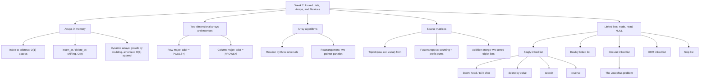

# Week 2 — Linked Lists, Arrays and Matrices

*CEN207 Data Structures (formerly CE205) · Fall 2026–2027*

<!-- materials:start -->

<div class="materials" markdown>

[:material-file-pdf-box: Lecture notes (PDF)](cen207-week-2-notes.pdf){ .md-button download="cen207-week-2-notes.pdf" }
[:material-file-word-box: Lecture notes (DOCX)](cen207-week-2-notes.docx){ .md-button download="cen207-week-2-notes.docx" }
[:material-presentation: Slides (PDF)](cen207-week-2-slides.pdf){ .md-button download="cen207-week-2-slides.pdf" }
[:material-microsoft-powerpoint: Slides (PPTX)](cen207-week-2-slides.pptx){ .md-button download="cen207-week-2-slides.pptx" }
[:material-language-html5: Slides (HTML, offline)](cen207-week-2-slides.html){ .md-button download="cen207-week-2-slides.html" }
[:material-folder-zip: Download all (ZIP)](cen207-week-2-materials.zip){ .md-button download="cen207-week-2-materials.zip" }
[:material-fullscreen: Open slides full screen](cen207-week-2-slides.html){ .md-button .md-button--primary target=_blank }

</div>

<div class="deck-frame">
<iframe src="../cen207-week-2-slides.html" title="Week 2 — Linked Lists, Arrays, Matrices" loading="lazy" allowfullscreen></iframe>
</div>

<p class="deck-hint">Click inside the slides and use the arrow keys; use the button at the bottom right of the slides, or the "Open slides full screen" link above, for full screen.</p>

<!-- materials:end -->

!!! abstract "This week"
    **Learning outcomes.** By the end of this week you will be able to explain, draw, and implement the two
    families of structure that everything else in this course builds on. The first family is the **array**:
    values packed side by side in memory, indexed by simple arithmetic, extended into two-dimensional **matrices**
    and compacted into **sparse** form when almost all of their cells are zero. The second family is the
    **linked list**: values scattered across memory and stitched together by pointers, which trades the array's
    instant indexing for cheap insertion and deletion anywhere. You will insert into and delete from a plain
    array by hand, watch a dynamic array grow, compute the memory address of `M[i][j]` in both row-major and
    column-major layouts, rotate and rearrange an array in place, store a sparse matrix as a table of triplets
    and transpose and add two of them without ever touching a zero, and then build, by hand, five kinds of
    linked list — singly, doubly, circular (and its classic puzzle, the Josephus problem), XOR, and skip list —
    inserting, deleting, searching, and reversing at every step. These outcomes map to **LO.1** (explain
    fundamental data structures), **LO.2** (analyze algorithmic complexity), and **LO.7** (choose the right
    structure for a problem) of the course syllabus.

    **What you need already.** Week 1 gave you Big-O notation, a picture of memory as a long row of numbered
    boxes, and — most importantly — **pointers**: a variable that holds another variable's address, written
    `int *p`, dereferenced with `*p`, and capable of pointing at nothing at all (`NULL`). Week 1 also gave you
    the `struct` (a bundle of named fields) and `malloc`/`free` (asking the operating system for a block of
    memory and giving it back). Everything below assumes all four of those are solid; the short recap in
    section 0 gets you there in a few minutes if any of them feel shaky.

    **Time plan for a 3-hour session.** Arrays in memory, insertion and deletion, dynamic array growth
    (~30 min) · two-dimensional arrays and matrices, row-major vs. column-major (~20 min) · array algorithms:
    rotation and rearrangement (~20 min) · short break · sparse matrices: triplets, fast transpose, addition
    (~30 min) · linked lists: inception, singly linked list insert/delete/search/reverse (~40 min) · doubly
    linked list (~20 min) · circular linked list and the Josephus problem (~20 min) · XOR linked list and skip
    list (~20 min) · arrays vs. linked lists, wrap-up and self-check (~10 min).

## 0. Before we start

### 0.1 What you already know

Three ideas from Week 1 carry almost all of this week's weight. Let's make sure they are solid.

**Memory as numbered boxes.** RAM is one enormous row of byte-sized boxes, each with its own address, starting
at 0 and counting up. A `struct` reserves a run of consecutive boxes and gives each field a fixed offset inside
that run; an `int` typically occupies 4 of those boxes. Nothing in this week's material needs more of a mental
model than that.

**Pointers.** A pointer is a variable whose value is an address — the number of a box, not the contents of a
box. `Node *p` declares "`p` holds the address of a `Node`"; `p->data` means "go to the box `p` points at, and
read its `data` field"; `p = NULL` means "`p` points at nothing" (address 0, by convention never a valid
object). Every operation in this week's material — inserting into an array, walking a linked list, rewiring two
neighbours around a deleted node — is nothing more than reading and writing a handful of these address-sized
numbers.

**`malloc` and `free`.** `malloc(sizeof(Node))` asks the operating system for a fresh block of memory exactly
big enough for one `Node`, and returns its address (or `NULL` if none is available); `free(p)` gives that block
back once you are done with it. Every node a linked list creates in this chapter is `malloc`'d once and
`free`'d exactly once — our example programs track this carefully, and you should too: a node that is never
freed is a **memory leak**, and a pointer used after its node is freed is a **dangling pointer**, one of the
most common bugs in C.

If any of this feels new rather than "oh right, I remember", five minutes with the Week 1 notes before
continuing will pay for itself many times over — everything below assumes it.

### 0.2 The map of this week



Every box gets its own section below, most with a short step-by-step animation, a complete C and Java program,
and a note on complexity and common mistakes.

## 1. Arrays in memory

### 1.1 A question to start

A parking garage has 200 numbered spaces in a straight row. If you know a car is in space 137, you drive
straight there — you never search space 1, then 2, then 3. Now imagine the opposite: a garage with no numbers,
where every car has a note taped to it saying "the next car is behind the blue pillar over there." Finding car
137 now means walking car to car, reading 136 notes along the way. Both are perfectly valid ways to organize a
collection of "cars", but they behave completely differently once you start asking to add or remove one in the
middle. This week is about both organizations — the numbered garage is the **array**, and the note-taped-to-car
scheme is the **linked list** — and about learning exactly when each one is the right tool.

### 1.2 Intuition and the address formula

An **array** is a block of memory holding `n` elements of the same type, placed one immediately after another —
contiguously. Because every element has exactly the same size, the computer never has to search for element
`i`: it computes its address directly from the array's own starting address (the **base address**), the
element's fixed size, and the index:

$$
\text{address}(A[i]) = \text{base} + i \times \text{sizeof}(T)
$$

For an array of `int` (4 bytes each) starting at address 1000, `A[0]` is at 1000, `A[1]` is at 1004, `A[5]` is
at 1020 — one multiplication and one addition, however large `i` is. This is why indexing into an array is
**O(1)**: the cost never depends on `n` or on `i`.

### 1.3 The array as an abstract data type

| Operation | What it does | Precondition | Complexity |
| --- | --- | --- | --- |
| `A[i]` (read/write) | Access the element at index `i` | `0 <= i < size` | O(1) |
| `insert_at(k, v)` | Insert `v` at index `k`, shifting `A[k..size-1]` one step right | array not full | O(n) — O(1) only when `k == size` |
| `delete_at(k)` | Remove the element at index `k`, shifting `A[k+1..size-1]` one step left | `0 <= k < size` | O(n) — O(1) only when `k == size-1` |

Reading and writing by index cost nothing extra because the address formula above needs no searching. Inserting
or deleting in the *middle*, though, has a real physical cost: every element after the gap has to physically
move one slot over, so that the array stays contiguous with no holes. The animation below makes that shifting
completely visible, one cell at a time.

### 1.4 Insertion and deletion by shifting

<iframe class="dsanim" src="../anim/array-insert-delete.html" title="Array insert and delete: shifting" loading="lazy"></iframe>
<div class="dsanim-baski" markdown>

</div>

In the picker, also try **a 14-capacity array with frequent front inserts, negative and duplicate values, and
mixed deletes** (hard) and the edge cases **overflow: fill a 10-capacity array, then an insert is rejected**,
**underflow: delete from an empty array**, and **boundary: always insert at index 0, then always at the end** —
or press 🎲 for random data at four difficulty levels, or type your own `cap=N` plus a sequence of `iK:V` /
`dK` operations.

Notice in the "overflow" and "underflow" edge cases that both `insert_at` and `delete_at` check their
precondition *before* touching any memory, and simply refuse the operation (returning `false`) rather than
writing past the end of the array or reading before its beginning — this is exactly the discipline every array
implementation in this course follows.

=== "C"

    ```c
    #define MAX_CAP 16
    static int arr[MAX_CAP];
    static int size;
    static int cap;              /* this scenario's capacity, <= MAX_CAP */

    /* insert v at index k; shifts arr[k..size-1] right, from the end backwards */
    bool insert_at(int k, int v) {
        if (size == cap)
            return false;            /* full: overflow, nothing inserted */
        for (int i = size; i > k; i--)
            arr[i] = arr[i - 1];    /* shift right */
        arr[k] = v;
        size++;
        return true;
    }

    /* delete the value at index k; shifts arr[k+1..size-1] left */
    bool delete_at(int k) {
        if (size == 0)
            return false;            /* empty: underflow, nothing to delete */
        for (int i = k; i < size - 1; i++)
            arr[i] = arr[i + 1];    /* shift left */
        size--;
        return true;
    }
    ```

=== "Java"

    ```java
    static final int MAX_CAP = 16;
    static int[] arr = new int[MAX_CAP];
    static int size;
    static int cap;              // this scenario's capacity, <= MAX_CAP

    // insert v at index k; shifts arr[k..size-1] right, from the end backwards
    static boolean insertAt(int k, int v) {
        if (size == cap)
            return false;            // full: overflow, nothing inserted
        for (int i = size; i > k; i--)
            arr[i] = arr[i - 1];    // shift right
        arr[k] = v;
        size++;
        return true;
    }

    // delete the value at index k; shifts arr[k+1..size-1] left
    static boolean deleteAt(int k) {
        if (size == 0)
            return false;            // empty: underflow, nothing to delete
        for (int i = k; i < size - 1; i++)
            arr[i] = arr[i + 1];    // shift left
        size--;
        return true;
    }
    ```

    The full class (`code/week-02/java/ArrayInsertDelete.java`) mirrors the C program's four scenarios exactly.

??? example "Full program: `array_insert_delete.c` / `ArrayInsertDelete.java`"

    === "C"

        ```c
        /* Week 2 -- Linked Lists, Arrays and Matrices
         * A fixed-capacity array with a running size: insert at an index k
         * (shifting the tail right, from the end backwards) and delete at an index
         * k (shifting the tail left). Matches the array-insert-delete.js animation.
         * The animation gives each preset its own #define CAP; this program keeps
         * one array big enough for every scenario (MAX_CAP) and tracks the
         * scenario's own capacity in the runtime variable `cap`, so insert_at and
         * delete_at are otherwise identical to the animation's code panel.
         * CEN207 Data Structures (formerly CE205)
         */
        #include <stdbool.h>
        #include <stdio.h>
        #include <stdlib.h>

        #define MAX_CAP 16
        static int arr[MAX_CAP];
        static int size;
        static int cap;              /* this scenario's capacity, <= MAX_CAP */

        /* insert v at index k; shifts arr[k..size-1] right, from the end backwards */
        bool insert_at(int k, int v) {
            if (size == cap)
                return false;            /* full: overflow, nothing inserted */
            for (int i = size; i > k; i--)
                arr[i] = arr[i - 1];    /* shift right */
            arr[k] = v;
            size++;
            return true;
        }

        /* delete the value at index k; shifts arr[k+1..size-1] left */
        bool delete_at(int k) {
            if (size == 0)
                return false;            /* empty: underflow, nothing to delete */
            for (int i = k; i < size - 1; i++)
                arr[i] = arr[i + 1];    /* shift left */
            size--;
            return true;
        }

        static void print_array(void) {
            printf("arr:");
            for (int i = 0; i < size; i++) printf(" %d", arr[i]);
            printf("  [size=%d cap=%d]\n", size, cap);
        }

        /* tokens: "iK:V" = insert_at(K, V); "dK" = delete_at(K) */
        static void run_scenario(const char *label, int scenario_cap, const char *ops[], int n) {
            printf("-- %s --\n", label);
            size = 0;
            cap = scenario_cap;
            print_array();
            for (int i = 0; i < n; i++) {
                const char *op = ops[i];
                if (op[0] == 'i') {
                    int k, v;
                    sscanf(op + 1, "%d:%d", &k, &v);
                    bool ok = insert_at(k, v);
                    printf("insert_at(%d, %d): %s\n", k, v, ok ? "ok" : "overflow, rejected");
                } else {
                    int k = atoi(op + 1);
                    bool ok = delete_at(k);
                    printf("delete_at(%d): %s\n", k, ok ? "ok" : "underflow, rejected");
                }
                print_array();
            }
            printf("\n");
        }

        int main(void) {
            /* normal: 16-capacity: 10 appends, an insert at the front, a middle and a front delete */
            const char *normal[] = {"i0:10", "i1:20", "i2:30", "i3:40", "i4:50", "i5:60", "i6:70", "i7:80", "i8:90", "i9:100", "i0:5", "d5", "d0"};
            run_scenario("normal: 16-capacity: 10 appends, an insert at the front, a middle and a front delete", 16, normal, 13);

            /* hard: 14-capacity: frequent front inserts, negative/duplicate values, mixed deletes */
            const char *hard[] = {"i0:7", "i1:-3", "i2:15", "i0:-3", "i4:22", "i5:-3", "i0:99", "i7:-40", "i8:100", "i9:-100", "d3", "i9:50", "i10:60", "i0:1000", "d0", "d5"};
            run_scenario("hard: 14-capacity: frequent front inserts, negative/duplicate values, mixed deletes", 14, hard, 16);

            /* edge: overflow: fill a 10-capacity array, then an insert is rejected */
            const char *overflow[] = {"i0:3", "i1:6", "i2:9", "i3:12", "i4:15", "i5:18", "i6:21", "i7:24", "i8:27", "i9:30", "i4:777", "i0:111", "d3", "i3:888"};
            run_scenario("edge: overflow: fill a 10-capacity array, then an insert is rejected", 10, overflow, 14);

            /* edge: underflow: delete from an empty array, then fill it and drain it completely */
            const char *delete_empty[] = {"d0", "i0:5", "i1:15", "i2:25", "i3:35", "i4:45", "i5:55", "i6:65", "i7:75", "i8:85", "i9:95",
                                           "d0", "d0", "d0", "d0", "d0", "d0", "d0", "d0", "d0", "d0", "d0"};
            run_scenario("edge: underflow: delete from an empty array, then fill it and drain it completely", 12, delete_empty, 22);

            return 0;
        }
        ```

    === "Java"

        ```java
        /* Week 2 -- Linked Lists, Arrays and Matrices
         * A fixed-capacity array with a running size: insert at an index k
         * (shifting the tail right, from the end backwards) and delete at an index
         * k (shifting the tail left). Matches the array-insert-delete.js animation.
         * The animation gives each preset its own capacity constant; this program
         * keeps one array big enough for every scenario (MAX_CAP) and tracks the
         * scenario's own capacity in the runtime field `cap`, so insertAt and
         * deleteAt are otherwise identical to the animation's code panel.
         * CEN207 Data Structures (formerly CE205)
         */
        public class ArrayInsertDelete {
            static final int MAX_CAP = 16;
            static int[] arr = new int[MAX_CAP];
            static int size;
            static int cap;              // this scenario's capacity, <= MAX_CAP

            // insert v at index k; shifts arr[k..size-1] right, from the end backwards
            static boolean insertAt(int k, int v) {
                if (size == cap)
                    return false;            // full: overflow, nothing inserted
                for (int i = size; i > k; i--)
                    arr[i] = arr[i - 1];    // shift right
                arr[k] = v;
                size++;
                return true;
            }

            // delete the value at index k; shifts arr[k+1..size-1] left
            static boolean deleteAt(int k) {
                if (size == 0)
                    return false;            // empty: underflow, nothing to delete
                for (int i = k; i < size - 1; i++)
                    arr[i] = arr[i + 1];    // shift left
                size--;
                return true;
            }

            static void printArray() {
                StringBuilder sb = new StringBuilder("arr:");
                for (int i = 0; i < size; i++) sb.append(' ').append(arr[i]);
                sb.append("  [size=").append(size).append(" cap=").append(cap).append(']');
                System.out.println(sb);
            }

            // tokens: "iK:V" = insertAt(K, V); "dK" = deleteAt(K)
            static void runScenario(String label, int scenarioCap, String[] ops) {
                System.out.println("-- " + label + " --");
                size = 0;
                cap = scenarioCap;
                printArray();
                for (String op : ops) {
                    if (op.charAt(0) == 'i') {
                        String[] parts = op.substring(1).split(":");
                        int k = Integer.parseInt(parts[0]), v = Integer.parseInt(parts[1]);
                        boolean ok = insertAt(k, v);
                        System.out.println("insert_at(" + k + ", " + v + "): " + (ok ? "ok" : "overflow, rejected"));
                    } else {
                        int k = Integer.parseInt(op.substring(1));
                        boolean ok = deleteAt(k);
                        System.out.println("delete_at(" + k + "): " + (ok ? "ok" : "underflow, rejected"));
                    }
                    printArray();
                }
                System.out.println();
            }

            public static void main(String[] args) {
                // normal: 16-capacity: 10 appends, an insert at the front, a middle and a front delete
                String[] normal = {"i0:10", "i1:20", "i2:30", "i3:40", "i4:50", "i5:60", "i6:70", "i7:80", "i8:90", "i9:100", "i0:5", "d5", "d0"};
                runScenario("normal: 16-capacity: 10 appends, an insert at the front, a middle and a front delete", 16, normal);

                // hard: 14-capacity: frequent front inserts, negative/duplicate values, mixed deletes
                String[] hard = {"i0:7", "i1:-3", "i2:15", "i0:-3", "i4:22", "i5:-3", "i0:99", "i7:-40", "i8:100", "i9:-100", "d3", "i9:50", "i10:60", "i0:1000", "d0", "d5"};
                runScenario("hard: 14-capacity: frequent front inserts, negative/duplicate values, mixed deletes", 14, hard);

                // edge: overflow: fill a 10-capacity array, then an insert is rejected
                String[] overflow = {"i0:3", "i1:6", "i2:9", "i3:12", "i4:15", "i5:18", "i6:21", "i7:24", "i8:27", "i9:30", "i4:777", "i0:111", "d3", "i3:888"};
                runScenario("edge: overflow: fill a 10-capacity array, then an insert is rejected", 10, overflow);

                // edge: underflow: delete from an empty array, then fill it and drain it completely
                String[] deleteEmpty = {"d0", "i0:5", "i1:15", "i2:25", "i3:35", "i4:45", "i5:55", "i6:65", "i7:75", "i8:85", "i9:95",
                                         "d0", "d0", "d0", "d0", "d0", "d0", "d0", "d0", "d0", "d0", "d0"};
                runScenario("edge: underflow: delete from an empty array, then fill it and drain it completely", 12, deleteEmpty);
            }
        }
        ```

**Try it**

=== "C"

    ```console
    gcc -std=c11 -Wall -Wextra -o /tmp/x array_insert_delete.c && /tmp/x
    ```

    Expected output:

    ```text
    -- normal: 16-capacity: 10 appends, an insert at the front, a middle and a front delete --
    arr:  [size=0 cap=16]
    insert_at(0, 10): ok
    arr: 10  [size=1 cap=16]
    insert_at(1, 20): ok
    arr: 10 20  [size=2 cap=16]
    insert_at(2, 30): ok
    arr: 10 20 30  [size=3 cap=16]
    insert_at(3, 40): ok
    arr: 10 20 30 40  [size=4 cap=16]
    insert_at(4, 50): ok
    arr: 10 20 30 40 50  [size=5 cap=16]
    insert_at(5, 60): ok
    arr: 10 20 30 40 50 60  [size=6 cap=16]
    insert_at(6, 70): ok
    arr: 10 20 30 40 50 60 70  [size=7 cap=16]
    insert_at(7, 80): ok
    arr: 10 20 30 40 50 60 70 80  [size=8 cap=16]
    insert_at(8, 90): ok
    arr: 10 20 30 40 50 60 70 80 90  [size=9 cap=16]
    insert_at(9, 100): ok
    arr: 10 20 30 40 50 60 70 80 90 100  [size=10 cap=16]
    insert_at(0, 5): ok
    arr: 5 10 20 30 40 50 60 70 80 90 100  [size=11 cap=16]
    delete_at(5): ok
    arr: 5 10 20 30 40 60 70 80 90 100  [size=10 cap=16]
    delete_at(0): ok
    arr: 10 20 30 40 60 70 80 90 100  [size=9 cap=16]

    …

    -- edge: underflow: delete from an empty array, then fill it and drain it completely --
    arr:  [size=0 cap=12]
    delete_at(0): underflow, rejected
    arr:  [size=0 cap=12]
    insert_at(0, 5): ok
    arr: 5  [size=1 cap=12]
    insert_at(1, 15): ok
    arr: 5 15  [size=2 cap=12]
    insert_at(2, 25): ok
    arr: 5 15 25  [size=3 cap=12]
    insert_at(3, 35): ok
    arr: 5 15 25 35  [size=4 cap=12]
    insert_at(4, 45): ok
    arr: 5 15 25 35 45  [size=5 cap=12]
    insert_at(5, 55): ok
    arr: 5 15 25 35 45 55  [size=6 cap=12]
    insert_at(6, 65): ok
    arr: 5 15 25 35 45 55 65  [size=7 cap=12]
    insert_at(7, 75): ok
    arr: 5 15 25 35 45 55 65 75  [size=8 cap=12]
    insert_at(8, 85): ok
    arr: 5 15 25 35 45 55 65 75 85  [size=9 cap=12]
    insert_at(9, 95): ok
    arr: 5 15 25 35 45 55 65 75 85 95  [size=10 cap=12]
    delete_at(0): ok
    arr: 15 25 35 45 55 65 75 85 95  [size=9 cap=12]
    delete_at(0): ok
    arr: 25 35 45 55 65 75 85 95  [size=8 cap=12]
    delete_at(0): ok
    arr: 35 45 55 65 75 85 95  [size=7 cap=12]
    delete_at(0): ok
    arr: 45 55 65 75 85 95  [size=6 cap=12]
    delete_at(0): ok
    arr: 55 65 75 85 95  [size=5 cap=12]
    delete_at(0): ok
    arr: 65 75 85 95  [size=4 cap=12]
    delete_at(0): ok
    arr: 75 85 95  [size=3 cap=12]
    delete_at(0): ok
    arr: 85 95  [size=2 cap=12]
    delete_at(0): ok
    arr: 95  [size=1 cap=12]
    delete_at(0): ok
    arr:  [size=0 cap=12]
    delete_at(0): underflow, rejected
    arr:  [size=0 cap=12]
    ```

=== "Java"

    ```console
    javac -d /tmp/j ArrayInsertDelete.java && java -cp /tmp/j ArrayInsertDelete
    ```

    Expected output: identical to the C run above (same algorithm, same data).

**Complexity.** `insert_at`/`delete_at` cost O(1) at the very end of the array (`k == size` or `k == size-1`)
and O(n) at the front (`k == 0`), where every existing element has to shift; on average, inserting or deleting
at a uniformly random index costs O(n) too, since the expected number of shifted elements is proportional to
`n`.

!!! warning "Common mistakes"
    - Forgetting to check `size == cap` before writing — this overruns the array and corrupts whatever memory
      comes after it, one of the most common causes of crashes in beginner C code.
    - Shifting in the wrong direction during insertion: the loop in `insert_at` must run from `size` down to
      `k`, copying each element one slot to the *right*, and it must go **backwards** (from the end) — copying
      forwards would overwrite values before they have been read.
    - Off-by-one errors in the shift bound for `delete_at`: the loop stops at `size - 1`, not `size`, since
      `arr[size]` does not (yet) hold a valid element.

## 2. Dynamic arrays: growing on demand

### 2.1 A question to start

The fixed-capacity array from section 1 has an uncomfortable question baked into it: what capacity do you pick?
Too small, and the array fills up and rejects further inserts; too large, and you waste memory that may never
be used. A **dynamic array** (`std::vector` in C++, `ArrayList` in Java, the list behind Python's `list`) solves
this by starting small and **growing itself** whenever it runs out of room — but growing a contiguous block of
memory is not free: every single existing element has to be copied into the new, larger block. How can
"sometimes copy everything" still add up to a fast structure overall?

### 2.2 Growing by a factor, and the "amortized" idea

A dynamic array keeps three things: a pointer to its current block, a `size` (how many elements are actually
stored), and a `cap` (how many the current block can hold before it is full). Appending is simple *when there
is room*: write the value at `data[size]`, then `size++` — O(1). The moment `size == cap`, though, the array
must **grow**: allocate a fresh block whose capacity is `cap` multiplied by some growth factor (2 in most
textbook implementations, though 1.5 is common too), copy every one of the `size` existing elements into it,
free the old block, and only then write the new value. That single append costs O(n).

The trick that makes dynamic arrays fast *on average* is that growth doubles the capacity every time it
happens, so it happens only O(log n) times over the life of n appends, and the total number of elements ever
copied is bounded by `n + n/2 + n/4 + ... < 2n` — a geometric series. Spread that `2n` total copying cost over
`n` appends and each append costs O(1) **on average**, even though any *individual* append can cost O(n). This
kind of average-over-a-sequence-of-operations argument is called **amortized analysis**, and a growing dynamic
array is its textbook example.

<iframe class="dsanim" src="../anim/dynamic-array-growth.html" title="Dynamic array: growth (capacity doubles)" loading="lazy"></iframe>
<div class="dsanim-baski" markdown>

</div>

In the picker, also try **cap0=2, factor 2: 14 appends with 2 removes in between (no shrinking)** (hard) and
the edge cases **growth factor 1.5 instead of 2: more frequent, smaller growths** and **shrinking: capacity
halves once the array is only a quarter full** — or press 🎲 for random data at four difficulty levels, or type
your own `cap0=`, `factor=`, `shrink=` settings plus a sequence of `aV` (append) / `r` (remove last) operations.

=== "C"

    ```c
    typedef struct {
        int *data;
        int size;
        int cap;
    } DynArray;

    static void da_resize(DynArray *a, int new_cap) {
        int *fresh = malloc(new_cap * sizeof(int));
        for (int i = 0; i < a->size; i++)
            fresh[i] = a->data[i];      /* copy every element to the new block */
        free(a->data);                  /* old block is freed */
        a->data = fresh;
        a->cap = new_cap;
    }

    void da_append(DynArray *a, int v) {
        if (a->size == a->cap) {
            int new_cap = (int)(a->cap * factor);   /* growth factor `factor` */
            if (new_cap <= a->cap) new_cap = a->cap + 1;
            da_resize(a, new_cap);       /* full: grow before writing */
        }
        a->data[a->size++] = v;
    }

    void da_remove_last(DynArray *a) {
        if (a->size == 0) return;
        a->size--;
        if (shrink_on && a->size <= a->cap / 4 && a->cap / 2 >= cap0)
            da_resize(a, a->cap / 2);    /* quarter full: shrink to save memory */
    }
    ```

=== "Java"

    ```java
    class DynArray {
        int[] data;
        int size;
        int cap;
    }

    static void resize(DynArray a, int newCap) {
        int[] fresh = new int[newCap];
        for (int i = 0; i < a.size; i++)
            fresh[i] = a.data[i];        // copy every element to the new block
        a.data = fresh;                  // old block is now garbage -- freed by the GC
        a.cap = newCap;
    }

    static void append(DynArray a, int v) {
        if (a.size == a.cap) {
            int newCap = (int) (a.cap * factor);   // growth factor `factor`
            if (newCap <= a.cap) newCap = a.cap + 1;
            resize(a, newCap);           // full: grow before writing
        }
        a.data[a.size++] = v;
    }

    static void removeLast(DynArray a) {
        if (a.size == 0) return;
        a.size--;
        if (shrinkOn && a.size <= a.cap / 4 && a.cap / 2 >= cap0)
            resize(a, a.cap / 2);        // quarter full: shrink to save memory
    }
    ```

    The full class (`code/week-02/java/DynamicArrayGrowth.java`) mirrors the C program's four scenarios exactly.

??? example "Full program: `dynamic_array_growth.c` / `DynamicArrayGrowth.java`"

    === "C"

        ```c
        /* Week 2 -- Linked Lists, Arrays and Matrices
         * A dynamic array: append n values into a block that starts tiny and grows
         * by a factor whenever it is full; count every element copy to show why
         * appending is amortized O(1) even though a single growing append is
         * O(n). Matches the dynamic-array-growth.js animation. The animation bakes
         * cap0/factor/shrink into the source text per preset; this program keeps
         * them as runtime globals set per scenario, so da_resize/da_append/
         * da_remove_last are otherwise identical to the animation's code panel.
         * CEN207 Data Structures (formerly CE205)
         */
        #include <stdio.h>
        #include <stdlib.h>

        typedef struct {
            int *data;
            int size;
            int cap;
        } DynArray;

        static double factor;   /* growth factor, e.g. 2 or 1.5 */
        static int cap0;        /* starting capacity, for the shrink floor */
        static int shrink_on;   /* whether da_remove_last shrinks at all */
        static int copies;      /* total elements copied by resizes, this scenario */
        static int growths, shrinks;

        static void da_resize(DynArray *a, int new_cap) {
            int *fresh = malloc(new_cap * sizeof(int));
            for (int i = 0; i < a->size; i++)
                fresh[i] = a->data[i];      /* copy every element to the new block */
            copies += a->size;
            free(a->data);                  /* old block is freed */
            a->data = fresh;
            a->cap = new_cap;
        }

        void da_append(DynArray *a, int v) {
            if (a->size == a->cap) {
                int new_cap = (int)(a->cap * factor);   /* growth factor `factor` */
                if (new_cap <= a->cap) new_cap = a->cap + 1;
                da_resize(a, new_cap);       /* full: grow before writing */
                growths++;
            }
            a->data[a->size++] = v;
        }

        void da_remove_last(DynArray *a) {
            if (a->size == 0) return;
            a->size--;
            if (shrink_on && a->size <= a->cap / 4 && a->cap / 2 >= cap0) {
                da_resize(a, a->cap / 2);    /* quarter full: shrink to save memory */
                shrinks++;
            }
        }

        static void print_array(DynArray *a) {
            printf("arr:");
            for (int i = 0; i < a->size; i++) printf(" %d", a->data[i]);
            printf("  [size=%d cap=%d]\n", a->size, a->cap);
        }

        /* tokens: "aV" = da_append(V); "r" = da_remove_last() */
        static void run_scenario(const char *label, int scenario_cap0, double scenario_factor, int scenario_shrink, const char *ops[], int n) {
            printf("-- %s --\n", label);
            cap0 = scenario_cap0;
            factor = scenario_factor;
            shrink_on = scenario_shrink;
            copies = 0; growths = 0; shrinks = 0;
            DynArray a;
            a.cap = cap0;
            a.size = 0;
            a.data = malloc((size_t) cap0 * sizeof(int));
            print_array(&a);
            for (int i = 0; i < n; i++) {
                const char *op = ops[i];
                if (op[0] == 'a') {
                    int v = atoi(op + 1);
                    da_append(&a, v);
                    printf("da_append(%d)\n", v);
                } else {
                    da_remove_last(&a);
                    printf("da_remove_last()\n");
                }
                print_array(&a);
            }
            printf("growths=%d shrinks=%d copies=%d\n\n", growths, shrinks, copies);
            free(a.data);
        }

        int main(void) {
            /* normal: cap0=1, factor 2: 12 appends, total copies < 2n */
            const char *normal[] = {"a5", "a12", "a8", "a19", "a3", "a27", "a14", "a6", "a31", "a9", "a22", "a17"};
            run_scenario("normal: cap0=1, factor 2: 12 appends, total copies < 2n", 1, 2.0, 0, normal, 12);

            /* hard: cap0=2, factor 2: 14 appends with 2 removes in between (no shrinking) */
            const char *hard[] = {"a10", "a-4", "a21", "a7", "r", "a33", "a-15", "a2", "a40", "r", "a18", "a-9", "a25", "a11", "a6", "a29"};
            run_scenario("hard: cap0=2, factor 2: 14 appends with 2 removes in between (no shrinking)", 2, 2.0, 0, hard, 16);

            /* edge: growth factor 1.5 (instead of 2): more frequent, smaller growths */
            const char *factor15[] = {"a4", "a9", "a15", "a2", "a23", "a8", "a31", "a6", "a19", "a1", "a27", "a13"};
            run_scenario("edge: growth factor 1.5 (instead of 2): more frequent, smaller growths", 1, 1.5, 0, factor15, 12);

            /* edge: shrinking: capacity halves once the array is only a quarter full */
            const char *shrink_quarter[] = {"a3", "a8", "a15", "a1", "a22", "a9", "a30", "a4", "a17", "a6", "a25", "a11", "r", "r", "r", "r", "r", "r", "r", "r", "r"};
            run_scenario("edge: shrinking: capacity halves once the array is only a quarter full", 2, 2.0, 1, shrink_quarter, 21);

            return 0;
        }
        ```

    === "Java"

        ```java
        /* Week 2 -- Linked Lists, Arrays and Matrices
         * A dynamic array: append n values into a block that starts tiny and grows
         * by a factor whenever it is full; count every element copy to show why
         * appending is amortized O(1) even though a single growing append is
         * O(n). Matches the dynamic-array-growth.js animation. The animation bakes
         * cap0/factor/shrink into the source text per preset; this program keeps
         * them as runtime fields set per scenario, so resize/append/removeLast are
         * otherwise identical to the animation's code panel.
         * CEN207 Data Structures (formerly CE205)
         */
        public class DynamicArrayGrowth {
            static class DynArray {
                int[] data;
                int size;
                int cap;
            }

            static double factor;   // growth factor, e.g. 2 or 1.5
            static int cap0;        // starting capacity, for the shrink floor
            static boolean shrinkOn; // whether removeLast shrinks at all
            static int copies;      // total elements copied by resizes, this scenario
            static int growths, shrinks;

            static void resize(DynArray a, int newCap) {
                int[] fresh = new int[newCap];
                for (int i = 0; i < a.size; i++)
                    fresh[i] = a.data[i];        // copy every element to the new block
                copies += a.size;
                a.data = fresh;                  // old block is now garbage -- freed by the GC
                a.cap = newCap;
            }

            static void append(DynArray a, int v) {
                if (a.size == a.cap) {
                    int newCap = (int) (a.cap * factor);   // growth factor `factor`
                    if (newCap <= a.cap) newCap = a.cap + 1;
                    resize(a, newCap);           // full: grow before writing
                    growths++;
                }
                a.data[a.size++] = v;
            }

            static void removeLast(DynArray a) {
                if (a.size == 0) return;
                a.size--;
                if (shrinkOn && a.size <= a.cap / 4 && a.cap / 2 >= cap0) {
                    resize(a, a.cap / 2);        // quarter full: shrink to save memory
                    shrinks++;
                }
            }

            static void printArray(DynArray a) {
                StringBuilder sb = new StringBuilder("arr:");
                for (int i = 0; i < a.size; i++) sb.append(' ').append(a.data[i]);
                sb.append("  [size=").append(a.size).append(" cap=").append(a.cap).append(']');
                System.out.println(sb);
            }

            // tokens: "aV" = append(V); "r" = removeLast()
            static void runScenario(String label, int scenarioCap0, double scenarioFactor, boolean scenarioShrink, String[] ops) {
                System.out.println("-- " + label + " --");
                cap0 = scenarioCap0;
                factor = scenarioFactor;
                shrinkOn = scenarioShrink;
                copies = 0; growths = 0; shrinks = 0;
                DynArray a = new DynArray();
                a.cap = cap0;
                a.size = 0;
                a.data = new int[cap0];
                printArray(a);
                for (String op : ops) {
                    if (op.charAt(0) == 'a') {
                        int v = Integer.parseInt(op.substring(1));
                        append(a, v);
                        System.out.println("da_append(" + v + ")");
                    } else {
                        removeLast(a);
                        System.out.println("da_remove_last()");
                    }
                    printArray(a);
                }
                System.out.println("growths=" + growths + " shrinks=" + shrinks + " copies=" + copies);
                System.out.println();
            }

            public static void main(String[] args) {
                // normal: cap0=1, factor 2: 12 appends, total copies < 2n
                String[] normal = {"a5", "a12", "a8", "a19", "a3", "a27", "a14", "a6", "a31", "a9", "a22", "a17"};
                runScenario("normal: cap0=1, factor 2: 12 appends, total copies < 2n", 1, 2.0, false, normal);

                // hard: cap0=2, factor 2: 14 appends with 2 removes in between (no shrinking)
                String[] hard = {"a10", "a-4", "a21", "a7", "r", "a33", "a-15", "a2", "a40", "r", "a18", "a-9", "a25", "a11", "a6", "a29"};
                runScenario("hard: cap0=2, factor 2: 14 appends with 2 removes in between (no shrinking)", 2, 2.0, false, hard);

                // edge: growth factor 1.5 (instead of 2): more frequent, smaller growths
                String[] factor15 = {"a4", "a9", "a15", "a2", "a23", "a8", "a31", "a6", "a19", "a1", "a27", "a13"};
                runScenario("edge: growth factor 1.5 (instead of 2): more frequent, smaller growths", 1, 1.5, false, factor15);

                // edge: shrinking: capacity halves once the array is only a quarter full
                String[] shrinkQuarter = {"a3", "a8", "a15", "a1", "a22", "a9", "a30", "a4", "a17", "a6", "a25", "a11", "r", "r", "r", "r", "r", "r", "r", "r", "r"};
                runScenario("edge: shrinking: capacity halves once the array is only a quarter full", 2, 2.0, true, shrinkQuarter);
            }
        }
        ```

**Try it**

=== "C"

    ```console
    gcc -std=c11 -Wall -Wextra -o /tmp/x dynamic_array_growth.c && /tmp/x
    ```

    Expected output:

    ```text
    -- normal: cap0=1, factor 2: 12 appends, total copies < 2n --
    arr:  [size=0 cap=1]
    da_append(5)
    arr: 5  [size=1 cap=1]
    da_append(12)
    arr: 5 12  [size=2 cap=2]
    da_append(8)
    arr: 5 12 8  [size=3 cap=4]
    da_append(19)
    arr: 5 12 8 19  [size=4 cap=4]
    da_append(3)
    arr: 5 12 8 19 3  [size=5 cap=8]
    da_append(27)
    arr: 5 12 8 19 3 27  [size=6 cap=8]
    da_append(14)
    arr: 5 12 8 19 3 27 14  [size=7 cap=8]
    da_append(6)
    arr: 5 12 8 19 3 27 14 6  [size=8 cap=8]
    da_append(31)
    arr: 5 12 8 19 3 27 14 6 31  [size=9 cap=16]
    da_append(9)
    arr: 5 12 8 19 3 27 14 6 31 9  [size=10 cap=16]
    da_append(22)
    arr: 5 12 8 19 3 27 14 6 31 9 22  [size=11 cap=16]
    da_append(17)
    arr: 5 12 8 19 3 27 14 6 31 9 22 17  [size=12 cap=16]
    growths=4 shrinks=0 copies=15

    …

    -- edge: shrinking: capacity halves once the array is only a quarter full --
    arr:  [size=0 cap=2]
    da_append(3)
    arr: 3  [size=1 cap=2]
    da_append(8)
    arr: 3 8  [size=2 cap=2]
    da_append(15)
    arr: 3 8 15  [size=3 cap=4]
    da_append(1)
    arr: 3 8 15 1  [size=4 cap=4]
    da_append(22)
    arr: 3 8 15 1 22  [size=5 cap=8]
    da_append(9)
    arr: 3 8 15 1 22 9  [size=6 cap=8]
    da_append(30)
    arr: 3 8 15 1 22 9 30  [size=7 cap=8]
    da_append(4)
    arr: 3 8 15 1 22 9 30 4  [size=8 cap=8]
    da_append(17)
    arr: 3 8 15 1 22 9 30 4 17  [size=9 cap=16]
    da_append(6)
    arr: 3 8 15 1 22 9 30 4 17 6  [size=10 cap=16]
    da_append(25)
    arr: 3 8 15 1 22 9 30 4 17 6 25  [size=11 cap=16]
    da_append(11)
    arr: 3 8 15 1 22 9 30 4 17 6 25 11  [size=12 cap=16]
    da_remove_last()
    arr: 3 8 15 1 22 9 30 4 17 6 25  [size=11 cap=16]
    da_remove_last()
    arr: 3 8 15 1 22 9 30 4 17 6  [size=10 cap=16]
    da_remove_last()
    arr: 3 8 15 1 22 9 30 4 17  [size=9 cap=16]
    da_remove_last()
    arr: 3 8 15 1 22 9 30 4  [size=8 cap=16]
    da_remove_last()
    arr: 3 8 15 1 22 9 30  [size=7 cap=16]
    da_remove_last()
    arr: 3 8 15 1 22 9  [size=6 cap=16]
    da_remove_last()
    arr: 3 8 15 1 22  [size=5 cap=16]
    da_remove_last()
    arr: 3 8 15 1  [size=4 cap=8]
    da_remove_last()
    arr: 3 8 15  [size=3 cap=8]
    growths=3 shrinks=1 copies=18
    ```

=== "Java"

    ```console
    javac -d /tmp/j DynamicArrayGrowth.java && java -cp /tmp/j DynamicArrayGrowth
    ```

    Expected output: identical to the C run above (same algorithm, same data).

**Complexity.** A single append costs O(1) when there is room, and O(n) exactly when it triggers a growth; over
n appends starting from a small capacity, the *total* cost of all the growths is O(n) (the geometric-series
argument above), so the **amortized** cost per append is O(1). The "shrinking" edge case shows the same idea
running in reverse: `da_remove_last` costs O(1) normally, and O(n) exactly when it triggers a shrink.

!!! warning "Common mistakes"
    - Shrinking back to exactly `size` (or growing by only +1 each time) defeats the whole point: if capacity
      only ever grows by a fixed amount, a run of n appends does O(n) resizes of average cost O(n/2), giving
      O(n²) total — no better than the fixed array from section 1. The growth **factor** (not a fixed increment)
      is what makes the geometric series converge.
    - Shrinking back at *exactly* the size that just triggered a growth (e.g. shrinking the moment
      `size == cap/2`) can cause **thrashing**: one more append immediately triggers growth again, and the array
      oscillates between two sizes on every alternating append/remove. This program only shrinks once the array
      is down to a *quarter* full, leaving a safety margin.
    - Forgetting to copy the existing elements before freeing the old block — `da_resize` must copy first,
      `free` second, in that order, or the data is lost.

## 3. Two-dimensional arrays and matrices

### 3.1 A question to start

A spreadsheet, a chessboard, and a black-and-white image all share the same shape: rows and columns. In code we
write `M[i][j]` and think of a grid, but RAM has no grids — it is one flat, numbered row of bytes. So where does
`M[i][j]` actually live, and does the *order* in which we visit the cells of a matrix change how fast our code
runs?

### 3.2 Flattening a grid into a line: row-major and column-major

A `ROWS x COLS` matrix stored in **row-major** order lays the entire first row down first, then the entire
second row immediately after it, and so on — exactly how C, Java, and Python store `int[][]`/`List[List[]]`.
The address (counted in elements, not bytes) of `M[i][j]` is then

$$
\text{addr}(i, j) = i \times \text{COLS} + j
$$

**Column-major** order (used by Fortran, MATLAB, and R) does the opposite: the entire first *column* is laid
down first. Its address formula swaps the roles of rows and columns:

$$
\text{addr}(i, j) = j \times \text{ROWS} + i
$$

Neither order is "more correct" — they are simply two different, equally valid ways to flatten the same grid.
What matters is whether your *traversal* order matches your *storage* order. If it does, consecutive steps of
the loop visit consecutive memory addresses (a jump of Δ = 1 every time) — which is exactly what a CPU's cache
is built to reward, since it fetches memory in chunks and a Δ = 1 access pattern reuses a chunk that is already
loaded. If the traversal order goes *against* the storage order, every single step jumps by a whole row (or
column) in memory, which is much less cache-friendly.

<iframe class="dsanim" src="../anim/matrix-row-major.html" title="Matrix in memory: row-major or column-major?" loading="lazy"></iframe>
<div class="dsanim-baski" markdown>

</div>

In the picker, also try **a 4x4 row-major matrix visited column-by-column: a jump on every step** (hard) and
the edge cases **a 3x5 column-major matrix visited row-by-row** and **a 3x4 column-major matrix visited
column-by-column** — or press 🎲 for random data at four difficulty levels, or type your own `layout=` /
`traversal=` choice plus rows separated by `;`.

=== "C"

    ```c
    /* address of mat[i][j], counted in ints from the start of the array */
    int addr(int i, int j) {
        return row_major ? i * cols + j : j * rows + i;
    }

    void traverse_row_major(int mat[MAX_ROWS][MAX_COLS]) {
        for (int i = 0; i < rows; i++)
            for (int j = 0; j < cols; j++)
                visit(mat[i][j]);
    }

    void traverse_col_major(int mat[MAX_ROWS][MAX_COLS]) {
        for (int j = 0; j < cols; j++)
            for (int i = 0; i < rows; i++)
                visit(mat[i][j]);
    }
    ```

=== "Java"

    ```java
    // address of mat[i][j], counted in ints from the start of the array
    static int addr(int i, int j) {
        return rowMajor ? i * cols + j : j * rows + i;
    }

    static void traverseRowMajor(int[][] mat) {
        for (int i = 0; i < rows; i++)
            for (int j = 0; j < cols; j++)
                visit(mat[i][j]);
    }

    static void traverseColMajor(int[][] mat) {
        for (int j = 0; j < cols; j++)
            for (int i = 0; i < rows; i++)
                visit(mat[i][j]);
    }
    ```

    The full class (`code/week-02/java/MatrixRowMajor.java`) mirrors the C program's four scenarios exactly.

??? example "Full program: `matrix_row_major.c` / `MatrixRowMajor.java`"

    === "C"

        ```c
        /* Week 2 -- Linked Lists, Arrays and Matrices
         * A 2D matrix is really flat, 1D memory underneath. Row-major storage
         * places mat[i][j] at word offset i*COLS+j (column-major: j*ROWS+i).
         * Matches the matrix-row-major.js animation. The animation bakes the
         * layout into the source text per preset; this program keeps a runtime
         * flag `row_major` so addr/traverse_row_major/traverse_col_major are
         * otherwise identical to the animation's code panel.
         * CEN207 Data Structures (formerly CE205)
         */
        #include <stdio.h>

        #define MAX_ROWS 4
        #define MAX_COLS 5

        static int rows, cols;
        static int row_major;   /* 1 = row-major layout, 0 = column-major layout */

        /* address of mat[i][j], counted in ints from the start of the array */
        int addr(int i, int j) {
            return row_major ? i * cols + j : j * rows + i;
        }

        void traverse_row_major(int mat[MAX_ROWS][MAX_COLS]) {
            int prev = -1;
            for (int i = 0; i < rows; i++)
                for (int j = 0; j < cols; j++) {
                    int a = addr(i, j);
                    printf("  M[%d][%d]=%d addr=%d%s\n", i, j, mat[i][j], a,
                           prev < 0 ? "" : (a - prev == 1 ? " (adjacent)" : " (jump)"));
                    prev = a;
                }
        }

        void traverse_col_major(int mat[MAX_ROWS][MAX_COLS]) {
            int prev = -1;
            for (int j = 0; j < cols; j++)
                for (int i = 0; i < rows; i++) {
                    int a = addr(i, j);
                    printf("  M[%d][%d]=%d addr=%d%s\n", i, j, mat[i][j], a,
                           prev < 0 ? "" : (a - prev == 1 ? " (adjacent)" : " (jump)"));
                    prev = a;
                }
        }

        static void run_scenario(const char *label, int r, int c, int mat[MAX_ROWS][MAX_COLS], int layout_row_major, int traversal_row) {
            printf("-- %s --\n", label);
            rows = r; cols = c; row_major = layout_row_major;
            printf("layout=%s traversal=%s\n", row_major ? "row-major" : "column-major", traversal_row ? "row" : "column");
            if (traversal_row) traverse_row_major(mat); else traverse_col_major(mat);
            printf("\n");
        }

        int main(void) {
            /* normal: 3x4 row-major, row-by-row traversal: always adjacent */
            int normal[MAX_ROWS][MAX_COLS] = {{8, 16, 24, 32}, {40, 48, 56, 64}, {72, 80, 88, 96}};
            run_scenario("normal: 3x4 row-major, row-by-row traversal: always adjacent", 3, 4, normal, 1, 1);

            /* hard: 4x4 row-major, column-by-column traversal: a jump on every step */
            int hard[MAX_ROWS][MAX_COLS] = {{3, -7, 15, 22}, {9, -14, 31, 6}, {18, -2, 27, 11}, {5, -19, 33, 8}};
            run_scenario("hard: 4x4 row-major, column-by-column traversal: a jump on every step", 4, 4, hard, 1, 0);

            /* edge: 3x5 column-major, row-by-row traversal: jumpy */
            int col_row[MAX_ROWS][MAX_COLS] = {{4, 9, -3, 16, 21}, {7, -12, 25, 2, 18}, {-6, 14, 8, -20, 30}};
            run_scenario("edge: 3x5 column-major, row-by-row traversal: jumpy", 3, 5, col_row, 0, 1);

            /* edge: 3x4 column-major, column-by-column traversal: adjacent again */
            int col_col[MAX_ROWS][MAX_COLS] = {{2, 5, -8, 13}, {19, -4, 7, 22}, {10, -15, 26, 1}};
            run_scenario("edge: 3x4 column-major, column-by-column traversal: adjacent again", 3, 4, col_col, 0, 0);

            return 0;
        }
        ```

    === "Java"

        ```java
        /* Week 2 -- Linked Lists, Arrays and Matrices
         * A 2D matrix is really flat, 1D memory underneath. Row-major storage
         * places mat[i][j] at word offset i*COLS+j (column-major: j*ROWS+i).
         * Matches the matrix-row-major.js animation. The animation bakes the
         * layout into the source text per preset; this program keeps a runtime
         * flag `rowMajor` so addr/traverseRowMajor/traverseColMajor are otherwise
         * identical to the animation's code panel.
         * CEN207 Data Structures (formerly CE205)
         */
        public class MatrixRowMajor {
            static int rows, cols;
            static boolean rowMajor;   // true = row-major layout, false = column-major layout

            // address of mat[i][j], counted in ints from the start of the array
            static int addr(int i, int j) {
                return rowMajor ? i * cols + j : j * rows + i;
            }

            static void traverseRowMajor(int[][] mat) {
                int prev = -1;
                for (int i = 0; i < rows; i++)
                    for (int j = 0; j < cols; j++) {
                        int a = addr(i, j);
                        System.out.println("  M[" + i + "][" + j + "]=" + mat[i][j] + " addr=" + a
                                + (prev < 0 ? "" : (a - prev == 1 ? " (adjacent)" : " (jump)")));
                        prev = a;
                    }
            }

            static void traverseColMajor(int[][] mat) {
                int prev = -1;
                for (int j = 0; j < cols; j++)
                    for (int i = 0; i < rows; i++) {
                        int a = addr(i, j);
                        System.out.println("  M[" + i + "][" + j + "]=" + mat[i][j] + " addr=" + a
                                + (prev < 0 ? "" : (a - prev == 1 ? " (adjacent)" : " (jump)")));
                        prev = a;
                    }
            }

            static void runScenario(String label, int[][] mat, boolean layoutRowMajor, boolean traversalRow) {
                System.out.println("-- " + label + " --");
                rows = mat.length; cols = mat[0].length; rowMajor = layoutRowMajor;
                System.out.println("layout=" + (rowMajor ? "row-major" : "column-major") + " traversal=" + (traversalRow ? "row" : "column"));
                if (traversalRow) traverseRowMajor(mat); else traverseColMajor(mat);
                System.out.println();
            }

            public static void main(String[] args) {
                // normal: 3x4 row-major, row-by-row traversal: always adjacent
                int[][] normal = {{8, 16, 24, 32}, {40, 48, 56, 64}, {72, 80, 88, 96}};
                runScenario("normal: 3x4 row-major, row-by-row traversal: always adjacent", normal, true, true);

                // hard: 4x4 row-major, column-by-column traversal: a jump on every step
                int[][] hard = {{3, -7, 15, 22}, {9, -14, 31, 6}, {18, -2, 27, 11}, {5, -19, 33, 8}};
                runScenario("hard: 4x4 row-major, column-by-column traversal: a jump on every step", hard, true, false);

                // edge: 3x5 column-major, row-by-row traversal: jumpy
                int[][] colRow = {{4, 9, -3, 16, 21}, {7, -12, 25, 2, 18}, {-6, 14, 8, -20, 30}};
                runScenario("edge: 3x5 column-major, row-by-row traversal: jumpy", colRow, false, true);

                // edge: 3x4 column-major, column-by-column traversal: adjacent again
                int[][] colCol = {{2, 5, -8, 13}, {19, -4, 7, 22}, {10, -15, 26, 1}};
                runScenario("edge: 3x4 column-major, column-by-column traversal: adjacent again", colCol, false, false);
            }
        }
        ```

**Try it**

=== "C"

    ```console
    gcc -std=c11 -Wall -Wextra -o /tmp/x matrix_row_major.c && /tmp/x
    ```

    Expected output:

    ```text
    -- normal: 3x4 row-major, row-by-row traversal: always adjacent --
    layout=row-major traversal=row
      M[0][0]=8 addr=0
      M[0][1]=16 addr=1 (adjacent)
      M[0][2]=24 addr=2 (adjacent)
      M[0][3]=32 addr=3 (adjacent)
      M[1][0]=40 addr=4 (adjacent)
      M[1][1]=48 addr=5 (adjacent)
      M[1][2]=56 addr=6 (adjacent)
      M[1][3]=64 addr=7 (adjacent)
      M[2][0]=72 addr=8 (adjacent)
      M[2][1]=80 addr=9 (adjacent)
      M[2][2]=88 addr=10 (adjacent)
      M[2][3]=96 addr=11 (adjacent)

    -- hard: 4x4 row-major, column-by-column traversal: a jump on every step --
    layout=row-major traversal=column
      M[0][0]=3 addr=0
      M[1][0]=9 addr=4 (jump)
      M[2][0]=18 addr=8 (jump)
      M[3][0]=5 addr=12 (jump)
      M[0][1]=-7 addr=1 (jump)
      M[1][1]=-14 addr=5 (jump)
      M[2][1]=-2 addr=9 (jump)
      M[3][1]=-19 addr=13 (jump)
      M[0][2]=15 addr=2 (jump)
      M[1][2]=31 addr=6 (jump)
      M[2][2]=27 addr=10 (jump)
      M[3][2]=33 addr=14 (jump)
      M[0][3]=22 addr=3 (jump)
      M[1][3]=6 addr=7 (jump)
      M[2][3]=11 addr=11 (jump)
      M[3][3]=8 addr=15 (jump)

    -- edge: 3x5 column-major, row-by-row traversal: jumpy --
    layout=column-major traversal=row
      M[0][0]=4 addr=0
      M[0][1]=9 addr=3 (jump)
      M[0][2]=-3 addr=6 (jump)
      M[0][3]=16 addr=9 (jump)
      M[0][4]=21 addr=12 (jump)
      M[1][0]=7 addr=1 (jump)
      M[1][1]=-12 addr=4 (jump)
      M[1][2]=25 addr=7 (jump)
      M[1][3]=2 addr=10 (jump)
      M[1][4]=18 addr=13 (jump)
      M[2][0]=-6 addr=2 (jump)
      M[2][1]=14 addr=5 (jump)
      M[2][2]=8 addr=8 (jump)
      M[2][3]=-20 addr=11 (jump)
      M[2][4]=30 addr=14 (jump)

    -- edge: 3x4 column-major, column-by-column traversal: adjacent again --
    layout=column-major traversal=column
      M[0][0]=2 addr=0
      M[1][0]=19 addr=1 (adjacent)
      M[2][0]=10 addr=2 (adjacent)
      M[0][1]=5 addr=3 (adjacent)
      M[1][1]=-4 addr=4 (adjacent)
      M[2][1]=-15 addr=5 (adjacent)
      M[0][2]=-8 addr=6 (adjacent)
      M[1][2]=7 addr=7 (adjacent)
      M[2][2]=26 addr=8 (adjacent)
      M[0][3]=13 addr=9 (adjacent)
      M[1][3]=22 addr=10 (adjacent)
      M[2][3]=1 addr=11 (adjacent)
    ```

=== "Java"

    ```console
    javac -d /tmp/j MatrixRowMajor.java && java -cp /tmp/j MatrixRowMajor
    ```

    Expected output: identical to the C run above (same algorithm, same data).

**Complexity.** Computing `addr(i, j)` is O(1) either way — one multiplication and two additions. Visiting
every cell of an `R x C` matrix is always O(R·C) regardless of traversal order; what changes is not the *count*
of memory accesses but their *locality*, which is invisible in Big-O but very visible in wall-clock time on
real hardware.

!!! warning "Common mistakes"
    - Writing `for (j...) for (i...)` on a row-major matrix "because that's how I'd read the grid out loud" —
      swapping the loop order relative to the storage layout is the single most common way to accidentally write
      a cache-hostile inner loop.
    - Assuming row-major and column-major give different *values* for `M[i][j]` — they do not; both describe
      the same logical matrix, just laid out differently underneath. Only the address formula changes.

## 4. Array algorithms

### 4.1 Rotation by three reversals

**A question to start.** A music player's "shuffle forward" button moves every song's position back by `d`
slots, wrapping the first `d` songs around to the end. The obvious way to rotate an array left by `d` positions
uses a second array of the same size — copy `A[d..n-1]` to the front, then `A[0..d-1]` to the back. That costs
O(n) *extra* memory. Can we rotate **in place**, using only O(1) extra memory?

We can, with a pleasantly surprising trick: reverse the first `d` elements, reverse the remaining `n-d`
elements, then reverse the *entire* array. Each reversal is a simple two-pointer swap working inward from both
ends, and three reversals of total length `2n` still add up to O(n) — but now with no extra array at all.

<iframe class="dsanim" src="../anim/array-rotation.html" title="Array rotation: rotating left with three reversals" loading="lazy"></iframe>
<div class="dsanim-baski" markdown>

</div>

In the picker, also try **15 values (negative/duplicate), d=7 (near half)** (hard) and the edge cases **d=0:
nothing should change**, **d=n: d%n=0, still no change**, and **d>n: reduced by d%n** — or press 🎲 for random
data at four difficulty levels, or type your own `d=N` plus an array.

=== "C"

    ```c
    void reverse(int arr[], int lo, int hi) {
        while (lo < hi) {
            int tmp = arr[lo];
            arr[lo] = arr[hi];
            arr[hi] = tmp;
            lo++;
            hi--;
        }
    }

    void rotate_left(int arr[], int n, int d) {
        if (n == 0)
            return;                     /* empty array: nothing to rotate */
        d = d % n;
        reverse(arr, 0, d - 1);        /* reverse the first d elements */
        reverse(arr, d, n - 1);        /* reverse the remaining n-d elements */
        reverse(arr, 0, n - 1);        /* reverse the whole array */
    }
    ```

=== "Java"

    ```java
    static void reverse(int[] arr, int lo, int hi) {
        while (lo < hi) {
            int tmp = arr[lo];
            arr[lo] = arr[hi];
            arr[hi] = tmp;
            lo++;
            hi--;
        }
    }

    static void rotateLeft(int[] arr, int d) {
        int n = arr.length;
        if (n == 0)
            return;                     // empty array: nothing to rotate
        d = d % n;
        reverse(arr, 0, d - 1);        // reverse the first d elements
        reverse(arr, d, n - 1);        // reverse the remaining n-d elements
        reverse(arr, 0, n - 1);        // reverse the whole array
    }
    ```

    The full class (`code/week-02/java/ArrayRotation.java`) mirrors the C program's five scenarios exactly.

??? example "Full program: `array_rotation.c` / `ArrayRotation.java`"

    === "C"

        ```c
        /* Week 2 -- Linked Lists, Arrays and Matrices
         * Rotate an array left by d positions with the reversal algorithm: reverse
         * the first d elements, reverse the rest, then reverse the whole thing.
         * Matches the array-rotation.js animation.
         * CEN207 Data Structures (formerly CE205)
         */
        #include <stdio.h>

        void reverse(int arr[], int lo, int hi) {
            while (lo < hi) {
                int tmp = arr[lo];
                arr[lo] = arr[hi];
                arr[hi] = tmp;
                lo++;
                hi--;
            }
        }

        void rotate_left(int arr[], int n, int d) {
            if (n == 0)
                return;                     /* empty array: nothing to rotate */
            d = d % n;
            reverse(arr, 0, d - 1);        /* reverse the first d elements */
            reverse(arr, d, n - 1);        /* reverse the remaining n-d elements */
            reverse(arr, 0, n - 1);        /* reverse the whole array */
        }

        static void print_array(const char *label, const int arr[], int n) {
            printf("%s:", label);
            for (int i = 0; i < n; i++) printf(" %d", arr[i]);
            printf("\n");
        }

        static void run_scenario(const char *label, int arr[], int n, int d) {
            printf("-- %s --\n", label);
            print_array("before", arr, n);
            printf("rotate_left(arr, %d, %d)\n", n, d);
            rotate_left(arr, n, d);
            print_array("after", arr, n);
            printf("\n");
        }

        int main(void) {
            /* normal: 12 values, d=4 */
            int normal[] = {10, 20, 30, 40, 50, 60, 70, 80, 90, 100, 110, 120};
            run_scenario("normal: 12 values, d=4", normal, 12, 4);

            /* hard: 15 values (negative/duplicate), d=7 (near half) */
            int hard[] = {3, -8, 15, 3, 22, -1, 40, 9, -17, 26, 5, -30, 11, 3, 18};
            run_scenario("hard: 15 values (negative/duplicate), d=7 (near half)", hard, 15, 7);

            /* edge: d=0: nothing should change */
            int d_zero[] = {4, 9, 15, 23, 2, 31, 8, 19, 6, 27};
            run_scenario("edge: d=0: nothing should change", d_zero, 10, 0);

            /* edge: d=n: d%n=0, still no change */
            int d_eq_n[] = {5, 12, 18, 24, 3, 30, 9, 21, 15, 6};
            run_scenario("edge: d=n: d%n=0, still no change", d_eq_n, 10, 10);

            /* edge: d>n: reduced by d%n (d=23, n=10 -> 3) */
            int d_gt_n[] = {7, 14, 21, 2, 28, 9, 35, 16, 4, 22};
            run_scenario("edge: d>n: reduced by d%n (d=23, n=10 -> 3)", d_gt_n, 10, 23);

            return 0;
        }
        ```

    === "Java"

        ```java
        /* Week 2 -- Linked Lists, Arrays and Matrices
         * Rotate an array left by d positions with the reversal algorithm: reverse
         * the first d elements, reverse the rest, then reverse the whole thing.
         * Matches the array-rotation.js animation.
         * CEN207 Data Structures (formerly CE205)
         */
        public class ArrayRotation {
            static void reverse(int[] arr, int lo, int hi) {
                while (lo < hi) {
                    int tmp = arr[lo];
                    arr[lo] = arr[hi];
                    arr[hi] = tmp;
                    lo++;
                    hi--;
                }
            }

            static void rotateLeft(int[] arr, int d) {
                int n = arr.length;
                if (n == 0)
                    return;                     // empty array: nothing to rotate
                d = d % n;
                reverse(arr, 0, d - 1);        // reverse the first d elements
                reverse(arr, d, n - 1);        // reverse the remaining n-d elements
                reverse(arr, 0, n - 1);        // reverse the whole array
            }

            static void printArray(String label, int[] arr) {
                StringBuilder sb = new StringBuilder(label + ":");
                for (int v : arr) sb.append(' ').append(v);
                System.out.println(sb);
            }

            static void runScenario(String label, int[] arr, int d) {
                System.out.println("-- " + label + " --");
                printArray("before", arr);
                System.out.println("rotate_left(arr, " + arr.length + ", " + d + ")");
                rotateLeft(arr, d);
                printArray("after", arr);
                System.out.println();
            }

            public static void main(String[] args) {
                // normal: 12 values, d=4
                int[] normal = {10, 20, 30, 40, 50, 60, 70, 80, 90, 100, 110, 120};
                runScenario("normal: 12 values, d=4", normal, 4);

                // hard: 15 values (negative/duplicate), d=7 (near half)
                int[] hard = {3, -8, 15, 3, 22, -1, 40, 9, -17, 26, 5, -30, 11, 3, 18};
                runScenario("hard: 15 values (negative/duplicate), d=7 (near half)", hard, 7);

                // edge: d=0: nothing should change
                int[] dZero = {4, 9, 15, 23, 2, 31, 8, 19, 6, 27};
                runScenario("edge: d=0: nothing should change", dZero, 0);

                // edge: d=n: d%n=0, still no change
                int[] dEqN = {5, 12, 18, 24, 3, 30, 9, 21, 15, 6};
                runScenario("edge: d=n: d%n=0, still no change", dEqN, 10);

                // edge: d>n: reduced by d%n (d=23, n=10 -> 3)
                int[] dGtN = {7, 14, 21, 2, 28, 9, 35, 16, 4, 22};
                runScenario("edge: d>n: reduced by d%n (d=23, n=10 -> 3)", dGtN, 23);
            }
        }
        ```

**Try it**

=== "C"

    ```console
    gcc -std=c11 -Wall -Wextra -o /tmp/x array_rotation.c && /tmp/x
    ```

    Expected output:

    ```text
    -- normal: 12 values, d=4 --
    before: 10 20 30 40 50 60 70 80 90 100 110 120
    rotate_left(arr, 12, 4)
    after: 50 60 70 80 90 100 110 120 10 20 30 40

    -- hard: 15 values (negative/duplicate), d=7 (near half) --
    before: 3 -8 15 3 22 -1 40 9 -17 26 5 -30 11 3 18
    rotate_left(arr, 15, 7)
    after: 9 -17 26 5 -30 11 3 18 3 -8 15 3 22 -1 40

    -- edge: d=0: nothing should change --
    before: 4 9 15 23 2 31 8 19 6 27
    rotate_left(arr, 10, 0)
    after: 4 9 15 23 2 31 8 19 6 27

    -- edge: d=n: d%n=0, still no change --
    before: 5 12 18 24 3 30 9 21 15 6
    rotate_left(arr, 10, 10)
    after: 5 12 18 24 3 30 9 21 15 6

    -- edge: d>n: reduced by d%n (d=23, n=10 -> 3) --
    before: 7 14 21 2 28 9 35 16 4 22
    rotate_left(arr, 10, 23)
    after: 2 28 9 35 16 4 22 7 14 21
    ```

=== "Java"

    ```console
    javac -d /tmp/j ArrayRotation.java && java -cp /tmp/j ArrayRotation
    ```

    Expected output: identical to the C run above (same algorithm, same data).

**Complexity.** Each of the three reversals costs O(length), and the three lengths (`d`, `n-d`, `n`) sum to
`2n`, so `rotate_left` is O(n) time and O(1) extra space — no auxiliary array needed.

### 4.2 Rearrangement: partitioning with two pointers

**A question to start.** A conveyor belt sorts items into "reject" and "accept" bins by sliding rejects to one
side, without needing them in any particular order within that side — just *segregated*. This is a smaller ask
than sorting, and it can be done in a single O(n) pass with two pointers walking toward each other from
opposite ends, exactly the partitioning step used inside quicksort: `left` skips values already on the correct
side, `right` skips values already on the correct side from the other direction, and whenever both stop, the
two values in between are out of place and swap.

<iframe class="dsanim" src="../anim/array-rearrange.html" title="Array rearrangement: negatives left, non-negatives right" loading="lazy"></iframe>
<div class="dsanim-baski" markdown>

</div>

In the picker, also try **15 values with zeros and duplicates (0 does NOT count as negative)** (hard) and the
edge cases **all negative: no swap is ever needed**, **all non-negative (0 included): no swap is ever needed**,
and **already segregated: the pointers cross without any swap** — or press 🎲 for random data at four
difficulty levels, or type your own array.

=== "C"

    ```c
    void segregate(int arr[], int n) {
        int left = 0, right = n - 1;
        while (left < right) {
            while (left < right && arr[left] < 0)
                left++;                 /* already negative: leave it */
            while (left < right && arr[right] >= 0)
                right--;                /* already non-negative: leave it */
            if (left < right) {
                int tmp = arr[left];
                arr[left] = arr[right];
                arr[right] = tmp;
                left++;
                right--;
            }
        }
    }
    ```

=== "Java"

    ```java
    static void segregate(int[] arr) {
        int left = 0, right = arr.length - 1;
        while (left < right) {
            while (left < right && arr[left] < 0)
                left++;                 // already negative: leave it
            while (left < right && arr[right] >= 0)
                right--;                // already non-negative: leave it
            if (left < right) {
                int tmp = arr[left];
                arr[left] = arr[right];
                arr[right] = tmp;
                left++;
                right--;
            }
        }
    }
    ```

    The full class (`code/week-02/java/ArrayRearrange.java`) mirrors the C program's five scenarios exactly.

??? example "Full program: `array_rearrange.c` / `ArrayRearrange.java`"

    === "C"

        ```c
        /* Week 2 -- Linked Lists, Arrays and Matrices
         * Rearrange an array in place: every negative value ends up left of every
         * non-negative value, using two pointers walking toward each other (the
         * same shape as a quicksort partition). Matches the array-rearrange.js
         * animation.
         * CEN207 Data Structures (formerly CE205)
         */
        #include <stdio.h>

        void segregate(int arr[], int n) {
            int left = 0, right = n - 1;
            while (left < right) {
                while (left < right && arr[left] < 0)
                    left++;                 /* already negative: leave it */
                while (left < right && arr[right] >= 0)
                    right--;                /* already non-negative: leave it */
                if (left < right) {
                    int tmp = arr[left];
                    arr[left] = arr[right];
                    arr[right] = tmp;
                    left++;
                    right--;
                }
            }
        }

        static void print_array(const char *label, const int arr[], int n) {
            printf("%s:", label);
            for (int i = 0; i < n; i++) printf(" %d", arr[i]);
            printf("\n");
        }

        static void run_scenario(const char *label, int arr[], int n) {
            printf("-- %s --\n", label);
            print_array("before", arr, n);
            segregate(arr, n);
            print_array("after ", arr, n);
            printf("\n");
        }

        int main(void) {
            /* normal: 12 values, mixed sign */
            int normal[] = {12, -7, 5, -3, 9, -1, -8, 6, 15, -20, 3, -4};
            run_scenario("normal: 12 values, mixed sign", normal, 12);

            /* hard: 15 values with zeros and duplicates (0 does NOT count as negative) */
            int hard[] = {0, -5, 3, -5, 0, 8, -12, 0, 4, -3, 7, -7, 0, 9, -2};
            run_scenario("hard: 15 values with zeros and duplicates (0 does NOT count as negative)", hard, 15);

            /* edge: all negative: no swap is ever needed */
            int all_negative[] = {-3, -8, -1, -15, -22, -4, -9, -17, -2, -6};
            run_scenario("edge: all negative: no swap is ever needed", all_negative, 10);

            /* edge: all non-negative (0 included): no swap is ever needed */
            int all_nonnegative[] = {4, 0, 9, 15, 2, 8, 0, 11, 6, 3};
            run_scenario("edge: all non-negative (0 included): no swap is ever needed", all_nonnegative, 10);

            /* edge: already segregated: the pointers cross without any swap */
            int already[] = {-5, -3, -8, -1, -9, 2, 4, 6, 8, 10, 12, 14};
            run_scenario("edge: already segregated: the pointers cross without any swap", already, 12);

            return 0;
        }
        ```

    === "Java"

        ```java
        /* Week 2 -- Linked Lists, Arrays and Matrices
         * Rearrange an array in place: every negative value ends up left of every
         * non-negative value, using two pointers walking toward each other (the
         * same shape as a quicksort partition). Matches the array-rearrange.js
         * animation.
         * CEN207 Data Structures (formerly CE205)
         */
        public class ArrayRearrange {
            static void segregate(int[] arr) {
                int left = 0, right = arr.length - 1;
                while (left < right) {
                    while (left < right && arr[left] < 0)
                        left++;                 // already negative: leave it
                    while (left < right && arr[right] >= 0)
                        right--;                // already non-negative: leave it
                    if (left < right) {
                        int tmp = arr[left];
                        arr[left] = arr[right];
                        arr[right] = tmp;
                        left++;
                        right--;
                    }
                }
            }

            static void printArray(String label, int[] arr) {
                StringBuilder sb = new StringBuilder(label + ":");
                for (int v : arr) sb.append(' ').append(v);
                System.out.println(sb);
            }

            static void runScenario(String label, int[] arr) {
                System.out.println("-- " + label + " --");
                printArray("before", arr);
                segregate(arr);
                printArray("after ", arr);
                System.out.println();
            }

            public static void main(String[] args) {
                // normal: 12 values, mixed sign
                int[] normal = {12, -7, 5, -3, 9, -1, -8, 6, 15, -20, 3, -4};
                runScenario("normal: 12 values, mixed sign", normal);

                // hard: 15 values with zeros and duplicates (0 does NOT count as negative)
                int[] hard = {0, -5, 3, -5, 0, 8, -12, 0, 4, -3, 7, -7, 0, 9, -2};
                runScenario("hard: 15 values with zeros and duplicates (0 does NOT count as negative)", hard);

                // edge: all negative: no swap is ever needed
                int[] allNegative = {-3, -8, -1, -15, -22, -4, -9, -17, -2, -6};
                runScenario("edge: all negative: no swap is ever needed", allNegative);

                // edge: all non-negative (0 included): no swap is ever needed
                int[] allNonnegative = {4, 0, 9, 15, 2, 8, 0, 11, 6, 3};
                runScenario("edge: all non-negative (0 included): no swap is ever needed", allNonnegative);

                // edge: already segregated: the pointers cross without any swap
                int[] already = {-5, -3, -8, -1, -9, 2, 4, 6, 8, 10, 12, 14};
                runScenario("edge: already segregated: the pointers cross without any swap", already);
            }
        }
        ```

**Try it**

=== "C"

    ```console
    gcc -std=c11 -Wall -Wextra -o /tmp/x array_rearrange.c && /tmp/x
    ```

    Expected output:

    ```text
    -- normal: 12 values, mixed sign --
    before: 12 -7 5 -3 9 -1 -8 6 15 -20 3 -4
    after : -4 -7 -20 -3 -8 -1 9 6 15 5 3 12

    -- hard: 15 values with zeros and duplicates (0 does NOT count as negative) --
    before: 0 -5 3 -5 0 8 -12 0 4 -3 7 -7 0 9 -2
    after : -2 -5 -7 -5 -3 -12 8 0 4 0 7 3 0 9 0

    -- edge: all negative: no swap is ever needed --
    before: -3 -8 -1 -15 -22 -4 -9 -17 -2 -6
    after : -3 -8 -1 -15 -22 -4 -9 -17 -2 -6

    -- edge: all non-negative (0 included): no swap is ever needed --
    before: 4 0 9 15 2 8 0 11 6 3
    after : 4 0 9 15 2 8 0 11 6 3

    -- edge: already segregated: the pointers cross without any swap --
    before: -5 -3 -8 -1 -9 2 4 6 8 10 12 14
    after : -5 -3 -8 -1 -9 2 4 6 8 10 12 14
    ```

=== "Java"

    ```console
    javac -d /tmp/j ArrayRearrange.java && java -cp /tmp/j ArrayRearrange
    ```

    Expected output: identical to the C run above (same algorithm, same data).

**Complexity.** `left` and `right` only ever move toward each other and never backtrack, so together they take
at most `n` steps total: O(n) time, O(1) extra space.

!!! warning "Common mistakes"
    - Confusing this with a **stable** partition: `segregate` does not preserve the relative order of elements
      within each side (notice `12` and `3` swap places relative to each other in the "normal" scenario above).
      If order must be preserved, a different (O(n) extra space) technique is needed.
    - Missing the `left < right` guard inside the inner `while` loops: without it, an all-negative or
      all-non-negative array makes one of the inner loops walk `left` or `right` straight past the other,
      reading out of bounds.

## 5. Sparse matrices

### 5.1 A question to start

A social network's "who follows whom" matrix for a million users would need `1,000,000 x 1,000,000` cells —
a trillion of them — yet the overwhelming majority of those cells are 0 (most people do not follow most other
people). Storing all trillion cells, almost all zero, wastes essentially all of that memory. A matrix in which
the great majority of entries are zero is called **sparse**, and it deserves a representation that only pays
for the entries that are actually there.

### 5.2 The triplet representation

The simplest sparse representation lists only the nonzero cells, each as a `(row, col, value)` **triplet**,
scanned in row-major order. A matrix that is, say, 95% zero shrinks to a table roughly 5% the size of the dense
grid — and the savings only grow as the matrix gets bigger or sparser.

<iframe class="dsanim" src="../anim/sparse-matrix-triplet.html" title="Sparse matrix: the triplet (row, col, value) representation" loading="lazy"></iframe>
<div class="dsanim-baski" markdown>

</div>

In the picker, also try **a 6x6 matrix (36 cells), 9 nonzero (negatives included)** (hard) and the edge cases
**a 4x4 matrix, all zero: the triplet table stays empty** and **a 4x3 matrix, all nonzero: the triplet table
grows as large as the array** — or press 🎲 for random data at four difficulty levels, or type your own matrix
rows separated by `;`.

=== "C"

    ```c
    typedef struct {
        int row, col, value;
    } Triplet;

    int to_triplets(int mat[ROWS][COLS], Triplet out[]) {
        int k = 0;
        for (int i = 0; i < ROWS; i++)
            for (int j = 0; j < COLS; j++)
                if (mat[i][j] != 0) {
                    out[k].row = i;
                    out[k].col = j;
                    out[k].value = mat[i][j];
                    k++;
                }
        return k;
    }
    ```

=== "Java"

    ```java
    static class Triplet {
        int row, col, value;
        Triplet(int row, int col, int value) { this.row = row; this.col = col; this.value = value; }
    }

    static Triplet[] toTriplets(int[][] mat) {
        Triplet[] out = new Triplet[ROWS * COLS];
        int k = 0;
        for (int i = 0; i < ROWS; i++)
            for (int j = 0; j < COLS; j++)
                if (mat[i][j] != 0)
                    out[k++] = new Triplet(i, j, mat[i][j]);
        Triplet[] trimmed = new Triplet[k];
        System.arraycopy(out, 0, trimmed, 0, k);
        return trimmed;
    }
    ```

    The full class (`code/week-02/java/SparseMatrixTriplet.java`) mirrors the C program's four scenarios exactly.

??? example "Full program: `sparse_matrix_triplet.c` / `SparseMatrixTriplet.java`"

    === "C"

        ```c
        /* Week 2 -- Linked Lists, Arrays and Matrices
         * A sparse matrix (mostly zeros) wastes memory if stored densely. Scan it
         * row-major and record only the nonzero cells as (row, col, value)
         * triplets. Matches the sparse-matrix-triplet.js animation. The animation
         * bakes ROWS/COLS into the source text per preset; this program keeps
         * runtime globals `rows`/`cols` set per scenario, so to_triplets is
         * otherwise identical to the animation's code panel.
         * CEN207 Data Structures (formerly CE205)
         */
        #include <stdio.h>

        #define MAX_ROWS 6
        #define MAX_COLS 6
        #define MAX_NNZ (MAX_ROWS * MAX_COLS)

        typedef struct {
            int row, col, value;
        } Triplet;

        static int rows, cols;

        int to_triplets(int mat[MAX_ROWS][MAX_COLS], Triplet out[]) {
            int k = 0;
            for (int i = 0; i < rows; i++)
                for (int j = 0; j < cols; j++)
                    if (mat[i][j] != 0) {
                        out[k].row = i;
                        out[k].col = j;
                        out[k].value = mat[i][j];
                        k++;
                    }
            return k;
        }

        static void run_scenario(const char *label, int r, int c, int mat[MAX_ROWS][MAX_COLS]) {
            printf("-- %s --\n", label);
            rows = r; cols = c;
            Triplet out[MAX_NNZ];
            int nnz = to_triplets(mat, out);
            printf("rows=%d cols=%d cells=%d nnz=%d\n", rows, cols, rows * cols, nnz);
            for (int i = 0; i < nnz; i++)
                printf("  (%d, %d, %d)\n", out[i].row, out[i].col, out[i].value);
            printf("\n");
        }

        int main(void) {
            /* normal: 5x6 (30 cells), only 6 nonzero */
            int normal[MAX_ROWS][MAX_COLS] = {
                {0, 0, 3, 0, 0, 0}, {0, 0, 0, 0, 4, 0}, {0, 5, 0, 0, 0, 0}, {0, 0, 0, 0, 0, 7}, {6, 0, 0, 8, 0, 0}
            };
            run_scenario("normal: 5x6 (30 cells), only 6 nonzero", 5, 6, normal);

            /* hard: 6x6 (36 cells), 9 nonzero (negatives included) */
            int hard[MAX_ROWS][MAX_COLS] = {
                {0, -3, 0, 0, 0, 5}, {0, 0, 0, 9, 0, 0}, {7, 0, 0, 0, 0, 0},
                {0, 0, -12, 0, 4, 0}, {0, 0, 0, 0, 0, 0}, {2, 0, 0, -6, 0, 11}
            };
            run_scenario("hard: 6x6 (36 cells), 9 nonzero (negatives included)", 6, 6, hard);

            /* edge: 4x4 (16 cells), all zero: the triplet table stays empty */
            int all_zero[MAX_ROWS][MAX_COLS] = { {0} };
            run_scenario("edge: 4x4 (16 cells), all zero: the triplet table stays empty", 4, 4, all_zero);

            /* edge: 4x3 (12 cells), all nonzero: the triplet table grows as large as the array */
            int fully_dense[MAX_ROWS][MAX_COLS] = { {1, 2, 3}, {4, 5, 6}, {7, 8, 9}, {10, 11, 12} };
            run_scenario("edge: 4x3 (12 cells), all nonzero: the triplet table grows as large as the array", 4, 3, fully_dense);

            return 0;
        }
        ```

    === "Java"

        ```java
        /* Week 2 -- Linked Lists, Arrays and Matrices
         * A sparse matrix (mostly zeros) wastes memory if stored densely. Scan it
         * row-major and record only the nonzero cells as (row, col, value)
         * triplets. Matches the sparse-matrix-triplet.js animation.
         * CEN207 Data Structures (formerly CE205)
         */
        public class SparseMatrixTriplet {
            static class Triplet {
                int row, col, value;
                Triplet(int row, int col, int value) { this.row = row; this.col = col; this.value = value; }
            }

            static Triplet[] toTriplets(int[][] mat) {
                int rows = mat.length, cols = mat[0].length;
                Triplet[] out = new Triplet[rows * cols];
                int k = 0;
                for (int i = 0; i < rows; i++)
                    for (int j = 0; j < cols; j++)
                        if (mat[i][j] != 0)
                            out[k++] = new Triplet(i, j, mat[i][j]);
                Triplet[] trimmed = new Triplet[k];
                System.arraycopy(out, 0, trimmed, 0, k);
                return trimmed;
            }

            static void runScenario(String label, int[][] mat) {
                System.out.println("-- " + label + " --");
                int rows = mat.length, cols = mat[0].length;
                Triplet[] out = toTriplets(mat);
                System.out.println("rows=" + rows + " cols=" + cols + " cells=" + (rows * cols) + " nnz=" + out.length);
                for (Triplet t : out)
                    System.out.println("  (" + t.row + ", " + t.col + ", " + t.value + ")");
                System.out.println();
            }

            public static void main(String[] args) {
                // normal: 5x6 (30 cells), only 6 nonzero
                int[][] normal = {
                    {0, 0, 3, 0, 0, 0}, {0, 0, 0, 0, 4, 0}, {0, 5, 0, 0, 0, 0}, {0, 0, 0, 0, 0, 7}, {6, 0, 0, 8, 0, 0}
                };
                runScenario("normal: 5x6 (30 cells), only 6 nonzero", normal);

                // hard: 6x6 (36 cells), 9 nonzero (negatives included)
                int[][] hard = {
                    {0, -3, 0, 0, 0, 5}, {0, 0, 0, 9, 0, 0}, {7, 0, 0, 0, 0, 0},
                    {0, 0, -12, 0, 4, 0}, {0, 0, 0, 0, 0, 0}, {2, 0, 0, -6, 0, 11}
                };
                runScenario("hard: 6x6 (36 cells), 9 nonzero (negatives included)", hard);

                // edge: 4x4 (16 cells), all zero: the triplet table stays empty
                int[][] allZero = { {0, 0, 0, 0}, {0, 0, 0, 0}, {0, 0, 0, 0}, {0, 0, 0, 0} };
                runScenario("edge: 4x4 (16 cells), all zero: the triplet table stays empty", allZero);

                // edge: 4x3 (12 cells), all nonzero: the triplet table grows as large as the array
                int[][] fullyDense = { {1, 2, 3}, {4, 5, 6}, {7, 8, 9}, {10, 11, 12} };
                runScenario("edge: 4x3 (12 cells), all nonzero: the triplet table grows as large as the array", fullyDense);
            }
        }
        ```

**Try it**

=== "C"

    ```console
    gcc -std=c11 -Wall -Wextra -o /tmp/x sparse_matrix_triplet.c && /tmp/x
    ```

    Expected output:

    ```text
    -- normal: 5x6 (30 cells), only 6 nonzero --
    rows=5 cols=6 cells=30 nnz=6
      (0, 2, 3)
      (1, 4, 4)
      (2, 1, 5)
      (3, 5, 7)
      (4, 0, 6)
      (4, 3, 8)

    -- hard: 6x6 (36 cells), 9 nonzero (negatives included) --
    rows=6 cols=6 cells=36 nnz=9
      (0, 1, -3)
      (0, 5, 5)
      (1, 3, 9)
      (2, 0, 7)
      (3, 2, -12)
      (3, 4, 4)
      (5, 0, 2)
      (5, 3, -6)
      (5, 5, 11)

    -- edge: 4x4 (16 cells), all zero: the triplet table stays empty --
    rows=4 cols=4 cells=16 nnz=0

    -- edge: 4x3 (12 cells), all nonzero: the triplet table grows as large as the array --
    rows=4 cols=3 cells=12 nnz=12
      (0, 0, 1)
      (0, 1, 2)
      (0, 2, 3)
      (1, 0, 4)
      (1, 1, 5)
      (1, 2, 6)
      (2, 0, 7)
      (2, 1, 8)
      (2, 2, 9)
      (3, 0, 10)
      (3, 1, 11)
      (3, 2, 12)
    ```

=== "Java"

    ```console
    javac -d /tmp/j SparseMatrixTriplet.java && java -cp /tmp/j SparseMatrixTriplet
    ```

    Expected output: identical to the C run above (same algorithm, same data).

**Complexity.** Building the triplet table is O(rows·cols) — the scan visits every cell once, whether it turns
out to be zero or not. The table itself takes O(nnz) space, where `nnz` (**n**umber of **n**on**z**ero) can be
far smaller than `rows·cols`.

### 5.3 Fast transpose: counting instead of sorting

**A question to start.** Transposing a dense matrix just swaps `M[i][j]` with `M[j][i]`. Transposing a *sparse*
triplet list is trickier: swapping `row` and `col` inside every triplet is easy, but the result is no longer
sorted in row-major order — it needs re-sorting, which costs O(nnz log nnz) with a general-purpose sort. Can we
do better?

We can, in O(nnz + COLS), using the same idea as **counting sort**: first count how many nonzeros sit in each
*column* of the original matrix (which is each *row* of the transpose); turn those counts into starting
positions with a running total (a **prefix sum**); then make one more pass over the original triplets, and for
each one, look up where its column's block starts in the output, place it there, and bump that starting
position by one for the next triplet in the same column. The result comes out already in the transpose's
row-major order — no comparison-based sort ever runs.

<iframe class="dsanim" src="../anim/sparse-matrix-transpose.html" title="Sparse matrix transpose: fast transpose" loading="lazy"></iframe>
<div class="dsanim-baski" markdown>

</div>

In the picker, also try **a 6x6 matrix, 9 nonzero (negatives included)** (hard) and the edge cases **a 4x4
matrix, all zero: the transpose stays empty too** and **a 4x3 matrix, all nonzero: every cell enters the
transpose** — or press 🎲 for random data at four difficulty levels, or type your own matrix rows separated by
`;`.

=== "C"

    ```c
    /* Builds the triplets of the transpose in ONE pass, already sorted in
       row-major order of the transpose -- no re-sorting needed afterwards. */
    void fast_transpose(Triplet a[], int nnz, Triplet b[]) {
        int count[COLS] = {0};
        int pos[COLS];

        for (int i = 0; i < nnz; i++)
            count[a[i].col]++;             /* how many nonzeros in each column */

        pos[0] = 0;
        for (int c = 1; c < COLS; c++)
            pos[c] = pos[c - 1] + count[c - 1];   /* where column c starts in b */

        for (int i = 0; i < nnz; i++) {
            int c = a[i].col;
            int p = pos[c]++;
            b[p].row = a[i].col;            /* row and col swap ... */
            b[p].col = a[i].row;
            b[p].value = a[i].value;
        }
    }
    ```

=== "Java"

    ```java
    static Triplet[] fastTranspose(Triplet[] a) {
        int[] count = new int[COLS];
        int[] pos = new int[COLS];

        for (Triplet e : a)
            count[e.col]++;                 // how many nonzeros in each column

        pos[0] = 0;
        for (int c = 1; c < COLS; c++)
            pos[c] = pos[c - 1] + count[c - 1];   // where column c starts in b

        Triplet[] b = new Triplet[a.length];
        for (Triplet e : a) {
            int p = pos[e.col]++;
            b[p] = new Triplet(e.col, e.row, e.value);   // row and col swap ...
        }
        return b;
    }
    ```

    The full class (`code/week-02/java/SparseMatrixTranspose.java`) mirrors the C program's four scenarios
    exactly.

??? example "Full program: `sparse_matrix_transpose.c` / `SparseMatrixTranspose.java`"

    === "C"

        ```c
        /* Week 2 -- Linked Lists, Arrays and Matrices
         * Sparse matrix transpose, the fast way: count how many nonzeros sit in
         * each column, turn that into starting positions with a prefix sum, then
         * place every triplet directly at its final spot in one more pass. Matches
         * the sparse-matrix-transpose.js animation.
         * CEN207 Data Structures (formerly CE205)
         */
        #include <stdio.h>

        #define MAX_ROWS 6
        #define MAX_COLS 6
        #define MAX_NNZ (MAX_ROWS * MAX_COLS)

        typedef struct {
            int row, col, value;
        } Triplet;

        static int cols;

        /* Builds the triplets of the transpose in ONE pass, already sorted in
           row-major order of the transpose -- no re-sorting needed afterwards. */
        void fast_transpose(Triplet a[], int nnz, Triplet b[]) {
            int count[MAX_COLS] = {0};
            int pos[MAX_COLS];

            for (int i = 0; i < nnz; i++)
                count[a[i].col]++;             /* how many nonzeros in each column */

            pos[0] = 0;
            for (int c = 1; c < cols; c++)
                pos[c] = pos[c - 1] + count[c - 1];   /* where column c starts in b */

            for (int i = 0; i < nnz; i++) {
                int c = a[i].col;
                int p = pos[c]++;
                b[p].row = a[i].col;            /* row and col swap ... */
                b[p].col = a[i].row;
                b[p].value = a[i].value;
            }
        }

        static int to_triplets(int rows, int c, int mat[MAX_ROWS][MAX_COLS], Triplet out[]) {
            int k = 0;
            for (int i = 0; i < rows; i++)
                for (int j = 0; j < c; j++)
                    if (mat[i][j] != 0) { out[k].row = i; out[k].col = j; out[k].value = mat[i][j]; k++; }
            return k;
        }

        static void run_scenario(const char *label, int rows, int c, int mat[MAX_ROWS][MAX_COLS]) {
            printf("-- %s --\n", label);
            cols = c;
            Triplet a[MAX_NNZ], b[MAX_NNZ];
            int nnz = to_triplets(rows, c, mat, a);
            printf("rows=%d cols=%d nnz=%d\n", rows, c, nnz);
            printf("a[] (original):\n");
            for (int i = 0; i < nnz; i++) printf("  (%d, %d, %d)\n", a[i].row, a[i].col, a[i].value);
            fast_transpose(a, nnz, b);
            printf("b[] (transpose):\n");
            for (int i = 0; i < nnz; i++) printf("  (%d, %d, %d)\n", b[i].row, b[i].col, b[i].value);
            printf("\n");
        }

        int main(void) {
            /* normal: 4x5 (same example matrix), 5 nonzero */
            int normal[MAX_ROWS][MAX_COLS] = { {0, 0, 3, 0, 4}, {0, 0, 5, 7, 0}, {0, 0, 0, 0, 0}, {6, 0, 0, 0, 0} };
            run_scenario("normal: 4x5 (same example matrix), 5 nonzero", 4, 5, normal);

            /* hard: 6x6, 9 nonzero (negatives included) */
            int hard[MAX_ROWS][MAX_COLS] = {
                {0, -3, 0, 0, 0, 5}, {0, 0, 0, 9, 0, 0}, {7, 0, 0, 0, 0, 0},
                {0, 0, -12, 0, 4, 0}, {0, 0, 0, 0, 0, 0}, {2, 0, 0, -6, 0, 11}
            };
            run_scenario("hard: 6x6, 9 nonzero (negatives included)", 6, 6, hard);

            /* edge: 4x4, all zero: the transpose stays empty too */
            int all_zero[MAX_ROWS][MAX_COLS] = { {0} };
            run_scenario("edge: 4x4, all zero: the transpose stays empty too", 4, 4, all_zero);

            /* edge: 4x3, all nonzero: every cell enters the transpose */
            int fully_dense[MAX_ROWS][MAX_COLS] = { {1, 2, 3}, {4, 5, 6}, {7, 8, 9}, {10, 11, 12} };
            run_scenario("edge: 4x3, all nonzero: every cell enters the transpose", 4, 3, fully_dense);

            return 0;
        }
        ```

    === "Java"

        ```java
        /* Week 2 -- Linked Lists, Arrays and Matrices
         * Sparse matrix transpose, the fast way: count how many nonzeros sit in
         * each column, turn that into starting positions with a prefix sum, then
         * place every triplet directly at its final spot in one more pass. Matches
         * the sparse-matrix-transpose.js animation.
         * CEN207 Data Structures (formerly CE205)
         */
        public class SparseMatrixTranspose {
            static class Triplet {
                int row, col, value;
                Triplet(int row, int col, int value) { this.row = row; this.col = col; this.value = value; }
            }

            static Triplet[] fastTranspose(Triplet[] a, int cols) {
                int[] count = new int[cols];
                int[] pos = new int[cols];

                for (Triplet e : a)
                    count[e.col]++;                 // how many nonzeros in each column

                pos[0] = 0;
                for (int c = 1; c < cols; c++)
                    pos[c] = pos[c - 1] + count[c - 1];   // where column c starts in b

                Triplet[] b = new Triplet[a.length];
                for (Triplet e : a) {
                    int p = pos[e.col]++;
                    b[p] = new Triplet(e.col, e.row, e.value);   // row and col swap ...
                }
                return b;
            }

            static Triplet[] toTriplets(int[][] mat) {
                int rows = mat.length, cols = mat[0].length;
                Triplet[] out = new Triplet[rows * cols];
                int k = 0;
                for (int i = 0; i < rows; i++)
                    for (int j = 0; j < cols; j++)
                        if (mat[i][j] != 0)
                            out[k++] = new Triplet(i, j, mat[i][j]);
                Triplet[] trimmed = new Triplet[k];
                System.arraycopy(out, 0, trimmed, 0, k);
                return trimmed;
            }

            static void runScenario(String label, int[][] mat) {
                System.out.println("-- " + label + " --");
                int rows = mat.length, cols = mat[0].length;
                Triplet[] a = toTriplets(mat);
                System.out.println("rows=" + rows + " cols=" + cols + " nnz=" + a.length);
                System.out.println("a[] (original):");
                for (Triplet t : a) System.out.println("  (" + t.row + ", " + t.col + ", " + t.value + ")");
                Triplet[] b = fastTranspose(a, cols);
                System.out.println("b[] (transpose):");
                for (Triplet t : b) System.out.println("  (" + t.row + ", " + t.col + ", " + t.value + ")");
                System.out.println();
            }

            public static void main(String[] args) {
                // normal: 4x5 (same example matrix), 5 nonzero
                int[][] normal = { {0, 0, 3, 0, 4}, {0, 0, 5, 7, 0}, {0, 0, 0, 0, 0}, {6, 0, 0, 0, 0} };
                runScenario("normal: 4x5 (same example matrix), 5 nonzero", normal);

                // hard: 6x6, 9 nonzero (negatives included)
                int[][] hard = {
                    {0, -3, 0, 0, 0, 5}, {0, 0, 0, 9, 0, 0}, {7, 0, 0, 0, 0, 0},
                    {0, 0, -12, 0, 4, 0}, {0, 0, 0, 0, 0, 0}, {2, 0, 0, -6, 0, 11}
                };
                runScenario("hard: 6x6, 9 nonzero (negatives included)", hard);

                // edge: 4x4, all zero: the transpose stays empty too
                int[][] allZero = { {0, 0, 0, 0}, {0, 0, 0, 0}, {0, 0, 0, 0}, {0, 0, 0, 0} };
                runScenario("edge: 4x4, all zero: the transpose stays empty too", allZero);

                // edge: 4x3, all nonzero: every cell enters the transpose
                int[][] fullyDense = { {1, 2, 3}, {4, 5, 6}, {7, 8, 9}, {10, 11, 12} };
                runScenario("edge: 4x3, all nonzero: every cell enters the transpose", fullyDense);
            }
        }
        ```

**Try it**

=== "C"

    ```console
    gcc -std=c11 -Wall -Wextra -o /tmp/x sparse_matrix_transpose.c && /tmp/x
    ```

    Expected output:

    ```text
    -- normal: 4x5 (same example matrix), 5 nonzero --
    rows=4 cols=5 nnz=5
    a[] (original):
      (0, 2, 3)
      (0, 4, 4)
      (1, 2, 5)
      (1, 3, 7)
      (3, 0, 6)
    b[] (transpose):
      (0, 3, 6)
      (2, 0, 3)
      (2, 1, 5)
      (3, 1, 7)
      (4, 0, 4)

    -- hard: 6x6, 9 nonzero (negatives included) --
    rows=6 cols=6 nnz=9
    a[] (original):
      (0, 1, -3)
      (0, 5, 5)
      (1, 3, 9)
      (2, 0, 7)
      (3, 2, -12)
      (3, 4, 4)
      (5, 0, 2)
      (5, 3, -6)
      (5, 5, 11)
    b[] (transpose):
      (0, 2, 7)
      (0, 5, 2)
      (1, 0, -3)
      (2, 3, -12)
      (3, 1, 9)
      (3, 5, -6)
      (4, 3, 4)
      (5, 0, 5)
      (5, 5, 11)

    -- edge: 4x4, all zero: the transpose stays empty too --
    rows=4 cols=4 nnz=0
    a[] (original):
    b[] (transpose):

    -- edge: 4x3, all nonzero: every cell enters the transpose --
    rows=4 cols=3 nnz=12
    a[] (original):
      (0, 0, 1)
      (0, 1, 2)
      (0, 2, 3)
      (1, 0, 4)
      (1, 1, 5)
      (1, 2, 6)
      (2, 0, 7)
      (2, 1, 8)
      (2, 2, 9)
      (3, 0, 10)
      (3, 1, 11)
      (3, 2, 12)
    b[] (transpose):
      (0, 0, 1)
      (0, 1, 4)
      (0, 2, 7)
      (0, 3, 10)
      (1, 0, 2)
      (1, 1, 5)
      (1, 2, 8)
      (1, 3, 11)
      (2, 0, 3)
      (2, 1, 6)
      (2, 2, 9)
      (2, 3, 12)
    ```

=== "Java"

    ```console
    javac -d /tmp/j SparseMatrixTranspose.java && java -cp /tmp/j SparseMatrixTranspose
    ```

    Expected output: identical to the C run above (same algorithm, same data).

**Complexity.** `fast_transpose` makes two linear passes over the `nnz` triplets plus one linear pass over the
`COLS` counts: O(nnz + COLS) — compare this to the O(nnz log nnz) a general-purpose sort would cost after a
naive row/col swap.

### 5.4 Addition: merging two sorted triplet lists

**A question to start.** Adding two dense matrices is trivial: add each pair of cells. Adding two *sparse*
matrices in triplet form should be cheaper still — most cells are zero in both, and `0 + 0 = 0` needs no work
at all. If both triplet lists are already sorted in row-major order (as ours are, since they came straight out
of `to_triplets`), addition becomes a **merge** — exactly the merge step from merge sort: walk both lists with
one pointer each, always copying through whichever list's current `(row, col)` comes first; when both lists
agree on the same `(row, col)`, add the two values together, and write the sum only if it is nonzero (two
nonzero values can cancel each other out exactly).

<iframe class="dsanim" src="../anim/sparse-matrix-addition.html" title="Sparse matrix addition: merging two triplet lists" loading="lazy"></iframe>
<div class="dsanim-baski" markdown>

</div>

In the picker, also try **a 4x4 matrix, 7+7 triplets, negative values, no cancellation** (hard) and the edge
cases **no shared cells: every triplet is simply copied through** and **three cells cancel out exactly** — or
press 🎲 for random data at four difficulty levels, or type your own `aR,C,V` / `bR,C,V` triplet lists.

=== "C"

    ```c
    /* Both a[] and b[] must already be sorted in row-major order.
       Returns the number of entries written to out[]. */
    int add_sparse(Triplet a[], int na, Triplet b[], int nb, Triplet out[]) {
        int i = 0, j = 0, k = 0;
        while (i < na && j < nb) {
            if (a[i].row < b[j].row || (a[i].row == b[j].row && a[i].col < b[j].col)) {
                out[k++] = a[i++];                       /* a's entry comes first */
            } else if (a[i].row > b[j].row || (a[i].row == b[j].row && a[i].col > b[j].col)) {
                out[k++] = b[j++];                       /* b's entry comes first */
            } else {
                int sum = a[i].value + b[j].value;       /* same cell in both */
                if (sum != 0) {
                    out[k].row = a[i].row;
                    out[k].col = a[i].col;
                    out[k].value = sum;
                    k++;
                }
                i++;
                j++;
            }
        }
        while (i < na) out[k++] = a[i++];
        while (j < nb) out[k++] = b[j++];
        return k;
    }
    ```

=== "Java"

    ```java
    // Both a[] and b[] must already be sorted in row-major order.
    static Triplet[] addSparse(Triplet[] a, Triplet[] b) {
        Triplet[] out = new Triplet[a.length + b.length];
        int i = 0, j = 0, k = 0;
        while (i < a.length && j < b.length) {
            if (a[i].row < b[j].row || (a[i].row == b[j].row && a[i].col < b[j].col)) {
                out[k++] = a[i++];                          // a's entry comes first
            } else if (a[i].row > b[j].row || (a[i].row == b[j].row && a[i].col > b[j].col)) {
                out[k++] = b[j++];                          // b's entry comes first
            } else {
                int sum = a[i].value + b[j].value;          // same cell in both
                if (sum != 0)
                    out[k++] = new Triplet(a[i].row, a[i].col, sum);
                i++;
                j++;
            }
        }
        while (i < a.length) out[k++] = a[i++];
        while (j < b.length) out[k++] = b[j++];
        Triplet[] trimmed = new Triplet[k];
        System.arraycopy(out, 0, trimmed, 0, k);
        return trimmed;
    }
    ```

    The full class (`code/week-02/java/SparseMatrixAddition.java`) mirrors the C program's four scenarios
    exactly.

??? example "Full program: `sparse_matrix_addition.c` / `SparseMatrixAddition.java`"

    === "C"

        ```c
        /* Week 2 -- Linked Lists, Arrays and Matrices
         * Add two sparse matrices directly in triplet form: merge a[] and b[]
         * (both already sorted row-major) like the merge step of merge sort.
         * Matches the sparse-matrix-addition.js animation.
         * CEN207 Data Structures (formerly CE205)
         */
        #include <stdio.h>

        typedef struct {
            int row, col, value;
        } Triplet;

        /* Both a[] and b[] must already be sorted in row-major order.
           Returns the number of entries written to out[]. */
        int add_sparse(Triplet a[], int na, Triplet b[], int nb, Triplet out[]) {
            int i = 0, j = 0, k = 0;
            while (i < na && j < nb) {
                if (a[i].row < b[j].row || (a[i].row == b[j].row && a[i].col < b[j].col)) {
                    out[k++] = a[i++];                       /* a's entry comes first */
                } else if (a[i].row > b[j].row || (a[i].row == b[j].row && a[i].col > b[j].col)) {
                    out[k++] = b[j++];                       /* b's entry comes first */
                } else {
                    int sum = a[i].value + b[j].value;       /* same cell in both */
                    if (sum != 0) {
                        out[k].row = a[i].row;
                        out[k].col = a[i].col;
                        out[k].value = sum;
                        k++;
                    }
                    i++;
                    j++;
                }
            }
            while (i < na) out[k++] = a[i++];
            while (j < nb) out[k++] = b[j++];
            return k;
        }

        static void print_triplets(const char *label, Triplet t[], int n) {
            printf("%s:\n", label);
            for (int i = 0; i < n; i++) printf("  (%d, %d, %d)\n", t[i].row, t[i].col, t[i].value);
        }

        static void run_scenario(const char *label, Triplet a[], int na, Triplet b[], int nb) {
            printf("-- %s --\n", label);
            print_triplets("a[]", a, na);
            print_triplets("b[]", b, nb);
            Triplet out[64];
            int k = add_sparse(a, na, b, nb, out);
            print_triplets("sum", out, k);
            printf("\n");
        }

        int main(void) {
            /* normal: 3x4, 6+6 triplets, some cells shared */
            Triplet a1[] = { {0, 0, 4}, {0, 3, 2}, {1, 1, 5}, {2, 0, 3}, {2, 2, 7}, {2, 3, 1} };
            Triplet b1[] = { {0, 0, 6}, {0, 1, 3}, {1, 1, -2}, {1, 3, 8}, {2, 1, 4}, {2, 3, 9} };
            run_scenario("normal: 3x4, 6+6 triplets, some cells shared", a1, 6, b1, 6);

            /* hard: 4x4, 7+7 triplets, negative values, no cancellation */
            Triplet a2[] = { {0, 1, -8}, {0, 2, 5}, {1, 0, 12}, {1, 3, -4}, {2, 2, 9}, {3, 0, -15}, {3, 3, 6} };
            Triplet b2[] = { {0, 1, 3}, {0, 3, 7}, {1, 0, -10}, {2, 1, 10}, {2, 2, -5}, {3, 0, 10}, {3, 2, 2} };
            run_scenario("hard: 4x4, 7+7 triplets, negative values, no cancellation", a2, 7, b2, 7);

            /* edge: 3x4, no shared cells: every triplet is simply copied through */
            Triplet a3[] = { {0, 0, 3}, {0, 2, 5}, {1, 1, 7}, {2, 0, 9}, {2, 3, 2} };
            Triplet b3[] = { {0, 1, 4}, {0, 3, 6}, {1, 0, 8}, {1, 2, -3}, {2, 1, 10}, {2, 2, -7} };
            run_scenario("edge: 3x4, no shared cells: every triplet is simply copied through", a3, 5, b3, 6);

            /* edge: 3x3 (the program's own example, extended): three cells cancel out */
            Triplet a4[] = { {0, 0, 5}, {0, 2, 3}, {1, 1, 4}, {1, 2, -6}, {2, 0, 2}, {2, 1, 9} };
            Triplet b4[] = { {0, 0, -5}, {0, 1, 7}, {1, 1, 6}, {1, 2, 6}, {2, 0, -2}, {2, 2, 9} };
            run_scenario("edge: 3x3 (the program's own example, extended): three cells cancel out", a4, 6, b4, 6);

            return 0;
        }
        ```

    === "Java"

        ```java
        /* Week 2 -- Linked Lists, Arrays and Matrices
         * Add two sparse matrices directly in triplet form: merge a[] and b[]
         * (both already sorted row-major) like the merge step of merge sort.
         * Matches the sparse-matrix-addition.js animation.
         * CEN207 Data Structures (formerly CE205)
         */
        public class SparseMatrixAddition {
            static class Triplet {
                int row, col, value;
                Triplet(int row, int col, int value) { this.row = row; this.col = col; this.value = value; }
            }

            // Both a[] and b[] must already be sorted in row-major order.
            static Triplet[] addSparse(Triplet[] a, Triplet[] b) {
                Triplet[] out = new Triplet[a.length + b.length];
                int i = 0, j = 0, k = 0;
                while (i < a.length && j < b.length) {
                    if (a[i].row < b[j].row || (a[i].row == b[j].row && a[i].col < b[j].col)) {
                        out[k++] = a[i++];                          // a's entry comes first
                    } else if (a[i].row > b[j].row || (a[i].row == b[j].row && a[i].col > b[j].col)) {
                        out[k++] = b[j++];                          // b's entry comes first
                    } else {
                        int sum = a[i].value + b[j].value;          // same cell in both
                        if (sum != 0)
                            out[k++] = new Triplet(a[i].row, a[i].col, sum);
                        i++;
                        j++;
                    }
                }
                while (i < a.length) out[k++] = a[i++];
                while (j < b.length) out[k++] = b[j++];
                Triplet[] trimmed = new Triplet[k];
                System.arraycopy(out, 0, trimmed, 0, k);
                return trimmed;
            }

            static void printTriplets(String label, Triplet[] t) {
                System.out.println(label + ":");
                for (Triplet e : t) System.out.println("  (" + e.row + ", " + e.col + ", " + e.value + ")");
            }

            static void runScenario(String label, Triplet[] a, Triplet[] b) {
                System.out.println("-- " + label + " --");
                printTriplets("a[]", a);
                printTriplets("b[]", b);
                Triplet[] sum = addSparse(a, b);
                printTriplets("sum", sum);
                System.out.println();
            }

            public static void main(String[] args) {
                // normal: 3x4, 6+6 triplets, some cells shared
                Triplet[] a1 = { new Triplet(0, 0, 4), new Triplet(0, 3, 2), new Triplet(1, 1, 5), new Triplet(2, 0, 3), new Triplet(2, 2, 7), new Triplet(2, 3, 1) };
                Triplet[] b1 = { new Triplet(0, 0, 6), new Triplet(0, 1, 3), new Triplet(1, 1, -2), new Triplet(1, 3, 8), new Triplet(2, 1, 4), new Triplet(2, 3, 9) };
                runScenario("normal: 3x4, 6+6 triplets, some cells shared", a1, b1);

                // hard: 4x4, 7+7 triplets, negative values, no cancellation
                Triplet[] a2 = { new Triplet(0, 1, -8), new Triplet(0, 2, 5), new Triplet(1, 0, 12), new Triplet(1, 3, -4), new Triplet(2, 2, 9), new Triplet(3, 0, -15), new Triplet(3, 3, 6) };
                Triplet[] b2 = { new Triplet(0, 1, 3), new Triplet(0, 3, 7), new Triplet(1, 0, -10), new Triplet(2, 1, 10), new Triplet(2, 2, -5), new Triplet(3, 0, 10), new Triplet(3, 2, 2) };
                runScenario("hard: 4x4, 7+7 triplets, negative values, no cancellation", a2, b2);

                // edge: 3x4, no shared cells: every triplet is simply copied through
                Triplet[] a3 = { new Triplet(0, 0, 3), new Triplet(0, 2, 5), new Triplet(1, 1, 7), new Triplet(2, 0, 9), new Triplet(2, 3, 2) };
                Triplet[] b3 = { new Triplet(0, 1, 4), new Triplet(0, 3, 6), new Triplet(1, 0, 8), new Triplet(1, 2, -3), new Triplet(2, 1, 10), new Triplet(2, 2, -7) };
                runScenario("edge: 3x4, no shared cells: every triplet is simply copied through", a3, b3);

                // edge: 3x3 (the program's own example, extended): three cells cancel out
                Triplet[] a4 = { new Triplet(0, 0, 5), new Triplet(0, 2, 3), new Triplet(1, 1, 4), new Triplet(1, 2, -6), new Triplet(2, 0, 2), new Triplet(2, 1, 9) };
                Triplet[] b4 = { new Triplet(0, 0, -5), new Triplet(0, 1, 7), new Triplet(1, 1, 6), new Triplet(1, 2, 6), new Triplet(2, 0, -2), new Triplet(2, 2, 9) };
                runScenario("edge: 3x3 (the program's own example, extended): three cells cancel out", a4, b4);
            }
        }
        ```

**Try it**

=== "C"

    ```console
    gcc -std=c11 -Wall -Wextra -o /tmp/x sparse_matrix_addition.c && /tmp/x
    ```

    Expected output:

    ```text
    -- normal: 3x4, 6+6 triplets, some cells shared --
    a[]:
      (0, 0, 4)
      (0, 3, 2)
      (1, 1, 5)
      (2, 0, 3)
      (2, 2, 7)
      (2, 3, 1)
    b[]:
      (0, 0, 6)
      (0, 1, 3)
      (1, 1, -2)
      (1, 3, 8)
      (2, 1, 4)
      (2, 3, 9)
    sum:
      (0, 0, 10)
      (0, 1, 3)
      (0, 3, 2)
      (1, 1, 3)
      (1, 3, 8)
      (2, 0, 3)
      (2, 1, 4)
      (2, 2, 7)
      (2, 3, 10)

    …

    -- edge: 3x3 (the program's own example, extended): three cells cancel out --
    a[]:
      (0, 0, 5)
      (0, 2, 3)
      (1, 1, 4)
      (1, 2, -6)
      (2, 0, 2)
      (2, 1, 9)
    b[]:
      (0, 0, -5)
      (0, 1, 7)
      (1, 1, 6)
      (1, 2, 6)
      (2, 0, -2)
      (2, 2, 9)
    sum:
      (0, 1, 7)
      (0, 2, 3)
      (1, 1, 10)
      (2, 1, 9)
      (2, 2, 9)
    ```

=== "Java"

    ```console
    javac -d /tmp/j SparseMatrixAddition.java && java -cp /tmp/j SparseMatrixAddition
    ```

    Expected output: identical to the C run above (same algorithm, same data).

**Complexity.** `add_sparse` walks each list once, with two pointers that only ever move forward, so it costs
O(na + nb) — no comparisons wasted, and no zero-times-zero work ever done.

!!! warning "Common mistakes"
    - Forgetting the "sum is zero" case: `(0,0,5)` plus `(0,0,-5)` must vanish from the output entirely, not
      appear as `(0,0,0)` — a stored zero would defeat the whole purpose of a sparse representation.
    - Comparing only `row` (or only `col`) when deciding which triplet comes first: the correct row-major order
      compares `row` first, and only breaks ties with `col` when both rows match.
    - Running `add_sparse` on triplet lists that are *not* sorted: the merge only works because both inputs are
      already in row-major order — this program only ever calls it on the output of `to_triplets`, which is
      always sorted by construction.

## 6. Linked lists: inception, node, head, and `NULL`

### 6.1 A question to start

Section 1 showed the array's Achilles' heel: inserting or deleting anywhere but the very end costs O(n), because
every following element has to physically shift to keep the array contiguous. What if elements did not have to
be contiguous at all — what if each one simply *knew where the next one lived*? Then inserting would mean
creating one new element and rewiring a couple of "knows where the next one is" links, with no shifting at all.
That structure is the **linked list**.

### 6.2 A short history

The linked list is one of the oldest data structures in computing, older than the field's modern name. It was
devised in 1955–56 by **Allen Newell**, **Cliff Shaw**, and **Herbert A. Simon** at RAND Corporation, as part of
the **Information Processing Language (IPL)**, built to support their *Logic Theorist* program — widely
considered the first working artificial intelligence program, able to prove theorems from Whitehead and
Russell's *Principia Mathematica*. IPL needed a way to represent symbolic expressions of unpredictable, changing
size, and the list of linked cells — each holding a value and the address of the next cell — was their answer.
The idea proved so useful that it appears, in one form or another, in essentially every general-purpose
programming language written since.

### 6.3 Intuition: the node, the head, and `NULL`

A linked list is a chain of **nodes**. Each node bundles a piece of data with a **pointer** to the next node in
the chain:

```c
typedef struct Node {
    int data;
    struct Node *next;
} Node;
```

The list as a whole is identified by a single pointer, the **head**, which points at the first node (or is
`NULL` if the list is empty). The *last* node's `next` field is `NULL` — that `NULL` is the list's only "end of
list" marker; there is no length field baked into the chain itself (though a program is free to track one
separately, as our example programs do implicitly by counting as they go).

| Operation | What it does | Precondition | Complexity |
| --- | --- | --- | --- |
| `insert_head(head, v)` | Adds `v` as the new first node | — | O(1) |
| `insert_tail(head, v)` | Adds `v` as the new last node | — | O(n) without a tail pointer, O(1) with one |
| `insert_after(prev, v)` | Adds `v` right after a known node `prev` | `prev != NULL` | O(1) |
| `delete_value(head, v)` | Removes the first node holding `v` | — | O(n) — must be found by walking |
| `search(head, v)` | Returns the position of the first node holding `v`, or "not found" | — | O(n) |
| `reverse(head)` | Reverses the list in place | — | O(n) |

Every one of these operations is built entirely out of reading and writing `next` pointers — no shifting, ever.
The price for that freedom is that a linked list gives up the array's O(1) random access: to reach the *i*-th
node you must walk there one `next` at a time, starting from the head.

## 7. Singly linked list operations

### 7.1 Insertion: at the head, at the tail, and after a given node

Inserting at the **head** is the cheapest possible operation on any list: allocate a new node, point it at the
old head, and make it the new head — three pointer writes, O(1), regardless of how long the list already is.
Inserting at the **tail** (when no separate tail pointer is kept) needs a full walk to find the current last
node first, making it O(n). Inserting **after** a node you already have a pointer to is O(1) again, but the
*order* of the two pointer writes matters critically: the new node must be wired to point at its successor
*before* the previous node is repointed at the new node — reversing that order would, even for a single
instant, disconnect the rest of the list from anything that can reach it.

<iframe class="dsanim" src="../anim/singly-insert.html" title="Singly linked list: insert (head, tail, after a given node)" loading="lazy"></iframe>
<div class="dsanim-baski" markdown>

</div>

In the picker, also try **12 values (duplicates/negatives), insert after the FIRST match of a duplicate
target** (hard) and the edge cases **insert into an empty list**, **insert right after the head and right after
the tail**, and **if the two pointer-writes inside `insert_after` are swapped, the list is cut off** (an
illustration only — it is never run on the real list) — or press 🎲 for random data at four difficulty levels,
or type your own `hN` / `tN` / `aX:N` operations.

=== "C"

    ```c
    typedef struct Node {
        int data;
        struct Node *next;
    } Node;

    Node *insert_head(Node *head, int value) {
        Node *n = malloc(sizeof(Node));
        n->data = value;
        n->next = head;      /* new node points at the old head */
        return n;            /* new node is the head now */
    }

    Node *insert_tail(Node *head, int value) {   /* no tail pointer here: walks the list */
        Node *n = malloc(sizeof(Node));
        n->data = value;
        n->next = NULL;
        if (head == NULL)
            return n;
        Node *cur = head;
        while (cur->next != NULL)   /* walk to the last node: O(n) */
            cur = cur->next;
        cur->next = n;
        return head;
    }

    void insert_after(Node *prev, int value) {
        Node *n = malloc(sizeof(Node));
        n->data = value;
        n->next = prev->next;   /* STEP 1: new node first */
        prev->next = n;         /* STEP 2: then link prev to it */
    }

    Node *find(Node *head, int value) {
        for (Node *cur = head; cur != NULL; cur = cur->next)
            if (cur->data == value)
                return cur;
        return NULL;
    }
    ```

=== "Java"

    ```java
    class Node {
        int data;
        Node next;
        Node(int data) { this.data = data; }
    }

    static Node insertHead(Node head, int value) {
        Node n = new Node(value);
        n.next = head;        // new node points at the old head
        return n;             // new node is the head now
    }

    static Node insertTail(Node head, int value) {   // no tail field here: walks the list
        Node n = new Node(value);
        if (head == null)
            return n;
        Node cur = head;
        while (cur.next != null)     // walk to the last node: O(n)
            cur = cur.next;
        cur.next = n;
        return head;
    }

    static void insertAfter(Node prev, int value) {
        Node n = new Node(value);
        n.next = prev.next;    // STEP 1: new node first
        prev.next = n;         // STEP 2: then link prev to it
    }

    static Node find(Node head, int value) {
        for (Node cur = head; cur != null; cur = cur.next)
            if (cur.data == value)
                return cur;
        return null;
    }
    ```

    The full class (`code/week-02/java/SinglyInsert.java`) mirrors the C program's four scenarios exactly.

??? example "Full program: `singly_insert.c` / `SinglyInsert.java`"

    === "C"

        ```c
        /* Week 2 -- Linked Lists, Arrays and Matrices
         * Singly linked list: insert at head, at tail (no tail pointer -- walks the
         * list), and after a given node. Matches the singly-insert.js animation.
         * CEN207 Data Structures (formerly CE205)
         */
        #include <stdio.h>
        #include <stdlib.h>

        typedef struct Node {
            int data;
            struct Node *next;
        } Node;

        Node *insert_head(Node *head, int value) {
            Node *n = malloc(sizeof(Node));
            n->data = value;
            n->next = head;      /* new node points at the old head */
            return n;            /* new node is the head now */
        }

        Node *insert_tail(Node *head, int value) {   /* no tail pointer here: walks the list */
            Node *n = malloc(sizeof(Node));
            n->data = value;
            n->next = NULL;
            if (head == NULL)
                return n;
            Node *cur = head;
            while (cur->next != NULL)   /* walk to the last node: O(n) */
                cur = cur->next;
            cur->next = n;
            return head;
        }

        void insert_after(Node *prev, int value) {
            Node *n = malloc(sizeof(Node));
            n->data = value;
            n->next = prev->next;   /* STEP 1: new node first */
            prev->next = n;         /* STEP 2: then link prev to it */
        }

        Node *find(Node *head, int value) {
            for (Node *cur = head; cur != NULL; cur = cur->next)
                if (cur->data == value)
                    return cur;
            return NULL;
        }

        static void print_list(Node *head) {
            printf("list:");
            for (Node *cur = head; cur != NULL; cur = cur->next)
                printf(" %d", cur->data);
            printf("\n");
        }

        static void free_list(Node *head) {
            while (head != NULL) {
                Node *tmp = head;
                head = head->next;
                free(tmp);
            }
        }

        /* op tokens: "hV" = insert_head(V); "tV" = insert_tail(V); "aX:V" = insert_after(find(X), V) */
        static Node *run_scenario(const char *label, const char *ops[], int n) {
            printf("-- %s --\n", label);
            Node *head = NULL;
            print_list(head);
            for (int i = 0; i < n; i++) {
                const char *op = ops[i];
                if (op[0] == 'h') {
                    int v = atoi(op + 1);
                    head = insert_head(head, v);
                    printf("insert_head(%d)\n", v);
                } else if (op[0] == 't') {
                    int v = atoi(op + 1);
                    head = insert_tail(head, v);
                    printf("insert_tail(%d)\n", v);
                } else if (op[0] == 'a') {
                    int target, v;
                    sscanf(op + 1, "%d:%d", &target, &v);
                    Node *prev = find(head, target);
                    insert_after(prev, v);
                    printf("insert_after(find(%d), %d)\n", target, v);
                }
                print_list(head);
            }
            printf("\n");
            return head;
        }

        int main(void) {
            /* normal: 5 inserts at head, 5 at tail, then one after a node */
            const char *normal[] = {"h7", "h3", "h9", "h1", "h8", "t2", "t10", "t4", "t6", "t5", "a8:777"};
            Node *l1 = run_scenario("normal: 5 inserts at head, 5 at tail, then one after a node", normal, 11);

            /* hard: 12 values (duplicates/negatives), insert after the FIRST match of a duplicate target */
            const char *hard[] = {"t5", "t-3", "t5", "t0", "t-3", "t8", "t8", "t-1", "t2", "t-3", "t100", "t-100", "a-3:777"};
            Node *l2 = run_scenario("hard: 12 values (duplicates/negatives), insert after the FIRST match of a duplicate target", hard, 13);

            /* edge: insert into an empty list at the head */
            const char *into_empty[] = {"h42"};
            Node *l3 = run_scenario("edge: insert into an empty list at the head", into_empty, 1);

            /* edge: insert right after the head and right after the tail (position k = 0 and k = last) */
            const char *after_head_tail[] = {"t10", "t20", "t30", "t40", "t50", "t60", "t70", "t80", "t90", "t100", "a10:111", "a100:222"};
            Node *l4 = run_scenario("edge: insert right after the head and right after the tail (position k = 0 and k = last)", after_head_tail, 12);

            free_list(l1);
            free_list(l2);
            free_list(l3);
            free_list(l4);
            return 0;
        }
        ```

    === "Java"

        ```java
        /* Week 2 -- Linked Lists, Arrays and Matrices
         * Singly linked list: insert at head, at tail (no tail field -- walks the
         * list), and after a given node. Matches the singly-insert.js animation.
         * CEN207 Data Structures (formerly CE205)
         */
        public class SinglyInsert {
            static class Node {
                int data;
                Node next;
                Node(int data) { this.data = data; }
            }

            static Node insertHead(Node head, int value) {
                Node n = new Node(value);
                n.next = head;        // new node points at the old head
                return n;              // new node is the head now
            }

            static Node insertTail(Node head, int value) {   // no tail field here: walks the list
                Node n = new Node(value);
                if (head == null)
                    return n;
                Node cur = head;
                while (cur.next != null)     // walk to the last node: O(n)
                    cur = cur.next;
                cur.next = n;
                return head;
            }

            static void insertAfter(Node prev, int value) {
                Node n = new Node(value);
                n.next = prev.next;    // STEP 1: new node first
                prev.next = n;         // STEP 2: then link prev to it
            }

            static Node find(Node head, int value) {
                for (Node cur = head; cur != null; cur = cur.next)
                    if (cur.data == value)
                        return cur;
                return null;
            }

            static void printList(Node head) {
                StringBuilder sb = new StringBuilder("list:");
                for (Node cur = head; cur != null; cur = cur.next) sb.append(' ').append(cur.data);
                System.out.println(sb);
            }

            // op tokens: "hV" = insertHead(V); "tV" = insertTail(V); "aX:V" = insertAfter(find(X), V)
            static Node runScenario(String label, String[] ops) {
                System.out.println("-- " + label + " --");
                Node head = null;
                printList(head);
                for (String op : ops) {
                    char kind = op.charAt(0);
                    if (kind == 'h') {
                        int v = Integer.parseInt(op.substring(1));
                        head = insertHead(head, v);
                        System.out.println("insert_head(" + v + ")");   // trace text matches the C program's output
                    } else if (kind == 't') {
                        int v = Integer.parseInt(op.substring(1));
                        head = insertTail(head, v);
                        System.out.println("insert_tail(" + v + ")");
                    } else if (kind == 'a') {
                        String[] parts = op.substring(1).split(":");
                        int target = Integer.parseInt(parts[0]), v = Integer.parseInt(parts[1]);
                        Node prev = find(head, target);
                        insertAfter(prev, v);
                        System.out.println("insert_after(find(" + target + "), " + v + ")");
                    }
                    printList(head);
                }
                System.out.println();
                return head;
            }

            public static void main(String[] args) {
                // normal: 5 inserts at head, 5 at tail, then one after a node
                String[] normal = {"h7", "h3", "h9", "h1", "h8", "t2", "t10", "t4", "t6", "t5", "a8:777"};
                runScenario("normal: 5 inserts at head, 5 at tail, then one after a node", normal);

                // hard: 12 values (duplicates/negatives), insert after the FIRST match of a duplicate target
                String[] hard = {"t5", "t-3", "t5", "t0", "t-3", "t8", "t8", "t-1", "t2", "t-3", "t100", "t-100", "a-3:777"};
                runScenario("hard: 12 values (duplicates/negatives), insert after the FIRST match of a duplicate target", hard);

                // edge: insert into an empty list at the head
                String[] intoEmpty = {"h42"};
                runScenario("edge: insert into an empty list at the head", intoEmpty);

                // edge: insert right after the head and right after the tail (position k = 0 and k = last)
                String[] afterHeadTail = {"t10", "t20", "t30", "t40", "t50", "t60", "t70", "t80", "t90", "t100", "a10:111", "a100:222"};
                runScenario("edge: insert right after the head and right after the tail (position k = 0 and k = last)", afterHeadTail);
            }
        }
        ```

**Try it**

=== "C"

    ```console
    gcc -std=c11 -Wall -Wextra -o /tmp/x singly_insert.c && /tmp/x
    ```

    Expected output:

    ```text
    -- normal: 5 inserts at head, 5 at tail, then one after a node --
    list:
    insert_head(7)
    list: 7
    insert_head(3)
    list: 3 7
    insert_head(9)
    list: 9 3 7
    insert_head(1)
    list: 1 9 3 7
    insert_head(8)
    list: 8 1 9 3 7
    insert_tail(2)
    list: 8 1 9 3 7 2
    insert_tail(10)
    list: 8 1 9 3 7 2 10
    insert_tail(4)
    list: 8 1 9 3 7 2 10 4
    insert_tail(6)
    list: 8 1 9 3 7 2 10 4 6
    insert_tail(5)
    list: 8 1 9 3 7 2 10 4 6 5
    insert_after(find(8), 777)
    list: 8 777 1 9 3 7 2 10 4 6 5

    -- hard: 12 values (duplicates/negatives), insert after the FIRST match of a duplicate target --
    list:
    insert_tail(5)
    list: 5
    insert_tail(-3)
    list: 5 -3
    insert_tail(5)
    list: 5 -3 5
    insert_tail(0)
    list: 5 -3 5 0
    insert_tail(-3)
    list: 5 -3 5 0 -3
    insert_tail(8)
    list: 5 -3 5 0 -3 8
    insert_tail(8)
    list: 5 -3 5 0 -3 8 8
    insert_tail(-1)
    list: 5 -3 5 0 -3 8 8 -1
    insert_tail(2)
    list: 5 -3 5 0 -3 8 8 -1 2
    insert_tail(-3)
    list: 5 -3 5 0 -3 8 8 -1 2 -3
    insert_tail(100)
    list: 5 -3 5 0 -3 8 8 -1 2 -3 100
    insert_tail(-100)
    list: 5 -3 5 0 -3 8 8 -1 2 -3 100 -100
    insert_after(find(-3), 777)
    list: 5 -3 777 5 0 -3 8 8 -1 2 -3 100 -100

    -- edge: insert into an empty list at the head --
    list:
    insert_head(42)
    list: 42

    -- edge: insert right after the head and right after the tail (position k = 0 and k = last) --
    list:
    insert_tail(10)
    list: 10
    insert_tail(20)
    list: 10 20
    insert_tail(30)
    list: 10 20 30
    insert_tail(40)
    list: 10 20 30 40
    insert_tail(50)
    list: 10 20 30 40 50
    insert_tail(60)
    list: 10 20 30 40 50 60
    insert_tail(70)
    list: 10 20 30 40 50 60 70
    insert_tail(80)
    list: 10 20 30 40 50 60 70 80
    insert_tail(90)
    list: 10 20 30 40 50 60 70 80 90
    insert_tail(100)
    list: 10 20 30 40 50 60 70 80 90 100
    insert_after(find(10), 111)
    list: 10 111 20 30 40 50 60 70 80 90 100
    insert_after(find(100), 222)
    list: 10 111 20 30 40 50 60 70 80 90 100 222
    ```

=== "Java"

    ```console
    javac -d /tmp/j SinglyInsert.java && java -cp /tmp/j SinglyInsert
    ```

    Expected output: identical to the C run above (same algorithm, same data).

**Complexity.** `insert_head` and `insert_after` are O(1) — a handful of pointer writes regardless of list
length. `insert_tail`, in this version with no separate tail pointer, is O(n) because every call walks to the
end; keeping a `tail` pointer (as section 8's doubly linked list does) brings it down to O(1) too.

### 7.2 Deletion by value

To delete a node, we must first find it — and, critically, find the node *before* it, since removing a node
means making its predecessor skip over it (`prev->next = cur->next`) and then freeing it. The head is a special
case with no predecessor at all: deleting it just means moving the head pointer forward one node.

<iframe class="dsanim" src="../anim/singly-delete.html" title="Singly linked list: delete by value" loading="lazy"></iframe>
<div class="dsanim-baski" markdown>

</div>

In the picker, also try **12 nodes with duplicate 5s: the head copy goes first, then a middle copy** (hard) and
the edge cases **a single node: delete it, then delete again from the now-empty list** and **10 nodes: delete
the tail, then delete a value that is not present** — or press 🎲 for random data at four difficulty levels, or
type your own sequence of numbers (insert) and `dN` (delete).

=== "C"

    ```c
    typedef struct Node {
        int data;
        struct Node *next;
    } Node;

    Node *delete_value(Node *head, int value, bool *removed) {
        *removed = false;
        if (head == NULL)
            return NULL;

        if (head->data == value) {         /* removing the head itself */
            Node *tmp = head;
            head = head->next;
            free(tmp);
            *removed = true;
            return head;
        }

        Node *prev = head;
        Node *cur = head->next;
        while (cur != NULL) {
            if (cur->data == value) {
                prev->next = cur->next;    /* skip over cur: the bypass arrow */
                free(cur);
                *removed = true;
                return head;
            }
            prev = cur;
            cur = cur->next;
        }
        return head;                       /* value not found */
    }
    ```

=== "Java"

    ```java
    class Node {
        int data;
        Node next;
        Node(int data) { this.data = data; }
    }

    static DeleteResult deleteValue(Node head, int value) {
        if (head == null)
            return new DeleteResult(null, false);

        if (head.data == value)              // removing the head itself
            return new DeleteResult(head.next, true);

        Node prev = head;
        Node cur = head.next;
        while (cur != null) {
            if (cur.data == value) {
                prev.next = cur.next;        // skip over cur: the bypass arrow
                return new DeleteResult(head, true);
            }
            prev = cur;
            cur = cur.next;
        }
        return new DeleteResult(head, false); // value not found
    }
    ```

    The full class (`code/week-02/java/SinglyDelete.java`) mirrors the C program's four scenarios exactly.

??? example "Full program: `singly_delete.c` / `SinglyDelete.java`"

    === "C"

        ```c
        /* Week 2 -- Linked Lists, Arrays and Matrices
         * Singly linked list: delete by value (head, a middle node, the tail, a
         * value not present, and deleting from an empty list). Matches the
         * singly-delete.js animation.
         * CEN207 Data Structures (formerly CE205)
         */
        #include <stdbool.h>
        #include <stdio.h>
        #include <stdlib.h>

        typedef struct Node {
            int data;
            struct Node *next;
        } Node;

        Node *delete_value(Node *head, int value, bool *removed) {
            *removed = false;
            if (head == NULL)
                return NULL;

            if (head->data == value) {         /* removing the head itself */
                Node *tmp = head;
                head = head->next;
                free(tmp);
                *removed = true;
                return head;
            }

            Node *prev = head;
            Node *cur = head->next;
            while (cur != NULL) {
                if (cur->data == value) {
                    prev->next = cur->next;    /* skip over cur: the bypass arrow */
                    free(cur);
                    *removed = true;
                    return head;
                }
                prev = cur;
                cur = cur->next;
            }
            return head;                       /* value not found */
        }

        static Node *insert_tail(Node *head, int value) {
            Node *n = malloc(sizeof(Node));
            n->data = value;
            n->next = NULL;
            if (head == NULL)
                return n;
            Node *cur = head;
            while (cur->next != NULL)
                cur = cur->next;
            cur->next = n;
            return head;
        }

        static void print_list(Node *head) {
            printf("list:");
            for (Node *cur = head; cur != NULL; cur = cur->next)
                printf(" %d", cur->data);
            printf("\n");
        }

        static void free_list(Node *head) {
            while (head != NULL) {
                Node *tmp = head;
                head = head->next;
                free(tmp);
            }
        }

        /* tokens: a plain number inserts it at the tail while building the list; "dV" deletes value V */
        static Node *run_scenario(const char *label, const char *ops[], int n) {
            printf("-- %s --\n", label);
            Node *head = NULL;
            int removed_count = 0, not_found_count = 0;
            for (int i = 0; i < n; i++) {
                const char *op = ops[i];
                if (op[0] == 'd') {
                    int v = atoi(op + 1);
                    bool removed;
                    head = delete_value(head, v, &removed);
                    if (removed) { removed_count++; printf("delete_value(%d): removed\n", v); }
                    else { not_found_count++; printf("delete_value(%d): not found\n", v); }
                } else {
                    int v = atoi(op);
                    head = insert_tail(head, v);
                    printf("insert_tail(%d)\n", v);
                }
                print_list(head);
            }
            printf("removed=%d, not_found=%d\n\n", removed_count, not_found_count);
            return head;
        }

        int main(void) {
            /* normal: 10 nodes, delete the head, then delete a middle node */
            const char *normal[] = {"10", "20", "30", "40", "50", "60", "70", "80", "90", "100", "d10", "d60"};
            Node *l1 = run_scenario("normal: 10 nodes, delete the head, then delete a middle node", normal, 12);

            /* hard: 12 nodes with duplicate 5s: the head copy goes first, then a middle copy */
            const char *hard[] = {"5", "5", "20", "30", "5", "40", "50", "5", "60", "70", "80", "5", "d5", "d5"};
            Node *l2 = run_scenario("hard: 12 nodes with duplicate 5s: the head copy goes first, then a middle copy", hard, 14);

            /* edge: a single node: delete it, then delete again from the now-empty list */
            const char *single_then_empty[] = {"99", "d99", "d99"};
            Node *l3 = run_scenario("edge: a single node: delete it, then delete again from the now-empty list", single_then_empty, 3);

            /* edge: 10 nodes: delete the tail, then delete a value that is not present */
            const char *tail_and_missing[] = {"10", "20", "30", "40", "50", "60", "70", "80", "90", "100", "d100", "d12345"};
            Node *l4 = run_scenario("edge: 10 nodes: delete the tail, then delete a value that is not present", tail_and_missing, 12);

            free_list(l1);
            free_list(l2);
            free_list(l3);
            free_list(l4);
            return 0;
        }
        ```

    === "Java"

        ```java
        /* Week 2 -- Linked Lists, Arrays and Matrices
         * Singly linked list: delete by value (head, a middle node, the tail, a
         * value not present, and deleting from an empty list). Matches the
         * singly-delete.js animation.
         * CEN207 Data Structures (formerly CE205)
         */
        public class SinglyDelete {
            static class Node {
                int data;
                Node next;
                Node(int data) { this.data = data; }
            }

            static class DeleteResult {
                Node head;
                boolean found;
                DeleteResult(Node head, boolean found) { this.head = head; this.found = found; }
            }

            static DeleteResult deleteValue(Node head, int value) {
                if (head == null)
                    return new DeleteResult(null, false);

                if (head.data == value)              // removing the head itself
                    return new DeleteResult(head.next, true);

                Node prev = head;
                Node cur = head.next;
                while (cur != null) {
                    if (cur.data == value) {
                        prev.next = cur.next;        // skip over cur: the bypass arrow
                        return new DeleteResult(head, true);
                    }
                    prev = cur;
                    cur = cur.next;
                }
                return new DeleteResult(head, false); // value not found
            }

            static Node insertTail(Node head, int value) {
                Node n = new Node(value);
                if (head == null)
                    return n;
                Node cur = head;
                while (cur.next != null)
                    cur = cur.next;
                cur.next = n;
                return head;
            }

            static void printList(Node head) {
                StringBuilder sb = new StringBuilder("list:");
                for (Node cur = head; cur != null; cur = cur.next) sb.append(' ').append(cur.data);
                System.out.println(sb);
            }

            // tokens: a plain number inserts it at the tail while building the list; "dV" deletes value V
            static Node runScenario(String label, String[] ops) {
                System.out.println("-- " + label + " --");
                Node head = null;
                int removedCount = 0, notFoundCount = 0;
                for (String op : ops) {
                    if (op.charAt(0) == 'd') {
                        int v = Integer.parseInt(op.substring(1));
                        DeleteResult r = deleteValue(head, v);
                        head = r.head;
                        if (r.found) { removedCount++; System.out.println("delete_value(" + v + "): removed"); }
                        else { notFoundCount++; System.out.println("delete_value(" + v + "): not found"); }
                    } else {
                        int v = Integer.parseInt(op);
                        head = insertTail(head, v);
                        System.out.println("insert_tail(" + v + ")");
                    }
                    printList(head);
                }
                System.out.println("removed=" + removedCount + ", not_found=" + notFoundCount);
                System.out.println();
                return head;
            }

            public static void main(String[] args) {
                // normal: 10 nodes, delete the head, then delete a middle node
                String[] normal = {"10", "20", "30", "40", "50", "60", "70", "80", "90", "100", "d10", "d60"};
                runScenario("normal: 10 nodes, delete the head, then delete a middle node", normal);

                // hard: 12 nodes with duplicate 5s: the head copy goes first, then a middle copy
                String[] hard = {"5", "5", "20", "30", "5", "40", "50", "5", "60", "70", "80", "5", "d5", "d5"};
                runScenario("hard: 12 nodes with duplicate 5s: the head copy goes first, then a middle copy", hard);

                // edge: a single node: delete it, then delete again from the now-empty list
                String[] singleThenEmpty = {"99", "d99", "d99"};
                runScenario("edge: a single node: delete it, then delete again from the now-empty list", singleThenEmpty);

                // edge: 10 nodes: delete the tail, then delete a value that is not present
                String[] tailAndMissing = {"10", "20", "30", "40", "50", "60", "70", "80", "90", "100", "d100", "d12345"};
                runScenario("edge: 10 nodes: delete the tail, then delete a value that is not present", tailAndMissing);
            }
        }
        ```

**Try it**

=== "C"

    ```console
    gcc -std=c11 -Wall -Wextra -o /tmp/x singly_delete.c && /tmp/x
    ```

    Expected output:

    ```text
    -- normal: 10 nodes, delete the head, then delete a middle node --
    insert_tail(10)
    list: 10
    insert_tail(20)
    list: 10 20
    insert_tail(30)
    list: 10 20 30
    insert_tail(40)
    list: 10 20 30 40
    insert_tail(50)
    list: 10 20 30 40 50
    insert_tail(60)
    list: 10 20 30 40 50 60
    insert_tail(70)
    list: 10 20 30 40 50 60 70
    insert_tail(80)
    list: 10 20 30 40 50 60 70 80
    insert_tail(90)
    list: 10 20 30 40 50 60 70 80 90
    insert_tail(100)
    list: 10 20 30 40 50 60 70 80 90 100
    delete_value(10): removed
    list: 20 30 40 50 60 70 80 90 100
    delete_value(60): removed
    list: 20 30 40 50 70 80 90 100
    removed=2, not_found=0

    …

    -- edge: 10 nodes: delete the tail, then delete a value that is not present --
    insert_tail(10)
    list: 10
    insert_tail(20)
    list: 10 20
    insert_tail(30)
    list: 10 20 30
    insert_tail(40)
    list: 10 20 30 40
    insert_tail(50)
    list: 10 20 30 40 50
    insert_tail(60)
    list: 10 20 30 40 50 60
    insert_tail(70)
    list: 10 20 30 40 50 60 70
    insert_tail(80)
    list: 10 20 30 40 50 60 70 80
    insert_tail(90)
    list: 10 20 30 40 50 60 70 80 90
    insert_tail(100)
    list: 10 20 30 40 50 60 70 80 90 100
    delete_value(100): removed
    list: 10 20 30 40 50 60 70 80 90
    delete_value(12345): not found
    list: 10 20 30 40 50 60 70 80 90
    removed=1, not_found=1
    ```

=== "Java"

    ```console
    javac -d /tmp/j SinglyDelete.java && java -cp /tmp/j SinglyDelete
    ```

    Expected output: identical to the C run above (same algorithm, same data).

**Complexity.** Deleting the head is O(1) — no search needed. Deleting any other value (found or not) is O(n),
because the list must be walked from the head until the value turns up or the list ends.

!!! warning "Common mistakes"
    - Freeing a node *before* reading the field you still need from it — `prev->next = cur->next` must happen
      before `free(cur)`, not after, since `free` invalidates `cur`'s memory.
    - Losing the rest of the list by overwriting `prev->next` with the wrong pointer — it must become
      `cur->next` (the node *after* the one being deleted), not `NULL` and not `cur` itself.
    - Forgetting the head is a special case: it has no `prev` to update, so deleting it means moving the head
      pointer itself, not walking with two pointers as the rest of the function does.

### 7.3 Search

Searching a linked list is the same idea as Week 1's **linear search** on an array — walk from the start,
compare each element, stop at the first match — except that "next element" now means following a `next`
pointer instead of incrementing an index. There is no equivalent of Week 1's **binary search** here: binary
search needs to jump straight to the middle element in O(1), and a linked list has no way to do that without
walking there first, which defeats the whole point. (If you have not looked at `array_linear_search.c` and
`array_binary_search.c` from Week 1 recently, section 12's table below revisits exactly this trade-off, and
Exercise 1 asks you to re-run them side by side with this section's `singly_search.c`.)

<iframe class="dsanim" src="../anim/singly-search.html" title="Singly linked list: linear search (with a comparison count)" loading="lazy"></iframe>
<div class="dsanim-baski" markdown>

</div>

In the picker, also try **12 values with duplicates — the first match wins** (hard) and the edge cases **the
first element, the last element, and a value that is not present** and **search on an empty list** — or press
🎲 for random data at four difficulty levels, or type your own list and target values.

=== "C"

    ```c
    typedef struct Node {
        int data;
        struct Node *next;
    } Node;

    int search(Node *head, int value) {
        int index = 0;
        for (Node *cur = head; cur != NULL; cur = cur->next) {
            if (cur->data == value)
                return index;      /* found at this position */
            index++;
        }
        return -1;                 /* not found */
    }
    ```

=== "Java"

    ```java
    class Node {
        int data;
        Node next;
        Node(int data) { this.data = data; }
    }

    static int search(Node head, int value) {
        int index = 0;
        for (Node cur = head; cur != null; cur = cur.next) {
            if (cur.data == value)
                return index;      // found at this position
            index++;
        }
        return -1;                 // not found
    }
    ```

    The full class (`code/week-02/java/SinglySearch.java`) mirrors the C program's four scenarios exactly.

??? example "Full program: `singly_search.c` / `SinglySearch.java`"

    === "C"

        ```c
        /* Week 2 -- Linked Lists, Arrays and Matrices
         * Singly linked list: linear search with a comparison count. Matches the
         * singly-search.js animation.
         * CEN207 Data Structures (formerly CE205)
         */
        #include <stdio.h>
        #include <stdlib.h>

        typedef struct Node {
            int data;
            struct Node *next;
        } Node;

        int search(Node *head, int value, int *comparisons) {
            int index = 0;
            *comparisons = 0;
            for (Node *cur = head; cur != NULL; cur = cur->next) {
                (*comparisons)++;
                if (cur->data == value)
                    return index;      /* found at this position */
                index++;
            }
            return -1;                 /* not found */
        }

        static Node *build_list(const int values[], int n) {
            Node *head = NULL, *tail = NULL;
            for (int i = 0; i < n; i++) {
                Node *node = malloc(sizeof(Node));
                node->data = values[i];
                node->next = NULL;
                if (tail == NULL) head = node; else tail->next = node;
                tail = node;
            }
            return head;
        }

        static void free_list(Node *head) {
            while (head != NULL) {
                Node *tmp = head;
                head = head->next;
                free(tmp);
            }
        }

        static void run_scenario(const char *label, const int values[], int n, const int queries[], int qn) {
            printf("-- %s --\n", label);
            Node *head = build_list(values, n);
            printf("list:");
            for (int i = 0; i < n; i++) printf(" %d", values[i]);
            printf("\n");
            for (int q = 0; q < qn; q++) {
                int comparisons;
                int index = search(head, queries[q], &comparisons);
                printf("search(%d) = index %d, comparisons %d\n", queries[q], index, comparisons);
            }
            printf("\n");
            free_list(head);
        }

        int main(void) {
            /* normal: 10 values, the target is in the middle */
            int normal[] = {12, 45, 3, 78, 23, 56, 89, 1, 67, 34};
            int normal_q[] = {23};
            run_scenario("normal: 10 values, the target is in the middle", normal, 10, normal_q, 1);

            /* hard: 12 values with duplicates -- the first match wins */
            int hard[] = {8, 15, 8, 22, 40, 8, 55, 61, 8, 70, 80, 90};
            int hard_q[] = {8};
            run_scenario("hard: 12 values with duplicates -- the first match wins", hard, 12, hard_q, 1);

            /* edge: the first element, the last element, and a value that is not present */
            int first_last[] = {12, 45, 3, 78, 23, 56, 89, 1, 67, 34};
            int first_last_q[] = {12, 34, 999};
            run_scenario("edge: the first element, the last element, and a value that is not present", first_last, 10, first_last_q, 3);

            /* edge: search on an empty list */
            int empty[] = {0};
            int empty_q[] = {1};
            run_scenario("edge: search on an empty list", empty, 0, empty_q, 1);

            return 0;
        }
        ```

    === "Java"

        ```java
        /* Week 2 -- Linked Lists, Arrays and Matrices
         * Singly linked list: linear search with a comparison count. Matches the
         * singly-search.js animation.
         * CEN207 Data Structures (formerly CE205)
         */
        public class SinglySearch {
            static class Node {
                int data;
                Node next;
                Node(int data) { this.data = data; }
            }

            static class SearchResult {
                int index;
                int comparisons;
                SearchResult(int index, int comparisons) { this.index = index; this.comparisons = comparisons; }
            }

            static SearchResult search(Node head, int value) {
                int index = 0, comparisons = 0;
                for (Node cur = head; cur != null; cur = cur.next) {
                    comparisons++;
                    if (cur.data == value)
                        return new SearchResult(index, comparisons);      // found at this position
                    index++;
                }
                return new SearchResult(-1, comparisons);                 // not found
            }

            static Node buildList(int[] values) {
                Node head = null, tail = null;
                for (int v : values) {
                    Node node = new Node(v);
                    if (tail == null) head = node; else tail.next = node;
                    tail = node;
                }
                return head;
            }

            static void runScenario(String label, int[] values, int[] queries) {
                System.out.println("-- " + label + " --");
                Node head = buildList(values);
                StringBuilder sb = new StringBuilder("list:");
                for (int v : values) sb.append(' ').append(v);
                System.out.println(sb);
                for (int q : queries) {
                    SearchResult r = search(head, q);
                    System.out.println("search(" + q + ") = index " + r.index + ", comparisons " + r.comparisons);
                }
                System.out.println();
            }

            public static void main(String[] args) {
                // normal: 10 values, the target is in the middle
                int[] normal = {12, 45, 3, 78, 23, 56, 89, 1, 67, 34};
                runScenario("normal: 10 values, the target is in the middle", normal, new int[]{23});

                // hard: 12 values with duplicates -- the first match wins
                int[] hard = {8, 15, 8, 22, 40, 8, 55, 61, 8, 70, 80, 90};
                runScenario("hard: 12 values with duplicates -- the first match wins", hard, new int[]{8});

                // edge: the first element, the last element, and a value that is not present
                int[] firstLast = {12, 45, 3, 78, 23, 56, 89, 1, 67, 34};
                runScenario("edge: the first element, the last element, and a value that is not present", firstLast, new int[]{12, 34, 999});

                // edge: search on an empty list
                int[] empty = {};
                runScenario("edge: search on an empty list", empty, new int[]{1});
            }
        }
        ```

**Try it**

=== "C"

    ```console
    gcc -std=c11 -Wall -Wextra -o /tmp/x singly_search.c && /tmp/x
    ```

    Expected output:

    ```text
    -- normal: 10 values, the target is in the middle --
    list: 12 45 3 78 23 56 89 1 67 34
    search(23) = index 4, comparisons 5

    -- hard: 12 values with duplicates -- the first match wins --
    list: 8 15 8 22 40 8 55 61 8 70 80 90
    search(8) = index 0, comparisons 1

    -- edge: the first element, the last element, and a value that is not present --
    list: 12 45 3 78 23 56 89 1 67 34
    search(12) = index 0, comparisons 1
    search(34) = index 9, comparisons 10
    search(999) = index -1, comparisons 10

    -- edge: search on an empty list --
    list:
    search(1) = index -1, comparisons 0
    ```

=== "Java"

    ```console
    javac -d /tmp/j SinglySearch.java && java -cp /tmp/j SinglySearch
    ```

    Expected output: identical to the C run above (same algorithm, same data).

**Complexity.** O(n) in the worst case (the value is last or absent) and O(1) in the best case (the value is at
the head) — there is no way to do better without an auxiliary structure, since the list gives no information
about where a value *might* be before you look.

### 7.4 Reversing a list in place

Reversing a linked list means flipping every single `next` arrow to point the other way, so that the old tail
becomes the new head. This has to be done with **three pointers** moving together: `prev` (initially `NULL`),
`curr` (initially `head`), and a temporary `next` that saves `curr`'s original successor *before* `curr->next`
is overwritten — without that temporary, the rest of the list would be lost the instant the first arrow is
flipped.

<iframe class="dsanim" src="../anim/singly-reverse.html" title="Singly linked list: iterative reverse (three pointers)" loading="lazy"></iframe>
<div class="dsanim-baski" markdown>

</div>

In the picker, also try **20 nodes (duplicates/negatives, two rows)** (hard) and the edge cases **an empty
list**, **a single node**, and **two nodes** — or press 🎲 for random data at four difficulty levels, or type
your own list (it may be left empty).

=== "C"

    ```c
    typedef struct Node {
        int data;
        struct Node *next;
    } Node;

    Node *reverse(Node *head) {
        Node *prev = NULL;
        Node *curr = head;
        while (curr != NULL) {
            Node *next = curr->next;   /* save the rest of the list */
            curr->next = prev;          /* flip this node's arrow */
            prev = curr;                 /* prev catches up */
            curr = next;                 /* curr moves on */
        }
        return prev;                     /* prev is the new head */
    }
    ```

=== "Java"

    ```java
    class Node {
        int data;
        Node next;
        Node(int data) { this.data = data; }
    }

    static Node reverse(Node head) {
        Node prev = null;
        Node curr = head;
        while (curr != null) {
            Node next = curr.next;    // save the rest of the list
            curr.next = prev;          // flip this node's arrow
            prev = curr;                // prev catches up
            curr = next;                // curr moves on
        }
        return prev;                    // prev is the new head
    }
    ```

    The full class (`code/week-02/java/SinglyReverse.java`) mirrors the C program's five scenarios exactly.

??? example "Full program: `singly_reverse.c` / `SinglyReverse.java`"

    === "C"

        ```c
        /* Week 2 -- Linked Lists, Arrays and Matrices
         * Singly linked list: iterative reverse with three pointers (prev, curr,
         * next). Matches the singly-reverse.js animation.
         * CEN207 Data Structures (formerly CE205)
         */
        #include <stdio.h>
        #include <stdlib.h>

        typedef struct Node {
            int data;
            struct Node *next;
        } Node;

        Node *reverse(Node *head) {
            Node *prev = NULL;
            Node *curr = head;
            while (curr != NULL) {
                Node *next = curr->next;   /* save the rest of the list */
                curr->next = prev;          /* flip this node's arrow */
                prev = curr;                 /* prev catches up */
                curr = next;                 /* curr moves on */
            }
            return prev;                     /* prev is the new head */
        }

        static Node *build_list(const int values[], int n) {
            Node *head = NULL, *tail = NULL;
            for (int i = 0; i < n; i++) {
                Node *node = malloc(sizeof(Node));
                node->data = values[i];
                node->next = NULL;
                if (tail == NULL) head = node; else tail->next = node;
                tail = node;
            }
            return head;
        }

        static void print_list(Node *head) {
            printf("list:");
            for (Node *cur = head; cur != NULL; cur = cur->next)
                printf(" %d", cur->data);
            printf("\n");
        }

        static void free_list(Node *head) {
            while (head != NULL) {
                Node *tmp = head;
                head = head->next;
                free(tmp);
            }
        }

        static void run_scenario(const char *label, const int values[], int n) {
            printf("-- %s --\n", label);
            Node *head = build_list(values, n);
            print_list(head);
            head = reverse(head);
            printf("reverse():\n");
            print_list(head);
            printf("\n");
            free_list(head);
        }

        int main(void) {
            /* normal: 10 nodes */
            int normal[] = {10, 20, 30, 40, 50, 60, 70, 80, 90, 100};
            run_scenario("normal: 10 nodes", normal, 10);

            /* hard: 20 nodes (duplicates/negatives, two rows) */
            int hard[] = {5, -3, 5, 0, -3, 8, 8, -1, 2, -3, 100, -100, 7, 7, -50, 63, -8, 19, 0, 44};
            run_scenario("hard: 20 nodes (duplicates/negatives, two rows)", hard, 20);

            /* edge: empty list */
            run_scenario("edge: empty list", NULL, 0);

            /* edge: a single node */
            int one_node[] = {7};
            run_scenario("edge: a single node", one_node, 1);

            /* edge: two nodes */
            int two_nodes[] = {1, 2};
            run_scenario("edge: two nodes", two_nodes, 2);

            return 0;
        }
        ```

    === "Java"

        ```java
        /* Week 2 -- Linked Lists, Arrays and Matrices
         * Singly linked list: iterative reverse with three pointers (prev, curr,
         * next). Matches the singly-reverse.js animation.
         * CEN207 Data Structures (formerly CE205)
         */
        public class SinglyReverse {
            static class Node {
                int data;
                Node next;
                Node(int data) { this.data = data; }
            }

            static Node reverse(Node head) {
                Node prev = null;
                Node curr = head;
                while (curr != null) {
                    Node next = curr.next;    // save the rest of the list
                    curr.next = prev;          // flip this node's arrow
                    prev = curr;                // prev catches up
                    curr = next;                // curr moves on
                }
                return prev;                    // prev is the new head
            }

            static Node buildList(int[] values) {
                Node head = null, tail = null;
                for (int v : values) {
                    Node node = new Node(v);
                    if (tail == null) head = node; else tail.next = node;
                    tail = node;
                }
                return head;
            }

            static void printList(Node head) {
                StringBuilder sb = new StringBuilder("list:");
                for (Node cur = head; cur != null; cur = cur.next) sb.append(' ').append(cur.data);
                System.out.println(sb);
            }

            static void runScenario(String label, int[] values) {
                System.out.println("-- " + label + " --");
                Node head = buildList(values);
                printList(head);
                head = reverse(head);
                System.out.println("reverse():");
                printList(head);
                System.out.println();
            }

            public static void main(String[] args) {
                // normal: 10 nodes
                int[] normal = {10, 20, 30, 40, 50, 60, 70, 80, 90, 100};
                runScenario("normal: 10 nodes", normal);

                // hard: 20 nodes (duplicates/negatives, two rows)
                int[] hard = {5, -3, 5, 0, -3, 8, 8, -1, 2, -3, 100, -100, 7, 7, -50, 63, -8, 19, 0, 44};
                runScenario("hard: 20 nodes (duplicates/negatives, two rows)", hard);

                // edge: empty list
                runScenario("edge: empty list", new int[]{});

                // edge: a single node
                runScenario("edge: a single node", new int[]{7});

                // edge: two nodes
                runScenario("edge: two nodes", new int[]{1, 2});
            }
        }
        ```

**Try it**

=== "C"

    ```console
    gcc -std=c11 -Wall -Wextra -o /tmp/x singly_reverse.c && /tmp/x
    ```

    Expected output:

    ```text
    -- normal: 10 nodes --
    list: 10 20 30 40 50 60 70 80 90 100
    reverse():
    list: 100 90 80 70 60 50 40 30 20 10

    -- hard: 20 nodes (duplicates/negatives, two rows) --
    list: 5 -3 5 0 -3 8 8 -1 2 -3 100 -100 7 7 -50 63 -8 19 0 44
    reverse():
    list: 44 0 19 -8 63 -50 7 7 -100 100 -3 2 -1 8 8 -3 0 5 -3 5

    -- edge: empty list --
    list:
    reverse():
    list:

    -- edge: a single node --
    list: 7
    reverse():
    list: 7

    -- edge: two nodes --
    list: 1 2
    reverse():
    list: 2 1
    ```

=== "Java"

    ```console
    javac -d /tmp/j SinglyReverse.java && java -cp /tmp/j SinglyReverse
    ```

    Expected output: identical to the C run above (same algorithm, same data).

**Complexity.** O(n) time — each node is visited exactly once — and O(1) extra space: `reverse` rewires the
existing nodes in place and never allocates a new one.

!!! warning "Common mistakes"
    - Forgetting to save `curr->next` before overwriting it — without the temporary `next` variable, flipping
      `curr->next = prev` severs the only link to the rest of the original list, and everything after `curr` is
      lost forever (a classic memory leak in C, and simply unreachable data in Java).
    - Returning `head` instead of `prev` at the end — after the loop, the original `head` variable still points
      at the *first* node of the original list, which is now the *last* node; the new head is `prev`.
    - Assuming the empty-list and single-node cases need special handling — they do not: the same three-pointer
      loop handles `n = 0` (the loop body never runs, `prev` is still `NULL`) and `n = 1` (the loop runs once)
      correctly, with no branches needed.

## 8. Doubly linked list

### 8.1 A question to start

Section 7 built `insert_tail` by walking the whole list to find the last node, and `delete_value` by walking
with two pointers so that the predecessor is always in hand when it is needed. Both of these costs come from
the same limitation: a node in a singly linked list only knows what comes *after* it, never what comes before.
What if every node also stored a pointer to its **predecessor**?

### 8.2 Two pointers per node, a `head` and a `tail`

A **doubly linked list** node carries `prev` and `next` fields; the list itself keeps both a `head` pointer
(the first node) and a `tail` pointer (the last node). This buys three things at once: **O(1) tail insertion**
(no walk needed — `tail` is already known), **backward traversal** (walk `tail`, `tail->prev`, and so on), and,
if you ever hold a pointer to some node `cur` directly, **O(1) deletion** of it (its neighbours are already
known via `cur->prev` and `cur->next` — no search needed at all). The price is double the pointer bookkeeping:
every insertion and deletion must keep `prev` and `next` consistent on *both* sides of the change, and the
`head`/`tail` pointers must be kept correct for the edge cases where the node being touched is the first or
last one in the list.

<iframe class="dsanim" src="../anim/doubly-linked-list.html" title="Doubly linked list: insert, insert after a value, delete, backward traversal" loading="lazy"></iframe>
<div class="dsanim-baski" markdown>

</div>

In the picker, also try **12 nodes, duplicates/negatives; the FIRST match of a duplicate is deleted** (hard) and
the edge cases **a single node: insert it, then delete it**, **10 nodes: delete the head, delete the tail,
delete a value that is not present**, **insert after a middle value**, **insert after the node `tail` points
to: the new node becomes the new tail**, and **trying to insert after a value that is not in the list** — or
press 🎲 for random data at four difficulty levels, or type your own `hN` / `tN` / `aT:V` / `dN` / `b`
(traverse backward) operations.

=== "C"

    ```c
    typedef struct Node {
        int data;
        struct Node *prev;
        struct Node *next;
    } Node;
    typedef struct { Node *head; Node *tail; } List;

    void insert_head(List *list, int value) {
        Node *n = malloc(sizeof(Node));
        n->data = value; n->prev = NULL; n->next = list->head;
        if (list->head != NULL) list->head->prev = n;  /* old head now has a prev */
        list->head = n;
        if (list->tail == NULL) list->tail = n;
    }

    void insert_tail(List *list, int value) {
        Node *n = malloc(sizeof(Node));
        n->data = value; n->next = NULL; n->prev = list->tail;
        if (list->tail != NULL) list->tail->next = n;  /* old tail now has a next */
        list->tail = n;
        if (list->head == NULL) list->head = n;
    }

    bool insert_after(List *list, int target, int value) {
        for (Node *cur = list->head; cur != NULL; cur = cur->next) {
            if (cur->data == target) {
                Node *n = malloc(sizeof(Node));
                n->data = value; n->prev = cur; n->next = cur->next;
                if (cur->next != NULL) cur->next->prev = n; else list->tail = n;  /* cur was the tail */
                cur->next = n;
                return true;
            }
        }
        return false;                                    /* target not found */
    }

    bool delete_value(List *list, int value) {
        for (Node *cur = list->head; cur != NULL; cur = cur->next) {
            if (cur->data == value) {
                if (cur->prev != NULL) cur->prev->next = cur->next; else list->head = cur->next;
                if (cur->next != NULL) cur->next->prev = cur->prev; else list->tail = cur->prev;
                free(cur);
                return true;
            }
        }
        return false;
    }

    void print_backward(List *list) {
        for (Node *cur = list->tail; cur != NULL; cur = cur->prev)
            printf(" %d", cur->data);
    }
    ```

=== "Java"

    ```java
    class Node { int data; Node prev, next; Node(int d) { data = d; } }
    class List { Node head, tail; }

    static void insertHead(List list, int value) {
        Node n = new Node(value);
        n.next = list.head;
        if (list.head != null) list.head.prev = n;  // old head now has a prev
        list.head = n;
        if (list.tail == null) list.tail = n;
    }

    static void insertTail(List list, int value) {
        Node n = new Node(value);
        n.prev = list.tail;
        if (list.tail != null) list.tail.next = n;  // old tail now has a next
        list.tail = n;
        if (list.head == null) list.head = n;
    }

    static boolean insertAfter(List list, int target, int value) {
        for (Node cur = list.head; cur != null; cur = cur.next) {
            if (cur.data == target) {
                Node n = new Node(value);
                n.prev = cur; n.next = cur.next;
                if (cur.next != null) cur.next.prev = n; else list.tail = n;  // cur was the tail
                cur.next = n;
                return true;
            }
        }
        return false;                                    // target not found
    }

    static boolean deleteValue(List list, int value) {
        for (Node cur = list.head; cur != null; cur = cur.next) {
            if (cur.data == value) {
                if (cur.prev != null) cur.prev.next = cur.next; else list.head = cur.next;
                if (cur.next != null) cur.next.prev = cur.prev; else list.tail = cur.prev;
                return true;
            }
        }
        return false;
    }

    static void printBackward(List list) {
        for (Node cur = list.tail; cur != null; cur = cur.prev)
            System.out.print(" " + cur.data);
    }
    ```

    The full class (`code/week-02/java/DoublyLinkedList.java`) mirrors the C program's five scenarios exactly.

??? example "Full program: `doubly_linked_list.c` / `DoublyLinkedList.java`"

    === "C"

        ```c
        /* Week 2 -- Linked Lists, Arrays and Matrices
         * Doubly linked list: insert at the front, at the back and after a given
         * value, delete anywhere by value, and traverse backwards. Matches the
         * doubly-linked-list.js animation.
         * CEN207 Data Structures (formerly CE205)
         */
        #include <stdbool.h>
        #include <stdio.h>
        #include <stdlib.h>

        typedef struct Node {
            int data;
            struct Node *prev;
            struct Node *next;
        } Node;
        typedef struct { Node *head; Node *tail; } List;

        void insert_head(List *list, int value) {
            Node *n = malloc(sizeof(Node));
            n->data = value; n->prev = NULL; n->next = list->head;
            if (list->head != NULL) list->head->prev = n;  /* old head now has a prev */
            list->head = n;
            if (list->tail == NULL) list->tail = n;
        }

        void insert_tail(List *list, int value) {
            Node *n = malloc(sizeof(Node));
            n->data = value; n->next = NULL; n->prev = list->tail;
            if (list->tail != NULL) list->tail->next = n;  /* old tail now has a next */
            list->tail = n;
            if (list->head == NULL) list->head = n;
        }

        bool insert_after(List *list, int target, int value) {
            for (Node *cur = list->head; cur != NULL; cur = cur->next) {
                if (cur->data == target) {
                    Node *n = malloc(sizeof(Node));
                    n->data = value; n->prev = cur; n->next = cur->next;
                    if (cur->next != NULL) cur->next->prev = n; else list->tail = n;  /* cur was the tail */
                    cur->next = n;
                    return true;
                }
            }
            return false;                                    /* target not found */
        }

        bool delete_value(List *list, int value) {
            for (Node *cur = list->head; cur != NULL; cur = cur->next) {
                if (cur->data == value) {
                    if (cur->prev != NULL) cur->prev->next = cur->next; else list->head = cur->next;
                    if (cur->next != NULL) cur->next->prev = cur->prev; else list->tail = cur->prev;
                    free(cur);
                    return true;
                }
            }
            return false;
        }

        void print_backward(List *list) {
            for (Node *cur = list->tail; cur != NULL; cur = cur->prev)
                printf(" %d", cur->data);
        }

        static void print_forward(List *list) {
            printf("forward: ");
            for (Node *cur = list->head; cur != NULL; cur = cur->next)
                printf(" %d", cur->data);
            printf("\n");
        }

        static void free_list(List *list) {
            Node *cur = list->head;
            while (cur != NULL) {
                Node *tmp = cur;
                cur = cur->next;
                free(tmp);
            }
            list->head = list->tail = NULL;
        }

        /* tokens: "hV" = insert_head(V); "tV" = insert_tail(V); "aX:V" = insert_after(X, V);
         * "dV" = delete_value(V); "b" = print backward */
        static void run_scenario(const char *label, const char *ops[], int n) {
            printf("-- %s --\n", label);
            List list = { NULL, NULL };
            for (int i = 0; i < n; i++) {
                const char *op = ops[i];
                if (op[0] == 'h') {
                    int v = atoi(op + 1);
                    insert_head(&list, v);
                    printf("insert_head(%d)\n", v);
                } else if (op[0] == 't') {
                    int v = atoi(op + 1);
                    insert_tail(&list, v);
                    printf("insert_tail(%d)\n", v);
                } else if (op[0] == 'a') {
                    int target, v;
                    sscanf(op + 1, "%d:%d", &target, &v);
                    bool ok = insert_after(&list, target, v);
                    printf("insert_after(%d, %d): %s\n", target, v, ok ? "inserted" : "not found");
                } else if (op[0] == 'd') {
                    int v = atoi(op + 1);
                    bool ok = delete_value(&list, v);
                    printf("delete_value(%d): %s\n", v, ok ? "removed" : "not found");
                } else if (op[0] == 'b') {
                    printf("backward:");
                    print_backward(&list);
                    printf("\n");
                    continue;
                }
                print_forward(&list);
            }
            printf("\n");
            free_list(&list);
        }

        int main(void) {
            /* normal: 10 nodes (alternating front/back), delete a middle node, traverse backward */
            const char *normal[] = {"t10", "h20", "t30", "h40", "t50", "h60", "t70", "h80", "t90", "h100", "d50", "b"};
            run_scenario("normal: 10 nodes (alternating front/back), delete a middle node, traverse backward", normal, 12);

            /* hard: 12 nodes, duplicates/negatives; the FIRST match of a duplicate -3 is deleted */
            const char *hard[] = {"t5", "h-3", "t5", "h0", "t-3", "h8", "t8", "h-1", "t2", "h-3", "t100", "h-100", "d-3", "b"};
            run_scenario("hard: 12 nodes, duplicates/negatives; the FIRST match of a duplicate -3 is deleted", hard, 14);

            /* edge: a single node: insert it, then delete it (the list is empty again) */
            const char *single_element[] = {"h5", "d5", "b"};
            run_scenario("edge: a single node: insert it, then delete it (the list is empty again)", single_element, 3);

            /* edge: insert after the node tail points to: the new node becomes the new tail */
            const char *insert_after_tail[] = {"t10", "t20", "t30", "t40", "t50", "t60", "t70", "t80", "t90", "t100", "a100:105", "b"};
            run_scenario("edge: insert after the node tail points to: the new node becomes the new tail", insert_after_tail, 12);

            /* edge: trying to insert after a value that is not in the list */
            const char *insert_after_not_found[] = {"t10", "t20", "t30", "t40", "t50", "t60", "t70", "t80", "t90", "t100", "a99999:1", "b"};
            run_scenario("edge: trying to insert after a value that is not in the list", insert_after_not_found, 12);

            return 0;
        }
        ```

    === "Java"

        ```java
        /* Week 2 -- Linked Lists, Arrays and Matrices
         * Doubly linked list: insert at the front, at the back and after a given
         * value, delete anywhere by value, and traverse backwards. Matches the
         * doubly-linked-list.js animation.
         * CEN207 Data Structures (formerly CE205)
         */
        public class DoublyLinkedList {
            static class Node { int data; Node prev, next; Node(int d) { data = d; } }
            static class List { Node head, tail; }

            static void insertHead(List list, int value) {
                Node n = new Node(value);
                n.next = list.head;
                if (list.head != null) list.head.prev = n;  // old head now has a prev
                list.head = n;
                if (list.tail == null) list.tail = n;
            }

            static void insertTail(List list, int value) {
                Node n = new Node(value);
                n.prev = list.tail;
                if (list.tail != null) list.tail.next = n;  // old tail now has a next
                list.tail = n;
                if (list.head == null) list.head = n;
            }

            static boolean insertAfter(List list, int target, int value) {
                for (Node cur = list.head; cur != null; cur = cur.next) {
                    if (cur.data == target) {
                        Node n = new Node(value);
                        n.prev = cur; n.next = cur.next;
                        if (cur.next != null) cur.next.prev = n; else list.tail = n;  // cur was the tail
                        cur.next = n;
                        return true;
                    }
                }
                return false;                                    // target not found
            }

            static boolean deleteValue(List list, int value) {
                for (Node cur = list.head; cur != null; cur = cur.next) {
                    if (cur.data == value) {
                        if (cur.prev != null) cur.prev.next = cur.next; else list.head = cur.next;
                        if (cur.next != null) cur.next.prev = cur.prev; else list.tail = cur.prev;
                        return true;
                    }
                }
                return false;
            }

            static void printBackward(List list, StringBuilder out) {
                for (Node cur = list.tail; cur != null; cur = cur.prev)
                    out.append(' ').append(cur.data);
            }

            static void printForward(List list) {
                StringBuilder sb = new StringBuilder("forward: ");
                for (Node cur = list.head; cur != null; cur = cur.next) sb.append(' ').append(cur.data);
                System.out.println(sb);
            }

            // tokens: "hV" = insertHead(V); "tV" = insertTail(V); "aX:V" = insertAfter(X, V);
            // "dV" = deleteValue(V); "b" = print backward
            static void runScenario(String label, String[] ops) {
                System.out.println("-- " + label + " --");
                List list = new List();
                for (String op : ops) {
                    char kind = op.charAt(0);
                    if (kind == 'h') {
                        int v = Integer.parseInt(op.substring(1));
                        insertHead(list, v);
                        System.out.println("insert_head(" + v + ")");
                    } else if (kind == 't') {
                        int v = Integer.parseInt(op.substring(1));
                        insertTail(list, v);
                        System.out.println("insert_tail(" + v + ")");
                    } else if (kind == 'a') {
                        String[] parts = op.substring(1).split(":");
                        int target = Integer.parseInt(parts[0]), v = Integer.parseInt(parts[1]);
                        boolean ok = insertAfter(list, target, v);
                        System.out.println("insert_after(" + target + ", " + v + "): " + (ok ? "inserted" : "not found"));
                    } else if (kind == 'd') {
                        int v = Integer.parseInt(op.substring(1));
                        boolean ok = deleteValue(list, v);
                        System.out.println("delete_value(" + v + "): " + (ok ? "removed" : "not found"));
                    } else if (kind == 'b') {
                        StringBuilder sb = new StringBuilder("backward:");
                        printBackward(list, sb);
                        System.out.println(sb);
                        continue;
                    }
                    printForward(list);
                }
                System.out.println();
            }

            public static void main(String[] args) {
                // normal: 10 nodes (alternating front/back), delete a middle node, traverse backward
                String[] normal = {"t10", "h20", "t30", "h40", "t50", "h60", "t70", "h80", "t90", "h100", "d50", "b"};
                runScenario("normal: 10 nodes (alternating front/back), delete a middle node, traverse backward", normal);

                // hard: 12 nodes, duplicates/negatives; the FIRST match of a duplicate -3 is deleted
                String[] hard = {"t5", "h-3", "t5", "h0", "t-3", "h8", "t8", "h-1", "t2", "h-3", "t100", "h-100", "d-3", "b"};
                runScenario("hard: 12 nodes, duplicates/negatives; the FIRST match of a duplicate -3 is deleted", hard);

                // edge: a single node: insert it, then delete it (the list is empty again)
                String[] singleElement = {"h5", "d5", "b"};
                runScenario("edge: a single node: insert it, then delete it (the list is empty again)", singleElement);

                // edge: insert after the node tail points to: the new node becomes the new tail
                String[] insertAfterTail = {"t10", "t20", "t30", "t40", "t50", "t60", "t70", "t80", "t90", "t100", "a100:105", "b"};
                runScenario("edge: insert after the node tail points to: the new node becomes the new tail", insertAfterTail);

                // edge: trying to insert after a value that is not in the list
                String[] insertAfterNotFound = {"t10", "t20", "t30", "t40", "t50", "t60", "t70", "t80", "t90", "t100", "a99999:1", "b"};
                runScenario("edge: trying to insert after a value that is not in the list", insertAfterNotFound);
            }
        }
        ```

**Try it**

=== "C"

    ```console
    gcc -std=c11 -Wall -Wextra -o /tmp/x doubly_linked_list.c && /tmp/x
    ```

    Expected output:

    ```text
    -- normal: 10 nodes (alternating front/back), delete a middle node, traverse backward --
    insert_tail(10)
    forward:  10
    insert_head(20)
    forward:  20 10
    insert_tail(30)
    forward:  20 10 30
    insert_head(40)
    forward:  40 20 10 30
    insert_tail(50)
    forward:  40 20 10 30 50
    insert_head(60)
    forward:  60 40 20 10 30 50
    insert_tail(70)
    forward:  60 40 20 10 30 50 70
    insert_head(80)
    forward:  80 60 40 20 10 30 50 70
    insert_tail(90)
    forward:  80 60 40 20 10 30 50 70 90
    insert_head(100)
    forward:  100 80 60 40 20 10 30 50 70 90
    delete_value(50): removed
    forward:  100 80 60 40 20 10 30 70 90
    backward: 90 70 30 10 20 40 60 80 100

    …

    -- edge: trying to insert after a value that is not in the list --
    insert_tail(10)
    forward:  10
    insert_tail(20)
    forward:  10 20
    insert_tail(30)
    forward:  10 20 30
    insert_tail(40)
    forward:  10 20 30 40
    insert_tail(50)
    forward:  10 20 30 40 50
    insert_tail(60)
    forward:  10 20 30 40 50 60
    insert_tail(70)
    forward:  10 20 30 40 50 60 70
    insert_tail(80)
    forward:  10 20 30 40 50 60 70 80
    insert_tail(90)
    forward:  10 20 30 40 50 60 70 80 90
    insert_tail(100)
    forward:  10 20 30 40 50 60 70 80 90 100
    insert_after(99999, 1): not found
    forward:  10 20 30 40 50 60 70 80 90 100
    backward: 100 90 80 70 60 50 40 30 20 10
    ```

=== "Java"

    ```console
    javac -d /tmp/j DoublyLinkedList.java && java -cp /tmp/j DoublyLinkedList
    ```

    Expected output: identical to the C run above (same algorithm, same data).

**Complexity.** `insert_head` and `insert_tail` are O(1) (no walk — `head`/`tail` are always known).
`insert_after` and `delete_value` are O(n) *here* because they search for the target by value first; if you
already hold a direct pointer to the node (as you would after, say, `insert_head` returned it), deleting that
specific node becomes O(1), since both of its neighbours are one field-read away. `print_backward` is O(n).

!!! warning "Common mistakes"
    - Updating `next` on one side of a change but forgetting `prev` on the other — every insertion or deletion
      touches up to four pointer fields (the new/deleted node's own `prev`/`next`, plus its neighbours'
      matching fields), and missing even one leaves the list inconsistent in one traversal direction while
      looking correct in the other.
    - Forgetting the `head`/`tail` edge cases: deleting the only node in the list must leave *both* `head` and
      `tail` `NULL`, and `insert_after` on the current tail must update `list->tail` to the new node, or
      `tail` (and hence every backward traversal) silently goes stale.

## 9. Circular linked list and the Josephus problem

### 9.1 A question to start

A round-robin CPU scheduler cycles through a fixed set of processes, giving each a time slice in turn, forever —
after the last process, it goes straight back to the first, with no "end" at all. A singly linked list's `NULL`
terminator is exactly wrong for this: what we want is a list that **wraps around**.

### 9.2 A list that loops back on itself

A **circular linked list** simply makes the last node's `next` pointer point back at the first node instead of
`NULL`. There is no `NULL` anywhere in a non-empty circular list — the "end" is detected by comparing against a
starting point (or by counting steps), never by testing for `NULL`. This particular implementation keeps only a
`tail` pointer (the most recently inserted node); the head is always available as `tail->next`, so a separate
`head` pointer would be redundant. Because there is no `prev` link, deleting by value still has to scan forward
from the head, exactly like a plain singly linked list.

<iframe class="dsanim" src="../anim/circular-linked-list.html" title="Circular linked list: insert, delete by value, a traversal that wraps around" loading="lazy"></iframe>
<div class="dsanim-baski" markdown>

</div>

In the picker, also try **12 inserts (duplicates), 2 deletes (one not found), 3 laps** (hard) and the edge cases
**a single node: deleting it empties the list**, **the last-inserted (tail) node is deleted**, **the
first-inserted (head) node is deleted**, and **an attempt to delete a value that is not in the list** — or press
🎲 for random data at four difficulty levels, or type your own numbers (insert) / `dN` (delete), followed by a
lap count after `|`.

=== "C"

    ```c
    typedef struct Node {
        int data;
        struct Node *next;
    } Node;

    /* 'tail' always points at the last-inserted node; tail->next is the head. */
    Node *insert_tail(Node *tail, int value) {
        Node *n = malloc(sizeof(Node));
        n->data = value;
        if (tail == NULL) {
            n->next = n;            /* a single node points at itself */
            return n;
        }
        n->next = tail->next;       /* new node -> old head */
        tail->next = n;             /* old tail -> new node */
        return n;                   /* new node is the new tail */
    }

    /* Deletes the FIRST node holding value, scanning forward from the head (no prev link to walk backward).
       Returns the (possibly updated) tail via the return value; *found reports success. */
    Node *delete_value(Node *tail, int value, bool *found) {
        *found = false;
        if (tail == NULL) return NULL;               /* empty list */
        Node *prev = tail, *cur = tail->next;         /* cur starts at the head */
        int n = list_size(tail);
        for (int i = 0; i < n; i++) {
            if (cur->data == value) {
                *found = true;
                if (cur == cur->next) {               /* the only node in the list */
                    free(cur);
                    return NULL;                       /* list becomes empty */
                }
                prev->next = cur->next;                /* unlink cur */
                Node *new_tail = (cur == tail) ? prev : tail;
                free(cur);
                return new_tail;
            }
            prev = cur;
            cur = cur->next;
        }
        return tail;                                   /* not found: unchanged */
    }

    void traverse(Node *tail, int laps) {
        Node *head = tail->next;
        Node *cur = head;
        int steps = list_size(tail) * laps;
        for (int i = 0; i < steps; i++) {
            printf(" %d", cur->data);
            cur = cur->next;
        }
    }
    ```

=== "Java"

    ```java
    class Node { int data; Node next; Node(int d) { data = d; } }

    // 'tail' always points at the last-inserted node; tail.next is the head.
    static Node insertTail(Node tail, int value) {
        Node n = new Node(value);
        if (tail == null) {
            n.next = n;              // a single node points at itself
            return n;
        }
        n.next = tail.next;          // new node -> old head
        tail.next = n;               // old tail -> new node
        return n;                    // new node is the new tail
    }

    // Deletes the FIRST node holding value, scanning forward from the head (no prev link to walk backward).
    // Returns the (possibly updated) tail; sets `found` to report success.
    static boolean found;
    static Node deleteValue(Node tail, int value) {
        found = false;
        if (tail == null) return null;                // empty list
        Node prev = tail, cur = tail.next;             // cur starts at the head
        int n = listSize(tail);
        for (int i = 0; i < n; i++) {
            if (cur.data == value) {
                found = true;
                if (cur == cur.next) {                 // the only node in the list
                    return null;                        // list becomes empty
                }
                prev.next = cur.next;                   // unlink cur
                return (cur == tail) ? prev : tail;
            }
            prev = cur;
            cur = cur.next;
        }
        return tail;                                    // not found: unchanged
    }

    static void traverse(Node tail, int laps) {
        Node head = tail.next;
        Node cur = head;
        int steps = listSize(tail) * laps;
        for (int i = 0; i < steps; i++) {
            System.out.print(" " + cur.data);
            cur = cur.next;
        }
    }
    ```

    The full class (`code/week-02/java/CircularLinkedList.java`) mirrors the C program's five scenarios
    exactly.

??? example "Full program: `circular_linked_list.c` / `CircularLinkedList.java`"

    === "C"

        ```c
        /* Week 2 -- Linked Lists, Arrays and Matrices
         * Circular linked list: insert at the tail (no separate head pointer --
         * tail->next IS the head), delete by value, and a traversal that wraps
         * around. Matches the circular-linked-list.js animation.
         * CEN207 Data Structures (formerly CE205)
         */
        #include <stdbool.h>
        #include <stdio.h>
        #include <stdlib.h>

        typedef struct Node {
            int data;
            struct Node *next;
        } Node;

        static int list_size(Node *tail) {
            if (tail == NULL) return 0;
            int n = 1;
            for (Node *cur = tail->next; cur != tail; cur = cur->next) n++;
            return n;
        }

        /* 'tail' always points at the last-inserted node; tail->next is the head. */
        Node *insert_tail(Node *tail, int value) {
            Node *n = malloc(sizeof(Node));
            n->data = value;
            if (tail == NULL) {
                n->next = n;            /* a single node points at itself */
                return n;
            }
            n->next = tail->next;       /* new node -> old head */
            tail->next = n;             /* old tail -> new node */
            return n;                   /* new node is the new tail */
        }

        /* Deletes the FIRST node holding value, scanning forward from the head (no prev link to walk backward).
           Returns the (possibly updated) tail via the return value; *found reports success. */
        Node *delete_value(Node *tail, int value, bool *found) {
            *found = false;
            if (tail == NULL) return NULL;               /* empty list */
            Node *prev = tail, *cur = tail->next;         /* cur starts at the head */
            int n = list_size(tail);
            for (int i = 0; i < n; i++) {
                if (cur->data == value) {
                    *found = true;
                    if (cur == cur->next) {               /* the only node in the list */
                        free(cur);
                        return NULL;                       /* list becomes empty */
                    }
                    prev->next = cur->next;                /* unlink cur */
                    Node *new_tail = (cur == tail) ? prev : tail;
                    free(cur);
                    return new_tail;
                }
                prev = cur;
                cur = cur->next;
            }
            return tail;                                   /* not found: unchanged */
        }

        void traverse(Node *tail, int laps) {
            Node *head = tail->next;
            Node *cur = head;
            int steps = list_size(tail) * laps;
            for (int i = 0; i < steps; i++) {
                printf(" %d", cur->data);
                cur = cur->next;
            }
        }

        static void free_circle(Node *tail) {
            if (tail == NULL) return;
            Node *cur = tail->next;
            while (cur != tail) {
                Node *tmp = cur;
                cur = cur->next;
                free(tmp);
            }
            free(tail);
        }

        /* tokens: a plain number is insert_tail(value); "dV" deletes value V */
        static void run_scenario(const char *label, const char *ops[], int n, int laps) {
            printf("-- %s --\n", label);
            Node *tail = NULL;
            for (int i = 0; i < n; i++) {
                const char *op = ops[i];
                if (op[0] == 'd') {
                    int v = atoi(op + 1);
                    bool found;
                    tail = delete_value(tail, v, &found);
                    printf("delete_value(%d): %s\n", v, found ? "removed" : "not found");
                } else {
                    int v = atoi(op);
                    tail = insert_tail(tail, v);
                    printf("insert_tail(%d)\n", v);
                }
            }
            printf("size = %d\n", list_size(tail));
            if (tail != NULL) {
                printf("traverse(%d laps):", laps);
                traverse(tail, laps);
                printf("\n");
            } else {
                printf("traverse(%d laps): (empty)\n", laps);
            }
            printf("\n");
            free_circle(tail);
        }

        int main(void) {
            /* normal: 10 inserts, delete one value from the middle, 2 laps */
            const char *normal[] = {"10", "20", "30", "40", "50", "d30", "60", "70", "80", "90", "100"};
            run_scenario("normal: 10 inserts, delete one value from the middle, 2 laps", normal, 11, 2);

            /* hard: 12 inserts (duplicates), 2 deletes (one not found), 3 laps */
            const char *hard[] = {"5", "5", "20", "30", "d5", "5", "40", "50", "5", "60", "70", "d12345", "80", "5"};
            run_scenario("hard: 12 inserts (duplicates), 2 deletes (one not found), 3 laps", hard, 14, 3);

            /* edge: a single node: deleting it empties the list */
            const char *one_node[] = {"42", "d42"};
            run_scenario("edge: a single node: deleting it empties the list", one_node, 2, 5);

            /* edge: the first-inserted (head) node is deleted: tail->next changes */
            const char *delete_head[] = {"11", "12", "13", "14", "15", "16", "17", "18", "19", "20", "d11"};
            run_scenario("edge: the first-inserted (head) node is deleted: tail->next changes", delete_head, 11, 2);

            /* edge: 10 inserts, an attempt to delete a value that is not in the list */
            const char *not_found[] = {"3", "6", "9", "12", "15", "18", "21", "24", "27", "30", "d999"};
            run_scenario("edge: 10 inserts, an attempt to delete a value that is not in the list", not_found, 11, 2);

            return 0;
        }
        ```

    === "Java"

        ```java
        /* Week 2 -- Linked Lists, Arrays and Matrices
         * Circular linked list: insert at the tail (no separate head field --
         * tail.next IS the head), delete by value, and a traversal that wraps
         * around. Matches the circular-linked-list.js animation.
         * CEN207 Data Structures (formerly CE205)
         */
        public class CircularLinkedList {
            static class Node { int data; Node next; Node(int d) { data = d; } }

            static int listSize(Node tail) {
                if (tail == null) return 0;
                int n = 1;
                for (Node cur = tail.next; cur != tail; cur = cur.next) n++;
                return n;
            }

            // 'tail' always points at the last-inserted node; tail.next is the head.
            static Node insertTail(Node tail, int value) {
                Node n = new Node(value);
                if (tail == null) {
                    n.next = n;              // a single node points at itself
                    return n;
                }
                n.next = tail.next;          // new node -> old head
                tail.next = n;               // old tail -> new node
                return n;                    // new node is the new tail
            }

            // Deletes the FIRST node holding value, scanning forward from the head (no prev link to walk backward).
            // Returns the (possibly updated) tail; sets `found` to report success.
            static boolean found;
            static Node deleteValue(Node tail, int value) {
                found = false;
                if (tail == null) return null;                // empty list
                Node prev = tail, cur = tail.next;             // cur starts at the head
                int n = listSize(tail);
                for (int i = 0; i < n; i++) {
                    if (cur.data == value) {
                        found = true;
                        if (cur == cur.next) {                 // the only node in the list
                            return null;                        // list becomes empty
                        }
                        prev.next = cur.next;                   // unlink cur
                        return (cur == tail) ? prev : tail;
                    }
                    prev = cur;
                    cur = cur.next;
                }
                return tail;                                    // not found: unchanged
            }

            static void traverse(Node tail, int laps, StringBuilder out) {
                Node head = tail.next;
                Node cur = head;
                int steps = listSize(tail) * laps;
                for (int i = 0; i < steps; i++) {
                    out.append(' ').append(cur.data);
                    cur = cur.next;
                }
            }

            // tokens: a plain number is insertTail(value); "dV" deletes value V
            static void runScenario(String label, String[] ops, int laps) {
                System.out.println("-- " + label + " --");
                Node tail = null;
                for (String op : ops) {
                    if (op.charAt(0) == 'd') {
                        int v = Integer.parseInt(op.substring(1));
                        tail = deleteValue(tail, v);
                        System.out.println("delete_value(" + v + "): " + (found ? "removed" : "not found"));
                    } else {
                        int v = Integer.parseInt(op);
                        tail = insertTail(tail, v);
                        System.out.println("insert_tail(" + v + ")");
                    }
                }
                System.out.println("size = " + listSize(tail));
                if (tail != null) {
                    StringBuilder sb = new StringBuilder("traverse(" + laps + " laps):");
                    traverse(tail, laps, sb);
                    System.out.println(sb);
                } else {
                    System.out.println("traverse(" + laps + " laps): (empty)");
                }
                System.out.println();
            }

            public static void main(String[] args) {
                // normal: 10 inserts, delete one value from the middle, 2 laps
                String[] normal = {"10", "20", "30", "40", "50", "d30", "60", "70", "80", "90", "100"};
                runScenario("normal: 10 inserts, delete one value from the middle, 2 laps", normal, 2);

                // hard: 12 inserts (duplicates), 2 deletes (one not found), 3 laps
                String[] hard = {"5", "5", "20", "30", "d5", "5", "40", "50", "5", "60", "70", "d12345", "80", "5"};
                runScenario("hard: 12 inserts (duplicates), 2 deletes (one not found), 3 laps", hard, 3);

                // edge: a single node: deleting it empties the list
                String[] oneNode = {"42", "d42"};
                runScenario("edge: a single node: deleting it empties the list", oneNode, 5);

                // edge: the first-inserted (head) node is deleted: tail->next changes
                String[] deleteHead = {"11", "12", "13", "14", "15", "16", "17", "18", "19", "20", "d11"};
                runScenario("edge: the first-inserted (head) node is deleted: tail->next changes", deleteHead, 2);

                // edge: 10 inserts, an attempt to delete a value that is not in the list
                String[] notFound = {"3", "6", "9", "12", "15", "18", "21", "24", "27", "30", "d999"};
                runScenario("edge: 10 inserts, an attempt to delete a value that is not in the list", notFound, 2);
            }
        }
        ```

**Try it**

=== "C"

    ```console
    gcc -std=c11 -Wall -Wextra -o /tmp/x circular_linked_list.c && /tmp/x
    ```

    Expected output:

    ```text
    -- normal: 10 inserts, delete one value from the middle, 2 laps --
    insert_tail(10)
    insert_tail(20)
    insert_tail(30)
    insert_tail(40)
    insert_tail(50)
    delete_value(30): removed
    insert_tail(60)
    insert_tail(70)
    insert_tail(80)
    insert_tail(90)
    insert_tail(100)
    size = 9
    traverse(2 laps): 10 20 40 50 60 70 80 90 100 10 20 40 50 60 70 80 90 100

    -- hard: 12 inserts (duplicates), 2 deletes (one not found), 3 laps --
    insert_tail(5)
    insert_tail(5)
    insert_tail(20)
    insert_tail(30)
    delete_value(5): removed
    insert_tail(5)
    insert_tail(40)
    insert_tail(50)
    insert_tail(5)
    insert_tail(60)
    insert_tail(70)
    delete_value(12345): not found
    insert_tail(80)
    insert_tail(5)
    size = 11
    traverse(3 laps): 5 20 30 5 40 50 5 60 70 80 5 5 20 30 5 40 50 5 60 70 80 5 5 20 30 5 40 50 5 60 70 80 5

    -- edge: a single node: deleting it empties the list --
    insert_tail(42)
    delete_value(42): removed
    size = 0
    traverse(5 laps): (empty)

    -- edge: the first-inserted (head) node is deleted: tail->next changes --
    insert_tail(11)
    insert_tail(12)
    insert_tail(13)
    insert_tail(14)
    insert_tail(15)
    insert_tail(16)
    insert_tail(17)
    insert_tail(18)
    insert_tail(19)
    insert_tail(20)
    delete_value(11): removed
    size = 9
    traverse(2 laps): 12 13 14 15 16 17 18 19 20 12 13 14 15 16 17 18 19 20

    -- edge: 10 inserts, an attempt to delete a value that is not in the list --
    insert_tail(3)
    insert_tail(6)
    insert_tail(9)
    insert_tail(12)
    insert_tail(15)
    insert_tail(18)
    insert_tail(21)
    insert_tail(24)
    insert_tail(27)
    insert_tail(30)
    delete_value(999): not found
    size = 10
    traverse(2 laps): 3 6 9 12 15 18 21 24 27 30 3 6 9 12 15 18 21 24 27 30
    ```

=== "Java"

    ```console
    javac -d /tmp/j CircularLinkedList.java && java -cp /tmp/j CircularLinkedList
    ```

    Expected output: identical to the C run above (same algorithm, same data).

**Complexity.** `insert_tail` is O(1) — the new node's neighbours (`tail` and `tail->next`, the head) are
already known. `delete_value` is O(n) — it must scan forward, and (with no `prev` link) `list_size` is called
just to know how many steps make a full lap, so the scan cannot simply run "until we get back to where we
started" by pointer comparison alone. `traverse` is O(n · laps) by construction.

### 9.3 The Josephus problem

**A short history.** Flavius Josephus, a 1st-century historian, is said to have survived a mass suicide pact
during the Siege of Yodfat (67 CE) by working out where to stand in a circle of soldiers who agreed to kill
every *k*-th person until only one remained — whether or not the story is literally true, the puzzle it
describes has carried his name ever since, and it is a natural, vivid application of a circular linked list: `n`
people stand in a circle, and starting from a fixed point, every *k*-th person is removed until only one
survivor remains.

The simulation is a direct use of the circular list from section 9.2: build a circle of `n` nodes, then
repeatedly count `k - 1` steps forward from the current position and remove the node reached, exactly the way
`delete_value` unlinks a node — except here the node to remove is found by counting steps, not by comparing
values.

<iframe class="dsanim" src="../anim/josephus.html" title="The Josephus problem: every k-th person is eliminated" loading="lazy"></iframe>
<div class="dsanim-baski" markdown>

</div>

In the picker, also try **n = 12, k = 5** (hard) and the edge cases **n = 10, k = 1: eliminate in plain order**
and **n = 1: nobody to eliminate** — or press 🎲 for random data at four difficulty levels, or type your own
`n=N k=K`.

=== "C"

    ```c
    typedef struct Node { int id; struct Node *next; } Node;

    int josephus(int n, int k) {
        Node *head = build_circle(n);
        Node *prev = head;
        while (prev->next != head)   /* find the node before head */
            prev = prev->next;

        Node *cur = head;
        int remaining = n;
        while (remaining > 1) {
            for (int step = 1; step < k; step++) {   /* count k-1 steps forward */
                prev = cur;
                cur = cur->next;
            }
            prev->next = cur->next;   /* remove cur from the circle */
            free(cur);
            cur = prev->next;
            remaining--;
        }
        return cur->id;                /* the sole survivor */
    }
    ```

=== "Java"

    ```java
    class Node { int id; Node next; Node(int id) { this.id = id; } }

    static int josephus(int n, int k) {
        Node head = buildCircle(n);
        Node prev = head;
        while (prev.next != head)    // find the node before head
            prev = prev.next;

        Node cur = head;
        int remaining = n;
        while (remaining > 1) {
            for (int step = 1; step < k; step++) {   // count k-1 steps forward
                prev = cur;
                cur = cur.next;
            }
            prev.next = cur.next;     // remove cur from the circle
            cur = prev.next;
            remaining--;
        }
        return cur.id;                 // the sole survivor
    }
    ```

    The full class (`code/week-02/java/Josephus.java`) mirrors the C program's four scenarios exactly.

??? example "Full program: `josephus.c` / `Josephus.java`"

    === "C"

        ```c
        /* Week 2 -- Linked Lists, Arrays and Matrices
         * The Josephus problem: n people in a circle, every k-th one eliminated,
         * who survives? Solved with a circular linked list. Matches the josephus.js
         * animation.
         * CEN207 Data Structures (formerly CE205)
         */
        #include <stdio.h>
        #include <stdlib.h>

        typedef struct Node { int id; struct Node *next; } Node;

        static Node *build_circle(int n) {
            Node *head = NULL, *tail = NULL;
            for (int i = 1; i <= n; i++) {
                Node *node = malloc(sizeof(Node));
                node->id = i;
                node->next = NULL;
                if (tail == NULL) head = node; else tail->next = node;
                tail = node;
            }
            tail->next = head;   /* close the circle */
            return head;
        }

        int josephus(int n, int k) {
            Node *head = build_circle(n);
            Node *prev = head;
            while (prev->next != head)   /* find the node before head */
                prev = prev->next;

            Node *cur = head;
            int remaining = n;
            while (remaining > 1) {
                for (int step = 1; step < k; step++) {   /* count k-1 steps forward */
                    prev = cur;
                    cur = cur->next;
                }
                printf("eliminate %d\n", cur->id);
                prev->next = cur->next;   /* remove cur from the circle */
                free(cur);
                cur = prev->next;
                remaining--;
            }
            int survivor = cur->id;
            free(cur);
            return survivor;                /* the sole survivor */
        }

        static void run_scenario(const char *label, int n, int k) {
            printf("-- %s --\n", label);
            printf("n=%d k=%d\n", n, k);
            int survivor = josephus(n, k);
            printf("survivor = %d\n\n", survivor);
        }

        int main(void) {
            /* normal: n = 10, k = 3 */
            run_scenario("normal: n = 10, k = 3", 10, 3);

            /* hard: n = 12, k = 5 */
            run_scenario("hard: n = 12, k = 5", 12, 5);

            /* edge: n = 10, k = 1: eliminate in plain order */
            run_scenario("edge: n = 10, k = 1: eliminate in plain order", 10, 1);

            /* edge: n = 1: nobody to eliminate */
            run_scenario("edge: n = 1: nobody to eliminate", 1, 3);

            return 0;
        }
        ```

    === "Java"

        ```java
        /* Week 2 -- Linked Lists, Arrays and Matrices
         * The Josephus problem: n people in a circle, every k-th one eliminated,
         * who survives? Solved with a circular linked list. Matches the josephus.js
         * animation.
         * CEN207 Data Structures (formerly CE205)
         */
        public class Josephus {
            static class Node { int id; Node next; Node(int id) { this.id = id; } }

            static Node buildCircle(int n) {
                Node head = null, tail = null;
                for (int i = 1; i <= n; i++) {
                    Node node = new Node(i);
                    if (tail == null) head = node; else tail.next = node;
                    tail = node;
                }
                tail.next = head;    // close the circle
                return head;
            }

            static int josephus(int n, int k) {
                Node head = buildCircle(n);
                Node prev = head;
                while (prev.next != head)    // find the node before head
                    prev = prev.next;

                Node cur = head;
                int remaining = n;
                while (remaining > 1) {
                    for (int step = 1; step < k; step++) {   // count k-1 steps forward
                        prev = cur;
                        cur = cur.next;
                    }
                    System.out.println("eliminate " + cur.id);
                    prev.next = cur.next;     // remove cur from the circle
                    cur = prev.next;
                    remaining--;
                }
                return cur.id;                 // the sole survivor
            }

            static void runScenario(String label, int n, int k) {
                System.out.println("-- " + label + " --");
                System.out.println("n=" + n + " k=" + k);
                int survivor = josephus(n, k);
                System.out.println("survivor = " + survivor);
                System.out.println();
            }

            public static void main(String[] args) {
                // normal: n = 10, k = 3
                runScenario("normal: n = 10, k = 3", 10, 3);

                // hard: n = 12, k = 5
                runScenario("hard: n = 12, k = 5", 12, 5);

                // edge: n = 10, k = 1: eliminate in plain order
                runScenario("edge: n = 10, k = 1: eliminate in plain order", 10, 1);

                // edge: n = 1: nobody to eliminate
                runScenario("edge: n = 1: nobody to eliminate", 1, 3);
            }
        }
        ```

**Try it**

=== "C"

    ```console
    gcc -std=c11 -Wall -Wextra -o /tmp/x josephus.c && /tmp/x
    ```

    Expected output:

    ```text
    -- normal: n = 10, k = 3 --
    n=10 k=3
    eliminate 3
    eliminate 6
    eliminate 9
    eliminate 2
    eliminate 7
    eliminate 1
    eliminate 8
    eliminate 5
    eliminate 10
    survivor = 4

    -- hard: n = 12, k = 5 --
    n=12 k=5
    eliminate 5
    eliminate 10
    eliminate 3
    eliminate 9
    eliminate 4
    eliminate 12
    eliminate 8
    eliminate 7
    eliminate 11
    eliminate 2
    eliminate 6
    survivor = 1

    -- edge: n = 10, k = 1: eliminate in plain order --
    n=10 k=1
    eliminate 1
    eliminate 2
    eliminate 3
    eliminate 4
    eliminate 5
    eliminate 6
    eliminate 7
    eliminate 8
    eliminate 9
    survivor = 10

    -- edge: n = 1: nobody to eliminate --
    n=1 k=3
    survivor = 1
    ```

=== "Java"

    ```console
    javac -d /tmp/j Josephus.java && java -cp /tmp/j Josephus
    ```

    Expected output: identical to the C run above (same algorithm, same data).

**Complexity.** Each elimination counts up to `k` steps and removes one node, so the whole simulation is
O(n · k) — for `k = 1` (eliminate in plain order) it degenerates to a single clean O(n) sweep, visible in the
"edge: k = 1" scenario above. A closed-form recurrence, `J(1) = 0` and `J(n) = (J(n-1) + k) mod n`, gives the
*survivor's* position in O(n) without simulating a single elimination — but it does not reveal the elimination
*order*, which the simulation above prints as it goes.

!!! warning "Common mistakes"
    - Counting `k` steps instead of `k - 1`: "every 3rd person is eliminated" starting from the current position
      means the current position is step 1, so only 2 more steps get you to the 3rd person — the loop runs
      `k - 1` times, not `k`.
    - Forgetting that `prev` must be re-found (or tracked continuously) after every elimination — since the
      circle has no `prev` link, whoever removes a node must already know that node's predecessor, which is
      exactly why `prev` and `cur` are advanced together throughout, never separately.

## 10. XOR linked list

### 10.1 A question to start

Section 8's doubly linked list gets backward traversal by paying for a second pointer field in every node.
What if we could get the same two-way traversal ability while paying for only **one** pointer's worth of
memory per node? This sounds impossible — until you remember the exclusive-or operation's neat property:
`a XOR b XOR b == a`. That single identity is the entire trick behind the **XOR linked list**.

### 10.2 One field, `prev XOR next`

Each node stores a single field, `npx`, holding the *bitwise XOR* of the addresses of its predecessor and
successor: `npx = addr(prev) XOR addr(next)`. On its own this number tells you nothing — but if you are
*walking the list* and you know the address of the node you just came from, you can recover the *other*
neighbour by XOR-ing `npx` with the address you arrived from: `addr(next) = npx XOR addr(prev)`. Walking forward
means always knowing where you came from (`prev`), so the trick works in both directions, symmetrically — it is
simply a question of which address you treat as "the one you know."

This is presented here as a memory-saving **curiosity**, not a technique to reach for in production code, for
two concrete reasons. First, standard C does not actually *guarantee* this works: casting a pointer to an
integer, XOR-ing integers, and casting the result back to a pointer is implementation-defined behaviour, not
something the C standard promises will round-trip correctly on every platform — it happens to work on
essentially every real machine's flat address space, but it is technically living outside guaranteed C
semantics. Second, and more fundamentally, a **garbage-collected** language cannot do this trick at all: a
garbage collector needs to see every live pointer to a heap object in order to know the object is still
reachable and decide whether to keep or reclaim it, and an address hidden inside an XOR of two other addresses
is invisible to it. That is why our Java version below cannot use real object references for `npx` at all — it
keeps its own small array (a "pool") of nodes and stores plain integer *indices* into that array instead of
addresses, XOR-ing indices rather than pointers.

<iframe class="dsanim" src="../anim/xor-linked-list.html" title="XOR linked list: prev XOR next in a single field" loading="lazy"></iframe>
<div class="dsanim-baski" markdown>

</div>

In the picker, also try **12 nodes (duplicates/negatives)** (hard) and the edge cases **a single node**, **two
nodes**, **10 nodes inserted one by one with `insert_tail` (FIFO order)**, **12 nodes, mixing `insert_head` and
`insert_tail`**, and **`insert_tail` into an empty list: a single node becomes both head and tail** — or press
🎲 for random data at four difficulty levels, or type your own numbers (`insert_head`) / `tN` (`insert_tail`).

=== "C"

    ```c
    typedef struct Node {
        int data;
        uintptr_t npx;      /* XOR of the addresses of prev and next */
    } Node;

    static uintptr_t addr(Node *p) { return (uintptr_t)p; }
    static Node *xor_node(uintptr_t npx, Node *known) { return (Node *)(npx ^ addr(known)); }

    Node *insert_head(Node *head, Node **tail, int value) {
        Node *n = malloc(sizeof(Node));
        n->data = value;
        n->npx = addr(NULL) ^ addr(head);     /* prev = NULL, next = old head */
        if (head != NULL)
            head->npx = addr(n) ^ addr(xor_node(head->npx, NULL));  /* old head's prev becomes n */
        else
            *tail = n;                        /* first node is both head and tail */
        return n;
    }

    Node *insert_tail(Node **head, Node *tail, int value) {
        Node *n = malloc(sizeof(Node));
        n->data = value;
        n->npx = addr(tail) ^ addr(NULL);     /* prev = old tail, next = NULL */
        if (tail != NULL)
            tail->npx = addr(xor_node(tail->npx, NULL)) ^ addr(n);  /* old tail's next becomes n */
        else
            *head = n;                        /* first node is both head and tail */
        return n;
    }

    void traverse_forward(Node *head) {
        Node *prev = NULL, *cur = head;
        while (cur != NULL) {
            printf(" %d", cur->data);
            Node *next = xor_node(cur->npx, prev);
            prev = cur; cur = next;
        }
    }

    void traverse_backward(Node *tail) {
        Node *next = NULL, *cur = tail;
        while (cur != NULL) {
            printf(" %d", cur->data);
            Node *prev = xor_node(cur->npx, next);
            next = cur; cur = prev;
        }
    }
    ```

=== "Java"

    ```java
    // Java has no pointer arithmetic: each node's "address" is its index in a small pool array.
    static final int NONE = 0;   // 0 means "no node" (real nodes live at indices 1..n)
    class Node { int data; int npx; }   // XOR of the POOL INDEX of prev and of next
    Node[] pool = new Node[100]; int count = 0;

    static int insertHead(int head, int[] tail, int value) {
        int n = allocate(value);
        pool[n].npx = NONE ^ head;                 // prev = NONE, next = old head
        if (head != NONE) {
            int headNext = pool[head].npx ^ NONE;  // old head's prev was NONE
            pool[head].npx = n ^ headNext;         // old head's prev becomes n
        } else tail[0] = n;                        // first node is both head and tail
        return n;
    }

    static int insertTail(int[] head, int tail, int value) {
        int n = allocate(value);
        pool[n].npx = tail ^ NONE;                 // prev = old tail, next = NONE
        if (tail != NONE) {
            int tailNext = pool[tail].npx ^ NONE;  // old tail's next was NONE
            pool[tail].npx = n ^ tailNext;         // old tail's next becomes n
        } else head[0] = n;                        // first node is both head and tail
        return n;
    }

    static void traverseForward(int head) {
        int prev = NONE, cur = head;
        while (cur != NONE) {
            System.out.print(" " + pool[cur].data);
            int next = pool[cur].npx ^ prev;
            prev = cur; cur = next;
        }
    }

    static void traverseBackward(int tail) {
        int next = NONE, cur = tail;
        while (cur != NONE) {
            System.out.print(" " + pool[cur].data);
            int prev = pool[cur].npx ^ next;
            next = cur; cur = prev;
        }
    }
    ```

    The full class (`code/week-02/java/XorLinkedList.java`) mirrors the C program's four scenarios exactly.

??? example "Full program: `xor_linked_list.c` / `XorLinkedList.java`"

    === "C"

        ```c
        /* Week 2 -- Linked Lists, Arrays and Matrices
         * XOR linked list: one field, npx, holds XOR(prev, next) instead of two
         * separate pointers. Matches the xor-linked-list.js animation.
         * CEN207 Data Structures (formerly CE205)
         */
        #include <stdint.h>
        #include <stdio.h>
        #include <stdlib.h>

        typedef struct Node {
            int data;
            uintptr_t npx;      /* XOR of the addresses of prev and next */
        } Node;

        static uintptr_t addr(Node *p) { return (uintptr_t)p; }
        static Node *xor_node(uintptr_t npx, Node *known) { return (Node *)(npx ^ addr(known)); }

        Node *insert_head(Node *head, Node **tail, int value) {
            Node *n = malloc(sizeof(Node));
            n->data = value;
            n->npx = addr(NULL) ^ addr(head);     /* prev = NULL, next = old head */
            if (head != NULL)
                head->npx = addr(n) ^ addr(xor_node(head->npx, NULL));  /* old head's prev becomes n */
            else
                *tail = n;                        /* first node is both head and tail */
            return n;
        }

        Node *insert_tail(Node **head, Node *tail, int value) {
            Node *n = malloc(sizeof(Node));
            n->data = value;
            n->npx = addr(tail) ^ addr(NULL);     /* prev = old tail, next = NULL */
            if (tail != NULL)
                tail->npx = addr(xor_node(tail->npx, NULL)) ^ addr(n);  /* old tail's next becomes n */
            else
                *head = n;                        /* first node is both head and tail */
            return n;
        }

        void traverse_forward(Node *head) {
            Node *prev = NULL, *cur = head;
            while (cur != NULL) {
                printf(" %d", cur->data);
                Node *next = xor_node(cur->npx, prev);
                prev = cur; cur = next;
            }
        }

        void traverse_backward(Node *tail) {
            Node *next = NULL, *cur = tail;
            while (cur != NULL) {
                printf(" %d", cur->data);
                Node *prev = xor_node(cur->npx, next);
                next = cur; cur = prev;
            }
        }

        static void free_all(Node **pool, int count) {
            for (int i = 0; i < count; i++) free(pool[i]);
        }

        /* tokens: a plain number is insert_head(value); "tV" is insert_tail(value) */
        static void run_scenario(const char *label, const char *ops[], int n) {
            printf("-- %s --\n", label);
            Node *head = NULL, *tail = NULL;
            Node *pool[32];
            int count = 0;
            for (int i = 0; i < n; i++) {
                const char *op = ops[i];
                if (op[0] == 't') {
                    int v = atoi(op + 1);
                    Node *node = insert_tail(&head, tail, v);
                    tail = node;
                    pool[count++] = node;
                    printf("insert_tail(%d)\n", v);
                } else {
                    int v = atoi(op);
                    Node *node = insert_head(head, &tail, v);
                    head = node;
                    pool[count++] = node;
                    printf("insert_head(%d)\n", v);
                }
            }
            printf("forward: ");
            traverse_forward(head);
            printf("\n");
            printf("backward:");
            traverse_backward(tail);
            printf("\n\n");
            free_all(pool, count);
        }

        int main(void) {
            /* normal: 10 nodes, inserted one by one with insert_head */
            const char *normal[] = {"100", "90", "80", "70", "60", "50", "40", "30", "20", "10"};
            run_scenario("normal: 10 nodes, inserted one by one with insert_head", normal, 10);

            /* hard: 12 nodes (duplicates/negatives) */
            const char *hard[] = {"-100", "100", "-3", "2", "-1", "8", "8", "-3", "0", "5", "-3", "5"};
            run_scenario("hard: 12 nodes (duplicates/negatives)", hard, 12);

            /* edge: 10 nodes, inserted one by one with insert_tail (FIFO order) */
            const char *tail_basic[] = {"t10", "t20", "t30", "t40", "t50", "t60", "t70", "t80", "t90", "t100"};
            run_scenario("edge: 10 nodes, inserted one by one with insert_tail (FIFO order)", tail_basic, 10);

            /* edge: 12 nodes, mixing insert_head and insert_tail */
            const char *mixed[] = {"10", "t20", "30", "t40", "50", "t60", "70", "t80", "90", "t100", "110", "t120"};
            run_scenario("edge: 12 nodes, mixing insert_head and insert_tail", mixed, 12);

            return 0;
        }
        ```

    === "Java"

        ```java
        /* Week 2 -- Linked Lists, Arrays and Matrices
         * XOR linked list: one field, npx, holds XOR(prev, next) instead of two
         * separate pointers. Java has no pointer arithmetic: each node's "address"
         * is its index in a small pool array. Matches the xor-linked-list.js
         * animation.
         * CEN207 Data Structures (formerly CE205)
         */
        public class XorLinkedList {
            static final int NONE = 0;   // 0 means "no node" (real nodes live at indices 1..n)
            static class Node { int data; int npx; }   // XOR of the POOL INDEX of prev and of next
            static Node[] pool = new Node[100];
            static int count = 0;

            static int allocate(int value) {
                count++;
                pool[count] = new Node();
                pool[count].data = value;
                return count;
            }

            static int insertHead(int head, int[] tail, int value) {
                int n = allocate(value);
                pool[n].npx = NONE ^ head;                 // prev = NONE, next = old head
                if (head != NONE) {
                    int headNext = pool[head].npx ^ NONE;  // old head's prev was NONE
                    pool[head].npx = n ^ headNext;         // old head's prev becomes n
                } else tail[0] = n;                        // first node is both head and tail
                return n;
            }

            static int insertTail(int[] head, int tail, int value) {
                int n = allocate(value);
                pool[n].npx = tail ^ NONE;                 // prev = old tail, next = NONE
                if (tail != NONE) {
                    int tailNext = pool[tail].npx ^ NONE;  // old tail's next was NONE
                    pool[tail].npx = n ^ tailNext;         // old tail's next becomes n
                } else head[0] = n;                        // first node is both head and tail
                return n;
            }

            static void traverseForward(int head, StringBuilder out) {
                int prev = NONE, cur = head;
                while (cur != NONE) {
                    out.append(' ').append(pool[cur].data);
                    int next = pool[cur].npx ^ prev;
                    prev = cur; cur = next;
                }
            }

            static void traverseBackward(int tail, StringBuilder out) {
                int next = NONE, cur = tail;
                while (cur != NONE) {
                    out.append(' ').append(pool[cur].data);
                    int prev = pool[cur].npx ^ next;
                    next = cur; cur = prev;
                }
            }

            // tokens: a plain number is insertHead(value); "tV" is insertTail(value)
            static void runScenario(String label, String[] ops) {
                System.out.println("-- " + label + " --");
                int[] head = {NONE}, tail = {NONE};
                for (String op : ops) {
                    if (op.charAt(0) == 't') {
                        int v = Integer.parseInt(op.substring(1));
                        int n = insertTail(head, tail[0], v);
                        tail[0] = n;
                        System.out.println("insert_tail(" + v + ")");
                    } else {
                        int v = Integer.parseInt(op);
                        int n = insertHead(head[0], tail, v);
                        head[0] = n;
                        System.out.println("insert_head(" + v + ")");
                    }
                }
                StringBuilder fwd = new StringBuilder("forward: ");
                traverseForward(head[0], fwd);
                System.out.println(fwd);
                StringBuilder bwd = new StringBuilder("backward:");
                traverseBackward(tail[0], bwd);
                System.out.println(bwd);
                System.out.println();
            }

            public static void main(String[] args) {
                // normal: 10 nodes, inserted one by one with insert_head
                String[] normal = {"100", "90", "80", "70", "60", "50", "40", "30", "20", "10"};
                runScenario("normal: 10 nodes, inserted one by one with insert_head", normal);

                // hard: 12 nodes (duplicates/negatives)
                String[] hard = {"-100", "100", "-3", "2", "-1", "8", "8", "-3", "0", "5", "-3", "5"};
                runScenario("hard: 12 nodes (duplicates/negatives)", hard);

                // edge: 10 nodes, inserted one by one with insert_tail (FIFO order)
                String[] tailBasic = {"t10", "t20", "t30", "t40", "t50", "t60", "t70", "t80", "t90", "t100"};
                runScenario("edge: 10 nodes, inserted one by one with insert_tail (FIFO order)", tailBasic);

                // edge: 12 nodes, mixing insert_head and insert_tail
                String[] mixed = {"10", "t20", "30", "t40", "50", "t60", "70", "t80", "90", "t100", "110", "t120"};
                runScenario("edge: 12 nodes, mixing insert_head and insert_tail", mixed);
            }
        }
        ```

**Try it**

=== "C"

    ```console
    gcc -std=c11 -Wall -Wextra -o /tmp/x xor_linked_list.c && /tmp/x
    ```

    Expected output:

    ```text
    -- normal: 10 nodes, inserted one by one with insert_head --
    insert_head(100)
    insert_head(90)
    insert_head(80)
    insert_head(70)
    insert_head(60)
    insert_head(50)
    insert_head(40)
    insert_head(30)
    insert_head(20)
    insert_head(10)
    forward:  10 20 30 40 50 60 70 80 90 100
    backward: 100 90 80 70 60 50 40 30 20 10

    -- hard: 12 nodes (duplicates/negatives) --
    insert_head(-100)
    insert_head(100)
    insert_head(-3)
    insert_head(2)
    insert_head(-1)
    insert_head(8)
    insert_head(8)
    insert_head(-3)
    insert_head(0)
    insert_head(5)
    insert_head(-3)
    insert_head(5)
    forward:  5 -3 5 0 -3 8 8 -1 2 -3 100 -100
    backward: -100 100 -3 2 -1 8 8 -3 0 5 -3 5

    -- edge: 10 nodes, inserted one by one with insert_tail (FIFO order) --
    insert_tail(10)
    insert_tail(20)
    insert_tail(30)
    insert_tail(40)
    insert_tail(50)
    insert_tail(60)
    insert_tail(70)
    insert_tail(80)
    insert_tail(90)
    insert_tail(100)
    forward:  10 20 30 40 50 60 70 80 90 100
    backward: 100 90 80 70 60 50 40 30 20 10

    -- edge: 12 nodes, mixing insert_head and insert_tail --
    insert_head(10)
    insert_tail(20)
    insert_head(30)
    insert_tail(40)
    insert_head(50)
    insert_tail(60)
    insert_head(70)
    insert_tail(80)
    insert_head(90)
    insert_tail(100)
    insert_head(110)
    insert_tail(120)
    forward:  110 90 70 50 30 10 20 40 60 80 100 120
    backward: 120 100 80 60 40 20 10 30 50 70 90 110
    ```

=== "Java"

    ```console
    javac -d /tmp/j XorLinkedList.java && java -cp /tmp/j XorLinkedList
    ```

    Expected output: identical to the C run above (same algorithm, same data).

**Complexity.** Every operation shown — `insert_head`, `insert_tail`, and a step of either traversal — is O(1)
per node, exactly matching a doubly linked list's time complexity; the only difference is space, one address
(or index) per node instead of two.

!!! warning "Common mistakes"
    - Losing track of "which address you arrived from": every step of `xor_node(npx, known)` needs the *correct*
      "known" neighbour — using the wrong one silently sends the traversal off into unrelated memory (in C) or
      to the wrong pool slot (in Java), rather than raising an obvious error.
    - Trying to jump into the *middle* of an XOR linked list without first walking in from an end: since no
      node's `npx` alone reveals a real address, you cannot dereference "the third node" directly — the whole
      structure only makes sense as a sequential walk from a known starting point (`head` or `tail`).
    - Assuming this technique is portable, safe C or is usable at all in Java: as section 10.2 explains, it
      relies on implementation-defined pointer/integer round-tripping in C, and cannot be done with real
      references in a garbage-collected language at all.

## 11. Skip list

### 11.1 A question to start

Section 7.3 showed that searching a linked list is O(n) — there is no way to "jump to the middle" the way
binary search does on a sorted array, because reaching any node requires walking there from the head. But what
if the list had an **express lane**: a second, shorter chain layered on top of the full list, connecting only
every few nodes, that you could use to skip large stretches at a time before dropping down to the full list for
the final few steps?

### 11.2 A short history

The **skip list** was invented by **William Pugh** in 1990, published as "Skip Lists: A Probabilistic
Alternative to Balanced Trees" (*Communications of the ACM*). Pugh's original design decides each new node's
"how many express lanes does it join" by an actual coin flip at insertion time, giving expected O(log n) search
performance with much simpler code than a balanced tree like a red-black tree, at the cost of expected (rather
than guaranteed) bounds. Our example programs make the level assignment for each key an **explicit input**
instead of an actual coin flip, so that every run is exactly repeatable — but the search and insert algorithms
themselves are precisely Pugh's.

### 11.3 Two layers: the base list and an express lane

This implementation keeps exactly two levels: level 0 is the ordinary sorted linked list, holding every key;
level 1 is the express lane, holding only some of the keys. A special **header** sentinel node sits at the
front of both levels. To **search** for a value, start at the header on the *top* level (the express lane) and
move right as long as the next key on that level is still smaller than the target; the moment it is not (or
there is no next key), **drop down** one level and repeat, continuing until level 0 is exhausted — the value is
either the very next node on level 0, or it is not in the list at all. **Insertion** runs the same top-down scan
first, remembering the rightmost node reached at *each* level (the `update` array), then splices the new node
into every level it belongs to, right after the corresponding remembered predecessor.

<iframe class="dsanim" src="../anim/skip-list.html" title="Skip list: base list + an express lane" loading="lazy"></iframe>
<div class="dsanim-baski" markdown>

</div>

In the picker, also try **14 keys (duplicates/negatives), inserted out of sorted order** (hard) and the edge
cases **10 keys, only ONE node on the express lane** and **12 keys: the first key, the last key, and a value
that is not present** — or press 🎲 for random data at four difficulty levels, or type your own `value:level`
pairs plus target values after a `|`.

=== "C"

    ```c
    #define MAX_LEVEL 2   /* level 0 = the full list, level 1 = the express lane */
    typedef struct Node { int value; struct Node *forward[MAX_LEVEL]; } Node;
    typedef struct { Node *header; } SkipList;      /* header: sentinel, present at every level */

    void sl_insert(SkipList *sl, int value, int level, bool verbose) {
        Node *update[MAX_LEVEL];
        Node *cur = sl->header;
        for (int i = MAX_LEVEL - 1; i >= 0; i--) {
            while (cur->forward[i] != NULL && cur->forward[i]->value < value)
                cur = cur->forward[i];
            update[i] = cur;             /* predecessor of the new node at level i */
        }
        Node *n = new_node(value);
        for (int i = 0; i < level; i++) {
            n->forward[i] = update[i]->forward[i];
            update[i]->forward[i] = n;
        }
    }

    int sl_search(SkipList *sl, int value, int *comparisons) {
        Node *cur = sl->header;
        *comparisons = 0;
        for (int i = MAX_LEVEL - 1; i >= 0; i--) {
            while (cur->forward[i] != NULL && cur->forward[i]->value < value) {
                cur = cur->forward[i];   /* go right */
                (*comparisons)++;
            }
            /* else: drop down one level */
        }
        cur = cur->forward[0];
        (*comparisons)++;
        return cur != NULL && cur->value == value;
    }
    ```

=== "Java"

    ```java
    static final int MAX_LEVEL = 2;   // level 0 = the full list, level 1 = the express lane
    class Node { int value; Node[] forward = new Node[MAX_LEVEL]; Node(int v) { value = v; } }
    class SList { Node header = new Node(Integer.MIN_VALUE); }   // header: sentinel, present at every level

    static void insert(SList sl, int value, int level, boolean verbose) {
        Node[] update = new Node[MAX_LEVEL];
        Node cur = sl.header;
        for (int i = MAX_LEVEL - 1; i >= 0; i--) {
            while (cur.forward[i] != null && cur.forward[i].value < value)
                cur = cur.forward[i];
            update[i] = cur;             // predecessor of the new node at level i
        }
        Node n = new Node(value);
        for (int i = 0; i < level; i++) {
            n.forward[i] = update[i].forward[i];
            update[i].forward[i] = n;
        }
    }

    static SearchResult search(SList sl, int value) {
        Node cur = sl.header;
        SearchResult r = new SearchResult();
        for (int i = MAX_LEVEL - 1; i >= 0; i--) {
            while (cur.forward[i] != null && cur.forward[i].value < value) {
                cur = cur.forward[i];    // go right
                r.comparisons++;
            }
            // else: drop down one level
        }
        cur = cur.forward[0];
        r.comparisons++;
        r.found = cur != null && cur.value == value;
        return r;
    }
    ```

    The full class (`code/week-02/java/SkipList.java`) mirrors the C program's four scenarios exactly.

??? example "Full program: `skip_list.c` / `SkipList.java`"

    === "C"

        ```c
        /* Week 2 -- Linked Lists, Arrays and Matrices
         * Skip list: a sorted linked list with an extra "express lane". Levels are
         * given explicitly per key (a deterministic stand-in for a coin flip), not
         * chosen at random, so every run is repeatable. Matches the skip-list.js
         * animation (MAX_LEVEL = 2: level 0 is the full list, level 1 is the
         * express lane).
         * CEN207 Data Structures (formerly CE205)
         */
        #include <limits.h>
        #include <stdbool.h>
        #include <stdio.h>
        #include <stdlib.h>

        #define MAX_LEVEL 2   /* level 0 = the full list, level 1 = the express lane */
        typedef struct Node { int value; struct Node *forward[MAX_LEVEL]; } Node;
        typedef struct { Node *header; } SkipList;      /* header: sentinel, present at every level */

        static Node *new_node(int value) {
            Node *n = malloc(sizeof(Node));
            n->value = value;
            for (int i = 0; i < MAX_LEVEL; i++) n->forward[i] = NULL;
            return n;
        }

        void sl_insert(SkipList *sl, int value, int level, bool verbose) {
            Node *update[MAX_LEVEL];
            Node *cur = sl->header;
            for (int i = MAX_LEVEL - 1; i >= 0; i--) {
                while (cur->forward[i] != NULL && cur->forward[i]->value < value)
                    cur = cur->forward[i];
                update[i] = cur;             /* predecessor of the new node at level i */
            }
            Node *n = new_node(value);
            for (int i = 0; i < level; i++) {
                n->forward[i] = update[i]->forward[i];
                update[i]->forward[i] = n;
            }
            if (verbose) printf("sl_insert(%d, level=%d)\n", value, level);
        }

        int sl_search(SkipList *sl, int value, int *comparisons) {
            Node *cur = sl->header;
            *comparisons = 0;
            for (int i = MAX_LEVEL - 1; i >= 0; i--) {
                while (cur->forward[i] != NULL && cur->forward[i]->value < value) {
                    cur = cur->forward[i];   /* go right */
                    (*comparisons)++;
                }
                /* else: drop down one level */
            }
            cur = cur->forward[0];
            (*comparisons)++;
            return cur != NULL && cur->value == value;
        }

        static void print_sorted(SkipList *sl) {
            printf("sorted:");
            for (Node *cur = sl->header->forward[0]; cur != NULL; cur = cur->forward[0])
                printf(" %d", cur->value);
            printf("\n");
        }

        static void free_list(SkipList *sl) {
            Node *cur = sl->header->forward[0];
            while (cur != NULL) {
                Node *tmp = cur;
                cur = cur->forward[0];
                free(tmp);
            }
        }

        static void run_scenario(const char *label, const int values[], const int levels[], int n, const int searches[], int sn) {
            printf("-- %s --\n", label);
            Node header_node = { INT_MIN, { NULL, NULL } };
            SkipList sl = { &header_node };
            for (int i = 0; i < n; i++)
                sl_insert(&sl, values[i], levels[i], true);
            print_sorted(&sl);
            for (int q = 0; q < sn; q++) {
                int comparisons;
                int found = sl_search(&sl, searches[q], &comparisons);
                printf("sl_search(%d): %s, comparisons %d\n", searches[q], found ? "found" : "not found", comparisons);
            }
            printf("\n");
            free_list(&sl);
        }

        int main(void) {
            /* normal: 10 keys, every other one on the express lane, two searches */
            int normal_v[] = {10, 20, 30, 40, 50, 60, 70, 80, 90, 100};
            int normal_l[] = {1, 2, 1, 2, 1, 2, 1, 2, 1, 2};
            int normal_s[] = {80, 999};
            run_scenario("normal: 10 keys, every other one on the express lane, two searches", normal_v, normal_l, 10, normal_s, 2);

            /* hard: 14 keys (duplicates/negatives), inserted out of sorted order */
            int hard_v[] = {50, -20, 10, 10, 70, -20, 30, 90, 30, 0, 60, 40, 80, 20};
            int hard_l[] = {1, 2, 1, 2, 1, 1, 2, 1, 1, 2, 1, 2, 1, 1};
            int hard_s[] = {30, -20, 1000};
            run_scenario("hard: 14 keys (duplicates/negatives), inserted out of sorted order", hard_v, hard_l, 14, hard_s, 3);

            /* edge: 10 keys, only ONE node on the express lane */
            int one_express_v[] = {5, 15, 25, 35, 45, 55, 65, 75, 85, 95};
            int one_express_l[] = {1, 1, 1, 2, 1, 1, 1, 1, 1, 1};
            int one_express_s[] = {35, 90};
            run_scenario("edge: 10 keys, only ONE node on the express lane", one_express_v, one_express_l, 10, one_express_s, 2);

            /* edge: 12 keys: the first key, the last key, and a value that is not present */
            int fl_v[] = {8, 16, 24, 32, 40, 48, 56, 64, 72, 80, 88, 96};
            int fl_l[] = {2, 1, 2, 1, 2, 1, 2, 1, 2, 1, 2, 1};
            int fl_s[] = {8, 96, 200};
            run_scenario("edge: 12 keys: the first key, the last key, and a value that is not present", fl_v, fl_l, 12, fl_s, 3);

            return 0;
        }
        ```

    === "Java"

        ```java
        /* Week 2 -- Linked Lists, Arrays and Matrices
         * Skip list: a sorted linked list with an extra "express lane". Levels are
         * given explicitly per key (a deterministic stand-in for a coin flip), not
         * chosen at random, so every run is repeatable. Matches the skip-list.js
         * animation (MAX_LEVEL = 2: level 0 is the full list, level 1 is the
         * express lane).
         * CEN207 Data Structures (formerly CE205)
         */
        public class SkipList {
            static final int MAX_LEVEL = 2;   // level 0 = the full list, level 1 = the express lane
            static class Node { int value; Node[] forward = new Node[MAX_LEVEL]; Node(int v) { value = v; } }
            static class SList { Node header = new Node(Integer.MIN_VALUE); }   // header: sentinel, present at every level

            static class SearchResult { boolean found; int comparisons; }

            static void insert(SList sl, int value, int level, boolean verbose) {
                Node[] update = new Node[MAX_LEVEL];
                Node cur = sl.header;
                for (int i = MAX_LEVEL - 1; i >= 0; i--) {
                    while (cur.forward[i] != null && cur.forward[i].value < value)
                        cur = cur.forward[i];
                    update[i] = cur;             // predecessor of the new node at level i
                }
                Node n = new Node(value);
                for (int i = 0; i < level; i++) {
                    n.forward[i] = update[i].forward[i];
                    update[i].forward[i] = n;
                }
                if (verbose) System.out.println("sl_insert(" + value + ", level=" + level + ")");
            }

            static SearchResult search(SList sl, int value) {
                Node cur = sl.header;
                SearchResult r = new SearchResult();
                for (int i = MAX_LEVEL - 1; i >= 0; i--) {
                    while (cur.forward[i] != null && cur.forward[i].value < value) {
                        cur = cur.forward[i];    // go right
                        r.comparisons++;
                    }
                    // else: drop down one level
                }
                cur = cur.forward[0];
                r.comparisons++;
                r.found = cur != null && cur.value == value;
                return r;
            }

            static void printSorted(SList sl) {
                StringBuilder sb = new StringBuilder("sorted:");
                for (Node cur = sl.header.forward[0]; cur != null; cur = cur.forward[0]) sb.append(' ').append(cur.value);
                System.out.println(sb);
            }

            static void runScenario(String label, int[] values, int[] levels, int[] searches) {
                System.out.println("-- " + label + " --");
                SList sl = new SList();
                for (int i = 0; i < values.length; i++)
                    insert(sl, values[i], levels[i], true);
                printSorted(sl);
                for (int q : searches) {
                    SearchResult r = search(sl, q);
                    System.out.println("sl_search(" + q + "): " + (r.found ? "found" : "not found") + ", comparisons " + r.comparisons);
                }
                System.out.println();
            }

            public static void main(String[] args) {
                // normal: 10 keys, every other one on the express lane, two searches
                int[] normalV = {10, 20, 30, 40, 50, 60, 70, 80, 90, 100};
                int[] normalL = {1, 2, 1, 2, 1, 2, 1, 2, 1, 2};
                runScenario("normal: 10 keys, every other one on the express lane, two searches", normalV, normalL, new int[]{80, 999});

                // hard: 14 keys (duplicates/negatives), inserted out of sorted order
                int[] hardV = {50, -20, 10, 10, 70, -20, 30, 90, 30, 0, 60, 40, 80, 20};
                int[] hardL = {1, 2, 1, 2, 1, 1, 2, 1, 1, 2, 1, 2, 1, 1};
                runScenario("hard: 14 keys (duplicates/negatives), inserted out of sorted order", hardV, hardL, new int[]{30, -20, 1000});

                // edge: 10 keys, only ONE node on the express lane
                int[] oneExpressV = {5, 15, 25, 35, 45, 55, 65, 75, 85, 95};
                int[] oneExpressL = {1, 1, 1, 2, 1, 1, 1, 1, 1, 1};
                runScenario("edge: 10 keys, only ONE node on the express lane", oneExpressV, oneExpressL, new int[]{35, 90});

                // edge: 12 keys: the first key, the last key, and a value that is not present
                int[] flV = {8, 16, 24, 32, 40, 48, 56, 64, 72, 80, 88, 96};
                int[] flL = {2, 1, 2, 1, 2, 1, 2, 1, 2, 1, 2, 1};
                runScenario("edge: 12 keys: the first key, the last key, and a value that is not present", flV, flL, new int[]{8, 96, 200});
            }
        }
        ```

**Try it**

=== "C"

    ```console
    gcc -std=c11 -Wall -Wextra -o /tmp/x skip_list.c && /tmp/x
    ```

    Expected output:

    ```text
    -- normal: 10 keys, every other one on the express lane, two searches --
    sl_insert(10, level=1)
    sl_insert(20, level=2)
    sl_insert(30, level=1)
    sl_insert(40, level=2)
    sl_insert(50, level=1)
    sl_insert(60, level=2)
    sl_insert(70, level=1)
    sl_insert(80, level=2)
    sl_insert(90, level=1)
    sl_insert(100, level=2)
    sorted: 10 20 30 40 50 60 70 80 90 100
    sl_search(80): found, comparisons 5
    sl_search(999): not found, comparisons 6

    -- hard: 14 keys (duplicates/negatives), inserted out of sorted order --
    sl_insert(50, level=1)
    sl_insert(-20, level=2)
    sl_insert(10, level=1)
    sl_insert(10, level=2)
    sl_insert(70, level=1)
    sl_insert(-20, level=1)
    sl_insert(30, level=2)
    sl_insert(90, level=1)
    sl_insert(30, level=1)
    sl_insert(0, level=2)
    sl_insert(60, level=1)
    sl_insert(40, level=2)
    sl_insert(80, level=1)
    sl_insert(20, level=1)
    sorted: -20 -20 0 10 10 20 30 30 40 50 60 70 80 90
    sl_search(30): found, comparisons 6
    sl_search(-20): found, comparisons 1
    sl_search(1000): not found, comparisons 11

    -- edge: 10 keys, only ONE node on the express lane --
    sl_insert(5, level=1)
    sl_insert(15, level=1)
    sl_insert(25, level=1)
    sl_insert(35, level=2)
    sl_insert(45, level=1)
    sl_insert(55, level=1)
    sl_insert(65, level=1)
    sl_insert(75, level=1)
    sl_insert(85, level=1)
    sl_insert(95, level=1)
    sorted: 5 15 25 35 45 55 65 75 85 95
    sl_search(35): found, comparisons 4
    sl_search(90): not found, comparisons 7

    -- edge: 12 keys: the first key, the last key, and a value that is not present --
    sl_insert(8, level=2)
    sl_insert(16, level=1)
    sl_insert(24, level=2)
    sl_insert(32, level=1)
    sl_insert(40, level=2)
    sl_insert(48, level=1)
    sl_insert(56, level=2)
    sl_insert(64, level=1)
    sl_insert(72, level=2)
    sl_insert(80, level=1)
    sl_insert(88, level=2)
    sl_insert(96, level=1)
    sorted: 8 16 24 32 40 48 56 64 72 80 88 96
    sl_search(8): found, comparisons 1
    sl_search(96): found, comparisons 7
    sl_search(200): not found, comparisons 8
    ```

=== "Java"

    ```console
    javac -d /tmp/j SkipList.java && java -cp /tmp/j SkipList
    ```

    Expected output: identical to the C run above (same algorithm, same data).

**Complexity.** With a full, well-distributed multi-level skip list (many levels, each roughly half as
populated as the one below), search, insert, and delete are all expected O(log n) — Pugh's key result. This
two-level teaching version is simpler to trace by hand but does not by itself demonstrate the O(log n) bound;
Exercise 9 asks you to reason about what happens as more levels are added.

!!! warning "Common mistakes"
    - Scanning level 0 first instead of starting at the *top* level: the whole point of the express lane is to
      cover long stretches cheaply before dropping down, so the scan must always start at the highest level and
      work downward.
    - Forgetting to update `update[i]` at *every* level the loop visits, even levels the new node will not join
      — `update` records where the scan currently is at each level, which is needed to decide the predecessor
      correctly at whichever levels the new node *does* join.
    - Confusing "value not found" with "reached the end of a level": dropping down a level is not the same as
      the search being over — the search is only complete once level 0 itself is exhausted.

## 12. Arrays vs. linked lists: when to use which

Every structure in this chapter is a variation on one of two underlying ideas — values packed contiguously and
indexed by arithmetic, or values scattered and connected by pointers — and the choice between them is a real
engineering decision you will keep making throughout this course and beyond.

| | Array (section 1–5) | Linked list (section 6–11) |
| --- | --- | --- |
| Memory layout | Contiguous | Scattered, connected by pointers |
| Random access `A[i]` | O(1) | O(n) — must walk from the head |
| Insert/delete at a known position | O(n) (shifting) — O(1) at the very end of a dynamic array | O(1), given a pointer to the right spot |
| Insert/delete by *value* | O(n) to find it, then O(n) or O(1) to remove it | O(n) to find it, then O(1) (doubly) or O(n) (singly/circular) to remove it |
| Extra memory per element | None (just the value) | One pointer (singly/circular/XOR-effective) or two (doubly) |
| Cache behaviour | Excellent — sequential access is the CPU's favourite pattern | Poor — each node can be anywhere in memory |
| Growth | Fixed, or amortized O(1) append for a dynamic array | Naturally dynamic, one node at a time, no resizing ever needed |

Neither structure is "better" in general — a **hash table** (a later course topic) even uses arrays *and*
linked lists together, exactly to get the strengths of both. As a rule of thumb: reach for an array (or a
dynamic array) when you need fast indexed access or your data is naturally sequential and read far more often
than it is restructured; reach for a linked list when insertions and deletions in the middle dominate, when you
cannot predict the final size in advance, or (as with the circular list's Josephus problem) when the *shape* of
the problem is naturally a chain or a cycle rather than a numbered sequence.

## Summary

- An **array** packs elements contiguously, so `A[i]` is O(1) arithmetic; inserting or deleting in the middle
  costs O(n) because everything after the gap must physically shift.
- A **dynamic array** starts small and grows by a multiplicative factor whenever it is full, copying every
  existing element into a fresh, larger block; a single growing append costs O(n), but the **amortized** cost
  per append, averaged over a long sequence, is O(1).
- A 2D matrix is really flat 1D memory: **row-major** storage places `M[i][j]` at `i*COLS+j`, **column-major**
  at `j*ROWS+i`; a traversal that matches the storage order is cache-friendly (Δ = 1 every step), one that goes
  against it jumps a whole row or column on every step.
- Two classic **array algorithms**: rotation by **three reversals** (O(n) time, O(1) extra space) and
  rearrangement by a **two-pointer partition** (O(n), also O(1) extra space).
- A **sparse matrix** (mostly zeros) is stored as a table of `(row, col, value)` **triplets**; its transpose can
  be computed in one extra pass with **counting + prefix sums**, avoiding a full re-sort, and two sorted
  triplet lists can be **added by merging**, exactly like the merge step of merge sort.
- A **linked list** is a chain of `malloc`'d **nodes**, each holding a value and a `next` pointer, identified by
  a `head` pointer and terminated by `NULL`; it trades an array's O(1) indexing for O(1) insertion/deletion once
  you are already at the right spot.
- The **singly linked list** supports `insert` (head O(1), tail O(n) without a tail pointer, after-a-node O(1)),
  `delete_value` (O(n)), `search` (O(n)), and an iterative three-pointer `reverse` (O(n), O(1) extra space).
- The **doubly linked list** adds a `prev` field and a `tail` pointer to get O(1) tail insertion, backward
  traversal, and O(1) deletion of an already-known node.
- The **circular linked list** has no `NULL` at all — the last node's `next` wraps back to the first — which
  makes it the natural structure for the **Josephus problem** (every *k*-th of *n* people in a circle is
  eliminated until one survives).
- The **XOR linked list** packs `prev` and `next` into a single field via `npx = addr(prev) XOR addr(next)`, a
  memory-saving curiosity that standard C does not strictly guarantee and garbage-collected languages cannot do
  with real references at all.
- The **skip list** (Pugh, 1990) layers an "express lane" on top of a sorted linked list, bringing search down
  from O(n) toward O(log n) by skipping large stretches before dropping to the full list for the final steps.

## Exercises

1. Trace `array_insert_delete.c`'s "hard" scenario by hand for the first four operations only (`i0:7, i1:-3,
   i2:15, i0:-3` into an initially empty, 14-capacity array), drawing the array's contents and `size` after
   each step, then check your work against the program's real output.
2. Modify `array_rotation.c` (or its Java twin) to rotate **right** by `d` instead of left, using the same
   three-reversal technique — think about which ranges the three `reverse` calls need to cover.
3. Using `sparse_matrix_triplet.c`'s "hard" 6x6 matrix, compute by hand what `add_sparse` would produce if that
   same matrix were added to itself (i.e. `a[]` and `b[]` are identical triplet lists). Which entries, if any,
   would ever cancel to zero?
4. Draw the singly linked list built by `singly_insert.c`'s "hard" scenario (12 tail-inserts, then one
   `insert_after`) after every single operation, labeling `head` at each step, then compare against the
   program's real output.
5. Write, on paper, the sequence of `prev`/`cur`/`next` pointer values that `singly_reverse.c`'s `reverse`
   function produces for the input `[1, 2, 3]`, one line per loop iteration.
6. A doubly linked list currently holds `10 <-> 20 <-> 30` (`head` at 10, `tail` at 30). Trace `delete_value(20)`
   by hand: which four pointer fields (at most) change, and what are `head` and `tail` afterward?
7. For `n = 7, k = 3` in the Josephus problem, compute the survivor by hand using `josephus.c`'s simulation
   (list every elimination in order), then check your answer against the closed-form recurrence from section
   9.3.
8. Explain, in your own words and without looking back at section 10.2, why an XOR linked list's `npx` field
   cannot be used by a garbage collector to determine whether a node is still reachable.
9. **Challenge.** `skip_list.c` uses exactly two levels (`MAX_LEVEL = 2`). Suppose it used four levels instead,
   with each level holding roughly half as many keys as the one below (level 0: all n keys, level 1: n/2, level
   2: n/4, level 3: n/8). Explain why a search in this four-level list touches roughly the same *number* of
   nodes as a search in a perfectly balanced binary search tree of the same n keys — and what that implies about
   the general relationship between "number of levels" and search cost as n grows.
10. **Challenge.** Modify `sparse_matrix_addition.c` (or its Java twin) to implement **sparse matrix
    subtraction** by adapting `add_sparse`'s merge: what is the one line that needs to change, and why does
    everything else (including the "drop the entry if the result is zero" check) stay exactly the same?

## Self-check quiz

??? success "1. What is the time complexity of `A[i]` for an array, and why?"
    O(1). The address is computed directly as `base + i * sizeof(T)` — one multiplication and one addition,
    with no dependence on `n` or on searching.

??? success "2. Why is inserting at index 0 of an array more expensive than inserting at the end?"
    Inserting at index 0 must shift every one of the array's existing elements one slot to the right to make
    room — O(n) — while inserting at the end (when there is spare capacity) just writes into the next free
    slot — O(1).

??? success "3. A dynamic array starts at capacity 1 and doubles every time it is full. After 8 appends, how
    many times has it grown, and what is its final capacity?"
    It grows at appends 2, 3, 5, and 9 — but only 8 appends happen here, so it grows when going from 1->2, then
    2->4, then 4->8 (at the 2nd, 3rd, and 5th appends): 3 growths, final capacity 8.

??? success "4. In a `ROWS x COLS` matrix stored row-major, what is the address (in elements) of `M[i][j]`?"
    `i * COLS + j`.

??? success "5. Why is a traversal that visits a row-major matrix column-by-column considered cache-unfriendly?"
    Because consecutive steps of that traversal are `COLS` elements apart in actual memory (a jump), rather
    than adjacent (Δ = 1), so each step is likely to miss the CPU cache and fetch a fresh memory chunk.

??? success "6. What does the triplet representation of a sparse matrix store, and why does it save memory?"
    A list of `(row, col, value)` triplets, one per **nonzero** cell only — the (usually vast majority of)
    zero cells are never stored at all.

??? success "7. In a singly linked list, why is `insert_head` O(1) but `insert_tail` (with no tail pointer)
    O(n)?"
    `insert_head` only ever touches the first node and the list's own `head` pointer, regardless of length.
    `insert_tail`, with no separate tail pointer, must walk the entire list from the head to find the current
    last node before it can attach the new one.

??? success "8. What is the key advantage a doubly linked list has over a singly linked list when deleting a
    node you already have a direct pointer to?"
    O(1) deletion: the node's `prev` and `next` fields already give direct access to both neighbours, so no
    search is needed to find the predecessor (unlike a singly linked list, where the predecessor must be
    located by walking from the head).

??? success "9. In the Josephus problem with n people and step size k, how many steps forward does the counting
    loop take before each elimination, and why not k?"
    `k - 1` steps. The person currently at the count already counts as "1", so only `k - 1` further steps are
    needed to reach the `k`-th person from there.

??? success "10. What single number does a skip list search accumulate as it runs, and what does it measure?"
    The number of `comparisons` — how many times the search moved right (at any level) plus the one final
    check at level 0 — a direct measure of how much cheaper the express lane made this particular search
    compared to a plain O(n) linear scan.

## Looking ahead

Next week introduces the **stack** and the **queue** — two restricted-access ADTs (LIFO and FIFO, respectively)
that can each be implemented on top of *either* structure from this week: an array-backed stack or queue reuses
this week's `insert_at`/`delete_at` at one fixed end (or, for a circular queue, wrapping around exactly the way
section 9's circular linked list does), while a linked-list-backed stack or queue reuses `insert_head` and
`delete_value` from section 7 directly. Week 3 also introduces **recursion**, and shows that a recursive call
really is a stack of pending calls managed by the compiler — the same LIFO discipline you will have just built
by hand.

## References

- Cormen, T. H., Leiserson, C. E., Rivest, R. L., & Stein, C. (2022). *Introduction to Algorithms* (4th ed.).
  MIT Press. — Chapter 10 (Elementary Data Structures: arrays, matrices, linked lists) and the discussion of
  amortized analysis for dynamic arrays.
- Sedgewick, R., & Wayne, K. (2011). *Algorithms* (4th ed.). Addison-Wesley. — Chapter 1.3 (Bags, Queues, and
  Stacks) for linked-list fundamentals, and the resizing-array treatment for amortized analysis.
- Knuth, D. E. (1997). *The Art of Computer Programming, Volume 1: Fundamental Algorithms* (3rd ed.).
  Addison-Wesley. — Chapter 2.2 (Linear lists) and Chapter 2.2.6 (row-major/column-major array representation).
- Pugh, W. (1990). "Skip Lists: A Probabilistic Alternative to Balanced Trees." *Communications of the ACM*,
  33(6), 668–676.
- Newell, A., Shaw, J. C., & Simon, H. A. (1957). "Empirical Explorations of the Logic Theory Machine: A Case
  Study in Heuristic." *Proceedings of the Western Joint Computer Conference*. — The Logic Theorist, built on
  the Information Processing Language (IPL) and its linked list of symbolic cells.
- williamfiset/Algorithms (MIT License). <https://github.com/williamfiset/Algorithms> — reference Java
  implementations for linked lists and dynamic arrays.
- Programiz DSA. <https://www.programiz.com/dsa> — step-by-step introductory explanations of arrays, linked
  lists, and sparse matrices.
