# Hafta 2 — Bağlı Listeler, Diziler ve Matrisler

*CEN207 Veri Yapıları (eski adıyla CE205) · Güz 2026–2027*

<!-- materials:start -->

<div class="materials" markdown>

[:material-file-pdf-box: Ders notu (PDF)](cen207-week-2-notes.pdf){ .md-button download="cen207-week-2-notes.pdf" }
[:material-file-word-box: Ders notu (DOCX)](cen207-week-2-notes.docx){ .md-button download="cen207-week-2-notes.docx" }
[:material-presentation: Sunum (PDF)](cen207-week-2-slides.pdf){ .md-button download="cen207-week-2-slides.pdf" }
[:material-microsoft-powerpoint: Sunum (PPTX)](cen207-week-2-slides.pptx){ .md-button download="cen207-week-2-slides.pptx" }
[:material-language-html5: Sunum (HTML, çevrimdışı)](cen207-week-2-slides.html){ .md-button download="cen207-week-2-slides.html" }
[:material-folder-zip: Tümünü indir (ZIP)](cen207-week-2-materials.zip){ .md-button download="cen207-week-2-materials.zip" }
[:material-fullscreen: Sunumu tam ekran aç](cen207-week-2-slides.html){ .md-button .md-button--primary target=_blank }

</div>

<div class="deck-frame">
<iframe src="../cen207-week-2-slides.html" title="Hafta 2 — Bağlı Listeler, Diziler, Matrisler" loading="lazy" allowfullscreen></iframe>
</div>

<p class="deck-hint">Sunumun içine tıklayıp ok tuşlarıyla ilerleyin; tam ekran için sunumun sağ altındaki düğmeyi ya da yukarıdaki "Sunumu tam ekran aç" bağlantısını kullanın.</p>

<!-- materials:end -->

!!! abstract "Bu hafta"
    **Öğrenme çıktıları.** Bu haftanın sonunda, bu dersin geri kalanının üzerine kurulduğu iki yapı ailesini
    açıklayabilecek, çizebilecek ve uygulayabileceksiniz. Birinci aile **dizi (array)**: değerler bellekte yan
    yana dizilir, basit aritmetikle indislenir, iki boyuta genişletilince **matris (matrix)** olur, hücrelerinin
    neredeyse tamamı sıfırsa da **seyrek (sparse)** biçimde sıkıştırılır. İkinci aile **bağlı liste (linked
    list)**: değerler bellekte dağınık durur ve işaretçilerle (pointer) birbirine dikilir; bu, dizinin anlık
    indisleme özelliğini, herhangi bir yerden ucuz ekleme ve silmeyle takas eder. Düz bir diziye elle ekleme ve
    silme yapacak, bir **dinamik dizinin (dynamic array)** büyümesini izleyecek, `M[i][j]`'nin bellek adresini
    hem satır öncelikli (row-major) hem sütun öncelikli (column-major) düzende hesaplayacak, bir diziyi yerinde
    döndürecek ve yeniden düzenleyecek, bir seyrek matrisi üçlü (triplet) tablo olarak saklayacak, iki seyrek
    matrisi hiç sıfıra dokunmadan devriğini alıp toplayacak, ve sonra beş türde bağlı listeyi — tekil (singly),
    çift yönlü (doubly), dairesel (circular, ve onun klasik bilmecesi Josephus problemi), XOR, ve atlamalı liste
    (skip list) — elle kuracak, her adımda ekleme, silme, arama ve tersine çevirme yapacaksınız. Bu çıktılar,
    ders izlencesinin **ÖÇ.1** (temel veri yapılarını açıklama), **ÖÇ.2** (algoritmik karmaşıklığı analiz etme)
    ve **ÖÇ.7** (bir problem için doğru yapıyı seçme) maddelerine karşılık gelir.

    **Önceden bilmeniz gerekenler.** Hafta 1 size Big-O gösterimini, belleği numaralı kutulardan oluşan uzun bir
    sıra olarak gören bir resmi, ve — en önemlisi — **işaretçileri (pointer)** verdi: başka bir değişkenin
    adresini tutan bir değişken, `int *p` olarak tanımlanır, `*p` ile referansı çözülür, ve hiçbir şeyi
    göstermeyebilir de (`NULL`). Hafta 1 ayrıca `struct`'ı (adlandırılmış alanlardan oluşan bir demet) ve
    `malloc`/`free`'yi (işletim sisteminden bir bellek bloğu isteme ve geri verme) verdi. Aşağıdaki her şey bu
    dördünün de sağlam olduğunu varsayar; 0. bölümdeki kısa hatırlatma, herhangi biri sallantıdaysa sizi birkaç
    dakikada oraya getirir.

    **3 saatlik bir oturum için zaman planı.** Bellekte diziler, ekleme ve silme, dinamik dizi büyümesi
    (~30 dk) · iki boyutlu diziler ve matrisler, satır öncelikli/sütun öncelikli (~20 dk) · dizi algoritmaları:
    döndürme ve yeniden düzenleme (~20 dk) · kısa ara · seyrek matrisler: üçlüler, hızlı devrik, toplama
    (~30 dk) · bağlı listeler: doğuş, tekil bağlı liste ekleme/silme/arama/tersine çevirme (~40 dk) · çift yönlü
    bağlı liste (~20 dk) · dairesel bağlı liste ve Josephus problemi (~20 dk) · XOR bağlı liste ve atlamalı liste
    (~20 dk) · diziler ve bağlı listeler, özet ve kendini sınama (~10 dk).

## 0. Başlamadan önce

### 0.1 Zaten bildikleriniz

Hafta 1'den üç fikir bu haftanın ağırlığının neredeyse tamamını taşıyor. Bunların sağlam olduğundan emin
olalım.

**Numaralı kutular olarak bellek.** RAM, her birinin kendi adresi olan, 0'dan başlayıp sayan, bayt boyutunda
kutulardan oluşan devasa bir sıradır. Bir `struct`, ardışık bir kutu dizisi ayırır ve her alana o dizinin içinde
sabit bir konum (offset) verir; bir `int` tipik olarak bu kutulardan 4 tanesini kaplar. Bu haftanın malzemesinin
hiçbiri bundan daha fazla bir zihinsel modele ihtiyaç duymaz.

**İşaretçiler.** Bir işaretçi, değeri bir adres olan bir değişkendir — bir kutunun içeriği değil, bir kutunun
numarası. `Node *p`, "`p`, bir `Node`'un adresini tutar" der; `p->data`, "`p`'nin gösterdiği kutuya git, ve
onun `data` alanını oku" demektir; `p = NULL`, "`p` hiçbir şeyi göstermiyor" demektir (adres 0, kural gereği
hiçbir zaman geçerli bir nesne değildir). Bu haftanın malzemesindeki her işlem — bir diziye ekleme, bir bağlı
listede yürüme, silinen bir düğümün etrafındaki iki komşuyu yeniden bağlama — adres boyutunda bir avuç sayıyı
okuyup yazmaktan başka bir şey değildir.

**`malloc` ve `free`.** `malloc(sizeof(Node))`, işletim sisteminden tam olarak bir `Node` için yetecek kadar
büyüklükte taze bir bellek bloğu ister ve onun adresini döndürür (ya da hiç uygun blok yoksa `NULL`);
`free(p)`, işiniz bittiğinde o bloğu geri verir. Bu bölümdeki bir bağlı listenin oluşturduğu her düğüm tam
olarak bir kez `malloc` edilir ve tam olarak bir kez `free` edilir — örnek programlarımız bunu dikkatle takip
eder, siz de öyle yapmalısınız: hiç `free` edilmeyen bir düğüm **bellek sızıntısıdır (memory leak)**, ve
düğümü `free` edildikten sonra kullanılan bir işaretçi **sarkan işaretçidir (dangling pointer)** — C'deki en
yaygın hatalardan biri.

Bunlardan herhangi biri "ha evet, hatırladım" değil de yeni geliyorsa, devam etmeden önce Hafta 1 notlarıyla
geçirilecek beş dakika kendini defalarca ödeyecektir — aşağıdaki her şey bunu varsayar.

### 0.2 Bu haftanın haritası

```mermaid
flowchart TD
    W2["Hafta 2: Bağlı Listeler, Diziler ve Matrisler"]
    W2 --> A["Bellekte diziler"]
    A --> A1["İndisten adrese: O(1) erişim"]
    A --> A2["insert_at / delete_at: kaydırma, O(n)"]
    A --> A3["Dinamik diziler: ikiye katlayarak büyüme, amorti O(1) ekleme"]
    W2 --> M["İki boyutlu diziler ve matrisler"]
    M --> M1["Satır öncelikli: addr = i*COLS+j"]
    M --> M2["Sütun öncelikli: addr = j*ROWS+i"]
    W2 --> ALG["Dizi algoritmaları"]
    ALG --> ALG1["Üç ters çevirme ile döndürme"]
    ALG --> ALG2["Yeniden düzenleme: iki işaretçili bölümleme"]
    W2 --> SP["Seyrek matrisler"]
    SP --> SP1["Üçlü (satır, sütun, değer) biçimi"]
    SP --> SP2["Hızlı devrik: sayım + önek toplamları"]
    SP --> SP3["Toplama: iki sıralı üçlü listesini birleştirme"]
    W2 --> LL["Bağlı listeler: düğüm, baş, NULL"]
    LL --> S["Tekil bağlı liste"]
    S --> S1["ekleme: baş / son / belirli düğümden sonra"]
    S --> S2["değere göre silme"]
    S --> S3["arama"]
    S --> S4["tersine çevirme"]
    LL --> D["Çift yönlü bağlı liste"]
    LL --> C["Dairesel bağlı liste"]
    C --> C1["Josephus problemi"]
    LL --> X["XOR bağlı liste"]
    LL --> K["Atlamalı liste"]
```



Aşağıdaki her kutu kendi bölümünü alır, çoğu kısa adım adım bir animasyonla, tam bir C ve Java programıyla, ve
karmaşıklık ile sık yapılan hatalar üzerine bir notla birlikte.

## 1. Bellekte diziler

### 1.1 Başlangıç sorusu

200 numaralı yeri olan düz bir sıra halinde otopark düşünün. Bir arabanın 137 numaralı yerde olduğunu
biliyorsanız, doğrudan oraya sürersiniz — asla 1. yeri, sonra 2.yi, sonra 3.yü aramazsınız. Şimdi tam tersini
düşünün: hiç numarası olmayan bir otopark, her arabanın üzerinde "bir sonraki araba şu mavi direğin arkasında"
yazan bir not olan. 137. arabayı bulmak artık araba araba yürümek demektir, yol boyunca 136 notu okuyarak. İkisi
de bir "araba" koleksiyonunu düzenlemenin gayet geçerli yolları, ama ortadan bir tanesini ekleme ya da çıkarma
istemeye başladığınızda tamamen farklı davranırlar. Bu hafta ikisiyle de ilgili — numaralı otopark **dizidir**,
arabaya-bağlı-not düzeni ise **bağlı listedir** — ve her birinin ne zaman doğru araç olduğunu tam olarak
öğrenmekle ilgili.

### 1.2 Sezgi ve adres formülü

Bir **dizi**, aynı tipten `n` eleman tutan, birbirinin hemen ardına yerleştirilmiş — bitişik (contiguous) — bir
bellek bloğudur. Her elemanın büyüklüğü tam olarak aynı olduğundan, bilgisayar `i`. elemanı asla aramak zorunda
kalmaz: onun adresini doğrudan dizinin kendi başlangıç adresinden (**taban adres**, base address), elemanın
sabit büyüklüğünden ve indisten hesaplar:

$$
\text{adres}(A[i]) = \text{taban} + i \times \text{sizeof}(T)
$$

1000 adresinde başlayan bir `int` dizisi (her biri 4 bayt) için, `A[0]` 1000'de, `A[1]` 1004'te, `A[5]`
1020'dedir — `i` ne kadar büyük olursa olsun bir çarpma ve bir toplama. Bir diziye indisle erişmenin **O(1)**
olmasının nedeni budur: maliyet asla `n`'ye ya da `i`'ye bağlı değildir.

### 1.3 Soyut veri türü olarak dizi

| İşlem | Ne yapar | Ön koşul | Karmaşıklık |
| --- | --- | --- | --- |
| `A[i]` (okuma/yazma) | `i` indisindeki elemana erişir | `0 <= i < size` | O(1) |
| `insert_at(k, v)` | `v`'yi `k` indisine ekler, `A[k..size-1]`'i bir adım sağa kaydırır | dizi dolu değil | O(n) — yalnız `k == size` iken O(1) |
| `delete_at(k)` | `k` indisindeki elemanı siler, `A[k+1..size-1]`'i bir adım sola kaydırır | `0 <= k < size` | O(n) — yalnız `k == size-1` iken O(1) |

İndisle okuma ve yazma hiçbir ek maliyet getirmez çünkü yukarıdaki adres formülünün hiçbir arama yapmaya
ihtiyacı yoktur. Ortada ekleme ya da silme yapmaksa gerçek bir fiziksel maliyet taşır: boşluktan sonraki her
eleman, dizinin delik olmadan bitişik kalması için fiziksel olarak bir yuva öteye taşınmalıdır. Aşağıdaki
animasyon bu kaydırmayı hücre hücre tamamen görünür kılar.

### 1.4 Kaydırarak ekleme ve silme

<iframe class="dsanim" src="../anim/array-insert-delete.html" title="Dizide ekleme ve silme: kaydırma" loading="lazy"></iframe>
<div class="dsanim-baski" markdown>

</div>

Seçicide ayrıca şunu da deneyin: **sık baştan ekleme, negatif ve yinelenen değerler, karışık silmelerle
14-kapasiteli bir dizi** (zor) ve uç durumlar **taşma: 10-kapasiteli bir diziyi doldurup sonra bir ekleme
reddedilir**, **alttan taşma: boş bir diziden silme**, ve **sınır: her zaman 0. indise ekle, sonra her zaman
sona ekle** — ya da dört zorluk seviyesinde rastgele veri için 🎲'ya basın, ya da kendi `cap=N` değerinizi ve
bir `iK:V` / `dK` işlem dizisi yazın.

"Taşma" ve "alttan taşma" uç durumlarında hem `insert_at`'ın hem `delete_at`'ın ön koşulunu herhangi bir belleğe
dokunmadan **önce** kontrol ettiğine, ve dizinin sonunun ötesine yazmak ya da başının öncesini okumak yerine
işlemi sadece reddettiğine (`false` döndürerek) dikkat edin — bu, bu derste yer alan her dizi uygulamasının
uyduğu tam olarak aynı disiplindir.

=== "C"

    ```c
    #define MAX_CAP 16
    static int arr[MAX_CAP];
    static int size;
    static int cap;              /* this scenario's capacity, <= MAX_CAP */

    /* insert v at index k; shifts arr[k..size-1] right, from the end backwards */
    bool insert_at(int k, int v) {
        if (size == cap)
            return false;            /* full: overflow, nothing inserted */
        for (int i = size; i > k; i--)
            arr[i] = arr[i - 1];    /* shift right */
        arr[k] = v;
        size++;
        return true;
    }

    /* delete the value at index k; shifts arr[k+1..size-1] left */
    bool delete_at(int k) {
        if (size == 0)
            return false;            /* empty: underflow, nothing to delete */
        for (int i = k; i < size - 1; i++)
            arr[i] = arr[i + 1];    /* shift left */
        size--;
        return true;
    }
    ```

=== "Java"

    ```java
    static final int MAX_CAP = 16;
    static int[] arr = new int[MAX_CAP];
    static int size;
    static int cap;              // this scenario's capacity, <= MAX_CAP

    // insert v at index k; shifts arr[k..size-1] right, from the end backwards
    static boolean insertAt(int k, int v) {
        if (size == cap)
            return false;            // full: overflow, nothing inserted
        for (int i = size; i > k; i--)
            arr[i] = arr[i - 1];    // shift right
        arr[k] = v;
        size++;
        return true;
    }

    // delete the value at index k; shifts arr[k+1..size-1] left
    static boolean deleteAt(int k) {
        if (size == 0)
            return false;            // empty: underflow, nothing to delete
        for (int i = k; i < size - 1; i++)
            arr[i] = arr[i + 1];    // shift left
        size--;
        return true;
    }
    ```

    Tam sınıf (`code/week-02/java/ArrayInsertDelete.java`), C programının dört senaryosunu birebir yansıtır.

??? example "Tam program: `array_insert_delete.c` / `ArrayInsertDelete.java`"

    === "C"

        ```c
        /* Week 2 -- Linked Lists, Arrays and Matrices
         * A fixed-capacity array with a running size: insert at an index k
         * (shifting the tail right, from the end backwards) and delete at an index
         * k (shifting the tail left). Matches the array-insert-delete.js animation.
         * The animation gives each preset its own #define CAP; this program keeps
         * one array big enough for every scenario (MAX_CAP) and tracks the
         * scenario's own capacity in the runtime variable `cap`, so insert_at and
         * delete_at are otherwise identical to the animation's code panel.
         * CEN207 Data Structures (CS50-style lecture notes)
         */
        #include <stdbool.h>
        #include <stdio.h>
        #include <stdlib.h>

        #define MAX_CAP 16
        static int arr[MAX_CAP];
        static int size;
        static int cap;              /* this scenario's capacity, <= MAX_CAP */

        /* insert v at index k; shifts arr[k..size-1] right, from the end backwards */
        bool insert_at(int k, int v) {
            if (size == cap)
                return false;            /* full: overflow, nothing inserted */
            for (int i = size; i > k; i--)
                arr[i] = arr[i - 1];    /* shift right */
            arr[k] = v;
            size++;
            return true;
        }

        /* delete the value at index k; shifts arr[k+1..size-1] left */
        bool delete_at(int k) {
            if (size == 0)
                return false;            /* empty: underflow, nothing to delete */
            for (int i = k; i < size - 1; i++)
                arr[i] = arr[i + 1];    /* shift left */
            size--;
            return true;
        }

        static void print_array(void) {
            printf("arr:");
            for (int i = 0; i < size; i++) printf(" %d", arr[i]);
            printf("  [size=%d cap=%d]\n", size, cap);
        }

        /* tokens: "iK:V" = insert_at(K, V); "dK" = delete_at(K) */
        static void run_scenario(const char *label, int scenario_cap, const char *ops[], int n) {
            printf("-- %s --\n", label);
            size = 0;
            cap = scenario_cap;
            print_array();
            for (int i = 0; i < n; i++) {
                const char *op = ops[i];
                if (op[0] == 'i') {
                    int k, v;
                    sscanf(op + 1, "%d:%d", &k, &v);
                    bool ok = insert_at(k, v);
                    printf("insert_at(%d, %d): %s\n", k, v, ok ? "ok" : "overflow, rejected");
                } else {
                    int k = atoi(op + 1);
                    bool ok = delete_at(k);
                    printf("delete_at(%d): %s\n", k, ok ? "ok" : "underflow, rejected");
                }
                print_array();
            }
            printf("\n");
        }

        int main(void) {
            /* normal: 16-capacity: 10 appends, an insert at the front, a middle and a front delete */
            const char *normal[] = {"i0:10", "i1:20", "i2:30", "i3:40", "i4:50", "i5:60", "i6:70", "i7:80", "i8:90", "i9:100", "i0:5", "d5", "d0"};
            run_scenario("normal: 16-capacity: 10 appends, an insert at the front, a middle and a front delete", 16, normal, 13);

            /* hard: 14-capacity: frequent front inserts, negative/duplicate values, mixed deletes */
            const char *hard[] = {"i0:7", "i1:-3", "i2:15", "i0:-3", "i4:22", "i5:-3", "i0:99", "i7:-40", "i8:100", "i9:-100", "d3", "i9:50", "i10:60", "i0:1000", "d0", "d5"};
            run_scenario("hard: 14-capacity: frequent front inserts, negative/duplicate values, mixed deletes", 14, hard, 16);

            /* edge: overflow: fill a 10-capacity array, then an insert is rejected */
            const char *overflow[] = {"i0:3", "i1:6", "i2:9", "i3:12", "i4:15", "i5:18", "i6:21", "i7:24", "i8:27", "i9:30", "i4:777", "i0:111", "d3", "i3:888"};
            run_scenario("edge: overflow: fill a 10-capacity array, then an insert is rejected", 10, overflow, 14);

            /* edge: underflow: delete from an empty array, then fill it and drain it completely */
            const char *delete_empty[] = {"d0", "i0:5", "i1:15", "i2:25", "i3:35", "i4:45", "i5:55", "i6:65", "i7:75", "i8:85", "i9:95",
                                           "d0", "d0", "d0", "d0", "d0", "d0", "d0", "d0", "d0", "d0", "d0"};
            run_scenario("edge: underflow: delete from an empty array, then fill it and drain it completely", 12, delete_empty, 22);

            return 0;
        }
        ```

    === "Java"

        ```java
        /* Week 2 -- Linked Lists, Arrays and Matrices
         * A fixed-capacity array with a running size: insert at an index k
         * (shifting the tail right, from the end backwards) and delete at an index
         * k (shifting the tail left). Matches the array-insert-delete.js animation.
         * The animation gives each preset its own capacity constant; this program
         * keeps one array big enough for every scenario (MAX_CAP) and tracks the
         * scenario's own capacity in the runtime field `cap`, so insertAt and
         * deleteAt are otherwise identical to the animation's code panel.
         * CEN207 Data Structures (CS50-style lecture notes)
         */
        public class ArrayInsertDelete {
            static final int MAX_CAP = 16;
            static int[] arr = new int[MAX_CAP];
            static int size;
            static int cap;              // this scenario's capacity, <= MAX_CAP

            // insert v at index k; shifts arr[k..size-1] right, from the end backwards
            static boolean insertAt(int k, int v) {
                if (size == cap)
                    return false;            // full: overflow, nothing inserted
                for (int i = size; i > k; i--)
                    arr[i] = arr[i - 1];    // shift right
                arr[k] = v;
                size++;
                return true;
            }

            // delete the value at index k; shifts arr[k+1..size-1] left
            static boolean deleteAt(int k) {
                if (size == 0)
                    return false;            // empty: underflow, nothing to delete
                for (int i = k; i < size - 1; i++)
                    arr[i] = arr[i + 1];    // shift left
                size--;
                return true;
            }

            static void printArray() {
                StringBuilder sb = new StringBuilder("arr:");
                for (int i = 0; i < size; i++) sb.append(' ').append(arr[i]);
                sb.append("  [size=").append(size).append(" cap=").append(cap).append(']');
                System.out.println(sb);
            }

            // tokens: "iK:V" = insertAt(K, V); "dK" = deleteAt(K)
            static void runScenario(String label, int scenarioCap, String[] ops) {
                System.out.println("-- " + label + " --");
                size = 0;
                cap = scenarioCap;
                printArray();
                for (String op : ops) {
                    if (op.charAt(0) == 'i') {
                        String[] parts = op.substring(1).split(":");
                        int k = Integer.parseInt(parts[0]), v = Integer.parseInt(parts[1]);
                        boolean ok = insertAt(k, v);
                        System.out.println("insert_at(" + k + ", " + v + "): " + (ok ? "ok" : "overflow, rejected"));
                    } else {
                        int k = Integer.parseInt(op.substring(1));
                        boolean ok = deleteAt(k);
                        System.out.println("delete_at(" + k + "): " + (ok ? "ok" : "underflow, rejected"));
                    }
                    printArray();
                }
                System.out.println();
            }

            public static void main(String[] args) {
                // normal: 16-capacity: 10 appends, an insert at the front, a middle and a front delete
                String[] normal = {"i0:10", "i1:20", "i2:30", "i3:40", "i4:50", "i5:60", "i6:70", "i7:80", "i8:90", "i9:100", "i0:5", "d5", "d0"};
                runScenario("normal: 16-capacity: 10 appends, an insert at the front, a middle and a front delete", 16, normal);

                // hard: 14-capacity: frequent front inserts, negative/duplicate values, mixed deletes
                String[] hard = {"i0:7", "i1:-3", "i2:15", "i0:-3", "i4:22", "i5:-3", "i0:99", "i7:-40", "i8:100", "i9:-100", "d3", "i9:50", "i10:60", "i0:1000", "d0", "d5"};
                runScenario("hard: 14-capacity: frequent front inserts, negative/duplicate values, mixed deletes", 14, hard);

                // edge: overflow: fill a 10-capacity array, then an insert is rejected
                String[] overflow = {"i0:3", "i1:6", "i2:9", "i3:12", "i4:15", "i5:18", "i6:21", "i7:24", "i8:27", "i9:30", "i4:777", "i0:111", "d3", "i3:888"};
                runScenario("edge: overflow: fill a 10-capacity array, then an insert is rejected", 10, overflow);

                // edge: underflow: delete from an empty array, then fill it and drain it completely
                String[] deleteEmpty = {"d0", "i0:5", "i1:15", "i2:25", "i3:35", "i4:45", "i5:55", "i6:65", "i7:75", "i8:85", "i9:95",
                                         "d0", "d0", "d0", "d0", "d0", "d0", "d0", "d0", "d0", "d0", "d0"};
                runScenario("edge: underflow: delete from an empty array, then fill it and drain it completely", 12, deleteEmpty);
            }
        }
        ```

**Deneyin**

=== "C"

    ```console
    gcc -std=c11 -Wall -Wextra -o /tmp/x array_insert_delete.c && /tmp/x
    ```

    Beklenen çıktı:

    ```text
    -- normal: 16-capacity: 10 appends, an insert at the front, a middle and a front delete --
    arr:  [size=0 cap=16]
    insert_at(0, 10): ok
    arr: 10  [size=1 cap=16]
    insert_at(1, 20): ok
    arr: 10 20  [size=2 cap=16]
    insert_at(2, 30): ok
    arr: 10 20 30  [size=3 cap=16]
    insert_at(3, 40): ok
    arr: 10 20 30 40  [size=4 cap=16]
    insert_at(4, 50): ok
    arr: 10 20 30 40 50  [size=5 cap=16]
    insert_at(5, 60): ok
    arr: 10 20 30 40 50 60  [size=6 cap=16]
    insert_at(6, 70): ok
    arr: 10 20 30 40 50 60 70  [size=7 cap=16]
    insert_at(7, 80): ok
    arr: 10 20 30 40 50 60 70 80  [size=8 cap=16]
    insert_at(8, 90): ok
    arr: 10 20 30 40 50 60 70 80 90  [size=9 cap=16]
    insert_at(9, 100): ok
    arr: 10 20 30 40 50 60 70 80 90 100  [size=10 cap=16]
    insert_at(0, 5): ok
    arr: 5 10 20 30 40 50 60 70 80 90 100  [size=11 cap=16]
    delete_at(5): ok
    arr: 5 10 20 30 40 60 70 80 90 100  [size=10 cap=16]
    delete_at(0): ok
    arr: 10 20 30 40 60 70 80 90 100  [size=9 cap=16]

    …

    -- edge: underflow: delete from an empty array, then fill it and drain it completely --
    arr:  [size=0 cap=12]
    delete_at(0): underflow, rejected
    arr:  [size=0 cap=12]
    insert_at(0, 5): ok
    arr: 5  [size=1 cap=12]
    insert_at(1, 15): ok
    arr: 5 15  [size=2 cap=12]
    insert_at(2, 25): ok
    arr: 5 15 25  [size=3 cap=12]
    insert_at(3, 35): ok
    arr: 5 15 25 35  [size=4 cap=12]
    insert_at(4, 45): ok
    arr: 5 15 25 35 45  [size=5 cap=12]
    insert_at(5, 55): ok
    arr: 5 15 25 35 45 55  [size=6 cap=12]
    insert_at(6, 65): ok
    arr: 5 15 25 35 45 55 65  [size=7 cap=12]
    insert_at(7, 75): ok
    arr: 5 15 25 35 45 55 65 75  [size=8 cap=12]
    insert_at(8, 85): ok
    arr: 5 15 25 35 45 55 65 75 85  [size=9 cap=12]
    insert_at(9, 95): ok
    arr: 5 15 25 35 45 55 65 75 85 95  [size=10 cap=12]
    delete_at(0): ok
    arr: 15 25 35 45 55 65 75 85 95  [size=9 cap=12]
    delete_at(0): ok
    arr: 25 35 45 55 65 75 85 95  [size=8 cap=12]
    delete_at(0): ok
    arr: 35 45 55 65 75 85 95  [size=7 cap=12]
    delete_at(0): ok
    arr: 45 55 65 75 85 95  [size=6 cap=12]
    delete_at(0): ok
    arr: 55 65 75 85 95  [size=5 cap=12]
    delete_at(0): ok
    arr: 65 75 85 95  [size=4 cap=12]
    delete_at(0): ok
    arr: 75 85 95  [size=3 cap=12]
    delete_at(0): ok
    arr: 85 95  [size=2 cap=12]
    delete_at(0): ok
    arr: 95  [size=1 cap=12]
    delete_at(0): ok
    arr:  [size=0 cap=12]
    delete_at(0): underflow, rejected
    arr:  [size=0 cap=12]
    ```

=== "Java"

    ```console
    javac -d /tmp/j ArrayInsertDelete.java && java -cp /tmp/j ArrayInsertDelete
    ```

    Beklenen çıktı: yukarıdaki C çalıştırmasıyla birebir aynı (aynı algoritma, aynı veri).

**Karmaşıklık.** `insert_at`/`delete_at`, dizinin tam sonunda (`k == size` ya da `k == size-1`) O(1) maliyetlidir
ve başında (`k == 0`) O(n) — her var olan eleman kaydırılmak zorundadır; rastgele düzgün dağılmış bir indise
ekleme ya da silme ortalamada da O(n)'dir, çünkü kaydırılan eleman sayısının beklenen değeri `n` ile orantılıdır.

!!! warning "Sık yapılan hatalar"
    - Yazmadan önce `size == cap` kontrolünü yapmayı unutmak — bu, diziyi taşırır ve ardından gelen belleği
      bozar; başlangıç seviyesi C kodunda çökmelerin en yaygın nedenlerinden biridir.
    - Ekleme sırasında yanlış yönde kaydırma: `insert_at` içindeki döngü `size`'dan `k`'ye kadar, her elemanı
      bir yuva **sağa** kopyalayarak çalışmalı, ve **sondan başa doğru** gitmelidir — ileri doğru gitmek,
      değerleri okunmadan önce üzerine yazardı.
    - `delete_at` için kaydırma sınırında bire bir fazla/eksik (off-by-one) hatalar: döngü `size`'da değil
      `size - 1`'de durur, çünkü `arr[size]` (henüz) geçerli bir eleman tutmaz.

## 2. Dinamik diziler: istendikçe büyümek

### 2.1 Başlangıç sorusu

1. bölümdeki sabit kapasiteli dizi, içine gömülü rahatsız edici bir soru taşır: hangi kapasiteyi seçmeli? Çok
küçükse, dizi dolar ve daha fazla eklemeyi reddeder; çok büyükse, hiç kullanılmayabilecek belleği israf edersiniz.
Bir **dinamik dizi (dynamic array)** (C++'ta `std::vector`, Java'da `ArrayList`, Python'ın `list`'inin
arkasındaki yapı), küçük başlayıp yer bittiğinde **kendini büyüterek (growing)** bunu çözer — ama bitişik bir
bellek bloğunu büyütmek bedava değildir: var olan her tek eleman yeni, daha büyük bloğa kopyalanmalıdır. "Bazen
her şeyi kopyala" nasıl olur da genel olarak hâlâ hızlı bir yapı olarak toplanır?

### 2.2 Bir faktörle büyümek, ve "amorti" fikri

Bir dinamik dizi üç şey tutar: geçerli bloğuna bir işaretçi, bir `size` (gerçekte kaç eleman saklandığı), ve bir
`cap` (geçerli blok, dolmadan önce kaçını tutabilir). *Yer varken* ekleme basittir: değeri `data[size]`'a yaz,
sonra `size++` — O(1). `size == cap` olduğu anda ise dizi **büyümelidir (grow)**: kapasitesi geçerli `cap`'in
bir büyüme faktörüyle (çoğu ders kitabı uygulamasında 2, ama 1.5 de yaygındır) çarpılmış hali olan taze bir blok
ayır, var olan `size` elemanın her birini içine kopyala, eski bloğu serbest bırak, ve ancak o zaman yeni değeri
yaz. O tek ekleme O(n) maliyetlidir.

Dinamik dizileri *ortalamada* hızlı yapan numara, büyümenin her seferinde kapasiteyi ikiye katlaması, böylece
`n` ekleme boyunca yalnız O(log n) kez gerçekleşmesi, ve şimdiye kadar kopyalanan toplam eleman sayısının
`n + n/2 + n/4 + ... < 2n` ile sınırlı olmasıdır — geometrik bir seri. Bu `2n` toplam kopyalama maliyetini `n`
eklemeye yayarsanız, herhangi bir *tekil* ekleme O(n) maliyetli olabilse bile, her ekleme **ortalamada** O(1)
maliyetlidir. Bir işlem dizisi üzerinden ortalama alan bu türden bir argümana **amorti edilmiş analiz**
(amortized analysis) denir, ve büyüyen bir dinamik dizi bunun ders kitabı örneğidir.

<iframe class="dsanim" src="../anim/dynamic-array-growth.html" title="Dinamik dizi: büyüme (kapasite ikiye katlanır)" loading="lazy"></iframe>
<div class="dsanim-baski" markdown>

</div>

Seçicide ayrıca şunu da deneyin: **cap0=2, faktör 2: arada 2 çıkarmayla 14 ekleme (küçülme yok)** (zor) ve uç
durumlar **büyüme faktörü 2 yerine 1.5: daha sık ama daha küçük büyümeler** ve **küçülme: dizi dörtte bir
dolulukta kapasitesi yarıya iner** — ya da dört zorluk seviyesinde rastgele veri için 🎲'ya basın, ya da kendi
`cap0=`, `factor=`, `shrink=` ayarlarınızı ve bir `aV` (ekle) / `r` (son elemanı çıkar) işlem dizisi yazın.

=== "C"

    ```c
    typedef struct {
        int *data;
        int size;
        int cap;
    } DynArray;

    static void da_resize(DynArray *a, int new_cap) {
        int *fresh = malloc(new_cap * sizeof(int));
        for (int i = 0; i < a->size; i++)
            fresh[i] = a->data[i];      /* copy every element to the new block */
        free(a->data);                  /* old block is freed */
        a->data = fresh;
        a->cap = new_cap;
    }

    void da_append(DynArray *a, int v) {
        if (a->size == a->cap) {
            int new_cap = (int)(a->cap * factor);   /* growth factor `factor` */
            if (new_cap <= a->cap) new_cap = a->cap + 1;
            da_resize(a, new_cap);       /* full: grow before writing */
        }
        a->data[a->size++] = v;
    }

    void da_remove_last(DynArray *a) {
        if (a->size == 0) return;
        a->size--;
        if (shrink_on && a->size <= a->cap / 4 && a->cap / 2 >= cap0)
            da_resize(a, a->cap / 2);    /* quarter full: shrink to save memory */
    }
    ```

=== "Java"

    ```java
    class DynArray {
        int[] data;
        int size;
        int cap;
    }

    static void resize(DynArray a, int newCap) {
        int[] fresh = new int[newCap];
        for (int i = 0; i < a.size; i++)
            fresh[i] = a.data[i];        // copy every element to the new block
        a.data = fresh;                  // old block is now garbage -- freed by the GC
        a.cap = newCap;
    }

    static void append(DynArray a, int v) {
        if (a.size == a.cap) {
            int newCap = (int) (a.cap * factor);   // growth factor `factor`
            if (newCap <= a.cap) newCap = a.cap + 1;
            resize(a, newCap);           // full: grow before writing
        }
        a.data[a.size++] = v;
    }

    static void removeLast(DynArray a) {
        if (a.size == 0) return;
        a.size--;
        if (shrinkOn && a.size <= a.cap / 4 && a.cap / 2 >= cap0)
            resize(a, a.cap / 2);        // quarter full: shrink to save memory
    }
    ```

    Tam sınıf (`code/week-02/java/DynamicArrayGrowth.java`), C programının dört senaryosunu birebir yansıtır.

??? example "Tam program: `dynamic_array_growth.c` / `DynamicArrayGrowth.java`"

    === "C"

        ```c
        /* Week 2 -- Linked Lists, Arrays and Matrices
         * A dynamic array: append n values into a block that starts tiny and grows
         * by a factor whenever it is full; count every element copy to show why
         * appending is amortized O(1) even though a single growing append is
         * O(n). Matches the dynamic-array-growth.js animation. The animation bakes
         * cap0/factor/shrink into the source text per preset; this program keeps
         * them as runtime globals set per scenario, so da_resize/da_append/
         * da_remove_last are otherwise identical to the animation's code panel.
         * CEN207 Data Structures (CS50-style lecture notes)
         */
        #include <stdio.h>
        #include <stdlib.h>

        typedef struct {
            int *data;
            int size;
            int cap;
        } DynArray;

        static double factor;   /* growth factor, e.g. 2 or 1.5 */
        static int cap0;        /* starting capacity, for the shrink floor */
        static int shrink_on;   /* whether da_remove_last shrinks at all */
        static int copies;      /* total elements copied by resizes, this scenario */
        static int growths, shrinks;

        static void da_resize(DynArray *a, int new_cap) {
            int *fresh = malloc(new_cap * sizeof(int));
            for (int i = 0; i < a->size; i++)
                fresh[i] = a->data[i];      /* copy every element to the new block */
            copies += a->size;
            free(a->data);                  /* old block is freed */
            a->data = fresh;
            a->cap = new_cap;
        }

        void da_append(DynArray *a, int v) {
            if (a->size == a->cap) {
                int new_cap = (int)(a->cap * factor);   /* growth factor `factor` */
                if (new_cap <= a->cap) new_cap = a->cap + 1;
                da_resize(a, new_cap);       /* full: grow before writing */
                growths++;
            }
            a->data[a->size++] = v;
        }

        void da_remove_last(DynArray *a) {
            if (a->size == 0) return;
            a->size--;
            if (shrink_on && a->size <= a->cap / 4 && a->cap / 2 >= cap0) {
                da_resize(a, a->cap / 2);    /* quarter full: shrink to save memory */
                shrinks++;
            }
        }

        static void print_array(DynArray *a) {
            printf("arr:");
            for (int i = 0; i < a->size; i++) printf(" %d", a->data[i]);
            printf("  [size=%d cap=%d]\n", a->size, a->cap);
        }

        /* tokens: "aV" = da_append(V); "r" = da_remove_last() */
        static void run_scenario(const char *label, int scenario_cap0, double scenario_factor, int scenario_shrink, const char *ops[], int n) {
            printf("-- %s --\n", label);
            cap0 = scenario_cap0;
            factor = scenario_factor;
            shrink_on = scenario_shrink;
            copies = 0; growths = 0; shrinks = 0;
            DynArray a;
            a.cap = cap0;
            a.size = 0;
            a.data = malloc((size_t) cap0 * sizeof(int));
            print_array(&a);
            for (int i = 0; i < n; i++) {
                const char *op = ops[i];
                if (op[0] == 'a') {
                    int v = atoi(op + 1);
                    da_append(&a, v);
                    printf("da_append(%d)\n", v);
                } else {
                    da_remove_last(&a);
                    printf("da_remove_last()\n");
                }
                print_array(&a);
            }
            printf("growths=%d shrinks=%d copies=%d\n\n", growths, shrinks, copies);
            free(a.data);
        }

        int main(void) {
            /* normal: cap0=1, factor 2: 12 appends, total copies < 2n */
            const char *normal[] = {"a5", "a12", "a8", "a19", "a3", "a27", "a14", "a6", "a31", "a9", "a22", "a17"};
            run_scenario("normal: cap0=1, factor 2: 12 appends, total copies < 2n", 1, 2.0, 0, normal, 12);

            /* hard: cap0=2, factor 2: 14 appends with 2 removes in between (no shrinking) */
            const char *hard[] = {"a10", "a-4", "a21", "a7", "r", "a33", "a-15", "a2", "a40", "r", "a18", "a-9", "a25", "a11", "a6", "a29"};
            run_scenario("hard: cap0=2, factor 2: 14 appends with 2 removes in between (no shrinking)", 2, 2.0, 0, hard, 16);

            /* edge: growth factor 1.5 (instead of 2): more frequent, smaller growths */
            const char *factor15[] = {"a4", "a9", "a15", "a2", "a23", "a8", "a31", "a6", "a19", "a1", "a27", "a13"};
            run_scenario("edge: growth factor 1.5 (instead of 2): more frequent, smaller growths", 1, 1.5, 0, factor15, 12);

            /* edge: shrinking: capacity halves once the array is only a quarter full */
            const char *shrink_quarter[] = {"a3", "a8", "a15", "a1", "a22", "a9", "a30", "a4", "a17", "a6", "a25", "a11", "r", "r", "r", "r", "r", "r", "r", "r", "r"};
            run_scenario("edge: shrinking: capacity halves once the array is only a quarter full", 2, 2.0, 1, shrink_quarter, 21);

            return 0;
        }
        ```

    === "Java"

        ```java
        /* Week 2 -- Linked Lists, Arrays and Matrices
         * A dynamic array: append n values into a block that starts tiny and grows
         * by a factor whenever it is full; count every element copy to show why
         * appending is amortized O(1) even though a single growing append is
         * O(n). Matches the dynamic-array-growth.js animation. The animation bakes
         * cap0/factor/shrink into the source text per preset; this program keeps
         * them as runtime fields set per scenario, so resize/append/removeLast are
         * otherwise identical to the animation's code panel.
         * CEN207 Data Structures (CS50-style lecture notes)
         */
        public class DynamicArrayGrowth {
            static class DynArray {
                int[] data;
                int size;
                int cap;
            }

            static double factor;   // growth factor, e.g. 2 or 1.5
            static int cap0;        // starting capacity, for the shrink floor
            static boolean shrinkOn; // whether removeLast shrinks at all
            static int copies;      // total elements copied by resizes, this scenario
            static int growths, shrinks;

            static void resize(DynArray a, int newCap) {
                int[] fresh = new int[newCap];
                for (int i = 0; i < a.size; i++)
                    fresh[i] = a.data[i];        // copy every element to the new block
                copies += a.size;
                a.data = fresh;                  // old block is now garbage -- freed by the GC
                a.cap = newCap;
            }

            static void append(DynArray a, int v) {
                if (a.size == a.cap) {
                    int newCap = (int) (a.cap * factor);   // growth factor `factor`
                    if (newCap <= a.cap) newCap = a.cap + 1;
                    resize(a, newCap);           // full: grow before writing
                    growths++;
                }
                a.data[a.size++] = v;
            }

            static void removeLast(DynArray a) {
                if (a.size == 0) return;
                a.size--;
                if (shrinkOn && a.size <= a.cap / 4 && a.cap / 2 >= cap0) {
                    resize(a, a.cap / 2);        // quarter full: shrink to save memory
                    shrinks++;
                }
            }

            static void printArray(DynArray a) {
                StringBuilder sb = new StringBuilder("arr:");
                for (int i = 0; i < a.size; i++) sb.append(' ').append(a.data[i]);
                sb.append("  [size=").append(a.size).append(" cap=").append(a.cap).append(']');
                System.out.println(sb);
            }

            // tokens: "aV" = append(V); "r" = removeLast()
            static void runScenario(String label, int scenarioCap0, double scenarioFactor, boolean scenarioShrink, String[] ops) {
                System.out.println("-- " + label + " --");
                cap0 = scenarioCap0;
                factor = scenarioFactor;
                shrinkOn = scenarioShrink;
                copies = 0; growths = 0; shrinks = 0;
                DynArray a = new DynArray();
                a.cap = cap0;
                a.size = 0;
                a.data = new int[cap0];
                printArray(a);
                for (String op : ops) {
                    if (op.charAt(0) == 'a') {
                        int v = Integer.parseInt(op.substring(1));
                        append(a, v);
                        System.out.println("da_append(" + v + ")");
                    } else {
                        removeLast(a);
                        System.out.println("da_remove_last()");
                    }
                    printArray(a);
                }
                System.out.println("growths=" + growths + " shrinks=" + shrinks + " copies=" + copies);
                System.out.println();
            }

            public static void main(String[] args) {
                // normal: cap0=1, factor 2: 12 appends, total copies < 2n
                String[] normal = {"a5", "a12", "a8", "a19", "a3", "a27", "a14", "a6", "a31", "a9", "a22", "a17"};
                runScenario("normal: cap0=1, factor 2: 12 appends, total copies < 2n", 1, 2.0, false, normal);

                // hard: cap0=2, factor 2: 14 appends with 2 removes in between (no shrinking)
                String[] hard = {"a10", "a-4", "a21", "a7", "r", "a33", "a-15", "a2", "a40", "r", "a18", "a-9", "a25", "a11", "a6", "a29"};
                runScenario("hard: cap0=2, factor 2: 14 appends with 2 removes in between (no shrinking)", 2, 2.0, false, hard);

                // edge: growth factor 1.5 (instead of 2): more frequent, smaller growths
                String[] factor15 = {"a4", "a9", "a15", "a2", "a23", "a8", "a31", "a6", "a19", "a1", "a27", "a13"};
                runScenario("edge: growth factor 1.5 (instead of 2): more frequent, smaller growths", 1, 1.5, false, factor15);

                // edge: shrinking: capacity halves once the array is only a quarter full
                String[] shrinkQuarter = {"a3", "a8", "a15", "a1", "a22", "a9", "a30", "a4", "a17", "a6", "a25", "a11", "r", "r", "r", "r", "r", "r", "r", "r", "r"};
                runScenario("edge: shrinking: capacity halves once the array is only a quarter full", 2, 2.0, true, shrinkQuarter);
            }
        }
        ```

**Deneyin**

=== "C"

    ```console
    gcc -std=c11 -Wall -Wextra -o /tmp/x dynamic_array_growth.c && /tmp/x
    ```

    Beklenen çıktı:

    ```text
    -- normal: cap0=1, factor 2: 12 appends, total copies < 2n --
    arr:  [size=0 cap=1]
    da_append(5)
    arr: 5  [size=1 cap=1]
    da_append(12)
    arr: 5 12  [size=2 cap=2]
    da_append(8)
    arr: 5 12 8  [size=3 cap=4]
    da_append(19)
    arr: 5 12 8 19  [size=4 cap=4]
    da_append(3)
    arr: 5 12 8 19 3  [size=5 cap=8]
    da_append(27)
    arr: 5 12 8 19 3 27  [size=6 cap=8]
    da_append(14)
    arr: 5 12 8 19 3 27 14  [size=7 cap=8]
    da_append(6)
    arr: 5 12 8 19 3 27 14 6  [size=8 cap=8]
    da_append(31)
    arr: 5 12 8 19 3 27 14 6 31  [size=9 cap=16]
    da_append(9)
    arr: 5 12 8 19 3 27 14 6 31 9  [size=10 cap=16]
    da_append(22)
    arr: 5 12 8 19 3 27 14 6 31 9 22  [size=11 cap=16]
    da_append(17)
    arr: 5 12 8 19 3 27 14 6 31 9 22 17  [size=12 cap=16]
    growths=4 shrinks=0 copies=15

    …

    -- edge: shrinking: capacity halves once the array is only a quarter full --
    arr:  [size=0 cap=2]
    da_append(3)
    arr: 3  [size=1 cap=2]
    da_append(8)
    arr: 3 8  [size=2 cap=2]
    da_append(15)
    arr: 3 8 15  [size=3 cap=4]
    da_append(1)
    arr: 3 8 15 1  [size=4 cap=4]
    da_append(22)
    arr: 3 8 15 1 22  [size=5 cap=8]
    da_append(9)
    arr: 3 8 15 1 22 9  [size=6 cap=8]
    da_append(30)
    arr: 3 8 15 1 22 9 30  [size=7 cap=8]
    da_append(4)
    arr: 3 8 15 1 22 9 30 4  [size=8 cap=8]
    da_append(17)
    arr: 3 8 15 1 22 9 30 4 17  [size=9 cap=16]
    da_append(6)
    arr: 3 8 15 1 22 9 30 4 17 6  [size=10 cap=16]
    da_append(25)
    arr: 3 8 15 1 22 9 30 4 17 6 25  [size=11 cap=16]
    da_append(11)
    arr: 3 8 15 1 22 9 30 4 17 6 25 11  [size=12 cap=16]
    da_remove_last()
    arr: 3 8 15 1 22 9 30 4 17 6 25  [size=11 cap=16]
    da_remove_last()
    arr: 3 8 15 1 22 9 30 4 17 6  [size=10 cap=16]
    da_remove_last()
    arr: 3 8 15 1 22 9 30 4 17  [size=9 cap=16]
    da_remove_last()
    arr: 3 8 15 1 22 9 30 4  [size=8 cap=16]
    da_remove_last()
    arr: 3 8 15 1 22 9 30  [size=7 cap=16]
    da_remove_last()
    arr: 3 8 15 1 22 9  [size=6 cap=16]
    da_remove_last()
    arr: 3 8 15 1 22  [size=5 cap=16]
    da_remove_last()
    arr: 3 8 15 1  [size=4 cap=8]
    da_remove_last()
    arr: 3 8 15  [size=3 cap=8]
    growths=3 shrinks=1 copies=18
    ```

=== "Java"

    ```console
    javac -d /tmp/j DynamicArrayGrowth.java && java -cp /tmp/j DynamicArrayGrowth
    ```

    Beklenen çıktı: yukarıdaki C çalıştırmasıyla birebir aynı (aynı algoritma, aynı veri).

**Karmaşıklık.** Yer varken tek bir ekleme O(1) maliyetlidir, ve tam olarak bir büyümeyi tetiklediği anda O(n);
küçük bir kapasiteden başlayarak `n` ekleme boyunca, tüm büyümelerin *toplam* maliyeti O(n)'dir (yukarıdaki
geometrik seri argümanı), yani ekleme başına **amorti edilmiş** maliyet O(1)'dir. "Küçülme" uç durumu aynı
fikri ters yönde çalışırken gösterir: `da_remove_last` normalde O(1) maliyetlidir, ve tam olarak bir küçülmeyi
tetiklediği anda O(n).

!!! warning "Sık yapılan hatalar"
    - Tam olarak `size`'a küçülmek (ya da her seferinde yalnız +1 büyümek) tüm amacı boşa çıkarır: kapasite
      yalnız sabit bir miktarda büyürse, `n` eklemelik bir dizi O(n) tane, ortalama O(n/2) maliyetli yeniden
      boyutlandırma yapar, toplamda O(n²) verir — 1. bölümdeki sabit diziden daha iyi değil. Geometrik seriyi
      yakınsak yapan şey büyüme **faktörüdür** (sabit bir artış değil).
    - Tam olarak bir büyümeyi tetikleyen boyutta geri küçülmek (örn. `size == cap/2` olduğu anda küçülmek)
      **çırpınmaya (thrashing)** yol açabilir: bir ekleme daha hemen tekrar büyümeyi tetikler, ve dizi
      birbirini izleyen her ekleme/çıkarmada iki boyut arasında salınır. Bu program yalnız dizi dörtte bir
      dolulukken küçülür, böylece bir güvenlik payı bırakılır.
    - Eski bloğu serbest bırakmadan önce var olan elemanları kopyalamayı unutmak — `da_resize` önce
      kopyalamalı, sonra `free` etmelidir, bu sırayla, yoksa veri kaybolur.

## 3. İki boyutlu diziler ve matrisler

### 3.1 Başlangıç sorusu

Bir hesap tablosu, bir satranç tahtası, ve siyah-beyaz bir görüntü hepsi aynı şekli paylaşır: satırlar ve
sütunlar. Kodda `M[i][j]` yazarız ve bir ızgara düşünürüz, ama RAM'de ızgara yoktur — o, bayt sayısınca
numaralanmış düz, tek boyutlu bir sıradır. Peki `M[i][j]` gerçekte nerede yaşar, ve hücreleri ziyaret ettiğimiz
*sıra*, kodumuzun ne kadar hızlı çalıştığını değiştirir mi?

### 3.2 Bir ızgarayı bir satıra düzleştirmek: satır öncelikli ve sütun öncelikli

`ROWS x COLS` boyutlu bir matris **satır öncelikli (row-major)** düzende saklandığında, tüm ilk satır önce
yerleştirilir, sonra tüm ikinci satır hemen ardından, ve böyle devam eder — tam olarak C, Java ve Python'ın
`int[][]`/`List[List[]]`'i sakladığı biçimde. `M[i][j]`'nin (eleman cinsinden, bayt değil) adresi o zaman
şöyledir:

$$
\text{addr}(i, j) = i \times \text{COLS} + j
$$

**Sütun öncelikli (column-major)** düzen (Fortran, MATLAB ve R'da kullanılır) tam tersini yapar: tüm ilk
*sütun* önce yerleştirilir. Adres formülü, satırların ve sütunların rollerini değiştirir:

$$
\text{addr}(i, j) = j \times \text{ROWS} + i
$$

Bu düzenlerden hiçbiri "diğerinden daha doğru" değildir — bunlar aynı ızgarayı düzleştirmenin, eşit derecede
geçerli, yalnızca iki farklı yoludur. Önemli olan, *gezinme (traversal)* sıranızın *saklama* sıranızla eşleşip
eşleşmediğidir. Eşleşiyorsa, döngünün ardışık adımları ardışık bellek adreslerini ziyaret eder (her seferinde
Δ = 1 sıçraması) — bu da tam olarak bir CPU'nun önbelleğinin ödüllendirmek üzere kurulduğu şeydir, çünkü belleği
parçalar halinde getirir ve Δ = 1 erişim düzeni zaten yüklenmiş bir parçayı yeniden kullanır. Gezinme sırası
saklama sırasına *ters* giderse, her tek adım bellekte bütün bir satır (ya da sütun) kadar sıçrar; bu, önbellek
için çok daha az dosttur.

<iframe class="dsanim" src="../anim/matrix-row-major.html" title="Matris hafızada: satır öncelikli mi, sütun öncelikli mi?" loading="lazy"></iframe>
<div class="dsanim-baski" markdown>

</div>

Seçicide ayrıca şunu da deneyin: **satır öncelikli 4x4 matris, sütun sütun gezilir: her adımda sıçrama** (zor)
ve uç durumlar **sütun öncelikli 3x5 matris, satır satır gezilir** ve **sütun öncelikli 3x4 matris, sütun sütun
gezilir** — ya da dört zorluk seviyesinde rastgele veri için 🎲'ya basın, ya da kendi `layout=` / `traversal=`
seçiminizi ve `;` ile ayrılmış satırları yazın.

=== "C"

    ```c
    /* address of mat[i][j], counted in ints from the start of the array */
    int addr(int i, int j) {
        return row_major ? i * cols + j : j * rows + i;
    }

    void traverse_row_major(int mat[MAX_ROWS][MAX_COLS]) {
        for (int i = 0; i < rows; i++)
            for (int j = 0; j < cols; j++)
                visit(mat[i][j]);
    }

    void traverse_col_major(int mat[MAX_ROWS][MAX_COLS]) {
        for (int j = 0; j < cols; j++)
            for (int i = 0; i < rows; i++)
                visit(mat[i][j]);
    }
    ```

=== "Java"

    ```java
    // address of mat[i][j], counted in ints from the start of the array
    static int addr(int i, int j) {
        return rowMajor ? i * cols + j : j * rows + i;
    }

    static void traverseRowMajor(int[][] mat) {
        for (int i = 0; i < rows; i++)
            for (int j = 0; j < cols; j++)
                visit(mat[i][j]);
    }

    static void traverseColMajor(int[][] mat) {
        for (int j = 0; j < cols; j++)
            for (int i = 0; i < rows; i++)
                visit(mat[i][j]);
    }
    ```

    Tam sınıf (`code/week-02/java/MatrixRowMajor.java`), C programının dört senaryosunu birebir yansıtır.

??? example "Tam program: `matrix_row_major.c` / `MatrixRowMajor.java`"

    === "C"

        ```c
        /* Week 2 -- Linked Lists, Arrays and Matrices
         * A 2D matrix is really flat, 1D memory underneath. Row-major storage
         * places mat[i][j] at word offset i*COLS+j (column-major: j*ROWS+i).
         * Matches the matrix-row-major.js animation. The animation bakes the
         * layout into the source text per preset; this program keeps a runtime
         * flag `row_major` so addr/traverse_row_major/traverse_col_major are
         * otherwise identical to the animation's code panel.
         * CEN207 Data Structures (CS50-style lecture notes)
         */
        #include <stdio.h>

        #define MAX_ROWS 4
        #define MAX_COLS 5

        static int rows, cols;
        static int row_major;   /* 1 = row-major layout, 0 = column-major layout */

        /* address of mat[i][j], counted in ints from the start of the array */
        int addr(int i, int j) {
            return row_major ? i * cols + j : j * rows + i;
        }

        void traverse_row_major(int mat[MAX_ROWS][MAX_COLS]) {
            int prev = -1;
            for (int i = 0; i < rows; i++)
                for (int j = 0; j < cols; j++) {
                    int a = addr(i, j);
                    printf("  M[%d][%d]=%d addr=%d%s\n", i, j, mat[i][j], a,
                           prev < 0 ? "" : (a - prev == 1 ? " (adjacent)" : " (jump)"));
                    prev = a;
                }
        }

        void traverse_col_major(int mat[MAX_ROWS][MAX_COLS]) {
            int prev = -1;
            for (int j = 0; j < cols; j++)
                for (int i = 0; i < rows; i++) {
                    int a = addr(i, j);
                    printf("  M[%d][%d]=%d addr=%d%s\n", i, j, mat[i][j], a,
                           prev < 0 ? "" : (a - prev == 1 ? " (adjacent)" : " (jump)"));
                    prev = a;
                }
        }

        static void run_scenario(const char *label, int r, int c, int mat[MAX_ROWS][MAX_COLS], int layout_row_major, int traversal_row) {
            printf("-- %s --\n", label);
            rows = r; cols = c; row_major = layout_row_major;
            printf("layout=%s traversal=%s\n", row_major ? "row-major" : "column-major", traversal_row ? "row" : "column");
            if (traversal_row) traverse_row_major(mat); else traverse_col_major(mat);
            printf("\n");
        }

        int main(void) {
            /* normal: 3x4 row-major, row-by-row traversal: always adjacent */
            int normal[MAX_ROWS][MAX_COLS] = {{8, 16, 24, 32}, {40, 48, 56, 64}, {72, 80, 88, 96}};
            run_scenario("normal: 3x4 row-major, row-by-row traversal: always adjacent", 3, 4, normal, 1, 1);

            /* hard: 4x4 row-major, column-by-column traversal: a jump on every step */
            int hard[MAX_ROWS][MAX_COLS] = {{3, -7, 15, 22}, {9, -14, 31, 6}, {18, -2, 27, 11}, {5, -19, 33, 8}};
            run_scenario("hard: 4x4 row-major, column-by-column traversal: a jump on every step", 4, 4, hard, 1, 0);

            /* edge: 3x5 column-major, row-by-row traversal: jumpy */
            int col_row[MAX_ROWS][MAX_COLS] = {{4, 9, -3, 16, 21}, {7, -12, 25, 2, 18}, {-6, 14, 8, -20, 30}};
            run_scenario("edge: 3x5 column-major, row-by-row traversal: jumpy", 3, 5, col_row, 0, 1);

            /* edge: 3x4 column-major, column-by-column traversal: adjacent again */
            int col_col[MAX_ROWS][MAX_COLS] = {{2, 5, -8, 13}, {19, -4, 7, 22}, {10, -15, 26, 1}};
            run_scenario("edge: 3x4 column-major, column-by-column traversal: adjacent again", 3, 4, col_col, 0, 0);

            return 0;
        }
        ```

    === "Java"

        ```java
        /* Week 2 -- Linked Lists, Arrays and Matrices
         * A 2D matrix is really flat, 1D memory underneath. Row-major storage
         * places mat[i][j] at word offset i*COLS+j (column-major: j*ROWS+i).
         * Matches the matrix-row-major.js animation. The animation bakes the
         * layout into the source text per preset; this program keeps a runtime
         * flag `rowMajor` so addr/traverseRowMajor/traverseColMajor are otherwise
         * identical to the animation's code panel.
         * CEN207 Data Structures (CS50-style lecture notes)
         */
        public class MatrixRowMajor {
            static int rows, cols;
            static boolean rowMajor;   // true = row-major layout, false = column-major layout

            // address of mat[i][j], counted in ints from the start of the array
            static int addr(int i, int j) {
                return rowMajor ? i * cols + j : j * rows + i;
            }

            static void traverseRowMajor(int[][] mat) {
                int prev = -1;
                for (int i = 0; i < rows; i++)
                    for (int j = 0; j < cols; j++) {
                        int a = addr(i, j);
                        System.out.println("  M[" + i + "][" + j + "]=" + mat[i][j] + " addr=" + a
                                + (prev < 0 ? "" : (a - prev == 1 ? " (adjacent)" : " (jump)")));
                        prev = a;
                    }
            }

            static void traverseColMajor(int[][] mat) {
                int prev = -1;
                for (int j = 0; j < cols; j++)
                    for (int i = 0; i < rows; i++) {
                        int a = addr(i, j);
                        System.out.println("  M[" + i + "][" + j + "]=" + mat[i][j] + " addr=" + a
                                + (prev < 0 ? "" : (a - prev == 1 ? " (adjacent)" : " (jump)")));
                        prev = a;
                    }
            }

            static void runScenario(String label, int[][] mat, boolean layoutRowMajor, boolean traversalRow) {
                System.out.println("-- " + label + " --");
                rows = mat.length; cols = mat[0].length; rowMajor = layoutRowMajor;
                System.out.println("layout=" + (rowMajor ? "row-major" : "column-major") + " traversal=" + (traversalRow ? "row" : "column"));
                if (traversalRow) traverseRowMajor(mat); else traverseColMajor(mat);
                System.out.println();
            }

            public static void main(String[] args) {
                // normal: 3x4 row-major, row-by-row traversal: always adjacent
                int[][] normal = {{8, 16, 24, 32}, {40, 48, 56, 64}, {72, 80, 88, 96}};
                runScenario("normal: 3x4 row-major, row-by-row traversal: always adjacent", normal, true, true);

                // hard: 4x4 row-major, column-by-column traversal: a jump on every step
                int[][] hard = {{3, -7, 15, 22}, {9, -14, 31, 6}, {18, -2, 27, 11}, {5, -19, 33, 8}};
                runScenario("hard: 4x4 row-major, column-by-column traversal: a jump on every step", hard, true, false);

                // edge: 3x5 column-major, row-by-row traversal: jumpy
                int[][] colRow = {{4, 9, -3, 16, 21}, {7, -12, 25, 2, 18}, {-6, 14, 8, -20, 30}};
                runScenario("edge: 3x5 column-major, row-by-row traversal: jumpy", colRow, false, true);

                // edge: 3x4 column-major, column-by-column traversal: adjacent again
                int[][] colCol = {{2, 5, -8, 13}, {19, -4, 7, 22}, {10, -15, 26, 1}};
                runScenario("edge: 3x4 column-major, column-by-column traversal: adjacent again", colCol, false, false);
            }
        }
        ```

**Deneyin**

=== "C"

    ```console
    gcc -std=c11 -Wall -Wextra -o /tmp/x matrix_row_major.c && /tmp/x
    ```

    Beklenen çıktı:

    ```text
    -- normal: 3x4 row-major, row-by-row traversal: always adjacent --
    layout=row-major traversal=row
      M[0][0]=8 addr=0
      M[0][1]=16 addr=1 (adjacent)
      M[0][2]=24 addr=2 (adjacent)
      M[0][3]=32 addr=3 (adjacent)
      M[1][0]=40 addr=4 (adjacent)
      M[1][1]=48 addr=5 (adjacent)
      M[1][2]=56 addr=6 (adjacent)
      M[1][3]=64 addr=7 (adjacent)
      M[2][0]=72 addr=8 (adjacent)
      M[2][1]=80 addr=9 (adjacent)
      M[2][2]=88 addr=10 (adjacent)
      M[2][3]=96 addr=11 (adjacent)

    -- hard: 4x4 row-major, column-by-column traversal: a jump on every step --
    layout=row-major traversal=column
      M[0][0]=3 addr=0
      M[1][0]=9 addr=4 (jump)
      M[2][0]=18 addr=8 (jump)
      M[3][0]=5 addr=12 (jump)
      M[0][1]=-7 addr=1 (jump)
      M[1][1]=-14 addr=5 (jump)
      M[2][1]=-2 addr=9 (jump)
      M[3][1]=-19 addr=13 (jump)
      M[0][2]=15 addr=2 (jump)
      M[1][2]=31 addr=6 (jump)
      M[2][2]=27 addr=10 (jump)
      M[3][2]=33 addr=14 (jump)
      M[0][3]=22 addr=3 (jump)
      M[1][3]=6 addr=7 (jump)
      M[2][3]=11 addr=11 (jump)
      M[3][3]=8 addr=15 (jump)

    -- edge: 3x5 column-major, row-by-row traversal: jumpy --
    layout=column-major traversal=row
      M[0][0]=4 addr=0
      M[0][1]=9 addr=3 (jump)
      M[0][2]=-3 addr=6 (jump)
      M[0][3]=16 addr=9 (jump)
      M[0][4]=21 addr=12 (jump)
      M[1][0]=7 addr=1 (jump)
      M[1][1]=-12 addr=4 (jump)
      M[1][2]=25 addr=7 (jump)
      M[1][3]=2 addr=10 (jump)
      M[1][4]=18 addr=13 (jump)
      M[2][0]=-6 addr=2 (jump)
      M[2][1]=14 addr=5 (jump)
      M[2][2]=8 addr=8 (jump)
      M[2][3]=-20 addr=11 (jump)
      M[2][4]=30 addr=14 (jump)

    -- edge: 3x4 column-major, column-by-column traversal: adjacent again --
    layout=column-major traversal=column
      M[0][0]=2 addr=0
      M[1][0]=19 addr=1 (adjacent)
      M[2][0]=10 addr=2 (adjacent)
      M[0][1]=5 addr=3 (adjacent)
      M[1][1]=-4 addr=4 (adjacent)
      M[2][1]=-15 addr=5 (adjacent)
      M[0][2]=-8 addr=6 (adjacent)
      M[1][2]=7 addr=7 (adjacent)
      M[2][2]=26 addr=8 (adjacent)
      M[0][3]=13 addr=9 (adjacent)
      M[1][3]=22 addr=10 (adjacent)
      M[2][3]=1 addr=11 (adjacent)
    ```

=== "Java"

    ```console
    javac -d /tmp/j MatrixRowMajor.java && java -cp /tmp/j MatrixRowMajor
    ```

    Beklenen çıktı: yukarıdaki C çalıştırmasıyla birebir aynı (aynı algoritma, aynı veri).

**Karmaşıklık.** `addr(i, j)`'yi hesaplamak O(1)'dir — bir çarpma ve iki toplama. `R x C` boyutlu bir matrisin
her hücresini ziyaret etmek, gezinme sırasından bağımsız olarak her zaman O(R·C)'dir; değişen şey bellek
erişimlerinin *sayısı* değil, onların *yerelliğidir (locality)* — bu Big-O'da görünmez ama gerçek donanımda
saat süresinde çok görünürdür.

!!! warning "Sık yapılan hatalar"
    - Satır öncelikli bir matriste "ızgarayı yüksek sesle okuduğum gibi" diye `for (j...) for (i...)` yazmak —
      döngü sırasını saklama düzenine göre değiştirmek, kazara önbellek-düşmanı bir iç döngü yazmanın en yaygın
      yoludur.
    - Satır öncelikli ve sütun öncelikli düzenlerin `M[i][j]` için farklı *değerler* verdiğini sanmak — vermez;
      ikisi de aynı mantıksal matrisi tanımlar, yalnız altta farklı biçimde yerleşmiş halde. Yalnız adres
      formülü değişir.

## 4. Dizi algoritmaları

### 4.1 Üç ters çevirme ile döndürme

**Başlangıç sorusu.** Bir müzik çaların "ileri karıştır" düğmesi, her şarkının konumunu `d` yuva geri kaydırır,
ilk `d` şarkıyı sona sararak. Bir diziyi `d` konum sola döndürmenin açık yolu, aynı boyutta ikinci bir dizi
kullanır — `A[d..n-1]`'i başa, sonra `A[0..d-1]`'i sona kopyalayın. Bu O(n) *ek* bellek maliyetlidir.
**Yerinde**, yalnız O(1) ek bellek kullanarak döndürebilir miyiz?

Yapabiliriz, hoş bir şekilde şaşırtıcı bir numarayla: ilk `d` elemanı ters çevirin, kalan `n-d` elemanı ters
çevirin, sonra *bütün* diziyi ters çevirin. Her ters çevirme, iki uçtan içe doğru çalışan basit bir iki
işaretçili takas işlemidir, ve toplam `2n` uzunluğundaki üç ters çevirme yine de O(n) toplanır — ama artık hiç
ek dizi olmadan.

<iframe class="dsanim" src="../anim/array-rotation.html" title="Diziyi döndürme: üç ters çevirme ile sola döndürme" loading="lazy"></iframe>
<div class="dsanim-baski" markdown>

</div>

Seçicide ayrıca şunu da deneyin: **15 değer (negatif/yinelenen), d=7 (yarıya yakın)** (zor) ve uç durumlar
**d=0: hiçbir şey değişmemeli**, **d=n: d%n=0 olur, yine değişmez**, ve **d>n: d%n ile küçültülür** — ya da
dört zorluk seviyesinde rastgele veri için 🎲'ya basın, ya da kendi `d=N` değerinizi ve bir dizi yazın.

=== "C"

    ```c
    void reverse(int arr[], int lo, int hi) {
        while (lo < hi) {
            int tmp = arr[lo];
            arr[lo] = arr[hi];
            arr[hi] = tmp;
            lo++;
            hi--;
        }
    }

    void rotate_left(int arr[], int n, int d) {
        if (n == 0)
            return;                     /* empty array: nothing to rotate */
        d = d % n;
        reverse(arr, 0, d - 1);        /* reverse the first d elements */
        reverse(arr, d, n - 1);        /* reverse the remaining n-d elements */
        reverse(arr, 0, n - 1);        /* reverse the whole array */
    }
    ```

=== "Java"

    ```java
    static void reverse(int[] arr, int lo, int hi) {
        while (lo < hi) {
            int tmp = arr[lo];
            arr[lo] = arr[hi];
            arr[hi] = tmp;
            lo++;
            hi--;
        }
    }

    static void rotateLeft(int[] arr, int d) {
        int n = arr.length;
        if (n == 0)
            return;                     // empty array: nothing to rotate
        d = d % n;
        reverse(arr, 0, d - 1);        // reverse the first d elements
        reverse(arr, d, n - 1);        // reverse the remaining n-d elements
        reverse(arr, 0, n - 1);        // reverse the whole array
    }
    ```

    Tam sınıf (`code/week-02/java/ArrayRotation.java`), C programının beş senaryosunu birebir yansıtır.

??? example "Tam program: `array_rotation.c` / `ArrayRotation.java`"

    === "C"

        ```c
        /* Week 2 -- Linked Lists, Arrays and Matrices
         * Rotate an array left by d positions with the reversal algorithm: reverse
         * the first d elements, reverse the rest, then reverse the whole thing.
         * Matches the array-rotation.js animation.
         * CEN207 Data Structures (CS50-style lecture notes)
         */
        #include <stdio.h>

        void reverse(int arr[], int lo, int hi) {
            while (lo < hi) {
                int tmp = arr[lo];
                arr[lo] = arr[hi];
                arr[hi] = tmp;
                lo++;
                hi--;
            }
        }

        void rotate_left(int arr[], int n, int d) {
            if (n == 0)
                return;                     /* empty array: nothing to rotate */
            d = d % n;
            reverse(arr, 0, d - 1);        /* reverse the first d elements */
            reverse(arr, d, n - 1);        /* reverse the remaining n-d elements */
            reverse(arr, 0, n - 1);        /* reverse the whole array */
        }

        static void print_array(const char *label, const int arr[], int n) {
            printf("%s:", label);
            for (int i = 0; i < n; i++) printf(" %d", arr[i]);
            printf("\n");
        }

        static void run_scenario(const char *label, int arr[], int n, int d) {
            printf("-- %s --\n", label);
            print_array("before", arr, n);
            printf("rotate_left(arr, %d, %d)\n", n, d);
            rotate_left(arr, n, d);
            print_array("after", arr, n);
            printf("\n");
        }

        int main(void) {
            /* normal: 12 values, d=4 */
            int normal[] = {10, 20, 30, 40, 50, 60, 70, 80, 90, 100, 110, 120};
            run_scenario("normal: 12 values, d=4", normal, 12, 4);

            /* hard: 15 values (negative/duplicate), d=7 (near half) */
            int hard[] = {3, -8, 15, 3, 22, -1, 40, 9, -17, 26, 5, -30, 11, 3, 18};
            run_scenario("hard: 15 values (negative/duplicate), d=7 (near half)", hard, 15, 7);

            /* edge: d=0: nothing should change */
            int d_zero[] = {4, 9, 15, 23, 2, 31, 8, 19, 6, 27};
            run_scenario("edge: d=0: nothing should change", d_zero, 10, 0);

            /* edge: d=n: d%n=0, still no change */
            int d_eq_n[] = {5, 12, 18, 24, 3, 30, 9, 21, 15, 6};
            run_scenario("edge: d=n: d%n=0, still no change", d_eq_n, 10, 10);

            /* edge: d>n: reduced by d%n (d=23, n=10 -> 3) */
            int d_gt_n[] = {7, 14, 21, 2, 28, 9, 35, 16, 4, 22};
            run_scenario("edge: d>n: reduced by d%n (d=23, n=10 -> 3)", d_gt_n, 10, 23);

            return 0;
        }
        ```

    === "Java"

        ```java
        /* Week 2 -- Linked Lists, Arrays and Matrices
         * Rotate an array left by d positions with the reversal algorithm: reverse
         * the first d elements, reverse the rest, then reverse the whole thing.
         * Matches the array-rotation.js animation.
         * CEN207 Data Structures (CS50-style lecture notes)
         */
        public class ArrayRotation {
            static void reverse(int[] arr, int lo, int hi) {
                while (lo < hi) {
                    int tmp = arr[lo];
                    arr[lo] = arr[hi];
                    arr[hi] = tmp;
                    lo++;
                    hi--;
                }
            }

            static void rotateLeft(int[] arr, int d) {
                int n = arr.length;
                if (n == 0)
                    return;                     // empty array: nothing to rotate
                d = d % n;
                reverse(arr, 0, d - 1);        // reverse the first d elements
                reverse(arr, d, n - 1);        // reverse the remaining n-d elements
                reverse(arr, 0, n - 1);        // reverse the whole array
            }

            static void printArray(String label, int[] arr) {
                StringBuilder sb = new StringBuilder(label + ":");
                for (int v : arr) sb.append(' ').append(v);
                System.out.println(sb);
            }

            static void runScenario(String label, int[] arr, int d) {
                System.out.println("-- " + label + " --");
                printArray("before", arr);
                System.out.println("rotate_left(arr, " + arr.length + ", " + d + ")");
                rotateLeft(arr, d);
                printArray("after", arr);
                System.out.println();
            }

            public static void main(String[] args) {
                // normal: 12 values, d=4
                int[] normal = {10, 20, 30, 40, 50, 60, 70, 80, 90, 100, 110, 120};
                runScenario("normal: 12 values, d=4", normal, 4);

                // hard: 15 values (negative/duplicate), d=7 (near half)
                int[] hard = {3, -8, 15, 3, 22, -1, 40, 9, -17, 26, 5, -30, 11, 3, 18};
                runScenario("hard: 15 values (negative/duplicate), d=7 (near half)", hard, 7);

                // edge: d=0: nothing should change
                int[] dZero = {4, 9, 15, 23, 2, 31, 8, 19, 6, 27};
                runScenario("edge: d=0: nothing should change", dZero, 0);

                // edge: d=n: d%n=0, still no change
                int[] dEqN = {5, 12, 18, 24, 3, 30, 9, 21, 15, 6};
                runScenario("edge: d=n: d%n=0, still no change", dEqN, 10);

                // edge: d>n: reduced by d%n (d=23, n=10 -> 3)
                int[] dGtN = {7, 14, 21, 2, 28, 9, 35, 16, 4, 22};
                runScenario("edge: d>n: reduced by d%n (d=23, n=10 -> 3)", dGtN, 23);
            }
        }
        ```

**Deneyin**

=== "C"

    ```console
    gcc -std=c11 -Wall -Wextra -o /tmp/x array_rotation.c && /tmp/x
    ```

    Beklenen çıktı:

    ```text
    -- normal: 12 values, d=4 --
    before: 10 20 30 40 50 60 70 80 90 100 110 120
    rotate_left(arr, 12, 4)
    after: 50 60 70 80 90 100 110 120 10 20 30 40

    -- hard: 15 values (negative/duplicate), d=7 (near half) --
    before: 3 -8 15 3 22 -1 40 9 -17 26 5 -30 11 3 18
    rotate_left(arr, 15, 7)
    after: 9 -17 26 5 -30 11 3 18 3 -8 15 3 22 -1 40

    -- edge: d=0: nothing should change --
    before: 4 9 15 23 2 31 8 19 6 27
    rotate_left(arr, 10, 0)
    after: 4 9 15 23 2 31 8 19 6 27

    -- edge: d=n: d%n=0, still no change --
    before: 5 12 18 24 3 30 9 21 15 6
    rotate_left(arr, 10, 10)
    after: 5 12 18 24 3 30 9 21 15 6

    -- edge: d>n: reduced by d%n (d=23, n=10 -> 3) --
    before: 7 14 21 2 28 9 35 16 4 22
    rotate_left(arr, 10, 23)
    after: 2 28 9 35 16 4 22 7 14 21
    ```

=== "Java"

    ```console
    javac -d /tmp/j ArrayRotation.java && java -cp /tmp/j ArrayRotation
    ```

    Beklenen çıktı: yukarıdaki C çalıştırmasıyla birebir aynı (aynı algoritma, aynı veri).

**Karmaşıklık.** Üç ters çevirmenin her biri O(uzunluk) maliyetlidir, ve üç uzunluk (`d`, `n-d`, `n`) toplamda
`2n` eder, yani `rotate_left` O(n) zaman ve O(1) ek alan kullanır — yardımcı diziye hiç gerek yoktur.

### 4.2 Yeniden düzenleme: iki işaretçili bölümleme

**Başlangıç sorusu.** Bir konveyör bant, "ret" ve "kabul" kutularına eşyaları, retleri bir tarafa kaydırarak
ayırır, ret olanların o taraf *içinde* belirli bir sırada olmasına gerek duymadan — yalnız ayrılmış (segregated)
olsunlar yeter. Bu, sıralamaktan (sorting) daha küçük bir istektir, ve tek bir O(n) geçişte, birbirine doğru
yürüyen iki işaretçiyle yapılabilir — tam olarak quicksort içinde kullanılan bölümleme (partition) adımı: `left`
zaten doğru tarafta olan değerleri atlar, `right` diğer yönden zaten doğru tarafta olan değerleri atlar, ve
ikisi de durduğunda, aradaki iki değer yerinde değildir ve takas edilir.

<iframe class="dsanim" src="../anim/array-rearrange.html" title="Diziyi yeniden düzenleme: negatifler solda, negatif olmayanlar sağda" loading="lazy"></iframe>
<div class="dsanim-baski" markdown>

</div>

Seçicide ayrıca şunu da deneyin: **sıfırlar ve yinelenenler içeren 15 değer (0 negatif SAYILMAZ)** (zor) ve uç
durumlar **hepsi negatif: hiç takas gerekmez**, **hepsi negatif olmayan (0 dahil): hiç takas gerekmez**, ve
**zaten ayrılmış: işaretçiler takas etmeden çaprazlanır** — ya da dört zorluk seviyesinde rastgele veri için
🎲'ya basın, ya da kendi diziniz yazın.

=== "C"

    ```c
    void segregate(int arr[], int n) {
        int left = 0, right = n - 1;
        while (left < right) {
            while (left < right && arr[left] < 0)
                left++;                 /* already negative: leave it */
            while (left < right && arr[right] >= 0)
                right--;                /* already non-negative: leave it */
            if (left < right) {
                int tmp = arr[left];
                arr[left] = arr[right];
                arr[right] = tmp;
                left++;
                right--;
            }
        }
    }
    ```

=== "Java"

    ```java
    static void segregate(int[] arr) {
        int left = 0, right = arr.length - 1;
        while (left < right) {
            while (left < right && arr[left] < 0)
                left++;                 // already negative: leave it
            while (left < right && arr[right] >= 0)
                right--;                // already non-negative: leave it
            if (left < right) {
                int tmp = arr[left];
                arr[left] = arr[right];
                arr[right] = tmp;
                left++;
                right--;
            }
        }
    }
    ```

    Tam sınıf (`code/week-02/java/ArrayRearrange.java`), C programının beş senaryosunu birebir yansıtır.

??? example "Tam program: `array_rearrange.c` / `ArrayRearrange.java`"

    === "C"

        ```c
        /* Week 2 -- Linked Lists, Arrays and Matrices
         * Rearrange an array in place: every negative value ends up left of every
         * non-negative value, using two pointers walking toward each other (the
         * same shape as a quicksort partition). Matches the array-rearrange.js
         * animation.
         * CEN207 Data Structures (CS50-style lecture notes)
         */
        #include <stdio.h>

        void segregate(int arr[], int n) {
            int left = 0, right = n - 1;
            while (left < right) {
                while (left < right && arr[left] < 0)
                    left++;                 /* already negative: leave it */
                while (left < right && arr[right] >= 0)
                    right--;                /* already non-negative: leave it */
                if (left < right) {
                    int tmp = arr[left];
                    arr[left] = arr[right];
                    arr[right] = tmp;
                    left++;
                    right--;
                }
            }
        }

        static void print_array(const char *label, const int arr[], int n) {
            printf("%s:", label);
            for (int i = 0; i < n; i++) printf(" %d", arr[i]);
            printf("\n");
        }

        static void run_scenario(const char *label, int arr[], int n) {
            printf("-- %s --\n", label);
            print_array("before", arr, n);
            segregate(arr, n);
            print_array("after ", arr, n);
            printf("\n");
        }

        int main(void) {
            /* normal: 12 values, mixed sign */
            int normal[] = {12, -7, 5, -3, 9, -1, -8, 6, 15, -20, 3, -4};
            run_scenario("normal: 12 values, mixed sign", normal, 12);

            /* hard: 15 values with zeros and duplicates (0 does NOT count as negative) */
            int hard[] = {0, -5, 3, -5, 0, 8, -12, 0, 4, -3, 7, -7, 0, 9, -2};
            run_scenario("hard: 15 values with zeros and duplicates (0 does NOT count as negative)", hard, 15);

            /* edge: all negative: no swap is ever needed */
            int all_negative[] = {-3, -8, -1, -15, -22, -4, -9, -17, -2, -6};
            run_scenario("edge: all negative: no swap is ever needed", all_negative, 10);

            /* edge: all non-negative (0 included): no swap is ever needed */
            int all_nonnegative[] = {4, 0, 9, 15, 2, 8, 0, 11, 6, 3};
            run_scenario("edge: all non-negative (0 included): no swap is ever needed", all_nonnegative, 10);

            /* edge: already segregated: the pointers cross without any swap */
            int already[] = {-5, -3, -8, -1, -9, 2, 4, 6, 8, 10, 12, 14};
            run_scenario("edge: already segregated: the pointers cross without any swap", already, 12);

            return 0;
        }
        ```

    === "Java"

        ```java
        /* Week 2 -- Linked Lists, Arrays and Matrices
         * Rearrange an array in place: every negative value ends up left of every
         * non-negative value, using two pointers walking toward each other (the
         * same shape as a quicksort partition). Matches the array-rearrange.js
         * animation.
         * CEN207 Data Structures (CS50-style lecture notes)
         */
        public class ArrayRearrange {
            static void segregate(int[] arr) {
                int left = 0, right = arr.length - 1;
                while (left < right) {
                    while (left < right && arr[left] < 0)
                        left++;                 // already negative: leave it
                    while (left < right && arr[right] >= 0)
                        right--;                // already non-negative: leave it
                    if (left < right) {
                        int tmp = arr[left];
                        arr[left] = arr[right];
                        arr[right] = tmp;
                        left++;
                        right--;
                    }
                }
            }

            static void printArray(String label, int[] arr) {
                StringBuilder sb = new StringBuilder(label + ":");
                for (int v : arr) sb.append(' ').append(v);
                System.out.println(sb);
            }

            static void runScenario(String label, int[] arr) {
                System.out.println("-- " + label + " --");
                printArray("before", arr);
                segregate(arr);
                printArray("after ", arr);
                System.out.println();
            }

            public static void main(String[] args) {
                // normal: 12 values, mixed sign
                int[] normal = {12, -7, 5, -3, 9, -1, -8, 6, 15, -20, 3, -4};
                runScenario("normal: 12 values, mixed sign", normal);

                // hard: 15 values with zeros and duplicates (0 does NOT count as negative)
                int[] hard = {0, -5, 3, -5, 0, 8, -12, 0, 4, -3, 7, -7, 0, 9, -2};
                runScenario("hard: 15 values with zeros and duplicates (0 does NOT count as negative)", hard);

                // edge: all negative: no swap is ever needed
                int[] allNegative = {-3, -8, -1, -15, -22, -4, -9, -17, -2, -6};
                runScenario("edge: all negative: no swap is ever needed", allNegative);

                // edge: all non-negative (0 included): no swap is ever needed
                int[] allNonnegative = {4, 0, 9, 15, 2, 8, 0, 11, 6, 3};
                runScenario("edge: all non-negative (0 included): no swap is ever needed", allNonnegative);

                // edge: already segregated: the pointers cross without any swap
                int[] already = {-5, -3, -8, -1, -9, 2, 4, 6, 8, 10, 12, 14};
                runScenario("edge: already segregated: the pointers cross without any swap", already);
            }
        }
        ```

**Deneyin**

=== "C"

    ```console
    gcc -std=c11 -Wall -Wextra -o /tmp/x array_rearrange.c && /tmp/x
    ```

    Beklenen çıktı:

    ```text
    -- normal: 12 values, mixed sign --
    before: 12 -7 5 -3 9 -1 -8 6 15 -20 3 -4
    after : -4 -7 -20 -3 -8 -1 9 6 15 5 3 12

    -- hard: 15 values with zeros and duplicates (0 does NOT count as negative) --
    before: 0 -5 3 -5 0 8 -12 0 4 -3 7 -7 0 9 -2
    after : -2 -5 -7 -5 -3 -12 8 0 4 0 7 3 0 9 0

    -- edge: all negative: no swap is ever needed --
    before: -3 -8 -1 -15 -22 -4 -9 -17 -2 -6
    after : -3 -8 -1 -15 -22 -4 -9 -17 -2 -6

    -- edge: all non-negative (0 included): no swap is ever needed --
    before: 4 0 9 15 2 8 0 11 6 3
    after : 4 0 9 15 2 8 0 11 6 3

    -- edge: already segregated: the pointers cross without any swap --
    before: -5 -3 -8 -1 -9 2 4 6 8 10 12 14
    after : -5 -3 -8 -1 -9 2 4 6 8 10 12 14
    ```

=== "Java"

    ```console
    javac -d /tmp/j ArrayRearrange.java && java -cp /tmp/j ArrayRearrange
    ```

    Beklenen çıktı: yukarıdaki C çalıştırmasıyla birebir aynı (aynı algoritma, aynı veri).

**Karmaşıklık.** `left` ve `right` yalnız birbirine doğru hareket eder ve asla geri gitmez, dolayısıyla ikisi
birlikte toplamda en çok `n` adım atar: O(n) zaman, O(1) ek alan.

!!! warning "Sık yapılan hatalar"
    - Bunu **kararlı (stable)** bir bölümlemeyle karıştırmak: `segregate`, her tarafın *içindeki* elemanların
      göreli sırasını korumaz (yukarıdaki "normal" senaryoda `12` ile `3`'ün birbirine göre yer değiştirdiğine
      dikkat edin). Sıranın korunması gerekiyorsa, farklı bir (O(n) ek alan kullanan) teknik gerekir.
    - İç `while` döngülerinin içinde `left < right` korumasını kaçırmak: onsuz, hepsi negatif ya da hepsi
      negatif olmayan bir dizi, iç döngülerden birinin `left`'i ya da `right`'ı diğerinin tam ötesine yürütmesine
      neden olur, sınırların dışını okur.

## 5. Seyrek matrisler

### 5.1 Başlangıç sorusu

Bir sosyal ağın bir milyon kullanıcı için "kim kimi takip ediyor" matrisi `1.000.000 x 1.000.000` hücreye
ihtiyaç duyardı — bir trilyon hücre — ama bu hücrelerin ezici çoğunluğu 0'dır (çoğu insan çoğu diğer insanı
takip etmez). Bir trilyon hücrenin, neredeyse tamamı sıfır olsa da, saklanması esasen tüm o belleği israf eder.
Girdilerinin büyük çoğunluğu sıfır olan bir matrise **seyrek (sparse)** denir, ve yalnız gerçekten var olan
girdiler için bedel ödeyen bir gösterimi hak eder.

### 5.2 Üçlü gösterim

En basit seyrek gösterim, yalnız sıfır olmayan hücreleri, her birini bir `(satır, sütun, değer)` **üçlüsü**
(triplet) olarak, satır öncelikli sırayla listeler. Diyelim %95'i sıfır olan bir matris, yoğun ızgaranın kabaca
%5'i büyüklüğünde bir tabloya küçülür — ve tasarruf, matris büyüdükçe ya da daha da seyrekleştikçe yalnız artar.

<iframe class="dsanim" src="../anim/sparse-matrix-triplet.html" title="Seyrek matris: triplet (satır, sütun, değer) gösterimi" loading="lazy"></iframe>
<div class="dsanim-baski" markdown>

</div>

Seçicide ayrıca şunu da deneyin: **6x6 matris (36 hücre), 9 sıfır olmayan (negatif dahil)** (zor) ve uç durumlar
**4x4 matris, hepsi sıfır: triplet tablosu boş kalır** ve **4x3 matris, hepsi sıfır olmayan: triplet tablosu
dizi kadar büyür** — ya da dört zorluk seviyesinde rastgele veri için 🎲'ya basın, ya da kendi matris
satırlarınızı `;` ile ayırarak yazın.

=== "C"

    ```c
    typedef struct {
        int row, col, value;
    } Triplet;

    int to_triplets(int mat[ROWS][COLS], Triplet out[]) {
        int k = 0;
        for (int i = 0; i < ROWS; i++)
            for (int j = 0; j < COLS; j++)
                if (mat[i][j] != 0) {
                    out[k].row = i;
                    out[k].col = j;
                    out[k].value = mat[i][j];
                    k++;
                }
        return k;
    }
    ```

=== "Java"

    ```java
    static class Triplet {
        int row, col, value;
        Triplet(int row, int col, int value) { this.row = row; this.col = col; this.value = value; }
    }

    static Triplet[] toTriplets(int[][] mat) {
        Triplet[] out = new Triplet[ROWS * COLS];
        int k = 0;
        for (int i = 0; i < ROWS; i++)
            for (int j = 0; j < COLS; j++)
                if (mat[i][j] != 0)
                    out[k++] = new Triplet(i, j, mat[i][j]);
        Triplet[] trimmed = new Triplet[k];
        System.arraycopy(out, 0, trimmed, 0, k);
        return trimmed;
    }
    ```

    Tam sınıf (`code/week-02/java/SparseMatrixTriplet.java`), C programının dört senaryosunu birebir yansıtır.

??? example "Tam program: `sparse_matrix_triplet.c` / `SparseMatrixTriplet.java`"

    === "C"

        ```c
        /* Week 2 -- Linked Lists, Arrays and Matrices
         * A sparse matrix (mostly zeros) wastes memory if stored densely. Scan it
         * row-major and record only the nonzero cells as (row, col, value)
         * triplets. Matches the sparse-matrix-triplet.js animation. The animation
         * bakes ROWS/COLS into the source text per preset; this program keeps
         * runtime globals `rows`/`cols` set per scenario, so to_triplets is
         * otherwise identical to the animation's code panel.
         * CEN207 Data Structures (CS50-style lecture notes)
         */
        #include <stdio.h>

        #define MAX_ROWS 6
        #define MAX_COLS 6
        #define MAX_NNZ (MAX_ROWS * MAX_COLS)

        typedef struct {
            int row, col, value;
        } Triplet;

        static int rows, cols;

        int to_triplets(int mat[MAX_ROWS][MAX_COLS], Triplet out[]) {
            int k = 0;
            for (int i = 0; i < rows; i++)
                for (int j = 0; j < cols; j++)
                    if (mat[i][j] != 0) {
                        out[k].row = i;
                        out[k].col = j;
                        out[k].value = mat[i][j];
                        k++;
                    }
            return k;
        }

        static void run_scenario(const char *label, int r, int c, int mat[MAX_ROWS][MAX_COLS]) {
            printf("-- %s --\n", label);
            rows = r; cols = c;
            Triplet out[MAX_NNZ];
            int nnz = to_triplets(mat, out);
            printf("rows=%d cols=%d cells=%d nnz=%d\n", rows, cols, rows * cols, nnz);
            for (int i = 0; i < nnz; i++)
                printf("  (%d, %d, %d)\n", out[i].row, out[i].col, out[i].value);
            printf("\n");
        }

        int main(void) {
            /* normal: 5x6 (30 cells), only 6 nonzero */
            int normal[MAX_ROWS][MAX_COLS] = {
                {0, 0, 3, 0, 0, 0}, {0, 0, 0, 0, 4, 0}, {0, 5, 0, 0, 0, 0}, {0, 0, 0, 0, 0, 7}, {6, 0, 0, 8, 0, 0}
            };
            run_scenario("normal: 5x6 (30 cells), only 6 nonzero", 5, 6, normal);

            /* hard: 6x6 (36 cells), 9 nonzero (negatives included) */
            int hard[MAX_ROWS][MAX_COLS] = {
                {0, -3, 0, 0, 0, 5}, {0, 0, 0, 9, 0, 0}, {7, 0, 0, 0, 0, 0},
                {0, 0, -12, 0, 4, 0}, {0, 0, 0, 0, 0, 0}, {2, 0, 0, -6, 0, 11}
            };
            run_scenario("hard: 6x6 (36 cells), 9 nonzero (negatives included)", 6, 6, hard);

            /* edge: 4x4 (16 cells), all zero: the triplet table stays empty */
            int all_zero[MAX_ROWS][MAX_COLS] = { {0} };
            run_scenario("edge: 4x4 (16 cells), all zero: the triplet table stays empty", 4, 4, all_zero);

            /* edge: 4x3 (12 cells), all nonzero: the triplet table grows as large as the array */
            int fully_dense[MAX_ROWS][MAX_COLS] = { {1, 2, 3}, {4, 5, 6}, {7, 8, 9}, {10, 11, 12} };
            run_scenario("edge: 4x3 (12 cells), all nonzero: the triplet table grows as large as the array", 4, 3, fully_dense);

            return 0;
        }
        ```

    === "Java"

        ```java
        /* Week 2 -- Linked Lists, Arrays and Matrices
         * A sparse matrix (mostly zeros) wastes memory if stored densely. Scan it
         * row-major and record only the nonzero cells as (row, col, value)
         * triplets. Matches the sparse-matrix-triplet.js animation.
         * CEN207 Data Structures (CS50-style lecture notes)
         */
        public class SparseMatrixTriplet {
            static class Triplet {
                int row, col, value;
                Triplet(int row, int col, int value) { this.row = row; this.col = col; this.value = value; }
            }

            static Triplet[] toTriplets(int[][] mat) {
                int rows = mat.length, cols = mat[0].length;
                Triplet[] out = new Triplet[rows * cols];
                int k = 0;
                for (int i = 0; i < rows; i++)
                    for (int j = 0; j < cols; j++)
                        if (mat[i][j] != 0)
                            out[k++] = new Triplet(i, j, mat[i][j]);
                Triplet[] trimmed = new Triplet[k];
                System.arraycopy(out, 0, trimmed, 0, k);
                return trimmed;
            }

            static void runScenario(String label, int[][] mat) {
                System.out.println("-- " + label + " --");
                int rows = mat.length, cols = mat[0].length;
                Triplet[] out = toTriplets(mat);
                System.out.println("rows=" + rows + " cols=" + cols + " cells=" + (rows * cols) + " nnz=" + out.length);
                for (Triplet t : out)
                    System.out.println("  (" + t.row + ", " + t.col + ", " + t.value + ")");
                System.out.println();
            }

            public static void main(String[] args) {
                // normal: 5x6 (30 cells), only 6 nonzero
                int[][] normal = {
                    {0, 0, 3, 0, 0, 0}, {0, 0, 0, 0, 4, 0}, {0, 5, 0, 0, 0, 0}, {0, 0, 0, 0, 0, 7}, {6, 0, 0, 8, 0, 0}
                };
                runScenario("normal: 5x6 (30 cells), only 6 nonzero", normal);

                // hard: 6x6 (36 cells), 9 nonzero (negatives included)
                int[][] hard = {
                    {0, -3, 0, 0, 0, 5}, {0, 0, 0, 9, 0, 0}, {7, 0, 0, 0, 0, 0},
                    {0, 0, -12, 0, 4, 0}, {0, 0, 0, 0, 0, 0}, {2, 0, 0, -6, 0, 11}
                };
                runScenario("hard: 6x6 (36 cells), 9 nonzero (negatives included)", hard);

                // edge: 4x4 (16 cells), all zero: the triplet table stays empty
                int[][] allZero = { {0, 0, 0, 0}, {0, 0, 0, 0}, {0, 0, 0, 0}, {0, 0, 0, 0} };
                runScenario("edge: 4x4 (16 cells), all zero: the triplet table stays empty", allZero);

                // edge: 4x3 (12 cells), all nonzero: the triplet table grows as large as the array
                int[][] fullyDense = { {1, 2, 3}, {4, 5, 6}, {7, 8, 9}, {10, 11, 12} };
                runScenario("edge: 4x3 (12 cells), all nonzero: the triplet table grows as large as the array", fullyDense);
            }
        }
        ```

**Deneyin**

=== "C"

    ```console
    gcc -std=c11 -Wall -Wextra -o /tmp/x sparse_matrix_triplet.c && /tmp/x
    ```

    Beklenen çıktı:

    ```text
    -- normal: 5x6 (30 cells), only 6 nonzero --
    rows=5 cols=6 cells=30 nnz=6
      (0, 2, 3)
      (1, 4, 4)
      (2, 1, 5)
      (3, 5, 7)
      (4, 0, 6)
      (4, 3, 8)

    -- hard: 6x6 (36 cells), 9 nonzero (negatives included) --
    rows=6 cols=6 cells=36 nnz=9
      (0, 1, -3)
      (0, 5, 5)
      (1, 3, 9)
      (2, 0, 7)
      (3, 2, -12)
      (3, 4, 4)
      (5, 0, 2)
      (5, 3, -6)
      (5, 5, 11)

    -- edge: 4x4 (16 cells), all zero: the triplet table stays empty --
    rows=4 cols=4 cells=16 nnz=0

    -- edge: 4x3 (12 cells), all nonzero: the triplet table grows as large as the array --
    rows=4 cols=3 cells=12 nnz=12
      (0, 0, 1)
      (0, 1, 2)
      (0, 2, 3)
      (1, 0, 4)
      (1, 1, 5)
      (1, 2, 6)
      (2, 0, 7)
      (2, 1, 8)
      (2, 2, 9)
      (3, 0, 10)
      (3, 1, 11)
      (3, 2, 12)
    ```

=== "Java"

    ```console
    javac -d /tmp/j SparseMatrixTriplet.java && java -cp /tmp/j SparseMatrixTriplet
    ```

    Beklenen çıktı: yukarıdaki C çalıştırmasıyla birebir aynı (aynı algoritma, aynı veri).

**Karmaşıklık.** Triplet tablosunu kurmak O(rows·cols)'tur — tarama her hücreyi, sıfır olsa da olmasa da, bir
kez ziyaret eder. Tablonun kendisi O(nnz) yer kaplar, burada `nnz` (sıfır olmayan sayısı), `rows·cols`'tan çok
daha küçük olabilir.

### 5.3 Hızlı devrik: sıralama yerine sayım

**Başlangıç sorusu.** Yoğun bir matrisin devriğini almak yalnız `M[i][j]`'yi `M[j][i]` ile değiştirmektir.
*Seyrek* bir triplet listesinin devriğini almak daha zordur: her üçlü içinde `row` ve `col`'u değiştirmek
kolaydır, ama sonuç artık satır öncelikli sırada değildir — yeniden sıralanması gerekir, ki bu genel amaçlı bir
sıralamayla O(nnz log nnz) maliyetlidir. Daha iyisini yapabilir miyiz?

Yapabiliriz, O(nnz + COLS) maliyetle, **sayma sıralaması (counting sort)** ile aynı fikri kullanarak: önce
özgün matrisin her *sütununda* (devriğin her *satırında*) kaç sıfır olmayan olduğunu sayın; bu sayımları,
koşan bir toplamla (**önek toplamı**, prefix sum) başlangıç konumlarına çevirin; sonra özgün üçlüler üzerinde
bir geçiş daha yapın, ve her biri için, sütununun çıktıda nereden başladığına bakın, onu oraya yerleştirin, ve
aynı sütundaki bir sonraki üçlü için o başlangıç konumunu bir artırın. Sonuç, devriğin satır öncelikli sırasında
zaten hazır çıkar — hiçbir karşılaştırma tabanlı sıralama çalışmaz.

<iframe class="dsanim" src="../anim/sparse-matrix-transpose.html" title="Seyrek matris devriği: hızlı devrik (fast transpose)" loading="lazy"></iframe>
<div class="dsanim-baski" markdown>

</div>

Seçicide ayrıca şunu da deneyin: **6x6 matris, 9 sıfır olmayan (negatif dahil)** (zor) ve uç durumlar **4x4
matris, hepsi sıfır: devrik de boş kalır** ve **4x3 matris, hepsi sıfır olmayan: her hücre devriğe girer** — ya
da dört zorluk seviyesinde rastgele veri için 🎲'ya basın, ya da kendi matris satırlarınızı `;` ile ayırarak
yazın.

=== "C"

    ```c
    /* Builds the triplets of the transpose in ONE pass, already sorted in
       row-major order of the transpose -- no re-sorting needed afterwards. */
    void fast_transpose(Triplet a[], int nnz, Triplet b[]) {
        int count[COLS] = {0};
        int pos[COLS];

        for (int i = 0; i < nnz; i++)
            count[a[i].col]++;             /* how many nonzeros in each column */

        pos[0] = 0;
        for (int c = 1; c < COLS; c++)
            pos[c] = pos[c - 1] + count[c - 1];   /* where column c starts in b */

        for (int i = 0; i < nnz; i++) {
            int c = a[i].col;
            int p = pos[c]++;
            b[p].row = a[i].col;            /* row and col swap ... */
            b[p].col = a[i].row;
            b[p].value = a[i].value;
        }
    }
    ```

=== "Java"

    ```java
    static Triplet[] fastTranspose(Triplet[] a) {
        int[] count = new int[COLS];
        int[] pos = new int[COLS];

        for (Triplet e : a)
            count[e.col]++;                 // how many nonzeros in each column

        pos[0] = 0;
        for (int c = 1; c < COLS; c++)
            pos[c] = pos[c - 1] + count[c - 1];   // where column c starts in b

        Triplet[] b = new Triplet[a.length];
        for (Triplet e : a) {
            int p = pos[e.col]++;
            b[p] = new Triplet(e.col, e.row, e.value);   // row and col swap ...
        }
        return b;
    }
    ```

    Tam sınıf (`code/week-02/java/SparseMatrixTranspose.java`), C programının dört senaryosunu birebir yansıtır.

??? example "Tam program: `sparse_matrix_transpose.c` / `SparseMatrixTranspose.java`"

    === "C"

        ```c
        /* Week 2 -- Linked Lists, Arrays and Matrices
         * Sparse matrix transpose, the fast way: count how many nonzeros sit in
         * each column, turn that into starting positions with a prefix sum, then
         * place every triplet directly at its final spot in one more pass. Matches
         * the sparse-matrix-transpose.js animation.
         * CEN207 Data Structures (CS50-style lecture notes)
         */
        #include <stdio.h>

        #define MAX_ROWS 6
        #define MAX_COLS 6
        #define MAX_NNZ (MAX_ROWS * MAX_COLS)

        typedef struct {
            int row, col, value;
        } Triplet;

        static int cols;

        /* Builds the triplets of the transpose in ONE pass, already sorted in
           row-major order of the transpose -- no re-sorting needed afterwards. */
        void fast_transpose(Triplet a[], int nnz, Triplet b[]) {
            int count[MAX_COLS] = {0};
            int pos[MAX_COLS];

            for (int i = 0; i < nnz; i++)
                count[a[i].col]++;             /* how many nonzeros in each column */

            pos[0] = 0;
            for (int c = 1; c < cols; c++)
                pos[c] = pos[c - 1] + count[c - 1];   /* where column c starts in b */

            for (int i = 0; i < nnz; i++) {
                int c = a[i].col;
                int p = pos[c]++;
                b[p].row = a[i].col;            /* row and col swap ... */
                b[p].col = a[i].row;
                b[p].value = a[i].value;
            }
        }

        static int to_triplets(int rows, int c, int mat[MAX_ROWS][MAX_COLS], Triplet out[]) {
            int k = 0;
            for (int i = 0; i < rows; i++)
                for (int j = 0; j < c; j++)
                    if (mat[i][j] != 0) { out[k].row = i; out[k].col = j; out[k].value = mat[i][j]; k++; }
            return k;
        }

        static void run_scenario(const char *label, int rows, int c, int mat[MAX_ROWS][MAX_COLS]) {
            printf("-- %s --\n", label);
            cols = c;
            Triplet a[MAX_NNZ], b[MAX_NNZ];
            int nnz = to_triplets(rows, c, mat, a);
            printf("rows=%d cols=%d nnz=%d\n", rows, c, nnz);
            printf("a[] (original):\n");
            for (int i = 0; i < nnz; i++) printf("  (%d, %d, %d)\n", a[i].row, a[i].col, a[i].value);
            fast_transpose(a, nnz, b);
            printf("b[] (transpose):\n");
            for (int i = 0; i < nnz; i++) printf("  (%d, %d, %d)\n", b[i].row, b[i].col, b[i].value);
            printf("\n");
        }

        int main(void) {
            /* normal: 4x5 (same example matrix), 5 nonzero */
            int normal[MAX_ROWS][MAX_COLS] = { {0, 0, 3, 0, 4}, {0, 0, 5, 7, 0}, {0, 0, 0, 0, 0}, {6, 0, 0, 0, 0} };
            run_scenario("normal: 4x5 (same example matrix), 5 nonzero", 4, 5, normal);

            /* hard: 6x6, 9 nonzero (negatives included) */
            int hard[MAX_ROWS][MAX_COLS] = {
                {0, -3, 0, 0, 0, 5}, {0, 0, 0, 9, 0, 0}, {7, 0, 0, 0, 0, 0},
                {0, 0, -12, 0, 4, 0}, {0, 0, 0, 0, 0, 0}, {2, 0, 0, -6, 0, 11}
            };
            run_scenario("hard: 6x6, 9 nonzero (negatives included)", 6, 6, hard);

            /* edge: 4x4, all zero: the transpose stays empty too */
            int all_zero[MAX_ROWS][MAX_COLS] = { {0} };
            run_scenario("edge: 4x4, all zero: the transpose stays empty too", 4, 4, all_zero);

            /* edge: 4x3, all nonzero: every cell enters the transpose */
            int fully_dense[MAX_ROWS][MAX_COLS] = { {1, 2, 3}, {4, 5, 6}, {7, 8, 9}, {10, 11, 12} };
            run_scenario("edge: 4x3, all nonzero: every cell enters the transpose", 4, 3, fully_dense);

            return 0;
        }
        ```

    === "Java"

        ```java
        /* Week 2 -- Linked Lists, Arrays and Matrices
         * Sparse matrix transpose, the fast way: count how many nonzeros sit in
         * each column, turn that into starting positions with a prefix sum, then
         * place every triplet directly at its final spot in one more pass. Matches
         * the sparse-matrix-transpose.js animation.
         * CEN207 Data Structures (CS50-style lecture notes)
         */
        public class SparseMatrixTranspose {
            static class Triplet {
                int row, col, value;
                Triplet(int row, int col, int value) { this.row = row; this.col = col; this.value = value; }
            }

            static Triplet[] fastTranspose(Triplet[] a, int cols) {
                int[] count = new int[cols];
                int[] pos = new int[cols];

                for (Triplet e : a)
                    count[e.col]++;                 // how many nonzeros in each column

                pos[0] = 0;
                for (int c = 1; c < cols; c++)
                    pos[c] = pos[c - 1] + count[c - 1];   // where column c starts in b

                Triplet[] b = new Triplet[a.length];
                for (Triplet e : a) {
                    int p = pos[e.col]++;
                    b[p] = new Triplet(e.col, e.row, e.value);   // row and col swap ...
                }
                return b;
            }

            static Triplet[] toTriplets(int[][] mat) {
                int rows = mat.length, cols = mat[0].length;
                Triplet[] out = new Triplet[rows * cols];
                int k = 0;
                for (int i = 0; i < rows; i++)
                    for (int j = 0; j < cols; j++)
                        if (mat[i][j] != 0)
                            out[k++] = new Triplet(i, j, mat[i][j]);
                Triplet[] trimmed = new Triplet[k];
                System.arraycopy(out, 0, trimmed, 0, k);
                return trimmed;
            }

            static void runScenario(String label, int[][] mat) {
                System.out.println("-- " + label + " --");
                int rows = mat.length, cols = mat[0].length;
                Triplet[] a = toTriplets(mat);
                System.out.println("rows=" + rows + " cols=" + cols + " nnz=" + a.length);
                System.out.println("a[] (original):");
                for (Triplet t : a) System.out.println("  (" + t.row + ", " + t.col + ", " + t.value + ")");
                Triplet[] b = fastTranspose(a, cols);
                System.out.println("b[] (transpose):");
                for (Triplet t : b) System.out.println("  (" + t.row + ", " + t.col + ", " + t.value + ")");
                System.out.println();
            }

            public static void main(String[] args) {
                // normal: 4x5 (same example matrix), 5 nonzero
                int[][] normal = { {0, 0, 3, 0, 4}, {0, 0, 5, 7, 0}, {0, 0, 0, 0, 0}, {6, 0, 0, 0, 0} };
                runScenario("normal: 4x5 (same example matrix), 5 nonzero", normal);

                // hard: 6x6, 9 nonzero (negatives included)
                int[][] hard = {
                    {0, -3, 0, 0, 0, 5}, {0, 0, 0, 9, 0, 0}, {7, 0, 0, 0, 0, 0},
                    {0, 0, -12, 0, 4, 0}, {0, 0, 0, 0, 0, 0}, {2, 0, 0, -6, 0, 11}
                };
                runScenario("hard: 6x6, 9 nonzero (negatives included)", hard);

                // edge: 4x4, all zero: the transpose stays empty too
                int[][] allZero = { {0, 0, 0, 0}, {0, 0, 0, 0}, {0, 0, 0, 0}, {0, 0, 0, 0} };
                runScenario("edge: 4x4, all zero: the transpose stays empty too", allZero);

                // edge: 4x3, all nonzero: every cell enters the transpose
                int[][] fullyDense = { {1, 2, 3}, {4, 5, 6}, {7, 8, 9}, {10, 11, 12} };
                runScenario("edge: 4x3, all nonzero: every cell enters the transpose", fullyDense);
            }
        }
        ```

**Deneyin**

=== "C"

    ```console
    gcc -std=c11 -Wall -Wextra -o /tmp/x sparse_matrix_transpose.c && /tmp/x
    ```

    Beklenen çıktı:

    ```text
    -- normal: 4x5 (same example matrix), 5 nonzero --
    rows=4 cols=5 nnz=5
    a[] (original):
      (0, 2, 3)
      (0, 4, 4)
      (1, 2, 5)
      (1, 3, 7)
      (3, 0, 6)
    b[] (transpose):
      (0, 3, 6)
      (2, 0, 3)
      (2, 1, 5)
      (3, 1, 7)
      (4, 0, 4)

    -- hard: 6x6, 9 nonzero (negatives included) --
    rows=6 cols=6 nnz=9
    a[] (original):
      (0, 1, -3)
      (0, 5, 5)
      (1, 3, 9)
      (2, 0, 7)
      (3, 2, -12)
      (3, 4, 4)
      (5, 0, 2)
      (5, 3, -6)
      (5, 5, 11)
    b[] (transpose):
      (0, 2, 7)
      (0, 5, 2)
      (1, 0, -3)
      (2, 3, -12)
      (3, 1, 9)
      (3, 5, -6)
      (4, 3, 4)
      (5, 0, 5)
      (5, 5, 11)

    -- edge: 4x4, all zero: the transpose stays empty too --
    rows=4 cols=4 nnz=0
    a[] (original):
    b[] (transpose):

    -- edge: 4x3, all nonzero: every cell enters the transpose --
    rows=4 cols=3 nnz=12
    a[] (original):
      (0, 0, 1)
      (0, 1, 2)
      (0, 2, 3)
      (1, 0, 4)
      (1, 1, 5)
      (1, 2, 6)
      (2, 0, 7)
      (2, 1, 8)
      (2, 2, 9)
      (3, 0, 10)
      (3, 1, 11)
      (3, 2, 12)
    b[] (transpose):
      (0, 0, 1)
      (0, 1, 4)
      (0, 2, 7)
      (0, 3, 10)
      (1, 0, 2)
      (1, 1, 5)
      (1, 2, 8)
      (1, 3, 11)
      (2, 0, 3)
      (2, 1, 6)
      (2, 2, 9)
      (2, 3, 12)
    ```

=== "Java"

    ```console
    javac -d /tmp/j SparseMatrixTranspose.java && java -cp /tmp/j SparseMatrixTranspose
    ```

    Beklenen çıktı: yukarıdaki C çalıştırmasıyla birebir aynı (aynı algoritma, aynı veri).

**Karmaşıklık.** `fast_transpose`, `nnz` üçlü üzerinde iki doğrusal geçiş, artı `COLS` sayım üzerinde bir
doğrusal geçiş yapar: O(nnz + COLS) — bunu, satır/sütun değişiminin ardından genel amaçlı bir sıralamanın
maliyeti olan O(nnz log nnz) ile karşılaştırın.

### 5.4 Toplama: iki sıralı üçlü listesini birleştirme

**Başlangıç sorusu.** İki yoğun matrisi toplamak önemsizdir: her hücre çiftini toplayın. İki *seyrek* matrisi
üçlü biçiminde toplamak daha da ucuz olmalıdır — her ikisinde de çoğu hücre sıfırdır, ve `0 + 0 = 0` hiç iş
gerektirmez. İki üçlü listesi de zaten satır öncelikli sıralıysa (bizimkiler öyle, çünkü doğrudan
`to_triplets`'ten çıktılar), toplama bir **birleştirmeye (merge)** dönüşür — tam olarak birleştirmeli sıralamanın
(merge sort) birleştirme adımı: her listeye bir işaretçi olacak şekilde ikisini birden yürüyün, her zaman
hangisinin geçerli `(row, col)`'u önce geliyorsa onu kopyalayın; her iki liste de aynı `(row, col)` üzerinde
uzlaştığında, iki değeri toplayın, ve toplamı yalnız sıfır değilse yazın (iki sıfır olmayan değer birbirini tam
olarak götürebilir).

<iframe class="dsanim" src="../anim/sparse-matrix-addition.html" title="Seyrek matris toplama: iki triplet listesini birleştirme" loading="lazy"></iframe>
<div class="dsanim-baski" markdown>

</div>

Seçicide ayrıca şunu da deneyin: **4x4 matris, 7+7 üçlü, negatif değerler, iptal yok** (zor) ve uç durumlar
**ortak hücre yok: her üçlü olduğu gibi kopyalanır** ve **üç hücre birbirini tam olarak götürür** — ya da dört
zorluk seviyesinde rastgele veri için 🎲'ya basın, ya da kendi `aR,C,V` / `bR,C,V` üçlü listelerinizi yazın.

=== "C"

    ```c
    /* Both a[] and b[] must already be sorted in row-major order.
       Returns the number of entries written to out[]. */
    int add_sparse(Triplet a[], int na, Triplet b[], int nb, Triplet out[]) {
        int i = 0, j = 0, k = 0;
        while (i < na && j < nb) {
            if (a[i].row < b[j].row || (a[i].row == b[j].row && a[i].col < b[j].col)) {
                out[k++] = a[i++];                       /* a's entry comes first */
            } else if (a[i].row > b[j].row || (a[i].row == b[j].row && a[i].col > b[j].col)) {
                out[k++] = b[j++];                       /* b's entry comes first */
            } else {
                int sum = a[i].value + b[j].value;       /* same cell in both */
                if (sum != 0) {
                    out[k].row = a[i].row;
                    out[k].col = a[i].col;
                    out[k].value = sum;
                    k++;
                }
                i++;
                j++;
            }
        }
        while (i < na) out[k++] = a[i++];
        while (j < nb) out[k++] = b[j++];
        return k;
    }
    ```

=== "Java"

    ```java
    // Both a[] and b[] must already be sorted in row-major order.
    static Triplet[] addSparse(Triplet[] a, Triplet[] b) {
        Triplet[] out = new Triplet[a.length + b.length];
        int i = 0, j = 0, k = 0;
        while (i < a.length && j < b.length) {
            if (a[i].row < b[j].row || (a[i].row == b[j].row && a[i].col < b[j].col)) {
                out[k++] = a[i++];                          // a's entry comes first
            } else if (a[i].row > b[j].row || (a[i].row == b[j].row && a[i].col > b[j].col)) {
                out[k++] = b[j++];                          // b's entry comes first
            } else {
                int sum = a[i].value + b[j].value;          // same cell in both
                if (sum != 0)
                    out[k++] = new Triplet(a[i].row, a[i].col, sum);
                i++;
                j++;
            }
        }
        while (i < a.length) out[k++] = a[i++];
        while (j < b.length) out[k++] = b[j++];
        Triplet[] trimmed = new Triplet[k];
        System.arraycopy(out, 0, trimmed, 0, k);
        return trimmed;
    }
    ```

    Tam sınıf (`code/week-02/java/SparseMatrixAddition.java`), C programının dört senaryosunu birebir yansıtır.

??? example "Tam program: `sparse_matrix_addition.c` / `SparseMatrixAddition.java`"

    === "C"

        ```c
        /* Week 2 -- Linked Lists, Arrays and Matrices
         * Add two sparse matrices directly in triplet form: merge a[] and b[]
         * (both already sorted row-major) like the merge step of merge sort.
         * Matches the sparse-matrix-addition.js animation.
         * CEN207 Data Structures (CS50-style lecture notes)
         */
        #include <stdio.h>

        typedef struct {
            int row, col, value;
        } Triplet;

        /* Both a[] and b[] must already be sorted in row-major order.
           Returns the number of entries written to out[]. */
        int add_sparse(Triplet a[], int na, Triplet b[], int nb, Triplet out[]) {
            int i = 0, j = 0, k = 0;
            while (i < na && j < nb) {
                if (a[i].row < b[j].row || (a[i].row == b[j].row && a[i].col < b[j].col)) {
                    out[k++] = a[i++];                       /* a's entry comes first */
                } else if (a[i].row > b[j].row || (a[i].row == b[j].row && a[i].col > b[j].col)) {
                    out[k++] = b[j++];                       /* b's entry comes first */
                } else {
                    int sum = a[i].value + b[j].value;       /* same cell in both */
                    if (sum != 0) {
                        out[k].row = a[i].row;
                        out[k].col = a[i].col;
                        out[k].value = sum;
                        k++;
                    }
                    i++;
                    j++;
                }
            }
            while (i < na) out[k++] = a[i++];
            while (j < nb) out[k++] = b[j++];
            return k;
        }

        static void print_triplets(const char *label, Triplet t[], int n) {
            printf("%s:\n", label);
            for (int i = 0; i < n; i++) printf("  (%d, %d, %d)\n", t[i].row, t[i].col, t[i].value);
        }

        static void run_scenario(const char *label, Triplet a[], int na, Triplet b[], int nb) {
            printf("-- %s --\n", label);
            print_triplets("a[]", a, na);
            print_triplets("b[]", b, nb);
            Triplet out[64];
            int k = add_sparse(a, na, b, nb, out);
            print_triplets("sum", out, k);
            printf("\n");
        }

        int main(void) {
            /* normal: 3x4, 6+6 triplets, some cells shared */
            Triplet a1[] = { {0, 0, 4}, {0, 3, 2}, {1, 1, 5}, {2, 0, 3}, {2, 2, 7}, {2, 3, 1} };
            Triplet b1[] = { {0, 0, 6}, {0, 1, 3}, {1, 1, -2}, {1, 3, 8}, {2, 1, 4}, {2, 3, 9} };
            run_scenario("normal: 3x4, 6+6 triplets, some cells shared", a1, 6, b1, 6);

            /* hard: 4x4, 7+7 triplets, negative values, no cancellation */
            Triplet a2[] = { {0, 1, -8}, {0, 2, 5}, {1, 0, 12}, {1, 3, -4}, {2, 2, 9}, {3, 0, -15}, {3, 3, 6} };
            Triplet b2[] = { {0, 1, 3}, {0, 3, 7}, {1, 0, -10}, {2, 1, 10}, {2, 2, -5}, {3, 0, 10}, {3, 2, 2} };
            run_scenario("hard: 4x4, 7+7 triplets, negative values, no cancellation", a2, 7, b2, 7);

            /* edge: 3x4, no shared cells: every triplet is simply copied through */
            Triplet a3[] = { {0, 0, 3}, {0, 2, 5}, {1, 1, 7}, {2, 0, 9}, {2, 3, 2} };
            Triplet b3[] = { {0, 1, 4}, {0, 3, 6}, {1, 0, 8}, {1, 2, -3}, {2, 1, 10}, {2, 2, -7} };
            run_scenario("edge: 3x4, no shared cells: every triplet is simply copied through", a3, 5, b3, 6);

            /* edge: 3x3 (the program's own example, extended): three cells cancel out */
            Triplet a4[] = { {0, 0, 5}, {0, 2, 3}, {1, 1, 4}, {1, 2, -6}, {2, 0, 2}, {2, 1, 9} };
            Triplet b4[] = { {0, 0, -5}, {0, 1, 7}, {1, 1, 6}, {1, 2, 6}, {2, 0, -2}, {2, 2, 9} };
            run_scenario("edge: 3x3 (the program's own example, extended): three cells cancel out", a4, 6, b4, 6);

            return 0;
        }
        ```

    === "Java"

        ```java
        /* Week 2 -- Linked Lists, Arrays and Matrices
         * Add two sparse matrices directly in triplet form: merge a[] and b[]
         * (both already sorted row-major) like the merge step of merge sort.
         * Matches the sparse-matrix-addition.js animation.
         * CEN207 Data Structures (CS50-style lecture notes)
         */
        public class SparseMatrixAddition {
            static class Triplet {
                int row, col, value;
                Triplet(int row, int col, int value) { this.row = row; this.col = col; this.value = value; }
            }

            // Both a[] and b[] must already be sorted in row-major order.
            static Triplet[] addSparse(Triplet[] a, Triplet[] b) {
                Triplet[] out = new Triplet[a.length + b.length];
                int i = 0, j = 0, k = 0;
                while (i < a.length && j < b.length) {
                    if (a[i].row < b[j].row || (a[i].row == b[j].row && a[i].col < b[j].col)) {
                        out[k++] = a[i++];                          // a's entry comes first
                    } else if (a[i].row > b[j].row || (a[i].row == b[j].row && a[i].col > b[j].col)) {
                        out[k++] = b[j++];                          // b's entry comes first
                    } else {
                        int sum = a[i].value + b[j].value;          // same cell in both
                        if (sum != 0)
                            out[k++] = new Triplet(a[i].row, a[i].col, sum);
                        i++;
                        j++;
                    }
                }
                while (i < a.length) out[k++] = a[i++];
                while (j < b.length) out[k++] = b[j++];
                Triplet[] trimmed = new Triplet[k];
                System.arraycopy(out, 0, trimmed, 0, k);
                return trimmed;
            }

            static void printTriplets(String label, Triplet[] t) {
                System.out.println(label + ":");
                for (Triplet e : t) System.out.println("  (" + e.row + ", " + e.col + ", " + e.value + ")");
            }

            static void runScenario(String label, Triplet[] a, Triplet[] b) {
                System.out.println("-- " + label + " --");
                printTriplets("a[]", a);
                printTriplets("b[]", b);
                Triplet[] sum = addSparse(a, b);
                printTriplets("sum", sum);
                System.out.println();
            }

            public static void main(String[] args) {
                // normal: 3x4, 6+6 triplets, some cells shared
                Triplet[] a1 = { new Triplet(0, 0, 4), new Triplet(0, 3, 2), new Triplet(1, 1, 5), new Triplet(2, 0, 3), new Triplet(2, 2, 7), new Triplet(2, 3, 1) };
                Triplet[] b1 = { new Triplet(0, 0, 6), new Triplet(0, 1, 3), new Triplet(1, 1, -2), new Triplet(1, 3, 8), new Triplet(2, 1, 4), new Triplet(2, 3, 9) };
                runScenario("normal: 3x4, 6+6 triplets, some cells shared", a1, b1);

                // hard: 4x4, 7+7 triplets, negative values, no cancellation
                Triplet[] a2 = { new Triplet(0, 1, -8), new Triplet(0, 2, 5), new Triplet(1, 0, 12), new Triplet(1, 3, -4), new Triplet(2, 2, 9), new Triplet(3, 0, -15), new Triplet(3, 3, 6) };
                Triplet[] b2 = { new Triplet(0, 1, 3), new Triplet(0, 3, 7), new Triplet(1, 0, -10), new Triplet(2, 1, 10), new Triplet(2, 2, -5), new Triplet(3, 0, 10), new Triplet(3, 2, 2) };
                runScenario("hard: 4x4, 7+7 triplets, negative values, no cancellation", a2, b2);

                // edge: 3x4, no shared cells: every triplet is simply copied through
                Triplet[] a3 = { new Triplet(0, 0, 3), new Triplet(0, 2, 5), new Triplet(1, 1, 7), new Triplet(2, 0, 9), new Triplet(2, 3, 2) };
                Triplet[] b3 = { new Triplet(0, 1, 4), new Triplet(0, 3, 6), new Triplet(1, 0, 8), new Triplet(1, 2, -3), new Triplet(2, 1, 10), new Triplet(2, 2, -7) };
                runScenario("edge: 3x4, no shared cells: every triplet is simply copied through", a3, b3);

                // edge: 3x3 (the program's own example, extended): three cells cancel out
                Triplet[] a4 = { new Triplet(0, 0, 5), new Triplet(0, 2, 3), new Triplet(1, 1, 4), new Triplet(1, 2, -6), new Triplet(2, 0, 2), new Triplet(2, 1, 9) };
                Triplet[] b4 = { new Triplet(0, 0, -5), new Triplet(0, 1, 7), new Triplet(1, 1, 6), new Triplet(1, 2, 6), new Triplet(2, 0, -2), new Triplet(2, 2, 9) };
                runScenario("edge: 3x3 (the program's own example, extended): three cells cancel out", a4, b4);
            }
        }
        ```

**Deneyin**

=== "C"

    ```console
    gcc -std=c11 -Wall -Wextra -o /tmp/x sparse_matrix_addition.c && /tmp/x
    ```

    Beklenen çıktı:

    ```text
    -- normal: 3x4, 6+6 triplets, some cells shared --
    a[]:
      (0, 0, 4)
      (0, 3, 2)
      (1, 1, 5)
      (2, 0, 3)
      (2, 2, 7)
      (2, 3, 1)
    b[]:
      (0, 0, 6)
      (0, 1, 3)
      (1, 1, -2)
      (1, 3, 8)
      (2, 1, 4)
      (2, 3, 9)
    sum:
      (0, 0, 10)
      (0, 1, 3)
      (0, 3, 2)
      (1, 1, 3)
      (1, 3, 8)
      (2, 0, 3)
      (2, 1, 4)
      (2, 2, 7)
      (2, 3, 10)

    …

    -- edge: 3x3 (the program's own example, extended): three cells cancel out --
    a[]:
      (0, 0, 5)
      (0, 2, 3)
      (1, 1, 4)
      (1, 2, -6)
      (2, 0, 2)
      (2, 1, 9)
    b[]:
      (0, 0, -5)
      (0, 1, 7)
      (1, 1, 6)
      (1, 2, 6)
      (2, 0, -2)
      (2, 2, 9)
    sum:
      (0, 1, 7)
      (0, 2, 3)
      (1, 1, 10)
      (2, 1, 9)
      (2, 2, 9)
    ```

=== "Java"

    ```console
    javac -d /tmp/j SparseMatrixAddition.java && java -cp /tmp/j SparseMatrixAddition
    ```

    Beklenen çıktı: yukarıdaki C çalıştırmasıyla birebir aynı (aynı algoritma, aynı veri).

**Karmaşıklık.** `add_sparse`, her listeyi yalnız ileri hareket eden iki işaretçiyle bir kez yürür, dolayısıyla
O(na + nb) maliyetlidir — hiç karşılaştırma boşa harcanmaz, ve hiçbir zaman sıfır-çarpı-sıfır işi yapılmaz.

!!! warning "Sık yapılan hatalar"
    - "Toplam sıfır" durumunu unutmak: `(0,0,5)` artı `(0,0,-5)`, çıktıdan tamamen kaybolmalıdır, `(0,0,0)`
      olarak görünmemelidir — saklanan bir sıfır, seyrek gösterimin tüm amacını boşa çıkarırdı.
    - Hangi üçlünün önce geldiğine karar verirken yalnız `row`'u (ya da yalnız `col`'u) karşılaştırmak: doğru
      satır öncelikli sıra önce `row`'u karşılaştırır, ve yalnız ikisi de eşitse `col` ile beraberliği bozar.
    - `add_sparse`'ı sıralı OLMAYAN üçlü listeleri üzerinde çalıştırmak: birleştirme yalnız her iki girdi de
      zaten satır öncelikli sıradaysa çalışır — bu program onu yalnız `to_triplets`'in çıktısı üzerinde çağırır,
      ki bu her zaman yapı gereği sıralıdır.

## 6. Bağlı listeler: doğuş, düğüm, baş, ve `NULL`

### 6.1 Başlangıç sorusu

1. bölüm dizinin topuğunu gösterdi: en sonu dışında herhangi bir yere ekleme ya da silme O(n) maliyetlidir,
çünkü diziyi bitişik tutmak için sonraki her eleman fiziksel olarak kaymalıdır. Ya elemanlar hiç bitişik olmak
zorunda olmasaydı — her biri yalnızca *bir sonrakinin nerede yaşadığını bilseydi*? O zaman ekleme, hiç kaydırma
olmadan bir yeni eleman oluşturmak ve birkaç "bir sonrakinin nerede olduğunu bilme" bağlantısını yeniden
kurmak demek olurdu. Bu yapı **bağlı liste (linked list)**'tir.

### 6.2 Kısa bir tarihçe

Bağlı liste, bilgisayarlıkta bulunan en eski veri yapılarından biridir, alanın modern adından bile daha eski.
1955–56'da RAND Corporation'da **Allen Newell**, **Cliff Shaw** ve **Herbert A. Simon** tarafından, *Bilgi
İşleme Dili*'nin (Information Processing Language, IPL) bir parçası olarak, *Logic Theorist* programlarını
desteklemek için tasarlandı — bu program, Whitehead ve Russell'ın *Principia Mathematica*'sından teoremler
kanıtlayabilen, yaygın olarak ilk çalışan yapay zekâ programı sayılan bir yapıttır. IPL'nin, boyutu
öngörülemez şekilde değişen sembolik ifadeleri temsil etmesi gerekiyordu, ve birbirine bağlı hücrelerden oluşan
liste — her biri bir değer ve bir sonraki hücrenin adresini tutan — onların cevabıydı. Fikir o kadar yararlı
çıktı ki, o günden bu yana yazılmış hemen her genel amaçlı programlama dilinde bir biçimde ya da diğerinde
görünür.

### 6.3 Sezgi: düğüm, baş, ve `NULL`

Bağlı liste bir **düğüm (node)** zinciridir. Her düğüm bir veri parçasını, zincirdeki bir sonraki düğüme bir
**işaretçiyle (pointer)** birlikte demetler:

```c
typedef struct Node {
    int data;
    struct Node *next;
} Node;
```

Liste bir bütün olarak tek bir işaretçiyle, **baş (head)** ile tanımlanır; bu, ilk düğümü gösterir (liste
boşsa `NULL`'dur). Son düğümün `next` alanı `NULL`'dur — o `NULL`, listenin "listenin sonu" işaretinin
tamamıdır; zincirin kendisine gömülü bir uzunluk alanı yoktur (yine de bir program, örnek programlarımızın
ilerledikçe zımnen yaptığı gibi, ayrı bir tane tutmakta serbesttir).

| İşlem | Ne yapar | Ön koşul | Karmaşıklık |
| --- | --- | --- | --- |
| `insert_head(head, v)` | `v`'yi yeni ilk düğüm olarak ekler | — | O(1) |
| `insert_tail(head, v)` | `v`'yi yeni son düğüm olarak ekler | — | son düğüm işaretçisi olmadan O(n), varsa O(1) |
| `insert_after(prev, v)` | `v`'yi bilinen bir `prev` düğümünden hemen sonra ekler | `prev != NULL` | O(1) |
| `delete_value(head, v)` | `v`'yi tutan ilk düğümü kaldırır | — | O(n) — önce bulunmalı |
| `search(head, v)` | `v`'yi tutan ilk düğümün konumunu, ya da "bulunamadı"yı döndürür | — | O(n) |
| `reverse(head)` | Listeyi yerinde tersine çevirir | — | O(n) |

Bu işlemlerin her biri tamamen `next` işaretçilerini okuyup yazmaktan kurulmuştur — hiç kaydırma yok. Bu
özgürlüğün bedeli, bağlı listenin dizinin O(1) rastgele erişimini feda etmesidir: `i`. düğüme ulaşmak için
baştan başlayarak bir seferde bir `next` yürümeniz gerekir.

## 7. Tekil bağlı liste işlemleri

### 7.1 Ekleme: baştan, sondan, ve belirli bir düğümden sonra

**Baştan (head)** ekleme, herhangi bir liste üzerindeki en ucuz olası işlemdir: yeni bir düğüm ayır, onu eski
başı gösterecek şekilde ayarla, ve onu yeni baş yap — üç işaretçi yazımı, O(1), liste ne kadar uzun olursa
olsun. **Sondan (tail)** ekleme (ayrı bir son düğüm işaretçisi tutulmadığında) önce geçerli son düğümü bulmak
için tam bir yürüyüş gerektirir, bu da onu O(n) yapar. Zaten bir işaretçisi olduğunuz bir düğümden **sonra**
ekleme yine O(1)'dir, ama iki işaretçi yazımının *sırası* kritik derecede önemlidir: yeni düğüm, önceki düğüm
yeni düğümü göstermeden **önce** kendi ardılını göstermelidir — bu sırayı tersine çevirmek, bir an için bile
olsa, listenin geri kalanını ona ulaşabilecek her şeyden koparırdı.

<iframe class="dsanim" src="../anim/singly-insert.html" title="Tekil bağlı liste: ekleme (baş, son, belirli düğümden sonra)" loading="lazy"></iframe>
<div class="dsanim-baski" markdown>

</div>

Seçicide ayrıca şunu da deneyin: **12 değer (yinelenen/negatif), yinelenen hedefin İLK eşleşmesinden sonra
ekle** (zor) ve uç durumlar **boş listeye ekleme**, **baştan hemen sonra ve son düğümden hemen sonra ekle**, ve
**`insert_after` içindeki iki işaretçi yazımı ters çevrilirse liste kopar** (yalnız gösterim — gerçek listeye
hiç uygulanmaz) — ya da dört zorluk seviyesinde rastgele veri için 🎲'ya basın, ya da kendi `hN` / `tN` / `aX:N`
işlemlerinizi yazın.

=== "C"

    ```c
    typedef struct Node {
        int data;
        struct Node *next;
    } Node;

    Node *insert_head(Node *head, int value) {
        Node *n = malloc(sizeof(Node));
        n->data = value;
        n->next = head;      /* new node points at the old head */
        return n;            /* new node is the head now */
    }

    Node *insert_tail(Node *head, int value) {   /* no tail pointer here: walks the list */
        Node *n = malloc(sizeof(Node));
        n->data = value;
        n->next = NULL;
        if (head == NULL)
            return n;
        Node *cur = head;
        while (cur->next != NULL)   /* walk to the last node: O(n) */
            cur = cur->next;
        cur->next = n;
        return head;
    }

    void insert_after(Node *prev, int value) {
        Node *n = malloc(sizeof(Node));
        n->data = value;
        n->next = prev->next;   /* STEP 1: new node first */
        prev->next = n;         /* STEP 2: then link prev to it */
    }

    Node *find(Node *head, int value) {
        for (Node *cur = head; cur != NULL; cur = cur->next)
            if (cur->data == value)
                return cur;
        return NULL;
    }
    ```

=== "Java"

    ```java
    class Node {
        int data;
        Node next;
        Node(int data) { this.data = data; }
    }

    static Node insertHead(Node head, int value) {
        Node n = new Node(value);
        n.next = head;        // new node points at the old head
        return n;             // new node is the head now
    }

    static Node insertTail(Node head, int value) {   // no tail field here: walks the list
        Node n = new Node(value);
        if (head == null)
            return n;
        Node cur = head;
        while (cur.next != null)     // walk to the last node: O(n)
            cur = cur.next;
        cur.next = n;
        return head;
    }

    static void insertAfter(Node prev, int value) {
        Node n = new Node(value);
        n.next = prev.next;    // STEP 1: new node first
        prev.next = n;         // STEP 2: then link prev to it
    }

    static Node find(Node head, int value) {
        for (Node cur = head; cur != null; cur = cur.next)
            if (cur.data == value)
                return cur;
        return null;
    }
    ```

    Tam sınıf (`code/week-02/java/SinglyInsert.java`), C programının dört senaryosunu birebir yansıtır.

??? example "Tam program: `singly_insert.c` / `SinglyInsert.java`"

    === "C"

        ```c
        /* Week 2 -- Linked Lists, Arrays and Matrices
         * Singly linked list: insert at head, at tail (no tail pointer -- walks the
         * list), and after a given node. Matches the singly-insert.js animation.
         * CEN207 Data Structures (CS50-style lecture notes)
         */
        #include <stdio.h>
        #include <stdlib.h>

        typedef struct Node {
            int data;
            struct Node *next;
        } Node;

        Node *insert_head(Node *head, int value) {
            Node *n = malloc(sizeof(Node));
            n->data = value;
            n->next = head;      /* new node points at the old head */
            return n;            /* new node is the head now */
        }

        Node *insert_tail(Node *head, int value) {   /* no tail pointer here: walks the list */
            Node *n = malloc(sizeof(Node));
            n->data = value;
            n->next = NULL;
            if (head == NULL)
                return n;
            Node *cur = head;
            while (cur->next != NULL)   /* walk to the last node: O(n) */
                cur = cur->next;
            cur->next = n;
            return head;
        }

        void insert_after(Node *prev, int value) {
            Node *n = malloc(sizeof(Node));
            n->data = value;
            n->next = prev->next;   /* STEP 1: new node first */
            prev->next = n;         /* STEP 2: then link prev to it */
        }

        Node *find(Node *head, int value) {
            for (Node *cur = head; cur != NULL; cur = cur->next)
                if (cur->data == value)
                    return cur;
            return NULL;
        }

        static void print_list(Node *head) {
            printf("list:");
            for (Node *cur = head; cur != NULL; cur = cur->next)
                printf(" %d", cur->data);
            printf("\n");
        }

        static void free_list(Node *head) {
            while (head != NULL) {
                Node *tmp = head;
                head = head->next;
                free(tmp);
            }
        }

        /* op tokens: "hV" = insert_head(V); "tV" = insert_tail(V); "aX:V" = insert_after(find(X), V) */
        static Node *run_scenario(const char *label, const char *ops[], int n) {
            printf("-- %s --\n", label);
            Node *head = NULL;
            print_list(head);
            for (int i = 0; i < n; i++) {
                const char *op = ops[i];
                if (op[0] == 'h') {
                    int v = atoi(op + 1);
                    head = insert_head(head, v);
                    printf("insert_head(%d)\n", v);
                } else if (op[0] == 't') {
                    int v = atoi(op + 1);
                    head = insert_tail(head, v);
                    printf("insert_tail(%d)\n", v);
                } else if (op[0] == 'a') {
                    int target, v;
                    sscanf(op + 1, "%d:%d", &target, &v);
                    Node *prev = find(head, target);
                    insert_after(prev, v);
                    printf("insert_after(find(%d), %d)\n", target, v);
                }
                print_list(head);
            }
            printf("\n");
            return head;
        }

        int main(void) {
            /* normal: 5 inserts at head, 5 at tail, then one after a node */
            const char *normal[] = {"h7", "h3", "h9", "h1", "h8", "t2", "t10", "t4", "t6", "t5", "a8:777"};
            Node *l1 = run_scenario("normal: 5 inserts at head, 5 at tail, then one after a node", normal, 11);

            /* hard: 12 values (duplicates/negatives), insert after the FIRST match of a duplicate target */
            const char *hard[] = {"t5", "t-3", "t5", "t0", "t-3", "t8", "t8", "t-1", "t2", "t-3", "t100", "t-100", "a-3:777"};
            Node *l2 = run_scenario("hard: 12 values (duplicates/negatives), insert after the FIRST match of a duplicate target", hard, 13);

            /* edge: insert into an empty list at the head */
            const char *into_empty[] = {"h42"};
            Node *l3 = run_scenario("edge: insert into an empty list at the head", into_empty, 1);

            /* edge: insert right after the head and right after the tail (position k = 0 and k = last) */
            const char *after_head_tail[] = {"t10", "t20", "t30", "t40", "t50", "t60", "t70", "t80", "t90", "t100", "a10:111", "a100:222"};
            Node *l4 = run_scenario("edge: insert right after the head and right after the tail (position k = 0 and k = last)", after_head_tail, 12);

            free_list(l1);
            free_list(l2);
            free_list(l3);
            free_list(l4);
            return 0;
        }
        ```

    === "Java"

        ```java
        /* Week 2 -- Linked Lists, Arrays and Matrices
         * Singly linked list: insert at head, at tail (no tail field -- walks the
         * list), and after a given node. Matches the singly-insert.js animation.
         * CEN207 Data Structures (CS50-style lecture notes)
         */
        public class SinglyInsert {
            static class Node {
                int data;
                Node next;
                Node(int data) { this.data = data; }
            }

            static Node insertHead(Node head, int value) {
                Node n = new Node(value);
                n.next = head;        // new node points at the old head
                return n;              // new node is the head now
            }

            static Node insertTail(Node head, int value) {   // no tail field here: walks the list
                Node n = new Node(value);
                if (head == null)
                    return n;
                Node cur = head;
                while (cur.next != null)     // walk to the last node: O(n)
                    cur = cur.next;
                cur.next = n;
                return head;
            }

            static void insertAfter(Node prev, int value) {
                Node n = new Node(value);
                n.next = prev.next;    // STEP 1: new node first
                prev.next = n;         // STEP 2: then link prev to it
            }

            static Node find(Node head, int value) {
                for (Node cur = head; cur != null; cur = cur.next)
                    if (cur.data == value)
                        return cur;
                return null;
            }

            static void printList(Node head) {
                StringBuilder sb = new StringBuilder("list:");
                for (Node cur = head; cur != null; cur = cur.next) sb.append(' ').append(cur.data);
                System.out.println(sb);
            }

            // op tokens: "hV" = insertHead(V); "tV" = insertTail(V); "aX:V" = insertAfter(find(X), V)
            static Node runScenario(String label, String[] ops) {
                System.out.println("-- " + label + " --");
                Node head = null;
                printList(head);
                for (String op : ops) {
                    char kind = op.charAt(0);
                    if (kind == 'h') {
                        int v = Integer.parseInt(op.substring(1));
                        head = insertHead(head, v);
                        System.out.println("insert_head(" + v + ")");   // trace text matches the C program's output
                    } else if (kind == 't') {
                        int v = Integer.parseInt(op.substring(1));
                        head = insertTail(head, v);
                        System.out.println("insert_tail(" + v + ")");
                    } else if (kind == 'a') {
                        String[] parts = op.substring(1).split(":");
                        int target = Integer.parseInt(parts[0]), v = Integer.parseInt(parts[1]);
                        Node prev = find(head, target);
                        insertAfter(prev, v);
                        System.out.println("insert_after(find(" + target + "), " + v + ")");
                    }
                    printList(head);
                }
                System.out.println();
                return head;
            }

            public static void main(String[] args) {
                // normal: 5 inserts at head, 5 at tail, then one after a node
                String[] normal = {"h7", "h3", "h9", "h1", "h8", "t2", "t10", "t4", "t6", "t5", "a8:777"};
                runScenario("normal: 5 inserts at head, 5 at tail, then one after a node", normal);

                // hard: 12 values (duplicates/negatives), insert after the FIRST match of a duplicate target
                String[] hard = {"t5", "t-3", "t5", "t0", "t-3", "t8", "t8", "t-1", "t2", "t-3", "t100", "t-100", "a-3:777"};
                runScenario("hard: 12 values (duplicates/negatives), insert after the FIRST match of a duplicate target", hard);

                // edge: insert into an empty list at the head
                String[] intoEmpty = {"h42"};
                runScenario("edge: insert into an empty list at the head", intoEmpty);

                // edge: insert right after the head and right after the tail (position k = 0 and k = last)
                String[] afterHeadTail = {"t10", "t20", "t30", "t40", "t50", "t60", "t70", "t80", "t90", "t100", "a10:111", "a100:222"};
                runScenario("edge: insert right after the head and right after the tail (position k = 0 and k = last)", afterHeadTail);
            }
        }
        ```

**Deneyin**

=== "C"

    ```console
    gcc -std=c11 -Wall -Wextra -o /tmp/x singly_insert.c && /tmp/x
    ```

    Beklenen çıktı:

    ```text
    -- normal: 5 inserts at head, 5 at tail, then one after a node --
    list:
    insert_head(7)
    list: 7
    insert_head(3)
    list: 3 7
    insert_head(9)
    list: 9 3 7
    insert_head(1)
    list: 1 9 3 7
    insert_head(8)
    list: 8 1 9 3 7
    insert_tail(2)
    list: 8 1 9 3 7 2
    insert_tail(10)
    list: 8 1 9 3 7 2 10
    insert_tail(4)
    list: 8 1 9 3 7 2 10 4
    insert_tail(6)
    list: 8 1 9 3 7 2 10 4 6
    insert_tail(5)
    list: 8 1 9 3 7 2 10 4 6 5
    insert_after(find(8), 777)
    list: 8 777 1 9 3 7 2 10 4 6 5

    -- hard: 12 values (duplicates/negatives), insert after the FIRST match of a duplicate target --
    list:
    insert_tail(5)
    list: 5
    insert_tail(-3)
    list: 5 -3
    insert_tail(5)
    list: 5 -3 5
    insert_tail(0)
    list: 5 -3 5 0
    insert_tail(-3)
    list: 5 -3 5 0 -3
    insert_tail(8)
    list: 5 -3 5 0 -3 8
    insert_tail(8)
    list: 5 -3 5 0 -3 8 8
    insert_tail(-1)
    list: 5 -3 5 0 -3 8 8 -1
    insert_tail(2)
    list: 5 -3 5 0 -3 8 8 -1 2
    insert_tail(-3)
    list: 5 -3 5 0 -3 8 8 -1 2 -3
    insert_tail(100)
    list: 5 -3 5 0 -3 8 8 -1 2 -3 100
    insert_tail(-100)
    list: 5 -3 5 0 -3 8 8 -1 2 -3 100 -100
    insert_after(find(-3), 777)
    list: 5 -3 777 5 0 -3 8 8 -1 2 -3 100 -100

    -- edge: insert into an empty list at the head --
    list:
    insert_head(42)
    list: 42

    -- edge: insert right after the head and right after the tail (position k = 0 and k = last) --
    list:
    insert_tail(10)
    list: 10
    insert_tail(20)
    list: 10 20
    insert_tail(30)
    list: 10 20 30
    insert_tail(40)
    list: 10 20 30 40
    insert_tail(50)
    list: 10 20 30 40 50
    insert_tail(60)
    list: 10 20 30 40 50 60
    insert_tail(70)
    list: 10 20 30 40 50 60 70
    insert_tail(80)
    list: 10 20 30 40 50 60 70 80
    insert_tail(90)
    list: 10 20 30 40 50 60 70 80 90
    insert_tail(100)
    list: 10 20 30 40 50 60 70 80 90 100
    insert_after(find(10), 111)
    list: 10 111 20 30 40 50 60 70 80 90 100
    insert_after(find(100), 222)
    list: 10 111 20 30 40 50 60 70 80 90 100 222
    ```

=== "Java"

    ```console
    javac -d /tmp/j SinglyInsert.java && java -cp /tmp/j SinglyInsert
    ```

    Beklenen çıktı: yukarıdaki C çalıştırmasıyla birebir aynı (aynı algoritma, aynı veri).

**Karmaşıklık.** `insert_head` ve `insert_after` O(1)'dir — liste uzunluğundan bağımsız bir avuç işaretçi
yazımı. `insert_tail`, ayrı bir son düğüm işaretçisi olmayan bu sürümde, O(n)'dir çünkü her çağrı sona kadar
yürür; bir `tail` işaretçisi tutmak (8. bölümdeki çift yönlü bağlı listenin yaptığı gibi) onu da O(1)'e indirir.

### 7.2 Değere göre silme

Bir düğümü silmek için, önce onu bulmalıyız — ve, önemlisi, *ondan önceki* düğümü de bulmalıyız, çünkü bir
düğümü kaldırmak, öncülünün onu atlamasını (`prev->next = cur->next`) ve ardından onu serbest bırakmayı
gerektirir. Baş, hiç öncülü olmayan özel bir durumdur: onu silmek yalnız baş işaretçisini bir düğüm ileri
taşımak demektir.

<iframe class="dsanim" src="../anim/singly-delete.html" title="Tekil bağlı liste: değere göre silme" loading="lazy"></iframe>
<div class="dsanim-baski" markdown>

</div>

Seçicide ayrıca şunu da deneyin: **yinelenen 5'e sahip 12 düğüm: önce baştaki, sonra ortadaki silinir** (zor)
ve uç durumlar **tek düğüm: sil, sonra boş listeden tekrar sil** ve **10 düğüm: son düğümü sil, sonra listede
olmayan bir değeri sil** — ya da dört zorluk seviyesinde rastgele veri için 🎲'ya basın, ya da kendi sayı
dizinizi (ekle) ve `dN`'lerinizi (sil) yazın.

=== "C"

    ```c
    typedef struct Node {
        int data;
        struct Node *next;
    } Node;

    Node *delete_value(Node *head, int value, bool *removed) {
        *removed = false;
        if (head == NULL)
            return NULL;

        if (head->data == value) {         /* removing the head itself */
            Node *tmp = head;
            head = head->next;
            free(tmp);
            *removed = true;
            return head;
        }

        Node *prev = head;
        Node *cur = head->next;
        while (cur != NULL) {
            if (cur->data == value) {
                prev->next = cur->next;    /* skip over cur: the bypass arrow */
                free(cur);
                *removed = true;
                return head;
            }
            prev = cur;
            cur = cur->next;
        }
        return head;                       /* value not found */
    }
    ```

=== "Java"

    ```java
    class Node {
        int data;
        Node next;
        Node(int data) { this.data = data; }
    }

    static DeleteResult deleteValue(Node head, int value) {
        if (head == null)
            return new DeleteResult(null, false);

        if (head.data == value)              // removing the head itself
            return new DeleteResult(head.next, true);

        Node prev = head;
        Node cur = head.next;
        while (cur != null) {
            if (cur.data == value) {
                prev.next = cur.next;        // skip over cur: the bypass arrow
                return new DeleteResult(head, true);
            }
            prev = cur;
            cur = cur.next;
        }
        return new DeleteResult(head, false); // value not found
    }
    ```

    Tam sınıf (`code/week-02/java/SinglyDelete.java`), C programının dört senaryosunu birebir yansıtır.

??? example "Tam program: `singly_delete.c` / `SinglyDelete.java`"

    === "C"

        ```c
        /* Week 2 -- Linked Lists, Arrays and Matrices
         * Singly linked list: delete by value (head, a middle node, the tail, a
         * value not present, and deleting from an empty list). Matches the
         * singly-delete.js animation.
         * CEN207 Data Structures (CS50-style lecture notes)
         */
        #include <stdbool.h>
        #include <stdio.h>
        #include <stdlib.h>

        typedef struct Node {
            int data;
            struct Node *next;
        } Node;

        Node *delete_value(Node *head, int value, bool *removed) {
            *removed = false;
            if (head == NULL)
                return NULL;

            if (head->data == value) {         /* removing the head itself */
                Node *tmp = head;
                head = head->next;
                free(tmp);
                *removed = true;
                return head;
            }

            Node *prev = head;
            Node *cur = head->next;
            while (cur != NULL) {
                if (cur->data == value) {
                    prev->next = cur->next;    /* skip over cur: the bypass arrow */
                    free(cur);
                    *removed = true;
                    return head;
                }
                prev = cur;
                cur = cur->next;
            }
            return head;                       /* value not found */
        }

        static Node *insert_tail(Node *head, int value) {
            Node *n = malloc(sizeof(Node));
            n->data = value;
            n->next = NULL;
            if (head == NULL)
                return n;
            Node *cur = head;
            while (cur->next != NULL)
                cur = cur->next;
            cur->next = n;
            return head;
        }

        static void print_list(Node *head) {
            printf("list:");
            for (Node *cur = head; cur != NULL; cur = cur->next)
                printf(" %d", cur->data);
            printf("\n");
        }

        static void free_list(Node *head) {
            while (head != NULL) {
                Node *tmp = head;
                head = head->next;
                free(tmp);
            }
        }

        /* tokens: a plain number inserts it at the tail while building the list; "dV" deletes value V */
        static Node *run_scenario(const char *label, const char *ops[], int n) {
            printf("-- %s --\n", label);
            Node *head = NULL;
            int removed_count = 0, not_found_count = 0;
            for (int i = 0; i < n; i++) {
                const char *op = ops[i];
                if (op[0] == 'd') {
                    int v = atoi(op + 1);
                    bool removed;
                    head = delete_value(head, v, &removed);
                    if (removed) { removed_count++; printf("delete_value(%d): removed\n", v); }
                    else { not_found_count++; printf("delete_value(%d): not found\n", v); }
                } else {
                    int v = atoi(op);
                    head = insert_tail(head, v);
                    printf("insert_tail(%d)\n", v);
                }
                print_list(head);
            }
            printf("removed=%d, not_found=%d\n\n", removed_count, not_found_count);
            return head;
        }

        int main(void) {
            /* normal: 10 nodes, delete the head, then delete a middle node */
            const char *normal[] = {"10", "20", "30", "40", "50", "60", "70", "80", "90", "100", "d10", "d60"};
            Node *l1 = run_scenario("normal: 10 nodes, delete the head, then delete a middle node", normal, 12);

            /* hard: 12 nodes with duplicate 5s: the head copy goes first, then a middle copy */
            const char *hard[] = {"5", "5", "20", "30", "5", "40", "50", "5", "60", "70", "80", "5", "d5", "d5"};
            Node *l2 = run_scenario("hard: 12 nodes with duplicate 5s: the head copy goes first, then a middle copy", hard, 14);

            /* edge: a single node: delete it, then delete again from the now-empty list */
            const char *single_then_empty[] = {"99", "d99", "d99"};
            Node *l3 = run_scenario("edge: a single node: delete it, then delete again from the now-empty list", single_then_empty, 3);

            /* edge: 10 nodes: delete the tail, then delete a value that is not present */
            const char *tail_and_missing[] = {"10", "20", "30", "40", "50", "60", "70", "80", "90", "100", "d100", "d12345"};
            Node *l4 = run_scenario("edge: 10 nodes: delete the tail, then delete a value that is not present", tail_and_missing, 12);

            free_list(l1);
            free_list(l2);
            free_list(l3);
            free_list(l4);
            return 0;
        }
        ```

    === "Java"

        ```java
        /* Week 2 -- Linked Lists, Arrays and Matrices
         * Singly linked list: delete by value (head, a middle node, the tail, a
         * value not present, and deleting from an empty list). Matches the
         * singly-delete.js animation.
         * CEN207 Data Structures (CS50-style lecture notes)
         */
        public class SinglyDelete {
            static class Node {
                int data;
                Node next;
                Node(int data) { this.data = data; }
            }

            static class DeleteResult {
                Node head;
                boolean found;
                DeleteResult(Node head, boolean found) { this.head = head; this.found = found; }
            }

            static DeleteResult deleteValue(Node head, int value) {
                if (head == null)
                    return new DeleteResult(null, false);

                if (head.data == value)              // removing the head itself
                    return new DeleteResult(head.next, true);

                Node prev = head;
                Node cur = head.next;
                while (cur != null) {
                    if (cur.data == value) {
                        prev.next = cur.next;        // skip over cur: the bypass arrow
                        return new DeleteResult(head, true);
                    }
                    prev = cur;
                    cur = cur.next;
                }
                return new DeleteResult(head, false); // value not found
            }

            static Node insertTail(Node head, int value) {
                Node n = new Node(value);
                if (head == null)
                    return n;
                Node cur = head;
                while (cur.next != null)
                    cur = cur.next;
                cur.next = n;
                return head;
            }

            static void printList(Node head) {
                StringBuilder sb = new StringBuilder("list:");
                for (Node cur = head; cur != null; cur = cur.next) sb.append(' ').append(cur.data);
                System.out.println(sb);
            }

            // tokens: a plain number inserts it at the tail while building the list; "dV" deletes value V
            static Node runScenario(String label, String[] ops) {
                System.out.println("-- " + label + " --");
                Node head = null;
                int removedCount = 0, notFoundCount = 0;
                for (String op : ops) {
                    if (op.charAt(0) == 'd') {
                        int v = Integer.parseInt(op.substring(1));
                        DeleteResult r = deleteValue(head, v);
                        head = r.head;
                        if (r.found) { removedCount++; System.out.println("delete_value(" + v + "): removed"); }
                        else { notFoundCount++; System.out.println("delete_value(" + v + "): not found"); }
                    } else {
                        int v = Integer.parseInt(op);
                        head = insertTail(head, v);
                        System.out.println("insert_tail(" + v + ")");
                    }
                    printList(head);
                }
                System.out.println("removed=" + removedCount + ", not_found=" + notFoundCount);
                System.out.println();
                return head;
            }

            public static void main(String[] args) {
                // normal: 10 nodes, delete the head, then delete a middle node
                String[] normal = {"10", "20", "30", "40", "50", "60", "70", "80", "90", "100", "d10", "d60"};
                runScenario("normal: 10 nodes, delete the head, then delete a middle node", normal);

                // hard: 12 nodes with duplicate 5s: the head copy goes first, then a middle copy
                String[] hard = {"5", "5", "20", "30", "5", "40", "50", "5", "60", "70", "80", "5", "d5", "d5"};
                runScenario("hard: 12 nodes with duplicate 5s: the head copy goes first, then a middle copy", hard);

                // edge: a single node: delete it, then delete again from the now-empty list
                String[] singleThenEmpty = {"99", "d99", "d99"};
                runScenario("edge: a single node: delete it, then delete again from the now-empty list", singleThenEmpty);

                // edge: 10 nodes: delete the tail, then delete a value that is not present
                String[] tailAndMissing = {"10", "20", "30", "40", "50", "60", "70", "80", "90", "100", "d100", "d12345"};
                runScenario("edge: 10 nodes: delete the tail, then delete a value that is not present", tailAndMissing);
            }
        }
        ```

**Deneyin**

=== "C"

    ```console
    gcc -std=c11 -Wall -Wextra -o /tmp/x singly_delete.c && /tmp/x
    ```

    Beklenen çıktı:

    ```text
    -- normal: 10 nodes, delete the head, then delete a middle node --
    insert_tail(10)
    list: 10
    insert_tail(20)
    list: 10 20
    insert_tail(30)
    list: 10 20 30
    insert_tail(40)
    list: 10 20 30 40
    insert_tail(50)
    list: 10 20 30 40 50
    insert_tail(60)
    list: 10 20 30 40 50 60
    insert_tail(70)
    list: 10 20 30 40 50 60 70
    insert_tail(80)
    list: 10 20 30 40 50 60 70 80
    insert_tail(90)
    list: 10 20 30 40 50 60 70 80 90
    insert_tail(100)
    list: 10 20 30 40 50 60 70 80 90 100
    delete_value(10): removed
    list: 20 30 40 50 60 70 80 90 100
    delete_value(60): removed
    list: 20 30 40 50 70 80 90 100
    removed=2, not_found=0

    …

    -- edge: 10 nodes: delete the tail, then delete a value that is not present --
    insert_tail(10)
    list: 10
    insert_tail(20)
    list: 10 20
    insert_tail(30)
    list: 10 20 30
    insert_tail(40)
    list: 10 20 30 40
    insert_tail(50)
    list: 10 20 30 40 50
    insert_tail(60)
    list: 10 20 30 40 50 60
    insert_tail(70)
    list: 10 20 30 40 50 60 70
    insert_tail(80)
    list: 10 20 30 40 50 60 70 80
    insert_tail(90)
    list: 10 20 30 40 50 60 70 80 90
    insert_tail(100)
    list: 10 20 30 40 50 60 70 80 90 100
    delete_value(100): removed
    list: 10 20 30 40 50 60 70 80 90
    delete_value(12345): not found
    list: 10 20 30 40 50 60 70 80 90
    removed=1, not_found=1
    ```

=== "Java"

    ```console
    javac -d /tmp/j SinglyDelete.java && java -cp /tmp/j SinglyDelete
    ```

    Beklenen çıktı: yukarıdaki C çalıştırmasıyla birebir aynı (aynı algoritma, aynı veri).

**Karmaşıklık.** Başı silmek O(1)'dir — arama gerekmez. Başka herhangi bir değeri silmek (bulunsun ya da
bulunmasın) O(n)'dir, çünkü liste baştan başlayarak değer ortaya çıkana ya da liste bitene kadar
yürünmelidir.

!!! warning "Sık yapılan hatalar"
    - Hâlâ ihtiyaç duyduğunuz bir alanı okumadan *önce* bir düğümü serbest bırakmak — `prev->next = cur->next`,
      `free(cur)`'dan sonra değil önce olmalıdır, çünkü `free`, `cur`'un belleğini geçersiz kılar.
    - Listenin geri kalanını yanlış işaretçiyle `prev->next`'in üzerine yazarak kaybetmek — o, silinen düğümden
      *sonraki* düğüm olan `cur->next` olmalıdır, `NULL` ya da `cur`'un kendisi değil.
    - Başın özel bir durum olduğunu unutmak: onun güncellenecek bir `prev`'i yoktur, yani onu silmek işlevin
      geri kalanının yaptığı gibi iki işaretçiyle yürümek değil, baş işaretçisinin kendisini taşımak demektir.

### 7.3 Arama

Bağlı bir listede arama yapmak, Hafta 1'deki **doğrusal aramayla (linear search)** aynı fikirdir — baştan
yürüyün, her elemanı karşılaştırın, ilk eşleşmede durun — ancak "bir sonraki eleman" artık indisi artırmak
yerine bir `next` işaretçisini izlemek anlamına gelir. Burada Hafta 1'in **ikili aramasının (binary search)**
bir eşdeğeri yoktur: ikili arama, orta elemana O(1)'de doğrudan atlamaya ihtiyaç duyar, ve bir bağlı liste,
önce oraya yürümeden bunu yapmanın bir yolunu sunmaz — ki bu tüm amacı boşa çıkarır. (Hafta 1'in
`array_linear_search.c` ve `array_binary_search.c` dosyalarına son zamanlarda bakmadıysanız, aşağıdaki 12.
bölümün tablosu tam olarak bu takası yeniden ele alır, ve Alıştırma 1 sizden bunları bu bölümün
`singly_search.c`'siyle yan yana yeniden çalıştırmanızı ister.)

<iframe class="dsanim" src="../anim/singly-search.html" title="Tekil bağlı liste: doğrusal arama (karşılaştırma sayacı)" loading="lazy"></iframe>
<div class="dsanim-baski" markdown>

</div>

Seçicide ayrıca şunu da deneyin: **yinelenenler içeren 12 değer — ilk eşleşme kazanır** (zor) ve uç durumlar
**ilk eleman, son eleman ve listede olmayan bir değer** ve **boş listede arama** — ya da dört zorluk
seviyesinde rastgele veri için 🎲'ya basın, ya da kendi listenizi ve aranan değerlerinizi yazın.

=== "C"

    ```c
    typedef struct Node {
        int data;
        struct Node *next;
    } Node;

    int search(Node *head, int value) {
        int index = 0;
        for (Node *cur = head; cur != NULL; cur = cur->next) {
            if (cur->data == value)
                return index;      /* found at this position */
            index++;
        }
        return -1;                 /* not found */
    }
    ```

=== "Java"

    ```java
    class Node {
        int data;
        Node next;
        Node(int data) { this.data = data; }
    }

    static int search(Node head, int value) {
        int index = 0;
        for (Node cur = head; cur != null; cur = cur.next) {
            if (cur.data == value)
                return index;      // found at this position
            index++;
        }
        return -1;                 // not found
    }
    ```

    Tam sınıf (`code/week-02/java/SinglySearch.java`), C programının dört senaryosunu birebir yansıtır.

??? example "Tam program: `singly_search.c` / `SinglySearch.java`"

    === "C"

        ```c
        /* Week 2 -- Linked Lists, Arrays and Matrices
         * Singly linked list: linear search with a comparison count. Matches the
         * singly-search.js animation.
         * CEN207 Data Structures (CS50-style lecture notes)
         */
        #include <stdio.h>
        #include <stdlib.h>

        typedef struct Node {
            int data;
            struct Node *next;
        } Node;

        int search(Node *head, int value, int *comparisons) {
            int index = 0;
            *comparisons = 0;
            for (Node *cur = head; cur != NULL; cur = cur->next) {
                (*comparisons)++;
                if (cur->data == value)
                    return index;      /* found at this position */
                index++;
            }
            return -1;                 /* not found */
        }

        static Node *build_list(const int values[], int n) {
            Node *head = NULL, *tail = NULL;
            for (int i = 0; i < n; i++) {
                Node *node = malloc(sizeof(Node));
                node->data = values[i];
                node->next = NULL;
                if (tail == NULL) head = node; else tail->next = node;
                tail = node;
            }
            return head;
        }

        static void free_list(Node *head) {
            while (head != NULL) {
                Node *tmp = head;
                head = head->next;
                free(tmp);
            }
        }

        static void run_scenario(const char *label, const int values[], int n, const int queries[], int qn) {
            printf("-- %s --\n", label);
            Node *head = build_list(values, n);
            printf("list:");
            for (int i = 0; i < n; i++) printf(" %d", values[i]);
            printf("\n");
            for (int q = 0; q < qn; q++) {
                int comparisons;
                int index = search(head, queries[q], &comparisons);
                printf("search(%d) = index %d, comparisons %d\n", queries[q], index, comparisons);
            }
            printf("\n");
            free_list(head);
        }

        int main(void) {
            /* normal: 10 values, the target is in the middle */
            int normal[] = {12, 45, 3, 78, 23, 56, 89, 1, 67, 34};
            int normal_q[] = {23};
            run_scenario("normal: 10 values, the target is in the middle", normal, 10, normal_q, 1);

            /* hard: 12 values with duplicates -- the first match wins */
            int hard[] = {8, 15, 8, 22, 40, 8, 55, 61, 8, 70, 80, 90};
            int hard_q[] = {8};
            run_scenario("hard: 12 values with duplicates -- the first match wins", hard, 12, hard_q, 1);

            /* edge: the first element, the last element, and a value that is not present */
            int first_last[] = {12, 45, 3, 78, 23, 56, 89, 1, 67, 34};
            int first_last_q[] = {12, 34, 999};
            run_scenario("edge: the first element, the last element, and a value that is not present", first_last, 10, first_last_q, 3);

            /* edge: search on an empty list */
            int empty[] = {0};
            int empty_q[] = {1};
            run_scenario("edge: search on an empty list", empty, 0, empty_q, 1);

            return 0;
        }
        ```

    === "Java"

        ```java
        /* Week 2 -- Linked Lists, Arrays and Matrices
         * Singly linked list: linear search with a comparison count. Matches the
         * singly-search.js animation.
         * CEN207 Data Structures (CS50-style lecture notes)
         */
        public class SinglySearch {
            static class Node {
                int data;
                Node next;
                Node(int data) { this.data = data; }
            }

            static class SearchResult {
                int index;
                int comparisons;
                SearchResult(int index, int comparisons) { this.index = index; this.comparisons = comparisons; }
            }

            static SearchResult search(Node head, int value) {
                int index = 0, comparisons = 0;
                for (Node cur = head; cur != null; cur = cur.next) {
                    comparisons++;
                    if (cur.data == value)
                        return new SearchResult(index, comparisons);      // found at this position
                    index++;
                }
                return new SearchResult(-1, comparisons);                 // not found
            }

            static Node buildList(int[] values) {
                Node head = null, tail = null;
                for (int v : values) {
                    Node node = new Node(v);
                    if (tail == null) head = node; else tail.next = node;
                    tail = node;
                }
                return head;
            }

            static void runScenario(String label, int[] values, int[] queries) {
                System.out.println("-- " + label + " --");
                Node head = buildList(values);
                StringBuilder sb = new StringBuilder("list:");
                for (int v : values) sb.append(' ').append(v);
                System.out.println(sb);
                for (int q : queries) {
                    SearchResult r = search(head, q);
                    System.out.println("search(" + q + ") = index " + r.index + ", comparisons " + r.comparisons);
                }
                System.out.println();
            }

            public static void main(String[] args) {
                // normal: 10 values, the target is in the middle
                int[] normal = {12, 45, 3, 78, 23, 56, 89, 1, 67, 34};
                runScenario("normal: 10 values, the target is in the middle", normal, new int[]{23});

                // hard: 12 values with duplicates -- the first match wins
                int[] hard = {8, 15, 8, 22, 40, 8, 55, 61, 8, 70, 80, 90};
                runScenario("hard: 12 values with duplicates -- the first match wins", hard, new int[]{8});

                // edge: the first element, the last element, and a value that is not present
                int[] firstLast = {12, 45, 3, 78, 23, 56, 89, 1, 67, 34};
                runScenario("edge: the first element, the last element, and a value that is not present", firstLast, new int[]{12, 34, 999});

                // edge: search on an empty list
                int[] empty = {};
                runScenario("edge: search on an empty list", empty, new int[]{1});
            }
        }
        ```

**Deneyin**

=== "C"

    ```console
    gcc -std=c11 -Wall -Wextra -o /tmp/x singly_search.c && /tmp/x
    ```

    Beklenen çıktı:

    ```text
    -- normal: 10 values, the target is in the middle --
    list: 12 45 3 78 23 56 89 1 67 34
    search(23) = index 4, comparisons 5

    -- hard: 12 values with duplicates -- the first match wins --
    list: 8 15 8 22 40 8 55 61 8 70 80 90
    search(8) = index 0, comparisons 1

    -- edge: the first element, the last element, and a value that is not present --
    list: 12 45 3 78 23 56 89 1 67 34
    search(12) = index 0, comparisons 1
    search(34) = index 9, comparisons 10
    search(999) = index -1, comparisons 10

    -- edge: search on an empty list --
    list:
    search(1) = index -1, comparisons 0
    ```

=== "Java"

    ```console
    javac -d /tmp/j SinglySearch.java && java -cp /tmp/j SinglySearch
    ```

    Beklenen çıktı: yukarıdaki C çalıştırmasıyla birebir aynı (aynı algoritma, aynı veri).

**Karmaşıklık.** En kötü durumda O(n) (değer sonda ya da yok), en iyi durumda O(1) (değer baştadır) — bir
yardımcı yapı olmadan daha iyisini yapmanın yolu yoktur, çünkü liste, değerin *nerede olabileceği* hakkında
bakmadan önce hiçbir bilgi vermez.

### 7.4 Bir listeyi yerinde tersine çevirmek

Bir bağlı listeyi tersine çevirmek, her tek `next` okunu ters yöne çevirmek demektir, öyle ki eski son düğüm
yeni baş olsun. Bu, birlikte hareket eden **üç işaretçiyle** yapılmalıdır: `prev` (başlangıçta `NULL`), `curr`
(başlangıçta `head`), ve `curr`'un özgün ardılını `curr->next` üzerine yazılmadan **önce** kaydeden geçici bir
`next` — bu geçici olmadan, ilk ok çevrilir çevrilmez listenin geri kalanı kaybolurdu.

<iframe class="dsanim" src="../anim/singly-reverse.html" title="Tekil bağlı liste: yineli tersine çevirme (üç işaretçi)" loading="lazy"></iframe>
<div class="dsanim-baski" markdown>

</div>

Seçicide ayrıca şunu da deneyin: **20 düğüm (yinelenen/negatif değerler, iki satır)** (zor) ve uç durumlar
**boş liste**, **tek düğüm**, ve **iki düğüm** — ya da dört zorluk seviyesinde rastgele veri için 🎲'ya basın,
ya da kendi listenizi yazın (boş bırakılabilir).

=== "C"

    ```c
    typedef struct Node {
        int data;
        struct Node *next;
    } Node;

    Node *reverse(Node *head) {
        Node *prev = NULL;
        Node *curr = head;
        while (curr != NULL) {
            Node *next = curr->next;   /* save the rest of the list */
            curr->next = prev;          /* flip this node's arrow */
            prev = curr;                 /* prev catches up */
            curr = next;                 /* curr moves on */
        }
        return prev;                     /* prev is the new head */
    }
    ```

=== "Java"

    ```java
    class Node {
        int data;
        Node next;
        Node(int data) { this.data = data; }
    }

    static Node reverse(Node head) {
        Node prev = null;
        Node curr = head;
        while (curr != null) {
            Node next = curr.next;    // save the rest of the list
            curr.next = prev;          // flip this node's arrow
            prev = curr;                // prev catches up
            curr = next;                // curr moves on
        }
        return prev;                    // prev is the new head
    }
    ```

    Tam sınıf (`code/week-02/java/SinglyReverse.java`), C programının beş senaryosunu birebir yansıtır.

??? example "Tam program: `singly_reverse.c` / `SinglyReverse.java`"

    === "C"

        ```c
        /* Week 2 -- Linked Lists, Arrays and Matrices
         * Singly linked list: iterative reverse with three pointers (prev, curr,
         * next). Matches the singly-reverse.js animation.
         * CEN207 Data Structures (CS50-style lecture notes)
         */
        #include <stdio.h>
        #include <stdlib.h>

        typedef struct Node {
            int data;
            struct Node *next;
        } Node;

        Node *reverse(Node *head) {
            Node *prev = NULL;
            Node *curr = head;
            while (curr != NULL) {
                Node *next = curr->next;   /* save the rest of the list */
                curr->next = prev;          /* flip this node's arrow */
                prev = curr;                 /* prev catches up */
                curr = next;                 /* curr moves on */
            }
            return prev;                     /* prev is the new head */
        }

        static Node *build_list(const int values[], int n) {
            Node *head = NULL, *tail = NULL;
            for (int i = 0; i < n; i++) {
                Node *node = malloc(sizeof(Node));
                node->data = values[i];
                node->next = NULL;
                if (tail == NULL) head = node; else tail->next = node;
                tail = node;
            }
            return head;
        }

        static void print_list(Node *head) {
            printf("list:");
            for (Node *cur = head; cur != NULL; cur = cur->next)
                printf(" %d", cur->data);
            printf("\n");
        }

        static void free_list(Node *head) {
            while (head != NULL) {
                Node *tmp = head;
                head = head->next;
                free(tmp);
            }
        }

        static void run_scenario(const char *label, const int values[], int n) {
            printf("-- %s --\n", label);
            Node *head = build_list(values, n);
            print_list(head);
            head = reverse(head);
            printf("reverse():\n");
            print_list(head);
            printf("\n");
            free_list(head);
        }

        int main(void) {
            /* normal: 10 nodes */
            int normal[] = {10, 20, 30, 40, 50, 60, 70, 80, 90, 100};
            run_scenario("normal: 10 nodes", normal, 10);

            /* hard: 20 nodes (duplicates/negatives, two rows) */
            int hard[] = {5, -3, 5, 0, -3, 8, 8, -1, 2, -3, 100, -100, 7, 7, -50, 63, -8, 19, 0, 44};
            run_scenario("hard: 20 nodes (duplicates/negatives, two rows)", hard, 20);

            /* edge: empty list */
            run_scenario("edge: empty list", NULL, 0);

            /* edge: a single node */
            int one_node[] = {7};
            run_scenario("edge: a single node", one_node, 1);

            /* edge: two nodes */
            int two_nodes[] = {1, 2};
            run_scenario("edge: two nodes", two_nodes, 2);

            return 0;
        }
        ```

    === "Java"

        ```java
        /* Week 2 -- Linked Lists, Arrays and Matrices
         * Singly linked list: iterative reverse with three pointers (prev, curr,
         * next). Matches the singly-reverse.js animation.
         * CEN207 Data Structures (CS50-style lecture notes)
         */
        public class SinglyReverse {
            static class Node {
                int data;
                Node next;
                Node(int data) { this.data = data; }
            }

            static Node reverse(Node head) {
                Node prev = null;
                Node curr = head;
                while (curr != null) {
                    Node next = curr.next;    // save the rest of the list
                    curr.next = prev;          // flip this node's arrow
                    prev = curr;                // prev catches up
                    curr = next;                // curr moves on
                }
                return prev;                    // prev is the new head
            }

            static Node buildList(int[] values) {
                Node head = null, tail = null;
                for (int v : values) {
                    Node node = new Node(v);
                    if (tail == null) head = node; else tail.next = node;
                    tail = node;
                }
                return head;
            }

            static void printList(Node head) {
                StringBuilder sb = new StringBuilder("list:");
                for (Node cur = head; cur != null; cur = cur.next) sb.append(' ').append(cur.data);
                System.out.println(sb);
            }

            static void runScenario(String label, int[] values) {
                System.out.println("-- " + label + " --");
                Node head = buildList(values);
                printList(head);
                head = reverse(head);
                System.out.println("reverse():");
                printList(head);
                System.out.println();
            }

            public static void main(String[] args) {
                // normal: 10 nodes
                int[] normal = {10, 20, 30, 40, 50, 60, 70, 80, 90, 100};
                runScenario("normal: 10 nodes", normal);

                // hard: 20 nodes (duplicates/negatives, two rows)
                int[] hard = {5, -3, 5, 0, -3, 8, 8, -1, 2, -3, 100, -100, 7, 7, -50, 63, -8, 19, 0, 44};
                runScenario("hard: 20 nodes (duplicates/negatives, two rows)", hard);

                // edge: empty list
                runScenario("edge: empty list", new int[]{});

                // edge: a single node
                runScenario("edge: a single node", new int[]{7});

                // edge: two nodes
                runScenario("edge: two nodes", new int[]{1, 2});
            }
        }
        ```

**Deneyin**

=== "C"

    ```console
    gcc -std=c11 -Wall -Wextra -o /tmp/x singly_reverse.c && /tmp/x
    ```

    Beklenen çıktı:

    ```text
    -- normal: 10 nodes --
    list: 10 20 30 40 50 60 70 80 90 100
    reverse():
    list: 100 90 80 70 60 50 40 30 20 10

    -- hard: 20 nodes (duplicates/negatives, two rows) --
    list: 5 -3 5 0 -3 8 8 -1 2 -3 100 -100 7 7 -50 63 -8 19 0 44
    reverse():
    list: 44 0 19 -8 63 -50 7 7 -100 100 -3 2 -1 8 8 -3 0 5 -3 5

    -- edge: empty list --
    list:
    reverse():
    list:

    -- edge: a single node --
    list: 7
    reverse():
    list: 7

    -- edge: two nodes --
    list: 1 2
    reverse():
    list: 2 1
    ```

=== "Java"

    ```console
    javac -d /tmp/j SinglyReverse.java && java -cp /tmp/j SinglyReverse
    ```

    Beklenen çıktı: yukarıdaki C çalıştırmasıyla birebir aynı (aynı algoritma, aynı veri).

**Karmaşıklık.** O(n) zaman — her düğüm tam olarak bir kez ziyaret edilir — ve O(1) ek alan: `reverse`, var
olan düğümleri yerinde yeniden bağlar ve asla yeni bir tane ayırmaz.

!!! warning "Sık yapılan hatalar"
    - `curr->next`'i üzerine yazmadan önce kaydetmeyi unutmak — geçici `next` değişkeni olmadan, `curr->next =
      prev` yapmak, özgün listenin geri kalanına giden tek bağlantıyı koparır, ve `curr`'dan sonraki her şey
      sonsuza dek kaybolur (C'de klasik bir bellek sızıntısı, Java'da ise yalnızca erişilemez veri).
    - Sonunda `prev` yerine `head`'i döndürmek — döngüden sonra, özgün `head` değişkeni hâlâ özgün listenin
      *ilk* düğümünü gösterir, ki bu artık *son* düğümdür; yeni baş `prev`'dir.
    - Boş liste ve tek düğüm durumlarının özel işleme ihtiyaç duyduğunu varsaymak — duymaz: aynı üç işaretçili
      döngü, hiç dal (branch) gerekmeden hem `n = 0`'ı (döngü gövdesi hiç çalışmaz, `prev` hâlâ `NULL`'dur) hem
      `n = 1`'i (döngü bir kez çalışır) doğru işler.

## 8. Çift yönlü bağlı liste

### 8.1 Başlangıç sorusu

7. bölüm, `insert_tail`'i son düğümü bulmak için tüm listeyi yürüyerek kurdu, ve `delete_value`'yu, öncül her
ihtiyaç duyulduğunda elde bulunsun diye iki işaretçiyle yürüyerek. Bu maliyetlerin ikisi de aynı sınırlamadan
gelir: tekil bağlı bir listedeki bir düğüm yalnız kendisinden *sonra* geleni bilir, önce geleni asla. Ya her
düğüm de kendi **öncülüne (predecessor)** bir işaretçi tutsaydı?

### 8.2 Düğüm başına iki işaretçi, bir `head` ve bir `tail`

Bir **çift yönlü bağlı liste (doubly linked list)** düğümü `prev` ve `next` alanları taşır; listenin kendisi
hem bir `head` işaretçisi (ilk düğüm) hem bir `tail` işaretçisi (son düğüm) tutar. Bu, aynı anda üç şey satın
alır: **O(1) sondan ekleme** (yürümeye gerek yok — `tail` zaten bilinir), **geriye gezinme** (`tail`,
`tail->prev` diye yürüyün, ve böyle devam edin), ve, herhangi bir `cur` düğümüne doğrudan bir işaretçi
tutuyorsanız, **O(1) silme** (komşuları `cur->prev` ve `cur->next` üzerinden zaten bilinir — hiç arama gerekmez).
Bedeli, iki kat işaretçi muhasebesidir: her ekleme ve silme, değişikliğin *her iki* tarafında da `prev` ve
`next`'i tutarlı tutmalıdır, ve dokunulan düğüm listedeki ilk ya da son düğüm olduğunda `head`/`tail`
işaretçileri doğru tutulmalıdır.

<iframe class="dsanim" src="../anim/doubly-linked-list.html" title="Çift yönlü bağlı liste: ekleme, bir değerden sonra ekleme, silme, geriye gezinme" loading="lazy"></iframe>
<div class="dsanim-baski" markdown>

</div>

Seçicide ayrıca şunu da deneyin: **yinelenen/negatif 12 düğüm; yinelenen değerin İLK eşleşmesi silinir** (zor)
ve uç durumlar **tek düğüm: ekle, sonra sil**, **10 düğüm: başı sil, sonu sil, olmayan bir değeri sil**,
**ortadaki bir değerden sonra ekleme**, **`tail`'in gösterdiği düğümden sonra ekleme: yeni düğüm yeni son
düğüm olur**, ve **listede olmayan bir değerden sonra eklemeye çalışma** — ya da dört zorluk seviyesinde
rastgele veri için 🎲'ya basın, ya da kendi `hN` / `tN` / `aT:V` / `dN` / `b` (geriye gez) işlemlerinizi
yazın.

=== "C"

    ```c
    typedef struct Node {
        int data;
        struct Node *prev;
        struct Node *next;
    } Node;
    typedef struct { Node *head; Node *tail; } List;

    void insert_head(List *list, int value) {
        Node *n = malloc(sizeof(Node));
        n->data = value; n->prev = NULL; n->next = list->head;
        if (list->head != NULL) list->head->prev = n;  /* old head now has a prev */
        list->head = n;
        if (list->tail == NULL) list->tail = n;
    }

    void insert_tail(List *list, int value) {
        Node *n = malloc(sizeof(Node));
        n->data = value; n->next = NULL; n->prev = list->tail;
        if (list->tail != NULL) list->tail->next = n;  /* old tail now has a next */
        list->tail = n;
        if (list->head == NULL) list->head = n;
    }

    bool insert_after(List *list, int target, int value) {
        for (Node *cur = list->head; cur != NULL; cur = cur->next) {
            if (cur->data == target) {
                Node *n = malloc(sizeof(Node));
                n->data = value; n->prev = cur; n->next = cur->next;
                if (cur->next != NULL) cur->next->prev = n; else list->tail = n;  /* cur was the tail */
                cur->next = n;
                return true;
            }
        }
        return false;                                    /* target not found */
    }

    bool delete_value(List *list, int value) {
        for (Node *cur = list->head; cur != NULL; cur = cur->next) {
            if (cur->data == value) {
                if (cur->prev != NULL) cur->prev->next = cur->next; else list->head = cur->next;
                if (cur->next != NULL) cur->next->prev = cur->prev; else list->tail = cur->prev;
                free(cur);
                return true;
            }
        }
        return false;
    }

    void print_backward(List *list) {
        for (Node *cur = list->tail; cur != NULL; cur = cur->prev)
            printf(" %d", cur->data);
    }
    ```

=== "Java"

    ```java
    class Node { int data; Node prev, next; Node(int d) { data = d; } }
    class List { Node head, tail; }

    static void insertHead(List list, int value) {
        Node n = new Node(value);
        n.next = list.head;
        if (list.head != null) list.head.prev = n;  // old head now has a prev
        list.head = n;
        if (list.tail == null) list.tail = n;
    }

    static void insertTail(List list, int value) {
        Node n = new Node(value);
        n.prev = list.tail;
        if (list.tail != null) list.tail.next = n;  // old tail now has a next
        list.tail = n;
        if (list.head == null) list.head = n;
    }

    static boolean insertAfter(List list, int target, int value) {
        for (Node cur = list.head; cur != null; cur = cur.next) {
            if (cur.data == target) {
                Node n = new Node(value);
                n.prev = cur; n.next = cur.next;
                if (cur.next != null) cur.next.prev = n; else list.tail = n;  // cur was the tail
                cur.next = n;
                return true;
            }
        }
        return false;                                    // target not found
    }

    static boolean deleteValue(List list, int value) {
        for (Node cur = list.head; cur != null; cur = cur.next) {
            if (cur.data == value) {
                if (cur.prev != null) cur.prev.next = cur.next; else list.head = cur.next;
                if (cur.next != null) cur.next.prev = cur.prev; else list.tail = cur.prev;
                return true;
            }
        }
        return false;
    }

    static void printBackward(List list) {
        for (Node cur = list.tail; cur != null; cur = cur.prev)
            System.out.print(" " + cur.data);
    }
    ```

    Tam sınıf (`code/week-02/java/DoublyLinkedList.java`), C programının beş senaryosunu birebir yansıtır.

??? example "Tam program: `doubly_linked_list.c` / `DoublyLinkedList.java`"

    === "C"

        ```c
        /* Week 2 -- Linked Lists, Arrays and Matrices
         * Doubly linked list: insert at the front, at the back and after a given
         * value, delete anywhere by value, and traverse backwards. Matches the
         * doubly-linked-list.js animation.
         * CEN207 Data Structures (CS50-style lecture notes)
         */
        #include <stdbool.h>
        #include <stdio.h>
        #include <stdlib.h>

        typedef struct Node {
            int data;
            struct Node *prev;
            struct Node *next;
        } Node;
        typedef struct { Node *head; Node *tail; } List;

        void insert_head(List *list, int value) {
            Node *n = malloc(sizeof(Node));
            n->data = value; n->prev = NULL; n->next = list->head;
            if (list->head != NULL) list->head->prev = n;  /* old head now has a prev */
            list->head = n;
            if (list->tail == NULL) list->tail = n;
        }

        void insert_tail(List *list, int value) {
            Node *n = malloc(sizeof(Node));
            n->data = value; n->next = NULL; n->prev = list->tail;
            if (list->tail != NULL) list->tail->next = n;  /* old tail now has a next */
            list->tail = n;
            if (list->head == NULL) list->head = n;
        }

        bool insert_after(List *list, int target, int value) {
            for (Node *cur = list->head; cur != NULL; cur = cur->next) {
                if (cur->data == target) {
                    Node *n = malloc(sizeof(Node));
                    n->data = value; n->prev = cur; n->next = cur->next;
                    if (cur->next != NULL) cur->next->prev = n; else list->tail = n;  /* cur was the tail */
                    cur->next = n;
                    return true;
                }
            }
            return false;                                    /* target not found */
        }

        bool delete_value(List *list, int value) {
            for (Node *cur = list->head; cur != NULL; cur = cur->next) {
                if (cur->data == value) {
                    if (cur->prev != NULL) cur->prev->next = cur->next; else list->head = cur->next;
                    if (cur->next != NULL) cur->next->prev = cur->prev; else list->tail = cur->prev;
                    free(cur);
                    return true;
                }
            }
            return false;
        }

        void print_backward(List *list) {
            for (Node *cur = list->tail; cur != NULL; cur = cur->prev)
                printf(" %d", cur->data);
        }

        static void print_forward(List *list) {
            printf("forward: ");
            for (Node *cur = list->head; cur != NULL; cur = cur->next)
                printf(" %d", cur->data);
            printf("\n");
        }

        static void free_list(List *list) {
            Node *cur = list->head;
            while (cur != NULL) {
                Node *tmp = cur;
                cur = cur->next;
                free(tmp);
            }
            list->head = list->tail = NULL;
        }

        /* tokens: "hV" = insert_head(V); "tV" = insert_tail(V); "aX:V" = insert_after(X, V);
         * "dV" = delete_value(V); "b" = print backward */
        static void run_scenario(const char *label, const char *ops[], int n) {
            printf("-- %s --\n", label);
            List list = { NULL, NULL };
            for (int i = 0; i < n; i++) {
                const char *op = ops[i];
                if (op[0] == 'h') {
                    int v = atoi(op + 1);
                    insert_head(&list, v);
                    printf("insert_head(%d)\n", v);
                } else if (op[0] == 't') {
                    int v = atoi(op + 1);
                    insert_tail(&list, v);
                    printf("insert_tail(%d)\n", v);
                } else if (op[0] == 'a') {
                    int target, v;
                    sscanf(op + 1, "%d:%d", &target, &v);
                    bool ok = insert_after(&list, target, v);
                    printf("insert_after(%d, %d): %s\n", target, v, ok ? "inserted" : "not found");
                } else if (op[0] == 'd') {
                    int v = atoi(op + 1);
                    bool ok = delete_value(&list, v);
                    printf("delete_value(%d): %s\n", v, ok ? "removed" : "not found");
                } else if (op[0] == 'b') {
                    printf("backward:");
                    print_backward(&list);
                    printf("\n");
                    continue;
                }
                print_forward(&list);
            }
            printf("\n");
            free_list(&list);
        }

        int main(void) {
            /* normal: 10 nodes (alternating front/back), delete a middle node, traverse backward */
            const char *normal[] = {"t10", "h20", "t30", "h40", "t50", "h60", "t70", "h80", "t90", "h100", "d50", "b"};
            run_scenario("normal: 10 nodes (alternating front/back), delete a middle node, traverse backward", normal, 12);

            /* hard: 12 nodes, duplicates/negatives; the FIRST match of a duplicate -3 is deleted */
            const char *hard[] = {"t5", "h-3", "t5", "h0", "t-3", "h8", "t8", "h-1", "t2", "h-3", "t100", "h-100", "d-3", "b"};
            run_scenario("hard: 12 nodes, duplicates/negatives; the FIRST match of a duplicate -3 is deleted", hard, 14);

            /* edge: a single node: insert it, then delete it (the list is empty again) */
            const char *single_element[] = {"h5", "d5", "b"};
            run_scenario("edge: a single node: insert it, then delete it (the list is empty again)", single_element, 3);

            /* edge: insert after the node tail points to: the new node becomes the new tail */
            const char *insert_after_tail[] = {"t10", "t20", "t30", "t40", "t50", "t60", "t70", "t80", "t90", "t100", "a100:105", "b"};
            run_scenario("edge: insert after the node tail points to: the new node becomes the new tail", insert_after_tail, 12);

            /* edge: trying to insert after a value that is not in the list */
            const char *insert_after_not_found[] = {"t10", "t20", "t30", "t40", "t50", "t60", "t70", "t80", "t90", "t100", "a99999:1", "b"};
            run_scenario("edge: trying to insert after a value that is not in the list", insert_after_not_found, 12);

            return 0;
        }
        ```

    === "Java"

        ```java
        /* Week 2 -- Linked Lists, Arrays and Matrices
         * Doubly linked list: insert at the front, at the back and after a given
         * value, delete anywhere by value, and traverse backwards. Matches the
         * doubly-linked-list.js animation.
         * CEN207 Data Structures (CS50-style lecture notes)
         */
        public class DoublyLinkedList {
            static class Node { int data; Node prev, next; Node(int d) { data = d; } }
            static class List { Node head, tail; }

            static void insertHead(List list, int value) {
                Node n = new Node(value);
                n.next = list.head;
                if (list.head != null) list.head.prev = n;  // old head now has a prev
                list.head = n;
                if (list.tail == null) list.tail = n;
            }

            static void insertTail(List list, int value) {
                Node n = new Node(value);
                n.prev = list.tail;
                if (list.tail != null) list.tail.next = n;  // old tail now has a next
                list.tail = n;
                if (list.head == null) list.head = n;
            }

            static boolean insertAfter(List list, int target, int value) {
                for (Node cur = list.head; cur != null; cur = cur.next) {
                    if (cur.data == target) {
                        Node n = new Node(value);
                        n.prev = cur; n.next = cur.next;
                        if (cur.next != null) cur.next.prev = n; else list.tail = n;  // cur was the tail
                        cur.next = n;
                        return true;
                    }
                }
                return false;                                    // target not found
            }

            static boolean deleteValue(List list, int value) {
                for (Node cur = list.head; cur != null; cur = cur.next) {
                    if (cur.data == value) {
                        if (cur.prev != null) cur.prev.next = cur.next; else list.head = cur.next;
                        if (cur.next != null) cur.next.prev = cur.prev; else list.tail = cur.prev;
                        return true;
                    }
                }
                return false;
            }

            static void printBackward(List list, StringBuilder out) {
                for (Node cur = list.tail; cur != null; cur = cur.prev)
                    out.append(' ').append(cur.data);
            }

            static void printForward(List list) {
                StringBuilder sb = new StringBuilder("forward: ");
                for (Node cur = list.head; cur != null; cur = cur.next) sb.append(' ').append(cur.data);
                System.out.println(sb);
            }

            // tokens: "hV" = insertHead(V); "tV" = insertTail(V); "aX:V" = insertAfter(X, V);
            // "dV" = deleteValue(V); "b" = print backward
            static void runScenario(String label, String[] ops) {
                System.out.println("-- " + label + " --");
                List list = new List();
                for (String op : ops) {
                    char kind = op.charAt(0);
                    if (kind == 'h') {
                        int v = Integer.parseInt(op.substring(1));
                        insertHead(list, v);
                        System.out.println("insert_head(" + v + ")");
                    } else if (kind == 't') {
                        int v = Integer.parseInt(op.substring(1));
                        insertTail(list, v);
                        System.out.println("insert_tail(" + v + ")");
                    } else if (kind == 'a') {
                        String[] parts = op.substring(1).split(":");
                        int target = Integer.parseInt(parts[0]), v = Integer.parseInt(parts[1]);
                        boolean ok = insertAfter(list, target, v);
                        System.out.println("insert_after(" + target + ", " + v + "): " + (ok ? "inserted" : "not found"));
                    } else if (kind == 'd') {
                        int v = Integer.parseInt(op.substring(1));
                        boolean ok = deleteValue(list, v);
                        System.out.println("delete_value(" + v + "): " + (ok ? "removed" : "not found"));
                    } else if (kind == 'b') {
                        StringBuilder sb = new StringBuilder("backward:");
                        printBackward(list, sb);
                        System.out.println(sb);
                        continue;
                    }
                    printForward(list);
                }
                System.out.println();
            }

            public static void main(String[] args) {
                // normal: 10 nodes (alternating front/back), delete a middle node, traverse backward
                String[] normal = {"t10", "h20", "t30", "h40", "t50", "h60", "t70", "h80", "t90", "h100", "d50", "b"};
                runScenario("normal: 10 nodes (alternating front/back), delete a middle node, traverse backward", normal);

                // hard: 12 nodes, duplicates/negatives; the FIRST match of a duplicate -3 is deleted
                String[] hard = {"t5", "h-3", "t5", "h0", "t-3", "h8", "t8", "h-1", "t2", "h-3", "t100", "h-100", "d-3", "b"};
                runScenario("hard: 12 nodes, duplicates/negatives; the FIRST match of a duplicate -3 is deleted", hard);

                // edge: a single node: insert it, then delete it (the list is empty again)
                String[] singleElement = {"h5", "d5", "b"};
                runScenario("edge: a single node: insert it, then delete it (the list is empty again)", singleElement);

                // edge: insert after the node tail points to: the new node becomes the new tail
                String[] insertAfterTail = {"t10", "t20", "t30", "t40", "t50", "t60", "t70", "t80", "t90", "t100", "a100:105", "b"};
                runScenario("edge: insert after the node tail points to: the new node becomes the new tail", insertAfterTail);

                // edge: trying to insert after a value that is not in the list
                String[] insertAfterNotFound = {"t10", "t20", "t30", "t40", "t50", "t60", "t70", "t80", "t90", "t100", "a99999:1", "b"};
                runScenario("edge: trying to insert after a value that is not in the list", insertAfterNotFound);
            }
        }
        ```

**Deneyin**

=== "C"

    ```console
    gcc -std=c11 -Wall -Wextra -o /tmp/x doubly_linked_list.c && /tmp/x
    ```

    Beklenen çıktı:

    ```text
    -- normal: 10 nodes (alternating front/back), delete a middle node, traverse backward --
    insert_tail(10)
    forward:  10
    insert_head(20)
    forward:  20 10
    insert_tail(30)
    forward:  20 10 30
    insert_head(40)
    forward:  40 20 10 30
    insert_tail(50)
    forward:  40 20 10 30 50
    insert_head(60)
    forward:  60 40 20 10 30 50
    insert_tail(70)
    forward:  60 40 20 10 30 50 70
    insert_head(80)
    forward:  80 60 40 20 10 30 50 70
    insert_tail(90)
    forward:  80 60 40 20 10 30 50 70 90
    insert_head(100)
    forward:  100 80 60 40 20 10 30 50 70 90
    delete_value(50): removed
    forward:  100 80 60 40 20 10 30 70 90
    backward: 90 70 30 10 20 40 60 80 100

    …

    -- edge: trying to insert after a value that is not in the list --
    insert_tail(10)
    forward:  10
    insert_tail(20)
    forward:  10 20
    insert_tail(30)
    forward:  10 20 30
    insert_tail(40)
    forward:  10 20 30 40
    insert_tail(50)
    forward:  10 20 30 40 50
    insert_tail(60)
    forward:  10 20 30 40 50 60
    insert_tail(70)
    forward:  10 20 30 40 50 60 70
    insert_tail(80)
    forward:  10 20 30 40 50 60 70 80
    insert_tail(90)
    forward:  10 20 30 40 50 60 70 80 90
    insert_tail(100)
    forward:  10 20 30 40 50 60 70 80 90 100
    insert_after(99999, 1): not found
    forward:  10 20 30 40 50 60 70 80 90 100
    backward: 100 90 80 70 60 50 40 30 20 10
    ```

=== "Java"

    ```console
    javac -d /tmp/j DoublyLinkedList.java && java -cp /tmp/j DoublyLinkedList
    ```

    Beklenen çıktı: yukarıdaki C çalıştırmasıyla birebir aynı (aynı algoritma, aynı veri).

**Karmaşıklık.** `insert_head` ve `insert_tail` O(1)'dir (hiç yürüme yok — `head`/`tail` her zaman bilinir).
`insert_after` ve `delete_value` *burada* O(n)'dir çünkü önce hedefi değere göre ararlar; belirli bir düğüme
doğrudan bir işaretçiniz zaten varsa (örneğin, `insert_head` onu döndürdükten sonra olduğu gibi), o belirli
düğümü silmek O(1)'e dönüşür, çünkü her iki komşusu da bir alan-okuma uzaklıktadır. `print_backward` O(n)'dir.

!!! warning "Sık yapılan hatalar"
    - Bir değişikliğin bir tarafında `next`'i güncelleyip diğer tarafta `prev`'i unutmak — her ekleme ya da
      silme, en fazla dört işaretçi alanına dokunur (yeni/silinen düğümün kendi `prev`/`next`'i, artı
      komşularının eşleşen alanları), ve bir tanesini bile kaçırmak, bir gezinme yönünde doğru görünürken diğer
      yönde listeyi tutarsız bırakır.
    - `head`/`tail` uç durumlarını unutmak: listedeki tek düğümü silmek hem `head`'i hem `tail`'i `NULL`
      bırakmalıdır, ve `insert_after`, geçerli `tail` üzerine çağrıldığında `list->tail`'i yeni düğüme
      güncellemelidir, yoksa `tail` (ve dolayısıyla her geriye gezinme) sessizce bayatlar.

## 9. Dairesel bağlı liste ve Josephus problemi

### 9.1 Başlangıç sorusu

Bir round-robin CPU zamanlayıcısı, sabit bir süreç kümesi arasında döner, her birine sırayla bir zaman dilimi
verir, sonsuza dek — son süreçten sonra, hiç "son" olmadan doğrudan ilkine döner. Tekil bağlı bir listenin
`NULL` sonlandırıcısı bunun için tam olarak yanlıştır: istediğimiz şey **sarılan (wraps around)** bir listedir.

### 9.2 Kendine geri sarılan bir liste

Bir **dairesel bağlı liste (circular linked list)**, son düğümün `next` işaretçisinin, `NULL` yerine ilk düğüme
geri işaret etmesini sağlar, o kadar. Boş olmayan bir dairesel listede hiçbir yerde `NULL` yoktur — "son", bir
başlangıç noktasıyla karşılaştırılarak (ya da adım sayılarak) belirlenir, asla `NULL` sınanarak değil. Bu
belirli uygulama yalnız bir `tail` işaretçisi tutar (en son eklenen düğüm); baş her zaman `tail->next` olarak
elde edilebilir, dolayısıyla ayrı bir `head` işaretçisi gereksiz olurdu. `prev` bağlantısı olmadığından, değere
göre silme yine baştan ileriye taramak zorundadır, tam olarak düz bir tekil bağlı liste gibi.

<iframe class="dsanim" src="../anim/circular-linked-list.html" title="Dairesel bağlı liste: ekleme, değere göre silme, sarılan gezinme" loading="lazy"></iframe>
<div class="dsanim-baski" markdown>

</div>

Seçicide ayrıca şunu da deneyin: **12 ekle (yinelenen), 2 silme (biri bulunamaz), 3 tur** (zor) ve uç durumlar
**tek düğüm: silinince liste boşalır**, **son eklenen (tail) düğüm silinir**, **ilk eklenen (baş) düğüm
silinir**, ve **listede olmayan bir değer silinmeye çalışılır** — ya da dört zorluk seviyesinde rastgele veri
için 🎲'ya basın, ya da kendi sayılarınızı (ekle) / `dN`'lerinizi (sil) yazın, `|` sonrasına tur sayısı
ekleyerek.

=== "C"

    ```c
    typedef struct Node {
        int data;
        struct Node *next;
    } Node;

    /* 'tail' always points at the last-inserted node; tail->next is the head. */
    Node *insert_tail(Node *tail, int value) {
        Node *n = malloc(sizeof(Node));
        n->data = value;
        if (tail == NULL) {
            n->next = n;            /* a single node points at itself */
            return n;
        }
        n->next = tail->next;       /* new node -> old head */
        tail->next = n;             /* old tail -> new node */
        return n;                   /* new node is the new tail */
    }

    /* Deletes the FIRST node holding value, scanning forward from the head (no prev link to walk backward).
       Returns the (possibly updated) tail via the return value; *found reports success. */
    Node *delete_value(Node *tail, int value, bool *found) {
        *found = false;
        if (tail == NULL) return NULL;               /* empty list */
        Node *prev = tail, *cur = tail->next;         /* cur starts at the head */
        int n = list_size(tail);
        for (int i = 0; i < n; i++) {
            if (cur->data == value) {
                *found = true;
                if (cur == cur->next) {               /* the only node in the list */
                    free(cur);
                    return NULL;                       /* list becomes empty */
                }
                prev->next = cur->next;                /* unlink cur */
                Node *new_tail = (cur == tail) ? prev : tail;
                free(cur);
                return new_tail;
            }
            prev = cur;
            cur = cur->next;
        }
        return tail;                                   /* not found: unchanged */
    }

    void traverse(Node *tail, int laps) {
        Node *head = tail->next;
        Node *cur = head;
        int steps = list_size(tail) * laps;
        for (int i = 0; i < steps; i++) {
            printf(" %d", cur->data);
            cur = cur->next;
        }
    }
    ```

=== "Java"

    ```java
    class Node { int data; Node next; Node(int d) { data = d; } }

    // 'tail' always points at the last-inserted node; tail.next is the head.
    static Node insertTail(Node tail, int value) {
        Node n = new Node(value);
        if (tail == null) {
            n.next = n;              // a single node points at itself
            return n;
        }
        n.next = tail.next;          // new node -> old head
        tail.next = n;               // old tail -> new node
        return n;                    // new node is the new tail
    }

    // Deletes the FIRST node holding value, scanning forward from the head (no prev link to walk backward).
    // Returns the (possibly updated) tail; sets `found` to report success.
    static boolean found;
    static Node deleteValue(Node tail, int value) {
        found = false;
        if (tail == null) return null;                // empty list
        Node prev = tail, cur = tail.next;             // cur starts at the head
        int n = listSize(tail);
        for (int i = 0; i < n; i++) {
            if (cur.data == value) {
                found = true;
                if (cur == cur.next) {                 // the only node in the list
                    return null;                        // list becomes empty
                }
                prev.next = cur.next;                   // unlink cur
                return (cur == tail) ? prev : tail;
            }
            prev = cur;
            cur = cur.next;
        }
        return tail;                                    // not found: unchanged
    }

    static void traverse(Node tail, int laps) {
        Node head = tail.next;
        Node cur = head;
        int steps = listSize(tail) * laps;
        for (int i = 0; i < steps; i++) {
            System.out.print(" " + cur.data);
            cur = cur.next;
        }
    }
    ```

    Tam sınıf (`code/week-02/java/CircularLinkedList.java`), C programının beş senaryosunu birebir yansıtır.

??? example "Tam program: `circular_linked_list.c` / `CircularLinkedList.java`"

    === "C"

        ```c
        /* Week 2 -- Linked Lists, Arrays and Matrices
         * Circular linked list: insert at the tail (no separate head pointer --
         * tail->next IS the head), delete by value, and a traversal that wraps
         * around. Matches the circular-linked-list.js animation.
         * CEN207 Data Structures (CS50-style lecture notes)
         */
        #include <stdbool.h>
        #include <stdio.h>
        #include <stdlib.h>

        typedef struct Node {
            int data;
            struct Node *next;
        } Node;

        static int list_size(Node *tail) {
            if (tail == NULL) return 0;
            int n = 1;
            for (Node *cur = tail->next; cur != tail; cur = cur->next) n++;
            return n;
        }

        /* 'tail' always points at the last-inserted node; tail->next is the head. */
        Node *insert_tail(Node *tail, int value) {
            Node *n = malloc(sizeof(Node));
            n->data = value;
            if (tail == NULL) {
                n->next = n;            /* a single node points at itself */
                return n;
            }
            n->next = tail->next;       /* new node -> old head */
            tail->next = n;             /* old tail -> new node */
            return n;                   /* new node is the new tail */
        }

        /* Deletes the FIRST node holding value, scanning forward from the head (no prev link to walk backward).
           Returns the (possibly updated) tail via the return value; *found reports success. */
        Node *delete_value(Node *tail, int value, bool *found) {
            *found = false;
            if (tail == NULL) return NULL;               /* empty list */
            Node *prev = tail, *cur = tail->next;         /* cur starts at the head */
            int n = list_size(tail);
            for (int i = 0; i < n; i++) {
                if (cur->data == value) {
                    *found = true;
                    if (cur == cur->next) {               /* the only node in the list */
                        free(cur);
                        return NULL;                       /* list becomes empty */
                    }
                    prev->next = cur->next;                /* unlink cur */
                    Node *new_tail = (cur == tail) ? prev : tail;
                    free(cur);
                    return new_tail;
                }
                prev = cur;
                cur = cur->next;
            }
            return tail;                                   /* not found: unchanged */
        }

        void traverse(Node *tail, int laps) {
            Node *head = tail->next;
            Node *cur = head;
            int steps = list_size(tail) * laps;
            for (int i = 0; i < steps; i++) {
                printf(" %d", cur->data);
                cur = cur->next;
            }
        }

        static void free_circle(Node *tail) {
            if (tail == NULL) return;
            Node *cur = tail->next;
            while (cur != tail) {
                Node *tmp = cur;
                cur = cur->next;
                free(tmp);
            }
            free(tail);
        }

        /* tokens: a plain number is insert_tail(value); "dV" deletes value V */
        static void run_scenario(const char *label, const char *ops[], int n, int laps) {
            printf("-- %s --\n", label);
            Node *tail = NULL;
            for (int i = 0; i < n; i++) {
                const char *op = ops[i];
                if (op[0] == 'd') {
                    int v = atoi(op + 1);
                    bool found;
                    tail = delete_value(tail, v, &found);
                    printf("delete_value(%d): %s\n", v, found ? "removed" : "not found");
                } else {
                    int v = atoi(op);
                    tail = insert_tail(tail, v);
                    printf("insert_tail(%d)\n", v);
                }
            }
            printf("size = %d\n", list_size(tail));
            if (tail != NULL) {
                printf("traverse(%d laps):", laps);
                traverse(tail, laps);
                printf("\n");
            } else {
                printf("traverse(%d laps): (empty)\n", laps);
            }
            printf("\n");
            free_circle(tail);
        }

        int main(void) {
            /* normal: 10 inserts, delete one value from the middle, 2 laps */
            const char *normal[] = {"10", "20", "30", "40", "50", "d30", "60", "70", "80", "90", "100"};
            run_scenario("normal: 10 inserts, delete one value from the middle, 2 laps", normal, 11, 2);

            /* hard: 12 inserts (duplicates), 2 deletes (one not found), 3 laps */
            const char *hard[] = {"5", "5", "20", "30", "d5", "5", "40", "50", "5", "60", "70", "d12345", "80", "5"};
            run_scenario("hard: 12 inserts (duplicates), 2 deletes (one not found), 3 laps", hard, 14, 3);

            /* edge: a single node: deleting it empties the list */
            const char *one_node[] = {"42", "d42"};
            run_scenario("edge: a single node: deleting it empties the list", one_node, 2, 5);

            /* edge: the first-inserted (head) node is deleted: tail->next changes */
            const char *delete_head[] = {"11", "12", "13", "14", "15", "16", "17", "18", "19", "20", "d11"};
            run_scenario("edge: the first-inserted (head) node is deleted: tail->next changes", delete_head, 11, 2);

            /* edge: 10 inserts, an attempt to delete a value that is not in the list */
            const char *not_found[] = {"3", "6", "9", "12", "15", "18", "21", "24", "27", "30", "d999"};
            run_scenario("edge: 10 inserts, an attempt to delete a value that is not in the list", not_found, 11, 2);

            return 0;
        }
        ```

    === "Java"

        ```java
        /* Week 2 -- Linked Lists, Arrays and Matrices
         * Circular linked list: insert at the tail (no separate head field --
         * tail.next IS the head), delete by value, and a traversal that wraps
         * around. Matches the circular-linked-list.js animation.
         * CEN207 Data Structures (CS50-style lecture notes)
         */
        public class CircularLinkedList {
            static class Node { int data; Node next; Node(int d) { data = d; } }

            static int listSize(Node tail) {
                if (tail == null) return 0;
                int n = 1;
                for (Node cur = tail.next; cur != tail; cur = cur.next) n++;
                return n;
            }

            // 'tail' always points at the last-inserted node; tail.next is the head.
            static Node insertTail(Node tail, int value) {
                Node n = new Node(value);
                if (tail == null) {
                    n.next = n;              // a single node points at itself
                    return n;
                }
                n.next = tail.next;          // new node -> old head
                tail.next = n;               // old tail -> new node
                return n;                    // new node is the new tail
            }

            // Deletes the FIRST node holding value, scanning forward from the head (no prev link to walk backward).
            // Returns the (possibly updated) tail; sets `found` to report success.
            static boolean found;
            static Node deleteValue(Node tail, int value) {
                found = false;
                if (tail == null) return null;                // empty list
                Node prev = tail, cur = tail.next;             // cur starts at the head
                int n = listSize(tail);
                for (int i = 0; i < n; i++) {
                    if (cur.data == value) {
                        found = true;
                        if (cur == cur.next) {                 // the only node in the list
                            return null;                        // list becomes empty
                        }
                        prev.next = cur.next;                   // unlink cur
                        return (cur == tail) ? prev : tail;
                    }
                    prev = cur;
                    cur = cur.next;
                }
                return tail;                                    // not found: unchanged
            }

            static void traverse(Node tail, int laps, StringBuilder out) {
                Node head = tail.next;
                Node cur = head;
                int steps = listSize(tail) * laps;
                for (int i = 0; i < steps; i++) {
                    out.append(' ').append(cur.data);
                    cur = cur.next;
                }
            }

            // tokens: a plain number is insertTail(value); "dV" deletes value V
            static void runScenario(String label, String[] ops, int laps) {
                System.out.println("-- " + label + " --");
                Node tail = null;
                for (String op : ops) {
                    if (op.charAt(0) == 'd') {
                        int v = Integer.parseInt(op.substring(1));
                        tail = deleteValue(tail, v);
                        System.out.println("delete_value(" + v + "): " + (found ? "removed" : "not found"));
                    } else {
                        int v = Integer.parseInt(op);
                        tail = insertTail(tail, v);
                        System.out.println("insert_tail(" + v + ")");
                    }
                }
                System.out.println("size = " + listSize(tail));
                if (tail != null) {
                    StringBuilder sb = new StringBuilder("traverse(" + laps + " laps):");
                    traverse(tail, laps, sb);
                    System.out.println(sb);
                } else {
                    System.out.println("traverse(" + laps + " laps): (empty)");
                }
                System.out.println();
            }

            public static void main(String[] args) {
                // normal: 10 inserts, delete one value from the middle, 2 laps
                String[] normal = {"10", "20", "30", "40", "50", "d30", "60", "70", "80", "90", "100"};
                runScenario("normal: 10 inserts, delete one value from the middle, 2 laps", normal, 2);

                // hard: 12 inserts (duplicates), 2 deletes (one not found), 3 laps
                String[] hard = {"5", "5", "20", "30", "d5", "5", "40", "50", "5", "60", "70", "d12345", "80", "5"};
                runScenario("hard: 12 inserts (duplicates), 2 deletes (one not found), 3 laps", hard, 3);

                // edge: a single node: deleting it empties the list
                String[] oneNode = {"42", "d42"};
                runScenario("edge: a single node: deleting it empties the list", oneNode, 5);

                // edge: the first-inserted (head) node is deleted: tail->next changes
                String[] deleteHead = {"11", "12", "13", "14", "15", "16", "17", "18", "19", "20", "d11"};
                runScenario("edge: the first-inserted (head) node is deleted: tail->next changes", deleteHead, 2);

                // edge: 10 inserts, an attempt to delete a value that is not in the list
                String[] notFound = {"3", "6", "9", "12", "15", "18", "21", "24", "27", "30", "d999"};
                runScenario("edge: 10 inserts, an attempt to delete a value that is not in the list", notFound, 2);
            }
        }
        ```

**Deneyin**

=== "C"

    ```console
    gcc -std=c11 -Wall -Wextra -o /tmp/x circular_linked_list.c && /tmp/x
    ```

    Beklenen çıktı:

    ```text
    -- normal: 10 inserts, delete one value from the middle, 2 laps --
    insert_tail(10)
    insert_tail(20)
    insert_tail(30)
    insert_tail(40)
    insert_tail(50)
    delete_value(30): removed
    insert_tail(60)
    insert_tail(70)
    insert_tail(80)
    insert_tail(90)
    insert_tail(100)
    size = 9
    traverse(2 laps): 10 20 40 50 60 70 80 90 100 10 20 40 50 60 70 80 90 100

    -- hard: 12 inserts (duplicates), 2 deletes (one not found), 3 laps --
    insert_tail(5)
    insert_tail(5)
    insert_tail(20)
    insert_tail(30)
    delete_value(5): removed
    insert_tail(5)
    insert_tail(40)
    insert_tail(50)
    insert_tail(5)
    insert_tail(60)
    insert_tail(70)
    delete_value(12345): not found
    insert_tail(80)
    insert_tail(5)
    size = 11
    traverse(3 laps): 5 20 30 5 40 50 5 60 70 80 5 5 20 30 5 40 50 5 60 70 80 5 5 20 30 5 40 50 5 60 70 80 5

    -- edge: a single node: deleting it empties the list --
    insert_tail(42)
    delete_value(42): removed
    size = 0
    traverse(5 laps): (empty)

    -- edge: the first-inserted (head) node is deleted: tail->next changes --
    insert_tail(11)
    insert_tail(12)
    insert_tail(13)
    insert_tail(14)
    insert_tail(15)
    insert_tail(16)
    insert_tail(17)
    insert_tail(18)
    insert_tail(19)
    insert_tail(20)
    delete_value(11): removed
    size = 9
    traverse(2 laps): 12 13 14 15 16 17 18 19 20 12 13 14 15 16 17 18 19 20

    -- edge: 10 inserts, an attempt to delete a value that is not in the list --
    insert_tail(3)
    insert_tail(6)
    insert_tail(9)
    insert_tail(12)
    insert_tail(15)
    insert_tail(18)
    insert_tail(21)
    insert_tail(24)
    insert_tail(27)
    insert_tail(30)
    delete_value(999): not found
    size = 10
    traverse(2 laps): 3 6 9 12 15 18 21 24 27 30 3 6 9 12 15 18 21 24 27 30
    ```

=== "Java"

    ```console
    javac -d /tmp/j CircularLinkedList.java && java -cp /tmp/j CircularLinkedList
    ```

    Beklenen çıktı: yukarıdaki C çalıştırmasıyla birebir aynı (aynı algoritma, aynı veri).

**Karmaşıklık.** `insert_tail` O(1)'dir — yeni düğümün komşuları (`tail` ve `tail->next`, yani baş) zaten
bilinir. `delete_value` O(n)'dir — ileriye taramalıdır, ve (hiç `prev` bağlantısı olmadan) `list_size`, yalnız
bir turun kaç adım tuttuğunu bilmek için çağrılır, dolayısıyla tarama yalnız işaretçi karşılaştırmasıyla
"başladığımız yere geri gelene kadar" çalışamaz. `traverse`, yapı gereği O(n · tur) maliyetlidir.

### 9.3 Josephus problemi

**Kısa bir tarihçe.** 1. yüzyıl tarihçisi Flavius Josephus'un, Yodfat Kuşatması (M.S. 67) sırasında bir kitle
intiharı anlaşmasından, her *k*. kişiyi, yalnız biri kalana dek öldürmeyi kabul eden bir asker çemberinde
nerede duracağını hesaplayarak sağ kurtulduğu anlatılır — hikâye tam olarak doğru olsun ya da olmasın, tarif
ettiği bilmece o günden bu yana onun adını taşıyor, ve bir dairesel bağlı listenin doğal, canlı bir
uygulamasıdır: `n` kişi bir çemberde durur, ve sabit bir noktadan başlayarak, yalnız bir hayatta kalan
kalana dek her *k*. kişi çıkarılır.

Benzetim, 9.2 bölümündeki dairesel listenin doğrudan bir kullanımıdır: `n` düğümlük bir çember kurun, sonra
geçerli konumdan tekrar tekrar `k - 1` adım ileriye sayın ve ulaşılan düğümü kaldırın — tam olarak
`delete_value`'nun bir düğümü bağlantısını kopardığı gibi, yalnız burada silinecek düğüm değerlere göre değil
adım sayılarak bulunur.

<iframe class="dsanim" src="../anim/josephus.html" title="Josephus problemi: her k. kişi elenir" loading="lazy"></iframe>
<div class="dsanim-baski" markdown>

</div>

Seçicide ayrıca şunu da deneyin: **n = 12, k = 5** (zor) ve uç durumlar **n = 10, k = 1: sıradan eleme** ve
**n = 1: elenecek kimse yok** — ya da dört zorluk seviyesinde rastgele veri için 🎲'ya basın, ya da kendi
`n=N k=K`'nizi yazın.

=== "C"

    ```c
    typedef struct Node { int id; struct Node *next; } Node;

    int josephus(int n, int k) {
        Node *head = build_circle(n);
        Node *prev = head;
        while (prev->next != head)   /* find the node before head */
            prev = prev->next;

        Node *cur = head;
        int remaining = n;
        while (remaining > 1) {
            for (int step = 1; step < k; step++) {   /* count k-1 steps forward */
                prev = cur;
                cur = cur->next;
            }
            prev->next = cur->next;   /* remove cur from the circle */
            free(cur);
            cur = prev->next;
            remaining--;
        }
        return cur->id;                /* the sole survivor */
    }
    ```

=== "Java"

    ```java
    class Node { int id; Node next; Node(int id) { this.id = id; } }

    static int josephus(int n, int k) {
        Node head = buildCircle(n);
        Node prev = head;
        while (prev.next != head)    // find the node before head
            prev = prev.next;

        Node cur = head;
        int remaining = n;
        while (remaining > 1) {
            for (int step = 1; step < k; step++) {   // count k-1 steps forward
                prev = cur;
                cur = cur.next;
            }
            prev.next = cur.next;     // remove cur from the circle
            cur = prev.next;
            remaining--;
        }
        return cur.id;                 // the sole survivor
    }
    ```

    Tam sınıf (`code/week-02/java/Josephus.java`), C programının dört senaryosunu birebir yansıtır.

??? example "Tam program: `josephus.c` / `Josephus.java`"

    === "C"

        ```c
        /* Week 2 -- Linked Lists, Arrays and Matrices
         * The Josephus problem: n people in a circle, every k-th one eliminated,
         * who survives? Solved with a circular linked list. Matches the josephus.js
         * animation.
         * CEN207 Data Structures (CS50-style lecture notes)
         */
        #include <stdio.h>
        #include <stdlib.h>

        typedef struct Node { int id; struct Node *next; } Node;

        static Node *build_circle(int n) {
            Node *head = NULL, *tail = NULL;
            for (int i = 1; i <= n; i++) {
                Node *node = malloc(sizeof(Node));
                node->id = i;
                node->next = NULL;
                if (tail == NULL) head = node; else tail->next = node;
                tail = node;
            }
            tail->next = head;   /* close the circle */
            return head;
        }

        int josephus(int n, int k) {
            Node *head = build_circle(n);
            Node *prev = head;
            while (prev->next != head)   /* find the node before head */
                prev = prev->next;

            Node *cur = head;
            int remaining = n;
            while (remaining > 1) {
                for (int step = 1; step < k; step++) {   /* count k-1 steps forward */
                    prev = cur;
                    cur = cur->next;
                }
                printf("eliminate %d\n", cur->id);
                prev->next = cur->next;   /* remove cur from the circle */
                free(cur);
                cur = prev->next;
                remaining--;
            }
            int survivor = cur->id;
            free(cur);
            return survivor;                /* the sole survivor */
        }

        static void run_scenario(const char *label, int n, int k) {
            printf("-- %s --\n", label);
            printf("n=%d k=%d\n", n, k);
            int survivor = josephus(n, k);
            printf("survivor = %d\n\n", survivor);
        }

        int main(void) {
            /* normal: n = 10, k = 3 */
            run_scenario("normal: n = 10, k = 3", 10, 3);

            /* hard: n = 12, k = 5 */
            run_scenario("hard: n = 12, k = 5", 12, 5);

            /* edge: n = 10, k = 1: eliminate in plain order */
            run_scenario("edge: n = 10, k = 1: eliminate in plain order", 10, 1);

            /* edge: n = 1: nobody to eliminate */
            run_scenario("edge: n = 1: nobody to eliminate", 1, 3);

            return 0;
        }
        ```

    === "Java"

        ```java
        /* Week 2 -- Linked Lists, Arrays and Matrices
         * The Josephus problem: n people in a circle, every k-th one eliminated,
         * who survives? Solved with a circular linked list. Matches the josephus.js
         * animation.
         * CEN207 Data Structures (CS50-style lecture notes)
         */
        public class Josephus {
            static class Node { int id; Node next; Node(int id) { this.id = id; } }

            static Node buildCircle(int n) {
                Node head = null, tail = null;
                for (int i = 1; i <= n; i++) {
                    Node node = new Node(i);
                    if (tail == null) head = node; else tail.next = node;
                    tail = node;
                }
                tail.next = head;    // close the circle
                return head;
            }

            static int josephus(int n, int k) {
                Node head = buildCircle(n);
                Node prev = head;
                while (prev.next != head)    // find the node before head
                    prev = prev.next;

                Node cur = head;
                int remaining = n;
                while (remaining > 1) {
                    for (int step = 1; step < k; step++) {   // count k-1 steps forward
                        prev = cur;
                        cur = cur.next;
                    }
                    System.out.println("eliminate " + cur.id);
                    prev.next = cur.next;     // remove cur from the circle
                    cur = prev.next;
                    remaining--;
                }
                return cur.id;                 // the sole survivor
            }

            static void runScenario(String label, int n, int k) {
                System.out.println("-- " + label + " --");
                System.out.println("n=" + n + " k=" + k);
                int survivor = josephus(n, k);
                System.out.println("survivor = " + survivor);
                System.out.println();
            }

            public static void main(String[] args) {
                // normal: n = 10, k = 3
                runScenario("normal: n = 10, k = 3", 10, 3);

                // hard: n = 12, k = 5
                runScenario("hard: n = 12, k = 5", 12, 5);

                // edge: n = 10, k = 1: eliminate in plain order
                runScenario("edge: n = 10, k = 1: eliminate in plain order", 10, 1);

                // edge: n = 1: nobody to eliminate
                runScenario("edge: n = 1: nobody to eliminate", 1, 3);
            }
        }
        ```

**Deneyin**

=== "C"

    ```console
    gcc -std=c11 -Wall -Wextra -o /tmp/x josephus.c && /tmp/x
    ```

    Beklenen çıktı:

    ```text
    -- normal: n = 10, k = 3 --
    n=10 k=3
    eliminate 3
    eliminate 6
    eliminate 9
    eliminate 2
    eliminate 7
    eliminate 1
    eliminate 8
    eliminate 5
    eliminate 10
    survivor = 4

    -- hard: n = 12, k = 5 --
    n=12 k=5
    eliminate 5
    eliminate 10
    eliminate 3
    eliminate 9
    eliminate 4
    eliminate 12
    eliminate 8
    eliminate 7
    eliminate 11
    eliminate 2
    eliminate 6
    survivor = 1

    -- edge: n = 10, k = 1: eliminate in plain order --
    n=10 k=1
    eliminate 1
    eliminate 2
    eliminate 3
    eliminate 4
    eliminate 5
    eliminate 6
    eliminate 7
    eliminate 8
    eliminate 9
    survivor = 10

    -- edge: n = 1: nobody to eliminate --
    n=1 k=3
    survivor = 1
    ```

=== "Java"

    ```console
    javac -d /tmp/j Josephus.java && java -cp /tmp/j Josephus
    ```

    Beklenen çıktı: yukarıdaki C çalıştırmasıyla birebir aynı (aynı algoritma, aynı veri).

**Karmaşıklık.** Her eleme, en çok `k` adım sayar ve bir düğüm kaldırır, dolayısıyla tüm benzetim O(n · k)
maliyetlidir — `k = 1` için (sıradan sırayla eleme) tek, temiz bir O(n) taramaya indirgenir, yukarıdaki
"uç: k = 1" senaryosunda görünür haldedir. Kapalı biçimli bir yineleme (recurrence), `J(1) = 0` ve
`J(n) = (J(n-1) + k) mod n`, hayatta kalanın konumunu tek bir eleme bile benzetmeden O(n)'de verir — ama eleme
*sırasını* ortaya çıkarmaz, ki bunu yukarıdaki benzetim ilerledikçe yazdırır.

!!! warning "Sık yapılan hatalar"
    - `k` yerine `k` adım saymak: "her 3. kişi elenir" geçerli konumdan başlayarak demek, geçerli konum zaten
      1. sayı olarak sayıldığından, 3. kişiye ulaşmak için yalnız 2 adım daha gerekir — döngü `k` değil
      `k - 1` kez çalışır.
    - Her elemeden sonra `prev`'in yeniden bulunması (ya da sürekli takip edilmesi) gerektiğini unutmak —
      çemberde hiç `prev` bağlantısı olmadığından, bir düğümü kaldıran kişi o düğümün öncülünü zaten bilmelidir,
      ki bu tam olarak `prev` ve `cur`'un neden hep birlikte, asla ayrı ayrı ilerletildiğidir.

## 10. XOR bağlı liste

### 10.1 Başlangıç sorusu

8. bölümün çift yönlü bağlı listesi, her düğümde ikinci bir işaretçi alanına bedel ödeyerek geriye gezinme
elde eder. Ya yalnız **bir** işaretçi kadar belleğe bedel ödeyerek aynı çift yönlü gezinme yeteneğini
alabilseydik? Bu, dışlayıcı-veya (exclusive-or) işleminin şu düzgün özelliğini hatırlayana kadar imkânsız
görünür: `a XOR b XOR b == a`. Bu tek özdeşlik, **XOR bağlı listenin (XOR linked list)** arkasındaki numaranın
tamamıdır.

### 10.2 Tek bir alan, `prev XOR next`

Her düğüm tek bir alan, `npx`, saklar, ki bu öncülünün ve ardılının adreslerinin *bit düzeyinde XOR*'unu tutar:
`npx = addr(prev) XOR addr(next)`. Tek başına bu sayı hiçbir şey söylemez — ama *listede yürüyorsanız* ve az
önce geldiğiniz düğümün adresini biliyorsanız, `npx`'i geldiğiniz adresle XOR'layarak *diğer* komşuyu geri
alabilirsiniz: `addr(next) = npx XOR addr(prev)`. İleriye yürümek her zaman nereden geldiğinizi (`prev`) bilmek
demek olduğundan, numara her iki yönde de, simetrik olarak çalışır — yalnız hangi adresi "bildiğiniz" adres
olarak ele aldığınız meselesidir.

Bu, burada üretimde başvurulacak bir teknik olarak değil, bir bellek-tasarrufu **merakı (curiosity)** olarak
sunuluyor, iki somut nedenle. Birincisi, standart C aslında bunun çalışacağını **garanti etmez**: bir işaretçiyi
bir tamsayıya dönüştürmek, tamsayıları XOR'lamak, ve sonucu tekrar bir işaretçiye dönüştürmek, C standardının
doğru bir şekilde geri döneceğini garanti ettiği bir şey değil, uygulamaya-bağlı (implementation-defined) bir
davranıştır — gerçek her makinenin düz adres uzayında çalışması olağandır, ama teknik olarak garantili C
semantiğinin dışında yaşar. İkincisi, ve daha temel olarak, bir **çöp toplayıcılı (garbage-collected)** dil bu
numarayı hiç yapamaz: bir çöp toplayıcının, bir nesnenin hâlâ erişilebilir olduğunu bilmesi ve onu tutup
tutmayacağına karar vermesi için, o yığın (heap) nesnesine olan her canlı işaretçiyi görmesi gerekir, ve başka
iki adresin XOR'unun içinde gizli bir adres ona görünmezdir. Bu yüzden aşağıdaki Java sürümümüz `npx` için hiç
gerçek nesne referansı kullanamaz — kendi küçük bir dizisini (bir "havuz") tutar ve adresler yerine bu dizideki
düz tamsayı *indisleri* saklar, adresleri değil indisleri XOR'layarak.

<iframe class="dsanim" src="../anim/xor-linked-list.html" title="XOR bağlı liste: prev XOR next tek alanda" loading="lazy"></iframe>
<div class="dsanim-baski" markdown>

</div>

Seçicide ayrıca şunu da deneyin: **12 düğüm (yinelenen/negatif değerler)** (zor) ve uç durumlar **tek düğüm**,
**iki düğüm**, **10 düğüm, sırayla `insert_tail` (FIFO sırası)**, **12 düğüm, `insert_head` ve `insert_tail`
karışık**, ve **boş listeye `insert_tail`: tek düğüm hem baş hem son olur** — ya da dört zorluk seviyesinde
rastgele veri için 🎲'ya basın, ya da kendi sayılarınızı (`insert_head`) / `tN`'lerinizi (`insert_tail`)
yazın.

=== "C"

    ```c
    typedef struct Node {
        int data;
        uintptr_t npx;      /* XOR of the addresses of prev and next */
    } Node;

    static uintptr_t addr(Node *p) { return (uintptr_t)p; }
    static Node *xor_node(uintptr_t npx, Node *known) { return (Node *)(npx ^ addr(known)); }

    Node *insert_head(Node *head, Node **tail, int value) {
        Node *n = malloc(sizeof(Node));
        n->data = value;
        n->npx = addr(NULL) ^ addr(head);     /* prev = NULL, next = old head */
        if (head != NULL)
            head->npx = addr(n) ^ addr(xor_node(head->npx, NULL));  /* old head's prev becomes n */
        else
            *tail = n;                        /* first node is both head and tail */
        return n;
    }

    Node *insert_tail(Node **head, Node *tail, int value) {
        Node *n = malloc(sizeof(Node));
        n->data = value;
        n->npx = addr(tail) ^ addr(NULL);     /* prev = old tail, next = NULL */
        if (tail != NULL)
            tail->npx = addr(xor_node(tail->npx, NULL)) ^ addr(n);  /* old tail's next becomes n */
        else
            *head = n;                        /* first node is both head and tail */
        return n;
    }

    void traverse_forward(Node *head) {
        Node *prev = NULL, *cur = head;
        while (cur != NULL) {
            printf(" %d", cur->data);
            Node *next = xor_node(cur->npx, prev);
            prev = cur; cur = next;
        }
    }

    void traverse_backward(Node *tail) {
        Node *next = NULL, *cur = tail;
        while (cur != NULL) {
            printf(" %d", cur->data);
            Node *prev = xor_node(cur->npx, next);
            next = cur; cur = prev;
        }
    }
    ```

=== "Java"

    ```java
    // Java has no pointer arithmetic: each node's "address" is its index in a small pool array.
    static final int NONE = 0;   // 0 means "no node" (real nodes live at indices 1..n)
    class Node { int data; int npx; }   // XOR of the POOL INDEX of prev and of next
    Node[] pool = new Node[100]; int count = 0;

    static int insertHead(int head, int[] tail, int value) {
        int n = allocate(value);
        pool[n].npx = NONE ^ head;                 // prev = NONE, next = old head
        if (head != NONE) {
            int headNext = pool[head].npx ^ NONE;  // old head's prev was NONE
            pool[head].npx = n ^ headNext;         // old head's prev becomes n
        } else tail[0] = n;                        // first node is both head and tail
        return n;
    }

    static int insertTail(int[] head, int tail, int value) {
        int n = allocate(value);
        pool[n].npx = tail ^ NONE;                 // prev = old tail, next = NONE
        if (tail != NONE) {
            int tailNext = pool[tail].npx ^ NONE;  // old tail's next was NONE
            pool[tail].npx = n ^ tailNext;         // old tail's next becomes n
        } else head[0] = n;                        // first node is both head and tail
        return n;
    }

    static void traverseForward(int head) {
        int prev = NONE, cur = head;
        while (cur != NONE) {
            System.out.print(" " + pool[cur].data);
            int next = pool[cur].npx ^ prev;
            prev = cur; cur = next;
        }
    }

    static void traverseBackward(int tail) {
        int next = NONE, cur = tail;
        while (cur != NONE) {
            System.out.print(" " + pool[cur].data);
            int prev = pool[cur].npx ^ next;
            next = cur; cur = prev;
        }
    }
    ```

    Tam sınıf (`code/week-02/java/XorLinkedList.java`), C programının dört senaryosunu birebir yansıtır.

??? example "Tam program: `xor_linked_list.c` / `XorLinkedList.java`"

    === "C"

        ```c
        /* Week 2 -- Linked Lists, Arrays and Matrices
         * XOR linked list: one field, npx, holds XOR(prev, next) instead of two
         * separate pointers. Matches the xor-linked-list.js animation.
         * CEN207 Data Structures (CS50-style lecture notes)
         */
        #include <stdint.h>
        #include <stdio.h>
        #include <stdlib.h>

        typedef struct Node {
            int data;
            uintptr_t npx;      /* XOR of the addresses of prev and next */
        } Node;

        static uintptr_t addr(Node *p) { return (uintptr_t)p; }
        static Node *xor_node(uintptr_t npx, Node *known) { return (Node *)(npx ^ addr(known)); }

        Node *insert_head(Node *head, Node **tail, int value) {
            Node *n = malloc(sizeof(Node));
            n->data = value;
            n->npx = addr(NULL) ^ addr(head);     /* prev = NULL, next = old head */
            if (head != NULL)
                head->npx = addr(n) ^ addr(xor_node(head->npx, NULL));  /* old head's prev becomes n */
            else
                *tail = n;                        /* first node is both head and tail */
            return n;
        }

        Node *insert_tail(Node **head, Node *tail, int value) {
            Node *n = malloc(sizeof(Node));
            n->data = value;
            n->npx = addr(tail) ^ addr(NULL);     /* prev = old tail, next = NULL */
            if (tail != NULL)
                tail->npx = addr(xor_node(tail->npx, NULL)) ^ addr(n);  /* old tail's next becomes n */
            else
                *head = n;                        /* first node is both head and tail */
            return n;
        }

        void traverse_forward(Node *head) {
            Node *prev = NULL, *cur = head;
            while (cur != NULL) {
                printf(" %d", cur->data);
                Node *next = xor_node(cur->npx, prev);
                prev = cur; cur = next;
            }
        }

        void traverse_backward(Node *tail) {
            Node *next = NULL, *cur = tail;
            while (cur != NULL) {
                printf(" %d", cur->data);
                Node *prev = xor_node(cur->npx, next);
                next = cur; cur = prev;
            }
        }

        static void free_all(Node **pool, int count) {
            for (int i = 0; i < count; i++) free(pool[i]);
        }

        /* tokens: a plain number is insert_head(value); "tV" is insert_tail(value) */
        static void run_scenario(const char *label, const char *ops[], int n) {
            printf("-- %s --\n", label);
            Node *head = NULL, *tail = NULL;
            Node *pool[32];
            int count = 0;
            for (int i = 0; i < n; i++) {
                const char *op = ops[i];
                if (op[0] == 't') {
                    int v = atoi(op + 1);
                    Node *node = insert_tail(&head, tail, v);
                    tail = node;
                    pool[count++] = node;
                    printf("insert_tail(%d)\n", v);
                } else {
                    int v = atoi(op);
                    Node *node = insert_head(head, &tail, v);
                    head = node;
                    pool[count++] = node;
                    printf("insert_head(%d)\n", v);
                }
            }
            printf("forward: ");
            traverse_forward(head);
            printf("\n");
            printf("backward:");
            traverse_backward(tail);
            printf("\n\n");
            free_all(pool, count);
        }

        int main(void) {
            /* normal: 10 nodes, inserted one by one with insert_head */
            const char *normal[] = {"100", "90", "80", "70", "60", "50", "40", "30", "20", "10"};
            run_scenario("normal: 10 nodes, inserted one by one with insert_head", normal, 10);

            /* hard: 12 nodes (duplicates/negatives) */
            const char *hard[] = {"-100", "100", "-3", "2", "-1", "8", "8", "-3", "0", "5", "-3", "5"};
            run_scenario("hard: 12 nodes (duplicates/negatives)", hard, 12);

            /* edge: 10 nodes, inserted one by one with insert_tail (FIFO order) */
            const char *tail_basic[] = {"t10", "t20", "t30", "t40", "t50", "t60", "t70", "t80", "t90", "t100"};
            run_scenario("edge: 10 nodes, inserted one by one with insert_tail (FIFO order)", tail_basic, 10);

            /* edge: 12 nodes, mixing insert_head and insert_tail */
            const char *mixed[] = {"10", "t20", "30", "t40", "50", "t60", "70", "t80", "90", "t100", "110", "t120"};
            run_scenario("edge: 12 nodes, mixing insert_head and insert_tail", mixed, 12);

            return 0;
        }
        ```

    === "Java"

        ```java
        /* Week 2 -- Linked Lists, Arrays and Matrices
         * XOR linked list: one field, npx, holds XOR(prev, next) instead of two
         * separate pointers. Java has no pointer arithmetic: each node's "address"
         * is its index in a small pool array. Matches the xor-linked-list.js
         * animation.
         * CEN207 Data Structures (CS50-style lecture notes)
         */
        public class XorLinkedList {
            static final int NONE = 0;   // 0 means "no node" (real nodes live at indices 1..n)
            static class Node { int data; int npx; }   // XOR of the POOL INDEX of prev and of next
            static Node[] pool = new Node[100];
            static int count = 0;

            static int allocate(int value) {
                count++;
                pool[count] = new Node();
                pool[count].data = value;
                return count;
            }

            static int insertHead(int head, int[] tail, int value) {
                int n = allocate(value);
                pool[n].npx = NONE ^ head;                 // prev = NONE, next = old head
                if (head != NONE) {
                    int headNext = pool[head].npx ^ NONE;  // old head's prev was NONE
                    pool[head].npx = n ^ headNext;         // old head's prev becomes n
                } else tail[0] = n;                        // first node is both head and tail
                return n;
            }

            static int insertTail(int[] head, int tail, int value) {
                int n = allocate(value);
                pool[n].npx = tail ^ NONE;                 // prev = old tail, next = NONE
                if (tail != NONE) {
                    int tailNext = pool[tail].npx ^ NONE;  // old tail's next was NONE
                    pool[tail].npx = n ^ tailNext;         // old tail's next becomes n
                } else head[0] = n;                        // first node is both head and tail
                return n;
            }

            static void traverseForward(int head, StringBuilder out) {
                int prev = NONE, cur = head;
                while (cur != NONE) {
                    out.append(' ').append(pool[cur].data);
                    int next = pool[cur].npx ^ prev;
                    prev = cur; cur = next;
                }
            }

            static void traverseBackward(int tail, StringBuilder out) {
                int next = NONE, cur = tail;
                while (cur != NONE) {
                    out.append(' ').append(pool[cur].data);
                    int prev = pool[cur].npx ^ next;
                    next = cur; cur = prev;
                }
            }

            // tokens: a plain number is insertHead(value); "tV" is insertTail(value)
            static void runScenario(String label, String[] ops) {
                System.out.println("-- " + label + " --");
                int[] head = {NONE}, tail = {NONE};
                for (String op : ops) {
                    if (op.charAt(0) == 't') {
                        int v = Integer.parseInt(op.substring(1));
                        int n = insertTail(head, tail[0], v);
                        tail[0] = n;
                        System.out.println("insert_tail(" + v + ")");
                    } else {
                        int v = Integer.parseInt(op);
                        int n = insertHead(head[0], tail, v);
                        head[0] = n;
                        System.out.println("insert_head(" + v + ")");
                    }
                }
                StringBuilder fwd = new StringBuilder("forward: ");
                traverseForward(head[0], fwd);
                System.out.println(fwd);
                StringBuilder bwd = new StringBuilder("backward:");
                traverseBackward(tail[0], bwd);
                System.out.println(bwd);
                System.out.println();
            }

            public static void main(String[] args) {
                // normal: 10 nodes, inserted one by one with insert_head
                String[] normal = {"100", "90", "80", "70", "60", "50", "40", "30", "20", "10"};
                runScenario("normal: 10 nodes, inserted one by one with insert_head", normal);

                // hard: 12 nodes (duplicates/negatives)
                String[] hard = {"-100", "100", "-3", "2", "-1", "8", "8", "-3", "0", "5", "-3", "5"};
                runScenario("hard: 12 nodes (duplicates/negatives)", hard);

                // edge: 10 nodes, inserted one by one with insert_tail (FIFO order)
                String[] tailBasic = {"t10", "t20", "t30", "t40", "t50", "t60", "t70", "t80", "t90", "t100"};
                runScenario("edge: 10 nodes, inserted one by one with insert_tail (FIFO order)", tailBasic);

                // edge: 12 nodes, mixing insert_head and insert_tail
                String[] mixed = {"10", "t20", "30", "t40", "50", "t60", "70", "t80", "90", "t100", "110", "t120"};
                runScenario("edge: 12 nodes, mixing insert_head and insert_tail", mixed);
            }
        }
        ```

**Deneyin**

=== "C"

    ```console
    gcc -std=c11 -Wall -Wextra -o /tmp/x xor_linked_list.c && /tmp/x
    ```

    Beklenen çıktı:

    ```text
    -- normal: 10 nodes, inserted one by one with insert_head --
    insert_head(100)
    insert_head(90)
    insert_head(80)
    insert_head(70)
    insert_head(60)
    insert_head(50)
    insert_head(40)
    insert_head(30)
    insert_head(20)
    insert_head(10)
    forward:  10 20 30 40 50 60 70 80 90 100
    backward: 100 90 80 70 60 50 40 30 20 10

    -- hard: 12 nodes (duplicates/negatives) --
    insert_head(-100)
    insert_head(100)
    insert_head(-3)
    insert_head(2)
    insert_head(-1)
    insert_head(8)
    insert_head(8)
    insert_head(-3)
    insert_head(0)
    insert_head(5)
    insert_head(-3)
    insert_head(5)
    forward:  5 -3 5 0 -3 8 8 -1 2 -3 100 -100
    backward: -100 100 -3 2 -1 8 8 -3 0 5 -3 5

    -- edge: 10 nodes, inserted one by one with insert_tail (FIFO order) --
    insert_tail(10)
    insert_tail(20)
    insert_tail(30)
    insert_tail(40)
    insert_tail(50)
    insert_tail(60)
    insert_tail(70)
    insert_tail(80)
    insert_tail(90)
    insert_tail(100)
    forward:  10 20 30 40 50 60 70 80 90 100
    backward: 100 90 80 70 60 50 40 30 20 10

    -- edge: 12 nodes, mixing insert_head and insert_tail --
    insert_head(10)
    insert_tail(20)
    insert_head(30)
    insert_tail(40)
    insert_head(50)
    insert_tail(60)
    insert_head(70)
    insert_tail(80)
    insert_head(90)
    insert_tail(100)
    insert_head(110)
    insert_tail(120)
    forward:  110 90 70 50 30 10 20 40 60 80 100 120
    backward: 120 100 80 60 40 20 10 30 50 70 90 110
    ```

=== "Java"

    ```console
    javac -d /tmp/j XorLinkedList.java && java -cp /tmp/j XorLinkedList
    ```

    Beklenen çıktı: yukarıdaki C çalıştırmasıyla birebir aynı (aynı algoritma, aynı veri).

**Karmaşıklık.** Gösterilen her işlem — `insert_head`, `insert_tail`, ve her iki gezinmenin de bir adımı —
düğüm başına O(1)'dir, çift yönlü bağlı listenin zaman karmaşıklığıyla tam olarak eşleşir; tek fark alandır:
düğüm başına iki yerine bir adres (ya da indis).

!!! warning "Sık yapılan hatalar"
    - "Hangi adresten geldiğinizi" gözden kaçırmak: `xor_node(npx, known)`'un her adımı *doğru* "bilinen"
      komşuya ihtiyaç duyar — yanlışını kullanmak, gezinmeyi (C'de) ilgisiz belleğe ya da (Java'da) yanlış
      havuz yuvasına sessizce gönderir, açık bir hata vermek yerine.
    - Bir uçtan içeri yürümeden önce bir XOR bağlı listenin *ortasına* atlamaya çalışmak: hiçbir düğümün
      `npx`'i tek başına gerçek bir adres ortaya koymadığından, "üçüncü düğüm"e doğrudan referans veremezsiniz
      — tüm yapı yalnız bilinen bir başlangıç noktasından (`head` ya da `tail`) ardışık bir yürüyüş olarak
      anlam ifade eder.
    - Bu tekniğin taşınabilir, güvenli C olduğunu ya da Java'da hiç kullanılabileceğini varsaymak: 10.2 bölümün
      açıkladığı gibi, C'de uygulamaya-bağlı işaretçi/tamsayı dönüşümüne dayanır, ve çöp toplayıcılı bir dilde
      gerçek referanslarla hiç yapılamaz.

## 11. Atlamalı liste

### 11.1 Başlangıç sorusu

7.3 bölümü, bir bağlı listede aramanın O(n) olduğunu gösterdi — ikili aramanın yaptığı gibi "ortaya atlamanın"
bir yolu yoktur, çünkü herhangi bir düğüme ulaşmak baştan oraya yürümeyi gerektirir. Ya listede bir **hızlı
şerit (express lane)** olsaydı: yalnız birkaç düğümü birbirine bağlayan, tam listenin üzerine katmanlanmış
ikinci, daha kısa bir zincir; büyük mesafeleri bir kerede atlamak için kullanabileceğiniz, son birkaç adım için
tam listeye inmeden önce?

### 11.2 Kısa bir tarihçe

**Atlamalı liste (skip list)**, 1990'da **William Pugh** tarafından icat edildi, *Communications of the ACM*'de
"Skip Lists: A Probabilistic Alternative to Balanced Trees" olarak yayımlandı. Pugh'un özgün tasarımı, her yeni
düğümün "kaç hızlı şeride katılacağına" ekleme anındaki gerçek bir yazı-tura ile karar verir, kırmızı-siyah
ağaç gibi dengeli bir ağaçtan çok daha basit kodla beklenen O(log n) arama performansı verir, bedeli garantili
değil beklenen sınırlardır. Örnek programlarımız, her anahtar için seviye atamasını gerçek bir yazı-tura yerine
**açık bir girdi** yapar, böylece her çalıştırma tam olarak yinelenebilir olur — ama arama ve ekleme
algoritmalarının kendileri tam olarak Pugh'unkilerdir.

### 11.3 İki katman: taban liste ve bir hızlı şerit

Bu uygulama tam olarak iki seviye tutar: seviye 0 sıradan sıralı bağlı listedir, her anahtarı tutar; seviye 1
hızlı şerittir, yalnız bazı anahtarları tutar. Her iki seviyenin önünde özel bir **başlık (header)** nöbetçi
düğümü oturur. Bir değer için **arama** yapmak için, en *üst* seviyedeki başlıkta (hızlı şerit) başlayın ve o
seviyedeki bir sonraki anahtar hedeften hâlâ küçükken sağa gidin; bu doğru olmadığı (ya da bir sonraki anahtar
olmadığı) anda, bir seviye **aşağı inin** ve seviye 0 tükenene kadar devam edin — değer ya seviye 0'daki bir
sonraki düğümdür, ya da listede hiç yoktur. **Ekleme**, önce aynı yukarıdan-aşağıya taramayı çalıştırır, ama
*her* seviyede ulaşılan en sağdaki düğümü hatırlar (`update` dizisi), sonra yeni düğümü ait olduğu her seviyeye,
ilgili hatırlanan öncülünün hemen ardına yerleştirir.

<iframe class="dsanim" src="../anim/skip-list.html" title="Atlamalı liste: taban liste + hızlı şerit" loading="lazy"></iframe>
<div class="dsanim-baski" markdown>

</div>

Seçicide ayrıca şunu da deneyin: **14 anahtar (yinelenen/negatif), sıra dışı ekleme sırası** (zor) ve uç
durumlar **10 anahtar, hızlı şeritte YALNIZ bir düğüm** ve **12 anahtar: ilk anahtar, son anahtar, listede
olmayan bir değer** — ya da dört zorluk seviyesinde rastgele veri için 🎲'ya basın, ya da kendi
`değer:seviye` çiftlerinizi ve `|` sonrasına aranan değerleri yazın.

=== "C"

    ```c
    #define MAX_LEVEL 2   /* level 0 = the full list, level 1 = the express lane */
    typedef struct Node { int value; struct Node *forward[MAX_LEVEL]; } Node;
    typedef struct { Node *header; } SkipList;      /* header: sentinel, present at every level */

    void sl_insert(SkipList *sl, int value, int level, bool verbose) {
        Node *update[MAX_LEVEL];
        Node *cur = sl->header;
        for (int i = MAX_LEVEL - 1; i >= 0; i--) {
            while (cur->forward[i] != NULL && cur->forward[i]->value < value)
                cur = cur->forward[i];
            update[i] = cur;             /* predecessor of the new node at level i */
        }
        Node *n = new_node(value);
        for (int i = 0; i < level; i++) {
            n->forward[i] = update[i]->forward[i];
            update[i]->forward[i] = n;
        }
    }

    int sl_search(SkipList *sl, int value, int *comparisons) {
        Node *cur = sl->header;
        *comparisons = 0;
        for (int i = MAX_LEVEL - 1; i >= 0; i--) {
            while (cur->forward[i] != NULL && cur->forward[i]->value < value) {
                cur = cur->forward[i];   /* go right */
                (*comparisons)++;
            }
            /* else: drop down one level */
        }
        cur = cur->forward[0];
        (*comparisons)++;
        return cur != NULL && cur->value == value;
    }
    ```

=== "Java"

    ```java
    static final int MAX_LEVEL = 2;   // level 0 = the full list, level 1 = the express lane
    class Node { int value; Node[] forward = new Node[MAX_LEVEL]; Node(int v) { value = v; } }
    class SList { Node header = new Node(Integer.MIN_VALUE); }   // header: sentinel, present at every level

    static void insert(SList sl, int value, int level, boolean verbose) {
        Node[] update = new Node[MAX_LEVEL];
        Node cur = sl.header;
        for (int i = MAX_LEVEL - 1; i >= 0; i--) {
            while (cur.forward[i] != null && cur.forward[i].value < value)
                cur = cur.forward[i];
            update[i] = cur;             // predecessor of the new node at level i
        }
        Node n = new Node(value);
        for (int i = 0; i < level; i++) {
            n.forward[i] = update[i].forward[i];
            update[i].forward[i] = n;
        }
    }

    static SearchResult search(SList sl, int value) {
        Node cur = sl.header;
        SearchResult r = new SearchResult();
        for (int i = MAX_LEVEL - 1; i >= 0; i--) {
            while (cur.forward[i] != null && cur.forward[i].value < value) {
                cur = cur.forward[i];    // go right
                r.comparisons++;
            }
            // else: drop down one level
        }
        cur = cur.forward[0];
        r.comparisons++;
        r.found = cur != null && cur.value == value;
        return r;
    }
    ```

    Tam sınıf (`code/week-02/java/SkipList.java`), C programının dört senaryosunu birebir yansıtır.

??? example "Tam program: `skip_list.c` / `SkipList.java`"

    === "C"

        ```c
        /* Week 2 -- Linked Lists, Arrays and Matrices
         * Skip list: a sorted linked list with an extra "express lane". Levels are
         * given explicitly per key (a deterministic stand-in for a coin flip), not
         * chosen at random, so every run is repeatable. Matches the skip-list.js
         * animation (MAX_LEVEL = 2: level 0 is the full list, level 1 is the
         * express lane).
         * CEN207 Data Structures (CS50-style lecture notes)
         */
        #include <limits.h>
        #include <stdbool.h>
        #include <stdio.h>
        #include <stdlib.h>

        #define MAX_LEVEL 2   /* level 0 = the full list, level 1 = the express lane */
        typedef struct Node { int value; struct Node *forward[MAX_LEVEL]; } Node;
        typedef struct { Node *header; } SkipList;      /* header: sentinel, present at every level */

        static Node *new_node(int value) {
            Node *n = malloc(sizeof(Node));
            n->value = value;
            for (int i = 0; i < MAX_LEVEL; i++) n->forward[i] = NULL;
            return n;
        }

        void sl_insert(SkipList *sl, int value, int level, bool verbose) {
            Node *update[MAX_LEVEL];
            Node *cur = sl->header;
            for (int i = MAX_LEVEL - 1; i >= 0; i--) {
                while (cur->forward[i] != NULL && cur->forward[i]->value < value)
                    cur = cur->forward[i];
                update[i] = cur;             /* predecessor of the new node at level i */
            }
            Node *n = new_node(value);
            for (int i = 0; i < level; i++) {
                n->forward[i] = update[i]->forward[i];
                update[i]->forward[i] = n;
            }
            if (verbose) printf("sl_insert(%d, level=%d)\n", value, level);
        }

        int sl_search(SkipList *sl, int value, int *comparisons) {
            Node *cur = sl->header;
            *comparisons = 0;
            for (int i = MAX_LEVEL - 1; i >= 0; i--) {
                while (cur->forward[i] != NULL && cur->forward[i]->value < value) {
                    cur = cur->forward[i];   /* go right */
                    (*comparisons)++;
                }
                /* else: drop down one level */
            }
            cur = cur->forward[0];
            (*comparisons)++;
            return cur != NULL && cur->value == value;
        }

        static void print_sorted(SkipList *sl) {
            printf("sorted:");
            for (Node *cur = sl->header->forward[0]; cur != NULL; cur = cur->forward[0])
                printf(" %d", cur->value);
            printf("\n");
        }

        static void free_list(SkipList *sl) {
            Node *cur = sl->header->forward[0];
            while (cur != NULL) {
                Node *tmp = cur;
                cur = cur->forward[0];
                free(tmp);
            }
        }

        static void run_scenario(const char *label, const int values[], const int levels[], int n, const int searches[], int sn) {
            printf("-- %s --\n", label);
            Node header_node = { INT_MIN, { NULL, NULL } };
            SkipList sl = { &header_node };
            for (int i = 0; i < n; i++)
                sl_insert(&sl, values[i], levels[i], true);
            print_sorted(&sl);
            for (int q = 0; q < sn; q++) {
                int comparisons;
                int found = sl_search(&sl, searches[q], &comparisons);
                printf("sl_search(%d): %s, comparisons %d\n", searches[q], found ? "found" : "not found", comparisons);
            }
            printf("\n");
            free_list(&sl);
        }

        int main(void) {
            /* normal: 10 keys, every other one on the express lane, two searches */
            int normal_v[] = {10, 20, 30, 40, 50, 60, 70, 80, 90, 100};
            int normal_l[] = {1, 2, 1, 2, 1, 2, 1, 2, 1, 2};
            int normal_s[] = {80, 999};
            run_scenario("normal: 10 keys, every other one on the express lane, two searches", normal_v, normal_l, 10, normal_s, 2);

            /* hard: 14 keys (duplicates/negatives), inserted out of sorted order */
            int hard_v[] = {50, -20, 10, 10, 70, -20, 30, 90, 30, 0, 60, 40, 80, 20};
            int hard_l[] = {1, 2, 1, 2, 1, 1, 2, 1, 1, 2, 1, 2, 1, 1};
            int hard_s[] = {30, -20, 1000};
            run_scenario("hard: 14 keys (duplicates/negatives), inserted out of sorted order", hard_v, hard_l, 14, hard_s, 3);

            /* edge: 10 keys, only ONE node on the express lane */
            int one_express_v[] = {5, 15, 25, 35, 45, 55, 65, 75, 85, 95};
            int one_express_l[] = {1, 1, 1, 2, 1, 1, 1, 1, 1, 1};
            int one_express_s[] = {35, 90};
            run_scenario("edge: 10 keys, only ONE node on the express lane", one_express_v, one_express_l, 10, one_express_s, 2);

            /* edge: 12 keys: the first key, the last key, and a value that is not present */
            int fl_v[] = {8, 16, 24, 32, 40, 48, 56, 64, 72, 80, 88, 96};
            int fl_l[] = {2, 1, 2, 1, 2, 1, 2, 1, 2, 1, 2, 1};
            int fl_s[] = {8, 96, 200};
            run_scenario("edge: 12 keys: the first key, the last key, and a value that is not present", fl_v, fl_l, 12, fl_s, 3);

            return 0;
        }
        ```

    === "Java"

        ```java
        /* Week 2 -- Linked Lists, Arrays and Matrices
         * Skip list: a sorted linked list with an extra "express lane". Levels are
         * given explicitly per key (a deterministic stand-in for a coin flip), not
         * chosen at random, so every run is repeatable. Matches the skip-list.js
         * animation (MAX_LEVEL = 2: level 0 is the full list, level 1 is the
         * express lane).
         * CEN207 Data Structures (CS50-style lecture notes)
         */
        public class SkipList {
            static final int MAX_LEVEL = 2;   // level 0 = the full list, level 1 = the express lane
            static class Node { int value; Node[] forward = new Node[MAX_LEVEL]; Node(int v) { value = v; } }
            static class SList { Node header = new Node(Integer.MIN_VALUE); }   // header: sentinel, present at every level

            static class SearchResult { boolean found; int comparisons; }

            static void insert(SList sl, int value, int level, boolean verbose) {
                Node[] update = new Node[MAX_LEVEL];
                Node cur = sl.header;
                for (int i = MAX_LEVEL - 1; i >= 0; i--) {
                    while (cur.forward[i] != null && cur.forward[i].value < value)
                        cur = cur.forward[i];
                    update[i] = cur;             // predecessor of the new node at level i
                }
                Node n = new Node(value);
                for (int i = 0; i < level; i++) {
                    n.forward[i] = update[i].forward[i];
                    update[i].forward[i] = n;
                }
                if (verbose) System.out.println("sl_insert(" + value + ", level=" + level + ")");
            }

            static SearchResult search(SList sl, int value) {
                Node cur = sl.header;
                SearchResult r = new SearchResult();
                for (int i = MAX_LEVEL - 1; i >= 0; i--) {
                    while (cur.forward[i] != null && cur.forward[i].value < value) {
                        cur = cur.forward[i];    // go right
                        r.comparisons++;
                    }
                    // else: drop down one level
                }
                cur = cur.forward[0];
                r.comparisons++;
                r.found = cur != null && cur.value == value;
                return r;
            }

            static void printSorted(SList sl) {
                StringBuilder sb = new StringBuilder("sorted:");
                for (Node cur = sl.header.forward[0]; cur != null; cur = cur.forward[0]) sb.append(' ').append(cur.value);
                System.out.println(sb);
            }

            static void runScenario(String label, int[] values, int[] levels, int[] searches) {
                System.out.println("-- " + label + " --");
                SList sl = new SList();
                for (int i = 0; i < values.length; i++)
                    insert(sl, values[i], levels[i], true);
                printSorted(sl);
                for (int q : searches) {
                    SearchResult r = search(sl, q);
                    System.out.println("sl_search(" + q + "): " + (r.found ? "found" : "not found") + ", comparisons " + r.comparisons);
                }
                System.out.println();
            }

            public static void main(String[] args) {
                // normal: 10 keys, every other one on the express lane, two searches
                int[] normalV = {10, 20, 30, 40, 50, 60, 70, 80, 90, 100};
                int[] normalL = {1, 2, 1, 2, 1, 2, 1, 2, 1, 2};
                runScenario("normal: 10 keys, every other one on the express lane, two searches", normalV, normalL, new int[]{80, 999});

                // hard: 14 keys (duplicates/negatives), inserted out of sorted order
                int[] hardV = {50, -20, 10, 10, 70, -20, 30, 90, 30, 0, 60, 40, 80, 20};
                int[] hardL = {1, 2, 1, 2, 1, 1, 2, 1, 1, 2, 1, 2, 1, 1};
                runScenario("hard: 14 keys (duplicates/negatives), inserted out of sorted order", hardV, hardL, new int[]{30, -20, 1000});

                // edge: 10 keys, only ONE node on the express lane
                int[] oneExpressV = {5, 15, 25, 35, 45, 55, 65, 75, 85, 95};
                int[] oneExpressL = {1, 1, 1, 2, 1, 1, 1, 1, 1, 1};
                runScenario("edge: 10 keys, only ONE node on the express lane", oneExpressV, oneExpressL, new int[]{35, 90});

                // edge: 12 keys: the first key, the last key, and a value that is not present
                int[] flV = {8, 16, 24, 32, 40, 48, 56, 64, 72, 80, 88, 96};
                int[] flL = {2, 1, 2, 1, 2, 1, 2, 1, 2, 1, 2, 1};
                runScenario("edge: 12 keys: the first key, the last key, and a value that is not present", flV, flL, new int[]{8, 96, 200});
            }
        }
        ```

**Deneyin**

=== "C"

    ```console
    gcc -std=c11 -Wall -Wextra -o /tmp/x skip_list.c && /tmp/x
    ```

    Beklenen çıktı:

    ```text
    -- normal: 10 keys, every other one on the express lane, two searches --
    sl_insert(10, level=1)
    sl_insert(20, level=2)
    sl_insert(30, level=1)
    sl_insert(40, level=2)
    sl_insert(50, level=1)
    sl_insert(60, level=2)
    sl_insert(70, level=1)
    sl_insert(80, level=2)
    sl_insert(90, level=1)
    sl_insert(100, level=2)
    sorted: 10 20 30 40 50 60 70 80 90 100
    sl_search(80): found, comparisons 5
    sl_search(999): not found, comparisons 6

    -- hard: 14 keys (duplicates/negatives), inserted out of sorted order --
    sl_insert(50, level=1)
    sl_insert(-20, level=2)
    sl_insert(10, level=1)
    sl_insert(10, level=2)
    sl_insert(70, level=1)
    sl_insert(-20, level=1)
    sl_insert(30, level=2)
    sl_insert(90, level=1)
    sl_insert(30, level=1)
    sl_insert(0, level=2)
    sl_insert(60, level=1)
    sl_insert(40, level=2)
    sl_insert(80, level=1)
    sl_insert(20, level=1)
    sorted: -20 -20 0 10 10 20 30 30 40 50 60 70 80 90
    sl_search(30): found, comparisons 6
    sl_search(-20): found, comparisons 1
    sl_search(1000): not found, comparisons 11

    -- edge: 10 keys, only ONE node on the express lane --
    sl_insert(5, level=1)
    sl_insert(15, level=1)
    sl_insert(25, level=1)
    sl_insert(35, level=2)
    sl_insert(45, level=1)
    sl_insert(55, level=1)
    sl_insert(65, level=1)
    sl_insert(75, level=1)
    sl_insert(85, level=1)
    sl_insert(95, level=1)
    sorted: 5 15 25 35 45 55 65 75 85 95
    sl_search(35): found, comparisons 4
    sl_search(90): not found, comparisons 7

    -- edge: 12 keys: the first key, the last key, and a value that is not present --
    sl_insert(8, level=2)
    sl_insert(16, level=1)
    sl_insert(24, level=2)
    sl_insert(32, level=1)
    sl_insert(40, level=2)
    sl_insert(48, level=1)
    sl_insert(56, level=2)
    sl_insert(64, level=1)
    sl_insert(72, level=2)
    sl_insert(80, level=1)
    sl_insert(88, level=2)
    sl_insert(96, level=1)
    sorted: 8 16 24 32 40 48 56 64 72 80 88 96
    sl_search(8): found, comparisons 1
    sl_search(96): found, comparisons 7
    sl_search(200): not found, comparisons 8
    ```

=== "Java"

    ```console
    javac -d /tmp/j SkipList.java && java -cp /tmp/j SkipList
    ```

    Beklenen çıktı: yukarıdaki C çalıştırmasıyla birebir aynı (aynı algoritma, aynı veri).

**Karmaşıklık.** Tam, iyi dağılmış çok seviyeli bir atlamalı listede (çok seviye, her biri altındakinin kabaca
yarısı kadar dolu), arama, ekleme ve silme hepsi beklenen O(log n)'dir — Pugh'un ana sonucu. Bu iki seviyeli
öğretim sürümü elle izlemesi daha basittir ama tek başına O(log n) sınırını göstermez; Alıştırma 9 sizden daha
fazla seviye eklendikçe ne olduğu üzerine düşünmenizi ister.

!!! warning "Sık yapılan hatalar"
    - Seviye 0'ı önce taramak, *üst* seviyeden başlamak yerine: hızlı şeridin tüm amacı, aşağı inmeden önce
      uzun mesafeleri ucuza kapsamaktır, dolayısıyla tarama her zaman en yüksek seviyede başlamalı ve aşağıya
      doğru çalışmalıdır.
    - `update[i]`'yi döngünün ziyaret ettiği *her* seviyede güncellemeyi unutmak, yeni düğümün katılmayacağı
      seviyelerde bile — `update`, taramanın her seviyede şu anda nerede olduğunu kaydeder, ki bu yeni
      düğümün *gerçekten* katıldığı seviyelerde öncülüne doğru karar vermek için gereklidir.
    - "Değer bulunamadı"yı "bir seviyenin sonuna ulaşıldı" ile karıştırmak: bir seviye aşağı inmek, aramanın
      bittiği anlamına gelmez — arama, yalnız seviye 0'ın kendisi tükendiğinde tamamlanır.

## 12. Diziler ve bağlı listeler: hangisi ne zaman kullanılır

Bu bölümdeki her yapı, iki temel fikirden birinin bir varyasyonudur — bitişik olarak paketlenmiş ve aritmetikle
indislenmiş değerler, ya da dağınık ve işaretçilerle birbirine bağlanmış değerler — ve ikisi arasındaki seçim,
bu ders boyunca ve ötesinde tekrar tekrar yapacağınız gerçek bir mühendislik kararıdır.

| | Dizi (1–5. bölümler) | Bağlı liste (6–11. bölümler) |
| --- | --- | --- |
| Bellek düzeni | Bitişik | Dağınık, işaretçilerle bağlı |
| Rastgele erişim `A[i]` | O(1) | O(n) — baştan yürünmeli |
| Bilinen bir konumda ekleme/silme | O(n) (kaydırma) — bir dinamik dizinin tam sonunda O(1) | O(1), doğru yere bir işaretçi verildiğinde |
| *Değere* göre ekleme/silme | Bulmak için O(n), sonra kaldırmak için O(n) ya da O(1) | Bulmak için O(n), sonra kaldırmak için O(1) (çift yönlü) ya da O(n) (tekil/dairesel) |
| Eleman başına ek bellek | Yok (yalnız değer) | Bir işaretçi (tekil/dairesel/XOR-etkin) ya da iki (çift yönlü) |
| Önbellek davranışı | Mükemmel — ardışık erişim CPU'nun en sevdiği örüntüdür | Zayıf — her düğüm bellekte herhangi bir yerde olabilir |
| Büyüme | Sabit, ya da bir dinamik dizi için amorti O(1) ekleme | Doğal olarak dinamik, bir seferde bir düğüm, hiç yeniden boyutlandırma gerekmez |

Hiçbir yapı genel olarak "diğerinden daha iyi" değildir — bir **saçılım tablosu (hash table)** (sonraki bir ders
konusu), tam olarak ikisinin de güçlü yanlarını almak için, dizi *ve* bağlı liste kullanır bile. Kaba bir kural
olarak: hızlı indisli erişime ihtiyacınız varsa ya da veriniz doğal olarak ardışıksa ve yeniden yapılandırılmaktan
çok daha sık okunuyorsa bir diziye (ya da dinamik diziye) yönelin; ortadaki eklemeler ve silmeler baskınsa, son
boyutu önceden tahmin edemiyorsanız, ya da (dairesel listenin Josephus problemi gibi) problemin *şekli* doğal
olarak numaralı bir sıradan çok bir zincir ya da bir döngüyse bir bağlı listeye yönelin.

## Özet

- Bir **dizi (array)**, elemanları bitişik paketler, dolayısıyla `A[i]` O(1) aritmetiktir; ortada ekleme ya da
  silme O(n) maliyetlidir çünkü boşluktan sonraki her şey fiziksel olarak kaymalıdır.
- Bir **dinamik dizi (dynamic array)**, küçük başlar ve dolduğu her seferinde çarpımsal bir faktörle büyür, var
  olan her elemanı taze, daha büyük bir bloğa kopyalayarak; tek bir büyüyen ekleme O(n) maliyetlidir, ama uzun
  bir dizi üzerinden ortalanan **amorti edilmiş** maliyet ekleme başına O(1)'dir.
- 2 boyutlu bir matris gerçekte düz 1 boyutlu bellektir: **satır öncelikli (row-major)** saklama `M[i][j]`'yi
  `i*COLS+j`'ye yerleştirir, **sütun öncelikli (column-major)** `j*ROWS+i`'ye; saklama sırasıyla eşleşen bir
  gezinme önbellek dostudur (her adımda Δ = 1), ona ters giden her adımda bütün bir satır ya da sütun atlar.
- İki klasik **dizi algoritması**: **üç ters çevirme** ile döndürme (O(n) zaman, O(1) ek alan) ve **iki
  işaretçili bölümleme** ile yeniden düzenleme (O(n), yine O(1) ek alan).
- Bir **seyrek matris (sparse matrix)** (çoğu sıfır), `(satır, sütun, değer)` **üçlülerinden (triplet)** oluşan
  bir tablo olarak saklanır; devriği **sayım + önek toplamlarıyla** bir ek geçişte hesaplanabilir, tam bir
  yeniden sıralamadan kaçınarak, ve iki sıralı üçlü listesi, tam olarak birleştirmeli sıralamanın birleştirme
  adımı gibi, **birleştirilerek toplanabilir**.
- Bir **bağlı liste (linked list)**, her biri bir değer ve bir `next` işaretçisi tutan, `malloc` edilmiş
  **düğümlerin (node)** bir zinciridir, bir `head` işaretçisiyle tanımlanır ve `NULL` ile sonlanır; bir dizinin
  O(1) indislemesini, doğru yere zaten ulaştığınızda O(1) ekleme/silmeyle takas eder.
- **Tekil bağlı liste (singly linked list)**, `insert`'i (baş O(1), son düğüm işaretçisi olmadan O(n), bir
  düğümden sonra O(1)), `delete_value`'yu (O(n)), `search`'ü (O(n)), ve yineli üç işaretçili `reverse`'ü (O(n),
  O(1) ek alan) destekler.
- **Çift yönlü bağlı liste (doubly linked list)**, bir `prev` alanı ve bir `tail` işaretçisi ekleyerek O(1)
  sondan ekleme, geriye gezinme, ve zaten bilinen bir düğümün O(1) silinmesini elde eder.
- **Dairesel bağlı liste (circular linked list)**'te hiç `NULL` yoktur — son düğümün `next`'i ilkine sarılır —
  ki bu onu **Josephus problemi** (bir çemberdeki `n` kişiden her *k*.si, yalnız biri kalana dek elenir) için
  doğal yapı yapar.
- **XOR bağlı liste (XOR linked list)**, `prev` ve `next`'i `npx = addr(prev) XOR addr(next)` yoluyla tek bir
  alana paketler, ki bu, standart C'nin kesin olarak garanti etmediği ve çöp toplayıcılı dillerin gerçek
  referanslarla hiç yapamadığı bir bellek-tasarrufu meraklığıdır.
- **Atlamalı liste (skip list)** (Pugh, 1990), sıralı bir bağlı listenin üzerine bir "hızlı şerit" katmanlar,
  aramayı O(n)'den O(log n)'ye doğru indirir, son adımlar için tam listeye inmeden önce büyük mesafeleri
  atlayarak.

## Alıştırmalar

1. `array_insert_delete.c`'nin "zor" senaryosunu, yalnız ilk dört işlem için (`i0:7, i1:-3, i2:15, i0:-3`,
   başlangıçta boş, 14-kapasiteli bir diziye) elle izleyin, her adımdan sonra dizinin içeriğini ve `size`'ı
   çizerek, sonra çalışmanızı programın gerçek çıktısıyla karşılaştırın.
2. `array_rotation.c`'yi (ya da Java ikizini), aynı üç-ters-çevirme tekniğini kullanarak sola yerine **sağa**
   `d` döndürecek şekilde değiştirin — üç `reverse` çağrısının hangi aralıkları kapsaması gerektiğini düşünün.
3. `sparse_matrix_triplet.c`'nin "zor" 6x6 matrisini kullanarak, aynı matris kendisine eklenseydi (yani `a[]`
   ve `b[]` özdeş üçlü listeleriyse) `add_sparse`'ın ne üreteceğini elle hesaplayın. Hangi girdiler, varsa,
   sıfıra iptal olurdu?
4. `singly_insert.c`'nin "zor" senaryosuyla (12 son-düğüm eklemesi, sonra bir `insert_after`) kurulan tekil
   bağlı listeyi, her tek işlemden sonra `head`'i her adımda etiketleyerek çizin, sonra programın gerçek
   çıktısıyla karşılaştırın.
5. `singly_reverse.c`'nin `reverse` işlevinin `[1, 2, 3]` girdisi için ürettiği `prev`/`curr`/`next` işaretçi
   değerleri dizisini, döngünün her yinelemesi için bir satır olacak şekilde kâğıda yazın.
6. Çift yönlü bir bağlı liste şu anda `10 <-> 20 <-> 30`'u tutuyor (`head` 10'da, `tail` 30'da). `delete_value(20)`'yi
   elle izleyin: hangi dört işaretçi alanı (en çok) değişir, ve sonrasında `head` ve `tail` nedir?
7. Josephus probleminde `n = 7, k = 3` için, `josephus.c`'nin benzetimini kullanarak hayatta kalanı elle
   hesaplayın (her elemeyi sırayla listeleyin), sonra cevabınızı 9.3 bölümdeki kapalı-biçim yinelemesiyle
   karşılaştırın.
8. 10.2 bölüme geri bakmadan, kendi sözcüklerinizle, bir XOR bağlı listenin `npx` alanının, bir düğümün hâlâ
   erişilebilir olup olmadığını belirlemek için bir çöp toplayıcı tarafından neden kullanılamayacağını açıklayın.
9. **Meydan okuma.** `skip_list.c`, tam olarak iki seviye kullanır (`MAX_LEVEL = 2`). Bunun yerine dört seviye
   kullandığını, her seviyenin altındakinin kabaca yarısı kadar anahtar tuttuğunu varsayın (seviye 0: tüm n
   anahtar, seviye 1: n/2, seviye 2: n/4, seviye 3: n/8). Bu dört seviyeli listede bir aramanın, aynı n
   anahtarın mükemmel dengeli bir ikili arama ağacındaki aramayla kabaca aynı *sayıda* düğüme dokunduğunu
   açıklayın — ve bunun "seviye sayısı" ile arama maliyeti arasındaki genel ilişki hakkında, n büyüdükçe,
   ne anlama geldiğini.
10. **Meydan okuma.** `sparse_matrix_addition.c`'yi (ya da Java ikizini), `add_sparse`'ın birleştirmesini
    uyarlayarak **seyrek matris çıkarma** uygulayacak şekilde değiştirin: değişmesi gereken tek satır hangisi,
    ve neden geri kalan her şey (sonuç sıfırsa girdiyi düşürme kontrolü dahil) tamamen aynı kalır?

## Kendini sına

??? success "1. Bir dizi için `A[i]`'nin zaman karmaşıklığı nedir, ve neden?"
    O(1). Adres doğrudan `taban + i * sizeof(T)` olarak hesaplanır — bir çarpma ve bir toplama, `n`'ye ya da
    aramaya hiç bağımlı olmadan.

??? success "2. Bir dizinin 0. indisine eklemek neden sonuna eklemekten daha pahalıdır?"
    0. indise eklemek, yer açmak için dizinin var olan her elemanını bir yuva sağa kaydırmalıdır — O(n) — oysa
    sona eklemek (yedek kapasite varken) yalnız bir sonraki boş yuvaya yazar — O(1).

??? success "3. Kapasitesi 1'de başlayan ve her dolduğunda ikiye katlanan bir dinamik dizi, 8 eklemeden sonra
    kaç kez büyümüştür, ve son kapasitesi nedir?"
    2., 3. ve 5. eklemelerde büyür (1->2, sonra 2->4, sonra 4->8 kapasite geçişleri) — 8 ekleme boyunca 3
    büyüme, son kapasite 8.

??? success "4. Satır öncelikli saklanan bir `ROWS x COLS` matriste, `M[i][j]`'nin (eleman cinsinden) adresi
    nedir?"
    `i * COLS + j`.

??? success "5. Satır öncelikli bir matrisi sütun sütun ziyaret eden bir gezinme neden önbellek-düşmanı
    sayılır?"
    Çünkü bu gezinmenin ardışık adımları, gerçek bellekte bitişik (Δ = 1) yerine `COLS` eleman uzaktadır
    (bir sıçrama), dolayısıyla her adım muhtemelen CPU önbelleğini kaçırır ve taze bir bellek parçası getirir.

??? success "6. Bir seyrek matrisin üçlü gösterimi neyi saklar, ve neden bellekten tasarruf ettirir?"
    Yalnız **sıfır olmayan** her hücre için bir `(satır, sütun, değer)` üçlüsünden oluşan bir liste — (genellikle
    büyük çoğunluğu oluşturan) sıfır hücreler hiç saklanmaz.

??? success "7. Tekil bağlı bir listede, `insert_head` neden O(1)'dir ama (son düğüm işaretçisi olmadan)
    `insert_tail` neden O(n)?"
    `insert_head`, liste uzunluğundan bağımsız olarak yalnız ilk düğüme ve listenin kendi `head` işaretçisine
    dokunur. Ayrı bir son düğüm işaretçisi olmayan `insert_tail`, yeni olanı eklemeden önce geçerli son düğümü
    bulmak için tüm listeyi baştan yürümelidir.

??? success "8. Zaten doğrudan bir işaretçiniz olan bir düğümü silerken, çift yönlü bağlı bir listenin tekil
    bağlı listeye göre anahtar üstünlüğü nedir?"
    O(1) silme: düğümün `prev` ve `next` alanları zaten her iki komşuya da doğrudan erişim verir, dolayısıyla
    öncülü bulmak için hiç arama gerekmez (baştan yürünerek öncülün bulunması gereken tekil bağlı bir listenin
    aksine).

??? success "9. Josephus probleminde, n kişi ve k adım büyüklüğüyle, sayma döngüsü her elemeden önce kaç adım
    ileri gider, ve neden k değil?"
    `k - 1` adım. Sayımın geçerli konumdaki kişi zaten "1" olarak sayıldığından, oradan k. kişiye ulaşmak için
    yalnız `k - 1` adım daha gerekir.

??? success "10. Bir atlamalı liste araması çalışırken hangi tek sayıyı biriktirir, ve bu ne ölçer?"
    `comparisons` sayısını — aramanın (herhangi bir seviyede) kaç kez sağa hareket ettiği artı seviye 0'daki
    tek son kontrol — bu belirli aramanın hızlı şerit sayesinde düz bir O(n) doğrusal taramaya göre ne kadar
    daha ucuza geldiğinin doğrudan bir ölçüsü.

## İleriye bakış

Gelecek hafta **yığın (stack)** ve **kuyruk (queue)**'yu tanıtıyor — bu haftaki yapıların *herhangi birinin*
üzerine kurulabilen iki kısıtlı-erişimli soyut veri türü (sırasıyla LIFO ve FIFO): dizi-tabanlı bir yığın ya da
kuyruk, bu haftanın `insert_at`/`delete_at`'ini tek bir sabit uçta yeniden kullanır (ya da, dairesel bir kuyruk
için, tam olarak 9. bölümün dairesel bağlı listesinin yaptığı gibi sararak), oysa bağlı-liste-tabanlı bir yığın
ya da kuyruk, 7. bölümden `insert_head` ve `delete_value`'yu doğrudan yeniden kullanır. Hafta 3 ayrıca
**özyinelemeyi (recursion)** tanıtır, ve bir özyinelemeli çağrının gerçekten derleyici tarafından yönetilen
bekleyen çağrılardan oluşan bir yığın olduğunu gösterir — az önce elle kurmuş olacağınız aynı LIFO disiplini.

## Kaynaklar

- Cormen, T. H., Leiserson, C. E., Rivest, R. L., & Stein, C. (2022). *Introduction to Algorithms* (4. bs.).
  MIT Press. — Bölüm 10 (Temel Veri Yapıları: diziler, matrisler, bağlı listeler) ve dinamik diziler için
  amorti edilmiş analiz tartışması.
- Sedgewick, R., & Wayne, K. (2011). *Algorithms* (4. bs.). Addison-Wesley. — Bölüm 1.3 (Bags, Queues, and
  Stacks) bağlı liste temelleri için, ve amorti edilmiş analiz için yeniden-boyutlandırılan-dizi işlemi.
- Knuth, D. E. (1997). *The Art of Computer Programming, Volume 1: Fundamental Algorithms* (3. bs.).
  Addison-Wesley. — Bölüm 2.2 (Doğrusal listeler) ve Bölüm 2.2.6 (satır öncelikli/sütun öncelikli dizi
  gösterimi).
- Pugh, W. (1990). "Skip Lists: A Probabilistic Alternative to Balanced Trees." *Communications of the ACM*,
  33(6), 668–676.
- Newell, A., Shaw, J. C., & Simon, H. A. (1957). "Empirical Explorations of the Logic Theory Machine: A Case
  Study in Heuristic." *Proceedings of the Western Joint Computer Conference*. — Bilgi İşleme Dili (Information
  Processing Language, IPL) ve onun sembolik hücrelerden oluşan bağlı listesi üzerine kurulan Logic Theorist.
- williamfiset/Algorithms (MIT Lisansı). <https://github.com/williamfiset/Algorithms> — bağlı listeler ve
  dinamik diziler için referans Java uygulamaları.
- Programiz DSA. <https://www.programiz.com/dsa> — diziler, bağlı listeler ve seyrek matrisler için adım adım
  giriş düzeyi anlatımlar.