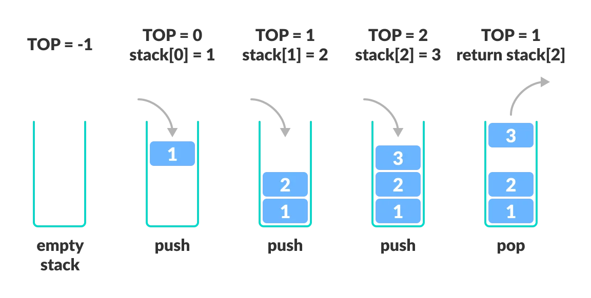

<!-- _backgroundColor: aquq -->

<!-- _color: orange -->

<!-- paginate: false -->

## CE205 Data Structures

### Week-3

#### Stacks, Queue Structures, and Related Algorithms and Problems.

Download [DOC](ce205-week-3-stack.md_doc.pdf), [SLIDE](ce205-week-3-stack.md_slide.pdf), [PPTX](ce205-week-3-stack.md_slide.pptx)

<iframe width=700, height=500 frameBorder=0 src="../ce205-week-3-stack.md_slide.html"></iframe>

---

<!-- paginate: true -->

### Outline-1

- Stack ADT
  - Stack Using Array
  - Stack Using Linked List
- Expressions
  - Infix
  - Postfix
  - Prefix
  - Infix to Postfix Conversion
  - Postfix Expression Evaluation

---

### Outline-2

- Queue ADT
  - First Come First Serve, FCFS, FIFO
  - Queue Data structure Using Array
  - Queue Using Linked List
  - Circular Queue Data structure
  - Double Ended Queue Data structure
  - Multilevel Queue (MLQ)
- Hanoi Tower

---

### Stack ADT

- BTech Smart Class
  - http://www.btechsmartclass.com/data_structures/stack-adt.html

---

### Stack Data Structure

In this tutorial, you will learn about the stack data structure and its implementation in Python, Java and C/C++.

A stack is a linear data structure that follows the principle of **Last In First Out (LIFO)**. This means the last element inserted inside the stack is removed first.

You can think of the stack data structure as the pile of plates on top of another.

<!--  -->


---

### Stack Data Structure

- Stack representation similar to a pile of plate
- Here, you can:
  - Put a new plate on top
  - Remove the top plate
- And, if you want the plate at the bottom, 
- You must first remove all the plates on top. 
- This is exactly how the stack data structure works.

---

### LIFO Principle of Stack

- In programming terms, putting an item on top of the stack is called **push** and removing an item is called **pop**.

<!--  -->


- In the above image, although item **3** was kept last, it was removed first. This is exactly how the **LIFO (Last In First Out) Principle** works.

- We can implement a stack in any programming language like C, C++, Java, Python or C#, but the specification is pretty much the same.

---

### Basic Operations of Stack

- Some basic operations allow us to perform different actions on a stack.
  - **Push**: Add an element to the top of a stack
  - **Pop**: Remove an element from the top of a stack
  - **IsEmpty**: Check if the stack is empty
  - **IsFull**: Check if the stack is full
  - **Peek**: Get the value of the top element without removing it

---

### Working of Stack Data Structure

The operations work as follows:

1. A pointer called TOP is used to keep track of the top element in the stack.
2. When initializing the stack, we set its value to -1 so that we can check if the stack is empty by comparing `TOP == -1`.
3. On pushing an element, we increase the value of TOP and place the new element in the position pointed to by TOP.
4. On popping an element, we return the element pointed to by TOP and reduce its value.
5. Before pushing, we check if the stack is already full
6. Before popping, we check if the stack is already empty

---

### Working of Stack Data Structure

<!--  -->



---

### What is a Stack?

- Stack is a linear data structure in which the insertion and deletion operations are performed at only one end. 
- In a stack, adding and removing of elements are performed at a single position which is known as "**top**". 
- That means, a new element is added at top of the stack and an element is removed from the top of the stack. 
- In stack, the insertion and deletion operations are performed based on **LIFO** (Last In First Out) principle.

---

### What is a Stack?

<!--  -->


In a stack, the insertion operation is performed using a function called **"push"** and deletion operation is performed using a function called **"pop"**.  

---

### What is a Stack?

- In the figure, PUSH and POP operations are performed at a top position in the stack. 
  - That means, both the insertion and deletion operations are performed at one end (i.e., at Top)  
- A stack data structure can be defined as follows
- Stack is a linear data structure in which the operations are performed based on LIFO principle.
- Stack can also be defined as
  - "A Collection of similar data items in which both insertion and deletion operations are performed based on LIFO principle".

---

### Stack Example

- If we want to create a stack by inserting 10,45,12,16,35 and 50. 
- Then 10 becomes the bottom-most element and 50 is the topmost element. 
- The last inserted element 50 is at Top of the stack as shown in the image below.

---

### Stack Example

<!--  -->


---

### Operations on a Stack

- The following operations are performed on the stack
  - Push (To insert an element on to the stack)
  - Pop (To delete an element from the stack)
  - Display (To display elements of the stack)

---

### Implementation of a Stack

- Stack data structure can be implemented in two ways.
  - Using Array
  - Using Linked List
- When a stack is implemented using an array, that stack can organize an only limited number of elements. 
- When a stack is implemented using a linked list, that stack can organize an unlimited number of elements.

---

### Stack Using Array

- BTech Smart Class
  - http://www.btechsmartclass.com/data_structures/stack-using-array.html

---

### Stack Using Array

- A stack data structure can be implemented using a one-dimensional array. 
- But stack implemented using array stores only a fixed number of data values. This implementation is very simple. 
- Just define a one dimensional array of specific size and insert or delete the values into that array by using **LIFO principle** with the help of a variable called **'top'**. 
- Initially, the top is set to -1. 
- Whenever we want to insert a value into the stack, increment the top value by one and then insert. 
- Whenever we want to delete a value from the stack, then delete the top value and decrement the top value by one.

---

### Stack Operations using Array

- A stack can be implemented using array as follows
  - Before implementing actual operations, first follow the below steps to create an empty stack.

---

### Stack Operations using Array

- Step 1 - Include all the **header files** which are used in the program and define a constant **'SIZE'** with specific value.
- Step 2 - Declare all the **functions** used in stack implementation.
- Step 3 - Create a one dimensional array with fixed size (**int stack[SIZE]**)
- Step 4 - Define a integer variable **'top'** and initialize with **'-1'**. (**int top = -1**)
- Step 5 - In main method, display menu with list of operations and make suitable function calls to perform operation selected by the user on the stack.

---

### Stack Operations using Array

 **push(value) - Inserting value into the stack**

- In a stack, push() is a function used to insert an element into the stack. 
- In a stack, the new element is always inserted at **top** position. 
- Push function takes one integer value as parameter and inserts that value into the stack. We can use the following steps to push an element on to the stack

---

### Stack Operations using Array

- Step 1 - Check whether **stack** is **FULL**. (**top == SIZE-1**)
- Step 2 - If it is **FULL**, then display **"Stack is FULL!!! Insertion is not possible!!!"** and terminate the function.
- Step 3 - If it is **NOT FULL**, then increment **top** value by one (**top++**) and set stack[top] to value (**stack[top] = value**).

---

### Stack Operations using Array

**pop() - Delete a value from the Stack**

- In a stack, pop() is a function used to delete an element from the stack. 
- In a stack, the element is always deleted from **top** position. 
- Pop function does not take any value as parameter. 
- We can use the following steps to pop an element from the stack

---

### Stack Operations using Array

- Step 1 - Check whether **stack** is **EMPTY**. (**top == -1**)
- Step 2 - If it is **EMPTY**, then display **"Stack is EMPTY!!! Deletion is not possible!!!"** and terminate the function.
- Step 3 - If it is **NOT EMPTY**, then delete **stack[top]** and decrement **top** value by one (**top--**).

---

### Stack Operations using Array

**display() - Displays the elements of a Stack**

- We can use the following steps to display the elements of a stack
  - Step 1 - Check whether **stack** is **EMPTY**. (**top == -1**)
  - Step 2 - If it is **EMPTY**, then display **"Stack is EMPTY!!!"** and terminate the function.
  - Step 3 - If it is **NOT EMPTY**, then define a variable '**i**' and initialize with top. Display **stack[i]** value and decrement **i** value by one (**i--**).
  - Step 3 - Repeat above step until **i** value becomes '0'.

---

### Stack Array Implementation in C

```c
#include<stdio.h>
#include<conio.h>

#define SIZE 10

void push(int);
void pop();
void display();

...
```

---

### Stack Array Implementation in C

```c
...

int stack[SIZE], top = -1;

...
```

---

### Stack Array Implementation in C

```c
...

void main()
{
   int value, choice;
   clrscr();
   while(1){
      printf("\n\n***** MENU *****\n");
      printf("1. Push\n2. Pop\n3. Display\n4. Exit");
      printf("\nEnter your choice: ");
      scanf("%d",&choice);
      switch(choice){
     case 1: printf("Enter the value to be insert: ");
         scanf("%d",&value);
         push(value);
         break;
     case 2: pop();
         break;
     case 3: display();
         break;
     case 4: exit(0);
     default: printf("\nWrong selection!!! Try again!!!");
      }
   }
}

...
```

---

### Stack Array Implementation in C

```c
...

void push(int value){
   if(top == SIZE-1)
      printf("\nStack is Full!!! Insertion is not possible!!!");
   else{
      top++;
      stack[top] = value;
      printf("\nInsertion success!!!");
   }
}

...
```

---

### Stack Array Implementation in C

```c
...

void pop(){
   if(top == -1)
      printf("\nStack is Empty!!! Deletion is not possible!!!");
   else{
      printf("\nDeleted : %d", stack[top]);
      top--;
   }
}

...
```

---

### Stack Array Implementation in C

```c
...

void display(){
   if(top == -1)
      printf("\nStack is Empty!!!");
   else{
      int i;
      printf("\nStack elements are:\n");
      for(i=top; i>=0; i--)
     printf("%d\n",stack[i]);
   }
}
```

---

### Output

<!--  -->


---

### Stack Array Implementation in Java

```java
// Stack implementation in Java

class Stack {
  private int arr[];
  private int top;
  private int capacity;

...
```

---

### Stack Array Implementation in Java

```java
...

  // Creating a stack
  Stack(int size) {
    arr = new int[size];
    capacity = size;
    top = -1;
  }

...
```

---

### Stack Array Implementation in Java

```java
...
  // Add elements into stack
  public void push(int x) {
    if (isFull()) {
      System.out.println("OverFlow\nProgram Terminated\n");
      System.exit(1);
    }

    System.out.println("Inserting " + x);
    arr[++top] = x;
  }

...
```

---

### Stack Array Implementation in Java

```java
...
  // Remove element from stack
  public int pop() {
    if (isEmpty()) {
      System.out.println("STACK EMPTY");
      System.exit(1);
    }
    return arr[top--];
  }

...
```

---

### Stack Array Implementation in Java

```java
...
  // Utility function to return the size of the stack
  public int size() {
    return top + 1;
  }

...
```

---

### Stack Array Implementation in Java

```java
...
  // Check if the stack is empty
  public Boolean isEmpty() {
    return top == -1;
  }

...
```

---

### Stack Array Implementation in Java

```java
...
  // Check if the stack is full
  public Boolean isFull() {
    return top == capacity - 1;
  }

...
```

---

### Stack Array Implementation in Java

```java
...
  public void printStack() {
    for (int i = 0; i <= top; i++) {
      System.out.println(arr[i]);
    }
  }

...
```

---

### Stack Array Implementation in Java

```java
...
  public static void main(String[] args) {
    Stack stack = new Stack(5);

    stack.push(1);
    stack.push(2);
    stack.push(3);
    stack.push(4);

    stack.pop();
    System.out.println("\nAfter popping out");

    stack.printStack();

  }
}
```

---

### Stack Array Implementation in C

```c
// Stack implementation in C

#include <stdio.h>
#include <stdlib.h>

#define MAX 10

int count = 0;

// Creating a stack
struct stack {
  int items[MAX];
  int top;
};
typedef struct stack st;

...
```

---

### Stack Array Implementation in C

```c
...

// Stack implementation in C

void createEmptyStack(st *s) {
  s->top = -1;
}

...
```

---

### Stack Array Implementation in C

```c
...

// Check if the stack is full
int isfull(st *s) {
  if (s->top == MAX - 1)
    return 1;
  else
    return 0;
}

...
```

---

### Stack Array Implementation in C

```c
...

// Check if the stack is empty
int isempty(st *s) {
  if (s->top == -1)
    return 1;
  else
    return 0;
}

...
```

---

### Stack Array Implementation in C

```c
...

// Add elements into stack
void push(st *s, int newitem) {
  if (isfull(s)) {
    printf("STACK FULL");
  } else {
    s->top++;
    s->items[s->top] = newitem;
  }
  count++;
}

...
```

---

### Stack Array Implementation in C

```c
...

// Remove element from stack
void pop(st *s) {
  if (isempty(s)) {
    printf("\n STACK EMPTY \n");
  } else {
    printf("Item popped= %d", s->items[s->top]);
    s->top--;
  }
  count--;
  printf("\n");
}

...
```

---

### Stack Array Implementation in C

```c
...

// Print elements of stack
void printStack(st *s) {
  printf("Stack: ");
  for (int i = 0; i < count; i++) {
    printf("%d ", s->items[i]);
  }
  printf("\n");
}

...
```

---

### Stack Array Implementation in C

```c
...

// Driver code
int main() {
  int ch;
  st *s = (st *)malloc(sizeof(st));

  createEmptyStack(s);

  push(s, 1);
  push(s, 2);
  push(s, 3);
  push(s, 4);

  printStack(s);

  pop(s);

  printf("\nAfter popping out\n");
  printStack(s);
}
```

---

### Stack Array Implementation in CPP

```cpp
// Stack implementation in C++

#include <stdlib.h>
#include <iostream>

using namespace std;

#define MAX 10
int size = 0;

// Creating a stack
struct stack {
  int items[MAX];
  int top;
};
typedef struct stack st;

...
```

---

### Stack Array Implementation in CPP

```cpp
void createEmptyStack(st *s) {
  s->top = -1;
}

...
```

---

### Stack Array Implementation in CPP

```cpp
// Check if the stack is full
int isfull(st *s) {
  if (s->top == MAX - 1)
    return 1;
  else
    return 0;
}

...
```

---

### Stack Array Implementation in CPP

```cpp
// Check if the stack is empty
int isempty(st *s) {
  if (s->top == -1)
    return 1;
  else
    return 0;
}

...
```

---

### Stack Array Implementation in CPP

```cpp
// Add elements into stack
void push(st *s, int newitem) {
  if (isfull(s)) {
    cout << "STACK FULL";
  } else {
    s->top++;
    s->items[s->top] = newitem;
  }
  size++;
}

...
```

---

### Stack Array Implementation in CPP

```cpp
// Remove element from stack
void pop(st *s) {
  if (isempty(s)) {
    cout << "\n STACK EMPTY \n";
  } else {
    cout << "Item popped= " << s->items[s->top];
    s->top--;
  }
  size--;
  cout << endl;
}

...
```

---

### Stack Array Implementation in CPP

```cpp
// Print elements of stack
void printStack(st *s) {
  printf("Stack: ");
  for (int i = 0; i < size; i++) {
    cout << s->items[i] << " ";
  }
  cout << endl;
}

...
```

---

### Stack Array Implementation in CPP

```cpp
// Driver code
int main() {
  int ch;
  st *s = (st *)malloc(sizeof(st));

  createEmptyStack(s);

  push(s, 1);
  push(s, 2);
  push(s, 3);
  push(s, 4);

  printStack(s);

  pop(s);

  cout << "\nAfter popping out\n";
  printStack(s);
}
```

---

### Stack Time Complexity

For the array-based implementation of a stack, the push and pop operations take constant time, i.e. `O(1)`.

---

### Applications of Stack Data Structure

- Although stack is a simple data structure to implement, it is very powerful. The most common uses of a stack are:
  - **To reverse a word** - Put all the letters in a stack and pop them out. Because of the LIFO order of stack, you will get the letters in reverse order.
  - **In compilers** - Compilers use the stack to calculate the value of expressions like `2 + 4 / 5 * (7 - 9)` by converting the expression to prefix or postfix form.
  - **In browsers** - The back button in a browser saves all the URLs you have visited previously in a stack. Each time you visit a new page, it is added on top of the stack. When you press the back button, the current URL is removed from the stack, and the previous URL is accessed.

---

### Stack Using Linked List

- BTech Smart Class
  - http://www.btechsmartclass.com/data_structures/stack-using-linked-list.html

---

### Stack Using Linked List

- The major problem with the stack implemented using an array is, it works only for a fixed number of data values. 
- That means the amount of data must be specified at the beginning of the implementation itself. 
- Stack implemented using an array is not suitable, when we don't know the size of data which we are going to use. 
- A stack data structure can be implemented by using a linked list data structure. The stack implemented using linked list can work for an unlimited number of values. 
- That means, stack implemented using linked list works for the variable size of data. So, there is no need to fix the size at the beginning of the implementation. The Stack implemented using linked list can organize as many data values as we want.  

---

### Stack Using Linked List

In linked list implementation of a stack, every new element is inserted as '**top**' element. That means every newly inserted element is pointed by '**top**'. Whenever we want to remove an element from the stack, simply remove the node which is pointed by '**top**' by moving '**top**' to its previous node in the list. The **next** field of the first element must be always **NULL**.

---

### Stack Using Linked List Example

<!--  -->


- In the above example, the last inserted node is 99 and the first inserted node is 25. The order of elements inserted is 25, 32,50 and 99.

---

### Stack Operations using Linked List

- To implement a stack using a linked list, we need to set the following things before implementing actual operations.
  - Step 1 - Include all the **header files** which are used in the program. And declare all the **user defined functions**.
  - Step 2 - Define a '**Node**' structure with two members **data** and **next**.
  - Step 3 - Define a **Node** pointer '**top**' and set it to **NULL**.
  - Step 4 - Implement the **main** method by displaying Menu with list of operations and make suitable function calls in the **main** method.

---

### Stack Operations using Linked List

- **push(value) - Inserting an element into the Stack**
- We can use the following steps to insert a new node into the stack...
  - Step 1 - Create a **newNode** with given value.
  - Step 2 - Check whether stack is **Empty** (**top** == **NULL**)
  - Step 3 - If it is **Empty**, then set **newNode → next** = **NULL**.
  - Step 4 - If it is **Not Empty**, then set **newNode → next** = **top**.
  - Step 5 - Finally, set **top** = **newNode**.

---

### Stack Operations using Linked List

- **pop() - Deleting an Element from a Stack**
- We can use the following steps to delete a node from the stack...
  - Step 1 - Check whether **stack** is **Empty** (**top == NULL**).
  - Step 2 - If it is **Empty**, then display **"Stack is Empty!!! Deletion is not possible!!!"** and terminate the function
  - Step 3 - If it is **Not Empty**, then define a **Node** pointer '**temp**' and set it to '**top**'.
  - Step 4 - Then set '**top** = **top → next**'.
  - Step 5 - Finally, delete '**temp**'. (**free(temp)**).

---

### Stack Operations using Linked List

- **display() - Displaying stack of elements**
- We can use the following steps to display the elements (nodes) of a stack...
  - Step 1 - Check whether stack is **Empty** (**top** == **NULL**).
  - Step 2 - If it is **Empty**, then display **'Stack is Empty!!!'** and terminate the function.
  - Step 3 - If it is **Not Empty**, then define a Node pointer **'temp'** and initialize with **top**.
  - Step 4 - Display '**temp → data** --->' and move it to the next node. Repeat the same until **temp** reaches to the first node in the stack. (**temp → next** != **NULL**).
  - Step 5 - Finally! Display '**temp → data** ---> **NULL**'.

---

### Stack using Linked List in C

```c
#include<stdio.h>
#include<conio.h>

struct Node
{
   int data;
   struct Node *next;
}*top = NULL;

...
```

---

### Stack using Linked List in C

```c
...

void push(int);
void pop();
void display();

...
```

---

### Stack using Linked List in C

```c
...

void main()
{
   int choice, value;
   clrscr();
   printf("\n:: Stack using Linked List ::\n");
   while(1){
      printf("\n****** MENU ******\n");
      printf("1. Push\n2. Pop\n3. Display\n4. Exit\n");
      printf("Enter your choice: ");
      scanf("%d",&choice);
      switch(choice){
     case 1: printf("Enter the value to be insert: ");
         scanf("%d", &value);
         push(value);
         break;
     case 2: pop(); break;
     case 3: display(); break;
     case 4: exit(0);
     default: printf("\nWrong selection!!! Please try again!!!\n");
      }
   }
}

...
```

---

### Stack using Linked List in C

```c
...

void push(int value)
{
   struct Node *newNode;
   newNode = (struct Node*)malloc(sizeof(struct Node));
   newNode->data = value;
   if(top == NULL)
      newNode->next = NULL;
   else
      newNode->next = top;
   top = newNode;
   printf("\nInsertion is Success!!!\n");
}

...
```

---

### Stack using Linked List in C

```c
...
void pop()
{
   if(top == NULL)
      printf("\nStack is Empty!!!\n");
   else{
      struct Node *temp = top;
      printf("\nDeleted element: %d", temp->data);
      top = temp->next;
      free(temp);
   }
}
...
```

---

### Stack using Linked List in C

```c
...
void display()
{
   if(top == NULL)
      printf("\nStack is Empty!!!\n");
   else{
      struct Node *temp = top;
      while(temp->next != NULL){
     printf("%d--->",temp->data);
     temp = temp -> next;
      }
      printf("%d--->NULL",temp->data);
   }
}
```

---

### Output

<!--  -->


---

### Output

<!--  -->


---

### Expressions

- BTech Smart Class
  - http://www.btechsmartclass.com/data_structures/expressions.html
    - Infix
    - Postfix
    - Prefix

---

### What is an Expression?

- In any programming language, if we want to perform any calculation or to frame a condition etc., 
- we use a set of symbols to perform the task. 
- These set of symbols makes an expression.  

---

### What is an Expression?

- An expression is a collection of operators and operands that represents a specific value.
- In above definition, **operator** is a symbol which performs a particular task like arithmetic operation or logical operation or conditional operation etc.,  
- **Operands** are the values on which the operators can perform the task. Here operand can be a direct value or variable or address of memory location.

---

### Expression Types

- Based on the operator position, expressions are divided into THREE types. They are as follows...
  - Infix Expression
  - Postfix Expression
  - Prefix Expression

---

### Infix Expression

- In infix expression, operator is used in between the operands.  
- The general structure of an Infix expression is as follows.

```bash
Operand1 Operator Operand2
```

---

### Infix Expression Example


<!--  -->

---

### Postfix Expression

- In postfix expression, operator is used after operands. 
- We can say that "**Operator follows the Operands**".  
- The general structure of Postfix expression is as follows.

```bash
Operand1 Operand2 Operator
```

---

### Postfix Expression Example

<!--  -->


---

### Prefix Expression

- In prefix expression, operator is used before operands. 
- We can say that "**Operands follows the Operator**".  
- The general structure of Prefix expression is as follows.

```bash
Operator Operand1 Operand2
```

---

### Prefix Expression Example

<!--  -->


- Every expression can be represented using all the above three different types of expressions. 

---

### Expression Conversions

- And we can convert an expression from one form to another form like 
  - **Infix to Postfix**, 
  - **Infix to Prefix**, 
  - **Prefix to Postfix** and vice versa.

---

### Infix to Postfix Conversion

- BTech Smart Class
  - http://www.btechsmartclass.com/data_structures/infix-to-postfix.html

---

### Infix to Postfix Conversion

- Any expression can be represented using three types of expressions (Infix, Postfix, and Prefix). 
- We can also convert one type of expression to another type of expression like     
  - Infix to Postfix, 
  - Infix to Prefix, 
  - Postfix to Prefix and vice versa.  

---

### Infix to Postfix Conversion

- To convert any Infix expression into Postfix or Prefix expression we can use the following procedure.
  - 1. Find all the operators in the given Infix Expression.
  - 2. Find the order of operators evaluated according to their Operator precedence.
  - 3. Convert each operator into required type of expression (Postfix or Prefix) in the same order.

---

### Infix to Postfix Example

- Consider the following Infix Expression to be converted into Postfix Expression.
- `D = A + B * C`
  - Step 1 - The Operators in the given Infix Expression : `= , + , *`
  - Step 2 - The Order of Operators according to their preference : `* , + , =`
  - Step 3 - Now, convert the first operator `*` -> `D = A + B C *`
  - Step 4 - Convert the next operator `+` -> `D = A BC* +`
  - Step 5 - Convert the next operator `=` -> `D ABC*+ =`
    Finally, given Infix Expression is converted into Postfix Expression as follows...
    `D A B C * + =`

---

### Infix to Postfix Conversion using Stack Data Structure

- To convert Infix Expression into Postfix Expression using a stack data structure, We can use the following steps
  - 1. Read all the symbols one by one from left to right in the given Infix Expression.
  - 2. If the reading symbol is operand, then directly print it to the result (Output).
  - 3. If the reading symbol is left parenthesis '(', then Push it on to the Stack.
  - 4. If the reading symbol is right parenthesis ')', then Pop all the contents of stack until respective left parenthesis is poped and print each poped symbol to the result.
  - 5. If the reading symbol is operator (+ , - , * , / etc.,), then Push it on to the Stack. However, first pop the operators which are already on the stack that have higher or equal precedence than current operator and print them to the result.

--- 

### Infix to Postfix Conversion Example

Consider the following Infix Expression...

- `( A + B ) * ( C - D )`
- The given infix expression can be converted into postfix expression using Stack data Structure as follows.

--- 

### Infix to Postfix Conversion Example


--- 

### Infix to Postfix Conversion Example


--- 

### Infix to Postfix Conversion Example


--- 

### Infix to Postfix Conversion Example


--- 

### Infix to Postfix Conversion Example


--- 

### Infix to Postfix Conversion Example


--- 

### Infix to Postfix Conversion Example


--- 

### Infix to Postfix Conversion Example


---

### Infix to Postfix Conversion Example


---

### Infix to Postfix Conversion Example


---

### Infix to Postfix Conversion Example


---

### Infix to Postfix Conversion Example


---

### Infix to Postfix Conversion Example


---

The final Postfix Expression is as follows...

- `A B + C D - *`

---

### Postfix Expression Evaluation

- BTech Smart Class
  - http://www.btechsmartclass.com/data_structures/postfix-evaluation.html

---

### Postfix Expression Evaluation

- A postfix expression is a collection of operators and operands in which the operator is placed after the operands. 
- That means, in a postfix expression the operator follows the operands.  

Postfix Expression has following general structure

```bash
Operand1 Operand2 Operator
```

---

### Postfix Expression Evaluation Example

<!--  -->


---

### Postfix Expression Evaluation using Stack Data Structure

- A postfix expression can be evaluated using the Stack data structure. 
- To evaluate a postfix expression using Stack data structure we can use the following steps
  - 1. Read all the symbols one by one from left to right in the given Postfix Expression
  - 2. If the reading symbol is operand, then push it on to the Stack.
  - 3. If the reading symbol is operator (+ , - , * , / etc.,), then perform TWO pop operations and store the two popped oparands in two different variables (operand1 and operand2). Then perform reading symbol operation using operand1 and operand2 and push result back on to the Stack.
  - 4. Finally! perform a pop operation and display the popped value as final result.

--- 

### Postfix Expression Evaluation Example

- Consider the following Expression.


---

### Postfix Expression Evaluation Example


---

### Postfix Expression Evaluation Example


---

### Postfix Expression Evaluation Example


---

### Postfix Expression Evaluation Example


---

### Postfix Expression Evaluation Example


---

### Postfix Expression Evaluation Example


---

### Postfix Expression Evaluation Example


---

### Postfix Expression Evaluation Example


---

### Postfix Expression Evaluation Example


---

### Postfix Expression Evaluation Example


---

### Queue ADT

- BTech Smart Class
  - http://www.btechsmartclass.com/data_structures/queue-adt.html

---

### Queue Data Structure

- In this tutorial, you will learn what a queue is. Also, you will find implementation of queue in C, C++, Java and Python.
- A queue is a useful data structure in programming. It is similar to the ticket queue outside a cinema hall, where the first person entering the queue is the first person who gets the ticket.
- Queue follows the **First In First Out (FIFO)** rule - the item that goes in first is the item that comes out first.

---

### Queue Data Structure

- FIFO Representation of Queue


<!--  -->

- In the above image, since 1 was kept in the queue before 2, 
- it is the first to be removed from the queue as well. 
- It follows the **FIFO** rule.

---

### Queue Data Structure

- In programming terms, putting items in the queue is called **enqueue**, and removing items from the queue is called **dequeue**.
- We can implement the queue in any programming language like C, C++, Java, Python or C#, but the specification is pretty much the same.

---

### Basic Operations of Queue

- A queue is an object (an abstract data structure - ADT) that allows the following operations:
  - **Enqueue**: Add an element to the end of the queue
  - **Dequeue**: Remove an element from the front of the queue
  - **IsEmpty**: Check if the queue is empty
  - **IsFull**: Check if the queue is full
  - **Peek**: Get the value of the front of the queue without removing it

---

### Working of Queue

- Queue operations work as follows:
  - two pointers FRONT and REAR
  - FRONT track the first element of the queue
  - REAR track the last element of the queue
  - initially, set value of FRONT and REAR to -1

---

### Enqueue Operation

- check if the queue is full
- for the first element, set the value of FRONT to 0
- increase the REAR index by 1
- add the new element in the position pointed to by REAR

---

### Dequeue Operation

- check if the queue is empty
- return the value pointed by FRONT
- increase the FRONT index by 1
- for the last element, reset the values of FRONT and REAR to -1

---

### Dequeue Operation


---

### Dequeue Operation


---

### Dequeue Operation


---

### Dequeue Operation


---

### Dequeue Operation


---

### Dequeue Operation


---

### Dequeue Operation


---

### Enqueue and Dequeue Operations in C

---

```c
// Queue implementation in C

#include <stdio.h>
#define SIZE 5

void enQueue(int);
void deQueue();
void display();

...

```

---

### Enqueue and Dequeue Operations in C

---

```c

...

int items[SIZE], front = -1, rear = -1;


```

---

### Enqueue and Dequeue Operations in C

---

```c

...
int main() {
  //deQueue is not possible on empty queue
  deQueue();

  //enQueue 5 elements
  enQueue(1);
  enQueue(2);
  enQueue(3);
  enQueue(4);
  enQueue(5);

  // 6th element can't be added to because the queue is full
  enQueue(6);

  display();

  //deQueue removes element entered first i.e. 1
  deQueue();

  //Now we have just 4 elements
  display();

  return 0;
}


```

---

### Enqueue and Dequeue Operations in C

---

```c

...
void enQueue(int value) {
  if (rear == SIZE - 1)
    printf("\nQueue is Full!!");
  else {
    if (front == -1)
      front = 0;
    rear++;
    items[rear] = value;
    printf("\nInserted -> %d", value);
  }
}


```

---

### Enqueue and Dequeue Operations in C

---

```c

...
void deQueue() {
  if (front == -1)
    printf("\nQueue is Empty!!");
  else {
    printf("\nDeleted : %d", items[front]);
    front++;
    if (front > rear)
      front = rear = -1;
  }
}


```

---

### Enqueue and Dequeue Operations in C

---

```c

...
// Function to print the queue
void display() {
  if (rear == -1)
    printf("\nQueue is Empty!!!");
  else {
    int i;
    printf("\nQueue elements are:\n");
    for (i = front; i <= rear; i++)
      printf("%d  ", items[i]);
  }
  printf("\n");
}
```

---

### Enqueue and Dequeue Operations in C++

---

```cpp

...
// Queue implementation in C++

#include <iostream>
#define SIZE 5

using namespace std;

class Queue {
   private:
  int items[SIZE], front, rear;

   public:
  
  Queue() {
    front = -1;
    rear = -1;
  }

...

```

---

### Enqueue and Dequeue Operations in C++

---

```cpp

...
  bool isFull() {
    if (front == 0 && rear == SIZE - 1) {
      return true;
    }
    return false;
  }

...

```

---

### Enqueue and Dequeue Operations in C++

---

```cpp

...
  bool isEmpty() {
    if (front == -1)
      return true;
    else
      return false;
  }
...

```

---

### Enqueue and Dequeue Operations in C++

---

```cpp

...
  void enQueue(int element) {
    if (isFull()) {
      cout << "Queue is full";
    } else {
      if (front == -1) front = 0;
      rear++;
      items[rear] = element;
      cout << endl
         << "Inserted " << element << endl;
    }
  }

...

```

---

### Enqueue and Dequeue Operations in C++

---

```cpp

...
  int deQueue() {
    int element;
    if (isEmpty()) {
      cout << "Queue is empty" << endl;
      return (-1);
    } else {
      element = items[front];
      if (front >= rear) {
        front = -1;
        rear = -1;
      } /* Q has only one element, so we reset the queue after deleting it. */
      else {
        front++;
      }
      cout << endl
         << "Deleted -> " << element << endl;
      return (element);
    }
  }

...

```

---

### Enqueue and Dequeue Operations in C++

---

```cpp

...
  void display() {
    /* Function to display elements of Queue */
    int i;
    if (isEmpty()) {
      cout << endl
         << "Empty Queue" << endl;
    } else {
      cout << endl
         << "Front index-> " << front;
      cout << endl
         << "Items -> ";
      for (i = front; i <= rear; i++)
        cout << items[i] << "  ";
      cout << endl
         << "Rear index-> " << rear << endl;
    }
  }
};

...

```

---

### Enqueue and Dequeue Operations in C++

---

```cpp

...
int main() {
  Queue q;

  //deQueue is not possible on empty queue
  q.deQueue();

  //enQueue 5 elements
  q.enQueue(1);
  q.enQueue(2);
  q.enQueue(3);
  q.enQueue(4);
  q.enQueue(5);

  // 6th element can't be added to because the queue is full
  q.enQueue(6);

  q.display();

  //deQueue removes element entered first i.e. 1
  q.deQueue();

  //Now we have just 4 elements
  q.display();

  return 0;
}
```

---

### Enqueue and Dequeue Operations in Java

```java
// Queue implementation in Java

public class Queue {
  int SIZE = 5;
  int items[] = new int[SIZE];
  int front, rear;

  Queue() {
    front = -1;
    rear = -1;
  }

...

```

---

### Enqueue and Dequeue Operations in Java

```java
...

  boolean isFull() {
    if (front == 0 && rear == SIZE - 1) {
      return true;
    }
    return false;
  }

...

```

---

### Enqueue and Dequeue Operations in Java

```java
...
  boolean isEmpty() {
    if (front == -1)
      return true;
    else
      return false;
  }

...

```

---

### Enqueue and Dequeue Operations in Java

```java
...
  void enQueue(int element) {
    if (isFull()) {
      System.out.println("Queue is full");
    } else {
      if (front == -1)
        front = 0;
      rear++;
      items[rear] = element;
      System.out.println("Inserted " + element);
    }
  }

...

```

---

### Enqueue and Dequeue Operations in Java

```java
...
  int deQueue() {
    int element;
    if (isEmpty()) {
      System.out.println("Queue is empty");
      return (-1);
    } else {
      element = items[front];
      if (front >= rear) {
        front = -1;
        rear = -1;
      } /* Q has only one element, so we reset the queue after deleting it. */
      else {
        front++;
      }
      System.out.println("Deleted -> " + element);
      return (element);
    }
  }

...

```

---

### Enqueue and Dequeue Operations in Java

```java
...
  void display() {
    /* Function to display elements of Queue */
    int i;
    if (isEmpty()) {
      System.out.println("Empty Queue");
    } else {
      System.out.println("\nFront index-> " + front);
      System.out.println("Items -> ");
      for (i = front; i <= rear; i++)
        System.out.print(items[i] + "  ");

      System.out.println("\nRear index-> " + rear);
    }
  }

...

```

---

### Enqueue and Dequeue Operations in Java

```java
...
  public static void main(String[] args) {
    Queue q = new Queue();

    // deQueue is not possible on empty queue
    q.deQueue();

    // enQueue 5 elements
    q.enQueue(1);
    q.enQueue(2);
    q.enQueue(3);
    q.enQueue(4);
    q.enQueue(5);

    // 6th element can't be added to because the queue is full
    q.enQueue(6);

    q.display();

    // deQueue removes element entered first i.e. 1
    q.deQueue();

    // Now we have just 4 elements
    q.display();

  }
}
```

---

### Limitations of Queue

- As you can see in the image below, after a bit of enqueuing and dequeuing, the size of the queue has been reduced.

<!--  -->


---

### Limitations of Queue

- And we can only add indexes 0 and 1 only when the queue is reset (when all the elements have been dequeued).
- After REAR reaches the last index, 
  - if we can store extra elements in the empty spaces (0 and 1), 
  - we can make use of the empty spaces. This is implemented by a modified queue called the [circular queue](https://www.programiz.com/data-structures/circular-queue).

---

### Complexity Analysis

- The complexity of enqueue and dequeue operations in a queue using an array is `O(1)`. If you use `pop(N)` in python code, 
- then the complexity might be `O(n)` depending on the position of the item to be popped.

---

### Applications of Queue

- CPU scheduling, Disk Scheduling
- When data is transferred asynchronously between two processes.The queue is used for synchronization. For example: IO Buffers, pipes, file IO, etc
- Handling of interrupts in real-time systems.
- Call Center phone systems use Queues to hold people calling them in order.

---

### What is a Queue?

- Queue is a linear data structure in which the insertion and deletion operations are performed at two different ends. 
- In a queue data structure, adding and removing elements are performed at two different positions. 
- The insertion is performed at one end and deletion is performed at another end. - In a queue data structure, the insertion operation is performed at a position which is known as '**rear**' and the deletion operation is performed at a position which is known as '**front**'. 
- In queue data structure, the insertion and deletion operations are performed based on **FIFO (First In First Out)** principle.

---

### What is a Queue?

<!--  -->

- In a queue data structure, 
  - the insertion operation is performed using a function called "**enQueue()**" and 
  - deletion operation is performed using a function called "**deQueue()**".  


---

### What is a Queue?

- Queue data structure can be defined as follows.
- Queue data structure is a linear data structure in which the operations are performed based on FIFO principle.
- A queue data structure can also be defined as
- "Queue data structure is a collection of similar data items in which insertion and deletion operations are performed based on FIFO principle".

---

### What is a Queue?

Queue after inserting 25, 30, 51, 60 and 85.

<!--  -->


---

### Operations on a Queue

- The following operations are performed on a queue data structure
  - 1. enQueue(value) - (To insert an element into the queue)
  - 2. deQueue() - (To delete an element from the queue)
  - 3. display() - (To display the elements of the queue)

---

### Queue Implementation

- Queue data structure can be implemented in two ways. They are as follows...
  - 1. Using Array
  - 2. Using Linked List
- When a queue is implemented using an array, that queue can organize an only limited number of elements. 
- When a queue is implemented using a linked list, that queue can organize an unlimited number of elements.

---

### First Come First Serve, FCFS, FIFO

- BTech Smart Class
  - http://www.btechsmartclass.com/downloads/lab-manuals/Operating-System-Lab-Manual-R18-JNTUH.pdf

---

### Queue Data structure Using Array

- BTech Smart Class
  - http://www.btechsmartclass.com/data_structures/queue-using-array.html

---

### Queue Datastructure Using Array

- A queue data structure can be implemented using one dimensional array. 
- The queue implemented using array stores only fixed number of data values. 
- The implementation of queue data structure using array is very simple. 
- Just define a one dimensional array of specific size and insert or delete the values into that array by using **FIFO (First In First Out) principle** with the help of variables **'front'** and '**rear**'. 

---

### Queue Datastructure Using Array

- Initially both '**front**' and '**rear**' are set to -1. Whenever, we want to insert a new value into the queue, increment '**rear**' value by one and then insert at that position. 
- Whenever we want to delete a value from the queue, then delete the element which is at 'front' position and increment 'front' value by one.

---
### Queue Operations using Array

- Queue data structure using array can be implemented as follows.
- Before we implement actual operations, first follow the below steps to create an empty queue.
  - Step 1 - Include all the **header files** which are used in the program and define a constant **'SIZE'** with specific value.
  - Step 2 - Declare all the **user defined functions** which are used in queue implementation.
  - Step 3 - Create a one dimensional array with above defined SIZE (**int queue[SIZE]**)
  - Step 4 - Define two integer variables **'front'** and '**rear**' and initialize both with **'-1'**. (**int front = -1, rear = -1**)
  - Step 5 - Then implement main method by displaying menu of operations list and make suitable function calls to perform operation selected by the user on queue.

---

### Queue Operations using Array

**enQueue(value) - Inserting value into the queue**

- In a queue data structure, enQueue() is a function used to insert a new element into the queue. 
- In a queue, the new element is always inserted at **rear** position. 
- The enQueue() function takes one integer value as a parameter and inserts that value into the queue. We can use the following steps to insert an element into the queue
  - Step 1 - Check whether **queue** is **FULL**. (**rear == SIZE-1**)
  - Step 2 - If it is **FULL**, then display **"Queue is FULL!!! Insertion is not possible!!!"** and terminate the function.
  - Step 3 - If it is **NOT FULL**, then increment **rear** value by one (**rear++**) and set **queue[rear]** = **value**.

---

### Queue Operations using Array

**deQueue() - Deleting a value from the Queue**

- In a queue data structure, deQueue() is a function used to delete an element from the queue. 
- In a queue, the element is always deleted from **front** position. 
- The deQueue() function does not take any value as parameter. 
- We can use the following steps to delete an element from the queue.
  - Step 1 - Check whether **queue** is **EMPTY**. (**front == rear**)
  - Step 2 - If it is **EMPTY**, then display **"Queue is EMPTY!!! Deletion is not possible!!!"** and terminate the function.
  - Step 3 - If it is **NOT EMPTY**, then increment the **front** value by one (**front ++**). Then display **queue[front]** as deleted element. Then check whether both **front** and **rear** are equal (**front** == **rear**), if it **TRUE**, then set both **front** and **rear** to '**-1**' (**front** = **rear** = **-1**).

---

### Queue Operations using Array
**display() - Displays the elements of a Queue**

-We can use the following steps to display the elements of a queue...
  - Step 1 - Check whether **queue** is **EMPTY**. (**front == rear**)
  - Step 2 - If it is **EMPTY**, then display **"Queue is EMPTY!!!"** and terminate the function.
  - Step 3 - If it is **NOT EMPTY**, then define an integer variable '**i**' and set '**i** = **front+1**'.
  - Step 4 - Display '**queue[i]**' value and increment '**i**' value by one (**i++**). Repeat the same until '**i**' value reaches to **rear** (**i** <= **rear**)

---

### Queue Datastructure using Array in C

```c
#include<stdio.h>
#include<conio.h>
#define SIZE 10

void enQueue(int);
void deQueue();
void display();

...
 
```

---

### Queue Datastructure using Array in C

```c

...

int queue[SIZE], front = -1, rear = -1;

...

```

---

### Queue Datastructure using Array in C

```c

...

void main()
{
   int value, choice;
   clrscr();
   while(1){
      printf("\n\n***** MENU *****\n");
      printf("1. Insertion\n2. Deletion\n3. Display\n4. Exit");
      printf("\nEnter your choice: ");
      scanf("%d",&choice);
      switch(choice){
     case 1: printf("Enter the value to be insert: ");
         scanf("%d",&value);
         enQueue(value);
         break;
     case 2: deQueue();
         break;
     case 3: display();
         break;
     case 4: exit(0);
     default: printf("\nWrong selection!!! Try again!!!");
      }
   }
}

...

```

---

### Queue Datastructure using Array in C

```c

...

void enQueue(int value){
   if(rear == SIZE-1)
      printf("\nQueue is Full!!! Insertion is not possible!!!");
   else{
      if(front == -1)
     front = 0;
      rear++;
      queue[rear] = value;
      printf("\nInsertion success!!!");
   }
}

...

```

---

### Queue Datastructure using Array in C

```c

...

void deQueue(){
   if(front == rear)
      printf("\nQueue is Empty!!! Deletion is not possible!!!");
   else{
      printf("\nDeleted : %d", queue[front]);
      front++;
      if(front == rear)
     front = rear = -1;
   }
}

...

```

---

### Queue Datastructure using Array in C

```c

...

void display(){
   if(rear == -1)
      printf("\nQueue is Empty!!!");
   else{
      int i;
      printf("\nQueue elements are:\n");
      for(i=front; i<=rear; i++)
      printf("%d\t",queue[i]);
   }
}

```

---

### Output

[center h:400px](assets/Queue_Output.png)

<!--  -->

---

### Queue Using Linked List

- BTech Smart Class
  - http://www.btechsmartclass.com/data_structures/queue-using-linked-list.html

---

### Queue Using Linked List

- The major problem with the queue implemented using an array is, 
- It will work for an only fixed number of data values. 
- That means, the amount of data must be specified at the beginning itself. 
- Queue using an array is not suitable when we don't know the size of data which we are going to use. 
- A queue data structure can be implemented using a linked list data structure. The queue which is implemented using a linked list can work for an unlimited number of values. 
- That means, queue using linked list can work for the variable size of data (No need to fix the size at the beginning of the implementation). 
- The Queue implemented using linked list can organize as many data values as we want.  
- In linked list implementation of a queue, the last inserted node is always pointed by '**rear**' and the first node is always pointed by '**front**'.

---

### Queue Using Linked List Example

<!--  -->


- In above example, the last inserted node is 50 and it is pointed by '**rear**' and the first inserted node is 10 and it is pointed by '**front**'. The order of elements inserted is 10, 15, 22 and 50.

---

### Operations

- To implement queue using linked list, we need to set the following things before implementing actual operations.
  - Step 1 - Include all the **header files** which are used in the program. And declare all the **user defined functions**.
  - Step 2 - Define a '**Node**' structure with two members **data** and **next**.
  - Step 3 - Define two **Node** pointers '**front**' and '**rear**' and set both to **NULL**.
  - Step 4 - Implement the **main** method by displaying Menu of list of operations and make suitable function calls in the **main** method to perform user selected operation.

---

### enQueue(value) - Inserting an element into the Queue

- We can use the following steps to insert a new node into the queue...
  - Step 1 - Create a **newNode** with given value and set '**newNode → next**' to **NULL**.
  - Step 2 - Check whether queue is **Empty** (**rear** == **NULL**)
  - Step 3 - If it is **Empty** then,   set **front** = **newNode** and **rear** = **newNode**.
  - Step 4 - If it is **Not Empty** then, set **rear → next** = **newNode** and **rear** = **newNode**.

---
### deQueue() - Deleting an Element from Queue

- We can use the following steps to delete a node from the queue...
  - Step 1 - Check whether **queue** is **Empty** (**front == NULL**).
  - Step 2 - If it is **Empty**, then display **"Queue is Empty!!! Deletion is not possible!!!"** and terminate from the function
  - Step 3 - If it is **Not Empty** then, define a Node pointer '**temp**' and set it to '**front**'.
  - Step 4 - Then set '**front** = **front → next**' and delete '**temp**' (**free(temp)**).

---
### display() - Displaying the elements of Queue

- We can use the following steps to display the elements (nodes) of a queue...
  - Step 1 - Check whether queue is **Empty** (**front** == **NULL**).
  - Step 2 - If it is **Empty** then, display **'Queue is Empty!!!'** and terminate the function.
  - Step 3 - If it is **Not Empty** then, define a Node pointer **'temp'** and initialize with **front**.
  - Step 4 - Display '**temp → data** --->' and move it to the next node. Repeat the same until '**temp**' reaches to '**rear**' (**temp → next** != **NULL**).
  - Step 5 - Finally! Display '**temp → data** ---> **NULL**'.

---
### Queue using Linked List in C

```c
#include<stdio.h>
#include<conio.h>

struct Node
{
   int data;
   struct Node *next;
}*front = NULL,*rear = NULL;

...

```

---
### Queue using Linked List in C

```c
...
void insert(int);
void delete();
void display();

...

```

---
### Queue using Linked List in C

```c
...
void main()
{
   int choice, value;
   clrscr();
   printf("\n:: Queue Implementation using Linked List ::\n");
   while(1){
      printf("\n****** MENU ******\n");
      printf("1. Insert\n2. Delete\n3. Display\n4. Exit\n");
      printf("Enter your choice: ");
      scanf("%d",&choice);
      switch(choice){
     case 1: printf("Enter the value to be insert: ");
         scanf("%d", &value);
         insert(value);
         break;
     case 2: delete(); break;
     case 3: display(); break;
     case 4: exit(0);
     default: printf("\nWrong selection!!! Please try again!!!\n");
      }
   }
}

...

```

---
### Queue using Linked List in C

```c
...

void insert(int value)
{
   struct Node *newNode;
   newNode = (struct Node*)malloc(sizeof(struct Node));
   newNode->data = value;
   newNode -> next = NULL;
   if(front == NULL)
      front = rear = newNode;
   else{
      rear -> next = newNode;
      rear = newNode;
   }
   printf("\nInsertion is Success!!!\n");
}

...

```

---
### Queue using Linked List in C

```c
...
void delete()
{
   if(front == NULL)
      printf("\nQueue is Empty!!!\n");
   else{
      struct Node *temp = front;
      front = front -> next;
      printf("\nDeleted element: %d\n", temp->data);
      free(temp);
   }
}

...

```

---
### Queue using Linked List in C

```c
...
void display()
{
   if(front == NULL)
      printf("\nQueue is Empty!!!\n");
   else{
      struct Node *temp = front;
      while(temp->next != NULL){
     printf("%d--->",temp->data);
     temp = temp -> next;
      }
      printf("%d--->NULL\n",temp->data);
   }
}
```

---

### Output

<!--  -->


---

### Output

<!--  -->


---

### Circular Queue Data structure

- BTech Smart Class
  - http://www.btechsmartclass.com/data_structures/circular-queue.html

---

### Circular Queue Datastructure

- In a normal Queue Data Structure, we can insert elements until queue becomes full. 
- But once the queue becomes full, we can not insert the next element until all the elements are deleted from the queue. 
- For example, consider the queue below.
- The queue after inserting all the elements into it is as follows...

---

### Circular Queue Datastructure


<!--  -->

- Now consider the following situation after deleting three elements from the queue.

---

### Circular Queue Datastructure


<!--  -->

---

### Circular Queue Datastructure

- This situation also says that Queue is Full and we cannot insert the new element because '**rear**' is still at last position. 
- In the above situation, even though we have empty positions in the queue we can not make use of them to insert the new element. 
- This is the major problem in a normal queue data structure. 
- To overcome this problem we use a circular queue data structure.

---
### What is Circular Queue?

- A Circular Queue can be defined as follows.
- A circular queue is a linear data structure in which the operations are performed based on FIFO (First In First Out) principle and the last position is connected back to the first position to make a circle.
- Graphical representation of a circular queue is as follows.


<!--  -->

---
### Implementation of Circular Queue

To implement a circular queue data structure using an array, we first perform the following steps before we implement actual operations.

- Step 1 - Include all the **header files** which are used in the program and define a constant **'SIZE'** with specific value.
- Step 2 - Declare all **user defined functions** used in circular queue implementation.
- Step 3 - Create a one dimensional array with above defined SIZE (**int cQueue[SIZE]**)
- Step 4 - Define two integer variables **'front'** and '**rear**' and initialize both with **'-1'**. (**int front = -1, rear = -1**)
- Step 5 - Implement main method by displaying menu of operations list and make suitable function calls to perform operation selected by the user on circular queue.

---

### enQueue(value) - Inserting value into the Circular Queue

In a circular queue, enQueue() is a function which is used to insert an element into the circular queue. In a circular queue, the new element is always inserted at **rear** position. The enQueue() function takes one integer value as parameter and inserts that value into the circular queue. We can use the following steps to insert an element into the circular queue...

---

### enQueue(value) - Inserting value into the Circular Queue

- Step 1 - Check whether **queue** is **FULL**. (**(rear == SIZE-1 && front == 0) || (front == rear+1)**)
- Step 2 - If it is **FULL**, then display **"Queue is FULL!!! Insertion is not possible!!!"** and terminate the function.
- Step 3 - If it is **NOT FULL**, then check **rear == SIZE - 1 && front != 0** if it is **TRUE**, then set **rear = -1**.
- Step 4 - Increment **rear** value by one (**rear++**), set **queue[rear]** = **value** and check '**front == -1**' if it is **TRUE**, then set **front = 0**.

---

### deQueue() - Deleting a value from the Circular Queue

In a circular queue, deQueue() is a function used to delete an element from the circular queue. In a circular queue, the element is always deleted from **front** position. The deQueue() function doesn't take any value as a parameter. We can use the following steps to delete an element from the circular queue.

---

### deQueue() - Deleting a value from the Circular Queue

- Step 1 - Check whether **queue** is **EMPTY**. (**front == -1 && rear == -1**)
- Step 2 - If it is **EMPTY**, then display **"Queue is EMPTY!!! Deletion is not possible!!!"** and terminate the function.
- Step 3 - If it is **NOT EMPTY**, then display **queue[front]** as deleted element and increment the **front** value by one (**front ++**). Then check whether **front == SIZE**, if it is **TRUE**, then set **front = 0**. Then check whether both **front - 1** and **rear** are equal (**front -1** == **rear**), if it **TRUE**, then set both **front** and **rear** to '**-1**' (**front** = **rear** = **-1**).

---

### display() - Displays the elements of a Circular Queue

We can use the following steps to display the elements of a circular queue...

- Step 1 - Check whether **queue** is **EMPTY**. (**front == -1**)
- Step 2 - If it is **EMPTY**, then display **"Queue is EMPTY!!!"** and terminate the function.
- Step 3 - If it is **NOT EMPTY**, then define an integer variable '**i**' and set '**i** = **front**'.
- Step 4 - Check whether '**front <= rear**', if it is **TRUE**, then display '**queue[i]**' value and increment '**i**' value by one (**i++**). Repeat the same until '**i <= rear**' becomes **FALSE**.
- Step 5 - If '**front <= rear**' is **FALSE**, then display '**queue[i]**' value and increment '**i**' value by one (**i++**). Repeat the same until'**i <= SIZE - 1**' becomes **FALSE**.
- Step 6 - Set **i** to **0**.
- Step 7 - Again display '**cQueue[i]**' value and increment **i** value by one (**i++**). Repeat the same until '**i <= rear**' becomes **FALSE**.

---
###  Circular Queue using array in C

```c
#include<stdio.h>
#include<conio.h>
#define SIZE 5

...

```

---
###  Circular Queue using array in C

```c

...

void enQueue(int);
void deQueue();
void display();

...

```

---
###  Circular Queue using array in C

```c

...

int cQueue[SIZE], front = -1, rear = -1;

...

```

---
###  Circular Queue using array in C

```c

...

void main()
{
   int choice, value;
   clrscr();
   while(1){
      printf("\n****** MENU ******\n");
      printf("1. Insert\n2. Delete\n3. Display\n4. Exit\n");
      printf("Enter your choice: ");
      scanf("%d",&choice);
      switch(choice){
     case 1: printf("\nEnter the value to be insert:  ");
         scanf("%d",&value);
         enQueue(value);
         break;
     case 2: deQueue();
         break;
     case 3: display();
         break;
     case 4: exit(0);
     default: printf("\nPlease select the correct choice!!!\n");
      }
   }
}
...

```

---
###  Circular Queue using array in C

```c

...

void enQueue(int value)
{
   if((front == 0 && rear == SIZE - 1) || (front == rear+1))
      printf("\nCircular Queue is Full! Insertion not possible!!!\n");
   else{
      if(rear == SIZE-1 && front != 0)
     rear = -1;
      cQueue[++rear] = value;
      printf("\nInsertion Success!!!\n");
      if(front == -1)
     front = 0;
   }
}
...

```

---
###  Circular Queue using array in C

```c

...

void deQueue()
{
   if(front == -1 && rear == -1)
      printf("\nCircular Queue is Empty! Deletion is not possible!!!\n");
   else{
      printf("\nDeleted element : %d\n",cQueue[front++]);
      if(front == SIZE)
     front = 0;
      if(front-1 == rear)
     front = rear = -1;
   }
}
...

```

---
###  Circular Queue using array in C

```c

...

void display()
{
   if(front == -1)
      printf("\nCircular Queue is Empty!!!\n");
   else{
      int i = front;
      printf("\nCircular Queue Elements are : \n");
      if(front <= rear){
     while(i <= rear)
        printf("%d\t",cQueue[i++]);
      }
      else{
     while(i <= SIZE - 1)
        printf("%d\t", cQueue[i++]);
     i = 0;
     while(i <= rear)
        printf("%d\t",cQueue[i++]);
      }
   }
}
```

---

### Output

<!--  -->


---

### Output

<!--  -->


---

### Double Ended Queue Data structure

- BTech Smart Class
  - http://www.btechsmartclass.com/data_structures/double-ended-queue.html

---

### Double Ended Queue Datastructure

- Double Ended Queue is also a Queue data structure in which the insertion and deletion operations are performed at 
  - both the ends (**front** and **rear**). 
- That means, we can insert at both front and rear positions and can delete from both front and rear positions.

---

### Double Ended Queue Datastructure

<!--  -->


---

### Double Ended Queue Datastructure

- Double Ended Queue can be represented in TWO ways, those are as follows.
  - 1. Input Restricted Double Ended Queue
  - 2. Output Restricted Double Ended Queue

---

### Input Restricted Double Ended Queue

- In input restricted double-ended queue, the insertion operation is performed at only one end and deletion operation is performed at both the ends.

<!--  -->


----

### Output Restricted Double Ended Queue

In output restricted double ended queue, the deletion operation is performed at only one end and insertion operation is performed at both the ends.

<!--  -->


---

### Double Ended Queue using Array in C

```c
#include<stdio.h>
#include<conio.h>
#define SIZE 100

void enQueue(int);
int deQueueFront();
int deQueueRear();
void enQueueRear(int);
void enQueueFront(int);
void display();

...

```

---

### Double Ended Queue using Array in C

```c

...

int queue[SIZE];
int rear = 0, front = 0;

...

```

---

### Double Ended Queue using Array in C

```c

...

int main()
{
    char ch;
    int choice1, choice2, value;
    printf("\n******* Type of Double Ended Queue *******\n");
     do
     {
          printf("\n1.Input-restricted deque \n");
          printf("2.output-restricted deque \n");
          printf("\nEnter your choice of Queue Type : ");
          scanf("%d",&choice1);
          switch(choice1)
          {

...

```

---

### Double Ended Queue using Array in C

```c

...

               case 1: 
                    printf("\nSelect the Operation\n");
                    printf("1.Insert\n2.Delete from Rear\n3.Delete from Front\n4. Display");
                    do
                    {
                       printf("\nEnter your choice for the operation in c deque: ");
                       scanf("%d",&choice2);
                       switch(choice2)
                       {   
                          case 1: enQueueRear(value);
                                  display();
                                 break;
                             case 2: value = deQueueRear();
                                 printf("\nThe value deleted is %d",value);
                                  display();
                                 break;
                          case 3: value=deQueueFront();
                                     printf("\nThe value deleted is %d",value);
                                  display();
                                     break;
                          case 4: display();
                                  break;
                          default:printf("Wrong choice");
                       }
                       printf("\nDo you want to perform another operation (Y/N): ");
                       ch=getch();
                    }while(ch=='y'||ch=='Y');
                    getch();
                    break; 

...

```

---

### Double Ended Queue using Array in C

```c

...

               case 2 :
                   printf("\n---- Select the Operation ----\n");
                   printf("1. Insert at Rear\n2. Insert at Front\n3. Delete\n4. Display");
                   do
                   {
                      printf("\nEnter your choice for the operation: ");
                      scanf("%d",&choice2);
                      switch(choice2)
                      {   
                         case 1: enQueueRear(value);
                                 display();
                                 break;
                         case 2: enQueueFront(value);
                                 display();
                                 break;
                         case 3: value = deQueueFront();
                                 printf("\nThe value deleted is %d",value); 
                                 display();
                                 break;
                         case 4: display();
                                 break;
                         default:printf("Wrong choice");
                       }
                       printf("\nDo you want to perform another operation (Y/N): ");
                       ch=getch();
                    } while(ch=='y'||ch=='Y');
                    getch();
                    break ;
            }
            printf("\nDo you want to continue(y/n):");
            ch=getch();
      }while(ch=='y'||ch=='Y');
}

...

```

---

### Double Ended Queue using Array in C

```c

...

void enQueueRear(int value)
{   
     char ch;
     if(front == SIZE/2)
      {
            printf("\nQueue is full!!! Insertion is not possible!!! ");
            return;
      }
      do
      {
            printf("\nEnter the value to be inserted:");
            scanf("%d",&value);
            queue[front] = value;
            front++;
            printf("Do you want to continue insertion Y/N");
            ch=getch();
      }while(ch=='y');
}

...

```

---

### Double Ended Queue using Array in C

```c

...

void enQueueFront(int value)
{   
     char ch;
     if(front==SIZE/2)
      {
            printf("\nQueue is full!!! Insertion is not possible!!!");
            return;
      }
      do
      {
            printf("\nEnter the value to be inserted:");
            scanf("%d",&value);
            rear--;
            queue[rear] = value;
            printf("Do you want to continue insertion Y/N");
            ch = getch();
      }
      while(ch == 'y');
}
...

```

---

### Double Ended Queue using Array in C

```c

...

int deQueueRear()
{
     int deleted;
     if(front == rear)
     {
            printf("\nQueue is Empty!!! Deletion is not possible!!!");
            return 0;
     }
     front--;
     deleted = queue[front+1];
     return deleted;
}
...

```

---

### Double Ended Queue using Array in C

```c

...

int deQueueFront()
{
     int deleted;
     if(front == rear)
     {
            printf("\nQueue is Empty!!! Deletion is not possible!!!");
            return 0;
     }
     rear++;
     deleted = queue[rear-1];
     return deleted;
}
...

```

---

### Double Ended Queue using Array in C

```c

...

void display()
{
     int i;
     if(front == rear)
        printf("\nQueue is Empty!!! Deletion is not possible!!!");
     else{
        printf("\nThe Queue elements are:");
        for(i=rear; i < front; i++)
        {
           printf("%d\t ",queue[i]);
        }
     }
}
```

---

### Output

<!--  -->


---

### Multilevel Queue (MLQ)

- Geeks for Geeks
  - https://www.geeksforgeeks.org/multilevel-queue-mlq-cpu-scheduling/


---

## Priority Queue

- A priority queue is a special type of queue in which each element is associated with a priority and is served according to its priority. If elements with the same priority occur, they are served according to their order in the queue.

<!--  -->


- Insertion occurs based on the arrival of the values and removal occurs based on priority.

---

### Hanoi Tower

- Geeks for Geeks
  - Recursive Version
    - [Program for Tower of Hanoi - GeeksforGeeks](https://www.geeksforgeeks.org/c-program-for-tower-of-hanoi/)
  - Iterative Version
    - [Iterative Tower of Hanoi - GeeksforGeeks](https://www.geeksforgeeks.org/iterative-tower-of-hanoi/)

---

### Hanoi Tower Iterative Algorithm:

``` c
S = Source
A = Aux
D = Dest
``` 
Calculate the total number of moves required i.e.

$pow(2, n)- 1$ here n is number of disks.

---

### Hanoi Tower Iterative Algorithm:

- If number of disks (i.e. n) is **even** then interchange **destination 
  pole** and **auxiliary pole**.
- for i = 1 to total number of moves:
  - if i%3 == 1:
    - legal movement of top disk between source pole and destination pole
  - if i%3 == 2:
    - legal movement top disk between source pole and auxiliary pole
  - if i%3 == 0:
    - legal movement top disk between auxiliary pole and destination pole

---

### Hanoi Tower Iterative Algorithm

- Tower of Hanoi is a mathematical puzzle where we have three rods (**A**, **B**, and **C**) and **N** disks. 
- Initially, all the disks are stacked in decreasing value of diameter 
  - i.e., the smallest disk is placed on the top and they are on rod **A**. 
- The objective of the puzzle is to move the entire stack to another rod (here considered **C**), obeying the following simple rules
- Only one disk can be moved at a time.
- Each move consists of taking the upper disk from one of the stacks and placing it on top of another stack i.e. a disk can only be moved if it is the uppermost disk on a stack.
- No disk may be placed on top of a smaller disk.

---

### Hanoi Tower Iterative Algorithm Examples

```bash
**Input**: 2  
**Output:** Disk 1 moved from A to B  
Disk 2 moved from A to C  
Disk 1 moved from B to C
```

```bash
**Input:** 3  
**Output:** Disk 1 moved from A to C  
 Disk 2 moved from A to B  
 Disk 1 moved from C to B  
 Disk 3 moved from A to C  
 Disk 1 moved from B to A  
 Disk 2 moved from B to C  
 Disk 1 moved from A to C
```

---
### Tower of Hanoi using Recursion

- The idea is to use the helper node to reach the destination using recursion. Below is the pattern for this problem:
  - Shift `N-1` disks from `A` to `B`, using `C`.
  - Shift last disk from `A` to `C`.
  - Shift `N-1` disks from `B` to `C`, using `A`.

---
### Tower of Hanoi using Recursion

<!--  -->


Image illustration for 3 disks

---

- Follow the steps below to solve the problem
  - Create a function **towerOfHanoi** where pass the **N** (current number of disk), **from_rod**, **to_rod**, **aux_rod.**
  - Make a function call for N – 1 th disk.
  - Then print the current the disk along with **from_rod** and **to_rod**
  - Again make a function call for N – 1 th disk.

---

### Tower of Hanoi in C++ Recursive

```cpp
// C++ recursive function to
// solve tower of hanoi puzzle
#include <bits/stdc++.h>
using namespace std;

void towerOfHanoi(int n, char from_rod, char to_rod,
                char aux_rod)
{
    if (n == 0) {
        return;
    }
    towerOfHanoi(n - 1, from_rod, aux_rod, to_rod);
    cout << "Move disk " << n << " from rod " << from_rod
        << " to rod " << to_rod << endl;
    towerOfHanoi(n - 1, aux_rod, to_rod, from_rod);
}

...

```
---

### Tower of Hanoi in C++ Recursive

```cpp

...

// Driver code
int main()
{
    int N = 3;

    // A, B and C are names of rods
    towerOfHanoi(N, 'A', 'C', 'B');
    return 0;
}

```

---

### Tower of Hanoi in Java Recursive

```java
// JAVA recursive function to
// solve tower of hanoi puzzle
import java.io.*;
import java.math.*;
import java.util.*;
class GFG {


...

```

---

### Tower of Hanoi in Java Recursive

```java

...
    static void towerOfHanoi(int n, char from_rod,
                            char to_rod, char aux_rod)
    {
        if (n == 0) {
            return;
        }
        towerOfHanoi(n - 1, from_rod, aux_rod, to_rod);
        System.out.println("Move disk " + n + " from rod "
                        + from_rod + " to rod "
                        + to_rod);
        towerOfHanoi(n - 1, aux_rod, to_rod, from_rod);
    }

...

```

---

### Tower of Hanoi in Java Recursive

```java

...
    // Driver code
    public static void main(String args[])
    {
        int N = 3;

        // A, B and C are names of rods
        towerOfHanoi(N, 'A', 'C', 'B');
    }
}

```

---

### Tower of Hanoi in C# Recursive

```csharp
// C# recursive program to solve tower of hanoi puzzle
using System;
class GFG {
    static void towerOfHanoi(int n, char from_rod,
                            char to_rod, char aux_rod)
    {
        if (n == 0) {
            return;
        }
        towerOfHanoi(n - 1, from_rod, aux_rod, to_rod);
        Console.WriteLine("Move disk " + n + " from rod "
                        + from_rod + " to rod " + to_rod);
        towerOfHanoi(n - 1, aux_rod, to_rod, from_rod);
    }

...

```

---

### Tower of Hanoi in C# Recursive

```csharp

...
    // Driver method
    public static void Main(String[] args)
    {
        int N = 3;

        // A, B and C are names of rods
        towerOfHanoi(N, 'A', 'C', 'B');
    }
}

```

---

### Output

```bash
Move disk 1 from rod A to rod C
Move disk 2 from rod A to rod B
Move disk 1 from rod C to rod B
Move disk 3 from rod A to rod C
Move disk 1 from rod B to rod A
Move disk 2 from rod B to rod C
Move disk 1 from rod A to rod C
```
---

### Time complexity

- $O(2N)$ 
  - There are two possibilities for every disk. 
  - Therefore, 2 * 2 * 2 * . . . * 2(N times) is 2N  

### Auxiliary Space

- $O(N)$
  - Function call stack space

---

### Tower of Hanoi in Java Recursive

```java
// Assuming n-th disk is
// bottom disk (count down)
class GFG {

static void tower(int n, char sourcePole,
                char destinationPole, char auxiliaryPole)
{
    // Base case (termination condition)
    if (0 == n)
    return;

    // Move first n-1 disks from source pole
    // to auxiliary pole using destination as
    // temporary pole
    tower(n - 1, sourcePole, auxiliaryPole,
                        destinationPole);

    // Move the remaining disk from source
    // pole to destination pole
    System.out.printf("Move the disk %d from %c to %c\n",
                        n, sourcePole, destinationPole);

    // Move the n-1 disks from auxiliary (now source)
    // pole to destination pole using source pole as
    // temporary (auxiliary) pole
    tower(n - 1, auxiliaryPole, destinationPole, sourcePole);
}
```

---

### Tower of Hanoi in Java Recursive

```java
public static void main(String[] args)
{
    tower(3, 'S', 'D', 'A');
}
}

// This code is contributed by Smitha Dinesh Semwal.
```

---

### Tower of Hanoi in C# Recursive

```csharp
// Assuming n-th disk is bottom disk
// (count down)
using System;

class GFG {

    static void tower(int n, char sourcePole,
                        char destinationPole,
                        char auxiliaryPole)
    {

        // Base case (termination condition)
        if (0 == n)
            return;

        // Move first n-1 disks from source
        // pole to auxiliary pole using
        // destination as temporary pole
        tower(n - 1, sourcePole, auxiliaryPole,
                            destinationPole);

        // Move the remaining disk from source
        // pole to destination pole
        Console.WriteLine("Move the disk " + n
                + "from " + sourcePole + "to "
                        + destinationPole);

        // Move the n-1 disks from auxiliary
        // (now source) pole to destination
        // pole using source pole as temporary
        // (auxiliary) pole
        tower(n - 1, auxiliaryPole,
                destinationPole, sourcePole);
    }

```

---

### Tower of Hanoi in C# Recursive

```csharp
    // Driver code
    public static void Main()
    {
        tower(3, 'S', 'D', 'A');
    }
}

```

---

### Tower of Hanoi in C Recursive

```c
#include<stdio.h>

// Assuming n-th disk is bottom disk (count down)
void tower(int n, char sourcePole, char destinationPole, char auxiliaryPole)
{
// Base case (termination condition)
if(0 == n)
    return;

// Move first n-1 disks from source pole
// to auxiliary pole using destination as
// temporary pole
tower(n-1, sourcePole, auxiliaryPole,
    destinationPole);

    // Move the remaining disk from source
// pole to destination pole
printf("Move the disk %d from %c to %c\n",
    n,sourcePole, destinationPole);

// Move the n-1 disks from auxiliary (now source)
// pole to destination pole using source pole as
// temporary (auxiliary) pole
tower(n-1, auxiliaryPole, destinationPole,
    sourcePole);
}

...

```

---

### Tower of Hanoi in C Recursive

```c

...

int main()
{
tower(3, 'S', 'D', 'A');

return 0;
}
```

---

### Tower of Hanoi in C# Recursive


```csharp
// Assuming n-th disk is bottom disk
// (count down)
using System;

class GFG {

    static void tower(int n, char sourcePole,
                        char destinationPole,
                        char auxiliaryPole)
    {

        // Base case (termination condition)
        if (0 == n)
            return;

        // Move first n-1 disks from source
        // pole to auxiliary pole using
        // destination as temporary pole
        tower(n - 1, sourcePole, auxiliaryPole,
                            destinationPole);

        // Move the remaining disk from source
        // pole to destination pole
        Console.WriteLine("Move the disk " + n
                + "from " + sourcePole + "to "
                        + destinationPole);

        // Move the n-1 disks from auxiliary
        // (now source) pole to destination
        // pole using source pole as temporary
        // (auxiliary) pole
        tower(n - 1, auxiliaryPole,
                destinationPole, sourcePole);
    }
```

---

### Tower of Hanoi in C# Recursive


```csharp

    // Driver code
    public static void Main()
    {
        tower(3, 'S', 'D', 'A');
    }
}

```

---

$$
End-Of-Week-3
$$
