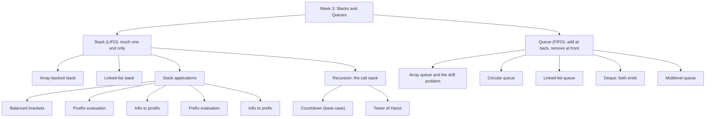
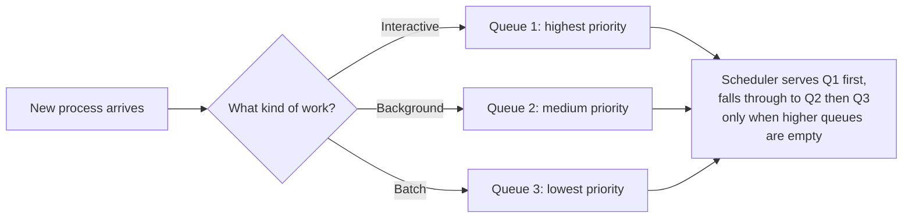

# Week 3 — Stacks and Queues

*CEN207 Data Structures (formerly CE205) · Fall 2026–2027*

<!-- materials:start -->

<div class="materials" markdown>

[:material-file-pdf-box: Lecture notes (PDF)](cen207-week-3-notes.pdf){ .md-button download="cen207-week-3-notes.pdf" }
[:material-file-word-box: Lecture notes (DOCX)](cen207-week-3-notes.docx){ .md-button download="cen207-week-3-notes.docx" }
[:material-presentation: Slides (PDF)](cen207-week-3-slides.pdf){ .md-button download="cen207-week-3-slides.pdf" }
[:material-microsoft-powerpoint: Slides (PPTX)](cen207-week-3-slides.pptx){ .md-button download="cen207-week-3-slides.pptx" }
[:material-language-html5: Slides (HTML, offline)](cen207-week-3-slides.html){ .md-button download="cen207-week-3-slides.html" }
[:material-folder-zip: Download all (ZIP)](cen207-week-3-materials.zip){ .md-button download="cen207-week-3-materials.zip" }
[:material-fullscreen: Open slides full screen](cen207-week-3-slides.html){ .md-button .md-button--primary target=_blank }

</div>

<div class="deck-frame">
<iframe src="../cen207-week-3-slides.html" title="Week 3 — Stacks and Queues" loading="lazy" allowfullscreen></iframe>
</div>

<p class="deck-hint">Click inside the slides and use the arrow keys; use the button at the bottom right of the slides, or the "Open slides full screen" link above, for full screen.</p>

<!-- materials:end -->

!!! abstract "This week"
    **Learning outcomes.** By the end of this week you will be able to explain, draw, implement and analyze two
    of the most-used data structures in all of computing: the **stack** (LIFO) and the **queue** (FIFO). You will
    use a stack to check whether brackets match, to evaluate a postfix expression, and to convert an infix
    expression to postfix. You will use recursion — and see, concretely, that recursion *is* a stack — to solve
    the Tower of Hanoi puzzle. You will build a queue three different ways (plain array, circular array, linked
    list), meet its double-ended cousin the deque, and see why operating systems keep several queues at once
    (multilevel queues). These outcomes map to **LO.1** (explain fundamental data structures) and **LO.7**
    (choose the right structure for a problem) of the course syllabus.

    **What you need already.** Week 1 gave you pointers, `struct`, and a picture of memory as a long row of
    numbered boxes. Week 2 gave you the linked list — a chain of boxes connected by pointers instead of sitting
    next to each other. This week reuses both ideas constantly, so if either feels shaky, the short recap in
    section 0, "Before we start," just below, is for you.

    **Time plan for a 3-hour session.** Stacks and their applications (~70 min) · short break · recursion and the
    Tower of Hanoi (~40 min) · queues and their variants (~60 min) · wrap-up and self-check (~10 min).

## 0. Before we start

### 0.1 What you already know

Two ideas from the last two weeks are the entire foundation of this week. Let's make sure they are solid before
we build on top of them.

**From Week 1 — pointers and memory.** A variable of type `int *p` does not hold a number; it holds the
**address** of a box that holds a number. `malloc` asks the operating system for a fresh box and hands you its
address; `free` gives that box back. Forgetting to `free` a box you no longer need is a **memory leak**; using a
box after you've `free`d it is a **dangling pointer** bug. We will do both `malloc` and `free` again this week,
and we will point out exactly where an overflow or a forgotten `free` would bite you.

**From Week 2 — linked lists.** A linked list is a chain of nodes; each node stores a value and a pointer to the
next node (or `NULL` if it is the last one). Adding or removing a node only requires rewiring a couple of
pointers — no shifting of the other elements. This week's *linked-list stack* and *linked-list queue* are simply
that same node-and-pointer idea, restricted so that you may only touch one or both ends of the chain.

If any of this feels new rather than "oh right, I remember", it is worth five minutes with the Week 1 and Week 2
notes before continuing — everything below assumes it.

### 0.2 The map of this week

Stacks and queues are both **linear** structures — their elements sit in a sequence — but they disagree on
*where* you are allowed to add and remove elements. A stack only lets you touch one end. A queue makes you add at
one end and remove from the other. That single rule change is the entire difference, and it changes everything
about what each structure is good for.



Every box on this map gets its own section below, most of them with a short step-by-step animation, a complete
C and Java program, and a note on when things go wrong.

## 1. The stack: Last In, First Out

### 1.1 A question to start

Open your web browser, visit three pages in a row, then click the **Back** button three times. You land, in
order, on the second page, then the first page, then... nothing more to go back to. The *last* page you visited
is the *first* one you go back to. How would you implement that "history" feature with the tools you already
have — an array or a linked list? The data structure that makes this natural is called a **stack**, and it is
the subject of the next few pages.

### 1.2 A short history

The name "stack" for this abstract data type, together with "push" and "pop" for its operations, was already in
use in computer science literature by the late 1950s — early machines and compilers used a hardware or software
stack to hold return addresses and intermediate results, the same job it does inside your computer right now
every time you call a function. Friedrich L. Bauer and Klaus Samelson, at the Technical University of Munich,
patented a hardware stack mechanism in 1957 for evaluating arithmetic expressions; Alan Turing had used a related
idea (a "bury/exhume" strategy for subroutine return addresses) in his 1946 design of the ACE computer. The stack
is one of the oldest ideas in computing, and it has not aged at all: every running program still uses one.

### 1.3 Intuition

Picture a stack of plates in a cafeteria. You can only take a plate from the **top**, and you can only add a
plate to the **top**. You cannot pull a plate from the middle without first removing everything above it. The
last plate placed on the stack is the first one to be removed — **Last In, First Out**, or **LIFO**.

The two fundamental operations get short, standard names:

- **push** — put a new element on top.
- **pop** — remove and return the element on top.

A third operation, **peek** (sometimes called `top`), looks at the top element without removing it. All three
only ever touch one end of the structure.

### 1.4 The Stack ADT

An **abstract data type (ADT)** describes *what* a structure does, not *how* it does it. Here is the stack ADT,
independent of whether it is built from an array or a linked list:

| Operation | What it does | Precondition | Complexity |
| --- | --- | --- | --- |
| `push(x)` | Adds `x` on top of the stack | The stack is not full (array version only) | O(1) |
| `pop()` | Removes and returns the top element | The stack is not empty | O(1) |
| `peek()` | Returns the top element without removing it | The stack is not empty | O(1) |
| `isEmpty()` | Reports whether the stack has zero elements | none | O(1) |

Every operation is O(1) — constant time, regardless of how many elements are already on the stack — because every
operation only ever touches the top. That constant-time guarantee is the whole point of a stack: if you needed to
reach the middle or the bottom, you would reach for a different structure (an array, or a different ADT
entirely).

### 1.5 A stack in memory: the array version

The simplest way to build a stack is to reserve a fixed-size array and keep a single integer, `top`, that records
the index of the topmost occupied slot. An empty stack is `top == -1`: "there is no top yet." `push` increases
`top` by one and writes into that slot; `pop` reads the slot at `top` and decreases `top` by one. Nothing else in
memory ever moves.

Play the animation, or step with ← →, to watch `push` and `pop` update `top` and the array one step at a time.

<iframe class="dsanim" src="../anim/array-stack-push-pop.html" title="Array stack: push and pop" loading="lazy"></iframe>
<div class="dsanim-baski" markdown>

</div>

In the picker, also try **18 mixed operations** (hard) and the edge cases **overflow: 11 pushes into 10 cells**,
**underflow: 10 pushes, 11 pops**, **pop on an empty stack, then 10 pushes**, and **extreme values (`INT_MAX`,
`INT_MIN`, 0, negative)** — or press 🎲 for random data at four difficulty levels, or type in your own values.

=== "C"

    ```c
    /* Week 3 -- Stacks and Queues
     * Array-backed stack: push and pop.
     * CEN207 Data Structures (CS50-style lecture notes)
     */
    #include <stdbool.h>
    #include <stdio.h>

    #define MAX_CAP 12

    typedef struct {
        bool is_pop;
        int value;
    } Op;

    int data[MAX_CAP];
    int top = -1;          /* empty stack */
    int cap = MAX_CAP;      /* capacity used by the current scenario */

    bool push(int x) {
        if (top == cap - 1)  /* full? */
            return false;     /* overflow */
        top = top + 1;
        data[top] = x;
        return true;
    }

    bool pop(int *out) {
        if (top == -1)        /* empty? */
            return false;      /* underflow */
        *out = data[top];
        top = top - 1;
        return true;
    }

    static void print_stack(void) {
        printf("stack (bottom to top):");
        for (int i = 0; i <= top; i++)
            printf(" %d", data[i]);
        if (top == -1)
            printf(" (empty)");
        printf("  [top = %d]\n", top);
    }

    static void run_scenario(const char *label, int scenario_cap, const Op ops[], int n) {
        printf("-- %s --\n", label);
        top = -1;
        cap = scenario_cap;
        print_stack();
        for (int i = 0; i < n; i++) {
            if (ops[i].is_pop) {
                int out = 0;
                bool ok = pop(&out);
                if (ok)
                    printf("pop() -> true, out = %d\n", out);
                else
                    printf("pop() -> false (stack is empty)\n");
            } else {
                bool ok = push(ops[i].value);
                printf("push(%d) -> %s\n", ops[i].value, ok ? "true" : "false");
            }
            print_stack();
        }
        printf("\n");
    }

    int main(void) {
        /* normal: 10 pushes, then 4 pops */
        Op normal[] = {
            {false, 12}, {false, 7}, {false, 25}, {false, 3}, {false, 18},
            {false, 9}, {false, 30}, {false, 14}, {false, 5}, {false, 21},
            {true, 0}, {true, 0}, {true, 0}, {true, 0}
        };
        run_scenario("normal: 10 pushes, then 4 pops (cap 12)", 12, normal, 14);

        /* hard: 18 mixed operations */
        Op hard[] = {
            {false, 40}, {false, 11}, {true, 0}, {false, 27}, {false, 8},
            {false, 33}, {true, 0}, {true, 0}, {false, 16}, {false, 2},
            {false, 45}, {false, 19}, {true, 0}, {false, 7}, {false, 38},
            {false, 23}, {false, 10}, {true, 0}
        };
        run_scenario("hard: 18 mixed operations (cap 12)", 12, hard, 18);

        /* edge: overflow -- 11 pushes into a 10-cell stack */
        Op edge[] = {
            {false, 4}, {false, 15}, {false, 8}, {false, 16}, {false, 23},
            {false, 42}, {false, 11}, {false, 6}, {false, 29}, {false, 37},
            {false, 50}, {true, 0}
        };
        run_scenario("edge: overflow, 11 pushes into a 10-cell stack (cap 10)", 10, edge, 12);

        return 0;
    }
    ```

=== "Java"

    ```java
    /* Week 3 -- Stacks and Queues
     * Array-backed stack: push and pop.
     * CEN207 Data Structures (CS50-style lecture notes)
     */
    public class ArrayStackPushPop {
        static final int MAX_CAP = 12;
        int[] data = new int[MAX_CAP];
        int top = -1;           // empty stack
        int cap = MAX_CAP;       // capacity used by the current scenario

        static class Op {
            boolean isPop;
            int value;
            Op(boolean isPop, int value) { this.isPop = isPop; this.value = value; }
        }

        boolean push(int x) {
            if (top == cap - 1)  // full?
                return false;    // overflow
            top = top + 1;
            data[top] = x;
            return true;
        }

        Integer pop() {
            if (top == -1)       // empty?
                return null;     // underflow
            int out = data[top];
            top = top - 1;
            return out;
        }

        void printStack() {
            StringBuilder sb = new StringBuilder("stack (bottom to top):");
            for (int i = 0; i <= top; i++)
                sb.append(' ').append(data[i]);
            if (top == -1)
                sb.append(" (empty)");
            sb.append("  [top = ").append(top).append(']');
            System.out.println(sb);
        }

        void runScenario(String label, int scenarioCap, Op[] ops) {
            System.out.println("-- " + label + " --");
            top = -1;
            cap = scenarioCap;
            printStack();
            for (Op op : ops) {
                if (op.isPop) {
                    Integer out = pop();
                    if (out != null)
                        System.out.println("pop() -> true, out = " + out);
                    else
                        System.out.println("pop() -> false (stack is empty)");
                } else {
                    boolean ok = push(op.value);
                    System.out.println("push(" + op.value + ") -> " + ok);
                }
                printStack();
            }
            System.out.println();
        }

        public static void main(String[] args) {
            ArrayStackPushPop s = new ArrayStackPushPop();

            // normal: 10 pushes, then 4 pops
            Op[] normal = {
                new Op(false, 12), new Op(false, 7), new Op(false, 25), new Op(false, 3), new Op(false, 18),
                new Op(false, 9), new Op(false, 30), new Op(false, 14), new Op(false, 5), new Op(false, 21),
                new Op(true, 0), new Op(true, 0), new Op(true, 0), new Op(true, 0)
            };
            s.runScenario("normal: 10 pushes, then 4 pops (cap 12)", 12, normal);

            // hard: 18 mixed operations
            Op[] hard = {
                new Op(false, 40), new Op(false, 11), new Op(true, 0), new Op(false, 27), new Op(false, 8),
                new Op(false, 33), new Op(true, 0), new Op(true, 0), new Op(false, 16), new Op(false, 2),
                new Op(false, 45), new Op(false, 19), new Op(true, 0), new Op(false, 7), new Op(false, 38),
                new Op(false, 23), new Op(false, 10), new Op(true, 0)
            };
            s.runScenario("hard: 18 mixed operations (cap 12)", 12, hard);

            // edge: overflow -- 11 pushes into a 10-cell stack
            Op[] edge = {
                new Op(false, 4), new Op(false, 15), new Op(false, 8), new Op(false, 16), new Op(false, 23),
                new Op(false, 42), new Op(false, 11), new Op(false, 6), new Op(false, 29), new Op(false, 37),
                new Op(false, 50), new Op(true, 0)
            };
            s.runScenario("edge: overflow, 11 pushes into a 10-cell stack (cap 10)", 10, edge);
        }
    }
    ```

**Try it**

=== "C"

    ```console
    gcc -std=c11 -Wall -Wextra -o /tmp/x array_stack_push_pop.c && /tmp/x
    ```

    Expected output:

    ```text
    -- normal: 10 pushes, then 4 pops (cap 12) --
    stack (bottom to top): (empty)  [top = -1]
    push(12) -> true
    stack (bottom to top): 12  [top = 0]
    push(7) -> true
    stack (bottom to top): 12 7  [top = 1]
    push(25) -> true
    stack (bottom to top): 12 7 25  [top = 2]
    push(3) -> true
    stack (bottom to top): 12 7 25 3  [top = 3]
    push(18) -> true
    stack (bottom to top): 12 7 25 3 18  [top = 4]
    push(9) -> true
    stack (bottom to top): 12 7 25 3 18 9  [top = 5]
    push(30) -> true
    stack (bottom to top): 12 7 25 3 18 9 30  [top = 6]
    push(14) -> true
    stack (bottom to top): 12 7 25 3 18 9 30 14  [top = 7]
    push(5) -> true
    stack (bottom to top): 12 7 25 3 18 9 30 14 5  [top = 8]
    push(21) -> true
    stack (bottom to top): 12 7 25 3 18 9 30 14 5 21  [top = 9]
    pop() -> true, out = 21
    stack (bottom to top): 12 7 25 3 18 9 30 14 5  [top = 8]
    pop() -> true, out = 5
    stack (bottom to top): 12 7 25 3 18 9 30 14  [top = 7]
    pop() -> true, out = 14
    stack (bottom to top): 12 7 25 3 18 9 30  [top = 6]
    pop() -> true, out = 30
    stack (bottom to top): 12 7 25 3 18 9  [top = 5]

    -- hard: 18 mixed operations (cap 12) --
    stack (bottom to top): (empty)  [top = -1]
    push(40) -> true
    stack (bottom to top): 40  [top = 0]
    push(11) -> true
    stack (bottom to top): 40 11  [top = 1]
    pop() -> true, out = 11
    stack (bottom to top): 40  [top = 0]
    push(27) -> true
    stack (bottom to top): 40 27  [top = 1]
    push(8) -> true
    stack (bottom to top): 40 27 8  [top = 2]
    push(33) -> true
    stack (bottom to top): 40 27 8 33  [top = 3]
    pop() -> true, out = 33
    stack (bottom to top): 40 27 8  [top = 2]
    pop() -> true, out = 8
    stack (bottom to top): 40 27  [top = 1]
    push(16) -> true
    stack (bottom to top): 40 27 16  [top = 2]
    push(2) -> true
    stack (bottom to top): 40 27 16 2  [top = 3]
    push(45) -> true
    stack (bottom to top): 40 27 16 2 45  [top = 4]
    push(19) -> true
    stack (bottom to top): 40 27 16 2 45 19  [top = 5]
    pop() -> true, out = 19
    stack (bottom to top): 40 27 16 2 45  [top = 4]
    push(7) -> true
    stack (bottom to top): 40 27 16 2 45 7  [top = 5]
    push(38) -> true
    stack (bottom to top): 40 27 16 2 45 7 38  [top = 6]
    push(23) -> true
    stack (bottom to top): 40 27 16 2 45 7 38 23  [top = 7]
    push(10) -> true
    stack (bottom to top): 40 27 16 2 45 7 38 23 10  [top = 8]
    pop() -> true, out = 10
    stack (bottom to top): 40 27 16 2 45 7 38 23  [top = 7]

    -- edge: overflow, 11 pushes into a 10-cell stack (cap 10) --
    stack (bottom to top): (empty)  [top = -1]
    push(4) -> true
    stack (bottom to top): 4  [top = 0]
    push(15) -> true
    stack (bottom to top): 4 15  [top = 1]
    push(8) -> true
    stack (bottom to top): 4 15 8  [top = 2]
    push(16) -> true
    stack (bottom to top): 4 15 8 16  [top = 3]
    push(23) -> true
    stack (bottom to top): 4 15 8 16 23  [top = 4]
    push(42) -> true
    stack (bottom to top): 4 15 8 16 23 42  [top = 5]
    push(11) -> true
    stack (bottom to top): 4 15 8 16 23 42 11  [top = 6]
    push(6) -> true
    stack (bottom to top): 4 15 8 16 23 42 11 6  [top = 7]
    push(29) -> true
    stack (bottom to top): 4 15 8 16 23 42 11 6 29  [top = 8]
    push(37) -> true
    stack (bottom to top): 4 15 8 16 23 42 11 6 29 37  [top = 9]
    push(50) -> false
    stack (bottom to top): 4 15 8 16 23 42 11 6 29 37  [top = 9]
    pop() -> true, out = 37
    stack (bottom to top): 4 15 8 16 23 42 11 6 29  [top = 8]
    ```

=== "Java"

    ```console
    javac -d /tmp/j ArrayStackPushPop.java && java -cp /tmp/j ArrayStackPushPop
    ```

    Expected output: identical to the C run above (same algorithm, same data).

**Why every operation is O(1).** `push` and `pop` each do a fixed number of steps — check a condition, move
`top`, read or write one array slot — no matter whether the stack holds one element or a million. There is no
loop over the other elements.

### 1.6 When the array is full or empty: overflow and underflow

An array has a fixed size. What happens when you `push` onto a full stack, or `pop` from an empty one? A correct
implementation must **check first and refuse**, rather than silently reading or writing outside the array.
Writing outside the bounds of an array in C does not raise a friendly error — it corrupts whatever memory happens
to sit next to it, and the bug can surface far away from its cause, minutes later, in a part of the program that
never touched the stack.

Play the animation to see both failures happen on a small stack.

<iframe class="dsanim" src="../anim/stack-overflow-underflow.html" title="Stack overflow and underflow" loading="lazy"></iframe>
<div class="dsanim-baski" markdown>

</div>

In the picker, also try **underflow after draining: 10 pushes, then 13 pops** (hard) and the edge cases
**both in one run: a small stack (`CAP=6`)** and **the stack is exactly full; 5 more pushes in a row all fail** —
or press 🎲 for random data at four difficulty levels, or type in your own values.

The code is the same `push`/`pop` pair as above — the two checks (`top == CAP - 1` and `top == -1`) are exactly
what keeps the stack safe. Here we drive it past both limits on purpose:

=== "C"

    ```c
    /* Week 3 -- Stacks and Queues
     * Array-backed stack: overflow and underflow.
     * CEN207 Data Structures (CS50-style lecture notes)
     */
    #include <stdbool.h>
    #include <stdio.h>

    #define MAX_CAP 10

    typedef struct {
        bool is_pop;
        int value;
    } Op;

    int data[MAX_CAP];
    int top = -1;          /* empty stack */
    int cap = MAX_CAP;      /* capacity used by the current scenario */

    bool push(int x) {
        if (top == cap - 1)  /* full? */
            return false;     /* overflow */
        top = top + 1;
        data[top] = x;
        return true;
    }

    bool pop(int *out) {
        if (top == -1)        /* empty? */
            return false;      /* underflow */
        *out = data[top];
        top = top - 1;
        return true;
    }

    static void run_scenario(const char *label, int scenario_cap, const Op ops[], int n) {
        printf("-- %s --\n", label);
        top = -1;
        cap = scenario_cap;
        for (int i = 0; i < n; i++) {
            if (ops[i].is_pop) {
                int out = 0;
                bool ok = pop(&out);
                if (ok)
                    printf("pop() -> true, out = %d\n", out);
                else
                    printf("pop() -> false  (UNDERFLOW: the stack is empty)\n");
            } else {
                bool ok = push(ops[i].value);
                printf("push(%d) -> %s", ops[i].value, ok ? "true" : "false");
                if (!ok)
                    printf("  (OVERFLOW: the stack is full)");
                printf("\n");
            }
        }
        printf("\n");
    }

    int main(void) {
        /* normal: 11 pushes into a 10-cell stack -- overflow on the last one */
        Op normal[] = {
            {false, 4}, {false, 15}, {false, 8}, {false, 23}, {false, 6},
            {false, 31}, {false, 12}, {false, 27}, {false, 9}, {false, 18}, {false, 40}
        };
        run_scenario("normal: 11 pushes into a 10-cell stack (overflow)", 10, normal, 11);

        /* hard: 10 pushes, then 13 pops -- underflow after draining */
        Op hard[] = {
            {false, 7}, {false, 19}, {false, 3}, {false, 26}, {false, 14},
            {false, 8}, {false, 31}, {false, 22}, {false, 5}, {false, 17},
            {true, 0}, {true, 0}, {true, 0}, {true, 0}, {true, 0}, {true, 0},
            {true, 0}, {true, 0}, {true, 0}, {true, 0}, {true, 0}, {true, 0}, {true, 0}
        };
        run_scenario("hard: 10 pushes, then 13 pops (underflow after draining)", 10, hard, 23);

        /* edge: both failures in one run on a small stack (cap 6) */
        Op edge[] = {
            {false, 3}, {false, 9}, {false, 14}, {false, 2}, {false, 21}, {false, 6},
            {false, 17}, {false, 8}, {false, 25}, {false, 11},
            {true, 0}, {true, 0}, {true, 0}, {true, 0}, {true, 0}, {true, 0}, {true, 0}, {true, 0}, {true, 0}
        };
        run_scenario("edge: overflow and underflow in one run (cap 6)", 6, edge, 19);

        return 0;
    }
    ```

=== "Java"

    ```java
    /* Week 3 -- Stacks and Queues
     * Array-backed stack: overflow and underflow.
     * CEN207 Data Structures (CS50-style lecture notes)
     */
    public class ArrayStackOverflow {
        static final int MAX_CAP = 10;
        int[] data = new int[MAX_CAP];
        int top = -1;           // empty stack
        int cap = MAX_CAP;       // capacity used by the current scenario

        static class Op {
            boolean isPop;
            int value;
            Op(boolean isPop, int value) { this.isPop = isPop; this.value = value; }
        }

        boolean push(int x) {
            if (top == cap - 1)  // full?
                return false;    // overflow
            top = top + 1;
            data[top] = x;
            return true;
        }

        Integer pop() {
            if (top == -1)       // empty?
                return null;     // underflow
            int out = data[top];
            top = top - 1;
            return out;
        }

        void runScenario(String label, int scenarioCap, Op[] ops) {
            System.out.println("-- " + label + " --");
            top = -1;
            cap = scenarioCap;
            for (Op op : ops) {
                if (op.isPop) {
                    Integer out = pop();
                    if (out != null)
                        System.out.println("pop() -> true, out = " + out);
                    else
                        System.out.println("pop() -> false  (UNDERFLOW: the stack is empty)");
                } else {
                    boolean ok = push(op.value);
                    System.out.print("push(" + op.value + ") -> " + ok);
                    if (!ok)
                        System.out.print("  (OVERFLOW: the stack is full)");
                    System.out.println();
                }
            }
            System.out.println();
        }

        public static void main(String[] args) {
            ArrayStackOverflow s = new ArrayStackOverflow();

            // normal: 11 pushes into a 10-cell stack -- overflow on the last one
            Op[] normal = {
                new Op(false, 4), new Op(false, 15), new Op(false, 8), new Op(false, 23), new Op(false, 6),
                new Op(false, 31), new Op(false, 12), new Op(false, 27), new Op(false, 9), new Op(false, 18), new Op(false, 40)
            };
            s.runScenario("normal: 11 pushes into a 10-cell stack (overflow)", 10, normal);

            // hard: 10 pushes, then 13 pops -- underflow after draining
            Op[] hard = {
                new Op(false, 7), new Op(false, 19), new Op(false, 3), new Op(false, 26), new Op(false, 14),
                new Op(false, 8), new Op(false, 31), new Op(false, 22), new Op(false, 5), new Op(false, 17),
                new Op(true, 0), new Op(true, 0), new Op(true, 0), new Op(true, 0), new Op(true, 0), new Op(true, 0),
                new Op(true, 0), new Op(true, 0), new Op(true, 0), new Op(true, 0), new Op(true, 0), new Op(true, 0), new Op(true, 0)
            };
            s.runScenario("hard: 10 pushes, then 13 pops (underflow after draining)", 10, hard);

            // edge: both failures in one run on a small stack (cap 6)
            Op[] edge = {
                new Op(false, 3), new Op(false, 9), new Op(false, 14), new Op(false, 2), new Op(false, 21), new Op(false, 6),
                new Op(false, 17), new Op(false, 8), new Op(false, 25), new Op(false, 11),
                new Op(true, 0), new Op(true, 0), new Op(true, 0), new Op(true, 0), new Op(true, 0), new Op(true, 0), new Op(true, 0), new Op(true, 0), new Op(true, 0)
            };
            s.runScenario("edge: overflow and underflow in one run (cap 6)", 6, edge);
        }
    }
    ```

**Try it**

=== "C"

    ```console
    gcc -std=c11 -Wall -Wextra -o /tmp/x array_stack_overflow.c && /tmp/x
    ```

    Expected output:

    ```text
    -- normal: 11 pushes into a 10-cell stack (overflow) --
    push(4) -> true
    push(15) -> true
    push(8) -> true
    push(23) -> true
    push(6) -> true
    push(31) -> true
    push(12) -> true
    push(27) -> true
    push(9) -> true
    push(18) -> true
    push(40) -> false  (OVERFLOW: the stack is full)

    -- hard: 10 pushes, then 13 pops (underflow after draining) --
    push(7) -> true
    push(19) -> true
    push(3) -> true
    push(26) -> true
    push(14) -> true
    push(8) -> true
    push(31) -> true
    push(22) -> true
    push(5) -> true
    push(17) -> true
    pop() -> true, out = 17
    pop() -> true, out = 5
    pop() -> true, out = 22
    pop() -> true, out = 31
    pop() -> true, out = 8
    pop() -> true, out = 14
    pop() -> true, out = 26
    pop() -> true, out = 3
    pop() -> true, out = 19
    pop() -> true, out = 7
    pop() -> false  (UNDERFLOW: the stack is empty)
    pop() -> false  (UNDERFLOW: the stack is empty)
    pop() -> false  (UNDERFLOW: the stack is empty)

    -- edge: overflow and underflow in one run (cap 6) --
    push(3) -> true
    push(9) -> true
    push(14) -> true
    push(2) -> true
    push(21) -> true
    push(6) -> true
    push(17) -> false  (OVERFLOW: the stack is full)
    push(8) -> false  (OVERFLOW: the stack is full)
    push(25) -> false  (OVERFLOW: the stack is full)
    push(11) -> false  (OVERFLOW: the stack is full)
    pop() -> true, out = 6
    pop() -> true, out = 21
    pop() -> true, out = 2
    pop() -> true, out = 14
    pop() -> true, out = 9
    pop() -> true, out = 3
    pop() -> false  (UNDERFLOW: the stack is empty)
    pop() -> false  (UNDERFLOW: the stack is empty)
    pop() -> false  (UNDERFLOW: the stack is empty)
    ```

=== "Java"

    ```console
    javac -d /tmp/j ArrayStackOverflow.java && java -cp /tmp/j ArrayStackOverflow
    ```

    Expected output: identical to the C run above (same algorithm, same data).

!!! warning "Common mistakes"
    - **Checking `top == CAP`, not `top == CAP - 1`.** Indices run from `0` to `CAP - 1`; the last valid slot is
      `CAP - 1`, so the stack is full when `top` has *reached* that index, not only when it would exceed it.
    - **Popping without checking `isEmpty` first.** Reading `data[-1]` does not crash predictably — it silently
      reads whatever memory sits just before the array.
    - **Ignoring the `bool` return value.** If `push` returns `false`, the value was **not** stored anywhere;
      code that ignores this and assumes the push happened will misbehave silently.
    - **Edge cases.** Both failures can happen in the *same* run (push into a full stack, drain it, then keep
      popping): a small `CAP = 6` stack shows this directly. A stack that is exactly full also rejects several
      pushes **in a row**, not just the first one past the limit — each rejected `push` must still leave the
      stack completely unchanged.

### 1.7 A stack that never overflows: the linked-list version

An array-backed stack has a hard ceiling: `CAP`. A **linked-list stack** removes that ceiling by giving every
element its own freshly allocated node, exactly like the linked lists from Week 2. `top` is no longer an index —
it is a pointer to the topmost node. `push` allocates a new node, points it at the current top, and moves `top`
to the new node. `pop` reads the top node's value, moves `top` to the next node down, and frees the old node.

<iframe class="dsanim" src="../anim/linked-stack-push-pop.html" title="Linked-list stack: push and pop" loading="lazy"></iframe>
<div class="dsanim-baski" markdown>

</div>

In the picker, also try **pop every node one by one: even the last one is popped** (hard) and the edge cases
**pop on an empty stack, then 10 pushes** and **long push run: 14 nodes, two rows** — or press 🎲 for random data
at four difficulty levels, or type in your own values.

=== "C"

    ```c
    /* Week 3 -- Stacks and Queues
     * Linked-list stack: push and pop.
     * CEN207 Data Structures (CS50-style lecture notes)
     */
    #include <stdbool.h>
    #include <stdio.h>
    #include <stdlib.h>

    typedef struct Node {
        int data;
        struct Node *next;
    } Node;
    Node *top = NULL;          /* empty stack */

    typedef struct {
        bool is_pop;
        int value;
    } Op;

    void push(int x) {
        Node *n = malloc(sizeof(Node));
        n->data = x;
        n->next = top;
        top = n;
    }

    bool pop(int *out) {
        if (top == NULL) return false;
        Node *tmp = top;
        *out = tmp->data;
        top = top->next;
        free(tmp);
        return true;
    }

    static void print_stack(void) {
        printf("stack (top to bottom):");
        for (Node *n = top; n != NULL; n = n->next)
            printf(" %d", n->data);
        if (top == NULL)
            printf(" (empty)");
        printf("\n");
    }

    static void run_scenario(const char *label, const Op ops[], int n) {
        printf("-- %s --\n", label);
        while (top != NULL) { int junk; pop(&junk); }   /* start each scenario empty */
        print_stack();
        for (int i = 0; i < n; i++) {
            if (ops[i].is_pop) {
                int out = 0;
                bool ok = pop(&out);
                if (ok)
                    printf("pop() -> true, out = %d\n", out);
                else
                    printf("pop() -> false (stack is empty)\n");
            } else {
                push(ops[i].value);
                printf("push(%d)\n", ops[i].value);
            }
            print_stack();
        }
        printf("\n");
    }

    int main(void) {
        /* normal: 12 pushes, then 3 pops */
        Op normal[] = {
            {false, 12}, {false, 7}, {false, 25}, {false, 3}, {false, 18},
            {false, 9}, {false, 30}, {false, 14}, {false, 5}, {false, 21},
            {false, 16}, {false, 40}, {true, 0}, {true, 0}, {true, 0}
        };
        run_scenario("normal: 12 pushes, then 3 pops", normal, 15);

        /* hard: pop every node one by one -- even the last one is popped */
        Op hard[] = {
            {false, 4}, {false, 15}, {false, 8}, {false, 23}, {false, 6},
            {false, 31}, {false, 12}, {false, 27}, {false, 9}, {false, 18},
            {true, 0}, {true, 0}, {true, 0}, {true, 0}, {true, 0},
            {true, 0}, {true, 0}, {true, 0}, {true, 0}, {true, 0}
        };
        run_scenario("hard: pop every node one by one (10 pushes, 10 pops)", hard, 20);

        /* edge: pop on an empty stack, then 10 pushes */
        Op edge[] = {
            {true, 0}, {false, 7}, {false, 19}, {false, 3}, {false, 26},
            {false, 14}, {false, 8}, {false, 31}, {false, 22}, {false, 5}, {false, 17}, {true, 0}
        };
        run_scenario("edge: pop on an empty stack, then 10 pushes", edge, 12);

        return 0;
    }
    ```

=== "Java"

    ```java
    /* Week 3 -- Stacks and Queues
     * Linked-list stack: push and pop.
     * CEN207 Data Structures (CS50-style lecture notes)
     */
    public class LinkedStackPushPop {
        static class Node {
            int data;
            Node next;
        }
        Node top = null;           // empty stack

        static class Op {
            boolean isPop;
            int value;
            Op(boolean isPop, int value) { this.isPop = isPop; this.value = value; }
        }

        void push(int x) {
            Node n = new Node();
            n.data = x;
            n.next = top;
            top = n;
        }

        Integer pop() {
            if (top == null) return null;
            Node tmp = top;
            int out = tmp.data;
            top = top.next;
            // the garbage collector frees tmp
            return out;
        }

        void printStack() {
            StringBuilder sb = new StringBuilder("stack (top to bottom):");
            for (Node n = top; n != null; n = n.next)
                sb.append(' ').append(n.data);
            if (top == null)
                sb.append(" (empty)");
            System.out.println(sb);
        }

        void runScenario(String label, Op[] ops) {
            System.out.println("-- " + label + " --");
            top = null;   // start each scenario empty
            printStack();
            for (Op op : ops) {
                if (op.isPop) {
                    Integer out = pop();
                    if (out != null)
                        System.out.println("pop() -> true, out = " + out);
                    else
                        System.out.println("pop() -> false (stack is empty)");
                } else {
                    push(op.value);
                    System.out.println("push(" + op.value + ")");
                }
                printStack();
            }
            System.out.println();
        }

        public static void main(String[] args) {
            LinkedStackPushPop s = new LinkedStackPushPop();

            // normal: 12 pushes, then 3 pops
            Op[] normal = {
                new Op(false, 12), new Op(false, 7), new Op(false, 25), new Op(false, 3), new Op(false, 18),
                new Op(false, 9), new Op(false, 30), new Op(false, 14), new Op(false, 5), new Op(false, 21),
                new Op(false, 16), new Op(false, 40), new Op(true, 0), new Op(true, 0), new Op(true, 0)
            };
            s.runScenario("normal: 12 pushes, then 3 pops", normal);

            // hard: pop every node one by one -- even the last one is popped
            Op[] hard = {
                new Op(false, 4), new Op(false, 15), new Op(false, 8), new Op(false, 23), new Op(false, 6),
                new Op(false, 31), new Op(false, 12), new Op(false, 27), new Op(false, 9), new Op(false, 18),
                new Op(true, 0), new Op(true, 0), new Op(true, 0), new Op(true, 0), new Op(true, 0),
                new Op(true, 0), new Op(true, 0), new Op(true, 0), new Op(true, 0), new Op(true, 0)
            };
            s.runScenario("hard: pop every node one by one (10 pushes, 10 pops)", hard);

            // edge: pop on an empty stack, then 10 pushes
            Op[] edge = {
                new Op(true, 0), new Op(false, 7), new Op(false, 19), new Op(false, 3), new Op(false, 26),
                new Op(false, 14), new Op(false, 8), new Op(false, 31), new Op(false, 22), new Op(false, 5), new Op(false, 17), new Op(true, 0)
            };
            s.runScenario("edge: pop on an empty stack, then 10 pushes", edge);
        }
    }
    ```

**Try it**

=== "C"

    ```console
    gcc -std=c11 -Wall -Wextra -o /tmp/x linked_stack_push_pop.c && /tmp/x
    ```

    Expected output:

    ```text
    -- normal: 12 pushes, then 3 pops --
    stack (top to bottom): (empty)
    push(12)
    stack (top to bottom): 12
    push(7)
    stack (top to bottom): 7 12
    push(25)
    stack (top to bottom): 25 7 12
    push(3)
    stack (top to bottom): 3 25 7 12
    push(18)
    stack (top to bottom): 18 3 25 7 12
    push(9)
    stack (top to bottom): 9 18 3 25 7 12
    push(30)
    stack (top to bottom): 30 9 18 3 25 7 12
    push(14)
    stack (top to bottom): 14 30 9 18 3 25 7 12
    push(5)
    stack (top to bottom): 5 14 30 9 18 3 25 7 12
    push(21)
    stack (top to bottom): 21 5 14 30 9 18 3 25 7 12
    push(16)
    stack (top to bottom): 16 21 5 14 30 9 18 3 25 7 12
    push(40)
    stack (top to bottom): 40 16 21 5 14 30 9 18 3 25 7 12
    pop() -> true, out = 40
    stack (top to bottom): 16 21 5 14 30 9 18 3 25 7 12
    pop() -> true, out = 16
    stack (top to bottom): 21 5 14 30 9 18 3 25 7 12
    pop() -> true, out = 21
    stack (top to bottom): 5 14 30 9 18 3 25 7 12

    -- hard: pop every node one by one (10 pushes, 10 pops) --
    stack (top to bottom): (empty)
    push(4)
    stack (top to bottom): 4
    push(15)
    stack (top to bottom): 15 4
    push(8)
    stack (top to bottom): 8 15 4
    push(23)
    stack (top to bottom): 23 8 15 4
    push(6)
    stack (top to bottom): 6 23 8 15 4
    push(31)
    stack (top to bottom): 31 6 23 8 15 4
    push(12)
    stack (top to bottom): 12 31 6 23 8 15 4
    push(27)
    stack (top to bottom): 27 12 31 6 23 8 15 4
    push(9)
    stack (top to bottom): 9 27 12 31 6 23 8 15 4
    push(18)
    stack (top to bottom): 18 9 27 12 31 6 23 8 15 4
    pop() -> true, out = 18
    stack (top to bottom): 9 27 12 31 6 23 8 15 4
    pop() -> true, out = 9
    stack (top to bottom): 27 12 31 6 23 8 15 4
    pop() -> true, out = 27
    stack (top to bottom): 12 31 6 23 8 15 4
    pop() -> true, out = 12
    stack (top to bottom): 31 6 23 8 15 4
    pop() -> true, out = 31
    stack (top to bottom): 6 23 8 15 4
    pop() -> true, out = 6
    stack (top to bottom): 23 8 15 4
    pop() -> true, out = 23
    stack (top to bottom): 8 15 4
    pop() -> true, out = 8
    stack (top to bottom): 15 4
    pop() -> true, out = 15
    stack (top to bottom): 4
    pop() -> true, out = 4
    stack (top to bottom): (empty)

    -- edge: pop on an empty stack, then 10 pushes --
    stack (top to bottom): (empty)
    pop() -> false (stack is empty)
    stack (top to bottom): (empty)
    push(7)
    stack (top to bottom): 7
    push(19)
    stack (top to bottom): 19 7
    push(3)
    stack (top to bottom): 3 19 7
    push(26)
    stack (top to bottom): 26 3 19 7
    push(14)
    stack (top to bottom): 14 26 3 19 7
    push(8)
    stack (top to bottom): 8 14 26 3 19 7
    push(31)
    stack (top to bottom): 31 8 14 26 3 19 7
    push(22)
    stack (top to bottom): 22 31 8 14 26 3 19 7
    push(5)
    stack (top to bottom): 5 22 31 8 14 26 3 19 7
    push(17)
    stack (top to bottom): 17 5 22 31 8 14 26 3 19 7
    pop() -> true, out = 17
    stack (top to bottom): 5 22 31 8 14 26 3 19 7
    ```

=== "Java"

    ```console
    javac -d /tmp/j LinkedStackPushPop.java && java -cp /tmp/j LinkedStackPushPop
    ```

    Expected output: identical to the C run above (same algorithm, same data).

**Array vs. linked-list stack**

| | Array stack | Linked-list stack |
| --- | --- | --- |
| Capacity | Fixed (`CAP`), can overflow | Limited only by available memory |
| Extra memory per element | None | One pointer (`next`) per node |
| `push` / `pop` | O(1), no allocation | O(1), one `malloc` / `free` per call |
| Cache behavior | Elements are contiguous — fast | Nodes are scattered in memory — slower in practice |

!!! warning "Common mistakes"
    - **Forgetting `free(tmp)` in `pop`.** The node is unreachable the moment `top` moves past it, but its memory
      is not returned to the system unless you free it — a slow, silent memory leak.
    - **Using the pointer after freeing it.** `free(tmp); return tmp->data;` reads memory that has already been
      given back — undefined behavior, sometimes it "works," sometimes it crashes.
    - **In Java, holding onto old references.** There is no `free`, but if some other variable still points at
      an old node, the garbage collector cannot reclaim it either.
    - **Edge cases.** Popping an already-empty stack must return `false` (or `null`) cleanly, not crash — try it
      first, before any `push`. And popping *every* node, including the very last one, must correctly leave
      `top == NULL`, not a dangling pointer to a freed node.

??? success "Test yourself: the stack"
    1. **Why is `top = -1` a good choice for "empty," rather than, say, `top = 0`?**
       Because index `0` is a valid slot. If `top = 0` meant "empty," you could not tell an empty stack apart
       from a stack holding one element at index 0. `-1` is not a valid index, so it can only mean "no elements."
    2. **A stack holds `CAP = 8` elements. After 5 pushes and 2 pops, what is `top`?**
       Each push increases `top` by 1, each pop decreases it by 1: `-1 + 5 - 2 = 2`. Three elements remain
       (indices 0, 1, 2), and `top == 2`.
    3. **Why is a linked-list stack's `push` still O(1) even though it calls `malloc`?**
       `malloc` for one fixed-size node does not depend on how many nodes already exist; it is a constant-time
       operation (in the amortized, typical sense that we rely on throughout this course), not a loop over
       existing elements.

## 2. Stack applications: expressions

### 2.1 Infix, postfix, and prefix notation

You write arithmetic as `A + B` — the operator sits **between** its two operands. This is called **infix**
notation, and it is what humans are taught in school. It is also mildly awkward for a computer: to know whether
to compute `B * C` before or after `A +`, in `A + B * C`, the reader needs to know the *precedence* of `+` and
`*`, and possibly consult parentheses. Two other notations move the operator so that no precedence rules or
parentheses are ever needed:

| Notation | Operator position | Example (`A + B`) | Example (`A + B * C`) |
| --- | --- | --- | --- |
| Infix | Between the operands | `A + B` | `A + B * C` |
| Postfix (Reverse Polish) | After both operands | `A B +` | `A B C * +` |
| Prefix (Polish) | Before both operands | `+ A B` | `+ A * B C` |

Postfix and prefix were introduced by the Polish logician Jan Łukasiewicz in the 1920s (hence "Polish notation"
for prefix, and "Reverse Polish Notation," RPN, for postfix). Both can be evaluated with a single left-to-right
or right-to-left scan and a stack, with no precedence table needed at evaluation time — precedence was already
resolved once, when the expression was converted. RPN became famous through Hewlett-Packard calculators, which
used it because it needs no parentheses keys and evaluates with a small, simple stack machine — exactly the
program you are about to write.

The next few sections build, in order, the pieces you need to work with expressions: checking that brackets are
balanced, evaluating a postfix expression, converting infix to postfix — and then the mirror image of both:
evaluating a *prefix* expression, and converting infix to *prefix*.

### 2.2 Checking balanced brackets

Is `{([])(]}` a validly-nested expression? Every closing bracket must match the **most recently opened** bracket
that is still open. "Most recently opened, first to close" — that phrase should immediately make you think of a
stack.

<iframe class="dsanim" src="../anim/bracket-matching.html" title="Checking brackets with a stack" loading="lazy"></iframe>
<div class="dsanim-baski" markdown>

</div>

In the picker, also try **balanced, three groups, all three bracket kinds nested** (hard) and the edge cases
**mismatch: `(` does not match `]`**, **a closer arrives on an empty stack**, **an opener is left open at the
end**, **nested 10 levels deep, balanced**, and **no brackets at all** — or press 🎲 for random data at four
difficulty levels, or type in your own values.

The algorithm scans the string once. Every opening bracket is pushed. Every closing bracket pops the stack and
must match what comes off; if the stack is empty when a closer arrives, or the popped opener doesn't match, the
string is unbalanced. If the string ends with the stack empty, every bracket was matched.

=== "C"

    ```c
    /* Week 3 -- Stacks and Queues
     * Checking brackets with a stack.
     * CEN207 Data Structures (CS50-style lecture notes)
     */
    #include <stdbool.h>
    #include <stdio.h>

    static bool matches(char open, char close) {
        return (open == '(' && close == ')') ||
               (open == '[' && close == ']') ||
               (open == '{' && close == '}');
    }

    bool balanced(const char *s) {
        char st[100]; int top = -1;
        for (int i = 0; s[i] != '\0'; i++) {
            char c = s[i];
            if (c == '(' || c == '[' || c == '{') {
                st[++top] = c;                /* opener: push */
            } else if (c == ')' || c == ']' || c == '}') {
                if (top == -1) return false;  /* nothing to match */
                char o = st[top--];           /* pop */
                if (!matches(o, c)) return false;
            }
        }
        return top == -1;                     /* all closed? */
    }

    int main(void) {
        /* normal: balanced, mixed characters (13 characters) */
        printf("-- normal: balanced, mixed characters --\n");
        printf("balanced(\"a(b[c]d)e{f}g\") -> %s\n", balanced("a(b[c]d)e{f}g") ? "true" : "false");

        /* hard: balanced, three groups, all three bracket kinds nested (29 characters) */
        printf("\n-- hard: balanced, three groups, all three bracket kinds nested --\n");
        printf("balanced(\"(a[b]{c})+(d[e]{f})*(g[h]{i})\") -> %s\n",
               balanced("(a[b]{c})+(d[e]{f})*(g[h]{i})") ? "true" : "false");

        /* edge: mismatch -- ( does not match ] (15 characters) */
        printf("\n-- edge: mismatch, ( does not match ] --\n");
        printf("balanced(\"start(a[b)c]end\") -> %s\n", balanced("start(a[b)c]end") ? "true" : "false");

        return 0;
    }
    ```

=== "Java"

    ```java
    /* Week 3 -- Stacks and Queues
     * Checking brackets with a stack.
     * CEN207 Data Structures (CS50-style lecture notes)
     */
    public class BracketChecker {
        static boolean matches(char open, char close) {
            return (open == '(' && close == ')') ||
                   (open == '[' && close == ']') ||
                   (open == '{' && close == '}');
        }

        boolean balanced(String s) {
            char[] st = new char[100]; int top = -1;
            for (int i = 0; i < s.length(); i++) {
                char c = s.charAt(i);
                if (c == '(' || c == '[' || c == '{') {
                    st[++top] = c;                // opener: push
                } else if (c == ')' || c == ']' || c == '}') {
                    if (top == -1) return false;  // nothing to match
                    char o = st[top--];           // pop
                    if (!matches(o, c)) return false;
                }
            }
            return top == -1;                     // all closed?
        }

        public static void main(String[] args) {
            BracketChecker checker = new BracketChecker();

            // normal: balanced, mixed characters (13 characters)
            System.out.println("-- normal: balanced, mixed characters --");
            System.out.println("balanced(\"a(b[c]d)e{f}g\") -> " + checker.balanced("a(b[c]d)e{f}g"));

            // hard: balanced, three groups, all three bracket kinds nested (29 characters)
            System.out.println();
            System.out.println("-- hard: balanced, three groups, all three bracket kinds nested --");
            System.out.println("balanced(\"(a[b]{c})+(d[e]{f})*(g[h]{i})\") -> "
                    + checker.balanced("(a[b]{c})+(d[e]{f})*(g[h]{i})"));

            // edge: mismatch -- ( does not match ] (15 characters)
            System.out.println();
            System.out.println("-- edge: mismatch, ( does not match ] --");
            System.out.println("balanced(\"start(a[b)c]end\") -> " + checker.balanced("start(a[b)c]end"));
        }
    }
    ```

**Try it**

=== "C"

    ```console
    gcc -std=c11 -Wall -Wextra -o /tmp/x bracket_checker.c && /tmp/x
    ```

    Expected output:

    ```text
    -- normal: balanced, mixed characters --
    balanced("a(b[c]d)e{f}g") -> true

    -- hard: balanced, three groups, all three bracket kinds nested --
    balanced("(a[b]{c})+(d[e]{f})*(g[h]{i})") -> true

    -- edge: mismatch, ( does not match ] --
    balanced("start(a[b)c]end") -> false
    ```

=== "Java"

    ```console
    javac -d /tmp/j BracketChecker.java && java -cp /tmp/j BracketChecker
    ```

    Expected output: identical to the C run above (same algorithm, same data).

**Complexity.** Each character is looked at exactly once, and each stack operation is O(1), so `balanced` runs in
O(n) time and uses O(n) extra space in the worst case (a string that is all openers).

!!! warning "Common mistakes"
    There are exactly three ways a bracket string can be unbalanced, and a correct checker must catch all three:

    1. A closer arrives but the top of the stack does not match it — `(]`.
    2. A closer arrives but the stack is already empty — `)` with nothing open.
    3. The string ends but the stack is **not** empty — `(()` never closed its first `(`.

    A common bug is checking only case 1 and forgetting the final `return top == -1;`, which silently accepts
    unclosed brackets as "balanced."

    **Edge cases.** A closer on a completely empty stack (case 2, no opener at all), brackets nested many levels
    deep (the stack must grow correctly, not just handle one level), and a string with **no** brackets at all
    (which must report "balanced" — there is nothing to mismatch) are all worth checking by hand once.

### 2.3 Evaluating a postfix expression

Once an expression is in postfix form, evaluating it needs no precedence rules at all — a single left-to-right
scan with a stack does the whole job. `5 3 + 8 2 - *` should evaluate to `(5 + 3) * (8 - 2) = 48`.

<iframe class="dsanim" src="../anim/postfix-evaluation.html" title="Evaluating a postfix expression" loading="lazy"></iframe>
<div class="dsanim-baski" markdown>

</div>

In the picker, also try **15 tokens, all four operators** (hard) and the edge cases **division by zero**, **too
few operands: an operator comes first**, **too many operands: 6 values are left at the end**, **the result is
negative**, and **integer division: the fraction is truncated** — or press 🎲 for random data at four difficulty
levels, or type in your own values.

Every number gets pushed. Every operator pops **two** values — the right operand comes off first, then the left
operand — applies itself, and pushes the result back, ready to be used by a later operator. A production-quality
evaluator also has to fail cleanly on malformed input, so the version below carries an `error` flag: too few
operands before an operator, or a division by zero, sets it and stops immediately; leftover operands at the end
also count as an error.

=== "C"

    ```c
    /* Week 3 -- Stacks and Queues
     * Evaluating a postfix expression with a stack (with error handling).
     * CEN207 Data Structures (CS50-style lecture notes)
     */
    #include <ctype.h>
    #include <stdbool.h>
    #include <stdio.h>
    #include <stdlib.h>

    static bool is_number(const char *t) {
        return isdigit((unsigned char) t[0]);
    }

    static int apply(char op, int a, int b) {
        switch (op) {
            case '+': return a + b;
            case '-': return a - b;
            case '*': return a * b;
            case '/': return a / b;
            default:  return 0;
        }
    }

    int eval_postfix(char *tok[], int n, bool *error) {
        int st[100]; int top = -1;
        for (int i = 0; i < n; i++) {
            char *t = tok[i];
            if (is_number(t)) {
                st[++top] = atoi(t);          /* number: push */
            } else {
                if (top < 1) { *error = true; return 0; }  /* too few operands */
                int b = st[top--];             /* right operand */
                int a = st[top--];             /* left operand */
                if (t[0] == '/' && b == 0) { *error = true; return 0; }  /* division by zero */
                st[++top] = apply(t[0], a, b);  /* integer division truncates toward zero */
            }
        }
        if (top != 0) { *error = true; return 0; }  /* too many operands left */
        return st[top];                       /* the answer */
    }

    static void run(const char *label, char *tok[], int n) {
        bool error = false;
        int result = eval_postfix(tok, n, &error);
        printf("-- %s --\n", label);
        if (error)
            printf("result = ERROR (invalid postfix expression)\n\n");
        else
            printf("result = %d\n\n", result);
    }

    int main(void) {
        /* normal: 11 tokens, no errors */
        char *normal[] = {"5", "3", "+", "8", "2", "-", "*", "6", "+", "12", "-"};
        run("normal: 11 tokens, no errors", normal, 11);

        /* hard: 15 tokens, all four operators */
        char *hard[] = {"12", "3", "/", "4", "*", "5", "+", "20", "-", "2", "*", "7", "+", "3", "*"};
        run("hard: 15 tokens, all four operators", hard, 15);

        /* edge: division by zero */
        char *edge[] = {"9", "3", "-", "6", "*", "0", "/", "5", "+", "8", "-", "2", "*"};
        run("edge: division by zero", edge, 13);

        return 0;
    }
    ```

=== "Java"

    ```java
    /* Week 3 -- Stacks and Queues
     * Evaluating a postfix expression with a stack (with error handling).
     * CEN207 Data Structures (CS50-style lecture notes)
     */
    public class PostfixEvaluator {
        static boolean isNumber(String t) {
            return Character.isDigit(t.charAt(0));
        }

        static int apply(char op, int a, int b) {
            switch (op) {
                case '+': return a + b;
                case '-': return a - b;
                case '*': return a * b;
                case '/': return a / b;
                default:  return 0;
            }
        }

        int evalPostfix(String[] tok, boolean[] error) {
            int[] st = new int[100]; int top = -1;
            for (int i = 0; i < tok.length; i++) {
                String t = tok[i];
                if (isNumber(t)) {
                    st[++top] = Integer.parseInt(t);  // number: push
                } else {
                    if (top < 1) { error[0] = true; return 0; }  // too few operands
                    int b = st[top--];             // right operand
                    int a = st[top--];             // left operand
                    if (t.equals("/") && b == 0) { error[0] = true; return 0; }  // division by zero
                    st[++top] = apply(t.charAt(0), a, b);  // integer division truncates toward zero
                }
            }
            if (top != 0) { error[0] = true; return 0; }  // too many operands left
            return st[top];                       // the answer
        }

        void run(String label, String[] tok) {
            boolean[] error = {false};
            int result = evalPostfix(tok, error);
            System.out.println("-- " + label + " --");
            if (error[0])
                System.out.println("result = ERROR (invalid postfix expression)");
            else
                System.out.println("result = " + result);
            System.out.println();
        }

        public static void main(String[] args) {
            PostfixEvaluator ev = new PostfixEvaluator();

            // normal: 11 tokens, no errors
            String[] normal = {"5", "3", "+", "8", "2", "-", "*", "6", "+", "12", "-"};
            ev.run("normal: 11 tokens, no errors", normal);

            // hard: 15 tokens, all four operators
            String[] hard = {"12", "3", "/", "4", "*", "5", "+", "20", "-", "2", "*", "7", "+", "3", "*"};
            ev.run("hard: 15 tokens, all four operators", hard);

            // edge: division by zero
            String[] edge = {"9", "3", "-", "6", "*", "0", "/", "5", "+", "8", "-", "2", "*"};
            ev.run("edge: division by zero", edge);
        }
    }
    ```

**Try it**

=== "C"

    ```console
    gcc -std=c11 -Wall -Wextra -o /tmp/x postfix_evaluator.c && /tmp/x
    ```

    Expected output:

    ```text
    -- normal: 11 tokens, no errors --
    result = 42

    -- hard: 15 tokens, all four operators --
    result = 27

    -- edge: division by zero --
    result = ERROR (invalid postfix expression)
    ```

=== "Java"

    ```console
    javac -d /tmp/j PostfixEvaluator.java && java -cp /tmp/j PostfixEvaluator
    ```

    Expected output: identical to the C run above (same algorithm, same data).

**Complexity.** O(n) in the number of tokens: each token is pushed at most once and popped at most once.

!!! warning "Common mistakes"
    - **Popping the operands in the wrong order.** For `-` and `/`, order matters: the first value popped is the
      **right** operand, the second is the **left** one. `8 2 -` means `8 - 2`, computed as `a - b` where
      `b = 2` (popped first) and `a = 8` (popped second) — swap them and you compute `2 - 8` instead.
    - **Not validating the input.** Skipping the `top < 1` and `top != 0` checks lets a malformed expression
      either crash (popping from an empty stack) or silently return a leftover value instead of reporting an
      error.
    - **Edge cases.** Division by zero must be caught explicitly — C does not raise a catchable exception for
      integer division by zero, it is undefined behavior. Also check what happens with too few operands (an
      operator arrives before there is anything to apply it to) and too many (numbers left over once the
      expression ends).

### 2.4 Evaluating a prefix expression

Prefix (Polish) notation puts the operator *before* its operands: `+ A B` instead of `A + B`. It evaluates the
same way postfix does — a single scan with a stack, no precedence rules needed — except the scan runs **right to
left**, and each operator's first-popped value is now the **left** operand (the mirror image of postfix, where
the first-popped value is the right operand).

<iframe class="dsanim" src="../anim/prefix-evaluation.html" title="Evaluating a prefix expression" loading="lazy"></iframe>
<div class="dsanim-baski" markdown>

</div>

In the picker, also try **15 tokens, all four operators** (hard) and the edge cases **too few operands: an
operator is last (processed first)**, **too many operands: no operators at all**, **division by zero**, **the
result is negative**, and **integer division: a negative fraction is truncated too** — or press 🎲 for random
data at four difficulty levels, or type in your own values.

=== "C"

    ```c
    /* Week 3 -- Stacks and Queues
     * Evaluating a prefix (Polish) expression with a stack, right to left.
     * CEN207 Data Structures (CS50-style lecture notes)
     */
    #include <ctype.h>
    #include <stdbool.h>
    #include <stdio.h>
    #include <stdlib.h>

    static bool is_number(const char *t) {
        return isdigit((unsigned char) t[0]);
    }

    static int apply(char op, int a, int b) {
        switch (op) {
            case '+': return a + b;
            case '-': return a - b;
            case '*': return a * b;
            case '/': return a / b;
            default:  return 0;
        }
    }

    int eval_prefix(char *tok[], int n, bool *error) {
        int st[100]; int top = -1;
        for (int i = n - 1; i >= 0; i--) {     /* right to left */
            char *t = tok[i];
            if (is_number(t)) {
                st[++top] = atoi(t);          /* number: push */
            } else {
                if (top < 1) { *error = true; return 0; }  /* too few operands */
                int a = st[top--];             /* left operand */
                int b = st[top--];             /* right operand */
                if (t[0] == '/' && b == 0) { *error = true; return 0; }  /* division by zero */
                st[++top] = apply(t[0], a, b);  /* integer division truncates toward zero */
            }
        }
        if (top != 0) { *error = true; return 0; }  /* too many operands left */
        return st[top];                       /* the answer */
    }

    static void run(const char *label, char *tok[], int n) {
        bool error = false;
        int result = eval_prefix(tok, n, &error);
        printf("-- %s --\n", label);
        if (error)
            printf("result = ERROR (invalid prefix expression)\n\n");
        else
            printf("result = %d\n\n", result);
    }

    int main(void) {
        /* normal: 11 tokens, no errors */
        char *normal[] = {"-", "+", "-", "*", "+", "5", "3", "8", "2", "6", "12"};
        run("normal: 11 tokens, no errors", normal, 11);

        /* hard: 14 tokens, all four operators */
        char *hard[] = {"*", "+", "-", "*", "+", "/", "12", "3", "4", "5", "20", "2", "7", "3"};
        run("hard: 14 tokens, all four operators", hard, 14);

        /* edge: too few operands -- an operator is last (processed first) */
        char *edge[] = {"+", "5", "3", "8", "2", "*", "9", "+", "6", "-", "7"};
        run("edge: too few operands (an operator is processed first)", edge, 11);

        return 0;
    }
    ```

=== "Java"

    ```java
    /* Week 3 -- Stacks and Queues
     * Evaluating a prefix (Polish) expression with a stack, right to left.
     * CEN207 Data Structures (CS50-style lecture notes)
     */
    public class PrefixEvaluator {
        static boolean isNumber(String t) {
            return Character.isDigit(t.charAt(0));
        }

        static int apply(char op, int a, int b) {
            switch (op) {
                case '+': return a + b;
                case '-': return a - b;
                case '*': return a * b;
                case '/': return a / b;
                default:  return 0;
            }
        }

        int evalPrefix(String[] tok, boolean[] error) {
            int[] st = new int[100]; int top = -1;
            for (int i = tok.length - 1; i >= 0; i--) {  // right to left
                String t = tok[i];
                if (isNumber(t)) {
                    st[++top] = Integer.parseInt(t);   // number: push
                } else {
                    if (top < 1) { error[0] = true; return 0; }  // too few operands
                    int a = st[top--];             // left operand
                    int b = st[top--];             // right operand
                    if (t.equals("/") && b == 0) { error[0] = true; return 0; }  // division by zero
                    st[++top] = apply(t.charAt(0), a, b);  // integer division truncates toward zero
                }
            }
            if (top != 0) { error[0] = true; return 0; }  // too many operands left
            return st[top];                       // the answer
        }

        void run(String label, String[] tok) {
            boolean[] error = {false};
            int result = evalPrefix(tok, error);
            System.out.println("-- " + label + " --");
            if (error[0])
                System.out.println("result = ERROR (invalid prefix expression)");
            else
                System.out.println("result = " + result);
            System.out.println();
        }

        public static void main(String[] args) {
            PrefixEvaluator ev = new PrefixEvaluator();

            // normal: 11 tokens, no errors
            String[] normal = {"-", "+", "-", "*", "+", "5", "3", "8", "2", "6", "12"};
            ev.run("normal: 11 tokens, no errors", normal);

            // hard: 14 tokens, all four operators
            String[] hard = {"*", "+", "-", "*", "+", "/", "12", "3", "4", "5", "20", "2", "7", "3"};
            ev.run("hard: 14 tokens, all four operators", hard);

            // edge: too few operands -- an operator is last (processed first)
            String[] edge = {"+", "5", "3", "8", "2", "*", "9", "+", "6", "-", "7"};
            ev.run("edge: too few operands (an operator is processed first)", edge);
        }
    }
    ```

**Try it**

=== "C"

    ```console
    gcc -std=c11 -Wall -Wextra -o /tmp/x prefix_evaluator.c && /tmp/x
    ```

    Expected output:

    ```text
    -- normal: 11 tokens, no errors --
    result = 56

    -- hard: 14 tokens, all four operators --
    result = ERROR (invalid prefix expression)

    -- edge: too few operands (an operator is processed first) --
    result = ERROR (invalid prefix expression)
    ```

=== "Java"

    ```console
    javac -d /tmp/j PrefixEvaluator.java && java -cp /tmp/j PrefixEvaluator
    ```

    Expected output: identical to the C run above (same algorithm, same data).

**Complexity.** O(n), exactly like postfix evaluation — each token is pushed at most once and popped at most
once, just walked in the opposite direction.

!!! warning "Common mistakes"
    - **Popping the operands in the wrong order.** In prefix, the first value popped is the **left** operand and
      the second is the **right** one — the exact mirror of postfix. Get this backwards and every non-commutative
      operator (`-`, `/`) silently computes the wrong thing.
    - **Scanning left to right out of habit.** The whole point of prefix is that it is meant to be read (and
      evaluated) starting from the end; scanning it left to right like postfix does not work.
    - **Edge cases.** The "hard" example above actually **errors out** (too many operands left over) — a good
      reminder that "more tokens" does not automatically mean "a valid expression." Also check too few operands
      and division by zero, exactly as for postfix.

### 2.5 Converting infix to postfix

Humans write infix; the postfix evaluator above needs postfix. The classic algorithm — a version of what Edsger
Dijkstra called the **shunting-yard algorithm**, after the railway shunting yards that reorder freight cars — uses
a second stack, this time holding *operators* rather than numbers, to resolve precedence exactly once, up front.

<iframe class="dsanim" src="../anim/infix-to-postfix.html" title="Converting infix to postfix" loading="lazy"></iframe>
<div class="dsanim-baski" markdown>

</div>

In the picker, also try **parenthesized, mixed-precedence, 16 characters** (hard) and the edge cases
**unbalanced: a closing parenthesis is missing**, **unbalanced: an extra closing parenthesis**, **no operators at
all, only operands**, and **a long chain of same-precedence operators** — or press 🎲 for random data at four
difficulty levels, or type in your own values.

Every operand goes straight to the output. Every operator first pops (and outputs) any waiting operators that
are *at least as strong* as itself — they must be applied first — and only then gets pushed. At the end, any
operators still on the stack are flushed to the output in order. Parentheses are handled the same way expression
grouping always is with a stack: `(` is simply pushed (it blocks nothing, and nothing can pop *through* it), and
`)` pops and outputs everything back to the matching `(`, then discards the `(` itself without ever emitting it.

=== "C"

    ```c
    /* Week 3 -- Stacks and Queues
     * Converting an infix expression to postfix (shunting-yard), with parentheses.
     * CEN207 Data Structures (CS50-style lecture notes)
     */
    #include <ctype.h>
    #include <stdio.h>

    static int prec(char op) {
        if (op == '+' || op == '-') return 1;
        if (op == '*' || op == '/') return 2;
        return 0;
    }

    void to_postfix(const char *in, char *out) {
        char ops[100]; int top = -1, k = 0;
        for (int i = 0; in[i]; i++) {
            char c = in[i];
            if (isalnum(c)) {
                out[k++] = c;                  /* operand -> output */
            } else if (c == '(') {
                ops[++top] = c;                /* opener: push */
            } else if (c == ')') {
                while (ops[top] != '(')
                    out[k++] = ops[top--];     /* flush to the matching ( */
                top--;                          /* discard the ( itself */
            } else {
                while (top >= 0 && ops[top] != '(' && prec(ops[top]) >= prec(c))
                    out[k++] = ops[top--];     /* pop same-or-stronger ops */
                ops[++top] = c;                /* push operator */
            }
        }
        while (top >= 0) out[k++] = ops[top--]; /* flush what's left */
        out[k] = '\0';
    }

    static void run(const char *label, const char *expr) {
        char result[128];
        to_postfix(expr, result);
        printf("-- %s --\n%s -> %s\n\n", label, expr, result);
    }

    int main(void) {
        /* normal: 11 characters, a mix of single-letter operands */
        run("normal: 11 characters", "A+B*C-D+E*F");

        /* hard: parenthesized, mixed-precedence, 18 characters */
        run("hard: parenthesized, mixed precedence", "(A+B)*(C-D)/E+F*G");

        /* edge: a long chain of same-precedence operators (left-associativity) */
        run("edge: same-precedence chain (left-associativity)", "A+B+C+D+E+F+G+H+I+J");

        return 0;
    }
    ```

=== "Java"

    ```java
    /* Week 3 -- Stacks and Queues
     * Converting an infix expression to postfix (shunting-yard), with parentheses.
     * CEN207 Data Structures (CS50-style lecture notes)
     */
    public class InfixToPostfix {
        static int prec(char op) {
            if (op == '+' || op == '-') return 1;
            if (op == '*' || op == '/') return 2;
            return 0;
        }

        String toPostfix(String in) {
            char[] ops = new char[100]; int top = -1; StringBuilder out = new StringBuilder();
            for (int i = 0; i < in.length(); i++) {
                char c = in.charAt(i);
                if (Character.isLetterOrDigit(c)) {
                    out.append(c);                 // operand -> output
                } else if (c == '(') {
                    ops[++top] = c;                // opener: push
                } else if (c == ')') {
                    while (ops[top] != '(')
                        out.append(ops[top--]);    // flush to the matching (
                    top--;                          // discard the ( itself
                } else {
                    while (top >= 0 && ops[top] != '(' && prec(ops[top]) >= prec(c))
                        out.append(ops[top--]);    // pop same-or-stronger ops
                    ops[++top] = c;                // push operator
                }
            }
            while (top >= 0) out.append(ops[top--]); // flush what's left
            return out.toString();
        }

        void run(String label, String expr) {
            System.out.println("-- " + label + " --");
            System.out.println(expr + " -> " + toPostfix(expr));
            System.out.println();
        }

        public static void main(String[] args) {
            InfixToPostfix conv = new InfixToPostfix();

            // normal: 11 characters, a mix of single-letter operands
            conv.run("normal: 11 characters", "A+B*C-D+E*F");

            // hard: parenthesized, mixed-precedence, 18 characters
            conv.run("hard: parenthesized, mixed precedence", "(A+B)*(C-D)/E+F*G");

            // edge: a long chain of same-precedence operators (left-associativity)
            conv.run("edge: same-precedence chain (left-associativity)", "A+B+C+D+E+F+G+H+I+J");
        }
    }
    ```

**Try it**

=== "C"

    ```console
    gcc -std=c11 -Wall -Wextra -o /tmp/x infix_to_postfix.c && /tmp/x
    ```

    Expected output:

    ```text
    -- normal: 11 characters --
    A+B*C-D+E*F -> ABC*+D-EF*+

    -- hard: parenthesized, mixed precedence --
    (A+B)*(C-D)/E+F*G -> AB+CD-*E/FG*+

    -- edge: same-precedence chain (left-associativity) --
    A+B+C+D+E+F+G+H+I+J -> AB+C+D+E+F+G+H+I+J+
    ```

=== "Java"

    ```console
    javac -d /tmp/j InfixToPostfix.java && java -cp /tmp/j InfixToPostfix
    ```

    Expected output: identical to the C run above (same algorithm, same data).

**Complexity.** O(n): every character is pushed onto the operator stack at most once and popped at most once.

!!! warning "Common mistakes"
    - **Using `>` instead of `>=` in the precedence check.** With left-associative operators like `+` and `-`,
      an operator of *equal* precedence waiting on the stack must also be popped first, or `A-B-C` would be
      computed as `A-(B-C)` instead of the correct `(A-B)-C`. Notice the same edge case above: the same-precedence
      chain `A+B+C+...` must come out fully left-associated.
    - **Forgetting the final flush.** Whatever operators remain on the stack when the input ends must still be
      appended to the output, in the order they come off the stack.
    - **Letting the precedence check pop through `(`.** The while-loop condition must stop at an opening
      parenthesis (`ops[top] != '('`) in addition to checking precedence, or a `(` would be silently popped and
      output as if it were an operator.
    - **Edge cases.** A well-formed program should reject unbalanced parentheses (a missing `)`, or an extra one
      with nothing left on the stack to match) rather than reading past the end of an empty stack; the minimal
      version taught here does not defend against that on purpose, so as not to obscure the core algorithm —
      treat it as the natural next exercise once the balanced case is solid.

### 2.6 Converting infix to prefix

Converting to prefix could be done with its own from-scratch shunting-yard scan, but there is a slicker route
that reuses everything you just built: **reverse** the input (swapping every `(` for `)` and vice versa, so the
grouping stays correct), run the *same* shunting-yard idea over the reversed string with one small change — pop a
waiting operator only when it is **strictly** stronger, not equal — and then **reverse the result**. Three small,
already-familiar steps instead of one new algorithm.

<iframe class="dsanim" src="../anim/infix-to-prefix.html" title="Converting infix to prefix" loading="lazy"></iframe>
<div class="dsanim-baski" markdown>

</div>

In the picker, also try **parenthesized, mixed-precedence, 16 characters** (hard) and the edge cases
**unbalanced: a closing parenthesis is missing**, **unbalanced: an extra closing parenthesis**, **no operators at
all, only operands**, **a long chain of same-precedence operators**, and **parentheses nested four levels deep**
— or press 🎲 for random data at four difficulty levels, or type in your own values.

=== "C"

    ```c
    /* Week 3 -- Stacks and Queues
     * Converting an infix expression to prefix: reverse the input (swapping
     * parentheses), run shunting-yard with the strict precedence rule, then
     * reverse the result.
     * CEN207 Data Structures (CS50-style lecture notes)
     */
    #include <ctype.h>
    #include <stdio.h>
    #include <string.h>

    static int prec(char op) {
        if (op == '+' || op == '-') return 1;
        if (op == '*' || op == '/') return 2;
        return 0;
    }

    static char swap_paren(char c) {
        if (c == '(') return ')';
        if (c == ')') return '(';
        return c;
    }

    static void reverse_and_swap_parens(const char *in, char *rev) {
        int n = (int) strlen(in);
        for (int i = 0; i < n; i++)
            rev[i] = swap_paren(in[n - 1 - i]);
        rev[n] = '\0';
    }

    static void reverse(const char *tmp, int k, char *out) {
        for (int i = 0; i < k; i++)
            out[i] = tmp[k - 1 - i];
        out[k] = '\0';
    }

    void to_prefix(const char *in, char *out) {
        char rev[100];
        reverse_and_swap_parens(in, rev);       /* 1) reverse, ( <-> ) */
        char ops[100]; int top = -1, k = 0; char tmp[100];
        for (int i = 0; rev[i]; i++) {          /* 2) shunting-yard, strict rule */
            char c = rev[i];
            if (isalnum(c)) { tmp[k++] = c; continue; }
            if (c == '(') { ops[++top] = c; continue; }
            if (c == ')') {
                while (ops[top] != '(') tmp[k++] = ops[top--];
                top--; continue;
            }
            while (top >= 0 && ops[top] != '(' && prec(ops[top]) > prec(c))
                tmp[k++] = ops[top--];           /* strictly stronger only */
            ops[++top] = c;
        }
        while (top >= 0) tmp[k++] = ops[top--];
        reverse(tmp, k, out);                    /* 3) reverse again */
    }

    static void run(const char *label, const char *expr) {
        char result[128];
        to_prefix(expr, result);
        printf("-- %s --\n%s -> %s\n\n", label, expr, result);
    }

    int main(void) {
        /* normal: 11 characters, a mix of single-letter operands */
        run("normal: 11 characters", "A+B*C-D+E*F");

        /* hard: parenthesized, mixed-precedence, 18 characters */
        run("hard: parenthesized, mixed precedence", "(A+B)*(C-D)/E+F*G");

        /* edge: a long chain of same-precedence operators (right-associativity check) */
        run("edge: same-precedence chain (right-associativity check)", "A+B+C+D+E+F+G+H+I+J");

        return 0;
    }
    ```

=== "Java"

    ```java
    /* Week 3 -- Stacks and Queues
     * Converting an infix expression to prefix: reverse the input (swapping
     * parentheses), run shunting-yard with the strict precedence rule, then
     * reverse the result.
     * CEN207 Data Structures (CS50-style lecture notes)
     */
    public class InfixToPrefix {
        static int prec(char op) {
            if (op == '+' || op == '-') return 1;
            if (op == '*' || op == '/') return 2;
            return 0;
        }

        static char swapParen(char c) {
            if (c == '(') return ')';
            if (c == ')') return '(';
            return c;
        }

        static String reverseAndSwapParens(String in) {
            StringBuilder rev = new StringBuilder();
            for (int i = in.length() - 1; i >= 0; i--)
                rev.append(swapParen(in.charAt(i)));
            return rev.toString();
        }

        String toPrefix(String in) {
            String rev = reverseAndSwapParens(in);      // 1) reverse, ( <-> )
            char[] ops = new char[100]; int top = -1; StringBuilder tmp = new StringBuilder();
            for (int i = 0; i < rev.length(); i++) {     // 2) shunting-yard, strict rule
                char c = rev.charAt(i);
                if (Character.isLetterOrDigit(c)) { tmp.append(c); continue; }
                if (c == '(') { ops[++top] = c; continue; }
                if (c == ')') {
                    while (ops[top] != '(') tmp.append(ops[top--]);
                    top--; continue;
                }
                while (top >= 0 && ops[top] != '(' && prec(ops[top]) > prec(c))
                    tmp.append(ops[top--]);              // strictly stronger only
                ops[++top] = c;
            }
            while (top >= 0) tmp.append(ops[top--]);
            return tmp.reverse().toString();             // 3) reverse again
        }

        void run(String label, String expr) {
            System.out.println("-- " + label + " --");
            System.out.println(expr + " -> " + toPrefix(expr));
            System.out.println();
        }

        public static void main(String[] args) {
            InfixToPrefix conv = new InfixToPrefix();

            // normal: 11 characters, a mix of single-letter operands
            conv.run("normal: 11 characters", "A+B*C-D+E*F");

            // hard: parenthesized, mixed-precedence, 18 characters
            conv.run("hard: parenthesized, mixed precedence", "(A+B)*(C-D)/E+F*G");

            // edge: a long chain of same-precedence operators (right-associativity check)
            conv.run("edge: same-precedence chain (right-associativity check)", "A+B+C+D+E+F+G+H+I+J");
        }
    }
    ```

**Try it**

=== "C"

    ```console
    gcc -std=c11 -Wall -Wextra -o /tmp/x infix_to_prefix.c && /tmp/x
    ```

    Expected output:

    ```text
    -- normal: 11 characters --
    A+B*C-D+E*F -> +-+A*BCD*EF

    -- hard: parenthesized, mixed precedence --
    (A+B)*(C-D)/E+F*G -> +/*+AB-CDE*FG

    -- edge: same-precedence chain (right-associativity check) --
    A+B+C+D+E+F+G+H+I+J -> +++++++++ABCDEFGHIJ
    ```

=== "Java"

    ```console
    javac -d /tmp/j InfixToPrefix.java && java -cp /tmp/j InfixToPrefix
    ```

    Expected output: identical to the C run above (same algorithm, same data).

**Complexity.** O(n): the string is reversed twice and scanned once, and the operator stack still holds at most
one entry per pending operator.

!!! warning "Common mistakes"
    - **Forgetting to swap parentheses when reversing.** Reversing `"(A+B)"` character-by-character without also
      swapping `(` and `)` gives `")B+A("`, which no longer groups correctly; it must become `"(B+A)"` reversed,
      i.e. the algorithm swaps as part of the reversal step.
    - **Reusing the postfix `>=` rule instead of the strict `>` rule.** Prefix conversion pops a waiting operator
      only when it is *strictly* stronger than the incoming one; using `>=` here silently breaks the
      right-associativity that makes the final reversal correct.
    - **Edge cases.** Same-precedence chains are the sharpest check that the strict-`>` rule is implemented
      correctly (compare the postfix and prefix outputs for `A+B+C+...` side by side); unbalanced parentheses
      should be treated with the same caution noted for infix-to-postfix above.

??? success "Test yourself: expressions"
    1. **Convert `A*B+C` to postfix by hand, then check it against the algorithm above.**
       `AB*C+`. Trace: `A` → output. `*` → stack empty, push. `B` → output. `+` → `*` on stack has precedence 2,
       `+` has precedence 1, `2 >= 1` so pop `*` to output, then push `+`. `C` → output. End: flush `+`. Result:
       `A B * C +` = `AB*C+`.
    2. **Why does `eval_postfix` need only *one* stack, while `to_postfix` also produces a separate output?**
       Evaluation collapses two operands and an operator into a single number immediately — there is nothing to
       remember beyond the running values, so one stack suffices. Conversion cannot collapse anything (the
       operands are symbols, not numbers); it only ever *reorders* tokens, so it needs a stack for pending
       operators plus a separate place to accumulate the already-decided output order.
    3. **Is `((A+B)` (one unmatched opening parenthesis) accepted by `balanced`? Why or why not?**
       No. Every `(` is pushed, and the string ends with the stack still holding the unmatched `(`, so
       `top == -1` is false at the end and `balanced` correctly returns `false`.

## 3. Recursion and the call stack

### 3.1 What is recursion

A recursive function is one that calls itself, on a smaller version of the same problem, until it reaches a
case simple enough to answer directly — the **base case**. `fact(n) = n * fact(n - 1)`, with the base case
`fact(0) = 1`, is the classic first example: `fact(3) = 3 * fact(2) = 3 * (2 * fact(1)) = 3 * (2 * (1 * fact(0)))
= 3 * 2 * 1 * 1 = 6`.

Every base case is mandatory, not optional. Without one, a recursive function calls itself forever — or rather,
until it runs out of the memory we are about to look at.

The smallest possible recursive function is a countdown: print `n`, then recurse on `n - 1`, until you reach the
base case and print `"Liftoff!"` instead. Watch what happens if the base case is written carelessly.

<iframe class="dsanim" src="../anim/recursion-countdown.html" title="Recursion: countdown" loading="lazy"></iframe>
<div class="dsanim-baski" markdown>

</div>

In the picker, also try **countdown from 15: a deeper call stack** (hard) and the edge cases **n = 0: straight to
the base case** and **n = -4: negative input, the corrected base case still stops in one call** — or press 🎲 for
random data at four difficulty levels, or type in your own values.

=== "C"

    ```c
    /* Week 3 -- Stacks and Queues
     * Recursion: countdown, with a corrected base case (n <= 0).
     * CEN207 Data Structures (CS50-style lecture notes)
     */
    #include <stdio.h>

    void countdown(int n) {
        if (n <= 0) {                /* base case: fixed, was `n == 0` */
            printf("Liftoff!\n");
            return;
        }
        printf("%d\n", n);
        countdown(n - 1);            /* recursive case */
    }

    static void run(const char *label, int n) {
        printf("-- %s --\n", label);
        countdown(n);
        printf("\n");
    }

    int main(void) {
        run("normal: countdown from 10", 10);
        run("hard: countdown from 15, a deeper call stack", 15);
        run("edge: n = 0, straight to the base case", 0);
        run("edge: n = -4, negative input still stops in one call", -4);

        return 0;
    }
    ```

=== "Java"

    ```java
    /* Week 3 -- Stacks and Queues
     * Recursion: countdown, with a corrected base case (n <= 0).
     * CEN207 Data Structures (CS50-style lecture notes)
     */
    public class RecursionCountdown {
        static void countdown(int n) {
            if (n <= 0) {                // base case: fixed, was `n == 0`
                System.out.println("Liftoff!");
                return;
            }
            System.out.println(n);
            countdown(n - 1);            // recursive case
        }

        static void run(String label, int n) {
            System.out.println("-- " + label + " --");
            countdown(n);
            System.out.println();
        }

        public static void main(String[] args) {
            run("normal: countdown from 10", 10);
            run("hard: countdown from 15, a deeper call stack", 15);
            run("edge: n = 0, straight to the base case", 0);
            run("edge: n = -4, negative input still stops in one call", -4);
        }
    }
    ```

**Try it**

=== "C"

    ```console
    gcc -std=c11 -Wall -Wextra -o /tmp/x recursion_countdown.c && /tmp/x
    ```

    Expected output:

    ```text
    -- normal: countdown from 10 --
    10
    9
    8
    7
    6
    5
    4
    3
    2
    1
    Liftoff!

    -- hard: countdown from 15, a deeper call stack --
    15
    14
    13
    12
    11
    10
    9
    8
    7
    6
    5
    4
    3
    2
    1
    Liftoff!

    -- edge: n = 0, straight to the base case --
    Liftoff!

    -- edge: n = -4, negative input still stops in one call --
    Liftoff!
    ```

=== "Java"

    ```console
    javac -d /tmp/j RecursionCountdown.java && java -cp /tmp/j RecursionCountdown
    ```

    Expected output: identical to the C run above (same algorithm, same data).

**Complexity.** O(n) time and O(n) call-stack space — one frame per pending call, exactly like `fact(n)` below.

!!! warning "Common mistakes"
    - **Writing the base case as `n == 0` instead of `n <= 0`.** With exact equality, a negative starting value
      (or a step size that skips past `0`) never satisfies the base case, and the function recurses forever.
    - **Edge cases.** `n = 0` and negative `n` should both hit the base case on the very first call — verify this
      directly rather than assuming it, since it is exactly the case the buggy version above gets wrong.

### 3.2 The call stack: recursion is a stack

Here is the connection that makes recursion click: every time a function is called — recursive or not — the
program pushes a **frame** onto a stack, holding that call's local variables and the address to return to when
it finishes. Returning from a function pops that frame. This structure is called the **call stack**, and it is a
genuine LIFO stack, built into every running program, whether or not you ever write your own.

<iframe class="dsanim" src="../anim/recursion-call-stack.html" title="Recursion and the call stack: fact(n)" loading="lazy"></iframe>
<div class="dsanim-baski" markdown>

</div>

In the picker, also try **12 deep: one step from overflow** (hard) and the edge cases **int overflow at 13!** and
**base case: fact(0)** — or press 🎲 for random data at four difficulty levels, or type in your own values.

Watch how `fact(10)` pushes a frame for `fact(10)`, which waits on a frame for `fact(9)`, and so on down to
`fact(0)` — the base case, which returns immediately without pushing anything further. Then the frames unwind in
the reverse order they were pushed: `fact(0)` returns to `fact(1)`, which returns to `fact(2)`, ..., which returns
to `fact(10)`. Last call in, first call out — exactly LIFO. Ten frames deep is a lot to draw by hand, which is
exactly why the small `fact(3) = 6` trace in Section 3.1 came first; the animation shows the same idea at a
realistic depth.

=== "C"

    ```c
    /* Week 3 -- Stacks and Queues
     * Recursion and the call stack: fact(n), and a real 32-bit int overflow bug.
     * CEN207 Data Structures (CS50-style lecture notes)
     */
    #include <stdio.h>

    int fact(int n) {
        if (n == 0)              /* base case */
            return 1;
        return n * fact(n - 1);
    }

    static void run(const char *label, int n) {
        int result = fact(n);    /* WARNING: int overflows silently for n >= 13 */
        printf("-- %s --\nfact(%d) = %d\n\n", label, n, result);
    }

    int main(void) {
        run("normal: call stack 10 deep", 10);
        run("hard: 12 deep, one step from overflow", 12);
        run("edge: int overflow at 13!", 13);
        run("edge: base case, fact(0)", 0);

        return 0;
    }
    ```

=== "Java"

    ```java
    /* Week 3 -- Stacks and Queues
     * Recursion and the call stack: fact(n), and a real 32-bit int overflow bug.
     * CEN207 Data Structures (CS50-style lecture notes)
     */
    public class RecursionCallStack {
        static int fact(int n) {
            if (n == 0)              // base case
                return 1;
            return n * fact(n - 1);
        }

        static void run(String label, int n) {
            int result = fact(n);    // WARNING: int overflows silently for n >= 13
            System.out.println("-- " + label + " --");
            System.out.println("fact(" + n + ") = " + result);
            System.out.println();
        }

        public static void main(String[] args) {
            run("normal: call stack 10 deep", 10);
            run("hard: 12 deep, one step from overflow", 12);
            run("edge: int overflow at 13!", 13);
            run("edge: base case, fact(0)", 0);
        }
    }
    ```

**Try it**

=== "C"

    ```console
    gcc -std=c11 -Wall -Wextra -o /tmp/x recursion_call_stack.c && /tmp/x
    ```

    Expected output:

    ```text
    -- normal: call stack 10 deep --
    fact(10) = 3628800

    -- hard: 12 deep, one step from overflow --
    fact(12) = 479001600

    -- edge: int overflow at 13! --
    fact(13) = 1932053504

    -- edge: base case, fact(0) --
    fact(0) = 1
    ```

=== "Java"

    ```console
    javac -d /tmp/j RecursionCallStack.java && java -cp /tmp/j RecursionCallStack
    ```

    Expected output: identical to the C run above (same algorithm, same data).

**Complexity.** `fact(n)` makes `n` recursive calls before hitting the base case, so it uses O(n) time and — this
is the part people forget — O(n) **stack space**, one frame per pending call. A loop computing the same product
would use O(1) space. Recursion often reads more clearly than a loop, but it is not free.

!!! warning "Common mistakes"
    - **Missing or unreachable base case.** If `fact` never checked `n == 0`, or checked it in a way that could
      never be true (say, decrementing by 2 from an odd `n`), it would recurse forever, pushing a new frame each
      time, until the call stack itself overflows — a real crash called, aptly, a **stack overflow**, the same
      word from Section 1.6 applied to the call stack instead of your own array.
    - **Recursing on a problem that does not shrink.** `fact(n)` calls itself with `n - 1`, strictly smaller.
      Every recursive call must move measurably closer to the base case.
    - **Edge cases.** `13! = 6227020800`, which no longer fits in a 32-bit `int` (max `2147483647`); the program
      above does not crash — it silently wraps around to `1932053504`, a wrong answer with no warning at all.
      This is exactly why the "hard" example stops at 12: one call short of the overflow. Always check the
      range of your result type against your largest expected input.

??? success "Test yourself: recursion"
    1. **How many frames are on the call stack the instant `fact(0)` is entered, when the original call was
       `fact(3)`?** Four: `fact(3)`, `fact(2)`, `fact(1)`, `fact(0)`, each still waiting for the one below it to
       return.
    2. **What would happen if `fact`'s base case were `if (n == 1) return 1;` and someone called `fact(-1)`?**
       `-1` never equals `1`; the function would recurse on `-2, -3, -4, ...` forever, eventually overflowing the
       call stack.

## 4. The Tower of Hanoi

### 4.1 The puzzle

Three rods and a set of disks of different sizes, stacked from largest at the bottom to smallest at the top on
the first rod. Move the entire stack to the third rod, moving one disk at a time, and never placing a larger
disk on top of a smaller one. The puzzle was invented by the French mathematician Édouard Lucas in 1883, who
sold it with a legend of monks in a temple moving 64 golden disks — and a prophecy that the world would end when
they finished. As you will see in a moment, that is not a bad estimate of how long 64 disks would actually take.

### 4.2 The recursive idea

The puzzle looks intimidating with many disks, but the recursive insight collapses it: to move `n` disks from
one rod to another, using the third as a spare, (1) move the top `n - 1` disks out of the way, onto the spare
rod; (2) move the single largest disk directly to its destination; (3) move the `n - 1` disks from the spare rod
onto the largest one. Steps 1 and 3 are the *same problem*, just with `n - 1` disks and the rods relabeled — a
perfect recursion, and it needs no explicit stack of its own because, as you now know, the call stack **is** the
stack that keeps track of "what to do next" at every level.

<iframe class="dsanim" src="../anim/tower-of-hanoi.html" title="Tower of Hanoi" loading="lazy"></iframe>
<div class="dsanim-baski" markdown>

</div>

In the picker, also try **5 disks (31 moves)** (hard) and the edge cases **one disk: straight A→C**, **two disks:
an illegal-move example**, and **six disks: the readability cap** — or press 🎲 for random data at four difficulty
levels, or type in your own values.

=== "C"

    ```c
    /* Week 3 -- Stacks and Queues
     * Tower of Hanoi, solved with recursion.
     * CEN207 Data Structures (CS50-style lecture notes)
     */
    #include <stdio.h>

    static int move_count = 0;

    static void move_disk(int n, char from, char to) {
        move_count++;
        printf("move %d: disk %d from %c to %c\n", move_count, n, from, to);
    }

    void tower_of_hanoi(int n, char from, char to, char via) {
        if (n == 0) return;                          /* nothing to move */
        tower_of_hanoi(n - 1, from, via, to);         /* move n-1 out of the way */
        move_disk(n, from, to);                       /* move the largest */
        tower_of_hanoi(n - 1, via, to, from);         /* put n-1 back on top */
    }

    static void run(const char *label, int n) {
        move_count = 0;
        printf("-- %s --\n", label);
        tower_of_hanoi(n, 'A', 'C', 'B');
        printf("total moves = %d\n\n", move_count);
    }

    int main(void) {
        run("normal: 4 disks (15 moves)", 4);
        run("hard: 5 disks (31 moves)", 5);
        run("edge: 1 disk, straight A to C", 1);

        return 0;
    }
    ```

=== "Java"

    ```java
    /* Week 3 -- Stacks and Queues
     * Tower of Hanoi, solved with recursion.
     * CEN207 Data Structures (CS50-style lecture notes)
     */
    public class Hanoi {
        static int moveCount = 0;

        static void moveDisk(int n, char from, char to) {
            moveCount++;
            System.out.println("move " + moveCount + ": disk " + n + " from " + from + " to " + to);
        }

        void towerOfHanoi(int n, char from, char to, char via) {
            if (n == 0) return;                          // nothing to move
            towerOfHanoi(n - 1, from, via, to);           // move n-1 out of the way
            moveDisk(n, from, to);                        // move the largest
            towerOfHanoi(n - 1, via, to, from);           // put n-1 back on top
        }

        void run(String label, int n) {
            moveCount = 0;
            System.out.println("-- " + label + " --");
            towerOfHanoi(n, 'A', 'C', 'B');
            System.out.println("total moves = " + moveCount);
            System.out.println();
        }

        public static void main(String[] args) {
            Hanoi h = new Hanoi();
            h.run("normal: 4 disks (15 moves)", 4);
            h.run("hard: 5 disks (31 moves)", 5);
            h.run("edge: 1 disk, straight A to C", 1);
        }
    }
    ```

**Try it**

=== "C"

    ```console
    gcc -std=c11 -Wall -Wextra -o /tmp/x hanoi.c && /tmp/x
    ```

    Expected output:

    ```text
    -- normal: 4 disks (15 moves) --
    move 1: disk 1 from A to B
    move 2: disk 2 from A to C
    move 3: disk 1 from B to C
    move 4: disk 3 from A to B
    move 5: disk 1 from C to A
    move 6: disk 2 from C to B
    move 7: disk 1 from A to B
    move 8: disk 4 from A to C
    move 9: disk 1 from B to C
    move 10: disk 2 from B to A
    move 11: disk 1 from C to A
    move 12: disk 3 from B to C
    move 13: disk 1 from A to B
    move 14: disk 2 from A to C
    move 15: disk 1 from B to C
    total moves = 15

    -- hard: 5 disks (31 moves) --
    move 1: disk 1 from A to C
    move 2: disk 2 from A to B
    move 3: disk 1 from C to B
    move 4: disk 3 from A to C
    move 5: disk 1 from B to A
    move 6: disk 2 from B to C
    move 7: disk 1 from A to C
    move 8: disk 4 from A to B
    move 9: disk 1 from C to B
    move 10: disk 2 from C to A
    move 11: disk 1 from B to A
    move 12: disk 3 from C to B
    move 13: disk 1 from A to C
    move 14: disk 2 from A to B
    move 15: disk 1 from C to B
    move 16: disk 5 from A to C
    move 17: disk 1 from B to A
    move 18: disk 2 from B to C
    move 19: disk 1 from A to C
    move 20: disk 3 from B to A
    move 21: disk 1 from C to B
    move 22: disk 2 from C to A
    move 23: disk 1 from B to A
    move 24: disk 4 from B to C
    move 25: disk 1 from A to C
    move 26: disk 2 from A to B
    move 27: disk 1 from C to B
    move 28: disk 3 from A to C
    move 29: disk 1 from B to A
    move 30: disk 2 from B to C
    move 31: disk 1 from A to C
    total moves = 31

    -- edge: 1 disk, straight A to C --
    move 1: disk 1 from A to C
    total moves = 1
    ```

=== "Java"

    ```console
    javac -d /tmp/j Hanoi.java && java -cp /tmp/j Hanoi
    ```

    Expected output: identical to the C run above (same algorithm, same data).

**Complexity.** Let `T(n)` be the number of moves for `n` disks. From the recursion, `T(n) = 2*T(n-1) + 1`, with
`T(0) = 0`. Solving this gives `T(n) = 2ⁿ - 1` — **exponential** growth. For `n = 4`, `2⁴ - 1 = 15`, matching the
program above. For the legend's 64 disks, `2⁶⁴ - 1 ≈ 1.8 × 10¹⁹` moves; at one move per second that is roughly
585 billion years, tens of times the current age of the universe. Hanoi is the standard first example of a
problem whose recursion is simple to write and easy to prove correct, yet whose running time is fundamentally,
unavoidably exponential — no clever implementation trick fixes that; only a smaller `n` does.

!!! warning "Common mistakes"
    - **Swapping which rod is "spare" in the two recursive calls.** The first call must free up the top `n - 1`
      disks onto `via`, and the second call must move them from `via` onto `to` — get the three letters in the
      wrong position in either call, and the puzzle is solved with illegal moves (a larger disk landing on a
      smaller one) or not solved at all.
    - **Edge cases.** `n = 1` should short-circuit straight to a single move (`A` to `C`, no recursion actually
      needed); it is a good first check that the base case (`n == 0`) is reached at the right depth. A **two**-disk
      puzzle is small enough to trace fully by hand and is the smallest case where an illegal move is even
      possible, if the rods were mislabeled.

**Looking further ahead.** The same idea you just used — "solve a smaller version of the problem, then combine"
— is exactly how **depth-first search (DFS)** explores a tree or a graph, which you will meet in the next two
weeks. The call stack that quietly tracked "from, to, via" at every level of Hanoi is the same call stack that
will track "which node to backtrack to" in DFS.

??? success "Test yourself: Tower of Hanoi"
    1. **How many moves does a 4-disk Tower of Hanoi need?**
       `2⁴ - 1 = 15`.
    2. **In `hanoi(n - 1, from, via, to)`, why are the last two arguments swapped compared to the outer
       call's `to` and `via`?** Because for the sub-problem of moving the top `n - 1` disks out of the way, the
       *destination* is the spare rod (previously called `via`) and the *spare* for that smaller move is the
       original destination (previously called `to`) — the roles of the three rods rotate at each level of
       recursion.

## 5. The queue: First In, First Out

### 5.1 Intuition and the Queue ADT

A queue is a waiting line — the checkout line at a supermarket, the print queue on a shared printer, the request
queue on a busy web server. New arrivals join at the **back**; whoever has been waiting longest leaves from the
**front**. This is **First In, First Out**, or **FIFO** — the mirror image of a stack's LIFO rule, using the
*same two operations by different names*.

| Operation | What it does | Precondition | Complexity |
| --- | --- | --- | --- |
| `enqueue(x)` | Adds `x` at the back of the queue | The queue is not full (array version only) | O(1) |
| `dequeue()` | Removes and returns the element at the front | The queue is not empty | O(1) |
| `peek()` / `front()` | Returns the front element without removing it | The queue is not empty | O(1) |
| `isEmpty()` | Reports whether the queue has zero elements | none | O(1) |

The rest of this section builds a queue three different ways — each with a different trade-off — and then meets
two variations: the deque, which relaxes FIFO to allow both ends, and the multilevel queue, which runs several
FIFO queues side by side.

### 5.2 A queue in a plain array: the drift problem

The most naive array queue keeps two indices: `front`, the index of the oldest element, and `rear`, the index of
the newest. `enqueue` advances `rear` and writes there; `dequeue` reads at `front` and advances `front`. No
elements are shifted — but watch what happens to the unused space at the beginning of the array as elements are
dequeued.

<iframe class="dsanim" src="../anim/array-queue-drift.html" title="Queue in a plain array and the drift problem" loading="lazy"></iframe>
<div class="dsanim-baski" markdown>

</div>

In the picker, also try **15 mixed operations: the drift builds up gradually** (hard) and the edge cases
**dequeue on an empty queue, then 10 enqueues**, **exact fill: no overflow, then overflow; the freed cell does not
help**, and **strict alternating enqueue/dequeue, then a burst of overflow** — or press 🎲 for random data at four
difficulty levels, or type in your own values.

=== "C"

    ```c
    /* Week 3 -- Stacks and Queues
     * Queue in a plain array and the drift problem.
     * CEN207 Data Structures (CS50-style lecture notes)
     */
    #include <stdbool.h>
    #include <stdio.h>

    #define MAX_CAP 12

    typedef struct {
        bool is_deq;
        int value;
    } Op;

    int q[MAX_CAP];
    int front = 0, rear = -1;
    int cap = MAX_CAP;         /* capacity used by the current scenario */

    bool enqueue(int x) {
        if (rear == cap - 1) return false;   /* "full"? */
        q[++rear] = x;
        return true;
    }

    bool dequeue(int *out) {
        if (front > rear) return false;      /* empty */
        *out = q[front++];
        return true;
    }

    static void print_state(void) {
        printf("front = %d, rear = %d\n", front, rear);
    }

    static void run_scenario(const char *label, int scenario_cap, const Op ops[], int n) {
        printf("-- %s --\n", label);
        front = 0; rear = -1; cap = scenario_cap;
        for (int i = 0; i < n; i++) {
            if (ops[i].is_deq) {
                int out = 0;
                bool ok = dequeue(&out);
                if (ok)
                    printf("dequeue() -> %d\n", out);
                else
                    printf("dequeue() -> false (queue is empty)\n");
            } else {
                bool ok = enqueue(ops[i].value);
                printf("enqueue(%d) -> %s\n", ops[i].value, ok ? "true" : "false");
            }
        }
        print_state();
        printf("\n");
    }

    int main(void) {
        /* normal: fill 8 cells, remove 3, it still overflows (cap 8) */
        Op normal[] = {
            {false, 5}, {false, 12}, {false, 7}, {false, 19}, {false, 3},
            {false, 27}, {false, 14}, {false, 8}, {true, 0}, {true, 0}, {true, 0},
            {false, 99}, {false, 42}
        };
        run_scenario("normal: fill 8 cells, remove 3, it still overflows (cap 8)", 8, normal, 13);

        /* hard: 15 mixed operations, drift builds up gradually (cap 6) */
        Op hard[] = {
            {false, 3}, {false, 8}, {false, 12}, {true, 0}, {false, 15}, {true, 0},
            {false, 22}, {false, 6}, {true, 0}, {false, 31}, {true, 0}, {true, 0},
            {false, 99}, {false, 44}, {false, 77}
        };
        run_scenario("hard: 15 mixed operations, drift builds up gradually (cap 6)", 6, hard, 15);

        /* edge: dequeue on an empty queue, then 10 enqueues (cap 12) */
        Op edge[] = {
            {true, 0}, {true, 0}, {false, 5}, {false, 11}, {false, 3}, {false, 18},
            {false, 9}, {false, 24}, {false, 7}, {false, 15}, {false, 2}, {false, 30},
            {true, 0}, {true, 0}
        };
        run_scenario("edge: dequeue on an empty queue, then 10 enqueues (cap 12)", 12, edge, 14);

        return 0;
    }
    ```

=== "Java"

    ```java
    /* Week 3 -- Stacks and Queues
     * Queue in a plain array and the drift problem.
     * CEN207 Data Structures (CS50-style lecture notes)
     */
    public class ArrayQueueDrift {
        static final int MAX_CAP = 12;
        int[] q = new int[MAX_CAP];
        int front = 0, rear = -1;
        int cap = MAX_CAP;          // capacity used by the current scenario

        static class Op {
            boolean isDeq;
            int value;
            Op(boolean isDeq, int value) { this.isDeq = isDeq; this.value = value; }
        }

        boolean enqueue(int x) {
            if (rear == cap - 1) return false;   // "full"?
            q[++rear] = x;
            return true;
        }

        Integer dequeue() {
            if (front > rear) return null;       // empty
            return q[front++];
        }

        void printState() {
            System.out.println("front = " + front + ", rear = " + rear);
        }

        void runScenario(String label, int scenarioCap, Op[] ops) {
            System.out.println("-- " + label + " --");
            front = 0; rear = -1; cap = scenarioCap;
            for (Op op : ops) {
                if (op.isDeq) {
                    Integer out = dequeue();
                    if (out != null)
                        System.out.println("dequeue() -> " + out);
                    else
                        System.out.println("dequeue() -> false (queue is empty)");
                } else {
                    boolean ok = enqueue(op.value);
                    System.out.println("enqueue(" + op.value + ") -> " + ok);
                }
            }
            printState();
            System.out.println();
        }

        public static void main(String[] args) {
            ArrayQueueDrift s = new ArrayQueueDrift();

            // normal: fill 8 cells, remove 3, it still overflows (cap 8)
            Op[] normal = {
                new Op(false, 5), new Op(false, 12), new Op(false, 7), new Op(false, 19), new Op(false, 3),
                new Op(false, 27), new Op(false, 14), new Op(false, 8), new Op(true, 0), new Op(true, 0), new Op(true, 0),
                new Op(false, 99), new Op(false, 42)
            };
            s.runScenario("normal: fill 8 cells, remove 3, it still overflows (cap 8)", 8, normal);

            // hard: 15 mixed operations, drift builds up gradually (cap 6)
            Op[] hard = {
                new Op(false, 3), new Op(false, 8), new Op(false, 12), new Op(true, 0), new Op(false, 15), new Op(true, 0),
                new Op(false, 22), new Op(false, 6), new Op(true, 0), new Op(false, 31), new Op(true, 0), new Op(true, 0),
                new Op(false, 99), new Op(false, 44), new Op(false, 77)
            };
            s.runScenario("hard: 15 mixed operations, drift builds up gradually (cap 6)", 6, hard);

            // edge: dequeue on an empty queue, then 10 enqueues (cap 12)
            Op[] edge = {
                new Op(true, 0), new Op(true, 0), new Op(false, 5), new Op(false, 11), new Op(false, 3), new Op(false, 18),
                new Op(false, 9), new Op(false, 24), new Op(false, 7), new Op(false, 15), new Op(false, 2), new Op(false, 30),
                new Op(true, 0), new Op(true, 0)
            };
            s.runScenario("edge: dequeue on an empty queue, then 10 enqueues (cap 12)", 12, edge);
        }
    }
    ```

**Try it**

=== "C"

    ```console
    gcc -std=c11 -Wall -Wextra -o /tmp/x array_queue_drift.c && /tmp/x
    ```

    Expected output:

    ```text
    -- normal: fill 8 cells, remove 3, it still overflows (cap 8) --
    enqueue(5) -> true
    enqueue(12) -> true
    enqueue(7) -> true
    enqueue(19) -> true
    enqueue(3) -> true
    enqueue(27) -> true
    enqueue(14) -> true
    enqueue(8) -> true
    dequeue() -> 5
    dequeue() -> 12
    dequeue() -> 7
    enqueue(99) -> false
    enqueue(42) -> false
    front = 3, rear = 7

    -- hard: 15 mixed operations, drift builds up gradually (cap 6) --
    enqueue(3) -> true
    enqueue(8) -> true
    enqueue(12) -> true
    dequeue() -> 3
    enqueue(15) -> true
    dequeue() -> 8
    enqueue(22) -> true
    enqueue(6) -> true
    dequeue() -> 12
    enqueue(31) -> false
    dequeue() -> 15
    dequeue() -> 22
    enqueue(99) -> false
    enqueue(44) -> false
    enqueue(77) -> false
    front = 5, rear = 5

    -- edge: dequeue on an empty queue, then 10 enqueues (cap 12) --
    dequeue() -> false (queue is empty)
    dequeue() -> false (queue is empty)
    enqueue(5) -> true
    enqueue(11) -> true
    enqueue(3) -> true
    enqueue(18) -> true
    enqueue(9) -> true
    enqueue(24) -> true
    enqueue(7) -> true
    enqueue(15) -> true
    enqueue(2) -> true
    enqueue(30) -> true
    dequeue() -> 5
    dequeue() -> 11
    front = 2, rear = 9
    ```

=== "Java"

    ```console
    javac -d /tmp/j ArrayQueueDrift.java && java -cp /tmp/j ArrayQueueDrift
    ```

    Expected output: identical to the C run above (same algorithm, same data).

**Why this is a problem.** `rear` only ever moves forward and never comes back, even though `front` moving
forward leaves cells `0`, `1`, `2` completely unused after the three dequeues. The queue reports "full" (both
`enqueue(99)` and `enqueue(42)` fail) while three out of eight cells sit empty at the front — the queue has
**drifted** off the front of the array. Fixing this by shifting every element down after each `dequeue` would
work, but it turns O(1) dequeues into O(n) ones. The real fix is next.

!!! warning "Common mistakes"
    - **Checking only `rear == CAP - 1` and assuming that means "actually full."** As the drift example shows,
      the array can report "full" while most of its cells are unused — "full" here only ever means "no room
      *ahead* of `rear`," never "no room anywhere."
    - **Edge cases.** `dequeue` on an already-empty queue must return `false` cleanly (check this *before* any
      `enqueue`, exactly like the empty-first example). Also check the case where the queue fills **exactly** to
      `CAP` with no drift yet, so that the next failed `enqueue` is a genuine "no free cells" overflow, not a
      drift artifact — the two look identical from `enqueue`'s point of view, but the fix (Section 5.3) only
      solves the drift one.

### 5.3 The circular queue

The wasted space in Section 5.2 is only wasted because we think of the array as a straight line. Think of it
instead as a **ring**: after the last index comes the first one again. `(index + 1) % CAP` walks forward and
wraps around automatically. Since `front == rear` could now mean either "one element" or "empty" or "completely
full" (a straight-line index comparison can no longer tell these apart), we keep one more piece of state,
`count`, to resolve the ambiguity directly.

<iframe class="dsanim" src="../anim/circular-queue.html" title="Circular queue" loading="lazy"></iframe>
<div class="dsanim-baski" markdown>

</div>

In the picker, also try **long mixing in 9 cells, several wrap-arounds** (hard) and the edge cases **completely
full: a real overflow**, **start empty, fill up, drain back to empty**, **18 enqueue/dequeue cycles: the ring
turns over and over**, and **`front == rear` only ever means one element; the real trap is
`front == (rear+1) % cap`** — or press 🎲 for random data at four difficulty levels, or type in your own values.

=== "C"

    ```c
    /* Week 3 -- Stacks and Queues
     * Circular queue: index arithmetic wraps with (i + 1) % cap.
     * CEN207 Data Structures (CS50-style lecture notes)
     */
    #include <stdbool.h>
    #include <stdio.h>

    #define MAX_CAP 12

    typedef struct {
        bool is_deq;
        int value;
    } Op;

    int q[MAX_CAP];
    int front = 0, rear = -1, count = 0;
    int cap = MAX_CAP;          /* capacity used by the current scenario */

    bool enqueue(int x) {
        if (count == cap)          /* full? */
            return false;          /* overflow */
        rear = (rear + 1) % cap;   /* wrap around */
        q[rear] = x;
        count++;
        return true;
    }

    bool dequeue(int *out) {
        if (count == 0)            /* empty? */
            return false;          /* underflow */
        *out = q[front];
        front = (front + 1) % cap;
        count--;
        return true;
    }

    static void print_state(void) {
        printf("front = %d, rear = %d, count = %d\n", front, rear, count);
    }

    static void run_scenario(const char *label, int scenario_cap, const Op ops[], int n) {
        printf("-- %s --\n", label);
        front = 0; rear = -1; count = 0; cap = scenario_cap;
        for (int i = 0; i < n; i++) {
            if (ops[i].is_deq) {
                int out = 0;
                bool ok = dequeue(&out);
                if (ok)
                    printf("dequeue() -> %d\n", out);
                else
                    printf("dequeue() -> false (queue is empty)\n");
            } else {
                bool ok = enqueue(ops[i].value);
                printf("enqueue(%d) -> %s\n", ops[i].value, ok ? "true" : "false");
            }
        }
        print_state();
        printf("\n");
    }

    int main(void) {
        /* normal: moderate mixing in 10 cells, one wrap-around */
        Op normal[] = {
            {false, 4}, {false, 15}, {false, 8}, {false, 23}, {false, 6}, {false, 31},
            {true, 0}, {true, 0}, {true, 0},
            {false, 12}, {false, 27}, {false, 9}, {false, 18}, {false, 33}
        };
        run_scenario("normal: moderate mixing in 10 cells, one wrap-around (cap 10)", 10, normal, 14);

        /* hard: long mixing in 9 cells, several wrap-arounds */
        Op hard[] = {
            {false, 7}, {false, 19}, {false, 3}, {false, 26}, {true, 0}, {true, 0},
            {false, 11}, {false, 34}, {false, 8}, {false, 22}, {true, 0}, {true, 0}, {true, 0},
            {false, 15}, {false, 29}, {false, 6}, {false, 17}, {true, 0}, {true, 0}, {true, 0}, {true, 0},
            {false, 21}, {false, 9}, {false, 32}
        };
        run_scenario("hard: long mixing in 9 cells, several wrap-arounds (cap 9)", 9, hard, 24);

        /* edge: completely full, a real overflow */
        Op edge[] = {
            {false, 5}, {false, 13}, {false, 8}, {false, 21}, {false, 34},
            {false, 2}, {false, 17}, {false, 29}, {false, 41}, {false, 50}
        };
        run_scenario("edge: completely full, a real overflow (cap 8)", 8, edge, 10);

        return 0;
    }
    ```

=== "Java"

    ```java
    /* Week 3 -- Stacks and Queues
     * Circular queue: index arithmetic wraps with (i + 1) % cap.
     * CEN207 Data Structures (CS50-style lecture notes)
     */
    public class CircularQueue {
        static final int MAX_CAP = 12;
        int[] q = new int[MAX_CAP];
        int front = 0, rear = -1, count = 0;
        int cap = MAX_CAP;           // capacity used by the current scenario

        static class Op {
            boolean isDeq;
            int value;
            Op(boolean isDeq, int value) { this.isDeq = isDeq; this.value = value; }
        }

        boolean enqueue(int x) {
            if (count == cap)          // full?
                return false;          // overflow
            rear = (rear + 1) % cap;   // wrap around
            q[rear] = x;
            count++;
            return true;
        }

        Integer dequeue() {
            if (count == 0)            // empty?
                return null;           // underflow
            int out = q[front];
            front = (front + 1) % cap;
            count--;
            return out;
        }

        void printState() {
            System.out.println("front = " + front + ", rear = " + rear + ", count = " + count);
        }

        void runScenario(String label, int scenarioCap, Op[] ops) {
            System.out.println("-- " + label + " --");
            front = 0; rear = -1; count = 0; cap = scenarioCap;
            for (Op op : ops) {
                if (op.isDeq) {
                    Integer out = dequeue();
                    if (out != null)
                        System.out.println("dequeue() -> " + out);
                    else
                        System.out.println("dequeue() -> false (queue is empty)");
                } else {
                    boolean ok = enqueue(op.value);
                    System.out.println("enqueue(" + op.value + ") -> " + ok);
                }
            }
            printState();
            System.out.println();
        }

        public static void main(String[] args) {
            CircularQueue s = new CircularQueue();

            // normal: moderate mixing in 10 cells, one wrap-around
            Op[] normal = {
                new Op(false, 4), new Op(false, 15), new Op(false, 8), new Op(false, 23), new Op(false, 6), new Op(false, 31),
                new Op(true, 0), new Op(true, 0), new Op(true, 0),
                new Op(false, 12), new Op(false, 27), new Op(false, 9), new Op(false, 18), new Op(false, 33)
            };
            s.runScenario("normal: moderate mixing in 10 cells, one wrap-around (cap 10)", 10, normal);

            // hard: long mixing in 9 cells, several wrap-arounds
            Op[] hard = {
                new Op(false, 7), new Op(false, 19), new Op(false, 3), new Op(false, 26), new Op(true, 0), new Op(true, 0),
                new Op(false, 11), new Op(false, 34), new Op(false, 8), new Op(false, 22), new Op(true, 0), new Op(true, 0), new Op(true, 0),
                new Op(false, 15), new Op(false, 29), new Op(false, 6), new Op(false, 17), new Op(true, 0), new Op(true, 0), new Op(true, 0), new Op(true, 0),
                new Op(false, 21), new Op(false, 9), new Op(false, 32)
            };
            s.runScenario("hard: long mixing in 9 cells, several wrap-arounds (cap 9)", 9, hard);

            // edge: completely full, a real overflow
            Op[] edge = {
                new Op(false, 5), new Op(false, 13), new Op(false, 8), new Op(false, 21), new Op(false, 34),
                new Op(false, 2), new Op(false, 17), new Op(false, 29), new Op(false, 41), new Op(false, 50)
            };
            s.runScenario("edge: completely full, a real overflow (cap 8)", 8, edge);
        }
    }
    ```

**Try it**

=== "C"

    ```console
    gcc -std=c11 -Wall -Wextra -o /tmp/x circular_queue.c && /tmp/x
    ```

    Expected output:

    ```text
    -- normal: moderate mixing in 10 cells, one wrap-around (cap 10) --
    enqueue(4) -> true
    enqueue(15) -> true
    enqueue(8) -> true
    enqueue(23) -> true
    enqueue(6) -> true
    enqueue(31) -> true
    dequeue() -> 4
    dequeue() -> 15
    dequeue() -> 8
    enqueue(12) -> true
    enqueue(27) -> true
    enqueue(9) -> true
    enqueue(18) -> true
    enqueue(33) -> true
    front = 3, rear = 0, count = 8

    -- hard: long mixing in 9 cells, several wrap-arounds (cap 9) --
    enqueue(7) -> true
    enqueue(19) -> true
    enqueue(3) -> true
    enqueue(26) -> true
    dequeue() -> 7
    dequeue() -> 19
    enqueue(11) -> true
    enqueue(34) -> true
    enqueue(8) -> true
    enqueue(22) -> true
    dequeue() -> 3
    dequeue() -> 26
    dequeue() -> 11
    enqueue(15) -> true
    enqueue(29) -> true
    enqueue(6) -> true
    enqueue(17) -> true
    dequeue() -> 34
    dequeue() -> 8
    dequeue() -> 22
    dequeue() -> 15
    enqueue(21) -> true
    enqueue(9) -> true
    enqueue(32) -> true
    front = 0, rear = 5, count = 6

    -- edge: completely full, a real overflow (cap 8) --
    enqueue(5) -> true
    enqueue(13) -> true
    enqueue(8) -> true
    enqueue(21) -> true
    enqueue(34) -> true
    enqueue(2) -> true
    enqueue(17) -> true
    enqueue(29) -> true
    enqueue(41) -> false
    enqueue(50) -> false
    front = 0, rear = 7, count = 8
    ```

=== "Java"

    ```console
    javac -d /tmp/j CircularQueue.java && java -cp /tmp/j CircularQueue
    ```

    Expected output: identical to the C run above (same algorithm, same data).

Notice `rear` wrapping around in the normal run (`0 → 1 → ... → 5 → 6 → 7 → 8 → 9 → 0`, ending at `0` after ten
enqueues into a 10-cell ring): after reaching the last index it wraps back to `0` and keeps filling the cells
that `dequeue` freed at the front. Every cell gets reused before the queue reports "full" — the drift problem
from Section 5.2 is completely gone, and every operation is still O(1).

!!! warning "Common mistakes"
    - **Using `front == rear` to mean "empty," without tracking `count`.** `front == rear` is also true right
      after the array becomes completely full (having wrapped around exactly once), so that comparison alone
      cannot tell empty from full.
    - **Forgetting the modulo on one of the two indices.** If only `rear` wraps but not `front` (or vice versa),
      the ring breaks and the queue corrupts itself after the first wrap-around.
    - **Edge cases.** Draining a completely full queue back down to empty, and cycling enqueue/dequeue many times
      in a row (so the ring wraps around several times over), are the two checks that catch an off-by-one in the
      modulo arithmetic — a bug that a single wrap-around is often too small to reveal.

### 5.4 A queue that never overflows: the linked-list version

Just as with the stack, a linked-list queue trades a hard capacity limit for one pointer of overhead per element.
This time we need **two** pointers into the chain — `front`, for removing, and `rear`, for adding — so that both
operations stay O(1) without ever walking the list.

<iframe class="dsanim" src="../anim/linked-queue.html" title="Linked-list queue" loading="lazy"></iframe>
<div class="dsanim-baski" markdown>

</div>

In the picker, also try **17 enqueues, 3 dequeues: 14 nodes spread over two rows** (hard) and the edge cases
**dequeue on an empty queue first, then 10 enqueues**, **drain to empty: rear becomes NULL too, then it
restarts**, and **single-node cycles: front = rear every time** — or press 🎲 for random data at four difficulty
levels, or type in your own values.

=== "C"

    ```c
    /* Week 3 -- Stacks and Queues
     * Linked-list queue: enqueue and dequeue.
     * CEN207 Data Structures (CS50-style lecture notes)
     */
    #include <stdbool.h>
    #include <stdio.h>
    #include <stdlib.h>

    typedef struct QNode {
        int data;
        struct QNode *next;
    } QNode;
    QNode *front = NULL, *rear = NULL;    /* empty queue */

    typedef struct {
        bool is_deq;
        int value;
    } Op;

    void enqueue(int x) {
        QNode *n = malloc(sizeof(QNode));
        n->data = x; n->next = NULL;
        if (rear == NULL) front = rear = n;   /* first node */
        else { rear->next = n; rear = n; }
    }

    bool dequeue(int *out) {
        if (front == NULL) return false;    /* underflow */
        QNode *tmp = front;
        *out = tmp->data;
        front = front->next;
        if (front == NULL) rear = NULL;     /* became empty */
        free(tmp);
        return true;
    }

    static void run_scenario(const char *label, const Op ops[], int n) {
        printf("-- %s --\n", label);
        while (front != NULL) { int junk; dequeue(&junk); }  /* start each scenario empty */
        for (int i = 0; i < n; i++) {
            if (ops[i].is_deq) {
                int out = 0;
                bool ok = dequeue(&out);
                if (ok)
                    printf("dequeue() -> true, out = %d\n", out);
                else
                    printf("dequeue() -> false (queue is empty)\n");
            } else {
                enqueue(ops[i].value);
                printf("enqueue(%d)\n", ops[i].value);
            }
        }
        printf("\n");
    }

    int main(void) {
        /* normal: 12 enqueues, 3 dequeues along the way */
        Op normal[] = {
            {false, 15}, {false, 23}, {false, 8}, {false, 42}, {false, 19}, {true, 0},
            {false, 31}, {false, 7}, {false, 56}, {true, 0},
            {false, 12}, {false, 44}, {true, 0}, {false, 9}, {false, 27}
        };
        run_scenario("normal: 12 enqueues, 3 dequeues along the way", normal, 15);

        /* hard: 17 enqueues, 3 dequeues */
        Op hard[] = {
            {false, 5}, {false, 12}, {false, 33}, {false, 8}, {false, 19}, {true, 0},
            {false, 27}, {false, 41}, {false, 3}, {false, 55}, {false, 16}, {true, 0},
            {false, 38}, {false, 9}, {false, 22}, {false, 47}, {false, 14}, {true, 0},
            {false, 6}, {false, 29}
        };
        run_scenario("hard: 17 enqueues, 3 dequeues", hard, 20);

        /* edge: drain to empty -- rear becomes NULL too, then it restarts */
        Op edge[] = {
            {false, 10}, {false, 20}, {false, 30}, {false, 40}, {false, 50},
            {false, 60}, {false, 70}, {false, 80}, {false, 90}, {false, 100},
            {true, 0}, {true, 0}, {true, 0}, {true, 0}, {true, 0},
            {true, 0}, {true, 0}, {true, 0}, {true, 0}, {true, 0},
            {false, 999}
        };
        run_scenario("edge: drain to empty, then restart", edge, 21);

        return 0;
    }
    ```

=== "Java"

    ```java
    /* Week 3 -- Stacks and Queues
     * Linked-list queue: enqueue and dequeue.
     * CEN207 Data Structures (CS50-style lecture notes)
     */
    public class LinkedQueue {
        static class QNode {
            int data;
            QNode next;
        }
        QNode front = null, rear = null;      // empty queue

        static class Op {
            boolean isDeq;
            int value;
            Op(boolean isDeq, int value) { this.isDeq = isDeq; this.value = value; }
        }

        void enqueue(int x) {
            QNode n = new QNode();
            n.data = x; n.next = null;
            if (rear == null) front = rear = n;   // first node
            else { rear.next = n; rear = n; }
        }

        Integer dequeue() {
            if (front == null) return null;    // underflow
            QNode tmp = front;
            int out = tmp.data;
            front = front.next;
            if (front == null) rear = null;    // became empty
            return out;
        }

        void runScenario(String label, Op[] ops) {
            System.out.println("-- " + label + " --");
            front = null; rear = null;   // start each scenario empty
            for (Op op : ops) {
                if (op.isDeq) {
                    Integer out = dequeue();
                    if (out != null)
                        System.out.println("dequeue() -> true, out = " + out);
                    else
                        System.out.println("dequeue() -> false (queue is empty)");
                } else {
                    enqueue(op.value);
                    System.out.println("enqueue(" + op.value + ")");
                }
            }
            System.out.println();
        }

        public static void main(String[] args) {
            LinkedQueue q = new LinkedQueue();

            // normal: 12 enqueues, 3 dequeues along the way
            Op[] normal = {
                new Op(false, 15), new Op(false, 23), new Op(false, 8), new Op(false, 42), new Op(false, 19), new Op(true, 0),
                new Op(false, 31), new Op(false, 7), new Op(false, 56), new Op(true, 0),
                new Op(false, 12), new Op(false, 44), new Op(true, 0), new Op(false, 9), new Op(false, 27)
            };
            q.runScenario("normal: 12 enqueues, 3 dequeues along the way", normal);

            // hard: 17 enqueues, 3 dequeues
            Op[] hard = {
                new Op(false, 5), new Op(false, 12), new Op(false, 33), new Op(false, 8), new Op(false, 19), new Op(true, 0),
                new Op(false, 27), new Op(false, 41), new Op(false, 3), new Op(false, 55), new Op(false, 16), new Op(true, 0),
                new Op(false, 38), new Op(false, 9), new Op(false, 22), new Op(false, 47), new Op(false, 14), new Op(true, 0),
                new Op(false, 6), new Op(false, 29)
            };
            q.runScenario("hard: 17 enqueues, 3 dequeues", hard);

            // edge: drain to empty -- rear becomes null too, then it restarts
            Op[] edge = {
                new Op(false, 10), new Op(false, 20), new Op(false, 30), new Op(false, 40), new Op(false, 50),
                new Op(false, 60), new Op(false, 70), new Op(false, 80), new Op(false, 90), new Op(false, 100),
                new Op(true, 0), new Op(true, 0), new Op(true, 0), new Op(true, 0), new Op(true, 0),
                new Op(true, 0), new Op(true, 0), new Op(true, 0), new Op(true, 0), new Op(true, 0),
                new Op(false, 999)
            };
            q.runScenario("edge: drain to empty, then restart", edge);
        }
    }
    ```

**Try it**

=== "C"

    ```console
    gcc -std=c11 -Wall -Wextra -o /tmp/x linked_queue.c && /tmp/x
    ```

    Expected output:

    ```text
    -- normal: 12 enqueues, 3 dequeues along the way --
    enqueue(15)
    enqueue(23)
    enqueue(8)
    enqueue(42)
    enqueue(19)
    dequeue() -> true, out = 15
    enqueue(31)
    enqueue(7)
    enqueue(56)
    dequeue() -> true, out = 23
    enqueue(12)
    enqueue(44)
    dequeue() -> true, out = 8
    enqueue(9)
    enqueue(27)

    -- hard: 17 enqueues, 3 dequeues --
    enqueue(5)
    enqueue(12)
    enqueue(33)
    enqueue(8)
    enqueue(19)
    dequeue() -> true, out = 5
    enqueue(27)
    enqueue(41)
    enqueue(3)
    enqueue(55)
    enqueue(16)
    dequeue() -> true, out = 12
    enqueue(38)
    enqueue(9)
    enqueue(22)
    enqueue(47)
    enqueue(14)
    dequeue() -> true, out = 33
    enqueue(6)
    enqueue(29)

    -- edge: drain to empty, then restart --
    enqueue(10)
    enqueue(20)
    enqueue(30)
    enqueue(40)
    enqueue(50)
    enqueue(60)
    enqueue(70)
    enqueue(80)
    enqueue(90)
    enqueue(100)
    dequeue() -> true, out = 10
    dequeue() -> true, out = 20
    dequeue() -> true, out = 30
    dequeue() -> true, out = 40
    dequeue() -> true, out = 50
    dequeue() -> true, out = 60
    dequeue() -> true, out = 70
    dequeue() -> true, out = 80
    dequeue() -> true, out = 90
    dequeue() -> true, out = 100
    enqueue(999)
    ```

=== "Java"

    ```console
    javac -d /tmp/j LinkedQueue.java && java -cp /tmp/j LinkedQueue
    ```

    Expected output: identical to the C run above (same algorithm, same data).

!!! warning "Common mistakes"
    - **Forgetting to reset `rear` to `NULL` when the queue becomes empty.** If `dequeue` removes the last node
      but leaves `rear` pointing at the now-freed node, the next `enqueue` writes through a dangling pointer.
    - **Updating only one of `front`/`rear` when there is exactly one node.** With a single node, that node
      *is* both the front and the rear; both pointers must be set to it when the queue starts from empty.
    - **Edge cases.** Draining the queue all the way to empty must reset **both** `front` and `rear` to `NULL` —
      then the very next `enqueue` has to work exactly like the first one ever did (starting the chain over).
      Repeated single-node cycles (`enqueue`, `dequeue`, `enqueue`, `dequeue`, ...) hammer exactly the code path
      where `front == rear`, which is where the "only updated one pointer" bug shows up fastest.

### 5.5 The double-ended queue (deque)

A **deque** ("deck", double-ended queue) drops the restriction that you can only add at the back and remove from
the front — it allows both operations at **both** ends. It behaves like a stack and a queue at the same time,
and, as you will see, can imitate either one exactly by only ever touching one of its two ends.

<iframe class="dsanim" src="../anim/deque.html" title="Double-ended queue (deque)" loading="lazy"></iframe>
<div class="dsanim-baski" markdown>

</div>

In the picker, also try **14 operations, with negative values, frequent alternation** (hard) and the edge cases
**pop at both ends while empty, then fill and drain again**, **only the back end: the deque behaves like a
stack**, and **add at the back, remove at the front: the deque behaves like a queue** — or press 🎲 for random
data at four difficulty levels, or type in your own values.

| Operation | What it does | Complexity |
| --- | --- | --- |
| `push_back(x)` | Adds `x` at the back | O(1) |
| `push_front(x)` | Adds `x` at the front | O(1) |
| `pop_back()` | Removes the back element | O(1) |
| `pop_front()` | Removes the front element | O(1) |

In C there is no deque in the standard library, so the code below builds one directly on top of a **doubly
linked list** from Week 2 — a node with both a `next` and a `prev` pointer makes every one of the four operations
a small, constant number of pointer rewrites at whichever end is being touched. In Java, `java.util.ArrayDeque`
already provides exactly this ADT, so the Java version simply uses it.

=== "C"

    ```c
    /* Week 3 -- Stacks and Queues
     * Double-ended queue (deque): push/pop at both front and back.
     * CEN207 Data Structures (CS50-style lecture notes)
     */
    #include <stdbool.h>
    #include <stdio.h>
    #include <stdlib.h>
    #include <string.h>

    typedef struct DNode { int data; struct DNode *prev, *next; } DNode;
    DNode *front = NULL, *rear = NULL;   /* empty deque */

    void push_back(int x) {          /* add at rear: O(1) */
        DNode *n = malloc(sizeof(DNode));
        n->data = x; n->next = NULL; n->prev = rear;
        if (rear) rear->next = n; else front = n;
        rear = n;
    }

    void push_front(int x) {         /* add at front: O(1) */
        DNode *n = malloc(sizeof(DNode));
        n->data = x; n->prev = NULL; n->next = front;
        if (front) front->prev = n; else rear = n;
        front = n;
    }

    bool pop_back(int *out) {        /* remove at rear: O(1) */
        if (!rear) return false;     /* underflow */
        *out = rear->data;
        DNode *tmp = rear;
        rear = rear->prev;
        if (rear) rear->next = NULL; else front = NULL;
        free(tmp);
        return true;
    }

    bool pop_front(int *out) {       /* remove at front: O(1) */
        if (!front) return false;    /* underflow */
        *out = front->data;
        DNode *tmp = front;
        front = front->next;
        if (front) front->prev = NULL; else rear = NULL;
        free(tmp);
        return true;
    }

    /* "10" / "-3" -> push_back; "f5" / "f-3" -> push_front; "pb" -> pop_back; "pf" -> pop_front. */
    static void run_token(const char *tok) {
        if (strcmp(tok, "pb") == 0) {
            int out = 0;
            bool ok = pop_back(&out);
            if (ok) printf("pop_back() -> true, out = %d\n", out);
            else printf("pop_back() -> false (deque is empty)\n");
        } else if (strcmp(tok, "pf") == 0) {
            int out = 0;
            bool ok = pop_front(&out);
            if (ok) printf("pop_front() -> true, out = %d\n", out);
            else printf("pop_front() -> false (deque is empty)\n");
        } else if (tok[0] == 'f') {
            int v = atoi(tok + 1);
            push_front(v);
            printf("push_front(%d)\n", v);
        } else {
            int v = atoi(tok);
            push_back(v);
            printf("push_back(%d)\n", v);
        }
    }

    static void print_state(void) {
        printf("deque (front to back):");
        for (DNode *n = front; n != NULL; n = n->next)
            printf(" %d", n->data);
        if (front == NULL) printf(" (empty)");
        printf("\n");
    }

    static void run_scenario(const char *label, const char *tokens[], int n) {
        printf("-- %s --\n", label);
        while (front != NULL) { int junk; pop_front(&junk); }  /* start each scenario empty */
        for (int i = 0; i < n; i++)
            run_token(tokens[i]);
        print_state();
        printf("\n");
    }

    int main(void) {
        /* normal: 10 operations, adding and removing at both ends */
        const char *normal[] = {"10", "20", "f5", "pb", "f-3", "pf", "30", "f8", "pb", "40"};
        run_scenario("normal: 10 operations at both ends", normal, 10);

        /* hard: 14 operations, with negative values, frequent alternation */
        const char *hard[] = {"5", "-8", "f12", "pb", "f-20", "pf", "15", "-3", "f7", "pb", "pf", "f-9", "22", "pb"};
        run_scenario("hard: 14 operations, negative values, frequent alternation", hard, 14);

        /* edge: only the back end -- the deque behaves like a stack */
        const char *edge[] = {"10", "20", "pb", "30", "40", "pb", "50", "60", "pb", "70"};
        run_scenario("edge: only the back end (deque behaves like a stack)", edge, 10);

        return 0;
    }
    ```

=== "Java"

    ```java
    /* Week 3 -- Stacks and Queues
     * Double-ended queue (deque): push/pop at both front and back.
     * CEN207 Data Structures (CS50-style lecture notes)
     */
    import java.util.ArrayDeque;
    import java.util.Deque;

    public class DequeDemo {
        Deque<Integer> d = new ArrayDeque<>();   // empty deque

        // "10" / "-3" -> push_back; "f5" / "f-3" -> push_front; "pb" -> pop_back; "pf" -> pop_front.
        void runToken(String tok) {
            if (tok.equals("pb")) {
                Integer out = d.pollLast();     // remove at rear, O(1); null if empty (underflow)
                if (out != null) System.out.println("pop_back() -> true, out = " + out);
                else System.out.println("pop_back() -> false (deque is empty)");
            } else if (tok.equals("pf")) {
                Integer out = d.pollFirst();    // remove at front, O(1); null if empty (underflow)
                if (out != null) System.out.println("pop_front() -> true, out = " + out);
                else System.out.println("pop_front() -> false (deque is empty)");
            } else if (tok.charAt(0) == 'f') {
                int v = Integer.parseInt(tok.substring(1));
                d.addFirst(v);                  // add at front, O(1)
                System.out.println("push_front(" + v + ")");
            } else {
                int v = Integer.parseInt(tok);
                d.addLast(v);                   // add at rear, O(1)
                System.out.println("push_back(" + v + ")");
            }
        }

        void printState() {
            StringBuilder sb = new StringBuilder("deque (front to back):");
            for (int v : d) sb.append(' ').append(v);
            if (d.isEmpty()) sb.append(" (empty)");
            System.out.println(sb);
        }

        void runScenario(String label, String[] tokens) {
            System.out.println("-- " + label + " --");
            d.clear();   // start each scenario empty
            for (String t : tokens) runToken(t);
            printState();
            System.out.println();
        }

        public static void main(String[] args) {
            DequeDemo demo = new DequeDemo();

            // normal: 10 operations, adding and removing at both ends
            String[] normal = {"10", "20", "f5", "pb", "f-3", "pf", "30", "f8", "pb", "40"};
            demo.runScenario("normal: 10 operations at both ends", normal);

            // hard: 14 operations, with negative values, frequent alternation
            String[] hard = {"5", "-8", "f12", "pb", "f-20", "pf", "15", "-3", "f7", "pb", "pf", "f-9", "22", "pb"};
            demo.runScenario("hard: 14 operations, negative values, frequent alternation", hard);

            // edge: only the back end -- the deque behaves like a stack
            String[] edge = {"10", "20", "pb", "30", "40", "pb", "50", "60", "pb", "70"};
            demo.runScenario("edge: only the back end (deque behaves like a stack)", edge);
        }
    }
    ```

**Try it**

=== "C"

    ```console
    gcc -std=c11 -Wall -Wextra -o /tmp/x deque_demo.c && /tmp/x
    ```

    Expected output:

    ```text
    -- normal: 10 operations at both ends --
    push_back(10)
    push_back(20)
    push_front(5)
    pop_back() -> true, out = 20
    push_front(-3)
    pop_front() -> true, out = -3
    push_back(30)
    push_front(8)
    pop_back() -> true, out = 30
    push_back(40)
    deque (front to back): 8 5 10 40

    -- hard: 14 operations, negative values, frequent alternation --
    push_back(5)
    push_back(-8)
    push_front(12)
    pop_back() -> true, out = -8
    push_front(-20)
    pop_front() -> true, out = -20
    push_back(15)
    push_back(-3)
    push_front(7)
    pop_back() -> true, out = -3
    pop_front() -> true, out = 7
    push_front(-9)
    push_back(22)
    pop_back() -> true, out = 22
    deque (front to back): -9 12 5 15

    -- edge: only the back end (deque behaves like a stack) --
    push_back(10)
    push_back(20)
    pop_back() -> true, out = 20
    push_back(30)
    push_back(40)
    pop_back() -> true, out = 40
    push_back(50)
    push_back(60)
    pop_back() -> true, out = 60
    push_back(70)
    deque (front to back): 10 30 50 70
    ```

=== "Java"

    ```console
    javac -d /tmp/j DequeDemo.java && java -cp /tmp/j DequeDemo
    ```

    Expected output: identical to the C run above (same algorithm, same data).

!!! note "A deque can be a stack or a queue"
    If you only ever call `push_back` and `pop_back`, a deque behaves exactly like a stack (LIFO on the back
    end). If you only ever call `push_back` and `pop_front`, it behaves exactly like a queue (FIFO). This is why
    many languages' standard libraries — Java's `ArrayDeque` included — recommend using their deque type as a
    faster general replacement for a dedicated stack or single-ended queue class.

!!! warning "Common mistakes"
    - **Updating only one of `front`/`prev`/`next` after a push or pop.** With four operations touching two ends,
      it is easy to update the "obvious" pointer and forget the one at the *other* end, especially when the
      deque has exactly one element (where that one node is simultaneously `front` and `rear`).
    - **Edge cases.** Popping at either end while completely empty must fail cleanly — try both, not just one,
      since they are independent code paths. Using only one end at a time (as in the "stack-only" and
      "queue-only" edge examples) is also the cleanest way to convince yourself the deque really does subsume
      both simpler structures.

### 5.6 The multilevel queue

Real systems rarely serve every waiting item with equal priority. An operating system's scheduler, for example,
typically keeps *several* queues at once — one for interactive, latency-sensitive processes, one for ordinary
background jobs, one for low-priority batch work — and serves the higher-priority queues first, only reaching
into a lower one when every queue above it is empty (or giving each queue a time slice, depending on the exact
scheduling policy). This is a **multilevel queue**: each level is an ordinary FIFO queue, exactly like the ones
you just built, and the "level" structure on top decides which queue to serve next.



A multilevel queue needs almost no new *ideas* — it is simply an array (or list) of the ordinary queues from
Sections 5.2–5.4, plus a small amount of logic that decides which one to `dequeue` from next: `admit` enqueues an
arriving process into its own level's queue, and `pick_next` always tries level `0` first, only falling through to
a lower-priority level when every level above it is empty.

<iframe class="dsanim" src="../anim/multilevel-queue.html" title="Multilevel queue scheduling" loading="lazy"></iframe>
<div class="dsanim-baski" markdown>

</div>

In the picker, also try **16 processes: back-to-back bursts within each class** (hard) and the edge cases
**starvation risk: 1 early batch process among 9 system+interactive ones**, **all at one level: 10 interactive
processes**, and **a level never fills: only system and batch** — or press 🎲 for random data at four difficulty
levels, or type in your own values.

=== "C"

    ```c
    /* Week 3 -- Stacks and Queues
     * Multilevel queue scheduling: three priority classes, each its own FIFO queue.
     * CEN207 Data Structures (CS50-style lecture notes)
     */
    #include <stdio.h>

    #define QCAP 20
    #define LEVELS 3

    typedef struct {
        char name[8];
        int level;
    } Process;

    typedef struct {
        Process items[QCAP];
        int front, rear, count;
    } Queue;

    Queue q[LEVELS];  /* 0 = system, 1 = interactive, 2 = batch */

    static void queue_reset(Queue *que) {
        que->front = 0; que->rear = -1; que->count = 0;
    }

    static void enqueue(Queue *que, Process p) {
        que->rear = (que->rear + 1) % QCAP;
        que->items[que->rear] = p;
        que->count++;
    }

    static Process dequeue(Queue *que) {
        Process p = que->items[que->front];
        que->front = (que->front + 1) % QCAP;
        que->count--;
        return p;
    }

    static int is_empty(const Queue *que) {
        return que->count == 0;
    }

    void admit(Process p) {
        enqueue(&q[p.level], p);         /* each class has its own queue */
    }

    int pick_next(Process *out) {
        for (int lvl = 0; lvl < LEVELS; lvl++)  /* highest priority first */
            if (!is_empty(&q[lvl])) {
                *out = dequeue(&q[lvl]);
                return 1;
            }
        return 0;                                /* all queues are empty */
    }

    static const char *level_name(int lvl) {
        return lvl == 0 ? "system" : lvl == 1 ? "interactive" : "batch";
    }

    static void run_scenario(const char *label, Process arrivals[], int n) {
        printf("-- %s --\n", label);
        for (int lvl = 0; lvl < LEVELS; lvl++) queue_reset(&q[lvl]);

        for (int i = 0; i < n; i++) {
            admit(arrivals[i]);
            printf("admit(%s, %s)\n", arrivals[i].name, level_name(arrivals[i].level));
        }

        printf("service order:");
        Process p;
        while (pick_next(&p))
            printf(" %s", p.name);
        printf("\n\n");
    }

    int main(void) {
        /* normal: 12 processes, evenly spread across three classes */
        Process normal[] = {
            {"P1", 1}, {"P2", 2}, {"P3", 0}, {"P4", 1},
            {"P5", 0}, {"P6", 2}, {"P7", 0}, {"P8", 1},
            {"P9", 2}, {"P10", 0}, {"P11", 1}, {"P12", 2}
        };
        run_scenario("normal: 12 processes, evenly spread across three classes", normal, 12);

        /* hard: 16 processes, back-to-back bursts within each class */
        Process hard[] = {
            {"P1", 1}, {"P2", 1}, {"P3", 1}, {"P4", 1},
            {"P5", 0}, {"P6", 0}, {"P7", 0}, {"P8", 0},
            {"P9", 2}, {"P10", 2}, {"P11", 2}, {"P12", 2},
            {"P13", 1}, {"P14", 1}, {"P15", 1}, {"P16", 1}
        };
        run_scenario("hard: 16 processes, back-to-back bursts within each class", hard, 16);

        /* edge: starvation risk -- 1 early batch process among 9 system+interactive ones */
        Process edge[] = {
            {"P1", 0}, {"P2", 2}, {"P3", 1}, {"P4", 0},
            {"P5", 1}, {"P6", 0}, {"P7", 1}, {"P8", 0},
            {"P9", 1}, {"P10", 0}
        };
        run_scenario("edge: starvation risk, 1 early batch process among 9 others", edge, 10);

        return 0;
    }
    ```

=== "Java"

    ```java
    /* Week 3 -- Stacks and Queues
     * Multilevel queue scheduling: three priority classes, each its own FIFO queue.
     * CEN207 Data Structures (CS50-style lecture notes)
     */
    import java.util.ArrayDeque;
    import java.util.Deque;
    import java.util.List;

    public class MultilevelQueue {
        static class Process {
            String name;
            int level;
            Process(String name, int level) { this.name = name; this.level = level; }
        }

        List<Deque<Process>> q = List.of(new ArrayDeque<>(),
                new ArrayDeque<>(), new ArrayDeque<>()); // system, interactive, batch

        void admit(Process p) {
            q.get(p.level).addLast(p);        // each class has its own queue
        }

        Process pickNext() {
            for (int lvl = 0; lvl < 3; lvl++)  // highest priority first
                if (!q.get(lvl).isEmpty())
                    return q.get(lvl).pollFirst();
            return null;                        // all queues are empty
        }

        static String levelName(int lvl) {
            return lvl == 0 ? "system" : lvl == 1 ? "interactive" : "batch";
        }

        void runScenario(String label, Process[] arrivals) {
            System.out.println("-- " + label + " --");
            for (Deque<Process> queue : q) queue.clear();

            for (Process p : arrivals) {
                admit(p);
                System.out.println("admit(" + p.name + ", " + levelName(p.level) + ")");
            }

            StringBuilder order = new StringBuilder("service order:");
            Process p;
            while ((p = pickNext()) != null)
                order.append(' ').append(p.name);
            System.out.println(order);
            System.out.println();
        }

        public static void main(String[] args) {
            MultilevelQueue sched = new MultilevelQueue();

            // normal: 12 processes, evenly spread across three classes
            Process[] normal = {
                new Process("P1", 1), new Process("P2", 2), new Process("P3", 0), new Process("P4", 1),
                new Process("P5", 0), new Process("P6", 2), new Process("P7", 0), new Process("P8", 1),
                new Process("P9", 2), new Process("P10", 0), new Process("P11", 1), new Process("P12", 2)
            };
            sched.runScenario("normal: 12 processes, evenly spread across three classes", normal);

            // hard: 16 processes, back-to-back bursts within each class
            Process[] hard = {
                new Process("P1", 1), new Process("P2", 1), new Process("P3", 1), new Process("P4", 1),
                new Process("P5", 0), new Process("P6", 0), new Process("P7", 0), new Process("P8", 0),
                new Process("P9", 2), new Process("P10", 2), new Process("P11", 2), new Process("P12", 2),
                new Process("P13", 1), new Process("P14", 1), new Process("P15", 1), new Process("P16", 1)
            };
            sched.runScenario("hard: 16 processes, back-to-back bursts within each class", hard);

            // edge: starvation risk -- 1 early batch process among 9 system+interactive ones
            Process[] edge = {
                new Process("P1", 0), new Process("P2", 2), new Process("P3", 1), new Process("P4", 0),
                new Process("P5", 1), new Process("P6", 0), new Process("P7", 1), new Process("P8", 0),
                new Process("P9", 1), new Process("P10", 0)
            };
            sched.runScenario("edge: starvation risk, 1 early batch process among 9 others", edge);
        }
    }
    ```

**Try it**

=== "C"

    ```console
    gcc -std=c11 -Wall -Wextra -o /tmp/x multilevel_queue.c && /tmp/x
    ```

    Expected output:

    ```text
    -- normal: 12 processes, evenly spread across three classes --
    admit(P1, interactive)
    admit(P2, batch)
    admit(P3, system)
    admit(P4, interactive)
    admit(P5, system)
    admit(P6, batch)
    admit(P7, system)
    admit(P8, interactive)
    admit(P9, batch)
    admit(P10, system)
    admit(P11, interactive)
    admit(P12, batch)
    service order: P3 P5 P7 P10 P1 P4 P8 P11 P2 P6 P9 P12

    -- hard: 16 processes, back-to-back bursts within each class --
    admit(P1, interactive)
    admit(P2, interactive)
    admit(P3, interactive)
    admit(P4, interactive)
    admit(P5, system)
    admit(P6, system)
    admit(P7, system)
    admit(P8, system)
    admit(P9, batch)
    admit(P10, batch)
    admit(P11, batch)
    admit(P12, batch)
    admit(P13, interactive)
    admit(P14, interactive)
    admit(P15, interactive)
    admit(P16, interactive)
    service order: P5 P6 P7 P8 P1 P2 P3 P4 P13 P14 P15 P16 P9 P10 P11 P12

    -- edge: starvation risk, 1 early batch process among 9 others --
    admit(P1, system)
    admit(P2, batch)
    admit(P3, interactive)
    admit(P4, system)
    admit(P5, interactive)
    admit(P6, system)
    admit(P7, interactive)
    admit(P8, system)
    admit(P9, interactive)
    admit(P10, system)
    service order: P1 P4 P6 P8 P10 P3 P5 P7 P9 P2
    ```

=== "Java"

    ```console
    javac -d /tmp/j MultilevelQueue.java && java -cp /tmp/j MultilevelQueue
    ```

    Expected output: identical to the C run above (same algorithm, same data).

**Complexity.** `admit` is O(1) (an ordinary `enqueue`); `pick_next` is O(`LEVELS`), a small constant, since it
scans at most one queue per level before finding a non-empty one (or concluding all are empty).

!!! warning "Common mistakes"
    - **Checking levels out of order.** `pick_next` must try level `0` first, every time — reordering the loop,
      or starting from wherever it last stopped, breaks the whole priority guarantee.
    - **Edge cases.** With 1 early batch process sitting among many higher-priority arrivals (the "starvation
      risk" example), that one process is served **last**, after every system and interactive process, even
      though it arrived first — a real multilevel queue needs a separate mechanism (priority aging, or a time
      slice for lower levels) to avoid true starvation, which plain priority order does not provide by itself.

Once every level's queue is a working data structure in its own right, this whole scheduler is well within
reach, and you will meet its close relative, the **priority queue**, built on a different structure called a
heap, in Week 4.

??? success "Test yourself: queues"
    1. **In the circular queue, after `count` reaches `CAP`, what does `front == rear` mean now, compared to
       what it meant when the queue was empty?** In both the "just became empty" and the "just became full"
       states, `front` and `rear` can coincide; `count` is exactly what tells the two apart, since the indices
       alone are ambiguous.
    2. **Why does the linked-list queue need a `rear` pointer, while the linked-list stack does not need one?**
       The stack only ever adds and removes at the same end (`top`), so one pointer suffices. The queue adds at
       one end and removes at the other, so it needs a pointer to each end to keep both operations O(1) — without
       `rear`, `enqueue` would have to walk the whole list to find the last node.
    3. **A deque is initialized empty, then `push_front(1)`, `push_back(2)`, `push_front(3)` are called. What is
       the deque, front to back?** `3 1 2`. `push_front(1)` → `[1]`. `push_back(2)` → `[1, 2]`. `push_front(3)`
       → `[3, 1, 2]`.
    4. **Why is a multilevel queue not a new data structure, strictly speaking?** Because each level is an
       ordinary queue; "multilevel" describes a *scheduling policy* for choosing among several existing queues,
       not a new way of storing elements.

## Summary

| Structure | Rule | Add / remove | Typical use |
| --- | --- | --- | --- |
| Array stack | LIFO | O(1) `push` / `pop`, fixed capacity | Fast, small, bounded stacks |
| Linked-list stack | LIFO | O(1) `push` / `pop`, unbounded | Stacks whose size is unpredictable |
| Call stack | LIFO | Pushed/popped automatically by function calls | Every running program, all recursion |
| Array queue (naive) | FIFO | O(1) but drifts and wastes space | Teaching example only |
| Circular queue | FIFO | O(1), fixed capacity, no drift | Bounded buffers, producer/consumer queues |
| Linked-list queue | FIFO | O(1), unbounded | Queues whose size is unpredictable |
| Deque | Both ends | O(1) at either end | Sliding-window algorithms, undo/redo, work-stealing |
| Multilevel queue | Several FIFOs + a policy | Depends on the policy | OS process scheduling |

| Application | Structure used | Key idea |
| --- | --- | --- |
| Balanced brackets | Stack | Most recently opened, first to close |
| Postfix evaluation | Stack | Pop two operands, apply, push the result |
| Prefix evaluation | Stack, scanned right to left | Mirror image of postfix: pop left operand first |
| Infix → postfix | Two "streams": an operator stack and an output | Resolve precedence once, up front |
| Infix → prefix | Reverse (swap parens), postfix-style pass, reverse again | Reuse postfix conversion, strict precedence |
| Tower of Hanoi | Recursion (the call stack) | Solve n − 1, act, solve n − 1 again |
| Multilevel scheduling | Several ordinary FIFO queues + a policy | Always serve the highest non-empty level |

## Exercises

1. Extend the array stack (Section 1.5) with a `peek()` function that returns the top value without removing it.
   What check must it perform before reading `data[top]`?
2. The infix-to-postfix converter in Section 2.5 does not defend against unbalanced parentheses (a missing `)`,
   or an extra one with nothing on the stack to match). Add that check: `to_postfix` should report an error
   instead of reading `ops[top]` when `top == -1`.
3. Write `to_prefix` a second way, **without** the reverse/shunting-yard/reverse trick from Section 2.6: scan the
   infix string once, right to left, keeping an operator stack exactly as `to_postfix` does but with the strict
   `>` precedence rule, and build the output by *prepending* each token instead of appending it.
4. Rewrite the circular queue (Section 5.3) without the `count` field, using one deliberately wasted array slot
   instead (a queue of `CAP` slots can then hold at most `CAP - 1` elements) to distinguish "empty" from "full"
   using only `front` and `rear`.
5. Using only `push_back`, `pop_back`, `push_front` and `pop_front` from the deque in Section 5.5, write a
   function `is_palindrome(int *values, int n)` that checks whether an array reads the same forwards and
   backwards, by repeatedly comparing and removing the front and back elements.
6. Extend `pick_next` from the multilevel queue (Section 5.6) so that after serving `K` processes in a row from
   the same level, it is forced to check the next level down at least once, even if the current level is still
   non-empty. Why does this reduce (without eliminating) the starvation risk from the edge-case example?

??? success "Exercise answers (sketch)"
    1. Check `top == -1` (empty); if so, there is nothing to return. Otherwise return `data[top]` unchanged,
       without touching `top`.
    2. Before popping in the `)` branch, check `top == -1` first; if the stack is already empty, there is no
       matching `(` and the expression is unbalanced — return an error instead of executing
       `while (ops[top] != '(')`, which would otherwise read `ops[-1]`.
    3. Scanning right to left with the strict `>` rule reproduces exactly the operator-popping order the
       reverse-based version computes, without ever reversing the input; prepending each operand and each popped
       operator (instead of appending) naturally builds the result in prefix order as the scan proceeds.
    4. `enqueue` is refused when `(rear + 1) % CAP == front` (the ring would collide with `front`); `dequeue` is
       refused when `front == rear` and the queue holds no elements sentinel — the usual trick keeps `rear`
       pointing one slot *before* the next free cell, at the cost of one always-empty slot.
    5. While `n > 1`: compare `values[0]` and `values[n-1]`, pop both ends if they match (shrinking the deque by
       two), otherwise return `false` immediately. An odd-length middle element or an empty deque both mean the
       remaining values are trivially a palindrome; return `true` once fewer than two elements remain.
    6. Track a per-level counter of consecutive services; once it hits `K`, skip straight to checking level
       `lvl + 1` for that one turn regardless of what is still waiting above. This bounds how long any lower
       level can be starved (at most `K` services per higher level between checks) but does not eliminate
       starvation, since a level below the very lowest checked one can still wait indefinitely if traffic never
       lets up — true starvation-freedom needs aging or time-slicing, not just a bounded round-robin peek.

## Self-check quiz

??? success "1. What does LIFO stand for, and which structure follows it?"
    Last In, First Out — the stack.

??? success "2. What does FIFO stand for, and which structure follows it?"
    First In, First Out — the queue.

??? success "3. In the array stack, why does `push` check `top == CAP - 1` rather than `top == CAP`?"
    Valid indices run from `0` to `CAP - 1`. The stack becomes full the moment `top` reaches the last valid
    index, `CAP - 1`; waiting until `top == CAP` would already be one slot past the end of the array.

??? success "4. In postfix evaluation, which operand is popped first when an operator is processed?"
    The right-hand operand. It was pushed most recently, so it comes off the stack first.

??? success "5. Why does a plain array queue (front/rear, no wraparound) eventually report \"full\" even with
    empty cells at the beginning?"
    Because `rear` only ever increases and never reuses the cells that `dequeue` frees near the front of the
    array — the queue "drifts" to the right until it runs into the end of the array.

??? success "6. What extra piece of state does a circular queue need, beyond `front` and `rear`, and why?"
    A `count` of the current number of elements, because after wraparound, `front == rear` alone cannot
    distinguish an empty queue from a full one.

??? success "7. What is the base case of the factorial recursion `fact(n) = n * fact(n - 1)`, and why is it
    required?"
    `fact(0) = 1`. Without it, the recursive calls would never stop, eventually overflowing the call stack.

??? success "8. Why does the call stack qualify as a genuine stack, and not just something named after one?"
    Because it obeys LIFO exactly: the most recently called (and not yet returned) function is always the next
    one to finish and be removed, just like the most recently pushed element of any other stack is the next one
    popped.

??? success "9. For `n` disks, how many moves does the Tower of Hanoi need, and what kind of growth is that?"
    `2ⁿ - 1` moves — exponential growth in `n`.

??? success "10. Name one operation a deque can do that neither a plain stack nor a plain queue can."
    Add or remove at the **front** *and* the **back**, both in O(1) — a plain stack only ever touches one end
    (its top), and a plain queue only adds at one end and removes at the other, never both at the same end.

## Looking ahead

Every stack and queue in this chapter stored elements in a strict sequence — one after another, with no branching.
Next week breaks that restriction: a **tree** lets a single node have several children, giving each element more
than one "next." You will traverse trees with the very same recursive pattern you just used for the Tower of
Hanoi (solve the left subtree, visit the node, solve the right subtree), and you will meet the **heap**, a tree
shaped so that removing the smallest or largest element is always O(log n) — the structure a real **priority
queue** is built from, quietly generalizing this week's multilevel queue into something with fine-grained
priorities. Two weeks after that, **graphs** generalize trees further, and depth-first search — the algorithm
this week's recursion was silently preparing you for — will be doing on a graph exactly what Hanoi's recursion did
on three rods: solve a smaller piece first, act, then solve what is left.

## References

- Course syllabus, Week 3: `CEN207-2026-2027-Guz-Izlence.en.md`.
- T. H. Cormen, C. E. Leiserson, R. L. Rivest, C. Stein. *Introduction to Algorithms*, 3rd ed. MIT Press —
  stacks, queues, and recursion (elementary data structures).
- R. Sedgewick, K. Wayne. *Algorithms*, 4th ed. Addison-Wesley, 2011 — stacks and queues, resizing arrays.
- Deitel & Deitel. *C How to Program*, 7th ed. Prentice Hall, 2013 — pointers, `struct`, and dynamic memory used
  throughout this week's C code.
- Y. Daniel Liang. *Introduction to Java Programming, Comprehensive Version*, 10th ed. — the Java collections
  used in Section 5.5 (`java.util.ArrayDeque`).
- É. Lucas, *Récréations mathématiques*, 1883 — the original statement of the Tower of Hanoi puzzle.
- J. Łukasiewicz, the notation now called Polish (prefix) and Reverse Polish (postfix) notation, 1920s.
