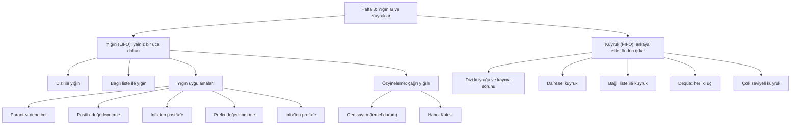
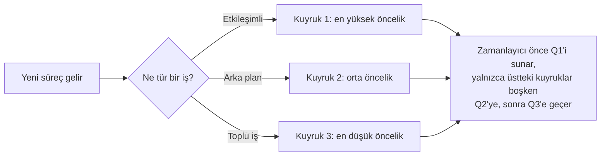

# Hafta 3 — Yığınlar ve Kuyruklar

*CEN207 Veri Yapıları (eski adıyla CE205) · 2026–2027 Güz*

<!-- materials:start -->

<div class="materials" markdown>

[:material-file-pdf-box: Ders notu (PDF)](cen207-week-3-notes.pdf){ .md-button download="cen207-week-3-notes.pdf" }
[:material-file-word-box: Ders notu (DOCX)](cen207-week-3-notes.docx){ .md-button download="cen207-week-3-notes.docx" }
[:material-presentation: Sunum (PDF)](cen207-week-3-slides.pdf){ .md-button download="cen207-week-3-slides.pdf" }
[:material-microsoft-powerpoint: Sunum (PPTX)](cen207-week-3-slides.pptx){ .md-button download="cen207-week-3-slides.pptx" }
[:material-language-html5: Sunum (HTML, çevrimdışı)](cen207-week-3-slides.html){ .md-button download="cen207-week-3-slides.html" }
[:material-folder-zip: Tümünü indir (ZIP)](cen207-week-3-materials.zip){ .md-button download="cen207-week-3-materials.zip" }
[:material-fullscreen: Sunumu tam ekran aç](cen207-week-3-slides.html){ .md-button .md-button--primary target=_blank }

</div>

<div class="deck-frame">
<iframe src="../cen207-week-3-slides.html" title="Hafta 3 — Yığınlar ve Kuyruklar" loading="lazy" allowfullscreen></iframe>
</div>

<p class="deck-hint">Sunumun içine tıklayıp ok tuşlarıyla ilerleyin; tam ekran için sunumun sağ altındaki düğmeyi ya da yukarıdaki "Sunumu tam ekran aç" bağlantısını kullanın.</p>

<!-- materials:end -->

!!! abstract "Bu hafta"
    **Öğrenme hedefleri.** Bu haftanın sonunda, bilgisayar biliminde en çok kullanılan iki veri yapısını
    açıklayabilecek, çizebilecek, uygulayabilecek ve analiz edebileceksiniz: **yığın (stack)** (LIFO) ve
    **kuyruk (queue)** (FIFO). Parantezlerin doğru eşleşip eşleşmediğini denetlemek, bir postfix ifadeyi
    değerlendirmek ve bir infix ifadeyi postfix'e çevirmek için yığın kullanacaksınız. Özyineleme (recursion)
    kullanarak — ve özyinelemenin aslında bir yığın *olduğunu* somut biçimde görerek — Hanoi Kulesi bulmacasını
    çözeceksiniz. Kuyruğu üç farklı şekilde (düz dizi, dairesel dizi, bağlı liste) kuracak, onun çift uçlu
    kuzeni deque ile tanışacak ve işletim sistemlerinin neden aynı anda birden fazla kuyruk tuttuğunu (çok
    seviyeli kuyruk) göreceksiniz. Bu hedefler izlencenin **ÖÇ.1** (temel veri yapılarını açıklama) ve **ÖÇ.7**
    (bir probleme doğru veri yapısını seçme) çıktılarıyla eşleşir.

    **Önceden bilmeniz gerekenler.** Hafta 1 size işaretçileri (pointer), `struct`'ı ve belleği numaralı
    kutulardan oluşan uzun bir sıra olarak görmeyi verdi. Hafta 2 size bağlı listeyi (linked list) verdi —
    kutuların yan yana durmak yerine işaretçilerle birbirine bağlandığı bir zincir. Bu hafta her iki fikri de
    sürekli yeniden kullanıyor; biri sallantılı geliyorsa, hemen aşağıdaki 0. bölümdeki "Başlamadan önce" kısa
    tekrarı tam size göre.

    **3 saatlik oturum için zaman planı.** Yığınlar ve uygulamaları (~70 dk) · kısa ara · özyineleme ve Hanoi
    Kulesi (~40 dk) · kuyruklar ve türevleri (~60 dk) · toparlama ve kendini sınama (~10 dk).

## 0. Başlamadan önce

### 0.1 Zaten bildikleriniz

Son iki haftadan gelen iki fikir, bu haftanın bütün temelini oluşturuyor. Üzerine bir şeyler inşa etmeden önce
bu ikisinin sağlam olduğundan emin olalım.

**Hafta 1'den — işaretçiler ve bellek.** `int *p` tipindeki bir değişken bir sayı tutmaz; bir sayı tutan kutunun
**adresini** tutar. `malloc`, işletim sisteminden yeni bir kutu ister ve size adresini verir; `free` o kutuyu
geri verir. Artık ihtiyacınız olmayan bir kutuyu `free` etmeyi unutmak bir **bellek sızıntısıdır (memory leak)**;
`free` ettiğiniz bir kutuyu sonra kullanmak bir **sarkan işaretçi (dangling pointer)** hatasıdır. Bu hafta
`malloc` ve `free`'i tekrar kullanacağız ve bir taşmanın ya da unutulan bir `free`'nin tam olarak nerede sizi
ısıracağını göstereceğiz.

**Hafta 2'den — bağlı listeler.** Bağlı liste, düğümlerden oluşan bir zincirdir; her düğüm bir değer ve bir
sonraki düğümü gösteren bir işaretçi tutar (son düğümse `NULL`). Bir düğüm eklemek ya da çıkarmak yalnızca birkaç
işaretçiyi yeniden bağlamayı gerektirir — diğer elemanları kaydırmaya gerek yoktur. Bu haftanın *bağlı liste ile
yığını* ve *bağlı liste ile kuyruğu*, tam olarak aynı düğüm-ve-işaretçi fikridir; yalnızca zincirin bir ucuna ya
da her iki ucuna dokunmakla sınırlandırılmıştır.

Bunlardan biri "aa evet, hatırladım" değil de yeni gibi hissettiriyorsa, devam etmeden önce Hafta 1 ve Hafta 2
notlarına beş dakika ayırmak faydalı olur — aşağıdaki her şey bunları bildiğinizi varsayıyor.

### 0.2 Bu haftanın haritası

Yığınlar ve kuyruklar ikisi de **doğrusal (linear)** yapılardır — elemanları bir sıra içinde durur — ama
elemanların *nereden* eklenip çıkarılabileceği konusunda anlaşamazlar. Yığın yalnızca bir ucuna dokunmanıza izin
verir. Kuyruk sizi bir uçtan eklemeye, diğer uçtan çıkarmaya zorlar. Bu tek kural farkı, aradaki bütün farktır ve
her yapının ne için iyi olduğunu tamamen değiştirir.



Haritadaki her kutu, aşağıda kendi bölümünü alıyor; çoğunun yanında adım adım ilerleyen kısa bir animasyon,
eksiksiz bir C ve Java programı ve işlerin nasıl ters gidebileceğine dair bir not var.

## 1. Yığın: Son Giren, İlk Çıkar

### 1.1 Başlangıç sorusu

Tarayıcınızı açın, art arda üç sayfa ziyaret edin, sonra **Geri** düğmesine üç kez tıklayın. Sırasıyla ikinci
sayfaya, sonra birinci sayfaya inersiniz ve ardından... geri gidecek başka bir yer kalmaz. Ziyaret ettiğiniz
*son* sayfa, geri gittiğiniz *ilk* sayfadır. Elinizdeki araçlarla — bir dizi ya da bağlı liste — bu "geçmiş"
özelliğini nasıl uygularsınız? Bunu doğal kılan veri yapısına **yığın (stack)** denir ve önümüzdeki birkaç
sayfanın konusu bu.

### 1.2 Kısa bir tarihçe

Bu soyut veri türü için "yığın (stack)" adı ile işlemleri için "push" ve "pop" adları, 1950'lerin sonunda
bilgisayar bilimi literatüründe zaten kullanılıyordu — erken makineler ve derleyiciler, tam da şu anda
bilgisayarınızın her fonksiyon çağrısında yaptığı işi görmek için, dönüş adreslerini ve ara sonuçları tutmak
üzere donanımsal ya da yazılımsal bir yığın kullanıyordu. Münih Teknik Üniversitesi'nden Friedrich L. Bauer ve
Klaus Samelson, 1957'de aritmetik ifadeleri değerlendirmek için donanımsal bir yığın mekanizmasını patentledi;
Alan Turing ise 1946'daki ACE bilgisayarı tasarımında, alt yordam dönüş adresleri için buna yakın bir fikir
("göm/çıkar" stratejisi) kullanmıştı. Yığın, bilgisayar biliminin en eski fikirlerinden biridir ve hiç
eskimemiştir: çalışan her program hâlâ bir tane kullanır.

### 1.3 Sezgi

Bir yemekhanedeki tabak yığınını düşünün. Bir tabağı yalnızca **en üstten** alabilirsiniz ve yalnızca **en üste**
yeni bir tabak koyabilirsiniz. Üstündeki her şeyi kaldırmadan ortadan bir tabak çekemezsiniz. Yığına en son
konan tabak, çıkarılan ilk tabaktır — **Son Giren, İlk Çıkar**, ya da **LIFO**.

İki temel işlemin kısa, standart adları vardır:

- **push** — en üste yeni bir eleman koy.
- **pop** — en üstteki elemanı çıkar ve döndür.

Üçüncü bir işlem, **peek** (bazen `top` de denir), en üstteki elemana çıkarmadan bakar. Üçü de yalnızca yapının
bir ucuna dokunur.

### 1.4 Yığın ADT'si

**Soyut veri türü (abstract data type, ADT)**, bir yapının *ne* yaptığını tanımlar, *nasıl* yaptığını değil.
İşte dizi ya da bağlı liste ile kurulmuş olmasından bağımsız olarak yığın ADT'si:

| İşlem | Ne yapar | Ön koşul | Karmaşıklık |
| --- | --- | --- | --- |
| `push(x)` | `x`'i yığının en üstüne ekler | Yığın dolu değil (yalnızca dizi sürümünde) | O(1) |
| `pop()` | En üstteki elemanı çıkarır ve döndürür | Yığın boş değil | O(1) |
| `peek()` | En üstteki elemanı çıkarmadan döndürür | Yığın boş değil | O(1) |
| `isEmpty()` | Yığının sıfır eleman içerip içermediğini bildirir | yok | O(1) |

Her işlem O(1)'dir — yığında zaten kaç eleman olduğundan bağımsız olarak sabit zamandır — çünkü her işlem yalnızca
en üste dokunur. Bu sabit-zaman garantisi, yığının bütün amacıdır: ortaya ya da alta erişmeniz gerekseydi, başka
bir yapıya (bir diziye, ya da tamamen farklı bir ADT'ye) başvururdunuz.

### 1.5 Bellekte bir yığın: dizi sürümü

Bir yığın kurmanın en basit yolu, sabit boyutlu bir dizi ayırmak ve en üstteki dolu hücrenin indisini tutan tek
bir `top` tamsayısı tutmaktır. Boş bir yığın `top == -1` demektir: "henüz bir üst yok." `push`, `top`'u bir
artırır ve o hücreye yazar; `pop`, `top` hücresini okur ve `top`'u bir azaltır. Bellekte başka hiçbir şey yer
değiştirmez.

Animasyonu oynatın, ya da ← → ile adım adım ilerleyin; `push` ve `pop`'un `top`'u ve diziyi nasıl bir adımda bir
güncellediğini izleyin.

<iframe class="dsanim" src="../anim/array-stack-push-pop.html" title="Dizi ile yığın: push ve pop" loading="lazy"></iframe>
<div class="dsanim-baski" markdown>

</div>

Seçicide ayrıca **18 karışık işlem** (zor) ve uç durumlar **taşma: 10 hücreye 11 push**, **alttan taşma: 10 push,
11 pop**, **boş yığından pop, sonra 10 push** ve **uç değerler (`INT_MAX`, `INT_MIN`, 0, negatif)** örneklerini
deneyin — ya da dört zorluk seviyesinde rastgele veri için 🎲 düğmesine basın, ya da kendi değerlerinizi yazın.

=== "C"

    ```c
    /* Week 3 -- Stacks and Queues
     * Array-backed stack: push and pop.
     * CEN207 Data Structures (CS50-style lecture notes)
     */
    #include <stdbool.h>
    #include <stdio.h>

    #define MAX_CAP 12

    typedef struct {
        bool is_pop;
        int value;
    } Op;

    int data[MAX_CAP];
    int top = -1;          /* empty stack */
    int cap = MAX_CAP;      /* capacity used by the current scenario */

    bool push(int x) {
        if (top == cap - 1)  /* full? */
            return false;     /* overflow */
        top = top + 1;
        data[top] = x;
        return true;
    }

    bool pop(int *out) {
        if (top == -1)        /* empty? */
            return false;      /* underflow */
        *out = data[top];
        top = top - 1;
        return true;
    }

    static void print_stack(void) {
        printf("stack (bottom to top):");
        for (int i = 0; i <= top; i++)
            printf(" %d", data[i]);
        if (top == -1)
            printf(" (empty)");
        printf("  [top = %d]\n", top);
    }

    static void run_scenario(const char *label, int scenario_cap, const Op ops[], int n) {
        printf("-- %s --\n", label);
        top = -1;
        cap = scenario_cap;
        print_stack();
        for (int i = 0; i < n; i++) {
            if (ops[i].is_pop) {
                int out = 0;
                bool ok = pop(&out);
                if (ok)
                    printf("pop() -> true, out = %d\n", out);
                else
                    printf("pop() -> false (stack is empty)\n");
            } else {
                bool ok = push(ops[i].value);
                printf("push(%d) -> %s\n", ops[i].value, ok ? "true" : "false");
            }
            print_stack();
        }
        printf("\n");
    }

    int main(void) {
        /* normal: 10 pushes, then 4 pops */
        Op normal[] = {
            {false, 12}, {false, 7}, {false, 25}, {false, 3}, {false, 18},
            {false, 9}, {false, 30}, {false, 14}, {false, 5}, {false, 21},
            {true, 0}, {true, 0}, {true, 0}, {true, 0}
        };
        run_scenario("normal: 10 pushes, then 4 pops (cap 12)", 12, normal, 14);

        /* hard: 18 mixed operations */
        Op hard[] = {
            {false, 40}, {false, 11}, {true, 0}, {false, 27}, {false, 8},
            {false, 33}, {true, 0}, {true, 0}, {false, 16}, {false, 2},
            {false, 45}, {false, 19}, {true, 0}, {false, 7}, {false, 38},
            {false, 23}, {false, 10}, {true, 0}
        };
        run_scenario("hard: 18 mixed operations (cap 12)", 12, hard, 18);

        /* edge: overflow -- 11 pushes into a 10-cell stack */
        Op edge[] = {
            {false, 4}, {false, 15}, {false, 8}, {false, 16}, {false, 23},
            {false, 42}, {false, 11}, {false, 6}, {false, 29}, {false, 37},
            {false, 50}, {true, 0}
        };
        run_scenario("edge: overflow, 11 pushes into a 10-cell stack (cap 10)", 10, edge, 12);

        return 0;
    }
    ```

=== "Java"

    ```java
    /* Week 3 -- Stacks and Queues
     * Array-backed stack: push and pop.
     * CEN207 Data Structures (CS50-style lecture notes)
     */
    public class ArrayStackPushPop {
        static final int MAX_CAP = 12;
        int[] data = new int[MAX_CAP];
        int top = -1;           // empty stack
        int cap = MAX_CAP;       // capacity used by the current scenario

        static class Op {
            boolean isPop;
            int value;
            Op(boolean isPop, int value) { this.isPop = isPop; this.value = value; }
        }

        boolean push(int x) {
            if (top == cap - 1)  // full?
                return false;    // overflow
            top = top + 1;
            data[top] = x;
            return true;
        }

        Integer pop() {
            if (top == -1)       // empty?
                return null;     // underflow
            int out = data[top];
            top = top - 1;
            return out;
        }

        void printStack() {
            StringBuilder sb = new StringBuilder("stack (bottom to top):");
            for (int i = 0; i <= top; i++)
                sb.append(' ').append(data[i]);
            if (top == -1)
                sb.append(" (empty)");
            sb.append("  [top = ").append(top).append(']');
            System.out.println(sb);
        }

        void runScenario(String label, int scenarioCap, Op[] ops) {
            System.out.println("-- " + label + " --");
            top = -1;
            cap = scenarioCap;
            printStack();
            for (Op op : ops) {
                if (op.isPop) {
                    Integer out = pop();
                    if (out != null)
                        System.out.println("pop() -> true, out = " + out);
                    else
                        System.out.println("pop() -> false (stack is empty)");
                } else {
                    boolean ok = push(op.value);
                    System.out.println("push(" + op.value + ") -> " + ok);
                }
                printStack();
            }
            System.out.println();
        }

        public static void main(String[] args) {
            ArrayStackPushPop s = new ArrayStackPushPop();

            // normal: 10 pushes, then 4 pops
            Op[] normal = {
                new Op(false, 12), new Op(false, 7), new Op(false, 25), new Op(false, 3), new Op(false, 18),
                new Op(false, 9), new Op(false, 30), new Op(false, 14), new Op(false, 5), new Op(false, 21),
                new Op(true, 0), new Op(true, 0), new Op(true, 0), new Op(true, 0)
            };
            s.runScenario("normal: 10 pushes, then 4 pops (cap 12)", 12, normal);

            // hard: 18 mixed operations
            Op[] hard = {
                new Op(false, 40), new Op(false, 11), new Op(true, 0), new Op(false, 27), new Op(false, 8),
                new Op(false, 33), new Op(true, 0), new Op(true, 0), new Op(false, 16), new Op(false, 2),
                new Op(false, 45), new Op(false, 19), new Op(true, 0), new Op(false, 7), new Op(false, 38),
                new Op(false, 23), new Op(false, 10), new Op(true, 0)
            };
            s.runScenario("hard: 18 mixed operations (cap 12)", 12, hard);

            // edge: overflow -- 11 pushes into a 10-cell stack
            Op[] edge = {
                new Op(false, 4), new Op(false, 15), new Op(false, 8), new Op(false, 16), new Op(false, 23),
                new Op(false, 42), new Op(false, 11), new Op(false, 6), new Op(false, 29), new Op(false, 37),
                new Op(false, 50), new Op(true, 0)
            };
            s.runScenario("edge: overflow, 11 pushes into a 10-cell stack (cap 10)", 10, edge);
        }
    }
    ```

**Deneyin**

=== "C"

    ```console
    gcc -std=c11 -Wall -Wextra -o /tmp/x array_stack_push_pop.c && /tmp/x
    ```

    Beklenen çıktı:

    ```text
    -- normal: 10 pushes, then 4 pops (cap 12) --
    stack (bottom to top): (empty)  [top = -1]
    push(12) -> true
    stack (bottom to top): 12  [top = 0]
    push(7) -> true
    stack (bottom to top): 12 7  [top = 1]
    push(25) -> true
    stack (bottom to top): 12 7 25  [top = 2]
    push(3) -> true
    stack (bottom to top): 12 7 25 3  [top = 3]
    push(18) -> true
    stack (bottom to top): 12 7 25 3 18  [top = 4]
    push(9) -> true
    stack (bottom to top): 12 7 25 3 18 9  [top = 5]
    push(30) -> true
    stack (bottom to top): 12 7 25 3 18 9 30  [top = 6]
    push(14) -> true
    stack (bottom to top): 12 7 25 3 18 9 30 14  [top = 7]
    push(5) -> true
    stack (bottom to top): 12 7 25 3 18 9 30 14 5  [top = 8]
    push(21) -> true
    stack (bottom to top): 12 7 25 3 18 9 30 14 5 21  [top = 9]
    pop() -> true, out = 21
    stack (bottom to top): 12 7 25 3 18 9 30 14 5  [top = 8]
    pop() -> true, out = 5
    stack (bottom to top): 12 7 25 3 18 9 30 14  [top = 7]
    pop() -> true, out = 14
    stack (bottom to top): 12 7 25 3 18 9 30  [top = 6]
    pop() -> true, out = 30
    stack (bottom to top): 12 7 25 3 18 9  [top = 5]

    -- hard: 18 mixed operations (cap 12) --
    stack (bottom to top): (empty)  [top = -1]
    push(40) -> true
    stack (bottom to top): 40  [top = 0]
    push(11) -> true
    stack (bottom to top): 40 11  [top = 1]
    pop() -> true, out = 11
    stack (bottom to top): 40  [top = 0]
    push(27) -> true
    stack (bottom to top): 40 27  [top = 1]
    push(8) -> true
    stack (bottom to top): 40 27 8  [top = 2]
    push(33) -> true
    stack (bottom to top): 40 27 8 33  [top = 3]
    pop() -> true, out = 33
    stack (bottom to top): 40 27 8  [top = 2]
    pop() -> true, out = 8
    stack (bottom to top): 40 27  [top = 1]
    push(16) -> true
    stack (bottom to top): 40 27 16  [top = 2]
    push(2) -> true
    stack (bottom to top): 40 27 16 2  [top = 3]
    push(45) -> true
    stack (bottom to top): 40 27 16 2 45  [top = 4]
    push(19) -> true
    stack (bottom to top): 40 27 16 2 45 19  [top = 5]
    pop() -> true, out = 19
    stack (bottom to top): 40 27 16 2 45  [top = 4]
    push(7) -> true
    stack (bottom to top): 40 27 16 2 45 7  [top = 5]
    push(38) -> true
    stack (bottom to top): 40 27 16 2 45 7 38  [top = 6]
    push(23) -> true
    stack (bottom to top): 40 27 16 2 45 7 38 23  [top = 7]
    push(10) -> true
    stack (bottom to top): 40 27 16 2 45 7 38 23 10  [top = 8]
    pop() -> true, out = 10
    stack (bottom to top): 40 27 16 2 45 7 38 23  [top = 7]

    -- edge: overflow, 11 pushes into a 10-cell stack (cap 10) --
    stack (bottom to top): (empty)  [top = -1]
    push(4) -> true
    stack (bottom to top): 4  [top = 0]
    push(15) -> true
    stack (bottom to top): 4 15  [top = 1]
    push(8) -> true
    stack (bottom to top): 4 15 8  [top = 2]
    push(16) -> true
    stack (bottom to top): 4 15 8 16  [top = 3]
    push(23) -> true
    stack (bottom to top): 4 15 8 16 23  [top = 4]
    push(42) -> true
    stack (bottom to top): 4 15 8 16 23 42  [top = 5]
    push(11) -> true
    stack (bottom to top): 4 15 8 16 23 42 11  [top = 6]
    push(6) -> true
    stack (bottom to top): 4 15 8 16 23 42 11 6  [top = 7]
    push(29) -> true
    stack (bottom to top): 4 15 8 16 23 42 11 6 29  [top = 8]
    push(37) -> true
    stack (bottom to top): 4 15 8 16 23 42 11 6 29 37  [top = 9]
    push(50) -> false
    stack (bottom to top): 4 15 8 16 23 42 11 6 29 37  [top = 9]
    pop() -> true, out = 37
    stack (bottom to top): 4 15 8 16 23 42 11 6 29  [top = 8]
    ```

=== "Java"

    ```console
    javac -d /tmp/j ArrayStackPushPop.java && java -cp /tmp/j ArrayStackPushPop
    ```

    Beklenen çıktı: yukarıdaki C çalıştırmasıyla birebir aynı (aynı algoritma, aynı veri).

**Neden her işlem O(1)?** `push` ve `pop`, yığında bir eleman olsun bin eleman olsun, her zaman sabit sayıda
adım atar — bir koşulu denetle, `top`'u kaydır, bir dizi hücresini oku ya da yaz. Diğer elemanlar üzerinde bir
döngü yoktur.

### 1.6 Dizi dolduğunda ya da boşaldığında: taşma ve alttan taşma

Bir dizinin sabit bir boyutu vardır. Dolu bir yığına `push` yapıldığında, ya da boş bir yığından `pop`
yapıldığında ne olur? Doğru bir uygulama **önce denetlemeli ve reddetmelidir**, dizinin sınırları dışında sessizce
okuma ya da yazma yapmak yerine. C'de bir dizinin sınırları dışına yazmak size dostane bir hata vermez — yanında
her ne varsa onu bozar, ve hata, nedeninden çok uzakta, dakikalar sonra, yığına hiç dokunmamış bir bölümde ortaya
çıkabilir.

Her iki hatanın da küçük bir yığında nasıl olduğunu görmek için animasyonu oynatın.

<iframe class="dsanim" src="../anim/stack-overflow-underflow.html" title="Yığında taşma ve alttan taşma" loading="lazy"></iframe>
<div class="dsanim-baski" markdown>

</div>

Seçicide ayrıca **alttan taşma: 10 push, 13 pop, boşalınca alttan taşma** (zor) ve uç durumlar **aynı çalıştırmada
ikisi de: küçük yığın (`CAP=6`)** ve **yığın tam dolu; art arda 5 push denemesi de başarısız** örneklerini deneyin
— ya da dört zorluk seviyesinde rastgele veri için 🎲 düğmesine basın, ya da kendi değerlerinizi yazın.

Kod, yukarıdaki aynı `push`/`pop` çiftidir — yığını güvende tutan tam olarak bu iki denetimdir
(`top == CAP - 1` ve `top == -1`). Burada onu kasıtlı olarak her iki sınırın da ötesine sürüyoruz:

=== "C"

    ```c
    /* Week 3 -- Stacks and Queues
     * Array-backed stack: overflow and underflow.
     * CEN207 Data Structures (CS50-style lecture notes)
     */
    #include <stdbool.h>
    #include <stdio.h>

    #define MAX_CAP 10

    typedef struct {
        bool is_pop;
        int value;
    } Op;

    int data[MAX_CAP];
    int top = -1;          /* empty stack */
    int cap = MAX_CAP;      /* capacity used by the current scenario */

    bool push(int x) {
        if (top == cap - 1)  /* full? */
            return false;     /* overflow */
        top = top + 1;
        data[top] = x;
        return true;
    }

    bool pop(int *out) {
        if (top == -1)        /* empty? */
            return false;      /* underflow */
        *out = data[top];
        top = top - 1;
        return true;
    }

    static void run_scenario(const char *label, int scenario_cap, const Op ops[], int n) {
        printf("-- %s --\n", label);
        top = -1;
        cap = scenario_cap;
        for (int i = 0; i < n; i++) {
            if (ops[i].is_pop) {
                int out = 0;
                bool ok = pop(&out);
                if (ok)
                    printf("pop() -> true, out = %d\n", out);
                else
                    printf("pop() -> false  (UNDERFLOW: the stack is empty)\n");
            } else {
                bool ok = push(ops[i].value);
                printf("push(%d) -> %s", ops[i].value, ok ? "true" : "false");
                if (!ok)
                    printf("  (OVERFLOW: the stack is full)");
                printf("\n");
            }
        }
        printf("\n");
    }

    int main(void) {
        /* normal: 11 pushes into a 10-cell stack -- overflow on the last one */
        Op normal[] = {
            {false, 4}, {false, 15}, {false, 8}, {false, 23}, {false, 6},
            {false, 31}, {false, 12}, {false, 27}, {false, 9}, {false, 18}, {false, 40}
        };
        run_scenario("normal: 11 pushes into a 10-cell stack (overflow)", 10, normal, 11);

        /* hard: 10 pushes, then 13 pops -- underflow after draining */
        Op hard[] = {
            {false, 7}, {false, 19}, {false, 3}, {false, 26}, {false, 14},
            {false, 8}, {false, 31}, {false, 22}, {false, 5}, {false, 17},
            {true, 0}, {true, 0}, {true, 0}, {true, 0}, {true, 0}, {true, 0},
            {true, 0}, {true, 0}, {true, 0}, {true, 0}, {true, 0}, {true, 0}, {true, 0}
        };
        run_scenario("hard: 10 pushes, then 13 pops (underflow after draining)", 10, hard, 23);

        /* edge: both failures in one run on a small stack (cap 6) */
        Op edge[] = {
            {false, 3}, {false, 9}, {false, 14}, {false, 2}, {false, 21}, {false, 6},
            {false, 17}, {false, 8}, {false, 25}, {false, 11},
            {true, 0}, {true, 0}, {true, 0}, {true, 0}, {true, 0}, {true, 0}, {true, 0}, {true, 0}, {true, 0}
        };
        run_scenario("edge: overflow and underflow in one run (cap 6)", 6, edge, 19);

        return 0;
    }
    ```

=== "Java"

    ```java
    /* Week 3 -- Stacks and Queues
     * Array-backed stack: overflow and underflow.
     * CEN207 Data Structures (CS50-style lecture notes)
     */
    public class ArrayStackOverflow {
        static final int MAX_CAP = 10;
        int[] data = new int[MAX_CAP];
        int top = -1;           // empty stack
        int cap = MAX_CAP;       // capacity used by the current scenario

        static class Op {
            boolean isPop;
            int value;
            Op(boolean isPop, int value) { this.isPop = isPop; this.value = value; }
        }

        boolean push(int x) {
            if (top == cap - 1)  // full?
                return false;    // overflow
            top = top + 1;
            data[top] = x;
            return true;
        }

        Integer pop() {
            if (top == -1)       // empty?
                return null;     // underflow
            int out = data[top];
            top = top - 1;
            return out;
        }

        void runScenario(String label, int scenarioCap, Op[] ops) {
            System.out.println("-- " + label + " --");
            top = -1;
            cap = scenarioCap;
            for (Op op : ops) {
                if (op.isPop) {
                    Integer out = pop();
                    if (out != null)
                        System.out.println("pop() -> true, out = " + out);
                    else
                        System.out.println("pop() -> false  (UNDERFLOW: the stack is empty)");
                } else {
                    boolean ok = push(op.value);
                    System.out.print("push(" + op.value + ") -> " + ok);
                    if (!ok)
                        System.out.print("  (OVERFLOW: the stack is full)");
                    System.out.println();
                }
            }
            System.out.println();
        }

        public static void main(String[] args) {
            ArrayStackOverflow s = new ArrayStackOverflow();

            // normal: 11 pushes into a 10-cell stack -- overflow on the last one
            Op[] normal = {
                new Op(false, 4), new Op(false, 15), new Op(false, 8), new Op(false, 23), new Op(false, 6),
                new Op(false, 31), new Op(false, 12), new Op(false, 27), new Op(false, 9), new Op(false, 18), new Op(false, 40)
            };
            s.runScenario("normal: 11 pushes into a 10-cell stack (overflow)", 10, normal);

            // hard: 10 pushes, then 13 pops -- underflow after draining
            Op[] hard = {
                new Op(false, 7), new Op(false, 19), new Op(false, 3), new Op(false, 26), new Op(false, 14),
                new Op(false, 8), new Op(false, 31), new Op(false, 22), new Op(false, 5), new Op(false, 17),
                new Op(true, 0), new Op(true, 0), new Op(true, 0), new Op(true, 0), new Op(true, 0), new Op(true, 0),
                new Op(true, 0), new Op(true, 0), new Op(true, 0), new Op(true, 0), new Op(true, 0), new Op(true, 0), new Op(true, 0)
            };
            s.runScenario("hard: 10 pushes, then 13 pops (underflow after draining)", 10, hard);

            // edge: both failures in one run on a small stack (cap 6)
            Op[] edge = {
                new Op(false, 3), new Op(false, 9), new Op(false, 14), new Op(false, 2), new Op(false, 21), new Op(false, 6),
                new Op(false, 17), new Op(false, 8), new Op(false, 25), new Op(false, 11),
                new Op(true, 0), new Op(true, 0), new Op(true, 0), new Op(true, 0), new Op(true, 0), new Op(true, 0), new Op(true, 0), new Op(true, 0), new Op(true, 0)
            };
            s.runScenario("edge: overflow and underflow in one run (cap 6)", 6, edge);
        }
    }
    ```

**Deneyin**

=== "C"

    ```console
    gcc -std=c11 -Wall -Wextra -o /tmp/x array_stack_overflow.c && /tmp/x
    ```

    Beklenen çıktı:

    ```text
    -- normal: 11 pushes into a 10-cell stack (overflow) --
    push(4) -> true
    push(15) -> true
    push(8) -> true
    push(23) -> true
    push(6) -> true
    push(31) -> true
    push(12) -> true
    push(27) -> true
    push(9) -> true
    push(18) -> true
    push(40) -> false  (OVERFLOW: the stack is full)

    -- hard: 10 pushes, then 13 pops (underflow after draining) --
    push(7) -> true
    push(19) -> true
    push(3) -> true
    push(26) -> true
    push(14) -> true
    push(8) -> true
    push(31) -> true
    push(22) -> true
    push(5) -> true
    push(17) -> true
    pop() -> true, out = 17
    pop() -> true, out = 5
    pop() -> true, out = 22
    pop() -> true, out = 31
    pop() -> true, out = 8
    pop() -> true, out = 14
    pop() -> true, out = 26
    pop() -> true, out = 3
    pop() -> true, out = 19
    pop() -> true, out = 7
    pop() -> false  (UNDERFLOW: the stack is empty)
    pop() -> false  (UNDERFLOW: the stack is empty)
    pop() -> false  (UNDERFLOW: the stack is empty)

    -- edge: overflow and underflow in one run (cap 6) --
    push(3) -> true
    push(9) -> true
    push(14) -> true
    push(2) -> true
    push(21) -> true
    push(6) -> true
    push(17) -> false  (OVERFLOW: the stack is full)
    push(8) -> false  (OVERFLOW: the stack is full)
    push(25) -> false  (OVERFLOW: the stack is full)
    push(11) -> false  (OVERFLOW: the stack is full)
    pop() -> true, out = 6
    pop() -> true, out = 21
    pop() -> true, out = 2
    pop() -> true, out = 14
    pop() -> true, out = 9
    pop() -> true, out = 3
    pop() -> false  (UNDERFLOW: the stack is empty)
    pop() -> false  (UNDERFLOW: the stack is empty)
    pop() -> false  (UNDERFLOW: the stack is empty)
    ```

=== "Java"

    ```console
    javac -d /tmp/j ArrayStackOverflow.java && java -cp /tmp/j ArrayStackOverflow
    ```

    Beklenen çıktı: yukarıdaki C çalıştırmasıyla birebir aynı (aynı algoritma, aynı veri).

!!! warning "Sık yapılan hatalar"
    - **`top == CAP` yerine `top == CAP - 1` denetlemeyi unutmak (ya da tersini yapmak).** İndisler `0`'dan
      `CAP - 1`'e kadar gider; son geçerli hücre `CAP - 1`'dir, dolayısıyla yığın, `top` bu indise *ulaştığı*
      anda doludur, onu ancak aşacağı an değil.
    - **`isEmpty` denetlemeden pop yapmak.** `data[-1]`'i okumak öngörülebilir biçimde çökmez — sessizce dizinin
      hemen öncesinde her ne bellek varsa onu okur.
    - **`bool` dönüş değerini yok saymak.** `push` `false` döndürüyorsa, değer hiçbir yere **kaydedilmemiştir**;
      bunu yok sayıp push'un olduğunu varsayan kod sessizce yanlış davranır.
    - **Uç durumlar.** Her iki hata da *aynı* çalıştırmada olabilir (dolu bir yığına push, sonra boşalt, sonra
      pop'a devam et): küçük bir `CAP = 6` yığın bunu doğrudan gösterir. Tam dolu bir yığın da art arda birkaç
      push'u **peş peşe** reddeder, yalnızca sınırı aşan ilkini değil — reddedilen her `push`, yığını tamamen
      değişmemiş bırakmalıdır.

### 1.7 Hiç taşmayan bir yığın: bağlı liste sürümü

Dizi ile kurulmuş bir yığının sert bir tavanı vardır: `CAP`. **Bağlı liste ile yığın**, tıpkı Hafta 2'deki bağlı
listeler gibi, her elemana kendi yeni ayrılmış düğümünü vererek bu tavanı kaldırır. `top` artık bir indis değil
— en üstteki düğümü gösteren bir işaretçidir. `push`, yeni bir düğüm ayırır, onu şu anki en üste işaret ettirir
ve `top`'u yeni düğüme taşır. `pop`, en üstteki düğümün değerini okur, `top`'u bir alttaki düğüme taşır ve eski
düğümü serbest bırakır.

<iframe class="dsanim" src="../anim/linked-stack-push-pop.html" title="Bağlı liste ile yığın: push ve pop" loading="lazy"></iframe>
<div class="dsanim-baski" markdown>

</div>

Seçicide ayrıca **10 düğümü tek tek çıkar: en son düğüm de pop olur** (zor) ve uç durumlar **boş yığından pop,
sonra 10 push** ve **uzun push dizisi: 14 düğüm, iki satır** örneklerini deneyin — ya da dört zorluk seviyesinde
rastgele veri için 🎲 düğmesine basın, ya da kendi değerlerinizi yazın.

=== "C"

    ```c
    /* Week 3 -- Stacks and Queues
     * Linked-list stack: push and pop.
     * CEN207 Data Structures (CS50-style lecture notes)
     */
    #include <stdbool.h>
    #include <stdio.h>
    #include <stdlib.h>

    typedef struct Node {
        int data;
        struct Node *next;
    } Node;
    Node *top = NULL;          /* empty stack */

    typedef struct {
        bool is_pop;
        int value;
    } Op;

    void push(int x) {
        Node *n = malloc(sizeof(Node));
        n->data = x;
        n->next = top;
        top = n;
    }

    bool pop(int *out) {
        if (top == NULL) return false;
        Node *tmp = top;
        *out = tmp->data;
        top = top->next;
        free(tmp);
        return true;
    }

    static void print_stack(void) {
        printf("stack (top to bottom):");
        for (Node *n = top; n != NULL; n = n->next)
            printf(" %d", n->data);
        if (top == NULL)
            printf(" (empty)");
        printf("\n");
    }

    static void run_scenario(const char *label, const Op ops[], int n) {
        printf("-- %s --\n", label);
        while (top != NULL) { int junk; pop(&junk); }   /* start each scenario empty */
        print_stack();
        for (int i = 0; i < n; i++) {
            if (ops[i].is_pop) {
                int out = 0;
                bool ok = pop(&out);
                if (ok)
                    printf("pop() -> true, out = %d\n", out);
                else
                    printf("pop() -> false (stack is empty)\n");
            } else {
                push(ops[i].value);
                printf("push(%d)\n", ops[i].value);
            }
            print_stack();
        }
        printf("\n");
    }

    int main(void) {
        /* normal: 12 pushes, then 3 pops */
        Op normal[] = {
            {false, 12}, {false, 7}, {false, 25}, {false, 3}, {false, 18},
            {false, 9}, {false, 30}, {false, 14}, {false, 5}, {false, 21},
            {false, 16}, {false, 40}, {true, 0}, {true, 0}, {true, 0}
        };
        run_scenario("normal: 12 pushes, then 3 pops", normal, 15);

        /* hard: pop every node one by one -- even the last one is popped */
        Op hard[] = {
            {false, 4}, {false, 15}, {false, 8}, {false, 23}, {false, 6},
            {false, 31}, {false, 12}, {false, 27}, {false, 9}, {false, 18},
            {true, 0}, {true, 0}, {true, 0}, {true, 0}, {true, 0},
            {true, 0}, {true, 0}, {true, 0}, {true, 0}, {true, 0}
        };
        run_scenario("hard: pop every node one by one (10 pushes, 10 pops)", hard, 20);

        /* edge: pop on an empty stack, then 10 pushes */
        Op edge[] = {
            {true, 0}, {false, 7}, {false, 19}, {false, 3}, {false, 26},
            {false, 14}, {false, 8}, {false, 31}, {false, 22}, {false, 5}, {false, 17}, {true, 0}
        };
        run_scenario("edge: pop on an empty stack, then 10 pushes", edge, 12);

        return 0;
    }
    ```

=== "Java"

    ```java
    /* Week 3 -- Stacks and Queues
     * Linked-list stack: push and pop.
     * CEN207 Data Structures (CS50-style lecture notes)
     */
    public class LinkedStackPushPop {
        static class Node {
            int data;
            Node next;
        }
        Node top = null;           // empty stack

        static class Op {
            boolean isPop;
            int value;
            Op(boolean isPop, int value) { this.isPop = isPop; this.value = value; }
        }

        void push(int x) {
            Node n = new Node();
            n.data = x;
            n.next = top;
            top = n;
        }

        Integer pop() {
            if (top == null) return null;
            Node tmp = top;
            int out = tmp.data;
            top = top.next;
            // the garbage collector frees tmp
            return out;
        }

        void printStack() {
            StringBuilder sb = new StringBuilder("stack (top to bottom):");
            for (Node n = top; n != null; n = n.next)
                sb.append(' ').append(n.data);
            if (top == null)
                sb.append(" (empty)");
            System.out.println(sb);
        }

        void runScenario(String label, Op[] ops) {
            System.out.println("-- " + label + " --");
            top = null;   // start each scenario empty
            printStack();
            for (Op op : ops) {
                if (op.isPop) {
                    Integer out = pop();
                    if (out != null)
                        System.out.println("pop() -> true, out = " + out);
                    else
                        System.out.println("pop() -> false (stack is empty)");
                } else {
                    push(op.value);
                    System.out.println("push(" + op.value + ")");
                }
                printStack();
            }
            System.out.println();
        }

        public static void main(String[] args) {
            LinkedStackPushPop s = new LinkedStackPushPop();

            // normal: 12 pushes, then 3 pops
            Op[] normal = {
                new Op(false, 12), new Op(false, 7), new Op(false, 25), new Op(false, 3), new Op(false, 18),
                new Op(false, 9), new Op(false, 30), new Op(false, 14), new Op(false, 5), new Op(false, 21),
                new Op(false, 16), new Op(false, 40), new Op(true, 0), new Op(true, 0), new Op(true, 0)
            };
            s.runScenario("normal: 12 pushes, then 3 pops", normal);

            // hard: pop every node one by one -- even the last one is popped
            Op[] hard = {
                new Op(false, 4), new Op(false, 15), new Op(false, 8), new Op(false, 23), new Op(false, 6),
                new Op(false, 31), new Op(false, 12), new Op(false, 27), new Op(false, 9), new Op(false, 18),
                new Op(true, 0), new Op(true, 0), new Op(true, 0), new Op(true, 0), new Op(true, 0),
                new Op(true, 0), new Op(true, 0), new Op(true, 0), new Op(true, 0), new Op(true, 0)
            };
            s.runScenario("hard: pop every node one by one (10 pushes, 10 pops)", hard);

            // edge: pop on an empty stack, then 10 pushes
            Op[] edge = {
                new Op(true, 0), new Op(false, 7), new Op(false, 19), new Op(false, 3), new Op(false, 26),
                new Op(false, 14), new Op(false, 8), new Op(false, 31), new Op(false, 22), new Op(false, 5), new Op(false, 17), new Op(true, 0)
            };
            s.runScenario("edge: pop on an empty stack, then 10 pushes", edge);
        }
    }
    ```

**Deneyin**

=== "C"

    ```console
    gcc -std=c11 -Wall -Wextra -o /tmp/x linked_stack_push_pop.c && /tmp/x
    ```

    Beklenen çıktı:

    ```text
    -- normal: 12 pushes, then 3 pops --
    stack (top to bottom): (empty)
    push(12)
    stack (top to bottom): 12
    push(7)
    stack (top to bottom): 7 12
    push(25)
    stack (top to bottom): 25 7 12
    push(3)
    stack (top to bottom): 3 25 7 12
    push(18)
    stack (top to bottom): 18 3 25 7 12
    push(9)
    stack (top to bottom): 9 18 3 25 7 12
    push(30)
    stack (top to bottom): 30 9 18 3 25 7 12
    push(14)
    stack (top to bottom): 14 30 9 18 3 25 7 12
    push(5)
    stack (top to bottom): 5 14 30 9 18 3 25 7 12
    push(21)
    stack (top to bottom): 21 5 14 30 9 18 3 25 7 12
    push(16)
    stack (top to bottom): 16 21 5 14 30 9 18 3 25 7 12
    push(40)
    stack (top to bottom): 40 16 21 5 14 30 9 18 3 25 7 12
    pop() -> true, out = 40
    stack (top to bottom): 16 21 5 14 30 9 18 3 25 7 12
    pop() -> true, out = 16
    stack (top to bottom): 21 5 14 30 9 18 3 25 7 12
    pop() -> true, out = 21
    stack (top to bottom): 5 14 30 9 18 3 25 7 12

    -- hard: pop every node one by one (10 pushes, 10 pops) --
    stack (top to bottom): (empty)
    push(4)
    stack (top to bottom): 4
    push(15)
    stack (top to bottom): 15 4
    push(8)
    stack (top to bottom): 8 15 4
    push(23)
    stack (top to bottom): 23 8 15 4
    push(6)
    stack (top to bottom): 6 23 8 15 4
    push(31)
    stack (top to bottom): 31 6 23 8 15 4
    push(12)
    stack (top to bottom): 12 31 6 23 8 15 4
    push(27)
    stack (top to bottom): 27 12 31 6 23 8 15 4
    push(9)
    stack (top to bottom): 9 27 12 31 6 23 8 15 4
    push(18)
    stack (top to bottom): 18 9 27 12 31 6 23 8 15 4
    pop() -> true, out = 18
    stack (top to bottom): 9 27 12 31 6 23 8 15 4
    pop() -> true, out = 9
    stack (top to bottom): 27 12 31 6 23 8 15 4
    pop() -> true, out = 27
    stack (top to bottom): 12 31 6 23 8 15 4
    pop() -> true, out = 12
    stack (top to bottom): 31 6 23 8 15 4
    pop() -> true, out = 31
    stack (top to bottom): 6 23 8 15 4
    pop() -> true, out = 6
    stack (top to bottom): 23 8 15 4
    pop() -> true, out = 23
    stack (top to bottom): 8 15 4
    pop() -> true, out = 8
    stack (top to bottom): 15 4
    pop() -> true, out = 15
    stack (top to bottom): 4
    pop() -> true, out = 4
    stack (top to bottom): (empty)

    -- edge: pop on an empty stack, then 10 pushes --
    stack (top to bottom): (empty)
    pop() -> false (stack is empty)
    stack (top to bottom): (empty)
    push(7)
    stack (top to bottom): 7
    push(19)
    stack (top to bottom): 19 7
    push(3)
    stack (top to bottom): 3 19 7
    push(26)
    stack (top to bottom): 26 3 19 7
    push(14)
    stack (top to bottom): 14 26 3 19 7
    push(8)
    stack (top to bottom): 8 14 26 3 19 7
    push(31)
    stack (top to bottom): 31 8 14 26 3 19 7
    push(22)
    stack (top to bottom): 22 31 8 14 26 3 19 7
    push(5)
    stack (top to bottom): 5 22 31 8 14 26 3 19 7
    push(17)
    stack (top to bottom): 17 5 22 31 8 14 26 3 19 7
    pop() -> true, out = 17
    stack (top to bottom): 5 22 31 8 14 26 3 19 7
    ```

=== "Java"

    ```console
    javac -d /tmp/j LinkedStackPushPop.java && java -cp /tmp/j LinkedStackPushPop
    ```

    Beklenen çıktı: yukarıdaki C çalıştırmasıyla birebir aynı (aynı algoritma, aynı veri).

**Dizi vs. bağlı liste yığını**

| | Dizi ile yığın | Bağlı liste ile yığın |
| --- | --- | --- |
| Kapasite | Sabit (`CAP`), taşabilir | Yalnızca kullanılabilir bellekle sınırlı |
| Eleman başına ekstra bellek | Yok | Düğüm başına bir işaretçi (`next`) |
| `push` / `pop` | O(1), bellek ayırma yok | O(1), her çağrıda bir `malloc` / `free` |
| Önbellek davranışı | Elemanlar bitişik — hızlı | Düğümler bellekte dağınık — pratikte daha yavaş |

!!! warning "Sık yapılan hatalar"
    - **`pop`'ta `free(tmp)`'i unutmak.** Düğüm, `top` onu geçtiği anda erişilemez hâle gelir, ama onu `free`
      etmezseniz belleği sisteme geri verilmez — yavaş, sessiz bir bellek sızıntısı.
    - **İşaretçiyi serbest bıraktıktan sonra kullanmak.** `free(tmp); return tmp->data;` zaten geri verilmiş
      belleği okur — tanımsız davranış; bazen "çalışır", bazen çöker.
    - **Java'da eski referansları elde tutmak.** `free` yoktur, ama başka bir değişken hâlâ eski bir düğümü
      gösteriyorsa çöp toplayıcı onu da geri alamaz.
    - **Uç durumlar.** Zaten boş bir yığından pop yapmak temiz biçimde `false` (ya da `null`) döndürmelidir,
      çökmemelidir — bunu ilk olarak, herhangi bir push'tan önce deneyin. Ve *her* düğümü, en sonuncusu dahil,
      pop yapmak `top == NULL`'ı doğru bırakmalıdır, serbest bırakılmış bir düğüme sarkan bir işaretçiyi değil.

??? success "Kendini sına: yığın"
    1. **Neden `top = -1`, "boş" için `top = 0`'dan daha iyi bir seçim?**
       Çünkü `0` indisi geçerli bir hücredir. `top = 0` "boş" anlamına gelseydi, boş bir yığınla indis 0'da tek
       elemanı olan bir yığını birbirinden ayıramazdınız. `-1` geçerli bir indis olmadığı için yalnızca "hiç
       eleman yok" anlamına gelebilir.
    2. **`CAP = 8` olan bir yığında 5 push ve 2 pop'tan sonra `top` nedir?**
       Her push `top`'u 1 artırır, her pop 1 azaltır: `-1 + 5 - 2 = 2`. Üç eleman kalır (indis 0, 1, 2) ve
       `top == 2` olur.
    3. **`malloc` çağırdığı halde bağlı liste yığınının `push`'u neden hâlâ O(1)?**
       Sabit boyutlu tek bir düğüm için `malloc`, kaç düğüm zaten var olduğuna bağlı değildir; bu ders boyunca
       güvendiğimiz (kabaca sabit-zamanlı, ortalamada) bir işlemdir, var olan elemanlar üzerinde bir döngü
       değildir.

## 2. Yığın uygulamaları: ifadeler

### 2.1 Infix, postfix ve prefix yazımı

Aritmetiği `A + B` şeklinde yazarsınız — işleç (operator), iki işlenenin (operand) **arasında** durur. Buna
**infix (araek)** yazımı denir ve okulda öğretilen budur. Bilgisayar için biraz da can sıkıcıdır: `A + B * C`
ifadesinde `B * C`'nin `A +`'dan önce mi sonra mı hesaplanacağını bilmek için okuyucunun `+` ve `*`'in
*önceliğini* (precedence) bilmesi, gerekirse parantezlere bakması gerekir. İki başka yazım, işleci öyle bir yere
taşır ki hiçbir öncelik kuralına ya da paranteze gerek kalmaz:

| Yazım | İşlecin yeri | Örnek (`A + B`) | Örnek (`A + B * C`) |
| --- | --- | --- | --- |
| Infix (araek) | İşlenenlerin arasında | `A + B` | `A + B * C` |
| Postfix (sonek, Reverse Polish) | Her iki işlenenden sonra | `A B +` | `A B C * +` |
| Prefix (önek, Polish) | Her iki işlenenden önce | `+ A B` | `+ A * B C` |

Postfix ve prefix, 1920'lerde Polonyalı mantıkçı Jan Łukasiewicz tarafından tanıtıldı (bu yüzden prefix için
"Polish notation", postfix için "Reverse Polish Notation", RPN, denir). İkisi de, değerlendirme sırasında hiçbir
öncelik tablosuna gerek kalmadan, tek bir soldan-sağa ya da sağdan-sola tarama ve bir yığınla değerlendirilebilir
— öncelik, ifade dönüştürülürken zaten bir kez çözülmüştür. RPN, Hewlett-Packard hesap makineleri sayesinde
ünlendi; bunun nedeni parantez tuşuna ihtiyaç duymaması ve birazdan yazacağınız programla aynı, küçük ve basit bir
yığın makinesiyle değerlendirilebilmesidir.

Sıradaki birkaç bölüm, ifadelerle çalışmak için gereken parçaları sırayla kurar: parantezlerin dengeli olup
olmadığını denetlemek, bir postfix ifadeyi değerlendirmek, infix'i postfix'e çevirmek — ve sonra ikisinin de
ayna görüntüsü: bir *prefix* ifadeyi değerlendirmek, ve infix'i *prefix*'e çevirmek.

### 2.2 Parantez dengesini denetleme

`{([])(]}` geçerli biçimde iç içe geçmiş bir ifade midir? Her kapanan parantez, hâlâ açık olan **en son açılan**
parantezle eşleşmelidir. "En son açılan, ilk kapanan" — bu cümle aklınıza hemen bir yığın getirmeli.

<iframe class="dsanim" src="../anim/bracket-matching.html" title="Yığınla parantez denetimi" loading="lazy"></iframe>
<div class="dsanim-baski" markdown>

</div>

Seçicide ayrıca **dengeli, üç grup, iç içe üç tür parantez** (zor) ve uç durumlar **uyuşmayan parantez: `(` ile
`]` eşleşmez**, **boş yığına kapanan gelir**, **sonda açık kalan parantez**, **10 kat iç içe, dengeli** ve **hiç
parantez yok** örneklerini deneyin — ya da dört zorluk seviyesinde rastgele veri için 🎲 düğmesine basın, ya da
kendi değerlerinizi yazın.

Algoritma dizgiyi bir kez tarar. Her açan parantez itilir (push). Her kapanan parantez yığından çeker (pop) ve
çıkanla eşleşmelidir; kapanan geldiğinde yığın boşsa, ya da çekilen açan eşleşmiyorsa, dizgi dengesizdir. Dizgi
bittiğinde yığın boşsa, her parantez eşleşmiştir.

=== "C"

    ```c
    /* Week 3 -- Stacks and Queues
     * Checking brackets with a stack.
     * CEN207 Data Structures (CS50-style lecture notes)
     */
    #include <stdbool.h>
    #include <stdio.h>

    static bool matches(char open, char close) {
        return (open == '(' && close == ')') ||
               (open == '[' && close == ']') ||
               (open == '{' && close == '}');
    }

    bool balanced(const char *s) {
        char st[100]; int top = -1;
        for (int i = 0; s[i] != '\0'; i++) {
            char c = s[i];
            if (c == '(' || c == '[' || c == '{') {
                st[++top] = c;                /* opener: push */
            } else if (c == ')' || c == ']' || c == '}') {
                if (top == -1) return false;  /* nothing to match */
                char o = st[top--];           /* pop */
                if (!matches(o, c)) return false;
            }
        }
        return top == -1;                     /* all closed? */
    }

    int main(void) {
        /* normal: balanced, mixed characters (13 characters) */
        printf("-- normal: balanced, mixed characters --\n");
        printf("balanced(\"a(b[c]d)e{f}g\") -> %s\n", balanced("a(b[c]d)e{f}g") ? "true" : "false");

        /* hard: balanced, three groups, all three bracket kinds nested (29 characters) */
        printf("\n-- hard: balanced, three groups, all three bracket kinds nested --\n");
        printf("balanced(\"(a[b]{c})+(d[e]{f})*(g[h]{i})\") -> %s\n",
               balanced("(a[b]{c})+(d[e]{f})*(g[h]{i})") ? "true" : "false");

        /* edge: mismatch -- ( does not match ] (15 characters) */
        printf("\n-- edge: mismatch, ( does not match ] --\n");
        printf("balanced(\"start(a[b)c]end\") -> %s\n", balanced("start(a[b)c]end") ? "true" : "false");

        return 0;
    }
    ```

=== "Java"

    ```java
    /* Week 3 -- Stacks and Queues
     * Checking brackets with a stack.
     * CEN207 Data Structures (CS50-style lecture notes)
     */
    public class BracketChecker {
        static boolean matches(char open, char close) {
            return (open == '(' && close == ')') ||
                   (open == '[' && close == ']') ||
                   (open == '{' && close == '}');
        }

        boolean balanced(String s) {
            char[] st = new char[100]; int top = -1;
            for (int i = 0; i < s.length(); i++) {
                char c = s.charAt(i);
                if (c == '(' || c == '[' || c == '{') {
                    st[++top] = c;                // opener: push
                } else if (c == ')' || c == ']' || c == '}') {
                    if (top == -1) return false;  // nothing to match
                    char o = st[top--];           // pop
                    if (!matches(o, c)) return false;
                }
            }
            return top == -1;                     // all closed?
        }

        public static void main(String[] args) {
            BracketChecker checker = new BracketChecker();

            // normal: balanced, mixed characters (13 characters)
            System.out.println("-- normal: balanced, mixed characters --");
            System.out.println("balanced(\"a(b[c]d)e{f}g\") -> " + checker.balanced("a(b[c]d)e{f}g"));

            // hard: balanced, three groups, all three bracket kinds nested (29 characters)
            System.out.println();
            System.out.println("-- hard: balanced, three groups, all three bracket kinds nested --");
            System.out.println("balanced(\"(a[b]{c})+(d[e]{f})*(g[h]{i})\") -> "
                    + checker.balanced("(a[b]{c})+(d[e]{f})*(g[h]{i})"));

            // edge: mismatch -- ( does not match ] (15 characters)
            System.out.println();
            System.out.println("-- edge: mismatch, ( does not match ] --");
            System.out.println("balanced(\"start(a[b)c]end\") -> " + checker.balanced("start(a[b)c]end"));
        }
    }
    ```

**Deneyin**

=== "C"

    ```console
    gcc -std=c11 -Wall -Wextra -o /tmp/x bracket_checker.c && /tmp/x
    ```

    Beklenen çıktı:

    ```text
    -- normal: balanced, mixed characters --
    balanced("a(b[c]d)e{f}g") -> true

    -- hard: balanced, three groups, all three bracket kinds nested --
    balanced("(a[b]{c})+(d[e]{f})*(g[h]{i})") -> true

    -- edge: mismatch, ( does not match ] --
    balanced("start(a[b)c]end") -> false
    ```

=== "Java"

    ```console
    javac -d /tmp/j BracketChecker.java && java -cp /tmp/j BracketChecker
    ```

    Beklenen çıktı: yukarıdaki C çalıştırmasıyla birebir aynı (aynı algoritma, aynı veri).

**Karmaşıklık.** Her karaktere tam olarak bir kez bakılır ve her yığın işlemi O(1)'dir, dolayısıyla `balanced`
O(n) zamanda çalışır ve en kötü durumda (tamamı açan parantezlerden oluşan bir dizgi) O(n) ek bellek kullanır.

!!! warning "Sık yapılan hatalar"
    Bir parantez dizgisinin dengesiz olmasının tam olarak üç yolu vardır, ve doğru bir denetleyici üçünü de
    yakalamalıdır:

    1. Bir kapanan gelir ama yığının tepesi onunla eşleşmez — `(]`.
    2. Bir kapanan gelir ama yığın zaten boştur — açık hiçbir şey yokken `)`.
    3. Dizgi biter ama yığın **boş değildir** — `(()` ilk `(`'ini hiç kapatmaz.

    Sık yapılan bir hata, yalnızca 1. durumu denetleyip son satır olan `return top == -1;`'i unutmaktır; bu,
    kapanmamış parantezleri sessizce "dengeli" olarak kabul eder.

    **Uç durumlar.** Tamamen boş bir yığına gelen bir kapanan (2. durum, hiç açan yok), birçok kat iç içe geçmiş
    parantezler (yığın yalnızca bir seviyeyi değil doğru biçimde büyümelidir) ve hiç parantez içermeyen bir dizgi
    (bunun "dengeli" olarak bildirilmesi gerekir — eşleşecek hiçbir şey yoktur) elle bir kez denetlemeye değer.

### 2.3 Bir postfix ifadeyi değerlendirme

Bir ifade postfix biçimine geldiğinde, değerlendirmek hiçbir öncelik kuralına ihtiyaç duymaz — tek bir soldan
sağa tarama ve bir yığın bütün işi yapar. `5 3 + 8 2 - *`, `(5 + 3) * (8 - 2) = 48` olarak değerlendirilmelidir.

<iframe class="dsanim" src="../anim/postfix-evaluation.html" title="Postfix ifade değerlendirme" loading="lazy"></iframe>
<div class="dsanim-baski" markdown>

</div>

Seçicide ayrıca **15 belirteç, dört işleç türü** (zor) ve uç durumlar **sıfıra bölme**, **çok az işlenen: işleç
en başta**, **çok fazla işlenen: sonda 6 değer kalıyor**, **sonuç negatif** ve **tam sayı bölmesi: küsurat
atılır** örneklerini deneyin — ya da dört zorluk seviyesinde rastgele veri için 🎲 düğmesine basın, ya da kendi
değerlerinizi yazın.

Her sayı itilir (push). Her işleç **iki** değeri çeker (pop) — önce sağ işlenen, sonra sol işlenen gelir — kendini
uygular ve sonucu geri iter; bu sonuç sonraki bir işleç tarafından kullanılmaya hazırdır. Üretim kalitesinde bir
değerlendirici, hatalı girdide de temiz biçimde başarısız olmalıdır; bu yüzden aşağıdaki sürüm bir `error`
bayrağı taşır: bir işleçten önce çok az işlenen olması, ya da sıfıra bölme, bu bayrağı hemen ayarlayıp durur;
sonda artakalan işlenenler de bir hata sayılır.

=== "C"

    ```c
    /* Week 3 -- Stacks and Queues
     * Evaluating a postfix expression with a stack (with error handling).
     * CEN207 Data Structures (CS50-style lecture notes)
     */
    #include <ctype.h>
    #include <stdbool.h>
    #include <stdio.h>
    #include <stdlib.h>

    static bool is_number(const char *t) {
        return isdigit((unsigned char) t[0]);
    }

    static int apply(char op, int a, int b) {
        switch (op) {
            case '+': return a + b;
            case '-': return a - b;
            case '*': return a * b;
            case '/': return a / b;
            default:  return 0;
        }
    }

    int eval_postfix(char *tok[], int n, bool *error) {
        int st[100]; int top = -1;
        for (int i = 0; i < n; i++) {
            char *t = tok[i];
            if (is_number(t)) {
                st[++top] = atoi(t);          /* number: push */
            } else {
                if (top < 1) { *error = true; return 0; }  /* too few operands */
                int b = st[top--];             /* right operand */
                int a = st[top--];             /* left operand */
                if (t[0] == '/' && b == 0) { *error = true; return 0; }  /* division by zero */
                st[++top] = apply(t[0], a, b);  /* integer division truncates toward zero */
            }
        }
        if (top != 0) { *error = true; return 0; }  /* too many operands left */
        return st[top];                       /* the answer */
    }

    static void run(const char *label, char *tok[], int n) {
        bool error = false;
        int result = eval_postfix(tok, n, &error);
        printf("-- %s --\n", label);
        if (error)
            printf("result = ERROR (invalid postfix expression)\n\n");
        else
            printf("result = %d\n\n", result);
    }

    int main(void) {
        /* normal: 11 tokens, no errors */
        char *normal[] = {"5", "3", "+", "8", "2", "-", "*", "6", "+", "12", "-"};
        run("normal: 11 tokens, no errors", normal, 11);

        /* hard: 15 tokens, all four operators */
        char *hard[] = {"12", "3", "/", "4", "*", "5", "+", "20", "-", "2", "*", "7", "+", "3", "*"};
        run("hard: 15 tokens, all four operators", hard, 15);

        /* edge: division by zero */
        char *edge[] = {"9", "3", "-", "6", "*", "0", "/", "5", "+", "8", "-", "2", "*"};
        run("edge: division by zero", edge, 13);

        return 0;
    }
    ```

=== "Java"

    ```java
    /* Week 3 -- Stacks and Queues
     * Evaluating a postfix expression with a stack (with error handling).
     * CEN207 Data Structures (CS50-style lecture notes)
     */
    public class PostfixEvaluator {
        static boolean isNumber(String t) {
            return Character.isDigit(t.charAt(0));
        }

        static int apply(char op, int a, int b) {
            switch (op) {
                case '+': return a + b;
                case '-': return a - b;
                case '*': return a * b;
                case '/': return a / b;
                default:  return 0;
            }
        }

        int evalPostfix(String[] tok, boolean[] error) {
            int[] st = new int[100]; int top = -1;
            for (int i = 0; i < tok.length; i++) {
                String t = tok[i];
                if (isNumber(t)) {
                    st[++top] = Integer.parseInt(t);  // number: push
                } else {
                    if (top < 1) { error[0] = true; return 0; }  // too few operands
                    int b = st[top--];             // right operand
                    int a = st[top--];             // left operand
                    if (t.equals("/") && b == 0) { error[0] = true; return 0; }  // division by zero
                    st[++top] = apply(t.charAt(0), a, b);  // integer division truncates toward zero
                }
            }
            if (top != 0) { error[0] = true; return 0; }  // too many operands left
            return st[top];                       // the answer
        }

        void run(String label, String[] tok) {
            boolean[] error = {false};
            int result = evalPostfix(tok, error);
            System.out.println("-- " + label + " --");
            if (error[0])
                System.out.println("result = ERROR (invalid postfix expression)");
            else
                System.out.println("result = " + result);
            System.out.println();
        }

        public static void main(String[] args) {
            PostfixEvaluator ev = new PostfixEvaluator();

            // normal: 11 tokens, no errors
            String[] normal = {"5", "3", "+", "8", "2", "-", "*", "6", "+", "12", "-"};
            ev.run("normal: 11 tokens, no errors", normal);

            // hard: 15 tokens, all four operators
            String[] hard = {"12", "3", "/", "4", "*", "5", "+", "20", "-", "2", "*", "7", "+", "3", "*"};
            ev.run("hard: 15 tokens, all four operators", hard);

            // edge: division by zero
            String[] edge = {"9", "3", "-", "6", "*", "0", "/", "5", "+", "8", "-", "2", "*"};
            ev.run("edge: division by zero", edge);
        }
    }
    ```

**Deneyin**

=== "C"

    ```console
    gcc -std=c11 -Wall -Wextra -o /tmp/x postfix_evaluator.c && /tmp/x
    ```

    Beklenen çıktı:

    ```text
    -- normal: 11 tokens, no errors --
    result = 42

    -- hard: 15 tokens, all four operators --
    result = 27

    -- edge: division by zero --
    result = ERROR (invalid postfix expression)
    ```

=== "Java"

    ```console
    javac -d /tmp/j PostfixEvaluator.java && java -cp /tmp/j PostfixEvaluator
    ```

    Beklenen çıktı: yukarıdaki C çalıştırmasıyla birebir aynı (aynı algoritma, aynı veri).

**Karmaşıklık.** Belirteç (token) sayısında O(n): her belirteç en çok bir kez itilir, en çok bir kez çekilir.

!!! warning "Sık yapılan hatalar"
    - **İşlenenleri yanlış sırada çekmek.** `-` ve `/` için sıra önemlidir: ilk çekilen değer **sağ** işlenendir,
      ikinci çekilen **sol** işlenendir. `8 2 -`, `8 - 2` demektir; bu, `b = 2` (önce çekilen) ve `a = 8` (sonra
      çekilen) olduğu `a - b` olarak hesaplanır — bunları yer değiştirirseniz `2 - 8` hesaplarsınız.
    - **Girdiyi doğrulamamak.** `top < 1` ve `top != 0` denetimlerini atlamak, bozuk bir ifadenin ya çökmesine
      (boş bir yığından çekme) ya da sessizce artakalan bir değeri hata bildirmeden döndürmesine izin verir.
    - **Uç durumlar.** Sıfıra bölme açıkça yakalanmalıdır — C, tam sayı sıfıra bölmesi için yakalanabilir bir
      istisna fırlatmaz, bu tanımsız davranıştır. Ayrıca çok az işlenenle (bir işleç, uygulanacak bir şey daha
      yokken gelir) ve çok fazla işlenenle (ifade bittiğinde geriye sayılar kalır) ne olduğunu denetleyin.

### 2.4 Bir prefix ifadeyi değerlendirme

Prefix (Polish) yazımı, işleci işlenenlerinden **önce** koyar: `A + B` yerine `+ A B`. Değerlendirmesi postfix'le
aynı şekilde ilerler — bir yığınla tek bir tarama, hiçbir öncelik kuralına gerek yok — yalnızca tarama
**sağdan sola** yapılır ve her işlecin ilk çektiği değer artık **sol** işlenendir (postfix'in tam aynası, orada
ilk çekilen sağ işlenendi).

<iframe class="dsanim" src="../anim/prefix-evaluation.html" title="Prefix ifade değerlendirme" loading="lazy"></iframe>
<div class="dsanim-baski" markdown>

</div>

Seçicide ayrıca **15 belirteç, dört işleç türü** (zor) ve uç durumlar **çok az işlenen: işleç en sonda (ilk
işlenen)**, **çok fazla işlenen: hiç işleç yok**, **sıfıra bölme**, **sonuç negatif** ve **tam sayı bölmesi:
negatif payda küsuratı da atılır** örneklerini deneyin — ya da dört zorluk seviyesinde rastgele veri için 🎲
düğmesine basın, ya da kendi değerlerinizi yazın.

=== "C"

    ```c
    /* Week 3 -- Stacks and Queues
     * Evaluating a prefix (Polish) expression with a stack, right to left.
     * CEN207 Data Structures (CS50-style lecture notes)
     */
    #include <ctype.h>
    #include <stdbool.h>
    #include <stdio.h>
    #include <stdlib.h>

    static bool is_number(const char *t) {
        return isdigit((unsigned char) t[0]);
    }

    static int apply(char op, int a, int b) {
        switch (op) {
            case '+': return a + b;
            case '-': return a - b;
            case '*': return a * b;
            case '/': return a / b;
            default:  return 0;
        }
    }

    int eval_prefix(char *tok[], int n, bool *error) {
        int st[100]; int top = -1;
        for (int i = n - 1; i >= 0; i--) {     /* right to left */
            char *t = tok[i];
            if (is_number(t)) {
                st[++top] = atoi(t);          /* number: push */
            } else {
                if (top < 1) { *error = true; return 0; }  /* too few operands */
                int a = st[top--];             /* left operand */
                int b = st[top--];             /* right operand */
                if (t[0] == '/' && b == 0) { *error = true; return 0; }  /* division by zero */
                st[++top] = apply(t[0], a, b);  /* integer division truncates toward zero */
            }
        }
        if (top != 0) { *error = true; return 0; }  /* too many operands left */
        return st[top];                       /* the answer */
    }

    static void run(const char *label, char *tok[], int n) {
        bool error = false;
        int result = eval_prefix(tok, n, &error);
        printf("-- %s --\n", label);
        if (error)
            printf("result = ERROR (invalid prefix expression)\n\n");
        else
            printf("result = %d\n\n", result);
    }

    int main(void) {
        /* normal: 11 tokens, no errors */
        char *normal[] = {"-", "+", "-", "*", "+", "5", "3", "8", "2", "6", "12"};
        run("normal: 11 tokens, no errors", normal, 11);

        /* hard: 14 tokens, all four operators */
        char *hard[] = {"*", "+", "-", "*", "+", "/", "12", "3", "4", "5", "20", "2", "7", "3"};
        run("hard: 14 tokens, all four operators", hard, 14);

        /* edge: too few operands -- an operator is last (processed first) */
        char *edge[] = {"+", "5", "3", "8", "2", "*", "9", "+", "6", "-", "7"};
        run("edge: too few operands (an operator is processed first)", edge, 11);

        return 0;
    }
    ```

=== "Java"

    ```java
    /* Week 3 -- Stacks and Queues
     * Evaluating a prefix (Polish) expression with a stack, right to left.
     * CEN207 Data Structures (CS50-style lecture notes)
     */
    public class PrefixEvaluator {
        static boolean isNumber(String t) {
            return Character.isDigit(t.charAt(0));
        }

        static int apply(char op, int a, int b) {
            switch (op) {
                case '+': return a + b;
                case '-': return a - b;
                case '*': return a * b;
                case '/': return a / b;
                default:  return 0;
            }
        }

        int evalPrefix(String[] tok, boolean[] error) {
            int[] st = new int[100]; int top = -1;
            for (int i = tok.length - 1; i >= 0; i--) {  // right to left
                String t = tok[i];
                if (isNumber(t)) {
                    st[++top] = Integer.parseInt(t);   // number: push
                } else {
                    if (top < 1) { error[0] = true; return 0; }  // too few operands
                    int a = st[top--];             // left operand
                    int b = st[top--];             // right operand
                    if (t.equals("/") && b == 0) { error[0] = true; return 0; }  // division by zero
                    st[++top] = apply(t.charAt(0), a, b);  // integer division truncates toward zero
                }
            }
            if (top != 0) { error[0] = true; return 0; }  // too many operands left
            return st[top];                       // the answer
        }

        void run(String label, String[] tok) {
            boolean[] error = {false};
            int result = evalPrefix(tok, error);
            System.out.println("-- " + label + " --");
            if (error[0])
                System.out.println("result = ERROR (invalid prefix expression)");
            else
                System.out.println("result = " + result);
            System.out.println();
        }

        public static void main(String[] args) {
            PrefixEvaluator ev = new PrefixEvaluator();

            // normal: 11 tokens, no errors
            String[] normal = {"-", "+", "-", "*", "+", "5", "3", "8", "2", "6", "12"};
            ev.run("normal: 11 tokens, no errors", normal);

            // hard: 14 tokens, all four operators
            String[] hard = {"*", "+", "-", "*", "+", "/", "12", "3", "4", "5", "20", "2", "7", "3"};
            ev.run("hard: 14 tokens, all four operators", hard);

            // edge: too few operands -- an operator is last (processed first)
            String[] edge = {"+", "5", "3", "8", "2", "*", "9", "+", "6", "-", "7"};
            ev.run("edge: too few operands (an operator is processed first)", edge);
        }
    }
    ```

**Deneyin**

=== "C"

    ```console
    gcc -std=c11 -Wall -Wextra -o /tmp/x prefix_evaluator.c && /tmp/x
    ```

    Beklenen çıktı:

    ```text
    -- normal: 11 tokens, no errors --
    result = 56

    -- hard: 14 tokens, all four operators --
    result = ERROR (invalid prefix expression)

    -- edge: too few operands (an operator is processed first) --
    result = ERROR (invalid prefix expression)
    ```

=== "Java"

    ```console
    javac -d /tmp/j PrefixEvaluator.java && java -cp /tmp/j PrefixEvaluator
    ```

    Beklenen çıktı: yukarıdaki C çalıştırmasıyla birebir aynı (aynı algoritma, aynı veri).

**Karmaşıklık.** O(n), tam olarak postfix değerlendirme gibi — her belirteç en çok bir kez itilir, en çok bir kez
çekilir; yalnızca ters yönde gezilir.

!!! warning "Sık yapılan hatalar"
    - **İşlenenleri yanlış sırada çekmek.** Prefix'te ilk çekilen değer **sol** işlenendir, ikinci çekilen
      **sağ** işlenendir — postfix'in tam tersi. Bunu ters yaparsanız, her değişmeli olmayan (non-commutative)
      işleç (`-`, `/`) sessizce yanlış şeyi hesaplar.
    - **Alışkanlıkla soldan sağa taramak.** Prefix'in bütün mantığı, sondan başlayarak okunmak (ve
      değerlendirilmek) üzere tasarlanmış olmasıdır; postfix gibi soldan sağa taramak işe yaramaz.
    - **Uç durumlar.** Yukarıdaki "zor" örnek aslında **hata verir** (sonda artakalan çok fazla işlenen) — "daha
      fazla belirteç"in otomatik olarak "geçerli bir ifade" anlamına gelmediğinin iyi bir hatırlatıcısı. Çok az
      işleneni ve sıfıra bölmeyi de, postfix'te olduğu gibi, ayrıca denetleyin.

### 2.5 Infix'i postfix'e çevirme

İnsanlar infix yazar; yukarıdaki postfix değerlendiricisinin postfix'e ihtiyacı vardır. Edsger Dijkstra'nın,
yük vagonlarını yeniden sıralayan demiryolu manevra istasyonlarından esinlenerek **"tren makası" algoritması**
(shunting-yard algorithm) dediği klasik algoritma, önceliği bir kerede, en baştan çözmek için, bu sefer *sayılar*
değil *işleçler* tutan ikinci bir yığın kullanır.

<iframe class="dsanim" src="../anim/infix-to-postfix.html" title="Infix ifadeyi postfix'e çevirme" loading="lazy"></iframe>
<div class="dsanim-baski" markdown>

</div>

Seçicide ayrıca **parantezli, karışık öncelikli 16 karakter** (zor) ve uç durumlar **dengesiz: kapanan parantez
eksik**, **dengesiz: fazladan kapanan parantez**, **hiç işleç yok, yalnız işlenenler** ve **uzun, hep aynı
öncelikli işleç zinciri** örneklerini deneyin — ya da dört zorluk seviyesinde rastgele veri için 🎲 düğmesine
basın, ya da kendi değerlerinizi yazın.

Her işlenen doğrudan çıktıya gider. Her işleç önce, kendisi *en az kendisi kadar güçlü* olan bekleyen işleçleri
çeker (ve çıktıya yazar) — bunlar önce uygulanmalıdır — ve ancak ondan sonra itilir. Sonunda, yığında kalan
işleçler sırayla çıktıya boşaltılır. Parantezler, bir yığınla gruplamanın her zaman ele alındığı şekilde ele
alınır: `(` yalnızca itilir (hiçbir şeyi engellemez, ve hiçbir şey onun *içinden* çekilemez), ve `)` eşleşen `(`'e
kadar her şeyi çekip çıktıya yazar, sonra `(`'i hiç çıktıya yazmadan atar.

=== "C"

    ```c
    /* Week 3 -- Stacks and Queues
     * Converting an infix expression to postfix (shunting-yard), with parentheses.
     * CEN207 Data Structures (CS50-style lecture notes)
     */
    #include <ctype.h>
    #include <stdio.h>

    static int prec(char op) {
        if (op == '+' || op == '-') return 1;
        if (op == '*' || op == '/') return 2;
        return 0;
    }

    void to_postfix(const char *in, char *out) {
        char ops[100]; int top = -1, k = 0;
        for (int i = 0; in[i]; i++) {
            char c = in[i];
            if (isalnum(c)) {
                out[k++] = c;                  /* operand -> output */
            } else if (c == '(') {
                ops[++top] = c;                /* opener: push */
            } else if (c == ')') {
                while (ops[top] != '(')
                    out[k++] = ops[top--];     /* flush to the matching ( */
                top--;                          /* discard the ( itself */
            } else {
                while (top >= 0 && ops[top] != '(' && prec(ops[top]) >= prec(c))
                    out[k++] = ops[top--];     /* pop same-or-stronger ops */
                ops[++top] = c;                /* push operator */
            }
        }
        while (top >= 0) out[k++] = ops[top--]; /* flush what's left */
        out[k] = '\0';
    }

    static void run(const char *label, const char *expr) {
        char result[128];
        to_postfix(expr, result);
        printf("-- %s --\n%s -> %s\n\n", label, expr, result);
    }

    int main(void) {
        /* normal: 11 characters, a mix of single-letter operands */
        run("normal: 11 characters", "A+B*C-D+E*F");

        /* hard: parenthesized, mixed-precedence, 18 characters */
        run("hard: parenthesized, mixed precedence", "(A+B)*(C-D)/E+F*G");

        /* edge: a long chain of same-precedence operators (left-associativity) */
        run("edge: same-precedence chain (left-associativity)", "A+B+C+D+E+F+G+H+I+J");

        return 0;
    }
    ```

=== "Java"

    ```java
    /* Week 3 -- Stacks and Queues
     * Converting an infix expression to postfix (shunting-yard), with parentheses.
     * CEN207 Data Structures (CS50-style lecture notes)
     */
    public class InfixToPostfix {
        static int prec(char op) {
            if (op == '+' || op == '-') return 1;
            if (op == '*' || op == '/') return 2;
            return 0;
        }

        String toPostfix(String in) {
            char[] ops = new char[100]; int top = -1; StringBuilder out = new StringBuilder();
            for (int i = 0; i < in.length(); i++) {
                char c = in.charAt(i);
                if (Character.isLetterOrDigit(c)) {
                    out.append(c);                 // operand -> output
                } else if (c == '(') {
                    ops[++top] = c;                // opener: push
                } else if (c == ')') {
                    while (ops[top] != '(')
                        out.append(ops[top--]);    // flush to the matching (
                    top--;                          // discard the ( itself
                } else {
                    while (top >= 0 && ops[top] != '(' && prec(ops[top]) >= prec(c))
                        out.append(ops[top--]);    // pop same-or-stronger ops
                    ops[++top] = c;                // push operator
                }
            }
            while (top >= 0) out.append(ops[top--]); // flush what's left
            return out.toString();
        }

        void run(String label, String expr) {
            System.out.println("-- " + label + " --");
            System.out.println(expr + " -> " + toPostfix(expr));
            System.out.println();
        }

        public static void main(String[] args) {
            InfixToPostfix conv = new InfixToPostfix();

            // normal: 11 characters, a mix of single-letter operands
            conv.run("normal: 11 characters", "A+B*C-D+E*F");

            // hard: parenthesized, mixed-precedence, 18 characters
            conv.run("hard: parenthesized, mixed precedence", "(A+B)*(C-D)/E+F*G");

            // edge: a long chain of same-precedence operators (left-associativity)
            conv.run("edge: same-precedence chain (left-associativity)", "A+B+C+D+E+F+G+H+I+J");
        }
    }
    ```

**Deneyin**

=== "C"

    ```console
    gcc -std=c11 -Wall -Wextra -o /tmp/x infix_to_postfix.c && /tmp/x
    ```

    Beklenen çıktı:

    ```text
    -- normal: 11 characters --
    A+B*C-D+E*F -> ABC*+D-EF*+

    -- hard: parenthesized, mixed precedence --
    (A+B)*(C-D)/E+F*G -> AB+CD-*E/FG*+

    -- edge: same-precedence chain (left-associativity) --
    A+B+C+D+E+F+G+H+I+J -> AB+C+D+E+F+G+H+I+J+
    ```

=== "Java"

    ```console
    javac -d /tmp/j InfixToPostfix.java && java -cp /tmp/j InfixToPostfix
    ```

    Beklenen çıktı: yukarıdaki C çalıştırmasıyla birebir aynı (aynı algoritma, aynı veri).

**Karmaşıklık.** O(n): her karakter işleç yığınına en çok bir kez itilir, en çok bir kez çekilir.

!!! warning "Sık yapılan hatalar"
    - **Öncelik denetiminde `>=` yerine `>` kullanmak.** `+` ve `-` gibi sola birleşen (left-associative)
      işleçlerde, yığında bekleyen *eşit* öncelikli bir işleç de önce çekilmelidir; yoksa `A-B-C`, doğru olan
      `(A-B)-C` yerine `A-(B-C)` olarak hesaplanır. Yukarıdaki uç durumla aynı şeye dikkat edin: `A+B+C+...`
      zinciri tam olarak sola birleşerek çıkmalıdır.
    - **Son boşaltmayı unutmak.** Girdi bittiğinde yığında kalan işleçler, yığından çıktıkları sırayla çıktıya
      eklenmelidir.
    - **Öncelik denetiminin `(`'in içinden çekmesine izin vermek.** While döngüsünün koşulu, önceliğe ek olarak
      açan bir parantezde durmalıdır (`ops[top] != '('`); yoksa bir `(` sessizce çekilip sanki bir işleçmiş gibi
      çıktıya yazılır.
    - **Uç durumlar.** İyi biçimlendirilmiş bir program, dengesiz parantezleri (eksik bir `)`, ya da eşleşecek
      hiçbir şey kalmamış bir yığında fazladan bir tane) boş bir yığının ötesini okumak yerine reddetmelidir;
      burada öğretilen minimal sürüm bunu kasıtlı olarak savunmaz, ana algoritmayı gölgelememek için — dengeli
      durum sağlamlaştıktan sonra doğal bir sonraki alıştırma olarak ele alın.

### 2.6 Infix'i prefix'e çevirme

Prefix'e çevirme, sıfırdan kendi tren-makası taramasıyla da yapılabilirdi, ama az önce kurduğunuz her şeyi
yeniden kullanan daha zarif bir yol var: girdiyi **ters çevirin** (her `(`'i `)` ile, ve tersini, değiştirerek,
böylece gruplama doğru kalır), ters çevrilmiş dizgi üzerinde *aynı* tren-makası fikrini küçük bir değişiklikle
çalıştırın — bekleyen bir işleci yalnızca **kesin biçimde** daha güçlüyse çekin, eşit değil — ve sonra **sonucu
ters çevirin**. Yeni bir algoritma yerine, zaten tanıdık üç küçük adım.

<iframe class="dsanim" src="../anim/infix-to-prefix.html" title="Infix ifadeyi prefix'e çevirme" loading="lazy"></iframe>
<div class="dsanim-baski" markdown>

</div>

Seçicide ayrıca **parantezli, karışık öncelikli 16 karakter** (zor) ve uç durumlar **dengesiz: kapanan parantez
eksik**, **dengesiz: fazladan kapanan parantez**, **hiç işleç yok, yalnız işlenenler**, **uzun, hep aynı öncelikli
işleç zinciri** ve **dört kat iç içe parantez** örneklerini deneyin — ya da dört zorluk seviyesinde rastgele veri
için 🎲 düğmesine basın, ya da kendi değerlerinizi yazın.

=== "C"

    ```c
    /* Week 3 -- Stacks and Queues
     * Converting an infix expression to prefix: reverse the input (swapping
     * parentheses), run shunting-yard with the strict precedence rule, then
     * reverse the result.
     * CEN207 Data Structures (CS50-style lecture notes)
     */
    #include <ctype.h>
    #include <stdio.h>
    #include <string.h>

    static int prec(char op) {
        if (op == '+' || op == '-') return 1;
        if (op == '*' || op == '/') return 2;
        return 0;
    }

    static char swap_paren(char c) {
        if (c == '(') return ')';
        if (c == ')') return '(';
        return c;
    }

    static void reverse_and_swap_parens(const char *in, char *rev) {
        int n = (int) strlen(in);
        for (int i = 0; i < n; i++)
            rev[i] = swap_paren(in[n - 1 - i]);
        rev[n] = '\0';
    }

    static void reverse(const char *tmp, int k, char *out) {
        for (int i = 0; i < k; i++)
            out[i] = tmp[k - 1 - i];
        out[k] = '\0';
    }

    void to_prefix(const char *in, char *out) {
        char rev[100];
        reverse_and_swap_parens(in, rev);       /* 1) reverse, ( <-> ) */
        char ops[100]; int top = -1, k = 0; char tmp[100];
        for (int i = 0; rev[i]; i++) {          /* 2) shunting-yard, strict rule */
            char c = rev[i];
            if (isalnum(c)) { tmp[k++] = c; continue; }
            if (c == '(') { ops[++top] = c; continue; }
            if (c == ')') {
                while (ops[top] != '(') tmp[k++] = ops[top--];
                top--; continue;
            }
            while (top >= 0 && ops[top] != '(' && prec(ops[top]) > prec(c))
                tmp[k++] = ops[top--];           /* strictly stronger only */
            ops[++top] = c;
        }
        while (top >= 0) tmp[k++] = ops[top--];
        reverse(tmp, k, out);                    /* 3) reverse again */
    }

    static void run(const char *label, const char *expr) {
        char result[128];
        to_prefix(expr, result);
        printf("-- %s --\n%s -> %s\n\n", label, expr, result);
    }

    int main(void) {
        /* normal: 11 characters, a mix of single-letter operands */
        run("normal: 11 characters", "A+B*C-D+E*F");

        /* hard: parenthesized, mixed-precedence, 18 characters */
        run("hard: parenthesized, mixed precedence", "(A+B)*(C-D)/E+F*G");

        /* edge: a long chain of same-precedence operators (right-associativity check) */
        run("edge: same-precedence chain (right-associativity check)", "A+B+C+D+E+F+G+H+I+J");

        return 0;
    }
    ```

=== "Java"

    ```java
    /* Week 3 -- Stacks and Queues
     * Converting an infix expression to prefix: reverse the input (swapping
     * parentheses), run shunting-yard with the strict precedence rule, then
     * reverse the result.
     * CEN207 Data Structures (CS50-style lecture notes)
     */
    public class InfixToPrefix {
        static int prec(char op) {
            if (op == '+' || op == '-') return 1;
            if (op == '*' || op == '/') return 2;
            return 0;
        }

        static char swapParen(char c) {
            if (c == '(') return ')';
            if (c == ')') return '(';
            return c;
        }

        static String reverseAndSwapParens(String in) {
            StringBuilder rev = new StringBuilder();
            for (int i = in.length() - 1; i >= 0; i--)
                rev.append(swapParen(in.charAt(i)));
            return rev.toString();
        }

        String toPrefix(String in) {
            String rev = reverseAndSwapParens(in);      // 1) reverse, ( <-> )
            char[] ops = new char[100]; int top = -1; StringBuilder tmp = new StringBuilder();
            for (int i = 0; i < rev.length(); i++) {     // 2) shunting-yard, strict rule
                char c = rev.charAt(i);
                if (Character.isLetterOrDigit(c)) { tmp.append(c); continue; }
                if (c == '(') { ops[++top] = c; continue; }
                if (c == ')') {
                    while (ops[top] != '(') tmp.append(ops[top--]);
                    top--; continue;
                }
                while (top >= 0 && ops[top] != '(' && prec(ops[top]) > prec(c))
                    tmp.append(ops[top--]);              // strictly stronger only
                ops[++top] = c;
            }
            while (top >= 0) tmp.append(ops[top--]);
            return tmp.reverse().toString();             // 3) reverse again
        }

        void run(String label, String expr) {
            System.out.println("-- " + label + " --");
            System.out.println(expr + " -> " + toPrefix(expr));
            System.out.println();
        }

        public static void main(String[] args) {
            InfixToPrefix conv = new InfixToPrefix();

            // normal: 11 characters, a mix of single-letter operands
            conv.run("normal: 11 characters", "A+B*C-D+E*F");

            // hard: parenthesized, mixed-precedence, 18 characters
            conv.run("hard: parenthesized, mixed precedence", "(A+B)*(C-D)/E+F*G");

            // edge: a long chain of same-precedence operators (right-associativity check)
            conv.run("edge: same-precedence chain (right-associativity check)", "A+B+C+D+E+F+G+H+I+J");
        }
    }
    ```

**Deneyin**

=== "C"

    ```console
    gcc -std=c11 -Wall -Wextra -o /tmp/x infix_to_prefix.c && /tmp/x
    ```

    Beklenen çıktı:

    ```text
    -- normal: 11 characters --
    A+B*C-D+E*F -> +-+A*BCD*EF

    -- hard: parenthesized, mixed precedence --
    (A+B)*(C-D)/E+F*G -> +/*+AB-CDE*FG

    -- edge: same-precedence chain (right-associativity check) --
    A+B+C+D+E+F+G+H+I+J -> +++++++++ABCDEFGHIJ
    ```

=== "Java"

    ```console
    javac -d /tmp/j InfixToPrefix.java && java -cp /tmp/j InfixToPrefix
    ```

    Beklenen çıktı: yukarıdaki C çalıştırmasıyla birebir aynı (aynı algoritma, aynı veri).

**Karmaşıklık.** O(n): dizgi iki kez ters çevrilir ve bir kez taranır; işleç yığını da bekleyen işleç başına en
çok bir girdi tutar.

!!! warning "Sık yapılan hatalar"
    - **Ters çevirirken parantezleri değiştirmeyi unutmak.** `"(A+B)"`'yi karakter karakter, `(` ve `)`'yi
      değiştirmeden ters çevirmek `")B+A("` verir; bu artık doğru gruplamaz — ters çevrilmiş hâliyle
      `"(B+A)"` olması gerekir, yani algoritma değiştirmeyi ters çevirme adımının bir parçası olarak yapar.
    - **Postfix'in `>=` kuralını, kesin `>` kuralı yerine yeniden kullanmak.** Prefix dönüşümü, bekleyen bir
      işleci yalnızca gelen işleçten *kesin biçimde* daha güçlüyse çeker; burada `>=` kullanmak, son ters
      çevirmeyi doğru kılan sağdan-birleşmeyi (right-associativity) sessizce bozar.
    - **Uç durumlar.** Aynı öncelikli zincirler, kesin-`>` kuralının doğru uygulandığının en keskin denetimidir
      (`A+B+C+...` için postfix ve prefix çıktılarını yan yana karşılaştırın); dengesiz parantezler de
      infix-postfix için belirtilen aynı dikkatle ele alınmalıdır.

??? success "Kendini sına: ifadeler"
    1. **`A*B+C`'yi elle postfix'e çevirin, sonra yukarıdaki algoritmayla denetleyin.**
       `AB*C+`. İzleyelim: `A` → çıktı. `*` → yığın boş, itilir. `B` → çıktı. `+` → yığındaki `*`'in önceliği 2,
       `+`'ın önceliği 1, `2 >= 1` olduğundan `*` çıktıya çekilir, sonra `+` itilir. `C` → çıktı. Son: `+`
       boşaltılır. Sonuç: `A B * C +` = `AB*C+`.
    2. **`eval_postfix` neden yalnızca *tek* yığına ihtiyaç duyarken, `to_postfix` ayrıca bir çıktı da üretir?**
       Değerlendirme, iki işleneni ve bir işleci hemen tek bir sayıya çökertir — çalışan değerlerin ötesinde
       hatırlanacak bir şey yoktur, bu yüzden tek yığın yeter. Dönüştürme hiçbir şeyi çökertemez (işlenenler
       sayı değil semboldür); yalnızca belirteçleri *yeniden sıralar*, bu yüzden bekleyen işleçler için bir
       yığına, artı zaten karara bağlanmış çıktı sırasını biriktirecek ayrı bir yere ihtiyaç duyar.
    3. **`((A+B)` (bir eşleşmemiş açan parantez) `balanced` tarafından kabul edilir mi? Neden?**
       Hayır. Her `(` itilir ve dizgi, yığın hâlâ eşleşmemiş `(`'i tutarken biter, dolayısıyla sonunda
       `top == -1` yanlıştır ve `balanced` doğru biçimde `false` döndürür.

## 3. Özyineleme ve çağrı yığını

### 3.1 Özyineleme nedir

Özyinelemeli (recursive) bir fonksiyon, doğrudan yanıtlanabilecek kadar basit bir duruma — **temel duruma (base
case)** — ulaşana kadar, aynı problemin daha küçük bir sürümü üzerinde kendini çağıran fonksiyondur.
`fact(n) = n * fact(n - 1)`, temel durumu `fact(0) = 1` olmak üzere, klasik ilk örnektir:
`fact(3) = 3 * fact(2) = 3 * (2 * fact(1)) = 3 * (2 * (1 * fact(0))) = 3 * 2 * 1 * 1 = 6`.

Her temel durum isteğe bağlı değil, zorunludur. Temel durum olmadan, özyinelemeli bir fonksiyon kendini sonsuza
kadar çağırır — ya da daha doğrusu, birazdan bakacağımız belleği tüketene kadar.

Mümkün olan en küçük özyinelemeli fonksiyon bir geri sayımdır: `n`'i yazdır, sonra `n - 1` üzerinde özyinele, ta
ki temel duruma ulaşana ve `n` yerine `"Kalkış!"` yazdırana kadar. Temel durum dikkatsizce yazılırsa ne olduğunu
izleyin.

<iframe class="dsanim" src="../anim/recursion-countdown.html" title="Özyineleme: geri sayım" loading="lazy"></iframe>
<div class="dsanim-baski" markdown>

</div>

Seçicide ayrıca **15'ten geri sayım: daha derin bir çağrı yığını** (zor) ve uç durumlar **n = 0: doğrudan temel
durum** ve **n = -4: negatif girdi, düzeltilmiş temel durum sayesinde yine tek çağrıda biter** örneklerini deneyin
— ya da dört zorluk seviyesinde rastgele veri için 🎲 düğmesine basın, ya da kendi değerlerinizi yazın.

=== "C"

    ```c
    /* Week 3 -- Stacks and Queues
     * Recursion: countdown, with a corrected base case (n <= 0).
     * CEN207 Data Structures (CS50-style lecture notes)
     */
    #include <stdio.h>

    void countdown(int n) {
        if (n <= 0) {                /* base case: fixed, was `n == 0` */
            printf("Liftoff!\n");
            return;
        }
        printf("%d\n", n);
        countdown(n - 1);            /* recursive case */
    }

    static void run(const char *label, int n) {
        printf("-- %s --\n", label);
        countdown(n);
        printf("\n");
    }

    int main(void) {
        run("normal: countdown from 10", 10);
        run("hard: countdown from 15, a deeper call stack", 15);
        run("edge: n = 0, straight to the base case", 0);
        run("edge: n = -4, negative input still stops in one call", -4);

        return 0;
    }
    ```

=== "Java"

    ```java
    /* Week 3 -- Stacks and Queues
     * Recursion: countdown, with a corrected base case (n <= 0).
     * CEN207 Data Structures (CS50-style lecture notes)
     */
    public class RecursionCountdown {
        static void countdown(int n) {
            if (n <= 0) {                // base case: fixed, was `n == 0`
                System.out.println("Liftoff!");
                return;
            }
            System.out.println(n);
            countdown(n - 1);            // recursive case
        }

        static void run(String label, int n) {
            System.out.println("-- " + label + " --");
            countdown(n);
            System.out.println();
        }

        public static void main(String[] args) {
            run("normal: countdown from 10", 10);
            run("hard: countdown from 15, a deeper call stack", 15);
            run("edge: n = 0, straight to the base case", 0);
            run("edge: n = -4, negative input still stops in one call", -4);
        }
    }
    ```

**Deneyin**

=== "C"

    ```console
    gcc -std=c11 -Wall -Wextra -o /tmp/x recursion_countdown.c && /tmp/x
    ```

    Beklenen çıktı:

    ```text
    -- normal: countdown from 10 --
    10
    9
    8
    7
    6
    5
    4
    3
    2
    1
    Liftoff!

    -- hard: countdown from 15, a deeper call stack --
    15
    14
    13
    12
    11
    10
    9
    8
    7
    6
    5
    4
    3
    2
    1
    Liftoff!

    -- edge: n = 0, straight to the base case --
    Liftoff!

    -- edge: n = -4, negative input still stops in one call --
    Liftoff!
    ```

=== "Java"

    ```console
    javac -d /tmp/j RecursionCountdown.java && java -cp /tmp/j RecursionCountdown
    ```

    Beklenen çıktı: yukarıdaki C çalıştırmasıyla birebir aynı (aynı algoritma, aynı veri).

**Karmaşıklık.** O(n) zaman ve O(n) çağrı-yığını belleği — bekleyen her çağrı için bir çerçeve, tıpkı aşağıdaki
`fact(n)` gibi.

!!! warning "Sık yapılan hatalar"
    - **Temel durumu `n <= 0` yerine `n == 0` olarak yazmak.** Tam eşitlikle, negatif bir başlangıç değeri (ya da
      `0`'ı atlayan bir adım büyüklüğü) hiçbir zaman temel durumu karşılamaz ve fonksiyon sonsuza kadar
      özyinelenir.
    - **Uç durumlar.** `n = 0` ve negatif `n`, ikisi de ilk çağrıda temel duruma çarpmalıdır — bunu varsaymak
      yerine doğrudan doğrulayın, çünkü bu tam olarak yukarıdaki hatalı sürümün yanlış yaptığı durumdur.

### 3.2 Çağrı yığını: özyineleme bir yığındır

İşte özyinelemeyi anlaşılır kılan bağlantı: bir fonksiyon her çağrıldığında — özyinelemeli olsun olmasın —
program, o çağrının yerel değişkenlerini ve bittiğinde dönülecek adresi tutan bir **çerçeve (frame)** iter. Bir
fonksiyondan dönmek o çerçeveyi çeker. Bu yapıya **çağrı yığını (call stack)** denir ve siz kendi yığınınızı hiç
yazmasanız da, çalışan her programın içine gömülü, gerçek bir LIFO yığınıdır.

<iframe class="dsanim" src="../anim/recursion-call-stack.html" title="Özyineleme ve çağrı yığını: fact(n)" loading="lazy"></iframe>
<div class="dsanim-baski" markdown>

</div>

Seçicide ayrıca **12 derinlik: taşmaya bir adım kala** (zor) ve uç durumlar **int taşması: 13!** ve **temel durum:
fact(0)** örneklerini deneyin — ya da dört zorluk seviyesinde rastgele veri için 🎲 düğmesine basın, ya da kendi
değerlerinizi yazın.

`fact(10)`'un nasıl `fact(10)` için bir çerçeve ittiğini, bunun `fact(9)` için bir çerçeveyi beklediğini, ve böyle
— hiçbir şey daha itmeden hemen dönen temel durum olan — `fact(0)`'a kadar devam ettiğini izleyin. Sonra
çerçeveler, itildikleri sıranın tersinde çözülür: `fact(0)`, `fact(1)`'e döner, o da `fact(2)`'ye döner, ... o da
`fact(10)`'a döner. Son giren çağrı, ilk çıkan çağrıdır — tam olarak LIFO. On çerçeve derinliği elle çizmek için
çok fazladır; Bölüm 3.1'deki küçük `fact(3) = 6` izinin önce gelmesinin nedeni tam olarak budur — animasyon aynı
fikri gerçekçi bir derinlikte gösteriyor.

=== "C"

    ```c
    /* Week 3 -- Stacks and Queues
     * Recursion and the call stack: fact(n), and a real 32-bit int overflow bug.
     * CEN207 Data Structures (CS50-style lecture notes)
     */
    #include <stdio.h>

    int fact(int n) {
        if (n == 0)              /* base case */
            return 1;
        return n * fact(n - 1);
    }

    static void run(const char *label, int n) {
        int result = fact(n);    /* WARNING: int overflows silently for n >= 13 */
        printf("-- %s --\nfact(%d) = %d\n\n", label, n, result);
    }

    int main(void) {
        run("normal: call stack 10 deep", 10);
        run("hard: 12 deep, one step from overflow", 12);
        run("edge: int overflow at 13!", 13);
        run("edge: base case, fact(0)", 0);

        return 0;
    }
    ```

=== "Java"

    ```java
    /* Week 3 -- Stacks and Queues
     * Recursion and the call stack: fact(n), and a real 32-bit int overflow bug.
     * CEN207 Data Structures (CS50-style lecture notes)
     */
    public class RecursionCallStack {
        static int fact(int n) {
            if (n == 0)              // base case
                return 1;
            return n * fact(n - 1);
        }

        static void run(String label, int n) {
            int result = fact(n);    // WARNING: int overflows silently for n >= 13
            System.out.println("-- " + label + " --");
            System.out.println("fact(" + n + ") = " + result);
            System.out.println();
        }

        public static void main(String[] args) {
            run("normal: call stack 10 deep", 10);
            run("hard: 12 deep, one step from overflow", 12);
            run("edge: int overflow at 13!", 13);
            run("edge: base case, fact(0)", 0);
        }
    }
    ```

**Deneyin**

=== "C"

    ```console
    gcc -std=c11 -Wall -Wextra -o /tmp/x recursion_call_stack.c && /tmp/x
    ```

    Beklenen çıktı:

    ```text
    -- normal: call stack 10 deep --
    fact(10) = 3628800

    -- hard: 12 deep, one step from overflow --
    fact(12) = 479001600

    -- edge: int overflow at 13! --
    fact(13) = 1932053504

    -- edge: base case, fact(0) --
    fact(0) = 1
    ```

=== "Java"

    ```console
    javac -d /tmp/j RecursionCallStack.java && java -cp /tmp/j RecursionCallStack
    ```

    Beklenen çıktı: yukarıdaki C çalıştırmasıyla birebir aynı (aynı algoritma, aynı veri).

**Karmaşıklık.** `fact(n)`, temel duruma çarpmadan önce `n` özyinelemeli çağrı yapar, dolayısıyla O(n) zaman
ve — insanların çoğu zaman unuttuğu kısım budur — O(n) **yığın belleği** kullanır, bekleyen her çağrı için bir
çerçeve. Aynı çarpımı hesaplayan bir döngü O(1) bellek kullanırdı. Özyineleme çoğunlukla bir döngüden daha
anlaşılır okunur, ama bedava değildir.

!!! warning "Sık yapılan hatalar"
    - **Eksik ya da hiç ulaşılamayan temel durum.** `fact`, `n == 0`'ı hiç denetlemeseydi, ya da onu asla doğru
      olamayacak bir biçimde denetleseydi (örneğin tek bir `n`'den 2'şer azaltarak), sonsuza kadar özyinelenir,
      her seferinde yeni bir çerçeve iter, ta ki çağrı yığınının kendisi taşana kadar — buna, tam da uygun bir
      adla, **yığın taşması (stack overflow)** denen gerçek bir çökme denir; Bölüm 1.6'daki aynı kelimenin, bu
      kez kendi dizinize değil çağrı yığınına uygulanmış hâli.
    - **Küçülmeyen bir problem üzerinde özyinelemek.** `fact(n)`, kendini kesinlikle daha küçük olan `n - 1` ile
      çağırır. Her özyinelemeli çağrı, temel duruma ölçülebilir biçimde yaklaşmalıdır.
    - **Uç durumlar.** `13! = 6227020800`, artık 32 bitlik bir `int`'e sığmaz (en fazla `2147483647`); yukarıdaki
      program çökmez — sessizce `1932053504`'e sarılır, hiçbir uyarı olmadan yanlış bir yanıt verir. "Zor" örnek
      tam olarak bu yüzden 12'de durur: taşmaya bir çağrı kala. Sonuç türünüzün aralığını her zaman en büyük
      beklenen girdinize karşı denetleyin.

??? success "Kendini sına: özyineleme"
    1. **Özgün çağrı `fact(3)` olduğunda, `fact(0)`'a girildiği anda çağrı yığınında kaç çerçeve vardır?**
       Dört: `fact(3)`, `fact(2)`, `fact(1)`, `fact(0)` — her biri hâlâ altındakinin dönmesini bekliyor.
    2. **`fact`'ın temel durumu `if (n == 1) return 1;` olsaydı ve biri `fact(-1)` çağırsaydı ne olurdu?**
       `-1` hiçbir zaman `1`'e eşit olmaz; fonksiyon `-2, -3, -4, ...` üzerinde sonsuza kadar özyinelenir ve
       sonunda çağrı yığınını taşırır.

## 4. Hanoi Kulesi

### 4.1 Bulmaca

Üç çubuk ve farklı boyutlarda bir disk kümesi; ilk çubukta en büyüğü altta, en küçüğü üstte olacak şekilde
istiflenmiş. Bütün istifi, bir seferde tek disk taşıyarak ve büyük bir diski asla küçük bir diskin üstüne
koymadan üçüncü çubuğa taşıyın. Bulmaca, 1883'te Fransız matematikçi Édouard Lucas tarafından icat edildi; onu
bir tapınaktaki keşişlerin 64 altın diski taşıdığı bir efsaneyle — ve işlerini bitirdiklerinde dünyanın
sona ereceği kehanetiyle — sattı. Birazdan göreceğiniz gibi, bu, 64 diskin gerçekte ne kadar süreceği konusunda
hiç de kötü bir tahmin değil.

### 4.2 Özyinelemeli fikir

Bulmaca çok sayıda diskle göz korkutucu görünür, ama özyinelemeli kavrayış onu çökertir: `n` diski bir çubuktan
diğerine, üçüncüsünü yedek olarak kullanarak taşımak için, (1) üstteki `n - 1` diski yoldan çekip yedek çubuğa
taşıyın; (2) tek en büyük diski doğrudan hedefine taşıyın; (3) `n - 1` diski yedek çubuktan en büyüğün üstüne
taşıyın. 1. ve 3. adımlar *aynı problemdir*, yalnızca `n - 1` disk ile ve çubuklar yeniden etiketlenmiş hâlde —
kusursuz bir özyineleme, ve kendine ait açık bir yığına ihtiyaç duymaz, çünkü artık bildiğiniz gibi çağrı yığını,
her seviyede "sırada ne var" bilgisini tutan yığının ta kendisidir.

<iframe class="dsanim" src="../anim/tower-of-hanoi.html" title="Hanoi Kulesi" loading="lazy"></iframe>
<div class="dsanim-baski" markdown>

</div>

Seçicide ayrıca **5 disk (31 hamle)** (zor) ve uç durumlar **bir disk: doğrudan A→C**, **iki disk: yasak hamle
örneği** ve **altı disk: okunabilirlik sınırı** örneklerini deneyin — ya da dört zorluk seviyesinde rastgele veri
için 🎲 düğmesine basın, ya da kendi değerlerinizi yazın.

=== "C"

    ```c
    /* Week 3 -- Stacks and Queues
     * Tower of Hanoi, solved with recursion.
     * CEN207 Data Structures (CS50-style lecture notes)
     */
    #include <stdio.h>

    static int move_count = 0;

    static void move_disk(int n, char from, char to) {
        move_count++;
        printf("move %d: disk %d from %c to %c\n", move_count, n, from, to);
    }

    void tower_of_hanoi(int n, char from, char to, char via) {
        if (n == 0) return;                          /* nothing to move */
        tower_of_hanoi(n - 1, from, via, to);         /* move n-1 out of the way */
        move_disk(n, from, to);                       /* move the largest */
        tower_of_hanoi(n - 1, via, to, from);         /* put n-1 back on top */
    }

    static void run(const char *label, int n) {
        move_count = 0;
        printf("-- %s --\n", label);
        tower_of_hanoi(n, 'A', 'C', 'B');
        printf("total moves = %d\n\n", move_count);
    }

    int main(void) {
        run("normal: 4 disks (15 moves)", 4);
        run("hard: 5 disks (31 moves)", 5);
        run("edge: 1 disk, straight A to C", 1);

        return 0;
    }
    ```

=== "Java"

    ```java
    /* Week 3 -- Stacks and Queues
     * Tower of Hanoi, solved with recursion.
     * CEN207 Data Structures (CS50-style lecture notes)
     */
    public class Hanoi {
        static int moveCount = 0;

        static void moveDisk(int n, char from, char to) {
            moveCount++;
            System.out.println("move " + moveCount + ": disk " + n + " from " + from + " to " + to);
        }

        void towerOfHanoi(int n, char from, char to, char via) {
            if (n == 0) return;                          // nothing to move
            towerOfHanoi(n - 1, from, via, to);           // move n-1 out of the way
            moveDisk(n, from, to);                        // move the largest
            towerOfHanoi(n - 1, via, to, from);           // put n-1 back on top
        }

        void run(String label, int n) {
            moveCount = 0;
            System.out.println("-- " + label + " --");
            towerOfHanoi(n, 'A', 'C', 'B');
            System.out.println("total moves = " + moveCount);
            System.out.println();
        }

        public static void main(String[] args) {
            Hanoi h = new Hanoi();
            h.run("normal: 4 disks (15 moves)", 4);
            h.run("hard: 5 disks (31 moves)", 5);
            h.run("edge: 1 disk, straight A to C", 1);
        }
    }
    ```

**Deneyin**

=== "C"

    ```console
    gcc -std=c11 -Wall -Wextra -o /tmp/x hanoi.c && /tmp/x
    ```

    Beklenen çıktı:

    ```text
    -- normal: 4 disks (15 moves) --
    move 1: disk 1 from A to B
    move 2: disk 2 from A to C
    move 3: disk 1 from B to C
    move 4: disk 3 from A to B
    move 5: disk 1 from C to A
    move 6: disk 2 from C to B
    move 7: disk 1 from A to B
    move 8: disk 4 from A to C
    move 9: disk 1 from B to C
    move 10: disk 2 from B to A
    move 11: disk 1 from C to A
    move 12: disk 3 from B to C
    move 13: disk 1 from A to B
    move 14: disk 2 from A to C
    move 15: disk 1 from B to C
    total moves = 15

    -- hard: 5 disks (31 moves) --
    move 1: disk 1 from A to C
    move 2: disk 2 from A to B
    move 3: disk 1 from C to B
    move 4: disk 3 from A to C
    move 5: disk 1 from B to A
    move 6: disk 2 from B to C
    move 7: disk 1 from A to C
    move 8: disk 4 from A to B
    move 9: disk 1 from C to B
    move 10: disk 2 from C to A
    move 11: disk 1 from B to A
    move 12: disk 3 from C to B
    move 13: disk 1 from A to C
    move 14: disk 2 from A to B
    move 15: disk 1 from C to B
    move 16: disk 5 from A to C
    move 17: disk 1 from B to A
    move 18: disk 2 from B to C
    move 19: disk 1 from A to C
    move 20: disk 3 from B to A
    move 21: disk 1 from C to B
    move 22: disk 2 from C to A
    move 23: disk 1 from B to A
    move 24: disk 4 from B to C
    move 25: disk 1 from A to C
    move 26: disk 2 from A to B
    move 27: disk 1 from C to B
    move 28: disk 3 from A to C
    move 29: disk 1 from B to A
    move 30: disk 2 from B to C
    move 31: disk 1 from A to C
    total moves = 31

    -- edge: 1 disk, straight A to C --
    move 1: disk 1 from A to C
    total moves = 1
    ```

=== "Java"

    ```console
    javac -d /tmp/j Hanoi.java && java -cp /tmp/j Hanoi
    ```

    Beklenen çıktı: yukarıdaki C çalıştırmasıyla birebir aynı (aynı algoritma, aynı veri).

**Karmaşıklık.** `T(n)`, `n` disk için hamle sayısı olsun. Özyinelemeden, `T(n) = 2*T(n-1) + 1`, `T(0) = 0` ile.
Bunu çözmek `T(n) = 2ⁿ - 1` verir — **üstel (exponential)** büyüme. `n = 4` için `2⁴ - 1 = 15`, yukarıdaki
programla eşleşiyor. Efsanenin 64 diski için `2⁶⁴ - 1 ≈ 1,8 × 10¹⁹` hamle; saniyede bir hamleyle bu, kabaca 585
milyar yıl, evrenin şu anki yaşının onlarca katı. Hanoi, özyinelemesi yazması basit ve doğruluğu ispatlaması kolay
olduğu hâlde çalışma zamanı temelden, kaçınılmaz biçimde üstel olan bir problemin standart ilk örneğidir — hiçbir
akıllı uygulama hilesi bunu düzeltmez; yalnızca daha küçük bir `n` düzeltir.

!!! warning "Sık yapılan hatalar"
    - **İki özyinelemeli çağrıda "yedek" olan çubuğu karıştırmak.** İlk çağrı üstteki `n - 1` diski `via`'ya
      taşımalı, ikinci çağrı ise onları `via`'dan `to`'ya taşımalıdır — üç harfi herhangi bir çağrıda yanlış
      yere koyarsanız, bulmaca yasak hamlelerle (büyük bir disk küçük birinin üstüne) çözülür ya da hiç
      çözülmez.
    - **Uç durumlar.** `n = 1`, doğrudan tek bir hamleye kısa devre yapmalıdır (`A`'dan `C`'ye, gerçekte hiç
      özyinelemeye gerek yok); temel durumun (`n == 0`) doğru derinlikte ulaşıldığının iyi bir ilk denetimidir.
      **İki** disklik bulmaca elle tamamen izlenebilecek kadar küçüktür ve çubuklar yanlış etiketlenmiş olsaydı
      yasak bir hamlenin bile mümkün olabileceği en küçük durumdur.

**Biraz daha ileriye bakış.** Az önce kullandığınız fikir — "problemin daha küçük bir sürümünü çöz, sonra birleştir"
— önümüzdeki iki haftada karşılaşacağınız, bir ağacı ya da çizgeyi (graph) gezen **derinlik öncelikli arama
(depth-first search, DFS)**'nin ta kendisidir. Hanoi'de her seviyede sessizce "nereden, nereye, hangi çubukla"
bilgisini tutan çağrı yığını, DFS'te "hangi düğüme geri dönüleceğini" tutacak olan aynı çağrı yığınıdır.

??? success "Kendini sına: Hanoi Kulesi"
    1. **4 diskli bir Hanoi Kulesi kaç hamle gerektirir?**
       `2⁴ - 1 = 15`.
    2. **`hanoi(n - 1, from, via, to)` içinde, son iki argüman neden dış çağrının `to` ve `via`'sına göre yer
       değiştirmiş?** Çünkü üstteki `n - 1` diski yoldan çekme alt-probleminde, *hedef* yedek çubuktur (önceden
       `via` denen), ve o küçük hamle için *yedek*, özgün hedeftir (önceden `to` denen) — üç çubuğun rolleri
       özyinelemenin her seviyesinde döner.

## 5. Kuyruk: İlk Giren, İlk Çıkar

### 5.1 Sezgi ve Kuyruk ADT'si

Kuyruk bir bekleme sırasıdır — bir süpermarketteki kasa sırası, paylaşımlı bir yazıcıdaki yazdırma kuyruğu,
yoğun bir web sunucusundaki istek kuyruğu. Yeni gelenler **arkaya** katılır; en uzun süredir bekleyen **önden**
ayrılır. Bu **İlk Giren, İlk Çıkar**, ya da **FIFO**'dur — bir yığının LIFO kuralının ayna görüntüsü, *aynı iki
işlemi farklı adlarla* kullanarak.

| İşlem | Ne yapar | Ön koşul | Karmaşıklık |
| --- | --- | --- | --- |
| `enqueue(x)` | `x`'i kuyruğun arkasına ekler | Kuyruk dolu değil (yalnızca dizi sürümünde) | O(1) |
| `dequeue()` | Öndeki elemanı çıkarır ve döndürür | Kuyruk boş değil | O(1) |
| `peek()` / `front()` | Öndeki elemanı çıkarmadan döndürür | Kuyruk boş değil | O(1) |
| `isEmpty()` | Kuyruğun sıfır eleman içerip içermediğini bildirir | yok | O(1) |

Bu bölümün geri kalanı, her biri farklı bir ödünleşimle, kuyruğu üç farklı şekilde kurar; ardından iki türevle
tanışır: FIFO kuralını gevşeterek her iki uca da izin veren deque, ve birden çok FIFO kuyruğu yan yana çalıştıran
çok seviyeli kuyruk.

### 5.2 Düz bir dizide kuyruk: kayma sorunu

En saf dizi kuyruğu iki indis tutar: `front`, en eski elemanın indisi, ve `rear`, en yeni elemanın indisi.
`enqueue`, `rear`'ı ilerletir ve oraya yazar; `dequeue`, `front`'ta okur ve `front`'u ilerletir. Hiçbir eleman
kaydırılmaz — ama elemanlar dequeue edildikçe dizinin başındaki kullanılmayan boşluğa ne olduğuna bakın.

<iframe class="dsanim" src="../anim/array-queue-drift.html" title="Düz dizide kuyruk ve kayma sorunu" loading="lazy"></iframe>
<div class="dsanim-baski" markdown>

</div>

Seçicide ayrıca **karışık 15 işlem: kayma yavaşça birikir** (zor) ve uç durumlar **boş kuyruktan dequeue, sonra
10 enqueue**, **tam dolum: taşma yok, sonra taşma; boşalan hücre işe yaramaz** ve **sıkı sıkıya art arda
enqueue/dequeue, sonra taşma patlaması** örneklerini deneyin — ya da dört zorluk seviyesinde rastgele veri için
🎲 düğmesine basın, ya da kendi değerlerinizi yazın.

=== "C"

    ```c
    /* Week 3 -- Stacks and Queues
     * Queue in a plain array and the drift problem.
     * CEN207 Data Structures (CS50-style lecture notes)
     */
    #include <stdbool.h>
    #include <stdio.h>

    #define MAX_CAP 12

    typedef struct {
        bool is_deq;
        int value;
    } Op;

    int q[MAX_CAP];
    int front = 0, rear = -1;
    int cap = MAX_CAP;         /* capacity used by the current scenario */

    bool enqueue(int x) {
        if (rear == cap - 1) return false;   /* "full"? */
        q[++rear] = x;
        return true;
    }

    bool dequeue(int *out) {
        if (front > rear) return false;      /* empty */
        *out = q[front++];
        return true;
    }

    static void print_state(void) {
        printf("front = %d, rear = %d\n", front, rear);
    }

    static void run_scenario(const char *label, int scenario_cap, const Op ops[], int n) {
        printf("-- %s --\n", label);
        front = 0; rear = -1; cap = scenario_cap;
        for (int i = 0; i < n; i++) {
            if (ops[i].is_deq) {
                int out = 0;
                bool ok = dequeue(&out);
                if (ok)
                    printf("dequeue() -> %d\n", out);
                else
                    printf("dequeue() -> false (queue is empty)\n");
            } else {
                bool ok = enqueue(ops[i].value);
                printf("enqueue(%d) -> %s\n", ops[i].value, ok ? "true" : "false");
            }
        }
        print_state();
        printf("\n");
    }

    int main(void) {
        /* normal: fill 8 cells, remove 3, it still overflows (cap 8) */
        Op normal[] = {
            {false, 5}, {false, 12}, {false, 7}, {false, 19}, {false, 3},
            {false, 27}, {false, 14}, {false, 8}, {true, 0}, {true, 0}, {true, 0},
            {false, 99}, {false, 42}
        };
        run_scenario("normal: fill 8 cells, remove 3, it still overflows (cap 8)", 8, normal, 13);

        /* hard: 15 mixed operations, drift builds up gradually (cap 6) */
        Op hard[] = {
            {false, 3}, {false, 8}, {false, 12}, {true, 0}, {false, 15}, {true, 0},
            {false, 22}, {false, 6}, {true, 0}, {false, 31}, {true, 0}, {true, 0},
            {false, 99}, {false, 44}, {false, 77}
        };
        run_scenario("hard: 15 mixed operations, drift builds up gradually (cap 6)", 6, hard, 15);

        /* edge: dequeue on an empty queue, then 10 enqueues (cap 12) */
        Op edge[] = {
            {true, 0}, {true, 0}, {false, 5}, {false, 11}, {false, 3}, {false, 18},
            {false, 9}, {false, 24}, {false, 7}, {false, 15}, {false, 2}, {false, 30},
            {true, 0}, {true, 0}
        };
        run_scenario("edge: dequeue on an empty queue, then 10 enqueues (cap 12)", 12, edge, 14);

        return 0;
    }
    ```

=== "Java"

    ```java
    /* Week 3 -- Stacks and Queues
     * Queue in a plain array and the drift problem.
     * CEN207 Data Structures (CS50-style lecture notes)
     */
    public class ArrayQueueDrift {
        static final int MAX_CAP = 12;
        int[] q = new int[MAX_CAP];
        int front = 0, rear = -1;
        int cap = MAX_CAP;          // capacity used by the current scenario

        static class Op {
            boolean isDeq;
            int value;
            Op(boolean isDeq, int value) { this.isDeq = isDeq; this.value = value; }
        }

        boolean enqueue(int x) {
            if (rear == cap - 1) return false;   // "full"?
            q[++rear] = x;
            return true;
        }

        Integer dequeue() {
            if (front > rear) return null;       // empty
            return q[front++];
        }

        void printState() {
            System.out.println("front = " + front + ", rear = " + rear);
        }

        void runScenario(String label, int scenarioCap, Op[] ops) {
            System.out.println("-- " + label + " --");
            front = 0; rear = -1; cap = scenarioCap;
            for (Op op : ops) {
                if (op.isDeq) {
                    Integer out = dequeue();
                    if (out != null)
                        System.out.println("dequeue() -> " + out);
                    else
                        System.out.println("dequeue() -> false (queue is empty)");
                } else {
                    boolean ok = enqueue(op.value);
                    System.out.println("enqueue(" + op.value + ") -> " + ok);
                }
            }
            printState();
            System.out.println();
        }

        public static void main(String[] args) {
            ArrayQueueDrift s = new ArrayQueueDrift();

            // normal: fill 8 cells, remove 3, it still overflows (cap 8)
            Op[] normal = {
                new Op(false, 5), new Op(false, 12), new Op(false, 7), new Op(false, 19), new Op(false, 3),
                new Op(false, 27), new Op(false, 14), new Op(false, 8), new Op(true, 0), new Op(true, 0), new Op(true, 0),
                new Op(false, 99), new Op(false, 42)
            };
            s.runScenario("normal: fill 8 cells, remove 3, it still overflows (cap 8)", 8, normal);

            // hard: 15 mixed operations, drift builds up gradually (cap 6)
            Op[] hard = {
                new Op(false, 3), new Op(false, 8), new Op(false, 12), new Op(true, 0), new Op(false, 15), new Op(true, 0),
                new Op(false, 22), new Op(false, 6), new Op(true, 0), new Op(false, 31), new Op(true, 0), new Op(true, 0),
                new Op(false, 99), new Op(false, 44), new Op(false, 77)
            };
            s.runScenario("hard: 15 mixed operations, drift builds up gradually (cap 6)", 6, hard);

            // edge: dequeue on an empty queue, then 10 enqueues (cap 12)
            Op[] edge = {
                new Op(true, 0), new Op(true, 0), new Op(false, 5), new Op(false, 11), new Op(false, 3), new Op(false, 18),
                new Op(false, 9), new Op(false, 24), new Op(false, 7), new Op(false, 15), new Op(false, 2), new Op(false, 30),
                new Op(true, 0), new Op(true, 0)
            };
            s.runScenario("edge: dequeue on an empty queue, then 10 enqueues (cap 12)", 12, edge);
        }
    }
    ```

**Deneyin**

=== "C"

    ```console
    gcc -std=c11 -Wall -Wextra -o /tmp/x array_queue_drift.c && /tmp/x
    ```

    Beklenen çıktı:

    ```text
    -- normal: fill 8 cells, remove 3, it still overflows (cap 8) --
    enqueue(5) -> true
    enqueue(12) -> true
    enqueue(7) -> true
    enqueue(19) -> true
    enqueue(3) -> true
    enqueue(27) -> true
    enqueue(14) -> true
    enqueue(8) -> true
    dequeue() -> 5
    dequeue() -> 12
    dequeue() -> 7
    enqueue(99) -> false
    enqueue(42) -> false
    front = 3, rear = 7

    -- hard: 15 mixed operations, drift builds up gradually (cap 6) --
    enqueue(3) -> true
    enqueue(8) -> true
    enqueue(12) -> true
    dequeue() -> 3
    enqueue(15) -> true
    dequeue() -> 8
    enqueue(22) -> true
    enqueue(6) -> true
    dequeue() -> 12
    enqueue(31) -> false
    dequeue() -> 15
    dequeue() -> 22
    enqueue(99) -> false
    enqueue(44) -> false
    enqueue(77) -> false
    front = 5, rear = 5

    -- edge: dequeue on an empty queue, then 10 enqueues (cap 12) --
    dequeue() -> false (queue is empty)
    dequeue() -> false (queue is empty)
    enqueue(5) -> true
    enqueue(11) -> true
    enqueue(3) -> true
    enqueue(18) -> true
    enqueue(9) -> true
    enqueue(24) -> true
    enqueue(7) -> true
    enqueue(15) -> true
    enqueue(2) -> true
    enqueue(30) -> true
    dequeue() -> 5
    dequeue() -> 11
    front = 2, rear = 9
    ```

=== "Java"

    ```console
    javac -d /tmp/j ArrayQueueDrift.java && java -cp /tmp/j ArrayQueueDrift
    ```

    Beklenen çıktı: yukarıdaki C çalıştırmasıyla birebir aynı (aynı algoritma, aynı veri).

**Bu neden bir sorun.** `rear` yalnızca ileri gider, üç `dequeue`'dan sonra `front`'un ilerlemesi hücreleri `0`,
`1`, `2`'yi tamamen kullanılmaz bıraksa bile asla geri gelmez. Kuyruk "dolu" der (hem `enqueue(99)` hem
`enqueue(42)` başarısız olur), oysa sekiz hücreden üçü öndeki boş duruyor — kuyruk dizinin önünden **kaymış**tır.
Bunu her `dequeue`'dan sonra her elemanı bir aşağı kaydırarak düzeltmek çalışırdı, ama O(1) dequeue'ları O(n)'e
çevirirdi. Gerçek çözüm sırada.

!!! warning "Sık yapılan hatalar"
    - **Yalnızca `rear == CAP - 1`'i denetleyip bunun gerçekten "dolu" anlamına geldiğini varsaymak.** Kayma
      örneğinin gösterdiği gibi, dizi çoğu hücresi kullanılmadığı hâlde "dolu" diyebilir — burada "dolu" yalnızca
      "`rear`'ın *ilerisinde* yer yok" anlamına gelir, "hiçbir yerde yer yok" değil.
    - **Uç durumlar.** Zaten boş bir kuyruktan `dequeue` yapmak temiz biçimde `false` döndürmelidir (herhangi bir
      `enqueue`'dan *önce*, tam olarak boş-önce örneğinde olduğu gibi denetleyin). Kuyruğun hiç kayma olmadan tam
      olarak `CAP`'e dolduğu durumu da denetleyin, böylece bir sonraki başarısız `enqueue`, bir kayma belirtisi
      değil, gerçek bir "hiç boş hücre yok" taşması olsun — ikisi `enqueue` açısından birbirinin aynı görünür,
      ama düzeltmesi (Bölüm 5.3) yalnızca kayma olanı çözer.

### 5.3 Dairesel kuyruk

Bölüm 5.2'deki boşa giden yer, yalnızca diziyi düz bir çizgi olarak düşündüğümüz için boşa gidiyor. Bunun yerine
bir **halka** olarak düşünün: son indisten sonra yine ilk indis gelir. `(indis + 1) % CAP`, ileri yürür ve
otomatik olarak başa döner. `front == rear` artık ya "tek eleman" ya "boş" ya da "tamamen dolu" anlamına
gelebileceğinden (düz bir indis karşılaştırması artık bunları ayırt edemez), belirsizliği doğrudan çözmek için
bir bilgi parçası daha, `count`, tutuyoruz.

<iframe class="dsanim" src="../anim/circular-queue.html" title="Dairesel kuyruk" loading="lazy"></iframe>
<div class="dsanim-baski" markdown>

</div>

Seçicide ayrıca **9 hücrede uzun karışıklık, birkaç başa dönüş** (zor) ve uç durumlar **tam dolu: gerçek taşma**,
**boştan başla, doldur, tekrar boşalt**, **18 kez enqueue/dequeue: halka defalarca döner** ve **`front == rear`
yalnızca tek eleman demek; asıl tuzak `front == (rear+1) % cap`** örneklerini deneyin — ya da dört zorluk
seviyesinde rastgele veri için 🎲 düğmesine basın, ya da kendi değerlerinizi yazın.

=== "C"

    ```c
    /* Week 3 -- Stacks and Queues
     * Circular queue: index arithmetic wraps with (i + 1) % cap.
     * CEN207 Data Structures (CS50-style lecture notes)
     */
    #include <stdbool.h>
    #include <stdio.h>

    #define MAX_CAP 12

    typedef struct {
        bool is_deq;
        int value;
    } Op;

    int q[MAX_CAP];
    int front = 0, rear = -1, count = 0;
    int cap = MAX_CAP;          /* capacity used by the current scenario */

    bool enqueue(int x) {
        if (count == cap)          /* full? */
            return false;          /* overflow */
        rear = (rear + 1) % cap;   /* wrap around */
        q[rear] = x;
        count++;
        return true;
    }

    bool dequeue(int *out) {
        if (count == 0)            /* empty? */
            return false;          /* underflow */
        *out = q[front];
        front = (front + 1) % cap;
        count--;
        return true;
    }

    static void print_state(void) {
        printf("front = %d, rear = %d, count = %d\n", front, rear, count);
    }

    static void run_scenario(const char *label, int scenario_cap, const Op ops[], int n) {
        printf("-- %s --\n", label);
        front = 0; rear = -1; count = 0; cap = scenario_cap;
        for (int i = 0; i < n; i++) {
            if (ops[i].is_deq) {
                int out = 0;
                bool ok = dequeue(&out);
                if (ok)
                    printf("dequeue() -> %d\n", out);
                else
                    printf("dequeue() -> false (queue is empty)\n");
            } else {
                bool ok = enqueue(ops[i].value);
                printf("enqueue(%d) -> %s\n", ops[i].value, ok ? "true" : "false");
            }
        }
        print_state();
        printf("\n");
    }

    int main(void) {
        /* normal: moderate mixing in 10 cells, one wrap-around */
        Op normal[] = {
            {false, 4}, {false, 15}, {false, 8}, {false, 23}, {false, 6}, {false, 31},
            {true, 0}, {true, 0}, {true, 0},
            {false, 12}, {false, 27}, {false, 9}, {false, 18}, {false, 33}
        };
        run_scenario("normal: moderate mixing in 10 cells, one wrap-around (cap 10)", 10, normal, 14);

        /* hard: long mixing in 9 cells, several wrap-arounds */
        Op hard[] = {
            {false, 7}, {false, 19}, {false, 3}, {false, 26}, {true, 0}, {true, 0},
            {false, 11}, {false, 34}, {false, 8}, {false, 22}, {true, 0}, {true, 0}, {true, 0},
            {false, 15}, {false, 29}, {false, 6}, {false, 17}, {true, 0}, {true, 0}, {true, 0}, {true, 0},
            {false, 21}, {false, 9}, {false, 32}
        };
        run_scenario("hard: long mixing in 9 cells, several wrap-arounds (cap 9)", 9, hard, 24);

        /* edge: completely full, a real overflow */
        Op edge[] = {
            {false, 5}, {false, 13}, {false, 8}, {false, 21}, {false, 34},
            {false, 2}, {false, 17}, {false, 29}, {false, 41}, {false, 50}
        };
        run_scenario("edge: completely full, a real overflow (cap 8)", 8, edge, 10);

        return 0;
    }
    ```

=== "Java"

    ```java
    /* Week 3 -- Stacks and Queues
     * Circular queue: index arithmetic wraps with (i + 1) % cap.
     * CEN207 Data Structures (CS50-style lecture notes)
     */
    public class CircularQueue {
        static final int MAX_CAP = 12;
        int[] q = new int[MAX_CAP];
        int front = 0, rear = -1, count = 0;
        int cap = MAX_CAP;           // capacity used by the current scenario

        static class Op {
            boolean isDeq;
            int value;
            Op(boolean isDeq, int value) { this.isDeq = isDeq; this.value = value; }
        }

        boolean enqueue(int x) {
            if (count == cap)          // full?
                return false;          // overflow
            rear = (rear + 1) % cap;   // wrap around
            q[rear] = x;
            count++;
            return true;
        }

        Integer dequeue() {
            if (count == 0)            // empty?
                return null;           // underflow
            int out = q[front];
            front = (front + 1) % cap;
            count--;
            return out;
        }

        void printState() {
            System.out.println("front = " + front + ", rear = " + rear + ", count = " + count);
        }

        void runScenario(String label, int scenarioCap, Op[] ops) {
            System.out.println("-- " + label + " --");
            front = 0; rear = -1; count = 0; cap = scenarioCap;
            for (Op op : ops) {
                if (op.isDeq) {
                    Integer out = dequeue();
                    if (out != null)
                        System.out.println("dequeue() -> " + out);
                    else
                        System.out.println("dequeue() -> false (queue is empty)");
                } else {
                    boolean ok = enqueue(op.value);
                    System.out.println("enqueue(" + op.value + ") -> " + ok);
                }
            }
            printState();
            System.out.println();
        }

        public static void main(String[] args) {
            CircularQueue s = new CircularQueue();

            // normal: moderate mixing in 10 cells, one wrap-around
            Op[] normal = {
                new Op(false, 4), new Op(false, 15), new Op(false, 8), new Op(false, 23), new Op(false, 6), new Op(false, 31),
                new Op(true, 0), new Op(true, 0), new Op(true, 0),
                new Op(false, 12), new Op(false, 27), new Op(false, 9), new Op(false, 18), new Op(false, 33)
            };
            s.runScenario("normal: moderate mixing in 10 cells, one wrap-around (cap 10)", 10, normal);

            // hard: long mixing in 9 cells, several wrap-arounds
            Op[] hard = {
                new Op(false, 7), new Op(false, 19), new Op(false, 3), new Op(false, 26), new Op(true, 0), new Op(true, 0),
                new Op(false, 11), new Op(false, 34), new Op(false, 8), new Op(false, 22), new Op(true, 0), new Op(true, 0), new Op(true, 0),
                new Op(false, 15), new Op(false, 29), new Op(false, 6), new Op(false, 17), new Op(true, 0), new Op(true, 0), new Op(true, 0), new Op(true, 0),
                new Op(false, 21), new Op(false, 9), new Op(false, 32)
            };
            s.runScenario("hard: long mixing in 9 cells, several wrap-arounds (cap 9)", 9, hard);

            // edge: completely full, a real overflow
            Op[] edge = {
                new Op(false, 5), new Op(false, 13), new Op(false, 8), new Op(false, 21), new Op(false, 34),
                new Op(false, 2), new Op(false, 17), new Op(false, 29), new Op(false, 41), new Op(false, 50)
            };
            s.runScenario("edge: completely full, a real overflow (cap 8)", 8, edge);
        }
    }
    ```

**Deneyin**

=== "C"

    ```console
    gcc -std=c11 -Wall -Wextra -o /tmp/x circular_queue.c && /tmp/x
    ```

    Beklenen çıktı:

    ```text
    -- normal: moderate mixing in 10 cells, one wrap-around (cap 10) --
    enqueue(4) -> true
    enqueue(15) -> true
    enqueue(8) -> true
    enqueue(23) -> true
    enqueue(6) -> true
    enqueue(31) -> true
    dequeue() -> 4
    dequeue() -> 15
    dequeue() -> 8
    enqueue(12) -> true
    enqueue(27) -> true
    enqueue(9) -> true
    enqueue(18) -> true
    enqueue(33) -> true
    front = 3, rear = 0, count = 8

    -- hard: long mixing in 9 cells, several wrap-arounds (cap 9) --
    enqueue(7) -> true
    enqueue(19) -> true
    enqueue(3) -> true
    enqueue(26) -> true
    dequeue() -> 7
    dequeue() -> 19
    enqueue(11) -> true
    enqueue(34) -> true
    enqueue(8) -> true
    enqueue(22) -> true
    dequeue() -> 3
    dequeue() -> 26
    dequeue() -> 11
    enqueue(15) -> true
    enqueue(29) -> true
    enqueue(6) -> true
    enqueue(17) -> true
    dequeue() -> 34
    dequeue() -> 8
    dequeue() -> 22
    dequeue() -> 15
    enqueue(21) -> true
    enqueue(9) -> true
    enqueue(32) -> true
    front = 0, rear = 5, count = 6

    -- edge: completely full, a real overflow (cap 8) --
    enqueue(5) -> true
    enqueue(13) -> true
    enqueue(8) -> true
    enqueue(21) -> true
    enqueue(34) -> true
    enqueue(2) -> true
    enqueue(17) -> true
    enqueue(29) -> true
    enqueue(41) -> false
    enqueue(50) -> false
    front = 0, rear = 7, count = 8
    ```

=== "Java"

    ```console
    javac -d /tmp/j CircularQueue.java && java -cp /tmp/j CircularQueue
    ```

    Beklenen çıktı: yukarıdaki C çalıştırmasıyla birebir aynı (aynı algoritma, aynı veri).

`rear`'ın normal çalıştırmada başa dönmesine dikkat edin (`0 → 1 → ... → 5 → 6 → 7 → 8 → 9 → 0`, 10 hücrelik bir
halkaya on `enqueue`'dan sonra `0`'da biter): son indise ulaştıktan sonra `0`'a döner ve `dequeue`'nun önde
boşalttığı hücreleri doldurmaya devam eder. Kuyruk "dolu" demeden önce her hücre yeniden kullanılır — Bölüm
5.2'deki kayma sorunu tamamen ortadan kalkmıştır, ve her işlem hâlâ O(1)'dir.

!!! warning "Sık yapılan hatalar"
    - **`count` tutmadan `front == rear`'ı "boş" anlamına kullanmak.** `front == rear`, dizi (tam olarak bir kez
      başa dönmüş biçimde) tamamen dolduktan hemen sonra da doğrudur, dolayısıyla bu karşılaştırma tek başına
      boşu doludan ayırt edemez.
    - **İki indisten birinde modu (mod) unutmak.** Yalnızca `rear` başa dönüp `front` dönmezse (ya da tersi),
      halka bozulur ve kuyruk ilk başa dönüşten sonra kendini bozar.
    - **Uç durumlar.** Tamamen dolu bir kuyruğu tekrar boşalana kadar boşaltmak, ve enqueue/dequeue'yu art arda
      birçok kez döngüye sokmak (halka birkaç kez başa dönecek şekilde), mod aritmetiğindeki bir birer-fazla
      hatasını yakalayan iki denetimdir — tek bir başa dönüş genelde bunu ortaya çıkaramayacak kadar küçüktür.

### 5.4 Hiç taşmayan bir kuyruk: bağlı liste sürümü

Tıpkı yığında olduğu gibi, bağlı liste ile kuyruk, sert bir kapasite sınırını, eleman başına bir işaretçi
maliyetiyle değiştirir. Bu sefer, her iki işlemin de listeyi hiç gezmeden O(1) kalması için zincire **iki**
işaretçiye ihtiyacımız var — çıkarmak için `front`, eklemek için `rear`.

<iframe class="dsanim" src="../anim/linked-queue.html" title="Bağlı liste ile kuyruk" loading="lazy"></iframe>
<div class="dsanim-baski" markdown>

</div>

Seçicide ayrıca **17 enqueue, 3 dequeue: iki satıra yayılan 14 düğüm** (zor) ve uç durumlar **önce boş kuyruktan
dequeue, sonra 10 enqueue**, **tamamen boşalt: rear da NULL olur, sonra yeniden başlar** ve **tek düğümlü döngü:
her seferinde front = rear** örneklerini deneyin — ya da dört zorluk seviyesinde rastgele veri için 🎲 düğmesine
basın, ya da kendi değerlerinizi yazın.

=== "C"

    ```c
    /* Week 3 -- Stacks and Queues
     * Linked-list queue: enqueue and dequeue.
     * CEN207 Data Structures (CS50-style lecture notes)
     */
    #include <stdbool.h>
    #include <stdio.h>
    #include <stdlib.h>

    typedef struct QNode {
        int data;
        struct QNode *next;
    } QNode;
    QNode *front = NULL, *rear = NULL;    /* empty queue */

    typedef struct {
        bool is_deq;
        int value;
    } Op;

    void enqueue(int x) {
        QNode *n = malloc(sizeof(QNode));
        n->data = x; n->next = NULL;
        if (rear == NULL) front = rear = n;   /* first node */
        else { rear->next = n; rear = n; }
    }

    bool dequeue(int *out) {
        if (front == NULL) return false;    /* underflow */
        QNode *tmp = front;
        *out = tmp->data;
        front = front->next;
        if (front == NULL) rear = NULL;     /* became empty */
        free(tmp);
        return true;
    }

    static void run_scenario(const char *label, const Op ops[], int n) {
        printf("-- %s --\n", label);
        while (front != NULL) { int junk; dequeue(&junk); }  /* start each scenario empty */
        for (int i = 0; i < n; i++) {
            if (ops[i].is_deq) {
                int out = 0;
                bool ok = dequeue(&out);
                if (ok)
                    printf("dequeue() -> true, out = %d\n", out);
                else
                    printf("dequeue() -> false (queue is empty)\n");
            } else {
                enqueue(ops[i].value);
                printf("enqueue(%d)\n", ops[i].value);
            }
        }
        printf("\n");
    }

    int main(void) {
        /* normal: 12 enqueues, 3 dequeues along the way */
        Op normal[] = {
            {false, 15}, {false, 23}, {false, 8}, {false, 42}, {false, 19}, {true, 0},
            {false, 31}, {false, 7}, {false, 56}, {true, 0},
            {false, 12}, {false, 44}, {true, 0}, {false, 9}, {false, 27}
        };
        run_scenario("normal: 12 enqueues, 3 dequeues along the way", normal, 15);

        /* hard: 17 enqueues, 3 dequeues */
        Op hard[] = {
            {false, 5}, {false, 12}, {false, 33}, {false, 8}, {false, 19}, {true, 0},
            {false, 27}, {false, 41}, {false, 3}, {false, 55}, {false, 16}, {true, 0},
            {false, 38}, {false, 9}, {false, 22}, {false, 47}, {false, 14}, {true, 0},
            {false, 6}, {false, 29}
        };
        run_scenario("hard: 17 enqueues, 3 dequeues", hard, 20);

        /* edge: drain to empty -- rear becomes NULL too, then it restarts */
        Op edge[] = {
            {false, 10}, {false, 20}, {false, 30}, {false, 40}, {false, 50},
            {false, 60}, {false, 70}, {false, 80}, {false, 90}, {false, 100},
            {true, 0}, {true, 0}, {true, 0}, {true, 0}, {true, 0},
            {true, 0}, {true, 0}, {true, 0}, {true, 0}, {true, 0},
            {false, 999}
        };
        run_scenario("edge: drain to empty, then restart", edge, 21);

        return 0;
    }
    ```

=== "Java"

    ```java
    /* Week 3 -- Stacks and Queues
     * Linked-list queue: enqueue and dequeue.
     * CEN207 Data Structures (CS50-style lecture notes)
     */
    public class LinkedQueue {
        static class QNode {
            int data;
            QNode next;
        }
        QNode front = null, rear = null;      // empty queue

        static class Op {
            boolean isDeq;
            int value;
            Op(boolean isDeq, int value) { this.isDeq = isDeq; this.value = value; }
        }

        void enqueue(int x) {
            QNode n = new QNode();
            n.data = x; n.next = null;
            if (rear == null) front = rear = n;   // first node
            else { rear.next = n; rear = n; }
        }

        Integer dequeue() {
            if (front == null) return null;    // underflow
            QNode tmp = front;
            int out = tmp.data;
            front = front.next;
            if (front == null) rear = null;    // became empty
            return out;
        }

        void runScenario(String label, Op[] ops) {
            System.out.println("-- " + label + " --");
            front = null; rear = null;   // start each scenario empty
            for (Op op : ops) {
                if (op.isDeq) {
                    Integer out = dequeue();
                    if (out != null)
                        System.out.println("dequeue() -> true, out = " + out);
                    else
                        System.out.println("dequeue() -> false (queue is empty)");
                } else {
                    enqueue(op.value);
                    System.out.println("enqueue(" + op.value + ")");
                }
            }
            System.out.println();
        }

        public static void main(String[] args) {
            LinkedQueue q = new LinkedQueue();

            // normal: 12 enqueues, 3 dequeues along the way
            Op[] normal = {
                new Op(false, 15), new Op(false, 23), new Op(false, 8), new Op(false, 42), new Op(false, 19), new Op(true, 0),
                new Op(false, 31), new Op(false, 7), new Op(false, 56), new Op(true, 0),
                new Op(false, 12), new Op(false, 44), new Op(true, 0), new Op(false, 9), new Op(false, 27)
            };
            q.runScenario("normal: 12 enqueues, 3 dequeues along the way", normal);

            // hard: 17 enqueues, 3 dequeues
            Op[] hard = {
                new Op(false, 5), new Op(false, 12), new Op(false, 33), new Op(false, 8), new Op(false, 19), new Op(true, 0),
                new Op(false, 27), new Op(false, 41), new Op(false, 3), new Op(false, 55), new Op(false, 16), new Op(true, 0),
                new Op(false, 38), new Op(false, 9), new Op(false, 22), new Op(false, 47), new Op(false, 14), new Op(true, 0),
                new Op(false, 6), new Op(false, 29)
            };
            q.runScenario("hard: 17 enqueues, 3 dequeues", hard);

            // edge: drain to empty -- rear becomes null too, then it restarts
            Op[] edge = {
                new Op(false, 10), new Op(false, 20), new Op(false, 30), new Op(false, 40), new Op(false, 50),
                new Op(false, 60), new Op(false, 70), new Op(false, 80), new Op(false, 90), new Op(false, 100),
                new Op(true, 0), new Op(true, 0), new Op(true, 0), new Op(true, 0), new Op(true, 0),
                new Op(true, 0), new Op(true, 0), new Op(true, 0), new Op(true, 0), new Op(true, 0),
                new Op(false, 999)
            };
            q.runScenario("edge: drain to empty, then restart", edge);
        }
    }
    ```

**Deneyin**

=== "C"

    ```console
    gcc -std=c11 -Wall -Wextra -o /tmp/x linked_queue.c && /tmp/x
    ```

    Beklenen çıktı:

    ```text
    -- normal: 12 enqueues, 3 dequeues along the way --
    enqueue(15)
    enqueue(23)
    enqueue(8)
    enqueue(42)
    enqueue(19)
    dequeue() -> true, out = 15
    enqueue(31)
    enqueue(7)
    enqueue(56)
    dequeue() -> true, out = 23
    enqueue(12)
    enqueue(44)
    dequeue() -> true, out = 8
    enqueue(9)
    enqueue(27)

    -- hard: 17 enqueues, 3 dequeues --
    enqueue(5)
    enqueue(12)
    enqueue(33)
    enqueue(8)
    enqueue(19)
    dequeue() -> true, out = 5
    enqueue(27)
    enqueue(41)
    enqueue(3)
    enqueue(55)
    enqueue(16)
    dequeue() -> true, out = 12
    enqueue(38)
    enqueue(9)
    enqueue(22)
    enqueue(47)
    enqueue(14)
    dequeue() -> true, out = 33
    enqueue(6)
    enqueue(29)

    -- edge: drain to empty, then restart --
    enqueue(10)
    enqueue(20)
    enqueue(30)
    enqueue(40)
    enqueue(50)
    enqueue(60)
    enqueue(70)
    enqueue(80)
    enqueue(90)
    enqueue(100)
    dequeue() -> true, out = 10
    dequeue() -> true, out = 20
    dequeue() -> true, out = 30
    dequeue() -> true, out = 40
    dequeue() -> true, out = 50
    dequeue() -> true, out = 60
    dequeue() -> true, out = 70
    dequeue() -> true, out = 80
    dequeue() -> true, out = 90
    dequeue() -> true, out = 100
    enqueue(999)
    ```

=== "Java"

    ```console
    javac -d /tmp/j LinkedQueue.java && java -cp /tmp/j LinkedQueue
    ```

    Beklenen çıktı: yukarıdaki C çalıştırmasıyla birebir aynı (aynı algoritma, aynı veri).

!!! warning "Sık yapılan hatalar"
    - **Kuyruk boşaldığında `rear`'ı `NULL`'a çekmeyi unutmak.** `dequeue` son düğümü kaldırır ama `rear`'ı artık
      `free` edilmiş düğüme işaret eder hâlde bırakırsa, bir sonraki `enqueue` sarkan bir işaretçi üzerinden
      yazar.
    - **Tek bir düğüm varken yalnızca `front`/`rear`'dan birini güncellemek.** Tek düğümle, o düğüm hem ön hem
      arkadır; kuyruk boştan başlarken her iki işaretçi de ona ayarlanmalıdır.
    - **Uç durumlar.** Kuyruğu tamamen boşaltmak hem `front` hem `rear`'ı `NULL`'a sıfırlamalıdır — sonra bir
      sonraki `enqueue`, zincirin ta en başındaki gibi çalışmak zorundadır. Art arda tek düğümlü döngüler
      (`enqueue`, `dequeue`, `enqueue`, `dequeue`, ...) tam olarak `front == rear` olduğu kod yolunu döver — "yalnız
      bir işaretçiyi güncelledi" hatasının en hızlı ortaya çıktığı yer burasıdır.

### 5.5 Çift uçlu kuyruk (deque)

Bir **deque** ("çift uçlu kuyruk", double-ended queue), yalnızca arkadan ekleyip önden çıkarabileceğiniz kısıtını
kaldırır — hem eklemeye hem çıkarmaya **her iki** uçta da izin verir. Aynı anda bir yığın ve bir kuyruk gibi
davranır, ve göreceğiniz gibi, yalnızca iki ucundan birine dokunarak ikisini de tam olarak taklit edebilir.

<iframe class="dsanim" src="../anim/deque.html" title="Çift uçlu kuyruk (deque)" loading="lazy"></iframe>
<div class="dsanim-baski" markdown>

</div>

Seçicide ayrıca **14 işlem, negatif değerlerle, sık uç değişimi** (zor) ve uç durumlar **her iki uçtan da boşken
pop, sonra doldur ve yine boşalt**, **yalnız arka uç: deque bir yığın gibi davranır** ve **arkaya ekle, önden
çıkar: deque bir kuyruk gibi davranır** örneklerini deneyin — ya da dört zorluk seviyesinde rastgele veri için
🎲 düğmesine basın, ya da kendi değerlerinizi yazın.

| İşlem | Ne yapar | Karmaşıklık |
| --- | --- | --- |
| `push_back(x)` | `x`'i arkaya ekler | O(1) |
| `push_front(x)` | `x`'i öne ekler | O(1) |
| `pop_back()` | Arkadaki elemanı çıkarır | O(1) |
| `pop_front()` | Öndeki elemanı çıkarır | O(1) |

C'de standart kütüphanede deque olmadığından, aşağıdaki kod bir tane doğrudan Hafta 2'nin **çift bağlı listesi**
üzerine kurar — hem `next` hem `prev` işaretçisi olan bir düğüm, dört işlemin her birini, dokunulan uç neresi
olursa olsun, sabit sayıda küçük işaretçi güncellemesi yapar. Java'da `java.util.ArrayDeque`, tam olarak bu
ADT'yi zaten sağlar, bu yüzden Java sürümü doğrudan onu kullanır.

=== "C"

    ```c
    /* Week 3 -- Stacks and Queues
     * Double-ended queue (deque): push/pop at both front and back.
     * CEN207 Data Structures (CS50-style lecture notes)
     */
    #include <stdbool.h>
    #include <stdio.h>
    #include <stdlib.h>
    #include <string.h>

    typedef struct DNode { int data; struct DNode *prev, *next; } DNode;
    DNode *front = NULL, *rear = NULL;   /* empty deque */

    void push_back(int x) {          /* add at rear: O(1) */
        DNode *n = malloc(sizeof(DNode));
        n->data = x; n->next = NULL; n->prev = rear;
        if (rear) rear->next = n; else front = n;
        rear = n;
    }

    void push_front(int x) {         /* add at front: O(1) */
        DNode *n = malloc(sizeof(DNode));
        n->data = x; n->prev = NULL; n->next = front;
        if (front) front->prev = n; else rear = n;
        front = n;
    }

    bool pop_back(int *out) {        /* remove at rear: O(1) */
        if (!rear) return false;     /* underflow */
        *out = rear->data;
        DNode *tmp = rear;
        rear = rear->prev;
        if (rear) rear->next = NULL; else front = NULL;
        free(tmp);
        return true;
    }

    bool pop_front(int *out) {       /* remove at front: O(1) */
        if (!front) return false;    /* underflow */
        *out = front->data;
        DNode *tmp = front;
        front = front->next;
        if (front) front->prev = NULL; else rear = NULL;
        free(tmp);
        return true;
    }

    /* "10" / "-3" -> push_back; "f5" / "f-3" -> push_front; "pb" -> pop_back; "pf" -> pop_front. */
    static void run_token(const char *tok) {
        if (strcmp(tok, "pb") == 0) {
            int out = 0;
            bool ok = pop_back(&out);
            if (ok) printf("pop_back() -> true, out = %d\n", out);
            else printf("pop_back() -> false (deque is empty)\n");
        } else if (strcmp(tok, "pf") == 0) {
            int out = 0;
            bool ok = pop_front(&out);
            if (ok) printf("pop_front() -> true, out = %d\n", out);
            else printf("pop_front() -> false (deque is empty)\n");
        } else if (tok[0] == 'f') {
            int v = atoi(tok + 1);
            push_front(v);
            printf("push_front(%d)\n", v);
        } else {
            int v = atoi(tok);
            push_back(v);
            printf("push_back(%d)\n", v);
        }
    }

    static void print_state(void) {
        printf("deque (front to back):");
        for (DNode *n = front; n != NULL; n = n->next)
            printf(" %d", n->data);
        if (front == NULL) printf(" (empty)");
        printf("\n");
    }

    static void run_scenario(const char *label, const char *tokens[], int n) {
        printf("-- %s --\n", label);
        while (front != NULL) { int junk; pop_front(&junk); }  /* start each scenario empty */
        for (int i = 0; i < n; i++)
            run_token(tokens[i]);
        print_state();
        printf("\n");
    }

    int main(void) {
        /* normal: 10 operations, adding and removing at both ends */
        const char *normal[] = {"10", "20", "f5", "pb", "f-3", "pf", "30", "f8", "pb", "40"};
        run_scenario("normal: 10 operations at both ends", normal, 10);

        /* hard: 14 operations, with negative values, frequent alternation */
        const char *hard[] = {"5", "-8", "f12", "pb", "f-20", "pf", "15", "-3", "f7", "pb", "pf", "f-9", "22", "pb"};
        run_scenario("hard: 14 operations, negative values, frequent alternation", hard, 14);

        /* edge: only the back end -- the deque behaves like a stack */
        const char *edge[] = {"10", "20", "pb", "30", "40", "pb", "50", "60", "pb", "70"};
        run_scenario("edge: only the back end (deque behaves like a stack)", edge, 10);

        return 0;
    }
    ```

=== "Java"

    ```java
    /* Week 3 -- Stacks and Queues
     * Double-ended queue (deque): push/pop at both front and back.
     * CEN207 Data Structures (CS50-style lecture notes)
     */
    import java.util.ArrayDeque;
    import java.util.Deque;

    public class DequeDemo {
        Deque<Integer> d = new ArrayDeque<>();   // empty deque

        // "10" / "-3" -> push_back; "f5" / "f-3" -> push_front; "pb" -> pop_back; "pf" -> pop_front.
        void runToken(String tok) {
            if (tok.equals("pb")) {
                Integer out = d.pollLast();     // remove at rear, O(1); null if empty (underflow)
                if (out != null) System.out.println("pop_back() -> true, out = " + out);
                else System.out.println("pop_back() -> false (deque is empty)");
            } else if (tok.equals("pf")) {
                Integer out = d.pollFirst();    // remove at front, O(1); null if empty (underflow)
                if (out != null) System.out.println("pop_front() -> true, out = " + out);
                else System.out.println("pop_front() -> false (deque is empty)");
            } else if (tok.charAt(0) == 'f') {
                int v = Integer.parseInt(tok.substring(1));
                d.addFirst(v);                  // add at front, O(1)
                System.out.println("push_front(" + v + ")");
            } else {
                int v = Integer.parseInt(tok);
                d.addLast(v);                   // add at rear, O(1)
                System.out.println("push_back(" + v + ")");
            }
        }

        void printState() {
            StringBuilder sb = new StringBuilder("deque (front to back):");
            for (int v : d) sb.append(' ').append(v);
            if (d.isEmpty()) sb.append(" (empty)");
            System.out.println(sb);
        }

        void runScenario(String label, String[] tokens) {
            System.out.println("-- " + label + " --");
            d.clear();   // start each scenario empty
            for (String t : tokens) runToken(t);
            printState();
            System.out.println();
        }

        public static void main(String[] args) {
            DequeDemo demo = new DequeDemo();

            // normal: 10 operations, adding and removing at both ends
            String[] normal = {"10", "20", "f5", "pb", "f-3", "pf", "30", "f8", "pb", "40"};
            demo.runScenario("normal: 10 operations at both ends", normal);

            // hard: 14 operations, with negative values, frequent alternation
            String[] hard = {"5", "-8", "f12", "pb", "f-20", "pf", "15", "-3", "f7", "pb", "pf", "f-9", "22", "pb"};
            demo.runScenario("hard: 14 operations, negative values, frequent alternation", hard);

            // edge: only the back end -- the deque behaves like a stack
            String[] edge = {"10", "20", "pb", "30", "40", "pb", "50", "60", "pb", "70"};
            demo.runScenario("edge: only the back end (deque behaves like a stack)", edge);
        }
    }
    ```

**Deneyin**

=== "C"

    ```console
    gcc -std=c11 -Wall -Wextra -o /tmp/x deque_demo.c && /tmp/x
    ```

    Beklenen çıktı:

    ```text
    -- normal: 10 operations at both ends --
    push_back(10)
    push_back(20)
    push_front(5)
    pop_back() -> true, out = 20
    push_front(-3)
    pop_front() -> true, out = -3
    push_back(30)
    push_front(8)
    pop_back() -> true, out = 30
    push_back(40)
    deque (front to back): 8 5 10 40

    -- hard: 14 operations, negative values, frequent alternation --
    push_back(5)
    push_back(-8)
    push_front(12)
    pop_back() -> true, out = -8
    push_front(-20)
    pop_front() -> true, out = -20
    push_back(15)
    push_back(-3)
    push_front(7)
    pop_back() -> true, out = -3
    pop_front() -> true, out = 7
    push_front(-9)
    push_back(22)
    pop_back() -> true, out = 22
    deque (front to back): -9 12 5 15

    -- edge: only the back end (deque behaves like a stack) --
    push_back(10)
    push_back(20)
    pop_back() -> true, out = 20
    push_back(30)
    push_back(40)
    pop_back() -> true, out = 40
    push_back(50)
    push_back(60)
    pop_back() -> true, out = 60
    push_back(70)
    deque (front to back): 10 30 50 70
    ```

=== "Java"

    ```console
    javac -d /tmp/j DequeDemo.java && java -cp /tmp/j DequeDemo
    ```

    Beklenen çıktı: yukarıdaki C çalıştırmasıyla birebir aynı (aynı algoritma, aynı veri).

!!! note "Bir deque, bir yığın ya da bir kuyruk olabilir"
    Yalnızca `push_back` ve `pop_back` çağırırsanız, bir deque tam olarak bir yığın gibi davranır (arka uçta
    LIFO). Yalnızca `push_back` ve `pop_front` çağırırsanız, tam olarak bir kuyruk gibi davranır (FIFO). Bu
    yüzden birçok dilin standart kütüphanesi — Java'nın `ArrayDeque`'i de dahil — kendi deque türlerini, özel bir
    yığın ya da tek uçlu kuyruk sınıfı yerine daha hızlı, genel bir alternatif olarak kullanmayı önerir.

!!! warning "Sık yapılan hatalar"
    - **Push ya da pop'tan sonra `front`/`prev`/`next`'ten yalnızca birini güncellemek.** İki uca dokunan dört
      işlemle, "belli olan" işaretçiyi güncelleyip *diğer* uçtakini unutmak kolaydır — özellikle deque'te tam
      olarak tek eleman varken (o tek düğüm aynı anda hem `front` hem `rear`'dır).
    - **Uç durumlar.** Tamamen boşken her iki uçtan da pop yapmak temiz biçimde başarısız olmalıdır — ikisini de
      deneyin, yalnızca birini değil, çünkü bağımsız kod yollarıdır. Yalnızca tek bir ucu kullanmak ("yalnız arka
      uç" ve "arkaya ekle, önden çıkar" uç örneklerinde olduğu gibi), deque'in gerçekten her iki basit yapıyı da
      kapsadığına kendinizi ikna etmenin en temiz yoludur.

### 5.6 Çok seviyeli kuyruk

Gerçek sistemler, bekleyen her öğeye nadiren eşit öncelik verir. Örneğin bir işletim sisteminin zamanlayıcısı,
genellikle aynı anda *birkaç* kuyruk tutar — biri gecikmeye duyarlı etkileşimli süreçler için, biri sıradan arka
plan işleri için, biri düşük öncelikli toplu (batch) işler için — ve tam olarak zamanlama politikasına bağlı
olarak, ancak üstündeki her kuyruk boşaldığında daha düşük bir kuyruğa uzanarak (ya da her kuyruğa bir zaman
dilimi vererek) yüksek öncelikli kuyrukları önce sunar. Bu bir **çok seviyeli kuyruktur**: her seviye, tam olarak
az önce kurduklarınız gibi sıradan bir FIFO kuyruğudur, ve üstündeki "seviye" yapısı sırada hangisinin
sunulacağına karar verir.



Çok seviyeli kuyruk neredeyse hiç yeni bir *fikir* gerektirmez — Bölüm 5.2–5.4'teki sıradan kuyrukların bir
dizisinden (ya da listesinden), artı sırada hangisinden `dequeue` yapılacağına karar veren küçük bir mantıktan
ibarettir: `admit`, gelen bir süreci kendi seviyesinin kuyruğuna ekler, ve `pick_next` her zaman önce seviye
`0`'ı dener, yalnızca üstündeki her seviye boşken daha düşük öncelikli bir seviyeye geçer.

<iframe class="dsanim" src="../anim/multilevel-queue.html" title="Çok seviyeli kuyruk zamanlaması" loading="lazy"></iframe>
<div class="dsanim-baski" markdown>

</div>

Seçicide ayrıca **16 süreç: sınıf başına art arda gelen gruplar (burst)** (zor) ve uç durumlar **açlık riski:
erken gelen 1 toplu iş, 9 sistem+etkileşimli arasında**, **hepsi aynı seviyede: 10 etkileşimli süreç** ve **bir
seviye hiç dolmuyor: sadece sistem ve toplu iş** örneklerini deneyin — ya da dört zorluk seviyesinde rastgele
veri için 🎲 düğmesine basın, ya da kendi değerlerinizi yazın.

=== "C"

    ```c
    /* Week 3 -- Stacks and Queues
     * Multilevel queue scheduling: three priority classes, each its own FIFO queue.
     * CEN207 Data Structures (CS50-style lecture notes)
     */
    #include <stdio.h>

    #define QCAP 20
    #define LEVELS 3

    typedef struct {
        char name[8];
        int level;
    } Process;

    typedef struct {
        Process items[QCAP];
        int front, rear, count;
    } Queue;

    Queue q[LEVELS];  /* 0 = system, 1 = interactive, 2 = batch */

    static void queue_reset(Queue *que) {
        que->front = 0; que->rear = -1; que->count = 0;
    }

    static void enqueue(Queue *que, Process p) {
        que->rear = (que->rear + 1) % QCAP;
        que->items[que->rear] = p;
        que->count++;
    }

    static Process dequeue(Queue *que) {
        Process p = que->items[que->front];
        que->front = (que->front + 1) % QCAP;
        que->count--;
        return p;
    }

    static int is_empty(const Queue *que) {
        return que->count == 0;
    }

    void admit(Process p) {
        enqueue(&q[p.level], p);         /* each class has its own queue */
    }

    int pick_next(Process *out) {
        for (int lvl = 0; lvl < LEVELS; lvl++)  /* highest priority first */
            if (!is_empty(&q[lvl])) {
                *out = dequeue(&q[lvl]);
                return 1;
            }
        return 0;                                /* all queues are empty */
    }

    static const char *level_name(int lvl) {
        return lvl == 0 ? "system" : lvl == 1 ? "interactive" : "batch";
    }

    static void run_scenario(const char *label, Process arrivals[], int n) {
        printf("-- %s --\n", label);
        for (int lvl = 0; lvl < LEVELS; lvl++) queue_reset(&q[lvl]);

        for (int i = 0; i < n; i++) {
            admit(arrivals[i]);
            printf("admit(%s, %s)\n", arrivals[i].name, level_name(arrivals[i].level));
        }

        printf("service order:");
        Process p;
        while (pick_next(&p))
            printf(" %s", p.name);
        printf("\n\n");
    }

    int main(void) {
        /* normal: 12 processes, evenly spread across three classes */
        Process normal[] = {
            {"P1", 1}, {"P2", 2}, {"P3", 0}, {"P4", 1},
            {"P5", 0}, {"P6", 2}, {"P7", 0}, {"P8", 1},
            {"P9", 2}, {"P10", 0}, {"P11", 1}, {"P12", 2}
        };
        run_scenario("normal: 12 processes, evenly spread across three classes", normal, 12);

        /* hard: 16 processes, back-to-back bursts within each class */
        Process hard[] = {
            {"P1", 1}, {"P2", 1}, {"P3", 1}, {"P4", 1},
            {"P5", 0}, {"P6", 0}, {"P7", 0}, {"P8", 0},
            {"P9", 2}, {"P10", 2}, {"P11", 2}, {"P12", 2},
            {"P13", 1}, {"P14", 1}, {"P15", 1}, {"P16", 1}
        };
        run_scenario("hard: 16 processes, back-to-back bursts within each class", hard, 16);

        /* edge: starvation risk -- 1 early batch process among 9 system+interactive ones */
        Process edge[] = {
            {"P1", 0}, {"P2", 2}, {"P3", 1}, {"P4", 0},
            {"P5", 1}, {"P6", 0}, {"P7", 1}, {"P8", 0},
            {"P9", 1}, {"P10", 0}
        };
        run_scenario("edge: starvation risk, 1 early batch process among 9 others", edge, 10);

        return 0;
    }
    ```

=== "Java"

    ```java
    /* Week 3 -- Stacks and Queues
     * Multilevel queue scheduling: three priority classes, each its own FIFO queue.
     * CEN207 Data Structures (CS50-style lecture notes)
     */
    import java.util.ArrayDeque;
    import java.util.Deque;
    import java.util.List;

    public class MultilevelQueue {
        static class Process {
            String name;
            int level;
            Process(String name, int level) { this.name = name; this.level = level; }
        }

        List<Deque<Process>> q = List.of(new ArrayDeque<>(),
                new ArrayDeque<>(), new ArrayDeque<>()); // system, interactive, batch

        void admit(Process p) {
            q.get(p.level).addLast(p);        // each class has its own queue
        }

        Process pickNext() {
            for (int lvl = 0; lvl < 3; lvl++)  // highest priority first
                if (!q.get(lvl).isEmpty())
                    return q.get(lvl).pollFirst();
            return null;                        // all queues are empty
        }

        static String levelName(int lvl) {
            return lvl == 0 ? "system" : lvl == 1 ? "interactive" : "batch";
        }

        void runScenario(String label, Process[] arrivals) {
            System.out.println("-- " + label + " --");
            for (Deque<Process> queue : q) queue.clear();

            for (Process p : arrivals) {
                admit(p);
                System.out.println("admit(" + p.name + ", " + levelName(p.level) + ")");
            }

            StringBuilder order = new StringBuilder("service order:");
            Process p;
            while ((p = pickNext()) != null)
                order.append(' ').append(p.name);
            System.out.println(order);
            System.out.println();
        }

        public static void main(String[] args) {
            MultilevelQueue sched = new MultilevelQueue();

            // normal: 12 processes, evenly spread across three classes
            Process[] normal = {
                new Process("P1", 1), new Process("P2", 2), new Process("P3", 0), new Process("P4", 1),
                new Process("P5", 0), new Process("P6", 2), new Process("P7", 0), new Process("P8", 1),
                new Process("P9", 2), new Process("P10", 0), new Process("P11", 1), new Process("P12", 2)
            };
            sched.runScenario("normal: 12 processes, evenly spread across three classes", normal);

            // hard: 16 processes, back-to-back bursts within each class
            Process[] hard = {
                new Process("P1", 1), new Process("P2", 1), new Process("P3", 1), new Process("P4", 1),
                new Process("P5", 0), new Process("P6", 0), new Process("P7", 0), new Process("P8", 0),
                new Process("P9", 2), new Process("P10", 2), new Process("P11", 2), new Process("P12", 2),
                new Process("P13", 1), new Process("P14", 1), new Process("P15", 1), new Process("P16", 1)
            };
            sched.runScenario("hard: 16 processes, back-to-back bursts within each class", hard);

            // edge: starvation risk -- 1 early batch process among 9 system+interactive ones
            Process[] edge = {
                new Process("P1", 0), new Process("P2", 2), new Process("P3", 1), new Process("P4", 0),
                new Process("P5", 1), new Process("P6", 0), new Process("P7", 1), new Process("P8", 0),
                new Process("P9", 1), new Process("P10", 0)
            };
            sched.runScenario("edge: starvation risk, 1 early batch process among 9 others", edge);
        }
    }
    ```

**Deneyin**

=== "C"

    ```console
    gcc -std=c11 -Wall -Wextra -o /tmp/x multilevel_queue.c && /tmp/x
    ```

    Beklenen çıktı:

    ```text
    -- normal: 12 processes, evenly spread across three classes --
    admit(P1, interactive)
    admit(P2, batch)
    admit(P3, system)
    admit(P4, interactive)
    admit(P5, system)
    admit(P6, batch)
    admit(P7, system)
    admit(P8, interactive)
    admit(P9, batch)
    admit(P10, system)
    admit(P11, interactive)
    admit(P12, batch)
    service order: P3 P5 P7 P10 P1 P4 P8 P11 P2 P6 P9 P12

    -- hard: 16 processes, back-to-back bursts within each class --
    admit(P1, interactive)
    admit(P2, interactive)
    admit(P3, interactive)
    admit(P4, interactive)
    admit(P5, system)
    admit(P6, system)
    admit(P7, system)
    admit(P8, system)
    admit(P9, batch)
    admit(P10, batch)
    admit(P11, batch)
    admit(P12, batch)
    admit(P13, interactive)
    admit(P14, interactive)
    admit(P15, interactive)
    admit(P16, interactive)
    service order: P5 P6 P7 P8 P1 P2 P3 P4 P13 P14 P15 P16 P9 P10 P11 P12

    -- edge: starvation risk, 1 early batch process among 9 others --
    admit(P1, system)
    admit(P2, batch)
    admit(P3, interactive)
    admit(P4, system)
    admit(P5, interactive)
    admit(P6, system)
    admit(P7, interactive)
    admit(P8, system)
    admit(P9, interactive)
    admit(P10, system)
    service order: P1 P4 P6 P8 P10 P3 P5 P7 P9 P2
    ```

=== "Java"

    ```console
    javac -d /tmp/j MultilevelQueue.java && java -cp /tmp/j MultilevelQueue
    ```

    Beklenen çıktı: yukarıdaki C çalıştırmasıyla birebir aynı (aynı algoritma, aynı veri).

**Karmaşıklık.** `admit`, O(1)'dir (sıradan bir `enqueue`); `pick_next`, O(`LEVELS`)'tir, küçük bir sabit, çünkü
boş olmayan birini bulana kadar (ya da hepsinin boş olduğu sonucuna varana kadar) seviye başına en çok bir kuyruk
tarar.

!!! warning "Sık yapılan hatalar"
    - **Seviyeleri sırasız denetlemek.** `pick_next`, her seferinde önce seviye `0`'ı denemelidir — döngüyü
      yeniden sıralamak, ya da en son kaldığı yerden devam etmek, bütün öncelik garantisini bozar.
    - **Uç durumlar.** Birçok yüksek öncelikli varış arasında erken gelen 1 toplu iş süreciyle ("açlık riski"
      örneği), o tek süreç, ilk gelmesine rağmen her sistem ve etkileşimli süreçten **sonra**, en son sunulur —
      gerçek bir çok seviyeli kuyruk, yalnızca öncelik sırasının sağlamadığı gerçek açlığı önlemek için ayrı bir
      mekanizmaya (öncelik yaşlandırma, ya da alt seviyeler için bir zaman dilimi) ihtiyaç duyar.

Her seviyenin kuyruğu kendi başına çalışan bir veri yapısı olduğunda, bu zamanlayıcının tamamı elinizin altındadır,
ve Hafta 4'te öbek (heap) denen farklı bir yapı üzerine kurulu yakın akrabası **öncelik kuyruğu (priority queue)**
ile tanışacaksınız.

??? success "Kendini sına: kuyruklar"
    1. **Dairesel kuyrukta, `count` `CAP`'e ulaştıktan sonra, `front == rear` şimdi ne anlama gelir, kuyruk
       boşken ne anlama geldiğiyle karşılaştırıldığında?** Hem "az önce boşaldı" hem "az önce doldu"
       durumlarında `front` ve `rear` çakışabilir; ikisini birbirinden ayıran tam olarak `count`'tur, çünkü
       indisler tek başına belirsizdir.
    2. **Bağlı liste ile kuyruk neden bir `rear` işaretçisine ihtiyaç duyarken, bağlı liste ile yığın neden
       duymaz?** Yığın yalnızca aynı uçtan (`top`) ekler ve çıkarır, bu yüzden tek işaretçi yeter. Kuyruk bir
       uçtan ekler, diğerinden çıkarır, bu yüzden her iki işlemi de O(1) tutmak için her iki uca da bir
       işaretçiye ihtiyaç duyar — `rear` olmadan, `enqueue` son düğümü bulmak için tüm listeyi gezmek zorunda
       kalırdı.
    3. **Boş bir deque ile başlanıyor, sonra `push_front(1)`, `push_back(2)`, `push_front(3)` çağrılıyor.
       Deque, önden arkaya, nedir?** `3 1 2`. `push_front(1)` → `[1]`. `push_back(2)` → `[1, 2]`.
       `push_front(3)` → `[3, 1, 2]`.
    4. **Çok seviyeli kuyruk, katı anlamda neden yeni bir veri yapısı değildir?** Çünkü her seviye sıradan bir
       kuyruktur; "çok seviyeli", birden çok var olan kuyruk arasından seçim yapmak için bir *zamanlama
       politikasını* tanımlar, elemanları depolamanın yeni bir yolunu değil.

## Özet

| Yapı | Kural | Ekleme / çıkarma | Tipik kullanım |
| --- | --- | --- | --- |
| Dizi ile yığın | LIFO | O(1) `push` / `pop`, sabit kapasite | Hızlı, küçük, sınırlı yığınlar |
| Bağlı liste ile yığın | LIFO | O(1) `push` / `pop`, sınırsız | Boyutu öngörülemeyen yığınlar |
| Çağrı yığını | LIFO | Fonksiyon çağrılarıyla otomatik itilir/çekilir | Çalışan her program, tüm özyineleme |
| Dizi kuyruğu (saf) | FIFO | O(1) ama kayar ve yer israf eder | Yalnızca öğretim örneği |
| Dairesel kuyruk | FIFO | O(1), sabit kapasite, kayma yok | Sınırlı tamponlar, üretici/tüketici kuyrukları |
| Bağlı liste ile kuyruk | FIFO | O(1), sınırsız | Boyutu öngörülemeyen kuyruklar |
| Deque | Her iki uç | Her iki uçta da O(1) | Kayan pencere algoritmaları, geri al/yinele, work-stealing |
| Çok seviyeli kuyruk | Birkaç FIFO + bir politika | Politikaya bağlı | İşletim sistemi süreç zamanlaması |

| Uygulama | Kullanılan yapı | Ana fikir |
| --- | --- | --- |
| Parantez dengesi | Yığın | En son açılan, ilk kapanan |
| Postfix değerlendirme | Yığın | İki işleneni çek, uygula, sonucu geri it |
| Prefix değerlendirme | Yığın, sağdan sola taranır | Postfix'in aynası: önce sol işlenen çekilir |
| Infix → postfix | İki "akış": bir işleç yığını ve bir çıktı | Önceliği bir kerede, en baştan çöz |
| Infix → prefix | Ters çevir (parantez değiştir), postfix tarzı geçiş, tekrar ters çevir | Postfix dönüşümünü yeniden kullan, kesin öncelik |
| Hanoi Kulesi | Özyineleme (çağrı yığını) | n − 1'i çöz, hareket et, n − 1'i tekrar çöz |
| Çok seviyeli zamanlama | Birkaç sıradan FIFO kuyruğu + bir politika | Her zaman en yüksek boş olmayan seviyeyi sun |

## Alıştırmalar

1. Dizi ile yığını (Bölüm 1.5), en üstteki değeri çıkarmadan döndüren bir `peek()` fonksiyonuyla genişletin.
   `data[top]`'u okumadan önce hangi denetimi yapmalıdır?
2. Bölüm 2.5'teki infix-postfix dönüştürücü, dengesiz parantezlere (eksik bir `)`, ya da eşleşecek hiçbir şey
   kalmamış bir yığında fazladan bir tane) karşı savunmasızdır. Bu denetimi ekleyin: `top == -1` iken
   `to_postfix`, `ops[top]`'u okumak yerine bir hata bildirmelidir.
3. `to_prefix`'i, Bölüm 2.6'daki ters-çevir/tren-makası/ters-çevir hilesi **olmadan**, ikinci bir yolla yazın:
   infix dizgisini bir kez, sağdan sola tarayın, `to_postfix`'in yaptığı gibi ama kesin `>` öncelik kuralıyla bir
   işleç yığını tutarak, ve çıktıyı her belirteci sona eklemek yerine **başa ekleyerek** kurun.
4. Bölüm 5.3'teki dairesel kuyruğu `count` alanı olmadan, bunun yerine yalnızca `front` ve `rear` kullanarak
   "boş"u "dolu"dan ayırt etmek için kasıtlı olarak boş bırakılan bir dizi hücresiyle (`CAP` hücreli bir kuyruk
   o zaman en çok `CAP - 1` eleman tutabilir) yeniden yazın.
5. Bölüm 5.5'teki deque'ten yalnızca `push_back`, `pop_back`, `push_front` ve `pop_front`'u kullanarak, önden ve
   arkadan elemanları tekrar tekrar karşılaştırıp çıkararak bir dizinin ileri ve geri aynı okunup okunmadığını
   denetleyen bir `is_palindrome(int *values, int n)` fonksiyonu yazın.
6. Bölüm 5.6'daki çok seviyeli kuyruktan `pick_next`'i, aynı seviyeden art arda `K` süreç sunduktan sonra, o
   seviye hâlâ boş olmasa bile en az bir kez bir alttaki seviyeyi denetlemeye zorlanacak şekilde genişletin. Bu,
   uç-durum örneğindeki açlık riskini neden azaltır (ama ortadan kaldırmaz)?

??? success "Alıştırma yanıtları (taslak)"
    1. `top == -1`'i (boş) denetleyin; öyleyse döndürecek bir şey yoktur. Aksi hâlde `top`'a dokunmadan
       `data[top]`'u olduğu gibi döndürün.
    2. `)` dalında çekmeden önce, önce `top == -1`'i denetleyin; yığın zaten boşsa, eşleşecek bir `(` yoktur ve
       ifade dengesizdir — `while (ops[top] != '(')`'i çalıştırmak yerine (ki bu `ops[-1]`'i okurdu) bir hata
       döndürün.
    3. Kesin `>` kuralıyla sağdan sola taramak, ters-çevirme tabanlı sürümün hesapladığı işleç-çekme sırasını
       ters çevirmeden birebir yeniden üretir; her işleneni ve her çekilen işleci (sona eklemek yerine) başa
       eklemek, tarama ilerledikçe sonucu doğal olarak prefix sırasında kurar.
    4. `(rear + 1) % CAP == front` olduğunda `enqueue` reddedilir (halka `front`'a çarpardı); `front == rear`
       ve kuyruğun eleman içermediğini belirten olağan hile, her zaman bir sonraki boş hücrenin *bir öncesini*
       gösteren `rear` tutmaktır — bunun bedeli, her zaman boş kalan bir hücredir.
    5. `n > 1` iken: `values[0]` ve `values[n-1]`'i karşılaştırın, eşleşirse her iki uçtan da çekin (deque'i
       ikişer küçültün), aksi hâlde hemen `false` döndürün. Tek uzunluklu bir orta eleman ya da boş bir deque,
       ikisi de kalan değerlerin önemsiz biçimde bir palindrom olduğu anlamına gelir; ikiden az eleman
       kaldığında `true` döndürün.
    6. Seviye başına art arda sunum sayısını tutan bir sayaç tutun; `K`'ye ulaştığında, o sıra için yukarıda
       hâlâ bekleyen ne olursa olsun doğrudan seviye `lvl + 1`'i denetlemeye geçin. Bu, herhangi bir alt
       seviyenin ne kadar süre aç bırakılabileceğini sınırlar (denetimler arasında üst seviye başına en çok `K`
       sunum), ama açlığı ortadan kaldırmaz, çünkü en alttaki denetlenen seviyenin altındaki bir seviye, trafik
       hiç kesilmezse yine de sonsuza kadar bekleyebilir — gerçek açlık-serbestliği yaşlandırma ya da zaman
       dilimleme gerektirir, yalnızca sınırlı bir round-robin bakışı değil.

## Kendini sınama testi

??? success "1. LIFO ne anlama gelir ve hangi yapı bu kuralı izler?"
    Son Giren, İlk Çıkar — yığın.

??? success "2. FIFO ne anlama gelir ve hangi yapı bu kuralı izler?"
    İlk Giren, İlk Çıkar — kuyruk.

??? success "3. Dizi ile yığında, `push` neden `top == CAP` yerine `top == CAP - 1`'i denetler?"
    Geçerli indisler `0`'dan `CAP - 1`'e kadar gider. Yığın, `top` son geçerli indise, `CAP - 1`'e ulaştığı anda
    dolar; `top == CAP` olana kadar beklemek zaten dizinin sonunun bir hücre ötesinde olurdu.

??? success "4. Postfix değerlendirmede, bir işleç işlenirken hangi işlenen önce çekilir?"
    Sağdaki işlenen. En son itildiği için yığından ilk o çıkar.

??? success "5. Düz bir dizi kuyruğu (başa dönmeyen front/rear) neden başında boş hücreler olsa bile sonunda
    \"dolu\" der?"
    Çünkü `rear` yalnızca artar ve `dequeue`'nun dizinin önünde serbest bıraktığı hücreleri asla yeniden
    kullanmaz — kuyruk, dizinin sonuna çarpana kadar sağa doğru "kayar."

??? success "6. Dairesel kuyruk, `front` ve `rear`'ın ötesinde hangi ekstra bilgiye ihtiyaç duyar, ve neden?"
    Şu anki eleman sayısını tutan bir `count`, çünkü başa dönüşten sonra yalnızca `front == rear`, boş bir
    kuyruğu dolu bir kuyruktan ayırt edemez.

??? success "7. `fact(n) = n * fact(n - 1)` faktöriyel özyinelemesinin temel durumu nedir ve neden gereklidir?"
    `fact(0) = 1`. Bu olmadan, özyinelemeli çağrılar hiç durmaz ve sonunda çağrı yığınını taşırır.

??? success "8. Çağrı yığını neden yalnızca bir yığın gibi adlandırılmış bir şey değil, gerçek bir yığın
    sayılmayı hak eder?"
    Çünkü tam olarak LIFO'ya uyar: en son çağrılan ve henüz dönmemiş fonksiyon her zaman bitirip kaldırılacak
    bir sonraki fonksiyondur — tıpkı başka herhangi bir yığında en son itilen elemanın çekilecek bir sonraki
    eleman olması gibi.

??? success "9. `n` disk için Hanoi Kulesi kaç hamle gerektirir, ve bu ne tür bir büyümedir?"
    `2ⁿ - 1` hamle — `n`'de üstel büyüme.

??? success "10. Ne sıradan bir yığının ne de sıradan bir kuyruğun yapamadığı, deque'in yapabildiği bir işlem
    söyleyin."
    Hem **önden** hem **arkadan** ekleme ya da çıkarma, ikisi de O(1) — sıradan bir yığın yalnızca bir ucuna
    (tepesine) dokunur, sıradan bir kuyruk ise yalnızca bir uçtan ekler, diğerinden çıkarır, hiçbir zaman aynı
    uçta ikisini de yapmaz.

## İleriye bakış

Bu bölümdeki her yığın ve kuyruk, elemanları katı bir sıra içinde tuttu — birbiri ardına, hiç dallanmadan.
Önümüzdeki hafta bu kısıtı kırıyor: bir **ağaç (tree)**, tek bir düğümün birden çok çocuğu olmasına izin verir ve
her elemana birden fazla "sonraki" verir. Ağaçları, az önce Hanoi Kulesi için kullandığınız tam olarak aynı
özyinelemeli örüntüyle gezeceksiniz (sol alt ağacı çöz, düğümü ziyaret et, sağ alt ağacı çöz), ve en küçük ya da
en büyük elemanı çıkarmanın her zaman O(log n) olacağı şekilde biçimlendirilmiş bir ağaç olan **öbeği (heap)** ile
tanışacaksınız — gerçek bir **öncelik kuyruğunun** kurulduğu yapı, bu haftanın çok seviyeli kuyruğunu sessizce ince
taneli önceliklere genelleştiriyor. Bundan iki hafta sonra, **çizgeler (graphs)** ağaçları daha da genelleştirir,
ve bu haftaki özyinelemenin sizi sessizce hazırladığı algoritma olan derinlik öncelikli arama, bir çizge üzerinde
tam olarak Hanoi'nin özyinelemesinin üç çubukla yaptığını yapacaktır: önce daha küçük bir parçayı çöz, hareket et,
sonra kalanı çöz.

## Kaynaklar

- Ders izlencesi, Hafta 3: `CEN207-2026-2027-Guz-Izlence.en.md`.
- T. H. Cormen, C. E. Leiserson, R. L. Rivest, C. Stein. *Introduction to Algorithms*, 3. baskı. MIT Press —
  yığınlar, kuyruklar ve özyineleme (temel veri yapıları).
- R. Sedgewick, K. Wayne. *Algorithms*, 4. baskı. Addison-Wesley, 2011 — yığınlar ve kuyruklar, boyutu
  değişen diziler.
- Deitel & Deitel. *C How to Program*, 7. baskı. Prentice Hall, 2013 — bu haftanın C kodunda kullanılan
  işaretçiler, `struct` ve dinamik bellek.
- Y. Daniel Liang. *Introduction to Java Programming, Comprehensive Version*, 10. baskı — Bölüm 5.5'te
  kullanılan Java koleksiyonu (`java.util.ArrayDeque`).
- É. Lucas, *Récréations mathématiques*, 1883 — Hanoi Kulesi bulmacasının özgün ifadesi.
- J. Łukasiewicz, şimdi Polish (prefix) ve Reverse Polish (postfix) yazımı denen gösterim, 1920'ler.
