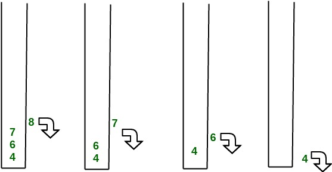

<!-- _backgroundColor: aquq -->

<!-- _color: orange -->

<!-- paginate: false -->

## CE205 Data Structures

## Week-4

### Tree Data Structure Types and Applications (Binary Tree, Tree Traversals, Heaps)


Download [PDF](pandoc_ce205-week-4-tree-structures.en_doc.pdf),[DOCX](pandoc_ce205-week-4-tree-structures.en_word.docx), [SLIDE](ce205-week-4-tree-structures.en_slide.pdf), [PPTX](ce205-week-4-tree-structures.en_slide.pptx)


<iframe width=700, height=500 frameBorder=0 src="../ce205-week-4-tree-structures.en_slide.html"></iframe>

---

<!-- paginate: true -->

### Outline

- Graph Representation Tools 

- Tree Structures and Binary Tree and Traversals (In-Order, Pre-Order, Post-Order)

- Heaps (Max, Min, Binary , Binomial, Fibonacci, Leftist, K-ary) and Priority Queue

- Heap Sort

- Huffman Coding

---

### Graph Representation Tools

- Microsoft Automatic Graph Layout
  - https://www.microsoft.com/en-us/download/details.aspx?id=52034 
  - https://github.com/microsoft/automatic-graph-layout
- Graphviz
  - https://graphviz.org/resources/
- Plantuml
  - https://ucoruh.github.io/ce204-object-oriented-programming/week-5/ce204-week-5/#calling-plantuml-from-java_1

---

### Graph Representation Tools

#### Microsoft Automatic Graph Layout

```csharp
using System;
using System.Collections.Generic; 
using System.Windows.Forms; 
class ViewerSample { 
    public static void Main() { 
    //create a form 
        System.Windows.Forms.Form form = new System.Windows.Forms.Form();
    //create a viewer object 
        Microsoft.Msagl.GraphViewerGdi.GViewer viewer = new Microsoft.Msagl.GraphViewerGdi.GViewer();
    //create a graph object 
        Microsoft.Msagl.Drawing.Graph graph = new Microsoft.Msagl.Drawing.Graph("graph");
    //create the graph content 
        graph.AddEdge("A", "B");
        graph.AddEdge("B", "C");
        graph.AddEdge("A", "C").Attr.Color = Microsoft.Msagl.Drawing.Color.Green;
        graph.FindNode("A").Attr.FillColor = Microsoft.Msagl.Drawing.Color.Magenta;
        graph.FindNode("B").Attr.FillColor = Microsoft.Msagl.Drawing.Color.MistyRose;
        Microsoft.Msagl.Drawing.Node c = graph.FindNode("C");
        c.Attr.FillColor = Microsoft.Msagl.Drawing.Color.PaleGreen;
        c.Attr.Shape = Microsoft.Msagl.Drawing.Shape.Diamond;
    //bind the graph to the viewer 
        viewer.Graph = graph;
    //associate the viewer with the form 
        form.SuspendLayout();
        viewer.Dock = System.Windows.Forms.DockStyle.Fill;
        form.Controls.Add(viewer);
        form.ResumeLayout();
    //show the form 
        form.ShowDialog();
    } 
}
```

---

### Graph Representation Tools

#### Microsoft Automatic Graph Layout


---

#### MSAGL Modules

**The Core Layout engine (AutomaticGraphLayout.dll)** - [NuGet package](https://www.nuget.org/packages/AutomaticGraphLayout/) This .NET asssembly contains the core layout functionality. Use this library if you just want MSAGL to perform the layout only and afterwards you will use a separate tool to perform the rendering and visalization.

---

#### MSAGL Modules

**The Drawing module (AutomaticGraphLayout.Drawing.dll)** - [NuGet package](https://www.nuget.org/packages/AutomaticGraphLayout.Drawing/) The Definitions of different drawing attributes like colors, line styles, etc. It also contains definitions of a node class, an edge class, and a graph class. By using these classes a user can create a graph object and use it later for layout, and rendering.

---

#### MSAGL Modules

**A WPF control (Microsoft.Msagl.WpfGraphControl.dll)** - [NuGet package](https://www.nuget.org/packages/AutomaticGraphLayout.WpfGraphControl/) The viewer control lets you visualize graphs and has and some other rendering functionality. Key features: (1) Pan and Zoom (2) Navigate Forward and Backward (3) tooltips and highlighting on graph entities (4) Search for and focus on graph entities.

---

#### MSAGL Modules

**A Windows Forms Viewer control (Microsoft.Msagl.GraphViewerGdi.dll)** - [NuGet package](https://www.nuget.org/packages/AutomaticGraphLayout.GraphViewerGDI/) The viewer control lets you visualize graphs and has and some other rendering functionality. Key features: (1) Pan and Zoom (2) Navigate Forward and Backward (3) tooltips and highlighting on graph entities (4) Search for and focus on graph entities.

---

### Custom MSAGL Demo Project

- Clone and test your self
  
  - [GitHub - ucoruh/microsoft-graph-layout-cs-demo: Example Usage of https://github.com/microsoft/automatic-graph-layout](https://github.com/ucoruh/microsoft-graph-layout-cs-demo)

- Also you can find another example in this homework
  
  - [GitHub - ucoruh/ce205-hw3-template: CE205-HW3-Template](https://github.com/ucoruh/ce205-hw3-template)

---

### Custom MSAGL Demo Project


---

### Custom MSAGL Demo Project


---

### **Tree Structures and Binary Tree and Traversals (In-Order, Pre-Order, Post-Order)**

---

### Tree - Terminology

- Btech Smart Class
  - http://www.btechsmartclass.com/data_structures/tree-terminology.html

--- 

### Tree - Terminology

- In linear data structure data is organized in sequential order and in non-linear data structure data is organized in random order. 

- A tree is a very popular non-linear data structure used in a wide range of applications. A tree data structure can be defined as follows.

- Tree is a non-linear data structure which organizes data in hierarchical structure and this is a recursive definition.

- A tree data structure can also be defined as follows
  
  - Tree data structure is a collection of data (Node) which is organized in hierarchical structure recursively
  
  - In tree data structure, every individual element is called as **Node**. 
  
  - Node in a tree data structure stores the actual data of that particular element and link to next element in hierarchical structure.  
  
  - In a tree data structure, if we have **N** number of nodes then we can have a maximum of **N-1** number of links.

---

### Tree Example


---

### Tree Terminology

- In a tree data structure, we use the following terminology

### 1. Root

- In a tree data structure, the first node is called as **Root Node**. 

- Every tree must have a root node. 

- We can say that the root node is the origin of the tree data structure. 

- In any tree, there must be only one root node. 

- We never have multiple root nodes in a tree.

---


---

### 2. Edge

- In a tree data structure, the connecting link between any two nodes is called as **EDGE**. In a tree with '**N**' number of nodes there will be a maximum of '**N-1**' number of edges.

---


---

### 3. Parent

- In a tree data structure, the node which is a predecessor of any node is called as **PARENT NODE**. 

- In simple words, the node which has a branch from it to any other node is called a parent node. 

- Parent node can also be defined as "**The node which has child / children**".

---


---

### 4. Child

- In a tree data structure, the node which is descendant of any node is called as **CHILD Node**. In simple words, the node which has a link from its parent node is called as child node. 

- In a tree, any parent node can have any number of child nodes. In a tree, all the nodes except root are child nodes.

---


---

### 5. Siblings

- In a tree data structure, nodes which belong to same Parent are called as **SIBLINGS**

- In simple words, the nodes with the same parent are called Sibling nodes.

---


---

### 6. Leaf

- In a tree data structure, the node which does not have a child is called as **LEAF Node**. 

- In simple words, a leaf is a node with no child.  

- In a tree data structure, the leaf nodes are also called as **External Nodes**. External node is also a node with no child. 

- In a tree, <u>leaf node is also called as '<strong>Terminal</strong>' node.</u>

---


---

### 7. Internal Nodes

- In a tree data structure, the node which has atleast one child is called as **INTERNAL Node**. In simple words, an internal node is a node with atleast one child.  

- In a tree data structure, nodes other than leaf nodes are called as **Internal Nodes**. **<u>&nbsp;The root node is also said to be Internal Node</u>** 

- if the tree has more than one node. <u>Internal nodes are also called as '<strong>Non-Terminal</strong>' nodes.</u>

---


---

### 8. Degree

- In a tree data structure, the total number of children of a node is called as **DEGREE** of that Node. In simple words, the Degree of a node is total number of children it has. 

- The highest degree of a node among all the nodes in a tree is called as '**Degree of Tree**'

---


---

### 9. Level

- In a tree data structure, the root node is said to be at Level 0 and the children of root node are at Level 1 and the children of the nodes which are at Level 1 will be at Level 2 and so on

- In simple words, in a tree each step from top to bottom is called as a Level and the Level count starts with '0' and incremented by one at each level (Step).

---


---

### 10. Height

- In a tree data structure, the total number of edges from leaf node to a particular node in the longest path is called as **HEIGHT** of that Node. 

- <u>In a tree, height of the root node is said to be&nbsp;<strong>height of the tree</strong></u>. 

- In a tree, **<u>height of all leaf nodes is '0'.</u>**

---


---

- In a tree data structure, the total number of egdes from root node to a particular node is called as **DEPTH** of that Node. 

- <u>In a tree, the total number of edges from root node to a leaf node in the longest path is said to be&nbsp;<strong>Depth of the tree</strong></u>. 

- In simple words, the highest depth of any leaf node in a tree is said to be depth of that tree. 

- In a tree, **<u>depth of the root node is '0'.</u>**

---


---

### 12. Path

- In a tree data structure, the sequence of Nodes and Edges from one node to another node is called as **PATH** between that two Nodes. 

- <u><strong>Length of a Path</strong>&nbsp;is total number of nodes in that path.</u> In below example **the path A - B - E - J has length 4**.

---


---

### 13. Sub Tree

- In a tree data structure, each child from a node forms a subtree recursively. 

- Every child node will form a subtree on its parent node.

---


---

### Tree Representations

- Btech Smart Class
  - http://www.btechsmartclass.com/data_structures/tree-representations.html

--- 

### Tree Representations

A tree data structure can be represented in two methods. Those methods are as follows.

1. List Representation
2. Left Child - Right Sibling Representation

---

Consider the following tree.


---

### 1. List Representation

- In this representation, we use two types of nodes one for representing the node with data called 'data node' and another for representing only references called 'reference node'. 

- We start with a 'data node' from the root node in the tree. 

- Then it is linked to an internal node through a 'reference node' which is further linked to any other node directly. 

- This process repeats for all the nodes in the tree.  

---

The above example tree can be represented using List representation as follows...


---

### 2. Left Child - Right Sibling Representation

- In this representation, we use a list with one type of node which consists of three fields namely Data field, Left child reference field and Right sibling reference field. 

- Data field stores the actual value of a node, left reference field stores the address of the left child and right reference field stores the address of the right sibling node. 

---

- Graphical representation of that node is as follows.


- In this representation, every node's data field stores the actual value of that node. If that node has left a child, then left reference field stores the address of that left child node otherwise stores NULL. 

- If that node has the right sibling, then right reference field stores the address of right sibling node otherwise stores NULL.  

---

- The above example tree can be represented using Left Child - Right Sibling representation as follows.


---

### Binary Tree Datastructure

1. Construction and Conversion
2. Checking and Printing
3. Summation
4. Longest Common Ancestor
   
   [Lowest Common Ancestor in a Binary Tree - GeeksforGeeks](https://www.geeksforgeeks.org/lowest-common-ancestor-binary-tree-set-1/)
- Btech Smart Class
  - http://www.btechsmartclass.com/data_structures/binary-tree.html
- William Fiset
  - https://www.youtube.com/watch?v=sD1IoalFomA&ab_channel=WilliamFiset

---

### Longet Common Ancestor


---

### Longet Common Ancestor


---

### Lowest Common Ancestor in a Binary Tree

The **lowest common ancestor** is the lowest node in the tree that has both n1 and n2 as **descendants,** where n1 and n2 are the nodes for which we wish to find the LCA. Hence, the LCA of a binary tree with nodes n1 and n2 is the shared ancestor of n1 and n2 that is located farthest from the root.

---

### Application of Lowest Common Ancestor(LCA)

To determine the distance between pairs of nodes in a tree: the distance from n1 to n2 can be computed as the distance from the root to n1, plus the distance from the root to n2, minus twice the distance from the root to their lowest common ancestor.  
 


Lowest Common Ancestor in Binary Tree

---

**Illustration:**

> 
> 
> Find the LCA of 5 and 6
> 
> Path from root to 5 = { 1, 2, 5 }  
> Path from root to 6 = { 1, 3, 6 }
> 
> - We start checking from 0 index. As both of the value matches( pathA[0] = pathB[0] ), we move to the next index.
> - pathA[1] not equals to pathB[1], there’s a mismatch so we consider the previous value. 
> - Therefore the LCA of (5,6) = 1

---

### LCA in C++

```cpp
// C++ Program for Lowest Common Ancestor in a Binary Tree
// A O(n) solution to find LCA of two given values n1 and n2
#include <iostream>
#include <vector>

using namespace std;

// A Binary Tree node
struct Node
{
	int key;
	struct Node *left, *right;
};

// Utility function creates a new binary tree node with given key
Node * newNode(int k)
{
	Node *temp = new Node;
	temp->key = k;
	temp->left = temp->right = NULL;
	return temp;
}

// Finds the path from root node to given root of the tree, Stores the
// path in a vector path[], returns true if path exists otherwise false
bool findPath(Node *root, vector<int> &path, int k)
{
	// base case
	if (root == NULL) return false;

	// Store this node in path vector. The node will be removed if
	// not in path from root to k
	path.push_back(root->key);

	// See if the k is same as root's key
	if (root->key == k)
		return true;

	// Check if k is found in left or right sub-tree
	if ( (root->left && findPath(root->left, path, k)) ||
		(root->right && findPath(root->right, path, k)) )
		return true;

	// If not present in subtree rooted with root, remove root from
	// path[] and return false
	path.pop_back();
	return false;
}

// Returns LCA if node n1, n2 are present in the given binary tree,
// otherwise return -1
int findLCA(Node *root, int n1, int n2)
{
	// to store paths to n1 and n2 from the root
	vector<int> path1, path2;

	// Find paths from root to n1 and root to n2. If either n1 or n2
	// is not present, return -1
	if ( !findPath(root, path1, n1) || !findPath(root, path2, n2))
		return -1;

	/* Compare the paths to get the first different value */
	int i;
	for (i = 0; i < path1.size() && i < path2.size() ; i++)
		if (path1[i] != path2[i])
			break;
	return path1[i-1];
}

// Driver program to test above functions
int main()
{
	// Let us create the Binary Tree shown in above diagram.
	Node * root = newNode(1);
	root->left = newNode(2);
	root->right = newNode(3);
	root->left->left = newNode(4);
	root->left->right = newNode(5);
	root->right->left = newNode(6);
	root->right->right = newNode(7);
	cout << "LCA(4, 5) = " << findLCA(root, 4, 5);
	cout << "\nLCA(4, 6) = " << findLCA(root, 4, 6);
	cout << "\nLCA(3, 4) = " << findLCA(root, 3, 4);
	cout << "\nLCA(2, 4) = " << findLCA(root, 2, 4);
	return 0;
}

```

---

### LCA in Java

```java
// Java Program for Lowest Common Ancestor in a Binary Tree
// A O(n) solution to find LCA of two given values n1 and n2
import java.util.ArrayList;
import java.util.List;

// A Binary Tree node
class Node {
	int data;
	Node left, right;

	Node(int value) {
		data = value;
		left = right = null;
	}
}

public class BT_NoParentPtr_Solution1
{

	Node root;
	private List<Integer> path1 = new ArrayList<>();
	private List<Integer> path2 = new ArrayList<>();

	// Finds the path from root node to given root of the tree.
	int findLCA(int n1, int n2) {
		path1.clear();
		path2.clear();
		return findLCAInternal(root, n1, n2);
	}

	private int findLCAInternal(Node root, int n1, int n2) {

		if (!findPath(root, n1, path1) || !findPath(root, n2, path2)) {
			System.out.println((path1.size() > 0) ? "n1 is present" : "n1 is missing");
			System.out.println((path2.size() > 0) ? "n2 is present" : "n2 is missing");
			return -1;
		}

		int i;
		for (i = 0; i < path1.size() && i < path2.size(); i++) {
			
		// System.out.println(path1.get(i) + " " + path2.get(i));
			if (!path1.get(i).equals(path2.get(i)))
				break;
		}

		return path1.get(i-1);
	}
	
	// Finds the path from root node to given root of the tree, Stores the
	// path in a vector path[], returns true if path exists otherwise false
	private boolean findPath(Node root, int n, List<Integer> path)
	{
		// base case
		if (root == null) {
			return false;
		}
		
		// Store this node . The node will be removed if
		// not in path from root to n.
		path.add(root.data);

		if (root.data == n) {
			return true;
		}

		if (root.left != null && findPath(root.left, n, path)) {
			return true;
		}

		if (root.right != null && findPath(root.right, n, path)) {
			return true;
		}

		// If not present in subtree rooted with root, remove root from
		// path[] and return false
		path.remove(path.size()-1);

		return false;
	}

	// Driver code
	public static void main(String[] args)
	{
		BT_NoParentPtr_Solution1 tree = new BT_NoParentPtr_Solution1();
		tree.root = new Node(1);
		tree.root.left = new Node(2);
		tree.root.right = new Node(3);
		tree.root.left.left = new Node(4);
		tree.root.left.right = new Node(5);
		tree.root.right.left = new Node(6);
		tree.root.right.right = new Node(7);

		System.out.println("LCA(4, 5): " + tree.findLCA(4,5));
		System.out.println("LCA(4, 6): " + tree.findLCA(4,6));
		System.out.println("LCA(3, 4): " + tree.findLCA(3,4));
		System.out.println("LCA(2, 4): " + tree.findLCA(2,4));
	
	}
}
// This code is contributed by Sreenivasulu Rayanki.

```

---

### LCA in C#

```csharp
// C# Program for Lowest Common
// Ancestor in a Binary Tree
// A O(n) solution to find LCA
// of two given values n1 and n2
using System.Collections;
using System;

// A Binary Tree node
class Node
{
public int data;
public Node left, right;

public Node(int value)
{
	data = value;
	left = right = null;
}
}

public class BT_NoParentPtr_Solution1
{

Node root;
private ArrayList path1 =
		new ArrayList();
private ArrayList path2 =
		new ArrayList();

// Finds the path from root
// node to given root of the
// tree.
int findLCA(int n1,
			int n2)
{
	path1.Clear();
	path2.Clear();
	return findLCAInternal(root,
						n1, n2);
}

private int findLCAInternal(Node root,
							int n1, int n2)
{
if (!findPath(root, n1, path1) ||
	!findPath(root, n2, path2)) {
	Console.Write((path1.Count > 0) ?
				"n1 is present" :
				"n1 is missing");
	Console.Write((path2.Count > 0) ?
				"n2 is present" :
				"n2 is missing");
	return -1;
}

int i;
for (i = 0; i < path1.Count &&
	i < path2.Count; i++)
{
	// System.out.println(path1.get(i)
	// + " " + path2.get(i));
	if ((int)path1[i] !=
		(int)path2[i])
	break;
}
return (int)path1[i - 1];
}

// Finds the path from root node
// to given root of the tree,
// Stores the path in a vector
// path[], returns true if path
// exists otherwise false
private bool findPath(Node root,
					int n,
					ArrayList path)
{
// base case
if (root == null)
{
	return false;
}

// Store this node . The node
// will be removed if not in
// path from root to n.
path.Add(root.data);

if (root.data == n)
{
	return true;
}

if (root.left != null &&
	findPath(root.left,
			n, path))
{
	return true;
}

if (root.right != null &&
	findPath(root.right,
			n, path))
{
	return true;
}

// If not present in subtree
//rooted with root, remove root
// from path[] and return false
path.RemoveAt(path.Count - 1);

return false;
}

// Driver code
public static void Main(String[] args)
{
BT_NoParentPtr_Solution1 tree =
	new BT_NoParentPtr_Solution1();

tree.root = new Node(1);
tree.root.left = new Node(2);
tree.root.right = new Node(3);
tree.root.left.left = new Node(4);
tree.root.left.right = new Node(5);
tree.root.right.left = new Node(6);
tree.root.right.right = new Node(7);

Console.Write("LCA(4, 5): " +
				tree.findLCA(4, 5));
Console.Write("\nLCA(4, 6): " +
				tree.findLCA(4, 6));
Console.Write("\nLCA(3, 4): " +
				tree.findLCA(3, 4));
Console.Write("\nLCA(2, 4): " +
				tree.findLCA(2, 4));
}
}

// This code is contributed by Rutvik_56

```

---

### Output

```bash
LCA(4, 5) = 2
LCA(4, 6) = 1
LCA(3, 4) = 1
LCA(2, 4) = 2
```

- ***Time Complexity:*** O(n). The tree is traversed twice, and then path arrays are compared. 

- **Auxiliary Space:** O(n). Extra Space for path1 and path2.

---

### Binary Tree Datastructure

- In a normal tree, every node can have any number of children. 

- A binary tree is a special type of tree data structure in which every node can have a **maximum of 2 children**. 

- One is known as a left child and the other is known as right child.

- A tree in which every node can have a maximum of two children is called Binary Tree.

- In a binary tree, every node can have either 0 children or 1 child or 2 children but not more than 2 children.

---

### Example


---

There are different types of binary trees and they are

### 1. Strictly Binary Tree (Full Binary Tree / Proper Binary Tree or 2-Tree)

- In a binary tree, every node can have a maximum of two children. 

- But in strictly binary tree, every node should have exactly two children or none. That means every internal node must have exactly two children. 

- A strictly Binary Tree can be defined as follows.

- A binary tree in which every node has either two or zero number of children is called Strictly Binary Tree

- Strictly binary tree is also called as **Full Binary Tree** or **Proper Binary Tree** or **2-Tree**

---


---

### Example

- Strictly binary tree data structure is used to represent mathematical expressions.


---

### Full Binary Tree Theorems

```c
Let, i = the number of internal nodes
     n = be the total number of nodes
     l = number of leaves
     λ = number of levels
```

---

### Full Binary Tree Theorems

1. The number of leaves is `i + 1`.
2. The total number of nodes is `2i + 1`.
3. The number of internal nodes is `(n – 1) / 2`.
4. The number of leaves is `(n + 1) / 2`.
5. The total number of nodes is `2l – 1`.
6. The number of internal nodes is `l – 1`.
7. The number of leaves is at most `2λ - 1`.

---

### Full Binary Tree in C

```c
// Checking if a binary tree is a full binary tree in C

#include <stdbool.h>
#include <stdio.h>
#include <stdlib.h>

struct Node {
  int item;
  struct Node *left, *right;
};

// Creation of new Node
struct Node *createNewNode(char k) {
  struct Node *node = (struct Node *)malloc(sizeof(struct Node));
  node->item = k;
  node->right = node->left = NULL;
  return node;
}

bool isFullBinaryTree(struct Node *root) {
  // Checking tree emptiness
  if (root == NULL)
    return true;

  // Checking the presence of children
  if (root->left == NULL && root->right == NULL)
    return true;

  if ((root->left) && (root->right))
    return (isFullBinaryTree(root->left) && isFullBinaryTree(root->right));

  return false;
}

int main() {
  struct Node *root = NULL;
  root = createNewNode(1);
  root->left = createNewNode(2);
  root->right = createNewNode(3);

  root->left->left = createNewNode(4);
  root->left->right = createNewNode(5);
  root->left->right->left = createNewNode(6);
  root->left->right->right = createNewNode(7);

  if (isFullBinaryTree(root))
    printf("The tree is a full binary tree\n");
  else
    printf("The tree is not a full binary tree\n");
}
```

---

### Full Binary Tree in C++

```cpp
// Checking if a binary tree is a full binary tree in C++

#include <iostream>
using namespace std;

struct Node {
  int key;
  struct Node *left, *right;
};

// New node creation
struct Node *newNode(char k) {
  struct Node *node = (struct Node *)malloc(sizeof(struct Node));
  node->key = k;
  node->right = node->left = NULL;
  return node;
}

bool isFullBinaryTree(struct Node *root) {
  
  // Checking for emptiness
  if (root == NULL)
    return true;

  // Checking for the presence of children
  if (root->left == NULL && root->right == NULL)
    return true;

  if ((root->left) && (root->right))
    return (isFullBinaryTree(root->left) && isFullBinaryTree(root->right));

  return false;
}

int main() {
  struct Node *root = NULL;
  root = newNode(1);
  root->left = newNode(2);
  root->right = newNode(3);
  root->left->left = newNode(4);
  root->left->right = newNode(5);
  root->left->right->left = newNode(6);
  root->left->right->right = newNode(7);

  if (isFullBinaryTree(root))
    cout << "The tree is a full binary tree\n";
  else
    cout << "The tree is not a full binary tree\n";
}
```

---

### Full Binary in Java

```java
// Checking if a binary tree is a full binary tree in Java

class Node {
  int data;
  Node leftChild, rightChild;

  Node(int item) {
  data = item;
  leftChild = rightChild = null;
  }
}

class BinaryTree {
  Node root;

  // Check for Full Binary Tree
  boolean isFullBinaryTree(Node node) {

  // Checking tree emptiness
  if (node == null)
    return true;

  // Checking the children
  if (node.leftChild == null && node.rightChild == null)
    return true;

  if ((node.leftChild != null) && (node.rightChild != null))
    return (isFullBinaryTree(node.leftChild) && isFullBinaryTree(node.rightChild));

  return false;
  }

  public static void main(String args[]) {
    BinaryTree tree = new BinaryTree();
    tree.root = new Node(1);
    tree.root.leftChild = new Node(2);
    tree.root.rightChild = new Node(3);
    tree.root.leftChild.leftChild = new Node(4);
    tree.root.leftChild.rightChild = new Node(5);
    tree.root.rightChild.leftChild = new Node(6);
    tree.root.rightChild.rightChild = new Node(7);

    if (tree.isFullBinaryTree(tree.root))
      System.out.print("The tree is a full binary tree");
    else
      System.out.print("The tree is not a full binary tree");
  }
}
```

---

### 2. Complete Binary Tree (Perfect Binary Tree)

- In a binary tree, every node can have a maximum of two children. 

- But in strictly binary tree, every node should have exactly two children or none and in complete binary tree all the nodes must have exactly two children and at every level of complete binary tree there must be 2level number of nodes. 

- For example at level 2 there must be 22 = 4 nodes and at level 3 there must be 23 = 8 nodes.

- A binary tree in which every internal node has exactly two children and all leaf nodes are at same level is called Complete Binary Tree.

- Complete binary tree is also called as **Perfect Binary Tree**

---


---

## Perfect Binary Tree Theorems

1. A perfect binary tree of height h has `2h + 1 – 1` node.
2. A perfect binary tree with n nodes has height `log(n + 1) – 1 = Θ(ln(n))`.
3. A perfect binary tree of height h has `2h` leaf nodes.
4. The average depth of a node in a perfect binary tree is `Θ(ln(n))`.

---

### Perfect Binary Tree in C

```c
// Checking if a binary tree is a perfect binary tree in C

#include <stdbool.h>
#include <stdio.h>
#include <stdlib.h>

struct node {
  int data;
  struct node *left;
  struct node *right;
};

// Creating a new node
struct node *newnode(int data) {
  struct node *node = (struct node *)malloc(sizeof(struct node));
  node->data = data;
  node->left = NULL;
  node->right = NULL;

  return (node);
}

// Calculate the depth
int depth(struct node *node) {
  int d = 0;
  while (node != NULL) {
    d++;
    node = node->left;
  }
  return d;
}

// Check if the tree is perfect
bool is_perfect(struct node *root, int d, int level) {
    // Check if the tree is empty
  if (root == NULL)
    return true;

  // Check the presence of children
  if (root->left == NULL && root->right == NULL)
    return (d == level + 1);

  if (root->left == NULL || root->right == NULL)
    return false;

  return is_perfect(root->left, d, level + 1) &&
       is_perfect(root->right, d, level + 1);
}

// Wrapper function
bool is_Perfect(struct node *root) {
  int d = depth(root);
  return is_perfect(root, d, 0);
}

int main() {
  struct node *root = NULL;
  root = newnode(1);
  root->left = newnode(2);
  root->right = newnode(3);
  root->left->left = newnode(4);
  root->left->right = newnode(5);
  root->right->left = newnode(6);

  if (is_Perfect(root))
    printf("The tree is a perfect binary tree\n");
  else
    printf("The tree is not a perfect binary tree\n");
}
```

---

### Perfect Binary Tree in C++

```cpp
// Checking if a binary tree is a perfect binary tree in C++

#include <iostream>
using namespace std;

struct Node {
  int key;
  struct Node *left, *right;
};

int depth(Node *node) {
  int d = 0;
  while (node != NULL) {
    d++;
    node = node->left;
  }
  return d;
}

bool isPerfectR(struct Node *root, int d, int level = 0) {
  if (root == NULL)
    return true;

  if (root->left == NULL && root->right == NULL)
    return (d == level + 1);

  if (root->left == NULL || root->right == NULL)
    return false;

  return isPerfectR(root->left, d, level + 1) &&
       isPerfectR(root->right, d, level + 1);
}

bool isPerfect(Node *root) {
  int d = depth(root);
  return isPerfectR(root, d);
}

struct Node *newNode(int k) {
  struct Node *node = new Node;
  node->key = k;
  node->right = node->left = NULL;
  return node;
}

int main() {
  struct Node *root = NULL;
  root = newNode(1);
  root->left = newNode(2);
  root->right = newNode(3);
  root->left->left = newNode(4);
  root->left->right = newNode(5);
  root->right->left = newNode(6);

  if (isPerfect(root))
    cout << "The tree is a perfect binary tree\n";
  else
    cout << "The tree is not a perfect binary tree\n";
}
```

---

### Perfect Binary Tree in Java

```java
// Checking if a binary tree is a perfect binary tree in Java

class PerfectBinaryTree {

  static class Node {
    int key;
    Node left, right;
  }

  // Calculate the depth
  static int depth(Node node) {
    int d = 0;
    while (node != null) {
      d++;
      node = node.left;
    }
    return d;
  }

  // Check if the tree is perfect binary tree
  static boolean is_perfect(Node root, int d, int level) {

    // Check if the tree is empty
    if (root == null)
      return true;

    // If for children
    if (root.left == null && root.right == null)
      return (d == level + 1);

    if (root.left == null || root.right == null)
      return false;

    return is_perfect(root.left, d, level + 1) && is_perfect(root.right, d, level + 1);
  }

  // Wrapper function
  static boolean is_Perfect(Node root) {
    int d = depth(root);
    return is_perfect(root, d, 0);
  }

  // Create a new node
  static Node newNode(int k) {
    Node node = new Node();
    node.key = k;
    node.right = null;
    node.left = null;
    return node;
  }

  public static void main(String args[]) {
    Node root = null;
    root = newNode(1);
    root.left = newNode(2);
    root.right = newNode(3);
    root.left.left = newNode(4);
    root.left.right = newNode(5);

    if (is_Perfect(root) == true)
      System.out.println("The tree is a perfect binary tree");
    else
      System.out.println("The tree is not a perfect binary tree");
  }
}
```

---

### 3. Extended Binary Tree

- A binary tree can be converted into Full Binary tree by adding dummy nodes to existing nodes wherever required.

- The full binary tree obtained by adding dummy nodes to a binary tree is called as Extended Binary Tree.

---


- In above figure, a normal binary tree is converted into full binary tree by adding dummy nodes (In pink colour).

---

### Complete Binary Tree

- A complete binary tree is a binary tree in which all the levels are completely filled except possibly the lowest one, which is filled from the left.

- A complete binary tree is just like a full binary tree, but with two major differences
  
  - All the leaf elements must lean towards the left.
  
  - The last leaf element might not have a right sibling i.e. a complete binary tree doesn't have to be a full binary tree.

---

### Complete Binary Tree


---

### Comparison between full binary tree and complete binary tree


---

### Comparison between full binary tree and complete binary tree


---

### Comparison between full binary tree and complete binary tree


---

### Comparison between full binary tree and complete binary tree


---

### How a Complete Binary Tree is Created?

1. Select the first element of the list to be the root node. (no. of elements on level-I: 1)
   
   
   
   Select the first element as root

---

1. Put the second element as a left child of the root node and the third element as the right child. (no. of elements on level-II: 2)
   
   
   
   12 as a left child and 9 as a right child

---

1. Put the next two elements as children of the left node of the second level. Again, put the next two elements as children of the right node of the second level (no. of elements on level-III: 4) elements).

---

1. Keep repeating until you reach the last element.
   
   
   
   5 as a left child and 6 as a right child

---

## Relationship between array indexes and tree element

- A complete binary tree has an interesting property that we can use to find the children and parents of any node.

- If the index of any element in the array is i, the element in the index `2i+1` will become the left child and element in `2i+2` index will become the right child. 

- Also, the parent of any element at index i is given by the lower bound of `(i-1)/2`.

---

### Complete Binary Tree in C

```c
// Checking if a binary tree is a complete binary tree in C

#include <stdbool.h>
#include <stdio.h>
#include <stdlib.h>

struct Node {
  int key;
  struct Node *left, *right;
};

// Node creation
struct Node *newNode(char k) {
  struct Node *node = (struct Node *)malloc(sizeof(struct Node));
  node->key = k;
  node->right = node->left = NULL;
  return node;
}

// Count the number of nodes
int countNumNodes(struct Node *root) {
  if (root == NULL)
    return (0);
  return (1 + countNumNodes(root->left) + countNumNodes(root->right));
}

// Check if the tree is a complete binary tree
bool checkComplete(struct Node *root, int index, int numberNodes) {
  // Check if the tree is complete
  if (root == NULL)
    return true;

  if (index >= numberNodes)
    return false;

  return (checkComplete(root->left, 2 * index + 1, numberNodes) && checkComplete(root->right, 2 * index + 2, numberNodes));
}

int main() {
  struct Node *root = NULL;
  root = newNode(1);
  root->left = newNode(2);
  root->right = newNode(3);
  root->left->left = newNode(4);
  root->left->right = newNode(5);
  root->right->left = newNode(6);

  int node_count = countNumNodes(root);
  int index = 0;

  if (checkComplete(root, index, node_count))
    printf("The tree is a complete binary tree\n");
  else
    printf("The tree is not a complete binary tree\n");
}
```

---

### Complete Binary Tree in C++

```cpp
// Checking if a binary tree is a complete binary tree in C++

#include <iostream>

using namespace std;

struct Node {
  int key;
  struct Node *left, *right;
};

// Create node
struct Node *newNode(char k) {
  struct Node *node = (struct Node *)malloc(sizeof(struct Node));
  node->key = k;
  node->right = node->left = NULL;
  return node;
}

// Count the number of nodes
int countNumNodes(struct Node *root) {
  if (root == NULL)
    return (0);
  return (1 + countNumNodes(root->left) + countNumNodes(root->right));
}

// Check if the tree is a complete binary tree
bool checkComplete(struct Node *root, int index, int numberNodes) {
  
  // Check if the tree is empty
  if (root == NULL)
    return true;

  if (index >= numberNodes)
    return false;

  return (checkComplete(root->left, 2 * index + 1, numberNodes) && checkComplete(root->right, 2 * index + 2, numberNodes));
}

int main() {
  struct Node *root = NULL;
  root = newNode(1);
  root->left = newNode(2);
  root->right = newNode(3);
  root->left->left = newNode(4);
  root->left->right = newNode(5);
  root->right->left = newNode(6);

  int node_count = countNumNodes(root);
  int index = 0;

  if (checkComplete(root, index, node_count))
    cout << "The tree is a complete binary tree\n";
  else
    cout << "The tree is not a complete binary tree\n";
}

```

---

### Complete Binary Tree in Java

```java
// Checking if a binary tree is a complete binary tree in Java

// Node creation
class Node {
  int data;
  Node left, right;

  Node(int item) {
    data = item;
    left = right = null;
  }
}

class BinaryTree {
  Node root;

  // Count the number of nodes
  int countNumNodes(Node root) {
    if (root == null)
      return (0);
    return (1 + countNumNodes(root.left) + countNumNodes(root.right));
  }

  // Check for complete binary tree
  boolean checkComplete(Node root, int index, int numberNodes) {

    // Check if the tree is empty
    if (root == null)
      return true;

    if (index >= numberNodes)
      return false;

    return (checkComplete(root.left, 2 * index + 1, numberNodes)
        && checkComplete(root.right, 2 * index + 2, numberNodes));
  }

  public static void main(String args[]) {
    BinaryTree tree = new BinaryTree();

    tree.root = new Node(1);
    tree.root.left = new Node(2);
    tree.root.right = new Node(3);
    tree.root.left.right = new Node(5);
    tree.root.left.left = new Node(4);
    tree.root.right.left = new Node(6);

    int node_count = tree.countNumNodes(tree.root);
    int index = 0;

    if (tree.checkComplete(tree.root, index, node_count))
      System.out.println("The tree is a complete binary tree");
    else
      System.out.println("The tree is not a complete binary tree");
  }
}
```

---

### Binary Tree Representations

- Btech Smart Class
  - http://www.btechsmartclass.com/data_structures/binary-tree-representations.html

---

### Binary Tree Representations

- A binary tree data structure is represented using two methods. Those methods are as follows.
  
  - Array Representation
  
  - Linked List Representation

---

- Consider the following binary tree


---

### 1. Array Representation of Binary Tree

- In array representation of a binary tree, we use one-dimensional array (1-D Array) to represent a binary tree.

- Consider the above example of a binary tree and it is represented as follows.


- To represent a binary tree of depth **'n'** using array representation, we need one dimensional array with a maximum size of **2n + 1**.

---

### 2. Linked List Representation of Binary Tree

- We use a double linked list to represent a binary tree. 

- In a double linked list, every node consists of three fields. 

- First field for storing left child address, second for storing actual data and third for storing right child address.

- In this linked list representation, a node has the following structure.


---


- The above example of the binary tree represented using Linked list representation is shown as follows.


---

### Binary Tree Traversals

- Btech Smart Class
  - http://www.btechsmartclass.com/data_structures/binary-tree-traversals.html
    - In-Order
    - Pre-Order
    - Post-Order

---

### Binary Tree Traversals

- When we wanted to display a binary tree, 

- we need to follow some order in which all the nodes of that binary tree must be displayed. 

- In any binary tree, displaying order of nodes depends on the traversal method.

- Displaying (or) visiting order of nodes in a binary tree is called as Binary Tree Traversal.

---

- There are three types of binary tree traversals.
  
  - In - Order Traversal
  
  - Pre - Order Traversal
  
  - Post - Order Traversal

---

Consider the following binary tree for

ref : [Tree traversal - Wikipedia](https://en.wikipedia.org/wiki/Tree_traversal)


Depth-first traversal (dotted path) of a binary tree:

- *Pre-order (node visited at position red)*:       F, B, A, D, C, E, G, I, H;
- *In-order (node visited at position green)*:      A, B, C, D, E, F, G, H, I;
- *Post-order (node visited at position blue)*:      A, C, E, D, B, H, I, G, F.

---

### Notations We Will Use For Orders

**NLR** : Node Left Right

**LRN** : Left Right Node

**LNR** : Left Node Right

---

#### Pre-order, NLR

1. Visit the current node (in the figure: position red).
2. Recursively traverse the current node's left subtree.
3. Recursively traverse the current node's right subtree.

The pre-order traversal is a [topologically sorted](https://en.wikipedia.org/wiki/Topological_sorting "Topological sorting") one, because a parent node is processed before any of its child nodes is done.

---

#### Post-order, LRN

1. Recursively traverse the current node's left subtree.
2. Recursively traverse the current node's right subtree.
3. Visit the current node (in the figure: position blue).

Post-order traversal can be useful to get postfix expression of a [binary expression tree](https://en.wikipedia.org/wiki/Binary_expression_tree "Binary expression tree").

---

#### In-order, LNR

1. Recursively traverse the current node's left subtree.
2. Visit the current node (in the figure: position green).
3. Recursively traverse the current node's right subtree.


---

- In a [binary search tree](https://en.wikipedia.org/wiki/Binary_search_tree "Binary search tree") ordered such that in each node the key is greater than all keys in its left subtree and less than all keys in its right subtree, 

- in-order traversal retrieves the keys in *ascending* sorted order.[[7]](https://en.wikipedia.org/wiki/Tree_traversal#cite_note-7)

---

#### Reverse pre-order, NRL

1. Visit the current node.
2. Recursively traverse the current node's right subtree.
3. Recursively traverse the current node's left subtree.

---

#### Reverse post-order, RLN

1. Recursively traverse the current node's right subtree.
2. Recursively traverse the current node's left subtree.
3. Visit the current node.

#### Reverse in-order, RNL

1. Recursively traverse the current node's right subtree.
2. Visit the current node.
3. Recursively traverse the current node's left subtree.

---

- In a [binary search tree](https://en.wikipedia.org/wiki/Binary_search_tree "Binary search tree") ordered such that in each node the key is greater than all keys in its left subtree and less than all keys in its right subtree, 

- reverse in-order traversal retrieves the keys in *descending* sorted order.

---

### Applications for Pre-Order

- Pre-order traversal can be used to make a prefix expression ([Polish notation](https://en.wikipedia.org/wiki/Polish_notation "Polish notation")) from [expression trees](https://en.wikipedia.org/wiki/Parse_tree "Parse tree"): traverse the expression tree pre-orderly. 

- For example, traversing the depicted arithmetic expression in pre-order yields "+ * *A* − *B* *C* + *D* *E*". 

- In prefix notation, no need any parentheses as long as each operator has a fixed number of operands. 

- Preorder traversal is also used to create a copy of the tree.


---


Tree representing the arithmetic expression: *A* * (*B* − *C*) + (*D* + *E*)

---

- Post-order traversal can generate a postfix representation ([Reverse Polish notation](https://en.wikipedia.org/wiki/Reverse_Polish_notation "Reverse Polish notation")) of a binary tree. 

- Traversing the depicted arithmetic expression in post-order yields "*A* *B* *C* − * *D* *E* + +"; the latter can easily be transformed into [machine code](https://en.wikipedia.org/wiki/Machine_code "Machine code") to evaluate the expression by a [stack machine](https://en.wikipedia.org/wiki/Stack_machine "Stack machine"). 

- Postorder traversal is also used to delete the tree. 

- Each node is freed after freeing its children.

---

### Pre-order implementation Recursive

```c
procedure preorder(node)
    if node = null
        return
    visit(node)
    preorder(node.left)
    preorder(node.right) 
```

---

### Pre-order implementation Iterative

```c
procedure iterativePreorder(node)
    if node = null
        return
    stack ← empty stack
    stack.push(node)
    while not stack.isEmpty()
        node ← stack.pop()
        visit(node)
        // right child is pushed first so that left is processed first
        if node.right ≠ null
            stack.push(node.right)
        if node.left ≠ null
            stack.push(node.left)
```


---

### Post-order implementation Recursive

```c
procedure postorder(node)
    if node = null
        return
    postorder(node.left)
    postorder(node.right)
    visit(node)
```

---

### Post-order implementation Iterative

```c
procedure iterativePostorder(node)
    stack ← empty stack
    lastNodeVisited ← null
    while not stack.isEmpty() or node ≠ null
        if node ≠ null
            stack.push(node)
            node ← node.left
        else
            peekNode ← stack.peek()
            // if right child exists and traversing node
            // from left child, then move right
            if peekNode.right ≠ null and lastNodeVisited ≠ peekNode.right
                node ← peekNode.right
            else
                visit(peekNode)
                lastNodeVisited ← stack.pop()
```

---

### In-order implementation Recursive

```c
procedure inorder(node)
    if node = null
        return
    inorder(node.left)
    visit(node)
    inorder(node.right)
```

---

### In-order implementation Iterative

```c
procedure iterativeInorder(node)
    stack ← empty stack
    while not stack.isEmpty() or node ≠ null
        if node ≠ null
            stack.push(node)
            node ← node.left
        else
            node ← stack.pop()
            visit(node)
            node ← node.right
```

---

### Binary Tree Traversal in C

```c
// Tree traversal in C

#include <stdio.h>
#include <stdlib.h>

struct node {
  int item;
  struct node* left;
  struct node* right;
};

// Inorder traversal
void inorderTraversal(struct node* root) {
  if (root == NULL) return;
  inorderTraversal(root->left);
  printf("%d ->", root->item);
  inorderTraversal(root->right);
}

// preorderTraversal traversal
void preorderTraversal(struct node* root) {
  if (root == NULL) return;
  printf("%d ->", root->item);
  preorderTraversal(root->left);
  preorderTraversal(root->right);
}

// postorderTraversal traversal
void postorderTraversal(struct node* root) {
  if (root == NULL) return;
  postorderTraversal(root->left);
  postorderTraversal(root->right);
  printf("%d ->", root->item);
}

// Create a new Node
struct node* createNode(value) {
  struct node* newNode = malloc(sizeof(struct node));
  newNode->item = value;
  newNode->left = NULL;
  newNode->right = NULL;

  return newNode;
}

// Insert on the left of the node
struct node* insertLeft(struct node* root, int value) {
  root->left = createNode(value);
  return root->left;
}

// Insert on the right of the node
struct node* insertRight(struct node* root, int value) {
  root->right = createNode(value);
  return root->right;
}

int main() {
  struct node* root = createNode(1);
  insertLeft(root, 12);
  insertRight(root, 9);

  insertLeft(root->left, 5);
  insertRight(root->left, 6);

  printf("Inorder traversal \n");
  inorderTraversal(root);

  printf("\nPreorder traversal \n");
  preorderTraversal(root);

  printf("\nPostorder traversal \n");
  postorderTraversal(root);
}
```

---

### Binary Tree Traversal in C++

```cpp
// Tree traversal in C++

#include <iostream>
using namespace std;

struct Node {
  int data;
  struct Node *left, *right;
  Node(int data) {
    this->data = data;
    left = right = NULL;
  }
};

// Preorder traversal
void preorderTraversal(struct Node* node) {
  if (node == NULL)
    return;

  cout << node->data << "->";
  preorderTraversal(node->left);
  preorderTraversal(node->right);
}

// Postorder traversal
void postorderTraversal(struct Node* node) {
  if (node == NULL)
    return;

  postorderTraversal(node->left);
  postorderTraversal(node->right);
  cout << node->data << "->";
}

// Inorder traversal
void inorderTraversal(struct Node* node) {
  if (node == NULL)
    return;

  inorderTraversal(node->left);
  cout << node->data << "->";
  inorderTraversal(node->right);
}

int main() {
  struct Node* root = new Node(1);
  root->left = new Node(12);
  root->right = new Node(9);
  root->left->left = new Node(5);
  root->left->right = new Node(6);

  cout << "Inorder traversal ";
  inorderTraversal(root);

  cout << "\nPreorder traversal ";
  preorderTraversal(root);

  cout << "\nPostorder traversal ";
  postorderTraversal(root);
```

---

### Binary Tree Traversal in Java

```java
// Tree traversal in Java

class Node {
  int item;
  Node left, right;

  public Node(int key) {
  item = key;
  left = right = null;
  }
}

class BinaryTree {
  // Root of Binary Tree
  Node root;

  BinaryTree() {
  root = null;
  }

  void postorder(Node node) {
  if (node == null)
    return;

  // Traverse left
  postorder(node.left);
  // Traverse right
  postorder(node.right);
  // Traverse root
  System.out.print(node.item + "->");
  }

  void inorder(Node node) {
  if (node == null)
    return;

  // Traverse left
  inorder(node.left);
  // Traverse root
  System.out.print(node.item + "->");
  // Traverse right
  inorder(node.right);
  }

  void preorder(Node node) {
  if (node == null)
    return;

  // Traverse root
  System.out.print(node.item + "->");
  // Traverse left
  preorder(node.left);
  // Traverse right
  preorder(node.right);
  }

  public static void main(String[] args) {
  BinaryTree tree = new BinaryTree();
  tree.root = new Node(1);
  tree.root.left = new Node(12);
  tree.root.right = new Node(9);
  tree.root.left.left = new Node(5);
  tree.root.left.right = new Node(6);

  System.out.println("Inorder traversal");
  tree.inorder(tree.root);

  System.out.println("\nPreorder traversal ");
  tree.preorder(tree.root);

  System.out.println("\nPostorder traversal");
  tree.postorder(tree.root);
  }
}
```

---

### Review

---

Consider the following binary tree.


---

### 1. In - Order Traversal ( leftChild - root - rightChild )

- In In-Order traversal, 

- the root node is visited between the left child and right child. 

- In this traversal, 

- the left child node is visited first, 

- then the root node is visited and 

- later we go for visiting the right child node. 

- This in-order traversal is applicable for every root node of all subtrees in the tree. This is performed recursively for all nodes in the tree.  

---

- In the above example of a binary tree, 

- first we try to visit left child of root node 'A', 

- but A's left child 'B' is a root node for left subtree. 

- so we try to visit its (B's) left child 'D' and 

- again D is a root for subtree with nodes D, I and J. 

- So we try to visit its left child 'I' and it is the leftmost child. 

---

- So first we visit **'I'** then go for its root node **'D'** and later we visit D's right child **'J'**. 

- With this we have completed the left part of node B. 

- Then visit **'B'** and next B's right child **'F'** is visited. 

- With this we have completed left part of node A. 

- Then visit root node **'A'**. With this we have completed left and root parts of node A.

---

-  Then we go for the right part of the node A. In right of A again there is a subtree with root C. So go for left child of C and again it is a subtree with root G. 

- But G does not have left part so we visit **'G'** and then visit G's right child K. 

- With this we have completed the left part of node C. 

- Then visit root node **'C'** and next visit C's right child **'H'** which is the rightmost child in the tree. So we stop the process.  

---

- That means here we have visited in the order of **I - D - J - B - F - A - G - K - C - H** using In-Order Traversal.

**In-Order Traversal for above example of binary tree is**  

#### I - D - J - B - F - A - G - K - C - H

---

### 2. Pre - Order Traversal ( root - leftChild - rightChild )

- In Pre-Order traversal, 

- the root node is visited before the left child and right child nodes. 

- In this traversal, 

- the root node is visited first, 

- then its left child and 

- later its right child. 

- This pre-order traversal is applicable for every root node of all subtrees in the tree.

---

- In the above example of binary tree, 

- first we visit root node **'A'** then visit its left child **'B'** which is a root for D and F. 

- So we visit B's left child **'D'** and again D is a root for I and J. 

- So we visit D's left child **'I'** which is the leftmost child. 

- So next we go for visiting D's right child **'J'**. 

- With this we have completed root, 

---

- left and right parts of node D and root, 

- left parts of node B. 

- Next visit B's right child **'F'**. 

- With this we have completed root and left parts of node A. 

- So we go for A's right child **'C'** which is a root node for G and H. 

---

- After visiting C, we go for its left child **'G'** which is a root for node K. 

- So next we visit left of G, but it does not have left child so we go for G's right child **'K'**. With this, we have completed node C's root and left parts. 

- Next visit C's right child **'H'** which is the rightmost child in the tree. So we stop the process.  

---

- That means here we have visited in the order of **A-B-D-I-J-F-C-G-K-H** using Pre-Order Traversal.

- **Pre-Order Traversal for above example binary tree is**  

- A - B - D - I - J - F - C - G - K - H

---

### 3. Post - Order Traversal ( leftChild - rightChild - root )

- In Post-Order traversal, 

- the root node is visited after left child and right child. 

- In this traversal, 

- left child node is visited first, 

- then its right child and 

- then its root node. 

- This is recursively performed until the right most node is visited.  

---

- Here we have visited in the order of **I - J - D - F - B - K - G - H - C - A** using Post-Order Traversal.

- **Post-Order Traversal for above example binary tree is**  

- I - J - D - F - B - K - G - H - C - A

---

### Program to Create Binary Tree and display using In-Order Traversal - C Programming

```c
#include<stdio.h>
#include<conio.h>

struct Node{
   int data;
   struct Node *left;
   struct Node *right;
};

struct Node *root = NULL;
int count = 0;

struct Node* insert(struct Node*, int);
void display(struct Node*);

void main(){
   int choice, value;
   clrscr();
   printf("\n----- Binary Tree -----\n");
   while(1){
      printf("\n***** MENU *****\n");
      printf("1. Insert\n2. Display\n3. Exit");
      printf("\nEnter your choice: ");
      scanf("%d",&choice);
      switch(choice){
     case 1: printf("\nEnter the value to be insert: ");
         scanf("%d", &value);
         root = insert(root,value);
         break;
     case 2: display(root); break;
     case 3: exit(0);
     default: printf("\nPlease select correct operations!!!\n");
      }
   }
}

struct Node* insert(struct Node *root,int value){
   struct Node *newNode;
   newNode = (struct Node*)malloc(sizeof(struct Node));
   newNode->data = value;
   if(root == NULL){
      newNode->left = newNode->right = NULL;
      root = newNode;
      count++;
   }
   else{
      if(count%2 != 0)
     root->left = insert(root->left,value);
      else
     root->right = insert(root->right,value);
   }
   return root;
}
// display is performed by using Inorder Traversal
void display(struct Node *root)
{
   if(root != NULL){
      display(root->left);
      printf("%d\t",root->data);
      display(root->right);
   }
}
```

---

### Output


---

### Output


---

### Threaded Binary Trees

- Btech Smart Class
  - http://www.btechsmartclass.com/data_structures/threaded-binary-trees.html

---

### Threaded Binary Trees

- A binary tree can be represented using array representation or linked list representation. 

- When a binary tree is represented using linked list representation, the reference part of the node which doesn't have a child is filled with a NULL pointer. 

- In any binary tree linked list representation, there is a number of NULL pointers than actual pointers. 

- Generally, in any binary tree linked list representation, if there are **2N** number of reference fields, then **N+1** number of reference fields are filled with NULL ( **N+1 are NULL out of 2N** ). 

- This NULL pointer does not play any role except indicating that there is no link (no child).  

---

- A. J. Perlis and C. Thornton have proposed new binary tree called "***Threaded Binary Tree***", which makes use of NULL pointers to improve its traversal process. 

- In a threaded binary tree, NULL pointers are replaced by references of other nodes in the tree. These extra references are called as ***threads***.

- Threaded Binary Tree is also a binary tree in which all left child pointers that are NULL (in Linked list representation) points to its in-order predecessor, and all right child pointers that are NULL (in Linked list representation) points to its in-order successor.

---

- If there is no in-order predecessor or in-order successor, then it points to the root node.

---

Consider the following binary tree.


---

- To convert the above example binary tree into a threaded binary tree, first find the in-order traversal of that tree...

**In-order traversal of above binary tree...**

#### H - D - I - B - E - A - F - J - C - G

---

- When we represent the above binary tree using linked list representation, nodes **H, I, E, F, J** and **G** left child pointers are NULL. 

- This NULL is replaced by address of its in-order predecessor respectively (I to D, E to B, F to A, J to F and G to C), but here the node H does not have its in-order predecessor, so it points to the root node A. 

- And nodes **H, I, E, J** and **G** right child pointers are NULL. 

- These NULL pointers are replaced by address of its in-order successor respectively (H to D, I to B, E to A, and J to C), but here the node G does not have its in-order successor, so it points to the root node A.  

---

- Above example binary tree is converted into threaded binary tree as follows.


- In the above figure, threads are indicated with dotted links.

---

### **Heaps (Max, Min, Binary , Binomial, Fibonacci, Leftist, K-ary) and Priority Queue**

---

### Heap Data Structure

- https://ucoruh.github.io/ce100-algorithms-and-programming-II/week-4/ce100-week-4-heap/

- Programiz
  
  - https://www.programiz.com/dsa/heap-data-structure

---

### Max-Heap

- [Data Structures Tutorials - Max Heap with an exaple](http://www.btechsmartclass.com/data_structures/max-heap.html)
- [CE100 Algorithms and Programming II - RTEU CE100 Algorithms and Programming-II Course Notes](https://ucoruh.github.io/ce100-algorithms-and-programming-II/week-4/ce100-week-4-heap/)

---

### Max Priority Queue

- Course Notes
  
  - [CE100 Algorithms and Programming II - RTEU CE100 Algorithms and Programming-II Course Notes](https://ucoruh.github.io/ce100-algorithms-and-programming-II/week-4/ce100-week-4-heap/?h=max+priorit#heap-implementation-of-pq)

- Btech Smart Class
  
  - http://www.btechsmartclass.com/data_structures/max-priority-queue.html

- William Fiset
  
  - https://www.youtube.com/watch?v=wptevk0bshY&t=0s&ab_channel=WilliamFiset
  - https://github.com/williamfiset/Algorithms/tree/master/src/main/java/com/williamfiset/algorithms/datastructures/priorityqueue 


---

### Max Priority Queue with Heap

- Please follow the link below for Heap and Max-Priority
  
  - [CE100 Algorithms and Programming II - RTEU CE100 Algorithms and Programming-II Course Notes](https://ucoruh.github.io/ce100-algorithms-and-programming-II/week-4/ce100-week-4-heap/?h=max+priorit#heap-data-structure-1)


---


### Max Priority Queue in C

```c
// Priority Queue implementation in C

#include <stdio.h>
int size = 0;
void swap(int *a, int *b) {
  int temp = *b;
  *b = *a;
  *a = temp;
}

// Function to heapify the tree
void heapify(int array[], int size, int i) {
  if (size == 1) {
    printf("Single element in the heap");
  } else {
    // Find the largest among root, left child and right child
    int largest = i;
    int l = 2 * i + 1;
    int r = 2 * i + 2;
    if (l < size && array[l] > array[largest])
      largest = l;
    if (r < size && array[r] > array[largest])
      largest = r;

    // Swap and continue heapifying if root is not largest
    if (largest != i) {
      swap(&array[i], &array[largest]);
      heapify(array, size, largest);
    }
  }
}

// Function to insert an element into the tree
void insert(int array[], int newNum) {
  if (size == 0) {
    array[0] = newNum;
    size += 1;
  } else {
    array[size] = newNum;
    size += 1;
    for (int i = size / 2 - 1; i >= 0; i--) {
      heapify(array, size, i);
    }
  }
}

// Function to delete an element from the tree
void deleteRoot(int array[], int num) {
  int i;
  for (i = 0; i < size; i++) {
    if (num == array[i])
      break;
  }

  swap(&array[i], &array[size - 1]);
  size -= 1;
  for (int i = size / 2 - 1; i >= 0; i--) {
    heapify(array, size, i);
  }
}

// Print the array
void printArray(int array[], int size) {
  for (int i = 0; i < size; ++i)
    printf("%d ", array[i]);
  printf("\n");
}

// Driver code
int main() {
  int array[10];

  insert(array, 3);
  insert(array, 4);
  insert(array, 9);
  insert(array, 5);
  insert(array, 2);

  printf("Max-Heap array: ");
  printArray(array, size);

  deleteRoot(array, 4);

  printf("After deleting an element: ");

  printArray(array, size);
}
```

---

### Max Priority Queue in C++

```cpp
// Priority Queue implementation in C++

#include <iostream>
#include <vector>
using namespace std;

// Function to swap position of two elements
void swap(int *a, int *b) {
  int temp = *b;
  *b = *a;
  *a = temp;
}

// Function to heapify the tree
void heapify(vector<int> &hT, int i) {
  int size = hT.size();
  
  // Find the largest among root, left child and right child
  int largest = i;
  int l = 2 * i + 1;
  int r = 2 * i + 2;
  if (l < size && hT[l] > hT[largest])
    largest = l;
  if (r < size && hT[r] > hT[largest])
    largest = r;

  // Swap and continue heapifying if root is not largest
  if (largest != i) {
    swap(&hT[i], &hT[largest]);
    heapify(hT, largest);
  }
}

// Function to insert an element into the tree
void insert(vector<int> &hT, int newNum) {
  int size = hT.size();
  if (size == 0) {
    hT.push_back(newNum);
  } else {
    hT.push_back(newNum);
    for (int i = size / 2 - 1; i >= 0; i--) {
      heapify(hT, i);
    }
  }
}

// Function to delete an element from the tree
void deleteNode(vector<int> &hT, int num) {
  int size = hT.size();
  int i;
  for (i = 0; i < size; i++) {
    if (num == hT[i])
      break;
  }
  swap(&hT[i], &hT[size - 1]);

  hT.pop_back();
  for (int i = size / 2 - 1; i >= 0; i--) {
    heapify(hT, i);
  }
}

// Print the tree
void printArray(vector<int> &hT) {
  for (int i = 0; i < hT.size(); ++i)
    cout << hT[i] << " ";
  cout << "\n";
}

// Driver code
int main() {
  vector<int> heapTree;

  insert(heapTree, 3);
  insert(heapTree, 4);
  insert(heapTree, 9);
  insert(heapTree, 5);
  insert(heapTree, 2);

  cout << "Max-Heap array: ";
  printArray(heapTree);

  deleteNode(heapTree, 4);

  cout << "After deleting an element: ";

  printArray(heapTree);
}
```

---

### Max Priority Queue in Java

```java
// Priority Queue implementation in Java

import java.util.ArrayList;

class Heap {
  // Function to heapify the tree
  void heapify(ArrayList<Integer> hT, int i) {
    int size = hT.size();
    // Find the largest among root, left child and right child
    int largest = i;
    int l = 2 * i + 1;
    int r = 2 * i + 2;
    if (l < size && hT.get(l) > hT.get(largest))
      largest = l;
    if (r < size && hT.get(r) > hT.get(largest))
      largest = r;

    // Swap and continue heapifying if root is not largest
    if (largest != i) {
      int temp = hT.get(largest);
      hT.set(largest, hT.get(i));
      hT.set(i, temp);

      heapify(hT, largest);
    }
  }

  // Function to insert an element into the tree
  void insert(ArrayList<Integer> hT, int newNum) {
    int size = hT.size();
    if (size == 0) {
      hT.add(newNum);
    } else {
      hT.add(newNum);
      for (int i = size / 2 - 1; i >= 0; i--) {
        heapify(hT, i);
      }
    }
  }

  // Function to delete an element from the tree
  void deleteNode(ArrayList<Integer> hT, int num) {
    int size = hT.size();
    int i;
    for (i = 0; i < size; i++) {
      if (num == hT.get(i))
        break;
    }

    int temp = hT.get(i);
    hT.set(i, hT.get(size - 1));
    hT.set(size - 1, temp);

    hT.remove(size - 1);
    for (int j = size / 2 - 1; j >= 0; j--) {
      heapify(hT, j);
    }
  }

  // Print the tree
  void printArray(ArrayList<Integer> array, int size) {
    for (Integer i : array) {
      System.out.print(i + " ");
    }
    System.out.println();
  }

  // Driver code
  public static void main(String args[]) {

    ArrayList<Integer> array = new ArrayList<Integer>();
    int size = array.size();

    Heap h = new Heap();
    h.insert(array, 3);
    h.insert(array, 4);
    h.insert(array, 9);
    h.insert(array, 5);
    h.insert(array, 2);

    System.out.println("Max-Heap array: ");
    h.printArray(array, size);

    h.deleteNode(array, 4);
    System.out.println("After deleting an element: ");
    h.printArray(array, size);
  }
}
```

---

### Max Priority Queue with Array

- In the normal queue data structure, 

- insertion is performed at the end of the queue and deletion is performed based on the FIFO principle. 

- This queue implementation may not be suitable for all applications.

- Consider a networking application where the server has to respond for requests from multiple clients using queue data structure. 

---

- Assume four requests arrived at the queue in the order of R1, R2, R3 & R4 where R1 requires 20 units of time, R2 requires 2 units of time, R3 requires 10 units of time and R4 requires 5 units of time. A queue is as follows.


Now, check to wait time of each request that to be completed.

---

1. R1 : 20 units of time
2. R2 : 22 units of time (R2 must wait until R1 completes 20 units and R2 itself requires 2 units. Total 22 units)
3. R3 : 32 units of time (R3 must wait until R2 completes 22 units and R3 itself requires 10 units. Total 32 units)
4. R4 : 37 units of time (R4 must wait until R3 completes 35 units and R4 itself requires 5 units. Total 37 units)

****Here, the average waiting time for all requests (R1, R2, R3 and R4) is (20+22+32+37)/4 ≈ 27 units of time.**


---

- That means, if we use a normal queue data structure to serve these requests the average waiting time for each request is 27 units of time.  

- Now, consider another way of serving these requests. 

- If we serve according to their required amount of time, first we serve R2 which has minimum time (2 units) requirement. 

- Then serve R4 which has second minimum time (5 units) requirement and then serve R3 which has third minimum time (10 units) requirement and finally R1 is served which has maximum time (20 units) requirement.

---

Now, check to wait time of each request that to be completed.


1. R2 : 2 units of time
2. R4 : 7 units of time (R4 must wait until R2 completes 2 units and R4 itself requires 5 units. Total 7 units)
3. R3 : 17 units of time (R3 must wait until R4 completes 7 units and R3 itself requires 10 units. Total 17 units)
4. R1 : 37 units of time (R1 must wait until R3 completes 17 units and R1 itself requires 20 units. Total 37 units)

****Here, the average waiting time for all requests (R1, R2, R3 and R4) is (2+7+17+37)/4 ≈ 15 units of time.**


---

- From the above two situations, it is very clear that the second method server can complete all four requests with very less time compared to the first method. 

- This is what exactly done by the priority queue.

- Priority queue is a variant of a queue data structure in which insertion is performed in the order of arrival and deletion is performed based on the priority.

---

- There are two types of priority queues they are as follows.
  
  - Max Priority Queue
  
  - Min Priority Queue

---

### 1. Max Priority Queue

- In a max priority queue, elements are inserted in the order in which they arrive the queue and the maximum value is always removed first from the queue. 

- For example, assume that we insert in the order 8, 3, 2 & 5 and they are removed in the order 8, 5, 3, 2.  

- The following are the operations performed in a Max priority queue...
  
  - **isEmpty()** - Check whether queue is Empty.
  
  - **insert()** - Inserts a new value into the queue.
  
  - **findMax()** - Find maximum value in the queue.
  
  - **remove()** - Delete maximum value from the queue.

---

### Max Priority Queue Representations

- There are 6 representations of max priority queue.
  
  - Using an Unordered Array (Dynamic Array)
  
  - Using an Unordered Array (Dynamic Array) with the index of the maximum value
  
  - Using an Array (Dynamic Array) in Decreasing Order
  
  - Using an Array (Dynamic Array) in Increasing Order
  
  - Using Linked List in Increasing Order
  
  - Using Unordered Linked List with reference to node with the maximum value

---

### 1. Using an Unordered Array (Dynamic Array)

- In this representation, elements are inserted according to their arrival order and the largest element is deleted first from the max priority queue.  

- For example, assume that elements are inserted in the order of 8, 2, 3 and 5. And they are removed in the order 8, 5, 3 and 2.


---

- Now, let us analyze each operation according to this representation.

- **isEmpty()** - If '**front == -1**' queue is Empty. This operation requires **O(1)** time complexity which means constant time complexity.

- **insert()** - New element is added at the end of the queue. This operation requires **O(1)** time complexity which means constant time complexity.

- **findMax()** - To find the maximum element in the queue, we need to compare it with all the elements in the queue. This operation requires **O(n)** time complexity.

- **remove()** - To remove an element from the max priority queue, first we need to find the largest element using **findMax()** which requires **O(n)** time complexity, then that element is deleted with constant time complexity **O(1)**. The remove() operation requires **O(n) + O(1) ≈ O(n)** time complexity.

---

### 2. Using an Unordered Array (Dynamic Array) with the index of the maximum value

- In this representation, elements are inserted according to their arrival order and the largest element is deleted first from max priority queue. 

- For example, assume that elements are inserted in the order of 8, 2, 3 and 5. And they are removed in the order 8, 5, 3 and 2.


---


- Now, let us analyze each operation according to this representation.

- **isEmpty()** - If '**front == -1**' queue is Empty. This operation requires **O(1)** time complexity which means constant time complexity.

- **insert()** - New element is added at the end of the queue with **O(1)** time complexity and for each insertion we need to update maxIndex with **O(1)** time complexity. This operation requires **O(1)** time complexity which means constant time complexity.

- **findMax()** - Finding the maximum element in the queue is very simple because index of the maximum element is stored in maxIndex. This operation requires **O(1)** time complexity.

- **remove()** - To remove an element from the queue, first we need to find the largest element using **findMax()** which requires **O(1)** time complexity, then that element is deleted with constant time complexity **O(1)** and finally we need to update the next largest element index value in maxIndex which requires **O(n)** time complexity. The remove() operation requires **O(1)+O(1)+O(n) ≈ O(n)** time complexity.

---

### 3. Using an Array (Dynamic Array) in Decreasing Order

- In this representation, elements are inserted according to their value in decreasing order and largest element is deleted first from max priority queue.  

- For example, assume that elements are inserted in the order of 8, 5, 3 and 2. And they are removed in the order 8, 5, 3 and 2.


---

- Now, let us analyze each operation according to this representation...

- **isEmpty()** - If '**front == -1**' queue is Empty. This operation requires **O(1)** time complexity which means constant time complexity.

- **insert()** - New element is added at a particular position based on the decreasing order of elements which requires **O(n)** time complexity as it needs to shift existing elements inorder to insert new element in decreasing order. This insert() operation requires **O(n)** time complexity.

- **findMax()** - Finding the maximum element in the queue is very simple because maximum element is at the beginning of the queue. This findMax() operation requires **O(1)** time complexity.

- **remove()** - To remove an element from the max priority queue, first we need to find the largest element using **findMax()** operation which requires **O(1)** time complexity, then that element is deleted with constant time complexity **O(1)** and finally we need to rearrange the remaining elements in the list which requires **O(n)** time complexity. This remove() operation requires **O(1) + O(1) + O(n) ≈ O(n)** time complexity.

---

### 4. Using an Array (Dynamic Array) in Increasing Order

- In this representation, elements are inserted according to their value in increasing order and maximum element is deleted first from max priority queue.  

- For example, assume that elements are inserted in the order of 2, 3, 5 and 8. And they are removed in the order 8, 5, 3 and 2.


---

- Now, let us analyze each operation according to this representation...

- **isEmpty()** - If '**front == -1**' queue is Empty. This operation requires **O(1)** time complexity which means constant time complexity.

- **insert()** - New element is added at a particular position in the increasing order of elements into the queue which requires **O(n)** time complexity as it needs to shift existing elements to maintain increasing order of elements. This insert() operation requires **O(n)** time complexity.

- **findMax()** - Finding the maximum element in the queue is very simple becuase maximum element is at the end of the queue. This findMax() operation requires **O(1)** time complexity.

- **remove()** - To remove an element from the queue first we need to find the largest element using **findMax()** which requires **O(1)** time complexity, then that element is deleted with constant time complexity **O(1)**. Finally, we need to rearrange the remaining elements to maintain increasing order of elements which requires **O(n)** time complexity. This remove() operation requires **O(1) + O(1) + O(n) ≈ O(n)** time complexity.

---

### 5. Using Linked List in Increasing Order

- In this representation, we use a single linked list to represent max priority queue. In this representation, elements are inserted according to their value in increasing order and a node with the maximum value is deleted first from the max priority queue.  

- For example, assume that elements are inserted in the order of 2, 3, 5 and 8. And they are removed in the order of 8, 5, 3 and 2.


---

- Now, let us analyze each operation according to this representation...

- **isEmpty()** - If '**head == NULL**' queue is Empty. This operation requires **O(1)** time complexity which means constant time complexity.

- **insert()** - New element is added at a particular position in the increasing order of elements which requires **O(n)** time complexity. This insert() operation requires **O(n)** time complexity.

- **findMax()** - Finding the maximum element in the queue is very simple because maximum element is at the end of the queue. This findMax() operation requires **O(1)** time complexity.

- **remove()** - Removing an element from the queue is simple because the largest element is last node in the queue. This remove() operation requires **O(1)** time complexity.

---

### 6. Using Unordered Linked List with reference to node with the maximum value

- In this representation, we use a single linked list to represent max priority queue. We always maintain a reference (maxValue) to the node with the maximum value in the queue. In this representation, elements are inserted according to their arrival and the node with the maximum value is deleted first from the max priority queue.  

- For example, assume that elements are inserted in the order of 2, 8, 3 and 5. And they are removed in the order of 8, 5, 3 and 2.


--- 

- Now, let us analyze each operation according to this representation..

- **isEmpty()** - If '**head == NULL**' queue is Empty. This operation requires **O(1)** time complexity which means constant time complexity.

- **insert()** - New element is added at end of the queue which requires **O(1)** time complexity. And we need to update maxValue reference with address of largest element in the queue which requires **O(1)** time complexity. This insert() operation requires **O(1)** time complexity.

- **findMax()** - Finding the maximum element in the queue is very simple because the address of largest element is stored at maxValue. This findMax() operation requires **O(1)** time complexity.

- **remove()** - Removing an element from the queue is deleting the node which is referenced by maxValue which requires **O(1)** time complexity. And then we need to update maxValue reference to new node with maximum value in the queue which requires **O(n) time complexity**. This remove() operation requires **O(n)** time complexity.

---

### 2. Min Priority Queue Representations

- Min Priority Queue is similar to max priority queue except for the removal of maximum element first. We remove minimum element first in the min-priority queue.  

- The following operations are performed in Min Priority Queue...
  
  - **isEmpty()** - Check whether queue is Empty.
  
  - **insert()** - Inserts a new value into the queue.
  
  - **findMin()** - Find minimum value in the queue.
  
  - **remove()** - Delete minimum value from the queue.

---

### Binary Heap

- Geeks for Geeks
  - Binary Heap
    - https://www.geeksforgeeks.org/binary-heap/?ref=lbp
    - https://www.geeksforgeeks.org/difference-between-binary-heap-binomial-heap-and-fibonacci-heap/?ref=rp
1. Structure of Fibonacci Heaps
2. Mergeable-heap operations

---

A Binary Heap is a Binary Tree with following properties.  

1) It’s a complete tree (All levels are completely filled except possibly the last level and the last level has all keys as left as possible). This property of Binary Heap makes them suitable to be stored in an array.

2) A Binary Heap is either Min Heap or Max Heap. In a Min Binary Heap, the key at root must be minimum among all keys present in Binary Heap. The same property must be recursively true for all nodes in Binary Tree. Max Binary Heap is similar to MinHeap.

---

**How is Binary Heap represented?**  
A Binary Heap is a Complete Binary Tree. A binary heap is typically represented as an array.

- The root element will be at Arr[0].

- Below table shows indexes of other nodes for the ith node, i.e., Arr[i]:  
  
  | Arr[(i-1)/2] | Returns the parent node      |
  | ------------ | ---------------------------- |
  | Arr[(2*i)+1] | Returns the left child node  |
  | Arr[(2*i)+2] | Returns the right child node |

The traversal method use to achieve Array representation is **Level Order**  


Please refer [Array Representation Of Binary Heap](https://www.geeksforgeeks.org/array-representation-of-binary-heap/) for details.

---

**Applications of Heaps:**


**1)** [Heap Sort](https://www.geeksforgeeks.org/heap-sort/): Heap Sort uses Binary Heap to sort an array in O(nLogn) time.

**2)** Priority Queue: Priority queues can be efficiently implemented using Binary Heap because it supports insert(), delete() and extractmax(), decreaseKey() operations in O(logn) time. Binomoial Heap and Fibonacci Heap are variations of Binary Heap. These variations perform union also efficiently.

**3)** Graph Algorithms: The priority queues are especially used in Graph Algorithms like [Dijkstra’s Shortest Path](https://www.geeksforgeeks.org/greedy-algorithms-set-7-dijkstras-algorithm-for-adjacency-list-representation/) and [Prim’s Minimum Spanning Tree](https://www.geeksforgeeks.org/greedy-algorithms-set-5-prims-minimum-spanning-tree-mst-2/).

**4)** Many problems can be efficiently solved using Heaps. See following for example.  
a) [K’th Largest Element in an array](https://www.geeksforgeeks.org/k-largestor-smallest-elements-in-an-array/).  
b) [Sort an almost sorted array/](https://www.geeksforgeeks.org/nearly-sorted-algorithm/)  
c) [Merge K Sorted Arrays](https://www.geeksforgeeks.org/merge-k-sorted-arrays/).


---

**Operations on Min Heap:**


**1)** getMini(): It returns the root element of Min Heap. Time Complexity of this operation is O(1).

**2)** extractMin(): Removes the minimum element from MinHeap. Time Complexity of this Operation is O(Logn) as this operation needs to maintain the heap property (by calling heapify()) after removing root.

**3)** decreaseKey(): Decreases value of key. The time complexity of this operation is O(Logn). If the decreases key value of a node is greater than the parent of the node, then we don’t need to do anything. Otherwise, we need to traverse up to fix the violated heap property.

**4)** insert(): Inserting a new key takes O(Logn) time. We add a new key at the end of the tree. IF new key is greater than its parent, then we don’t need to do anything. Otherwise, we need to traverse up to fix the violated heap property.

**5)** delete(): Deleting a key also takes O(Logn) time. We replace the key to be deleted with minum infinite by calling decreaseKey(). After decreaseKey(), the minus infinite value must reach root, so we call extractMin() to remove the key.


---

### Basic Heap operations in C++

```cpp
// A C++ program to demonstrate common Binary Heap Operations
#include<iostream>
#include<climits>
using namespace std;

// Prototype of a utility function to swap two integers
void swap(int *x, int *y);

// A class for Min Heap
class MinHeap
{
	int *harr; // pointer to array of elements in heap
	int capacity; // maximum possible size of min heap
	int heap_size; // Current number of elements in min heap
public:
	// Constructor
	MinHeap(int capacity);

	// to heapify a subtree with the root at given index
	void MinHeapify(int );

	int parent(int i) { return (i-1)/2; }

	// to get index of left child of node at index i
	int left(int i) { return (2*i + 1); }

	// to get index of right child of node at index i
	int right(int i) { return (2*i + 2); }

	// to extract the root which is the minimum element
	int extractMin();

	// Decreases key value of key at index i to new_val
	void decreaseKey(int i, int new_val);

	// Returns the minimum key (key at root) from min heap
	int getMin() { return harr[0]; }

	// Deletes a key stored at index i
	void deleteKey(int i);

	// Inserts a new key 'k'
	void insertKey(int k);
};

// Constructor: Builds a heap from a given array a[] of given size
MinHeap::MinHeap(int cap)
{
	heap_size = 0;
	capacity = cap;
	harr = new int[cap];
}

// Inserts a new key 'k'
void MinHeap::insertKey(int k)
{
	if (heap_size == capacity)
	{
		cout << "\nOverflow: Could not insertKey\n";
		return;
	}

	// First insert the new key at the end
	heap_size++;
	int i = heap_size - 1;
	harr[i] = k;

	// Fix the min heap property if it is violated
	while (i != 0 && harr[parent(i)] > harr[i])
	{
	swap(&harr[i], &harr[parent(i)]);
	i = parent(i);
	}
}

// Decreases value of key at index 'i' to new_val. It is assumed that
// new_val is smaller than harr[i].
void MinHeap::decreaseKey(int i, int new_val)
{
	harr[i] = new_val;
	while (i != 0 && harr[parent(i)] > harr[i])
	{
	swap(&harr[i], &harr[parent(i)]);
	i = parent(i);
	}
}

// Method to remove minimum element (or root) from min heap
int MinHeap::extractMin()
{
	if (heap_size <= 0)
		return INT_MAX;
	if (heap_size == 1)
	{
		heap_size--;
		return harr[0];
	}

	// Store the minimum value, and remove it from heap
	int root = harr[0];
	harr[0] = harr[heap_size-1];
	heap_size--;
	MinHeapify(0);

	return root;
}


// This function deletes key at index i. It first reduced value to minus
// infinite, then calls extractMin()
void MinHeap::deleteKey(int i)
{
	decreaseKey(i, INT_MIN);
	extractMin();
}

// A recursive method to heapify a subtree with the root at given index
// This method assumes that the subtrees are already heapified
void MinHeap::MinHeapify(int i)
{
	int l = left(i);
	int r = right(i);
	int smallest = i;
	if (l < heap_size && harr[l] < harr[i])
		smallest = l;
	if (r < heap_size && harr[r] < harr[smallest])
		smallest = r;
	if (smallest != i)
	{
		swap(&harr[i], &harr[smallest]);
		MinHeapify(smallest);
	}
}

// A utility function to swap two elements
void swap(int *x, int *y)
{
	int temp = *x;
	*x = *y;
	*y = temp;
}

// Driver program to test above functions
int main()
{
	MinHeap h(11);
	h.insertKey(3);
	h.insertKey(2);
	h.deleteKey(1);
	h.insertKey(15);
	h.insertKey(5);
	h.insertKey(4);
	h.insertKey(45);
	cout << h.extractMin() << " ";
	cout << h.getMin() << " ";
	h.decreaseKey(2, 1);
	cout << h.getMin();
	return 0;
}

```

---

### Basic Heap operations in C#

```csharp
// C# program to demonstrate common
// Binary Heap Operations - Min Heap
using System;

// A class for Min Heap
class MinHeap{
	
// To store array of elements in heap
public int[] heapArray{ get; set; }

// max size of the heap
public int capacity{ get; set; }

// Current number of elements in the heap
public int current_heap_size{ get; set; }

// Constructor
public MinHeap(int n)
{
	capacity = n;
	heapArray = new int[capacity];
	current_heap_size = 0;
}

// Swapping using reference
public static void Swap<T>(ref T lhs, ref T rhs)
{
	T temp = lhs;
	lhs = rhs;
	rhs = temp;
}

// Get the Parent index for the given index
public int Parent(int key)
{
	return (key - 1) / 2;
}

// Get the Left Child index for the given index
public int Left(int key)
{
	return 2 * key + 1;
}

// Get the Right Child index for the given index
public int Right(int key)
{
	return 2 * key + 2;
}

// Inserts a new key
public bool insertKey(int key)
{
	if (current_heap_size == capacity)
	{
		
		// heap is full
		return false;
	}

	// First insert the new key at the end
	int i = current_heap_size;
	heapArray[i] = key;
	current_heap_size++;

	// Fix the min heap property if it is violated
	while (i != 0 && heapArray[i] <
					heapArray[Parent(i)])
	{
		Swap(ref heapArray[i],
			ref heapArray[Parent(i)]);
		i = Parent(i);
	}
	return true;
}

// Decreases value of given key to new_val.
// It is assumed that new_val is smaller
// than heapArray[key].
public void decreaseKey(int key, int new_val)
{
	heapArray[key] = new_val;

	while (key != 0 && heapArray[key] <
					heapArray[Parent(key)])
	{
		Swap(ref heapArray[key],
			ref heapArray[Parent(key)]);
		key = Parent(key);
	}
}

// Returns the minimum key (key at
// root) from min heap
public int getMin()
{
	return heapArray[0];
}

// Method to remove minimum element
// (or root) from min heap
public int extractMin()
{
	if (current_heap_size <= 0)
	{
		return int.MaxValue;
	}

	if (current_heap_size == 1)
	{
		current_heap_size--;
		return heapArray[0];
	}

	// Store the minimum value,
	// and remove it from heap
	int root = heapArray[0];

	heapArray[0] = heapArray[current_heap_size - 1];
	current_heap_size--;
	MinHeapify(0);

	return root;
}

// This function deletes key at the
// given index. It first reduced value
// to minus infinite, then calls extractMin()
public void deleteKey(int key)
{
	decreaseKey(key, int.MinValue);
	extractMin();
}

// A recursive method to heapify a subtree
// with the root at given index
// This method assumes that the subtrees
// are already heapified
public void MinHeapify(int key)
{
	int l = Left(key);
	int r = Right(key);

	int smallest = key;
	if (l < current_heap_size &&
		heapArray[l] < heapArray[smallest])
	{
		smallest = l;
	}
	if (r < current_heap_size &&
		heapArray[r] < heapArray[smallest])
	{
		smallest = r;
	}
	
	if (smallest != key)
	{
		Swap(ref heapArray[key],
			ref heapArray[smallest]);
		MinHeapify(smallest);
	}
}

// Increases value of given key to new_val.
// It is assumed that new_val is greater
// than heapArray[key].
// Heapify from the given key
public void increaseKey(int key, int new_val)
{
	heapArray[key] = new_val;
	MinHeapify(key);
}

// Changes value on a key
public void changeValueOnAKey(int key, int new_val)
{
	if (heapArray[key] == new_val)
	{
		return;
	}
	if (heapArray[key] < new_val)
	{
		increaseKey(key, new_val);
	} else
	{
		decreaseKey(key, new_val);
	}
}
}

static class MinHeapTest{
	
// Driver code
public static void Main(string[] args)
{
	MinHeap h = new MinHeap(11);
	h.insertKey(3);
	h.insertKey(2);
	h.deleteKey(1);
	h.insertKey(15);
	h.insertKey(5);
	h.insertKey(4);
	h.insertKey(45);
	
	Console.Write(h.extractMin() + " ");
	Console.Write(h.getMin() + " ");
	
	h.decreaseKey(2, 1);
	Console.Write(h.getMin());
}
}

// This code is contributed by
// Dinesh Clinton Albert(dineshclinton)

```

---

### Basic Heap operations in Java (Built-in Functions)

[PriorityQueue in Java - GeeksforGeeks](https://www.geeksforgeeks.org/priority-queue-class-in-java/)


```java
// Java program to demonstrate the 
// working of PriorityQueue 
import java.util.*; 

class PriorityQueueDemo { 
	
	// Main Method 
	public static void main(String args[]) 
	{ 
		// Creating empty priority queue 
		PriorityQueue<Integer> pQueue = new PriorityQueue<Integer>(); 

		// Adding items to the pQueue using add() 
		pQueue.add(10); 
		pQueue.add(20); 
		pQueue.add(15); 

		// Printing the top element of PriorityQueue 
		System.out.println(pQueue.peek()); 

		// Printing the top element and removing it 
		// from the PriorityQueue container 
		System.out.println(pQueue.poll()); 

		// Printing the top element again 
		System.out.println(pQueue.peek()); 
	} 
} 

```

---

### Output

```bash
10
10
15
```

---

### K-Arr Heap

- Geeks for Geeks
  - https://www.geeksforgeeks.org/k-ary-heap/?ref=lbp

---

### K-Arr Heap

K-ary heaps are a generalization of binary heap(K=2) in which each node have K children instead of 2. Just like binary heap, it follows two properties:

1. Nearly complete binary tree, with all levels having maximum number of nodes except the last, which is filled in left to right manner.
2. Like Binary Heap, it can be divided into two categories: 
   1. Max k-ary heap (key at root is greater than all descendants and same is recursively true for all nodes). 
   2. Min k-ary heap (key at root is lesser than all descendants and same is recursively true for all nodes)

---

### K-Arr Heap Example

```textile
3-ary max heap - root node is maximum
                 of all nodes
         10
     /    |   \
   7      9     8
 / | \   /
4  6  5 7


3-ary min heap -root node is minimum 
                of all nodes
         10
      /   |  \
    12    11  13
  / | \
14 15 18 
```

The height of a complete k-ary tree with n-nodes is given by $log_kn$.

---

**Applications of K-ary Heap**: 

- K-ary heap when used in the implementation of [priority queue](http://geeksquiz.com/priority-queue-set-1-introduction/) allows faster decrease key operation as compared to binary heap ($O(log_2n)$) for binary heap vs $O(log_kn)$ for K-ary heap). 
- Nevertheless, it causes the complexity of extractMin() operation to increase to $O(klog_kn)$ as compared to the complexity of $O(log_2n)$ when using binary heaps for priority queue. 
- This allows K-ary heap to be more efficient in algorithms where decrease priority operations are more common than extractMin() operation.
- Example: [Dijkstra’s](https://www.geeksforgeeks.org/greedy-algorithms-set-6-dijkstras-shortest-path-algorithm/) algorithm for single source shortest path and [Prim’s](https://www.geeksforgeeks.org/greedy-algorithms-set-5-prims-minimum-spanning-tree-mst-2/) algorithm for minimum spanning tree
- K-ary heap has better memory cache behaviour than a binary heap which allows them to run more quickly in practice, although it has a larger worst case running time of both extractMin() and delete() operation (both being $O(klog_kn)$ ).

---

**Implementation:**

Assuming 0 based indexing of array, an array represents a K-ary heap such that for any node we consider: 

- Parent of the node at index i (except root node) is located at index $(i-1)/k$
- Children of the node at index i are at indices $(k*i)+1 , (k*i)+2 …. (k*i)+k$
- The last non-leaf node of a heap of size n is located at index $(n-2)/k$

---

**buildHeap()** : Builds a heap from an input array. 

This function runs a loop starting from the last non-leaf node all the way upto the root node, calling a function restoreDown(also known as maHeapify) for each index that restores the passed index at the correct position of the heap by shifting the node down in the K-ary heap building it in a bottom up manner.

*Why do we start the loop from the last non-leaf node ?*   
Because all the nodes after that are leaf nodes which will trivially satisfy the heap property as they don’t have any children and hence, are already roots of a K-ary max heap.

---

**restoreDown() (or maxHeapify)** : Used to maintain heap property. 

It runs a loop where it finds the maximum of all the node’s children, compares it with its own value and swaps if the max(value of all children) > (value at node). It repeats this step until the node is restored into its original position in the heap.

---

**extractMax() :** Extracting the root node. 

A k-ary max heap stores the largest element in its root. It returns the root node, copies last node to the first, calls restore down on the first node thus maintaining the heap property.

---

**insert() :** Inserting a node into the heap 

This can be achieved by inserting the node at the last position and calling restoreUp() on the given index to restore the node at its proper position in the heap. restoreUp() iteratively compares a given node with its parent, since in a max heap the parent is always greater than or equal to its children nodes, the node is swapped with its parent only when its key is greater than the parent.

---

### K-Arr Heap in C++

```cpp
// C++ program to demonstrate all operations of
// k-ary Heap
#include<bits/stdc++.h>

using namespace std;

// function to heapify (or restore the max- heap
// property). This is used to build a k-ary heap
// and in extractMin()
// att[] -- Array that stores heap
// len -- Size of array
// index -- index of element to be restored
//		 (or heapified)
void restoreDown(int arr[], int len, int index,
										int k)
{
	// child array to store indexes of all
	// the children of given node
	int child[k+1];

	while (1)
	{
		// child[i]=-1 if the node is a leaf
		// children (no children)
		for (int i=1; i<=k; i++)
			child[i] = ((k*index + i) < len) ?
					(k*index + i) : -1;

		// max_child stores the maximum child and
		// max_child_index holds its index
		int max_child = -1, max_child_index ;

		// loop to find the maximum of all
		// the children of a given node
		for (int i=1; i<=k; i++)
		{
			if (child[i] != -1 &&
				arr[child[i]] > max_child)
			{
				max_child_index = child[i];
				max_child = arr[child[i]];
			}
		}

		// leaf node
		if (max_child == -1)
			break;

		// swap only if the key of max_child_index
		// is greater than the key of node
		if (arr[index] < arr[max_child_index])
			swap(arr[index], arr[max_child_index]);

		index = max_child_index;
	}
}

// Restores a given node up in the heap. This is used
// in decreaseKey() and insert()
void restoreUp(int arr[], int index, int k)
{
	// parent stores the index of the parent variable
	// of the node
	int parent = (index-1)/k;

	// Loop should only run till root node in case the
	// element inserted is the maximum restore up will
	// send it to the root node
	while (parent>=0)
	{
		if (arr[index] > arr[parent])
		{
			swap(arr[index], arr[parent]);
			index = parent;
			parent = (index -1)/k;
		}

		// node has been restored at the correct position
		else
			break;
	}
}

// Function to build a heap of arr[0..n-1] and value of k.
void buildHeap(int arr[], int n, int k)
{
	// Heapify all internal nodes starting from last
	// non-leaf node all the way upto the root node
	// and calling restore down on each
	for (int i= (n-1)/k; i>=0; i--)
		restoreDown(arr, n, i, k);
}

// Function to insert a value in a heap. Parameters are
// the array, size of heap, value k and the element to
// be inserted
void insert(int arr[], int* n, int k, int elem)
{
	// Put the new element in the last position
	arr[*n] = elem;

	// Increase heap size by 1
	*n = *n+1;

	// Call restoreUp on the last index
	restoreUp(arr, *n-1, k);
}

// Function that returns the key of root node of
// the heap and then restores the heap property
// of the remaining nodes
int extractMax(int arr[], int* n, int k)
{
	// Stores the key of root node to be returned
	int max = arr[0];

	// Copy the last node's key to the root node
	arr[0] = arr[*n-1];

	// Decrease heap size by 1
	*n = *n-1;

	// Call restoreDown on the root node to restore
	// it to the correct position in the heap
	restoreDown(arr, *n, 0, k);

	return max;
}

// Driver program
int main()
{
	const int capacity = 100;
	int arr[capacity] = {4, 5, 6, 7, 8, 9, 10};
	int n = 7;
	int k = 3;

	buildHeap(arr, n, k);

	printf("Built Heap : \n");
	for (int i=0; i<n; i++)
		printf("%d ", arr[i]);

	int element = 3;
	insert(arr, &n, k, element);

	printf("\n\nHeap after insertion of %d: \n",
			element);
	for (int i=0; i<n; i++)
		printf("%d ", arr[i]);

	printf("\n\nExtracted max is %d",
				extractMax(arr, &n, k));

	printf("\n\nHeap after extract max: \n");
	for (int i=0; i<n; i++)
		printf("%d ", arr[i]);

	return 0;
}

```

---

### Output

```textile
Built Heap : 
10 9 6 7 8 4 5 

Heap after insertion of 3: 
10 9 6 7 8 4 5 3 

Extracted max is 10

Heap after extract max: 
9 8 6 7 3 4 5 
```

---

### ### K-Arr Heap Time Complexity Analysis

- For a k-ary heap, with n nodes the maximum height of the given heap will be logkn. So restoreUp() run for maximum of logkn times (as at every iteration the node is shifted one level up is case of restoreUp() or one level down in case of restoreDown).
- restoreDown() calls itself recursively for k children. So time complexity of this functions is O(k logkn).
- Insert and decreaseKey() operations call restoreUp() once. So complexity is O(logkn).
- Since extractMax() calls restoreDown() once, its complexity O(k logkn)
- Time complexity of build heap is O(n) (Analysis is similar to binary heap) 

---

### Leftist Heap

- Geeks for Geeks
  
  - https://www.geeksforgeeks.org/leftist-tree-leftist-heap/
  
  - https://www.geeksforgeeks.org/leftist-tree-leftist-heap/?ref=lbp

- Toronto
  - [CSC378: Leftist Trees](https://www.dgp.toronto.edu/public_user/JamesStewart/378notes/10leftist/)

---

### Leftist Tree / Leftist Heap

A leftist tree or leftist heap is a priority queue implemented with a variant of a binary heap. Every node has an **s-value (or rank or distance)** which is the distance to the nearest leaf. In contrast to a binary heap (Which is always a [complete binary tree](https://www.geeksforgeeks.org/binary-tree-set-3-types-of-binary-tree/)), a leftist tree may be very unbalanced. Below are [time complexities](https://www.geeksforgeeks.org/analysis-algorithm-set-5-amortized-analysis-introduction/) of **Leftist Tree / Heap**.

---

### Leftist Tree / Leftist Heap

| Function   | Complexity | Comparison                                                          |
| ---------- | ---------- | ------------------------------------------------------------------- |
| Get Min    | O(1)       | same as both Binary and Binomial                                    |
| Delete Min | O(Log n)   | same as both Binary and Binomial                                    |
| Insert     | O(Log n)   | O(Log n) in Binary and O(1) in Binomial and O(Log n) for worst case |
| Merge      | O(Log n)   | O(Log n) in Binomial                                                |

---

### Leftist Tree / Leftist Heap

A leftist tree is a binary tree with properties:

1. **Normal Min Heap Property :** key(i) >= key(parent(i))
2. **Heavier on left side :** dist(right(i)) <= dist(left(i)). Here, dist(i) is the number of edges on the shortest path from node i to a leaf node in extended binary tree representation (In this representation, a null child is considered as external or leaf node). The shortest path to a descendant external node is through the right child. Every subtree is also a leftist tree and dist( i ) = 1 + dist( right( i ) ).

---

### Leftist Tree / Leftist Heap Example

- The below leftist tree is presented with its distance calculated for each node with the procedure mentioned above. 

- The rightmost node has a rank of 0 as the right subtree of this node is null and 

- its parent has a distance of 1 by dist( i ) = 1 + dist( right( i )). 

- The same is followed for each node and their s-value( or rank) is calculated. 

[](https://media.geeksforgeeks.org/wp-content/uploads/leftist_tree.jpg)

 From above second property, we can draw two conclusions :

1. The path from root to rightmost leaf is the shortest path from root to a leaf.
2. If the path to rightmost leaf has x nodes, then leftist heap has atleast 2x – 1 nodes. This means the length of path to rightmost leaf is O(log n) for a leftist heap with n nodes.

---

### Leftist Tree / Leftist Heap Operations

1. The main operation is merge().
2. deleteMin() (or extractMin() can be done by removing root and calling merge() for left and right subtrees.
3. insert() can be done be create a leftist tree with single key (key to be inserted) and calling merge() for given tree and tree with single node.

---

### Leftist Tree / Leftist Heap Operations

**Idea behind Merging :** Since right subtree is smaller, the idea is to merge right subtree of a tree with other tree. Below are abstract steps.

1. Put the root with smaller value as the new root.
2. Hang its left subtree on the left.
3. Recursively merge its right subtree and the other tree.
4. Before returning from recursion: – Update dist() of merged root. – Swap left and right subtrees just below root, if needed, to keep leftist property of merged result

---

### Leftist Tree / Leftist Heap Operations

**Detailed Steps for Merge:**

1. Compare the roots of two heaps.
2. Push the smaller key into an empty stack, and move to the right child of smaller key.
3. Recursively compare two keys and go on pushing the smaller key onto the stack and move to its right child.
4. Repeat until a null node is reached.
5. Take the last node processed and make it the right child of the node at top of the stack, and convert it to leftist heap if the properties of leftist heap are violated.
6. Recursively go on popping the elements from the stack and making them the right child of new stack top.

---

**Example:** Consider two leftist heaps given below: 

[](https://media.geeksforgeeks.org/wp-content/uploads/leftist_heap1.jpg)


[](https://media.geeksforgeeks.org/wp-content/uploads/leftist_heap2.jpg)

 The subtree at node 7 violates the property of leftist heap so we swap it with the left child and retain the property of leftist heap. 

[](https://media.geeksforgeeks.org/wp-content/uploads/leftist_heap3.jpg)

 Convert to leftist heap. Repeat the process 

[](https://media.geeksforgeeks.org/wp-content/uploads/leftist_heap4.jpg)

[](https://media.geeksforgeeks.org/wp-content/uploads/leftist_heap5.jpg)

 The worst case time complexity of this algorithm is O(log n) in the worst case, where n is the number of nodes in the leftist heap. **Another example of merging two leftist heap:** 

[](https://media.geeksforgeeks.org/wp-content/uploads/mergingTwoLeftistTree-1.jpg)

---

### Leftist Tree / Leftist Heap in C++

```cpp
//C++ program for leftist heap / leftist tree
#include <bits/stdc++.h>
using namespace std;

// Node Class Declaration
class LeftistNode
{
public:
	int element;
	LeftistNode *left;
	LeftistNode *right;
	int dist;
	LeftistNode(int & element, LeftistNode *lt = NULL,
				LeftistNode *rt = NULL, int np = 0)
	{
		this->element = element;
		right = rt;
		left = lt,
		dist = np;
	}
};

//Class Declaration
class LeftistHeap
{
public:
	LeftistHeap();
	LeftistHeap(LeftistHeap &rhs);
	~LeftistHeap();
	bool isEmpty();
	bool isFull();
	int &findMin();
	void Insert(int &x);
	void deleteMin();
	void deleteMin(int &minItem);
	void makeEmpty();
	void Merge(LeftistHeap &rhs);
	LeftistHeap & operator =(LeftistHeap &rhs);
private:
	LeftistNode *root;
	LeftistNode *Merge(LeftistNode *h1,
					LeftistNode *h2);
	LeftistNode *Merge1(LeftistNode *h1,
						LeftistNode *h2);
	void swapChildren(LeftistNode * t);
	void reclaimMemory(LeftistNode * t);
	LeftistNode *clone(LeftistNode *t);
};

// Construct the leftist heap
LeftistHeap::LeftistHeap()
{
	root = NULL;
}

// Copy constructor.
LeftistHeap::LeftistHeap(LeftistHeap &rhs)
{
	root = NULL;
	*this = rhs;
}

// Destruct the leftist heap
LeftistHeap::~LeftistHeap()
{
	makeEmpty( );
}

/* Merge rhs into the priority queue.
rhs becomes empty. rhs must be different
from this.*/
void LeftistHeap::Merge(LeftistHeap &rhs)
{
	if (this == &rhs)
		return;
	root = Merge(root, rhs.root);
	rhs.root = NULL;
}

/* Internal method to merge two roots.
Deals with deviant cases and calls recursive Merge1.*/
LeftistNode *LeftistHeap::Merge(LeftistNode * h1,
								LeftistNode * h2)
{
	if (h1 == NULL)
		return h2;
	if (h2 == NULL)
		return h1;
	if (h1->element < h2->element)
		return Merge1(h1, h2);
	else
		return Merge1(h2, h1);
}

/* Internal method to merge two roots.
Assumes trees are not empty, and h1's root contains
smallest item.*/
LeftistNode *LeftistHeap::Merge1(LeftistNode * h1,
								LeftistNode * h2)
{
	if (h1->left == NULL)
		h1->left = h2;
	else
	{
		h1->right = Merge(h1->right, h2);
		if (h1->left->dist < h1->right->dist)
			swapChildren(h1);
		h1->dist = h1->right->dist + 1;
	}
	return h1;
}

// Swaps t's two children.
void LeftistHeap::swapChildren(LeftistNode * t)
{
	LeftistNode *tmp = t->left;
	t->left = t->right;
	t->right = tmp;
}

/* Insert item x into the priority queue, maintaining
heap order.*/
void LeftistHeap::Insert(int &x)
{
	root = Merge(new LeftistNode(x), root);
}

/* Find the smallest item in the priority queue.
Return the smallest item, or throw Underflow if empty.*/
int &LeftistHeap::findMin()
{
	return root->element;
}

/* Remove the smallest item from the priority queue.
Throws Underflow if empty.*/
void LeftistHeap::deleteMin()
{
	LeftistNode *oldRoot = root;
	root = Merge(root->left, root->right);
	delete oldRoot;
}

/* Remove the smallest item from the priority queue.
Pass back the smallest item, or throw Underflow if empty.*/
void LeftistHeap::deleteMin(int &minItem)
{
	if (isEmpty())
	{
		cout<<"Heap is Empty"<<endl;
		return;
	}
	minItem = findMin();
	deleteMin();
}

/* Test if the priority queue is logically empty.
Returns true if empty, false otherwise*/
bool LeftistHeap::isEmpty()
{
	return root == NULL;
}

/* Test if the priority queue is logically full.
Returns false in this implementation.*/
bool LeftistHeap::isFull()
{
	return false;
}

// Make the priority queue logically empty
void LeftistHeap::makeEmpty()
{
	reclaimMemory(root);
	root = NULL;
}

// Deep copy
LeftistHeap &LeftistHeap::operator =(LeftistHeap & rhs)
{
	if (this != &rhs)
	{
		makeEmpty();
		root = clone(rhs.root);
	}
	return *this;
}

// Internal method to make the tree empty.
void LeftistHeap::reclaimMemory(LeftistNode * t)
{
	if (t != NULL)
	{
		reclaimMemory(t->left);
		reclaimMemory(t->right);
		delete t;
	}
}

// Internal method to clone subtree.
LeftistNode *LeftistHeap::clone(LeftistNode * t)
{
	if (t == NULL)
		return NULL;
	else
		return new LeftistNode(t->element, clone(t->left),
							clone(t->right), t->dist);
}

//Driver program
int main()
{
	LeftistHeap h;
	LeftistHeap h1;
	LeftistHeap h2;
	int x;
	int arr[]= {1, 5, 7, 10, 15};
	int arr1[]= {22, 75};

	h.Insert(arr[0]);
	h.Insert(arr[1]);
	h.Insert(arr[2]);
	h.Insert(arr[3]);
	h.Insert(arr[4]);
	h1.Insert(arr1[0]);
	h1.Insert(arr1[1]);

	h.deleteMin(x);
	cout<< x <<endl;

	h1.deleteMin(x);
	cout<< x <<endl;

	h.Merge(h1);
	h2 = h;

	h2.deleteMin(x);
	cout<< x << endl;

	return 0;
}

```

---

### Output

```bash
1
22
5
```

---

### Binomial Heap

- Geeks for Geeks
  - https://www.geeksforgeeks.org/binomial-heap-2/

---

### Binomial Heap

The main application of [Binary Heap](http://geeksquiz.com/binary-heap/) is as implement a priority queue. Binomial Heap is an extension of [Binary Heap](http://geeksquiz.com/binary-heap/) that provides faster union or merge operation with other operations provided by Binary Heap. 

*A Binomial Heap is a collection of Binomial Trees* 

**What is a Binomial Tree?** 

A Binomial Tree of order 0 has 1 node. A Binomial Tree of order k can be constructed by taking two binomial trees of order k-1 and making one the leftmost child or the other.

A Binomial Tree of order k the has following properties. 

- It has exactly 2k nodes. 
- It has depth as k. 
- There are exactly kaiCi nodes at depth i for i = 0, 1, . . . , k. 
- The root has degree k and children of the root are themselves Binomial Trees with order k-1, k-2,.. 0 from left to right.

---

```textile
k = 0 (Single Node)

 o

k = 1 (2 nodes) 
[We take two k = 0 order Binomial Trees, and
make one as a child of other]
  o
 /  
o     

k = 2 (4 nodes)
[We take two k = 1 order Binomial Trees, and
make one as a child of other]
     o
   /   \
  o     o
 /       
o        

k = 3 (8 nodes)
[We take two k = 2 order Binomial Trees, and
make one as a child of other]
      o   
   /  | \ 
  o   o  o
 / \  | 
o   o o   
     \           
      o         
```

---

The following diagram is referred to from the 2nd Edition of the [CLRS book](http://www.flipkart.com/introduction-algorithms-english-3rd/p/itmdwxyrafdburzg?pid=9788120340077&affid=sandeepgfg). 


---

**Binomial Heap:** 

A Binomial Heap is a set of Binomial Trees where each Binomial Tree follows the Min Heap property. And there can be at most one Binomial Tree of any degree.

---

**Examples Binomial Heap:**

```textile
12------------10--------------------20
             /  \                 /  | \
           15    50             70  50  40
           |                  / |    |     
           30               80  85  65 
                            |
                           100
A Binomial Heap with 13 nodes. It is a collection of 3 
Binomial Trees of orders 0, 2, and 3 from left to right. 

    10--------------------20
   /  \                 /  | \
 15    50             70  50  40
 |                  / |    |     
 30               80  85  65 
                  |
                 100
```

A Binomial Heap with 12 nodes. It is a collection of 2   
Binomial Trees of orders 2 and 3 from left to right.

---

**Binary Representation of a number and Binomial Heaps**   
A Binomial Heap with n nodes has the number of Binomial Trees equal to the number of set bits in the binary representation of n. For example, let n be 13, there are 3 set bits in the binary representation of n (00001101), hence 3 Binomial Trees. We can also relate the degree of these Binomial Trees with positions of set bits. With this relation, we can conclude that there are O(Logn) Binomial Trees in a Binomial Heap with ‘n’ nodes.

---

**Operations of Binomial Heap:**   
The main operation in Binomial Heap is a union(), all other operations mainly use this operation. The union() operation is to combine two Binomial Heaps into one. Let us first discuss other operations, we will discuss union later.

1. insert(H, k): Inserts a key ‘k’ to Binomial Heap ‘H’. This operation first creates a Binomial Heap with a single key ‘k’, then calls union on H and the new Binomial heap. 

2. getting(H): A simple way to get in() is to traverse the list of the roots of Binomial Trees and return the minimum key. This implementation requires O(Logn) time. It can be optimized to O(1) by maintaining a pointer to the minimum key root. 

3. extracting(H): This operation also uses a union(). We first call getMin() to find the minimum key Binomial Tree, then we remove the node and create a new Binomial Heap by connecting all subtrees of the removed minimum node. Finally, we call union() on H and the newly created Binomial Heap. This operation requires O(Logn) time. 

4. delete(H): Like Binary Heap, the delete operation first reduces the key to minus infinite, then calls extracting(). 

5. decrease key(H): decrease key() is also similar to Binary Heap. We compare the decreased key with its parent and if the parent’s key is more, we swap keys and recur for the parent. We stop when we either reach a node whose parent has a smaller key or we hit the root node. The time complexity of the decrease key() is O(Logn). 
   
   **Union operation in Binomial Heap:**   
   Given two Binomial Heaps H1 and H2, union(H1, H2) creates a single Binomial Heap. 

6. The first step is to simply merge the two Heaps in non-decreasing order of degrees. In the following diagram, figure(b) shows the result after merging. 

7. After the simple merge, we need to make sure that there is at most one Binomial Tree of any order. To do this, we need to combine Binomial Trees of the same order. We traverse the list of merged roots, we keep track of three-pointers, prev, x, and next-x. There can be the following 4 cases when we traverse the list of roots.   
   —–Case 1: Orders of x and next-x are not the same, we simply move ahead.   
   In the following 3 cases, orders of x and next-x are the same.   
   —–Case 2: If the order of next-next-x is also the same, move ahead.   
   —–Case 3: If the key of x is smaller than or equal to the key of next-x, then make next-x a child of x by linking it with x.   
   —–Case 4: If the key of x is greater, then make x the child of next. 
   
   The following diagram is taken from the 2nd Edition of the [CLRS book](http://www.flipkart.com/introduction-algorithms-english-3rd/p/itmdwxyrafdburzg?pid=9788120340077&affid=sandeepgfg).   
    


---

**Time Complexity Analysis:**

| **Operations**      | **Binary Heap** | **Binomial Heap** | **Fibonacci Heap** |
| ------------------- | --------------- | ----------------- | ------------------ |
| **Procedure**       | **Worst-case**  | **Worst-case**    | **Amortized**      |
| Making Heap         | Θ(1)            | Θ(1)              | Θ(1)               |
| Inserting a node    | Θ(log(n))       | O(log(n))         | Θ(1)               |
| Finding Minimum key | Θ(1)            | O(log(n))         | O(1)               |
| Extract-Minimum key | Θ(log(n))       | Θ(log(n))         | O(log(n))          |
| Union or merging    | Θ(n)            | O(log(n))         | Θ(1)               |
| Decreasing a Key    | Θ(log(n))       | Θ(log(n))         | Θ(1)               |
| Deleting a node     | Θ(log(n))       | Θ(log(n))         | O(log(n))          |

---

**How to represent Binomial Heap?**   
A Binomial Heap is a set of Binomial Trees. A Binomial Tree must be represented in a way that allows sequential access to all siblings, starting from the leftmost sibling (We need this in and extracting() and delete()). The idea is to represent Binomial Trees as the leftmost child and right-sibling representation, i.e., every node stores two pointers, one to the leftmost child and the other to the right sibling.

---

**Examples Binomial Heap:**

```tex
12------------10--------------------20
             /  \                 /  | \
           15    50             70  50  40
           |                  / |    |     
           30               80  85  65 
                            |
                           100
A Binomial Heap with 13 nodes. It is a collection of 3 
Binomial Trees of orders 0, 2 and 3 from left to right. 

    10--------------------20
   /  \                 /  | \
 15    50             70  50  40
 |                  / |    |     
 30               80  85  65 
                  |
                 100
```

---

1. **insert(H, k):** Inserts a key ‘k’ to Binomial Heap ‘H’. This operation first creates a Binomial Heap with single key ‘k’, then calls union on H and the new Binomial heap.
2. **getMin(H):** A simple way to getMin() is to traverse the list of root of Binomial Trees and return the minimum key. This implementation requires O(Logn) time. It can be optimized to O(1) by maintaining a pointer to minimum key root.
3. **extractMin(H):** This operation also uses union(). We first call getMin() to find the minimum key Binomial Tree, then we remove the node and create a new Binomial Heap by connecting all subtrees of the removed minimum node. Finally we call union() on H and the newly created Binomial Heap. This operation requires O(Logn) time.

---

### Binomial Heap in C++

```cpp
// C++ program to implement different operations
// on Binomial Heap
#include<bits/stdc++.h>
using namespace std;

// A Binomial Tree node.
struct Node
{
int data, degree;
Node *child, *sibling, *parent;
};

Node* newNode(int key)
{
Node *temp = new Node;
temp->data = key;
temp->degree = 0;
temp->child = temp->parent = temp->sibling = NULL;
return temp;
}

// This function merge two Binomial Trees.
Node* mergeBinomialTrees(Node *b1, Node *b2)
{
// Make sure b1 is smaller
if (b1->data > b2->data)
	swap(b1, b2);

// We basically make larger valued tree
// a child of smaller valued tree
b2->parent = b1;
b2->sibling = b1->child;
b1->child = b2;
b1->degree++;

return b1;
}

// This function perform union operation on two
// binomial heap i.e. l1 & l2
list<Node*> unionBionomialHeap(list<Node*> l1,
			list<Node*> l2)
{
// _new to another binomial heap which contain
// new heap after merging l1 & l2
list<Node*> _new;
list<Node*>::iterator it = l1.begin();
list<Node*>::iterator ot = l2.begin();
while (it!=l1.end() && ot!=l2.end())
{
	// if D(l1) <= D(l2)
	if((*it)->degree <= (*ot)->degree)
	{
	_new.push_back(*it);
	it++;
	}
	// if D(l1) > D(l2)
	else
	{
	_new.push_back(*ot);
	ot++;
	}
}

// if there remains some elements in l1
// binomial heap
while (it != l1.end())
{
	_new.push_back(*it);
	it++;
}

// if there remains some elements in l2
// binomial heap
while (ot!=l2.end())
{
	_new.push_back(*ot);
	ot++;
}
return _new;
}

// adjust function rearranges the heap so that
// heap is in increasing order of degree and
// no two binomial trees have same degree in this heap
list<Node*> adjust(list<Node*> _heap)
{
if (_heap.size() <= 1)
	return _heap;
list<Node*> new_heap;
list<Node*>::iterator it1,it2,it3;
it1 = it2 = it3 = _heap.begin();

if (_heap.size() == 2)
{
	it2 = it1;
	it2++;
	it3 = _heap.end();
}
else
{
	it2++;
	it3=it2;
	it3++;
}
while (it1 != _heap.end())
{
	// if only one element remains to be processed
	if (it2 == _heap.end())
	it1++;

	// If D(it1) < D(it2) i.e. merging of Binomial
	// Tree pointed by it1 & it2 is not possible
	// then move next in heap
	else if ((*it1)->degree < (*it2)->degree)
	{
	it1++;
	it2++;
	if(it3!=_heap.end())
		it3++;
	}

	// if D(it1),D(it2) & D(it3) are same i.e.
	// degree of three consecutive Binomial Tree are same
	// in heap
	else if (it3!=_heap.end() &&
		(*it1)->degree == (*it2)->degree &&
		(*it1)->degree == (*it3)->degree)
	{
	it1++;
	it2++;
	it3++;
	}

	// if degree of two Binomial Tree are same in heap
	else if ((*it1)->degree == (*it2)->degree)
	{
	Node *temp;
	*it1 = mergeBinomialTrees(*it1,*it2);
	it2 = _heap.erase(it2);
	if(it3 != _heap.end())
		it3++;
	}
}
return _heap;
}

// inserting a Binomial Tree into binomial heap
list<Node*> insertATreeInHeap(list<Node*> _heap,
			Node *tree)
{
// creating a new heap i.e temp
list<Node*> temp;

// inserting Binomial Tree into heap
temp.push_back(tree);

// perform union operation to finally insert
// Binomial Tree in original heap
temp = unionBionomialHeap(_heap,temp);

return adjust(temp);
}

// removing minimum key element from binomial heap
// this function take Binomial Tree as input and return
// binomial heap after
// removing head of that tree i.e. minimum element
list<Node*> removeMinFromTreeReturnBHeap(Node *tree)
{
list<Node*> heap;
Node *temp = tree->child;
Node *lo;

// making a binomial heap from Binomial Tree
while (temp)
{
	lo = temp;
	temp = temp->sibling;
	lo->sibling = NULL;
	heap.push_front(lo);
}
return heap;
}

// inserting a key into the binomial heap
list<Node*> insert(list<Node*> _head, int key)
{
Node *temp = newNode(key);
return insertATreeInHeap(_head,temp);
}

// return pointer of minimum value Node
// present in the binomial heap
Node* getMin(list<Node*> _heap)
{
list<Node*>::iterator it = _heap.begin();
Node *temp = *it;
while (it != _heap.end())
{
	if ((*it)->data < temp->data)
	temp = *it;
	it++;
}
return temp;
}

list<Node*> extractMin(list<Node*> _heap)
{
list<Node*> new_heap,lo;
Node *temp;

// temp contains the pointer of minimum value
// element in heap
temp = getMin(_heap);
list<Node*>::iterator it;
it = _heap.begin();
while (it != _heap.end())
{
	if (*it != temp)
	{
	// inserting all Binomial Tree into new
	// binomial heap except the Binomial Tree
	// contains minimum element
	new_heap.push_back(*it);
	}
	it++;
}
lo = removeMinFromTreeReturnBHeap(temp);
new_heap = unionBionomialHeap(new_heap,lo);
new_heap = adjust(new_heap);
return new_heap;
}

// print function for Binomial Tree
void printTree(Node *h)
{
while (h)
{
	cout << h->data << " ";
	printTree(h->child);
	h = h->sibling;
}
}

// print function for binomial heap
void printHeap(list<Node*> _heap)
{
list<Node*> ::iterator it;
it = _heap.begin();
while (it != _heap.end())
{
	printTree(*it);
	it++;
}
}


// Driver program to test above functions
int main()
{
int ch,key;
list<Node*> _heap;

// Insert data in the heap
_heap = insert(_heap,10);
_heap = insert(_heap,20);
_heap = insert(_heap,30);

cout << "Heap elements after insertion:\n";
printHeap(_heap);

Node *temp = getMin(_heap);
cout << "\nMinimum element of heap "
	<< temp->data << "\n";

// Delete minimum element of heap
_heap = extractMin(_heap);
cout << "Heap after deletion of minimum element\n";
printHeap(_heap);

return 0;
}

```

---

1. **delete(H):** Like Binary Heap, delete operation first reduces the key to minus infinite, then calls extractMin().
2. **decreaseKey(H):** decreaseKey() is also similar to Binary Heap. We compare the decreases key with it parent and if parent’s key is more, we swap keys and recur for parent. We stop when we either reach a node whose parent has smaller key or we hit the root node. Time complexity of decreaseKey() is O(Logn)

---

### Binomial Heap in C++

```cpp
// C++ program for implementation of
// Binomial Heap and Operations on it
#include <bits/stdc++.h>
using namespace std;

// Structure of Node
struct Node {
	int val, degree;
	Node *parent, *child, *sibling;
};

// Making root global to avoid one extra
// parameter in all functions.
Node* root = NULL;

// link two heaps by making h1 a child
// of h2.
int binomialLink(Node* h1, Node* h2)
{
	h1->parent = h2;
	h1->sibling = h2->child;
	h2->child = h1;
	h2->degree = h2->degree + 1;
}

// create a Node
Node* createNode(int n)
{
	Node* new_node = new Node;
	new_node->val = n;
	new_node->parent = NULL;
	new_node->sibling = NULL;
	new_node->child = NULL;
	new_node->degree = 0;
	return new_node;
}

// This function merge two Binomial Trees
Node* mergeBHeaps(Node* h1, Node* h2)
{
	if (h1 == NULL)
		return h2;
	if (h2 == NULL)
		return h1;

	// define a Node
	Node* res = NULL;

	// check degree of both Node i.e.
	// which is greater or smaller
	if (h1->degree <= h2->degree)
		res = h1;

	else if (h1->degree > h2->degree)
		res = h2;

	// traverse till if any of heap gets empty
	while (h1 != NULL && h2 != NULL) {
		// if degree of h1 is smaller, increment h1
		if (h1->degree < h2->degree)
			h1 = h1->sibling;

		// Link h1 with h2 in case of equal degree
		else if (h1->degree == h2->degree) {
			Node* sib = h1->sibling;
			h1->sibling = h2;
			h1 = sib;
		}

		// if h2 is greater
		else {
			Node* sib = h2->sibling;
			h2->sibling = h1;
			h2 = sib;
		}
	}
	return res;
}

// This function perform union operation on two
// binomial heap i.e. h1 & h2
Node* unionBHeaps(Node* h1, Node* h2)
{
	if (h1 == NULL && h2 == NULL)
		return NULL;

	Node* res = mergeBHeaps(h1, h2);

	// Traverse the merged list and set
	// values according to the degree of
	// Nodes
	Node *prev = NULL, *curr = res, *next = curr->sibling;
	while (next != NULL) {
		if ((curr->degree != next->degree)
			|| ((next->sibling != NULL)
				&& (next->sibling)->degree
					== curr->degree)) {
			prev = curr;
			curr = next;
		}

		else {
			if (curr->val <= next->val) {
				curr->sibling = next->sibling;
				binomialLink(next, curr);
			}
			else {
				if (prev == NULL)
					res = next;
				else
					prev->sibling = next;
				binomialLink(curr, next);
				curr = next;
			}
		}
		next = curr->sibling;
	}
	return res;
}

// Function to insert a Node
void binomialHeapInsert(int x)
{
	// Create a new node and do union of
	// this node with root
	root = unionBHeaps(root, createNode(x));
}

// Function to display the Nodes
void display(Node* h)
{
	while (h) {
		cout << h->val << " ";
		display(h->child);
		h = h->sibling;
	}
}

// Function to reverse a list
// using recursion.
int revertList(Node* h)
{
	if (h->sibling != NULL) {
		revertList(h->sibling);
		(h->sibling)->sibling = h;
	}
	else
		root = h;
}

// Function to extract minimum value
Node* extractMinBHeap(Node* h)
{
	if (h == NULL)
		return NULL;

	Node* min_node_prev = NULL;
	Node* min_node = h;

	// Find minimum value
	int min = h->val;
	Node* curr = h;
	while (curr->sibling != NULL) {
		if ((curr->sibling)->val < min) {
			min = (curr->sibling)->val;
			min_node_prev = curr;
			min_node = curr->sibling;
		}
		curr = curr->sibling;
	}

	// If there is a single Node
	if (min_node_prev == NULL && min_node->sibling == NULL)
		h = NULL;

	else if (min_node_prev == NULL)
		h = min_node->sibling;

	// Remove min node from list
	else
		min_node_prev->sibling = min_node->sibling;

	// Set root (which is global) as children
	// list of min node
	if (min_node->child != NULL) {
		revertList(min_node->child);
		(min_node->child)->sibling = NULL;
	}

	// Do union of root h and children
	return unionBHeaps(h, root);
}

// Function to search for an element
Node* findNode(Node* h, int val)
{
	if (h == NULL)
		return NULL;

	// check if key is equal to the root's data
	if (h->val == val)
		return h;

	// Recur for child
	Node* res = findNode(h->child, val);
	if (res != NULL)
		return res;

	return findNode(h->sibling, val);
}

// Function to decrease the value of old_val
// to new_val
void decreaseKeyBHeap(Node* H, int old_val, int new_val)
{
	// First check element present or not
	Node* node = findNode(H, old_val);

	// return if Node is not present
	if (node == NULL)
		return;

	// Reduce the value to the minimum
	node->val = new_val;
	Node* parent = node->parent;

	// Update the heap according to reduced value
	while (parent != NULL && node->val < parent->val) {
		swap(node->val, parent->val);
		node = parent;
		parent = parent->parent;
	}
}

// Function to delete an element
Node* binomialHeapDelete(Node* h, int val)
{
	// Check if heap is empty or not
	if (h == NULL)
		return NULL;

	// Reduce the value of element to minimum
	decreaseKeyBHeap(h, val, INT_MIN);

	// Delete the minimum element from heap
	return extractMinBHeap(h);
}

// Driver code
int main()
{
	// Note that root is global
	binomialHeapInsert(10);
	binomialHeapInsert(20);
	binomialHeapInsert(30);
	binomialHeapInsert(40);
	binomialHeapInsert(50);

	cout << "The heap is:\n";
	display(root);

	// Delete a particular element from heap
	root = binomialHeapDelete(root, 10);

	cout << "\nAfter deleting 10, the heap is:\n";

	display(root);

	return 0;
}

```

---

### Output

```bash
The heap is:
50 10 30 40 20 
After deleting 10, the heap is:
20 30 40 50
```

---

### Fibonacci Heap

- William Fiset
  - [Algorithms/src/main/java/com/williamfiset/algorithms/datastructures/fibonacciheap at master · williamfiset/Algorithms · GitHub](https://github.com/williamfiset/Algorithms/tree/master/src/main/java/com/williamfiset/algorithms/datastructures/fibonacciheap)
- Geeks for Geeks
  - [Fibonacci Heap | Set 1 (Introduction) - GeeksforGeeks](https://www.geeksforgeeks.org/fibonacci-heap-set-1-introduction/?ref=lbp)

---

### Fibonacci Heap

- https://www.geeksforgeeks.org/fibonacci-heap-insertion-and-union/?ref=lbp
- https://www.geeksforgeeks.org/fibonacci-heap-deletion-extract-min-and-decrease-key/?ref=lbp
1. Decreasing a key and deleting a node
2. Bounding the maximum degree

https://www.cs.princeton.edu/~wayne/teaching/fibonacci-heap.pdf


---

### Fibonacci Heap

In terms of Time Complexity, Fibonacci Heap beats both Binary and Binomial Heaps. 

Below are [amortized time complexities](https://www.geeksforgeeks.org/analysis-algorithm-set-5-amortized-analysis-introduction/) of **Fibonacci Heap**.

---

```textile
1) Find Min:      Θ(1)     [Same as both Binary and Binomial]
2) Delete Min:    O(Log n) [Θ(Log n) in both Binary and Binomial]
3) Insert:        Θ(1)     [Θ(Log n) in Binary and Θ(1) in Binomial]
4) Decrease-Key:  Θ(1)     [Θ(Log n) in both Binary and Binomial]
5) Merge:         Θ(1)     [Θ(m Log n) or Θ(m+n) in Binary and
                            Θ(Log n) in Binomial]
```

---

Like [Binomial Heap](https://www.geeksforgeeks.org/binomial-heap-2/), Fibonacci Heap is a collection of trees with min-heap or max-heap property. In Fibonacci Heap, trees can have any shape even all trees can be single nodes (This is unlike Binomial Heap where every tree has to be Binomial Tree).

---


Fibonacci Heap maintains a pointer to minimum value (which is root of a tree). All tree roots are connected using circular doubly linked list, so all of them can be accessed using single ‘min’ pointer. 

The main idea is to execute operations in “lazy” way. For example merge operation simply links two heaps, insert operation simply adds a new tree with single node. The operation extract minimum is the most complicated operation. It does delayed work of consolidating trees. This makes delete also complicated as delete first decreases key to minus infinite, then calls extract minimum.

---

**Below are some interesting facts about Fibonacci Heap** 

1. The reduced time complexity of Decrease-Key has importance in Dijkstra and Prim algorithms. With Binary Heap, time complexity of these algorithms is O(VLogV + ELogV). If Fibonacci Heap is used, then time complexity is improved to O(VLogV + E)
2. Although Fibonacci Heap looks promising time complexity wise, it has been found slow in practice as hidden constants are high (Source [Wiki](https://en.wikipedia.org/wiki/Fibonacci_heap)).
3. Fibonacci heap are mainly called so because Fibonacci numbers are used in the running time analysis. Also, every node in Fibonacci Heap has degree at most O(log n) and the size of a subtree rooted in a node of degree k is at least Fk+2, where Fk is the kth Fibonacci number.

---

### Fibonacci Heap – Insertion and Union

**Fibonacci Heap** is a collection of trees with min-heap or max-heap property. In Fibonacci Heap, trees can have any shape even all trees can be single nodes (This is unlike Binomial Heap where every tree has to be a Binomial Tree). In this article, we will discuss Insertion and Union operation on Fibonacci Heap.

---

**Insertion:** To insert a node in a Fibonacci heap H, the following algorithm is followed:

```c
Create a new node ‘x’.
Check whether heap H is empty or not.
If H is empty then:     
  Make x as the only node in the root list.
  Set H(min) pointer to x.
Else: 
  Insert x into root list and update H(min).
```

---


---

**Union:** Union of two Fibonacci heaps H1 and H2 can be accomplished as follows:

```c
Join root lists of Fibonacci heaps H1 and H2 and make a single Fibonacci heap H.
If H1(min) < H2(min) then: 
   H(min) = H1(min).
Else: 
   H(min) = H2(min).
```

---


---

### Fibonacci Heap – Insertion and Union in C++

```cpp
// C++ program to demonstrate building
// and inserting in a Fibonacci heap
#include <cstdlib>
#include <iostream>
#include <malloc.h>
using namespace std;

struct node {
	node* parent;
	node* child;
	node* left;
	node* right;
	int key;
};

// Creating min pointer as "mini"
struct node* mini = NULL;

// Declare an integer for number of nodes in the heap
int no_of_nodes = 0;

// Function to insert a node in heap
void insertion(int val)
{
	struct node* new_node = (struct node*)malloc(sizeof(struct node));
	new_node->key = val;
	new_node->parent = NULL;
	new_node->child = NULL;
	new_node->left = new_node;
	new_node->right = new_node;
	if (mini != NULL) {
		(mini->left)->right = new_node;
		new_node->right = mini;
		new_node->left = mini->left;
		mini->left = new_node;
		if (new_node->key < mini->key)
			mini = new_node;
	}
	else {
		mini = new_node;
	}
}

// Function to display the heap
void display(struct node* mini)
{
	node* ptr = mini;
	if (ptr == NULL)
		cout << "The Heap is Empty" << endl;

	else {
		cout << "The root nodes of Heap are: " << endl;
		do {
			cout << ptr->key;
			ptr = ptr->right;
			if (ptr != mini) {
				cout << "-->";
			}
		} while (ptr != mini && ptr->right != NULL);
		cout << endl
			<< "The heap has " << no_of_nodes << " nodes" << endl;
	}
}
// Function to find min node in the heap
void find_min(struct node* mini)
{
	cout << "min of heap is: " << mini->key << endl;
}


// Driver code
int main()
{

	no_of_nodes = 7;
	insertion(4);
	insertion(3);
	insertion(7);
	insertion(5);
	insertion(2);
	insertion(1);
	insertion(10);

	display(mini);

	find_min(mini);

	return 0;
}

```

---

### Fibonacci Heap – Deletion, Extract min and Decrease key

```c
Extract_min():
We create a function for deleting the minimum node and setting the min pointer to the minimum value in the remaining heap. The following algorithm is followed:  
Delete the min node.
Set head to the next min node and add all the trees of the deleted node in the root list.
Create an array of degree pointers of the size of the deleted node.
Set degree pointer to the current node.
Move to the next node.
  If degrees are different then set degree pointer to next node.
  If degrees are the same then join the Fibonacci trees by union operation.
Repeat steps 4 and 5 until the heap is completed.
```

---

**Example:** 


---

```textile
Decrease_key(): 

To decrease the value of any element in the heap, we follow the following algorithm:

Decrease the value of the node ‘x’ to the new chosen value.
CASE 1) If min-heap property is not violated, 
  Update min pointer if necessary.
CASE 2) If min-heap property is violated and parent of ‘x’ is unmarked, 
  Cut off the link between ‘x’ and its parent.
  Mark the parent of ‘x’.
  Add tree rooted at ‘x’ to the root list and update min pointer if necessary.
CASE 3)If min-heap property is violated and parent of ‘x’ is marked, 
  Cut off the link between ‘x’ and its parent p[x].
  Add ‘x’ to the root list, updating min pointer if necessary.
  Cut off link between p[x] and p[p[x]].
  Add p[x] to the root list, updating min pointer if necessary.
  If p[p[x]] is unmarked, mark it.
  Else, cut off p[p[x]] and repeat steps 4.2 to 4.5, taking p[p[x]] as ‘x’.
```

---

**Example:** 


---

```textile
Deletion(): 

To delete any element in a Fibonacci heap, the following algorithm is followed:

Decrease the value of the node to be deleted ‘x’ to a minimum by Decrease_key() function.
By using min-heap property, heapify the heap containing ‘x’, bringing ‘x’ to the root list.
Apply Extract_min() algorithm to the Fibonacci heap.
```

---

**Example:**  


---

### Fibonacci Heap – Deletion, Extract min and Decrease key in C++

```cpp
// C++ program to demonstrate Extract min, Deletion()
// and Decrease key() operations in a fibonacci heap
#include <cmath>
#include <cstdlib>
#include <iostream>
#include <malloc.h>
using namespace std;

// Creating a structure to represent a node in the heap
struct node {
	node* parent; // Parent pointer
	node* child; // Child pointer
	node* left; // Pointer to the node on the left
	node* right; // Pointer to the node on the right
	int key; // Value of the node
	int degree; // Degree of the node
	char mark; // Black or white mark of the node
	char c; // Flag for assisting in the Find node function
};

// Creating min pointer as "mini"
struct node* mini = NULL;

// Declare an integer for number of nodes in the heap
int no_of_nodes = 0;

// Function to insert a node in heap
void insertion(int val)
{
	struct node* new_node = new node();
	new_node->key = val;
	new_node->degree = 0;
	new_node->mark = 'W';
	new_node->c = 'N';
	new_node->parent = NULL;
	new_node->child = NULL;
	new_node->left = new_node;
	new_node->right = new_node;
	if (mini != NULL) {
		(mini->left)->right = new_node;
		new_node->right = mini;
		new_node->left = mini->left;
		mini->left = new_node;
		if (new_node->key < mini->key)
			mini = new_node;
	}
	else {
		mini = new_node;
	}
	no_of_nodes++;
}
// Linking the heap nodes in parent child relationship
void Fibonnaci_link(struct node* ptr2, struct node* ptr1)
{
	(ptr2->left)->right = ptr2->right;
	(ptr2->right)->left = ptr2->left;
	if (ptr1->right == ptr1)
		mini = ptr1;
	ptr2->left = ptr2;
	ptr2->right = ptr2;
	ptr2->parent = ptr1;
	if (ptr1->child == NULL)
		ptr1->child = ptr2;
	ptr2->right = ptr1->child;
	ptr2->left = (ptr1->child)->left;
	((ptr1->child)->left)->right = ptr2;
	(ptr1->child)->left = ptr2;
	if (ptr2->key < (ptr1->child)->key)
		ptr1->child = ptr2;
	ptr1->degree++;
}
// Consolidating the heap
void Consolidate()
{
	int temp1;
	float temp2 = (log(no_of_nodes)) / (log(2));
	int temp3 = temp2;
	struct node* arr[temp3+1];
	for (int i = 0; i <= temp3; i++)
		arr[i] = NULL;
	node* ptr1 = mini;
	node* ptr2;
	node* ptr3;
	node* ptr4 = ptr1;
	do {
		ptr4 = ptr4->right;
		temp1 = ptr1->degree;
		while (arr[temp1] != NULL) {
			ptr2 = arr[temp1];
			if (ptr1->key > ptr2->key) {
				ptr3 = ptr1;
				ptr1 = ptr2;
				ptr2 = ptr3;
			}
			if (ptr2 == mini)
				mini = ptr1;
			Fibonnaci_link(ptr2, ptr1);
			if (ptr1->right == ptr1)
				mini = ptr1;
			arr[temp1] = NULL;
			temp1++;
		}
		arr[temp1] = ptr1;
		ptr1 = ptr1->right;
	} while (ptr1 != mini);
	mini = NULL;
	for (int j = 0; j <= temp3; j++) {
		if (arr[j] != NULL) {
			arr[j]->left = arr[j];
			arr[j]->right = arr[j];
			if (mini != NULL) {
				(mini->left)->right = arr[j];
				arr[j]->right = mini;
				arr[j]->left = mini->left;
				mini->left = arr[j];
				if (arr[j]->key < mini->key)
					mini = arr[j];
			}
			else {
				mini = arr[j];
			}
			if (mini == NULL)
				mini = arr[j];
			else if (arr[j]->key < mini->key)
				mini = arr[j];
		}
	}
}

// Function to extract minimum node in the heap
void Extract_min()
{
	if (mini == NULL)
		cout << "The heap is empty" << endl;
	else {
		node* temp = mini;
		node* pntr;
		pntr = temp;
		node* x = NULL;
		if (temp->child != NULL) {

			x = temp->child;
			do {
				pntr = x->right;
				(mini->left)->right = x;
				x->right = mini;
				x->left = mini->left;
				mini->left = x;
				if (x->key < mini->key)
					mini = x;
				x->parent = NULL;
				x = pntr;
			} while (pntr != temp->child);
		}
		(temp->left)->right = temp->right;
		(temp->right)->left = temp->left;
		mini = temp->right;
		if (temp == temp->right && temp->child == NULL)
			mini = NULL;
		else {
			mini = temp->right;
			Consolidate();
		}
		no_of_nodes--;
	}
}

// Cutting a node in the heap to be placed in the root list
void Cut(struct node* found, struct node* temp)
{
	if (found == found->right)
		temp->child = NULL;

	(found->left)->right = found->right;
	(found->right)->left = found->left;
	if (found == temp->child)
		temp->child = found->right;

	temp->degree = temp->degree - 1;
	found->right = found;
	found->left = found;
	(mini->left)->right = found;
	found->right = mini;
	found->left = mini->left;
	mini->left = found;
	found->parent = NULL;
	found->mark = 'B';
}

// Recursive cascade cutting function
void Cascase_cut(struct node* temp)
{
	node* ptr5 = temp->parent;
	if (ptr5 != NULL) {
		if (temp->mark == 'W') {
			temp->mark = 'B';
		}
		else {
			Cut(temp, ptr5);
			Cascase_cut(ptr5);
		}
	}
}

// Function to decrease the value of a node in the heap
void Decrease_key(struct node* found, int val)
{
	if (mini == NULL)
		cout << "The Heap is Empty" << endl;

	if (found == NULL)
		cout << "Node not found in the Heap" << endl;

	found->key = val;

	struct node* temp = found->parent;
	if (temp != NULL && found->key < temp->key) {
		Cut(found, temp);
		Cascase_cut(temp);
	}
	if (found->key < mini->key)
		mini = found;
}

// Function to find the given node
void Find(struct node* mini, int old_val, int val)
{
	struct node* found = NULL;
	node* temp5 = mini;
	temp5->c = 'Y';
	node* found_ptr = NULL;
	if (temp5->key == old_val) {
		found_ptr = temp5;
		temp5->c = 'N';
		found = found_ptr;
		Decrease_key(found, val);
	}
	if (found_ptr == NULL) {
		if (temp5->child != NULL)
			Find(temp5->child, old_val, val);
		if ((temp5->right)->c != 'Y')
			Find(temp5->right, old_val, val);
	}
	temp5->c = 'N';
	found = found_ptr;
}

// Deleting a node from the heap
void Deletion(int val)
{
	if (mini == NULL)
		cout << "The heap is empty" << endl;
	else {

		// Decreasing the value of the node to 0
		Find(mini, val, 0);

		// Calling Extract_min function to
		// delete minimum value node, which is 0
		Extract_min();
		cout << "Key Deleted" << endl;
	}
}

// Function to display the heap
void display()
{
	node* ptr = mini;
	if (ptr == NULL)
		cout << "The Heap is Empty" << endl;

	else {
		cout << "The root nodes of Heap are: " << endl;
		do {
			cout << ptr->key;
			ptr = ptr->right;
			if (ptr != mini) {
				cout << "-->";
			}
		} while (ptr != mini && ptr->right != NULL);
		cout << endl
			<< "The heap has " << no_of_nodes << " nodes" << endl
			<< endl;
	}
}

// Driver code
int main()
{
	// We will create a heap and insert 3 nodes into it
	cout << "Creating an initial heap" << endl;
	insertion(5);
	insertion(2);
	insertion(8);

	// Now we will display the root list of the heap
	display();

	// Now we will extract the minimum value node from the heap
	cout << "Extracting min" << endl;
	Extract_min();
	display();

	// Now we will decrease the value of node '8' to '7'
	cout << "Decrease value of 8 to 7" << endl;
	Find(mini, 8, 7);
	display();

	// Now we will delete the node '7'
	cout << "Delete the node 7" << endl;
	Deletion(7);
	display();

	return 0;
}

```

---

### Heap Sort

- https://ucoruh.github.io/ce100-algorithms-and-programming-II/week-4/ce100-week-4-heap/


---

### Huffman Coding

- Huffman Coding
  - https://ucoruh.github.io/ce100-algorithms-and-programming-II/week-9/ce100-week-9-huffman/
  - Geeks for Geeks
    - https://www.geeksforgeeks.org/difference-between-binary-heap-binomial-heap-and-fibonacci-heap/?ref=rp  

---

$$
End-Of-Week-4
$$
