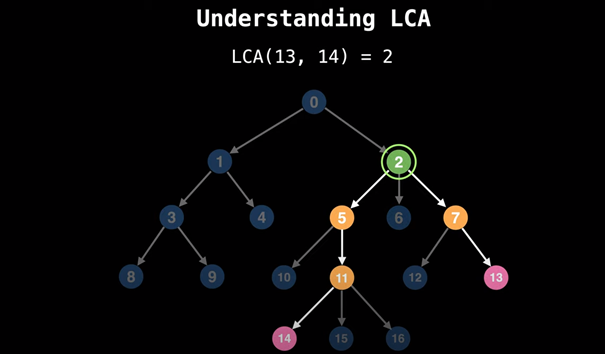

<!-- _backgroundColor: aquq -->

<!-- _color: orange -->

<!-- paginate: false -->

# CE205 Data Structures

# Week-4

### Tree Data Structure Types and Applications (Binary Tree, Tree Traversals, Heaps)

Download [DOC](ce205-week-4-tree-structures.md_doc.pdf), [SLIDE](ce205-week-4-tree-structures.md_slide.pdf), [PPTX](ce205-week-4-tree-structures.md_slide.pptx)

<iframe width=700, height=500 frameBorder=0 src="../ce205-week-4-tree-structures.md_slide.html"></iframe>

---

<!-- paginate: true -->

### Outline

- Graph Representation Tools 

- Tree Structures and Binary Tree and Traversals (In-Order, Pre-Order, Post-Order)

- Heaps (Max, Min, Binary , Binomial, Fibonacci, Leftist, K-ary) and Priority Queue

- Heap Sort

- Huffman Coding

---

### Graph Representation Tools

- Microsoft Automatic Graph Layout
  - https://www.microsoft.com/en-us/download/details.aspx?id=52034 
  - https://github.com/microsoft/automatic-graph-layout
- Graphviz
  - https://graphviz.org/resources/
- Plantuml
  - https://ucoruh.github.io/ce204-object-oriented-programming/week-5/ce204-week-5/#calling-plantuml-from-java_1

---

### Tree - Terminology

- Btech Smart Class
  - http://www.btechsmartclass.com/data_structures/tree-terminology.html

--- 

### Tree Representations

- Btech Smart Class
  - http://www.btechsmartclass.com/data_structures/tree-representations.html

--- 

### Binary Tree Datastructure

1. Construction and Conversion
2. Checking and Printing
3. Summation
4. Longest Common Ancestor
- Btech Smart Class
  - http://www.btechsmartclass.com/data_structures/binary-tree.html
- William Fiset
  - https://www.youtube.com/watch?v=sD1IoalFomA&ab_channel=WilliamFiset

---

### Longet Common Ancestor

---

### Longet Common Ancestor

---

### Binary Tree Representations

- Btech Smart Class
  - http://www.btechsmartclass.com/data_structures/binary-tree-representations.html

---

### Binary Tree Traversals

- Btech Smart Class
  - http://www.btechsmartclass.com/data_structures/binary-tree-traversals.html
    - In-Order
    - Pre-Order
    - Post-Order

---

### Threaded Binary Trees

- Btech Smart Class
  - http://www.btechsmartclass.com/data_structures/threaded-binary-trees.html

---

### Max Priority Queue

- Btech Smart Class
  - http://www.btechsmartclass.com/data_structures/max-priority-queue.html
- William Fiset
  - https://www.youtube.com/watch?v=wptevk0bshY&t=0s&ab_channel=WilliamFiset
  - https://github.com/williamfiset/Algorithms/tree/master/src/main/java/com/williamfiset/algorithms/datastructures/priorityqueue 

---

### Heap Data Structure

- Heap Sort
  - https://ucoruh.github.io/ce100-algorithms-and-programming-II/week-4/ce100-week-4-heap/

---

### Heap Data Structure

- Programiz
  - https://www.programiz.com/dsa/heap-data-structure

- Btech Smart Class
  - Max-Heap
    - http://www.btechsmartclass.com/data_structures/max-heap.html
- Geeks for Geeks
  - Binary Heap
    - https://www.geeksforgeeks.org/binary-heap/?ref=lbp
    - https://www.geeksforgeeks.org/difference-between-binary-heap-binomial-heap-and-fibonacci-heap/?ref=rp

---

### Heap Data Structure

- Binomial Heap 
  - Geeks for Geeks
    - https://www.geeksforgeeks.org/binomial-heap-2/

---

### Heap Data Structure

1. Structure of Fibonacci Heaps
2. Mergeable-heap operations

- Fibonacci Heap
  - William Fiset
    - https://github.com/williamfiset/Algorithms/tree/master/src/main/java/com/williamfiset/algorithms/datastructures/fibonacciheap
  - Geeks for Geeks
    - https://www.geeksforgeeks.org/fibonacci-heap-set-1-introduction/?ref=lbp

---

### Heap Data Structure

1. Decreasing a key and deleting a node
2. Bounding the maximum degree

- Heap Operations 
    - https://www.geeksforgeeks.org/fibonacci-heap-insertion-and-union/?ref=lbp 
    - https://www.geeksforgeeks.org/fibonacci-heap-deletion-extract-min-and-decrease-key/?ref=lbp

---

### Heap Data Structure

- Leftist Heap
  - Geeks for Geeks
    - https://www.geeksforgeeks.org/leftist-tree-leftist-heap/?ref=lbp
  - Toronto
    - https://www.dgp.toronto.edu/public_user/JamesStewart/378notes/10leftist/

---

### Heap Data Structure

- Geeks for Geeks
  - https://www.geeksforgeeks.org/k-ary-heap/?ref=lbp

---

### Heap Data Structure

- Heap Sort
  - https://ucoruh.github.io/ce100-algorithms-and-programming-II/week-4/ce100-week-4-heap/

---

### Heap Data Structure

- Huffman Coding
  - https://ucoruh.github.io/ce100-algorithms-and-programming-II/week-9/ce100-week-9-huffman/
  - Geeks for Geeks
    - https://www.geeksforgeeks.org/difference-between-binary-heap-binomial-heap-and-fibonacci-heap/?ref=rp  

---

$$
End-Of-Week-4
$$

