# Week 4 — Trees, Heaps and Huffman Coding

*CEN207 Data Structures (formerly CE205) · Fall 2026–2027*

<!-- materials:start -->

<div class="materials" markdown>

[:material-file-pdf-box: Lecture notes (PDF)](cen207-week-4-notes.pdf){ .md-button download="cen207-week-4-notes.pdf" }
[:material-file-word-box: Lecture notes (DOCX)](cen207-week-4-notes.docx){ .md-button download="cen207-week-4-notes.docx" }
[:material-presentation: Slides (PDF)](cen207-week-4-slides.pdf){ .md-button download="cen207-week-4-slides.pdf" }
[:material-microsoft-powerpoint: Slides (PPTX)](cen207-week-4-slides.pptx){ .md-button download="cen207-week-4-slides.pptx" }
[:material-language-html5: Slides (HTML, offline)](cen207-week-4-slides.html){ .md-button download="cen207-week-4-slides.html" }
[:material-folder-zip: Download all (ZIP)](cen207-week-4-materials.zip){ .md-button download="cen207-week-4-materials.zip" }
[:material-fullscreen: Open slides full screen](cen207-week-4-slides.html){ .md-button .md-button--primary target=_blank }

</div>

<div class="deck-frame">
<iframe src="../cen207-week-4-slides.html" title="Week 4 — Trees, Heaps, Huffman" loading="lazy" allowfullscreen></iframe>
</div>

<p class="deck-hint">Click inside the slides and use the arrow keys; use the button at the bottom right of the slides, or the "Open slides full screen" link above, for full screen.</p>

<!-- materials:end -->

!!! abstract "This week"
    **Learning outcomes.** By the end of this week you will be able to explain, draw, and implement the
    **tree** — the data structure that finally lets us model *branching* relationships (file systems, family
    trees, org charts) instead of the purely linear ones from the last three weeks. You will walk a tree three
    different ways (preorder, inorder, postorder) using recursion, walk it a fourth way (level order) using a
    queue, and walk it inorder a fifth time using your own explicit stack instead of recursion. You will meet
    the **binary heap**, the array-backed tree that keeps the best value always within reach in O(log n), build
    one from scratch in O(n), and use it to sort (**heap sort**) and to run a **priority queue**. You will see
    three heap variants — d-ary, binomial, leftist — each trading one property for another. Finally you will
    build **Huffman coding**, the 1952 algorithm that compresses text by giving common symbols short codes and
    rare symbols long ones, using nothing but a heap of trees. These outcomes map to **LO.1** (explain
    fundamental data structures), **LO.2** (analyze algorithmic complexity), and **LO.7** (choose the right
    structure for a problem) of the course syllabus.

    **What you need already.** Week 1 gave you pointers and a picture of memory as numbered boxes. Week 2 gave
    you the linked list — nodes connected by pointers. Week 3 gave you the stack, the queue, and recursion, and
    showed you that recursion *is* a stack running behind the scenes. This week reuses all four ideas at once:
    a tree node is a struct with pointers, exactly like a linked-list node, except it points to *two or more*
    other nodes instead of one; walking a tree recursively is exactly the call-stack idea from the Tower of
    Hanoi; walking it level by level needs the queue from Week 3, unchanged. If any of that feels shaky, the
    short recap in section 0 just below is for you.

    **Time plan for a 3-hour session.** Trees, vocabulary, and shapes (~35 min) · traversals: preorder, inorder,
    postorder, iterative inorder, level order (~55 min) · short break · the array representation and the binary
    heap: insert, extract, build-heap, heap sort (~50 min) · priority queues and heap variants (~30 min) ·
    Huffman coding (~25 min) · wrap-up and self-check (~10 min).

## 0. Before we start

### 0.1 What you already know

Three ideas from the last three weeks carry almost all of this week's weight. Let's make sure they are solid.

**From Week 1 — pointers and memory.** A `struct` can hold more than one pointer field at once. Nothing stops
us from writing:

```c
typedef struct Node {
    int value;
    struct Node *left, *right;
} Node;
```

This is *the same idea* as a linked-list node — a value plus pointers to other nodes — except a linked-list
node has one `next` pointer and this one has two, `left` and `right`. That one change, two pointers instead of
one, is the entire jump from "list" to "tree": a node can now have more than one node hanging off it, so the
structure can *branch*.

**From Week 2 — linked lists and `NULL`.** A linked list ends when a `next` pointer is `NULL`. A tree ends the
same way: a node with `left == NULL` has no left child, one with `right == NULL` has no right child, and a node
with both `NULL` is called a **leaf** — the tree's equivalent of the list's "last node". Building a tree is
still just `malloc` and pointer assignment; nothing new there.

**From Week 3 — the stack, the queue, and recursion.** This is the big one. Recursion *is* a stack: every
recursive call pushes a new stack frame (its parameters, its local variables, the point to return to), and
returning pops it back off. When we write a recursive tree function, we are quite literally asking the
compiler's call stack to do the bookkeeping that we did by hand for the Tower of Hanoi. Later this week we will
also write the *same* traversal **without** recursion, using an explicit array-based stack of our own — the
exact stack from Week 3, just holding tree nodes instead of numbers, to make that connection completely
concrete. The queue, too, returns unchanged: level-order traversal of a tree uses precisely the array/circular
queue you built in Week 3, just enqueuing and dequeuing tree nodes instead of `int`s.

If any of this feels new rather than "oh right, I remember", five minutes with the Week 1–3 notes before
continuing will pay for itself many times over — everything below assumes it.

### 0.2 The map of this week

```mermaid
flowchart TD
    W4["Week 4: Trees, Heaps, and Huffman Coding"]
    W4 --> T["Trees: vocabulary and shapes"]
    T --> T1["General tree: root, parent, child, sibling, leaf, depth, height, degree"]
    T --> T2["Binary tree shapes: full, complete, perfect, degenerate, balanced"]
    W4 --> TR["Traversals: visiting every node exactly once"]
    TR --> TR1["Preorder (recursive): visit, left, right"]
    TR --> TR2["Inorder (recursive): left, visit, right"]
    TR --> TR3["Postorder (recursive): left, right, visit"]
    TR --> TR4["Inorder with our own stack (no recursion)"]
    TR --> TR5["Level order (BFS) with a queue"]
    W4 --> ARR["A complete tree stored in a plain array"]
    W4 --> H["Binary heap: the best value always at the root"]
    H --> H1["insert: sift-up"]
    H --> H2["extract: sift-down"]
    H --> H3["build-heap: O(n)"]
    H --> H4["heap sort"]
    W4 --> PQ["Priority queue ADT, built on a heap"]
    W4 --> V["Heap variants"]
    V --> V1["d-ary heap"]
    V --> V2["Binomial heap"]
    V --> V3["Leftist heap"]
    W4 --> HUF["Huffman coding"]
    HUF --> HUF1["Build the tree with a min-heap"]
    HUF --> HUF2["Encode and decode"]
```



Every box gets its own section below, most with a short step-by-step animation, a complete C and Java program,
and a note on complexity and common mistakes.

## 1. Why trees? Inception, history, and vocabulary

### 1.1 A question to start

Open a file manager. `Documents` contains `CEN207` which contains `Week4` which contains three files. `Documents`
also contains `Photos`, which contains `2026` which contains twelve month folders. There is exactly one starting
point — your home folder — and from there, every single file and folder is reachable by picking a path down
through a chain of containers, and no folder is ever its own ancestor. Draw that structure on paper and you get
branches, forks, and leaves — not a straight line like a stack or a queue, and not a simple back-and-forth like
a doubly linked list. What kind of structure captures "one root, unlimited branching, no cycles"? That structure
is a **tree**, and the next several weeks build almost everything else in this course on top of it (search trees
in later weeks, heaps and priority queues starting today).

### 1.2 A short history

The word "tree" for this shape is older than computing itself. In 1857, the mathematician **Arthur Cayley**
published a paper counting the number of distinct trees with a given number of nodes — motivated, as it happens,
by counting chemical isomers of hydrocarbons, whose branching structure is literally a tree. Cayley's paper is
one of the first places the mathematical vocabulary of trees — nodes, branches, degree — was written down
precisely. When computer scientists needed a name, decades later, for the branching pointer structures that
kept turning up (parse trees for expressions, directory structures, binary search trees), "tree" was already
sitting there, ready-made. **Donald Knuth**, in *The Art of Computer Programming*, Volume 1 (1968), fixed much
of the vocabulary this section teaches — root, leaf, degree, level, height — into the standard form still used
today.

### 1.3 Intuition and vocabulary

A **tree** is a collection of nodes connected by edges such that: there is exactly one special node called the
**root**, every other node has exactly one **parent**, and there are no cycles — you can never walk from a node
back to itself by following edges downward. Picture an upside-down real tree: the root is the trunk, drawn at
the *top* by convention (yes, upside down — everyone in computer science draws trees this way), and everything
branches downward from it.

| Term | Meaning |
| --- | --- |
| **Root** | The one node with no parent; every tree has exactly one. |
| **Parent / child** | If there is an edge from `A` down to `B`, `A` is `B`'s parent and `B` is `A`'s child. |
| **Sibling** | Two nodes that share the same parent. |
| **Leaf** | A node with no children — degree 0. |
| **Internal node** | A node with at least one child. |
| **Edge** | The connection between a parent and a child. A tree with *n* nodes always has exactly *n* − 1 edges — every node except the root has exactly one edge, to its parent. |
| **Degree (of a node)** | Its number of children. |
| **Depth (of a node)** | The number of edges from the root down to that node. The root's depth is 0. |
| **Height (of a node)** | The number of edges on the longest downward path from that node to a leaf. A leaf's height is 0. |
| **Height (of the tree)** | The height of the root — equivalently, the depth of the deepest leaf. |
| **Subtree** | A node together with everything below it — itself a complete, smaller tree. |

Play the animation to see every one of these terms pointed at on an actual tree, one at a time.

<iframe class="dsanim" src="../anim/tree-terminology.html" title="Tree vocabulary: root, parent, child, leaf, depth, height" loading="lazy"></iframe>
<div class="dsanim-baski" markdown>

</div>

In the picker, also try **18 nodes, uneven depths (down to level 5)** (hard) and the edge cases **a chain
(degenerate): 10 nodes, each with one child** and **a star: the root has 10 children** — or press 🎲 for random
data at four difficulty levels, or type your own tree as a list of `LABEL:PARENT` pairs.

Note that this first tree is a **general** rooted tree: a node may have *any* number of children, not just two.
Section 2 narrows the focus to trees where every node has **at most two** children — **binary trees** — because
that restriction is what makes the array tricks, the heap, and Huffman coding in the rest of this week work.

### 1.4 The tree in memory, and the code

The code below builds a general tree from a flat list of `(label, parent)` pairs — exactly the input format the
animation uses — then computes each node's **height** (bottom-up, recursively: a leaf's height is 0, an
internal node's height is 1 + the tallest of its children) and each node's **depth** (top-down, breadth-first,
with a queue: the root's depth is 0, and a child's depth is always its parent's depth + 1).

=== "C"

    ```c
    /* Week 4 -- Trees, Heaps, and Huffman Coding
     * Tree vocabulary on a GENERAL rooted tree (any number of children per
     * node): root, parent, child, sibling, leaf, internal node, edge, depth,
     * height, degree, subtree.
     * CEN207 Data Structures (CS50-style lecture notes)
     */
    #include <stdio.h>
    #include <string.h>

    #define MAX_CHILDREN 12
    #define MAX_NODES 32

    typedef struct Node {
        char label[4];
        struct Node *children[MAX_CHILDREN];
        int child_count;      /* degree of this node */
        int depth;            /* filled in by compute_depths() */
        struct Node *parent;  /* convenience only -- not shown in the lecture code panel */
    } Node;

    int height(Node *n) {
        if (n->child_count == 0)
            return 0;         /* a leaf: height 0 */
        int best = -1;
        for (int i = 0; i < n->child_count; i++) {
            int h = height(n->children[i]);
            if (h > best) best = h;
        }
        return best + 1;      /* 1 + tallest child */
    }

    void compute_depths(Node *root) {
        Node *queue[MAX_NODES];
        int front = 0, rear = 0;
        root->depth = 0;
        queue[rear++] = root;
        while (front < rear) {
            Node *cur = queue[front++];
            for (int i = 0; i < cur->child_count; i++) {
                Node *ch = cur->children[i];
                ch->depth = cur->depth + 1;
                queue[rear++] = ch;
            }
        }
    }
    ```

=== "Java"

    ```java
    static int height(Node n) {
        if (n.children.isEmpty())
            return 0;           // a leaf: height 0
        int best = -1;
        for (Node c : n.children) {
            int h = height(c);
            if (h > best) best = h;
        }
        return best + 1;        // 1 + tallest child
    }

    static void computeDepths(Node root) {
        Node[] queue = new Node[MAX_NODES];
        int front = 0, rear = 0;
        root.depth = 0;
        queue[rear++] = root;
        while (front < rear) {
            Node cur = queue[front++];
            for (Node ch : cur.children) {
                ch.depth = cur.depth + 1;
                queue[rear++] = ch;
            }
        }
    }
    ```

The full programs (`code/week-04/c/tree_basics.c`, `code/week-04/java/TreeBasics.java`) build four scenarios —
the bushy 11-node tree above, the 18-node uneven tree, a 10-node degenerate chain, and an 11-node "star" — and
for one probe node in each, print its depth, its degree, its children, its parent, its siblings, and the size of
its own subtree.

??? example "Full program: `tree_basics.c` / `TreeBasics.java`"

    === "C"

        ```c
        /* Week 4 -- Trees, Heaps, and Huffman Coding
         * Tree vocabulary on a GENERAL rooted tree (any number of children per
         * node): root, parent, child, sibling, leaf, internal node, edge, depth,
         * height, degree, subtree.
         * CEN207 Data Structures (CS50-style lecture notes)
         */
        #include <stdio.h>
        #include <string.h>

        #define MAX_CHILDREN 12
        #define MAX_NODES 32

        typedef struct Node {
            char label[4];
            struct Node *children[MAX_CHILDREN];
            int child_count;      /* degree of this node */
            int depth;            /* filled in by compute_depths() */
            struct Node *parent;  /* convenience only -- not shown in the lecture code panel */
        } Node;

        int height(Node *n) {
            if (n->child_count == 0)
                return 0;         /* a leaf: height 0 */
            int best = -1;
            for (int i = 0; i < n->child_count; i++) {
                int h = height(n->children[i]);
                if (h > best) best = h;
            }
            return best + 1;      /* 1 + tallest child */
        }

        void compute_depths(Node *root) {
            Node *queue[MAX_NODES];
            int front = 0, rear = 0;
            root->depth = 0;
            queue[rear++] = root;
            while (front < rear) {
                Node *cur = queue[front++];
                for (int i = 0; i < cur->child_count; i++) {
                    Node *ch = cur->children[i];
                    ch->depth = cur->depth + 1;
                    queue[rear++] = ch;
                }
            }
        }

        /* --- building a tree from a flat "LABEL:PARENT" list, exactly like the animation's input --- */
        typedef struct {
            const char *label;
            const char *parent;   /* NULL for the root */
        } Spec;

        static Node pool[MAX_NODES];
        static int pool_count;

        static Node *find_by_label(const char *label) {
            for (int i = 0; i < pool_count; i++)
                if (strcmp(pool[i].label, label) == 0) return &pool[i];
            return NULL;
        }

        static Node *build_tree(const Spec specs[], int n) {
            pool_count = 0;
            for (int i = 0; i < n; i++) {
                Node *node = &pool[pool_count++];
                strcpy(node->label, specs[i].label);
                node->child_count = 0;
                node->depth = 0;
                node->parent = NULL;
            }
            Node *root = NULL;
            for (int i = 0; i < n; i++) {
                Node *node = find_by_label(specs[i].label);
                if (specs[i].parent == NULL) { root = node; continue; }
                Node *parent = find_by_label(specs[i].parent);
                parent->children[parent->child_count++] = node;
                node->parent = parent;
            }
            return root;
        }

        static int subtree_size(Node *node) {
            int total = 1;
            for (int i = 0; i < node->child_count; i++)
                total += subtree_size(node->children[i]);
            return total;
        }

        static void print_leaves_internal(Node *node, int internal, int first_call) {
            static int any_printed;
            if (first_call) any_printed = 0;
            if ((node->child_count == 0) == !internal) {
                printf(any_printed ? " %s" : "%s", node->label);
                any_printed = 1;
            }
            for (int i = 0; i < node->child_count; i++)
                print_leaves_internal(node->children[i], internal, 0);
        }

        static void describe(const char *label, Node *root, int n, const char *probe_label) {
            printf("-- %s --\n", label);
            printf("nodes = %d, edges = %d\n", n, n - 1);
            compute_depths(root);
            printf("height (of the root) = %d\n", height(root));
            printf("leaves:");
            print_leaves_internal(root, 0, 1);
            printf("\n");
            printf("internal nodes:");
            print_leaves_internal(root, 1, 1);
            printf("\n");

            Node *probe = find_by_label(probe_label);
            printf("probe node %s: depth = %d, degree (child count) = %d, subtree size = %d\n",
                   probe->label, probe->depth, probe->child_count, subtree_size(probe));
            printf("  children of %s:", probe->label);
            for (int i = 0; i < probe->child_count; i++) printf(" %s", probe->children[i]->label);
            if (probe->child_count == 0) printf(" (none, it is a leaf)");
            printf("\n");
            if (probe->parent == NULL) {
                printf("  %s is the root: no parent, no siblings\n", probe->label);
            } else {
                printf("  parent of %s: %s\n", probe->label, probe->parent->label);
                printf("  siblings of %s:", probe->label);
                int any = 0;
                for (int i = 0; i < probe->parent->child_count; i++) {
                    Node *sib = probe->parent->children[i];
                    if (sib != probe) { printf(" %s", sib->label); any = 1; }
                }
                if (!any) printf(" (none, only child)");
                printf("\n");
            }
            printf("\n");
        }

        int main(void) {
            /* normal: 11 nodes, a bushy tree */
            Spec normal[] = {
                {"A", NULL}, {"B", "A"}, {"C", "A"}, {"D", "A"},
                {"E", "B"}, {"F", "B"}, {"G", "C"}, {"H", "D"},
                {"I", "D"}, {"J", "D"}, {"K", "E"}
            };
            describe("normal: 11 nodes, a bushy tree", build_tree(normal, 11), 11, "D");

            /* hard: 18 nodes, uneven depths (down to level 5) */
            Spec hard[] = {
                {"R", NULL},
                {"P1", "R"}, {"P2", "P1"}, {"P3", "P2"}, {"P4", "P3"}, {"P5", "P4"},
                {"Q1", "R"}, {"Q2", "R"}, {"Q3", "R"},
                {"S1", "Q1"}, {"S2", "Q1"}, {"S3", "Q2"}, {"S4", "Q3"},
                {"U1", "S1"}, {"U2", "S3"}, {"U3", "S3"},
                {"V1", "U1"}, {"W1", "V1"}
            };
            describe("hard: 18 nodes, uneven depths", build_tree(hard, 18), 18, "S3");

            /* edge: a chain (degenerate), 10 nodes, each with one child */
            Spec chain[] = {
                {"R", NULL}, {"C1", "R"}, {"C2", "C1"}, {"C3", "C2"}, {"C4", "C3"},
                {"C5", "C4"}, {"C6", "C5"}, {"C7", "C6"}, {"C8", "C7"}, {"C9", "C8"}
            };
            describe("edge: a chain (degenerate), 10 nodes", build_tree(chain, 10), 10, "C9");

            /* edge: a star -- the root has 10 children */
            Spec star[] = {
                {"R", NULL}, {"L1", "R"}, {"L2", "R"}, {"L3", "R"}, {"L4", "R"}, {"L5", "R"},
                {"L6", "R"}, {"L7", "R"}, {"L8", "R"}, {"L9", "R"}, {"L10", "R"}
            };
            describe("edge: a star, the root has 10 children", build_tree(star, 11), 11, "R");

            return 0;
        }
        ```

    === "Java"

        ```java
        /* Week 4 -- Trees, Heaps, and Huffman Coding
         * Tree vocabulary on a GENERAL rooted tree (any number of children per
         * node): root, parent, child, sibling, leaf, internal node, edge, depth,
         * height, degree, subtree.
         * CEN207 Data Structures (CS50-style lecture notes)
         */
        import java.util.ArrayList;
        import java.util.List;

        public class TreeBasics {
            static final int MAX_NODES = 32;

            static class Node {
                String label;
                List<Node> children = new ArrayList<>();   // degree of this node = children.size()
                int depth;             // filled in by computeDepths()
                Node parent;            // convenience only -- not shown in the lecture code panel
                Node(String label) { this.label = label; }
            }

            static int height(Node n) {
                if (n.children.isEmpty())
                    return 0;           // a leaf: height 0
                int best = -1;
                for (Node c : n.children) {
                    int h = height(c);
                    if (h > best) best = h;
                }
                return best + 1;        // 1 + tallest child
            }

            static void computeDepths(Node root) {
                Node[] queue = new Node[MAX_NODES];
                int front = 0, rear = 0;
                root.depth = 0;
                queue[rear++] = root;
                while (front < rear) {
                    Node cur = queue[front++];
                    for (Node ch : cur.children) {
                        ch.depth = cur.depth + 1;
                        queue[rear++] = ch;
                    }
                }
            }

            // --- building a tree from a flat "LABEL:PARENT" list, exactly like the animation's input ---
            static class Spec {
                String label, parent;   // parent == null for the root
                Spec(String label, String parent) { this.label = label; this.parent = parent; }
            }

            static java.util.Map<String, Node> byLabel = new java.util.HashMap<>();

            static Node buildTree(Spec[] specs) {
                byLabel.clear();
                for (Spec s : specs) byLabel.put(s.label, new Node(s.label));
                Node root = null;
                for (Spec s : specs) {
                    Node node = byLabel.get(s.label);
                    if (s.parent == null) { root = node; continue; }
                    Node parent = byLabel.get(s.parent);
                    parent.children.add(node);
                    node.parent = parent;
                }
                return root;
            }

            static int subtreeSize(Node node) {
                int total = 1;
                for (Node c : node.children) total += subtreeSize(c);
                return total;
            }

            static void collectLeaves(Node node, boolean internal, List<String> out) {
                if (node.children.isEmpty() == !internal) out.add(node.label);
                for (Node c : node.children) collectLeaves(c, internal, out);
            }

            static void printLabelList(String prefix, List<String> labels) {
                StringBuilder sb = new StringBuilder(prefix);
                for (int i = 0; i < labels.size(); i++) sb.append(i == 0 ? "" : " ").append(labels.get(i));
                System.out.println(sb);
            }

            static void describe(String label, Node root, int n, String probeLabel) {
                System.out.println("-- " + label + " --");
                System.out.println("nodes = " + n + ", edges = " + (n - 1));
                computeDepths(root);
                System.out.println("height (of the root) = " + height(root));
                List<String> leaves = new ArrayList<>();
                collectLeaves(root, false, leaves);
                printLabelList("leaves:", leaves);
                List<String> internal = new ArrayList<>();
                collectLeaves(root, true, internal);
                printLabelList("internal nodes:", internal);

                Node probe = byLabel.get(probeLabel);
                System.out.println("probe node " + probe.label + ": depth = " + probe.depth +
                                    ", degree (child count) = " + probe.children.size() +
                                    ", subtree size = " + subtreeSize(probe));
                StringBuilder kids = new StringBuilder("  children of " + probe.label + ":");
                for (Node c : probe.children) kids.append(' ').append(c.label);
                if (probe.children.isEmpty()) kids.append(" (none, it is a leaf)");
                System.out.println(kids);
                if (probe.parent == null) {
                    System.out.println("  " + probe.label + " is the root: no parent, no siblings");
                } else {
                    System.out.println("  parent of " + probe.label + ": " + probe.parent.label);
                    StringBuilder sibs = new StringBuilder("  siblings of " + probe.label + ":");
                    boolean any = false;
                    for (Node sib : probe.parent.children) {
                        if (sib != probe) { sibs.append(' ').append(sib.label); any = true; }
                    }
                    if (!any) sibs.append(" (none, only child)");
                    System.out.println(sibs);
                }
                System.out.println();
            }

            public static void main(String[] args) {
                // normal: 11 nodes, a bushy tree
                Spec[] normal = {
                    new Spec("A", null), new Spec("B", "A"), new Spec("C", "A"), new Spec("D", "A"),
                    new Spec("E", "B"), new Spec("F", "B"), new Spec("G", "C"), new Spec("H", "D"),
                    new Spec("I", "D"), new Spec("J", "D"), new Spec("K", "E")
                };
                describe("normal: 11 nodes, a bushy tree", buildTree(normal), 11, "D");

                // hard: 18 nodes, uneven depths (down to level 5)
                Spec[] hard = {
                    new Spec("R", null),
                    new Spec("P1", "R"), new Spec("P2", "P1"), new Spec("P3", "P2"), new Spec("P4", "P3"), new Spec("P5", "P4"),
                    new Spec("Q1", "R"), new Spec("Q2", "R"), new Spec("Q3", "R"),
                    new Spec("S1", "Q1"), new Spec("S2", "Q1"), new Spec("S3", "Q2"), new Spec("S4", "Q3"),
                    new Spec("U1", "S1"), new Spec("U2", "S3"), new Spec("U3", "S3"),
                    new Spec("V1", "U1"), new Spec("W1", "V1")
                };
                describe("hard: 18 nodes, uneven depths", buildTree(hard), 18, "S3");

                // edge: a chain (degenerate), 10 nodes, each with one child
                Spec[] chain = {
                    new Spec("R", null), new Spec("C1", "R"), new Spec("C2", "C1"), new Spec("C3", "C2"), new Spec("C4", "C3"),
                    new Spec("C5", "C4"), new Spec("C6", "C5"), new Spec("C7", "C6"), new Spec("C8", "C7"), new Spec("C9", "C8")
                };
                describe("edge: a chain (degenerate), 10 nodes", buildTree(chain), 10, "C9");

                // edge: a star -- the root has 10 children
                Spec[] star = {
                    new Spec("R", null), new Spec("L1", "R"), new Spec("L2", "R"), new Spec("L3", "R"), new Spec("L4", "R"), new Spec("L5", "R"),
                    new Spec("L6", "R"), new Spec("L7", "R"), new Spec("L8", "R"), new Spec("L9", "R"), new Spec("L10", "R")
                };
                describe("edge: a star, the root has 10 children", buildTree(star), 11, "R");
            }
        }
        ```

**Try it**

=== "C"

    ```console
    gcc -std=c11 -Wall -Wextra -o /tmp/x tree_basics.c && /tmp/x
    ```

    Expected output:

    ```text
    -- normal: 11 nodes, a bushy tree --
    nodes = 11, edges = 10
    height (of the root) = 3
    leaves:K F G H I J
    internal nodes:A B E C D
    probe node D: depth = 1, degree (child count) = 3, subtree size = 4
      children of D: H I J
      parent of D: A
      siblings of D: B C

    -- hard: 18 nodes, uneven depths --
    nodes = 18, edges = 17
    height (of the root) = 5
    leaves:P5 W1 S2 U2 U3 S4
    internal nodes:R P1 P2 P3 P4 Q1 S1 U1 V1 Q2 S3 Q3
    probe node S3: depth = 2, degree (child count) = 2, subtree size = 3
      children of S3: U2 U3
      parent of S3: Q2
      siblings of S3: (none, only child)

    -- edge: a chain (degenerate), 10 nodes --
    nodes = 10, edges = 9
    height (of the root) = 9
    leaves:C9
    internal nodes:R C1 C2 C3 C4 C5 C6 C7 C8
    probe node C9: depth = 9, degree (child count) = 0, subtree size = 1
      children of C9: (none, it is a leaf)
      parent of C9: C8
      siblings of C9: (none, only child)

    -- edge: a star, the root has 10 children --
    nodes = 11, edges = 10
    height (of the root) = 1
    leaves:L1 L2 L3 L4 L5 L6 L7 L8 L9 L10
    internal nodes:R
    probe node R: depth = 0, degree (child count) = 10, subtree size = 11
      children of R: L1 L2 L3 L4 L5 L6 L7 L8 L9 L10
      R is the root: no parent, no siblings
    ```

=== "Java"

    ```console
    javac -d /tmp/j TreeBasics.java && java -cp /tmp/j TreeBasics
    ```

    Expected output: identical to the C run above (same algorithm, same data).

**Complexity.** `height` visits every node exactly once, so it is O(n). `compute_depths` is a breadth-first scan
that also visits every node exactly once, so it too is O(n). Neither depends on the *shape* of the tree — a
long thin chain and a short bushy tree of the same node count cost the same to measure.

!!! warning "Common mistakes"
    - **Confusing depth and height.** Depth is measured **from the root down** to a node; height is measured
      **from a node down** to its deepest leaf. The root's depth is always 0; the root's height is the height of
      the *whole tree*. They agree only for the root exactly when you ask "how deep is the deepest leaf" — that
      number is both the root's height and the deepest leaf's depth, which is a common source of the confusion.
    - **Forgetting that height starts at −1 (or 0) for the base case, not 1.** If a single node counted as
      height 1, an empty tree would have to count as height 0, and the neat formula "leaf height = 0" would
      break. Pick one convention (this note uses "a leaf has height 0") and apply it consistently.
    - **Assuming every tree is a binary tree.** A general tree's node can have any number of children; nothing
      about "root, parent, child, leaf, depth, height" requires exactly two. The *binary* restriction is a
      choice we make starting in the very next section, because it unlocks specific tricks (the array
      representation, the heap), not because it is somehow more fundamental.

??? success "Self-check: vocabulary"
    In the "hard" tree above, node `Q1` has children `S1` and `S2`. What is `Q1`'s degree, and what is the depth
    of `S1`?

    **Answer.** `Q1`'s degree is 2 (it has two children). `Q1`'s own depth is 1 (child of the root `R`), so
    `S1`, being a child of `Q1`, has depth 2.

## 2. Binary trees: node struct, shapes, and node counts

### 2.1 A question to start

A **binary tree** is a tree where every node has **at most two** children, conventionally called **left** and
**right**. That single restriction — at most two, and the two are distinguishable — turns out to unlock an
enormous amount: binary search trees (next semester's topic), the heap you will build in section 5, and the
Huffman tree in section 8 are all binary trees. But not every binary tree is created equal: a binary tree that
is packed tight, level by level, behaves completely differently — in memory and in speed — from one that
degenerates into a straight chain. This section gives you the vocabulary to tell them apart at a glance, and
the arithmetic to know exactly how many nodes a binary tree of a given height *can* hold.

### 2.2 The binary tree node

```c
typedef struct Node {
    int value;
    struct Node *left, *right;
} Node;
```

This is the struct every program in the rest of this week builds on. `left` and `right` are each either `NULL`
(no child on that side) or a pointer to another `Node`. Compare it to the linked-list node from Week 2 — same
idea, one more pointer field.

### 2.3 Five shapes, precisely defined

| Shape | Definition |
| --- | --- |
| **Full** | Every node has either 0 or 2 children — never exactly 1. |
| **Complete** | Every level is completely filled, except possibly the last, which is filled **left to right** with no gaps. |
| **Perfect** | Every internal node has exactly 2 children **and** every leaf is at the same depth. (A perfect tree is automatically full and complete.) |
| **Degenerate** | No node has 2 children — every node has 0 or 1, so the "tree" is really a chain. |
| **Height-balanced** | At every node, the heights of its left and right subtrees differ by at most 1. |

These are five independent yes/no questions you can ask about the *same* tree — a tree can be complete without
being full, full without being complete, balanced without being complete, and so on. The animation below asks
all five questions, one at a time, on the same tree, and shows exactly which node (if any) breaks each rule.

<iframe class="dsanim" src="../anim/tree-shapes.html" title="Binary tree shapes: full, complete, perfect, degenerate, balanced" loading="lazy"></iframe>
<div class="dsanim-baski" markdown>

</div>

In the picker, also try **17 nodes, full but not complete, and unbalanced — a "caterpillar" tree** (hard) and
the edge cases **a perfect tree: 15 nodes, 4 full levels**, **a left-leaning chain (degenerate): 10 nodes**,
**complete but NOT full: 10 nodes**, and **balanced but NOT complete: 11 nodes** — or press 🎲 for random data
at four difficulty levels, or type your own level-order list.

### 2.4 How many nodes can fit?

Two formulas are worth memorizing, because they come back constantly (the heap in section 5 depends on both):

- **Maximum nodes at height *h*.** A perfect binary tree of height *h* has exactly 2<sup>h+1</sup> − 1 nodes:
  level 0 (the root) holds 1 node, level 1 holds 2, level 2 holds 4, and in general level *k* holds 2<sup>k</sup>
  nodes, so the total through level *h* is 1 + 2 + 4 + ... + 2<sup>h</sup> = 2<sup>h+1</sup> − 1.
- **Minimum height for *n* nodes.** Turning the formula around: the *shortest* possible binary tree holding *n*
  nodes has height ⌊log₂ n⌋ — you cannot pack *n* nodes into fewer levels than that, no matter how you arrange
  them, because each level can hold at most twice as many nodes as the one above it.

This is exactly why a **balanced** binary tree is desirable: it keeps the height close to log₂ n, so any
operation that walks from the root to a leaf costs O(log n) instead of, in the worst (degenerate) case, O(n).

=== "C"

    ```c
    /* full: every node has 0 or 2 children (never exactly 1) */
    static bool is_full(Node *n) {
        if (n == NULL) return true;
        bool has_l = n->left != NULL, has_r = n->right != NULL;
        if (has_l != has_r) return false;       /* exactly one child: not full */
        return is_full(n->left) && is_full(n->right);
    }

    /* complete: walking level by level, once a NULL is seen no real node may follow it */
    static bool is_complete(Node *root) {
        Node *queue[MAX_NODES]; int front = 0, rear = 0;
        queue[rear++] = root;
        bool seen_gap = false;
        while (front < rear) {
            Node *n = queue[front++];
            if (n == NULL) { seen_gap = true; continue; }
            if (seen_gap) return false;         /* a real node after a gap */
            queue[rear++] = n->left;
            queue[rear++] = n->right;
        }
        return true;
    }

    /* perfect: full AND every leaf on the same level */
    static bool is_perfect(Node *n, int depth, int *leaf_depth) {
        if (n == NULL) return true;
        if (n->left == NULL && n->right == NULL) {
            if (*leaf_depth == -1) *leaf_depth = depth;
            return depth == *leaf_depth;
        }
        if (n->left == NULL || n->right == NULL) return false;   /* not full */
        return is_perfect(n->left, depth + 1, leaf_depth) && is_perfect(n->right, depth + 1, leaf_depth);
    }

    /* degenerate: no node has two children (every node has 0 or 1) */
    static bool is_degenerate(Node *n) {
        if (n == NULL) return true;
        if (n->left != NULL && n->right != NULL) return false;   /* two children: not degenerate */
        return is_degenerate(n->left) && is_degenerate(n->right);
    }

    /* balanced: |height(left) - height(right)| <= 1 at every node; -1 means "unbalanced already found" */
    static int check_balance(Node *n) {
        if (n == NULL) return 0;
        int hl = check_balance(n->left);
        if (hl == -1) return -1;
        int hr = check_balance(n->right);
        if (hr == -1) return -1;
        if (abs(hl - hr) > 1) return -1;      /* found an unbalanced node */
        return 1 + (hl > hr ? hl : hr);
    }
    ```

=== "Java"

    ```java
    // full: every node has 0 or 2 children (never exactly 1)
    static boolean isFull(Node n) {
        if (n == null) return true;
        boolean hasL = n.left != null, hasR = n.right != null;
        if (hasL != hasR) return false;        // exactly one child: not full
        return isFull(n.left) && isFull(n.right);
    }

    // complete: walking level by level, once a null is seen no real node may follow it
    static boolean isComplete(Node root) {
        java.util.LinkedList<Node> queue = new java.util.LinkedList<>();  // ArrayDeque rejects null elements
        queue.add(root);
        boolean seenGap = false;
        while (!queue.isEmpty()) {
            Node n = queue.poll();
            if (n == null) { seenGap = true; continue; }
            if (seenGap) return false;          // a real node after a gap
            queue.add(n.left);
            queue.add(n.right);
        }
        return true;
    }

    // perfect: full AND every leaf on the same level
    static boolean isPerfect(Node n, int depth, int[] leafDepth) {
        if (n == null) return true;
        if (n.left == null && n.right == null) {
            if (leafDepth[0] == -1) leafDepth[0] = depth;
            return depth == leafDepth[0];
        }
        if (n.left == null || n.right == null) return false;    // not full
        return isPerfect(n.left, depth + 1, leafDepth) && isPerfect(n.right, depth + 1, leafDepth);
    }

    // degenerate: no node has two children (every node has 0 or 1)
    static boolean isDegenerate(Node n) {
        if (n == null) return true;
        if (n.left != null && n.right != null) return false;    // two children: not degenerate
        return isDegenerate(n.left) && isDegenerate(n.right);
    }

    // balanced: |height(left) - height(right)| <= 1 at every node; -1 means "unbalanced already found"
    static int checkBalance(Node n) {
        if (n == null) return 0;
        int hl = checkBalance(n.left);
        if (hl == -1) return -1;
        int hr = checkBalance(n.right);
        if (hr == -1) return -1;
        if (Math.abs(hl - hr) > 1) return -1;  // found an unbalanced node
        return 1 + Math.max(hl, hr);
    }
    ```

The full programs (`code/week-04/c/tree_shape.c`, `code/week-04/java/TreeShape.java`) run all five checks on six
trees: a 12-node complete-but-not-perfect tree, a 17-node full "caterpillar" (unbalanced and not complete), a
15-node perfect tree, a 10-node degenerate chain, a 10-node complete-but-not-full tree, and an 11-node
balanced-but-not-complete tree.

??? example "Full program: `tree_shape.c` / `TreeShape.java`"

    === "C"

        ```c
        /* Week 4 -- Trees, Heaps, and Huffman Coding
         * Binary tree shapes: full, complete, perfect, degenerate, height-balanced.
         * CEN207 Data Structures (CS50-style lecture notes)
         */
        #include <limits.h>
        #include <stdbool.h>
        #include <stdio.h>
        #include <stdlib.h>

        #define SLOT_NONE INT_MIN
        #define MAX_NODES 32

        typedef struct Node {
            int value;
            struct Node *left, *right;
        } Node;

        static Node *new_node(int value) {
            Node *n = malloc(sizeof(Node));
            n->value = value;
            n->left = NULL;
            n->right = NULL;
            return n;
        }

        static Node *build_tree(const int arr[], int n, int i) {
            if (i >= n || arr[i] == SLOT_NONE) return NULL;
            Node *node = new_node(arr[i]);
            node->left = build_tree(arr, n, 2 * i + 1);
            node->right = build_tree(arr, n, 2 * i + 2);
            return node;
        }

        static Node *build_left_chain(const int values[], int n) {
            Node *root = NULL, *tail = NULL;
            for (int i = 0; i < n; i++) {
                Node *node = new_node(values[i]);
                if (root == NULL) root = node; else tail->left = node;
                tail = node;
            }
            return root;
        }

        /* A full binary tree (every node 0 or 2 children) shaped like a caterpillar: at each spine level one
         * child is a leaf and the other continues the spine -- maximally unbalanced and far from complete.
         * Always has an ODD node count: 2*spine + 1. */
        static Node *build_full_caterpillar(int spine, int start, int step) {
            int val = start;
            Node *root = new_node(val); val += step;
            Node *cur = root;
            for (int i = 0; i < spine; i++) {
                cur->left = new_node(val); val += step;       /* one child is always a leaf */
                cur->right = new_node(val); val += step;
                if (i != spine - 1) cur = cur->right;          /* continue the spine, except on the last step */
            }
            return root;
        }

        /* full: every node has 0 or 2 children (never exactly 1) */
        static bool is_full(Node *n) {
            if (n == NULL) return true;
            bool has_l = n->left != NULL, has_r = n->right != NULL;
            if (has_l != has_r) return false;       /* exactly one child: not full */
            return is_full(n->left) && is_full(n->right);
        }

        /* complete: walking level by level, once a NULL is seen no real node may follow it */
        static bool is_complete(Node *root) {
            Node *queue[MAX_NODES]; int front = 0, rear = 0;
            queue[rear++] = root;
            bool seen_gap = false;
            while (front < rear) {
                Node *n = queue[front++];
                if (n == NULL) { seen_gap = true; continue; }
                if (seen_gap) return false;         /* a real node after a gap */
                queue[rear++] = n->left;
                queue[rear++] = n->right;
            }
            return true;
        }

        /* perfect: full AND every leaf on the same level */
        static bool is_perfect(Node *n, int depth, int *leaf_depth) {
            if (n == NULL) return true;
            if (n->left == NULL && n->right == NULL) {
                if (*leaf_depth == -1) *leaf_depth = depth;
                return depth == *leaf_depth;
            }
            if (n->left == NULL || n->right == NULL) return false;   /* not full */
            return is_perfect(n->left, depth + 1, leaf_depth) && is_perfect(n->right, depth + 1, leaf_depth);
        }

        /* degenerate: no node has two children (every node has 0 or 1) */
        static bool is_degenerate(Node *n) {
            if (n == NULL) return true;
            if (n->left != NULL && n->right != NULL) return false;   /* two children: not degenerate */
            return is_degenerate(n->left) && is_degenerate(n->right);
        }

        /* balanced: |height(left) - height(right)| <= 1 at every node; -1 means "unbalanced already found" */
        static int check_balance(Node *n) {
            if (n == NULL) return 0;
            int hl = check_balance(n->left);
            if (hl == -1) return -1;
            int hr = check_balance(n->right);
            if (hr == -1) return -1;
            if (abs(hl - hr) > 1) return -1;      /* found an unbalanced node */
            return 1 + (hl > hr ? hl : hr);
        }

        static void classify(const char *label, Node *root) {
            printf("-- %s --\n", label);
            int leaf_depth = -1;
            bool full = is_full(root);
            bool complete = is_complete(root);
            bool perfect = is_perfect(root, 0, &leaf_depth);
            bool degenerate = is_degenerate(root);
            int balance = check_balance(root);
            printf("full=%s, complete=%s, perfect=%s, degenerate=%s, balanced=%s\n",
                   full ? "true" : "false",
                   complete ? "true" : "false",
                   perfect ? "true" : "false",
                   degenerate ? "true" : "false",
                   balance != -1 ? "true" : "false");
            printf("\n");
        }

        static void free_tree(Node *node) {
            if (node == NULL) return;
            free_tree(node->left);
            free_tree(node->right);
            free(node);
        }

        int main(void) {
            /* normal: 12 nodes, complete but not perfect */
            int normal_arr[] = {50, 30, 70, 20, 40, 60, 80, 10, 25, 35, 45, 55};
            Node *normal_root = build_tree(normal_arr, 12, 0);
            classify("normal: 12 nodes, complete but not perfect", normal_root);
            free_tree(normal_root);

            /* hard: 17 nodes, full but not complete and unbalanced -- a "caterpillar" tree */
            Node *caterpillar_root = build_full_caterpillar(8, 100, 5);
            classify("hard: 17 nodes, full but not complete -- a caterpillar tree", caterpillar_root);
            free_tree(caterpillar_root);

            /* edge: a perfect tree, 15 nodes, 4 full levels */
            int perfect_arr[] = {1, 2, 3, 4, 5, 6, 7, 8, 9, 10, 11, 12, 13, 14, 15};
            Node *perfect_root = build_tree(perfect_arr, 15, 0);
            classify("edge: perfect tree, 15 nodes", perfect_root);
            free_tree(perfect_root);

            /* edge: a left-leaning chain (degenerate), 10 nodes */
            int chain_values[] = {90, 84, 78, 72, 66, 60, 54, 48, 42, 36};
            Node *chain_root = build_left_chain(chain_values, 10);
            classify("edge: left-leaning chain (degenerate), 10 nodes", chain_root);
            free_tree(chain_root);

            /* edge: complete but NOT full, 10 nodes */
            int complete_not_full_arr[] = {1, 2, 3, 4, 5, 6, 7, 8, 9, 10};
            Node *complete_not_full_root = build_tree(complete_not_full_arr, 10, 0);
            classify("edge: complete but NOT full, 10 nodes", complete_not_full_root);
            free_tree(complete_not_full_root);

            /* edge: balanced but NOT complete, 11 nodes */
            int balanced_not_complete_arr[] = {1, 2, 3, 4, 5, 6, 7, 8, SLOT_NONE, 9, SLOT_NONE, 10, SLOT_NONE, 11};
            Node *balanced_not_complete_root = build_tree(balanced_not_complete_arr, 14, 0);
            classify("edge: balanced but NOT complete, 11 nodes", balanced_not_complete_root);
            free_tree(balanced_not_complete_root);

            return 0;
        }
        ```

    === "Java"

        ```java
        /* Week 4 -- Trees, Heaps, and Huffman Coding
         * Binary tree shapes: full, complete, perfect, degenerate, height-balanced.
         * CEN207 Data Structures (CS50-style lecture notes)
         */
        public class TreeShape {
            static final int SLOT_NONE = Integer.MIN_VALUE;

            static class Node {
                int value;
                Node left, right;
                Node(int value) { this.value = value; }
            }

            static Node buildTree(int[] arr, int n, int i) {
                if (i >= n || arr[i] == SLOT_NONE) return null;
                Node node = new Node(arr[i]);
                node.left = buildTree(arr, n, 2 * i + 1);
                node.right = buildTree(arr, n, 2 * i + 2);
                return node;
            }

            static Node buildLeftChain(int[] values) {
                Node root = null, tail = null;
                for (int v : values) {
                    Node node = new Node(v);
                    if (root == null) root = node; else tail.left = node;
                    tail = node;
                }
                return root;
            }

            // A full binary tree (every node 0 or 2 children) shaped like a caterpillar: at each spine level
            // one child is a leaf and the other continues the spine -- maximally unbalanced and far from
            // complete. Always has an ODD node count: 2*spine + 1.
            static Node buildFullCaterpillar(int spine, int start, int step) {
                int val = start;
                Node root = new Node(val); val += step;
                Node cur = root;
                for (int i = 0; i < spine; i++) {
                    cur.left = new Node(val); val += step;     // one child is always a leaf
                    cur.right = new Node(val); val += step;
                    if (i != spine - 1) cur = cur.right;        // continue the spine, except on the last step
                }
                return root;
            }

            // full: every node has 0 or 2 children (never exactly 1)
            static boolean isFull(Node n) {
                if (n == null) return true;
                boolean hasL = n.left != null, hasR = n.right != null;
                if (hasL != hasR) return false;        // exactly one child: not full
                return isFull(n.left) && isFull(n.right);
            }

            // complete: walking level by level, once a null is seen no real node may follow it
            static boolean isComplete(Node root) {
                java.util.LinkedList<Node> queue = new java.util.LinkedList<>();  // ArrayDeque rejects null elements
                queue.add(root);
                boolean seenGap = false;
                while (!queue.isEmpty()) {
                    Node n = queue.poll();
                    if (n == null) { seenGap = true; continue; }
                    if (seenGap) return false;          // a real node after a gap
                    queue.add(n.left);
                    queue.add(n.right);
                }
                return true;
            }

            // perfect: full AND every leaf on the same level
            static boolean isPerfect(Node n, int depth, int[] leafDepth) {
                if (n == null) return true;
                if (n.left == null && n.right == null) {
                    if (leafDepth[0] == -1) leafDepth[0] = depth;
                    return depth == leafDepth[0];
                }
                if (n.left == null || n.right == null) return false;    // not full
                return isPerfect(n.left, depth + 1, leafDepth) && isPerfect(n.right, depth + 1, leafDepth);
            }

            // degenerate: no node has two children (every node has 0 or 1)
            static boolean isDegenerate(Node n) {
                if (n == null) return true;
                if (n.left != null && n.right != null) return false;    // two children: not degenerate
                return isDegenerate(n.left) && isDegenerate(n.right);
            }

            // balanced: |height(left) - height(right)| <= 1 at every node; -1 means "unbalanced already found"
            static int checkBalance(Node n) {
                if (n == null) return 0;
                int hl = checkBalance(n.left);
                if (hl == -1) return -1;
                int hr = checkBalance(n.right);
                if (hr == -1) return -1;
                if (Math.abs(hl - hr) > 1) return -1;  // found an unbalanced node
                return 1 + Math.max(hl, hr);
            }

            static void classify(String label, Node root) {
                System.out.println("-- " + label + " --");
                int[] leafDepth = {-1};
                boolean full = isFull(root);
                boolean complete = isComplete(root);
                boolean perfect = isPerfect(root, 0, leafDepth);
                boolean degenerate = isDegenerate(root);
                int balance = checkBalance(root);
                System.out.println("full=" + full + ", complete=" + complete + ", perfect=" + perfect +
                                    ", degenerate=" + degenerate + ", balanced=" + (balance != -1));
                System.out.println();
            }

            public static void main(String[] args) {
                // normal: 12 nodes, complete but not perfect
                int[] normalArr = {50, 30, 70, 20, 40, 60, 80, 10, 25, 35, 45, 55};
                classify("normal: 12 nodes, complete but not perfect", buildTree(normalArr, 12, 0));

                // hard: 17 nodes, full but not complete and unbalanced -- a "caterpillar" tree
                classify("hard: 17 nodes, full but not complete -- a caterpillar tree", buildFullCaterpillar(8, 100, 5));

                // edge: a perfect tree, 15 nodes, 4 full levels
                int[] perfectArr = {1, 2, 3, 4, 5, 6, 7, 8, 9, 10, 11, 12, 13, 14, 15};
                classify("edge: perfect tree, 15 nodes", buildTree(perfectArr, 15, 0));

                // edge: a left-leaning chain (degenerate), 10 nodes
                int[] chainValues = {90, 84, 78, 72, 66, 60, 54, 48, 42, 36};
                classify("edge: left-leaning chain (degenerate), 10 nodes", buildLeftChain(chainValues));

                // edge: complete but NOT full, 10 nodes
                int[] completeNotFullArr = {1, 2, 3, 4, 5, 6, 7, 8, 9, 10};
                classify("edge: complete but NOT full, 10 nodes", buildTree(completeNotFullArr, 10, 0));

                // edge: balanced but NOT complete, 11 nodes
                int[] balancedNotCompleteArr = {1, 2, 3, 4, 5, 6, 7, 8, SLOT_NONE, 9, SLOT_NONE, 10, SLOT_NONE, 11};
                classify("edge: balanced but NOT complete, 11 nodes", buildTree(balancedNotCompleteArr, 14, 0));
            }
        }
        ```

**Try it**

=== "C"

    ```console
    gcc -std=c11 -Wall -Wextra -o /tmp/x tree_shape.c && /tmp/x
    ```

    Expected output:

    ```text
    -- normal: 12 nodes, complete but not perfect --
    full=false, complete=true, perfect=false, degenerate=false, balanced=true

    -- hard: 17 nodes, full but not complete -- a caterpillar tree --
    full=true, complete=false, perfect=false, degenerate=false, balanced=false

    -- edge: perfect tree, 15 nodes --
    full=true, complete=true, perfect=true, degenerate=false, balanced=true

    -- edge: left-leaning chain (degenerate), 10 nodes --
    full=false, complete=false, perfect=false, degenerate=true, balanced=false

    -- edge: complete but NOT full, 10 nodes --
    full=false, complete=true, perfect=false, degenerate=false, balanced=true

    -- edge: balanced but NOT complete, 11 nodes --
    full=false, complete=false, perfect=false, degenerate=false, balanced=true
    ```

=== "Java"

    ```console
    javac -d /tmp/j TreeShape.java && java -cp /tmp/j TreeShape
    ```

    Expected output: identical to the C run above (same algorithm, same data).

**Complexity.** All five checks visit every node at most once, so each is O(n). `is_complete` needs a queue
(O(n) extra space in the worst case); the other four are plain recursion, needing only O(h) stack space where
*h* is the tree's height.

!!! warning "Common mistakes"
    - **Assuming "complete" means "every level full".** It does not — only the *last* level is allowed to be
      partial, and only if it is filled from the left with no gaps. A tree where the last level has a gap
      *before* a filled slot (like the "gap" example in section 4) is not complete, even though every other
      level is completely full.
    - **Confusing "perfect" with "complete".** Every perfect tree is complete, but not every complete tree is
      perfect — a complete tree's last level is merely allowed to be partial, while a perfect tree requires
      *every* leaf, including on the last level, to be at the same depth.
    - **Checking balance node-by-node with two separate height() calls instead of one combined pass.** Calling
      `height(n->left)` and `height(n->right)` separately at every node re-walks large parts of the tree
      over and over, turning an O(n) check into O(n²) in the worst case (a degenerate chain). `check_balance`
      above avoids this by computing height and detecting imbalance in the *same* bottom-up pass, propagating a
      single sentinel value (−1) up the recursion the moment an imbalance is found anywhere below.

??? success "Self-check: shapes"
    A binary tree has height 3 and is perfect. How many nodes does it have, and how many of them are leaves?

    **Answer.** A perfect tree of height *h* has 2<sup>h+1</sup> − 1 nodes total, so height 3 gives
    2<sup>4</sup> − 1 = 15 nodes. Its leaves are exactly the nodes on the last level, level 3, which holds
    2<sup>3</sup> = 8 nodes — so 8 of the 15 nodes are leaves (and the other 7 are internal).

## 3. Traversals: visiting every node exactly once

A **traversal** visits every node of a tree exactly once, in some defined order. Unlike an array or a linked
list, a tree has no single "natural" order — a node has (up to) two children, and there is a genuine choice
about which to visit first, and when to visit the node itself relative to them. That choice gives us three
classic recursive orders, plus two more that reach every node without recursion at all. All five, run on the
*same* tree, will generally produce five different sequences — and each one turns out to be exactly the right
order for a different real task (rebuilding a tree, printing it sorted, deleting it safely, printing it level by
level).

Throughout this section, our example trees are stored as a **level-order array** — index *i*'s children live at
indices `2*i + 1` and `2*i + 2`, with `null` marking a missing child (you will meet the formula behind this in
section 4). All four traversal programs below share the same three example trees:

- **normal**: 10 nodes, a balanced BST: `[50, 30, 70, 20, 40, 60, 80, 10, null, null, 45, 55]`
- **hard**: 16 nodes, uneven depths: `[44, 22, 77, 11, 33, 60, 90, null, 5, 17, 28, 39, 55, 65, 85, null, null, 95, null, 99]`
- **edge**: a left-skewed (degenerate) chain of 10 nodes, and a right-skewed (degenerate) chain of 10 nodes

### 3.1 Preorder: visit, left, right

**Preorder** visits a node *before* either of its children: **visit the node itself, then recurse left, then
recurse right.** The root is always the very first thing visited. This is exactly the order you would need to
*rebuild* a copy of the tree from scratch: reading the sequence back in, the first value is always the root of
whatever subtree comes next.

Play the animation to watch the call path light up as `preorder` recurses; the highlighted (blue) edges trace
the path from the root down to whichever call is currently active.

<iframe class="dsanim" src="../anim/preorder-traversal.html" title="Preorder traversal (recursive)" loading="lazy"></iframe>
<div class="dsanim-baski" markdown>

</div>

In the picker, also try **16 nodes, uneven depths** (hard) and the edge cases **left-skewed (degenerate) chain,
10 nodes** and **right-skewed (degenerate) chain, 10 nodes** — or press 🎲 for random data at four difficulty
levels, or type your own level-order list.

=== "C"

    ```c
    /* Week 4 -- Trees, Heaps, and Huffman Coding
     * Recursive preorder traversal: visit, left, right.
     * CEN207 Data Structures (CS50-style lecture notes)
     */
    #include <limits.h>
    #include <stdio.h>
    #include <stdlib.h>

    #define SLOT_NONE INT_MIN
    #define MAX_VISITED 32

    typedef struct Node {
        int value;
        struct Node *left, *right;
    } Node;

    static int visited[MAX_VISITED];
    static int visited_count;

    static Node *new_node(int value) {
        Node *n = malloc(sizeof(Node));
        n->value = value;
        n->left = NULL;
        n->right = NULL;
        return n;
    }

    static Node *build_tree(const int arr[], int n, int i) {
        if (i >= n || arr[i] == SLOT_NONE) return NULL;
        Node *node = new_node(arr[i]);
        node->left = build_tree(arr, n, 2 * i + 1);
        node->right = build_tree(arr, n, 2 * i + 2);
        return node;
    }

    static Node *build_left_chain(const int values[], int n) {
        Node *root = NULL, *tail = NULL;
        for (int i = 0; i < n; i++) {
            Node *node = new_node(values[i]);
            if (root == NULL) root = node; else tail->left = node;
            tail = node;
        }
        return root;
    }

    static Node *build_right_chain(const int values[], int n) {
        Node *root = NULL, *tail = NULL;
        for (int i = 0; i < n; i++) {
            Node *node = new_node(values[i]);
            if (root == NULL) root = node; else tail->right = node;
            tail = node;
        }
        return root;
    }

    static void preorder(Node *node) {
        if (node == NULL) return;
        printf("visit %d\n", node->value);
        visited[visited_count++] = node->value;
        preorder(node->left);
        preorder(node->right);
    }

    static void free_tree(Node *node) {
        if (node == NULL) return;
        free_tree(node->left);
        free_tree(node->right);
        free(node);
    }

    static void run_scenario(const char *label, Node *root) {
        printf("-- %s --\n", label);
        visited_count = 0;
        preorder(root);
        printf("preorder sequence:");
        for (int i = 0; i < visited_count; i++)
            printf(" %d", visited[i]);
        printf("\n\n");
        free_tree(root);
    }

    int main(void) {
        /* normal: 10 nodes, a balanced BST */
        int normal_arr[] = {50, 30, 70, 20, 40, 60, 80, 10, SLOT_NONE, SLOT_NONE, 45, 55};
        run_scenario("normal: 10 nodes, a balanced BST", build_tree(normal_arr, 12, 0));

        /* hard: 16 nodes, uneven depths */
        int hard_arr[] = {
            44, 22, 77, 11, 33, 60, 90, SLOT_NONE, 5, 17, 28, 39, 55, 65, 85,
            SLOT_NONE, SLOT_NONE, 95, SLOT_NONE, 99
        };
        run_scenario("hard: 16 nodes, uneven depths", build_tree(hard_arr, 20, 0));

        /* edge: left-skewed (degenerate) chain, 10 nodes */
        int left_values[] = {88, 81, 74, 67, 60, 53, 46, 39, 32, 25};
        run_scenario("edge: left-skewed (degenerate) chain, 10 nodes", build_left_chain(left_values, 10));

        /* edge: right-skewed (degenerate) chain, 10 nodes */
        int right_values[] = {5, 13, 21, 29, 37, 45, 53, 61, 69, 77};
        run_scenario("edge: right-skewed (degenerate) chain, 10 nodes", build_right_chain(right_values, 10));

        return 0;
    }
    ```

=== "Java"

    ```java
    static void preorder(Node node) {
        if (node == null) return;
        System.out.println("visit " + node.value);
        visited[visitedCount++] = node.value;
        preorder(node.left);
        preorder(node.right);
    }
    ```

    The full class (`code/week-04/java/PreorderRecursive.java`) mirrors the C program above line for line —
    same four scenarios, same helper methods, `camelCase` names.

??? example "Full program: `preorder_recursive.c` / `PreorderRecursive.java`"

    === "C"

        ```c
        /* Week 4 -- Trees, Heaps, and Huffman Coding
         * Recursive preorder traversal: visit, left, right.
         * CEN207 Data Structures (CS50-style lecture notes)
         */
        #include <limits.h>
        #include <stdio.h>
        #include <stdlib.h>

        #define SLOT_NONE INT_MIN
        #define MAX_VISITED 32

        typedef struct Node {
            int value;
            struct Node *left, *right;
        } Node;

        static int visited[MAX_VISITED];
        static int visited_count;

        static Node *new_node(int value) {
            Node *n = malloc(sizeof(Node));
            n->value = value;
            n->left = NULL;
            n->right = NULL;
            return n;
        }

        static Node *build_tree(const int arr[], int n, int i) {
            if (i >= n || arr[i] == SLOT_NONE) return NULL;
            Node *node = new_node(arr[i]);
            node->left = build_tree(arr, n, 2 * i + 1);
            node->right = build_tree(arr, n, 2 * i + 2);
            return node;
        }

        static Node *build_left_chain(const int values[], int n) {
            Node *root = NULL, *tail = NULL;
            for (int i = 0; i < n; i++) {
                Node *node = new_node(values[i]);
                if (root == NULL) root = node; else tail->left = node;
                tail = node;
            }
            return root;
        }

        static Node *build_right_chain(const int values[], int n) {
            Node *root = NULL, *tail = NULL;
            for (int i = 0; i < n; i++) {
                Node *node = new_node(values[i]);
                if (root == NULL) root = node; else tail->right = node;
                tail = node;
            }
            return root;
        }

        static void preorder(Node *node) {
            if (node == NULL) return;
            printf("visit %d\n", node->value);
            visited[visited_count++] = node->value;
            preorder(node->left);
            preorder(node->right);
        }

        static void free_tree(Node *node) {
            if (node == NULL) return;
            free_tree(node->left);
            free_tree(node->right);
            free(node);
        }

        static void run_scenario(const char *label, Node *root) {
            printf("-- %s --\n", label);
            visited_count = 0;
            preorder(root);
            printf("preorder sequence:");
            for (int i = 0; i < visited_count; i++)
                printf(" %d", visited[i]);
            printf("\n\n");
            free_tree(root);
        }

        int main(void) {
            /* normal: 10 nodes, a balanced BST */
            int normal_arr[] = {50, 30, 70, 20, 40, 60, 80, 10, SLOT_NONE, SLOT_NONE, 45, 55};
            run_scenario("normal: 10 nodes, a balanced BST", build_tree(normal_arr, 12, 0));

            /* hard: 16 nodes, uneven depths */
            int hard_arr[] = {
                44, 22, 77, 11, 33, 60, 90, SLOT_NONE, 5, 17, 28, 39, 55, 65, 85,
                SLOT_NONE, SLOT_NONE, 95, SLOT_NONE, 99
            };
            run_scenario("hard: 16 nodes, uneven depths", build_tree(hard_arr, 20, 0));

            /* edge: left-skewed (degenerate) chain, 10 nodes */
            int left_values[] = {88, 81, 74, 67, 60, 53, 46, 39, 32, 25};
            run_scenario("edge: left-skewed (degenerate) chain, 10 nodes", build_left_chain(left_values, 10));

            /* edge: right-skewed (degenerate) chain, 10 nodes */
            int right_values[] = {5, 13, 21, 29, 37, 45, 53, 61, 69, 77};
            run_scenario("edge: right-skewed (degenerate) chain, 10 nodes", build_right_chain(right_values, 10));

            return 0;
        }
        ```

    === "Java"

        ```java
        /* Week 4 -- Trees, Heaps, and Huffman Coding
         * Recursive preorder traversal: visit, left, right.
         * CEN207 Data Structures (CS50-style lecture notes)
         */
        public class PreorderRecursive {
            static final int SLOT_NONE = Integer.MIN_VALUE;
            static final int MAX_VISITED = 32;

            static class Node {
                int value;
                Node left, right;
                Node(int value) { this.value = value; }
            }

            static int[] visited = new int[MAX_VISITED];
            static int visitedCount;

            static Node buildTree(int[] arr, int n, int i) {
                if (i >= n || arr[i] == SLOT_NONE) return null;
                Node node = new Node(arr[i]);
                node.left = buildTree(arr, n, 2 * i + 1);
                node.right = buildTree(arr, n, 2 * i + 2);
                return node;
            }

            static Node buildLeftChain(int[] values) {
                Node root = null, tail = null;
                for (int v : values) {
                    Node node = new Node(v);
                    if (root == null) root = node; else tail.left = node;
                    tail = node;
                }
                return root;
            }

            static Node buildRightChain(int[] values) {
                Node root = null, tail = null;
                for (int v : values) {
                    Node node = new Node(v);
                    if (root == null) root = node; else tail.right = node;
                    tail = node;
                }
                return root;
            }

            static void preorder(Node node) {
                if (node == null) return;
                System.out.println("visit " + node.value);
                visited[visitedCount++] = node.value;
                preorder(node.left);
                preorder(node.right);
            }

            static void runScenario(String label, Node root) {
                System.out.println("-- " + label + " --");
                visitedCount = 0;
                preorder(root);
                StringBuilder sb = new StringBuilder("preorder sequence:");
                for (int i = 0; i < visitedCount; i++) sb.append(' ').append(visited[i]);
                System.out.println(sb);
                System.out.println();
            }

            public static void main(String[] args) {
                // normal: 10 nodes, a balanced BST
                int[] normalArr = {50, 30, 70, 20, 40, 60, 80, 10, SLOT_NONE, SLOT_NONE, 45, 55};
                runScenario("normal: 10 nodes, a balanced BST", buildTree(normalArr, 12, 0));

                // hard: 16 nodes, uneven depths
                int[] hardArr = {
                    44, 22, 77, 11, 33, 60, 90, SLOT_NONE, 5, 17, 28, 39, 55, 65, 85,
                    SLOT_NONE, SLOT_NONE, 95, SLOT_NONE, 99
                };
                runScenario("hard: 16 nodes, uneven depths", buildTree(hardArr, 20, 0));

                // edge: left-skewed (degenerate) chain, 10 nodes
                int[] leftValues = {88, 81, 74, 67, 60, 53, 46, 39, 32, 25};
                runScenario("edge: left-skewed (degenerate) chain, 10 nodes", buildLeftChain(leftValues));

                // edge: right-skewed (degenerate) chain, 10 nodes
                int[] rightValues = {5, 13, 21, 29, 37, 45, 53, 61, 69, 77};
                runScenario("edge: right-skewed (degenerate) chain, 10 nodes", buildRightChain(rightValues));
            }
        }
        ```

**Try it**

=== "C"

    ```console
    gcc -std=c11 -Wall -Wextra -o /tmp/x preorder_recursive.c && /tmp/x
    ```

    Expected output:

    ```text
    -- normal: 10 nodes, a balanced BST --
    visit 50
    visit 30
    visit 20
    visit 10
    visit 40
    visit 45
    visit 70
    visit 60
    visit 55
    visit 80
    preorder sequence: 50 30 20 10 40 45 70 60 55 80

    -- hard: 16 nodes, uneven depths --
    visit 44
    visit 22
    visit 11
    visit 5
    visit 95
    visit 33
    visit 17
    visit 99
    visit 28
    visit 77
    visit 60
    visit 39
    visit 55
    visit 90
    visit 65
    visit 85
    preorder sequence: 44 22 11 5 95 33 17 99 28 77 60 39 55 90 65 85

    -- edge: left-skewed (degenerate) chain, 10 nodes --
    visit 88
    visit 81
    visit 74
    visit 67
    visit 60
    visit 53
    visit 46
    visit 39
    visit 32
    visit 25
    preorder sequence: 88 81 74 67 60 53 46 39 32 25

    -- edge: right-skewed (degenerate) chain, 10 nodes --
    visit 5
    visit 13
    visit 21
    visit 29
    visit 37
    visit 45
    visit 53
    visit 61
    visit 69
    visit 77
    preorder sequence: 5 13 21 29 37 45 53 61 69 77
    ```

=== "Java"

    ```console
    javac -d /tmp/j PreorderRecursive.java && java -cp /tmp/j PreorderRecursive
    ```

    Expected output: identical to the C run above (same algorithm, same data).

Notice the two degenerate chains: on the **left**-skewed chain, preorder visits `88, 81, 74, ...` — the exact
order the values were chained, since every node's only child is a left child and preorder visits left before
right. On the **right**-skewed chain, preorder *also* visits in chained order `5, 13, 21, ...` — because
"visit, then left, then right" degenerates to "visit, then whichever single child exists" either way. Compare
this with inorder and postorder below, where the two chains behave very differently from each other.

**Complexity.** Every node is visited exactly once, and the work done *at* each node (the print, the array
write) is O(1), so preorder traversal is O(n) overall. The recursion depth equals the tree's height, so it uses
O(h) stack space — O(log n) for a balanced tree, but O(n) in the worst case of a degenerate chain (which is
exactly why section 3.4 shows how to do this without recursion, and hence without a risk of stack overflow on
a very deep, very unbalanced tree).

### 3.2 Inorder: left, visit, right

**Inorder** visits a node *between* its two children: **recurse left, then visit the node itself, then recurse
right.** On a binary *search* tree specifically (where every left descendant is smaller and every right
descendant is larger than the node itself — next semester's topic), inorder traversal visits every value in
sorted order. On the trees in this section, which are simply arranged for demonstration and not built by
BST-insertion rules, inorder still visits left-before-self-before-right; it just does not happen to come out
numerically sorted.

<iframe class="dsanim" src="../anim/inorder-traversal.html" title="Inorder traversal (recursive)" loading="lazy"></iframe>
<div class="dsanim-baski" markdown>

</div>

In the picker, also try **16 nodes, uneven depths** (hard) and the edge cases **left-skewed (degenerate) chain,
10 nodes**, **right-skewed (degenerate) chain, 10 nodes**, and **duplicate keys: every value is 7** — or press
🎲 for random data at four difficulty levels, or type your own level-order list.

=== "C"

    ```c
    static void inorder(Node *node) {
        if (node == NULL) return;
        inorder(node->left);
        printf("visit %d\n", node->value);
        visited[visited_count++] = node->value;
        inorder(node->right);
    }
    ```

=== "Java"

    ```java
    static void inorder(Node node) {
        if (node == null) return;
        inorder(node.left);
        System.out.println("visit " + node.value);
        visited[visitedCount++] = node.value;
        inorder(node.right);
    }
    ```

The rest of the program (`code/week-04/c/inorder_recursive.c`, `code/week-04/java/InorderRecursive.java`) is
identical in structure to preorder's: the same `build_tree` / `build_left_chain` / `build_right_chain` helpers,
the same four scenarios.

??? example "Full program: `inorder_recursive.c` / `InorderRecursive.java`"

    === "C"

        ```c
        /* Week 4 -- Trees, Heaps, and Huffman Coding
         * Recursive inorder traversal: left, visit, right.
         * CEN207 Data Structures (CS50-style lecture notes)
         */
        #include <limits.h>
        #include <stdio.h>
        #include <stdlib.h>

        #define SLOT_NONE INT_MIN
        #define MAX_VISITED 32

        typedef struct Node {
            int value;
            struct Node *left, *right;
        } Node;

        static int visited[MAX_VISITED];
        static int visited_count;

        static Node *new_node(int value) {
            Node *n = malloc(sizeof(Node));
            n->value = value;
            n->left = NULL;
            n->right = NULL;
            return n;
        }

        static Node *build_tree(const int arr[], int n, int i) {
            if (i >= n || arr[i] == SLOT_NONE) return NULL;
            Node *node = new_node(arr[i]);
            node->left = build_tree(arr, n, 2 * i + 1);
            node->right = build_tree(arr, n, 2 * i + 2);
            return node;
        }

        static Node *build_left_chain(const int values[], int n) {
            Node *root = NULL, *tail = NULL;
            for (int i = 0; i < n; i++) {
                Node *node = new_node(values[i]);
                if (root == NULL) root = node; else tail->left = node;
                tail = node;
            }
            return root;
        }

        static Node *build_right_chain(const int values[], int n) {
            Node *root = NULL, *tail = NULL;
            for (int i = 0; i < n; i++) {
                Node *node = new_node(values[i]);
                if (root == NULL) root = node; else tail->right = node;
                tail = node;
            }
            return root;
        }

        static void inorder(Node *node) {
            if (node == NULL) return;
            inorder(node->left);
            printf("visit %d\n", node->value);
            visited[visited_count++] = node->value;
            inorder(node->right);
        }

        static void free_tree(Node *node) {
            if (node == NULL) return;
            free_tree(node->left);
            free_tree(node->right);
            free(node);
        }

        static void run_scenario(const char *label, Node *root) {
            printf("-- %s --\n", label);
            visited_count = 0;
            inorder(root);
            printf("inorder sequence:");
            for (int i = 0; i < visited_count; i++)
                printf(" %d", visited[i]);
            printf("\n\n");
            free_tree(root);
        }

        int main(void) {
            /* normal: 10 nodes, a balanced BST */
            int normal_arr[] = {50, 30, 70, 20, 40, 60, 80, 10, SLOT_NONE, SLOT_NONE, 45, 55};
            run_scenario("normal: 10 nodes, a balanced BST", build_tree(normal_arr, 12, 0));

            /* hard: 16 nodes, uneven depths */
            int hard_arr[] = {
                44, 22, 77, 11, 33, 60, 90, SLOT_NONE, 5, 17, 28, 39, 55, 65, 85,
                SLOT_NONE, SLOT_NONE, 95, SLOT_NONE, 99
            };
            run_scenario("hard: 16 nodes, uneven depths", build_tree(hard_arr, 20, 0));

            /* edge: left-skewed (degenerate) chain, 10 nodes */
            int left_values[] = {88, 81, 74, 67, 60, 53, 46, 39, 32, 25};
            run_scenario("edge: left-skewed (degenerate) chain, 10 nodes", build_left_chain(left_values, 10));

            /* edge: right-skewed (degenerate) chain, 10 nodes */
            int right_values[] = {5, 13, 21, 29, 37, 45, 53, 61, 69, 77};
            run_scenario("edge: right-skewed (degenerate) chain, 10 nodes", build_right_chain(right_values, 10));

            return 0;
        }
        ```

    === "Java"

        ```java
        /* Week 4 -- Trees, Heaps, and Huffman Coding
         * Recursive inorder traversal: left, visit, right.
         * CEN207 Data Structures (CS50-style lecture notes)
         */
        public class InorderRecursive {
            static final int SLOT_NONE = Integer.MIN_VALUE;
            static final int MAX_VISITED = 32;

            static class Node {
                int value;
                Node left, right;
                Node(int value) { this.value = value; }
            }

            static int[] visited = new int[MAX_VISITED];
            static int visitedCount;

            static Node buildTree(int[] arr, int n, int i) {
                if (i >= n || arr[i] == SLOT_NONE) return null;
                Node node = new Node(arr[i]);
                node.left = buildTree(arr, n, 2 * i + 1);
                node.right = buildTree(arr, n, 2 * i + 2);
                return node;
            }

            static Node buildLeftChain(int[] values) {
                Node root = null, tail = null;
                for (int v : values) {
                    Node node = new Node(v);
                    if (root == null) root = node; else tail.left = node;
                    tail = node;
                }
                return root;
            }

            static Node buildRightChain(int[] values) {
                Node root = null, tail = null;
                for (int v : values) {
                    Node node = new Node(v);
                    if (root == null) root = node; else tail.right = node;
                    tail = node;
                }
                return root;
            }

            static void inorder(Node node) {
                if (node == null) return;
                inorder(node.left);
                System.out.println("visit " + node.value);
                visited[visitedCount++] = node.value;
                inorder(node.right);
            }

            static void runScenario(String label, Node root) {
                System.out.println("-- " + label + " --");
                visitedCount = 0;
                inorder(root);
                StringBuilder sb = new StringBuilder("inorder sequence:");
                for (int i = 0; i < visitedCount; i++) sb.append(' ').append(visited[i]);
                System.out.println(sb);
                System.out.println();
            }

            public static void main(String[] args) {
                // normal: 10 nodes, a balanced BST
                int[] normalArr = {50, 30, 70, 20, 40, 60, 80, 10, SLOT_NONE, SLOT_NONE, 45, 55};
                runScenario("normal: 10 nodes, a balanced BST", buildTree(normalArr, 12, 0));

                // hard: 16 nodes, uneven depths
                int[] hardArr = {
                    44, 22, 77, 11, 33, 60, 90, SLOT_NONE, 5, 17, 28, 39, 55, 65, 85,
                    SLOT_NONE, SLOT_NONE, 95, SLOT_NONE, 99
                };
                runScenario("hard: 16 nodes, uneven depths", buildTree(hardArr, 20, 0));

                // edge: left-skewed (degenerate) chain, 10 nodes
                int[] leftValues = {88, 81, 74, 67, 60, 53, 46, 39, 32, 25};
                runScenario("edge: left-skewed (degenerate) chain, 10 nodes", buildLeftChain(leftValues));

                // edge: right-skewed (degenerate) chain, 10 nodes
                int[] rightValues = {5, 13, 21, 29, 37, 45, 53, 61, 69, 77};
                runScenario("edge: right-skewed (degenerate) chain, 10 nodes", buildRightChain(rightValues));
            }
        }
        ```

**Try it**

=== "C"

    ```console
    gcc -std=c11 -Wall -Wextra -o /tmp/x inorder_recursive.c && /tmp/x
    ```

    Expected output:

    ```text
    -- normal: 10 nodes, a balanced BST --
    visit 10
    visit 20
    visit 30
    visit 40
    visit 45
    visit 50
    visit 55
    visit 60
    visit 70
    visit 80
    inorder sequence: 10 20 30 40 45 50 55 60 70 80

    -- hard: 16 nodes, uneven depths --
    visit 11
    visit 95
    visit 5
    visit 22
    visit 99
    visit 17
    visit 33
    visit 28
    visit 44
    visit 39
    visit 60
    visit 55
    visit 77
    visit 65
    visit 90
    visit 85
    inorder sequence: 11 95 5 22 99 17 33 28 44 39 60 55 77 65 90 85

    -- edge: left-skewed (degenerate) chain, 10 nodes --
    visit 25
    visit 32
    visit 39
    visit 46
    visit 53
    visit 60
    visit 67
    visit 74
    visit 81
    visit 88
    inorder sequence: 25 32 39 46 53 60 67 74 81 88

    -- edge: right-skewed (degenerate) chain, 10 nodes --
    visit 5
    visit 13
    visit 21
    visit 29
    visit 37
    visit 45
    visit 53
    visit 61
    visit 69
    visit 77
    inorder sequence: 5 13 21 29 37 45 53 61 69 77
    ```

=== "Java"

    ```console
    javac -d /tmp/j InorderRecursive.java && java -cp /tmp/j InorderRecursive
    ```

    Expected output: identical to the C run above (same algorithm, same data).

Look closely at the normal (balanced BST) scenario: `10 20 30 40 45 50 55 60 70 80` — perfectly sorted
ascending order. That is no accident; it is precisely because that particular array was built to satisfy the
binary-search-tree ordering rule (left `<` node `<` right, everywhere), and it previews exactly why inorder
traversal matters so much once you meet binary search trees. Compare the two degenerate chains: the
**left**-skewed chain comes out ascending (`25, 32, ..., 88`, the reverse of how it was chained) because inorder
visits "the deepest left descendant" first, while the **right**-skewed chain comes out in the exact chained
order (`5, 13, ..., 77`) because there is no left subtree ever to visit first.

**Complexity.** Exactly like preorder: O(n) time (every node visited once, O(1) work each), O(h) recursion-stack
space.

### 3.3 Postorder: left, right, visit

**Postorder** visits a node *after* both of its children: **recurse left, then recurse right, then visit the
node itself.** The root is always the very last thing visited. This ordering is exactly what you need to
**delete a tree safely**: you must free a node's children before freeing the node itself (once a node is freed,
you have lost the only pointers to its children), and postorder guarantees precisely that.

<iframe class="dsanim" src="../anim/postorder-traversal.html" title="Postorder traversal (recursive)" loading="lazy"></iframe>
<div class="dsanim-baski" markdown>

</div>

In the picker, also try **16 nodes, uneven depths** (hard) and the edge cases **left-skewed (degenerate) chain,
10 nodes** and **right-skewed (degenerate) chain, 10 nodes** — or press 🎲 for random data at four difficulty
levels, or type your own level-order list.

=== "C"

    ```c
    static void postorder(Node *node) {
        if (node == NULL) return;
        postorder(node->left);
        postorder(node->right);
        printf("visit %d\n", node->value);
        visited[visited_count++] = node->value;
    }
    ```

=== "Java"

    ```java
    static void postorder(Node node) {
        if (node == null) return;
        postorder(node.left);
        postorder(node.right);
        System.out.println("visit " + node.value);
        visited[visitedCount++] = node.value;
    }
    ```

Again, the rest of the program (`code/week-04/c/postorder_recursive.c`,
`code/week-04/java/PostorderRecursive.java`) reuses the same tree builders and the same four scenarios.

??? example "Full program: `postorder_recursive.c` / `PostorderRecursive.java`"

    === "C"

        ```c
        /* Week 4 -- Trees, Heaps, and Huffman Coding
         * Recursive postorder traversal: left, right, visit.
         * CEN207 Data Structures (CS50-style lecture notes)
         */
        #include <limits.h>
        #include <stdio.h>
        #include <stdlib.h>

        #define SLOT_NONE INT_MIN
        #define MAX_VISITED 32

        typedef struct Node {
            int value;
            struct Node *left, *right;
        } Node;

        static int visited[MAX_VISITED];
        static int visited_count;

        static Node *new_node(int value) {
            Node *n = malloc(sizeof(Node));
            n->value = value;
            n->left = NULL;
            n->right = NULL;
            return n;
        }

        static Node *build_tree(const int arr[], int n, int i) {
            if (i >= n || arr[i] == SLOT_NONE) return NULL;
            Node *node = new_node(arr[i]);
            node->left = build_tree(arr, n, 2 * i + 1);
            node->right = build_tree(arr, n, 2 * i + 2);
            return node;
        }

        static Node *build_left_chain(const int values[], int n) {
            Node *root = NULL, *tail = NULL;
            for (int i = 0; i < n; i++) {
                Node *node = new_node(values[i]);
                if (root == NULL) root = node; else tail->left = node;
                tail = node;
            }
            return root;
        }

        static Node *build_right_chain(const int values[], int n) {
            Node *root = NULL, *tail = NULL;
            for (int i = 0; i < n; i++) {
                Node *node = new_node(values[i]);
                if (root == NULL) root = node; else tail->right = node;
                tail = node;
            }
            return root;
        }

        static void postorder(Node *node) {
            if (node == NULL) return;
            postorder(node->left);
            postorder(node->right);
            printf("visit %d\n", node->value);
            visited[visited_count++] = node->value;
        }

        static void free_tree(Node *node) {
            if (node == NULL) return;
            free_tree(node->left);
            free_tree(node->right);
            free(node);
        }

        static void run_scenario(const char *label, Node *root) {
            printf("-- %s --\n", label);
            visited_count = 0;
            postorder(root);
            printf("postorder sequence:");
            for (int i = 0; i < visited_count; i++)
                printf(" %d", visited[i]);
            printf("\n\n");
            free_tree(root);
        }

        int main(void) {
            /* normal: 10 nodes, a balanced BST */
            int normal_arr[] = {50, 30, 70, 20, 40, 60, 80, 10, SLOT_NONE, SLOT_NONE, 45, 55};
            run_scenario("normal: 10 nodes, a balanced BST", build_tree(normal_arr, 12, 0));

            /* hard: 16 nodes, uneven depths */
            int hard_arr[] = {
                44, 22, 77, 11, 33, 60, 90, SLOT_NONE, 5, 17, 28, 39, 55, 65, 85,
                SLOT_NONE, SLOT_NONE, 95, SLOT_NONE, 99
            };
            run_scenario("hard: 16 nodes, uneven depths", build_tree(hard_arr, 20, 0));

            /* edge: left-skewed (degenerate) chain, 10 nodes */
            int left_values[] = {88, 81, 74, 67, 60, 53, 46, 39, 32, 25};
            run_scenario("edge: left-skewed (degenerate) chain, 10 nodes", build_left_chain(left_values, 10));

            /* edge: right-skewed (degenerate) chain, 10 nodes */
            int right_values[] = {5, 13, 21, 29, 37, 45, 53, 61, 69, 77};
            run_scenario("edge: right-skewed (degenerate) chain, 10 nodes", build_right_chain(right_values, 10));

            return 0;
        }
        ```

    === "Java"

        ```java
        /* Week 4 -- Trees, Heaps, and Huffman Coding
         * Recursive postorder traversal: left, right, visit.
         * CEN207 Data Structures (CS50-style lecture notes)
         */
        public class PostorderRecursive {
            static final int SLOT_NONE = Integer.MIN_VALUE;
            static final int MAX_VISITED = 32;

            static class Node {
                int value;
                Node left, right;
                Node(int value) { this.value = value; }
            }

            static int[] visited = new int[MAX_VISITED];
            static int visitedCount;

            static Node buildTree(int[] arr, int n, int i) {
                if (i >= n || arr[i] == SLOT_NONE) return null;
                Node node = new Node(arr[i]);
                node.left = buildTree(arr, n, 2 * i + 1);
                node.right = buildTree(arr, n, 2 * i + 2);
                return node;
            }

            static Node buildLeftChain(int[] values) {
                Node root = null, tail = null;
                for (int v : values) {
                    Node node = new Node(v);
                    if (root == null) root = node; else tail.left = node;
                    tail = node;
                }
                return root;
            }

            static Node buildRightChain(int[] values) {
                Node root = null, tail = null;
                for (int v : values) {
                    Node node = new Node(v);
                    if (root == null) root = node; else tail.right = node;
                    tail = node;
                }
                return root;
            }

            static void postorder(Node node) {
                if (node == null) return;
                postorder(node.left);
                postorder(node.right);
                System.out.println("visit " + node.value);
                visited[visitedCount++] = node.value;
            }

            static void runScenario(String label, Node root) {
                System.out.println("-- " + label + " --");
                visitedCount = 0;
                postorder(root);
                StringBuilder sb = new StringBuilder("postorder sequence:");
                for (int i = 0; i < visitedCount; i++) sb.append(' ').append(visited[i]);
                System.out.println(sb);
                System.out.println();
            }

            public static void main(String[] args) {
                // normal: 10 nodes, a balanced BST
                int[] normalArr = {50, 30, 70, 20, 40, 60, 80, 10, SLOT_NONE, SLOT_NONE, 45, 55};
                runScenario("normal: 10 nodes, a balanced BST", buildTree(normalArr, 12, 0));

                // hard: 16 nodes, uneven depths
                int[] hardArr = {
                    44, 22, 77, 11, 33, 60, 90, SLOT_NONE, 5, 17, 28, 39, 55, 65, 85,
                    SLOT_NONE, SLOT_NONE, 95, SLOT_NONE, 99
                };
                runScenario("hard: 16 nodes, uneven depths", buildTree(hardArr, 20, 0));

                // edge: left-skewed (degenerate) chain, 10 nodes
                int[] leftValues = {88, 81, 74, 67, 60, 53, 46, 39, 32, 25};
                runScenario("edge: left-skewed (degenerate) chain, 10 nodes", buildLeftChain(leftValues));

                // edge: right-skewed (degenerate) chain, 10 nodes
                int[] rightValues = {5, 13, 21, 29, 37, 45, 53, 61, 69, 77};
                runScenario("edge: right-skewed (degenerate) chain, 10 nodes", buildRightChain(rightValues));
            }
        }
        ```

**Try it**

=== "C"

    ```console
    gcc -std=c11 -Wall -Wextra -o /tmp/x postorder_recursive.c && /tmp/x
    ```

    Expected output:

    ```text
    -- normal: 10 nodes, a balanced BST --
    visit 10
    visit 20
    visit 45
    visit 40
    visit 30
    visit 55
    visit 60
    visit 80
    visit 70
    visit 50
    postorder sequence: 10 20 45 40 30 55 60 80 70 50

    -- hard: 16 nodes, uneven depths --
    visit 95
    visit 5
    visit 11
    visit 99
    visit 17
    visit 28
    visit 33
    visit 22
    visit 39
    visit 55
    visit 60
    visit 65
    visit 85
    visit 90
    visit 77
    visit 44
    postorder sequence: 95 5 11 99 17 28 33 22 39 55 60 65 85 90 77 44

    -- edge: left-skewed (degenerate) chain, 10 nodes --
    visit 25
    visit 32
    visit 39
    visit 46
    visit 53
    visit 60
    visit 67
    visit 74
    visit 81
    visit 88
    postorder sequence: 25 32 39 46 53 60 67 74 81 88

    -- edge: right-skewed (degenerate) chain, 10 nodes --
    visit 77
    visit 69
    visit 61
    visit 53
    visit 45
    visit 37
    visit 29
    visit 21
    visit 13
    visit 5
    postorder sequence: 77 69 61 53 45 37 29 21 13 5
    ```

=== "Java"

    ```console
    javac -d /tmp/j PostorderRecursive.java && java -cp /tmp/j PostorderRecursive
    ```

    Expected output: identical to the C run above (same algorithm, same data).

Notice that in the normal scenario, the root `50` is printed **last**, as postorder always guarantees — compare
this to preorder, where `50` was printed **first**. Also notice that the right-skewed chain now comes out in
**reverse** chained order (`77, 69, ..., 5`): with no left subtree to visit, postorder still saves "visit the
node itself" for last, so it visits the whole right chain recursively (bottoming out at the deepest node first)
before ever printing the shallower nodes above it.

**Complexity.** O(n) time, O(h) recursion-stack space — identical profile to preorder and inorder; only the
*order* of the three steps (visit, left, right) changes, never the total amount of work.

!!! warning "Common mistakes (all three recursive traversals)"
    - **Forgetting the base case.** Every one of these three functions must return immediately when
      `node == NULL`. Skip it, and the very first call on an empty subtree dereferences a null pointer.
    - **Reusing a "visited" array or counter across scenarios without resetting it.** All three programs above
      reset `visited_count = 0` at the start of `run_scenario`; forgetting that would silently append one
      scenario's output onto the previous scenario's, corrupting both.
    - **Assuming all three orders agree "most of the time".** They agree only in trivial cases (an empty tree,
      or a single node). Even one extra node is enough for preorder, inorder, and postorder to diverge, as the
      three outputs above make clear on every scenario.
    - **Picking the wrong traversal for the job.** Rebuilding a tree from a saved sequence needs preorder
      (the root always comes first). Deleting a tree node-by-node needs postorder (children before parent).
      Printing a binary *search* tree in sorted order needs inorder. Using the wrong one still "visits every
      node", so the bug is easy to miss until the *order* of visits actually matters.

??? success "Self-check: choosing a traversal"
    You need to serialize a binary tree to a file so that reading the numbers back in the same order and
    re-inserting each one (first insert becomes the root, and so on) reconstructs the exact same tree. Which
    traversal do you save it with, and why?

    **Answer.** Preorder. The very first value read back in must be the root, and preorder is the only one of
    the three that visits the root before either of its subtrees — exactly what "insert in this order, first one
    becomes the root" requires.

### 3.4 Inorder without recursion: our own explicit stack

Every recursive traversal above secretly relies on the compiler's **call stack** to remember "which nodes are
still waiting to be visited". Week 3 showed that recursion *is* a stack; this section makes that completely
literal by writing inorder traversal again, with **no recursion at all**, using the exact array-based stack you
built in Week 3 — except it now holds `Node *` pointers instead of `int`s.

The idea: to visit inorder (left, visit, right) without recursion, walk as far left as possible while **pushing**
every node you pass (you will need to come back to each of them, then visit them, then explore their right
subtree). When you cannot go left any further, **pop** the most recent node — its entire left side is done, so
visit it immediately — then continue into its right subtree, and repeat the whole process.

<iframe class="dsanim" src="../anim/iterative-inorder-stack.html" title="Inorder traversal with our own stack" loading="lazy"></iframe>
<div class="dsanim-baski" markdown>

</div>

In the picker, also try **16 nodes, uneven depths** (hard) and the edge cases **left-skewed chain: the stack
reaches its deepest point, 10 nodes** and **right-skewed chain: the stack never grows deep, 10 nodes** — or
press 🎲 for random data at four difficulty levels, or type your own level-order list.

=== "C"

    ```c
    static Node *stack_data[STACK_CAP];
    static int top = -1;

    static void push(Node *n) {
        top = top + 1;
        stack_data[top] = n;
    }

    static Node *pop(void) {
        Node *n = stack_data[top];
        top = top - 1;
        return n;
    }

    /* ... inside run_scenario: */
    Node *cur = root;
    while (cur != NULL || !is_empty()) {
        while (cur != NULL) {          /* push the whole left spine */
            push(cur);
            cur = cur->left;
        }
        cur = pop();                   /* can't go left anymore: pop, visit */
        printf("visit %d\n", cur->value);
        visited[visited_count++] = cur->value;
        cur = cur->right;              /* then walk into the right subtree */
    }
    ```

=== "Java"

    ```java
    static Node[] stackData = new Node[STACK_CAP];
    static int top = -1;

    static void push(Node n) {
        top = top + 1;
        stackData[top] = n;
    }

    static Node pop() {
        Node n = stackData[top];
        top = top - 1;
        return n;
    }

    // ... inside runScenario:
    Node cur = root;
    while (cur != null || !isEmpty()) {
        while (cur != null) {          // push the whole left spine
            push(cur);
            cur = cur.left;
        }
        cur = pop();                   // can't go left anymore: pop, visit
        System.out.println("visit " + cur.value);
        visited[visitedCount++] = cur.value;
        cur = cur.right;               // then walk into the right subtree
    }
    ```

The full programs (`code/week-04/c/inorder_stack.c`, `code/week-04/java/InorderStack.java`) run the same four
scenarios as the recursive traversals above.

??? example "Full program: `inorder_stack.c` / `InorderStack.java`"

    === "C"

        ```c
        /* Week 4 -- Trees, Heaps, and Huffman Coding
         * Iterative inorder traversal with our own explicit array-based stack
         * (the exact stack idea from Week 3, holding tree nodes instead of numbers).
         * CEN207 Data Structures (CS50-style lecture notes)
         */
        #include <limits.h>
        #include <stdio.h>
        #include <stdlib.h>

        #define SLOT_NONE INT_MIN
        #define MAX_VISITED 32
        #define STACK_CAP 32

        typedef struct Node {
            int value;
            struct Node *left, *right;
        } Node;

        static int visited[MAX_VISITED];
        static int visited_count;

        static Node *stack_data[STACK_CAP];
        static int top = -1;

        static void push(Node *n) {
            top = top + 1;
            stack_data[top] = n;
        }

        static Node *pop(void) {
            Node *n = stack_data[top];
            top = top - 1;
            return n;
        }

        static int is_empty(void) {
            return top == -1;
        }

        static Node *new_node(int value) {
            Node *n = malloc(sizeof(Node));
            n->value = value;
            n->left = NULL;
            n->right = NULL;
            return n;
        }

        static Node *build_tree(const int arr[], int n, int i) {
            if (i >= n || arr[i] == SLOT_NONE) return NULL;
            Node *node = new_node(arr[i]);
            node->left = build_tree(arr, n, 2 * i + 1);
            node->right = build_tree(arr, n, 2 * i + 2);
            return node;
        }

        static Node *build_left_chain(const int values[], int n) {
            Node *root = NULL, *tail = NULL;
            for (int i = 0; i < n; i++) {
                Node *node = new_node(values[i]);
                if (root == NULL) root = node; else tail->left = node;
                tail = node;
            }
            return root;
        }

        static Node *build_right_chain(const int values[], int n) {
            Node *root = NULL, *tail = NULL;
            for (int i = 0; i < n; i++) {
                Node *node = new_node(values[i]);
                if (root == NULL) root = node; else tail->right = node;
                tail = node;
            }
            return root;
        }

        static void free_tree(Node *node) {
            if (node == NULL) return;
            free_tree(node->left);
            free_tree(node->right);
            free(node);
        }

        static void run_scenario(const char *label, Node *root) {
            printf("-- %s --\n", label);
            visited_count = 0;
            top = -1;

            Node *cur = root;
            while (cur != NULL || !is_empty()) {
                while (cur != NULL) {          /* push the whole left spine */
                    push(cur);
                    cur = cur->left;
                }
                cur = pop();                   /* can't go left anymore: pop, visit */
                printf("visit %d\n", cur->value);
                visited[visited_count++] = cur->value;
                cur = cur->right;              /* then walk into the right subtree */
            }

            printf("inorder sequence:");
            for (int i = 0; i < visited_count; i++)
                printf(" %d", visited[i]);
            printf("\n\n");
            free_tree(root);
        }

        int main(void) {
            /* normal: 10 nodes, a balanced BST */
            int normal_arr[] = {50, 30, 70, 20, 40, 60, 80, 10, SLOT_NONE, SLOT_NONE, 45, 55};
            run_scenario("normal: 10 nodes, a balanced BST", build_tree(normal_arr, 12, 0));

            /* hard: 16 nodes, uneven depths */
            int hard_arr[] = {
                44, 22, 77, 11, 33, 60, 90, SLOT_NONE, 5, 17, 28, 39, 55, 65, 85,
                SLOT_NONE, SLOT_NONE, 95, SLOT_NONE, 99
            };
            run_scenario("hard: 16 nodes, uneven depths", build_tree(hard_arr, 20, 0));

            /* edge: left-skewed chain -- the stack reaches its deepest point, 10 nodes */
            int left_values[] = {88, 81, 74, 67, 60, 53, 46, 39, 32, 25};
            run_scenario("edge: left-skewed chain (stack goes deep), 10 nodes", build_left_chain(left_values, 10));

            /* edge: right-skewed chain -- the stack never grows past one item, 10 nodes */
            int right_values[] = {5, 13, 21, 29, 37, 45, 53, 61, 69, 77};
            run_scenario("edge: right-skewed chain (stack stays shallow), 10 nodes", build_right_chain(right_values, 10));

            return 0;
        }
        ```

    === "Java"

        ```java
        /* Week 4 -- Trees, Heaps, and Huffman Coding
         * Iterative inorder traversal with our own explicit array-based stack
         * (the exact stack idea from Week 3, holding tree nodes instead of numbers).
         * CEN207 Data Structures (CS50-style lecture notes)
         */
        public class InorderStack {
            static final int SLOT_NONE = Integer.MIN_VALUE;
            static final int MAX_VISITED = 32;
            static final int STACK_CAP = 32;

            static class Node {
                int value;
                Node left, right;
                Node(int value) { this.value = value; }
            }

            static int[] visited = new int[MAX_VISITED];
            static int visitedCount;

            static Node[] stackData = new Node[STACK_CAP];
            static int top = -1;

            static void push(Node n) {
                top = top + 1;
                stackData[top] = n;
            }

            static Node pop() {
                Node n = stackData[top];
                top = top - 1;
                return n;
            }

            static boolean isEmpty() {
                return top == -1;
            }

            static Node buildTree(int[] arr, int n, int i) {
                if (i >= n || arr[i] == SLOT_NONE) return null;
                Node node = new Node(arr[i]);
                node.left = buildTree(arr, n, 2 * i + 1);
                node.right = buildTree(arr, n, 2 * i + 2);
                return node;
            }

            static Node buildLeftChain(int[] values) {
                Node root = null, tail = null;
                for (int v : values) {
                    Node node = new Node(v);
                    if (root == null) root = node; else tail.left = node;
                    tail = node;
                }
                return root;
            }

            static Node buildRightChain(int[] values) {
                Node root = null, tail = null;
                for (int v : values) {
                    Node node = new Node(v);
                    if (root == null) root = node; else tail.right = node;
                    tail = node;
                }
                return root;
            }

            static void runScenario(String label, Node root) {
                System.out.println("-- " + label + " --");
                visitedCount = 0;
                top = -1;

                Node cur = root;
                while (cur != null || !isEmpty()) {
                    while (cur != null) {          // push the whole left spine
                        push(cur);
                        cur = cur.left;
                    }
                    cur = pop();                   // can't go left anymore: pop, visit
                    System.out.println("visit " + cur.value);
                    visited[visitedCount++] = cur.value;
                    cur = cur.right;               // then walk into the right subtree
                }

                StringBuilder sb = new StringBuilder("inorder sequence:");
                for (int i = 0; i < visitedCount; i++) sb.append(' ').append(visited[i]);
                System.out.println(sb);
                System.out.println();
            }

            public static void main(String[] args) {
                // normal: 10 nodes, a balanced BST
                int[] normalArr = {50, 30, 70, 20, 40, 60, 80, 10, SLOT_NONE, SLOT_NONE, 45, 55};
                runScenario("normal: 10 nodes, a balanced BST", buildTree(normalArr, 12, 0));

                // hard: 16 nodes, uneven depths
                int[] hardArr = {
                    44, 22, 77, 11, 33, 60, 90, SLOT_NONE, 5, 17, 28, 39, 55, 65, 85,
                    SLOT_NONE, SLOT_NONE, 95, SLOT_NONE, 99
                };
                runScenario("hard: 16 nodes, uneven depths", buildTree(hardArr, 20, 0));

                // edge: left-skewed chain -- the stack reaches its deepest point, 10 nodes
                int[] leftValues = {88, 81, 74, 67, 60, 53, 46, 39, 32, 25};
                runScenario("edge: left-skewed chain (stack goes deep), 10 nodes", buildLeftChain(leftValues));

                // edge: right-skewed chain -- the stack never grows past one item, 10 nodes
                int[] rightValues = {5, 13, 21, 29, 37, 45, 53, 61, 69, 77};
                runScenario("edge: right-skewed chain (stack stays shallow), 10 nodes", buildRightChain(rightValues));
            }
        }
        ```

**Try it**

=== "C"

    ```console
    gcc -std=c11 -Wall -Wextra -o /tmp/x inorder_stack.c && /tmp/x
    ```

    Expected output:

    ```text
    -- normal: 10 nodes, a balanced BST --
    visit 10
    visit 20
    visit 30
    visit 40
    visit 45
    visit 50
    visit 55
    visit 60
    visit 70
    visit 80
    inorder sequence: 10 20 30 40 45 50 55 60 70 80

    -- hard: 16 nodes, uneven depths --
    visit 11
    visit 95
    visit 5
    visit 22
    visit 99
    visit 17
    visit 33
    visit 28
    visit 44
    visit 39
    visit 60
    visit 55
    visit 77
    visit 65
    visit 90
    visit 85
    inorder sequence: 11 95 5 22 99 17 33 28 44 39 60 55 77 65 90 85

    -- edge: left-skewed chain (stack goes deep), 10 nodes --
    visit 25
    visit 32
    visit 39
    visit 46
    visit 53
    visit 60
    visit 67
    visit 74
    visit 81
    visit 88
    inorder sequence: 25 32 39 46 53 60 67 74 81 88

    -- edge: right-skewed chain (stack stays shallow), 10 nodes --
    visit 5
    visit 13
    visit 21
    visit 29
    visit 37
    visit 45
    visit 53
    visit 61
    visit 69
    visit 77
    inorder sequence: 5 13 21 29 37 45 53 61 69 77
    ```

=== "Java"

    ```console
    javac -d /tmp/j InorderStack.java && java -cp /tmp/j InorderStack
    ```

    Expected output: identical to the C run above (same algorithm, same data) — and, node for node, identical
    to `inorder_recursive.c`'s output too: it is the exact same traversal, just with an explicit stack standing
    in for the compiler's hidden one.

On the **left**-skewed chain, the inner `while (cur != NULL)` loop pushes all 10 nodes before a single one is
popped — the stack reaches depth 10. On the **right**-skewed chain, the inner loop pushes at most one node at a
time before immediately popping it again — the stack never holds more than one item. This is precisely why a
degenerate, left-leaning tree is the worst case for stack (and recursion) depth: O(n) instead of O(log n).

**Complexity.** O(n) time — every node is pushed exactly once and popped exactly once. O(h) space for the
stack, exactly matching the O(h) recursion-stack space the recursive version used — we have not saved any
memory, only moved the bookkeeping from the compiler's implicit stack to our own explicit one. The benefit is
control: an explicit stack can be grown dynamically past a fixed recursion-depth limit, and it cannot trigger a
*stack overflow* crash the way unbounded recursion could on a pathologically deep tree.

!!! warning "Common mistakes"
    - **Popping before checking `cur != NULL`.** The outer loop condition is `cur != NULL || !is_empty()` — both
      halves matter. Drop the first half and you stop as soon as `cur` goes `NULL`, even if the stack still has
      unvisited ancestors waiting; drop the second half and you loop forever once `cur` is `NULL` and the stack
      is also empty.
    - **Forgetting to descend into the right subtree after popping.** After visiting the popped node, you must
      set `cur = cur->right` and let the outer loop's inner `while` push that subtree's own left spine. Skipping
      this silently drops every right subtree from the traversal.

??? success "Self-check: stack depth"
    On a **perfect** binary tree of height *h* (so it has 2<sup>h+1</sup> − 1 nodes), what is the maximum number
    of nodes ever sitting on the stack at once during this iterative inorder traversal?

    **Answer.** *h* + 1. The stack only ever holds the nodes on the current left spine — the path from the root
    down through a chain of left children — and the longest such path in a perfect tree of height *h* has
    exactly *h* + 1 nodes (depths 0 through *h*).

### 3.5 Level order (breadth-first) with a queue

All four traversals so far go **deep** before they go **wide**: they follow one branch all the way down before
backing up to try another. **Level-order traversal** (also called **breadth-first search**, BFS) does the exact
opposite: it visits the root, then *every* node at depth 1, then *every* node at depth 2, and so on — completely
finishing one level before starting the next. This needs a **queue**, not a stack: the very first node enqueued
(the root) must also be the very first one processed, which is exactly FIFO behavior.

<iframe class="dsanim" src="../anim/level-order-traversal.html" title="Level-order (BFS) traversal" loading="lazy"></iframe>
<div class="dsanim-baski" markdown>

</div>

In the picker, also try **16 nodes, uneven depths** (hard) and the edge cases **left-skewed (degenerate) chain:
the queue always holds one item, 10 nodes** and **right-skewed (degenerate) chain, 10 nodes** — or press 🎲 for
random data at four difficulty levels, or type your own level-order list.

=== "C"

    ```c
    static Node *queue_data[QUEUE_CAP];
    static int front, rear, count;

    static void enqueue(Node *n) {
        rear = (rear + 1) % QUEUE_CAP;
        queue_data[rear] = n;
        count++;
    }

    static Node *dequeue(void) {
        Node *n = queue_data[front];
        front = (front + 1) % QUEUE_CAP;
        count--;
        return n;
    }

    /* ... inside run_scenario: */
    enqueue(root);
    while (!is_empty()) {
        Node *cur = dequeue();
        printf("visit %d\n", cur->value);
        visited[visited_count++] = cur->value;
        if (cur->left != NULL) enqueue(cur->left);
        if (cur->right != NULL) enqueue(cur->right);
    }
    ```

=== "Java"

    ```java
    static Node[] queueData = new Node[QUEUE_CAP];
    static int front, rear, count;

    static void enqueue(Node n) {
        rear = (rear + 1) % QUEUE_CAP;
        queueData[rear] = n;
        count++;
    }

    static Node dequeue() {
        Node n = queueData[front];
        front = (front + 1) % QUEUE_CAP;
        count--;
        return n;
    }

    // ... inside runScenario:
    enqueue(root);
    while (!isEmpty()) {
        Node cur = dequeue();
        System.out.println("visit " + cur.value);
        visited[visitedCount++] = cur.value;
        if (cur.left != null) enqueue(cur.left);
        if (cur.right != null) enqueue(cur.right);
    }
    ```

Notice the circular-queue convention: `rear` starts at −1 (not 0), precisely so that the very first `enqueue`
call — which always does `rear = (rear + 1) % QUEUE_CAP` *before* writing — lands correctly on index 0. Get this
backwards (initialize `rear = 0`) and the first slot written is index 1, leaving index 0 permanently empty —
the exact bug this note's own first draft made, caught only by actually running the program and watching it
segfault on the very first `dequeue`.

The full programs (`code/week-04/c/levelorder_queue.c`, `code/week-04/java/LevelorderQueue.java`) run the same
four scenarios.

??? example "Full program: `levelorder_queue.c` / `LevelorderQueue.java`"

    === "C"

        ```c
        /* Week 4 -- Trees, Heaps, and Huffman Coding
         * Level-order (breadth-first) traversal with an explicit circular queue.
         * CEN207 Data Structures (CS50-style lecture notes)
         */
        #include <limits.h>
        #include <stdio.h>
        #include <stdlib.h>

        #define SLOT_NONE INT_MIN
        #define MAX_VISITED 32
        #define QUEUE_CAP 32

        typedef struct Node {
            int value;
            struct Node *left, *right;
        } Node;

        static int visited[MAX_VISITED];
        static int visited_count;

        static Node *queue_data[QUEUE_CAP];
        static int front, rear, count;

        static void enqueue(Node *n) {
            rear = (rear + 1) % QUEUE_CAP;
            queue_data[rear] = n;
            count++;
        }

        static Node *dequeue(void) {
            Node *n = queue_data[front];
            front = (front + 1) % QUEUE_CAP;
            count--;
            return n;
        }

        static int is_empty(void) {
            return count == 0;
        }

        static Node *new_node(int value) {
            Node *n = malloc(sizeof(Node));
            n->value = value;
            n->left = NULL;
            n->right = NULL;
            return n;
        }

        static Node *build_tree(const int arr[], int n, int i) {
            if (i >= n || arr[i] == SLOT_NONE) return NULL;
            Node *node = new_node(arr[i]);
            node->left = build_tree(arr, n, 2 * i + 1);
            node->right = build_tree(arr, n, 2 * i + 2);
            return node;
        }

        static Node *build_left_chain(const int values[], int n) {
            Node *root = NULL, *tail = NULL;
            for (int i = 0; i < n; i++) {
                Node *node = new_node(values[i]);
                if (root == NULL) root = node; else tail->left = node;
                tail = node;
            }
            return root;
        }

        static Node *build_right_chain(const int values[], int n) {
            Node *root = NULL, *tail = NULL;
            for (int i = 0; i < n; i++) {
                Node *node = new_node(values[i]);
                if (root == NULL) root = node; else tail->right = node;
                tail = node;
            }
            return root;
        }

        static void free_tree(Node *node) {
            if (node == NULL) return;
            free_tree(node->left);
            free_tree(node->right);
            free(node);
        }

        static void run_scenario(const char *label, Node *root) {
            printf("-- %s --\n", label);
            visited_count = 0;
            front = 0;
            rear = -1;              /* enqueue does rear = (rear + 1) % CAP first */
            count = 0;

            if (root == NULL) {
                printf("(empty tree, nothing enqueued)\n\n");
                return;
            }

            enqueue(root);
            while (!is_empty()) {
                Node *cur = dequeue();
                printf("visit %d\n", cur->value);
                visited[visited_count++] = cur->value;
                if (cur->left != NULL) enqueue(cur->left);
                if (cur->right != NULL) enqueue(cur->right);
            }

            printf("level-order sequence:");
            for (int i = 0; i < visited_count; i++)
                printf(" %d", visited[i]);
            printf("\n\n");
            free_tree(root);
        }

        int main(void) {
            /* normal: 10 nodes, a balanced BST */
            int normal_arr[] = {50, 30, 70, 20, 40, 60, 80, 10, SLOT_NONE, SLOT_NONE, 45, 55};
            run_scenario("normal: 10 nodes, a balanced BST", build_tree(normal_arr, 12, 0));

            /* hard: 16 nodes, uneven depths */
            int hard_arr[] = {
                44, 22, 77, 11, 33, 60, 90, SLOT_NONE, 5, 17, 28, 39, 55, 65, 85,
                SLOT_NONE, SLOT_NONE, 95, SLOT_NONE, 99
            };
            run_scenario("hard: 16 nodes, uneven depths", build_tree(hard_arr, 20, 0));

            /* edge: left-skewed chain -- the queue always holds exactly one item, 10 nodes */
            int left_values[] = {88, 81, 74, 67, 60, 53, 46, 39, 32, 25};
            run_scenario("edge: left-skewed (degenerate) chain, 10 nodes", build_left_chain(left_values, 10));

            /* edge: right-skewed chain, 10 nodes */
            int right_values[] = {5, 13, 21, 29, 37, 45, 53, 61, 69, 77};
            run_scenario("edge: right-skewed (degenerate) chain, 10 nodes", build_right_chain(right_values, 10));

            return 0;
        }
        ```

    === "Java"

        ```java
        /* Week 4 -- Trees, Heaps, and Huffman Coding
         * Level-order (breadth-first) traversal with an explicit circular queue.
         * CEN207 Data Structures (CS50-style lecture notes)
         */
        public class LevelorderQueue {
            static final int SLOT_NONE = Integer.MIN_VALUE;
            static final int MAX_VISITED = 32;
            static final int QUEUE_CAP = 32;

            static class Node {
                int value;
                Node left, right;
                Node(int value) { this.value = value; }
            }

            static int[] visited = new int[MAX_VISITED];
            static int visitedCount;

            static Node[] queueData = new Node[QUEUE_CAP];
            static int front, rear, count;

            static void enqueue(Node n) {
                rear = (rear + 1) % QUEUE_CAP;
                queueData[rear] = n;
                count++;
            }

            static Node dequeue() {
                Node n = queueData[front];
                front = (front + 1) % QUEUE_CAP;
                count--;
                return n;
            }

            static boolean isEmpty() {
                return count == 0;
            }

            static Node buildTree(int[] arr, int n, int i) {
                if (i >= n || arr[i] == SLOT_NONE) return null;
                Node node = new Node(arr[i]);
                node.left = buildTree(arr, n, 2 * i + 1);
                node.right = buildTree(arr, n, 2 * i + 2);
                return node;
            }

            static Node buildLeftChain(int[] values) {
                Node root = null, tail = null;
                for (int v : values) {
                    Node node = new Node(v);
                    if (root == null) root = node; else tail.left = node;
                    tail = node;
                }
                return root;
            }

            static Node buildRightChain(int[] values) {
                Node root = null, tail = null;
                for (int v : values) {
                    Node node = new Node(v);
                    if (root == null) root = node; else tail.right = node;
                    tail = node;
                }
                return root;
            }

            static void runScenario(String label, Node root) {
                System.out.println("-- " + label + " --");
                visitedCount = 0;
                front = 0;
                rear = -1;              // enqueue does rear = (rear + 1) % CAP first
                count = 0;

                if (root == null) {
                    System.out.println("(empty tree, nothing enqueued)\n");
                    return;
                }

                enqueue(root);
                while (!isEmpty()) {
                    Node cur = dequeue();
                    System.out.println("visit " + cur.value);
                    visited[visitedCount++] = cur.value;
                    if (cur.left != null) enqueue(cur.left);
                    if (cur.right != null) enqueue(cur.right);
                }

                StringBuilder sb = new StringBuilder("level-order sequence:");
                for (int i = 0; i < visitedCount; i++) sb.append(' ').append(visited[i]);
                System.out.println(sb);
                System.out.println();
            }

            public static void main(String[] args) {
                // normal: 10 nodes, a balanced BST
                int[] normalArr = {50, 30, 70, 20, 40, 60, 80, 10, SLOT_NONE, SLOT_NONE, 45, 55};
                runScenario("normal: 10 nodes, a balanced BST", buildTree(normalArr, 12, 0));

                // hard: 16 nodes, uneven depths
                int[] hardArr = {
                    44, 22, 77, 11, 33, 60, 90, SLOT_NONE, 5, 17, 28, 39, 55, 65, 85,
                    SLOT_NONE, SLOT_NONE, 95, SLOT_NONE, 99
                };
                runScenario("hard: 16 nodes, uneven depths", buildTree(hardArr, 20, 0));

                // edge: left-skewed (degenerate) chain, 10 nodes
                int[] leftValues = {88, 81, 74, 67, 60, 53, 46, 39, 32, 25};
                runScenario("edge: left-skewed (degenerate) chain, 10 nodes", buildLeftChain(leftValues));

                // edge: right-skewed (degenerate) chain, 10 nodes
                int[] rightValues = {5, 13, 21, 29, 37, 45, 53, 61, 69, 77};
                runScenario("edge: right-skewed (degenerate) chain, 10 nodes", buildRightChain(rightValues));
            }
        }
        ```

**Try it**

=== "C"

    ```console
    gcc -std=c11 -Wall -Wextra -o /tmp/x levelorder_queue.c && /tmp/x
    ```

    Expected output:

    ```text
    -- normal: 10 nodes, a balanced BST --
    visit 50
    visit 30
    visit 70
    visit 20
    visit 40
    visit 60
    visit 80
    visit 10
    visit 45
    visit 55
    level-order sequence: 50 30 70 20 40 60 80 10 45 55

    -- hard: 16 nodes, uneven depths --
    visit 44
    visit 22
    visit 77
    visit 11
    visit 33
    visit 60
    visit 90
    visit 5
    visit 17
    visit 28
    visit 39
    visit 55
    visit 65
    visit 85
    visit 95
    visit 99
    level-order sequence: 44 22 77 11 33 60 90 5 17 28 39 55 65 85 95 99

    -- edge: left-skewed (degenerate) chain, 10 nodes --
    visit 88
    visit 81
    visit 74
    visit 67
    visit 60
    visit 53
    visit 46
    visit 39
    visit 32
    visit 25
    level-order sequence: 88 81 74 67 60 53 46 39 32 25

    -- edge: right-skewed (degenerate) chain, 10 nodes --
    visit 5
    visit 13
    visit 21
    visit 29
    visit 37
    visit 45
    visit 53
    visit 61
    visit 69
    visit 77
    level-order sequence: 5 13 21 29 37 45 53 61 69 77
    ```

=== "Java"

    ```console
    javac -d /tmp/j LevelorderQueue.java && java -cp /tmp/j LevelorderQueue
    ```

    Expected output: identical to the C run above (same algorithm, same data).

For the normal scenario, level order visits `50` (depth 0), then `30, 70` (depth 1), then `20, 40, 60, 80`
(depth 2), then `10, 45, 55` (depth 3) — each depth's nodes appear together, left to right, exactly as the
"level by level" definition promises. On both degenerate chains, since every node has only one child, level
order happens to produce the exact same sequence as preorder: there is only ever one node "at" each depth.

**Complexity.** O(n) time — every node is enqueued once and dequeued once. O(w) space for the queue, where *w*
is the tree's maximum **width** (the largest number of nodes at any single depth) — this can be as large as
O(n) for a bushy, balanced tree (where the last level alone can hold roughly half the nodes), in contrast to the
O(h) space the depth-first traversals need.

!!! warning "Common mistakes"
    - **Using a stack instead of a queue "because it's basically the same code".** Swap `dequeue` for `pop` (take
      from the same end you insert at) and you silently get a *depth-first* order instead of breadth-first — the
      code compiles and runs without error, and the bug only shows up when you inspect the actual sequence.
    - **Enqueuing `NULL` children.** The code above checks `cur->left != NULL` and `cur->right != NULL` *before*
      enqueuing — unlike the tree-shape checks in section 2, which deliberately enqueue `NULL` placeholders to
      detect gaps. Mixing the two conventions up in one traversal either crashes on a `NULL` dequeue or breaks
      the completeness check, depending on which mistake you make.

??? success "Self-check: level order"
    Two different binary trees can have exactly the same *level-order* sequence of values. True or false, and
    why?

    **Answer.** True — level order alone does not encode *which* node is whose child once a level has any gaps,
    so unlike a preorder-plus-inorder pair (which together uniquely determine a tree), a single level-order
    sequence by itself is not always enough to reconstruct one specific tree.

## 4. A complete tree in an array

### 4.1 A question to start

Every tree so far has lived in memory as nodes connected by pointers — one `malloc` per node, `left` and
`right` fields threading them together. That costs extra memory for the pointers themselves, and it means
"find the parent of this node" requires either a stored parent pointer or a search from the root. But what if
the tree happens to be **complete** (section 2's definition: every level full except possibly the last, which
is filled left to right with no gaps)? For a complete tree specifically, there is a much cheaper trick: throw
away the pointers entirely and store the values in a **plain array**, ordered level by level — because the
shape is so regular that a node's children (and parent) can always be found by *arithmetic on its index*,
without following a single pointer. This is exactly the representation the binary heap in section 5 depends on.

### 4.2 The index formulas

If a node sits at index *i* (0-based) in the array, then:

- its **left child** is at index `2*i + 1`
- its **right child** is at index `2*i + 2`
- its **parent** is at index `(i - 1) / 2` (integer division)

These three formulas are the entire representation. There is no `left` field, no `right` field, no `parent`
field anywhere — just one array, and arithmetic.

<iframe class="dsanim" src="../anim/complete-tree-array.html" title="Array representation of a complete binary tree" loading="lazy"></iframe>
<div class="dsanim-baski" markdown>

</div>

In the picker, also try **19 nodes, complete -- last level half full** (hard) and the edge cases **NOT complete:
index 9 and 10 are empty but index 11 is filled -- there is a gap**, **a single node (trivially complete)**, and
**an empty tree (by convention: complete, 0 nodes)** — or press 🎲 for random data at four difficulty levels, or
type your own level-order list.

=== "C"

    ```c
    /* a tree stored in level order, inside a plain array: */
    static int parent(int i) { return (i - 1) / 2; }
    static int left(int i)   { return 2 * i + 1; }
    static int right(int i)  { return 2 * i + 2; }

    /* complete: every slot up to the last real one is filled -- no gaps */
    static bool is_complete(int arr[], int n, int last_real) {
        (void) n;
        for (int i = 0; i <= last_real; i++)
            if (arr[i] == EMPTY) return false;   /* a hole before the end */
        return true;
    }
    ```

=== "Java"

    ```java
    // a tree stored in level order, inside a plain array:
    static int parent(int i) { return (i - 1) / 2; }
    static int left(int i)   { return 2 * i + 1; }
    static int right(int i)  { return 2 * i + 2; }

    // complete: every slot up to the last real one is filled -- no gaps
    static boolean isComplete(int[] arr, int n, int lastReal) {
        for (int i = 0; i <= lastReal; i++)
            if (arr[i] == EMPTY) return false;    // a hole before the end
        return true;
    }
    ```

The full programs (`code/week-04/c/complete_tree_array.c`, `code/week-04/java/CompleteTreeArray.java`) apply the
three formulas to a few probe indices and run the completeness check on three arrays.

??? example "Full program: `complete_tree_array.c` / `CompleteTreeArray.java`"

    === "C"

        ```c
        /* Week 4 -- Trees, Heaps, and Huffman Coding
         * Storing a binary tree in a plain array: parent/left/right index formulas,
         * and a check for whether the tree is actually "complete" (no gaps before
         * the last real slot).
         * CEN207 Data Structures (CS50-style lecture notes)
         */
        #include <limits.h>
        #include <stdbool.h>
        #include <stdio.h>

        #define EMPTY INT_MIN

        /* a tree stored in level order, inside a plain array: */
        static int parent(int i) { return (i - 1) / 2; }
        static int left(int i)   { return 2 * i + 1; }
        static int right(int i)  { return 2 * i + 2; }

        /* complete: every slot up to the last real one is filled -- no gaps */
        static bool is_complete(int arr[], int n, int last_real) {
            (void) n;
            for (int i = 0; i <= last_real; i++)
                if (arr[i] == EMPTY) return false;   /* a hole before the end */
            return true;
        }

        static int last_real_index(int arr[], int n) {
            int last = -1;
            for (int i = 0; i < n; i++)
                if (arr[i] != EMPTY) last = i;
            return last;
        }

        static int count_real(int arr[], int n) {
            int count = 0;
            for (int i = 0; i < n; i++)
                if (arr[i] != EMPTY) count++;
            return count;
        }

        static void print_slot(int arr[], int i, int n) {
            if (i < 0 || i >= n || arr[i] == EMPTY)
                printf("--");
            else
                printf("%d", arr[i]);
        }

        static void run_scenario(const char *label, int arr[], int n) {
            printf("-- %s --\n", label);
            printf("array:");
            for (int i = 0; i < n; i++) {
                printf(" [%d]=", i);
                print_slot(arr, i, n);
            }
            printf("\n");

            int last_real = last_real_index(arr, n);
            printf("parent(0) = -- (root)\n");
            for (int probe = 1; probe < n && probe <= 4; probe++) {
                printf("parent(%d) = %d, left(%d) = %d, right(%d) = %d\n",
                       probe, parent(probe), probe, left(probe), probe, right(probe));
            }

            bool complete = is_complete(arr, n, last_real);
            printf("real nodes = %d, last real index = %d, complete = %s\n\n",
                   count_real(arr, n), last_real, complete ? "true" : "false");
        }

        int main(void) {
            /* normal: 12 nodes, a complete tree -- no gaps in the array */
            int normal_arr[] = {8, 4, 15, 2, 6, 11, 20, 1, 3, 5, 7, 9};
            run_scenario("normal: 12 nodes, complete -- no gaps", normal_arr, 12);

            /* hard: 19 nodes, a complete tree -- the last level is half full */
            int hard_arr[] = {
                50, 30, 70, 20, 40, 60, 80, 10, 25, 35, 45, 55, 65, 75, 85, 5, 15, 22, 28
            };
            run_scenario("hard: 19 nodes, complete -- last level half full", hard_arr, 19);

            /* edge: NOT complete -- index 9 and 10 are empty but index 11 is filled */
            int gap_arr[] = {9, 4, 12, 2, 6, 10, 15, 1, 3, EMPTY, EMPTY, 7};
            run_scenario("edge: NOT complete -- a gap at index 9-10, index 11 filled", gap_arr, 12);

            return 0;
        }
        ```

    === "Java"

        ```java
        /* Week 4 -- Trees, Heaps, and Huffman Coding
         * Storing a binary tree in a plain array: parent/left/right index formulas,
         * and a check for whether the tree is actually "complete" (no gaps before
         * the last real slot).
         * CEN207 Data Structures (CS50-style lecture notes)
         */
        public class CompleteTreeArray {
            static final int EMPTY = Integer.MIN_VALUE;

            // a tree stored in level order, inside a plain array:
            static int parent(int i) { return (i - 1) / 2; }
            static int left(int i)   { return 2 * i + 1; }
            static int right(int i)  { return 2 * i + 2; }

            // complete: every slot up to the last real one is filled -- no gaps
            static boolean isComplete(int[] arr, int n, int lastReal) {
                for (int i = 0; i <= lastReal; i++)
                    if (arr[i] == EMPTY) return false;    // a hole before the end
                return true;
            }

            static int lastRealIndex(int[] arr, int n) {
                int last = -1;
                for (int i = 0; i < n; i++)
                    if (arr[i] != EMPTY) last = i;
                return last;
            }

            static int countReal(int[] arr, int n) {
                int count = 0;
                for (int i = 0; i < n; i++)
                    if (arr[i] != EMPTY) count++;
                return count;
            }

            static String slot(int[] arr, int i, int n) {
                if (i < 0 || i >= n || arr[i] == EMPTY) return "--";
                return String.valueOf(arr[i]);
            }

            static void runScenario(String label, int[] arr, int n) {
                System.out.println("-- " + label + " --");
                StringBuilder sb = new StringBuilder("array:");
                for (int i = 0; i < n; i++) sb.append(" [").append(i).append("]=").append(slot(arr, i, n));
                System.out.println(sb);

                int lastReal = lastRealIndex(arr, n);
                System.out.println("parent(0) = -- (root)");
                for (int probe = 1; probe < n && probe <= 4; probe++) {
                    System.out.println("parent(" + probe + ") = " + parent(probe) +
                                        ", left(" + probe + ") = " + left(probe) +
                                        ", right(" + probe + ") = " + right(probe));
                }

                boolean complete = isComplete(arr, n, lastReal);
                System.out.println("real nodes = " + countReal(arr, n) + ", last real index = " + lastReal +
                                    ", complete = " + complete);
                System.out.println();
            }

            public static void main(String[] args) {
                // normal: 12 nodes, a complete tree -- no gaps in the array
                int[] normalArr = {8, 4, 15, 2, 6, 11, 20, 1, 3, 5, 7, 9};
                runScenario("normal: 12 nodes, complete -- no gaps", normalArr, 12);

                // hard: 19 nodes, a complete tree -- the last level is half full
                int[] hardArr = {
                    50, 30, 70, 20, 40, 60, 80, 10, 25, 35, 45, 55, 65, 75, 85, 5, 15, 22, 28
                };
                runScenario("hard: 19 nodes, complete -- last level half full", hardArr, 19);

                // edge: NOT complete -- index 9 and 10 are empty but index 11 is filled
                int[] gapArr = {9, 4, 12, 2, 6, 10, 15, 1, 3, EMPTY, EMPTY, 7};
                runScenario("edge: NOT complete -- a gap at index 9-10, index 11 filled", gapArr, 12);
            }
        }
        ```

**Try it**

=== "C"

    ```console
    gcc -std=c11 -Wall -Wextra -o /tmp/x complete_tree_array.c && /tmp/x
    ```

    Expected output:

    ```text
    -- normal: 12 nodes, complete -- no gaps --
    array: [0]=8 [1]=4 [2]=15 [3]=2 [4]=6 [5]=11 [6]=20 [7]=1 [8]=3 [9]=5 [10]=7 [11]=9
    parent(0) = -- (root)
    parent(1) = 0, left(1) = 3, right(1) = 4
    parent(2) = 0, left(2) = 5, right(2) = 6
    parent(3) = 1, left(3) = 7, right(3) = 8
    parent(4) = 1, left(4) = 9, right(4) = 10
    real nodes = 12, last real index = 11, complete = true

    -- hard: 19 nodes, complete -- last level half full --
    array: [0]=50 [1]=30 [2]=70 [3]=20 [4]=40 [5]=60 [6]=80 [7]=10 [8]=25 [9]=35 [10]=45 [11]=55 [12]=65 [13]=75 [14]=85 [15]=5 [16]=15 [17]=22 [18]=28
    parent(0) = -- (root)
    parent(1) = 0, left(1) = 3, right(1) = 4
    parent(2) = 0, left(2) = 5, right(2) = 6
    parent(3) = 1, left(3) = 7, right(3) = 8
    parent(4) = 1, left(4) = 9, right(4) = 10
    real nodes = 19, last real index = 18, complete = true

    -- edge: NOT complete -- a gap at index 9-10, index 11 filled --
    array: [0]=9 [1]=4 [2]=12 [3]=2 [4]=6 [5]=10 [6]=15 [7]=1 [8]=3 [9]=-- [10]=-- [11]=7
    parent(0) = -- (root)
    parent(1) = 0, left(1) = 3, right(1) = 4
    parent(2) = 0, left(2) = 5, right(2) = 6
    parent(3) = 1, left(3) = 7, right(3) = 8
    parent(4) = 1, left(4) = 9, right(4) = 10
    real nodes = 10, last real index = 11, complete = false
    ```

=== "Java"

    ```console
    javac -d /tmp/j CompleteTreeArray.java && java -cp /tmp/j CompleteTreeArray
    ```

    Expected output: identical to the C run above (same algorithm, same data).

In the edge scenario, indices 9 and 10 are empty (`--`) but index 11 holds `7` — a real node *after* a gap. That
single gap is enough to make `is_complete` return `false`, no matter how tightly packed the rest of the array
is. This is exactly the situation where the array representation stops paying off: to store this particular
tree faithfully you would need 12 array cells for only 10 real nodes, and the waste only gets worse the further
a tree drifts from "complete".

**Complexity.** Every one of `parent`, `left`, `right` is O(1) — pure arithmetic, no traversal at all. This is
the entire point of the representation: on a complete tree, "go to the parent" or "go to a child" costs the
same O(1) whether the tree has 10 nodes or 10 million. `is_complete` itself is O(n), since it must scan the
array once.

!!! warning "Common mistakes"
    - **Using the formulas on a tree that is not actually complete.** The arithmetic still *computes* an index,
      but if the array has gaps, `2*i + 1` may point at an empty (or logically unrelated) slot, or the "tree"
      the formulas describe may not match the tree you intended at all. Always check completeness first, or
      guarantee it by construction (as the binary heap in section 5 does).
    - **Off-by-one in the parent formula.** `(i - 1) / 2` relies on **integer** division truncating toward zero;
      double-check this against your language's actual division semantics for negative numerators before
      reusing the formula elsewhere. For `i = 0` the formula gives `-1 / 2`, which is why the root's parent is
      always handled as a special case ("no parent") rather than trusted blindly.
    - **Confusing "array representation" with "the tree must be complete forever".** Nothing stops you from
      *storing* an incomplete tree in an array (with sentinel values marking gaps, as the edge scenario does) —
      you simply lose the O(1) child/parent arithmetic's guarantee of no wasted space, and `is_complete` is
      precisely the check that tells you when that guarantee has been lost.

??? success "Self-check: index arithmetic"
    A complete binary tree is stored in an array. Its node at index 11 has two children. At which indices do
    they live, and at which index is index 11's own parent?

    **Answer.** Children at `2*11 + 1 = 23` and `2*11 + 2 = 24`; parent at `(11 - 1) / 2 = 5`.

## 5. The binary heap

### 5.1 A question to start

Your operating system needs to know, at every instant, which of a hundred waiting processes should run next.
A hospital triage desk needs to know, among fifty waiting patients, who is most urgent right now. Both problems
share the same shape: repeatedly ask "what's the best (most urgent) item currently waiting?", remove it, maybe
add new items, and ask again — over and over. Sorting the whole waiting list every time a new patient arrives
would be wasteful (that's O(n log n) per arrival). What is the *cheapest* structure that always keeps the single
best item within instant reach, while still accepting new arrivals quickly? That structure is the **binary
heap**, and it is built directly on top of the complete-tree array from section 4.

### 5.2 A short history and the heap property

The heap was introduced by **J. W. J. Williams** in 1964, in the same short paper that introduced **heap sort**
(section 5.4) — the heap was invented specifically to make that sorting algorithm possible. Shortly afterward,
**R. W. Floyd** published a faster way to build a heap from an already-existing array (section 5.3), turning an
O(n log n) construction into O(n).

A **binary heap** is a complete binary tree (so it always fits perfectly in an array — no wasted cells) that
additionally satisfies the **heap property**: in a **min-heap**, every node's value is less than or equal to
both of its children's values, so the smallest value in the entire tree is always sitting at the root; in a
**max-heap**, every node's value is greater than or equal to both children, so the largest value is always at
the root. Note carefully what a heap does **not** promise: it is *not* a sorted structure — a node's left
child and right child have no required order relative to each other, only each *parent* is guaranteed to beat
both of its own children.

| Operation | What it does | Complexity |
| --- | --- | --- |
| `peek()` | Returns the root (the best value) without removing it | O(1) |
| `insert(x)` | Adds `x`, then restores the heap property by **sift-up** | O(log n) |
| `extract()` | Removes and returns the root, then restores the heap property by **sift-down** | O(log n) |
| `build_heap(arr)` | Turns an arbitrary array into a valid heap, all at once | O(n) |

### 5.3 Insertion: sift-up (bubble-up)

To insert a new value: place it in the very next free array slot (this keeps the tree complete), then repeatedly
compare it with its **parent** and swap upward whenever the heap property is violated, stopping the moment it is
not (or the new value reaches the root). This "floating upward" motion is called **sift-up** or **bubble-up**.

<iframe class="dsanim" src="../anim/heap-insert-sift-up.html" title="Heap insertion by sift-up" loading="lazy"></iframe>
<div class="dsanim-baski" markdown>

</div>

In the picker, also try **max-heap: 14 ascending values, every insert floats all the way to the root** (hard)
and the edge cases **already in order: 12 ascending values into a min-heap, no sifting ever needed**, **all
equal: value 7, ten times**, **a single value**, and **extreme values: INT_MAX, INT_MIN, and zero** — or press
🎲 for random data at four difficulty levels, or type your own values.

=== "C"

    ```c
    /* Week 4 -- Trees, Heaps, and Huffman Coding
     * Binary heap insertion by sift-up (bubble-up). kind_is_max selects a
     * max-heap (parent >= children) or a min-heap (parent <= children); the
     * sift-up loop itself is exactly the same either way.
     * CEN207 Data Structures (CS50-style lecture notes)
     */
    #include <stdbool.h>
    #include <stdio.h>

    #define MAX_CAP 20

    static int heap[MAX_CAP];
    static int size;
    static bool kind_is_max;        /* false = min-heap, true = max-heap */

    /* better(a, b): true if a belongs closer to the root than b */
    static bool better(int a, int b) {
        return kind_is_max ? (a > b) : (a < b);
    }

    void insert(int value) {
        heap[size] = value;      /* place at the next free slot */
        int i = size;
        size++;

        while (i > 0) {                          /* sift-up */
            int parent = (i - 1) / 2;
            if (!better(heap[i], heap[parent]))
                break;                            /* heap property holds, stop */
            int tmp = heap[parent];
            heap[parent] = heap[i];
            heap[i] = tmp;
            i = parent;
        }
    }

    static void print_heap(void) {
        printf("heap:");
        for (int i = 0; i < size; i++)
            printf(" %d", heap[i]);
        printf("  [size = %d]\n", size);
    }

    static void run_scenario(const char *label, bool is_max, const int values[], int n) {
        printf("-- %s --\n", label);
        size = 0;
        kind_is_max = is_max;
        print_heap();
        for (int i = 0; i < n; i++) {
            insert(values[i]);
            printf("insert(%d)\n", values[i]);
            print_heap();
        }
        printf("root (best value) = %d\n\n", heap[0]);
    }

    int main(void) {
        /* normal: min-heap, 10 values inserted one by one */
        int normal[] = {15, 7, 22, 3, 18, 9, 30, 1, 25, 12};
        run_scenario("normal: min-heap, 10 values inserted one by one", false, normal, 10);

        /* hard: max-heap, 14 ascending values -- every insert floats to the root */
        int hard[] = {1, 2, 3, 4, 5, 6, 7, 8, 9, 10, 11, 12, 13, 14};
        run_scenario("hard: max-heap, 14 ascending values (every insert floats to the root)", true, hard, 14);

        /* edge: min-heap, all equal -- value 7, ten times */
        int all_equal[] = {7, 7, 7, 7, 7, 7, 7, 7, 7, 7};
        run_scenario("edge: min-heap, all equal (value 7, ten times)", false, all_equal, 10);

        /* edge: min-heap, extreme values (INT_MAX, INT_MIN, and zero) */
        int extreme[] = {2147483647, -2147483648, 0, 1000000, -1000000, 5, -5, 2147483646, -2147483647, 1, -1};
        run_scenario("edge: min-heap, extreme values", false, extreme, 11);

        return 0;
    }
    ```

=== "Java"

    ```java
    static int[] heap = new int[MAX_CAP];
    static int size;
    static boolean kindIsMax;       // false = min-heap, true = max-heap

    // better(a, b): true if a belongs closer to the root than b
    static boolean better(int a, int b) {
        return kindIsMax ? (a > b) : (a < b);
    }

    static void insert(int value) {
        heap[size] = value;      // place at the next free slot
        int i = size;
        size++;

        while (i > 0) {                          // sift-up
            int parent = (i - 1) / 2;
            if (!better(heap[i], heap[parent]))
                break;                            // heap property holds, stop
            int tmp = heap[parent];
            heap[parent] = heap[i];
            heap[i] = tmp;
            i = parent;
        }
    }
    ```

    The full class (`code/week-04/java/HeapInsert.java`) mirrors the C program's four scenarios exactly.

??? example "Full program: `heap_insert.c` / `HeapInsert.java`"

    === "C"

        ```c
        /* Week 4 -- Trees, Heaps, and Huffman Coding
         * Binary heap insertion by sift-up (bubble-up). kind_is_max selects a
         * max-heap (parent >= children) or a min-heap (parent <= children); the
         * sift-up loop itself is exactly the same either way.
         * CEN207 Data Structures (CS50-style lecture notes)
         */
        #include <stdbool.h>
        #include <stdio.h>

        #define MAX_CAP 20

        static int heap[MAX_CAP];
        static int size;
        static bool kind_is_max;        /* false = min-heap, true = max-heap */

        /* better(a, b): true if a belongs closer to the root than b */
        static bool better(int a, int b) {
            return kind_is_max ? (a > b) : (a < b);
        }

        void insert(int value) {
            heap[size] = value;      /* place at the next free slot */
            int i = size;
            size++;

            while (i > 0) {                          /* sift-up */
                int parent = (i - 1) / 2;
                if (!better(heap[i], heap[parent]))
                    break;                            /* heap property holds, stop */
                int tmp = heap[parent];
                heap[parent] = heap[i];
                heap[i] = tmp;
                i = parent;
            }
        }

        static void print_heap(void) {
            printf("heap:");
            for (int i = 0; i < size; i++)
                printf(" %d", heap[i]);
            printf("  [size = %d]\n", size);
        }

        static void run_scenario(const char *label, bool is_max, const int values[], int n) {
            printf("-- %s --\n", label);
            size = 0;
            kind_is_max = is_max;
            print_heap();
            for (int i = 0; i < n; i++) {
                insert(values[i]);
                printf("insert(%d)\n", values[i]);
                print_heap();
            }
            printf("root (best value) = %d\n\n", heap[0]);
        }

        int main(void) {
            /* normal: min-heap, 10 values inserted one by one */
            int normal[] = {15, 7, 22, 3, 18, 9, 30, 1, 25, 12};
            run_scenario("normal: min-heap, 10 values inserted one by one", false, normal, 10);

            /* hard: max-heap, 14 ascending values -- every insert floats to the root */
            int hard[] = {1, 2, 3, 4, 5, 6, 7, 8, 9, 10, 11, 12, 13, 14};
            run_scenario("hard: max-heap, 14 ascending values (every insert floats to the root)", true, hard, 14);

            /* edge: min-heap, all equal -- value 7, ten times */
            int all_equal[] = {7, 7, 7, 7, 7, 7, 7, 7, 7, 7};
            run_scenario("edge: min-heap, all equal (value 7, ten times)", false, all_equal, 10);

            /* edge: min-heap, extreme values (INT_MAX, INT_MIN, and zero) */
            int extreme[] = {2147483647, -2147483648, 0, 1000000, -1000000, 5, -5, 2147483646, -2147483647, 1, -1};
            run_scenario("edge: min-heap, extreme values", false, extreme, 11);

            return 0;
        }
        ```

    === "Java"

        ```java
        /* Week 4 -- Trees, Heaps, and Huffman Coding
         * Binary heap insertion by sift-up (bubble-up). kindIsMax selects a
         * max-heap (parent >= children) or a min-heap (parent <= children); the
         * sift-up loop itself is exactly the same either way.
         * CEN207 Data Structures (CS50-style lecture notes)
         */
        public class HeapInsert {
            static final int MAX_CAP = 20;

            static int[] heap = new int[MAX_CAP];
            static int size;
            static boolean kindIsMax;       // false = min-heap, true = max-heap

            // better(a, b): true if a belongs closer to the root than b
            static boolean better(int a, int b) {
                return kindIsMax ? (a > b) : (a < b);
            }

            static void insert(int value) {
                heap[size] = value;      // place at the next free slot
                int i = size;
                size++;

                while (i > 0) {                          // sift-up
                    int parent = (i - 1) / 2;
                    if (!better(heap[i], heap[parent]))
                        break;                            // heap property holds, stop
                    int tmp = heap[parent];
                    heap[parent] = heap[i];
                    heap[i] = tmp;
                    i = parent;
                }
            }

            static void printHeap() {
                StringBuilder sb = new StringBuilder("heap:");
                for (int i = 0; i < size; i++) sb.append(' ').append(heap[i]);
                sb.append("  [size = ").append(size).append(']');
                System.out.println(sb);
            }

            static void runScenario(String label, boolean isMax, int[] values) {
                System.out.println("-- " + label + " --");
                size = 0;
                kindIsMax = isMax;
                printHeap();
                for (int v : values) {
                    insert(v);
                    System.out.println("insert(" + v + ")");
                    printHeap();
                }
                System.out.println("root (best value) = " + heap[0]);
                System.out.println();
            }

            public static void main(String[] args) {
                // normal: min-heap, 10 values inserted one by one
                int[] normal = {15, 7, 22, 3, 18, 9, 30, 1, 25, 12};
                runScenario("normal: min-heap, 10 values inserted one by one", false, normal);

                // hard: max-heap, 14 ascending values -- every insert floats to the root
                int[] hard = {1, 2, 3, 4, 5, 6, 7, 8, 9, 10, 11, 12, 13, 14};
                runScenario("hard: max-heap, 14 ascending values (every insert floats to the root)", true, hard);

                // edge: min-heap, all equal -- value 7, ten times
                int[] allEqual = {7, 7, 7, 7, 7, 7, 7, 7, 7, 7};
                runScenario("edge: min-heap, all equal (value 7, ten times)", false, allEqual);

                // edge: min-heap, extreme values (Integer.MAX_VALUE, Integer.MIN_VALUE, and zero)
                int[] extreme = {2147483647, -2147483648, 0, 1000000, -1000000, 5, -5, 2147483646, -2147483647, 1, -1};
                runScenario("edge: min-heap, extreme values", false, extreme);
            }
        }
        ```

**Try it**

=== "C"

    ```console
    gcc -std=c11 -Wall -Wextra -o /tmp/x heap_insert.c && /tmp/x
    ```

    Expected output:

    ```text
    -- normal: min-heap, 10 values inserted one by one --
    heap:  [size = 0]
    insert(15)
    heap: 15  [size = 1]
    insert(7)
    heap: 7 15  [size = 2]
    insert(22)
    heap: 7 15 22  [size = 3]
    insert(3)
    heap: 3 7 22 15  [size = 4]
    insert(18)
    heap: 3 7 22 15 18  [size = 5]
    insert(9)
    heap: 3 7 9 15 18 22  [size = 6]
    insert(30)
    heap: 3 7 9 15 18 22 30  [size = 7]
    insert(1)
    heap: 1 3 9 7 18 22 30 15  [size = 8]
    insert(25)
    heap: 1 3 9 7 18 22 30 15 25  [size = 9]
    insert(12)
    heap: 1 3 9 7 12 22 30 15 25 18  [size = 10]
    root (best value) = 1

    -- hard: max-heap, 14 ascending values (every insert floats to the root) --
    heap:  [size = 0]
    insert(1)
    heap: 1  [size = 1]
    insert(2)
    heap: 2 1  [size = 2]
    insert(3)
    heap: 3 1 2  [size = 3]
    insert(4)
    heap: 4 3 2 1  [size = 4]
    insert(5)
    heap: 5 4 2 1 3  [size = 5]
    insert(6)
    heap: 6 4 5 1 3 2  [size = 6]
    insert(7)
    heap: 7 4 6 1 3 2 5  [size = 7]
    insert(8)
    heap: 8 7 6 4 3 2 5 1  [size = 8]
    insert(9)
    heap: 9 8 6 7 3 2 5 1 4  [size = 9]
    insert(10)
    heap: 10 9 6 7 8 2 5 1 4 3  [size = 10]
    insert(11)
    heap: 11 10 6 7 9 2 5 1 4 3 8  [size = 11]
    insert(12)
    heap: 12 10 11 7 9 6 5 1 4 3 8 2  [size = 12]
    insert(13)
    heap: 13 10 12 7 9 11 5 1 4 3 8 2 6  [size = 13]
    insert(14)
    heap: 14 10 13 7 9 11 12 1 4 3 8 2 6 5  [size = 14]
    root (best value) = 14

    -- edge: min-heap, all equal (value 7, ten times) --
    heap:  [size = 0]
    insert(7)
    heap: 7  [size = 1]
    insert(7)
    heap: 7 7  [size = 2]
    insert(7)
    heap: 7 7 7  [size = 3]
    insert(7)
    heap: 7 7 7 7  [size = 4]
    insert(7)
    heap: 7 7 7 7 7  [size = 5]
    insert(7)
    heap: 7 7 7 7 7 7  [size = 6]
    insert(7)
    heap: 7 7 7 7 7 7 7  [size = 7]
    insert(7)
    heap: 7 7 7 7 7 7 7 7  [size = 8]
    insert(7)
    heap: 7 7 7 7 7 7 7 7 7  [size = 9]
    insert(7)
    heap: 7 7 7 7 7 7 7 7 7 7  [size = 10]
    root (best value) = 7

    -- edge: min-heap, extreme values --
    heap:  [size = 0]
    insert(2147483647)
    heap: 2147483647  [size = 1]
    insert(-2147483648)
    heap: -2147483648 2147483647  [size = 2]
    insert(0)
    heap: -2147483648 2147483647 0  [size = 3]
    insert(1000000)
    heap: -2147483648 1000000 0 2147483647  [size = 4]
    insert(-1000000)
    heap: -2147483648 -1000000 0 2147483647 1000000  [size = 5]
    insert(5)
    heap: -2147483648 -1000000 0 2147483647 1000000 5  [size = 6]
    insert(-5)
    heap: -2147483648 -1000000 -5 2147483647 1000000 5 0  [size = 7]
    insert(2147483646)
    heap: -2147483648 -1000000 -5 2147483646 1000000 5 0 2147483647  [size = 8]
    insert(-2147483647)
    heap: -2147483648 -2147483647 -5 -1000000 1000000 5 0 2147483647 2147483646  [size = 9]
    insert(1)
    heap: -2147483648 -2147483647 -5 -1000000 1 5 0 2147483647 2147483646 1000000  [size = 10]
    insert(-1)
    heap: -2147483648 -2147483647 -5 -1000000 -1 5 0 2147483647 2147483646 1000000 1  [size = 11]
    root (best value) = -2147483648
    ```

=== "Java"

    ```console
    javac -d /tmp/j HeapInsert.java && java -cp /tmp/j HeapInsert
    ```

    Expected output: identical to the C run above (same algorithm, same data).

In the "hard" scenario, every single insert floats all the way up to the root, because the values arrive in
strictly ascending order and this is a **max**-heap — each new value is larger than everything already there, so
it beats its parent again and again until it has no parent left to beat. In the "all equal" edge case, `better`
is never strictly true for equal values, so **no swap ever happens after the first insert** — the heap property
(`<=` for a min-heap) is satisfied trivially by equal values sitting anywhere.

**Complexity.** Each `insert` does at most one comparison-and-swap per level of the tree, so it costs O(log n) —
the height of a complete tree with n nodes. `peek` (reading `heap[0]`) is O(1).

### 5.4 Extraction: sift-down (bubble-down)

To remove the best value (the root): save it as the result, move the very **last** element in the array into
the now-empty root slot (this keeps the tree complete — no gap is ever left in the middle), shrink the size by
one, then repeatedly compare the new root with its **better child** and swap downward whenever the heap property
is violated. This "sinking downward" motion is called **sift-down** or **bubble-down**.

<iframe class="dsanim" src="../anim/heap-extract-sift-down.html" title="Heap extraction by sift-down" loading="lazy"></iframe>
<div class="dsanim-baski" markdown>

</div>

In the picker, also try **max-heap: 5 extractions from 16 values** (hard) and the edge cases **drain fully: all
10 values are extracted**, **all equal: value 9, ten times**, **a single value, one extraction**, and **extreme
values** — or press 🎲 for random data at four difficulty levels, or type your own values.

=== "C"

    ```c
    /* remove and return the root (the minimum for a min-heap, the maximum for a max-heap) */
    int extract(void) {
        int best = heap[0];
        size--;
        heap[0] = heap[size];    /* move the last element to the root */

        int i = 0;
        while (1) {                              /* sift-down */
            int left = 2 * i + 1;
            int right = 2 * i + 2;
            int target = i;

            if (left < size && better(heap[left], heap[target]))
                target = left;
            if (right < size && better(heap[right], heap[target]))
                target = right;
            if (target == i)
                break;

            int tmp = heap[i];
            heap[i] = heap[target];
            heap[target] = tmp;
            i = target;
        }
        return best;
    }
    ```

=== "Java"

    ```java
    static int extract() {
        int best = heap[0];
        size--;
        heap[0] = heap[size];    // move the last element to the root

        int i = 0;
        while (true) {                            // sift-down
            int left = 2 * i + 1;
            int right = 2 * i + 2;
            int target = i;

            if (left < size && better(heap[left], heap[target]))
                target = left;
            if (right < size && better(heap[right], heap[target]))
                target = right;
            if (target == i)
                break;

            int tmp = heap[i];
            heap[i] = heap[target];
            heap[target] = tmp;
            i = target;
        }
        return best;
    }
    ```

Both programs (`code/week-04/c/heap_extract.c`, `code/week-04/java/HeapExtract.java`) first turn a **raw**
array into a valid starting heap with a small `heapify_prepare` helper (a preview of section 5.5's
`build_heap`) — this preparation step is not part of `extract` itself, only a way to set the scene.

??? example "Full program: `heap_extract.c` / `HeapExtract.java`"

    === "C"

        ```c
        /* Week 4 -- Trees, Heaps, and Huffman Coding
         * Binary heap extraction by sift-down (bubble-down). kind_is_max selects a
         * max-heap or a min-heap; heapify_prepare turns a raw array into a valid
         * starting heap and is used only to SET UP each scenario, never by extract
         * itself.
         * CEN207 Data Structures (CS50-style lecture notes)
         */
        #include <stdbool.h>
        #include <stdio.h>

        #define MAX_CAP 20

        static int heap[MAX_CAP];
        static int size;
        static bool kind_is_max;

        static bool better(int a, int b) {
            return kind_is_max ? (a > b) : (a < b);
        }

        /* remove and return the root (the minimum for a min-heap, the maximum for a max-heap) */
        int extract(void) {
            int best = heap[0];
            size--;
            heap[0] = heap[size];    /* move the last element to the root */

            int i = 0;
            while (1) {                              /* sift-down */
                int left = 2 * i + 1;
                int right = 2 * i + 2;
                int target = i;

                if (left < size && better(heap[left], heap[target]))
                    target = left;
                if (right < size && better(heap[right], heap[target]))
                    target = right;
                if (target == i)
                    break;

                int tmp = heap[i];
                heap[i] = heap[target];
                heap[target] = tmp;
                i = target;
            }
            return best;
        }

        static void sift_down_at(int i) {
            while (1) {
                int left = 2 * i + 1, right = 2 * i + 2, target = i;
                if (left < size && better(heap[left], heap[target])) target = left;
                if (right < size && better(heap[right], heap[target])) target = right;
                if (target == i) break;
                int tmp = heap[i]; heap[i] = heap[target]; heap[target] = tmp;
                i = target;
            }
        }

        /* preparation only, not part of extract itself: turn a raw array into a valid heap */
        static void heapify_prepare(const int values[], int n) {
            size = n;
            for (int i = 0; i < n; i++) heap[i] = values[i];
            for (int i = n / 2 - 1; i >= 0; i--) sift_down_at(i);
        }

        static void print_heap(void) {
            printf("heap:");
            for (int i = 0; i < size; i++)
                printf(" %d", heap[i]);
            printf("  [size = %d]\n", size);
        }

        static void run_scenario(const char *label, bool is_max, const int raw[], int n, int extracts) {
            printf("-- %s --\n", label);
            kind_is_max = is_max;
            heapify_prepare(raw, n);
            printf("starting heap: ");
            print_heap();
            for (int k = 0; k < extracts && size > 0; k++) {
                int best = extract();
                printf("extract() -> %d\n", best);
                print_heap();
            }
            printf("\n");
        }

        int main(void) {
            /* normal: min-heap, 3 extractions from 12 values */
            int normal[] = {15, 7, 22, 3, 18, 9, 30, 1, 25, 12, 20, 6};
            run_scenario("normal: min-heap, 3 extractions from 12 values", false, normal, 12, 3);

            /* hard: max-heap, 5 extractions from 16 values */
            int hard[] = {40, 11, 27, 8, 33, 16, 45, 2, 19, 37, 24, 6, 50, 29, 3, 44};
            run_scenario("hard: max-heap, 5 extractions from 16 values", true, hard, 16, 5);

            /* edge: drain fully -- all 10 values are extracted */
            int drain[] = {31, 5, 17, 26, 9, 44, 13, 2, 38, 20};
            run_scenario("edge: drain fully, all 10 values extracted (min-heap)", false, drain, 10, 10);

            return 0;
        }
        ```

    === "Java"

        ```java
        /* Week 4 -- Trees, Heaps, and Huffman Coding
         * Binary heap extraction by sift-down (bubble-down). kindIsMax selects a
         * max-heap or a min-heap; heapifyPrepare turns a raw array into a valid
         * starting heap and is used only to SET UP each scenario, never by extract
         * itself.
         * CEN207 Data Structures (CS50-style lecture notes)
         */
        public class HeapExtract {
            static final int MAX_CAP = 20;

            static int[] heap = new int[MAX_CAP];
            static int size;
            static boolean kindIsMax;

            static boolean better(int a, int b) {
                return kindIsMax ? (a > b) : (a < b);
            }

            // remove and return the root (the minimum for a min-heap, the maximum for a max-heap)
            static int extract() {
                int best = heap[0];
                size--;
                heap[0] = heap[size];    // move the last element to the root

                int i = 0;
                while (true) {                            // sift-down
                    int left = 2 * i + 1;
                    int right = 2 * i + 2;
                    int target = i;

                    if (left < size && better(heap[left], heap[target]))
                        target = left;
                    if (right < size && better(heap[right], heap[target]))
                        target = right;
                    if (target == i)
                        break;

                    int tmp = heap[i];
                    heap[i] = heap[target];
                    heap[target] = tmp;
                    i = target;
                }
                return best;
            }

            static void siftDownAt(int i) {
                while (true) {
                    int left = 2 * i + 1, right = 2 * i + 2, target = i;
                    if (left < size && better(heap[left], heap[target])) target = left;
                    if (right < size && better(heap[right], heap[target])) target = right;
                    if (target == i) break;
                    int tmp = heap[i]; heap[i] = heap[target]; heap[target] = tmp;
                    i = target;
                }
            }

            // preparation only, not part of extract itself: turn a raw array into a valid heap
            static void heapifyPrepare(int[] values) {
                size = values.length;
                for (int i = 0; i < size; i++) heap[i] = values[i];
                for (int i = size / 2 - 1; i >= 0; i--) siftDownAt(i);
            }

            static void printHeap() {
                StringBuilder sb = new StringBuilder("heap:");
                for (int i = 0; i < size; i++) sb.append(' ').append(heap[i]);
                sb.append("  [size = ").append(size).append(']');
                System.out.println(sb);
            }

            static void runScenario(String label, boolean isMax, int[] raw, int extracts) {
                System.out.println("-- " + label + " --");
                kindIsMax = isMax;
                heapifyPrepare(raw);
                System.out.print("starting heap: ");
                printHeap();
                for (int k = 0; k < extracts && size > 0; k++) {
                    int best = extract();
                    System.out.println("extract() -> " + best);
                    printHeap();
                }
                System.out.println();
            }

            public static void main(String[] args) {
                // normal: min-heap, 3 extractions from 12 values
                int[] normal = {15, 7, 22, 3, 18, 9, 30, 1, 25, 12, 20, 6};
                runScenario("normal: min-heap, 3 extractions from 12 values", false, normal, 3);

                // hard: max-heap, 5 extractions from 16 values
                int[] hard = {40, 11, 27, 8, 33, 16, 45, 2, 19, 37, 24, 6, 50, 29, 3, 44};
                runScenario("hard: max-heap, 5 extractions from 16 values", true, hard, 5);

                // edge: drain fully -- all 10 values are extracted
                int[] drain = {31, 5, 17, 26, 9, 44, 13, 2, 38, 20};
                runScenario("edge: drain fully, all 10 values extracted (min-heap)", false, drain, 10);
            }
        }
        ```

**Try it**

=== "C"

    ```console
    gcc -std=c11 -Wall -Wextra -o /tmp/x heap_extract.c && /tmp/x
    ```

    Expected output:

    ```text
    -- normal: min-heap, 3 extractions from 12 values --
    starting heap: heap: 1 3 6 7 12 9 30 15 25 18 20 22  [size = 12]
    extract() -> 1
    heap: 3 7 6 15 12 9 30 22 25 18 20  [size = 11]
    extract() -> 3
    heap: 6 7 9 15 12 20 30 22 25 18  [size = 10]
    extract() -> 6
    heap: 7 12 9 15 18 20 30 22 25  [size = 9]

    -- hard: max-heap, 5 extractions from 16 values --
    starting heap: heap: 50 44 45 19 37 27 40 8 11 33 24 6 16 29 3 2  [size = 16]
    extract() -> 50
    heap: 45 44 40 19 37 27 29 8 11 33 24 6 16 2 3  [size = 15]
    extract() -> 45
    heap: 44 37 40 19 33 27 29 8 11 3 24 6 16 2  [size = 14]
    extract() -> 44
    heap: 40 37 29 19 33 27 2 8 11 3 24 6 16  [size = 13]
    extract() -> 40
    heap: 37 33 29 19 24 27 2 8 11 3 16 6  [size = 12]
    extract() -> 37
    heap: 33 24 29 19 16 27 2 8 11 3 6  [size = 11]

    -- edge: drain fully, all 10 values extracted (min-heap) --
    starting heap: heap: 2 5 13 26 9 44 17 31 38 20  [size = 10]
    extract() -> 2
    heap: 5 9 13 26 20 44 17 31 38  [size = 9]
    extract() -> 5
    heap: 9 20 13 26 38 44 17 31  [size = 8]
    extract() -> 9
    heap: 13 20 17 26 38 44 31  [size = 7]
    extract() -> 13
    heap: 17 20 31 26 38 44  [size = 6]
    extract() -> 17
    heap: 20 26 31 44 38  [size = 5]
    extract() -> 20
    heap: 26 38 31 44  [size = 4]
    extract() -> 26
    heap: 31 38 44  [size = 3]
    extract() -> 31
    heap: 38 44  [size = 2]
    extract() -> 38
    heap: 44  [size = 1]
    extract() -> 44
    heap:  [size = 0]
    ```

=== "Java"

    ```console
    javac -d /tmp/j HeapExtract.java && java -cp /tmp/j HeapExtract
    ```

    Expected output: identical to the C run above (same algorithm, same data).

Notice the "drain fully" edge case: extracting all 10 values, one at a time, produces them in **fully sorted**
order (`2, 5, 9, 13, 17, 20, 26, 31, 38, 44`) — this is not a coincidence, it *is* how heap sort (section 5.5)
works. Also notice the final line, `heap: [size = 0]`: extracting the very last element correctly leaves an
empty heap, with no out-of-bounds access, because `size` becomes 0 and the sift-down loop's `left < size` /
`right < size` guards make the loop body simply never execute.

**Complexity.** O(log n) — the sift-down loop takes at most one step per level of the tree, exactly the mirror
image of sift-up's cost.

!!! warning "Common mistakes (insert and extract)"
    - **Forgetting to check `size > 0` before calling `extract`.** Both functions above assume the caller
      already checked; calling `extract` on an empty heap reads `heap[0]` and `heap[-1]`-adjacent memory (via
      `size` going negative) — a silent, dangerous bug rather than a clean crash.
    - **Comparing with only one child in sift-down.** You must compare the node with **both** children and swap
      with whichever is *better*, not simply the left one. Comparing only the left child can leave the heap
      property violated against the right child, corrupting the structure while still "running without error".
    - **Writing `<=` instead of `<` (or vice versa) in `better`.** This does not corrupt the heap — a heap
      remains valid whichever way ties are broken — but it does change whether sift-up/sift-down loops keep
      going (and possibly do extra, harmless swaps) on equal values, which can be a surprise when comparing
      trace output against someone else's implementation.

### 5.5 Building a heap from scratch in O(n)

Given an arbitrary array of n values in no particular order, one way to turn it into a heap is to `insert` them
one at a time into an initially empty heap: n inserts at O(log n) each gives O(n log n) total. **Floyd's
algorithm** (1964) does better: treat the array as already being a complete tree (it is, structurally — the
values just do not yet satisfy the heap property), notice that every **leaf** is trivially a valid one-node
heap already, and sift-down only the **internal** nodes, working from the last internal node backward up to the
root.

<iframe class="dsanim" src="../anim/build-heap.html" title="Bottom-up build-heap, O(n)" loading="lazy"></iframe>
<div class="dsanim-baski" markdown>

</div>

In the picker, also try **min-heap: 14 values in REVERSE order (maximum sifting)** (hard) and the edge cases
**input is already a valid max-heap: most nodes need no sifting**, **all equal: value 6, ten times**, **a single
value**, and **extreme values** — or press 🎲 for random data at four difficulty levels, or type your own
values.

=== "C"

    ```c
    /* sift-down: swap with the better child while a child is better */
    void sift_down(int arr[], int n, int i) {
        while (1) {
            int left = 2 * i + 1;
            int right = 2 * i + 2;
            int best = i;

            if (left < n && better(arr[left], arr[best]))
                best = left;
            if (right < n && better(arr[right], arr[best]))
                best = right;
            if (best == i)
                break;

            int tmp = arr[i];
            arr[i] = arr[best];
            arr[best] = tmp;
            i = best;
        }
    }

    /* bottom-up build: only the n/2 internal nodes need sifting, so this is O(n) */
    void build_heap(int arr[], int n) {
        for (int i = n / 2 - 1; i >= 0; i--)
            sift_down(arr, n, i);
    }
    ```

=== "Java"

    ```java
    static void siftDown(int[] arr, int n, int i) {
        while (true) {
            int left = 2 * i + 1;
            int right = 2 * i + 2;
            int best = i;
            if (left < n && better(arr[left], arr[best])) best = left;
            if (right < n && better(arr[right], arr[best])) best = right;
            if (best == i) break;
            int tmp = arr[i]; arr[i] = arr[best]; arr[best] = tmp;
            i = best;
        }
    }

    static void buildHeap(int[] arr, int n) {
        for (int i = n / 2 - 1; i >= 0; i--)
            siftDown(arr, n, i);
    }
    ```

The full programs (`code/week-04/c/build_heap.c`, `code/week-04/java/BuildHeap.java`) print the array before and
after `build_heap`, for three scenarios.

??? example "Full program: `build_heap.c` / `BuildHeap.java`"

    === "C"

        ```c
        /* Week 4 -- Trees, Heaps, and Huffman Coding
         * Bottom-up build-heap (Floyd's algorithm), O(n).
         * CEN207 Data Structures (CS50-style lecture notes)
         */
        #include <stdbool.h>
        #include <stdio.h>

        #define MAX_CAP 20

        static int arr[MAX_CAP];
        static int n;
        static bool kind_is_max;

        static bool better(int a, int b) {
            return kind_is_max ? (a > b) : (a < b);
        }

        /* sift-down: swap with the better child while a child is better */
        void sift_down(int arr[], int n, int i) {
            while (1) {
                int left = 2 * i + 1;
                int right = 2 * i + 2;
                int best = i;

                if (left < n && better(arr[left], arr[best]))
                    best = left;
                if (right < n && better(arr[right], arr[best]))
                    best = right;
                if (best == i)
                    break;

                int tmp = arr[i];
                arr[i] = arr[best];
                arr[best] = tmp;
                i = best;
            }
        }

        /* bottom-up build: only the n/2 internal nodes need sifting, so this is O(n) */
        void build_heap(int arr[], int n) {
            for (int i = n / 2 - 1; i >= 0; i--)
                sift_down(arr, n, i);
        }

        static void print_array(void) {
            printf("[");
            for (int i = 0; i < n; i++)
                printf("%d%s", arr[i], i == n - 1 ? "" : ", ");
            printf("]\n");
        }

        static void run_scenario(const char *label, bool is_max, const int values[], int count) {
            printf("-- %s --\n", label);
            kind_is_max = is_max;
            n = count;
            for (int i = 0; i < n; i++) arr[i] = values[i];
            printf("before: ");
            print_array();
            build_heap(arr, n);
            printf("after:  ");
            print_array();
            printf("root (best value) = %d\n\n", arr[0]);
        }

        int main(void) {
            /* normal: max-heap, 10 values in arbitrary order */
            int normal[] = {4, 1, 3, 2, 16, 9, 10, 14, 8, 7};
            run_scenario("normal: max-heap, 10 values in arbitrary order", true, normal, 10);

            /* hard: min-heap, 14 values in REVERSE order (maximum sifting) */
            int hard[] = {14, 13, 12, 11, 10, 9, 8, 7, 6, 5, 4, 3, 2, 1};
            run_scenario("hard: min-heap, 14 values in reverse order (maximum sifting)", false, hard, 14);

            /* edge: input is already a valid max-heap, 11 values -- most nodes need no sifting */
            int already_heap[] = {30, 25, 22, 18, 20, 9, 12, 1, 3, 7, 15};
            run_scenario("edge: input already a valid max-heap, 11 values", true, already_heap, 11);

            return 0;
        }
        ```

    === "Java"

        ```java
        /* Week 4 -- Trees, Heaps, and Huffman Coding
         * Bottom-up build-heap (Floyd's algorithm), O(n).
         * CEN207 Data Structures (CS50-style lecture notes)
         */
        public class BuildHeap {
            static boolean kindIsMax;

            static boolean better(int a, int b) {
                return kindIsMax ? (a > b) : (a < b);
            }

            // sift-down: swap with the better child while a child is better
            static void siftDown(int[] arr, int n, int i) {
                while (true) {
                    int left = 2 * i + 1;
                    int right = 2 * i + 2;
                    int best = i;

                    if (left < n && better(arr[left], arr[best]))
                        best = left;
                    if (right < n && better(arr[right], arr[best]))
                        best = right;
                    if (best == i)
                        break;

                    int tmp = arr[i];
                    arr[i] = arr[best];
                    arr[best] = tmp;
                    i = best;
                }
            }

            // bottom-up build: only the n/2 internal nodes need sifting, so this is O(n)
            static void buildHeap(int[] arr, int n) {
                for (int i = n / 2 - 1; i >= 0; i--)
                    siftDown(arr, n, i);
            }

            static void printArray(int[] arr, int n) {
                StringBuilder sb = new StringBuilder("[");
                for (int i = 0; i < n; i++) sb.append(arr[i]).append(i == n - 1 ? "" : ", ");
                sb.append(']');
                System.out.println(sb);
            }

            static void runScenario(String label, boolean isMax, int[] values) {
                System.out.println("-- " + label + " --");
                kindIsMax = isMax;
                int n = values.length;
                int[] arr = values.clone();
                System.out.print("before: ");
                printArray(arr, n);
                buildHeap(arr, n);
                System.out.print("after:  ");
                printArray(arr, n);
                System.out.println("root (best value) = " + arr[0]);
                System.out.println();
            }

            public static void main(String[] args) {
                // normal: max-heap, 10 values in arbitrary order
                int[] normal = {4, 1, 3, 2, 16, 9, 10, 14, 8, 7};
                runScenario("normal: max-heap, 10 values in arbitrary order", true, normal);

                // hard: min-heap, 14 values in REVERSE order (maximum sifting)
                int[] hard = {14, 13, 12, 11, 10, 9, 8, 7, 6, 5, 4, 3, 2, 1};
                runScenario("hard: min-heap, 14 values in reverse order (maximum sifting)", false, hard);

                // edge: input is already a valid max-heap, 11 values -- most nodes need no sifting
                int[] alreadyHeap = {30, 25, 22, 18, 20, 9, 12, 1, 3, 7, 15};
                runScenario("edge: input already a valid max-heap, 11 values", true, alreadyHeap);
            }
        }
        ```

**Try it**

=== "C"

    ```console
    gcc -std=c11 -Wall -Wextra -o /tmp/x build_heap.c && /tmp/x
    ```

    Expected output:

    ```text
    -- normal: max-heap, 10 values in arbitrary order --
    before: [4, 1, 3, 2, 16, 9, 10, 14, 8, 7]
    after:  [16, 14, 10, 8, 7, 9, 3, 2, 4, 1]
    root (best value) = 16

    -- hard: min-heap, 14 values in reverse order (maximum sifting) --
    before: [14, 13, 12, 11, 10, 9, 8, 7, 6, 5, 4, 3, 2, 1]
    after:  [1, 4, 2, 6, 5, 3, 8, 7, 11, 13, 10, 14, 9, 12]
    root (best value) = 1

    -- edge: input already a valid max-heap, 11 values --
    before: [30, 25, 22, 18, 20, 9, 12, 1, 3, 7, 15]
    after:  [30, 25, 22, 18, 20, 9, 12, 1, 3, 7, 15]
    root (best value) = 30
    ```

=== "Java"

    ```console
    javac -d /tmp/j BuildHeap.java && java -cp /tmp/j BuildHeap
    ```

    Expected output: identical to the C run above (same algorithm, same data).

In the edge case, the array was already a valid max-heap, so every sift-down call finds `best == i` immediately
and does nothing — the "before" and "after" arrays are identical. This is the whole point of checking `best == i`
rather than blindly swapping: `build_heap` does exactly as much work as each specific input needs, no more.

**Why this is O(n), not O(n log n).** This is the one genuinely surprising complexity result in this whole
week, and it is worth sitting with. A sift-down call on a node at height *h* costs at most O(h) — but in a
complete tree, *most* nodes are near the bottom, at small heights. Concretely: there are roughly n/2 nodes at
height 0 (the leaves — these are skipped entirely, no sift-down needed at all), roughly n/4 nodes at height 1
(costing at most 1 swap each), roughly n/8 at height 2, and so on. Summing "count at height h times cost h"
over the whole tree gives a series that converges to O(n), not O(n log n) — the *many* cheap sifts near the
bottom dominate over the *few* expensive ones near the top.

!!! warning "Common mistakes"
    - **Starting the loop at `i = 0` instead of `i = n / 2 - 1`.** Starting from the root and going *down*
      would sift-down nodes whose children have not been fixed yet, producing a broken result. The loop must
      run backward, from the last internal node to the root, so that by the time any node is sifted, its
      subtrees are already valid heaps.
    - **Assuming `build_heap` is "just n calls to insert".** They produce a valid heap either way, but not
      necessarily the *same* array layout, and definitely not the same cost — conflating the two is a common
      source of confusion when comparing traces against a textbook or another student's output.

### 5.6 Heap sort

Once you can `build_heap` in O(n) and `extract` the best value in O(log n), sorting an array is almost free:
build a max-heap from the whole array, then repeatedly move the root (the current maximum) to the end of the
array — swapping it with the *last* element of the still-unsorted region — shrink the heap by one, and
sift-down to restore the heap property. Repeat until only one element remains. The array ends up sorted in
**ascending** order (using a max-heap); using a min-heap instead produces **descending** order, the mirror
image.

<iframe class="dsanim" src="../anim/heap-sort.html" title="Heap sort" loading="lazy"></iframe>
<div class="dsanim-baski" markdown>

</div>

In the picker, also try **descending sort with a min-heap, 14 values** (hard) and the edge cases **already
ascending: 12 values**, **reverse (descending) input: 12 values**, **all equal: value 8, ten times**, **a single
value**, and **extreme values** — or press 🎲 for random data at four difficulty levels, or type your own
values.

=== "C"

    ```c
    /* ascending order for a max-heap, descending for a min-heap */
    void heap_sort(int arr[], int n) {
        for (int i = n / 2 - 1; i >= 0; i--)
            sift_down(arr, n, i);           /* build-heap, O(n) */

        for (int heap_size = n; heap_size > 1; heap_size--) {
            int tmp = arr[0];                     /* move the current best to the sorted tail */
            arr[0] = arr[heap_size - 1];
            arr[heap_size - 1] = tmp;
            sift_down(arr, heap_size - 1, 0);    /* restore the heap on the shrunk region */
        }
    }
    ```

=== "Java"

    ```java
    static void heapSort(int[] arr, int n) {
        for (int i = n / 2 - 1; i >= 0; i--)
            siftDown(arr, n, i);             // build-heap, O(n)

        for (int heapSize = n; heapSize > 1; heapSize--) {
            int tmp = arr[0];                     // move the current best to the sorted tail
            arr[0] = arr[heapSize - 1];
            arr[heapSize - 1] = tmp;
            siftDown(arr, heapSize - 1, 0);      // restore the heap on the shrunk region
        }
    }
    ```

The full programs (`code/week-04/c/heap_sort.c`, `code/week-04/java/HeapSort.java`) print the array before and
after `heap_sort`, for three scenarios.

??? example "Full program: `heap_sort.c` / `HeapSort.java`"

    === "C"

        ```c
        /* Week 4 -- Trees, Heaps, and Huffman Coding
         * Heap sort: build-heap once, then repeatedly move the root to the sorted
         * tail and sift-down. A max-heap sorts ascending (the classic heap sort);
         * a min-heap sorts descending (the mirror image).
         * CEN207 Data Structures (CS50-style lecture notes)
         */
        #include <stdbool.h>
        #include <stdio.h>

        #define MAX_CAP 20

        static bool kind_is_max;

        static bool better(int a, int b) {
            return kind_is_max ? (a > b) : (a < b);
        }

        /* sift-down (see build_heap.c) */
        void sift_down(int arr[], int n, int i) {
            while (1) {
                int left = 2 * i + 1, right = 2 * i + 2, best = i;
                if (left < n && better(arr[left], arr[best])) best = left;
                if (right < n && better(arr[right], arr[best])) best = right;
                if (best == i) break;
                int tmp = arr[i]; arr[i] = arr[best]; arr[best] = tmp;
                i = best;
            }
        }

        /* ascending order for a max-heap, descending for a min-heap */
        void heap_sort(int arr[], int n) {
            for (int i = n / 2 - 1; i >= 0; i--)
                sift_down(arr, n, i);           /* build-heap, O(n) */

            for (int heap_size = n; heap_size > 1; heap_size--) {
                int tmp = arr[0];                     /* move the current best to the sorted tail */
                arr[0] = arr[heap_size - 1];
                arr[heap_size - 1] = tmp;
                sift_down(arr, heap_size - 1, 0);    /* restore the heap on the shrunk region */
            }
        }

        static void print_array(const int arr[], int n) {
            printf("[");
            for (int i = 0; i < n; i++)
                printf("%d%s", arr[i], i == n - 1 ? "" : ", ");
            printf("]\n");
        }

        static void run_scenario(const char *label, bool is_max, const int values[], int n) {
            printf("-- %s --\n", label);
            kind_is_max = is_max;
            int arr[MAX_CAP];
            for (int i = 0; i < n; i++) arr[i] = values[i];
            printf("before: ");
            print_array(arr, n);
            heap_sort(arr, n);
            printf("after:  ");
            print_array(arr, n);
            printf("\n");
        }

        int main(void) {
            /* normal: ascending sort with a max-heap, 10 values */
            int normal[] = {16, 14, 10, 8, 7, 9, 3, 2, 4, 1};
            run_scenario("normal: ascending sort with a max-heap, 10 values", true, normal, 10);

            /* hard: descending sort with a min-heap, 14 values */
            int hard[] = {40, 11, 27, 8, 33, 16, 45, 2, 19, 37, 24, 6, 50, 29};
            run_scenario("hard: descending sort with a min-heap, 14 values", false, hard, 14);

            /* edge: already ascending input, 12 values (with a max-heap) */
            int already_sorted[] = {1, 2, 3, 4, 5, 6, 7, 8, 9, 10, 11, 12};
            run_scenario("edge: already ascending input, 12 values", true, already_sorted, 12);

            return 0;
        }
        ```

    === "Java"

        ```java
        /* Week 4 -- Trees, Heaps, and Huffman Coding
         * Heap sort: build-heap once, then repeatedly move the root to the sorted
         * tail and sift-down. A max-heap sorts ascending (the classic heap sort);
         * a min-heap sorts descending (the mirror image).
         * CEN207 Data Structures (CS50-style lecture notes)
         */
        public class HeapSort {
            static boolean kindIsMax;

            static boolean better(int a, int b) {
                return kindIsMax ? (a > b) : (a < b);
            }

            // sift-down (see BuildHeap.java)
            static void siftDown(int[] arr, int n, int i) {
                while (true) {
                    int left = 2 * i + 1, right = 2 * i + 2, best = i;
                    if (left < n && better(arr[left], arr[best])) best = left;
                    if (right < n && better(arr[right], arr[best])) best = right;
                    if (best == i) break;
                    int tmp = arr[i]; arr[i] = arr[best]; arr[best] = tmp;
                    i = best;
                }
            }

            // ascending order for a max-heap, descending for a min-heap
            static void heapSort(int[] arr, int n) {
                for (int i = n / 2 - 1; i >= 0; i--)
                    siftDown(arr, n, i);             // build-heap, O(n)

                for (int heapSize = n; heapSize > 1; heapSize--) {
                    int tmp = arr[0];                     // move the current best to the sorted tail
                    arr[0] = arr[heapSize - 1];
                    arr[heapSize - 1] = tmp;
                    siftDown(arr, heapSize - 1, 0);      // restore the heap on the shrunk region
                }
            }

            static void printArray(int[] arr, int n) {
                StringBuilder sb = new StringBuilder("[");
                for (int i = 0; i < n; i++) sb.append(arr[i]).append(i == n - 1 ? "" : ", ");
                sb.append(']');
                System.out.println(sb);
            }

            static void runScenario(String label, boolean isMax, int[] values) {
                System.out.println("-- " + label + " --");
                kindIsMax = isMax;
                int n = values.length;
                int[] arr = values.clone();
                System.out.print("before: ");
                printArray(arr, n);
                heapSort(arr, n);
                System.out.print("after:  ");
                printArray(arr, n);
                System.out.println();
            }

            public static void main(String[] args) {
                // normal: ascending sort with a max-heap, 10 values
                int[] normal = {16, 14, 10, 8, 7, 9, 3, 2, 4, 1};
                runScenario("normal: ascending sort with a max-heap, 10 values", true, normal);

                // hard: descending sort with a min-heap, 14 values
                int[] hard = {40, 11, 27, 8, 33, 16, 45, 2, 19, 37, 24, 6, 50, 29};
                runScenario("hard: descending sort with a min-heap, 14 values", false, hard);

                // edge: already ascending input, 12 values (with a max-heap)
                int[] alreadySorted = {1, 2, 3, 4, 5, 6, 7, 8, 9, 10, 11, 12};
                runScenario("edge: already ascending input, 12 values", true, alreadySorted);
            }
        }
        ```

**Try it**

=== "C"

    ```console
    gcc -std=c11 -Wall -Wextra -o /tmp/x heap_sort.c && /tmp/x
    ```

    Expected output:

    ```text
    -- normal: ascending sort with a max-heap, 10 values --
    before: [16, 14, 10, 8, 7, 9, 3, 2, 4, 1]
    after:  [1, 2, 3, 4, 7, 8, 9, 10, 14, 16]

    -- hard: descending sort with a min-heap, 14 values --
    before: [40, 11, 27, 8, 33, 16, 45, 2, 19, 37, 24, 6, 50, 29]
    after:  [50, 45, 40, 37, 33, 29, 27, 24, 19, 16, 11, 8, 6, 2]

    -- edge: already ascending input, 12 values --
    before: [1, 2, 3, 4, 5, 6, 7, 8, 9, 10, 11, 12]
    after:  [1, 2, 3, 4, 5, 6, 7, 8, 9, 10, 11, 12]
    ```

=== "Java"

    ```console
    javac -d /tmp/j HeapSort.java && java -cp /tmp/j HeapSort
    ```

    Expected output: identical to the C run above (same algorithm, same data).

**Complexity.** `build_heap` costs O(n) (section 5.5); the loop then runs n − 1 times, each iteration doing one
swap (O(1)) plus one sift-down (O(log n)), for O(n log n) total. So heap sort is O(n log n) overall — the same
asymptotic class as merge sort or quicksort's average case — and it sorts **in place**, needing no extra array
the way merge sort does.

!!! warning "Common mistakes"
    - **Believing heap sort is stable.** It is **not**: two equal elements can end up swapped relative to their
      original order, because the algorithm only ever compares by value, never by original position. If you
      need a stable sort, heap sort is the wrong tool regardless of its good time complexity.
    - **Sifting down over the wrong range after each swap.** The sift-down after moving the root to the sorted
      tail must be bounded by the **shrunk** heap size (`heap_size - 1` in the call above), not the original
      array length — sifting over the full array would let the sift-down wander into the already-sorted region
      at the end and corrupt it.

??? success "Self-check: build-heap vs. heap sort"
    Both `build_heap` and the main loop of `heap_sort` call `sift_down` repeatedly. Why is the first one O(n)
    overall while the second one is O(n log n) overall, even though both are "a bunch of sift-downs"?

    **Answer.** `build_heap` calls sift-down exactly once per internal node, and — as section 5.5 explains — the
    vast majority of those nodes are near the bottom of the tree, where sift-down is cheap; the sum converges to
    O(n). `heap_sort`'s main loop instead calls sift-down once per **extraction**, and every single one of those
    calls starts from the **root** (height up to log n), so there is no cheap majority to average against — all
    n − 1 calls cost up to O(log n) each, giving O(n log n) total.

## 6. Priority queue: the ADT a heap is built to serve

### 6.1 The ADT

A **priority queue** is an abstract data type — the *interface*, independent of how it is implemented — that
manages a collection of items, each with a **priority**, and supports:

| Operation | What it does | Precondition | Complexity (heap-backed) |
| --- | --- | --- | --- |
| `insert(x)` | Adds `x` with its priority | none | O(log n) |
| `peek()` | Returns the highest-priority item without removing it | queue not empty | O(1) |
| `extract()` | Removes and returns the highest-priority item | queue not empty | O(log n) |
| `update_key(id, new_priority)` | Changes an item's priority (decrease-key or increase-key) | `id` still present | O(n) with a linear scan; O(log n) with an id→index table |

A **queue** (Week 3) always serves the item that arrived **first**; a **priority queue** always serves the item
that is **most important**, regardless of arrival order — and the binary heap from section 5 is by far the most
common way to implement one, since `peek`/`extract`/`insert` map directly onto the heap operations you already
built.

The one genuinely new piece is **`update_key`**: once an item's priority changes, it may need to move — up if it
just became better (a **decrease-key** in a min-priority queue), down if it just became worse (an
**increase-key**). To make this possible at all, each inserted item is given a permanent **id**, stable no
matter where the item later moves inside the underlying array — real-world uses include Dijkstra's shortest-path
algorithm (a later course topic), which repeatedly decreases a vertex's priority as shorter paths to it are
discovered, and operating-system schedulers, which raise or lower a process's priority as it waits or runs.

<iframe class="dsanim" src="../anim/priority-queue-ops.html" title="Priority queue: insert, peek, extract, update-key" loading="lazy"></iframe>
<div class="dsanim-baski" markdown>

</div>

In the picker, also try **max-priority: 14 inserts, many mixed operations** (hard) and the edge cases **extract/
peek while empty, then 10 inserts**, **all equal: value 5, ten times, then 3 extracts**, **a single insert,
extract, then extract while empty**, **trying to update-key an id that was already extracted**, and **extreme
values and an update** — or press 🎲 for random data at four difficulty levels, or type your own operations.

=== "C"

    ```c
    typedef struct {
        int id;
        int key;
    } Item;

    /* better decides this heap's order */
    static bool better(Item a, Item b) {
        return kind_is_max ? (a.key > b.key) : (a.key < b.key);
    }

    Item peek(void) { return heap[0]; }   /* caller must check size > 0 */

    void insert(int id, int key) {
        heap[size] = (Item){id, key};
        sift_up(size);
        size++;
    }

    Item extract(void) {              /* caller must check size > 0 */
        Item best = heap[0];
        size--;
        heap[0] = heap[size];
        sift_down(0);
        return best;
    }

    static int find_by_id(int id) {
        for (int i = 0; i < size; i++)
            if (heap[i].id == id) return i;
        return -1;                    /* not found (already extracted) */
    }

    void update_key(int id, int new_key) {
        int i = find_by_id(id);       /* linear scan for the handle */
        if (i == -1) { printf("id not found, ignored\n"); return; }
        heap[i].key = new_key;
        if (i > 0 && better(heap[i], heap[(i - 1) / 2]))
            sift_up(i);
        else
            sift_down(i);
    }
    ```

=== "Java"

    ```java
    static class Item {
        int id, key;
        Item(int id, int key) { this.id = id; this.key = key; }
    }

    static boolean better(Item a, Item b) {
        return kindIsMax ? (a.key > b.key) : (a.key < b.key);
    }

    static Item peek() { return heap[0]; }   // caller must check size > 0

    static void insert(int id, int key) {
        heap[size] = new Item(id, key);
        siftUp(size);
        size++;
    }

    static Item extract() {                  // caller must check size > 0
        Item best = heap[0];
        size--;
        heap[0] = heap[size];
        siftDown(0);
        return best;
    }

    static int findById(int id) {
        for (int i = 0; i < size; i++)
            if (heap[i].id == id) return i;
        return -1;                    // not found (already extracted)
    }

    static void updateKey(int id, int newKey) {
        int i = findById(id);         // linear scan for the handle
        if (i == -1) { System.out.println("id not found, ignored"); return; }
        heap[i].key = newKey;
        if (i > 0 && better(heap[i], heap[(i - 1) / 2]))
            siftUp(i);
        else
            siftDown(i);
    }
    ```

The full programs (`code/week-04/c/priority_queue_demo.c`, `code/week-04/java/PriorityQueueDemo.java`) run a
sequence of inserts, peeks, extracts, and updates, printing each item as `key(#id)`.

??? example "Full program: `priority_queue_demo.c` / `PriorityQueueDemo.java`"

    === "C"

        ```c
        /* Week 4 -- Trees, Heaps, and Huffman Coding
         * Priority queue built on an array heap: insert, peek, extract, and
         * update_key (decrease/increase-key), addressed by a stable id handle --
         * the k-th insert always keeps id k, wherever it later moves in the array.
         * CEN207 Data Structures (CS50-style lecture notes)
         */
        #include <stdbool.h>
        #include <stdio.h>

        #define MAX_CAP 20

        typedef struct {
            int id;
            int key;
        } Item;

        static Item heap[MAX_CAP];
        static int size;
        static bool kind_is_max;
        static int next_id;

        /* better decides this heap's order */
        static bool better(Item a, Item b) {
            return kind_is_max ? (a.key > b.key) : (a.key < b.key);
        }

        Item peek(void) { return heap[0]; }   /* caller must check size > 0 */

        void sift_up(int i) {
            while (i > 0) {
                int p = (i - 1) / 2;
                if (!better(heap[i], heap[p])) break;
                Item tmp = heap[p]; heap[p] = heap[i]; heap[i] = tmp;
                i = p;
            }
        }

        void sift_down(int i) {
            while (1) {
                int l = 2 * i + 1, r = 2 * i + 2, best = i;
                if (l < size && better(heap[l], heap[best])) best = l;
                if (r < size && better(heap[r], heap[best])) best = r;
                if (best == i) break;
                Item tmp = heap[i]; heap[i] = heap[best]; heap[best] = tmp;
                i = best;
            }
        }

        void insert(int id, int key) {
            heap[size] = (Item){id, key};
            sift_up(size);
            size++;
        }

        Item extract(void) {              /* caller must check size > 0 */
            Item best = heap[0];
            size--;
            heap[0] = heap[size];
            sift_down(0);
            return best;
        }

        static int find_by_id(int id) {
            for (int i = 0; i < size; i++)
                if (heap[i].id == id) return i;
            return -1;                    /* not found (already extracted) */
        }

        void update_key(int id, int new_key) {
            int i = find_by_id(id);       /* linear scan for the handle */
            if (i == -1) {
                printf("update_key(id=%d, %d): id not found, ignored\n", id, new_key);
                return;
            }
            heap[i].key = new_key;
            if (i > 0 && better(heap[i], heap[(i - 1) / 2]))
                sift_up(i);
            else
                sift_down(i);
        }

        static void print_heap(void) {
            printf("heap:");
            for (int i = 0; i < size; i++)
                printf(" %d(#%d)", heap[i].key, heap[i].id);
            printf("  [size = %d]\n", size);
        }

        typedef struct {
            char kind;      /* 'i' = insert, 'p' = peek, 'e' = extract, 'u' = update */
            int a, b;        /* insert: value; update: id, new value */
        } Op;

        static void run_scenario(const char *label, bool is_max, const Op ops[], int n) {
            printf("-- %s --\n", label);
            size = 0;
            next_id = 0;
            kind_is_max = is_max;
            print_heap();
            for (int i = 0; i < n; i++) {
                Op op = ops[i];
                if (op.kind == 'i') {
                    int id = next_id++;
                    insert(id, op.a);
                    printf("insert(id=%d, %d)\n", id, op.a);
                } else if (op.kind == 'p') {
                    if (size == 0) {
                        printf("peek() -> underflow, queue is empty\n");
                    } else {
                        Item top = peek();
                        printf("peek() -> %d (id=%d)\n", top.key, top.id);
                    }
                } else if (op.kind == 'e') {
                    if (size == 0) {
                        printf("extract() -> underflow, queue is empty\n");
                    } else {
                        Item best = extract();
                        printf("extract() -> %d (id=%d)\n", best.key, best.id);
                    }
                } else { /* 'u' */
                    printf("update_key(id=%d, %d)\n", op.a, op.b);
                    update_key(op.a, op.b);
                }
                print_heap();
            }
            printf("\n");
        }

        int main(void) {
            /* normal: min-priority, 10 inserts + peek + 2 extracts + 1 update-key */
            Op normal[] = {
                {'i', 15, 0}, {'i', 7, 0}, {'i', 22, 0}, {'i', 3, 0}, {'i', 18, 0}, {'p', 0, 0},
                {'i', 9, 0}, {'i', 30, 0}, {'u', 3, 1}, {'i', 1, 0}, {'i', 25, 0}, {'i', 12, 0},
                {'e', 0, 0}, {'e', 0, 0}
            };
            run_scenario("normal: min-priority, 10 inserts + peek + 2 extracts + 1 update-key", false, normal, 14);

            /* hard: max-priority, 14 inserts, many mixed operations */
            Op hard[] = {
                {'i', 40, 0}, {'i', 11, 0}, {'i', 27, 0}, {'p', 0, 0}, {'e', 0, 0}, {'i', 8, 0}, {'i', 33, 0},
                {'u', 2, 60}, {'i', 16, 0}, {'i', 45, 0}, {'e', 0, 0}, {'i', 2, 0}, {'i', 19, 0},
                {'i', 37, 0}, {'u', 5, 1}, {'i', 24, 0}, {'i', 6, 0}, {'i', 50, 0}, {'p', 0, 0},
                {'i', 29, 0}, {'i', 3, 0}, {'e', 0, 0}
            };
            run_scenario("hard: max-priority, 14 inserts, many mixed operations", true, hard, 22);

            /* edge: extract/peek while empty, then 10 inserts, then a final extract */
            Op edge[] = {
                {'e', 0, 0}, {'p', 0, 0},
                {'i', 6, 0}, {'i', 14, 0}, {'i', 3, 0}, {'i', 27, 0}, {'i', 19, 0}, {'i', 8, 0},
                {'i', 35, 0}, {'i', 11, 0}, {'i', 24, 0}, {'i', 17, 0}, {'e', 0, 0}
            };
            run_scenario("edge: extract/peek while empty, then 10 inserts, then an extract", false, edge, 13);

            return 0;
        }
        ```

    === "Java"

        ```java
        /* Week 4 -- Trees, Heaps, and Huffman Coding
         * Priority queue built on an array heap: insert, peek, extract, and
         * updateKey (decrease/increase-key), addressed by a stable id handle --
         * the k-th insert always keeps id k, wherever it later moves in the array.
         * CEN207 Data Structures (CS50-style lecture notes)
         */
        public class PriorityQueueDemo {
            static final int MAX_CAP = 20;

            static class Item {
                int id, key;
                Item(int id, int key) { this.id = id; this.key = key; }
            }

            static Item[] heap = new Item[MAX_CAP];
            static int size;
            static boolean kindIsMax;
            static int nextId;

            // better decides this heap's order
            static boolean better(Item a, Item b) {
                return kindIsMax ? (a.key > b.key) : (a.key < b.key);
            }

            static Item peek() { return heap[0]; }   // caller must check size > 0

            static void siftUp(int i) {
                while (i > 0) {
                    int p = (i - 1) / 2;
                    if (!better(heap[i], heap[p])) break;
                    Item tmp = heap[p]; heap[p] = heap[i]; heap[i] = tmp;
                    i = p;
                }
            }

            static void siftDown(int i) {
                while (true) {
                    int l = 2 * i + 1, r = 2 * i + 2, best = i;
                    if (l < size && better(heap[l], heap[best])) best = l;
                    if (r < size && better(heap[r], heap[best])) best = r;
                    if (best == i) break;
                    Item tmp = heap[i]; heap[i] = heap[best]; heap[best] = tmp;
                    i = best;
                }
            }

            static void insert(int id, int key) {
                heap[size] = new Item(id, key);
                siftUp(size);
                size++;
            }

            static Item extract() {                  // caller must check size > 0
                Item best = heap[0];
                size--;
                heap[0] = heap[size];
                siftDown(0);
                return best;
            }

            static int findById(int id) {
                for (int i = 0; i < size; i++)
                    if (heap[i].id == id) return i;
                return -1;                    // not found (already extracted)
            }

            static void updateKey(int id, int newKey) {
                int i = findById(id);         // linear scan for the handle
                if (i == -1) {
                    System.out.println("update_key(id=" + id + ", " + newKey + "): id not found, ignored");
                    return;
                }
                heap[i].key = newKey;
                if (i > 0 && better(heap[i], heap[(i - 1) / 2]))
                    siftUp(i);
                else
                    siftDown(i);
            }

            static void printHeap() {
                StringBuilder sb = new StringBuilder("heap:");
                for (int i = 0; i < size; i++) sb.append(' ').append(heap[i].key).append("(#").append(heap[i].id).append(')');
                sb.append("  [size = ").append(size).append(']');
                System.out.println(sb);
            }

            static class Op {
                char kind;   // 'i' = insert, 'p' = peek, 'e' = extract, 'u' = update
                int a, b;
                Op(char kind, int a, int b) { this.kind = kind; this.a = a; this.b = b; }
            }

            static void runScenario(String label, boolean isMax, Op[] ops) {
                System.out.println("-- " + label + " --");
                size = 0;
                nextId = 0;
                kindIsMax = isMax;
                printHeap();
                for (Op op : ops) {
                    if (op.kind == 'i') {
                        int id = nextId++;
                        insert(id, op.a);
                        System.out.println("insert(id=" + id + ", " + op.a + ")");
                    } else if (op.kind == 'p') {
                        if (size == 0) {
                            System.out.println("peek() -> underflow, queue is empty");
                        } else {
                            Item top = peek();
                            System.out.println("peek() -> " + top.key + " (id=" + top.id + ")");
                        }
                    } else if (op.kind == 'e') {
                        if (size == 0) {
                            System.out.println("extract() -> underflow, queue is empty");
                        } else {
                            Item best = extract();
                            System.out.println("extract() -> " + best.key + " (id=" + best.id + ")");
                        }
                    } else { // 'u'
                        System.out.println("update_key(id=" + op.a + ", " + op.b + ")");
                        updateKey(op.a, op.b);
                    }
                    printHeap();
                }
                System.out.println();
            }

            public static void main(String[] args) {
                // normal: min-priority, 10 inserts + peek + 2 extracts + 1 update-key
                Op[] normal = {
                    new Op('i', 15, 0), new Op('i', 7, 0), new Op('i', 22, 0), new Op('i', 3, 0), new Op('i', 18, 0), new Op('p', 0, 0),
                    new Op('i', 9, 0), new Op('i', 30, 0), new Op('u', 3, 1), new Op('i', 1, 0), new Op('i', 25, 0), new Op('i', 12, 0),
                    new Op('e', 0, 0), new Op('e', 0, 0)
                };
                runScenario("normal: min-priority, 10 inserts + peek + 2 extracts + 1 update-key", false, normal);

                // hard: max-priority, 14 inserts, many mixed operations
                Op[] hard = {
                    new Op('i', 40, 0), new Op('i', 11, 0), new Op('i', 27, 0), new Op('p', 0, 0), new Op('e', 0, 0), new Op('i', 8, 0), new Op('i', 33, 0),
                    new Op('u', 2, 60), new Op('i', 16, 0), new Op('i', 45, 0), new Op('e', 0, 0), new Op('i', 2, 0), new Op('i', 19, 0),
                    new Op('i', 37, 0), new Op('u', 5, 1), new Op('i', 24, 0), new Op('i', 6, 0), new Op('i', 50, 0), new Op('p', 0, 0),
                    new Op('i', 29, 0), new Op('i', 3, 0), new Op('e', 0, 0)
                };
                runScenario("hard: max-priority, 14 inserts, many mixed operations", true, hard);

                // edge: extract/peek while empty, then 10 inserts, then a final extract
                Op[] edge = {
                    new Op('e', 0, 0), new Op('p', 0, 0),
                    new Op('i', 6, 0), new Op('i', 14, 0), new Op('i', 3, 0), new Op('i', 27, 0), new Op('i', 19, 0), new Op('i', 8, 0),
                    new Op('i', 35, 0), new Op('i', 11, 0), new Op('i', 24, 0), new Op('i', 17, 0), new Op('e', 0, 0)
                };
                runScenario("edge: extract/peek while empty, then 10 inserts, then an extract", false, edge);
            }
        }
        ```

**Try it**

=== "C"

    ```console
    gcc -std=c11 -Wall -Wextra -o /tmp/x priority_queue_demo.c && /tmp/x
    ```

    Expected output (normal scenario; hard and edge scenarios follow the same pattern):

    ```text
    -- normal: min-priority, 10 inserts + peek + 2 extracts + 1 update-key --
    heap:  [size = 0]
    insert(id=0, 15)
    heap: 15(#0)  [size = 1]
    insert(id=1, 7)
    heap: 7(#1) 15(#0)  [size = 2]
    insert(id=2, 22)
    heap: 7(#1) 15(#0) 22(#2)  [size = 3]
    insert(id=3, 3)
    heap: 3(#3) 7(#1) 22(#2) 15(#0)  [size = 4]
    insert(id=4, 18)
    heap: 3(#3) 7(#1) 22(#2) 15(#0) 18(#4)  [size = 5]
    peek() -> 3 (id=3)
    heap: 3(#3) 7(#1) 22(#2) 15(#0) 18(#4)  [size = 5]
    insert(id=5, 9)
    heap: 3(#3) 7(#1) 9(#5) 15(#0) 18(#4) 22(#2)  [size = 6]
    insert(id=6, 30)
    heap: 3(#3) 7(#1) 9(#5) 15(#0) 18(#4) 22(#2) 30(#6)  [size = 7]
    update_key(id=3, 1)
    heap: 1(#3) 7(#1) 9(#5) 15(#0) 18(#4) 22(#2) 30(#6)  [size = 7]
    insert(id=7, 1)
    heap: 1(#3) 1(#7) 9(#5) 7(#1) 18(#4) 22(#2) 30(#6) 15(#0)  [size = 8]
    insert(id=8, 25)
    heap: 1(#3) 1(#7) 9(#5) 7(#1) 18(#4) 22(#2) 30(#6) 15(#0) 25(#8)  [size = 9]
    insert(id=9, 12)
    heap: 1(#3) 1(#7) 9(#5) 7(#1) 12(#9) 22(#2) 30(#6) 15(#0) 25(#8) 18(#4)  [size = 10]
    extract() -> 1 (id=3)
    heap: 1(#7) 7(#1) 9(#5) 15(#0) 12(#9) 22(#2) 30(#6) 18(#4) 25(#8)  [size = 9]
    extract() -> 1 (id=7)
    heap: 7(#1) 12(#9) 9(#5) 15(#0) 25(#8) 22(#2) 30(#6) 18(#4)  [size = 8]
    ```

    The edge scenario demonstrates safe handling of underflow and stale ids:

    ```text
    -- edge: extract/peek while empty, then 10 inserts, then an extract --
    heap:  [size = 0]
    extract() -> underflow, queue is empty
    heap:  [size = 0]
    peek() -> underflow, queue is empty
    heap:  [size = 0]
    insert(id=0, 6)
    heap: 6(#0)  [size = 1]
    ...
    extract() -> 3 (id=2)
    heap: 6(#0) 11(#7) 8(#5) 14(#1) 17(#9) 19(#4) 35(#6) 27(#3) 24(#8)  [size = 9]
    ```

=== "Java"

    ```console
    javac -d /tmp/j PriorityQueueDemo.java && java -cp /tmp/j PriorityQueueDemo
    ```

    Expected output: identical to the C run above (same algorithm, same data).

Watch the `update_key(id=3, 1)` step closely: the item with **id 3** (currently holding key `3`, sitting at
whatever array index it happens to occupy) gets its key lowered to `1` — a **decrease-key** in this min-priority
queue, making it even better — so `sift_up` is called and it floats toward the root. Its **id never changes**,
even though its **array index** does, every single time the heap reshuffles around it; that stability is exactly
what makes `update_key` possible at all.

**Complexity.** `insert` and `extract` are O(log n), `peek` is O(1) — all inherited directly from the underlying
heap. `update_key`'s `find_by_id` linear scan is O(n), making the whole operation O(n) as implemented above; a
real-world implementation typically adds a hash table mapping id → current array index, updated on every swap,
cutting `update_key` down to O(log n) as well — a classic space-for-time trade whose bookkeeping cost is not
worth the added complexity for a lecture-sized example, but very much worth it in Dijkstra's algorithm or an OS
scheduler managing thousands of items.

!!! warning "Common mistakes"
    - **Confusing the item's id with its current array index.** The id is permanent; the index is not. Storing
      or comparing indices across calls to `insert`/`extract`/`update_key` (instead of ids) will silently point
      at the wrong item the moment the heap reshuffles.
    - **Calling `peek` or `extract` without checking `size > 0` first.** Exactly like the plain heap in section
      5, both operations assume a non-empty queue; the edge scenario's "underflow" messages exist precisely to
      show the *caller* doing that check, not the heap operations themselves silently tolerating it.
    - **Picking the wrong sift direction after `update_key`.** After changing a key, you must sift **up** if the
      new key is now *better* than its parent, and sift **down** otherwise — sift-down alone would fail to fix a
      decrease-key, and sift-up alone would fail to fix an increase-key.

??? success "Self-check: priority queue"
    An operating system scheduler uses a min-priority queue keyed by "time remaining until deadline" — the most
    urgent process (soonest deadline) should run next. A running process just got interrupted by a much more
    urgent request. Is updating that request's priority a decrease-key or an increase-key, and which sift
    direction does it trigger?

    **Answer.** In a min-priority queue, "more urgent" means a **smaller** key (sooner deadline), so this is a
    **decrease-key**, and it triggers **sift-up** — the request needs to float toward the root, since the root
    holds the minimum (most urgent) key.

## 7. Heap variants: trading one property for another

The binary heap is not the only design; each variant below relaxes or changes one property of the plain binary
heap, trading it for a different advantage.

### 7.1 The d-ary heap

A **d-ary heap** is the same array-backed idea as a binary heap, except every node may have up to **D**
children instead of 2. Child *c* (0-indexed, `0 <= c < D`) of node *i* sits at index `D*i + 1 + c`; the parent
of node *i* is at index `(i - 1) / D`. **D = 2** recovers exactly the ordinary binary heap.

The trade-off is direct: a larger D makes the tree **shorter** (height only log<sub>D</sub> n instead of
log₂ n), so `extract`'s sift-down needs fewer *levels* — but at every level it must now compare against **up to
D children** instead of just 2, so each level costs more. `insert`, whose sift-up only ever compares against a
single parent, becomes strictly *cheaper* with a larger D (O(log<sub>D</sub> n) with a smaller constant, no
extra per-level comparisons) — which is exactly why d-ary heaps are popular in workloads dominated by inserts,
such as network event schedulers.

<iframe class="dsanim" src="../anim/dary-heap-sift-down.html" title="D-ary heap extraction by sift-down" loading="lazy"></iframe>
<div class="dsanim-baski" markdown>

</div>

In the picker, also try **D=4, max-heap: 5 extractions from 16 values** (hard) and the edge cases **D=3: drain
fully, all 10 values are extracted**, **D=4, all equal: value 6, ten times**, **D=3, a single value, one
extraction**, and **D=4, extreme values** — or press 🎲 for random data at four difficulty levels, or type your
own values.

=== "C"

    ```c
    static int heap[MAX_CAP];
    static int size;
    static int D;                   /* every node has up to D children */
    static bool kind_is_max;

    static bool better(int a, int b) {
        return kind_is_max ? (a > b) : (a < b);
    }

    /* remove and return the root (the minimum for a min-heap, the maximum for a max-heap) */
    int extract(void) {
        int best = heap[0];
        size--;
        heap[0] = heap[size];        /* move the last element to the root */

        int i = 0;
        while (1) {                              /* sift-down */
            int target = i, base = D * i + 1;
            for (int c = 0; c < D; c++) {
                int child = base + c;
                if (child < size && better(heap[child], heap[target]))
                    target = child;
            }
            if (target == i) break;

            int tmp = heap[i];
            heap[i] = heap[target];
            heap[target] = tmp;
            i = target;
        }
        return best;
    }
    ```

=== "Java"

    ```java
    static int extract() {
        int best = heap[0];
        size--;
        heap[0] = heap[size];

        int i = 0;
        while (true) {
            int target = i, base = d * i + 1;
            for (int c = 0; c < d; c++) {
                int child = base + c;
                if (child < size && better(heap[child], heap[target])) target = child;
            }
            if (target == i) break;
            int tmp = heap[i]; heap[i] = heap[target]; heap[target] = tmp;
            i = target;
        }
        return best;
    }
    ```

The full programs (`code/week-04/c/dary_heap_extract.c`, `code/week-04/java/DaryHeapExtract.java`) run with
D = 3 and D = 4, using the same `heapify_prepare` preparation idea as section 5.4's plain binary heap.

??? example "Full program: `dary_heap_extract.c` / `DaryHeapExtract.java`"

    === "C"

        ```c
        /* Week 4 -- Trees, Heaps, and Huffman Coding
         * D-ary heap: the same array-backed idea as a binary heap, but every node
         * has up to D children (child c of node i sits at D*i + 1 + c, parent at
         * (i-1)/D). D = 3 or 4, chosen per scenario.
         * CEN207 Data Structures (CS50-style lecture notes)
         */
        #include <stdbool.h>
        #include <stdio.h>

        #define MAX_CAP 20

        static int heap[MAX_CAP];
        static int size;
        static int D;                   /* every node has up to D children */
        static bool kind_is_max;

        static bool better(int a, int b) {
            return kind_is_max ? (a > b) : (a < b);
        }

        /* remove and return the root (the minimum for a min-heap, the maximum for a max-heap) */
        int extract(void) {
            int best = heap[0];
            size--;
            heap[0] = heap[size];        /* move the last element to the root */

            int i = 0;
            while (1) {                              /* sift-down */
                int target = i, base = D * i + 1;
                for (int c = 0; c < D; c++) {
                    int child = base + c;
                    if (child < size && better(heap[child], heap[target]))
                        target = child;
                }
                if (target == i) break;

                int tmp = heap[i];
                heap[i] = heap[target];
                heap[target] = tmp;
                i = target;
            }
            return best;
        }

        static void sift_down_at(int i) {
            while (1) {
                int target = i, base = D * i + 1;
                for (int c = 0; c < D; c++) {
                    int child = base + c;
                    if (child < size && better(heap[child], heap[target])) target = child;
                }
                if (target == i) break;
                int tmp = heap[i]; heap[i] = heap[target]; heap[target] = tmp;
                i = target;
            }
        }

        /* preparation only, not part of extract itself: turn a raw array into a valid D-ary heap */
        static void heapify_prepare(const int values[], int n) {
            size = n;
            for (int i = 0; i < n; i++) heap[i] = values[i];
            for (int i = (n - 2) / D; i >= 0; i--) sift_down_at(i);
        }

        static void print_heap(void) {
            printf("heap:");
            for (int i = 0; i < size; i++)
                printf(" %d", heap[i]);
            printf("  [D = %d, size = %d]\n", D, size);
        }

        static void run_scenario(const char *label, int d, bool is_max, const int raw[], int n, int extracts) {
            printf("-- %s --\n", label);
            D = d;
            kind_is_max = is_max;
            heapify_prepare(raw, n);
            printf("starting heap: ");
            print_heap();
            for (int k = 0; k < extracts && size > 0; k++) {
                int best = extract();
                printf("extract() -> %d\n", best);
                print_heap();
            }
            printf("\n");
        }

        int main(void) {
            /* normal: D=3, min-heap, 3 extractions from 12 values */
            int normal[] = {15, 7, 22, 3, 18, 9, 30, 1, 25, 12, 20, 6};
            run_scenario("normal: D=3, min-heap, 3 extractions from 12 values", 3, false, normal, 12, 3);

            /* hard: D=4, max-heap, 5 extractions from 16 values */
            int hard[] = {40, 11, 27, 8, 33, 16, 45, 2, 19, 37, 24, 6, 50, 29, 3, 44};
            run_scenario("hard: D=4, max-heap, 5 extractions from 16 values", 4, true, hard, 16, 5);

            /* edge: D=3, drain fully, all 10 values extracted (min-heap) */
            int drain[] = {31, 5, 17, 26, 9, 44, 13, 2, 38, 20};
            run_scenario("edge: D=3, drain fully, all 10 values extracted (min-heap)", 3, false, drain, 10, 10);

            return 0;
        }
        ```

    === "Java"

        ```java
        /* Week 4 -- Trees, Heaps, and Huffman Coding
         * D-ary heap: the same array-backed idea as a binary heap, but every node
         * has up to D children (child c of node i sits at D*i + 1 + c, parent at
         * (i-1)/D). D = 3 or 4, chosen per scenario.
         * CEN207 Data Structures (CS50-style lecture notes)
         */
        public class DaryHeapExtract {
            static final int MAX_CAP = 20;

            static int[] heap = new int[MAX_CAP];
            static int size;
            static int d;                   // every node has up to D children
            static boolean kindIsMax;

            static boolean better(int a, int b) {
                return kindIsMax ? (a > b) : (a < b);
            }

            // remove and return the root (the minimum for a min-heap, the maximum for a max-heap)
            static int extract() {
                int best = heap[0];
                size--;
                heap[0] = heap[size];        // move the last element to the root

                int i = 0;
                while (true) {                            // sift-down
                    int target = i, base = d * i + 1;
                    for (int c = 0; c < d; c++) {
                        int child = base + c;
                        if (child < size && better(heap[child], heap[target]))
                            target = child;
                    }
                    if (target == i) break;

                    int tmp = heap[i];
                    heap[i] = heap[target];
                    heap[target] = tmp;
                    i = target;
                }
                return best;
            }

            static void siftDownAt(int i) {
                while (true) {
                    int target = i, base = d * i + 1;
                    for (int c = 0; c < d; c++) {
                        int child = base + c;
                        if (child < size && better(heap[child], heap[target])) target = child;
                    }
                    if (target == i) break;
                    int tmp = heap[i]; heap[i] = heap[target]; heap[target] = tmp;
                    i = target;
                }
            }

            // preparation only, not part of extract itself: turn a raw array into a valid D-ary heap
            static void heapifyPrepare(int[] values) {
                size = values.length;
                for (int i = 0; i < size; i++) heap[i] = values[i];
                for (int i = (size - 2) / d; i >= 0; i--) siftDownAt(i);
            }

            static void printHeap() {
                StringBuilder sb = new StringBuilder("heap:");
                for (int i = 0; i < size; i++) sb.append(' ').append(heap[i]);
                sb.append("  [D = ").append(d).append(", size = ").append(size).append(']');
                System.out.println(sb);
            }

            static void runScenario(String label, int dValue, boolean isMax, int[] raw, int extracts) {
                System.out.println("-- " + label + " --");
                d = dValue;
                kindIsMax = isMax;
                heapifyPrepare(raw);
                System.out.print("starting heap: ");
                printHeap();
                for (int k = 0; k < extracts && size > 0; k++) {
                    int best = extract();
                    System.out.println("extract() -> " + best);
                    printHeap();
                }
                System.out.println();
            }

            public static void main(String[] args) {
                // normal: D=3, min-heap, 3 extractions from 12 values
                int[] normal = {15, 7, 22, 3, 18, 9, 30, 1, 25, 12, 20, 6};
                runScenario("normal: D=3, min-heap, 3 extractions from 12 values", 3, false, normal, 3);

                // hard: D=4, max-heap, 5 extractions from 16 values
                int[] hard = {40, 11, 27, 8, 33, 16, 45, 2, 19, 37, 24, 6, 50, 29, 3, 44};
                runScenario("hard: D=4, max-heap, 5 extractions from 16 values", 4, true, hard, 5);

                // edge: D=3, drain fully, all 10 values extracted (min-heap)
                int[] drain = {31, 5, 17, 26, 9, 44, 13, 2, 38, 20};
                runScenario("edge: D=3, drain fully, all 10 values extracted (min-heap)", 3, false, drain, 10);
            }
        }
        ```

**Try it**

=== "C"

    ```console
    gcc -std=c11 -Wall -Wextra -o /tmp/x dary_heap_extract.c && /tmp/x
    ```

    Expected output (normal and edge scenarios; hard follows the same pattern with D=4):

    ```text
    -- normal: D=3, min-heap, 3 extractions from 12 values --
    starting heap: heap: 1 7 12 3 18 9 30 22 25 15 20 6  [D = 3, size = 12]
    extract() -> 1
    heap: 3 7 12 6 18 9 30 22 25 15 20  [D = 3, size = 11]
    extract() -> 3
    heap: 6 7 12 20 18 9 30 22 25 15  [D = 3, size = 10]
    extract() -> 6
    heap: 7 9 12 20 18 15 30 22 25  [D = 3, size = 9]

    -- hard: D=4, max-heap, 5 extractions from 16 values --
    starting heap: heap: 50 45 40 44 33 16 11 2 19 37 24 6 27 29 3 8  [D = 4, size = 16]
    extract() -> 50
    heap: 45 19 40 44 33 16 11 2 8 37 24 6 27 29 3  [D = 4, size = 15]
    extract() -> 45
    heap: 44 19 40 29 33 16 11 2 8 37 24 6 27 3  [D = 4, size = 14]
    extract() -> 44
    heap: 40 19 37 29 33 16 11 2 8 3 24 6 27  [D = 4, size = 13]
    extract() -> 40
    heap: 37 19 27 29 33 16 11 2 8 3 24 6  [D = 4, size = 12]
    extract() -> 37
    heap: 33 19 27 29 6 16 11 2 8 3 24  [D = 4, size = 11]

    -- edge: D=3, drain fully, all 10 values extracted (min-heap) --
    starting heap: heap: 2 5 17 26 9 44 13 31 38 20  [D = 3, size = 10]
    extract() -> 2
    heap: 5 9 17 26 20 44 13 31 38  [D = 3, size = 9]
    extract() -> 5
    heap: 9 13 17 26 20 44 38 31  [D = 3, size = 8]
    extract() -> 9
    heap: 13 20 17 26 31 44 38  [D = 3, size = 7]
    extract() -> 13
    heap: 17 20 38 26 31 44  [D = 3, size = 6]
    extract() -> 17
    heap: 20 31 38 26 44  [D = 3, size = 5]
    extract() -> 20
    heap: 26 31 38 44  [D = 3, size = 4]
    extract() -> 26
    heap: 31 44 38  [D = 3, size = 3]
    extract() -> 31
    heap: 38 44  [D = 3, size = 2]
    extract() -> 38
    heap: 44  [D = 3, size = 1]
    extract() -> 44
    heap:  [D = 3, size = 0]
    ```

=== "Java"

    ```console
    javac -d /tmp/j DaryHeapExtract.java && java -cp /tmp/j DaryHeapExtract
    ```

    Expected output: identical to the C run above (same algorithm, same data).

**Complexity.** `extract` is O(D · log<sub>D</sub> n): log<sub>D</sub> n levels, up to D comparisons per level.
`insert`'s sift-up is O(log<sub>D</sub> n), with only one comparison per level regardless of D.

!!! warning "Common mistakes"
    - **Reusing the binary heap's `2*i+1` / `2*i+2` formulas unchanged.** They are the D = 2 special case of
      `D*i + 1 + c`; plugging in a different D without updating the child-index arithmetic silently addresses
      the wrong array cells.
    - **Forgetting that a larger D helps inserts but can hurt extracts.** Choosing D purely to "make the tree
      shorter" without counting the cost of comparing more children per level can make `extract` *slower*
      overall for a workload that extracts often.

### 7.2 The binomial heap

A **binomial heap** — introduced by **Jean Vuillemin** in 1978 — gives up the "always a single complete tree in
one array" shape entirely, in exchange for a fast **union**: merging two whole heaps into one. It is a
**forest** (collection) of **binomial trees**, where a binomial tree of **order k** has exactly 2<sup>k</sup>
nodes and is built by taking two order-(k−1) trees and making one the leftmost child of the other's root — this
is called **linking**. A binomial heap with *n* elements decomposes **uniquely** into a set of binomial trees
whose orders are exactly the **set bits of n in binary** — for example, 13 = 0b1101 decomposes into orders
0, 2, and 3 (trees of size 1, 4, and 8, summing to 13).

**Union** merges two root lists exactly like **binary addition with a carry**: walking orders from low to high,
if only one heap has a tree at this order, it passes straight through to the result; if *both* do, they **link**
into an order-(k+1) tree that "carries" into the next position — exactly the way adding two binary digits can
produce a carry bit.

<iframe class="dsanim" src="../anim/binomial-heap-union.html" title="Binomial heap union" loading="lazy"></iframe>
<div class="dsanim-baski" markdown>

</div>

In the picker, also try **max: A and B share the same orders (0/1/2) -- a carry forms at every order** (hard)
and the edge cases **A is empty, union with B (11 elements)**, **A (8, order 3) union B (8, order 3): one long
carry chain**, **all equal: two 6-element heaps, value 7**, **extreme values: 5 + 6 elements**, and **a single
element union an empty heap** — or press 🎲 for random data at four difficulty levels, or type your own two
heaps.

=== "C"

    ```c
    /* link: the worse root becomes a new leftmost child of the better root */
    Node *link(Node *t1, Node *t2) {
        Node *winner = better(t2->key, t1->key) ? t2 : t1;
        Node *loser  = (winner == t1) ? t2 : t1;
        loser->sibling = winner->child;
        winner->child = loser;
        winner->order++;
        return winner;
    }

    /* union: merge two root lists (indexed by order) like binary addition; a
     * same-order pair links into a "carry" tree that is picked up one order
     * higher, exactly like a carry bit */
    void union_heaps(Node *a[], Node *b[], Node *result[]) {
        Node *carry = NULL;
        for (int order = 0; order < MAX_ORDER; order++) {
            Node *group[3];
            int g = 0;
            if (a[order]) group[g++] = a[order];
            if (b[order]) group[g++] = b[order];
            if (carry) group[g++] = carry;
            carry = NULL;

            if (g == 0) result[order] = NULL;
            else if (g == 1) result[order] = group[0];
            else if (g == 2) { result[order] = NULL; carry = link(group[0], group[1]); }
            else { result[order] = group[0]; carry = link(group[1], group[2]); }
        }
    }
    ```

=== "Java"

    ```java
    static Node link(Node t1, Node t2) {
        Node winner = better(t2.key, t1.key) ? t2 : t1;
        Node loser  = (winner == t1) ? t2 : t1;
        loser.sibling = winner.child;
        winner.child = loser;
        winner.order++;
        return winner;
    }

    static void unionHeaps(Node[] a, Node[] b, Node[] result) {
        Node carry = null;
        for (int order = 0; order < MAX_ORDER; order++) {
            Node[] group = new Node[3];
            int g = 0;
            if (a[order] != null) group[g++] = a[order];
            if (b[order] != null) group[g++] = b[order];
            if (carry != null) group[g++] = carry;
            carry = null;

            if (g == 0) result[order] = null;
            else if (g == 1) result[order] = group[0];
            else if (g == 2) { result[order] = null; carry = link(group[0], group[1]); }
            else { result[order] = group[0]; carry = link(group[1], group[2]); }
        }
    }
    ```

A root list is represented here as a plain array indexed by order (`null` = no tree of that order) — the
direct picture of "binary addition with a carry" — rather than a linked list of trees; `insert(x)` is simply
`union` with a single order-0 tree holding `x`. The full programs (`code/week-04/c/binomial_heap_union.c`,
`code/week-04/java/BinomialHeapUnion.java`) build two heaps this way (one insert, i.e. one union, per value) and
then union them together.

??? example "Full program: `binomial_heap_union.c` / `BinomialHeapUnion.java`"

    === "C"

        ```c
        /* Week 4 -- Trees, Heaps, and Huffman Coding
         * Binomial heap union: merge two root lists like binary addition. A
         * binomial heap decomposes uniquely into trees whose sizes are the set
         * bits of its element count (order k has 2^k nodes). A root list is
         * represented here as an array indexed by order (NULL = absent), the
         * direct picture of "binary addition with a carry".
         * CEN207 Data Structures (CS50-style lecture notes)
         */
        #include <stdbool.h>
        #include <stdio.h>
        #include <stdlib.h>

        #define MAX_ORDER 6

        typedef struct Node {
            int key;
            int order;
            struct Node *child;
            struct Node *sibling;
        } Node;

        static bool kind_is_max;

        static bool better(int a, int b) {
            return kind_is_max ? (a > b) : (a < b);
        }

        static Node *new_leaf(int key) {
            Node *n = malloc(sizeof(Node));
            n->key = key;
            n->order = 0;
            n->child = NULL;
            n->sibling = NULL;
            return n;
        }

        /* link: the worse root becomes a new leftmost child of the better root */
        Node *link(Node *t1, Node *t2) {
            Node *winner = better(t2->key, t1->key) ? t2 : t1;
            Node *loser  = (winner == t1) ? t2 : t1;
            loser->sibling = winner->child;
            winner->child = loser;
            winner->order++;
            return winner;
        }

        /* union: merge two root lists (indexed by order) like binary addition; a
         * same-order pair links into a "carry" tree that is picked up one order
         * higher, exactly like a carry bit */
        void union_heaps(Node *a[], Node *b[], Node *result[]) {
            Node *carry = NULL;
            for (int order = 0; order < MAX_ORDER; order++) {
                Node *group[3];
                int g = 0;
                if (a[order]) group[g++] = a[order];
                if (b[order]) group[g++] = b[order];
                if (carry) group[g++] = carry;
                carry = NULL;

                if (g == 0) {
                    result[order] = NULL;
                } else if (g == 1) {
                    result[order] = group[0];
                } else if (g == 2) {
                    result[order] = NULL;
                    carry = link(group[0], group[1]);
                } else {
                    result[order] = group[0];
                    carry = link(group[1], group[2]);
                }
            }
        }

        /* insert(x) is exactly union with a single order-0 tree -- the operation
         * this whole file is really about */
        static void insert(Node *trees[], int value) {
            Node *singleton[MAX_ORDER] = {0};
            singleton[0] = new_leaf(value);
            Node *result[MAX_ORDER];
            union_heaps(trees, singleton, result);
            for (int k = 0; k < MAX_ORDER; k++) trees[k] = result[k];
        }

        static void build_from_values(Node *trees[], const int values[], int n) {
            for (int k = 0; k < MAX_ORDER; k++) trees[k] = NULL;
            for (int i = 0; i < n; i++) insert(trees, values[i]);
        }

        static void print_tree(Node *node, int depth) {
            for (int i = 0; i < depth; i++) printf("  ");
            printf("%d\n", node->key);
            for (Node *c = node->child; c != NULL; c = c->sibling)
                print_tree(c, depth + 1);
        }

        static void print_forest(const char *label, Node *trees[]) {
            printf("%s -- orders present:", label);
            for (int k = 0; k < MAX_ORDER; k++)
                if (trees[k]) printf(" %d", k);
            printf("\n");
            for (int k = 0; k < MAX_ORDER; k++) {
                if (trees[k]) {
                    printf("  order %d (root %d):\n", k, trees[k]->key);
                    print_tree(trees[k], 2);
                }
            }
        }

        static void walk_count_best(Node *node, int *count, int *best, bool *have_best) {
            if (node == NULL) return;
            (*count)++;
            if (!*have_best || better(node->key, *best)) { *best = node->key; *have_best = true; }
            walk_count_best(node->child, count, best, have_best);
            walk_count_best(node->sibling, count, best, have_best);
        }

        static void summarize(Node *trees[]) {
            int count = 0, best = 0;
            bool have_best = false;
            for (int k = 0; k < MAX_ORDER; k++)
                walk_count_best(trees[k], &count, &best, &have_best);
            printf("total elements = %d, best value = %d\n", count, have_best ? best : 0);
        }

        static void free_forest(Node *node) {
            if (node == NULL) return;
            free_forest(node->child);
            free_forest(node->sibling);
            free(node);
        }

        static void run_scenario(const char *label, bool is_max,
                                  const int a_values[], int na, const int b_values[], int nb) {
            printf("-- %s --\n", label);
            kind_is_max = is_max;

            Node *A[MAX_ORDER], *B[MAX_ORDER], *result[MAX_ORDER];
            build_from_values(A, a_values, na);
            build_from_values(B, b_values, nb);
            print_forest("A", A);
            print_forest("B", B);

            union_heaps(A, B, result);
            print_forest("union(A, B)", result);
            summarize(result);
            printf("\n");

            for (int k = 0; k < MAX_ORDER; k++) free_forest(result[k]);
        }

        int main(void) {
            /* normal: min, A (7 elements, orders 0/1/2) union B (5 elements, orders 0/2) */
            int a_normal[] = {5, 3, 8, 1, 9, 2, 4};
            int b_normal[] = {12, 15, 11, 20, 7};
            run_scenario("normal: min, A (7) union B (5) -- overlapping orders", false, a_normal, 7, b_normal, 5);

            /* hard: max, A and B share the same orders (0/1/2) -- a carry forms at every order */
            int a_hard[] = {10, 40, 25, 60, 15, 55, 30};
            int b_hard[] = {70, 20, 90, 35, 80, 45, 65};
            run_scenario("hard: max, A and B share orders 0/1/2 -- carry at every order", true, a_hard, 7, b_hard, 7);

            /* edge: A is empty, union with B (11 elements) */
            int b_edge[] = {6, 19, 3, 27, 11, 8, 35, 14, 22, 9, 41};
            run_scenario("edge: A is empty, union with B (11 elements)", false, NULL, 0, b_edge, 11);

            return 0;
        }
        ```

    === "Java"

        ```java
        /* Week 4 -- Trees, Heaps, and Huffman Coding
         * Binomial heap union: merge two root lists like binary addition. A
         * binomial heap decomposes uniquely into trees whose sizes are the set
         * bits of its element count (order k has 2^k nodes). A root list is
         * represented here as an array indexed by order (null = absent), the
         * direct picture of "binary addition with a carry".
         * CEN207 Data Structures (CS50-style lecture notes)
         */
        public class BinomialHeapUnion {
            static final int MAX_ORDER = 6;

            static class Node {
                int key;
                int order;
                Node child, sibling;
                Node(int key) { this.key = key; }
            }

            static boolean kindIsMax;

            static boolean better(int a, int b) {
                return kindIsMax ? (a > b) : (a < b);
            }

            // link: the worse root becomes a new leftmost child of the better root
            static Node link(Node t1, Node t2) {
                Node winner = better(t2.key, t1.key) ? t2 : t1;
                Node loser  = (winner == t1) ? t2 : t1;
                loser.sibling = winner.child;
                winner.child = loser;
                winner.order++;
                return winner;
            }

            // union: merge two root lists (indexed by order) like binary addition; a
            // same-order pair links into a "carry" tree that is picked up one order
            // higher, exactly like a carry bit
            static void unionHeaps(Node[] a, Node[] b, Node[] result) {
                Node carry = null;
                for (int order = 0; order < MAX_ORDER; order++) {
                    Node[] group = new Node[3];
                    int g = 0;
                    if (a[order] != null) group[g++] = a[order];
                    if (b[order] != null) group[g++] = b[order];
                    if (carry != null) group[g++] = carry;
                    carry = null;

                    if (g == 0) {
                        result[order] = null;
                    } else if (g == 1) {
                        result[order] = group[0];
                    } else if (g == 2) {
                        result[order] = null;
                        carry = link(group[0], group[1]);
                    } else {
                        result[order] = group[0];
                        carry = link(group[1], group[2]);
                    }
                }
            }

            // insert(x) is exactly union with a single order-0 tree -- the operation
            // this whole file is really about
            static void insert(Node[] trees, int value) {
                Node[] singleton = new Node[MAX_ORDER];
                singleton[0] = new Node(value);
                Node[] result = new Node[MAX_ORDER];
                unionHeaps(trees, singleton, result);
                System.arraycopy(result, 0, trees, 0, MAX_ORDER);
            }

            static Node[] buildFromValues(int[] values) {
                Node[] trees = new Node[MAX_ORDER];
                for (int v : values) insert(trees, v);
                return trees;
            }

            static void printTree(Node node, int depth, StringBuilder sb) {
                for (int i = 0; i < depth; i++) sb.append("  ");
                sb.append(node.key).append('\n');
                for (Node c = node.child; c != null; c = c.sibling)
                    printTree(c, depth + 1, sb);
            }

            static void printForest(String label, Node[] trees) {
                StringBuilder sb = new StringBuilder(label + " -- orders present:");
                for (int k = 0; k < MAX_ORDER; k++)
                    if (trees[k] != null) sb.append(' ').append(k);
                sb.append('\n');
                for (int k = 0; k < MAX_ORDER; k++) {
                    if (trees[k] != null) {
                        sb.append("  order ").append(k).append(" (root ").append(trees[k].key).append("):\n");
                        printTree(trees[k], 2, sb);
                    }
                }
                System.out.print(sb);
            }

            static class Counter { int count; int best; boolean haveBest; }

            static void walkCountBest(Node node, Counter c) {
                if (node == null) return;
                c.count++;
                if (!c.haveBest || better(node.key, c.best)) { c.best = node.key; c.haveBest = true; }
                walkCountBest(node.child, c);
                walkCountBest(node.sibling, c);
            }

            static void summarize(Node[] trees) {
                Counter c = new Counter();
                for (int k = 0; k < MAX_ORDER; k++) walkCountBest(trees[k], c);
                System.out.println("total elements = " + c.count + ", best value = " + (c.haveBest ? c.best : 0));
            }

            static void runScenario(String label, boolean isMax, int[] aValues, int[] bValues) {
                System.out.println("-- " + label + " --");
                kindIsMax = isMax;

                Node[] a = buildFromValues(aValues);
                Node[] b = buildFromValues(bValues);
                printForest("A", a);
                printForest("B", b);

                Node[] result = new Node[MAX_ORDER];
                unionHeaps(a, b, result);
                printForest("union(A, B)", result);
                summarize(result);
                System.out.println();
            }

            public static void main(String[] args) {
                // normal: min, A (7 elements, orders 0/1/2) union B (5 elements, orders 0/2)
                int[] aNormal = {5, 3, 8, 1, 9, 2, 4};
                int[] bNormal = {12, 15, 11, 20, 7};
                runScenario("normal: min, A (7) union B (5) -- overlapping orders", false, aNormal, bNormal);

                // hard: max, A and B share the same orders (0/1/2) -- a carry forms at every order
                int[] aHard = {10, 40, 25, 60, 15, 55, 30};
                int[] bHard = {70, 20, 90, 35, 80, 45, 65};
                runScenario("hard: max, A and B share orders 0/1/2 -- carry at every order", true, aHard, bHard);

                // edge: A is empty, union with B (11 elements)
                int[] bEdge = {6, 19, 3, 27, 11, 8, 35, 14, 22, 9, 41};
                runScenario("edge: A is empty, union with B (11 elements)", false, new int[0], bEdge);
            }
        }
        ```

**Try it**

=== "C"

    ```console
    gcc -std=c11 -Wall -Wextra -o /tmp/x binomial_heap_union.c && /tmp/x
    ```

    Expected output (normal scenario):

    ```text
    -- normal: min, A (7) union B (5) -- overlapping orders --
    A -- orders present: 0 1 2
      order 0 (root 4):
        4
      order 1 (root 2):
        2
          9
      order 2 (root 1):
        1
          3
            5
          8
    B -- orders present: 0 2
      order 0 (root 7):
        7
      order 2 (root 11):
        11
          12
            15
          20
    union(A, B) -- orders present: 2 3
      order 2 (root 1):
        1
          3
            5
          8
      order 3 (root 2):
        2
          11
            12
              15
            20
          4
            7
          9
    total elements = 12, best value = 1
    ```

=== "Java"

    ```console
    javac -d /tmp/j BinomialHeapUnion.java && java -cp /tmp/j BinomialHeapUnion
    ```

    Expected output: identical to the C run above (same algorithm, same data).

Follow the arithmetic: A has 7 elements (orders 0, 1, 2 — since 7 = 0b111), B has 5 elements (orders 0, 2 —
since 5 = 0b101). At order 0, both A and B have a tree: they **link** into an order-1 "carry". At order 1, A
already had a tree, and the carry from order 0 arrives too: they link again, producing an order-2 carry. At
order 2, A, B, **and** the incoming carry all have a tree — three trees meet at once (the "g == 3" case above):
one passes straight through, the other two link into an order-3 carry. The result has orders {2, 3}, holding
12 = 7 + 5 elements total — exactly 0b1100 in binary, matching the arithmetic.

**Complexity.** `link` is O(1) — it only ever reassigns a handful of pointers. `union` visits at most
O(log n) orders (a binomial heap of *n* elements has at most ⌊log₂ n⌋ + 1 trees), so it costs O(log n) — and
since `insert` is defined as a union, it too is O(log n) (in contrast to a plain binary heap's `insert`, which is
also O(log n) but for a completely different reason: sift-up, not linking).

!!! warning "Common mistakes"
    - **Forgetting the carry can itself combine with two more trees.** At any given order, up to **three**
      trees can meet at once — one from A, one from B, and one carried in from the previous order — not just
      two. Handling only the two-tree case misses exactly the situation the "hard" scenario above is built to
      exercise.
    - **Re-deriving `insert` from scratch instead of reusing `union`.** A binomial heap's `insert` is not a
      separate algorithm to memorize — it is *exactly* `union_heaps` called with a single order-0 tree as the
      second argument. Missing this connection leads to duplicated, easily desynchronized code.

### 7.3 The leftist heap

A **leftist heap** — introduced by **C. A. Crane** in 1972 — is a plain pointer-based binary tree (no array,
and generally *not* a complete tree at all) built entirely around one operation, **merge**, from which `insert`
and `extract` both fall out as special cases (`insert(x)` is `merge` with a single new node; `extract` is
`merge` of the root's two children, after removing the root).

Every node tracks its **null path length (npl)**: the distance to its *nearest* missing child (a `NULL` child
has npl −1 by convention; a leaf, whose children are both `NULL`, therefore has npl 0). The **leftist
property** requires that at every node, the left child's npl is never smaller than the right child's — the
tree deliberately leans left, and as a direct consequence, the **right spine** (the path following only right
children from the root) is always the *shortest* path to a missing child, of length O(log n) even if the tree
as a whole is wildly unbalanced.

`merge` exploits exactly this: it recurses down the (always-short) right spines of both trees, splicing them
together by comparison (the better root always wins and absorbs the other tree into its own right side), and on
the way back up, swaps children wherever necessary to keep the leftist property intact.

<iframe class="dsanim" src="../anim/leftist-heap-merge.html" title="Leftist heap merge" loading="lazy"></iframe>
<div class="dsanim-baski" markdown>

</div>

In the picker, also try **max: A ascending 8, B descending 7 (a long right spine)** (hard) and the edge cases
**A is empty, merge with B (11 elements)**, **all equal: value 4, 11 elements total**, **extreme values: 5 + 6
elements**, and **merging two single-element heaps** — or press 🎲 for random data at four difficulty levels, or
type your own two heaps.

=== "C"

    ```c
    /* null path length: NULL has npl -1 */
    int npl(Node *t) { return t ? t->npl : -1; }

    /* merge: the better root wins, its right subtree absorbs the other heap;
     * then the leftist property is restored on the way back up */
    Node *merge(Node *t1, Node *t2) {
        if (t1 == NULL) return t2;
        if (t2 == NULL) return t1;
        if (!better(t1->key, t2->key)) {
            Node *tmp = t1; t1 = t2; t2 = tmp;   /* t1 is now the better root */
        }
        t1->right = merge(t1->right, t2);
        if (npl(t1->left) < npl(t1->right)) {
            Node *tmp = t1->left; t1->left = t1->right; t1->right = tmp;
        }
        t1->npl = npl(t1->right) + 1;
        return t1;
    }
    ```

=== "Java"

    ```java
    static int npl(Node t) { return t != null ? t.npl : -1; }

    static Node merge(Node t1, Node t2) {
        if (t1 == null) return t2;
        if (t2 == null) return t1;
        if (!better(t1.key, t2.key)) {
            Node tmp = t1; t1 = t2; t2 = tmp;
        }
        t1.right = merge(t1.right, t2);
        if (npl(t1.left) < npl(t1.right)) {
            Node tmp = t1.left; t1.left = t1.right; t1.right = tmp;
        }
        t1.npl = npl(t1.right) + 1;
        return t1;
    }
    ```

This recursive form is equivalent to (and more compact than) splicing the two right spines in one pass and then
walking back up fixing npls in a second pass — the two-phase version the animation narrates step by step. The
full programs (`code/week-04/c/leftist_heap_merge.c`, `code/week-04/java/LeftistHeapMerge.java`) build two heaps
by repeated single-node merges, merge them together, and check that the result still satisfies both the
heap-order and leftist properties.

??? example "Full program: `leftist_heap_merge.c` / `LeftistHeapMerge.java`"

    === "C"

        ```c
        /* Week 4 -- Trees, Heaps, and Huffman Coding
         * Leftist heap merge, the operation everything else (insert, extract) is
         * built from. The recursive form used here always keeps the shorter side
         * (by null path length, npl) on the right -- the leftist property.
         * CEN207 Data Structures (CS50-style lecture notes)
         */
        #include <stdbool.h>
        #include <stdio.h>
        #include <stdlib.h>

        typedef struct Node {
            int key;
            int npl;                   /* null path length: distance to the nearest missing child */
            struct Node *left, *right;
        } Node;

        static bool kind_is_max;

        static bool better(int a, int b) {
            return kind_is_max ? (a > b) : (a < b);
        }

        /* null path length: NULL has npl -1 */
        int npl(Node *t) { return t ? t->npl : -1; }

        /* merge: the better root wins, its right subtree absorbs the other heap;
         * then the leftist property is restored on the way back up */
        Node *merge(Node *t1, Node *t2) {
            if (t1 == NULL) return t2;
            if (t2 == NULL) return t1;
            if (!better(t1->key, t2->key)) {
                Node *tmp = t1; t1 = t2; t2 = tmp;   /* t1 is now the better root */
            }
            t1->right = merge(t1->right, t2);
            if (npl(t1->left) < npl(t1->right)) {
                Node *tmp = t1->left; t1->left = t1->right; t1->right = tmp;
            }
            t1->npl = npl(t1->right) + 1;
            return t1;
        }

        static Node *new_leaf(int key) {
            Node *n = malloc(sizeof(Node));
            n->key = key;
            n->npl = 0;
            n->left = NULL;
            n->right = NULL;
            return n;
        }

        static Node *build_from_values(const int values[], int n) {
            Node *h = NULL;
            for (int i = 0; i < n; i++)
                h = merge(h, new_leaf(values[i]));
            return h;
        }

        static void print_tree(Node *node, int depth) {
            if (node == NULL) return;
            for (int i = 0; i < depth; i++) printf("  ");
            printf("%d (npl=%d)\n", node->key, node->npl);
            print_tree(node->left, depth + 1);
            print_tree(node->right, depth + 1);
        }

        static void count_and_best(Node *node, int *count, int *best, bool *have_best) {
            if (node == NULL) return;
            (*count)++;
            if (!*have_best || better(node->key, *best)) { *best = node->key; *have_best = true; }
            count_and_best(node->left, count, best, have_best);
            count_and_best(node->right, count, best, have_best);
        }

        /* checks both the heap-order property (no child beats its parent) and the
         * leftist property (the right side's npl is never longer than the left's) */
        static bool is_leftist(Node *node) {
            if (node == NULL) return true;
            if (node->left && better(node->left->key, node->key)) return false;
            if (node->right && better(node->right->key, node->key)) return false;
            if (npl(node->left) < npl(node->right)) return false;
            return is_leftist(node->left) && is_leftist(node->right);
        }

        static void free_tree(Node *node) {
            if (node == NULL) return;
            free_tree(node->left);
            free_tree(node->right);
            free(node);
        }

        static void run_scenario(const char *label, bool is_max, const int a_values[], int na,
                                  const int b_values[], int nb) {
            printf("-- %s --\n", label);
            kind_is_max = is_max;

            Node *a = build_from_values(a_values, na);
            Node *b = build_from_values(b_values, nb);
            printf("heap A (%d elements):\n", na);
            print_tree(a, 1);
            printf("heap B (%d elements):\n", nb);
            print_tree(b, 1);

            Node *result = merge(a, b);
            printf("merge(A, B):\n");
            print_tree(result, 1);

            int count = 0, best = 0;
            bool have_best = false;
            count_and_best(result, &count, &best, &have_best);
            printf("total elements = %d, best value = %d, leftist property holds = %s\n\n",
                   count, have_best ? best : 0, is_leftist(result) ? "true" : "false");

            free_tree(result);
        }

        int main(void) {
            /* normal: min, A (5 elements) merges with B (6 elements) */
            int a_normal[] = {9, 5, 12, 3, 15};
            int b_normal[] = {7, 20, 2, 11, 18, 6};
            run_scenario("normal: min, A (5) merges with B (6)", false, a_normal, 5, b_normal, 6);

            /* hard: max, A ascending 8, B descending 7 -- a long right spine */
            int a_hard[] = {1, 2, 3, 4, 5, 6, 7, 8};
            int b_hard[] = {30, 25, 20, 15, 10, 5, 1};
            run_scenario("hard: max, A ascending 8, B descending 7", true, a_hard, 8, b_hard, 7);

            /* edge: A is empty, merge with B (11 elements) */
            int b_edge[] = {6, 19, 3, 27, 11, 8, 35, 14, 22, 9, 41};
            run_scenario("edge: A is empty, merge with B (11 elements)", false, NULL, 0, b_edge, 11);

            return 0;
        }
        ```

    === "Java"

        ```java
        /* Week 4 -- Trees, Heaps, and Huffman Coding
         * Leftist heap merge, the operation everything else (insert, extract) is
         * built from. The recursive form used here always keeps the shorter side
         * (by null path length, npl) on the right -- the leftist property.
         * CEN207 Data Structures (CS50-style lecture notes)
         */
        public class LeftistHeapMerge {
            static class Node {
                int key;
                int npl;                   // null path length: distance to the nearest missing child
                Node left, right;
                Node(int key) { this.key = key; }
            }

            static boolean kindIsMax;

            static boolean better(int a, int b) {
                return kindIsMax ? (a > b) : (a < b);
            }

            // null path length: null has npl -1
            static int npl(Node t) { return t != null ? t.npl : -1; }

            // merge: the better root wins, its right subtree absorbs the other heap;
            // then the leftist property is restored on the way back up
            static Node merge(Node t1, Node t2) {
                if (t1 == null) return t2;
                if (t2 == null) return t1;
                if (!better(t1.key, t2.key)) {
                    Node tmp = t1; t1 = t2; t2 = tmp;   // t1 is now the better root
                }
                t1.right = merge(t1.right, t2);
                if (npl(t1.left) < npl(t1.right)) {
                    Node tmp = t1.left; t1.left = t1.right; t1.right = tmp;
                }
                t1.npl = npl(t1.right) + 1;
                return t1;
            }

            static Node buildFromValues(int[] values) {
                Node h = null;
                for (int v : values) h = merge(h, new Node(v));
                return h;
            }

            static void printTree(Node node, int depth, StringBuilder sb) {
                if (node == null) return;
                for (int i = 0; i < depth; i++) sb.append("  ");
                sb.append(node.key).append(" (npl=").append(node.npl).append(")\n");
                printTree(node.left, depth + 1, sb);
                printTree(node.right, depth + 1, sb);
            }

            static class Counter { int count; int best; boolean haveBest; }

            static void countAndBest(Node node, Counter c) {
                if (node == null) return;
                c.count++;
                if (!c.haveBest || better(node.key, c.best)) { c.best = node.key; c.haveBest = true; }
                countAndBest(node.left, c);
                countAndBest(node.right, c);
            }

            // checks both the heap-order property (no child beats its parent) and the
            // leftist property (the right side's npl is never longer than the left's)
            static boolean isLeftist(Node node) {
                if (node == null) return true;
                if (node.left != null && better(node.left.key, node.key)) return false;
                if (node.right != null && better(node.right.key, node.key)) return false;
                if (npl(node.left) < npl(node.right)) return false;
                return isLeftist(node.left) && isLeftist(node.right);
            }

            static void runScenario(String label, boolean isMax, int[] aValues, int[] bValues) {
                System.out.println("-- " + label + " --");
                kindIsMax = isMax;

                Node a = buildFromValues(aValues);
                Node b = buildFromValues(bValues);
                StringBuilder sb = new StringBuilder();
                sb.append("heap A (").append(aValues.length).append(" elements):\n");
                printTree(a, 1, sb);
                sb.append("heap B (").append(bValues.length).append(" elements):\n");
                printTree(b, 1, sb);

                Node result = merge(a, b);
                sb.append("merge(A, B):\n");
                printTree(result, 1, sb);
                System.out.print(sb);

                Counter c = new Counter();
                countAndBest(result, c);
                System.out.println("total elements = " + c.count + ", best value = " + (c.haveBest ? c.best : 0) +
                                    ", leftist property holds = " + isLeftist(result));
                System.out.println();
            }

            public static void main(String[] args) {
                // normal: min, A (5 elements) merges with B (6 elements)
                int[] aNormal = {9, 5, 12, 3, 15};
                int[] bNormal = {7, 20, 2, 11, 18, 6};
                runScenario("normal: min, A (5) merges with B (6)", false, aNormal, bNormal);

                // hard: max, A ascending 8, B descending 7 -- a long right spine
                int[] aHard = {1, 2, 3, 4, 5, 6, 7, 8};
                int[] bHard = {30, 25, 20, 15, 10, 5, 1};
                runScenario("hard: max, A ascending 8, B descending 7", true, aHard, bHard);

                // edge: A is empty, merge with B (11 elements)
                int[] bEdge = {6, 19, 3, 27, 11, 8, 35, 14, 22, 9, 41};
                runScenario("edge: A is empty, merge with B (11 elements)", false, new int[0], bEdge);
            }
        }
        ```

**Try it**

=== "C"

    ```console
    gcc -std=c11 -Wall -Wextra -o /tmp/x leftist_heap_merge.c && /tmp/x
    ```

    Expected output (normal scenario):

    ```text
    -- normal: min, A (5) merges with B (6) --
    heap A (5 elements):
      3 (npl=1)
        5 (npl=1)
          9 (npl=0)
          12 (npl=0)
        15 (npl=0)
    heap B (6 elements):
      2 (npl=1)
        7 (npl=0)
          20 (npl=0)
        6 (npl=0)
          11 (npl=0)
            18 (npl=0)
    merge(A, B):
      2 (npl=1)
        3 (npl=2)
          5 (npl=1)
            9 (npl=0)
            12 (npl=0)
          6 (npl=1)
            11 (npl=0)
              18 (npl=0)
            15 (npl=0)
        7 (npl=0)
          20 (npl=0)
    total elements = 11, best value = 2, leftist property holds = true
    ```

=== "Java"

    ```console
    javac -d /tmp/j LeftistHeapMerge.java && java -cp /tmp/j LeftistHeapMerge
    ```

    Expected output: identical to the C run above (same algorithm, same data).

Notice the merged tree's root is `2` — the smaller of A's root (`3`) and B's root (`2`), exactly as `merge`
guarantees. Notice too that `3` (the loser of that first comparison) becomes part of `2`'s **right** subtree
first — `t1->right = merge(t1->right, t2)` always attaches the recursive result on the right — and only
afterward, if needed, gets swapped over to the left to keep the leftist property (`npl(left) >= npl(right)`)
intact.

**Complexity.** `merge` costs O(log n), bounded strictly by the length of the two trees' right spines (each
O(log n) by the leftist property), regardless of how unbalanced the rest of the tree is. Since `insert` and
`extract` are both defined in terms of `merge`, they inherit the same O(log n) bound.

!!! warning "Common mistakes"
    - **Confusing npl with height.** They are related but not the same: npl measures the distance to the
      *nearest* missing child, height measures the distance to the *farthest* leaf. A node can have a large
      height but a small npl if one side is short even though the other is long.
    - **Forgetting to swap children when the leftist property is violated.** After the recursive `merge` call
      returns, the check `npl(t1->left) < npl(t1->right)` and the resulting swap are not optional cosmetic
      steps — skip them, and the tree stops being leftist, which silently invalidates the O(log n) short-right-
      spine guarantee that makes the whole structure worthwhile.

??? success "Self-check: heap variants"
    You need a heap that supports merging two large heaps together as fast as possible, far more often than you
    need to insert single elements one at a time. Which of this section's three variants fits best, and why?

    **Answer.** The leftist heap (or, similarly, the binomial heap) — both are built specifically so that
    `merge`/`union` costs only O(log n), unlike a plain array-backed binary heap (or a d-ary heap), which has no
    fast way to merge two whole heaps at all short of re-inserting every element of one into the other.

## 8. Huffman coding

### 8.1 A question to start

Plain ASCII spends exactly 8 bits on every character, whether it is the letter `E` (extremely common in English
text) or `Z` (rare). If a text is going to be stored or transmitted, that is wasteful: what if common characters
got *short* codes and rare characters got *long* codes instead, the way Morse code already gives `E` a single
dot and reserves long sequences for rare letters? The catch is that codes of different lengths, mixed together
in one bitstream with no separators, could easily become ambiguous to decode — unless they are built with one
very specific property. **Huffman coding**, invented in 1952, builds exactly such a code, and it does it with
nothing more than a **min-heap of trees** — this section is the payoff for everything the rest of this week has
built.

### 8.2 A short history

**David A. Huffman** developed this algorithm in 1952 as a term paper for a graduate course at MIT taught by
Robert Fano — who had, together with Claude Shannon, already developed a similar but suboptimal coding scheme.
Huffman's professor offered the class a choice: take the final exam, or find a provably optimal prefix code.
Huffman found one — and, as the well-known story goes, proved his greedy tree-merging method **always** produces
an optimal code, a result stronger than his own professor's earlier scheme had achieved. The algorithm has been
in continuous practical use ever since, as a core building block inside formats like ZIP, JPEG, and MP3.

### 8.3 Building the Huffman tree with a min-heap

Given the frequency of every distinct symbol in a message, place a **leaf** node for each symbol into a
**min-heap**, keyed by frequency. Then repeatedly: pop the two **lowest-frequency** roots off the heap, create a
new **internal** node whose two children are exactly those two roots (its own frequency is their sum), and push
that new node back onto the heap. Repeat until only one node remains — that node is the root of the finished
**Huffman tree**. Every left edge is conventionally labeled `0` and every right edge `1`; a symbol's **code** is
simply the sequence of edge labels on the path from the root down to its leaf.

Because rare symbols get merged early (while they are still small and near the bottom of the eventual tree) and
common symbols get merged late (staying near the top), common symbols end up with **short** root-to-leaf paths —
short codes — and rare symbols end up with long ones, exactly the goal from section 8.1.

<iframe class="dsanim" src="../anim/huffman-build.html" title="Building the Huffman tree" loading="lazy"></iframe>
<div class="dsanim-baski" markdown>

</div>

In the picker, also try **14 symbols, many equal frequencies (tie-breaking matters)** (hard) and the edge cases
**the smallest meaningful example: 2 symbols**, **all equal frequency: 10 symbols, all 1**, **extremely skewed:
one dominant symbol, 9 rare ones**, and **16 symbols: a bigger tree** — or press 🎲 for random data at four
difficulty levels, or type your own `letter:frequency` list.

=== "C"

    ```c
    /* ordering key: smaller frequency first; ties broken by a stable tie_id */
    static int is_less(Node *a, Node *b) {
        if (a->freq != b->freq) return a->freq < b->freq;
        return a->tie_id < b->tie_id;
    }

    /* repeatedly merge the two lowest-priority roots until one remains */
    int merge_id = 256;
    while (heap_size > 1) {
        Node *a = heap_pop();          /* smallest */
        Node *b = heap_pop();          /* second smallest */
        Node *parent = new_internal(a, b, merge_id++);
        heap_push(parent);
    }
    Node *root = heap_pop();           /* the Huffman tree */
    ```

=== "Java"

    ```java
    static boolean isLess(Node a, Node b) {
        if (a.freq != b.freq) return a.freq < b.freq;
        return a.tieId < b.tieId;
    }

    // repeatedly merge the two lowest-priority roots until one remains
    int mergeId = 256;
    while (heapSize > 1) {
        Node a = heapPop();            // smallest
        Node b = heapPop();            // second smallest
        Node parent = newInternal(a, b, mergeId++);
        heapPush(parent);
    }
    Node root = heapPop();             // the Huffman tree
    ```

`heap_push`/`heap_pop` here are exactly the array-based min-heap `insert`/`extract` from section 5, just
ordering `Node *` pointers by `is_less` instead of ordering plain `int`s — a direct, concrete illustration of why
"build a heap of *anything comparable*", not just of numbers, is such a broadly useful idea. Ties (equal
frequencies) are broken by a stable `tie_id` (a leaf's own character code, or 256 plus its merge order for an
internal node), guaranteeing every run of the algorithm is fully deterministic.

### 8.4 Encoding and decoding

Once the tree is built, **encoding** a message is just looking up each character's code (found by walking the
tree once, recording the `0`/`1` path down to every leaf) and concatenating them. **Decoding** walks the tree
one bit at a time from the root — `0` means go left, `1` means go right — and every time a **leaf** is reached,
that leaf's character is emitted and the walk restarts from the root. This only works unambiguously because a
Huffman code is **prefix-free**: no symbol's code is ever a prefix of another symbol's code (a direct consequence
of every code corresponding to a distinct *leaf*, and only leaves ever emit a character), so there is never a
moment of doubt about where one code ends and the next begins.

<iframe class="dsanim" src="../anim/huffman-encode-decode.html" title="Huffman encoding and decoding" loading="lazy"></iframe>
<div class="dsanim-baski" markdown>

</div>

In the picker, also try **more variety: "THEQUICKBROWNFOX" (17 characters)** (hard) and the edge cases **only 2
distinct symbols: 10 characters**, **very skewed: nine As, one B**, **with digits: 14 characters**, and **a long
text: 30 characters** — or press 🎲 for random data at four difficulty levels, or type your own text (at least
10 characters, at least 2 distinct).

=== "C"

    ```c
    /* assign a 0/1 code to every leaf by walking the tree */
    static void assign_codes(Node *node, char *path, int depth) {
        if (node->left == NULL && node->right == NULL) {
            path[depth] = '\0';
            strcpy(codes[(unsigned char) node->ch], path);
            return;
        }
        path[depth] = '0'; assign_codes(node->left,  path, depth + 1);
        path[depth] = '1'; assign_codes(node->right, path, depth + 1);
    }

    /* encode: concatenate each character's code */
    static char *encode(const char *text, char *out) {
        out[0] = '\0';
        for (int i = 0; text[i] != '\0'; i++)
            strcat(out, codes[(unsigned char) text[i]]);
        return out;
    }

    /* decode: walk the tree one bit at a time; a leaf emits a character and restarts at the root */
    static char *decode(const char *bits, Node *root, char *out) {
        int n = 0;
        Node *node = root;
        for (int i = 0; bits[i] != '\0'; i++) {
            node = bits[i] == '0' ? node->left : node->right;
            if (node->left == NULL && node->right == NULL) {
                out[n++] = node->ch;
                node = root;
            }
        }
        out[n] = '\0';
        return out;
    }
    ```

=== "Java"

    ```java
    static void assignCodes(Node node, StringBuilder path) {
        if (node.left == null && node.right == null) {
            codes[node.ch] = path.toString();
            return;
        }
        path.append('0'); assignCodes(node.left, path); path.deleteCharAt(path.length() - 1);
        path.append('1'); assignCodes(node.right, path); path.deleteCharAt(path.length() - 1);
    }

    static String encode(String text) {
        StringBuilder out = new StringBuilder();
        for (int i = 0; i < text.length(); i++)
            out.append(codes[text.charAt(i)]);
        return out.toString();
    }

    static String decode(String bits, Node root) {
        StringBuilder out = new StringBuilder();
        Node node = root;
        for (int i = 0; i < bits.length(); i++) {
            node = bits.charAt(i) == '0' ? node.left : node.right;
            if (node.left == null && node.right == null) {
                out.append(node.ch);
                node = root;
            }
        }
        return out.toString();
    }
    ```

The full programs (`code/week-04/c/huffman.c`, `code/week-04/java/Huffman.java`) count each scenario's character
frequencies directly from its text, build the tree exactly as in section 8.3, print the code table, encode the
text, decode it back, and check the round trip matches.

??? example "Full program: `huffman.c` / `Huffman.java`"

    === "C"

        ```c
        /* Week 4 -- Trees, Heaps, and Huffman Coding
         * Huffman coding: count frequencies, build the tree with a min-heap of
         * trees (repeatedly merging the two lowest-frequency roots), assign a
         * 0/1 code to every leaf, then encode and decode.
         * CEN207 Data Structures (CS50-style lecture notes)
         */
        #include <stdio.h>
        #include <stdlib.h>
        #include <string.h>

        typedef struct Node {
            char ch;
            int freq;
            int tie_id;             /* leaf: ASCII code of ch; internal: 256 + merge order */
            struct Node *left, *right;
        } Node;

        static Node *new_leaf(char ch, int freq) {
            Node *n = malloc(sizeof(Node));
            n->ch = ch;
            n->freq = freq;
            n->tie_id = (unsigned char)ch;
            n->left = NULL;
            n->right = NULL;
            return n;
        }

        static Node *new_internal(Node *a, Node *b, int tie_id) {
            Node *n = malloc(sizeof(Node));
            n->ch = '\0';
            n->freq = a->freq + b->freq;
            n->tie_id = tie_id;
            n->left = a;
            n->right = b;
            return n;
        }

        /* ordering key: smaller frequency first; ties broken by a stable tie_id */
        static int is_less(Node *a, Node *b) {
            if (a->freq != b->freq) return a->freq < b->freq;
            return a->tie_id < b->tie_id;
        }

        /* --- array-based min-heap of Node*, own sift-up/sift-down --- */
        #define HEAP_CAP 32
        static Node *heap[HEAP_CAP];
        static int heap_size = 0;

        static void heap_push(Node *node) {
            heap[heap_size] = node;
            int i = heap_size;
            heap_size++;

            while (i > 0) {
                int parent = (i - 1) / 2;
                if (!is_less(heap[i], heap[parent]))
                    break;
                Node *tmp = heap[parent];
                heap[parent] = heap[i];
                heap[i] = tmp;
                i = parent;
            }
        }

        static Node *heap_pop(void) {
            Node *top = heap[0];
            heap_size--;
            heap[0] = heap[heap_size];

            int i = 0;
            while (1) {
                int left = 2 * i + 1;
                int right = 2 * i + 2;
                int smallest = i;

                if (left < heap_size && is_less(heap[left], heap[smallest]))
                    smallest = left;
                if (right < heap_size && is_less(heap[right], heap[smallest]))
                    smallest = right;
                if (smallest == i)
                    break;

                Node *tmp = heap[i];
                heap[i] = heap[smallest];
                heap[smallest] = tmp;
                i = smallest;
            }

            return top;
        }

        /* --- frequency counting --- */
        #define ALPHABET 256
        static int index_of[ALPHABET];
        static char distinct_chars[ALPHABET];
        static int freq_of[ALPHABET];
        static int distinct_count = 0;

        static void count_frequencies(const char *text) {
            for (int i = 0; i < ALPHABET; i++)
                index_of[i] = -1;
            distinct_count = 0;

            for (int i = 0; text[i] != '\0'; i++) {
                unsigned char c = (unsigned char)text[i];
                if (index_of[c] == -1) {
                    index_of[c] = distinct_count;
                    distinct_chars[distinct_count] = (char)c;
                    freq_of[distinct_count] = 0;
                    distinct_count++;
                }
                freq_of[index_of[c]]++;
            }
        }

        /* --- code table, built by walking the tree --- */
        static char codes[ALPHABET][ALPHABET];

        /* assign a 0/1 code to every leaf by walking the tree */
        static void assign_codes(Node *node, char *path, int depth) {
            if (node->left == NULL && node->right == NULL) {
                path[depth] = '\0';
                strcpy(codes[(unsigned char)node->ch], path);
                return;
            }
            path[depth] = '0'; assign_codes(node->left, path, depth + 1);
            path[depth] = '1'; assign_codes(node->right, path, depth + 1);
        }

        /* encode: concatenate each character's code */
        static char *encode(const char *text, char *out) {
            out[0] = '\0';
            for (int i = 0; text[i] != '\0'; i++)
                strcat(out, codes[(unsigned char)text[i]]);
            return out;
        }

        /* decode: walk the tree one bit at a time; a leaf emits a character and restarts at the root */
        static char *decode(const char *bits, Node *root, char *out) {
            int n = 0;
            Node *node = root;
            for (int i = 0; bits[i] != '\0'; i++) {
                node = bits[i] == '0' ? node->left : node->right;
                if (node->left == NULL && node->right == NULL) {
                    out[n++] = node->ch;
                    node = root;
                }
            }
            out[n] = '\0';
            return out;
        }

        static void free_tree(Node *node) {
            if (node == NULL) return;
            free_tree(node->left);
            free_tree(node->right);
            free(node);
        }

        static void run_scenario(const char *label, const char *text) {
            printf("-- %s --\n", label);
            printf("text: \"%s\" (%d characters)\n", text, (int)strlen(text));

            count_frequencies(text);
            printf("frequency table:");
            for (int i = 0; i < distinct_count; i++)
                printf(" %c:%d", distinct_chars[i], freq_of[i]);
            printf("\n");

            heap_size = 0;
            for (int i = 0; i < distinct_count; i++)
                heap_push(new_leaf(distinct_chars[i], freq_of[i]));

            /* repeatedly merge the two lowest-priority roots until one remains */
            int merge_id = 256;
            while (heap_size > 1) {
                Node *a = heap_pop();          /* smallest */
                Node *b = heap_pop();          /* second smallest */
                Node *parent = new_internal(a, b, merge_id++);
                heap_push(parent);
            }
            Node *root = heap_pop();           /* the Huffman tree */

            char path[ALPHABET];
            assign_codes(root, path, 0);

            printf("codes:");
            for (int i = 0; i < distinct_count; i++)
                printf(" %c=%s", distinct_chars[i], codes[(unsigned char)distinct_chars[i]]);
            printf("\n");

            char encoded[4096];
            encode(text, encoded);
            int plain_bits = (int)strlen(text) * 8;
            printf("encoded (%d bits): %s\n", (int)strlen(encoded), encoded);
            printf("plain ASCII would need %d * 8 = %d bits\n", (int)strlen(text), plain_bits);

            char decoded[4096];
            decode(encoded, root, decoded);
            printf("decoded: \"%s\" -- %s\n\n", decoded,
                   strcmp(decoded, text) == 0 ? "matches the original" : "DOES NOT MATCH (bug!)");

            free_tree(root);
        }

        int main(void) {
            /* normal: the classic example, 11 characters */
            run_scenario("normal: the classic example", "ABRACADABRA");

            /* hard: more variety, 16 characters */
            run_scenario("hard: more variety", "THEQUICKBROWNFOX");

            /* edge: only 2 distinct symbols, very skewed frequencies (9 A's, 1 B) */
            run_scenario("edge: only 2 symbols, very skewed (9 A's, 1 B)", "AAAAAAAAAB");

            return 0;
        }
        ```

    === "Java"

        ```java
        /* Week 4 -- Trees, Heaps, and Huffman Coding
         * Huffman coding: count frequencies, build the tree with a min-heap of
         * trees (repeatedly merging the two lowest-frequency roots), assign a
         * 0/1 code to every leaf, then encode and decode.
         * CEN207 Data Structures (CS50-style lecture notes)
         */
        public class Huffman {
            static class Node {
                char ch;
                int freq;
                int tieId;               // leaf: char code of ch; internal: 256 + merge order
                Node left, right;
            }

            static Node newLeaf(char ch, int freq) {
                Node n = new Node();
                n.ch = ch;
                n.freq = freq;
                n.tieId = ch;
                return n;
            }

            static Node newInternal(Node a, Node b, int tieId) {
                Node n = new Node();
                n.ch = '\0';
                n.freq = a.freq + b.freq;
                n.tieId = tieId;
                n.left = a;
                n.right = b;
                return n;
            }

            // ordering key: smaller frequency first; ties broken by a stable tieId
            static boolean isLess(Node a, Node b) {
                if (a.freq != b.freq) return a.freq < b.freq;
                return a.tieId < b.tieId;
            }

            // --- array-based min-heap of Node, own sift-up/sift-down ---
            static final int HEAP_CAP = 32;
            static Node[] heap = new Node[HEAP_CAP];
            static int heapSize = 0;

            static void heapPush(Node node) {
                heap[heapSize] = node;
                int i = heapSize;
                heapSize++;

                while (i > 0) {
                    int parent = (i - 1) / 2;
                    if (!isLess(heap[i], heap[parent]))
                        break;
                    Node tmp = heap[parent];
                    heap[parent] = heap[i];
                    heap[i] = tmp;
                    i = parent;
                }
            }

            static Node heapPop() {
                Node top = heap[0];
                heapSize--;
                heap[0] = heap[heapSize];

                int i = 0;
                while (true) {
                    int left = 2 * i + 1;
                    int right = 2 * i + 2;
                    int smallest = i;

                    if (left < heapSize && isLess(heap[left], heap[smallest]))
                        smallest = left;
                    if (right < heapSize && isLess(heap[right], heap[smallest]))
                        smallest = right;
                    if (smallest == i)
                        break;

                    Node tmp = heap[i];
                    heap[i] = heap[smallest];
                    heap[smallest] = tmp;
                    i = smallest;
                }

                return top;
            }

            // --- frequency counting ---
            static char[] distinctChars = new char[256];
            static int[] freqOf = new int[256];
            static int distinctCount = 0;

            static void countFrequencies(String text) {
                java.util.HashMap<Character, Integer> indexOf = new java.util.HashMap<>();
                distinctCount = 0;
                for (int i = 0; i < text.length(); i++) {
                    char c = text.charAt(i);
                    Integer idx = indexOf.get(c);
                    if (idx == null) {
                        idx = distinctCount;
                        indexOf.put(c, idx);
                        distinctChars[distinctCount] = c;
                        freqOf[distinctCount] = 0;
                        distinctCount++;
                    }
                    freqOf[idx]++;
                }
            }

            // --- code table, built by walking the tree ---
            static String[] codes = new String[256];

            // assign a 0/1 code to every leaf by walking the tree
            static void assignCodes(Node node, StringBuilder path) {
                if (node.left == null && node.right == null) {
                    codes[node.ch] = path.toString();
                    return;
                }
                path.append('0'); assignCodes(node.left, path); path.deleteCharAt(path.length() - 1);
                path.append('1'); assignCodes(node.right, path); path.deleteCharAt(path.length() - 1);
            }

            // encode: concatenate each character's code
            static String encode(String text) {
                StringBuilder out = new StringBuilder();
                for (int i = 0; i < text.length(); i++)
                    out.append(codes[text.charAt(i)]);
                return out.toString();
            }

            // decode: walk the tree one bit at a time; a leaf emits a character and restarts at the root
            static String decode(String bits, Node root) {
                StringBuilder out = new StringBuilder();
                Node node = root;
                for (int i = 0; i < bits.length(); i++) {
                    node = bits.charAt(i) == '0' ? node.left : node.right;
                    if (node.left == null && node.right == null) {
                        out.append(node.ch);
                        node = root;
                    }
                }
                return out.toString();
            }

            static void runScenario(String label, String text) {
                System.out.println("-- " + label + " --");
                System.out.println("text: \"" + text + "\" (" + text.length() + " characters)");

                countFrequencies(text);
                StringBuilder freqLine = new StringBuilder("frequency table:");
                for (int i = 0; i < distinctCount; i++)
                    freqLine.append(' ').append(distinctChars[i]).append(':').append(freqOf[i]);
                System.out.println(freqLine);

                heapSize = 0;
                for (int i = 0; i < distinctCount; i++)
                    heapPush(newLeaf(distinctChars[i], freqOf[i]));

                // repeatedly merge the two lowest-priority roots until one remains
                int mergeId = 256;
                while (heapSize > 1) {
                    Node a = heapPop();          // smallest
                    Node b = heapPop();          // second smallest
                    Node parent = newInternal(a, b, mergeId++);
                    heapPush(parent);
                }
                Node root = heapPop();           // the Huffman tree

                assignCodes(root, new StringBuilder());

                StringBuilder codeLine = new StringBuilder("codes:");
                for (int i = 0; i < distinctCount; i++)
                    codeLine.append(' ').append(distinctChars[i]).append('=').append(codes[distinctChars[i]]);
                System.out.println(codeLine);

                String encoded = encode(text);
                int plainBits = text.length() * 8;
                System.out.println("encoded (" + encoded.length() + " bits): " + encoded);
                System.out.println("plain ASCII would need " + text.length() + " * 8 = " + plainBits + " bits");

                String decoded = decode(encoded, root);
                System.out.println("decoded: \"" + decoded + "\" -- " +
                                    (decoded.equals(text) ? "matches the original" : "DOES NOT MATCH (bug!)"));
                System.out.println();
            }

            public static void main(String[] args) {
                // normal: the classic example, 11 characters
                runScenario("normal: the classic example", "ABRACADABRA");

                // hard: more variety, 16 characters
                runScenario("hard: more variety", "THEQUICKBROWNFOX");

                // edge: only 2 distinct symbols, very skewed frequencies (9 A's, 1 B)
                runScenario("edge: only 2 symbols, very skewed (9 A's, 1 B)", "AAAAAAAAAB");
            }
        }
        ```

**Try it**

=== "C"

    ```console
    gcc -std=c11 -Wall -Wextra -o /tmp/x huffman.c && /tmp/x
    ```

    Expected output:

    ```text
    -- normal: the classic example --
    text: "ABRACADABRA" (11 characters)
    frequency table: A:5 B:2 R:2 C:1 D:1
    codes: A=0 B=110 R=111 C=100 D=101
    encoded (23 bits): 01101110100010101101110
    plain ASCII would need 11 * 8 = 88 bits
    decoded: "ABRACADABRA" -- matches the original

    -- hard: more variety --
    text: "THEQUICKBROWNFOX" (16 characters)
    frequency table: T:1 H:1 E:1 Q:1 U:1 I:1 C:1 K:1 B:1 R:1 O:2 W:1 N:1 F:1 X:1
    codes: T=1100 H=0110 E=0100 Q=1010 U=1101 I=0111 C=0011 K=1000 B=0010 R=1011 O=000 W=1110 N=1001 F=0101 X=1111
    encoded (62 bits): 11000110010010101101011100111000001010110001110100101010001111
    plain ASCII would need 16 * 8 = 128 bits
    decoded: "THEQUICKBROWNFOX" -- matches the original

    -- edge: only 2 symbols, very skewed (9 A's, 1 B) --
    text: "AAAAAAAAAB" (10 characters)
    frequency table: A:9 B:1
    codes: A=1 B=0
    encoded (10 bits): 1111111110
    plain ASCII would need 10 * 8 = 80 bits
    decoded: "AAAAAAAAAB" -- matches the original
    ```

=== "Java"

    ```console
    javac -d /tmp/j Huffman.java && java -cp /tmp/j Huffman
    ```

    Expected output: identical to the C run above (same algorithm, same data).

Look at the compression ratio in each case: `"ABRACADABRA"` shrinks from 88 bits (plain ASCII) to 23 bits — a
symbol that appears often, `A` (5 of 11 characters), gets the shortest possible code, a single bit (`0`).
`"THEQUICKBROWNFOX"` — 15 distinct symbols out of 16 characters, almost no repetition at all — compresses far
less dramatically (128 → 62 bits), because there is very little frequency skew left to exploit: Huffman coding's
gains come entirely from *uneven* frequencies, and a message where every symbol is equally rare has little
room to save. The skewed edge case, 9 `A`s and 1 `B`, still needs 10 bits (one per character, since there are
only 2 symbols and a single bit distinguishes them) — a reminder that Huffman coding cannot do better than 1
bit per character once only 2 symbols remain, no matter how skewed their frequencies are.

**Complexity.** Building the tree does exactly n − 1 merges for n distinct symbols, each involving two
`heap_pop` and one `heap_push` at O(log n) each, for O(n log n) total (counting frequencies first is a separate
O(L) pass over the text, where L is the text's length). Encoding is O(L): one code lookup and append per
character. Decoding is O(B), where B is the number of encoded bits: one tree step per bit, since every bit
moves exactly one edge down the tree.

!!! warning "Common mistakes"
    - **Forgetting the tie-breaker.** Two symbols with equal frequency can be merged in either order without
      affecting the code's *optimality* (both orders produce an equally good tree), but without a deterministic
      tie-breaker (`tie_id` above), two runs on the *same* input can silently produce two *different* — though
      both optimal — trees, which makes debugging and testing far harder than it needs to be.
    - **Assuming the code table is fixed in advance, like ASCII.** A Huffman code is built *per message* (or per
      known frequency distribution) — the letter `E` might get code `0` in one document and code `101` in
      another, purely depending on that document's own symbol frequencies. The decoder always needs either the
      tree itself or the frequency table alongside the encoded bits.
    - **Testing decode without also testing the round trip.** A decode routine with an off-by-one in `depth` or
      a swapped `'0'`/`'1'` branch can still *run* without crashing, silently producing the wrong string; always
      check `decode(encode(text)) == text`, exactly as the "matches the original" line above does.

??? success "Self-check: Huffman coding"
    In a Huffman tree, is it possible for one symbol's code to be a **prefix** of another symbol's code (for
    example, symbol X gets code `01` and symbol Y gets code `010`)? Why or why not?

    **Answer.** No. Every symbol corresponds to exactly one **leaf**, and a leaf, by definition, has no children
    — so no leaf's path can ever be extended into a longer path that reaches a *different* leaf. This is exactly
    what "prefix-free" means, and it is precisely what makes unambiguous single-pass decoding possible.

## Summary

- A **tree** is nodes connected by edges with exactly one root, no cycles, and every non-root node having
  exactly one parent — the vocabulary (root, parent, child, sibling, leaf, internal node, edge, depth, height,
  degree, subtree) applies to any rooted tree, general or binary.
- A **binary tree** restricts every node to at most two children, `left` and `right`. Five independent shape
  questions — full, complete, perfect, degenerate, height-balanced — describe how "tightly packed" a binary
  tree is, and a *perfect* tree of height *h* has exactly 2<sup>h+1</sup> − 1 nodes.
- Five **traversals** visit every node exactly once, in five generally different orders: preorder (visit, left,
  right — rebuilds a tree), inorder (left, visit, right — sorted order on a BST), postorder (left, right, visit
  — safe deletion), an iterative inorder using our own explicit stack instead of recursion, and level order
  (breadth-first) using a queue.
- A **complete** binary tree can be stored in a plain array with no pointers at all: child *i*'s children live
  at `2i+1`/`2i+2`, its parent at `(i-1)/2` — pure O(1) arithmetic.
- A **binary heap** is a complete tree satisfying the heap property (parent always beats both children):
  `insert` (sift-up) and `extract` (sift-down) are O(log n); `build_heap` turns a whole array into a heap in
  O(n); **heap sort** uses exactly these two pieces to sort in O(n log n), in place, but not stably.
- A **priority queue** is the ADT (`insert`, `peek`, `extract`, `update_key`) that a heap most commonly
  implements; `update_key` needs a stable id per item, since an item's array position can change on every
  operation.
- Three **heap variants** each trade one property for another: the **d-ary heap** trades faster inserts for
  slower per-level extracts; the **binomial heap** and the **leftist heap** both trade the plain heap's
  array-friendliness for a fast O(log n) `union`/`merge`.
- **Huffman coding** builds an optimal prefix-free binary code with nothing but a min-heap of trees, repeatedly
  merging the two lowest-frequency roots — giving common symbols short codes and rare symbols long ones.

## Exercises

1. Draw the binary tree given by the level-order array `[40, 20, 60, 10, 30, 50, 70, null, null, 25]`. Is it
   full? Complete? Perfect? Give its height.
2. Write out the preorder, inorder, and postorder sequences for the tree from Exercise 1, by hand, before
   running any code.
3. Modify `preorder_recursive.c` (or its Java twin) to also print each node's **depth** alongside its value,
   without adding any new global state — think about what a single extra parameter to `preorder` needs to carry.
4. Using the array-index formulas from section 4, write a function that returns `true` if and only if a given
   index `i` is a **leaf** in a complete tree of `n` nodes, without building any tree object at all.
5. Trace `heap_insert.c`'s "normal" scenario by hand for the first four inserts only (`15, 7, 22, 3` into an
   initially empty min-heap), drawing the array and the tree after each insert, then check your work against
   the program's real output.
6. A max-heap currently holds `[50, 30, 40, 10, 20, 35, 38]`. Trace `extract()` by hand: which value is
   returned, and what does the array look like afterward?
7. Explain, in your own words and without looking back at section 5.5, why `build_heap` is O(n) rather than the
   "obviously plausible" O(n log n).
8. A priority queue currently holds `{id=0: 12, id=1: 5, id=2: 20}` as a min-priority queue. Trace
   `update_key(id=2, 2)` by hand: which sift direction does it trigger, and what is the array afterward?
9. For the text `"MISSISSIPPI"`, compute the character frequencies by hand, then build the Huffman tree the way
   section 8.3 describes (break any ties by alphabetical order of the character). What code does `S` get? What
   about `M`?
10. **Challenge.** Modify `dary_heap_extract.c` (or its Java twin) to also implement `insert`, by adapting
    `heap_insert.c`'s sift-up loop to compare against a single parent at index `(i-1)/D` instead of `(i-1)/2`.
    Verify your new `insert` and the existing `extract` agree with each other by inserting 10 values and then
    extracting them all — the values should come back out in sorted order.

## Self-check quiz

??? success "1. What is the maximum number of nodes in a binary tree of height 4?"
    2<sup>4+1</sup> − 1 = 31 nodes (a perfect tree of that height).

??? success "2. Which traversal visits the root of a binary tree last?"
    Postorder (left, right, visit) — the root is always the very last node visited.

??? success "3. In a complete binary tree stored in an array, what is the parent index of the node at index 9?"
    `(9 - 1) / 2 = 4` (using integer division).

??? success "4. True or false: every complete binary tree is also a perfect binary tree."
    False. A complete tree's last level is merely allowed to be partially filled (left to right, no gaps); a
    perfect tree additionally requires every leaf to sit at the same depth.

??? success "5. In a min-heap, where is the smallest value always located?"
    At the root (array index 0).

??? success "6. What is the time complexity of building a heap from an arbitrary array of n elements using
    Floyd's bottom-up method, and why is it not O(n log n)?"
    O(n). Although each sift-down can cost up to O(height), the great majority of nodes are near the bottom of
    the tree (at small heights), and summing "count at height h times cost h" over the whole tree converges to
    O(n), not O(n log n).

??? success "7. Is heap sort a stable sorting algorithm?"
    No. Heap sort compares only by value, so two equal elements can end up in a different relative order than
    they started in.

??? success "8. In a priority queue, why does every inserted item need a permanent, stable id?"
    Because an item's position inside the underlying heap's array can change on almost every operation (insert,
    extract, or another item's update), so `update_key` needs some way to find "this specific item" that does
    not depend on where it currently sits.

??? success "9. What single structural property lets a leftist heap's `merge` run in O(log n), even though the
    tree as a whole may be very unbalanced?"
    The leftist property guarantees the **right spine** (the path following only right children) is always the
    *shortest* path from the root to a missing child — O(log n) long — and `merge` only ever recurses down
    right spines, never the potentially much longer left side.

??? success "10. Why is a Huffman code guaranteed to be uniquely and unambiguously decodable, even though
    different symbols get codes of different lengths?"
    Because every symbol corresponds to exactly one leaf of the tree, and a leaf has no children — so no
    symbol's code can ever be a *prefix* of another symbol's code (the code is "prefix-free"), which means a
    single left-to-right pass through the bits, walking down from the root, never has to guess where one code
    ends and the next begins.

## Looking ahead

Next week introduces the **graph** — the natural generalization of a tree once you drop the "no cycles, exactly
one parent" restrictions and allow *any* pattern of connections between nodes. Many of this week's ideas return
immediately: breadth-first search (section 3.5's level-order traversal, generalized to structures with cycles)
finds shortest paths in an unweighted graph, and the **priority queue** from section 6 is the central engine
inside **Dijkstra's algorithm**, which finds shortest paths when edges carry different weights — precisely the
"repeatedly extract the most urgent/closest item, then possibly decrease some other item's priority" pattern
this week's `update_key` was built to support.

## References

- Cormen, T. H., Leiserson, C. E., Rivest, R. L., & Stein, C. (2022). *Introduction to Algorithms* (4th ed.).
  MIT Press. — Chapters on heaps, binomial heaps, and Fibonacci heaps.
- Sedgewick, R., & Wayne, K. (2011). *Algorithms* (4th ed.). Addison-Wesley. — Chapter 3.5 (Priority Queues) and
  the accompanying heap sort treatment.
- Knuth, D. E. (1997). *The Art of Computer Programming, Volume 1: Fundamental Algorithms* (3rd ed.).
  Addison-Wesley. — Section 2.3, the classical source for tree terminology and binary tree properties.
- Huffman, D. A. (1952). "A Method for the Construction of Minimum-Redundancy Codes." *Proceedings of the
  IRE*, 40(9), 1098–1101.
- Williams, J. W. J. (1964). "Algorithm 232: Heapsort." *Communications of the ACM*, 7(6), 347–348.
- Floyd, R. W. (1964). "Algorithm 245: Treesort 3." *Communications of the ACM*, 7(12), 701. — The O(n)
  bottom-up build-heap method.
- Vuillemin, J. (1978). "A Data Structure for Manipulating Priority Queues." *Communications of the ACM*,
  21(4), 309–315. — The binomial heap.
- Cayley, A. (1857). "On the Theory of the Analytical Forms Called Trees." *Philosophical Magazine*, 13,
  172–176.
- williamfiset/Algorithms (MIT License). <https://github.com/williamfiset/Algorithms> — reference Java
  implementations for trees, heaps, and priority queues.
- Programiz DSA. <https://www.programiz.com/dsa> — step-by-step introductory explanations of trees, heaps, and
  Huffman coding.
