# Hafta 4 — Ağaçlar, Öbekler ve Huffman Kodlaması

*CEN207 Veri Yapıları (eski adıyla CE205) · Güz 2026–2027*

<!-- materials:start -->

<div class="materials" markdown>

[:material-file-pdf-box: Ders notu (PDF)](cen207-week-4-notes.pdf){ .md-button download="cen207-week-4-notes.pdf" }
[:material-file-word-box: Ders notu (DOCX)](cen207-week-4-notes.docx){ .md-button download="cen207-week-4-notes.docx" }
[:material-presentation: Sunum (PDF)](cen207-week-4-slides.pdf){ .md-button download="cen207-week-4-slides.pdf" }
[:material-microsoft-powerpoint: Sunum (PPTX)](cen207-week-4-slides.pptx){ .md-button download="cen207-week-4-slides.pptx" }
[:material-language-html5: Sunum (HTML, çevrimdışı)](cen207-week-4-slides.html){ .md-button download="cen207-week-4-slides.html" }
[:material-folder-zip: Tümünü indir (ZIP)](cen207-week-4-materials.zip){ .md-button download="cen207-week-4-materials.zip" }
[:material-fullscreen: Sunumu tam ekran aç](cen207-week-4-slides.html){ .md-button .md-button--primary target=_blank }

</div>

<div class="deck-frame">
<iframe src="../cen207-week-4-slides.html" title="Hafta 4 — Ağaçlar, Öbekler, Huffman" loading="lazy" allowfullscreen></iframe>
</div>

<p class="deck-hint">Sunumun içine tıklayıp ok tuşlarıyla ilerleyin; tam ekran için sunumun sağ altındaki düğmeyi ya da yukarıdaki "Sunumu tam ekran aç" bağlantısını kullanın.</p>

<!-- materials:end -->

!!! abstract "Bu hafta"
    **Öğrenme çıktıları.** Bu haftanın sonunda, dallanan ilişkileri modelleyebilen veri yapısını —
    **ağacı** (tree) — açıklayabilecek, çizebilecek ve uygulayabilecek durumda olacaksınız; son üç haftanın
    tamamen doğrusal yapılarından (dosya sistemleri, aile ağaçları, organizasyon şemaları) farklı olarak. Bir
    ağacı üç farklı özyinelemeli (recursive) yöntemle (preorder, inorder, postorder) dolaşacak, dördüncü bir
    yöntemle (level order) bir kuyruk (queue) kullanarak dolaşacak, ve inorder dolaşmayı beşinci kez özyineleme
    yerine kendi yığınımızla (stack) yapacaksınız. **İkili öbeği** (binary heap) tanıyacaksınız: en iyi değeri
    her zaman O(log n) sürede erişilebilir tutan, dizi tabanlı (array-backed) ağacı; onu O(n) sürede sıfırdan
    kuracak, sıralama için (**öbek sıralaması**, heap sort) ve **öncelik kuyruğu** (priority queue) çalıştırmak
    için kullanacaksınız. Her biri bir özelliği başka bir özellikle takas eden üç öbek varyasyonu göreceksiniz:
    d-ary, binom (binomial), solcu (leftist). Son olarak, sık geçen sembollere kısa, nadir geçenlere uzun kod
    vererek metni sıkıştıran 1952 tarihli algoritma **Huffman kodlamasını**, yalnızca bir ağaç öbeği kullanarak
    kuracaksınız. Bu çıktılar ders izlencesinin **ÖÇ.1** (temel veri yapılarını açıklama), **ÖÇ.2** (algoritmik
    karmaşıklık analizi) ve **ÖÇ.7** (bir problem için doğru yapıyı seçme) maddelerine karşılık gelir.

    **Önce bilmeniz gerekenler.** Hafta 1 size işaretçileri (pointer) ve belleği numaralı kutular olarak
    resmetmeyi verdi. Hafta 2 size bağlı listeyi (linked list) — işaretçilerle birbirine bağlanan düğümleri —
    verdi. Hafta 3 size yığını (stack), kuyruğu (queue) ve özyinelemeyi (recursion) verdi, ve özyinelemenin
    aslında sahne arkasında çalışan bir yığın *olduğunu* gösterdi. Bu hafta bu dört fikri birden yeniden
    kullanır: bir ağaç düğümü, işaretçili bir struct'tır — tıpkı bağlı liste düğümü gibi — yalnız tek bir yere
    değil, iki (ya da daha fazla) yere işaret eder; bir ağacı özyinelemeli dolaşmak, Hanoi Kuleleri'ndeki çağrı
    yığını (call stack) fikrinin ta kendisidir; seviye seviye dolaşmak ise Hafta 3'ün kuyruğunu, değişmeden,
    gerektirir. Bunlardan herhangi biri "hatırladım" değil de yeni geliyorsa, hemen aşağıdaki 0. bölümdeki kısa
    özet tam size göre.

    **3 saatlik oturum için zaman planı.** Ağaçlar, terimler ve biçimler (~35 dk) · dolaşmalar: preorder,
    inorder, postorder, özyinelemesiz inorder, level order (~55 dk) · kısa ara · dizi gösterimi ve ikili öbek:
    ekleme, çıkarma, öbek kurma, öbek sıralaması (~50 dk) · öncelik kuyrukları ve öbek varyasyonları (~30 dk) ·
    Huffman kodlaması (~25 dk) · toparlama ve kendini sınama (~10 dk).

## 0. Başlamadan önce

### 0.1 Zaten bildikleriniz

Son üç haftanın üç fikri, bu haftanın ağırlığının neredeyse tamamını taşıyor. Önce bunların sağlam olduğundan
emin olalım.

**Hafta 1'den — işaretçiler ve bellek.** Bir `struct`, aynı anda birden fazla işaretçi alanı tutabilir. Şunu
yazmamızı hiçbir şey engellemez:

```c
typedef struct Node {
    int value;
    struct Node *left, *right;
} Node;
```

Bu, bağlı liste düğümüyle *aynı fikirdir* — bir değer artı başka düğümlere işaretçiler — yalnız bağlı liste
düğümünün tek bir `next` işaretçisi varken bunun iki tanesi var, `left` ve `right`. Tek bu değişiklik — bir
yerine iki işaretçi — "liste"den "ağaca" olan sıçramanın tamamıdır: bir düğümün artık birden fazla düğümü
sarkabilir, yani yapı *dallanabilir*.

**Hafta 2'den — bağlı listeler ve `NULL`.** Bir bağlı liste, bir `next` işaretçisi `NULL` olduğunda biter. Bir
ağaç da aynı şekilde biter: `left == NULL` olan bir düğümün sol çocuğu yoktur, `right == NULL` olanın sağ
çocuğu yoktur, ve ikisi de `NULL` olan bir düğüme **yaprak** (leaf) denir — listenin "son düğümü"nün ağaçtaki
karşılığı. Bir ağaç kurmak hâlâ yalnızca `malloc` ve işaretçi ataması; burada yeni bir şey yok.

**Hafta 3'ten — yığın, kuyruk ve özyineleme.** İşte asıl büyük olan bu. Özyineleme *bir yığındır*: her
özyinelemeli çağrı yeni bir yığın çerçevesi (stack frame) iter (parametreleri, yerel değişkenleri, dönülecek
noktayı), ve dönüş bunu geri çeker. Özyinelemeli bir ağaç fonksiyonu yazdığımızda, Hanoi Kuleleri için elle
yaptığımız defter tutmayı, tam anlamıyla derleyicinin çağrı yığınından istiyoruz demektir. Bu hafta içinde
*aynı* dolaşmayı özyineleme **olmadan**, kendi dizi tabanlı yığınımızla da yazacağız — Hafta 3'teki yığının ta
kendisi, yalnız sayı yerine ağaç düğümü tutuyor — bu bağlantıyı tamamen somutlaştırmak için. Kuyruk da
değişmeden geri dönüyor: bir ağacın level-order dolaşması, tam olarak Hafta 3'te kurduğunuz dizi/döngüsel
kuyruğu (circular queue) kullanır, yalnızca `int` yerine ağaç düğümü kuyruğa ekler (enqueue) ve çıkarır
(dequeue).

Bunlardan herhangi biri "ha, hatırladım" değil de yeni geliyorsa, devam etmeden önce Hafta 1–3 notlarıyla
geçirilecek beş dakika kendini kat kat öder — aşağıdaki her şey bunları bildiğinizi varsayıyor.

### 0.2 Bu haftanın haritası

```mermaid
flowchart TD
    W4["Hafta 4: Ağaçlar, Öbekler ve Huffman Kodlaması"]
    W4 --> T["Ağaçlar: terimler ve biçimler"]
    T --> T1["Genel ağaç: kök, ebeveyn, çocuk, kardeş, yaprak, derinlik, yükseklik, derece"]
    T --> T2["İkili ağaç biçimleri: dolu, tam, mükemmel, dejenere, dengeli"]
    W4 --> TR["Dolaşmalar: her düğümü tam bir kez ziyaret etmek"]
    TR --> TR1["Preorder (özyinelemeli): ziyaret, sol, sağ"]
    TR --> TR2["Inorder (özyinelemeli): sol, ziyaret, sağ"]
    TR --> TR3["Postorder (özyinelemeli): sol, sağ, ziyaret"]
    TR --> TR4["Kendi yığınımızla inorder (özyinelemesiz)"]
    TR --> TR5["Kuyrukla level order (BFS)"]
    W4 --> ARR["Tam bir ağacın düz dizide saklanması"]
    W4 --> H["İkili öbek: en iyi değer her zaman kökte"]
    H --> H1["insert: sift-up"]
    H --> H2["extract: sift-down"]
    H --> H3["build-heap: O(n)"]
    H --> H4["heap sort"]
    W4 --> PQ["Öncelik kuyruğu ADT'si, bir öbek üzerine kurulu"]
    W4 --> V["Öbek varyasyonları"]
    V --> V1["d-ary öbek"]
    V --> V2["Binom öbeği"]
    V --> V3["Solcu öbek"]
    W4 --> HUF["Huffman kodlaması"]
    HUF --> HUF1["Bir min-öbekle ağacı kurma"]
    HUF --> HUF2["Kodlama ve kod çözme"]
```



Aşağıdaki her kutunun kendi bölümü var; çoğunun kısa, adım adım bir animasyonu, tam bir C ve Java programı, ve
karmaşıklık ile sık yapılan hatalar üzerine bir notu var.

## 1. Neden ağaçlar? Doğuş, tarihçe ve terimler

### 1.1 Başlangıç sorusu

Bir dosya yöneticisi açın. `Belgeler`, içinde `Belgeler/CEN207` klasörü olan, onun içinde `Hafta4` klasörü olan,
onun içinde de üç dosya bulunan bir yapı. `Belgeler`in yanında bir de `Fotoğraflar` var, onun içinde `2026`
klasörü, onun içinde on iki ay klasörü. Tam olarak bir başlangıç noktası var — ev klasörünüz — ve oradan,
kapsayıcı klasörler zinciri boyunca inen bir yol izleyerek her dosyaya ve her klasöre ulaşılabilir; hiçbir
klasör kendi atası (ancestor) olamaz. Bunu kâğıda çizin: dallar, çatallanmalar, yapraklar çıkar — yığın ya da
kuyruk gibi düz bir çizgi değil, çiftli bağlı bir liste gibi basit bir ileri-geri de değil. "Bir kök, sınırsız
dallanma, çevrim (cycle) yok" fikrini yakalayan yapı nedir? Bu yapı bir **ağaçtır** (tree), ve önümüzdeki
haftaların neredeyse tamamı bunun üzerine kuruludur (sonraki haftalardaki arama ağaçları, bugünden başlayan
öbekler ve öncelik kuyrukları).

### 1.2 Kısa bir tarihçe

"Ağaç" kelimesinin bu şekil için kullanılması, bilgisayar biliminden çok daha eskidir. 1857'de matematikçi
**Arthur Cayley**, verilen düğüm sayısına sahip farklı ağaçların sayısını sayan bir makale yayımladı — ilginç
biçimde, dallanma yapısı tam anlamıyla bir ağaç olan hidrokarbon izomerlerini saymak amacıyla. Cayley'nin
makalesi, ağaçların matematiksel terimlerinin — düğüm, dal, derece — kesin biçimde ilk yazıya döküldüğü
yerlerden biridir. Bilgisayar bilimciler, on yıllar sonra, sürekli karşılarına çıkan dallanan işaretçi
yapılarına (ifadeler için ayrıştırma ağaçları, dizin yapıları, ikili arama ağaçları) bir ad bulmaları
gerektiğinde, "ağaç" zaten hazır bekliyordu. **Donald Knuth**, *The Art of Computer Programming*'in 1. cildinde
(1968), bu bölümün öğrettiği terimlerin çoğunu — kök, yaprak, derece, seviye, yükseklik — bugün hâlâ kullanılan
standart biçimine oturttu.

### 1.3 Sezgi ve terimler

Bir **ağaç** (tree), düğümlerin kenarlarla şu şekilde bağlandığı bir koleksiyondur: tam olarak bir tane özel
düğüm vardır — **kök** (root) — her diğer düğümün tam olarak bir **ebeveyni** (parent) vardır, ve çevrim yoktur
— kenarları takip ederek hiçbir zaman bir düğümden aşağı inip kendisine geri dönemezsiniz. Gerçek bir ağacı ters
çevrilmiş gibi düşünün: kök gövdedir, geleneksel olarak *en üste* çizilir (evet, baş aşağı — bilgisayar
biliminde herkes ağaçları böyle çizer), ve her şey ondan aşağı doğru dallanır.

| Terim | Anlamı |
| --- | --- |
| **Kök (root)** | Ebeveyni olmayan tek düğüm; her ağacın tam olarak bir tanesi vardır. |
| **Ebeveyn / çocuk (parent / child)** | `A`dan aşağı `B`ye giden bir kenar varsa, `A`, `B`nin ebeveynidir ve `B`, `A`nın çocuğudur. |
| **Kardeş (sibling)** | Aynı ebeveyni paylaşan iki düğüm. |
| **Yaprak (leaf)** | Çocuğu olmayan düğüm — derece 0. |
| **İç düğüm (internal node)** | En az bir çocuğu olan düğüm. |
| **Kenar (edge)** | Bir ebeveyn ile bir çocuk arasındaki bağlantı. *n* düğümlü bir ağacın her zaman tam olarak *n* − 1 kenarı vardır — kök hariç her düğümün, ebeveynine giden tam olarak bir kenarı vardır. |
| **Derece (degree, bir düğümün)** | Çocuk sayısı. |
| **Derinlik (depth, bir düğümün)** | Kökten o düğüme kadar inen kenar sayısı. Kökün derinliği 0'dır. |
| **Yükseklik (height, bir düğümün)** | O düğümden bir yaprağa inen en uzun yolun kenar sayısı. Bir yaprağın yüksekliği 0'dır. |
| **Yükseklik (height, ağacın)** | Kökün yüksekliği — eşdeğer olarak, en derin yaprağın derinliği. |
| **Altağaç (subtree)** | Bir düğüm ve onun altındaki her şey — kendi başına tam, daha küçük bir ağaç. |

Animasyonu oynatın: bu terimlerin her biri gerçek bir ağaç üzerinde, birer birer gösteriliyor.

<iframe class="dsanim" src="../anim/tree-terminology.html" title="Ağaç terimleri: kök, ebeveyn, çocuk, yaprak, derinlik, yükseklik" loading="lazy"></iframe>
<div class="dsanim-baski" markdown>

</div>

Oynatıcıda ayrıca **18 düğüm, düzensiz derinlikler (5. seviyeye kadar)** (zor) ve uç durumlar **zincir
(dejenere): 10 düğüm, her biri tek çocuklu** ile **yıldız: kökün 10 çocuğu var** seçeneklerini deneyin — ya da
🎲 ile dört zorluk seviyesinde rastgele veri üretin, ya da kendi ağacınızı `ETİKET:EBEVEYN` çiftlerinden oluşan
bir liste olarak yazın.

Bu ilk ağacın **genel** (general) köklü bir ağaç olduğuna dikkat edin: bir düğümün *herhangi* sayıda çocuğu
olabilir, yalnızca iki değil. Bölüm 2, odağı, her düğümün **en fazla iki** çocuğa sahip olduğu ağaçlara —
**ikili ağaçlara** (binary tree) — daraltıyor, çünkü bu kısıtlama, bu haftanın geri kalanındaki dizi hilelerini,
öbeği ve Huffman kodlamasını çalışır kılan şey.

### 1.4 Bellekte ağaç, ve kod

Aşağıdaki kod, düz bir `(etiket, ebeveyn)` çift listesinden — tam olarak animasyonun kullandığı girdi
biçiminden — genel bir ağaç kurar, sonra her düğümün **yüksekliğini** (aşağıdan yukarı, özyinelemeli: bir
yaprağın yüksekliği 0'dır, bir iç düğümün yüksekliği 1 + çocuklarının en yükseği) ve her düğümün **derinliğini**
(yukarıdan aşağı, genişlik öncelikli, bir kuyrukla: kökün derinliği 0'dır, ve bir çocuğun derinliği her zaman
ebeveyninin derinliği + 1'dir) hesaplar.

=== "C"

    ```c
    /* Week 4 -- Trees, Heaps, and Huffman Coding
     * Tree vocabulary on a GENERAL rooted tree (any number of children per
     * node): root, parent, child, sibling, leaf, internal node, edge, depth,
     * height, degree, subtree.
     * CEN207 Data Structures (CS50-style lecture notes)
     */
    #include <stdio.h>
    #include <string.h>

    #define MAX_CHILDREN 12
    #define MAX_NODES 32

    typedef struct Node {
        char label[4];
        struct Node *children[MAX_CHILDREN];
        int child_count;      /* degree of this node */
        int depth;            /* filled in by compute_depths() */
        struct Node *parent;  /* convenience only -- not shown in the lecture code panel */
    } Node;

    int height(Node *n) {
        if (n->child_count == 0)
            return 0;         /* a leaf: height 0 */
        int best = -1;
        for (int i = 0; i < n->child_count; i++) {
            int h = height(n->children[i]);
            if (h > best) best = h;
        }
        return best + 1;      /* 1 + tallest child */
    }

    void compute_depths(Node *root) {
        Node *queue[MAX_NODES];
        int front = 0, rear = 0;
        root->depth = 0;
        queue[rear++] = root;
        while (front < rear) {
            Node *cur = queue[front++];
            for (int i = 0; i < cur->child_count; i++) {
                Node *ch = cur->children[i];
                ch->depth = cur->depth + 1;
                queue[rear++] = ch;
            }
        }
    }
    ```

=== "Java"

    ```java
    static int height(Node n) {
        if (n.children.isEmpty())
            return 0;           // a leaf: height 0
        int best = -1;
        for (Node c : n.children) {
            int h = height(c);
            if (h > best) best = h;
        }
        return best + 1;        // 1 + tallest child
    }

    static void computeDepths(Node root) {
        Node[] queue = new Node[MAX_NODES];
        int front = 0, rear = 0;
        root.depth = 0;
        queue[rear++] = root;
        while (front < rear) {
            Node cur = queue[front++];
            for (Node ch : cur.children) {
                ch.depth = cur.depth + 1;
                queue[rear++] = ch;
            }
        }
    }
    ```

Tam programlar (`code/week-04/c/tree_basics.c`, `code/week-04/java/TreeBasics.java`) dört senaryo kurar — az
önceki 11 düğümlü dallı ağaç, 18 düğümlü düzensiz ağaç, 10 düğümlü dejenere bir zincir, ve 11 düğümlü bir
"yıldız" — ve her birinde bir gözlem düğümü (probe) için derinliğini, derecesini, çocuklarını, ebeveynini,
kardeşlerini ve kendi altağacının boyutunu yazdırır.

??? example "Programın tamamı: `tree_basics.c` / `TreeBasics.java`"

    === "C"

        ```c
        /* Week 4 -- Trees, Heaps, and Huffman Coding
         * Tree vocabulary on a GENERAL rooted tree (any number of children per
         * node): root, parent, child, sibling, leaf, internal node, edge, depth,
         * height, degree, subtree.
         * CEN207 Data Structures (CS50-style lecture notes)
         */
        #include <stdio.h>
        #include <string.h>

        #define MAX_CHILDREN 12
        #define MAX_NODES 32

        typedef struct Node {
            char label[4];
            struct Node *children[MAX_CHILDREN];
            int child_count;      /* degree of this node */
            int depth;            /* filled in by compute_depths() */
            struct Node *parent;  /* convenience only -- not shown in the lecture code panel */
        } Node;

        int height(Node *n) {
            if (n->child_count == 0)
                return 0;         /* a leaf: height 0 */
            int best = -1;
            for (int i = 0; i < n->child_count; i++) {
                int h = height(n->children[i]);
                if (h > best) best = h;
            }
            return best + 1;      /* 1 + tallest child */
        }

        void compute_depths(Node *root) {
            Node *queue[MAX_NODES];
            int front = 0, rear = 0;
            root->depth = 0;
            queue[rear++] = root;
            while (front < rear) {
                Node *cur = queue[front++];
                for (int i = 0; i < cur->child_count; i++) {
                    Node *ch = cur->children[i];
                    ch->depth = cur->depth + 1;
                    queue[rear++] = ch;
                }
            }
        }

        /* --- building a tree from a flat "LABEL:PARENT" list, exactly like the animation's input --- */
        typedef struct {
            const char *label;
            const char *parent;   /* NULL for the root */
        } Spec;

        static Node pool[MAX_NODES];
        static int pool_count;

        static Node *find_by_label(const char *label) {
            for (int i = 0; i < pool_count; i++)
                if (strcmp(pool[i].label, label) == 0) return &pool[i];
            return NULL;
        }

        static Node *build_tree(const Spec specs[], int n) {
            pool_count = 0;
            for (int i = 0; i < n; i++) {
                Node *node = &pool[pool_count++];
                strcpy(node->label, specs[i].label);
                node->child_count = 0;
                node->depth = 0;
                node->parent = NULL;
            }
            Node *root = NULL;
            for (int i = 0; i < n; i++) {
                Node *node = find_by_label(specs[i].label);
                if (specs[i].parent == NULL) { root = node; continue; }
                Node *parent = find_by_label(specs[i].parent);
                parent->children[parent->child_count++] = node;
                node->parent = parent;
            }
            return root;
        }

        static int subtree_size(Node *node) {
            int total = 1;
            for (int i = 0; i < node->child_count; i++)
                total += subtree_size(node->children[i]);
            return total;
        }

        static void print_leaves_internal(Node *node, int internal, int first_call) {
            static int any_printed;
            if (first_call) any_printed = 0;
            if ((node->child_count == 0) == !internal) {
                printf(any_printed ? " %s" : "%s", node->label);
                any_printed = 1;
            }
            for (int i = 0; i < node->child_count; i++)
                print_leaves_internal(node->children[i], internal, 0);
        }

        static void describe(const char *label, Node *root, int n, const char *probe_label) {
            printf("-- %s --\n", label);
            printf("nodes = %d, edges = %d\n", n, n - 1);
            compute_depths(root);
            printf("height (of the root) = %d\n", height(root));
            printf("leaves:");
            print_leaves_internal(root, 0, 1);
            printf("\n");
            printf("internal nodes:");
            print_leaves_internal(root, 1, 1);
            printf("\n");

            Node *probe = find_by_label(probe_label);
            printf("probe node %s: depth = %d, degree (child count) = %d, subtree size = %d\n",
                   probe->label, probe->depth, probe->child_count, subtree_size(probe));
            printf("  children of %s:", probe->label);
            for (int i = 0; i < probe->child_count; i++) printf(" %s", probe->children[i]->label);
            if (probe->child_count == 0) printf(" (none, it is a leaf)");
            printf("\n");
            if (probe->parent == NULL) {
                printf("  %s is the root: no parent, no siblings\n", probe->label);
            } else {
                printf("  parent of %s: %s\n", probe->label, probe->parent->label);
                printf("  siblings of %s:", probe->label);
                int any = 0;
                for (int i = 0; i < probe->parent->child_count; i++) {
                    Node *sib = probe->parent->children[i];
                    if (sib != probe) { printf(" %s", sib->label); any = 1; }
                }
                if (!any) printf(" (none, only child)");
                printf("\n");
            }
            printf("\n");
        }

        int main(void) {
            /* normal: 11 nodes, a bushy tree */
            Spec normal[] = {
                {"A", NULL}, {"B", "A"}, {"C", "A"}, {"D", "A"},
                {"E", "B"}, {"F", "B"}, {"G", "C"}, {"H", "D"},
                {"I", "D"}, {"J", "D"}, {"K", "E"}
            };
            describe("normal: 11 nodes, a bushy tree", build_tree(normal, 11), 11, "D");

            /* hard: 18 nodes, uneven depths (down to level 5) */
            Spec hard[] = {
                {"R", NULL},
                {"P1", "R"}, {"P2", "P1"}, {"P3", "P2"}, {"P4", "P3"}, {"P5", "P4"},
                {"Q1", "R"}, {"Q2", "R"}, {"Q3", "R"},
                {"S1", "Q1"}, {"S2", "Q1"}, {"S3", "Q2"}, {"S4", "Q3"},
                {"U1", "S1"}, {"U2", "S3"}, {"U3", "S3"},
                {"V1", "U1"}, {"W1", "V1"}
            };
            describe("hard: 18 nodes, uneven depths", build_tree(hard, 18), 18, "S3");

            /* edge: a chain (degenerate), 10 nodes, each with one child */
            Spec chain[] = {
                {"R", NULL}, {"C1", "R"}, {"C2", "C1"}, {"C3", "C2"}, {"C4", "C3"},
                {"C5", "C4"}, {"C6", "C5"}, {"C7", "C6"}, {"C8", "C7"}, {"C9", "C8"}
            };
            describe("edge: a chain (degenerate), 10 nodes", build_tree(chain, 10), 10, "C9");

            /* edge: a star -- the root has 10 children */
            Spec star[] = {
                {"R", NULL}, {"L1", "R"}, {"L2", "R"}, {"L3", "R"}, {"L4", "R"}, {"L5", "R"},
                {"L6", "R"}, {"L7", "R"}, {"L8", "R"}, {"L9", "R"}, {"L10", "R"}
            };
            describe("edge: a star, the root has 10 children", build_tree(star, 11), 11, "R");

            return 0;
        }
        ```

    === "Java"

        ```java
        /* Week 4 -- Trees, Heaps, and Huffman Coding
         * Tree vocabulary on a GENERAL rooted tree (any number of children per
         * node): root, parent, child, sibling, leaf, internal node, edge, depth,
         * height, degree, subtree.
         * CEN207 Data Structures (CS50-style lecture notes)
         */
        import java.util.ArrayList;
        import java.util.List;

        public class TreeBasics {
            static final int MAX_NODES = 32;

            static class Node {
                String label;
                List<Node> children = new ArrayList<>();   // degree of this node = children.size()
                int depth;             // filled in by computeDepths()
                Node parent;            // convenience only -- not shown in the lecture code panel
                Node(String label) { this.label = label; }
            }

            static int height(Node n) {
                if (n.children.isEmpty())
                    return 0;           // a leaf: height 0
                int best = -1;
                for (Node c : n.children) {
                    int h = height(c);
                    if (h > best) best = h;
                }
                return best + 1;        // 1 + tallest child
            }

            static void computeDepths(Node root) {
                Node[] queue = new Node[MAX_NODES];
                int front = 0, rear = 0;
                root.depth = 0;
                queue[rear++] = root;
                while (front < rear) {
                    Node cur = queue[front++];
                    for (Node ch : cur.children) {
                        ch.depth = cur.depth + 1;
                        queue[rear++] = ch;
                    }
                }
            }

            // --- building a tree from a flat "LABEL:PARENT" list, exactly like the animation's input ---
            static class Spec {
                String label, parent;   // parent == null for the root
                Spec(String label, String parent) { this.label = label; this.parent = parent; }
            }

            static java.util.Map<String, Node> byLabel = new java.util.HashMap<>();

            static Node buildTree(Spec[] specs) {
                byLabel.clear();
                for (Spec s : specs) byLabel.put(s.label, new Node(s.label));
                Node root = null;
                for (Spec s : specs) {
                    Node node = byLabel.get(s.label);
                    if (s.parent == null) { root = node; continue; }
                    Node parent = byLabel.get(s.parent);
                    parent.children.add(node);
                    node.parent = parent;
                }
                return root;
            }

            static int subtreeSize(Node node) {
                int total = 1;
                for (Node c : node.children) total += subtreeSize(c);
                return total;
            }

            static void collectLeaves(Node node, boolean internal, List<String> out) {
                if (node.children.isEmpty() == !internal) out.add(node.label);
                for (Node c : node.children) collectLeaves(c, internal, out);
            }

            static void printLabelList(String prefix, List<String> labels) {
                StringBuilder sb = new StringBuilder(prefix);
                for (int i = 0; i < labels.size(); i++) sb.append(i == 0 ? "" : " ").append(labels.get(i));
                System.out.println(sb);
            }

            static void describe(String label, Node root, int n, String probeLabel) {
                System.out.println("-- " + label + " --");
                System.out.println("nodes = " + n + ", edges = " + (n - 1));
                computeDepths(root);
                System.out.println("height (of the root) = " + height(root));
                List<String> leaves = new ArrayList<>();
                collectLeaves(root, false, leaves);
                printLabelList("leaves:", leaves);
                List<String> internal = new ArrayList<>();
                collectLeaves(root, true, internal);
                printLabelList("internal nodes:", internal);

                Node probe = byLabel.get(probeLabel);
                System.out.println("probe node " + probe.label + ": depth = " + probe.depth +
                                    ", degree (child count) = " + probe.children.size() +
                                    ", subtree size = " + subtreeSize(probe));
                StringBuilder kids = new StringBuilder("  children of " + probe.label + ":");
                for (Node c : probe.children) kids.append(' ').append(c.label);
                if (probe.children.isEmpty()) kids.append(" (none, it is a leaf)");
                System.out.println(kids);
                if (probe.parent == null) {
                    System.out.println("  " + probe.label + " is the root: no parent, no siblings");
                } else {
                    System.out.println("  parent of " + probe.label + ": " + probe.parent.label);
                    StringBuilder sibs = new StringBuilder("  siblings of " + probe.label + ":");
                    boolean any = false;
                    for (Node sib : probe.parent.children) {
                        if (sib != probe) { sibs.append(' ').append(sib.label); any = true; }
                    }
                    if (!any) sibs.append(" (none, only child)");
                    System.out.println(sibs);
                }
                System.out.println();
            }

            public static void main(String[] args) {
                // normal: 11 nodes, a bushy tree
                Spec[] normal = {
                    new Spec("A", null), new Spec("B", "A"), new Spec("C", "A"), new Spec("D", "A"),
                    new Spec("E", "B"), new Spec("F", "B"), new Spec("G", "C"), new Spec("H", "D"),
                    new Spec("I", "D"), new Spec("J", "D"), new Spec("K", "E")
                };
                describe("normal: 11 nodes, a bushy tree", buildTree(normal), 11, "D");

                // hard: 18 nodes, uneven depths (down to level 5)
                Spec[] hard = {
                    new Spec("R", null),
                    new Spec("P1", "R"), new Spec("P2", "P1"), new Spec("P3", "P2"), new Spec("P4", "P3"), new Spec("P5", "P4"),
                    new Spec("Q1", "R"), new Spec("Q2", "R"), new Spec("Q3", "R"),
                    new Spec("S1", "Q1"), new Spec("S2", "Q1"), new Spec("S3", "Q2"), new Spec("S4", "Q3"),
                    new Spec("U1", "S1"), new Spec("U2", "S3"), new Spec("U3", "S3"),
                    new Spec("V1", "U1"), new Spec("W1", "V1")
                };
                describe("hard: 18 nodes, uneven depths", buildTree(hard), 18, "S3");

                // edge: a chain (degenerate), 10 nodes, each with one child
                Spec[] chain = {
                    new Spec("R", null), new Spec("C1", "R"), new Spec("C2", "C1"), new Spec("C3", "C2"), new Spec("C4", "C3"),
                    new Spec("C5", "C4"), new Spec("C6", "C5"), new Spec("C7", "C6"), new Spec("C8", "C7"), new Spec("C9", "C8")
                };
                describe("edge: a chain (degenerate), 10 nodes", buildTree(chain), 10, "C9");

                // edge: a star -- the root has 10 children
                Spec[] star = {
                    new Spec("R", null), new Spec("L1", "R"), new Spec("L2", "R"), new Spec("L3", "R"), new Spec("L4", "R"), new Spec("L5", "R"),
                    new Spec("L6", "R"), new Spec("L7", "R"), new Spec("L8", "R"), new Spec("L9", "R"), new Spec("L10", "R")
                };
                describe("edge: a star, the root has 10 children", buildTree(star), 11, "R");
            }
        }
        ```

**Deneyin**

=== "C"

    ```console
    gcc -std=c11 -Wall -Wextra -o /tmp/x tree_basics.c && /tmp/x
    ```

    Beklenen çıktı:

    ```text
    -- normal: 11 nodes, a bushy tree --
    nodes = 11, edges = 10
    height (of the root) = 3
    leaves:K F G H I J
    internal nodes:A B E C D
    probe node D: depth = 1, degree (child count) = 3, subtree size = 4
      children of D: H I J
      parent of D: A
      siblings of D: B C

    -- hard: 18 nodes, uneven depths --
    nodes = 18, edges = 17
    height (of the root) = 5
    leaves:P5 W1 S2 U2 U3 S4
    internal nodes:R P1 P2 P3 P4 Q1 S1 U1 V1 Q2 S3 Q3
    probe node S3: depth = 2, degree (child count) = 2, subtree size = 3
      children of S3: U2 U3
      parent of S3: Q2
      siblings of S3: (none, only child)

    -- edge: a chain (degenerate), 10 nodes --
    nodes = 10, edges = 9
    height (of the root) = 9
    leaves:C9
    internal nodes:R C1 C2 C3 C4 C5 C6 C7 C8
    probe node C9: depth = 9, degree (child count) = 0, subtree size = 1
      children of C9: (none, it is a leaf)
      parent of C9: C8
      siblings of C9: (none, only child)

    -- edge: a star, the root has 10 children --
    nodes = 11, edges = 10
    height (of the root) = 1
    leaves:L1 L2 L3 L4 L5 L6 L7 L8 L9 L10
    internal nodes:R
    probe node R: depth = 0, degree (child count) = 10, subtree size = 11
      children of R: L1 L2 L3 L4 L5 L6 L7 L8 L9 L10
      R is the root: no parent, no siblings
    ```

=== "Java"

    ```console
    javac -d /tmp/j TreeBasics.java && java -cp /tmp/j TreeBasics
    ```

    Beklenen çıktı: yukarıdaki C çalıştırmasıyla birebir aynı (aynı algoritma, aynı veri).

**Karmaşıklık.** `height`, her düğümü tam olarak bir kez ziyaret eder, o yüzden O(n)'dir. `compute_depths` de
her düğümü tam olarak bir kez ziyaret eden genişlik öncelikli bir taramadır, o da O(n)'dir. İkisi de ağacın
*biçimine* bağlı değildir — aynı düğüm sayısına sahip uzun ince bir zincir ile kısa dallı bir ağaç, ölçmek için
aynı maliyete sahiptir.

!!! warning "Sık yapılan hatalar"
    - **Derinlik ile yüksekliği karıştırmak.** Derinlik **kökten aşağı** bir düğüme kadar ölçülür; yükseklik ise
      **bir düğümden aşağı** en derin yaprağına kadar ölçülür. Kökün derinliği her zaman 0'dır; kökün
      yüksekliği ise *tüm ağacın* yüksekliğidir. Bu ikisi yalnızca kök için, "en derin yaprak ne kadar derin"
      diye sorduğunuzda çakışır — bu sayı hem kökün yüksekliği hem de en derin yaprağın derinliğidir, ve
      karışıklığın yaygın kaynağı da budur.
    - **Yüksekliğin taban durumunun (base case) −1 (ya da 0) ile başladığını unutmak, 1 ile değil.** Tek bir
      düğüm yükseklik 1 sayılsaydı, boş bir ağacın yükseklik 0 sayılması gerekirdi, ve "yaprak yüksekliği = 0"
      gibi düzgün formül bozulurdu. Bir kural seçin (bu not "bir yaprağın yüksekliği 0'dır" kuralını kullanıyor)
      ve tutarlı uygulayın.
    - **Her ağacın ikili ağaç olduğunu varsaymak.** Genel bir ağacın düğümü istediği kadar çocuğa sahip olabilir;
      "kök, ebeveyn, çocuk, yaprak, derinlik, yükseklik" terimlerinin hiçbiri tam olarak iki gerektirmez.
      **İkili** kısıtlaması, bir sonraki bölümden itibaren yaptığımız bir seçimdir — bir şekilde daha temel
      olduğu için değil, belirli hileleri (dizi gösterimi, öbek) açtığı için.

??? success "Kendini sına: terimler"
    Yukarıdaki "zor" ağaçta, `Q1` düğümünün çocukları `S1` ve `S2`. `Q1`nin derecesi nedir, ve `S1`in derinliği
    nedir?

    **Cevap.** `Q1`nin derecesi 2'dir (iki çocuğu var). `Q1`nin kendi derinliği 1'dir (kökün `R`nin çocuğu), o
    yüzden `Q1`nin çocuğu olan `S1`in derinliği 2'dir.

## 2. İkili ağaçlar: düğüm struct'ı, biçimler, ve düğüm sayıları

### 2.1 Başlangıç sorusu

Bir **ikili ağaç** (binary tree), her düğümün **en fazla iki** çocuğa sahip olduğu bir ağaçtır; bunlara
geleneksel olarak **sol** (left) ve **sağ** (right) denir. Bu tek kısıtlama — en fazla iki, ve bu ikisi
birbirinden ayırt edilebilir — muazzam bir şey açığa çıkarır: ikili arama ağaçları (binary search tree, gelecek
dönemin konusu), bölüm 5'te kuracağınız öbek, ve bölüm 8'deki Huffman ağacının hepsi ikili ağaçtır. Ama her
ikili ağaç eşit yaratılmamıştır: sıkı sıkıya, seviye seviye paketlenmiş bir ikili ağaç — bellekte ve hızda — düz
bir zincire dejenere olmuş bir ikili ağaçtan tamamen farklı davranır. Bu bölüm size onları bir bakışta ayırt
etmenin terimlerini, ve belirli bir yükseklikteki bir ikili ağacın *tam olarak* kaç düğüm tutabileceğinin
aritmetiğini veriyor.

### 2.2 İkili ağaç düğümü

```c
typedef struct Node {
    int value;
    struct Node *left, *right;
} Node;
```

Bu, bu haftanın geri kalanındaki her programın üzerine kurulduğu struct. `left` ve `right`in her biri ya `NULL`
(o tarafta çocuk yok) ya da başka bir `Node`a işaretçidir. Hafta 2'deki bağlı liste düğümüyle karşılaştırın —
aynı fikir, bir işaretçi alanı daha.

### 2.3 Beş biçim, kesin tanımlarıyla

| Biçim | Tanım |
| --- | --- |
| **Dolu (full)** | Her düğümün 0 ya da 2 çocuğu var — hiçbir zaman tam olarak 1 değil. |
| **Tam (complete)** | Her seviye tamamen dolu, yalnızca son seviye hariç; o da **soldan sağa** boşluksuz doldurulmuş olabilir. |
| **Mükemmel (perfect)** | Her iç düğümün tam olarak 2 çocuğu var **ve** her yaprak aynı derinlikte. (Mükemmel bir ağaç otomatik olarak hem doludur hem tamdır.) |
| **Dejenere (degenerate)** | Hiçbir düğümün 2 çocuğu yok — her düğümün 0 ya da 1, yani "ağaç" aslında bir zincir. |
| **Yükseklik-dengeli (height-balanced)** | Her düğümde, sol ve sağ altağaçlarının yükseklikleri en fazla 1 farklı. |

Bunlar, *aynı* ağaç hakkında sorabileceğiniz beş bağımsız evet/hayır sorusu — bir ağaç tam olmadan dolu
olabilir, dolu olmadan tam olabilir, tam olmadan dengeli olabilir, vb. Aşağıdaki animasyon, aynı ağaç üzerinde
bu beş soruyu birer birer sorar ve (varsa) her kuralı hangi düğümün bozduğunu tam olarak gösterir.

<iframe class="dsanim" src="../anim/tree-shapes.html" title="İkili ağaç biçimleri: dolu, tam, mükemmel, dejenere, dengeli" loading="lazy"></iframe>
<div class="dsanim-baski" markdown>

</div>

Oynatıcıda ayrıca **17 düğüm, dolu ama tam değil ve dengesiz — bir "tırtıl" ağacı** (zor) ve uç durumlar
**mükemmel bir ağaç: 15 düğüm, 4 dolu seviye**, **sola yığılmış bir zincir (dejenere): 10 düğüm**, **tam ama
dolu DEĞİL: 10 düğüm**, ve **dengeli ama tam DEĞİL: 11 düğüm** seçeneklerini deneyin — ya da 🎲 ile dört zorluk
seviyesinde rastgele veri üretin, ya da kendi seviye-sıralı listenizi yazın.

### 2.4 Kaç düğüm sığar?

İki formül ezberlemeye değer, çünkü sürekli geri geliyorlar (bölüm 5'teki öbek ikisine de dayanıyor):

- **Yükseklik *h*'de maksimum düğüm.** Yüksekliği *h* olan mükemmel bir ikili ağacın tam olarak
  2<sup>h+1</sup> − 1 düğümü vardır: seviye 0 (kök) 1 düğüm tutar, seviye 1 2 düğüm, seviye 2 4 düğüm, ve genel
  olarak seviye *k*, 2<sup>k</sup> düğüm tutar; o yüzden seviye *h*'ye kadar toplam
  1 + 2 + 4 + ... + 2<sup>h</sup> = 2<sup>h+1</sup> − 1'dir.
- ***n* düğüm için minimum yükseklik.** Formülü tersine çevirirsek: *n* düğüm tutan *en kısa* olası ikili
  ağacın yüksekliği ⌊log₂ n⌋'dir — *n* düğümü bundan daha az seviyeye, nasıl düzenlerseniz düzenleyin,
  sığdıramazsınız, çünkü her seviye, üstündekinin en fazla iki katı kadar düğüm tutabilir.

**Dengeli** (balanced) bir ikili ağacın neden arzu edildiği tam olarak budur: yüksekliği log₂ n'e yakın tutar,
o yüzden kökten bir yaprağa inen herhangi bir işlem, en kötü (dejenere) durumda O(n) yerine O(log n) maliyetli
olur.

=== "C"

    ```c
    /* full: every node has 0 or 2 children (never exactly 1) */
    static bool is_full(Node *n) {
        if (n == NULL) return true;
        bool has_l = n->left != NULL, has_r = n->right != NULL;
        if (has_l != has_r) return false;       /* exactly one child: not full */
        return is_full(n->left) && is_full(n->right);
    }

    /* complete: walking level by level, once a NULL is seen no real node may follow it */
    static bool is_complete(Node *root) {
        Node *queue[MAX_NODES]; int front = 0, rear = 0;
        queue[rear++] = root;
        bool seen_gap = false;
        while (front < rear) {
            Node *n = queue[front++];
            if (n == NULL) { seen_gap = true; continue; }
            if (seen_gap) return false;         /* a real node after a gap */
            queue[rear++] = n->left;
            queue[rear++] = n->right;
        }
        return true;
    }

    /* perfect: full AND every leaf on the same level */
    static bool is_perfect(Node *n, int depth, int *leaf_depth) {
        if (n == NULL) return true;
        if (n->left == NULL && n->right == NULL) {
            if (*leaf_depth == -1) *leaf_depth = depth;
            return depth == *leaf_depth;
        }
        if (n->left == NULL || n->right == NULL) return false;   /* not full */
        return is_perfect(n->left, depth + 1, leaf_depth) && is_perfect(n->right, depth + 1, leaf_depth);
    }

    /* degenerate: no node has two children (every node has 0 or 1) */
    static bool is_degenerate(Node *n) {
        if (n == NULL) return true;
        if (n->left != NULL && n->right != NULL) return false;   /* two children: not degenerate */
        return is_degenerate(n->left) && is_degenerate(n->right);
    }

    /* balanced: |height(left) - height(right)| <= 1 at every node; -1 means "unbalanced already found" */
    static int check_balance(Node *n) {
        if (n == NULL) return 0;
        int hl = check_balance(n->left);
        if (hl == -1) return -1;
        int hr = check_balance(n->right);
        if (hr == -1) return -1;
        if (abs(hl - hr) > 1) return -1;      /* found an unbalanced node */
        return 1 + (hl > hr ? hl : hr);
    }
    ```

=== "Java"

    ```java
    // full: every node has 0 or 2 children (never exactly 1)
    static boolean isFull(Node n) {
        if (n == null) return true;
        boolean hasL = n.left != null, hasR = n.right != null;
        if (hasL != hasR) return false;        // exactly one child: not full
        return isFull(n.left) && isFull(n.right);
    }

    // complete: walking level by level, once a null is seen no real node may follow it
    static boolean isComplete(Node root) {
        java.util.LinkedList<Node> queue = new java.util.LinkedList<>();  // ArrayDeque rejects null elements
        queue.add(root);
        boolean seenGap = false;
        while (!queue.isEmpty()) {
            Node n = queue.poll();
            if (n == null) { seenGap = true; continue; }
            if (seenGap) return false;          // a real node after a gap
            queue.add(n.left);
            queue.add(n.right);
        }
        return true;
    }

    // perfect: full AND every leaf on the same level
    static boolean isPerfect(Node n, int depth, int[] leafDepth) {
        if (n == null) return true;
        if (n.left == null && n.right == null) {
            if (leafDepth[0] == -1) leafDepth[0] = depth;
            return depth == leafDepth[0];
        }
        if (n.left == null || n.right == null) return false;    // not full
        return isPerfect(n.left, depth + 1, leafDepth) && isPerfect(n.right, depth + 1, leafDepth);
    }

    // degenerate: no node has two children (every node has 0 or 1)
    static boolean isDegenerate(Node n) {
        if (n == null) return true;
        if (n.left != null && n.right != null) return false;    // two children: not degenerate
        return isDegenerate(n.left) && isDegenerate(n.right);
    }

    // balanced: |height(left) - height(right)| <= 1 at every node; -1 means "unbalanced already found"
    static int checkBalance(Node n) {
        if (n == null) return 0;
        int hl = checkBalance(n.left);
        if (hl == -1) return -1;
        int hr = checkBalance(n.right);
        if (hr == -1) return -1;
        if (Math.abs(hl - hr) > 1) return -1;  // found an unbalanced node
        return 1 + Math.max(hl, hr);
    }
    ```

Tam programlar (`code/week-04/c/tree_shape.c`, `code/week-04/java/TreeShape.java`) bu beş kontrolü altı ağaç
üzerinde çalıştırır: 12 düğümlü tam-ama-mükemmel-olmayan bir ağaç, 17 düğümlü dolu bir "tırtıl" (dengesiz ve tam
olmayan), 15 düğümlü mükemmel bir ağaç, 10 düğümlü dejenere bir zincir, 10 düğümlü tam-ama-dolu-olmayan bir
ağaç, ve 11 düğümlü dengeli-ama-tam-olmayan bir ağaç.

??? example "Programın tamamı: `tree_shape.c` / `TreeShape.java`"

    === "C"

        ```c
        /* Week 4 -- Trees, Heaps, and Huffman Coding
         * Binary tree shapes: full, complete, perfect, degenerate, height-balanced.
         * CEN207 Data Structures (CS50-style lecture notes)
         */
        #include <limits.h>
        #include <stdbool.h>
        #include <stdio.h>
        #include <stdlib.h>

        #define SLOT_NONE INT_MIN
        #define MAX_NODES 32

        typedef struct Node {
            int value;
            struct Node *left, *right;
        } Node;

        static Node *new_node(int value) {
            Node *n = malloc(sizeof(Node));
            n->value = value;
            n->left = NULL;
            n->right = NULL;
            return n;
        }

        static Node *build_tree(const int arr[], int n, int i) {
            if (i >= n || arr[i] == SLOT_NONE) return NULL;
            Node *node = new_node(arr[i]);
            node->left = build_tree(arr, n, 2 * i + 1);
            node->right = build_tree(arr, n, 2 * i + 2);
            return node;
        }

        static Node *build_left_chain(const int values[], int n) {
            Node *root = NULL, *tail = NULL;
            for (int i = 0; i < n; i++) {
                Node *node = new_node(values[i]);
                if (root == NULL) root = node; else tail->left = node;
                tail = node;
            }
            return root;
        }

        /* A full binary tree (every node 0 or 2 children) shaped like a caterpillar: at each spine level one
         * child is a leaf and the other continues the spine -- maximally unbalanced and far from complete.
         * Always has an ODD node count: 2*spine + 1. */
        static Node *build_full_caterpillar(int spine, int start, int step) {
            int val = start;
            Node *root = new_node(val); val += step;
            Node *cur = root;
            for (int i = 0; i < spine; i++) {
                cur->left = new_node(val); val += step;       /* one child is always a leaf */
                cur->right = new_node(val); val += step;
                if (i != spine - 1) cur = cur->right;          /* continue the spine, except on the last step */
            }
            return root;
        }

        /* full: every node has 0 or 2 children (never exactly 1) */
        static bool is_full(Node *n) {
            if (n == NULL) return true;
            bool has_l = n->left != NULL, has_r = n->right != NULL;
            if (has_l != has_r) return false;       /* exactly one child: not full */
            return is_full(n->left) && is_full(n->right);
        }

        /* complete: walking level by level, once a NULL is seen no real node may follow it */
        static bool is_complete(Node *root) {
            Node *queue[MAX_NODES]; int front = 0, rear = 0;
            queue[rear++] = root;
            bool seen_gap = false;
            while (front < rear) {
                Node *n = queue[front++];
                if (n == NULL) { seen_gap = true; continue; }
                if (seen_gap) return false;         /* a real node after a gap */
                queue[rear++] = n->left;
                queue[rear++] = n->right;
            }
            return true;
        }

        /* perfect: full AND every leaf on the same level */
        static bool is_perfect(Node *n, int depth, int *leaf_depth) {
            if (n == NULL) return true;
            if (n->left == NULL && n->right == NULL) {
                if (*leaf_depth == -1) *leaf_depth = depth;
                return depth == *leaf_depth;
            }
            if (n->left == NULL || n->right == NULL) return false;   /* not full */
            return is_perfect(n->left, depth + 1, leaf_depth) && is_perfect(n->right, depth + 1, leaf_depth);
        }

        /* degenerate: no node has two children (every node has 0 or 1) */
        static bool is_degenerate(Node *n) {
            if (n == NULL) return true;
            if (n->left != NULL && n->right != NULL) return false;   /* two children: not degenerate */
            return is_degenerate(n->left) && is_degenerate(n->right);
        }

        /* balanced: |height(left) - height(right)| <= 1 at every node; -1 means "unbalanced already found" */
        static int check_balance(Node *n) {
            if (n == NULL) return 0;
            int hl = check_balance(n->left);
            if (hl == -1) return -1;
            int hr = check_balance(n->right);
            if (hr == -1) return -1;
            if (abs(hl - hr) > 1) return -1;      /* found an unbalanced node */
            return 1 + (hl > hr ? hl : hr);
        }

        static void classify(const char *label, Node *root) {
            printf("-- %s --\n", label);
            int leaf_depth = -1;
            bool full = is_full(root);
            bool complete = is_complete(root);
            bool perfect = is_perfect(root, 0, &leaf_depth);
            bool degenerate = is_degenerate(root);
            int balance = check_balance(root);
            printf("full=%s, complete=%s, perfect=%s, degenerate=%s, balanced=%s\n",
                   full ? "true" : "false",
                   complete ? "true" : "false",
                   perfect ? "true" : "false",
                   degenerate ? "true" : "false",
                   balance != -1 ? "true" : "false");
            printf("\n");
        }

        static void free_tree(Node *node) {
            if (node == NULL) return;
            free_tree(node->left);
            free_tree(node->right);
            free(node);
        }

        int main(void) {
            /* normal: 12 nodes, complete but not perfect */
            int normal_arr[] = {50, 30, 70, 20, 40, 60, 80, 10, 25, 35, 45, 55};
            Node *normal_root = build_tree(normal_arr, 12, 0);
            classify("normal: 12 nodes, complete but not perfect", normal_root);
            free_tree(normal_root);

            /* hard: 17 nodes, full but not complete and unbalanced -- a "caterpillar" tree */
            Node *caterpillar_root = build_full_caterpillar(8, 100, 5);
            classify("hard: 17 nodes, full but not complete -- a caterpillar tree", caterpillar_root);
            free_tree(caterpillar_root);

            /* edge: a perfect tree, 15 nodes, 4 full levels */
            int perfect_arr[] = {1, 2, 3, 4, 5, 6, 7, 8, 9, 10, 11, 12, 13, 14, 15};
            Node *perfect_root = build_tree(perfect_arr, 15, 0);
            classify("edge: perfect tree, 15 nodes", perfect_root);
            free_tree(perfect_root);

            /* edge: a left-leaning chain (degenerate), 10 nodes */
            int chain_values[] = {90, 84, 78, 72, 66, 60, 54, 48, 42, 36};
            Node *chain_root = build_left_chain(chain_values, 10);
            classify("edge: left-leaning chain (degenerate), 10 nodes", chain_root);
            free_tree(chain_root);

            /* edge: complete but NOT full, 10 nodes */
            int complete_not_full_arr[] = {1, 2, 3, 4, 5, 6, 7, 8, 9, 10};
            Node *complete_not_full_root = build_tree(complete_not_full_arr, 10, 0);
            classify("edge: complete but NOT full, 10 nodes", complete_not_full_root);
            free_tree(complete_not_full_root);

            /* edge: balanced but NOT complete, 11 nodes */
            int balanced_not_complete_arr[] = {1, 2, 3, 4, 5, 6, 7, 8, SLOT_NONE, 9, SLOT_NONE, 10, SLOT_NONE, 11};
            Node *balanced_not_complete_root = build_tree(balanced_not_complete_arr, 14, 0);
            classify("edge: balanced but NOT complete, 11 nodes", balanced_not_complete_root);
            free_tree(balanced_not_complete_root);

            return 0;
        }
        ```

    === "Java"

        ```java
        /* Week 4 -- Trees, Heaps, and Huffman Coding
         * Binary tree shapes: full, complete, perfect, degenerate, height-balanced.
         * CEN207 Data Structures (CS50-style lecture notes)
         */
        public class TreeShape {
            static final int SLOT_NONE = Integer.MIN_VALUE;

            static class Node {
                int value;
                Node left, right;
                Node(int value) { this.value = value; }
            }

            static Node buildTree(int[] arr, int n, int i) {
                if (i >= n || arr[i] == SLOT_NONE) return null;
                Node node = new Node(arr[i]);
                node.left = buildTree(arr, n, 2 * i + 1);
                node.right = buildTree(arr, n, 2 * i + 2);
                return node;
            }

            static Node buildLeftChain(int[] values) {
                Node root = null, tail = null;
                for (int v : values) {
                    Node node = new Node(v);
                    if (root == null) root = node; else tail.left = node;
                    tail = node;
                }
                return root;
            }

            // A full binary tree (every node 0 or 2 children) shaped like a caterpillar: at each spine level
            // one child is a leaf and the other continues the spine -- maximally unbalanced and far from
            // complete. Always has an ODD node count: 2*spine + 1.
            static Node buildFullCaterpillar(int spine, int start, int step) {
                int val = start;
                Node root = new Node(val); val += step;
                Node cur = root;
                for (int i = 0; i < spine; i++) {
                    cur.left = new Node(val); val += step;     // one child is always a leaf
                    cur.right = new Node(val); val += step;
                    if (i != spine - 1) cur = cur.right;        // continue the spine, except on the last step
                }
                return root;
            }

            // full: every node has 0 or 2 children (never exactly 1)
            static boolean isFull(Node n) {
                if (n == null) return true;
                boolean hasL = n.left != null, hasR = n.right != null;
                if (hasL != hasR) return false;        // exactly one child: not full
                return isFull(n.left) && isFull(n.right);
            }

            // complete: walking level by level, once a null is seen no real node may follow it
            static boolean isComplete(Node root) {
                java.util.LinkedList<Node> queue = new java.util.LinkedList<>();  // ArrayDeque rejects null elements
                queue.add(root);
                boolean seenGap = false;
                while (!queue.isEmpty()) {
                    Node n = queue.poll();
                    if (n == null) { seenGap = true; continue; }
                    if (seenGap) return false;          // a real node after a gap
                    queue.add(n.left);
                    queue.add(n.right);
                }
                return true;
            }

            // perfect: full AND every leaf on the same level
            static boolean isPerfect(Node n, int depth, int[] leafDepth) {
                if (n == null) return true;
                if (n.left == null && n.right == null) {
                    if (leafDepth[0] == -1) leafDepth[0] = depth;
                    return depth == leafDepth[0];
                }
                if (n.left == null || n.right == null) return false;    // not full
                return isPerfect(n.left, depth + 1, leafDepth) && isPerfect(n.right, depth + 1, leafDepth);
            }

            // degenerate: no node has two children (every node has 0 or 1)
            static boolean isDegenerate(Node n) {
                if (n == null) return true;
                if (n.left != null && n.right != null) return false;    // two children: not degenerate
                return isDegenerate(n.left) && isDegenerate(n.right);
            }

            // balanced: |height(left) - height(right)| <= 1 at every node; -1 means "unbalanced already found"
            static int checkBalance(Node n) {
                if (n == null) return 0;
                int hl = checkBalance(n.left);
                if (hl == -1) return -1;
                int hr = checkBalance(n.right);
                if (hr == -1) return -1;
                if (Math.abs(hl - hr) > 1) return -1;  // found an unbalanced node
                return 1 + Math.max(hl, hr);
            }

            static void classify(String label, Node root) {
                System.out.println("-- " + label + " --");
                int[] leafDepth = {-1};
                boolean full = isFull(root);
                boolean complete = isComplete(root);
                boolean perfect = isPerfect(root, 0, leafDepth);
                boolean degenerate = isDegenerate(root);
                int balance = checkBalance(root);
                System.out.println("full=" + full + ", complete=" + complete + ", perfect=" + perfect +
                                    ", degenerate=" + degenerate + ", balanced=" + (balance != -1));
                System.out.println();
            }

            public static void main(String[] args) {
                // normal: 12 nodes, complete but not perfect
                int[] normalArr = {50, 30, 70, 20, 40, 60, 80, 10, 25, 35, 45, 55};
                classify("normal: 12 nodes, complete but not perfect", buildTree(normalArr, 12, 0));

                // hard: 17 nodes, full but not complete and unbalanced -- a "caterpillar" tree
                classify("hard: 17 nodes, full but not complete -- a caterpillar tree", buildFullCaterpillar(8, 100, 5));

                // edge: a perfect tree, 15 nodes, 4 full levels
                int[] perfectArr = {1, 2, 3, 4, 5, 6, 7, 8, 9, 10, 11, 12, 13, 14, 15};
                classify("edge: perfect tree, 15 nodes", buildTree(perfectArr, 15, 0));

                // edge: a left-leaning chain (degenerate), 10 nodes
                int[] chainValues = {90, 84, 78, 72, 66, 60, 54, 48, 42, 36};
                classify("edge: left-leaning chain (degenerate), 10 nodes", buildLeftChain(chainValues));

                // edge: complete but NOT full, 10 nodes
                int[] completeNotFullArr = {1, 2, 3, 4, 5, 6, 7, 8, 9, 10};
                classify("edge: complete but NOT full, 10 nodes", buildTree(completeNotFullArr, 10, 0));

                // edge: balanced but NOT complete, 11 nodes
                int[] balancedNotCompleteArr = {1, 2, 3, 4, 5, 6, 7, 8, SLOT_NONE, 9, SLOT_NONE, 10, SLOT_NONE, 11};
                classify("edge: balanced but NOT complete, 11 nodes", buildTree(balancedNotCompleteArr, 14, 0));
            }
        }
        ```

**Deneyin**

=== "C"

    ```console
    gcc -std=c11 -Wall -Wextra -o /tmp/x tree_shape.c && /tmp/x
    ```

    Beklenen çıktı:

    ```text
    -- normal: 12 nodes, complete but not perfect --
    full=false, complete=true, perfect=false, degenerate=false, balanced=true

    -- hard: 17 nodes, full but not complete -- a caterpillar tree --
    full=true, complete=false, perfect=false, degenerate=false, balanced=false

    -- edge: perfect tree, 15 nodes --
    full=true, complete=true, perfect=true, degenerate=false, balanced=true

    -- edge: left-leaning chain (degenerate), 10 nodes --
    full=false, complete=false, perfect=false, degenerate=true, balanced=false

    -- edge: complete but NOT full, 10 nodes --
    full=false, complete=true, perfect=false, degenerate=false, balanced=true

    -- edge: balanced but NOT complete, 11 nodes --
    full=false, complete=false, perfect=false, degenerate=false, balanced=true
    ```

=== "Java"

    ```console
    javac -d /tmp/j TreeShape.java && java -cp /tmp/j TreeShape
    ```

    Beklenen çıktı: yukarıdaki C çalıştırmasıyla birebir aynı (aynı algoritma, aynı veri).

**Karmaşıklık.** Beş kontrolün hepsi de her düğümü en fazla bir kez ziyaret eder, o yüzden her biri O(n)'dir.
`is_complete` bir kuyruk gerektirir (en kötü durumda O(n) ekstra alan); diğer dördü düz özyinelemedir, yalnızca
O(h) yığın alanı gerektirir (h ağacın yüksekliği).

!!! warning "Sık yapılan hatalar"
    - **"Tam" (complete) demenin "her seviye dolu" demek olduğunu sanmak.** Değil — yalnızca *son* seviyenin
      kısmi olmasına izin verilir, o da yalnızca soldan boşluksuz doldurulmuşsa. Son seviyede dolu bir hücreden
      *önce* bir boşluk olan bir ağaç (bölüm 4'teki "gap" örneği gibi), diğer her seviye tamamen dolu olsa bile
      tam değildir.
    - **"Mükemmel"i "tam" ile karıştırmak.** Her mükemmel ağaç tamdır, ama her tam ağaç mükemmel değildir — tam
      bir ağacın son seviyesinin yalnızca kısmi olmasına izin verilir, mükemmel bir ağaç ise *her* yaprağın, son
      seviyedekiler dahil, aynı derinlikte olmasını gerektirir.
    - **Dengeyi düğüm düğüm, her düğümde iki ayrı `height()` çağrısıyla kontrol etmek.** Her düğümde
      `height(n->left)` ve `height(n->right)`i ayrı ayrı çağırmak, ağacın büyük bölümlerini tekrar tekrar
      gezer, en kötü durumda (dejenere bir zincirde) O(n) bir kontrolü O(n²)'ye çevirir. Yukarıdaki
      `check_balance`, yüksekliği hesaplamayı ve dengesizliği tespit etmeyi *aynı* aşağıdan-yukarı geçişte
      yaparak bunu önler; herhangi bir yerde bir dengesizlik bulunur bulunmaz tek bir gözcü değeri (−1) özyineleme
      boyunca yukarı taşınır.

??? success "Kendini sına: biçimler"
    İkili bir ağacın yüksekliği 3 ve mükemmel. Kaç düğümü var, ve kaçı yaprak?

    **Cevap.** Yüksekliği *h* olan mükemmel bir ağacın toplam 2<sup>h+1</sup> − 1 düğümü vardır, o yüzden
    yükseklik 3, 2<sup>4</sup> − 1 = 15 düğüm verir. Yaprakları tam olarak son seviyedeki, seviye 3'teki
    düğümlerdir; bu seviye 2<sup>3</sup> = 8 düğüm tutar — o yüzden 15 düğümün 8'i yapraktır (diğer 7'si iç
    düğümdür).

## 3. Dolaşmalar: her düğümü tam bir kez ziyaret etmek

Bir **dolaşma** (traversal), bir ağacın her düğümünü, tanımlı bir sırada, tam olarak bir kez ziyaret eder. Bir
dizi ya da bağlı listenin aksine, bir ağacın tek bir "doğal" sırası yoktur — bir düğümün (en fazla) iki çocuğu
vardır, ve önce hangisinin ziyaret edileceği, ve düğümün kendisinin çocuklarına göre ne zaman ziyaret edileceği
konusunda gerçek bir seçim vardır. Bu seçim bize üç klasik özyinelemeli sıra verir, artı özyineleme
kullanmadan her düğüme ulaşan iki tane daha. Beşi de, *aynı* ağaç üzerinde çalıştırıldığında, genellikle beş
farklı sıra üretir — ve her biri, farklı bir gerçek görev için (bir ağacı yeniden kurma, sıralı yazdırma,
güvenle silme, seviye seviye yazdırma) tam olarak doğru sıra olur.

Bu bölüm boyunca, örnek ağaçlarımız **seviye-sıralı bir dizi** (level-order array) olarak saklanır — *i*. indisin
çocukları `2*i + 1` ve `2*i + 2` indislerinde yaşar, eksik bir çocuk `null` ile işaretlenir (bu formülün
arkasındaki fikri bölüm 4'te göreceksiniz). Aşağıdaki dört dolaşma programının hepsi aynı üç örnek ağacı
paylaşır:

- **normal**: 10 düğüm, dengeli bir BST: `[50, 30, 70, 20, 40, 60, 80, 10, null, null, 45, 55]`
- **zor**: 16 düğüm, düzensiz derinlikler: `[44, 22, 77, 11, 33, 60, 90, null, 5, 17, 28, 39, 55, 65, 85, null, null, 95, null, 99]`
- **uç**: 10 düğümlük sola yığılmış (dejenere) bir zincir, ve 10 düğümlük sağa yığılmış (dejenere) bir zincir

### 3.1 Preorder: ziyaret, sol, sağ

**Preorder**, bir düğümü çocuklarından *önce* ziyaret eder: **önce düğümün kendisini ziyaret et, sonra sola
özyinele, sonra sağa özyinele.** Kök her zaman ziyaret edilen ilk şeydir. Bu, ağacın bir kopyasını sıfırdan
*yeniden kurmak* için tam olarak ihtiyacınız olan sıradır: diziyi geri okurken, ilk değer her zaman bir sonraki
altağacın köküdür.

Animasyonu oynatın: `preorder` özyinelendikçe çağrı yolunun (call path) nasıl yandığını izleyin; vurgulanan
(mavi) kenarlar, kökten şu anda etkin olan çağrıya giden yolu izler.

<iframe class="dsanim" src="../anim/preorder-traversal.html" title="Preorder dolaşma (özyinelemeli)" loading="lazy"></iframe>
<div class="dsanim-baski" markdown>

</div>

Oynatıcıda ayrıca **16 düğüm, düzensiz derinlikler** (zor) ve uç durumlar **sola yığılmış (dejenere) zincir, 10
düğüm** ile **sağa yığılmış (dejenere) zincir, 10 düğüm** seçeneklerini deneyin — ya da 🎲 ile dört zorluk
seviyesinde rastgele veri üretin, ya da kendi seviye-sıralı listenizi yazın.

=== "C"

    ```c
    /* Week 4 -- Trees, Heaps, and Huffman Coding
     * Recursive preorder traversal: visit, left, right.
     * CEN207 Data Structures (CS50-style lecture notes)
     */
    #include <limits.h>
    #include <stdio.h>
    #include <stdlib.h>

    #define SLOT_NONE INT_MIN
    #define MAX_VISITED 32

    typedef struct Node {
        int value;
        struct Node *left, *right;
    } Node;

    static int visited[MAX_VISITED];
    static int visited_count;

    static Node *new_node(int value) {
        Node *n = malloc(sizeof(Node));
        n->value = value;
        n->left = NULL;
        n->right = NULL;
        return n;
    }

    static Node *build_tree(const int arr[], int n, int i) {
        if (i >= n || arr[i] == SLOT_NONE) return NULL;
        Node *node = new_node(arr[i]);
        node->left = build_tree(arr, n, 2 * i + 1);
        node->right = build_tree(arr, n, 2 * i + 2);
        return node;
    }

    static Node *build_left_chain(const int values[], int n) {
        Node *root = NULL, *tail = NULL;
        for (int i = 0; i < n; i++) {
            Node *node = new_node(values[i]);
            if (root == NULL) root = node; else tail->left = node;
            tail = node;
        }
        return root;
    }

    static Node *build_right_chain(const int values[], int n) {
        Node *root = NULL, *tail = NULL;
        for (int i = 0; i < n; i++) {
            Node *node = new_node(values[i]);
            if (root == NULL) root = node; else tail->right = node;
            tail = node;
        }
        return root;
    }

    static void preorder(Node *node) {
        if (node == NULL) return;
        printf("visit %d\n", node->value);
        visited[visited_count++] = node->value;
        preorder(node->left);
        preorder(node->right);
    }

    static void free_tree(Node *node) {
        if (node == NULL) return;
        free_tree(node->left);
        free_tree(node->right);
        free(node);
    }

    static void run_scenario(const char *label, Node *root) {
        printf("-- %s --\n", label);
        visited_count = 0;
        preorder(root);
        printf("preorder sequence:");
        for (int i = 0; i < visited_count; i++)
            printf(" %d", visited[i]);
        printf("\n\n");
        free_tree(root);
    }

    int main(void) {
        /* normal: 10 nodes, a balanced BST */
        int normal_arr[] = {50, 30, 70, 20, 40, 60, 80, 10, SLOT_NONE, SLOT_NONE, 45, 55};
        run_scenario("normal: 10 nodes, a balanced BST", build_tree(normal_arr, 12, 0));

        /* hard: 16 nodes, uneven depths */
        int hard_arr[] = {
            44, 22, 77, 11, 33, 60, 90, SLOT_NONE, 5, 17, 28, 39, 55, 65, 85,
            SLOT_NONE, SLOT_NONE, 95, SLOT_NONE, 99
        };
        run_scenario("hard: 16 nodes, uneven depths", build_tree(hard_arr, 20, 0));

        /* edge: left-skewed (degenerate) chain, 10 nodes */
        int left_values[] = {88, 81, 74, 67, 60, 53, 46, 39, 32, 25};
        run_scenario("edge: left-skewed (degenerate) chain, 10 nodes", build_left_chain(left_values, 10));

        /* edge: right-skewed (degenerate) chain, 10 nodes */
        int right_values[] = {5, 13, 21, 29, 37, 45, 53, 61, 69, 77};
        run_scenario("edge: right-skewed (degenerate) chain, 10 nodes", build_right_chain(right_values, 10));

        return 0;
    }
    ```

=== "Java"

    ```java
    static void preorder(Node node) {
        if (node == null) return;
        System.out.println("visit " + node.value);
        visited[visitedCount++] = node.value;
        preorder(node.left);
        preorder(node.right);
    }
    ```

    Tam sınıf (`code/week-04/java/PreorderRecursive.java`), yukarıdaki C programını satır satır yansıtır — aynı
    dört senaryo, aynı yardımcı metotlar, `camelCase` adlar.

??? example "Programın tamamı: `preorder_recursive.c` / `PreorderRecursive.java`"

    === "C"

        ```c
        /* Week 4 -- Trees, Heaps, and Huffman Coding
         * Recursive preorder traversal: visit, left, right.
         * CEN207 Data Structures (CS50-style lecture notes)
         */
        #include <limits.h>
        #include <stdio.h>
        #include <stdlib.h>

        #define SLOT_NONE INT_MIN
        #define MAX_VISITED 32

        typedef struct Node {
            int value;
            struct Node *left, *right;
        } Node;

        static int visited[MAX_VISITED];
        static int visited_count;

        static Node *new_node(int value) {
            Node *n = malloc(sizeof(Node));
            n->value = value;
            n->left = NULL;
            n->right = NULL;
            return n;
        }

        static Node *build_tree(const int arr[], int n, int i) {
            if (i >= n || arr[i] == SLOT_NONE) return NULL;
            Node *node = new_node(arr[i]);
            node->left = build_tree(arr, n, 2 * i + 1);
            node->right = build_tree(arr, n, 2 * i + 2);
            return node;
        }

        static Node *build_left_chain(const int values[], int n) {
            Node *root = NULL, *tail = NULL;
            for (int i = 0; i < n; i++) {
                Node *node = new_node(values[i]);
                if (root == NULL) root = node; else tail->left = node;
                tail = node;
            }
            return root;
        }

        static Node *build_right_chain(const int values[], int n) {
            Node *root = NULL, *tail = NULL;
            for (int i = 0; i < n; i++) {
                Node *node = new_node(values[i]);
                if (root == NULL) root = node; else tail->right = node;
                tail = node;
            }
            return root;
        }

        static void preorder(Node *node) {
            if (node == NULL) return;
            printf("visit %d\n", node->value);
            visited[visited_count++] = node->value;
            preorder(node->left);
            preorder(node->right);
        }

        static void free_tree(Node *node) {
            if (node == NULL) return;
            free_tree(node->left);
            free_tree(node->right);
            free(node);
        }

        static void run_scenario(const char *label, Node *root) {
            printf("-- %s --\n", label);
            visited_count = 0;
            preorder(root);
            printf("preorder sequence:");
            for (int i = 0; i < visited_count; i++)
                printf(" %d", visited[i]);
            printf("\n\n");
            free_tree(root);
        }

        int main(void) {
            /* normal: 10 nodes, a balanced BST */
            int normal_arr[] = {50, 30, 70, 20, 40, 60, 80, 10, SLOT_NONE, SLOT_NONE, 45, 55};
            run_scenario("normal: 10 nodes, a balanced BST", build_tree(normal_arr, 12, 0));

            /* hard: 16 nodes, uneven depths */
            int hard_arr[] = {
                44, 22, 77, 11, 33, 60, 90, SLOT_NONE, 5, 17, 28, 39, 55, 65, 85,
                SLOT_NONE, SLOT_NONE, 95, SLOT_NONE, 99
            };
            run_scenario("hard: 16 nodes, uneven depths", build_tree(hard_arr, 20, 0));

            /* edge: left-skewed (degenerate) chain, 10 nodes */
            int left_values[] = {88, 81, 74, 67, 60, 53, 46, 39, 32, 25};
            run_scenario("edge: left-skewed (degenerate) chain, 10 nodes", build_left_chain(left_values, 10));

            /* edge: right-skewed (degenerate) chain, 10 nodes */
            int right_values[] = {5, 13, 21, 29, 37, 45, 53, 61, 69, 77};
            run_scenario("edge: right-skewed (degenerate) chain, 10 nodes", build_right_chain(right_values, 10));

            return 0;
        }
        ```

    === "Java"

        ```java
        /* Week 4 -- Trees, Heaps, and Huffman Coding
         * Recursive preorder traversal: visit, left, right.
         * CEN207 Data Structures (CS50-style lecture notes)
         */
        public class PreorderRecursive {
            static final int SLOT_NONE = Integer.MIN_VALUE;
            static final int MAX_VISITED = 32;

            static class Node {
                int value;
                Node left, right;
                Node(int value) { this.value = value; }
            }

            static int[] visited = new int[MAX_VISITED];
            static int visitedCount;

            static Node buildTree(int[] arr, int n, int i) {
                if (i >= n || arr[i] == SLOT_NONE) return null;
                Node node = new Node(arr[i]);
                node.left = buildTree(arr, n, 2 * i + 1);
                node.right = buildTree(arr, n, 2 * i + 2);
                return node;
            }

            static Node buildLeftChain(int[] values) {
                Node root = null, tail = null;
                for (int v : values) {
                    Node node = new Node(v);
                    if (root == null) root = node; else tail.left = node;
                    tail = node;
                }
                return root;
            }

            static Node buildRightChain(int[] values) {
                Node root = null, tail = null;
                for (int v : values) {
                    Node node = new Node(v);
                    if (root == null) root = node; else tail.right = node;
                    tail = node;
                }
                return root;
            }

            static void preorder(Node node) {
                if (node == null) return;
                System.out.println("visit " + node.value);
                visited[visitedCount++] = node.value;
                preorder(node.left);
                preorder(node.right);
            }

            static void runScenario(String label, Node root) {
                System.out.println("-- " + label + " --");
                visitedCount = 0;
                preorder(root);
                StringBuilder sb = new StringBuilder("preorder sequence:");
                for (int i = 0; i < visitedCount; i++) sb.append(' ').append(visited[i]);
                System.out.println(sb);
                System.out.println();
            }

            public static void main(String[] args) {
                // normal: 10 nodes, a balanced BST
                int[] normalArr = {50, 30, 70, 20, 40, 60, 80, 10, SLOT_NONE, SLOT_NONE, 45, 55};
                runScenario("normal: 10 nodes, a balanced BST", buildTree(normalArr, 12, 0));

                // hard: 16 nodes, uneven depths
                int[] hardArr = {
                    44, 22, 77, 11, 33, 60, 90, SLOT_NONE, 5, 17, 28, 39, 55, 65, 85,
                    SLOT_NONE, SLOT_NONE, 95, SLOT_NONE, 99
                };
                runScenario("hard: 16 nodes, uneven depths", buildTree(hardArr, 20, 0));

                // edge: left-skewed (degenerate) chain, 10 nodes
                int[] leftValues = {88, 81, 74, 67, 60, 53, 46, 39, 32, 25};
                runScenario("edge: left-skewed (degenerate) chain, 10 nodes", buildLeftChain(leftValues));

                // edge: right-skewed (degenerate) chain, 10 nodes
                int[] rightValues = {5, 13, 21, 29, 37, 45, 53, 61, 69, 77};
                runScenario("edge: right-skewed (degenerate) chain, 10 nodes", buildRightChain(rightValues));
            }
        }
        ```

**Deneyin**

=== "C"

    ```console
    gcc -std=c11 -Wall -Wextra -o /tmp/x preorder_recursive.c && /tmp/x
    ```

    Beklenen çıktı:

    ```text
    -- normal: 10 nodes, a balanced BST --
    visit 50
    visit 30
    visit 20
    visit 10
    visit 40
    visit 45
    visit 70
    visit 60
    visit 55
    visit 80
    preorder sequence: 50 30 20 10 40 45 70 60 55 80

    -- hard: 16 nodes, uneven depths --
    visit 44
    visit 22
    visit 11
    visit 5
    visit 95
    visit 33
    visit 17
    visit 99
    visit 28
    visit 77
    visit 60
    visit 39
    visit 55
    visit 90
    visit 65
    visit 85
    preorder sequence: 44 22 11 5 95 33 17 99 28 77 60 39 55 90 65 85

    -- edge: left-skewed (degenerate) chain, 10 nodes --
    visit 88
    visit 81
    visit 74
    visit 67
    visit 60
    visit 53
    visit 46
    visit 39
    visit 32
    visit 25
    preorder sequence: 88 81 74 67 60 53 46 39 32 25

    -- edge: right-skewed (degenerate) chain, 10 nodes --
    visit 5
    visit 13
    visit 21
    visit 29
    visit 37
    visit 45
    visit 53
    visit 61
    visit 69
    visit 77
    preorder sequence: 5 13 21 29 37 45 53 61 69 77
    ```

=== "Java"

    ```console
    javac -d /tmp/j PreorderRecursive.java && java -cp /tmp/j PreorderRecursive
    ```

    Beklenen çıktı: yukarıdaki C çalıştırmasıyla birebir aynı (aynı algoritma, aynı veri).

İki dejenere zincire yakından bakın: **sol**a yığılmış zincirde preorder, `88, 81, 74, ...` sırasıyla ziyaret
eder — zincirin kurulduğu sırayla birebir aynı, çünkü her düğümün tek çocuğu sol çocuktur ve preorder sağdan
önce solu ziyaret eder. **Sağ**a yığılmış zincirde preorder *yine* zincirlenmiş sırayla ziyaret eder
(`5, 13, 21, ...`) — çünkü "ziyaret et, sonra sol, sonra sağ" her iki durumda da "ziyaret et, sonra hangi tek
çocuk varsa ona git"e indirgenir. Bunu aşağıdaki inorder ve postorder ile karşılaştırın — orada iki zincir
birbirinden çok farklı davranır.

**Karmaşıklık.** Her düğüm tam olarak bir kez ziyaret edilir, ve her düğümde yapılan iş (yazdırma, dizi yazma)
O(1)'dir, o yüzden preorder dolaşma toplamda O(n)'dir. Özyineleme derinliği ağacın yüksekliğine eşittir, o
yüzden O(h) yığın alanı kullanır — dengeli bir ağaç için O(log n), ama dejenere bir zincirin en kötü durumunda
O(n) (bu tam olarak bölüm 3.4'ün bunu özyinelemesiz, dolayısıyla çok derin, çok dengesiz bir ağaçta yığın
taşması riski olmadan nasıl yapacağını gösterme sebebi).

### 3.2 Inorder: sol, ziyaret, sağ

**Inorder**, bir düğümü iki çocuğunun *arasında* ziyaret eder: **önce sola özyinele, sonra düğümün kendisini
ziyaret et, sonra sağa özyinele.** Özellikle bir ikili **arama** ağacında (binary search tree — her sol torun
daha küçük, her sağ torun düğümün kendisinden daha büyükse — gelecek dönemin konusu), inorder dolaşma her
değeri sıralı sırada ziyaret eder. Bu bölümdeki ağaçlar, yalnızca gösterim için düzenlenmiş olup BST-ekleme
kurallarıyla kurulmadığından, inorder yine de sol-önce-kendi-önce-sağ sırasıyla ziyaret eder; yalnızca sayısal
olarak sıralı çıkmaz.

<iframe class="dsanim" src="../anim/inorder-traversal.html" title="Inorder dolaşma (özyinelemeli)" loading="lazy"></iframe>
<div class="dsanim-baski" markdown>

</div>

Oynatıcıda ayrıca **16 düğüm, düzensiz derinlikler** (zor) ve uç durumlar **sola yığılmış (dejenere) zincir, 10
düğüm**, **sağa yığılmış (dejenere) zincir, 10 düğüm**, ve **tekrarlı değerler: hepsi 7** seçeneklerini deneyin
— ya da 🎲 ile dört zorluk seviyesinde rastgele veri üretin, ya da kendi seviye-sıralı listenizi yazın.

=== "C"

    ```c
    static void inorder(Node *node) {
        if (node == NULL) return;
        inorder(node->left);
        printf("visit %d\n", node->value);
        visited[visited_count++] = node->value;
        inorder(node->right);
    }
    ```

=== "Java"

    ```java
    static void inorder(Node node) {
        if (node == null) return;
        inorder(node.left);
        System.out.println("visit " + node.value);
        visited[visitedCount++] = node.value;
        inorder(node.right);
    }
    ```

Programın geri kalanı (`code/week-04/c/inorder_recursive.c`, `code/week-04/java/InorderRecursive.java`), yapı
olarak preorder'ınkiyle birebir aynıdır: aynı `build_tree` / `build_left_chain` / `build_right_chain` yardımcı
fonksiyonları, aynı dört senaryo.

??? example "Programın tamamı: `inorder_recursive.c` / `InorderRecursive.java`"

    === "C"

        ```c
        /* Week 4 -- Trees, Heaps, and Huffman Coding
         * Recursive inorder traversal: left, visit, right.
         * CEN207 Data Structures (CS50-style lecture notes)
         */
        #include <limits.h>
        #include <stdio.h>
        #include <stdlib.h>

        #define SLOT_NONE INT_MIN
        #define MAX_VISITED 32

        typedef struct Node {
            int value;
            struct Node *left, *right;
        } Node;

        static int visited[MAX_VISITED];
        static int visited_count;

        static Node *new_node(int value) {
            Node *n = malloc(sizeof(Node));
            n->value = value;
            n->left = NULL;
            n->right = NULL;
            return n;
        }

        static Node *build_tree(const int arr[], int n, int i) {
            if (i >= n || arr[i] == SLOT_NONE) return NULL;
            Node *node = new_node(arr[i]);
            node->left = build_tree(arr, n, 2 * i + 1);
            node->right = build_tree(arr, n, 2 * i + 2);
            return node;
        }

        static Node *build_left_chain(const int values[], int n) {
            Node *root = NULL, *tail = NULL;
            for (int i = 0; i < n; i++) {
                Node *node = new_node(values[i]);
                if (root == NULL) root = node; else tail->left = node;
                tail = node;
            }
            return root;
        }

        static Node *build_right_chain(const int values[], int n) {
            Node *root = NULL, *tail = NULL;
            for (int i = 0; i < n; i++) {
                Node *node = new_node(values[i]);
                if (root == NULL) root = node; else tail->right = node;
                tail = node;
            }
            return root;
        }

        static void inorder(Node *node) {
            if (node == NULL) return;
            inorder(node->left);
            printf("visit %d\n", node->value);
            visited[visited_count++] = node->value;
            inorder(node->right);
        }

        static void free_tree(Node *node) {
            if (node == NULL) return;
            free_tree(node->left);
            free_tree(node->right);
            free(node);
        }

        static void run_scenario(const char *label, Node *root) {
            printf("-- %s --\n", label);
            visited_count = 0;
            inorder(root);
            printf("inorder sequence:");
            for (int i = 0; i < visited_count; i++)
                printf(" %d", visited[i]);
            printf("\n\n");
            free_tree(root);
        }

        int main(void) {
            /* normal: 10 nodes, a balanced BST */
            int normal_arr[] = {50, 30, 70, 20, 40, 60, 80, 10, SLOT_NONE, SLOT_NONE, 45, 55};
            run_scenario("normal: 10 nodes, a balanced BST", build_tree(normal_arr, 12, 0));

            /* hard: 16 nodes, uneven depths */
            int hard_arr[] = {
                44, 22, 77, 11, 33, 60, 90, SLOT_NONE, 5, 17, 28, 39, 55, 65, 85,
                SLOT_NONE, SLOT_NONE, 95, SLOT_NONE, 99
            };
            run_scenario("hard: 16 nodes, uneven depths", build_tree(hard_arr, 20, 0));

            /* edge: left-skewed (degenerate) chain, 10 nodes */
            int left_values[] = {88, 81, 74, 67, 60, 53, 46, 39, 32, 25};
            run_scenario("edge: left-skewed (degenerate) chain, 10 nodes", build_left_chain(left_values, 10));

            /* edge: right-skewed (degenerate) chain, 10 nodes */
            int right_values[] = {5, 13, 21, 29, 37, 45, 53, 61, 69, 77};
            run_scenario("edge: right-skewed (degenerate) chain, 10 nodes", build_right_chain(right_values, 10));

            return 0;
        }
        ```

    === "Java"

        ```java
        /* Week 4 -- Trees, Heaps, and Huffman Coding
         * Recursive inorder traversal: left, visit, right.
         * CEN207 Data Structures (CS50-style lecture notes)
         */
        public class InorderRecursive {
            static final int SLOT_NONE = Integer.MIN_VALUE;
            static final int MAX_VISITED = 32;

            static class Node {
                int value;
                Node left, right;
                Node(int value) { this.value = value; }
            }

            static int[] visited = new int[MAX_VISITED];
            static int visitedCount;

            static Node buildTree(int[] arr, int n, int i) {
                if (i >= n || arr[i] == SLOT_NONE) return null;
                Node node = new Node(arr[i]);
                node.left = buildTree(arr, n, 2 * i + 1);
                node.right = buildTree(arr, n, 2 * i + 2);
                return node;
            }

            static Node buildLeftChain(int[] values) {
                Node root = null, tail = null;
                for (int v : values) {
                    Node node = new Node(v);
                    if (root == null) root = node; else tail.left = node;
                    tail = node;
                }
                return root;
            }

            static Node buildRightChain(int[] values) {
                Node root = null, tail = null;
                for (int v : values) {
                    Node node = new Node(v);
                    if (root == null) root = node; else tail.right = node;
                    tail = node;
                }
                return root;
            }

            static void inorder(Node node) {
                if (node == null) return;
                inorder(node.left);
                System.out.println("visit " + node.value);
                visited[visitedCount++] = node.value;
                inorder(node.right);
            }

            static void runScenario(String label, Node root) {
                System.out.println("-- " + label + " --");
                visitedCount = 0;
                inorder(root);
                StringBuilder sb = new StringBuilder("inorder sequence:");
                for (int i = 0; i < visitedCount; i++) sb.append(' ').append(visited[i]);
                System.out.println(sb);
                System.out.println();
            }

            public static void main(String[] args) {
                // normal: 10 nodes, a balanced BST
                int[] normalArr = {50, 30, 70, 20, 40, 60, 80, 10, SLOT_NONE, SLOT_NONE, 45, 55};
                runScenario("normal: 10 nodes, a balanced BST", buildTree(normalArr, 12, 0));

                // hard: 16 nodes, uneven depths
                int[] hardArr = {
                    44, 22, 77, 11, 33, 60, 90, SLOT_NONE, 5, 17, 28, 39, 55, 65, 85,
                    SLOT_NONE, SLOT_NONE, 95, SLOT_NONE, 99
                };
                runScenario("hard: 16 nodes, uneven depths", buildTree(hardArr, 20, 0));

                // edge: left-skewed (degenerate) chain, 10 nodes
                int[] leftValues = {88, 81, 74, 67, 60, 53, 46, 39, 32, 25};
                runScenario("edge: left-skewed (degenerate) chain, 10 nodes", buildLeftChain(leftValues));

                // edge: right-skewed (degenerate) chain, 10 nodes
                int[] rightValues = {5, 13, 21, 29, 37, 45, 53, 61, 69, 77};
                runScenario("edge: right-skewed (degenerate) chain, 10 nodes", buildRightChain(rightValues));
            }
        }
        ```

**Deneyin**

=== "C"

    ```console
    gcc -std=c11 -Wall -Wextra -o /tmp/x inorder_recursive.c && /tmp/x
    ```

    Beklenen çıktı:

    ```text
    -- normal: 10 nodes, a balanced BST --
    visit 10
    visit 20
    visit 30
    visit 40
    visit 45
    visit 50
    visit 55
    visit 60
    visit 70
    visit 80
    inorder sequence: 10 20 30 40 45 50 55 60 70 80

    -- hard: 16 nodes, uneven depths --
    visit 11
    visit 95
    visit 5
    visit 22
    visit 99
    visit 17
    visit 33
    visit 28
    visit 44
    visit 39
    visit 60
    visit 55
    visit 77
    visit 65
    visit 90
    visit 85
    inorder sequence: 11 95 5 22 99 17 33 28 44 39 60 55 77 65 90 85

    -- edge: left-skewed (degenerate) chain, 10 nodes --
    visit 25
    visit 32
    visit 39
    visit 46
    visit 53
    visit 60
    visit 67
    visit 74
    visit 81
    visit 88
    inorder sequence: 25 32 39 46 53 60 67 74 81 88

    -- edge: right-skewed (degenerate) chain, 10 nodes --
    visit 5
    visit 13
    visit 21
    visit 29
    visit 37
    visit 45
    visit 53
    visit 61
    visit 69
    visit 77
    inorder sequence: 5 13 21 29 37 45 53 61 69 77
    ```

=== "Java"

    ```console
    javac -d /tmp/j InorderRecursive.java && java -cp /tmp/j InorderRecursive
    ```

    Beklenen çıktı: yukarıdaki C çalıştırmasıyla birebir aynı (aynı algoritma, aynı veri).

Normal (dengeli BST) senaryosuna yakından bakın: `10 20 30 40 45 50 55 60 70 80` — kusursuzca artan sırada.
Bu bir tesadüf değil; tam olarak bu belirli dizinin ikili-arama-ağacı sıralama kuralını (sol `<` düğüm `<` sağ,
her yerde) sağlayacak şekilde kurulmuş olmasından kaynaklanır, ve ikili arama ağaçlarıyla tanıştığınızda inorder
dolaşmanın neden bu kadar önemli olduğunun bir ön izlemesidir. İki dejenere zinciri karşılaştırın: **sol**a
yığılmış zincir artan sırada çıkar (`25, 32, ..., 88`, zincirlenme sırasının tersi) çünkü inorder önce "en derin
sol torunu" ziyaret eder; **sağ**a yığılmış zincir ise tam olarak zincirlenme sırasında çıkar (`5, 13, ..., 77`)
çünkü önce ziyaret edilecek bir sol altağaç hiç yoktur.

**Karmaşıklık.** Tam olarak preorder gibi: O(n) zaman (her düğüm bir kez ziyaret edilir, her seferinde O(1)
iş), O(h) özyineleme-yığını alanı.

### 3.3 Postorder: sol, sağ, ziyaret

**Postorder**, bir düğümü iki çocuğundan *sonra* ziyaret eder: **önce sola özyinele, sonra sağa özyinele, sonra
düğümün kendisini ziyaret et.** Kök her zaman ziyaret edilen en son şeydir. Bu sıralama, bir ağacı **güvenle
silmek** için tam olarak gereken sıradır: bir düğümün çocuklarını, düğümün kendisini serbest bırakmadan önce
serbest bırakmalısınız (bir düğüm serbest bırakıldığında, onun çocuklarına giden tek işaretçileri kaybetmiş
olursunuz), ve postorder tam olarak bunu garanti eder.

<iframe class="dsanim" src="../anim/postorder-traversal.html" title="Postorder dolaşma (özyinelemeli)" loading="lazy"></iframe>
<div class="dsanim-baski" markdown>

</div>

Oynatıcıda ayrıca **16 düğüm, düzensiz derinlikler** (zor) ve uç durumlar **sola yığılmış (dejenere) zincir, 10
düğüm** ile **sağa yığılmış (dejenere) zincir, 10 düğüm** seçeneklerini deneyin — ya da 🎲 ile dört zorluk
seviyesinde rastgele veri üretin, ya da kendi seviye-sıralı listenizi yazın.

=== "C"

    ```c
    static void postorder(Node *node) {
        if (node == NULL) return;
        postorder(node->left);
        postorder(node->right);
        printf("visit %d\n", node->value);
        visited[visited_count++] = node->value;
    }
    ```

=== "Java"

    ```java
    static void postorder(Node node) {
        if (node == null) return;
        postorder(node.left);
        postorder(node.right);
        System.out.println("visit " + node.value);
        visited[visitedCount++] = node.value;
    }
    ```

Yine, programın geri kalanı (`code/week-04/c/postorder_recursive.c`, `code/week-04/java/PostorderRecursive.java`)
aynı ağaç kurucularını ve aynı dört senaryoyu kullanır.

??? example "Programın tamamı: `postorder_recursive.c` / `PostorderRecursive.java`"

    === "C"

        ```c
        /* Week 4 -- Trees, Heaps, and Huffman Coding
         * Recursive postorder traversal: left, right, visit.
         * CEN207 Data Structures (CS50-style lecture notes)
         */
        #include <limits.h>
        #include <stdio.h>
        #include <stdlib.h>

        #define SLOT_NONE INT_MIN
        #define MAX_VISITED 32

        typedef struct Node {
            int value;
            struct Node *left, *right;
        } Node;

        static int visited[MAX_VISITED];
        static int visited_count;

        static Node *new_node(int value) {
            Node *n = malloc(sizeof(Node));
            n->value = value;
            n->left = NULL;
            n->right = NULL;
            return n;
        }

        static Node *build_tree(const int arr[], int n, int i) {
            if (i >= n || arr[i] == SLOT_NONE) return NULL;
            Node *node = new_node(arr[i]);
            node->left = build_tree(arr, n, 2 * i + 1);
            node->right = build_tree(arr, n, 2 * i + 2);
            return node;
        }

        static Node *build_left_chain(const int values[], int n) {
            Node *root = NULL, *tail = NULL;
            for (int i = 0; i < n; i++) {
                Node *node = new_node(values[i]);
                if (root == NULL) root = node; else tail->left = node;
                tail = node;
            }
            return root;
        }

        static Node *build_right_chain(const int values[], int n) {
            Node *root = NULL, *tail = NULL;
            for (int i = 0; i < n; i++) {
                Node *node = new_node(values[i]);
                if (root == NULL) root = node; else tail->right = node;
                tail = node;
            }
            return root;
        }

        static void postorder(Node *node) {
            if (node == NULL) return;
            postorder(node->left);
            postorder(node->right);
            printf("visit %d\n", node->value);
            visited[visited_count++] = node->value;
        }

        static void free_tree(Node *node) {
            if (node == NULL) return;
            free_tree(node->left);
            free_tree(node->right);
            free(node);
        }

        static void run_scenario(const char *label, Node *root) {
            printf("-- %s --\n", label);
            visited_count = 0;
            postorder(root);
            printf("postorder sequence:");
            for (int i = 0; i < visited_count; i++)
                printf(" %d", visited[i]);
            printf("\n\n");
            free_tree(root);
        }

        int main(void) {
            /* normal: 10 nodes, a balanced BST */
            int normal_arr[] = {50, 30, 70, 20, 40, 60, 80, 10, SLOT_NONE, SLOT_NONE, 45, 55};
            run_scenario("normal: 10 nodes, a balanced BST", build_tree(normal_arr, 12, 0));

            /* hard: 16 nodes, uneven depths */
            int hard_arr[] = {
                44, 22, 77, 11, 33, 60, 90, SLOT_NONE, 5, 17, 28, 39, 55, 65, 85,
                SLOT_NONE, SLOT_NONE, 95, SLOT_NONE, 99
            };
            run_scenario("hard: 16 nodes, uneven depths", build_tree(hard_arr, 20, 0));

            /* edge: left-skewed (degenerate) chain, 10 nodes */
            int left_values[] = {88, 81, 74, 67, 60, 53, 46, 39, 32, 25};
            run_scenario("edge: left-skewed (degenerate) chain, 10 nodes", build_left_chain(left_values, 10));

            /* edge: right-skewed (degenerate) chain, 10 nodes */
            int right_values[] = {5, 13, 21, 29, 37, 45, 53, 61, 69, 77};
            run_scenario("edge: right-skewed (degenerate) chain, 10 nodes", build_right_chain(right_values, 10));

            return 0;
        }
        ```

    === "Java"

        ```java
        /* Week 4 -- Trees, Heaps, and Huffman Coding
         * Recursive postorder traversal: left, right, visit.
         * CEN207 Data Structures (CS50-style lecture notes)
         */
        public class PostorderRecursive {
            static final int SLOT_NONE = Integer.MIN_VALUE;
            static final int MAX_VISITED = 32;

            static class Node {
                int value;
                Node left, right;
                Node(int value) { this.value = value; }
            }

            static int[] visited = new int[MAX_VISITED];
            static int visitedCount;

            static Node buildTree(int[] arr, int n, int i) {
                if (i >= n || arr[i] == SLOT_NONE) return null;
                Node node = new Node(arr[i]);
                node.left = buildTree(arr, n, 2 * i + 1);
                node.right = buildTree(arr, n, 2 * i + 2);
                return node;
            }

            static Node buildLeftChain(int[] values) {
                Node root = null, tail = null;
                for (int v : values) {
                    Node node = new Node(v);
                    if (root == null) root = node; else tail.left = node;
                    tail = node;
                }
                return root;
            }

            static Node buildRightChain(int[] values) {
                Node root = null, tail = null;
                for (int v : values) {
                    Node node = new Node(v);
                    if (root == null) root = node; else tail.right = node;
                    tail = node;
                }
                return root;
            }

            static void postorder(Node node) {
                if (node == null) return;
                postorder(node.left);
                postorder(node.right);
                System.out.println("visit " + node.value);
                visited[visitedCount++] = node.value;
            }

            static void runScenario(String label, Node root) {
                System.out.println("-- " + label + " --");
                visitedCount = 0;
                postorder(root);
                StringBuilder sb = new StringBuilder("postorder sequence:");
                for (int i = 0; i < visitedCount; i++) sb.append(' ').append(visited[i]);
                System.out.println(sb);
                System.out.println();
            }

            public static void main(String[] args) {
                // normal: 10 nodes, a balanced BST
                int[] normalArr = {50, 30, 70, 20, 40, 60, 80, 10, SLOT_NONE, SLOT_NONE, 45, 55};
                runScenario("normal: 10 nodes, a balanced BST", buildTree(normalArr, 12, 0));

                // hard: 16 nodes, uneven depths
                int[] hardArr = {
                    44, 22, 77, 11, 33, 60, 90, SLOT_NONE, 5, 17, 28, 39, 55, 65, 85,
                    SLOT_NONE, SLOT_NONE, 95, SLOT_NONE, 99
                };
                runScenario("hard: 16 nodes, uneven depths", buildTree(hardArr, 20, 0));

                // edge: left-skewed (degenerate) chain, 10 nodes
                int[] leftValues = {88, 81, 74, 67, 60, 53, 46, 39, 32, 25};
                runScenario("edge: left-skewed (degenerate) chain, 10 nodes", buildLeftChain(leftValues));

                // edge: right-skewed (degenerate) chain, 10 nodes
                int[] rightValues = {5, 13, 21, 29, 37, 45, 53, 61, 69, 77};
                runScenario("edge: right-skewed (degenerate) chain, 10 nodes", buildRightChain(rightValues));
            }
        }
        ```

**Deneyin**

=== "C"

    ```console
    gcc -std=c11 -Wall -Wextra -o /tmp/x postorder_recursive.c && /tmp/x
    ```

    Beklenen çıktı:

    ```text
    -- normal: 10 nodes, a balanced BST --
    visit 10
    visit 20
    visit 45
    visit 40
    visit 30
    visit 55
    visit 60
    visit 80
    visit 70
    visit 50
    postorder sequence: 10 20 45 40 30 55 60 80 70 50

    -- hard: 16 nodes, uneven depths --
    visit 95
    visit 5
    visit 11
    visit 99
    visit 17
    visit 28
    visit 33
    visit 22
    visit 39
    visit 55
    visit 60
    visit 65
    visit 85
    visit 90
    visit 77
    visit 44
    postorder sequence: 95 5 11 99 17 28 33 22 39 55 60 65 85 90 77 44

    -- edge: left-skewed (degenerate) chain, 10 nodes --
    visit 25
    visit 32
    visit 39
    visit 46
    visit 53
    visit 60
    visit 67
    visit 74
    visit 81
    visit 88
    postorder sequence: 25 32 39 46 53 60 67 74 81 88

    -- edge: right-skewed (degenerate) chain, 10 nodes --
    visit 77
    visit 69
    visit 61
    visit 53
    visit 45
    visit 37
    visit 29
    visit 21
    visit 13
    visit 5
    postorder sequence: 77 69 61 53 45 37 29 21 13 5
    ```

=== "Java"

    ```console
    javac -d /tmp/j PostorderRecursive.java && java -cp /tmp/j PostorderRecursive
    ```

    Beklenen çıktı: yukarıdaki C çalıştırmasıyla birebir aynı (aynı algoritma, aynı veri).

Normal senaryoda kök `50`nin **en son** yazdırıldığına dikkat edin — postorder'ın her zaman garanti ettiği gibi
— bunu, `50`nin **ilk** yazdırıldığı preorder ile karşılaştırın. Ayrıca sağa yığılmış zincirin şimdi **ters**
zincirlenme sırasında (`77, 69, ..., 5`) çıktığına dikkat edin: ziyaret edilecek bir sol altağaç olmadığından,
postorder yine de "düğümün kendisini ziyaret et"i en sona saklar, o yüzden daha sığ düğümleri hiç yazdırmadan
önce sağ zincirin tamamını özyinelemeli olarak gezer (en derin düğümden başlayarak).

**Karmaşıklık.** O(n) zaman, O(h) özyineleme-yığını alanı — preorder ve inorder ile birebir aynı profil; yalnız
üç adımın (ziyaret, sol, sağ) *sırası* değişir, yapılan toplam iş asla değişmez.

!!! warning "Sık yapılan hatalar (üç özyinelemeli dolaşma için de)"
    - **Taban durumunu (base case) unutmak.** Bu üç fonksiyonun her biri, `node == NULL` olduğunda hemen
      dönmelidir. Bunu atlarsanız, boş bir altağaç üzerindeki ilk çağrı bile bir null işaretçisini
      dereferans eder.
    - **Senaryolar arasında bir "visited" dizisini ya da sayacını sıfırlamadan yeniden kullanmak.** Yukarıdaki
      üç programın hepsi de `run_scenario`nun başında `visited_count = 0` ile sıfırlar; bunu unutmak, bir
      senaryonun çıktısını sessizce bir öncekinin üzerine ekler, ikisini de bozar.
    - **Üç sıranın "çoğu zaman" aynı fikirde olduğunu varsaymak.** Yalnızca önemsiz durumlarda (boş bir ağaç, ya
      da tek bir düğüm) aynı fikirdedirler. Bir düğüm fazlası bile, yukarıdaki üç çıktının her senaryoda açıkça
      gösterdiği gibi, preorder, inorder ve postorder'ın ayrışması için yeterlidir.
    - **İş için yanlış dolaşmayı seçmek.** Kaydedilmiş bir diziden bir ağacı yeniden kurmak preorder gerektirir
      (kök her zaman ilk gelir). Bir ağacı düğüm düğüm silmek postorder gerektirir (çocuklar ebeveynden önce).
      İkili *arama* ağacını sıralı yazdırmak inorder gerektirir. Yanlışını kullanmak yine de "her düğümü ziyaret
      eder", o yüzden hata, ziyaretlerin *sırası* gerçekten önem kazanana kadar fark edilmesi kolay değildir.

??? success "Kendini sına: doğru dolaşmayı seçmek"
    Bir ikili ağacı bir dosyaya, sayıları geri okuyup her birini aynı sırayla yeniden ekleyerek (ilk eklenen kök
    olur, vb.) tam olarak aynı ağacı yeniden kuracak şekilde, seri hale getirmeniz gerekiyor. Hangi dolaşmayla
    kaydedersiniz, ve neden?

    **Cevap.** Preorder. Geri okunan ilk değer kök olmalıdır, ve preorder, üçü arasında kökü altağaçlarından
    önce ziyaret eden tek dolaşmadır — tam olarak "bu sırayla ekle, ilki kök olur"un gerektirdiği şey.

### 3.4 Özyinelemesiz inorder: kendi yığınımız

Yukarıdaki her özyinelemeli dolaşma, gizlice derleyicinin **çağrı yığınına** (call stack) "hangi düğümlerin
hâlâ ziyaret edilmeyi beklediğini" hatırlaması için güvenir. Hafta 3, özyinelemenin *bir yığın olduğunu*
gösterdi; bu bölüm, inorder dolaşmayı **hiç özyineleme kullanmadan**, Hafta 3'te kurduğunuz tam dizi tabanlı
yığınla — yalnız artık `int` yerine `Node *` işaretçileri tutan haliyle — yeniden yazarak bunu tamamen somut
hale getiriyor.

Fikir şu: özyinelemesiz inorder (sol, ziyaret, sağ) dolaşmak için, mümkün olduğunca sola gidin ve geçtiğiniz
her düğümü **itin** (push) (her birine daha sonra dönmeniz gerekecek, sonra ziyaret etmeniz, sonra sağ
altağacını keşfetmeniz gerekecek). Artık sola gidemediğinizde, en son itilen düğümü **çekin** (pop) — onun sol
tarafının tamamı bitmiştir, o yüzden hemen ziyaret edin — sonra onun sağ altağacına devam edin, ve tüm süreci
tekrarlayın.

<iframe class="dsanim" src="../anim/iterative-inorder-stack.html" title="Yığınla (kendi yığınımızla) inorder dolaşma" loading="lazy"></iframe>
<div class="dsanim-baski" markdown>

</div>

Oynatıcıda ayrıca **16 düğüm, düzensiz derinlikler** (zor) ve uç durumlar **sola yığılmış zincir: yığın en
derin haline ulaşır, 10 düğüm** ile **sağa yığılmış zincir: yığın hiç derinleşmez, 10 düğüm** seçeneklerini
deneyin — ya da 🎲 ile dört zorluk seviyesinde rastgele veri üretin, ya da kendi seviye-sıralı listenizi yazın.

=== "C"

    ```c
    static Node *stack_data[STACK_CAP];
    static int top = -1;

    static void push(Node *n) {
        top = top + 1;
        stack_data[top] = n;
    }

    static Node *pop(void) {
        Node *n = stack_data[top];
        top = top - 1;
        return n;
    }

    /* ... run_scenario içinde: */
    Node *cur = root;
    while (cur != NULL || !is_empty()) {
        while (cur != NULL) {          /* push the whole left spine */
            push(cur);
            cur = cur->left;
        }
        cur = pop();                   /* can't go left anymore: pop, visit */
        printf("visit %d\n", cur->value);
        visited[visited_count++] = cur->value;
        cur = cur->right;              /* then walk into the right subtree */
    }
    ```

=== "Java"

    ```java
    static Node[] stackData = new Node[STACK_CAP];
    static int top = -1;

    static void push(Node n) {
        top = top + 1;
        stackData[top] = n;
    }

    static Node pop() {
        Node n = stackData[top];
        top = top - 1;
        return n;
    }

    // ... runScenario içinde:
    Node cur = root;
    while (cur != null || !isEmpty()) {
        while (cur != null) {          // push the whole left spine
            push(cur);
            cur = cur.left;
        }
        cur = pop();                   // can't go left anymore: pop, visit
        System.out.println("visit " + cur.value);
        visited[visitedCount++] = cur.value;
        cur = cur.right;               // then walk into the right subtree
    }
    ```

Tam programlar (`code/week-04/c/inorder_stack.c`, `code/week-04/java/InorderStack.java`), yukarıdaki
özyinelemeli dolaşmalarla aynı dört senaryoyu çalıştırır.

??? example "Programın tamamı: `inorder_stack.c` / `InorderStack.java`"

    === "C"

        ```c
        /* Week 4 -- Trees, Heaps, and Huffman Coding
         * Iterative inorder traversal with our own explicit array-based stack
         * (the exact stack idea from Week 3, holding tree nodes instead of numbers).
         * CEN207 Data Structures (CS50-style lecture notes)
         */
        #include <limits.h>
        #include <stdio.h>
        #include <stdlib.h>

        #define SLOT_NONE INT_MIN
        #define MAX_VISITED 32
        #define STACK_CAP 32

        typedef struct Node {
            int value;
            struct Node *left, *right;
        } Node;

        static int visited[MAX_VISITED];
        static int visited_count;

        static Node *stack_data[STACK_CAP];
        static int top = -1;

        static void push(Node *n) {
            top = top + 1;
            stack_data[top] = n;
        }

        static Node *pop(void) {
            Node *n = stack_data[top];
            top = top - 1;
            return n;
        }

        static int is_empty(void) {
            return top == -1;
        }

        static Node *new_node(int value) {
            Node *n = malloc(sizeof(Node));
            n->value = value;
            n->left = NULL;
            n->right = NULL;
            return n;
        }

        static Node *build_tree(const int arr[], int n, int i) {
            if (i >= n || arr[i] == SLOT_NONE) return NULL;
            Node *node = new_node(arr[i]);
            node->left = build_tree(arr, n, 2 * i + 1);
            node->right = build_tree(arr, n, 2 * i + 2);
            return node;
        }

        static Node *build_left_chain(const int values[], int n) {
            Node *root = NULL, *tail = NULL;
            for (int i = 0; i < n; i++) {
                Node *node = new_node(values[i]);
                if (root == NULL) root = node; else tail->left = node;
                tail = node;
            }
            return root;
        }

        static Node *build_right_chain(const int values[], int n) {
            Node *root = NULL, *tail = NULL;
            for (int i = 0; i < n; i++) {
                Node *node = new_node(values[i]);
                if (root == NULL) root = node; else tail->right = node;
                tail = node;
            }
            return root;
        }

        static void free_tree(Node *node) {
            if (node == NULL) return;
            free_tree(node->left);
            free_tree(node->right);
            free(node);
        }

        static void run_scenario(const char *label, Node *root) {
            printf("-- %s --\n", label);
            visited_count = 0;
            top = -1;

            Node *cur = root;
            while (cur != NULL || !is_empty()) {
                while (cur != NULL) {          /* push the whole left spine */
                    push(cur);
                    cur = cur->left;
                }
                cur = pop();                   /* can't go left anymore: pop, visit */
                printf("visit %d\n", cur->value);
                visited[visited_count++] = cur->value;
                cur = cur->right;              /* then walk into the right subtree */
            }

            printf("inorder sequence:");
            for (int i = 0; i < visited_count; i++)
                printf(" %d", visited[i]);
            printf("\n\n");
            free_tree(root);
        }

        int main(void) {
            /* normal: 10 nodes, a balanced BST */
            int normal_arr[] = {50, 30, 70, 20, 40, 60, 80, 10, SLOT_NONE, SLOT_NONE, 45, 55};
            run_scenario("normal: 10 nodes, a balanced BST", build_tree(normal_arr, 12, 0));

            /* hard: 16 nodes, uneven depths */
            int hard_arr[] = {
                44, 22, 77, 11, 33, 60, 90, SLOT_NONE, 5, 17, 28, 39, 55, 65, 85,
                SLOT_NONE, SLOT_NONE, 95, SLOT_NONE, 99
            };
            run_scenario("hard: 16 nodes, uneven depths", build_tree(hard_arr, 20, 0));

            /* edge: left-skewed chain -- the stack reaches its deepest point, 10 nodes */
            int left_values[] = {88, 81, 74, 67, 60, 53, 46, 39, 32, 25};
            run_scenario("edge: left-skewed chain (stack goes deep), 10 nodes", build_left_chain(left_values, 10));

            /* edge: right-skewed chain -- the stack never grows past one item, 10 nodes */
            int right_values[] = {5, 13, 21, 29, 37, 45, 53, 61, 69, 77};
            run_scenario("edge: right-skewed chain (stack stays shallow), 10 nodes", build_right_chain(right_values, 10));

            return 0;
        }
        ```

    === "Java"

        ```java
        /* Week 4 -- Trees, Heaps, and Huffman Coding
         * Iterative inorder traversal with our own explicit array-based stack
         * (the exact stack idea from Week 3, holding tree nodes instead of numbers).
         * CEN207 Data Structures (CS50-style lecture notes)
         */
        public class InorderStack {
            static final int SLOT_NONE = Integer.MIN_VALUE;
            static final int MAX_VISITED = 32;
            static final int STACK_CAP = 32;

            static class Node {
                int value;
                Node left, right;
                Node(int value) { this.value = value; }
            }

            static int[] visited = new int[MAX_VISITED];
            static int visitedCount;

            static Node[] stackData = new Node[STACK_CAP];
            static int top = -1;

            static void push(Node n) {
                top = top + 1;
                stackData[top] = n;
            }

            static Node pop() {
                Node n = stackData[top];
                top = top - 1;
                return n;
            }

            static boolean isEmpty() {
                return top == -1;
            }

            static Node buildTree(int[] arr, int n, int i) {
                if (i >= n || arr[i] == SLOT_NONE) return null;
                Node node = new Node(arr[i]);
                node.left = buildTree(arr, n, 2 * i + 1);
                node.right = buildTree(arr, n, 2 * i + 2);
                return node;
            }

            static Node buildLeftChain(int[] values) {
                Node root = null, tail = null;
                for (int v : values) {
                    Node node = new Node(v);
                    if (root == null) root = node; else tail.left = node;
                    tail = node;
                }
                return root;
            }

            static Node buildRightChain(int[] values) {
                Node root = null, tail = null;
                for (int v : values) {
                    Node node = new Node(v);
                    if (root == null) root = node; else tail.right = node;
                    tail = node;
                }
                return root;
            }

            static void runScenario(String label, Node root) {
                System.out.println("-- " + label + " --");
                visitedCount = 0;
                top = -1;

                Node cur = root;
                while (cur != null || !isEmpty()) {
                    while (cur != null) {          // push the whole left spine
                        push(cur);
                        cur = cur.left;
                    }
                    cur = pop();                   // can't go left anymore: pop, visit
                    System.out.println("visit " + cur.value);
                    visited[visitedCount++] = cur.value;
                    cur = cur.right;               // then walk into the right subtree
                }

                StringBuilder sb = new StringBuilder("inorder sequence:");
                for (int i = 0; i < visitedCount; i++) sb.append(' ').append(visited[i]);
                System.out.println(sb);
                System.out.println();
            }

            public static void main(String[] args) {
                // normal: 10 nodes, a balanced BST
                int[] normalArr = {50, 30, 70, 20, 40, 60, 80, 10, SLOT_NONE, SLOT_NONE, 45, 55};
                runScenario("normal: 10 nodes, a balanced BST", buildTree(normalArr, 12, 0));

                // hard: 16 nodes, uneven depths
                int[] hardArr = {
                    44, 22, 77, 11, 33, 60, 90, SLOT_NONE, 5, 17, 28, 39, 55, 65, 85,
                    SLOT_NONE, SLOT_NONE, 95, SLOT_NONE, 99
                };
                runScenario("hard: 16 nodes, uneven depths", buildTree(hardArr, 20, 0));

                // edge: left-skewed chain -- the stack reaches its deepest point, 10 nodes
                int[] leftValues = {88, 81, 74, 67, 60, 53, 46, 39, 32, 25};
                runScenario("edge: left-skewed chain (stack goes deep), 10 nodes", buildLeftChain(leftValues));

                // edge: right-skewed chain -- the stack never grows past one item, 10 nodes
                int[] rightValues = {5, 13, 21, 29, 37, 45, 53, 61, 69, 77};
                runScenario("edge: right-skewed chain (stack stays shallow), 10 nodes", buildRightChain(rightValues));
            }
        }
        ```

**Deneyin**

=== "C"

    ```console
    gcc -std=c11 -Wall -Wextra -o /tmp/x inorder_stack.c && /tmp/x
    ```

    Beklenen çıktı:

    ```text
    -- normal: 10 nodes, a balanced BST --
    visit 10
    visit 20
    visit 30
    visit 40
    visit 45
    visit 50
    visit 55
    visit 60
    visit 70
    visit 80
    inorder sequence: 10 20 30 40 45 50 55 60 70 80

    -- hard: 16 nodes, uneven depths --
    visit 11
    visit 95
    visit 5
    visit 22
    visit 99
    visit 17
    visit 33
    visit 28
    visit 44
    visit 39
    visit 60
    visit 55
    visit 77
    visit 65
    visit 90
    visit 85
    inorder sequence: 11 95 5 22 99 17 33 28 44 39 60 55 77 65 90 85

    -- edge: left-skewed chain (stack goes deep), 10 nodes --
    visit 25
    visit 32
    visit 39
    visit 46
    visit 53
    visit 60
    visit 67
    visit 74
    visit 81
    visit 88
    inorder sequence: 25 32 39 46 53 60 67 74 81 88

    -- edge: right-skewed chain (stack stays shallow), 10 nodes --
    visit 5
    visit 13
    visit 21
    visit 29
    visit 37
    visit 45
    visit 53
    visit 61
    visit 69
    visit 77
    inorder sequence: 5 13 21 29 37 45 53 61 69 77
    ```

=== "Java"

    ```console
    javac -d /tmp/j InorderStack.java && java -cp /tmp/j InorderStack
    ```

    Beklenen çıktı: yukarıdaki C çalıştırmasıyla birebir aynı (aynı algoritma, aynı veri) — ve, düğüm düğüm,
    `inorder_recursive.c`'nin çıktısıyla da aynı: bu, tam olarak aynı dolaşma, yalnızca derleyicinin gizli
    yığını yerine açık bir yığın kullanıyor.

**Sol**a yığılmış zincirde, iç `while (cur != NULL)` döngüsü, tek bir düğüm bile çekilmeden önce 10 düğümün
hepsini iter — yığın 10 derinliğe ulaşır. **Sağ**a yığılmış zincirde, iç döngü her seferinde en fazla bir düğüm
iter ve hemen ardından onu tekrar çeker — yığın hiçbir zaman bir öğeden fazlasını tutmaz. Dejenere, sola yığılmış
bir ağacın, yığın (ve özyineleme) derinliği için neden en kötü durum olduğu tam olarak budur: O(log n) yerine
O(n).

**Karmaşıklık.** O(n) zaman — her düğüm tam olarak bir kez itilir ve tam olarak bir kez çekilir. Yığın için
O(h) alan, özyinelemeli sürümün kullandığı O(h) özyineleme-yığını alanıyla tam olarak eşleşir — bellekten hiçbir
şey kazanmadık, defter tutmayı yalnızca derleyicinin örtük yığınından kendi açık yığınımıza taşıdık. Kazanç
kontroldür: açık bir yığın, sabit bir özyineleme-derinliği sınırının ötesinde dinamik olarak büyütülebilir, ve
patolojik derecede derin bir ağaçta bir *yığın taşması* (stack overflow) çökmesini tetikleyemez.

!!! warning "Sık yapılan hatalar"
    - **`cur != NULL` kontrol etmeden önce çekmek.** Dış döngü koşulu `cur != NULL || !is_empty()`tir — her iki
      yarı da önemlidir. Birincisini düşürürseniz, yığında hâlâ ziyaret edilmemiş atalar olsa bile `cur` `NULL`
      olur olmaz durursunuz; ikincisini düşürürseniz, `cur` `NULL` olduğunda ve yığın da boş olduğunda sonsuz
      döngüye girersiniz.
    - **Çektikten sonra sağ altağaca inmeyi unutmak.** Çekilen düğümü ziyaret ettikten sonra `cur = cur->right`
      yapmalı ve dış döngünün iç `while`ının o altağacın kendi sol omurgasını itmesine izin vermelisiniz. Bunu
      atlamak, her sağ altağacı sessizce dolaşmadan düşürür.

??? success "Kendini sına: yığın derinliği"
    Yüksekliği *h* olan **mükemmel** bir ikili ağaçta (yani 2<sup>h+1</sup> − 1 düğümü var), bu özyinelemesiz
    inorder dolaşma sırasında yığında aynı anda bulunan maksimum düğüm sayısı nedir?

    **Cevap.** *h* + 1. Yığın yalnızca o anki sol omurgadaki düğümleri tutar — kökten aşağı bir sol çocuk
    zincirinden inen yol — ve yüksekliği *h* olan mükemmel bir ağaçta en uzun böyle yol tam olarak *h* + 1
    düğüm içerir (derinlik 0'dan h'ye kadar).

### 3.5 Level order (genişlik öncelikli) bir kuyrukla

Buraya kadarki dört dolaşma da **derine** gitmeden önce **geniş** gitmez: bir dalı, başka bir dalı denemek için
geri dönmeden önce sonuna kadar takip ederler. **Level-order dolaşma** (**genişlik öncelikli arama**, BFS,
olarak da adlandırılır) tam tersini yapar: önce kökü, sonra derinlik 1'deki *her* düğümü, sonra derinlik
2'deki *her* düğümü ziyaret eder, vb. — bir seviyeyi tamamen bitirmeden bir sonrakine başlamadan. Bu bir
**yığın** değil, bir **kuyruk** gerektirir: kuyruğa eklenen ilk düğüm (kök) işlenen ilk düğüm de olmalıdır — bu
da tam olarak FIFO (ilk giren ilk çıkar) davranışıdır.

<iframe class="dsanim" src="../anim/level-order-traversal.html" title="Seviye sıralı (level-order / BFS) dolaşma" loading="lazy"></iframe>
<div class="dsanim-baski" markdown>

</div>

Oynatıcıda ayrıca **16 düğüm, düzensiz derinlikler** (zor) ve uç durumlar **sola yığılmış (dejenere) zincir:
kuyruk hep tek elemanlı, 10 düğüm** ile **sağa yığılmış (dejenere) zincir, 10 düğüm** seçeneklerini deneyin —
ya da 🎲 ile dört zorluk seviyesinde rastgele veri üretin, ya da kendi seviye-sıralı listenizi yazın.

=== "C"

    ```c
    static Node *queue_data[QUEUE_CAP];
    static int front, rear, count;

    static void enqueue(Node *n) {
        rear = (rear + 1) % QUEUE_CAP;
        queue_data[rear] = n;
        count++;
    }

    static Node *dequeue(void) {
        Node *n = queue_data[front];
        front = (front + 1) % QUEUE_CAP;
        count--;
        return n;
    }

    /* ... run_scenario içinde: */
    enqueue(root);
    while (!is_empty()) {
        Node *cur = dequeue();
        printf("visit %d\n", cur->value);
        visited[visited_count++] = cur->value;
        if (cur->left != NULL) enqueue(cur->left);
        if (cur->right != NULL) enqueue(cur->right);
    }
    ```

=== "Java"

    ```java
    static Node[] queueData = new Node[QUEUE_CAP];
    static int front, rear, count;

    static void enqueue(Node n) {
        rear = (rear + 1) % QUEUE_CAP;
        queueData[rear] = n;
        count++;
    }

    static Node dequeue() {
        Node n = queueData[front];
        front = (front + 1) % QUEUE_CAP;
        count--;
        return n;
    }

    // ... runScenario içinde:
    enqueue(root);
    while (!isEmpty()) {
        Node cur = dequeue();
        System.out.println("visit " + cur.value);
        visited[visitedCount++] = cur.value;
        if (cur.left != null) enqueue(cur.left);
        if (cur.right != null) enqueue(cur.right);
    }
    ```

Döngüsel kuyruk (circular queue) kuralına dikkat edin: `rear`, 0 değil, −1'den başlar — tam olarak, ilk
`enqueue` çağrısının — ki bu her zaman yazmadan *önce* `rear = (rear + 1) % QUEUE_CAP` yapar — 0. indise doğru
yerleşmesi için. Bunu tersine çevirirseniz (`rear = 0` ile başlatırsanız), yazılan ilk hücre 1. indis olur, 0.
indis kalıcı olarak boş kalır — bu notun ilk taslağının yaptığı ve yalnızca programı gerçekten çalıştırıp ilk
`dequeue`de çökmesini izleyerek yakalanan tam da bu hatadır.

Tam programlar (`code/week-04/c/levelorder_queue.c`, `code/week-04/java/LevelorderQueue.java`) aynı dört
senaryoyu çalıştırır.

??? example "Programın tamamı: `levelorder_queue.c` / `LevelorderQueue.java`"

    === "C"

        ```c
        /* Week 4 -- Trees, Heaps, and Huffman Coding
         * Level-order (breadth-first) traversal with an explicit circular queue.
         * CEN207 Data Structures (CS50-style lecture notes)
         */
        #include <limits.h>
        #include <stdio.h>
        #include <stdlib.h>

        #define SLOT_NONE INT_MIN
        #define MAX_VISITED 32
        #define QUEUE_CAP 32

        typedef struct Node {
            int value;
            struct Node *left, *right;
        } Node;

        static int visited[MAX_VISITED];
        static int visited_count;

        static Node *queue_data[QUEUE_CAP];
        static int front, rear, count;

        static void enqueue(Node *n) {
            rear = (rear + 1) % QUEUE_CAP;
            queue_data[rear] = n;
            count++;
        }

        static Node *dequeue(void) {
            Node *n = queue_data[front];
            front = (front + 1) % QUEUE_CAP;
            count--;
            return n;
        }

        static int is_empty(void) {
            return count == 0;
        }

        static Node *new_node(int value) {
            Node *n = malloc(sizeof(Node));
            n->value = value;
            n->left = NULL;
            n->right = NULL;
            return n;
        }

        static Node *build_tree(const int arr[], int n, int i) {
            if (i >= n || arr[i] == SLOT_NONE) return NULL;
            Node *node = new_node(arr[i]);
            node->left = build_tree(arr, n, 2 * i + 1);
            node->right = build_tree(arr, n, 2 * i + 2);
            return node;
        }

        static Node *build_left_chain(const int values[], int n) {
            Node *root = NULL, *tail = NULL;
            for (int i = 0; i < n; i++) {
                Node *node = new_node(values[i]);
                if (root == NULL) root = node; else tail->left = node;
                tail = node;
            }
            return root;
        }

        static Node *build_right_chain(const int values[], int n) {
            Node *root = NULL, *tail = NULL;
            for (int i = 0; i < n; i++) {
                Node *node = new_node(values[i]);
                if (root == NULL) root = node; else tail->right = node;
                tail = node;
            }
            return root;
        }

        static void free_tree(Node *node) {
            if (node == NULL) return;
            free_tree(node->left);
            free_tree(node->right);
            free(node);
        }

        static void run_scenario(const char *label, Node *root) {
            printf("-- %s --\n", label);
            visited_count = 0;
            front = 0;
            rear = -1;              /* enqueue does rear = (rear + 1) % CAP first */
            count = 0;

            if (root == NULL) {
                printf("(empty tree, nothing enqueued)\n\n");
                return;
            }

            enqueue(root);
            while (!is_empty()) {
                Node *cur = dequeue();
                printf("visit %d\n", cur->value);
                visited[visited_count++] = cur->value;
                if (cur->left != NULL) enqueue(cur->left);
                if (cur->right != NULL) enqueue(cur->right);
            }

            printf("level-order sequence:");
            for (int i = 0; i < visited_count; i++)
                printf(" %d", visited[i]);
            printf("\n\n");
            free_tree(root);
        }

        int main(void) {
            /* normal: 10 nodes, a balanced BST */
            int normal_arr[] = {50, 30, 70, 20, 40, 60, 80, 10, SLOT_NONE, SLOT_NONE, 45, 55};
            run_scenario("normal: 10 nodes, a balanced BST", build_tree(normal_arr, 12, 0));

            /* hard: 16 nodes, uneven depths */
            int hard_arr[] = {
                44, 22, 77, 11, 33, 60, 90, SLOT_NONE, 5, 17, 28, 39, 55, 65, 85,
                SLOT_NONE, SLOT_NONE, 95, SLOT_NONE, 99
            };
            run_scenario("hard: 16 nodes, uneven depths", build_tree(hard_arr, 20, 0));

            /* edge: left-skewed chain -- the queue always holds exactly one item, 10 nodes */
            int left_values[] = {88, 81, 74, 67, 60, 53, 46, 39, 32, 25};
            run_scenario("edge: left-skewed (degenerate) chain, 10 nodes", build_left_chain(left_values, 10));

            /* edge: right-skewed chain, 10 nodes */
            int right_values[] = {5, 13, 21, 29, 37, 45, 53, 61, 69, 77};
            run_scenario("edge: right-skewed (degenerate) chain, 10 nodes", build_right_chain(right_values, 10));

            return 0;
        }
        ```

    === "Java"

        ```java
        /* Week 4 -- Trees, Heaps, and Huffman Coding
         * Level-order (breadth-first) traversal with an explicit circular queue.
         * CEN207 Data Structures (CS50-style lecture notes)
         */
        public class LevelorderQueue {
            static final int SLOT_NONE = Integer.MIN_VALUE;
            static final int MAX_VISITED = 32;
            static final int QUEUE_CAP = 32;

            static class Node {
                int value;
                Node left, right;
                Node(int value) { this.value = value; }
            }

            static int[] visited = new int[MAX_VISITED];
            static int visitedCount;

            static Node[] queueData = new Node[QUEUE_CAP];
            static int front, rear, count;

            static void enqueue(Node n) {
                rear = (rear + 1) % QUEUE_CAP;
                queueData[rear] = n;
                count++;
            }

            static Node dequeue() {
                Node n = queueData[front];
                front = (front + 1) % QUEUE_CAP;
                count--;
                return n;
            }

            static boolean isEmpty() {
                return count == 0;
            }

            static Node buildTree(int[] arr, int n, int i) {
                if (i >= n || arr[i] == SLOT_NONE) return null;
                Node node = new Node(arr[i]);
                node.left = buildTree(arr, n, 2 * i + 1);
                node.right = buildTree(arr, n, 2 * i + 2);
                return node;
            }

            static Node buildLeftChain(int[] values) {
                Node root = null, tail = null;
                for (int v : values) {
                    Node node = new Node(v);
                    if (root == null) root = node; else tail.left = node;
                    tail = node;
                }
                return root;
            }

            static Node buildRightChain(int[] values) {
                Node root = null, tail = null;
                for (int v : values) {
                    Node node = new Node(v);
                    if (root == null) root = node; else tail.right = node;
                    tail = node;
                }
                return root;
            }

            static void runScenario(String label, Node root) {
                System.out.println("-- " + label + " --");
                visitedCount = 0;
                front = 0;
                rear = -1;              // enqueue does rear = (rear + 1) % CAP first
                count = 0;

                if (root == null) {
                    System.out.println("(empty tree, nothing enqueued)\n");
                    return;
                }

                enqueue(root);
                while (!isEmpty()) {
                    Node cur = dequeue();
                    System.out.println("visit " + cur.value);
                    visited[visitedCount++] = cur.value;
                    if (cur.left != null) enqueue(cur.left);
                    if (cur.right != null) enqueue(cur.right);
                }

                StringBuilder sb = new StringBuilder("level-order sequence:");
                for (int i = 0; i < visitedCount; i++) sb.append(' ').append(visited[i]);
                System.out.println(sb);
                System.out.println();
            }

            public static void main(String[] args) {
                // normal: 10 nodes, a balanced BST
                int[] normalArr = {50, 30, 70, 20, 40, 60, 80, 10, SLOT_NONE, SLOT_NONE, 45, 55};
                runScenario("normal: 10 nodes, a balanced BST", buildTree(normalArr, 12, 0));

                // hard: 16 nodes, uneven depths
                int[] hardArr = {
                    44, 22, 77, 11, 33, 60, 90, SLOT_NONE, 5, 17, 28, 39, 55, 65, 85,
                    SLOT_NONE, SLOT_NONE, 95, SLOT_NONE, 99
                };
                runScenario("hard: 16 nodes, uneven depths", buildTree(hardArr, 20, 0));

                // edge: left-skewed (degenerate) chain, 10 nodes
                int[] leftValues = {88, 81, 74, 67, 60, 53, 46, 39, 32, 25};
                runScenario("edge: left-skewed (degenerate) chain, 10 nodes", buildLeftChain(leftValues));

                // edge: right-skewed (degenerate) chain, 10 nodes
                int[] rightValues = {5, 13, 21, 29, 37, 45, 53, 61, 69, 77};
                runScenario("edge: right-skewed (degenerate) chain, 10 nodes", buildRightChain(rightValues));
            }
        }
        ```

**Deneyin**

=== "C"

    ```console
    gcc -std=c11 -Wall -Wextra -o /tmp/x levelorder_queue.c && /tmp/x
    ```

    Beklenen çıktı:

    ```text
    -- normal: 10 nodes, a balanced BST --
    visit 50
    visit 30
    visit 70
    visit 20
    visit 40
    visit 60
    visit 80
    visit 10
    visit 45
    visit 55
    level-order sequence: 50 30 70 20 40 60 80 10 45 55

    -- hard: 16 nodes, uneven depths --
    visit 44
    visit 22
    visit 77
    visit 11
    visit 33
    visit 60
    visit 90
    visit 5
    visit 17
    visit 28
    visit 39
    visit 55
    visit 65
    visit 85
    visit 95
    visit 99
    level-order sequence: 44 22 77 11 33 60 90 5 17 28 39 55 65 85 95 99

    -- edge: left-skewed (degenerate) chain, 10 nodes --
    visit 88
    visit 81
    visit 74
    visit 67
    visit 60
    visit 53
    visit 46
    visit 39
    visit 32
    visit 25
    level-order sequence: 88 81 74 67 60 53 46 39 32 25

    -- edge: right-skewed (degenerate) chain, 10 nodes --
    visit 5
    visit 13
    visit 21
    visit 29
    visit 37
    visit 45
    visit 53
    visit 61
    visit 69
    visit 77
    level-order sequence: 5 13 21 29 37 45 53 61 69 77
    ```

=== "Java"

    ```console
    javac -d /tmp/j LevelorderQueue.java && java -cp /tmp/j LevelorderQueue
    ```

    Beklenen çıktı: yukarıdaki C çalıştırmasıyla birebir aynı (aynı algoritma, aynı veri).

Normal senaryo için level order, `50`yi (derinlik 0) ziyaret eder, sonra `30, 70`i (derinlik 1), sonra
`20, 40, 60, 80`i (derinlik 2), sonra `10, 45, 55`i (derinlik 3) — her derinliğin düğümleri birlikte, soldan
sağa görünür, tam olarak "seviye seviye" tanımının vaat ettiği gibi. Her iki dejenere zincirde de, her düğümün
yalnızca bir çocuğu olduğundan, level order, preorder ile tam olarak aynı sırayı üretir: her derinlikte yalnızca
bir düğüm vardır.

**Karmaşıklık.** O(n) zaman — her düğüm bir kez kuyruğa eklenir, bir kez çıkarılır. Kuyruk için O(w) alan, w
ağacın maksimum **genişliğidir** (herhangi bir tek derinlikteki en büyük düğüm sayısı) — bu, dallı, dengeli bir
ağaç için O(n) kadar büyük olabilir (son seviye tek başına düğümlerin kabaca yarısını tutabilir), derinlik
öncelikli dolaşmaların ihtiyaç duyduğu O(h) alanın aksine.

!!! warning "Sık yapılan hatalar"
    - **"Zaten aynı kod" diye bir yığın kullanmak.** `dequeue`yi `pop` ile değiştirin (eklediğiniz aynı uçtan
      alın) ve sessizce genişlik öncelikli yerine bir *derinlik öncelikli* sıra elde edersiniz — kod hatasız
      derlenir ve çalışır, hata yalnızca gerçek sırayı incelediğinizde ortaya çıkar.
    - **`NULL` çocukları kuyruğa eklemek.** Yukarıdaki kod, kuyruğa eklemeden *önce* `cur->left != NULL` ve
      `cur->right != NULL`i kontrol eder — bölüm 2'deki ağaç-biçimi kontrollerinin aksine, ki onlar boşlukları
      tespit etmek için bilerek `NULL` yer tutucularını kuyruğa ekler. İki kuralı bir dolaşmada karıştırmak, ya
      bir `NULL` çıkarmada çöker ya da tamlık kontrolünü bozar; hangi hatayı yaptığınıza bağlı olarak.

??? success "Kendini sına: level order"
    İki farklı ikili ağaç, tam olarak aynı *level-order* değer dizisine sahip olabilir. Doğru mu yanlış mı, ve
    neden?

    **Cevap.** Doğru — level order tek başına, bir seviyede herhangi bir boşluk varsa hangi düğümün kimin
    çocuğu olduğunu kodlamaz, o yüzden (birlikte bir ağacı benzersiz belirleyen preorder-artı-inorder çiftinin
    aksine) tek başına bir level-order dizisi her zaman belirli bir ağacı yeniden kurmaya yetmez.

## 4. Tam bir ağacın dizide gösterimi

### 4.1 Başlangıç sorusu

Buraya kadarki her ağaç, bellekte işaretçilerle birbirine bağlanan düğümler olarak yaşadı — düğüm başına bir
`malloc`, onları birbirine ipleyen `left` ve `right` alanları. Bu, işaretçilerin kendisi için ekstra belleğe mal
olur, ve "bu düğümün ebeveynini bul" ya kayıtlı bir ebeveyn işaretçisi ya da kökten bir arama gerektirir. Peki
ağaç **tam** (complete, bölüm 2'nin tanımı: son seviye hariç her seviye dolu, o da soldan sağa boşluksuz
doldurulmuş) ise? Özellikle tam bir ağaç için çok daha ucuz bir hile var: işaretçileri tamamen atın ve değerleri
**düz bir dizide**, seviye seviye sırayla saklayın — çünkü biçim o kadar düzenlidir ki bir düğümün çocukları (ve
ebeveyni) her zaman *indisi üzerinde aritmetikle*, tek bir işaretçi bile takip etmeden bulunabilir. Bu, tam
olarak bölüm 5'teki ikili öbeğin dayandığı gösterimdir.

### 4.2 İndis formülleri

Bir düğüm dizide (0-tabanlı) *i*. indiste oturuyorsa:

- **sol çocuğu** `2*i + 1` indisindedir
- **sağ çocuğu** `2*i + 2` indisindedir
- **ebeveyni** `(i - 1) / 2` indisindedir (tam sayı bölmesi)

Bu üç formül, gösterimin tamamıdır. Hiçbir yerde bir `left` alanı, bir `right` alanı, bir `parent` alanı yoktur
— yalnızca bir dizi, ve aritmetik.

<iframe class="dsanim" src="../anim/complete-tree-array.html" title="Tam ağacın dizi (array) ile gösterimi" loading="lazy"></iframe>
<div class="dsanim-baski" markdown>

</div>

Oynatıcıda ayrıca **19 düğüm, tam ağaç -- son seviye yarı dolu** (zor) ve uç durumlar **TAM DEĞİL: indis 9 ve
10 boş ama indis 11 dolu -- boşluk var**, **tek düğüm (tek başına her zaman tam)**, ve **boş ağaç (kabul: tam
sayılır, 0 düğüm)** seçeneklerini deneyin — ya da 🎲 ile dört zorluk seviyesinde rastgele veri üretin, ya da
kendi seviye-sıralı listenizi yazın.

=== "C"

    ```c
    /* a tree stored in level order, inside a plain array: */
    static int parent(int i) { return (i - 1) / 2; }
    static int left(int i)   { return 2 * i + 1; }
    static int right(int i)  { return 2 * i + 2; }

    /* complete: every slot up to the last real one is filled -- no gaps */
    static bool is_complete(int arr[], int n, int last_real) {
        (void) n;
        for (int i = 0; i <= last_real; i++)
            if (arr[i] == EMPTY) return false;   /* a hole before the end */
        return true;
    }
    ```

=== "Java"

    ```java
    // a tree stored in level order, inside a plain array:
    static int parent(int i) { return (i - 1) / 2; }
    static int left(int i)   { return 2 * i + 1; }
    static int right(int i)  { return 2 * i + 2; }

    // complete: every slot up to the last real one is filled -- no gaps
    static boolean isComplete(int[] arr, int n, int lastReal) {
        for (int i = 0; i <= lastReal; i++)
            if (arr[i] == EMPTY) return false;    // a hole before the end
        return true;
    }
    ```

Tam programlar (`code/week-04/c/complete_tree_array.c`, `code/week-04/java/CompleteTreeArray.java`), üç
formülü birkaç gözlem indisine uygular ve üç dizi üzerinde tamlık kontrolünü çalıştırır.

??? example "Programın tamamı: `complete_tree_array.c` / `CompleteTreeArray.java`"

    === "C"

        ```c
        /* Week 4 -- Trees, Heaps, and Huffman Coding
         * Storing a binary tree in a plain array: parent/left/right index formulas,
         * and a check for whether the tree is actually "complete" (no gaps before
         * the last real slot).
         * CEN207 Data Structures (CS50-style lecture notes)
         */
        #include <limits.h>
        #include <stdbool.h>
        #include <stdio.h>

        #define EMPTY INT_MIN

        /* a tree stored in level order, inside a plain array: */
        static int parent(int i) { return (i - 1) / 2; }
        static int left(int i)   { return 2 * i + 1; }
        static int right(int i)  { return 2 * i + 2; }

        /* complete: every slot up to the last real one is filled -- no gaps */
        static bool is_complete(int arr[], int n, int last_real) {
            (void) n;
            for (int i = 0; i <= last_real; i++)
                if (arr[i] == EMPTY) return false;   /* a hole before the end */
            return true;
        }

        static int last_real_index(int arr[], int n) {
            int last = -1;
            for (int i = 0; i < n; i++)
                if (arr[i] != EMPTY) last = i;
            return last;
        }

        static int count_real(int arr[], int n) {
            int count = 0;
            for (int i = 0; i < n; i++)
                if (arr[i] != EMPTY) count++;
            return count;
        }

        static void print_slot(int arr[], int i, int n) {
            if (i < 0 || i >= n || arr[i] == EMPTY)
                printf("--");
            else
                printf("%d", arr[i]);
        }

        static void run_scenario(const char *label, int arr[], int n) {
            printf("-- %s --\n", label);
            printf("array:");
            for (int i = 0; i < n; i++) {
                printf(" [%d]=", i);
                print_slot(arr, i, n);
            }
            printf("\n");

            int last_real = last_real_index(arr, n);
            printf("parent(0) = -- (root)\n");
            for (int probe = 1; probe < n && probe <= 4; probe++) {
                printf("parent(%d) = %d, left(%d) = %d, right(%d) = %d\n",
                       probe, parent(probe), probe, left(probe), probe, right(probe));
            }

            bool complete = is_complete(arr, n, last_real);
            printf("real nodes = %d, last real index = %d, complete = %s\n\n",
                   count_real(arr, n), last_real, complete ? "true" : "false");
        }

        int main(void) {
            /* normal: 12 nodes, a complete tree -- no gaps in the array */
            int normal_arr[] = {8, 4, 15, 2, 6, 11, 20, 1, 3, 5, 7, 9};
            run_scenario("normal: 12 nodes, complete -- no gaps", normal_arr, 12);

            /* hard: 19 nodes, a complete tree -- the last level is half full */
            int hard_arr[] = {
                50, 30, 70, 20, 40, 60, 80, 10, 25, 35, 45, 55, 65, 75, 85, 5, 15, 22, 28
            };
            run_scenario("hard: 19 nodes, complete -- last level half full", hard_arr, 19);

            /* edge: NOT complete -- index 9 and 10 are empty but index 11 is filled */
            int gap_arr[] = {9, 4, 12, 2, 6, 10, 15, 1, 3, EMPTY, EMPTY, 7};
            run_scenario("edge: NOT complete -- a gap at index 9-10, index 11 filled", gap_arr, 12);

            return 0;
        }
        ```

    === "Java"

        ```java
        /* Week 4 -- Trees, Heaps, and Huffman Coding
         * Storing a binary tree in a plain array: parent/left/right index formulas,
         * and a check for whether the tree is actually "complete" (no gaps before
         * the last real slot).
         * CEN207 Data Structures (CS50-style lecture notes)
         */
        public class CompleteTreeArray {
            static final int EMPTY = Integer.MIN_VALUE;

            // a tree stored in level order, inside a plain array:
            static int parent(int i) { return (i - 1) / 2; }
            static int left(int i)   { return 2 * i + 1; }
            static int right(int i)  { return 2 * i + 2; }

            // complete: every slot up to the last real one is filled -- no gaps
            static boolean isComplete(int[] arr, int n, int lastReal) {
                for (int i = 0; i <= lastReal; i++)
                    if (arr[i] == EMPTY) return false;    // a hole before the end
                return true;
            }

            static int lastRealIndex(int[] arr, int n) {
                int last = -1;
                for (int i = 0; i < n; i++)
                    if (arr[i] != EMPTY) last = i;
                return last;
            }

            static int countReal(int[] arr, int n) {
                int count = 0;
                for (int i = 0; i < n; i++)
                    if (arr[i] != EMPTY) count++;
                return count;
            }

            static String slot(int[] arr, int i, int n) {
                if (i < 0 || i >= n || arr[i] == EMPTY) return "--";
                return String.valueOf(arr[i]);
            }

            static void runScenario(String label, int[] arr, int n) {
                System.out.println("-- " + label + " --");
                StringBuilder sb = new StringBuilder("array:");
                for (int i = 0; i < n; i++) sb.append(" [").append(i).append("]=").append(slot(arr, i, n));
                System.out.println(sb);

                int lastReal = lastRealIndex(arr, n);
                System.out.println("parent(0) = -- (root)");
                for (int probe = 1; probe < n && probe <= 4; probe++) {
                    System.out.println("parent(" + probe + ") = " + parent(probe) +
                                        ", left(" + probe + ") = " + left(probe) +
                                        ", right(" + probe + ") = " + right(probe));
                }

                boolean complete = isComplete(arr, n, lastReal);
                System.out.println("real nodes = " + countReal(arr, n) + ", last real index = " + lastReal +
                                    ", complete = " + complete);
                System.out.println();
            }

            public static void main(String[] args) {
                // normal: 12 nodes, a complete tree -- no gaps in the array
                int[] normalArr = {8, 4, 15, 2, 6, 11, 20, 1, 3, 5, 7, 9};
                runScenario("normal: 12 nodes, complete -- no gaps", normalArr, 12);

                // hard: 19 nodes, a complete tree -- the last level is half full
                int[] hardArr = {
                    50, 30, 70, 20, 40, 60, 80, 10, 25, 35, 45, 55, 65, 75, 85, 5, 15, 22, 28
                };
                runScenario("hard: 19 nodes, complete -- last level half full", hardArr, 19);

                // edge: NOT complete -- index 9 and 10 are empty but index 11 is filled
                int[] gapArr = {9, 4, 12, 2, 6, 10, 15, 1, 3, EMPTY, EMPTY, 7};
                runScenario("edge: NOT complete -- a gap at index 9-10, index 11 filled", gapArr, 12);
            }
        }
        ```

**Deneyin**

=== "C"

    ```console
    gcc -std=c11 -Wall -Wextra -o /tmp/x complete_tree_array.c && /tmp/x
    ```

    Beklenen çıktı:

    ```text
    -- normal: 12 nodes, complete -- no gaps --
    array: [0]=8 [1]=4 [2]=15 [3]=2 [4]=6 [5]=11 [6]=20 [7]=1 [8]=3 [9]=5 [10]=7 [11]=9
    parent(0) = -- (root)
    parent(1) = 0, left(1) = 3, right(1) = 4
    parent(2) = 0, left(2) = 5, right(2) = 6
    parent(3) = 1, left(3) = 7, right(3) = 8
    parent(4) = 1, left(4) = 9, right(4) = 10
    real nodes = 12, last real index = 11, complete = true

    -- hard: 19 nodes, complete -- last level half full --
    array: [0]=50 [1]=30 [2]=70 [3]=20 [4]=40 [5]=60 [6]=80 [7]=10 [8]=25 [9]=35 [10]=45 [11]=55 [12]=65 [13]=75 [14]=85 [15]=5 [16]=15 [17]=22 [18]=28
    parent(0) = -- (root)
    parent(1) = 0, left(1) = 3, right(1) = 4
    parent(2) = 0, left(2) = 5, right(2) = 6
    parent(3) = 1, left(3) = 7, right(3) = 8
    parent(4) = 1, left(4) = 9, right(4) = 10
    real nodes = 19, last real index = 18, complete = true

    -- edge: NOT complete -- a gap at index 9-10, index 11 filled --
    array: [0]=9 [1]=4 [2]=12 [3]=2 [4]=6 [5]=10 [6]=15 [7]=1 [8]=3 [9]=-- [10]=-- [11]=7
    parent(0) = -- (root)
    parent(1) = 0, left(1) = 3, right(1) = 4
    parent(2) = 0, left(2) = 5, right(2) = 6
    parent(3) = 1, left(3) = 7, right(3) = 8
    parent(4) = 1, left(4) = 9, right(4) = 10
    real nodes = 10, last real index = 11, complete = false
    ```

=== "Java"

    ```console
    javac -d /tmp/j CompleteTreeArray.java && java -cp /tmp/j CompleteTreeArray
    ```

    Beklenen çıktı: yukarıdaki C çalıştırmasıyla birebir aynı (aynı algoritma, aynı veri).

Uç senaryoda, indis 9 ve 10 boştur (`--`) ama indis 11 `7` tutar — bir boşluktan *sonra* gerçek bir düğüm. Bu
tek boşluk, dizinin geri kalanı ne kadar sıkı paketlenmiş olursa olsun, `is_complete`in `false` dönmesi için
yeterlidir. Bu, tam olarak dizi gösteriminin artık kazandırmadığı durumdur: bu belirli ağacı sadakatle saklamak
için yalnızca 10 gerçek düğüm için 12 dizi hücresine ihtiyacınız olurdu, ve ağaç "tam"lıktan ne kadar uzaklaşırsa
israf o kadar kötüleşir.

**Karmaşıklık.** `parent`, `left`, `right`in her biri O(1)'dir — saf aritmetik, hiç dolaşma yok. Gösterimin tüm
amacı budur: tam bir ağaçta, "ebeveyne git" ya da "bir çocuğa git", ağaç 10 düğümlü olsun 10 milyon düğümlü
olsun, aynı O(1) maliyete sahiptir. `is_complete`in kendisi O(n)'dir, çünkü diziyi bir kez taraması gerekir.

!!! warning "Sık yapılan hatalar"
    - **Formülleri, aslında tam olmayan bir ağaçta kullanmak.** Aritmetik yine de bir indis *hesaplar*, ama
      dizide boşluklar varsa, `2*i + 1` boş (ya da mantıksal olarak ilgisiz) bir hücreyi işaret edebilir, ya da
      formüllerin tanımladığı "ağaç" hiç kastettiğiniz ağaçla eşleşmeyebilir. Her zaman önce tamlığı kontrol
      edin, ya da (bölüm 5'teki ikili öbeğin yaptığı gibi) kurulumla garanti edin.
    - **Ebeveyn formülünde birer birlik hatası (off-by-one).** `(i - 1) / 2`, **tam sayı** bölmesinin sıfıra
      doğru kırpmasına dayanır; bu formülü başka yerde yeniden kullanmadan önce bunu dilinizin gerçek bölme
      semantiğine karşı iki kez kontrol edin. `i = 0` için formül `-1 / 2` verir, bu yüzden kökün ebeveyni her
      zaman kör kör güvenilmek yerine özel bir durum ("ebeveyn yok") olarak ele alınır.
    - **"Dizi gösterimi"ni "ağaç sonsuza kadar tam olmalı" ile karıştırmak.** Tam olmayan bir ağacı bir dizide
      (uç senaryonun yaptığı gibi boşlukları işaretleyen gözcü değerlerle) **saklamanızı** hiçbir şey
      engellemez — yalnızca çocuk/ebeveyn aritmetiğinin O(1) garantisinin israfsız olma garantisini
      kaybedersiniz, ve `is_complete`, tam olarak bu garantinin ne zaman kaybedildiğini söyleyen kontroldür.

??? success "Kendini sına: indis aritmetiği"
    Tam bir ikili ağaç bir dizide saklanıyor. 11. indisteki düğümün iki çocuğu var. Bunlar hangi indislerde
    yaşıyor, ve 11. indisin kendi ebeveyni hangi indiste?

    **Cevap.** Çocuklar `2*11 + 1 = 23` ve `2*11 + 2 = 24`te; ebeveyn `(11 - 1) / 2 = 5`te.

## 5. İkili öbek (binary heap)

### 5.1 Başlangıç sorusu

İşletim sisteminizin, her anda, yüz bekleyen süreçten hangisinin sıradaki olarak çalışması gerektiğini bilmesi
gerekiyor. Bir hastane triaj masasının, elli bekleyen hastadan hangisinin şu anda en acil olduğunu bilmesi
gerekiyor. Her iki problem de aynı şekli paylaşıyor: tekrar tekrar "şu anda bekleyen en iyi (en acil) öğe hangisi?"
diye sor, onu çıkar, belki yeni öğeler ekle, ve tekrar sor — defalarca. Yeni bir hasta her geldiğinde tüm
bekleme listesini yeniden sıralamak israf olurdu (bu, varış başına O(n log n) demektir). En iyi öğeyi her zaman
anında erişilebilir tutarken, yeni gelenleri de hızlıca kabul eden en *ucuz* yapı nedir? Bu yapı **ikili öbektir**
(binary heap), ve bölüm 4'ün tam-ağaç dizisinin doğrudan üzerine kuruludur.

### 5.2 Kısa bir tarihçe ve öbek özelliği

Öbek, **J. W. J. Williams** tarafından 1964'te, **öbek sıralamasını** (heap sort, bölüm 5.6) da tanıtan aynı
kısa makalede tanıtıldı — öbek, tam olarak o sıralama algoritmasını mümkün kılmak için icat edildi. Kısa süre
sonra **R. W. Floyd**, zaten var olan bir diziden bir öbek kurmanın daha hızlı bir yolunu yayımladı (bölüm
5.5), O(n log n) bir kurulumu O(n)'e çevirerek.

Bir **ikili öbek**, tam bir ikili ağaçtır (o yüzden her zaman bir dizide kusursuzca oturur — israf edilen hücre
yoktur) ve ek olarak **öbek özelliğini** (heap property) sağlar: bir **min-öbekte**, her düğümün değeri hem sol
hem sağ çocuğunun değerinden küçük ya da eşittir, o yüzden ağaçtaki en küçük değer her zaman kökte oturur; bir
**max-öbekte**, her düğüm her iki çocuğundan büyük ya da eşittir, o yüzden en büyük değer kökte olur. Bir
öbeğin *vaat etmediği* şeye dikkatle bakın: sıralı bir yapı **değildir** — bir düğümün sol çocuğu ve sağ
çocuğunun birbirine göre gerekli bir sırası yoktur, yalnızca her *ebeveynin* kendi iki çocuğunu da yendiği
garanti edilir.

| İşlem | Ne yapar | Karmaşıklık |
| --- | --- | --- |
| `peek()` | Kökü (en iyi değeri) silmeden döndürür | O(1) |
| `insert(x)` | `x`i ekler, sonra öbek özelliğini **sift-up** ile onarır | O(log n) |
| `extract()` | Kökü siler ve döndürür, sonra öbek özelliğini **sift-down** ile onarır | O(log n) |
| `build_heap(arr)` | Rastgele bir diziyi, tek seferde, geçerli bir öbeğe çevirir | O(n) |

### 5.3 Ekleme: sift-up (yukarı yüzme)

Yeni bir değer eklemek için: onu dizideki bir sonraki boş hücreye yerleştirin (bu, ağacı tam tutar), sonra onu
tekrar tekrar **ebeveyni** ile karşılaştırın ve öbek özelliği ihlal edildiği sürece yukarı doğru yer değiştirin
(swap), ihlal edilmediği an (ya da yeni değer köke ulaştığında) durun. Bu "yukarı yüzme" hareketine **sift-up**
ya da **bubble-up** denir.

<iframe class="dsanim" src="../anim/heap-insert-sift-up.html" title="Öbekte sift-up ile ekleme" loading="lazy"></iframe>
<div class="dsanim-baski" markdown>

</div>

Oynatıcıda ayrıca **max-öbek: artan sırada 14 değer, her ekleme köke kadar yüzer** (zor) ve uç durumlar **zaten
uygun sırada: min-öbeğe artan 12 değer, hiç sifting gerekmez**, **hepsi eşit: 10 kez değer 7**, **tek değer**,
ve **uç değerler: INT_MAX, INT_MIN ve sıfır** seçeneklerini deneyin — ya da 🎲 ile dört zorluk seviyesinde
rastgele veri üretin, ya da kendi değerlerinizi yazın.

=== "C"

    ```c
    /* Week 4 -- Trees, Heaps, and Huffman Coding
     * Binary heap insertion by sift-up (bubble-up). kind_is_max selects a
     * max-heap (parent >= children) or a min-heap (parent <= children); the
     * sift-up loop itself is exactly the same either way.
     * CEN207 Data Structures (CS50-style lecture notes)
     */
    #include <stdbool.h>
    #include <stdio.h>

    #define MAX_CAP 20

    static int heap[MAX_CAP];
    static int size;
    static bool kind_is_max;        /* false = min-heap, true = max-heap */

    /* better(a, b): true if a belongs closer to the root than b */
    static bool better(int a, int b) {
        return kind_is_max ? (a > b) : (a < b);
    }

    void insert(int value) {
        heap[size] = value;      /* place at the next free slot */
        int i = size;
        size++;

        while (i > 0) {                          /* sift-up */
            int parent = (i - 1) / 2;
            if (!better(heap[i], heap[parent]))
                break;                            /* heap property holds, stop */
            int tmp = heap[parent];
            heap[parent] = heap[i];
            heap[i] = tmp;
            i = parent;
        }
    }

    static void print_heap(void) {
        printf("heap:");
        for (int i = 0; i < size; i++)
            printf(" %d", heap[i]);
        printf("  [size = %d]\n", size);
    }

    static void run_scenario(const char *label, bool is_max, const int values[], int n) {
        printf("-- %s --\n", label);
        size = 0;
        kind_is_max = is_max;
        print_heap();
        for (int i = 0; i < n; i++) {
            insert(values[i]);
            printf("insert(%d)\n", values[i]);
            print_heap();
        }
        printf("root (best value) = %d\n\n", heap[0]);
    }

    int main(void) {
        /* normal: min-heap, 10 values inserted one by one */
        int normal[] = {15, 7, 22, 3, 18, 9, 30, 1, 25, 12};
        run_scenario("normal: min-heap, 10 values inserted one by one", false, normal, 10);

        /* hard: max-heap, 14 ascending values -- every insert floats to the root */
        int hard[] = {1, 2, 3, 4, 5, 6, 7, 8, 9, 10, 11, 12, 13, 14};
        run_scenario("hard: max-heap, 14 ascending values (every insert floats to the root)", true, hard, 14);

        /* edge: min-heap, all equal -- value 7, ten times */
        int all_equal[] = {7, 7, 7, 7, 7, 7, 7, 7, 7, 7};
        run_scenario("edge: min-heap, all equal (value 7, ten times)", false, all_equal, 10);

        /* edge: min-heap, extreme values (INT_MAX, INT_MIN, and zero) */
        int extreme[] = {2147483647, -2147483648, 0, 1000000, -1000000, 5, -5, 2147483646, -2147483647, 1, -1};
        run_scenario("edge: min-heap, extreme values", false, extreme, 11);

        return 0;
    }
    ```

=== "Java"

    ```java
    static int[] heap = new int[MAX_CAP];
    static int size;
    static boolean kindIsMax;       // false = min-heap, true = max-heap

    // better(a, b): true if a belongs closer to the root than b
    static boolean better(int a, int b) {
        return kindIsMax ? (a > b) : (a < b);
    }

    static void insert(int value) {
        heap[size] = value;      // place at the next free slot
        int i = size;
        size++;

        while (i > 0) {                          // sift-up
            int parent = (i - 1) / 2;
            if (!better(heap[i], heap[parent]))
                break;                            // heap property holds, stop
            int tmp = heap[parent];
            heap[parent] = heap[i];
            heap[i] = tmp;
            i = parent;
        }
    }
    ```

    Tam sınıf (`code/week-04/java/HeapInsert.java`), C programının dört senaryosunu birebir yansıtır.

??? example "Programın tamamı: `heap_insert.c` / `HeapInsert.java`"

    === "C"

        ```c
        /* Week 4 -- Trees, Heaps, and Huffman Coding
         * Binary heap insertion by sift-up (bubble-up). kind_is_max selects a
         * max-heap (parent >= children) or a min-heap (parent <= children); the
         * sift-up loop itself is exactly the same either way.
         * CEN207 Data Structures (CS50-style lecture notes)
         */
        #include <stdbool.h>
        #include <stdio.h>

        #define MAX_CAP 20

        static int heap[MAX_CAP];
        static int size;
        static bool kind_is_max;        /* false = min-heap, true = max-heap */

        /* better(a, b): true if a belongs closer to the root than b */
        static bool better(int a, int b) {
            return kind_is_max ? (a > b) : (a < b);
        }

        void insert(int value) {
            heap[size] = value;      /* place at the next free slot */
            int i = size;
            size++;

            while (i > 0) {                          /* sift-up */
                int parent = (i - 1) / 2;
                if (!better(heap[i], heap[parent]))
                    break;                            /* heap property holds, stop */
                int tmp = heap[parent];
                heap[parent] = heap[i];
                heap[i] = tmp;
                i = parent;
            }
        }

        static void print_heap(void) {
            printf("heap:");
            for (int i = 0; i < size; i++)
                printf(" %d", heap[i]);
            printf("  [size = %d]\n", size);
        }

        static void run_scenario(const char *label, bool is_max, const int values[], int n) {
            printf("-- %s --\n", label);
            size = 0;
            kind_is_max = is_max;
            print_heap();
            for (int i = 0; i < n; i++) {
                insert(values[i]);
                printf("insert(%d)\n", values[i]);
                print_heap();
            }
            printf("root (best value) = %d\n\n", heap[0]);
        }

        int main(void) {
            /* normal: min-heap, 10 values inserted one by one */
            int normal[] = {15, 7, 22, 3, 18, 9, 30, 1, 25, 12};
            run_scenario("normal: min-heap, 10 values inserted one by one", false, normal, 10);

            /* hard: max-heap, 14 ascending values -- every insert floats to the root */
            int hard[] = {1, 2, 3, 4, 5, 6, 7, 8, 9, 10, 11, 12, 13, 14};
            run_scenario("hard: max-heap, 14 ascending values (every insert floats to the root)", true, hard, 14);

            /* edge: min-heap, all equal -- value 7, ten times */
            int all_equal[] = {7, 7, 7, 7, 7, 7, 7, 7, 7, 7};
            run_scenario("edge: min-heap, all equal (value 7, ten times)", false, all_equal, 10);

            /* edge: min-heap, extreme values (INT_MAX, INT_MIN, and zero) */
            int extreme[] = {2147483647, -2147483648, 0, 1000000, -1000000, 5, -5, 2147483646, -2147483647, 1, -1};
            run_scenario("edge: min-heap, extreme values", false, extreme, 11);

            return 0;
        }
        ```

    === "Java"

        ```java
        /* Week 4 -- Trees, Heaps, and Huffman Coding
         * Binary heap insertion by sift-up (bubble-up). kindIsMax selects a
         * max-heap (parent >= children) or a min-heap (parent <= children); the
         * sift-up loop itself is exactly the same either way.
         * CEN207 Data Structures (CS50-style lecture notes)
         */
        public class HeapInsert {
            static final int MAX_CAP = 20;

            static int[] heap = new int[MAX_CAP];
            static int size;
            static boolean kindIsMax;       // false = min-heap, true = max-heap

            // better(a, b): true if a belongs closer to the root than b
            static boolean better(int a, int b) {
                return kindIsMax ? (a > b) : (a < b);
            }

            static void insert(int value) {
                heap[size] = value;      // place at the next free slot
                int i = size;
                size++;

                while (i > 0) {                          // sift-up
                    int parent = (i - 1) / 2;
                    if (!better(heap[i], heap[parent]))
                        break;                            // heap property holds, stop
                    int tmp = heap[parent];
                    heap[parent] = heap[i];
                    heap[i] = tmp;
                    i = parent;
                }
            }

            static void printHeap() {
                StringBuilder sb = new StringBuilder("heap:");
                for (int i = 0; i < size; i++) sb.append(' ').append(heap[i]);
                sb.append("  [size = ").append(size).append(']');
                System.out.println(sb);
            }

            static void runScenario(String label, boolean isMax, int[] values) {
                System.out.println("-- " + label + " --");
                size = 0;
                kindIsMax = isMax;
                printHeap();
                for (int v : values) {
                    insert(v);
                    System.out.println("insert(" + v + ")");
                    printHeap();
                }
                System.out.println("root (best value) = " + heap[0]);
                System.out.println();
            }

            public static void main(String[] args) {
                // normal: min-heap, 10 values inserted one by one
                int[] normal = {15, 7, 22, 3, 18, 9, 30, 1, 25, 12};
                runScenario("normal: min-heap, 10 values inserted one by one", false, normal);

                // hard: max-heap, 14 ascending values -- every insert floats to the root
                int[] hard = {1, 2, 3, 4, 5, 6, 7, 8, 9, 10, 11, 12, 13, 14};
                runScenario("hard: max-heap, 14 ascending values (every insert floats to the root)", true, hard);

                // edge: min-heap, all equal -- value 7, ten times
                int[] allEqual = {7, 7, 7, 7, 7, 7, 7, 7, 7, 7};
                runScenario("edge: min-heap, all equal (value 7, ten times)", false, allEqual);

                // edge: min-heap, extreme values (Integer.MAX_VALUE, Integer.MIN_VALUE, and zero)
                int[] extreme = {2147483647, -2147483648, 0, 1000000, -1000000, 5, -5, 2147483646, -2147483647, 1, -1};
                runScenario("edge: min-heap, extreme values", false, extreme);
            }
        }
        ```

**Deneyin**

=== "C"

    ```console
    gcc -std=c11 -Wall -Wextra -o /tmp/x heap_insert.c && /tmp/x
    ```

    Beklenen çıktı:

    ```text
    -- normal: min-heap, 10 values inserted one by one --
    heap:  [size = 0]
    insert(15)
    heap: 15  [size = 1]
    insert(7)
    heap: 7 15  [size = 2]
    insert(22)
    heap: 7 15 22  [size = 3]
    insert(3)
    heap: 3 7 22 15  [size = 4]
    insert(18)
    heap: 3 7 22 15 18  [size = 5]
    insert(9)
    heap: 3 7 9 15 18 22  [size = 6]
    insert(30)
    heap: 3 7 9 15 18 22 30  [size = 7]
    insert(1)
    heap: 1 3 9 7 18 22 30 15  [size = 8]
    insert(25)
    heap: 1 3 9 7 18 22 30 15 25  [size = 9]
    insert(12)
    heap: 1 3 9 7 12 22 30 15 25 18  [size = 10]
    root (best value) = 1

    -- hard: max-heap, 14 ascending values (every insert floats to the root) --
    heap:  [size = 0]
    insert(1)
    heap: 1  [size = 1]
    insert(2)
    heap: 2 1  [size = 2]
    insert(3)
    heap: 3 1 2  [size = 3]
    insert(4)
    heap: 4 3 2 1  [size = 4]
    insert(5)
    heap: 5 4 2 1 3  [size = 5]
    insert(6)
    heap: 6 4 5 1 3 2  [size = 6]
    insert(7)
    heap: 7 4 6 1 3 2 5  [size = 7]
    insert(8)
    heap: 8 7 6 4 3 2 5 1  [size = 8]
    insert(9)
    heap: 9 8 6 7 3 2 5 1 4  [size = 9]
    insert(10)
    heap: 10 9 6 7 8 2 5 1 4 3  [size = 10]
    insert(11)
    heap: 11 10 6 7 9 2 5 1 4 3 8  [size = 11]
    insert(12)
    heap: 12 10 11 7 9 6 5 1 4 3 8 2  [size = 12]
    insert(13)
    heap: 13 10 12 7 9 11 5 1 4 3 8 2 6  [size = 13]
    insert(14)
    heap: 14 10 13 7 9 11 12 1 4 3 8 2 6 5  [size = 14]
    root (best value) = 14

    -- edge: min-heap, all equal (value 7, ten times) --
    heap:  [size = 0]
    insert(7)
    heap: 7  [size = 1]
    insert(7)
    heap: 7 7  [size = 2]
    insert(7)
    heap: 7 7 7  [size = 3]
    insert(7)
    heap: 7 7 7 7  [size = 4]
    insert(7)
    heap: 7 7 7 7 7  [size = 5]
    insert(7)
    heap: 7 7 7 7 7 7  [size = 6]
    insert(7)
    heap: 7 7 7 7 7 7 7  [size = 7]
    insert(7)
    heap: 7 7 7 7 7 7 7 7  [size = 8]
    insert(7)
    heap: 7 7 7 7 7 7 7 7 7  [size = 9]
    insert(7)
    heap: 7 7 7 7 7 7 7 7 7 7  [size = 10]
    root (best value) = 7

    -- edge: min-heap, extreme values --
    heap:  [size = 0]
    insert(2147483647)
    heap: 2147483647  [size = 1]
    insert(-2147483648)
    heap: -2147483648 2147483647  [size = 2]
    insert(0)
    heap: -2147483648 2147483647 0  [size = 3]
    insert(1000000)
    heap: -2147483648 1000000 0 2147483647  [size = 4]
    insert(-1000000)
    heap: -2147483648 -1000000 0 2147483647 1000000  [size = 5]
    insert(5)
    heap: -2147483648 -1000000 0 2147483647 1000000 5  [size = 6]
    insert(-5)
    heap: -2147483648 -1000000 -5 2147483647 1000000 5 0  [size = 7]
    insert(2147483646)
    heap: -2147483648 -1000000 -5 2147483646 1000000 5 0 2147483647  [size = 8]
    insert(-2147483647)
    heap: -2147483648 -2147483647 -5 -1000000 1000000 5 0 2147483647 2147483646  [size = 9]
    insert(1)
    heap: -2147483648 -2147483647 -5 -1000000 1 5 0 2147483647 2147483646 1000000  [size = 10]
    insert(-1)
    heap: -2147483648 -2147483647 -5 -1000000 -1 5 0 2147483647 2147483646 1000000 1  [size = 11]
    root (best value) = -2147483648
    ```

=== "Java"

    ```console
    javac -d /tmp/j HeapInsert.java && java -cp /tmp/j HeapInsert
    ```

    Beklenen çıktı: yukarıdaki C çalıştırmasıyla birebir aynı (aynı algoritma, aynı veri).

"Zor" senaryoda, her tek ekleme köke kadar yüzer, çünkü değerler kesin artan sırada geliyor ve bu bir
**max**-öbek — her yeni değer, şimdiye kadarki her şeyden büyüktür, o yüzden yenecek ebeveyni kalmayana kadar
tekrar tekrar ebeveynini yener. "Hepsi eşit" uç durumunda, `better` eşit değerler için hiçbir zaman kesin doğru
olmaz, o yüzden **ilk eklemeden sonra hiç yer değiştirme olmaz** — öbek özelliği (min-öbek için `<=`), eşit
değerler her nerede otururlarsa otursunlar önemsizce sağlanır.

**Karmaşıklık.** Her `insert`, ağacın her seviyesi için en fazla bir karşılaştırma-ve-swap yapar, o yüzden
O(log n) maliyetlidir — n düğümlü tam bir ağacın yüksekliği. `peek` (`heap[0]`i okumak) O(1)'dir.

### 5.4 Çıkarma: sift-down (aşağı batma)

En iyi değeri (kökü) silmek için: onu sonuç olarak kaydedin, dizideki en **son** elemanı şimdi boşalan kök
hücresine taşıyın (bu, ağacı tam tutar — ortada hiçbir zaman bir boşluk bırakılmaz), boyutu bir azaltın, sonra
yeni kökü tekrar tekrar **daha iyi çocuğu** ile karşılaştırın ve öbek özelliği ihlal edildiği sürece aşağı doğru
yer değiştirin. Bu "aşağı batma" hareketine **sift-down** ya da **bubble-down** denir.

<iframe class="dsanim" src="../anim/heap-extract-sift-down.html" title="Öbekte sift-down ile kök çıkarma" loading="lazy"></iframe>
<div class="dsanim-baski" markdown>

</div>

Oynatıcıda ayrıca **max-öbek: 16 değerden 5 kez çıkarma** (zor) ve uç durumlar **sonuna kadar: 10 değerin
tamamı çıkarılır**, **hepsi eşit: değer 9, on kez**, **tek değer, tek çıkarma**, ve **uç değerler** seçeneklerini
deneyin — ya da 🎲 ile dört zorluk seviyesinde rastgele veri üretin, ya da kendi değerlerinizi yazın.

=== "C"

    ```c
    /* remove and return the root (the minimum for a min-heap, the maximum for a max-heap) */
    int extract(void) {
        int best = heap[0];
        size--;
        heap[0] = heap[size];    /* move the last element to the root */

        int i = 0;
        while (1) {                              /* sift-down */
            int left = 2 * i + 1;
            int right = 2 * i + 2;
            int target = i;

            if (left < size && better(heap[left], heap[target]))
                target = left;
            if (right < size && better(heap[right], heap[target]))
                target = right;
            if (target == i)
                break;

            int tmp = heap[i];
            heap[i] = heap[target];
            heap[target] = tmp;
            i = target;
        }
        return best;
    }
    ```

=== "Java"

    ```java
    static int extract() {
        int best = heap[0];
        size--;
        heap[0] = heap[size];    // move the last element to the root

        int i = 0;
        while (true) {                            // sift-down
            int left = 2 * i + 1;
            int right = 2 * i + 2;
            int target = i;

            if (left < size && better(heap[left], heap[target]))
                target = left;
            if (right < size && better(heap[right], heap[target]))
                target = right;
            if (target == i)
                break;

            int tmp = heap[i];
            heap[i] = heap[target];
            heap[target] = tmp;
            i = target;
        }
        return best;
    }
    ```

Her iki program da (`code/week-04/c/heap_extract.c`, `code/week-04/java/HeapExtract.java`), önce küçük bir
`heapify_prepare` yardımcısıyla **rastgele** bir diziyi geçerli bir başlangıç öbeğine çevirir (bölüm 5.5'in
`build_heap`inin bir ön izlemesi) — bu hazırlık adımı `extract`in kendisinin bir parçası değildir, yalnızca
sahneyi kurmanın bir yoludur.

??? example "Programın tamamı: `heap_extract.c` / `HeapExtract.java`"

    === "C"

        ```c
        /* Week 4 -- Trees, Heaps, and Huffman Coding
         * Binary heap extraction by sift-down (bubble-down). kind_is_max selects a
         * max-heap or a min-heap; heapify_prepare turns a raw array into a valid
         * starting heap and is used only to SET UP each scenario, never by extract
         * itself.
         * CEN207 Data Structures (CS50-style lecture notes)
         */
        #include <stdbool.h>
        #include <stdio.h>

        #define MAX_CAP 20

        static int heap[MAX_CAP];
        static int size;
        static bool kind_is_max;

        static bool better(int a, int b) {
            return kind_is_max ? (a > b) : (a < b);
        }

        /* remove and return the root (the minimum for a min-heap, the maximum for a max-heap) */
        int extract(void) {
            int best = heap[0];
            size--;
            heap[0] = heap[size];    /* move the last element to the root */

            int i = 0;
            while (1) {                              /* sift-down */
                int left = 2 * i + 1;
                int right = 2 * i + 2;
                int target = i;

                if (left < size && better(heap[left], heap[target]))
                    target = left;
                if (right < size && better(heap[right], heap[target]))
                    target = right;
                if (target == i)
                    break;

                int tmp = heap[i];
                heap[i] = heap[target];
                heap[target] = tmp;
                i = target;
            }
            return best;
        }

        static void sift_down_at(int i) {
            while (1) {
                int left = 2 * i + 1, right = 2 * i + 2, target = i;
                if (left < size && better(heap[left], heap[target])) target = left;
                if (right < size && better(heap[right], heap[target])) target = right;
                if (target == i) break;
                int tmp = heap[i]; heap[i] = heap[target]; heap[target] = tmp;
                i = target;
            }
        }

        /* preparation only, not part of extract itself: turn a raw array into a valid heap */
        static void heapify_prepare(const int values[], int n) {
            size = n;
            for (int i = 0; i < n; i++) heap[i] = values[i];
            for (int i = n / 2 - 1; i >= 0; i--) sift_down_at(i);
        }

        static void print_heap(void) {
            printf("heap:");
            for (int i = 0; i < size; i++)
                printf(" %d", heap[i]);
            printf("  [size = %d]\n", size);
        }

        static void run_scenario(const char *label, bool is_max, const int raw[], int n, int extracts) {
            printf("-- %s --\n", label);
            kind_is_max = is_max;
            heapify_prepare(raw, n);
            printf("starting heap: ");
            print_heap();
            for (int k = 0; k < extracts && size > 0; k++) {
                int best = extract();
                printf("extract() -> %d\n", best);
                print_heap();
            }
            printf("\n");
        }

        int main(void) {
            /* normal: min-heap, 3 extractions from 12 values */
            int normal[] = {15, 7, 22, 3, 18, 9, 30, 1, 25, 12, 20, 6};
            run_scenario("normal: min-heap, 3 extractions from 12 values", false, normal, 12, 3);

            /* hard: max-heap, 5 extractions from 16 values */
            int hard[] = {40, 11, 27, 8, 33, 16, 45, 2, 19, 37, 24, 6, 50, 29, 3, 44};
            run_scenario("hard: max-heap, 5 extractions from 16 values", true, hard, 16, 5);

            /* edge: drain fully -- all 10 values are extracted */
            int drain[] = {31, 5, 17, 26, 9, 44, 13, 2, 38, 20};
            run_scenario("edge: drain fully, all 10 values extracted (min-heap)", false, drain, 10, 10);

            return 0;
        }
        ```

    === "Java"

        ```java
        /* Week 4 -- Trees, Heaps, and Huffman Coding
         * Binary heap extraction by sift-down (bubble-down). kindIsMax selects a
         * max-heap or a min-heap; heapifyPrepare turns a raw array into a valid
         * starting heap and is used only to SET UP each scenario, never by extract
         * itself.
         * CEN207 Data Structures (CS50-style lecture notes)
         */
        public class HeapExtract {
            static final int MAX_CAP = 20;

            static int[] heap = new int[MAX_CAP];
            static int size;
            static boolean kindIsMax;

            static boolean better(int a, int b) {
                return kindIsMax ? (a > b) : (a < b);
            }

            // remove and return the root (the minimum for a min-heap, the maximum for a max-heap)
            static int extract() {
                int best = heap[0];
                size--;
                heap[0] = heap[size];    // move the last element to the root

                int i = 0;
                while (true) {                            // sift-down
                    int left = 2 * i + 1;
                    int right = 2 * i + 2;
                    int target = i;

                    if (left < size && better(heap[left], heap[target]))
                        target = left;
                    if (right < size && better(heap[right], heap[target]))
                        target = right;
                    if (target == i)
                        break;

                    int tmp = heap[i];
                    heap[i] = heap[target];
                    heap[target] = tmp;
                    i = target;
                }
                return best;
            }

            static void siftDownAt(int i) {
                while (true) {
                    int left = 2 * i + 1, right = 2 * i + 2, target = i;
                    if (left < size && better(heap[left], heap[target])) target = left;
                    if (right < size && better(heap[right], heap[target])) target = right;
                    if (target == i) break;
                    int tmp = heap[i]; heap[i] = heap[target]; heap[target] = tmp;
                    i = target;
                }
            }

            // preparation only, not part of extract itself: turn a raw array into a valid heap
            static void heapifyPrepare(int[] values) {
                size = values.length;
                for (int i = 0; i < size; i++) heap[i] = values[i];
                for (int i = size / 2 - 1; i >= 0; i--) siftDownAt(i);
            }

            static void printHeap() {
                StringBuilder sb = new StringBuilder("heap:");
                for (int i = 0; i < size; i++) sb.append(' ').append(heap[i]);
                sb.append("  [size = ").append(size).append(']');
                System.out.println(sb);
            }

            static void runScenario(String label, boolean isMax, int[] raw, int extracts) {
                System.out.println("-- " + label + " --");
                kindIsMax = isMax;
                heapifyPrepare(raw);
                System.out.print("starting heap: ");
                printHeap();
                for (int k = 0; k < extracts && size > 0; k++) {
                    int best = extract();
                    System.out.println("extract() -> " + best);
                    printHeap();
                }
                System.out.println();
            }

            public static void main(String[] args) {
                // normal: min-heap, 3 extractions from 12 values
                int[] normal = {15, 7, 22, 3, 18, 9, 30, 1, 25, 12, 20, 6};
                runScenario("normal: min-heap, 3 extractions from 12 values", false, normal, 3);

                // hard: max-heap, 5 extractions from 16 values
                int[] hard = {40, 11, 27, 8, 33, 16, 45, 2, 19, 37, 24, 6, 50, 29, 3, 44};
                runScenario("hard: max-heap, 5 extractions from 16 values", true, hard, 5);

                // edge: drain fully -- all 10 values are extracted
                int[] drain = {31, 5, 17, 26, 9, 44, 13, 2, 38, 20};
                runScenario("edge: drain fully, all 10 values extracted (min-heap)", false, drain, 10);
            }
        }
        ```

**Deneyin**

=== "C"

    ```console
    gcc -std=c11 -Wall -Wextra -o /tmp/x heap_extract.c && /tmp/x
    ```

    Beklenen çıktı:

    ```text
    -- normal: min-heap, 3 extractions from 12 values --
    starting heap: heap: 1 3 6 7 12 9 30 15 25 18 20 22  [size = 12]
    extract() -> 1
    heap: 3 7 6 15 12 9 30 22 25 18 20  [size = 11]
    extract() -> 3
    heap: 6 7 9 15 12 20 30 22 25 18  [size = 10]
    extract() -> 6
    heap: 7 12 9 15 18 20 30 22 25  [size = 9]

    -- hard: max-heap, 5 extractions from 16 values --
    starting heap: heap: 50 44 45 19 37 27 40 8 11 33 24 6 16 29 3 2  [size = 16]
    extract() -> 50
    heap: 45 44 40 19 37 27 29 8 11 33 24 6 16 2 3  [size = 15]
    extract() -> 45
    heap: 44 37 40 19 33 27 29 8 11 3 24 6 16 2  [size = 14]
    extract() -> 44
    heap: 40 37 29 19 33 27 2 8 11 3 24 6 16  [size = 13]
    extract() -> 40
    heap: 37 33 29 19 24 27 2 8 11 3 16 6  [size = 12]
    extract() -> 37
    heap: 33 24 29 19 16 27 2 8 11 3 6  [size = 11]

    -- edge: drain fully, all 10 values extracted (min-heap) --
    starting heap: heap: 2 5 13 26 9 44 17 31 38 20  [size = 10]
    extract() -> 2
    heap: 5 9 13 26 20 44 17 31 38  [size = 9]
    extract() -> 5
    heap: 9 20 13 26 38 44 17 31  [size = 8]
    extract() -> 9
    heap: 13 20 17 26 38 44 31  [size = 7]
    extract() -> 13
    heap: 17 20 31 26 38 44  [size = 6]
    extract() -> 17
    heap: 20 26 31 44 38  [size = 5]
    extract() -> 20
    heap: 26 38 31 44  [size = 4]
    extract() -> 26
    heap: 31 38 44  [size = 3]
    extract() -> 31
    heap: 38 44  [size = 2]
    extract() -> 38
    heap: 44  [size = 1]
    extract() -> 44
    heap:  [size = 0]
    ```

=== "Java"

    ```console
    javac -d /tmp/j HeapExtract.java && java -cp /tmp/j HeapExtract
    ```

    Beklenen çıktı: yukarıdaki C çalıştırmasıyla birebir aynı (aynı algoritma, aynı veri).

"Sonuna kadar" uç durumuna dikkat edin: 10 değerin hepsini, birer birer, çıkarmak onları **tam sıralı** sırada
üretir (`2, 5, 9, 13, 17, 20, 26, 31, 38, 44`) — bu bir tesadüf değildir, öbek sıralamasının (bölüm 5.6) tam
olarak nasıl çalıştığı budur. Son satıra da dikkat edin, `heap: [size = 0]`: en son elemanı çıkarmak, boyut
negatife düşmesin (ve `left < size` / `right < size` koruyucuları sift-down döngü gövdesinin hiç çalışmamasını
sağlasın) diye, sınır dışı erişim olmadan doğru şekilde boş bir öbek bırakır.

**Karmaşıklık.** O(log n) — sift-down döngüsü ağacın her seviyesi için en fazla bir adım atar, sift-up'ın
maliyetinin tam aynası.

!!! warning "Sık yapılan hatalar (ekleme ve çıkarma)"
    - **`extract` çağırmadan önce `size > 0` kontrolünü unutmak.** Her iki fonksiyon da çağıranın bunu zaten
      kontrol ettiğini varsayar; boş bir öbekte `extract` çağırmak, `heap[0]`i ve (`size` negatife giderken)
      `heap[-1]`e bitişik belleği okur — temiz bir çökme yerine sessiz, tehlikeli bir hata.
    - **Sift-down'da yalnızca bir çocukla karşılaştırmak.** Düğümü **her iki** çocukla da karşılaştırıp hangisi
      *daha iyiyse* onunla yer değiştirmelisiniz, yalnızca sol çocukla değil. Yalnızca sol çocukla karşılaştırmak,
      öbek özelliğinin sağ çocuğa karşı ihlal edilmiş halde kalmasına yol açabilir, yapı "hatasız çalışırken"
      bile bozulur.
    - **`better`de `<=` yerine `<` yazmak (ya da tam tersi).** Bu öbeği bozmaz — bir öbek, beraberlikler nasıl
      çözülürse çözülsün geçerli kalır — ama sift-up/sift-down döngülerinin eşit değerlerde devam edip
      etmediğini (ve muhtemelen zararsız, fazladan yer değiştirmeler yapıp yapmadığını) değiştirir; bu, izleme
      çıktısını başka birinin uygulamasıyla karşılaştırırken bir sürpriz olabilir.

### 5.5 Bir öbeği sıfırdan O(n)'de kurmak

Belirli bir sırası olmayan n değerden oluşan rastgele bir dizi verildiğinde, bunu bir öbeğe çevirmenin bir
yolu, onları başlangıçta boş bir öbeğe birer birer `insert` etmektir: her biri O(log n) olan n ekleme, toplam
O(n log n) verir. **Floyd'un algoritması** (1964) daha iyisini yapar: diziyi zaten tam bir ağaç olarak ele
alın (yapısal olarak öyledir zaten — değerler henüz öbek özelliğini sağlamıyor), her **yaprağın** zaten
önemsizce geçerli bir tek-düğümlü öbek olduğunu fark edin, ve yalnızca **iç** düğümleri, son iç düğümden başa
doğru geriye çalışarak sift-down edin.

<iframe class="dsanim" src="../anim/build-heap.html" title="Alttan yukarı öbek kurma (build-heap), O(n)" loading="lazy"></iframe>
<div class="dsanim-baski" markdown>

</div>

Oynatıcıda ayrıca **min-öbek: 14 değer TERS sırada (en çok sifting)** (zor) ve uç durumlar **girdi zaten
geçerli bir max-öbek: çoğu düğümde sifting gerekmez**, **hepsi eşit: değer 6, on kez**, **tek değer**, ve **uç
değerler** seçeneklerini deneyin — ya da 🎲 ile dört zorluk seviyesinde rastgele veri üretin, ya da kendi
değerlerinizi yazın.

=== "C"

    ```c
    /* sift-down: swap with the better child while a child is better */
    void sift_down(int arr[], int n, int i) {
        while (1) {
            int left = 2 * i + 1;
            int right = 2 * i + 2;
            int best = i;

            if (left < n && better(arr[left], arr[best]))
                best = left;
            if (right < n && better(arr[right], arr[best]))
                best = right;
            if (best == i)
                break;

            int tmp = arr[i];
            arr[i] = arr[best];
            arr[best] = tmp;
            i = best;
        }
    }

    /* bottom-up build: only the n/2 internal nodes need sifting, so this is O(n) */
    void build_heap(int arr[], int n) {
        for (int i = n / 2 - 1; i >= 0; i--)
            sift_down(arr, n, i);
    }
    ```

=== "Java"

    ```java
    static void siftDown(int[] arr, int n, int i) {
        while (true) {
            int left = 2 * i + 1;
            int right = 2 * i + 2;
            int best = i;
            if (left < n && better(arr[left], arr[best])) best = left;
            if (right < n && better(arr[right], arr[best])) best = right;
            if (best == i) break;
            int tmp = arr[i]; arr[i] = arr[best]; arr[best] = tmp;
            i = best;
        }
    }

    static void buildHeap(int[] arr, int n) {
        for (int i = n / 2 - 1; i >= 0; i--)
            siftDown(arr, n, i);
    }
    ```

Tam programlar (`code/week-04/c/build_heap.c`, `code/week-04/java/BuildHeap.java`), üç senaryo için diziyi
`build_heap`ten önce ve sonra yazdırır.

??? example "Programın tamamı: `build_heap.c` / `BuildHeap.java`"

    === "C"

        ```c
        /* Week 4 -- Trees, Heaps, and Huffman Coding
         * Bottom-up build-heap (Floyd's algorithm), O(n).
         * CEN207 Data Structures (CS50-style lecture notes)
         */
        #include <stdbool.h>
        #include <stdio.h>

        #define MAX_CAP 20

        static int arr[MAX_CAP];
        static int n;
        static bool kind_is_max;

        static bool better(int a, int b) {
            return kind_is_max ? (a > b) : (a < b);
        }

        /* sift-down: swap with the better child while a child is better */
        void sift_down(int arr[], int n, int i) {
            while (1) {
                int left = 2 * i + 1;
                int right = 2 * i + 2;
                int best = i;

                if (left < n && better(arr[left], arr[best]))
                    best = left;
                if (right < n && better(arr[right], arr[best]))
                    best = right;
                if (best == i)
                    break;

                int tmp = arr[i];
                arr[i] = arr[best];
                arr[best] = tmp;
                i = best;
            }
        }

        /* bottom-up build: only the n/2 internal nodes need sifting, so this is O(n) */
        void build_heap(int arr[], int n) {
            for (int i = n / 2 - 1; i >= 0; i--)
                sift_down(arr, n, i);
        }

        static void print_array(void) {
            printf("[");
            for (int i = 0; i < n; i++)
                printf("%d%s", arr[i], i == n - 1 ? "" : ", ");
            printf("]\n");
        }

        static void run_scenario(const char *label, bool is_max, const int values[], int count) {
            printf("-- %s --\n", label);
            kind_is_max = is_max;
            n = count;
            for (int i = 0; i < n; i++) arr[i] = values[i];
            printf("before: ");
            print_array();
            build_heap(arr, n);
            printf("after:  ");
            print_array();
            printf("root (best value) = %d\n\n", arr[0]);
        }

        int main(void) {
            /* normal: max-heap, 10 values in arbitrary order */
            int normal[] = {4, 1, 3, 2, 16, 9, 10, 14, 8, 7};
            run_scenario("normal: max-heap, 10 values in arbitrary order", true, normal, 10);

            /* hard: min-heap, 14 values in REVERSE order (maximum sifting) */
            int hard[] = {14, 13, 12, 11, 10, 9, 8, 7, 6, 5, 4, 3, 2, 1};
            run_scenario("hard: min-heap, 14 values in reverse order (maximum sifting)", false, hard, 14);

            /* edge: input is already a valid max-heap, 11 values -- most nodes need no sifting */
            int already_heap[] = {30, 25, 22, 18, 20, 9, 12, 1, 3, 7, 15};
            run_scenario("edge: input already a valid max-heap, 11 values", true, already_heap, 11);

            return 0;
        }
        ```

    === "Java"

        ```java
        /* Week 4 -- Trees, Heaps, and Huffman Coding
         * Bottom-up build-heap (Floyd's algorithm), O(n).
         * CEN207 Data Structures (CS50-style lecture notes)
         */
        public class BuildHeap {
            static boolean kindIsMax;

            static boolean better(int a, int b) {
                return kindIsMax ? (a > b) : (a < b);
            }

            // sift-down: swap with the better child while a child is better
            static void siftDown(int[] arr, int n, int i) {
                while (true) {
                    int left = 2 * i + 1;
                    int right = 2 * i + 2;
                    int best = i;

                    if (left < n && better(arr[left], arr[best]))
                        best = left;
                    if (right < n && better(arr[right], arr[best]))
                        best = right;
                    if (best == i)
                        break;

                    int tmp = arr[i];
                    arr[i] = arr[best];
                    arr[best] = tmp;
                    i = best;
                }
            }

            // bottom-up build: only the n/2 internal nodes need sifting, so this is O(n)
            static void buildHeap(int[] arr, int n) {
                for (int i = n / 2 - 1; i >= 0; i--)
                    siftDown(arr, n, i);
            }

            static void printArray(int[] arr, int n) {
                StringBuilder sb = new StringBuilder("[");
                for (int i = 0; i < n; i++) sb.append(arr[i]).append(i == n - 1 ? "" : ", ");
                sb.append(']');
                System.out.println(sb);
            }

            static void runScenario(String label, boolean isMax, int[] values) {
                System.out.println("-- " + label + " --");
                kindIsMax = isMax;
                int n = values.length;
                int[] arr = values.clone();
                System.out.print("before: ");
                printArray(arr, n);
                buildHeap(arr, n);
                System.out.print("after:  ");
                printArray(arr, n);
                System.out.println("root (best value) = " + arr[0]);
                System.out.println();
            }

            public static void main(String[] args) {
                // normal: max-heap, 10 values in arbitrary order
                int[] normal = {4, 1, 3, 2, 16, 9, 10, 14, 8, 7};
                runScenario("normal: max-heap, 10 values in arbitrary order", true, normal);

                // hard: min-heap, 14 values in REVERSE order (maximum sifting)
                int[] hard = {14, 13, 12, 11, 10, 9, 8, 7, 6, 5, 4, 3, 2, 1};
                runScenario("hard: min-heap, 14 values in reverse order (maximum sifting)", false, hard);

                // edge: input is already a valid max-heap, 11 values -- most nodes need no sifting
                int[] alreadyHeap = {30, 25, 22, 18, 20, 9, 12, 1, 3, 7, 15};
                runScenario("edge: input already a valid max-heap, 11 values", true, alreadyHeap);
            }
        }
        ```

**Deneyin**

=== "C"

    ```console
    gcc -std=c11 -Wall -Wextra -o /tmp/x build_heap.c && /tmp/x
    ```

    Beklenen çıktı:

    ```text
    -- normal: max-heap, 10 values in arbitrary order --
    before: [4, 1, 3, 2, 16, 9, 10, 14, 8, 7]
    after:  [16, 14, 10, 8, 7, 9, 3, 2, 4, 1]
    root (best value) = 16

    -- hard: min-heap, 14 values in reverse order (maximum sifting) --
    before: [14, 13, 12, 11, 10, 9, 8, 7, 6, 5, 4, 3, 2, 1]
    after:  [1, 4, 2, 6, 5, 3, 8, 7, 11, 13, 10, 14, 9, 12]
    root (best value) = 1

    -- edge: input already a valid max-heap, 11 values --
    before: [30, 25, 22, 18, 20, 9, 12, 1, 3, 7, 15]
    after:  [30, 25, 22, 18, 20, 9, 12, 1, 3, 7, 15]
    root (best value) = 30
    ```

=== "Java"

    ```console
    javac -d /tmp/j BuildHeap.java && java -cp /tmp/j BuildHeap
    ```

    Beklenen çıktı: yukarıdaki C çalıştırmasıyla birebir aynı (aynı algoritma, aynı veri).

Uç durumda, dizi zaten geçerli bir max-öbekti, o yüzden her sift-down çağrısı hemen `best == i` bulur ve hiçbir
şey yapmaz — "önce" ve "sonra" dizileri birebir aynıdır. `best == i`yi kontrol etmenin (kör kör yer değiştirmek
yerine) tüm amacı budur: `build_heap`, her belirli girdinin ihtiyaç duyduğu kadar iş yapar, ne fazla ne eksik.

**Bunun neden O(n log n) değil O(n) olduğu.** Bu, bu haftanın tamamındaki gerçekten şaşırtıcı tek karmaşıklık
sonucudur, ve üzerinde durmaya değer. Yüksekliği *h* olan bir düğümde sift-down çağrısı en fazla O(h) maliyetli
— ama tam bir ağaçta, düğümlerin *çoğu* dibe yakın, küçük yüksekliklerdedir. Somut olarak: kabaca n/2 düğüm
yükseklik 0'da (yapraklar — bunlar hiç atlanır, sift-down bile gerekmez), kabaca n/4 düğüm yükseklik 1'de (en
fazla 1 yer değiştirme maliyetli), kabaca n/8 düğüm yükseklik 2'de, vb. Ağacın tamamı üzerinde "yükseklik h'deki
sayı çarpı h maliyeti" toplamı, O(n log n)'e değil O(n)'e yakınsayan bir seri verir — dibe yakın *çok sayıdaki*
ucuz sift'ler, tepeye yakın *az sayıdaki* pahalı sift'lere baskın çıkar.

!!! warning "Sık yapılan hatalar"
    - **Döngüye `i = n / 2 - 1` yerine `i = 0`dan başlamak.** Kökten başlayıp *aşağı* inmek, çocukları henüz
      düzeltilmemiş düğümleri sift-down eder, bozuk bir sonuç üretir. Döngü geriye, son iç düğümden köke doğru
      çalışmalıdır, ki herhangi bir düğüm sifting yapıldığında altağaçları zaten geçerli birer öbek olsun.
    - **`build_heap`i "yalnızca n tane insert çağrısı" sanmak.** Her iki yol da geçerli bir öbek üretir, ama
      illa *aynı* dizi düzenini üretmezler, ve kesinlikle aynı maliyete sahip değildirler — ikisini
      karıştırmak, bir çıktıyı bir ders kitabıyla ya da başka bir öğrencinin çıktısıyla karşılaştırırken sık
      görülen bir karışıklık kaynağıdır.

### 5.6 Öbek sıralaması (heap sort)

`build_heap`i O(n)'de yapabildiğinizde ve en iyi değeri O(log n)'de `extract` edebildiğinizde, bir diziyi
sıralamak neredeyse bedavadır: tüm diziden bir max-öbek kurun, sonra tekrar tekrar kökü (şu anki maksimumu)
dizinin sonuna taşıyın — henüz sıralanmamış bölgenin *son* elemanıyla yer değiştirerek — öbeği bir azaltın, ve
öbek özelliğini onarmak için sift-down yapın. Yalnızca bir eleman kalana kadar tekrarlayın. Dizi **artan**
sırada sıralanmış olarak biter (bir max-öbek kullanarak); bunun yerine bir min-öbek kullanmak **azalan** sırada
üretir, ayna görüntüsü.

<iframe class="dsanim" src="../anim/heap-sort.html" title="Öbek sıralaması (heap sort)" loading="lazy"></iframe>
<div class="dsanim-baski" markdown>

</div>

Oynatıcıda ayrıca **min-öbek ile azalan sıralama, 14 değer** (zor) ve uç durumlar **zaten artan sırada: 12
değer**, **tersten sıralı (azalan) girdi: 12 değer**, **hepsi eşit: değer 8, on kez**, **tek değer**, ve **uç
değerler** seçeneklerini deneyin — ya da 🎲 ile dört zorluk seviyesinde rastgele veri üretin, ya da kendi
değerlerinizi yazın.

=== "C"

    ```c
    /* ascending order for a max-heap, descending for a min-heap */
    void heap_sort(int arr[], int n) {
        for (int i = n / 2 - 1; i >= 0; i--)
            sift_down(arr, n, i);           /* build-heap, O(n) */

        for (int heap_size = n; heap_size > 1; heap_size--) {
            int tmp = arr[0];                     /* move the current best to the sorted tail */
            arr[0] = arr[heap_size - 1];
            arr[heap_size - 1] = tmp;
            sift_down(arr, heap_size - 1, 0);    /* restore the heap on the shrunk region */
        }
    }
    ```

=== "Java"

    ```java
    static void heapSort(int[] arr, int n) {
        for (int i = n / 2 - 1; i >= 0; i--)
            siftDown(arr, n, i);             // build-heap, O(n)

        for (int heapSize = n; heapSize > 1; heapSize--) {
            int tmp = arr[0];                     // move the current best to the sorted tail
            arr[0] = arr[heapSize - 1];
            arr[heapSize - 1] = tmp;
            siftDown(arr, heapSize - 1, 0);      // restore the heap on the shrunk region
        }
    }
    ```

Tam programlar (`code/week-04/c/heap_sort.c`, `code/week-04/java/HeapSort.java`), üç senaryo için diziyi
`heap_sort`tan önce ve sonra yazdırır.

??? example "Programın tamamı: `heap_sort.c` / `HeapSort.java`"

    === "C"

        ```c
        /* Week 4 -- Trees, Heaps, and Huffman Coding
         * Heap sort: build-heap once, then repeatedly move the root to the sorted
         * tail and sift-down. A max-heap sorts ascending (the classic heap sort);
         * a min-heap sorts descending (the mirror image).
         * CEN207 Data Structures (CS50-style lecture notes)
         */
        #include <stdbool.h>
        #include <stdio.h>

        #define MAX_CAP 20

        static bool kind_is_max;

        static bool better(int a, int b) {
            return kind_is_max ? (a > b) : (a < b);
        }

        /* sift-down (see build_heap.c) */
        void sift_down(int arr[], int n, int i) {
            while (1) {
                int left = 2 * i + 1, right = 2 * i + 2, best = i;
                if (left < n && better(arr[left], arr[best])) best = left;
                if (right < n && better(arr[right], arr[best])) best = right;
                if (best == i) break;
                int tmp = arr[i]; arr[i] = arr[best]; arr[best] = tmp;
                i = best;
            }
        }

        /* ascending order for a max-heap, descending for a min-heap */
        void heap_sort(int arr[], int n) {
            for (int i = n / 2 - 1; i >= 0; i--)
                sift_down(arr, n, i);           /* build-heap, O(n) */

            for (int heap_size = n; heap_size > 1; heap_size--) {
                int tmp = arr[0];                     /* move the current best to the sorted tail */
                arr[0] = arr[heap_size - 1];
                arr[heap_size - 1] = tmp;
                sift_down(arr, heap_size - 1, 0);    /* restore the heap on the shrunk region */
            }
        }

        static void print_array(const int arr[], int n) {
            printf("[");
            for (int i = 0; i < n; i++)
                printf("%d%s", arr[i], i == n - 1 ? "" : ", ");
            printf("]\n");
        }

        static void run_scenario(const char *label, bool is_max, const int values[], int n) {
            printf("-- %s --\n", label);
            kind_is_max = is_max;
            int arr[MAX_CAP];
            for (int i = 0; i < n; i++) arr[i] = values[i];
            printf("before: ");
            print_array(arr, n);
            heap_sort(arr, n);
            printf("after:  ");
            print_array(arr, n);
            printf("\n");
        }

        int main(void) {
            /* normal: ascending sort with a max-heap, 10 values */
            int normal[] = {16, 14, 10, 8, 7, 9, 3, 2, 4, 1};
            run_scenario("normal: ascending sort with a max-heap, 10 values", true, normal, 10);

            /* hard: descending sort with a min-heap, 14 values */
            int hard[] = {40, 11, 27, 8, 33, 16, 45, 2, 19, 37, 24, 6, 50, 29};
            run_scenario("hard: descending sort with a min-heap, 14 values", false, hard, 14);

            /* edge: already ascending input, 12 values (with a max-heap) */
            int already_sorted[] = {1, 2, 3, 4, 5, 6, 7, 8, 9, 10, 11, 12};
            run_scenario("edge: already ascending input, 12 values", true, already_sorted, 12);

            return 0;
        }
        ```

    === "Java"

        ```java
        /* Week 4 -- Trees, Heaps, and Huffman Coding
         * Heap sort: build-heap once, then repeatedly move the root to the sorted
         * tail and sift-down. A max-heap sorts ascending (the classic heap sort);
         * a min-heap sorts descending (the mirror image).
         * CEN207 Data Structures (CS50-style lecture notes)
         */
        public class HeapSort {
            static boolean kindIsMax;

            static boolean better(int a, int b) {
                return kindIsMax ? (a > b) : (a < b);
            }

            // sift-down (see BuildHeap.java)
            static void siftDown(int[] arr, int n, int i) {
                while (true) {
                    int left = 2 * i + 1, right = 2 * i + 2, best = i;
                    if (left < n && better(arr[left], arr[best])) best = left;
                    if (right < n && better(arr[right], arr[best])) best = right;
                    if (best == i) break;
                    int tmp = arr[i]; arr[i] = arr[best]; arr[best] = tmp;
                    i = best;
                }
            }

            // ascending order for a max-heap, descending for a min-heap
            static void heapSort(int[] arr, int n) {
                for (int i = n / 2 - 1; i >= 0; i--)
                    siftDown(arr, n, i);             // build-heap, O(n)

                for (int heapSize = n; heapSize > 1; heapSize--) {
                    int tmp = arr[0];                     // move the current best to the sorted tail
                    arr[0] = arr[heapSize - 1];
                    arr[heapSize - 1] = tmp;
                    siftDown(arr, heapSize - 1, 0);      // restore the heap on the shrunk region
                }
            }

            static void printArray(int[] arr, int n) {
                StringBuilder sb = new StringBuilder("[");
                for (int i = 0; i < n; i++) sb.append(arr[i]).append(i == n - 1 ? "" : ", ");
                sb.append(']');
                System.out.println(sb);
            }

            static void runScenario(String label, boolean isMax, int[] values) {
                System.out.println("-- " + label + " --");
                kindIsMax = isMax;
                int n = values.length;
                int[] arr = values.clone();
                System.out.print("before: ");
                printArray(arr, n);
                heapSort(arr, n);
                System.out.print("after:  ");
                printArray(arr, n);
                System.out.println();
            }

            public static void main(String[] args) {
                // normal: ascending sort with a max-heap, 10 values
                int[] normal = {16, 14, 10, 8, 7, 9, 3, 2, 4, 1};
                runScenario("normal: ascending sort with a max-heap, 10 values", true, normal);

                // hard: descending sort with a min-heap, 14 values
                int[] hard = {40, 11, 27, 8, 33, 16, 45, 2, 19, 37, 24, 6, 50, 29};
                runScenario("hard: descending sort with a min-heap, 14 values", false, hard);

                // edge: already ascending input, 12 values (with a max-heap)
                int[] alreadySorted = {1, 2, 3, 4, 5, 6, 7, 8, 9, 10, 11, 12};
                runScenario("edge: already ascending input, 12 values", true, alreadySorted);
            }
        }
        ```

**Deneyin**

=== "C"

    ```console
    gcc -std=c11 -Wall -Wextra -o /tmp/x heap_sort.c && /tmp/x
    ```

    Beklenen çıktı:

    ```text
    -- normal: ascending sort with a max-heap, 10 values --
    before: [16, 14, 10, 8, 7, 9, 3, 2, 4, 1]
    after:  [1, 2, 3, 4, 7, 8, 9, 10, 14, 16]

    -- hard: descending sort with a min-heap, 14 values --
    before: [40, 11, 27, 8, 33, 16, 45, 2, 19, 37, 24, 6, 50, 29]
    after:  [50, 45, 40, 37, 33, 29, 27, 24, 19, 16, 11, 8, 6, 2]

    -- edge: already ascending input, 12 values --
    before: [1, 2, 3, 4, 5, 6, 7, 8, 9, 10, 11, 12]
    after:  [1, 2, 3, 4, 5, 6, 7, 8, 9, 10, 11, 12]
    ```

=== "Java"

    ```console
    javac -d /tmp/j HeapSort.java && java -cp /tmp/j HeapSort
    ```

    Beklenen çıktı: yukarıdaki C çalıştırmasıyla birebir aynı (aynı algoritma, aynı veri).

**Karmaşıklık.** `build_heap` O(n) maliyetlidir (bölüm 5.5); döngü sonra n − 1 kez çalışır, her seferinde bir
swap (O(1)) artı bir sift-down (O(log n)) yaparak, toplam O(n log n) verir. Yani öbek sıralaması toplamda
O(n log n)'dir — birleştirme sıralaması ya da hızlı sıralamanın ortalama durumuyla aynı asimptotik sınıf — ve
**yerinde** (in-place) sıralar, birleştirme sıralamasının ihtiyaç duyduğu ekstra diziye gerek duymaz.

!!! warning "Sık yapılan hatalar"
    - **Öbek sıralamasının kararlı (stable) olduğuna inanmak.** **Değildir**: iki eşit eleman, özgün
      sıralarına göre yer değiştirmiş bitebilir, çünkü algoritma yalnızca değere göre karşılaştırır, hiçbir
      zaman özgün konuma göre değil. Kararlı bir sıralama gerekiyorsa, öbek sıralaması, iyi zaman karmaşıklığına
      rağmen yanlış araçtır.
    - **Her yer değiştirmeden sonra yanlış aralıkta sift-down yapmak.** Kökü sıralı kuyruğa taşıdıktan sonraki
      sift-down, **küçülmüş** öbek boyutuyla sınırlanmalıdır (yukarıdaki çağrıda `heap_size - 1`), özgün dizi
      uzunluğuyla değil — tüm dizi üzerinde sifting yapmak, sift-down'ın dizinin sonundaki zaten sıralanmış
      bölgeye gezinip onu bozmasına izin verirdi.

??? success "Kendini sına: build-heap ve heap sort"
    Hem `build_heap` hem de `heap_sort`ın ana döngüsü tekrar tekrar `sift_down` çağırır. Birincisi toplamda
    O(n) iken ikincisi toplamda O(n log n) olmasının nedeni nedir, ikisi de "bir sürü sift-down" olsa bile?

    **Cevap.** `build_heap`, sift-down'ı her iç düğüm için tam olarak bir kez çağırır, ve — bölüm 5.5'in
    açıkladığı gibi — bu düğümlerin büyük çoğunluğu ağacın dibine yakındır, sift-down'ın ucuz olduğu yer; toplam
    O(n)'e yakınsar. `heap_sort`ın ana döngüsü ise sift-down'ı her **çıkarma** için bir kez çağırır, ve bu
    çağrıların her biri **kökten** başlar (yükseklik log n'e kadar), o yüzden karşısına konacak ucuz bir çoğunluk
    yoktur — n − 1 çağrının hepsi her seferinde O(log n)'e kadar maliyetlidir, toplamda O(n log n) verir.

## 6. Öncelik kuyruğu: bir öbeğin hizmet ettiği ADT

### 6.1 ADT

Bir **öncelik kuyruğu** (priority queue), her biri bir **önceliğe** sahip bir öğe koleksiyonunu yöneten bir
soyut veri türüdür (ADT) — arayüz, nasıl uygulandığından bağımsız — ve şunları destekler:

| İşlem | Ne yapar | Ön koşul | Karmaşıklık (öbek tabanlı) |
| --- | --- | --- | --- |
| `insert(x)` | `x`i önceliğiyle birlikte ekler | yok | O(log n) |
| `peek()` | En yüksek öncelikli öğeyi silmeden döndürür | kuyruk boş değil | O(1) |
| `extract()` | En yüksek öncelikli öğeyi siler ve döndürür | kuyruk boş değil | O(log n) |
| `update_key(id, yeni_öncelik)` | Bir öğenin önceliğini değiştirir (decrease-key ya da increase-key) | `id` hâlâ mevcut | Doğrusal (linear) taramayla O(n); bir id→indis tablosuyla O(log n) |

Bir **kuyruk** (Hafta 3) her zaman **ilk** gelen öğeye hizmet eder; bir **öncelik kuyruğu** ise varış sırasından
bağımsız olarak her zaman **en önemli** öğeye hizmet eder — ve bölüm 5'teki ikili öbek, birini uygulamanın en
yaygın yoludur, çünkü `peek`/`extract`/`insert`, zaten kurduğunuz öbek işlemlerine doğrudan karşılık gelir.

Gerçekten yeni olan tek parça **`update_key`**dir: bir öğenin önceliği değiştiğinde, taşınması gerekebilir —
yukarı, eğer az önce daha iyi hale geldiyse (bir min-öncelik kuyruğunda **decrease-key**), aşağı, eğer az önce
daha kötü hale geldiyse (**increase-key**). Bunu mümkün kılmak için, her eklenen öğeye kalıcı bir **id**
verilir; öğe daha sonra dizi içinde nereye taşınırsa taşınsın bu id sabit kalır — gerçek dünya kullanımları,
kısa yolları keşfettikçe bir tepe noktasının önceliğini tekrar tekrar azaltan Dijkstra'nın en kısa yol
algoritmasını (sonraki bir ders konusu) ve bir sürecin bekleme ya da çalışma durumuna göre önceliğini
yükselten/düşüren işletim sistemi zamanlayıcılarını içerir.

<iframe class="dsanim" src="../anim/priority-queue-ops.html" title="Öncelik kuyruğu: insert, peek, extract, update-key" loading="lazy"></iframe>
<div class="dsanim-baski" markdown>

</div>

Oynatıcıda ayrıca **max-öncelik: 14 insert, birçok karışık işlem** (zor) ve uç durumlar **boşken extract/peek,
sonra 10 insert**, **hepsi eşit: değer 5, on kez, sonra 3 extract**, **tek insert, extract, sonra boşken
extract**, **zaten çıkarılmış bir id'yi update etmeye çalışmak**, ve **uç değerler ve update** seçeneklerini
deneyin — ya da 🎲 ile dört zorluk seviyesinde rastgele veri üretin, ya da kendi işlemlerinizi yazın.

=== "C"

    ```c
    typedef struct {
        int id;
        int key;
    } Item;

    /* better decides this heap's order */
    static bool better(Item a, Item b) {
        return kind_is_max ? (a.key > b.key) : (a.key < b.key);
    }

    Item peek(void) { return heap[0]; }   /* caller must check size > 0 */

    void insert(int id, int key) {
        heap[size] = (Item){id, key};
        sift_up(size);
        size++;
    }

    Item extract(void) {              /* caller must check size > 0 */
        Item best = heap[0];
        size--;
        heap[0] = heap[size];
        sift_down(0);
        return best;
    }

    static int find_by_id(int id) {
        for (int i = 0; i < size; i++)
            if (heap[i].id == id) return i;
        return -1;                    /* not found (already extracted) */
    }

    void update_key(int id, int new_key) {
        int i = find_by_id(id);       /* linear scan for the handle */
        if (i == -1) { printf("id not found, ignored\n"); return; }
        heap[i].key = new_key;
        if (i > 0 && better(heap[i], heap[(i - 1) / 2]))
            sift_up(i);
        else
            sift_down(i);
    }
    ```

=== "Java"

    ```java
    static class Item {
        int id, key;
        Item(int id, int key) { this.id = id; this.key = key; }
    }

    static boolean better(Item a, Item b) {
        return kindIsMax ? (a.key > b.key) : (a.key < b.key);
    }

    static Item peek() { return heap[0]; }   // caller must check size > 0

    static void insert(int id, int key) {
        heap[size] = new Item(id, key);
        siftUp(size);
        size++;
    }

    static Item extract() {                  // caller must check size > 0
        Item best = heap[0];
        size--;
        heap[0] = heap[size];
        siftDown(0);
        return best;
    }

    static int findById(int id) {
        for (int i = 0; i < size; i++)
            if (heap[i].id == id) return i;
        return -1;                    // not found (already extracted)
    }

    static void updateKey(int id, int newKey) {
        int i = findById(id);         // linear scan for the handle
        if (i == -1) { System.out.println("id not found, ignored"); return; }
        heap[i].key = newKey;
        if (i > 0 && better(heap[i], heap[(i - 1) / 2]))
            siftUp(i);
        else
            siftDown(i);
    }
    ```

Tam programlar (`code/week-04/c/priority_queue_demo.c`, `code/week-04/java/PriorityQueueDemo.java`), bir
ekleme, peek, çıkarma ve güncelleme dizisi çalıştırır, her öğeyi `değer(#id)` olarak yazdırır.

??? example "Programın tamamı: `priority_queue_demo.c` / `PriorityQueueDemo.java`"

    === "C"

        ```c
        /* Week 4 -- Trees, Heaps, and Huffman Coding
         * Priority queue built on an array heap: insert, peek, extract, and
         * update_key (decrease/increase-key), addressed by a stable id handle --
         * the k-th insert always keeps id k, wherever it later moves in the array.
         * CEN207 Data Structures (CS50-style lecture notes)
         */
        #include <stdbool.h>
        #include <stdio.h>

        #define MAX_CAP 20

        typedef struct {
            int id;
            int key;
        } Item;

        static Item heap[MAX_CAP];
        static int size;
        static bool kind_is_max;
        static int next_id;

        /* better decides this heap's order */
        static bool better(Item a, Item b) {
            return kind_is_max ? (a.key > b.key) : (a.key < b.key);
        }

        Item peek(void) { return heap[0]; }   /* caller must check size > 0 */

        void sift_up(int i) {
            while (i > 0) {
                int p = (i - 1) / 2;
                if (!better(heap[i], heap[p])) break;
                Item tmp = heap[p]; heap[p] = heap[i]; heap[i] = tmp;
                i = p;
            }
        }

        void sift_down(int i) {
            while (1) {
                int l = 2 * i + 1, r = 2 * i + 2, best = i;
                if (l < size && better(heap[l], heap[best])) best = l;
                if (r < size && better(heap[r], heap[best])) best = r;
                if (best == i) break;
                Item tmp = heap[i]; heap[i] = heap[best]; heap[best] = tmp;
                i = best;
            }
        }

        void insert(int id, int key) {
            heap[size] = (Item){id, key};
            sift_up(size);
            size++;
        }

        Item extract(void) {              /* caller must check size > 0 */
            Item best = heap[0];
            size--;
            heap[0] = heap[size];
            sift_down(0);
            return best;
        }

        static int find_by_id(int id) {
            for (int i = 0; i < size; i++)
                if (heap[i].id == id) return i;
            return -1;                    /* not found (already extracted) */
        }

        void update_key(int id, int new_key) {
            int i = find_by_id(id);       /* linear scan for the handle */
            if (i == -1) {
                printf("update_key(id=%d, %d): id not found, ignored\n", id, new_key);
                return;
            }
            heap[i].key = new_key;
            if (i > 0 && better(heap[i], heap[(i - 1) / 2]))
                sift_up(i);
            else
                sift_down(i);
        }

        static void print_heap(void) {
            printf("heap:");
            for (int i = 0; i < size; i++)
                printf(" %d(#%d)", heap[i].key, heap[i].id);
            printf("  [size = %d]\n", size);
        }

        typedef struct {
            char kind;      /* 'i' = insert, 'p' = peek, 'e' = extract, 'u' = update */
            int a, b;        /* insert: value; update: id, new value */
        } Op;

        static void run_scenario(const char *label, bool is_max, const Op ops[], int n) {
            printf("-- %s --\n", label);
            size = 0;
            next_id = 0;
            kind_is_max = is_max;
            print_heap();
            for (int i = 0; i < n; i++) {
                Op op = ops[i];
                if (op.kind == 'i') {
                    int id = next_id++;
                    insert(id, op.a);
                    printf("insert(id=%d, %d)\n", id, op.a);
                } else if (op.kind == 'p') {
                    if (size == 0) {
                        printf("peek() -> underflow, queue is empty\n");
                    } else {
                        Item top = peek();
                        printf("peek() -> %d (id=%d)\n", top.key, top.id);
                    }
                } else if (op.kind == 'e') {
                    if (size == 0) {
                        printf("extract() -> underflow, queue is empty\n");
                    } else {
                        Item best = extract();
                        printf("extract() -> %d (id=%d)\n", best.key, best.id);
                    }
                } else { /* 'u' */
                    printf("update_key(id=%d, %d)\n", op.a, op.b);
                    update_key(op.a, op.b);
                }
                print_heap();
            }
            printf("\n");
        }

        int main(void) {
            /* normal: min-priority, 10 inserts + peek + 2 extracts + 1 update-key */
            Op normal[] = {
                {'i', 15, 0}, {'i', 7, 0}, {'i', 22, 0}, {'i', 3, 0}, {'i', 18, 0}, {'p', 0, 0},
                {'i', 9, 0}, {'i', 30, 0}, {'u', 3, 1}, {'i', 1, 0}, {'i', 25, 0}, {'i', 12, 0},
                {'e', 0, 0}, {'e', 0, 0}
            };
            run_scenario("normal: min-priority, 10 inserts + peek + 2 extracts + 1 update-key", false, normal, 14);

            /* hard: max-priority, 14 inserts, many mixed operations */
            Op hard[] = {
                {'i', 40, 0}, {'i', 11, 0}, {'i', 27, 0}, {'p', 0, 0}, {'e', 0, 0}, {'i', 8, 0}, {'i', 33, 0},
                {'u', 2, 60}, {'i', 16, 0}, {'i', 45, 0}, {'e', 0, 0}, {'i', 2, 0}, {'i', 19, 0},
                {'i', 37, 0}, {'u', 5, 1}, {'i', 24, 0}, {'i', 6, 0}, {'i', 50, 0}, {'p', 0, 0},
                {'i', 29, 0}, {'i', 3, 0}, {'e', 0, 0}
            };
            run_scenario("hard: max-priority, 14 inserts, many mixed operations", true, hard, 22);

            /* edge: extract/peek while empty, then 10 inserts, then a final extract */
            Op edge[] = {
                {'e', 0, 0}, {'p', 0, 0},
                {'i', 6, 0}, {'i', 14, 0}, {'i', 3, 0}, {'i', 27, 0}, {'i', 19, 0}, {'i', 8, 0},
                {'i', 35, 0}, {'i', 11, 0}, {'i', 24, 0}, {'i', 17, 0}, {'e', 0, 0}
            };
            run_scenario("edge: extract/peek while empty, then 10 inserts, then an extract", false, edge, 13);

            return 0;
        }
        ```

    === "Java"

        ```java
        /* Week 4 -- Trees, Heaps, and Huffman Coding
         * Priority queue built on an array heap: insert, peek, extract, and
         * updateKey (decrease/increase-key), addressed by a stable id handle --
         * the k-th insert always keeps id k, wherever it later moves in the array.
         * CEN207 Data Structures (CS50-style lecture notes)
         */
        public class PriorityQueueDemo {
            static final int MAX_CAP = 20;

            static class Item {
                int id, key;
                Item(int id, int key) { this.id = id; this.key = key; }
            }

            static Item[] heap = new Item[MAX_CAP];
            static int size;
            static boolean kindIsMax;
            static int nextId;

            // better decides this heap's order
            static boolean better(Item a, Item b) {
                return kindIsMax ? (a.key > b.key) : (a.key < b.key);
            }

            static Item peek() { return heap[0]; }   // caller must check size > 0

            static void siftUp(int i) {
                while (i > 0) {
                    int p = (i - 1) / 2;
                    if (!better(heap[i], heap[p])) break;
                    Item tmp = heap[p]; heap[p] = heap[i]; heap[i] = tmp;
                    i = p;
                }
            }

            static void siftDown(int i) {
                while (true) {
                    int l = 2 * i + 1, r = 2 * i + 2, best = i;
                    if (l < size && better(heap[l], heap[best])) best = l;
                    if (r < size && better(heap[r], heap[best])) best = r;
                    if (best == i) break;
                    Item tmp = heap[i]; heap[i] = heap[best]; heap[best] = tmp;
                    i = best;
                }
            }

            static void insert(int id, int key) {
                heap[size] = new Item(id, key);
                siftUp(size);
                size++;
            }

            static Item extract() {                  // caller must check size > 0
                Item best = heap[0];
                size--;
                heap[0] = heap[size];
                siftDown(0);
                return best;
            }

            static int findById(int id) {
                for (int i = 0; i < size; i++)
                    if (heap[i].id == id) return i;
                return -1;                    // not found (already extracted)
            }

            static void updateKey(int id, int newKey) {
                int i = findById(id);         // linear scan for the handle
                if (i == -1) {
                    System.out.println("update_key(id=" + id + ", " + newKey + "): id not found, ignored");
                    return;
                }
                heap[i].key = newKey;
                if (i > 0 && better(heap[i], heap[(i - 1) / 2]))
                    siftUp(i);
                else
                    siftDown(i);
            }

            static void printHeap() {
                StringBuilder sb = new StringBuilder("heap:");
                for (int i = 0; i < size; i++) sb.append(' ').append(heap[i].key).append("(#").append(heap[i].id).append(')');
                sb.append("  [size = ").append(size).append(']');
                System.out.println(sb);
            }

            static class Op {
                char kind;   // 'i' = insert, 'p' = peek, 'e' = extract, 'u' = update
                int a, b;
                Op(char kind, int a, int b) { this.kind = kind; this.a = a; this.b = b; }
            }

            static void runScenario(String label, boolean isMax, Op[] ops) {
                System.out.println("-- " + label + " --");
                size = 0;
                nextId = 0;
                kindIsMax = isMax;
                printHeap();
                for (Op op : ops) {
                    if (op.kind == 'i') {
                        int id = nextId++;
                        insert(id, op.a);
                        System.out.println("insert(id=" + id + ", " + op.a + ")");
                    } else if (op.kind == 'p') {
                        if (size == 0) {
                            System.out.println("peek() -> underflow, queue is empty");
                        } else {
                            Item top = peek();
                            System.out.println("peek() -> " + top.key + " (id=" + top.id + ")");
                        }
                    } else if (op.kind == 'e') {
                        if (size == 0) {
                            System.out.println("extract() -> underflow, queue is empty");
                        } else {
                            Item best = extract();
                            System.out.println("extract() -> " + best.key + " (id=" + best.id + ")");
                        }
                    } else { // 'u'
                        System.out.println("update_key(id=" + op.a + ", " + op.b + ")");
                        updateKey(op.a, op.b);
                    }
                    printHeap();
                }
                System.out.println();
            }

            public static void main(String[] args) {
                // normal: min-priority, 10 inserts + peek + 2 extracts + 1 update-key
                Op[] normal = {
                    new Op('i', 15, 0), new Op('i', 7, 0), new Op('i', 22, 0), new Op('i', 3, 0), new Op('i', 18, 0), new Op('p', 0, 0),
                    new Op('i', 9, 0), new Op('i', 30, 0), new Op('u', 3, 1), new Op('i', 1, 0), new Op('i', 25, 0), new Op('i', 12, 0),
                    new Op('e', 0, 0), new Op('e', 0, 0)
                };
                runScenario("normal: min-priority, 10 inserts + peek + 2 extracts + 1 update-key", false, normal);

                // hard: max-priority, 14 inserts, many mixed operations
                Op[] hard = {
                    new Op('i', 40, 0), new Op('i', 11, 0), new Op('i', 27, 0), new Op('p', 0, 0), new Op('e', 0, 0), new Op('i', 8, 0), new Op('i', 33, 0),
                    new Op('u', 2, 60), new Op('i', 16, 0), new Op('i', 45, 0), new Op('e', 0, 0), new Op('i', 2, 0), new Op('i', 19, 0),
                    new Op('i', 37, 0), new Op('u', 5, 1), new Op('i', 24, 0), new Op('i', 6, 0), new Op('i', 50, 0), new Op('p', 0, 0),
                    new Op('i', 29, 0), new Op('i', 3, 0), new Op('e', 0, 0)
                };
                runScenario("hard: max-priority, 14 inserts, many mixed operations", true, hard);

                // edge: extract/peek while empty, then 10 inserts, then a final extract
                Op[] edge = {
                    new Op('e', 0, 0), new Op('p', 0, 0),
                    new Op('i', 6, 0), new Op('i', 14, 0), new Op('i', 3, 0), new Op('i', 27, 0), new Op('i', 19, 0), new Op('i', 8, 0),
                    new Op('i', 35, 0), new Op('i', 11, 0), new Op('i', 24, 0), new Op('i', 17, 0), new Op('e', 0, 0)
                };
                runScenario("edge: extract/peek while empty, then 10 inserts, then an extract", false, edge);
            }
        }
        ```

**Deneyin**

=== "C"

    ```console
    gcc -std=c11 -Wall -Wextra -o /tmp/x priority_queue_demo.c && /tmp/x
    ```

    Beklenen çıktı (normal senaryo; zor ve uç senaryolar aynı örüntüyü izler):

    ```text
    -- normal: min-priority, 10 inserts + peek + 2 extracts + 1 update-key --
    heap:  [size = 0]
    insert(id=0, 15)
    heap: 15(#0)  [size = 1]
    insert(id=1, 7)
    heap: 7(#1) 15(#0)  [size = 2]
    insert(id=2, 22)
    heap: 7(#1) 15(#0) 22(#2)  [size = 3]
    insert(id=3, 3)
    heap: 3(#3) 7(#1) 22(#2) 15(#0)  [size = 4]
    insert(id=4, 18)
    heap: 3(#3) 7(#1) 22(#2) 15(#0) 18(#4)  [size = 5]
    peek() -> 3 (id=3)
    heap: 3(#3) 7(#1) 22(#2) 15(#0) 18(#4)  [size = 5]
    insert(id=5, 9)
    heap: 3(#3) 7(#1) 9(#5) 15(#0) 18(#4) 22(#2)  [size = 6]
    insert(id=6, 30)
    heap: 3(#3) 7(#1) 9(#5) 15(#0) 18(#4) 22(#2) 30(#6)  [size = 7]
    update_key(id=3, 1)
    heap: 1(#3) 7(#1) 9(#5) 15(#0) 18(#4) 22(#2) 30(#6)  [size = 7]
    insert(id=7, 1)
    heap: 1(#3) 1(#7) 9(#5) 7(#1) 18(#4) 22(#2) 30(#6) 15(#0)  [size = 8]
    insert(id=8, 25)
    heap: 1(#3) 1(#7) 9(#5) 7(#1) 18(#4) 22(#2) 30(#6) 15(#0) 25(#8)  [size = 9]
    insert(id=9, 12)
    heap: 1(#3) 1(#7) 9(#5) 7(#1) 12(#9) 22(#2) 30(#6) 15(#0) 25(#8) 18(#4)  [size = 10]
    extract() -> 1 (id=3)
    heap: 1(#7) 7(#1) 9(#5) 15(#0) 12(#9) 22(#2) 30(#6) 18(#4) 25(#8)  [size = 9]
    extract() -> 1 (id=7)
    heap: 7(#1) 12(#9) 9(#5) 15(#0) 25(#8) 22(#2) 30(#6) 18(#4)  [size = 8]
    ```

    Uç senaryo, alttan taşmanın (underflow) ve eskimiş id'lerin güvenle ele alınmasını gösterir:

    ```text
    -- edge: extract/peek while empty, then 10 inserts, then an extract --
    heap:  [size = 0]
    extract() -> underflow, queue is empty
    heap:  [size = 0]
    peek() -> underflow, queue is empty
    heap:  [size = 0]
    insert(id=0, 6)
    heap: 6(#0)  [size = 1]
    ...
    extract() -> 3 (id=2)
    heap: 6(#0) 11(#7) 8(#5) 14(#1) 17(#9) 19(#4) 35(#6) 27(#3) 24(#8)  [size = 9]
    ```

=== "Java"

    ```console
    javac -d /tmp/j PriorityQueueDemo.java && java -cp /tmp/j PriorityQueueDemo
    ```

    Beklenen çıktı: yukarıdaki C çalıştırmasıyla birebir aynı (aynı algoritma, aynı veri).

`update_key(id=3, 1)` adımını yakından izleyin: **id 3**'e sahip öğe (şu anda `3` değerini tutan, dizide hangi
indiste otururlarsa otursun), değeri `1`e düşürülüyor — bu min-öncelik kuyruğunda bir **decrease-key**, öğeyi
daha da iyi yaparak — o yüzden `sift_up` çağrılır ve köke doğru yüzer. Öbek her seferinde yeniden karıştığında
**dizi indisi** değişse bile, **id'si asla değişmez**; `update_key`i mümkün kılan tam olarak bu sabitliktir.

**Karmaşıklık.** `insert` ve `extract` O(log n)'dir, `peek` O(1)'dir — hepsi doğrudan altta yatan öbekten
miras alınır. `update_key`nin `find_by_id` doğrusal taraması O(n)'dir, yukarıda uygulandığı şekliyle tüm
işlemi O(n) yapar; gerçek dünya uygulamaları genellikle id → şu anki dizi indisi eşleşen bir özet (hash) tablosu
ekler, her yer değiştirmede güncellenir, `update_key`i de O(log n)'e indirir — bir ders boyutundaki örnek için
eklenen karmaşıklığa değmeyen ama Dijkstra'nın algoritmasında ya da binlerce öğeyi yöneten bir işletim sistemi
zamanlayıcısında kesinlikle değen, klasik bir yer-zaman takası.

!!! warning "Sık yapılan hatalar"
    - **Öğenin id'sini onun şu anki dizi indisiyle karıştırmak.** id kalıcıdır; indis değildir. İndisleri (id
      yerine) `insert`/`extract`/`update_key` çağrıları arasında saklamak ya da karşılaştırmak, öbek yeniden
      karıştığı an sessizce yanlış öğeyi işaret eder.
    - **`peek` ya da `extract`i önce `size > 0` kontrolü yapmadan çağırmak.** Tıpkı bölüm 5'teki düz öbek gibi,
      her iki işlem de kuyruğun boş olmadığını varsayar; uç senaryonun "underflow" mesajları, tam olarak
      *çağıranın* bu kontrolü yaptığını göstermek içindir, öbek işlemlerinin bunu sessizce hoş görmesi için
      değil.
    - **`update_key`den sonra yanlış sift yönünü seçmek.** Bir değeri değiştirdikten sonra, yeni değer
      ebeveyninden *daha iyiyse* yukarı, değilse aşağı sift yapmalısınız — yalnızca sift-down bir decrease-key'i
      düzeltemez, yalnızca sift-up bir increase-key'i düzeltemez.

??? success "Kendini sına: öncelik kuyruğu"
    Bir işletim sistemi zamanlayıcısı, "son tarihe kalan süre" ile anahtarlanan bir min-öncelik kuyruğu
    kullanıyor — en acil süreç (en yakın son tarih) sıradaki olmalı. Çalışan bir süreç, çok daha acil bir
    istek tarafından kesintiye uğratıldı. Bu isteğin önceliğini güncellemek bir decrease-key mi yoksa
    increase-key mi, ve hangi sift yönünü tetikler?

    **Cevap.** Bir min-öncelik kuyruğunda "daha acil", **daha küçük** bir anahtar (daha yakın son tarih) demektir,
    o yüzden bu bir **decrease-key**dir, ve **sift-up**ı tetikler — istek köke doğru yüzmelidir, çünkü kök en
    küçük (en acil) anahtarı tutar.

## 7. Öbek varyasyonları: bir özelliği başka bir özellikle takas etmek

Düz ikili öbek tek tasarım değildir; aşağıdaki her varyasyon, düz ikili öbeğin bir özelliğini gevşetir ya da
değiştirir, başka bir avantajla takas ederek.

### 7.1 D-ary öbek

Bir **d-ary öbek**, ikili öbekle aynı dizi tabanlı fikirdir, yalnızca her düğümün 2 yerine en fazla **D** çocuğu
olabilir. Çocuk *c* (0-indeksli, `0 <= c < D`), *i*. düğümün `D*i + 1 + c` indisindedir; *i*. düğümün ebeveyni
`(i - 1) / D` indisindedir. **D = 2**, tam olarak sıradan ikili öbeği geri verir.

Takas doğrudandır: daha büyük bir D, ağacı **daha kısa** yapar (yükseklik yalnızca log<sub>D</sub> n,
log₂ n yerine), o yüzden `extract`in sift-down'ı daha az *seviyeye* ihtiyaç duyar — ama artık her seviyede yalnız
2 yerine **en fazla D çocukla** karşılaştırma yapmalıdır, o yüzden her seviye daha pahalıya mal olur. Sift-up'ı
yalnızca tek bir ebeveynle karşılaştıran `insert` ise, daha büyük bir D ile kesinlikle *ucuzlaşır*
(O(log<sub>D</sub> n), daha küçük bir sabitle, seviye başına ekstra karşılaştırma olmadan) — bu tam olarak
d-ary öbeklerin, ağ olayı zamanlayıcıları gibi ekleme ağırlıklı iş yüklerinde popüler olmasının nedenidir.

<iframe class="dsanim" src="../anim/dary-heap-sift-down.html" title="D-ary öbekte sift-down ile kök çıkarma" loading="lazy"></iframe>
<div class="dsanim-baski" markdown>

</div>

Oynatıcıda ayrıca **D=4, max-öbek: 16 değerden 5 kez çıkarma** (zor) ve uç durumlar **D=3: sonuna kadar, 10
değerin tamamı çıkarılır**, **D=4, hepsi eşit: değer 6, on kez**, **D=3, tek değer, tek çıkarma**, ve **D=4, uç
değerler** seçeneklerini deneyin — ya da 🎲 ile dört zorluk seviyesinde rastgele veri üretin, ya da kendi
değerlerinizi yazın.

=== "C"

    ```c
    static int heap[MAX_CAP];
    static int size;
    static int D;                   /* every node has up to D children */
    static bool kind_is_max;

    static bool better(int a, int b) {
        return kind_is_max ? (a > b) : (a < b);
    }

    /* remove and return the root (the minimum for a min-heap, the maximum for a max-heap) */
    int extract(void) {
        int best = heap[0];
        size--;
        heap[0] = heap[size];        /* move the last element to the root */

        int i = 0;
        while (1) {                              /* sift-down */
            int target = i, base = D * i + 1;
            for (int c = 0; c < D; c++) {
                int child = base + c;
                if (child < size && better(heap[child], heap[target]))
                    target = child;
            }
            if (target == i) break;

            int tmp = heap[i];
            heap[i] = heap[target];
            heap[target] = tmp;
            i = target;
        }
        return best;
    }
    ```

=== "Java"

    ```java
    static int extract() {
        int best = heap[0];
        size--;
        heap[0] = heap[size];

        int i = 0;
        while (true) {
            int target = i, base = d * i + 1;
            for (int c = 0; c < d; c++) {
                int child = base + c;
                if (child < size && better(heap[child], heap[target])) target = child;
            }
            if (target == i) break;
            int tmp = heap[i]; heap[i] = heap[target]; heap[target] = tmp;
            i = target;
        }
        return best;
    }
    ```

Tam programlar (`code/week-04/c/dary_heap_extract.c`, `code/week-04/java/DaryHeapExtract.java`), D = 3 ve
D = 4 ile çalışır, düz ikili öbeğin bölüm 5.4'teki aynı `heapify_prepare` hazırlık fikrini kullanarak.

??? example "Programın tamamı: `dary_heap_extract.c` / `DaryHeapExtract.java`"

    === "C"

        ```c
        /* Week 4 -- Trees, Heaps, and Huffman Coding
         * D-ary heap: the same array-backed idea as a binary heap, but every node
         * has up to D children (child c of node i sits at D*i + 1 + c, parent at
         * (i-1)/D). D = 3 or 4, chosen per scenario.
         * CEN207 Data Structures (CS50-style lecture notes)
         */
        #include <stdbool.h>
        #include <stdio.h>

        #define MAX_CAP 20

        static int heap[MAX_CAP];
        static int size;
        static int D;                   /* every node has up to D children */
        static bool kind_is_max;

        static bool better(int a, int b) {
            return kind_is_max ? (a > b) : (a < b);
        }

        /* remove and return the root (the minimum for a min-heap, the maximum for a max-heap) */
        int extract(void) {
            int best = heap[0];
            size--;
            heap[0] = heap[size];        /* move the last element to the root */

            int i = 0;
            while (1) {                              /* sift-down */
                int target = i, base = D * i + 1;
                for (int c = 0; c < D; c++) {
                    int child = base + c;
                    if (child < size && better(heap[child], heap[target]))
                        target = child;
                }
                if (target == i) break;

                int tmp = heap[i];
                heap[i] = heap[target];
                heap[target] = tmp;
                i = target;
            }
            return best;
        }

        static void sift_down_at(int i) {
            while (1) {
                int target = i, base = D * i + 1;
                for (int c = 0; c < D; c++) {
                    int child = base + c;
                    if (child < size && better(heap[child], heap[target])) target = child;
                }
                if (target == i) break;
                int tmp = heap[i]; heap[i] = heap[target]; heap[target] = tmp;
                i = target;
            }
        }

        /* preparation only, not part of extract itself: turn a raw array into a valid D-ary heap */
        static void heapify_prepare(const int values[], int n) {
            size = n;
            for (int i = 0; i < n; i++) heap[i] = values[i];
            for (int i = (n - 2) / D; i >= 0; i--) sift_down_at(i);
        }

        static void print_heap(void) {
            printf("heap:");
            for (int i = 0; i < size; i++)
                printf(" %d", heap[i]);
            printf("  [D = %d, size = %d]\n", D, size);
        }

        static void run_scenario(const char *label, int d, bool is_max, const int raw[], int n, int extracts) {
            printf("-- %s --\n", label);
            D = d;
            kind_is_max = is_max;
            heapify_prepare(raw, n);
            printf("starting heap: ");
            print_heap();
            for (int k = 0; k < extracts && size > 0; k++) {
                int best = extract();
                printf("extract() -> %d\n", best);
                print_heap();
            }
            printf("\n");
        }

        int main(void) {
            /* normal: D=3, min-heap, 3 extractions from 12 values */
            int normal[] = {15, 7, 22, 3, 18, 9, 30, 1, 25, 12, 20, 6};
            run_scenario("normal: D=3, min-heap, 3 extractions from 12 values", 3, false, normal, 12, 3);

            /* hard: D=4, max-heap, 5 extractions from 16 values */
            int hard[] = {40, 11, 27, 8, 33, 16, 45, 2, 19, 37, 24, 6, 50, 29, 3, 44};
            run_scenario("hard: D=4, max-heap, 5 extractions from 16 values", 4, true, hard, 16, 5);

            /* edge: D=3, drain fully, all 10 values extracted (min-heap) */
            int drain[] = {31, 5, 17, 26, 9, 44, 13, 2, 38, 20};
            run_scenario("edge: D=3, drain fully, all 10 values extracted (min-heap)", 3, false, drain, 10, 10);

            return 0;
        }
        ```

    === "Java"

        ```java
        /* Week 4 -- Trees, Heaps, and Huffman Coding
         * D-ary heap: the same array-backed idea as a binary heap, but every node
         * has up to D children (child c of node i sits at D*i + 1 + c, parent at
         * (i-1)/D). D = 3 or 4, chosen per scenario.
         * CEN207 Data Structures (CS50-style lecture notes)
         */
        public class DaryHeapExtract {
            static final int MAX_CAP = 20;

            static int[] heap = new int[MAX_CAP];
            static int size;
            static int d;                   // every node has up to D children
            static boolean kindIsMax;

            static boolean better(int a, int b) {
                return kindIsMax ? (a > b) : (a < b);
            }

            // remove and return the root (the minimum for a min-heap, the maximum for a max-heap)
            static int extract() {
                int best = heap[0];
                size--;
                heap[0] = heap[size];        // move the last element to the root

                int i = 0;
                while (true) {                            // sift-down
                    int target = i, base = d * i + 1;
                    for (int c = 0; c < d; c++) {
                        int child = base + c;
                        if (child < size && better(heap[child], heap[target]))
                            target = child;
                    }
                    if (target == i) break;

                    int tmp = heap[i];
                    heap[i] = heap[target];
                    heap[target] = tmp;
                    i = target;
                }
                return best;
            }

            static void siftDownAt(int i) {
                while (true) {
                    int target = i, base = d * i + 1;
                    for (int c = 0; c < d; c++) {
                        int child = base + c;
                        if (child < size && better(heap[child], heap[target])) target = child;
                    }
                    if (target == i) break;
                    int tmp = heap[i]; heap[i] = heap[target]; heap[target] = tmp;
                    i = target;
                }
            }

            // preparation only, not part of extract itself: turn a raw array into a valid D-ary heap
            static void heapifyPrepare(int[] values) {
                size = values.length;
                for (int i = 0; i < size; i++) heap[i] = values[i];
                for (int i = (size - 2) / d; i >= 0; i--) siftDownAt(i);
            }

            static void printHeap() {
                StringBuilder sb = new StringBuilder("heap:");
                for (int i = 0; i < size; i++) sb.append(' ').append(heap[i]);
                sb.append("  [D = ").append(d).append(", size = ").append(size).append(']');
                System.out.println(sb);
            }

            static void runScenario(String label, int dValue, boolean isMax, int[] raw, int extracts) {
                System.out.println("-- " + label + " --");
                d = dValue;
                kindIsMax = isMax;
                heapifyPrepare(raw);
                System.out.print("starting heap: ");
                printHeap();
                for (int k = 0; k < extracts && size > 0; k++) {
                    int best = extract();
                    System.out.println("extract() -> " + best);
                    printHeap();
                }
                System.out.println();
            }

            public static void main(String[] args) {
                // normal: D=3, min-heap, 3 extractions from 12 values
                int[] normal = {15, 7, 22, 3, 18, 9, 30, 1, 25, 12, 20, 6};
                runScenario("normal: D=3, min-heap, 3 extractions from 12 values", 3, false, normal, 3);

                // hard: D=4, max-heap, 5 extractions from 16 values
                int[] hard = {40, 11, 27, 8, 33, 16, 45, 2, 19, 37, 24, 6, 50, 29, 3, 44};
                runScenario("hard: D=4, max-heap, 5 extractions from 16 values", 4, true, hard, 5);

                // edge: D=3, drain fully, all 10 values extracted (min-heap)
                int[] drain = {31, 5, 17, 26, 9, 44, 13, 2, 38, 20};
                runScenario("edge: D=3, drain fully, all 10 values extracted (min-heap)", 3, false, drain, 10);
            }
        }
        ```

**Deneyin**

=== "C"

    ```console
    gcc -std=c11 -Wall -Wextra -o /tmp/x dary_heap_extract.c && /tmp/x
    ```

    Beklenen çıktı (normal ve uç senaryolar; zor senaryo D=4 ile aynı örüntüyü izler):

    ```text
    -- normal: D=3, min-heap, 3 extractions from 12 values --
    starting heap: heap: 1 7 12 3 18 9 30 22 25 15 20 6  [D = 3, size = 12]
    extract() -> 1
    heap: 3 7 12 6 18 9 30 22 25 15 20  [D = 3, size = 11]
    extract() -> 3
    heap: 6 7 12 20 18 9 30 22 25 15  [D = 3, size = 10]
    extract() -> 6
    heap: 7 9 12 20 18 15 30 22 25  [D = 3, size = 9]

    -- hard: D=4, max-heap, 5 extractions from 16 values --
    starting heap: heap: 50 45 40 44 33 16 11 2 19 37 24 6 27 29 3 8  [D = 4, size = 16]
    extract() -> 50
    heap: 45 19 40 44 33 16 11 2 8 37 24 6 27 29 3  [D = 4, size = 15]
    extract() -> 45
    heap: 44 19 40 29 33 16 11 2 8 37 24 6 27 3  [D = 4, size = 14]
    extract() -> 44
    heap: 40 19 37 29 33 16 11 2 8 3 24 6 27  [D = 4, size = 13]
    extract() -> 40
    heap: 37 19 27 29 33 16 11 2 8 3 24 6  [D = 4, size = 12]
    extract() -> 37
    heap: 33 19 27 29 6 16 11 2 8 3 24  [D = 4, size = 11]

    -- edge: D=3, drain fully, all 10 values extracted (min-heap) --
    starting heap: heap: 2 5 17 26 9 44 13 31 38 20  [D = 3, size = 10]
    extract() -> 2
    heap: 5 9 17 26 20 44 13 31 38  [D = 3, size = 9]
    extract() -> 5
    heap: 9 13 17 26 20 44 38 31  [D = 3, size = 8]
    extract() -> 9
    heap: 13 20 17 26 31 44 38  [D = 3, size = 7]
    extract() -> 13
    heap: 17 20 38 26 31 44  [D = 3, size = 6]
    extract() -> 17
    heap: 20 31 38 26 44  [D = 3, size = 5]
    extract() -> 20
    heap: 26 31 38 44  [D = 3, size = 4]
    extract() -> 26
    heap: 31 44 38  [D = 3, size = 3]
    extract() -> 31
    heap: 38 44  [D = 3, size = 2]
    extract() -> 38
    heap: 44  [D = 3, size = 1]
    extract() -> 44
    heap:  [D = 3, size = 0]
    ```

=== "Java"

    ```console
    javac -d /tmp/j DaryHeapExtract.java && java -cp /tmp/j DaryHeapExtract
    ```

    Beklenen çıktı: yukarıdaki C çalıştırmasıyla birebir aynı (aynı algoritma, aynı veri).

**Karmaşıklık.** `extract`, O(D · log<sub>D</sub> n)'dir: log<sub>D</sub> n seviye, seviye başına en fazla D
karşılaştırma. `insert`in sift-up'ı O(log<sub>D</sub> n)'dir, D'den bağımsız olarak seviye başına yalnızca bir
karşılaştırma.

!!! warning "Sık yapılan hatalar"
    - **İkili öbeğin `2*i+1` / `2*i+2` formüllerini değiştirmeden yeniden kullanmak.** Bunlar `D*i + 1 + c`nin
      D = 2 özel durumudur; farklı bir D'yi çocuk-indis aritmetiğini güncellemeden eklemek, sessizce yanlış dizi
      hücrelerine erişir.
    - **Daha büyük bir D'nin yalnızca eklemeye yardımcı olup çıkarmaya zarar verebileceğini unutmak.** D'yi
      yalnızca "ağacı daha kısa yapmak" için, seviye başına daha fazla çocukla karşılaştırma maliyetini
      saymadan seçmek, sık çıkarma yapan bir iş yükü için `extract`i toplamda *yavaşlatabilir*.

### 7.2 Binom öbeği (binomial heap)

Bir **binom öbeği** — **Jean Vuillemin** tarafından 1978'de tanıtıldı — "tek dizide her zaman tek bir tam
ağaç" biçimini tamamen bırakır, karşılığında hızlı bir **union** (birleştirme) kazanır: iki bütün öbeği tek bir
öbekte birleştirmek. Bu bir **orman**dır (forest), **binom ağaçlarından** oluşan bir koleksiyon; **k. dereceden**
bir binom ağacının tam olarak 2<sup>k</sup> düğümü vardır ve iki tane (k−1). dereceden ağaç alıp birini
diğerinin kökünün en soldaki çocuğu yaparak kurulur — buna **link** denir. n elemanlı bir binom öbeği, dereceleri
tam olarak **n'nin ikilik tabandaki 1 bitleri** olan bir binom ağaçları kümesine **benzersiz** biçimde ayrışır —
örneğin 13 = 0b1101, 0, 2 ve 3 derecelerine ayrışır (1, 4 ve 8 boyutlu ağaçlar, toplamda 13).

**Union**, iki kök listesini tam olarak **elde ile ikilik toplama** gibi birleştirir: dereceleri düşükten
yükseğe gezerek, yalnızca bir öbeğin bu derecede bir ağacı varsa doğrudan sonuca geçer; *her ikisinde* de varsa,
(k+1). dereceye "elde" olan bir ağaca **link**lenirler — tam olarak iki ikilik hanenin toplanmasının bir elde
biti üretebilmesi gibi.

<iframe class="dsanim" src="../anim/binomial-heap-union.html" title="Binom öbeğinde birleştirme (union)" loading="lazy"></iframe>
<div class="dsanim-baski" markdown>

</div>

Oynatıcıda ayrıca **max: A ve B aynı sıralarda (0/1/2) -- her sırada elde oluşur** (zor) ve uç durumlar **A boş,
B ile birleştirme (11 eleman)**, **A (8, sıra 3) ∪ B (8, sıra 3): tek büyük elde zinciri**, **hepsi eşit: iki 6
elemanlı öbek, değer 7**, **uç değerler: 5 + 6 eleman**, ve **tek eleman ∪ boş öbek** seçeneklerini deneyin — ya
da 🎲 ile dört zorluk seviyesinde rastgele veri üretin, ya da kendi iki öbeğinizi yazın.

=== "C"

    ```c
    /* link: the worse root becomes a new leftmost child of the better root */
    Node *link(Node *t1, Node *t2) {
        Node *winner = better(t2->key, t1->key) ? t2 : t1;
        Node *loser  = (winner == t1) ? t2 : t1;
        loser->sibling = winner->child;
        winner->child = loser;
        winner->order++;
        return winner;
    }

    /* union: merge two root lists (indexed by order) like binary addition; a
     * same-order pair links into a "carry" tree that is picked up one order
     * higher, exactly like a carry bit */
    void union_heaps(Node *a[], Node *b[], Node *result[]) {
        Node *carry = NULL;
        for (int order = 0; order < MAX_ORDER; order++) {
            Node *group[3];
            int g = 0;
            if (a[order]) group[g++] = a[order];
            if (b[order]) group[g++] = b[order];
            if (carry) group[g++] = carry;
            carry = NULL;

            if (g == 0) result[order] = NULL;
            else if (g == 1) result[order] = group[0];
            else if (g == 2) { result[order] = NULL; carry = link(group[0], group[1]); }
            else { result[order] = group[0]; carry = link(group[1], group[2]); }
        }
    }
    ```

=== "Java"

    ```java
    static Node link(Node t1, Node t2) {
        Node winner = better(t2.key, t1.key) ? t2 : t1;
        Node loser  = (winner == t1) ? t2 : t1;
        loser.sibling = winner.child;
        winner.child = loser;
        winner.order++;
        return winner;
    }

    static void unionHeaps(Node[] a, Node[] b, Node[] result) {
        Node carry = null;
        for (int order = 0; order < MAX_ORDER; order++) {
            Node[] group = new Node[3];
            int g = 0;
            if (a[order] != null) group[g++] = a[order];
            if (b[order] != null) group[g++] = b[order];
            if (carry != null) group[g++] = carry;
            carry = null;

            if (g == 0) result[order] = null;
            else if (g == 1) result[order] = group[0];
            else if (g == 2) { result[order] = null; carry = link(group[0], group[1]); }
            else { result[order] = group[0]; carry = link(group[1], group[2]); }
        }
    }
    ```

Burada bir kök listesi, derece ile indekslenen düz bir dizi olarak gösterilir (`null` = o derecede ağaç yok) —
"elde ile ikilik toplama"nın doğrudan resmi — bağlı bir ağaç listesi yerine; `insert(x)`, yalnızca `x`i tutan
tek bir 0. derece ağaçla yapılan bir `union`dur. Tam programlar (`code/week-04/c/binomial_heap_union.c`,
`code/week-04/java/BinomialHeapUnion.java`), iki öbeği bu şekilde kurar (her değer için bir insert, yani bir
union) ve sonra ikisini birleştirir.

??? example "Programın tamamı: `binomial_heap_union.c` / `BinomialHeapUnion.java`"

    === "C"

        ```c
        /* Week 4 -- Trees, Heaps, and Huffman Coding
         * Binomial heap union: merge two root lists like binary addition. A
         * binomial heap decomposes uniquely into trees whose sizes are the set
         * bits of its element count (order k has 2^k nodes). A root list is
         * represented here as an array indexed by order (NULL = absent), the
         * direct picture of "binary addition with a carry".
         * CEN207 Data Structures (CS50-style lecture notes)
         */
        #include <stdbool.h>
        #include <stdio.h>
        #include <stdlib.h>

        #define MAX_ORDER 6

        typedef struct Node {
            int key;
            int order;
            struct Node *child;
            struct Node *sibling;
        } Node;

        static bool kind_is_max;

        static bool better(int a, int b) {
            return kind_is_max ? (a > b) : (a < b);
        }

        static Node *new_leaf(int key) {
            Node *n = malloc(sizeof(Node));
            n->key = key;
            n->order = 0;
            n->child = NULL;
            n->sibling = NULL;
            return n;
        }

        /* link: the worse root becomes a new leftmost child of the better root */
        Node *link(Node *t1, Node *t2) {
            Node *winner = better(t2->key, t1->key) ? t2 : t1;
            Node *loser  = (winner == t1) ? t2 : t1;
            loser->sibling = winner->child;
            winner->child = loser;
            winner->order++;
            return winner;
        }

        /* union: merge two root lists (indexed by order) like binary addition; a
         * same-order pair links into a "carry" tree that is picked up one order
         * higher, exactly like a carry bit */
        void union_heaps(Node *a[], Node *b[], Node *result[]) {
            Node *carry = NULL;
            for (int order = 0; order < MAX_ORDER; order++) {
                Node *group[3];
                int g = 0;
                if (a[order]) group[g++] = a[order];
                if (b[order]) group[g++] = b[order];
                if (carry) group[g++] = carry;
                carry = NULL;

                if (g == 0) {
                    result[order] = NULL;
                } else if (g == 1) {
                    result[order] = group[0];
                } else if (g == 2) {
                    result[order] = NULL;
                    carry = link(group[0], group[1]);
                } else {
                    result[order] = group[0];
                    carry = link(group[1], group[2]);
                }
            }
        }

        /* insert(x) is exactly union with a single order-0 tree -- the operation
         * this whole file is really about */
        static void insert(Node *trees[], int value) {
            Node *singleton[MAX_ORDER] = {0};
            singleton[0] = new_leaf(value);
            Node *result[MAX_ORDER];
            union_heaps(trees, singleton, result);
            for (int k = 0; k < MAX_ORDER; k++) trees[k] = result[k];
        }

        static void build_from_values(Node *trees[], const int values[], int n) {
            for (int k = 0; k < MAX_ORDER; k++) trees[k] = NULL;
            for (int i = 0; i < n; i++) insert(trees, values[i]);
        }

        static void print_tree(Node *node, int depth) {
            for (int i = 0; i < depth; i++) printf("  ");
            printf("%d\n", node->key);
            for (Node *c = node->child; c != NULL; c = c->sibling)
                print_tree(c, depth + 1);
        }

        static void print_forest(const char *label, Node *trees[]) {
            printf("%s -- orders present:", label);
            for (int k = 0; k < MAX_ORDER; k++)
                if (trees[k]) printf(" %d", k);
            printf("\n");
            for (int k = 0; k < MAX_ORDER; k++) {
                if (trees[k]) {
                    printf("  order %d (root %d):\n", k, trees[k]->key);
                    print_tree(trees[k], 2);
                }
            }
        }

        static void walk_count_best(Node *node, int *count, int *best, bool *have_best) {
            if (node == NULL) return;
            (*count)++;
            if (!*have_best || better(node->key, *best)) { *best = node->key; *have_best = true; }
            walk_count_best(node->child, count, best, have_best);
            walk_count_best(node->sibling, count, best, have_best);
        }

        static void summarize(Node *trees[]) {
            int count = 0, best = 0;
            bool have_best = false;
            for (int k = 0; k < MAX_ORDER; k++)
                walk_count_best(trees[k], &count, &best, &have_best);
            printf("total elements = %d, best value = %d\n", count, have_best ? best : 0);
        }

        static void free_forest(Node *node) {
            if (node == NULL) return;
            free_forest(node->child);
            free_forest(node->sibling);
            free(node);
        }

        static void run_scenario(const char *label, bool is_max,
                                  const int a_values[], int na, const int b_values[], int nb) {
            printf("-- %s --\n", label);
            kind_is_max = is_max;

            Node *A[MAX_ORDER], *B[MAX_ORDER], *result[MAX_ORDER];
            build_from_values(A, a_values, na);
            build_from_values(B, b_values, nb);
            print_forest("A", A);
            print_forest("B", B);

            union_heaps(A, B, result);
            print_forest("union(A, B)", result);
            summarize(result);
            printf("\n");

            for (int k = 0; k < MAX_ORDER; k++) free_forest(result[k]);
        }

        int main(void) {
            /* normal: min, A (7 elements, orders 0/1/2) union B (5 elements, orders 0/2) */
            int a_normal[] = {5, 3, 8, 1, 9, 2, 4};
            int b_normal[] = {12, 15, 11, 20, 7};
            run_scenario("normal: min, A (7) union B (5) -- overlapping orders", false, a_normal, 7, b_normal, 5);

            /* hard: max, A and B share the same orders (0/1/2) -- a carry forms at every order */
            int a_hard[] = {10, 40, 25, 60, 15, 55, 30};
            int b_hard[] = {70, 20, 90, 35, 80, 45, 65};
            run_scenario("hard: max, A and B share orders 0/1/2 -- carry at every order", true, a_hard, 7, b_hard, 7);

            /* edge: A is empty, union with B (11 elements) */
            int b_edge[] = {6, 19, 3, 27, 11, 8, 35, 14, 22, 9, 41};
            run_scenario("edge: A is empty, union with B (11 elements)", false, NULL, 0, b_edge, 11);

            return 0;
        }
        ```

    === "Java"

        ```java
        /* Week 4 -- Trees, Heaps, and Huffman Coding
         * Binomial heap union: merge two root lists like binary addition. A
         * binomial heap decomposes uniquely into trees whose sizes are the set
         * bits of its element count (order k has 2^k nodes). A root list is
         * represented here as an array indexed by order (null = absent), the
         * direct picture of "binary addition with a carry".
         * CEN207 Data Structures (CS50-style lecture notes)
         */
        public class BinomialHeapUnion {
            static final int MAX_ORDER = 6;

            static class Node {
                int key;
                int order;
                Node child, sibling;
                Node(int key) { this.key = key; }
            }

            static boolean kindIsMax;

            static boolean better(int a, int b) {
                return kindIsMax ? (a > b) : (a < b);
            }

            // link: the worse root becomes a new leftmost child of the better root
            static Node link(Node t1, Node t2) {
                Node winner = better(t2.key, t1.key) ? t2 : t1;
                Node loser  = (winner == t1) ? t2 : t1;
                loser.sibling = winner.child;
                winner.child = loser;
                winner.order++;
                return winner;
            }

            // union: merge two root lists (indexed by order) like binary addition; a
            // same-order pair links into a "carry" tree that is picked up one order
            // higher, exactly like a carry bit
            static void unionHeaps(Node[] a, Node[] b, Node[] result) {
                Node carry = null;
                for (int order = 0; order < MAX_ORDER; order++) {
                    Node[] group = new Node[3];
                    int g = 0;
                    if (a[order] != null) group[g++] = a[order];
                    if (b[order] != null) group[g++] = b[order];
                    if (carry != null) group[g++] = carry;
                    carry = null;

                    if (g == 0) {
                        result[order] = null;
                    } else if (g == 1) {
                        result[order] = group[0];
                    } else if (g == 2) {
                        result[order] = null;
                        carry = link(group[0], group[1]);
                    } else {
                        result[order] = group[0];
                        carry = link(group[1], group[2]);
                    }
                }
            }

            // insert(x) is exactly union with a single order-0 tree -- the operation
            // this whole file is really about
            static void insert(Node[] trees, int value) {
                Node[] singleton = new Node[MAX_ORDER];
                singleton[0] = new Node(value);
                Node[] result = new Node[MAX_ORDER];
                unionHeaps(trees, singleton, result);
                System.arraycopy(result, 0, trees, 0, MAX_ORDER);
            }

            static Node[] buildFromValues(int[] values) {
                Node[] trees = new Node[MAX_ORDER];
                for (int v : values) insert(trees, v);
                return trees;
            }

            static void printTree(Node node, int depth, StringBuilder sb) {
                for (int i = 0; i < depth; i++) sb.append("  ");
                sb.append(node.key).append('\n');
                for (Node c = node.child; c != null; c = c.sibling)
                    printTree(c, depth + 1, sb);
            }

            static void printForest(String label, Node[] trees) {
                StringBuilder sb = new StringBuilder(label + " -- orders present:");
                for (int k = 0; k < MAX_ORDER; k++)
                    if (trees[k] != null) sb.append(' ').append(k);
                sb.append('\n');
                for (int k = 0; k < MAX_ORDER; k++) {
                    if (trees[k] != null) {
                        sb.append("  order ").append(k).append(" (root ").append(trees[k].key).append("):\n");
                        printTree(trees[k], 2, sb);
                    }
                }
                System.out.print(sb);
            }

            static class Counter { int count; int best; boolean haveBest; }

            static void walkCountBest(Node node, Counter c) {
                if (node == null) return;
                c.count++;
                if (!c.haveBest || better(node.key, c.best)) { c.best = node.key; c.haveBest = true; }
                walkCountBest(node.child, c);
                walkCountBest(node.sibling, c);
            }

            static void summarize(Node[] trees) {
                Counter c = new Counter();
                for (int k = 0; k < MAX_ORDER; k++) walkCountBest(trees[k], c);
                System.out.println("total elements = " + c.count + ", best value = " + (c.haveBest ? c.best : 0));
            }

            static void runScenario(String label, boolean isMax, int[] aValues, int[] bValues) {
                System.out.println("-- " + label + " --");
                kindIsMax = isMax;

                Node[] a = buildFromValues(aValues);
                Node[] b = buildFromValues(bValues);
                printForest("A", a);
                printForest("B", b);

                Node[] result = new Node[MAX_ORDER];
                unionHeaps(a, b, result);
                printForest("union(A, B)", result);
                summarize(result);
                System.out.println();
            }

            public static void main(String[] args) {
                // normal: min, A (7 elements, orders 0/1/2) union B (5 elements, orders 0/2)
                int[] aNormal = {5, 3, 8, 1, 9, 2, 4};
                int[] bNormal = {12, 15, 11, 20, 7};
                runScenario("normal: min, A (7) union B (5) -- overlapping orders", false, aNormal, bNormal);

                // hard: max, A and B share the same orders (0/1/2) -- a carry forms at every order
                int[] aHard = {10, 40, 25, 60, 15, 55, 30};
                int[] bHard = {70, 20, 90, 35, 80, 45, 65};
                runScenario("hard: max, A and B share orders 0/1/2 -- carry at every order", true, aHard, bHard);

                // edge: A is empty, union with B (11 elements)
                int[] bEdge = {6, 19, 3, 27, 11, 8, 35, 14, 22, 9, 41};
                runScenario("edge: A is empty, union with B (11 elements)", false, new int[0], bEdge);
            }
        }
        ```

**Deneyin**

=== "C"

    ```console
    gcc -std=c11 -Wall -Wextra -o /tmp/x binomial_heap_union.c && /tmp/x
    ```

    Beklenen çıktı (normal senaryo):

    ```text
    -- normal: min, A (7) union B (5) -- overlapping orders --
    A -- orders present: 0 1 2
      order 0 (root 4):
        4
      order 1 (root 2):
        2
          9
      order 2 (root 1):
        1
          3
            5
          8
    B -- orders present: 0 2
      order 0 (root 7):
        7
      order 2 (root 11):
        11
          12
            15
          20
    union(A, B) -- orders present: 2 3
      order 2 (root 1):
        1
          3
            5
          8
      order 3 (root 2):
        2
          11
            12
              15
            20
          4
            7
          9
    total elements = 12, best value = 1
    ```

=== "Java"

    ```console
    javac -d /tmp/j BinomialHeapUnion.java && java -cp /tmp/j BinomialHeapUnion
    ```

    Beklenen çıktı: yukarıdaki C çalıştırmasıyla birebir aynı (aynı algoritma, aynı veri).

Aritmetiği takip edin: A'nın 7 elemanı var (dereceler 0, 1, 2 — çünkü 7 = 0b111), B'nin 5 elemanı var (dereceler
0, 2 — çünkü 5 = 0b101). 0. derecede, hem A hem B'nin bir ağacı var: 1. dereceye bir "elde" olarak
**link**leniyorlar. 1. derecede, A'nın zaten bir ağacı vardı, ve 0. dereceden gelen elde de geliyor: yine
link'leniyorlar, 2. dereceye bir elde üretiyorlar. 2. derecede, A, B, **ve** gelen elde, hepsi aynı anda bir
ağaca sahip — üç ağaç bir anda buluşuyor (yukarıdaki "g == 3" durumu): biri doğrudan geçiyor, diğer ikisi 3.
dereceye bir elde olarak link'leniyor. Sonucun dereceleri {2, 3}, toplamda 12 = 7 + 5 eleman tutuyor — ikilik
tabanda tam olarak 0b1100, aritmetikle eşleşiyor.

**Karmaşıklık.** `link` O(1)'dir — yalnızca bir avuç işaretçiyi yeniden atar. `union`, en fazla O(log n) dereceyi
ziyaret eder (n elemanlı bir binom öbeğinin en fazla ⌊log₂ n⌋ + 1 ağacı vardır), o yüzden O(log n) maliyetlidir
— ve `insert` bir union olarak tanımlandığından, o da O(log n)'dir (düz bir ikili öbeğin `insert`inin de
O(log n) olması ama tamamen farklı bir nedenle — sift-up, link'leme değil — olmasıyla tezat oluşturur).

!!! warning "Sık yapılan hatalar"
    - **Elde'nin kendisinin başka iki ağaçla birleşebileceğini unutmak.** Belirli bir derecede, aynı anda en
      fazla **üç** ağaç buluşabilir — biri A'dan, biri B'den, biri önceki dereceden taşınan bir elde — yalnızca
      iki değil. Yalnızca iki-ağaç durumunu ele almak, yukarıdaki "zor" senaryonun tam olarak sınamak için
      kurulduğu durumu kaçırır.
    - **`insert`i `union`u yeniden kullanmak yerine sıfırdan türetmek.** Bir binom öbeğinin `insert`i,
      ezberlenecek ayrı bir algoritma değildir — tam olarak, ikinci argüman olarak tek bir 0. derece ağaç
      verilerek çağrılan `union_heaps`in *kendisidir*. Bu bağlantıyı kaçırmak, kolayca senkronizasyonu bozulan,
      tekrarlanan koda yol açar.

### 7.3 Solcu öbek (leftist heap)

Bir **solcu öbek** — **C. A. Crane** tarafından 1972'de tanıtıldı — düz, işaretçi tabanlı bir ikili ağaçtır
(dizi yok, ve genellikle *tam* bir ağaç da değildir) ve tamamen tek bir işlem etrafında kuruludur: **merge**
(birleştirme); `insert` ve `extract`in ikisi de bundan özel durumlar olarak çıkar (`insert(x)`, tek bir yeni
düğümle yapılan bir `merge`dir; `extract`, kökü sildikten sonra kökün iki çocuğunun `merge`idir).

Her düğüm kendi **null path length**ini (npl) izler: en yakın eksik çocuğuna olan uzaklık (bir `NULL` çocuğun,
kural gereği, npl'si −1'dir; her iki çocuğu da `NULL` olan bir yaprağın dolayısıyla npl'si 0'dır). **Solcu
özellik** (leftist property), her düğümde, sol çocuğun npl'sinin sağ çocuğunkinden asla küçük olmamasını
gerektirir — ağaç bilerek sola yaslanır, ve bunun doğrudan sonucu olarak **sağ omurga** (right spine, yalnızca
sağ çocukları takip eden yol), ağacın tamamı ne kadar vahşice dengesiz olursa olsun, eksik bir çocuğa giden en
*kısa* yoldur, uzunluğu O(log n).

`merge`, tam olarak bunu kullanır: her iki ağacın (her zaman kısa olan) sağ omurgalarına iner, onları
karşılaştırarak birleştirir (daha iyi kök her zaman kazanır ve diğer ağacı kendi sağ tarafına emer), ve geri
yukarı çıkarken, solcu özelliği bozulmadan tutmak için gerektiğinde çocukları yer değiştirir.

<iframe class="dsanim" src="../anim/leftist-heap-merge.html" title="Solcu öbekte birleştirme (leftist heap merge)" loading="lazy"></iframe>
<div class="dsanim-baski" markdown>

</div>

Oynatıcıda ayrıca **max: A artan sırada 8, B azalan sırada 7 (uzun sağ omurga)** (zor) ve uç durumlar **A boş, B
ile birleştirme (11 eleman)**, **hepsi eşit: değer 4, toplam 11 eleman**, **uç değerler: 5 + 6 eleman**, ve **bir
elemanlı iki öbeğin birleşimi** seçeneklerini deneyin — ya da 🎲 ile dört zorluk seviyesinde rastgele veri
üretin, ya da kendi iki öbeğinizi yazın.

=== "C"

    ```c
    /* null path length: NULL has npl -1 */
    int npl(Node *t) { return t ? t->npl : -1; }

    /* merge: the better root wins, its right subtree absorbs the other heap;
     * then the leftist property is restored on the way back up */
    Node *merge(Node *t1, Node *t2) {
        if (t1 == NULL) return t2;
        if (t2 == NULL) return t1;
        if (!better(t1->key, t2->key)) {
            Node *tmp = t1; t1 = t2; t2 = tmp;   /* t1 is now the better root */
        }
        t1->right = merge(t1->right, t2);
        if (npl(t1->left) < npl(t1->right)) {
            Node *tmp = t1->left; t1->left = t1->right; t1->right = tmp;
        }
        t1->npl = npl(t1->right) + 1;
        return t1;
    }
    ```

=== "Java"

    ```java
    static int npl(Node t) { return t != null ? t.npl : -1; }

    static Node merge(Node t1, Node t2) {
        if (t1 == null) return t2;
        if (t2 == null) return t1;
        if (!better(t1.key, t2.key)) {
            Node tmp = t1; t1 = t2; t2 = tmp;
        }
        t1.right = merge(t1.right, t2);
        if (npl(t1.left) < npl(t1.right)) {
            Node tmp = t1.left; t1.left = t1.right; t1.right = tmp;
        }
        t1.npl = npl(t1.right) + 1;
        return t1;
    }
    ```

Bu özyinelemeli biçim, animasyonun adım adım anlattığı — iki sağ omurgayı tek geçişte birleştirip sonra geri
yukarı çıkarak npl'leri düzelten — iki-aşamalı sürüme eşdeğerdir (ve ondan daha derli topludur). Tam programlar
(`code/week-04/c/leftist_heap_merge.c`, `code/week-04/java/LeftistHeapMerge.java`), iki öbeği tekrar tekrar tek
düğüm birleştirerek kurar, onları birleştirir, ve sonucun hem öbek-sırası hem de solcu özelliğini hâlâ
sağladığını kontrol eder.

??? example "Programın tamamı: `leftist_heap_merge.c` / `LeftistHeapMerge.java`"

    === "C"

        ```c
        /* Week 4 -- Trees, Heaps, and Huffman Coding
         * Leftist heap merge, the operation everything else (insert, extract) is
         * built from. The recursive form used here always keeps the shorter side
         * (by null path length, npl) on the right -- the leftist property.
         * CEN207 Data Structures (CS50-style lecture notes)
         */
        #include <stdbool.h>
        #include <stdio.h>
        #include <stdlib.h>

        typedef struct Node {
            int key;
            int npl;                   /* null path length: distance to the nearest missing child */
            struct Node *left, *right;
        } Node;

        static bool kind_is_max;

        static bool better(int a, int b) {
            return kind_is_max ? (a > b) : (a < b);
        }

        /* null path length: NULL has npl -1 */
        int npl(Node *t) { return t ? t->npl : -1; }

        /* merge: the better root wins, its right subtree absorbs the other heap;
         * then the leftist property is restored on the way back up */
        Node *merge(Node *t1, Node *t2) {
            if (t1 == NULL) return t2;
            if (t2 == NULL) return t1;
            if (!better(t1->key, t2->key)) {
                Node *tmp = t1; t1 = t2; t2 = tmp;   /* t1 is now the better root */
            }
            t1->right = merge(t1->right, t2);
            if (npl(t1->left) < npl(t1->right)) {
                Node *tmp = t1->left; t1->left = t1->right; t1->right = tmp;
            }
            t1->npl = npl(t1->right) + 1;
            return t1;
        }

        static Node *new_leaf(int key) {
            Node *n = malloc(sizeof(Node));
            n->key = key;
            n->npl = 0;
            n->left = NULL;
            n->right = NULL;
            return n;
        }

        static Node *build_from_values(const int values[], int n) {
            Node *h = NULL;
            for (int i = 0; i < n; i++)
                h = merge(h, new_leaf(values[i]));
            return h;
        }

        static void print_tree(Node *node, int depth) {
            if (node == NULL) return;
            for (int i = 0; i < depth; i++) printf("  ");
            printf("%d (npl=%d)\n", node->key, node->npl);
            print_tree(node->left, depth + 1);
            print_tree(node->right, depth + 1);
        }

        static void count_and_best(Node *node, int *count, int *best, bool *have_best) {
            if (node == NULL) return;
            (*count)++;
            if (!*have_best || better(node->key, *best)) { *best = node->key; *have_best = true; }
            count_and_best(node->left, count, best, have_best);
            count_and_best(node->right, count, best, have_best);
        }

        /* checks both the heap-order property (no child beats its parent) and the
         * leftist property (the right side's npl is never longer than the left's) */
        static bool is_leftist(Node *node) {
            if (node == NULL) return true;
            if (node->left && better(node->left->key, node->key)) return false;
            if (node->right && better(node->right->key, node->key)) return false;
            if (npl(node->left) < npl(node->right)) return false;
            return is_leftist(node->left) && is_leftist(node->right);
        }

        static void free_tree(Node *node) {
            if (node == NULL) return;
            free_tree(node->left);
            free_tree(node->right);
            free(node);
        }

        static void run_scenario(const char *label, bool is_max, const int a_values[], int na,
                                  const int b_values[], int nb) {
            printf("-- %s --\n", label);
            kind_is_max = is_max;

            Node *a = build_from_values(a_values, na);
            Node *b = build_from_values(b_values, nb);
            printf("heap A (%d elements):\n", na);
            print_tree(a, 1);
            printf("heap B (%d elements):\n", nb);
            print_tree(b, 1);

            Node *result = merge(a, b);
            printf("merge(A, B):\n");
            print_tree(result, 1);

            int count = 0, best = 0;
            bool have_best = false;
            count_and_best(result, &count, &best, &have_best);
            printf("total elements = %d, best value = %d, leftist property holds = %s\n\n",
                   count, have_best ? best : 0, is_leftist(result) ? "true" : "false");

            free_tree(result);
        }

        int main(void) {
            /* normal: min, A (5 elements) merges with B (6 elements) */
            int a_normal[] = {9, 5, 12, 3, 15};
            int b_normal[] = {7, 20, 2, 11, 18, 6};
            run_scenario("normal: min, A (5) merges with B (6)", false, a_normal, 5, b_normal, 6);

            /* hard: max, A ascending 8, B descending 7 -- a long right spine */
            int a_hard[] = {1, 2, 3, 4, 5, 6, 7, 8};
            int b_hard[] = {30, 25, 20, 15, 10, 5, 1};
            run_scenario("hard: max, A ascending 8, B descending 7", true, a_hard, 8, b_hard, 7);

            /* edge: A is empty, merge with B (11 elements) */
            int b_edge[] = {6, 19, 3, 27, 11, 8, 35, 14, 22, 9, 41};
            run_scenario("edge: A is empty, merge with B (11 elements)", false, NULL, 0, b_edge, 11);

            return 0;
        }
        ```

    === "Java"

        ```java
        /* Week 4 -- Trees, Heaps, and Huffman Coding
         * Leftist heap merge, the operation everything else (insert, extract) is
         * built from. The recursive form used here always keeps the shorter side
         * (by null path length, npl) on the right -- the leftist property.
         * CEN207 Data Structures (CS50-style lecture notes)
         */
        public class LeftistHeapMerge {
            static class Node {
                int key;
                int npl;                   // null path length: distance to the nearest missing child
                Node left, right;
                Node(int key) { this.key = key; }
            }

            static boolean kindIsMax;

            static boolean better(int a, int b) {
                return kindIsMax ? (a > b) : (a < b);
            }

            // null path length: null has npl -1
            static int npl(Node t) { return t != null ? t.npl : -1; }

            // merge: the better root wins, its right subtree absorbs the other heap;
            // then the leftist property is restored on the way back up
            static Node merge(Node t1, Node t2) {
                if (t1 == null) return t2;
                if (t2 == null) return t1;
                if (!better(t1.key, t2.key)) {
                    Node tmp = t1; t1 = t2; t2 = tmp;   // t1 is now the better root
                }
                t1.right = merge(t1.right, t2);
                if (npl(t1.left) < npl(t1.right)) {
                    Node tmp = t1.left; t1.left = t1.right; t1.right = tmp;
                }
                t1.npl = npl(t1.right) + 1;
                return t1;
            }

            static Node buildFromValues(int[] values) {
                Node h = null;
                for (int v : values) h = merge(h, new Node(v));
                return h;
            }

            static void printTree(Node node, int depth, StringBuilder sb) {
                if (node == null) return;
                for (int i = 0; i < depth; i++) sb.append("  ");
                sb.append(node.key).append(" (npl=").append(node.npl).append(")\n");
                printTree(node.left, depth + 1, sb);
                printTree(node.right, depth + 1, sb);
            }

            static class Counter { int count; int best; boolean haveBest; }

            static void countAndBest(Node node, Counter c) {
                if (node == null) return;
                c.count++;
                if (!c.haveBest || better(node.key, c.best)) { c.best = node.key; c.haveBest = true; }
                countAndBest(node.left, c);
                countAndBest(node.right, c);
            }

            // checks both the heap-order property (no child beats its parent) and the
            // leftist property (the right side's npl is never longer than the left's)
            static boolean isLeftist(Node node) {
                if (node == null) return true;
                if (node.left != null && better(node.left.key, node.key)) return false;
                if (node.right != null && better(node.right.key, node.key)) return false;
                if (npl(node.left) < npl(node.right)) return false;
                return isLeftist(node.left) && isLeftist(node.right);
            }

            static void runScenario(String label, boolean isMax, int[] aValues, int[] bValues) {
                System.out.println("-- " + label + " --");
                kindIsMax = isMax;

                Node a = buildFromValues(aValues);
                Node b = buildFromValues(bValues);
                StringBuilder sb = new StringBuilder();
                sb.append("heap A (").append(aValues.length).append(" elements):\n");
                printTree(a, 1, sb);
                sb.append("heap B (").append(bValues.length).append(" elements):\n");
                printTree(b, 1, sb);

                Node result = merge(a, b);
                sb.append("merge(A, B):\n");
                printTree(result, 1, sb);
                System.out.print(sb);

                Counter c = new Counter();
                countAndBest(result, c);
                System.out.println("total elements = " + c.count + ", best value = " + (c.haveBest ? c.best : 0) +
                                    ", leftist property holds = " + isLeftist(result));
                System.out.println();
            }

            public static void main(String[] args) {
                // normal: min, A (5 elements) merges with B (6 elements)
                int[] aNormal = {9, 5, 12, 3, 15};
                int[] bNormal = {7, 20, 2, 11, 18, 6};
                runScenario("normal: min, A (5) merges with B (6)", false, aNormal, bNormal);

                // hard: max, A ascending 8, B descending 7 -- a long right spine
                int[] aHard = {1, 2, 3, 4, 5, 6, 7, 8};
                int[] bHard = {30, 25, 20, 15, 10, 5, 1};
                runScenario("hard: max, A ascending 8, B descending 7", true, aHard, bHard);

                // edge: A is empty, merge with B (11 elements)
                int[] bEdge = {6, 19, 3, 27, 11, 8, 35, 14, 22, 9, 41};
                runScenario("edge: A is empty, merge with B (11 elements)", false, new int[0], bEdge);
            }
        }
        ```

**Deneyin**

=== "C"

    ```console
    gcc -std=c11 -Wall -Wextra -o /tmp/x leftist_heap_merge.c && /tmp/x
    ```

    Beklenen çıktı (normal senaryo):

    ```text
    -- normal: min, A (5) merges with B (6) --
    heap A (5 elements):
      3 (npl=1)
        5 (npl=1)
          9 (npl=0)
          12 (npl=0)
        15 (npl=0)
    heap B (6 elements):
      2 (npl=1)
        7 (npl=0)
          20 (npl=0)
        6 (npl=0)
          11 (npl=0)
            18 (npl=0)
    merge(A, B):
      2 (npl=1)
        3 (npl=2)
          5 (npl=1)
            9 (npl=0)
            12 (npl=0)
          6 (npl=1)
            11 (npl=0)
              18 (npl=0)
            15 (npl=0)
        7 (npl=0)
          20 (npl=0)
    total elements = 11, best value = 2, leftist property holds = true
    ```

=== "Java"

    ```console
    javac -d /tmp/j LeftistHeapMerge.java && java -cp /tmp/j LeftistHeapMerge
    ```

    Beklenen çıktı: yukarıdaki C çalıştırmasıyla birebir aynı (aynı algoritma, aynı veri).

Birleşmiş ağacın kökünün `2` olduğuna dikkat edin — A'nın kökü (`3`) ile B'nin kökünün (`2`) küçüğü, tam olarak
`merge`in garanti ettiği gibi. Ayrıca bu ilk karşılaştırmanın kaybedeni olan `3`ün önce `2`nin **sağ**
altağacının bir parçası haline geldiğine dikkat edin — `t1->right = merge(t1->right, t2)` özyinelemeli sonucu
her zaman sağa ekler — ve yalnızca gerekirse, sonrasında sola geçirilir, solcu özelliği (`npl(sol) >= npl(sağ)`)
korunsun diye.

**Karmaşıklık.** `merge`, O(log n) maliyetlidir, yalnızca iki ağacın sağ omurga uzunluklarıyla sınırlıdır (her
biri solcu özellik sayesinde O(log n)), ağacın geri kalanı ne kadar dengesiz olursa olsun. `insert` ve `extract`
ikisi de `merge` cinsinden tanımlandığından, aynı O(log n) sınırını miras alırlar.

!!! warning "Sık yapılan hatalar"
    - **npl'yi yükseklikle karıştırmak.** İlişkilidirler ama aynı değildirler: npl *en yakın* eksik çocuğa olan
      uzaklığı ölçer, yükseklik ise *en uzak* yaprağa olan uzaklığı ölçer. Bir tarafı kısa, diğer tarafı uzun
      olsa bile bir düğümün büyük bir yüksekliği ama küçük bir npl'si olabilir.
    - **Solcu özellik ihlal edildiğinde çocukları yer değiştirmeyi unutmak.** Özyinelemeli `merge` çağrısı
      döndükten sonra, `npl(t1->left) < npl(t1->right)` kontrolü ve sonuçtaki yer değiştirme isteğe bağlı
      kozmetik adımlar değildir — bunları atlarsanız, ağaç solcu olmaktan çıkar, bu da tüm yapıyı değerli kılan
      O(log n) kısa-sağ-omurga garantisini sessizce geçersiz kılar.

??? success "Kendini sına: öbek varyasyonları"
    Tek tek eleman eklemekten çok daha sık olarak, iki büyük öbeği mümkün olduğunca hızlı birleştirebilen bir
    öbeğe ihtiyacınız var. Bu bölümün üç varyasyonundan hangisi en uygundur, ve neden?

    **Cevap.** Solcu öbek (ya da benzer şekilde, binom öbeği) — her ikisi de özellikle `merge`/`union`un yalnızca
    O(log n) maliyetli olması için kurulmuştur; bunun aksine, düz dizi tabanlı bir ikili öbeğin (ya da bir d-ary
    öbeğin), bir öbeğin her elemanını diğerine yeniden eklemekten kısa yoldan iki bütün öbeği birleştirmenin
    hızlı bir yolu yoktur.

## 8. Huffman kodlaması

### 8.1 Başlangıç sorusu

Düz ASCII, her karakter için tam olarak 8 bit harcar — bu karakter İngilizce metinde son derece yaygın olan `E`
harfi de olsa, nadir görülen `Z` de olsa. Bir metin saklanacak ya da iletilecekse, bu israftır: ya yaygın
karakterler *kısa*, nadir karakterler *uzun* kodlar alsaydı — tıpkı Mors alfabesinin `E`ye tek bir nokta
verirken uzun dizileri nadir harflere sakladığı gibi? Sorun şu ki, tek bir bit akışında ayraç olmadan
karıştırılan farklı uzunluktaki kodlar, kolayca belirsiz hale gelebilir — çok özel bir özelliğe sahip
olmadıkları sürece. **Huffman kodlaması**, 1952'de icat edildi, tam olarak böyle bir kod kurar, ve bunu yalnızca
**ağaçlardan oluşan bir min-öbekle** yapar — bu bölüm, bu haftanın geri kalanının kurduğu her şeyin karşılığıdır.

### 8.2 Kısa bir tarihçe

**David A. Huffman**, bu algoritmayı 1952'de, MIT'de Robert Fano'nun verdiği bir lisansüstü ders için bir dönem
ödevi olarak geliştirdi — Fano, Claude Shannon ile birlikte, zaten benzer ama optimal-olmayan bir kodlama şeması
geliştirmişti. Huffman'ın hocası sınıfa bir seçenek sundu: final sınavına gir, ya da kanıtlanabilir şekilde
optimal bir önek kodu (prefix code) bul. Huffman bir tane buldu — ve, iyi bilinen hikayenin anlattığı gibi,
kendi açgözlü (greedy) ağaç birleştirme yönteminin **her zaman** optimal bir kod ürettiğini kanıtladı; bu, kendi
hocasının önceki şemasının bile ulaşamadığı daha güçlü bir sonuçtu. Algoritma o zamandan beri sürekli pratik
kullanımda: ZIP, JPEG ve MP3 gibi formatların içinde temel bir yapı taşı olarak.

### 8.3 Huffman ağacını bir min-öbekle kurma

Bir mesajdaki her ayrı sembolün sıklığı verildiğinde, her sembol için bir **yaprak** düğümü, sıklığa göre
anahtarlanan bir **min-öbeğe** yerleştirin. Sonra tekrar tekrar: öbekten **en düşük sıklıklı** iki kökü çıkarın,
çocukları tam olarak bu iki kök olan yeni bir **iç** düğüm oluşturun (kendi sıklığı ikisinin toplamıdır), ve bu
yeni düğümü öbeğe geri koyun. Yalnızca bir düğüm kalana kadar tekrarlayın — o düğüm, bitmiş **Huffman ağacının**
köküdür. Her sol kenar geleneksel olarak `0`, her sağ kenar `1` etiketlenir; bir sembolün **kodu**, basitçe
kökten o sembolün yaprağına inen kenar etiketlerinin dizisidir.

Nadir semboller erken birleştirildiğinden (henüz küçükken ve eninde sonunda ağacın dibine yakınken), yaygın
semboller ise geç birleştirildiğinden (tepeye yakın kaldıklarından), yaygın semboller **kısa** kökten-yaprağa
yollarla — kısa kodlarla — biterken, nadir semboller uzun kodlarla biter; bölüm 8.1'in hedefi tam olarak budur.

<iframe class="dsanim" src="../anim/huffman-build.html" title="Huffman ağacı kurma" loading="lazy"></iframe>
<div class="dsanim-baski" markdown>

</div>

Oynatıcıda ayrıca **14 sembol, çok sayıda eşit sıklık (tie-break önemli)** (zor) ve uç durumlar **en küçük
anlamlı örnek: 2 sembol**, **hepsi eşit sıklık: 10 sembol, hepsi 1**, **aşırı çarpık: bir sembol baskın, diğer
9'u nadir**, ve **16 sembol: daha büyük bir ağaç** seçeneklerini deneyin — ya da 🎲 ile dört zorluk seviyesinde
rastgele veri üretin, ya da kendi `harf:sıklık` listenizi yazın.

=== "C"

    ```c
    /* ordering key: smaller frequency first; ties broken by a stable tie_id */
    static int is_less(Node *a, Node *b) {
        if (a->freq != b->freq) return a->freq < b->freq;
        return a->tie_id < b->tie_id;
    }

    /* repeatedly merge the two lowest-priority roots until one remains */
    int merge_id = 256;
    while (heap_size > 1) {
        Node *a = heap_pop();          /* smallest */
        Node *b = heap_pop();          /* second smallest */
        Node *parent = new_internal(a, b, merge_id++);
        heap_push(parent);
    }
    Node *root = heap_pop();           /* the Huffman tree */
    ```

=== "Java"

    ```java
    static boolean isLess(Node a, Node b) {
        if (a.freq != b.freq) return a.freq < b.freq;
        return a.tieId < b.tieId;
    }

    // repeatedly merge the two lowest-priority roots until one remains
    int mergeId = 256;
    while (heapSize > 1) {
        Node a = heapPop();            // smallest
        Node b = heapPop();            // second smallest
        Node parent = newInternal(a, b, mergeId++);
        heapPush(parent);
    }
    Node root = heapPop();             // the Huffman tree
    ```

Buradaki `heap_push`/`heap_pop`, bölüm 5'teki dizi tabanlı min-öbeğin `insert`/`extract`inin ta kendisidir,
yalnızca düz `int`ler yerine `Node *` işaretçilerini `is_less`e göre sıralar — "*herhangi bir karşılaştırılabilir
şeyin* öbeğini kur" fikrinin, yalnızca sayıların değil, ne kadar geniş çapta yararlı olduğunun doğrudan, somut
bir gösterimi. Beraberlikler (eşit sıklıklar), kararlı bir `tie_id` ile çözülür (bir yaprak için kendi karakter
kodu, bir iç düğüm için 256 artı kendi birleştirme sırası), algoritmanın her çalıştırılışının tamamen
deterministik olmasını garantiler.

### 8.4 Kodlama ve kod çözme

Ağaç kurulduktan sonra, bir mesajı **kodlamak**, yalnızca her karakterin kodunu aramak (ağacı bir kez gezerek
bulunan, her yaprağa inen `0`/`1` yolu kaydederek) ve bunları art arda eklemektir. **Kod çözmek** (decode), her
seferinde bir bit, kökten başlayarak ağacı gezer — `0` sola git demektir, `1` sağa git demektir — ve her
seferinde bir **yaprağa** ulaşıldığında, o yaprağın karakteri üretilir ve gezinme kökten yeniden başlar. Bu
yalnızca bir Huffman kodunun **önek-özgür** (prefix-free) olması sayesinde belirsizlik olmadan çalışır: hiçbir
sembolün kodu başka bir sembolün kodunun öneki değildir (her kodun ayrı bir *yaprağa* karşılık gelmesinin ve
yalnızca yaprakların karakter üretmesinin doğrudan bir sonucu), o yüzden bir kodun nerede bitip diğerinin nerede
başladığı konusunda hiçbir an şüphe yoktur.

<iframe class="dsanim" src="../anim/huffman-encode-decode.html" title="Huffman ile kodlama ve kod çözme" loading="lazy"></iframe>
<div class="dsanim-baski" markdown>

</div>

Oynatıcıda ayrıca **daha çeşitli: "THEQUICKBROWNFOX" (17 karakter)** (zor) ve uç durumlar **sadece 2 farklı
sembol: 10 karakter**, **çok çarpık: 9 A, 1 B**, **rakamlarla: 14 karakter**, ve **uzun metin: 30 karakter**
seçeneklerini deneyin — ya da 🎲 ile dört zorluk seviyesinde rastgele veri üretin, ya da kendi metninizi yazın
(en az 10 karakter, en az 2 farklı sembol).

=== "C"

    ```c
    /* assign a 0/1 code to every leaf by walking the tree */
    static void assign_codes(Node *node, char *path, int depth) {
        if (node->left == NULL && node->right == NULL) {
            path[depth] = '\0';
            strcpy(codes[(unsigned char) node->ch], path);
            return;
        }
        path[depth] = '0'; assign_codes(node->left,  path, depth + 1);
        path[depth] = '1'; assign_codes(node->right, path, depth + 1);
    }

    /* encode: concatenate each character's code */
    static char *encode(const char *text, char *out) {
        out[0] = '\0';
        for (int i = 0; text[i] != '\0'; i++)
            strcat(out, codes[(unsigned char) text[i]]);
        return out;
    }

    /* decode: walk the tree one bit at a time; a leaf emits a character and restarts at the root */
    static char *decode(const char *bits, Node *root, char *out) {
        int n = 0;
        Node *node = root;
        for (int i = 0; bits[i] != '\0'; i++) {
            node = bits[i] == '0' ? node->left : node->right;
            if (node->left == NULL && node->right == NULL) {
                out[n++] = node->ch;
                node = root;
            }
        }
        out[n] = '\0';
        return out;
    }
    ```

=== "Java"

    ```java
    static void assignCodes(Node node, StringBuilder path) {
        if (node.left == null && node.right == null) {
            codes[node.ch] = path.toString();
            return;
        }
        path.append('0'); assignCodes(node.left, path); path.deleteCharAt(path.length() - 1);
        path.append('1'); assignCodes(node.right, path); path.deleteCharAt(path.length() - 1);
    }

    static String encode(String text) {
        StringBuilder out = new StringBuilder();
        for (int i = 0; i < text.length(); i++)
            out.append(codes[text.charAt(i)]);
        return out.toString();
    }

    static String decode(String bits, Node root) {
        StringBuilder out = new StringBuilder();
        Node node = root;
        for (int i = 0; i < bits.length(); i++) {
            node = bits.charAt(i) == '0' ? node.left : node.right;
            if (node.left == null && node.right == null) {
                out.append(node.ch);
                node = root;
            }
        }
        return out.toString();
    }
    ```

Tam programlar (`code/week-04/c/huffman.c`, `code/week-04/java/Huffman.java`), her senaryonun karakter
sıklıklarını doğrudan kendi metninden sayar, ağacı tam olarak bölüm 8.3'teki gibi kurar, kod tablosunu
yazdırır, metni kodlar, geri çözer, ve gidiş-dönüşün eşleştiğini kontrol eder.

??? example "Programın tamamı: `huffman.c` / `Huffman.java`"

    === "C"

        ```c
        /* Week 4 -- Trees, Heaps, and Huffman Coding
         * Huffman coding: count frequencies, build the tree with a min-heap of
         * trees (repeatedly merging the two lowest-frequency roots), assign a
         * 0/1 code to every leaf, then encode and decode.
         * CEN207 Data Structures (CS50-style lecture notes)
         */
        #include <stdio.h>
        #include <stdlib.h>
        #include <string.h>

        typedef struct Node {
            char ch;
            int freq;
            int tie_id;             /* leaf: ASCII code of ch; internal: 256 + merge order */
            struct Node *left, *right;
        } Node;

        static Node *new_leaf(char ch, int freq) {
            Node *n = malloc(sizeof(Node));
            n->ch = ch;
            n->freq = freq;
            n->tie_id = (unsigned char)ch;
            n->left = NULL;
            n->right = NULL;
            return n;
        }

        static Node *new_internal(Node *a, Node *b, int tie_id) {
            Node *n = malloc(sizeof(Node));
            n->ch = '\0';
            n->freq = a->freq + b->freq;
            n->tie_id = tie_id;
            n->left = a;
            n->right = b;
            return n;
        }

        /* ordering key: smaller frequency first; ties broken by a stable tie_id */
        static int is_less(Node *a, Node *b) {
            if (a->freq != b->freq) return a->freq < b->freq;
            return a->tie_id < b->tie_id;
        }

        /* --- array-based min-heap of Node*, own sift-up/sift-down --- */
        #define HEAP_CAP 32
        static Node *heap[HEAP_CAP];
        static int heap_size = 0;

        static void heap_push(Node *node) {
            heap[heap_size] = node;
            int i = heap_size;
            heap_size++;

            while (i > 0) {
                int parent = (i - 1) / 2;
                if (!is_less(heap[i], heap[parent]))
                    break;
                Node *tmp = heap[parent];
                heap[parent] = heap[i];
                heap[i] = tmp;
                i = parent;
            }
        }

        static Node *heap_pop(void) {
            Node *top = heap[0];
            heap_size--;
            heap[0] = heap[heap_size];

            int i = 0;
            while (1) {
                int left = 2 * i + 1;
                int right = 2 * i + 2;
                int smallest = i;

                if (left < heap_size && is_less(heap[left], heap[smallest]))
                    smallest = left;
                if (right < heap_size && is_less(heap[right], heap[smallest]))
                    smallest = right;
                if (smallest == i)
                    break;

                Node *tmp = heap[i];
                heap[i] = heap[smallest];
                heap[smallest] = tmp;
                i = smallest;
            }

            return top;
        }

        /* --- frequency counting --- */
        #define ALPHABET 256
        static int index_of[ALPHABET];
        static char distinct_chars[ALPHABET];
        static int freq_of[ALPHABET];
        static int distinct_count = 0;

        static void count_frequencies(const char *text) {
            for (int i = 0; i < ALPHABET; i++)
                index_of[i] = -1;
            distinct_count = 0;

            for (int i = 0; text[i] != '\0'; i++) {
                unsigned char c = (unsigned char)text[i];
                if (index_of[c] == -1) {
                    index_of[c] = distinct_count;
                    distinct_chars[distinct_count] = (char)c;
                    freq_of[distinct_count] = 0;
                    distinct_count++;
                }
                freq_of[index_of[c]]++;
            }
        }

        /* --- code table, built by walking the tree --- */
        static char codes[ALPHABET][ALPHABET];

        /* assign a 0/1 code to every leaf by walking the tree */
        static void assign_codes(Node *node, char *path, int depth) {
            if (node->left == NULL && node->right == NULL) {
                path[depth] = '\0';
                strcpy(codes[(unsigned char)node->ch], path);
                return;
            }
            path[depth] = '0'; assign_codes(node->left, path, depth + 1);
            path[depth] = '1'; assign_codes(node->right, path, depth + 1);
        }

        /* encode: concatenate each character's code */
        static char *encode(const char *text, char *out) {
            out[0] = '\0';
            for (int i = 0; text[i] != '\0'; i++)
                strcat(out, codes[(unsigned char)text[i]]);
            return out;
        }

        /* decode: walk the tree one bit at a time; a leaf emits a character and restarts at the root */
        static char *decode(const char *bits, Node *root, char *out) {
            int n = 0;
            Node *node = root;
            for (int i = 0; bits[i] != '\0'; i++) {
                node = bits[i] == '0' ? node->left : node->right;
                if (node->left == NULL && node->right == NULL) {
                    out[n++] = node->ch;
                    node = root;
                }
            }
            out[n] = '\0';
            return out;
        }

        static void free_tree(Node *node) {
            if (node == NULL) return;
            free_tree(node->left);
            free_tree(node->right);
            free(node);
        }

        static void run_scenario(const char *label, const char *text) {
            printf("-- %s --\n", label);
            printf("text: \"%s\" (%d characters)\n", text, (int)strlen(text));

            count_frequencies(text);
            printf("frequency table:");
            for (int i = 0; i < distinct_count; i++)
                printf(" %c:%d", distinct_chars[i], freq_of[i]);
            printf("\n");

            heap_size = 0;
            for (int i = 0; i < distinct_count; i++)
                heap_push(new_leaf(distinct_chars[i], freq_of[i]));

            /* repeatedly merge the two lowest-priority roots until one remains */
            int merge_id = 256;
            while (heap_size > 1) {
                Node *a = heap_pop();          /* smallest */
                Node *b = heap_pop();          /* second smallest */
                Node *parent = new_internal(a, b, merge_id++);
                heap_push(parent);
            }
            Node *root = heap_pop();           /* the Huffman tree */

            char path[ALPHABET];
            assign_codes(root, path, 0);

            printf("codes:");
            for (int i = 0; i < distinct_count; i++)
                printf(" %c=%s", distinct_chars[i], codes[(unsigned char)distinct_chars[i]]);
            printf("\n");

            char encoded[4096];
            encode(text, encoded);
            int plain_bits = (int)strlen(text) * 8;
            printf("encoded (%d bits): %s\n", (int)strlen(encoded), encoded);
            printf("plain ASCII would need %d * 8 = %d bits\n", (int)strlen(text), plain_bits);

            char decoded[4096];
            decode(encoded, root, decoded);
            printf("decoded: \"%s\" -- %s\n\n", decoded,
                   strcmp(decoded, text) == 0 ? "matches the original" : "DOES NOT MATCH (bug!)");

            free_tree(root);
        }

        int main(void) {
            /* normal: the classic example, 11 characters */
            run_scenario("normal: the classic example", "ABRACADABRA");

            /* hard: more variety, 16 characters */
            run_scenario("hard: more variety", "THEQUICKBROWNFOX");

            /* edge: only 2 distinct symbols, very skewed frequencies (9 A's, 1 B) */
            run_scenario("edge: only 2 symbols, very skewed (9 A's, 1 B)", "AAAAAAAAAB");

            return 0;
        }
        ```

    === "Java"

        ```java
        /* Week 4 -- Trees, Heaps, and Huffman Coding
         * Huffman coding: count frequencies, build the tree with a min-heap of
         * trees (repeatedly merging the two lowest-frequency roots), assign a
         * 0/1 code to every leaf, then encode and decode.
         * CEN207 Data Structures (CS50-style lecture notes)
         */
        public class Huffman {
            static class Node {
                char ch;
                int freq;
                int tieId;               // leaf: char code of ch; internal: 256 + merge order
                Node left, right;
            }

            static Node newLeaf(char ch, int freq) {
                Node n = new Node();
                n.ch = ch;
                n.freq = freq;
                n.tieId = ch;
                return n;
            }

            static Node newInternal(Node a, Node b, int tieId) {
                Node n = new Node();
                n.ch = '\0';
                n.freq = a.freq + b.freq;
                n.tieId = tieId;
                n.left = a;
                n.right = b;
                return n;
            }

            // ordering key: smaller frequency first; ties broken by a stable tieId
            static boolean isLess(Node a, Node b) {
                if (a.freq != b.freq) return a.freq < b.freq;
                return a.tieId < b.tieId;
            }

            // --- array-based min-heap of Node, own sift-up/sift-down ---
            static final int HEAP_CAP = 32;
            static Node[] heap = new Node[HEAP_CAP];
            static int heapSize = 0;

            static void heapPush(Node node) {
                heap[heapSize] = node;
                int i = heapSize;
                heapSize++;

                while (i > 0) {
                    int parent = (i - 1) / 2;
                    if (!isLess(heap[i], heap[parent]))
                        break;
                    Node tmp = heap[parent];
                    heap[parent] = heap[i];
                    heap[i] = tmp;
                    i = parent;
                }
            }

            static Node heapPop() {
                Node top = heap[0];
                heapSize--;
                heap[0] = heap[heapSize];

                int i = 0;
                while (true) {
                    int left = 2 * i + 1;
                    int right = 2 * i + 2;
                    int smallest = i;

                    if (left < heapSize && isLess(heap[left], heap[smallest]))
                        smallest = left;
                    if (right < heapSize && isLess(heap[right], heap[smallest]))
                        smallest = right;
                    if (smallest == i)
                        break;

                    Node tmp = heap[i];
                    heap[i] = heap[smallest];
                    heap[smallest] = tmp;
                    i = smallest;
                }

                return top;
            }

            // --- frequency counting ---
            static char[] distinctChars = new char[256];
            static int[] freqOf = new int[256];
            static int distinctCount = 0;

            static void countFrequencies(String text) {
                java.util.HashMap<Character, Integer> indexOf = new java.util.HashMap<>();
                distinctCount = 0;
                for (int i = 0; i < text.length(); i++) {
                    char c = text.charAt(i);
                    Integer idx = indexOf.get(c);
                    if (idx == null) {
                        idx = distinctCount;
                        indexOf.put(c, idx);
                        distinctChars[distinctCount] = c;
                        freqOf[distinctCount] = 0;
                        distinctCount++;
                    }
                    freqOf[idx]++;
                }
            }

            // --- code table, built by walking the tree ---
            static String[] codes = new String[256];

            // assign a 0/1 code to every leaf by walking the tree
            static void assignCodes(Node node, StringBuilder path) {
                if (node.left == null && node.right == null) {
                    codes[node.ch] = path.toString();
                    return;
                }
                path.append('0'); assignCodes(node.left, path); path.deleteCharAt(path.length() - 1);
                path.append('1'); assignCodes(node.right, path); path.deleteCharAt(path.length() - 1);
            }

            // encode: concatenate each character's code
            static String encode(String text) {
                StringBuilder out = new StringBuilder();
                for (int i = 0; i < text.length(); i++)
                    out.append(codes[text.charAt(i)]);
                return out.toString();
            }

            // decode: walk the tree one bit at a time; a leaf emits a character and restarts at the root
            static String decode(String bits, Node root) {
                StringBuilder out = new StringBuilder();
                Node node = root;
                for (int i = 0; i < bits.length(); i++) {
                    node = bits.charAt(i) == '0' ? node.left : node.right;
                    if (node.left == null && node.right == null) {
                        out.append(node.ch);
                        node = root;
                    }
                }
                return out.toString();
            }

            static void runScenario(String label, String text) {
                System.out.println("-- " + label + " --");
                System.out.println("text: \"" + text + "\" (" + text.length() + " characters)");

                countFrequencies(text);
                StringBuilder freqLine = new StringBuilder("frequency table:");
                for (int i = 0; i < distinctCount; i++)
                    freqLine.append(' ').append(distinctChars[i]).append(':').append(freqOf[i]);
                System.out.println(freqLine);

                heapSize = 0;
                for (int i = 0; i < distinctCount; i++)
                    heapPush(newLeaf(distinctChars[i], freqOf[i]));

                // repeatedly merge the two lowest-priority roots until one remains
                int mergeId = 256;
                while (heapSize > 1) {
                    Node a = heapPop();          // smallest
                    Node b = heapPop();          // second smallest
                    Node parent = newInternal(a, b, mergeId++);
                    heapPush(parent);
                }
                Node root = heapPop();           // the Huffman tree

                assignCodes(root, new StringBuilder());

                StringBuilder codeLine = new StringBuilder("codes:");
                for (int i = 0; i < distinctCount; i++)
                    codeLine.append(' ').append(distinctChars[i]).append('=').append(codes[distinctChars[i]]);
                System.out.println(codeLine);

                String encoded = encode(text);
                int plainBits = text.length() * 8;
                System.out.println("encoded (" + encoded.length() + " bits): " + encoded);
                System.out.println("plain ASCII would need " + text.length() + " * 8 = " + plainBits + " bits");

                String decoded = decode(encoded, root);
                System.out.println("decoded: \"" + decoded + "\" -- " +
                                    (decoded.equals(text) ? "matches the original" : "DOES NOT MATCH (bug!)"));
                System.out.println();
            }

            public static void main(String[] args) {
                // normal: the classic example, 11 characters
                runScenario("normal: the classic example", "ABRACADABRA");

                // hard: more variety, 16 characters
                runScenario("hard: more variety", "THEQUICKBROWNFOX");

                // edge: only 2 distinct symbols, very skewed frequencies (9 A's, 1 B)
                runScenario("edge: only 2 symbols, very skewed (9 A's, 1 B)", "AAAAAAAAAB");
            }
        }
        ```

**Deneyin**

=== "C"

    ```console
    gcc -std=c11 -Wall -Wextra -o /tmp/x huffman.c && /tmp/x
    ```

    Beklenen çıktı:

    ```text
    -- normal: the classic example --
    text: "ABRACADABRA" (11 characters)
    frequency table: A:5 B:2 R:2 C:1 D:1
    codes: A=0 B=110 R=111 C=100 D=101
    encoded (23 bits): 01101110100010101101110
    plain ASCII would need 11 * 8 = 88 bits
    decoded: "ABRACADABRA" -- matches the original

    -- hard: more variety --
    text: "THEQUICKBROWNFOX" (16 characters)
    frequency table: T:1 H:1 E:1 Q:1 U:1 I:1 C:1 K:1 B:1 R:1 O:2 W:1 N:1 F:1 X:1
    codes: T=1100 H=0110 E=0100 Q=1010 U=1101 I=0111 C=0011 K=1000 B=0010 R=1011 O=000 W=1110 N=1001 F=0101 X=1111
    encoded (62 bits): 11000110010010101101011100111000001010110001110100101010001111
    plain ASCII would need 16 * 8 = 128 bits
    decoded: "THEQUICKBROWNFOX" -- matches the original

    -- edge: only 2 symbols, very skewed (9 A's, 1 B) --
    text: "AAAAAAAAAB" (10 characters)
    frequency table: A:9 B:1
    codes: A=1 B=0
    encoded (10 bits): 1111111110
    plain ASCII would need 10 * 8 = 80 bits
    decoded: "AAAAAAAAAB" -- matches the original
    ```

=== "Java"

    ```console
    javac -d /tmp/j Huffman.java && java -cp /tmp/j Huffman
    ```

    Beklenen çıktı: yukarıdaki C çalıştırmasıyla birebir aynı (aynı algoritma, aynı veri).

Her durumdaki sıkıştırma oranına bakın: `"ABRACADABRA"`, düz ASCII'nin 88 bitinden 23 bite küçülüyor — sık
geçen bir sembol, `A` (11 karakterin 5'i), mümkün olan en kısa kodu, tek bir biti (`0`), alıyor.
`"THEQUICKBROWNFOX"` — 16 karakterden 15 farklı sembol, neredeyse hiç tekrar yok — çok daha az dramatik sıkışıyor
(128 → 62 bit), çünkü sömürülecek çok az sıklık çarpıklığı kalmış: Huffman kodlamasının kazançları tamamen
*eşit olmayan* sıklıklardan gelir, ve her sembolün eşit derecede nadir olduğu bir mesajın kazanacak fazla bir
yeri yoktur. Çarpık uç durum, 9 `A` ve 1 `B`, yine de 10 bit gerektiriyor (karakter başına bir bit, çünkü yalnız
2 sembol var ve tek bir bit ikisini ayırt etmeye yetiyor) — yalnızca 2 sembol kaldığında, sıklıkları ne kadar
çarpık olursa olsun, Huffman kodlamasının karakter başına 1 bitten daha iyisini yapamayacağının bir hatırlatması.

**Karmaşıklık.** Ağacı kurmak, n farklı sembol için tam olarak n − 1 birleştirme yapar, her biri iki `heap_pop`
ve bir `heap_push` içerir, her biri O(log n) — toplamda O(n log n) (sıklıkları saymak, metnin uzunluğu L olmak
üzere, metin üzerinde ayrı bir O(L) geçiştir). Kodlama O(L)'dir: karakter başına bir kod arama ve ekleme. Kod
çözme O(B)'dir, B kodlanmış bit sayısı: bit başına bir ağaç adımı, çünkü her bit ağaçta tam olarak bir kenar
aşağı iner.

!!! warning "Sık yapılan hatalar"
    - **Beraberlik çözücüyü (tie-breaker) unutmak.** Eşit sıklıklı iki sembol, hangi sırayla birleştirilirse
      birleştirilsin kodun *optimalliğini* etkilemez (her iki sıra da eşit derecede iyi bir ağaç üretir), ama
      deterministik bir beraberlik çözücü (yukarıdaki `tie_id`) olmadan, *aynı* girdi üzerindeki iki çalıştırma
      sessizce iki *farklı* — ikisi de optimal olsa da — ağaç üretebilir; bu da hata ayıklamayı ve test etmeyi
      gerekenden çok daha zor kılar.
    - **Kod tablosunun ASCII gibi önceden sabit olduğunu varsaymak.** Bir Huffman kodu **mesaj başına** (ya da
      bilinen bir sıklık dağılımı başına) kurulur — `E` harfi bir belgede `0` kodunu alabilir, başka bir belgede
      `101` kodunu alabilir, tamamen o belgenin kendi sembol sıklıklarına bağlı olarak. Kod çözücünün her zaman
      ya ağacın kendisine ya da kodlanmış bitlerin yanında sıklık tablosuna ihtiyacı vardır.
    - **Kod çözmeyi gidiş-dönüşü test etmeden test etmek.** `depth`te bir birer birlik hatası ya da yer
      değiştirmiş bir `'0'`/`'1'` dalı olan bir kod çözme rutini, yine de çökmeden *çalışabilir*, sessizce
      yanlış bir dize üretebilir; her zaman `decode(encode(metin)) == metin`i kontrol edin, tam olarak
      yukarıdaki "matches the original" satırının yaptığı gibi.

??? success "Kendini sına: Huffman kodlaması"
    Bir Huffman ağacında, bir sembolün kodunun başka bir sembolün kodunun **öneki** olması mümkün müdür (örneğin
    X sembolü `01` kodunu, Y sembolü `010` kodunu alsın)? Neden ya da neden değil?

    **Cevap.** Hayır. Her sembol tam olarak bir **yaprağa** karşılık gelir, ve bir yaprağın, tanımı gereği,
    çocuğu yoktur — o yüzden hiçbir yaprağın yolu, *başka* bir yaprağa ulaşan daha uzun bir yola
    genişletilemez. "Önek-özgür" olmanın tam anlamı budur, ve tek geçişte belirsizlik olmadan kod çözmeyi
    mümkün kılan tam olarak budur.

## Özet

- Bir **ağaç** (tree), tam olarak bir kök, çevrim yok, ve her kök-olmayan düğümün tam olarak bir ebeveyni olacak
  şekilde kenarlarla bağlanan düğümlerdir — terimler (kök, ebeveyn, çocuk, kardeş, yaprak, iç düğüm, kenar,
  derinlik, yükseklik, derece, altağaç) genel ya da ikili, herhangi bir köklü ağaca uygulanır.
- Bir **ikili ağaç** (binary tree), her düğümü en fazla iki çocukla, `left` ve `right`, kısıtlar. Beş bağımsız
  biçim sorusu — dolu, tam, mükemmel, dejenere, yükseklik-dengeli — bir ikili ağacın "ne kadar sıkı
  paketlenmiş" olduğunu tanımlar, ve yüksekliği *h* olan *mükemmel* bir ağacın tam olarak 2<sup>h+1</sup> − 1
  düğümü vardır.
- Beş **dolaşma** (traversal), her düğümü tam bir kez, genellikle beş farklı sırada ziyaret eder: preorder
  (ziyaret, sol, sağ — bir ağacı yeniden kurar), inorder (sol, ziyaret, sağ — bir BST'de sıralı sıra),
  postorder (sol, sağ, ziyaret — güvenli silme), özyineleme yerine kendi açık yığınımızı kullanan bir
  özyinelemesiz inorder, ve bir kuyrukla level order (genişlik öncelikli).
- **Tam** (complete) bir ikili ağaç, hiç işaretçi kullanmadan düz bir dizide saklanabilir: *i*. düğümün
  çocukları `2i+1`/`2i+2`de, ebeveyni `(i-1)/2`de yaşar — saf O(1) aritmetik.
- Bir **ikili öbek** (binary heap), öbek özelliğini (ebeveyn her zaman her iki çocuğu da yener) sağlayan tam bir
  ağaçtır: `insert` (sift-up) ve `extract` (sift-down) O(log n)'dir; `build_heap`, tüm bir diziyi O(n)'de bir
  öbeğe çevirir; **öbek sıralaması** (heap sort), tam olarak bu iki parçayı kullanarak O(n log n)'de, yerinde,
  ama kararsız (unstable) olarak sıralar.
- Bir **öncelik kuyruğu** (priority queue), bir öbeğin en sık uyguladığı ADT'dir (`insert`, `peek`, `extract`,
  `update_key`); `update_key`, öğe başına kararlı bir id gerektirir, çünkü bir öğenin dizi konumu her işlemde
  değişebilir.
- Üç **öbek varyasyonu**, her biri bir özelliği başka bir özellikle takas eder: **d-ary öbek**, daha hızlı
  eklemeleri daha yavaş seviye-başına çıkarmalarla takas eder; **binom öbeği** ve **solcu öbek**, ikisi de düz
  öbeğin dizi-dostluğunu hızlı bir O(log n) `union`/`merge` ile takas eder.
- **Huffman kodlaması**, yalnızca ağaçlardan oluşan bir min-öbekle, tekrar tekrar en düşük sıklıklı iki kökü
  birleştirerek, optimal, önek-özgür bir ikili kod kurar — yaygın sembollere kısa, nadir sembollere uzun kod
  vererek.

## Alıştırmalar

1. `[40, 20, 60, 10, 30, 50, 70, null, null, 25]` seviye-sıralı dizisinin verdiği ikili ağacı çizin. Dolu mu?
   Tam mı? Mükemmel mi? Yüksekliğini verin.
2. Alıştırma 1'deki ağacın preorder, inorder ve postorder dizilerini, hiçbir kod çalıştırmadan, elle yazın.
3. `preorder_recursive.c`yi (ya da Java karşılığını), yeni hiçbir global durum eklemeden, her düğümün
   **derinliğini** de değeriyle birlikte yazdıracak şekilde değiştirin — `preorder`e eklenecek tek bir ekstra
   parametrenin ne taşıması gerektiğini düşünün.
4. Bölüm 4'teki dizi-indis formüllerini kullanarak, hiç ağaç nesnesi kurmadan, belirli bir `i` indisinin, `n`
   düğümlü tam bir ağaçta bir **yaprak** olup olmadığını döndüren bir fonksiyon yazın.
5. `heap_insert.c`'nin "normal" senaryosunu, yalnızca ilk dört ekleme için (`15, 7, 22, 3`, başlangıçta boş bir
   min-öbeğe), elle izleyin; her eklemeden sonra diziyi ve ağacı çizin, sonra çalışmanızı programın gerçek
   çıktısına karşı kontrol edin.
6. Bir max-öbek şu anda `[50, 30, 40, 10, 20, 35, 38]`i tutuyor. `extract()`i elle izleyin: hangi değer
   döndürülür, ve dizi sonrasında nasıl görünür?
7. Bölüm 5.5'e geri bakmadan, `build_heap`in neden "açıkça makul görünen" O(n log n) yerine O(n) olduğunu
   kendi kelimelerinizle açıklayın.
8. Bir öncelik kuyruğu şu anda `{id=0: 12, id=1: 5, id=2: 20}`i bir min-öncelik kuyruğu olarak tutuyor.
   `update_key(id=2, 2)`yi elle izleyin: hangi sift yönünü tetikler, ve dizi sonrasında nasıl görünür?
9. `"MISSISSIPPI"` metni için karakter sıklıklarını elle hesaplayın, sonra Huffman ağacını bölüm 8.3'ün
   anlattığı şekilde kurun (beraberlikleri karakterin alfabetik sırasına göre çözün). `S` hangi kodu alır? Ya
   `M`?
10. **Meydan okuma.** `dary_heap_extract.c`yi (ya da Java karşılığını), `heap_insert.c`'nin sift-up döngüsünü
    `(i-1)/2` yerine `(i-1)/D` indisindeki tek bir ebeveynle karşılaştıracak şekilde uyarlayarak, `insert`i de
    uygulayacak şekilde değiştirin. Yeni `insert`inizin ve mevcut `extract`in birbiriyle tutarlı olduğunu, 10
    değer ekleyip sonra hepsini çıkararak doğrulayın — değerler sıralı sırayla geri gelmelidir.

## Kendini sınama testi

??? success "1. Yüksekliği 4 olan bir ikili ağaçtaki maksimum düğüm sayısı nedir?"
    2<sup>4+1</sup> − 1 = 31 düğüm (o yükseklikte mükemmel bir ağaç).

??? success "2. Hangi dolaşma, bir ikili ağacın kökünü en son ziyaret eder?"
    Postorder (sol, sağ, ziyaret) — kök her zaman ziyaret edilen en son düğümdür.

??? success "3. Tam bir ikili ağaç bir dizide saklandığında, 9. indisteki düğümün ebeveyn indisi nedir?"
    `(9 - 1) / 2 = 4` (tam sayı bölmesi kullanılarak).

??? success "4. Doğru mu yanlış mı: her tam (complete) ikili ağaç aynı zamanda mükemmel (perfect) bir ikili
    ağaçtır."
    Yanlış. Tam bir ağacın son seviyesinin yalnızca kısmi olmasına izin verilir (soldan sağa, boşluksuz);
    mükemmel bir ağaç ise ek olarak her yaprağın aynı derinlikte olmasını gerektirir.

??? success "5. Bir min-öbekte, en küçük değer her zaman nerede bulunur?"
    Kökte (dizi indisi 0).

??? success "6. Floyd'un alttan-yukarı yöntemini kullanarak rastgele n elemanlı bir diziden bir öbek kurmanın
    zaman karmaşıklığı nedir, ve neden O(n log n) değildir?"
    O(n). Her sift-down en fazla O(yükseklik) maliyetli olsa da, düğümlerin büyük çoğunluğu ağacın dibine
    yakındır (küçük yüksekliklerde), ve ağacın tamamı üzerinde "yükseklik h'deki sayı çarpı h maliyeti"
    toplamı, O(n log n)'e değil O(n)'e yakınsar.

??? success "7. Öbek sıralaması kararlı (stable) bir sıralama algoritması mıdır?"
    Hayır. Öbek sıralaması yalnızca değere göre karşılaştırır, o yüzden iki eşit eleman başladıkları göreceli
    sıradan farklı bir sırada bitebilir.

??? success "8. Bir öncelik kuyruğunda, eklenen her öğenin neden kalıcı, kararlı bir id'ye ihtiyacı vardır?"
    Çünkü bir öğenin altta yatan öbeğin dizisi içindeki konumu, neredeyse her işlemde (ekleme, çıkarma, ya da
    başka bir öğenin güncellenmesi) değişebilir, o yüzden `update_key`nin, öğenin o anda nerede oturduğuna bağlı
    olmayan, "bu belirli öğeyi" bulacak bir yola ihtiyacı vardır.

??? success "9. Bir solcu öbeğin `merge`inin O(log n) sürede çalışmasını sağlayan, ağacın tamamı çok dengesiz
    olsa bile geçerli olan tek yapısal özellik nedir?"
    Solcu özellik, **sağ omurganın** (yalnızca sağ çocukları takip eden yol), kökten eksik bir çocuğa giden en
    *kısa* yol olmasını garanti eder — O(log n) uzunlukta — ve `merge` yalnızca sağ omurgalara iner, potansiyel
    olarak çok daha uzun olan sol tarafa asla inmez.

??? success "10. Farklı semboller farklı uzunlukta kod alsa bile, bir Huffman kodunun neden benzersiz ve
    belirsizlik olmadan çözülebilir olduğu garanti edilir?"
    Çünkü her sembol ağacın tam olarak bir yaprağına karşılık gelir, ve bir yaprağın çocuğu yoktur — o yüzden
    hiçbir sembolün kodu başka bir sembolün kodunun *öneki* olamaz ("önek-özgür"), bu da bitler arasında
    soldan sağa tek bir geçişin, kökten aşağı inerek, bir kodun nerede bitip diğerinin nerede başladığını asla
    tahmin etmesi gerekmediği anlamına gelir.

## İleriye bakış

Önümüzdeki hafta **çizgeyi** (graph) tanıtıyor — "çevrim yok, tam olarak bir ebeveyn" kısıtlamalarını
bıraktığınızda ve düğümler arasında *herhangi* bir bağlantı örüntüsüne izin verdiğinizde bir ağacın doğal
genellemesi. Bu haftanın fikirlerinden çoğu hemen geri dönüyor: genişlik öncelikli arama (bölüm 3.5'in
level-order dolaşması, çevrimli yapılara genelleştirilmiş hali), ağırlıksız bir çizgede en kısa yolları bulur,
ve bölüm 6'daki **öncelik kuyruğu**, kenarlar farklı ağırlıklar taşıdığında en kısa yolları bulan
**Dijkstra'nın algoritmasının** merkezi motorudur — tam olarak bu haftanın `update_key`inin desteklemek için
kurulduğu "tekrar tekrar en acil/en yakın öğeyi çıkar, sonra belki başka bir öğenin önceliğini azalt" örüntüsü.

## Kaynaklar

- Cormen, T. H., Leiserson, C. E., Rivest, R. L., & Stein, C. (2022). *Introduction to Algorithms* (4. baskı).
  MIT Press. — Öbekler, binom öbekleri ve Fibonacci öbekleri üzerine bölümler.
- Sedgewick, R., & Wayne, K. (2011). *Algorithms* (4. baskı). Addison-Wesley. — Bölüm 3.5 (Priority Queues) ve
  beraberindeki öbek sıralaması işlenişi.
- Knuth, D. E. (1997). *The Art of Computer Programming, Volume 1: Fundamental Algorithms* (3. baskı).
  Addison-Wesley. — Ağaç terimleri ve ikili ağaç özellikleri için klasik kaynak, Bölüm 2.3.
- Huffman, D. A. (1952). "A Method for the Construction of Minimum-Redundancy Codes." *Proceedings of the
  IRE*, 40(9), 1098–1101.
- Williams, J. W. J. (1964). "Algorithm 232: Heapsort." *Communications of the ACM*, 7(6), 347–348.
- Floyd, R. W. (1964). "Algorithm 245: Treesort 3." *Communications of the ACM*, 7(12), 701. — O(n) alttan-yukarı
  build-heap yöntemi.
- Vuillemin, J. (1978). "A Data Structure for Manipulating Priority Queues." *Communications of the ACM*,
  21(4), 309–315. — Binom öbeği.
- Cayley, A. (1857). "On the Theory of the Analytical Forms Called Trees." *Philosophical Magazine*, 13,
  172–176.
- williamfiset/Algorithms (MIT Lisansı). <https://github.com/williamfiset/Algorithms> — ağaçlar, öbekler ve
  öncelik kuyrukları için referans Java uygulamaları.
- Programiz DSA. <https://www.programiz.com/dsa> — ağaçlar, öbekler ve Huffman kodlaması üzerine adım adım,
  giriş seviyesinde açıklamalar.
