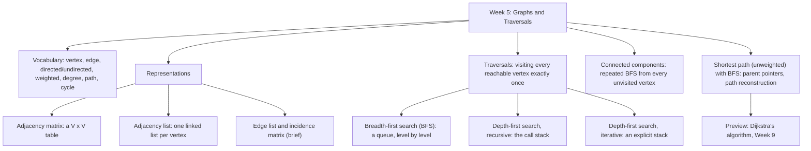

# Week 5 — Graphs and Traversals

*CEN207 Data Structures (formerly CE205) · Fall 2026–2027*

!!! abstract "This week"
    **Learning outcomes.** By the end of this week you will be able to explain, draw, and implement the
    **graph** — the data structure that finally lets us model relationships that are neither purely linear
    (arrays, lists, stacks, queues) nor purely branching-with-one-parent (trees). A graph is what is left when
    you allow *any* node to connect to *any* number of other nodes, in any pattern: road networks, social
    networks, the web, dependency graphs, and — as you already know without having named it — the tree itself,
    which is just a graph with an extra promise (exactly one path between any two nodes, no cycles). You will
    meet the two representations everyone actually uses (the **adjacency matrix** and the **adjacency list**),
    the two representations everyone should at least recognise (the **edge list** and the **incidence matrix**),
    and the trade-offs between them. You will then meet four traversal algorithms, all still built from ideas
    you already have in your hands from Weeks 1–4: **breadth-first search (BFS)**, using the queue from Week 3;
    **depth-first search (DFS)**, first recursively (the call stack from Week 3, again) and then iteratively
    (your own explicit stack, again); and **connected components**, which is nothing more than "run BFS again
    from every unvisited vertex". Finally you will use BFS to find the **shortest path** in an unweighted
    graph — a direct preview of Dijkstra's algorithm, which Week 9 builds on top of exactly this idea. These
    outcomes map to **LO.1** (explain fundamental data structures), **LO.2** (analyze algorithmic complexity),
    and **LO.7** (choose the right structure for a problem) of the course syllabus.

    **What you need already.** Week 1 gave you pointers and a picture of memory as numbered boxes. Week 2 gave
    you the linked list. Week 3 gave you the stack, the queue, and recursion. Week 4 gave you the tree, and —
    this is the key link — showed you that a tree is a connected graph with no cycles, so every traversal idea
    you learned for trees (recursive walks, an explicit stack, a queue for level order) transfers to graphs
    almost unchanged. The one genuinely new problem a general graph introduces is that it can have **cycles**
    and can be **disconnected**, so "visit every node exactly once" now needs a `visited` marker that trees,
    with their built-in one-parent guarantee, never required.

    **Time plan for a 3-hour session.** Vocabulary, inception, and history (~25 min) · representations: the
    adjacency matrix and the adjacency list, with a memory/time comparison (~35 min) · short break · breadth-
    first search (~30 min) · depth-first search, recursive then iterative (~40 min) · connected components
    (~20 min) · shortest path with BFS (~20 min) · wrap-up and self-check (~10 min).

## 0. Before we start

### 0.1 What you already know

Four ideas from the last four weeks carry almost all of this week's weight. Let's make sure they are solid.

**From Week 1 — pointers and memory.** A node is a `struct` holding a value plus pointers to other nodes. In a
linked list that struct has one `next` pointer; in a tree it has two or more (`left`, `right`, or a `children`
array). A graph relaxes this even further: a vertex can point to *any number* of other vertices, in *any*
pattern, and — unlike a tree — two different vertices can both point to the *same* third vertex, and a path can
loop back on itself.

**From Week 2 — linked lists.** The **adjacency list**, the representation this week leans on most, is
literally an array of linked lists: one linked list per vertex, holding that vertex's neighbours. If you can
`append` to a linked list (Week 2), you already know how to build an adjacency list.

**From Week 3 — the stack, the queue, and recursion.** Breadth-first search is exactly the level-order
traversal you wrote for trees in Week 4, generalised: it uses the same array/circular queue from Week 3,
enqueuing and dequeuing vertices instead of tree nodes. Depth-first search is exactly preorder traversal,
generalised: written recursively it *is* the call stack from Week 3 doing the bookkeeping; written iteratively
it uses the exact explicit stack you built by hand in Week 3, just holding vertices instead of numbers.

**From Week 4 — trees.** A tree is a connected, undirected graph with no cycles and exactly *n* − 1 edges for
*n* vertices. Every traversal you wrote for a tree — recursive, iterative-with-a-stack, level-order-with-a-
queue — is a special case of a graph traversal where the "no cycle, one parent" guarantee happens to make a
`visited` array unnecessary. This week removes that guarantee, and you will see exactly why `visited` becomes
essential the moment it is gone.

If any of this feels new rather than "oh right, I remember", five minutes with the Week 1–4 notes before
continuing will pay for itself many times over — everything below assumes it.

### 0.2 The map of this week



Every box gets its own section below, most with a short step-by-step animation, a complete C and Java program,
and a note on complexity and common mistakes.

## 1. Why graphs? Inception, history, and intuition

### 1.1 A question to start

Open a road map. Cities are connected by roads; some roads run one way, most run both ways; some pairs of
cities have no direct road between them at all, and you might need to pass through three other cities to get
from one to another. Or open a social network: people are connected by "follows", which can be one-directional
(you follow a celebrity who does not follow you back) or mutual. Or think of a university's course catalogue:
"CEN206 requires CEN207" is a directed link, and some courses require several others before you can take them.
None of these are lists (there is no single "next"), and none of them are trees (a city can be reached from
many other cities, not from just one parent, and the roads can form loops). What is the most general structure
that captures "some things, connected to some other things, in any pattern at all, cycles allowed"? That
structure is a **graph**, and — as Week 4 already told you — a tree is simply a graph with two extra promises
kept: connected, and no cycles.

### 1.2 A short history: Euler and the seven bridges of Königsberg

Graph theory has an unusually precise birthday. In 1736, the Swiss mathematician **Leonhard Euler** was asked
a question about the city of Königsberg (in Prussia at the time; today Kaliningrad, Russia): the city was built
around the river Pregel, which the seven bridges of the city crossed to connect two islands and two riverbanks.
The puzzle was whether a walker could cross every one of the seven bridges exactly once and return to the
starting point. Euler proved that it was *impossible* — and, more importantly for us, he proved it not by
trying every route by hand, but by abstracting the city down to its essence: he represented each landmass as a
point and each bridge as a line connecting two points, discarding every irrelevant detail (distances, bridge
widths, the shape of the islands). That abstraction — points connected by lines — is the graph, and Euler's
1736 paper, *Solutio problematis ad geometriam situs pertinentis* ("The solution of a problem relating to the
geometry of position"), is recognised as the founding paper of graph theory. The general rule Euler proved
along the way (such a walk exists if and only if zero or two landmasses have an odd number of bridges) is still
taught today as the criterion for an **Eulerian path**.

For two centuries afterward, graphs remained mostly a tool for mathematicians. Their systematic use *inside*
computing — as an explicit data structure with algorithms operating on it in a program — grew through the
twentieth century alongside the algorithms this week teaches: **Edward F. Moore** described what is essentially
breadth-first search in 1959, in a paper about finding the shortest route through a maze; **C. Y. Lee**
published a closely related breadth-first algorithm in 1961 for routing wires on a circuit board (still called
the "Lee algorithm" in that field); and **Robert Tarjan**'s 1972 paper *Depth-First Search and Linear Graph
Algorithms* turned depth-first search from a natural, informal idea into a precisely analysed algorithm with
the discovery/finish times and edge classification you will use later this week — and showed that it could
solve several important graph problems in linear time.

### 1.3 Intuition and the two families of algorithms

Once a network is represented as a graph, two questions come up constantly: *"can I get from A to B at all,
and if so, how?"* (a **traversal** question — BFS and DFS, this week) and *"what is the **best** way from A to
B?"* under some notion of cost (a **shortest-path** question — BFS again, for the special unweighted case this
week, and Dijkstra's and other weighted algorithms in Week 9). Keeping these two questions distinct will save
you confusion for the rest of the course: BFS and DFS answer "reachable or not, and by which route", while the
weighted shortest-path algorithms in Week 9 answer "reachable by which *cheapest* route".

## 2. Vocabulary

A **graph** `G = (V, E)` is a set of **vertices** (also called **nodes**) `V` together with a set of **edges**
`E`, where each edge connects a pair of vertices. That is the entire definition — everything else below is
vocabulary for describing particular *kinds* of graphs and particular *features* a graph can have.

| Term | Meaning |
| --- | --- |
| **Vertex** (node) | One of the "things" in the graph — a city, a person, a course. |
| **Edge** | A connection between two vertices — a road, a follow, a prerequisite. |
| **Directed graph** | Every edge has a direction: `A -> B` is not the same as `B -> A`. Drawn with an arrowhead. |
| **Undirected graph** | Every edge can be used in either direction: `A - B` and `B - A` are the same edge. |
| **Weighted graph** | Every edge carries a number (the **weight**) — a distance, a cost, a capacity. |
| **Unweighted graph** | Edges carry no number; they only say "connected" or "not connected". |
| **Degree** (undirected) | The number of edges touching a vertex. |
| **In-degree** / **out-degree** (directed) | The number of edges pointing *into* / *out of* a vertex. |
| **Path** | A sequence of edges leading from one vertex to another, with no vertex repeated. |
| **Cycle** | A path that returns to the vertex it started from. |
| **Connected** (undirected) | Every vertex can reach every other vertex. |
| **Connected component** | A maximal set of vertices reachable from one another. |
| **Self-loop** | An edge whose two endpoints are the *same* vertex. |
| **Parallel edges** (multi-edge) | More than one edge between the same two vertices. A **multigraph** allows these. |
| **Simple graph** | A graph with no self-loops and no parallel edges — the "default" kind most algorithms assume. |
| **Sparse** vs. **dense** | A sparse graph has `E` close to `V` (few edges per vertex); a dense graph has `E` close to `V^2` (most pairs connected). |

Play the animation to see every one of these terms pointed at on an actual graph, one step at a time.

<iframe class="dsanim" src="../anim/graph-terminology.html" title="Graph vocabulary: vertex, edge, degree, path, cycle, connected component" loading="lazy"></iframe>
<div class="dsanim-baski" markdown>

</div>

In the picker, also try **8 vertices, directed: two cycles, a self-loop, a multi-edge and 2 weak components**
(hard) and the edge cases **an 11-vertex chain: no cycle, unweighted, connected** and **a single vertex (shown
with a self-loop)** — or press 🎲 for random data at four difficulty levels, or type your own graph as a list of
edges (`A-B` undirected, `A>B` directed, `A-B:4` weighted).

### 2.1 The graph in memory, and the code

The code below builds a `Graph` as an adjacency list — a struct holding, for each vertex, the head of a linked
list of its neighbours (Week 2's linked list again) — and computes each vertex's degree from it. `out_degree`
walks one vertex's list and counts it; in a directed graph, `in_degree` has no shortcut and must scan every
other vertex's list looking for edges that land on `v`.

=== "C"

    ```c
    #define MAX_V   16
    #define MAX_LBL 4

    typedef struct Edge {
        int to;               /* index of the other endpoint */
        int weight;           /* 1 if the graph is unweighted */
        struct Edge *next;
    } Edge;

    typedef struct Graph {
        char label[MAX_V][MAX_LBL];
        Edge *adj[MAX_V];     /* adjacency list, one linked list per vertex */
        int vertex_count;
        int directed;         /* 0 = undirected, 1 = directed */
    } Graph;

    int out_degree(Graph *g, int v) {
        int d = 0;
        for (Edge *e = g->adj[v]; e != NULL; e = e->next)
            d++;              /* undirected: this already counts BOTH ends written once each -> degree */
        return d;
    }

    int in_degree(Graph *g, int v) {   /* directed only: how many edges point INTO v */
        int d = 0;
        for (int u = 0; u < g->vertex_count; u++)
            for (Edge *e = g->adj[u]; e != NULL; e = e->next)
                if (e->to == v) d++;
        return d;
    }
    ```

=== "Java"

    ```java
    static final int MAX_V = 16;

    class Edge {
        int to;               // index of the other endpoint
        int weight;           // 1 if the graph is unweighted
        Edge next;
    }

    class Graph {
        String[] label = new String[MAX_V];
        Edge[] adj = new Edge[MAX_V];   // adjacency list, one linked list per vertex
        int vertexCount;
        boolean directed;
    }

    static int outDegree(Graph g, int v) {
        int d = 0;
        for (Edge e = g.adj[v]; e != null; e = e.next)
            d++;              // undirected: this already counts BOTH ends written once each -> degree
        return d;
    }

    static int inDegree(Graph g, int v) {   // directed only: how many edges point INTO v
        int d = 0;
        for (int u = 0; u < g.vertexCount; u++)
            for (Edge e = g.adj[u]; e != null; e = e.next)
                if (e.to == v) d++;
        return d;
    }
    ```

    The full program (`code/week-05/c/graph_terminology.c` / `code/week-05/java/GraphTerminology.java`) builds
    a graph from an edge list, then reports vertex/edge counts, self-loops, multi-edges, degree (or in/out-
    degree), connected components, and whether a cycle exists — for four scenarios matching the animation's
    presets.

## 2. Graph Representations

Once we understand the abstract concept of a graph, we need a way to store it in a computer's memory so our algorithms can traverse it. The choice of representation dictates the time complexity of fundamental operations: checking if an edge exists, finding all neighbors of a vertex, and iterating over all edges.

There are three primary ways to represent a graph:

### 2.1. Adjacency Matrix

An **adjacency matrix** is a 2D array (matrix) of size $V \times V$, where $V$ is the number of vertices.
Let the 2D array be `adj[][]`. A slot `adj[i][j] = 1` indicates that there is an edge from vertex $i$ to vertex $j$. If the graph is undirected, the matrix is symmetric (`adj[i][j] == adj[j][i]`). If the graph is weighted, `adj[i][j]` can store the weight of the edge instead of just `1`.

**Pros:**
- Checking if an edge exists between $i$ and $j$ takes $O(1)$ time.
- Adding or removing an edge takes $O(1)$ time.

**Cons:**
- Consumes $O(V^2)$ space, which is highly inefficient for sparse graphs (graphs with few edges).
- Iterating over all neighbors of a vertex takes $O(V)$ time, even if the vertex has only 1 neighbor.

### 2.2. Adjacency List

An **adjacency list** represents a graph as an array of linked lists.
The size of the array is $V$. The $i$-th element of the array is a linked list containing all the neighbors of vertex $i$ (i.e., all vertices $j$ such that there is an edge from $i$ to $j$). For weighted graphs, each node in the linked list can store both the destination vertex and the edge weight.

**Pros:**
- Space efficient for sparse graphs. It takes $O(V + E)$ space.
- Finding all neighbors of a vertex is extremely fast: $O(\text{degree}(i))$.

**Cons:**
- Checking if there is an edge between $i$ and $j$ takes $O(\text{degree}(i))$ time, as we must traverse the linked list.

### 2.3. Incidence Matrix

An **incidence matrix** is a 2D array of size $V \times E$, where $V$ is the number of vertices and $E$ is the number of edges.
- `matrix[i][j] = 1` if vertex $i$ is connected to edge $j$.
- In a directed graph, `matrix[i][j] = -1` could mean edge $j$ leaves vertex $i$, and `1` means it enters vertex $i$.

This representation is rarely used in typical algorithmic programming but is heavily used in algebraic graph theory and electrical circuit analysis.

---

## 3. Graph Traversals

Graph traversal means visiting every vertex and edge in a well-defined order. Because graphs can have cycles, traversals must keep track of which vertices have already been visited to avoid infinite loops.

### 3.1. Breadth-First Search (BFS)

**Breadth-First Search (BFS)** explores the graph level by level. Starting from a source vertex, it first visits all its immediate neighbors, then all the neighbors of those neighbors, and so on.

**Key Data Structure:** Queue.

**Algorithm:**
1. Initialize a boolean array `visited[]` to `false` for all vertices.
2. Create an empty queue and enqueue the starting vertex. Mark it as visited.
3. While the queue is not empty:
   - Dequeue a vertex $u$ and process it.
   - For every unvisited neighbor $v$ of $u$:
     - Mark $v$ as visited.
     - Enqueue $v$.

**Time Complexity:** $O(V + E)$ when using an adjacency list.

**Applications:**
- Finding the shortest path on an unweighted graph.
- Web crawling.
- Social networking (finding people 1 connection away, 2 connections away, etc.).

### 3.2. Depth-First Search (DFS)

**Depth-First Search (DFS)** dives as deep as possible along a branch before backtracking.

**Key Data Structure:** Stack (usually implicitly via the function call stack using recursion).

**Algorithm:**
1. Mark the current vertex as visited and process it.
2. Recursively call the DFS function for every unvisited neighbor of the current vertex.

**Time Complexity:** $O(V + E)$ when using an adjacency list.

**Applications:**
- Finding connected components.
- Topological sorting.
- Solving mazes and puzzles.

### 3.3. Advanced DFS/BFS Variations

- **Depth-Limited Search (DLS):** A variation of DFS that stops exploring when a predefined depth limit is reached. Useful for infinite graphs or huge state spaces where standard DFS would get stuck.
- **Iterative Deepening DFS (IDDFS):** Repeatedly runs DLS with increasing depth limits (0, 1, 2...). It combines the space efficiency of DFS with the completeness and optimal-depth guarantee of BFS.
- **Uniform Cost Search (UCS):** Also known as Dijkstra's Algorithm (without a heuristic). It uses a priority queue instead of a regular queue to explore the lowest-cost paths first in a weighted graph.
- **Bidirectional Search:** Runs two simultaneous searches—one forward from the initial state and one backward from the goal state—stopping when the two searches meet in the middle. It dramatically reduces the search space size.

---

## 4. Shortest Paths and State Space Search

### 4.1. The Water Jug Problem

Many classic puzzles can be modeled as graph traversal problems, where each **vertex is a state** and each **edge is a valid move**. 

**Problem Statement:** You have two jugs, one holding $A$ liters and the other holding $B$ liters. Neither has any measuring marks. You have a pump that can fill the jugs with water. How can you measure exactly $C$ liters of water?

**Graph Modeling:**
- **State (Vertex):** A tuple $(x, y)$ representing the current amount of water in jug 1 and jug 2.
- **Initial State:** $(0, 0)$.
- **Goal State:** $(C, y)$ or $(x, C)$ for any valid $x, y$.
- **Transitions (Edges):** From any state $(x, y)$, you can perform the following valid operations:
  1. Fill Jug 1: $(A, y)$
  2. Fill Jug 2: $(x, B)$
  3. Empty Jug 1: $(0, y)$
  4. Empty Jug 2: $(x, 0)$
  5. Pour Jug 1 into Jug 2 until Jug 2 is full or Jug 1 is empty.
  6. Pour Jug 2 into Jug 1 until Jug 1 is full or Jug 2 is empty.

By using **BFS** on this implicit graph, we can find the shortest sequence of steps to reach the target amount of water. Because each operation has a uniform cost of 1 step, BFS guarantees the optimal (shortest) solution.

## Self-check quiz

??? success "1. What is the time complexity of checking if an edge exists between two vertices in an adjacency matrix?"
    O(1). We just need to check `matrix[u][v]`.

??? success "2. Which graph traversal algorithm uses a Queue?"
    Breadth-First Search (BFS).

??? success "3. Why do we need a `visited` array in graph traversals?"
    Because graphs can contain cycles. Without a `visited` array, the traversal might visit the same nodes repeatedly, causing an infinite loop.

??? success "4. What is the space complexity of an Adjacency List for a graph with $V$ vertices and $E$ edges?"
    O(V + E).

??? success "5. Which search strategy is best for finding the shortest path in an unweighted graph?"
    Breadth-First Search (BFS).

## Looking ahead

Next week, we will focus on **Search and Hashing**, exploring how to store and retrieve data extremely fast (in $O(1)$ time) without traversing large structures. We will learn about hash functions, collision resolution strategies (chaining and open addressing), and how these principles power the dictionaries and sets you use every day in modern programming languages.
