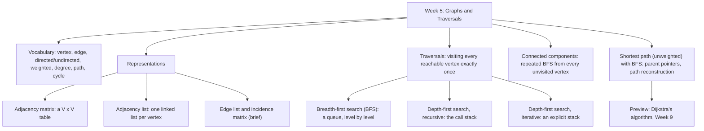

# Week 5 — Graphs and Traversals

*CEN207 Data Structures (formerly CE205) · Fall 2026–2027*

<!-- materials:start -->

<div class="materials" markdown>

[:material-file-pdf-box: Lecture notes (PDF)](cen207-week-5-notes.pdf){ .md-button download="cen207-week-5-notes.pdf" }
[:material-file-word-box: Lecture notes (DOCX)](cen207-week-5-notes.docx){ .md-button download="cen207-week-5-notes.docx" }
[:material-presentation: Slides (PDF)](cen207-week-5-slides.pdf){ .md-button download="cen207-week-5-slides.pdf" }
[:material-microsoft-powerpoint: Slides (PPTX)](cen207-week-5-slides.pptx){ .md-button download="cen207-week-5-slides.pptx" }
[:material-language-html5: Slides (HTML, offline)](cen207-week-5-slides.html){ .md-button download="cen207-week-5-slides.html" }
[:material-folder-zip: Download all (ZIP)](cen207-week-5-materials.zip){ .md-button download="cen207-week-5-materials.zip" }
[:material-fullscreen: Open slides full screen](cen207-week-5-slides.html){ .md-button .md-button--primary target=_blank }

</div>

<div class="deck-frame">
<iframe src="../cen207-week-5-slides.html" title="Week 5 — Graphs and Traversals" loading="lazy" allowfullscreen></iframe>
</div>

<p class="deck-hint">Click inside the slides and use the arrow keys; use the button at the bottom right of the slides, or the "Open slides full screen" link above, for full screen.</p>

<!-- materials:end -->

!!! abstract "This week"
    **Learning outcomes.** By the end of this week you will be able to explain, draw, and implement the
    **graph** — the data structure that finally lets us model relationships that are neither purely linear
    (arrays, lists, stacks, queues) nor purely branching-with-one-parent (trees). A graph is what is left when
    you allow *any* node to connect to *any* number of other nodes, in any pattern: road networks, social
    networks, the web, dependency graphs, and — as you already know without having named it — the tree itself,
    which is just a graph with an extra promise (exactly one path between any two nodes, no cycles). You will
    meet the two representations everyone actually uses (the **adjacency matrix** and the **adjacency list**),
    the two representations everyone should at least recognise (the **edge list** and the **incidence matrix**),
    and the trade-offs between them. You will then meet four traversal algorithms, all still built from ideas
    you already have in your hands from Weeks 1–4: **breadth-first search (BFS)**, using the queue from Week 3;
    **depth-first search (DFS)**, first recursively (the call stack from Week 3, again) and then iteratively
    (your own explicit stack, again); and **connected components**, which is nothing more than "run BFS again
    from every unvisited vertex". Finally you will use BFS to find the **shortest path** in an unweighted
    graph — a direct preview of Dijkstra's algorithm, which Week 9 builds on top of exactly this idea. These
    outcomes map to **LO.1** (explain fundamental data structures), **LO.2** (analyze algorithmic complexity),
    and **LO.7** (choose the right structure for a problem) of the course syllabus.

    **What you need already.** Week 1 gave you pointers and a picture of memory as numbered boxes. Week 2 gave
    you the linked list. Week 3 gave you the stack, the queue, and recursion. Week 4 gave you the tree, and —
    this is the key link — showed you that a tree is a connected graph with no cycles, so every traversal idea
    you learned for trees (recursive walks, an explicit stack, a queue for level order) transfers to graphs
    almost unchanged. The one genuinely new problem a general graph introduces is that it can have **cycles**
    and can be **disconnected**, so "visit every node exactly once" now needs a `visited` marker that trees,
    with their built-in one-parent guarantee, never required.

    **Time plan for a 3-hour session.** Vocabulary, inception, and history (~25 min) · representations: the
    adjacency matrix and the adjacency list, with a memory/time comparison (~35 min) · short break · breadth-
    first search (~30 min) · depth-first search, recursive then iterative (~40 min) · connected components
    (~20 min) · shortest path with BFS (~20 min) · wrap-up and self-check (~10 min).

## 0. Before we start

### 0.1 What you already know

Four ideas from the last four weeks carry almost all of this week's weight. Let's make sure they are solid.

**From Week 1 — pointers and memory.** A node is a `struct` holding a value plus pointers to other nodes. In a
linked list that struct has one `next` pointer; in a tree it has two or more (`left`, `right`, or a `children`
array). A graph relaxes this even further: a vertex can point to *any number* of other vertices, in *any*
pattern, and — unlike a tree — two different vertices can both point to the *same* third vertex, and a path can
loop back on itself.

**From Week 2 — linked lists.** The **adjacency list**, the representation this week leans on most, is
literally an array of linked lists: one linked list per vertex, holding that vertex's neighbours. If you can
`append` to a linked list (Week 2), you already know how to build an adjacency list.

**From Week 3 — the stack, the queue, and recursion.** Breadth-first search is exactly the level-order
traversal you wrote for trees in Week 4, generalised: it uses the same array/circular queue from Week 3,
enqueuing and dequeuing vertices instead of tree nodes. Depth-first search is exactly preorder traversal,
generalised: written recursively it *is* the call stack from Week 3 doing the bookkeeping; written iteratively
it uses the exact explicit stack you built by hand in Week 3, just holding vertices instead of numbers.

**From Week 4 — trees.** A tree is a connected, undirected graph with no cycles and exactly *n* − 1 edges for
*n* vertices. Every traversal you wrote for a tree — recursive, iterative-with-a-stack, level-order-with-a-
queue — is a special case of a graph traversal where the "no cycle, one parent" guarantee happens to make a
`visited` array unnecessary. This week removes that guarantee, and you will see exactly why `visited` becomes
essential the moment it is gone.

If any of this feels new rather than "oh right, I remember", five minutes with the Week 1–4 notes before
continuing will pay for itself many times over — everything below assumes it.

### 0.2 The map of this week



Every box gets its own section below, most with a short step-by-step animation, a complete C and Java program,
and a note on complexity and common mistakes.

## 1. Why graphs? Inception, history, and intuition

### 1.1 A question to start

Open a road map. Cities are connected by roads; some roads run one way, most run both ways; some pairs of
cities have no direct road between them at all, and you might need to pass through three other cities to get
from one to another. Or open a social network: people are connected by "follows", which can be one-directional
(you follow a celebrity who does not follow you back) or mutual. Or think of a university's course catalogue:
"CEN206 requires CEN207" is a directed link, and some courses require several others before you can take them.
None of these are lists (there is no single "next"), and none of them are trees (a city can be reached from
many other cities, not from just one parent, and the roads can form loops). What is the most general structure
that captures "some things, connected to some other things, in any pattern at all, cycles allowed"? That
structure is a **graph**, and — as Week 4 already told you — a tree is simply a graph with two extra promises
kept: connected, and no cycles.

### 1.2 A short history: Euler and the seven bridges of Königsberg

Graph theory has an unusually precise birthday. In 1736, the Swiss mathematician **Leonhard Euler** was asked
a question about the city of Königsberg (in Prussia at the time; today Kaliningrad, Russia): the city was built
around the river Pregel, which the seven bridges of the city crossed to connect two islands and two riverbanks.
The puzzle was whether a walker could cross every one of the seven bridges exactly once and return to the
starting point. Euler proved that it was *impossible* — and, more importantly for us, he proved it not by
trying every route by hand, but by abstracting the city down to its essence: he represented each landmass as a
point and each bridge as a line connecting two points, discarding every irrelevant detail (distances, bridge
widths, the shape of the islands). That abstraction — points connected by lines — is the graph, and Euler's
1736 paper, *Solutio problematis ad geometriam situs pertinentis* ("The solution of a problem relating to the
geometry of position"), is recognised as the founding paper of graph theory. The general rule Euler proved
along the way (such a walk exists if and only if zero or two landmasses have an odd number of bridges) is still
taught today as the criterion for an **Eulerian path**.

For two centuries afterward, graphs remained mostly a tool for mathematicians. Their systematic use *inside*
computing — as an explicit data structure with algorithms operating on it in a program — grew through the
twentieth century alongside the algorithms this week teaches: **Edward F. Moore** described what is essentially
breadth-first search in 1959, in a paper about finding the shortest route through a maze; **C. Y. Lee**
published a closely related breadth-first algorithm in 1961 for routing wires on a circuit board (still called
the "Lee algorithm" in that field); and **Robert Tarjan**'s 1972 paper *Depth-First Search and Linear Graph
Algorithms* turned depth-first search from a natural, informal idea into a precisely analysed algorithm with
the discovery/finish times and edge classification you will use later this week — and showed that it could
solve several important graph problems in linear time.

### 1.3 Intuition and the two families of algorithms

Once a network is represented as a graph, two questions come up constantly: *"can I get from A to B at all,
and if so, how?"* (a **traversal** question — BFS and DFS, this week) and *"what is the **best** way from A to
B?"* under some notion of cost (a **shortest-path** question — BFS again, for the special unweighted case this
week, and Dijkstra's and other weighted algorithms in Week 9). Keeping these two questions distinct will save
you confusion for the rest of the course: BFS and DFS answer "reachable or not, and by which route", while the
weighted shortest-path algorithms in Week 9 answer "reachable by which *cheapest* route".

## 2. Vocabulary

A **graph** `G = (V, E)` is a set of **vertices** (also called **nodes**) `V` together with a set of **edges**
`E`, where each edge connects a pair of vertices. That is the entire definition — everything else below is
vocabulary for describing particular *kinds* of graphs and particular *features* a graph can have.

| Term | Meaning |
| --- | --- |
| **Vertex** (node) | One of the "things" in the graph — a city, a person, a course. |
| **Edge** | A connection between two vertices — a road, a follow, a prerequisite. |
| **Directed graph** | Every edge has a direction: `A -> B` is not the same as `B -> A`. Drawn with an arrowhead. |
| **Undirected graph** | Every edge can be used in either direction: `A - B` and `B - A` are the same edge. |
| **Weighted graph** | Every edge carries a number (the **weight**) — a distance, a cost, a capacity. |
| **Unweighted graph** | Edges carry no number; they only say "connected" or "not connected". |
| **Degree** (undirected) | The number of edges touching a vertex. |
| **In-degree** / **out-degree** (directed) | The number of edges pointing *into* / *out of* a vertex. |
| **Path** | A sequence of edges leading from one vertex to another, with no vertex repeated. |
| **Cycle** | A path that returns to the vertex it started from. |
| **Connected** (undirected) | Every vertex can reach every other vertex. |
| **Connected component** | A maximal set of vertices reachable from one another. |
| **Self-loop** | An edge whose two endpoints are the *same* vertex. |
| **Parallel edges** (multi-edge) | More than one edge between the same two vertices. A **multigraph** allows these. |
| **Simple graph** | A graph with no self-loops and no parallel edges — the "default" kind most algorithms assume. |
| **Sparse** vs. **dense** | A sparse graph has `E` close to `V` (few edges per vertex); a dense graph has `E` close to `V^2` (most pairs connected). |

Play the animation to see every one of these terms pointed at on an actual graph, one step at a time.

<iframe class="dsanim" src="../anim/graph-terminology.html" title="Graph vocabulary: vertex, edge, degree, path, cycle, connected component" loading="lazy"></iframe>
<div class="dsanim-baski" markdown>

</div>

In the picker, also try **8 vertices, directed: multiple cycles, a self-loop, a multi-edge and 2 weak components**
(hard) and the edge cases **an 11-vertex chain: no cycle, unweighted, connected** and **a single vertex (shown
with a self-loop)** — or press 🎲 for random data at four difficulty levels, or type your own graph as a list of
edges (`A-B` undirected, `A>B` directed, `A-B:4` weighted).

### 2.1 The graph in memory, and the code

The code below builds a `Graph` as an adjacency list — a struct holding, for each vertex, the head of a linked
list of its neighbours (Week 2's linked list again) — and computes each vertex's degree from it. `out_degree`
walks one vertex's list and counts it; in a directed graph, `in_degree` has no shortcut and must scan every
other vertex's list looking for edges that land on `v`.

=== "C"

    ```c
    #define MAX_V   16
    #define MAX_LBL 4

    typedef struct Edge {
        int to;               /* index of the other endpoint */
        int weight;           /* 1 if the graph is unweighted */
        struct Edge *next;
    } Edge;

    typedef struct Graph {
        char label[MAX_V][MAX_LBL];
        Edge *adj[MAX_V];     /* adjacency list, one linked list per vertex */
        int vertex_count;
        int directed;         /* 0 = undirected, 1 = directed */
    } Graph;

    int out_degree(Graph *g, int v) {
        int d = 0;
        for (Edge *e = g->adj[v]; e != NULL; e = e->next)
            d++;              /* undirected: this already counts BOTH ends written once each -> degree */
        return d;
    }

    int in_degree(Graph *g, int v) {   /* directed only: how many edges point INTO v */
        int d = 0;
        for (int u = 0; u < g->vertex_count; u++)
            for (Edge *e = g->adj[u]; e != NULL; e = e->next)
                if (e->to == v) d++;
        return d;
    }
    ```

=== "Java"

    ```java
    static final int MAX_V = 16;

    class Edge {
        int to;               // index of the other endpoint
        int weight;           // 1 if the graph is unweighted
        Edge next;
    }

    class Graph {
        String[] label = new String[MAX_V];
        Edge[] adj = new Edge[MAX_V];   // adjacency list, one linked list per vertex
        int vertexCount;
        boolean directed;
    }

    static int outDegree(Graph g, int v) {
        int d = 0;
        for (Edge e = g.adj[v]; e != null; e = e.next)
            d++;              // undirected: this already counts BOTH ends written once each -> degree
        return d;
    }

    static int inDegree(Graph g, int v) {   // directed only: how many edges point INTO v
        int d = 0;
        for (int u = 0; u < g.vertexCount; u++)
            for (Edge e = g.adj[u]; e != null; e = e.next)
                if (e.to == v) d++;
        return d;
    }
    ```

    The full program (`code/week-05/c/graph_terminology.c` / `code/week-05/java/GraphTerminology.java`) builds
    a graph from an edge list, then reports vertex/edge counts, self-loops, multi-edges, degree (or in/out-
    degree), connected components, and whether a cycle exists — for four scenarios matching the animation's
    presets.

??? example "Full program: `graph_terminology.c` / `GraphTerminology.java`"

    === "C"

        ```c
        /* Week 5 -- Graphs and Traversals
         * Graph vocabulary: vertex, edge, directed/undirected, weighted, degree,
         * in/out-degree, self-loop, parallel (multi-) edge, connected component,
         * cycle. Builds a Graph as an adjacency list (Edge structs, one linked
         * list per vertex) and reports these properties for each scenario.
         * CEN207 Data Structures (CS50-style lecture notes)
         */
        #include <stdio.h>
        #include <string.h>
        #include <stdlib.h>

        #define MAX_V   16
        #define MAX_LBL 4

        typedef struct Edge {
            int to;               /* index of the other endpoint */
            int weight;           /* 1 if the graph is unweighted */
            struct Edge *next;
        } Edge;

        typedef struct Graph {
            char label[MAX_V][MAX_LBL];
            Edge *adj[MAX_V];     /* adjacency list, one linked list per vertex */
            int vertex_count;
            int directed;         /* 0 = undirected, 1 = directed */
        } Graph;

        int out_degree(Graph *g, int v) {
            int d = 0;
            for (Edge *e = g->adj[v]; e != NULL; e = e->next)
                d++;              /* undirected: this already counts BOTH ends written once each -> degree */
            return d;
        }

        int in_degree(Graph *g, int v) {   /* directed only: how many edges point INTO v */
            int d = 0;
            for (int u = 0; u < g->vertex_count; u++)
                for (Edge *e = g->adj[u]; e != NULL; e = e->next)
                    if (e->to == v) d++;
            return d;
        }

        /* ---- construction helpers: not part of the lecture code panel above, but
         * needed to actually build a Graph from a list of (label, label, weight)
         * edges the way the animation's input box accepts them. ---- */

        typedef struct { const char *a, *b; int weight; } EdgeIn;

        static int find_or_add_vertex(Graph *g, const char *lbl) {
            for (int i = 0; i < g->vertex_count; i++)
                if (strcmp(g->label[i], lbl) == 0) return i;
            strncpy(g->label[g->vertex_count], lbl, MAX_LBL - 1);
            g->label[g->vertex_count][MAX_LBL - 1] = '\0';
            g->adj[g->vertex_count] = NULL;
            return g->vertex_count++;
        }

        static void append(Graph *g, int v, int neighbour, int weight) {
            Edge *n = malloc(sizeof(Edge));
            n->to = neighbour;
            n->weight = weight;
            n->next = NULL;
            if (g->adj[v] == NULL) { g->adj[v] = n; return; }
            Edge *cur = g->adj[v];
            while (cur->next != NULL) cur = cur->next;
            cur->next = n;
        }

        static void add_edge_labelled(Graph *g, const char *a, const char *b, int weight) {
            int ia = find_or_add_vertex(g, a), ib = find_or_add_vertex(g, b);
            append(g, ia, ib, weight);
            if (!g->directed && ia != ib) append(g, ib, ia, weight);
        }

        static void reset_graph(Graph *g, int directed) {
            g->vertex_count = 0;
            g->directed = directed;
            for (int i = 0; i < MAX_V; i++) g->adj[i] = NULL;
        }

        static void free_graph(Graph *g) {
            for (int i = 0; i < g->vertex_count; i++) {
                Edge *e = g->adj[i];
                while (e) { Edge *nx = e->next; free(e); e = nx; }
                g->adj[i] = NULL;
            }
        }

        /* ---- analysis: components (BFS, direction ignored) and cycle (DFS) ---- */

        static int undirected_neighbours(Graph *g, int v, int out[]) {
            int n = 0;
            for (Edge *e = g->adj[v]; e; e = e->next)
                if (e->to != v) out[n++] = e->to;             /* v's own out-edges (self-loops excluded here) */
            if (g->directed)
                for (int u = 0; u < g->vertex_count; u++)
                    if (u != v)
                        for (Edge *e = g->adj[u]; e; e = e->next)
                            if (e->to == v) out[n++] = u;      /* edges pointing INTO v, walked backwards */
            return n;
        }

        static int count_components(Graph *g, int comp_of[]) {
            int queue_data[MAX_V];
            for (int i = 0; i < g->vertex_count; i++) comp_of[i] = -1;
            int next_id = 0;
            for (int s = 0; s < g->vertex_count; s++) {
                if (comp_of[s] != -1) continue;
                int front = 0, rear = 0;
                comp_of[s] = next_id;
                queue_data[rear++] = s;
                while (front < rear) {
                    int u = queue_data[front++];
                    int nb[2 * MAX_V];
                    int n = undirected_neighbours(g, u, nb);
                    for (int i = 0; i < n; i++)
                        if (comp_of[nb[i]] == -1) { comp_of[nb[i]] = next_id; queue_data[rear++] = nb[i]; }
                }
                next_id++;
            }
            return next_id;
        }

        static int color[MAX_V];

        static int dfs_has_cycle(Graph *g, int u, int parent) {
            color[u] = 1;
            int skipped_parent = 0;
            for (Edge *e = g->adj[u]; e; e = e->next) {
                int v = e->to;
                if (v == u) return 1;                                        /* self-loop: trivially a cycle */
                if (!g->directed && v == parent && !skipped_parent) { skipped_parent = 1; continue; }
                if (color[v] == 0) { if (dfs_has_cycle(g, v, u)) return 1; }
                else if (color[v] == 1) return 1;                            /* back edge: an ancestor -> a cycle */
            }
            color[u] = 2;
            return 0;
        }

        static int has_cycle(Graph *g) {
            for (int i = 0; i < g->vertex_count; i++) color[i] = 0;
            for (int i = 0; i < g->vertex_count; i++)
                if (color[i] == 0 && dfs_has_cycle(g, i, -1)) return 1;
            return 0;
        }

        static void run_scenario(const char *label, int directed, EdgeIn edges[], int n) {
            printf("-- %s --\n", label);
            Graph g;
            reset_graph(&g, directed);
            for (int i = 0; i < n; i++) add_edge_labelled(&g, edges[i].a, edges[i].b, edges[i].weight);

            printf("%s, %d vertices, %d edges\n", directed ? "directed" : "undirected", g.vertex_count, n);

            int self_loops = 0;
            for (int i = 0; i < n; i++)
                if (strcmp(edges[i].a, edges[i].b) == 0) { printf("self-loop: %s-%s\n", edges[i].a, edges[i].b); self_loops++; }
            if (!self_loops) printf("self-loops: none\n");

            int multi_found = 0;
            for (int i = 0; i < n && !multi_found; i++) {
                if (strcmp(edges[i].a, edges[i].b) == 0) continue;
                for (int j = i + 1; j < n; j++) {
                    int same = directed
                        ? (strcmp(edges[i].a, edges[j].a) == 0 && strcmp(edges[i].b, edges[j].b) == 0)
                        : ((strcmp(edges[i].a, edges[j].a) == 0 && strcmp(edges[i].b, edges[j].b) == 0) ||
                           (strcmp(edges[i].a, edges[j].b) == 0 && strcmp(edges[i].b, edges[j].a) == 0));
                    if (same) { printf("multi-edge: %s%s%s (%d copies)\n", edges[i].a, directed ? ">" : "-", edges[i].b, 2); multi_found = 1; break; }
                }
            }
            if (!multi_found) printf("multi-edges: none\n");

            if (!directed) {
                printf("degree (list-length, via out-degree):");
                for (int i = 0; i < g.vertex_count; i++) printf(" %s=%d", g.label[i], out_degree(&g, i));
                printf("\n");
            } else {
                printf("in-degree: ");
                for (int i = 0; i < g.vertex_count; i++) printf(" %s=%d", g.label[i], in_degree(&g, i));
                printf("\n");
                printf("out-degree:");
                for (int i = 0; i < g.vertex_count; i++) printf(" %s=%d", g.label[i], out_degree(&g, i));
                printf("\n");
            }

            int comp_of[MAX_V];
            int comps = count_components(&g, comp_of);
            printf("connected components: %d\n", comps);

            int cyc = has_cycle(&g);
            printf("has cycle: %s\n", cyc ? "yes" : "no");

            free_graph(&g);
            printf("\n");
        }

        int main(void) {
            /* normal: 8 vertices, weighted, a cycle, a self-loop, a multi-edge and 2 components */
            EdgeIn normal[] = {
                {"A", "B", 3}, {"B", "C", 5}, {"C", "A", 2}, {"C", "D", 4},
                {"D", "E", 1}, {"E", "F", 6}, {"E", "F", 9}, {"D", "D", 7},
                {"G", "H", 2}, {"F", "C", 8}
            };
            run_scenario("normal: 8 vertices, weighted, a cycle, a self-loop, a multi-edge and 2 components", 0, normal, 10);

            /* hard: 8 vertices, directed, multiple cycles, a self-loop, a multi-edge and 2 weak components */
            EdgeIn hard[] = {
                {"P", "Q", 3}, {"Q", "R", 1}, {"R", "P", 4}, {"R", "S", 2},
                {"S", "T", 5}, {"T", "U", 1}, {"T", "U", 1}, {"U", "U", 6},
                {"Q", "S", 2}, {"S", "Q", 3}, {"V", "W", 2}, {"W", "V", 3}
            };
            run_scenario("hard: 8 vertices, directed, multiple cycles, a self-loop, a multi-edge and 2 weak components", 1, hard, 12);

            /* edge: an 11-vertex chain, no cycle, unweighted, connected */
            EdgeIn no_cycle[] = {
                {"V1", "V2", 1}, {"V2", "V3", 1}, {"V3", "V4", 1}, {"V4", "V5", 1}, {"V5", "V6", 1},
                {"V6", "V7", 1}, {"V7", "V8", 1}, {"V8", "V9", 1}, {"V9", "V10", 1}, {"V10", "V11", 1}
            };
            run_scenario("edge: an 11-vertex chain, no cycle, unweighted, connected", 0, no_cycle, 10);

            /* edge: a single vertex, shown with a self-loop */
            EdgeIn single[] = { {"A", "A", 1} };
            run_scenario("edge: a single vertex, shown with a self-loop", 0, single, 1);

            return 0;
        }
        ```

    === "Java"

        ```java
        /* Week 5 -- Graphs and Traversals
         * Graph vocabulary: vertex, edge, directed/undirected, weighted, degree,
         * in/out-degree, self-loop, parallel (multi-) edge, connected component,
         * cycle. Builds a Graph as an adjacency list (Edge nodes, one linked list
         * per vertex) and reports these properties for each scenario.
         * CEN207 Data Structures (CS50-style lecture notes)
         */
        public class GraphTerminology {
            static final int MAX_V = 16;

            static class Edge {
                int to;                 // index of the other endpoint
                int weight;              // 1 if the graph is unweighted
                Edge next;
            }

            static class Graph {
                String[] label = new String[MAX_V];
                Edge[] adj = new Edge[MAX_V];   // adjacency list, one linked list per vertex
                int vertexCount;
                boolean directed;
            }

            static int outDegree(Graph g, int v) {
                int d = 0;
                for (Edge e = g.adj[v]; e != null; e = e.next)
                    d++;              // undirected: this already counts BOTH ends written once each -> degree
                return d;
            }

            static int inDegree(Graph g, int v) {   // directed only: how many edges point INTO v
                int d = 0;
                for (int u = 0; u < g.vertexCount; u++)
                    for (Edge e = g.adj[u]; e != null; e = e.next)
                        if (e.to == v) d++;
                return d;
            }

            // ---- construction helpers: not part of the lecture code panel above, but
            // needed to actually build a Graph from a list of (label, label, weight)
            // edges the way the animation's input box accepts them. ----

            static class EdgeIn {
                String a, b;
                int weight;
                EdgeIn(String a, String b, int weight) { this.a = a; this.b = b; this.weight = weight; }
            }

            static int findOrAddVertex(Graph g, String lbl) {
                for (int i = 0; i < g.vertexCount; i++)
                    if (g.label[i].equals(lbl)) return i;
                g.label[g.vertexCount] = lbl;
                g.adj[g.vertexCount] = null;
                return g.vertexCount++;
            }

            static void append(Graph g, int v, int neighbour, int weight) {
                Edge n = new Edge();
                n.to = neighbour;
                n.weight = weight;
                n.next = null;
                if (g.adj[v] == null) { g.adj[v] = n; return; }
                Edge cur = g.adj[v];
                while (cur.next != null) cur = cur.next;
                cur.next = n;
            }

            static void addEdgeLabelled(Graph g, String a, String b, int weight) {
                int ia = findOrAddVertex(g, a), ib = findOrAddVertex(g, b);
                append(g, ia, ib, weight);
                if (!g.directed && ia != ib) append(g, ib, ia, weight);
            }

            // ---- analysis: components (BFS, direction ignored) and cycle (DFS) ----

            static int undirectedNeighbours(Graph g, int v, int[] out) {
                int n = 0;
                for (Edge e = g.adj[v]; e != null; e = e.next)
                    if (e.to != v) out[n++] = e.to;             // v's own out-edges (self-loops excluded here)
                if (g.directed)
                    for (int u = 0; u < g.vertexCount; u++)
                        if (u != v)
                            for (Edge e = g.adj[u]; e != null; e = e.next)
                                if (e.to == v) out[n++] = u;     // edges pointing INTO v, walked backwards
                return n;
            }

            static int countComponents(Graph g, int[] compOf) {
                int[] queueData = new int[MAX_V];
                for (int i = 0; i < g.vertexCount; i++) compOf[i] = -1;
                int nextId = 0;
                for (int s = 0; s < g.vertexCount; s++) {
                    if (compOf[s] != -1) continue;
                    int front = 0, rear = 0;
                    compOf[s] = nextId;
                    queueData[rear++] = s;
                    while (front < rear) {
                        int u = queueData[front++];
                        int[] nb = new int[2 * MAX_V];
                        int n = undirectedNeighbours(g, u, nb);
                        for (int i = 0; i < n; i++)
                            if (compOf[nb[i]] == -1) { compOf[nb[i]] = nextId; queueData[rear++] = nb[i]; }
                    }
                    nextId++;
                }
                return nextId;
            }

            static int[] color = new int[MAX_V];

            static boolean dfsHasCycle(Graph g, int u, int parent) {
                color[u] = 1;
                boolean skippedParent = false;
                for (Edge e = g.adj[u]; e != null; e = e.next) {
                    int v = e.to;
                    if (v == u) return true;                                        // self-loop: trivially a cycle
                    if (!g.directed && v == parent && !skippedParent) { skippedParent = true; continue; }
                    if (color[v] == 0) { if (dfsHasCycle(g, v, u)) return true; }
                    else if (color[v] == 1) return true;                            // back edge: an ancestor -> a cycle
                }
                color[u] = 2;
                return false;
            }

            static boolean hasCycle(Graph g) {
                for (int i = 0; i < g.vertexCount; i++) color[i] = 0;
                for (int i = 0; i < g.vertexCount; i++)
                    if (color[i] == 0 && dfsHasCycle(g, i, -1)) return true;
                return false;
            }

            static void runScenario(String label, boolean directed, EdgeIn[] edges) {
                System.out.println("-- " + label + " --");
                Graph g = new Graph();
                g.directed = directed;
                for (EdgeIn e : edges) addEdgeLabelled(g, e.a, e.b, e.weight);

                System.out.println((directed ? "directed" : "undirected") + ", " + g.vertexCount + " vertices, " + edges.length + " edges");

                int selfLoops = 0;
                for (EdgeIn e : edges)
                    if (e.a.equals(e.b)) { System.out.println("self-loop: " + e.a + "-" + e.b); selfLoops++; }
                if (selfLoops == 0) System.out.println("self-loops: none");

                boolean multiFound = false;
                outer:
                for (int i = 0; i < edges.length; i++) {
                    if (edges[i].a.equals(edges[i].b)) continue;
                    for (int j = i + 1; j < edges.length; j++) {
                        boolean same = directed
                            ? (edges[i].a.equals(edges[j].a) && edges[i].b.equals(edges[j].b))
                            : ((edges[i].a.equals(edges[j].a) && edges[i].b.equals(edges[j].b)) ||
                               (edges[i].a.equals(edges[j].b) && edges[i].b.equals(edges[j].a)));
                        if (same) {
                            System.out.println("multi-edge: " + edges[i].a + (directed ? ">" : "-") + edges[i].b + " (2 copies)");
                            multiFound = true;
                            break outer;
                        }
                    }
                }
                if (!multiFound) System.out.println("multi-edges: none");

                StringBuilder sb;
                if (!directed) {
                    sb = new StringBuilder("degree (list-length, via out-degree):");
                    for (int i = 0; i < g.vertexCount; i++) sb.append(' ').append(g.label[i]).append('=').append(outDegree(g, i));
                    System.out.println(sb);
                } else {
                    sb = new StringBuilder("in-degree: ");
                    for (int i = 0; i < g.vertexCount; i++) sb.append(' ').append(g.label[i]).append('=').append(inDegree(g, i));
                    System.out.println(sb);
                    sb = new StringBuilder("out-degree:");
                    for (int i = 0; i < g.vertexCount; i++) sb.append(' ').append(g.label[i]).append('=').append(outDegree(g, i));
                    System.out.println(sb);
                }

                int[] compOf = new int[MAX_V];
                int comps = countComponents(g, compOf);
                System.out.println("connected components: " + comps);

                boolean cyc = hasCycle(g);
                System.out.println("has cycle: " + (cyc ? "yes" : "no"));

                System.out.println();
            }

            public static void main(String[] args) {
                // normal: 8 vertices, weighted, a cycle, a self-loop, a multi-edge and 2 components
                EdgeIn[] normal = {
                    new EdgeIn("A", "B", 3), new EdgeIn("B", "C", 5), new EdgeIn("C", "A", 2), new EdgeIn("C", "D", 4),
                    new EdgeIn("D", "E", 1), new EdgeIn("E", "F", 6), new EdgeIn("E", "F", 9), new EdgeIn("D", "D", 7),
                    new EdgeIn("G", "H", 2), new EdgeIn("F", "C", 8)
                };
                runScenario("normal: 8 vertices, weighted, a cycle, a self-loop, a multi-edge and 2 components", false, normal);

                // hard: 8 vertices, directed, multiple cycles, a self-loop, a multi-edge and 2 weak components
                EdgeIn[] hard = {
                    new EdgeIn("P", "Q", 3), new EdgeIn("Q", "R", 1), new EdgeIn("R", "P", 4), new EdgeIn("R", "S", 2),
                    new EdgeIn("S", "T", 5), new EdgeIn("T", "U", 1), new EdgeIn("T", "U", 1), new EdgeIn("U", "U", 6),
                    new EdgeIn("Q", "S", 2), new EdgeIn("S", "Q", 3), new EdgeIn("V", "W", 2), new EdgeIn("W", "V", 3)
                };
                runScenario("hard: 8 vertices, directed, multiple cycles, a self-loop, a multi-edge and 2 weak components", true, hard);

                // edge: an 11-vertex chain, no cycle, unweighted, connected
                EdgeIn[] noCycle = {
                    new EdgeIn("V1", "V2", 1), new EdgeIn("V2", "V3", 1), new EdgeIn("V3", "V4", 1), new EdgeIn("V4", "V5", 1), new EdgeIn("V5", "V6", 1),
                    new EdgeIn("V6", "V7", 1), new EdgeIn("V7", "V8", 1), new EdgeIn("V8", "V9", 1), new EdgeIn("V9", "V10", 1), new EdgeIn("V10", "V11", 1)
                };
                runScenario("edge: an 11-vertex chain, no cycle, unweighted, connected", false, noCycle);

                // edge: a single vertex, shown with a self-loop
                EdgeIn[] single = { new EdgeIn("A", "A", 1) };
                runScenario("edge: a single vertex, shown with a self-loop", false, single);
            }
        }
        ```

**Try it**

=== "C"

    ```console
    gcc -std=c11 -Wall -Wextra -o /tmp/x graph_terminology.c && /tmp/x
    ```

    Expected output:

    ```text
    -- normal: 8 vertices, weighted, a cycle, a self-loop, a multi-edge and 2 components --
    undirected, 8 vertices, 10 edges
    self-loop: D-D
    multi-edge: E-F (2 copies)
    degree (list-length, via out-degree): A=2 B=2 C=4 D=3 E=3 F=3 G=1 H=1
    connected components: 2
    has cycle: yes

    -- hard: 8 vertices, directed, multiple cycles, a self-loop, a multi-edge and 2 weak components --
    directed, 8 vertices, 12 edges
    self-loop: U-U
    multi-edge: T>U (2 copies)
    in-degree:  P=1 Q=2 R=1 S=2 T=1 U=3 V=1 W=1
    out-degree: P=1 Q=2 R=2 S=2 T=2 U=1 V=1 W=1
    connected components: 2
    has cycle: yes

    -- edge: an 11-vertex chain, no cycle, unweighted, connected --
    undirected, 11 vertices, 10 edges
    self-loops: none
    multi-edges: none
    degree (list-length, via out-degree): V1=1 V2=2 V3=2 V4=2 V5=2 V6=2 V7=2 V8=2 V9=2 V10=2 V11=1
    connected components: 1
    has cycle: no

    -- edge: a single vertex, shown with a self-loop --
    undirected, 1 vertices, 1 edges
    self-loop: A-A
    multi-edges: none
    degree (list-length, via out-degree): A=1
    connected components: 1
    has cycle: yes
    ```

=== "Java"

    ```console
    javac -Xlint:all -d /tmp/j GraphTerminology.java && java -cp /tmp/j GraphTerminology
    ```

    Expected output: identical to the C run above (same algorithm, same data).

**Complexity.** Building the adjacency list is O(V + E): every vertex and every edge is visited a constant
number of times. `out_degree` is O(deg(v)) — the length of one list. `in_degree` is the expensive one on this
representation: with no reverse links, it must scan every vertex's list, giving O(V + E) for a *single* vertex's
in-degree. Computing components with BFS (a technique you will meet formally in section 7) is O(V + E); the
cycle check by DFS is also O(V + E).

!!! warning "Common mistakes"
    - **`out_degree` undercounts a self-loop.** `out_degree` simply counts list-length, so a vertex with one
      self-loop edge gets `+1` from it — but the graph-theoretic definition of degree counts a self-loop
      **twice** (it touches the vertex at both ends). If you need the textbook degree exactly, special-case
      self-loops: `degree(v) = out_degree(v) + (has_self_loop(v) ? 1 : 0)`. The full program above reports the
      raw list-length count and says so explicitly, rather than silently guessing which definition you meant.
    - **Confusing degree with in/out-degree.** `out_degree` is meaningful on *both* directed and undirected
      graphs (on an undirected graph it *is* the degree); `in_degree` only makes sense once a graph has a
      direction. Calling `in_degree` on an undirected graph will still compile and run, but the number it
      returns is not a standard graph-theory quantity.
    - **Assuming a multigraph "just works" with structures built for a simple graph.** Some algorithms you meet
      later this week (and in Week 9) implicitly assume no parallel edges; run them on a multigraph and you may
      get a technically-correct-but-surprising answer (for example, BFS/DFS still work fine on multi-edges and
      self-loops, since they only care about *which* vertices are reachable, not *how many* ways).

??? success "Self-check: degree vs in/out-degree"
    A directed graph has an edge `A -> B` and an edge `B -> A`. What is `out_degree(A)` and what is
    `in_degree(A)`?

    **Answer.** `out_degree(A) = 1` (the one edge leaving `A`, to `B`) and `in_degree(A) = 1` (the one edge
    arriving at `A`, from `B`). Note that these are edges going in *opposite* directions between the same pair
    of vertices — this is **not** the same thing as a self-loop or a multi-edge; `A` and `B` simply each point
    at the other.

## 3. Representations

### 3.1 A question to start

You have decided on a graph — vertices and edges are the right model for your problem. Now: how do you actually
*store* it in memory so a program can ask "is there an edge from `u` to `v`?" or "who are `v`'s neighbours?"
quickly? There is no single best answer; the right choice depends on how many edges the graph actually has
relative to how many it *could* have, and on which question you ask more often.

### 3.2 The adjacency matrix

An **adjacency matrix** is the most direct possible encoding: a `V x V` table where cell `[i][j]` holds the
edge's weight (or `1`, if unweighted) when an edge runs from vertex `i` to vertex `j`, and `0` otherwise. For an
undirected graph, every edge is written into *two* cells, `[i][j]` and `[j][i]`, so the matrix is always
symmetric across its main diagonal.

<iframe class="dsanim" src="../anim/adjacency-matrix.html" title="Graph representation: adjacency matrix" loading="lazy"></iframe>
<div class="dsanim-baski" markdown>

</div>

In the picker, also try **8 vertices, directed, weighted, 10 edges including a reversed pair** (hard) and the
edge cases **5 vertices, a complete graph (every pair connected)** and **a single vertex (shown with a self-
loop): a 1x1 matrix** — or press 🎲 for random data at four difficulty levels, or type your own edges.

=== "C"

    ```c
    #define MAX_V 16

    int matrix[MAX_V][MAX_V];      /* all cells start at 0 */

    void add_edge(int a, int b, int weight, int directed) {
        matrix[a][b] = weight;      /* 1 if the graph is unweighted */
        if (!directed)
            matrix[b][a] = weight;  /* undirected: mirror across the diagonal */
    }

    void build_adjacency_matrix(Edge *edges, int edge_count, int directed) {
        for (int i = 0; i < MAX_V; i++)
            for (int j = 0; j < MAX_V; j++)
                matrix[i][j] = 0;
        for (int k = 0; k < edge_count; k++)
            add_edge(edges[k].a, edges[k].b, edges[k].weight, directed);
    }
    ```

=== "Java"

    ```java
    static final int MAX_V = 16;

    int[][] matrix = new int[MAX_V][MAX_V];   // all cells start at 0

    void addEdge(int a, int b, int weight, boolean directed) {
        matrix[a][b] = weight;      // 1 if the graph is unweighted
        if (!directed)
            matrix[b][a] = weight;  // undirected: mirror across the diagonal
    }

    void buildAdjacencyMatrix(Edge[] edges, int edgeCount, boolean directed) {
        for (int i = 0; i < MAX_V; i++)
            for (int j = 0; j < MAX_V; j++)
                matrix[i][j] = 0;
        for (int k = 0; k < edgeCount; k++)
            addEdge(edges[k].a, edges[k].b, edges[k].weight, directed);
    }
    ```

    The full program (`code/week-05/c/adjacency_matrix.c` / `code/week-05/java/AdjacencyMatrix.java`) builds
    the matrix one edge at a time and prints the whole table after each edge, for four scenarios matching the
    animation's presets.

??? example "Full program: `adjacency_matrix.c` / `AdjacencyMatrix.java`"

    === "C"

        ```c
        /* Week 5 -- Graphs and Traversals
         * Graph representation: adjacency matrix. Builds a V x V table from an
         * edge list, one edge at a time (undirected mirrors both cells across the
         * diagonal), and prints the whole matrix after every edge is added.
         * CEN207 Data Structures (CS50-style lecture notes)
         */
        #include <stdio.h>
        #include <string.h>

        #define MAX_V   16
        #define MAX_LBL 4

        int matrix[MAX_V][MAX_V];      /* all cells start at 0 */

        typedef struct { int a, b, weight; } Edge;

        void add_edge(int a, int b, int weight, int directed) {
            matrix[a][b] = weight;      /* 1 if the graph is unweighted */
            if (!directed)
                matrix[b][a] = weight;  /* undirected: mirror across the diagonal */
        }

        void build_adjacency_matrix(Edge *edges, int edge_count, int directed) {
            for (int i = 0; i < MAX_V; i++)
                for (int j = 0; j < MAX_V; j++)
                    matrix[i][j] = 0;
            for (int k = 0; k < edge_count; k++)
                add_edge(edges[k].a, edges[k].b, edges[k].weight, directed);
        }

        /* ---- construction helpers: turn a (label, label, weight) edge list into
         * the (index, index, weight) Edge array build_adjacency_matrix() expects,
         * with vertex indices assigned in alphabetical label order. ---- */

        typedef struct { const char *a, *b; int weight; } EdgeIn;

        static int index_of(char labels[][MAX_LBL], int n, const char *lbl) {
            for (int i = 0; i < n; i++) if (strcmp(labels[i], lbl) == 0) return i;
            return -1;
        }

        static int collect_labels(EdgeIn edges[], int n, char labels[][MAX_LBL]) {
            int count = 0;
            for (int i = 0; i < n; i++) {
                if (index_of(labels, count, edges[i].a) < 0) strcpy(labels[count++], edges[i].a);
                if (index_of(labels, count, edges[i].b) < 0) strcpy(labels[count++], edges[i].b);
            }
            /* simple insertion sort, alphabetical -- matches the vertex order the animation uses */
            for (int i = 1; i < count; i++) {
                char key[MAX_LBL];
                strcpy(key, labels[i]);
                int j = i - 1;
                while (j >= 0 && strcmp(labels[j], key) > 0) { strcpy(labels[j + 1], labels[j]); j--; }
                strcpy(labels[j + 1], key);
            }
            return count;
        }

        static void print_matrix(char labels[][MAX_LBL], int n) {
            printf("    ");
            for (int j = 0; j < n; j++) printf("%3s", labels[j]);
            printf("\n");
            for (int i = 0; i < n; i++) {
                printf("%3s ", labels[i]);
                for (int j = 0; j < n; j++) printf("%3d", matrix[i][j]);
                printf("\n");
            }
        }

        static void run_scenario(const char *label, int directed, EdgeIn in_edges[], int n) {
            printf("-- %s --\n", label);
            char labels[MAX_V][MAX_LBL];
            int v = collect_labels(in_edges, n, labels);

            Edge edges[MAX_V];
            for (int i = 0; i < n; i++) {
                edges[i].a = index_of(labels, v, in_edges[i].a);
                edges[i].b = index_of(labels, v, in_edges[i].b);
                edges[i].weight = in_edges[i].weight;
            }

            build_adjacency_matrix(NULL, 0, directed);   /* zero the matrix first */
            printf("%d vertices, empty matrix:\n", v);
            print_matrix(labels, v);

            for (int k = 0; k < n; k++) {
                add_edge(edges[k].a, edges[k].b, edges[k].weight, directed);
                printf("add_edge(%s, %s, %d)%s\n", in_edges[k].a, in_edges[k].b, in_edges[k].weight,
                       (!directed && edges[k].a != edges[k].b) ? " [mirrored]" : "");
                print_matrix(labels, v);
            }
            printf("\n");
        }

        int main(void) {
            /* normal: 7 vertices, undirected, unweighted, 10 edges */
            EdgeIn normal[] = {
                {"A", "B", 1}, {"B", "C", 1}, {"C", "D", 1}, {"D", "E", 1},
                {"E", "F", 1}, {"F", "G", 1}, {"G", "A", 1},
                {"A", "D", 1}, {"B", "E", 1}, {"C", "F", 1}
            };
            run_scenario("normal: 7 vertices, undirected, unweighted, 10 edges", 0, normal, 10);

            /* hard: 8 vertices, directed, weighted, 10 edges including a reversed pair */
            EdgeIn hard[] = {
                {"P", "Q", 3}, {"Q", "R", 1}, {"R", "S", 4}, {"S", "T", 2},
                {"T", "U", 5}, {"U", "V", 1}, {"V", "W", 3}, {"W", "P", 2},
                {"P", "R", 6}, {"R", "P", 7}
            };
            run_scenario("hard: 8 vertices, directed, weighted, 10 edges including a reversed pair", 1, hard, 10);

            /* edge: 5 vertices, a complete graph (every pair connected), 10 edges */
            EdgeIn dense[] = {
                {"A", "B", 1}, {"A", "C", 1}, {"A", "D", 1}, {"A", "E", 1},
                {"B", "C", 1}, {"B", "D", 1}, {"B", "E", 1},
                {"C", "D", 1}, {"C", "E", 1}, {"D", "E", 1}
            };
            run_scenario("edge: 5 vertices, a complete graph (every pair connected), 10 edges", 0, dense, 10);

            /* edge: a single vertex, shown with a self-loop -- a 1x1 matrix */
            EdgeIn single[] = { {"A", "A", 1} };
            run_scenario("edge: a single vertex, shown with a self-loop -- a 1x1 matrix", 0, single, 1);

            return 0;
        }
        ```

    === "Java"

        ```java
        /* Week 5 -- Graphs and Traversals
         * Graph representation: adjacency matrix. Builds a V x V table from an
         * edge list, one edge at a time (undirected mirrors both cells across the
         * diagonal), and prints the whole matrix after every edge is added.
         * CEN207 Data Structures (CS50-style lecture notes)
         */
        public class AdjacencyMatrix {
            static final int MAX_V = 16;

            static int[][] matrix = new int[MAX_V][MAX_V];   // all cells start at 0

            static void addEdge(int a, int b, int weight, boolean directed) {
                matrix[a][b] = weight;      // 1 if the graph is unweighted
                if (!directed)
                    matrix[b][a] = weight;  // undirected: mirror across the diagonal
            }

            static class Edge { int a, b, weight; }

            static void buildAdjacencyMatrix(Edge[] edges, int edgeCount, boolean directed) {
                for (int i = 0; i < MAX_V; i++)
                    for (int j = 0; j < MAX_V; j++)
                        matrix[i][j] = 0;
                for (int k = 0; k < edgeCount; k++)
                    addEdge(edges[k].a, edges[k].b, edges[k].weight, directed);
            }

            // ---- construction helpers: turn a (label, label, weight) edge list into
            // the (index, index, weight) Edge array buildAdjacencyMatrix() expects,
            // with vertex indices assigned in alphabetical label order. ----

            static class EdgeIn {
                String a, b;
                int weight;
                EdgeIn(String a, String b, int weight) { this.a = a; this.b = b; this.weight = weight; }
            }

            static int indexOf(String[] labels, int n, String lbl) {
                for (int i = 0; i < n; i++) if (labels[i].equals(lbl)) return i;
                return -1;
            }

            static int collectLabels(EdgeIn[] edges, String[] labels) {
                int count = 0;
                for (EdgeIn e : edges) {
                    if (indexOf(labels, count, e.a) < 0) labels[count++] = e.a;
                    if (indexOf(labels, count, e.b) < 0) labels[count++] = e.b;
                }
                // simple insertion sort, alphabetical -- matches the vertex order the animation uses
                for (int i = 1; i < count; i++) {
                    String key = labels[i];
                    int j = i - 1;
                    while (j >= 0 && labels[j].compareTo(key) > 0) { labels[j + 1] = labels[j]; j--; }
                    labels[j + 1] = key;
                }
                return count;
            }

            static void printMatrix(String[] labels, int n) {
                StringBuilder sb = new StringBuilder("    ");
                for (int j = 0; j < n; j++) sb.append(String.format("%3s", labels[j]));
                System.out.println(sb);
                for (int i = 0; i < n; i++) {
                    sb = new StringBuilder(String.format("%3s ", labels[i]));
                    for (int j = 0; j < n; j++) sb.append(String.format("%3d", matrix[i][j]));
                    System.out.println(sb);
                }
            }

            static void runScenario(String label, boolean directed, EdgeIn[] inEdges) {
                System.out.println("-- " + label + " --");
                String[] labels = new String[MAX_V];
                int v = collectLabels(inEdges, labels);

                Edge[] edges = new Edge[inEdges.length];
                for (int i = 0; i < inEdges.length; i++) {
                    edges[i] = new Edge();
                    edges[i].a = indexOf(labels, v, inEdges[i].a);
                    edges[i].b = indexOf(labels, v, inEdges[i].b);
                    edges[i].weight = inEdges[i].weight;
                }

                buildAdjacencyMatrix(null, 0, directed);   // zero the matrix first
                System.out.println(v + " vertices, empty matrix:");
                printMatrix(labels, v);

                for (int k = 0; k < inEdges.length; k++) {
                    addEdge(edges[k].a, edges[k].b, edges[k].weight, directed);
                    System.out.println("add_edge(" + inEdges[k].a + ", " + inEdges[k].b + ", " + inEdges[k].weight + ")"
                        + ((!directed && edges[k].a != edges[k].b) ? " [mirrored]" : ""));
                    printMatrix(labels, v);
                }
                System.out.println();
            }

            public static void main(String[] args) {
                // normal: 7 vertices, undirected, unweighted, 10 edges
                EdgeIn[] normal = {
                    new EdgeIn("A", "B", 1), new EdgeIn("B", "C", 1), new EdgeIn("C", "D", 1), new EdgeIn("D", "E", 1),
                    new EdgeIn("E", "F", 1), new EdgeIn("F", "G", 1), new EdgeIn("G", "A", 1),
                    new EdgeIn("A", "D", 1), new EdgeIn("B", "E", 1), new EdgeIn("C", "F", 1)
                };
                runScenario("normal: 7 vertices, undirected, unweighted, 10 edges", false, normal);

                // hard: 8 vertices, directed, weighted, 10 edges including a reversed pair
                EdgeIn[] hard = {
                    new EdgeIn("P", "Q", 3), new EdgeIn("Q", "R", 1), new EdgeIn("R", "S", 4), new EdgeIn("S", "T", 2),
                    new EdgeIn("T", "U", 5), new EdgeIn("U", "V", 1), new EdgeIn("V", "W", 3), new EdgeIn("W", "P", 2),
                    new EdgeIn("P", "R", 6), new EdgeIn("R", "P", 7)
                };
                runScenario("hard: 8 vertices, directed, weighted, 10 edges including a reversed pair", true, hard);

                // edge: 5 vertices, a complete graph (every pair connected), 10 edges
                EdgeIn[] dense = {
                    new EdgeIn("A", "B", 1), new EdgeIn("A", "C", 1), new EdgeIn("A", "D", 1), new EdgeIn("A", "E", 1),
                    new EdgeIn("B", "C", 1), new EdgeIn("B", "D", 1), new EdgeIn("B", "E", 1),
                    new EdgeIn("C", "D", 1), new EdgeIn("C", "E", 1), new EdgeIn("D", "E", 1)
                };
                runScenario("edge: 5 vertices, a complete graph (every pair connected), 10 edges", false, dense);

                // edge: a single vertex, shown with a self-loop -- a 1x1 matrix
                EdgeIn[] single = { new EdgeIn("A", "A", 1) };
                runScenario("edge: a single vertex, shown with a self-loop -- a 1x1 matrix", false, single);
            }
        }
        ```

**Try it**

=== "C"

    ```console
    gcc -std=c11 -Wall -Wextra -o /tmp/x adjacency_matrix.c && /tmp/x
    ```

    Expected output (normal scenario shown in full; the hard, dense, and single scenarios follow the same
    pattern — the empty matrix, then the matrix again after every `add_edge` call):

    ```text
    -- normal: 7 vertices, undirected, unweighted, 10 edges --
    7 vertices, empty matrix:
          A  B  C  D  E  F  G
      A   0  0  0  0  0  0  0
      B   0  0  0  0  0  0  0
      C   0  0  0  0  0  0  0
      D   0  0  0  0  0  0  0
      E   0  0  0  0  0  0  0
      F   0  0  0  0  0  0  0
      G   0  0  0  0  0  0  0
    add_edge(A, B, 1) [mirrored]
          A  B  C  D  E  F  G
      A   0  1  0  0  0  0  0
      B   1  0  0  0  0  0  0
      C   0  0  0  0  0  0  0
      D   0  0  0  0  0  0  0
      E   0  0  0  0  0  0  0
      F   0  0  0  0  0  0  0
      G   0  0  0  0  0  0  0
    …
    add_edge(G, A, 1) [mirrored]
          A  B  C  D  E  F  G
      A   0  1  0  0  0  0  1
      B   1  0  1  0  0  0  0
      C   0  1  0  1  0  0  0
      D   0  0  1  0  1  0  0
      E   0  0  0  1  0  1  0
      F   0  0  0  0  1  0  1
      G   1  0  0  0  0  1  0
    add_edge(A, D, 1) [mirrored]
          A  B  C  D  E  F  G
      A   0  1  0  1  0  0  1
      B   1  0  1  0  0  0  0
      C   0  1  0  1  0  0  0
      D   1  0  1  0  1  0  0
      E   0  0  0  1  0  1  0
      F   0  0  0  0  1  0  1
      G   1  0  0  0  0  1  0
    add_edge(B, E, 1) [mirrored]
          A  B  C  D  E  F  G
      A   0  1  0  1  0  0  1
      B   1  0  1  0  1  0  0
      C   0  1  0  1  0  0  0
      D   1  0  1  0  1  0  0
      E   0  1  0  1  0  1  0
      F   0  0  0  0  1  0  1
      G   1  0  0  0  0  1  0
    add_edge(C, F, 1) [mirrored]
          A  B  C  D  E  F  G
      A   0  1  0  1  0  0  1
      B   1  0  1  0  1  0  0
      C   0  1  0  1  0  1  0
      D   1  0  1  0  1  0  0
      E   0  1  0  1  0  1  0
      F   0  0  1  0  1  0  1
      G   1  0  0  0  0  1  0

    …

    -- edge: a single vertex, shown with a self-loop -- a 1x1 matrix --
    1 vertices, empty matrix:
          A
      A   0
    add_edge(A, A, 1)
          A
      A   1

    ```

=== "Java"

    ```console
    javac -Xlint:all -d /tmp/j AdjacencyMatrix.java && java -cp /tmp/j AdjacencyMatrix
    ```

    Expected output: identical to the C run above (same algorithm, same data).

### 3.3 The adjacency list

An **adjacency list** trades the matrix's O(1) edge lookup for space: instead of one cell for *every possible*
pair of vertices, it keeps one linked list *per vertex*, holding only that vertex's *actual* neighbours. This
is Week 2's linked list, used `V` times over.

<iframe class="dsanim" src="../anim/adjacency-list.html" title="Graph representation: adjacency list" loading="lazy"></iframe>
<div class="dsanim-baski" markdown>

</div>

In the picker, also try **8 vertices, directed, weighted, 10 edges including a reversed pair** (hard) and the
edge cases **5 vertices, a complete graph (every pair connected)** and **a single vertex (shown with a self-
loop): a one-vertex list** — the same graphs as the adjacency matrix animation above, so you can compare the
two representations directly.

=== "C"

    ```c
    typedef struct AdjNode {
        int to;                 /* neighbour's vertex index */
        struct AdjNode *next;
    } AdjNode;

    AdjNode *adj[MAX_V];         /* one linked list per vertex, all start NULL */

    void append(int v, int neighbour) {
        AdjNode *n = malloc(sizeof(AdjNode));
        n->to = neighbour;
        n->next = NULL;
        if (adj[v] == NULL) { adj[v] = n; return; }
        AdjNode *cur = adj[v];
        while (cur->next != NULL)
            cur = cur->next;    /* walk to the tail */
        cur->next = n;
    }

    void add_edge(int a, int b, int directed) {
        append(a, b);
        if (!directed && a != b)
            append(b, a);
    }
    ```

=== "Java"

    ```java
    class AdjNode {
        int to;                 // neighbour's vertex index
        AdjNode next;
    }

    AdjNode[] adj = new AdjNode[MAX_V];   // one linked list per vertex, all start null

    void append(int v, int neighbour) {
        AdjNode n = new AdjNode();
        n.to = neighbour;
        n.next = null;
        if (adj[v] == null) { adj[v] = n; return; }
        AdjNode cur = adj[v];
        while (cur.next != null)
            cur = cur.next;     // walk to the tail
        cur.next = n;
    }

    void addEdge(int a, int b, boolean directed) {
        append(a, b);
        if (!directed && a != b)
            append(b, a);
    }
    ```

    The full program (`code/week-05/c/adjacency_list.c` / `code/week-05/java/AdjacencyList.java`) builds the
    same four graphs as `adjacency_matrix.c`, printing every list after each edge, so the two representations
    of the same data can be read side by side.

??? example "Full program: `adjacency_list.c` / `AdjacencyList.java`"

    === "C"

        ```c
        /* Week 5 -- Graphs and Traversals
         * Graph representation: adjacency list. Builds an array of linked lists
         * from an edge list (undirected appends a node to BOTH endpoints' lists,
         * unless it is a self-loop) and prints every list after each edge is
         * added. Same graphs as adjacency_matrix.c, so the two representations
         * can be compared directly.
         * CEN207 Data Structures (CS50-style lecture notes)
         */
        #include <stdio.h>
        #include <string.h>
        #include <stdlib.h>

        #define MAX_V   16
        #define MAX_LBL 4

        typedef struct AdjNode {
            int to;                 /* neighbour's vertex index */
            struct AdjNode *next;
        } AdjNode;

        AdjNode *adj[MAX_V];         /* one linked list per vertex, all start NULL */

        void append(int v, int neighbour) {
            AdjNode *n = malloc(sizeof(AdjNode));
            n->to = neighbour;
            n->next = NULL;
            if (adj[v] == NULL) { adj[v] = n; return; }
            AdjNode *cur = adj[v];
            while (cur->next != NULL)
                cur = cur->next;    /* walk to the tail */
            cur->next = n;
        }

        void add_edge(int a, int b, int directed) {
            append(a, b);
            if (!directed && a != b)
                append(b, a);
        }

        /* ---- construction helpers: turn a (label, label) edge list into the
         * (index, index) pairs add_edge() expects, with vertex indices assigned
         * in alphabetical label order. ---- */

        typedef struct { const char *a, *b; } EdgeIn;

        static int index_of(char labels[][MAX_LBL], int n, const char *lbl) {
            for (int i = 0; i < n; i++) if (strcmp(labels[i], lbl) == 0) return i;
            return -1;
        }

        static int collect_labels(EdgeIn edges[], int n, char labels[][MAX_LBL]) {
            int count = 0;
            for (int i = 0; i < n; i++) {
                if (index_of(labels, count, edges[i].a) < 0) strcpy(labels[count++], edges[i].a);
                if (index_of(labels, count, edges[i].b) < 0) strcpy(labels[count++], edges[i].b);
            }
            for (int i = 1; i < count; i++) {
                char key[MAX_LBL];
                strcpy(key, labels[i]);
                int j = i - 1;
                while (j >= 0 && strcmp(labels[j], key) > 0) { strcpy(labels[j + 1], labels[j]); j--; }
                strcpy(labels[j + 1], key);
            }
            return count;
        }

        static void print_lists(char labels[][MAX_LBL], int n) {
            for (int i = 0; i < n; i++) {
                printf("%s:", labels[i]);
                for (AdjNode *cur = adj[i]; cur != NULL; cur = cur->next)
                    printf(" -> %s", labels[cur->to]);
                printf(" -> NULL\n");
            }
        }

        static void free_lists(int n) {
            for (int i = 0; i < n; i++) {
                AdjNode *cur = adj[i];
                while (cur) { AdjNode *nx = cur->next; free(cur); cur = nx; }
                adj[i] = NULL;
            }
        }

        static void run_scenario(const char *label, int directed, EdgeIn in_edges[], int n) {
            printf("-- %s --\n", label);
            char labels[MAX_V][MAX_LBL];
            int v = collect_labels(in_edges, n, labels);
            for (int i = 0; i < MAX_V; i++) adj[i] = NULL;

            printf("%d vertices, empty lists:\n", v);
            print_lists(labels, v);

            for (int k = 0; k < n; k++) {
                int ia = index_of(labels, v, in_edges[k].a), ib = index_of(labels, v, in_edges[k].b);
                add_edge(ia, ib, directed);
                printf("add_edge(%s, %s)%s\n", in_edges[k].a, in_edges[k].b,
                       (!directed && ia != ib) ? " [both lists updated]" : "");
                print_lists(labels, v);
            }
            free_lists(v);
            printf("\n");
        }

        int main(void) {
            /* normal: 7 vertices, undirected, unweighted, 10 edges */
            EdgeIn normal[] = {
                {"A", "B"}, {"B", "C"}, {"C", "D"}, {"D", "E"},
                {"E", "F"}, {"F", "G"}, {"G", "A"},
                {"A", "D"}, {"B", "E"}, {"C", "F"}
            };
            run_scenario("normal: 7 vertices, undirected, unweighted, 10 edges", 0, normal, 10);

            /* hard: 8 vertices, directed, weighted, 10 edges including a reversed pair */
            EdgeIn hard[] = {
                {"P", "Q"}, {"Q", "R"}, {"R", "S"}, {"S", "T"},
                {"T", "U"}, {"U", "V"}, {"V", "W"}, {"W", "P"},
                {"P", "R"}, {"R", "P"}
            };
            run_scenario("hard: 8 vertices, directed, weighted, 10 edges including a reversed pair", 1, hard, 10);

            /* edge: 5 vertices, a complete graph (every pair connected), 10 edges */
            EdgeIn dense[] = {
                {"A", "B"}, {"A", "C"}, {"A", "D"}, {"A", "E"},
                {"B", "C"}, {"B", "D"}, {"B", "E"},
                {"C", "D"}, {"C", "E"}, {"D", "E"}
            };
            run_scenario("edge: 5 vertices, a complete graph (every pair connected), 10 edges", 0, dense, 10);

            /* edge: a single vertex, shown with a self-loop -- a one-vertex list */
            EdgeIn single[] = { {"A", "A"} };
            run_scenario("edge: a single vertex, shown with a self-loop -- a one-vertex list", 0, single, 1);

            return 0;
        }
        ```

    === "Java"

        ```java
        /* Week 5 -- Graphs and Traversals
         * Graph representation: adjacency list. Builds an array of linked lists
         * from an edge list (undirected appends a node to BOTH endpoints' lists,
         * unless it is a self-loop) and prints every list after each edge is
         * added. Same graphs as AdjacencyMatrix.java, so the two representations
         * can be compared directly.
         * CEN207 Data Structures (CS50-style lecture notes)
         */
        public class AdjacencyList {
            static final int MAX_V = 16;

            static class AdjNode {
                int to;                 // neighbour's vertex index
                AdjNode next;
            }

            static AdjNode[] adj = new AdjNode[MAX_V];   // one linked list per vertex, all start null

            static void append(int v, int neighbour) {
                AdjNode n = new AdjNode();
                n.to = neighbour;
                n.next = null;
                if (adj[v] == null) { adj[v] = n; return; }
                AdjNode cur = adj[v];
                while (cur.next != null)
                    cur = cur.next;     // walk to the tail
                cur.next = n;
            }

            static void addEdge(int a, int b, boolean directed) {
                append(a, b);
                if (!directed && a != b)
                    append(b, a);
            }

            // ---- construction helpers: turn a (label, label) edge list into the
            // (index, index) pairs addEdge() expects, with vertex indices assigned
            // in alphabetical label order. ----

            static class EdgeIn {
                String a, b;
                EdgeIn(String a, String b) { this.a = a; this.b = b; }
            }

            static int indexOf(String[] labels, int n, String lbl) {
                for (int i = 0; i < n; i++) if (labels[i].equals(lbl)) return i;
                return -1;
            }

            static int collectLabels(EdgeIn[] edges, String[] labels) {
                int count = 0;
                for (EdgeIn e : edges) {
                    if (indexOf(labels, count, e.a) < 0) labels[count++] = e.a;
                    if (indexOf(labels, count, e.b) < 0) labels[count++] = e.b;
                }
                for (int i = 1; i < count; i++) {
                    String key = labels[i];
                    int j = i - 1;
                    while (j >= 0 && labels[j].compareTo(key) > 0) { labels[j + 1] = labels[j]; j--; }
                    labels[j + 1] = key;
                }
                return count;
            }

            static void printLists(String[] labels, int n) {
                for (int i = 0; i < n; i++) {
                    StringBuilder sb = new StringBuilder(labels[i] + ":");
                    for (AdjNode cur = adj[i]; cur != null; cur = cur.next)
                        sb.append(" -> ").append(labels[cur.to]);
                    sb.append(" -> NULL");
                    System.out.println(sb);
                }
            }

            static void runScenario(String label, boolean directed, EdgeIn[] inEdges) {
                System.out.println("-- " + label + " --");
                String[] labels = new String[MAX_V];
                int v = collectLabels(inEdges, labels);
                for (int i = 0; i < MAX_V; i++) adj[i] = null;

                System.out.println(v + " vertices, empty lists:");
                printLists(labels, v);

                for (EdgeIn e : inEdges) {
                    int ia = indexOf(labels, v, e.a), ib = indexOf(labels, v, e.b);
                    addEdge(ia, ib, directed);
                    System.out.println("add_edge(" + e.a + ", " + e.b + ")"
                        + ((!directed && ia != ib) ? " [both lists updated]" : ""));
                    printLists(labels, v);
                }
                System.out.println();
            }

            public static void main(String[] args) {
                // normal: 7 vertices, undirected, unweighted, 10 edges
                EdgeIn[] normal = {
                    new EdgeIn("A", "B"), new EdgeIn("B", "C"), new EdgeIn("C", "D"), new EdgeIn("D", "E"),
                    new EdgeIn("E", "F"), new EdgeIn("F", "G"), new EdgeIn("G", "A"),
                    new EdgeIn("A", "D"), new EdgeIn("B", "E"), new EdgeIn("C", "F")
                };
                runScenario("normal: 7 vertices, undirected, unweighted, 10 edges", false, normal);

                // hard: 8 vertices, directed, weighted, 10 edges including a reversed pair
                EdgeIn[] hard = {
                    new EdgeIn("P", "Q"), new EdgeIn("Q", "R"), new EdgeIn("R", "S"), new EdgeIn("S", "T"),
                    new EdgeIn("T", "U"), new EdgeIn("U", "V"), new EdgeIn("V", "W"), new EdgeIn("W", "P"),
                    new EdgeIn("P", "R"), new EdgeIn("R", "P")
                };
                runScenario("hard: 8 vertices, directed, weighted, 10 edges including a reversed pair", true, hard);

                // edge: 5 vertices, a complete graph (every pair connected), 10 edges
                EdgeIn[] dense = {
                    new EdgeIn("A", "B"), new EdgeIn("A", "C"), new EdgeIn("A", "D"), new EdgeIn("A", "E"),
                    new EdgeIn("B", "C"), new EdgeIn("B", "D"), new EdgeIn("B", "E"),
                    new EdgeIn("C", "D"), new EdgeIn("C", "E"), new EdgeIn("D", "E")
                };
                runScenario("edge: 5 vertices, a complete graph (every pair connected), 10 edges", false, dense);

                // edge: a single vertex, shown with a self-loop -- a one-vertex list
                EdgeIn[] single = { new EdgeIn("A", "A") };
                runScenario("edge: a single vertex, shown with a self-loop -- a one-vertex list", false, single);
            }
        }
        ```

**Try it**

=== "C"

    ```console
    gcc -std=c11 -Wall -Wextra -o /tmp/x adjacency_list.c && /tmp/x
    ```

    Expected output (normal scenario shown in full; hard, dense, and single follow the same pattern):

    ```text
    -- normal: 7 vertices, undirected, unweighted, 10 edges --
    7 vertices, empty lists:
    A: -> NULL
    B: -> NULL
    C: -> NULL
    D: -> NULL
    E: -> NULL
    F: -> NULL
    G: -> NULL
    add_edge(A, B) [both lists updated]
    A: -> B -> NULL
    B: -> A -> NULL
    C: -> NULL
    D: -> NULL
    E: -> NULL
    F: -> NULL
    G: -> NULL
    …
    add_edge(G, A) [both lists updated]
    A: -> B -> G -> NULL
    B: -> A -> C -> NULL
    C: -> B -> D -> NULL
    D: -> C -> E -> NULL
    E: -> D -> F -> NULL
    F: -> E -> G -> NULL
    G: -> F -> A -> NULL
    add_edge(A, D) [both lists updated]
    A: -> B -> G -> D -> NULL
    B: -> A -> C -> NULL
    C: -> B -> D -> NULL
    D: -> C -> E -> A -> NULL
    E: -> D -> F -> NULL
    F: -> E -> G -> NULL
    G: -> F -> A -> NULL
    add_edge(B, E) [both lists updated]
    A: -> B -> G -> D -> NULL
    B: -> A -> C -> E -> NULL
    C: -> B -> D -> NULL
    D: -> C -> E -> A -> NULL
    E: -> D -> F -> B -> NULL
    F: -> E -> G -> NULL
    G: -> F -> A -> NULL
    add_edge(C, F) [both lists updated]
    A: -> B -> G -> D -> NULL
    B: -> A -> C -> E -> NULL
    C: -> B -> D -> F -> NULL
    D: -> C -> E -> A -> NULL
    E: -> D -> F -> B -> NULL
    F: -> E -> G -> C -> NULL
    G: -> F -> A -> NULL

    …

    -- edge: a single vertex, shown with a self-loop -- a one-vertex list --
    1 vertices, empty lists:
    A: -> NULL
    add_edge(A, A)
    A: -> A -> NULL

    ```

=== "Java"

    ```console
    javac -Xlint:all -d /tmp/j AdjacencyList.java && java -cp /tmp/j AdjacencyList
    ```

    Expected output: identical to the C run above (same algorithm, same data).

### 3.4 Two more representations, briefly

Two further representations are worth recognising even though neither is used much for the algorithms in this
course:

- **Edge list.** The simplest possible representation: just the list of `(a, b, weight)` triples, with no
  per-vertex structure at all — exactly the input format the animations above accept. It costs only O(E) space
  and is a fine format for *reading in* a graph, but answering "who are `v`'s neighbours?" means scanning the
  whole list, O(E), which is worse than either the matrix or the list above for algorithms that ask that
  question repeatedly (as BFS and DFS do).
- **Incidence matrix.** A `V x E` table, one row per vertex and one *column per edge*: cell `[v][e]` is nonzero
  when edge `e` touches vertex `v` (in a directed graph, conventionally `-1` at the edge's origin and `+1` at
  its destination). It is the representation of choice in algebraic graph theory (where the matrix's algebraic
  properties matter), but at O(V x E) space and with no faster edge lookup than the edge list, it sees little
  use in the traversal algorithms this course covers.

### 3.5 Comparing the representations

| | Adjacency matrix | Adjacency list | Edge list | Incidence matrix |
| --- | --- | --- | --- | --- |
| Space | O(V^2) | O(V + E) | O(E) | O(V x E) |
| Does edge `(u, v)` exist? | O(1) | O(deg(u)) | O(E) | O(E) |
| List `v`'s neighbours | O(V) | O(deg(v)) | O(E) | O(E) |
| Add an edge | O(1) | O(1) (prepend) or O(deg) (sorted append) | O(1) | O(V) (new column) |
| Best for | dense graphs; frequent "is this edge here?" checks | sparse graphs; traversals (BFS, DFS) | reading/writing graph files | algebraic graph theory |

For the sparse graphs most real programs deal with (`E` much smaller than `V^2`) — road networks, social
graphs, dependency graphs — the adjacency list's O(V + E) space and fast neighbour iteration make it the
default choice, which is exactly why every traversal algorithm for the rest of this week is written against it.

!!! warning "Common mistakes"
    - **Picking the matrix out of habit for a sparse graph.** A million-vertex graph with two million edges
      (very much a normal size for, say, a road network) needs `10^12` cells as a matrix but only about
      `4 x 10^6` list nodes as an adjacency list (each undirected edge appends to two lists) — a roughly
      250,000-fold difference that will exhaust memory long before it exhausts your patience.
    - **Forgetting to mirror an undirected edge.** In the matrix, forgetting `matrix[b][a] = weight` (or in the
      list, forgetting the second `append`) silently turns an undirected graph into a directed one from `v_a`'s
      side only — every traversal algorithm this week will then miss edges when starting a search from `b`.
    - **Re-checking "does this edge already exist?" by re-scanning on every insert when building a large
      adjacency list from scratch.** The construction helpers above just append, in O(1); if you need "no
      duplicate edges" as an invariant, track it with a separate O(1)-lookup structure (a *hash set* — Week 6)
      rather than re-scanning the growing list, which turns an O(V + E) build into O(E^2) in the worst case.

??? success "Self-check: choosing a representation"
    A graph has 50,000 vertices and 120,000 edges. Roughly how many cells would an adjacency matrix need, and
    roughly how many list nodes would an adjacency list need? Which would you choose?

    **Answer.** The matrix needs about `50,000^2 = 2.5 x 10^9` cells — several gigabytes even at one byte per
    cell. The list needs about `2 x 120,000 = 240,000` nodes for an undirected graph (each edge appended to two
    lists) — a few megabytes at most. This graph is extremely sparse (`E` is tiny next to `V^2`), so the
    adjacency list is the clear choice.

## 4. Breadth-first search (BFS)

### 4.1 A question to start

You are standing at one intersection in a city and want to know, for every other intersection, the *fewest
number of roads* you would have to cross to get there — not the fastest route by distance, just the fewest
hops. Equivalently: in a friend network, who are your friends (1 hop), your friends' friends who are not
already your friends (2 hops), and so on? Both questions want the same thing: explore outward one "ring" at a
time, fully finishing each ring before starting the next. That ring-by-ring exploration is **breadth-first
search**.

### 4.2 A short history and the idea

As section 1 mentioned, the core idea — explore layer by layer using a queue — was described by **Edward F.
Moore** in 1959 for finding the shortest route through a maze, and independently by **C. Y. Lee** in 1961 for
routing wires on a circuit board. The mechanism is a direct generalisation of the level-order traversal you
wrote for trees in Week 4: keep a **queue** (FIFO — Week 3) of vertices waiting to be explored; repeatedly
dequeue a vertex, look at all of its unvisited neighbours, mark each one visited and enqueue it. Because the
queue is FIFO, every vertex at distance `d` from the start is dequeued (and thus has its neighbours examined)
before any vertex at distance `d + 1` — which is exactly why BFS naturally produces shortest paths by edge
count, the subject of section 8.

| Operation | What it does | Complexity |
| --- | --- | --- |
| `enqueue(v)` | Adds `v` to the back of the queue | O(1) |
| `dequeue()` | Removes and returns the vertex at the front of the queue | O(1) |
| `bfs(g, start)` | Visits every vertex reachable from `start`, nearest first | O(V + E) |

<iframe class="dsanim" src="../anim/bfs.html" title="Breadth-first search (BFS)" loading="lazy"></iframe>
<div class="dsanim-baski" markdown>

</div>

In the picker, also try **8 vertices, directed, starts at P, with a cycle** (hard) and the edge cases **9
vertices, 2 components: `G, H, I` are unreachable from `A`** and **a single vertex (shown with a self-loop)**
— or press 🎲 for random data at four difficulty levels, or type your own graph as `start=X A-B B-C ...`.

### 4.3 The code

=== "C"

    ```c
    #define MAX_V 32

    int visited[MAX_V], level_of[MAX_V], parent_of[MAX_V];
    int queue_data[MAX_V], front, rear, count;

    void enqueue(int v) { queue_data[rear] = v; rear = (rear + 1) % MAX_V; count++; }
    int  dequeue(void)  { int v = queue_data[front]; front = (front + 1) % MAX_V; count--; return v; }

    void bfs(Graph *g, int start) {
        for (int i = 0; i < g->vertex_count; i++) visited[i] = 0;
        visited[start] = 1;
        level_of[start] = 0;
        enqueue(start);
        while (count > 0) {
            int u = dequeue();
            printf("visit %d\n", u);
            for (AdjNode *n = g->adj[u]; n != NULL; n = n->next) {  /* neighbours: alphabetical order */
                if (!visited[n->to]) {
                    visited[n->to] = 1;
                    level_of[n->to] = level_of[u] + 1;
                    parent_of[n->to] = u;
                    enqueue(n->to);
                }
            }
        }
    }
    ```

=== "Java"

    ```java
    static final int MAX_V = 32;

    boolean[] visited = new boolean[MAX_V];
    int[] levelOf = new int[MAX_V], parentOf = new int[MAX_V];
    int[] queueData = new int[MAX_V]; int front, rear, count;

    void enqueue(int v) { queueData[rear] = v; rear = (rear + 1) % MAX_V; count++; }
    int  dequeue()      { int v = queueData[front]; front = (front + 1) % MAX_V; count--; return v; }

    void bfs(Graph g, int start) {
        for (int i = 0; i < g.vertexCount; i++) visited[i] = false;
        visited[start] = true;
        levelOf[start] = 0;
        enqueue(start);
        while (count > 0) {
            int u = dequeue();
            System.out.println("visit " + u);
            for (AdjNode n = g.adj[u]; n != null; n = n.next) {  // neighbours: alphabetical order
                if (!visited[n.to]) {
                    visited[n.to] = true;
                    levelOf[n.to] = levelOf[u] + 1;
                    parentOf[n.to] = u;
                    enqueue(n.to);
                }
            }
        }
    }
    ```

    The full program (`code/week-05/c/bfs.c` / `code/week-05/java/Bfs.java`) builds a graph, runs `bfs` from a
    named start vertex for each of the animation's scenarios, and prints each vertex's level (distance in
    edges from the start) — or `unreached` when a vertex cannot be reached at all.

??? example "Full program: `bfs.c` / `Bfs.java`"

    === "C"

        ```c
        /* Week 5 -- Graphs and Traversals
         * Breadth-first search (BFS) from a chosen start vertex, using a circular
         * queue. Neighbours are examined in ALPHABETICAL order, so the visit
         * order is reproducible. Prints every dequeue and the vertices it enqueues.
         * CEN207 Data Structures (CS50-style lecture notes)
         */
        #include <stdio.h>
        #include <string.h>
        #include <stdlib.h>

        #define MAX_V   32
        #define MAX_LBL 4

        typedef struct AdjNode { int to; struct AdjNode *next; } AdjNode;
        typedef struct Graph {
            char label[MAX_V][MAX_LBL];
            AdjNode *adj[MAX_V];
            int vertex_count;
        } Graph;

        int visited[MAX_V], level_of[MAX_V], parent_of[MAX_V];
        int queue_data[MAX_V], front, rear, count;

        void enqueue(int v) { queue_data[rear] = v; rear = (rear + 1) % MAX_V; count++; }
        int  dequeue(void)  { int v = queue_data[front]; front = (front + 1) % MAX_V; count--; return v; }

        void bfs(Graph *g, int start) {
            for (int i = 0; i < g->vertex_count; i++) visited[i] = 0;
            visited[start] = 1;
            level_of[start] = 0;
            enqueue(start);
            while (count > 0) {
                int u = dequeue();
                printf("visit %s (level %d)\n", g->label[u], level_of[u]);
                for (AdjNode *n = g->adj[u]; n != NULL; n = n->next) {  /* neighbours: alphabetical order */
                    if (!visited[n->to]) {
                        visited[n->to] = 1;
                        level_of[n->to] = level_of[u] + 1;
                        parent_of[n->to] = u;
                        enqueue(n->to);
                    }
                }
            }
        }

        /* ---- construction: build Graph from a (label, label) edge list, neighbour
         * lists kept in alphabetical (insertion) order to match the animation. ---- */

        typedef struct { const char *a, *b; } EdgeIn;

        static int find_or_add_vertex(Graph *g, const char *lbl) {
            for (int i = 0; i < g->vertex_count; i++)
                if (strcmp(g->label[i], lbl) == 0) return i;
            strncpy(g->label[g->vertex_count], lbl, MAX_LBL - 1);
            g->label[g->vertex_count][MAX_LBL - 1] = '\0';
            g->adj[g->vertex_count] = NULL;
            return g->vertex_count++;
        }

        static AdjNode *new_node(int to) {
            AdjNode *n = malloc(sizeof(AdjNode));
            n->to = to;
            n->next = NULL;
            return n;
        }

        static void add_neighbour_sorted(Graph *g, int v, int neighbour) {
            AdjNode *n = new_node(neighbour);
            if (g->adj[v] == NULL || strcmp(g->label[g->adj[v]->to], g->label[neighbour]) > 0) {
                n->next = g->adj[v];
                g->adj[v] = n;
                return;
            }
            AdjNode *cur = g->adj[v];
            while (cur->next != NULL && strcmp(g->label[cur->next->to], g->label[neighbour]) <= 0)
                cur = cur->next;
            n->next = cur->next;
            cur->next = n;
        }

        static void build_graph(Graph *g, int directed, EdgeIn edges[], int n) {
            g->vertex_count = 0;
            for (int i = 0; i < MAX_V; i++) g->adj[i] = NULL;
            for (int i = 0; i < n; i++) {
                int a = find_or_add_vertex(g, edges[i].a), b = find_or_add_vertex(g, edges[i].b);
                if (a == b) continue;                       /* self-loop: no traversal edge to add */
                add_neighbour_sorted(g, a, b);
                if (!directed) add_neighbour_sorted(g, b, a);
            }
        }

        static void free_graph(Graph *g) {
            for (int i = 0; i < g->vertex_count; i++) {
                AdjNode *cur = g->adj[i];
                while (cur) { AdjNode *nx = cur->next; free(cur); cur = nx; }
                g->adj[i] = NULL;
            }
        }

        static void run_scenario(const char *label, int directed, const char *start_label, EdgeIn edges[], int n) {
            printf("-- %s --\n", label);
            Graph g;
            build_graph(&g, directed, edges, n);
            int start = find_or_add_vertex(&g, start_label);

            front = rear = count = 0;
            bfs(&g, start);

            int unreached = 0;
            printf("levels:");
            for (int i = 0; i < g.vertex_count; i++) {
                if (visited[i]) printf(" %s=%d", g.label[i], level_of[i]);
                else { printf(" %s=unreached", g.label[i]); unreached = 1; }
            }
            printf("\n");
            if (!unreached) printf("all vertices reached\n");

            free_graph(&g);
            printf("\n");
        }

        int main(void) {
            /* normal: 7 vertices, undirected, starts at A, 10 edges */
            EdgeIn normal[] = {
                {"A", "B"}, {"B", "C"}, {"C", "D"}, {"D", "E"},
                {"E", "F"}, {"F", "G"}, {"G", "A"},
                {"A", "D"}, {"B", "E"}, {"C", "F"}
            };
            run_scenario("normal: 7 vertices, undirected, starts at A, 10 edges", 0, "A", normal, 10);

            /* hard: 8 vertices, directed, starts at P, with a cycle, 12 edges */
            EdgeIn hard[] = {
                {"P", "Q"}, {"P", "R"}, {"Q", "S"}, {"R", "S"},
                {"S", "T"}, {"T", "U"}, {"T", "V"}, {"U", "W"},
                {"V", "W"}, {"Q", "T"}, {"R", "U"}, {"W", "P"}
            };
            run_scenario("hard: 8 vertices, directed, starts at P, with a cycle, 12 edges", 1, "P", hard, 12);

            /* edge: 9 vertices, 2 components: G, H, I are unreachable from A */
            EdgeIn disconnected[] = {
                {"A", "B"}, {"B", "C"}, {"C", "D"}, {"D", "E"},
                {"E", "F"}, {"F", "A"}, {"A", "D"},
                {"G", "H"}, {"H", "I"}, {"I", "G"}
            };
            run_scenario("edge: 9 vertices, 2 components: G, H, I are unreachable from A", 0, "A", disconnected, 9);

            /* edge: a single vertex, shown with a self-loop */
            EdgeIn single[] = { {"A", "A"} };
            run_scenario("edge: a single vertex, shown with a self-loop", 0, "A", single, 1);

            return 0;
        }
        ```

    === "Java"

        ```java
        /* Week 5 -- Graphs and Traversals
         * Breadth-first search (BFS) from a chosen start vertex, using a circular
         * queue. Neighbours are examined in ALPHABETICAL order, so the visit
         * order is reproducible. Prints every dequeue and the vertices it enqueues.
         * CEN207 Data Structures (CS50-style lecture notes)
         */
        public class Bfs {
            static final int MAX_V = 32;

            static class AdjNode { int to; AdjNode next; AdjNode(int to) { this.to = to; } }
            static class Graph {
                String[] label = new String[MAX_V];
                AdjNode[] adj = new AdjNode[MAX_V];
                int vertexCount;
            }

            static boolean[] visited = new boolean[MAX_V];
            static int[] levelOf = new int[MAX_V], parentOf = new int[MAX_V];
            static int[] queueData = new int[MAX_V]; static int front, rear, count;

            static void enqueue(int v) { queueData[rear] = v; rear = (rear + 1) % MAX_V; count++; }
            static int  dequeue()      { int v = queueData[front]; front = (front + 1) % MAX_V; count--; return v; }

            static void bfs(Graph g, int start) {
                for (int i = 0; i < g.vertexCount; i++) visited[i] = false;
                visited[start] = true;
                levelOf[start] = 0;
                enqueue(start);
                while (count > 0) {
                    int u = dequeue();
                    System.out.println("visit " + g.label[u] + " (level " + levelOf[u] + ")");
                    for (AdjNode n = g.adj[u]; n != null; n = n.next) {  // neighbours: alphabetical order
                        if (!visited[n.to]) {
                            visited[n.to] = true;
                            levelOf[n.to] = levelOf[u] + 1;
                            parentOf[n.to] = u;
                            enqueue(n.to);
                        }
                    }
                }
            }

            // ---- construction: build Graph from a (label, label) edge list, neighbour
            // lists kept in alphabetical (insertion) order to match the animation. ----

            static class EdgeIn {
                String a, b;
                EdgeIn(String a, String b) { this.a = a; this.b = b; }
            }

            static int findOrAddVertex(Graph g, String lbl) {
                for (int i = 0; i < g.vertexCount; i++)
                    if (g.label[i].equals(lbl)) return i;
                g.label[g.vertexCount] = lbl;
                g.adj[g.vertexCount] = null;
                return g.vertexCount++;
            }

            static void addNeighbourSorted(Graph g, int v, int neighbour) {
                AdjNode n = new AdjNode(neighbour);
                if (g.adj[v] == null || g.label[g.adj[v].to].compareTo(g.label[neighbour]) > 0) {
                    n.next = g.adj[v];
                    g.adj[v] = n;
                    return;
                }
                AdjNode cur = g.adj[v];
                while (cur.next != null && g.label[cur.next.to].compareTo(g.label[neighbour]) <= 0)
                    cur = cur.next;
                n.next = cur.next;
                cur.next = n;
            }

            static void buildGraph(Graph g, boolean directed, EdgeIn[] edges) {
                g.vertexCount = 0;
                for (int i = 0; i < MAX_V; i++) g.adj[i] = null;
                for (EdgeIn e : edges) {
                    int a = findOrAddVertex(g, e.a), b = findOrAddVertex(g, e.b);
                    if (a == b) continue;                       // self-loop: no traversal edge to add
                    addNeighbourSorted(g, a, b);
                    if (!directed) addNeighbourSorted(g, b, a);
                }
            }

            static void runScenario(String label, boolean directed, String startLabel, EdgeIn[] edges) {
                System.out.println("-- " + label + " --");
                Graph g = new Graph();
                buildGraph(g, directed, edges);
                int start = findOrAddVertex(g, startLabel);

                front = rear = count = 0;
                bfs(g, start);

                boolean unreached = false;
                StringBuilder sb = new StringBuilder("levels:");
                for (int i = 0; i < g.vertexCount; i++) {
                    if (visited[i]) sb.append(' ').append(g.label[i]).append('=').append(levelOf[i]);
                    else { sb.append(' ').append(g.label[i]).append("=unreached"); unreached = true; }
                }
                System.out.println(sb);
                if (!unreached) System.out.println("all vertices reached");

                System.out.println();
            }

            public static void main(String[] args) {
                // normal: 7 vertices, undirected, starts at A, 10 edges
                EdgeIn[] normal = {
                    new EdgeIn("A", "B"), new EdgeIn("B", "C"), new EdgeIn("C", "D"), new EdgeIn("D", "E"),
                    new EdgeIn("E", "F"), new EdgeIn("F", "G"), new EdgeIn("G", "A"),
                    new EdgeIn("A", "D"), new EdgeIn("B", "E"), new EdgeIn("C", "F")
                };
                runScenario("normal: 7 vertices, undirected, starts at A, 10 edges", false, "A", normal);

                // hard: 8 vertices, directed, starts at P, with a cycle, 12 edges
                EdgeIn[] hard = {
                    new EdgeIn("P", "Q"), new EdgeIn("P", "R"), new EdgeIn("Q", "S"), new EdgeIn("R", "S"),
                    new EdgeIn("S", "T"), new EdgeIn("T", "U"), new EdgeIn("T", "V"), new EdgeIn("U", "W"),
                    new EdgeIn("V", "W"), new EdgeIn("Q", "T"), new EdgeIn("R", "U"), new EdgeIn("W", "P")
                };
                runScenario("hard: 8 vertices, directed, starts at P, with a cycle, 12 edges", true, "P", hard);

                // edge: 9 vertices, 2 components: G, H, I are unreachable from A
                EdgeIn[] disconnected = {
                    new EdgeIn("A", "B"), new EdgeIn("B", "C"), new EdgeIn("C", "D"), new EdgeIn("D", "E"),
                    new EdgeIn("E", "F"), new EdgeIn("F", "A"), new EdgeIn("A", "D"),
                    new EdgeIn("G", "H"), new EdgeIn("H", "I"), new EdgeIn("I", "G")
                };
                runScenario("edge: 9 vertices, 2 components: G, H, I are unreachable from A", false, "A", disconnected);

                // edge: a single vertex, shown with a self-loop
                EdgeIn[] single = { new EdgeIn("A", "A") };
                runScenario("edge: a single vertex, shown with a self-loop", false, "A", single);
            }
        }
        ```

**Try it**

=== "C"

    ```console
    gcc -std=c11 -Wall -Wextra -o /tmp/x bfs.c && /tmp/x
    ```

    Expected output:

    ```text
    -- normal: 7 vertices, undirected, starts at A, 10 edges --
    visit A (level 0)
    visit B (level 1)
    visit D (level 1)
    visit G (level 1)
    visit C (level 2)
    visit E (level 2)
    visit F (level 2)
    levels: A=0 B=1 C=2 D=1 E=2 F=2 G=1
    all vertices reached

    -- hard: 8 vertices, directed, starts at P, with a cycle, 12 edges --
    visit P (level 0)
    visit Q (level 1)
    visit R (level 1)
    visit S (level 2)
    visit T (level 2)
    visit U (level 2)
    visit V (level 3)
    visit W (level 3)
    levels: P=0 Q=1 R=1 S=2 T=2 U=2 V=3 W=3
    all vertices reached

    -- edge: 9 vertices, 2 components: G, H, I are unreachable from A --
    visit A (level 0)
    visit B (level 1)
    visit D (level 1)
    visit F (level 1)
    visit C (level 2)
    visit E (level 2)
    levels: A=0 B=1 C=2 D=1 E=2 F=1 G=unreached H=unreached I=unreached

    -- edge: a single vertex, shown with a self-loop --
    visit A (level 0)
    levels: A=0
    all vertices reached
    ```

=== "Java"

    ```console
    javac -Xlint:all -d /tmp/j Bfs.java && java -cp /tmp/j Bfs
    ```

    Expected output: identical to the C run above (same algorithm, same data).

### 4.4 Complexity, mistakes, self-check

**Complexity.** Every vertex is enqueued and dequeued at most once — O(V) — and every edge is examined at most
once (twice for undirected, once from each endpoint's list) while scanning neighbours — O(E). Total: **O(V +
E)**, using the adjacency list from section 3.

!!! warning "Common mistakes"
    - **Marking a vertex visited when it is *dequeued* instead of when it is *enqueued*.** If you wait until
      dequeue time, the same vertex can be pushed onto the queue multiple times by different neighbours before
      any of those copies is processed — wasting space and, worse, letting a vertex's level be overwritten
      incorrectly. Always mark `visited[v] = true` at the moment `v` is enqueued, as the code above does.
    - **Using a plain array as the queue without wrapping the indices** (`front = (front + 1) % MAX_V`). Without
      the modulo, `front` and `rear` walk off the end of a fixed-size array even though there is still room,
      because slots at the *start* of the array were freed by earlier dequeues. This is exactly the circular
      queue you built in Week 3.
    - **Assuming BFS visits vertices in the order you typed the edges.** The order depends on both the
      traversal order (level by level) and the order neighbours are stored in the adjacency list (here,
      alphabetical) — not on the order edges were typed.

??? success "Self-check: BFS levels"
    In the "normal" scenario above, why do `B`, `D`, and `G` all get level 1, but `C`, `E`, and `F` get level 2
    — even though the edge list also directly connects, say, `C` to `F`?

    **Answer.** Level is the number of edges on the *shortest* path from the start, not any particular path.
    `B`, `D`, `G` are each one edge from `A` directly. `C` is two edges from `A` (`A-B-C`, or `A-D-C`) — even
    though `C-F` is also an edge, `F` is *also* reachable in two edges from `A` (`A-G-F`), so both get level 2;
    the direct `C-F` edge does not create a *shorter* path from `A` to either of them, it just connects two
    vertices that already have the same shortest distance from the start.

## 5. Depth-first search (DFS), recursive

### 5.1 A question to start

Now imagine exploring a maze by always taking the *first* unexplored corridor you see, following it as far as
it goes, and only backtracking when you hit a dead end or a place you have already been. You do not fan out
level by level like BFS; you commit to one direction and chase it to its conclusion before trying the next.
This is **depth-first search**, and — as Week 4 already showed you for trees — it is exactly what recursion
does automatically, one call at a time.

### 5.2 A short history and the idea

Depth-first exploration is an ancient, informal idea (it is literally how you would explore a real maze by
hand), but **Robert Tarjan**'s 1972 paper *Depth-First Search and Linear Graph Algorithms* is what turned it
into precise computer science: Tarjan formalised the **discovery time** and **finish time** of each vertex (a
running clock, ticked once when a vertex is first reached and again when the search has finished exploring
everything below it), and used these timestamps to classify every edge encountered during the search into one
of four kinds — a classification this section's code reproduces directly:

| Edge kind | Meaning |
| --- | --- |
| **Tree edge** | Leads to an undiscovered (white) vertex — becomes part of the DFS tree. |
| **Back edge** | Leads to an ancestor still being explored (gray) — a sure sign of a **cycle**. |
| **Forward edge** (directed only) | Leads to an already-finished (black) descendant in the same subtree. |
| **Cross edge** (directed only) | Leads to an already-finished (black) vertex that is *not* a descendant. |

On an *undirected* graph only tree edges and back edges occur (every non-tree edge you encounter turns out to
be a back edge, seen from one end or the other). Just as Week 4's recursive tree traversals leave one tree
behind, DFS on a *disconnected* graph must restart from every unvisited vertex, leaving behind not one tree but
a **DFS forest** — one tree per connected component.

<iframe class="dsanim" src="../anim/dfs-recursive.html" title="Depth-first search (DFS), recursive" loading="lazy"></iframe>
<div class="dsanim-baski" markdown>

</div>

In the picker, also try **6 vertices, directed: tree, back, forward AND cross edges all in one graph** (hard)
and the edge cases **10 vertices, 2 separate components: a DFS FOREST** and **a single vertex (shown with a
self-loop)** — or press 🎲 for random data at four difficulty levels, or type your own graph.

### 5.3 The code

=== "C"

    ```c
    int color_of[MAX_V];        /* 0 white, 1 gray, 2 black */
    int disc_time[MAX_V], fin_time[MAX_V], parent_of[MAX_V];
    int clock_ = 0;

    void dfs_visit(Graph *g, int u) {
        color_of[u] = 1;                 /* gray: discovered, still exploring */
        disc_time[u] = ++clock_;
        printf("visit %d\n", u);
        for (AdjNode *n = g->adj[u]; n != NULL; n = n->next) {  /* neighbours: alphabetical order */
            int v = n->to;
            if (color_of[v] == 0) { parent_of[v] = u; dfs_visit(g, v); }  /* tree edge */
            else if (color_of[v] == 1) { /* back edge: v is an ancestor -> a cycle */ }
            else { /* v is black: forward or cross edge (directed graphs only) */ }
        }
        color_of[u] = 2;                 /* black: finished */
        fin_time[u] = ++clock_;
    }

    void dfs(Graph *g) {
        for (int i = 0; i < g->vertex_count; i++) color_of[i] = 0;
        for (int i = 0; i < g->vertex_count; i++)
            if (color_of[i] == 0) dfs_visit(g, i);  /* one tree per component */
    }
    ```

=== "Java"

    ```java
    static final int MAX_V = 32;
    int[] colorOf = new int[MAX_V];        // 0 white, 1 gray, 2 black
    int[] discTime = new int[MAX_V], finTime = new int[MAX_V], parentOf = new int[MAX_V];
    int clock_ = 0;

    void dfsVisit(Graph g, int u) {
        colorOf[u] = 1;                  // gray: discovered, still exploring
        discTime[u] = ++clock_;
        System.out.println("visit " + u);
        for (AdjNode n = g.adj[u]; n != null; n = n.next) {  // neighbours: alphabetical order
            int v = n.to;
            if (colorOf[v] == 0) { parentOf[v] = u; dfsVisit(g, v); }  // tree edge
            else if (colorOf[v] == 1) { /* back edge: v is an ancestor -> a cycle */ }
            else { /* v is black: forward or cross edge (directed graphs only) */ }
        }
        colorOf[u] = 2;                  // black: finished
        finTime[u] = ++clock_;
    }

    void dfs(Graph g) {
        for (int i = 0; i < g.vertexCount; i++) colorOf[i] = 0;
        for (int i = 0; i < g.vertexCount; i++)
            if (colorOf[i] == 0) dfsVisit(g, i);  // one tree per component
    }
    ```

    The full program (`code/week-05/c/dfs_recursive.c` / `code/week-05/java/DfsRecursive.java`) fills in the
    edge-classification branches with `printf`/`println` calls announcing which kind of edge each one is,
    reports each vertex's discovery and finish time, and prints the final preorder (discovery order).

??? example "Full program: `dfs_recursive.c` / `DfsRecursive.java`"

    === "C"

        ```c
        /* Week 5 -- Graphs and Traversals
         * Depth-first search (DFS), recursive: every visit() call pushes a call-
         * stack frame, walks neighbours in ALPHABETICAL order, and pops before
         * returning. Unvisited vertices (alphabetical order) each start their own
         * tree -- a disconnected graph becomes a DFS FOREST. Edges are classified
         * as tree, back (a cycle), and -- directed graphs only -- forward/cross.
         * CEN207 Data Structures (CS50-style lecture notes)
         */
        #include <stdio.h>
        #include <string.h>
        #include <stdlib.h>

        #define MAX_V   32
        #define MAX_LBL 4

        typedef struct AdjNode { int to; struct AdjNode *next; } AdjNode;
        typedef struct Graph {
            char label[MAX_V][MAX_LBL];
            AdjNode *adj[MAX_V];
            int vertex_count;
            int directed;
        } Graph;

        int color_of[MAX_V];        /* 0 white, 1 gray, 2 black */
        int disc_time[MAX_V], fin_time[MAX_V], parent_of[MAX_V];
        int clock_ = 0;

        void dfs_visit(Graph *g, int u) {
            color_of[u] = 1;                 /* gray: discovered, still exploring */
            disc_time[u] = ++clock_;
            printf("visit %s (disc=%d)\n", g->label[u], disc_time[u]);
            for (AdjNode *n = g->adj[u]; n != NULL; n = n->next) {  /* neighbours: alphabetical order */
                int v = n->to;
                if (color_of[v] == 0) {
                    parent_of[v] = u;
                    printf("  edge %s-%s: TREE edge\n", g->label[u], g->label[v]);
                    dfs_visit(g, v);
                }
                else if (color_of[v] == 1) {
                    printf("  edge %s-%s: BACK edge (a cycle)\n", g->label[u], g->label[v]); /* v is an ancestor -> a cycle */
                }
                else if (g->directed) {
                    if (disc_time[u] < disc_time[v])
                        printf("  edge %s-%s: FORWARD edge\n", g->label[u], g->label[v]);
                    else
                        printf("  edge %s-%s: CROSS edge\n", g->label[u], g->label[v]);
                }
            }
            color_of[u] = 2;                 /* black: finished */
            fin_time[u] = ++clock_;
            printf("finish %s (fin=%d)\n", g->label[u], fin_time[u]);
        }

        void dfs(Graph *g) {
            for (int i = 0; i < g->vertex_count; i++) color_of[i] = 0;
            for (int i = 0; i < g->vertex_count; i++)
                if (color_of[i] == 0) dfs_visit(g, i);  /* one tree per component */
        }

        /* ---- construction: build Graph from a (label, label) edge list, neighbour
         * lists kept in alphabetical (insertion) order to match the animation. ---- */

        typedef struct { const char *a, *b; } EdgeIn;

        static int find_or_add_vertex(Graph *g, const char *lbl) {
            for (int i = 0; i < g->vertex_count; i++)
                if (strcmp(g->label[i], lbl) == 0) return i;
            strncpy(g->label[g->vertex_count], lbl, MAX_LBL - 1);
            g->label[g->vertex_count][MAX_LBL - 1] = '\0';
            g->adj[g->vertex_count] = NULL;
            return g->vertex_count++;
        }

        static AdjNode *new_node(int to) {
            AdjNode *n = malloc(sizeof(AdjNode));
            n->to = to;
            n->next = NULL;
            return n;
        }

        static void add_neighbour_sorted(Graph *g, int v, int neighbour) {
            AdjNode *n = new_node(neighbour);
            if (g->adj[v] == NULL || strcmp(g->label[g->adj[v]->to], g->label[neighbour]) > 0) {
                n->next = g->adj[v];
                g->adj[v] = n;
                return;
            }
            AdjNode *cur = g->adj[v];
            while (cur->next != NULL && strcmp(g->label[cur->next->to], g->label[neighbour]) <= 0)
                cur = cur->next;
            n->next = cur->next;
            cur->next = n;
        }

        static void build_graph(Graph *g, int directed, EdgeIn edges[], int n) {
            g->vertex_count = 0;
            g->directed = directed;
            for (int i = 0; i < MAX_V; i++) g->adj[i] = NULL;
            for (int i = 0; i < n; i++) {
                int a = find_or_add_vertex(g, edges[i].a), b = find_or_add_vertex(g, edges[i].b);
                if (a == b) { add_neighbour_sorted(g, a, a); continue; }   /* self-loop: one entry, a->a */
                add_neighbour_sorted(g, a, b);
                if (!directed) add_neighbour_sorted(g, b, a);
            }
        }

        static void free_graph(Graph *g) {
            for (int i = 0; i < g->vertex_count; i++) {
                AdjNode *cur = g->adj[i];
                while (cur) { AdjNode *nx = cur->next; free(cur); cur = nx; }
                g->adj[i] = NULL;
            }
        }

        static void run_scenario(const char *label, int directed, EdgeIn edges[], int n) {
            printf("-- %s --\n", label);
            Graph g;
            build_graph(&g, directed, edges, n);
            clock_ = 0;
            dfs(&g);

            printf("preorder (discovery order):");
            /* rebuild the discovery order from disc_time, cheaper than tracking a
             * separate array: sort vertex indices by disc_time */
            int order[MAX_V];
            for (int i = 0; i < g.vertex_count; i++) order[i] = i;
            for (int i = 1; i < g.vertex_count; i++) {
                int key = order[i], j = i - 1;
                while (j >= 0 && disc_time[order[j]] > disc_time[key]) { order[j + 1] = order[j]; j--; }
                order[j + 1] = key;
            }
            for (int i = 0; i < g.vertex_count; i++) printf(" %s", g.label[order[i]]);
            printf("\n");

            free_graph(&g);
            printf("\n");
        }

        int main(void) {
            /* normal: 7 vertices, undirected, 4 back edges (cycles), 10 edges */
            EdgeIn normal[] = {
                {"A", "B"}, {"B", "C"}, {"C", "D"}, {"D", "E"},
                {"E", "F"}, {"F", "G"}, {"G", "A"},
                {"A", "D"}, {"B", "E"}, {"C", "F"}
            };
            run_scenario("normal: 7 vertices, undirected, 4 back edges (cycles), 10 edges", 0, normal, 10);

            /* hard: 6 vertices, directed: tree, back, forward AND cross edges all in one graph, 10 edges */
            EdgeIn hard[] = {
                {"A", "B"}, {"A", "D"}, {"A", "E"},
                {"B", "C"}, {"C", "A"},
                {"D", "E"}, {"D", "F"},
                {"E", "B"}, {"E", "F"}, {"F", "C"}
            };
            run_scenario("hard: 6 vertices, directed: tree, back, forward AND cross edges all in one graph, 10 edges", 1, hard, 10);

            /* edge: 10 vertices, undirected, 2 separate components: a DFS FOREST */
            EdgeIn forest[] = {
                {"A", "B"}, {"B", "C"}, {"C", "D"}, {"D", "E"}, {"E", "F"},
                {"G", "H"}, {"H", "I"}, {"I", "G"}, {"G", "J"}, {"H", "J"}
            };
            run_scenario("edge: 10 vertices, undirected, 2 separate components: a DFS FOREST", 0, forest, 10);

            /* edge: a single vertex, shown with a self-loop */
            EdgeIn single[] = { {"A", "A"} };
            run_scenario("edge: a single vertex, shown with a self-loop", 0, single, 1);

            return 0;
        }
        ```

    === "Java"

        ```java
        /* Week 5 -- Graphs and Traversals
         * Depth-first search (DFS), recursive: every visit() call pushes a call-
         * stack frame, walks neighbours in ALPHABETICAL order, and pops before
         * returning. Unvisited vertices (alphabetical order) each start their own
         * tree -- a disconnected graph becomes a DFS FOREST. Edges are classified
         * as tree, back (a cycle), and -- directed graphs only -- forward/cross.
         * CEN207 Data Structures (CS50-style lecture notes)
         */
        public class DfsRecursive {
            static final int MAX_V = 32;

            static class AdjNode { int to; AdjNode next; AdjNode(int to) { this.to = to; } }
            static class Graph {
                String[] label = new String[MAX_V];
                AdjNode[] adj = new AdjNode[MAX_V];
                int vertexCount;
                boolean directed;
            }

            static int[] colorOf = new int[MAX_V];        // 0 white, 1 gray, 2 black
            static int[] discTime = new int[MAX_V], finTime = new int[MAX_V], parentOf = new int[MAX_V];
            static int clock_ = 0;

            static void dfsVisit(Graph g, int u) {
                colorOf[u] = 1;                  // gray: discovered, still exploring
                discTime[u] = ++clock_;
                System.out.println("visit " + g.label[u] + " (disc=" + discTime[u] + ")");
                for (AdjNode n = g.adj[u]; n != null; n = n.next) {  // neighbours: alphabetical order
                    int v = n.to;
                    if (colorOf[v] == 0) {
                        parentOf[v] = u;
                        System.out.println("  edge " + g.label[u] + "-" + g.label[v] + ": TREE edge");
                        dfsVisit(g, v);
                    }
                    else if (colorOf[v] == 1) {
                        System.out.println("  edge " + g.label[u] + "-" + g.label[v] + ": BACK edge (a cycle)"); // v is an ancestor -> a cycle
                    }
                    else if (g.directed) {
                        if (discTime[u] < discTime[v])
                            System.out.println("  edge " + g.label[u] + "-" + g.label[v] + ": FORWARD edge");
                        else
                            System.out.println("  edge " + g.label[u] + "-" + g.label[v] + ": CROSS edge");
                    }
                }
                colorOf[u] = 2;                  // black: finished
                finTime[u] = ++clock_;
                System.out.println("finish " + g.label[u] + " (fin=" + finTime[u] + ")");
            }

            static void dfs(Graph g) {
                for (int i = 0; i < g.vertexCount; i++) colorOf[i] = 0;
                for (int i = 0; i < g.vertexCount; i++)
                    if (colorOf[i] == 0) dfsVisit(g, i);  // one tree per component
            }

            // ---- construction: build Graph from a (label, label) edge list, neighbour
            // lists kept in alphabetical (insertion) order to match the animation. ----

            static class EdgeIn {
                String a, b;
                EdgeIn(String a, String b) { this.a = a; this.b = b; }
            }

            static int findOrAddVertex(Graph g, String lbl) {
                for (int i = 0; i < g.vertexCount; i++)
                    if (g.label[i].equals(lbl)) return i;
                g.label[g.vertexCount] = lbl;
                g.adj[g.vertexCount] = null;
                return g.vertexCount++;
            }

            static void addNeighbourSorted(Graph g, int v, int neighbour) {
                AdjNode n = new AdjNode(neighbour);
                if (g.adj[v] == null || g.label[g.adj[v].to].compareTo(g.label[neighbour]) > 0) {
                    n.next = g.adj[v];
                    g.adj[v] = n;
                    return;
                }
                AdjNode cur = g.adj[v];
                while (cur.next != null && g.label[cur.next.to].compareTo(g.label[neighbour]) <= 0)
                    cur = cur.next;
                n.next = cur.next;
                cur.next = n;
            }

            static void buildGraph(Graph g, boolean directed, EdgeIn[] edges) {
                g.vertexCount = 0;
                g.directed = directed;
                for (int i = 0; i < MAX_V; i++) g.adj[i] = null;
                for (EdgeIn e : edges) {
                    int a = findOrAddVertex(g, e.a), b = findOrAddVertex(g, e.b);
                    if (a == b) { addNeighbourSorted(g, a, a); continue; }   // self-loop: one entry, a->a
                    addNeighbourSorted(g, a, b);
                    if (!directed) addNeighbourSorted(g, b, a);
                }
            }

            static void runScenario(String label, boolean directed, EdgeIn[] edges) {
                System.out.println("-- " + label + " --");
                Graph g = new Graph();
                buildGraph(g, directed, edges);
                clock_ = 0;
                dfs(g);

                StringBuilder sb = new StringBuilder("preorder (discovery order):");
                // rebuild the discovery order from discTime, cheaper than tracking a
                // separate array: sort vertex indices by discTime
                int[] order = new int[g.vertexCount];
                for (int i = 0; i < g.vertexCount; i++) order[i] = i;
                for (int i = 1; i < g.vertexCount; i++) {
                    int key = order[i], j = i - 1;
                    while (j >= 0 && discTime[order[j]] > discTime[key]) { order[j + 1] = order[j]; j--; }
                    order[j + 1] = key;
                }
                for (int i = 0; i < g.vertexCount; i++) sb.append(' ').append(g.label[order[i]]);
                System.out.println(sb);

                System.out.println();
            }

            public static void main(String[] args) {
                // normal: 7 vertices, undirected, 4 back edges (cycles), 10 edges
                EdgeIn[] normal = {
                    new EdgeIn("A", "B"), new EdgeIn("B", "C"), new EdgeIn("C", "D"), new EdgeIn("D", "E"),
                    new EdgeIn("E", "F"), new EdgeIn("F", "G"), new EdgeIn("G", "A"),
                    new EdgeIn("A", "D"), new EdgeIn("B", "E"), new EdgeIn("C", "F")
                };
                runScenario("normal: 7 vertices, undirected, 4 back edges (cycles), 10 edges", false, normal);

                // hard: 6 vertices, directed: tree, back, forward AND cross edges all in one graph, 10 edges
                EdgeIn[] hard = {
                    new EdgeIn("A", "B"), new EdgeIn("A", "D"), new EdgeIn("A", "E"),
                    new EdgeIn("B", "C"), new EdgeIn("C", "A"),
                    new EdgeIn("D", "E"), new EdgeIn("D", "F"),
                    new EdgeIn("E", "B"), new EdgeIn("E", "F"), new EdgeIn("F", "C")
                };
                runScenario("hard: 6 vertices, directed: tree, back, forward AND cross edges all in one graph, 10 edges", true, hard);

                // edge: 10 vertices, undirected, 2 separate components: a DFS FOREST
                EdgeIn[] forest = {
                    new EdgeIn("A", "B"), new EdgeIn("B", "C"), new EdgeIn("C", "D"), new EdgeIn("D", "E"), new EdgeIn("E", "F"),
                    new EdgeIn("G", "H"), new EdgeIn("H", "I"), new EdgeIn("I", "G"), new EdgeIn("G", "J"), new EdgeIn("H", "J")
                };
                runScenario("edge: 10 vertices, undirected, 2 separate components: a DFS FOREST", false, forest);

                // edge: a single vertex, shown with a self-loop
                EdgeIn[] single = { new EdgeIn("A", "A") };
                runScenario("edge: a single vertex, shown with a self-loop", false, single);
            }
        }
        ```

**Try it**

=== "C"

    ```console
    gcc -std=c11 -Wall -Wextra -o /tmp/x dfs_recursive.c && /tmp/x
    ```

    Expected output:

    ```text
    -- normal: 7 vertices, undirected, 4 back edges (cycles), 10 edges --
    visit A (disc=1)
      edge A-B: TREE edge
    visit B (disc=2)
      edge B-A: BACK edge (a cycle)
      edge B-C: TREE edge
    visit C (disc=3)
      edge C-B: BACK edge (a cycle)
      edge C-D: TREE edge
    visit D (disc=4)
      edge D-A: BACK edge (a cycle)
      edge D-C: BACK edge (a cycle)
      edge D-E: TREE edge
    visit E (disc=5)
      edge E-B: BACK edge (a cycle)
      edge E-D: BACK edge (a cycle)
      edge E-F: TREE edge
    visit F (disc=6)
      edge F-C: BACK edge (a cycle)
      edge F-E: BACK edge (a cycle)
      edge F-G: TREE edge
    visit G (disc=7)
      edge G-A: BACK edge (a cycle)
      edge G-F: BACK edge (a cycle)
    finish G (fin=8)
    finish F (fin=9)
    finish E (fin=10)
    finish D (fin=11)
    finish C (fin=12)
    finish B (fin=13)
    finish A (fin=14)
    preorder (discovery order): A B C D E F G

    -- hard: 6 vertices, directed: tree, back, forward AND cross edges all in one graph, 10 edges --
    visit A (disc=1)
      edge A-B: TREE edge
    visit B (disc=2)
      edge B-C: TREE edge
    visit C (disc=3)
      edge C-A: BACK edge (a cycle)
    finish C (fin=4)
    finish B (fin=5)
      edge A-D: TREE edge
    visit D (disc=6)
      edge D-E: TREE edge
    visit E (disc=7)
      edge E-B: CROSS edge
      edge E-F: TREE edge
    visit F (disc=8)
      edge F-C: CROSS edge
    finish F (fin=9)
    finish E (fin=10)
      edge D-F: FORWARD edge
    finish D (fin=11)
      edge A-E: FORWARD edge
    finish A (fin=12)
    preorder (discovery order): A B C D E F

    -- edge: 10 vertices, undirected, 2 separate components: a DFS FOREST --
    visit A (disc=1)
      edge A-B: TREE edge
    visit B (disc=2)
      edge B-A: BACK edge (a cycle)
      edge B-C: TREE edge
    visit C (disc=3)
      edge C-B: BACK edge (a cycle)
      edge C-D: TREE edge
    visit D (disc=4)
      edge D-C: BACK edge (a cycle)
      edge D-E: TREE edge
    visit E (disc=5)
      edge E-D: BACK edge (a cycle)
      edge E-F: TREE edge
    visit F (disc=6)
      edge F-E: BACK edge (a cycle)
    finish F (fin=7)
    finish E (fin=8)
    finish D (fin=9)
    finish C (fin=10)
    finish B (fin=11)
    finish A (fin=12)
    visit G (disc=13)
      edge G-H: TREE edge
    visit H (disc=14)
      edge H-G: BACK edge (a cycle)
      edge H-I: TREE edge
    visit I (disc=15)
      edge I-G: BACK edge (a cycle)
      edge I-H: BACK edge (a cycle)
    finish I (fin=16)
      edge H-J: TREE edge
    visit J (disc=17)
      edge J-G: BACK edge (a cycle)
      edge J-H: BACK edge (a cycle)
    finish J (fin=18)
    finish H (fin=19)
    finish G (fin=20)
    preorder (discovery order): A B C D E F G H I J

    -- edge: a single vertex, shown with a self-loop --
    visit A (disc=1)
      edge A-A: BACK edge (a cycle)
    finish A (fin=2)
    preorder (discovery order): A
    ```

=== "Java"

    ```console
    javac -Xlint:all -d /tmp/j DfsRecursive.java && java -cp /tmp/j DfsRecursive
    ```

    Expected output: identical to the C run above (same algorithm, same data).

### 5.4 Complexity, mistakes, self-check

**Complexity.** Just like BFS, every vertex is visited once and every edge is examined once (from each
endpoint it touches) — **O(V + E)**. The recursion depth can reach O(V) in the worst case (a long chain), which
is the one place DFS can cost more *space* than BFS's O(V) queue — for a very deep, narrow graph, DFS's call
stack can overflow before BFS's queue would have caused any trouble; section 6 builds an iterative version
partly to make this cost visible and controllable.

!!! warning "Common mistakes"
    - **Forgetting the `visited`/`color` check entirely.** Without it, DFS on any graph with a cycle recurses
      forever (a stack overflow in practice) the moment it revisits a vertex still on its own path.
    - **Classifying every non-tree edge as a "back edge" on a directed graph.** Back edges are only the ones
      pointing to a *gray* (still-on-the-stack) ancestor; an edge to an already-*black* vertex is a forward or
      cross edge, never a cycle indicator by itself. Skipping the color check and testing only "have I seen
      this vertex before?" will misreport forward/cross edges as cycles.
    - **On an undirected graph, reporting the edge back to your own parent as a "back edge".** Every undirected
      tree edge is naturally traversed from *both* ends eventually; without skipping the single edge back to
      the immediate parent (`skipped_parent` in the code above), you would falsely report a cycle on every
      single tree edge, since visiting `u`'s parent `p` sees `p` as gray.

??? success "Self-check: back edges and cycles"
    In the "normal" (undirected) scenario, `visit(B)` reports `edge B-A: BACK edge`. Does this mean there is a
    cycle through `A` and `B` specifically, or does it mean something more general?

    **Answer.** It means the graph has *a* cycle involving the tree path from `A` down to `B` plus this one
    extra edge back to `A` — concretely here, the back edge `B-A` together with the tree edges `A-B` closes the
    2-vertex loop, but more generally a back edge from `u` up to some ancestor `w` always closes exactly the
    cycle formed by the tree path from `w` down to `u` plus that one back edge. It does not, by itself, tell you
    about *other*, unrelated cycles elsewhere in the graph — each back edge reports one cycle, not all of them.

## 6. Depth-first search (DFS), iterative

### 6.1 A question to start

Section 5's recursive DFS relies on the *call stack* to remember "where to come back to" — precisely the same
reliance Week 3 flagged when it first introduced recursion, and precisely the same reliance Week 4 addressed by
also writing an inorder tree traversal with your own explicit stack instead of recursion. Can DFS be written
the same way, with an explicit, visible stack instead of the compiler's hidden one? Yes — and doing so makes
concrete exactly what the call stack was doing for you all along.

### 6.2 The idea: an explicit stack, and why "reverse order"

Replace the recursive call with a `push`/`pop` pair on your own array-based stack (Week 3's stack, again). The
one subtlety: a *single* stack, without the call stack's automatic "resume after this neighbour" bookkeeping,
naturally visits a vertex's neighbours in the *opposite* order from recursion, because the **last** thing
pushed is the **first** thing popped (LIFO). To make the iterative version produce the *same* visit order as
the recursive one, push each vertex's neighbours in **reverse alphabetical order** — so that popping them back
off, one at a time, processes them in (forward) alphabetical order, exactly matching section 5. A second
subtlety follows directly from having no per-call bookkeeping at all: the same vertex can end up pushed onto
the stack more than once, by two different, not-yet-visited neighbours; when such a **stale** entry is later
popped and found already visited, it is simply discarded.

<iframe class="dsanim" src="../anim/dfs-iterative.html" title="Depth-first search (DFS), iterative (explicit stack)" loading="lazy"></iframe>
<div class="dsanim-baski" markdown>

</div>

In the picker, also try **6 vertices, directed, with a cycle** (hard) and the edge cases **10 vertices, 2
separate components: a DFS FOREST** and **a single vertex (shown with a self-loop)** — the same graphs as the
recursive DFS animation above, so you can compare the two directly.

### 6.3 The code

=== "C"

    ```c
    #define MAX_STACK 256

    int visited[MAX_V];
    int stack_data[MAX_STACK], top = -1;

    void push(int v) { stack_data[++top] = v; }
    int  pop(void)   { return stack_data[top--]; }

    void dfs_iterative(Graph *g, int start) {
        push(start);
        while (top >= 0) {
            int u = pop();
            if (visited[u]) continue;      /* stale entry: already visited via another path */
            visited[u] = 1;
            printf("visit %d\n", u);
            for (int i = g->adj_count[u] - 1; i >= 0; i--)   /* push in REVERSE alphabetical order */
                if (!visited[g->adj[u][i]]) push(g->adj[u][i]);
        }
    }

    void dfs(Graph *g) {
        for (int i = 0; i < g->vertex_count; i++) visited[i] = 0;
        for (int i = 0; i < g->vertex_count; i++)
            if (!visited[i]) dfs_iterative(g, i);   /* one tree per component */
    }
    ```

=== "Java"

    ```java
    static final int MAX_V = 32, MAX_STACK = 256;

    boolean[] visited = new boolean[MAX_V];
    int[] stackData = new int[MAX_STACK]; int top = -1;

    void push(int v) { stackData[++top] = v; }
    int  pop()       { return stackData[top--]; }

    void dfsIterative(Graph g, int start) {
        push(start);
        while (top >= 0) {
            int u = pop();
            if (visited[u]) continue;      // stale entry: already visited via another path
            visited[u] = true;
            System.out.println("visit " + u);
            for (int i = g.adjCount[u] - 1; i >= 0; i--)   // push in REVERSE alphabetical order
                if (!visited[g.adj[u][i]]) push(g.adj[u][i]);
        }
    }

    void dfs(Graph g) {
        for (int i = 0; i < g.vertexCount; i++) visited[i] = false;
        for (int i = 0; i < g.vertexCount; i++)
            if (!visited[i]) dfsIterative(g, i);   // one tree per component
    }
    ```

    Note this version stores the adjacency as a plain sorted array per vertex (`adj[u][i]`, `adj_count[u]`)
    rather than a linked list, purely so the "walk backwards, index `i`" idiom above reads cleanly; either
    representation works equally well with an explicit stack. The full program
    (`code/week-05/c/dfs_iterative.c` / `code/week-05/java/DfsIterative.java`) prints every push and every pop
    (including stale ones) and the final visit order — deliberately the *same* four scenarios as
    `dfs_recursive.c`, so you can confirm the two produce identical orders.

??? example "Full program: `dfs_iterative.c` / `DfsIterative.java`"

    === "C"

        ```c
        /* Week 5 -- Graphs and Traversals
         * Depth-first search (DFS), iterative: an explicit stack (LIFO) replaces
         * the recursive call stack. A vertex's neighbours are pushed in REVERSE
         * alphabetical order, so popping them later processes them in alphabetical
         * order -- exactly the order dfs_recursive.c visits them in. A vertex may
         * be pushed more than once; a stale entry (already visited when popped)
         * is simply discarded. Same graphs as dfs_recursive.c.
         * CEN207 Data Structures (CS50-style lecture notes)
         */
        #include <stdio.h>
        #include <string.h>

        #define MAX_V      32
        #define MAX_LBL    4
        #define MAX_STACK  256

        typedef struct Graph {
            char label[MAX_V][MAX_LBL];
            int adj[MAX_V][MAX_V];    /* array-based adjacency, each row in ascending (alphabetical) order */
            int adj_count[MAX_V];
            int vertex_count;
        } Graph;

        int visited[MAX_V];
        int stack_data[MAX_STACK], top = -1;
        int order[MAX_V], order_len;   /* visit order, for the final summary line only */

        void push(int v) { stack_data[++top] = v; }
        int  pop(void)   { return stack_data[top--]; }

        void dfs_iterative(Graph *g, int start) {
            push(start);
            while (top >= 0) {
                int u = pop();
                if (visited[u]) { printf("pop %s: stale, already visited -- discarded\n", g->label[u]); continue; }
                visited[u] = 1;
                order[order_len++] = u;
                printf("pop %s: visit\n", g->label[u]);
                for (int i = g->adj_count[u] - 1; i >= 0; i--)   /* push in REVERSE alphabetical order */
                    if (!visited[g->adj[u][i]]) { push(g->adj[u][i]); printf("  push %s\n", g->label[g->adj[u][i]]); }
            }
        }

        void dfs(Graph *g) {
            for (int i = 0; i < g->vertex_count; i++) visited[i] = 0;
            for (int i = 0; i < g->vertex_count; i++)
                if (!visited[i]) dfs_iterative(g, i);   /* one tree per component */
        }

        /* ---- construction: build Graph from a (label, label) edge list, each
         * vertex's adjacency row kept sorted alphabetically to match the
         * animation's neighbour order. ---- */

        typedef struct { const char *a, *b; } EdgeIn;

        static int find_or_add_vertex(Graph *g, const char *lbl) {
            for (int i = 0; i < g->vertex_count; i++)
                if (strcmp(g->label[i], lbl) == 0) return i;
            strncpy(g->label[g->vertex_count], lbl, MAX_LBL - 1);
            g->label[g->vertex_count][MAX_LBL - 1] = '\0';
            g->adj_count[g->vertex_count] = 0;
            return g->vertex_count++;
        }

        static void add_neighbour_sorted(Graph *g, int v, int neighbour) {
            int n = g->adj_count[v], i = n;
            while (i > 0 && strcmp(g->label[g->adj[v][i - 1]], g->label[neighbour]) > 0) {
                g->adj[v][i] = g->adj[v][i - 1];
                i--;
            }
            g->adj[v][i] = neighbour;
            g->adj_count[v] = n + 1;
        }

        static void build_graph(Graph *g, int directed, EdgeIn edges[], int n) {
            g->vertex_count = 0;
            for (int i = 0; i < n; i++) {
                int a = find_or_add_vertex(g, edges[i].a), b = find_or_add_vertex(g, edges[i].b);
                if (a == b) { add_neighbour_sorted(g, a, a); continue; }   /* self-loop: one entry, a->a */
                add_neighbour_sorted(g, a, b);
                if (!directed) add_neighbour_sorted(g, b, a);
            }
        }

        static void run_scenario(const char *label, int directed, EdgeIn edges[], int n) {
            printf("-- %s --\n", label);
            Graph g;
            build_graph(&g, directed, edges, n);
            top = -1;
            order_len = 0;
            dfs(&g);

            printf("visit order:");
            for (int i = 0; i < order_len; i++) printf(" %s", g.label[order[i]]);
            printf("\n\n");
        }

        int main(void) {
            /* normal: 7 vertices, undirected, 4 back edges (cycles), 10 edges */
            EdgeIn normal[] = {
                {"A", "B"}, {"B", "C"}, {"C", "D"}, {"D", "E"},
                {"E", "F"}, {"F", "G"}, {"G", "A"},
                {"A", "D"}, {"B", "E"}, {"C", "F"}
            };
            run_scenario("normal: 7 vertices, undirected, 4 back edges (cycles), 10 edges", 0, normal, 10);

            /* hard: 6 vertices, directed, with a cycle, 10 edges */
            EdgeIn hard[] = {
                {"A", "B"}, {"A", "D"}, {"A", "E"},
                {"B", "C"}, {"C", "A"},
                {"D", "E"}, {"D", "F"},
                {"E", "B"}, {"E", "F"}, {"F", "C"}
            };
            run_scenario("hard: 6 vertices, directed, with a cycle, 10 edges", 1, hard, 10);

            /* edge: 10 vertices, undirected, 2 separate components: a DFS FOREST */
            EdgeIn forest[] = {
                {"A", "B"}, {"B", "C"}, {"C", "D"}, {"D", "E"}, {"E", "F"},
                {"G", "H"}, {"H", "I"}, {"I", "G"}, {"G", "J"}, {"H", "J"}
            };
            run_scenario("edge: 10 vertices, undirected, 2 separate components: a DFS FOREST", 0, forest, 10);

            /* edge: a single vertex, shown with a self-loop */
            EdgeIn single[] = { {"A", "A"} };
            run_scenario("edge: a single vertex, shown with a self-loop", 0, single, 1);

            return 0;
        }
        ```

    === "Java"

        ```java
        /* Week 5 -- Graphs and Traversals
         * Depth-first search (DFS), iterative: an explicit stack (LIFO) replaces
         * the recursive call stack. A vertex's neighbours are pushed in REVERSE
         * alphabetical order, so popping them later processes them in alphabetical
         * order -- exactly the order DfsRecursive.java visits them in. A vertex
         * may be pushed more than once; a stale entry (already visited when
         * popped) is simply discarded. Same graphs as DfsRecursive.java.
         * CEN207 Data Structures (CS50-style lecture notes)
         */
        public class DfsIterative {
            static final int MAX_V = 32, MAX_STACK = 256;

            static class Graph {
                String[] label = new String[MAX_V];
                int[][] adj = new int[MAX_V][MAX_V];   // array-based adjacency, each row in ascending (alphabetical) order
                int[] adjCount = new int[MAX_V];
                int vertexCount;
            }

            static boolean[] visited = new boolean[MAX_V];
            static int[] stackData = new int[MAX_STACK]; static int top = -1;
            static int[] order = new int[MAX_V]; static int orderLen;   // visit order, for the final summary line only

            static void push(int v) { stackData[++top] = v; }
            static int  pop()       { return stackData[top--]; }

            static void dfsIterative(Graph g, int start) {
                push(start);
                while (top >= 0) {
                    int u = pop();
                    if (visited[u]) { System.out.println("pop " + g.label[u] + ": stale, already visited -- discarded"); continue; }
                    visited[u] = true;
                    order[orderLen++] = u;
                    System.out.println("pop " + g.label[u] + ": visit");
                    for (int i = g.adjCount[u] - 1; i >= 0; i--)   // push in REVERSE alphabetical order
                        if (!visited[g.adj[u][i]]) { push(g.adj[u][i]); System.out.println("  push " + g.label[g.adj[u][i]]); }
                }
            }

            static void dfs(Graph g) {
                for (int i = 0; i < g.vertexCount; i++) visited[i] = false;
                for (int i = 0; i < g.vertexCount; i++)
                    if (!visited[i]) dfsIterative(g, i);   // one tree per component
            }

            // ---- construction: build Graph from a (label, label) edge list, each
            // vertex's adjacency row kept sorted alphabetically to match the
            // animation's neighbour order. ----

            static class EdgeIn {
                String a, b;
                EdgeIn(String a, String b) { this.a = a; this.b = b; }
            }

            static int findOrAddVertex(Graph g, String lbl) {
                for (int i = 0; i < g.vertexCount; i++)
                    if (g.label[i].equals(lbl)) return i;
                g.label[g.vertexCount] = lbl;
                g.adjCount[g.vertexCount] = 0;
                return g.vertexCount++;
            }

            static void addNeighbourSorted(Graph g, int v, int neighbour) {
                int n = g.adjCount[v], i = n;
                while (i > 0 && g.label[g.adj[v][i - 1]].compareTo(g.label[neighbour]) > 0) {
                    g.adj[v][i] = g.adj[v][i - 1];
                    i--;
                }
                g.adj[v][i] = neighbour;
                g.adjCount[v] = n + 1;
            }

            static void buildGraph(Graph g, boolean directed, EdgeIn[] edges) {
                g.vertexCount = 0;
                for (EdgeIn e : edges) {
                    int a = findOrAddVertex(g, e.a), b = findOrAddVertex(g, e.b);
                    if (a == b) { addNeighbourSorted(g, a, a); continue; }   // self-loop: one entry, a->a
                    addNeighbourSorted(g, a, b);
                    if (!directed) addNeighbourSorted(g, b, a);
                }
            }

            static void runScenario(String label, boolean directed, EdgeIn[] edges) {
                System.out.println("-- " + label + " --");
                Graph g = new Graph();
                buildGraph(g, directed, edges);
                top = -1;
                orderLen = 0;
                dfs(g);

                StringBuilder sb = new StringBuilder("visit order:");
                for (int i = 0; i < orderLen; i++) sb.append(' ').append(g.label[order[i]]);
                System.out.println(sb);
                System.out.println();
            }

            public static void main(String[] args) {
                // normal: 7 vertices, undirected, 4 back edges (cycles), 10 edges
                EdgeIn[] normal = {
                    new EdgeIn("A", "B"), new EdgeIn("B", "C"), new EdgeIn("C", "D"), new EdgeIn("D", "E"),
                    new EdgeIn("E", "F"), new EdgeIn("F", "G"), new EdgeIn("G", "A"),
                    new EdgeIn("A", "D"), new EdgeIn("B", "E"), new EdgeIn("C", "F")
                };
                runScenario("normal: 7 vertices, undirected, 4 back edges (cycles), 10 edges", false, normal);

                // hard: 6 vertices, directed, with a cycle, 10 edges
                EdgeIn[] hard = {
                    new EdgeIn("A", "B"), new EdgeIn("A", "D"), new EdgeIn("A", "E"),
                    new EdgeIn("B", "C"), new EdgeIn("C", "A"),
                    new EdgeIn("D", "E"), new EdgeIn("D", "F"),
                    new EdgeIn("E", "B"), new EdgeIn("E", "F"), new EdgeIn("F", "C")
                };
                runScenario("hard: 6 vertices, directed, with a cycle, 10 edges", true, hard);

                // edge: 10 vertices, undirected, 2 separate components: a DFS FOREST
                EdgeIn[] forest = {
                    new EdgeIn("A", "B"), new EdgeIn("B", "C"), new EdgeIn("C", "D"), new EdgeIn("D", "E"), new EdgeIn("E", "F"),
                    new EdgeIn("G", "H"), new EdgeIn("H", "I"), new EdgeIn("I", "G"), new EdgeIn("G", "J"), new EdgeIn("H", "J")
                };
                runScenario("edge: 10 vertices, undirected, 2 separate components: a DFS FOREST", false, forest);

                // edge: a single vertex, shown with a self-loop
                EdgeIn[] single = { new EdgeIn("A", "A") };
                runScenario("edge: a single vertex, shown with a self-loop", false, single);
            }
        }
        ```

**Try it**

=== "C"

    ```console
    gcc -std=c11 -Wall -Wextra -o /tmp/x dfs_iterative.c && /tmp/x
    ```

    Expected output:

    ```text
    -- normal: 7 vertices, undirected, 4 back edges (cycles), 10 edges --
    pop A: visit
      push G
      push D
      push B
    pop B: visit
      push E
      push C
    pop C: visit
      push F
      push D
    pop D: visit
      push E
    pop E: visit
      push F
    pop F: visit
      push G
    pop G: visit
    pop F: stale, already visited -- discarded
    pop E: stale, already visited -- discarded
    pop D: stale, already visited -- discarded
    pop G: stale, already visited -- discarded
    visit order: A B C D E F G

    -- hard: 6 vertices, directed, with a cycle, 10 edges --
    pop A: visit
      push E
      push D
      push B
    pop B: visit
      push C
    pop C: visit
    pop D: visit
      push F
      push E
    pop E: visit
      push F
    pop F: visit
    pop F: stale, already visited -- discarded
    pop E: stale, already visited -- discarded
    visit order: A B C D E F

    -- edge: 10 vertices, undirected, 2 separate components: a DFS FOREST --
    pop A: visit
      push B
    pop B: visit
      push C
    pop C: visit
      push D
    pop D: visit
      push E
    pop E: visit
      push F
    pop F: visit
    pop G: visit
      push J
      push I
      push H
    pop H: visit
      push J
      push I
    pop I: visit
    pop J: visit
    pop I: stale, already visited -- discarded
    pop J: stale, already visited -- discarded
    visit order: A B C D E F G H I J

    -- edge: a single vertex, shown with a self-loop --
    pop A: visit
    visit order: A
    ```

=== "Java"

    ```console
    javac -Xlint:all -d /tmp/j DfsIterative.java && java -cp /tmp/j DfsIterative
    ```

    Expected output: identical to the C run above (same algorithm, same data).

Notice the **`visit order`** line at the end of every scenario is exactly the same as `dfs_recursive.c`'s
`preorder (discovery order)` line for the same graph — concrete proof that the explicit-stack version and the
recursive version explore the graph in the same order, just with the bookkeeping made visible.

### 6.4 Complexity, mistakes, self-check

**Complexity.** Still **O(V + E)**: every vertex is pushed (possibly more than once) and popped a bounded
number of times, and every edge is examined once from each endpoint. The stack can hold more than `V` entries
at once (because of stale duplicates), so its *array* needs headroom beyond `V` — `dfs_iterative.c` uses
`MAX_STACK = 256` for graphs of up to `MAX_V = 32` vertices, generously covering the worst case where every
edge pushes a duplicate.

!!! warning "Common mistakes"
    - **Pushing neighbours in the *same* (not reversed) order and expecting the same visit order as recursion.**
      Do this and you get a *valid* DFS — still visits everything, still O(V + E) — but in a different order
      from the recursive version, which breaks the direct comparison this section relies on and can confuse
      anyone expecting the two to line up.
    - **Checking `visited` only when *pushing*, not when *popping*.** A vertex can be unvisited at push time but
      already visited by the time it is actually popped (because another path reached it first, in between).
      Skipping the pop-time check processes it a second time — wasted work, and for algorithms that print or
      count visits, a wrong answer.
    - **Sizing the stack array at exactly `MAX_V`.** Because stale duplicates can pile up, the stack can hold
      more than `V` entries simultaneously; a stack sized for exactly `V` entries can overflow on graphs that
      are otherwise well within their vertex limit.

??? success "Self-check: why does `B` get pushed only once in the normal scenario, but appears in the trace after both `A` and `E` are visited?"
    Look at the "normal" trace: `pop A: visit` pushes `G, D, B` (reverse alphabetical); later `pop B: visit`
    pushes `E, C`. `B` itself is pushed only once (by `A`) because at the time `A` is processed, `B` is not yet
    visited and no other still-unprocessed vertex has `B` as a neighbour ahead of `A` in the stack. Contrast
    this with `D`, `E`, `F`, and `G`, which *do* end up with stale duplicate pushes later in the trace, because
    multiple different vertices point to each of them before any of those pushes gets popped.

## 7. Connected components

### 7.1 A question to start

BFS and DFS both start from *one* vertex and reach everything *that vertex can reach*. But what if the graph
has several separate "islands" — groups of vertices with no edges at all between the groups? Both traversals
you have just met already hinted at the answer: section 4's BFS reported `unreached` vertices, and section 5's
DFS restarted from every unvisited vertex to build a *forest* rather than a single tree. **Connected
components** takes that restart-on-every-unvisited-vertex idea and makes it the entire point: label every
vertex with *which* island it belongs to.

### 7.2 The idea

Run BFS (equally, DFS would work) from an arbitrary unvisited vertex, giving every vertex it reaches the same
component id; when that BFS finishes and vertices remain unlabelled, pick another unvisited vertex, give it the
*next* id, and repeat. Direction is always ignored here — an edge `A -> B` still lets a component-finding search
travel from `B` back to `A`, because the question "are these two vertices part of the same network at all?" is
a question about **weak connectivity**, not about which way the arrows point.

| Operation | What it does | Complexity |
| --- | --- | --- |
| `bfs_label(g, start, id)` | BFS from `start`, giving every reached vertex component id `id` | O(V + E) total over one component |
| `count_components(g)` | Runs `bfs_label` from every unvisited vertex; returns how many components exist | O(V + E) |

<iframe class="dsanim" src="../anim/connected-components.html" title="Connected components" loading="lazy"></iframe>
<div class="dsanim-baski" markdown>

</div>

In the picker, also try **10 vertices, directed, 3 weak components (each a cycle)** (hard) and the edge cases
**12 vertices, 4 separate triangle components** and **a single vertex (shown with a self-loop): one component**
— or press 🎲 for random data at four difficulty levels, or type your own graph.

### 7.3 The code

=== "C"

    ```c
    int comp_of[MAX_V];   /* -1 = not yet labelled */

    void bfs_label(Graph *g, int start, int id) {
        int queue_data[MAX_V], front = 0, rear = 0;
        comp_of[start] = id;
        queue_data[rear++] = start;
        while (front < rear) {
            int u = queue_data[front++];
            for (AdjNode *n = g->adj[u]; n != NULL; n = n->next) {  /* direction ignored: treated as undirected */
                if (comp_of[n->to] == -1) { comp_of[n->to] = id; queue_data[rear++] = n->to; }
            }
        }
    }

    int count_components(Graph *g) {
        int next_id = 0;
        for (int i = 0; i < g->vertex_count; i++) comp_of[i] = -1;
        for (int i = 0; i < g->vertex_count; i++)
            if (comp_of[i] == -1) bfs_label(g, i, next_id++);  /* unvisited vertex starts a new component */
        return next_id;
    }
    ```

=== "Java"

    ```java
    int[] compOf = new int[MAX_V];   // -1 = not yet labelled

    void bfsLabel(Graph g, int start, int id) {
        int[] queueData = new int[MAX_V]; int front = 0, rear = 0;
        compOf[start] = id;
        queueData[rear++] = start;
        while (front < rear) {
            int u = queueData[front++];
            for (AdjNode n = g.adj[u]; n != null; n = n.next) {  // direction ignored: treated as undirected
                if (compOf[n.to] == -1) { compOf[n.to] = id; queueData[rear++] = n.to; }
            }
        }
    }

    int countComponents(Graph g) {
        int nextId = 0;
        for (int i = 0; i < g.vertexCount; i++) compOf[i] = -1;
        for (int i = 0; i < g.vertexCount; i++)
            if (compOf[i] == -1) bfsLabel(g, i, nextId++);  // unvisited vertex starts a new component
        return nextId;
    }
    ```

    The full program (`code/week-05/c/connected_components.c` / `code/week-05/java/ConnectedComponents.java`)
    always builds the adjacency list ignoring direction (both endpoints of every edge get each other appended),
    announces every new component's starting vertex, and prints the final `comp_of` labelling and the total
    count.

??? example "Full program: `connected_components.c` / `ConnectedComponents.java`"

    === "C"

        ```c
        /* Week 5 -- Graphs and Traversals
         * Connected components: repeated BFS. Every unvisited vertex starts a new
         * BFS that labels everything it reaches with the same component id;
         * direction is ignored (weak connectivity).
         * CEN207 Data Structures (CS50-style lecture notes)
         */
        #include <stdio.h>
        #include <string.h>
        #include <stdlib.h>

        #define MAX_V   32
        #define MAX_LBL 4

        typedef struct AdjNode { int to; struct AdjNode *next; } AdjNode;
        typedef struct Graph {
            char label[MAX_V][MAX_LBL];
            AdjNode *adj[MAX_V];    /* undirected adjacency: direction always ignored here */
            int vertex_count;
        } Graph;

        int comp_of[MAX_V];   /* -1 = not yet labelled */

        void bfs_label(Graph *g, int start, int id) {
            int queue_data[MAX_V], front = 0, rear = 0;
            comp_of[start] = id;
            queue_data[rear++] = start;
            while (front < rear) {
                int u = queue_data[front++];
                for (AdjNode *n = g->adj[u]; n != NULL; n = n->next) {  /* direction ignored: treated as undirected */
                    if (comp_of[n->to] == -1) { comp_of[n->to] = id; queue_data[rear++] = n->to; }
                }
            }
        }

        int count_components(Graph *g) {
            int next_id = 0;
            for (int i = 0; i < g->vertex_count; i++) comp_of[i] = -1;
            for (int i = 0; i < g->vertex_count; i++)
                if (comp_of[i] == -1) { printf("unvisited %s: new component %d\n", g->label[i], next_id); bfs_label(g, i, next_id++); }  /* unvisited vertex starts a new component */
            return next_id;
        }

        /* ---- construction: build Graph from a (label, label) edge list, ignoring
         * direction entirely (both endpoints get each other appended), neighbour
         * lists kept in alphabetical (insertion) order. ---- */

        typedef struct { const char *a, *b; } EdgeIn;

        static int find_or_add_vertex(Graph *g, const char *lbl) {
            for (int i = 0; i < g->vertex_count; i++)
                if (strcmp(g->label[i], lbl) == 0) return i;
            strncpy(g->label[g->vertex_count], lbl, MAX_LBL - 1);
            g->label[g->vertex_count][MAX_LBL - 1] = '\0';
            g->adj[g->vertex_count] = NULL;
            return g->vertex_count++;
        }

        static AdjNode *new_node(int to) {
            AdjNode *n = malloc(sizeof(AdjNode));
            n->to = to;
            n->next = NULL;
            return n;
        }

        static void add_neighbour_sorted(Graph *g, int v, int neighbour) {
            AdjNode *n = new_node(neighbour);
            if (g->adj[v] == NULL || strcmp(g->label[g->adj[v]->to], g->label[neighbour]) > 0) {
                n->next = g->adj[v];
                g->adj[v] = n;
                return;
            }
            AdjNode *cur = g->adj[v];
            while (cur->next != NULL && strcmp(g->label[cur->next->to], g->label[neighbour]) <= 0)
                cur = cur->next;
            n->next = cur->next;
            cur->next = n;
        }

        static void build_graph(Graph *g, EdgeIn edges[], int n) {
            g->vertex_count = 0;
            for (int i = 0; i < MAX_V; i++) g->adj[i] = NULL;
            for (int i = 0; i < n; i++) {
                int a = find_or_add_vertex(g, edges[i].a), b = find_or_add_vertex(g, edges[i].b);
                if (a == b) continue;                 /* self-loop: no traversal edge to add */
                add_neighbour_sorted(g, a, b);
                add_neighbour_sorted(g, b, a);         /* direction always ignored: mirror both ways */
            }
        }

        static void free_graph(Graph *g) {
            for (int i = 0; i < g->vertex_count; i++) {
                AdjNode *cur = g->adj[i];
                while (cur) { AdjNode *nx = cur->next; free(cur); cur = nx; }
                g->adj[i] = NULL;
            }
        }

        static void run_scenario(const char *label, EdgeIn edges[], int n) {
            printf("-- %s --\n", label);
            Graph g;
            build_graph(&g, edges, n);

            int total = count_components(&g);

            printf("component of each vertex:");
            for (int i = 0; i < g.vertex_count; i++) printf(" %s=%d", g.label[i], comp_of[i]);
            printf("\n");
            printf("total components: %d\n", total);

            free_graph(&g);
            printf("\n");
        }

        int main(void) {
            /* normal: 10 vertices, undirected, 2 components (two separate 5-cycles), 10 edges */
            EdgeIn normal[] = {
                {"A", "B"}, {"B", "C"}, {"C", "D"}, {"D", "E"}, {"E", "A"},
                {"F", "G"}, {"G", "H"}, {"H", "I"}, {"I", "J"}, {"J", "F"}
            };
            run_scenario("normal: 10 vertices, undirected, 2 components (two separate 5-cycles), 10 edges", normal, 10);

            /* hard: 10 vertices, directed, 3 weak components (each a cycle), 10 edges */
            EdgeIn hard[] = {
                {"P", "Q"}, {"Q", "R"}, {"R", "S"}, {"S", "P"},
                {"T", "U"}, {"U", "V"}, {"V", "T"},
                {"W", "X"}, {"X", "Y"}, {"Y", "W"}
            };
            run_scenario("hard: 10 vertices, directed, 3 weak components (each a cycle), 10 edges", hard, 10);

            /* edge: 12 vertices, undirected, 4 separate triangle components, 12 edges */
            EdgeIn many[] = {
                {"A", "B"}, {"B", "C"}, {"C", "A"},
                {"D", "E"}, {"E", "F"}, {"F", "D"},
                {"G", "H"}, {"H", "I"}, {"I", "G"},
                {"J", "K"}, {"K", "L"}, {"L", "J"}
            };
            run_scenario("edge: 12 vertices, undirected, 4 separate triangle components, 12 edges", many, 12);

            /* edge: a single vertex, shown with a self-loop: one component */
            EdgeIn single[] = { {"A", "A"} };
            run_scenario("edge: a single vertex, shown with a self-loop: one component", single, 1);

            return 0;
        }
        ```

    === "Java"

        ```java
        /* Week 5 -- Graphs and Traversals
         * Connected components: repeated BFS. Every unvisited vertex starts a new
         * BFS that labels everything it reaches with the same component id;
         * direction is ignored (weak connectivity).
         * CEN207 Data Structures (CS50-style lecture notes)
         */
        public class ConnectedComponents {
            static final int MAX_V = 32;

            static class AdjNode { int to; AdjNode next; AdjNode(int to) { this.to = to; } }
            static class Graph {
                String[] label = new String[MAX_V];
                AdjNode[] adj = new AdjNode[MAX_V];   // undirected adjacency: direction always ignored here
                int vertexCount;
            }

            static int[] compOf = new int[MAX_V];   // -1 = not yet labelled

            static void bfsLabel(Graph g, int start, int id) {
                int[] queueData = new int[MAX_V]; int front = 0, rear = 0;
                compOf[start] = id;
                queueData[rear++] = start;
                while (front < rear) {
                    int u = queueData[front++];
                    for (AdjNode n = g.adj[u]; n != null; n = n.next) {  // direction ignored: treated as undirected
                        if (compOf[n.to] == -1) { compOf[n.to] = id; queueData[rear++] = n.to; }
                    }
                }
            }

            static int countComponents(Graph g) {
                int nextId = 0;
                for (int i = 0; i < g.vertexCount; i++) compOf[i] = -1;
                for (int i = 0; i < g.vertexCount; i++)
                    if (compOf[i] == -1) { System.out.println("unvisited " + g.label[i] + ": new component " + nextId); bfsLabel(g, i, nextId++); }  // unvisited vertex starts a new component
                return nextId;
            }

            // ---- construction: build Graph from a (label, label) edge list, ignoring
            // direction entirely (both endpoints get each other appended), neighbour
            // lists kept in alphabetical (insertion) order. ----

            static class EdgeIn {
                String a, b;
                EdgeIn(String a, String b) { this.a = a; this.b = b; }
            }

            static int findOrAddVertex(Graph g, String lbl) {
                for (int i = 0; i < g.vertexCount; i++)
                    if (g.label[i].equals(lbl)) return i;
                g.label[g.vertexCount] = lbl;
                g.adj[g.vertexCount] = null;
                return g.vertexCount++;
            }

            static void addNeighbourSorted(Graph g, int v, int neighbour) {
                AdjNode n = new AdjNode(neighbour);
                if (g.adj[v] == null || g.label[g.adj[v].to].compareTo(g.label[neighbour]) > 0) {
                    n.next = g.adj[v];
                    g.adj[v] = n;
                    return;
                }
                AdjNode cur = g.adj[v];
                while (cur.next != null && g.label[cur.next.to].compareTo(g.label[neighbour]) <= 0)
                    cur = cur.next;
                n.next = cur.next;
                cur.next = n;
            }

            static void buildGraph(Graph g, EdgeIn[] edges) {
                g.vertexCount = 0;
                for (EdgeIn e : edges) {
                    int a = findOrAddVertex(g, e.a), b = findOrAddVertex(g, e.b);
                    if (a == b) continue;                 // self-loop: no traversal edge to add
                    addNeighbourSorted(g, a, b);
                    addNeighbourSorted(g, b, a);           // direction always ignored: mirror both ways
                }
            }

            static void runScenario(String label, EdgeIn[] edges) {
                System.out.println("-- " + label + " --");
                Graph g = new Graph();
                buildGraph(g, edges);

                int total = countComponents(g);

                StringBuilder sb = new StringBuilder("component of each vertex:");
                for (int i = 0; i < g.vertexCount; i++) sb.append(' ').append(g.label[i]).append('=').append(compOf[i]);
                System.out.println(sb);
                System.out.println("total components: " + total);

                System.out.println();
            }

            public static void main(String[] args) {
                // normal: 10 vertices, undirected, 2 components (two separate 5-cycles), 10 edges
                EdgeIn[] normal = {
                    new EdgeIn("A", "B"), new EdgeIn("B", "C"), new EdgeIn("C", "D"), new EdgeIn("D", "E"), new EdgeIn("E", "A"),
                    new EdgeIn("F", "G"), new EdgeIn("G", "H"), new EdgeIn("H", "I"), new EdgeIn("I", "J"), new EdgeIn("J", "F")
                };
                runScenario("normal: 10 vertices, undirected, 2 components (two separate 5-cycles), 10 edges", normal);

                // hard: 10 vertices, directed, 3 weak components (each a cycle), 10 edges
                EdgeIn[] hard = {
                    new EdgeIn("P", "Q"), new EdgeIn("Q", "R"), new EdgeIn("R", "S"), new EdgeIn("S", "P"),
                    new EdgeIn("T", "U"), new EdgeIn("U", "V"), new EdgeIn("V", "T"),
                    new EdgeIn("W", "X"), new EdgeIn("X", "Y"), new EdgeIn("Y", "W")
                };
                runScenario("hard: 10 vertices, directed, 3 weak components (each a cycle), 10 edges", hard);

                // edge: 12 vertices, undirected, 4 separate triangle components, 12 edges
                EdgeIn[] many = {
                    new EdgeIn("A", "B"), new EdgeIn("B", "C"), new EdgeIn("C", "A"),
                    new EdgeIn("D", "E"), new EdgeIn("E", "F"), new EdgeIn("F", "D"),
                    new EdgeIn("G", "H"), new EdgeIn("H", "I"), new EdgeIn("I", "G"),
                    new EdgeIn("J", "K"), new EdgeIn("K", "L"), new EdgeIn("L", "J")
                };
                runScenario("edge: 12 vertices, undirected, 4 separate triangle components, 12 edges", many);

                // edge: a single vertex, shown with a self-loop: one component
                EdgeIn[] single = { new EdgeIn("A", "A") };
                runScenario("edge: a single vertex, shown with a self-loop: one component", single);
            }
        }
        ```

**Try it**

=== "C"

    ```console
    gcc -std=c11 -Wall -Wextra -o /tmp/x connected_components.c && /tmp/x
    ```

    Expected output:

    ```text
    -- normal: 10 vertices, undirected, 2 components (two separate 5-cycles), 10 edges --
    unvisited A: new component 0
    unvisited F: new component 1
    component of each vertex: A=0 B=0 C=0 D=0 E=0 F=1 G=1 H=1 I=1 J=1
    total components: 2

    -- hard: 10 vertices, directed, 3 weak components (each a cycle), 10 edges --
    unvisited P: new component 0
    unvisited T: new component 1
    unvisited W: new component 2
    component of each vertex: P=0 Q=0 R=0 S=0 T=1 U=1 V=1 W=2 X=2 Y=2
    total components: 3

    -- edge: 12 vertices, undirected, 4 separate triangle components, 12 edges --
    unvisited A: new component 0
    unvisited D: new component 1
    unvisited G: new component 2
    unvisited J: new component 3
    component of each vertex: A=0 B=0 C=0 D=1 E=1 F=1 G=2 H=2 I=2 J=3 K=3 L=3
    total components: 4

    -- edge: a single vertex, shown with a self-loop: one component --
    unvisited A: new component 0
    component of each vertex: A=0
    total components: 1
    ```

=== "Java"

    ```console
    javac -Xlint:all -d /tmp/j ConnectedComponents.java && java -cp /tmp/j ConnectedComponents
    ```

    Expected output: identical to the C run above (same algorithm, same data).

### 7.4 Complexity, mistakes, self-check

**Complexity.** Every vertex is labelled exactly once and every edge is examined a constant number of times
across *all* the `bfs_label` calls combined — **O(V + E)** in total, exactly the same bound as a single BFS,
even though `count_components` may call `bfs_label` many times.

!!! warning "Common mistakes"
    - **Respecting edge direction when only weak connectivity is wanted.** If you reuse a *directed* adjacency
      list built by `bfs.c`'s `build_graph` (section 4) instead of this section's direction-ignoring one, you
      will undercount components: a directed graph with edges only `A -> B` and `C -> B` looks, from `B`'s
      list, unreachable to either `A` or `C`, even though all three belong to one weakly-connected group.
    - **Reinitialising `comp_of` inside the loop that calls `bfs_label`.** `comp_of` must be reset to "not yet
      labelled" for *every* vertex once, before the loop starts — not per call — or every `bfs_label` call after
      the first would immediately relabel everything it can reach, corrupting earlier components.
    - **Confusing "number of components" with "size of the largest component".** `count_components` answers
      *how many* separate groups exist, not how big any of them are; if you need the largest group's size, track
      it separately while each `bfs_label` call runs (for example, by returning how many vertices it labelled).

??? success "Self-check: components and direction"
    A directed graph has exactly two edges: `A -> B` and `C -> B`. How many connected components does this
    section's algorithm report, and why does that match your intuition even though neither `A` nor `C` has an
    edge to the other?

    **Answer.** One component: `{A, B, C}`. Direction is always ignored for this question, so the *undirected*
    view of the graph is `A - B` and `C - B`, and both `A` and `C` can reach each other by way of `B` — exactly
    matching the intuition that all three are part of the same network, even though there is no directed path
    from `A` to `C` or from `C` to `A`.

## 8. Shortest path in an unweighted graph, with BFS

### 8.1 A question to start

Section 4 showed that BFS's `level_of[v]` is the number of edges on the *shortest* path from the start to `v`.
But a length is not a route — if you were navigating, you would want the actual sequence of turns, not just
the count. How do you recover the *path itself*, not just its length?

### 8.2 The idea: parent pointers

The answer is already sitting inside ordinary BFS, one field you have not used yet: every time a vertex `v` is
first discovered, from some vertex `u`, record `parent_of[v] = u`. Once BFS finishes, the shortest path from
`s` to any reached vertex `t` can be reconstructed by walking these parent pointers *backwards* — `t`, then
`parent_of[t]`, then `parent_of[parent_of[t]]`, and so on — until you arrive back at `s`. Because that walk
necessarily runs from `t` back to `s`, the vertices come out in reverse order and must be reversed once before
printing, which is exactly what section 8's `bfs_shortest_path` does. This is precisely the mechanism Week 9's
Dijkstra's algorithm reuses for *weighted* shortest paths — the parent-pointer idea does not change, only how
a vertex's tentative distance is updated.

| Operation | What it does | Complexity |
| --- | --- | --- |
| `bfs_shortest_path(g, s, t, path_out)` | BFS from `s`; if `t` is reached, fills `path_out` with the shortest `s...t` path and returns its length; returns `-1` if `t` is unreachable | O(V + E) |

<iframe class="dsanim" src="../anim/path-finding-bfs.html" title="Shortest-path finding with BFS" loading="lazy"></iframe>
<div class="dsanim-baski" markdown>

</div>

In the picker, also try **8 vertices, directed, `P` to `W`** (hard) and the edge cases **9 vertices, NO PATH
from `A` to `H` (2 separate components)** and **a single vertex (shown with a self-loop): `s = t`, length 0**
— or press 🎲 for random data at four difficulty levels, or type your own graph as `s=X t=Y A-B B-C ...`.

### 8.3 The code

=== "C"

    ```c
    int visited[MAX_V], parent_of[MAX_V];

    /* returns the path length in edges, or -1 if t is unreachable; fills path_out[0..len] with s..t */
    int bfs_shortest_path(Graph *g, int s, int t, int *path_out) {
        int queue_data[MAX_V], front = 0, rear = 0;
        for (int i = 0; i < g->vertex_count; i++) visited[i] = 0;
        visited[s] = 1;
        queue_data[rear++] = s;
        while (front < rear) {
            int u = queue_data[front++];
            for (AdjNode *n = g->adj[u]; n != NULL; n = n->next) {   /* alphabetical order */
                if (!visited[n->to]) { visited[n->to] = 1; parent_of[n->to] = u; queue_data[rear++] = n->to; }
            }
        }
        if (!visited[t]) return -1;                    /* no path */
        int len = 0, v = t;
        while (v != s) { path_out[len++] = v; v = parent_of[v]; }
        path_out[len++] = s;
        for (int i = 0; i < len / 2; i++) {             /* path_out was built backwards, from t to s */
            int tmp = path_out[i]; path_out[i] = path_out[len - 1 - i]; path_out[len - 1 - i] = tmp;
        }
        return len - 1;                                 /* path length, in edges */
    }
    ```

=== "Java"

    ```java
    int[] visited = new int[MAX_V], parentOf = new int[MAX_V];

    // returns the path length in edges, or -1 if t is unreachable; fills pathOut[0..len] with s..t
    int bfsShortestPath(Graph g, int s, int t, int[] pathOut) {
        int[] queueData = new int[MAX_V]; int front = 0, rear = 0;
        for (int i = 0; i < g.vertexCount; i++) visited[i] = 0;
        visited[s] = 1;
        queueData[rear++] = s;
        while (front < rear) {
            int u = queueData[front++];
            for (AdjNode n = g.adj[u]; n != null; n = n.next) {   // alphabetical order
                if (visited[n.to] == 0) { visited[n.to] = 1; parentOf[n.to] = u; queueData[rear++] = n.to; }
            }
        }
        if (visited[t] == 0) return -1;                 // no path
        int len = 0, v = t;
        while (v != s) { pathOut[len++] = v; v = parentOf[v]; }
        pathOut[len++] = s;
        for (int i = 0; i < len / 2; i++) {              // pathOut was built backwards, from t to s
            int tmp = pathOut[i]; pathOut[i] = pathOut[len - 1 - i]; pathOut[len - 1 - i] = tmp;
        }
        return len - 1;                                  // path length, in edges
    }
    ```

    The full program (`code/week-05/c/bfs_shortest_path.c` / `code/week-05/java/BfsShortestPath.java`) runs
    `bfs_shortest_path` for each of the animation's scenarios and prints the reconstructed path (or "no path").

??? example "Full program: `bfs_shortest_path.c` / `BfsShortestPath.java`"

    === "C"

        ```c
        /* Week 5 -- Graphs and Traversals
         * Shortest path by EDGE COUNT from s to t, using BFS parent pointers
         * walked back to reconstruct the path. Neighbours are examined in
         * alphabetical order (as in bfs.c).
         * CEN207 Data Structures (CS50-style lecture notes)
         */
        #include <stdio.h>
        #include <string.h>
        #include <stdlib.h>

        #define MAX_V   32
        #define MAX_LBL 4

        typedef struct AdjNode { int to; struct AdjNode *next; } AdjNode;
        typedef struct Graph {
            char label[MAX_V][MAX_LBL];
            AdjNode *adj[MAX_V];
            int vertex_count;
        } Graph;

        int visited[MAX_V], parent_of[MAX_V];

        /* returns the path length in edges, or -1 if t is unreachable; fills path_out[0..len] with s..t */
        int bfs_shortest_path(Graph *g, int s, int t, int *path_out) {
            int queue_data[MAX_V], front = 0, rear = 0;
            for (int i = 0; i < g->vertex_count; i++) visited[i] = 0;
            visited[s] = 1;
            queue_data[rear++] = s;
            while (front < rear) {
                int u = queue_data[front++];
                for (AdjNode *n = g->adj[u]; n != NULL; n = n->next) {   /* alphabetical order */
                    if (!visited[n->to]) { visited[n->to] = 1; parent_of[n->to] = u; queue_data[rear++] = n->to; }
                }
            }
            if (!visited[t]) return -1;                    /* no path */
            int len = 0, v = t;
            while (v != s) { path_out[len++] = v; v = parent_of[v]; }
            path_out[len++] = s;
            for (int i = 0; i < len / 2; i++) {             /* path_out was built backwards, from t to s */
                int tmp = path_out[i]; path_out[i] = path_out[len - 1 - i]; path_out[len - 1 - i] = tmp;
            }
            return len - 1;                                 /* path length, in edges */
        }

        /* ---- construction: build Graph from a (label, label) edge list, neighbour
         * lists kept in alphabetical (insertion) order to match the animation. ---- */

        typedef struct { const char *a, *b; } EdgeIn;

        static int find_or_add_vertex(Graph *g, const char *lbl) {
            for (int i = 0; i < g->vertex_count; i++)
                if (strcmp(g->label[i], lbl) == 0) return i;
            strncpy(g->label[g->vertex_count], lbl, MAX_LBL - 1);
            g->label[g->vertex_count][MAX_LBL - 1] = '\0';
            g->adj[g->vertex_count] = NULL;
            return g->vertex_count++;
        }

        static AdjNode *new_node(int to) {
            AdjNode *n = malloc(sizeof(AdjNode));
            n->to = to;
            n->next = NULL;
            return n;
        }

        static void add_neighbour_sorted(Graph *g, int v, int neighbour) {
            AdjNode *n = new_node(neighbour);
            if (g->adj[v] == NULL || strcmp(g->label[g->adj[v]->to], g->label[neighbour]) > 0) {
                n->next = g->adj[v];
                g->adj[v] = n;
                return;
            }
            AdjNode *cur = g->adj[v];
            while (cur->next != NULL && strcmp(g->label[cur->next->to], g->label[neighbour]) <= 0)
                cur = cur->next;
            n->next = cur->next;
            cur->next = n;
        }

        static void build_graph(Graph *g, int directed, EdgeIn edges[], int n) {
            g->vertex_count = 0;
            for (int i = 0; i < MAX_V; i++) g->adj[i] = NULL;
            for (int i = 0; i < n; i++) {
                int a = find_or_add_vertex(g, edges[i].a), b = find_or_add_vertex(g, edges[i].b);
                if (a == b) continue;                       /* self-loop: no traversal edge to add */
                add_neighbour_sorted(g, a, b);
                if (!directed) add_neighbour_sorted(g, b, a);
            }
        }

        static void free_graph(Graph *g) {
            for (int i = 0; i < g->vertex_count; i++) {
                AdjNode *cur = g->adj[i];
                while (cur) { AdjNode *nx = cur->next; free(cur); cur = nx; }
                g->adj[i] = NULL;
            }
        }

        static void run_scenario(const char *label, int directed, const char *s_label, const char *t_label, EdgeIn edges[], int n) {
            printf("-- %s --\n", label);
            Graph g;
            build_graph(&g, directed, edges, n);
            int s = find_or_add_vertex(&g, s_label), t = find_or_add_vertex(&g, t_label);

            int path[MAX_V];
            int len = bfs_shortest_path(&g, s, t, path);

            if (len < 0) {
                printf("no path from %s to %s\n", s_label, t_label);
            } else {
                printf("path from %s to %s (length %d):", s_label, t_label, len);
                for (int i = 0; i <= len; i++) printf(" %s", g.label[path[i]]);
                printf("\n");
            }

            free_graph(&g);
            printf("\n");
        }

        int main(void) {
            /* normal: 7 vertices, undirected, A to F, 10 edges */
            EdgeIn normal[] = {
                {"A", "B"}, {"B", "C"}, {"C", "D"}, {"D", "E"},
                {"E", "F"}, {"F", "G"}, {"G", "A"},
                {"A", "D"}, {"B", "E"}, {"C", "F"}
            };
            run_scenario("normal: 7 vertices, undirected, A to F, 10 edges", 0, "A", "F", normal, 10);

            /* hard: 8 vertices, directed, P to W, 12 edges */
            EdgeIn hard[] = {
                {"P", "Q"}, {"P", "R"}, {"Q", "S"}, {"R", "S"},
                {"S", "T"}, {"T", "U"}, {"T", "V"}, {"U", "W"},
                {"V", "W"}, {"Q", "T"}, {"R", "U"}, {"W", "P"}
            };
            run_scenario("hard: 8 vertices, directed, P to W, 12 edges", 1, "P", "W", hard, 12);

            /* edge: 9 vertices, NO PATH from A to H (2 separate components) */
            EdgeIn no_path[] = {
                {"A", "B"}, {"B", "C"}, {"C", "D"}, {"D", "E"},
                {"E", "F"}, {"F", "A"}, {"A", "D"},
                {"G", "H"}, {"H", "I"}, {"I", "G"}
            };
            run_scenario("edge: 9 vertices, NO PATH from A to H (2 separate components)", 0, "A", "H", no_path, 9);

            /* edge: a single vertex, shown with a self-loop: s = t, length 0 */
            EdgeIn single[] = { {"A", "A"} };
            run_scenario("edge: a single vertex, shown with a self-loop: s = t, length 0", 0, "A", "A", single, 1);

            return 0;
        }
        ```

    === "Java"

        ```java
        /* Week 5 -- Graphs and Traversals
         * Shortest path by EDGE COUNT from s to t, using BFS parent pointers
         * walked back to reconstruct the path. Neighbours are examined in
         * alphabetical order (as in Bfs.java).
         * CEN207 Data Structures (CS50-style lecture notes)
         */
        public class BfsShortestPath {
            static final int MAX_V = 32;

            static class AdjNode { int to; AdjNode next; AdjNode(int to) { this.to = to; } }
            static class Graph {
                String[] label = new String[MAX_V];
                AdjNode[] adj = new AdjNode[MAX_V];
                int vertexCount;
            }

            static int[] visited = new int[MAX_V], parentOf = new int[MAX_V];

            // returns the path length in edges, or -1 if t is unreachable; fills pathOut[0..len] with s..t
            static int bfsShortestPath(Graph g, int s, int t, int[] pathOut) {
                int[] queueData = new int[MAX_V]; int front = 0, rear = 0;
                for (int i = 0; i < g.vertexCount; i++) visited[i] = 0;
                visited[s] = 1;
                queueData[rear++] = s;
                while (front < rear) {
                    int u = queueData[front++];
                    for (AdjNode n = g.adj[u]; n != null; n = n.next) {   // alphabetical order
                        if (visited[n.to] == 0) { visited[n.to] = 1; parentOf[n.to] = u; queueData[rear++] = n.to; }
                    }
                }
                if (visited[t] == 0) return -1;                 // no path
                int len = 0, v = t;
                while (v != s) { pathOut[len++] = v; v = parentOf[v]; }
                pathOut[len++] = s;
                for (int i = 0; i < len / 2; i++) {              // pathOut was built backwards, from t to s
                    int tmp = pathOut[i]; pathOut[i] = pathOut[len - 1 - i]; pathOut[len - 1 - i] = tmp;
                }
                return len - 1;                                  // path length, in edges
            }

            // ---- construction: build Graph from a (label, label) edge list, neighbour
            // lists kept in alphabetical (insertion) order to match the animation. ----

            static class EdgeIn {
                String a, b;
                EdgeIn(String a, String b) { this.a = a; this.b = b; }
            }

            static int findOrAddVertex(Graph g, String lbl) {
                for (int i = 0; i < g.vertexCount; i++)
                    if (g.label[i].equals(lbl)) return i;
                g.label[g.vertexCount] = lbl;
                g.adj[g.vertexCount] = null;
                return g.vertexCount++;
            }

            static void addNeighbourSorted(Graph g, int v, int neighbour) {
                AdjNode n = new AdjNode(neighbour);
                if (g.adj[v] == null || g.label[g.adj[v].to].compareTo(g.label[neighbour]) > 0) {
                    n.next = g.adj[v];
                    g.adj[v] = n;
                    return;
                }
                AdjNode cur = g.adj[v];
                while (cur.next != null && g.label[cur.next.to].compareTo(g.label[neighbour]) <= 0)
                    cur = cur.next;
                n.next = cur.next;
                cur.next = n;
            }

            static void buildGraph(Graph g, boolean directed, EdgeIn[] edges) {
                g.vertexCount = 0;
                for (EdgeIn e : edges) {
                    int a = findOrAddVertex(g, e.a), b = findOrAddVertex(g, e.b);
                    if (a == b) continue;                       // self-loop: no traversal edge to add
                    addNeighbourSorted(g, a, b);
                    if (!directed) addNeighbourSorted(g, b, a);
                }
            }

            static void runScenario(String label, boolean directed, String sLabel, String tLabel, EdgeIn[] edges) {
                System.out.println("-- " + label + " --");
                Graph g = new Graph();
                buildGraph(g, directed, edges);
                int s = findOrAddVertex(g, sLabel), t = findOrAddVertex(g, tLabel);

                int[] path = new int[MAX_V];
                int len = bfsShortestPath(g, s, t, path);

                if (len < 0) {
                    System.out.println("no path from " + sLabel + " to " + tLabel);
                } else {
                    StringBuilder sb = new StringBuilder("path from " + sLabel + " to " + tLabel + " (length " + len + "):");
                    for (int i = 0; i <= len; i++) sb.append(' ').append(g.label[path[i]]);
                    System.out.println(sb);
                }

                System.out.println();
            }

            public static void main(String[] args) {
                // normal: 7 vertices, undirected, A to F, 10 edges
                EdgeIn[] normal = {
                    new EdgeIn("A", "B"), new EdgeIn("B", "C"), new EdgeIn("C", "D"), new EdgeIn("D", "E"),
                    new EdgeIn("E", "F"), new EdgeIn("F", "G"), new EdgeIn("G", "A"),
                    new EdgeIn("A", "D"), new EdgeIn("B", "E"), new EdgeIn("C", "F")
                };
                runScenario("normal: 7 vertices, undirected, A to F, 10 edges", false, "A", "F", normal);

                // hard: 8 vertices, directed, P to W, 12 edges
                EdgeIn[] hard = {
                    new EdgeIn("P", "Q"), new EdgeIn("P", "R"), new EdgeIn("Q", "S"), new EdgeIn("R", "S"),
                    new EdgeIn("S", "T"), new EdgeIn("T", "U"), new EdgeIn("T", "V"), new EdgeIn("U", "W"),
                    new EdgeIn("V", "W"), new EdgeIn("Q", "T"), new EdgeIn("R", "U"), new EdgeIn("W", "P")
                };
                runScenario("hard: 8 vertices, directed, P to W, 12 edges", true, "P", "W", hard);

                // edge: 9 vertices, NO PATH from A to H (2 separate components)
                EdgeIn[] noPath = {
                    new EdgeIn("A", "B"), new EdgeIn("B", "C"), new EdgeIn("C", "D"), new EdgeIn("D", "E"),
                    new EdgeIn("E", "F"), new EdgeIn("F", "A"), new EdgeIn("A", "D"),
                    new EdgeIn("G", "H"), new EdgeIn("H", "I"), new EdgeIn("I", "G")
                };
                runScenario("edge: 9 vertices, NO PATH from A to H (2 separate components)", false, "A", "H", noPath);

                // edge: a single vertex, shown with a self-loop: s = t, length 0
                EdgeIn[] single = { new EdgeIn("A", "A") };
                runScenario("edge: a single vertex, shown with a self-loop: s = t, length 0", false, "A", "A", single);
            }
        }
        ```

**Try it**

=== "C"

    ```console
    gcc -std=c11 -Wall -Wextra -o /tmp/x bfs_shortest_path.c && /tmp/x
    ```

    Expected output:

    ```text
    -- normal: 7 vertices, undirected, A to F, 10 edges --
    path from A to F (length 2): A G F

    -- hard: 8 vertices, directed, P to W, 12 edges --
    path from P to W (length 3): P R U W

    -- edge: 9 vertices, NO PATH from A to H (2 separate components) --
    no path from A to H

    -- edge: a single vertex, shown with a self-loop: s = t, length 0 --
    path from A to A (length 0): A
    ```

=== "Java"

    ```console
    javac -Xlint:all -d /tmp/j BfsShortestPath.java && java -cp /tmp/j BfsShortestPath
    ```

    Expected output: identical to the C run above (same algorithm, same data).

### 8.4 Complexity, mistakes, self-check

**Complexity.** BFS itself is O(V + E); reconstructing the path by walking parent pointers is O(path length),
which is at most O(V). Total: **O(V + E)**, the same as plain BFS — finding the shortest path costs nothing
extra beyond finding out *that* a path exists.

!!! warning "Common mistakes"
    - **Forgetting to reverse the reconstructed path.** Walking `parent_of` from `t` back to `s` necessarily
      produces the vertices in `t ... s` order; printing them as-is silently reports the path backwards.
    - **Assuming BFS's shortest path is unique.** Several different shortest paths of the same minimum length
      can exist — in the "normal" scenario's graph above, for instance, `A` to `C` has two different 2-edge
      paths, `A-B-C` and `A-D-C`; this algorithm reports *one* of them — whichever the parent pointers happen to
      trace — not necessarily the one you might have found by hand.
    - **Reaching for this algorithm on a *weighted* graph.** `bfs_shortest_path` counts *edges*, not total
      weight; on a weighted graph the path with the fewest edges is not necessarily the path with the lowest
      total cost. Week 9's Dijkstra's algorithm solves that more general problem, reusing this same parent-
      pointer reconstruction technique.

??? success "Self-check: BFS shortest path vs. weighted shortest path"
    A graph has two paths from `s` to `t`: one crosses 2 edges each of weight 10 (total weight 20), the other
    crosses 5 edges each of weight 1 (total weight 5). Which one does `bfs_shortest_path` report as "the
    shortest path", and is that the same answer Week 9's Dijkstra's algorithm would give?

    **Answer.** `bfs_shortest_path` ignores weight entirely and counts only edges, so it reports the 2-edge
    path as shortest (length 2). Dijkstra's algorithm, which Week 9 covers, would instead report the 5-edge
    path as cheapest, because its *total weight* (5) is lower than the 2-edge path's (20). This is precisely
    why BFS's notion of "shortest" only applies to unweighted graphs — the moment weights matter, edge count and
    total cost can disagree.

## Summary

This week built the **graph** — vertices and edges connected in any pattern, generalising the trees of Week 4
by dropping the "no cycles, one parent" guarantee. You met **vocabulary** (directed/undirected, weighted,
degree, path, cycle, component), two **representations** (the O(V^2) adjacency matrix, fast for edge lookups;
the O(V + E) adjacency list, the default for sparse graphs and for every traversal this week), and four
**algorithms**, every one of them a direct generalisation of an idea from Weeks 1–4: **breadth-first search**
(the queue, exploring level by level, naturally finding shortest paths by edge count), **depth-first search**
both **recursive** (the call stack, classifying edges as tree/back/forward/cross) and **iterative** (an
explicit stack, visiting in the same order as the recursive version), **connected components** (repeated BFS
from every unvisited vertex), and **shortest-path reconstruction** (BFS's parent pointers, walked backwards).
Next week turns to search and hashing; Week 9 returns to graphs for the weighted shortest-path algorithms this
week's BFS-based one directly previews.

## Exercises

1. Draw the seven bridges of Königsberg as a graph (four landmasses as vertices, seven bridges as edges).
   Compute each vertex's degree and confirm Euler's criterion (an Eulerian path exists only if zero or two
   vertices have odd degree) correctly predicts that no such walk exists.
2. For an undirected graph with `V` vertices and no self-loops or multi-edges, what is the maximum possible
   number of edges? Express your answer in terms of `V`, and say which representation (matrix or list) uses
   *more* space than the other once a graph gets close to that maximum.
3. Modify `graph_terminology.c`'s `out_degree` so that it correctly counts a self-loop *twice*, matching the
   textbook definition of degree exactly (see the "common mistakes" note in section 2). Verify your fix against
   the "normal" scenario's `D` vertex (which has one self-loop).
4. Using `adjacency_matrix.c`'s `matrix`, write a function `int has_edge(int a, int b)` and state its
   complexity. Do the same using `adjacency_list.c`'s `adj` array, and state that complexity too.
5. Trace `bfs.c`'s `bfs` function by hand on the "hard" (directed) scenario, starting from `Q` instead of `P`.
   Which vertices are unreachable from `Q`, if any?
6. Trace `dfs_recursive.c`'s `dfs_visit` by hand on the "hard" scenario, starting the very first call from `C`
   instead of `A` (recall that `dfs` still visits every OTHER unvisited vertex afterward, in vertex order).
   Which edges change classification compared to the trace in section 5, and why?
7. Modify `dfs_iterative.c` to push neighbours in *forward* (not reversed) alphabetical order. Run it on the
   "normal" scenario and compare the resulting `visit order` to the original. Explain the difference.
8. `connected_components.c` always builds an undirected adjacency list, even from directed input. Write a
   *second* version, `count_strong_components` in words only (no need to implement it), that would count
   **strongly** connected components instead (where `u` and `v` are only in the same component if there is a
   directed path *both* ways). Would it give the same answer as `count_components` on the "hard" scenario from
   section 7? Why or why not?
9. Using `bfs_shortest_path.c`, find the shortest path from `A` to every other vertex in the "normal" scenario
   from section 8 (call the function once per target, or once from `A` and reuse the resulting `parent_of`
   array for all six other vertices — which is more efficient, and why?).
10. A city's bus network is modelled as an undirected, unweighted graph (bus stops as vertices, direct routes
    with no intermediate stops as edges). A tourist wants to know the fewest bus changes needed to get from
    stop `X` to stop `Y`. Explain, in one or two sentences, exactly which algorithm from this week answers that
    question and why the number it reports is "changes" rather than "stops visited".

## Self-check quiz

??? success "1. What is the key structural difference between a tree (Week 4) and a general graph?"
    A tree is a connected graph with **no cycles** and exactly one path between any two vertices; a general
    graph allows cycles and allows a vertex to be reachable by more than one path, so tree traversals need no
    `visited` marker while graph traversals always do.

??? success "2. Why is the adjacency list the default choice for BFS and DFS, rather than the adjacency matrix?"
    Both traversals repeatedly ask "who are this vertex's neighbours?" — O(deg(v)) on a list versus O(V) on a
    matrix (a full row scan) — and for the sparse graphs typical of real networks, the list also uses far less
    memory, O(V + E) instead of O(V^2).

??? success "3. In BFS, why must a vertex be marked `visited` at enqueue time, not dequeue time?"
    Marking at dequeue time allows the same vertex to be enqueued multiple times by different neighbours before
    any copy is processed, wasting space and risking incorrect level/parent values being overwritten.

??? success "4. What does a DFS *back edge* indicate, and how is it different from a *forward* or *cross* edge?"
    A back edge points to a vertex still gray (on the current DFS path) — an ancestor — and always indicates a
    **cycle**. Forward and cross edges (directed graphs only) point to already-black (finished) vertices and do
    not, by themselves, indicate a cycle.

??? success "5. Why must DFS restart from every unvisited vertex, rather than stopping after the first call finishes?"
    A single DFS call only reaches the connected component containing its start vertex. On a disconnected
    graph, restarting from each remaining unvisited vertex is the only way to reach every vertex at all,
    producing a DFS **forest** — one tree per component.

??? success "6. In the iterative DFS, why are neighbours pushed in *reverse* alphabetical order?"
    Because the stack is LIFO, the *last* neighbour pushed is the *first* one popped. Pushing in reverse order
    means popping recovers them in forward alphabetical order — matching the order the recursive version visits
    them in.

??? success "7. What does `count_components` return, and what does it ignore that a directed traversal would not?"
    It returns the number of connected components (maximal groups of mutually reachable vertices), always
    ignoring edge direction — it answers a **weak** connectivity question, not whether every vertex can reach
    every other vertex while respecting arrow direction.

??? success "8. Why does breadth-first search, specifically, guarantee the shortest path by edge count, while depth-first search does not?"
    BFS explores in strict order of distance from the start (everything at distance `d` is dequeued before
    anything at distance `d + 1`), so the *first* time a vertex is reached is always via a shortest path. DFS
    commits to one branch and can reach a vertex via a long, roundabout route long before it would try a
    shorter one.

??? success "9. What extra piece of information does `bfs_shortest_path` record during BFS that plain `bfs` does not need to use afterward?"
    The `parent_of` array. Plain BFS can ignore it once traversal finishes (or use it only for `level_of`); the
    shortest-path version specifically needs it afterward to walk backwards from the target and reconstruct the
    actual route, not just its length.

??? success "10. Why can BFS's shortest path (by edge count) disagree with the cheapest path on a weighted graph?"
    Because BFS treats every edge as costing exactly 1, a path with fewer edges can still have a higher total
    weight than a path with more, cheaper edges. Week 9's Dijkstra's algorithm accounts for weight explicitly
    and can give a different answer.

## Looking ahead

Week 6 turns to **search and hashing**: linear and binary search over sorted data, then hash tables — O(1)
average-case lookup by trading the ordered structure this course has built so far for a computed index. The
hash table will itself become a useful *tool* for building faster graphs later (an adjacency list keyed by hash
map instead of array index, for graphs whose vertices are not conveniently numbered 0..V-1). Week 9 returns
to graphs directly, generalising this week's unweighted shortest-path BFS into **Dijkstra's algorithm** for
weighted graphs, and introduces **minimum spanning trees** — the cheapest possible set of edges that keeps a
weighted graph connected.

## References

- Course syllabus, Week 5: `CEN207-2026-2027-Guz-Izlence.en.md`.
- T. H. Cormen, C. E. Leiserson, R. L. Rivest, C. Stein. *Introduction to Algorithms*. MIT Press — the chapters
  on elementary graph algorithms (adjacency-list/matrix representations, BFS, DFS) and on graph traversal more
  generally, in either the 3rd or 4th edition.
- R. Sedgewick, K. Wayne. *Algorithms*, 4th ed. Addison-Wesley, 2011 — the Graphs chapter (undirected and
  directed graphs, depth-first and breadth-first search, connected components).
- williamfiset/Algorithms (<https://github.com/williamfiset/Algorithms>, MIT License) — Java reference
  implementations of graph traversal algorithms.
- Programiz DSA (<https://www.programiz.com/dsa>) — step-by-step introductions to graphs, BFS, and DFS.
- L. Euler, *Solutio problematis ad geometriam situs pertinentis*, 1736 — the founding paper of graph theory
  (the seven bridges of Königsberg).
- R. E. Tarjan, "Depth-First Search and Linear Graph Algorithms", *SIAM Journal on Computing*, 1(2), 1972.
