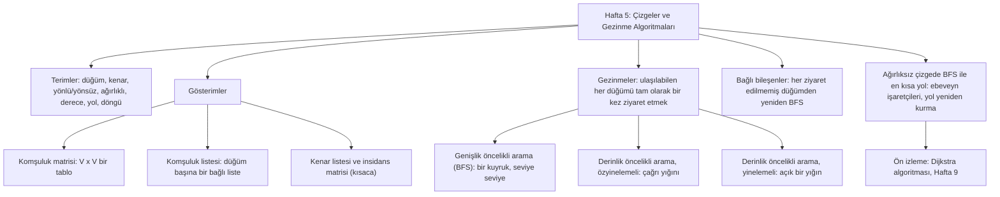

# Hafta 5 — Çizgeler ve Gezinme (Traversal) Algoritmaları

*CEN207 Veri Yapıları (eski adıyla CE205) · 2026–2027 Güz*

<!-- materials:start -->

<div class="materials" markdown>

[:material-file-pdf-box: Ders notu (PDF)](cen207-week-5-notes.pdf){ .md-button download="cen207-week-5-notes.pdf" }
[:material-file-word-box: Ders notu (DOCX)](cen207-week-5-notes.docx){ .md-button download="cen207-week-5-notes.docx" }
[:material-presentation: Sunum (PDF)](cen207-week-5-slides.pdf){ .md-button download="cen207-week-5-slides.pdf" }
[:material-microsoft-powerpoint: Sunum (PPTX)](cen207-week-5-slides.pptx){ .md-button download="cen207-week-5-slides.pptx" }
[:material-language-html5: Sunum (HTML, çevrimdışı)](cen207-week-5-slides.html){ .md-button download="cen207-week-5-slides.html" }
[:material-folder-zip: Tümünü indir (ZIP)](cen207-week-5-materials.zip){ .md-button download="cen207-week-5-materials.zip" }
[:material-fullscreen: Sunumu tam ekran aç](cen207-week-5-slides.html){ .md-button .md-button--primary target=_blank }

</div>

<div class="deck-frame">
<iframe src="../cen207-week-5-slides.html" title="Hafta 5 — Çizgeler ve Dolaşmalar" loading="lazy" allowfullscreen></iframe>
</div>

<p class="deck-hint">Sunumun içine tıklayıp ok tuşlarıyla ilerleyin; tam ekran için sunumun sağ altındaki düğmeyi ya da yukarıdaki "Sunumu tam ekran aç" bağlantısını kullanın.</p>

<!-- materials:end -->

!!! abstract "Bu hafta"
    **Öğrenme çıktıları.** Bu haftanın sonunda **çizgeyi (graph)** açıklayabilecek, çizebilecek ve
    uygulayabileceksiniz — bu veri yapısı, ne tamamen doğrusal (diziler, listeler, yığınlar, kuyruklar) ne de
    tamamen tek-ebeveynli dallanan (ağaçlar) ilişkileri modellemeyi nihayet mümkün kılar. Bir çizge, *herhangi*
    bir düğümün *herhangi* sayıda başka düğüme, herhangi bir örüntüde bağlanmasına izin verildiğinde ortaya
    çıkan şeydir: yol ağları, sosyal ağlar, web, bağımlılık çizgeleri ve — adını koymadan zaten bildiğiniz gibi
    — ağacın kendisi de, bir ekstra söz tutan bir çizgeden ibarettir (herhangi iki düğüm arasında tam olarak bir
    yol, döngü yok). Herkesin gerçekten kullandığı iki gösterimle (**komşuluk matrisi (adjacency matrix)** ve
    **komşuluk listesi (adjacency list)**), en azından tanınması gereken iki gösterimle (**kenar listesi (edge
    list)** ve **insidans matrisi (incidence matrix)**) ve aralarındaki ödünleşimlerle tanışacaksınız. Ardından,
    Hafta 1–4'ten elinizde zaten bulunan fikirler üzerine kurulu dört gezinme algoritmasıyla tanışacaksınız:
    Hafta 3'ün kuyruğunu kullanan **genişlik öncelikli arama (breadth-first search, BFS)**; önce özyinelemeli
    (yine Hafta 3'ün çağrı yığını), sonra yinelemeli (yine kendi elinizle kurduğunuz açık yığın) yazılan
    **derinlik öncelikli arama (depth-first search, DFS)**; ve "her ziyaret edilmemiş düğümden BFS'yi yeniden
    çalıştır"tan ibaret olan **bağlı bileşenler (connected components)**. Son olarak, ağırlıksız bir çizgede
    **en kısa yolu (shortest path)** bulmak için BFS kullanacaksınız — Hafta 9'un tam olarak bu fikrin üzerine
    kurduğu Dijkstra algoritmasının doğrudan bir ön izlemesi. Bu çıktılar ders izlencesinin **LO.1** (temel veri
    yapılarını açıklama), **LO.2** (algoritmik karmaşıklığı analiz etme) ve **LO.7** (bir problem için doğru
    yapıyı seçme) hedefleriyle eşleşir.

    **Önceden bilmeniz gerekenler.** Hafta 1 size işaretçileri (pointer) ve belleği numaralı kutular olarak
    resmetmeyi verdi. Hafta 2 size bağlı listeyi (linked list) verdi. Hafta 3 size yığını (stack), kuyruğu
    (queue) ve özyinelemeyi (recursion) verdi. Hafta 4 size ağacı (tree) verdi ve — burası kilit bağlantı —
    bir ağacın döngüsüz bağlı bir çizge olduğunu gösterdi, böylece ağaçlar için öğrendiğiniz her gezinme fikri
    (özyinelemeli dolaşımlar, açık bir yığın, seviye sırası için bir kuyruk) neredeyse değişmeden çizgelere
    taşınır. Genel bir çizgenin getirdiği gerçekten yeni sorun, **döngü (cycle)** içerebilmesi ve **bağlı
    olmayabilmesidir (disconnected)** — bu yüzden "her düğümü tam olarak bir kez ziyaret et" artık, tek-ebeveyn
    garantisi sayesinde ağaçların hiç ihtiyaç duymadığı bir `visited` (ziyaret edildi) işaretine muhtaçtır.

    **3 saatlik bir oturum için zaman planı.** Terimler, doğuş ve tarihçe (~25 dk) · gösterimler: komşuluk
    matrisi ve komşuluk listesi, bellek/zaman karşılaştırmasıyla birlikte (~35 dk) · kısa ara · genişlik
    öncelikli arama (~30 dk) · derinlik öncelikli arama, önce özyinelemeli sonra yinelemeli (~40 dk) · bağlı
    bileşenler (~20 dk) · BFS ile en kısa yol (~20 dk) · özet ve kendini sınama (~10 dk).

## 0. Başlamadan önce

### 0.1 Zaten bildikleriniz

Son dört haftadan dört fikir, bu haftanın ağırlığının neredeyse tamamını taşıyor. Sağlam olduklarından emin
olalım.

**Hafta 1'den — işaretçiler ve bellek.** Bir düğüm (node), bir değer artı başka düğümlere işaretçiler tutan bir
`struct`tur. Bağlı listede bu struct'ın tek bir `next` işaretçisi vardır; ağaçta ikisi ya da daha fazlası
vardır (`left`, `right`, ya da bir `children` dizisi). Bir çizge bunu daha da gevşetir: bir düğüm *herhangi*
sayıda başka düğüme, *herhangi* bir örüntüde işaret edebilir ve — ağacın aksine — iki farklı düğüm aynı üçüncü
düğüme birden işaret edebilir, ve bir yol kendi üzerine geri dönebilir.

**Hafta 2'den — bağlı listeler.** Bu haftanın en çok dayandığı gösterim olan **komşuluk listesi (adjacency
list)**, tam anlamıyla bağlı listelerden oluşan bir dizidir: her düğüm için bir bağlı liste, o düğümün
komşularını tutar. Bir bağlı listeye `append` (ekleme) yapabiliyorsanız (Hafta 2), bir komşuluk listesi
kurmayı zaten biliyorsunuz demektir.

**Hafta 3'ten — yığın, kuyruk ve özyineleme.** Genişlik öncelikli arama, Hafta 4'te ağaçlar için yazdığınız
seviye sırası (level-order) dolaşımın ta kendisidir, genelleştirilmiş hâliyle: Hafta 3'ün aynı dizi/dairesel
kuyruğunu kullanır, ağaç düğümleri yerine çizge düğümlerini kuyruğa ekler ve çıkarır. Derinlik öncelikli arama
tam olarak öntıra (preorder) dolaşımdır, genelleştirilmiş hâliyle: özyinelemeli yazıldığında, bu Hafta 3'ün
çağrı yığınının (call stack) defter tutma işini yapmasının ta kendisidir; yinelemeli yazıldığında, Hafta 3'te
elinizle kurduğunuz açık yığını kullanır — yalnızca sayılar yerine düğümler tutarak.

**Hafta 4'ten — ağaçlar.** Bir ağaç, döngüsüz ve *n* düğüm için tam olarak *n* − 1 kenarlı, bağlı ve yönsüz bir
çizgedir. Bir ağaç için yazdığınız her dolaşım — özyinelemeli, açık-yığınla-yinelemeli, kuyrukla-seviye-sıralı
— "döngü yok, tek ebeveyn" garantisinin bir `visited` dizisini gereksiz kıldığı özel bir çizge dolaşımı
örneğidir. Bu hafta bu garantiyi kaldırıyor ve o garanti kalktığı an `visited`in neden zorunlu hâle geldiğini
tam olarak göreceksiniz.

Bunlardan herhangi biri "ah evet, hatırladım" yerine yeni gibi hissettiriyorsa, devam etmeden önce Hafta 1–4
notlarına ayıracağınız beş dakika kendini kat kat geri ödeyecektir — aşağıdaki her şey bunu varsayıyor.

### 0.2 Bu haftanın haritası



Aşağıdaki her kutu kendi bölümünü alır; çoğu adım adım kısa bir animasyon, eksiksiz bir C ve Java programı ve
karmaşıklık ile sık yapılan hatalar üzerine bir not içerir.

## 1. Neden çizgeler? Doğuş, tarihçe ve sezgi

### 1.1 Başlangıç için bir soru

Bir yol haritası açın. Şehirler yollarla birbirine bağlıdır; bazı yollar tek yönlü, çoğu iki yönlüdür; bazı
şehir çiftleri arasında doğrudan yol hiç yoktur ve birinden diğerine gitmek için üç başka şehirden geçmeniz
gerekebilir. Ya da bir sosyal ağ açın: insanlar "takip"lerle bağlıdır, bu tek yönlü (sizi takip etmeyen bir
ünlüyü takip edersiniz) ya da karşılıklı olabilir. Ya da bir üniversitenin ders kataloğunu düşünün: "CEN206,
CEN207 gerektirir" yönlü bir bağlantıdır ve bazı dersler alınabilmeleri için birkaç başka dersi gerektirir.
Bunların hiçbiri liste değildir (tek bir "sonraki" yoktur), hiçbiri de ağaç değildir (bir şehre tek bir
ebeveynden değil, birçok şehirden ulaşılabilir ve yollar döngü oluşturabilir). "Bazı şeyler, bazı başka
şeylere, herhangi bir örüntüde, döngülere izin vererek bağlı" fikrini yakalayan en genel yapı nedir? Bu yapı
bir **çizgedir (graph)** ve — Hafta 4'ün zaten söylediği gibi — bir ağaç, yalnızca iki ekstra söz tutulmuş bir
çizgeden ibarettir: bağlı, ve döngüsüz.

### 1.2 Kısa bir tarihçe: Euler ve Königsberg'in yedi köprüsü

Çizge kuramının (graph theory) alışılmadık derecede kesin bir doğum günü var. 1736'da İsviçreli matematikçi
**Leonhard Euler**'e Königsberg şehri (o dönemde Prusya'da; bugün Rusya'da Kaliningrad) hakkında bir soru
soruldu: şehir, Pregel nehri çevresinde kurulmuştu ve nehrin yedi köprüsü şehrin iki adasını ve iki nehir
kıyısını birbirine bağlıyordu. Bulmaca, bir yürüyüşçünün yedi köprünün her birini tam olarak bir kez geçip
başlangıç noktasına dönüp dönemeyeceğiydi. Euler bunun *imkânsız* olduğunu kanıtladı — ve bizim için daha
önemlisi, bunu her rotayı elle deneyerek değil, şehri özüne indirgeyerek kanıtladı: her kara parçasını bir
nokta, her köprüyü iki noktayı birleştiren bir çizgi olarak temsil etti, alakasız her ayrıntıyı (mesafeler,
köprü genişlikleri, adaların şekli) bir kenara bıraktı. Bu soyutlama — çizgilerle birbirine bağlı noktalar —
çizgenin kendisidir ve Euler'in 1736 tarihli makalesi, *Solutio problematis ad geometriam situs pertinentis*
("Konum geometrisiyle ilgili bir problemin çözümü"), çizge kuramının kurucu makalesi olarak kabul edilir.
Euler'in bu sırada kanıtladığı genel kural (böyle bir yürüyüş ancak ve ancak sıfır ya da iki kara parçasının
tek sayıda köprüsü varsa var olur) hâlâ bugün bir **Euler yolu (Eulerian path)**'nun kriteri olarak
öğretilmektedir.

Sonraki iki yüzyıl boyunca çizgeler çoğunlukla matematikçilerin bir aracı olarak kaldı. Bilgisayar biliminin
*içinde* sistematik kullanımı — üzerinde algoritmalar çalışan açık bir veri yapısı olarak — bu haftanın
öğrettiği algoritmalarla birlikte yirminci yüzyıl boyunca büyüdü: **Edward F. Moore**, 1959'da bir labirentte
en kısa yolu bulma üzerine bir makalede, esasen genişlik öncelikli aramayı betimledi; **C. Y. Lee**, 1961'de
bir devre kartı üzerinde tel döşeme için yakından ilişkili bir genişlik öncelikli algoritma yayımladı (bu alanda
hâlâ "Lee algoritması" olarak anılır); ve **Robert Tarjan**'ın 1972 tarihli *Depth-First Search and Linear
Graph Algorithms* makalesi, derinlik öncelikli aramayı doğal, gayriresmî bir fikirden, bu hafta kullanacağınız
keşif/bitiş zamanları ve kenar sınıflandırmasıyla titizlikle çözümlenmiş bir algoritmaya dönüştürdü — ve
birçok önemli çizge probleminin doğrusal zamanda çözülebileceğini gösterdi.

### 1.3 Sezgi ve iki algoritma ailesi

Bir ağ çizge olarak temsil edildiğinde, sürekli iki soru gündeme gelir: *"A'dan B'ye hiç gidebilir miyim, ve
gidebiliyorsam nasıl?"* (bir **gezinme (traversal)** sorusu — bu hafta BFS ve DFS) ve *"A'dan B'ye **en iyi**
yol nedir?"* bir maliyet kavramı altında (bir **en kısa yol (shortest-path)** sorusu — bu hafta yine BFS, bu
haftanın ağırlıksız özel durumu için, ve Hafta 9'da Dijkstra ile diğer ağırlıklı algoritmalar). Bu iki soruyu
birbirinden ayrı tutmak dersin geri kalanında kafa karışıklığından kurtaracak: BFS ve DFS "ulaşılabilir mi
değil mi, ve hangi rotayla" sorusunu yanıtlar; Hafta 9'daki ağırlıklı en-kısa-yol algoritmaları ise "hangi **en
ucuz** rotayla ulaşılabilir" sorusunu yanıtlar.

## 2. Terimler

Bir **çizge (graph)** `G = (V, E)`, **düğümler (vertex, node)** kümesi `V` ile, her biri bir düğüm çiftini
bağlayan **kenarlar (edge)** kümesi `E`'den oluşur. Tanımın tamamı budur — aşağıdaki her şey, çizgenin belirli
*türlerini* ve sahip olabileceği belirli *özellikleri* betimleyen terimlerdir.

| Terim | Anlamı |
| --- | --- |
| **Düğüm (vertex, node)** | Çizgedeki "şeylerden" biri — bir şehir, bir kişi, bir ders. |
| **Kenar (edge)** | İki düğüm arasındaki bağlantı — bir yol, bir takip, bir ön koşul. |
| **Yönlü çizge (directed graph)** | Her kenarın bir yönü vardır: `A -> B`, `B -> A` ile aynı değildir. Ok ucuyla çizilir. |
| **Yönsüz çizge (undirected graph)** | Her kenar iki yönde de kullanılabilir: `A - B` ile `B - A` aynı kenardır. |
| **Ağırlıklı çizge (weighted graph)** | Her kenar bir sayı taşır (**ağırlık (weight)**) — bir mesafe, bir maliyet, bir kapasite. |
| **Ağırlıksız çizge (unweighted graph)** | Kenarlar sayı taşımaz; yalnızca "bağlı" ya da "bağlı değil" der. |
| **Derece (degree)** (yönsüz) | Bir düğüme değen kenar sayısı. |
| **Gelen derece / giden derece (in-degree / out-degree)** (yönlü) | Bir düğüme *giren* / bir düğümden *çıkan* kenar sayısı. |
| **Yol (path)** | Bir düğümden başka bir düğüme, hiçbir düğüm tekrarlanmadan giden kenarlar dizisi. |
| **Döngü (cycle)** | Başladığı düğüme geri dönen bir yol. |
| **Bağlı (connected)** (yönsüz) | Her düğümden her düğüme ulaşılabilir. |
| **Bağlı bileşen (connected component)** | Birbirinden erişilebilen düğümlerin en büyük kümesi. |
| **Öz-döngü (self-loop)** | İki ucu da *aynı* düğüm olan bir kenar. |
| **Çoklu kenar (parallel edges, multi-edge)** | Aynı iki düğüm arasında birden fazla kenar. Bir **multigraph (çoklu çizge)** bunlara izin verir. |
| **Basit çizge (simple graph)** | Öz-döngüsü ve çoklu kenarı olmayan çizge — çoğu algoritmanın varsaydığı "varsayılan" tür. |
| **Seyrek (sparse)** ile **yoğun (dense)** | Seyrek çizgede `E`, `V`'ye yakındır (düğüm başına az kenar); yoğun çizgede `E`, `V^2`'ye yakındır (çoğu çift bağlı). |

Yukarıdaki terimlerin her birinin gerçek bir çizge üzerinde, birer birer işaret edildiğini görmek için
animasyonu oynatın.

<iframe class="dsanim" src="../anim/graph-terminology.html" title="Çizge terimleri: düğüm, kenar, derece, yol, döngü, bağlı bileşen" loading="lazy"></iframe>
<div class="dsanim-baski" markdown>

</div>

Oynatıcıda ayrıca **8 düğüm, yönlü: iki döngü, öz-döngü, çoklu kenar ve 2 zayıf bileşen** (zor) ile uç
durumları da deneyin: **11 düğümlük zincir: döngüsüz, ağırlıksız, bağlı** ve **tek bir düğüm (bir öz-döngüyle
gösterilir)** — ya da dört zorluk seviyesinde rastgele veri için 🎲'ya basın, ya da kendi çizgenizi kenar listesi
olarak yazın (`A-B` yönsüz, `A>B` yönlü, `A-B:4` ağırlıklı).

### 2.1 Bellekte çizge ve kod

Aşağıdaki kod, bir `Graph`'ı komşuluk listesi olarak kurar — her düğüm için, o düğümün komşularının bağlı
listesinin başını tutan bir struct (Hafta 2'nin bağlı listesi yine burada) — ve bundan her düğümün derecesini
hesaplar. `out_degree`, bir düğümün listesinde yürür ve sayar; yönlü bir çizgede `in_degree`'nin böyle bir
kestirmesi yoktur ve `v`'ye inen kenarları ararken her *başka* düğümün listesini taramak zorundadır.

=== "C"

    ```c
    #define MAX_V   16
    #define MAX_LBL 4

    typedef struct Edge {
        int to;               /* index of the other endpoint */
        int weight;           /* 1 if the graph is unweighted */
        struct Edge *next;
    } Edge;

    typedef struct Graph {
        char label[MAX_V][MAX_LBL];
        Edge *adj[MAX_V];     /* adjacency list, one linked list per vertex */
        int vertex_count;
        int directed;         /* 0 = undirected, 1 = directed */
    } Graph;

    int out_degree(Graph *g, int v) {
        int d = 0;
        for (Edge *e = g->adj[v]; e != NULL; e = e->next)
            d++;              /* undirected: this already counts BOTH ends written once each -> degree */
        return d;
    }

    int in_degree(Graph *g, int v) {   /* directed only: how many edges point INTO v */
        int d = 0;
        for (int u = 0; u < g->vertex_count; u++)
            for (Edge *e = g->adj[u]; e != NULL; e = e->next)
                if (e->to == v) d++;
        return d;
    }
    ```

=== "Java"

    ```java
    static final int MAX_V = 16;

    class Edge {
        int to;               // index of the other endpoint
        int weight;           // 1 if the graph is unweighted
        Edge next;
    }

    class Graph {
        String[] label = new String[MAX_V];
        Edge[] adj = new Edge[MAX_V];   // adjacency list, one linked list per vertex
        int vertexCount;
        boolean directed;
    }

    static int outDegree(Graph g, int v) {
        int d = 0;
        for (Edge e = g.adj[v]; e != null; e = e.next)
            d++;              // undirected: this already counts BOTH ends written once each -> degree
        return d;
    }

    static int inDegree(Graph g, int v) {   // directed only: how many edges point INTO v
        int d = 0;
        for (int u = 0; u < g.vertexCount; u++)
            for (Edge e = g.adj[u]; e != null; e = e.next)
                if (e.to == v) d++;
        return d;
    }
    ```

    Tam program (`code/week-05/c/graph_terminology.c` / `code/week-05/java/GraphTerminology.java`), bir kenar
    listesinden bir çizge kurar, ardından düğüm/kenar sayılarını, öz-döngüleri, çoklu kenarları, dereceyi (ya
    da gelen/giden dereceyi), bağlı bileşenleri ve bir döngünün var olup olmadığını — animasyonun hazır
    örnekleriyle eşleşen dört senaryo için — bildirir.

??? example "Programın tamamı: `graph_terminology.c` / `GraphTerminology.java`"

    === "C"

        ```c
        /* Week 5 -- Graphs and Traversals
         * Graph vocabulary: vertex, edge, directed/undirected, weighted, degree,
         * in/out-degree, self-loop, parallel (multi-) edge, connected component,
         * cycle. Builds a Graph as an adjacency list (Edge structs, one linked
         * list per vertex) and reports these properties for each scenario.
         * CEN207 Data Structures (CS50-style lecture notes)
         */
        #include <stdio.h>
        #include <string.h>
        #include <stdlib.h>

        #define MAX_V   16
        #define MAX_LBL 4

        typedef struct Edge {
            int to;               /* index of the other endpoint */
            int weight;           /* 1 if the graph is unweighted */
            struct Edge *next;
        } Edge;

        typedef struct Graph {
            char label[MAX_V][MAX_LBL];
            Edge *adj[MAX_V];     /* adjacency list, one linked list per vertex */
            int vertex_count;
            int directed;         /* 0 = undirected, 1 = directed */
        } Graph;

        int out_degree(Graph *g, int v) {
            int d = 0;
            for (Edge *e = g->adj[v]; e != NULL; e = e->next)
                d++;              /* undirected: this already counts BOTH ends written once each -> degree */
            return d;
        }

        int in_degree(Graph *g, int v) {   /* directed only: how many edges point INTO v */
            int d = 0;
            for (int u = 0; u < g->vertex_count; u++)
                for (Edge *e = g->adj[u]; e != NULL; e = e->next)
                    if (e->to == v) d++;
            return d;
        }

        /* ---- construction helpers: not part of the lecture code panel above, but
         * needed to actually build a Graph from a list of (label, label, weight)
         * edges the way the animation's input box accepts them. ---- */

        typedef struct { const char *a, *b; int weight; } EdgeIn;

        static int find_or_add_vertex(Graph *g, const char *lbl) {
            for (int i = 0; i < g->vertex_count; i++)
                if (strcmp(g->label[i], lbl) == 0) return i;
            strncpy(g->label[g->vertex_count], lbl, MAX_LBL - 1);
            g->label[g->vertex_count][MAX_LBL - 1] = '\0';
            g->adj[g->vertex_count] = NULL;
            return g->vertex_count++;
        }

        static void append(Graph *g, int v, int neighbour, int weight) {
            Edge *n = malloc(sizeof(Edge));
            n->to = neighbour;
            n->weight = weight;
            n->next = NULL;
            if (g->adj[v] == NULL) { g->adj[v] = n; return; }
            Edge *cur = g->adj[v];
            while (cur->next != NULL) cur = cur->next;
            cur->next = n;
        }

        static void add_edge_labelled(Graph *g, const char *a, const char *b, int weight) {
            int ia = find_or_add_vertex(g, a), ib = find_or_add_vertex(g, b);
            append(g, ia, ib, weight);
            if (!g->directed && ia != ib) append(g, ib, ia, weight);
        }

        static void reset_graph(Graph *g, int directed) {
            g->vertex_count = 0;
            g->directed = directed;
            for (int i = 0; i < MAX_V; i++) g->adj[i] = NULL;
        }

        static void free_graph(Graph *g) {
            for (int i = 0; i < g->vertex_count; i++) {
                Edge *e = g->adj[i];
                while (e) { Edge *nx = e->next; free(e); e = nx; }
                g->adj[i] = NULL;
            }
        }

        /* ---- analysis: components (BFS, direction ignored) and cycle (DFS) ---- */

        static int undirected_neighbours(Graph *g, int v, int out[]) {
            int n = 0;
            for (Edge *e = g->adj[v]; e; e = e->next)
                if (e->to != v) out[n++] = e->to;             /* v's own out-edges (self-loops excluded here) */
            if (g->directed)
                for (int u = 0; u < g->vertex_count; u++)
                    if (u != v)
                        for (Edge *e = g->adj[u]; e; e = e->next)
                            if (e->to == v) out[n++] = u;      /* edges pointing INTO v, walked backwards */
            return n;
        }

        static int count_components(Graph *g, int comp_of[]) {
            int queue_data[MAX_V];
            for (int i = 0; i < g->vertex_count; i++) comp_of[i] = -1;
            int next_id = 0;
            for (int s = 0; s < g->vertex_count; s++) {
                if (comp_of[s] != -1) continue;
                int front = 0, rear = 0;
                comp_of[s] = next_id;
                queue_data[rear++] = s;
                while (front < rear) {
                    int u = queue_data[front++];
                    int nb[2 * MAX_V];
                    int n = undirected_neighbours(g, u, nb);
                    for (int i = 0; i < n; i++)
                        if (comp_of[nb[i]] == -1) { comp_of[nb[i]] = next_id; queue_data[rear++] = nb[i]; }
                }
                next_id++;
            }
            return next_id;
        }

        static int color[MAX_V];

        static int dfs_has_cycle(Graph *g, int u, int parent) {
            color[u] = 1;
            int skipped_parent = 0;
            for (Edge *e = g->adj[u]; e; e = e->next) {
                int v = e->to;
                if (v == u) return 1;                                        /* self-loop: trivially a cycle */
                if (!g->directed && v == parent && !skipped_parent) { skipped_parent = 1; continue; }
                if (color[v] == 0) { if (dfs_has_cycle(g, v, u)) return 1; }
                else if (color[v] == 1) return 1;                            /* back edge: an ancestor -> a cycle */
            }
            color[u] = 2;
            return 0;
        }

        static int has_cycle(Graph *g) {
            for (int i = 0; i < g->vertex_count; i++) color[i] = 0;
            for (int i = 0; i < g->vertex_count; i++)
                if (color[i] == 0 && dfs_has_cycle(g, i, -1)) return 1;
            return 0;
        }

        static void run_scenario(const char *label, int directed, EdgeIn edges[], int n) {
            printf("-- %s --\n", label);
            Graph g;
            reset_graph(&g, directed);
            for (int i = 0; i < n; i++) add_edge_labelled(&g, edges[i].a, edges[i].b, edges[i].weight);

            printf("%s, %d vertices, %d edges\n", directed ? "directed" : "undirected", g.vertex_count, n);

            int self_loops = 0;
            for (int i = 0; i < n; i++)
                if (strcmp(edges[i].a, edges[i].b) == 0) { printf("self-loop: %s-%s\n", edges[i].a, edges[i].b); self_loops++; }
            if (!self_loops) printf("self-loops: none\n");

            int multi_found = 0;
            for (int i = 0; i < n && !multi_found; i++) {
                if (strcmp(edges[i].a, edges[i].b) == 0) continue;
                for (int j = i + 1; j < n; j++) {
                    int same = directed
                        ? (strcmp(edges[i].a, edges[j].a) == 0 && strcmp(edges[i].b, edges[j].b) == 0)
                        : ((strcmp(edges[i].a, edges[j].a) == 0 && strcmp(edges[i].b, edges[j].b) == 0) ||
                           (strcmp(edges[i].a, edges[j].b) == 0 && strcmp(edges[i].b, edges[j].a) == 0));
                    if (same) { printf("multi-edge: %s%s%s (%d copies)\n", edges[i].a, directed ? ">" : "-", edges[i].b, 2); multi_found = 1; break; }
                }
            }
            if (!multi_found) printf("multi-edges: none\n");

            if (!directed) {
                printf("degree (list-length, via out-degree):");
                for (int i = 0; i < g.vertex_count; i++) printf(" %s=%d", g.label[i], out_degree(&g, i));
                printf("\n");
            } else {
                printf("in-degree: ");
                for (int i = 0; i < g.vertex_count; i++) printf(" %s=%d", g.label[i], in_degree(&g, i));
                printf("\n");
                printf("out-degree:");
                for (int i = 0; i < g.vertex_count; i++) printf(" %s=%d", g.label[i], out_degree(&g, i));
                printf("\n");
            }

            int comp_of[MAX_V];
            int comps = count_components(&g, comp_of);
            printf("connected components: %d\n", comps);

            int cyc = has_cycle(&g);
            printf("has cycle: %s\n", cyc ? "yes" : "no");

            free_graph(&g);
            printf("\n");
        }

        int main(void) {
            /* normal: 8 vertices, weighted, a cycle, a self-loop, a multi-edge and 2 components */
            EdgeIn normal[] = {
                {"A", "B", 3}, {"B", "C", 5}, {"C", "A", 2}, {"C", "D", 4},
                {"D", "E", 1}, {"E", "F", 6}, {"E", "F", 9}, {"D", "D", 7},
                {"G", "H", 2}, {"F", "C", 8}
            };
            run_scenario("normal: 8 vertices, weighted, a cycle, a self-loop, a multi-edge and 2 components", 0, normal, 10);

            /* hard: 8 vertices, directed, two cycles, a self-loop, a multi-edge and 2 weak components */
            EdgeIn hard[] = {
                {"P", "Q", 3}, {"Q", "R", 1}, {"R", "P", 4}, {"R", "S", 2},
                {"S", "T", 5}, {"T", "U", 1}, {"T", "U", 1}, {"U", "U", 6},
                {"Q", "S", 2}, {"S", "Q", 3}, {"V", "W", 2}, {"W", "V", 3}
            };
            run_scenario("hard: 8 vertices, directed, two cycles, a self-loop, a multi-edge and 2 weak components", 1, hard, 12);

            /* edge: an 11-vertex chain, no cycle, unweighted, connected */
            EdgeIn no_cycle[] = {
                {"V1", "V2", 1}, {"V2", "V3", 1}, {"V3", "V4", 1}, {"V4", "V5", 1}, {"V5", "V6", 1},
                {"V6", "V7", 1}, {"V7", "V8", 1}, {"V8", "V9", 1}, {"V9", "V10", 1}, {"V10", "V11", 1}
            };
            run_scenario("edge: an 11-vertex chain, no cycle, unweighted, connected", 0, no_cycle, 10);

            /* edge: a single vertex, shown with a self-loop */
            EdgeIn single[] = { {"A", "A", 1} };
            run_scenario("edge: a single vertex, shown with a self-loop", 0, single, 1);

            return 0;
        }
        ```

    === "Java"

        ```java
        /* Week 5 -- Graphs and Traversals
         * Graph vocabulary: vertex, edge, directed/undirected, weighted, degree,
         * in/out-degree, self-loop, parallel (multi-) edge, connected component,
         * cycle. Builds a Graph as an adjacency list (Edge nodes, one linked list
         * per vertex) and reports these properties for each scenario.
         * CEN207 Data Structures (CS50-style lecture notes)
         */
        public class GraphTerminology {
            static final int MAX_V = 16;

            static class Edge {
                int to;                 // index of the other endpoint
                int weight;              // 1 if the graph is unweighted
                Edge next;
            }

            static class Graph {
                String[] label = new String[MAX_V];
                Edge[] adj = new Edge[MAX_V];   // adjacency list, one linked list per vertex
                int vertexCount;
                boolean directed;
            }

            static int outDegree(Graph g, int v) {
                int d = 0;
                for (Edge e = g.adj[v]; e != null; e = e.next)
                    d++;              // undirected: this already counts BOTH ends written once each -> degree
                return d;
            }

            static int inDegree(Graph g, int v) {   // directed only: how many edges point INTO v
                int d = 0;
                for (int u = 0; u < g.vertexCount; u++)
                    for (Edge e = g.adj[u]; e != null; e = e.next)
                        if (e.to == v) d++;
                return d;
            }

            // ---- construction helpers: not part of the lecture code panel above, but
            // needed to actually build a Graph from a list of (label, label, weight)
            // edges the way the animation's input box accepts them. ----

            static class EdgeIn {
                String a, b;
                int weight;
                EdgeIn(String a, String b, int weight) { this.a = a; this.b = b; this.weight = weight; }
            }

            static int findOrAddVertex(Graph g, String lbl) {
                for (int i = 0; i < g.vertexCount; i++)
                    if (g.label[i].equals(lbl)) return i;
                g.label[g.vertexCount] = lbl;
                g.adj[g.vertexCount] = null;
                return g.vertexCount++;
            }

            static void append(Graph g, int v, int neighbour, int weight) {
                Edge n = new Edge();
                n.to = neighbour;
                n.weight = weight;
                n.next = null;
                if (g.adj[v] == null) { g.adj[v] = n; return; }
                Edge cur = g.adj[v];
                while (cur.next != null) cur = cur.next;
                cur.next = n;
            }

            static void addEdgeLabelled(Graph g, String a, String b, int weight) {
                int ia = findOrAddVertex(g, a), ib = findOrAddVertex(g, b);
                append(g, ia, ib, weight);
                if (!g.directed && ia != ib) append(g, ib, ia, weight);
            }

            // ---- analysis: components (BFS, direction ignored) and cycle (DFS) ----

            static int undirectedNeighbours(Graph g, int v, int[] out) {
                int n = 0;
                for (Edge e = g.adj[v]; e != null; e = e.next)
                    if (e.to != v) out[n++] = e.to;             // v's own out-edges (self-loops excluded here)
                if (g.directed)
                    for (int u = 0; u < g.vertexCount; u++)
                        if (u != v)
                            for (Edge e = g.adj[u]; e != null; e = e.next)
                                if (e.to == v) out[n++] = u;     // edges pointing INTO v, walked backwards
                return n;
            }

            static int countComponents(Graph g, int[] compOf) {
                int[] queueData = new int[MAX_V];
                for (int i = 0; i < g.vertexCount; i++) compOf[i] = -1;
                int nextId = 0;
                for (int s = 0; s < g.vertexCount; s++) {
                    if (compOf[s] != -1) continue;
                    int front = 0, rear = 0;
                    compOf[s] = nextId;
                    queueData[rear++] = s;
                    while (front < rear) {
                        int u = queueData[front++];
                        int[] nb = new int[2 * MAX_V];
                        int n = undirectedNeighbours(g, u, nb);
                        for (int i = 0; i < n; i++)
                            if (compOf[nb[i]] == -1) { compOf[nb[i]] = nextId; queueData[rear++] = nb[i]; }
                    }
                    nextId++;
                }
                return nextId;
            }

            static int[] color = new int[MAX_V];

            static boolean dfsHasCycle(Graph g, int u, int parent) {
                color[u] = 1;
                boolean skippedParent = false;
                for (Edge e = g.adj[u]; e != null; e = e.next) {
                    int v = e.to;
                    if (v == u) return true;                                        // self-loop: trivially a cycle
                    if (!g.directed && v == parent && !skippedParent) { skippedParent = true; continue; }
                    if (color[v] == 0) { if (dfsHasCycle(g, v, u)) return true; }
                    else if (color[v] == 1) return true;                            // back edge: an ancestor -> a cycle
                }
                color[u] = 2;
                return false;
            }

            static boolean hasCycle(Graph g) {
                for (int i = 0; i < g.vertexCount; i++) color[i] = 0;
                for (int i = 0; i < g.vertexCount; i++)
                    if (color[i] == 0 && dfsHasCycle(g, i, -1)) return true;
                return false;
            }

            static void runScenario(String label, boolean directed, EdgeIn[] edges) {
                System.out.println("-- " + label + " --");
                Graph g = new Graph();
                g.directed = directed;
                for (EdgeIn e : edges) addEdgeLabelled(g, e.a, e.b, e.weight);

                System.out.println((directed ? "directed" : "undirected") + ", " + g.vertexCount + " vertices, " + edges.length + " edges");

                int selfLoops = 0;
                for (EdgeIn e : edges)
                    if (e.a.equals(e.b)) { System.out.println("self-loop: " + e.a + "-" + e.b); selfLoops++; }
                if (selfLoops == 0) System.out.println("self-loops: none");

                boolean multiFound = false;
                outer:
                for (int i = 0; i < edges.length; i++) {
                    if (edges[i].a.equals(edges[i].b)) continue;
                    for (int j = i + 1; j < edges.length; j++) {
                        boolean same = directed
                            ? (edges[i].a.equals(edges[j].a) && edges[i].b.equals(edges[j].b))
                            : ((edges[i].a.equals(edges[j].a) && edges[i].b.equals(edges[j].b)) ||
                               (edges[i].a.equals(edges[j].b) && edges[i].b.equals(edges[j].a)));
                        if (same) {
                            System.out.println("multi-edge: " + edges[i].a + (directed ? ">" : "-") + edges[i].b + " (2 copies)");
                            multiFound = true;
                            break outer;
                        }
                    }
                }
                if (!multiFound) System.out.println("multi-edges: none");

                StringBuilder sb;
                if (!directed) {
                    sb = new StringBuilder("degree (list-length, via out-degree):");
                    for (int i = 0; i < g.vertexCount; i++) sb.append(' ').append(g.label[i]).append('=').append(outDegree(g, i));
                    System.out.println(sb);
                } else {
                    sb = new StringBuilder("in-degree: ");
                    for (int i = 0; i < g.vertexCount; i++) sb.append(' ').append(g.label[i]).append('=').append(inDegree(g, i));
                    System.out.println(sb);
                    sb = new StringBuilder("out-degree:");
                    for (int i = 0; i < g.vertexCount; i++) sb.append(' ').append(g.label[i]).append('=').append(outDegree(g, i));
                    System.out.println(sb);
                }

                int[] compOf = new int[MAX_V];
                int comps = countComponents(g, compOf);
                System.out.println("connected components: " + comps);

                boolean cyc = hasCycle(g);
                System.out.println("has cycle: " + (cyc ? "yes" : "no"));

                System.out.println();
            }

            public static void main(String[] args) {
                // normal: 8 vertices, weighted, a cycle, a self-loop, a multi-edge and 2 components
                EdgeIn[] normal = {
                    new EdgeIn("A", "B", 3), new EdgeIn("B", "C", 5), new EdgeIn("C", "A", 2), new EdgeIn("C", "D", 4),
                    new EdgeIn("D", "E", 1), new EdgeIn("E", "F", 6), new EdgeIn("E", "F", 9), new EdgeIn("D", "D", 7),
                    new EdgeIn("G", "H", 2), new EdgeIn("F", "C", 8)
                };
                runScenario("normal: 8 vertices, weighted, a cycle, a self-loop, a multi-edge and 2 components", false, normal);

                // hard: 8 vertices, directed, two cycles, a self-loop, a multi-edge and 2 weak components
                EdgeIn[] hard = {
                    new EdgeIn("P", "Q", 3), new EdgeIn("Q", "R", 1), new EdgeIn("R", "P", 4), new EdgeIn("R", "S", 2),
                    new EdgeIn("S", "T", 5), new EdgeIn("T", "U", 1), new EdgeIn("T", "U", 1), new EdgeIn("U", "U", 6),
                    new EdgeIn("Q", "S", 2), new EdgeIn("S", "Q", 3), new EdgeIn("V", "W", 2), new EdgeIn("W", "V", 3)
                };
                runScenario("hard: 8 vertices, directed, two cycles, a self-loop, a multi-edge and 2 weak components", true, hard);

                // edge: an 11-vertex chain, no cycle, unweighted, connected
                EdgeIn[] noCycle = {
                    new EdgeIn("V1", "V2", 1), new EdgeIn("V2", "V3", 1), new EdgeIn("V3", "V4", 1), new EdgeIn("V4", "V5", 1), new EdgeIn("V5", "V6", 1),
                    new EdgeIn("V6", "V7", 1), new EdgeIn("V7", "V8", 1), new EdgeIn("V8", "V9", 1), new EdgeIn("V9", "V10", 1), new EdgeIn("V10", "V11", 1)
                };
                runScenario("edge: an 11-vertex chain, no cycle, unweighted, connected", false, noCycle);

                // edge: a single vertex, shown with a self-loop
                EdgeIn[] single = { new EdgeIn("A", "A", 1) };
                runScenario("edge: a single vertex, shown with a self-loop", false, single);
            }
        }
        ```

**Deneyin**

=== "C"

    ```console
    gcc -std=c11 -Wall -Wextra -o /tmp/x graph_terminology.c && /tmp/x
    ```

    Beklenen çıktı:

    ```text
    -- normal: 8 vertices, weighted, a cycle, a self-loop, a multi-edge and 2 components --
    undirected, 8 vertices, 10 edges
    self-loop: D-D
    multi-edge: E-F (2 copies)
    degree (list-length, via out-degree): A=2 B=2 C=4 D=3 E=3 F=3 G=1 H=1
    connected components: 2
    has cycle: yes

    -- hard: 8 vertices, directed, two cycles, a self-loop, a multi-edge and 2 weak components --
    directed, 8 vertices, 12 edges
    self-loop: U-U
    multi-edge: T>U (2 copies)
    in-degree:  P=1 Q=2 R=1 S=2 T=1 U=3 V=1 W=1
    out-degree: P=1 Q=2 R=2 S=2 T=2 U=1 V=1 W=1
    connected components: 2
    has cycle: yes

    -- edge: an 11-vertex chain, no cycle, unweighted, connected --
    undirected, 11 vertices, 10 edges
    self-loops: none
    multi-edges: none
    degree (list-length, via out-degree): V1=1 V2=2 V3=2 V4=2 V5=2 V6=2 V7=2 V8=2 V9=2 V10=2 V11=1
    connected components: 1
    has cycle: no

    -- edge: a single vertex, shown with a self-loop --
    undirected, 1 vertices, 1 edges
    self-loop: A-A
    multi-edges: none
    degree (list-length, via out-degree): A=1
    connected components: 1
    has cycle: yes
    ```

=== "Java"

    ```console
    javac -Xlint:all -d /tmp/j GraphTerminology.java && java -cp /tmp/j GraphTerminology
    ```

    Beklenen çıktı: yukarıdaki C çalıştırmasıyla birebir aynı (aynı algoritma, aynı veri).

**Karmaşıklık.** Komşuluk listesini kurmak O(V + E)'dir: her düğüm ve her kenar sabit sayıda ziyaret edilir.
`out_degree`, O(deg(v))'dir — bir listenin uzunluğu. `in_degree`, bu gösterimde pahalı olandır: ters
bağlantılar olmadığı için, tek bir düğümün gelen derecesi için bile her düğümün listesini taramak zorundadır —
O(V + E). Bileşenleri BFS ile hesaplamak (bu tekniği bölüm 7'de resmî olarak göreceksiniz) O(V + E)'dir; DFS ile
döngü kontrolü de O(V + E)'dir.

!!! warning "Sık yapılan hatalar"
    - **`out_degree`, bir öz-döngüyü eksik sayar.** `out_degree` yalnızca liste uzunluğunu sayar, bu yüzden bir
      öz-döngüsü olan bir düğüm ondan `+1` alır — ama derecenin ders kitabı tanımı bir öz-döngüyü **iki kez**
      sayar (düğüme her iki ucundan da değer). Tam ders kitabı derecesine ihtiyacınız varsa, öz-döngüleri özel
      olarak ele alın: `degree(v) = out_degree(v) + (has_self_loop(v) ? 1 : 0)`. Yukarıdaki tam program, hangi
      tanımı kastettiğinizi sessizce tahmin etmek yerine, ham liste-uzunluğu sayısını raporlar ve bunu açıkça
      belirtir.
    - **Dereceyi gelen/giden dereceyle karıştırmak.** `out_degree`, hem yönlü hem yönsüz çizgelerde anlamlıdır
      (yönsüz bir çizgede derecenin *ta kendisidir*); `in_degree` ise ancak bir çizgenin yönü olduğunda anlam
      kazanır. `in_degree`'yi yönsüz bir çizge üzerinde çağırmak yine de derlenip çalışır, ama döndürdüğü sayı
      standart bir çizge-kuramı niceliği değildir.
    - **Bir çoklu çizgenin (multigraph), basit bir çizge için kurulmuş yapılarla "sorunsuz çalışacağını"
      varsaymak.** Bu hafta (ve Hafta 9'da) göreceğiniz bazı algoritmalar örtük olarak çoklu kenar
      olmadığını varsayar; bunları bir çoklu çizge üzerinde çalıştırmak teknik olarak doğru ama şaşırtıcı bir
      sonuç verebilir (örneğin BFS/DFS, çoklu kenarlarda ve öz-döngülerde yine de sorunsuz çalışır, çünkü
      yalnızca *hangi* düğümlere ulaşılabildiğiyle ilgilenirler, *kaç farklı yolla* ulaşılabildiğiyle değil).

??? success "Kendini sına: derece ile gelen/giden derece"
    Yönlü bir çizgede `A -> B` kenarı ile `B -> A` kenarı var. `out_degree(A)` nedir ve `in_degree(A)` nedir?

    **Yanıt.** `out_degree(A) = 1` (A'dan çıkan tek kenar, B'ye) ve `in_degree(A) = 1` (A'ya gelen tek kenar,
    B'den). Dikkat edin: bunlar aynı düğüm çifti arasında *zıt* yönlerde giden kenarlardır — bu, bir öz-döngü
    ya da bir çoklu kenarla **aynı şey değildir**; A ve B yalnızca birbirlerine işaret ediyorlar.

## 3. Gösterimler

### 3.1 Başlangıç için bir soru

Bir çizgeye karar verdiniz — düğümler ve kenarlar probleminiz için doğru model. Şimdi: bunu bir programın hızlı
bir şekilde "u'dan v'ye bir kenar var mı?" ya da "v'nin komşuları kim?" diye sorabilmesi için belleğe nasıl
*kaydedersiniz*? Tek bir en iyi yanıt yoktur; doğru seçim, çizgenin *olabileceği* kadar çok kenara göre
*gerçekte* kaç kenara sahip olduğuna ve hangi soruyu daha sık sorduğunuza bağlıdır.

### 3.2 Komşuluk matrisi

Bir **komşuluk matrisi (adjacency matrix)**, en doğrudan olası kodlamadır: `i` düğümünden `j` düğümüne bir
kenar olduğunda `[i][j]` hücresinin kenarın ağırlığını (ya da ağırlıksızsa `1`'i) tuttuğu, aksi hâlde `0`
tuttuğu bir `V x V` tablo. Yönsüz bir çizgede her kenar *iki* hücreye yazılır, `[i][j]` ve `[j][i]`, bu yüzden
matris her zaman ana köşegene göre simetriktir.

<iframe class="dsanim" src="../anim/adjacency-matrix.html" title="Çizge gösterimi: komşuluk matrisi" loading="lazy"></iframe>
<div class="dsanim-baski" markdown>

</div>

Oynatıcıda ayrıca **8 düğüm, yönlü, ağırlıklı, ters çift dahil 10 kenar** (zor) ile uç durumları da deneyin: **5
düğüm, tam çizge (her çift bağlı)** ve **tek bir düğüm (bir öz-döngüyle gösterilir): 1x1 bir matris** — ya da
dört zorluk seviyesinde rastgele veri için 🎲'ya basın, ya da kendi kenarlarınızı yazın.

=== "C"

    ```c
    #define MAX_V 16

    int matrix[MAX_V][MAX_V];      /* all cells start at 0 */

    void add_edge(int a, int b, int weight, int directed) {
        matrix[a][b] = weight;      /* 1 if the graph is unweighted */
        if (!directed)
            matrix[b][a] = weight;  /* undirected: mirror across the diagonal */
    }

    void build_adjacency_matrix(Edge *edges, int edge_count, int directed) {
        for (int i = 0; i < MAX_V; i++)
            for (int j = 0; j < MAX_V; j++)
                matrix[i][j] = 0;
        for (int k = 0; k < edge_count; k++)
            add_edge(edges[k].a, edges[k].b, edges[k].weight, directed);
    }
    ```

=== "Java"

    ```java
    static final int MAX_V = 16;

    int[][] matrix = new int[MAX_V][MAX_V];   // all cells start at 0

    void addEdge(int a, int b, int weight, boolean directed) {
        matrix[a][b] = weight;      // 1 if the graph is unweighted
        if (!directed)
            matrix[b][a] = weight;  // undirected: mirror across the diagonal
    }

    void buildAdjacencyMatrix(Edge[] edges, int edgeCount, boolean directed) {
        for (int i = 0; i < MAX_V; i++)
            for (int j = 0; j < MAX_V; j++)
                matrix[i][j] = 0;
        for (int k = 0; k < edgeCount; k++)
            addEdge(edges[k].a, edges[k].b, edges[k].weight, directed);
    }
    ```

    Tam program (`code/week-05/c/adjacency_matrix.c` / `code/week-05/java/AdjacencyMatrix.java`), matrisi
    kenar kenar kurar ve her kenardan sonra tablonun tamamını, animasyonun hazır örnekleriyle eşleşen dört
    senaryo için yazdırır.

??? example "Programın tamamı: `adjacency_matrix.c` / `AdjacencyMatrix.java`"

    === "C"

        ```c
        /* Week 5 -- Graphs and Traversals
         * Graph representation: adjacency matrix. Builds a V x V table from an
         * edge list, one edge at a time (undirected mirrors both cells across the
         * diagonal), and prints the whole matrix after every edge is added.
         * CEN207 Data Structures (CS50-style lecture notes)
         */
        #include <stdio.h>
        #include <string.h>

        #define MAX_V   16
        #define MAX_LBL 4

        int matrix[MAX_V][MAX_V];      /* all cells start at 0 */

        typedef struct { int a, b, weight; } Edge;

        void add_edge(int a, int b, int weight, int directed) {
            matrix[a][b] = weight;      /* 1 if the graph is unweighted */
            if (!directed)
                matrix[b][a] = weight;  /* undirected: mirror across the diagonal */
        }

        void build_adjacency_matrix(Edge *edges, int edge_count, int directed) {
            for (int i = 0; i < MAX_V; i++)
                for (int j = 0; j < MAX_V; j++)
                    matrix[i][j] = 0;
            for (int k = 0; k < edge_count; k++)
                add_edge(edges[k].a, edges[k].b, edges[k].weight, directed);
        }

        /* ---- construction helpers: turn a (label, label, weight) edge list into
         * the (index, index, weight) Edge array build_adjacency_matrix() expects,
         * with vertex indices assigned in alphabetical label order. ---- */

        typedef struct { const char *a, *b; int weight; } EdgeIn;

        static int index_of(char labels[][MAX_LBL], int n, const char *lbl) {
            for (int i = 0; i < n; i++) if (strcmp(labels[i], lbl) == 0) return i;
            return -1;
        }

        static int collect_labels(EdgeIn edges[], int n, char labels[][MAX_LBL]) {
            int count = 0;
            for (int i = 0; i < n; i++) {
                if (index_of(labels, count, edges[i].a) < 0) strcpy(labels[count++], edges[i].a);
                if (index_of(labels, count, edges[i].b) < 0) strcpy(labels[count++], edges[i].b);
            }
            /* simple insertion sort, alphabetical -- matches the vertex order the animation uses */
            for (int i = 1; i < count; i++) {
                char key[MAX_LBL];
                strcpy(key, labels[i]);
                int j = i - 1;
                while (j >= 0 && strcmp(labels[j], key) > 0) { strcpy(labels[j + 1], labels[j]); j--; }
                strcpy(labels[j + 1], key);
            }
            return count;
        }

        static void print_matrix(char labels[][MAX_LBL], int n) {
            printf("    ");
            for (int j = 0; j < n; j++) printf("%3s", labels[j]);
            printf("\n");
            for (int i = 0; i < n; i++) {
                printf("%3s ", labels[i]);
                for (int j = 0; j < n; j++) printf("%3d", matrix[i][j]);
                printf("\n");
            }
        }

        static void run_scenario(const char *label, int directed, EdgeIn in_edges[], int n) {
            printf("-- %s --\n", label);
            char labels[MAX_V][MAX_LBL];
            int v = collect_labels(in_edges, n, labels);

            Edge edges[MAX_V];
            for (int i = 0; i < n; i++) {
                edges[i].a = index_of(labels, v, in_edges[i].a);
                edges[i].b = index_of(labels, v, in_edges[i].b);
                edges[i].weight = in_edges[i].weight;
            }

            build_adjacency_matrix(NULL, 0, directed);   /* zero the matrix first */
            printf("%d vertices, empty matrix:\n", v);
            print_matrix(labels, v);

            for (int k = 0; k < n; k++) {
                add_edge(edges[k].a, edges[k].b, edges[k].weight, directed);
                printf("add_edge(%s, %s, %d)%s\n", in_edges[k].a, in_edges[k].b, in_edges[k].weight,
                       (!directed && edges[k].a != edges[k].b) ? " [mirrored]" : "");
                print_matrix(labels, v);
            }
            printf("\n");
        }

        int main(void) {
            /* normal: 7 vertices, undirected, unweighted, 10 edges */
            EdgeIn normal[] = {
                {"A", "B", 1}, {"B", "C", 1}, {"C", "D", 1}, {"D", "E", 1},
                {"E", "F", 1}, {"F", "G", 1}, {"G", "A", 1},
                {"A", "D", 1}, {"B", "E", 1}, {"C", "F", 1}
            };
            run_scenario("normal: 7 vertices, undirected, unweighted, 10 edges", 0, normal, 10);

            /* hard: 8 vertices, directed, weighted, 10 edges including a reversed pair */
            EdgeIn hard[] = {
                {"P", "Q", 3}, {"Q", "R", 1}, {"R", "S", 4}, {"S", "T", 2},
                {"T", "U", 5}, {"U", "V", 1}, {"V", "W", 3}, {"W", "P", 2},
                {"P", "R", 6}, {"R", "P", 7}
            };
            run_scenario("hard: 8 vertices, directed, weighted, 10 edges including a reversed pair", 1, hard, 10);

            /* edge: 5 vertices, a complete graph (every pair connected), 10 edges */
            EdgeIn dense[] = {
                {"A", "B", 1}, {"A", "C", 1}, {"A", "D", 1}, {"A", "E", 1},
                {"B", "C", 1}, {"B", "D", 1}, {"B", "E", 1},
                {"C", "D", 1}, {"C", "E", 1}, {"D", "E", 1}
            };
            run_scenario("edge: 5 vertices, a complete graph (every pair connected), 10 edges", 0, dense, 10);

            /* edge: a single vertex, shown with a self-loop -- a 1x1 matrix */
            EdgeIn single[] = { {"A", "A", 1} };
            run_scenario("edge: a single vertex, shown with a self-loop -- a 1x1 matrix", 0, single, 1);

            return 0;
        }
        ```

    === "Java"

        ```java
        /* Week 5 -- Graphs and Traversals
         * Graph representation: adjacency matrix. Builds a V x V table from an
         * edge list, one edge at a time (undirected mirrors both cells across the
         * diagonal), and prints the whole matrix after every edge is added.
         * CEN207 Data Structures (CS50-style lecture notes)
         */
        public class AdjacencyMatrix {
            static final int MAX_V = 16;

            static int[][] matrix = new int[MAX_V][MAX_V];   // all cells start at 0

            static void addEdge(int a, int b, int weight, boolean directed) {
                matrix[a][b] = weight;      // 1 if the graph is unweighted
                if (!directed)
                    matrix[b][a] = weight;  // undirected: mirror across the diagonal
            }

            static class Edge { int a, b, weight; }

            static void buildAdjacencyMatrix(Edge[] edges, int edgeCount, boolean directed) {
                for (int i = 0; i < MAX_V; i++)
                    for (int j = 0; j < MAX_V; j++)
                        matrix[i][j] = 0;
                for (int k = 0; k < edgeCount; k++)
                    addEdge(edges[k].a, edges[k].b, edges[k].weight, directed);
            }

            // ---- construction helpers: turn a (label, label, weight) edge list into
            // the (index, index, weight) Edge array buildAdjacencyMatrix() expects,
            // with vertex indices assigned in alphabetical label order. ----

            static class EdgeIn {
                String a, b;
                int weight;
                EdgeIn(String a, String b, int weight) { this.a = a; this.b = b; this.weight = weight; }
            }

            static int indexOf(String[] labels, int n, String lbl) {
                for (int i = 0; i < n; i++) if (labels[i].equals(lbl)) return i;
                return -1;
            }

            static int collectLabels(EdgeIn[] edges, String[] labels) {
                int count = 0;
                for (EdgeIn e : edges) {
                    if (indexOf(labels, count, e.a) < 0) labels[count++] = e.a;
                    if (indexOf(labels, count, e.b) < 0) labels[count++] = e.b;
                }
                // simple insertion sort, alphabetical -- matches the vertex order the animation uses
                for (int i = 1; i < count; i++) {
                    String key = labels[i];
                    int j = i - 1;
                    while (j >= 0 && labels[j].compareTo(key) > 0) { labels[j + 1] = labels[j]; j--; }
                    labels[j + 1] = key;
                }
                return count;
            }

            static void printMatrix(String[] labels, int n) {
                StringBuilder sb = new StringBuilder("    ");
                for (int j = 0; j < n; j++) sb.append(String.format("%3s", labels[j]));
                System.out.println(sb);
                for (int i = 0; i < n; i++) {
                    sb = new StringBuilder(String.format("%3s ", labels[i]));
                    for (int j = 0; j < n; j++) sb.append(String.format("%3d", matrix[i][j]));
                    System.out.println(sb);
                }
            }

            static void runScenario(String label, boolean directed, EdgeIn[] inEdges) {
                System.out.println("-- " + label + " --");
                String[] labels = new String[MAX_V];
                int v = collectLabels(inEdges, labels);

                Edge[] edges = new Edge[inEdges.length];
                for (int i = 0; i < inEdges.length; i++) {
                    edges[i] = new Edge();
                    edges[i].a = indexOf(labels, v, inEdges[i].a);
                    edges[i].b = indexOf(labels, v, inEdges[i].b);
                    edges[i].weight = inEdges[i].weight;
                }

                buildAdjacencyMatrix(null, 0, directed);   // zero the matrix first
                System.out.println(v + " vertices, empty matrix:");
                printMatrix(labels, v);

                for (int k = 0; k < inEdges.length; k++) {
                    addEdge(edges[k].a, edges[k].b, edges[k].weight, directed);
                    System.out.println("add_edge(" + inEdges[k].a + ", " + inEdges[k].b + ", " + inEdges[k].weight + ")"
                        + ((!directed && edges[k].a != edges[k].b) ? " [mirrored]" : ""));
                    printMatrix(labels, v);
                }
                System.out.println();
            }

            public static void main(String[] args) {
                // normal: 7 vertices, undirected, unweighted, 10 edges
                EdgeIn[] normal = {
                    new EdgeIn("A", "B", 1), new EdgeIn("B", "C", 1), new EdgeIn("C", "D", 1), new EdgeIn("D", "E", 1),
                    new EdgeIn("E", "F", 1), new EdgeIn("F", "G", 1), new EdgeIn("G", "A", 1),
                    new EdgeIn("A", "D", 1), new EdgeIn("B", "E", 1), new EdgeIn("C", "F", 1)
                };
                runScenario("normal: 7 vertices, undirected, unweighted, 10 edges", false, normal);

                // hard: 8 vertices, directed, weighted, 10 edges including a reversed pair
                EdgeIn[] hard = {
                    new EdgeIn("P", "Q", 3), new EdgeIn("Q", "R", 1), new EdgeIn("R", "S", 4), new EdgeIn("S", "T", 2),
                    new EdgeIn("T", "U", 5), new EdgeIn("U", "V", 1), new EdgeIn("V", "W", 3), new EdgeIn("W", "P", 2),
                    new EdgeIn("P", "R", 6), new EdgeIn("R", "P", 7)
                };
                runScenario("hard: 8 vertices, directed, weighted, 10 edges including a reversed pair", true, hard);

                // edge: 5 vertices, a complete graph (every pair connected), 10 edges
                EdgeIn[] dense = {
                    new EdgeIn("A", "B", 1), new EdgeIn("A", "C", 1), new EdgeIn("A", "D", 1), new EdgeIn("A", "E", 1),
                    new EdgeIn("B", "C", 1), new EdgeIn("B", "D", 1), new EdgeIn("B", "E", 1),
                    new EdgeIn("C", "D", 1), new EdgeIn("C", "E", 1), new EdgeIn("D", "E", 1)
                };
                runScenario("edge: 5 vertices, a complete graph (every pair connected), 10 edges", false, dense);

                // edge: a single vertex, shown with a self-loop -- a 1x1 matrix
                EdgeIn[] single = { new EdgeIn("A", "A", 1) };
                runScenario("edge: a single vertex, shown with a self-loop -- a 1x1 matrix", false, single);
            }
        }
        ```

**Deneyin**

=== "C"

    ```console
    gcc -std=c11 -Wall -Wextra -o /tmp/x adjacency_matrix.c && /tmp/x
    ```

    Beklenen çıktı (normal senaryo tam olarak gösterildi; zor, yoğun ve tekil senaryolar aynı örüntüyü izler —
    boş matris, sonra her `add_edge` çağrısından sonra matris tekrar):

    ```text
    -- normal: 7 vertices, undirected, unweighted, 10 edges --
    7 vertices, empty matrix:
          A  B  C  D  E  F  G
      A   0  0  0  0  0  0  0
      B   0  0  0  0  0  0  0
      C   0  0  0  0  0  0  0
      D   0  0  0  0  0  0  0
      E   0  0  0  0  0  0  0
      F   0  0  0  0  0  0  0
      G   0  0  0  0  0  0  0
    add_edge(A, B, 1) [mirrored]
          A  B  C  D  E  F  G
      A   0  1  0  0  0  0  0
      B   1  0  0  0  0  0  0
      C   0  0  0  0  0  0  0
      D   0  0  0  0  0  0  0
      E   0  0  0  0  0  0  0
      F   0  0  0  0  0  0  0
      G   0  0  0  0  0  0  0
    …
    add_edge(G, A, 1) [mirrored]
          A  B  C  D  E  F  G
      A   0  1  0  0  0  0  1
      B   1  0  1  0  0  0  0
      C   0  1  0  1  0  0  0
      D   0  0  1  0  1  0  0
      E   0  0  0  1  0  1  0
      F   0  0  0  0  1  0  1
      G   1  0  0  0  0  1  0
    add_edge(A, D, 1) [mirrored]
          A  B  C  D  E  F  G
      A   0  1  0  1  0  0  1
      B   1  0  1  0  0  0  0
      C   0  1  0  1  0  0  0
      D   1  0  1  0  1  0  0
      E   0  0  0  1  0  1  0
      F   0  0  0  0  1  0  1
      G   1  0  0  0  0  1  0
    add_edge(B, E, 1) [mirrored]
          A  B  C  D  E  F  G
      A   0  1  0  1  0  0  1
      B   1  0  1  0  1  0  0
      C   0  1  0  1  0  0  0
      D   1  0  1  0  1  0  0
      E   0  1  0  1  0  1  0
      F   0  0  0  0  1  0  1
      G   1  0  0  0  0  1  0
    add_edge(C, F, 1) [mirrored]
          A  B  C  D  E  F  G
      A   0  1  0  1  0  0  1
      B   1  0  1  0  1  0  0
      C   0  1  0  1  0  1  0
      D   1  0  1  0  1  0  0
      E   0  1  0  1  0  1  0
      F   0  0  1  0  1  0  1
      G   1  0  0  0  0  1  0

    … (zor ve yoğun senaryolar burada atlandı; aynı örüntü, boş matris sonra her add_edge'den sonra bir matris)

    -- edge: a single vertex, shown with a self-loop -- a 1x1 matrix --
    1 vertices, empty matrix:
          A
      A   0
    add_edge(A, A, 1)
          A
      A   1

    ```

=== "Java"

    ```console
    javac -Xlint:all -d /tmp/j AdjacencyMatrix.java && java -cp /tmp/j AdjacencyMatrix
    ```

    Beklenen çıktı: yukarıdaki C çalıştırmasıyla birebir aynı (aynı algoritma, aynı veri).

### 3.3 Komşuluk listesi

Bir **komşuluk listesi (adjacency list)**, matrisin O(1) kenar aramasını yer için takas eder: *olabilecek*
her düğüm çifti için bir hücre yerine, her düğüm için yalnızca o düğümün *gerçek* komşularını tutan bir bağlı
liste tutar. Bu, Hafta 2'nin bağlı listesinin `V` kez kullanılmasıdır.

<iframe class="dsanim" src="../anim/adjacency-list.html" title="Çizge gösterimi: komşuluk listesi" loading="lazy"></iframe>
<div class="dsanim-baski" markdown>

</div>

Oynatıcıda ayrıca **8 düğüm, yönlü, ağırlıklı, ters çift dahil 10 kenar** (zor) ile uç durumları da deneyin: **5
düğüm, tam çizge (her çift bağlı)** ve **tek bir düğüm (bir öz-döngüyle gösterilir): tek düğümlü liste** —
yukarıdaki komşuluk matrisi animasyonuyla aynı çizgeler, böylece iki gösterimi doğrudan karşılaştırabilirsiniz.

=== "C"

    ```c
    typedef struct AdjNode {
        int to;                 /* neighbour's vertex index */
        struct AdjNode *next;
    } AdjNode;

    AdjNode *adj[MAX_V];         /* one linked list per vertex, all start NULL */

    void append(int v, int neighbour) {
        AdjNode *n = malloc(sizeof(AdjNode));
        n->to = neighbour;
        n->next = NULL;
        if (adj[v] == NULL) { adj[v] = n; return; }
        AdjNode *cur = adj[v];
        while (cur->next != NULL)
            cur = cur->next;    /* walk to the tail */
        cur->next = n;
    }

    void add_edge(int a, int b, int directed) {
        append(a, b);
        if (!directed && a != b)
            append(b, a);
    }
    ```

=== "Java"

    ```java
    class AdjNode {
        int to;                 // neighbour's vertex index
        AdjNode next;
    }

    AdjNode[] adj = new AdjNode[MAX_V];   // one linked list per vertex, all start null

    void append(int v, int neighbour) {
        AdjNode n = new AdjNode();
        n.to = neighbour;
        n.next = null;
        if (adj[v] == null) { adj[v] = n; return; }
        AdjNode cur = adj[v];
        while (cur.next != null)
            cur = cur.next;     // walk to the tail
        cur.next = n;
    }

    void addEdge(int a, int b, boolean directed) {
        append(a, b);
        if (!directed && a != b)
            append(b, a);
    }
    ```

    Tam program (`code/week-05/c/adjacency_list.c` / `code/week-05/java/AdjacencyList.java`),
    `adjacency_matrix.c` ile aynı dört çizgeyi kurar, her kenardan sonra her listeyi yazdırır, böylece aynı
    verinin iki gösterimi yan yana okunabilir.

??? example "Programın tamamı: `adjacency_list.c` / `AdjacencyList.java`"

    === "C"

        ```c
        /* Week 5 -- Graphs and Traversals
         * Graph representation: adjacency list. Builds an array of linked lists
         * from an edge list (undirected appends a node to BOTH endpoints' lists,
         * unless it is a self-loop) and prints every list after each edge is
         * added. Same graphs as adjacency_matrix.c, so the two representations
         * can be compared directly.
         * CEN207 Data Structures (CS50-style lecture notes)
         */
        #include <stdio.h>
        #include <string.h>
        #include <stdlib.h>

        #define MAX_V   16
        #define MAX_LBL 4

        typedef struct AdjNode {
            int to;                 /* neighbour's vertex index */
            struct AdjNode *next;
        } AdjNode;

        AdjNode *adj[MAX_V];         /* one linked list per vertex, all start NULL */

        void append(int v, int neighbour) {
            AdjNode *n = malloc(sizeof(AdjNode));
            n->to = neighbour;
            n->next = NULL;
            if (adj[v] == NULL) { adj[v] = n; return; }
            AdjNode *cur = adj[v];
            while (cur->next != NULL)
                cur = cur->next;    /* walk to the tail */
            cur->next = n;
        }

        void add_edge(int a, int b, int directed) {
            append(a, b);
            if (!directed && a != b)
                append(b, a);
        }

        /* ---- construction helpers: turn a (label, label) edge list into the
         * (index, index) pairs add_edge() expects, with vertex indices assigned
         * in alphabetical label order. ---- */

        typedef struct { const char *a, *b; } EdgeIn;

        static int index_of(char labels[][MAX_LBL], int n, const char *lbl) {
            for (int i = 0; i < n; i++) if (strcmp(labels[i], lbl) == 0) return i;
            return -1;
        }

        static int collect_labels(EdgeIn edges[], int n, char labels[][MAX_LBL]) {
            int count = 0;
            for (int i = 0; i < n; i++) {
                if (index_of(labels, count, edges[i].a) < 0) strcpy(labels[count++], edges[i].a);
                if (index_of(labels, count, edges[i].b) < 0) strcpy(labels[count++], edges[i].b);
            }
            for (int i = 1; i < count; i++) {
                char key[MAX_LBL];
                strcpy(key, labels[i]);
                int j = i - 1;
                while (j >= 0 && strcmp(labels[j], key) > 0) { strcpy(labels[j + 1], labels[j]); j--; }
                strcpy(labels[j + 1], key);
            }
            return count;
        }

        static void print_lists(char labels[][MAX_LBL], int n) {
            for (int i = 0; i < n; i++) {
                printf("%s:", labels[i]);
                for (AdjNode *cur = adj[i]; cur != NULL; cur = cur->next)
                    printf(" -> %s", labels[cur->to]);
                printf(" -> NULL\n");
            }
        }

        static void free_lists(int n) {
            for (int i = 0; i < n; i++) {
                AdjNode *cur = adj[i];
                while (cur) { AdjNode *nx = cur->next; free(cur); cur = nx; }
                adj[i] = NULL;
            }
        }

        static void run_scenario(const char *label, int directed, EdgeIn in_edges[], int n) {
            printf("-- %s --\n", label);
            char labels[MAX_V][MAX_LBL];
            int v = collect_labels(in_edges, n, labels);
            for (int i = 0; i < MAX_V; i++) adj[i] = NULL;

            printf("%d vertices, empty lists:\n", v);
            print_lists(labels, v);

            for (int k = 0; k < n; k++) {
                int ia = index_of(labels, v, in_edges[k].a), ib = index_of(labels, v, in_edges[k].b);
                add_edge(ia, ib, directed);
                printf("add_edge(%s, %s)%s\n", in_edges[k].a, in_edges[k].b,
                       (!directed && ia != ib) ? " [both lists updated]" : "");
                print_lists(labels, v);
            }
            free_lists(v);
            printf("\n");
        }

        int main(void) {
            /* normal: 7 vertices, undirected, unweighted, 10 edges */
            EdgeIn normal[] = {
                {"A", "B"}, {"B", "C"}, {"C", "D"}, {"D", "E"},
                {"E", "F"}, {"F", "G"}, {"G", "A"},
                {"A", "D"}, {"B", "E"}, {"C", "F"}
            };
            run_scenario("normal: 7 vertices, undirected, unweighted, 10 edges", 0, normal, 10);

            /* hard: 8 vertices, directed, weighted, 10 edges including a reversed pair */
            EdgeIn hard[] = {
                {"P", "Q"}, {"Q", "R"}, {"R", "S"}, {"S", "T"},
                {"T", "U"}, {"U", "V"}, {"V", "W"}, {"W", "P"},
                {"P", "R"}, {"R", "P"}
            };
            run_scenario("hard: 8 vertices, directed, weighted, 10 edges including a reversed pair", 1, hard, 10);

            /* edge: 5 vertices, a complete graph (every pair connected), 10 edges */
            EdgeIn dense[] = {
                {"A", "B"}, {"A", "C"}, {"A", "D"}, {"A", "E"},
                {"B", "C"}, {"B", "D"}, {"B", "E"},
                {"C", "D"}, {"C", "E"}, {"D", "E"}
            };
            run_scenario("edge: 5 vertices, a complete graph (every pair connected), 10 edges", 0, dense, 10);

            /* edge: a single vertex, shown with a self-loop -- a one-vertex list */
            EdgeIn single[] = { {"A", "A"} };
            run_scenario("edge: a single vertex, shown with a self-loop -- a one-vertex list", 0, single, 1);

            return 0;
        }
        ```

    === "Java"

        ```java
        /* Week 5 -- Graphs and Traversals
         * Graph representation: adjacency list. Builds an array of linked lists
         * from an edge list (undirected appends a node to BOTH endpoints' lists,
         * unless it is a self-loop) and prints every list after each edge is
         * added. Same graphs as AdjacencyMatrix.java, so the two representations
         * can be compared directly.
         * CEN207 Data Structures (CS50-style lecture notes)
         */
        public class AdjacencyList {
            static final int MAX_V = 16;

            static class AdjNode {
                int to;                 // neighbour's vertex index
                AdjNode next;
            }

            static AdjNode[] adj = new AdjNode[MAX_V];   // one linked list per vertex, all start null

            static void append(int v, int neighbour) {
                AdjNode n = new AdjNode();
                n.to = neighbour;
                n.next = null;
                if (adj[v] == null) { adj[v] = n; return; }
                AdjNode cur = adj[v];
                while (cur.next != null)
                    cur = cur.next;     // walk to the tail
                cur.next = n;
            }

            static void addEdge(int a, int b, boolean directed) {
                append(a, b);
                if (!directed && a != b)
                    append(b, a);
            }

            // ---- construction helpers: turn a (label, label) edge list into the
            // (index, index) pairs addEdge() expects, with vertex indices assigned
            // in alphabetical label order. ----

            static class EdgeIn {
                String a, b;
                EdgeIn(String a, String b) { this.a = a; this.b = b; }
            }

            static int indexOf(String[] labels, int n, String lbl) {
                for (int i = 0; i < n; i++) if (labels[i].equals(lbl)) return i;
                return -1;
            }

            static int collectLabels(EdgeIn[] edges, String[] labels) {
                int count = 0;
                for (EdgeIn e : edges) {
                    if (indexOf(labels, count, e.a) < 0) labels[count++] = e.a;
                    if (indexOf(labels, count, e.b) < 0) labels[count++] = e.b;
                }
                for (int i = 1; i < count; i++) {
                    String key = labels[i];
                    int j = i - 1;
                    while (j >= 0 && labels[j].compareTo(key) > 0) { labels[j + 1] = labels[j]; j--; }
                    labels[j + 1] = key;
                }
                return count;
            }

            static void printLists(String[] labels, int n) {
                for (int i = 0; i < n; i++) {
                    StringBuilder sb = new StringBuilder(labels[i] + ":");
                    for (AdjNode cur = adj[i]; cur != null; cur = cur.next)
                        sb.append(" -> ").append(labels[cur.to]);
                    sb.append(" -> NULL");
                    System.out.println(sb);
                }
            }

            static void runScenario(String label, boolean directed, EdgeIn[] inEdges) {
                System.out.println("-- " + label + " --");
                String[] labels = new String[MAX_V];
                int v = collectLabels(inEdges, labels);
                for (int i = 0; i < MAX_V; i++) adj[i] = null;

                System.out.println(v + " vertices, empty lists:");
                printLists(labels, v);

                for (EdgeIn e : inEdges) {
                    int ia = indexOf(labels, v, e.a), ib = indexOf(labels, v, e.b);
                    addEdge(ia, ib, directed);
                    System.out.println("add_edge(" + e.a + ", " + e.b + ")"
                        + ((!directed && ia != ib) ? " [both lists updated]" : ""));
                    printLists(labels, v);
                }
                System.out.println();
            }

            public static void main(String[] args) {
                // normal: 7 vertices, undirected, unweighted, 10 edges
                EdgeIn[] normal = {
                    new EdgeIn("A", "B"), new EdgeIn("B", "C"), new EdgeIn("C", "D"), new EdgeIn("D", "E"),
                    new EdgeIn("E", "F"), new EdgeIn("F", "G"), new EdgeIn("G", "A"),
                    new EdgeIn("A", "D"), new EdgeIn("B", "E"), new EdgeIn("C", "F")
                };
                runScenario("normal: 7 vertices, undirected, unweighted, 10 edges", false, normal);

                // hard: 8 vertices, directed, weighted, 10 edges including a reversed pair
                EdgeIn[] hard = {
                    new EdgeIn("P", "Q"), new EdgeIn("Q", "R"), new EdgeIn("R", "S"), new EdgeIn("S", "T"),
                    new EdgeIn("T", "U"), new EdgeIn("U", "V"), new EdgeIn("V", "W"), new EdgeIn("W", "P"),
                    new EdgeIn("P", "R"), new EdgeIn("R", "P")
                };
                runScenario("hard: 8 vertices, directed, weighted, 10 edges including a reversed pair", true, hard);

                // edge: 5 vertices, a complete graph (every pair connected), 10 edges
                EdgeIn[] dense = {
                    new EdgeIn("A", "B"), new EdgeIn("A", "C"), new EdgeIn("A", "D"), new EdgeIn("A", "E"),
                    new EdgeIn("B", "C"), new EdgeIn("B", "D"), new EdgeIn("B", "E"),
                    new EdgeIn("C", "D"), new EdgeIn("C", "E"), new EdgeIn("D", "E")
                };
                runScenario("edge: 5 vertices, a complete graph (every pair connected), 10 edges", false, dense);

                // edge: a single vertex, shown with a self-loop -- a one-vertex list
                EdgeIn[] single = { new EdgeIn("A", "A") };
                runScenario("edge: a single vertex, shown with a self-loop -- a one-vertex list", false, single);
            }
        }
        ```

**Deneyin**

=== "C"

    ```console
    gcc -std=c11 -Wall -Wextra -o /tmp/x adjacency_list.c && /tmp/x
    ```

    Beklenen çıktı (normal senaryo tam olarak gösterildi; zor, yoğun ve tekil senaryolar aynı örüntüyü izler):

    ```text
    -- normal: 7 vertices, undirected, unweighted, 10 edges --
    7 vertices, empty lists:
    A: -> NULL
    B: -> NULL
    C: -> NULL
    D: -> NULL
    E: -> NULL
    F: -> NULL
    G: -> NULL
    add_edge(A, B) [both lists updated]
    A: -> B -> NULL
    B: -> A -> NULL
    C: -> NULL
    D: -> NULL
    E: -> NULL
    F: -> NULL
    G: -> NULL
    …
    add_edge(G, A) [both lists updated]
    A: -> B -> G -> NULL
    B: -> A -> C -> NULL
    C: -> B -> D -> NULL
    D: -> C -> E -> NULL
    E: -> D -> F -> NULL
    F: -> E -> G -> NULL
    G: -> F -> A -> NULL
    add_edge(A, D) [both lists updated]
    A: -> B -> G -> D -> NULL
    B: -> A -> C -> NULL
    C: -> B -> D -> NULL
    D: -> C -> E -> A -> NULL
    E: -> D -> F -> NULL
    F: -> E -> G -> NULL
    G: -> F -> A -> NULL
    add_edge(B, E) [both lists updated]
    A: -> B -> G -> D -> NULL
    B: -> A -> C -> E -> NULL
    C: -> B -> D -> NULL
    D: -> C -> E -> A -> NULL
    E: -> D -> F -> B -> NULL
    F: -> E -> G -> NULL
    G: -> F -> A -> NULL
    add_edge(C, F) [both lists updated]
    A: -> B -> G -> D -> NULL
    B: -> A -> C -> E -> NULL
    C: -> B -> D -> F -> NULL
    D: -> C -> E -> A -> NULL
    E: -> D -> F -> B -> NULL
    F: -> E -> G -> C -> NULL
    G: -> F -> A -> NULL

    … (zor ve yoğun senaryolar burada atlandı; aynı örüntü, boş listeler sonra her add_edge'den sonra tüm listeler)

    -- edge: a single vertex, shown with a self-loop -- a one-vertex list --
    1 vertices, empty lists:
    A: -> NULL
    add_edge(A, A)
    A: -> A -> NULL

    ```

=== "Java"

    ```console
    javac -Xlint:all -d /tmp/j AdjacencyList.java && java -cp /tmp/j AdjacencyList
    ```

    Beklenen çıktı: yukarıdaki C çalıştırmasıyla birebir aynı (aynı algoritma, aynı veri).

### 3.4 Kısaca iki gösterim daha

Bu ders için kullanılan algoritmalarda pek yer bulmasalar da, tanınmaya değer iki gösterim daha var:

- **Kenar listesi (edge list).** Olası en basit gösterim: yalnızca `(a, b, ağırlık)` üçlülerinin listesi,
  düğüm başına hiçbir yapı olmadan — yukarıdaki animasyonların kabul ettiği girdi biçiminin ta kendisi. Yalnızca
  O(E) yer kaplar ve bir çizgeyi *okumak* için iyi bir biçimdir, ama "v'nin komşuları kim?" sorusunu yanıtlamak
  listenin tamamını taramak demektir, O(E) — bu soruyu tekrar tekrar soran algoritmalar (BFS ve DFS'in yaptığı
  gibi) için matristen ve listeden daha kötüdür.
- **İnsidans matrisi (incidence matrix).** Bir `V x E` tablo, düğüm başına bir satır ve *kenar başına bir
  sütun*: `e` kenarı `v` düğümüne değiyorsa `[v][e]` hücresi sıfır değildir (yönlü bir çizgede, geleneksel
  olarak kenarın kaynağında `-1`, hedefinde `+1`). Cebirsel çizge kuramında tercih edilen gösterimdir (matrisin
  cebirsel özelliklerinin önem taşıdığı yerde), ama O(V x E) yer kaplayıp kenar listesinden daha hızlı bir
  arama sunmadığından, bu dersteki gezinme algoritmalarında pek kullanılmaz.

### 3.5 Gösterimleri karşılaştırmak

| | Komşuluk matrisi | Komşuluk listesi | Kenar listesi | İnsidans matrisi |
| --- | --- | --- | --- | --- |
| Yer | O(V^2) | O(V + E) | O(E) | O(V x E) |
| `(u, v)` kenarı var mı? | O(1) | O(deg(u)) | O(E) | O(E) |
| `v`'nin komşularını listele | O(V) | O(deg(v)) | O(E) | O(E) |
| Kenar ekle | O(1) | O(1) (başa ekleme) ya da O(deg) (sıralı ekleme) | O(1) | O(V) (yeni sütun) |
| En iyi olduğu yer | yoğun çizgeler; sık "bu kenar var mı?" kontrolleri | seyrek çizgeler; gezinmeler (BFS, DFS) | çizge dosyalarını okuma/yazma | cebirsel çizge kuramı |

Gerçek programların çoğunun ele aldığı seyrek çizgeler için (`E`, `V^2`'den çok daha küçük) — yol ağları,
sosyal çizgeler, bağımlılık çizgeleri — komşuluk listesinin O(V + E) yeri ve hızlı komşu dolaşımı onu varsayılan
seçim yapar; tam olarak bu yüzden bu haftanın geri kalanındaki her gezinme algoritması ona göre yazılmıştır.

!!! warning "Sık yapılan hatalar"
    - **Seyrek bir çizge için alışkanlıkla matrisi seçmek.** İki milyon kenarlı bir milyon düğümlük bir çizge
      (bir yol ağı için çok normal bir büyüklük), matris olarak `10^12` hücreye ihtiyaç duyar ama komşuluk
      listesi olarak yalnızca yaklaşık `3 x 10^6` liste düğümüne — bir milyon kat fark, sabrınızdan çok önce
      belleğinizi tüketir.
    - **Yönsüz bir kenarı aynalamayı unutmak.** Matriste `matrix[b][a] = weight`'i (ya da listede ikinci
      `append`'i) unutmak, yönsüz bir çizgeyi sessizce yalnızca `v_a` tarafından yönlü bir çizgeye dönüştürür —
      bu haftaki her gezinme algoritması, `b`'den bir arama başlatıldığında kenarları kaçırır.
    - **Sıfırdan büyük bir komşuluk listesi kurarken, her eklemede "bu kenar zaten var mı?" diye yeniden
      tarayarak kontrol etmek.** Yukarıdaki kurma yardımcıları yalnızca O(1)'de ekler; "yinelenen kenar yok"
      gibi bir değişmez gerekiyorsa, büyüyen listeyi yeniden taramak yerine bunu ayrı bir O(1)-aramalı yapıyla
      (bir *hash kümesi (hash set)* — Hafta 6) izleyin; aksi hâlde O(V + E) olan kurma en kötü durumda
      O(E^2)'ye döner.

??? success "Kendini sına: gösterim seçmek"
    Bir çizgenin 50.000 düğümü ve 120.000 kenarı var. Bir komşuluk matrisi kabaca kaç hücreye, bir komşuluk
    listesi kabaca kaç liste düğümüne ihtiyaç duyar? Hangisini seçerdiniz?

    **Yanıt.** Matris kabaca `50.000^2 = 2,5 x 10^9` hücreye ihtiyaç duyar — hücre başına bir bayt olsa bile
    birkaç gigabayt. Liste, yönsüz bir çizge için kabaca `2 x 120.000 = 240.000` düğüme ihtiyaç duyar (her
    kenar iki listeye eklenir) — en fazla birkaç megabayt. Bu çizge aşırı seyrektir (`E`, `V^2`'nin yanında
    çok küçüktür), o yüzden komşuluk listesi açık ara doğru seçimdir.

## 4. Genişlik öncelikli arama (BFS)

### 4.1 Başlangıç için bir soru

Bir şehirde tek bir kavşakta duruyorsunuz ve her başka kavşak için, oraya varmak için *geçmeniz gereken en az
yol sayısını* öğrenmek istiyorsunuz — mesafeye göre en hızlı rota değil, yalnızca en az sıçrama sayısı.
Aynı şekilde: bir arkadaş ağında, arkadaşlarınız kimler (1 sıçrama), henüz arkadaşınız olmayan
arkadaşlarınızın arkadaşları kimler (2 sıçrama), ve böyle devam eder. Her iki soru da aynı şeyi ister: dışa
doğru bir "halka" seferinde keşfetmek — her halkayı bir sonrakine başlamadan tam olarak bitirmek. Bu halka
halka keşif, **genişlik öncelikli arama (breadth-first search, BFS)**'dır.

### 4.2 Kısa bir tarihçe ve fikir

Bölüm 1'in belirttiği gibi, temel fikir — bir kuyruk kullanarak katman katman keşfetmek — 1959'da **Edward F.
Moore** tarafından bir labirentte en kısa rotayı bulmak için, ve 1961'de **C. Y. Lee** tarafından bağımsız
olarak bir devre kartı üzerinde tel döşemek için betimlendi. Mekanizma, Hafta 4'te ağaçlar için yazdığınız
seviye sırası dolaşımın doğrudan bir genelleştirilmesidir: keşfedilmeyi bekleyen düğümlerin bir **kuyruğunu**
(FIFO — Hafta 3) tutun; tekrar tekrar kuyruktan bir düğüm çıkarın, ziyaret edilmemiş tüm komşularına bakın, her
birini ziyaret edildi olarak işaretleyin ve kuyruğa ekleyin. Kuyruk FIFO olduğundan, başlangıçtan `d`
uzaklığındaki her düğüm, `d + 1` uzaklığındaki herhangi bir düğümden önce kuyruktan çıkarılır (dolayısıyla
komşuları incelenir) — bu da BFS'in kenar sayısına göre en kısa yolları doğal olarak neden ürettiğinin tam
nedenidir; bölüm 8'in konusu budur.

| İşlem | Ne yapar | Karmaşıklık |
| --- | --- | --- |
| `enqueue(v)` | `v`'yi kuyruğun sonuna ekler | O(1) |
| `dequeue()` | Kuyruğun önündeki düğümü çıkarır ve döndürür | O(1) |
| `bfs(g, start)` | `start`tan ulaşılabilen her düğümü, en yakından başlayarak ziyaret eder | O(V + E) |

<iframe class="dsanim" src="../anim/bfs.html" title="Genişlik öncelikli arama (BFS)" loading="lazy"></iframe>
<div class="dsanim-baski" markdown>

</div>

Oynatıcıda ayrıca **8 düğüm, yönlü, P'den başlar, döngülü** (zor) ile uç durumları da deneyin: **9 düğüm, 2
bileşen: `G, H, I`'ye `A`'dan hiç ulaşılamaz** ve **tek bir düğüm (bir öz-döngüyle gösterilir)** — ya da dört
zorluk seviyesinde rastgele veri için 🎲'ya basın, ya da kendi çizgenizi `start=X A-B B-C ...` olarak yazın.

### 4.3 Kod

=== "C"

    ```c
    #define MAX_V 32

    int visited[MAX_V], level_of[MAX_V], parent_of[MAX_V];
    int queue_data[MAX_V], front, rear, count;

    void enqueue(int v) { queue_data[rear] = v; rear = (rear + 1) % MAX_V; count++; }
    int  dequeue(void)  { int v = queue_data[front]; front = (front + 1) % MAX_V; count--; return v; }

    void bfs(Graph *g, int start) {
        for (int i = 0; i < g->vertex_count; i++) visited[i] = 0;
        visited[start] = 1;
        level_of[start] = 0;
        enqueue(start);
        while (count > 0) {
            int u = dequeue();
            printf("visit %d\n", u);
            for (AdjNode *n = g->adj[u]; n != NULL; n = n->next) {  /* neighbours: alphabetical order */
                if (!visited[n->to]) {
                    visited[n->to] = 1;
                    level_of[n->to] = level_of[u] + 1;
                    parent_of[n->to] = u;
                    enqueue(n->to);
                }
            }
        }
    }
    ```

=== "Java"

    ```java
    static final int MAX_V = 32;

    boolean[] visited = new boolean[MAX_V];
    int[] levelOf = new int[MAX_V], parentOf = new int[MAX_V];
    int[] queueData = new int[MAX_V]; int front, rear, count;

    void enqueue(int v) { queueData[rear] = v; rear = (rear + 1) % MAX_V; count++; }
    int  dequeue()      { int v = queueData[front]; front = (front + 1) % MAX_V; count--; return v; }

    void bfs(Graph g, int start) {
        for (int i = 0; i < g.vertexCount; i++) visited[i] = false;
        visited[start] = true;
        levelOf[start] = 0;
        enqueue(start);
        while (count > 0) {
            int u = dequeue();
            System.out.println("visit " + u);
            for (AdjNode n = g.adj[u]; n != null; n = n.next) {  // neighbours: alphabetical order
                if (!visited[n.to]) {
                    visited[n.to] = true;
                    levelOf[n.to] = levelOf[u] + 1;
                    parentOf[n.to] = u;
                    enqueue(n.to);
                }
            }
        }
    }
    ```

    Tam program (`code/week-05/c/bfs.c` / `code/week-05/java/Bfs.java`), animasyonun her senaryosu için,
    isimlendirilmiş bir başlangıç düğümünden `bfs`i çalıştırır ve her düğümün seviyesini (başlangıçtan kenar
    cinsinden uzaklığını) — ya da hiç ulaşılamıyorsa `unreached`i — yazdırır.

??? example "Programın tamamı: `bfs.c` / `Bfs.java`"

    === "C"

        ```c
        /* Week 5 -- Graphs and Traversals
         * Breadth-first search (BFS) from a chosen start vertex, using a circular
         * queue. Neighbours are examined in ALPHABETICAL order, so the visit
         * order is reproducible. Prints every dequeue and the vertices it enqueues.
         * CEN207 Data Structures (CS50-style lecture notes)
         */
        #include <stdio.h>
        #include <string.h>
        #include <stdlib.h>

        #define MAX_V   32
        #define MAX_LBL 4

        typedef struct AdjNode { int to; struct AdjNode *next; } AdjNode;
        typedef struct Graph {
            char label[MAX_V][MAX_LBL];
            AdjNode *adj[MAX_V];
            int vertex_count;
        } Graph;

        int visited[MAX_V], level_of[MAX_V], parent_of[MAX_V];
        int queue_data[MAX_V], front, rear, count;

        void enqueue(int v) { queue_data[rear] = v; rear = (rear + 1) % MAX_V; count++; }
        int  dequeue(void)  { int v = queue_data[front]; front = (front + 1) % MAX_V; count--; return v; }

        void bfs(Graph *g, int start) {
            for (int i = 0; i < g->vertex_count; i++) visited[i] = 0;
            visited[start] = 1;
            level_of[start] = 0;
            enqueue(start);
            while (count > 0) {
                int u = dequeue();
                printf("visit %s (level %d)\n", g->label[u], level_of[u]);
                for (AdjNode *n = g->adj[u]; n != NULL; n = n->next) {  /* neighbours: alphabetical order */
                    if (!visited[n->to]) {
                        visited[n->to] = 1;
                        level_of[n->to] = level_of[u] + 1;
                        parent_of[n->to] = u;
                        enqueue(n->to);
                    }
                }
            }
        }

        /* ---- construction: build Graph from a (label, label) edge list, neighbour
         * lists kept in alphabetical (insertion) order to match the animation. ---- */

        typedef struct { const char *a, *b; } EdgeIn;

        static int find_or_add_vertex(Graph *g, const char *lbl) {
            for (int i = 0; i < g->vertex_count; i++)
                if (strcmp(g->label[i], lbl) == 0) return i;
            strncpy(g->label[g->vertex_count], lbl, MAX_LBL - 1);
            g->label[g->vertex_count][MAX_LBL - 1] = '\0';
            g->adj[g->vertex_count] = NULL;
            return g->vertex_count++;
        }

        static AdjNode *new_node(int to) {
            AdjNode *n = malloc(sizeof(AdjNode));
            n->to = to;
            n->next = NULL;
            return n;
        }

        static void add_neighbour_sorted(Graph *g, int v, int neighbour) {
            AdjNode *n = new_node(neighbour);
            if (g->adj[v] == NULL || strcmp(g->label[g->adj[v]->to], g->label[neighbour]) > 0) {
                n->next = g->adj[v];
                g->adj[v] = n;
                return;
            }
            AdjNode *cur = g->adj[v];
            while (cur->next != NULL && strcmp(g->label[cur->next->to], g->label[neighbour]) <= 0)
                cur = cur->next;
            n->next = cur->next;
            cur->next = n;
        }

        static void build_graph(Graph *g, int directed, EdgeIn edges[], int n) {
            g->vertex_count = 0;
            for (int i = 0; i < MAX_V; i++) g->adj[i] = NULL;
            for (int i = 0; i < n; i++) {
                int a = find_or_add_vertex(g, edges[i].a), b = find_or_add_vertex(g, edges[i].b);
                if (a == b) continue;                       /* self-loop: no traversal edge to add */
                add_neighbour_sorted(g, a, b);
                if (!directed) add_neighbour_sorted(g, b, a);
            }
        }

        static void free_graph(Graph *g) {
            for (int i = 0; i < g->vertex_count; i++) {
                AdjNode *cur = g->adj[i];
                while (cur) { AdjNode *nx = cur->next; free(cur); cur = nx; }
                g->adj[i] = NULL;
            }
        }

        static void run_scenario(const char *label, int directed, const char *start_label, EdgeIn edges[], int n) {
            printf("-- %s --\n", label);
            Graph g;
            build_graph(&g, directed, edges, n);
            int start = find_or_add_vertex(&g, start_label);

            front = rear = count = 0;
            bfs(&g, start);

            int unreached = 0;
            printf("levels:");
            for (int i = 0; i < g.vertex_count; i++) {
                if (visited[i]) printf(" %s=%d", g.label[i], level_of[i]);
                else { printf(" %s=unreached", g.label[i]); unreached = 1; }
            }
            printf("\n");
            if (!unreached) printf("all vertices reached\n");

            free_graph(&g);
            printf("\n");
        }

        int main(void) {
            /* normal: 7 vertices, undirected, starts at A, 10 edges */
            EdgeIn normal[] = {
                {"A", "B"}, {"B", "C"}, {"C", "D"}, {"D", "E"},
                {"E", "F"}, {"F", "G"}, {"G", "A"},
                {"A", "D"}, {"B", "E"}, {"C", "F"}
            };
            run_scenario("normal: 7 vertices, undirected, starts at A, 10 edges", 0, "A", normal, 10);

            /* hard: 8 vertices, directed, starts at P, with a cycle, 12 edges */
            EdgeIn hard[] = {
                {"P", "Q"}, {"P", "R"}, {"Q", "S"}, {"R", "S"},
                {"S", "T"}, {"T", "U"}, {"T", "V"}, {"U", "W"},
                {"V", "W"}, {"Q", "T"}, {"R", "U"}, {"W", "P"}
            };
            run_scenario("hard: 8 vertices, directed, starts at P, with a cycle, 12 edges", 1, "P", hard, 12);

            /* edge: 9 vertices, 2 components: G, H, I are unreachable from A */
            EdgeIn disconnected[] = {
                {"A", "B"}, {"B", "C"}, {"C", "D"}, {"D", "E"},
                {"E", "F"}, {"F", "A"}, {"A", "D"},
                {"G", "H"}, {"H", "I"}, {"I", "G"}
            };
            run_scenario("edge: 9 vertices, 2 components: G, H, I are unreachable from A", 0, "A", disconnected, 9);

            /* edge: a single vertex, shown with a self-loop */
            EdgeIn single[] = { {"A", "A"} };
            run_scenario("edge: a single vertex, shown with a self-loop", 0, "A", single, 1);

            return 0;
        }
        ```

    === "Java"

        ```java
        /* Week 5 -- Graphs and Traversals
         * Breadth-first search (BFS) from a chosen start vertex, using a circular
         * queue. Neighbours are examined in ALPHABETICAL order, so the visit
         * order is reproducible. Prints every dequeue and the vertices it enqueues.
         * CEN207 Data Structures (CS50-style lecture notes)
         */
        public class Bfs {
            static final int MAX_V = 32;

            static class AdjNode { int to; AdjNode next; AdjNode(int to) { this.to = to; } }
            static class Graph {
                String[] label = new String[MAX_V];
                AdjNode[] adj = new AdjNode[MAX_V];
                int vertexCount;
            }

            static boolean[] visited = new boolean[MAX_V];
            static int[] levelOf = new int[MAX_V], parentOf = new int[MAX_V];
            static int[] queueData = new int[MAX_V]; static int front, rear, count;

            static void enqueue(int v) { queueData[rear] = v; rear = (rear + 1) % MAX_V; count++; }
            static int  dequeue()      { int v = queueData[front]; front = (front + 1) % MAX_V; count--; return v; }

            static void bfs(Graph g, int start) {
                for (int i = 0; i < g.vertexCount; i++) visited[i] = false;
                visited[start] = true;
                levelOf[start] = 0;
                enqueue(start);
                while (count > 0) {
                    int u = dequeue();
                    System.out.println("visit " + g.label[u] + " (level " + levelOf[u] + ")");
                    for (AdjNode n = g.adj[u]; n != null; n = n.next) {  // neighbours: alphabetical order
                        if (!visited[n.to]) {
                            visited[n.to] = true;
                            levelOf[n.to] = levelOf[u] + 1;
                            parentOf[n.to] = u;
                            enqueue(n.to);
                        }
                    }
                }
            }

            // ---- construction: build Graph from a (label, label) edge list, neighbour
            // lists kept in alphabetical (insertion) order to match the animation. ----

            static class EdgeIn {
                String a, b;
                EdgeIn(String a, String b) { this.a = a; this.b = b; }
            }

            static int findOrAddVertex(Graph g, String lbl) {
                for (int i = 0; i < g.vertexCount; i++)
                    if (g.label[i].equals(lbl)) return i;
                g.label[g.vertexCount] = lbl;
                g.adj[g.vertexCount] = null;
                return g.vertexCount++;
            }

            static void addNeighbourSorted(Graph g, int v, int neighbour) {
                AdjNode n = new AdjNode(neighbour);
                if (g.adj[v] == null || g.label[g.adj[v].to].compareTo(g.label[neighbour]) > 0) {
                    n.next = g.adj[v];
                    g.adj[v] = n;
                    return;
                }
                AdjNode cur = g.adj[v];
                while (cur.next != null && g.label[cur.next.to].compareTo(g.label[neighbour]) <= 0)
                    cur = cur.next;
                n.next = cur.next;
                cur.next = n;
            }

            static void buildGraph(Graph g, boolean directed, EdgeIn[] edges) {
                g.vertexCount = 0;
                for (int i = 0; i < MAX_V; i++) g.adj[i] = null;
                for (EdgeIn e : edges) {
                    int a = findOrAddVertex(g, e.a), b = findOrAddVertex(g, e.b);
                    if (a == b) continue;                       // self-loop: no traversal edge to add
                    addNeighbourSorted(g, a, b);
                    if (!directed) addNeighbourSorted(g, b, a);
                }
            }

            static void runScenario(String label, boolean directed, String startLabel, EdgeIn[] edges) {
                System.out.println("-- " + label + " --");
                Graph g = new Graph();
                buildGraph(g, directed, edges);
                int start = findOrAddVertex(g, startLabel);

                front = rear = count = 0;
                bfs(g, start);

                boolean unreached = false;
                StringBuilder sb = new StringBuilder("levels:");
                for (int i = 0; i < g.vertexCount; i++) {
                    if (visited[i]) sb.append(' ').append(g.label[i]).append('=').append(levelOf[i]);
                    else { sb.append(' ').append(g.label[i]).append("=unreached"); unreached = true; }
                }
                System.out.println(sb);
                if (!unreached) System.out.println("all vertices reached");

                System.out.println();
            }

            public static void main(String[] args) {
                // normal: 7 vertices, undirected, starts at A, 10 edges
                EdgeIn[] normal = {
                    new EdgeIn("A", "B"), new EdgeIn("B", "C"), new EdgeIn("C", "D"), new EdgeIn("D", "E"),
                    new EdgeIn("E", "F"), new EdgeIn("F", "G"), new EdgeIn("G", "A"),
                    new EdgeIn("A", "D"), new EdgeIn("B", "E"), new EdgeIn("C", "F")
                };
                runScenario("normal: 7 vertices, undirected, starts at A, 10 edges", false, "A", normal);

                // hard: 8 vertices, directed, starts at P, with a cycle, 12 edges
                EdgeIn[] hard = {
                    new EdgeIn("P", "Q"), new EdgeIn("P", "R"), new EdgeIn("Q", "S"), new EdgeIn("R", "S"),
                    new EdgeIn("S", "T"), new EdgeIn("T", "U"), new EdgeIn("T", "V"), new EdgeIn("U", "W"),
                    new EdgeIn("V", "W"), new EdgeIn("Q", "T"), new EdgeIn("R", "U"), new EdgeIn("W", "P")
                };
                runScenario("hard: 8 vertices, directed, starts at P, with a cycle, 12 edges", true, "P", hard);

                // edge: 9 vertices, 2 components: G, H, I are unreachable from A
                EdgeIn[] disconnected = {
                    new EdgeIn("A", "B"), new EdgeIn("B", "C"), new EdgeIn("C", "D"), new EdgeIn("D", "E"),
                    new EdgeIn("E", "F"), new EdgeIn("F", "A"), new EdgeIn("A", "D"),
                    new EdgeIn("G", "H"), new EdgeIn("H", "I"), new EdgeIn("I", "G")
                };
                runScenario("edge: 9 vertices, 2 components: G, H, I are unreachable from A", false, "A", disconnected);

                // edge: a single vertex, shown with a self-loop
                EdgeIn[] single = { new EdgeIn("A", "A") };
                runScenario("edge: a single vertex, shown with a self-loop", false, "A", single);
            }
        }
        ```

**Deneyin**

=== "C"

    ```console
    gcc -std=c11 -Wall -Wextra -o /tmp/x bfs.c && /tmp/x
    ```

    Beklenen çıktı:

    ```text
    -- normal: 7 vertices, undirected, starts at A, 10 edges --
    visit A (level 0)
    visit B (level 1)
    visit D (level 1)
    visit G (level 1)
    visit C (level 2)
    visit E (level 2)
    visit F (level 2)
    levels: A=0 B=1 C=2 D=1 E=2 F=2 G=1
    all vertices reached

    -- hard: 8 vertices, directed, starts at P, with a cycle, 12 edges --
    visit P (level 0)
    visit Q (level 1)
    visit R (level 1)
    visit S (level 2)
    visit T (level 2)
    visit U (level 2)
    visit V (level 3)
    visit W (level 3)
    levels: P=0 Q=1 R=1 S=2 T=2 U=2 V=3 W=3
    all vertices reached

    -- edge: 9 vertices, 2 components: G, H, I are unreachable from A --
    visit A (level 0)
    visit B (level 1)
    visit D (level 1)
    visit F (level 1)
    visit C (level 2)
    visit E (level 2)
    levels: A=0 B=1 C=2 D=1 E=2 F=1 G=unreached H=unreached I=unreached

    -- edge: a single vertex, shown with a self-loop --
    visit A (level 0)
    levels: A=0
    all vertices reached
    ```

=== "Java"

    ```console
    javac -Xlint:all -d /tmp/j Bfs.java && java -cp /tmp/j Bfs
    ```

    Beklenen çıktı: yukarıdaki C çalıştırmasıyla birebir aynı (aynı algoritma, aynı veri).

### 4.4 Karmaşıklık, hatalar, kendini sınama

**Karmaşıklık.** Her düğüm en fazla bir kez kuyruğa eklenir ve çıkarılır — O(V) — ve komşular taranırken her
kenar en fazla bir kez incelenir (yönsüzde her iki uçtan bir kez, yani toplamda iki kez) — O(E). Toplam:
bölüm 3'ün komşuluk listesini kullanarak **O(V + E)**.

!!! warning "Sık yapılan hatalar"
    - **Bir düğümü, kuyruktan *çıkarılırken* değil, kuyruğa *eklenirken* ziyaret edildi olarak işaretlemek.**
      Çıkarma anına kadar beklerseniz, aynı düğüm işlenmeden önce farklı komşular tarafından kuyruğa birden
      fazla kez eklenebilir — bu hem yer israf eder hem de daha kötüsü, bir düğümün seviyesinin/ebeveyninin
      yanlış üzerine yazılmasına yol açabilir. `visited[v] = true`'yu her zaman `v` kuyruğa eklendiği anda
      işaretleyin, yukarıdaki kod gibi.
    - **İndeksleri sarmadan (`front = (front + 1) % MAX_V`) düz bir diziyi kuyruk olarak kullanmak.** Modulo
      olmadan, `front` ve `rear`, dizinin *başındaki* yuvalar erken çıkarmalarla boşalmış olsa bile, hâlâ yer
      varken dizinin sonundan taşar. Bu tam olarak Hafta 3'te kurduğunuz dairesel kuyruktur.
    - **BFS'in düğümleri, kenarları yazdığınız sırayla ziyaret ettiğini varsaymak.** Sıra hem gezinme sırasına
      (seviye seviye) hem de komşuların komşuluk listesinde tutulma sırasına (burada, alfabetik) bağlıdır — 
      kenarların yazıldığı sıraya değil.

??? success "Kendini sına: BFS seviyeleri"
    Yukarıdaki "normal" senaryoda, `B`, `D` ve `G` neden hepsi 1. seviyeyi alıyor, ama `C`, `E` ve `F` 2.
    seviyeyi alıyor — kenar listesi doğrudan `C`'yi `F`'ye bağlasa bile?

    **Yanıt.** Seviye, herhangi belirli bir yoldaki değil, *en kısa* yoldaki kenar sayısıdır. `B`, `D`, `G`,
    `A`'dan doğrudan birer kenar uzaklıktadır. `C`, `A`'dan iki kenar uzaklıktadır (`A-B-C`, ya da `A-D-C`) —
    `C-F` de bir kenar olsa bile, `F` de `A`'dan *aynı şekilde* iki kenarda ulaşılabilirdir (`A-G-F`), o yüzden
    ikisi de 2. seviyeyi alır; doğrudan `C-F` kenarı, `A`'dan ikisine de *daha kısa* bir yol yaratmaz, yalnızca
    `A`'dan zaten aynı en kısa mesafeye sahip iki düğümü birbirine bağlar.

## 5. Derinlik öncelikli arama (DFS), özyinelemeli

### 5.1 Başlangıç için bir soru

Şimdi bir labirenti, her zaman gördüğünüz *ilk* keşfedilmemiş koridoru alarak, gidebildiği kadar ileri giderek
ve yalnızca bir çıkmaz sokağa ya da daha önce gittiğiniz bir yere çarptığınızda geri dönerek keşfettiğinizi
düşünün. BFS gibi seviye seviye yayılmazsınız; bir yöne bağlanır ve bir sonrakini denemeden önce onu sonuna
kadar kovalarsınız. Bu, **derinlik öncelikli arama (depth-first search, DFS)**'dır ve — Hafta 4'ün ağaçlar için
zaten gösterdiği gibi — özyinelemenin (recursion) otomatik olarak, tek seferde bir çağrıyla yaptığı şeyin ta
kendisidir.

### 5.2 Kısa bir tarihçe ve fikir

Derinlik öncelikli keşif eski, gayriresmî bir fikirdir (gerçek bir labirenti elle nasıl keşfedeceğinizin ta
kendisidir), ama **Robert Tarjan**'ın 1972 tarihli *Depth-First Search and Linear Graph Algorithms* makalesi
onu titiz bilgisayar bilimine dönüştürendir: Tarjan, her düğümün **keşif zamanını (discovery time)** ve
**bitiş zamanını (finish time)**'nı biçimselleştirdi (çalışan bir saat, bir düğüm ilk ulaşıldığında bir kez ve
altındaki her şeyin keşfi bittiğinde bir daha tıklar) ve bu zaman damgalarını, aramanın karşılaştığı her
kenarı dört türden birine sınıflandırmak için kullandı — bu bölümün kodunun doğrudan yeniden ürettiği bir
sınıflandırma:

| Kenar türü | Anlamı |
| --- | --- |
| **Ağaç kenarı (tree edge)** | Keşfedilmemiş (beyaz) bir düğüme gider — DFS ağacının bir parçası olur. |
| **Geri kenar (back edge)** | Hâlâ keşfedilmekte olan (gri) bir ataya gider — kesin bir **döngü (cycle)** işareti. |
| **İleri kenar (forward edge)** (yalnızca yönlü) | Aynı alt ağaçta zaten bitmiş (siyah) bir soyuna gider. |
| **Çapraz kenar (cross edge)** (yalnızca yönlü) | Zaten bitmiş (siyah) ama *soyu olmayan* bir düğüme gider. |

*Yönsüz* bir çizgede yalnızca ağaç kenarları ve geri kenarlar görülür (karşılaşılan her ağaç-olmayan kenar,
bir uçtan ya da diğerinden bakıldığında bir geri kenar çıkar). Hafta 4'ün özyinelemeli ağaç dolaşımları nasıl
tek bir ağaç bırakıyorsa, *bağlı olmayan* bir çizgede DFS de her ziyaret edilmemiş düğümden yeniden başlamak
zorundadır ve arkasında tek bir ağaç değil, bir **DFS ormanı (DFS forest)** — bağlı bileşen başına bir ağaç —
bırakır.

<iframe class="dsanim" src="../anim/dfs-recursive.html" title="Derinlik öncelikli arama (DFS) -- özyinelemeli" loading="lazy"></iframe>
<div class="dsanim-baski" markdown>

</div>

Oynatıcıda ayrıca **6 düğüm, yönlü: ağaç, geri, ileri VE çapraz kenarların hepsi bir arada** (zor) ile uç
durumları da deneyin: **10 düğüm, 2 ayrı bileşen: bir DFS OrmanI** ve **tek bir düğüm (bir öz-döngüyle
gösterilir)** — ya da dört zorluk seviyesinde rastgele veri için 🎲'ya basın, ya da kendi çizgenizi yazın.

### 5.3 Kod

=== "C"

    ```c
    int color_of[MAX_V];        /* 0 white, 1 gray, 2 black */
    int disc_time[MAX_V], fin_time[MAX_V], parent_of[MAX_V];
    int clock_ = 0;

    void dfs_visit(Graph *g, int u) {
        color_of[u] = 1;                 /* gray: discovered, still exploring */
        disc_time[u] = ++clock_;
        printf("visit %d\n", u);
        for (AdjNode *n = g->adj[u]; n != NULL; n = n->next) {  /* neighbours: alphabetical order */
            int v = n->to;
            if (color_of[v] == 0) { parent_of[v] = u; dfs_visit(g, v); }  /* tree edge */
            else if (color_of[v] == 1) { /* back edge: v is an ancestor -> a cycle */ }
            else { /* v is black: forward or cross edge (directed graphs only) */ }
        }
        color_of[u] = 2;                 /* black: finished */
        fin_time[u] = ++clock_;
    }

    void dfs(Graph *g) {
        for (int i = 0; i < g->vertex_count; i++) color_of[i] = 0;
        for (int i = 0; i < g->vertex_count; i++)
            if (color_of[i] == 0) dfs_visit(g, i);  /* one tree per component */
    }
    ```

=== "Java"

    ```java
    static final int MAX_V = 32;
    int[] colorOf = new int[MAX_V];        // 0 white, 1 gray, 2 black
    int[] discTime = new int[MAX_V], finTime = new int[MAX_V], parentOf = new int[MAX_V];
    int clock_ = 0;

    void dfsVisit(Graph g, int u) {
        colorOf[u] = 1;                  // gray: discovered, still exploring
        discTime[u] = ++clock_;
        System.out.println("visit " + u);
        for (AdjNode n = g.adj[u]; n != null; n = n.next) {  // neighbours: alphabetical order
            int v = n.to;
            if (colorOf[v] == 0) { parentOf[v] = u; dfsVisit(g, v); }  // tree edge
            else if (colorOf[v] == 1) { /* back edge: v is an ancestor -> a cycle */ }
            else { /* v is black: forward or cross edge (directed graphs only) */ }
        }
        colorOf[u] = 2;                  // black: finished
        finTime[u] = ++clock_;
    }

    void dfs(Graph g) {
        for (int i = 0; i < g.vertexCount; i++) colorOf[i] = 0;
        for (int i = 0; i < g.vertexCount; i++)
            if (colorOf[i] == 0) dfsVisit(g, i);  // one tree per component
    }
    ```

    Tam program (`code/week-05/c/dfs_recursive.c` / `code/week-05/java/DfsRecursive.java`), kenar
    sınıflandırma dallarını hangi tür kenarın karşılaşıldığını duyuran `printf`/`println` çağrılarıyla
    doldurur, her düğümün keşif ve bitiş zamanını bildirir ve son öntıra (preorder, keşif sırasını) yazdırır.

??? example "Programın tamamı: `dfs_recursive.c` / `DfsRecursive.java`"

    === "C"

        ```c
        /* Week 5 -- Graphs and Traversals
         * Depth-first search (DFS), recursive: every visit() call pushes a call-
         * stack frame, walks neighbours in ALPHABETICAL order, and pops before
         * returning. Unvisited vertices (alphabetical order) each start their own
         * tree -- a disconnected graph becomes a DFS FOREST. Edges are classified
         * as tree, back (a cycle), and -- directed graphs only -- forward/cross.
         * CEN207 Data Structures (CS50-style lecture notes)
         */
        #include <stdio.h>
        #include <string.h>
        #include <stdlib.h>

        #define MAX_V   32
        #define MAX_LBL 4

        typedef struct AdjNode { int to; struct AdjNode *next; } AdjNode;
        typedef struct Graph {
            char label[MAX_V][MAX_LBL];
            AdjNode *adj[MAX_V];
            int vertex_count;
            int directed;
        } Graph;

        int color_of[MAX_V];        /* 0 white, 1 gray, 2 black */
        int disc_time[MAX_V], fin_time[MAX_V], parent_of[MAX_V];
        int clock_ = 0;

        void dfs_visit(Graph *g, int u) {
            color_of[u] = 1;                 /* gray: discovered, still exploring */
            disc_time[u] = ++clock_;
            printf("visit %s (disc=%d)\n", g->label[u], disc_time[u]);
            for (AdjNode *n = g->adj[u]; n != NULL; n = n->next) {  /* neighbours: alphabetical order */
                int v = n->to;
                if (color_of[v] == 0) {
                    parent_of[v] = u;
                    printf("  edge %s-%s: TREE edge\n", g->label[u], g->label[v]);
                    dfs_visit(g, v);
                }
                else if (color_of[v] == 1) {
                    printf("  edge %s-%s: BACK edge (a cycle)\n", g->label[u], g->label[v]); /* v is an ancestor -> a cycle */
                }
                else if (g->directed) {
                    if (disc_time[u] < disc_time[v])
                        printf("  edge %s-%s: FORWARD edge\n", g->label[u], g->label[v]);
                    else
                        printf("  edge %s-%s: CROSS edge\n", g->label[u], g->label[v]);
                }
            }
            color_of[u] = 2;                 /* black: finished */
            fin_time[u] = ++clock_;
            printf("finish %s (fin=%d)\n", g->label[u], fin_time[u]);
        }

        void dfs(Graph *g) {
            for (int i = 0; i < g->vertex_count; i++) color_of[i] = 0;
            for (int i = 0; i < g->vertex_count; i++)
                if (color_of[i] == 0) dfs_visit(g, i);  /* one tree per component */
        }

        /* ---- construction: build Graph from a (label, label) edge list, neighbour
         * lists kept in alphabetical (insertion) order to match the animation. ---- */

        typedef struct { const char *a, *b; } EdgeIn;

        static int find_or_add_vertex(Graph *g, const char *lbl) {
            for (int i = 0; i < g->vertex_count; i++)
                if (strcmp(g->label[i], lbl) == 0) return i;
            strncpy(g->label[g->vertex_count], lbl, MAX_LBL - 1);
            g->label[g->vertex_count][MAX_LBL - 1] = '\0';
            g->adj[g->vertex_count] = NULL;
            return g->vertex_count++;
        }

        static AdjNode *new_node(int to) {
            AdjNode *n = malloc(sizeof(AdjNode));
            n->to = to;
            n->next = NULL;
            return n;
        }

        static void add_neighbour_sorted(Graph *g, int v, int neighbour) {
            AdjNode *n = new_node(neighbour);
            if (g->adj[v] == NULL || strcmp(g->label[g->adj[v]->to], g->label[neighbour]) > 0) {
                n->next = g->adj[v];
                g->adj[v] = n;
                return;
            }
            AdjNode *cur = g->adj[v];
            while (cur->next != NULL && strcmp(g->label[cur->next->to], g->label[neighbour]) <= 0)
                cur = cur->next;
            n->next = cur->next;
            cur->next = n;
        }

        static void build_graph(Graph *g, int directed, EdgeIn edges[], int n) {
            g->vertex_count = 0;
            g->directed = directed;
            for (int i = 0; i < MAX_V; i++) g->adj[i] = NULL;
            for (int i = 0; i < n; i++) {
                int a = find_or_add_vertex(g, edges[i].a), b = find_or_add_vertex(g, edges[i].b);
                if (a == b) { add_neighbour_sorted(g, a, a); continue; }   /* self-loop: one entry, a->a */
                add_neighbour_sorted(g, a, b);
                if (!directed) add_neighbour_sorted(g, b, a);
            }
        }

        static void free_graph(Graph *g) {
            for (int i = 0; i < g->vertex_count; i++) {
                AdjNode *cur = g->adj[i];
                while (cur) { AdjNode *nx = cur->next; free(cur); cur = nx; }
                g->adj[i] = NULL;
            }
        }

        static void run_scenario(const char *label, int directed, EdgeIn edges[], int n) {
            printf("-- %s --\n", label);
            Graph g;
            build_graph(&g, directed, edges, n);
            clock_ = 0;
            dfs(&g);

            printf("preorder (discovery order):");
            /* rebuild the discovery order from disc_time, cheaper than tracking a
             * separate array: sort vertex indices by disc_time */
            int order[MAX_V];
            for (int i = 0; i < g.vertex_count; i++) order[i] = i;
            for (int i = 1; i < g.vertex_count; i++) {
                int key = order[i], j = i - 1;
                while (j >= 0 && disc_time[order[j]] > disc_time[key]) { order[j + 1] = order[j]; j--; }
                order[j + 1] = key;
            }
            for (int i = 0; i < g.vertex_count; i++) printf(" %s", g.label[order[i]]);
            printf("\n");

            free_graph(&g);
            printf("\n");
        }

        int main(void) {
            /* normal: 7 vertices, undirected, 4 back edges (cycles), 10 edges */
            EdgeIn normal[] = {
                {"A", "B"}, {"B", "C"}, {"C", "D"}, {"D", "E"},
                {"E", "F"}, {"F", "G"}, {"G", "A"},
                {"A", "D"}, {"B", "E"}, {"C", "F"}
            };
            run_scenario("normal: 7 vertices, undirected, 4 back edges (cycles), 10 edges", 0, normal, 10);

            /* hard: 6 vertices, directed: tree, back, forward AND cross edges all in one graph, 10 edges */
            EdgeIn hard[] = {
                {"A", "B"}, {"A", "D"}, {"A", "E"},
                {"B", "C"}, {"C", "A"},
                {"D", "E"}, {"D", "F"},
                {"E", "B"}, {"E", "F"}, {"F", "C"}
            };
            run_scenario("hard: 6 vertices, directed: tree, back, forward AND cross edges all in one graph, 10 edges", 1, hard, 10);

            /* edge: 10 vertices, undirected, 2 separate components: a DFS FOREST */
            EdgeIn forest[] = {
                {"A", "B"}, {"B", "C"}, {"C", "D"}, {"D", "E"}, {"E", "F"},
                {"G", "H"}, {"H", "I"}, {"I", "G"}, {"G", "J"}, {"H", "J"}
            };
            run_scenario("edge: 10 vertices, undirected, 2 separate components: a DFS FOREST", 0, forest, 10);

            /* edge: a single vertex, shown with a self-loop */
            EdgeIn single[] = { {"A", "A"} };
            run_scenario("edge: a single vertex, shown with a self-loop", 0, single, 1);

            return 0;
        }
        ```

    === "Java"

        ```java
        /* Week 5 -- Graphs and Traversals
         * Depth-first search (DFS), recursive: every visit() call pushes a call-
         * stack frame, walks neighbours in ALPHABETICAL order, and pops before
         * returning. Unvisited vertices (alphabetical order) each start their own
         * tree -- a disconnected graph becomes a DFS FOREST. Edges are classified
         * as tree, back (a cycle), and -- directed graphs only -- forward/cross.
         * CEN207 Data Structures (CS50-style lecture notes)
         */
        public class DfsRecursive {
            static final int MAX_V = 32;

            static class AdjNode { int to; AdjNode next; AdjNode(int to) { this.to = to; } }
            static class Graph {
                String[] label = new String[MAX_V];
                AdjNode[] adj = new AdjNode[MAX_V];
                int vertexCount;
                boolean directed;
            }

            static int[] colorOf = new int[MAX_V];        // 0 white, 1 gray, 2 black
            static int[] discTime = new int[MAX_V], finTime = new int[MAX_V], parentOf = new int[MAX_V];
            static int clock_ = 0;

            static void dfsVisit(Graph g, int u) {
                colorOf[u] = 1;                  // gray: discovered, still exploring
                discTime[u] = ++clock_;
                System.out.println("visit " + g.label[u] + " (disc=" + discTime[u] + ")");
                for (AdjNode n = g.adj[u]; n != null; n = n.next) {  // neighbours: alphabetical order
                    int v = n.to;
                    if (colorOf[v] == 0) {
                        parentOf[v] = u;
                        System.out.println("  edge " + g.label[u] + "-" + g.label[v] + ": TREE edge");
                        dfsVisit(g, v);
                    }
                    else if (colorOf[v] == 1) {
                        System.out.println("  edge " + g.label[u] + "-" + g.label[v] + ": BACK edge (a cycle)"); // v is an ancestor -> a cycle
                    }
                    else if (g.directed) {
                        if (discTime[u] < discTime[v])
                            System.out.println("  edge " + g.label[u] + "-" + g.label[v] + ": FORWARD edge");
                        else
                            System.out.println("  edge " + g.label[u] + "-" + g.label[v] + ": CROSS edge");
                    }
                }
                colorOf[u] = 2;                  // black: finished
                finTime[u] = ++clock_;
                System.out.println("finish " + g.label[u] + " (fin=" + finTime[u] + ")");
            }

            static void dfs(Graph g) {
                for (int i = 0; i < g.vertexCount; i++) colorOf[i] = 0;
                for (int i = 0; i < g.vertexCount; i++)
                    if (colorOf[i] == 0) dfsVisit(g, i);  // one tree per component
            }

            // ---- construction: build Graph from a (label, label) edge list, neighbour
            // lists kept in alphabetical (insertion) order to match the animation. ----

            static class EdgeIn {
                String a, b;
                EdgeIn(String a, String b) { this.a = a; this.b = b; }
            }

            static int findOrAddVertex(Graph g, String lbl) {
                for (int i = 0; i < g.vertexCount; i++)
                    if (g.label[i].equals(lbl)) return i;
                g.label[g.vertexCount] = lbl;
                g.adj[g.vertexCount] = null;
                return g.vertexCount++;
            }

            static void addNeighbourSorted(Graph g, int v, int neighbour) {
                AdjNode n = new AdjNode(neighbour);
                if (g.adj[v] == null || g.label[g.adj[v].to].compareTo(g.label[neighbour]) > 0) {
                    n.next = g.adj[v];
                    g.adj[v] = n;
                    return;
                }
                AdjNode cur = g.adj[v];
                while (cur.next != null && g.label[cur.next.to].compareTo(g.label[neighbour]) <= 0)
                    cur = cur.next;
                n.next = cur.next;
                cur.next = n;
            }

            static void buildGraph(Graph g, boolean directed, EdgeIn[] edges) {
                g.vertexCount = 0;
                g.directed = directed;
                for (int i = 0; i < MAX_V; i++) g.adj[i] = null;
                for (EdgeIn e : edges) {
                    int a = findOrAddVertex(g, e.a), b = findOrAddVertex(g, e.b);
                    if (a == b) { addNeighbourSorted(g, a, a); continue; }   // self-loop: one entry, a->a
                    addNeighbourSorted(g, a, b);
                    if (!directed) addNeighbourSorted(g, b, a);
                }
            }

            static void runScenario(String label, boolean directed, EdgeIn[] edges) {
                System.out.println("-- " + label + " --");
                Graph g = new Graph();
                buildGraph(g, directed, edges);
                clock_ = 0;
                dfs(g);

                StringBuilder sb = new StringBuilder("preorder (discovery order):");
                // rebuild the discovery order from discTime, cheaper than tracking a
                // separate array: sort vertex indices by discTime
                int[] order = new int[g.vertexCount];
                for (int i = 0; i < g.vertexCount; i++) order[i] = i;
                for (int i = 1; i < g.vertexCount; i++) {
                    int key = order[i], j = i - 1;
                    while (j >= 0 && discTime[order[j]] > discTime[key]) { order[j + 1] = order[j]; j--; }
                    order[j + 1] = key;
                }
                for (int i = 0; i < g.vertexCount; i++) sb.append(' ').append(g.label[order[i]]);
                System.out.println(sb);

                System.out.println();
            }

            public static void main(String[] args) {
                // normal: 7 vertices, undirected, 4 back edges (cycles), 10 edges
                EdgeIn[] normal = {
                    new EdgeIn("A", "B"), new EdgeIn("B", "C"), new EdgeIn("C", "D"), new EdgeIn("D", "E"),
                    new EdgeIn("E", "F"), new EdgeIn("F", "G"), new EdgeIn("G", "A"),
                    new EdgeIn("A", "D"), new EdgeIn("B", "E"), new EdgeIn("C", "F")
                };
                runScenario("normal: 7 vertices, undirected, 4 back edges (cycles), 10 edges", false, normal);

                // hard: 6 vertices, directed: tree, back, forward AND cross edges all in one graph, 10 edges
                EdgeIn[] hard = {
                    new EdgeIn("A", "B"), new EdgeIn("A", "D"), new EdgeIn("A", "E"),
                    new EdgeIn("B", "C"), new EdgeIn("C", "A"),
                    new EdgeIn("D", "E"), new EdgeIn("D", "F"),
                    new EdgeIn("E", "B"), new EdgeIn("E", "F"), new EdgeIn("F", "C")
                };
                runScenario("hard: 6 vertices, directed: tree, back, forward AND cross edges all in one graph, 10 edges", true, hard);

                // edge: 10 vertices, undirected, 2 separate components: a DFS FOREST
                EdgeIn[] forest = {
                    new EdgeIn("A", "B"), new EdgeIn("B", "C"), new EdgeIn("C", "D"), new EdgeIn("D", "E"), new EdgeIn("E", "F"),
                    new EdgeIn("G", "H"), new EdgeIn("H", "I"), new EdgeIn("I", "G"), new EdgeIn("G", "J"), new EdgeIn("H", "J")
                };
                runScenario("edge: 10 vertices, undirected, 2 separate components: a DFS FOREST", false, forest);

                // edge: a single vertex, shown with a self-loop
                EdgeIn[] single = { new EdgeIn("A", "A") };
                runScenario("edge: a single vertex, shown with a self-loop", false, single);
            }
        }
        ```

**Deneyin**

=== "C"

    ```console
    gcc -std=c11 -Wall -Wextra -o /tmp/x dfs_recursive.c && /tmp/x
    ```

    Beklenen çıktı:

    ```text
    -- normal: 7 vertices, undirected, 4 back edges (cycles), 10 edges --
    visit A (disc=1)
      edge A-B: TREE edge
    visit B (disc=2)
      edge B-A: BACK edge (a cycle)
      edge B-C: TREE edge
    visit C (disc=3)
      edge C-B: BACK edge (a cycle)
      edge C-D: TREE edge
    visit D (disc=4)
      edge D-A: BACK edge (a cycle)
      edge D-C: BACK edge (a cycle)
      edge D-E: TREE edge
    visit E (disc=5)
      edge E-B: BACK edge (a cycle)
      edge E-D: BACK edge (a cycle)
      edge E-F: TREE edge
    visit F (disc=6)
      edge F-C: BACK edge (a cycle)
      edge F-E: BACK edge (a cycle)
      edge F-G: TREE edge
    visit G (disc=7)
      edge G-A: BACK edge (a cycle)
      edge G-F: BACK edge (a cycle)
    finish G (fin=8)
    finish F (fin=9)
    finish E (fin=10)
    finish D (fin=11)
    finish C (fin=12)
    finish B (fin=13)
    finish A (fin=14)
    preorder (discovery order): A B C D E F G

    -- hard: 6 vertices, directed: tree, back, forward AND cross edges all in one graph, 10 edges --
    visit A (disc=1)
      edge A-B: TREE edge
    visit B (disc=2)
      edge B-C: TREE edge
    visit C (disc=3)
      edge C-A: BACK edge (a cycle)
    finish C (fin=4)
    finish B (fin=5)
      edge A-D: TREE edge
    visit D (disc=6)
      edge D-E: TREE edge
    visit E (disc=7)
      edge E-B: CROSS edge
      edge E-F: TREE edge
    visit F (disc=8)
      edge F-C: CROSS edge
    finish F (fin=9)
    finish E (fin=10)
      edge D-F: FORWARD edge
    finish D (fin=11)
      edge A-E: FORWARD edge
    finish A (fin=12)
    preorder (discovery order): A B C D E F

    -- edge: 10 vertices, undirected, 2 separate components: a DFS FOREST --
    visit A (disc=1)
      edge A-B: TREE edge
    visit B (disc=2)
      edge B-A: BACK edge (a cycle)
      edge B-C: TREE edge
    visit C (disc=3)
      edge C-B: BACK edge (a cycle)
      edge C-D: TREE edge
    visit D (disc=4)
      edge D-C: BACK edge (a cycle)
      edge D-E: TREE edge
    visit E (disc=5)
      edge E-D: BACK edge (a cycle)
      edge E-F: TREE edge
    visit F (disc=6)
      edge F-E: BACK edge (a cycle)
    finish F (fin=7)
    finish E (fin=8)
    finish D (fin=9)
    finish C (fin=10)
    finish B (fin=11)
    finish A (fin=12)
    visit G (disc=13)
      edge G-H: TREE edge
    visit H (disc=14)
      edge H-G: BACK edge (a cycle)
      edge H-I: TREE edge
    visit I (disc=15)
      edge I-G: BACK edge (a cycle)
      edge I-H: BACK edge (a cycle)
    finish I (fin=16)
      edge H-J: TREE edge
    visit J (disc=17)
      edge J-G: BACK edge (a cycle)
      edge J-H: BACK edge (a cycle)
    finish J (fin=18)
    finish H (fin=19)
    finish G (fin=20)
    preorder (discovery order): A B C D E F G H I J

    -- edge: a single vertex, shown with a self-loop --
    visit A (disc=1)
      edge A-A: BACK edge (a cycle)
    finish A (fin=2)
    preorder (discovery order): A
    ```

=== "Java"

    ```console
    javac -Xlint:all -d /tmp/j DfsRecursive.java && java -cp /tmp/j DfsRecursive
    ```

    Beklenen çıktı: yukarıdaki C çalıştırmasıyla birebir aynı (aynı algoritma, aynı veri).

### 5.4 Karmaşıklık, hatalar, kendini sınama

**Karmaşıklık.** Tıpkı BFS gibi, her düğüm bir kez ziyaret edilir ve her kenar bir kez incelenir (değdiği her
uçtan) — **O(V + E)**. Özyineleme derinliği en kötü durumda O(V)'ye ulaşabilir (uzun bir zincir), bu da DFS'in
BFS'in O(V) kuyruğundan daha fazla *yer* maliyeti çıkarabileceği tek yerdir — çok derin, dar bir çizgede DFS'in
çağrı yığını, BFS'in kuyruğunun hiç sorun çıkarmayacağı bir noktada taşabilir; bölüm 6 kısmen bu maliyeti
görünür ve denetlenebilir kılmak için yinelemeli bir sürüm kurar.

!!! warning "Sık yapılan hatalar"
    - **`visited`/`color` kontrolünü tamamen unutmak.** Bu olmadan, döngüsü olan herhangi bir çizgede DFS, kendi
      yolunda hâlâ olan bir düğümü tekrar ziyaret ettiği an sonsuza kadar özyineler (pratikte bir yığın taşması).
    - **Yönlü bir çizgede ağaç-olmayan her kenarı "geri kenar" olarak sınıflandırmak.** Geri kenarlar yalnızca
      *gri* (hâlâ yığında olan) bir ataya işaret edenlerdir; zaten *siyah* bir düğüme giden bir kenar, tek
      başına bir döngü göstergesi olmayan bir ileri ya da çapraz kenardır. Renk kontrolünü atlayıp yalnızca "bu
      düğümü daha önce gördüm mü?" diye test etmek, ileri/çapraz kenarları yanlışlıkla döngü olarak bildirir.
    - **Yönsüz bir çizgede, kendi ebeveyninize geri giden kenarı bir "geri kenar" olarak bildirmek.** Her
      yönsüz ağaç kenarı doğal olarak sonunda *her iki* uçtan da dolaşılır; hemen ebeveyne giden tek kenarı
      atlamadan (yukarıdaki koddaki `skipped_parent`), her tek ağaç kenarında yanlışlıkla bir döngü
      bildirirsiniz, çünkü `u`'nun ebeveyni `p`'yi ziyaret etmek `p`'yi gri olarak görür.

??? success "Kendini sına: geri kenarlar ve döngüler"
    "normal" (yönsüz) senaryoda, `visit(B)`, `edge B-A: BACK edge` bildiriyor. Bu, özellikle `A` ve `B`'den
    geçen bir döngü mü var demek, yoksa daha genel bir şey mi ifade ediyor?

    **Yanıt.** Bu, `A`'dan `B`'ye giden ağaç yolu artı bu bir ekstra geri kenarı içeren *bir* döngü olduğu
    anlamına gelir — somut olarak burada, geri kenar `B-A` ile ağaç kenarı `A-B` birlikte 2-düğümlü döngüyü
    kapatır, ama daha genel olarak `u`'dan bir ata `w`'ye giden bir geri kenar, her zaman `w`'den `u`'ya inen
    ağaç yolu artı bu bir geri kenardan oluşan döngüyü kapatır. Kendi başına, çizgenin *başka*, ilgisiz
    döngüleri hakkında bir şey söylemez — her geri kenar bir döngü bildirir, hepsini değil.

## 6. Derinlik öncelikli arama (DFS), yinelemeli

### 6.1 Başlangıç için bir soru

Bölüm 5'in özyinelemeli DFS'i, "nereye geri dönüleceğini" hatırlamak için *çağrı yığınına* güvenir — Hafta 3'ün
özyinelemeyi ilk tanıttığında işaret ettiği tam olarak aynı güven, ve Hafta 4'ün de bir ağacın öntıra dolaşımını
özyineleme yerine kendi açık yığınınızla yazarak ele aldığı tam olarak aynı güven. DFS, özyineleme yerine açık,
görünür bir yığınla aynı şekilde yazılabilir mi? Evet — ve bunu yapmak, çağrı yığınının sizin için baştan beri
tam olarak ne yaptığını somutlaştırır.

### 6.2 Fikir: açık bir yığın, ve "ters sıra" neden

Özyinelemeli çağrıyı kendi dizi tabanlı yığınınız (yine Hafta 3'ün yığını) üzerinde bir `push`/`pop` çiftiyle
değiştirin. Tek incelik: çağrı yığınının otomatik "bu komşudan sonra devam et" defter tutmadan yoksun *tek*
bir yığın, doğal olarak bir düğümün komşularını özyinelemenin *tersi* sırada ziyaret eder, çünkü **en son**
itilen şey **ilk** çıkarılan şeydir (LIFO). Yinelemeli sürümün özyinelemeli olanla *aynı* ziyaret sırasını
üretmesi için, her düğümün komşularını **ters alfabetik sırada** itin — böylece onları tekrar tek tek çıkarmak,
bölüm 5 ile tam olarak eşleşen (ileri) alfabetik sırada işler. İkinci bir incelik, çağrı-başına hiç defter
tutma olmamasından doğrudan gelir: aynı düğüm, henüz ziyaret edilmemiş iki farklı komşu tarafından birden fazla
kez yığına itilmiş olabilir; böyle **eskimiş (stale)** bir kayıt daha sonra çıkarılıp zaten ziyaret edilmiş
bulunduğunda, basitçe atılır.

<iframe class="dsanim" src="../anim/dfs-iterative.html" title="Derinlik öncelikli arama (DFS) -- yinelemeli (açık yığın)" loading="lazy"></iframe>
<div class="dsanim-baski" markdown>

</div>

Oynatıcıda ayrıca **6 düğüm, yönlü, döngülü** (zor) ile uç durumları da deneyin: **10 düğüm, 2 ayrı bileşen:
bir DFS OrmanI** ve **tek bir düğüm (bir öz-döngüyle gösterilir)** — yukarıdaki özyinelemeli DFS animasyonuyla
aynı çizgeler, böylece ikisini doğrudan karşılaştırabilirsiniz.

### 6.3 Kod

=== "C"

    ```c
    #define MAX_STACK 256

    int visited[MAX_V];
    int stack_data[MAX_STACK], top = -1;

    void push(int v) { stack_data[++top] = v; }
    int  pop(void)   { return stack_data[top--]; }

    void dfs_iterative(Graph *g, int start) {
        push(start);
        while (top >= 0) {
            int u = pop();
            if (visited[u]) continue;      /* stale entry: already visited via another path */
            visited[u] = 1;
            printf("visit %d\n", u);
            for (int i = g->adj_count[u] - 1; i >= 0; i--)   /* push in REVERSE alphabetical order */
                if (!visited[g->adj[u][i]]) push(g->adj[u][i]);
        }
    }

    void dfs(Graph *g) {
        for (int i = 0; i < g->vertex_count; i++) visited[i] = 0;
        for (int i = 0; i < g->vertex_count; i++)
            if (!visited[i]) dfs_iterative(g, i);   /* one tree per component */
    }
    ```

=== "Java"

    ```java
    static final int MAX_V = 32, MAX_STACK = 256;

    boolean[] visited = new boolean[MAX_V];
    int[] stackData = new int[MAX_STACK]; int top = -1;

    void push(int v) { stackData[++top] = v; }
    int  pop()       { return stackData[top--]; }

    void dfsIterative(Graph g, int start) {
        push(start);
        while (top >= 0) {
            int u = pop();
            if (visited[u]) continue;      // stale entry: already visited via another path
            visited[u] = true;
            System.out.println("visit " + u);
            for (int i = g.adjCount[u] - 1; i >= 0; i--)   // push in REVERSE alphabetical order
                if (!visited[g.adj[u][i]]) push(g.adj[u][i]);
        }
    }

    void dfs(Graph g) {
        for (int i = 0; i < g.vertexCount; i++) visited[i] = false;
        for (int i = 0; i < g.vertexCount; i++)
            if (!visited[i]) dfsIterative(g, i);   // one tree per component
    }
    ```

    Dikkat: bu sürüm, komşuluğu bağlı liste yerine düğüm başına düz, sıralı bir dizi olarak saklıyor
    (`adj[u][i]`, `adj_count[u]`) — yalnızca yukarıdaki "geriye doğru yürü, indeks `i`" deyiminin temiz
    okunması için; her iki gösterim de açık bir yığınla eşit derecede iyi çalışır. Tam program
    (`code/week-05/c/dfs_iterative.c` / `code/week-05/java/DfsIterative.java`), her push'u ve her pop'u
    (eskimiş olanlar dahil) ve son ziyaret sırasını yazdırır — bilerek `dfs_recursive.c` ile *aynı* dört
    senaryo, böylece ikisinin özdeş sıralar ürettiğini doğrulayabilirsiniz.

??? example "Programın tamamı: `dfs_iterative.c` / `DfsIterative.java`"

    === "C"

        ```c
        /* Week 5 -- Graphs and Traversals
         * Depth-first search (DFS), iterative: an explicit stack (LIFO) replaces
         * the recursive call stack. A vertex's neighbours are pushed in REVERSE
         * alphabetical order, so popping them later processes them in alphabetical
         * order -- exactly the order dfs_recursive.c visits them in. A vertex may
         * be pushed more than once; a stale entry (already visited when popped)
         * is simply discarded. Same graphs as dfs_recursive.c.
         * CEN207 Data Structures (CS50-style lecture notes)
         */
        #include <stdio.h>
        #include <string.h>

        #define MAX_V      32
        #define MAX_LBL    4
        #define MAX_STACK  256

        typedef struct Graph {
            char label[MAX_V][MAX_LBL];
            int adj[MAX_V][MAX_V];    /* array-based adjacency, each row in ascending (alphabetical) order */
            int adj_count[MAX_V];
            int vertex_count;
        } Graph;

        int visited[MAX_V];
        int stack_data[MAX_STACK], top = -1;
        int order[MAX_V], order_len;   /* visit order, for the final summary line only */

        void push(int v) { stack_data[++top] = v; }
        int  pop(void)   { return stack_data[top--]; }

        void dfs_iterative(Graph *g, int start) {
            push(start);
            while (top >= 0) {
                int u = pop();
                if (visited[u]) { printf("pop %s: stale, already visited -- discarded\n", g->label[u]); continue; }
                visited[u] = 1;
                order[order_len++] = u;
                printf("pop %s: visit\n", g->label[u]);
                for (int i = g->adj_count[u] - 1; i >= 0; i--)   /* push in REVERSE alphabetical order */
                    if (!visited[g->adj[u][i]]) { push(g->adj[u][i]); printf("  push %s\n", g->label[g->adj[u][i]]); }
            }
        }

        void dfs(Graph *g) {
            for (int i = 0; i < g->vertex_count; i++) visited[i] = 0;
            for (int i = 0; i < g->vertex_count; i++)
                if (!visited[i]) dfs_iterative(g, i);   /* one tree per component */
        }

        /* ---- construction: build Graph from a (label, label) edge list, each
         * vertex's adjacency row kept sorted alphabetically to match the
         * animation's neighbour order. ---- */

        typedef struct { const char *a, *b; } EdgeIn;

        static int find_or_add_vertex(Graph *g, const char *lbl) {
            for (int i = 0; i < g->vertex_count; i++)
                if (strcmp(g->label[i], lbl) == 0) return i;
            strncpy(g->label[g->vertex_count], lbl, MAX_LBL - 1);
            g->label[g->vertex_count][MAX_LBL - 1] = '\0';
            g->adj_count[g->vertex_count] = 0;
            return g->vertex_count++;
        }

        static void add_neighbour_sorted(Graph *g, int v, int neighbour) {
            int n = g->adj_count[v], i = n;
            while (i > 0 && strcmp(g->label[g->adj[v][i - 1]], g->label[neighbour]) > 0) {
                g->adj[v][i] = g->adj[v][i - 1];
                i--;
            }
            g->adj[v][i] = neighbour;
            g->adj_count[v] = n + 1;
        }

        static void build_graph(Graph *g, int directed, EdgeIn edges[], int n) {
            g->vertex_count = 0;
            for (int i = 0; i < n; i++) {
                int a = find_or_add_vertex(g, edges[i].a), b = find_or_add_vertex(g, edges[i].b);
                if (a == b) { add_neighbour_sorted(g, a, a); continue; }   /* self-loop: one entry, a->a */
                add_neighbour_sorted(g, a, b);
                if (!directed) add_neighbour_sorted(g, b, a);
            }
        }

        static void run_scenario(const char *label, int directed, EdgeIn edges[], int n) {
            printf("-- %s --\n", label);
            Graph g;
            build_graph(&g, directed, edges, n);
            top = -1;
            order_len = 0;
            dfs(&g);

            printf("visit order:");
            for (int i = 0; i < order_len; i++) printf(" %s", g.label[order[i]]);
            printf("\n\n");
        }

        int main(void) {
            /* normal: 7 vertices, undirected, 4 back edges (cycles), 10 edges */
            EdgeIn normal[] = {
                {"A", "B"}, {"B", "C"}, {"C", "D"}, {"D", "E"},
                {"E", "F"}, {"F", "G"}, {"G", "A"},
                {"A", "D"}, {"B", "E"}, {"C", "F"}
            };
            run_scenario("normal: 7 vertices, undirected, 4 back edges (cycles), 10 edges", 0, normal, 10);

            /* hard: 6 vertices, directed, with a cycle, 10 edges */
            EdgeIn hard[] = {
                {"A", "B"}, {"A", "D"}, {"A", "E"},
                {"B", "C"}, {"C", "A"},
                {"D", "E"}, {"D", "F"},
                {"E", "B"}, {"E", "F"}, {"F", "C"}
            };
            run_scenario("hard: 6 vertices, directed, with a cycle, 10 edges", 1, hard, 10);

            /* edge: 10 vertices, undirected, 2 separate components: a DFS FOREST */
            EdgeIn forest[] = {
                {"A", "B"}, {"B", "C"}, {"C", "D"}, {"D", "E"}, {"E", "F"},
                {"G", "H"}, {"H", "I"}, {"I", "G"}, {"G", "J"}, {"H", "J"}
            };
            run_scenario("edge: 10 vertices, undirected, 2 separate components: a DFS FOREST", 0, forest, 10);

            /* edge: a single vertex, shown with a self-loop */
            EdgeIn single[] = { {"A", "A"} };
            run_scenario("edge: a single vertex, shown with a self-loop", 0, single, 1);

            return 0;
        }
        ```

    === "Java"

        ```java
        /* Week 5 -- Graphs and Traversals
         * Depth-first search (DFS), iterative: an explicit stack (LIFO) replaces
         * the recursive call stack. A vertex's neighbours are pushed in REVERSE
         * alphabetical order, so popping them later processes them in alphabetical
         * order -- exactly the order DfsRecursive.java visits them in. A vertex
         * may be pushed more than once; a stale entry (already visited when
         * popped) is simply discarded. Same graphs as DfsRecursive.java.
         * CEN207 Data Structures (CS50-style lecture notes)
         */
        public class DfsIterative {
            static final int MAX_V = 32, MAX_STACK = 256;

            static class Graph {
                String[] label = new String[MAX_V];
                int[][] adj = new int[MAX_V][MAX_V];   // array-based adjacency, each row in ascending (alphabetical) order
                int[] adjCount = new int[MAX_V];
                int vertexCount;
            }

            static boolean[] visited = new boolean[MAX_V];
            static int[] stackData = new int[MAX_STACK]; static int top = -1;
            static int[] order = new int[MAX_V]; static int orderLen;   // visit order, for the final summary line only

            static void push(int v) { stackData[++top] = v; }
            static int  pop()       { return stackData[top--]; }

            static void dfsIterative(Graph g, int start) {
                push(start);
                while (top >= 0) {
                    int u = pop();
                    if (visited[u]) { System.out.println("pop " + g.label[u] + ": stale, already visited -- discarded"); continue; }
                    visited[u] = true;
                    order[orderLen++] = u;
                    System.out.println("pop " + g.label[u] + ": visit");
                    for (int i = g.adjCount[u] - 1; i >= 0; i--)   // push in REVERSE alphabetical order
                        if (!visited[g.adj[u][i]]) { push(g.adj[u][i]); System.out.println("  push " + g.label[g.adj[u][i]]); }
                }
            }

            static void dfs(Graph g) {
                for (int i = 0; i < g.vertexCount; i++) visited[i] = false;
                for (int i = 0; i < g.vertexCount; i++)
                    if (!visited[i]) dfsIterative(g, i);   // one tree per component
            }

            // ---- construction: build Graph from a (label, label) edge list, each
            // vertex's adjacency row kept sorted alphabetically to match the
            // animation's neighbour order. ----

            static class EdgeIn {
                String a, b;
                EdgeIn(String a, String b) { this.a = a; this.b = b; }
            }

            static int findOrAddVertex(Graph g, String lbl) {
                for (int i = 0; i < g.vertexCount; i++)
                    if (g.label[i].equals(lbl)) return i;
                g.label[g.vertexCount] = lbl;
                g.adjCount[g.vertexCount] = 0;
                return g.vertexCount++;
            }

            static void addNeighbourSorted(Graph g, int v, int neighbour) {
                int n = g.adjCount[v], i = n;
                while (i > 0 && g.label[g.adj[v][i - 1]].compareTo(g.label[neighbour]) > 0) {
                    g.adj[v][i] = g.adj[v][i - 1];
                    i--;
                }
                g.adj[v][i] = neighbour;
                g.adjCount[v] = n + 1;
            }

            static void buildGraph(Graph g, boolean directed, EdgeIn[] edges) {
                g.vertexCount = 0;
                for (EdgeIn e : edges) {
                    int a = findOrAddVertex(g, e.a), b = findOrAddVertex(g, e.b);
                    if (a == b) { addNeighbourSorted(g, a, a); continue; }   // self-loop: one entry, a->a
                    addNeighbourSorted(g, a, b);
                    if (!directed) addNeighbourSorted(g, b, a);
                }
            }

            static void runScenario(String label, boolean directed, EdgeIn[] edges) {
                System.out.println("-- " + label + " --");
                Graph g = new Graph();
                buildGraph(g, directed, edges);
                top = -1;
                orderLen = 0;
                dfs(g);

                StringBuilder sb = new StringBuilder("visit order:");
                for (int i = 0; i < orderLen; i++) sb.append(' ').append(g.label[order[i]]);
                System.out.println(sb);
                System.out.println();
            }

            public static void main(String[] args) {
                // normal: 7 vertices, undirected, 4 back edges (cycles), 10 edges
                EdgeIn[] normal = {
                    new EdgeIn("A", "B"), new EdgeIn("B", "C"), new EdgeIn("C", "D"), new EdgeIn("D", "E"),
                    new EdgeIn("E", "F"), new EdgeIn("F", "G"), new EdgeIn("G", "A"),
                    new EdgeIn("A", "D"), new EdgeIn("B", "E"), new EdgeIn("C", "F")
                };
                runScenario("normal: 7 vertices, undirected, 4 back edges (cycles), 10 edges", false, normal);

                // hard: 6 vertices, directed, with a cycle, 10 edges
                EdgeIn[] hard = {
                    new EdgeIn("A", "B"), new EdgeIn("A", "D"), new EdgeIn("A", "E"),
                    new EdgeIn("B", "C"), new EdgeIn("C", "A"),
                    new EdgeIn("D", "E"), new EdgeIn("D", "F"),
                    new EdgeIn("E", "B"), new EdgeIn("E", "F"), new EdgeIn("F", "C")
                };
                runScenario("hard: 6 vertices, directed, with a cycle, 10 edges", true, hard);

                // edge: 10 vertices, undirected, 2 separate components: a DFS FOREST
                EdgeIn[] forest = {
                    new EdgeIn("A", "B"), new EdgeIn("B", "C"), new EdgeIn("C", "D"), new EdgeIn("D", "E"), new EdgeIn("E", "F"),
                    new EdgeIn("G", "H"), new EdgeIn("H", "I"), new EdgeIn("I", "G"), new EdgeIn("G", "J"), new EdgeIn("H", "J")
                };
                runScenario("edge: 10 vertices, undirected, 2 separate components: a DFS FOREST", false, forest);

                // edge: a single vertex, shown with a self-loop
                EdgeIn[] single = { new EdgeIn("A", "A") };
                runScenario("edge: a single vertex, shown with a self-loop", false, single);
            }
        }
        ```

**Deneyin**

=== "C"

    ```console
    gcc -std=c11 -Wall -Wextra -o /tmp/x dfs_iterative.c && /tmp/x
    ```

    Beklenen çıktı:

    ```text
    -- normal: 7 vertices, undirected, 4 back edges (cycles), 10 edges --
    pop A: visit
      push G
      push D
      push B
    pop B: visit
      push E
      push C
    pop C: visit
      push F
      push D
    pop D: visit
      push E
    pop E: visit
      push F
    pop F: visit
      push G
    pop G: visit
    pop F: stale, already visited -- discarded
    pop E: stale, already visited -- discarded
    pop D: stale, already visited -- discarded
    pop G: stale, already visited -- discarded
    visit order: A B C D E F G

    -- hard: 6 vertices, directed, with a cycle, 10 edges --
    pop A: visit
      push E
      push D
      push B
    pop B: visit
      push C
    pop C: visit
    pop D: visit
      push F
      push E
    pop E: visit
      push F
    pop F: visit
    pop F: stale, already visited -- discarded
    pop E: stale, already visited -- discarded
    visit order: A B C D E F

    -- edge: 10 vertices, undirected, 2 separate components: a DFS FOREST --
    pop A: visit
      push B
    pop B: visit
      push C
    pop C: visit
      push D
    pop D: visit
      push E
    pop E: visit
      push F
    pop F: visit
    pop G: visit
      push J
      push I
      push H
    pop H: visit
      push J
      push I
    pop I: visit
    pop J: visit
    pop I: stale, already visited -- discarded
    pop J: stale, already visited -- discarded
    visit order: A B C D E F G H I J

    -- edge: a single vertex, shown with a self-loop --
    pop A: visit
    visit order: A
    ```

=== "Java"

    ```console
    javac -Xlint:all -d /tmp/j DfsIterative.java && java -cp /tmp/j DfsIterative
    ```

    Beklenen çıktı: yukarıdaki C çalıştırmasıyla birebir aynı (aynı algoritma, aynı veri).

Her senaryonun sonundaki **`visit order`** satırının, aynı çizge için `dfs_recursive.c`'nin `preorder
(discovery order)` satırıyla tam olarak aynı olduğuna dikkat edin — açık-yığın sürümünün ve özyinelemeli
sürümün çizgeyi aynı sırada keşfettiğinin somut kanıtı, yalnızca defter tutma görünür kılınmış.

### 6.4 Karmaşıklık, hatalar, kendini sınama

**Karmaşıklık.** Yine **O(V + E)**: her düğüm (belki birden fazla kez) itilir ve sınırlı sayıda çıkarılır, ve
her kenar değdiği her uçtan bir kez incelenir. Yığın aynı anda `V`'den fazla kayıt tutabilir (eskimiş
tekrarlar yüzünden), bu yüzden *dizisi* `V`'nin ötesinde bir marj gerektirir — `dfs_iterative.c`, en kötü
durumun her kenarın bir tekrar itmesi olduğu, 32 düğüme kadar çizgeler için `MAX_STACK = 256` kullanarak
cömertçe kapsar.

!!! warning "Sık yapılan hatalar"
    - **Komşuları *aynı* (ters çevrilmemiş) sırada itip, özyinelemeyle aynı ziyaret sırasını beklemek.** Bunu
      yaparsanız *geçerli* bir DFS elde edersiniz — yine her şeyi ziyaret eder, yine O(V + E)'dir — ama
      özyinelemeli sürümden farklı bir sırada, bu da bu bölümün dayandığı doğrudan karşılaştırmayı bozar ve
      ikisinin eşleşmesini bekleyen herkesi şaşırtabilir.
    - **`visited`i yalnızca *itme* anında kontrol etmek, *çıkarma* anında değil.** Bir düğüm itme anında
      ziyaret edilmemiş olabilir ama gerçekten çıkarılana kadar geçen sürede (başka bir yol ona daha önce
      ulaştığı için) zaten ziyaret edilmiş olabilir. Çıkarma-anı kontrolünü atlamak onu ikinci kez işler —
      boşa giden iş, ve ziyaretleri yazdıran ya da sayan algoritmalar için yanlış bir yanıt.
    - **Yığın dizisini tam olarak `MAX_V` büyüklüğünde boyutlandırmak.** Eskimiş tekrarlar birikebildiğinden,
      yığın aynı anda `V`'den fazla kayıt tutabilir; tam olarak `V` kayıt için boyutlandırılmış bir yığın,
      düğüm sınırının içinde kalan çizgelerde bile taşabilir.

??? success "Kendini sına: normal senaryoda `B` neden yalnızca bir kez itiliyor, ama izde hem `A` hem `E` ziyaret edildikten sonra görünüyor?"
    "normal" ize bakın: `pop A: visit`, `G, D, B`'yi iter (ters alfabetik); sonra `pop B: visit`, `E, C`'yi
    iter. `B`'nin kendisi yalnızca bir kez itilir (A tarafından), çünkü `A` işlendiği anda `B` henüz ziyaret
    edilmemiştir ve yığındaki başka hiçbir henüz-işlenmemiş düğümün `A`'dan önce komşusu olarak `B` yoktur.
    Bunu, izin ilerleyen kısımlarında eskimiş tekrar itmelerle *gerçekten* karşılaşan `D`, `E`, `F` ve `G` ile
    karşılaştırın — çünkü bu itmelerden herhangi biri çıkarılmadan önce, birkaç farklı düğüm onlara işaret
    ediyor.

## 7. Bağlı bileşenler

### 7.1 Başlangıç için bir soru

BFS ve DFS her ikisi de *tek* bir düğümden başlar ve *o düğümün ulaşabildiği* her şeye ulaşır. Peki ya çizgede
birkaç ayrı "ada" varsa — gruplar arasında hiç kenar olmayan düğüm grupları? Az önce tanıştığınız iki gezinme
de zaten ipucu verdi: bölüm 4'ün BFS'i `unreached` düğümleri bildirdi, ve bölüm 5'in DFS'i tek bir ağaç yerine
bir *orman* kurmak için her ziyaret edilmemiş düğümden yeniden başladı. **Bağlı bileşenler (connected
components)**, "her ziyaret edilmemiş düğümde yeniden başla" fikrini alır ve tam olarak bunu meselenin özü
yapar: her düğümü *hangi* adaya ait olduğuyla etiketlemek.

### 7.2 Fikir

Keyfi bir ziyaret edilmemiş düğümden BFS'i çalıştırın (eşit derecede, DFS de işe yarardı), ulaştığı her düğüme
aynı bileşen kimliğini verin; bu BFS bittiğinde ve etiketlenmemiş düğümler kaldığında, başka bir ziyaret
edilmemiş düğüm seçin, ona bir *sonraki* kimliği verin ve tekrarlayın. Burada yön her zaman göz ardı edilir —
`A -> B` kenarı yine de bir bileşen-bulma aramasının `B`'den `A`'ya geri gitmesine izin verir, çünkü "bu iki
düğüm en azından aynı ağın parçası mı?" sorusu, okların hangi yöne baktığıyla değil, **zayıf bağlılık (weak
connectivity)** ile ilgili bir sorudur.

| İşlem | Ne yapar | Karmaşıklık |
| --- | --- | --- |
| `bfs_label(g, start, id)` | `start`tan BFS, ulaşılan her düğüme `id` bileşen kimliğini verir | O(V + E), bir bileşen için toplam |
| `count_components(g)` | Her ziyaret edilmemiş düğümden `bfs_label`i çalıştırır; kaç bileşen olduğunu döndürür | O(V + E) |

<iframe class="dsanim" src="../anim/connected-components.html" title="Bağlı bileşenler (connected components)" loading="lazy"></iframe>
<div class="dsanim-baski" markdown>

</div>

Oynatıcıda ayrıca **10 düğüm, yönlü, 3 zayıf bileşen (her biri bir döngü)** (zor) ile uç durumları da deneyin:
**12 düğüm, 4 ayrı üçgen bileşen** ve **tek bir düğüm (bir öz-döngüyle gösterilir): tek bileşen** — ya da dört
zorluk seviyesinde rastgele veri için 🎲'ya basın, ya da kendi çizgenizi yazın.

### 7.3 Kod

=== "C"

    ```c
    int comp_of[MAX_V];   /* -1 = not yet labelled */

    void bfs_label(Graph *g, int start, int id) {
        int queue_data[MAX_V], front = 0, rear = 0;
        comp_of[start] = id;
        queue_data[rear++] = start;
        while (front < rear) {
            int u = queue_data[front++];
            for (AdjNode *n = g->adj[u]; n != NULL; n = n->next) {  /* direction ignored: treated as undirected */
                if (comp_of[n->to] == -1) { comp_of[n->to] = id; queue_data[rear++] = n->to; }
            }
        }
    }

    int count_components(Graph *g) {
        int next_id = 0;
        for (int i = 0; i < g->vertex_count; i++) comp_of[i] = -1;
        for (int i = 0; i < g->vertex_count; i++)
            if (comp_of[i] == -1) bfs_label(g, i, next_id++);  /* unvisited vertex starts a new component */
        return next_id;
    }
    ```

=== "Java"

    ```java
    int[] compOf = new int[MAX_V];   // -1 = not yet labelled

    void bfsLabel(Graph g, int start, int id) {
        int[] queueData = new int[MAX_V]; int front = 0, rear = 0;
        compOf[start] = id;
        queueData[rear++] = start;
        while (front < rear) {
            int u = queueData[front++];
            for (AdjNode n = g.adj[u]; n != null; n = n.next) {  // direction ignored: treated as undirected
                if (compOf[n.to] == -1) { compOf[n.to] = id; queueData[rear++] = n.to; }
            }
        }
    }

    int countComponents(Graph g) {
        int nextId = 0;
        for (int i = 0; i < g.vertexCount; i++) compOf[i] = -1;
        for (int i = 0; i < g.vertexCount; i++)
            if (compOf[i] == -1) bfsLabel(g, i, nextId++);  // unvisited vertex starts a new component
        return nextId;
    }
    ```

    Tam program (`code/week-05/c/connected_components.c` / `code/week-05/java/ConnectedComponents.java`),
    komşuluk listesini her zaman yönü göz ardı ederek kurar (her kenarın her iki ucu da diğerini alır), her
    yeni bileşenin başlangıç düğümünü duyurur ve son `comp_of` etiketlemesini ve toplam sayıyı yazdırır.

??? example "Programın tamamı: `connected_components.c` / `ConnectedComponents.java`"

    === "C"

        ```c
        /* Week 5 -- Graphs and Traversals
         * Connected components: repeated BFS. Every unvisited vertex starts a new
         * BFS that labels everything it reaches with the same component id;
         * direction is ignored (weak connectivity).
         * CEN207 Data Structures (CS50-style lecture notes)
         */
        #include <stdio.h>
        #include <string.h>
        #include <stdlib.h>

        #define MAX_V   32
        #define MAX_LBL 4

        typedef struct AdjNode { int to; struct AdjNode *next; } AdjNode;
        typedef struct Graph {
            char label[MAX_V][MAX_LBL];
            AdjNode *adj[MAX_V];    /* undirected adjacency: direction always ignored here */
            int vertex_count;
        } Graph;

        int comp_of[MAX_V];   /* -1 = not yet labelled */

        void bfs_label(Graph *g, int start, int id) {
            int queue_data[MAX_V], front = 0, rear = 0;
            comp_of[start] = id;
            queue_data[rear++] = start;
            while (front < rear) {
                int u = queue_data[front++];
                for (AdjNode *n = g->adj[u]; n != NULL; n = n->next) {  /* direction ignored: treated as undirected */
                    if (comp_of[n->to] == -1) { comp_of[n->to] = id; queue_data[rear++] = n->to; }
                }
            }
        }

        int count_components(Graph *g) {
            int next_id = 0;
            for (int i = 0; i < g->vertex_count; i++) comp_of[i] = -1;
            for (int i = 0; i < g->vertex_count; i++)
                if (comp_of[i] == -1) { printf("unvisited %s: new component %d\n", g->label[i], next_id); bfs_label(g, i, next_id++); }  /* unvisited vertex starts a new component */
            return next_id;
        }

        /* ---- construction: build Graph from a (label, label) edge list, ignoring
         * direction entirely (both endpoints get each other appended), neighbour
         * lists kept in alphabetical (insertion) order. ---- */

        typedef struct { const char *a, *b; } EdgeIn;

        static int find_or_add_vertex(Graph *g, const char *lbl) {
            for (int i = 0; i < g->vertex_count; i++)
                if (strcmp(g->label[i], lbl) == 0) return i;
            strncpy(g->label[g->vertex_count], lbl, MAX_LBL - 1);
            g->label[g->vertex_count][MAX_LBL - 1] = '\0';
            g->adj[g->vertex_count] = NULL;
            return g->vertex_count++;
        }

        static AdjNode *new_node(int to) {
            AdjNode *n = malloc(sizeof(AdjNode));
            n->to = to;
            n->next = NULL;
            return n;
        }

        static void add_neighbour_sorted(Graph *g, int v, int neighbour) {
            AdjNode *n = new_node(neighbour);
            if (g->adj[v] == NULL || strcmp(g->label[g->adj[v]->to], g->label[neighbour]) > 0) {
                n->next = g->adj[v];
                g->adj[v] = n;
                return;
            }
            AdjNode *cur = g->adj[v];
            while (cur->next != NULL && strcmp(g->label[cur->next->to], g->label[neighbour]) <= 0)
                cur = cur->next;
            n->next = cur->next;
            cur->next = n;
        }

        static void build_graph(Graph *g, EdgeIn edges[], int n) {
            g->vertex_count = 0;
            for (int i = 0; i < MAX_V; i++) g->adj[i] = NULL;
            for (int i = 0; i < n; i++) {
                int a = find_or_add_vertex(g, edges[i].a), b = find_or_add_vertex(g, edges[i].b);
                if (a == b) continue;                 /* self-loop: no traversal edge to add */
                add_neighbour_sorted(g, a, b);
                add_neighbour_sorted(g, b, a);         /* direction always ignored: mirror both ways */
            }
        }

        static void free_graph(Graph *g) {
            for (int i = 0; i < g->vertex_count; i++) {
                AdjNode *cur = g->adj[i];
                while (cur) { AdjNode *nx = cur->next; free(cur); cur = nx; }
                g->adj[i] = NULL;
            }
        }

        static void run_scenario(const char *label, EdgeIn edges[], int n) {
            printf("-- %s --\n", label);
            Graph g;
            build_graph(&g, edges, n);

            int total = count_components(&g);

            printf("component of each vertex:");
            for (int i = 0; i < g.vertex_count; i++) printf(" %s=%d", g.label[i], comp_of[i]);
            printf("\n");
            printf("total components: %d\n", total);

            free_graph(&g);
            printf("\n");
        }

        int main(void) {
            /* normal: 10 vertices, undirected, 2 components (two separate 5-cycles), 10 edges */
            EdgeIn normal[] = {
                {"A", "B"}, {"B", "C"}, {"C", "D"}, {"D", "E"}, {"E", "A"},
                {"F", "G"}, {"G", "H"}, {"H", "I"}, {"I", "J"}, {"J", "F"}
            };
            run_scenario("normal: 10 vertices, undirected, 2 components (two separate 5-cycles), 10 edges", normal, 10);

            /* hard: 10 vertices, directed, 3 weak components (each a cycle), 10 edges */
            EdgeIn hard[] = {
                {"P", "Q"}, {"Q", "R"}, {"R", "S"}, {"S", "P"},
                {"T", "U"}, {"U", "V"}, {"V", "T"},
                {"W", "X"}, {"X", "Y"}, {"Y", "W"}
            };
            run_scenario("hard: 10 vertices, directed, 3 weak components (each a cycle), 10 edges", hard, 10);

            /* edge: 12 vertices, undirected, 4 separate triangle components, 12 edges */
            EdgeIn many[] = {
                {"A", "B"}, {"B", "C"}, {"C", "A"},
                {"D", "E"}, {"E", "F"}, {"F", "D"},
                {"G", "H"}, {"H", "I"}, {"I", "G"},
                {"J", "K"}, {"K", "L"}, {"L", "J"}
            };
            run_scenario("edge: 12 vertices, undirected, 4 separate triangle components, 12 edges", many, 12);

            /* edge: a single vertex, shown with a self-loop: one component */
            EdgeIn single[] = { {"A", "A"} };
            run_scenario("edge: a single vertex, shown with a self-loop: one component", single, 1);

            return 0;
        }
        ```

    === "Java"

        ```java
        /* Week 5 -- Graphs and Traversals
         * Connected components: repeated BFS. Every unvisited vertex starts a new
         * BFS that labels everything it reaches with the same component id;
         * direction is ignored (weak connectivity).
         * CEN207 Data Structures (CS50-style lecture notes)
         */
        public class ConnectedComponents {
            static final int MAX_V = 32;

            static class AdjNode { int to; AdjNode next; AdjNode(int to) { this.to = to; } }
            static class Graph {
                String[] label = new String[MAX_V];
                AdjNode[] adj = new AdjNode[MAX_V];   // undirected adjacency: direction always ignored here
                int vertexCount;
            }

            static int[] compOf = new int[MAX_V];   // -1 = not yet labelled

            static void bfsLabel(Graph g, int start, int id) {
                int[] queueData = new int[MAX_V]; int front = 0, rear = 0;
                compOf[start] = id;
                queueData[rear++] = start;
                while (front < rear) {
                    int u = queueData[front++];
                    for (AdjNode n = g.adj[u]; n != null; n = n.next) {  // direction ignored: treated as undirected
                        if (compOf[n.to] == -1) { compOf[n.to] = id; queueData[rear++] = n.to; }
                    }
                }
            }

            static int countComponents(Graph g) {
                int nextId = 0;
                for (int i = 0; i < g.vertexCount; i++) compOf[i] = -1;
                for (int i = 0; i < g.vertexCount; i++)
                    if (compOf[i] == -1) { System.out.println("unvisited " + g.label[i] + ": new component " + nextId); bfsLabel(g, i, nextId++); }  // unvisited vertex starts a new component
                return nextId;
            }

            // ---- construction: build Graph from a (label, label) edge list, ignoring
            // direction entirely (both endpoints get each other appended), neighbour
            // lists kept in alphabetical (insertion) order. ----

            static class EdgeIn {
                String a, b;
                EdgeIn(String a, String b) { this.a = a; this.b = b; }
            }

            static int findOrAddVertex(Graph g, String lbl) {
                for (int i = 0; i < g.vertexCount; i++)
                    if (g.label[i].equals(lbl)) return i;
                g.label[g.vertexCount] = lbl;
                g.adj[g.vertexCount] = null;
                return g.vertexCount++;
            }

            static void addNeighbourSorted(Graph g, int v, int neighbour) {
                AdjNode n = new AdjNode(neighbour);
                if (g.adj[v] == null || g.label[g.adj[v].to].compareTo(g.label[neighbour]) > 0) {
                    n.next = g.adj[v];
                    g.adj[v] = n;
                    return;
                }
                AdjNode cur = g.adj[v];
                while (cur.next != null && g.label[cur.next.to].compareTo(g.label[neighbour]) <= 0)
                    cur = cur.next;
                n.next = cur.next;
                cur.next = n;
            }

            static void buildGraph(Graph g, EdgeIn[] edges) {
                g.vertexCount = 0;
                for (EdgeIn e : edges) {
                    int a = findOrAddVertex(g, e.a), b = findOrAddVertex(g, e.b);
                    if (a == b) continue;                 // self-loop: no traversal edge to add
                    addNeighbourSorted(g, a, b);
                    addNeighbourSorted(g, b, a);           // direction always ignored: mirror both ways
                }
            }

            static void runScenario(String label, EdgeIn[] edges) {
                System.out.println("-- " + label + " --");
                Graph g = new Graph();
                buildGraph(g, edges);

                int total = countComponents(g);

                StringBuilder sb = new StringBuilder("component of each vertex:");
                for (int i = 0; i < g.vertexCount; i++) sb.append(' ').append(g.label[i]).append('=').append(compOf[i]);
                System.out.println(sb);
                System.out.println("total components: " + total);

                System.out.println();
            }

            public static void main(String[] args) {
                // normal: 10 vertices, undirected, 2 components (two separate 5-cycles), 10 edges
                EdgeIn[] normal = {
                    new EdgeIn("A", "B"), new EdgeIn("B", "C"), new EdgeIn("C", "D"), new EdgeIn("D", "E"), new EdgeIn("E", "A"),
                    new EdgeIn("F", "G"), new EdgeIn("G", "H"), new EdgeIn("H", "I"), new EdgeIn("I", "J"), new EdgeIn("J", "F")
                };
                runScenario("normal: 10 vertices, undirected, 2 components (two separate 5-cycles), 10 edges", normal);

                // hard: 10 vertices, directed, 3 weak components (each a cycle), 10 edges
                EdgeIn[] hard = {
                    new EdgeIn("P", "Q"), new EdgeIn("Q", "R"), new EdgeIn("R", "S"), new EdgeIn("S", "P"),
                    new EdgeIn("T", "U"), new EdgeIn("U", "V"), new EdgeIn("V", "T"),
                    new EdgeIn("W", "X"), new EdgeIn("X", "Y"), new EdgeIn("Y", "W")
                };
                runScenario("hard: 10 vertices, directed, 3 weak components (each a cycle), 10 edges", hard);

                // edge: 12 vertices, undirected, 4 separate triangle components, 12 edges
                EdgeIn[] many = {
                    new EdgeIn("A", "B"), new EdgeIn("B", "C"), new EdgeIn("C", "A"),
                    new EdgeIn("D", "E"), new EdgeIn("E", "F"), new EdgeIn("F", "D"),
                    new EdgeIn("G", "H"), new EdgeIn("H", "I"), new EdgeIn("I", "G"),
                    new EdgeIn("J", "K"), new EdgeIn("K", "L"), new EdgeIn("L", "J")
                };
                runScenario("edge: 12 vertices, undirected, 4 separate triangle components, 12 edges", many);

                // edge: a single vertex, shown with a self-loop: one component
                EdgeIn[] single = { new EdgeIn("A", "A") };
                runScenario("edge: a single vertex, shown with a self-loop: one component", single);
            }
        }
        ```

**Deneyin**

=== "C"

    ```console
    gcc -std=c11 -Wall -Wextra -o /tmp/x connected_components.c && /tmp/x
    ```

    Beklenen çıktı:

    ```text
    -- normal: 10 vertices, undirected, 2 components (two separate 5-cycles), 10 edges --
    unvisited A: new component 0
    unvisited F: new component 1
    component of each vertex: A=0 B=0 C=0 D=0 E=0 F=1 G=1 H=1 I=1 J=1
    total components: 2

    -- hard: 10 vertices, directed, 3 weak components (each a cycle), 10 edges --
    unvisited P: new component 0
    unvisited T: new component 1
    unvisited W: new component 2
    component of each vertex: P=0 Q=0 R=0 S=0 T=1 U=1 V=1 W=2 X=2 Y=2
    total components: 3

    -- edge: 12 vertices, undirected, 4 separate triangle components, 12 edges --
    unvisited A: new component 0
    unvisited D: new component 1
    unvisited G: new component 2
    unvisited J: new component 3
    component of each vertex: A=0 B=0 C=0 D=1 E=1 F=1 G=2 H=2 I=2 J=3 K=3 L=3
    total components: 4

    -- edge: a single vertex, shown with a self-loop: one component --
    unvisited A: new component 0
    component of each vertex: A=0
    total components: 1
    ```

=== "Java"

    ```console
    javac -Xlint:all -d /tmp/j ConnectedComponents.java && java -cp /tmp/j ConnectedComponents
    ```

    Beklenen çıktı: yukarıdaki C çalıştırmasıyla birebir aynı (aynı algoritma, aynı veri).

### 7.4 Karmaşıklık, hatalar, kendini sınama

**Karmaşıklık.** Her düğüm tam olarak bir kez etiketlenir ve her kenar *tüm* `bfs_label` çağrıları boyunca
sabit sayıda incelenir — toplamda **O(V + E)**, `count_components` `bfs_label`i birçok kez çağırsa bile, tek
bir BFS ile tam olarak aynı sınır.

!!! warning "Sık yapılan hatalar"
    - **Yalnızca zayıf bağlılık isteniyorken kenar yönüne saygı göstermek.** Bu bölümün yönü göz ardı eden
      komşuluk listesi yerine `bfs.c`'nin `build_graph`ı (bölüm 4) tarafından kurulmuş *yönlü* bir komşuluk
      listesini yeniden kullanırsanız, bileşenleri eksik sayarsınız: yalnızca `A -> B` ve `C -> B` kenarlarına
      sahip yönlü bir çizge, `B`'nin listesinden bakıldığında, üçü de aslında bir zayıf-bağlı gruba ait olsa
      bile, ne `A`'ya ne de `C`'ye ulaşılamaz görünür.
    - **`comp_of`i, `bfs_label`i çağıran döngünün içinde yeniden ilklendirmek.** `comp_of`, döngü başlamadan
      önce, *her* düğüm için bir kez "henüz etiketlenmedi" olarak sıfırlanmalıdır — her çağrıda değil — aksi
      hâlde ilkinden sonraki her `bfs_label` çağrısı, ulaşabildiği her şeyi hemen yeniden etiketleyerek önceki
      bileşenleri bozar.
    - **"Bileşen sayısını" "en büyük bileşenin boyutuyla" karıştırmak.** `count_components`, *kaç* ayrı grup
      olduğunu yanıtlar, herhangi birinin ne kadar büyük olduğunu değil; en büyük grubun boyutuna ihtiyacınız
      varsa, bunu her `bfs_label` çağrısı çalışırken ayrıca izleyin (örneğin, kaç düğüm etiketlediğini
      döndürerek).

??? success "Kendini sına: bileşenler ve yön"
    Yönlü bir çizgenin tam olarak iki kenarı var: `A -> B` ve `C -> B`. Bu bölümün algoritması kaç bağlı
    bileşen bildirir, ve ne `A`'nın ne de `C`'nin diğerine bir kenarı olmamasına rağmen bu neden sezginizle
    eşleşir?

    **Yanıt.** Bir bileşen: `{A, B, C}`. Bu soru için yön her zaman göz ardı edilir, o yüzden çizgenin *yönsüz*
    görünümü `A - B` ve `C - B`'dir, ve hem `A` hem `C` `B` üzerinden birbirine ulaşabilir — üçünün de,
    `A`'dan `C`'ye ya da `C`'den `A`'ya yönlü bir yol olmasa bile, aynı ağın parçası olduğu sezgisiyle tam
    olarak eşleşir.

## 8. Ağırlıksız bir çizgede BFS ile en kısa yol

### 8.1 Başlangıç için bir soru

Bölüm 4, BFS'in `level_of[v]`'sinin, başlangıçtan `v`'ye *en kısa* yoldaki kenar sayısı olduğunu gösterdi. Ama
bir uzunluk bir rota değildir — eğer yön buluyor olsaydınız, yalnızca sayıyı değil, gerçek dönüşler dizisini
isterdiniz. Yolun *kendisini*, yalnızca uzunluğunu değil, nasıl geri kazanırsınız?

### 8.2 Fikir: ebeveyn işaretçileri

Yanıt, sıradan BFS'in içinde zaten oturuyor, henüz kullanmadığınız bir alan: bir düğüm `v`, bir `u`
düğümünden ilk kez keşfedildiğinde, `parent_of[v] = u`'yu kaydedin. BFS bittikten sonra, `s`'den ulaşılan
herhangi bir `t` düğümüne en kısa yol, bu ebeveyn işaretçileri *geriye doğru* yürünerek yeniden kurulabilir —
`t`, sonra `parent_of[t]`, sonra `parent_of[parent_of[t]]`, ve böylece `s`'ye geri dönene kadar devam eder. Bu
yürüyüş zorunlu olarak `t`'den `s`'ye geri çalıştığından, düğümler ters sırada çıkar ve yazdırılmadan önce bir
kez ters çevrilmelidir — bölüm 8'in `bfs_shortest_path`inin tam olarak yaptığı şey budur. Bu, Hafta 9'un
Dijkstra algoritmasının *ağırlıklı* en kısa yollar için yeniden kullandığı mekanizmanın ta kendisidir —
ebeveyn-işaretçisi fikri değişmez, yalnızca bir düğümün geçici mesafesinin nasıl güncellendiği değişir.

| İşlem | Ne yapar | Karmaşıklık |
| --- | --- | --- |
| `bfs_shortest_path(g, s, t, path_out)` | `s`'den BFS; `t`'ye ulaşılırsa `path_out`u en kısa `s...t` yoluyla doldurur ve uzunluğunu döndürür; `t` ulaşılamazsa `-1` döndürür | O(V + E) |

<iframe class="dsanim" src="../anim/path-finding-bfs.html" title="BFS ile en kısa yol bulma" loading="lazy"></iframe>
<div class="dsanim-baski" markdown>

</div>

Oynatıcıda ayrıca **8 düğüm, yönlü, `P`'den `W`'ye** (zor) ile uç durumları da deneyin: **9 düğüm, `A`'dan
`H`'ye YOL YOK (2 ayrı bileşen)** ve **tek bir düğüm (bir öz-döngüyle gösterilir): `s = t`, uzunluk 0** — ya da
dört zorluk seviyesinde rastgele veri için 🎲'ya basın, ya da kendi çizgenizi `s=X t=Y A-B B-C ...` olarak
yazın.

### 8.3 Kod

=== "C"

    ```c
    int visited[MAX_V], parent_of[MAX_V];

    /* returns the path length in edges, or -1 if t is unreachable; fills path_out[0..len] with s..t */
    int bfs_shortest_path(Graph *g, int s, int t, int *path_out) {
        int queue_data[MAX_V], front = 0, rear = 0;
        for (int i = 0; i < g->vertex_count; i++) visited[i] = 0;
        visited[s] = 1;
        queue_data[rear++] = s;
        while (front < rear) {
            int u = queue_data[front++];
            for (AdjNode *n = g->adj[u]; n != NULL; n = n->next) {   /* alphabetical order */
                if (!visited[n->to]) { visited[n->to] = 1; parent_of[n->to] = u; queue_data[rear++] = n->to; }
            }
        }
        if (!visited[t]) return -1;                    /* no path */
        int len = 0, v = t;
        while (v != s) { path_out[len++] = v; v = parent_of[v]; }
        path_out[len++] = s;
        for (int i = 0; i < len / 2; i++) {             /* path_out was built backwards, from t to s */
            int tmp = path_out[i]; path_out[i] = path_out[len - 1 - i]; path_out[len - 1 - i] = tmp;
        }
        return len - 1;                                 /* path length, in edges */
    }
    ```

=== "Java"

    ```java
    int[] visited = new int[MAX_V], parentOf = new int[MAX_V];

    // returns the path length in edges, or -1 if t is unreachable; fills pathOut[0..len] with s..t
    int bfsShortestPath(Graph g, int s, int t, int[] pathOut) {
        int[] queueData = new int[MAX_V]; int front = 0, rear = 0;
        for (int i = 0; i < g.vertexCount; i++) visited[i] = 0;
        visited[s] = 1;
        queueData[rear++] = s;
        while (front < rear) {
            int u = queueData[front++];
            for (AdjNode n = g.adj[u]; n != null; n = n.next) {   // alphabetical order
                if (visited[n.to] == 0) { visited[n.to] = 1; parentOf[n.to] = u; queueData[rear++] = n.to; }
            }
        }
        if (visited[t] == 0) return -1;                 // no path
        int len = 0, v = t;
        while (v != s) { pathOut[len++] = v; v = parentOf[v]; }
        pathOut[len++] = s;
        for (int i = 0; i < len / 2; i++) {              // pathOut was built backwards, from t to s
            int tmp = pathOut[i]; pathOut[i] = pathOut[len - 1 - i]; pathOut[len - 1 - i] = tmp;
        }
        return len - 1;                                  // path length, in edges
    }
    ```

    Tam program (`code/week-05/c/bfs_shortest_path.c` / `code/week-05/java/BfsShortestPath.java`),
    animasyonun her senaryosu için `bfs_shortest_path`i çalıştırır ve yeniden kurulan yolu (ya da "yol yok"u)
    yazdırır.

??? example "Programın tamamı: `bfs_shortest_path.c` / `BfsShortestPath.java`"

    === "C"

        ```c
        /* Week 5 -- Graphs and Traversals
         * Shortest path by EDGE COUNT from s to t, using BFS parent pointers
         * walked back to reconstruct the path. Neighbours are examined in
         * alphabetical order (as in bfs.c).
         * CEN207 Data Structures (CS50-style lecture notes)
         */
        #include <stdio.h>
        #include <string.h>
        #include <stdlib.h>

        #define MAX_V   32
        #define MAX_LBL 4

        typedef struct AdjNode { int to; struct AdjNode *next; } AdjNode;
        typedef struct Graph {
            char label[MAX_V][MAX_LBL];
            AdjNode *adj[MAX_V];
            int vertex_count;
        } Graph;

        int visited[MAX_V], parent_of[MAX_V];

        /* returns the path length in edges, or -1 if t is unreachable; fills path_out[0..len] with s..t */
        int bfs_shortest_path(Graph *g, int s, int t, int *path_out) {
            int queue_data[MAX_V], front = 0, rear = 0;
            for (int i = 0; i < g->vertex_count; i++) visited[i] = 0;
            visited[s] = 1;
            queue_data[rear++] = s;
            while (front < rear) {
                int u = queue_data[front++];
                for (AdjNode *n = g->adj[u]; n != NULL; n = n->next) {   /* alphabetical order */
                    if (!visited[n->to]) { visited[n->to] = 1; parent_of[n->to] = u; queue_data[rear++] = n->to; }
                }
            }
            if (!visited[t]) return -1;                    /* no path */
            int len = 0, v = t;
            while (v != s) { path_out[len++] = v; v = parent_of[v]; }
            path_out[len++] = s;
            for (int i = 0; i < len / 2; i++) {             /* path_out was built backwards, from t to s */
                int tmp = path_out[i]; path_out[i] = path_out[len - 1 - i]; path_out[len - 1 - i] = tmp;
            }
            return len - 1;                                 /* path length, in edges */
        }

        /* ---- construction: build Graph from a (label, label) edge list, neighbour
         * lists kept in alphabetical (insertion) order to match the animation. ---- */

        typedef struct { const char *a, *b; } EdgeIn;

        static int find_or_add_vertex(Graph *g, const char *lbl) {
            for (int i = 0; i < g->vertex_count; i++)
                if (strcmp(g->label[i], lbl) == 0) return i;
            strncpy(g->label[g->vertex_count], lbl, MAX_LBL - 1);
            g->label[g->vertex_count][MAX_LBL - 1] = '\0';
            g->adj[g->vertex_count] = NULL;
            return g->vertex_count++;
        }

        static AdjNode *new_node(int to) {
            AdjNode *n = malloc(sizeof(AdjNode));
            n->to = to;
            n->next = NULL;
            return n;
        }

        static void add_neighbour_sorted(Graph *g, int v, int neighbour) {
            AdjNode *n = new_node(neighbour);
            if (g->adj[v] == NULL || strcmp(g->label[g->adj[v]->to], g->label[neighbour]) > 0) {
                n->next = g->adj[v];
                g->adj[v] = n;
                return;
            }
            AdjNode *cur = g->adj[v];
            while (cur->next != NULL && strcmp(g->label[cur->next->to], g->label[neighbour]) <= 0)
                cur = cur->next;
            n->next = cur->next;
            cur->next = n;
        }

        static void build_graph(Graph *g, int directed, EdgeIn edges[], int n) {
            g->vertex_count = 0;
            for (int i = 0; i < MAX_V; i++) g->adj[i] = NULL;
            for (int i = 0; i < n; i++) {
                int a = find_or_add_vertex(g, edges[i].a), b = find_or_add_vertex(g, edges[i].b);
                if (a == b) continue;                       /* self-loop: no traversal edge to add */
                add_neighbour_sorted(g, a, b);
                if (!directed) add_neighbour_sorted(g, b, a);
            }
        }

        static void free_graph(Graph *g) {
            for (int i = 0; i < g->vertex_count; i++) {
                AdjNode *cur = g->adj[i];
                while (cur) { AdjNode *nx = cur->next; free(cur); cur = nx; }
                g->adj[i] = NULL;
            }
        }

        static void run_scenario(const char *label, int directed, const char *s_label, const char *t_label, EdgeIn edges[], int n) {
            printf("-- %s --\n", label);
            Graph g;
            build_graph(&g, directed, edges, n);
            int s = find_or_add_vertex(&g, s_label), t = find_or_add_vertex(&g, t_label);

            int path[MAX_V];
            int len = bfs_shortest_path(&g, s, t, path);

            if (len < 0) {
                printf("no path from %s to %s\n", s_label, t_label);
            } else {
                printf("path from %s to %s (length %d):", s_label, t_label, len);
                for (int i = 0; i <= len; i++) printf(" %s", g.label[path[i]]);
                printf("\n");
            }

            free_graph(&g);
            printf("\n");
        }

        int main(void) {
            /* normal: 7 vertices, undirected, A to F, 10 edges */
            EdgeIn normal[] = {
                {"A", "B"}, {"B", "C"}, {"C", "D"}, {"D", "E"},
                {"E", "F"}, {"F", "G"}, {"G", "A"},
                {"A", "D"}, {"B", "E"}, {"C", "F"}
            };
            run_scenario("normal: 7 vertices, undirected, A to F, 10 edges", 0, "A", "F", normal, 10);

            /* hard: 8 vertices, directed, P to W, 12 edges */
            EdgeIn hard[] = {
                {"P", "Q"}, {"P", "R"}, {"Q", "S"}, {"R", "S"},
                {"S", "T"}, {"T", "U"}, {"T", "V"}, {"U", "W"},
                {"V", "W"}, {"Q", "T"}, {"R", "U"}, {"W", "P"}
            };
            run_scenario("hard: 8 vertices, directed, P to W, 12 edges", 1, "P", "W", hard, 12);

            /* edge: 9 vertices, NO PATH from A to H (2 separate components) */
            EdgeIn no_path[] = {
                {"A", "B"}, {"B", "C"}, {"C", "D"}, {"D", "E"},
                {"E", "F"}, {"F", "A"}, {"A", "D"},
                {"G", "H"}, {"H", "I"}, {"I", "G"}
            };
            run_scenario("edge: 9 vertices, NO PATH from A to H (2 separate components)", 0, "A", "H", no_path, 9);

            /* edge: a single vertex, shown with a self-loop: s = t, length 0 */
            EdgeIn single[] = { {"A", "A"} };
            run_scenario("edge: a single vertex, shown with a self-loop: s = t, length 0", 0, "A", "A", single, 1);

            return 0;
        }
        ```

    === "Java"

        ```java
        /* Week 5 -- Graphs and Traversals
         * Shortest path by EDGE COUNT from s to t, using BFS parent pointers
         * walked back to reconstruct the path. Neighbours are examined in
         * alphabetical order (as in Bfs.java).
         * CEN207 Data Structures (CS50-style lecture notes)
         */
        public class BfsShortestPath {
            static final int MAX_V = 32;

            static class AdjNode { int to; AdjNode next; AdjNode(int to) { this.to = to; } }
            static class Graph {
                String[] label = new String[MAX_V];
                AdjNode[] adj = new AdjNode[MAX_V];
                int vertexCount;
            }

            static int[] visited = new int[MAX_V], parentOf = new int[MAX_V];

            // returns the path length in edges, or -1 if t is unreachable; fills pathOut[0..len] with s..t
            static int bfsShortestPath(Graph g, int s, int t, int[] pathOut) {
                int[] queueData = new int[MAX_V]; int front = 0, rear = 0;
                for (int i = 0; i < g.vertexCount; i++) visited[i] = 0;
                visited[s] = 1;
                queueData[rear++] = s;
                while (front < rear) {
                    int u = queueData[front++];
                    for (AdjNode n = g.adj[u]; n != null; n = n.next) {   // alphabetical order
                        if (visited[n.to] == 0) { visited[n.to] = 1; parentOf[n.to] = u; queueData[rear++] = n.to; }
                    }
                }
                if (visited[t] == 0) return -1;                 // no path
                int len = 0, v = t;
                while (v != s) { pathOut[len++] = v; v = parentOf[v]; }
                pathOut[len++] = s;
                for (int i = 0; i < len / 2; i++) {              // pathOut was built backwards, from t to s
                    int tmp = pathOut[i]; pathOut[i] = pathOut[len - 1 - i]; pathOut[len - 1 - i] = tmp;
                }
                return len - 1;                                  // path length, in edges
            }

            // ---- construction: build Graph from a (label, label) edge list, neighbour
            // lists kept in alphabetical (insertion) order to match the animation. ----

            static class EdgeIn {
                String a, b;
                EdgeIn(String a, String b) { this.a = a; this.b = b; }
            }

            static int findOrAddVertex(Graph g, String lbl) {
                for (int i = 0; i < g.vertexCount; i++)
                    if (g.label[i].equals(lbl)) return i;
                g.label[g.vertexCount] = lbl;
                g.adj[g.vertexCount] = null;
                return g.vertexCount++;
            }

            static void addNeighbourSorted(Graph g, int v, int neighbour) {
                AdjNode n = new AdjNode(neighbour);
                if (g.adj[v] == null || g.label[g.adj[v].to].compareTo(g.label[neighbour]) > 0) {
                    n.next = g.adj[v];
                    g.adj[v] = n;
                    return;
                }
                AdjNode cur = g.adj[v];
                while (cur.next != null && g.label[cur.next.to].compareTo(g.label[neighbour]) <= 0)
                    cur = cur.next;
                n.next = cur.next;
                cur.next = n;
            }

            static void buildGraph(Graph g, boolean directed, EdgeIn[] edges) {
                g.vertexCount = 0;
                for (EdgeIn e : edges) {
                    int a = findOrAddVertex(g, e.a), b = findOrAddVertex(g, e.b);
                    if (a == b) continue;                       // self-loop: no traversal edge to add
                    addNeighbourSorted(g, a, b);
                    if (!directed) addNeighbourSorted(g, b, a);
                }
            }

            static void runScenario(String label, boolean directed, String sLabel, String tLabel, EdgeIn[] edges) {
                System.out.println("-- " + label + " --");
                Graph g = new Graph();
                buildGraph(g, directed, edges);
                int s = findOrAddVertex(g, sLabel), t = findOrAddVertex(g, tLabel);

                int[] path = new int[MAX_V];
                int len = bfsShortestPath(g, s, t, path);

                if (len < 0) {
                    System.out.println("no path from " + sLabel + " to " + tLabel);
                } else {
                    StringBuilder sb = new StringBuilder("path from " + sLabel + " to " + tLabel + " (length " + len + "):");
                    for (int i = 0; i <= len; i++) sb.append(' ').append(g.label[path[i]]);
                    System.out.println(sb);
                }

                System.out.println();
            }

            public static void main(String[] args) {
                // normal: 7 vertices, undirected, A to F, 10 edges
                EdgeIn[] normal = {
                    new EdgeIn("A", "B"), new EdgeIn("B", "C"), new EdgeIn("C", "D"), new EdgeIn("D", "E"),
                    new EdgeIn("E", "F"), new EdgeIn("F", "G"), new EdgeIn("G", "A"),
                    new EdgeIn("A", "D"), new EdgeIn("B", "E"), new EdgeIn("C", "F")
                };
                runScenario("normal: 7 vertices, undirected, A to F, 10 edges", false, "A", "F", normal);

                // hard: 8 vertices, directed, P to W, 12 edges
                EdgeIn[] hard = {
                    new EdgeIn("P", "Q"), new EdgeIn("P", "R"), new EdgeIn("Q", "S"), new EdgeIn("R", "S"),
                    new EdgeIn("S", "T"), new EdgeIn("T", "U"), new EdgeIn("T", "V"), new EdgeIn("U", "W"),
                    new EdgeIn("V", "W"), new EdgeIn("Q", "T"), new EdgeIn("R", "U"), new EdgeIn("W", "P")
                };
                runScenario("hard: 8 vertices, directed, P to W, 12 edges", true, "P", "W", hard);

                // edge: 9 vertices, NO PATH from A to H (2 separate components)
                EdgeIn[] noPath = {
                    new EdgeIn("A", "B"), new EdgeIn("B", "C"), new EdgeIn("C", "D"), new EdgeIn("D", "E"),
                    new EdgeIn("E", "F"), new EdgeIn("F", "A"), new EdgeIn("A", "D"),
                    new EdgeIn("G", "H"), new EdgeIn("H", "I"), new EdgeIn("I", "G")
                };
                runScenario("edge: 9 vertices, NO PATH from A to H (2 separate components)", false, "A", "H", noPath);

                // edge: a single vertex, shown with a self-loop: s = t, length 0
                EdgeIn[] single = { new EdgeIn("A", "A") };
                runScenario("edge: a single vertex, shown with a self-loop: s = t, length 0", false, "A", "A", single);
            }
        }
        ```

**Deneyin**

=== "C"

    ```console
    gcc -std=c11 -Wall -Wextra -o /tmp/x bfs_shortest_path.c && /tmp/x
    ```

    Beklenen çıktı:

    ```text
    -- normal: 7 vertices, undirected, A to F, 10 edges --
    path from A to F (length 2): A G F

    -- hard: 8 vertices, directed, P to W, 12 edges --
    path from P to W (length 3): P R U W

    -- edge: 9 vertices, NO PATH from A to H (2 separate components) --
    no path from A to H

    -- edge: a single vertex, shown with a self-loop: s = t, length 0 --
    path from A to A (length 0): A
    ```

=== "Java"

    ```console
    javac -Xlint:all -d /tmp/j BfsShortestPath.java && java -cp /tmp/j BfsShortestPath
    ```

    Beklenen çıktı: yukarıdaki C çalıştırmasıyla birebir aynı (aynı algoritma, aynı veri).

### 8.4 Karmaşıklık, hatalar, kendini sınama

**Karmaşıklık.** BFS'in kendisi O(V + E)'dir; yolu ebeveyn işaretçilerini yürüyerek yeniden kurmak O(yol
uzunluğu)'dur, bu da en fazla O(V)'dir. Toplam: düz BFS ile aynı, **O(V + E)** — en kısa yolu bulmak, bir yolun
*var olup olmadığını* bulmanın ötesinde hiçbir ekstra maliyet çıkarmaz.

!!! warning "Sık yapılan hatalar"
    - **Yeniden kurulan yolu ters çevirmeyi unutmak.** `parent_of`i `t`'den `s`'ye geriye yürümek zorunlu olarak
      düğümleri `t ... s` sırasında üretir; onları olduğu gibi yazdırmak yolu sessizce ters bildirir.
    - **BFS'in en kısa yolunun benzersiz olduğunu varsaymak.** Aynı minimum uzunlukta birkaç farklı en kısa yol
      var olabilir (örneğin yukarıdaki "zor" senaryonun `P`'den `W`'ye 3 kenarlı birden fazla yolu vardır); bu
      algoritma bunlardan *birini* bildirir — ebeveyn işaretçilerinin gerçekleştirdiği hangisiyse — elle
      bulabileceğiniz belirli bir yol değil.
    - **Bu algoritmayı *ağırlıklı* bir çizgede kullanmaya kalkışmak.** `bfs_shortest_path`, *kenarları* sayar,
      toplam ağırlığı değil; ağırlıklı bir çizgede en az kenarlı yol, mutlaka en düşük toplam maliyetli yol
      değildir. Hafta 9'un Dijkstra algoritması bu daha genel problemi çözer, tam olarak bu ebeveyn-işaretçisi
      yeniden kurma tekniğini yeniden kullanarak.

??? success "Kendini sına: BFS en kısa yolu ile ağırlıklı en kısa yol"
    Bir çizgede `s`'den `t`'ye iki yol var: biri her biri 10 ağırlığında 2 kenardan geçiyor (toplam ağırlık
    20), diğeri her biri 1 ağırlığında 5 kenardan geçiyor (toplam ağırlık 5). `bfs_shortest_path` hangisini
    "en kısa yol" olarak bildirir, ve bu Hafta 9'un Dijkstra algoritmasının vereceği yanıtla aynı mı?

    **Yanıt.** `bfs_shortest_path`, ağırlığı tamamen göz ardı eder ve yalnızca kenar sayar, o yüzden 2 kenarlı
    yolu en kısa olarak bildirir (uzunluk 2). Hafta 9'un ele alacağı Dijkstra algoritması ise bunun yerine 5
    kenarlı yolu en ucuz olarak bildirir, çünkü *toplam ağırlığı* (5), 2 kenarlı yolunkinden (20) daha düşüktür.
    Bu tam olarak BFS'in "en kısa" kavramının yalnızca ağırlıksız çizgelere uygulanmasının nedenidir —
    ağırlıklar önem kazandığı an, kenar sayısı ile toplam maliyet anlaşmazlığa düşebilir.

## Özet

Bu hafta **çizgeyi (graph)** kurdu — herhangi bir örüntüde bağlı düğümler ve kenarlar, Hafta 4'ün ağaçlarını
"döngü yok, tek ebeveyn" garantisini kaldırarak genelleştirdi. **Terimlerle** (yönlü/yönsüz, ağırlıklı,
derece, yol, döngü, bileşen), iki **gösterimle** (edge lookup için hızlı olan O(V^2) komşuluk matrisi; seyrek
çizgeler ve bu haftanın her gezinmesi için varsayılan olan O(V + E) komşuluk listesi) ve dört **algoritmayla**
tanıştınız, hepsi Hafta 1–4'ten bir fikrin doğrudan genelleştirilmesi: **genişlik öncelikli arama** (kuyruk,
seviye seviye keşif, kenar sayısına göre en kısa yolları doğal olarak bulur), hem **özyinelemeli** (çağrı
yığını, kenarları ağaç/geri/ileri/çapraz olarak sınıflandırır) hem de **yinelemeli** (özyinelemeli sürümle
aynı sırada ziyaret eden açık bir yığın) **derinlik öncelikli arama**, **bağlı bileşenler** (her ziyaret
edilmemiş düğümden yeniden BFS) ve **en kısa yol yeniden kurma** (BFS'in ebeveyn işaretçileri, geriye doğru
yürünür). Önümüzdeki hafta arama ve hashlemeye döner; Hafta 9, bu haftanın BFS tabanlı ağırlıksız en kısa
yolunun doğrudan ön izlediği ağırlıklı en kısa yol algoritmaları için çizgelere geri döner.

## Alıştırmalar

1. Königsberg'in yedi köprüsünü bir çizge olarak çizin (dört kara parçası düğüm olarak, yedi köprü kenar
   olarak). Her düğümün derecesini hesaplayın ve Euler'in kriterinin (bir Euler yolu ancak ve ancak sıfır ya
   da iki düğümün tek dereceli olması durumunda var olur) böyle bir yürüyüşün olmadığını doğru tahmin ettiğini
   doğrulayın.
2. Öz-döngüsü ve çoklu kenarı olmayan, `V` düğümlü yönsüz bir çizge için, olası maksimum kenar sayısı nedir?
   Yanıtınızı `V` cinsinden ifade edin ve bir çizge bu maksimuma yaklaştıkça hangi gösterimin (matris ya da
   liste) diğerinden *daha fazla* yer kapladığını belirtin.
3. `graph_terminology.c`'nin `out_degree`'sini, bir öz-döngüyü ders kitabı derece tanımıyla tam olarak
   eşleşecek şekilde *iki kez* sayacak şekilde değiştirin (bölüm 2'nin "sık yapılan hatalar" notuna bakın).
   Düzeltmenizi "normal" senaryonun `D` düğümüne (bir öz-döngüsü olan) karşı doğrulayın.
4. `adjacency_matrix.c`'nin `matrix`'ini kullanarak bir `int has_edge(int a, int b)` fonksiyonu yazın ve
   karmaşıklığını belirtin. `adjacency_list.c`'nin `adj` dizisini kullanarak aynısını yapın ve o karmaşıklığı
   da belirtin.
5. `bfs.c`'nin `bfs` fonksiyonunu, `P` yerine `Q`'dan başlayarak "zor" (yönlü) senaryo üzerinde elle izleyin.
   Varsa, `Q`'dan hangi düğümlere ulaşılamaz?
6. `dfs_recursive.c`'nin `dfs_visit`ini, ilk çağrıyı `A` yerine `C`'den başlatarak "zor" senaryo üzerinde elle
   izleyin (`dfs`in yine de sonrasında düğüm sırasıyla diğer her ziyaret edilmemiş düğümü ziyaret ettiğini
   hatırlayın). Bölüm 5'teki izle karşılaştırıldığında hangi kenarların sınıflandırması değişir, ve neden?
7. `dfs_iterative.c`'yi, komşuları *ters* değil *ileri* alfabetik sırada itecek şekilde değiştirin. "normal"
   senaryo üzerinde çalıştırın ve ortaya çıkan `visit order`ı orijinaliyle karşılaştırın. Farkı açıklayın.
8. `connected_components.c`, yönlü girdiden bile her zaman yönsüz bir komşuluk listesi kurar. (Uygulamaya
   gerek yok, yalnızca sözle) `u` ve `v`'nin ancak her iki yönde de yönlü bir yol varsa aynı bileşende
   sayıldığı **güçlü** bağlı bileşenleri sayacak ikinci bir sürüm, `count_strong_components`ı betimleyin.
   Bölüm 7'nin "zor" senaryosunda `count_components` ile aynı yanıtı verir miydi? Neden ya da neden değil?
9. `bfs_shortest_path.c`'yi kullanarak, bölüm 8'in "normal" senaryosunda `A`'dan diğer her düğüme en kısa yolu
   bulun (fonksiyonu hedef başına bir kez çağırın, ya da yalnızca `A`'dan bir kez çağırıp ortaya çıkan
   `parent_of` dizisini diğer altı düğüm için de yeniden kullanın — hangisi daha verimli, ve neden?).
10. Bir şehrin otobüs ağı, yönsüz, ağırlıksız bir çizge olarak modelleniyor (otobüs durakları düğüm, arada
    duraksız doğrudan hatlar kenar). Bir turist, `X` durağından `Y` durağına gitmek için en az kaç otobüs
    değişikliği gerektiğini bilmek istiyor. Bu haftadan tam olarak hangi algoritmanın bu soruyu yanıtladığını
    ve bildirdiği sayının neden "duraklar" değil "değişiklikler" olduğunu bir ya da iki cümleyle açıklayın.

## Kendini sına

??? success "1. Bir ağaç (Hafta 4) ile genel bir çizge arasındaki temel yapısal fark nedir?"
    Bir ağaç, **döngüsü olmayan** bağlı bir çizgedir ve herhangi iki düğüm arasında tam olarak bir yol vardır;
    genel bir çizge döngülere izin verir ve bir düğümün birden fazla yolla ulaşılabilir olmasına izin verir, o
    yüzden ağaç dolaşımları hiç `visited` işaretine ihtiyaç duymaz, çizge dolaşımları ise her zaman duyar.

??? success "2. Komşuluk listesi neden BFS ve DFS için varsayılan seçim, komşuluk matrisi değil?"
    Her iki gezinme de tekrar tekrar "bu düğümün komşuları kim?" diye sorar — bir listede O(deg(v)), bir
    matriste O(V) (tam bir satır taraması) — ve gerçek ağların tipik olduğu seyrek çizgeler için liste de çok
    daha az bellek kullanır, O(V + E), O(V^2) yerine.

??? success "3. BFS'te, bir düğüm neden çıkarma anında değil, ekleme anında `visited` olarak işaretlenmelidir?"
    Çıkarma anında işaretlemek, aynı düğümün, herhangi bir kopyası işlenmeden önce farklı komşular tarafından
    birden fazla kez kuyruğa eklenmesine izin verir; bu hem yer israf eder hem de seviye/ebeveyn değerlerinin
    yanlış üzerine yazılması riskini taşır.

??? success "4. Bir DFS *geri kenarı* ne gösterir, ve bir *ileri* ya da *çapraz* kenardan nasıl farklıdır?"
    Bir geri kenar, hâlâ gri olan (şu anki DFS yolunda) bir düğüme — bir ataya — işaret eder ve her zaman bir
    **döngü** gösterir. İleri ve çapraz kenarlar (yalnızca yönlü çizgeler) zaten siyah (bitmiş) düğümlere işaret
    eder ve kendi başlarına bir döngü göstermezler.

??? success "5. DFS neden ilk çağrı bittikten sonra durmak yerine her ziyaret edilmemiş düğümden yeniden başlamalıdır?"
    Tek bir DFS çağrısı yalnızca başlangıç düğümünü içeren bağlı bileşene ulaşır. Bağlı olmayan bir çizgede,
    kalan her ziyaret edilmemiş düğümden yeniden başlamak, herhangi bir şeye hiç ulaşmanın tek yoludur ve bir
    DFS **ormanı** — bileşen başına bir ağaç — üretir.

??? success "6. Yinelemeli DFS'te, komşular neden *ters* alfabetik sırada itilir?"
    Yığın LIFO olduğundan, itilen *son* komşu çıkarılan *ilk* komşudur. Ters sırada itmek, çıkarmanın onları
    ileri alfabetik sırada geri getirmesi anlamına gelir — özyinelemeli sürümün onları ziyaret ettiği sırayla
    eşleşir.

??? success "7. `count_components` ne döndürür, ve yönlü bir gezinmenin göz ardı etmeyeceği neyi göz ardı eder?"
    Bağlı bileşen sayısını döndürür (karşılıklı olarak erişilebilen düğümlerin en büyük grupları), her zaman
    kenar yönünü göz ardı eder — bir **zayıf** bağlılık sorusunu yanıtlar, her düğümün ok yönüne saygı
    göstererek her başka düğüme ulaşıp ulaşamadığını değil.

??? success "8. Genişlik öncelikli arama, özellikle, kenar sayısına göre en kısa yolu neden garanti eder, derinlik öncelikli arama neden garanti etmez?"
    BFS, başlangıçtan mesafeye kesin sırayla keşfeder (`d` mesafesindeki her şey, `d + 1` mesafesindeki her
    şeyden önce kuyruktan çıkarılır), o yüzden bir düğüme *ilk* ulaşılan zaman her zaman en kısa yoldandır. DFS
    bir dala bağlanır ve daha kısa bir yolu denemeden çok önce, uzun, dolambaçlı bir rotayla bir düğüme
    ulaşabilir.

??? success "9. `bfs_shortest_path`, düz `bfs`in kullanmak zorunda olmadığı hangi ekstra bilgiyi BFS sırasında kaydeder?"
    `parent_of` dizisini. Düz BFS, dolaşım bittikten sonra bunu göz ardı edebilir (ya da yalnızca `level_of`
    için kullanabilir); en kısa yol sürümü ise bunu sonrasında özellikle hedeften geriye yürüyüp gerçek rotayı
    — yalnızca uzunluğunu değil — yeniden kurmak için gerekir.

??? success "10. BFS'in en kısa yolu (kenar sayısına göre), ağırlıklı bir çizgede en ucuz yoldan neden farklı olabilir?"
    Çünkü BFS her kenarı tam olarak 1'e mal olarak ele alır, daha az kenarlı bir yol yine de daha fazla ama
    daha ucuz kenarlı bir yoldan daha yüksek toplam ağırlığa sahip olabilir. Hafta 9'un Dijkstra algoritması
    ağırlığı açıkça hesaba katar ve farklı bir yanıt verebilir.

## İleriye bakış

Hafta 6 **arama ve hashlemeye (search and hashing)** döner: sıralı veri üzerinde doğrusal ve ikili arama,
sonra hash tabloları — bu derse kadar kurulan sıralı yapıyı, hesaplanmış bir indeksle takas ederek ortalama
durumda O(1) arama. Hash tablosu, daha sonra daha hızlı çizgeler kurmak için kendisi bir *araç* hâline
gelecek (bir dizi indeksi yerine hash haritasıyla anahtarlanan bir komşuluk listesi, düğümleri kolayca
0..V-1 olarak numaralandırılamayan çizgeler için). Hafta 9 doğrudan çizgelere döner, bu haftanın ağırlıksız
en kısa yol BFS'ini ağırlıklı çizgeler için **Dijkstra algoritmasına** genelleştirir ve **minimum yayılan
ağaçları (minimum spanning tree)** — ağırlıklı bir çizgeyi bağlı tutan en ucuz olası kenar kümesini — tanıtır.

## Kaynaklar

- Ders izlencesi, Hafta 5: `CEN207-2026-2027-Guz-Izlence.tr.md`.
- T. H. Cormen, C. E. Leiserson, R. L. Rivest, C. Stein. *Introduction to Algorithms*. MIT Press — temel çizge
  algoritmaları (komşuluk listesi/matrisi gösterimleri, BFS, DFS) ve daha genel olarak çizge gezinmesi
  üzerine bölümler, 3. ya da 4. baskıda.
- R. Sedgewick, K. Wayne. *Algorithms*, 4. baskı. Addison-Wesley, 2011 — Graphs bölümü (yönsüz ve yönlü
  çizgeler, derinlik öncelikli ve genişlik öncelikli arama, bağlı bileşenler).
- williamfiset/Algorithms (<https://github.com/williamfiset/Algorithms>, MIT Lisansı) — çizge gezinme
  algoritmalarının Java referans uygulamaları.
- Programiz DSA (<https://www.programiz.com/dsa>) — çizgeler, BFS ve DFS'e adım adım girişler.
- L. Euler, *Solutio problematis ad geometriam situs pertinentis*, 1736 — çizge kuramının kurucu makalesi
  (Königsberg'in yedi köprüsü).
- R. E. Tarjan, "Depth-First Search and Linear Graph Algorithms", *SIAM Journal on Computing*, 1(2), 1972.
