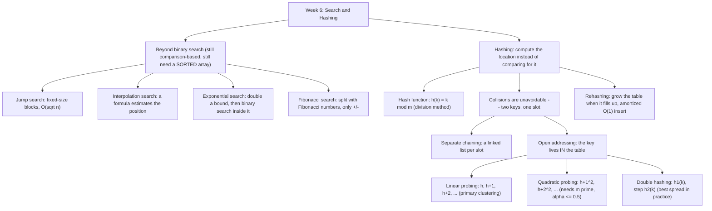

# Week 6 — Search and Hashing

*CEN207 Data Structures (formerly CE205) · Fall 2026–2027*

<!-- materials:start -->

<div class="materials" markdown>

[:material-file-pdf-box: Lecture notes (PDF)](cen207-week-6-notes.pdf){ .md-button download="cen207-week-6-notes.pdf" }
[:material-file-word-box: Lecture notes (DOCX)](cen207-week-6-notes.docx){ .md-button download="cen207-week-6-notes.docx" }
[:material-presentation: Slides (PDF)](cen207-week-6-slides.pdf){ .md-button download="cen207-week-6-slides.pdf" }
[:material-microsoft-powerpoint: Slides (PPTX)](cen207-week-6-slides.pptx){ .md-button download="cen207-week-6-slides.pptx" }
[:material-language-html5: Slides (HTML, offline)](cen207-week-6-slides.html){ .md-button download="cen207-week-6-slides.html" }
[:material-folder-zip: Download all (ZIP)](cen207-week-6-materials.zip){ .md-button download="cen207-week-6-materials.zip" }
[:material-fullscreen: Open slides full screen](cen207-week-6-slides.html){ .md-button .md-button--primary target=_blank }

</div>

<div class="deck-frame">
<iframe src="../cen207-week-6-slides.html" title="Week 6 — Search and Hashing" loading="lazy" allowfullscreen></iframe>
</div>

<p class="deck-hint">Click inside the slides and use the arrow keys; use the button at the bottom right of the slides, or the "Open slides full screen" link above, for full screen.</p>

<!-- materials:end -->

!!! abstract "This week"
    **Learning outcomes.** By the end of this week you will be able to explain, draw, and implement four
    searching techniques that go beyond the linear and binary search you already know — **jump search**,
    **interpolation search**, **exponential search**, and **Fibonacci search** — and you will be able to
    explain why each one exists (what specific weakness of binary search it fixes, and at what cost). You will
    then meet an entirely different idea for answering "is `x` here, and if so, where?": instead of *narrowing
    a range* by comparing, a **hash table** computes the answer's location directly with a **hash function**,
    giving average-case **O(1)** lookup. You will learn the **division method** `h(k) = k mod m` and why the
    choice of `m` matters; how **collisions** — two different keys landing on the same slot — are unavoidable
    and must be resolved, first with **separate chaining** (a linked list per slot) and then with **open
    addressing** (linear probing, quadratic probing, double hashing — every key living inside the table
    itself); and why a hash table must occasionally **rehash** — grow and rebuild itself — to keep its
    performance guarantee as it fills up. These outcomes map to **LO.1** (explain fundamental data structures),
    **LO.2** (analyze algorithmic complexity), and **LO.7** (choose the right structure for a problem) of the
    course syllabus.

    **What you need already.** Week 1 gave you arrays and the idea of an index as a direct memory address.
    Week 2 gave you the linked list — exactly what a hash bucket's chain is built from. Week 3 gave you the
    stack and the queue. Week 4 gave you trees, and specifically the idea that halving a search space at every
    step gives you a logarithmic number of steps — that is precisely what binary search already does over an
    array, and precisely what this week's new searches either exploit further or trade away on purpose. Week 5
    gave you graphs and traversal. This week does not build directly on any single one of those data
    structures; instead it builds on the *idea of a sorted array* (Week 1) for the four new searches, and
    introduces the hash table as a genuinely new structure — one that will itself become a useful *tool* inside
    later data structures (an adjacency list keyed by a hash map, for instance, when a graph's vertices are not
    conveniently numbered `0..V-1`).

    **Time plan for a 3-hour session.** The search problem, recap of linear and binary search (~15 min) · jump
    search (~20 min) · interpolation search (~20 min) · exponential search (~15 min) · Fibonacci search (~15
    min) · comparison table and a short break · hashing: inception and the division hash function (~20 min) ·
    collisions and separate chaining (~20 min) · open addressing: linear, quadratic, and double hashing (~35
    min) · rehashing (~15 min) · choosing a technique, wrap-up and self-check (~15 min).

## 0. Before we start

### 0.1 What you already know

Two ideas from the last five weeks matter most this week.

**From Week 1 — arrays and indices.** An array stores its elements in one contiguous block of memory, and
`arr[i]` is computed directly as `base_address + i * element_size` — no searching required to *reach* index
`i`, only to decide *which* `i` holds what you want. Every search technique this week (jump, interpolation,
exponential, Fibonacci) is a different strategy for choosing which indices to check, on a **sorted** array,
to find that `i` in as few comparisons as possible. Binary search, already familiar to you, is one point in
this design space; this week fills in the rest of it.

**From Week 4 — halving a search space.** Binary search's big idea — eliminate half the remaining candidates
with a single comparison, giving `O(log n)` total comparisons — is the yardstick every technique in this
chapter is measured against. Jump search deliberately does *worse* than binary search (in exchange for
simplicity); interpolation search does *better* on the right kind of data; exponential search adapts binary
search to array sizes you do not know in advance; Fibonacci search matches binary search's asymptotic cost
using only addition and subtraction. Keep binary search's `O(log n)` in your head as the reference point for
all four.

**A genuinely new idea: trading order for computation.** Every technique above still works by *comparing*
`target` against array elements and narrowing a range. Hashing throws that whole approach away: instead of
narrowing, a **hash function** computes *directly* where a key belongs, in one O(1) step, with no order
requirement on the data at all. The price is that two different keys can compute to the *same* location — a
**collision** — and the second half of this week is entirely about handling that.

### 0.2 The map of this week



Every box gets its own section below, most with a step-by-step animation, a complete C and Java program, and a
note on complexity and common mistakes.

## 1. The search problem, and a recap of linear and binary search

### 1.1 The problem, restated

You already solved the basic version of this problem in Week 1: given an array and a `target` value, is
`target` in the array, and if so, at which index? Week 1 gave you two answers — **linear search** (check every
element, `O(n)`) and **binary search** (on a *sorted* array, repeatedly check the middle and discard half,
`O(log n)`). This week's question is sharper: given that the array is **sorted**, is binary search's `O(log
n)` really the best we can do, and what does it cost to do *better*, or to do *almost as well with a simpler
idea*? The four new techniques below each answer that question differently.

### 1.2 Recap: linear search, `O(n)`

Linear search makes no assumption about the data at all: it checks `arr[0]`, then `arr[1]`, and so on, until it
finds `target` or runs out of array. Its cost is proportional to `n`, the array's size, in the worst case (the
target is last, or absent) and on average (for a target present at a uniformly random position, you check
`n/2` elements on average). Its one great virtue is that it works on **any** array, sorted or not — every
technique from here on trades that generality away in exchange for speed, by requiring the array to be sorted
first.

### 1.3 Recap: binary search, `O(log n)`

Binary search requires a **sorted** array. It checks the middle element; if it is the target, done; if the
target is smaller, the entire right half — including the middle — can be discarded in one step (sorted order
guarantees the target cannot be there); if larger, the left half is discarded the same way. Each comparison
halves the remaining candidates, so after `k` comparisons at most `n / 2^k` candidates remain; the search ends
when that reaches 1, giving `k = log2(n)` comparisons in the worst case — **O(log n)**. For `n = 1,000,000`,
that is about 20 comparisons, versus up to a million for linear search on the same data.

If binary search, its complexity, and its C/Java code are not fresh in your memory, revisit **Week 1** before
continuing — this chapter assumes it and will not re-derive it. The four techniques below all still require a
sorted array, and all are still fundamentally comparison-based; none of them beats binary search's `O(log n)`
worst case by more than a constant factor except interpolation search on the right kind of data (and even
that has a bad worst case, as you will see in section 3).

## 2. Jump search

### 2.1 A question to start

Binary search's jump to the exact middle is powerful, but it needs a division (or a shift) and a bit of
careful index arithmetic (`lo + (hi - lo) / 2`, to avoid overflow) at every single step, and it does not access
memory sequentially — it jumps all over the array, which is unfriendly to hardware that likes to read memory
in contiguous blocks (a fact you will meet in more depth when this course reaches memory hierarchies and
caching). What if, instead, you scanned forward in **fixed-size blocks** — check every `k`-th element, and once
you have jumped past where `target` must be, fall back to a plain linear scan of just that one block? That
is **jump search**: simpler arithmetic than binary search, sequential memory access within each block, at the
cost of being asymptotically slower than binary search (though still far faster than linear search).

This block-style search appears in Donald Knuth's *The Art of Computer Programming, Volume 3: Sorting and
Searching* (1973) as an alternative to binary search, presented specifically as a case where a simple
calculus argument — minimizing the sum of two costs — determines the algorithm's one free parameter, the
block size.

### 2.2 The idea and the right block size

Pick a block size `b`. Check `arr[b-1]`, `arr[2b-1]`, `arr[3b-1]`, … until you find a boundary that is `>=
target` (or run off the end of the array); `target`, if present, must be in the block just before that
boundary (sorted order again). Then scan that one block **linearly**, left to right, comparing every element.

How many comparisons does this cost in the worst case? Jumping costs at most `n / b` comparisons (you jump
through the whole array in blocks of size `b`), and the final linear scan costs at most `b` comparisons. Total:
`n/b + b`. Calculus (or just trying values) shows this sum is minimized when `b = sqrt(n)`, giving a total
worst-case cost of `2 * sqrt(n)` — **O(sqrt(n))**. That is worse than binary search's `O(log n)` (for `n =
1,000,000`, `sqrt(n) = 1000` versus `log2(n) ≈ 20`), but far better than linear search's `O(n)`, and the
arithmetic at each step is a single addition, not a division.

### 2.3 In memory, and the code

Below, `jump_search` computes `block = floor(sqrt(n))`, jumps forward one block at a time by checking the
*last* index of each block, and once it finds a block whose last index is `>= target`, scans that block
linearly.

=== "C"

    ```c
    int jump_search(const int arr[], int n, int target, int *comparisons) {
        int block = (int) sqrt((double) n);      /* block size = floor(sqrt(n)) */
        if (block < 1) block = 1;
        int prev = 0, step = block, comp = 0;
        while (step < n) {                        /* jump forward one block at a time */
            comp++;
            if (arr[step - 1] >= target) break;    /* target may be in this block */
            prev = step;
            step += block;
        }
        if (step > n) step = n;
        for (int i = prev; i < step; i++) {        /* linear scan inside the block */
            comp++;
            if (arr[i] == target) { *comparisons = comp; return i; }
            if (arr[i] > target) break;             /* sorted: no need to look further */
        }
        *comparisons = comp;
        return -1;
    }
    ```

=== "Java"

    ```java
    static int jumpSearch(int[] arr, int target) {
        int n = arr.length;
        int block = (int) Math.sqrt(n);          // block size = floor(sqrt(n))
        if (block < 1) block = 1;
        int prev = 0, step = block;
        comparisons = 0;
        while (step < n) {                        // jump forward one block at a time
            comparisons++;
            if (arr[step - 1] >= target) break;    // target may be in this block
            prev = step;
            step += block;
        }
        if (step > n) step = n;
        for (int i = prev; i < step; i++) {        // linear scan inside the block
            comparisons++;
            if (arr[i] == target) return i;
            if (arr[i] > target) break;             // sorted: no need to look further
        }
        return -1;
    }
    ```

Play the animation to watch the block boundaries get checked one by one, then the final block scanned left to
right.

<iframe class="dsanim" src="../anim/jump-search.html" title="Jump search: advancing block by block" loading="lazy"></iframe>
<div class="dsanim-baski" markdown>

</div>

In the picker, also try **target near the last block, needs the most jumps** (hard) and the edge cases
**target is smaller than every value**, **target is larger than every value**, and **target is in range but not
in the array** — or press 🎲 for random data at four difficulty levels, or type your own sorted array and
target.

### 2.4 Try it

??? example "Full program: `jump_search.c` / `JumpSearch.java`"

    === "C"

        ```c
        /* Week 6 -- Search and Hashing
         * Jump search: on a SORTED array, jump forward in fixed-size blocks
         * (block = floor(sqrt(n))) until a block boundary is >= target, then scan
         * that block linearly. Prints every jump and every comparison inside the
         * final block.
         * CEN207 Data Structures (formerly CE205)
         */
        #include <stdio.h>
        #include <math.h>

        int jump_search(const int arr[], int n, int target, int *comparisons) {
            int block = (int) sqrt((double) n);      /* block size = floor(sqrt(n)) */
            if (block < 1) block = 1;
            int prev = 0, step = block, comp = 0;
            while (step < n) {                        /* jump forward one block at a time */
                comp++;
                printf("  jump: check arr[%d] = %d\n", step - 1, arr[step - 1]);
                if (arr[step - 1] >= target) break;    /* target may be in this block */
                prev = step;
                step += block;
            }
            if (step > n) step = n;
            printf("  scanning block [%d..%d)\n", prev, step);
            for (int i = prev; i < step; i++) {        /* linear scan inside the block */
                comp++;
                printf("  compare arr[%d] = %d\n", i, arr[i]);
                if (arr[i] == target) { *comparisons = comp; return i; }
                if (arr[i] > target) break;             /* sorted: no need to look further */
            }
            *comparisons = comp;
            return -1;
        }

        static void print_array(const int arr[], int n) {
            printf("arr =");
            for (int i = 0; i < n; i++) printf(" %d", arr[i]);
            printf("\n");
        }

        static void run_scenario(const char *label, const int arr[], int n, int target) {
            printf("-- %s --\n", label);
            print_array(arr, n);
            printf("target = %d\n", target);
            int comparisons = 0;
            int index = jump_search(arr, n, target, &comparisons);
            if (index == -1) printf("result: not found, %d comparisons\n\n", comparisons);
            else printf("result: found at index %d, %d comparisons\n\n", index, comparisons);
        }

        int main(void) {
            int a[] = {2, 6, 10, 14, 18, 22, 26, 30, 34, 38, 42, 46, 50, 54, 58, 62};
            int n = 16;

            run_scenario("normal: 16 values, target found in the second block", a, n, 42);
            run_scenario("hard: target near the last block, needs the most jumps", a, n, 58);
            run_scenario("edge: target is smaller than every value", a, n, 1);
            run_scenario("edge: target is larger than every value", a, n, 999);
            run_scenario("edge: target is in range but not in the array", a, n, 45);

            return 0;
        }
        ```

    === "Java"

        ```java
        /* Week 6 -- Search and Hashing
         * Jump search: on a SORTED array, jump forward in fixed-size blocks
         * (block = floor(sqrt(n))) until a block boundary is >= target, then scan
         * that block linearly. Prints every jump and every comparison inside the
         * final block.
         * CEN207 Data Structures (formerly CE205)
         */
        public class JumpSearch {
            static int comparisons;

            static int jumpSearch(int[] arr, int target) {
                int n = arr.length;
                int block = (int) Math.sqrt(n);          // block size = floor(sqrt(n))
                if (block < 1) block = 1;
                int prev = 0, step = block;
                comparisons = 0;
                while (step < n) {                        // jump forward one block at a time
                    comparisons++;
                    System.out.println("  jump: check arr[" + (step - 1) + "] = " + arr[step - 1]);
                    if (arr[step - 1] >= target) break;    // target may be in this block
                    prev = step;
                    step += block;
                }
                if (step > n) step = n;
                System.out.println("  scanning block [" + prev + ".." + step + ")");
                for (int i = prev; i < step; i++) {        // linear scan inside the block
                    comparisons++;
                    System.out.println("  compare arr[" + i + "] = " + arr[i]);
                    if (arr[i] == target) return i;
                    if (arr[i] > target) break;             // sorted: no need to look further
                }
                return -1;
            }

            static void printArray(int[] arr) {
                StringBuilder sb = new StringBuilder("arr =");
                for (int v : arr) sb.append(' ').append(v);
                System.out.println(sb);
            }

            static void runScenario(String label, int[] arr, int target) {
                System.out.println("-- " + label + " --");
                printArray(arr);
                System.out.println("target = " + target);
                int index = jumpSearch(arr, target);
                if (index == -1) System.out.println("result: not found, " + comparisons + " comparisons");
                else System.out.println("result: found at index " + index + ", " + comparisons + " comparisons");
                System.out.println();
            }

            public static void main(String[] args) {
                int[] a = {2, 6, 10, 14, 18, 22, 26, 30, 34, 38, 42, 46, 50, 54, 58, 62};

                runScenario("normal: 16 values, target found in the second block", a, 42);
                runScenario("hard: target near the last block, needs the most jumps", a, 58);
                runScenario("edge: target is smaller than every value", a, 1);
                runScenario("edge: target is larger than every value", a, 999);
                runScenario("edge: target is in range but not in the array", a, 45);
            }
        }
        ```

**Try it**

=== "C"

    ```console
    gcc -std=c11 -Wall -Wextra -o /tmp/x jump_search.c && /tmp/x
    ```

    Expected output:

    ```text
    -- normal: 16 values, target found in the second block --
    arr = 2 6 10 14 18 22 26 30 34 38 42 46 50 54 58 62
    target = 42
      jump: check arr[3] = 14
      jump: check arr[7] = 30
      jump: check arr[11] = 46
      scanning block [8..12)
      compare arr[8] = 34
      compare arr[9] = 38
      compare arr[10] = 42
    result: found at index 10, 6 comparisons

    -- hard: target near the last block, needs the most jumps --
    arr = 2 6 10 14 18 22 26 30 34 38 42 46 50 54 58 62
    target = 58
      jump: check arr[3] = 14
      jump: check arr[7] = 30
      jump: check arr[11] = 46
      scanning block [12..16)
      compare arr[12] = 50
      compare arr[13] = 54
      compare arr[14] = 58
    result: found at index 14, 6 comparisons

    -- edge: target is smaller than every value --
    arr = 2 6 10 14 18 22 26 30 34 38 42 46 50 54 58 62
    target = 1
      jump: check arr[3] = 14
      scanning block [0..4)
      compare arr[0] = 2
    result: not found, 2 comparisons

    -- edge: target is larger than every value --
    arr = 2 6 10 14 18 22 26 30 34 38 42 46 50 54 58 62
    target = 999
      jump: check arr[3] = 14
      jump: check arr[7] = 30
      jump: check arr[11] = 46
      scanning block [12..16)
      compare arr[12] = 50
      compare arr[13] = 54
      compare arr[14] = 58
      compare arr[15] = 62
    result: not found, 7 comparisons

    -- edge: target is in range but not in the array --
    arr = 2 6 10 14 18 22 26 30 34 38 42 46 50 54 58 62
    target = 45
      jump: check arr[3] = 14
      jump: check arr[7] = 30
      jump: check arr[11] = 46
      scanning block [8..12)
      compare arr[8] = 34
      compare arr[9] = 38
      compare arr[10] = 42
      compare arr[11] = 46
    result: not found, 7 comparisons
    ```

=== "Java"

    ```console
    javac -Xlint:all -d /tmp/j JumpSearch.java && java -cp /tmp/j JumpSearch
    ```

    Expected output: identical to the C run above (same algorithm, same data).

### 2.5 Complexity, mistakes, self-check

**Complexity.** Best case `O(1)` (target is the very first block boundary checked and happens to be the
target itself — rare, since the boundary check is `>=`, not `==`). Worst case and average case both
**O(sqrt(n))**, with the optimal block size `b = sqrt(n)` derived in section 2.2. It needs a sorted array, just
like binary search.

!!! warning "Common mistakes"
    - **Picking an arbitrary block size** (say, a fixed `100`) instead of computing `sqrt(n)`. A block size
      that does not scale with `n` degrades toward `O(n)` for large arrays (too many jumps) or toward a large
      constant scan for small arrays (too much linear work per block); only `b = sqrt(n)` balances the two
      costs.
    - **Checking `arr[step]` instead of `arr[step - 1]`.** The block boundary you want to test is the *last*
      element of the current block (index `step - 1`), not the *first* element of the next block (index
      `step`) — off by one here either skips a valid block or scans one element too many.
    - **Forgetting to clamp `step` to `n`** after the jump loop ends. If the last jump overshoots the array
      (`step > n`), the linear scan must stop at `n`, not `step`, or it reads past the end of the array.

??? success "Self-check: why sqrt(n)?"
    Jump search costs at most `n/b` jump-comparisons plus at most `b` linear-scan comparisons, total `n/b + b`.
    Why does calculus say `b = sqrt(n)` minimizes this sum, and what would happen to the total cost if you
    instead picked `b = 1` or `b = n`?

    **Answer.** Minimizing `f(b) = n/b + b`: take the derivative, `f'(b) = -n/b^2 + 1`, set it to zero:
    `b^2 = n`, so `b = sqrt(n)`. At `b = 1`, jump search degenerates into linear search (`n` jump-comparisons,
    each block is one element) — `O(n)`. At `b = n`, there is only one giant "block" (the whole array), so it
    degenerates into an ordinary linear scan too — `O(n)`. Only `b = sqrt(n)` gives the balanced `O(sqrt(n))`.

## 3. Interpolation search

### 3.1 A question to start

Think about how you look up a name in a paper phone book (or a word in a printed dictionary). You do not open
it exactly in the middle every time, the way binary search would. If you are looking for "Yilmaz", you open
the book much closer to the *end*; if you are looking for "Aydin", much closer to the *start*. You are using
the fact that names are not just *sorted*, but roughly **uniformly spread out** across the alphabet, to jump
straight to a good estimate of the right page. **Interpolation search** does exactly this on a sorted array of
numbers: instead of always checking the middle, it computes an estimated position with a formula, using how
far `target` sits between the smallest and largest values currently in range.

This position-estimating idea for searching ordered data appears in W. W. Peterson's 1957 paper *Addressing
for Random-Access Storage* (IBM Journal of Research and Development) — the same early paper that laid out
foundational ideas for organizing random-access storage that this week's later sections on hashing also draw
on — and was subsequently formalized and analyzed under the name **interpolation search**.

### 3.2 The formula

Within the current range `[lo..hi]`, assume the values are roughly evenly spaced between `arr[lo]` and
`arr[hi]`. Then `target`'s position can be estimated proportionally:

```
pos = lo + floor( (target - arr[lo]) * (hi - lo) / (arr[hi] - arr[lo]) )
```

If `target == arr[lo]`, this gives `pos = lo`; if `target == arr[hi]`, it gives `pos = hi`; for a value
in between, it estimates linearly. Compare `arr[pos]` to `target` exactly as binary search compares
`arr[mid]`: equal, done; less, narrow to `[pos+1..hi]`; greater, narrow to `[lo..pos-1]`. One extra case
needs a **guard**: if `arr[hi] == arr[lo]`, the formula's denominator is zero — a **division by zero** — which
can only happen when the whole current range holds one repeated value; the guard catches this case and
resolves it directly, without ever evaluating the formula.

### 3.3 Cost: excellent on uniform data, poor on skewed data

On data that really is close to uniformly spread, interpolation search's estimate lands very close to the true
position almost every time, giving an average-case cost of **O(log log n)** — for `n = 1,000,000`, `log2(n) ≈
20` but `log2(log2(n)) ≈ 4.3`: a handful of probes instead of about twenty. But the formula's accuracy depends
entirely on the *uniform spread* assumption. On **skewed** data — say, sixteen small values clustered together
plus one enormous outlier — the formula's estimate is pulled far off target by that one outlier, and
interpolation search's worst case degrades all the way to **O(n)**, no better than linear search. Interpolation
search is a bet: it wins big on well-behaved numeric data (phone numbers, sensor readings, timestamps) and
loses badly on adversarial or heavily skewed data.

### 3.4 In memory, and the code

=== "C"

    ```c
    int interpolation_search(const int arr[], int n, int target, int *probes) {
        int lo = 0, hi = n - 1, p = 0;
        while (lo <= hi && target >= arr[lo] && target <= arr[hi]) {
            p++;
            if (arr[hi] == arr[lo]) {                 /* guard: avoid division by zero */
                *probes = p;
                return lo;                            /* target must equal arr[lo] here */
            }
            /* widen to long long: target-arr[lo] and arr[hi]-arr[lo] can overflow a 32-bit int
               when the array spans values near INT_MIN and INT_MAX at once */
            long long span = (long long) arr[hi] - (long long) arr[lo];
            long long num = (long long) target - (long long) arr[lo];
            int pos = lo + (int) ((double) num * (hi - lo) / (double) span);
            if (arr[pos] == target) { *probes = p; return pos; }
            if (arr[pos] < target) lo = pos + 1;
            else hi = pos - 1;
        }
        *probes = p;
        return -1;
    }
    ```

=== "Java"

    ```java
    static int interpolationSearch(int[] arr, int target) {
        int lo = 0, hi = arr.length - 1;
        probes = 0;
        while (lo <= hi && target >= arr[lo] && target <= arr[hi]) {
            probes++;
            if (arr[hi] == arr[lo]) {                 // guard: avoid division by zero
                return lo;                            // target must equal arr[lo] here
            }
            // widen to long: target-arr[lo] and arr[hi]-arr[lo] can overflow a 32-bit int
            // when the array spans values near Integer.MIN_VALUE and Integer.MAX_VALUE at once
            long span = (long) arr[hi] - (long) arr[lo];
            long num = (long) target - (long) arr[lo];
            int pos = lo + (int) ((double) num * (hi - lo) / (double) span);
            if (arr[pos] == target) return pos;
            if (arr[pos] < target) lo = pos + 1;
            else hi = pos - 1;
        }
        return -1;
    }
    ```

<iframe class="dsanim" src="../anim/interpolation-search.html" title="Interpolation search: estimating the position with a formula" loading="lazy"></iframe>
<div class="dsanim-baski" markdown>

</div>

In the picker, also try **slightly uneven spacing, needs a few probes** (hard) and the edge cases **skewed
data: last value is huge, many probes**, **all values equal: the division guard kicks in**, and **target is
entirely outside the range: rejected on sight** — or press 🎲 for random data, or type your own sorted array.

### 3.5 Try it

??? example "Full program: `interpolation_search.c` / `InterpolationSearch.java`"

    === "C"

        ```c
        /* Week 6 -- Search and Hashing
         * Interpolation search: on a SORTED, roughly uniform array, estimate where
         * the target should be with a formula instead of always checking the
         * middle. A guard avoids dividing by zero when the current range is all one
         * value. Prints every probe.
         * CEN207 Data Structures (formerly CE205)
         */
        #include <stdio.h>

        int interpolation_search(const int arr[], int n, int target, int *probes) {
            int lo = 0, hi = n - 1, p = 0;
            while (lo <= hi && target >= arr[lo] && target <= arr[hi]) {
                p++;
                if (arr[hi] == arr[lo]) {                 /* guard: avoid division by zero */
                    printf("  probe %d: arr[hi] == arr[lo] (%d), guard triggered\n", p, arr[lo]);
                    *probes = p;
                    return lo;                            /* target must equal arr[lo] here */
                }
                /* widen to long long: target-arr[lo] and arr[hi]-arr[lo] can overflow a 32-bit int
                   when the array spans values near INT_MIN and INT_MAX at once */
                long long span = (long long) arr[hi] - (long long) arr[lo];
                long long num = (long long) target - (long long) arr[lo];
                int pos = lo + (int) ((double) num * (hi - lo) / (double) span);
                printf("  probe %d: lo=%d hi=%d pos=%d arr[pos]=%d\n", p, lo, hi, pos, arr[pos]);
                if (arr[pos] == target) { *probes = p; return pos; }
                if (arr[pos] < target) lo = pos + 1;
                else hi = pos - 1;
            }
            *probes = p;
            return -1;
        }

        static void print_array(const int arr[], int n) {
            printf("arr =");
            for (int i = 0; i < n; i++) printf(" %d", arr[i]);
            printf("\n");
        }

        static void run_scenario(const char *label, const int arr[], int n, int target) {
            printf("-- %s --\n", label);
            print_array(arr, n);
            printf("target = %d\n", target);
            int probes = 0;
            int index = interpolation_search(arr, n, target, &probes);
            if (index == -1) printf("result: not found, %d probes\n\n", probes);
            else printf("result: found at index %d, %d probes\n\n", index, probes);
        }

        int main(void) {
            int normal[] = {10, 15, 20, 25, 30, 35, 40, 45, 50, 55, 60, 65, 70, 75, 80, 85};
            int hard[] = {10, 13, 21, 24, 33, 36, 44, 48, 55, 61, 68, 74, 81, 87, 94, 100};
            int skewed[] = {1, 2, 3, 4, 5, 6, 7, 8, 9, 10, 11, 12, 13, 14, 15, 1000000};
            int all_equal[] = {42, 42, 42, 42, 42, 42, 42, 42, 42, 42, 42, 42, 42, 42, 42, 42};

            run_scenario("normal: uniformly spread 16 values, found in a single probe", normal, 16, 55);
            run_scenario("hard: slightly uneven spacing, needs a few probes", hard, 16, 81);
            run_scenario("edge: skewed data, last value is huge, many probes", skewed, 16, 8);
            run_scenario("edge: all values equal, the division guard kicks in", all_equal, 16, 42);
            run_scenario("edge: target is entirely outside the range, rejected on sight", normal, 16, 999);

            return 0;
        }
        ```

    === "Java"

        ```java
        /* Week 6 -- Search and Hashing
         * Interpolation search: on a SORTED, roughly uniform array, estimate where
         * the target should be with a formula instead of always checking the
         * middle. A guard avoids dividing by zero when the current range is all one
         * value. Prints every probe.
         * CEN207 Data Structures (formerly CE205)
         */
        public class InterpolationSearch {
            static int probes;

            static int interpolationSearch(int[] arr, int target) {
                int lo = 0, hi = arr.length - 1;
                probes = 0;
                while (lo <= hi && target >= arr[lo] && target <= arr[hi]) {
                    probes++;
                    if (arr[hi] == arr[lo]) {                 // guard: avoid division by zero
                        System.out.println("  probe " + probes + ": arr[hi] == arr[lo] (" + arr[lo] + "), guard triggered");
                        return lo;                            // target must equal arr[lo] here
                    }
                    // widen to long: target-arr[lo] and arr[hi]-arr[lo] can overflow a 32-bit int
                    // when the array spans values near Integer.MIN_VALUE and Integer.MAX_VALUE at once
                    long span = (long) arr[hi] - (long) arr[lo];
                    long num = (long) target - (long) arr[lo];
                    int pos = lo + (int) ((double) num * (hi - lo) / (double) span);
                    System.out.println("  probe " + probes + ": lo=" + lo + " hi=" + hi + " pos=" + pos + " arr[pos]=" + arr[pos]);
                    if (arr[pos] == target) return pos;
                    if (arr[pos] < target) lo = pos + 1;
                    else hi = pos - 1;
                }
                return -1;
            }

            static void printArray(int[] arr) {
                StringBuilder sb = new StringBuilder("arr =");
                for (int v : arr) sb.append(' ').append(v);
                System.out.println(sb);
            }

            static void runScenario(String label, int[] arr, int target) {
                System.out.println("-- " + label + " --");
                printArray(arr);
                System.out.println("target = " + target);
                int index = interpolationSearch(arr, target);
                if (index == -1) System.out.println("result: not found, " + probes + " probes");
                else System.out.println("result: found at index " + index + ", " + probes + " probes");
                System.out.println();
            }

            public static void main(String[] args) {
                int[] normal = {10, 15, 20, 25, 30, 35, 40, 45, 50, 55, 60, 65, 70, 75, 80, 85};
                int[] hard = {10, 13, 21, 24, 33, 36, 44, 48, 55, 61, 68, 74, 81, 87, 94, 100};
                int[] skewed = {1, 2, 3, 4, 5, 6, 7, 8, 9, 10, 11, 12, 13, 14, 15, 1000000};
                int[] allEqual = {42, 42, 42, 42, 42, 42, 42, 42, 42, 42, 42, 42, 42, 42, 42, 42};

                runScenario("normal: uniformly spread 16 values, found in a single probe", normal, 55);
                runScenario("hard: slightly uneven spacing, needs a few probes", hard, 81);
                runScenario("edge: skewed data, last value is huge, many probes", skewed, 8);
                runScenario("edge: all values equal, the division guard kicks in", allEqual, 42);
                runScenario("edge: target is entirely outside the range, rejected on sight", normal, 999);
            }
        }
        ```

**Try it**

=== "C"

    ```console
    gcc -std=c11 -Wall -Wextra -o /tmp/x interpolation_search.c && /tmp/x
    ```

    Expected output:

    ```text
    -- normal: uniformly spread 16 values, found in a single probe --
    arr = 10 15 20 25 30 35 40 45 50 55 60 65 70 75 80 85
    target = 55
      probe 1: lo=0 hi=15 pos=9 arr[pos]=55
    result: found at index 9, 1 probes

    -- hard: slightly uneven spacing, needs a few probes --
    arr = 10 13 21 24 33 36 44 48 55 61 68 74 81 87 94 100
    target = 81
      probe 1: lo=0 hi=15 pos=11 arr[pos]=74
      probe 2: lo=12 hi=15 pos=12 arr[pos]=81
    result: found at index 12, 2 probes

    -- edge: skewed data, last value is huge, many probes --
    arr = 1 2 3 4 5 6 7 8 9 10 11 12 13 14 15 1000000
    target = 8
      probe 1: lo=0 hi=15 pos=0 arr[pos]=1
      probe 2: lo=1 hi=15 pos=1 arr[pos]=2
      probe 3: lo=2 hi=15 pos=2 arr[pos]=3
      probe 4: lo=3 hi=15 pos=3 arr[pos]=4
      probe 5: lo=4 hi=15 pos=4 arr[pos]=5
      probe 6: lo=5 hi=15 pos=5 arr[pos]=6
      probe 7: lo=6 hi=15 pos=6 arr[pos]=7
      probe 8: lo=7 hi=15 pos=7 arr[pos]=8
    result: found at index 7, 8 probes

    -- edge: all values equal, the division guard kicks in --
    arr = 42 42 42 42 42 42 42 42 42 42 42 42 42 42 42 42
    target = 42
      probe 1: arr[hi] == arr[lo] (42), guard triggered
    result: found at index 0, 1 probes

    -- edge: target is entirely outside the range, rejected on sight --
    arr = 10 15 20 25 30 35 40 45 50 55 60 65 70 75 80 85
    target = 999
    result: not found, 0 probes
    ```

=== "Java"

    ```console
    javac -Xlint:all -d /tmp/j InterpolationSearch.java && java -cp /tmp/j InterpolationSearch
    ```

    Expected output: identical to the C run above (same algorithm, same data).

### 3.6 Complexity, mistakes, self-check

**Complexity.** Average case **O(log log n)** on uniformly distributed data; worst case **O(n)** on skewed
data (the array `[1, 2, 3, ..., 15, 1000000]` above needed 8 probes for just 16 elements — imagine the same
shape scaled up to a million elements). Needs a sorted array, exactly like binary search.

!!! warning "Common mistakes"
    - **Forgetting the `arr[hi] == arr[lo]` guard.** Without it, a range of repeated values causes a division
      by zero. This is not a rare edge case in practice — any real dataset with duplicate values can trigger
      it once the search narrows down far enough.
    - **Using integer division without casting to `double` first.** `(target - arr[lo]) * (hi - lo) /
      (arr[hi] - arr[lo])` computed entirely in `int` arithmetic can overflow for large key ranges, and loses
      the fractional precision the formula depends on; casting the numerator to `double` (as the code above
      does) avoids both problems.
    - **Assuming interpolation search is always faster than binary search.** It is a *bet* that pays off only
      on roughly uniform data; on skewed or adversarial data it can be dramatically slower. Never use it
      blindly on data whose distribution you have not checked.

??? success "Self-check: why the guard returns `lo`, not "not found""
    In the "all values equal" scenario above, the guard triggers immediately and returns index `0` (`lo`) as a
    **found** result. Why is that correct, given that the guard fires the instant `arr[hi] == arr[lo]`, before
    ever comparing `arr[lo]` to `target`?

    **Answer.** The `while` loop's own condition already guarantees `target >= arr[lo] && target <= arr[hi]`
    before the guard is even reached. If, in addition, `arr[hi] == arr[lo]`, then `arr[lo]` and `arr[hi]` are
    the same value, and `target` is sandwiched between two equal bounds — so `target` must equal that value
    too. Returning `lo` is therefore always correct in this branch, without needing a separate comparison.

## 4. Exponential search

### 4.1 A question to start

Binary search needs to know `n`, the array's size, before it starts, to compute the first midpoint. But what
if the array is effectively **unbounded** — a sorted stream, or an array so enormous that just reading `n`
is itself expensive — and you strongly suspect the target, if present, is somewhere near the **front**?
Scanning the whole thing to find `n` first would be wasteful. **Exponential search** solves this: find a
**bound** that is guaranteed to contain the target by doubling (`1, 2, 4, 8, …`) until you overshoot it, then
run ordinary binary search inside that bound. The bound-finding phase costs only `O(log index)` — proportional
to how far in the target actually is — not `O(log n)`.

Jon Bentley and Andrew Yao published this technique in their 1976 paper *An Almost Optimal Algorithm for
Unbounded Searching* (Information Processing Letters). It is also called **unbounded search** or
**galloping search** — "galloping" for the doubling bound-finding phase, small steps that grow larger and
larger like a horse picking up speed — and variants of it are used today inside several merge and
set-intersection algorithms.

### 4.2 The idea: double until you overshoot, then binary search

Check `arr[0]` first (comparison #1). If it is not the target, grow a `bound` by doubling — `1, 2, 4, 8, …` —
checking `arr[bound]` each time, until `arr[bound] >= target` or `bound >= n`. At that point, `target`, if
present, must lie in `[bound/2, min(bound, n-1)]` — because the previous, smaller bound was checked and found
`< target`. Run ordinary binary search inside exactly that range.

### 4.3 In memory, and the code

=== "C"

    ```c
    int exponential_search(const int arr[], int n, int target, int *comparisons) {
        if (n <= 0) { *comparisons = 0; return -1; }    /* nothing to search */
        int comp = 1;                    /* the arr[0] check below counts as comparison #1 */
        if (arr[0] == target) { *comparisons = comp; return 0; }
        int bound = 1;
        while (bound < n) {                 /* double the bound until it overshoots target */
            comp++;
            if (arr[bound] >= target) break;
            bound *= 2;
        }
        int lo = bound / 2, hi = (bound < n) ? bound : n - 1;
        while (lo <= hi) {                  /* ordinary binary search inside [lo..hi] */
            int mid = lo + (hi - lo) / 2;
            comp++;
            if (arr[mid] == target) { *comparisons = comp; return mid; }
            if (arr[mid] < target) lo = mid + 1;
            else hi = mid - 1;
        }
        *comparisons = comp;
        return -1;
    }
    ```

=== "Java"

    ```java
    static int exponentialSearch(int[] arr, int target) {
        int n = arr.length;
        if (n <= 0) { comparisons = 0; return -1; }  // nothing to search
        comparisons = 1;                 // the arr[0] check below counts as comparison #1
        if (arr[0] == target) return 0;
        int bound = 1;
        while (bound < n) {                 // double the bound until it overshoots target
            comparisons++;
            if (arr[bound] >= target) break;
            bound *= 2;
        }
        int lo = bound / 2, hi = (bound < n) ? bound : n - 1;
        while (lo <= hi) {                  // ordinary binary search inside [lo..hi]
            int mid = lo + (hi - lo) / 2;
            comparisons++;
            if (arr[mid] == target) return mid;
            if (arr[mid] < target) lo = mid + 1;
            else hi = mid - 1;
        }
        return -1;
    }
    ```

<iframe class="dsanim" src="../anim/exponential-search.html" title="Exponential search: doubling the bound, then binary search inside" loading="lazy"></iframe>
<div class="dsanim-baski" markdown>

</div>

In the picker, also try **target near the end, the bound doubles several times** (hard) and the edge cases
**target is the first element: a single comparison**, **target is larger than the last element**, and
**target is in range but not in the array** — or press 🎲 for random data, or type your own sorted array.

### 4.4 Try it

??? example "Full program: `exponential_search.c` / `ExponentialSearch.java`"

    === "C"

        ```c
        /* Week 6 -- Search and Hashing
         * Exponential search: on a SORTED array, double a bound (1, 2, 4, 8, ...)
         * until it overshoots target, then run ordinary binary search inside
         * [bound/2, bound]. Prints the bound-finding phase and the binary-search
         * phase.
         * CEN207 Data Structures (formerly CE205)
         */
        #include <stdio.h>

        int exponential_search(const int arr[], int n, int target, int *comparisons) {
            if (n <= 0) { *comparisons = 0; return -1; }    /* nothing to search */
            int comp = 1;                    /* the arr[0] check below counts as comparison #1 */
            printf("  check arr[0] = %d\n", arr[0]);
            if (arr[0] == target) { *comparisons = comp; return 0; }
            int bound = 1;
            while (bound < n) {                 /* double the bound until it overshoots target */
                comp++;
                printf("  bound = %d: check arr[%d] = %d\n", bound, bound, arr[bound]);
                if (arr[bound] >= target) break;
                bound *= 2;
            }
            int lo = bound / 2, hi = (bound < n) ? bound : n - 1;
            printf("  binary search inside [%d..%d]\n", lo, hi);
            while (lo <= hi) {                  /* ordinary binary search inside [lo..hi] */
                int mid = lo + (hi - lo) / 2;
                comp++;
                printf("  compare arr[%d] = %d\n", mid, arr[mid]);
                if (arr[mid] == target) { *comparisons = comp; return mid; }
                if (arr[mid] < target) lo = mid + 1;
                else hi = mid - 1;
            }
            *comparisons = comp;
            return -1;
        }

        static void print_array(const int arr[], int n) {
            printf("arr =");
            for (int i = 0; i < n; i++) printf(" %d", arr[i]);
            printf("\n");
        }

        static void run_scenario(const char *label, const int arr[], int n, int target) {
            printf("-- %s --\n", label);
            print_array(arr, n);
            printf("target = %d\n", target);
            int comparisons = 0;
            int index = exponential_search(arr, n, target, &comparisons);
            if (index == -1) printf("result: not found, %d comparisons\n\n", comparisons);
            else printf("result: found at index %d, %d comparisons\n\n", index, comparisons);
        }

        int main(void) {
            int a[] = {3, 7, 11, 15, 19, 23, 27, 31, 35, 39, 43, 47, 51, 55, 59, 63};
            int n = 16;

            run_scenario("normal: 16 values, target found around the middle", a, n, 39);
            run_scenario("hard: target near the end, the bound doubles several times", a, n, 59);
            run_scenario("edge: target is the first element, a single comparison", a, n, 3);
            run_scenario("edge: target is larger than the last element", a, n, 999);
            run_scenario("edge: target is in range but not in the array", a, n, 40);

            return 0;
        }
        ```

    === "Java"

        ```java
        /* Week 6 -- Search and Hashing
         * Exponential search: on a SORTED array, double a bound (1, 2, 4, 8, ...)
         * until it overshoots target, then run ordinary binary search inside
         * [bound/2, bound]. Prints the bound-finding phase and the binary-search
         * phase.
         * CEN207 Data Structures (formerly CE205)
         */
        public class ExponentialSearch {
            static int comparisons;

            static int exponentialSearch(int[] arr, int target) {
                int n = arr.length;
                if (n <= 0) { comparisons = 0; return -1; }  // nothing to search
                comparisons = 1;                 // the arr[0] check below counts as comparison #1
                System.out.println("  check arr[0] = " + arr[0]);
                if (arr[0] == target) return 0;
                int bound = 1;
                while (bound < n) {                 // double the bound until it overshoots target
                    comparisons++;
                    System.out.println("  bound = " + bound + ": check arr[" + bound + "] = " + arr[bound]);
                    if (arr[bound] >= target) break;
                    bound *= 2;
                }
                int lo = bound / 2, hi = (bound < n) ? bound : n - 1;
                System.out.println("  binary search inside [" + lo + ".." + hi + "]");
                while (lo <= hi) {                  // ordinary binary search inside [lo..hi]
                    int mid = lo + (hi - lo) / 2;
                    comparisons++;
                    System.out.println("  compare arr[" + mid + "] = " + arr[mid]);
                    if (arr[mid] == target) return mid;
                    if (arr[mid] < target) lo = mid + 1;
                    else hi = mid - 1;
                }
                return -1;
            }

            static void printArray(int[] arr) {
                StringBuilder sb = new StringBuilder("arr =");
                for (int v : arr) sb.append(' ').append(v);
                System.out.println(sb);
            }

            static void runScenario(String label, int[] arr, int target) {
                System.out.println("-- " + label + " --");
                printArray(arr);
                System.out.println("target = " + target);
                int index = exponentialSearch(arr, target);
                if (index == -1) System.out.println("result: not found, " + comparisons + " comparisons");
                else System.out.println("result: found at index " + index + ", " + comparisons + " comparisons");
                System.out.println();
            }

            public static void main(String[] args) {
                int[] a = {3, 7, 11, 15, 19, 23, 27, 31, 35, 39, 43, 47, 51, 55, 59, 63};

                runScenario("normal: 16 values, target found around the middle", a, 39);
                runScenario("hard: target near the end, the bound doubles several times", a, 59);
                runScenario("edge: target is the first element, a single comparison", a, 3);
                runScenario("edge: target is larger than the last element", a, 999);
                runScenario("edge: target is in range but not in the array", a, 40);
            }
        }
        ```

**Try it**

=== "C"

    ```console
    gcc -std=c11 -Wall -Wextra -o /tmp/x exponential_search.c && /tmp/x
    ```

    Expected output:

    ```text
    -- normal: 16 values, target found around the middle --
    arr = 3 7 11 15 19 23 27 31 35 39 43 47 51 55 59 63
    target = 39
      check arr[0] = 3
      bound = 1: check arr[1] = 7
      bound = 2: check arr[2] = 11
      bound = 4: check arr[4] = 19
      bound = 8: check arr[8] = 35
      binary search inside [8..15]
      compare arr[11] = 47
      compare arr[9] = 39
    result: found at index 9, 7 comparisons

    -- hard: target near the end, the bound doubles several times --
    arr = 3 7 11 15 19 23 27 31 35 39 43 47 51 55 59 63
    target = 59
      check arr[0] = 3
      bound = 1: check arr[1] = 7
      bound = 2: check arr[2] = 11
      bound = 4: check arr[4] = 19
      bound = 8: check arr[8] = 35
      binary search inside [8..15]
      compare arr[11] = 47
      compare arr[13] = 55
      compare arr[14] = 59
    result: found at index 14, 8 comparisons

    -- edge: target is the first element, a single comparison --
    arr = 3 7 11 15 19 23 27 31 35 39 43 47 51 55 59 63
    target = 3
      check arr[0] = 3
    result: found at index 0, 1 comparisons

    -- edge: target is larger than the last element --
    arr = 3 7 11 15 19 23 27 31 35 39 43 47 51 55 59 63
    target = 999
      check arr[0] = 3
      bound = 1: check arr[1] = 7
      bound = 2: check arr[2] = 11
      bound = 4: check arr[4] = 19
      bound = 8: check arr[8] = 35
      binary search inside [8..15]
      compare arr[11] = 47
      compare arr[13] = 55
      compare arr[14] = 59
      compare arr[15] = 63
    result: not found, 9 comparisons

    -- edge: target is in range but not in the array --
    arr = 3 7 11 15 19 23 27 31 35 39 43 47 51 55 59 63
    target = 40
      check arr[0] = 3
      bound = 1: check arr[1] = 7
      bound = 2: check arr[2] = 11
      bound = 4: check arr[4] = 19
      bound = 8: check arr[8] = 35
      binary search inside [8..15]
      compare arr[11] = 47
      compare arr[9] = 39
      compare arr[10] = 43
    result: not found, 8 comparisons
    ```

=== "Java"

    ```console
    javac -Xlint:all -d /tmp/j ExponentialSearch.java && java -cp /tmp/j ExponentialSearch
    ```

    Expected output: identical to the C run above (same algorithm, same data).

### 4.5 Complexity, mistakes, self-check

**Complexity.** `O(log index)` to find the bound, where `index` is the target's actual position (or `n` if
absent) — not `O(log n)`. The binary-search phase then costs `O(log(bound))`, where `bound` is at most `2 *
index`. Combined: **O(log index)** overall. When the target is near the front, this beats plain binary
search's `O(log n)`; when the target is near the end, the two become asymptotically the same.

!!! warning "Common mistakes"
    - **Forgetting to clamp `hi` to `n - 1`** after the bound-finding loop. `bound` can legitimately exceed
      `n - 1` (the loop's own condition is `bound < n`, but the *last* doubling can still push `bound` past
      the array), so the binary search's `hi` must be `min(bound, n - 1)`, not `bound` itself, or it reads out
      of bounds.
    - **Starting the doubling loop at `bound = 0`** instead of `bound = 1`. Doubling `0` stays `0` forever —
      an infinite loop. `arr[0]` is already handled separately before the loop starts, so the loop must begin
      at `bound = 1`.
    - **Re-deriving `lo` incorrectly.** The correct lower bound for the binary-search phase is `bound / 2`
      (the *previous* bound, which was already checked and confirmed `< target`), not `0` and not `bound`
      itself — using the wrong `lo` throws away the very savings exponential search exists to provide.

??? success "Self-check: exponential search versus binary search"
    For an array of a million elements, roughly how many comparisons does exponential search need if the
    target is at index 5 (near the very front), versus if the target is at index 999,999 (the very last
    element)? Compare both to plain binary search's roughly 20 comparisons.

    **Answer.** Near the front (index 5): the bound-finding phase only needs to double past `5` — `1, 2, 4, 8`
    — about 4 comparisons, then binary search inside `[4..8]` costs about `log2(5) ≈ 3` more: roughly 7
    comparisons total, far fewer than binary search's 20. Near the very end (index 999,999): the bound-finding
    phase must double all the way past a million — `1, 2, 4, ..., 2^20` — about 20 comparisons, then binary
    search inside a range of comparable size costs about 20 more: roughly 40 comparisons total, *worse* than
    plain binary search's 20. Exponential search is a specialized tool for "probably near the front", not a
    universal replacement for binary search.

## 5. Fibonacci search

### 5.1 A question to start

Binary search's midpoint computation, `lo + (hi - lo) / 2`, needs a division. On computing hardware from the
1950s and 1960s — and still today on some very constrained embedded processors — division is dramatically more
expensive than addition or subtraction. Is there a way to get binary search's `O(log n)` guarantee using
**only addition and subtraction**? **Fibonacci search** answers yes, by splitting the search range according to
**Fibonacci numbers** (1, 1, 2, 3, 5, 8, 13, 21, …) instead of always splitting it exactly in half.

The technique traces back to work by the American statistician **Jack Kiefer**, whose 1953 paper *Sequential
Minimax Search for a Maximum* used Fibonacci numbers to design an optimal strategy for a related problem
(finding the maximum of a function using as few evaluations as possible); the same Fibonacci-number splitting
idea was later adapted into a division-free search algorithm for sorted arrays, which is what you are learning
here.

### 5.2 The idea

Find the smallest Fibonacci number `fib` that is `>= n`, together with the two Fibonacci numbers just before
it, `fib1` and `fib2` (so `fib = fib1 + fib2`). Maintain an `offset` (initially `-1`) marking how far into the
array the search has already eliminated. At each step, probe index `i = offset + fib2` (clamped to `n - 1` if
that would overshoot). If `arr[i] < target`, the entire left part up to `i` is eliminated, `offset` moves to
`i`, and the Fibonacci triple shrinks by **one** step (`fib, fib1, fib2 = fib1, fib2, fib1 - fib2`). If
`arr[i] > target`, the right part is eliminated instead, and the triple shrinks by **two** steps (`fib, fib1,
fib2 = fib2, fib1 - fib2, fib - (fib1 - fib2)`). Because Fibonacci numbers satisfy `fib = fib1 + fib2` exactly,
every one of these updates uses only addition and subtraction — never a division or a multiplication.

### 5.3 In memory, and the code

=== "C"

    ```c
    int fibonacci_search(const int arr[], int n, int target, int *comparisons) {
        int fib2 = 0, fib1 = 1, fib = fib1 + fib2;      /* smallest Fibonacci number >= n */
        while (fib < n) { fib2 = fib1; fib1 = fib; fib = fib1 + fib2; }
        int offset = -1, comp = 0;
        while (fib > 1) {
            int i = (offset + fib2 < n - 1) ? offset + fib2 : n - 1;
            comp++;
            if (arr[i] < target) {                       /* eliminate the left part */
                fib = fib1; fib1 = fib2; fib2 = fib - fib1;
                offset = i;
            } else if (arr[i] > target) {                /* eliminate the right part */
                fib = fib2; fib1 = fib1 - fib2; fib2 = fib - fib1;
            } else {
                *comparisons = comp;
                return i;
            }
        }
        if (fib1 == 1 && offset + 1 < n) {                /* one element may be left over */
            comp++;
            if (arr[offset + 1] == target) { *comparisons = comp; return offset + 1; }
        }
        *comparisons = comp;
        return -1;
    }
    ```

=== "Java"

    ```java
    static int fibonacciSearch(int[] arr, int target) {
        int n = arr.length;
        int fib2 = 0, fib1 = 1, fib = fib1 + fib2;      // smallest Fibonacci number >= n
        while (fib < n) { fib2 = fib1; fib1 = fib; fib = fib1 + fib2; }
        int offset = -1;
        comparisons = 0;
        while (fib > 1) {
            int i = (offset + fib2 < n - 1) ? offset + fib2 : n - 1;
            comparisons++;
            if (arr[i] < target) {                       // eliminate the left part
                fib = fib1; fib1 = fib2; fib2 = fib - fib1;
                offset = i;
            } else if (arr[i] > target) {                // eliminate the right part
                fib = fib2; fib1 = fib1 - fib2; fib2 = fib - fib1;
            } else {
                return i;
            }
        }
        if (fib1 == 1 && offset + 1 < n) {                // one element may be left over
            comparisons++;
            if (arr[offset + 1] == target) return offset + 1;
        }
        return -1;
    }
    ```

<iframe class="dsanim" src="../anim/fibonacci-search.html" title="Fibonacci search: splitting the range with Fibonacci numbers" loading="lazy"></iframe>
<div class="dsanim-baski" markdown>

</div>

In the picker, also try **target near the end, needs several splits** (hard) and the edge cases **target is
the first element**, **target is larger than the last element**, and **target is in range but not in the
array** — or press 🎲 for random data, or type your own sorted array.

### 5.4 Try it

??? example "Full program: `fibonacci_search.c` / `FibonacciSearch.java`"

    === "C"

        ```c
        /* Week 6 -- Search and Hashing
         * Fibonacci search: on a SORTED array, split the range using Fibonacci
         * numbers instead of the middle (binary search) or a formula
         * (interpolation search). Uses only addition and subtraction. Prints the
         * Fibonacci triple and every probe.
         * CEN207 Data Structures (formerly CE205)
         */
        #include <stdio.h>

        int fibonacci_search(const int arr[], int n, int target, int *comparisons) {
            int fib2 = 0, fib1 = 1, fib = fib1 + fib2;      /* smallest Fibonacci number >= n */
            while (fib < n) { int t = fib1 + fib; fib2 = fib1; fib1 = fib; fib = t; }
            printf("  smallest fib >= n: fib=%d fib1=%d fib2=%d\n", fib, fib1, fib2);

            int offset = -1, comp = 0;
            while (fib > 1) {
                int i = (offset + fib2 < n - 1) ? offset + fib2 : n - 1;
                comp++;
                printf("  probe %d: i=%d arr[i]=%d (fib=%d fib1=%d fib2=%d offset=%d)\n",
                       comp, i, arr[i], fib, fib1, fib2, offset);
                if (arr[i] < target) {                       /* eliminate the left part */
                    fib = fib1; fib1 = fib2; fib2 = fib - fib1;
                    offset = i;
                } else if (arr[i] > target) {                /* eliminate the right part */
                    fib = fib2; fib1 = fib1 - fib2; fib2 = fib - fib1;
                } else {
                    *comparisons = comp;
                    return i;
                }
            }
            if (fib1 == 1 && offset + 1 < n) {                /* one element may be left over */
                comp++;
                printf("  probe %d: one element left over, i=%d arr[i]=%d\n", comp, offset + 1, arr[offset + 1]);
                if (arr[offset + 1] == target) { *comparisons = comp; return offset + 1; }
            }
            *comparisons = comp;
            return -1;
        }

        static void print_array(const int arr[], int n) {
            printf("arr =");
            for (int i = 0; i < n; i++) printf(" %d", arr[i]);
            printf("\n");
        }

        static void run_scenario(const char *label, const int arr[], int n, int target) {
            printf("-- %s --\n", label);
            print_array(arr, n);
            printf("target = %d\n", target);
            int comparisons = 0;
            int index = fibonacci_search(arr, n, target, &comparisons);
            if (index == -1) printf("result: not found, %d comparisons\n\n", comparisons);
            else printf("result: found at index %d, %d comparisons\n\n", index, comparisons);
        }

        int main(void) {
            int a[] = {3, 7, 11, 15, 19, 23, 27, 31, 35, 39, 43, 47, 51, 55, 59, 63};
            int n = 16;

            run_scenario("normal: 16 values, target found around the middle", a, n, 39);
            run_scenario("hard: target near the end, needs several splits", a, n, 59);
            run_scenario("edge: target is the first element", a, n, 3);
            run_scenario("edge: target is larger than the last element", a, n, 999);
            run_scenario("edge: target is in range but not in the array", a, n, 40);

            return 0;
        }
        ```

    === "Java"

        ```java
        /* Week 6 -- Search and Hashing
         * Fibonacci search: on a SORTED array, split the range using Fibonacci
         * numbers instead of the middle (binary search) or a formula
         * (interpolation search). Uses only addition and subtraction. Prints the
         * Fibonacci triple and every probe.
         * CEN207 Data Structures (formerly CE205)
         */
        public class FibonacciSearch {
            static int comparisons;

            static int fibonacciSearch(int[] arr, int target) {
                int n = arr.length;
                int fib2 = 0, fib1 = 1, fib = fib1 + fib2;      // smallest Fibonacci number >= n
                while (fib < n) { int t = fib1 + fib; fib2 = fib1; fib1 = fib; fib = t; }
                System.out.println("  smallest fib >= n: fib=" + fib + " fib1=" + fib1 + " fib2=" + fib2);

                int offset = -1;
                comparisons = 0;
                while (fib > 1) {
                    int i = (offset + fib2 < n - 1) ? offset + fib2 : n - 1;
                    comparisons++;
                    System.out.println("  probe " + comparisons + ": i=" + i + " arr[i]=" + arr[i]
                            + " (fib=" + fib + " fib1=" + fib1 + " fib2=" + fib2 + " offset=" + offset + ")");
                    if (arr[i] < target) {                       // eliminate the left part
                        fib = fib1; fib1 = fib2; fib2 = fib - fib1;
                        offset = i;
                    } else if (arr[i] > target) {                // eliminate the right part
                        fib = fib2; fib1 = fib1 - fib2; fib2 = fib - fib1;
                    } else {
                        return i;
                    }
                }
                if (fib1 == 1 && offset + 1 < n) {                // one element may be left over
                    comparisons++;
                    System.out.println("  probe " + comparisons + ": one element left over, i=" + (offset + 1) + " arr[i]=" + arr[offset + 1]);
                    if (arr[offset + 1] == target) return offset + 1;
                }
                return -1;
            }

            static void printArray(int[] arr) {
                StringBuilder sb = new StringBuilder("arr =");
                for (int v : arr) sb.append(' ').append(v);
                System.out.println(sb);
            }

            static void runScenario(String label, int[] arr, int target) {
                System.out.println("-- " + label + " --");
                printArray(arr);
                System.out.println("target = " + target);
                int index = fibonacciSearch(arr, target);
                if (index == -1) System.out.println("result: not found, " + comparisons + " comparisons");
                else System.out.println("result: found at index " + index + ", " + comparisons + " comparisons");
                System.out.println();
            }

            public static void main(String[] args) {
                int[] a = {3, 7, 11, 15, 19, 23, 27, 31, 35, 39, 43, 47, 51, 55, 59, 63};

                runScenario("normal: 16 values, target found around the middle", a, 39);
                runScenario("hard: target near the end, needs several splits", a, 59);
                runScenario("edge: target is the first element", a, 3);
                runScenario("edge: target is larger than the last element", a, 999);
                runScenario("edge: target is in range but not in the array", a, 40);
            }
        }
        ```

**Try it**

=== "C"

    ```console
    gcc -std=c11 -Wall -Wextra -o /tmp/x fibonacci_search.c && /tmp/x
    ```

    Expected output:

    ```text
    -- normal: 16 values, target found around the middle --
    arr = 3 7 11 15 19 23 27 31 35 39 43 47 51 55 59 63
    target = 39
      smallest fib >= n: fib=21 fib1=13 fib2=8
      probe 1: i=7 arr[i]=31 (fib=21 fib1=13 fib2=8 offset=-1)
      probe 2: i=12 arr[i]=51 (fib=13 fib1=8 fib2=5 offset=7)
      probe 3: i=9 arr[i]=39 (fib=5 fib1=3 fib2=2 offset=7)
    result: found at index 9, 3 comparisons

    -- hard: target near the end, needs several splits --
    arr = 3 7 11 15 19 23 27 31 35 39 43 47 51 55 59 63
    target = 59
      smallest fib >= n: fib=21 fib1=13 fib2=8
      probe 1: i=7 arr[i]=31 (fib=21 fib1=13 fib2=8 offset=-1)
      probe 2: i=12 arr[i]=51 (fib=13 fib1=8 fib2=5 offset=7)
      probe 3: i=15 arr[i]=63 (fib=8 fib1=5 fib2=3 offset=12)
      probe 4: i=13 arr[i]=55 (fib=3 fib1=2 fib2=1 offset=12)
      probe 5: i=14 arr[i]=59 (fib=2 fib1=1 fib2=1 offset=13)
    result: found at index 14, 5 comparisons

    -- edge: target is the first element --
    arr = 3 7 11 15 19 23 27 31 35 39 43 47 51 55 59 63
    target = 3
      smallest fib >= n: fib=21 fib1=13 fib2=8
      probe 1: i=7 arr[i]=31 (fib=21 fib1=13 fib2=8 offset=-1)
      probe 2: i=2 arr[i]=11 (fib=8 fib1=5 fib2=3 offset=-1)
      probe 3: i=0 arr[i]=3 (fib=3 fib1=2 fib2=1 offset=-1)
    result: found at index 0, 3 comparisons

    -- edge: target is larger than the last element --
    arr = 3 7 11 15 19 23 27 31 35 39 43 47 51 55 59 63
    target = 999
      smallest fib >= n: fib=21 fib1=13 fib2=8
      probe 1: i=7 arr[i]=31 (fib=21 fib1=13 fib2=8 offset=-1)
      probe 2: i=12 arr[i]=51 (fib=13 fib1=8 fib2=5 offset=7)
      probe 3: i=15 arr[i]=63 (fib=8 fib1=5 fib2=3 offset=12)
      probe 4: i=15 arr[i]=63 (fib=5 fib1=3 fib2=2 offset=15)
      probe 5: i=15 arr[i]=63 (fib=3 fib1=2 fib2=1 offset=15)
      probe 6: i=15 arr[i]=63 (fib=2 fib1=1 fib2=1 offset=15)
    result: not found, 6 comparisons

    -- edge: target is in range but not in the array --
    arr = 3 7 11 15 19 23 27 31 35 39 43 47 51 55 59 63
    target = 40
      smallest fib >= n: fib=21 fib1=13 fib2=8
      probe 1: i=7 arr[i]=31 (fib=21 fib1=13 fib2=8 offset=-1)
      probe 2: i=12 arr[i]=51 (fib=13 fib1=8 fib2=5 offset=7)
      probe 3: i=9 arr[i]=39 (fib=5 fib1=3 fib2=2 offset=7)
      probe 4: i=10 arr[i]=43 (fib=3 fib1=2 fib2=1 offset=9)
      probe 5: one element left over, i=10 arr[i]=43
    result: not found, 5 comparisons
    ```

=== "Java"

    ```console
    javac -Xlint:all -d /tmp/j FibonacciSearch.java && java -cp /tmp/j FibonacciSearch
    ```

    Expected output: identical to the C run above (same algorithm, same data).

### 5.5 Complexity, mistakes, self-check

**Complexity.** **O(log n)** worst case, same asymptotic class as binary search, since consecutive Fibonacci
numbers grow at the same exponential rate as powers of two (the ratio `fib(k+1) / fib(k)` converges to the
golden ratio, about `1.618`, a constant just like binary search's `2`). The entire algorithm uses only
addition and subtraction — never multiplication or division — which was Fibonacci search's original selling
point on hardware where division was slow or unavailable.

!!! warning "Common mistakes"
    - **Confusing which side eliminates one step versus two.** Eliminating the *left* part shrinks the
      Fibonacci triple by one step (`fib, fib1, fib2 -> fib1, fib2, fib - fib1`); eliminating the *right* part
      shrinks it by **two** steps (`fib, fib1, fib2 -> fib2, fib1 - fib2, ...`). Swapping these breaks the
      algorithm's correctness, not just its performance.
    - **Forgetting the leftover-element check after the main loop.** Because `fib` shrinks in whole Fibonacci
      steps rather than exactly halving, the loop can end with `fib1 == 1` and one array position never yet
      compared — the final `if` block above catches exactly that case.
    - **Recomputing the Fibonacci sequence from scratch on every probe.** The whole point of maintaining
      `fib`, `fib1`, `fib2` incrementally is to avoid ever calling a Fibonacci-computing function inside the
      loop; recomputing it every time turns an O(1)-per-step update into unnecessary extra work.

??? success "Self-check: why does this need no division?"
    Binary search's midpoint is `lo + (hi - lo) / 2` — a division by 2. Fibonacci search's probe index is
    `offset + fib2`. Where did the "divide the range in some proportion" step go, and why does maintaining
    `fib`, `fib1`, `fib2` incrementally avoid ever needing it?

    **Answer.** Because `fib = fib1 + fib2` always holds, `fib2` already represents (approximately) the
    Fibonacci-ratio-sized *fraction* of the current range — no division needed to compute it, because it was
    never computed by dividing `fib` in the first place; it is tracked directly as one of the three running
    numbers, updated by pure addition and subtraction at every step. The "division" work that binary search
    does at every probe is instead done once, up front, when finding the smallest Fibonacci number `>= n` (a
    loop of additions), and never again.

## 6. Comparison table of search methods

| Method | Requires sorted? | Worst case | Best/typical case | Extra assumption | Arithmetic per step |
| --- | --- | --- | --- | --- | --- |
| Linear search (Week 1) | No | O(n) | O(n) | None | Comparison only |
| Binary search (Week 1) | Yes | O(log n) | O(log n) | None | One division/shift |
| Jump search | Yes | O(sqrt n) | O(sqrt n) | None | Addition only |
| Interpolation search | Yes | O(n) | O(log log n) | Roughly uniform data | Division (formula) |
| Exponential search | Yes | O(log n) | O(log index) | Target likely near the front, or `n` unknown | One division/shift |
| Fibonacci search | Yes | O(log n) | O(log n) | None | Addition/subtraction only |

No single technique dominates every other one on every axis; section 11 turns this table into a decision
guide once hashing has added a completely different option to the mix.

## 7. Hashing: inception and the division hash function

### 7.1 A question to start

Every technique so far — linear, binary, jump, interpolation, exponential, Fibonacci — answers "is `target`
here?" by **comparing** `target` against stored values and narrowing down a range. Even the best of them,
binary search, still needs `O(log n)` comparisons, because at every step it can only rule out one *half* of
what remains. What if, instead of narrowing anything, you could compute the **exact location** of a value
directly from the value itself — no comparisons, no narrowing, one calculation? That is the idea behind a
**hash table**: a function turns a key straight into a table index.

### 7.2 A short history: Luhn and the idea of direct addressing

The core idea behind hashing — computing an array index directly from a key's value rather than searching for
it — is credited to **Hans Peter Luhn**, a researcher at IBM (also known for the Luhn algorithm used to
validate credit-card numbers). In an internal IBM memorandum from January 1953, Luhn proposed exactly this
approach for organizing data for fast retrieval: transform a key into a table address with a computed
function, rather than storing keys in sorted or searched order. Donald Knuth's *The Art of Computer
Programming*, Volume 3 (*Sorting and Searching*) documents this origin in its history of hashing, and the
technique has been a cornerstone of practical data-structure design ever since — appearing today in
programming-language standard libraries (Python's `dict`, Java's `HashMap`, C++'s `unordered_map`), databases,
compilers (symbol tables), and caches.

### 7.3 The idea: direct addressing, and the problem with it

Imagine you could afford an array with one slot for every possible key — student ID `00000000` through
`99999999`, say. Looking a student up would be instant: `table[id]`, no search at all. This is called **direct
addressing**, and it is indeed O(1) — but it is wildly wasteful of memory the moment the space of *possible*
keys is much larger than the number of keys you actually have (a hundred-million-slot array to store thirty
students). A **hash table** keeps the direct-addressing idea — compute an index, do not search for one — but
maps the (huge) space of possible keys down to a (small) array of size `m`, using a **hash function**.

### 7.4 The division hash function: `h(k) = k mod m`

The simplest, and one of the most widely used, hash functions is the **division method**:

```
h(k) = k mod m
```

Any integer key maps to an index in `[0, m-1]` in a single O(1) modulo operation. Two different keys that
happen to map to the *same* index are called a **collision** — section 8 is entirely about handling that,
unavoidable, fact. For now, focus on the function itself and one design decision it forces on you: **the
choice of `m`**.

**Why `m` should usually be prime.** If `m` shares a common factor with the pattern of your keys, the
division method spreads keys *badly*. The classic bad case: `m` is a power of `10` and every key is a multiple
of `10` (phone numbers padded with a trailing zero, say) — every single key collides into the same slot,
`index 0`, no matter how many keys you have. Choosing `m` to be **prime**, with no small factors in common
with typical key patterns, avoids this kind of catastrophic clustering for most real data. This is a heuristic,
not a guarantee for *every* possible key pattern, but it is cheap insurance and standard practice.

**Negative keys.** In both C and Java, the `%` operator can return a *negative* result when the left operand is
negative (`-3 % 11` is `-3` in C, not `8`). Since a table index can never be negative, the hash function needs
a small guard: `((key % m) + m) % m` — the inner `% m` brings the result into `(-m, m)`, adding `m` shifts a
negative result back up into `[0, m)`, and the outer `% m` handles the case where the key was already
non-negative (so no shift was needed).

### 7.5 In memory, and the code

=== "C"

    ```c
    /* the extra "+ m) % m" guards against negative keys: in C, key % m can be negative when key < 0 */
    int hash_division(int key, int m) {
        return ((key % m) + m) % m;
    }
    ```

=== "Java"

    ```java
    // the extra "+ m) % m" guards against negative keys: in Java, key % m can be negative when key < 0
    static int hashDivision(int key, int m) {
        return ((key % m) + m) % m;
    }
    ```

<iframe class="dsanim" src="../anim/hash-function-division.html" title="Division hash function: h(k) = k mod m" loading="lazy"></iframe>
<div class="dsanim-baski" markdown>

</div>

In the picker, also try **m = 11 is prime, but the keys are 11 apart: it still collides** (hard — a reminder
that a prime `m` helps on *average*, it is not a magic guarantee against every possible key pattern) and the
edge cases **m = 10 (a power of 10), keys that are multiples of 10: catastrophic clustering**, **same keys, m
= 13 (prime): perfect spread**, and **negative keys: without the guard the index would be negative** — or
press 🎲 for random data, or type your own `m` and key list.

### 7.6 Try it

??? example "Full program: `hash_division.c` / `HashDivision.java`"

    === "C"

        ```c
        /* Week 6 -- Search and Hashing
         * The division hash function: h(k) = k mod m. Maps any integer key to a
         * table index in [0..m-1]. The extra "+ m) % m" guards against negative
         * keys. Prints each key's hash and whether it collides with an
         * already-occupied bucket.
         * CEN207 Data Structures (formerly CE205)
         */
        #include <stdio.h>

        /* the extra "+ m) % m" guards against negative keys: in C, key % m can be negative when key < 0 */
        int hash_division(int key, int m) {
            return ((key % m) + m) % m;
        }

        static void run_scenario(const char *label, int m, const int keys[], int n) {
            printf("-- %s --\n", label);
            printf("m = %d\n", m);
            int counts[64] = {0};
            int collisions = 0;
            for (int i = 0; i < n; i++) {
                int key = keys[i];
                int idx = hash_division(key, m);
                int collided = counts[idx] > 0;
                if (collided) collisions++;
                counts[idx]++;
                printf("  h(%d) = %d mod %d = %d%s\n", key, key, m, idx, collided ? " -- collision" : "");
            }
            int used = 0;
            for (int i = 0; i < m; i++) if (counts[i] > 0) used++;
            printf("summary: %d keys, %d collisions, %d/%d cells used\n\n", n, collisions, used, m);
        }

        int main(void) {
            int normal[] = {23, 44, 15, 77, 8, 62, 31, 50, 19, 96, 27, 5};
            int hard[] = {12, 23, 34, 45, 56, 67, 78, 89, 100, 111, 122, 133, 144};
            int power_of_10[] = {10, 20, 30, 40, 50, 60, 70, 80, 90, 100, 110};
            int prime_same_keys[] = {10, 20, 30, 40, 50, 60, 70, 80, 90, 100, 110};
            int negative_keys[] = {-3, -15, -27, 5, 18, -42, 33, -8, 50, -19, 7};

            run_scenario("normal: m = 11 (prime), 12 assorted keys", 11, normal, 12);
            run_scenario("hard: m = 11 is prime, but the keys are 11 apart: it still collides", 11, hard, 13);
            run_scenario("edge: m = 10 (a power of 10), keys that are multiples of 10: catastrophic clustering", 10, power_of_10, 11);
            run_scenario("edge: same keys, m = 13 (prime): perfect spread", 13, prime_same_keys, 11);
            run_scenario("edge: negative keys, without the guard the index would be negative", 11, negative_keys, 11);

            return 0;
        }
        ```

    === "Java"

        ```java
        /* Week 6 -- Search and Hashing
         * The division hash function: h(k) = k mod m. Maps any integer key to a
         * table index in [0..m-1]. The extra "+ m) % m" guards against negative
         * keys. Prints each key's hash and whether it collides with an
         * already-occupied bucket.
         * CEN207 Data Structures (formerly CE205)
         */
        public class HashDivision {
            // the extra "+ m) % m" guards against negative keys: in Java, key % m can be negative when key < 0
            static int hashDivision(int key, int m) {
                return ((key % m) + m) % m;
            }

            static void runScenario(String label, int m, int[] keys) {
                System.out.println("-- " + label + " --");
                System.out.println("m = " + m);
                int[] counts = new int[64];
                int collisions = 0;
                for (int key : keys) {
                    int idx = hashDivision(key, m);
                    boolean collided = counts[idx] > 0;
                    if (collided) collisions++;
                    counts[idx]++;
                    System.out.println("  h(" + key + ") = " + key + " mod " + m + " = " + idx + (collided ? " -- collision" : ""));
                }
                int used = 0;
                for (int i = 0; i < m; i++) if (counts[i] > 0) used++;
                System.out.println("summary: " + keys.length + " keys, " + collisions + " collisions, " + used + "/" + m + " cells used");
                System.out.println();
            }

            public static void main(String[] args) {
                int[] normal = {23, 44, 15, 77, 8, 62, 31, 50, 19, 96, 27, 5};
                int[] hard = {12, 23, 34, 45, 56, 67, 78, 89, 100, 111, 122, 133, 144};
                int[] powerOf10 = {10, 20, 30, 40, 50, 60, 70, 80, 90, 100, 110};
                int[] primeSameKeys = {10, 20, 30, 40, 50, 60, 70, 80, 90, 100, 110};
                int[] negativeKeys = {-3, -15, -27, 5, 18, -42, 33, -8, 50, -19, 7};

                runScenario("normal: m = 11 (prime), 12 assorted keys", 11, normal);
                runScenario("hard: m = 11 is prime, but the keys are 11 apart: it still collides", 11, hard);
                runScenario("edge: m = 10 (a power of 10), keys that are multiples of 10: catastrophic clustering", 10, powerOf10);
                runScenario("edge: same keys, m = 13 (prime): perfect spread", 13, primeSameKeys);
                runScenario("edge: negative keys, without the guard the index would be negative", 11, negativeKeys);
            }
        }
        ```

**Try it**

=== "C"

    ```console
    gcc -std=c11 -Wall -Wextra -o /tmp/x hash_division.c && /tmp/x
    ```

    Expected output:

    ```text
    -- normal: m = 11 (prime), 12 assorted keys --
    m = 11
      h(23) = 23 mod 11 = 1
      h(44) = 44 mod 11 = 0
      h(15) = 15 mod 11 = 4
      h(77) = 77 mod 11 = 0 -- collision
      h(8) = 8 mod 11 = 8
      h(62) = 62 mod 11 = 7
      h(31) = 31 mod 11 = 9
      h(50) = 50 mod 11 = 6
      h(19) = 19 mod 11 = 8 -- collision
      h(96) = 96 mod 11 = 8 -- collision
      h(27) = 27 mod 11 = 5
      h(5) = 5 mod 11 = 5 -- collision
    summary: 12 keys, 4 collisions, 8/11 cells used

    -- hard: m = 11 is prime, but the keys are 11 apart: it still collides --
    m = 11
      h(12) = 12 mod 11 = 1
      h(23) = 23 mod 11 = 1 -- collision
      h(34) = 34 mod 11 = 1 -- collision
      h(45) = 45 mod 11 = 1 -- collision
      h(56) = 56 mod 11 = 1 -- collision
      h(67) = 67 mod 11 = 1 -- collision
      h(78) = 78 mod 11 = 1 -- collision
      h(89) = 89 mod 11 = 1 -- collision
      h(100) = 100 mod 11 = 1 -- collision
      h(111) = 111 mod 11 = 1 -- collision
      h(122) = 122 mod 11 = 1 -- collision
      h(133) = 133 mod 11 = 1 -- collision
      h(144) = 144 mod 11 = 1 -- collision
    summary: 13 keys, 12 collisions, 1/11 cells used

    -- edge: m = 10 (a power of 10), keys that are multiples of 10: catastrophic clustering --
    m = 10
      h(10) = 10 mod 10 = 0
      h(20) = 20 mod 10 = 0 -- collision
      h(30) = 30 mod 10 = 0 -- collision
      h(40) = 40 mod 10 = 0 -- collision
      h(50) = 50 mod 10 = 0 -- collision
      h(60) = 60 mod 10 = 0 -- collision
      h(70) = 70 mod 10 = 0 -- collision
      h(80) = 80 mod 10 = 0 -- collision
      h(90) = 90 mod 10 = 0 -- collision
      h(100) = 100 mod 10 = 0 -- collision
      h(110) = 110 mod 10 = 0 -- collision
    summary: 11 keys, 10 collisions, 1/10 cells used

    -- edge: same keys, m = 13 (prime): perfect spread --
    m = 13
      h(10) = 10 mod 13 = 10
      h(20) = 20 mod 13 = 7
      h(30) = 30 mod 13 = 4
      h(40) = 40 mod 13 = 1
      h(50) = 50 mod 13 = 11
      h(60) = 60 mod 13 = 8
      h(70) = 70 mod 13 = 5
      h(80) = 80 mod 13 = 2
      h(90) = 90 mod 13 = 12
      h(100) = 100 mod 13 = 9
      h(110) = 110 mod 13 = 6
    summary: 11 keys, 0 collisions, 11/13 cells used

    -- edge: negative keys, without the guard the index would be negative --
    m = 11
      h(-3) = -3 mod 11 = 8
      h(-15) = -15 mod 11 = 7
      h(-27) = -27 mod 11 = 6
      h(5) = 5 mod 11 = 5
      h(18) = 18 mod 11 = 7 -- collision
      h(-42) = -42 mod 11 = 2
      h(33) = 33 mod 11 = 0
      h(-8) = -8 mod 11 = 3
      h(50) = 50 mod 11 = 6 -- collision
      h(-19) = -19 mod 11 = 3 -- collision
      h(7) = 7 mod 11 = 7 -- collision
    summary: 11 keys, 4 collisions, 7/11 cells used
    ```

=== "Java"

    ```console
    javac -Xlint:all -d /tmp/j HashDivision.java && java -cp /tmp/j HashDivision
    ```

    Expected output: identical to the C run above (same algorithm, same data).

### 7.7 Complexity, mistakes, self-check

**Complexity.** Computing `h(k)` is **O(1)** — a single modulo operation, regardless of `m` or how many keys
are already in the table. This is the entire appeal of hashing: no comparisons, no narrowing, no dependence on
`n`.

!!! warning "Common mistakes"
    - **Choosing `m` as a power of 2 "for speed"** (`key & (m - 1)` instead of `key % m`), without checking
      the key pattern. This is a completely valid optimization when keys are well-distributed, but the "power
      of 10, keys that are multiples of 10" scenario above generalizes: a power-of-2 `m` combined with keys
      that share low-order bits in common (very common with, say, memory addresses or anything padded/aligned)
      collides just as catastrophically.
    - **Forgetting the negative-key guard** in a language (like C or Java) where `%` can return negative
      results. A hash function that occasionally returns a negative "index" will crash or corrupt memory the
      first time it is used to index into an actual array.
    - **Treating "`m` is prime" as a complete solution to collisions.** As the "hard" scenario above shows (`m
      = 11`, keys `11` apart), a prime `m` is a good *default heuristic*, not a guarantee against every
      possible key pattern — collisions are always possible and always need a resolution strategy, which is
      exactly what sections 8 and 9 provide.

??? success "Self-check: why does a power-of-10 table size collide so badly?"
    In the "edge: m = 10" scenario above, every single key collides into index 0. Explain algebraically why
    `key mod 10` is always `0` for every key in that list, and state the general rule this is an example of.

    **Answer.** Every key in that scenario is a multiple of 10 (`10, 20, 30, ...`), and any multiple of 10,
    divided by 10, has remainder 0 by definition — so `key mod 10 = 0` for all of them. The general rule: if
    `d` is a common factor of `m` and of every key (or of the *difference* between keys, as in the "hard"
    scenario where all keys are `11` apart and `m = 11`), then those keys collide. Choosing `m` prime, with no
    common factors with typical key patterns, minimizes (but never fully eliminates) this risk.

## 8. Collisions and separate chaining

### 8.1 A question to start

Section 7 ended on a fact you cannot design your way out of: **two different keys can hash to the same
index**. Even with `m` chosen carefully, the moment you insert more keys than there are slots (or just get
unlucky), a collision *will* happen. Once `h(key1) == h(key2)` for two different keys, both cannot occupy the
same single array slot — so what happens to the second one? The simplest possible answer: don't make the
slot hold *one* key — make it hold a **list** of every key that ever hashed there.

### 8.2 The idea: one linked list per slot

**Separate chaining** (sometimes called "closed addressing", though "chaining" is the more common name) gives
every table slot a linked list — a **chain** — of every key that has hashed to it. Inserting a key computes
`h(key)` and adds a new node to the *head* of that slot's chain — an O(1) operation, exactly like the
head-insertion you learned in Week 2. A collision no longer overwrites anything or needs any special handling
at insert time; it simply means the chain at that slot now has two (or more) nodes. Searching for a key
computes `h(key)` and then walks *that one chain* — and only that chain, never any other slot's — comparing
each node's key until a match is found or the chain ends.

### 8.3 Load factor: how "full" is the table, really?

Because chaining never runs out of room (a chain can always grow one more node), the notion of a hash table
being "full" does not really apply the way it does for a plain array. Instead, chaining is measured by the
**load factor**, `alpha = n / m` — the number of keys `n` divided by the number of slots `m` — which is the
**average chain length**. A search that misses (the key is not in the table) must, on average, walk the
*entire* average chain before concluding that: `O(1 + alpha)`. When `alpha` is kept small (a small, constant
number of keys per slot on average, by growing the table as it fills — section 10's rehashing), this stays
close to O(1). When `alpha` grows large (many keys crammed behind a small `m`, as in the "high load" and
"single bucket" scenarios you will run below), search degrades toward the **O(n)** of a single very long
linked list.

### 8.4 In memory, and the code

=== "C"

    ```c
    typedef struct Node { int key; struct Node *next; } Node;
    Node *table[M];                       /* M buckets, each the head of a chain (NULL = empty) */

    void insert(int key) {
        int idx = key % M;
        Node *n = malloc(sizeof(Node));
        n->key = key;
        n->next = table[idx];              /* new node becomes the head: O(1) */
        table[idx] = n;
    }

    bool search(int key, int *probes) {
        int idx = key % M;
        int p = 0;
        for (Node *cur = table[idx]; cur != NULL; cur = cur->next) {
            p++;
            if (cur->key == key) { *probes = p; return true; }
        }
        *probes = p;
        return false;
    }
    ```

=== "Java"

    ```java
    static class Node { int key; Node next; Node(int k, Node nx) { key = k; next = nx; } }
    Node[] table = new Node[M];            // M buckets, each the head of a chain (null = empty)

    void insert(int key) {
        int idx = key % M;
        table[idx] = new Node(key, table[idx]);   // new node becomes the head: O(1)
    }

    boolean search(int key) {
        int idx = key % M;
        probes = 0;
        for (Node cur = table[idx]; cur != null; cur = cur.next) {
            probes++;
            if (cur.key == key) return true;
        }
        return false;
    }
    ```

<iframe class="dsanim" src="../anim/hash-chaining.html" title="Hash table with separate chaining" loading="lazy"></iframe>
<div class="dsanim-baski" markdown>

</div>

In the picker, also try **m = 5, 12 inserts: chains grow, 5 searches** (hard) and the edge cases **m = 1:
every key in one chain, search degrades to O(n)** and **m = 3, 12 keys: load factor α = 4** — or press 🎲 for
random data, or type your own `m` plus a mix of inserts and `search=N` queries.

### 8.5 Try it

??? example "Full program: `hash_chaining.c` / `HashChaining.java`"

    === "C"

        ```c
        /* Week 6 -- Search and Hashing
         * Hash table with separate chaining: each bucket holds the head of a linked
         * list ("chain") of every key that hashed there. A collision grows the
         * chain instead of overwriting anything. Insertion is O(1); search walks
         * the chain, so its cost depends on the chain's length.
         * CEN207 Data Structures (formerly CE205)
         */
        #include <stdio.h>
        #include <stdlib.h>

        #define MAX_M 16

        typedef struct Node { int key; struct Node *next; } Node;
        Node *table[MAX_M];                    /* M buckets, each the head of a chain (NULL = empty) */
        int M;

        static int h(int key) { return ((key % M) + M) % M; }

        void insert(int key) {
            int idx = h(key);
            Node *n = malloc(sizeof(Node));
            n->key = key;
            n->next = table[idx];              /* new node becomes the head: O(1) */
            table[idx] = n;
        }

        int search(int key, int *probes) {
            int idx = h(key);
            int p = 0;
            for (Node *cur = table[idx]; cur != NULL; cur = cur->next) {
                p++;
                if (cur->key == key) { *probes = p; return 1; }
            }
            *probes = p;
            return 0;
        }

        static void clear_table(void) {
            for (int i = 0; i < MAX_M; i++) {
                Node *cur = table[i];
                while (cur) { Node *nx = cur->next; free(cur); cur = nx; }
                table[i] = NULL;
            }
        }

        typedef struct { int is_search; int value; } Op;

        static void run_scenario(const char *label, int m, Op ops[], int n) {
            printf("-- %s --\n", label);
            printf("m = %d\n", m);
            M = m;
            clear_table();
            int inserted = 0;
            for (int i = 0; i < n; i++) {
                if (!ops[i].is_search) {
                    int key = ops[i].value;
                    int idx = h(key);
                    int collided = table[idx] != NULL;
                    insert(key);
                    inserted++;
                    printf("  insert(%d): h(%d) = %d%s (load factor alpha = %d/%d = %.2f)\n",
                           key, key, idx, collided ? " -- collision, added at head of chain" : " -- empty bucket, new chain",
                           inserted, m, (double) inserted / m);
                } else {
                    int key = ops[i].value;
                    int probes = 0;
                    int found = search(key, &probes);
                    printf("  search(%d): h(%d) = %d -- %s, %d probes\n",
                           key, key, h(key), found ? "found" : "not found", probes);
                }
            }
            printf("summary: %d keys inserted, load factor alpha = %.2f\n\n", inserted, (double) inserted / m);
            clear_table();
        }

        int main(void) {
            Op normal[] = {
                {0, 23}, {0, 44}, {0, 15}, {0, 77}, {0, 8}, {0, 62}, {0, 31}, {0, 50}, {0, 19}, {0, 96},
                {1, 23}, {1, 99}, {1, 96}, {1, 5}
            };
            Op hard[] = {
                {0, 12}, {0, 27}, {0, 42}, {0, 7}, {0, 33}, {0, 18}, {0, 53}, {0, 9}, {0, 44}, {0, 21}, {0, 38}, {0, 16},
                {1, 12}, {1, 100}, {1, 16}, {1, 61}, {1, 9}
            };
            Op single_bucket[] = {
                {0, 5}, {0, 17}, {0, 29}, {0, 3}, {0, 41}, {0, 12}, {0, 8}, {0, 50}, {0, 23}, {0, 36},
                {1, 36}, {1, 99}
            };
            Op high_load[] = {
                {0, 4}, {0, 10}, {0, 16}, {0, 22}, {0, 28}, {0, 34}, {0, 40}, {0, 46}, {0, 52}, {0, 58}, {0, 64}, {0, 70},
                {1, 58}, {1, 100}, {1, 4}
            };

            run_scenario("normal: m = 7, 10 inserts, 4 searches (hits and misses)", 7, normal, 14);
            run_scenario("hard: m = 5, 12 inserts: chains grow, 5 searches", 5, hard, 17);
            run_scenario("edge: m = 1, every key in one chain, search degrades to O(n)", 1, single_bucket, 12);
            run_scenario("edge: m = 3, 12 keys: load factor alpha = 4", 3, high_load, 15);

            return 0;
        }
        ```

    === "Java"

        ```java
        /* Week 6 -- Search and Hashing
         * Hash table with separate chaining: each bucket holds the head of a linked
         * list ("chain") of every key that hashed there. A collision grows the
         * chain instead of overwriting anything. Insertion is O(1); search walks
         * the chain, so its cost depends on the chain's length.
         * CEN207 Data Structures (formerly CE205)
         */
        public class HashChaining {
            static class Node { int key; Node next; Node(int k, Node nx) { key = k; next = nx; } }

            static final int MAX_M = 16;
            static Node[] table = new Node[MAX_M];
            static int m;

            static int h(int key) { return ((key % m) + m) % m; }

            static void insert(int key) {
                int idx = h(key);
                table[idx] = new Node(key, table[idx]);   // new node becomes the head: O(1)
            }

            static int probesUsed;
            static boolean search(int key) {
                int idx = h(key);
                probesUsed = 0;
                for (Node cur = table[idx]; cur != null; cur = cur.next) {
                    probesUsed++;
                    if (cur.key == key) return true;
                }
                return false;
            }

            static void clearTable() { for (int i = 0; i < MAX_M; i++) table[i] = null; }

            static class Op { boolean isSearch; int value; Op(boolean s, int v) { isSearch = s; value = v; } }

            static void runScenario(String label, int mm, Op[] ops) {
                System.out.println("-- " + label + " --");
                System.out.println("m = " + mm);
                m = mm;
                clearTable();
                int inserted = 0;
                for (Op op : ops) {
                    if (!op.isSearch) {
                        int key = op.value;
                        int idx = h(key);
                        boolean collided = table[idx] != null;
                        insert(key);
                        inserted++;
                        System.out.println("  insert(" + key + "): h(" + key + ") = " + idx
                                + (collided ? " -- collision, added at head of chain" : " -- empty bucket, new chain")
                                + " (load factor alpha = " + inserted + "/" + m + " = " + String.format("%.2f", (double) inserted / m) + ")");
                    } else {
                        int key = op.value;
                        boolean found = search(key);
                        System.out.println("  search(" + key + "): h(" + key + ") = " + h(key) + " -- " + (found ? "found" : "not found") + ", " + probesUsed + " probes");
                    }
                }
                System.out.println("summary: " + inserted + " keys inserted, load factor alpha = " + String.format("%.2f", (double) inserted / m));
                System.out.println();
                clearTable();
            }

            public static void main(String[] args) {
                Op[] normal = {
                    new Op(false, 23), new Op(false, 44), new Op(false, 15), new Op(false, 77), new Op(false, 8),
                    new Op(false, 62), new Op(false, 31), new Op(false, 50), new Op(false, 19), new Op(false, 96),
                    new Op(true, 23), new Op(true, 99), new Op(true, 96), new Op(true, 5)
                };
                Op[] hard = {
                    new Op(false, 12), new Op(false, 27), new Op(false, 42), new Op(false, 7), new Op(false, 33),
                    new Op(false, 18), new Op(false, 53), new Op(false, 9), new Op(false, 44), new Op(false, 21),
                    new Op(false, 38), new Op(false, 16),
                    new Op(true, 12), new Op(true, 100), new Op(true, 16), new Op(true, 61), new Op(true, 9)
                };
                Op[] singleBucket = {
                    new Op(false, 5), new Op(false, 17), new Op(false, 29), new Op(false, 3), new Op(false, 41),
                    new Op(false, 12), new Op(false, 8), new Op(false, 50), new Op(false, 23), new Op(false, 36),
                    new Op(true, 36), new Op(true, 99)
                };
                Op[] highLoad = {
                    new Op(false, 4), new Op(false, 10), new Op(false, 16), new Op(false, 22), new Op(false, 28),
                    new Op(false, 34), new Op(false, 40), new Op(false, 46), new Op(false, 52), new Op(false, 58),
                    new Op(false, 64), new Op(false, 70),
                    new Op(true, 58), new Op(true, 100), new Op(true, 4)
                };

                runScenario("normal: m = 7, 10 inserts, 4 searches (hits and misses)", 7, normal);
                runScenario("hard: m = 5, 12 inserts: chains grow, 5 searches", 5, hard);
                runScenario("edge: m = 1, every key in one chain, search degrades to O(n)", 1, singleBucket);
                runScenario("edge: m = 3, 12 keys: load factor alpha = 4", 3, highLoad);
            }
        }
        ```

**Try it**

=== "C"

    ```console
    gcc -std=c11 -Wall -Wextra -o /tmp/x hash_chaining.c && /tmp/x
    ```

    Expected output:

    ```text
    -- normal: m = 7, 10 inserts, 4 searches (hits and misses) --
    m = 7
      insert(23): h(23) = 2 -- empty bucket, new chain (load factor alpha = 1/7 = 0.14)
      insert(44): h(44) = 2 -- collision, added at head of chain (load factor alpha = 2/7 = 0.29)
      insert(15): h(15) = 1 -- empty bucket, new chain (load factor alpha = 3/7 = 0.43)
      insert(77): h(77) = 0 -- empty bucket, new chain (load factor alpha = 4/7 = 0.57)
      insert(8): h(8) = 1 -- collision, added at head of chain (load factor alpha = 5/7 = 0.71)
      insert(62): h(62) = 6 -- empty bucket, new chain (load factor alpha = 6/7 = 0.86)
      insert(31): h(31) = 3 -- empty bucket, new chain (load factor alpha = 7/7 = 1.00)
      insert(50): h(50) = 1 -- collision, added at head of chain (load factor alpha = 8/7 = 1.14)
      insert(19): h(19) = 5 -- empty bucket, new chain (load factor alpha = 9/7 = 1.29)
      insert(96): h(96) = 5 -- collision, added at head of chain (load factor alpha = 10/7 = 1.43)
      search(23): h(23) = 2 -- found, 2 probes
      search(99): h(99) = 1 -- not found, 3 probes
      search(96): h(96) = 5 -- found, 1 probes
      search(5): h(5) = 5 -- not found, 2 probes
    summary: 10 keys inserted, load factor alpha = 1.43

    -- hard: m = 5, 12 inserts: chains grow, 5 searches --
    m = 5
      insert(12): h(12) = 2 -- empty bucket, new chain (load factor alpha = 1/5 = 0.20)
      insert(27): h(27) = 2 -- collision, added at head of chain (load factor alpha = 2/5 = 0.40)
      insert(42): h(42) = 2 -- collision, added at head of chain (load factor alpha = 3/5 = 0.60)
      insert(7): h(7) = 2 -- collision, added at head of chain (load factor alpha = 4/5 = 0.80)
      insert(33): h(33) = 3 -- empty bucket, new chain (load factor alpha = 5/5 = 1.00)
      insert(18): h(18) = 3 -- collision, added at head of chain (load factor alpha = 6/5 = 1.20)
      insert(53): h(53) = 3 -- collision, added at head of chain (load factor alpha = 7/5 = 1.40)
      insert(9): h(9) = 4 -- empty bucket, new chain (load factor alpha = 8/5 = 1.60)
      insert(44): h(44) = 4 -- collision, added at head of chain (load factor alpha = 9/5 = 1.80)
      insert(21): h(21) = 1 -- empty bucket, new chain (load factor alpha = 10/5 = 2.00)
      insert(38): h(38) = 3 -- collision, added at head of chain (load factor alpha = 11/5 = 2.20)
      insert(16): h(16) = 1 -- collision, added at head of chain (load factor alpha = 12/5 = 2.40)
      search(12): h(12) = 2 -- found, 4 probes
      search(100): h(100) = 0 -- not found, 0 probes
      search(16): h(16) = 1 -- found, 1 probes
      search(61): h(61) = 1 -- not found, 2 probes
      search(9): h(9) = 4 -- found, 2 probes
    summary: 12 keys inserted, load factor alpha = 2.40

    -- edge: m = 1, every key in one chain, search degrades to O(n) --
    m = 1
      insert(5): h(5) = 0 -- empty bucket, new chain (load factor alpha = 1/1 = 1.00)
      insert(17): h(17) = 0 -- collision, added at head of chain (load factor alpha = 2/1 = 2.00)
      insert(29): h(29) = 0 -- collision, added at head of chain (load factor alpha = 3/1 = 3.00)
      insert(3): h(3) = 0 -- collision, added at head of chain (load factor alpha = 4/1 = 4.00)
      insert(41): h(41) = 0 -- collision, added at head of chain (load factor alpha = 5/1 = 5.00)
      insert(12): h(12) = 0 -- collision, added at head of chain (load factor alpha = 6/1 = 6.00)
      insert(8): h(8) = 0 -- collision, added at head of chain (load factor alpha = 7/1 = 7.00)
      insert(50): h(50) = 0 -- collision, added at head of chain (load factor alpha = 8/1 = 8.00)
      insert(23): h(23) = 0 -- collision, added at head of chain (load factor alpha = 9/1 = 9.00)
      insert(36): h(36) = 0 -- collision, added at head of chain (load factor alpha = 10/1 = 10.00)
      search(36): h(36) = 0 -- found, 1 probes
      search(99): h(99) = 0 -- not found, 10 probes
    summary: 10 keys inserted, load factor alpha = 10.00

    -- edge: m = 3, 12 keys: load factor alpha = 4 --
    m = 3
      insert(4): h(4) = 1 -- empty bucket, new chain (load factor alpha = 1/3 = 0.33)
      insert(10): h(10) = 1 -- collision, added at head of chain (load factor alpha = 2/3 = 0.67)
      insert(16): h(16) = 1 -- collision, added at head of chain (load factor alpha = 3/3 = 1.00)
      insert(22): h(22) = 1 -- collision, added at head of chain (load factor alpha = 4/3 = 1.33)
      insert(28): h(28) = 1 -- collision, added at head of chain (load factor alpha = 5/3 = 1.67)
      insert(34): h(34) = 1 -- collision, added at head of chain (load factor alpha = 6/3 = 2.00)
      insert(40): h(40) = 1 -- collision, added at head of chain (load factor alpha = 7/3 = 2.33)
      insert(46): h(46) = 1 -- collision, added at head of chain (load factor alpha = 8/3 = 2.67)
      insert(52): h(52) = 1 -- collision, added at head of chain (load factor alpha = 9/3 = 3.00)
      insert(58): h(58) = 1 -- collision, added at head of chain (load factor alpha = 10/3 = 3.33)
      insert(64): h(64) = 1 -- collision, added at head of chain (load factor alpha = 11/3 = 3.67)
      insert(70): h(70) = 1 -- collision, added at head of chain (load factor alpha = 12/3 = 4.00)
      search(58): h(58) = 1 -- found, 3 probes
      search(100): h(100) = 1 -- not found, 12 probes
      search(4): h(4) = 1 -- found, 12 probes
    summary: 12 keys inserted, load factor alpha = 4.00
    ```

=== "Java"

    ```console
    javac -Xlint:all -d /tmp/j HashChaining.java && java -cp /tmp/j HashChaining
    ```

    Expected output: identical to the C run above (same algorithm, same data).

### 8.6 Complexity, mistakes, self-check

**Complexity.** Insert: **O(1)** always (head insertion never needs to walk the chain). Search (and
delete, which is not shown above but works the same way): **O(1 + alpha)** on average, where `alpha = n/m` is
the load factor — the `1` accounts for computing the hash itself, and `alpha` for the average chain length
walked. When `alpha` is kept bounded by a constant (by growing `m` as `n` grows — rehashing, section 10), this
is `O(1)` amortized; when `m` stays fixed while `n` grows without bound (as in the "single bucket" and "high
load" scenarios above), it degrades toward `O(n)`.

!!! warning "Common mistakes"
    - **Inserting at the tail instead of the head of the chain.** Head insertion is O(1) because you already
      have a pointer to the current head (`table[idx]`); tail insertion needs to walk the whole chain first to
      find its end, turning every insert into an O(chain length) operation for no benefit.
    - **Forgetting to free every node in every chain when a table is discarded** (C only). Each chain is a
      separate linked list — freeing `table[idx]` itself is not enough; every node in every chain must be
      freed individually, exactly as you learned for ordinary linked lists in Week 2.
    - **Assuming a "not found" search is cheap.** A search that misses walks the *entire* chain (there is no
      early exit except reaching the end) — on a table with a high load factor, a miss can be just as
      expensive as, or more expensive than, a hit deep in a chain.

??? success "Self-check: load factor and search cost"
    In the "m = 1" scenario above, every one of the 10 keys hashes to the same single bucket. What is the load
    factor `alpha` after all 10 inserts, and why does `search(99)` (a miss) need exactly 10 probes while
    `search(36)` (the most recently inserted key) needs only 1?

    **Answer.** `alpha = n/m = 10/1 = 10.00` — the single chain holds all 10 keys. `search(36)` finds it
    immediately because it was the *last* key inserted, and insertion always adds at the *head* of the chain —
    so the most recently inserted key is always the cheapest to find. `search(99)` is a miss: since `99` is
    nowhere in the chain, the search must walk every single node, from head to the end (`NULL`/`null`), before
    it can conclude "not found" — all 10 probes, confirming the `O(1 + alpha)` cost with `alpha = 10`.

## 9. Open addressing: linear probing, quadratic probing, double hashing

Separate chaining solves collisions by growing a *second* structure (a linked list) hanging off each table
slot. **Open addressing** takes the opposite approach: every key lives **directly inside the table array**
itself, no linked lists at all. On a collision, the algorithm **probes** — tries another slot, following some
fixed rule — until it finds an empty one. The three probing rules below differ only in *which* slot they try
next.

### 9.1 Linear probing

#### 9.1.1 A question to start

The simplest possible probing rule: if the home slot `h(key)` is occupied, try the very next slot, `h(key) +
1`; if that is occupied too, try `h(key) + 2`; and so on, wrapping around to the start of the table if you
fall off the end. This is **linear probing**.

#### 9.1.2 Insert, search, and the tombstone problem

Each slot needs a small piece of state beyond just its key: `EMPTY` (never used), `OCCUPIED` (holds a key), or
`DELETED`. **Insert** probes from `h(key)` until it finds a slot that is `EMPTY` *or* `DELETED` — either can be
reused — and places the key there. **Search** probes from `h(key)` and stops the instant it hits an `EMPTY`
slot (sorted-search logic does not apply here, but the same "no need to look further" idea does: if the slot
were ever occupied by *this* key, it would have been placed no later than the first empty slot encountered
during its own insertion) — but it must **keep going past a `DELETED` slot**, not stop there, because a
`DELETED` slot only means "a key that once probed *through* here was removed", not "no key past this point
exists". **Delete** does not simply mark a slot `EMPTY` — doing so would silently break the probe chain for
every key that was inserted *after* it and had to probe past it. Instead, delete leaves a **tombstone**: the
slot becomes `DELETED`, which search treats as "occupied, keep probing" and insert treats as "free, reusable".

#### 9.1.3 Primary clustering

Linear probing's weakness is **primary clustering**: once several keys collide near each other, the occupied
run of slots grows, and a *longer* occupied run is more likely to catch the *next* colliding key too (more
consecutive slots for a probe sequence to land inside), making the run grow even longer still. This
snowballing effect is visible directly in the animation below as a cluster of neighbouring filled cells.

#### 9.1.4 In memory, and the code

=== "C"

    ```c
    typedef enum { EMPTY, OCCUPIED, DELETED } Slot;
    Slot state[M];                        /* all EMPTY initially */
    int table[M];

    bool insert(int key) {
        int idx = key % M;
        for (int i = 0; i < M; i++) {
            if (state[idx] != OCCUPIED) {          /* EMPTY or DELETED: reuse this slot */
                table[idx] = key;
                state[idx] = OCCUPIED;
                return true;
            }
            idx = (idx + 1) % M;                   /* linear probing: try the next slot */
        }
        return false;                              /* table full: M slots probed, none free */
    }

    bool search(int key, int *probes) {
        int idx = key % M, p = 0;
        for (int i = 0; i < M; i++) {
            p++;
            if (state[idx] == EMPTY) { *probes = p; return false; }   /* gap: key cannot be further */
            if (state[idx] == OCCUPIED && table[idx] == key) { *probes = p; return true; }
            idx = (idx + 1) % M;
        }
        *probes = p;
        return false;
    }

    bool delete_key(int key) {
        int idx = key % M;
        for (int i = 0; i < M; i++) {
            if (state[idx] == EMPTY) return false;
            if (state[idx] == OCCUPIED && table[idx] == key) { state[idx] = DELETED; return true; }
            idx = (idx + 1) % M;
        }
        return false;
    }
    ```

=== "Java"

    ```java
    static final int EMPTY = 0, OCCUPIED = 1, DELETED = 2;
    int[] state = new int[M];              // all EMPTY (0) initially
    int[] table = new int[M];

    boolean insert(int key) {
        int idx = key % M;
        for (int i = 0; i < M; i++) {
            if (state[idx] != OCCUPIED) {          // EMPTY or DELETED: reuse this slot
                table[idx] = key;
                state[idx] = OCCUPIED;
                return true;
            }
            idx = (idx + 1) % M;                   // linear probing: try the next slot
        }
        return false;                              // table full: M slots probed, none free
    }

    boolean search(int key) {
        int idx = key % M;
        probes = 0;
        for (int i = 0; i < M; i++) {
            probes++;
            if (state[idx] == EMPTY) return false;   // gap: key cannot be further
            if (state[idx] == OCCUPIED && table[idx] == key) return true;
            idx = (idx + 1) % M;
        }
        return false;
    }

    boolean deleteKey(int key) {
        int idx = key % M;
        for (int i = 0; i < M; i++) {
            if (state[idx] == EMPTY) return false;
            if (state[idx] == OCCUPIED && table[idx] == key) { state[idx] = DELETED; return true; }
            idx = (idx + 1) % M;
        }
        return false;
    }
    ```

<iframe class="dsanim" src="../anim/hash-linear-probing.html" title="Open addressing with linear probing" loading="lazy"></iframe>
<div class="dsanim-baski" markdown>

</div>

In the picker, also try **m = 11, the keys collide into two big clusters** (hard) and the edge cases **m = 8,
8 keys into the same cell: the table fills exactly, later inserts are rejected** and **search after a delete:
why it would go wrong without a tombstone** — or press 🎲 for random data, or type your own `m` plus a mix of
inserts, `search=N`, and `del=N`.

#### 9.1.5 Try it

??? example "Full program: `hash_linear_probing.c` / `HashLinearProbing.java`"

    === "C"

        ```c
        /* Week 6 -- Search and Hashing
         * Open addressing with linear probing: every key lives directly IN the
         * table. On a collision, probe the next slot, wrapping around, until an
         * empty (or deleted) slot is found. A deleted slot gets a tombstone marker,
         * not a plain empty mark, so search keeps walking past it.
         * CEN207 Data Structures (formerly CE205)
         */
        #include <stdio.h>

        #define MAX_M 16
        typedef enum { EMPTY, OCCUPIED, DELETED } Slot;
        Slot state[MAX_M];
        int table[MAX_M];
        int M;

        static int h(int key) { return ((key % M) + M) % M; }

        int insert(int key, int *probes) {
            int idx = h(key);
            for (int i = 0; i < M; i++) {
                (*probes)++;
                if (state[idx] != OCCUPIED) {          /* EMPTY or DELETED: reuse this slot */
                    table[idx] = key;
                    state[idx] = OCCUPIED;
                    return idx;
                }
                idx = (idx + 1) % M;                   /* linear probing: try the next slot */
            }
            return -1;                              /* table full: M slots probed, none free */
        }

        int search(int key, int *probes) {
            int idx = h(key);
            for (int i = 0; i < M; i++) {
                (*probes)++;
                if (state[idx] == EMPTY) return -1;   /* gap: key cannot be further */
                if (state[idx] == OCCUPIED && table[idx] == key) return idx;
                idx = (idx + 1) % M;
            }
            return -1;
        }

        int delete_key(int key, int *probes) {
            int idx = h(key);
            for (int i = 0; i < M; i++) {
                (*probes)++;
                if (state[idx] == EMPTY) return -1;
                if (state[idx] == OCCUPIED && table[idx] == key) { state[idx] = DELETED; return idx; }
                idx = (idx + 1) % M;
            }
            return -1;
        }

        typedef struct { int kind; int value; } Op;   /* kind: 0 insert, 1 search, 2 delete */

        static void clear_table(void) { for (int i = 0; i < MAX_M; i++) { state[i] = EMPTY; table[i] = 0; } }

        static void run_scenario(const char *label, int m, Op ops[], int n) {
            printf("-- %s --\n", label);
            printf("m = %d\n", m);
            M = m;
            clear_table();
            int placed_count = 0, rejected = 0;
            for (int i = 0; i < n; i++) {
                int probes = 0;
                if (ops[i].kind == 0) {
                    int key = ops[i].value;
                    int idx = insert(key, &probes);
                    if (idx == -1) { rejected++; printf("  insert(%d): table full, rejected (%d probes)\n", key, probes); }
                    else { placed_count++; printf("  insert(%d): placed at %d (%d probe%s)\n", key, idx, probes, probes == 1 ? "" : "s"); }
                } else if (ops[i].kind == 1) {
                    int key = ops[i].value;
                    int idx = search(key, &probes);
                    printf("  search(%d): %s (%d probes)\n", key, idx == -1 ? "not found" : "found", probes);
                } else {
                    int key = ops[i].value;
                    int idx = delete_key(key, &probes);
                    printf("  delete(%d): %s (%d probes)\n", key, idx == -1 ? "not found" : "deleted, tombstone left", probes);
                }
            }
            printf("summary: %d/%d inserts placed%s\n\n", placed_count, placed_count + rejected,
                   rejected ? " (table full for the rest)" : "");
        }

        int main(void) {
            Op normal[] = {
                {0, 23}, {0, 34}, {0, 45}, {0, 12}, {0, 56}, {0, 67}, {0, 18}, {0, 29}, {0, 40}, {0, 51},
                {1, 45}, {2, 34}, {1, 34}
            };
            Op hard[] = {
                {0, 11}, {0, 22}, {0, 33}, {0, 44}, {0, 55}, {0, 5}, {0, 16}, {0, 27}, {0, 38}, {0, 49},
                {1, 49}, {2, 22}, {1, 33}, {1, 22}
            };
            Op table_full[] = {
                {0, 3}, {0, 11}, {0, 19}, {0, 27}, {0, 35}, {0, 43}, {0, 51}, {0, 59}, {0, 99}, {0, 67}
            };
            Op tombstone[] = {
                {0, 15}, {0, 26}, {0, 37}, {0, 8}, {0, 19}, {0, 30}, {0, 41}, {0, 52}, {0, 63}, {0, 74},
                {2, 26}, {1, 37}, {1, 26}
            };

            run_scenario("normal: m = 11, 10 inserts, a search and a delete", 11, normal, 13);
            run_scenario("hard: m = 11, the keys collide into two big clusters", 11, hard, 14);
            run_scenario("edge: m = 8, 8 keys into the same cell: the table fills exactly, later inserts are rejected", 8, table_full, 10);
            run_scenario("edge: search after a delete, why it would go wrong without a tombstone", 11, tombstone, 13);

            return 0;
        }
        ```

    === "Java"

        ```java
        /* Week 6 -- Search and Hashing
         * Open addressing with linear probing: every key lives directly IN the
         * table. On a collision, probe the next slot, wrapping around, until an
         * empty (or deleted) slot is found. A deleted slot gets a tombstone marker,
         * not a plain empty mark, so search keeps walking past it.
         * CEN207 Data Structures (formerly CE205)
         */
        public class HashLinearProbing {
            static final int EMPTY = 0, OCCUPIED = 1, DELETED = 2;
            static final int MAX_M = 16;
            static int[] state = new int[MAX_M];
            static int[] table = new int[MAX_M];
            static int m;

            static int h(int key) { return ((key % m) + m) % m; }

            static int probes;

            static int insert(int key) {
                int idx = h(key);
                for (int i = 0; i < m; i++) {
                    probes++;
                    if (state[idx] != OCCUPIED) {          // EMPTY or DELETED: reuse this slot
                        table[idx] = key;
                        state[idx] = OCCUPIED;
                        return idx;
                    }
                    idx = (idx + 1) % m;                   // linear probing: try the next slot
                }
                return -1;                              // table full: m slots probed, none free
            }

            static int search(int key) {
                int idx = h(key);
                for (int i = 0; i < m; i++) {
                    probes++;
                    if (state[idx] == EMPTY) return -1;   // gap: key cannot be further
                    if (state[idx] == OCCUPIED && table[idx] == key) return idx;
                    idx = (idx + 1) % m;
                }
                return -1;
            }

            static int deleteKey(int key) {
                int idx = h(key);
                for (int i = 0; i < m; i++) {
                    probes++;
                    if (state[idx] == EMPTY) return -1;
                    if (state[idx] == OCCUPIED && table[idx] == key) { state[idx] = DELETED; return idx; }
                    idx = (idx + 1) % m;
                }
                return -1;
            }

            static class Op { int kind; int value; Op(int k, int v) { kind = k; value = v; } }  // kind: 0 insert, 1 search, 2 delete

            static void clearTable() { for (int i = 0; i < MAX_M; i++) { state[i] = EMPTY; table[i] = 0; } }

            static void runScenario(String label, int mm, Op[] ops) {
                System.out.println("-- " + label + " --");
                System.out.println("m = " + mm);
                m = mm;
                clearTable();
                int placedCount = 0, rejected = 0;
                for (Op op : ops) {
                    probes = 0;
                    if (op.kind == 0) {
                        int key = op.value;
                        int idx = insert(key);
                        if (idx == -1) { rejected++; System.out.println("  insert(" + key + "): table full, rejected (" + probes + " probes)"); }
                        else { placedCount++; System.out.println("  insert(" + key + "): placed at " + idx + " (" + probes + " probe" + (probes == 1 ? "" : "s") + ")"); }
                    } else if (op.kind == 1) {
                        int key = op.value;
                        int idx = search(key);
                        System.out.println("  search(" + key + "): " + (idx == -1 ? "not found" : "found") + " (" + probes + " probes)");
                    } else {
                        int key = op.value;
                        int idx = deleteKey(key);
                        System.out.println("  delete(" + key + "): " + (idx == -1 ? "not found" : "deleted, tombstone left") + " (" + probes + " probes)");
                    }
                }
                System.out.println("summary: " + placedCount + "/" + (placedCount + rejected) + " inserts placed" + (rejected > 0 ? " (table full for the rest)" : ""));
                System.out.println();
            }

            public static void main(String[] args) {
                Op[] normal = {
                    new Op(0, 23), new Op(0, 34), new Op(0, 45), new Op(0, 12), new Op(0, 56), new Op(0, 67),
                    new Op(0, 18), new Op(0, 29), new Op(0, 40), new Op(0, 51),
                    new Op(1, 45), new Op(2, 34), new Op(1, 34)
                };
                Op[] hard = {
                    new Op(0, 11), new Op(0, 22), new Op(0, 33), new Op(0, 44), new Op(0, 55), new Op(0, 5),
                    new Op(0, 16), new Op(0, 27), new Op(0, 38), new Op(0, 49),
                    new Op(1, 49), new Op(2, 22), new Op(1, 33), new Op(1, 22)
                };
                Op[] tableFull = {
                    new Op(0, 3), new Op(0, 11), new Op(0, 19), new Op(0, 27), new Op(0, 35), new Op(0, 43),
                    new Op(0, 51), new Op(0, 59), new Op(0, 99), new Op(0, 67)
                };
                Op[] tombstone = {
                    new Op(0, 15), new Op(0, 26), new Op(0, 37), new Op(0, 8), new Op(0, 19), new Op(0, 30),
                    new Op(0, 41), new Op(0, 52), new Op(0, 63), new Op(0, 74),
                    new Op(2, 26), new Op(1, 37), new Op(1, 26)
                };

                runScenario("normal: m = 11, 10 inserts, a search and a delete", 11, normal);
                runScenario("hard: m = 11, the keys collide into two big clusters", 11, hard);
                runScenario("edge: m = 8, 8 keys into the same cell: the table fills exactly, later inserts are rejected", 8, tableFull);
                runScenario("edge: search after a delete, why it would go wrong without a tombstone", 11, tombstone);
            }
        }
        ```

**Try it**

=== "C"

    ```console
    gcc -std=c11 -Wall -Wextra -o /tmp/x hash_linear_probing.c && /tmp/x
    ```

    Expected output:

    ```text
    -- normal: m = 11, 10 inserts, a search and a delete --
    m = 11
      insert(23): placed at 1 (1 probe)
      insert(34): placed at 2 (2 probes)
      insert(45): placed at 3 (3 probes)
      insert(12): placed at 4 (4 probes)
      insert(56): placed at 5 (5 probes)
      insert(67): placed at 6 (6 probes)
      insert(18): placed at 7 (1 probe)
      insert(29): placed at 8 (2 probes)
      insert(40): placed at 9 (3 probes)
      insert(51): placed at 10 (4 probes)
      search(45): found (3 probes)
      delete(34): deleted, tombstone left (2 probes)
      search(34): not found (11 probes)
    summary: 10/10 inserts placed

    -- hard: m = 11, the keys collide into two big clusters --
    m = 11
      insert(11): placed at 0 (1 probe)
      insert(22): placed at 1 (2 probes)
      insert(33): placed at 2 (3 probes)
      insert(44): placed at 3 (4 probes)
      insert(55): placed at 4 (5 probes)
      insert(5): placed at 5 (1 probe)
      insert(16): placed at 6 (2 probes)
      insert(27): placed at 7 (3 probes)
      insert(38): placed at 8 (4 probes)
      insert(49): placed at 9 (5 probes)
      search(49): found (5 probes)
      delete(22): deleted, tombstone left (2 probes)
      search(33): found (3 probes)
      search(22): not found (11 probes)
    summary: 10/10 inserts placed

    -- edge: m = 8, 8 keys into the same cell: the table fills exactly, later inserts are rejected --
    m = 8
      insert(3): placed at 3 (1 probe)
      insert(11): placed at 4 (2 probes)
      insert(19): placed at 5 (3 probes)
      insert(27): placed at 6 (4 probes)
      insert(35): placed at 7 (5 probes)
      insert(43): placed at 0 (6 probes)
      insert(51): placed at 1 (7 probes)
      insert(59): placed at 2 (8 probes)
      insert(99): table full, rejected (8 probes)
      insert(67): table full, rejected (8 probes)
    summary: 8/10 inserts placed (table full for the rest)

    -- edge: search after a delete, why it would go wrong without a tombstone --
    m = 11
      insert(15): placed at 4 (1 probe)
      insert(26): placed at 5 (2 probes)
      insert(37): placed at 6 (3 probes)
      insert(8): placed at 8 (1 probe)
      insert(19): placed at 9 (2 probes)
      insert(30): placed at 10 (3 probes)
      insert(41): placed at 0 (4 probes)
      insert(52): placed at 1 (5 probes)
      insert(63): placed at 2 (6 probes)
      insert(74): placed at 3 (7 probes)
      delete(26): deleted, tombstone left (2 probes)
      search(37): found (3 probes)
      search(26): not found (4 probes)
    summary: 10/10 inserts placed
    ```

=== "Java"

    ```console
    javac -Xlint:all -d /tmp/j HashLinearProbing.java && java -cp /tmp/j HashLinearProbing
    ```

    Expected output: identical to the C run above (same algorithm, same data).

#### 9.1.6 Complexity, mistakes, self-check

**Complexity.** Average case **O(1 / (1 - alpha))** for `alpha < 1` (this grows sharply as `alpha` approaches
1 — a table that is 90% full averages around 10 probes per operation, far worse than chaining's `O(1 +
alpha)` at the same load factor). Worst case **O(m)** — a single operation can probe every slot in the table,
as the "table full" scenario above demonstrates. Requires `alpha < 1` always (unlike chaining, an open-
addressing table has a hard capacity limit).

!!! warning "Common mistakes"
    - **Deleting by marking a slot `EMPTY` instead of `DELETED`.** As the "tombstone" scenario shows, this
      silently breaks search for every key that probed *past* the deleted slot during its own insertion —
      `search` would incorrectly stop at the now-`EMPTY` slot and report "not found" for a key that is still
      genuinely in the table.
    - **Forgetting to wrap the probe index around the end of the table** (`idx = (idx + 1) % M`). Without the
      modulo, probing walks off the end of the array instead of wrapping back to slot 0, even though slot 0
      might be free.
    - **Not distinguishing "table full" from "key not found" in `insert`'s return value.** Both can look like
      "the loop finished without success" if you are not careful — the loop must run for at most `M`
      iterations and explicitly signal failure only after trying every slot once.

??? success "Self-check: tombstones"
    In the "search after a delete" scenario above, `26` is deleted and then `search(37)` still succeeds in 3
    probes, and `search(26)` correctly reports "not found" in 4 probes rather than stopping early. Walk through
    why both of these are correct, referring to the probe sequence for each key's home slot.

    **Answer.** `37`'s home slot is `37 mod 11 = 4`, which was already occupied by `15` at insertion time, so
    `37` probed forward to land at slot `6`. Deleting `26` (home slot `4`, which had also probed forward, to
    slot `5`) turns slot `5` into a tombstone, but slot `6` (where `37` actually lives) is untouched — so
    `search(37)` still walks `4 -> 5 -> 6` and finds it, treating the tombstone at `5` as "occupied, keep
    going" rather than stopping. `search(26)`'s home slot is also `4`; it probes `4 -> 5`, finds the tombstone
    at `5` (not a match, but not empty either, so it keeps going) `-> 6` (occupied by `37`, not a match) `-> 7`
    (empty — stop): 4 probes, correctly reporting "not found" only once it reaches a genuinely empty slot.

### 9.2 Quadratic probing

#### 9.2.1 A question to start

Linear probing's primary clustering happens because every colliding key retraces the *exact same* path — step
`+1`, `+1`, `+1`, … — through an already-crowded run of slots. What if, instead, the probe step grew quickly
instead of staying fixed at `1`? **Quadratic probing** tries `home + 1^2`, `home + 2^2`, `home + 3^2`, … —
`1, 4, 9, 16, …` slots away — spreading colliding keys out much faster and avoiding the "long run gets longer"
snowball of linear probing.

#### 9.2.2 The idea, and a new trap

`insert(key)` computes `home = h(key)` and then, for `i = 0, 1, 2, …`, tries slot `(home + i*i) mod m` until
an empty one is found. This does avoid primary clustering — but it introduces a different problem. If `m` is
**not prime** (the classic bad case: `m` a power of 2), or if the load factor climbs **above 0.5**, the
sequence `i*i mod m` can start **repeating** a small set of slots forever, without ever reaching a genuinely
free one — even though free slots still exist elsewhere in the table. This is not the same as the table being
full; it is a **cycle**, and the fix is to keep `m` prime and keep the load factor at or below `0.5`.

#### 9.2.3 In memory, and the code

=== "C"

    ```c
    typedef enum { EMPTY, OCCUPIED } Slot;
    Slot state[M];                        /* all EMPTY initially */
    int table[M];

    bool insert(int key) {
        int home = key % M;
        for (int i = 0; i < M; i++) {
            int idx = (home + i * i) % M;          /* quadratic probing: i^2 offsets */
            if (state[idx] != OCCUPIED) {
                table[idx] = key;
                state[idx] = OCCUPIED;
                return true;
            }
        }
        return false;   /* M probes tried: table full, OR (m not prime / alpha > 0.5) the */
                         /* sequence cycled without ever reaching a free slot           */
    }
    ```

=== "Java"

    ```java
    static final int EMPTY = 0, OCCUPIED = 1;
    int[] state = new int[M];              // all EMPTY (0) initially
    int[] table = new int[M];

    boolean insert(int key) {
        int home = key % M;
        for (int i = 0; i < M; i++) {
            int idx = (home + i * i) % M;          // quadratic probing: i^2 offsets
            if (state[idx] != OCCUPIED) {
                table[idx] = key;
                state[idx] = OCCUPIED;
                return true;
            }
        }
        return false;   // M probes tried: table full, OR (m not prime / alpha > 0.5) the
                        // sequence cycled without ever reaching a free slot
    }
    ```

<iframe class="dsanim" src="../anim/hash-quadratic-probing.html" title="Open addressing with quadratic probing" loading="lazy"></iframe>
<div class="dsanim-baski" markdown>

</div>

In the picker, also try **m = 11, two groups share a home: clear i² patterns** (hard) and the edge case **m =
8 (a power of 2): the cycle never finds the free slot** — or press 🎲 for random data, or type your own `m`
and key list.

#### 9.2.4 Try it

??? example "Full program: `hash_quadratic_probing.c` / `HashQuadraticProbing.java`"

    === "C"

        ```c
        /* Week 6 -- Search and Hashing
         * Open addressing with quadratic probing: on a collision, probe
         * home+1^2, home+2^2, home+3^2, ... (mod m) instead of home+1, home+2,
         * home+3 (linear probing). This avoids primary clustering, but if m is not
         * prime (or the load factor is above 0.5) the i^2 sequence can revisit the
         * same few slots forever and never reach a free one, even though the table
         * is not full.
         * CEN207 Data Structures (formerly CE205)
         */
        #include <stdio.h>

        #define MAX_M 16
        typedef enum { EMPTY, OCCUPIED } Slot;
        Slot state[MAX_M];
        int table[MAX_M];
        int M;

        static int h(int key) { return ((key % M) + M) % M; }

        int insert(int key, int *probes) {
            int home = h(key);
            for (int i = 0; i < M; i++) {
                int idx = (home + i * i) % M;          /* quadratic probing: i^2 offsets */
                (*probes)++;
                if (state[idx] != OCCUPIED) {
                    table[idx] = key;
                    state[idx] = OCCUPIED;
                    return idx;
                }
            }
            return -1;   /* M probes tried: table full, OR (m not prime / alpha > 0.5) the */
                         /* sequence cycled without ever reaching a free slot           */
        }

        static int occupied_count(void) { int c = 0; for (int i = 0; i < M; i++) if (state[i] == OCCUPIED) c++; return c; }
        static void clear_table(void) { for (int i = 0; i < MAX_M; i++) { state[i] = EMPTY; table[i] = 0; } }

        static void run_scenario(const char *label, int m, const int keys[], int n) {
            printf("-- %s --\n", label);
            printf("m = %d\n", m);
            M = m;
            clear_table();
            int placed_count = 0, cycled_count = 0;
            for (int i = 0; i < n; i++) {
                int key = keys[i];
                int probes = 0;
                int idx = insert(key, &probes);
                if (idx != -1) {
                    placed_count++;
                    printf("  insert(%d): home=%d, placed at %d (%d probe%s)\n", key, h(key), idx, probes, probes == 1 ? "" : "s");
                } else {
                    int occ = occupied_count();
                    int cycled = occ < m;
                    if (cycled) { int free_cells = m - occ; cycled_count++; printf("  insert(%d): home=%d, CYCLED -- %d cell%s still empty but never reached\n", key, h(key), free_cells, free_cells == 1 ? "" : "s"); }
                    else printf("  insert(%d): home=%d, table full\n", key, h(key));
                }
            }
            printf("summary: %d/%d inserts placed%s\n\n", placed_count, n,
                   cycled_count ? (cycled_count == 1 ? ", 1 cycled despite free space existing" : ", multiple cycled despite free space existing") : "");
        }

        int main(void) {
            int normal[] = {7, 20, 33, 14, 29, 41, 56, 68, 81, 95};
            int hard[] = {4, 15, 26, 37, 48, 9, 20, 31, 42, 53};
            int cycle[] = {8, 9, 12, 26, 19, 5, 14, 16, 7, 24};

            run_scenario("normal: m = 13 (prime), 10 keys, a few i^2 jumps", 13, normal, 10);
            run_scenario("hard: m = 11, two groups share a home: clear i^2 patterns", 11, hard, 10);
            run_scenario("edge: m = 8 (a power of 2), the cycle never finds the free slot", 8, cycle, 10);

            return 0;
        }
        ```

    === "Java"

        ```java
        /* Week 6 -- Search and Hashing
         * Open addressing with quadratic probing: on a collision, probe
         * home+1^2, home+2^2, home+3^2, ... (mod m) instead of home+1, home+2,
         * home+3 (linear probing). This avoids primary clustering, but if m is not
         * prime (or the load factor is above 0.5) the i^2 sequence can revisit the
         * same few slots forever and never reach a free one, even though the table
         * is not full.
         * CEN207 Data Structures (formerly CE205)
         */
        public class HashQuadraticProbing {
            static final int EMPTY = 0, OCCUPIED = 1;
            static final int MAX_M = 16;
            static int[] state = new int[MAX_M];
            static int[] table = new int[MAX_M];
            static int m;

            static int h(int key) { return ((key % m) + m) % m; }

            static int insert(int key, int[] probesOut) {
                int home = h(key);
                for (int i = 0; i < m; i++) {
                    int idx = (home + i * i) % m;          // quadratic probing: i^2 offsets
                    probesOut[0]++;
                    if (state[idx] != OCCUPIED) {
                        table[idx] = key;
                        state[idx] = OCCUPIED;
                        return idx;
                    }
                }
                return -1;   // m probes tried: table full, OR (m not prime / alpha > 0.5) the
                             // sequence cycled without ever reaching a free slot
            }

            static int occupiedCount() { int c = 0; for (int i = 0; i < m; i++) if (state[i] == OCCUPIED) c++; return c; }
            static void clearTable() { for (int i = 0; i < MAX_M; i++) { state[i] = EMPTY; table[i] = 0; } }

            static void runScenario(String label, int mm, int[] keys) {
                System.out.println("-- " + label + " --");
                System.out.println("m = " + mm);
                m = mm;
                clearTable();
                int placedCount = 0, cycledCount = 0;
                for (int key : keys) {
                    int[] probes = {0};
                    int idx = insert(key, probes);
                    if (idx != -1) {
                        placedCount++;
                        System.out.println("  insert(" + key + "): home=" + h(key) + ", placed at " + idx + " (" + probes[0] + " probe" + (probes[0] == 1 ? "" : "s") + ")");
                    } else {
                        int occ = occupiedCount();
                        boolean cycled = occ < m;
                        if (cycled) {
                            int freeCells = m - occ;
                            cycledCount++;
                            System.out.println("  insert(" + key + "): home=" + h(key) + ", CYCLED -- " + freeCells + " cell" + (freeCells == 1 ? "" : "s") + " still empty but never reached");
                        } else {
                            System.out.println("  insert(" + key + "): home=" + h(key) + ", table full");
                        }
                    }
                }
                System.out.println("summary: " + placedCount + "/" + keys.length + " inserts placed"
                        + (cycledCount > 0 ? (cycledCount == 1 ? ", 1 cycled despite free space existing" : ", multiple cycled despite free space existing") : ""));
                System.out.println();
            }

            public static void main(String[] args) {
                int[] normal = {7, 20, 33, 14, 29, 41, 56, 68, 81, 95};
                int[] hard = {4, 15, 26, 37, 48, 9, 20, 31, 42, 53};
                int[] cycle = {8, 9, 12, 26, 19, 5, 14, 16, 7, 24};

                runScenario("normal: m = 13 (prime), 10 keys, a few i^2 jumps", 13, normal);
                runScenario("hard: m = 11, two groups share a home: clear i^2 patterns", 11, hard);
                runScenario("edge: m = 8 (a power of 2), the cycle never finds the free slot", 8, cycle);
            }
        }
        ```

**Try it**

=== "C"

    ```console
    gcc -std=c11 -Wall -Wextra -o /tmp/x hash_quadratic_probing.c && /tmp/x
    ```

    Expected output:

    ```text
    -- normal: m = 13 (prime), 10 keys, a few i^2 jumps --
    m = 13
      insert(7): home=7, placed at 7 (1 probe)
      insert(20): home=7, placed at 8 (2 probes)
      insert(33): home=7, placed at 11 (3 probes)
      insert(14): home=1, placed at 1 (1 probe)
      insert(29): home=3, placed at 3 (1 probe)
      insert(41): home=2, placed at 2 (1 probe)
      insert(56): home=4, placed at 4 (1 probe)
      insert(68): home=3, placed at 12 (4 probes)
      insert(81): home=3, placed at 6 (5 probes)
      insert(95): home=4, placed at 5 (2 probes)
    summary: 10/10 inserts placed

    -- hard: m = 11, two groups share a home: clear i^2 patterns --
    m = 11
      insert(4): home=4, placed at 4 (1 probe)
      insert(15): home=4, placed at 5 (2 probes)
      insert(26): home=4, placed at 8 (3 probes)
      insert(37): home=4, placed at 2 (4 probes)
      insert(48): home=4, placed at 9 (5 probes)
      insert(9): home=9, placed at 10 (2 probes)
      insert(20): home=9, placed at 7 (4 probes)
      insert(31): home=9, placed at 3 (5 probes)
      insert(42): home=9, placed at 1 (6 probes)
      insert(53): home=9, CYCLED -- 2 cells still empty but never reached
    summary: 9/10 inserts placed, 1 cycled despite free space existing

    -- edge: m = 8 (a power of 2), the cycle never finds the free slot --
    m = 8
      insert(8): home=0, placed at 0 (1 probe)
      insert(9): home=1, placed at 1 (1 probe)
      insert(12): home=4, placed at 4 (1 probe)
      insert(26): home=2, placed at 2 (1 probe)
      insert(19): home=3, placed at 3 (1 probe)
      insert(5): home=5, placed at 5 (1 probe)
      insert(14): home=6, placed at 6 (1 probe)
      insert(16): home=0, CYCLED -- 1 cell still empty but never reached
      insert(7): home=7, placed at 7 (1 probe)
      insert(24): home=0, table full
    summary: 8/10 inserts placed, 1 cycled despite free space existing
    ```

=== "Java"

    ```console
    javac -Xlint:all -d /tmp/j HashQuadraticProbing.java && java -cp /tmp/j HashQuadraticProbing
    ```

    Expected output: identical to the C run above (same algorithm, same data).

#### 9.2.5 Complexity, mistakes, self-check

**Complexity.** Average case close to **O(1 / (1 - alpha))**, similar to linear probing, but with less
clustering in practice for `alpha <= 0.5`. Worst case **O(m)**, same as linear probing — plus the possibility
of a **cycle** (probing forever without reaching a free slot, as shown above) if `m` is not prime or `alpha >
0.5`, which is a distinct failure mode from "table full".

!!! warning "Common mistakes"
    - **Using a table size `m` that is a power of 2 "for a fast modulo".** As the "edge" scenario above shows,
      this is exactly the condition under which the `i^2` sequence can cycle through only a handful of slots
      forever. Quadratic probing specifically needs `m` prime (and, ideally, kept at `alpha <= 0.5`) to
      guarantee it eventually visits every slot.
    - **Confusing a cycle with a full table.** Both look like "insert failed after `m` probes" from the
      outside, but they are different situations: a full table genuinely has no room; a cycled insert fails
      while free slots still exist elsewhere, purely because of `m`'s choice. Diagnosing which one occurred
      (as the code above does, by comparing the occupied count to `m`) matters for fixing the actual problem.
    - **Computing `i * i` without checking for overflow on very large tables.** For the small tables in this
      course this never matters, but on a production-sized hash table, `i` can grow large enough that `i * i`
      overflows a 32-bit `int` before the loop naturally terminates — a `long` accumulator avoids this.

??? success "Self-check: quadratic probing's blind spot"
    In the "m = 8" scenario above, inserting `16` (home `0`) fails with a CYCLED message even though the table
    is not full. List the sequence of slots `16`'s probing actually visits, and explain why it never reaches
    slot `0`'s neighbours that happen to still be free at that point.

    **Answer.** `16`'s home is `16 mod 8 = 0`. The probe sequence is `(0 + i^2) mod 8` for `i = 0, 1, 2, 3,
    ...`: `0, 1, 4, 1, 0, 1, 4, 1, 0, ...` (since `i^2 mod 8` cycles through only `{0, 1, 4}` forever once `i`
    exceeds a few small values — a consequence of `8` not being prime). Slots `0`, `1`, and `4` are all already
    occupied at that point in the scenario, and the sequence never produces any other residue, so it can never
    reach the still-empty slots (like `7`, filled only later by a *different* key with a different home) — a
    direct demonstration of why `m` must be prime for quadratic probing to visit every slot eventually.

### 9.3 Double hashing

#### 9.3.1 A question to start

Linear probing's flaw is that every colliding key retraces the same `+1` path. Quadratic probing's flaw is
that every colliding key retraces the same `+1, +4, +9, …` path — better spread, but still the *same* path
for every key that shares a home slot, and vulnerable to the cycling trap above. What if the probe **step
itself** depended on the key being inserted, so that two different keys colliding at the same home slot would,
from then on, follow **different** paths through the table? That is **double hashing** — and in practice, it
gives the best collision behaviour of the three open-addressing techniques.

#### 9.3.2 The idea: a second hash function picks the step

Double hashing uses two hash functions. `h1(key) = key mod m` picks the home slot, exactly as before. A
*second* function, `h2(key) = r - (key mod r)` for a prime `r < m`, computes a **step size** that belongs to
that key specifically: `probe(i) = (h1(key) + i * h2(key)) mod m`. Because `h2` depends on `key`, two keys
that collide at the same home slot almost always get *different* steps, and therefore diverge onto different
paths after the very first collision — unlike linear or quadratic probing, where the path is fixed regardless
of which key is involved. The `r - (key mod r)` formula guarantees `h2(key)` is always in `[1, r]` — **never
0** (a step of 0 would reprobe the exact same slot forever, an infinite loop).

#### 9.3.3 In memory, and the code

=== "C"

    ```c
    int h1(int key, int m) { return key % m; }
    int h2(int key, int r) { return r - (key % r); }        /* r prime, r < m: h2 in [1..r], never 0 */

    bool insert(int key) {
        int idx = h1(key, M), step = h2(key, R);
        for (int i = 0; i < M; i++) {
            if (state[idx] != OCCUPIED) {
                table[idx] = key;
                state[idx] = OCCUPIED;
                return true;
            }
            idx = (idx + step) % M;                          /* every collision uses THIS key's own step */
        }
        return false;
    }
    ```

=== "Java"

    ```java
    static int h1(int key, int m) { return key % m; }
    static int h2(int key, int r) { return r - (key % r); } // r prime, r < m: h2 in [1..r], never 0

    boolean insert(int key) {
        int idx = h1(key, M), step = h2(key, R);
        for (int i = 0; i < M; i++) {
            if (state[idx] != OCCUPIED) {
                table[idx] = key;
                state[idx] = OCCUPIED;
                return true;
            }
            idx = (idx + step) % M;                          // every collision uses THIS key's own step
        }
        return false;
    }
    ```

<iframe class="dsanim" src="../anim/hash-double-hashing.html" title="Open addressing with double hashing" loading="lazy"></iframe>
<div class="dsanim-baski" markdown>

</div>

In the picker, also try **m = 13, R = 11, many keys share a home** (hard) and the edge case **m = 9 (not
prime): the step shares a factor with m, a cycle forms** — or press 🎲 for random data, or type your own `m`,
`r`, and key list.

#### 9.3.4 Try it

??? example "Full program: `hash_double_hashing.c` / `HashDoubleHashing.java`"

    === "C"

        ```c
        /* Week 6 -- Search and Hashing
         * Open addressing with double hashing: the probe step itself depends on the
         * key, via a second hash function h2. probe(i) = (h1(key) + i * h2(key))
         * mod m. Two keys that collide at the same home cell usually follow
         * different paths from there, unlike linear or quadratic probing where
         * every colliding key retraces the same path.
         * h2(key) = r - (key mod r) for a prime r < m: always in [1..r], so the
         * step is never 0 (a 0 step would reprobe the same cell forever).
         * CEN207 Data Structures (formerly CE205)
         */
        #include <stdio.h>

        #define MAX_M 16
        typedef enum { EMPTY, OCCUPIED } Slot;
        Slot state[MAX_M];
        int table[MAX_M];
        int M, R;

        static int h1(int key) { return ((key % M) + M) % M; }
        static int h2(int key) { return R - (((key % R) + R) % R); }       /* r prime, r < m: h2 in [1..r], never 0 */

        int insert(int key, int *probes) {
            int idx = h1(key), step = h2(key);
            for (int i = 0; i < M; i++) {
                (*probes)++;
                if (state[idx] != OCCUPIED) {
                    table[idx] = key;
                    state[idx] = OCCUPIED;
                    return idx;
                }
                idx = (idx + step) % M;                          /* every collision uses THIS key's own step */
            }
            return -1;
        }

        /* For the closing comparison ONLY: what linear probing would have done on the same keys.
         * Not used for correctness anywhere -- a separate, simpler simulation. */
        static int simulate_linear(const int keys[], int n, int m, int *total_probes) {
            Slot lstate[MAX_M] = {0};
            int placed = 0;
            *total_probes = 0;
            for (int k = 0; k < n; k++) {
                int idx = ((keys[k] % m) + m) % m;
                for (int i = 0; i < m; i++) {
                    (*total_probes)++;
                    if (!lstate[idx]) { lstate[idx] = OCCUPIED; placed++; break; }
                    idx = (idx + 1) % m;
                }
            }
            return placed;
        }

        static void clear_table(void) { for (int i = 0; i < MAX_M; i++) { state[i] = EMPTY; table[i] = 0; } }
        static int occupied_count(void) { int c = 0; for (int i = 0; i < M; i++) if (state[i] == OCCUPIED) c++; return c; }

        static void run_scenario(const char *label, int m, int r, const int keys[], int n) {
            printf("-- %s --\n", label);
            printf("m = %d, R = %d\n", m, r);
            M = m; R = r;
            clear_table();
            int placed_count = 0, total_probes = 0, cycled_count = 0;
            for (int i = 0; i < n; i++) {
                int key = keys[i];
                int probes = 0;
                int idx = insert(key, &probes);
                total_probes += probes;
                if (idx != -1) {
                    placed_count++;
                    printf("  insert(%d): h1=%d h2=%d, placed at %d (%d probe%s)\n",
                           key, h1(key), h2(key), idx, probes, probes == 1 ? "" : "s");
                } else {
                    int occ = occupied_count();
                    int cycled = occ < m;
                    if (cycled) { int free_cells = m - occ; cycled_count++; printf("  insert(%d): h1=%d h2=%d, CYCLED -- %d cell%s still empty but never reached\n", key, h1(key), h2(key), free_cells, free_cells == 1 ? "" : "s"); }
                    else printf("  insert(%d): h1=%d h2=%d, table full\n", key, h1(key), h2(key));
                }
            }
            int lin_total = 0;
            int lin_placed = simulate_linear(keys, n, m, &lin_total);
            printf("summary: %d/%d inserts, %d probes in total. Linear probing on the same keys places %d/%d, taking %d probes.\n\n",
                   placed_count, n, total_probes, lin_placed, n, lin_total);
            (void) cycled_count;
        }

        int main(void) {
            int normal[] = {7, 20, 33, 14, 29, 41, 56, 68, 81, 95};
            int hard[] = {4, 17, 30, 43, 56, 8, 21, 34, 47, 60};
            int cycle[] = {13, 16, 10, 9, 2, 3, 5, 6, 4, 17};

            run_scenario("normal: m = 13, R = 11, 10 keys: colliding keys use different steps", 13, 11, normal, 10);
            run_scenario("hard: m = 13, R = 11, many keys share a home", 13, 11, hard, 10);
            run_scenario("edge: m = 9 (not prime), the step shares a factor with m, a cycle forms", 9, 7, cycle, 10);

            return 0;
        }
        ```

    === "Java"

        ```java
        /* Week 6 -- Search and Hashing
         * Open addressing with double hashing: the probe step itself depends on the
         * key, via a second hash function h2. probe(i) = (h1(key) + i * h2(key))
         * mod m. Two keys that collide at the same home cell usually follow
         * different paths from there, unlike linear or quadratic probing where
         * every colliding key retraces the same path.
         * h2(key) = r - (key mod r) for a prime r < m: always in [1..r], so the
         * step is never 0 (a 0 step would reprobe the same cell forever).
         * CEN207 Data Structures (formerly CE205)
         */
        public class HashDoubleHashing {
            static final int EMPTY = 0, OCCUPIED = 1;
            static final int MAX_M = 16;
            static int[] state = new int[MAX_M];
            static int[] table = new int[MAX_M];
            static int m, r;

            static int h1(int key) { return ((key % m) + m) % m; }
            static int h2(int key) { return r - (((key % r) + r) % r); } // r prime, r < m: h2 in [1..r], never 0

            static int insert(int key, int[] probesOut) {
                int idx = h1(key), step = h2(key);
                for (int i = 0; i < m; i++) {
                    probesOut[0]++;
                    if (state[idx] != OCCUPIED) {
                        table[idx] = key;
                        state[idx] = OCCUPIED;
                        return idx;
                    }
                    idx = (idx + step) % m;                          // every collision uses THIS key's own step
                }
                return -1;
            }

            /* For the closing comparison ONLY: what linear probing would have done on the same keys.
             * Not used for correctness anywhere -- a separate, simpler simulation. */
            static int simulateLinear(int[] keys, int mm, int[] totalOut) {
                boolean[] lstate = new boolean[MAX_M];
                int placed = 0;
                totalOut[0] = 0;
                for (int key : keys) {
                    int idx = ((key % mm) + mm) % mm;
                    for (int i = 0; i < mm; i++) {
                        totalOut[0]++;
                        if (!lstate[idx]) { lstate[idx] = true; placed++; break; }
                        idx = (idx + 1) % mm;
                    }
                }
                return placed;
            }

            static void clearTable() { for (int i = 0; i < MAX_M; i++) { state[i] = EMPTY; table[i] = 0; } }
            static int occupiedCount() { int c = 0; for (int i = 0; i < m; i++) if (state[i] == OCCUPIED) c++; return c; }

            static void runScenario(String label, int mm, int rr, int[] keys) {
                System.out.println("-- " + label + " --");
                System.out.println("m = " + mm + ", R = " + rr);
                m = mm; r = rr;
                clearTable();
                int placedCount = 0, totalProbes = 0;
                for (int key : keys) {
                    int[] probes = {0};
                    int idx = insert(key, probes);
                    totalProbes += probes[0];
                    if (idx != -1) {
                        placedCount++;
                        System.out.println("  insert(" + key + "): h1=" + h1(key) + " h2=" + h2(key) + ", placed at " + idx + " (" + probes[0] + " probe" + (probes[0] == 1 ? "" : "s") + ")");
                    } else {
                        int occ = occupiedCount();
                        boolean cycled = occ < m;
                        if (cycled) {
                            int freeCells = m - occ;
                            System.out.println("  insert(" + key + "): h1=" + h1(key) + " h2=" + h2(key) + ", CYCLED -- " + freeCells + " cell" + (freeCells == 1 ? "" : "s") + " still empty but never reached");
                        } else {
                            System.out.println("  insert(" + key + "): h1=" + h1(key) + " h2=" + h2(key) + ", table full");
                        }
                    }
                }
                int[] linTotal = {0};
                int linPlaced = simulateLinear(keys, m, linTotal);
                System.out.println("summary: " + placedCount + "/" + keys.length + " inserts, " + totalProbes + " probes in total. Linear probing on the same keys places "
                        + linPlaced + "/" + keys.length + ", taking " + linTotal[0] + " probes.");
                System.out.println();
            }

            public static void main(String[] args) {
                int[] normal = {7, 20, 33, 14, 29, 41, 56, 68, 81, 95};
                int[] hard = {4, 17, 30, 43, 56, 8, 21, 34, 47, 60};
                int[] cycle = {13, 16, 10, 9, 2, 3, 5, 6, 4, 17};

                runScenario("normal: m = 13, R = 11, 10 keys: colliding keys use different steps", 13, 11, normal);
                runScenario("hard: m = 13, R = 11, many keys share a home", 13, 11, hard);
                runScenario("edge: m = 9 (not prime), the step shares a factor with m, a cycle forms", 9, 7, cycle);
            }
        }
        ```

**Try it**

=== "C"

    ```console
    gcc -std=c11 -Wall -Wextra -o /tmp/x hash_double_hashing.c && /tmp/x
    ```

    Expected output:

    ```text
    -- normal: m = 13, R = 11, 10 keys: colliding keys use different steps --
    m = 13, R = 11
      insert(7): h1=7 h2=4, placed at 7 (1 probe)
      insert(20): h1=7 h2=2, placed at 9 (2 probes)
      insert(33): h1=7 h2=11, placed at 5 (2 probes)
      insert(14): h1=1 h2=8, placed at 1 (1 probe)
      insert(29): h1=3 h2=4, placed at 3 (1 probe)
      insert(41): h1=2 h2=3, placed at 2 (1 probe)
      insert(56): h1=4 h2=10, placed at 4 (1 probe)
      insert(68): h1=3 h2=9, placed at 12 (2 probes)
      insert(81): h1=3 h2=7, placed at 10 (2 probes)
      insert(95): h1=4 h2=4, placed at 8 (2 probes)
    summary: 10/10 inserts, 15 probes in total. Linear probing on the same keys places 10/10, taking 24 probes.

    -- hard: m = 13, R = 11, many keys share a home --
    m = 13, R = 11
      insert(4): h1=4 h2=7, placed at 4 (1 probe)
      insert(17): h1=4 h2=5, placed at 9 (2 probes)
      insert(30): h1=4 h2=3, placed at 7 (2 probes)
      insert(43): h1=4 h2=1, placed at 5 (2 probes)
      insert(56): h1=4 h2=10, placed at 1 (2 probes)
      insert(8): h1=8 h2=3, placed at 8 (1 probe)
      insert(21): h1=8 h2=1, placed at 10 (3 probes)
      insert(34): h1=8 h2=10, placed at 2 (3 probes)
      insert(47): h1=8 h2=8, placed at 3 (2 probes)
      insert(60): h1=8 h2=6, placed at 0 (4 probes)
    summary: 10/10 inserts, 22 probes in total. Linear probing on the same keys places 10/10, taking 35 probes.

    -- edge: m = 9 (not prime), the step shares a factor with m, a cycle forms --
    m = 9, R = 7
      insert(13): h1=4 h2=1, placed at 4 (1 probe)
      insert(16): h1=7 h2=5, placed at 7 (1 probe)
      insert(10): h1=1 h2=4, placed at 1 (1 probe)
      insert(9): h1=0 h2=5, placed at 0 (1 probe)
      insert(2): h1=2 h2=5, placed at 2 (1 probe)
      insert(3): h1=3 h2=4, placed at 3 (1 probe)
      insert(5): h1=5 h2=2, placed at 5 (1 probe)
      insert(6): h1=6 h2=1, placed at 6 (1 probe)
      insert(4): h1=4 h2=3, CYCLED -- 1 cell still empty but never reached
      insert(17): h1=8 h2=4, placed at 8 (1 probe)
    summary: 9/10 inserts, 18 probes in total. Linear probing on the same keys places 9/10, taking 22 probes.
    ```

=== "Java"

    ```console
    javac -Xlint:all -d /tmp/j HashDoubleHashing.java && java -cp /tmp/j HashDoubleHashing
    ```

    Expected output: identical to the C run above (same algorithm, same data).

#### 9.3.5 Complexity, mistakes, self-check

**Complexity.** Average case close to **O(1 / (1 - alpha))**, with the least clustering of the three
open-addressing techniques in practice — the "normal" scenario above needed 15 probes in total versus linear
probing's 24 on the exact same keys. Worst case still **O(m)**, and still vulnerable to cycling if `step`
(`h2(key)`) shares a common factor with `m` — exactly why `m` should be prime here too, and `r` a smaller
prime.

!!! warning "Common mistakes"
    - **Letting `h2(key)` possibly return 0.** A step of `0` means "probe the same slot forever" — an infinite
      loop that never terminates, since it can never move away from an occupied slot. The `r - (key mod r)`
      formula is specifically designed to always land in `[1, r]`, guaranteeing a non-zero step.
    - **Choosing `r` not prime, or `r >= m`.** The formula's guarantee (step is always a "good" divisor-free
      value relative to `m`) depends on `r` being a prime smaller than `m` — an arbitrary `r` reintroduces the
      same clustering risk double hashing exists to avoid.
    - **Assuming double hashing can never cycle.** As the "edge" scenario shows (`m = 9`, not prime), it still
      can, for the same underlying reason as quadratic probing: if the step and `m` share a common factor, the
      probe sequence only ever visits a subset of the table's slots.

??? success "Self-check: why double hashing usually beats linear probing"
    In the "hard: m = 13, R = 11, many keys share a home" scenario, five keys (`4, 17, 30, 43, 56`) all hash to
    the same home slot, `4`. Explain why double hashing still places all of them with only 2–3 probes each
    (never retracing another colliding key's exact path), while linear probing on the same keys would have to
    place them in five *consecutive* slots, `4, 5, 6, 7, 8`, growing one long cluster.

    **Answer.** Each of those five keys has a *different* `h2` value (`7, 5, 3, 1, 10` respectively, computed
    from `11 - (key mod 11)`), so once two of them collide, they immediately diverge onto different step sizes
    — `4`'s step is `7`, `17`'s is `5`, and so on — landing in different, often non-adjacent slots rather than
    all queuing up one after another. Linear probing, by contrast, always uses the fixed step `1` for every key
    regardless of which key it is, so all five would necessarily occupy one unbroken run of consecutive slots —
    exactly the primary-clustering behaviour double hashing is designed to avoid.

## 10. Rehashing and amortized cost

### 10.1 A question to start

Every open-addressing technique above has a hard wall: once the load factor `alpha = n/m` gets close to `1`
(linear probing) or `0.5` (quadratic probing), performance degrades sharply, and eventually — once `m` slots
are genuinely occupied — insertion simply **fails**, no matter which probing rule you use. Even separate
chaining, which never technically "fails", degrades toward `O(n)` search as `alpha` grows without bound. A
hash table cannot know in advance how many keys it will eventually hold, so it needs a way to **grow itself**
once it starts filling up. That is **rehashing**.

### 10.2 The idea: grow, and move every key

When the load factor crosses a chosen **threshold** (a common choice is `0.8`), the table allocates a **new,
larger** array — conventionally the next **prime** number at least double the current size — and reinserts
**every** key currently in the table into the new one, from scratch. This last part is essential and easy to
miss: because the table size `m` changed, `h(key) = key mod m` computes a **different** index for most keys in
the new table than it did in the old one, so simply copying the old array over would place most keys in the
wrong slot. Every key must be recomputed and reinserted individually.

### 10.3 Amortized cost: why rehashing does not ruin O(1) insertion

A single rehash is expensive: it touches every key currently in the table, an **O(n)** operation. Does this
mean insertion is not really O(1) after all? The answer is **amortized analysis**: rehashing happens rarely —
by doubling the table size each time, the *next* rehash cannot happen again until roughly `n` more insertions
have occurred (the table has to fill back up to the threshold first) — so the total cost of all the rehashes
across a long sequence of `n` insertions, spread evenly across those `n` insertions, works out to a small
**constant** amount of extra work per insertion. This "doubling keeps the average cheap even though individual
operations are occasionally expensive" pattern is the same idea behind a dynamic array's `realloc`-and-copy
growth strategy, if you have seen that in another course — rehashing is the hash-table version of exactly that
trick.

### 10.4 In memory, and the code

=== "C"

    ```c
    double threshold = 0.8;
    Slot *state; int *table; int m, n;    /* current table, its size, and how many keys are in it */

    int is_prime(int x) {
        if (x < 2) return 0;
        for (int i = 2; (long) i * i <= x; i++) if (x % i == 0) return 0;
        return 1;
    }
    int next_prime(int x) { while (!is_prime(x)) x++; return x; }

    int insert_into(Slot *st, int *tb, int mm, int key) {         /* returns the index used */
        int idx = key % mm;
        for (int i = 0; i < mm; i++) {
            if (st[idx] != OCCUPIED) { tb[idx] = key; st[idx] = OCCUPIED; return idx; }
            idx = (idx + 1) % mm;
        }
        return -1;
    }

    void rehash(void) {
        int newM = next_prime(2 * m);
        Slot *newState = calloc(newM, sizeof(Slot));
        int *newTable = malloc(newM * sizeof(int));
        for (int i = 0; i < m; i++)
            if (state[i] == OCCUPIED) insert_into(newState, newTable, newM, table[i]);   /* every key moves */
        free(state); free(table);
        state = newState; table = newTable; m = newM;
    }

    void insert(int key) {
        insert_into(state, table, m, key);
        n++;
        if ((double) n / m > threshold) rehash();
    }
    ```

=== "Java"

    ```java
    static final double THRESHOLD = 0.8;
    int[] state; int[] table; int m, n;   // current table, its size, and how many keys are in it

    static boolean isPrime(int x) {
        if (x < 2) return false;
        for (int i = 2; (long) i * i <= x; i++) if (x % i == 0) return false;
        return true;
    }
    static int nextPrime(int x) { while (!isPrime(x)) x++; return x; }

    int insertInto(int[] st, int[] tb, int mm, int key) {         // returns the index used
        int idx = key % mm;
        for (int i = 0; i < mm; i++) {
            if (st[idx] != OCCUPIED) { tb[idx] = key; st[idx] = OCCUPIED; return idx; }
            idx = (idx + 1) % mm;
        }
        return -1;
    }

    void rehash() {
        int newM = nextPrime(2 * m);
        int[] newState = new int[newM], newTable = new int[newM];
        for (int i = 0; i < m; i++)
            if (state[i] == OCCUPIED) insertInto(newState, newTable, newM, table[i]);   // every key moves
        state = newState; table = newTable; m = newM;
    }

    void insert(int key) {
        insertInto(state, table, m, key);
        n++;
        if ((double) n / m > THRESHOLD) rehash();
    }
    ```

<iframe class="dsanim" src="../anim/rehashing.html" title="Rehashing: moving every key when the table grows" loading="lazy"></iframe>
<div class="dsanim-baski" markdown>

</div>

In the picker, also try **m0 = 6, keys cluster at the same home, growing relieves it** (hard) and the edge
case **m0 = 2: a tiny table grows twice in a row** — or press 🎲 for random data, or type your own starting
size, threshold, and key list.

### 10.5 Try it

??? example "Full program: `rehashing.c` / `Rehashing.java`"

    === "C"

        ```c
        /* Week 6 -- Search and Hashing
         * Rehashing: open addressing (linear probing) works only while the table
         * has room. When the load factor n/m goes past a threshold, we allocate a
         * bigger table -- size = the next prime at least 2*m -- and reinsert every
         * key into it from scratch (every key's index can change, since the
         * modulus changed). This keeps the average probe length bounded as the
         * table grows.
         * CEN207 Data Structures (formerly CE205)
         */
        #include <stdio.h>
        #include <stdlib.h>

        typedef enum { EMPTY, OCCUPIED } Slot;
        double threshold = 0.8;
        Slot *state; int *table; int m, n;    /* current table, its size, and how many keys are in it */

        int is_prime(int x) {
            if (x < 2) return 0;
            for (int i = 2; (long) i * i <= x; i++) if (x % i == 0) return 0;
            return 1;
        }
        int next_prime(int x) { while (!is_prime(x)) x++; return x; }

        int insert_into(Slot *st, int *tb, int mm, int key) {         /* returns the index used */
            int idx = ((key % mm) + mm) % mm;
            for (int i = 0; i < mm; i++) {
                if (st[idx] != OCCUPIED) { tb[idx] = key; st[idx] = OCCUPIED; return idx; }
                idx = (idx + 1) % mm;
            }
            return -1;
        }

        void rehash(void) {
            int new_m = next_prime(2 * m);
            Slot *new_state = calloc(new_m, sizeof(Slot));
            int *new_table = malloc(new_m * sizeof(int));
            printf("  rehash: alpha exceeded %.2f, growing table %d -> %d\n", threshold, m, new_m);
            for (int i = 0; i < m; i++) {
                if (state[i] == OCCUPIED) {
                    int new_idx = insert_into(new_state, new_table, new_m, table[i]);
                    printf("    move key %d: old index %d -> new index %d\n", table[i], i, new_idx);
                }
            }
            free(state); free(table);
            state = new_state; table = new_table; m = new_m;
        }

        void insert(int key) {
            int idx = insert_into(state, table, m, key);
            n++;
            printf("  insert(%d): placed at %d, n=%d, m=%d, alpha=%.2f\n", key, idx, n, m, (double) n / m);
            if ((double) n / m > threshold) rehash();
        }

        static void run_scenario(const char *label, int m0, double thr, const int keys[], int count) {
            printf("-- %s --\n", label);
            printf("m0 = %d, threshold = %.2f\n", m0, thr);
            threshold = thr;
            m = m0; n = 0;
            state = calloc(m, sizeof(Slot));
            table = malloc(m * sizeof(int));
            for (int i = 0; i < count; i++) insert(keys[i]);
            printf("summary: %d keys inserted, table grew from %d to %d, final alpha=%.2f\n\n", n, m0, m, (double) n / m);
            free(state); free(table);
        }

        int main(void) {
            int normal[] = {15, 22, 8, 31, 44, 3, 27, 56, 19, 40};
            int hard[] = {12, 18, 24, 30, 36, 7, 13, 19, 25, 31};
            int double_rehash[] = {5, 12, 19, 26, 9, 16};

            run_scenario("normal: m0 = 6, 10 keys: grows once", 6, 0.8, normal, 10);
            run_scenario("hard: m0 = 6, keys cluster at the same home, growing relieves it", 6, 0.8, hard, 10);
            run_scenario("edge: m0 = 2, a tiny table grows twice in a row", 2, 0.8, double_rehash, 6);

            return 0;
        }
        ```

    === "Java"

        ```java
        /* Week 6 -- Search and Hashing
         * Rehashing: open addressing (linear probing) works only while the table
         * has room. When the load factor n/m goes past a threshold, we allocate a
         * bigger table -- size = the next prime at least 2*m -- and reinsert every
         * key into it from scratch (every key's index can change, since the
         * modulus changed). This keeps the average probe length bounded as the
         * table grows.
         * CEN207 Data Structures (formerly CE205)
         */
        public class Rehashing {
            static final int EMPTY = 0, OCCUPIED = 1;
            static double threshold = 0.8;
            static int[] state; static int[] table; static int m, n;   // current table, its size, and how many keys are in it

            static boolean isPrime(int x) {
                if (x < 2) return false;
                for (int i = 2; (long) i * i <= x; i++) if (x % i == 0) return false;
                return true;
            }
            static int nextPrime(int x) { while (!isPrime(x)) x++; return x; }

            static int insertInto(int[] st, int[] tb, int mm, int key) {         // returns the index used
                int idx = ((key % mm) + mm) % mm;
                for (int i = 0; i < mm; i++) {
                    if (st[idx] != OCCUPIED) { tb[idx] = key; st[idx] = OCCUPIED; return idx; }
                    idx = (idx + 1) % mm;
                }
                return -1;
            }

            static void rehash() {
                int newM = nextPrime(2 * m);
                int[] newState = new int[newM], newTable = new int[newM];
                System.out.println("  rehash: alpha exceeded " + String.format("%.2f", threshold) + ", growing table " + m + " -> " + newM);
                for (int i = 0; i < m; i++) {
                    if (state[i] == OCCUPIED) {
                        int newIdx = insertInto(newState, newTable, newM, table[i]);
                        System.out.println("    move key " + table[i] + ": old index " + i + " -> new index " + newIdx);
                    }
                }
                state = newState; table = newTable; m = newM;
            }

            static void insert(int key) {
                int idx = insertInto(state, table, m, key);
                n++;
                System.out.println("  insert(" + key + "): placed at " + idx + ", n=" + n + ", m=" + m + ", alpha=" + String.format("%.2f", (double) n / m));
                if ((double) n / m > threshold) rehash();
            }

            static void runScenario(String label, int m0, double thr, int[] keys) {
                System.out.println("-- " + label + " --");
                System.out.println("m0 = " + m0 + ", threshold = " + String.format("%.2f", thr));
                threshold = thr;
                m = m0; n = 0;
                state = new int[m];
                table = new int[m];
                for (int key : keys) insert(key);
                System.out.println("summary: " + n + " keys inserted, table grew from " + m0 + " to " + m + ", final alpha=" + String.format("%.2f", (double) n / m));
                System.out.println();
            }

            public static void main(String[] args) {
                int[] normal = {15, 22, 8, 31, 44, 3, 27, 56, 19, 40};
                int[] hard = {12, 18, 24, 30, 36, 7, 13, 19, 25, 31};
                int[] doubleRehash = {5, 12, 19, 26, 9, 16};

                runScenario("normal: m0 = 6, 10 keys: grows once", 6, 0.8, normal);
                runScenario("hard: m0 = 6, keys cluster at the same home, growing relieves it", 6, 0.8, hard);
                runScenario("edge: m0 = 2, a tiny table grows twice in a row", 2, 0.8, doubleRehash);
            }
        }
        ```

**Try it**

=== "C"

    ```console
    gcc -std=c11 -Wall -Wextra -o /tmp/x rehashing.c && /tmp/x
    ```

    Expected output:

    ```text
    -- normal: m0 = 6, 10 keys: grows once --
    m0 = 6, threshold = 0.80
      insert(15): placed at 3, n=1, m=6, alpha=0.17
      insert(22): placed at 4, n=2, m=6, alpha=0.33
      insert(8): placed at 2, n=3, m=6, alpha=0.50
      insert(31): placed at 1, n=4, m=6, alpha=0.67
      insert(44): placed at 5, n=5, m=6, alpha=0.83
      rehash: alpha exceeded 0.80, growing table 6 -> 13
        move key 31: old index 1 -> new index 5
        move key 8: old index 2 -> new index 8
        move key 15: old index 3 -> new index 2
        move key 22: old index 4 -> new index 9
        move key 44: old index 5 -> new index 6
      insert(3): placed at 3, n=6, m=13, alpha=0.46
      insert(27): placed at 1, n=7, m=13, alpha=0.54
      insert(56): placed at 4, n=8, m=13, alpha=0.62
      insert(19): placed at 7, n=9, m=13, alpha=0.69
      insert(40): placed at 10, n=10, m=13, alpha=0.77
    summary: 10 keys inserted, table grew from 6 to 13, final alpha=0.77

    -- hard: m0 = 6, keys cluster at the same home, growing relieves it --
    m0 = 6, threshold = 0.80
      insert(12): placed at 0, n=1, m=6, alpha=0.17
      insert(18): placed at 1, n=2, m=6, alpha=0.33
      insert(24): placed at 2, n=3, m=6, alpha=0.50
      insert(30): placed at 3, n=4, m=6, alpha=0.67
      insert(36): placed at 4, n=5, m=6, alpha=0.83
      rehash: alpha exceeded 0.80, growing table 6 -> 13
        move key 12: old index 0 -> new index 12
        move key 18: old index 1 -> new index 5
        move key 24: old index 2 -> new index 11
        move key 30: old index 3 -> new index 4
        move key 36: old index 4 -> new index 10
      insert(7): placed at 7, n=6, m=13, alpha=0.46
      insert(13): placed at 0, n=7, m=13, alpha=0.54
      insert(19): placed at 6, n=8, m=13, alpha=0.62
      insert(25): placed at 1, n=9, m=13, alpha=0.69
      insert(31): placed at 8, n=10, m=13, alpha=0.77
    summary: 10 keys inserted, table grew from 6 to 13, final alpha=0.77

    -- edge: m0 = 2, a tiny table grows twice in a row --
    m0 = 2, threshold = 0.80
      insert(5): placed at 1, n=1, m=2, alpha=0.50
      insert(12): placed at 0, n=2, m=2, alpha=1.00
      rehash: alpha exceeded 0.80, growing table 2 -> 5
        move key 12: old index 0 -> new index 2
        move key 5: old index 1 -> new index 0
      insert(19): placed at 4, n=3, m=5, alpha=0.60
      insert(26): placed at 1, n=4, m=5, alpha=0.80
      insert(9): placed at 3, n=5, m=5, alpha=1.00
      rehash: alpha exceeded 0.80, growing table 5 -> 11
        move key 5: old index 0 -> new index 5
        move key 26: old index 1 -> new index 4
        move key 12: old index 2 -> new index 1
        move key 9: old index 3 -> new index 9
        move key 19: old index 4 -> new index 8
      insert(16): placed at 6, n=6, m=11, alpha=0.55
    summary: 6 keys inserted, table grew from 2 to 11, final alpha=0.55
    ```

=== "Java"

    ```console
    javac -Xlint:all -d /tmp/j Rehashing.java && java -cp /tmp/j Rehashing
    ```

    Expected output: identical to the C run above (same algorithm, same data).

### 10.6 Complexity, mistakes, self-check

**Complexity.** A single rehash: **O(n)** — every occupied slot is revisited and reinserted. Amortized over a
long sequence of insertions with table doubling: **O(1) amortized per insertion** — the same guarantee dynamic
arrays give you for `push`/`append`, applied to a hash table's grow operation. The rehash threshold itself is
a tuning knob: a lower threshold rehashes more often (more overhead) but keeps `alpha` — and therefore
per-operation cost — lower at all times; a higher threshold rehashes less often but lets `alpha`, and
per-operation cost, climb higher between rehashes.

!!! warning "Common mistakes"
    - **Growing the table by a fixed increment** (`m + 10`) instead of **doubling** (`2 * m`, rounded up to
      the next prime). Fixed-increment growth means the table must rehash *every* `10` insertions forever,
      making the *total* rehashing cost across `n` insertions `O(n^2 / 10)` instead of `O(n)` — the amortized
      `O(1)` guarantee is lost entirely.
    - **Forgetting that every key's index can change after a rehash.** Any code elsewhere that cached an
      index returned by an earlier `insert` call (rather than always recomputing `h(key)` against the
      *current* `m`) will silently break the moment a rehash happens — this is exactly why hash tables you use
      from a standard library (Java's `HashMap`, for instance) never expose raw indices to you at all.
    - **Checking the load factor *before* inserting instead of after.** The threshold check must happen
      *after* the new key is placed and `n` incremented (as the code above does), so that the table always
      rehashes in response to what it *actually* holds, not what it is about to hold.

??? success "Self-check: why does the table grow to a prime, not just double?"
    In the "normal" scenario above, `m0 = 6` grows to `13` (not `12`) after the first rehash. Why does
    `next_prime(2 * m)` matter here, given everything you learned about `m` in sections 7 and 9?

    **Answer.** Doubling alone (`6 -> 12`) would hand the *new* table exactly the same "`m` is not prime"
    vulnerability that sections 7.4 and 9.2.2 warned about — a table size with small common factors clusters
    keys badly under the division method, and can even cause quadratic or double hashing to cycle (section
    9.2/9.3). Rounding the doubled size up to the next prime (`12 -> 13`) keeps the new, larger table just as
    resistant to clustering as a carefully chosen initial `m` would have been.

## 11. Choosing a technique

| Situation | Best choice | Why |
| --- | --- | --- |
| Data is sorted, and you just need occasional lookups, no insert/delete | Binary search (Week 1) | Simplest correct O(log n) tool; no extra memory |
| Sorted, need to minimize *division* operations (rare, constrained hardware) | Fibonacci search | Same O(log n), addition/subtraction only |
| Sorted, memory access pattern matters more than comparison count | Jump search | Sequential block scan, simple arithmetic, O(sqrt n) |
| Sorted, numeric, *known* to be roughly uniformly distributed | Interpolation search | O(log log n) average — the fastest comparison-based option here |
| Sorted, target is very likely near the front, or `n` is unknown/huge | Exponential search | Cost scales with the target's actual position, not `n` |
| Frequent insert/search/delete by key, order does not matter, deletions are common | Hashing with separate chaining | Simple deletion (no tombstones needed), degrades gracefully |
| Frequent insert/search by key, memory locality matters, deletions are rare | Hashing with open addressing (double hashing preferred) | No linked-list overhead, best cache behaviour, avoids most clustering |
| Any hash table whose key count will grow substantially over its lifetime | Hashing + rehashing | Keeps `alpha` bounded, preserving O(1) amortized cost as `n` grows |

The single biggest decision is not actually "which search technique" — it is "do I need the data **sorted**
for some other reason (range queries, in-order iteration, finding the minimum/maximum quickly), or do I only
ever need exact-match lookups?" If only exact-match lookups matter, a well-configured hash table almost always
wins over any of the four comparison-based techniques from sections 2–5, because O(1) average case beats even
O(log log n). Sorted-order techniques remain essential exactly when you need more than lookup — which is why
this course keeps teaching both families side by side.

## Summary

This week added four new comparison-based searches to the linear and binary search you already knew — jump
search (fixed blocks, O(sqrt n)), interpolation search (a formula estimate, O(log log n) on uniform data but
O(n) worst case), exponential search (double a bound, then binary search, cost scales with the target's actual
position), and Fibonacci search (Fibonacci-number splits, O(log n) using only addition and subtraction) — and
then introduced a genuinely different idea: the **hash table**, which computes a key's location directly with
a **hash function** (the division method, `h(k) = k mod m`, with `m` chosen prime) instead of comparing and
narrowing. Because two keys can hash to the same slot, every hash table needs a **collision resolution**
strategy: **separate chaining** (a linked list per slot, simple, degrades gracefully) or **open addressing**
(every key lives inside the table itself — **linear probing**, simple but prone to primary clustering;
**quadratic probing**, spreads better but needs `m` prime and `alpha <= 0.5`; **double hashing**, the best
practical spread, using a second, key-dependent step). Finally, **rehashing** — doubling the table and moving
every key when the load factor crosses a threshold — keeps a hash table's O(1) average-case performance intact
as it grows, at an amortized O(1) cost per insertion despite each individual rehash costing O(n).

## Exercises

1. Derive, from first principles (not by looking it up), why jump search's optimal block size is `b =
   sqrt(n)`, by minimizing `f(b) = n/b + b`. State the resulting worst-case comparison count in terms of `n`.
2. Modify `interpolation_search.c` so that, alongside its existing guard for `arr[hi] == arr[lo]`, it also
   prints a warning the first time the estimated `pos` falls more than `n/2` away from the range's true
   midpoint `(lo + hi) / 2` — a rough signal that the data may be skewed. Test it against the "skewed" scenario
   from section 3.
3. Trace `exponential_search.c`'s bound-finding phase by hand for an array of `n = 1000` elements, assuming
   the target is at index `130`. How many bound-finding comparisons does it take, and what is the resulting
   `[lo, hi]` range handed to the binary-search phase?
4. In `fibonacci_search.c`, the Fibonacci triple shrinks by one step when eliminating the left part and by two
   steps when eliminating the right part. Trace by hand what would go wrong (which index would be computed
   incorrectly) if this were reversed — left eliminating by two steps and right by one.
5. Using `hash_division.c`'s `hash_division` function, find a set of 5 distinct keys and a value of `m` (not
   necessarily prime) that produces **zero** collisions, and a second set of 5 distinct keys that produces the
   **maximum possible** number of collisions (all 5 landing in one slot) for the same `m`.
6. Modify `hash_chaining.c` to add a `delete_key` function (search the target key's chain and unlink its
   node). Unlike open addressing's `delete_key`, explain in one sentence why separate chaining's deletion needs
   no tombstone at all.
7. Using `hash_linear_probing.c`'s "table-full" scenario (`m = 8`, 8 keys all colliding into slot 3), compute
   by hand what `alpha` (load factor) would be immediately *before* a rehash triggered at threshold `0.8`,
   versus this scenario's actual final `alpha` of `1.0` (no rehashing implemented in that file). Explain in one
   sentence why this specific scenario is a worst case for linear probing regardless of `m`'s primality.
8. `hash_quadratic_probing.c`'s "edge" scenario (`m = 8`) shows a key cycling despite free slots existing.
   Pick a different, larger power of 2 (say `m = 16`) and a set of 10 keys that would reproduce the same kind
   of cycling failure; explain your reasoning.
9. Using `hash_double_hashing.c`'s `simulate_linear` function as a model, write (in words, no need to
   implement it) a `simulate_quadratic` function that would let you compare double hashing's total probe count
   against quadratic probing's, on the same key set. What would you expect the comparison to show, and why?
10. Trace `rehashing.c`'s `rehash` function by hand for a table with `m = 5`, currently holding keys `{3, 8,
    13, 18}` at indices `{3, 8 mod 5 = 3 -> probed to 4, 13 mod 5 = 3 -> probed to 0, 18 mod 5 = 3 -> probed to
    1}` (i.e., all four collided at home slot 3 and probed forward). After rehashing to `next_prime(10) = 11`,
    which new index does each key land at, and does any of them still collide with another?

## Self-check quiz

??? success "1. Why is jump search's O(sqrt(n)) worse than binary search's O(log n), and what does jump search gain in exchange?"
    For any `n` larger than a handful of elements, `sqrt(n)` grows much faster than `log2(n)` (for `n =
    1,000,000`, `sqrt(n) = 1000` versus `log2(n) ≈ 20`), so jump search needs far more comparisons in the
    worst case. In exchange, it needs only addition (no division/shift arithmetic for a midpoint) and accesses
    memory in short sequential runs within each block, rather than jumping unpredictably across the whole
    array the way binary search does.

??? success "2. Why can interpolation search's worst case be O(n), even though its average case on uniform data is O(log log n)?"
    The formula's accuracy depends entirely on the assumption that values are roughly evenly spread between
    `arr[lo]` and `arr[hi]`. On skewed data — a cluster of close values plus one far outlier, for instance —
    the formula's estimate is pulled badly off target, and each probe eliminates only a tiny sliver of the
    range instead of roughly half, degrading toward the same cost as a linear scan.

??? success "3. In exponential search, why is the bound-finding phase's cost O(log index) rather than O(log n)?"
    The bound doubles — `1, 2, 4, 8, ...` — only until it first reaches or passes the target's actual position
    (`index`), not until it reaches `n`. The number of doublings needed to exceed `index` is `log2(index)`,
    which can be far smaller than `log2(n)` when the target is near the front of a very large array.

??? success "4. What historical constraint motivated Fibonacci search's "no division or multiplication" design, and how does maintaining the Fibonacci triple (fib, fib1, fib2) achieve it?"
    On early computing hardware, and still on some constrained embedded processors, division is substantially
    more expensive than addition or subtraction. Because Fibonacci numbers satisfy `fib = fib1 + fib2`
    exactly, the three running values can be updated at every step using only addition and subtraction,
    without ever needing to divide the range to find a probe position.

??? success "5. What historical idea is hashing's "compute the location, don't search for it" principle credited to, and how does it differ fundamentally from every search technique in sections 2–5?"
    It is credited to Hans Peter Luhn's 1953 internal IBM memorandum proposing direct-computed table addresses
    instead of stored or searched order. Every technique in sections 2–5 is still fundamentally
    comparison-based — it narrows a range by comparing `target` against stored values. Hashing abandons
    comparison-and-narrowing entirely: the hash function computes the answer's location directly from the key,
    in O(1), independent of how many other keys are already stored.

??? success "6. Why must a table size `m` chosen for the division hash method usually be prime, and what specifically goes wrong when it shares a factor with the key pattern?"
    If `m` and the keys (or the differences between keys) share a common factor `d`, every one of those keys
    hashes to a multiple of `d` within `[0, m)` — a small subset of the available slots — causing heavy
    clustering regardless of how many distinct keys there are. A prime `m`, having no small factors in common
    with typical key patterns, spreads keys far more evenly for most real data (though it is a heuristic, not
    an absolute guarantee, as section 7's "hard" scenario showed).

??? success "7. In separate chaining, why is search's average cost expressed as O(1 + alpha) rather than simply O(alpha)?"
    The `1` accounts for the O(1) cost of computing the hash function itself and locating the correct bucket —
    a fixed cost paid on every search regardless of chain length. The `alpha` (the load factor, `n/m`) is the
    *additional* average cost of walking the chain once you have found the right bucket. Both parts matter:
    even with an empty chain (`alpha` near 0), a search still costs the constant hashing overhead.

??? success "8. What is primary clustering in linear probing, and why does quadratic probing reduce it while introducing a different problem instead?"
    Primary clustering is the snowball effect where an occupied run of consecutive slots grows because it is
    more likely to catch the next colliding key too, which then makes the run even longer. Quadratic probing's
    fast-growing `i^2` step spreads colliding keys out much faster, avoiding that specific snowball — but its
    fixed probe *sequence* (the same `i^2` pattern for every key, regardless of which key it is) can cycle
    through only a small subset of the table's slots forever if `m` is not prime or `alpha > 0.5`, even when
    free slots genuinely exist elsewhere.

??? success "9. Why does double hashing typically outperform both linear and quadratic probing in practice, in one sentence?"
    Because the probe step itself (`h2(key)`) depends on the key being inserted, two keys that collide at the
    same home slot almost always diverge onto different paths immediately, rather than every colliding key
    retracing the exact same fixed sequence of offsets the way linear probing (`+1, +1, ...`) and quadratic
    probing (`+1, +4, +9, ...`) both do.

??? success "10. Why is rehashing's O(n) cost per individual rehash compatible with claiming O(1) amortized insertion cost overall?"
    Because the table size doubles at each rehash, the number of insertions that must occur before the *next*
    rehash is triggered grows in proportion to the table's new size — so, spread evenly across all the
    insertions that happen between one rehash and the next, the total rehashing work across any long sequence
    of `n` insertions works out to a small constant amount of extra work per insertion, exactly like a dynamic
    array's doubling `realloc` strategy.

## Looking ahead

Weeks 7 and 8 shift from new material to **project demonstrations and a quiz**, giving you room to consolidate
everything from Weeks 1–6 into your course project and to be assessed on it, per the course's exam-week
policy. Week 9 then returns to new material with **graph algorithms** that build directly on this week's hash
table: Dijkstra's algorithm for weighted shortest paths (the natural next step after Week 5's unweighted BFS
shortest path) and minimum spanning trees, both of which frequently use a hash table internally — for
instance, to track "visited" status or edge weights for graphs whose vertices are not conveniently numbered
`0..V-1`, exactly the kind of situation this week's hash table was built to handle.

## References

- Course syllabus, Week 6: `CEN207-2026-2027-Guz-Izlence.en.md`.
- T. H. Cormen, C. E. Leiserson, R. L. Rivest, C. Stein. *Introduction to Algorithms*. MIT Press — the chapter
  on hash tables (direct addressing, hash functions, collision resolution by chaining, open addressing), in
  either the 3rd or 4th edition.
- D. E. Knuth. *The Art of Computer Programming, Volume 3: Sorting and Searching*, 2nd ed. Addison-Wesley,
  1998 — the chapters on searching (interpolation search, Fibonacci search) and hashing (the history of the
  division method and Luhn's contribution, open addressing, and the analysis of linear/quadratic/double
  probing).
- R. Sedgewick, K. Wayne. *Algorithms*, 4th ed. Addison-Wesley, 2011 — the Symbol Tables chapter (hash
  functions, separate chaining, linear probing).
- williamfiset/Algorithms (<https://github.com/williamfiset/Algorithms>, MIT License) — Java reference
  implementations of hash-table and search algorithms.
- Programiz DSA (<https://www.programiz.com/dsa>) — step-by-step introductions to interpolation search,
  exponential search, hashing, and collision resolution techniques.
- J. Kiefer, "Sequential Minimax Search for a Maximum", *Proceedings of the American Mathematical Society*,
  4(3), 1953 — the origin of Fibonacci-number search strategies.
- J. L. Bentley, A. C-C. Yao, "An Almost Optimal Algorithm for Unbounded Searching", *Information Processing
  Letters*, 1976 — the origin of exponential (unbounded/galloping) search.
- W. W. Peterson, "Addressing for Random-Access Storage", *IBM Journal of Research and Development*, 1957 —
  early work this week's interpolation search and hashing sections both draw on.
