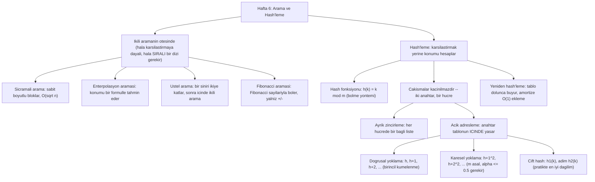

# Hafta 6 — Arama ve Hash'leme

*CEN207 Veri Yapıları (eski adıyla CE205) · Güz 2026–2027*

<!-- materials:start -->

<div class="materials" markdown>

[:material-file-pdf-box: Ders notu (PDF)](cen207-week-6-notes.pdf){ .md-button download="cen207-week-6-notes.pdf" }
[:material-file-word-box: Ders notu (DOCX)](cen207-week-6-notes.docx){ .md-button download="cen207-week-6-notes.docx" }
[:material-presentation: Sunum (PDF)](cen207-week-6-slides.pdf){ .md-button download="cen207-week-6-slides.pdf" }
[:material-microsoft-powerpoint: Sunum (PPTX)](cen207-week-6-slides.pptx){ .md-button download="cen207-week-6-slides.pptx" }
[:material-language-html5: Sunum (HTML, çevrimdışı)](cen207-week-6-slides.html){ .md-button download="cen207-week-6-slides.html" }
[:material-folder-zip: Tümünü indir (ZIP)](cen207-week-6-materials.zip){ .md-button download="cen207-week-6-materials.zip" }
[:material-fullscreen: Sunumu tam ekran aç](cen207-week-6-slides.html){ .md-button .md-button--primary target=_blank }

</div>

<div class="deck-frame">
<iframe src="../cen207-week-6-slides.html" title="Hafta 6 — Arama ve Hash" loading="lazy" allowfullscreen></iframe>
</div>

<p class="deck-hint">Sunumun içine tıklayıp ok tuşlarıyla ilerleyin; tam ekran için sunumun sağ altındaki düğmeyi ya da yukarıdaki "Sunumu tam ekran aç" bağlantısını kullanın.</p>

<!-- materials:end -->

!!! abstract "Bu hafta"
    **Öğrenme çıktıları.** Bu haftanın sonunda, zaten bildiğiniz doğrusal ve ikili aramanın (binary search)
    ötesine geçen dört arama tekniğini açıklayabilecek, çizebilecek ve uygulayabilecek olacaksınız —
    **sıçramalı arama (jump search)**, **enterpolasyon araması (interpolation search)**, **üstel arama
    (exponential search)** ve **Fibonacci araması (Fibonacci search)** — ve her birinin *neden* var olduğunu
    (ikili aramanın hangi belirli zayıflığını, hangi bedelle giderdiğini) açıklayabileceksiniz. Ardından "`x`
    burada mı, öyleyse nerede?" sorusuna tamamen farklı bir yaklaşımla tanışacaksınız: bir aralığı
    **karşılaştırarak daraltmak** yerine, bir **hash tablosu (hash table)**, bir **hash fonksiyonu (hash
    function)** ile cevabın konumunu doğrudan hesaplar ve ortalama durumda **O(1)** arama süresi verir.
    **Bölme yöntemini (division method)**, `h(k) = k mod m`'i ve `m`'in seçiminin neden önemli olduğunu
    öğreneceksiniz; iki farklı anahtarın aynı hücreye düşmesi anlamına gelen **çakışmaların (collision)**
    kaçınılmaz olduğunu ve mutlaka çözülmesi gerektiğini — önce **ayrık zincirleme (separate chaining)** ile
    (her hücrede bir bağlı liste), sonra **açık adresleme (open addressing)** ile (her anahtar tablonun
    kendisinin içinde yaşar: doğrusal yoklama (linear probing), karesel yoklama (quadratic probing), çift
    hash (double hashing)); ve bir hash tablosunun, doluluk arttıkça performans garantisini korumak için
    zaman zaman neden **yeniden hash'lenmesi (rehashing)** — yani büyüyüp kendini yeniden kurması —
    gerektiğini öğreneceksiniz. Bu çıktılar ders izlencesinin **ÖÇ.1** (temel veri yapılarını açıklama),
    **ÖÇ.2** (algoritmik karmaşıklığı analiz etme) ve **ÖÇ.7** (bir problem için doğru yapıyı seçme)
    maddelerine karşılık gelir.

    **Önceden bilmeniz gerekenler.** Hafta 1 size diziler (array) ve bir indeksin doğrudan bir bellek adresi
    olduğu fikrini verdi. Hafta 2 size bağlı listeyi (linked list) verdi — bir hash hücresinin zincirinin
    (chain) tam olarak neyden yapıldığı budur. Hafta 3 size yığın (stack) ve kuyruğu (queue) verdi. Hafta 4
    size ağaçları (tree) verdi ve özellikle şu fikri: bir arama uzayını her adımda ikiye bölmek, adım
    sayısında logaritmik bir büyüme verir — bu tam olarak ikili aramanın bir dizi (array) üzerinde zaten
    yaptığı şeydir, ve bu haftanın yeni aramalarının ya daha da kullandığı ya da bilinçli olarak vazgeçtiği
    şeydir. Hafta 5 size çizgeleri (graph) ve dolaşımı (traversal) verdi. Bu hafta, önceki beş haftanın tek
    bir veri yapısı üzerine doğrudan inşa edilmiyor; bunun yerine dört yeni arama için *sıralı dizi (Hafta 1)*
    fikri üzerine inşa ediyor ve gerçekten yeni bir yapı olan hash tablosunu tanıtıyor — bu yapı, ileride
    başka veri yapılarının içinde kullanışlı bir *araç* haline gelecek (örneğin köşeleri (vertex) rahatça
    `0..V-1` ile numaralanmamış bir çizge için, bir hash haritasıyla (hash map) anahtarlanan bir komşuluk
    listesi).

    **3 saatlik bir oturum için zaman planı.** Arama problemi, doğrusal ve ikili aramanın tekrarı (~15 dk) ·
    sıçramalı arama (~20 dk) · enterpolasyon araması (~20 dk) · üstel arama (~15 dk) · Fibonacci araması (~15
    dk) · karşılaştırma tablosu ve kısa bir ara · hash'leme: doğuşu ve bölme hash fonksiyonu (~20 dk) ·
    çakışmalar ve ayrık zincirleme (~20 dk) · açık adresleme: doğrusal, karesel ve çift hash (~35 dk) ·
    yeniden hash'leme (~15 dk) · teknik seçimi, özet ve kendini sınama (~15 dk).

## 0. Başlamadan önce

### 0.1 Zaten bildikleriniz

Son beş haftadan iki fikir bu hafta en çok işe yarayacak.

**Hafta 1'den — diziler ve indeksler.** Bir dizi, elemanlarını tek, bitişik bir bellek bloğunda saklar ve
`arr[i]`, doğrudan `taban_adres + i * eleman_boyutu` olarak hesaplanır — `i` indeksine *ulaşmak* için hiçbir
arama gerekmez, yalnızca *hangi* `i`'nin aradığınızı tuttuğuna karar vermek gerekir. Bu haftaki her arama
tekniği (sıçramalı, enterpolasyon, üstel, Fibonacci), **sıralı (sorted)** bir dizide, aradığınız `i`'yi olabilecek
en az karşılaştırmayla bulmak için hangi indekslerin kontrol edileceğine dair farklı bir stratejidir. Zaten
tanıdığınız ikili arama, bu tasarım uzayındaki bir noktadır; bu hafta geri kalanını dolduruyor.

**Hafta 4'ten — arama uzayını ikiye bölmek.** İkili aramanın büyük fikri — tek bir karşılaştırmayla kalan
adayların yarısını elemek, toplamda `O(log n)` karşılaştırma vermek — bu bölümdeki her tekniğin ölçüldüğü
referans noktasıdır. Sıçramalı arama, sadelik karşılığında bilerek ikili aramadan *daha kötü* sonuç verir;
enterpolasyon araması doğru türden veride *daha iyi* sonuç verir; üstel arama, ikili aramayı önceden
bilmediğiniz dizi boyutlarına uyarlar; Fibonacci araması, yalnızca toplama ve çıkarma kullanarak ikili
aramanın asimptotik maliyetini yakalar. Bu dört tekniğin hepsi için `O(log n)`'i aklınızda referans noktası
olarak tutun.

**Gerçekten yeni bir fikir: sırayı hesaplamayla takas etmek.** Yukarıdaki her teknik, `target`'ı dizi
elemanlarıyla **karşılaştırarak** ve bir aralığı daraltarak çalışmaya devam eder. Hash'leme bu yaklaşımın
tamamından vazgeçer: daraltmak yerine, bir **hash fonksiyonu**, bir anahtarın nerede olduğunu tek bir O(1)
adımda **doğrudan** hesaplar, veride hiçbir sıralama şartı olmadan. Bunun bedeli, iki farklı anahtarın aynı
konuma hesaplanabilmesidir — bir **çakışma (collision)** — ve bu haftanın ikinci yarısı tamamen bunu ele
almakla ilgilidir.

### 0.2 Bu haftanın haritası



Aşağıda her kutu kendi bölümünü alır — çoğunda adım adım bir animasyon, tam bir C ve Java programı, ve
karmaşıklık ile sık yapılan hatalar üzerine bir not vardır.

## 1. Arama problemi, ve doğrusal ile ikili aramanın tekrarı

### 1.1 Problem, yeniden ifade edilmiş

Bu problemin temel halini zaten Hafta 1'de çözdünüz: bir dizi ve bir `target` değeri verildiğinde, `target`
dizide var mı, ve varsa hangi indekste? Hafta 1 size iki cevap verdi — **doğrusal arama (linear search)**
(her elemanı kontrol et, `O(n)`) ve **ikili arama (binary search)** (*sıralı* bir dizide, tekrar tekrar
ortadaki elemana bak ve yarısını ele, `O(log n)`). Bu haftanın sorusu daha keskin: dizi **sıralı**
olduğuna göre, ikili aramanın `O(log n)`'i gerçekten yapabileceğimizin en iyisi mi, ve *daha iyisini* yapmanın
ya da *daha basit bir fikirle neredeyse aynı iyilikte* yapmanın bedeli nedir? Aşağıdaki dört yeni teknik bu
soruyu farklı biçimlerde cevaplıyor.

### 1.2 Tekrar: doğrusal arama, `O(n)`

Doğrusal arama veri hakkında hiçbir varsayımda bulunmaz: `arr[0]`'ı kontrol eder, sonra `arr[1]`'i, ve böyle
devam eder, `target`'ı bulana ya da dizi bitene kadar. Maliyeti en kötü durumda (hedef sonuncu ya da yok) ve
ortalamada (rastgele tek düze bir konumda bulunan bir hedef için ortalama `n/2` eleman kontrol edilir) `n`,
dizinin boyutu, ile orantılıdır. En büyük erdemi, sıralı olsun olmasın **her** dizide çalışmasıdır — buradan
itibaren her teknik, hız karşılığında bu genelliği terk ederek diziyi önce sıralı olmaya zorlar.

### 1.3 Tekrar: ikili arama, `O(log n)`

İkili arama **sıralı** bir dizi gerektirir. Ortadaki elemana bakar; hedef oysa biter; hedef daha küçükse, sağ
yarının tamamı — ortadaki dahil — tek adımda elenebilir (sıralı düzen, hedefin orada olamayacağını garanti
eder); daha büyükse, sol yarı aynı şekilde elenir. Her karşılaştırma kalan adayları ikiye böler, dolayısıyla
`k` karşılaştırmadan sonra en fazla `n / 2^k` aday kalır; arama bu sayı 1'e ulaştığında biter, bu da en kötü
durumda `k = log2(n)` karşılaştırma verir — **O(log n)**. `n = 1.000.000` için bu yaklaşık 20 karşılaştırmadır,
aynı veri için doğrusal aramanın bir milyona kadar çıkabilen karşılaştırma sayısına karşılık.

İkili arama, karmaşıklığı ve C/Java kodu aklınızda taze değilse, devam etmeden önce **Hafta 1**'i tekrar
gözden geçirin — bu bölüm onu varsayar ve yeniden türetmeyecektir. Aşağıdaki dört teknik hâlâ sıralı bir dizi
gerektirir, ve hâlâ temelde karşılaştırmaya dayalıdır; hiçbiri, doğru türden veride enterpolasyon araması
dışında (ve o bile bölüm 3'te göreceğiniz gibi kötü bir en kötü durumla gelir), ikili aramanın `O(log n)` en
kötü durumunu sabit bir çarpandan fazla geçmez.

## 2. Sıçramalı arama (jump search)

### 2.1 Başlangıç sorusu

İkili aramanın tam ortaya zıplaması güçlüdür, ama her tek adımda bir bölme (ya da kaydırma) ve dikkatli bir
indeks aritmetiği (`lo + (hi - lo) / 2`, taşmayı önlemek için) gerektirir, ve belleğe sıralı erişmez — dizide
her yere zıplar, bu da bitişik bloklar halinde bellek okumayı seven donanım için dostane değildir (bu dersin
bellek hiyerarşisine ve önbelleğe (cache) geldiğinde daha derinlemesine karşılaşacağınız bir gerçek). Peki ya
onun yerine ileriye doğru **sabit boyutlu bloklar** halinde tarasaydık — her `k`'ıncı elemanı kontrol edip,
hedefin olması gereken yeri geçtiğimiz anda, yalnızca o bir bloğu düz bir doğrusal taramaya dönseydik? İşte
bu **sıçramalı arama (jump search)**: ikili aramadan daha basit aritmetik, her blok içinde sıralı bellek
erişimi, karşılığında ikili aramadan asimptotik olarak yavaş olmak (yine de doğrusal aramadan çok daha hızlı).

Bu blok tarzı arama, Donald Knuth'un *The Art of Computer Programming, Volume 3: Sorting and Searching*
(1973) kitabında ikili aramaya bir alternatif olarak yer alır — özellikle, basit bir kalkülüs argümanının
(iki maliyetin toplamını en aza indirmenin) algoritmanın tek serbest parametresini, blok boyutunu, belirlediği
bir örnek olarak sunulur.

### 2.2 Fikir ve doğru blok boyutu

Bir blok boyutu `b` seçin. `arr[b-1]`, `arr[2b-1]`, `arr[3b-1]`, … kontrol edin, `target`'tan `>=` olan bir
sınır bulana (ya da dizinin sonuna gelene) kadar; `target`, varsa, o sınırdan hemen önceki blokta olmalıdır
(yine sıralı düzen sayesinde). Sonra o tek bloğu **soldan sağa, doğrusal** olarak tarayın, her elemanı
karşılaştırarak.

Bu, en kötü durumda kaç karşılaştırmaya mal olur? Sıçramak en fazla `n / b` karşılaştırmaya mal olur (diziyi
`b` boyutlu bloklar halinde baştan sona zıplarsınız), ve son doğrusal tarama en fazla `b` karşılaştırmaya mal
olur. Toplam: `n/b + b`. Kalkülüs (ya da yalnızca değerleri deneyerek) bu toplamın `b = sqrt(n)` olduğunda en
aza indiğini gösterir, bu da en kötü durumda `2 * sqrt(n)` toplam maliyet verir — **O(sqrt(n))**. Bu, ikili
aramanın `O(log n)`'inden daha kötüdür (`n = 1.000.000` için `sqrt(n) = 1000` iken `log2(n) ≈ 20`), ama
doğrusal aramanın `O(n)`'inden çok daha iyidir, ve her adımdaki aritmetik yalnızca bir toplama işlemidir, bir
bölme değil.

### 2.3 Bellekte nasıl durur, ve kod

Aşağıda, `jump_search`, `block = floor(sqrt(n))` hesaplar, her seferinde bir blok ileri zıplar (her bloğun
*son* indeksine bakarak), ve son indeksi `target`'tan `>=` olan bir blok bulduğunda, o bloğu doğrusal olarak
tarar.

=== "C"

    ```c
    int jump_search(const int arr[], int n, int target, int *comparisons) {
        int block = (int) sqrt((double) n);      /* block size = floor(sqrt(n)) */
        if (block < 1) block = 1;
        int prev = 0, step = block, comp = 0;
        while (step < n) {                        /* jump forward one block at a time */
            comp++;
            if (arr[step - 1] >= target) break;    /* target may be in this block */
            prev = step;
            step += block;
        }
        if (step > n) step = n;
        for (int i = prev; i < step; i++) {        /* linear scan inside the block */
            comp++;
            if (arr[i] == target) { *comparisons = comp; return i; }
            if (arr[i] > target) break;             /* sorted: no need to look further */
        }
        *comparisons = comp;
        return -1;
    }
    ```

=== "Java"

    ```java
    static int jumpSearch(int[] arr, int target) {
        int n = arr.length;
        int block = (int) Math.sqrt(n);          // block size = floor(sqrt(n))
        if (block < 1) block = 1;
        int prev = 0, step = block;
        comparisons = 0;
        while (step < n) {                        // jump forward one block at a time
            comparisons++;
            if (arr[step - 1] >= target) break;    // target may be in this block
            prev = step;
            step += block;
        }
        if (step > n) step = n;
        for (int i = prev; i < step; i++) {        // linear scan inside the block
            comparisons++;
            if (arr[i] == target) return i;
            if (arr[i] > target) break;             // sorted: no need to look further
        }
        return -1;
    }
    ```

Blok sınırlarının tek tek kontrol edildiğini, sonra son bloğun soldan sağa tarandığını izlemek için
animasyonu oynatın.

<iframe class="dsanim" src="../anim/jump-search.html" title="Jump search: advancing block by block" loading="lazy"></iframe>
<div class="dsanim-baski" markdown>

</div>

Oynatıcıda ayrıca şunları da deneyin: **hedef son bloğa yakın, en çok sıçrama gerekir** (zor) ve uç durumlar
**hedef en küçükten de küçük**, **hedef en büyükten de büyük**, ve **hedef aralıkta ama dizide yok** — ya da
dört zorluk seviyesinde rastgele veri için 🎲'ye basın, ya da kendi sıralı diziniz ve hedefinizi yazın.

### 2.4 Dene

??? example "Tam program: `jump_search.c` / `JumpSearch.java`"

    === "C"

        ```c
        /* Week 6 -- Search and Hashing
         * Jump search: on a SORTED array, jump forward in fixed-size blocks
         * (block = floor(sqrt(n))) until a block boundary is >= target, then scan
         * that block linearly. Prints every jump and every comparison inside the
         * final block.
         * CEN207 Data Structures (formerly CE205)
         */
        #include <stdio.h>
        #include <math.h>

        int jump_search(const int arr[], int n, int target, int *comparisons) {
            int block = (int) sqrt((double) n);      /* block size = floor(sqrt(n)) */
            if (block < 1) block = 1;
            int prev = 0, step = block, comp = 0;
            while (step < n) {                        /* jump forward one block at a time */
                comp++;
                printf("  jump: check arr[%d] = %d\n", step - 1, arr[step - 1]);
                if (arr[step - 1] >= target) break;    /* target may be in this block */
                prev = step;
                step += block;
            }
            if (step > n) step = n;
            printf("  scanning block [%d..%d)\n", prev, step);
            for (int i = prev; i < step; i++) {        /* linear scan inside the block */
                comp++;
                printf("  compare arr[%d] = %d\n", i, arr[i]);
                if (arr[i] == target) { *comparisons = comp; return i; }
                if (arr[i] > target) break;             /* sorted: no need to look further */
            }
            *comparisons = comp;
            return -1;
        }

        static void print_array(const int arr[], int n) {
            printf("arr =");
            for (int i = 0; i < n; i++) printf(" %d", arr[i]);
            printf("\n");
        }

        static void run_scenario(const char *label, const int arr[], int n, int target) {
            printf("-- %s --\n", label);
            print_array(arr, n);
            printf("target = %d\n", target);
            int comparisons = 0;
            int index = jump_search(arr, n, target, &comparisons);
            if (index == -1) printf("result: not found, %d comparisons\n\n", comparisons);
            else printf("result: found at index %d, %d comparisons\n\n", index, comparisons);
        }

        int main(void) {
            int a[] = {2, 6, 10, 14, 18, 22, 26, 30, 34, 38, 42, 46, 50, 54, 58, 62};
            int n = 16;

            run_scenario("normal: 16 values, target found in the second block", a, n, 42);
            run_scenario("hard: target near the last block, needs the most jumps", a, n, 58);
            run_scenario("edge: target is smaller than every value", a, n, 1);
            run_scenario("edge: target is larger than every value", a, n, 999);
            run_scenario("edge: target is in range but not in the array", a, n, 45);

            return 0;
        }
        ```

    === "Java"

        ```java
        /* Week 6 -- Search and Hashing
         * Jump search: on a SORTED array, jump forward in fixed-size blocks
         * (block = floor(sqrt(n))) until a block boundary is >= target, then scan
         * that block linearly. Prints every jump and every comparison inside the
         * final block.
         * CEN207 Data Structures (formerly CE205)
         */
        public class JumpSearch {
            static int comparisons;

            static int jumpSearch(int[] arr, int target) {
                int n = arr.length;
                int block = (int) Math.sqrt(n);          // block size = floor(sqrt(n))
                if (block < 1) block = 1;
                int prev = 0, step = block;
                comparisons = 0;
                while (step < n) {                        // jump forward one block at a time
                    comparisons++;
                    System.out.println("  jump: check arr[" + (step - 1) + "] = " + arr[step - 1]);
                    if (arr[step - 1] >= target) break;    // target may be in this block
                    prev = step;
                    step += block;
                }
                if (step > n) step = n;
                System.out.println("  scanning block [" + prev + ".." + step + ")");
                for (int i = prev; i < step; i++) {        // linear scan inside the block
                    comparisons++;
                    System.out.println("  compare arr[" + i + "] = " + arr[i]);
                    if (arr[i] == target) return i;
                    if (arr[i] > target) break;             // sorted: no need to look further
                }
                return -1;
            }

            static void printArray(int[] arr) {
                StringBuilder sb = new StringBuilder("arr =");
                for (int v : arr) sb.append(' ').append(v);
                System.out.println(sb);
            }

            static void runScenario(String label, int[] arr, int target) {
                System.out.println("-- " + label + " --");
                printArray(arr);
                System.out.println("target = " + target);
                int index = jumpSearch(arr, target);
                if (index == -1) System.out.println("result: not found, " + comparisons + " comparisons");
                else System.out.println("result: found at index " + index + ", " + comparisons + " comparisons");
                System.out.println();
            }

            public static void main(String[] args) {
                int[] a = {2, 6, 10, 14, 18, 22, 26, 30, 34, 38, 42, 46, 50, 54, 58, 62};

                runScenario("normal: 16 values, target found in the second block", a, 42);
                runScenario("hard: target near the last block, needs the most jumps", a, 58);
                runScenario("edge: target is smaller than every value", a, 1);
                runScenario("edge: target is larger than every value", a, 999);
                runScenario("edge: target is in range but not in the array", a, 45);
            }
        }
        ```

**Dene**

=== "C"

    ```console
    gcc -std=c11 -Wall -Wextra -o /tmp/x jump_search.c && /tmp/x
    ```

    Beklenen çıktı:

    ```text
    -- normal: 16 values, target found in the second block --
    arr = 2 6 10 14 18 22 26 30 34 38 42 46 50 54 58 62
    target = 42
      jump: check arr[3] = 14
      jump: check arr[7] = 30
      jump: check arr[11] = 46
      scanning block [8..12)
      compare arr[8] = 34
      compare arr[9] = 38
      compare arr[10] = 42
    result: found at index 10, 6 comparisons

    -- hard: target near the last block, needs the most jumps --
    arr = 2 6 10 14 18 22 26 30 34 38 42 46 50 54 58 62
    target = 58
      jump: check arr[3] = 14
      jump: check arr[7] = 30
      jump: check arr[11] = 46
      scanning block [12..16)
      compare arr[12] = 50
      compare arr[13] = 54
      compare arr[14] = 58
    result: found at index 14, 6 comparisons

    -- edge: target is smaller than every value --
    arr = 2 6 10 14 18 22 26 30 34 38 42 46 50 54 58 62
    target = 1
      jump: check arr[3] = 14
      scanning block [0..4)
      compare arr[0] = 2
    result: not found, 2 comparisons

    -- edge: target is larger than every value --
    arr = 2 6 10 14 18 22 26 30 34 38 42 46 50 54 58 62
    target = 999
      jump: check arr[3] = 14
      jump: check arr[7] = 30
      jump: check arr[11] = 46
      scanning block [12..16)
      compare arr[12] = 50
      compare arr[13] = 54
      compare arr[14] = 58
      compare arr[15] = 62
    result: not found, 7 comparisons

    -- edge: target is in range but not in the array --
    arr = 2 6 10 14 18 22 26 30 34 38 42 46 50 54 58 62
    target = 45
      jump: check arr[3] = 14
      jump: check arr[7] = 30
      jump: check arr[11] = 46
      scanning block [8..12)
      compare arr[8] = 34
      compare arr[9] = 38
      compare arr[10] = 42
      compare arr[11] = 46
    result: not found, 7 comparisons
    ```

=== "Java"

    ```console
    javac -Xlint:all -d /tmp/j JumpSearch.java && java -cp /tmp/j JumpSearch
    ```

    Beklenen çıktı: yukarıdaki C çalıştırmasıyla birebir aynı (aynı algoritma, aynı veri).

### 2.5 Karmaşıklık, hatalar, kendini sına

**Karmaşıklık.** En iyi durum `O(1)` (hedef, kontrol edilen ilk blok sınırıdır ve `>=` yerine tam olarak eşit
çıkar — nadir, çünkü sınır kontrolü `==` değil `>=`'dir). En kötü durum ve ortalama durum ikisi de
**O(sqrt(n))**'dir, bölüm 2.2'de türetilen en uygun blok boyutu `b = sqrt(n)` ile. İkili arama gibi sıralı bir
dizi gerektirir.

!!! warning "Sık yapılan hatalar"
    - **`sqrt(n)` hesaplamak yerine keyfi bir blok boyutu seçmek** (diyelim ki sabit `100`). `n` ile
      ölçeklenmeyen bir blok boyutu, büyük diziler için `O(n)`'e yaklaşır (çok fazla sıçrama) ya da küçük
      diziler için blok başına çok fazla doğrusal işe yaklaşır; yalnızca `b = sqrt(n)` bu iki maliyeti
      dengeler.
    - **`arr[step]`'i kontrol etmek, `arr[step - 1]` yerine.** Test etmek istediğiniz blok sınırı, mevcut
      bloğun *son* elemanıdır (indeks `step - 1`), bir sonraki bloğun *ilk* elemanı değil (indeks `step`) —
      buradaki bire bir hata ya geçerli bir bloğu atlar ya da bir eleman fazla tarar.
    - **Sıçrama döngüsü bittikten sonra `step`'i `n`'e sabitlemeyi unutmak.** Son sıçrama diziyi aşarsa
      (`step > n`), doğrusal tarama `step`'te değil `n`'de durmalıdır, yoksa dizinin sonunun ötesini okur.

??? success "Kendini sına: neden sqrt(n)?"
    Sıçramalı arama en fazla `n/b` sıçrama-karşılaştırması artı en fazla `b` doğrusal-tarama-karşılaştırması,
    toplamda `n/b + b`'ye mal olur. Kalkülüs neden `b = sqrt(n)`'in bu toplamı en aza indirdiğini söyler, ve
    onun yerine `b = 1` ya da `b = n` seçseydiniz toplam maliyete ne olurdu?

    **Cevap.** `f(b) = n/b + b`'yi en aza indirmek: türevini alın, `f'(b) = -n/b^2 + 1`, sıfıra eşitleyin:
    `b^2 = n`, yani `b = sqrt(n)`. `b = 1`'de, sıçramalı arama doğrusal aramaya döner (`n` sıçrama-
    karşılaştırması, her blok tek bir eleman) — `O(n)`. `b = n`'de, tek bir devasa "blok" vardır (dizinin
    tamamı), o da yine düz bir doğrusal taramaya döner — `O(n)`. Yalnızca `b = sqrt(n)`, dengeli `O(sqrt(n))`'i
    verir.

## 3. Enterpolasyon araması (interpolation search)

### 3.1 Başlangıç sorusu

Kağıt bir telefon rehberinde (ya da basılı bir sözlükte) bir ismi nasıl aradığınızı düşünün. İkili aramanın
yapacağı gibi her seferinde tam ortadan açmazsınız. "Yılmaz" arıyorsanız, kitabı *sona* çok daha yakın bir
yerden açarsınız; "Aydın" arıyorsanız, *başa* çok daha yakın bir yerden. İsimlerin yalnızca *sıralı*
olmadığını, aynı zamanda alfabe boyunca kabaca **tek düze (uniform)** yayıldığını kullanarak, doğru sayfaya
dair iyi bir tahmine doğrudan zıplıyorsunuzdur. **Enterpolasyon araması**, bunu sayılardan oluşan sıralı bir
dizide tam olarak yapar: her zaman ortadakine bakmak yerine, `target`'ın mevcut aralıktaki en küçük ve en
büyük değerler arasında ne kadar ileride durduğunu kullanarak, bir formülle tahmini bir konum hesaplar.

Sıralı veride arama için bu konum-tahmin etme fikri, W. W. Peterson'ın 1957 tarihli *Addressing for
Random-Access Storage* (IBM Journal of Research and Development) makalesinde görülür — bu haftanın ileride
hash'leme bölümlerinin de dayandığı, rastgele erişimli depolamayı düzenlemeye dair temel fikirleri ortaya
koyan aynı erken makale — ve daha sonra **enterpolasyon araması (interpolation search)** adı altında
biçimselleştirilip analiz edilmiştir.

### 3.2 Formül

Mevcut `[lo..hi]` aralığında, değerlerin `arr[lo]` ile `arr[hi]` arasında kabaca eşit aralıklarla dağıldığını
varsayın. O zaman `target`'ın konumu orantısal olarak tahmin edilebilir:

```
pos = lo + floor( (target - arr[lo]) * (hi - lo) / (arr[hi] - arr[lo]) )
```

`target == arr[lo]` ise, bu `pos = lo` verir; `target == arr[hi]` ise, `pos = hi` verir; arada bir değer
için, doğrusal olarak tahmin eder. `arr[pos]`'u `target` ile, ikili aramanın `arr[mid]`'i karşılaştırdığı gibi
karşılaştırın: eşitse, biter; küçükse, `[pos+1..hi]`'a daraltın; büyükse, `[lo..pos-1]`'e daraltın. Bir ek
durum bir **koruma (guard)** gerektirir: `arr[hi] == arr[lo]` ise, formülün paydası sıfırdır — bir **sıfıra
bölme** — bu yalnızca mevcut aralığın tamamı tek bir tekrarlanan değer olduğunda gerçekleşebilir; koruma bu
durumu, formülü hiç değerlendirmeden doğrudan yakalar ve çözer.

### 3.3 Maliyet: tek düze veride mükemmel, çarpık veride zayıf

Gerçekten tek düze dağılmış veride, enterpolasyon aramasının tahmini neredeyse her seferinde gerçek konuma çok
yakın düşer, bu da ortalama durumda **O(log log n)** maliyet verir — `n = 1.000.000` için, `log2(n) ≈ 20` ama
`log2(log2(n)) ≈ 4,3`: yaklaşık yirmi yerine bir avuç yoklama. Ama formülün doğruluğu tamamen *tek düze
dağılım* varsayımına bağlıdır. **Çarpık (skewed)** veride — diyelim ki birlikte kümelenmiş on altı küçük değer
artı bir devasa aykırı değer (outlier) — formülün tahmini o tek aykırı değer tarafından hedeften çok
uzaklaştırılır, ve enterpolasyon aramasının en kötü durumu tamamen **O(n)**'e düşer, doğrusal aramadan daha
iyi değil. Enterpolasyon araması bir bahistir: iyi huylu sayısal veride (telefon numaraları, sensör
okumaları, zaman damgaları) büyük kazanır, çarpık ya da düşmanca veride kötü kaybeder.

### 3.4 Bellekte nasıl durur, ve kod

=== "C"

    ```c
    int interpolation_search(const int arr[], int n, int target, int *probes) {
        int lo = 0, hi = n - 1, p = 0;
        while (lo <= hi && target >= arr[lo] && target <= arr[hi]) {
            p++;
            if (arr[hi] == arr[lo]) {                 /* guard: avoid division by zero */
                *probes = p;
                return lo;                            /* target must equal arr[lo] here */
            }
            /* widen to long long: target-arr[lo] and arr[hi]-arr[lo] can overflow a 32-bit int
               when the array spans values near INT_MIN and INT_MAX at once */
            long long span = (long long) arr[hi] - (long long) arr[lo];
            long long num = (long long) target - (long long) arr[lo];
            int pos = lo + (int) ((double) num * (hi - lo) / (double) span);
            if (arr[pos] == target) { *probes = p; return pos; }
            if (arr[pos] < target) lo = pos + 1;
            else hi = pos - 1;
        }
        *probes = p;
        return -1;
    }
    ```

=== "Java"

    ```java
    static int interpolationSearch(int[] arr, int target) {
        int lo = 0, hi = arr.length - 1;
        probes = 0;
        while (lo <= hi && target >= arr[lo] && target <= arr[hi]) {
            probes++;
            if (arr[hi] == arr[lo]) {                 // guard: avoid division by zero
                return lo;                            // target must equal arr[lo] here
            }
            // widen to long: target-arr[lo] and arr[hi]-arr[lo] can overflow a 32-bit int
            // when the array spans values near Integer.MIN_VALUE and Integer.MAX_VALUE at once
            long span = (long) arr[hi] - (long) arr[lo];
            long num = (long) target - (long) arr[lo];
            int pos = lo + (int) ((double) num * (hi - lo) / (double) span);
            if (arr[pos] == target) return pos;
            if (arr[pos] < target) lo = pos + 1;
            else hi = pos - 1;
        }
        return -1;
    }
    ```

<iframe class="dsanim" src="../anim/interpolation-search.html" title="Interpolation search: estimating the position with a formula" loading="lazy"></iframe>
<div class="dsanim-baski" markdown>

</div>

Oynatıcıda ayrıca şunları da deneyin: **hafif düzensiz aralıklar, birkaç yoklama gerekir** (zor) ve uç
durumlar **çarpık veri: son değer çok büyük, çok sayıda yoklama**, **tüm değerler eşit: bölme koruması
devreye girer**, ve **hedef aralığın tamamen dışında: tek bakışta reddedilir** — ya da rastgele veri için
🎲'ye basın, ya da kendi sıralı dizinizi yazın.

### 3.5 Dene

??? example "Tam program: `interpolation_search.c` / `InterpolationSearch.java`"

    === "C"

        ```c
        /* Week 6 -- Search and Hashing
         * Interpolation search: on a SORTED, roughly uniform array, estimate where
         * the target should be with a formula instead of always checking the
         * middle. A guard avoids dividing by zero when the current range is all one
         * value. Prints every probe.
         * CEN207 Data Structures (formerly CE205)
         */
        #include <stdio.h>

        int interpolation_search(const int arr[], int n, int target, int *probes) {
            int lo = 0, hi = n - 1, p = 0;
            while (lo <= hi && target >= arr[lo] && target <= arr[hi]) {
                p++;
                if (arr[hi] == arr[lo]) {                 /* guard: avoid division by zero */
                    printf("  probe %d: arr[hi] == arr[lo] (%d), guard triggered\n", p, arr[lo]);
                    *probes = p;
                    return lo;                            /* target must equal arr[lo] here */
                }
                /* widen to long long: target-arr[lo] and arr[hi]-arr[lo] can overflow a 32-bit int
                   when the array spans values near INT_MIN and INT_MAX at once */
                long long span = (long long) arr[hi] - (long long) arr[lo];
                long long num = (long long) target - (long long) arr[lo];
                int pos = lo + (int) ((double) num * (hi - lo) / (double) span);
                printf("  probe %d: lo=%d hi=%d pos=%d arr[pos]=%d\n", p, lo, hi, pos, arr[pos]);
                if (arr[pos] == target) { *probes = p; return pos; }
                if (arr[pos] < target) lo = pos + 1;
                else hi = pos - 1;
            }
            *probes = p;
            return -1;
        }

        static void print_array(const int arr[], int n) {
            printf("arr =");
            for (int i = 0; i < n; i++) printf(" %d", arr[i]);
            printf("\n");
        }

        static void run_scenario(const char *label, const int arr[], int n, int target) {
            printf("-- %s --\n", label);
            print_array(arr, n);
            printf("target = %d\n", target);
            int probes = 0;
            int index = interpolation_search(arr, n, target, &probes);
            if (index == -1) printf("result: not found, %d probes\n\n", probes);
            else printf("result: found at index %d, %d probes\n\n", index, probes);
        }

        int main(void) {
            int normal[] = {10, 15, 20, 25, 30, 35, 40, 45, 50, 55, 60, 65, 70, 75, 80, 85};
            int hard[] = {10, 13, 21, 24, 33, 36, 44, 48, 55, 61, 68, 74, 81, 87, 94, 100};
            int skewed[] = {1, 2, 3, 4, 5, 6, 7, 8, 9, 10, 11, 12, 13, 14, 15, 1000000};
            int all_equal[] = {42, 42, 42, 42, 42, 42, 42, 42, 42, 42, 42, 42, 42, 42, 42, 42};

            run_scenario("normal: uniformly spread 16 values, found in a single probe", normal, 16, 55);
            run_scenario("hard: slightly uneven spacing, needs a few probes", hard, 16, 81);
            run_scenario("edge: skewed data, last value is huge, many probes", skewed, 16, 8);
            run_scenario("edge: all values equal, the division guard kicks in", all_equal, 16, 42);
            run_scenario("edge: target is entirely outside the range, rejected on sight", normal, 16, 999);

            return 0;
        }
        ```

    === "Java"

        ```java
        /* Week 6 -- Search and Hashing
         * Interpolation search: on a SORTED, roughly uniform array, estimate where
         * the target should be with a formula instead of always checking the
         * middle. A guard avoids dividing by zero when the current range is all one
         * value. Prints every probe.
         * CEN207 Data Structures (formerly CE205)
         */
        public class InterpolationSearch {
            static int probes;

            static int interpolationSearch(int[] arr, int target) {
                int lo = 0, hi = arr.length - 1;
                probes = 0;
                while (lo <= hi && target >= arr[lo] && target <= arr[hi]) {
                    probes++;
                    if (arr[hi] == arr[lo]) {                 // guard: avoid division by zero
                        System.out.println("  probe " + probes + ": arr[hi] == arr[lo] (" + arr[lo] + "), guard triggered");
                        return lo;                            // target must equal arr[lo] here
                    }
                    // widen to long: target-arr[lo] and arr[hi]-arr[lo] can overflow a 32-bit int
                    // when the array spans values near Integer.MIN_VALUE and Integer.MAX_VALUE at once
                    long span = (long) arr[hi] - (long) arr[lo];
                    long num = (long) target - (long) arr[lo];
                    int pos = lo + (int) ((double) num * (hi - lo) / (double) span);
                    System.out.println("  probe " + probes + ": lo=" + lo + " hi=" + hi + " pos=" + pos + " arr[pos]=" + arr[pos]);
                    if (arr[pos] == target) return pos;
                    if (arr[pos] < target) lo = pos + 1;
                    else hi = pos - 1;
                }
                return -1;
            }

            static void printArray(int[] arr) {
                StringBuilder sb = new StringBuilder("arr =");
                for (int v : arr) sb.append(' ').append(v);
                System.out.println(sb);
            }

            static void runScenario(String label, int[] arr, int target) {
                System.out.println("-- " + label + " --");
                printArray(arr);
                System.out.println("target = " + target);
                int index = interpolationSearch(arr, target);
                if (index == -1) System.out.println("result: not found, " + probes + " probes");
                else System.out.println("result: found at index " + index + ", " + probes + " probes");
                System.out.println();
            }

            public static void main(String[] args) {
                int[] normal = {10, 15, 20, 25, 30, 35, 40, 45, 50, 55, 60, 65, 70, 75, 80, 85};
                int[] hard = {10, 13, 21, 24, 33, 36, 44, 48, 55, 61, 68, 74, 81, 87, 94, 100};
                int[] skewed = {1, 2, 3, 4, 5, 6, 7, 8, 9, 10, 11, 12, 13, 14, 15, 1000000};
                int[] allEqual = {42, 42, 42, 42, 42, 42, 42, 42, 42, 42, 42, 42, 42, 42, 42, 42};

                runScenario("normal: uniformly spread 16 values, found in a single probe", normal, 55);
                runScenario("hard: slightly uneven spacing, needs a few probes", hard, 81);
                runScenario("edge: skewed data, last value is huge, many probes", skewed, 8);
                runScenario("edge: all values equal, the division guard kicks in", allEqual, 42);
                runScenario("edge: target is entirely outside the range, rejected on sight", normal, 999);
            }
        }
        ```

**Dene**

=== "C"

    ```console
    gcc -std=c11 -Wall -Wextra -o /tmp/x interpolation_search.c && /tmp/x
    ```

    Beklenen çıktı:

    ```text
    -- normal: uniformly spread 16 values, found in a single probe --
    arr = 10 15 20 25 30 35 40 45 50 55 60 65 70 75 80 85
    target = 55
      probe 1: lo=0 hi=15 pos=9 arr[pos]=55
    result: found at index 9, 1 probes

    -- hard: slightly uneven spacing, needs a few probes --
    arr = 10 13 21 24 33 36 44 48 55 61 68 74 81 87 94 100
    target = 81
      probe 1: lo=0 hi=15 pos=11 arr[pos]=74
      probe 2: lo=12 hi=15 pos=12 arr[pos]=81
    result: found at index 12, 2 probes

    -- edge: skewed data, last value is huge, many probes --
    arr = 1 2 3 4 5 6 7 8 9 10 11 12 13 14 15 1000000
    target = 8
      probe 1: lo=0 hi=15 pos=0 arr[pos]=1
      probe 2: lo=1 hi=15 pos=1 arr[pos]=2
      probe 3: lo=2 hi=15 pos=2 arr[pos]=3
      probe 4: lo=3 hi=15 pos=3 arr[pos]=4
      probe 5: lo=4 hi=15 pos=4 arr[pos]=5
      probe 6: lo=5 hi=15 pos=5 arr[pos]=6
      probe 7: lo=6 hi=15 pos=6 arr[pos]=7
      probe 8: lo=7 hi=15 pos=7 arr[pos]=8
    result: found at index 7, 8 probes

    -- edge: all values equal, the division guard kicks in --
    arr = 42 42 42 42 42 42 42 42 42 42 42 42 42 42 42 42
    target = 42
      probe 1: arr[hi] == arr[lo] (42), guard triggered
    result: found at index 0, 1 probes

    -- edge: target is entirely outside the range, rejected on sight --
    arr = 10 15 20 25 30 35 40 45 50 55 60 65 70 75 80 85
    target = 999
    result: not found, 0 probes
    ```

=== "Java"

    ```console
    javac -Xlint:all -d /tmp/j InterpolationSearch.java && java -cp /tmp/j InterpolationSearch
    ```

    Beklenen çıktı: yukarıdaki C çalıştırmasıyla birebir aynı (aynı algoritma, aynı veri).

### 3.6 Karmaşıklık, hatalar, kendini sına

**Karmaşıklık.** Tek düze dağılmış veride ortalama durum **O(log log n)**; çarpık veride en kötü durum
**O(n)** (yukarıdaki `[1, 2, 3, ..., 15, 1000000]` dizisi, yalnızca 16 eleman için 8 yoklama gerektirdi — aynı
şeklin bir milyon elemana ölçeklendiğini hayal edin). İkili arama gibi tam olarak sıralı bir dizi gerektirir.

!!! warning "Sık yapılan hatalar"
    - **`arr[hi] == arr[lo]` korumasını unutmak.** Bu koruma olmadan, tekrarlanan değerlerden oluşan bir
      aralık sıfıra bölmeye yol açar. Bu pratikte nadir bir uç durum değildir — yinelenen değerlere sahip
      herhangi bir gerçek veri kümesi, arama yeterince daraldığında bunu tetikleyebilir.
    - **Önce `double`'a çevirmeden tam sayı bölmesi kullanmak.** `(target - arr[lo]) * (hi - lo) / (arr[hi] -
      arr[lo])`'nun tamamen `int` aritmetiğiyle hesaplanması, büyük anahtar aralıkları için taşabilir, ve
      formülün ihtiyaç duyduğu kesirli hassasiyeti kaybeder; payı `double`'a çevirmek (yukarıdaki kod gibi)
      her iki sorunu da önler.
    - **Enterpolasyon aramasının her zaman ikili aramadan daha hızlı olduğunu varsaymak.** Bu yalnızca kabaca
      tek düze veride kazanan bir *bahistir*; çarpık ya da düşmanca veride çarpıcı biçimde daha yavaş olabilir.
      Dağılımını kontrol etmediğiniz veride onu körü körüne kullanmayın.

??? success "Kendini sına: koruma neden "bulunamadı" değil, `lo` döndürür"
    Yukarıdaki "tüm değerler eşit" senaryosunda, koruma hemen tetiklenir ve indeks `0`'ı (`lo`) **bulundu**
    sonucu olarak döndürür. Koruma, `arr[lo]`'yu `target` ile hiç karşılaştırmadan, `arr[hi] == arr[lo]`'ya
    ulaşır ulaşmaz tetiklendiğine göre bu neden doğrudur?

    **Cevap.** `while` döngüsünün kendi koşulu, koruma değerlendirilmeden önce zaten `target >= arr[lo] &&
    target <= arr[hi]`'yi garanti eder. Buna ek olarak `arr[hi] == arr[lo]` ise, `arr[lo]` ve `arr[hi]` aynı
    değerdir, ve `target` iki eşit sınır arasında sıkışmıştır — yani `target` de o değere eşit olmalıdır. Bu
    dalda `lo` döndürmek, ayrı bir karşılaştırmaya gerek kalmadan her zaman doğrudur.

## 4. Üstel arama (exponential search)

### 4.1 Başlangıç sorusu

İkili arama, ilk orta noktayı hesaplamak için başlamadan önce dizinin boyutunu, `n`'i, bilmek zorundadır. Peki
ya dizi etkili biçimde **sınırsızsa** — sıralı bir akış, ya da yalnızca `n`'i okumanın bile pahalı olduğu kadar
devasa bir dizi — ve hedefin, varsa, **başa** yakın bir yerde olduğundan güçlü şekilde şüpheleniyorsanız?
Önce `n`'i bulmak için tamamını taramak israf olurdu. **Üstel arama (exponential search)** bunu çözer: hedefi
kapsadığı garanti edilen bir **sınır (bound)** bulun, ikiye katlayarak (`1, 2, 4, 8, …`) onu aşana kadar,
sonra o sınırın içinde sıradan ikili arama çalıştırın. Sınır bulma aşaması yalnızca `O(log index)`'e mal olur
— hedefin gerçekte ne kadar ileride olduğuyla orantılı — `O(log n)`'e değil.

Jon Bentley ve Andrew Yao bu tekniği, 1976 tarihli *An Almost Optimal Algorithm for Unbounded Searching*
(Information Processing Letters) makalelerinde yayımladı. **Sınırsız arama (unbounded search)** ya da
**dörtnala arama (galloping search)** olarak da anılır — "dörtnala", sınır bulma aşamasının küçükten büyüğe
büyüyen adımları için canlı bir benzetmedir, tıpkı hızlanan bir atın adımları gibi — ve bugün birçok
birleştirme (merge) ve küme-kesişimi algoritmasının içinde kullanılır.

### 4.2 Fikir: aşana kadar ikiye katla, sonra ikili arama yap

Önce `arr[0]`'ı kontrol edin (karşılaştırma #1). Hedef değilse, `bound`'u ikiye katlayarak büyütün — `1, 2, 4,
8, …` — her seferinde `arr[bound]`'u kontrol ederek, `arr[bound] >= target` olana ya da `bound >= n` olana
kadar. O noktada, `target`, varsa, `[bound/2, min(bound, n-1)]` içinde olmalıdır — çünkü önceki, daha küçük
sınır kontrol edilmiş ve `< target` bulunmuştur. Sıradan ikili aramayı tam olarak o aralığın içinde çalıştırın.

### 4.3 Bellekte nasıl durur, ve kod

=== "C"

    ```c
    int exponential_search(const int arr[], int n, int target, int *comparisons) {
        if (n <= 0) { *comparisons = 0; return -1; }    /* nothing to search */
        int comp = 1;                    /* the arr[0] check below counts as comparison #1 */
        if (arr[0] == target) { *comparisons = comp; return 0; }
        int bound = 1;
        while (bound < n) {                 /* double the bound until it overshoots target */
            comp++;
            if (arr[bound] >= target) break;
            bound *= 2;
        }
        int lo = bound / 2, hi = (bound < n) ? bound : n - 1;
        while (lo <= hi) {                  /* ordinary binary search inside [lo..hi] */
            int mid = lo + (hi - lo) / 2;
            comp++;
            if (arr[mid] == target) { *comparisons = comp; return mid; }
            if (arr[mid] < target) lo = mid + 1;
            else hi = mid - 1;
        }
        *comparisons = comp;
        return -1;
    }
    ```

=== "Java"

    ```java
    static int exponentialSearch(int[] arr, int target) {
        int n = arr.length;
        if (n <= 0) { comparisons = 0; return -1; }  // nothing to search
        comparisons = 1;                 // the arr[0] check below counts as comparison #1
        if (arr[0] == target) return 0;
        int bound = 1;
        while (bound < n) {                 // double the bound until it overshoots target
            comparisons++;
            if (arr[bound] >= target) break;
            bound *= 2;
        }
        int lo = bound / 2, hi = (bound < n) ? bound : n - 1;
        while (lo <= hi) {                  // ordinary binary search inside [lo..hi]
            int mid = lo + (hi - lo) / 2;
            comparisons++;
            if (arr[mid] == target) return mid;
            if (arr[mid] < target) lo = mid + 1;
            else hi = mid - 1;
        }
        return -1;
    }
    ```

<iframe class="dsanim" src="../anim/exponential-search.html" title="Exponential search: doubling the bound, then binary search inside" loading="lazy"></iframe>
<div class="dsanim-baski" markdown>

</div>

Oynatıcıda ayrıca şunları da deneyin: **hedef sona yakın, sınır birkaç kez ikiye katlanır** (zor) ve uç
durumlar **hedef ilk elemanda: tek karşılaştırma**, **hedef son elemandan da büyük**, ve **hedef aralıkta ama
dizide yok** — ya da rastgele veri için 🎲'ye basın, ya da kendi sıralı dizinizi yazın.

### 4.4 Dene

??? example "Tam program: `exponential_search.c` / `ExponentialSearch.java`"

    === "C"

        ```c
        /* Week 6 -- Search and Hashing
         * Exponential search: on a SORTED array, double a bound (1, 2, 4, 8, ...)
         * until it overshoots target, then run ordinary binary search inside
         * [bound/2, bound]. Prints the bound-finding phase and the binary-search
         * phase.
         * CEN207 Data Structures (formerly CE205)
         */
        #include <stdio.h>

        int exponential_search(const int arr[], int n, int target, int *comparisons) {
            if (n <= 0) { *comparisons = 0; return -1; }    /* nothing to search */
            int comp = 1;                    /* the arr[0] check below counts as comparison #1 */
            printf("  check arr[0] = %d\n", arr[0]);
            if (arr[0] == target) { *comparisons = comp; return 0; }
            int bound = 1;
            while (bound < n) {                 /* double the bound until it overshoots target */
                comp++;
                printf("  bound = %d: check arr[%d] = %d\n", bound, bound, arr[bound]);
                if (arr[bound] >= target) break;
                bound *= 2;
            }
            int lo = bound / 2, hi = (bound < n) ? bound : n - 1;
            printf("  binary search inside [%d..%d]\n", lo, hi);
            while (lo <= hi) {                  /* ordinary binary search inside [lo..hi] */
                int mid = lo + (hi - lo) / 2;
                comp++;
                printf("  compare arr[%d] = %d\n", mid, arr[mid]);
                if (arr[mid] == target) { *comparisons = comp; return mid; }
                if (arr[mid] < target) lo = mid + 1;
                else hi = mid - 1;
            }
            *comparisons = comp;
            return -1;
        }

        static void print_array(const int arr[], int n) {
            printf("arr =");
            for (int i = 0; i < n; i++) printf(" %d", arr[i]);
            printf("\n");
        }

        static void run_scenario(const char *label, const int arr[], int n, int target) {
            printf("-- %s --\n", label);
            print_array(arr, n);
            printf("target = %d\n", target);
            int comparisons = 0;
            int index = exponential_search(arr, n, target, &comparisons);
            if (index == -1) printf("result: not found, %d comparisons\n\n", comparisons);
            else printf("result: found at index %d, %d comparisons\n\n", index, comparisons);
        }

        int main(void) {
            int a[] = {3, 7, 11, 15, 19, 23, 27, 31, 35, 39, 43, 47, 51, 55, 59, 63};
            int n = 16;

            run_scenario("normal: 16 values, target found around the middle", a, n, 39);
            run_scenario("hard: target near the end, the bound doubles several times", a, n, 59);
            run_scenario("edge: target is the first element, a single comparison", a, n, 3);
            run_scenario("edge: target is larger than the last element", a, n, 999);
            run_scenario("edge: target is in range but not in the array", a, n, 40);

            return 0;
        }
        ```

    === "Java"

        ```java
        /* Week 6 -- Search and Hashing
         * Exponential search: on a SORTED array, double a bound (1, 2, 4, 8, ...)
         * until it overshoots target, then run ordinary binary search inside
         * [bound/2, bound]. Prints the bound-finding phase and the binary-search
         * phase.
         * CEN207 Data Structures (formerly CE205)
         */
        public class ExponentialSearch {
            static int comparisons;

            static int exponentialSearch(int[] arr, int target) {
                int n = arr.length;
                if (n <= 0) { comparisons = 0; return -1; }  // nothing to search
                comparisons = 1;                 // the arr[0] check below counts as comparison #1
                System.out.println("  check arr[0] = " + arr[0]);
                if (arr[0] == target) return 0;
                int bound = 1;
                while (bound < n) {                 // double the bound until it overshoots target
                    comparisons++;
                    System.out.println("  bound = " + bound + ": check arr[" + bound + "] = " + arr[bound]);
                    if (arr[bound] >= target) break;
                    bound *= 2;
                }
                int lo = bound / 2, hi = (bound < n) ? bound : n - 1;
                System.out.println("  binary search inside [" + lo + ".." + hi + "]");
                while (lo <= hi) {                  // ordinary binary search inside [lo..hi]
                    int mid = lo + (hi - lo) / 2;
                    comparisons++;
                    System.out.println("  compare arr[" + mid + "] = " + arr[mid]);
                    if (arr[mid] == target) return mid;
                    if (arr[mid] < target) lo = mid + 1;
                    else hi = mid - 1;
                }
                return -1;
            }

            static void printArray(int[] arr) {
                StringBuilder sb = new StringBuilder("arr =");
                for (int v : arr) sb.append(' ').append(v);
                System.out.println(sb);
            }

            static void runScenario(String label, int[] arr, int target) {
                System.out.println("-- " + label + " --");
                printArray(arr);
                System.out.println("target = " + target);
                int index = exponentialSearch(arr, target);
                if (index == -1) System.out.println("result: not found, " + comparisons + " comparisons");
                else System.out.println("result: found at index " + index + ", " + comparisons + " comparisons");
                System.out.println();
            }

            public static void main(String[] args) {
                int[] a = {3, 7, 11, 15, 19, 23, 27, 31, 35, 39, 43, 47, 51, 55, 59, 63};

                runScenario("normal: 16 values, target found around the middle", a, 39);
                runScenario("hard: target near the end, the bound doubles several times", a, 59);
                runScenario("edge: target is the first element, a single comparison", a, 3);
                runScenario("edge: target is larger than the last element", a, 999);
                runScenario("edge: target is in range but not in the array", a, 40);
            }
        }
        ```

**Dene**

=== "C"

    ```console
    gcc -std=c11 -Wall -Wextra -o /tmp/x exponential_search.c && /tmp/x
    ```

    Beklenen çıktı:

    ```text
    -- normal: 16 values, target found around the middle --
    arr = 3 7 11 15 19 23 27 31 35 39 43 47 51 55 59 63
    target = 39
      check arr[0] = 3
      bound = 1: check arr[1] = 7
      bound = 2: check arr[2] = 11
      bound = 4: check arr[4] = 19
      bound = 8: check arr[8] = 35
      binary search inside [8..15]
      compare arr[11] = 47
      compare arr[9] = 39
    result: found at index 9, 7 comparisons

    -- hard: target near the end, the bound doubles several times --
    arr = 3 7 11 15 19 23 27 31 35 39 43 47 51 55 59 63
    target = 59
      check arr[0] = 3
      bound = 1: check arr[1] = 7
      bound = 2: check arr[2] = 11
      bound = 4: check arr[4] = 19
      bound = 8: check arr[8] = 35
      binary search inside [8..15]
      compare arr[11] = 47
      compare arr[13] = 55
      compare arr[14] = 59
    result: found at index 14, 8 comparisons

    -- edge: target is the first element, a single comparison --
    arr = 3 7 11 15 19 23 27 31 35 39 43 47 51 55 59 63
    target = 3
      check arr[0] = 3
    result: found at index 0, 1 comparisons

    -- edge: target is larger than the last element --
    arr = 3 7 11 15 19 23 27 31 35 39 43 47 51 55 59 63
    target = 999
      check arr[0] = 3
      bound = 1: check arr[1] = 7
      bound = 2: check arr[2] = 11
      bound = 4: check arr[4] = 19
      bound = 8: check arr[8] = 35
      binary search inside [8..15]
      compare arr[11] = 47
      compare arr[13] = 55
      compare arr[14] = 59
      compare arr[15] = 63
    result: not found, 9 comparisons

    -- edge: target is in range but not in the array --
    arr = 3 7 11 15 19 23 27 31 35 39 43 47 51 55 59 63
    target = 40
      check arr[0] = 3
      bound = 1: check arr[1] = 7
      bound = 2: check arr[2] = 11
      bound = 4: check arr[4] = 19
      bound = 8: check arr[8] = 35
      binary search inside [8..15]
      compare arr[11] = 47
      compare arr[9] = 39
      compare arr[10] = 43
    result: not found, 8 comparisons
    ```

=== "Java"

    ```console
    javac -Xlint:all -d /tmp/j ExponentialSearch.java && java -cp /tmp/j ExponentialSearch
    ```

    Beklenen çıktı: yukarıdaki C çalıştırmasıyla birebir aynı (aynı algoritma, aynı veri).

### 4.5 Karmaşıklık, hatalar, kendini sına

**Karmaşıklık.** Sınırı bulmak için `O(log index)`, burada `index` hedefin gerçek konumudur (yoksa `n`) —
`O(log n)` değil. İkili arama aşaması sonra `O(log(bound))`'a mal olur, burada `bound` en fazla `2 *
index`'tir. Birleşik: genel olarak **O(log index)**. Hedef başa yakınken, bu düz ikili aramanın `O(log
n)`'inden daha iyidir; hedef sona yakınken, ikisi asimptotik olarak aynı olur.

!!! warning "Sık yapılan hatalar"
    - **Sınır bulma döngüsünden sonra `hi`'ı `n - 1`'e sabitlemeyi unutmak.** `bound`, `n - 1`'i meşru olarak
      aşabilir (döngünün kendi koşulu `bound < n`'dir, ama *son* ikiye katlama `bound`'u yine de dizinin
      ötesine itebilir), o yüzden ikili aramanın `hi`'ı `bound`'un kendisi değil, `min(bound, n - 1)` olmalıdır
      — yoksa sınırların dışını okur.
    - **İkiye katlama döngüsüne `bound = 0` ile başlamak**, `bound = 1` yerine. `0`'ı ikiye katlamak sonsuza
      kadar `0` kalır — sonsuz döngü. `arr[0]` döngü başlamadan önce zaten ayrıca ele alınmıştır, o yüzden
      döngü `bound = 1`'de başlamalıdır.
    - **`lo`'yu yanlış yeniden türetmek.** İkili arama aşaması için doğru alt sınır `bound / 2`'dir (zaten
      kontrol edilmiş ve `< target` olduğu doğrulanmış *önceki* sınır), `0` değil ve `bound`'un kendisi de
      değil — yanlış `lo` kullanmak, üstel aramanın var olma nedeni olan tasarrufu tam olarak çöpe atar.

??? success "Kendini sına: üstel arama ile ikili arama"
    Bir milyon elemanlı bir dizi için, hedef indeks 5'teyse (başa çok yakın) ve hedef indeks 999.999'daysa
    (en son eleman), üstel arama yaklaşık kaç karşılaştırmaya ihtiyaç duyar? İkisini de düz ikili aramanın
    yaklaşık 20 karşılaştırmasıyla karşılaştırın.

    **Cevap.** Başa yakın (indeks 5): sınır bulma aşaması yalnızca `5`'i aşana kadar ikiye katlamalıdır — `1,
    2, 4, 8` — yaklaşık 4 karşılaştırma, sonra `[4..8]` içinde ikili arama yaklaşık `log2(5) ≈ 3` daha ekler:
    toplamda yaklaşık 7 karşılaştırma, ikili aramanın 20'sinden çok daha az. Sona çok yakın (indeks
    999.999): sınır bulma aşaması bir milyonu aşana kadar ikiye katlamalıdır — `1, 2, 4, ..., 2^20` —
    yaklaşık 20 karşılaştırma, sonra benzer boyuttaki bir aralıkta ikili arama yaklaşık 20 daha ekler:
    toplamda yaklaşık 40 karşılaştırma, düz ikili aramanın 20'sinden *daha kötü*. Üstel arama "muhtemelen başa
    yakın" için özelleşmiş bir araçtır, ikili aramanın evrensel bir yerine geçeni değil.

## 5. Fibonacci araması (Fibonacci search)

### 5.1 Başlangıç sorusu

İkili aramanın orta nokta hesabı, `lo + (hi - lo) / 2`, bir bölme gerektirir. 1950'lerin ve 1960'ların
bilgisayar donanımında — ve bugün bile bazı çok kısıtlı gömülü (embedded) işlemcilerde — bölme, toplama ya da
çıkarmadan çarpıcı biçimde daha pahalıdır. İkili aramanın `O(log n)` garantisini **yalnızca toplama ve
çıkarma** kullanarak elde etmenin bir yolu var mı? **Fibonacci araması**, aralığı her zaman tam ortadan bölmek
yerine **Fibonacci sayılarına** (1, 1, 2, 3, 5, 8, 13, 21, …) göre bölerek "evet" der.

Teknik, Amerikalı istatistikçi **Jack Kiefer**'ın çalışmasına dayanır; onun 1953 tarihli *Sequential Minimax
Search for a Maximum* makalesi, ilişkili bir problem için (bir fonksiyonun maksimumunu, mümkün olduğunca az
değerlendirmeyle bulmak) en uygun bir strateji tasarlamak amacıyla Fibonacci sayılarını kullandı; aynı
Fibonacci-sayısı-bölme fikri, daha sonra sıralı diziler için bölmesiz bir arama algoritmasına uyarlandı — burada
öğrendiğiniz de tam olarak budur.

### 5.2 Fikir

`n`'e `>=` olan en küçük Fibonacci sayısını, `fib`'i, ondan hemen önceki iki Fibonacci sayısıyla birlikte
bulun, `fib1` ve `fib2` (yani `fib = fib1 + fib2`). Aramanın diziye ne kadar ilerlediğini işaretleyen bir
`offset` (başlangıçta `-1`) tutun. Her adımda, indeks `i = offset + fib2`'yi yoklayın (aşarsa `n - 1`'e
sabitlenir). `arr[i] < target` ise, `i`'ye kadar olan sol kısmın tamamı elenir, `offset` `i`'ye taşınır, ve
Fibonacci üçlüsü **bir** adım küçülür (`fib, fib1, fib2 = fib1, fib2, fib1 - fib2`). `arr[i] > target` ise,
sağ kısım elenir, ve üçlü **iki** adım küçülür (`fib, fib1, fib2 = fib2, fib1 - fib2, fib - (fib1 - fib2)`).
Fibonacci sayıları `fib = fib1 + fib2`'yi tam olarak sağladığından, bu güncellemelerin her biri yalnızca
toplama ve çıkarma kullanır — asla bölme ya da çarpma değil.

### 5.3 Bellekte nasıl durur, ve kod

=== "C"

    ```c
    int fibonacci_search(const int arr[], int n, int target, int *comparisons) {
        int fib2 = 0, fib1 = 1, fib = fib1 + fib2;      /* smallest Fibonacci number >= n */
        while (fib < n) { fib2 = fib1; fib1 = fib; fib = fib1 + fib2; }
        int offset = -1, comp = 0;
        while (fib > 1) {
            int i = (offset + fib2 < n - 1) ? offset + fib2 : n - 1;
            comp++;
            if (arr[i] < target) {                       /* eliminate the left part */
                fib = fib1; fib1 = fib2; fib2 = fib - fib1;
                offset = i;
            } else if (arr[i] > target) {                /* eliminate the right part */
                fib = fib2; fib1 = fib1 - fib2; fib2 = fib - fib1;
            } else {
                *comparisons = comp;
                return i;
            }
        }
        if (fib1 == 1 && offset + 1 < n) {                /* one element may be left over */
            comp++;
            if (arr[offset + 1] == target) { *comparisons = comp; return offset + 1; }
        }
        *comparisons = comp;
        return -1;
    }
    ```

=== "Java"

    ```java
    static int fibonacciSearch(int[] arr, int target) {
        int n = arr.length;
        int fib2 = 0, fib1 = 1, fib = fib1 + fib2;      // smallest Fibonacci number >= n
        while (fib < n) { fib2 = fib1; fib1 = fib; fib = fib1 + fib2; }
        int offset = -1;
        comparisons = 0;
        while (fib > 1) {
            int i = (offset + fib2 < n - 1) ? offset + fib2 : n - 1;
            comparisons++;
            if (arr[i] < target) {                       // eliminate the left part
                fib = fib1; fib1 = fib2; fib2 = fib - fib1;
                offset = i;
            } else if (arr[i] > target) {                // eliminate the right part
                fib = fib2; fib1 = fib1 - fib2; fib2 = fib - fib1;
            } else {
                return i;
            }
        }
        if (fib1 == 1 && offset + 1 < n) {                // one element may be left over
            comparisons++;
            if (arr[offset + 1] == target) return offset + 1;
        }
        return -1;
    }
    ```

<iframe class="dsanim" src="../anim/fibonacci-search.html" title="Fibonacci search: splitting the range with Fibonacci numbers" loading="lazy"></iframe>
<div class="dsanim-baski" markdown>

</div>

Oynatıcıda ayrıca şunları da deneyin: **hedef sona yakın, birkaç bölme adımı gerekir** (zor) ve uç durumlar
**hedef ilk elemanda**, **hedef son elemandan da büyük**, ve **hedef aralıkta ama dizide yok** — ya da
rastgele veri için 🎲'ye basın, ya da kendi sıralı dizinizi yazın.

### 5.4 Dene

??? example "Tam program: `fibonacci_search.c` / `FibonacciSearch.java`"

    === "C"

        ```c
        /* Week 6 -- Search and Hashing
         * Fibonacci search: on a SORTED array, split the range using Fibonacci
         * numbers instead of the middle (binary search) or a formula
         * (interpolation search). Uses only addition and subtraction. Prints the
         * Fibonacci triple and every probe.
         * CEN207 Data Structures (formerly CE205)
         */
        #include <stdio.h>

        int fibonacci_search(const int arr[], int n, int target, int *comparisons) {
            int fib2 = 0, fib1 = 1, fib = fib1 + fib2;      /* smallest Fibonacci number >= n */
            while (fib < n) { int t = fib1 + fib; fib2 = fib1; fib1 = fib; fib = t; }
            printf("  smallest fib >= n: fib=%d fib1=%d fib2=%d\n", fib, fib1, fib2);

            int offset = -1, comp = 0;
            while (fib > 1) {
                int i = (offset + fib2 < n - 1) ? offset + fib2 : n - 1;
                comp++;
                printf("  probe %d: i=%d arr[i]=%d (fib=%d fib1=%d fib2=%d offset=%d)\n",
                       comp, i, arr[i], fib, fib1, fib2, offset);
                if (arr[i] < target) {                       /* eliminate the left part */
                    fib = fib1; fib1 = fib2; fib2 = fib - fib1;
                    offset = i;
                } else if (arr[i] > target) {                /* eliminate the right part */
                    fib = fib2; fib1 = fib1 - fib2; fib2 = fib - fib1;
                } else {
                    *comparisons = comp;
                    return i;
                }
            }
            if (fib1 == 1 && offset + 1 < n) {                /* one element may be left over */
                comp++;
                printf("  probe %d: one element left over, i=%d arr[i]=%d\n", comp, offset + 1, arr[offset + 1]);
                if (arr[offset + 1] == target) { *comparisons = comp; return offset + 1; }
            }
            *comparisons = comp;
            return -1;
        }

        static void print_array(const int arr[], int n) {
            printf("arr =");
            for (int i = 0; i < n; i++) printf(" %d", arr[i]);
            printf("\n");
        }

        static void run_scenario(const char *label, const int arr[], int n, int target) {
            printf("-- %s --\n", label);
            print_array(arr, n);
            printf("target = %d\n", target);
            int comparisons = 0;
            int index = fibonacci_search(arr, n, target, &comparisons);
            if (index == -1) printf("result: not found, %d comparisons\n\n", comparisons);
            else printf("result: found at index %d, %d comparisons\n\n", index, comparisons);
        }

        int main(void) {
            int a[] = {3, 7, 11, 15, 19, 23, 27, 31, 35, 39, 43, 47, 51, 55, 59, 63};
            int n = 16;

            run_scenario("normal: 16 values, target found around the middle", a, n, 39);
            run_scenario("hard: target near the end, needs several splits", a, n, 59);
            run_scenario("edge: target is the first element", a, n, 3);
            run_scenario("edge: target is larger than the last element", a, n, 999);
            run_scenario("edge: target is in range but not in the array", a, n, 40);

            return 0;
        }
        ```

    === "Java"

        ```java
        /* Week 6 -- Search and Hashing
         * Fibonacci search: on a SORTED array, split the range using Fibonacci
         * numbers instead of the middle (binary search) or a formula
         * (interpolation search). Uses only addition and subtraction. Prints the
         * Fibonacci triple and every probe.
         * CEN207 Data Structures (formerly CE205)
         */
        public class FibonacciSearch {
            static int comparisons;

            static int fibonacciSearch(int[] arr, int target) {
                int n = arr.length;
                int fib2 = 0, fib1 = 1, fib = fib1 + fib2;      // smallest Fibonacci number >= n
                while (fib < n) { int t = fib1 + fib; fib2 = fib1; fib1 = fib; fib = t; }
                System.out.println("  smallest fib >= n: fib=" + fib + " fib1=" + fib1 + " fib2=" + fib2);

                int offset = -1;
                comparisons = 0;
                while (fib > 1) {
                    int i = (offset + fib2 < n - 1) ? offset + fib2 : n - 1;
                    comparisons++;
                    System.out.println("  probe " + comparisons + ": i=" + i + " arr[i]=" + arr[i]
                            + " (fib=" + fib + " fib1=" + fib1 + " fib2=" + fib2 + " offset=" + offset + ")");
                    if (arr[i] < target) {                       // eliminate the left part
                        fib = fib1; fib1 = fib2; fib2 = fib - fib1;
                        offset = i;
                    } else if (arr[i] > target) {                // eliminate the right part
                        fib = fib2; fib1 = fib1 - fib2; fib2 = fib - fib1;
                    } else {
                        return i;
                    }
                }
                if (fib1 == 1 && offset + 1 < n) {                // one element may be left over
                    comparisons++;
                    System.out.println("  probe " + comparisons + ": one element left over, i=" + (offset + 1) + " arr[i]=" + arr[offset + 1]);
                    if (arr[offset + 1] == target) return offset + 1;
                }
                return -1;
            }

            static void printArray(int[] arr) {
                StringBuilder sb = new StringBuilder("arr =");
                for (int v : arr) sb.append(' ').append(v);
                System.out.println(sb);
            }

            static void runScenario(String label, int[] arr, int target) {
                System.out.println("-- " + label + " --");
                printArray(arr);
                System.out.println("target = " + target);
                int index = fibonacciSearch(arr, target);
                if (index == -1) System.out.println("result: not found, " + comparisons + " comparisons");
                else System.out.println("result: found at index " + index + ", " + comparisons + " comparisons");
                System.out.println();
            }

            public static void main(String[] args) {
                int[] a = {3, 7, 11, 15, 19, 23, 27, 31, 35, 39, 43, 47, 51, 55, 59, 63};

                runScenario("normal: 16 values, target found around the middle", a, 39);
                runScenario("hard: target near the end, needs several splits", a, 59);
                runScenario("edge: target is the first element", a, 3);
                runScenario("edge: target is larger than the last element", a, 999);
                runScenario("edge: target is in range but not in the array", a, 40);
            }
        }
        ```

**Dene**

=== "C"

    ```console
    gcc -std=c11 -Wall -Wextra -o /tmp/x fibonacci_search.c && /tmp/x
    ```

    Beklenen çıktı:

    ```text
    -- normal: 16 values, target found around the middle --
    arr = 3 7 11 15 19 23 27 31 35 39 43 47 51 55 59 63
    target = 39
      smallest fib >= n: fib=21 fib1=13 fib2=8
      probe 1: i=7 arr[i]=31 (fib=21 fib1=13 fib2=8 offset=-1)
      probe 2: i=12 arr[i]=51 (fib=13 fib1=8 fib2=5 offset=7)
      probe 3: i=9 arr[i]=39 (fib=5 fib1=3 fib2=2 offset=7)
    result: found at index 9, 3 comparisons

    -- hard: target near the end, needs several splits --
    arr = 3 7 11 15 19 23 27 31 35 39 43 47 51 55 59 63
    target = 59
      smallest fib >= n: fib=21 fib1=13 fib2=8
      probe 1: i=7 arr[i]=31 (fib=21 fib1=13 fib2=8 offset=-1)
      probe 2: i=12 arr[i]=51 (fib=13 fib1=8 fib2=5 offset=7)
      probe 3: i=15 arr[i]=63 (fib=8 fib1=5 fib2=3 offset=12)
      probe 4: i=13 arr[i]=55 (fib=3 fib1=2 fib2=1 offset=12)
      probe 5: i=14 arr[i]=59 (fib=2 fib1=1 fib2=1 offset=13)
    result: found at index 14, 5 comparisons

    -- edge: target is the first element --
    arr = 3 7 11 15 19 23 27 31 35 39 43 47 51 55 59 63
    target = 3
      smallest fib >= n: fib=21 fib1=13 fib2=8
      probe 1: i=7 arr[i]=31 (fib=21 fib1=13 fib2=8 offset=-1)
      probe 2: i=2 arr[i]=11 (fib=8 fib1=5 fib2=3 offset=-1)
      probe 3: i=0 arr[i]=3 (fib=3 fib1=2 fib2=1 offset=-1)
    result: found at index 0, 3 comparisons

    -- edge: target is larger than the last element --
    arr = 3 7 11 15 19 23 27 31 35 39 43 47 51 55 59 63
    target = 999
      smallest fib >= n: fib=21 fib1=13 fib2=8
      probe 1: i=7 arr[i]=31 (fib=21 fib1=13 fib2=8 offset=-1)
      probe 2: i=12 arr[i]=51 (fib=13 fib1=8 fib2=5 offset=7)
      probe 3: i=15 arr[i]=63 (fib=8 fib1=5 fib2=3 offset=12)
      probe 4: i=15 arr[i]=63 (fib=5 fib1=3 fib2=2 offset=15)
      probe 5: i=15 arr[i]=63 (fib=3 fib1=2 fib2=1 offset=15)
      probe 6: i=15 arr[i]=63 (fib=2 fib1=1 fib2=1 offset=15)
    result: not found, 6 comparisons

    -- edge: target is in range but not in the array --
    arr = 3 7 11 15 19 23 27 31 35 39 43 47 51 55 59 63
    target = 40
      smallest fib >= n: fib=21 fib1=13 fib2=8
      probe 1: i=7 arr[i]=31 (fib=21 fib1=13 fib2=8 offset=-1)
      probe 2: i=12 arr[i]=51 (fib=13 fib1=8 fib2=5 offset=7)
      probe 3: i=9 arr[i]=39 (fib=5 fib1=3 fib2=2 offset=7)
      probe 4: i=10 arr[i]=43 (fib=3 fib1=2 fib2=1 offset=9)
      probe 5: one element left over, i=10 arr[i]=43
    result: not found, 5 comparisons
    ```

=== "Java"

    ```console
    javac -Xlint:all -d /tmp/j FibonacciSearch.java && java -cp /tmp/j FibonacciSearch
    ```

    Beklenen çıktı: yukarıdaki C çalıştırmasıyla birebir aynı (aynı algoritma, aynı veri).

### 5.5 Karmaşıklık, hatalar, kendini sına

**Karmaşıklık.** İkili arama ile aynı asimptotik sınıftan **O(log n)** en kötü durum, çünkü ardışık
Fibonacci sayıları, ikinin kuvvetleriyle aynı üstel oranda büyür (`fib(k+1) / fib(k)` oranı, altın orana,
yaklaşık `1,618`'e yakınsar — tıpkı ikili aramanın `2`'si gibi sabit bir orandır). Algoritmanın tamamı
yalnızca toplama ve çıkarma kullanır — asla çarpma ya da bölme değil — bu da Fibonacci aramasının, bölmenin
yavaş ya da mevcut olmadığı donanımdaki orijinal cazibesiydi.

!!! warning "Sık yapılan hatalar"
    - **Hangi tarafın bir adım, hangisinin iki adım elediğini karıştırmak.** *Sol* kısmı elemek, Fibonacci
      üçlüsünü bir adım küçültür (`fib, fib1, fib2 -> fib1, fib2, fib - fib1`); *sağ* kısmı elemek, onu **iki**
      adım küçültür (`fib, fib1, fib2 -> fib2, fib1 - fib2, ...`). Bunları yer değiştirmek, algoritmanın
      yalnızca performansını değil, doğruluğunu da bozar.
    - **Ana döngüden sonra kalan-eleman kontrolünü unutmak.** `fib`, tam olarak yarıya bölünmek yerine tam
      Fibonacci adımlarında küçüldüğünden, döngü `fib1 == 1` ile ve henüz hiç karşılaştırılmamış bir dizi
      konumuyla bitebilir — yukarıdaki son `if` bloğu tam olarak bu durumu yakalar.
    - **Her yoklamada Fibonacci dizisini sıfırdan yeniden hesaplamak.** `fib`, `fib1`, `fib2`'yi artımlı olarak
      tutmanın tüm amacı, döngü içinde asla bir Fibonacci hesaplayan fonksiyon çağırmaktan kaçınmaktır; onu
      her seferinde yeniden hesaplamak, O(1)'lik bir adım güncellemesini gereksiz ek işe çevirir.

??? success "Kendini sına: bu neden bölme gerektirmez?"
    İkili aramanın orta noktası `lo + (hi - lo) / 2`'dir — 2'ye bölme. Fibonacci aramasının yoklama indeksi
    `offset + fib2`'dir. "Aralığı bir orana göre bölmek" adımı nereye gitti, ve `fib`, `fib1`, `fib2`'yi
    artımlı olarak tutmak buna neden hiç ihtiyaç duymamayı sağlıyor?

    **Cevap.** `fib = fib1 + fib2` her zaman sağlandığından, `fib2` zaten mevcut aralığın (yaklaşık) Fibonacci
    oranı büyüklüğündeki *kesrini* temsil eder — hesaplamak için bölmeye gerek yoktur, çünkü zaten `fib`'i
    bölerek hesaplanmamıştır; doğrudan, her adımda toplama ve çıkarma ile güncellenen üç çalışan sayıdan biri
    olarak izlenir. İkili aramanın her yoklamada yaptığı "bölme" işi, bunun yerine bir kez, en başta, `n`'e
    `>=` olan en küçük Fibonacci sayısını bulurken yapılır (bir toplama döngüsü), ve bir daha asla yapılmaz.

## 6. Arama yöntemlerinin karşılaştırma tablosu

| Yöntem | Sıralı gerekir mi? | En kötü durum | En iyi/tipik durum | Ek varsayım | Adım başına aritmetik |
| --- | --- | --- | --- | --- | --- |
| Doğrusal arama (Hafta 1) | Hayır | O(n) | O(n) | Yok | Yalnızca karşılaştırma |
| İkili arama (Hafta 1) | Evet | O(log n) | O(log n) | Yok | Bir bölme/kaydırma |
| Sıçramalı arama | Evet | O(sqrt n) | O(sqrt n) | Yok | Yalnızca toplama |
| Enterpolasyon araması | Evet | O(n) | O(log log n) | Kabaca tek düze veri | Bölme (formül) |
| Üstel arama | Evet | O(log n) | O(log index) | Hedef muhtemelen başa yakın, ya da `n` bilinmiyor | Bir bölme/kaydırma |
| Fibonacci araması | Evet | O(log n) | O(log n) | Yok | Yalnızca toplama/çıkarma |

Hiçbir teknik her eksende diğerlerine tam olarak üstün değildir; bölüm 11, hash'leme karışıma tamamen farklı
bir seçenek ekledikten sonra bu tabloyu bir karar kılavuzuna dönüştürür.

## 7. Hash'leme: doğuşu ve bölme hash fonksiyonu

### 7.1 Başlangıç sorusu

Şimdiye kadarki her teknik — doğrusal, ikili, sıçramalı, enterpolasyon, üstel, Fibonacci — "`target` burada
mı?" sorusunu `target`'ı saklanan değerlerle **karşılaştırarak** ve bir aralığı daraltarak cevaplar. Bunların
en iyisi olan ikili arama bile hâlâ `O(log n)` karşılaştırma gerektirir, çünkü her adımda yalnızca kalanın bir
*yarısını* eleyebilir. Peki ya, herhangi bir şeyi daraltmak yerine, değerin kendisinden **kesin konumunu**
doğrudan hesaplayabilseydiniz — karşılaştırma yok, daraltma yok, tek bir hesaplama? İşte bu, **hash tablosu
(hash table)**'nun fikridir: bir fonksiyon, bir anahtarı doğrudan bir tablo indeksine çevirir.

### 7.2 Kısa bir tarihçe: Luhn ve doğrudan adresleme fikri

Hash'lemenin temel fikri — bir anahtarı aramak yerine, değerinden doğrudan bir dizi indeksi hesaplamak —
IBM'de araştırmacı olan **Hans Peter Luhn**'a atfedilir (kredi kartı numaralarını doğrulamakta kullanılan
Luhn algoritmasıyla da tanınır). Ocak 1953 tarihli bir dahili IBM notunda, Luhn tam olarak bu yaklaşımı hızlı
erişim için veriyi düzenlemek amacıyla önerdi: bir anahtarı, sıralı ya da aranan bir düzende saklamak yerine,
hesaplanmış bir fonksiyonla bir tablo adresine dönüştürmek. Donald Knuth'un *The Art of Computer Programming*,
Cilt 3 (*Sorting and Searching*) kitabı, hash'lemenin tarihçesinde bu kökeni belgeler, ve teknik o günden bu
yana pratik veri yapısı tasarımının bir temel taşı olmuştur — bugün programlama dili standart kütüphanelerinde
(Python'ın `dict`'i, Java'nın `HashMap`'i, C++'ın `unordered_map`'i), veritabanlarında, derleyicilerde (sembol
tabloları) ve önbelleklerde karşımıza çıkar.

### 7.3 Fikir: doğrudan adresleme, ve onunla ilgili sorun

Olası her anahtar için bir hücresi olan bir diziye gücünüzün yeteceğini hayal edin — diyelim ki öğrenci
numarası `00000000`'dan `99999999`'a kadar. Bir öğrenciyi bulmak anında olurdu: `table[id]`, hiç arama yok.
Buna **doğrudan adresleme (direct addressing)** denir, ve gerçekten O(1)'dir — ama *olası* anahtar uzayı
gerçekte sahip olduğunuz anahtar sayısından çok daha büyük olduğu anda belleği vahşice israf eder (yalnızca
otuz öğrenciyi saklamak için yüz milyon hücreli bir dizi). Bir **hash tablosu**, doğrudan adresleme fikrini
korur — bir indeks hesapla, onu aramaya çalışma — ama olası anahtarların (devasa) uzayını, bir **hash
fonksiyonu** kullanarak (küçük) bir diziye indirger.

### 7.4 Bölme hash fonksiyonu: `h(k) = k mod m`

En basit, ve en yaygın kullanılan hash fonksiyonlarından biri **bölme yöntemidir (division method)**:

```
h(k) = k mod m
```

Herhangi bir tam sayı anahtar, tek bir O(1) mod işleminde `[0, m-1]` aralığında bir indekse eşlenir. Aynı
indekse eşlenen iki farklı anahtara **çakışma (collision)** denir — bölüm 8, bu kaçınılmaz gerçeği ele almakla
tamamen ilgilidir. Şimdilik, fonksiyonun kendisine ve onun size dayattığı bir tasarım kararına odaklanalım:
**`m`'in seçimi**.

**`m` neden genellikle asal olmalı.** `m`, anahtarlarınızın örüntüsüyle ortak bir çarpan paylaşıyorsa, bölme
yöntemi anahtarları *kötü* biçimde dağıtır. Klasik kötü durum: `m` 10'un bir kuvvetidir ve her anahtar 10'un
bir katıdır (diyelim ki sonunda sıfır olan telefon numaraları) — kaç anahtarınız olursa olsun, her tek anahtar
aynı hücreye, `indeks 0`'a çakışır. `m`'i, tipik anahtar örüntüleriyle ortak küçük çarpanı olmayan **asal**
seçmek, çoğu gerçek veri için bu tür felaket kümelenmeyi (clustering) önler. Bu bir sezgisel yöntemdir (heuristic),
*her* olası anahtar örüntüsü için bir garanti değil, ama ucuz bir sigortadır ve standart pratiktir.

**Negatif anahtarlar.** Hem C'de hem Java'da, `%` operatörü sol operand negatif olduğunda **negatif** bir
sonuç döndürebilir (C'de `-3 % 11`, `8` değil `-3`'tür). Bir tablo indeksi asla negatif olamayacağından, hash
fonksiyonu küçük bir koruma (guard) gerektirir: `((key % m) + m) % m` — içteki `% m`, sonucu `(-m, m)`
aralığına getirir, `m` eklemek negatif bir sonucu `[0, m)`'ye geri kaydırır, ve dıştaki `% m`, anahtarın
zaten negatif olmadığı durumu (kaydırmaya gerek olmadığı durumu) ele alır.

### 7.5 Bellekte nasıl durur, ve kod

=== "C"

    ```c
    /* the extra "+ m) % m" guards against negative keys: in C, key % m can be negative when key < 0 */
    int hash_division(int key, int m) {
        return ((key % m) + m) % m;
    }
    ```

=== "Java"

    ```java
    // the extra "+ m) % m" guards against negative keys: in Java, key % m can be negative when key < 0
    static int hashDivision(int key, int m) {
        return ((key % m) + m) % m;
    }
    ```

<iframe class="dsanim" src="../anim/hash-function-division.html" title="Division hash function: h(k) = k mod m" loading="lazy"></iframe>
<div class="dsanim-baski" markdown>

</div>

Oynatıcıda ayrıca şunu da deneyin: **m = 11 asal ama anahtarlar 11 adım aralıklı: yine de çakışır** (zor —
asal bir `m`'in *ortalamada* yardımcı olduğunun, her anahtar örüntüsüne karşı büyülü bir garanti olmadığının
bir hatırlatması) ve uç durumlar **m = 10 (10'un kuvveti), onun katı anahtarlar: felaket kümelenme**, **aynı
anahtarlar, m = 13 (asal): mükemmel dağılım**, ve **negatif anahtarlar: koruma olmadan negatif indeks
çıkardı** — ya da rastgele veri için 🎲'ye basın, ya da kendi `m`'inizi ve anahtar listenizi yazın.

### 7.6 Dene

??? example "Tam program: `hash_division.c` / `HashDivision.java`"

    === "C"

        ```c
        /* Week 6 -- Search and Hashing
         * The division hash function: h(k) = k mod m. Maps any integer key to a
         * table index in [0..m-1]. The extra "+ m) % m" guards against negative
         * keys. Prints each key's hash and whether it collides with an
         * already-occupied bucket.
         * CEN207 Data Structures (formerly CE205)
         */
        #include <stdio.h>

        /* the extra "+ m) % m" guards against negative keys: in C, key % m can be negative when key < 0 */
        int hash_division(int key, int m) {
            return ((key % m) + m) % m;
        }

        static void run_scenario(const char *label, int m, const int keys[], int n) {
            printf("-- %s --\n", label);
            printf("m = %d\n", m);
            int counts[64] = {0};
            int collisions = 0;
            for (int i = 0; i < n; i++) {
                int key = keys[i];
                int idx = hash_division(key, m);
                int collided = counts[idx] > 0;
                if (collided) collisions++;
                counts[idx]++;
                printf("  h(%d) = %d mod %d = %d%s\n", key, key, m, idx, collided ? " -- collision" : "");
            }
            int used = 0;
            for (int i = 0; i < m; i++) if (counts[i] > 0) used++;
            printf("summary: %d keys, %d collisions, %d/%d cells used\n\n", n, collisions, used, m);
        }

        int main(void) {
            int normal[] = {23, 44, 15, 77, 8, 62, 31, 50, 19, 96, 27, 5};
            int hard[] = {12, 23, 34, 45, 56, 67, 78, 89, 100, 111, 122, 133, 144};
            int power_of_10[] = {10, 20, 30, 40, 50, 60, 70, 80, 90, 100, 110};
            int prime_same_keys[] = {10, 20, 30, 40, 50, 60, 70, 80, 90, 100, 110};
            int negative_keys[] = {-3, -15, -27, 5, 18, -42, 33, -8, 50, -19, 7};

            run_scenario("normal: m = 11 (prime), 12 assorted keys", 11, normal, 12);
            run_scenario("hard: m = 11 is prime, but the keys are 11 apart: it still collides", 11, hard, 13);
            run_scenario("edge: m = 10 (a power of 10), keys that are multiples of 10: catastrophic clustering", 10, power_of_10, 11);
            run_scenario("edge: same keys, m = 13 (prime): perfect spread", 13, prime_same_keys, 11);
            run_scenario("edge: negative keys, without the guard the index would be negative", 11, negative_keys, 11);

            return 0;
        }
        ```

    === "Java"

        ```java
        /* Week 6 -- Search and Hashing
         * The division hash function: h(k) = k mod m. Maps any integer key to a
         * table index in [0..m-1]. The extra "+ m) % m" guards against negative
         * keys. Prints each key's hash and whether it collides with an
         * already-occupied bucket.
         * CEN207 Data Structures (formerly CE205)
         */
        public class HashDivision {
            // the extra "+ m) % m" guards against negative keys: in Java, key % m can be negative when key < 0
            static int hashDivision(int key, int m) {
                return ((key % m) + m) % m;
            }

            static void runScenario(String label, int m, int[] keys) {
                System.out.println("-- " + label + " --");
                System.out.println("m = " + m);
                int[] counts = new int[64];
                int collisions = 0;
                for (int key : keys) {
                    int idx = hashDivision(key, m);
                    boolean collided = counts[idx] > 0;
                    if (collided) collisions++;
                    counts[idx]++;
                    System.out.println("  h(" + key + ") = " + key + " mod " + m + " = " + idx + (collided ? " -- collision" : ""));
                }
                int used = 0;
                for (int i = 0; i < m; i++) if (counts[i] > 0) used++;
                System.out.println("summary: " + keys.length + " keys, " + collisions + " collisions, " + used + "/" + m + " cells used");
                System.out.println();
            }

            public static void main(String[] args) {
                int[] normal = {23, 44, 15, 77, 8, 62, 31, 50, 19, 96, 27, 5};
                int[] hard = {12, 23, 34, 45, 56, 67, 78, 89, 100, 111, 122, 133, 144};
                int[] powerOf10 = {10, 20, 30, 40, 50, 60, 70, 80, 90, 100, 110};
                int[] primeSameKeys = {10, 20, 30, 40, 50, 60, 70, 80, 90, 100, 110};
                int[] negativeKeys = {-3, -15, -27, 5, 18, -42, 33, -8, 50, -19, 7};

                runScenario("normal: m = 11 (prime), 12 assorted keys", 11, normal);
                runScenario("hard: m = 11 is prime, but the keys are 11 apart: it still collides", 11, hard);
                runScenario("edge: m = 10 (a power of 10), keys that are multiples of 10: catastrophic clustering", 10, powerOf10);
                runScenario("edge: same keys, m = 13 (prime): perfect spread", 13, primeSameKeys);
                runScenario("edge: negative keys, without the guard the index would be negative", 11, negativeKeys);
            }
        }
        ```

**Dene**

=== "C"

    ```console
    gcc -std=c11 -Wall -Wextra -o /tmp/x hash_division.c && /tmp/x
    ```

    Beklenen çıktı:

    ```text
    -- normal: m = 11 (prime), 12 assorted keys --
    m = 11
      h(23) = 23 mod 11 = 1
      h(44) = 44 mod 11 = 0
      h(15) = 15 mod 11 = 4
      h(77) = 77 mod 11 = 0 -- collision
      h(8) = 8 mod 11 = 8
      h(62) = 62 mod 11 = 7
      h(31) = 31 mod 11 = 9
      h(50) = 50 mod 11 = 6
      h(19) = 19 mod 11 = 8 -- collision
      h(96) = 96 mod 11 = 8 -- collision
      h(27) = 27 mod 11 = 5
      h(5) = 5 mod 11 = 5 -- collision
    summary: 12 keys, 4 collisions, 8/11 cells used

    -- hard: m = 11 is prime, but the keys are 11 apart: it still collides --
    m = 11
      h(12) = 12 mod 11 = 1
      h(23) = 23 mod 11 = 1 -- collision
      h(34) = 34 mod 11 = 1 -- collision
      h(45) = 45 mod 11 = 1 -- collision
      h(56) = 56 mod 11 = 1 -- collision
      h(67) = 67 mod 11 = 1 -- collision
      h(78) = 78 mod 11 = 1 -- collision
      h(89) = 89 mod 11 = 1 -- collision
      h(100) = 100 mod 11 = 1 -- collision
      h(111) = 111 mod 11 = 1 -- collision
      h(122) = 122 mod 11 = 1 -- collision
      h(133) = 133 mod 11 = 1 -- collision
      h(144) = 144 mod 11 = 1 -- collision
    summary: 13 keys, 12 collisions, 1/11 cells used

    -- edge: m = 10 (a power of 10), keys that are multiples of 10: catastrophic clustering --
    m = 10
      h(10) = 10 mod 10 = 0
      h(20) = 20 mod 10 = 0 -- collision
      h(30) = 30 mod 10 = 0 -- collision
      h(40) = 40 mod 10 = 0 -- collision
      h(50) = 50 mod 10 = 0 -- collision
      h(60) = 60 mod 10 = 0 -- collision
      h(70) = 70 mod 10 = 0 -- collision
      h(80) = 80 mod 10 = 0 -- collision
      h(90) = 90 mod 10 = 0 -- collision
      h(100) = 100 mod 10 = 0 -- collision
      h(110) = 110 mod 10 = 0 -- collision
    summary: 11 keys, 10 collisions, 1/10 cells used

    -- edge: same keys, m = 13 (prime): perfect spread --
    m = 13
      h(10) = 10 mod 13 = 10
      h(20) = 20 mod 13 = 7
      h(30) = 30 mod 13 = 4
      h(40) = 40 mod 13 = 1
      h(50) = 50 mod 13 = 11
      h(60) = 60 mod 13 = 8
      h(70) = 70 mod 13 = 5
      h(80) = 80 mod 13 = 2
      h(90) = 90 mod 13 = 12
      h(100) = 100 mod 13 = 9
      h(110) = 110 mod 13 = 6
    summary: 11 keys, 0 collisions, 11/13 cells used

    -- edge: negative keys, without the guard the index would be negative --
    m = 11
      h(-3) = -3 mod 11 = 8
      h(-15) = -15 mod 11 = 7
      h(-27) = -27 mod 11 = 6
      h(5) = 5 mod 11 = 5
      h(18) = 18 mod 11 = 7 -- collision
      h(-42) = -42 mod 11 = 2
      h(33) = 33 mod 11 = 0
      h(-8) = -8 mod 11 = 3
      h(50) = 50 mod 11 = 6 -- collision
      h(-19) = -19 mod 11 = 3 -- collision
      h(7) = 7 mod 11 = 7 -- collision
    summary: 11 keys, 4 collisions, 7/11 cells used
    ```

=== "Java"

    ```console
    javac -Xlint:all -d /tmp/j HashDivision.java && java -cp /tmp/j HashDivision
    ```

    Beklenen çıktı: yukarıdaki C çalıştırmasıyla birebir aynı (aynı algoritma, aynı veri).

### 7.7 Karmaşıklık, hatalar, kendini sına

**Karmaşıklık.** `h(k)`'yi hesaplamak **O(1)**'dir — `m`'den ya da tabloda zaten kaç anahtar olduğundan
bağımsız, tek bir mod işlemi. Hash'lemenin tüm cazibesi budur: karşılaştırma yok, daraltma yok, `n`'e bağımlılık
yok.

!!! warning "Sık yapılan hatalar"
    - **`m`'i anahtar örüntüsünü kontrol etmeden "hız için" 2'nin bir kuvveti olarak seçmek** (`key % m`
      yerine `key & (m - 1)`). Anahtarlar iyi dağılmışsa bu tamamen geçerli bir optimizasyondur, ama
      yukarıdaki "10'un kuvveti, onun katı anahtarlar" senaryosu genellenebilir: 2'nin kuvveti olan bir `m`,
      düşük sıralı bitleri ortak olan anahtarlarla (bellek adresleriyle ya da herhangi bir hizalanmış/dolgulu
      şeyle çok yaygın) birleştiğinde tam olarak aynı felaket kümelenmeye çarpar.
    - **`%`'nin negatif sonuç döndürebildiği bir dilde (C ya da Java gibi) negatif-anahtar korumasını
      unutmak.** Zaman zaman negatif bir "indeks" döndüren bir hash fonksiyonu, gerçek bir diziyi indekslemek
      için ilk kullanıldığı anda çökecek ya da belleği bozacaktır.
    - **"`m` asal" ifadesini çakışmalara tam bir çözüm olarak görmek.** Yukarıdaki "zor" senaryonun gösterdiği
      gibi (`m = 11`, anahtarlar `11` aralıklı), asal bir `m` iyi bir *varsayılan sezgisel yöntemdir*, her
      olası anahtar örüntüsüne karşı bir garanti değil — çakışmalar her zaman mümkündür ve her zaman bir
      çözüm stratejisi gerektirir, ki bölüm 8 ve 9'un sağladığı da tam olarak budur.

??? success "Kendini sına: 10'un kuvveti bir tablo boyutu neden bu kadar kötü çakışır?"
    Yukarıdaki "edge: m = 10" senaryosunda, her tek anahtar indeks 0'a çakışır. `key mod 10`'un o listedeki
    her anahtar için neden her zaman `0` olduğunu cebirsel olarak açıklayın, ve bunun örneği olduğu genel
    kuralı belirtin.

    **Cevap.** O senaryodaki her anahtar 10'un bir katıdır (`10, 20, 30, ...`), ve 10'un herhangi bir katı,
    10'a bölündüğünde tanım gereği kalanı 0'dır — yani tümü için `key mod 10 = 0`. Genel kural: eğer `d`,
    `m`'in ve her anahtarın (ya da anahtarlar arasındaki *farkın*, "zor" senaryosunda olduğu gibi, tüm
    anahtarlar `11` aralıklı ve `m = 11` iken) ortak bir çarpanıysa, o anahtarlar çakışır. `m`'i, tipik anahtar
    örüntüleriyle ortak çarpanı olmayan asal seçmek, bu riski en aza indirir (ama asla tamamen ortadan
    kaldırmaz).

## 8. Çakışmalar ve ayrık zincirleme (separate chaining)

### 8.1 Başlangıç sorusu

Bölüm 7, tasarımla etrafından dolaşamayacağınız bir gerçekle bitti: **iki farklı anahtar aynı indekse
hash'lenebilir**. `m` dikkatlice seçilse bile, anahtar sayısı hücre sayısını aştığı (ya da yalnızca
şanssızlığın devreye girdiği) anda, bir çakışma **olacaktır**. `h(key1) == h(key2)` iki farklı anahtar için
olduğunda, ikisi de aynı tek dizi hücresini işgal edemez — peki ikincisine ne olur? En basit olası cevap:
hücrenin *bir* anahtar tutmasını sağlamayın — oraya hiç hash'lenmiş her anahtarın bir **listesini** tutsun.

### 8.2 Fikir: hücre başına bir bağlı liste

**Ayrık zincirleme (separate chaining)** (bazen "kapalı adresleme" de denir, ama "zincirleme" daha yaygın
kullanılan addır), her tablo hücresine, o hücreye hash'lenmiş her anahtarın bir bağlı listesini — bir
**zincir (chain)**'i — verir. Bir anahtar eklemek `h(key)`'i hesaplar ve o hücrenin zincirinin *başına* yeni
bir düğüm ekler — Hafta 2'de öğrendiğiniz baş-ekleme (head insertion) ile tıpatıp aynı, O(1) bir işlem. Bir
çakışma artık ekleme anında hiçbir şeyin üzerine yazmaz ya da özel bir işlem gerektirmez; yalnızca o hücrenin
zincirinin şimdi iki (ya da daha fazla) düğümü olduğu anlamına gelir. Bir anahtarı aramak `h(key)`'i hesaplar
ve sonra *yalnızca o zinciri* — başka hiçbir hücreninkini değil — bir eşleşme bulana ya da zincir bitene kadar
yürüyerek her düğümü karşılaştırır.

### 8.3 Yük faktörü: tablo gerçekte ne kadar "dolu"?

Zincirleme hiçbir zaman yer tükenmediğinden (bir zincir her zaman bir düğüm daha büyüyebilir), bir hash
tablosunun "dolu" olması kavramı, düz bir dizi için olduğu gibi tam olarak uygulanmaz. Bunun yerine,
zincirleme **yük faktörü (load factor)** ile ölçülür, `alpha = n / m` — anahtar sayısı `n`, hücre sayısı
`m`'ye bölünmüş — ki bu **ortalama zincir uzunluğudur**. Başarısız bir arama (anahtar tabloda değil),
ortalamada bunu sonuçlandırmadan önce *tüm* ortalama zinciri yürümek zorundadır: `O(1 + alpha)`. `alpha` küçük
tutulduğunda (tablo doldukça büyütülerek — bölüm 10'un yeniden hash'lemesi — hücre başına ortalama küçük, sabit
bir sayıda anahtar), bu O(1)'e yakın kalır. `alpha` büyüdüğünde (küçük bir `m`'nin arkasına tıkıştırılmış
birçok anahtar, aşağıda çalıştıracağınız "yüksek yük" ve "tek hücre" senaryolarında olduğu gibi), arama tek,
çok uzun bir bağlı listenin **O(n)**'ine doğru bozulur.

### 8.4 Bellekte nasıl durur, ve kod

=== "C"

    ```c
    typedef struct Node { int key; struct Node *next; } Node;
    Node *table[M];                       /* M buckets, each the head of a chain (NULL = empty) */

    void insert(int key) {
        int idx = key % M;
        Node *n = malloc(sizeof(Node));
        n->key = key;
        n->next = table[idx];              /* new node becomes the head: O(1) */
        table[idx] = n;
    }

    bool search(int key, int *probes) {
        int idx = key % M;
        int p = 0;
        for (Node *cur = table[idx]; cur != NULL; cur = cur->next) {
            p++;
            if (cur->key == key) { *probes = p; return true; }
        }
        *probes = p;
        return false;
    }
    ```

=== "Java"

    ```java
    static class Node { int key; Node next; Node(int k, Node nx) { key = k; next = nx; } }
    Node[] table = new Node[M];            // M buckets, each the head of a chain (null = empty)

    void insert(int key) {
        int idx = key % M;
        table[idx] = new Node(key, table[idx]);   // new node becomes the head: O(1)
    }

    boolean search(int key) {
        int idx = key % M;
        probes = 0;
        for (Node cur = table[idx]; cur != null; cur = cur.next) {
            probes++;
            if (cur.key == key) return true;
        }
        return false;
    }
    ```

<iframe class="dsanim" src="../anim/hash-chaining.html" title="Hash table with separate chaining" loading="lazy"></iframe>
<div class="dsanim-baski" markdown>

</div>

Oynatıcıda ayrıca şunu da deneyin: **m = 5, 12 ekleme: zincirler uzuyor, 5 arama** (zor) ve uç durumlar **m =
1: tüm anahtarlar tek zincirde, arama O(n)'e döner** ve **m = 3, 12 anahtar: yük faktörü α = 4** — ya da
rastgele veri için 🎲'ye basın, ya da kendi `m`'inizi ve ekleme/`search=N` karışımınızı yazın.

### 8.5 Dene

??? example "Tam program: `hash_chaining.c` / `HashChaining.java`"

    === "C"

        ```c
        /* Week 6 -- Search and Hashing
         * Hash table with separate chaining: each bucket holds the head of a linked
         * list ("chain") of every key that hashed there. A collision grows the
         * chain instead of overwriting anything. Insertion is O(1); search walks
         * the chain, so its cost depends on the chain's length.
         * CEN207 Data Structures (formerly CE205)
         */
        #include <stdio.h>
        #include <stdlib.h>

        #define MAX_M 16

        typedef struct Node { int key; struct Node *next; } Node;
        Node *table[MAX_M];                    /* M buckets, each the head of a chain (NULL = empty) */
        int M;

        static int h(int key) { return ((key % M) + M) % M; }

        void insert(int key) {
            int idx = h(key);
            Node *n = malloc(sizeof(Node));
            n->key = key;
            n->next = table[idx];              /* new node becomes the head: O(1) */
            table[idx] = n;
        }

        int search(int key, int *probes) {
            int idx = h(key);
            int p = 0;
            for (Node *cur = table[idx]; cur != NULL; cur = cur->next) {
                p++;
                if (cur->key == key) { *probes = p; return 1; }
            }
            *probes = p;
            return 0;
        }

        static void clear_table(void) {
            for (int i = 0; i < MAX_M; i++) {
                Node *cur = table[i];
                while (cur) { Node *nx = cur->next; free(cur); cur = nx; }
                table[i] = NULL;
            }
        }

        typedef struct { int is_search; int value; } Op;

        static void run_scenario(const char *label, int m, Op ops[], int n) {
            printf("-- %s --\n", label);
            printf("m = %d\n", m);
            M = m;
            clear_table();
            int inserted = 0;
            for (int i = 0; i < n; i++) {
                if (!ops[i].is_search) {
                    int key = ops[i].value;
                    int idx = h(key);
                    int collided = table[idx] != NULL;
                    insert(key);
                    inserted++;
                    printf("  insert(%d): h(%d) = %d%s (load factor alpha = %d/%d = %.2f)\n",
                           key, key, idx, collided ? " -- collision, added at head of chain" : " -- empty bucket, new chain",
                           inserted, m, (double) inserted / m);
                } else {
                    int key = ops[i].value;
                    int probes = 0;
                    int found = search(key, &probes);
                    printf("  search(%d): h(%d) = %d -- %s, %d probes\n",
                           key, key, h(key), found ? "found" : "not found", probes);
                }
            }
            printf("summary: %d keys inserted, load factor alpha = %.2f\n\n", inserted, (double) inserted / m);
            clear_table();
        }

        int main(void) {
            Op normal[] = {
                {0, 23}, {0, 44}, {0, 15}, {0, 77}, {0, 8}, {0, 62}, {0, 31}, {0, 50}, {0, 19}, {0, 96},
                {1, 23}, {1, 99}, {1, 96}, {1, 5}
            };
            Op hard[] = {
                {0, 12}, {0, 27}, {0, 42}, {0, 7}, {0, 33}, {0, 18}, {0, 53}, {0, 9}, {0, 44}, {0, 21}, {0, 38}, {0, 16},
                {1, 12}, {1, 100}, {1, 16}, {1, 61}, {1, 9}
            };
            Op single_bucket[] = {
                {0, 5}, {0, 17}, {0, 29}, {0, 3}, {0, 41}, {0, 12}, {0, 8}, {0, 50}, {0, 23}, {0, 36},
                {1, 36}, {1, 99}
            };
            Op high_load[] = {
                {0, 4}, {0, 10}, {0, 16}, {0, 22}, {0, 28}, {0, 34}, {0, 40}, {0, 46}, {0, 52}, {0, 58}, {0, 64}, {0, 70},
                {1, 58}, {1, 100}, {1, 4}
            };

            run_scenario("normal: m = 7, 10 inserts, 4 searches (hits and misses)", 7, normal, 14);
            run_scenario("hard: m = 5, 12 inserts: chains grow, 5 searches", 5, hard, 17);
            run_scenario("edge: m = 1, every key in one chain, search degrades to O(n)", 1, single_bucket, 12);
            run_scenario("edge: m = 3, 12 keys: load factor alpha = 4", 3, high_load, 15);

            return 0;
        }
        ```

    === "Java"

        ```java
        /* Week 6 -- Search and Hashing
         * Hash table with separate chaining: each bucket holds the head of a linked
         * list ("chain") of every key that hashed there. A collision grows the
         * chain instead of overwriting anything. Insertion is O(1); search walks
         * the chain, so its cost depends on the chain's length.
         * CEN207 Data Structures (formerly CE205)
         */
        public class HashChaining {
            static class Node { int key; Node next; Node(int k, Node nx) { key = k; next = nx; } }

            static final int MAX_M = 16;
            static Node[] table = new Node[MAX_M];
            static int m;

            static int h(int key) { return ((key % m) + m) % m; }

            static void insert(int key) {
                int idx = h(key);
                table[idx] = new Node(key, table[idx]);   // new node becomes the head: O(1)
            }

            static int probesUsed;
            static boolean search(int key) {
                int idx = h(key);
                probesUsed = 0;
                for (Node cur = table[idx]; cur != null; cur = cur.next) {
                    probesUsed++;
                    if (cur.key == key) return true;
                }
                return false;
            }

            static void clearTable() { for (int i = 0; i < MAX_M; i++) table[i] = null; }

            static class Op { boolean isSearch; int value; Op(boolean s, int v) { isSearch = s; value = v; } }

            static void runScenario(String label, int mm, Op[] ops) {
                System.out.println("-- " + label + " --");
                System.out.println("m = " + mm);
                m = mm;
                clearTable();
                int inserted = 0;
                for (Op op : ops) {
                    if (!op.isSearch) {
                        int key = op.value;
                        int idx = h(key);
                        boolean collided = table[idx] != null;
                        insert(key);
                        inserted++;
                        System.out.println("  insert(" + key + "): h(" + key + ") = " + idx
                                + (collided ? " -- collision, added at head of chain" : " -- empty bucket, new chain")
                                + " (load factor alpha = " + inserted + "/" + m + " = " + String.format("%.2f", (double) inserted / m) + ")");
                    } else {
                        int key = op.value;
                        boolean found = search(key);
                        System.out.println("  search(" + key + "): h(" + key + ") = " + h(key) + " -- " + (found ? "found" : "not found") + ", " + probesUsed + " probes");
                    }
                }
                System.out.println("summary: " + inserted + " keys inserted, load factor alpha = " + String.format("%.2f", (double) inserted / m));
                System.out.println();
                clearTable();
            }

            public static void main(String[] args) {
                Op[] normal = {
                    new Op(false, 23), new Op(false, 44), new Op(false, 15), new Op(false, 77), new Op(false, 8),
                    new Op(false, 62), new Op(false, 31), new Op(false, 50), new Op(false, 19), new Op(false, 96),
                    new Op(true, 23), new Op(true, 99), new Op(true, 96), new Op(true, 5)
                };
                Op[] hard = {
                    new Op(false, 12), new Op(false, 27), new Op(false, 42), new Op(false, 7), new Op(false, 33),
                    new Op(false, 18), new Op(false, 53), new Op(false, 9), new Op(false, 44), new Op(false, 21),
                    new Op(false, 38), new Op(false, 16),
                    new Op(true, 12), new Op(true, 100), new Op(true, 16), new Op(true, 61), new Op(true, 9)
                };
                Op[] singleBucket = {
                    new Op(false, 5), new Op(false, 17), new Op(false, 29), new Op(false, 3), new Op(false, 41),
                    new Op(false, 12), new Op(false, 8), new Op(false, 50), new Op(false, 23), new Op(false, 36),
                    new Op(true, 36), new Op(true, 99)
                };
                Op[] highLoad = {
                    new Op(false, 4), new Op(false, 10), new Op(false, 16), new Op(false, 22), new Op(false, 28),
                    new Op(false, 34), new Op(false, 40), new Op(false, 46), new Op(false, 52), new Op(false, 58),
                    new Op(false, 64), new Op(false, 70),
                    new Op(true, 58), new Op(true, 100), new Op(true, 4)
                };

                runScenario("normal: m = 7, 10 inserts, 4 searches (hits and misses)", 7, normal);
                runScenario("hard: m = 5, 12 inserts: chains grow, 5 searches", 5, hard);
                runScenario("edge: m = 1, every key in one chain, search degrades to O(n)", 1, singleBucket);
                runScenario("edge: m = 3, 12 keys: load factor alpha = 4", 3, highLoad);
            }
        }
        ```

**Dene**

=== "C"

    ```console
    gcc -std=c11 -Wall -Wextra -o /tmp/x hash_chaining.c && /tmp/x
    ```

    Beklenen çıktı:

    ```text
    -- normal: m = 7, 10 inserts, 4 searches (hits and misses) --
    m = 7
      insert(23): h(23) = 2 -- empty bucket, new chain (load factor alpha = 1/7 = 0.14)
      insert(44): h(44) = 2 -- collision, added at head of chain (load factor alpha = 2/7 = 0.29)
      insert(15): h(15) = 1 -- empty bucket, new chain (load factor alpha = 3/7 = 0.43)
      insert(77): h(77) = 0 -- empty bucket, new chain (load factor alpha = 4/7 = 0.57)
      insert(8): h(8) = 1 -- collision, added at head of chain (load factor alpha = 5/7 = 0.71)
      insert(62): h(62) = 6 -- empty bucket, new chain (load factor alpha = 6/7 = 0.86)
      insert(31): h(31) = 3 -- empty bucket, new chain (load factor alpha = 7/7 = 1.00)
      insert(50): h(50) = 1 -- collision, added at head of chain (load factor alpha = 8/7 = 1.14)
      insert(19): h(19) = 5 -- empty bucket, new chain (load factor alpha = 9/7 = 1.29)
      insert(96): h(96) = 5 -- collision, added at head of chain (load factor alpha = 10/7 = 1.43)
      search(23): h(23) = 2 -- found, 2 probes
      search(99): h(99) = 1 -- not found, 3 probes
      search(96): h(96) = 5 -- found, 1 probes
      search(5): h(5) = 5 -- not found, 2 probes
    summary: 10 keys inserted, load factor alpha = 1.43

    -- hard: m = 5, 12 inserts: chains grow, 5 searches --
    m = 5
      insert(12): h(12) = 2 -- empty bucket, new chain (load factor alpha = 1/5 = 0.20)
      insert(27): h(27) = 2 -- collision, added at head of chain (load factor alpha = 2/5 = 0.40)
      insert(42): h(42) = 2 -- collision, added at head of chain (load factor alpha = 3/5 = 0.60)
      insert(7): h(7) = 2 -- collision, added at head of chain (load factor alpha = 4/5 = 0.80)
      insert(33): h(33) = 3 -- empty bucket, new chain (load factor alpha = 5/5 = 1.00)
      insert(18): h(18) = 3 -- collision, added at head of chain (load factor alpha = 6/5 = 1.20)
      insert(53): h(53) = 3 -- collision, added at head of chain (load factor alpha = 7/5 = 1.40)
      insert(9): h(9) = 4 -- empty bucket, new chain (load factor alpha = 8/5 = 1.60)
      insert(44): h(44) = 4 -- collision, added at head of chain (load factor alpha = 9/5 = 1.80)
      insert(21): h(21) = 1 -- empty bucket, new chain (load factor alpha = 10/5 = 2.00)
      insert(38): h(38) = 3 -- collision, added at head of chain (load factor alpha = 11/5 = 2.20)
      insert(16): h(16) = 1 -- collision, added at head of chain (load factor alpha = 12/5 = 2.40)
      search(12): h(12) = 2 -- found, 4 probes
      search(100): h(100) = 0 -- not found, 0 probes
      search(16): h(16) = 1 -- found, 1 probes
      search(61): h(61) = 1 -- not found, 2 probes
      search(9): h(9) = 4 -- found, 2 probes
    summary: 12 keys inserted, load factor alpha = 2.40

    -- edge: m = 1, every key in one chain, search degrades to O(n) --
    m = 1
      insert(5): h(5) = 0 -- empty bucket, new chain (load factor alpha = 1/1 = 1.00)
      insert(17): h(17) = 0 -- collision, added at head of chain (load factor alpha = 2/1 = 2.00)
      insert(29): h(29) = 0 -- collision, added at head of chain (load factor alpha = 3/1 = 3.00)
      insert(3): h(3) = 0 -- collision, added at head of chain (load factor alpha = 4/1 = 4.00)
      insert(41): h(41) = 0 -- collision, added at head of chain (load factor alpha = 5/1 = 5.00)
      insert(12): h(12) = 0 -- collision, added at head of chain (load factor alpha = 6/1 = 6.00)
      insert(8): h(8) = 0 -- collision, added at head of chain (load factor alpha = 7/1 = 7.00)
      insert(50): h(50) = 0 -- collision, added at head of chain (load factor alpha = 8/1 = 8.00)
      insert(23): h(23) = 0 -- collision, added at head of chain (load factor alpha = 9/1 = 9.00)
      insert(36): h(36) = 0 -- collision, added at head of chain (load factor alpha = 10/1 = 10.00)
      search(36): h(36) = 0 -- found, 1 probes
      search(99): h(99) = 0 -- not found, 10 probes
    summary: 10 keys inserted, load factor alpha = 10.00

    -- edge: m = 3, 12 keys: load factor alpha = 4 --
    m = 3
      insert(4): h(4) = 1 -- empty bucket, new chain (load factor alpha = 1/3 = 0.33)
      insert(10): h(10) = 1 -- collision, added at head of chain (load factor alpha = 2/3 = 0.67)
      insert(16): h(16) = 1 -- collision, added at head of chain (load factor alpha = 3/3 = 1.00)
      insert(22): h(22) = 1 -- collision, added at head of chain (load factor alpha = 4/3 = 1.33)
      insert(28): h(28) = 1 -- collision, added at head of chain (load factor alpha = 5/3 = 1.67)
      insert(34): h(34) = 1 -- collision, added at head of chain (load factor alpha = 6/3 = 2.00)
      insert(40): h(40) = 1 -- collision, added at head of chain (load factor alpha = 7/3 = 2.33)
      insert(46): h(46) = 1 -- collision, added at head of chain (load factor alpha = 8/3 = 2.67)
      insert(52): h(52) = 1 -- collision, added at head of chain (load factor alpha = 9/3 = 3.00)
      insert(58): h(58) = 1 -- collision, added at head of chain (load factor alpha = 10/3 = 3.33)
      insert(64): h(64) = 1 -- collision, added at head of chain (load factor alpha = 11/3 = 3.67)
      insert(70): h(70) = 1 -- collision, added at head of chain (load factor alpha = 12/3 = 4.00)
      search(58): h(58) = 1 -- found, 3 probes
      search(100): h(100) = 1 -- not found, 12 probes
      search(4): h(4) = 1 -- found, 12 probes
    summary: 12 keys inserted, load factor alpha = 4.00
    ```

=== "Java"

    ```console
    javac -Xlint:all -d /tmp/j HashChaining.java && java -cp /tmp/j HashChaining
    ```

    Beklenen çıktı: yukarıdaki C çalıştırmasıyla birebir aynı (aynı algoritma, aynı veri).

### 8.6 Karmaşıklık, hatalar, kendini sına

**Karmaşıklık.** Ekleme: her zaman **O(1)** (baş-ekleme asla zinciri yürümeyi gerektirmez). Arama (ve burada
gösterilmemiş olsa da aynı şekilde çalışan silme): ortalamada **O(1 + alpha)**, burada `alpha = n/m` yük
faktörüdür — `1`, hash fonksiyonunu hesaplamanın kendisinin O(1) maliyetini karşılar, ve `alpha`, doğru hücreyi
bulduktan sonra zinciri yürümenin *ek* ortalama maliyetidir. `alpha` sabit bir sayıyla sınırlı tutulduğunda
(`n` büyüdükçe `m`'i büyüterek — yeniden hash'leme, bölüm 10), bu amortize edilmiş O(1)'dir; `m` sabit kalırken
`n` sınırsız büyüdüğünde (yukarıdaki "tek hücre" ve "yüksek yük" senaryolarında olduğu gibi), O(n)'e doğru
bozulur.

!!! warning "Sık yapılan hatalar"
    - **Zincirin başına değil, sonuna eklemek.** Baş-ekleme O(1)'dir çünkü mevcut başa zaten bir işaretçiniz
      vardır (`table[idx]`); son-ekleme önce sonunu bulmak için tüm zinciri yürümeyi gerektirir, hiçbir fayda
      olmadan her eklemeyi O(zincir uzunluğu) bir işleme çevirir.
    - **Bir tablo atıldığında her zincirdeki her düğümü serbest bırakmayı unutmak** (yalnızca C). Her zincir
      ayrı bir bağlı listedir — yalnızca `table[idx]`'i serbest bırakmak yetmez; Hafta 2'de bağlı listeler
      için öğrendiğiniz gibi, her zincirdeki her düğüm ayrı ayrı serbest bırakılmalıdır.
    - **"Bulunamadı" bir aramanın ucuz olduğunu varsaymak.** Kaçıran bir arama *tüm* zinciri yürür (sonuna
      ulaşmak dışında erken çıkış yoktur) — yüksek yük faktörlü bir tabloda, bir kaçırma, bir zincirin
      derinliklerindeki bir isabet kadar ya da ondan daha pahalı olabilir.

??? success "Kendini sına: yük faktörü ve arama maliyeti"
    Yukarıdaki "m = 1" senaryosunda, 10 anahtarın her biri aynı tek hücreye hash'lenir. 10 ekleme sonrası
    yük faktörü `alpha` nedir, ve `search(99)` (bir kaçırma) neden tam olarak 10 yoklama gerektirirken
    `search(36)` (en son eklenen anahtar) neden yalnızca 1 gerektirir?

    **Cevap.** `alpha = n/m = 10/1 = 10,00` — tek zincir 10 anahtarın tümünü tutar. `search(36)` onu hemen
    bulur çünkü o en *son* eklenen anahtardır, ve ekleme her zaman zincirin *başına* ekler — yani en son
    eklenen anahtar her zaman bulunması en ucuz olandır. `search(99)` bir kaçırmadır: `99` zincirde hiçbir
    yerde olmadığından, arama "bulunamadı" sonucuna varmadan önce her tek düğümü, baştan sona
    (`NULL`/`null`) kadar yürümelidir — 10 yoklamanın tümü, `alpha = 10` ile `O(1 + alpha)` maliyetini
    doğrular.

## 9. Açık adresleme: doğrusal yoklama, karesel yoklama, çift hash

Ayrık zincirleme, çakışmaları her tablo hücresinden sarkan *ikinci* bir yapı (bir bağlı liste) büyüterek
çözer. **Açık adresleme (open addressing)** tam tersi bir yaklaşım izler: her anahtar doğrudan tablo dizisinin
**kendisinin içinde** yaşar, hiç bağlı liste yok. Bir çakışmada, algoritma **yoklar (probes)** — sabit bir
kurala göre başka bir hücreyi dener — boş birini bulana kadar. Aşağıdaki üç yoklama kuralı yalnızca *hangi*
hücreyi bir sonraki deneyecekleri konusunda farklılık gösterir.

### 9.1 Doğrusal yoklama (linear probing)

#### 9.1.1 Başlangıç sorusu

Olası en basit yoklama kuralı: ev hücre `h(key)` doluysa, hemen bir sonraki hücreyi, `h(key) + 1`'i deneyin;
o da doluysa, `h(key) + 2`'yi deneyin; ve böyle devam edin, tablonun sonundan düşerseniz başa sararak. Buna
**doğrusal yoklama (linear probing)** denir.

#### 9.1.2 Ekleme, arama, ve mezar taşı sorunu

Her hücrenin, yalnızca bir anahtarın ötesinde küçük bir durum bilgisine ihtiyacı vardır: `EMPTY` (hiç
kullanılmamış), `OCCUPIED` (bir anahtar tutuyor), ya da `DELETED`. **Ekleme**, `h(key)`'ten başlayarak
`EMPTY` *ya da* `DELETED` olan bir hücre bulana kadar yoklar — ikisi de yeniden kullanılabilir — ve anahtarı
oraya yerleştirir. **Arama**, `h(key)`'ten başlayarak yoklar ve bir `EMPTY` hücreye çarptığı anda durur
(sıralı-arama mantığı burada geçerli değildir, ama aynı "daha ileriye bakmaya gerek yok" fikri geçerlidir: bu
anahtar *bu* hücreye eklenmiş olsaydı, kendi eklenmesi sırasında karşılaşılan ilk boş hücreden daha geriye
yerleşmiş olamazdı) — ama bir `DELETED` hücrede **durmadan geçmeye devam etmelidir**, çünkü bir `DELETED`
hücre yalnızca "buradan *geçen* bir anahtar silindi" anlamına gelir, "bu noktadan sonra hiçbir anahtar yok"
anlamına gelmez. **Silme**, bir hücreyi basitçe `EMPTY` olarak işaretlemez — bunu yapmak, ondan *sonra*
eklenmiş ve onun etrafından yoklamak zorunda kalmış her anahtarın yoklama zincirini sessizce kırardı. Bunun
yerine, silme bir **mezar taşı (tombstone)** bırakır: hücre `DELETED` olur, ki arama bunu "dolu, yoklamaya
devam et" olarak, ekleme ise "boş, yeniden kullanılabilir" olarak ele alır.

#### 9.1.3 Birincil kümelenme (primary clustering)

Doğrusal yoklamanın zayıflığı **birincil kümelenmedir (primary clustering)**: birkaç anahtar birbirine yakın
çakıştığında, dolu hücre dizisi büyür, ve *daha uzun* bir dolu dizi bir sonraki çakışan anahtarı da yakalama
olasılığı daha yüksektir (bir yoklama dizisinin içine düşeceği daha fazla ardışık hücre), bu da dizinin daha
da uzamasına neden olur. Bu kartopu etkisi, aşağıdaki animasyonda komşu dolu hücrelerden oluşan bir küme
olarak doğrudan görülebilir.

#### 9.1.4 Bellekte nasıl durur, ve kod

=== "C"

    ```c
    typedef enum { EMPTY, OCCUPIED, DELETED } Slot;
    Slot state[M];                        /* all EMPTY initially */
    int table[M];

    bool insert(int key) {
        int idx = key % M;
        for (int i = 0; i < M; i++) {
            if (state[idx] != OCCUPIED) {          /* EMPTY or DELETED: reuse this slot */
                table[idx] = key;
                state[idx] = OCCUPIED;
                return true;
            }
            idx = (idx + 1) % M;                   /* linear probing: try the next slot */
        }
        return false;                              /* table full: M slots probed, none free */
    }

    bool search(int key, int *probes) {
        int idx = key % M, p = 0;
        for (int i = 0; i < M; i++) {
            p++;
            if (state[idx] == EMPTY) { *probes = p; return false; }   /* gap: key cannot be further */
            if (state[idx] == OCCUPIED && table[idx] == key) { *probes = p; return true; }
            idx = (idx + 1) % M;
        }
        *probes = p;
        return false;
    }

    bool delete_key(int key) {
        int idx = key % M;
        for (int i = 0; i < M; i++) {
            if (state[idx] == EMPTY) return false;
            if (state[idx] == OCCUPIED && table[idx] == key) { state[idx] = DELETED; return true; }
            idx = (idx + 1) % M;
        }
        return false;
    }
    ```

=== "Java"

    ```java
    static final int EMPTY = 0, OCCUPIED = 1, DELETED = 2;
    int[] state = new int[M];              // all EMPTY (0) initially
    int[] table = new int[M];

    boolean insert(int key) {
        int idx = key % M;
        for (int i = 0; i < M; i++) {
            if (state[idx] != OCCUPIED) {          // EMPTY or DELETED: reuse this slot
                table[idx] = key;
                state[idx] = OCCUPIED;
                return true;
            }
            idx = (idx + 1) % M;                   // linear probing: try the next slot
        }
        return false;                              // table full: M slots probed, none free
    }

    boolean search(int key) {
        int idx = key % M;
        probes = 0;
        for (int i = 0; i < M; i++) {
            probes++;
            if (state[idx] == EMPTY) return false;   // gap: key cannot be further
            if (state[idx] == OCCUPIED && table[idx] == key) return true;
            idx = (idx + 1) % M;
        }
        return false;
    }

    boolean deleteKey(int key) {
        int idx = key % M;
        for (int i = 0; i < M; i++) {
            if (state[idx] == EMPTY) return false;
            if (state[idx] == OCCUPIED && table[idx] == key) { state[idx] = DELETED; return true; }
            idx = (idx + 1) % M;
        }
        return false;
    }
    ```

<iframe class="dsanim" src="../anim/hash-linear-probing.html" title="Open addressing with linear probing" loading="lazy"></iframe>
<div class="dsanim-baski" markdown>

</div>

Oynatıcıda ayrıca şunu da deneyin: **m = 11, anahtarlar iki büyük kümede çakışıyor** (zor) ve uç durumlar
**m = 8, aynı hücreye 8 anahtar: tablo tam dolu, sonraki eklemeler reddedilir** ve **silme sonrası arama:
mezar taşı olmadan neden yanlış sonuç çıkardı** — ya da rastgele veri için 🎲'ye basın, ya da kendi `m`'inizi
ve ekleme/`search=N`/`del=N` karışımınızı yazın.

#### 9.1.5 Dene

??? example "Tam program: `hash_linear_probing.c` / `HashLinearProbing.java`"

    === "C"

        ```c
        /* Week 6 -- Search and Hashing
         * Open addressing with linear probing: every key lives directly IN the
         * table. On a collision, probe the next slot, wrapping around, until an
         * empty (or deleted) slot is found. A deleted slot gets a tombstone marker,
         * not a plain empty mark, so search keeps walking past it.
         * CEN207 Data Structures (formerly CE205)
         */
        #include <stdio.h>

        #define MAX_M 16
        typedef enum { EMPTY, OCCUPIED, DELETED } Slot;
        Slot state[MAX_M];
        int table[MAX_M];
        int M;

        static int h(int key) { return ((key % M) + M) % M; }

        int insert(int key, int *probes) {
            int idx = h(key);
            for (int i = 0; i < M; i++) {
                (*probes)++;
                if (state[idx] != OCCUPIED) {          /* EMPTY or DELETED: reuse this slot */
                    table[idx] = key;
                    state[idx] = OCCUPIED;
                    return idx;
                }
                idx = (idx + 1) % M;                   /* linear probing: try the next slot */
            }
            return -1;                              /* table full: M slots probed, none free */
        }

        int search(int key, int *probes) {
            int idx = h(key);
            for (int i = 0; i < M; i++) {
                (*probes)++;
                if (state[idx] == EMPTY) return -1;   /* gap: key cannot be further */
                if (state[idx] == OCCUPIED && table[idx] == key) return idx;
                idx = (idx + 1) % M;
            }
            return -1;
        }

        int delete_key(int key, int *probes) {
            int idx = h(key);
            for (int i = 0; i < M; i++) {
                (*probes)++;
                if (state[idx] == EMPTY) return -1;
                if (state[idx] == OCCUPIED && table[idx] == key) { state[idx] = DELETED; return idx; }
                idx = (idx + 1) % M;
            }
            return -1;
        }

        typedef struct { int kind; int value; } Op;   /* kind: 0 insert, 1 search, 2 delete */

        static void clear_table(void) { for (int i = 0; i < MAX_M; i++) { state[i] = EMPTY; table[i] = 0; } }

        static void run_scenario(const char *label, int m, Op ops[], int n) {
            printf("-- %s --\n", label);
            printf("m = %d\n", m);
            M = m;
            clear_table();
            int placed_count = 0, rejected = 0;
            for (int i = 0; i < n; i++) {
                int probes = 0;
                if (ops[i].kind == 0) {
                    int key = ops[i].value;
                    int idx = insert(key, &probes);
                    if (idx == -1) { rejected++; printf("  insert(%d): table full, rejected (%d probes)\n", key, probes); }
                    else { placed_count++; printf("  insert(%d): placed at %d (%d probe%s)\n", key, idx, probes, probes == 1 ? "" : "s"); }
                } else if (ops[i].kind == 1) {
                    int key = ops[i].value;
                    int idx = search(key, &probes);
                    printf("  search(%d): %s (%d probes)\n", key, idx == -1 ? "not found" : "found", probes);
                } else {
                    int key = ops[i].value;
                    int idx = delete_key(key, &probes);
                    printf("  delete(%d): %s (%d probes)\n", key, idx == -1 ? "not found" : "deleted, tombstone left", probes);
                }
            }
            printf("summary: %d/%d inserts placed%s\n\n", placed_count, placed_count + rejected,
                   rejected ? " (table full for the rest)" : "");
        }

        int main(void) {
            Op normal[] = {
                {0, 23}, {0, 34}, {0, 45}, {0, 12}, {0, 56}, {0, 67}, {0, 18}, {0, 29}, {0, 40}, {0, 51},
                {1, 45}, {2, 34}, {1, 34}
            };
            Op hard[] = {
                {0, 11}, {0, 22}, {0, 33}, {0, 44}, {0, 55}, {0, 5}, {0, 16}, {0, 27}, {0, 38}, {0, 49},
                {1, 49}, {2, 22}, {1, 33}, {1, 22}
            };
            Op table_full[] = {
                {0, 3}, {0, 11}, {0, 19}, {0, 27}, {0, 35}, {0, 43}, {0, 51}, {0, 59}, {0, 99}, {0, 67}
            };
            Op tombstone[] = {
                {0, 15}, {0, 26}, {0, 37}, {0, 8}, {0, 19}, {0, 30}, {0, 41}, {0, 52}, {0, 63}, {0, 74},
                {2, 26}, {1, 37}, {1, 26}
            };

            run_scenario("normal: m = 11, 10 inserts, a search and a delete", 11, normal, 13);
            run_scenario("hard: m = 11, the keys collide into two big clusters", 11, hard, 14);
            run_scenario("edge: m = 8, 8 keys into the same cell: the table fills exactly, later inserts are rejected", 8, table_full, 10);
            run_scenario("edge: search after a delete, why it would go wrong without a tombstone", 11, tombstone, 13);

            return 0;
        }
        ```

    === "Java"

        ```java
        /* Week 6 -- Search and Hashing
         * Open addressing with linear probing: every key lives directly IN the
         * table. On a collision, probe the next slot, wrapping around, until an
         * empty (or deleted) slot is found. A deleted slot gets a tombstone marker,
         * not a plain empty mark, so search keeps walking past it.
         * CEN207 Data Structures (formerly CE205)
         */
        public class HashLinearProbing {
            static final int EMPTY = 0, OCCUPIED = 1, DELETED = 2;
            static final int MAX_M = 16;
            static int[] state = new int[MAX_M];
            static int[] table = new int[MAX_M];
            static int m;

            static int h(int key) { return ((key % m) + m) % m; }

            static int probes;

            static int insert(int key) {
                int idx = h(key);
                for (int i = 0; i < m; i++) {
                    probes++;
                    if (state[idx] != OCCUPIED) {          // EMPTY or DELETED: reuse this slot
                        table[idx] = key;
                        state[idx] = OCCUPIED;
                        return idx;
                    }
                    idx = (idx + 1) % m;                   // linear probing: try the next slot
                }
                return -1;                              // table full: m slots probed, none free
            }

            static int search(int key) {
                int idx = h(key);
                for (int i = 0; i < m; i++) {
                    probes++;
                    if (state[idx] == EMPTY) return -1;   // gap: key cannot be further
                    if (state[idx] == OCCUPIED && table[idx] == key) return idx;
                    idx = (idx + 1) % m;
                }
                return -1;
            }

            static int deleteKey(int key) {
                int idx = h(key);
                for (int i = 0; i < m; i++) {
                    probes++;
                    if (state[idx] == EMPTY) return -1;
                    if (state[idx] == OCCUPIED && table[idx] == key) { state[idx] = DELETED; return idx; }
                    idx = (idx + 1) % m;
                }
                return -1;
            }

            static class Op { int kind; int value; Op(int k, int v) { kind = k; value = v; } }  // kind: 0 insert, 1 search, 2 delete

            static void clearTable() { for (int i = 0; i < MAX_M; i++) { state[i] = EMPTY; table[i] = 0; } }

            static void runScenario(String label, int mm, Op[] ops) {
                System.out.println("-- " + label + " --");
                System.out.println("m = " + mm);
                m = mm;
                clearTable();
                int placedCount = 0, rejected = 0;
                for (Op op : ops) {
                    probes = 0;
                    if (op.kind == 0) {
                        int key = op.value;
                        int idx = insert(key);
                        if (idx == -1) { rejected++; System.out.println("  insert(" + key + "): table full, rejected (" + probes + " probes)"); }
                        else { placedCount++; System.out.println("  insert(" + key + "): placed at " + idx + " (" + probes + " probe" + (probes == 1 ? "" : "s") + ")"); }
                    } else if (op.kind == 1) {
                        int key = op.value;
                        int idx = search(key);
                        System.out.println("  search(" + key + "): " + (idx == -1 ? "not found" : "found") + " (" + probes + " probes)");
                    } else {
                        int key = op.value;
                        int idx = deleteKey(key);
                        System.out.println("  delete(" + key + "): " + (idx == -1 ? "not found" : "deleted, tombstone left") + " (" + probes + " probes)");
                    }
                }
                System.out.println("summary: " + placedCount + "/" + (placedCount + rejected) + " inserts placed" + (rejected > 0 ? " (table full for the rest)" : ""));
                System.out.println();
            }

            public static void main(String[] args) {
                Op[] normal = {
                    new Op(0, 23), new Op(0, 34), new Op(0, 45), new Op(0, 12), new Op(0, 56), new Op(0, 67),
                    new Op(0, 18), new Op(0, 29), new Op(0, 40), new Op(0, 51),
                    new Op(1, 45), new Op(2, 34), new Op(1, 34)
                };
                Op[] hard = {
                    new Op(0, 11), new Op(0, 22), new Op(0, 33), new Op(0, 44), new Op(0, 55), new Op(0, 5),
                    new Op(0, 16), new Op(0, 27), new Op(0, 38), new Op(0, 49),
                    new Op(1, 49), new Op(2, 22), new Op(1, 33), new Op(1, 22)
                };
                Op[] tableFull = {
                    new Op(0, 3), new Op(0, 11), new Op(0, 19), new Op(0, 27), new Op(0, 35), new Op(0, 43),
                    new Op(0, 51), new Op(0, 59), new Op(0, 99), new Op(0, 67)
                };
                Op[] tombstone = {
                    new Op(0, 15), new Op(0, 26), new Op(0, 37), new Op(0, 8), new Op(0, 19), new Op(0, 30),
                    new Op(0, 41), new Op(0, 52), new Op(0, 63), new Op(0, 74),
                    new Op(2, 26), new Op(1, 37), new Op(1, 26)
                };

                runScenario("normal: m = 11, 10 inserts, a search and a delete", 11, normal);
                runScenario("hard: m = 11, the keys collide into two big clusters", 11, hard);
                runScenario("edge: m = 8, 8 keys into the same cell: the table fills exactly, later inserts are rejected", 8, tableFull);
                runScenario("edge: search after a delete, why it would go wrong without a tombstone", 11, tombstone);
            }
        }
        ```

**Dene**

=== "C"

    ```console
    gcc -std=c11 -Wall -Wextra -o /tmp/x hash_linear_probing.c && /tmp/x
    ```

    Beklenen çıktı:

    ```text
    -- normal: m = 11, 10 inserts, a search and a delete --
    m = 11
      insert(23): placed at 1 (1 probe)
      insert(34): placed at 2 (2 probes)
      insert(45): placed at 3 (3 probes)
      insert(12): placed at 4 (4 probes)
      insert(56): placed at 5 (5 probes)
      insert(67): placed at 6 (6 probes)
      insert(18): placed at 7 (1 probe)
      insert(29): placed at 8 (2 probes)
      insert(40): placed at 9 (3 probes)
      insert(51): placed at 10 (4 probes)
      search(45): found (3 probes)
      delete(34): deleted, tombstone left (2 probes)
      search(34): not found (11 probes)
    summary: 10/10 inserts placed

    -- hard: m = 11, the keys collide into two big clusters --
    m = 11
      insert(11): placed at 0 (1 probe)
      insert(22): placed at 1 (2 probes)
      insert(33): placed at 2 (3 probes)
      insert(44): placed at 3 (4 probes)
      insert(55): placed at 4 (5 probes)
      insert(5): placed at 5 (1 probe)
      insert(16): placed at 6 (2 probes)
      insert(27): placed at 7 (3 probes)
      insert(38): placed at 8 (4 probes)
      insert(49): placed at 9 (5 probes)
      search(49): found (5 probes)
      delete(22): deleted, tombstone left (2 probes)
      search(33): found (3 probes)
      search(22): not found (11 probes)
    summary: 10/10 inserts placed

    -- edge: m = 8, 8 keys into the same cell: the table fills exactly, later inserts are rejected --
    m = 8
      insert(3): placed at 3 (1 probe)
      insert(11): placed at 4 (2 probes)
      insert(19): placed at 5 (3 probes)
      insert(27): placed at 6 (4 probes)
      insert(35): placed at 7 (5 probes)
      insert(43): placed at 0 (6 probes)
      insert(51): placed at 1 (7 probes)
      insert(59): placed at 2 (8 probes)
      insert(99): table full, rejected (8 probes)
      insert(67): table full, rejected (8 probes)
    summary: 8/10 inserts placed (table full for the rest)

    -- edge: search after a delete, why it would go wrong without a tombstone --
    m = 11
      insert(15): placed at 4 (1 probe)
      insert(26): placed at 5 (2 probes)
      insert(37): placed at 6 (3 probes)
      insert(8): placed at 8 (1 probe)
      insert(19): placed at 9 (2 probes)
      insert(30): placed at 10 (3 probes)
      insert(41): placed at 0 (4 probes)
      insert(52): placed at 1 (5 probes)
      insert(63): placed at 2 (6 probes)
      insert(74): placed at 3 (7 probes)
      delete(26): deleted, tombstone left (2 probes)
      search(37): found (3 probes)
      search(26): not found (4 probes)
    summary: 10/10 inserts placed
    ```

=== "Java"

    ```console
    javac -Xlint:all -d /tmp/j HashLinearProbing.java && java -cp /tmp/j HashLinearProbing
    ```

    Beklenen çıktı: yukarıdaki C çalıştırmasıyla birebir aynı (aynı algoritma, aynı veri).

#### 9.1.6 Karmaşıklık, hatalar, kendini sına

**Karmaşıklık.** `alpha < 1` için ortalama durum **O(1 / (1 - alpha))**'dır (bu, `alpha` 1'e yaklaştıkça
keskin biçimde büyür — %90 dolu bir tablo işlem başına yaklaşık 10 yoklama ortalaması verir, aynı yük
faktöründe zincirlemenin `O(1 + alpha)`'sından çok daha kötü). En kötü durum **O(m)**'dir — yukarıdaki "tablo
dolu" senaryosunun gösterdiği gibi, tek bir işlem tablodaki her hücreyi yoklayabilir. Her zaman `alpha < 1`
gerektirir (zincirlemenin aksine, açık adresleme tablosunun sert bir kapasite sınırı vardır).

!!! warning "Sık yapılan hatalar"
    - **Bir hücreyi `DELETED` yerine `EMPTY` olarak işaretleyerek silmek.** "Mezar taşı" senaryosunun
      gösterdiği gibi, bu, kendi eklenmesi sırasında silinen hücrenin *ötesine* yoklamış her anahtarın
      aramasını sessizce kırar — `search`, artık `EMPTY` olan hücrede yanlışlıkla durur ve tabloda hâlâ
      gerçekten var olan bir anahtar için "bulunamadı" raporlar.
    - **Yoklama indeksinin tablonun sonunda başa sarmasını unutmak** (`idx = (idx + 1) % M`). Mod işlemi
      olmadan, yoklama, hücre 0 boş olsa bile, dizinin sonundan düşer, başa sarmak yerine.
    - **`insert`'ün dönüş değerinde "tablo dolu"yu "anahtar bulunamadı"dan ayırt etmemek.** Dikkatli
      olunmazsa ikisi de "döngü başarısız bitti" gibi görünebilir — döngü en fazla `M` yineleme çalışmalı ve
      yalnızca her hücreyi bir kez denedikten sonra açıkça başarısızlık bildirmelidir.

??? success "Kendini sına: mezar taşları"
    Yukarıdaki "silme sonrası arama" senaryosunda, `26` silinir ve ardından `search(37)` yine de 3 yoklamada
    başarılı olur, `search(26)` ise erken durmak yerine doğru biçimde 4 yoklamada "bulunamadı" bildirir.
    Her anahtarın ev hücresine ait yoklama dizisine başvurarak, ikisinin de neden doğru olduğunu adım adım
    açıklayın.

    **Cevap.** `37`'nin ev hücresi `37 mod 11 = 4`'tür, ki bu, ekleme anında zaten `15` tarafından işgal
    edilmiştir, dolayısıyla `37` ileri yoklayıp hücre `6`'ya yerleşmiştir. `26`'yı silmek (ev hücresi `4`, o
    da ileri yoklayıp hücre `5`'e yerleşmişti) hücre `5`'i bir mezar taşına çevirir, ama hücre `6` (`37`'nin
    gerçekte yaşadığı yer) dokunulmamıştır — bu yüzden `search(37)` yine de `4 -> 5 -> 6` yolunu yürür ve onu
    bulur, `5`'teki mezar taşını "dolu, devam et" olarak ele alarak, durmak yerine. `search(26)`'nın ev hücresi
    de `4`'tür; `4 -> 5` yoklar, `5`'te mezar taşını bulur (eşleşme değil, ama boş da değil, o yüzden devam
    eder) `-> 6` (`37` tarafından dolu, eşleşme değil) `-> 7` (boş — dur): 4 yoklama, yalnızca gerçekten boş
    bir hücreye ulaştığında doğru biçimde "bulunamadı" bildirir.

### 9.2 Karesel yoklama (quadratic probing)

#### 9.2.1 Başlangıç sorusu

Doğrusal yoklamanın birincil kümelenmesi, her çakışan anahtarın, zaten kalabalık bir hücre dizisinin içinden
*tam olarak aynı* yolu — adım `+1`, `+1`, `+1`, … — yeniden izlemesinden kaynaklanır. Peki ya, onun yerine,
yoklama adımı sabit `1`'de kalmak yerine hızla büyüseydi? **Karesel yoklama (quadratic probing)**, `home +
1^2`, `home + 2^2`, `home + 3^2`, … — `1, 4, 9, 16, …` hücre uzağı — deneyerek, çakışan anahtarları çok daha
hızlı yayar ve doğrusal yoklamanın "uzun dizi daha da uzar" kartopu etkisinden kaçınır.

#### 9.2.2 Fikir, ve yeni bir tuzak

`insert(key)`, `home = h(key)`'i hesaplar ve sonra, `i = 0, 1, 2, …` için, boş bir hücre bulunana kadar
`(home + i*i) mod m` hücresini dener. Bu gerçekten birincil kümelenmeyi önler — ama farklı bir sorun getirir.
`m` **asal değilse** (klasik kötü durum: `m` 2'nin bir kuvveti), ya da yük faktörü **0,5'in üzerine**
çıkarsa, `i*i mod m` dizisi, tabloda başka yerlerde boş hücreler var olsa bile, hiçbir zaman gerçekten boş
birine ulaşmadan küçük bir hücre kümesini sonsuza kadar **tekrarlamaya** başlayabilir. Bu, tablonun dolu
olmasıyla aynı şey değildir; bir **döngüdür (cycle)**, ve çözümü `m`'i asal tutmak ve yük faktörünü `0,5`'te
ya da altında tutmaktır.

#### 9.2.3 Bellekte nasıl durur, ve kod

=== "C"

    ```c
    typedef enum { EMPTY, OCCUPIED } Slot;
    Slot state[M];                        /* all EMPTY initially */
    int table[M];

    bool insert(int key) {
        int home = key % M;
        for (int i = 0; i < M; i++) {
            int idx = (home + i * i) % M;          /* quadratic probing: i^2 offsets */
            if (state[idx] != OCCUPIED) {
                table[idx] = key;
                state[idx] = OCCUPIED;
                return true;
            }
        }
        return false;   /* M probes tried: table full, OR (m not prime / alpha > 0.5) the */
                         /* sequence cycled without ever reaching a free slot           */
    }
    ```

=== "Java"

    ```java
    static final int EMPTY = 0, OCCUPIED = 1;
    int[] state = new int[M];              // all EMPTY (0) initially
    int[] table = new int[M];

    boolean insert(int key) {
        int home = key % M;
        for (int i = 0; i < M; i++) {
            int idx = (home + i * i) % M;          // quadratic probing: i^2 offsets
            if (state[idx] != OCCUPIED) {
                table[idx] = key;
                state[idx] = OCCUPIED;
                return true;
            }
        }
        return false;   // M probes tried: table full, OR (m not prime / alpha > 0.5) the
                        // sequence cycled without ever reaching a free slot
    }
    ```

<iframe class="dsanim" src="../anim/hash-quadratic-probing.html" title="Open addressing with quadratic probing" loading="lazy"></iframe>
<div class="dsanim-baski" markdown>

</div>

Oynatıcıda ayrıca şunu da deneyin: **m = 11, iki grup aynı eve düşüyor: belirgin i² desenleri** (zor) ve uç
durum **m = 8 (2'nin kuvveti): döngü boş hücreyi hiç bulamıyor** — ya da rastgele veri için 🎲'ye basın, ya da
kendi `m`'inizi ve anahtar listenizi yazın.

#### 9.2.4 Dene

??? example "Tam program: `hash_quadratic_probing.c` / `HashQuadraticProbing.java`"

    === "C"

        ```c
        /* Week 6 -- Search and Hashing
         * Open addressing with quadratic probing: on a collision, probe
         * home+1^2, home+2^2, home+3^2, ... (mod m) instead of home+1, home+2,
         * home+3 (linear probing). This avoids primary clustering, but if m is not
         * prime (or the load factor is above 0.5) the i^2 sequence can revisit the
         * same few slots forever and never reach a free one, even though the table
         * is not full.
         * CEN207 Data Structures (formerly CE205)
         */
        #include <stdio.h>

        #define MAX_M 16
        typedef enum { EMPTY, OCCUPIED } Slot;
        Slot state[MAX_M];
        int table[MAX_M];
        int M;

        static int h(int key) { return ((key % M) + M) % M; }

        int insert(int key, int *probes) {
            int home = h(key);
            for (int i = 0; i < M; i++) {
                int idx = (home + i * i) % M;          /* quadratic probing: i^2 offsets */
                (*probes)++;
                if (state[idx] != OCCUPIED) {
                    table[idx] = key;
                    state[idx] = OCCUPIED;
                    return idx;
                }
            }
            return -1;   /* M probes tried: table full, OR (m not prime / alpha > 0.5) the */
                         /* sequence cycled without ever reaching a free slot           */
        }

        static int occupied_count(void) { int c = 0; for (int i = 0; i < M; i++) if (state[i] == OCCUPIED) c++; return c; }
        static void clear_table(void) { for (int i = 0; i < MAX_M; i++) { state[i] = EMPTY; table[i] = 0; } }

        static void run_scenario(const char *label, int m, const int keys[], int n) {
            printf("-- %s --\n", label);
            printf("m = %d\n", m);
            M = m;
            clear_table();
            int placed_count = 0, cycled_count = 0;
            for (int i = 0; i < n; i++) {
                int key = keys[i];
                int probes = 0;
                int idx = insert(key, &probes);
                if (idx != -1) {
                    placed_count++;
                    printf("  insert(%d): home=%d, placed at %d (%d probe%s)\n", key, h(key), idx, probes, probes == 1 ? "" : "s");
                } else {
                    int occ = occupied_count();
                    int cycled = occ < m;
                    if (cycled) { int free_cells = m - occ; cycled_count++; printf("  insert(%d): home=%d, CYCLED -- %d cell%s still empty but never reached\n", key, h(key), free_cells, free_cells == 1 ? "" : "s"); }
                    else printf("  insert(%d): home=%d, table full\n", key, h(key));
                }
            }
            printf("summary: %d/%d inserts placed%s\n\n", placed_count, n,
                   cycled_count ? (cycled_count == 1 ? ", 1 cycled despite free space existing" : ", multiple cycled despite free space existing") : "");
        }

        int main(void) {
            int normal[] = {7, 20, 33, 14, 29, 41, 56, 68, 81, 95};
            int hard[] = {4, 15, 26, 37, 48, 9, 20, 31, 42, 53};
            int cycle[] = {8, 9, 12, 26, 19, 5, 14, 16, 7, 24};

            run_scenario("normal: m = 13 (prime), 10 keys, a few i^2 jumps", 13, normal, 10);
            run_scenario("hard: m = 11, two groups share a home: clear i^2 patterns", 11, hard, 10);
            run_scenario("edge: m = 8 (a power of 2), the cycle never finds the free slot", 8, cycle, 10);

            return 0;
        }
        ```

    === "Java"

        ```java
        /* Week 6 -- Search and Hashing
         * Open addressing with quadratic probing: on a collision, probe
         * home+1^2, home+2^2, home+3^2, ... (mod m) instead of home+1, home+2,
         * home+3 (linear probing). This avoids primary clustering, but if m is not
         * prime (or the load factor is above 0.5) the i^2 sequence can revisit the
         * same few slots forever and never reach a free one, even though the table
         * is not full.
         * CEN207 Data Structures (formerly CE205)
         */
        public class HashQuadraticProbing {
            static final int EMPTY = 0, OCCUPIED = 1;
            static final int MAX_M = 16;
            static int[] state = new int[MAX_M];
            static int[] table = new int[MAX_M];
            static int m;

            static int h(int key) { return ((key % m) + m) % m; }

            static int insert(int key, int[] probesOut) {
                int home = h(key);
                for (int i = 0; i < m; i++) {
                    int idx = (home + i * i) % m;          // quadratic probing: i^2 offsets
                    probesOut[0]++;
                    if (state[idx] != OCCUPIED) {
                        table[idx] = key;
                        state[idx] = OCCUPIED;
                        return idx;
                    }
                }
                return -1;   // m probes tried: table full, OR (m not prime / alpha > 0.5) the
                             // sequence cycled without ever reaching a free slot
            }

            static int occupiedCount() { int c = 0; for (int i = 0; i < m; i++) if (state[i] == OCCUPIED) c++; return c; }
            static void clearTable() { for (int i = 0; i < MAX_M; i++) { state[i] = EMPTY; table[i] = 0; } }

            static void runScenario(String label, int mm, int[] keys) {
                System.out.println("-- " + label + " --");
                System.out.println("m = " + mm);
                m = mm;
                clearTable();
                int placedCount = 0, cycledCount = 0;
                for (int key : keys) {
                    int[] probes = {0};
                    int idx = insert(key, probes);
                    if (idx != -1) {
                        placedCount++;
                        System.out.println("  insert(" + key + "): home=" + h(key) + ", placed at " + idx + " (" + probes[0] + " probe" + (probes[0] == 1 ? "" : "s") + ")");
                    } else {
                        int occ = occupiedCount();
                        boolean cycled = occ < m;
                        if (cycled) {
                            int freeCells = m - occ;
                            cycledCount++;
                            System.out.println("  insert(" + key + "): home=" + h(key) + ", CYCLED -- " + freeCells + " cell" + (freeCells == 1 ? "" : "s") + " still empty but never reached");
                        } else {
                            System.out.println("  insert(" + key + "): home=" + h(key) + ", table full");
                        }
                    }
                }
                System.out.println("summary: " + placedCount + "/" + keys.length + " inserts placed"
                        + (cycledCount > 0 ? (cycledCount == 1 ? ", 1 cycled despite free space existing" : ", multiple cycled despite free space existing") : ""));
                System.out.println();
            }

            public static void main(String[] args) {
                int[] normal = {7, 20, 33, 14, 29, 41, 56, 68, 81, 95};
                int[] hard = {4, 15, 26, 37, 48, 9, 20, 31, 42, 53};
                int[] cycle = {8, 9, 12, 26, 19, 5, 14, 16, 7, 24};

                runScenario("normal: m = 13 (prime), 10 keys, a few i^2 jumps", 13, normal);
                runScenario("hard: m = 11, two groups share a home: clear i^2 patterns", 11, hard);
                runScenario("edge: m = 8 (a power of 2), the cycle never finds the free slot", 8, cycle);
            }
        }
        ```

**Dene**

=== "C"

    ```console
    gcc -std=c11 -Wall -Wextra -o /tmp/x hash_quadratic_probing.c && /tmp/x
    ```

    Beklenen çıktı:

    ```text
    -- normal: m = 13 (prime), 10 keys, a few i^2 jumps --
    m = 13
      insert(7): home=7, placed at 7 (1 probe)
      insert(20): home=7, placed at 8 (2 probes)
      insert(33): home=7, placed at 11 (3 probes)
      insert(14): home=1, placed at 1 (1 probe)
      insert(29): home=3, placed at 3 (1 probe)
      insert(41): home=2, placed at 2 (1 probe)
      insert(56): home=4, placed at 4 (1 probe)
      insert(68): home=3, placed at 12 (4 probes)
      insert(81): home=3, placed at 6 (5 probes)
      insert(95): home=4, placed at 5 (2 probes)
    summary: 10/10 inserts placed

    -- hard: m = 11, two groups share a home: clear i^2 patterns --
    m = 11
      insert(4): home=4, placed at 4 (1 probe)
      insert(15): home=4, placed at 5 (2 probes)
      insert(26): home=4, placed at 8 (3 probes)
      insert(37): home=4, placed at 2 (4 probes)
      insert(48): home=4, placed at 9 (5 probes)
      insert(9): home=9, placed at 10 (2 probes)
      insert(20): home=9, placed at 7 (4 probes)
      insert(31): home=9, placed at 3 (5 probes)
      insert(42): home=9, placed at 1 (6 probes)
      insert(53): home=9, CYCLED -- 2 cells still empty but never reached
    summary: 9/10 inserts placed, 1 cycled despite free space existing

    -- edge: m = 8 (a power of 2), the cycle never finds the free slot --
    m = 8
      insert(8): home=0, placed at 0 (1 probe)
      insert(9): home=1, placed at 1 (1 probe)
      insert(12): home=4, placed at 4 (1 probe)
      insert(26): home=2, placed at 2 (1 probe)
      insert(19): home=3, placed at 3 (1 probe)
      insert(5): home=5, placed at 5 (1 probe)
      insert(14): home=6, placed at 6 (1 probe)
      insert(16): home=0, CYCLED -- 1 cell still empty but never reached
      insert(7): home=7, placed at 7 (1 probe)
      insert(24): home=0, table full
    summary: 8/10 inserts placed, 1 cycled despite free space existing
    ```

=== "Java"

    ```console
    javac -Xlint:all -d /tmp/j HashQuadraticProbing.java && java -cp /tmp/j HashQuadraticProbing
    ```

    Beklenen çıktı: yukarıdaki C çalıştırmasıyla birebir aynı (aynı algoritma, aynı veri).

#### 9.2.5 Karmaşıklık, hatalar, kendini sına

**Karmaşıklık.** Ortalama durum, doğrusal yoklamaya benzer biçimde **O(1 / (1 - alpha))**'ya yakındır, ama
pratikte `alpha <= 0,5` için daha az kümelenmeyle. En kötü durum doğrusal yoklamayla aynı, **O(m)** — artı,
`m` asal değilse ya da `alpha > 0,5` ise, yukarıda gösterildiği gibi boş bir hücreye hiç ulaşmadan sonsuza
kadar yoklama olasılığı — ki bu "tablo dolu"dan ayrı bir başarısızlık türüdür.

!!! warning "Sık yapılan hatalar"
    - **"Hızlı bir mod işlemi için" 2'nin bir kuvveti olan bir tablo boyutu `m` kullanmak.** Yukarıdaki "uç"
      senaryonun gösterdiği gibi, bu, `i^2` dizisinin yalnızca bir avuç hücrede sonsuza kadar döngüye girmesine
      yol açan tam olarak koşuldur. Karesel yoklama, sonunda her hücreyi ziyaret edeceğini garanti etmek için
      özellikle `m`'in asal olmasını (ve idealde `alpha <= 0,5`'te tutulmasını) gerektirir.
    - **Bir döngüyü dolu bir tabloyla karıştırmak.** İkisi de dışarıdan "insert, `m` yoklamadan sonra
      başarısız oldu" gibi görünür, ama bunlar farklı durumlardır: dolu bir tablonun gerçekten yeri yoktur; bir
      döngülü ekleme, başka yerlerde boş hücreler varken, yalnızca `m`'in seçimi yüzünden başarısız olur.
      Hangisinin gerçekleştiğini tanılamak (yukarıdaki kodun, dolu sayısını `m` ile karşılaştırarak yaptığı
      gibi), gerçek sorunu çözmek için önemlidir.
    - **Çok büyük tablolarda taşmayı kontrol etmeden `i * i` hesaplamak.** Bu ders için küçük tablolarda hiç
      önemli değildir, ama üretim boyutunda bir hash tablosunda, `i`, döngü doğal olarak bitmeden önce `i * i`
      32 bitlik bir `int`'i taşıracak kadar büyüyebilir — bir `long` biriktirici bundan kaçınır.

??? success "Kendini sına: karesel yoklamanın kör noktası"
    Yukarıdaki "m = 8" senaryosunda, `16`'yı eklemek (ev `0`) tablo dolu olmadığı halde CYCLED mesajıyla
    başarısız olur. `16`'nın yoklamasının gerçekte ziyaret ettiği hücre dizisini listeleyin, ve o anda hâlâ boş
    olan hücre `0`'ın komşularına neden hiç ulaşamadığını açıklayın.

    **Cevap.** `16`'nın evi `16 mod 8 = 0`'dır. Yoklama dizisi `i = 0, 1, 2, 3, ...` için `(0 + i^2) mod 8`'dir:
    `0, 1, 4, 1, 0, 1, 4, 1, 0, ...` (çünkü `i^2 mod 8`, `i` birkaç küçük değeri aştıktan sonra sonsuza kadar
    yalnızca `{0, 1, 4}` kalanları arasında döner — `8`'in asal olmamasının bir sonucu). O senaryonun o
    noktasında `0`, `1`, ve `4` hücreleri zaten doludur, ve dizi başka hiçbir kalan üretmez, bu yüzden hâlâ boş
    olan hücrelere (o an yalnızca *farklı*, farklı bir eve sahip bir anahtar tarafından daha sonra doldurulan
    `7` gibi) asla ulaşamaz — karesel yoklamanın her hücreye sonunda ulaşması için `m`'in neden asal olması
    gerektiğinin doğrudan bir gösterimi.

### 9.3 Çift hash (double hashing)

#### 9.3.1 Başlangıç sorusu

Doğrusal yoklamanın kusuru, her çakışan anahtarın aynı `+1` yolunu yeniden izlemesidir. Karesel yoklamanın
kusuru, her çakışan anahtarın aynı `+1, +4, +9, …` yolunu yeniden izlemesidir — daha iyi yayılmış, ama aynı
ev hücreyi paylaşan her anahtar için hâlâ *aynı* yol, ve yukarıdaki döngü tuzağına karşı savunmasız. Peki ya
yoklama **adımının kendisi** eklenen anahtara bağlı olsaydı, böylece aynı ev hücrede çakışan iki farklı
anahtar, o andan itibaren **farklı** yollar izleseydi? İşte bu **çift hash (double hashing)** — ve pratikte
üç açık adresleme tekniği arasında en iyi çakışma davranışını verir.

#### 9.3.2 Fikir: ikinci bir hash fonksiyonu adımı seçer

Çift hash iki hash fonksiyonu kullanır. `h1(key) = key mod m`, tıpkı öncekinde olduğu gibi, ev hücreyi seçer.
*İkinci* bir fonksiyon, `h2(key) = r - (key mod r)` (asal bir `r < m` için), tam olarak o anahtara ait bir
**adım boyutu (step size)** hesaplar: `probe(i) = (h1(key) + i * h2(key)) mod m`. `h2`, `key`'e bağlı
olduğundan, aynı ev hücrede çakışan iki anahtar neredeyse her zaman *farklı* adımlar alır, ve dolayısıyla ilk
çakışmadan hemen sonra farklı yollara ayrılır — hangi anahtar olursa olsun yolun sabit kaldığı doğrusal ya da
karesel yoklamanın aksine. `r - (key mod r)` formülü, `h2(key)`'in her zaman `[1, r]` içinde olmasını garanti
eder — **asla 0 değil** (0 adım, aynı hücreyi sonsuza kadar yeniden yoklamak, yani sonsuz döngü, demek olurdu).

#### 9.3.3 Bellekte nasıl durur, ve kod

=== "C"

    ```c
    int h1(int key, int m) { return key % m; }
    int h2(int key, int r) { return r - (key % r); }        /* r prime, r < m: h2 in [1..r], never 0 */

    bool insert(int key) {
        int idx = h1(key, M), step = h2(key, R);
        for (int i = 0; i < M; i++) {
            if (state[idx] != OCCUPIED) {
                table[idx] = key;
                state[idx] = OCCUPIED;
                return true;
            }
            idx = (idx + step) % M;                          /* every collision uses THIS key's own step */
        }
        return false;
    }
    ```

=== "Java"

    ```java
    static int h1(int key, int m) { return key % m; }
    static int h2(int key, int r) { return r - (key % r); } // r prime, r < m: h2 in [1..r], never 0

    boolean insert(int key) {
        int idx = h1(key, M), step = h2(key, R);
        for (int i = 0; i < M; i++) {
            if (state[idx] != OCCUPIED) {
                table[idx] = key;
                state[idx] = OCCUPIED;
                return true;
            }
            idx = (idx + step) % M;                          // every collision uses THIS key's own step
        }
        return false;
    }
    ```

<iframe class="dsanim" src="../anim/hash-double-hashing.html" title="Open addressing with double hashing" loading="lazy"></iframe>
<div class="dsanim-baski" markdown>

</div>

Oynatıcıda ayrıca şunu da deneyin: **m = 13, R = 11, birçok anahtar aynı eve düşüyor** (zor) ve uç durum **m =
9 (asal değil): adım m ile ortak çarpan paylaşır, döngü oluşur** — ya da rastgele veri için 🎲'ye basın, ya da
kendi `m`, `r`, ve anahtar listenizi yazın.

#### 9.3.4 Dene

??? example "Tam program: `hash_double_hashing.c` / `HashDoubleHashing.java`"

    === "C"

        ```c
        /* Week 6 -- Search and Hashing
         * Open addressing with double hashing: the probe step itself depends on the
         * key, via a second hash function h2. probe(i) = (h1(key) + i * h2(key))
         * mod m. Two keys that collide at the same home cell usually follow
         * different paths from there, unlike linear or quadratic probing where
         * every colliding key retraces the same path.
         * h2(key) = r - (key mod r) for a prime r < m: always in [1..r], so the
         * step is never 0 (a 0 step would reprobe the same cell forever).
         * CEN207 Data Structures (formerly CE205)
         */
        #include <stdio.h>

        #define MAX_M 16
        typedef enum { EMPTY, OCCUPIED } Slot;
        Slot state[MAX_M];
        int table[MAX_M];
        int M, R;

        static int h1(int key) { return ((key % M) + M) % M; }
        static int h2(int key) { return R - (((key % R) + R) % R); }       /* r prime, r < m: h2 in [1..r], never 0 */

        int insert(int key, int *probes) {
            int idx = h1(key), step = h2(key);
            for (int i = 0; i < M; i++) {
                (*probes)++;
                if (state[idx] != OCCUPIED) {
                    table[idx] = key;
                    state[idx] = OCCUPIED;
                    return idx;
                }
                idx = (idx + step) % M;                          /* every collision uses THIS key's own step */
            }
            return -1;
        }

        /* For the closing comparison ONLY: what linear probing would have done on the same keys.
         * Not used for correctness anywhere -- a separate, simpler simulation. */
        static int simulate_linear(const int keys[], int n, int m, int *total_probes) {
            Slot lstate[MAX_M] = {0};
            int placed = 0;
            *total_probes = 0;
            for (int k = 0; k < n; k++) {
                int idx = ((keys[k] % m) + m) % m;
                for (int i = 0; i < m; i++) {
                    (*total_probes)++;
                    if (!lstate[idx]) { lstate[idx] = OCCUPIED; placed++; break; }
                    idx = (idx + 1) % m;
                }
            }
            return placed;
        }

        static void clear_table(void) { for (int i = 0; i < MAX_M; i++) { state[i] = EMPTY; table[i] = 0; } }
        static int occupied_count(void) { int c = 0; for (int i = 0; i < M; i++) if (state[i] == OCCUPIED) c++; return c; }

        static void run_scenario(const char *label, int m, int r, const int keys[], int n) {
            printf("-- %s --\n", label);
            printf("m = %d, R = %d\n", m, r);
            M = m; R = r;
            clear_table();
            int placed_count = 0, total_probes = 0, cycled_count = 0;
            for (int i = 0; i < n; i++) {
                int key = keys[i];
                int probes = 0;
                int idx = insert(key, &probes);
                total_probes += probes;
                if (idx != -1) {
                    placed_count++;
                    printf("  insert(%d): h1=%d h2=%d, placed at %d (%d probe%s)\n",
                           key, h1(key), h2(key), idx, probes, probes == 1 ? "" : "s");
                } else {
                    int occ = occupied_count();
                    int cycled = occ < m;
                    if (cycled) { int free_cells = m - occ; cycled_count++; printf("  insert(%d): h1=%d h2=%d, CYCLED -- %d cell%s still empty but never reached\n", key, h1(key), h2(key), free_cells, free_cells == 1 ? "" : "s"); }
                    else printf("  insert(%d): h1=%d h2=%d, table full\n", key, h1(key), h2(key));
                }
            }
            int lin_total = 0;
            int lin_placed = simulate_linear(keys, n, m, &lin_total);
            printf("summary: %d/%d inserts, %d probes in total. Linear probing on the same keys places %d/%d, taking %d probes.\n\n",
                   placed_count, n, total_probes, lin_placed, n, lin_total);
            (void) cycled_count;
        }

        int main(void) {
            int normal[] = {7, 20, 33, 14, 29, 41, 56, 68, 81, 95};
            int hard[] = {4, 17, 30, 43, 56, 8, 21, 34, 47, 60};
            int cycle[] = {13, 16, 10, 9, 2, 3, 5, 6, 4, 17};

            run_scenario("normal: m = 13, R = 11, 10 keys: colliding keys use different steps", 13, 11, normal, 10);
            run_scenario("hard: m = 13, R = 11, many keys share a home", 13, 11, hard, 10);
            run_scenario("edge: m = 9 (not prime), the step shares a factor with m, a cycle forms", 9, 7, cycle, 10);

            return 0;
        }
        ```

    === "Java"

        ```java
        /* Week 6 -- Search and Hashing
         * Open addressing with double hashing: the probe step itself depends on the
         * key, via a second hash function h2. probe(i) = (h1(key) + i * h2(key))
         * mod m. Two keys that collide at the same home cell usually follow
         * different paths from there, unlike linear or quadratic probing where
         * every colliding key retraces the same path.
         * h2(key) = r - (key mod r) for a prime r < m: always in [1..r], so the
         * step is never 0 (a 0 step would reprobe the same cell forever).
         * CEN207 Data Structures (formerly CE205)
         */
        public class HashDoubleHashing {
            static final int EMPTY = 0, OCCUPIED = 1;
            static final int MAX_M = 16;
            static int[] state = new int[MAX_M];
            static int[] table = new int[MAX_M];
            static int m, r;

            static int h1(int key) { return ((key % m) + m) % m; }
            static int h2(int key) { return r - (((key % r) + r) % r); } // r prime, r < m: h2 in [1..r], never 0

            static int insert(int key, int[] probesOut) {
                int idx = h1(key), step = h2(key);
                for (int i = 0; i < m; i++) {
                    probesOut[0]++;
                    if (state[idx] != OCCUPIED) {
                        table[idx] = key;
                        state[idx] = OCCUPIED;
                        return idx;
                    }
                    idx = (idx + step) % m;                          // every collision uses THIS key's own step
                }
                return -1;
            }

            /* For the closing comparison ONLY: what linear probing would have done on the same keys.
             * Not used for correctness anywhere -- a separate, simpler simulation. */
            static int simulateLinear(int[] keys, int mm, int[] totalOut) {
                boolean[] lstate = new boolean[MAX_M];
                int placed = 0;
                totalOut[0] = 0;
                for (int key : keys) {
                    int idx = ((key % mm) + mm) % mm;
                    for (int i = 0; i < mm; i++) {
                        totalOut[0]++;
                        if (!lstate[idx]) { lstate[idx] = true; placed++; break; }
                        idx = (idx + 1) % mm;
                    }
                }
                return placed;
            }

            static void clearTable() { for (int i = 0; i < MAX_M; i++) { state[i] = EMPTY; table[i] = 0; } }
            static int occupiedCount() { int c = 0; for (int i = 0; i < m; i++) if (state[i] == OCCUPIED) c++; return c; }

            static void runScenario(String label, int mm, int rr, int[] keys) {
                System.out.println("-- " + label + " --");
                System.out.println("m = " + mm + ", R = " + rr);
                m = mm; r = rr;
                clearTable();
                int placedCount = 0, totalProbes = 0;
                for (int key : keys) {
                    int[] probes = {0};
                    int idx = insert(key, probes);
                    totalProbes += probes[0];
                    if (idx != -1) {
                        placedCount++;
                        System.out.println("  insert(" + key + "): h1=" + h1(key) + " h2=" + h2(key) + ", placed at " + idx + " (" + probes[0] + " probe" + (probes[0] == 1 ? "" : "s") + ")");
                    } else {
                        int occ = occupiedCount();
                        boolean cycled = occ < m;
                        if (cycled) {
                            int freeCells = m - occ;
                            System.out.println("  insert(" + key + "): h1=" + h1(key) + " h2=" + h2(key) + ", CYCLED -- " + freeCells + " cell" + (freeCells == 1 ? "" : "s") + " still empty but never reached");
                        } else {
                            System.out.println("  insert(" + key + "): h1=" + h1(key) + " h2=" + h2(key) + ", table full");
                        }
                    }
                }
                int[] linTotal = {0};
                int linPlaced = simulateLinear(keys, m, linTotal);
                System.out.println("summary: " + placedCount + "/" + keys.length + " inserts, " + totalProbes + " probes in total. Linear probing on the same keys places "
                        + linPlaced + "/" + keys.length + ", taking " + linTotal[0] + " probes.");
                System.out.println();
            }

            public static void main(String[] args) {
                int[] normal = {7, 20, 33, 14, 29, 41, 56, 68, 81, 95};
                int[] hard = {4, 17, 30, 43, 56, 8, 21, 34, 47, 60};
                int[] cycle = {13, 16, 10, 9, 2, 3, 5, 6, 4, 17};

                runScenario("normal: m = 13, R = 11, 10 keys: colliding keys use different steps", 13, 11, normal);
                runScenario("hard: m = 13, R = 11, many keys share a home", 13, 11, hard);
                runScenario("edge: m = 9 (not prime), the step shares a factor with m, a cycle forms", 9, 7, cycle);
            }
        }
        ```

**Dene**

=== "C"

    ```console
    gcc -std=c11 -Wall -Wextra -o /tmp/x hash_double_hashing.c && /tmp/x
    ```

    Beklenen çıktı:

    ```text
    -- normal: m = 13, R = 11, 10 keys: colliding keys use different steps --
    m = 13, R = 11
      insert(7): h1=7 h2=4, placed at 7 (1 probe)
      insert(20): h1=7 h2=2, placed at 9 (2 probes)
      insert(33): h1=7 h2=11, placed at 5 (2 probes)
      insert(14): h1=1 h2=8, placed at 1 (1 probe)
      insert(29): h1=3 h2=4, placed at 3 (1 probe)
      insert(41): h1=2 h2=3, placed at 2 (1 probe)
      insert(56): h1=4 h2=10, placed at 4 (1 probe)
      insert(68): h1=3 h2=9, placed at 12 (2 probes)
      insert(81): h1=3 h2=7, placed at 10 (2 probes)
      insert(95): h1=4 h2=4, placed at 8 (2 probes)
    summary: 10/10 inserts, 15 probes in total. Linear probing on the same keys places 10/10, taking 24 probes.

    -- hard: m = 13, R = 11, many keys share a home --
    m = 13, R = 11
      insert(4): h1=4 h2=7, placed at 4 (1 probe)
      insert(17): h1=4 h2=5, placed at 9 (2 probes)
      insert(30): h1=4 h2=3, placed at 7 (2 probes)
      insert(43): h1=4 h2=1, placed at 5 (2 probes)
      insert(56): h1=4 h2=10, placed at 1 (2 probes)
      insert(8): h1=8 h2=3, placed at 8 (1 probe)
      insert(21): h1=8 h2=1, placed at 10 (3 probes)
      insert(34): h1=8 h2=10, placed at 2 (3 probes)
      insert(47): h1=8 h2=8, placed at 3 (2 probes)
      insert(60): h1=8 h2=6, placed at 0 (4 probes)
    summary: 10/10 inserts, 22 probes in total. Linear probing on the same keys places 10/10, taking 35 probes.

    -- edge: m = 9 (not prime), the step shares a factor with m, a cycle forms --
    m = 9, R = 7
      insert(13): h1=4 h2=1, placed at 4 (1 probe)
      insert(16): h1=7 h2=5, placed at 7 (1 probe)
      insert(10): h1=1 h2=4, placed at 1 (1 probe)
      insert(9): h1=0 h2=5, placed at 0 (1 probe)
      insert(2): h1=2 h2=5, placed at 2 (1 probe)
      insert(3): h1=3 h2=4, placed at 3 (1 probe)
      insert(5): h1=5 h2=2, placed at 5 (1 probe)
      insert(6): h1=6 h2=1, placed at 6 (1 probe)
      insert(4): h1=4 h2=3, CYCLED -- 1 cell still empty but never reached
      insert(17): h1=8 h2=4, placed at 8 (1 probe)
    summary: 9/10 inserts, 18 probes in total. Linear probing on the same keys places 9/10, taking 22 probes.
    ```

=== "Java"

    ```console
    javac -Xlint:all -d /tmp/j HashDoubleHashing.java && java -cp /tmp/j HashDoubleHashing
    ```

    Beklenen çıktı: yukarıdaki C çalıştırmasıyla birebir aynı (aynı algoritma, aynı veri).

#### 9.3.5 Karmaşıklık, hatalar, kendini sına

**Karmaşıklık.** Ortalama durum **O(1 / (1 - alpha))**'ya yakındır, pratikte üç açık adresleme tekniği
arasında en az kümelenmeyle — yukarıdaki "normal" senaryo, aynı anahtarlarda doğrusal yoklamanın 24'üne
karşılık toplamda yalnızca 15 yoklama gerektirdi. En kötü durum hâlâ **O(m)**'dir, ve `step` (`h2(key)`)
`m` ile ortak bir çarpan paylaşırsa hâlâ döngüye girmeye açıktır — burada da `m`'in asal, `r`'nin daha küçük
bir asal olması gerektiğinin tam olarak nedeni budur.

!!! warning "Sık yapılan hatalar"
    - **`h2(key)`'in muhtemelen 0 döndürmesine izin vermek.** 0 adım, "aynı hücreyi sonsuza kadar yokla"
      anlamına gelir — dolu bir hücreden asla uzaklaşamayacağından hiç bitmeyen bir döngü. `r - (key mod r)`
      formülü, özellikle her zaman `[1, r]`'ye düşmeyi garanti edecek şekilde tasarlanmıştır, sıfır olmayan
      bir adımı garanti ederek.
    - **`r`'yi asal olmayan, ya da `r >= m` seçmek.** Formülün garantisi (adımın her zaman `m`'ye göre
      "iyi", çarpansız bir değer olması), `r`'nin `m`'den küçük bir asal olmasına bağlıdır — keyfi bir `r`,
      çift hash'in kaçınmak için var olduğu aynı kümelenme riskini yeniden getirir.
    - **Çift hash'in asla döngüye giremeyeceğini varsaymak.** "Uç" senaryonun gösterdiği gibi (`m = 9`, asal
      değil), yine de girebilir, karesel yoklamayla aynı temel nedenle: adım ve `m` ortak bir çarpan
      paylaşırsa, yoklama dizisi yalnızca tablonun hücrelerinin bir alt kümesini ziyaret eder.

??? success "Kendini sına: çift hash neden genellikle doğrusal yoklamadan daha iyidir"
    "m = 13, R = 11, birçok anahtar aynı eve düşüyor" senaryosunda, beş anahtar (`4, 17, 30, 43, 56`) aynı ev
    hücreye, `4`'e hash'lenir. Çift hash'in yine de hepsini yalnızca 2-3 yoklamayla yerleştirmesinin (hiçbiri
    başka bir çakışan anahtarın tam yolunu yeniden izlemeden) nedenini, aynı anahtarlarda doğrusal yoklamanın
    onları beş *ardışık* hücreye, `4, 5, 6, 7, 8`'e yerleştirmek, tek bir uzun küme büyütmek zorunda
    kalacağıyla karşılaştırarak açıklayın.

    **Cevap.** Bu beş anahtarın her biri farklı bir `h2` değerine sahiptir (sırasıyla `7, 5, 3, 1, 10`, `11 -
    (key mod 11)`'den hesaplanır), bu yüzden ikisi çakıştığı anda hemen farklı adım boyutlarına ayrılırlar —
    `4`'ün adımı `7`, `17`'ninki `5`'tir, ve böyle devam eder — hepsi birbiri ardına sıraya girmek yerine,
    farklı, çoğu zaman bitişik olmayan hücrelere düşerler. Doğrusal yoklama ise, tam tersine, hangi anahtar
    olduğuna bakmaksızın her zaman sabit adım `1`'i kullanır, bu yüzden bu beşi zorunlu olarak bir tek kesintisiz
    ardışık hücre dizisini işgal ederdi — tam olarak çift hash'in kaçınmak için tasarlandığı birincil
    kümelenme davranışı.

## 10. Yeniden hash'leme (rehashing) ve amortize edilmiş maliyet

### 10.1 Başlangıç sorusu

Yukarıdaki her açık adresleme tekniğinin sert bir duvarı vardır: yük faktörü `alpha = n/m`, `1`'e
(doğrusal yoklama) ya da `0,5`'e (karesel yoklama) yaklaştığında, performans keskin biçimde bozulur, ve
sonunda — `m` hücrenin tamamı gerçekten doluyken — hangi yoklama kuralını kullanırsanız kullanın ekleme
basitçe **başarısız olur**. Hiçbir zaman "teknik olarak" başarısız olmayan ayrık zincirleme bile, `alpha`
sınırsız büyüdükçe aramanın `O(n)`'e doğru bozulmasına izin verir. Bir hash tablosu, sonunda kaç anahtar
tutacağını önceden bilemez, bu yüzden dolmaya başladığında **kendini büyütmenin** bir yoluna ihtiyacı vardır.
İşte bu **yeniden hash'leme (rehashing)**.

### 10.2 Fikir: büyü, ve her anahtarı taşı

Yük faktörü seçilen bir **eşiği (threshold)** aştığında (yaygın bir seçim `0,8`'dir), tablo yeni, **daha
büyük** bir dizi ayırır — geleneksel olarak mevcut boyutun en az iki katı olan bir sonraki **asal** sayı — ve
tabloda o an bulunan **her** anahtarı, sıfırdan başlayarak yeni tabloya yeniden ekler. Bu son kısım
gereklidir ve gözden kaçırması kolaydır: tablo boyutu `m` değiştiğinden, `h(key) = key mod m`, yeni tabloda
eski tablodakinden çoğu anahtar için **farklı** bir indeks hesaplar, bu yüzden eski diziyi basitçe kopyalamak
çoğu anahtarı yanlış hücreye koyar. Her anahtar tek tek yeniden hesaplanmalı ve yeniden eklenmelidir.

### 10.3 Amortize edilmiş maliyet: yeniden hash'leme O(1) eklemeyi neden bozmuyor

Tek bir yeniden hash pahalıdır: o an tabloda olan her anahtara dokunur, bir **O(n)** işlem. Bu, eklemenin
gerçekte O(1) olmadığı anlamına mı gelir? Cevap **amortize analizdir (amortized analysis)**: yeniden hash'leme
nadiren gerçekleşir — tablo boyutunu her seferinde ikiye katlayarak, *bir sonraki* yeniden hash, yaklaşık `n`
ekleme daha gerçekleşene kadar tekrar tetiklenemez (tablo önce eşiğe kadar yeniden dolmak zorundadır) — bu
yüzden uzun bir ekleme dizisi boyunca tüm yeniden hash'lemelerin toplam maliyeti, o `n` eklemeye eşit olarak
dağıtıldığında, ekleme başına küçük, **sabit** bir ek iş miktarına iner. Başka bir derste görmüşseniz, bu
"ikiye katlama ortalamayı ucuz tutar, bireysel işlemler ara sıra pahalı olsa bile" örüntüsü, dinamik bir
dizinin `realloc`-ve-kopyala büyüme stratejisinin arkasındaki fikirle aynıdır — yeniden hash'leme, tam olarak
o hilenin hash-tablosu versiyonudur.

### 10.4 Bellekte nasıl durur, ve kod

=== "C"

    ```c
    double threshold = 0.8;
    Slot *state; int *table; int m, n;    /* current table, its size, and how many keys are in it */

    int is_prime(int x) {
        if (x < 2) return 0;
        for (int i = 2; (long) i * i <= x; i++) if (x % i == 0) return 0;
        return 1;
    }
    int next_prime(int x) { while (!is_prime(x)) x++; return x; }

    int insert_into(Slot *st, int *tb, int mm, int key) {         /* returns the index used */
        int idx = key % mm;
        for (int i = 0; i < mm; i++) {
            if (st[idx] != OCCUPIED) { tb[idx] = key; st[idx] = OCCUPIED; return idx; }
            idx = (idx + 1) % mm;
        }
        return -1;
    }

    void rehash(void) {
        int newM = next_prime(2 * m);
        Slot *newState = calloc(newM, sizeof(Slot));
        int *newTable = malloc(newM * sizeof(int));
        for (int i = 0; i < m; i++)
            if (state[i] == OCCUPIED) insert_into(newState, newTable, newM, table[i]);   /* every key moves */
        free(state); free(table);
        state = newState; table = newTable; m = newM;
    }

    void insert(int key) {
        insert_into(state, table, m, key);
        n++;
        if ((double) n / m > threshold) rehash();
    }
    ```

=== "Java"

    ```java
    static final double THRESHOLD = 0.8;
    int[] state; int[] table; int m, n;   // current table, its size, and how many keys are in it

    static boolean isPrime(int x) {
        if (x < 2) return false;
        for (int i = 2; (long) i * i <= x; i++) if (x % i == 0) return false;
        return true;
    }
    static int nextPrime(int x) { while (!isPrime(x)) x++; return x; }

    int insertInto(int[] st, int[] tb, int mm, int key) {         // returns the index used
        int idx = key % mm;
        for (int i = 0; i < mm; i++) {
            if (st[idx] != OCCUPIED) { tb[idx] = key; st[idx] = OCCUPIED; return idx; }
            idx = (idx + 1) % mm;
        }
        return -1;
    }

    void rehash() {
        int newM = nextPrime(2 * m);
        int[] newState = new int[newM], newTable = new int[newM];
        for (int i = 0; i < m; i++)
            if (state[i] == OCCUPIED) insertInto(newState, newTable, newM, table[i]);   // every key moves
        state = newState; table = newTable; m = newM;
    }

    void insert(int key) {
        insertInto(state, table, m, key);
        n++;
        if ((double) n / m > THRESHOLD) rehash();
    }
    ```

<iframe class="dsanim" src="../anim/rehashing.html" title="Rehashing: moving every key when the table grows" loading="lazy"></iframe>
<div class="dsanim-baski" markdown>

</div>

Oynatıcıda ayrıca şunu da deneyin: **m0 = 6, anahtarlar aynı eve kümeleniyor, sonra büyüme rahatlatıyor**
(zor) ve uç durum **m0 = 2: küçücük tablo art arda iki kez büyür** — ya da rastgele veri için 🎲'ye basın, ya
da kendi başlangıç boyutunuzu, eşiğinizi ve anahtar listenizi yazın.

### 10.5 Dene

??? example "Tam program: `rehashing.c` / `Rehashing.java`"

    === "C"

        ```c
        /* Week 6 -- Search and Hashing
         * Rehashing: open addressing (linear probing) works only while the table
         * has room. When the load factor n/m goes past a threshold, we allocate a
         * bigger table -- size = the next prime at least 2*m -- and reinsert every
         * key into it from scratch (every key's index can change, since the
         * modulus changed). This keeps the average probe length bounded as the
         * table grows.
         * CEN207 Data Structures (formerly CE205)
         */
        #include <stdio.h>
        #include <stdlib.h>

        typedef enum { EMPTY, OCCUPIED } Slot;
        double threshold = 0.8;
        Slot *state; int *table; int m, n;    /* current table, its size, and how many keys are in it */

        int is_prime(int x) {
            if (x < 2) return 0;
            for (int i = 2; (long) i * i <= x; i++) if (x % i == 0) return 0;
            return 1;
        }
        int next_prime(int x) { while (!is_prime(x)) x++; return x; }

        int insert_into(Slot *st, int *tb, int mm, int key) {         /* returns the index used */
            int idx = ((key % mm) + mm) % mm;
            for (int i = 0; i < mm; i++) {
                if (st[idx] != OCCUPIED) { tb[idx] = key; st[idx] = OCCUPIED; return idx; }
                idx = (idx + 1) % mm;
            }
            return -1;
        }

        void rehash(void) {
            int new_m = next_prime(2 * m);
            Slot *new_state = calloc(new_m, sizeof(Slot));
            int *new_table = malloc(new_m * sizeof(int));
            printf("  rehash: alpha exceeded %.2f, growing table %d -> %d\n", threshold, m, new_m);
            for (int i = 0; i < m; i++) {
                if (state[i] == OCCUPIED) {
                    int new_idx = insert_into(new_state, new_table, new_m, table[i]);
                    printf("    move key %d: old index %d -> new index %d\n", table[i], i, new_idx);
                }
            }
            free(state); free(table);
            state = new_state; table = new_table; m = new_m;
        }

        void insert(int key) {
            int idx = insert_into(state, table, m, key);
            n++;
            printf("  insert(%d): placed at %d, n=%d, m=%d, alpha=%.2f\n", key, idx, n, m, (double) n / m);
            if ((double) n / m > threshold) rehash();
        }

        static void run_scenario(const char *label, int m0, double thr, const int keys[], int count) {
            printf("-- %s --\n", label);
            printf("m0 = %d, threshold = %.2f\n", m0, thr);
            threshold = thr;
            m = m0; n = 0;
            state = calloc(m, sizeof(Slot));
            table = malloc(m * sizeof(int));
            for (int i = 0; i < count; i++) insert(keys[i]);
            printf("summary: %d keys inserted, table grew from %d to %d, final alpha=%.2f\n\n", n, m0, m, (double) n / m);
            free(state); free(table);
        }

        int main(void) {
            int normal[] = {15, 22, 8, 31, 44, 3, 27, 56, 19, 40};
            int hard[] = {12, 18, 24, 30, 36, 7, 13, 19, 25, 31};
            int double_rehash[] = {5, 12, 19, 26, 9, 16};

            run_scenario("normal: m0 = 6, 10 keys: grows once", 6, 0.8, normal, 10);
            run_scenario("hard: m0 = 6, keys cluster at the same home, growing relieves it", 6, 0.8, hard, 10);
            run_scenario("edge: m0 = 2, a tiny table grows twice in a row", 2, 0.8, double_rehash, 6);

            return 0;
        }
        ```

    === "Java"

        ```java
        /* Week 6 -- Search and Hashing
         * Rehashing: open addressing (linear probing) works only while the table
         * has room. When the load factor n/m goes past a threshold, we allocate a
         * bigger table -- size = the next prime at least 2*m -- and reinsert every
         * key into it from scratch (every key's index can change, since the
         * modulus changed). This keeps the average probe length bounded as the
         * table grows.
         * CEN207 Data Structures (formerly CE205)
         */
        public class Rehashing {
            static final int EMPTY = 0, OCCUPIED = 1;
            static double threshold = 0.8;
            static int[] state; static int[] table; static int m, n;   // current table, its size, and how many keys are in it

            static boolean isPrime(int x) {
                if (x < 2) return false;
                for (int i = 2; (long) i * i <= x; i++) if (x % i == 0) return false;
                return true;
            }
            static int nextPrime(int x) { while (!isPrime(x)) x++; return x; }

            static int insertInto(int[] st, int[] tb, int mm, int key) {         // returns the index used
                int idx = ((key % mm) + mm) % mm;
                for (int i = 0; i < mm; i++) {
                    if (st[idx] != OCCUPIED) { tb[idx] = key; st[idx] = OCCUPIED; return idx; }
                    idx = (idx + 1) % mm;
                }
                return -1;
            }

            static void rehash() {
                int newM = nextPrime(2 * m);
                int[] newState = new int[newM], newTable = new int[newM];
                System.out.println("  rehash: alpha exceeded " + String.format("%.2f", threshold) + ", growing table " + m + " -> " + newM);
                for (int i = 0; i < m; i++) {
                    if (state[i] == OCCUPIED) {
                        int newIdx = insertInto(newState, newTable, newM, table[i]);
                        System.out.println("    move key " + table[i] + ": old index " + i + " -> new index " + newIdx);
                    }
                }
                state = newState; table = newTable; m = newM;
            }

            static void insert(int key) {
                int idx = insertInto(state, table, m, key);
                n++;
                System.out.println("  insert(" + key + "): placed at " + idx + ", n=" + n + ", m=" + m + ", alpha=" + String.format("%.2f", (double) n / m));
                if ((double) n / m > threshold) rehash();
            }

            static void runScenario(String label, int m0, double thr, int[] keys) {
                System.out.println("-- " + label + " --");
                System.out.println("m0 = " + m0 + ", threshold = " + String.format("%.2f", thr));
                threshold = thr;
                m = m0; n = 0;
                state = new int[m];
                table = new int[m];
                for (int key : keys) insert(key);
                System.out.println("summary: " + n + " keys inserted, table grew from " + m0 + " to " + m + ", final alpha=" + String.format("%.2f", (double) n / m));
                System.out.println();
            }

            public static void main(String[] args) {
                int[] normal = {15, 22, 8, 31, 44, 3, 27, 56, 19, 40};
                int[] hard = {12, 18, 24, 30, 36, 7, 13, 19, 25, 31};
                int[] doubleRehash = {5, 12, 19, 26, 9, 16};

                runScenario("normal: m0 = 6, 10 keys: grows once", 6, 0.8, normal);
                runScenario("hard: m0 = 6, keys cluster at the same home, growing relieves it", 6, 0.8, hard);
                runScenario("edge: m0 = 2, a tiny table grows twice in a row", 2, 0.8, doubleRehash);
            }
        }
        ```

**Dene**

=== "C"

    ```console
    gcc -std=c11 -Wall -Wextra -o /tmp/x rehashing.c && /tmp/x
    ```

    Beklenen çıktı:

    ```text
    -- normal: m0 = 6, 10 keys: grows once --
    m0 = 6, threshold = 0.80
      insert(15): placed at 3, n=1, m=6, alpha=0.17
      insert(22): placed at 4, n=2, m=6, alpha=0.33
      insert(8): placed at 2, n=3, m=6, alpha=0.50
      insert(31): placed at 1, n=4, m=6, alpha=0.67
      insert(44): placed at 5, n=5, m=6, alpha=0.83
      rehash: alpha exceeded 0.80, growing table 6 -> 13
        move key 31: old index 1 -> new index 5
        move key 8: old index 2 -> new index 8
        move key 15: old index 3 -> new index 2
        move key 22: old index 4 -> new index 9
        move key 44: old index 5 -> new index 6
      insert(3): placed at 3, n=6, m=13, alpha=0.46
      insert(27): placed at 1, n=7, m=13, alpha=0.54
      insert(56): placed at 4, n=8, m=13, alpha=0.62
      insert(19): placed at 7, n=9, m=13, alpha=0.69
      insert(40): placed at 10, n=10, m=13, alpha=0.77
    summary: 10 keys inserted, table grew from 6 to 13, final alpha=0.77

    -- hard: m0 = 6, keys cluster at the same home, growing relieves it --
    m0 = 6, threshold = 0.80
      insert(12): placed at 0, n=1, m=6, alpha=0.17
      insert(18): placed at 1, n=2, m=6, alpha=0.33
      insert(24): placed at 2, n=3, m=6, alpha=0.50
      insert(30): placed at 3, n=4, m=6, alpha=0.67
      insert(36): placed at 4, n=5, m=6, alpha=0.83
      rehash: alpha exceeded 0.80, growing table 6 -> 13
        move key 12: old index 0 -> new index 12
        move key 18: old index 1 -> new index 5
        move key 24: old index 2 -> new index 11
        move key 30: old index 3 -> new index 4
        move key 36: old index 4 -> new index 10
      insert(7): placed at 7, n=6, m=13, alpha=0.46
      insert(13): placed at 0, n=7, m=13, alpha=0.54
      insert(19): placed at 6, n=8, m=13, alpha=0.62
      insert(25): placed at 1, n=9, m=13, alpha=0.69
      insert(31): placed at 8, n=10, m=13, alpha=0.77
    summary: 10 keys inserted, table grew from 6 to 13, final alpha=0.77

    -- edge: m0 = 2, a tiny table grows twice in a row --
    m0 = 2, threshold = 0.80
      insert(5): placed at 1, n=1, m=2, alpha=0.50
      insert(12): placed at 0, n=2, m=2, alpha=1.00
      rehash: alpha exceeded 0.80, growing table 2 -> 5
        move key 12: old index 0 -> new index 2
        move key 5: old index 1 -> new index 0
      insert(19): placed at 4, n=3, m=5, alpha=0.60
      insert(26): placed at 1, n=4, m=5, alpha=0.80
      insert(9): placed at 3, n=5, m=5, alpha=1.00
      rehash: alpha exceeded 0.80, growing table 5 -> 11
        move key 5: old index 0 -> new index 5
        move key 26: old index 1 -> new index 4
        move key 12: old index 2 -> new index 1
        move key 9: old index 3 -> new index 9
        move key 19: old index 4 -> new index 8
      insert(16): placed at 6, n=6, m=11, alpha=0.55
    summary: 6 keys inserted, table grew from 2 to 11, final alpha=0.55
    ```

=== "Java"

    ```console
    javac -Xlint:all -d /tmp/j Rehashing.java && java -cp /tmp/j Rehashing
    ```

    Beklenen çıktı: yukarıdaki C çalıştırmasıyla birebir aynı (aynı algoritma, aynı veri).

### 10.6 Karmaşıklık, hatalar, kendini sına

**Karmaşıklık.** Tek bir yeniden hash: **O(n)** — dolu her hücre yeniden ziyaret edilir ve yeniden eklenir.
Tablo ikiye katlamayla uzun bir ekleme dizisi boyunca amortize edildiğinde: **ekleme başına amortize edilmiş
O(1)** — dinamik dizilerin `push`/`append` için size verdiği garantiyle aynı, bir hash tablosunun büyüme
işlemine uygulanmış hali. Yeniden hash eşiğinin kendisi bir ayar düğmesidir: daha düşük bir eşik daha sık
yeniden hash'ler (daha fazla ek yük), ama `alpha`'yı — ve dolayısıyla işlem başına maliyeti — her zaman daha
düşük tutar; daha yüksek bir eşik daha az sıklıkta yeniden hash'ler ama yeniden hash'ler arasında `alpha`'nın,
ve işlem başına maliyetin, daha yükseğe çıkmasına izin verir.

!!! warning "Sık yapılan hatalar"
    - **Tabloyu sabit bir artışla büyütmek** (`m + 10`), **ikiye katlama** yerine (`2 * m`, bir sonraki asala
      yuvarlanmış). Sabit artışlı büyüme, tablonun sonsuza kadar her `10` eklemede bir yeniden hash'lenmesi
      gerektiği anlamına gelir, bu da `n` ekleme boyunca *toplam* yeniden hash'leme maliyetini `O(n)` yerine
      `O(n^2 / 10)` yapar — amortize edilmiş `O(1)` garantisi tamamen kaybolur.
    - **Bir yeniden hash'ten sonra her anahtarın indeksinin değişebileceğini unutmak.** Başka bir yerde,
      önceki bir `insert` çağrısının döndürdüğü bir indeksi önbelleğe alan (her seferinde `h(key)`'i *mevcut*
      `m`'ye karşı yeniden hesaplamak yerine) herhangi bir kod, bir yeniden hash gerçekleştiği anda sessizce
      bozulur — kullandığınız bir standart kütüphaneden gelen bir hash tablosunun (örneğin Java'nın
      `HashMap`'i) size hiçbir zaman ham indeksleri göstermemesinin tam olarak nedeni budur.
    - **Yük faktörünü eklemeden *önce* kontrol etmek, sonra değil.** Eşik kontrolü, yeni anahtar
      yerleştirildikten ve `n` artırıldıktan *sonra* gerçekleşmelidir (yukarıdaki kodun yaptığı gibi), böylece
      tablo her zaman gerçekte tuttuğuna tepki olarak yeniden hash'lenir, tutmak *üzere* olduğuna değil.

??? success "Kendini sına: tablo neden yalnızca ikiye değil, bir asala büyür?"
    Yukarıdaki "normal" senaryoda, `m0 = 6`, ilk yeniden hash'ten sonra `13`'e büyür (`12`'ye değil). Bölüm 7
    ve 9'da `m` hakkında öğrendiğiniz her şeyi göz önünde bulundurarak, `next_prime(2 * m)` burada neden
    önemlidir?

    **Cevap.** Yalnızca ikiye katlamak (`6 -> 12`), *yeni* tabloya, bölüm 7.4 ve 9.2.2'nin uyardığı tam olarak
    aynı "`m` asal değil" açığını verirdi — küçük ortak çarpanlara sahip bir tablo boyutu, bölme yöntemi
    altında anahtarları kötü kümeler, ve karesel ya da çift hash'in döngüye girmesine bile neden olabilir
    (bölüm 9.2/9.3). İkiye katlanmış boyutu bir sonraki asala yuvarlamak (`12 -> 13`), yeni, daha büyük
    tabloyu, dikkatle seçilmiş bir başlangıç `m`'i kadar kümelenmeye dirençli tutar.

## 11. Teknik seçimi

| Durum | En iyi seçim | Neden |
| --- | --- | --- |
| Veri sıralı, ve yalnızca arada bir arama gerekir, ekleme/silme yok | İkili arama (Hafta 1) | En basit doğru O(log n) araç; ek bellek yok |
| Sıralı, *bölme* işlemlerini en aza indirmek gerekir (nadir, kısıtlı donanım) | Fibonacci araması | Aynı O(log n), yalnızca toplama/çıkarma |
| Sıralı, bellek erişim örüntüsü karşılaştırma sayısından daha önemli | Sıçramalı arama | Sıralı blok taraması, basit aritmetik, O(sqrt n) |
| Sıralı, sayısal, kabaca tek düze dağılmış olduğu *bilinen* veri | Enterpolasyon araması | Ortalama O(log log n) — buradaki en hızlı karşılaştırmalı seçenek |
| Sıralı, hedef büyük olasılıkla başa yakın, ya da `n` bilinmiyor/devasa | Üstel arama | Maliyet `n`'e değil hedefin gerçek konumuna göre ölçeklenir |
| Anahtara göre sık ekleme/arama/silme, sıra önemli değil, silmeler yaygın | Ayrık zincirlemeyle hash'leme | Basit silme (mezar taşı gerekmez), zarifçe bozulur |
| Anahtara göre sık ekleme/arama, bellek yerelliği önemli, silmeler nadir | Açık adreslemeyle hash'leme (tercihen çift hash) | Bağlı liste ek yükü yok, en iyi önbellek davranışı, çoğu kümelenmeyi önler |
| Anahtar sayısı yaşam süresi boyunca önemli ölçüde büyüyecek herhangi bir hash tablosu | Hash'leme + yeniden hash'leme | `alpha`'yı sınırlı tutar, `n` büyüdükçe O(1) amortize edilmiş maliyeti korur |

Tek en büyük karar aslında "hangi arama tekniği" değildir — "veriyi başka bir nedenle **sıralı** tutmam
gerekiyor mu (aralık sorguları, sırayla dolaşım, en küçük/en büyüğü hızlı bulmak), yoksa yalnızca tam eşleşme
aramalarına mı ihtiyacım var?" sorusudur. Yalnızca tam eşleşme aramaları önemliyse, iyi yapılandırılmış bir
hash tablosu, bölüm 2-5'teki dört karşılaştırmaya dayalı tekniğin neredeyse her zaman önüne geçer, çünkü
ortalama durum O(1), O(log log n)'i bile yener. Sıralı düzen teknikleri, aramanın ötesinde bir şeye ihtiyaç
duyduğunuzda tam olarak gereklidir — bu dersin iki aileyi de yan yana öğretmeye devam etmesinin nedeni budur.

## Özet

Bu hafta, zaten bildiğiniz doğrusal ve ikili aramaya dört yeni karşılaştırmaya dayalı arama ekledi — sıçramalı
arama (sabit bloklar, O(sqrt n)), enterpolasyon araması (bir formül tahmini, tek düze veride O(log log n) ama
en kötü durumda O(n)), üstel arama (bir sınırı ikiye katla, sonra ikili arama, maliyet hedefin gerçek
konumuna göre ölçeklenir), ve Fibonacci araması (Fibonacci-sayısı bölmeleri, yalnızca toplama ve çıkarma
kullanarak O(log n)) — ve ardından gerçekten farklı bir fikir tanıttı: **hash tablosu**, bir anahtarın
konumunu, karşılaştırıp daraltmak yerine bir **hash fonksiyonuyla** (bölme yöntemi, `h(k) = k mod m`, `m`
asal seçilerek) doğrudan hesaplar. İki anahtar aynı hücreye hash'lenebildiğinden, her hash tablosu bir
**çakışma çözme** stratejisine ihtiyaç duyar: **ayrık zincirleme** (hücre başına bir bağlı liste, basit,
zarifçe bozulur) ya da **açık adresleme** (her anahtar tablonun kendisinin içinde yaşar — **doğrusal
yoklama**, basit ama birincil kümelenmeye eğilimli; **karesel yoklama**, daha iyi yayılır ama `m` asal ve
`alpha <= 0,5` gerektirir; **çift hash**, ikinci, anahtara bağlı bir adım kullanarak en iyi pratik yayılımı
verir). Son olarak, **yeniden hash'leme** — yük faktörü bir eşiği aştığında tabloyu ikiye katlamak ve her
anahtarı taşımak — bir hash tablosunun O(1) ortalama durum performansını, büyüdükçe, her bir yeniden hash'in
O(n)'e mal olmasına rağmen ekleme başına amortize edilmiş O(1) maliyetle korur.

## Alıştırmalar

1. Sıçramalı aramanın en uygun blok boyutunun neden `b = sqrt(n)` olduğunu, `f(b) = n/b + b`'yi en aza
   indirerek, (bakmadan) ilk ilkelerden türetin. Sonuçtaki en kötü durum karşılaştırma sayısını `n` cinsinden
   ifade edin.
2. `interpolation_search.c`'yi, mevcut `arr[hi] == arr[lo]` korumasının yanı sıra, tahmin edilen `pos`, aralığın
   gerçek orta noktası `(lo + hi) / 2`'den `n/2`'den daha uzağa düştüğü ilk seferde bir uyarı da yazdıracak
   şekilde değiştirin — verinin çarpık olabileceğine dair kabaca bir işaret. Bölüm 3'teki "çarpık" senaryosuna
   karşı test edin.
3. `n = 1000` elemanlı bir dizi için, hedefin indeks `130`'da olduğunu varsayarak `exponential_search.c`'nin
   sınır bulma aşamasını elle izleyin. Kaç sınır-bulma karşılaştırması gerekir, ve ikili arama aşamasına
   verilen sonuçtaki `[lo, hi]` aralığı nedir?
4. `fibonacci_search.c`'de, sol kısmı elerken Fibonacci üçlüsü bir adım, sağ kısmı elerken iki adım küçülür.
   Bu tersine çevrilseydi — sol iki adımla, sağ bir adımla elerken — neyin yanlış gideceğini (hangi indeksin
   yanlış hesaplanacağını) elle izleyin.
5. `hash_division.c`'nin `hash_division` fonksiyonunu kullanarak, **sıfır** çakışma üreten 5 farklı anahtar ve
   bir `m` değeri (zorunlu olarak asal olmasa da) bulun, ve aynı `m` için **mümkün olan en fazla** çakışma
   sayısını üreten (5'i de tek bir hücreye düşen) ikinci bir 5 farklı anahtar kümesi bulun.
6. `hash_chaining.c`'ye bir `delete_key` fonksiyonu eklemek için değiştirin (hedef anahtarın zincirini arayın
   ve düğümünü çıkarın). Açık adreslemenin `delete_key`'inin aksine, ayrık zincirlemenin silmesinin neden hiç
   mezar taşına ihtiyaç duymadığını tek bir cümlede açıklayın.
7. `hash_linear_probing.c`'nin "tablo dolu" senaryosunu kullanarak (`m = 8`, 8 anahtarın tümü hücre 3'e
   çakışıyor), eşik `0,8`'de tetiklenen bir yeniden hash'ten hemen *önce* `alpha`'nın (yük faktörünün) ne
   olacağını elle hesaplayın, bu senaryonun gerçek son `alpha`'sı olan `1,0` ile (o dosyada yeniden hash
   uygulanmamıştır) karşılaştırın. Bu belirli senaryonun, `m`'in asallığından bağımsız olarak doğrusal yoklama
   için neden en kötü durum olduğunu tek bir cümlede açıklayın.
8. `hash_quadratic_probing.c`'nin "uç" senaryosu (`m = 8`), boş hücreler var olmasına rağmen bir anahtarın
   döngüye girdiğini gösterir. Farklı, daha büyük bir 2'nin kuvvetini (diyelim ki `m = 16`) ve aynı türden bir
   döngü başarısızlığını yeniden üretecek 10 anahtarlık bir küme seçin; akıl yürütmenizi açıklayın.
9. `hash_double_hashing.c`'nin `simulate_linear` fonksiyonunu bir model olarak kullanarak, (sözlerle, uygulamaya
   gerek yok) çift hash'in toplam yoklama sayısını karesel yoklamanınkiyle, aynı anahtar kümesinde
   karşılaştırmanızı sağlayacak bir `simulate_quadratic` fonksiyonu yazın. Karşılaştırmanın ne gösterdiğini
   beklersiniz, ve neden?
10. `rehashing.c`'nin `rehash` fonksiyonunu, `m = 5` olan ve şu an `{3, 8, 13, 18}` anahtarlarını `{3, 8 mod 5
    = 3 -> hücre 4'e yoklanmış, 13 mod 5 = 3 -> hücre 0'a yoklanmış, 18 mod 5 = 3 -> hücre 1'e yoklanmış}`
    indekslerinde tutan bir tablo için elle izleyin (yani dördü de ev hücre 3'te çakışmış ve ileri
    yoklamıştır). `next_prime(10) = 11`'e yeniden hash'lendikten sonra, her anahtar hangi yeni indekse düşer,
    ve herhangi biri hâlâ bir başkasıyla çakışır mı?

## Kendini sına

??? success "1. Sıçramalı aramanın O(sqrt(n))'i neden ikili aramanın O(log n)'inden daha kötü, ve sıçramalı arama karşılığında ne kazanır?"
    Bir avuç elemandan daha büyük herhangi bir `n` için, `sqrt(n)`, `log2(n)`'den çok daha hızlı büyür (`n =
    1.000.000` için, `sqrt(n) = 1000` iken `log2(n) ≈ 20`), bu yüzden sıçramalı arama en kötü durumda çok daha
    fazla karşılaştırmaya ihtiyaç duyar. Karşılığında, yalnızca toplama gerektirir (ikili aramanın orta nokta
    için yaptığı bölme/kaydırma aritmetiği yoktur) ve belleğe, ikili aramanın tüm dizide tahmin edilemez
    biçimde zıpladığı gibi değil, her blok içinde kısa, sıralı koşularla erişir.

??? success "2. Enterpolasyon aramasının en kötü durumu, tek düze veride ortalama durumu O(log log n) olsa bile, neden O(n) olabilir?"
    Formülün doğruluğu, tamamen değerlerin `arr[lo]` ile `arr[hi]` arasında kabaca eşit dağıldığı varsayımına
    dayanır. Çarpık veride — diyelim ki yakın değerlerden oluşan bir küme artı bir uzak aykırı değer —
    formülün tahmini hedeften kötü biçimde uzaklaştırılır, ve her yoklama aralığın kabaca yarısı yerine
    yalnızca küçücük bir dilimini eler, doğrusal bir taramayla aynı maliyete doğru bozulur.

??? success "3. Üstel aramada, sınır bulma aşamasının maliyeti neden O(log n) değil, O(log index)'tir?"
    Sınır — `1, 2, 4, 8, ...` — yalnızca hedefin gerçek konumuna (`index`) ilk ulaşana ya da onu geçene kadar
    ikiye katlanır, `n`'e ulaşana kadar değil. `index`'i aşmak için gereken ikiye katlama sayısı
    `log2(index)`'tir, ki bu, hedef çok büyük bir dizinin başına yakınken `log2(n)`'den çok daha küçük olabilir.

??? success "4. Fibonacci aramasının "bölme ya da çarpma yok" tasarımını hangi tarihsel kısıtlama motive etti, ve Fibonacci üçlüsünü (fib, fib1, fib2) tutmak bunu nasıl başarır?"
    Erken bilgisayar donanımında, ve hâlâ bazı kısıtlı gömülü işlemcilerde, bölme toplama ya da çıkarmadan
    önemli ölçüde daha pahalıdır. Fibonacci sayıları tam olarak `fib = fib1 + fib2`'yi sağladığından, üç
    çalışan değer her adımda yalnızca toplama ve çıkarma kullanılarak güncellenebilir, aralığı bir yoklama
    konumu bulmak için hiç bölmeye gerek kalmadan.

??? success "5. Hash'lemenin "konumu hesapla, arama" ilkesi hangi tarihsel fikre atfedilir, ve bu, bölüm 2-5'teki her arama tekniğinden temelde nasıl farklıdır?"
    Hans Peter Luhn'un, saklanan ya da aranan düzen yerine doğrudan hesaplanmış tablo adresleri öneren 1953
    tarihli dahili IBM notuna atfedilir. Bölüm 2-5'teki her teknik hâlâ temelde karşılaştırmaya dayalıdır —
    `target`'ı saklanan değerlerle karşılaştırarak bir aralığı daraltır. Hash'leme karşılaştırma-ve-daraltmadan
    tamamen vazgeçer: hash fonksiyonu, cevabın konumunu, kaç başka anahtarın zaten saklandığından bağımsız
    olarak, O(1)'de doğrudan anahtardan hesaplar.

??? success "6. Bölme hash yöntemi için seçilen bir tablo boyutu `m` neden genellikle asal olmalıdır, ve o, anahtar örüntüsüyle bir çarpan paylaştığında özellikle ne yanlış gider?"
    `m` ve anahtarlar (ya da anahtarlar arasındaki farklar) ortak bir çarpan `d` paylaşırsa, o anahtarların
    her biri `[0, m)` içinde `d`'nin bir katına hash'lenir — mevcut hücrelerin küçük bir alt kümesi — kaç
    farklı anahtar olursa olsun ağır kümelenmeye neden olur. Asal bir `m`, tipik anahtar örüntüleriyle ortak
    küçük çarpanları olmadığından, çoğu gerçek veri için anahtarları çok daha eşit yayar (ama bu bir sezgisel
    yöntemdir, kesin bir garanti değil, bölüm 7'nin "zor" senaryosunun gösterdiği gibi).

??? success "7. Ayrık zincirlemede, aramanın ortalama maliyeti neden yalnızca O(alpha) değil, O(1 + alpha) olarak ifade edilir?"
    `1`, hash fonksiyonunun kendisini hesaplamanın ve doğru hücreyi bulmanın O(1) maliyetini karşılar — zincir
    uzunluğundan bağımsız olarak her aramada ödenen sabit bir maliyet. `alpha` (yük faktörü, `n/m`), doğru
    hücreyi bulduktan sonra zinciri yürümenin *ek* ortalama maliyetidir. İkisi de önemlidir: boş bir zincirle
    bile (`alpha` sıfıra yakın), bir arama yine de sabit hash'leme ek yükünü öder.

??? success "8. Doğrusal yoklamada birincil kümelenme nedir, ve karesel yoklama, farklı bir soruna yol açarken bunu neden azaltır?"
    Birincil kümelenme, ardışık dolu hücrelerden oluşan bir dizinin, bir sonraki çakışan anahtarı da yakalama
    olasılığı daha yüksek olduğundan büyümesi, ki bu da diziyi daha da uzatan kartopu etkisidir. Karesel
    yoklamanın hızlı büyüyen `i^2` adımı, çakışan anahtarları çok daha hızlı yayar, bu belirli kartopunu
    önler — ama sabit yoklama *dizisi* (hangi anahtar olursa olsun her anahtar için aynı `i^2` örüntüsü), `m`
    asal değilse ya da `alpha > 0,5` ise, başka yerlerde gerçekten boş hücreler var olsa bile, sonsuza kadar
    tablonun hücrelerinin yalnızca küçük bir alt kümesi arasında döngüye girebilir.

??? success "9. Çift hash pratikte tipik olarak neden hem doğrusal hem karesel yoklamadan daha iyi performans gösterir, tek bir cümlede?"
    Çünkü yoklama adımının kendisi (`h2(key)`) eklenen anahtara bağlı olduğundan, aynı ev hücrede çakışan iki
    anahtar hemen hemen her zaman anında farklı yollara ayrılır, doğrusal yoklamanın (`+1, +1, ...`) ve
    karesel yoklamanın (`+1, +4, +9, ...`) ikisinin de yaptığı gibi her çakışan anahtarın aynı sabit ofset
    dizisini yeniden izlemesi yerine.

??? success "10. Yeniden hash'lemenin her bir yeniden hash başına O(n) maliyeti, genel olarak O(1) amortize edilmiş ekleme maliyeti iddiasıyla neden uyumludur?"
    Çünkü tablo boyutu her yeniden hash'te ikiye katlandığından, *bir sonraki* yeniden hash tetiklenmeden
    önce gerçekleşmesi gereken ekleme sayısı, tablonun yeni boyutuyla orantılı olarak büyür — bu yüzden, bir
    yeniden hash ile bir sonraki arasında gerçekleşen tüm eklemelere eşit olarak yayıldığında, `n` eklemeden
    oluşan uzun bir dizideki toplam yeniden hash'leme işi, tam olarak dinamik bir dizinin ikiye katlayan
    `realloc` stratejisi gibi, ekleme başına küçük, sabit bir ek iş miktarına iner.

## İleriye bakış

Hafta 7 ve 8, yeni materyalden **proje gösterimlerine ve bir sınava** geçer; bu, dersin sınav-haftası
politikasına göre, Hafta 1-6'daki her şeyi ders projenize pekiştirmeniz ve üzerinden değerlendirilmeniz için
size alan tanır. Hafta 9 ise bu haftanın hash tablosu üzerine doğrudan inşa edilen **çizge algoritmalarıyla**
yeni materyale döner: ağırlıklı en kısa yol için Dijkstra algoritması (Hafta 5'in ağırlıksız BFS en kısa
yolundan doğal bir sonraki adım) ve minimum kapsayan ağaçlar — ikisi de genellikle içeride bir hash tablosu
kullanır, örneğin köşeleri rahatça `0..V-1` ile numaralanmamış çizgeler için "ziyaret edildi" durumunu ya da
kenar ağırlıklarını izlemek için — tam olarak bu haftanın hash tablosunun ele almak için inşa edildiği türden
bir durum.

## Kaynaklar

- Ders izlencesi, Hafta 6: `CEN207-2026-2027-Guz-Izlence.en.md`.
- T. H. Cormen, C. E. Leiserson, R. L. Rivest, C. Stein. *Introduction to Algorithms*. MIT Press — hash
  tabloları bölümü (doğrudan adresleme, hash fonksiyonları, zincirlemeyle ve açık adreslemeyle çakışma
  çözümü), 3. ya da 4. baskı.
- D. E. Knuth. *The Art of Computer Programming, Volume 3: Sorting and Searching*, 2. baskı. Addison-Wesley,
  1998 — arama (enterpolasyon araması, Fibonacci araması) ve hash'leme (bölme yönteminin ve Luhn'un katkısının
  tarihçesi, açık adresleme, ve doğrusal/karesel/çift yoklama analizi) bölümleri.
- R. Sedgewick, K. Wayne. *Algorithms*, 4. baskı. Addison-Wesley, 2011 — Sembol Tabloları bölümü (hash
  fonksiyonları, ayrık zincirleme, doğrusal yoklama).
- williamfiset/Algorithms (<https://github.com/williamfiset/Algorithms>, MIT Lisansı) — hash tablosu ve arama
  algoritmalarının Java referans uygulamaları.
- Programiz DSA (<https://www.programiz.com/dsa>) — enterpolasyon araması, üstel arama, hash'leme, ve çakışma
  çözme teknikleri için adım adım tanıtımlar.
- J. Kiefer, "Sequential Minimax Search for a Maximum", *Proceedings of the American Mathematical Society*,
  4(3), 1953 — Fibonacci-sayısı arama stratejilerinin kökeni.
- J. L. Bentley, A. C-C. Yao, "An Almost Optimal Algorithm for Unbounded Searching", *Information Processing
  Letters*, 1976 — üstel (sınırsız/dörtnala) aramanın kökeni.
- W. W. Peterson, "Addressing for Random-Access Storage", *IBM Journal of Research and Development*, 1957 —
  bu haftanın hem enterpolasyon araması hem de hash'leme bölümlerinin dayandığı erken çalışma.
