# Week 9 — Graph Algorithms

*CEN207 Data Structures (formerly CE205) · Fall 2026–2027 · 13.11.2026*

<!-- materials:start -->

<div class="materials" markdown>

[:material-file-pdf-box: Lecture notes (PDF)](cen207-week-9-notes.pdf){ .md-button download="cen207-week-9-notes.pdf" }
[:material-file-word-box: Lecture notes (DOCX)](cen207-week-9-notes.docx){ .md-button download="cen207-week-9-notes.docx" }
[:material-presentation: Slides (PDF)](cen207-week-9-slides.pdf){ .md-button download="cen207-week-9-slides.pdf" }
[:material-microsoft-powerpoint: Slides (PPTX)](cen207-week-9-slides.pptx){ .md-button download="cen207-week-9-slides.pptx" }
[:material-language-html5: Slides (HTML, offline)](cen207-week-9-slides.html){ .md-button download="cen207-week-9-slides.html" }
[:material-folder-zip: Download all (ZIP)](cen207-week-9-materials.zip){ .md-button download="cen207-week-9-materials.zip" }
[:material-fullscreen: Open slides full screen](cen207-week-9-slides.html){ .md-button .md-button--primary target=_blank }

</div>

<div class="deck-frame">
<iframe src="../cen207-week-9-slides.html" title="Week 9 — Graph Algorithms" loading="lazy" allowfullscreen></iframe>
</div>

<p class="deck-hint">Click inside the slides and use the arrow keys; use the button at the bottom right of the slides, or the "Open slides full screen" link above, for full screen.</p>

<!-- materials:end -->

!!! abstract "This week"
    **Learning outcomes.** Week 5 taught you how to *represent* a graph and how to *walk* it (BFS, DFS,
    connected components, unweighted shortest paths). This week asks a sharper question for each walk: in what
    **order** must the vertices be processed so every dependency comes first (**topological sort**, two ways);
    how do we know, without staring at the picture, that a directed graph **has no cycle** at all; how do we
    track "who is in the same group as whom" as a graph is built edge by edge, in almost constant time
    (**union-find**); given **weighted** edges, what is the cheapest way to connect every vertex
    (**minimum spanning tree**, two ways) and what is the cheapest way to get from one vertex to another, or to
    every other vertex at once (**shortest paths**, three ways, including graphs with **negative** weights);
    which groups of vertices can all reach each other and back (**strongly connected components**); can a
    graph's vertices be split into two teams with no teammate ever adjacent (**bipartite check**); how much
    "stuff" can flow through a network of pipes at once (**maximum flow**); and, when a problem has no formula
    at all, how do you **search** the space of possible answers systematically and give up on a bad guess as
    early as possible (**backtracking**). These outcomes map to **LO.1** (explain fundamental data structures),
    **LO.2** (analyze algorithmic complexity), and **LO.7** (choose the right structure for a problem) of the
    course syllabus.

    **What you need already.** Everything here builds directly on **Week 5**: the adjacency-list `Graph`
    representation, the alphabetical-neighbour-order convention that makes every animation and every program's
    output reproducible, and the BFS/DFS machinery itself (topological sort by DFS is *literally* DFS with one
    extra array; Kosaraju's algorithm below runs DFS twice; the bipartite check below is BFS with a two-colour
    twist). If BFS and DFS are not fresh in your memory, revisit Week 5 first — this chapter will not re-explain
    them from scratch, only extend them.

    **Time plan for a 3-hour session.** Recap and the map of the week (~10 min) · topological sort, Kahn's and
    DFS (~25 min) · cycle detection (~15 min) · union-find (~20 min) · short break · minimum spanning trees,
    Kruskal and Prim (~30 min) · shortest paths, Dijkstra and Bellman-Ford (~30 min) · all-pairs shortest paths,
    Floyd-Warshall (~15 min) · strongly connected components (~15 min) · bipartite graphs (~10 min) · maximum
    flow (~20 min) · backtracking (~15 min) · wrap-up and self-check (~10 min).

## 0. Before we start

### 0.1 What you already know

**From Week 5.** A graph is a set of vertices and a set of edges between them, directed or undirected, weighted
or not. You represent it as an **adjacency list**: an array indexed by vertex, each cell the head of a linked
list of that vertex's neighbours, kept in **alphabetical order** so that every traversal — and therefore every
program's printed output — is reproducible. **BFS** explores level by level with a queue, giving the fewest
*edges* to every reachable vertex. **DFS** explores as deep as possible before backtracking, using either true
recursion (the call stack *is* the "current path") or an explicit stack. **Connected components** are the
pieces a graph falls into when you run BFS or DFS from every still-unvisited vertex. All of that is unweighted
and undirected-or-directed but never asks "in what *order*", "is there a *cycle*", or "at what *cost*" — this
week's seven questions.

**A genuinely new ingredient: weights.** Six of the eleven algorithms below (Kruskal, Prim, Dijkstra,
Bellman-Ford, Floyd-Warshall, Edmonds-Karp) attach a number to every edge — a distance, a cost, a capacity —
and ask for the cheapest or largest total, not just "reachable or not". Weights are the one idea Week 5 did not
need and this week cannot do without.

### 0.2 The map of this week

```mermaid
flowchart TD
    W9["Week 9: Graph Algorithms"]
    W9 --> O["Order and structure (no weights)"]
    O --> O1["Topological sort: Kahn's (in-degree + queue)"]
    O --> O2["Topological sort: DFS finish order, reversed"]
    O --> O3["Cycle detection: 3-colour DFS + path extraction"]
    O --> O4["Union-find: union by rank + path compression"]
    O --> O5["Strongly connected components: Kosaraju (DFS twice)"]
    O --> O6["Bipartite check: BFS + 2-colouring"]
    W9 --> P["Weighted: cheapest connections and paths"]
    P --> P1["Kruskal's MST: sort edges, union-find rejects cycles"]
    P --> P2["Prim's MST: grow one tree, cheapest edge out wins"]
    P --> P3["Dijkstra: single source, non-negative weights"]
    P --> P4["Bellman-Ford: single source, negative weights OK"]
    P --> P5["Floyd-Warshall: every pair at once, an N x N matrix"]
    W9 --> F["Beyond shortest paths"]
    F --> F1["Max flow (Edmonds-Karp): augmenting paths in the residual graph"]
    F --> F2["Backtracking: try, recurse, undo -- graph colouring"]
```



Every box gets its own section below, most with a step-by-step animation, a complete C and Java program, and a
note on complexity and common mistakes. All thirteen animations use the same edge-list notation as Week 5's
`bfs.js`: `A-B` for an undirected edge, `A>B` for a directed one, `:WEIGHT` appended where a weight applies
(`A>B:4`), and vertices laid out in the same circle you already know.

## 1. Topological sort

### 1.1 A question to start

You are getting dressed: socks before shoes, shirt before jacket, but socks and shirt have no order between
them. If every "must come before" rule is a directed edge in a graph, is there always *some* single order that
obeys every rule at once? And if two people give you contradictory rules ("put on your shoes before your
socks"), how would the algorithm even notice?

### 1.2 A short history

The problem is exactly the one build systems and package managers still solve today: compile `a.c` before
`main.c` because `main.c` `#include`s it; install library `X` before the package that depends on it. **A. B.
Kahn** published the in-degree-and-queue algorithm below in 1962 ("Topological sorting of large networks",
*Communications of the ACM*), for exactly this kind of dependency scheduling. The DFS-based alternative is
older still, falling directly out of the depth-first search framework **Robert Tarjan** formalised in the early
1970s.

### 1.3 The idea, two ways

A **topological order** of a directed graph is an ordering of its vertices such that every edge `u -> v` has
`u` appearing before `v`. It only exists when the graph has **no cycle** (a **DAG**, directed acyclic graph) —
if `A` must come before `B` and `B` must come before `A`, no order satisfies both.

**Kahn's algorithm** thinks about it as "what can go first?": a vertex with **in-degree 0** (nothing points to
it) has no unmet prerequisite, so it can be placed right now. Place it, and this *removes* its outgoing edges
from consideration — so every neighbour's in-degree drops by one, and any neighbour that just reached in-degree
0 becomes newly eligible. A queue holds the currently-eligible vertices; each round, dequeue one, output it,
relax its edges. If the queue empties before every vertex is placed, the leftover vertices are locked in a
cycle with each other — proof that no topological order exists at all.

**The DFS-based algorithm** thinks about it from the other end: run recursive DFS (exactly Week 5's `DfsRecursive`, one array added) and record every vertex's **finish time** — the moment its `for` loop over its
neighbours completes and it returns. Read the finish times **from largest to smallest** and you get a valid
topological order. Why does this work? When `u` finishes *after* every vertex reachable from it has already
finished (that is what "finish" means for a DFS tree — a vertex cannot finish before its descendants), so `u`'s
finish time is greater than every vertex it points to, directly or indirectly; sorting by decreasing finish
time therefore places every `u` before everything it points to. The same DFS also catches cycles for free: a
**back edge** — an edge to a vertex that is still grey (on the current path, not yet finished) — is only
possible when there is a cycle.

### 1.4 In memory, and the code

Kahn's algorithm keeps two arrays and a queue: `indeg[]` (one entry per vertex), the queue itself, and the
growing `order[]`. Below is the whole algorithm; construction and printing are the same `Graph`/`AdjNode`
boilerplate as Week 5, shown in full in the collapsible program below.

=== "C"
    ```c
    int indeg[MAX_V];
    int queue_data[MAX_V], front, rear;
    int order[MAX_V], order_len;

    void enqueue(int v) { queue_data[rear] = v; rear++; }
    int  dequeue(void)  { int v = queue_data[front]; front++; return v; }

    int topo_sort_kahn(Graph *g) {
        for (int i = 0; i < g->vertex_count; i++) indeg[i] = 0;
        for (int u = 0; u < g->vertex_count; u++)
            for (AdjNode *n = g->adj[u]; n != NULL; n = n->next)
                indeg[n->to]++;
        front = rear = 0; order_len = 0;
        for (int v = 0; v < g->vertex_count; v++)          /* alphabetical order */
            if (indeg[v] == 0) enqueue(v);
        while (front < rear) {
            int u = dequeue();
            order[order_len] = u; order_len++;
            for (AdjNode *n = g->adj[u]; n != NULL; n = n->next) {  /* alphabetical order */
                indeg[n->to]--;
                if (indeg[n->to] == 0) enqueue(n->to);
            }
        }
        return order_len == g->vertex_count;               /* 0 -> a cycle exists */
    }
    ```
=== "Java"
    ```java
    int[] indeg = new int[MAX_V];
    int[] queueData = new int[MAX_V]; int front, rear;
    int[] order = new int[MAX_V]; int orderLen;

    void enqueue(int v) { queueData[rear] = v; rear++; }
    int  dequeue()      { int v = queueData[front]; front++; return v; }

    boolean topoSortKahn(Graph g) {
        for (int i = 0; i < g.vertexCount; i++) indeg[i] = 0;
        for (int u = 0; u < g.vertexCount; u++)
            for (AdjNode n = g.adj[u]; n != null; n = n.next)
                indeg[n.to]++;
        front = rear = 0; orderLen = 0;
        for (int v = 0; v < g.vertexCount; v++)             // alphabetical order
            if (indeg[v] == 0) enqueue(v);
        while (front < rear) {
            int u = dequeue();
            order[orderLen] = u; orderLen++;
            for (AdjNode n = g.adj[u]; n != null; n = n.next) {  // alphabetical order
                indeg[n.to]--;
                if (indeg[n.to] == 0) enqueue(n.to);
            }
        }
        return orderLen == g.vertexCount;                   // false -> a cycle exists
    }
    ```

<iframe class="dsanim" src="../anim/topological-sort-kahn.html" title="Topological sort: Kahn's algorithm" loading="lazy"></iframe>
<div class="dsanim-baski" markdown>

</div>

In the picker, try the ready examples **"8 vertices, 10 edges, a valid DAG"**, **"10 vertices, 14 edges, a DAG
with several sources"**, and the edge case **"10 edges but a cycle exists, no full order"** (watch the queue
empty early); then roll the 🎲 dice or type your own `A>B B>C ...` edges.

The DFS-based version reuses `dfs_visit` almost unchanged from Week 5, adding only the `finish[]` array:

=== "C"
    ```c
    int color_of[MAX_V];        /* 0 white, 1 gray, 2 black */
    int finish[MAX_V], finish_len;
    int has_cycle;

    void dfs_visit(int u) {
        color_of[u] = 1;                                /* gray: in progress */
        for (AdjNode *n = cur_g->adj[u]; n != NULL; n = n->next) {  /* alphabetical order */
            if (color_of[n->to] == 0) dfs_visit(n->to);      /* tree edge */
            else if (color_of[n->to] == 1) has_cycle = 1;       /* back edge -> a cycle */
        }
        color_of[u] = 2;                                /* black: done */
        finish[finish_len] = u; finish_len++;
    }
    ```
=== "Java"
    ```java
    int[] colorOf = new int[MAX_V];        // 0 white, 1 gray, 2 black
    int[] finish = new int[MAX_V]; int finishLen;
    boolean hasCycle;

    void dfsVisit(int u) {
        colorOf[u] = 1;                                 // gray: in progress
        for (AdjNode n = curG.adj[u]; n != null; n = n.next) {  // alphabetical order
            if (colorOf[n.to] == 0) dfsVisit(n.to);            // tree edge
            else if (colorOf[n.to] == 1) hasCycle = true;      // back edge -> a cycle
        }
        colorOf[u] = 2;                                 // black: done
        finish[finishLen] = u; finishLen++;
    }
    ```

<iframe class="dsanim" src="../anim/topological-sort-dfs.html" title="Topological sort: DFS finish order" loading="lazy"></iframe>
<div class="dsanim-baski" markdown>

</div>

Same ready examples as Kahn's (the two algorithms run on identical graphs so you can compare their orders
directly), plus 🎲 random and your own values.

### 1.5 Try it

??? example "Full program: `topological_sort_kahn.c` / `TopologicalSortKahn.java`"
    === "C"
        ```c
        /* Week 9 -- Graph Algorithms
         * Topological sort by KAHN's algorithm: count every vertex's in-degree, seed
         * a queue with the vertices that have in-degree 0, then repeatedly dequeue
         * one, print it, and decrement its neighbours' in-degree. If a cycle exists,
         * the queue empties before every vertex is placed.
         * CEN207 Data Structures (formerly CE205)
         */
        #include <stdio.h>
        #include <string.h>
        #include <stdlib.h>

        #define MAX_V   32
        #define MAX_LBL 4

        typedef struct AdjNode { int to; struct AdjNode *next; } AdjNode;
        typedef struct Graph {
            char label[MAX_V][MAX_LBL];
            AdjNode *adj[MAX_V];
            int vertex_count;
        } Graph;

        int indeg[MAX_V];
        int queue_data[MAX_V], front, rear;
        int order[MAX_V], order_len;

        void enqueue(int v) { queue_data[rear] = v; rear++; }
        int  dequeue(void)  { int v = queue_data[front]; front++; return v; }

        int topo_sort_kahn(Graph *g) {
            for (int i = 0; i < g->vertex_count; i++) indeg[i] = 0;
            for (int u = 0; u < g->vertex_count; u++)
                for (AdjNode *n = g->adj[u]; n != NULL; n = n->next)
                    indeg[n->to]++;
            front = rear = 0; order_len = 0;
            for (int v = 0; v < g->vertex_count; v++)          /* alphabetical order */
                if (indeg[v] == 0) enqueue(v);
            while (front < rear) {
                int u = dequeue();
                order[order_len] = u; order_len++;
                for (AdjNode *n = g->adj[u]; n != NULL; n = n->next) {  /* alphabetical order */
                    indeg[n->to]--;
                    if (indeg[n->to] == 0) enqueue(n->to);
                }
            }
            return order_len == g->vertex_count;               /* 0 -> a cycle exists */
        }

        /* ---- construction: build Graph from a (label, label) DIRECTED edge list. ---- */

        typedef struct { const char *a, *b; } EdgeIn;

        static int find_or_add_vertex(Graph *g, const char *lbl) {
            for (int i = 0; i < g->vertex_count; i++)
                if (strcmp(g->label[i], lbl) == 0) return i;
            strncpy(g->label[g->vertex_count], lbl, MAX_LBL - 1);
            g->label[g->vertex_count][MAX_LBL - 1] = '\0';
            g->adj[g->vertex_count] = NULL;
            return g->vertex_count++;
        }

        static AdjNode *new_node(int to) {
            AdjNode *n = malloc(sizeof(AdjNode));
            n->to = to;
            n->next = NULL;
            return n;
        }

        static void add_neighbour_sorted(Graph *g, int v, int neighbour) {
            AdjNode *n = new_node(neighbour);
            if (g->adj[v] == NULL || strcmp(g->label[g->adj[v]->to], g->label[neighbour]) > 0) {
                n->next = g->adj[v];
                g->adj[v] = n;
                return;
            }
            AdjNode *cur = g->adj[v];
            while (cur->next != NULL && strcmp(g->label[cur->next->to], g->label[neighbour]) <= 0)
                cur = cur->next;
            n->next = cur->next;
            cur->next = n;
        }

        static void build_graph(Graph *g, EdgeIn edges[], int n) {
            g->vertex_count = 0;
            for (int i = 0; i < MAX_V; i++) g->adj[i] = NULL;
            for (int i = 0; i < n; i++) {
                int a = find_or_add_vertex(g, edges[i].a), b = find_or_add_vertex(g, edges[i].b);
                if (a == b) continue;                       /* self-loop: only used to seed a lone vertex */
                add_neighbour_sorted(g, a, b);
            }
        }

        static void free_graph(Graph *g) {
            for (int i = 0; i < g->vertex_count; i++) {
                AdjNode *cur = g->adj[i];
                while (cur) { AdjNode *nx = cur->next; free(cur); cur = nx; }
                g->adj[i] = NULL;
            }
        }

        static void run_scenario(const char *label, EdgeIn edges[], int n) {
            printf("-- %s --\n", label);
            Graph g;
            build_graph(&g, edges, n);

            int ok = topo_sort_kahn(&g);
            printf("order:");
            for (int i = 0; i < order_len; i++) printf(" %s", g.label[order[i]]);
            printf("\n");
            if (ok) {
                printf("all %d vertices placed: a valid topological order\n", g.vertex_count);
            } else {
                printf("only %d of %d vertices placed -- a cycle exists, unplaced:", order_len, g.vertex_count);
                for (int i = 0; i < g.vertex_count; i++) {
                    int placed = 0;
                    for (int j = 0; j < order_len; j++) if (order[j] == i) placed = 1;
                    if (!placed) printf(" %s", g.label[i]);
                }
                printf("\n");
            }

            free_graph(&g);
            printf("\n");
        }

        int main(void) {
            EdgeIn normal[] = {
                {"A", "B"}, {"A", "C"}, {"B", "D"}, {"C", "D"}, {"D", "E"},
                {"C", "F"}, {"E", "G"}, {"F", "G"}, {"G", "H"}, {"B", "E"}
            };
            run_scenario("normal: 8 vertices, 10 edges, a valid DAG", normal, 10);

            EdgeIn hard[] = {
                {"A", "D"}, {"B", "D"}, {"C", "E"}, {"D", "F"}, {"E", "F"},
                {"D", "G"}, {"F", "H"}, {"G", "H"}, {"H", "I"}, {"I", "J"},
                {"G", "J"}, {"B", "E"}, {"A", "G"}, {"C", "F"}
            };
            run_scenario("hard: 10 vertices, 14 edges, a DAG with several sources", hard, 14);

            EdgeIn cycle[] = {
                {"A", "B"}, {"B", "C"}, {"C", "A"}, {"C", "D"}, {"D", "E"},
                {"E", "F"}, {"A", "D"}, {"F", "G"}, {"D", "F"}, {"B", "D"}
            };
            run_scenario("edge: 10 edges but a cycle exists, no full order", cycle, 10);

            EdgeIn single[] = { {"A", "A"} };
            run_scenario("edge: a single vertex, no edges (self-loop is ignored)", single, 1);

            return 0;
        }
        ```
    === "Java"
        ```java
        /* Week 9 -- Graph Algorithms
         * Topological sort by KAHN's algorithm: count every vertex's in-degree, seed
         * a queue with the vertices that have in-degree 0, then repeatedly dequeue
         * one, print it, and decrement its neighbours' in-degree. If a cycle exists,
         * the queue empties before every vertex is placed.
         * CEN207 Data Structures (formerly CE205)
         */
        public class TopologicalSortKahn {
            static final int MAX_V = 32;

            static class AdjNode { int to; AdjNode next; AdjNode(int to) { this.to = to; } }
            static class Graph {
                String[] label = new String[MAX_V];
                AdjNode[] adj = new AdjNode[MAX_V];
                int vertexCount;
            }

            static int[] indeg = new int[MAX_V];
            static int[] queueData = new int[MAX_V]; static int front, rear;
            static int[] order = new int[MAX_V]; static int orderLen;

            static void enqueue(int v) { queueData[rear] = v; rear++; }
            static int  dequeue()      { int v = queueData[front]; front++; return v; }

            static boolean topoSortKahn(Graph g) {
                for (int i = 0; i < g.vertexCount; i++) indeg[i] = 0;
                for (int u = 0; u < g.vertexCount; u++)
                    for (AdjNode n = g.adj[u]; n != null; n = n.next)
                        indeg[n.to]++;
                front = rear = 0; orderLen = 0;
                for (int v = 0; v < g.vertexCount; v++)           // alphabetical order
                    if (indeg[v] == 0) enqueue(v);
                while (front < rear) {
                    int u = dequeue();
                    order[orderLen] = u; orderLen++;
                    for (AdjNode n = g.adj[u]; n != null; n = n.next) {  // alphabetical order
                        indeg[n.to]--;
                        if (indeg[n.to] == 0) enqueue(n.to);
                    }
                }
                return orderLen == g.vertexCount;                 // false -> a cycle exists
            }

            // ---- construction: build Graph from a (label, label) DIRECTED edge list. ----

            static class EdgeIn {
                String a, b;
                EdgeIn(String a, String b) { this.a = a; this.b = b; }
            }

            static int findOrAddVertex(Graph g, String lbl) {
                for (int i = 0; i < g.vertexCount; i++)
                    if (g.label[i].equals(lbl)) return i;
                g.label[g.vertexCount] = lbl;
                g.adj[g.vertexCount] = null;
                return g.vertexCount++;
            }

            static void addNeighbourSorted(Graph g, int v, int neighbour) {
                AdjNode n = new AdjNode(neighbour);
                if (g.adj[v] == null || g.label[g.adj[v].to].compareTo(g.label[neighbour]) > 0) {
                    n.next = g.adj[v];
                    g.adj[v] = n;
                    return;
                }
                AdjNode cur = g.adj[v];
                while (cur.next != null && g.label[cur.next.to].compareTo(g.label[neighbour]) <= 0)
                    cur = cur.next;
                n.next = cur.next;
                cur.next = n;
            }

            static void buildGraph(Graph g, EdgeIn[] edges) {
                g.vertexCount = 0;
                for (int i = 0; i < MAX_V; i++) g.adj[i] = null;
                for (EdgeIn e : edges) {
                    int a = findOrAddVertex(g, e.a), b = findOrAddVertex(g, e.b);
                    if (a == b) continue;                       // self-loop: only used to seed a lone vertex
                    addNeighbourSorted(g, a, b);
                }
            }

            static void runScenario(String label, EdgeIn[] edges) {
                System.out.println("-- " + label + " --");
                Graph g = new Graph();
                buildGraph(g, edges);

                boolean ok = topoSortKahn(g);
                StringBuilder sb = new StringBuilder("order:");
                for (int i = 0; i < orderLen; i++) sb.append(' ').append(g.label[order[i]]);
                System.out.println(sb);
                if (ok) {
                    System.out.println("all " + g.vertexCount + " vertices placed: a valid topological order");
                } else {
                    StringBuilder ub = new StringBuilder("only " + orderLen + " of " + g.vertexCount + " vertices placed -- a cycle exists, unplaced:");
                    for (int i = 0; i < g.vertexCount; i++) {
                        boolean placed = false;
                        for (int j = 0; j < orderLen; j++) if (order[j] == i) placed = true;
                        if (!placed) ub.append(' ').append(g.label[i]);
                    }
                    System.out.println(ub);
                }

                System.out.println();
            }

            public static void main(String[] args) {
                EdgeIn[] normal = {
                    new EdgeIn("A", "B"), new EdgeIn("A", "C"), new EdgeIn("B", "D"), new EdgeIn("C", "D"), new EdgeIn("D", "E"),
                    new EdgeIn("C", "F"), new EdgeIn("E", "G"), new EdgeIn("F", "G"), new EdgeIn("G", "H"), new EdgeIn("B", "E")
                };
                runScenario("normal: 8 vertices, 10 edges, a valid DAG", normal);

                EdgeIn[] hard = {
                    new EdgeIn("A", "D"), new EdgeIn("B", "D"), new EdgeIn("C", "E"), new EdgeIn("D", "F"), new EdgeIn("E", "F"),
                    new EdgeIn("D", "G"), new EdgeIn("F", "H"), new EdgeIn("G", "H"), new EdgeIn("H", "I"), new EdgeIn("I", "J"),
                    new EdgeIn("G", "J"), new EdgeIn("B", "E"), new EdgeIn("A", "G"), new EdgeIn("C", "F")
                };
                runScenario("hard: 10 vertices, 14 edges, a DAG with several sources", hard);

                EdgeIn[] cycle = {
                    new EdgeIn("A", "B"), new EdgeIn("B", "C"), new EdgeIn("C", "A"), new EdgeIn("C", "D"), new EdgeIn("D", "E"),
                    new EdgeIn("E", "F"), new EdgeIn("A", "D"), new EdgeIn("F", "G"), new EdgeIn("D", "F"), new EdgeIn("B", "D")
                };
                runScenario("edge: 10 edges but a cycle exists, no full order", cycle);

                EdgeIn[] single = { new EdgeIn("A", "A") };
                runScenario("edge: a single vertex, no edges (self-loop is ignored)", single);
            }
        }
        ```

??? example "Full program: `topological_sort_dfs.c` / `TopologicalSortDfs.java`"
    === "C"
        ```c
        /* Week 9 -- Graph Algorithms
         * Topological sort by DFS: run recursive DFS, record every vertex's FINISH
         * time, then read the finish order back to front. A back edge (to a grey,
         * still-open ancestor) means the graph has a cycle, so no topological order
         * exists.
         * CEN207 Data Structures (formerly CE205)
         */
        #include <stdio.h>
        #include <string.h>
        #include <stdlib.h>

        #define MAX_V   32
        #define MAX_LBL 4

        typedef struct AdjNode { int to; struct AdjNode *next; } AdjNode;
        typedef struct Graph {
            char label[MAX_V][MAX_LBL];
            AdjNode *adj[MAX_V];
            int vertex_count;
        } Graph;

        int color_of[MAX_V];        /* 0 white, 1 gray, 2 black */
        int finish[MAX_V], finish_len;
        int has_cycle;
        Graph *cur_g;

        void dfs_visit(int u) {
            color_of[u] = 1;                                /* gray: in progress */
            for (AdjNode *n = cur_g->adj[u]; n != NULL; n = n->next) {  /* alphabetical order */
                if (color_of[n->to] == 0) dfs_visit(n->to);      /* tree edge */
                else if (color_of[n->to] == 1) has_cycle = 1;       /* back edge -> a cycle */
            }
            color_of[u] = 2;                                /* black: done */
            finish[finish_len] = u; finish_len++;
        }

        void topo_sort_dfs(Graph *g) {
            cur_g = g;
            for (int i = 0; i < g->vertex_count; i++) color_of[i] = 0;
            finish_len = 0; has_cycle = 0;
            for (int v = 0; v < g->vertex_count; v++)         /* alphabetical order */
                if (color_of[v] == 0) dfs_visit(v);
            /* topological order = finish[] read back to front */
        }

        /* ---- construction: build Graph from a (label, label) DIRECTED edge list. ---- */

        typedef struct { const char *a, *b; } EdgeIn;

        static int find_or_add_vertex(Graph *g, const char *lbl) {
            for (int i = 0; i < g->vertex_count; i++)
                if (strcmp(g->label[i], lbl) == 0) return i;
            strncpy(g->label[g->vertex_count], lbl, MAX_LBL - 1);
            g->label[g->vertex_count][MAX_LBL - 1] = '\0';
            g->adj[g->vertex_count] = NULL;
            return g->vertex_count++;
        }

        static AdjNode *new_node(int to) {
            AdjNode *n = malloc(sizeof(AdjNode));
            n->to = to;
            n->next = NULL;
            return n;
        }

        static void add_neighbour_sorted(Graph *g, int v, int neighbour) {
            AdjNode *n = new_node(neighbour);
            if (g->adj[v] == NULL || strcmp(g->label[g->adj[v]->to], g->label[neighbour]) > 0) {
                n->next = g->adj[v];
                g->adj[v] = n;
                return;
            }
            AdjNode *cur = g->adj[v];
            while (cur->next != NULL && strcmp(g->label[cur->next->to], g->label[neighbour]) <= 0)
                cur = cur->next;
            n->next = cur->next;
            cur->next = n;
        }

        static void build_graph(Graph *g, EdgeIn edges[], int n) {
            g->vertex_count = 0;
            for (int i = 0; i < MAX_V; i++) g->adj[i] = NULL;
            for (int i = 0; i < n; i++) {
                int a = find_or_add_vertex(g, edges[i].a), b = find_or_add_vertex(g, edges[i].b);
                if (a == b) continue;
                add_neighbour_sorted(g, a, b);
            }
        }

        static void free_graph(Graph *g) {
            for (int i = 0; i < g->vertex_count; i++) {
                AdjNode *cur = g->adj[i];
                while (cur) { AdjNode *nx = cur->next; free(cur); cur = nx; }
                g->adj[i] = NULL;
            }
        }

        static void run_scenario(const char *label, EdgeIn edges[], int n) {
            printf("-- %s --\n", label);
            Graph g;
            build_graph(&g, edges, n);

            topo_sort_dfs(&g);
            printf("finish order:");
            for (int i = 0; i < finish_len; i++) printf(" %s", g.label[finish[i]]);
            printf("\n");
            if (has_cycle) {
                printf("a back edge was found: NOT a valid topological order (the graph has a cycle)\n");
            } else {
                printf("topo order:");
                for (int i = finish_len - 1; i >= 0; i--) printf(" %s", g.label[finish[i]]);
                printf("\n");
            }

            free_graph(&g);
            printf("\n");
        }

        int main(void) {
            EdgeIn normal[] = {
                {"A", "B"}, {"A", "C"}, {"B", "D"}, {"C", "D"}, {"D", "E"},
                {"C", "F"}, {"E", "G"}, {"F", "G"}, {"G", "H"}, {"B", "E"}
            };
            run_scenario("normal: 8 vertices, 10 edges, a valid DAG", normal, 10);

            EdgeIn hard[] = {
                {"A", "D"}, {"B", "D"}, {"C", "E"}, {"D", "F"}, {"E", "F"},
                {"D", "G"}, {"F", "H"}, {"G", "H"}, {"H", "I"}, {"I", "J"},
                {"G", "J"}, {"B", "E"}, {"A", "G"}, {"C", "F"}
            };
            run_scenario("hard: 10 vertices, 14 edges, a DAG with several sources", hard, 14);

            EdgeIn cycle[] = {
                {"A", "B"}, {"B", "C"}, {"C", "A"}, {"C", "D"}, {"D", "E"},
                {"E", "F"}, {"A", "D"}, {"F", "G"}, {"D", "F"}, {"B", "D"}
            };
            run_scenario("edge: 10 edges but a cycle exists, a back edge is found", cycle, 10);

            EdgeIn single[] = { {"A", "A"} };
            run_scenario("edge: a single vertex, no edges (self-loop is ignored)", single, 1);

            return 0;
        }
        ```
    === "Java"
        ```java
        /* Week 9 -- Graph Algorithms
         * Topological sort by DFS: run recursive DFS, record every vertex's FINISH
         * time, then read the finish order back to front. A back edge (to a grey,
         * still-open ancestor) means the graph has a cycle, so no topological order
         * exists.
         * CEN207 Data Structures (formerly CE205)
         */
        public class TopologicalSortDfs {
            static final int MAX_V = 32;

            static class AdjNode { int to; AdjNode next; AdjNode(int to) { this.to = to; } }
            static class Graph {
                String[] label = new String[MAX_V];
                AdjNode[] adj = new AdjNode[MAX_V];
                int vertexCount;
            }

            static int[] colorOf = new int[MAX_V];        // 0 white, 1 gray, 2 black
            static int[] finish = new int[MAX_V]; static int finishLen;
            static boolean hasCycle;
            static Graph curG;

            static void dfsVisit(int u) {
                colorOf[u] = 1;                                 // gray: in progress
                for (AdjNode n = curG.adj[u]; n != null; n = n.next) {  // alphabetical order
                    if (colorOf[n.to] == 0) dfsVisit(n.to);            // tree edge
                    else if (colorOf[n.to] == 1) hasCycle = true;      // back edge -> a cycle
                }
                colorOf[u] = 2;                                 // black: done
                finish[finishLen] = u; finishLen++;
            }

            static void topoSortDfs(Graph g) {
                curG = g;
                for (int i = 0; i < g.vertexCount; i++) colorOf[i] = 0;
                finishLen = 0; hasCycle = false;
                for (int v = 0; v < g.vertexCount; v++)           // alphabetical order
                    if (colorOf[v] == 0) dfsVisit(v);
            }

            // ---- construction: build Graph from a (label, label) DIRECTED edge list. ----

            static class EdgeIn {
                String a, b;
                EdgeIn(String a, String b) { this.a = a; this.b = b; }
            }

            static int findOrAddVertex(Graph g, String lbl) {
                for (int i = 0; i < g.vertexCount; i++)
                    if (g.label[i].equals(lbl)) return i;
                g.label[g.vertexCount] = lbl;
                g.adj[g.vertexCount] = null;
                return g.vertexCount++;
            }

            static void addNeighbourSorted(Graph g, int v, int neighbour) {
                AdjNode n = new AdjNode(neighbour);
                if (g.adj[v] == null || g.label[g.adj[v].to].compareTo(g.label[neighbour]) > 0) {
                    n.next = g.adj[v];
                    g.adj[v] = n;
                    return;
                }
                AdjNode cur = g.adj[v];
                while (cur.next != null && g.label[cur.next.to].compareTo(g.label[neighbour]) <= 0)
                    cur = cur.next;
                n.next = cur.next;
                cur.next = n;
            }

            static void buildGraph(Graph g, EdgeIn[] edges) {
                g.vertexCount = 0;
                for (int i = 0; i < MAX_V; i++) g.adj[i] = null;
                for (EdgeIn e : edges) {
                    int a = findOrAddVertex(g, e.a), b = findOrAddVertex(g, e.b);
                    if (a == b) continue;
                    addNeighbourSorted(g, a, b);
                }
            }

            static void runScenario(String label, EdgeIn[] edges) {
                System.out.println("-- " + label + " --");
                Graph g = new Graph();
                buildGraph(g, edges);

                topoSortDfs(g);
                StringBuilder sb = new StringBuilder("finish order:");
                for (int i = 0; i < finishLen; i++) sb.append(' ').append(g.label[finish[i]]);
                System.out.println(sb);
                if (hasCycle) {
                    System.out.println("a back edge was found: NOT a valid topological order (the graph has a cycle)");
                } else {
                    StringBuilder ob = new StringBuilder("topo order:");
                    for (int i = finishLen - 1; i >= 0; i--) ob.append(' ').append(g.label[finish[i]]);
                    System.out.println(ob);
                }

                System.out.println();
            }

            public static void main(String[] args) {
                EdgeIn[] normal = {
                    new EdgeIn("A", "B"), new EdgeIn("A", "C"), new EdgeIn("B", "D"), new EdgeIn("C", "D"), new EdgeIn("D", "E"),
                    new EdgeIn("C", "F"), new EdgeIn("E", "G"), new EdgeIn("F", "G"), new EdgeIn("G", "H"), new EdgeIn("B", "E")
                };
                runScenario("normal: 8 vertices, 10 edges, a valid DAG", normal);

                EdgeIn[] hard = {
                    new EdgeIn("A", "D"), new EdgeIn("B", "D"), new EdgeIn("C", "E"), new EdgeIn("D", "F"), new EdgeIn("E", "F"),
                    new EdgeIn("D", "G"), new EdgeIn("F", "H"), new EdgeIn("G", "H"), new EdgeIn("H", "I"), new EdgeIn("I", "J"),
                    new EdgeIn("G", "J"), new EdgeIn("B", "E"), new EdgeIn("A", "G"), new EdgeIn("C", "F")
                };
                runScenario("hard: 10 vertices, 14 edges, a DAG with several sources", hard);

                EdgeIn[] cycle = {
                    new EdgeIn("A", "B"), new EdgeIn("B", "C"), new EdgeIn("C", "A"), new EdgeIn("C", "D"), new EdgeIn("D", "E"),
                    new EdgeIn("E", "F"), new EdgeIn("A", "D"), new EdgeIn("F", "G"), new EdgeIn("D", "F"), new EdgeIn("B", "D")
                };
                runScenario("edge: 10 edges but a cycle exists, a back edge is found", cycle);

                EdgeIn[] single = { new EdgeIn("A", "A") };
                runScenario("edge: a single vertex, no edges (self-loop is ignored)", single);
            }
        }
        ```

**Try it**

=== "C"
    ```
    gcc -std=c11 -Wall -Wextra -o topological_sort_kahn topological_sort_kahn.c
    ./topological_sort_kahn
    ```
    ```
    -- normal: 8 vertices, 10 edges, a valid DAG --
    order: A B C D F E G H
    all 8 vertices placed: a valid topological order

    -- hard: 10 vertices, 14 edges, a DAG with several sources --
    order: A B C D E G F H I J
    all 10 vertices placed: a valid topological order

    -- edge: 10 edges but a cycle exists, no full order --
    order:
    only 0 of 7 vertices placed -- a cycle exists, unplaced: A B C D E F G

    -- edge: a single vertex, no edges (self-loop is ignored) --
    order: A
    all 1 vertices placed: a valid topological order
    ```
=== "Java"
    ```
    javac -Xlint:all TopologicalSortKahn.java
    java TopologicalSortKahn
    ```
    (byte-identical output to the C program above)

The DFS version (`gcc ... topological_sort_dfs.c && ./a.out`, or `javac`/`java TopologicalSortDfs`) prints:

```
-- normal: 8 vertices, 10 edges, a valid DAG --
finish order: H G E D B F C A
topo order: A C F B D E G H

-- hard: 10 vertices, 14 edges, a DAG with several sources --
finish order: J I H F G D A E B C
topo order: C B E A D G F H I J

-- edge: 10 edges but a cycle exists, a back edge is found --
finish order: G F E D C B A
a back edge was found: NOT a valid topological order (the graph has a cycle)

-- edge: a single vertex, no edges (self-loop is ignored) --
finish order: A
topo order: A
```

Notice the two algorithms find **different but equally valid** orders for the same "normal" graph
(`A B C D F E G H` versus `A C F B D E G H`) — a DAG generally has more than one correct topological order;
neither algorithm is "more right" than the other.

### 1.6 Complexity, mistakes, self-check

**Complexity.** Both algorithms are **O(V + E)**: Kahn's does one pass to count in-degrees and one pass where
every edge is relaxed exactly once across the whole run; DFS visits every vertex once and follows every edge
once. Space is **O(V + E)** for the adjacency list plus O(V) for the extra arrays.

!!! warning "Common mistakes"
    - Forgetting that a topological order is **not unique**: do not hard-code "the" expected answer in a test —
      compare positions (`pos[a] < pos[b]`), never the exact sequence, unless the DAG genuinely has only one
      valid order (a single chain).
    - In Kahn's algorithm, decrementing `indeg[]` for an edge **twice** (e.g. by also walking the reverse
      adjacency list by mistake) silently produces a wrong, shorter order with no error at all.
    - In the DFS version, a **forward or cross edge** (common in directed graphs) is not a cycle — only a back
      edge to a **grey** (still-open, not-yet-finished) vertex is. Confusing "already visited" (which includes
      finished, black vertices) with "grey" is the single most common bug here.
    - Running either algorithm on a graph that turns out to have a cycle and then *trusting* the partial
      `order[]` it produced: Kahn's `order_len < vertex_count` and DFS's `has_cycle` must both be checked before
      the order is used for anything.

??? success "Self-check: why does Kahn's algorithm start over the WHOLE queue, not just one branch?"
    Because a DAG can have **several independent sources** at once (several vertices with in-degree 0 to begin
    with, like the "hard" example above). All of them are eligible immediately; the queue lets the algorithm
    interleave them in a single pass instead of needing to finish one branch before starting another — which is
    also exactly why more than one correct topological order usually exists.

## 2. Cycle detection in directed graphs

### 2.1 A question to start

Section 1's DFS-based topological sort quietly detects a cycle as a side effect (a back edge). But *where* is
the cycle — which vertices, in what order? Kahn's algorithm can tell you *that* a cycle exists (some vertices
never reach in-degree 0) but not *which* vertices form it. This section answers that directly.

### 2.2 The idea: 3-colour DFS with an explicit path

Colour every vertex **white** (unvisited), **gray** (on the current DFS path, not yet finished) or **black**
(finished, and provably cycle-free through it). Keep the current path itself in an explicit array,
`on_path[]`, pushed when a vertex turns gray and popped when it turns black. A **back edge** — an edge to a
**gray** vertex — means that vertex is still an open ancestor on the path: the slice of `on_path[]` from that
ancestor to here, plus the edge itself, **is** the cycle, and can be read off directly from the array.

### 2.3 In memory, and the code

=== "C"
    ```c
    int color_of[MAX_V];        /* 0 white, 1 gray, 2 black */
    int on_path[MAX_V], path_top;
    int cycle[MAX_V], cycle_len;

    int dfs_cycle(int u) {
        color_of[u] = 1;                                 /* gray: on the current path */
        on_path[path_top] = u; path_top++;
        for (AdjNode *n = cur_g->adj[u]; n != NULL; n = n->next) {  /* alphabetical order */
            if (color_of[n->to] == 0) {
                if (dfs_cycle(n->to)) return 1;
            } else if (color_of[n->to] == 1) {
                int i = path_top - 1;                     /* n->to is a grey ancestor: extract the cycle */
                while (on_path[i] != n->to) i--;
                cycle_len = 0;
                for (; i < path_top; i++) { cycle[cycle_len] = on_path[i]; cycle_len++; }
                return 1;
            }
        }
        path_top--;                                       /* leaving the path: no cycle through u */
        color_of[u] = 2;
        return 0;
    }
    ```
=== "Java"
    ```java
    int[] colorOf = new int[MAX_V];        // 0 white, 1 gray, 2 black
    int[] onPath = new int[MAX_V]; int pathTop;
    int[] cycle = new int[MAX_V]; int cycleLen;

    boolean dfsCycle(int u) {
        colorOf[u] = 1;                                  // gray: on the current path
        onPath[pathTop] = u; pathTop++;
        for (AdjNode n = curG.adj[u]; n != null; n = n.next) {  // alphabetical order
            if (colorOf[n.to] == 0) {
                if (dfsCycle(n.to)) return true;
            } else if (colorOf[n.to] == 1) {
                int i = pathTop - 1;                      // n.to is a grey ancestor: extract the cycle
                while (onPath[i] != n.to) i--;
                cycleLen = 0;
                for (; i < pathTop; i++) { cycle[cycleLen] = onPath[i]; cycleLen++; }
                return true;
            }
        }
        pathTop--;                                        // leaving the path: no cycle through u
        colorOf[u] = 2;
        return false;
    }
    ```

<iframe class="dsanim" src="../anim/cycle-detection-directed.html" title="Cycle detection in a directed graph" loading="lazy"></iframe>
<div class="dsanim-baski" markdown>

</div>

Try **"one cycle: C-D-F-C"**, **"two overlapping cycles"**, the edge cases **"entirely cycle-free (a DAG)"** and
**"the smallest cycle, A-B-A"** (2 edges), then 🎲 random or your own `A>B B>C ...`.

### 2.4 Try it

??? example "Full program: `cycle_detection_directed.c` / `CycleDetectionDirected.java`"
    === "C"
        ```c
        /* Week 9 -- Graph Algorithms
         * Cycle detection in a DIRECTED graph: 3-colour DFS (white/gray/black) with
         * an explicit "on the current path" stack. A back edge to a GREY vertex
         * means that vertex is still an open ancestor -- the path from it down to
         * here, plus the back edge, IS the cycle.
         * CEN207 Data Structures (formerly CE205)
         */
        #include <stdio.h>
        #include <string.h>
        #include <stdlib.h>

        #define MAX_V   32
        #define MAX_LBL 4

        typedef struct AdjNode { int to; struct AdjNode *next; } AdjNode;
        typedef struct Graph {
            char label[MAX_V][MAX_LBL];
            AdjNode *adj[MAX_V];
            int vertex_count;
        } Graph;

        int color_of[MAX_V];        /* 0 white, 1 gray, 2 black */
        int on_path[MAX_V], path_top;
        int cycle[MAX_V], cycle_len;
        Graph *cur_g;

        int dfs_cycle(int u) {
            color_of[u] = 1;                                 /* gray: on the current path */
            on_path[path_top] = u; path_top++;
            for (AdjNode *n = cur_g->adj[u]; n != NULL; n = n->next) {  /* alphabetical order */
                if (color_of[n->to] == 0) {
                    if (dfs_cycle(n->to)) return 1;
                } else if (color_of[n->to] == 1) {
                    int i = path_top - 1;                     /* n->to is a grey ancestor: extract the cycle */
                    while (on_path[i] != n->to) i--;
                    cycle_len = 0;
                    for (; i < path_top; i++) { cycle[cycle_len] = on_path[i]; cycle_len++; }
                    return 1;
                }
            }
            path_top--;                                       /* leaving the path: no cycle through u */
            color_of[u] = 2;
            return 0;
        }

        int has_cycle_directed(Graph *g) {
            cur_g = g;
            for (int i = 0; i < g->vertex_count; i++) color_of[i] = 0;
            path_top = 0; cycle_len = 0;
            for (int v = 0; v < g->vertex_count; v++)          /* alphabetical order */
                if (color_of[v] == 0 && dfs_cycle(v)) return 1;
            return 0;
        }

        /* ---- construction: build Graph from a (label, label) DIRECTED edge list. ---- */

        typedef struct { const char *a, *b; } EdgeIn;

        static int find_or_add_vertex(Graph *g, const char *lbl) {
            for (int i = 0; i < g->vertex_count; i++)
                if (strcmp(g->label[i], lbl) == 0) return i;
            strncpy(g->label[g->vertex_count], lbl, MAX_LBL - 1);
            g->label[g->vertex_count][MAX_LBL - 1] = '\0';
            g->adj[g->vertex_count] = NULL;
            return g->vertex_count++;
        }

        static AdjNode *new_node(int to) {
            AdjNode *n = malloc(sizeof(AdjNode));
            n->to = to;
            n->next = NULL;
            return n;
        }

        static void add_neighbour_sorted(Graph *g, int v, int neighbour) {
            AdjNode *n = new_node(neighbour);
            if (g->adj[v] == NULL || strcmp(g->label[g->adj[v]->to], g->label[neighbour]) > 0) {
                n->next = g->adj[v];
                g->adj[v] = n;
                return;
            }
            AdjNode *cur = g->adj[v];
            while (cur->next != NULL && strcmp(g->label[cur->next->to], g->label[neighbour]) <= 0)
                cur = cur->next;
            n->next = cur->next;
            cur->next = n;
        }

        static void build_graph(Graph *g, EdgeIn edges[], int n) {
            g->vertex_count = 0;
            for (int i = 0; i < MAX_V; i++) g->adj[i] = NULL;
            for (int i = 0; i < n; i++) {
                int a = find_or_add_vertex(g, edges[i].a), b = find_or_add_vertex(g, edges[i].b);
                add_neighbour_sorted(g, a, b);
            }
        }

        static void free_graph(Graph *g) {
            for (int i = 0; i < g->vertex_count; i++) {
                AdjNode *cur = g->adj[i];
                while (cur) { AdjNode *nx = cur->next; free(cur); cur = nx; }
                g->adj[i] = NULL;
            }
        }

        static void run_scenario(const char *label, EdgeIn edges[], int n) {
            printf("-- %s --\n", label);
            Graph g;
            build_graph(&g, edges, n);

            int found = has_cycle_directed(&g);
            if (found) {
                printf("cycle found:");
                for (int i = 0; i < cycle_len; i++) printf(" %s", g.label[cycle[i]]);
                printf(" -> %s\n", g.label[cycle[0]]);
            } else {
                printf("no cycle found\n");
            }

            free_graph(&g);
            printf("\n");
        }

        int main(void) {
            EdgeIn normal[] = {
                {"A", "B"}, {"A", "C"}, {"B", "D"}, {"C", "D"}, {"D", "F"},
                {"F", "C"}, {"D", "E"}, {"F", "G"}, {"E", "G"}, {"G", "H"}
            };
            run_scenario("normal: 8 vertices, 10 edges, one cycle: C-D-F-C", normal, 10);

            EdgeIn hard[] = {
                {"A", "B"}, {"B", "C"}, {"C", "D"}, {"D", "B"}, {"D", "E"},
                {"E", "F"}, {"F", "D"}, {"F", "G"}, {"G", "H"}, {"H", "I"},
                {"I", "J"}, {"A", "E"}, {"C", "F"}, {"B", "G"}
            };
            run_scenario("hard: 10 vertices, 14 edges, two overlapping cycles", hard, 14);

            EdgeIn acyclic[] = {
                {"A", "B"}, {"A", "C"}, {"B", "D"}, {"C", "D"}, {"D", "E"},
                {"C", "F"}, {"E", "G"}, {"F", "G"}, {"G", "H"}, {"B", "E"}
            };
            run_scenario("edge: 10 edges, entirely cycle-free (a DAG)", acyclic, 10);

            EdgeIn min_cycle[] = {
                {"A", "B"}, {"B", "A"}, {"C", "D"}, {"D", "E"}, {"E", "F"},
                {"C", "E"}, {"F", "G"}, {"G", "H"}, {"D", "G"}, {"H", "I"}
            };
            run_scenario("edge: the smallest cycle, A-B-A (2 edges), among 10 edges", min_cycle, 10);

            return 0;
        }
        ```
    === "Java"
        ```java
        /* Week 9 -- Graph Algorithms
         * Cycle detection in a DIRECTED graph: 3-colour DFS (white/gray/black) with
         * an explicit "on the current path" stack. A back edge to a GREY vertex
         * means that vertex is still an open ancestor -- the path from it down to
         * here, plus the back edge, IS the cycle.
         * CEN207 Data Structures (formerly CE205)
         */
        public class CycleDetectionDirected {
            static final int MAX_V = 32;

            static class AdjNode { int to; AdjNode next; AdjNode(int to) { this.to = to; } }
            static class Graph {
                String[] label = new String[MAX_V];
                AdjNode[] adj = new AdjNode[MAX_V];
                int vertexCount;
            }

            static int[] colorOf = new int[MAX_V];        // 0 white, 1 gray, 2 black
            static int[] onPath = new int[MAX_V]; static int pathTop;
            static int[] cycle = new int[MAX_V]; static int cycleLen;
            static Graph curG;

            static boolean dfsCycle(int u) {
                colorOf[u] = 1;                                  // gray: on the current path
                onPath[pathTop] = u; pathTop++;
                for (AdjNode n = curG.adj[u]; n != null; n = n.next) {  // alphabetical order
                    if (colorOf[n.to] == 0) {
                        if (dfsCycle(n.to)) return true;
                    } else if (colorOf[n.to] == 1) {
                        int i = pathTop - 1;                      // n.to is a grey ancestor: extract the cycle
                        while (onPath[i] != n.to) i--;
                        cycleLen = 0;
                        for (; i < pathTop; i++) { cycle[cycleLen] = onPath[i]; cycleLen++; }
                        return true;
                    }
                }
                pathTop--;                                        // leaving the path: no cycle through u
                colorOf[u] = 2;
                return false;
            }

            static boolean hasCycleDirected(Graph g) {
                curG = g;
                for (int i = 0; i < g.vertexCount; i++) colorOf[i] = 0;
                pathTop = 0; cycleLen = 0;
                for (int v = 0; v < g.vertexCount; v++)            // alphabetical order
                    if (colorOf[v] == 0 && dfsCycle(v)) return true;
                return false;
            }

            // ---- construction: build Graph from a (label, label) DIRECTED edge list. ----

            static class EdgeIn {
                String a, b;
                EdgeIn(String a, String b) { this.a = a; this.b = b; }
            }

            static int findOrAddVertex(Graph g, String lbl) {
                for (int i = 0; i < g.vertexCount; i++)
                    if (g.label[i].equals(lbl)) return i;
                g.label[g.vertexCount] = lbl;
                g.adj[g.vertexCount] = null;
                return g.vertexCount++;
            }

            static void addNeighbourSorted(Graph g, int v, int neighbour) {
                AdjNode n = new AdjNode(neighbour);
                if (g.adj[v] == null || g.label[g.adj[v].to].compareTo(g.label[neighbour]) > 0) {
                    n.next = g.adj[v];
                    g.adj[v] = n;
                    return;
                }
                AdjNode cur = g.adj[v];
                while (cur.next != null && g.label[cur.next.to].compareTo(g.label[neighbour]) <= 0)
                    cur = cur.next;
                n.next = cur.next;
                cur.next = n;
            }

            static void buildGraph(Graph g, EdgeIn[] edges) {
                g.vertexCount = 0;
                for (int i = 0; i < MAX_V; i++) g.adj[i] = null;
                for (EdgeIn e : edges) {
                    int a = findOrAddVertex(g, e.a), b = findOrAddVertex(g, e.b);
                    addNeighbourSorted(g, a, b);
                }
            }

            static void runScenario(String label, EdgeIn[] edges) {
                System.out.println("-- " + label + " --");
                Graph g = new Graph();
                buildGraph(g, edges);

                boolean found = hasCycleDirected(g);
                if (found) {
                    StringBuilder sb = new StringBuilder("cycle found:");
                    for (int i = 0; i < cycleLen; i++) sb.append(' ').append(g.label[cycle[i]]);
                    sb.append(" -> ").append(g.label[cycle[0]]);
                    System.out.println(sb);
                } else {
                    System.out.println("no cycle found");
                }

                System.out.println();
            }

            public static void main(String[] args) {
                EdgeIn[] normal = {
                    new EdgeIn("A", "B"), new EdgeIn("A", "C"), new EdgeIn("B", "D"), new EdgeIn("C", "D"), new EdgeIn("D", "F"),
                    new EdgeIn("F", "C"), new EdgeIn("D", "E"), new EdgeIn("F", "G"), new EdgeIn("E", "G"), new EdgeIn("G", "H")
                };
                runScenario("normal: 8 vertices, 10 edges, one cycle: C-D-F-C", normal);

                EdgeIn[] hard = {
                    new EdgeIn("A", "B"), new EdgeIn("B", "C"), new EdgeIn("C", "D"), new EdgeIn("D", "B"), new EdgeIn("D", "E"),
                    new EdgeIn("E", "F"), new EdgeIn("F", "D"), new EdgeIn("F", "G"), new EdgeIn("G", "H"), new EdgeIn("H", "I"),
                    new EdgeIn("I", "J"), new EdgeIn("A", "E"), new EdgeIn("C", "F"), new EdgeIn("B", "G")
                };
                runScenario("hard: 10 vertices, 14 edges, two overlapping cycles", hard);

                EdgeIn[] acyclic = {
                    new EdgeIn("A", "B"), new EdgeIn("A", "C"), new EdgeIn("B", "D"), new EdgeIn("C", "D"), new EdgeIn("D", "E"),
                    new EdgeIn("C", "F"), new EdgeIn("E", "G"), new EdgeIn("F", "G"), new EdgeIn("G", "H"), new EdgeIn("B", "E")
                };
                runScenario("edge: 10 edges, entirely cycle-free (a DAG)", acyclic);

                EdgeIn[] minCycle = {
                    new EdgeIn("A", "B"), new EdgeIn("B", "A"), new EdgeIn("C", "D"), new EdgeIn("D", "E"), new EdgeIn("E", "F"),
                    new EdgeIn("C", "E"), new EdgeIn("F", "G"), new EdgeIn("G", "H"), new EdgeIn("D", "G"), new EdgeIn("H", "I")
                };
                runScenario("edge: the smallest cycle, A-B-A (2 edges), among 10 edges", minCycle);
            }
        }
        ```

**Try it**

```
gcc -std=c11 -Wall -Wextra -o cycle_detection_directed cycle_detection_directed.c && ./cycle_detection_directed
javac -Xlint:all CycleDetectionDirected.java && java CycleDetectionDirected
```

```
-- normal: 8 vertices, 10 edges, one cycle: C-D-F-C --
cycle found: D F C -> D

-- hard: 10 vertices, 14 edges, two overlapping cycles --
cycle found: B C D -> B

-- edge: 10 edges, entirely cycle-free (a DAG) --
no cycle found

-- edge: the smallest cycle, A-B-A (2 edges), among 10 edges --
cycle found: A B -> A
```

### 2.5 Complexity, mistakes, self-check

**Complexity.** **O(V + E)** — the same single DFS as always, plus at most one **O(V)** scan of `on_path[]`
to extract the cycle when one is found (and that happens at most once). Space **O(V)** for the three arrays.

!!! warning "Common mistakes"
    - Checking `color_of[n->to] != 0` (i.e. "not white") instead of `== 1` (specifically gray) to decide "is
      this a back edge": a **black** neighbour is already fully explored and safe, not a cycle. This is the
      exact same trap as section 1's DFS topological sort.
    - Extracting the cycle from `on_path[]` **after** popping instead of before: once `path_top--` has run, the
      slice no longer contains the vertex that just finished.
    - Assuming an **undirected** edge is never a "cycle" in this sense: this algorithm is for **directed**
      graphs only — in an undirected graph, walking back along the edge you just came from would always look
      like a back edge. (Detecting cycles in undirected graphs needs to remember and skip the parent edge — a
      different, simpler check, not covered here.)

??? success "Self-check: does a self-loop (`A>A`) count as a cycle?"
    Yes, mathematically — but this animation's input format does not allow writing one (`parse_dag` rejects
    `A>A`), the way it does for the other two topological-sort animations, precisely to keep this lesson focused
    on cycles you actually have to search for. If your own program allows self-loops, a single `if (n->to == u)`
    check before the gray/black test catches them immediately, in O(1), without needing the DFS at all.

## 3. Disjoint-set union-find

### 3.1 A question to start

Kruskal's algorithm, two sections from now, needs to answer one question over and over while building a
spanning tree: "are these two vertices already connected (directly or indirectly) by edges I have already
picked?" Checking that with a fresh BFS or DFS every time would be correct but slow. Is there a data structure
built *specifically* for "which group is X in, and are X and Y in the same group", that answers both in almost
constant time?

### 3.2 The idea: a forest of parent pointers, with two tricks

A **disjoint-set** (or **union-find**) structure holds a partition of elements into groups. Each group is a
tiny tree: every element has a `parent`, and the group's **root** is the one element that is its own parent.
`find(v)` walks parent pointers up to the root — the root **is** the group's identity, so two elements are in
the same group exactly when `find` returns the same root for both. `union(a, b)` merges two groups by making
one root point to the other.

Two small tricks make this fast. **Union by rank**: always hang the *shorter* tree under the *taller* one (a
`rank[]` estimate of height), so trees stay shallow instead of degenerating into a long chain. **Path
compression**: while `find(v)` walks up to the root, re-point every node it passed through directly at that
root, so the *next* `find` on any of them is instant. Together, a sequence of `m` operations on `n` elements
costs `O(m * alpha(n))`, where `alpha` is the inverse Ackermann function — for every `n` a human will ever use,
`alpha(n) <= 4`, so this is, for all practical purposes, **O(1)** per operation.

### 3.3 In memory, and the code

=== "C"
    ```c
    int parent_of[MAX_V], rank_of[MAX_V];

    void make_set(int v) { parent_of[v] = v; rank_of[v] = 0; }

    int find(int v) {
        int root = v;
        while (parent_of[root] != root) root = parent_of[root];  /* walk up to the root */
        while (parent_of[v] != root) {           /* path compression: relink every node on the way */
            int next = parent_of[v];
            parent_of[v] = root;
            v = next;
        }
        return root;
    }

    void union_sets(int a, int b) {
        int ra = find(a), rb = find(b);
        if (ra == rb) return;                    /* already in the same set */
        if (rank_of[ra] < rank_of[rb]) {          /* union by rank: shorter tree hangs under the taller one */
            parent_of[ra] = rb;
        } else if (rank_of[ra] > rank_of[rb]) {
            parent_of[rb] = ra;
        } else {
            parent_of[rb] = ra;
            rank_of[ra]++;
        }
    }
    ```
=== "Java"
    ```java
    int[] parentOf = new int[MAX_V], rankOf = new int[MAX_V];

    void makeSet(int v) { parentOf[v] = v; rankOf[v] = 0; }

    int find(int v) {
        int root = v;
        while (parentOf[root] != root) root = parentOf[root];  // walk up to the root
        while (parentOf[v] != root) {            // path compression: relink every node on the way
            int next = parentOf[v];
            parentOf[v] = root;
            v = next;
        }
        return root;
    }

    void unionSets(int a, int b) {
        int ra = find(a), rb = find(b);
        if (ra == rb) return;                    // already in the same set
        if (rankOf[ra] < rankOf[rb]) {            // union by rank: shorter tree hangs under the taller one
            parentOf[ra] = rb;
        } else if (rankOf[ra] > rankOf[rb]) {
            parentOf[rb] = ra;
        } else {
            parentOf[rb] = ra;
            rankOf[ra]++;
        }
    }
    ```

<iframe class="dsanim" src="../anim/union-find.html" title="Union-find: union by rank + path compression" loading="lazy"></iframe>
<div class="dsanim-baski" markdown>

</div>

Elements sit in a ring, exactly like a graph's vertices; a non-root element has an arrow to its current parent,
a root has none. Try **"merges two rank-1 trees into a deeper chain, then flattens it with find"** (watch a
genuine depth-2 chain get compressed to depth 1 in one step), **"nested merges and some already-same-set
unions"**, and the edge case **"repeatedly unioning the same set with itself"**; input is a sequence of
`A-B` (union) and `find:A` tokens.

### 3.4 Try it

??? example "Full program: `union_find.c` / `UnionFind.java`"
    === "C"
        ```c
        /* Week 9 -- Graph Algorithms
         * Disjoint-set union-find with UNION BY RANK and PATH COMPRESSION. A
         * sequence of operations is replayed: "union A B" merges the sets
         * containing A and B; "find A" finds A's root and compresses the path from
         * A to it.
         * CEN207 Data Structures (formerly CE205)
         */
        #include <stdio.h>
        #include <string.h>

        #define MAX_V   32
        #define MAX_LBL 4

        char label[MAX_V][MAX_LBL];
        int vertex_count;
        int parent_of[MAX_V], rank_of[MAX_V];

        static int find_or_add_vertex(const char *lbl) {
            for (int i = 0; i < vertex_count; i++)
                if (strcmp(label[i], lbl) == 0) return i;
            strncpy(label[vertex_count], lbl, MAX_LBL - 1);
            label[vertex_count][MAX_LBL - 1] = '\0';
            return vertex_count++;
        }

        void make_set(int v) { parent_of[v] = v; rank_of[v] = 0; }

        int find(int v) {
            int root = v;
            while (parent_of[root] != root) root = parent_of[root];  /* walk up to the root */
            while (parent_of[v] != root) {           /* path compression: relink every node on the way */
                int next = parent_of[v];
                parent_of[v] = root;
                v = next;
            }
            return root;
        }

        void union_sets(int a, int b) {
            int ra = find(a), rb = find(b);
            if (ra == rb) return;                    /* already in the same set */
            if (rank_of[ra] < rank_of[rb]) {          /* union by rank: shorter tree hangs under the taller one */
                parent_of[ra] = rb;
            } else if (rank_of[ra] > rank_of[rb]) {
                parent_of[rb] = ra;
            } else {
                parent_of[rb] = ra;
                rank_of[ra]++;
            }
        }

        typedef struct { int is_find; const char *a, *b; } Op;

        static void run_scenario(const char *label_txt, Op ops[], int n) {
            printf("-- %s --\n", label_txt);
            vertex_count = 0;

            /* discover every vertex mentioned, then make_set each one */
            for (int i = 0; i < n; i++) {
                find_or_add_vertex(ops[i].a);
                if (ops[i].b) find_or_add_vertex(ops[i].b);
            }
            for (int i = 0; i < vertex_count; i++) make_set(i);

            for (int i = 0; i < n; i++) {
                if (ops[i].is_find) {
                    int a = find_or_add_vertex(ops[i].a);
                    int root = find(a);
                    printf("find(%s) = %s\n", ops[i].a, label[root]);
                } else {
                    int a = find_or_add_vertex(ops[i].a), b = find_or_add_vertex(ops[i].b);
                    int ra = find(a), rb = find(b);
                    union_sets(a, b);
                    if (ra == rb) printf("union(%s, %s): already the same set (%s)\n", ops[i].a, ops[i].b, label[ra]);
                    else printf("union(%s, %s): merged, new root = %s\n", ops[i].a, ops[i].b, label[find(a)]);
                }
            }

            printf("final sets:");
            for (int i = 0; i < vertex_count; i++) printf(" %s->%s", label[i], label[find(i)]);
            printf("\n\n");
        }

        int main(void) {
            Op normal[] = {
                {0, "A", "B"}, {0, "C", "D"}, {0, "A", "C"},
                {0, "E", "F"}, {0, "G", "H"}, {0, "E", "G"},
                {1, "D", NULL}, {0, "A", "E"}, {1, "D", NULL}, {1, "H", NULL}, {0, "B", "H"}
            };
            run_scenario("normal: 8 elements, merges two rank-1 trees into a deeper chain, then flattens it with find (11 ops)", normal, 11);

            Op hard[] = {
                {0, "A", "B"}, {0, "C", "D"}, {0, "E", "F"}, {0, "G", "H"},
                {0, "A", "C"}, {0, "E", "G"}, {1, "F", NULL}, {0, "I", "J"},
                {0, "A", "E"}, {0, "B", "D"}, {1, "H", NULL}, {0, "A", "I"},
                {1, "J", NULL}, {0, "C", "F"}, {1, "B", NULL}
            };
            run_scenario("hard: 10 elements, nested merges and some already-same-set unions (15 ops)", hard, 15);

            Op noop[] = {
                {0, "A", "B"}, {0, "A", "B"}, {0, "B", "A"},
                {0, "C", "D"}, {0, "A", "C"}, {0, "D", "B"},
                {0, "A", "D"}, {1, "D", NULL}, {0, "C", "A"}, {1, "B", NULL}
            };
            run_scenario("edge: repeatedly unioning the same set with itself (10 ops)", noop, 10);

            Op single[] = { {1, "A", NULL} };
            run_scenario("edge: a single element, no unions, only a find", single, 1);

            return 0;
        }
        ```
    === "Java"
        ```java
        /* Week 9 -- Graph Algorithms
         * Disjoint-set union-find with UNION BY RANK and PATH COMPRESSION. A
         * sequence of operations is replayed: "union A B" merges the sets
         * containing A and B; "find A" finds A's root and compresses the path from
         * A to it.
         * CEN207 Data Structures (formerly CE205)
         */
        public class UnionFind {
            static final int MAX_V = 32;

            static String[] label = new String[MAX_V];
            static int vertexCount;
            static int[] parentOf = new int[MAX_V], rankOf = new int[MAX_V];

            static int findOrAddVertex(String lbl) {
                for (int i = 0; i < vertexCount; i++)
                    if (label[i].equals(lbl)) return i;
                label[vertexCount] = lbl;
                return vertexCount++;
            }

            static void makeSet(int v) { parentOf[v] = v; rankOf[v] = 0; }

            static int find(int v) {
                int root = v;
                while (parentOf[root] != root) root = parentOf[root];  // walk up to the root
                while (parentOf[v] != root) {            // path compression: relink every node on the way
                    int next = parentOf[v];
                    parentOf[v] = root;
                    v = next;
                }
                return root;
            }

            static void unionSets(int a, int b) {
                int ra = find(a), rb = find(b);
                if (ra == rb) return;                    // already in the same set
                if (rankOf[ra] < rankOf[rb]) {            // union by rank: shorter tree hangs under the taller one
                    parentOf[ra] = rb;
                } else if (rankOf[ra] > rankOf[rb]) {
                    parentOf[rb] = ra;
                } else {
                    parentOf[rb] = ra;
                    rankOf[ra]++;
                }
            }

            static class Op {
                boolean isFind; String a, b;
                Op(boolean isFind, String a, String b) { this.isFind = isFind; this.a = a; this.b = b; }
            }

            static void runScenario(String labelTxt, Op[] ops) {
                System.out.println("-- " + labelTxt + " --");
                vertexCount = 0;

                // discover every vertex mentioned, then makeSet each one
                for (Op op : ops) {
                    findOrAddVertex(op.a);
                    if (op.b != null) findOrAddVertex(op.b);
                }
                for (int i = 0; i < vertexCount; i++) makeSet(i);

                for (Op op : ops) {
                    if (op.isFind) {
                        int a = findOrAddVertex(op.a);
                        int root = find(a);
                        System.out.println("find(" + op.a + ") = " + label[root]);
                    } else {
                        int a = findOrAddVertex(op.a), b = findOrAddVertex(op.b);
                        int ra = find(a), rb = find(b);
                        unionSets(a, b);
                        if (ra == rb) System.out.println("union(" + op.a + ", " + op.b + "): already the same set (" + label[ra] + ")");
                        else System.out.println("union(" + op.a + ", " + op.b + "): merged, new root = " + label[find(a)]);
                    }
                }

                StringBuilder sb = new StringBuilder("final sets:");
                for (int i = 0; i < vertexCount; i++) sb.append(' ').append(label[i]).append("->").append(label[find(i)]);
                System.out.println(sb);
                System.out.println();
            }

            public static void main(String[] args) {
                Op[] normal = {
                    new Op(false, "A", "B"), new Op(false, "C", "D"), new Op(false, "A", "C"),
                    new Op(false, "E", "F"), new Op(false, "G", "H"), new Op(false, "E", "G"),
                    new Op(true, "D", null), new Op(false, "A", "E"), new Op(true, "D", null), new Op(true, "H", null), new Op(false, "B", "H")
                };
                runScenario("normal: 8 elements, merges two rank-1 trees into a deeper chain, then flattens it with find (11 ops)", normal);

                Op[] hard = {
                    new Op(false, "A", "B"), new Op(false, "C", "D"), new Op(false, "E", "F"), new Op(false, "G", "H"),
                    new Op(false, "A", "C"), new Op(false, "E", "G"), new Op(true, "F", null), new Op(false, "I", "J"),
                    new Op(false, "A", "E"), new Op(false, "B", "D"), new Op(true, "H", null), new Op(false, "A", "I"),
                    new Op(true, "J", null), new Op(false, "C", "F"), new Op(true, "B", null)
                };
                runScenario("hard: 10 elements, nested merges and some already-same-set unions (15 ops)", hard);

                Op[] noop = {
                    new Op(false, "A", "B"), new Op(false, "A", "B"), new Op(false, "B", "A"),
                    new Op(false, "C", "D"), new Op(false, "A", "C"), new Op(false, "D", "B"),
                    new Op(false, "A", "D"), new Op(true, "D", null), new Op(false, "C", "A"), new Op(true, "B", null)
                };
                runScenario("edge: repeatedly unioning the same set with itself (10 ops)", noop);

                Op[] single = { new Op(true, "A", null) };
                runScenario("edge: a single element, no unions, only a find", single);
            }
        }
        ```

**Try it**

```
gcc -std=c11 -Wall -Wextra -o union_find union_find.c && ./union_find
javac -Xlint:all UnionFind.java && java UnionFind
```

```
-- normal: 8 elements, merges two rank-1 trees into a deeper chain, then flattens it with find (11 ops) --
union(A, B): merged, new root = A
union(C, D): merged, new root = C
union(A, C): merged, new root = A
union(E, F): merged, new root = E
union(G, H): merged, new root = G
union(E, G): merged, new root = E
find(D) = A
union(A, E): merged, new root = A
find(D) = A
find(H) = A
union(B, H): already the same set (A)
final sets: A->A B->A C->A D->A E->A F->A G->A H->A
```

(the `hard` and edge-case scenarios print the same way — every element ends up pointing straight at its
group's root; run the program yourself for the full transcript).

### 3.5 Complexity, mistakes, self-check

**Complexity.** With both union by rank and path compression, a sequence of `m` `find`/`union` operations on
`n` elements costs **O(m * α(n))**, where `α` is the inverse Ackermann function — under 5 for any `n` you could
ever construct, so this is treated as **O(1) amortised** per operation in practice. With only *one* of the two
tricks it is `O(log n)` per operation; with neither, a pathological union order degrades to `O(n)` per
operation (a straight chain).

!!! warning "Common mistakes"
    - `union(a, b)` comparing `a` and `b` directly instead of `find(a)` and `find(b)`: you must merge **roots**,
      never the raw arguments, or you can create a node with two parents.
    - Implementing path compression but calling it "the" optimisation and skipping union by rank (or vice
      versa): each independently gives a good bound, but the combination is what gives the (near-)constant
      guarantee this section claims.
    - Forgetting `make_set` before the first use of an element: `parent_of[v]` starts as whatever was in memory
      before, not `v` itself, and `find` will walk into garbage.

??? success "Self-check: after path compression, can `rank_of[]` become 'wrong'?"
    Yes, in the sense that `rank_of[]` stops being an exact tree height once compression flattens paths — but
    that is fine, because rank is only ever used as a **relative** ordering to decide which tree hangs under
    which during a union, never read as an exact height elsewhere. It remains a valid *upper bound* on height,
    which is all the union-by-rank argument actually needs.

## 4. Minimum spanning trees

### 4.1 A question to start

An electric utility must connect `n` towns with power lines. Any two towns *could* be linked directly, at a
cost proportional to the distance between them, but the utility only needs every town to be reachable from
every other — not a direct line between every pair. What is the **cheapest possible set of lines** that still
connects everything?

### 4.2 A short history, and the idea

A **spanning tree** of a connected, undirected, weighted graph is a subset of its edges that touches every
vertex and contains no cycle (exactly `V - 1` edges for `V` vertices). A **minimum spanning tree (MST)** is one
whose edges sum to the smallest total possible. Both algorithms below are **greedy** — at every step they make
the locally cheapest choice and never reconsider it — and a classical proof (the "cut property": the cheapest
edge crossing any partition of the vertices into two non-empty sets must belong to *some* MST) shows the greedy
choice is always safe. **Joseph Kruskal** published his algorithm in 1956; **Robert Prim** published his
(rediscovering an idea already used by Vojtěch Jarník in 1930) in 1957 — both in the same short window, solving
the same problem two structurally different ways.

**Kruskal's algorithm** sorts *all* edges by weight once, then scans them cheapest-first, adding an edge unless
its two endpoints are **already connected** by edges already picked (checked with this week's union-find in
close to O(1)) — adding such an edge would only close a cycle, never help. It naturally handles a
**disconnected** graph: it simply produces one tree per component, a **spanning forest**.

**Prim's algorithm** instead grows **one tree** outward from a chosen start vertex: at every step, add the
cheapest edge that connects a vertex **already in the tree** to a vertex **not yet in the tree** (a `key[]`
array tracks, for every outside vertex, the cheapest such edge found so far — exactly Dijkstra's `dist[]` idea
below, but "cheapest edge in" instead of "cheapest path so far"). Because it only ever grows from `start`, Prim
can never reach a different connected component: those vertices' keys stay "infinite" forever, and the loop
simply stops early.

### 4.3 In memory, and the code

=== "C"
    ```c
    int cmp_weight(const void *x, const void *y) {
        const Edge *ex = x, *ey = y;
        if (ex->w != ey->w) return ex->w - ey->w;
        return ex->idx - ey->idx;               /* explicit tie-break: qsort is not guaranteed stable */
    }

    int kruskal_mst(Edge *sorted, int edge_count, Edge *mst_out, int *total_out) {
        for (int v = 0; v < vertex_count; v++) { parent_of[v] = v; rank_of[v] = 0; }
        qsort(sorted, (size_t) edge_count, sizeof(Edge), cmp_weight);   /* ascending by weight, stable ties */
        int mst_len = 0, total = 0;
        for (int i = 0; i < edge_count; i++) {
            if (find(sorted[i].a) == find(sorted[i].b)) continue;    /* would close a cycle */
            union_sets(sorted[i].a, sorted[i].b);
            mst_out[mst_len] = sorted[i]; mst_len++;
            total += sorted[i].w;
        }
        *total_out = total;
        return mst_len;
    }
    ```
=== "Java"
    ```java
    static int cmpWeight(Edge x, Edge y) { return x.w != y.w ? x.w - y.w : x.idx - y.idx; }

    static int kruskalMst(Edge[] sorted, Edge[] mstOut, int[] totalOut) {
        for (int v = 0; v < vertexCount; v++) { parentOf[v] = v; rankOf[v] = 0; }
        Arrays.sort(sorted, Comparator.comparingInt((Edge e) -> e.w).thenComparingInt(e -> e.idx));
        int mstLen = 0, total = 0;
        for (Edge e : sorted) {
            if (find(e.a) == find(e.b)) continue;      // would close a cycle
            unionSets(e.a, e.b);
            mstOut[mstLen] = e; mstLen++;
            total += e.w;
        }
        totalOut[0] = total;
        return mstLen;
    }
    ```

`find`, `union_sets` and `label[]`/`vertex_count` are exactly section 3's union-find, reused unchanged — this
is the payoff for having built it as a separate, general tool.

<iframe class="dsanim" src="../anim/kruskal-mst.html" title="Kruskal's minimum spanning tree" loading="lazy"></iframe>
<div class="dsanim-baski" markdown>

</div>

Try **"7 vertices, 10 edges, one component"**, **"9 vertices, 14 edges, many tied weights (input order breaks
ties)"**, and the edge case **"10 edges, 2 components -- the result is a spanning FOREST"**; edges are
`A-B:WEIGHT`, undirected.

Prim's algorithm keeps a `key[]`/`parent[]` pair per vertex and picks the cheapest outside key each round:

=== "C"
    ```c
    int min_key_vertex(int vertex_count) {
        int best = -1, best_key = INF;
        for (int v = 0; v < vertex_count; v++)
            if (!in_mst[v] && key_of[v] < best_key) { best_key = key_of[v]; best = v; }
        return best;
    }

    int prim_mst(Graph *g, int start, Edge *mst_out, int *total_out) {
        for (int v = 0; v < g->vertex_count; v++) { key_of[v] = INF; in_mst[v] = 0; parent_of[v] = -1; }
        key_of[start] = 0;
        int mst_len = 0, total = 0;
        for (int count = 0; count < g->vertex_count; count++) {
            int u = min_key_vertex(g->vertex_count);
            if (u == -1 || key_of[u] == INF) break;         /* nothing left reachable */
            in_mst[u] = 1;
            if (parent_of[u] != -1) {
                mst_out[mst_len].a = parent_of[u]; mst_out[mst_len].b = u; mst_out[mst_len].w = key_of[u];
                mst_len++; total += key_of[u];
            }
            for (AdjNode *n = g->adj[u]; n != NULL; n = n->next)      /* alphabetical order */
                if (!in_mst[n->to] && n->weight < key_of[n->to]) { key_of[n->to] = n->weight; parent_of[n->to] = u; }
        }
        *total_out = total;
        return mst_len;
    }
    ```
=== "Java"
    ```java
    static int minKeyVertex(int vertexCount) {
        int best = -1, bestKey = INF;
        for (int v = 0; v < vertexCount; v++)
            if (!inMst[v] && keyOf[v] < bestKey) { bestKey = keyOf[v]; best = v; }
        return best;
    }

    static int primMst(Graph g, int start, Edge[] mstOut, int[] totalOut) {
        for (int v = 0; v < g.vertexCount; v++) { keyOf[v] = INF; inMst[v] = false; parentOf[v] = -1; }
        keyOf[start] = 0;
        int mstLen = 0, total = 0;
        for (int count = 0; count < g.vertexCount; count++) {
            int u = minKeyVertex(g.vertexCount);
            if (u == -1 || keyOf[u] == INF) break;           // nothing left reachable
            inMst[u] = true;
            if (parentOf[u] != -1) {
                mstOut[mstLen] = new Edge(); mstOut[mstLen].a = parentOf[u]; mstOut[mstLen].b = u; mstOut[mstLen].w = keyOf[u];
                mstLen++; total += keyOf[u];
            }
            for (AdjNode n = g.adj[u]; n != null; n = n.next)         // alphabetical order
                if (!inMst[n.to] && n.weight < keyOf[n.to]) { keyOf[n.to] = n.weight; parentOf[n.to] = u; }
        }
        totalOut[0] = total;
        return mstLen;
    }
    ```

<iframe class="dsanim" src="../anim/prim-mst.html" title="Prim's minimum spanning tree" loading="lazy"></iframe>
<div class="dsanim-baski" markdown>

</div>

The "priority queue" row is a simple sorted array here, not a heap — try **"7 vertices, 10 edges, starts at A"**
(the *same* graph as Kruskal's normal example: compare the two MSTs — same total weight, possibly different
edges when weights tie) and the edge case **"2 components, starts at A -- F..J are never reached"**; input is
`start=A A-B:4 ...`.

### 4.4 Try it

??? example "Full program: `kruskal_mst.c` / `KruskalMst.java`"
    === "C"
        ```c
        /* Week 9 -- Graph Algorithms
         * Kruskal's minimum spanning tree: sort every edge by weight, then scan it
         * in that order and add it to the tree with UNION-FIND (union by rank +
         * path compression) unless it would close a cycle. Ties keep the input
         * order (a stable sort). If the graph is disconnected, Kruskal still
         * finishes and produces a minimum spanning FOREST.
         * CEN207 Data Structures (formerly CE205)
         */
        #include <stdio.h>
        #include <string.h>
        #include <stdlib.h>

        #define MAX_V 32
        #define MAX_E 64
        #define MAX_LBL 4

        typedef struct { int a, b, w, idx; } Edge;   /* idx = original input position, an explicit tie-break */

        char label[MAX_V][MAX_LBL];
        int vertex_count;
        int parent_of[MAX_V], rank_of[MAX_V];

        static int find_or_add_vertex(const char *lbl) {
            for (int i = 0; i < vertex_count; i++)
                if (strcmp(label[i], lbl) == 0) return i;
            strncpy(label[vertex_count], lbl, MAX_LBL - 1);
            label[vertex_count][MAX_LBL - 1] = '\0';
            return vertex_count++;
        }

        int find(int v) {
            int root = v;
            while (parent_of[root] != root) root = parent_of[root];
            while (parent_of[v] != root) { int next = parent_of[v]; parent_of[v] = root; v = next; }
            return root;
        }

        void union_sets(int a, int b) {
            int ra = find(a), rb = find(b);
            if (rank_of[ra] < rank_of[rb]) parent_of[ra] = rb;
            else if (rank_of[ra] > rank_of[rb]) parent_of[rb] = ra;
            else { parent_of[rb] = ra; rank_of[ra]++; }
        }

        int cmp_weight(const void *x, const void *y) {
            const Edge *ex = x, *ey = y;
            if (ex->w != ey->w) return ex->w - ey->w;
            return ex->idx - ey->idx;               /* explicit tie-break: qsort is not guaranteed stable */
        }

        int kruskal_mst(Edge *sorted, int edge_count, Edge *mst_out, int *total_out) {
            for (int v = 0; v < vertex_count; v++) { parent_of[v] = v; rank_of[v] = 0; }
            qsort(sorted, (size_t) edge_count, sizeof(Edge), cmp_weight);   /* ascending by weight, stable ties */
            int mst_len = 0, total = 0;
            for (int i = 0; i < edge_count; i++) {
                if (find(sorted[i].a) == find(sorted[i].b)) continue;    /* would close a cycle */
                union_sets(sorted[i].a, sorted[i].b);
                mst_out[mst_len] = sorted[i]; mst_len++;
                total += sorted[i].w;
            }
            *total_out = total;
            return mst_len;
        }

        typedef struct { const char *a, *b; int w; } EdgeIn;

        static void run_scenario(const char *label_txt, EdgeIn edges[], int n) {
            printf("-- %s --\n", label_txt);
            vertex_count = 0;
            Edge sorted[MAX_E];
            for (int i = 0; i < n; i++) sorted[i] = (Edge) { find_or_add_vertex(edges[i].a), find_or_add_vertex(edges[i].b), edges[i].w, i };

            Edge mst[MAX_E]; int total = 0;
            int mst_len = kruskal_mst(sorted, n, mst, &total);

            printf("MST edges:");
            for (int i = 0; i < mst_len; i++) printf(" %s-%s:%d", label[mst[i].a], label[mst[i].b], mst[i].w);
            printf("\ntotal weight = %d\n", total);

            int roots = 0;
            for (int i = 0; i < vertex_count; i++) if (find(i) == i) roots++;
            printf("components = %d%s\n\n", roots, roots > 1 ? " (a spanning forest)" : "");
        }

        int main(void) {
            EdgeIn normal[] = {
                {"A", "B", 4}, {"A", "C", 2}, {"B", "C", 1}, {"B", "D", 5},
                {"C", "D", 8}, {"C", "E", 10}, {"D", "E", 2}, {"D", "F", 6},
                {"E", "F", 3}, {"E", "G", 7}
            };
            run_scenario("normal: 7 vertices, 10 edges, one component", normal, 10);

            EdgeIn hard[] = {
                {"A", "B", 3}, {"A", "C", 3}, {"B", "C", 3}, {"B", "D", 5},
                {"C", "D", 3}, {"C", "E", 6}, {"D", "E", 3}, {"D", "F", 4},
                {"E", "F", 3}, {"F", "G", 2}, {"F", "H", 3}, {"G", "H", 1},
                {"H", "I", 3}, {"G", "I", 5}
            };
            run_scenario("hard: 9 vertices, 14 edges, many tied weights (input order breaks ties)", hard, 14);

            EdgeIn disconnected[] = {
                {"A", "B", 2}, {"B", "C", 4}, {"A", "C", 5}, {"C", "D", 1}, {"D", "E", 3},
                {"F", "G", 2}, {"G", "H", 6}, {"F", "H", 7}, {"H", "I", 3}, {"I", "J", 4}
            };
            run_scenario("edge: 10 edges, 2 components -- the result is a spanning FOREST", disconnected, 10);

            EdgeIn two_vertices[] = { {"A", "B", 9} };
            run_scenario("edge: 2 vertices, 1 edge", two_vertices, 1);

            return 0;
        }
        ```
    === "Java"
        ```java
        /* Week 9 -- Graph Algorithms
         * Kruskal's minimum spanning tree: sort every edge by weight, then scan it
         * in that order and add it to the tree with UNION-FIND (union by rank +
         * path compression) unless it would close a cycle. Ties keep the input
         * order (an explicit tie-break by original index). If the graph is
         * disconnected, Kruskal still finishes and produces a minimum spanning
         * FOREST.
         * CEN207 Data Structures (formerly CE205)
         */
        import java.util.Arrays;
        import java.util.Comparator;

        public class KruskalMst {
            static final int MAX_V = 32;

            static class Edge { int a, b, w, idx; Edge(int a, int b, int w, int idx) { this.a = a; this.b = b; this.w = w; this.idx = idx; } }

            static String[] label = new String[MAX_V];
            static int vertexCount;
            static int[] parentOf = new int[MAX_V], rankOf = new int[MAX_V];

            static int findOrAddVertex(String lbl) {
                for (int i = 0; i < vertexCount; i++)
                    if (label[i].equals(lbl)) return i;
                label[vertexCount] = lbl;
                return vertexCount++;
            }

            static int find(int v) {
                int root = v;
                while (parentOf[root] != root) root = parentOf[root];
                while (parentOf[v] != root) { int next = parentOf[v]; parentOf[v] = root; v = next; }
                return root;
            }

            static void unionSets(int a, int b) {
                int ra = find(a), rb = find(b);
                if (rankOf[ra] < rankOf[rb]) parentOf[ra] = rb;
                else if (rankOf[ra] > rankOf[rb]) parentOf[rb] = ra;
                else { parentOf[rb] = ra; rankOf[ra]++; }
            }

            static int cmpWeight(Edge x, Edge y) { return x.w != y.w ? x.w - y.w : x.idx - y.idx; }

            static int kruskalMst(Edge[] sorted, Edge[] mstOut, int[] totalOut) {
                for (int v = 0; v < vertexCount; v++) { parentOf[v] = v; rankOf[v] = 0; }
                Arrays.sort(sorted, Comparator.comparingInt((Edge e) -> e.w).thenComparingInt(e -> e.idx));
                int mstLen = 0, total = 0;
                for (Edge e : sorted) {
                    if (find(e.a) == find(e.b)) continue;      // would close a cycle
                    unionSets(e.a, e.b);
                    mstOut[mstLen] = e; mstLen++;
                    total += e.w;
                }
                totalOut[0] = total;
                return mstLen;
            }

            static class EdgeIn { String a, b; int w; EdgeIn(String a, String b, int w) { this.a = a; this.b = b; this.w = w; } }

            static void runScenario(String labelTxt, EdgeIn[] edges) {
                System.out.println("-- " + labelTxt + " --");
                vertexCount = 0;
                Edge[] sorted = new Edge[edges.length];
                for (int i = 0; i < edges.length; i++) sorted[i] = new Edge(findOrAddVertex(edges[i].a), findOrAddVertex(edges[i].b), edges[i].w, i);

                Edge[] mst = new Edge[edges.length]; int[] total = new int[1];
                int mstLen = kruskalMst(sorted, mst, total);

                StringBuilder sb = new StringBuilder("MST edges:");
                for (int i = 0; i < mstLen; i++) sb.append(' ').append(label[mst[i].a]).append('-').append(label[mst[i].b]).append(':').append(mst[i].w);
                System.out.println(sb);
                System.out.println("total weight = " + total[0]);

                int roots = 0;
                for (int i = 0; i < vertexCount; i++) if (find(i) == i) roots++;
                System.out.println("components = " + roots + (roots > 1 ? " (a spanning forest)" : ""));
                System.out.println();
            }

            public static void main(String[] args) {
                EdgeIn[] normal = {
                    new EdgeIn("A", "B", 4), new EdgeIn("A", "C", 2), new EdgeIn("B", "C", 1), new EdgeIn("B", "D", 5),
                    new EdgeIn("C", "D", 8), new EdgeIn("C", "E", 10), new EdgeIn("D", "E", 2), new EdgeIn("D", "F", 6),
                    new EdgeIn("E", "F", 3), new EdgeIn("E", "G", 7)
                };
                runScenario("normal: 7 vertices, 10 edges, one component", normal);

                EdgeIn[] hard = {
                    new EdgeIn("A", "B", 3), new EdgeIn("A", "C", 3), new EdgeIn("B", "C", 3), new EdgeIn("B", "D", 5),
                    new EdgeIn("C", "D", 3), new EdgeIn("C", "E", 6), new EdgeIn("D", "E", 3), new EdgeIn("D", "F", 4),
                    new EdgeIn("E", "F", 3), new EdgeIn("F", "G", 2), new EdgeIn("F", "H", 3), new EdgeIn("G", "H", 1),
                    new EdgeIn("H", "I", 3), new EdgeIn("G", "I", 5)
                };
                runScenario("hard: 9 vertices, 14 edges, many tied weights (input order breaks ties)", hard);

                EdgeIn[] disconnected = {
                    new EdgeIn("A", "B", 2), new EdgeIn("B", "C", 4), new EdgeIn("A", "C", 5), new EdgeIn("C", "D", 1), new EdgeIn("D", "E", 3),
                    new EdgeIn("F", "G", 2), new EdgeIn("G", "H", 6), new EdgeIn("F", "H", 7), new EdgeIn("H", "I", 3), new EdgeIn("I", "J", 4)
                };
                runScenario("edge: 10 edges, 2 components -- the result is a spanning FOREST", disconnected);

                EdgeIn[] twoVertices = { new EdgeIn("A", "B", 9) };
                runScenario("edge: 2 vertices, 1 edge", twoVertices);
            }
        }
        ```

??? example "Full program: `prim_mst.c` / `PrimMst.java`"
    === "C"
        ```c
        /* Week 9 -- Graph Algorithms
         * Prim's minimum spanning tree: grow ONE tree from a start vertex. Every
         * vertex not yet in the tree keeps a "key" (the cheapest edge weight
         * connecting it to the tree so far); each round the smallest key is picked
         * and its neighbours' keys are relaxed. Unlike Kruskal, Prim only grows
         * from `start`: a vertex in another component is never reached (key stays
         * "infinite").
         * CEN207 Data Structures (formerly CE205)
         */
        #include <stdio.h>
        #include <string.h>
        #include <stdlib.h>

        #define MAX_V   32
        #define MAX_LBL 4
        #define INF 1000000000

        typedef struct AdjNode { int to, weight; struct AdjNode *next; } AdjNode;
        typedef struct Graph {
            char label[MAX_V][MAX_LBL];
            AdjNode *adj[MAX_V];
            int vertex_count;
        } Graph;

        int key_of[MAX_V], parent_of[MAX_V], in_mst[MAX_V];

        int min_key_vertex(int vertex_count) {
            int best = -1, best_key = INF;
            for (int v = 0; v < vertex_count; v++)
                if (!in_mst[v] && key_of[v] < best_key) { best_key = key_of[v]; best = v; }
            return best;
        }

        typedef struct { int a, b, w; } Edge;

        int prim_mst(Graph *g, int start, Edge *mst_out, int *total_out) {
            for (int v = 0; v < g->vertex_count; v++) { key_of[v] = INF; in_mst[v] = 0; parent_of[v] = -1; }
            key_of[start] = 0;
            int mst_len = 0, total = 0;
            for (int count = 0; count < g->vertex_count; count++) {
                int u = min_key_vertex(g->vertex_count);
                if (u == -1 || key_of[u] == INF) break;         /* nothing left reachable */
                in_mst[u] = 1;
                if (parent_of[u] != -1) {
                    mst_out[mst_len].a = parent_of[u]; mst_out[mst_len].b = u; mst_out[mst_len].w = key_of[u];
                    mst_len++; total += key_of[u];
                }
                for (AdjNode *n = g->adj[u]; n != NULL; n = n->next)      /* alphabetical order */
                    if (!in_mst[n->to] && n->weight < key_of[n->to]) { key_of[n->to] = n->weight; parent_of[n->to] = u; }
            }
            *total_out = total;
            return mst_len;
        }

        /* ---- construction: build Graph from a (label, label, weight) UNDIRECTED edge list. ---- */

        typedef struct { const char *a, *b; int w; } EdgeIn;

        static int find_or_add_vertex(Graph *g, const char *lbl) {
            for (int i = 0; i < g->vertex_count; i++)
                if (strcmp(g->label[i], lbl) == 0) return i;
            strncpy(g->label[g->vertex_count], lbl, MAX_LBL - 1);
            g->label[g->vertex_count][MAX_LBL - 1] = '\0';
            g->adj[g->vertex_count] = NULL;
            return g->vertex_count++;
        }

        static AdjNode *new_node(int to, int w) {
            AdjNode *n = malloc(sizeof(AdjNode));
            n->to = to; n->weight = w; n->next = NULL;
            return n;
        }

        static void add_neighbour_sorted(Graph *g, int v, int neighbour, int w) {
            AdjNode *n = new_node(neighbour, w);
            if (g->adj[v] == NULL || strcmp(g->label[g->adj[v]->to], g->label[neighbour]) > 0) {
                n->next = g->adj[v];
                g->adj[v] = n;
                return;
            }
            AdjNode *cur = g->adj[v];
            while (cur->next != NULL && strcmp(g->label[cur->next->to], g->label[neighbour]) <= 0)
                cur = cur->next;
            n->next = cur->next;
            cur->next = n;
        }

        static void build_graph(Graph *g, EdgeIn edges[], int n) {
            g->vertex_count = 0;
            for (int i = 0; i < MAX_V; i++) g->adj[i] = NULL;
            for (int i = 0; i < n; i++) {
                int a = find_or_add_vertex(g, edges[i].a), b = find_or_add_vertex(g, edges[i].b);
                add_neighbour_sorted(g, a, b, edges[i].w);
                add_neighbour_sorted(g, b, a, edges[i].w);
            }
        }

        static void free_graph(Graph *g) {
            for (int i = 0; i < g->vertex_count; i++) {
                AdjNode *cur = g->adj[i];
                while (cur) { AdjNode *nx = cur->next; free(cur); cur = nx; }
                g->adj[i] = NULL;
            }
        }

        static void run_scenario(const char *label_txt, const char *start_label, EdgeIn edges[], int n) {
            printf("-- %s --\n", label_txt);
            Graph g;
            build_graph(&g, edges, n);
            int start = find_or_add_vertex(&g, start_label);

            Edge mst[MAX_V]; int total = 0;
            int mst_len = prim_mst(&g, start, mst, &total);

            printf("MST edges:");
            for (int i = 0; i < mst_len; i++) printf(" %s-%s:%d", g.label[mst[i].a], g.label[mst[i].b], mst[i].w);
            printf("\ntotal weight = %d\n", total);

            int unreached = 0;
            for (int v = 0; v < g.vertex_count; v++) if (!in_mst[v]) unreached = 1;
            if (unreached) {
                printf("unreached:");
                for (int v = 0; v < g.vertex_count; v++) if (!in_mst[v]) printf(" %s", g.label[v]);
                printf("\n");
            }

            free_graph(&g);
            printf("\n");
        }

        int main(void) {
            EdgeIn normal[] = {
                {"A", "B", 4}, {"A", "C", 2}, {"B", "C", 1}, {"B", "D", 5},
                {"C", "D", 8}, {"C", "E", 10}, {"D", "E", 2}, {"D", "F", 6},
                {"E", "F", 3}, {"E", "G", 7}
            };
            run_scenario("normal: 7 vertices, 10 edges, starts at A", "A", normal, 10);

            EdgeIn hard[] = {
                {"A", "B", 3}, {"A", "C", 3}, {"B", "C", 3}, {"B", "D", 5},
                {"C", "D", 3}, {"C", "E", 6}, {"D", "E", 3}, {"D", "F", 4},
                {"E", "F", 3}, {"F", "G", 2}, {"F", "H", 3}, {"G", "H", 1},
                {"H", "I", 3}, {"G", "I", 5}
            };
            run_scenario("hard: 9 vertices, 14 edges, starts at E, many tied weights", "E", hard, 14);

            EdgeIn disconnected[] = {
                {"A", "B", 2}, {"B", "C", 4}, {"A", "C", 5}, {"C", "D", 1}, {"D", "E", 3},
                {"F", "G", 2}, {"G", "H", 6}, {"F", "H", 7}, {"H", "I", 3}, {"I", "J", 4}
            };
            run_scenario("edge: 2 components, starts at A -- F..J are never reached", "A", disconnected, 10);

            EdgeIn two_vertices[] = { {"A", "B", 9} };
            run_scenario("edge: 2 vertices, 1 edge", "A", two_vertices, 1);

            return 0;
        }
        ```
    === "Java"
        ```java
        /* Week 9 -- Graph Algorithms
         * Prim's minimum spanning tree: grow ONE tree from a start vertex. Every
         * vertex not yet in the tree keeps a "key" (the cheapest edge weight
         * connecting it to the tree so far); each round the smallest key is picked
         * and its neighbours' keys are relaxed. Unlike Kruskal, Prim only grows
         * from `start`: a vertex in another component is never reached (key stays
         * "infinite").
         * CEN207 Data Structures (formerly CE205)
         */
        public class PrimMst {
            static final int MAX_V = 32, INF = 1000000000;

            static class AdjNode { int to, weight; AdjNode next; AdjNode(int to, int w) { this.to = to; this.weight = w; } }
            static class Graph {
                String[] label = new String[MAX_V];
                AdjNode[] adj = new AdjNode[MAX_V];
                int vertexCount;
            }

            static int[] keyOf = new int[MAX_V], parentOf = new int[MAX_V]; static boolean[] inMst = new boolean[MAX_V];

            static int minKeyVertex(int vertexCount) {
                int best = -1, bestKey = INF;
                for (int v = 0; v < vertexCount; v++)
                    if (!inMst[v] && keyOf[v] < bestKey) { bestKey = keyOf[v]; best = v; }
                return best;
            }

            static class Edge { int a, b, w; }

            static int primMst(Graph g, int start, Edge[] mstOut, int[] totalOut) {
                for (int v = 0; v < g.vertexCount; v++) { keyOf[v] = INF; inMst[v] = false; parentOf[v] = -1; }
                keyOf[start] = 0;
                int mstLen = 0, total = 0;
                for (int count = 0; count < g.vertexCount; count++) {
                    int u = minKeyVertex(g.vertexCount);
                    if (u == -1 || keyOf[u] == INF) break;           // nothing left reachable
                    inMst[u] = true;
                    if (parentOf[u] != -1) {
                        mstOut[mstLen] = new Edge(); mstOut[mstLen].a = parentOf[u]; mstOut[mstLen].b = u; mstOut[mstLen].w = keyOf[u];
                        mstLen++; total += keyOf[u];
                    }
                    for (AdjNode n = g.adj[u]; n != null; n = n.next)         // alphabetical order
                        if (!inMst[n.to] && n.weight < keyOf[n.to]) { keyOf[n.to] = n.weight; parentOf[n.to] = u; }
                }
                totalOut[0] = total;
                return mstLen;
            }

            // ---- construction: build Graph from a (label, label, weight) UNDIRECTED edge list. ----

            static class EdgeIn { String a, b; int w; EdgeIn(String a, String b, int w) { this.a = a; this.b = b; this.w = w; } }

            static int findOrAddVertex(Graph g, String lbl) {
                for (int i = 0; i < g.vertexCount; i++)
                    if (g.label[i].equals(lbl)) return i;
                g.label[g.vertexCount] = lbl;
                g.adj[g.vertexCount] = null;
                return g.vertexCount++;
            }

            static void addNeighbourSorted(Graph g, int v, int neighbour, int w) {
                AdjNode n = new AdjNode(neighbour, w);
                if (g.adj[v] == null || g.label[g.adj[v].to].compareTo(g.label[neighbour]) > 0) {
                    n.next = g.adj[v];
                    g.adj[v] = n;
                    return;
                }
                AdjNode cur = g.adj[v];
                while (cur.next != null && g.label[cur.next.to].compareTo(g.label[neighbour]) <= 0)
                    cur = cur.next;
                n.next = cur.next;
                cur.next = n;
            }

            static void buildGraph(Graph g, EdgeIn[] edges) {
                g.vertexCount = 0;
                for (int i = 0; i < MAX_V; i++) g.adj[i] = null;
                for (EdgeIn e : edges) {
                    int a = findOrAddVertex(g, e.a), b = findOrAddVertex(g, e.b);
                    addNeighbourSorted(g, a, b, e.w);
                    addNeighbourSorted(g, b, a, e.w);
                }
            }

            static void runScenario(String labelTxt, String startLabel, EdgeIn[] edges) {
                System.out.println("-- " + labelTxt + " --");
                Graph g = new Graph();
                buildGraph(g, edges);
                int start = findOrAddVertex(g, startLabel);

                Edge[] mst = new Edge[MAX_V]; int[] total = new int[1];
                int mstLen = primMst(g, start, mst, total);

                StringBuilder sb = new StringBuilder("MST edges:");
                for (int i = 0; i < mstLen; i++) sb.append(' ').append(g.label[mst[i].a]).append('-').append(g.label[mst[i].b]).append(':').append(mst[i].w);
                System.out.println(sb);
                System.out.println("total weight = " + total[0]);

                boolean unreached = false;
                for (int v = 0; v < g.vertexCount; v++) if (!inMst[v]) unreached = true;
                if (unreached) {
                    StringBuilder ub = new StringBuilder("unreached:");
                    for (int v = 0; v < g.vertexCount; v++) if (!inMst[v]) ub.append(' ').append(g.label[v]);
                    System.out.println(ub);
                }

                System.out.println();
            }

            public static void main(String[] args) {
                EdgeIn[] normal = {
                    new EdgeIn("A", "B", 4), new EdgeIn("A", "C", 2), new EdgeIn("B", "C", 1), new EdgeIn("B", "D", 5),
                    new EdgeIn("C", "D", 8), new EdgeIn("C", "E", 10), new EdgeIn("D", "E", 2), new EdgeIn("D", "F", 6),
                    new EdgeIn("E", "F", 3), new EdgeIn("E", "G", 7)
                };
                runScenario("normal: 7 vertices, 10 edges, starts at A", "A", normal);

                EdgeIn[] hard = {
                    new EdgeIn("A", "B", 3), new EdgeIn("A", "C", 3), new EdgeIn("B", "C", 3), new EdgeIn("B", "D", 5),
                    new EdgeIn("C", "D", 3), new EdgeIn("C", "E", 6), new EdgeIn("D", "E", 3), new EdgeIn("D", "F", 4),
                    new EdgeIn("E", "F", 3), new EdgeIn("F", "G", 2), new EdgeIn("F", "H", 3), new EdgeIn("G", "H", 1),
                    new EdgeIn("H", "I", 3), new EdgeIn("G", "I", 5)
                };
                runScenario("hard: 9 vertices, 14 edges, starts at E, many tied weights", "E", hard);

                EdgeIn[] disconnected = {
                    new EdgeIn("A", "B", 2), new EdgeIn("B", "C", 4), new EdgeIn("A", "C", 5), new EdgeIn("C", "D", 1), new EdgeIn("D", "E", 3),
                    new EdgeIn("F", "G", 2), new EdgeIn("G", "H", 6), new EdgeIn("F", "H", 7), new EdgeIn("H", "I", 3), new EdgeIn("I", "J", 4)
                };
                runScenario("edge: 2 components, starts at A -- F..J are never reached", "A", disconnected);

                EdgeIn[] twoVertices = { new EdgeIn("A", "B", 9) };
                runScenario("edge: 2 vertices, 1 edge", "A", twoVertices);
            }
        }
        ```

**Try it**

```
gcc -std=c11 -Wall -Wextra -o kruskal_mst kruskal_mst.c && ./kruskal_mst
javac -Xlint:all KruskalMst.java && java KruskalMst
```

```
-- normal: 7 vertices, 10 edges, one component --
MST edges: B-C:1 A-C:2 D-E:2 E-F:3 B-D:5 E-G:7
total weight = 20
components = 1

-- hard: 9 vertices, 14 edges, many tied weights (input order breaks ties) --
MST edges: G-H:1 F-G:2 A-B:3 A-C:3 C-D:3 D-E:3 E-F:3 H-I:3
total weight = 21
components = 1

-- edge: 10 edges, 2 components -- the result is a spanning FOREST --
MST edges: C-D:1 A-B:2 F-G:2 D-E:3 H-I:3 B-C:4 I-J:4 G-H:6
total weight = 25
components = 2 (a spanning forest)

-- edge: 2 vertices, 1 edge --
MST edges: A-B:9
total weight = 9
components = 1
```

Prim's program (`gcc ... prim_mst.c`, `javac`/`java PrimMst`) on the *same* "normal" graph:

```
-- normal: 7 vertices, 10 edges, starts at A --
MST edges: A-C:2 C-B:1 B-D:5 D-E:2 E-F:3 E-G:7
total weight = 20
```

Same total weight (20), same set of edges, found in a completely different order — exactly what the cut-property
proof guarantees.

### 4.5 Complexity, mistakes, self-check

**Complexity.** **Kruskal:** `O(E log E)` to sort the edges (the dominant cost), plus `O(E * α(V))` for the
union-find operations — effectively `O(E log E)`. **Prim** (this array-scan version, matching how the
animation and program are built): `O(V^2)` — `V` rounds, each doing an `O(V)` scan for the minimum key. With a
binary heap for the priority queue, Prim drops to `O(E log V)`, better than Kruskal on dense graphs; this
course uses the simpler array version so the priority queue's *idea* is visible as a plain sorted row, matching
Dijkstra's priority queue below — the heap version is the natural next step once heaps (Week 4) and this row
are both familiar.

!!! warning "Common mistakes"
    - Running Kruskal without sorting first (or sorting by the wrong field): the greedy proof only holds when
      edges are considered strictly cheapest-first.
    - Checking `find(a) == find(b)` using the **raw parent pointers** instead of calling `find` (which
      compresses the path): this still gives the right yes/no answer but throws away the whole point of
      union-find's near-O(1) guarantee.
    - Calling Prim's algorithm on a graph and being surprised the MST does not include a vertex: check
      `in_mst[]` — that vertex was never reachable from `start`, and Prim (unlike Kruskal) never discovers a
      second component on its own.
    - Assuming the MST is **unique**: with tied weights, several different edge sets can share the same minimum
      total (see "hard" above) — only the **total weight** is guaranteed unique, not the edge set.

??? success "Self-check: could Prim's algorithm ever pick a MORE expensive edge than Kruskal would, for the same graph?"
    No — both are provably optimal (the cut property holds regardless of *which* greedy strategy is used), so
    both always produce **some** MST, and every MST of a given graph has the same total weight. They can differ
    in *which* edges they pick when weights tie, never in the total.

## 5. Single-source shortest paths

### 5.1 A question to start

A minimum spanning tree connects everything as cheaply as possible *in total* — it says nothing about the
cheapest way to get from **one particular** vertex to **one particular** other vertex. Given a starting city
and a road network with distances (or tolls, or travel times) on every road, what is the cheapest way to reach
every other city from it?

### 5.2 A short history, and the idea

**Edsger Dijkstra** devised his algorithm in 1956 (published 1959) as, in his own later account, a 20-minute
exercise to demonstrate a new computer to the public — and it remains the standard answer whenever every weight
is **non-negative**. It is Prim's algorithm with one crucial change of bookkeeping: instead of `key[v]` = "the
cheapest single edge connecting `v` to the tree", track `dist[v]` = "the cheapest total **path** from `start`
to `v` found so far". Each round, pick the not-yet-finished vertex with the smallest `dist` — once picked, that
distance is **final** and can never shrink again, precisely because every other edge weight is non-negative (no
edge anywhere in the graph could ever make a longer path suddenly cheaper). Relax its outgoing edges
(`dist[u] + weight < dist[v]`?) and repeat.

Negative weights break that final-once-popped guarantee directly: a vertex popped early with a "final" distance
could later be beaten by a path through a very negative edge discovered afterwards. **Richard Bellman** and
**Lester Ford** (independently, late 1950s) gave an algorithm that tolerates negative weights by giving up
Dijkstra's greedy "pop the minimum" step entirely: instead, relax **every** edge, in a fixed order, for up to
`V - 1` rounds — enough rounds for the cheapest path to *any* vertex (which uses at most `V - 1` edges, since a
shortest path never repeats a vertex) to have propagated all the way through. A **`V`-th** round that still
finds an improvement is proof of a **negative cycle** — a loop whose weights sum below zero, around which
"distance" can be shrunk forever, making shortest path undefined.

### 5.3 In memory, and the code

=== "C"
    ```c
    int min_dist_vertex(int vertex_count) {
        int best = -1, best_dist = INF;
        for (int v = 0; v < vertex_count; v++)
            if (!done[v] && dist_of[v] < best_dist) { best_dist = dist_of[v]; best = v; }
        return best;
    }

    void dijkstra(Graph *g, int start) {
        for (int v = 0; v < g->vertex_count; v++) { dist_of[v] = INF; done[v] = 0; parent_of[v] = -1; }
        dist_of[start] = 0;
        for (int count = 0; count < g->vertex_count; count++) {
            int u = min_dist_vertex(g->vertex_count);
            if (u == -1 || dist_of[u] == INF) break;      /* nothing left reachable */
            done[u] = 1;
            for (AdjNode *n = g->adj[u]; n != NULL; n = n->next) {   /* alphabetical order */
                int cand = dist_of[u] + n->weight;
                if (!done[n->to] && cand < dist_of[n->to]) { dist_of[n->to] = cand; parent_of[n->to] = u; }
            }
        }
    }
    ```
=== "Java"
    ```java
    int minDistVertex(int vertexCount) {
        int best = -1, bestDist = INF;
        for (int v = 0; v < vertexCount; v++)
            if (!done[v] && distOf[v] < bestDist) { bestDist = distOf[v]; best = v; }
        return best;
    }

    void dijkstra(Graph g, int start) {
        for (int v = 0; v < g.vertexCount; v++) { distOf[v] = INF; done[v] = false; parentOf[v] = -1; }
        distOf[start] = 0;
        for (int count = 0; count < g.vertexCount; count++) {
            int u = minDistVertex(g.vertexCount);
            if (u == -1 || distOf[u] == INF) break;       // nothing left reachable
            done[u] = true;
            for (AdjNode n = g.adj[u]; n != null; n = n.next) {    // alphabetical order
                int cand = distOf[u] + n.weight;
                if (!done[n.to] && cand < distOf[n.to]) { distOf[n.to] = cand; parentOf[n.to] = u; }
            }
        }
    }
    ```

<iframe class="dsanim" src="../anim/dijkstra.html" title="Dijkstra's shortest path" loading="lazy"></iframe>
<div class="dsanim-baski" markdown>

</div>

Directed, weighted, start-vertex input, `start=A A>B:4 ...` — the parser **rejects a negative weight** outright
("Dijkstra does not accept a negative weight: see Bellman-Ford for negative edges"), so you cannot accidentally
build a case Dijkstra cannot handle. Try **"8 vertices, 10 edges, starts at A"**, **"10 vertices, 14 edges,
starts at A, many tied distances"**, and the edge case **"starts at A, F..J are never reachable via the
directed edges"**.

Bellman-Ford relaxes every edge, `V - 1` times, in a fixed vertex order, then checks once more for an
improvement:

=== "C"
    ```c
    int bellman_ford(Graph *g, int start) {
        for (int v = 0; v < g->vertex_count; v++) { dist_of[v] = INF; parent_of[v] = -1; }
        dist_of[start] = 0;
        for (int pass = 1; pass <= g->vertex_count - 1; pass++) {
            int changed = 0;
            for (int u = 0; u < g->vertex_count; u++) {           /* alphabetical order */
                if (dist_of[u] == INF) continue;
                for (AdjNode *n = g->adj[u]; n != NULL; n = n->next) {
                    int cand = dist_of[u] + n->weight;
                    if (cand < dist_of[n->to]) { dist_of[n->to] = cand; parent_of[n->to] = u; changed = 1; }
                }
            }
            if (!changed) break;                                  /* nothing changed: done early */
        }
        int neg_cycle = 0;
        for (int u = 0; u < g->vertex_count; u++) {                /* one more pass: detect a negative cycle */
            if (dist_of[u] == INF) continue;
            for (AdjNode *n = g->adj[u]; n != NULL; n = n->next)
                if (dist_of[u] + n->weight < dist_of[n->to]) neg_cycle = 1;
        }
        return neg_cycle;
    }
    ```
=== "Java"
    ```java
    boolean bellmanFord(Graph g, int start) {
        for (int v = 0; v < g.vertexCount; v++) { distOf[v] = INF; parentOf[v] = -1; }
        distOf[start] = 0;
        for (int pass = 1; pass <= g.vertexCount - 1; pass++) {
            boolean changed = false;
            for (int u = 0; u < g.vertexCount; u++) {              // alphabetical order
                if (distOf[u] == INF) continue;
                for (AdjNode n = g.adj[u]; n != null; n = n.next) {
                    int cand = distOf[u] + n.weight;
                    if (cand < distOf[n.to]) { distOf[n.to] = cand; parentOf[n.to] = u; changed = true; }
                }
            }
            if (!changed) break;                                   // nothing changed: done early
        }
        boolean negCycle = false;
        for (int u = 0; u < g.vertexCount; u++) {                   // one more pass: detect a negative cycle
            if (distOf[u] == INF) continue;
            for (AdjNode n = g.adj[u]; n != null; n = n.next)
                if (distOf[u] + n.weight < distOf[n.to]) negCycle = true;
        }
        return negCycle;
    }
    ```

<iframe class="dsanim" src="../anim/bellman-ford.html" title="Bellman-Ford shortest path" loading="lazy"></iframe>
<div class="dsanim-baski" markdown>

</div>

Same `start=A A>B:4 ...` notation, but the weight **may** be negative. Try **"7 vertices, 10 edges, all
positive"** (compare its output to Dijkstra's identical graph — same distances, as they must be), **"8
vertices, 11 edges, negative edges present but no cycle (a DAG)"**, and the required edge case **"A-B-C-A is a
negative cycle (total -1), starts at A"** — watch the detection round find a still-relaxable edge.

### 5.4 Try it

??? example "Full program: `dijkstra.c` / `Dijkstra.java`"
    === "C"
        ```c
        /* Week 9 -- Graph Algorithms
         * Dijkstra's shortest path: single source, non-negative weights only. Every
         * not-yet-finished vertex keeps a "dist" (its current best distance from
         * the start); each round the smallest is picked (it is now final) and its
         * outgoing edges are relaxed.
         * CEN207 Data Structures (formerly CE205)
         */
        #include <stdio.h>
        #include <string.h>
        #include <stdlib.h>

        #define MAX_V   32
        #define MAX_LBL 4
        #define INF 1000000000

        typedef struct AdjNode { int to, weight; struct AdjNode *next; } AdjNode;
        typedef struct Graph {
            char label[MAX_V][MAX_LBL];
            AdjNode *adj[MAX_V];
            int vertex_count;
        } Graph;

        int dist_of[MAX_V], parent_of[MAX_V], done[MAX_V];

        int min_dist_vertex(int vertex_count) {
            int best = -1, best_dist = INF;
            for (int v = 0; v < vertex_count; v++)
                if (!done[v] && dist_of[v] < best_dist) { best_dist = dist_of[v]; best = v; }
            return best;
        }

        void dijkstra(Graph *g, int start) {
            for (int v = 0; v < g->vertex_count; v++) { dist_of[v] = INF; done[v] = 0; parent_of[v] = -1; }
            dist_of[start] = 0;
            for (int count = 0; count < g->vertex_count; count++) {
                int u = min_dist_vertex(g->vertex_count);
                if (u == -1 || dist_of[u] == INF) break;      /* nothing left reachable */
                done[u] = 1;
                for (AdjNode *n = g->adj[u]; n != NULL; n = n->next) {   /* alphabetical order */
                    int cand = dist_of[u] + n->weight;
                    if (!done[n->to] && cand < dist_of[n->to]) { dist_of[n->to] = cand; parent_of[n->to] = u; }
                }
            }
        }

        /* ---- construction: build Graph from a (label, label, weight) DIRECTED edge list. ---- */

        typedef struct { const char *a, *b; int w; } EdgeIn;

        static int find_or_add_vertex(Graph *g, const char *lbl) {
            for (int i = 0; i < g->vertex_count; i++)
                if (strcmp(g->label[i], lbl) == 0) return i;
            strncpy(g->label[g->vertex_count], lbl, MAX_LBL - 1);
            g->label[g->vertex_count][MAX_LBL - 1] = '\0';
            g->adj[g->vertex_count] = NULL;
            return g->vertex_count++;
        }

        static AdjNode *new_node(int to, int w) {
            AdjNode *n = malloc(sizeof(AdjNode));
            n->to = to; n->weight = w; n->next = NULL;
            return n;
        }

        static void add_neighbour_sorted(Graph *g, int v, int neighbour, int w) {
            AdjNode *n = new_node(neighbour, w);
            if (g->adj[v] == NULL || strcmp(g->label[g->adj[v]->to], g->label[neighbour]) > 0) {
                n->next = g->adj[v];
                g->adj[v] = n;
                return;
            }
            AdjNode *cur = g->adj[v];
            while (cur->next != NULL && strcmp(g->label[cur->next->to], g->label[neighbour]) <= 0)
                cur = cur->next;
            n->next = cur->next;
            cur->next = n;
        }

        static void build_graph(Graph *g, EdgeIn edges[], int n) {
            g->vertex_count = 0;
            for (int i = 0; i < MAX_V; i++) g->adj[i] = NULL;
            for (int i = 0; i < n; i++) {
                int a = find_or_add_vertex(g, edges[i].a), b = find_or_add_vertex(g, edges[i].b);
                add_neighbour_sorted(g, a, b, edges[i].w);
            }
        }

        static void free_graph(Graph *g) {
            for (int i = 0; i < g->vertex_count; i++) {
                AdjNode *cur = g->adj[i];
                while (cur) { AdjNode *nx = cur->next; free(cur); cur = nx; }
                g->adj[i] = NULL;
            }
        }

        static void run_scenario(const char *label_txt, const char *start_label, EdgeIn edges[], int n) {
            printf("-- %s --\n", label_txt);
            Graph g;
            build_graph(&g, edges, n);
            int start = find_or_add_vertex(&g, start_label);

            dijkstra(&g, start);

            printf("distances:");
            for (int v = 0; v < g.vertex_count; v++) {
                if (dist_of[v] == INF) printf(" %s=inf", g.label[v]);
                else printf(" %s=%d", g.label[v], dist_of[v]);
            }
            printf("\n");

            free_graph(&g);
            printf("\n");
        }

        int main(void) {
            EdgeIn normal[] = {
                {"A", "B", 4}, {"A", "C", 2}, {"C", "B", 1}, {"B", "D", 5},
                {"C", "D", 8}, {"C", "E", 10}, {"D", "E", 2}, {"D", "F", 6},
                {"E", "F", 3}, {"E", "G", 7}
            };
            run_scenario("normal: 8 vertices, 10 edges, starts at A", "A", normal, 10);

            EdgeIn hard[] = {
                {"A", "B", 2}, {"A", "C", 2}, {"B", "D", 3}, {"C", "D", 3},
                {"B", "E", 6}, {"C", "F", 6}, {"D", "G", 2}, {"E", "G", 3},
                {"F", "G", 3}, {"G", "H", 1}, {"H", "I", 4}, {"H", "J", 4},
                {"E", "H", 2}, {"F", "H", 2}
            };
            run_scenario("hard: 10 vertices, 14 edges, starts at A, many tied distances", "A", hard, 14);

            EdgeIn unreachable[] = {
                {"A", "B", 2}, {"B", "C", 4}, {"A", "C", 5}, {"C", "D", 1}, {"D", "E", 3},
                {"F", "G", 2}, {"G", "H", 6}, {"H", "F", 7}, {"H", "I", 3}, {"I", "J", 4}
            };
            run_scenario("edge: starts at A, F..J are never reachable via the directed edges", "A", unreachable, 10);

            EdgeIn two_vertices[] = { {"A", "B", 9} };
            run_scenario("edge: 2 vertices, 1 edge", "A", two_vertices, 1);

            return 0;
        }
        ```
    === "Java"
        ```java
        /* Week 9 -- Graph Algorithms
         * Dijkstra's shortest path: single source, non-negative weights only. Every
         * not-yet-finished vertex keeps a "dist" (its current best distance from
         * the start); each round the smallest is picked (it is now final) and its
         * outgoing edges are relaxed.
         * CEN207 Data Structures (formerly CE205)
         */
        public class Dijkstra {
            static final int MAX_V = 32, INF = 1000000000;

            static class AdjNode { int to, weight; AdjNode next; AdjNode(int to, int w) { this.to = to; this.weight = w; } }
            static class Graph {
                String[] label = new String[MAX_V];
                AdjNode[] adj = new AdjNode[MAX_V];
                int vertexCount;
            }

            static int[] distOf = new int[MAX_V], parentOf = new int[MAX_V]; static boolean[] done = new boolean[MAX_V];

            static int minDistVertex(int vertexCount) {
                int best = -1, bestDist = INF;
                for (int v = 0; v < vertexCount; v++)
                    if (!done[v] && distOf[v] < bestDist) { bestDist = distOf[v]; best = v; }
                return best;
            }

            static void dijkstra(Graph g, int start) {
                for (int v = 0; v < g.vertexCount; v++) { distOf[v] = INF; done[v] = false; parentOf[v] = -1; }
                distOf[start] = 0;
                for (int count = 0; count < g.vertexCount; count++) {
                    int u = minDistVertex(g.vertexCount);
                    if (u == -1 || distOf[u] == INF) break;       // nothing left reachable
                    done[u] = true;
                    for (AdjNode n = g.adj[u]; n != null; n = n.next) {    // alphabetical order
                        int cand = distOf[u] + n.weight;
                        if (!done[n.to] && cand < distOf[n.to]) { distOf[n.to] = cand; parentOf[n.to] = u; }
                    }
                }
            }

            // ---- construction: build Graph from a (label, label, weight) DIRECTED edge list. ----

            static class EdgeIn { String a, b; int w; EdgeIn(String a, String b, int w) { this.a = a; this.b = b; this.w = w; } }

            static int findOrAddVertex(Graph g, String lbl) {
                for (int i = 0; i < g.vertexCount; i++)
                    if (g.label[i].equals(lbl)) return i;
                g.label[g.vertexCount] = lbl;
                g.adj[g.vertexCount] = null;
                return g.vertexCount++;
            }

            static void addNeighbourSorted(Graph g, int v, int neighbour, int w) {
                AdjNode n = new AdjNode(neighbour, w);
                if (g.adj[v] == null || g.label[g.adj[v].to].compareTo(g.label[neighbour]) > 0) {
                    n.next = g.adj[v];
                    g.adj[v] = n;
                    return;
                }
                AdjNode cur = g.adj[v];
                while (cur.next != null && g.label[cur.next.to].compareTo(g.label[neighbour]) <= 0)
                    cur = cur.next;
                n.next = cur.next;
                cur.next = n;
            }

            static void buildGraph(Graph g, EdgeIn[] edges) {
                g.vertexCount = 0;
                for (int i = 0; i < MAX_V; i++) g.adj[i] = null;
                for (EdgeIn e : edges) {
                    int a = findOrAddVertex(g, e.a), b = findOrAddVertex(g, e.b);
                    addNeighbourSorted(g, a, b, e.w);
                }
            }

            static void runScenario(String labelTxt, String startLabel, EdgeIn[] edges) {
                System.out.println("-- " + labelTxt + " --");
                Graph g = new Graph();
                buildGraph(g, edges);
                int start = findOrAddVertex(g, startLabel);

                dijkstra(g, start);

                StringBuilder sb = new StringBuilder("distances:");
                for (int v = 0; v < g.vertexCount; v++) {
                    if (distOf[v] == INF) sb.append(' ').append(g.label[v]).append("=inf");
                    else sb.append(' ').append(g.label[v]).append('=').append(distOf[v]);
                }
                System.out.println(sb);

                System.out.println();
            }

            public static void main(String[] args) {
                EdgeIn[] normal = {
                    new EdgeIn("A", "B", 4), new EdgeIn("A", "C", 2), new EdgeIn("C", "B", 1), new EdgeIn("B", "D", 5),
                    new EdgeIn("C", "D", 8), new EdgeIn("C", "E", 10), new EdgeIn("D", "E", 2), new EdgeIn("D", "F", 6),
                    new EdgeIn("E", "F", 3), new EdgeIn("E", "G", 7)
                };
                runScenario("normal: 8 vertices, 10 edges, starts at A", "A", normal);

                EdgeIn[] hard = {
                    new EdgeIn("A", "B", 2), new EdgeIn("A", "C", 2), new EdgeIn("B", "D", 3), new EdgeIn("C", "D", 3),
                    new EdgeIn("B", "E", 6), new EdgeIn("C", "F", 6), new EdgeIn("D", "G", 2), new EdgeIn("E", "G", 3),
                    new EdgeIn("F", "G", 3), new EdgeIn("G", "H", 1), new EdgeIn("H", "I", 4), new EdgeIn("H", "J", 4),
                    new EdgeIn("E", "H", 2), new EdgeIn("F", "H", 2)
                };
                runScenario("hard: 10 vertices, 14 edges, starts at A, many tied distances", "A", hard);

                EdgeIn[] unreachable = {
                    new EdgeIn("A", "B", 2), new EdgeIn("B", "C", 4), new EdgeIn("A", "C", 5), new EdgeIn("C", "D", 1), new EdgeIn("D", "E", 3),
                    new EdgeIn("F", "G", 2), new EdgeIn("G", "H", 6), new EdgeIn("H", "F", 7), new EdgeIn("H", "I", 3), new EdgeIn("I", "J", 4)
                };
                runScenario("edge: starts at A, F..J are never reachable via the directed edges", "A", unreachable);

                EdgeIn[] twoVertices = { new EdgeIn("A", "B", 9) };
                runScenario("edge: 2 vertices, 1 edge", "A", twoVertices);
            }
        }
        ```

??? example "Full program: `bellman_ford.c` / `BellmanFord.java`"
    === "C"
        ```c
        /* Week 9 -- Graph Algorithms
         * Bellman-Ford shortest path: single source, NEGATIVE weights allowed. Relax
         * every edge, in a fixed alphabetical vertex order, for up to V-1 rounds
         * (stopping early once a round changes nothing). A final extra round that
         * still finds an improvement means a NEGATIVE CYCLE reaches that vertex --
         * its distance is not well defined.
         * CEN207 Data Structures (formerly CE205)
         */
        #include <stdio.h>
        #include <string.h>
        #include <stdlib.h>

        #define MAX_V   32
        #define MAX_LBL 4
        #define INF 1000000000

        typedef struct AdjNode { int to, weight; struct AdjNode *next; } AdjNode;
        typedef struct Graph {
            char label[MAX_V][MAX_LBL];
            AdjNode *adj[MAX_V];
            int vertex_count;
        } Graph;

        int dist_of[MAX_V], parent_of[MAX_V];

        int bellman_ford(Graph *g, int start) {
            for (int v = 0; v < g->vertex_count; v++) { dist_of[v] = INF; parent_of[v] = -1; }
            dist_of[start] = 0;
            for (int pass = 1; pass <= g->vertex_count - 1; pass++) {
                int changed = 0;
                for (int u = 0; u < g->vertex_count; u++) {           /* alphabetical order */
                    if (dist_of[u] == INF) continue;
                    for (AdjNode *n = g->adj[u]; n != NULL; n = n->next) {
                        int cand = dist_of[u] + n->weight;
                        if (cand < dist_of[n->to]) { dist_of[n->to] = cand; parent_of[n->to] = u; changed = 1; }
                    }
                }
                if (!changed) break;                                  /* nothing changed: done early */
            }
            int neg_cycle = 0;
            for (int u = 0; u < g->vertex_count; u++) {                /* one more pass: detect a negative cycle */
                if (dist_of[u] == INF) continue;
                for (AdjNode *n = g->adj[u]; n != NULL; n = n->next)
                    if (dist_of[u] + n->weight < dist_of[n->to]) neg_cycle = 1;
            }
            return neg_cycle;
        }

        /* ---- construction: build Graph from a (label, label, weight) DIRECTED edge list. ---- */

        typedef struct { const char *a, *b; int w; } EdgeIn;

        static int find_or_add_vertex(Graph *g, const char *lbl) {
            for (int i = 0; i < g->vertex_count; i++)
                if (strcmp(g->label[i], lbl) == 0) return i;
            strncpy(g->label[g->vertex_count], lbl, MAX_LBL - 1);
            g->label[g->vertex_count][MAX_LBL - 1] = '\0';
            g->adj[g->vertex_count] = NULL;
            return g->vertex_count++;
        }

        static AdjNode *new_node(int to, int w) {
            AdjNode *n = malloc(sizeof(AdjNode));
            n->to = to; n->weight = w; n->next = NULL;
            return n;
        }

        static void add_neighbour_sorted(Graph *g, int v, int neighbour, int w) {
            AdjNode *n = new_node(neighbour, w);
            if (g->adj[v] == NULL || strcmp(g->label[g->adj[v]->to], g->label[neighbour]) > 0) {
                n->next = g->adj[v];
                g->adj[v] = n;
                return;
            }
            AdjNode *cur = g->adj[v];
            while (cur->next != NULL && strcmp(g->label[cur->next->to], g->label[neighbour]) <= 0)
                cur = cur->next;
            n->next = cur->next;
            cur->next = n;
        }

        static void build_graph(Graph *g, EdgeIn edges[], int n) {
            g->vertex_count = 0;
            for (int i = 0; i < MAX_V; i++) g->adj[i] = NULL;
            for (int i = 0; i < n; i++) {
                int a = find_or_add_vertex(g, edges[i].a), b = find_or_add_vertex(g, edges[i].b);
                add_neighbour_sorted(g, a, b, edges[i].w);
            }
        }

        static void free_graph(Graph *g) {
            for (int i = 0; i < g->vertex_count; i++) {
                AdjNode *cur = g->adj[i];
                while (cur) { AdjNode *nx = cur->next; free(cur); cur = nx; }
                g->adj[i] = NULL;
            }
        }

        static void run_scenario(const char *label_txt, const char *start_label, EdgeIn edges[], int n) {
            printf("-- %s --\n", label_txt);
            Graph g;
            build_graph(&g, edges, n);
            int start = find_or_add_vertex(&g, start_label);

            int neg_cycle = bellman_ford(&g, start);

            printf("distances:");
            for (int v = 0; v < g.vertex_count; v++) {
                if (dist_of[v] == INF) printf(" %s=inf", g.label[v]);
                else printf(" %s=%d", g.label[v], dist_of[v]);
            }
            printf("\n%s\n", neg_cycle ? "negative cycle detected" : "no negative cycle");

            free_graph(&g);
            printf("\n");
        }

        int main(void) {
            EdgeIn normal[] = {
                {"A", "B", 4}, {"A", "C", 2}, {"C", "B", 1}, {"B", "D", 5},
                {"C", "D", 8}, {"C", "E", 10}, {"D", "E", 2}, {"D", "F", 6},
                {"E", "F", 3}, {"E", "G", 7}
            };
            run_scenario("normal: 7 vertices, 10 edges, all positive, starts at A", "A", normal, 10);

            EdgeIn hard[] = {
                {"A", "B", 6}, {"A", "C", 4}, {"B", "D", -3}, {"C", "D", 2},
                {"C", "E", 5}, {"D", "E", -2}, {"D", "F", 4}, {"E", "F", 1},
                {"E", "G", -4}, {"F", "G", 2}, {"F", "H", 3}
            };
            run_scenario("hard: 8 vertices, 11 edges, negative edges present but no cycle (a DAG), starts at A", "A", hard, 11);

            EdgeIn negative_cycle[] = {
                {"A", "B", 1}, {"B", "C", 2}, {"C", "A", -4},
                {"A", "D", 3}, {"D", "E", 2}, {"B", "D", 5}, {"C", "E", 1}, {"D", "A", 6},
                {"E", "B", 2}, {"E", "C", 3}
            };
            run_scenario("edge: A-B-C-A is a negative cycle (total -1), starts at A", "A", negative_cycle, 10);

            EdgeIn two_vertices[] = { {"A", "B", -5} };
            run_scenario("edge: 2 vertices, 1 negative edge", "A", two_vertices, 1);

            return 0;
        }
        ```
    === "Java"
        ```java
        /* Week 9 -- Graph Algorithms
         * Bellman-Ford shortest path: single source, NEGATIVE weights allowed. Relax
         * every edge, in a fixed alphabetical vertex order, for up to V-1 rounds
         * (stopping early once a round changes nothing). A final extra round that
         * still finds an improvement means a NEGATIVE CYCLE reaches that vertex --
         * its distance is not well defined.
         * CEN207 Data Structures (formerly CE205)
         */
        public class BellmanFord {
            static final int MAX_V = 32, INF = 1000000000;

            static class AdjNode { int to, weight; AdjNode next; AdjNode(int to, int w) { this.to = to; this.weight = w; } }
            static class Graph {
                String[] label = new String[MAX_V];
                AdjNode[] adj = new AdjNode[MAX_V];
                int vertexCount;
            }

            static int[] distOf = new int[MAX_V], parentOf = new int[MAX_V];

            static boolean bellmanFord(Graph g, int start) {
                for (int v = 0; v < g.vertexCount; v++) { distOf[v] = INF; parentOf[v] = -1; }
                distOf[start] = 0;
                for (int pass = 1; pass <= g.vertexCount - 1; pass++) {
                    boolean changed = false;
                    for (int u = 0; u < g.vertexCount; u++) {              // alphabetical order
                        if (distOf[u] == INF) continue;
                        for (AdjNode n = g.adj[u]; n != null; n = n.next) {
                            int cand = distOf[u] + n.weight;
                            if (cand < distOf[n.to]) { distOf[n.to] = cand; parentOf[n.to] = u; changed = true; }
                        }
                    }
                    if (!changed) break;                                   // nothing changed: done early
                }
                boolean negCycle = false;
                for (int u = 0; u < g.vertexCount; u++) {                   // one more pass: detect a negative cycle
                    if (distOf[u] == INF) continue;
                    for (AdjNode n = g.adj[u]; n != null; n = n.next)
                        if (distOf[u] + n.weight < distOf[n.to]) negCycle = true;
                }
                return negCycle;
            }

            // ---- construction: build Graph from a (label, label, weight) DIRECTED edge list. ----

            static class EdgeIn { String a, b; int w; EdgeIn(String a, String b, int w) { this.a = a; this.b = b; this.w = w; } }

            static int findOrAddVertex(Graph g, String lbl) {
                for (int i = 0; i < g.vertexCount; i++)
                    if (g.label[i].equals(lbl)) return i;
                g.label[g.vertexCount] = lbl;
                g.adj[g.vertexCount] = null;
                return g.vertexCount++;
            }

            static void addNeighbourSorted(Graph g, int v, int neighbour, int w) {
                AdjNode n = new AdjNode(neighbour, w);
                if (g.adj[v] == null || g.label[g.adj[v].to].compareTo(g.label[neighbour]) > 0) {
                    n.next = g.adj[v];
                    g.adj[v] = n;
                    return;
                }
                AdjNode cur = g.adj[v];
                while (cur.next != null && g.label[cur.next.to].compareTo(g.label[neighbour]) <= 0)
                    cur = cur.next;
                n.next = cur.next;
                cur.next = n;
            }

            static void buildGraph(Graph g, EdgeIn[] edges) {
                g.vertexCount = 0;
                for (int i = 0; i < MAX_V; i++) g.adj[i] = null;
                for (EdgeIn e : edges) {
                    int a = findOrAddVertex(g, e.a), b = findOrAddVertex(g, e.b);
                    addNeighbourSorted(g, a, b, e.w);
                }
            }

            static void runScenario(String labelTxt, String startLabel, EdgeIn[] edges) {
                System.out.println("-- " + labelTxt + " --");
                Graph g = new Graph();
                buildGraph(g, edges);
                int start = findOrAddVertex(g, startLabel);

                boolean negCycle = bellmanFord(g, start);

                StringBuilder sb = new StringBuilder("distances:");
                for (int v = 0; v < g.vertexCount; v++) {
                    if (distOf[v] == INF) sb.append(' ').append(g.label[v]).append("=inf");
                    else sb.append(' ').append(g.label[v]).append('=').append(distOf[v]);
                }
                System.out.println(sb);
                System.out.println(negCycle ? "negative cycle detected" : "no negative cycle");

                System.out.println();
            }

            public static void main(String[] args) {
                EdgeIn[] normal = {
                    new EdgeIn("A", "B", 4), new EdgeIn("A", "C", 2), new EdgeIn("C", "B", 1), new EdgeIn("B", "D", 5),
                    new EdgeIn("C", "D", 8), new EdgeIn("C", "E", 10), new EdgeIn("D", "E", 2), new EdgeIn("D", "F", 6),
                    new EdgeIn("E", "F", 3), new EdgeIn("E", "G", 7)
                };
                runScenario("normal: 7 vertices, 10 edges, all positive, starts at A", "A", normal);

                EdgeIn[] hard = {
                    new EdgeIn("A", "B", 6), new EdgeIn("A", "C", 4), new EdgeIn("B", "D", -3), new EdgeIn("C", "D", 2),
                    new EdgeIn("C", "E", 5), new EdgeIn("D", "E", -2), new EdgeIn("D", "F", 4), new EdgeIn("E", "F", 1),
                    new EdgeIn("E", "G", -4), new EdgeIn("F", "G", 2), new EdgeIn("F", "H", 3)
                };
                runScenario("hard: 8 vertices, 11 edges, negative edges present but no cycle (a DAG), starts at A", "A", hard);

                EdgeIn[] negativeCycle = {
                    new EdgeIn("A", "B", 1), new EdgeIn("B", "C", 2), new EdgeIn("C", "A", -4),
                    new EdgeIn("A", "D", 3), new EdgeIn("D", "E", 2), new EdgeIn("B", "D", 5), new EdgeIn("C", "E", 1), new EdgeIn("D", "A", 6),
                    new EdgeIn("E", "B", 2), new EdgeIn("E", "C", 3)
                };
                runScenario("edge: A-B-C-A is a negative cycle (total -1), starts at A", "A", negativeCycle);

                EdgeIn[] twoVertices = { new EdgeIn("A", "B", -5) };
                runScenario("edge: 2 vertices, 1 negative edge", "A", twoVertices);
            }
        }
        ```

**Try it**

```
gcc -std=c11 -Wall -Wextra -o dijkstra dijkstra.c && ./dijkstra
javac -Xlint:all Dijkstra.java && java Dijkstra
```

```
-- normal: 8 vertices, 10 edges, starts at A --
distances: A=0 B=3 C=2 D=8 E=10 F=13 G=17

-- hard: 10 vertices, 14 edges, starts at A, many tied distances --
distances: A=0 B=2 C=2 D=5 E=8 F=8 G=7 H=8 I=12 J=12

-- edge: starts at A, F..J are never reachable via the directed edges --
distances: A=0 B=2 C=5 D=6 E=9 F=inf G=inf H=inf I=inf J=inf

-- edge: 2 vertices, 1 edge --
distances: A=0 B=9
```

Bellman-Ford (`gcc ... bellman_ford.c`, `javac`/`java BellmanFord`), on a graph with the same shape as Dijkstra's
"normal" example, gives the **same distances** — Bellman-Ford always agrees with Dijkstra when there is nothing
negative to disagree about:

```
-- normal: 7 vertices, 10 edges, all positive, starts at A --
distances: A=0 B=3 C=2 D=8 E=10 F=13 G=17
no negative cycle

-- hard: 8 vertices, 11 edges, negative edges present but no cycle (a DAG), starts at A --
distances: A=0 B=6 C=4 D=3 E=1 F=2 G=-3 H=5
no negative cycle

-- edge: A-B-C-A is a negative cycle (total -1), starts at A --
distances: A=-4 B=-2 C=0 D=0 E=1
negative cycle detected

-- edge: 2 vertices, 1 negative edge --
distances: A=0 B=-5
no negative cycle
```

### 5.5 Complexity, mistakes, self-check

**Complexity.** **Dijkstra** (array-scan version): `O(V^2)`, the same shape as Prim's algorithm above, for the
same reason (`V` rounds, each an `O(V)` scan) — a binary heap brings it to `O(E log V)`. **Bellman-Ford**:
`O(V * E)` — up to `V - 1` rounds, each relaxing every one of the `E` edges — markedly slower than Dijkstra, the
price paid for tolerating negative weights.

!!! warning "Common mistakes"
    - Running Dijkstra on a graph with a negative edge: it will terminate and print *something*, silently
      **wrong**, because the "once popped, final" argument no longer holds. The program in this section refuses
      negative weights specifically so this cannot happen by accident; a hand-written Dijkstra usually will not
      refuse anything.
    - In Bellman-Ford, checking for a negative cycle *during* the main `V - 1` rounds instead of in a dedicated
      extra pass: the main rounds are exactly enough to propagate a normal shortest path, no more — a
      still-relaxable edge is only meaningful as a cycle signal in the round **after** they are done.
    - Reporting a single "distance" for a vertex reachable only *through* a negative cycle: that distance is
      not well defined (it can be shrunk indefinitely by looping the cycle more times) — Bellman-Ford can tell
      you a negative cycle exists, but the `dist[]` values for vertices affected by it are meaningless, not
      merely "large".
    - Forgetting that Bellman-Ford's negative-cycle detection, exactly like Dijkstra's and Prim's reachability,
      only examines vertices with a **finite** `dist_of[]` — a negative cycle the source cannot reach at all is
      invisible to this algorithm (Floyd-Warshall's `dist[v][v] < 0` check, next section, catches that case
      instead).

??? success "Self-check: why is `V - 1` exactly the right number of rounds for Bellman-Ford, not `V` or `V / 2`?"
    A shortest path in a graph with no negative cycle never needs to repeat a vertex (repeating one would mean
    looping back through zero-or-positive extra weight, which can only make the path worse or equal, never
    better) — so it uses at most `V - 1` edges. Each full round of relaxation extends the "confirmed correct so
    far" prefix of every shortest path by at least one edge, so `V - 1` rounds are enough to confirm every
    shortest path completely, however many edges long it is, up to the maximum possible.

## 6. All-pairs shortest paths

### 6.1 A question to start

Dijkstra and Bellman-Ford both answer "shortest paths **from one source**". A flight-booking system needs the
cheapest fare between *every pair* of the 20 or so cities it serves at once — running Dijkstra 20 separate
times would work (`20 * O(V^2)`), but is there a way to fill in every pair's answer together, sharing the work?

### 6.2 The idea: try every vertex as a stop, one at a time

**Robert Floyd** and **Stephen Warshall** independently published closely related matrix algorithms in 1962
(Warshall's for reachability, Floyd's for shortest distances — the combined algorithm carries both names).
Keep an `N x N` matrix `dist[i][j]`, initialised to the direct edge weight (or `inf` if none, `0` on the
diagonal). Then, for **every** vertex `k` in turn, ask of **every** pair `(i, j)`: is going `i -> k -> j`
shorter than the current `dist[i][j]`? If so, update it. After trying every vertex as a possible intermediate
stop, `dist[i][j]` holds the true shortest distance between every pair.

Why is updating the matrix **in place** safe? During the pass for a fixed `k`, `dist[i][k]` and `dist[k][j]` —
the two values every update in that pass reads — are never themselves the target of an update in that *same*
pass (that would require `k` to be an intermediate stop on a path from `i` to `k`, or from `k` to `j`, which is
never shorter than going directly). So the matrix can be one single, shared array, no separate "previous
round" copy needed — a rare and pleasant simplification.

### 6.3 In memory, and the code

=== "C"
    ```c
    void floyd_warshall(int vertex_cnt) {
        for (int k = 0; k < vertex_cnt; k++) {          /* try every vertex as an intermediate stop */
            for (int i = 0; i < vertex_cnt; i++) {
                for (int j = 0; j < vertex_cnt; j++) {
                    if (dist[i][k] == INF || dist[k][j] == INF) continue;   /* no path through k */
                    int through = dist[i][k] + dist[k][j];
                    if (through < dist[i][j]) dist[i][j] = through;
                }
            }
        }
    }

    int has_negative_cycle(int vertex_cnt) {
        for (int v = 0; v < vertex_cnt; v++)
            if (dist[v][v] < 0) return 1;               /* a path from v back to v got shorter than 0 */
        return 0;
    }
    ```
=== "Java"
    ```java
    static void floydWarshall(int vertexCnt) {
        for (int k = 0; k < vertexCnt; k++) {            // try every vertex as an intermediate stop
            for (int i = 0; i < vertexCnt; i++) {
                for (int j = 0; j < vertexCnt; j++) {
                    if (dist[i][k] == INF || dist[k][j] == INF) continue;    // no path through k
                    int through = dist[i][k] + dist[k][j];
                    if (through < dist[i][j]) dist[i][j] = through;
                }
            }
        }
    }

    static boolean hasNegativeCycle(int vertexCnt) {
        for (int v = 0; v < vertexCnt; v++)
            if (dist[v][v] < 0) return true;              // a path from v back to v got shorter than 0
        return false;
    }
    ```

<iframe class="dsanim" src="../anim/floyd-warshall.html" title="Floyd-Warshall all-pairs shortest paths" loading="lazy"></iframe>
<div class="dsanim-baski" markdown>

</div>

The whole matrix is redrawn once per intermediate vertex `k` (not once per `(i, j)` pair — that would be far
too many steps to watch), with `k`'s row and column highlighted since they do not change during that pass. Try
**"5 vertices, 10 edges, negative edges but no negative cycle"**, the edge case **"6 vertices, 11 edges, some pairs stay disconnected
(distance remains inf)"**, and **"A-B-C-A is a negative cycle"** (watch the diagonal turn negative); input is a
plain `A>B:4 ...` edge list, capped at 7 vertices so the matrix stays readable.

### 6.4 Try it

??? example "Full program: `floyd_warshall.c` / `FloydWarshall.java`"
    === "C"
        ```c
        /* Week 9 -- Graph Algorithms
         * Floyd-Warshall all-pairs shortest paths: an N x N distance matrix, tried
         * as an intermediate stop vertex by vertex. For a fixed k, dist[i][k] and
         * dist[k][j] never change during that pass, so the matrix can be updated in
         * place. A negative diagonal entry dist[v][v] < 0 means v lies on a
         * negative cycle.
         * CEN207 Data Structures (formerly CE205)
         */
        #include <stdio.h>
        #include <string.h>

        #define MAX_V 32
        #define MAX_LBL 4
        #define INF 1000000000

        char label[MAX_V][MAX_LBL];
        int vertex_count;
        int dist[MAX_V][MAX_V];

        void floyd_warshall(int vertex_cnt) {
            for (int k = 0; k < vertex_cnt; k++) {          /* try every vertex as an intermediate stop */
                for (int i = 0; i < vertex_cnt; i++) {
                    for (int j = 0; j < vertex_cnt; j++) {
                        if (dist[i][k] == INF || dist[k][j] == INF) continue;   /* no path through k */
                        int through = dist[i][k] + dist[k][j];
                        if (through < dist[i][j]) dist[i][j] = through;
                    }
                }
            }
        }

        int has_negative_cycle(int vertex_cnt) {
            for (int v = 0; v < vertex_cnt; v++)
                if (dist[v][v] < 0) return 1;               /* a path from v back to v got shorter than 0 */
            return 0;
        }

        static int find_or_add_vertex(const char *lbl) {
            for (int i = 0; i < vertex_count; i++)
                if (strcmp(label[i], lbl) == 0) return i;
            strncpy(label[vertex_count], lbl, MAX_LBL - 1);
            label[vertex_count][MAX_LBL - 1] = '\0';
            return vertex_count++;
        }

        typedef struct { const char *a, *b; int w; } EdgeIn;

        static void run_scenario(const char *label_txt, EdgeIn edges[], int n) {
            printf("-- %s --\n", label_txt);
            vertex_count = 0;
            for (int i = 0; i < n; i++) { find_or_add_vertex(edges[i].a); find_or_add_vertex(edges[i].b); }

            for (int i = 0; i < vertex_count; i++)
                for (int j = 0; j < vertex_count; j++)
                    dist[i][j] = (i == j) ? 0 : INF;
            for (int i = 0; i < n; i++) {
                int a = find_or_add_vertex(edges[i].a), b = find_or_add_vertex(edges[i].b);
                if (edges[i].w < dist[a][b]) dist[a][b] = edges[i].w;
            }

            floyd_warshall(vertex_count);

            printf("distance matrix:\n");
            printf("   ");
            for (int j = 0; j < vertex_count; j++) printf(" %3s", label[j]);
            printf("\n");
            for (int i = 0; i < vertex_count; i++) {
                printf("%3s", label[i]);
                for (int j = 0; j < vertex_count; j++) {
                    if (dist[i][j] == INF) printf(" inf");
                    else printf(" %3d", dist[i][j]);
                }
                printf("\n");
            }

            int neg = has_negative_cycle(vertex_count);
            if (neg) {
                printf("negative cycle at:");
                for (int v = 0; v < vertex_count; v++) if (dist[v][v] < 0) printf(" %s", label[v]);
                printf("\n");
            } else {
                printf("no negative cycle\n");
            }
            printf("\n");
        }

        int main(void) {
            EdgeIn normal[] = {
                {"A", "B", 3}, {"A", "C", 8}, {"A", "E", -4}, {"B", "D", 1},
                {"B", "E", 7}, {"C", "B", 4}, {"D", "A", 2}, {"D", "C", -5},
                {"E", "D", 6}, {"C", "E", 2}
            };
            run_scenario("normal: 5 vertices, 10 edges, negative edges but no negative cycle", normal, 10);

            EdgeIn hard[] = {
                {"A", "B", 2}, {"B", "C", 3}, {"A", "C", 8}, {"C", "D", 1},
                {"D", "B", -2},
                {"X", "Y", 4}, {"Y", "Z", 2}, {"Z", "X", 1}, {"X", "Z", 9},
                {"Y", "X", 5}, {"Z", "Y", 3}
            };
            run_scenario("hard: 6 vertices, 11 edges, some pairs stay disconnected (distance remains inf)", hard, 11);

            EdgeIn negative_cycle[] = {
                {"A", "B", 1}, {"B", "C", 2}, {"C", "A", -4}, {"A", "D", 3},
                {"D", "E", 2}, {"B", "D", 5}, {"C", "E", 1}, {"D", "A", 6},
                {"E", "B", 2}, {"E", "C", 3}
            };
            run_scenario("edge: A-B-C-A is a negative cycle, 10 edges", negative_cycle, 10);

            EdgeIn two_vertices[] = { {"A", "B", 5} };
            run_scenario("edge: 2 vertices, 1 edge", two_vertices, 1);

            return 0;
        }
        ```
    === "Java"
        ```java
        /* Week 9 -- Graph Algorithms
         * Floyd-Warshall all-pairs shortest paths: an N x N distance matrix, tried
         * as an intermediate stop vertex by vertex. For a fixed k, dist[i][k] and
         * dist[k][j] never change during that pass, so the matrix can be updated in
         * place. A negative diagonal entry dist[v][v] < 0 means v lies on a
         * negative cycle.
         * CEN207 Data Structures (formerly CE205)
         */
        public class FloydWarshall {
            static final int MAX_V = 32, INF = 1000000000;

            static String[] label = new String[MAX_V];
            static int vertexCount;
            static int[][] dist = new int[MAX_V][MAX_V];

            static void floydWarshall(int vertexCnt) {
                for (int k = 0; k < vertexCnt; k++) {            // try every vertex as an intermediate stop
                    for (int i = 0; i < vertexCnt; i++) {
                        for (int j = 0; j < vertexCnt; j++) {
                            if (dist[i][k] == INF || dist[k][j] == INF) continue;    // no path through k
                            int through = dist[i][k] + dist[k][j];
                            if (through < dist[i][j]) dist[i][j] = through;
                        }
                    }
                }
            }

            static boolean hasNegativeCycle(int vertexCnt) {
                for (int v = 0; v < vertexCnt; v++)
                    if (dist[v][v] < 0) return true;              // a path from v back to v got shorter than 0
                return false;
            }

            static int findOrAddVertex(String lbl) {
                for (int i = 0; i < vertexCount; i++)
                    if (label[i].equals(lbl)) return i;
                label[vertexCount] = lbl;
                return vertexCount++;
            }

            static class EdgeIn { String a, b; int w; EdgeIn(String a, String b, int w) { this.a = a; this.b = b; this.w = w; } }

            static void runScenario(String labelTxt, EdgeIn[] edges) {
                System.out.println("-- " + labelTxt + " --");
                vertexCount = 0;
                for (EdgeIn e : edges) { findOrAddVertex(e.a); findOrAddVertex(e.b); }

                for (int i = 0; i < vertexCount; i++)
                    for (int j = 0; j < vertexCount; j++)
                        dist[i][j] = (i == j) ? 0 : INF;
                for (EdgeIn e : edges) {
                    int a = findOrAddVertex(e.a), b = findOrAddVertex(e.b);
                    if (e.w < dist[a][b]) dist[a][b] = e.w;
                }

                floydWarshall(vertexCount);

                System.out.println("distance matrix:");
                StringBuilder head = new StringBuilder("   ");
                for (int j = 0; j < vertexCount; j++) head.append(String.format(" %3s", label[j]));
                System.out.println(head);
                for (int i = 0; i < vertexCount; i++) {
                    StringBuilder row = new StringBuilder(String.format("%3s", label[i]));
                    for (int j = 0; j < vertexCount; j++) {
                        if (dist[i][j] == INF) row.append(" inf");
                        else row.append(String.format(" %3d", dist[i][j]));
                    }
                    System.out.println(row);
                }

                boolean neg = hasNegativeCycle(vertexCount);
                if (neg) {
                    StringBuilder nb = new StringBuilder("negative cycle at:");
                    for (int v = 0; v < vertexCount; v++) if (dist[v][v] < 0) nb.append(' ').append(label[v]);
                    System.out.println(nb);
                } else {
                    System.out.println("no negative cycle");
                }
                System.out.println();
            }

            public static void main(String[] args) {
                EdgeIn[] normal = {
                    new EdgeIn("A", "B", 3), new EdgeIn("A", "C", 8), new EdgeIn("A", "E", -4), new EdgeIn("B", "D", 1),
                    new EdgeIn("B", "E", 7), new EdgeIn("C", "B", 4), new EdgeIn("D", "A", 2), new EdgeIn("D", "C", -5),
                    new EdgeIn("E", "D", 6), new EdgeIn("C", "E", 2)
                };
                runScenario("normal: 5 vertices, 10 edges, negative edges but no negative cycle", normal);

                EdgeIn[] hard = {
                    new EdgeIn("A", "B", 2), new EdgeIn("B", "C", 3), new EdgeIn("A", "C", 8), new EdgeIn("C", "D", 1),
                    new EdgeIn("D", "B", -2),
                    new EdgeIn("X", "Y", 4), new EdgeIn("Y", "Z", 2), new EdgeIn("Z", "X", 1), new EdgeIn("X", "Z", 9),
                    new EdgeIn("Y", "X", 5), new EdgeIn("Z", "Y", 3)
                };
                runScenario("hard: 6 vertices, 11 edges, some pairs stay disconnected (distance remains inf)", hard);

                EdgeIn[] negativeCycle = {
                    new EdgeIn("A", "B", 1), new EdgeIn("B", "C", 2), new EdgeIn("C", "A", -4), new EdgeIn("A", "D", 3),
                    new EdgeIn("D", "E", 2), new EdgeIn("B", "D", 5), new EdgeIn("C", "E", 1), new EdgeIn("D", "A", 6),
                    new EdgeIn("E", "B", 2), new EdgeIn("E", "C", 3)
                };
                runScenario("edge: A-B-C-A is a negative cycle, 10 edges", negativeCycle);

                EdgeIn[] twoVertices = { new EdgeIn("A", "B", 5) };
                runScenario("edge: 2 vertices, 1 edge", twoVertices);
            }
        }
        ```

**Try it**

```
gcc -std=c11 -Wall -Wextra -o floyd_warshall floyd_warshall.c && ./floyd_warshall
javac -Xlint:all FloydWarshall.java && java FloydWarshall
```

```
-- normal: 5 vertices, 10 edges, negative edges but no negative cycle --
distance matrix:
      A   B   C   E   D
  A   0   1  -3  -4   2
  B   3   0  -4  -2   1
  C   7   4   0   2   5
  E   8   5   1   0   6
  D   2  -1  -5  -3   0
no negative cycle

-- hard: 6 vertices, 11 edges, some pairs stay disconnected (distance remains inf) --
distance matrix:
      A   B   C   D   X   Y   Z
  A   0   2   5   6 inf inf inf
  B inf   0   3   4 inf inf inf
  C inf  -1   0   1 inf inf inf
  D inf  -2   1   0 inf inf inf
  X inf inf inf inf   0   4   6
  Y inf inf inf inf   3   0   2
  Z inf inf inf inf   1   3   0
no negative cycle

-- edge: A-B-C-A is a negative cycle, 10 edges --
distance matrix:
      A   B   C   D   E
  A  -1   0   2   1   3
  B  -2  -1   1   0   2
  C  -5  -4  -2  -3  -1
  D   0   1   3   0   2
  E  -2  -1   1  -2   0
negative cycle at: A B C

-- edge: 2 vertices, 1 edge --
distance matrix:
      A   B
  A   0   5
  B inf   0
no negative cycle
```

Notice the column order in the "normal" run is `A B C E D`, not alphabetical — vertices are numbered in the
order they are **first seen** while scanning the edge list (`{"A","B",3}` sees A then B; the third edge
`{"A","E",-4}` is the first to mention E, so E is numbered before D, first seen in the fourth edge). The matrix
is still correct; only the printed column order looks surprising.

### 6.5 Complexity, mistakes, self-check

**Complexity.** **O(V^3)** time (three nested loops over every vertex) and **O(V^2)** space for the matrix
— straightforward, but the cubic time means Floyd-Warshall is only practical for a few hundred vertices at
most, unlike Dijkstra or Bellman-Ford run from every source (which can be faster on sparse graphs, where
`E << V^2`).

!!! warning "Common mistakes"
    - Looping `i`, `j`, `k` with **`k` as the innermost loop** instead of the outermost: the in-place-update
      argument in section 6.2 depends entirely on `k` being fixed for an *entire* pass over all `(i, j)` — get
      the loop order wrong and the algorithm silently computes wrong distances.
    - Forgetting the `dist[i][k] == INF` guard before adding: `INF + INF` (or `INF` plus any weight) can
      overflow a 32-bit `int` and wrap around to a large **negative** number, which then looks like a fantastic
      shortcut and corrupts the whole matrix. This is exactly why the code checks `== INF` and `continue`s
      *before* computing `through`.
    - Reading `dist[v][v]` as "0 means no cycle, positive means a positive cycle": the diagonal starts at
      exactly 0 for every vertex by definition and should **stay** 0 unless a negative cycle pulls it down —
      it can never usefully go *above* 0 (the empty path of length 0 is always available and costs 0).

??? success "Self-check: what does Floyd-Warshall compute for two vertices in different disconnected components?"
    `inf`, unchanged from initialisation — every intermediate vertex `k` is checked, but `dist[i][k]` or
    `dist[k][j]` stays `inf` for every `k` if no path connects the components at all, so the `continue` guard
    skips every possible update. Compare this to Dijkstra and Prim, whose `dist`/`key` arrays behave the same
    way: "infinite" is not a special case handled separately, it just falls out of the same relaxation rule.

## 7. Strongly connected components

### 7.1 A question to start

Section 1's connected components (from Week 5) answer "which vertices can reach each other, ignoring edge
direction". In a **directed** graph a stronger, more useful question arises: which vertices can reach each
other **and get back**, respecting direction — `A` can reach `B` **and** `B` can reach `A`? Web pages that
link to each other in a cycle, mutually-recursive functions, and gridlocked traffic intersections are all
naturally described this way.

### 7.2 The idea: two depth-first searches

A **strongly connected component (SCC)** is a maximal set of vertices where every vertex can reach every other
vertex by a directed path. **Sergei Kosaraju** described the algorithm below around 1978 (unpublished by him;
it reached print via S. Micali and V. Vazirani's 1981 paper and is universally credited to Kosaraju); an
alternative, one-pass algorithm was published by **Robert Tarjan** in 1972. This course teaches Kosaraju's
version because it reuses the exact two-colour DFS from section 1 (finish times), adding only ONE new idea —
searching the graph's **transpose** — instead of introducing Tarjan's separate low-link/on-stack bookkeeping.

**Phase 1**: run DFS on the graph exactly as in section 1.3, recording every vertex's finish time — the order
does not matter for correctness here, only *that* every vertex gets a finish time. **Phase 2**: build the
**transpose graph** (every edge reversed — `A>B` becomes `B>A`), then run DFS on the transpose, but choosing
**unvisited roots in decreasing finish-time order** from phase 1. Each resulting DFS tree in phase 2 is
**exactly one SCC**. The intuition: phase 1's *last*-finishing vertex sits "highest" in the graph's dependency
structure; starting phase 2 from it, on the reversed graph, can only reach vertices that could *also* reach it
in the original graph — which is precisely the definition of "same SCC".

### 7.3 In memory, and the code

=== "C"
    ```c
    void dfs1(int u) {                                     /* phase 1: order by finish time */
        visited[u] = 1;
        for (AdjNode *n = cur_g->adj[u]; n != NULL; n = n->next)   /* alphabetical order */
            if (!visited[n->to]) dfs1(n->to);
        finish[finish_len] = u; finish_len++;
    }

    void dfs2(int u, int id) {                              /* phase 2: collect one component */
        visited[u] = 1;
        comp_of[u] = id;
        for (AdjNode *n = cur_g->adjT[u]; n != NULL; n = n->next)  /* alphabetical order, on the TRANSPOSE */
            if (!visited[n->to]) dfs2(n->to, id);
    }

    int kosaraju(Graph *g) {
        cur_g = g;
        for (int i = 0; i < g->vertex_count; i++) visited[i] = 0;
        finish_len = 0;
        for (int v = 0; v < g->vertex_count; v++)          /* alphabetical order */
            if (!visited[v]) dfs1(v);
        for (int i = 0; i < g->vertex_count; i++) visited[i] = 0;
        comp_count = 0;
        for (int i = finish_len - 1; i >= 0; i--) {         /* decreasing finish time */
            int v = finish[i];
            if (!visited[v]) { dfs2(v, comp_count); comp_count++; }
        }
        return comp_count;
    }
    ```
=== "Java"
    ```java
    static void dfs1(int u) {                              // phase 1: order by finish time
        visited[u] = 1;
        for (AdjNode n = curG.adj[u]; n != null; n = n.next)     // alphabetical order
            if (visited[n.to] == 0) dfs1(n.to);
        finish[finishLen] = u; finishLen++;
    }

    static void dfs2(int u, int id) {                      // phase 2: collect one component
        visited[u] = 1;
        compOf[u] = id;
        for (AdjNode n = curG.adjT[u]; n != null; n = n.next)    // alphabetical order, on the TRANSPOSE
            if (visited[n.to] == 0) dfs2(n.to, id);
    }

    static int kosaraju(Graph g) {
        curG = g;
        for (int i = 0; i < g.vertexCount; i++) visited[i] = 0;
        finishLen = 0;
        for (int v = 0; v < g.vertexCount; v++)             // alphabetical order
            if (visited[v] == 0) dfs1(v);
        for (int i = 0; i < g.vertexCount; i++) visited[i] = 0;
        compCount = 0;
        for (int i = finishLen - 1; i >= 0; i--) {           // decreasing finish time
            int v = finish[i];
            if (visited[v] == 0) { dfs2(v, compCount); compCount++; }
        }
        return compCount;
    }
    ```

<iframe class="dsanim" src="../anim/strongly-connected-components.html" title="Strongly connected components (Kosaraju)" loading="lazy"></iframe>
<div class="dsanim-baski" markdown>

</div>

Watch both phases side by side: the call stack and finish-order rows for phase 1, then the same graph with every
edge shown reversed for phase 2. Try **"8 vertices, 10 edges, 2 cyclic components + 2 singletons"**, and the two
required edge cases **"everything is one big cycle, the whole graph is one component"** and **"a cycle-free
graph (a DAG), every vertex is its own component"**; input is `A>B B>C ...`.

### 7.4 Try it

??? example "Full program: `strongly_connected_components.c` / `StronglyConnectedComponents.java`"
    === "C"
        ```c
        /* Week 9 -- Graph Algorithms
         * Strongly connected components by KOSARAJU's algorithm: (1) DFS on the
         * graph, recording every vertex's FINISH time; (2) DFS again on the
         * TRANSPOSE graph, visiting unvisited roots in DECREASING finish-time
         * order -- each resulting DFS tree is exactly one strongly connected
         * component.
         * CEN207 Data Structures (formerly CE205)
         */
        #include <stdio.h>
        #include <string.h>
        #include <stdlib.h>

        #define MAX_V   32
        #define MAX_LBL 4

        typedef struct AdjNode { int to; struct AdjNode *next; } AdjNode;
        typedef struct Graph {
            char label[MAX_V][MAX_LBL];
            AdjNode *adj[MAX_V];
            AdjNode *adjT[MAX_V];          /* transpose: every edge reversed */
            int vertex_count;
        } Graph;

        int visited[MAX_V];
        int finish[MAX_V], finish_len;
        int comp_of[MAX_V], comp_count;
        Graph *cur_g;

        void dfs1(int u) {                                     /* phase 1: order by finish time */
            visited[u] = 1;
            for (AdjNode *n = cur_g->adj[u]; n != NULL; n = n->next)   /* alphabetical order */
                if (!visited[n->to]) dfs1(n->to);
            finish[finish_len] = u; finish_len++;
        }

        void dfs2(int u, int id) {                              /* phase 2: collect one component */
            visited[u] = 1;
            comp_of[u] = id;
            for (AdjNode *n = cur_g->adjT[u]; n != NULL; n = n->next)  /* alphabetical order, on the TRANSPOSE */
                if (!visited[n->to]) dfs2(n->to, id);
        }

        int kosaraju(Graph *g) {
            cur_g = g;
            for (int i = 0; i < g->vertex_count; i++) visited[i] = 0;
            finish_len = 0;
            for (int v = 0; v < g->vertex_count; v++)          /* alphabetical order */
                if (!visited[v]) dfs1(v);
            for (int i = 0; i < g->vertex_count; i++) visited[i] = 0;
            comp_count = 0;
            for (int i = finish_len - 1; i >= 0; i--) {         /* decreasing finish time */
                int v = finish[i];
                if (!visited[v]) { dfs2(v, comp_count); comp_count++; }
            }
            return comp_count;
        }

        /* ---- construction: build Graph (and its transpose) from a DIRECTED edge list. ---- */

        typedef struct { const char *a, *b; } EdgeIn;

        static int find_or_add_vertex(Graph *g, const char *lbl) {
            for (int i = 0; i < g->vertex_count; i++)
                if (strcmp(g->label[i], lbl) == 0) return i;
            strncpy(g->label[g->vertex_count], lbl, MAX_LBL - 1);
            g->label[g->vertex_count][MAX_LBL - 1] = '\0';
            g->adj[g->vertex_count] = NULL;
            g->adjT[g->vertex_count] = NULL;
            return g->vertex_count++;
        }

        static AdjNode *new_node(int to) { AdjNode *n = malloc(sizeof(AdjNode)); n->to = to; n->next = NULL; return n; }

        static void add_sorted(Graph *g, AdjNode *adj[], int v, int neighbour) {
            AdjNode *n = new_node(neighbour);
            if (adj[v] == NULL || strcmp(g->label[adj[v]->to], g->label[neighbour]) > 0) {
                n->next = adj[v]; adj[v] = n; return;
            }
            AdjNode *cur = adj[v];
            while (cur->next != NULL && strcmp(g->label[cur->next->to], g->label[neighbour]) <= 0) cur = cur->next;
            n->next = cur->next; cur->next = n;
        }

        static void build_graph(Graph *g, EdgeIn edges[], int n) {
            g->vertex_count = 0;
            for (int i = 0; i < MAX_V; i++) { g->adj[i] = NULL; g->adjT[i] = NULL; }
            for (int i = 0; i < n; i++) {
                int a = find_or_add_vertex(g, edges[i].a), b = find_or_add_vertex(g, edges[i].b);
                if (a == b) continue;
                add_sorted(g, g->adj, a, b);
                add_sorted(g, g->adjT, b, a);
            }
        }

        static void free_graph(Graph *g) {
            for (int i = 0; i < g->vertex_count; i++) {
                AdjNode *cur = g->adj[i]; while (cur) { AdjNode *nx = cur->next; free(cur); cur = nx; } g->adj[i] = NULL;
                cur = g->adjT[i]; while (cur) { AdjNode *nx = cur->next; free(cur); cur = nx; } g->adjT[i] = NULL;
            }
        }

        static void run_scenario(const char *label_txt, EdgeIn edges[], int n) {
            printf("-- %s --\n", label_txt);
            Graph g;
            build_graph(&g, edges, n);

            int cc = kosaraju(&g);
            printf("%d component%s:\n", cc, cc == 1 ? "" : "s");
            for (int id = 0; id < cc; id++) {
                printf(" ");
                for (int v = 0; v < g.vertex_count; v++) if (comp_of[v] == id) printf(" %s", g.label[v]);
                printf("\n");
            }

            free_graph(&g);
            printf("\n");
        }

        int main(void) {
            EdgeIn normal[] = {
                {"A", "B"}, {"B", "C"}, {"C", "A"}, {"C", "D"}, {"D", "E"},
                {"E", "F"}, {"F", "D"}, {"F", "G"}, {"G", "H"}, {"E", "G"}
            };
            run_scenario("normal: 8 vertices, 10 edges, 2 cyclic components + 2 singletons", normal, 10);

            EdgeIn hard[] = {
                {"A", "B"}, {"B", "C"}, {"C", "D"}, {"D", "A"}, {"B", "D"},
                {"C", "B"}, {"D", "E"}, {"E", "F"}, {"F", "E"}, {"F", "G"},
                {"G", "H"}, {"H", "I"}, {"I", "G"}, {"I", "J"}
            };
            run_scenario("hard: 10 vertices, 14 edges, 3 components (one large)", hard, 14);

            EdgeIn one_big_scc[] = {
                {"A", "B"}, {"B", "C"}, {"C", "D"}, {"D", "E"}, {"E", "F"},
                {"F", "G"}, {"G", "H"}, {"H", "A"}, {"C", "A"}, {"F", "D"}
            };
            run_scenario("edge: everything is one big cycle, the whole graph is one component", one_big_scc, 10);

            EdgeIn dag[] = {
                {"A", "B"}, {"A", "C"}, {"B", "D"}, {"C", "D"}, {"D", "E"},
                {"C", "F"}, {"E", "G"}, {"F", "G"}, {"G", "H"}, {"B", "E"}
            };
            run_scenario("edge: a cycle-free graph (a DAG), every vertex is its own component", dag, 10);

            return 0;
        }
        ```
    === "Java"
        ```java
        /* Week 9 -- Graph Algorithms
         * Strongly connected components by KOSARAJU's algorithm: (1) DFS on the
         * graph, recording every vertex's FINISH time; (2) DFS again on the
         * TRANSPOSE graph, visiting unvisited roots in DECREASING finish-time
         * order -- each resulting DFS tree is exactly one strongly connected
         * component.
         * CEN207 Data Structures (formerly CE205)
         */
        public class StronglyConnectedComponents {
            static final int MAX_V = 32;

            static class AdjNode { int to; AdjNode next; AdjNode(int to) { this.to = to; } }
            static class Graph {
                String[] label = new String[MAX_V];
                AdjNode[] adj = new AdjNode[MAX_V];
                AdjNode[] adjT = new AdjNode[MAX_V];   // transpose: every edge reversed
                int vertexCount;
            }

            static int[] visited = new int[MAX_V];
            static int[] finish = new int[MAX_V]; static int finishLen;
            static int[] compOf = new int[MAX_V]; static int compCount;
            static Graph curG;

            static void dfs1(int u) {                              // phase 1: order by finish time
                visited[u] = 1;
                for (AdjNode n = curG.adj[u]; n != null; n = n.next)     // alphabetical order
                    if (visited[n.to] == 0) dfs1(n.to);
                finish[finishLen] = u; finishLen++;
            }

            static void dfs2(int u, int id) {                      // phase 2: collect one component
                visited[u] = 1;
                compOf[u] = id;
                for (AdjNode n = curG.adjT[u]; n != null; n = n.next)    // alphabetical order, on the TRANSPOSE
                    if (visited[n.to] == 0) dfs2(n.to, id);
            }

            static int kosaraju(Graph g) {
                curG = g;
                for (int i = 0; i < g.vertexCount; i++) visited[i] = 0;
                finishLen = 0;
                for (int v = 0; v < g.vertexCount; v++)             // alphabetical order
                    if (visited[v] == 0) dfs1(v);
                for (int i = 0; i < g.vertexCount; i++) visited[i] = 0;
                compCount = 0;
                for (int i = finishLen - 1; i >= 0; i--) {           // decreasing finish time
                    int v = finish[i];
                    if (visited[v] == 0) { dfs2(v, compCount); compCount++; }
                }
                return compCount;
            }

            // ---- construction: build Graph (and its transpose) from a DIRECTED edge list. ----

            static class EdgeIn { String a, b; EdgeIn(String a, String b) { this.a = a; this.b = b; } }

            static int findOrAddVertex(Graph g, String lbl) {
                for (int i = 0; i < g.vertexCount; i++)
                    if (g.label[i].equals(lbl)) return i;
                g.label[g.vertexCount] = lbl;
                g.adj[g.vertexCount] = null;
                g.adjT[g.vertexCount] = null;
                return g.vertexCount++;
            }

            static void addSorted(Graph g, AdjNode[] adj, int v, int neighbour) {
                AdjNode n = new AdjNode(neighbour);
                if (adj[v] == null || g.label[adj[v].to].compareTo(g.label[neighbour]) > 0) {
                    n.next = adj[v]; adj[v] = n; return;
                }
                AdjNode cur = adj[v];
                while (cur.next != null && g.label[cur.next.to].compareTo(g.label[neighbour]) <= 0) cur = cur.next;
                n.next = cur.next; cur.next = n;
            }

            static void buildGraph(Graph g, EdgeIn[] edges) {
                g.vertexCount = 0;
                for (int i = 0; i < MAX_V; i++) { g.adj[i] = null; g.adjT[i] = null; }
                for (EdgeIn e : edges) {
                    int a = findOrAddVertex(g, e.a), b = findOrAddVertex(g, e.b);
                    if (a == b) continue;
                    addSorted(g, g.adj, a, b);
                    addSorted(g, g.adjT, b, a);
                }
            }

            static void runScenario(String labelTxt, EdgeIn[] edges) {
                System.out.println("-- " + labelTxt + " --");
                Graph g = new Graph();
                buildGraph(g, edges);

                int cc = kosaraju(g);
                System.out.println(cc + " component" + (cc == 1 ? "" : "s") + ":");
                for (int id = 0; id < cc; id++) {
                    StringBuilder sb = new StringBuilder(" ");
                    for (int v = 0; v < g.vertexCount; v++) if (compOf[v] == id) sb.append(' ').append(g.label[v]);
                    System.out.println(sb);
                }

                System.out.println();
            }

            public static void main(String[] args) {
                EdgeIn[] normal = {
                    new EdgeIn("A", "B"), new EdgeIn("B", "C"), new EdgeIn("C", "A"), new EdgeIn("C", "D"), new EdgeIn("D", "E"),
                    new EdgeIn("E", "F"), new EdgeIn("F", "D"), new EdgeIn("F", "G"), new EdgeIn("G", "H"), new EdgeIn("E", "G")
                };
                runScenario("normal: 8 vertices, 10 edges, 2 cyclic components + 2 singletons", normal);

                EdgeIn[] hard = {
                    new EdgeIn("A", "B"), new EdgeIn("B", "C"), new EdgeIn("C", "D"), new EdgeIn("D", "A"), new EdgeIn("B", "D"),
                    new EdgeIn("C", "B"), new EdgeIn("D", "E"), new EdgeIn("E", "F"), new EdgeIn("F", "E"), new EdgeIn("F", "G"),
                    new EdgeIn("G", "H"), new EdgeIn("H", "I"), new EdgeIn("I", "G"), new EdgeIn("I", "J")
                };
                runScenario("hard: 10 vertices, 14 edges, 3 components (one large)", hard);

                EdgeIn[] oneBigScc = {
                    new EdgeIn("A", "B"), new EdgeIn("B", "C"), new EdgeIn("C", "D"), new EdgeIn("D", "E"), new EdgeIn("E", "F"),
                    new EdgeIn("F", "G"), new EdgeIn("G", "H"), new EdgeIn("H", "A"), new EdgeIn("C", "A"), new EdgeIn("F", "D")
                };
                runScenario("edge: everything is one big cycle, the whole graph is one component", oneBigScc);

                EdgeIn[] dag = {
                    new EdgeIn("A", "B"), new EdgeIn("A", "C"), new EdgeIn("B", "D"), new EdgeIn("C", "D"), new EdgeIn("D", "E"),
                    new EdgeIn("C", "F"), new EdgeIn("E", "G"), new EdgeIn("F", "G"), new EdgeIn("G", "H"), new EdgeIn("B", "E")
                };
                runScenario("edge: a cycle-free graph (a DAG), every vertex is its own component", dag);
            }
        }
        ```

**Try it**

```
gcc -std=c11 -Wall -Wextra -o strongly_connected_components strongly_connected_components.c && ./strongly_connected_components
javac -Xlint:all StronglyConnectedComponents.java && java StronglyConnectedComponents
```

```
-- normal: 8 vertices, 10 edges, 2 cyclic components + 2 singletons --
4 components:
  A B C
  D E F
  G
  H

-- hard: 10 vertices, 14 edges, 3 components (one large) --
4 components:
  A B C D
  E F
  G H I
  J

-- edge: everything is one big cycle, the whole graph is one component --
1 component:
  A B C D E F G H

-- edge: a cycle-free graph (a DAG), every vertex is its own component --
8 components:
  A
  C
  F
  B
  D
  E
  G
  H
```

### 7.5 Complexity, mistakes, self-check

**Complexity.** **O(V + E)** — two full DFS passes (phase 1 on the graph, phase 2 on the transpose), each
`O(V + E)`, plus `O(V + E)` to build the transpose adjacency list itself.

!!! warning "Common mistakes"
    - Running phase 2 in the **same** finish-time order as phase 1, instead of **reversed**: this is the single
      most common bug, and it silently produces wrong groupings on any graph with more than one component.
    - Forgetting to reset `visited[]` between phase 1 and phase 2: phase 2 needs every vertex white again before
      it starts, even though phase 1 just finished them all.
    - Building the transpose by re-walking the **original** adjacency lists inside phase 2 instead of a
      genuinely separate `adjT[]` built once, up front, during construction: it works but re-does O(V + E) work
      on every one of phase 2's DFS calls instead of once total.

??? success "Self-check: why does Kosaraju's algorithm need the graph's TRANSPOSE at all — why not just re-run DFS on the same graph in phase 2?"
    Because reachability in a directed graph is not symmetric: `A` being able to reach `B` in phase 1's graph
    says nothing about whether `B` can reach `A`. Running phase 2 on the **reversed** edges turns "does the
    phase-2 root have an edge IN from `X`" into "does `X` have a path OUT to the phase-2 root", which is
    exactly the missing half of the "can reach each other" definition of an SCC.

## 8. Bipartite graphs

### 8.1 A question to start

A school needs to schedule final exams so that no student has two exams at the same time. Build a graph where
courses are vertices and an edge joins two courses that share a student; colouring that graph so no edge joins
two same-coloured vertices gives a valid timetable, one colour per time slot. The simplest version of that
question — can the graph be coloured with **only two** colours at all — has a name of its own, and a much
faster test than general graph colouring (section 10).

### 8.2 The idea: BFS with two colours

A graph is **bipartite** if its vertices split into two groups such that every edge joins a vertex in one group
to a vertex in the **other** group — never two vertices in the same group. Run BFS (Week 5) from any vertex,
colouring it `0`; colour every neighbour the **opposite** colour of whatever just queued it, and enqueue it.
If BFS ever reaches an **already-coloured** neighbour that has the **same** colour as the vertex being
processed, that edge joins two same-coloured vertices — the graph is not bipartite, and that edge is exactly
why. A graph can have several components, so this needs one BFS per still-uncoloured vertex, exactly like
Week 5's connected-components loop.

A useful equivalent fact, provable from the BFS argument above: **a graph is bipartite if and only if it
contains no cycle of odd length.** An even cycle alternates colours perfectly all the way around and closes up
consistently; an odd cycle cannot — walking it, the colour you are forced to assign the last vertex always
clashes with the first.

### 8.3 In memory, and the code

=== "C"
    ```c
    int is_bipartite(Graph *g) {
        for (int i = 0; i < g->vertex_count; i++) color_of[i] = -1;
        for (int s = 0; s < g->vertex_count; s++) {          /* alphabetical: one BFS per component */
            if (color_of[s] != -1) continue;
            color_of[s] = 0; front = rear = 0; enqueue(s);
            while (front < rear) {
                int u = dequeue();
                for (AdjNode *n = g->adj[u]; n != NULL; n = n->next) {  /* alphabetical order */
                    if (color_of[n->to] == -1) { color_of[n->to] = 1 - color_of[u]; enqueue(n->to); }
                    else if (color_of[n->to] == color_of[u]) return 0;  /* same colour -> an odd cycle */
                }
            }
        }
        return 1;
    }
    ```
=== "Java"
    ```java
    boolean isBipartite(Graph g) {
        for (int i = 0; i < g.vertexCount; i++) colorOf[i] = -1;
        for (int s = 0; s < g.vertexCount; s++) {             // alphabetical: one BFS per component
            if (colorOf[s] != -1) continue;
            colorOf[s] = 0; front = rear = 0; enqueue(s);
            while (front < rear) {
                int u = dequeue();
                for (AdjNode n = g.adj[u]; n != null; n = n.next) {  // alphabetical order
                    if (colorOf[n.to] == -1) { colorOf[n.to] = 1 - colorOf[u]; enqueue(n.to); }
                    else if (colorOf[n.to] == colorOf[u]) return false; // same colour -> an odd cycle
                }
            }
        }
        return true;
    }
    ```

<iframe class="dsanim" src="../anim/bipartite-check.html" title="Bipartite graph check" loading="lazy"></iframe>
<div class="dsanim-baski" markdown>

</div>

Try **"8 vertices, an even cycle plus 2 safe diagonals, bipartite"**, **"10 vertices, 2 components, both
bipartite"**, and the required edge case **"A-B-C-D-E-A is a 5-cycle (odd), NOT bipartite"** — watch the
conflicting edge turn red the instant BFS reaches it; input is `A-B B-C ...`, undirected.

### 8.4 Try it

??? example "Full program: `bipartite_check.c` / `BipartiteCheck.java`"
    === "C"
        ```c
        /* Week 9 -- Graph Algorithms
         * Bipartite check by 2-colouring: BFS colours the start vertex 0, every
         * neighbour the OPPOSITE colour, and queues it. If an already-coloured
         * neighbour has the SAME colour, that edge closes an odd cycle -- the graph
         * is not bipartite. One BFS per component.
         * CEN207 Data Structures (formerly CE205)
         */
        #include <stdio.h>
        #include <string.h>
        #include <stdlib.h>

        #define MAX_V   32
        #define MAX_LBL 4

        typedef struct AdjNode { int to; struct AdjNode *next; } AdjNode;
        typedef struct Graph {
            char label[MAX_V][MAX_LBL];
            AdjNode *adj[MAX_V];
            int vertex_count;
        } Graph;

        int color_of[MAX_V];        /* -1 = uncoloured, 0/1 = the two sides */
        int queue_data[MAX_V], front, rear;

        void enqueue(int v) { queue_data[rear] = v; rear++; }
        int  dequeue(void)  { int v = queue_data[front]; front++; return v; }

        int is_bipartite(Graph *g) {
            for (int i = 0; i < g->vertex_count; i++) color_of[i] = -1;
            for (int s = 0; s < g->vertex_count; s++) {          /* alphabetical: one BFS per component */
                if (color_of[s] != -1) continue;
                color_of[s] = 0; front = rear = 0; enqueue(s);
                while (front < rear) {
                    int u = dequeue();
                    for (AdjNode *n = g->adj[u]; n != NULL; n = n->next) {  /* alphabetical order */
                        if (color_of[n->to] == -1) { color_of[n->to] = 1 - color_of[u]; enqueue(n->to); }
                        else if (color_of[n->to] == color_of[u]) return 0;  /* same colour -> an odd cycle */
                    }
                }
            }
            return 1;
        }

        /* ---- construction: build Graph from a (label, label) UNDIRECTED edge list. ---- */

        typedef struct { const char *a, *b; } EdgeIn;

        static int find_or_add_vertex(Graph *g, const char *lbl) {
            for (int i = 0; i < g->vertex_count; i++)
                if (strcmp(g->label[i], lbl) == 0) return i;
            strncpy(g->label[g->vertex_count], lbl, MAX_LBL - 1);
            g->label[g->vertex_count][MAX_LBL - 1] = '\0';
            g->adj[g->vertex_count] = NULL;
            return g->vertex_count++;
        }

        static AdjNode *new_node(int to) { AdjNode *n = malloc(sizeof(AdjNode)); n->to = to; n->next = NULL; return n; }

        static void add_neighbour_sorted(Graph *g, int v, int neighbour) {
            AdjNode *n = new_node(neighbour);
            if (g->adj[v] == NULL || strcmp(g->label[g->adj[v]->to], g->label[neighbour]) > 0) {
                n->next = g->adj[v]; g->adj[v] = n; return;
            }
            AdjNode *cur = g->adj[v];
            while (cur->next != NULL && strcmp(g->label[cur->next->to], g->label[neighbour]) <= 0) cur = cur->next;
            n->next = cur->next; cur->next = n;
        }

        static void build_graph(Graph *g, EdgeIn edges[], int n) {
            g->vertex_count = 0;
            for (int i = 0; i < MAX_V; i++) g->adj[i] = NULL;
            for (int i = 0; i < n; i++) {
                int a = find_or_add_vertex(g, edges[i].a), b = find_or_add_vertex(g, edges[i].b);
                if (a == b) continue;
                add_neighbour_sorted(g, a, b);
                add_neighbour_sorted(g, b, a);
            }
        }

        static void free_graph(Graph *g) {
            for (int i = 0; i < g->vertex_count; i++) {
                AdjNode *cur = g->adj[i];
                while (cur) { AdjNode *nx = cur->next; free(cur); cur = nx; }
                g->adj[i] = NULL;
            }
        }

        static void run_scenario(const char *label_txt, EdgeIn edges[], int n) {
            printf("-- %s --\n", label_txt);
            Graph g;
            build_graph(&g, edges, n);

            int ok = is_bipartite(&g);
            printf("colors:");
            for (int v = 0; v < g.vertex_count; v++) printf(" %s=%d", g.label[v], color_of[v]);
            printf("\n%s\n", ok ? "bipartite" : "NOT bipartite");

            free_graph(&g);
            printf("\n");
        }

        int main(void) {
            EdgeIn normal[] = {
                {"A", "B"}, {"B", "C"}, {"C", "D"}, {"D", "E"}, {"E", "F"},
                {"F", "G"}, {"G", "H"}, {"H", "A"}, {"A", "D"}, {"C", "F"}
            };
            run_scenario("normal: 8 vertices, an even cycle plus 2 safe diagonals, bipartite", normal, 10);

            EdgeIn hard[] = {
                {"A", "B"}, {"B", "C"}, {"C", "D"}, {"D", "E"}, {"E", "F"}, {"F", "A"}, {"A", "D"},
                {"G", "H"}, {"H", "I"}, {"I", "J"}, {"J", "G"}
            };
            run_scenario("hard: 10 vertices, 2 components, both bipartite", hard, 11);

            EdgeIn odd_cycle[] = {
                {"A", "B"}, {"B", "C"}, {"C", "D"}, {"D", "E"}, {"E", "A"},
                {"A", "F"}, {"F", "G"}, {"G", "H"}, {"H", "F"}, {"B", "F"}
            };
            run_scenario("edge: A-B-C-D-E-A is a 5-cycle (odd), NOT bipartite", odd_cycle, 10);

            EdgeIn two_vertices[] = { {"A", "B"} };
            run_scenario("edge: 2 vertices, 1 edge", two_vertices, 1);

            return 0;
        }
        ```
    === "Java"
        ```java
        /* Week 9 -- Graph Algorithms
         * Bipartite check by 2-colouring: BFS colours the start vertex 0, every
         * neighbour the OPPOSITE colour, and queues it. If an already-coloured
         * neighbour has the SAME colour, that edge closes an odd cycle -- the graph
         * is not bipartite. One BFS per component.
         * CEN207 Data Structures (formerly CE205)
         */
        public class BipartiteCheck {
            static final int MAX_V = 32;

            static class AdjNode { int to; AdjNode next; AdjNode(int to) { this.to = to; } }
            static class Graph {
                String[] label = new String[MAX_V];
                AdjNode[] adj = new AdjNode[MAX_V];
                int vertexCount;
            }

            static int[] colorOf = new int[MAX_V];         // -1 = uncoloured, 0/1 = the two sides
            static int[] queueData = new int[MAX_V]; static int front, rear;

            static void enqueue(int v) { queueData[rear] = v; rear++; }
            static int  dequeue()      { int v = queueData[front]; front++; return v; }

            static boolean isBipartite(Graph g) {
                for (int i = 0; i < g.vertexCount; i++) colorOf[i] = -1;
                for (int s = 0; s < g.vertexCount; s++) {             // alphabetical: one BFS per component
                    if (colorOf[s] != -1) continue;
                    colorOf[s] = 0; front = rear = 0; enqueue(s);
                    while (front < rear) {
                        int u = dequeue();
                        for (AdjNode n = g.adj[u]; n != null; n = n.next) {  // alphabetical order
                            if (colorOf[n.to] == -1) { colorOf[n.to] = 1 - colorOf[u]; enqueue(n.to); }
                            else if (colorOf[n.to] == colorOf[u]) return false; // same colour -> an odd cycle
                        }
                    }
                }
                return true;
            }

            // ---- construction: build Graph from a (label, label) UNDIRECTED edge list. ----

            static class EdgeIn { String a, b; EdgeIn(String a, String b) { this.a = a; this.b = b; } }

            static int findOrAddVertex(Graph g, String lbl) {
                for (int i = 0; i < g.vertexCount; i++)
                    if (g.label[i].equals(lbl)) return i;
                g.label[g.vertexCount] = lbl;
                g.adj[g.vertexCount] = null;
                return g.vertexCount++;
            }

            static void addNeighbourSorted(Graph g, int v, int neighbour) {
                AdjNode n = new AdjNode(neighbour);
                if (g.adj[v] == null || g.label[g.adj[v].to].compareTo(g.label[neighbour]) > 0) {
                    n.next = g.adj[v]; g.adj[v] = n; return;
                }
                AdjNode cur = g.adj[v];
                while (cur.next != null && g.label[cur.next.to].compareTo(g.label[neighbour]) <= 0) cur = cur.next;
                n.next = cur.next; cur.next = n;
            }

            static void buildGraph(Graph g, EdgeIn[] edges) {
                g.vertexCount = 0;
                for (int i = 0; i < MAX_V; i++) g.adj[i] = null;
                for (EdgeIn e : edges) {
                    int a = findOrAddVertex(g, e.a), b = findOrAddVertex(g, e.b);
                    if (a == b) continue;
                    addNeighbourSorted(g, a, b);
                    addNeighbourSorted(g, b, a);
                }
            }

            static void runScenario(String labelTxt, EdgeIn[] edges) {
                System.out.println("-- " + labelTxt + " --");
                Graph g = new Graph();
                buildGraph(g, edges);

                boolean ok = isBipartite(g);
                StringBuilder sb = new StringBuilder("colors:");
                for (int v = 0; v < g.vertexCount; v++) sb.append(' ').append(g.label[v]).append('=').append(colorOf[v]);
                System.out.println(sb);
                System.out.println(ok ? "bipartite" : "NOT bipartite");

                System.out.println();
            }

            public static void main(String[] args) {
                EdgeIn[] normal = {
                    new EdgeIn("A", "B"), new EdgeIn("B", "C"), new EdgeIn("C", "D"), new EdgeIn("D", "E"), new EdgeIn("E", "F"),
                    new EdgeIn("F", "G"), new EdgeIn("G", "H"), new EdgeIn("H", "A"), new EdgeIn("A", "D"), new EdgeIn("C", "F")
                };
                runScenario("normal: 8 vertices, an even cycle plus 2 safe diagonals, bipartite", normal);

                EdgeIn[] hard = {
                    new EdgeIn("A", "B"), new EdgeIn("B", "C"), new EdgeIn("C", "D"), new EdgeIn("D", "E"), new EdgeIn("E", "F"), new EdgeIn("F", "A"), new EdgeIn("A", "D"),
                    new EdgeIn("G", "H"), new EdgeIn("H", "I"), new EdgeIn("I", "J"), new EdgeIn("J", "G")
                };
                runScenario("hard: 10 vertices, 2 components, both bipartite", hard);

                EdgeIn[] oddCycle = {
                    new EdgeIn("A", "B"), new EdgeIn("B", "C"), new EdgeIn("C", "D"), new EdgeIn("D", "E"), new EdgeIn("E", "A"),
                    new EdgeIn("A", "F"), new EdgeIn("F", "G"), new EdgeIn("G", "H"), new EdgeIn("H", "F"), new EdgeIn("B", "F")
                };
                runScenario("edge: A-B-C-D-E-A is a 5-cycle (odd), NOT bipartite", oddCycle);

                EdgeIn[] twoVertices = { new EdgeIn("A", "B") };
                runScenario("edge: 2 vertices, 1 edge", twoVertices);
            }
        }
        ```

**Try it**

```
gcc -std=c11 -Wall -Wextra -o bipartite_check bipartite_check.c && ./bipartite_check
javac -Xlint:all BipartiteCheck.java && java BipartiteCheck
```

```
-- normal: 8 vertices, an even cycle plus 2 safe diagonals, bipartite --
colors: A=0 B=1 C=0 D=1 E=0 F=1 G=0 H=1
bipartite

-- hard: 10 vertices, 2 components, both bipartite --
colors: A=0 B=1 C=0 D=1 E=0 F=1 G=0 H=1 I=0 J=1
bipartite

-- edge: A-B-C-D-E-A is a 5-cycle (odd), NOT bipartite --
colors: A=0 B=1 C=0 D=-1 E=1 F=1 G=-1 H=-1
NOT bipartite

-- edge: 2 vertices, 1 edge --
colors: A=0 B=1
bipartite
```

The 5-cycle's colours stop partway through (`D`, `G` and `H` stay `-1`, uncoloured). BFS from `A` colours
`B=1`, `E=1`, `F=1` first; dequeuing `B`, its neighbours are `A` (already `0`, no conflict), `C` (uncoloured,
becomes `0`), then `F` — already coloured `1`, the **same** colour as `B`. That is the conflict: edge `B-F`
joins two same-coloured vertices, so `is_bipartite` returns **immediately**, false. `C`'s own neighbour `D`,
and `F`'s neighbours `G`/`H`, were never reached because the function returned before their turn — leaving
them at `-1` forever. That is expected, not a bug: once *any* conflict is found, the answer is already "not
bipartite" and there is nothing more useful to compute.

### 8.5 Complexity, mistakes, self-check

**Complexity.** **O(V + E)** — one BFS, exactly Week 5's complexity, with O(1) extra work (one colour check and
possibly one assignment) per edge.

!!! warning "Common mistakes"
    - Colouring a vertex only when it is **dequeued** instead of when it is **enqueued**: with the enqueue-time
      colouring used here, two neighbours of the same vertex, both still waiting in the queue, can never be
      compared against each other by accident (they get compared against the vertex that enqueued them, which
      is correct) — colouring at dequeue time makes the same-component-BFS argument more fragile to get right.
    - Treating a **disconnected** graph as a single check: without one BFS per uncoloured vertex, an isolated
      odd cycle in a *second* component would never be visited at all, wrongly reporting "bipartite".
    - Assuming a **tree** always needs checking: a tree has no cycles at all (odd or even) by definition, so it
      is always bipartite — useful as a quick sanity check, not as a shortcut to skip the algorithm (the
      algorithm handles it correctly and quickly regardless).

??? success "Self-check: if a graph is bipartite, is its 2-colouring UNIQUE?"
    Only up to swapping the two colours as a whole, and only within each connected component separately: which
    side is called "0" and which is "1" is an arbitrary choice made when BFS colours the very first vertex of
    each component, and different components have no constraint linking their colourings to each other at all.

## 9. Maximum flow

### 9.1 A question to start

A water network has a source reservoir, a destination town, and a maze of pipes between them, each pipe with a
maximum capacity (litres per second). What is the largest total flow rate the network can deliver from source
to destination, all at once, without any pipe exceeding its capacity?

### 9.2 A short history, and the idea

**Lester Ford** and **Delbert Fulkerson** described the general method in 1956: repeatedly find any path from
source `s` to sink `t` along which every edge still has spare capacity — an **augmenting path** — push as much
flow along it as its tightest edge allows (the **bottleneck**), and repeat until no augmenting path remains.
Pushing flow forward on an edge also creates the *option* to undo part of that decision later: a **reverse**
edge opens up, with capacity equal to the flow just sent, letting a later augmenting path effectively "push
back" through an edge a previous path used, redirecting flow more cleverly than either path alone could. The
graph of "what is still usable, forward or backward" is the **residual graph**. Ford and Fulkerson's method
does not specify *which* augmenting path to use each time, and a careless choice can be slow; **Jack Edmonds**
and **Richard Karp** proved in 1972 that always choosing the **shortest** augmenting path (fewest edges, found
by BFS on the residual graph) guarantees the whole process finishes in polynomial time — the algorithm below.

Why does running out of augmenting paths mean the flow found is truly **maximum**? That is the max-flow
min-cut theorem (Ford and Fulkerson again): the maximum possible flow always equals the capacity of the
cheapest "cut" — the smallest total capacity of edges that, if removed, would separate `s` from `t` entirely.
When no augmenting path remains, the set of vertices BFS can still reach from `s` in the residual graph, versus
the rest, **is** such a cut, with capacity exactly equal to the flow already found — so no more flow could
possibly fit.

### 9.3 In memory, and the code

=== "C"
    ```c
    int bfs_augmenting_path(int vertex_cnt, int s, int t) {   /* shortest path using cap_of > 0 only */
        int visited[MAX_V] = {0}, queue_data[MAX_V], front = 0, rear = 0;
        visited[s] = 1; queue_data[rear] = s; rear++;
        while (front < rear) {
            int u = queue_data[front]; front++;
            for (int v = 0; v < vertex_cnt; v++)              /* alphabetical order */
                if (!visited[v] && cap_of[u][v] > 0) { visited[v] = 1; parent_of[v] = u; queue_data[rear] = v; rear++; }
        }
        return visited[t];
    }

    int edmonds_karp(int vertex_cnt, int s, int t) {
        int max_flow = 0;
        while (bfs_augmenting_path(vertex_cnt, s, t)) {
            int bottleneck = INF;
            for (int v = t; v != s; v = parent_of[v]) {
                int u = parent_of[v];
                if (cap_of[u][v] < bottleneck) bottleneck = cap_of[u][v];
            }
            for (int v = t; v != s; v = parent_of[v]) {
                int u = parent_of[v];
                cap_of[u][v] -= bottleneck;                      /* use up forward capacity */
                cap_of[v][u] += bottleneck;                      /* open up backward (undo) capacity */
            }
            max_flow += bottleneck;
        }
        return max_flow;
    }
    ```
=== "Java"
    ```java
    static boolean bfsAugmentingPath(int vertexCnt, int s, int t) {  // shortest path using capOf > 0 only
        boolean[] visited = new boolean[MAX_V]; int[] queueData = new int[MAX_V]; int front = 0, rear = 0;
        visited[s] = true; queueData[rear] = s; rear++;
        while (front < rear) {
            int u = queueData[front]; front++;
            for (int v = 0; v < vertexCnt; v++)                // alphabetical order
                if (!visited[v] && capOf[u][v] > 0) { visited[v] = true; parentOf[v] = u; queueData[rear] = v; rear++; }
        }
        return visited[t];
    }

    static int edmondsKarp(int vertexCnt, int s, int t) {
        int maxFlow = 0;
        while (bfsAugmentingPath(vertexCnt, s, t)) {
            int bottleneck = INF;
            for (int v = t; v != s; v = parentOf[v]) {
                int u = parentOf[v];
                if (capOf[u][v] < bottleneck) bottleneck = capOf[u][v];
            }
            for (int v = t; v != s; v = parentOf[v]) {
                int u = parentOf[v];
                capOf[u][v] -= bottleneck;                        // use up forward capacity
                capOf[v][u] += bottleneck;                        // open up backward (undo) capacity
            }
            maxFlow += bottleneck;
        }
        return maxFlow;
    }
    ```

<iframe class="dsanim" src="../anim/max-flow-edmonds-karp.html" title="Edmonds-Karp maximum flow" loading="lazy"></iframe>
<div class="dsanim-baski" markdown>

</div>

Every edge shows `flow/capacity`; a "residual" row lists every directed pair whose residual capacity is
currently positive — forward AND backward. Try **"6 vertices, 10 edges, A to F"**, **"8 vertices, 14 edges, A
to H, needs several augmenting paths"** (watch a later path partly reuse an earlier one's reverse edge), and
the edge case **"A and J are in two separate components -- max flow is 0"**; input is `s=A t=F A>B:5 ...`, one
capacity per ordered pair.

### 9.4 Try it

??? example "Full program: `max_flow_edmonds_karp.c` / `MaxFlowEdmondsKarp.java`"
    === "C"
        ```c
        /* Week 9 -- Graph Algorithms
         * Maximum flow by EDMONDS-KARP: repeatedly BFS the RESIDUAL graph (an edge
         * may still be used if capacity minus flow already sent is positive) for
         * the SHORTEST augmenting path from s to t, push the bottleneck, and repeat
         * until no path remains. Pushing flow forward on an edge also opens
         * capacity on its REVERSE edge.
         * CEN207 Data Structures (formerly CE205)
         */
        #include <stdio.h>
        #include <string.h>

        #define MAX_V 32
        #define MAX_LBL 4
        #define INF 1000000000

        char label[MAX_V][MAX_LBL];
        int vertex_count;
        int cap_of[MAX_V][MAX_V];    /* residual capacity; reverse pairs start at 0 unless also a given edge */
        int parent_of[MAX_V];

        int bfs_augmenting_path(int vertex_cnt, int s, int t) {   /* shortest path using cap_of > 0 only */
            int visited[MAX_V] = {0}, queue_data[MAX_V], front = 0, rear = 0;
            visited[s] = 1; queue_data[rear] = s; rear++;
            while (front < rear) {
                int u = queue_data[front]; front++;
                for (int v = 0; v < vertex_cnt; v++)              /* alphabetical order */
                    if (!visited[v] && cap_of[u][v] > 0) { visited[v] = 1; parent_of[v] = u; queue_data[rear] = v; rear++; }
            }
            return visited[t];
        }

        int edmonds_karp(int vertex_cnt, int s, int t) {
            int max_flow = 0;
            while (bfs_augmenting_path(vertex_cnt, s, t)) {
                int bottleneck = INF;
                for (int v = t; v != s; v = parent_of[v]) {
                    int u = parent_of[v];
                    if (cap_of[u][v] < bottleneck) bottleneck = cap_of[u][v];
                }
                for (int v = t; v != s; v = parent_of[v]) {
                    int u = parent_of[v];
                    cap_of[u][v] -= bottleneck;                      /* use up forward capacity */
                    cap_of[v][u] += bottleneck;                      /* open up backward (undo) capacity */
                }
                max_flow += bottleneck;
            }
            return max_flow;
        }

        static int find_or_add_vertex(const char *lbl) {
            for (int i = 0; i < vertex_count; i++)
                if (strcmp(label[i], lbl) == 0) return i;
            strncpy(label[vertex_count], lbl, MAX_LBL - 1);
            label[vertex_count][MAX_LBL - 1] = '\0';
            return vertex_count++;
        }

        typedef struct { const char *a, *b; int cap; } EdgeIn;

        static void run_scenario(const char *label_txt, const char *s_label, const char *t_label, EdgeIn edges[], int n) {
            printf("-- %s --\n", label_txt);
            vertex_count = 0;
            for (int i = 0; i < MAX_V; i++) for (int j = 0; j < MAX_V; j++) cap_of[i][j] = 0;
            for (int i = 0; i < n; i++) {
                int a = find_or_add_vertex(edges[i].a), b = find_or_add_vertex(edges[i].b);
                cap_of[a][b] = edges[i].cap;
            }
            int s = find_or_add_vertex(s_label), t = find_or_add_vertex(t_label);

            int max_flow = edmonds_karp(vertex_count, s, t);
            printf("max flow from %s to %s = %d\n\n", label[s], label[t], max_flow);
        }

        int main(void) {
            EdgeIn normal[] = {
                {"A", "B", 6}, {"A", "C", 4}, {"B", "C", 2}, {"B", "D", 5},
                {"C", "E", 4}, {"D", "E", 1}, {"D", "F", 4}, {"E", "F", 6},
                {"C", "D", 3}, {"A", "D", 2}
            };
            run_scenario("normal: 6 vertices, 10 edges, A to F", "A", "F", normal, 10);

            EdgeIn hard[] = {
                {"A", "B", 10}, {"A", "C", 8}, {"B", "C", 5}, {"B", "D", 5},
                {"C", "D", 3}, {"C", "E", 6}, {"D", "E", 2}, {"D", "F", 8},
                {"E", "F", 4}, {"E", "G", 6}, {"F", "H", 9}, {"G", "H", 7},
                {"F", "G", 3}, {"B", "E", 4}
            };
            run_scenario("hard: 8 vertices, 14 edges, A to H, needs several augmenting paths", "A", "H", hard, 14);

            EdgeIn no_path[] = {
                {"A", "B", 3}, {"B", "C", 4}, {"A", "C", 2}, {"C", "D", 5}, {"D", "E", 1},
                {"F", "G", 2}, {"G", "H", 6}, {"H", "I", 3}, {"I", "J", 4}, {"F", "J", 1}
            };
            run_scenario("edge: A and J are in two separate components -- max flow is 0", "A", "J", no_path, 10);

            EdgeIn two_vertices[] = { {"A", "B", 7} };
            run_scenario("edge: 2 vertices, 1 edge", "A", "B", two_vertices, 1);

            return 0;
        }
        ```
    === "Java"
        ```java
        /* Week 9 -- Graph Algorithms
         * Maximum flow by EDMONDS-KARP: repeatedly BFS the RESIDUAL graph (an edge
         * may still be used if capacity minus flow already sent is positive) for
         * the SHORTEST augmenting path from s to t, push the bottleneck, and repeat
         * until no path remains. Pushing flow forward on an edge also opens
         * capacity on its REVERSE edge.
         * CEN207 Data Structures (formerly CE205)
         */
        public class MaxFlowEdmondsKarp {
            static final int MAX_V = 32, INF = 1000000000;

            static String[] label = new String[MAX_V];
            static int vertexCount;
            static int[][] capOf = new int[MAX_V][MAX_V];   // residual capacity; reverse pairs start at 0 unless also a given edge
            static int[] parentOf = new int[MAX_V];

            static boolean bfsAugmentingPath(int vertexCnt, int s, int t) {  // shortest path using capOf > 0 only
                boolean[] visited = new boolean[MAX_V]; int[] queueData = new int[MAX_V]; int front = 0, rear = 0;
                visited[s] = true; queueData[rear] = s; rear++;
                while (front < rear) {
                    int u = queueData[front]; front++;
                    for (int v = 0; v < vertexCnt; v++)                // alphabetical order
                        if (!visited[v] && capOf[u][v] > 0) { visited[v] = true; parentOf[v] = u; queueData[rear] = v; rear++; }
                }
                return visited[t];
            }

            static int edmondsKarp(int vertexCnt, int s, int t) {
                int maxFlow = 0;
                while (bfsAugmentingPath(vertexCnt, s, t)) {
                    int bottleneck = INF;
                    for (int v = t; v != s; v = parentOf[v]) {
                        int u = parentOf[v];
                        if (capOf[u][v] < bottleneck) bottleneck = capOf[u][v];
                    }
                    for (int v = t; v != s; v = parentOf[v]) {
                        int u = parentOf[v];
                        capOf[u][v] -= bottleneck;                        // use up forward capacity
                        capOf[v][u] += bottleneck;                        // open up backward (undo) capacity
                    }
                    maxFlow += bottleneck;
                }
                return maxFlow;
            }

            static int findOrAddVertex(String lbl) {
                for (int i = 0; i < vertexCount; i++)
                    if (label[i].equals(lbl)) return i;
                label[vertexCount] = lbl;
                return vertexCount++;
            }

            static class EdgeIn { String a, b; int cap; EdgeIn(String a, String b, int cap) { this.a = a; this.b = b; this.cap = cap; } }

            static void runScenario(String labelTxt, String sLabel, String tLabel, EdgeIn[] edges) {
                System.out.println("-- " + labelTxt + " --");
                vertexCount = 0;
                for (int i = 0; i < MAX_V; i++) for (int j = 0; j < MAX_V; j++) capOf[i][j] = 0;
                for (EdgeIn e : edges) {
                    int a = findOrAddVertex(e.a), b = findOrAddVertex(e.b);
                    capOf[a][b] = e.cap;
                }
                int s = findOrAddVertex(sLabel), t = findOrAddVertex(tLabel);

                int maxFlow = edmondsKarp(vertexCount, s, t);
                System.out.println("max flow from " + label[s] + " to " + label[t] + " = " + maxFlow);
                System.out.println();
            }

            public static void main(String[] args) {
                EdgeIn[] normal = {
                    new EdgeIn("A", "B", 6), new EdgeIn("A", "C", 4), new EdgeIn("B", "C", 2), new EdgeIn("B", "D", 5),
                    new EdgeIn("C", "E", 4), new EdgeIn("D", "E", 1), new EdgeIn("D", "F", 4), new EdgeIn("E", "F", 6),
                    new EdgeIn("C", "D", 3), new EdgeIn("A", "D", 2)
                };
                runScenario("normal: 6 vertices, 10 edges, A to F", "A", "F", normal);

                EdgeIn[] hard = {
                    new EdgeIn("A", "B", 10), new EdgeIn("A", "C", 8), new EdgeIn("B", "C", 5), new EdgeIn("B", "D", 5),
                    new EdgeIn("C", "D", 3), new EdgeIn("C", "E", 6), new EdgeIn("D", "E", 2), new EdgeIn("D", "F", 8),
                    new EdgeIn("E", "F", 4), new EdgeIn("E", "G", 6), new EdgeIn("F", "H", 9), new EdgeIn("G", "H", 7),
                    new EdgeIn("F", "G", 3), new EdgeIn("B", "E", 4)
                };
                runScenario("hard: 8 vertices, 14 edges, A to H, needs several augmenting paths", "A", "H", hard);

                EdgeIn[] noPath = {
                    new EdgeIn("A", "B", 3), new EdgeIn("B", "C", 4), new EdgeIn("A", "C", 2), new EdgeIn("C", "D", 5), new EdgeIn("D", "E", 1),
                    new EdgeIn("F", "G", 2), new EdgeIn("G", "H", 6), new EdgeIn("H", "I", 3), new EdgeIn("I", "J", 4), new EdgeIn("F", "J", 1)
                };
                runScenario("edge: A and J are in two separate components -- max flow is 0", "A", "J", noPath);

                EdgeIn[] twoVertices = { new EdgeIn("A", "B", 7) };
                runScenario("edge: 2 vertices, 1 edge", "A", "B", twoVertices);
            }
        }
        ```

**Try it**

```
gcc -std=c11 -Wall -Wextra -o max_flow_edmonds_karp max_flow_edmonds_karp.c && ./max_flow_edmonds_karp
javac -Xlint:all MaxFlowEdmondsKarp.java && java MaxFlowEdmondsKarp
```

```
-- normal: 6 vertices, 10 edges, A to F --
max flow from A to F = 9

-- hard: 8 vertices, 14 edges, A to H, needs several augmenting paths --
max flow from A to H = 16

-- edge: A and J are in two separate components -- max flow is 0 --
max flow from A to J = 0

-- edge: 2 vertices, 1 edge --
max flow from A to B = 7
```

### 9.5 Complexity, mistakes, self-check

**Complexity.** **O(V * E^2)** for Edmonds-Karp specifically (a classical, non-obvious bound: the number of
augmenting-path phases is `O(V * E)`, each found by one `O(E)` BFS) — polynomial, unlike a careless
implementation of the generic Ford-Fulkerson idea, which can take arbitrarily many augmentations on
adversarial, large-integer-capacity graphs. The BFS here is written as an `O(V^2)` adjacency-matrix scan (fine
for the small graphs used to teach the idea); a real adjacency-list residual graph brings each BFS down to
`O(E)`.

!!! warning "Common mistakes"
    - Forgetting to update the **reverse** edge (`cap_of[v][u] += bottleneck`) alongside the forward one: without
      it, the algorithm degenerates into plain Ford-Fulkerson-without-undo, which can get stuck short of the
      true maximum on graphs where an earlier greedy choice needs to be partly reversed later.
    - Using **DFS** instead of **BFS** to find an augmenting path: Ford-Fulkerson with *any* path-finding
      strategy is still correct, but only the **shortest**-path choice (BFS) is what Edmonds and Karp proved
      polynomial — a DFS-based version can, in principle, take far longer on some graphs.
    - Confusing **capacity** with **flow**: `cap_of[][]` in this program already *is* the residual capacity
      (capacity minus flow sent), updated in place — there is no separate `flow[][]` array, which is a common
      point of confusion when comparing this code to a textbook presentation that keeps the two separate.

??? success "Self-check: after Edmonds-Karp finishes, is EVERY edge's residual capacity meaningful on its own?"
    Only in combination with the *original* capacities: `cap_of[a][b]` alone, after the algorithm finishes,
    mixes "capacity never used" and "capacity opened up purely to allow an undo" (the reverse-edge mechanism),
    so recovering the actual flow on a real edge `a -> b` requires the original capacity too:
    `flow = original_capacity - cap_of[a][b]`.

## 10. Backtracking

### 10.1 A question to start

Every algorithm so far has had a formula or a clear greedy rule. Some problems have neither: colour a map so no
two neighbouring countries share a colour, using as few colours as possible; seat guests so no feuding pair is
adjacent; place `N` queens on a chessboard so none attacks another. There is no known shortcut formula for any
of these — how do you search systematically through a space of possible answers, without either missing the
solution or checking every possibility one absurdly slow guess at a time?

### 10.2 The idea: try, recurse, undo

**Backtracking** is depth-first search over a space of **partial solutions**: extend a partial solution by one
more decision; if that decision is still consistent with every rule, recurse into it and keep extending; if it
is inconsistent, or every way of extending it eventually fails, **undo** the decision (that is the
"backtracking" part) and try the next option at that same point. This section applies it to **graph
colouring**: assign every vertex one of `k` colours so that no edge joins two same-coloured vertices, trying
vertices in a fixed order and colours `1..k` in order at each vertex, undoing (colour `0`) and trying the next
colour whenever a choice turns out unsafe.

Backtracking was chosen over an alternative classic example, the Hamiltonian path (visit every vertex exactly
once along edges), specifically because graph colouring's decision — one colour per vertex, checked against
already-coloured **neighbours** — reuses the exact `color[]` row and neighbour-conflict check section 8's
bipartite test already taught; a Hamiltonian path would need an entirely new "path so far" / visited-stack
convention introduced this late in the course, for comparatively little additional insight into what
backtracking itself contributes.

### 10.3 In memory, and the code

=== "C"
    ```c
    int color_of[MAX_V];        /* 0 = uncoloured */

    int safe(int v, int c) {
        for (AdjNode *n = cur_g->adj[v]; n != NULL; n = n->next)   /* alphabetical order */
            if (color_of[n->to] == c) return 0;      /* a neighbour already has this colour */
        return 1;
    }

    int color_graph(int v, int k) {                    /* try to colour v, v+1, ... with k colours */
        if (v == cur_g->vertex_count) return 1;         /* every vertex coloured: success */
        for (int c = 1; c <= k; c++) {
            if (safe(v, c)) {
                color_of[v] = c;                         /* try colour c */
                if (color_graph(v + 1, k)) return 1;
                color_of[v] = 0;                          /* backtrack: undo, try the next colour */
            }
        }
        return 0;                                        /* no colour works for v: fail, backtrack further */
    }
    ```
=== "Java"
    ```java
    int[] colorOf = new int[MAX_V];         // 0 = uncoloured

    boolean safe(int v, int c) {
        for (AdjNode n = curG.adj[v]; n != null; n = n.next)    // alphabetical order
            if (colorOf[n.to] == c) return false;    // a neighbour already has this colour
        return true;
    }

    boolean colorGraph(int v, int k) {           // try to colour v, v+1, ... with k colours
        if (v == curG.vertexCount) return true;          // every vertex coloured: success
        for (int c = 1; c <= k; c++) {
            if (safe(v, c)) {
                colorOf[v] = c;                            // try colour c
                if (colorGraph(v + 1, k)) return true;
                colorOf[v] = 0;                             // backtrack: undo, try the next colour
            }
        }
        return false;                                     // no colour works for v: fail, backtrack further
    }
    ```

<iframe class="dsanim" src="../anim/backtracking-graph-coloring.html" title="Backtracking: graph colouring" loading="lazy"></iframe>
<div class="dsanim-baski" markdown>

</div>

Watch a rejected colour flash red (a conflict with an already-coloured neighbour) and an undone colour clear
back to empty (an actual backtrack, after every later vertex failed). Try **"6 vertices, 10 edges, solvable
with k=3 colours"**, **"7 vertices, 12 edges, k=3, needs a fair amount of backtracking"**, and the required edge
case **"K4 (4 mutually connected vertices) is UNSOLVABLE with k=3"** — watch it exhaust every possibility and
correctly report failure; input is `k=3 A-B A-C ...`.

### 10.4 Try it

??? example "Full program: `backtracking_graph_coloring.c` / `BacktrackingGraphColoring.java`"
    === "C"
        ```c
        /* Week 9 -- Graph Algorithms
         * Backtracking: colour every vertex with one of k colours so that no edge
         * joins two same-coloured vertices. Vertices are tried in alphabetical
         * order, colours 1..k in order; when no colour works, we UNDO (colour 0)
         * and let the caller try its next colour.
         * CEN207 Data Structures (formerly CE205)
         */
        #include <stdio.h>
        #include <string.h>
        #include <stdlib.h>

        #define MAX_V   32
        #define MAX_LBL 4

        typedef struct AdjNode { int to; struct AdjNode *next; } AdjNode;
        typedef struct Graph {
            char label[MAX_V][MAX_LBL];
            AdjNode *adj[MAX_V];
            int vertex_count;
        } Graph;

        int color_of[MAX_V];        /* 0 = uncoloured */
        Graph *cur_g;

        int safe(int v, int c) {
            for (AdjNode *n = cur_g->adj[v]; n != NULL; n = n->next)   /* alphabetical order */
                if (color_of[n->to] == c) return 0;      /* a neighbour already has this colour */
            return 1;
        }

        int color_graph(int v, int k) {                    /* try to colour v, v+1, ... with k colours */
            if (v == cur_g->vertex_count) return 1;         /* every vertex coloured: success */
            for (int c = 1; c <= k; c++) {
                if (safe(v, c)) {
                    color_of[v] = c;                         /* try colour c */
                    if (color_graph(v + 1, k)) return 1;
                    color_of[v] = 0;                          /* backtrack: undo, try the next colour */
                }
            }
            return 0;                                        /* no colour works for v: fail, backtrack further */
        }

        /* ---- construction: build Graph from a (label, label) UNDIRECTED edge list. ---- */

        typedef struct { const char *a, *b; } EdgeIn;

        static int find_or_add_vertex(Graph *g, const char *lbl) {
            for (int i = 0; i < g->vertex_count; i++)
                if (strcmp(g->label[i], lbl) == 0) return i;
            strncpy(g->label[g->vertex_count], lbl, MAX_LBL - 1);
            g->label[g->vertex_count][MAX_LBL - 1] = '\0';
            g->adj[g->vertex_count] = NULL;
            return g->vertex_count++;
        }

        static AdjNode *new_node(int to) { AdjNode *n = malloc(sizeof(AdjNode)); n->to = to; n->next = NULL; return n; }

        static void add_neighbour_sorted(Graph *g, int v, int neighbour) {
            AdjNode *n = new_node(neighbour);
            if (g->adj[v] == NULL || strcmp(g->label[g->adj[v]->to], g->label[neighbour]) > 0) {
                n->next = g->adj[v]; g->adj[v] = n; return;
            }
            AdjNode *cur = g->adj[v];
            while (cur->next != NULL && strcmp(g->label[cur->next->to], g->label[neighbour]) <= 0) cur = cur->next;
            n->next = cur->next; cur->next = n;
        }

        static void build_graph(Graph *g, EdgeIn edges[], int n) {
            g->vertex_count = 0;
            for (int i = 0; i < MAX_V; i++) g->adj[i] = NULL;
            for (int i = 0; i < n; i++) {
                int a = find_or_add_vertex(g, edges[i].a), b = find_or_add_vertex(g, edges[i].b);
                if (a == b) continue;
                add_neighbour_sorted(g, a, b);
                add_neighbour_sorted(g, b, a);
            }
        }

        static void free_graph(Graph *g) {
            for (int i = 0; i < g->vertex_count; i++) {
                AdjNode *cur = g->adj[i];
                while (cur) { AdjNode *nx = cur->next; free(cur); cur = nx; }
                g->adj[i] = NULL;
            }
        }

        static void run_scenario(const char *label_txt, int k, EdgeIn edges[], int n) {
            printf("-- %s --\n", label_txt);
            Graph g;
            build_graph(&g, edges, n);
            cur_g = &g;
            for (int i = 0; i < g.vertex_count; i++) color_of[i] = 0;

            int ok = color_graph(0, k);
            if (ok) {
                printf("colouring:");
                for (int v = 0; v < g.vertex_count; v++) printf(" %s=%d", g.label[v], color_of[v]);
                printf("\n");
            } else {
                printf("no valid colouring with k=%d\n", k);
            }

            free_graph(&g);
            printf("\n");
        }

        int main(void) {
            EdgeIn normal[] = {
                {"A", "B"}, {"A", "C"}, {"B", "C"}, {"B", "D"}, {"C", "D"},
                {"C", "E"}, {"D", "E"}, {"D", "F"}, {"E", "F"}, {"A", "F"}
            };
            run_scenario("normal: 6 vertices, 10 edges, solvable with k=3 colours", 3, normal, 10);

            EdgeIn hard[] = {
                {"A", "B"}, {"A", "C"}, {"A", "E"}, {"A", "G"}, {"B", "C"},
                {"B", "E"}, {"B", "F"}, {"C", "D"}, {"C", "F"}, {"D", "E"},
                {"E", "F"}, {"F", "G"}
            };
            run_scenario("hard: 7 vertices, 12 edges, k=3, needs a fair amount of backtracking", 3, hard, 12);

            EdgeIn impossible[] = {
                {"A", "B"}, {"A", "C"}, {"A", "D"}, {"B", "C"}, {"B", "D"}, {"C", "D"},
                {"D", "E"}, {"E", "F"}, {"F", "D"}, {"E", "A"}
            };
            run_scenario("edge: K4 (4 mutually connected vertices) is UNSOLVABLE with k=3 (10 edges)", 3, impossible, 10);

            EdgeIn trivial[] = { {"A", "B"} };
            run_scenario("edge: 2 vertices, 1 edge, k=2 (the minimum needed)", 2, trivial, 1);

            return 0;
        }
        ```
    === "Java"
        ```java
        /* Week 9 -- Graph Algorithms
         * Backtracking: colour every vertex with one of k colours so that no edge
         * joins two same-coloured vertices. Vertices are tried in alphabetical
         * order, colours 1..k in order; when no colour works, we UNDO (colour 0)
         * and let the caller try its next colour.
         * CEN207 Data Structures (formerly CE205)
         */
        public class BacktrackingGraphColoring {
            static final int MAX_V = 32;

            static class AdjNode { int to; AdjNode next; AdjNode(int to) { this.to = to; } }
            static class Graph {
                String[] label = new String[MAX_V];
                AdjNode[] adj = new AdjNode[MAX_V];
                int vertexCount;
            }

            static int[] colorOf = new int[MAX_V];         // 0 = uncoloured
            static Graph curG;

            static boolean safe(int v, int c) {
                for (AdjNode n = curG.adj[v]; n != null; n = n.next)    // alphabetical order
                    if (colorOf[n.to] == c) return false;    // a neighbour already has this colour
                return true;
            }

            static boolean colorGraph(int v, int k) {           // try to colour v, v+1, ... with k colours
                if (v == curG.vertexCount) return true;          // every vertex coloured: success
                for (int c = 1; c <= k; c++) {
                    if (safe(v, c)) {
                        colorOf[v] = c;                            // try colour c
                        if (colorGraph(v + 1, k)) return true;
                        colorOf[v] = 0;                             // backtrack: undo, try the next colour
                    }
                }
                return false;                                     // no colour works for v: fail, backtrack further
            }

            // ---- construction: build Graph from a (label, label) UNDIRECTED edge list. ----

            static class EdgeIn { String a, b; EdgeIn(String a, String b) { this.a = a; this.b = b; } }

            static int findOrAddVertex(Graph g, String lbl) {
                for (int i = 0; i < g.vertexCount; i++)
                    if (g.label[i].equals(lbl)) return i;
                g.label[g.vertexCount] = lbl;
                g.adj[g.vertexCount] = null;
                return g.vertexCount++;
            }

            static void addNeighbourSorted(Graph g, int v, int neighbour) {
                AdjNode n = new AdjNode(neighbour);
                if (g.adj[v] == null || g.label[g.adj[v].to].compareTo(g.label[neighbour]) > 0) {
                    n.next = g.adj[v]; g.adj[v] = n; return;
                }
                AdjNode cur = g.adj[v];
                while (cur.next != null && g.label[cur.next.to].compareTo(g.label[neighbour]) <= 0) cur = cur.next;
                n.next = cur.next; cur.next = n;
            }

            static void buildGraph(Graph g, EdgeIn[] edges) {
                g.vertexCount = 0;
                for (int i = 0; i < MAX_V; i++) g.adj[i] = null;
                for (EdgeIn e : edges) {
                    int a = findOrAddVertex(g, e.a), b = findOrAddVertex(g, e.b);
                    if (a == b) continue;
                    addNeighbourSorted(g, a, b);
                    addNeighbourSorted(g, b, a);
                }
            }

            static void runScenario(String labelTxt, int k, EdgeIn[] edges) {
                System.out.println("-- " + labelTxt + " --");
                Graph g = new Graph();
                buildGraph(g, edges);
                curG = g;
                for (int i = 0; i < g.vertexCount; i++) colorOf[i] = 0;

                boolean ok = colorGraph(0, k);
                if (ok) {
                    StringBuilder sb = new StringBuilder("colouring:");
                    for (int v = 0; v < g.vertexCount; v++) sb.append(' ').append(g.label[v]).append('=').append(colorOf[v]);
                    System.out.println(sb);
                } else {
                    System.out.println("no valid colouring with k=" + k);
                }

                System.out.println();
            }

            public static void main(String[] args) {
                EdgeIn[] normal = {
                    new EdgeIn("A", "B"), new EdgeIn("A", "C"), new EdgeIn("B", "C"), new EdgeIn("B", "D"), new EdgeIn("C", "D"),
                    new EdgeIn("C", "E"), new EdgeIn("D", "E"), new EdgeIn("D", "F"), new EdgeIn("E", "F"), new EdgeIn("A", "F")
                };
                runScenario("normal: 6 vertices, 10 edges, solvable with k=3 colours", 3, normal);

                EdgeIn[] hard = {
                    new EdgeIn("A", "B"), new EdgeIn("A", "C"), new EdgeIn("A", "E"), new EdgeIn("A", "G"), new EdgeIn("B", "C"),
                    new EdgeIn("B", "E"), new EdgeIn("B", "F"), new EdgeIn("C", "D"), new EdgeIn("C", "F"), new EdgeIn("D", "E"),
                    new EdgeIn("E", "F"), new EdgeIn("F", "G")
                };
                runScenario("hard: 7 vertices, 12 edges, k=3, needs a fair amount of backtracking", 3, hard);

                EdgeIn[] impossible = {
                    new EdgeIn("A", "B"), new EdgeIn("A", "C"), new EdgeIn("A", "D"), new EdgeIn("B", "C"), new EdgeIn("B", "D"), new EdgeIn("C", "D"),
                    new EdgeIn("D", "E"), new EdgeIn("E", "F"), new EdgeIn("F", "D"), new EdgeIn("E", "A")
                };
                runScenario("edge: K4 (4 mutually connected vertices) is UNSOLVABLE with k=3 (10 edges)", 3, impossible);

                EdgeIn[] trivial = { new EdgeIn("A", "B") };
                runScenario("edge: 2 vertices, 1 edge, k=2 (the minimum needed)", 2, trivial);
            }
        }
        ```

**Try it**

```
gcc -std=c11 -Wall -Wextra -o backtracking_graph_coloring backtracking_graph_coloring.c && ./backtracking_graph_coloring
javac -Xlint:all BacktrackingGraphColoring.java && java BacktrackingGraphColoring
```

```
-- normal: 6 vertices, 10 edges, solvable with k=3 colours --
colouring: A=1 B=2 C=3 D=1 E=2 F=3

-- hard: 7 vertices, 12 edges, k=3, needs a fair amount of backtracking --
colouring: A=1 B=2 C=3 E=3 G=2 F=1 D=1

-- edge: K4 (4 mutually connected vertices) is UNSOLVABLE with k=3 (10 edges) --
no valid colouring with k=3

-- edge: 2 vertices, 1 edge, k=2 (the minimum needed) --
colouring: A=1 B=2
```

The `hard` colouring is printed `A B C E G F D` — again the **vertex discovery order** from scanning the edge
list, not alphabetical (compare section 6.4's note about the same effect in Floyd-Warshall's matrix). What
`color_graph` actually guarantees is only that every **edge** in the input joins two differently-coloured
vertices — check any edge from the "hard" scenario's list against these colours (`A=1,B=2,C=3,D=1,E=3,F=1,G=2`)
and that property holds throughout, even though the *order* the vertices print in looks unrelated to it.

### 10.5 Complexity, mistakes, self-check

**Complexity.** Worst case **O(k^V)** — at every one of `V` vertices, up to `k` colours are tried, and a
failure can only be discovered after descending arbitrarily deep first; this is why backtracking is a
**last-resort** technique, used exactly when no faster structure (a greedy rule, a DP table, a direct formula)
is known for the problem. In practice, the `safe()` check prunes enormous swaths of the search space early —
an unsafe colour is rejected in O(1)-per-neighbour before ever recursing into it — which is *why* backtracking
is usable at all despite the exponential worst case.

!!! warning "Common mistakes"
    - Forgetting the **undo** step (`color_of[v] = 0`) after a recursive call fails: without it, a later,
      unrelated branch of the search can see a stale colour left over from an abandoned attempt and make a
      wrong safety decision.
    - Checking `safe()` **after** recursing instead of before: backtracking's entire efficiency argument rests
      on rejecting a bad choice as early as possible, before wasting any time exploring beneath it.
    - Confusing "no colour worked for this ONE vertex" with "the whole problem is unsolvable": the correct
      response to the former is to return failure **to the caller**, which then backtracks its **own** most
      recent choice and tries again — only when the very first vertex (`v == 0`) exhausts every colour is the
      whole problem actually proven unsolvable.
    - Assuming backtracking always finds the colouring using the **fewest** colours overall: this program finds
      *a* valid colouring with the `k` colours it is given, or proves none exists — finding the true minimum
      number of colours needed (the **chromatic number**) requires calling this with increasing `k` until it
      first succeeds, which this program does not do automatically.

??? success "Self-check: why is K4 with k=3 colours a good required edge case, rather than just a bigger 'hard' example?"
    Because it demonstrates the other half of what backtracking must do correctly: **exhaust every possibility
    and correctly report failure**, not just eventually find a lucky success. K4 (every vertex adjacent to
    every other) provably needs 4 colours — with only 3 available, `color_graph` explores every combination,
    finds every single one unsafe, and returns `0` all the way back up to the caller. Watching that full,
    correct exhaustion happen (rather than just watching a fast success) is the point of the edge case.

## Summary

This week added weights, order, and cycles to Week 5's toolkit, and introduced backtracking as a genuinely
different way to attack a problem:

| Problem | Algorithm(s) | Complexity | Key idea |
| --- | --- | --- | --- |
| Order respecting dependencies | Kahn's / DFS topological sort | O(V+E) | in-degree 0 first / finish time reversed |
| Is there a cycle? | 3-colour DFS | O(V+E) | a back edge to a GREY vertex |
| Track connected groups | Union-find | ~O(1) amortised/op | union by rank + path compression |
| Cheapest way to connect everything | Kruskal / Prim | O(E log E) / O(V^2) | greedy edge choice, provably safe |
| Cheapest path from one source | Dijkstra / Bellman-Ford | O(V^2) / O(V*E) | relax edges; Bellman-Ford tolerates negatives |
| Cheapest path between every pair | Floyd-Warshall | O(V^3) | every vertex tried as an intermediate stop |
| Mutually reachable groups | Kosaraju's SCC | O(V+E) | DFS twice, second pass on the transpose |
| Two-team split, no clash | Bipartite check | O(V+E) | BFS with 2 colours, odd cycle = impossible |
| Largest flow through a network | Edmonds-Karp | O(V*E^2) | shortest augmenting path, residual graph |
| Search when there is no formula | Backtracking | O(k^V) worst case | try, recurse, undo, prune early |

## Exercises

1. Trace Kahn's algorithm by hand on the edges `A>B A>C B>D C>D D>E`, showing the queue's contents after every
   dequeue.
2. Trace the DFS-based topological sort on the same graph and confirm it produces a valid (possibly different)
   order.
3. Modify the cycle-detection program to print the length of the cycle it finds, not just the vertices.
4. Given the union-find sequence `union(A,B) union(C,D) union(A,C) union(E,B)`, draw the resulting forest and
   state `find(E)`.
5. On a graph where every edge has the same weight, will Kruskal's and Prim's algorithms always choose the
   exact same set of edges? Justify your answer.
6. Run Dijkstra by hand on a small graph with 5 vertices and 7 edges of your own design; verify your answer
   with the program.
7. Construct a 4-vertex graph with a negative edge but no negative cycle, and confirm Bellman-Ford and
   Floyd-Warshall agree on every pairwise distance.
8. Extend the strongly-connected-components program to also print, for each component, whether it is a single
   vertex with no self-loop (a "trivial" SCC) or a genuine cycle.
9. Prove, using the odd-cycle characterisation from section 8.2, that every tree is bipartite.
10. Modify the backtracking program to count and print the **total number of colourings tried** (safe or not),
    for the "hard" and "K4" scenarios, and compare the two counts.

## Self-check quiz

??? success "1. What does a topological order guarantee about every edge `u -> v`?"
    That `u` appears **before** `v` in the order — every prerequisite comes before what depends on it.

??? success "2. Why can't Kahn's algorithm produce a full order for a graph with a cycle?"
    Every vertex on the cycle depends on another vertex on the cycle, so none of them ever reaches in-degree 0;
    the queue empties with those vertices never placed.

??? success "3. In the 3-colour DFS cycle check, what specifically identifies a back edge?"
    An edge to a vertex that is currently **gray** — still on the current DFS path, not yet finished (black)
    and not unvisited (white).

??? success "4. What do union by rank and path compression each contribute to union-find's near-O(1) speed?"
    Union by rank keeps every tree shallow to begin with (never more than O(log n) deep); path compression
    flattens a tree further every time it is searched, so later operations get faster too.

??? success "5. Why does Kruskal's algorithm need to sort the edges first, but Prim's algorithm does not?"
    Kruskal considers edges strictly in increasing weight order, globally, to guarantee the greedy choice is
    safe; Prim instead repeatedly picks the single cheapest edge **leaving the current tree**, which only
    requires comparing the (small) set of candidate edges at each step, not a full global sort.

??? success "6. Why does Dijkstra fail on a graph with a negative edge, but Bellman-Ford does not?"
    Dijkstra treats a vertex's distance as final the moment it is popped with the smallest tentative distance —
    an argument that only holds when every remaining edge weight is non-negative; Bellman-Ford never assumes
    any distance is final until all `V - 1` rounds are done, so a later negative edge can still correct an
    earlier estimate.

??? success "7. In Floyd-Warshall, why is it safe to update the distance matrix in place during the pass for
    a fixed intermediate vertex `k`?"
    Because `dist[i][k]` and `dist[k][j]` — the two values every update in that pass reads — are never
    themselves updated during that same pass; going through `k` to reach `k` is never shorter than being at `k`
    already.

??? success "8. What is the one new idea Kosaraju's algorithm adds on top of a topological-sort-style DFS?"
    Running the second DFS pass on the graph's **transpose** (every edge reversed), so that vertices grouped
    together are provably reachable from each other in **both** directions, not just one.

??? success "9. What is the exact relationship between "bipartite" and "no odd cycle"?"
    They are equivalent: a graph is bipartite if and only if it contains no cycle of odd length.

??? success "10. In Edmonds-Karp, what specifically does a reverse residual edge let a later augmenting path do?"
    Partially "undo" flow an earlier path sent along the corresponding forward edge, effectively rerouting flow
    more cleverly than either path could achieve alone — without this, the algorithm could get stuck at a flow
    lower than the true maximum.

## Looking ahead

Weeks 1–9 have now covered arrays, linked lists, stacks and queues, trees and heaps, graphs and their
traversals, searching and hashing, and — this week — the graph algorithms that put weights, order and cycles
to work. **Week 10** turns to **advanced tree structures** (AVL trees, red-black trees, B-trees) — the
self-balancing machinery that keeps a binary search tree's `O(log n)` guarantee from collapsing to `O(n)` on
unlucky insertion orders, a concern this week's algorithms mostly sidestepped by working on arrays and
adjacency lists rather than balanced trees. The midterm project (RAP1, due before Week 7) already asked you to
justify a structure's choice with Big-O; from here on, expect that justification to increasingly involve the
balance guarantees Week 10 introduces.

## References

- Kahn, A. B. (1962). "Topological sorting of large networks." *Communications of the ACM*, 5(11), 558–562.
- Cormen, T. H., Leiserson, C. E., Rivest, R. L., & Stein, C. *Introduction to Algorithms* (CLRS) — chapters on
  topological sort, strongly connected components, minimum spanning trees, single-source and all-pairs
  shortest paths, and maximum flow (syllabus textbook).
- Sedgewick, R., & Wayne, K. *Algorithms*, 4th edition — chapters 4 (graphs) and on minimum spanning trees and
  shortest paths (syllabus textbook).
- Kruskal, J. B. (1956). "On the shortest spanning subtree of a graph and the traveling salesman problem."
  *Proceedings of the American Mathematical Society*, 7(1), 48–50.
- Prim, R. C. (1957). "Shortest connection networks and some generalizations." *Bell System Technical
  Journal*, 36(6), 1389–1401.
- Dijkstra, E. W. (1959). "A note on two problems in connexion with graphs." *Numerische Mathematik*, 1,
  269–271.
- Bellman, R. (1958). "On a routing problem." *Quarterly of Applied Mathematics*, 16(1), 87–90.
- Floyd, R. W. (1962). "Algorithm 97: Shortest path." *Communications of the ACM*, 5(6), 345.
- Warshall, S. (1962). "A theorem on Boolean matrices." *Journal of the ACM*, 9(1), 11–12.
- Ford, L. R., & Fulkerson, D. R. (1956). "Maximal flow through a network." *Canadian Journal of Mathematics*,
  8, 399–404.
- Edmonds, J., & Karp, R. M. (1972). "Theoretical improvements in algorithmic efficiency for network flow
  problems." *Journal of the ACM*, 19(2), 248–264.
- **williamfiset/Algorithms** (MIT License) — <https://github.com/williamfiset/Algorithms> — used for ideas and
  cross-checking the Java implementation style of several algorithms above.
- **Programiz DSA** — <https://www.programiz.com/dsa> — an inspiration for this note's step-by-step,
  small-drawing explanatory style (no text or drawings copied).

