# Hafta 9 — Çizge Algoritmaları

*CEN207 Veri Yapıları (eski adıyla CE205) · 2026–2027 Güz · 13.11.2026*

<!-- materials:start -->

<div class="materials" markdown>

[:material-file-pdf-box: Ders notu (PDF)](cen207-week-9-notes.pdf){ .md-button download="cen207-week-9-notes.pdf" }
[:material-file-word-box: Ders notu (DOCX)](cen207-week-9-notes.docx){ .md-button download="cen207-week-9-notes.docx" }
[:material-presentation: Sunum (PDF)](cen207-week-9-slides.pdf){ .md-button download="cen207-week-9-slides.pdf" }
[:material-microsoft-powerpoint: Sunum (PPTX)](cen207-week-9-slides.pptx){ .md-button download="cen207-week-9-slides.pptx" }
[:material-language-html5: Sunum (HTML, çevrimdışı)](cen207-week-9-slides.html){ .md-button download="cen207-week-9-slides.html" }
[:material-folder-zip: Tümünü indir (ZIP)](cen207-week-9-materials.zip){ .md-button download="cen207-week-9-materials.zip" }
[:material-fullscreen: Sunumu tam ekran aç](cen207-week-9-slides.html){ .md-button .md-button--primary target=_blank }

</div>

<div class="deck-frame">
<iframe src="../cen207-week-9-slides.html" title="Hafta 9 — Çizge Algoritmaları" loading="lazy" allowfullscreen></iframe>
</div>

<p class="deck-hint">Sunumun içine tıklayıp ok tuşlarıyla ilerleyin; tam ekran için sunumun sağ altındaki düğmeyi ya da yukarıdaki "Sunumu tam ekran aç" bağlantısını kullanın.</p>

<!-- materials:end -->

!!! abstract "Bu hafta"
    **Öğrenme çıktıları.** Hafta 5'te bir çizgeyi nasıl **temsil edeceğinizi** ve nasıl **gezeceğinizi**
    (BFS, DFS, bağlı bileşenler, ağırlıksız en kısa yollar) öğrendiniz. Bu hafta her gezinme için daha keskin bir
    soru soruyor: her bağımlılığın önce gelmesi için düğümler hangi **sırayla** işlenmeli (**topolojik sıralama**,
    iki yöntemle); yönlü bir çizgede **hiç döngü olmadığını** resme bakmadan nasıl anlarız; bir çizge kenar kenar
    kurulurken "kim kiminle aynı grupta" bilgisini neredeyse sabit zamanda nasıl takip ederiz (**union-find**);
    **ağırlıklı** kenarlar verildiğinde her düğümü en ucuza nasıl birbirine bağlarız (**en küçük yayılan ağaç**,
    iki yöntemle) ve bir düğümden diğerine, ya da bir düğümden herkese, en ucuz yol nedir (**en kısa yol**, üç
    yöntemle, **negatif** ağırlıklı çizgeler dahil); hangi düğüm grupları birbirine hem gidip hem gelebilir
    (**güçlü bağlı bileşenler**); bir çizgenin düğümleri, hiçbir takım arkadaşı komşu olmayacak şekilde iki takıma
    ayrılabilir mi (**iki parçalılık kontrolü**); bir boru ağından aynı anda ne kadar "şey" akabilir (**en büyük
    akış**); ve bir problemin hiç formülü yokken, olası cevapların uzayını sistematik olarak nasıl **ararız**, kötü
    bir tahminden mümkün olduğunca erken nasıl vazgeçeriz (**geri izleme**). Bu çıktılar ders izlencesinin
    **ÖÇ.1** (temel veri yapılarını açıklama), **ÖÇ.2** (algoritmik karmaşıklığı analiz etme) ve **ÖÇ.7** (bir
    probleme doğru yapıyı seçme) maddeleriyle eşleşir.

    **Önceden bilmeniz gerekenler.** Buradaki her şey doğrudan **Hafta 5** üzerine kurulur: bellekteki
    komşuluk listesi (`Graph`) temsili, her animasyonu ve her programın çıktısını yeniden üretilebilir kılan
    alfabetik-komşu-sırası kuralı, ve BFS/DFS'in kendisi (DFS ile topolojik sıralama, aşağıda göreceğiniz gibi,
    tek bir ek diziyle DFS'in ta kendisidir; Kosaraju algoritması DFS'i iki kez çalıştırır; iki parçalılık
    kontrolü, iki renkli bir çeşitlemeyle BFS'tir). BFS ve DFS tazeliğini yitirdiyse önce Hafta 5'e dönün — bu
    bölüm onları sıfırdan anlatmaz, yalnızca üzerine ekler.

    **3 saatlik bir oturum için zaman planı.** Hatırlatma ve haftanın haritası (~10 dk) · topolojik sıralama,
    Kahn ve DFS (~25 dk) · döngü sezimi (~15 dk) · union-find (~20 dk) · kısa ara · en küçük yayılan ağaçlar,
    Kruskal ve Prim (~30 dk) · en kısa yollar, Dijkstra ve Bellman-Ford (~30 dk) · bütün çiftler en kısa yol,
    Floyd-Warshall (~15 dk) · güçlü bağlı bileşenler (~15 dk) · iki parçalı çizgeler (~10 dk) · en büyük akış
    (~20 dk) · geri izleme (~15 dk) · özet ve kendini sınama (~10 dk).

## 0. Başlamadan önce

### 0.1 Zaten bildikleriniz

**Hafta 5'ten.** Bir çizge, düğümler ile aralarındaki kenarlardan oluşur; yönlü ya da yönsüz, ağırlıklı ya da
ağırlıksız olabilir. Onu bir **komşuluk listesi (adjacency list)** ile temsil edersiniz: düğüme göre indislenen
bir dizi, her hücre o düğümün komşularının bağlı listesinin başı — her gezinmenin, dolayısıyla her programın
yazdırdığı çıktının yeniden üretilebilir olması için **alfabetik sırada** tutulur. **BFS** bir kuyrukla seviye
seviye gezer, ulaşılabilen her düğüme en az **kenar** sayısını verir. **DFS** geri dönmeden önce olabildiğince
derine iner; ya gerçek özyineleme kullanır (çağrı yığınının kendisi "şu anki yol"dur) ya da açık bir yığın
kullanır. **Bağlı bileşenler**, henüz ziyaret edilmemiş her düğümden BFS ya da DFS çalıştırıldığında çizgenin
ayrıldığı parçalardır. Bunların hepsi ağırlıksızdır ve yönlü ya da yönsüz olabilir ama hiçbiri "hangi **sırada**",
"bir **döngü** var mı" ya da "hangi **bedelle**" sorularını sormaz — bu haftanın on bir sorusu.

**Gerçekten yeni bir bileşen: ağırlıklar.** Aşağıdaki on üç algoritmanın altısı (Kruskal, Prim, Dijkstra,
Bellman-Ford, Floyd-Warshall, Edmonds-Karp) her kenara bir sayı — bir uzaklık, bir maliyet, bir kapasite —
iliştirir ve yalnızca "ulaşılabilir mi, değil mi" değil, en ucuz ya da en büyük toplamı sorar. Ağırlıklar,
Hafta 5'in hiç ihtiyaç duymadığı ama bu haftanın asla vazgeçemeyeceği tek fikirdir.

### 0.2 Bu haftanın haritası

```mermaid
flowchart TD
    W9["Hafta 9: Çizge Algoritmaları"]
    W9 --> O["Sıra ve yapı (ağırlıksız)"]
    O --> O1["Topolojik sıralama: Kahn (içderece + kuyruk)"]
    O --> O2["Topolojik sıralama: DFS bitiş sırası, ters çevrilmiş"]
    O --> O3["Döngü sezimi: 3 renkli DFS + yol çıkarımı"]
    O --> O4["Union-find: rütbeye göre birleştirme + yol sıkıştırma"]
    O --> O5["Güçlü bağlı bileşenler: Kosaraju (DFS iki kez)"]
    O --> O6["İki parçalılık kontrolü: BFS + 2 renklendirme"]
    W9 --> P["Ağırlıklı: en ucuz bağlantılar ve yollar"]
    P --> P1["Kruskal MST: kenarları sırala, union-find döngüleri eler"]
    P --> P2["Prim MST: tek bir ağaç büyür, en ucuz çıkış kenarı kazanır"]
    P --> P3["Dijkstra: tek kaynak, negatif olmayan ağırlıklar"]
    P --> P4["Bellman-Ford: tek kaynak, negatif ağırlıklar olabilir"]
    P --> P5["Floyd-Warshall: her çift birden, bir N x N matris"]
    W9 --> F["En kısa yolun ötesinde"]
    F --> F1["En büyük akış (Edmonds-Karp): kalan (residual) çizgede artırıcı yollar"]
    F --> F2["Geri izleme: dene, özyinele, geri al -- çizge boyama"]
```



Aşağıda her kutunun kendi bölümü var, çoğunda adım adım bir animasyon, tam bir C ve Java programı, karmaşıklık
ve sık yapılan hatalar üzerine bir not var. On üç animasyonun hepsi Hafta 5'in `bfs.js`'i ile aynı kenar-listesi
gösterimini kullanır: yönsüz bir kenar için `A-B`, yönlü bir kenar için `A>B`, ağırlığın geçerli olduğu yerde
sonuna eklenen `:AĞIRLIK` (`A>B:4`), ve düğümler zaten bildiğiniz aynı çember düzeninde yerleşir.

## 1. Topolojik sıralama

### 1.1 Başlangıç sorusu

Giyiniyorsunuz: çoraplar ayakkabılardan önce, gömlek ceketten önce — ama çorap ile gömlek arasında bir sıra
yok. Her "şundan önce gelmeli" kuralını yönlü bir çizgede bir kenar olarak düşünürsek, bütün kurallara birden
uyan **tek bir sıra** her zaman var mıdır? Ve iki kişi size çelişen kurallar verirse ("ayakkabılarını
çoraplarından önce giy"), algoritma bunu nasıl fark eder?

### 1.2 Kısa bir tarihçe

Bu problem, derleme sistemlerinin ve paket yöneticilerinin bugün hâlâ çözdüğü problemin ta kendisidir:
`a.c`'yi `main.c`'den önce derle çünkü `main.c` onu `#include` ediyor; `X` kütüphanesini ona bağımlı paketten
önce kur. **A. B. Kahn**, aşağıdaki içderece-ve-kuyruk algoritmasını 1962'de yayımladı ("Topological sorting of
large networks", *Communications of the ACM*), tam olarak bu tür bağımlılık zamanlamaları için. DFS tabanlı
alternatif daha da eskidir; doğrudan **Robert Tarjan**'ın 1970'lerin başında biçimlendirdiği derinlik öncelikli
arama çerçevesinden çıkar.

### 1.3 Fikir, iki yolla

Yönlü bir çizgenin **topolojik sırası**, her `u -> v` kenarında `u`'nun `v`'den önce göründüğü bir düğüm
sıralamasıdır. Yalnızca çizgede **hiç döngü yoksa** vardır (bir **DAG**, yönlü döngüsüz çizge) — `A`, `B`'den
önce gelmeli ve `B`, `A`'dan önce gelmeliyse, hiçbir sıra ikisini birden sağlayamaz.

**Kahn algoritması** "önce ne gidebilir?" diye düşünür: **içderecesi 0** olan bir düğüme (hiçbir şey ona
işaret etmiyor) karşılanmamış bir önkoşul yok demektir, o yüzden hemen yerleştirilebilir. Yerleştirin, bu onun
giden kenarlarını değerlendirmeden **çıkarır** — yani her komşunun içderecesi bir azalır, ve içderecesi az önce
0'a düşen her komşu artık uygun hale gelir. Bir kuyruk, şu anda uygun olan düğümleri tutar; her turda birini
çıkarın, yazdırın, kenarlarını gevşetin. Her düğüm yerleştirilmeden kuyruk boşalırsa, geri kalan düğümler
birbirleriyle bir döngüde kilitlidir — hiçbir topolojik sıralamanın var olmadığının kanıtı budur.

**DFS tabanlı algoritma** diğer uçtan düşünür: özyinelemeli DFS'i çalıştırın (tam olarak Hafta 5'in
`DfsRecursive`'i, bir dizi eklenmiş hâliyle) ve her düğümün **bitiş zamanını** — `for` döngüsünün komşuları
üzerinde tamamlanıp döndüğü an — kaydedin. Bitiş zamanlarını **büyükten küçüğe** okuyun, geçerli bir topolojik
sıra elde edersiniz. Neden işe yarar? `u`, kendisinden ulaşılabilen her düğüm zaten bittikten **sonra** biter
(bir DFS ağacında "bitmek" tam olarak budur — bir düğüm alt ağaçlarından önce bitemez), yani `u`'nun bitiş
zamanı, doğrudan ya da dolaylı olarak işaret ettiği her düğümden büyüktür; bitiş zamanına göre azalan sırayla
sıralamak, her `u`'yu işaret ettiği her şeyden önce yerleştirir. Aynı DFS bir döngüyü de bedavaya sezer: hâlâ
gri olan (yolda, henüz bitmemiş) bir düğüme giden bir **geri kenar (back edge)** yalnızca bir döngü varsa
mümkündür.

### 1.4 Bellekte nasıl durur, ve kod

Kahn algoritması iki dizi ve bir kuyruk tutar: `indeg[]` (düğüm başına bir kayıt), kuyruğun kendisi, ve büyüyen
`order[]`. Aşağıda algoritmanın tamamı var; kurulum ve yazdırma, Hafta 5 ile aynı `Graph`/`AdjNode` iskeleti —
altındaki katlanabilir tam programda görülüyor.

=== "C"
    ```c
    int indeg[MAX_V];
    int queue_data[MAX_V], front, rear;
    int order[MAX_V], order_len;

    void enqueue(int v) { queue_data[rear] = v; rear++; }
    int  dequeue(void)  { int v = queue_data[front]; front++; return v; }

    int topo_sort_kahn(Graph *g) {
        for (int i = 0; i < g->vertex_count; i++) indeg[i] = 0;
        for (int u = 0; u < g->vertex_count; u++)
            for (AdjNode *n = g->adj[u]; n != NULL; n = n->next)
                indeg[n->to]++;
        front = rear = 0; order_len = 0;
        for (int v = 0; v < g->vertex_count; v++)          /* alphabetical order */
            if (indeg[v] == 0) enqueue(v);
        while (front < rear) {
            int u = dequeue();
            order[order_len] = u; order_len++;
            for (AdjNode *n = g->adj[u]; n != NULL; n = n->next) {  /* alphabetical order */
                indeg[n->to]--;
                if (indeg[n->to] == 0) enqueue(n->to);
            }
        }
        return order_len == g->vertex_count;               /* 0 -> a cycle exists */
    }
    ```
=== "Java"
    ```java
    int[] indeg = new int[MAX_V];
    int[] queueData = new int[MAX_V]; int front, rear;
    int[] order = new int[MAX_V]; int orderLen;

    void enqueue(int v) { queueData[rear] = v; rear++; }
    int  dequeue()      { int v = queueData[front]; front++; return v; }

    boolean topoSortKahn(Graph g) {
        for (int i = 0; i < g.vertexCount; i++) indeg[i] = 0;
        for (int u = 0; u < g.vertexCount; u++)
            for (AdjNode n = g.adj[u]; n != null; n = n.next)
                indeg[n.to]++;
        front = rear = 0; orderLen = 0;
        for (int v = 0; v < g.vertexCount; v++)             // alphabetical order
            if (indeg[v] == 0) enqueue(v);
        while (front < rear) {
            int u = dequeue();
            order[orderLen] = u; orderLen++;
            for (AdjNode n = g.adj[u]; n != null; n = n.next) {  // alphabetical order
                indeg[n.to]--;
                if (indeg[n.to] == 0) enqueue(n.to);
            }
        }
        return orderLen == g.vertexCount;                   // false -> a cycle exists
    }
    ```

<iframe class="dsanim" src="../anim/topological-sort-kahn.html" title="Topolojik sıralama: Kahn algoritması" loading="lazy"></iframe>
<div class="dsanim-baski" markdown>

</div>

Seçicide hazır örnekleri deneyin: **"8 düğüm, 10 kenar, tek geçerli DAG"**, **"10 düğüm, 14 kenar, çok kaynaklı
DAG"**, ve uç durum **"10 kenar ama bir döngü var, tam sıra çıkmaz"** (kuyruğun erken boşaldığını izleyin);
sonra 🎲 zar atın ya da kendi `A>B B>C ...` kenarlarınızı yazın.

DFS tabanlı sürüm, Hafta 5'teki `dfs_visit`'i neredeyse değiştirmeden yeniden kullanır, yalnızca `finish[]`
dizisini ekler:

=== "C"
    ```c
    int color_of[MAX_V];        /* 0 white, 1 gray, 2 black */
    int finish[MAX_V], finish_len;
    int has_cycle;

    void dfs_visit(int u) {
        color_of[u] = 1;                                /* gray: in progress */
        for (AdjNode *n = cur_g->adj[u]; n != NULL; n = n->next) {  /* alphabetical order */
            if (color_of[n->to] == 0) dfs_visit(n->to);      /* tree edge */
            else if (color_of[n->to] == 1) has_cycle = 1;       /* back edge -> a cycle */
        }
        color_of[u] = 2;                                /* black: done */
        finish[finish_len] = u; finish_len++;
    }
    ```
=== "Java"
    ```java
    int[] colorOf = new int[MAX_V];        // 0 white, 1 gray, 2 black
    int[] finish = new int[MAX_V]; int finishLen;
    boolean hasCycle;

    void dfsVisit(int u) {
        colorOf[u] = 1;                                 // gray: in progress
        for (AdjNode n = curG.adj[u]; n != null; n = n.next) {  // alphabetical order
            if (colorOf[n.to] == 0) dfsVisit(n.to);            // tree edge
            else if (colorOf[n.to] == 1) hasCycle = true;      // back edge -> a cycle
        }
        colorOf[u] = 2;                                 // black: done
        finish[finishLen] = u; finishLen++;
    }
    ```

<iframe class="dsanim" src="../anim/topological-sort-dfs.html" title="Topolojik sıralama: DFS bitiş sırası" loading="lazy"></iframe>
<div class="dsanim-baski" markdown>

</div>

Kahn'ınkiyle aynı hazır örnekler (iki algoritma da aynı çizgelerde çalışır, böylece sıralarını doğrudan
karşılaştırabilirsiniz), artı 🎲 rastgele ve kendi değerleriniz.

### 1.5 Deneyin

??? example "Tam program: `topological_sort_kahn.c` / `TopologicalSortKahn.java`"
    === "C"
        ```c
        /* Week 9 -- Graph Algorithms
         * Topological sort by KAHN's algorithm: count every vertex's in-degree, seed
         * a queue with the vertices that have in-degree 0, then repeatedly dequeue
         * one, print it, and decrement its neighbours' in-degree. If a cycle exists,
         * the queue empties before every vertex is placed.
         * CEN207 Data Structures (formerly CE205)
         */
        #include <stdio.h>
        #include <string.h>
        #include <stdlib.h>

        #define MAX_V   32
        #define MAX_LBL 4

        typedef struct AdjNode { int to; struct AdjNode *next; } AdjNode;
        typedef struct Graph {
            char label[MAX_V][MAX_LBL];
            AdjNode *adj[MAX_V];
            int vertex_count;
        } Graph;

        int indeg[MAX_V];
        int queue_data[MAX_V], front, rear;
        int order[MAX_V], order_len;

        void enqueue(int v) { queue_data[rear] = v; rear++; }
        int  dequeue(void)  { int v = queue_data[front]; front++; return v; }

        int topo_sort_kahn(Graph *g) {
            for (int i = 0; i < g->vertex_count; i++) indeg[i] = 0;
            for (int u = 0; u < g->vertex_count; u++)
                for (AdjNode *n = g->adj[u]; n != NULL; n = n->next)
                    indeg[n->to]++;
            front = rear = 0; order_len = 0;
            for (int v = 0; v < g->vertex_count; v++)          /* alphabetical order */
                if (indeg[v] == 0) enqueue(v);
            while (front < rear) {
                int u = dequeue();
                order[order_len] = u; order_len++;
                for (AdjNode *n = g->adj[u]; n != NULL; n = n->next) {  /* alphabetical order */
                    indeg[n->to]--;
                    if (indeg[n->to] == 0) enqueue(n->to);
                }
            }
            return order_len == g->vertex_count;               /* 0 -> a cycle exists */
        }

        /* ---- construction: build Graph from a (label, label) DIRECTED edge list. ---- */

        typedef struct { const char *a, *b; } EdgeIn;

        static int find_or_add_vertex(Graph *g, const char *lbl) {
            for (int i = 0; i < g->vertex_count; i++)
                if (strcmp(g->label[i], lbl) == 0) return i;
            strncpy(g->label[g->vertex_count], lbl, MAX_LBL - 1);
            g->label[g->vertex_count][MAX_LBL - 1] = '\0';
            g->adj[g->vertex_count] = NULL;
            return g->vertex_count++;
        }

        static AdjNode *new_node(int to) {
            AdjNode *n = malloc(sizeof(AdjNode));
            n->to = to;
            n->next = NULL;
            return n;
        }

        static void add_neighbour_sorted(Graph *g, int v, int neighbour) {
            AdjNode *n = new_node(neighbour);
            if (g->adj[v] == NULL || strcmp(g->label[g->adj[v]->to], g->label[neighbour]) > 0) {
                n->next = g->adj[v];
                g->adj[v] = n;
                return;
            }
            AdjNode *cur = g->adj[v];
            while (cur->next != NULL && strcmp(g->label[cur->next->to], g->label[neighbour]) <= 0)
                cur = cur->next;
            n->next = cur->next;
            cur->next = n;
        }

        static void build_graph(Graph *g, EdgeIn edges[], int n) {
            g->vertex_count = 0;
            for (int i = 0; i < MAX_V; i++) g->adj[i] = NULL;
            for (int i = 0; i < n; i++) {
                int a = find_or_add_vertex(g, edges[i].a), b = find_or_add_vertex(g, edges[i].b);
                if (a == b) continue;                       /* self-loop: only used to seed a lone vertex */
                add_neighbour_sorted(g, a, b);
            }
        }

        static void free_graph(Graph *g) {
            for (int i = 0; i < g->vertex_count; i++) {
                AdjNode *cur = g->adj[i];
                while (cur) { AdjNode *nx = cur->next; free(cur); cur = nx; }
                g->adj[i] = NULL;
            }
        }

        static void run_scenario(const char *label, EdgeIn edges[], int n) {
            printf("-- %s --\n", label);
            Graph g;
            build_graph(&g, edges, n);

            int ok = topo_sort_kahn(&g);
            printf("order:");
            for (int i = 0; i < order_len; i++) printf(" %s", g.label[order[i]]);
            printf("\n");
            if (ok) {
                printf("all %d vertices placed: a valid topological order\n", g.vertex_count);
            } else {
                printf("only %d of %d vertices placed -- a cycle exists, unplaced:", order_len, g.vertex_count);
                for (int i = 0; i < g.vertex_count; i++) {
                    int placed = 0;
                    for (int j = 0; j < order_len; j++) if (order[j] == i) placed = 1;
                    if (!placed) printf(" %s", g.label[i]);
                }
                printf("\n");
            }

            free_graph(&g);
            printf("\n");
        }

        int main(void) {
            EdgeIn normal[] = {
                {"A", "B"}, {"A", "C"}, {"B", "D"}, {"C", "D"}, {"D", "E"},
                {"C", "F"}, {"E", "G"}, {"F", "G"}, {"G", "H"}, {"B", "E"}
            };
            run_scenario("normal: 8 vertices, 10 edges, a valid DAG", normal, 10);

            EdgeIn hard[] = {
                {"A", "D"}, {"B", "D"}, {"C", "E"}, {"D", "F"}, {"E", "F"},
                {"D", "G"}, {"F", "H"}, {"G", "H"}, {"H", "I"}, {"I", "J"},
                {"G", "J"}, {"B", "E"}, {"A", "G"}, {"C", "F"}
            };
            run_scenario("hard: 10 vertices, 14 edges, a DAG with several sources", hard, 14);

            EdgeIn cycle[] = {
                {"A", "B"}, {"B", "C"}, {"C", "A"}, {"C", "D"}, {"D", "E"},
                {"E", "F"}, {"A", "D"}, {"F", "G"}, {"D", "F"}, {"B", "D"}
            };
            run_scenario("edge: 10 edges but a cycle exists, no full order", cycle, 10);

            EdgeIn single[] = { {"A", "A"} };
            run_scenario("edge: a single vertex, no edges (self-loop is ignored)", single, 1);

            return 0;
        }
        ```
    === "Java"
        ```java
        /* Week 9 -- Graph Algorithms
         * Topological sort by KAHN's algorithm: count every vertex's in-degree, seed
         * a queue with the vertices that have in-degree 0, then repeatedly dequeue
         * one, print it, and decrement its neighbours' in-degree. If a cycle exists,
         * the queue empties before every vertex is placed.
         * CEN207 Data Structures (formerly CE205)
         */
        public class TopologicalSortKahn {
            static final int MAX_V = 32;

            static class AdjNode { int to; AdjNode next; AdjNode(int to) { this.to = to; } }
            static class Graph {
                String[] label = new String[MAX_V];
                AdjNode[] adj = new AdjNode[MAX_V];
                int vertexCount;
            }

            static int[] indeg = new int[MAX_V];
            static int[] queueData = new int[MAX_V]; static int front, rear;
            static int[] order = new int[MAX_V]; static int orderLen;

            static void enqueue(int v) { queueData[rear] = v; rear++; }
            static int  dequeue()      { int v = queueData[front]; front++; return v; }

            static boolean topoSortKahn(Graph g) {
                for (int i = 0; i < g.vertexCount; i++) indeg[i] = 0;
                for (int u = 0; u < g.vertexCount; u++)
                    for (AdjNode n = g.adj[u]; n != null; n = n.next)
                        indeg[n.to]++;
                front = rear = 0; orderLen = 0;
                for (int v = 0; v < g.vertexCount; v++)           // alphabetical order
                    if (indeg[v] == 0) enqueue(v);
                while (front < rear) {
                    int u = dequeue();
                    order[orderLen] = u; orderLen++;
                    for (AdjNode n = g.adj[u]; n != null; n = n.next) {  // alphabetical order
                        indeg[n.to]--;
                        if (indeg[n.to] == 0) enqueue(n.to);
                    }
                }
                return orderLen == g.vertexCount;                 // false -> a cycle exists
            }

            // ---- construction: build Graph from a (label, label) DIRECTED edge list. ----

            static class EdgeIn {
                String a, b;
                EdgeIn(String a, String b) { this.a = a; this.b = b; }
            }

            static int findOrAddVertex(Graph g, String lbl) {
                for (int i = 0; i < g.vertexCount; i++)
                    if (g.label[i].equals(lbl)) return i;
                g.label[g.vertexCount] = lbl;
                g.adj[g.vertexCount] = null;
                return g.vertexCount++;
            }

            static void addNeighbourSorted(Graph g, int v, int neighbour) {
                AdjNode n = new AdjNode(neighbour);
                if (g.adj[v] == null || g.label[g.adj[v].to].compareTo(g.label[neighbour]) > 0) {
                    n.next = g.adj[v];
                    g.adj[v] = n;
                    return;
                }
                AdjNode cur = g.adj[v];
                while (cur.next != null && g.label[cur.next.to].compareTo(g.label[neighbour]) <= 0)
                    cur = cur.next;
                n.next = cur.next;
                cur.next = n;
            }

            static void buildGraph(Graph g, EdgeIn[] edges) {
                g.vertexCount = 0;
                for (int i = 0; i < MAX_V; i++) g.adj[i] = null;
                for (EdgeIn e : edges) {
                    int a = findOrAddVertex(g, e.a), b = findOrAddVertex(g, e.b);
                    if (a == b) continue;                       // self-loop: only used to seed a lone vertex
                    addNeighbourSorted(g, a, b);
                }
            }

            static void runScenario(String label, EdgeIn[] edges) {
                System.out.println("-- " + label + " --");
                Graph g = new Graph();
                buildGraph(g, edges);

                boolean ok = topoSortKahn(g);
                StringBuilder sb = new StringBuilder("order:");
                for (int i = 0; i < orderLen; i++) sb.append(' ').append(g.label[order[i]]);
                System.out.println(sb);
                if (ok) {
                    System.out.println("all " + g.vertexCount + " vertices placed: a valid topological order");
                } else {
                    StringBuilder ub = new StringBuilder("only " + orderLen + " of " + g.vertexCount + " vertices placed -- a cycle exists, unplaced:");
                    for (int i = 0; i < g.vertexCount; i++) {
                        boolean placed = false;
                        for (int j = 0; j < orderLen; j++) if (order[j] == i) placed = true;
                        if (!placed) ub.append(' ').append(g.label[i]);
                    }
                    System.out.println(ub);
                }

                System.out.println();
            }

            public static void main(String[] args) {
                EdgeIn[] normal = {
                    new EdgeIn("A", "B"), new EdgeIn("A", "C"), new EdgeIn("B", "D"), new EdgeIn("C", "D"), new EdgeIn("D", "E"),
                    new EdgeIn("C", "F"), new EdgeIn("E", "G"), new EdgeIn("F", "G"), new EdgeIn("G", "H"), new EdgeIn("B", "E")
                };
                runScenario("normal: 8 vertices, 10 edges, a valid DAG", normal);

                EdgeIn[] hard = {
                    new EdgeIn("A", "D"), new EdgeIn("B", "D"), new EdgeIn("C", "E"), new EdgeIn("D", "F"), new EdgeIn("E", "F"),
                    new EdgeIn("D", "G"), new EdgeIn("F", "H"), new EdgeIn("G", "H"), new EdgeIn("H", "I"), new EdgeIn("I", "J"),
                    new EdgeIn("G", "J"), new EdgeIn("B", "E"), new EdgeIn("A", "G"), new EdgeIn("C", "F")
                };
                runScenario("hard: 10 vertices, 14 edges, a DAG with several sources", hard);

                EdgeIn[] cycle = {
                    new EdgeIn("A", "B"), new EdgeIn("B", "C"), new EdgeIn("C", "A"), new EdgeIn("C", "D"), new EdgeIn("D", "E"),
                    new EdgeIn("E", "F"), new EdgeIn("A", "D"), new EdgeIn("F", "G"), new EdgeIn("D", "F"), new EdgeIn("B", "D")
                };
                runScenario("edge: 10 edges but a cycle exists, no full order", cycle);

                EdgeIn[] single = { new EdgeIn("A", "A") };
                runScenario("edge: a single vertex, no edges (self-loop is ignored)", single);
            }
        }
        ```

??? example "Tam program: `topological_sort_dfs.c` / `TopologicalSortDfs.java`"
    === "C"
        ```c
        /* Week 9 -- Graph Algorithms
         * Topological sort by DFS: run recursive DFS, record every vertex's FINISH
         * time, then read the finish order back to front. A back edge (to a grey,
         * still-open ancestor) means the graph has a cycle, so no topological order
         * exists.
         * CEN207 Data Structures (formerly CE205)
         */
        #include <stdio.h>
        #include <string.h>
        #include <stdlib.h>

        #define MAX_V   32
        #define MAX_LBL 4

        typedef struct AdjNode { int to; struct AdjNode *next; } AdjNode;
        typedef struct Graph {
            char label[MAX_V][MAX_LBL];
            AdjNode *adj[MAX_V];
            int vertex_count;
        } Graph;

        int color_of[MAX_V];        /* 0 white, 1 gray, 2 black */
        int finish[MAX_V], finish_len;
        int has_cycle;
        Graph *cur_g;

        void dfs_visit(int u) {
            color_of[u] = 1;                                /* gray: in progress */
            for (AdjNode *n = cur_g->adj[u]; n != NULL; n = n->next) {  /* alphabetical order */
                if (color_of[n->to] == 0) dfs_visit(n->to);      /* tree edge */
                else if (color_of[n->to] == 1) has_cycle = 1;       /* back edge -> a cycle */
            }
            color_of[u] = 2;                                /* black: done */
            finish[finish_len] = u; finish_len++;
        }

        void topo_sort_dfs(Graph *g) {
            cur_g = g;
            for (int i = 0; i < g->vertex_count; i++) color_of[i] = 0;
            finish_len = 0; has_cycle = 0;
            for (int v = 0; v < g->vertex_count; v++)         /* alphabetical order */
                if (color_of[v] == 0) dfs_visit(v);
            /* topological order = finish[] read back to front */
        }

        /* ---- construction: build Graph from a (label, label) DIRECTED edge list. ---- */

        typedef struct { const char *a, *b; } EdgeIn;

        static int find_or_add_vertex(Graph *g, const char *lbl) {
            for (int i = 0; i < g->vertex_count; i++)
                if (strcmp(g->label[i], lbl) == 0) return i;
            strncpy(g->label[g->vertex_count], lbl, MAX_LBL - 1);
            g->label[g->vertex_count][MAX_LBL - 1] = '\0';
            g->adj[g->vertex_count] = NULL;
            return g->vertex_count++;
        }

        static AdjNode *new_node(int to) {
            AdjNode *n = malloc(sizeof(AdjNode));
            n->to = to;
            n->next = NULL;
            return n;
        }

        static void add_neighbour_sorted(Graph *g, int v, int neighbour) {
            AdjNode *n = new_node(neighbour);
            if (g->adj[v] == NULL || strcmp(g->label[g->adj[v]->to], g->label[neighbour]) > 0) {
                n->next = g->adj[v];
                g->adj[v] = n;
                return;
            }
            AdjNode *cur = g->adj[v];
            while (cur->next != NULL && strcmp(g->label[cur->next->to], g->label[neighbour]) <= 0)
                cur = cur->next;
            n->next = cur->next;
            cur->next = n;
        }

        static void build_graph(Graph *g, EdgeIn edges[], int n) {
            g->vertex_count = 0;
            for (int i = 0; i < MAX_V; i++) g->adj[i] = NULL;
            for (int i = 0; i < n; i++) {
                int a = find_or_add_vertex(g, edges[i].a), b = find_or_add_vertex(g, edges[i].b);
                if (a == b) continue;
                add_neighbour_sorted(g, a, b);
            }
        }

        static void free_graph(Graph *g) {
            for (int i = 0; i < g->vertex_count; i++) {
                AdjNode *cur = g->adj[i];
                while (cur) { AdjNode *nx = cur->next; free(cur); cur = nx; }
                g->adj[i] = NULL;
            }
        }

        static void run_scenario(const char *label, EdgeIn edges[], int n) {
            printf("-- %s --\n", label);
            Graph g;
            build_graph(&g, edges, n);

            topo_sort_dfs(&g);
            printf("finish order:");
            for (int i = 0; i < finish_len; i++) printf(" %s", g.label[finish[i]]);
            printf("\n");
            if (has_cycle) {
                printf("a back edge was found: NOT a valid topological order (the graph has a cycle)\n");
            } else {
                printf("topo order:");
                for (int i = finish_len - 1; i >= 0; i--) printf(" %s", g.label[finish[i]]);
                printf("\n");
            }

            free_graph(&g);
            printf("\n");
        }

        int main(void) {
            EdgeIn normal[] = {
                {"A", "B"}, {"A", "C"}, {"B", "D"}, {"C", "D"}, {"D", "E"},
                {"C", "F"}, {"E", "G"}, {"F", "G"}, {"G", "H"}, {"B", "E"}
            };
            run_scenario("normal: 8 vertices, 10 edges, a valid DAG", normal, 10);

            EdgeIn hard[] = {
                {"A", "D"}, {"B", "D"}, {"C", "E"}, {"D", "F"}, {"E", "F"},
                {"D", "G"}, {"F", "H"}, {"G", "H"}, {"H", "I"}, {"I", "J"},
                {"G", "J"}, {"B", "E"}, {"A", "G"}, {"C", "F"}
            };
            run_scenario("hard: 10 vertices, 14 edges, a DAG with several sources", hard, 14);

            EdgeIn cycle[] = {
                {"A", "B"}, {"B", "C"}, {"C", "A"}, {"C", "D"}, {"D", "E"},
                {"E", "F"}, {"A", "D"}, {"F", "G"}, {"D", "F"}, {"B", "D"}
            };
            run_scenario("edge: 10 edges but a cycle exists, a back edge is found", cycle, 10);

            EdgeIn single[] = { {"A", "A"} };
            run_scenario("edge: a single vertex, no edges (self-loop is ignored)", single, 1);

            return 0;
        }
        ```
    === "Java"
        ```java
        /* Week 9 -- Graph Algorithms
         * Topological sort by DFS: run recursive DFS, record every vertex's FINISH
         * time, then read the finish order back to front. A back edge (to a grey,
         * still-open ancestor) means the graph has a cycle, so no topological order
         * exists.
         * CEN207 Data Structures (formerly CE205)
         */
        public class TopologicalSortDfs {
            static final int MAX_V = 32;

            static class AdjNode { int to; AdjNode next; AdjNode(int to) { this.to = to; } }
            static class Graph {
                String[] label = new String[MAX_V];
                AdjNode[] adj = new AdjNode[MAX_V];
                int vertexCount;
            }

            static int[] colorOf = new int[MAX_V];        // 0 white, 1 gray, 2 black
            static int[] finish = new int[MAX_V]; static int finishLen;
            static boolean hasCycle;
            static Graph curG;

            static void dfsVisit(int u) {
                colorOf[u] = 1;                                 // gray: in progress
                for (AdjNode n = curG.adj[u]; n != null; n = n.next) {  // alphabetical order
                    if (colorOf[n.to] == 0) dfsVisit(n.to);            // tree edge
                    else if (colorOf[n.to] == 1) hasCycle = true;      // back edge -> a cycle
                }
                colorOf[u] = 2;                                 // black: done
                finish[finishLen] = u; finishLen++;
            }

            static void topoSortDfs(Graph g) {
                curG = g;
                for (int i = 0; i < g.vertexCount; i++) colorOf[i] = 0;
                finishLen = 0; hasCycle = false;
                for (int v = 0; v < g.vertexCount; v++)           // alphabetical order
                    if (colorOf[v] == 0) dfsVisit(v);
            }

            // ---- construction: build Graph from a (label, label) DIRECTED edge list. ----

            static class EdgeIn {
                String a, b;
                EdgeIn(String a, String b) { this.a = a; this.b = b; }
            }

            static int findOrAddVertex(Graph g, String lbl) {
                for (int i = 0; i < g.vertexCount; i++)
                    if (g.label[i].equals(lbl)) return i;
                g.label[g.vertexCount] = lbl;
                g.adj[g.vertexCount] = null;
                return g.vertexCount++;
            }

            static void addNeighbourSorted(Graph g, int v, int neighbour) {
                AdjNode n = new AdjNode(neighbour);
                if (g.adj[v] == null || g.label[g.adj[v].to].compareTo(g.label[neighbour]) > 0) {
                    n.next = g.adj[v];
                    g.adj[v] = n;
                    return;
                }
                AdjNode cur = g.adj[v];
                while (cur.next != null && g.label[cur.next.to].compareTo(g.label[neighbour]) <= 0)
                    cur = cur.next;
                n.next = cur.next;
                cur.next = n;
            }

            static void buildGraph(Graph g, EdgeIn[] edges) {
                g.vertexCount = 0;
                for (int i = 0; i < MAX_V; i++) g.adj[i] = null;
                for (EdgeIn e : edges) {
                    int a = findOrAddVertex(g, e.a), b = findOrAddVertex(g, e.b);
                    if (a == b) continue;
                    addNeighbourSorted(g, a, b);
                }
            }

            static void runScenario(String label, EdgeIn[] edges) {
                System.out.println("-- " + label + " --");
                Graph g = new Graph();
                buildGraph(g, edges);

                topoSortDfs(g);
                StringBuilder sb = new StringBuilder("finish order:");
                for (int i = 0; i < finishLen; i++) sb.append(' ').append(g.label[finish[i]]);
                System.out.println(sb);
                if (hasCycle) {
                    System.out.println("a back edge was found: NOT a valid topological order (the graph has a cycle)");
                } else {
                    StringBuilder ob = new StringBuilder("topo order:");
                    for (int i = finishLen - 1; i >= 0; i--) ob.append(' ').append(g.label[finish[i]]);
                    System.out.println(ob);
                }

                System.out.println();
            }

            public static void main(String[] args) {
                EdgeIn[] normal = {
                    new EdgeIn("A", "B"), new EdgeIn("A", "C"), new EdgeIn("B", "D"), new EdgeIn("C", "D"), new EdgeIn("D", "E"),
                    new EdgeIn("C", "F"), new EdgeIn("E", "G"), new EdgeIn("F", "G"), new EdgeIn("G", "H"), new EdgeIn("B", "E")
                };
                runScenario("normal: 8 vertices, 10 edges, a valid DAG", normal);

                EdgeIn[] hard = {
                    new EdgeIn("A", "D"), new EdgeIn("B", "D"), new EdgeIn("C", "E"), new EdgeIn("D", "F"), new EdgeIn("E", "F"),
                    new EdgeIn("D", "G"), new EdgeIn("F", "H"), new EdgeIn("G", "H"), new EdgeIn("H", "I"), new EdgeIn("I", "J"),
                    new EdgeIn("G", "J"), new EdgeIn("B", "E"), new EdgeIn("A", "G"), new EdgeIn("C", "F")
                };
                runScenario("hard: 10 vertices, 14 edges, a DAG with several sources", hard);

                EdgeIn[] cycle = {
                    new EdgeIn("A", "B"), new EdgeIn("B", "C"), new EdgeIn("C", "A"), new EdgeIn("C", "D"), new EdgeIn("D", "E"),
                    new EdgeIn("E", "F"), new EdgeIn("A", "D"), new EdgeIn("F", "G"), new EdgeIn("D", "F"), new EdgeIn("B", "D")
                };
                runScenario("edge: 10 edges but a cycle exists, a back edge is found", cycle);

                EdgeIn[] single = { new EdgeIn("A", "A") };
                runScenario("edge: a single vertex, no edges (self-loop is ignored)", single);
            }
        }
        ```

**Deneyin**

=== "C"
    ```
    gcc -std=c11 -Wall -Wextra -o topological_sort_kahn topological_sort_kahn.c
    ./topological_sort_kahn
    ```
    ```
    -- normal: 8 vertices, 10 edges, a valid DAG --
    order: A B C D F E G H
    all 8 vertices placed: a valid topological order

    -- hard: 10 vertices, 14 edges, a DAG with several sources --
    order: A B C D E G F H I J
    all 10 vertices placed: a valid topological order

    -- edge: 10 edges but a cycle exists, no full order --
    order:
    only 0 of 7 vertices placed -- a cycle exists, unplaced: A B C D E F G

    -- edge: a single vertex, no edges (self-loop is ignored) --
    order: A
    all 1 vertices placed: a valid topological order
    ```
=== "Java"
    ```
    javac -Xlint:all TopologicalSortKahn.java
    java TopologicalSortKahn
    ```
    (C programıyla bayt bayt aynı çıktı)

DFS sürümü (`gcc ... topological_sort_dfs.c && ./a.out`, ya da `javac`/`java TopologicalSortDfs`) şunu yazdırır:

```
-- normal: 8 vertices, 10 edges, a valid DAG --
finish order: H G E D B F C A
topo order: A C F B D E G H

-- hard: 10 vertices, 14 edges, a DAG with several sources --
finish order: J I H F G D A E B C
topo order: C B E A D G F H I J

-- edge: 10 edges but a cycle exists, a back edge is found --
finish order: G F E D C B A
a back edge was found: NOT a valid topological order (the graph has a cycle)

-- edge: a single vertex, no edges (self-loop is ignored) --
finish order: A
topo order: A
```

Dikkat: iki algoritma da aynı "normal" çizge için **farklı ama eşit derecede geçerli** sıralar buluyor
(`A B C D F E G H` karşısında `A C F B D E G H`) — bir DAG genellikle birden fazla doğru topolojik sıraya
sahiptir; hiçbir algoritma diğerinden "daha doğru" değildir.

### 1.6 Karmaşıklık, hatalar, kendini sınama

**Karmaşıklık.** İki algoritma da **O(V + E)**'dir: Kahn'ınki içdereceleri saymak için bir geçiş ve tüm çalışma
boyunca her kenarın tam olarak bir kez gevşetildiği bir geçiş yapar; DFS her düğümü bir kez ziyaret eder ve her
kenarı bir kez izler. Bellek, komşuluk listesi için **O(V + E)** artı ek diziler için O(V)'dir.

!!! warning "Sık yapılan hatalar"
    - Topolojik sıranın **tek olmadığını** unutmak: bir testte "doğru" cevabı sabit kodlamayın — DAG gerçekten
      tek bir geçerli sıraya sahip değilse (yalnız bir zincirse), konumları karşılaştırın (`pos[a] < pos[b]`),
      asla tam sırayı değil.
    - Kahn algoritmasında, `indeg[]`'i bir kenar için **iki kez** azaltmak (örneğin yanlışlıkla ters komşuluk
      listesini de gezerek) sessizce yanlış, daha kısa bir sıra üretir, hiç hata vermez.
    - DFS sürümünde, yönlü çizgelerde yaygın olan bir **ileri ya da çapraz kenar (forward/cross edge)** döngü
      değildir — yalnızca hâlâ **gri** (henüz bitmemiş) bir düğüme giden geri kenar döngüdür. "Zaten ziyaret
      edilmiş" (bitmiş, siyah düğümleri de içerir) ile "gri"yi karıştırmak buradaki en yaygın hatadır.
    - Bir çizgenin döngülü çıktığı bir algoritmayı çalıştırıp sonra kısmi `order[]`'a **güvenmek**: Kahn'ın
      `order_len < vertex_count`'u ve DFS'in `has_cycle`'ı, sıra herhangi bir şey için kullanılmadan önce ikisi
      de kontrol edilmelidir.

??? success "Kendini sına: Kahn algoritması neden yalnızca tek bir dalı değil, TÜM kuyruğu baştan alır?"
    Çünkü bir DAG'ın aynı anda **birkaç bağımsız kaynağı** olabilir (başlangıçta içderecesi 0 olan birkaç düğüm,
    yukarıdaki "hard" örneğindeki gibi). Hepsi hemen uygundur; kuyruk, algoritmanın bunları tek bir geçişte
    iç içe geçirmesine izin verir, bir dalı bitirmeden diğerine başlamak zorunda kalmadan — bu, birden fazla
    doğru topolojik sıranın genellikle neden var olduğunun da tam olarak nedenidir.

## 2. Yönlü çizgelerde döngü sezimi

### 2.1 Başlangıç sorusu

Bölüm 1'in DFS tabanlı topolojik sıralaması, bir döngüyü yan etki olarak sessizce sezer (bir geri kenar).
Ama döngü **nerede** — hangi düğümler, hangi sırayla? Kahn algoritması bir döngü olduğunu **söyleyebilir**
(bazı düğümler asla içderece 0'a ulaşmaz) ama onu oluşturan düğümlerin **hangileri** olduğunu söyleyemez. Bu
bölüm buna doğrudan cevap verir.

### 2.2 Fikir: açık bir yolla 3 renkli DFS

Her düğümü **beyaz** (ziyaret edilmemiş), **gri** (şu anki DFS yolunda, henüz bitmemiş) ya da **siyah** (bitmiş,
ve onun üzerinden kanıtlanmış şekilde döngüsüz) yapın. Şu anki yolun kendisini açık bir dizide, `on_path[]`'te
tutun — bir düğüm griye döndüğünde eklenir, siyaha döndüğünde çıkarılır. Bir **geri kenar** — **gri** bir düğüme
giden bir kenar — o düğümün hâlâ açık bir ata olduğu anlamına gelir: `on_path[]`'in o atadan buraya kadar olan
dilimi, artı kenarın kendisi, döngünün **ta kendisidir**, ve doğrudan diziden okunabilir.

### 2.3 Bellekte nasıl durur, ve kod

=== "C"
    ```c
    int color_of[MAX_V];        /* 0 white, 1 gray, 2 black */
    int on_path[MAX_V], path_top;
    int cycle[MAX_V], cycle_len;

    int dfs_cycle(int u) {
        color_of[u] = 1;                                 /* gray: on the current path */
        on_path[path_top] = u; path_top++;
        for (AdjNode *n = cur_g->adj[u]; n != NULL; n = n->next) {  /* alphabetical order */
            if (color_of[n->to] == 0) {
                if (dfs_cycle(n->to)) return 1;
            } else if (color_of[n->to] == 1) {
                int i = path_top - 1;                     /* n->to is a grey ancestor: extract the cycle */
                while (on_path[i] != n->to) i--;
                cycle_len = 0;
                for (; i < path_top; i++) { cycle[cycle_len] = on_path[i]; cycle_len++; }
                return 1;
            }
        }
        path_top--;                                       /* leaving the path: no cycle through u */
        color_of[u] = 2;
        return 0;
    }
    ```
=== "Java"
    ```java
    int[] colorOf = new int[MAX_V];        // 0 white, 1 gray, 2 black
    int[] onPath = new int[MAX_V]; int pathTop;
    int[] cycle = new int[MAX_V]; int cycleLen;

    boolean dfsCycle(int u) {
        colorOf[u] = 1;                                  // gray: on the current path
        onPath[pathTop] = u; pathTop++;
        for (AdjNode n = curG.adj[u]; n != null; n = n.next) {  // alphabetical order
            if (colorOf[n.to] == 0) {
                if (dfsCycle(n.to)) return true;
            } else if (colorOf[n.to] == 1) {
                int i = pathTop - 1;                      // n.to is a grey ancestor: extract the cycle
                while (onPath[i] != n.to) i--;
                cycleLen = 0;
                for (; i < pathTop; i++) { cycle[cycleLen] = onPath[i]; cycleLen++; }
                return true;
            }
        }
        pathTop--;                                        // leaving the path: no cycle through u
        colorOf[u] = 2;
        return false;
    }
    ```

<iframe class="dsanim" src="../anim/cycle-detection-directed.html" title="Yönlü çizgede döngü sezimi" loading="lazy"></iframe>
<div class="dsanim-baski" markdown>

</div>

**"bir döngü: C-D-F-C"**, **"iki iç içe döngü"**, uç durumları **"tamamen döngüsüz (DAG)"** ve **"en küçük
döngü, A-B-A"** (2 kenar) deneyin, sonra 🎲 rastgele ya da kendi `A>B B>C ...` değerlerinizi yazın.

### 2.4 Deneyin

??? example "Tam program: `cycle_detection_directed.c` / `CycleDetectionDirected.java`"
    === "C"
        ```c
        /* Week 9 -- Graph Algorithms
         * Cycle detection in a DIRECTED graph: 3-colour DFS (white/gray/black) with
         * an explicit "on the current path" stack. A back edge to a GREY vertex
         * means that vertex is still an open ancestor -- the path from it down to
         * here, plus the back edge, IS the cycle.
         * CEN207 Data Structures (formerly CE205)
         */
        #include <stdio.h>
        #include <string.h>
        #include <stdlib.h>

        #define MAX_V   32
        #define MAX_LBL 4

        typedef struct AdjNode { int to; struct AdjNode *next; } AdjNode;
        typedef struct Graph {
            char label[MAX_V][MAX_LBL];
            AdjNode *adj[MAX_V];
            int vertex_count;
        } Graph;

        int color_of[MAX_V];        /* 0 white, 1 gray, 2 black */
        int on_path[MAX_V], path_top;
        int cycle[MAX_V], cycle_len;
        Graph *cur_g;

        int dfs_cycle(int u) {
            color_of[u] = 1;                                 /* gray: on the current path */
            on_path[path_top] = u; path_top++;
            for (AdjNode *n = cur_g->adj[u]; n != NULL; n = n->next) {  /* alphabetical order */
                if (color_of[n->to] == 0) {
                    if (dfs_cycle(n->to)) return 1;
                } else if (color_of[n->to] == 1) {
                    int i = path_top - 1;                     /* n->to is a grey ancestor: extract the cycle */
                    while (on_path[i] != n->to) i--;
                    cycle_len = 0;
                    for (; i < path_top; i++) { cycle[cycle_len] = on_path[i]; cycle_len++; }
                    return 1;
                }
            }
            path_top--;                                       /* leaving the path: no cycle through u */
            color_of[u] = 2;
            return 0;
        }

        int has_cycle_directed(Graph *g) {
            cur_g = g;
            for (int i = 0; i < g->vertex_count; i++) color_of[i] = 0;
            path_top = 0; cycle_len = 0;
            for (int v = 0; v < g->vertex_count; v++)          /* alphabetical order */
                if (color_of[v] == 0 && dfs_cycle(v)) return 1;
            return 0;
        }

        /* ---- construction: build Graph from a (label, label) DIRECTED edge list. ---- */

        typedef struct { const char *a, *b; } EdgeIn;

        static int find_or_add_vertex(Graph *g, const char *lbl) {
            for (int i = 0; i < g->vertex_count; i++)
                if (strcmp(g->label[i], lbl) == 0) return i;
            strncpy(g->label[g->vertex_count], lbl, MAX_LBL - 1);
            g->label[g->vertex_count][MAX_LBL - 1] = '\0';
            g->adj[g->vertex_count] = NULL;
            return g->vertex_count++;
        }

        static AdjNode *new_node(int to) {
            AdjNode *n = malloc(sizeof(AdjNode));
            n->to = to;
            n->next = NULL;
            return n;
        }

        static void add_neighbour_sorted(Graph *g, int v, int neighbour) {
            AdjNode *n = new_node(neighbour);
            if (g->adj[v] == NULL || strcmp(g->label[g->adj[v]->to], g->label[neighbour]) > 0) {
                n->next = g->adj[v];
                g->adj[v] = n;
                return;
            }
            AdjNode *cur = g->adj[v];
            while (cur->next != NULL && strcmp(g->label[cur->next->to], g->label[neighbour]) <= 0)
                cur = cur->next;
            n->next = cur->next;
            cur->next = n;
        }

        static void build_graph(Graph *g, EdgeIn edges[], int n) {
            g->vertex_count = 0;
            for (int i = 0; i < MAX_V; i++) g->adj[i] = NULL;
            for (int i = 0; i < n; i++) {
                int a = find_or_add_vertex(g, edges[i].a), b = find_or_add_vertex(g, edges[i].b);
                add_neighbour_sorted(g, a, b);
            }
        }

        static void free_graph(Graph *g) {
            for (int i = 0; i < g->vertex_count; i++) {
                AdjNode *cur = g->adj[i];
                while (cur) { AdjNode *nx = cur->next; free(cur); cur = nx; }
                g->adj[i] = NULL;
            }
        }

        static void run_scenario(const char *label, EdgeIn edges[], int n) {
            printf("-- %s --\n", label);
            Graph g;
            build_graph(&g, edges, n);

            int found = has_cycle_directed(&g);
            if (found) {
                printf("cycle found:");
                for (int i = 0; i < cycle_len; i++) printf(" %s", g.label[cycle[i]]);
                printf(" -> %s\n", g.label[cycle[0]]);
            } else {
                printf("no cycle found\n");
            }

            free_graph(&g);
            printf("\n");
        }

        int main(void) {
            EdgeIn normal[] = {
                {"A", "B"}, {"A", "C"}, {"B", "D"}, {"C", "D"}, {"D", "F"},
                {"F", "C"}, {"D", "E"}, {"F", "G"}, {"E", "G"}, {"G", "H"}
            };
            run_scenario("normal: 8 vertices, 10 edges, one cycle: C-D-F-C", normal, 10);

            EdgeIn hard[] = {
                {"A", "B"}, {"B", "C"}, {"C", "D"}, {"D", "B"}, {"D", "E"},
                {"E", "F"}, {"F", "D"}, {"F", "G"}, {"G", "H"}, {"H", "I"},
                {"I", "J"}, {"A", "E"}, {"C", "F"}, {"B", "G"}
            };
            run_scenario("hard: 10 vertices, 14 edges, two overlapping cycles", hard, 14);

            EdgeIn acyclic[] = {
                {"A", "B"}, {"A", "C"}, {"B", "D"}, {"C", "D"}, {"D", "E"},
                {"C", "F"}, {"E", "G"}, {"F", "G"}, {"G", "H"}, {"B", "E"}
            };
            run_scenario("edge: 10 edges, entirely cycle-free (a DAG)", acyclic, 10);

            EdgeIn min_cycle[] = {
                {"A", "B"}, {"B", "A"}, {"C", "D"}, {"D", "E"}, {"E", "F"},
                {"C", "E"}, {"F", "G"}, {"G", "H"}, {"D", "G"}, {"H", "I"}
            };
            run_scenario("edge: the smallest cycle, A-B-A (2 edges), among 10 edges", min_cycle, 10);

            return 0;
        }
        ```
    === "Java"
        ```java
        /* Week 9 -- Graph Algorithms
         * Cycle detection in a DIRECTED graph: 3-colour DFS (white/gray/black) with
         * an explicit "on the current path" stack. A back edge to a GREY vertex
         * means that vertex is still an open ancestor -- the path from it down to
         * here, plus the back edge, IS the cycle.
         * CEN207 Data Structures (formerly CE205)
         */
        public class CycleDetectionDirected {
            static final int MAX_V = 32;

            static class AdjNode { int to; AdjNode next; AdjNode(int to) { this.to = to; } }
            static class Graph {
                String[] label = new String[MAX_V];
                AdjNode[] adj = new AdjNode[MAX_V];
                int vertexCount;
            }

            static int[] colorOf = new int[MAX_V];        // 0 white, 1 gray, 2 black
            static int[] onPath = new int[MAX_V]; static int pathTop;
            static int[] cycle = new int[MAX_V]; static int cycleLen;
            static Graph curG;

            static boolean dfsCycle(int u) {
                colorOf[u] = 1;                                  // gray: on the current path
                onPath[pathTop] = u; pathTop++;
                for (AdjNode n = curG.adj[u]; n != null; n = n.next) {  // alphabetical order
                    if (colorOf[n.to] == 0) {
                        if (dfsCycle(n.to)) return true;
                    } else if (colorOf[n.to] == 1) {
                        int i = pathTop - 1;                      // n.to is a grey ancestor: extract the cycle
                        while (onPath[i] != n.to) i--;
                        cycleLen = 0;
                        for (; i < pathTop; i++) { cycle[cycleLen] = onPath[i]; cycleLen++; }
                        return true;
                    }
                }
                pathTop--;                                        // leaving the path: no cycle through u
                colorOf[u] = 2;
                return false;
            }

            static boolean hasCycleDirected(Graph g) {
                curG = g;
                for (int i = 0; i < g.vertexCount; i++) colorOf[i] = 0;
                pathTop = 0; cycleLen = 0;
                for (int v = 0; v < g.vertexCount; v++)            // alphabetical order
                    if (colorOf[v] == 0 && dfsCycle(v)) return true;
                return false;
            }

            // ---- construction: build Graph from a (label, label) DIRECTED edge list. ----

            static class EdgeIn {
                String a, b;
                EdgeIn(String a, String b) { this.a = a; this.b = b; }
            }

            static int findOrAddVertex(Graph g, String lbl) {
                for (int i = 0; i < g.vertexCount; i++)
                    if (g.label[i].equals(lbl)) return i;
                g.label[g.vertexCount] = lbl;
                g.adj[g.vertexCount] = null;
                return g.vertexCount++;
            }

            static void addNeighbourSorted(Graph g, int v, int neighbour) {
                AdjNode n = new AdjNode(neighbour);
                if (g.adj[v] == null || g.label[g.adj[v].to].compareTo(g.label[neighbour]) > 0) {
                    n.next = g.adj[v];
                    g.adj[v] = n;
                    return;
                }
                AdjNode cur = g.adj[v];
                while (cur.next != null && g.label[cur.next.to].compareTo(g.label[neighbour]) <= 0)
                    cur = cur.next;
                n.next = cur.next;
                cur.next = n;
            }

            static void buildGraph(Graph g, EdgeIn[] edges) {
                g.vertexCount = 0;
                for (int i = 0; i < MAX_V; i++) g.adj[i] = null;
                for (EdgeIn e : edges) {
                    int a = findOrAddVertex(g, e.a), b = findOrAddVertex(g, e.b);
                    addNeighbourSorted(g, a, b);
                }
            }

            static void runScenario(String label, EdgeIn[] edges) {
                System.out.println("-- " + label + " --");
                Graph g = new Graph();
                buildGraph(g, edges);

                boolean found = hasCycleDirected(g);
                if (found) {
                    StringBuilder sb = new StringBuilder("cycle found:");
                    for (int i = 0; i < cycleLen; i++) sb.append(' ').append(g.label[cycle[i]]);
                    sb.append(" -> ").append(g.label[cycle[0]]);
                    System.out.println(sb);
                } else {
                    System.out.println("no cycle found");
                }

                System.out.println();
            }

            public static void main(String[] args) {
                EdgeIn[] normal = {
                    new EdgeIn("A", "B"), new EdgeIn("A", "C"), new EdgeIn("B", "D"), new EdgeIn("C", "D"), new EdgeIn("D", "F"),
                    new EdgeIn("F", "C"), new EdgeIn("D", "E"), new EdgeIn("F", "G"), new EdgeIn("E", "G"), new EdgeIn("G", "H")
                };
                runScenario("normal: 8 vertices, 10 edges, one cycle: C-D-F-C", normal);

                EdgeIn[] hard = {
                    new EdgeIn("A", "B"), new EdgeIn("B", "C"), new EdgeIn("C", "D"), new EdgeIn("D", "B"), new EdgeIn("D", "E"),
                    new EdgeIn("E", "F"), new EdgeIn("F", "D"), new EdgeIn("F", "G"), new EdgeIn("G", "H"), new EdgeIn("H", "I"),
                    new EdgeIn("I", "J"), new EdgeIn("A", "E"), new EdgeIn("C", "F"), new EdgeIn("B", "G")
                };
                runScenario("hard: 10 vertices, 14 edges, two overlapping cycles", hard);

                EdgeIn[] acyclic = {
                    new EdgeIn("A", "B"), new EdgeIn("A", "C"), new EdgeIn("B", "D"), new EdgeIn("C", "D"), new EdgeIn("D", "E"),
                    new EdgeIn("C", "F"), new EdgeIn("E", "G"), new EdgeIn("F", "G"), new EdgeIn("G", "H"), new EdgeIn("B", "E")
                };
                runScenario("edge: 10 edges, entirely cycle-free (a DAG)", acyclic);

                EdgeIn[] minCycle = {
                    new EdgeIn("A", "B"), new EdgeIn("B", "A"), new EdgeIn("C", "D"), new EdgeIn("D", "E"), new EdgeIn("E", "F"),
                    new EdgeIn("C", "E"), new EdgeIn("F", "G"), new EdgeIn("G", "H"), new EdgeIn("D", "G"), new EdgeIn("H", "I")
                };
                runScenario("edge: the smallest cycle, A-B-A (2 edges), among 10 edges", minCycle);
            }
        }
        ```

**Deneyin**

```
gcc -std=c11 -Wall -Wextra -o cycle_detection_directed cycle_detection_directed.c && ./cycle_detection_directed
javac -Xlint:all CycleDetectionDirected.java && java CycleDetectionDirected
```

```
-- normal: 8 vertices, 10 edges, one cycle: C-D-F-C --
cycle found: D F C -> D

-- hard: 10 vertices, 14 edges, two overlapping cycles --
cycle found: B C D -> B

-- edge: 10 edges, entirely cycle-free (a DAG) --
no cycle found

-- edge: the smallest cycle, A-B-A (2 edges), among 10 edges --
cycle found: A B -> A
```

### 2.5 Karmaşıklık, hatalar, kendini sınama

**Karmaşıklık.** **O(V + E)** — her zamanki gibi tek bir DFS, artı bir döngü bulunduğunda döngüyü çıkarmak için
en çok bir **O(V)** taraması `on_path[]` üzerinde (ve bu en çok bir kez olur). Üç dizi için bellek **O(V)**.

!!! warning "Sık yapılan hatalar"
    - "Bu bir geri kenar mı" kararı için `color_of[n->to] != 0` ("beyaz değil") kontrolü yapmak, `== 1`
      (özellikle gri) yerine: **siyah** bir komşu zaten tamamen keşfedilmiştir ve güvenlidir, döngü değildir.
      Bu, Bölüm 1'in DFS topolojik sıralamasındaki tuzağın tıpatıp aynısıdır.
    - Döngüyü `on_path[]`'ten çıkarma işini, çıkarma yerine **çıkardıktan sonra** yapmak: `path_top--` çalıştıktan
      sonra dilim artık az önce biten düğümü içermez.
    - **Yönsüz** bir kenarın bu anlamda hiçbir zaman "döngü" saymadığını varsaymak: bu algoritma yalnızca
      **yönlü** çizgeler içindir — yönsüz bir çizgede, az önce geldiğiniz kenardan geri yürümek her zaman bir
      geri kenar gibi görünür. (Yönsüz çizgelerde döngü sezimi, ebeveyn kenarını hatırlayıp atlamayı gerektirir
      — burada ele alınmayan, farklı ve daha basit bir kontrol.)

??? success "Kendini sına: bir öz-döngü (`A>A`) bu anlamda döngü sayılır mı?"
    Matematiksel olarak evet — ama bu animasyonun girdi biçimi bir tane yazmanıza izin vermez (`parse_dag`
    `A>A`'yı reddeder), diğer iki topolojik sıralama animasyonunun tersine, tam olarak bu dersi gerçekten
    aramanız gereken döngülere odaklı tutmak için. Kendi programınız öz-döngülere izin veriyorsa, gri/siyah
    kontrolünden önce tek bir `if (n->to == u)` kontrolü onları DFS'e hiç ihtiyaç duymadan, O(1)'de, hemen yakalar.

## 3. Ayrık küme union-find

### 3.1 Başlangıç sorusu

Kruskal algoritması, iki bölüm sonra, bir yayılan ağaç kurarken tekrar tekrar bir soruyu yanıtlamalıdır: "bu
iki düğüm, şimdiye kadar seçtiğim kenarlarla (doğrudan ya da dolaylı olarak) zaten bağlı mı?" Bunu her seferinde
taze bir BFS ya da DFS ile kontrol etmek doğru olur ama yavaştır. Tam olarak "X hangi grupta, ve X ile Y aynı
grupta mı" sorusunu neredeyse sabit zamanda yanıtlamak için kurulmuş bir veri yapısı var mı?

### 3.2 Fikir: ebeveyn işaretçilerinden bir orman, iki hileyle

**Ayrık küme (disjoint-set, ya da union-find)** yapısı, elemanları gruplara ayıran bir bölümlemeyi tutar. Her
grup küçük bir ağaçtır: her elemanın bir `parent`'i (ebeveyni) vardır, ve grubun **kökü** kendi ebeveyni olan
tek elemandır. `find(v)`, ebeveyn işaretçilerini köke kadar yürür — kök, grubun kimliği**dir**, yani iki eleman
`find` aynı kökü döndürdüğünde tam olarak aynı gruptadır. `union(a, b)`, bir kökü diğerine işaret ettirerek iki
grubu birleştirir.

İki küçük hile bunu hızlandırır. **Rütbeye göre birleştirme (union by rank)**: her zaman *daha kısa* ağacı
*daha uzun* olanın altına asın (bir `rank[]` yüksekliğin tahminidir), böylece ağaçlar uzun bir zincire
dönüşmek yerine sığ kalır. **Yol sıkıştırma (path compression)**: `find(v)` köke kadar yürürken, geçtiği her
düğümü doğrudan o köke yeniden bağlayın, böylece bunlardan herhangi biri üzerindeki *bir sonraki* `find`
anında olur. Birlikte, `n` eleman üzerinde `m` işlemlik bir dizi `O(m * alpha(n))` tutar, burada `alpha` ters
Ackermann fonksiyonudur — bir insanın kullanacağı her `n` için `alpha(n) <= 4`'tür, yani pratikte bu, işlem
başına, her amaç için **O(1)**'dir.

### 3.3 Bellekte nasıl durur, ve kod

=== "C"
    ```c
    int parent_of[MAX_V], rank_of[MAX_V];

    void make_set(int v) { parent_of[v] = v; rank_of[v] = 0; }

    int find(int v) {
        int root = v;
        while (parent_of[root] != root) root = parent_of[root];  /* walk up to the root */
        while (parent_of[v] != root) {           /* path compression: relink every node on the way */
            int next = parent_of[v];
            parent_of[v] = root;
            v = next;
        }
        return root;
    }

    void union_sets(int a, int b) {
        int ra = find(a), rb = find(b);
        if (ra == rb) return;                    /* already in the same set */
        if (rank_of[ra] < rank_of[rb]) {          /* union by rank: shorter tree hangs under the taller one */
            parent_of[ra] = rb;
        } else if (rank_of[ra] > rank_of[rb]) {
            parent_of[rb] = ra;
        } else {
            parent_of[rb] = ra;
            rank_of[ra]++;
        }
    }
    ```
=== "Java"
    ```java
    int[] parentOf = new int[MAX_V], rankOf = new int[MAX_V];

    void makeSet(int v) { parentOf[v] = v; rankOf[v] = 0; }

    int find(int v) {
        int root = v;
        while (parentOf[root] != root) root = parentOf[root];  // walk up to the root
        while (parentOf[v] != root) {            // path compression: relink every node on the way
            int next = parentOf[v];
            parentOf[v] = root;
            v = next;
        }
        return root;
    }

    void unionSets(int a, int b) {
        int ra = find(a), rb = find(b);
        if (ra == rb) return;                    // already in the same set
        if (rankOf[ra] < rankOf[rb]) {            // union by rank: shorter tree hangs under the taller one
            parentOf[ra] = rb;
        } else if (rankOf[ra] > rankOf[rb]) {
            parentOf[rb] = ra;
        } else {
            parentOf[rb] = ra;
            rankOf[ra]++;
        }
    }
    ```

<iframe class="dsanim" src="../anim/union-find.html" title="Union-find: rütbeye göre birleştirme + yol sıkıştırma" loading="lazy"></iframe>
<div class="dsanim-baski" markdown>

</div>

Öğeler bir çember üzerinde durur, tıpkı bir çizgenin düğümleri gibi; kök olmayan bir öğenin şu anki
ebeveynine bir oku vardır, bir kökün yoktur. **"iki rütbe-1 ağacını daha derin bir zincire birleştirir, sonra
find ile düzleştirir"** (gerçek bir derinlik-2 zincirin bir adımda derinlik-1'e sıkıştığını izleyin),
**"iç içe birleşmeler ve zaten-aynı-kümede birleşmeler"**, ve uç durumu **"aynı kümeyi tekrar tekrar
birleştirmeye çalışmak"** deneyin; girdi bir `A-B` (birleştirme) ve `find:A` jetonları dizisidir.

### 3.4 Deneyin

??? example "Tam program: `union_find.c` / `UnionFind.java`"
    === "C"
        ```c
        /* Week 9 -- Graph Algorithms
         * Disjoint-set union-find with UNION BY RANK and PATH COMPRESSION. A
         * sequence of operations is replayed: "union A B" merges the sets
         * containing A and B; "find A" finds A's root and compresses the path from
         * A to it.
         * CEN207 Data Structures (formerly CE205)
         */
        #include <stdio.h>
        #include <string.h>

        #define MAX_V   32
        #define MAX_LBL 4

        char label[MAX_V][MAX_LBL];
        int vertex_count;
        int parent_of[MAX_V], rank_of[MAX_V];

        static int find_or_add_vertex(const char *lbl) {
            for (int i = 0; i < vertex_count; i++)
                if (strcmp(label[i], lbl) == 0) return i;
            strncpy(label[vertex_count], lbl, MAX_LBL - 1);
            label[vertex_count][MAX_LBL - 1] = '\0';
            return vertex_count++;
        }

        void make_set(int v) { parent_of[v] = v; rank_of[v] = 0; }

        int find(int v) {
            int root = v;
            while (parent_of[root] != root) root = parent_of[root];  /* walk up to the root */
            while (parent_of[v] != root) {           /* path compression: relink every node on the way */
                int next = parent_of[v];
                parent_of[v] = root;
                v = next;
            }
            return root;
        }

        void union_sets(int a, int b) {
            int ra = find(a), rb = find(b);
            if (ra == rb) return;                    /* already in the same set */
            if (rank_of[ra] < rank_of[rb]) {          /* union by rank: shorter tree hangs under the taller one */
                parent_of[ra] = rb;
            } else if (rank_of[ra] > rank_of[rb]) {
                parent_of[rb] = ra;
            } else {
                parent_of[rb] = ra;
                rank_of[ra]++;
            }
        }

        typedef struct { int is_find; const char *a, *b; } Op;

        static void run_scenario(const char *label_txt, Op ops[], int n) {
            printf("-- %s --\n", label_txt);
            vertex_count = 0;

            /* discover every vertex mentioned, then make_set each one */
            for (int i = 0; i < n; i++) {
                find_or_add_vertex(ops[i].a);
                if (ops[i].b) find_or_add_vertex(ops[i].b);
            }
            for (int i = 0; i < vertex_count; i++) make_set(i);

            for (int i = 0; i < n; i++) {
                if (ops[i].is_find) {
                    int a = find_or_add_vertex(ops[i].a);
                    int root = find(a);
                    printf("find(%s) = %s\n", ops[i].a, label[root]);
                } else {
                    int a = find_or_add_vertex(ops[i].a), b = find_or_add_vertex(ops[i].b);
                    int ra = find(a), rb = find(b);
                    union_sets(a, b);
                    if (ra == rb) printf("union(%s, %s): already the same set (%s)\n", ops[i].a, ops[i].b, label[ra]);
                    else printf("union(%s, %s): merged, new root = %s\n", ops[i].a, ops[i].b, label[find(a)]);
                }
            }

            printf("final sets:");
            for (int i = 0; i < vertex_count; i++) printf(" %s->%s", label[i], label[find(i)]);
            printf("\n\n");
        }

        int main(void) {
            Op normal[] = {
                {0, "A", "B"}, {0, "C", "D"}, {0, "A", "C"},
                {0, "E", "F"}, {0, "G", "H"}, {0, "E", "G"},
                {1, "D", NULL}, {0, "A", "E"}, {1, "D", NULL}, {1, "H", NULL}, {0, "B", "H"}
            };
            run_scenario("normal: 8 elements, merges two rank-1 trees into a deeper chain, then flattens it with find (11 ops)", normal, 11);

            Op hard[] = {
                {0, "A", "B"}, {0, "C", "D"}, {0, "E", "F"}, {0, "G", "H"},
                {0, "A", "C"}, {0, "E", "G"}, {1, "F", NULL}, {0, "I", "J"},
                {0, "A", "E"}, {0, "B", "D"}, {1, "H", NULL}, {0, "A", "I"},
                {1, "J", NULL}, {0, "C", "F"}, {1, "B", NULL}
            };
            run_scenario("hard: 10 elements, nested merges and some already-same-set unions (15 ops)", hard, 15);

            Op noop[] = {
                {0, "A", "B"}, {0, "A", "B"}, {0, "B", "A"},
                {0, "C", "D"}, {0, "A", "C"}, {0, "D", "B"},
                {0, "A", "D"}, {1, "D", NULL}, {0, "C", "A"}, {1, "B", NULL}
            };
            run_scenario("edge: repeatedly unioning the same set with itself (10 ops)", noop, 10);

            Op single[] = { {1, "A", NULL} };
            run_scenario("edge: a single element, no unions, only a find", single, 1);

            return 0;
        }
        ```
    === "Java"
        ```java
        /* Week 9 -- Graph Algorithms
         * Disjoint-set union-find with UNION BY RANK and PATH COMPRESSION. A
         * sequence of operations is replayed: "union A B" merges the sets
         * containing A and B; "find A" finds A's root and compresses the path from
         * A to it.
         * CEN207 Data Structures (formerly CE205)
         */
        public class UnionFind {
            static final int MAX_V = 32;

            static String[] label = new String[MAX_V];
            static int vertexCount;
            static int[] parentOf = new int[MAX_V], rankOf = new int[MAX_V];

            static int findOrAddVertex(String lbl) {
                for (int i = 0; i < vertexCount; i++)
                    if (label[i].equals(lbl)) return i;
                label[vertexCount] = lbl;
                return vertexCount++;
            }

            static void makeSet(int v) { parentOf[v] = v; rankOf[v] = 0; }

            static int find(int v) {
                int root = v;
                while (parentOf[root] != root) root = parentOf[root];  // walk up to the root
                while (parentOf[v] != root) {            // path compression: relink every node on the way
                    int next = parentOf[v];
                    parentOf[v] = root;
                    v = next;
                }
                return root;
            }

            static void unionSets(int a, int b) {
                int ra = find(a), rb = find(b);
                if (ra == rb) return;                    // already in the same set
                if (rankOf[ra] < rankOf[rb]) {            // union by rank: shorter tree hangs under the taller one
                    parentOf[ra] = rb;
                } else if (rankOf[ra] > rankOf[rb]) {
                    parentOf[rb] = ra;
                } else {
                    parentOf[rb] = ra;
                    rankOf[ra]++;
                }
            }

            static class Op {
                boolean isFind; String a, b;
                Op(boolean isFind, String a, String b) { this.isFind = isFind; this.a = a; this.b = b; }
            }

            static void runScenario(String labelTxt, Op[] ops) {
                System.out.println("-- " + labelTxt + " --");
                vertexCount = 0;

                // discover every vertex mentioned, then makeSet each one
                for (Op op : ops) {
                    findOrAddVertex(op.a);
                    if (op.b != null) findOrAddVertex(op.b);
                }
                for (int i = 0; i < vertexCount; i++) makeSet(i);

                for (Op op : ops) {
                    if (op.isFind) {
                        int a = findOrAddVertex(op.a);
                        int root = find(a);
                        System.out.println("find(" + op.a + ") = " + label[root]);
                    } else {
                        int a = findOrAddVertex(op.a), b = findOrAddVertex(op.b);
                        int ra = find(a), rb = find(b);
                        unionSets(a, b);
                        if (ra == rb) System.out.println("union(" + op.a + ", " + op.b + "): already the same set (" + label[ra] + ")");
                        else System.out.println("union(" + op.a + ", " + op.b + "): merged, new root = " + label[find(a)]);
                    }
                }

                StringBuilder sb = new StringBuilder("final sets:");
                for (int i = 0; i < vertexCount; i++) sb.append(' ').append(label[i]).append("->").append(label[find(i)]);
                System.out.println(sb);
                System.out.println();
            }

            public static void main(String[] args) {
                Op[] normal = {
                    new Op(false, "A", "B"), new Op(false, "C", "D"), new Op(false, "A", "C"),
                    new Op(false, "E", "F"), new Op(false, "G", "H"), new Op(false, "E", "G"),
                    new Op(true, "D", null), new Op(false, "A", "E"), new Op(true, "D", null), new Op(true, "H", null), new Op(false, "B", "H")
                };
                runScenario("normal: 8 elements, merges two rank-1 trees into a deeper chain, then flattens it with find (11 ops)", normal);

                Op[] hard = {
                    new Op(false, "A", "B"), new Op(false, "C", "D"), new Op(false, "E", "F"), new Op(false, "G", "H"),
                    new Op(false, "A", "C"), new Op(false, "E", "G"), new Op(true, "F", null), new Op(false, "I", "J"),
                    new Op(false, "A", "E"), new Op(false, "B", "D"), new Op(true, "H", null), new Op(false, "A", "I"),
                    new Op(true, "J", null), new Op(false, "C", "F"), new Op(true, "B", null)
                };
                runScenario("hard: 10 elements, nested merges and some already-same-set unions (15 ops)", hard);

                Op[] noop = {
                    new Op(false, "A", "B"), new Op(false, "A", "B"), new Op(false, "B", "A"),
                    new Op(false, "C", "D"), new Op(false, "A", "C"), new Op(false, "D", "B"),
                    new Op(false, "A", "D"), new Op(true, "D", null), new Op(false, "C", "A"), new Op(true, "B", null)
                };
                runScenario("edge: repeatedly unioning the same set with itself (10 ops)", noop);

                Op[] single = { new Op(true, "A", null) };
                runScenario("edge: a single element, no unions, only a find", single);
            }
        }
        ```

**Deneyin**

```
gcc -std=c11 -Wall -Wextra -o union_find union_find.c && ./union_find
javac -Xlint:all UnionFind.java && java UnionFind
```

```
-- normal: 8 elements, merges two rank-1 trees into a deeper chain, then flattens it with find (11 ops) --
union(A, B): merged, new root = A
union(C, D): merged, new root = C
union(A, C): merged, new root = A
union(E, F): merged, new root = E
union(G, H): merged, new root = G
union(E, G): merged, new root = E
find(D) = A
union(A, E): merged, new root = A
find(D) = A
find(H) = A
union(B, H): already the same set (A)
final sets: A->A B->A C->A D->A E->A F->A G->A H->A
```

("hard" ve uç durumu senaryoları da aynı biçimde yazdırır — her öğe sonunda grubunun köküne doğrudan işaret
eder; tam dökümü kendiniz çalıştırarak görün).

### 3.5 Karmaşıklık, hatalar, kendini sınama

**Karmaşıklık.** Hem rütbeye göre birleştirme hem de yol sıkıştırma ile, `n` eleman üzerinde `m` `find`/`union`
işlemlik bir dizi **O(m * α(n))** tutar, burada `α` ters Ackermann fonksiyonudur — inşa edebileceğiniz her
`n` için 5'in altındadır, yani pratikte işlem başına **amortize O(1)** olarak kabul edilir. Yalnızca iki
hileden *biriyle* işlem başına `O(log n)`'dir; ikisi de olmadan, kötü bir birleştirme sırası işlem başına
`O(n)`'e (düz bir zincir) düşebilir.

!!! warning "Sık yapılan hatalar"
    - `union(a, b)`'nin `a` ve `b`'yi doğrudan karşılaştırması, `find(a)` ve `find(b)` yerine: **kökleri**
      birleştirmelisiniz, asla ham argümanları değil, yoksa iki ebeveynli bir düğüm yaratabilirsiniz.
    - Yol sıkıştırmayı uygulayıp "asıl" iyileştirme diye adlandırıp rütbeye göre birleştirmeyi atlamak (ya da
      tersi): her biri tek başına iyi bir sınır verir, ama bu bölümün iddia ettiği (neredeyse) sabit garantiyi
      veren ikisinin birlikteliğidir.
    - Bir öğenin ilk kullanımından önce `make_set`'i unutmak: `parent_of[v]` `v`'nin kendisi değil, bellekte
      önceden ne varsa onunla başlar, ve `find` çöp verilere doğru yürür.

??? success "Kendini sına: yol sıkıştırmasından sonra `rank_of[]` 'yanlış' hale gelebilir mi?"
    Evet, sıkıştırma yolları düzleştirdikten sonra `rank_of[]`'in tam bir ağaç yüksekliği olmaktan çıkması
    anlamında — ama bu sorun değildir, çünkü rütbe yalnızca bir birleştirme sırasında hangi ağacın hangisinin
    altına asılacağına karar vermek için **göreli** bir sıralama olarak kullanılır, başka hiçbir yerde tam bir
    yükseklik olarak okunmaz. Yükseklik için geçerli bir *üst sınır* olmaya devam eder, ki rütbeye göre
    birleştirme kanıtının gerçekten ihtiyaç duyduğu tek şey de budur.

## 4. En küçük yayılan ağaçlar

### 4.1 Başlangıç sorusu

Bir elektrik kurumu `n` kasabayı elektrik hatlarıyla bağlamak zorunda. Herhangi iki kasaba, aralarındaki
uzaklıkla orantılı bir bedelle, doğrudan bağlanabilir — ama kurumun tek ihtiyacı her kasabanın her diğerinden
ulaşılabilir olması, her çift arasında doğrudan bir hat değil. En ucuz, hâlâ her şeyi bağlayan hat kümesi nedir?

### 4.2 Kısa bir tarihçe, ve fikir

Bağlı, yönsüz, ağırlıklı bir çizgenin **yayılan ağacı (spanning tree)**, her düğüme dokunan ve hiç döngü
içermeyen bir kenar alt kümesidir (`V` düğüm için tam olarak `V - 1` kenar). **En küçük yayılan ağaç (MST)**,
kenarlarının toplamı mümkün olan en küçük olanıdır. Aşağıdaki iki algoritma da **açgözlüdür (greedy)** — her
adımda yerel olarak en ucuz seçimi yapar ve asla geri dönüp düşünmez — ve klasik bir kanıt ("kesme özelliği":
düğümleri iki boş-olmayan kümeye bölen herhangi bir bölümü geçen en ucuz kenar, *bir* MST'ye ait olmalıdır)
açgözlü seçimin her zaman güvenli olduğunu gösterir. **Joseph Kruskal** algoritmasını 1956'da yayımladı;
**Robert Prim** kendisininkini (1930'da Vojtěch Jarník'in çoktan kullandığı bir fikri yeniden keşfederek)
1957'de yayımladı — ikisi de aynı kısa pencerede, aynı problemi yapısal olarak farklı iki yolla çözdü.

**Kruskal algoritması**, TÜM kenarları ağırlığa göre bir kez sıralar, sonra en ucuzdan başlayarak tarar, bir
kenarı **zaten bağlı olmadığı sürece** ekler (bu haftanın union-find'ıyla neredeyse O(1)'de kontrol edilir) —
zaten bağlı iki düğümü birleştiren bir kenar eklemek yalnızca bir döngü kapatır, hiçbir şeye yardımcı olmaz.
**Bağlı olmayan** bir çizgeyi de doğal olarak işler: yalnızca her bileşen için bir ağaç üretir, bir **yayılan
orman (spanning forest)**.

**Prim algoritması** bunun yerine seçilen bir başlangıç düğümünden dışarı doğru **tek bir ağaç** büyütür: her
adımda, ağaçta **zaten olan** bir düğümü ağaçta **henüz olmayan** bir düğüme bağlayan en ucuz kenarı ekleyin
(bir `key[]` dizisi, ağaç dışındaki her düğüm için, şimdiye kadar bulunan böyle en ucuz kenarı takip eder —
tam olarak aşağıdaki Dijkstra'nın `dist[]` fikri, ama "içeri giren en ucuz kenar", "şimdiye kadarki en ucuz
yol" yerine). Yalnızca `start`'tan büyüdüğü için, Prim asla farklı bir bağlı bileşene ulaşamaz: o düğümlerin
anahtarları sonsuza kadar "sonsuz" kalır, ve döngü basitçe erken durur.

### 4.3 Bellekte nasıl durur, ve kod

=== "C"
    ```c
    int cmp_weight(const void *x, const void *y) {
        const Edge *ex = x, *ey = y;
        if (ex->w != ey->w) return ex->w - ey->w;
        return ex->idx - ey->idx;               /* explicit tie-break: qsort is not guaranteed stable */
    }

    int kruskal_mst(Edge *sorted, int edge_count, Edge *mst_out, int *total_out) {
        for (int v = 0; v < vertex_count; v++) { parent_of[v] = v; rank_of[v] = 0; }
        qsort(sorted, (size_t) edge_count, sizeof(Edge), cmp_weight);   /* ascending by weight, stable ties */
        int mst_len = 0, total = 0;
        for (int i = 0; i < edge_count; i++) {
            if (find(sorted[i].a) == find(sorted[i].b)) continue;    /* would close a cycle */
            union_sets(sorted[i].a, sorted[i].b);
            mst_out[mst_len] = sorted[i]; mst_len++;
            total += sorted[i].w;
        }
        *total_out = total;
        return mst_len;
    }
    ```
=== "Java"
    ```java
    static int cmpWeight(Edge x, Edge y) { return x.w != y.w ? x.w - y.w : x.idx - y.idx; }

    static int kruskalMst(Edge[] sorted, Edge[] mstOut, int[] totalOut) {
        for (int v = 0; v < vertexCount; v++) { parentOf[v] = v; rankOf[v] = 0; }
        Arrays.sort(sorted, Comparator.comparingInt((Edge e) -> e.w).thenComparingInt(e -> e.idx));
        int mstLen = 0, total = 0;
        for (Edge e : sorted) {
            if (find(e.a) == find(e.b)) continue;      // would close a cycle
            unionSets(e.a, e.b);
            mstOut[mstLen] = e; mstLen++;
            total += e.w;
        }
        totalOut[0] = total;
        return mstLen;
    }
    ```

`find`, `union_sets` ve `label[]`/`vertex_count`, Bölüm 3'ün union-find'ının ta kendisidir, değiştirilmeden
yeniden kullanılır — onu ayrı, genel bir araç olarak inşa etmenin karşılığı budur.

<iframe class="dsanim" src="../anim/kruskal-mst.html" title="Kruskal en küçük yayılan ağaç (MST)" loading="lazy"></iframe>
<div class="dsanim-baski" markdown>

</div>

**"7 düğüm, 10 kenar, tek bileşen"**, **"9 düğüm, 14 kenar, birçok eşit ağırlık (giriş sırası bozar)"**, ve uç
durum **"10 kenar, 2 bileşen -- sonuç bir orman (spanning FOREST)"** deneyin; kenarlar `A-B:AĞIRLIK`, yönsüz.

Prim algoritması her düğüm için bir `key[]`/`parent[]` çifti tutar ve her turda en ucuz dış anahtarı seçer:

=== "C"
    ```c
    int min_key_vertex(int vertex_count) {
        int best = -1, best_key = INF;
        for (int v = 0; v < vertex_count; v++)
            if (!in_mst[v] && key_of[v] < best_key) { best_key = key_of[v]; best = v; }
        return best;
    }

    int prim_mst(Graph *g, int start, Edge *mst_out, int *total_out) {
        for (int v = 0; v < g->vertex_count; v++) { key_of[v] = INF; in_mst[v] = 0; parent_of[v] = -1; }
        key_of[start] = 0;
        int mst_len = 0, total = 0;
        for (int count = 0; count < g->vertex_count; count++) {
            int u = min_key_vertex(g->vertex_count);
            if (u == -1 || key_of[u] == INF) break;         /* nothing left reachable */
            in_mst[u] = 1;
            if (parent_of[u] != -1) {
                mst_out[mst_len].a = parent_of[u]; mst_out[mst_len].b = u; mst_out[mst_len].w = key_of[u];
                mst_len++; total += key_of[u];
            }
            for (AdjNode *n = g->adj[u]; n != NULL; n = n->next)      /* alphabetical order */
                if (!in_mst[n->to] && n->weight < key_of[n->to]) { key_of[n->to] = n->weight; parent_of[n->to] = u; }
        }
        *total_out = total;
        return mst_len;
    }
    ```
=== "Java"
    ```java
    static int minKeyVertex(int vertexCount) {
        int best = -1, bestKey = INF;
        for (int v = 0; v < vertexCount; v++)
            if (!inMst[v] && keyOf[v] < bestKey) { bestKey = keyOf[v]; best = v; }
        return best;
    }

    static int primMst(Graph g, int start, Edge[] mstOut, int[] totalOut) {
        for (int v = 0; v < g.vertexCount; v++) { keyOf[v] = INF; inMst[v] = false; parentOf[v] = -1; }
        keyOf[start] = 0;
        int mstLen = 0, total = 0;
        for (int count = 0; count < g.vertexCount; count++) {
            int u = minKeyVertex(g.vertexCount);
            if (u == -1 || keyOf[u] == INF) break;           // nothing left reachable
            inMst[u] = true;
            if (parentOf[u] != -1) {
                mstOut[mstLen] = new Edge(); mstOut[mstLen].a = parentOf[u]; mstOut[mstLen].b = u; mstOut[mstLen].w = keyOf[u];
                mstLen++; total += keyOf[u];
            }
            for (AdjNode n = g.adj[u]; n != null; n = n.next)         // alphabetical order
                if (!inMst[n.to] && n.weight < keyOf[n.to]) { keyOf[n.to] = n.weight; parentOf[n.to] = u; }
        }
        totalOut[0] = total;
        return mstLen;
    }
    ```

<iframe class="dsanim" src="../anim/prim-mst.html" title="Prim en küçük yayılan ağaç (MST)" loading="lazy"></iframe>
<div class="dsanim-baski" markdown>

</div>

"Öncelik kuyruğu" satırı burada bir yığın değil, basit sıralı bir dizidir — **"7 düğüm, 10 kenar, A'dan
başlar"** deneyin (Kruskal'ın normal örneğiyle *aynı* çizge: iki MST'yi karşılaştırın — aynı toplam ağırlık,
ağırlıklar eşitse belki farklı kenarlar) ve uç durum **"2 bileşen, A'dan başlar -- F..J hiç erişilmez"**;
girdi `start=A A-B:4 ...`.

### 4.4 Deneyin

??? example "Tam program: `kruskal_mst.c` / `KruskalMst.java`"
    === "C"
        ```c
        /* Week 9 -- Graph Algorithms
         * Kruskal's minimum spanning tree: sort every edge by weight, then scan it
         * in that order and add it to the tree with UNION-FIND (union by rank +
         * path compression) unless it would close a cycle. Ties keep the input
         * order (a stable sort). If the graph is disconnected, Kruskal still
         * finishes and produces a minimum spanning FOREST.
         * CEN207 Data Structures (formerly CE205)
         */
        #include <stdio.h>
        #include <string.h>
        #include <stdlib.h>

        #define MAX_V 32
        #define MAX_E 64
        #define MAX_LBL 4

        typedef struct { int a, b, w, idx; } Edge;   /* idx = original input position, an explicit tie-break */

        char label[MAX_V][MAX_LBL];
        int vertex_count;
        int parent_of[MAX_V], rank_of[MAX_V];

        static int find_or_add_vertex(const char *lbl) {
            for (int i = 0; i < vertex_count; i++)
                if (strcmp(label[i], lbl) == 0) return i;
            strncpy(label[vertex_count], lbl, MAX_LBL - 1);
            label[vertex_count][MAX_LBL - 1] = '\0';
            return vertex_count++;
        }

        int find(int v) {
            int root = v;
            while (parent_of[root] != root) root = parent_of[root];
            while (parent_of[v] != root) { int next = parent_of[v]; parent_of[v] = root; v = next; }
            return root;
        }

        void union_sets(int a, int b) {
            int ra = find(a), rb = find(b);
            if (rank_of[ra] < rank_of[rb]) parent_of[ra] = rb;
            else if (rank_of[ra] > rank_of[rb]) parent_of[rb] = ra;
            else { parent_of[rb] = ra; rank_of[ra]++; }
        }

        int cmp_weight(const void *x, const void *y) {
            const Edge *ex = x, *ey = y;
            if (ex->w != ey->w) return ex->w - ey->w;
            return ex->idx - ey->idx;               /* explicit tie-break: qsort is not guaranteed stable */
        }

        int kruskal_mst(Edge *sorted, int edge_count, Edge *mst_out, int *total_out) {
            for (int v = 0; v < vertex_count; v++) { parent_of[v] = v; rank_of[v] = 0; }
            qsort(sorted, (size_t) edge_count, sizeof(Edge), cmp_weight);   /* ascending by weight, stable ties */
            int mst_len = 0, total = 0;
            for (int i = 0; i < edge_count; i++) {
                if (find(sorted[i].a) == find(sorted[i].b)) continue;    /* would close a cycle */
                union_sets(sorted[i].a, sorted[i].b);
                mst_out[mst_len] = sorted[i]; mst_len++;
                total += sorted[i].w;
            }
            *total_out = total;
            return mst_len;
        }

        typedef struct { const char *a, *b; int w; } EdgeIn;

        static void run_scenario(const char *label_txt, EdgeIn edges[], int n) {
            printf("-- %s --\n", label_txt);
            vertex_count = 0;
            Edge sorted[MAX_E];
            for (int i = 0; i < n; i++) sorted[i] = (Edge) { find_or_add_vertex(edges[i].a), find_or_add_vertex(edges[i].b), edges[i].w, i };

            Edge mst[MAX_E]; int total = 0;
            int mst_len = kruskal_mst(sorted, n, mst, &total);

            printf("MST edges:");
            for (int i = 0; i < mst_len; i++) printf(" %s-%s:%d", label[mst[i].a], label[mst[i].b], mst[i].w);
            printf("\ntotal weight = %d\n", total);

            int roots = 0;
            for (int i = 0; i < vertex_count; i++) if (find(i) == i) roots++;
            printf("components = %d%s\n\n", roots, roots > 1 ? " (a spanning forest)" : "");
        }

        int main(void) {
            EdgeIn normal[] = {
                {"A", "B", 4}, {"A", "C", 2}, {"B", "C", 1}, {"B", "D", 5},
                {"C", "D", 8}, {"C", "E", 10}, {"D", "E", 2}, {"D", "F", 6},
                {"E", "F", 3}, {"E", "G", 7}
            };
            run_scenario("normal: 7 vertices, 10 edges, one component", normal, 10);

            EdgeIn hard[] = {
                {"A", "B", 3}, {"A", "C", 3}, {"B", "C", 3}, {"B", "D", 5},
                {"C", "D", 3}, {"C", "E", 6}, {"D", "E", 3}, {"D", "F", 4},
                {"E", "F", 3}, {"F", "G", 2}, {"F", "H", 3}, {"G", "H", 1},
                {"H", "I", 3}, {"G", "I", 5}
            };
            run_scenario("hard: 9 vertices, 14 edges, many tied weights (input order breaks ties)", hard, 14);

            EdgeIn disconnected[] = {
                {"A", "B", 2}, {"B", "C", 4}, {"A", "C", 5}, {"C", "D", 1}, {"D", "E", 3},
                {"F", "G", 2}, {"G", "H", 6}, {"F", "H", 7}, {"H", "I", 3}, {"I", "J", 4}
            };
            run_scenario("edge: 10 edges, 2 components -- the result is a spanning FOREST", disconnected, 10);

            EdgeIn two_vertices[] = { {"A", "B", 9} };
            run_scenario("edge: 2 vertices, 1 edge", two_vertices, 1);

            return 0;
        }
        ```
    === "Java"
        ```java
        /* Week 9 -- Graph Algorithms
         * Kruskal's minimum spanning tree: sort every edge by weight, then scan it
         * in that order and add it to the tree with UNION-FIND (union by rank +
         * path compression) unless it would close a cycle. Ties keep the input
         * order (an explicit tie-break by original index). If the graph is
         * disconnected, Kruskal still finishes and produces a minimum spanning
         * FOREST.
         * CEN207 Data Structures (formerly CE205)
         */
        import java.util.Arrays;
        import java.util.Comparator;

        public class KruskalMst {
            static final int MAX_V = 32;

            static class Edge { int a, b, w, idx; Edge(int a, int b, int w, int idx) { this.a = a; this.b = b; this.w = w; this.idx = idx; } }

            static String[] label = new String[MAX_V];
            static int vertexCount;
            static int[] parentOf = new int[MAX_V], rankOf = new int[MAX_V];

            static int findOrAddVertex(String lbl) {
                for (int i = 0; i < vertexCount; i++)
                    if (label[i].equals(lbl)) return i;
                label[vertexCount] = lbl;
                return vertexCount++;
            }

            static int find(int v) {
                int root = v;
                while (parentOf[root] != root) root = parentOf[root];
                while (parentOf[v] != root) { int next = parentOf[v]; parentOf[v] = root; v = next; }
                return root;
            }

            static void unionSets(int a, int b) {
                int ra = find(a), rb = find(b);
                if (rankOf[ra] < rankOf[rb]) parentOf[ra] = rb;
                else if (rankOf[ra] > rankOf[rb]) parentOf[rb] = ra;
                else { parentOf[rb] = ra; rankOf[ra]++; }
            }

            static int cmpWeight(Edge x, Edge y) { return x.w != y.w ? x.w - y.w : x.idx - y.idx; }

            static int kruskalMst(Edge[] sorted, Edge[] mstOut, int[] totalOut) {
                for (int v = 0; v < vertexCount; v++) { parentOf[v] = v; rankOf[v] = 0; }
                Arrays.sort(sorted, Comparator.comparingInt((Edge e) -> e.w).thenComparingInt(e -> e.idx));
                int mstLen = 0, total = 0;
                for (Edge e : sorted) {
                    if (find(e.a) == find(e.b)) continue;      // would close a cycle
                    unionSets(e.a, e.b);
                    mstOut[mstLen] = e; mstLen++;
                    total += e.w;
                }
                totalOut[0] = total;
                return mstLen;
            }

            static class EdgeIn { String a, b; int w; EdgeIn(String a, String b, int w) { this.a = a; this.b = b; this.w = w; } }

            static void runScenario(String labelTxt, EdgeIn[] edges) {
                System.out.println("-- " + labelTxt + " --");
                vertexCount = 0;
                Edge[] sorted = new Edge[edges.length];
                for (int i = 0; i < edges.length; i++) sorted[i] = new Edge(findOrAddVertex(edges[i].a), findOrAddVertex(edges[i].b), edges[i].w, i);

                Edge[] mst = new Edge[edges.length]; int[] total = new int[1];
                int mstLen = kruskalMst(sorted, mst, total);

                StringBuilder sb = new StringBuilder("MST edges:");
                for (int i = 0; i < mstLen; i++) sb.append(' ').append(label[mst[i].a]).append('-').append(label[mst[i].b]).append(':').append(mst[i].w);
                System.out.println(sb);
                System.out.println("total weight = " + total[0]);

                int roots = 0;
                for (int i = 0; i < vertexCount; i++) if (find(i) == i) roots++;
                System.out.println("components = " + roots + (roots > 1 ? " (a spanning forest)" : ""));
                System.out.println();
            }

            public static void main(String[] args) {
                EdgeIn[] normal = {
                    new EdgeIn("A", "B", 4), new EdgeIn("A", "C", 2), new EdgeIn("B", "C", 1), new EdgeIn("B", "D", 5),
                    new EdgeIn("C", "D", 8), new EdgeIn("C", "E", 10), new EdgeIn("D", "E", 2), new EdgeIn("D", "F", 6),
                    new EdgeIn("E", "F", 3), new EdgeIn("E", "G", 7)
                };
                runScenario("normal: 7 vertices, 10 edges, one component", normal);

                EdgeIn[] hard = {
                    new EdgeIn("A", "B", 3), new EdgeIn("A", "C", 3), new EdgeIn("B", "C", 3), new EdgeIn("B", "D", 5),
                    new EdgeIn("C", "D", 3), new EdgeIn("C", "E", 6), new EdgeIn("D", "E", 3), new EdgeIn("D", "F", 4),
                    new EdgeIn("E", "F", 3), new EdgeIn("F", "G", 2), new EdgeIn("F", "H", 3), new EdgeIn("G", "H", 1),
                    new EdgeIn("H", "I", 3), new EdgeIn("G", "I", 5)
                };
                runScenario("hard: 9 vertices, 14 edges, many tied weights (input order breaks ties)", hard);

                EdgeIn[] disconnected = {
                    new EdgeIn("A", "B", 2), new EdgeIn("B", "C", 4), new EdgeIn("A", "C", 5), new EdgeIn("C", "D", 1), new EdgeIn("D", "E", 3),
                    new EdgeIn("F", "G", 2), new EdgeIn("G", "H", 6), new EdgeIn("F", "H", 7), new EdgeIn("H", "I", 3), new EdgeIn("I", "J", 4)
                };
                runScenario("edge: 10 edges, 2 components -- the result is a spanning FOREST", disconnected);

                EdgeIn[] twoVertices = { new EdgeIn("A", "B", 9) };
                runScenario("edge: 2 vertices, 1 edge", twoVertices);
            }
        }
        ```

??? example "Tam program: `prim_mst.c` / `PrimMst.java`"
    === "C"
        ```c
        /* Week 9 -- Graph Algorithms
         * Prim's minimum spanning tree: grow ONE tree from a start vertex. Every
         * vertex not yet in the tree keeps a "key" (the cheapest edge weight
         * connecting it to the tree so far); each round the smallest key is picked
         * and its neighbours' keys are relaxed. Unlike Kruskal, Prim only grows
         * from `start`: a vertex in another component is never reached (key stays
         * "infinite").
         * CEN207 Data Structures (formerly CE205)
         */
        #include <stdio.h>
        #include <string.h>
        #include <stdlib.h>

        #define MAX_V   32
        #define MAX_LBL 4
        #define INF 1000000000

        typedef struct AdjNode { int to, weight; struct AdjNode *next; } AdjNode;
        typedef struct Graph {
            char label[MAX_V][MAX_LBL];
            AdjNode *adj[MAX_V];
            int vertex_count;
        } Graph;

        int key_of[MAX_V], parent_of[MAX_V], in_mst[MAX_V];

        int min_key_vertex(int vertex_count) {
            int best = -1, best_key = INF;
            for (int v = 0; v < vertex_count; v++)
                if (!in_mst[v] && key_of[v] < best_key) { best_key = key_of[v]; best = v; }
            return best;
        }

        typedef struct { int a, b, w; } Edge;

        int prim_mst(Graph *g, int start, Edge *mst_out, int *total_out) {
            for (int v = 0; v < g->vertex_count; v++) { key_of[v] = INF; in_mst[v] = 0; parent_of[v] = -1; }
            key_of[start] = 0;
            int mst_len = 0, total = 0;
            for (int count = 0; count < g->vertex_count; count++) {
                int u = min_key_vertex(g->vertex_count);
                if (u == -1 || key_of[u] == INF) break;         /* nothing left reachable */
                in_mst[u] = 1;
                if (parent_of[u] != -1) {
                    mst_out[mst_len].a = parent_of[u]; mst_out[mst_len].b = u; mst_out[mst_len].w = key_of[u];
                    mst_len++; total += key_of[u];
                }
                for (AdjNode *n = g->adj[u]; n != NULL; n = n->next)      /* alphabetical order */
                    if (!in_mst[n->to] && n->weight < key_of[n->to]) { key_of[n->to] = n->weight; parent_of[n->to] = u; }
            }
            *total_out = total;
            return mst_len;
        }

        /* ---- construction: build Graph from a (label, label, weight) UNDIRECTED edge list. ---- */

        typedef struct { const char *a, *b; int w; } EdgeIn;

        static int find_or_add_vertex(Graph *g, const char *lbl) {
            for (int i = 0; i < g->vertex_count; i++)
                if (strcmp(g->label[i], lbl) == 0) return i;
            strncpy(g->label[g->vertex_count], lbl, MAX_LBL - 1);
            g->label[g->vertex_count][MAX_LBL - 1] = '\0';
            g->adj[g->vertex_count] = NULL;
            return g->vertex_count++;
        }

        static AdjNode *new_node(int to, int w) {
            AdjNode *n = malloc(sizeof(AdjNode));
            n->to = to; n->weight = w; n->next = NULL;
            return n;
        }

        static void add_neighbour_sorted(Graph *g, int v, int neighbour, int w) {
            AdjNode *n = new_node(neighbour, w);
            if (g->adj[v] == NULL || strcmp(g->label[g->adj[v]->to], g->label[neighbour]) > 0) {
                n->next = g->adj[v];
                g->adj[v] = n;
                return;
            }
            AdjNode *cur = g->adj[v];
            while (cur->next != NULL && strcmp(g->label[cur->next->to], g->label[neighbour]) <= 0)
                cur = cur->next;
            n->next = cur->next;
            cur->next = n;
        }

        static void build_graph(Graph *g, EdgeIn edges[], int n) {
            g->vertex_count = 0;
            for (int i = 0; i < MAX_V; i++) g->adj[i] = NULL;
            for (int i = 0; i < n; i++) {
                int a = find_or_add_vertex(g, edges[i].a), b = find_or_add_vertex(g, edges[i].b);
                add_neighbour_sorted(g, a, b, edges[i].w);
                add_neighbour_sorted(g, b, a, edges[i].w);
            }
        }

        static void free_graph(Graph *g) {
            for (int i = 0; i < g->vertex_count; i++) {
                AdjNode *cur = g->adj[i];
                while (cur) { AdjNode *nx = cur->next; free(cur); cur = nx; }
                g->adj[i] = NULL;
            }
        }

        static void run_scenario(const char *label_txt, const char *start_label, EdgeIn edges[], int n) {
            printf("-- %s --\n", label_txt);
            Graph g;
            build_graph(&g, edges, n);
            int start = find_or_add_vertex(&g, start_label);

            Edge mst[MAX_V]; int total = 0;
            int mst_len = prim_mst(&g, start, mst, &total);

            printf("MST edges:");
            for (int i = 0; i < mst_len; i++) printf(" %s-%s:%d", g.label[mst[i].a], g.label[mst[i].b], mst[i].w);
            printf("\ntotal weight = %d\n", total);

            int unreached = 0;
            for (int v = 0; v < g.vertex_count; v++) if (!in_mst[v]) unreached = 1;
            if (unreached) {
                printf("unreached:");
                for (int v = 0; v < g.vertex_count; v++) if (!in_mst[v]) printf(" %s", g.label[v]);
                printf("\n");
            }

            free_graph(&g);
            printf("\n");
        }

        int main(void) {
            EdgeIn normal[] = {
                {"A", "B", 4}, {"A", "C", 2}, {"B", "C", 1}, {"B", "D", 5},
                {"C", "D", 8}, {"C", "E", 10}, {"D", "E", 2}, {"D", "F", 6},
                {"E", "F", 3}, {"E", "G", 7}
            };
            run_scenario("normal: 7 vertices, 10 edges, starts at A", "A", normal, 10);

            EdgeIn hard[] = {
                {"A", "B", 3}, {"A", "C", 3}, {"B", "C", 3}, {"B", "D", 5},
                {"C", "D", 3}, {"C", "E", 6}, {"D", "E", 3}, {"D", "F", 4},
                {"E", "F", 3}, {"F", "G", 2}, {"F", "H", 3}, {"G", "H", 1},
                {"H", "I", 3}, {"G", "I", 5}
            };
            run_scenario("hard: 9 vertices, 14 edges, starts at E, many tied weights", "E", hard, 14);

            EdgeIn disconnected[] = {
                {"A", "B", 2}, {"B", "C", 4}, {"A", "C", 5}, {"C", "D", 1}, {"D", "E", 3},
                {"F", "G", 2}, {"G", "H", 6}, {"F", "H", 7}, {"H", "I", 3}, {"I", "J", 4}
            };
            run_scenario("edge: 2 components, starts at A -- F..J are never reached", "A", disconnected, 10);

            EdgeIn two_vertices[] = { {"A", "B", 9} };
            run_scenario("edge: 2 vertices, 1 edge", "A", two_vertices, 1);

            return 0;
        }
        ```
    === "Java"
        ```java
        /* Week 9 -- Graph Algorithms
         * Prim's minimum spanning tree: grow ONE tree from a start vertex. Every
         * vertex not yet in the tree keeps a "key" (the cheapest edge weight
         * connecting it to the tree so far); each round the smallest key is picked
         * and its neighbours' keys are relaxed. Unlike Kruskal, Prim only grows
         * from `start`: a vertex in another component is never reached (key stays
         * "infinite").
         * CEN207 Data Structures (formerly CE205)
         */
        public class PrimMst {
            static final int MAX_V = 32, INF = 1000000000;

            static class AdjNode { int to, weight; AdjNode next; AdjNode(int to, int w) { this.to = to; this.weight = w; } }
            static class Graph {
                String[] label = new String[MAX_V];
                AdjNode[] adj = new AdjNode[MAX_V];
                int vertexCount;
            }

            static int[] keyOf = new int[MAX_V], parentOf = new int[MAX_V]; static boolean[] inMst = new boolean[MAX_V];

            static int minKeyVertex(int vertexCount) {
                int best = -1, bestKey = INF;
                for (int v = 0; v < vertexCount; v++)
                    if (!inMst[v] && keyOf[v] < bestKey) { bestKey = keyOf[v]; best = v; }
                return best;
            }

            static class Edge { int a, b, w; }

            static int primMst(Graph g, int start, Edge[] mstOut, int[] totalOut) {
                for (int v = 0; v < g.vertexCount; v++) { keyOf[v] = INF; inMst[v] = false; parentOf[v] = -1; }
                keyOf[start] = 0;
                int mstLen = 0, total = 0;
                for (int count = 0; count < g.vertexCount; count++) {
                    int u = minKeyVertex(g.vertexCount);
                    if (u == -1 || keyOf[u] == INF) break;           // nothing left reachable
                    inMst[u] = true;
                    if (parentOf[u] != -1) {
                        mstOut[mstLen] = new Edge(); mstOut[mstLen].a = parentOf[u]; mstOut[mstLen].b = u; mstOut[mstLen].w = keyOf[u];
                        mstLen++; total += keyOf[u];
                    }
                    for (AdjNode n = g.adj[u]; n != null; n = n.next)         // alphabetical order
                        if (!inMst[n.to] && n.weight < keyOf[n.to]) { keyOf[n.to] = n.weight; parentOf[n.to] = u; }
                }
                totalOut[0] = total;
                return mstLen;
            }

            // ---- construction: build Graph from a (label, label, weight) UNDIRECTED edge list. ----

            static class EdgeIn { String a, b; int w; EdgeIn(String a, String b, int w) { this.a = a; this.b = b; this.w = w; } }

            static int findOrAddVertex(Graph g, String lbl) {
                for (int i = 0; i < g.vertexCount; i++)
                    if (g.label[i].equals(lbl)) return i;
                g.label[g.vertexCount] = lbl;
                g.adj[g.vertexCount] = null;
                return g.vertexCount++;
            }

            static void addNeighbourSorted(Graph g, int v, int neighbour, int w) {
                AdjNode n = new AdjNode(neighbour, w);
                if (g.adj[v] == null || g.label[g.adj[v].to].compareTo(g.label[neighbour]) > 0) {
                    n.next = g.adj[v];
                    g.adj[v] = n;
                    return;
                }
                AdjNode cur = g.adj[v];
                while (cur.next != null && g.label[cur.next.to].compareTo(g.label[neighbour]) <= 0)
                    cur = cur.next;
                n.next = cur.next;
                cur.next = n;
            }

            static void buildGraph(Graph g, EdgeIn[] edges) {
                g.vertexCount = 0;
                for (int i = 0; i < MAX_V; i++) g.adj[i] = null;
                for (EdgeIn e : edges) {
                    int a = findOrAddVertex(g, e.a), b = findOrAddVertex(g, e.b);
                    addNeighbourSorted(g, a, b, e.w);
                    addNeighbourSorted(g, b, a, e.w);
                }
            }

            static void runScenario(String labelTxt, String startLabel, EdgeIn[] edges) {
                System.out.println("-- " + labelTxt + " --");
                Graph g = new Graph();
                buildGraph(g, edges);
                int start = findOrAddVertex(g, startLabel);

                Edge[] mst = new Edge[MAX_V]; int[] total = new int[1];
                int mstLen = primMst(g, start, mst, total);

                StringBuilder sb = new StringBuilder("MST edges:");
                for (int i = 0; i < mstLen; i++) sb.append(' ').append(g.label[mst[i].a]).append('-').append(g.label[mst[i].b]).append(':').append(mst[i].w);
                System.out.println(sb);
                System.out.println("total weight = " + total[0]);

                boolean unreached = false;
                for (int v = 0; v < g.vertexCount; v++) if (!inMst[v]) unreached = true;
                if (unreached) {
                    StringBuilder ub = new StringBuilder("unreached:");
                    for (int v = 0; v < g.vertexCount; v++) if (!inMst[v]) ub.append(' ').append(g.label[v]);
                    System.out.println(ub);
                }

                System.out.println();
            }

            public static void main(String[] args) {
                EdgeIn[] normal = {
                    new EdgeIn("A", "B", 4), new EdgeIn("A", "C", 2), new EdgeIn("B", "C", 1), new EdgeIn("B", "D", 5),
                    new EdgeIn("C", "D", 8), new EdgeIn("C", "E", 10), new EdgeIn("D", "E", 2), new EdgeIn("D", "F", 6),
                    new EdgeIn("E", "F", 3), new EdgeIn("E", "G", 7)
                };
                runScenario("normal: 7 vertices, 10 edges, starts at A", "A", normal);

                EdgeIn[] hard = {
                    new EdgeIn("A", "B", 3), new EdgeIn("A", "C", 3), new EdgeIn("B", "C", 3), new EdgeIn("B", "D", 5),
                    new EdgeIn("C", "D", 3), new EdgeIn("C", "E", 6), new EdgeIn("D", "E", 3), new EdgeIn("D", "F", 4),
                    new EdgeIn("E", "F", 3), new EdgeIn("F", "G", 2), new EdgeIn("F", "H", 3), new EdgeIn("G", "H", 1),
                    new EdgeIn("H", "I", 3), new EdgeIn("G", "I", 5)
                };
                runScenario("hard: 9 vertices, 14 edges, starts at E, many tied weights", "E", hard);

                EdgeIn[] disconnected = {
                    new EdgeIn("A", "B", 2), new EdgeIn("B", "C", 4), new EdgeIn("A", "C", 5), new EdgeIn("C", "D", 1), new EdgeIn("D", "E", 3),
                    new EdgeIn("F", "G", 2), new EdgeIn("G", "H", 6), new EdgeIn("F", "H", 7), new EdgeIn("H", "I", 3), new EdgeIn("I", "J", 4)
                };
                runScenario("edge: 2 components, starts at A -- F..J are never reached", "A", disconnected);

                EdgeIn[] twoVertices = { new EdgeIn("A", "B", 9) };
                runScenario("edge: 2 vertices, 1 edge", "A", twoVertices);
            }
        }
        ```

**Deneyin**

```
gcc -std=c11 -Wall -Wextra -o kruskal_mst kruskal_mst.c && ./kruskal_mst
javac -Xlint:all KruskalMst.java && java KruskalMst
```

```
-- normal: 7 vertices, 10 edges, one component --
MST edges: B-C:1 A-C:2 D-E:2 E-F:3 B-D:5 E-G:7
total weight = 20
components = 1

-- hard: 9 vertices, 14 edges, many tied weights (input order breaks ties) --
MST edges: G-H:1 F-G:2 A-B:3 A-C:3 C-D:3 D-E:3 E-F:3 H-I:3
total weight = 21
components = 1

-- edge: 10 edges, 2 components -- the result is a spanning FOREST --
MST edges: C-D:1 A-B:2 F-G:2 D-E:3 H-I:3 B-C:4 I-J:4 G-H:6
total weight = 25
components = 2 (a spanning forest)

-- edge: 2 vertices, 1 edge --
MST edges: A-B:9
total weight = 9
components = 1
```

Prim programı (`gcc ... prim_mst.c`, `javac`/`java PrimMst`) *aynı* "normal" çizgede:

```
-- normal: 7 vertices, 10 edges, starts at A --
MST edges: A-C:2 C-B:1 B-D:5 D-E:2 E-F:3 E-G:7
total weight = 20
```

Aynı toplam ağırlık (20), aynı kenar kümesi, tamamen farklı bir sırayla bulunmuş — kesme özelliği kanıtının
garanti ettiği tam olarak budur.

### 4.5 Karmaşıklık, hatalar, kendini sınama

**Karmaşıklık.** **Kruskal:** kenarları sıralamak için `O(E log E)` (baskın maliyet), artı union-find işlemleri
için `O(E * α(V))` — etkin olarak `O(E log E)`. **Prim** (bu dizi-taramalı sürüm, animasyon ve programın inşa
edildiği biçimde): `O(V^2)` — `V` tur, her biri en küçük anahtar için bir `O(V)` tarama yapar. Öncelik kuyruğu
için bir ikili yığın kullanılırsa, Prim `O(E log V)`'ye düşer, yoğun çizgelerde Kruskal'dan daha iyidir; bu
ders, öncelik kuyruğunun *fikrinin* basit sıralı bir satır olarak görünür kalması için daha basit dizi sürümünü
kullanır, aşağıdaki Dijkstra'nın öncelik kuyruğuyla eşleşir — yığınlar (Hafta 4) ve bu satır tanıdık geldikten
sonra yığın sürümü doğal bir sonraki adımdır.

!!! warning "Sık yapılan hatalar"
    - Kruskal'ı önce sıralamadan (ya da yanlış alana göre sıralayarak) çalıştırmak: açgözlü kanıt yalnızca
      kenarlar kesinlikle en ucuzdan başlayarak ele alındığında geçerlidir.
    - `find(a) == find(b)`'yi `find`'ı çağırmak (yolu sıkıştıran) yerine **ham ebeveyn işaretçileriyle**
      kontrol etmek: bu hâlâ doğru evet/hayır cevabını verir ama union-find'ın neredeyse-O(1) garantisinin
      bütün amacını boşa çıkarır.
    - Prim algoritmasını bir çizge üzerinde çalıştırıp MST'nin bir düğümü içermediğine şaşırmak: `in_mst[]`'i
      kontrol edin — o düğüme `start`'tan hiç ulaşılamamıştır, ve Prim (Kruskal'ın tersine) ikinci bir bileşeni
      kendi başına asla keşfetmez.
    - MST'nin **tek** olduğunu varsaymak: eşit ağırlıklarla, birkaç farklı kenar kümesi aynı en küçük toplamı
      paylaşabilir (yukarıdaki "hard"a bakın) — yalnızca **toplam ağırlığın** tek olduğu garantidir, kenar
      kümesinin değil.

??? success "Kendini sına: Prim algoritması aynı çizge için Kruskal'dan DAHA PAHALI bir kenar seçebilir mi?"
    Hayır — ikisi de kanıtlanmış şekilde en iyidir (kesme özelliği hangi açgözlü strateji kullanılırsa
    kullanılsın geçerlidir), yani ikisi de her zaman **bir** MST üretir, ve bir çizgenin her MST'si aynı toplam
    ağırlığa sahiptir. Ağırlıklar eşitlendiğinde hangi kenarları seçtikleri konusunda farklılaşabilirler, asla
    toplamda değil.

## 5. Tek kaynaktan en kısa yollar

### 5.1 Başlangıç sorusu

En küçük yayılan ağaç her şeyi *toplamda* mümkün olduğunca ucuza bağlar — **belirli bir** düğümden **belirli
bir** başka düğüme en ucuz gidiş hakkında hiçbir şey söylemez. Bir başlangıç şehri ve üzerinde uzaklıklar
(ya da ücretler, ya da seyahat süreleri) olan bir yol ağı verildiğinde, oradan her diğer şehre en ucuz nasıl
ulaşılır?

### 5.2 Kısa bir tarihçe, ve fikir

**Edsger Dijkstra**, algoritmasını 1956'da (1959'da yayımlandı), kendi sonraki anlatımına göre yeni bir
bilgisayarı halka tanıtmak için 20 dakikalık bir alıştırma olarak tasarladı — ve her ağırlığın **negatif
olmadığı** her durumda hâlâ standart cevap olarak kalır. Prim algoritmasının, tek bir muhasebe değişikliğiyle
aynısıdır: `key[v]` = "`v`'yi ağaca bağlayan en ucuz TEK kenar" yerine, `dist[v]` = "şimdiye kadar bulunan,
`start`'tan `v`'ye en ucuz TOPLAM YOL"u takip edin. Her turda, henüz bitmemiş, `dist`'i en küçük olan düğümü
seçin — seçildikten sonra, o uzaklık **kesindir** ve bir daha asla küçülemez, tam olarak diğer her kenar
ağırlığı negatif olmadığı için (çizgedeki hiçbir kenar, sonradan keşfedilen daha uzun bir yolu birden daha
ucuz yapamaz). Giden kenarlarını gevşetin (`dist[u] + ağırlık < dist[v]`?) ve tekrarlayın.

Negatif ağırlıklar bu "bir kez çıkarıldı mı, kesindir" garantisini doğrudan bozar: erken çıkarılan "kesin"
uzaklıklı bir düğüm, daha sonra keşfedilen çok negatif bir kenar üzerinden yenilebilir. **Richard Bellman**
ve **Lester Ford** (bağımsız olarak, 1950'lerin sonunda), Dijkstra'nın açgözlü "en küçüğü çıkar" adımından
tamamen vazgeçerek negatif ağırlıklara katlanan bir algoritma verdi: bunun yerine, **her** kenarı, sabit bir
sırada, en çok `V - 1` tur boyunca gevşetin — herhangi bir düğüme giden en ucuz yolun (bir en kısa yol asla bir
düğümü tekrarlamadığı için en çok `V - 1` kenar kullanır) tamamen yayılması için yeterli sayıda tur. Hâlâ bir
iyileşme bulan bir **`V`. tur**, bir **negatif döngünün** kanıtıdır — toplamları sıfırın altına inen bir
döngü, ki bu döngü etrafında "uzaklık" sonsuza kadar küçültülebilir, en kısa yolu tanımsız kılar.

### 5.3 Bellekte nasıl durur, ve kod

=== "C"
    ```c
    int min_dist_vertex(int vertex_count) {
        int best = -1, best_dist = INF;
        for (int v = 0; v < vertex_count; v++)
            if (!done[v] && dist_of[v] < best_dist) { best_dist = dist_of[v]; best = v; }
        return best;
    }

    void dijkstra(Graph *g, int start) {
        for (int v = 0; v < g->vertex_count; v++) { dist_of[v] = INF; done[v] = 0; parent_of[v] = -1; }
        dist_of[start] = 0;
        for (int count = 0; count < g->vertex_count; count++) {
            int u = min_dist_vertex(g->vertex_count);
            if (u == -1 || dist_of[u] == INF) break;      /* nothing left reachable */
            done[u] = 1;
            for (AdjNode *n = g->adj[u]; n != NULL; n = n->next) {   /* alphabetical order */
                int cand = dist_of[u] + n->weight;
                if (!done[n->to] && cand < dist_of[n->to]) { dist_of[n->to] = cand; parent_of[n->to] = u; }
            }
        }
    }
    ```
=== "Java"
    ```java
    int minDistVertex(int vertexCount) {
        int best = -1, bestDist = INF;
        for (int v = 0; v < vertexCount; v++)
            if (!done[v] && distOf[v] < bestDist) { bestDist = distOf[v]; best = v; }
        return best;
    }

    void dijkstra(Graph g, int start) {
        for (int v = 0; v < g.vertexCount; v++) { distOf[v] = INF; done[v] = false; parentOf[v] = -1; }
        distOf[start] = 0;
        for (int count = 0; count < g.vertexCount; count++) {
            int u = minDistVertex(g.vertexCount);
            if (u == -1 || distOf[u] == INF) break;       // nothing left reachable
            done[u] = true;
            for (AdjNode n = g.adj[u]; n != null; n = n.next) {    // alphabetical order
                int cand = distOf[u] + n.weight;
                if (!done[n.to] && cand < distOf[n.to]) { distOf[n.to] = cand; parentOf[n.to] = u; }
            }
        }
    }
    ```

<iframe class="dsanim" src="../anim/dijkstra.html" title="Dijkstra en kısa yol" loading="lazy"></iframe>
<div class="dsanim-baski" markdown>

</div>

Yönlü, ağırlıklı, başlangıç-düğümlü girdi, `start=A A>B:4 ...` — ayrıştırıcı **negatif bir ağırlığı doğrudan
reddeder** ("Dijkstra negatif ağırlık kabul etmez: negatif kenarlar için Bellman-Ford'a bakın"), böylece
yanlışlıkla Dijkstra'nın üstesinden gelemeyeceği bir durum kuramazsınız. **"8 düğüm, 10 kenar, A'dan başlar"**,
**"10 düğüm, 14 kenar, A'dan başlar, birçok eşit uzaklık"**, ve uç durum **"A'dan başlar, F..J yönlü kenarlarla
hiç erişilmez"** deneyin.

Bellman-Ford her kenarı, sabit bir düğüm sırasında, `V - 1` kez gevşetir, sonra bir kez daha bir iyileşme olup
olmadığını kontrol eder:

=== "C"
    ```c
    int bellman_ford(Graph *g, int start) {
        for (int v = 0; v < g->vertex_count; v++) { dist_of[v] = INF; parent_of[v] = -1; }
        dist_of[start] = 0;
        for (int pass = 1; pass <= g->vertex_count - 1; pass++) {
            int changed = 0;
            for (int u = 0; u < g->vertex_count; u++) {           /* alphabetical order */
                if (dist_of[u] == INF) continue;
                for (AdjNode *n = g->adj[u]; n != NULL; n = n->next) {
                    int cand = dist_of[u] + n->weight;
                    if (cand < dist_of[n->to]) { dist_of[n->to] = cand; parent_of[n->to] = u; changed = 1; }
                }
            }
            if (!changed) break;                                  /* nothing changed: done early */
        }
        int neg_cycle = 0;
        for (int u = 0; u < g->vertex_count; u++) {                /* one more pass: detect a negative cycle */
            if (dist_of[u] == INF) continue;
            for (AdjNode *n = g->adj[u]; n != NULL; n = n->next)
                if (dist_of[u] + n->weight < dist_of[n->to]) neg_cycle = 1;
        }
        return neg_cycle;
    }
    ```
=== "Java"
    ```java
    boolean bellmanFord(Graph g, int start) {
        for (int v = 0; v < g.vertexCount; v++) { distOf[v] = INF; parentOf[v] = -1; }
        distOf[start] = 0;
        for (int pass = 1; pass <= g.vertexCount - 1; pass++) {
            boolean changed = false;
            for (int u = 0; u < g.vertexCount; u++) {              // alphabetical order
                if (distOf[u] == INF) continue;
                for (AdjNode n = g.adj[u]; n != null; n = n.next) {
                    int cand = distOf[u] + n.weight;
                    if (cand < distOf[n.to]) { distOf[n.to] = cand; parentOf[n.to] = u; changed = true; }
                }
            }
            if (!changed) break;                                   // nothing changed: done early
        }
        boolean negCycle = false;
        for (int u = 0; u < g.vertexCount; u++) {                   // one more pass: detect a negative cycle
            if (distOf[u] == INF) continue;
            for (AdjNode n = g.adj[u]; n != null; n = n.next)
                if (distOf[u] + n.weight < distOf[n.to]) negCycle = true;
        }
        return negCycle;
    }
    ```

<iframe class="dsanim" src="../anim/bellman-ford.html" title="Bellman-Ford en kısa yol" loading="lazy"></iframe>
<div class="dsanim-baski" markdown>

</div>

Aynı `start=A A>B:4 ...` gösterimi, ama ağırlık negatif **olabilir**. **"7 düğüm, 10 kenar, hepsi pozitif"**
(Dijkstra'nın aynı çizgesindeki çıktısıyla karşılaştırın — aynı uzaklıklar olmalı) ve gerekli uç durum
**"A-B-C-A negatif döngü (toplam -1), A'dan başlar"** deneyin — sezim turunun hâlâ gevşeyebilen bir kenar
bulduğunu izleyin.

### 5.4 Deneyin

??? example "Tam program: `dijkstra.c` / `Dijkstra.java`"
    === "C"
        ```c
        /* Week 9 -- Graph Algorithms
         * Dijkstra's shortest path: single source, non-negative weights only. Every
         * not-yet-finished vertex keeps a "dist" (its current best distance from
         * the start); each round the smallest is picked (it is now final) and its
         * outgoing edges are relaxed.
         * CEN207 Data Structures (formerly CE205)
         */
        #include <stdio.h>
        #include <string.h>
        #include <stdlib.h>

        #define MAX_V   32
        #define MAX_LBL 4
        #define INF 1000000000

        typedef struct AdjNode { int to, weight; struct AdjNode *next; } AdjNode;
        typedef struct Graph {
            char label[MAX_V][MAX_LBL];
            AdjNode *adj[MAX_V];
            int vertex_count;
        } Graph;

        int dist_of[MAX_V], parent_of[MAX_V], done[MAX_V];

        int min_dist_vertex(int vertex_count) {
            int best = -1, best_dist = INF;
            for (int v = 0; v < vertex_count; v++)
                if (!done[v] && dist_of[v] < best_dist) { best_dist = dist_of[v]; best = v; }
            return best;
        }

        void dijkstra(Graph *g, int start) {
            for (int v = 0; v < g->vertex_count; v++) { dist_of[v] = INF; done[v] = 0; parent_of[v] = -1; }
            dist_of[start] = 0;
            for (int count = 0; count < g->vertex_count; count++) {
                int u = min_dist_vertex(g->vertex_count);
                if (u == -1 || dist_of[u] == INF) break;      /* nothing left reachable */
                done[u] = 1;
                for (AdjNode *n = g->adj[u]; n != NULL; n = n->next) {   /* alphabetical order */
                    int cand = dist_of[u] + n->weight;
                    if (!done[n->to] && cand < dist_of[n->to]) { dist_of[n->to] = cand; parent_of[n->to] = u; }
                }
            }
        }

        /* ---- construction: build Graph from a (label, label, weight) DIRECTED edge list. ---- */

        typedef struct { const char *a, *b; int w; } EdgeIn;

        static int find_or_add_vertex(Graph *g, const char *lbl) {
            for (int i = 0; i < g->vertex_count; i++)
                if (strcmp(g->label[i], lbl) == 0) return i;
            strncpy(g->label[g->vertex_count], lbl, MAX_LBL - 1);
            g->label[g->vertex_count][MAX_LBL - 1] = '\0';
            g->adj[g->vertex_count] = NULL;
            return g->vertex_count++;
        }

        static AdjNode *new_node(int to, int w) {
            AdjNode *n = malloc(sizeof(AdjNode));
            n->to = to; n->weight = w; n->next = NULL;
            return n;
        }

        static void add_neighbour_sorted(Graph *g, int v, int neighbour, int w) {
            AdjNode *n = new_node(neighbour, w);
            if (g->adj[v] == NULL || strcmp(g->label[g->adj[v]->to], g->label[neighbour]) > 0) {
                n->next = g->adj[v];
                g->adj[v] = n;
                return;
            }
            AdjNode *cur = g->adj[v];
            while (cur->next != NULL && strcmp(g->label[cur->next->to], g->label[neighbour]) <= 0)
                cur = cur->next;
            n->next = cur->next;
            cur->next = n;
        }

        static void build_graph(Graph *g, EdgeIn edges[], int n) {
            g->vertex_count = 0;
            for (int i = 0; i < MAX_V; i++) g->adj[i] = NULL;
            for (int i = 0; i < n; i++) {
                int a = find_or_add_vertex(g, edges[i].a), b = find_or_add_vertex(g, edges[i].b);
                add_neighbour_sorted(g, a, b, edges[i].w);
            }
        }

        static void free_graph(Graph *g) {
            for (int i = 0; i < g->vertex_count; i++) {
                AdjNode *cur = g->adj[i];
                while (cur) { AdjNode *nx = cur->next; free(cur); cur = nx; }
                g->adj[i] = NULL;
            }
        }

        static void run_scenario(const char *label_txt, const char *start_label, EdgeIn edges[], int n) {
            printf("-- %s --\n", label_txt);
            Graph g;
            build_graph(&g, edges, n);
            int start = find_or_add_vertex(&g, start_label);

            dijkstra(&g, start);

            printf("distances:");
            for (int v = 0; v < g.vertex_count; v++) {
                if (dist_of[v] == INF) printf(" %s=inf", g.label[v]);
                else printf(" %s=%d", g.label[v], dist_of[v]);
            }
            printf("\n");

            free_graph(&g);
            printf("\n");
        }

        int main(void) {
            EdgeIn normal[] = {
                {"A", "B", 4}, {"A", "C", 2}, {"C", "B", 1}, {"B", "D", 5},
                {"C", "D", 8}, {"C", "E", 10}, {"D", "E", 2}, {"D", "F", 6},
                {"E", "F", 3}, {"E", "G", 7}
            };
            run_scenario("normal: 8 vertices, 10 edges, starts at A", "A", normal, 10);

            EdgeIn hard[] = {
                {"A", "B", 2}, {"A", "C", 2}, {"B", "D", 3}, {"C", "D", 3},
                {"B", "E", 6}, {"C", "F", 6}, {"D", "G", 2}, {"E", "G", 3},
                {"F", "G", 3}, {"G", "H", 1}, {"H", "I", 4}, {"H", "J", 4},
                {"E", "H", 2}, {"F", "H", 2}
            };
            run_scenario("hard: 10 vertices, 14 edges, starts at A, many tied distances", "A", hard, 14);

            EdgeIn unreachable[] = {
                {"A", "B", 2}, {"B", "C", 4}, {"A", "C", 5}, {"C", "D", 1}, {"D", "E", 3},
                {"F", "G", 2}, {"G", "H", 6}, {"H", "F", 7}, {"H", "I", 3}, {"I", "J", 4}
            };
            run_scenario("edge: starts at A, F..J are never reachable via the directed edges", "A", unreachable, 10);

            EdgeIn two_vertices[] = { {"A", "B", 9} };
            run_scenario("edge: 2 vertices, 1 edge", "A", two_vertices, 1);

            return 0;
        }
        ```
    === "Java"
        ```java
        /* Week 9 -- Graph Algorithms
         * Dijkstra's shortest path: single source, non-negative weights only. Every
         * not-yet-finished vertex keeps a "dist" (its current best distance from
         * the start); each round the smallest is picked (it is now final) and its
         * outgoing edges are relaxed.
         * CEN207 Data Structures (formerly CE205)
         */
        public class Dijkstra {
            static final int MAX_V = 32, INF = 1000000000;

            static class AdjNode { int to, weight; AdjNode next; AdjNode(int to, int w) { this.to = to; this.weight = w; } }
            static class Graph {
                String[] label = new String[MAX_V];
                AdjNode[] adj = new AdjNode[MAX_V];
                int vertexCount;
            }

            static int[] distOf = new int[MAX_V], parentOf = new int[MAX_V]; static boolean[] done = new boolean[MAX_V];

            static int minDistVertex(int vertexCount) {
                int best = -1, bestDist = INF;
                for (int v = 0; v < vertexCount; v++)
                    if (!done[v] && distOf[v] < bestDist) { bestDist = distOf[v]; best = v; }
                return best;
            }

            static void dijkstra(Graph g, int start) {
                for (int v = 0; v < g.vertexCount; v++) { distOf[v] = INF; done[v] = false; parentOf[v] = -1; }
                distOf[start] = 0;
                for (int count = 0; count < g.vertexCount; count++) {
                    int u = minDistVertex(g.vertexCount);
                    if (u == -1 || distOf[u] == INF) break;       // nothing left reachable
                    done[u] = true;
                    for (AdjNode n = g.adj[u]; n != null; n = n.next) {    // alphabetical order
                        int cand = distOf[u] + n.weight;
                        if (!done[n.to] && cand < distOf[n.to]) { distOf[n.to] = cand; parentOf[n.to] = u; }
                    }
                }
            }

            // ---- construction: build Graph from a (label, label, weight) DIRECTED edge list. ----

            static class EdgeIn { String a, b; int w; EdgeIn(String a, String b, int w) { this.a = a; this.b = b; this.w = w; } }

            static int findOrAddVertex(Graph g, String lbl) {
                for (int i = 0; i < g.vertexCount; i++)
                    if (g.label[i].equals(lbl)) return i;
                g.label[g.vertexCount] = lbl;
                g.adj[g.vertexCount] = null;
                return g.vertexCount++;
            }

            static void addNeighbourSorted(Graph g, int v, int neighbour, int w) {
                AdjNode n = new AdjNode(neighbour, w);
                if (g.adj[v] == null || g.label[g.adj[v].to].compareTo(g.label[neighbour]) > 0) {
                    n.next = g.adj[v];
                    g.adj[v] = n;
                    return;
                }
                AdjNode cur = g.adj[v];
                while (cur.next != null && g.label[cur.next.to].compareTo(g.label[neighbour]) <= 0)
                    cur = cur.next;
                n.next = cur.next;
                cur.next = n;
            }

            static void buildGraph(Graph g, EdgeIn[] edges) {
                g.vertexCount = 0;
                for (int i = 0; i < MAX_V; i++) g.adj[i] = null;
                for (EdgeIn e : edges) {
                    int a = findOrAddVertex(g, e.a), b = findOrAddVertex(g, e.b);
                    addNeighbourSorted(g, a, b, e.w);
                }
            }

            static void runScenario(String labelTxt, String startLabel, EdgeIn[] edges) {
                System.out.println("-- " + labelTxt + " --");
                Graph g = new Graph();
                buildGraph(g, edges);
                int start = findOrAddVertex(g, startLabel);

                dijkstra(g, start);

                StringBuilder sb = new StringBuilder("distances:");
                for (int v = 0; v < g.vertexCount; v++) {
                    if (distOf[v] == INF) sb.append(' ').append(g.label[v]).append("=inf");
                    else sb.append(' ').append(g.label[v]).append('=').append(distOf[v]);
                }
                System.out.println(sb);

                System.out.println();
            }

            public static void main(String[] args) {
                EdgeIn[] normal = {
                    new EdgeIn("A", "B", 4), new EdgeIn("A", "C", 2), new EdgeIn("C", "B", 1), new EdgeIn("B", "D", 5),
                    new EdgeIn("C", "D", 8), new EdgeIn("C", "E", 10), new EdgeIn("D", "E", 2), new EdgeIn("D", "F", 6),
                    new EdgeIn("E", "F", 3), new EdgeIn("E", "G", 7)
                };
                runScenario("normal: 8 vertices, 10 edges, starts at A", "A", normal);

                EdgeIn[] hard = {
                    new EdgeIn("A", "B", 2), new EdgeIn("A", "C", 2), new EdgeIn("B", "D", 3), new EdgeIn("C", "D", 3),
                    new EdgeIn("B", "E", 6), new EdgeIn("C", "F", 6), new EdgeIn("D", "G", 2), new EdgeIn("E", "G", 3),
                    new EdgeIn("F", "G", 3), new EdgeIn("G", "H", 1), new EdgeIn("H", "I", 4), new EdgeIn("H", "J", 4),
                    new EdgeIn("E", "H", 2), new EdgeIn("F", "H", 2)
                };
                runScenario("hard: 10 vertices, 14 edges, starts at A, many tied distances", "A", hard);

                EdgeIn[] unreachable = {
                    new EdgeIn("A", "B", 2), new EdgeIn("B", "C", 4), new EdgeIn("A", "C", 5), new EdgeIn("C", "D", 1), new EdgeIn("D", "E", 3),
                    new EdgeIn("F", "G", 2), new EdgeIn("G", "H", 6), new EdgeIn("H", "F", 7), new EdgeIn("H", "I", 3), new EdgeIn("I", "J", 4)
                };
                runScenario("edge: starts at A, F..J are never reachable via the directed edges", "A", unreachable);

                EdgeIn[] twoVertices = { new EdgeIn("A", "B", 9) };
                runScenario("edge: 2 vertices, 1 edge", "A", twoVertices);
            }
        }
        ```

??? example "Tam program: `bellman_ford.c` / `BellmanFord.java`"
    === "C"
        ```c
        /* Week 9 -- Graph Algorithms
         * Bellman-Ford shortest path: single source, NEGATIVE weights allowed. Relax
         * every edge, in a fixed alphabetical vertex order, for up to V-1 rounds
         * (stopping early once a round changes nothing). A final extra round that
         * still finds an improvement means a NEGATIVE CYCLE reaches that vertex --
         * its distance is not well defined.
         * CEN207 Data Structures (formerly CE205)
         */
        #include <stdio.h>
        #include <string.h>
        #include <stdlib.h>

        #define MAX_V   32
        #define MAX_LBL 4
        #define INF 1000000000

        typedef struct AdjNode { int to, weight; struct AdjNode *next; } AdjNode;
        typedef struct Graph {
            char label[MAX_V][MAX_LBL];
            AdjNode *adj[MAX_V];
            int vertex_count;
        } Graph;

        int dist_of[MAX_V], parent_of[MAX_V];

        int bellman_ford(Graph *g, int start) {
            for (int v = 0; v < g->vertex_count; v++) { dist_of[v] = INF; parent_of[v] = -1; }
            dist_of[start] = 0;
            for (int pass = 1; pass <= g->vertex_count - 1; pass++) {
                int changed = 0;
                for (int u = 0; u < g->vertex_count; u++) {           /* alphabetical order */
                    if (dist_of[u] == INF) continue;
                    for (AdjNode *n = g->adj[u]; n != NULL; n = n->next) {
                        int cand = dist_of[u] + n->weight;
                        if (cand < dist_of[n->to]) { dist_of[n->to] = cand; parent_of[n->to] = u; changed = 1; }
                    }
                }
                if (!changed) break;                                  /* nothing changed: done early */
            }
            int neg_cycle = 0;
            for (int u = 0; u < g->vertex_count; u++) {                /* one more pass: detect a negative cycle */
                if (dist_of[u] == INF) continue;
                for (AdjNode *n = g->adj[u]; n != NULL; n = n->next)
                    if (dist_of[u] + n->weight < dist_of[n->to]) neg_cycle = 1;
            }
            return neg_cycle;
        }

        /* ---- construction: build Graph from a (label, label, weight) DIRECTED edge list. ---- */

        typedef struct { const char *a, *b; int w; } EdgeIn;

        static int find_or_add_vertex(Graph *g, const char *lbl) {
            for (int i = 0; i < g->vertex_count; i++)
                if (strcmp(g->label[i], lbl) == 0) return i;
            strncpy(g->label[g->vertex_count], lbl, MAX_LBL - 1);
            g->label[g->vertex_count][MAX_LBL - 1] = '\0';
            g->adj[g->vertex_count] = NULL;
            return g->vertex_count++;
        }

        static AdjNode *new_node(int to, int w) {
            AdjNode *n = malloc(sizeof(AdjNode));
            n->to = to; n->weight = w; n->next = NULL;
            return n;
        }

        static void add_neighbour_sorted(Graph *g, int v, int neighbour, int w) {
            AdjNode *n = new_node(neighbour, w);
            if (g->adj[v] == NULL || strcmp(g->label[g->adj[v]->to], g->label[neighbour]) > 0) {
                n->next = g->adj[v];
                g->adj[v] = n;
                return;
            }
            AdjNode *cur = g->adj[v];
            while (cur->next != NULL && strcmp(g->label[cur->next->to], g->label[neighbour]) <= 0)
                cur = cur->next;
            n->next = cur->next;
            cur->next = n;
        }

        static void build_graph(Graph *g, EdgeIn edges[], int n) {
            g->vertex_count = 0;
            for (int i = 0; i < MAX_V; i++) g->adj[i] = NULL;
            for (int i = 0; i < n; i++) {
                int a = find_or_add_vertex(g, edges[i].a), b = find_or_add_vertex(g, edges[i].b);
                add_neighbour_sorted(g, a, b, edges[i].w);
            }
        }

        static void free_graph(Graph *g) {
            for (int i = 0; i < g->vertex_count; i++) {
                AdjNode *cur = g->adj[i];
                while (cur) { AdjNode *nx = cur->next; free(cur); cur = nx; }
                g->adj[i] = NULL;
            }
        }

        static void run_scenario(const char *label_txt, const char *start_label, EdgeIn edges[], int n) {
            printf("-- %s --\n", label_txt);
            Graph g;
            build_graph(&g, edges, n);
            int start = find_or_add_vertex(&g, start_label);

            int neg_cycle = bellman_ford(&g, start);

            printf("distances:");
            for (int v = 0; v < g.vertex_count; v++) {
                if (dist_of[v] == INF) printf(" %s=inf", g.label[v]);
                else printf(" %s=%d", g.label[v], dist_of[v]);
            }
            printf("\n%s\n", neg_cycle ? "negative cycle detected" : "no negative cycle");

            free_graph(&g);
            printf("\n");
        }

        int main(void) {
            EdgeIn normal[] = {
                {"A", "B", 4}, {"A", "C", 2}, {"C", "B", 1}, {"B", "D", 5},
                {"C", "D", 8}, {"C", "E", 10}, {"D", "E", 2}, {"D", "F", 6},
                {"E", "F", 3}, {"E", "G", 7}
            };
            run_scenario("normal: 7 vertices, 10 edges, all positive, starts at A", "A", normal, 10);

            EdgeIn hard[] = {
                {"A", "B", 6}, {"A", "C", 4}, {"B", "D", -3}, {"C", "D", 2},
                {"C", "E", 5}, {"D", "E", -2}, {"D", "F", 4}, {"E", "F", 1},
                {"E", "G", -4}, {"F", "G", 2}, {"F", "H", 3}
            };
            run_scenario("hard: 8 vertices, 11 edges, negative edges present but no cycle (a DAG), starts at A", "A", hard, 11);

            EdgeIn negative_cycle[] = {
                {"A", "B", 1}, {"B", "C", 2}, {"C", "A", -4},
                {"A", "D", 3}, {"D", "E", 2}, {"B", "D", 5}, {"C", "E", 1}, {"D", "A", 6},
                {"E", "B", 2}, {"E", "C", 3}
            };
            run_scenario("edge: A-B-C-A is a negative cycle (total -1), starts at A", "A", negative_cycle, 10);

            EdgeIn two_vertices[] = { {"A", "B", -5} };
            run_scenario("edge: 2 vertices, 1 negative edge", "A", two_vertices, 1);

            return 0;
        }
        ```
    === "Java"
        ```java
        /* Week 9 -- Graph Algorithms
         * Bellman-Ford shortest path: single source, NEGATIVE weights allowed. Relax
         * every edge, in a fixed alphabetical vertex order, for up to V-1 rounds
         * (stopping early once a round changes nothing). A final extra round that
         * still finds an improvement means a NEGATIVE CYCLE reaches that vertex --
         * its distance is not well defined.
         * CEN207 Data Structures (formerly CE205)
         */
        public class BellmanFord {
            static final int MAX_V = 32, INF = 1000000000;

            static class AdjNode { int to, weight; AdjNode next; AdjNode(int to, int w) { this.to = to; this.weight = w; } }
            static class Graph {
                String[] label = new String[MAX_V];
                AdjNode[] adj = new AdjNode[MAX_V];
                int vertexCount;
            }

            static int[] distOf = new int[MAX_V], parentOf = new int[MAX_V];

            static boolean bellmanFord(Graph g, int start) {
                for (int v = 0; v < g.vertexCount; v++) { distOf[v] = INF; parentOf[v] = -1; }
                distOf[start] = 0;
                for (int pass = 1; pass <= g.vertexCount - 1; pass++) {
                    boolean changed = false;
                    for (int u = 0; u < g.vertexCount; u++) {              // alphabetical order
                        if (distOf[u] == INF) continue;
                        for (AdjNode n = g.adj[u]; n != null; n = n.next) {
                            int cand = distOf[u] + n.weight;
                            if (cand < distOf[n.to]) { distOf[n.to] = cand; parentOf[n.to] = u; changed = true; }
                        }
                    }
                    if (!changed) break;                                   // nothing changed: done early
                }
                boolean negCycle = false;
                for (int u = 0; u < g.vertexCount; u++) {                   // one more pass: detect a negative cycle
                    if (distOf[u] == INF) continue;
                    for (AdjNode n = g.adj[u]; n != null; n = n.next)
                        if (distOf[u] + n.weight < distOf[n.to]) negCycle = true;
                }
                return negCycle;
            }

            // ---- construction: build Graph from a (label, label, weight) DIRECTED edge list. ----

            static class EdgeIn { String a, b; int w; EdgeIn(String a, String b, int w) { this.a = a; this.b = b; this.w = w; } }

            static int findOrAddVertex(Graph g, String lbl) {
                for (int i = 0; i < g.vertexCount; i++)
                    if (g.label[i].equals(lbl)) return i;
                g.label[g.vertexCount] = lbl;
                g.adj[g.vertexCount] = null;
                return g.vertexCount++;
            }

            static void addNeighbourSorted(Graph g, int v, int neighbour, int w) {
                AdjNode n = new AdjNode(neighbour, w);
                if (g.adj[v] == null || g.label[g.adj[v].to].compareTo(g.label[neighbour]) > 0) {
                    n.next = g.adj[v];
                    g.adj[v] = n;
                    return;
                }
                AdjNode cur = g.adj[v];
                while (cur.next != null && g.label[cur.next.to].compareTo(g.label[neighbour]) <= 0)
                    cur = cur.next;
                n.next = cur.next;
                cur.next = n;
            }

            static void buildGraph(Graph g, EdgeIn[] edges) {
                g.vertexCount = 0;
                for (int i = 0; i < MAX_V; i++) g.adj[i] = null;
                for (EdgeIn e : edges) {
                    int a = findOrAddVertex(g, e.a), b = findOrAddVertex(g, e.b);
                    addNeighbourSorted(g, a, b, e.w);
                }
            }

            static void runScenario(String labelTxt, String startLabel, EdgeIn[] edges) {
                System.out.println("-- " + labelTxt + " --");
                Graph g = new Graph();
                buildGraph(g, edges);
                int start = findOrAddVertex(g, startLabel);

                boolean negCycle = bellmanFord(g, start);

                StringBuilder sb = new StringBuilder("distances:");
                for (int v = 0; v < g.vertexCount; v++) {
                    if (distOf[v] == INF) sb.append(' ').append(g.label[v]).append("=inf");
                    else sb.append(' ').append(g.label[v]).append('=').append(distOf[v]);
                }
                System.out.println(sb);
                System.out.println(negCycle ? "negative cycle detected" : "no negative cycle");

                System.out.println();
            }

            public static void main(String[] args) {
                EdgeIn[] normal = {
                    new EdgeIn("A", "B", 4), new EdgeIn("A", "C", 2), new EdgeIn("C", "B", 1), new EdgeIn("B", "D", 5),
                    new EdgeIn("C", "D", 8), new EdgeIn("C", "E", 10), new EdgeIn("D", "E", 2), new EdgeIn("D", "F", 6),
                    new EdgeIn("E", "F", 3), new EdgeIn("E", "G", 7)
                };
                runScenario("normal: 7 vertices, 10 edges, all positive, starts at A", "A", normal);

                EdgeIn[] hard = {
                    new EdgeIn("A", "B", 6), new EdgeIn("A", "C", 4), new EdgeIn("B", "D", -3), new EdgeIn("C", "D", 2),
                    new EdgeIn("C", "E", 5), new EdgeIn("D", "E", -2), new EdgeIn("D", "F", 4), new EdgeIn("E", "F", 1),
                    new EdgeIn("E", "G", -4), new EdgeIn("F", "G", 2), new EdgeIn("F", "H", 3)
                };
                runScenario("hard: 8 vertices, 11 edges, negative edges present but no cycle (a DAG), starts at A", "A", hard);

                EdgeIn[] negativeCycle = {
                    new EdgeIn("A", "B", 1), new EdgeIn("B", "C", 2), new EdgeIn("C", "A", -4),
                    new EdgeIn("A", "D", 3), new EdgeIn("D", "E", 2), new EdgeIn("B", "D", 5), new EdgeIn("C", "E", 1), new EdgeIn("D", "A", 6),
                    new EdgeIn("E", "B", 2), new EdgeIn("E", "C", 3)
                };
                runScenario("edge: A-B-C-A is a negative cycle (total -1), starts at A", "A", negativeCycle);

                EdgeIn[] twoVertices = { new EdgeIn("A", "B", -5) };
                runScenario("edge: 2 vertices, 1 negative edge", "A", twoVertices);
            }
        }
        ```

**Deneyin**

```
gcc -std=c11 -Wall -Wextra -o dijkstra dijkstra.c && ./dijkstra
javac -Xlint:all Dijkstra.java && java Dijkstra
```

```
-- normal: 8 vertices, 10 edges, starts at A --
distances: A=0 B=3 C=2 D=8 E=10 F=13 G=17

-- hard: 10 vertices, 14 edges, starts at A, many tied distances --
distances: A=0 B=2 C=2 D=5 E=8 F=8 G=7 H=8 I=12 J=12

-- edge: starts at A, F..J are never reachable via the directed edges --
distances: A=0 B=2 C=5 D=6 E=9 F=inf G=inf H=inf I=inf J=inf

-- edge: 2 vertices, 1 edge --
distances: A=0 B=9
```

Bellman-Ford (`gcc ... bellman_ford.c`, `javac`/`java BellmanFord`), Dijkstra'nın "normal" örneğiyle aynı
biçimli bir çizgede, **aynı uzaklıkları** verir — Bellman-Ford, karşı çıkacak bir negatif şey olmadığında her
zaman Dijkstra ile aynı fikirdedir:

```
-- normal: 7 vertices, 10 edges, all positive, starts at A --
distances: A=0 B=3 C=2 D=8 E=10 F=13 G=17
no negative cycle

-- hard: 8 vertices, 11 edges, negative edges present but no cycle (a DAG), starts at A --
distances: A=0 B=6 C=4 D=3 E=1 F=2 G=-3 H=5
no negative cycle

-- edge: A-B-C-A is a negative cycle (total -1), starts at A --
distances: A=-4 B=-2 C=0 D=0 E=1
negative cycle detected

-- edge: 2 vertices, 1 negative edge --
distances: A=0 B=-5
no negative cycle
```

### 5.5 Karmaşıklık, hatalar, kendini sınama

**Karmaşıklık.** **Dijkstra** (dizi-taramalı sürüm): `O(V^2)`, yukarıdaki Prim algoritmasıyla aynı biçim, aynı
nedenle (`V` tur, her biri bir `O(V)` tarama) — bir ikili yığın onu `O(E log V)`'ye indirir. **Bellman-Ford**:
`O(V * E)` — en çok `V - 1` tur, her biri `E` kenarın hepsini gevşetir — negatif ağırlıklara katlanmanın bedeli
olarak Dijkstra'dan belirgin biçimde yavaştır.

!!! warning "Sık yapılan hatalar"
    - Negatif kenarlı bir çizgede Dijkstra'yı çalıştırmak: sonlanır ve *bir şey* yazdırır, sessizce **yanlış**,
      çünkü "bir kez çıkarıldı mı, kesindir" argümanı artık geçerli değildir. Bu bölümdeki program, tam olarak
      bunun yanlışlıkla olmaması için negatif ağırlıkları reddeder; elle yazılmış bir Dijkstra genellikle hiçbir
      şeyi reddetmez.
    - Bellman-Ford'da, negatif döngüyü ana `V - 1` tur **sırasında** kontrol etmek, ayrı bir ek tur yerine: ana
      turlar normal bir en kısa yolu yaymak için tam olarak yeterlidir, fazlası değil — hâlâ gevşeyebilen bir
      kenar, ancak turlar bittikten **sonraki** turda bir döngü sinyali olarak anlamlıdır.
    - Yalnızca bir negatif döngü **üzerinden** ulaşılabilen bir düğüm için tek bir "uzaklık" bildirmek: bu
      uzaklık iyi tanımlı değildir (döngüyü daha fazla kez dolaşarak süresiz küçültülebilir) — Bellman-Ford size
      bir negatif döngü olduğunu söyleyebilir, ama ondan etkilenen düğümler için `dist[]` değerleri anlamsızdır,
      yalnızca "büyük" değil.
    - Bellman-Ford'un negatif döngü seziminin, tıpkı Dijkstra'nın ve Prim'in ulaşılabilirliği gibi, yalnızca
      **sonlu** bir `dist_of[]`'a sahip düğümleri incelediğini unutmak: kaynağın hiç ulaşamayacağı bir negatif
      döngü bu algoritma için görünmezdir (bir sonraki bölümün Floyd-Warshall'ının `dist[v][v] < 0` kontrolü
      bunun yerine bu durumu yakalar).

??? success "Kendini sına: Bellman-Ford için `V` ya da `V / 2` değil, neden tam olarak `V - 1` tur doğru?"
    Negatif döngüsü olmayan bir çizgede bir en kısa yol asla bir düğümü tekrarlamak zorunda değildir (bir
    düğümü tekrarlamak sıfır-ya-da-pozitif fazladan ağırlık üzerinden geri dönmek anlamına gelir, ki bu yolu
    yalnızca kötüleştirebilir ya da eşit bırakabilir, asla iyileştiremez) — yani en çok `V - 1` kenar kullanır.
    Her tam gevşetme turu, her en kısa yolun "şimdiye kadar doğrulanmış" ön ekini en az bir kenar uzatır, yani
    `V - 1` tur, ne kadar kenar uzunluğunda olursa olsun, mümkün olan en uzununa kadar her en kısa yolu
    tamamen doğrulamaya yeter.

## 6. Bütün çiftler için en kısa yollar

### 6.1 Başlangıç sorusu

Dijkstra ve Bellman-Ford ikisi de "**tek bir kaynaktan** en kısa yollar" sorusunu yanıtlar. Bir uçuş rezervasyon
sistemi, hizmet verdiği yaklaşık 20 şehrin **her çifti** arasındaki en ucuz bileti aynı anda ister — Dijkstra'yı
20 kez ayrı ayrı çalıştırmak işe yarar (`20 * O(V^2)`), ama her çiftin cevabını birlikte, işi paylaşarak
doldurmanın bir yolu var mı?

### 6.2 Fikir: her düğümü bir durak olarak sırayla dene

**Robert Floyd** ve **Stephen Warshall** birbirine yakın matris algoritmalarını bağımsız olarak 1962'de
yayımladı (Warshall'ınki ulaşılabilirlik için, Floyd'unki en kısa uzaklıklar için — birleşik algoritma her iki
adı da taşır). Bir `N x N` matris `dist[i][j]` tutun, doğrudan kenar ağırlığına (ya da yoksa `inf`'e, köşegende
`0`'a) ilklenmiş. Sonra, **her** `k` düğümü için sırayla, **her** `(i, j)` çiftine sorun: `i -> k -> j` gitmek,
şu anki `dist[i][j]`'den daha kısa mı? Öyleyse güncelleyin. Her düğümü olası bir ara durak olarak denedikten
sonra, `dist[i][j]` her çift arasındaki gerçek en kısa uzaklığı tutar.

Matrisi **yerinde** güncellemek neden güvenlidir? Sabit bir `k` için geçilen turda, `dist[i][k]` ve
`dist[k][j]` — o turdaki her güncellemenin okuduğu iki değer — o *aynı* turda kendileri asla bir güncellemenin
hedefi olmaz (bu, `k`'dan `k`'ya ya da `i`'den `k`'ya giden bir yolda `k`'nın kendisinin bir ara durak olmasını
gerektirir, ki bu doğrudan gitmekten asla daha kısa değildir). Yani matris tek, paylaşılan bir dizi olabilir,
ayrı bir "önceki tur" kopyasına gerek yoktur — ender ve hoş bir sadeleşme.

### 6.3 Bellekte nasıl durur, ve kod

=== "C"
    ```c
    void floyd_warshall(int vertex_cnt) {
        for (int k = 0; k < vertex_cnt; k++) {          /* try every vertex as an intermediate stop */
            for (int i = 0; i < vertex_cnt; i++) {
                for (int j = 0; j < vertex_cnt; j++) {
                    if (dist[i][k] == INF || dist[k][j] == INF) continue;   /* no path through k */
                    int through = dist[i][k] + dist[k][j];
                    if (through < dist[i][j]) dist[i][j] = through;
                }
            }
        }
    }

    int has_negative_cycle(int vertex_cnt) {
        for (int v = 0; v < vertex_cnt; v++)
            if (dist[v][v] < 0) return 1;               /* a path from v back to v got shorter than 0 */
        return 0;
    }
    ```
=== "Java"
    ```java
    static void floydWarshall(int vertexCnt) {
        for (int k = 0; k < vertexCnt; k++) {            // try every vertex as an intermediate stop
            for (int i = 0; i < vertexCnt; i++) {
                for (int j = 0; j < vertexCnt; j++) {
                    if (dist[i][k] == INF || dist[k][j] == INF) continue;    // no path through k
                    int through = dist[i][k] + dist[k][j];
                    if (through < dist[i][j]) dist[i][j] = through;
                }
            }
        }
    }

    static boolean hasNegativeCycle(int vertexCnt) {
        for (int v = 0; v < vertexCnt; v++)
            if (dist[v][v] < 0) return true;              // a path from v back to v got shorter than 0
        return false;
    }
    ```

<iframe class="dsanim" src="../anim/floyd-warshall.html" title="Floyd-Warshall: bütün çiftler en kısa yol" loading="lazy"></iframe>
<div class="dsanim-baski" markdown>

</div>

Bütün matris, her `(i,j)` çifti için değil, her `k` ara düğümü için bir kez yeniden çizilir (bu izlemek için
çok fazla adım olurdu), o turda değişmeyen `k`'nın satırı ve sütunu vurgulanmış olarak. **"5 düğüm, 10 kenar,
negatif kenarlar var ama negatif döngü yok"**, uç durum **"6 düğüm, 11 kenar, bazı çiftler bağlı değil (uzaklık inf kalır)"**, ve
**"A-B-C-A negatif döngü"** (köşegenin negatife döndüğünü izleyin) deneyin; girdi düz bir `A>B:4 ...` kenar
listesidir, matris okunaklı kalsın diye en çok 7 düğümle sınırlıdır.

### 6.4 Deneyin

??? example "Tam program: `floyd_warshall.c` / `FloydWarshall.java`"
    === "C"
        ```c
        /* Week 9 -- Graph Algorithms
         * Floyd-Warshall all-pairs shortest paths: an N x N distance matrix, tried
         * as an intermediate stop vertex by vertex. For a fixed k, dist[i][k] and
         * dist[k][j] never change during that pass, so the matrix can be updated in
         * place. A negative diagonal entry dist[v][v] < 0 means v lies on a
         * negative cycle.
         * CEN207 Data Structures (formerly CE205)
         */
        #include <stdio.h>
        #include <string.h>

        #define MAX_V 32
        #define MAX_LBL 4
        #define INF 1000000000

        char label[MAX_V][MAX_LBL];
        int vertex_count;
        int dist[MAX_V][MAX_V];

        void floyd_warshall(int vertex_cnt) {
            for (int k = 0; k < vertex_cnt; k++) {          /* try every vertex as an intermediate stop */
                for (int i = 0; i < vertex_cnt; i++) {
                    for (int j = 0; j < vertex_cnt; j++) {
                        if (dist[i][k] == INF || dist[k][j] == INF) continue;   /* no path through k */
                        int through = dist[i][k] + dist[k][j];
                        if (through < dist[i][j]) dist[i][j] = through;
                    }
                }
            }
        }

        int has_negative_cycle(int vertex_cnt) {
            for (int v = 0; v < vertex_cnt; v++)
                if (dist[v][v] < 0) return 1;               /* a path from v back to v got shorter than 0 */
            return 0;
        }

        static int find_or_add_vertex(const char *lbl) {
            for (int i = 0; i < vertex_count; i++)
                if (strcmp(label[i], lbl) == 0) return i;
            strncpy(label[vertex_count], lbl, MAX_LBL - 1);
            label[vertex_count][MAX_LBL - 1] = '\0';
            return vertex_count++;
        }

        typedef struct { const char *a, *b; int w; } EdgeIn;

        static void run_scenario(const char *label_txt, EdgeIn edges[], int n) {
            printf("-- %s --\n", label_txt);
            vertex_count = 0;
            for (int i = 0; i < n; i++) { find_or_add_vertex(edges[i].a); find_or_add_vertex(edges[i].b); }

            for (int i = 0; i < vertex_count; i++)
                for (int j = 0; j < vertex_count; j++)
                    dist[i][j] = (i == j) ? 0 : INF;
            for (int i = 0; i < n; i++) {
                int a = find_or_add_vertex(edges[i].a), b = find_or_add_vertex(edges[i].b);
                if (edges[i].w < dist[a][b]) dist[a][b] = edges[i].w;
            }

            floyd_warshall(vertex_count);

            printf("distance matrix:\n");
            printf("   ");
            for (int j = 0; j < vertex_count; j++) printf(" %3s", label[j]);
            printf("\n");
            for (int i = 0; i < vertex_count; i++) {
                printf("%3s", label[i]);
                for (int j = 0; j < vertex_count; j++) {
                    if (dist[i][j] == INF) printf(" inf");
                    else printf(" %3d", dist[i][j]);
                }
                printf("\n");
            }

            int neg = has_negative_cycle(vertex_count);
            if (neg) {
                printf("negative cycle at:");
                for (int v = 0; v < vertex_count; v++) if (dist[v][v] < 0) printf(" %s", label[v]);
                printf("\n");
            } else {
                printf("no negative cycle\n");
            }
            printf("\n");
        }

        int main(void) {
            EdgeIn normal[] = {
                {"A", "B", 3}, {"A", "C", 8}, {"A", "E", -4}, {"B", "D", 1},
                {"B", "E", 7}, {"C", "B", 4}, {"D", "A", 2}, {"D", "C", -5},
                {"E", "D", 6}, {"C", "E", 2}
            };
            run_scenario("normal: 5 vertices, 10 edges, negative edges but no negative cycle", normal, 10);

            EdgeIn hard[] = {
                {"A", "B", 2}, {"B", "C", 3}, {"A", "C", 8}, {"C", "D", 1},
                {"D", "B", -2},
                {"X", "Y", 4}, {"Y", "Z", 2}, {"Z", "X", 1}, {"X", "Z", 9},
                {"Y", "X", 5}, {"Z", "Y", 3}
            };
            run_scenario("hard: 6 vertices, 11 edges, some pairs stay disconnected (distance remains inf)", hard, 11);

            EdgeIn negative_cycle[] = {
                {"A", "B", 1}, {"B", "C", 2}, {"C", "A", -4}, {"A", "D", 3},
                {"D", "E", 2}, {"B", "D", 5}, {"C", "E", 1}, {"D", "A", 6},
                {"E", "B", 2}, {"E", "C", 3}
            };
            run_scenario("edge: A-B-C-A is a negative cycle, 10 edges", negative_cycle, 10);

            EdgeIn two_vertices[] = { {"A", "B", 5} };
            run_scenario("edge: 2 vertices, 1 edge", two_vertices, 1);

            return 0;
        }
        ```
    === "Java"
        ```java
        /* Week 9 -- Graph Algorithms
         * Floyd-Warshall all-pairs shortest paths: an N x N distance matrix, tried
         * as an intermediate stop vertex by vertex. For a fixed k, dist[i][k] and
         * dist[k][j] never change during that pass, so the matrix can be updated in
         * place. A negative diagonal entry dist[v][v] < 0 means v lies on a
         * negative cycle.
         * CEN207 Data Structures (formerly CE205)
         */
        public class FloydWarshall {
            static final int MAX_V = 32, INF = 1000000000;

            static String[] label = new String[MAX_V];
            static int vertexCount;
            static int[][] dist = new int[MAX_V][MAX_V];

            static void floydWarshall(int vertexCnt) {
                for (int k = 0; k < vertexCnt; k++) {            // try every vertex as an intermediate stop
                    for (int i = 0; i < vertexCnt; i++) {
                        for (int j = 0; j < vertexCnt; j++) {
                            if (dist[i][k] == INF || dist[k][j] == INF) continue;    // no path through k
                            int through = dist[i][k] + dist[k][j];
                            if (through < dist[i][j]) dist[i][j] = through;
                        }
                    }
                }
            }

            static boolean hasNegativeCycle(int vertexCnt) {
                for (int v = 0; v < vertexCnt; v++)
                    if (dist[v][v] < 0) return true;              // a path from v back to v got shorter than 0
                return false;
            }

            static int findOrAddVertex(String lbl) {
                for (int i = 0; i < vertexCount; i++)
                    if (label[i].equals(lbl)) return i;
                label[vertexCount] = lbl;
                return vertexCount++;
            }

            static class EdgeIn { String a, b; int w; EdgeIn(String a, String b, int w) { this.a = a; this.b = b; this.w = w; } }

            static void runScenario(String labelTxt, EdgeIn[] edges) {
                System.out.println("-- " + labelTxt + " --");
                vertexCount = 0;
                for (EdgeIn e : edges) { findOrAddVertex(e.a); findOrAddVertex(e.b); }

                for (int i = 0; i < vertexCount; i++)
                    for (int j = 0; j < vertexCount; j++)
                        dist[i][j] = (i == j) ? 0 : INF;
                for (EdgeIn e : edges) {
                    int a = findOrAddVertex(e.a), b = findOrAddVertex(e.b);
                    if (e.w < dist[a][b]) dist[a][b] = e.w;
                }

                floydWarshall(vertexCount);

                System.out.println("distance matrix:");
                StringBuilder head = new StringBuilder("   ");
                for (int j = 0; j < vertexCount; j++) head.append(String.format(" %3s", label[j]));
                System.out.println(head);
                for (int i = 0; i < vertexCount; i++) {
                    StringBuilder row = new StringBuilder(String.format("%3s", label[i]));
                    for (int j = 0; j < vertexCount; j++) {
                        if (dist[i][j] == INF) row.append(" inf");
                        else row.append(String.format(" %3d", dist[i][j]));
                    }
                    System.out.println(row);
                }

                boolean neg = hasNegativeCycle(vertexCount);
                if (neg) {
                    StringBuilder nb = new StringBuilder("negative cycle at:");
                    for (int v = 0; v < vertexCount; v++) if (dist[v][v] < 0) nb.append(' ').append(label[v]);
                    System.out.println(nb);
                } else {
                    System.out.println("no negative cycle");
                }
                System.out.println();
            }

            public static void main(String[] args) {
                EdgeIn[] normal = {
                    new EdgeIn("A", "B", 3), new EdgeIn("A", "C", 8), new EdgeIn("A", "E", -4), new EdgeIn("B", "D", 1),
                    new EdgeIn("B", "E", 7), new EdgeIn("C", "B", 4), new EdgeIn("D", "A", 2), new EdgeIn("D", "C", -5),
                    new EdgeIn("E", "D", 6), new EdgeIn("C", "E", 2)
                };
                runScenario("normal: 5 vertices, 10 edges, negative edges but no negative cycle", normal);

                EdgeIn[] hard = {
                    new EdgeIn("A", "B", 2), new EdgeIn("B", "C", 3), new EdgeIn("A", "C", 8), new EdgeIn("C", "D", 1),
                    new EdgeIn("D", "B", -2),
                    new EdgeIn("X", "Y", 4), new EdgeIn("Y", "Z", 2), new EdgeIn("Z", "X", 1), new EdgeIn("X", "Z", 9),
                    new EdgeIn("Y", "X", 5), new EdgeIn("Z", "Y", 3)
                };
                runScenario("hard: 6 vertices, 11 edges, some pairs stay disconnected (distance remains inf)", hard);

                EdgeIn[] negativeCycle = {
                    new EdgeIn("A", "B", 1), new EdgeIn("B", "C", 2), new EdgeIn("C", "A", -4), new EdgeIn("A", "D", 3),
                    new EdgeIn("D", "E", 2), new EdgeIn("B", "D", 5), new EdgeIn("C", "E", 1), new EdgeIn("D", "A", 6),
                    new EdgeIn("E", "B", 2), new EdgeIn("E", "C", 3)
                };
                runScenario("edge: A-B-C-A is a negative cycle, 10 edges", negativeCycle);

                EdgeIn[] twoVertices = { new EdgeIn("A", "B", 5) };
                runScenario("edge: 2 vertices, 1 edge", twoVertices);
            }
        }
        ```

**Deneyin**

```
gcc -std=c11 -Wall -Wextra -o floyd_warshall floyd_warshall.c && ./floyd_warshall
javac -Xlint:all FloydWarshall.java && java FloydWarshall
```

```
-- normal: 5 vertices, 10 edges, negative edges but no negative cycle --
distance matrix:
      A   B   C   E   D
  A   0   1  -3  -4   2
  B   3   0  -4  -2   1
  C   7   4   0   2   5
  E   8   5   1   0   6
  D   2  -1  -5  -3   0
no negative cycle

-- hard: 6 vertices, 11 edges, some pairs stay disconnected (distance remains inf) --
distance matrix:
      A   B   C   D   X   Y   Z
  A   0   2   5   6 inf inf inf
  B inf   0   3   4 inf inf inf
  C inf  -1   0   1 inf inf inf
  D inf  -2   1   0 inf inf inf
  X inf inf inf inf   0   4   6
  Y inf inf inf inf   3   0   2
  Z inf inf inf inf   1   3   0
no negative cycle

-- edge: A-B-C-A is a negative cycle, 10 edges --
distance matrix:
      A   B   C   D   E
  A  -1   0   2   1   3
  B  -2  -1   1   0   2
  C  -5  -4  -2  -3  -1
  D   0   1   3   0   2
  E  -2  -1   1  -2   0
negative cycle at: A B C

-- edge: 2 vertices, 1 edge --
distance matrix:
      A   B
  A   0   5
  B inf   0
no negative cycle
```

Dikkat edin: "normal" çalıştırmadaki sütun sırası `A B C E D`'dir, alfabetik değil — düğümler kenar listesi
taranırken önce **görüldükleri** sırayla numaralandırılır (`{"A","B",3}` önce A'yı sonra B'yi görür; dördüncü
kenar `{"A","E",-4}`, E'yi ilk anan kenardır, yani E, dördüncü kenarda ilk görülen D'den önce numaralandırılır).
Matris yine de doğrudur; yalnızca yazdırılan sütun sırası şaşırtıcı görünür.

### 6.5 Karmaşıklık, hatalar, kendini sınama

**Karmaşıklık.** **O(V^3)** zaman (her düğüm üzerinde üç iç içe döngü) ve matris için **O(V^2)** bellek — sade,
ama kübik zaman Floyd-Warshall'ı en çok birkaç yüz düğüme kadar pratik kılar, Dijkstra'yı ya da Bellman-Ford'u
her kaynaktan çalıştırmaktan farklı olarak (seyrek çizgelerde `E << V^2` daha hızlı olabilir).

!!! warning "Sık yapılan hatalar"
    - `i`, `j`, `k` döngülerini, **`k`'yı en içteki döngü** yaparak dolaşmak, en dıştaki yerine: Bölüm 6.2'deki
      yerinde-güncelleme argümanı tamamen `k`'nın `(i, j)` üzerindeki TÜM turda sabit kalmasına dayanır — döngü
      sırasını yanlış alırsanız algoritma sessizce yanlış uzaklıklar hesaplar.
    - Toplamadan önce `dist[i][k] == INF` kontrolünü unutmak: `INF + INF` (ya da `INF` artı herhangi bir
      ağırlık) 32 bitlik bir `int`'i taşırabilir ve büyük **negatif** bir sayıya dönebilir, ki bu da harika bir
      kısayol gibi görünüp bütün matrisi bozar. Kodun `through`'u hesaplamadan **önce** `== INF`'i kontrol edip
      `continue` etmesinin tam nedeni budur.
    - `dist[v][v]`'yi "0 döngü yok demek, pozitif pozitif bir döngü demek" diye okumak: köşegen, tanım gereği
      her düğüm için tam olarak 0'la başlar ve bir negatif döngü onu aşağı çekmedikçe **0'da kalmalıdır** —
      asla yararlı bir şekilde 0'ın *üzerine* çıkamaz (uzunluğu 0 olan boş yol her zaman mevcuttur ve 0'a
      mal olur).

??? success "Kendini sına: Floyd-Warshall, farklı bağlı olmayan bileşenlerdeki iki düğüm için ne hesaplar?"
    `inf`, ilklemeden değişmeden — her ara düğüm `k` kontrol edilir, ama bileşenleri hiç bağlayan bir yol yoksa
    `dist[i][k]` ya da `dist[k][j]` her `k` için `inf` kalır, yani `continue` koruması her olası güncellemeyi
    atlar. Bunu, `dist`/`key` dizileri aynı şekilde davranan Dijkstra ve Prim ile karşılaştırın: "sonsuz" ayrı
    ele alınan özel bir durum değildir, yalnızca aynı gevşetme kuralından kendiliğinden çıkar.

## 7. Güçlü bağlı bileşenler

### 7.1 Başlangıç sorusu

Bölüm 1'in (Hafta 5'ten) bağlı bileşenleri, "kenar yönünü göz ardı ederek hangi düğümler birbirine ulaşabilir"
sorusunu yanıtlar. **Yönlü** bir çizgede daha güçlü, daha kullanışlı bir soru ortaya çıkar: yönü gözeterek,
hangi düğümler birbirine ulaşabilir **VE geri dönebilir** — `A`, `B`'ye ulaşabilir **ve** `B`, `A`'ya
ulaşabilir? Birbirine döngü halinde bağlanan web sayfaları, karşılıklı özyinelemeli fonksiyonlar, ve kilitlenmiş
trafik kavşakları hepsi doğal olarak bu şekilde tanımlanır.

### 7.2 Fikir: iki derinlik öncelikli arama

**Güçlü bağlı bileşen (SCC)**, her düğümün yönlü bir yolla her diğer düğüme ulaşabildiği maksimal bir düğüm
kümesidir. **Sergei Kosaraju**, aşağıdaki algoritmayı 1978 civarında tanımladı (kendisi yayımlamadı; S. Micali
ve V. Vazirani'nin 1981 makalesiyle baskıya ulaştı ve evrensel olarak Kosaraju'ya atfedilir); alternatif, tek
geçişli bir algoritma **Robert Tarjan** tarafından 1972'de yayımlandı. Bu ders Kosaraju'nun sürümünü öğretir
çünkü Bölüm 1'in tam olarak aynı iki renkli DFS'ini (bitiş zamanları) yeniden kullanır, yalnızca TEK bir yeni
fikir ekler — çizgenin **devriğini** aramak — Tarjan'ın ayrı düşük-bağlantı/yığında-mı defterini tutma yerine.

**Aşama 1**: Bölüm 1.3'teki gibi tam olarak çizge üzerinde DFS çalıştırın, her düğümün bitiş zamanını
kaydedin — burada sıra önemli değildir, önemli olan yalnızca her düğümün bir bitiş zamanı almasıdır.
**Aşama 2**: **devrik çizgeyi** kurun (her kenar tersine çevrilmiş — `A>B`, `B>A` olur), sonra devrik üzerinde
DFS çalıştırın, ama ziyaret edilmemiş kökleri Aşama 1'den **bitiş zamanına göre azalan sırayla** seçerek. Aşama
2'deki her DFS ağacı **tam olarak bir SCC'dir**. Sezgi: Aşama 1'in *en son* biten düğümü, çizgenin bağımlılık
yapısında "en yüksekte" oturur; Aşama 2'ye ondan başlamak, tersine çevrilmiş çizgede, orijinal çizgede *de*
ona ulaşabilen düğümlerden başka hiçbir düğüme ulaşamaz — ki bu tam olarak "aynı SCC" tanımıdır.

### 7.3 Bellekte nasıl durur, ve kod

=== "C"
    ```c
    void dfs1(int u) {                                     /* phase 1: order by finish time */
        visited[u] = 1;
        for (AdjNode *n = cur_g->adj[u]; n != NULL; n = n->next)   /* alphabetical order */
            if (!visited[n->to]) dfs1(n->to);
        finish[finish_len] = u; finish_len++;
    }

    void dfs2(int u, int id) {                              /* phase 2: collect one component */
        visited[u] = 1;
        comp_of[u] = id;
        for (AdjNode *n = cur_g->adjT[u]; n != NULL; n = n->next)  /* alphabetical order, on the TRANSPOSE */
            if (!visited[n->to]) dfs2(n->to, id);
    }

    int kosaraju(Graph *g) {
        cur_g = g;
        for (int i = 0; i < g->vertex_count; i++) visited[i] = 0;
        finish_len = 0;
        for (int v = 0; v < g->vertex_count; v++)          /* alphabetical order */
            if (!visited[v]) dfs1(v);
        for (int i = 0; i < g->vertex_count; i++) visited[i] = 0;
        comp_count = 0;
        for (int i = finish_len - 1; i >= 0; i--) {         /* decreasing finish time */
            int v = finish[i];
            if (!visited[v]) { dfs2(v, comp_count); comp_count++; }
        }
        return comp_count;
    }
    ```
=== "Java"
    ```java
    static void dfs1(int u) {                              // phase 1: order by finish time
        visited[u] = 1;
        for (AdjNode n = curG.adj[u]; n != null; n = n.next)     // alphabetical order
            if (visited[n.to] == 0) dfs1(n.to);
        finish[finishLen] = u; finishLen++;
    }

    static void dfs2(int u, int id) {                      // phase 2: collect one component
        visited[u] = 1;
        compOf[u] = id;
        for (AdjNode n = curG.adjT[u]; n != null; n = n.next)    // alphabetical order, on the TRANSPOSE
            if (visited[n.to] == 0) dfs2(n.to, id);
    }

    static int kosaraju(Graph g) {
        curG = g;
        for (int i = 0; i < g.vertexCount; i++) visited[i] = 0;
        finishLen = 0;
        for (int v = 0; v < g.vertexCount; v++)             // alphabetical order
            if (visited[v] == 0) dfs1(v);
        for (int i = 0; i < g.vertexCount; i++) visited[i] = 0;
        compCount = 0;
        for (int i = finishLen - 1; i >= 0; i--) {           // decreasing finish time
            int v = finish[i];
            if (visited[v] == 0) { dfs2(v, compCount); compCount++; }
        }
        return compCount;
    }
    ```

<iframe class="dsanim" src="../anim/strongly-connected-components.html" title="Güçlü bağlı bileşenler (Kosaraju)" loading="lazy"></iframe>
<div class="dsanim-baski" markdown>

</div>

İki aşamayı yan yana izleyin: Aşama 1 için çağrı yığını ve bitiş sırası satırları, sonra Aşama 2 için her kenarı
tersine çevrilmiş gösteren aynı çizge. **"8 düğüm, 10 kenar, 2 döngüsel bileşen + 2 tekil"** deneyin, ve iki
gerekli uç durumu **"hepsi tek bir döngü, tüm çizge tek bir bileşen"** ve **"döngüsüz bir çizge (DAG), her
düğüm kendi bileşeni"**; girdi `A>B B>C ...`.

### 7.4 Deneyin

??? example "Tam program: `strongly_connected_components.c` / `StronglyConnectedComponents.java`"
    === "C"
        ```c
        /* Week 9 -- Graph Algorithms
         * Strongly connected components by KOSARAJU's algorithm: (1) DFS on the
         * graph, recording every vertex's FINISH time; (2) DFS again on the
         * TRANSPOSE graph, visiting unvisited roots in DECREASING finish-time
         * order -- each resulting DFS tree is exactly one strongly connected
         * component.
         * CEN207 Data Structures (formerly CE205)
         */
        #include <stdio.h>
        #include <string.h>
        #include <stdlib.h>

        #define MAX_V   32
        #define MAX_LBL 4

        typedef struct AdjNode { int to; struct AdjNode *next; } AdjNode;
        typedef struct Graph {
            char label[MAX_V][MAX_LBL];
            AdjNode *adj[MAX_V];
            AdjNode *adjT[MAX_V];          /* transpose: every edge reversed */
            int vertex_count;
        } Graph;

        int visited[MAX_V];
        int finish[MAX_V], finish_len;
        int comp_of[MAX_V], comp_count;
        Graph *cur_g;

        void dfs1(int u) {                                     /* phase 1: order by finish time */
            visited[u] = 1;
            for (AdjNode *n = cur_g->adj[u]; n != NULL; n = n->next)   /* alphabetical order */
                if (!visited[n->to]) dfs1(n->to);
            finish[finish_len] = u; finish_len++;
        }

        void dfs2(int u, int id) {                              /* phase 2: collect one component */
            visited[u] = 1;
            comp_of[u] = id;
            for (AdjNode *n = cur_g->adjT[u]; n != NULL; n = n->next)  /* alphabetical order, on the TRANSPOSE */
                if (!visited[n->to]) dfs2(n->to, id);
        }

        int kosaraju(Graph *g) {
            cur_g = g;
            for (int i = 0; i < g->vertex_count; i++) visited[i] = 0;
            finish_len = 0;
            for (int v = 0; v < g->vertex_count; v++)          /* alphabetical order */
                if (!visited[v]) dfs1(v);
            for (int i = 0; i < g->vertex_count; i++) visited[i] = 0;
            comp_count = 0;
            for (int i = finish_len - 1; i >= 0; i--) {         /* decreasing finish time */
                int v = finish[i];
                if (!visited[v]) { dfs2(v, comp_count); comp_count++; }
            }
            return comp_count;
        }

        /* ---- construction: build Graph (and its transpose) from a DIRECTED edge list. ---- */

        typedef struct { const char *a, *b; } EdgeIn;

        static int find_or_add_vertex(Graph *g, const char *lbl) {
            for (int i = 0; i < g->vertex_count; i++)
                if (strcmp(g->label[i], lbl) == 0) return i;
            strncpy(g->label[g->vertex_count], lbl, MAX_LBL - 1);
            g->label[g->vertex_count][MAX_LBL - 1] = '\0';
            g->adj[g->vertex_count] = NULL;
            g->adjT[g->vertex_count] = NULL;
            return g->vertex_count++;
        }

        static AdjNode *new_node(int to) { AdjNode *n = malloc(sizeof(AdjNode)); n->to = to; n->next = NULL; return n; }

        static void add_sorted(Graph *g, AdjNode *adj[], int v, int neighbour) {
            AdjNode *n = new_node(neighbour);
            if (adj[v] == NULL || strcmp(g->label[adj[v]->to], g->label[neighbour]) > 0) {
                n->next = adj[v]; adj[v] = n; return;
            }
            AdjNode *cur = adj[v];
            while (cur->next != NULL && strcmp(g->label[cur->next->to], g->label[neighbour]) <= 0) cur = cur->next;
            n->next = cur->next; cur->next = n;
        }

        static void build_graph(Graph *g, EdgeIn edges[], int n) {
            g->vertex_count = 0;
            for (int i = 0; i < MAX_V; i++) { g->adj[i] = NULL; g->adjT[i] = NULL; }
            for (int i = 0; i < n; i++) {
                int a = find_or_add_vertex(g, edges[i].a), b = find_or_add_vertex(g, edges[i].b);
                if (a == b) continue;
                add_sorted(g, g->adj, a, b);
                add_sorted(g, g->adjT, b, a);
            }
        }

        static void free_graph(Graph *g) {
            for (int i = 0; i < g->vertex_count; i++) {
                AdjNode *cur = g->adj[i]; while (cur) { AdjNode *nx = cur->next; free(cur); cur = nx; } g->adj[i] = NULL;
                cur = g->adjT[i]; while (cur) { AdjNode *nx = cur->next; free(cur); cur = nx; } g->adjT[i] = NULL;
            }
        }

        static void run_scenario(const char *label_txt, EdgeIn edges[], int n) {
            printf("-- %s --\n", label_txt);
            Graph g;
            build_graph(&g, edges, n);

            int cc = kosaraju(&g);
            printf("%d component%s:\n", cc, cc == 1 ? "" : "s");
            for (int id = 0; id < cc; id++) {
                printf(" ");
                for (int v = 0; v < g.vertex_count; v++) if (comp_of[v] == id) printf(" %s", g.label[v]);
                printf("\n");
            }

            free_graph(&g);
            printf("\n");
        }

        int main(void) {
            EdgeIn normal[] = {
                {"A", "B"}, {"B", "C"}, {"C", "A"}, {"C", "D"}, {"D", "E"},
                {"E", "F"}, {"F", "D"}, {"F", "G"}, {"G", "H"}, {"E", "G"}
            };
            run_scenario("normal: 8 vertices, 10 edges, 2 cyclic components + 2 singletons", normal, 10);

            EdgeIn hard[] = {
                {"A", "B"}, {"B", "C"}, {"C", "D"}, {"D", "A"}, {"B", "D"},
                {"C", "B"}, {"D", "E"}, {"E", "F"}, {"F", "E"}, {"F", "G"},
                {"G", "H"}, {"H", "I"}, {"I", "G"}, {"I", "J"}
            };
            run_scenario("hard: 10 vertices, 14 edges, 3 components (one large)", hard, 14);

            EdgeIn one_big_scc[] = {
                {"A", "B"}, {"B", "C"}, {"C", "D"}, {"D", "E"}, {"E", "F"},
                {"F", "G"}, {"G", "H"}, {"H", "A"}, {"C", "A"}, {"F", "D"}
            };
            run_scenario("edge: everything is one big cycle, the whole graph is one component", one_big_scc, 10);

            EdgeIn dag[] = {
                {"A", "B"}, {"A", "C"}, {"B", "D"}, {"C", "D"}, {"D", "E"},
                {"C", "F"}, {"E", "G"}, {"F", "G"}, {"G", "H"}, {"B", "E"}
            };
            run_scenario("edge: a cycle-free graph (a DAG), every vertex is its own component", dag, 10);

            return 0;
        }
        ```
    === "Java"
        ```java
        /* Week 9 -- Graph Algorithms
         * Strongly connected components by KOSARAJU's algorithm: (1) DFS on the
         * graph, recording every vertex's FINISH time; (2) DFS again on the
         * TRANSPOSE graph, visiting unvisited roots in DECREASING finish-time
         * order -- each resulting DFS tree is exactly one strongly connected
         * component.
         * CEN207 Data Structures (formerly CE205)
         */
        public class StronglyConnectedComponents {
            static final int MAX_V = 32;

            static class AdjNode { int to; AdjNode next; AdjNode(int to) { this.to = to; } }
            static class Graph {
                String[] label = new String[MAX_V];
                AdjNode[] adj = new AdjNode[MAX_V];
                AdjNode[] adjT = new AdjNode[MAX_V];   // transpose: every edge reversed
                int vertexCount;
            }

            static int[] visited = new int[MAX_V];
            static int[] finish = new int[MAX_V]; static int finishLen;
            static int[] compOf = new int[MAX_V]; static int compCount;
            static Graph curG;

            static void dfs1(int u) {                              // phase 1: order by finish time
                visited[u] = 1;
                for (AdjNode n = curG.adj[u]; n != null; n = n.next)     // alphabetical order
                    if (visited[n.to] == 0) dfs1(n.to);
                finish[finishLen] = u; finishLen++;
            }

            static void dfs2(int u, int id) {                      // phase 2: collect one component
                visited[u] = 1;
                compOf[u] = id;
                for (AdjNode n = curG.adjT[u]; n != null; n = n.next)    // alphabetical order, on the TRANSPOSE
                    if (visited[n.to] == 0) dfs2(n.to, id);
            }

            static int kosaraju(Graph g) {
                curG = g;
                for (int i = 0; i < g.vertexCount; i++) visited[i] = 0;
                finishLen = 0;
                for (int v = 0; v < g.vertexCount; v++)             // alphabetical order
                    if (visited[v] == 0) dfs1(v);
                for (int i = 0; i < g.vertexCount; i++) visited[i] = 0;
                compCount = 0;
                for (int i = finishLen - 1; i >= 0; i--) {           // decreasing finish time
                    int v = finish[i];
                    if (visited[v] == 0) { dfs2(v, compCount); compCount++; }
                }
                return compCount;
            }

            // ---- construction: build Graph (and its transpose) from a DIRECTED edge list. ----

            static class EdgeIn { String a, b; EdgeIn(String a, String b) { this.a = a; this.b = b; } }

            static int findOrAddVertex(Graph g, String lbl) {
                for (int i = 0; i < g.vertexCount; i++)
                    if (g.label[i].equals(lbl)) return i;
                g.label[g.vertexCount] = lbl;
                g.adj[g.vertexCount] = null;
                g.adjT[g.vertexCount] = null;
                return g.vertexCount++;
            }

            static void addSorted(Graph g, AdjNode[] adj, int v, int neighbour) {
                AdjNode n = new AdjNode(neighbour);
                if (adj[v] == null || g.label[adj[v].to].compareTo(g.label[neighbour]) > 0) {
                    n.next = adj[v]; adj[v] = n; return;
                }
                AdjNode cur = adj[v];
                while (cur.next != null && g.label[cur.next.to].compareTo(g.label[neighbour]) <= 0) cur = cur.next;
                n.next = cur.next; cur.next = n;
            }

            static void buildGraph(Graph g, EdgeIn[] edges) {
                g.vertexCount = 0;
                for (int i = 0; i < MAX_V; i++) { g.adj[i] = null; g.adjT[i] = null; }
                for (EdgeIn e : edges) {
                    int a = findOrAddVertex(g, e.a), b = findOrAddVertex(g, e.b);
                    if (a == b) continue;
                    addSorted(g, g.adj, a, b);
                    addSorted(g, g.adjT, b, a);
                }
            }

            static void runScenario(String labelTxt, EdgeIn[] edges) {
                System.out.println("-- " + labelTxt + " --");
                Graph g = new Graph();
                buildGraph(g, edges);

                int cc = kosaraju(g);
                System.out.println(cc + " component" + (cc == 1 ? "" : "s") + ":");
                for (int id = 0; id < cc; id++) {
                    StringBuilder sb = new StringBuilder(" ");
                    for (int v = 0; v < g.vertexCount; v++) if (compOf[v] == id) sb.append(' ').append(g.label[v]);
                    System.out.println(sb);
                }

                System.out.println();
            }

            public static void main(String[] args) {
                EdgeIn[] normal = {
                    new EdgeIn("A", "B"), new EdgeIn("B", "C"), new EdgeIn("C", "A"), new EdgeIn("C", "D"), new EdgeIn("D", "E"),
                    new EdgeIn("E", "F"), new EdgeIn("F", "D"), new EdgeIn("F", "G"), new EdgeIn("G", "H"), new EdgeIn("E", "G")
                };
                runScenario("normal: 8 vertices, 10 edges, 2 cyclic components + 2 singletons", normal);

                EdgeIn[] hard = {
                    new EdgeIn("A", "B"), new EdgeIn("B", "C"), new EdgeIn("C", "D"), new EdgeIn("D", "A"), new EdgeIn("B", "D"),
                    new EdgeIn("C", "B"), new EdgeIn("D", "E"), new EdgeIn("E", "F"), new EdgeIn("F", "E"), new EdgeIn("F", "G"),
                    new EdgeIn("G", "H"), new EdgeIn("H", "I"), new EdgeIn("I", "G"), new EdgeIn("I", "J")
                };
                runScenario("hard: 10 vertices, 14 edges, 3 components (one large)", hard);

                EdgeIn[] oneBigScc = {
                    new EdgeIn("A", "B"), new EdgeIn("B", "C"), new EdgeIn("C", "D"), new EdgeIn("D", "E"), new EdgeIn("E", "F"),
                    new EdgeIn("F", "G"), new EdgeIn("G", "H"), new EdgeIn("H", "A"), new EdgeIn("C", "A"), new EdgeIn("F", "D")
                };
                runScenario("edge: everything is one big cycle, the whole graph is one component", oneBigScc);

                EdgeIn[] dag = {
                    new EdgeIn("A", "B"), new EdgeIn("A", "C"), new EdgeIn("B", "D"), new EdgeIn("C", "D"), new EdgeIn("D", "E"),
                    new EdgeIn("C", "F"), new EdgeIn("E", "G"), new EdgeIn("F", "G"), new EdgeIn("G", "H"), new EdgeIn("B", "E")
                };
                runScenario("edge: a cycle-free graph (a DAG), every vertex is its own component", dag);
            }
        }
        ```

**Deneyin**

```
gcc -std=c11 -Wall -Wextra -o strongly_connected_components strongly_connected_components.c && ./strongly_connected_components
javac -Xlint:all StronglyConnectedComponents.java && java StronglyConnectedComponents
```

```
-- normal: 8 vertices, 10 edges, 2 cyclic components + 2 singletons --
4 components:
  A B C
  D E F
  G
  H

-- hard: 10 vertices, 14 edges, 3 components (one large) --
4 components:
  A B C D
  E F
  G H I
  J

-- edge: everything is one big cycle, the whole graph is one component --
1 component:
  A B C D E F G H

-- edge: a cycle-free graph (a DAG), every vertex is its own component --
8 components:
  A
  C
  F
  B
  D
  E
  G
  H
```

### 7.5 Karmaşıklık, hatalar, kendini sınama

**Karmaşıklık.** **O(V + E)** — iki tam DFS geçişi (çizge üzerinde Aşama 1, devrik üzerinde Aşama 2), her biri
`O(V + E)`, artı devrik komşuluk listesini kurmak için `O(V + E)`.

!!! warning "Sık yapılan hatalar"
    - Aşama 2'yi Aşama 1 ile **aynı** bitiş-zamanı sırasında çalıştırmak, **tersine çevrilmiş** yerine: bu en
      yaygın hatadır, ve birden fazla bileşenli her çizgede sessizce yanlış gruplamalar üretir.
    - Aşama 1 ile Aşama 2 arasında `visited[]`'i sıfırlamayı unutmak: Aşama 2, Aşama 1 hepsini az önce
      bitirmiş olsa bile başlamadan önce her düğümün tekrar beyaz olmasını gerektirir.
    - Devriği, Aşama 2 içinde her seferinde **orijinal** komşuluk listelerini yeniden gezerek kurmak, önceden
      bir kez kurulmuş gerçekten ayrı bir `adjT[]` yerine: çalışır ama Aşama 2'nin her bir DFS çağrısında
      O(V + E) işi yeniden yapar, toplamda bir kez yerine.

??? success "Kendini sına: Kosaraju algoritması neden çizgenin DEVRİĞİNE ihtiyaç duyar — Aşama 2'de neden aynı
    çizge üzerinde tekrar DFS çalıştırmayalım?"
    Çünkü yönlü bir çizgede ulaşılabilirlik simetrik değildir: `A`'nın Aşama 1'in çizgesinde `B`'ye
    ulaşabilmesi, `B`'nin `A`'ya ulaşabildiği hakkında hiçbir şey söylemez. Aşama 2'yi **tersine çevrilmiş**
    kenarlarda çalıştırmak, "Aşama 2'nin kökünün `X`'ten GELEN bir kenarı var mı"yı "`X`'in Aşama 2'nin köküne
    GİDEN bir yolu var mı"ya dönüştürür, ki bu tam olarak bir SCC'nin "birbirine ulaşabilir" tanımının eksik
    yarısıdır.

## 8. İki parçalı çizgeler

### 8.1 Başlangıç sorusu

Bir okulun final sınavlarını, hiçbir öğrencinin aynı anda iki sınavı olmayacak şekilde planlaması gerekiyor.
Derslerin düğüm olduğu ve bir öğrenciyi paylaşan iki dersi birleştiren bir kenar olan bir çizge kurun; bu
çizgeyi hiçbir kenar aynı renkli iki düğümü birleştirmeyecek şekilde renklendirmek, her renk bir zaman dilimi
olmak üzere geçerli bir ders programı verir. Bu sorunun en basit hâli — çizge **yalnızca iki** renkle
boyanabilir mi — kendi adına sahiptir, ve genel çizge boyamadan (Bölüm 10) çok daha hızlı bir testi vardır.

### 8.2 Fikir: iki renkle BFS

Bir çizge **iki parçalıdır (bipartite)**, düğümleri, her kenar bir gruptaki bir düğümü **diğer** gruptaki bir
düğüme bağlayacak — asla aynı gruptaki iki düğümü değil — şekilde iki gruba ayrılabiliyorsa. Herhangi bir
düğümden BFS'i (Hafta 5) çalıştırın, onu `0` renkleyin; onu az önce kuyruğa ekleyen düğümün rengi ne olursa
olsun, her komşuyu **ters** renkleyin, ve kuyruğa ekleyin. BFS **zaten renklenmiş** bir komşuya ulaşırsa ve o
komşu işlenmekte olan düğümle **aynı** renkteyse, o kenar aynı renkli iki düğümü birleştirir — çizge iki
parçalı değildir, ve o kenar tam olarak nedenidir. Bir çizgenin birkaç bileşeni olabilir, yani bu, tıpkı Hafta
5'in bağlı bileşenler döngüsü gibi, henüz renklenmemiş her düğüm için bir BFS gerektirir.

Yararlı, eşdeğer bir gerçek, yukarıdaki BFS argümanından kanıtlanabilir: **bir çizge iki parçalıdır ancak ve
ancak tek sayılı uzunlukta bir döngü içermiyorsa.** Çift bir döngü, renkleri tüm çember boyunca mükemmel şekilde
değiştirir ve tutarlı şekilde kapanır; tek sayılı bir döngü bunu yapamaz — onu gezerken, son düğüme atamak
zorunda kaldığınız renk her zaman ilkiyle çakışır.

### 8.3 Bellekte nasıl durur, ve kod

=== "C"
    ```c
    int is_bipartite(Graph *g) {
        for (int i = 0; i < g->vertex_count; i++) color_of[i] = -1;
        for (int s = 0; s < g->vertex_count; s++) {          /* alphabetical: one BFS per component */
            if (color_of[s] != -1) continue;
            color_of[s] = 0; front = rear = 0; enqueue(s);
            while (front < rear) {
                int u = dequeue();
                for (AdjNode *n = g->adj[u]; n != NULL; n = n->next) {  /* alphabetical order */
                    if (color_of[n->to] == -1) { color_of[n->to] = 1 - color_of[u]; enqueue(n->to); }
                    else if (color_of[n->to] == color_of[u]) return 0;  /* same colour -> an odd cycle */
                }
            }
        }
        return 1;
    }
    ```
=== "Java"
    ```java
    boolean isBipartite(Graph g) {
        for (int i = 0; i < g.vertexCount; i++) colorOf[i] = -1;
        for (int s = 0; s < g.vertexCount; s++) {             // alphabetical: one BFS per component
            if (colorOf[s] != -1) continue;
            colorOf[s] = 0; front = rear = 0; enqueue(s);
            while (front < rear) {
                int u = dequeue();
                for (AdjNode n = g.adj[u]; n != null; n = n.next) {  // alphabetical order
                    if (colorOf[n.to] == -1) { colorOf[n.to] = 1 - colorOf[u]; enqueue(n.to); }
                    else if (colorOf[n.to] == colorOf[u]) return false; // same colour -> an odd cycle
                }
            }
        }
        return true;
    }
    ```

<iframe class="dsanim" src="../anim/bipartite-check.html" title="İki parçalı (bipartite) çizge kontrolü" loading="lazy"></iframe>
<div class="dsanim-baski" markdown>

</div>

**"8 düğüm, çift uzunluklu döngü + 2 köşegen, iki parçalı"**, **"10 düğüm, 2 bileşen, ikisi de iki parçalı"**,
ve gerekli uç durum **"A-B-C-D-E-A 5-döngüsü (tek sayılı), iki parçalı DEĞİL"** deneyin — çakışan kenarın BFS
ona ulaştığı anda kırmızıya döndüğünü izleyin; girdi `A-B B-C ...`, yönsüz.

### 8.4 Deneyin

??? example "Tam program: `bipartite_check.c` / `BipartiteCheck.java`"
    === "C"
        ```c
        /* Week 9 -- Graph Algorithms
         * Bipartite check by 2-colouring: BFS colours the start vertex 0, every
         * neighbour the OPPOSITE colour, and queues it. If an already-coloured
         * neighbour has the SAME colour, that edge closes an odd cycle -- the graph
         * is not bipartite. One BFS per component.
         * CEN207 Data Structures (formerly CE205)
         */
        #include <stdio.h>
        #include <string.h>
        #include <stdlib.h>

        #define MAX_V   32
        #define MAX_LBL 4

        typedef struct AdjNode { int to; struct AdjNode *next; } AdjNode;
        typedef struct Graph {
            char label[MAX_V][MAX_LBL];
            AdjNode *adj[MAX_V];
            int vertex_count;
        } Graph;

        int color_of[MAX_V];        /* -1 = uncoloured, 0/1 = the two sides */
        int queue_data[MAX_V], front, rear;

        void enqueue(int v) { queue_data[rear] = v; rear++; }
        int  dequeue(void)  { int v = queue_data[front]; front++; return v; }

        int is_bipartite(Graph *g) {
            for (int i = 0; i < g->vertex_count; i++) color_of[i] = -1;
            for (int s = 0; s < g->vertex_count; s++) {          /* alphabetical: one BFS per component */
                if (color_of[s] != -1) continue;
                color_of[s] = 0; front = rear = 0; enqueue(s);
                while (front < rear) {
                    int u = dequeue();
                    for (AdjNode *n = g->adj[u]; n != NULL; n = n->next) {  /* alphabetical order */
                        if (color_of[n->to] == -1) { color_of[n->to] = 1 - color_of[u]; enqueue(n->to); }
                        else if (color_of[n->to] == color_of[u]) return 0;  /* same colour -> an odd cycle */
                    }
                }
            }
            return 1;
        }

        /* ---- construction: build Graph from a (label, label) UNDIRECTED edge list. ---- */

        typedef struct { const char *a, *b; } EdgeIn;

        static int find_or_add_vertex(Graph *g, const char *lbl) {
            for (int i = 0; i < g->vertex_count; i++)
                if (strcmp(g->label[i], lbl) == 0) return i;
            strncpy(g->label[g->vertex_count], lbl, MAX_LBL - 1);
            g->label[g->vertex_count][MAX_LBL - 1] = '\0';
            g->adj[g->vertex_count] = NULL;
            return g->vertex_count++;
        }

        static AdjNode *new_node(int to) { AdjNode *n = malloc(sizeof(AdjNode)); n->to = to; n->next = NULL; return n; }

        static void add_neighbour_sorted(Graph *g, int v, int neighbour) {
            AdjNode *n = new_node(neighbour);
            if (g->adj[v] == NULL || strcmp(g->label[g->adj[v]->to], g->label[neighbour]) > 0) {
                n->next = g->adj[v]; g->adj[v] = n; return;
            }
            AdjNode *cur = g->adj[v];
            while (cur->next != NULL && strcmp(g->label[cur->next->to], g->label[neighbour]) <= 0) cur = cur->next;
            n->next = cur->next; cur->next = n;
        }

        static void build_graph(Graph *g, EdgeIn edges[], int n) {
            g->vertex_count = 0;
            for (int i = 0; i < MAX_V; i++) g->adj[i] = NULL;
            for (int i = 0; i < n; i++) {
                int a = find_or_add_vertex(g, edges[i].a), b = find_or_add_vertex(g, edges[i].b);
                if (a == b) continue;
                add_neighbour_sorted(g, a, b);
                add_neighbour_sorted(g, b, a);
            }
        }

        static void free_graph(Graph *g) {
            for (int i = 0; i < g->vertex_count; i++) {
                AdjNode *cur = g->adj[i];
                while (cur) { AdjNode *nx = cur->next; free(cur); cur = nx; }
                g->adj[i] = NULL;
            }
        }

        static void run_scenario(const char *label_txt, EdgeIn edges[], int n) {
            printf("-- %s --\n", label_txt);
            Graph g;
            build_graph(&g, edges, n);

            int ok = is_bipartite(&g);
            printf("colors:");
            for (int v = 0; v < g.vertex_count; v++) printf(" %s=%d", g.label[v], color_of[v]);
            printf("\n%s\n", ok ? "bipartite" : "NOT bipartite");

            free_graph(&g);
            printf("\n");
        }

        int main(void) {
            EdgeIn normal[] = {
                {"A", "B"}, {"B", "C"}, {"C", "D"}, {"D", "E"}, {"E", "F"},
                {"F", "G"}, {"G", "H"}, {"H", "A"}, {"A", "D"}, {"C", "F"}
            };
            run_scenario("normal: 8 vertices, an even cycle plus 2 safe diagonals, bipartite", normal, 10);

            EdgeIn hard[] = {
                {"A", "B"}, {"B", "C"}, {"C", "D"}, {"D", "E"}, {"E", "F"}, {"F", "A"}, {"A", "D"},
                {"G", "H"}, {"H", "I"}, {"I", "J"}, {"J", "G"}
            };
            run_scenario("hard: 10 vertices, 2 components, both bipartite", hard, 11);

            EdgeIn odd_cycle[] = {
                {"A", "B"}, {"B", "C"}, {"C", "D"}, {"D", "E"}, {"E", "A"},
                {"A", "F"}, {"F", "G"}, {"G", "H"}, {"H", "F"}, {"B", "F"}
            };
            run_scenario("edge: A-B-C-D-E-A is a 5-cycle (odd), NOT bipartite", odd_cycle, 10);

            EdgeIn two_vertices[] = { {"A", "B"} };
            run_scenario("edge: 2 vertices, 1 edge", two_vertices, 1);

            return 0;
        }
        ```
    === "Java"
        ```java
        /* Week 9 -- Graph Algorithms
         * Bipartite check by 2-colouring: BFS colours the start vertex 0, every
         * neighbour the OPPOSITE colour, and queues it. If an already-coloured
         * neighbour has the SAME colour, that edge closes an odd cycle -- the graph
         * is not bipartite. One BFS per component.
         * CEN207 Data Structures (formerly CE205)
         */
        public class BipartiteCheck {
            static final int MAX_V = 32;

            static class AdjNode { int to; AdjNode next; AdjNode(int to) { this.to = to; } }
            static class Graph {
                String[] label = new String[MAX_V];
                AdjNode[] adj = new AdjNode[MAX_V];
                int vertexCount;
            }

            static int[] colorOf = new int[MAX_V];         // -1 = uncoloured, 0/1 = the two sides
            static int[] queueData = new int[MAX_V]; static int front, rear;

            static void enqueue(int v) { queueData[rear] = v; rear++; }
            static int  dequeue()      { int v = queueData[front]; front++; return v; }

            static boolean isBipartite(Graph g) {
                for (int i = 0; i < g.vertexCount; i++) colorOf[i] = -1;
                for (int s = 0; s < g.vertexCount; s++) {             // alphabetical: one BFS per component
                    if (colorOf[s] != -1) continue;
                    colorOf[s] = 0; front = rear = 0; enqueue(s);
                    while (front < rear) {
                        int u = dequeue();
                        for (AdjNode n = g.adj[u]; n != null; n = n.next) {  // alphabetical order
                            if (colorOf[n.to] == -1) { colorOf[n.to] = 1 - colorOf[u]; enqueue(n.to); }
                            else if (colorOf[n.to] == colorOf[u]) return false; // same colour -> an odd cycle
                        }
                    }
                }
                return true;
            }

            // ---- construction: build Graph from a (label, label) UNDIRECTED edge list. ----

            static class EdgeIn { String a, b; EdgeIn(String a, String b) { this.a = a; this.b = b; } }

            static int findOrAddVertex(Graph g, String lbl) {
                for (int i = 0; i < g.vertexCount; i++)
                    if (g.label[i].equals(lbl)) return i;
                g.label[g.vertexCount] = lbl;
                g.adj[g.vertexCount] = null;
                return g.vertexCount++;
            }

            static void addNeighbourSorted(Graph g, int v, int neighbour) {
                AdjNode n = new AdjNode(neighbour);
                if (g.adj[v] == null || g.label[g.adj[v].to].compareTo(g.label[neighbour]) > 0) {
                    n.next = g.adj[v]; g.adj[v] = n; return;
                }
                AdjNode cur = g.adj[v];
                while (cur.next != null && g.label[cur.next.to].compareTo(g.label[neighbour]) <= 0) cur = cur.next;
                n.next = cur.next; cur.next = n;
            }

            static void buildGraph(Graph g, EdgeIn[] edges) {
                g.vertexCount = 0;
                for (int i = 0; i < MAX_V; i++) g.adj[i] = null;
                for (EdgeIn e : edges) {
                    int a = findOrAddVertex(g, e.a), b = findOrAddVertex(g, e.b);
                    if (a == b) continue;
                    addNeighbourSorted(g, a, b);
                    addNeighbourSorted(g, b, a);
                }
            }

            static void runScenario(String labelTxt, EdgeIn[] edges) {
                System.out.println("-- " + labelTxt + " --");
                Graph g = new Graph();
                buildGraph(g, edges);

                boolean ok = isBipartite(g);
                StringBuilder sb = new StringBuilder("colors:");
                for (int v = 0; v < g.vertexCount; v++) sb.append(' ').append(g.label[v]).append('=').append(colorOf[v]);
                System.out.println(sb);
                System.out.println(ok ? "bipartite" : "NOT bipartite");

                System.out.println();
            }

            public static void main(String[] args) {
                EdgeIn[] normal = {
                    new EdgeIn("A", "B"), new EdgeIn("B", "C"), new EdgeIn("C", "D"), new EdgeIn("D", "E"), new EdgeIn("E", "F"),
                    new EdgeIn("F", "G"), new EdgeIn("G", "H"), new EdgeIn("H", "A"), new EdgeIn("A", "D"), new EdgeIn("C", "F")
                };
                runScenario("normal: 8 vertices, an even cycle plus 2 safe diagonals, bipartite", normal);

                EdgeIn[] hard = {
                    new EdgeIn("A", "B"), new EdgeIn("B", "C"), new EdgeIn("C", "D"), new EdgeIn("D", "E"), new EdgeIn("E", "F"), new EdgeIn("F", "A"), new EdgeIn("A", "D"),
                    new EdgeIn("G", "H"), new EdgeIn("H", "I"), new EdgeIn("I", "J"), new EdgeIn("J", "G")
                };
                runScenario("hard: 10 vertices, 2 components, both bipartite", hard);

                EdgeIn[] oddCycle = {
                    new EdgeIn("A", "B"), new EdgeIn("B", "C"), new EdgeIn("C", "D"), new EdgeIn("D", "E"), new EdgeIn("E", "A"),
                    new EdgeIn("A", "F"), new EdgeIn("F", "G"), new EdgeIn("G", "H"), new EdgeIn("H", "F"), new EdgeIn("B", "F")
                };
                runScenario("edge: A-B-C-D-E-A is a 5-cycle (odd), NOT bipartite", oddCycle);

                EdgeIn[] twoVertices = { new EdgeIn("A", "B") };
                runScenario("edge: 2 vertices, 1 edge", twoVertices);
            }
        }
        ```

**Deneyin**

```
gcc -std=c11 -Wall -Wextra -o bipartite_check bipartite_check.c && ./bipartite_check
javac -Xlint:all BipartiteCheck.java && java BipartiteCheck
```

```
-- normal: 8 vertices, an even cycle plus 2 safe diagonals, bipartite --
colors: A=0 B=1 C=0 D=1 E=0 F=1 G=0 H=1
bipartite

-- hard: 10 vertices, 2 components, both bipartite --
colors: A=0 B=1 C=0 D=1 E=0 F=1 G=0 H=1 I=0 J=1
bipartite

-- edge: A-B-C-D-E-A is a 5-cycle (odd), NOT bipartite --
colors: A=0 B=1 C=0 D=-1 E=1 F=1 G=-1 H=-1
NOT bipartite

-- edge: 2 vertices, 1 edge --
colors: A=0 B=1
bipartite
```

5-döngüsünün renkleri yarı yolda durur (`D`, `G` ve `H` `-1`, renksiz kalır). `A`'dan BFS önce `B=1`, `E=1`,
`F=1`'i renkler; `B`'yi kuyruktan çıkarırken, komşuları `A` (zaten `0`, çakışma yok), `C` (renksiz, `0` olur),
sonra `F` — zaten `1` renkli, `B` ile **aynı** renk. İşte çakışma budur: `B-F` kenarı aynı renkli iki düğümü
birleştirir, yani `is_bipartite` **hemen** false döner. `C`'nin kendi komşusu `D`, ve `F`'nin komşuları `G`/`H`,
sırası hiç gelmediği için hiç ulaşılamadı — sonsuza kadar `-1`'de kaldılar. Bu beklenendir, hata değil: herhangi
bir çakışma bulunduğunda, cevap zaten "iki parçalı değil"dir ve hesaplanacak daha yararlı bir şey kalmaz.

### 8.5 Karmaşıklık, hatalar, kendini sınama

**Karmaşıklık.** **O(V + E)** — tek bir BFS, tam olarak Hafta 5'in karmaşıklığı, kenar başına O(1) ek işle (bir
renk kontrolü ve belki bir atama).

!!! warning "Sık yapılan hatalar"
    - Bir düğümü yalnızca **kuyruktan çıkarıldığında** renklemek, **kuyruğa eklendiğinde** değil: burada
      kullanılan kuyruğa-ekleme-zamanı renklendirmeyle, aynı düğümün, hâlâ kuyrukta bekleyen iki komşusu asla
      yanlışlıkla birbiriyle karşılaştırılamaz (onları kuyruğa ekleyen düğümle karşılaştırılırlar, ki bu
      doğrudur) — kuyruktan-çıkarma-zamanında renklendirmek aynı-bileşen-BFS argümanını doğru yapmayı daha
      kırılgan kılar.
    - **Bağlı olmayan** bir çizgeyi tek bir kontrol gibi ele almak: renksiz her düğüm için bir BFS olmadan,
      *ikinci* bir bileşendeki tek başına bir tek sayılı döngü hiç ziyaret edilmez, yanlışlıkla "iki parçalı"
      raporlanır.
    - Bir **ağacın** her zaman kontrol edilmesi gerektiğini varsaymak: bir ağacın tanım gereği hiç döngüsü
      (tek ya da çift) yoktur, yani her zaman iki parçalıdır — hızlı bir akıl sağlığı kontrolü olarak
      kullanışlıdır, algoritmayı atlamak için bir kısayol olarak değil (algoritma bunu her durumda doğru ve
      hızlı ele alır).

??? success "Kendini sına: bir çizge iki parçalıysa, 2 renklendirmesi TEK midir?"
    Yalnızca iki rengi bir bütün olarak takas etmek anlamında, ve yalnızca her bağlı bileşen ayrı ayrı içinde:
    hangisinin "0" hangisinin "1" adlandırılacağı, BFS'in her bileşenin ilk düğümünü renklendirdiği anda
    yapılan keyfi bir seçimdir, ve farklı bileşenlerin renklendirmelerini birbirine bağlayan hiçbir kısıt yoktur.

## 9. En büyük akış

### 9.1 Başlangıç sorusu

Bir su şebekesinin bir kaynak rezervuarı, bir hedef kasabası, ve aralarında her biri bir maksimum kapasiteye
(saniyede litre) sahip bir boru labirenti var. Hiçbir boru kapasitesini aşmadan, kaynaktan hedefe, hepsi
birden, şebekenin taşıyabileceği en büyük toplam akış hızı nedir?

### 9.2 Kısa bir tarihçe, ve fikir

**Lester Ford** ve **Delbert Fulkerson**, genel yöntemi 1956'da tanımladı: kaynak `s`'ten batık `t`'ye, her
kenarının hâlâ boş kapasitesi olduğu herhangi bir yolu — bir **artırıcı yol (augmenting path)** — tekrar tekrar
bulun, en dar kenarının (**darboğaz**) izin verdiği kadar akış gönderin, ve artırıcı yol kalmayana kadar
tekrarlayın. Bir kenarda ileri yönde akış göndermek, bu kararın bir kısmını sonradan geri almak için de bir
seçenek yaratır: az önce gönderilen akışa eşit kapasiteli bir **ters** kenar açılır, sonraki bir artırıcı yolun
etkin biçimde önceki bir yoldan "geri itmesine" izin verir, akışı ikisinin de tek başına başaramayacağı kadar
akıllıca yeniden yönlendirir. "Hâlâ kullanılabilir olan, ileri ya da geri" çizgesi **kalan (residual) çizgedir**.
Ford ve Fulkerson'ın yöntemi her seferinde *hangi* artırıcı yolun kullanılacağını belirtmez, ve dikkatsiz bir
seçim yavaş olabilir; **Jack Edmonds** ve **Richard Karp**, 1972'de her zaman **en kısa** artırıcı yolu (en az
kenar, kalan çizgede BFS ile bulunur) seçmenin, tüm sürecin polinom zamanda bitmesini garantilediğini kanıtladı
— aşağıdaki algoritma.

Artırıcı yolların tükenmesi neden bulunan akışın gerçekten **en büyük** olduğu anlamına gelir? Bu, en büyük
akış-en küçük kesim teoremidir (yine Ford ve Fulkerson): mümkün olan en büyük akış her zaman en ucuz "kesime"
eşittir — kaldırılırsa `s`'yi `t`'den tamamen ayıracak kenarların en küçük toplam kapasitesi. Hiç artırıcı yol
kalmadığında, BFS'in kalan çizgede `s`'ten hâlâ ulaşabildiği düğüm kümesi, geri kalanına karşı, tam olarak
böyle bir kesim**tir**, ve kapasitesi tam olarak zaten bulunan akışa eşittir — yani daha fazla akış mümkün
olamaz.

### 9.3 Bellekte nasıl durur, ve kod

=== "C"
    ```c
    int bfs_augmenting_path(int vertex_cnt, int s, int t) {   /* shortest path using cap_of > 0 only */
        int visited[MAX_V] = {0}, queue_data[MAX_V], front = 0, rear = 0;
        visited[s] = 1; queue_data[rear] = s; rear++;
        while (front < rear) {
            int u = queue_data[front]; front++;
            for (int v = 0; v < vertex_cnt; v++)              /* alphabetical order */
                if (!visited[v] && cap_of[u][v] > 0) { visited[v] = 1; parent_of[v] = u; queue_data[rear] = v; rear++; }
        }
        return visited[t];
    }

    int edmonds_karp(int vertex_cnt, int s, int t) {
        int max_flow = 0;
        while (bfs_augmenting_path(vertex_cnt, s, t)) {
            int bottleneck = INF;
            for (int v = t; v != s; v = parent_of[v]) {
                int u = parent_of[v];
                if (cap_of[u][v] < bottleneck) bottleneck = cap_of[u][v];
            }
            for (int v = t; v != s; v = parent_of[v]) {
                int u = parent_of[v];
                cap_of[u][v] -= bottleneck;                      /* use up forward capacity */
                cap_of[v][u] += bottleneck;                      /* open up backward (undo) capacity */
            }
            max_flow += bottleneck;
        }
        return max_flow;
    }
    ```
=== "Java"
    ```java
    static boolean bfsAugmentingPath(int vertexCnt, int s, int t) {  // shortest path using capOf > 0 only
        boolean[] visited = new boolean[MAX_V]; int[] queueData = new int[MAX_V]; int front = 0, rear = 0;
        visited[s] = true; queueData[rear] = s; rear++;
        while (front < rear) {
            int u = queueData[front]; front++;
            for (int v = 0; v < vertexCnt; v++)                // alphabetical order
                if (!visited[v] && capOf[u][v] > 0) { visited[v] = true; parentOf[v] = u; queueData[rear] = v; rear++; }
        }
        return visited[t];
    }

    static int edmondsKarp(int vertexCnt, int s, int t) {
        int maxFlow = 0;
        while (bfsAugmentingPath(vertexCnt, s, t)) {
            int bottleneck = INF;
            for (int v = t; v != s; v = parentOf[v]) {
                int u = parentOf[v];
                if (capOf[u][v] < bottleneck) bottleneck = capOf[u][v];
            }
            for (int v = t; v != s; v = parentOf[v]) {
                int u = parentOf[v];
                capOf[u][v] -= bottleneck;                        // use up forward capacity
                capOf[v][u] += bottleneck;                        // open up backward (undo) capacity
            }
            maxFlow += bottleneck;
        }
        return maxFlow;
    }
    ```

<iframe class="dsanim" src="../anim/max-flow-edmonds-karp.html" title="Edmonds-Karp en büyük akış" loading="lazy"></iframe>
<div class="dsanim-baski" markdown>

</div>

Her kenar `akış/kapasite` gösterir; bir "kalan (residual)" satırı, şu anda kalan kapasitesi pozitif olan her
yönlü çifti listeler — ileri VE geri. **"6 düğüm, 10 kenar, A'dan F'e"**, **"8 düğüm, 14 kenar, A'dan H'ye,
birkaç genişletici yol gerekir"** (daha sonraki bir yolun, önceki bir yolun ters kenarını kısmen yeniden
kullandığını izleyin), ve uç durum **"A ve J iki ayrı bileşende -- en büyük akış 0"** deneyin; girdi
`s=A t=F A>B:5 ...`, sıralı çift başına bir kapasite.

### 9.4 Deneyin

??? example "Tam program: `max_flow_edmonds_karp.c` / `MaxFlowEdmondsKarp.java`"
    === "C"
        ```c
        /* Week 9 -- Graph Algorithms
         * Maximum flow by EDMONDS-KARP: repeatedly BFS the RESIDUAL graph (an edge
         * may still be used if capacity minus flow already sent is positive) for
         * the SHORTEST augmenting path from s to t, push the bottleneck, and repeat
         * until no path remains. Pushing flow forward on an edge also opens
         * capacity on its REVERSE edge.
         * CEN207 Data Structures (formerly CE205)
         */
        #include <stdio.h>
        #include <string.h>

        #define MAX_V 32
        #define MAX_LBL 4
        #define INF 1000000000

        char label[MAX_V][MAX_LBL];
        int vertex_count;
        int cap_of[MAX_V][MAX_V];    /* residual capacity; reverse pairs start at 0 unless also a given edge */
        int parent_of[MAX_V];

        int bfs_augmenting_path(int vertex_cnt, int s, int t) {   /* shortest path using cap_of > 0 only */
            int visited[MAX_V] = {0}, queue_data[MAX_V], front = 0, rear = 0;
            visited[s] = 1; queue_data[rear] = s; rear++;
            while (front < rear) {
                int u = queue_data[front]; front++;
                for (int v = 0; v < vertex_cnt; v++)              /* alphabetical order */
                    if (!visited[v] && cap_of[u][v] > 0) { visited[v] = 1; parent_of[v] = u; queue_data[rear] = v; rear++; }
            }
            return visited[t];
        }

        int edmonds_karp(int vertex_cnt, int s, int t) {
            int max_flow = 0;
            while (bfs_augmenting_path(vertex_cnt, s, t)) {
                int bottleneck = INF;
                for (int v = t; v != s; v = parent_of[v]) {
                    int u = parent_of[v];
                    if (cap_of[u][v] < bottleneck) bottleneck = cap_of[u][v];
                }
                for (int v = t; v != s; v = parent_of[v]) {
                    int u = parent_of[v];
                    cap_of[u][v] -= bottleneck;                      /* use up forward capacity */
                    cap_of[v][u] += bottleneck;                      /* open up backward (undo) capacity */
                }
                max_flow += bottleneck;
            }
            return max_flow;
        }

        static int find_or_add_vertex(const char *lbl) {
            for (int i = 0; i < vertex_count; i++)
                if (strcmp(label[i], lbl) == 0) return i;
            strncpy(label[vertex_count], lbl, MAX_LBL - 1);
            label[vertex_count][MAX_LBL - 1] = '\0';
            return vertex_count++;
        }

        typedef struct { const char *a, *b; int cap; } EdgeIn;

        static void run_scenario(const char *label_txt, const char *s_label, const char *t_label, EdgeIn edges[], int n) {
            printf("-- %s --\n", label_txt);
            vertex_count = 0;
            for (int i = 0; i < MAX_V; i++) for (int j = 0; j < MAX_V; j++) cap_of[i][j] = 0;
            for (int i = 0; i < n; i++) {
                int a = find_or_add_vertex(edges[i].a), b = find_or_add_vertex(edges[i].b);
                cap_of[a][b] = edges[i].cap;
            }
            int s = find_or_add_vertex(s_label), t = find_or_add_vertex(t_label);

            int max_flow = edmonds_karp(vertex_count, s, t);
            printf("max flow from %s to %s = %d\n\n", label[s], label[t], max_flow);
        }

        int main(void) {
            EdgeIn normal[] = {
                {"A", "B", 6}, {"A", "C", 4}, {"B", "C", 2}, {"B", "D", 5},
                {"C", "E", 4}, {"D", "E", 1}, {"D", "F", 4}, {"E", "F", 6},
                {"C", "D", 3}, {"A", "D", 2}
            };
            run_scenario("normal: 6 vertices, 10 edges, A to F", "A", "F", normal, 10);

            EdgeIn hard[] = {
                {"A", "B", 10}, {"A", "C", 8}, {"B", "C", 5}, {"B", "D", 5},
                {"C", "D", 3}, {"C", "E", 6}, {"D", "E", 2}, {"D", "F", 8},
                {"E", "F", 4}, {"E", "G", 6}, {"F", "H", 9}, {"G", "H", 7},
                {"F", "G", 3}, {"B", "E", 4}
            };
            run_scenario("hard: 8 vertices, 14 edges, A to H, needs several augmenting paths", "A", "H", hard, 14);

            EdgeIn no_path[] = {
                {"A", "B", 3}, {"B", "C", 4}, {"A", "C", 2}, {"C", "D", 5}, {"D", "E", 1},
                {"F", "G", 2}, {"G", "H", 6}, {"H", "I", 3}, {"I", "J", 4}, {"F", "J", 1}
            };
            run_scenario("edge: A and J are in two separate components -- max flow is 0", "A", "J", no_path, 10);

            EdgeIn two_vertices[] = { {"A", "B", 7} };
            run_scenario("edge: 2 vertices, 1 edge", "A", "B", two_vertices, 1);

            return 0;
        }
        ```
    === "Java"
        ```java
        /* Week 9 -- Graph Algorithms
         * Maximum flow by EDMONDS-KARP: repeatedly BFS the RESIDUAL graph (an edge
         * may still be used if capacity minus flow already sent is positive) for
         * the SHORTEST augmenting path from s to t, push the bottleneck, and repeat
         * until no path remains. Pushing flow forward on an edge also opens
         * capacity on its REVERSE edge.
         * CEN207 Data Structures (formerly CE205)
         */
        public class MaxFlowEdmondsKarp {
            static final int MAX_V = 32, INF = 1000000000;

            static String[] label = new String[MAX_V];
            static int vertexCount;
            static int[][] capOf = new int[MAX_V][MAX_V];   // residual capacity; reverse pairs start at 0 unless also a given edge
            static int[] parentOf = new int[MAX_V];

            static boolean bfsAugmentingPath(int vertexCnt, int s, int t) {  // shortest path using capOf > 0 only
                boolean[] visited = new boolean[MAX_V]; int[] queueData = new int[MAX_V]; int front = 0, rear = 0;
                visited[s] = true; queueData[rear] = s; rear++;
                while (front < rear) {
                    int u = queueData[front]; front++;
                    for (int v = 0; v < vertexCnt; v++)                // alphabetical order
                        if (!visited[v] && capOf[u][v] > 0) { visited[v] = true; parentOf[v] = u; queueData[rear] = v; rear++; }
                }
                return visited[t];
            }

            static int edmondsKarp(int vertexCnt, int s, int t) {
                int maxFlow = 0;
                while (bfsAugmentingPath(vertexCnt, s, t)) {
                    int bottleneck = INF;
                    for (int v = t; v != s; v = parentOf[v]) {
                        int u = parentOf[v];
                        if (capOf[u][v] < bottleneck) bottleneck = capOf[u][v];
                    }
                    for (int v = t; v != s; v = parentOf[v]) {
                        int u = parentOf[v];
                        capOf[u][v] -= bottleneck;                        // use up forward capacity
                        capOf[v][u] += bottleneck;                        // open up backward (undo) capacity
                    }
                    maxFlow += bottleneck;
                }
                return maxFlow;
            }

            static int findOrAddVertex(String lbl) {
                for (int i = 0; i < vertexCount; i++)
                    if (label[i].equals(lbl)) return i;
                label[vertexCount] = lbl;
                return vertexCount++;
            }

            static class EdgeIn { String a, b; int cap; EdgeIn(String a, String b, int cap) { this.a = a; this.b = b; this.cap = cap; } }

            static void runScenario(String labelTxt, String sLabel, String tLabel, EdgeIn[] edges) {
                System.out.println("-- " + labelTxt + " --");
                vertexCount = 0;
                for (int i = 0; i < MAX_V; i++) for (int j = 0; j < MAX_V; j++) capOf[i][j] = 0;
                for (EdgeIn e : edges) {
                    int a = findOrAddVertex(e.a), b = findOrAddVertex(e.b);
                    capOf[a][b] = e.cap;
                }
                int s = findOrAddVertex(sLabel), t = findOrAddVertex(tLabel);

                int maxFlow = edmondsKarp(vertexCount, s, t);
                System.out.println("max flow from " + label[s] + " to " + label[t] + " = " + maxFlow);
                System.out.println();
            }

            public static void main(String[] args) {
                EdgeIn[] normal = {
                    new EdgeIn("A", "B", 6), new EdgeIn("A", "C", 4), new EdgeIn("B", "C", 2), new EdgeIn("B", "D", 5),
                    new EdgeIn("C", "E", 4), new EdgeIn("D", "E", 1), new EdgeIn("D", "F", 4), new EdgeIn("E", "F", 6),
                    new EdgeIn("C", "D", 3), new EdgeIn("A", "D", 2)
                };
                runScenario("normal: 6 vertices, 10 edges, A to F", "A", "F", normal);

                EdgeIn[] hard = {
                    new EdgeIn("A", "B", 10), new EdgeIn("A", "C", 8), new EdgeIn("B", "C", 5), new EdgeIn("B", "D", 5),
                    new EdgeIn("C", "D", 3), new EdgeIn("C", "E", 6), new EdgeIn("D", "E", 2), new EdgeIn("D", "F", 8),
                    new EdgeIn("E", "F", 4), new EdgeIn("E", "G", 6), new EdgeIn("F", "H", 9), new EdgeIn("G", "H", 7),
                    new EdgeIn("F", "G", 3), new EdgeIn("B", "E", 4)
                };
                runScenario("hard: 8 vertices, 14 edges, A to H, needs several augmenting paths", "A", "H", hard);

                EdgeIn[] noPath = {
                    new EdgeIn("A", "B", 3), new EdgeIn("B", "C", 4), new EdgeIn("A", "C", 2), new EdgeIn("C", "D", 5), new EdgeIn("D", "E", 1),
                    new EdgeIn("F", "G", 2), new EdgeIn("G", "H", 6), new EdgeIn("H", "I", 3), new EdgeIn("I", "J", 4), new EdgeIn("F", "J", 1)
                };
                runScenario("edge: A and J are in two separate components -- max flow is 0", "A", "J", noPath);

                EdgeIn[] twoVertices = { new EdgeIn("A", "B", 7) };
                runScenario("edge: 2 vertices, 1 edge", "A", "B", twoVertices);
            }
        }
        ```

**Deneyin**

```
gcc -std=c11 -Wall -Wextra -o max_flow_edmonds_karp max_flow_edmonds_karp.c && ./max_flow_edmonds_karp
javac -Xlint:all MaxFlowEdmondsKarp.java && java MaxFlowEdmondsKarp
```

```
-- normal: 6 vertices, 10 edges, A to F --
max flow from A to F = 9

-- hard: 8 vertices, 14 edges, A to H, needs several augmenting paths --
max flow from A to H = 16

-- edge: A and J are in two separate components -- max flow is 0 --
max flow from A to J = 0

-- edge: 2 vertices, 1 edge --
max flow from A to B = 7
```

### 9.5 Karmaşıklık, hatalar, kendini sınama

**Karmaşıklık.** Özellikle Edmonds-Karp için **O(V * E^2)** (klasik, apaçık olmayan bir sınır: artırıcı-yol
aşamalarının sayısı `O(V * E)`'dir, her biri bir `O(E)` BFS ile bulunur) — polinom, genel Ford-Fulkerson
fikrinin dikkatsiz bir uygulamasının tersine, ki bu düşmanca, büyük tamsayı kapasiteli çizgelerde keyfi sayıda
artırma alabilir. Buradaki BFS bir `O(V^2)` komşuluk-matrisi taraması olarak yazılmıştır (fikri öğretmek için
kullanılan küçük çizgeler için sorun değil); gerçek bir komşuluk-listeli kalan çizge her BFS'i `O(E)`'ye indirir.

!!! warning "Sık yapılan hatalar"
    - **Ters** kenarı (`cap_of[v][u] += bottleneck`) ileri olanla birlikte güncellemeyi unutmak: bunsuz,
      algoritma geri-almasız düz Ford-Fulkerson'a dejenere olur, ki bu daha sonra kısmen tersine çevrilmesi
      gereken erken bir açgözlü seçimin olduğu çizgelerde gerçek en büyükten kısa kalabilir.
    - Bir artırıcı yol bulmak için **BFS** yerine **DFS** kullanmak: herhangi bir yol-bulma stratejisiyle
      Ford-Fulkerson yine de doğrudur, ama Edmonds ve Karp'ın polinom olduğunu kanıtladığı tek şey **en kısa**
      yol seçimidir (BFS) — DFS tabanlı bir sürüm, prensip olarak, bazı çizgelerde çok daha uzun sürebilir.
    - **Kapasiteyi** **akışla** karıştırmak: bu programda `cap_of[][]` zaten kalan kapasite**dir** (kapasite
      eksi gönderilen akış), yerinde güncellenir — ayrı bir `flow[][]` dizisi yoktur, ki bu, bu kodu ikisini
      ayrı tutan bir ders kitabı sunumuyla karşılaştırırken yaygın bir kafa karışıklığı noktasıdır.

??? success "Kendini sına: Edmonds-Karp bittikten sonra, HER kenarın kalan kapasitesi tek başına anlamlı mıdır?"
    Yalnızca *orijinal* kapasitelerle birlikte: algoritma bittikten sonra `cap_of[a][b]`'nin tek başına, "hiç
    kullanılmamış kapasite" ile "yalnızca bir geri almaya izin vermek için açılan kapasite"yi (ters kenar
    mekanizması) karıştırır, yani gerçek bir `a -> b` kenarındaki gerçek akışı geri kazanmak orijinal kapasiteyi
    de gerektirir: `akış = orijinal_kapasite - cap_of[a][b]`.

## 10. Geri izleme

### 10.1 Başlangıç sorusu

Şimdiye kadarki her algoritmanın bir formülü ya da açık bir açgözlü kuralı vardı. Bazı problemlerin ikisi de
yok: bir haritayı, hiçbir iki komşu ülke aynı rengi paylaşmayacak şekilde, mümkün olan en az renkle boyayın;
misafirleri, hiçbir küskün çift yan yana olmayacak şekilde oturtun; bir satranç tahtasına, hiçbiri diğerine
saldırmayacak şekilde `N` vezir yerleştirin. Bunların hiçbiri için bilinen bir kısayol formülü yok — olası
cevapların bir uzayında, ne çözümü kaçırarak ne de her olasılığı saçma derecede yavaş tek tek kontrol ederek,
sistematik olarak nasıl ararsınız?

### 10.2 Fikir: dene, özyinele, geri al

**Geri izleme (backtracking)**, **kısmi çözümler** uzayında derinlik öncelikli aramadır: kısmi bir çözümü bir
karar daha ekleyerek genişletin; bu karar hâlâ her kuralla tutarlıysa, içine özyineleyin ve genişletmeye devam
edin; tutarsızsa, ya da onu genişletmenin her yolu sonunda başarısız olursa, kararı **geri alın** (bu, "geri
izleme" kısmıdır) ve tam o noktada bir sonraki seçeneği deneyin. Bu bölüm bunu **çizge boyamaya** uygular: her
düğüme, hiçbir kenar aynı renkli iki düğümü birleştirmeyecek şekilde `k` renginden birini atayın, düğümleri
sabit bir sırayla ve her düğümde renkleri `1..k` sırayla deneyerek, bir seçim güvensiz çıktığında geri alarak
(renk `0`) ve bir sonraki rengi deneyerek.

Geri izleme, klasik bir alternatif örnek olan Hamilton yoluna (her düğümü tam olarak bir kez, kenarlar boyunca
ziyaret etmek) karşı seçildi, özellikle çünkü çizge boyamanın kararı — düğüm başına bir renk, zaten renklenmiş
**komşulara** karşı kontrol edilir — Bölüm 8'in iki parçalılık testinin zaten öğrettiği tam `color[]` satırını
ve komşu-çakışma kontrolünü yeniden kullanır; bir Hamilton yolu, dersin bu kadar geç bir noktasında tamamen yeni
bir "şimdiye kadarki yol" / ziyaret-yığını kuralı gerektirirdi, geri izlemenin kendisinin kattığı görece az ek
kavrayış için.

### 10.3 Bellekte nasıl durur, ve kod

=== "C"
    ```c
    int color_of[MAX_V];        /* 0 = uncoloured */

    int safe(int v, int c) {
        for (AdjNode *n = cur_g->adj[v]; n != NULL; n = n->next)   /* alphabetical order */
            if (color_of[n->to] == c) return 0;      /* a neighbour already has this colour */
        return 1;
    }

    int color_graph(int v, int k) {                    /* try to colour v, v+1, ... with k colours */
        if (v == cur_g->vertex_count) return 1;         /* every vertex coloured: success */
        for (int c = 1; c <= k; c++) {
            if (safe(v, c)) {
                color_of[v] = c;                         /* try colour c */
                if (color_graph(v + 1, k)) return 1;
                color_of[v] = 0;                          /* backtrack: undo, try the next colour */
            }
        }
        return 0;                                        /* no colour works for v: fail, backtrack further */
    }
    ```
=== "Java"
    ```java
    int[] colorOf = new int[MAX_V];         // 0 = uncoloured

    boolean safe(int v, int c) {
        for (AdjNode n = curG.adj[v]; n != null; n = n.next)    // alphabetical order
            if (colorOf[n.to] == c) return false;    // a neighbour already has this colour
        return true;
    }

    boolean colorGraph(int v, int k) {           // try to colour v, v+1, ... with k colours
        if (v == curG.vertexCount) return true;          // every vertex coloured: success
        for (int c = 1; c <= k; c++) {
            if (safe(v, c)) {
                colorOf[v] = c;                            // try colour c
                if (colorGraph(v + 1, k)) return true;
                colorOf[v] = 0;                             // backtrack: undo, try the next colour
            }
        }
        return false;                                     // no colour works for v: fail, backtrack further
    }
    ```

<iframe class="dsanim" src="../anim/backtracking-graph-coloring.html" title="Geri izleme (backtracking): çizge boyama" loading="lazy"></iframe>
<div class="dsanim-baski" markdown>

</div>

Reddedilen bir rengin kırmızı yanıp söndüğünü (zaten renklenmiş bir komşuyla çakışma) ve geri alınan bir rengin
boşa döndüğünü (gerçek bir geri izleme, sonraki her düğüm başarısız olduktan sonra) izleyin. **"6 düğüm, 10
kenar, k=3 renkle çözülür"**, **"7 düğüm, 12 kenar, k=3, epeyce geri izleme gerekir"**, ve gerekli uç durum
**"K4 (4 düğüm birbirine bağlı) k=3 ile ÇÖZÜLEMEZ"** deneyin — her olasılığı tükettiğini ve başarısızlığı doğru
raporladığını izleyin; girdi `k=3 A-B A-C ...`.

### 10.4 Deneyin

??? example "Tam program: `backtracking_graph_coloring.c` / `BacktrackingGraphColoring.java`"
    === "C"
        ```c
        /* Week 9 -- Graph Algorithms
         * Backtracking: colour every vertex with one of k colours so that no edge
         * joins two same-coloured vertices. Vertices are tried in alphabetical
         * order, colours 1..k in order; when no colour works, we UNDO (colour 0)
         * and let the caller try its next colour.
         * CEN207 Data Structures (formerly CE205)
         */
        #include <stdio.h>
        #include <string.h>
        #include <stdlib.h>

        #define MAX_V   32
        #define MAX_LBL 4

        typedef struct AdjNode { int to; struct AdjNode *next; } AdjNode;
        typedef struct Graph {
            char label[MAX_V][MAX_LBL];
            AdjNode *adj[MAX_V];
            int vertex_count;
        } Graph;

        int color_of[MAX_V];        /* 0 = uncoloured */
        Graph *cur_g;

        int safe(int v, int c) {
            for (AdjNode *n = cur_g->adj[v]; n != NULL; n = n->next)   /* alphabetical order */
                if (color_of[n->to] == c) return 0;      /* a neighbour already has this colour */
            return 1;
        }

        int color_graph(int v, int k) {                    /* try to colour v, v+1, ... with k colours */
            if (v == cur_g->vertex_count) return 1;         /* every vertex coloured: success */
            for (int c = 1; c <= k; c++) {
                if (safe(v, c)) {
                    color_of[v] = c;                         /* try colour c */
                    if (color_graph(v + 1, k)) return 1;
                    color_of[v] = 0;                          /* backtrack: undo, try the next colour */
                }
            }
            return 0;                                        /* no colour works for v: fail, backtrack further */
        }

        /* ---- construction: build Graph from a (label, label) UNDIRECTED edge list. ---- */

        typedef struct { const char *a, *b; } EdgeIn;

        static int find_or_add_vertex(Graph *g, const char *lbl) {
            for (int i = 0; i < g->vertex_count; i++)
                if (strcmp(g->label[i], lbl) == 0) return i;
            strncpy(g->label[g->vertex_count], lbl, MAX_LBL - 1);
            g->label[g->vertex_count][MAX_LBL - 1] = '\0';
            g->adj[g->vertex_count] = NULL;
            return g->vertex_count++;
        }

        static AdjNode *new_node(int to) { AdjNode *n = malloc(sizeof(AdjNode)); n->to = to; n->next = NULL; return n; }

        static void add_neighbour_sorted(Graph *g, int v, int neighbour) {
            AdjNode *n = new_node(neighbour);
            if (g->adj[v] == NULL || strcmp(g->label[g->adj[v]->to], g->label[neighbour]) > 0) {
                n->next = g->adj[v]; g->adj[v] = n; return;
            }
            AdjNode *cur = g->adj[v];
            while (cur->next != NULL && strcmp(g->label[cur->next->to], g->label[neighbour]) <= 0) cur = cur->next;
            n->next = cur->next; cur->next = n;
        }

        static void build_graph(Graph *g, EdgeIn edges[], int n) {
            g->vertex_count = 0;
            for (int i = 0; i < MAX_V; i++) g->adj[i] = NULL;
            for (int i = 0; i < n; i++) {
                int a = find_or_add_vertex(g, edges[i].a), b = find_or_add_vertex(g, edges[i].b);
                if (a == b) continue;
                add_neighbour_sorted(g, a, b);
                add_neighbour_sorted(g, b, a);
            }
        }

        static void free_graph(Graph *g) {
            for (int i = 0; i < g->vertex_count; i++) {
                AdjNode *cur = g->adj[i];
                while (cur) { AdjNode *nx = cur->next; free(cur); cur = nx; }
                g->adj[i] = NULL;
            }
        }

        static void run_scenario(const char *label_txt, int k, EdgeIn edges[], int n) {
            printf("-- %s --\n", label_txt);
            Graph g;
            build_graph(&g, edges, n);
            cur_g = &g;
            for (int i = 0; i < g.vertex_count; i++) color_of[i] = 0;

            int ok = color_graph(0, k);
            if (ok) {
                printf("colouring:");
                for (int v = 0; v < g.vertex_count; v++) printf(" %s=%d", g.label[v], color_of[v]);
                printf("\n");
            } else {
                printf("no valid colouring with k=%d\n", k);
            }

            free_graph(&g);
            printf("\n");
        }

        int main(void) {
            EdgeIn normal[] = {
                {"A", "B"}, {"A", "C"}, {"B", "C"}, {"B", "D"}, {"C", "D"},
                {"C", "E"}, {"D", "E"}, {"D", "F"}, {"E", "F"}, {"A", "F"}
            };
            run_scenario("normal: 6 vertices, 10 edges, solvable with k=3 colours", 3, normal, 10);

            EdgeIn hard[] = {
                {"A", "B"}, {"A", "C"}, {"A", "E"}, {"A", "G"}, {"B", "C"},
                {"B", "E"}, {"B", "F"}, {"C", "D"}, {"C", "F"}, {"D", "E"},
                {"E", "F"}, {"F", "G"}
            };
            run_scenario("hard: 7 vertices, 12 edges, k=3, needs a fair amount of backtracking", 3, hard, 12);

            EdgeIn impossible[] = {
                {"A", "B"}, {"A", "C"}, {"A", "D"}, {"B", "C"}, {"B", "D"}, {"C", "D"},
                {"D", "E"}, {"E", "F"}, {"F", "D"}, {"E", "A"}
            };
            run_scenario("edge: K4 (4 mutually connected vertices) is UNSOLVABLE with k=3 (10 edges)", 3, impossible, 10);

            EdgeIn trivial[] = { {"A", "B"} };
            run_scenario("edge: 2 vertices, 1 edge, k=2 (the minimum needed)", 2, trivial, 1);

            return 0;
        }
        ```
    === "Java"
        ```java
        /* Week 9 -- Graph Algorithms
         * Backtracking: colour every vertex with one of k colours so that no edge
         * joins two same-coloured vertices. Vertices are tried in alphabetical
         * order, colours 1..k in order; when no colour works, we UNDO (colour 0)
         * and let the caller try its next colour.
         * CEN207 Data Structures (formerly CE205)
         */
        public class BacktrackingGraphColoring {
            static final int MAX_V = 32;

            static class AdjNode { int to; AdjNode next; AdjNode(int to) { this.to = to; } }
            static class Graph {
                String[] label = new String[MAX_V];
                AdjNode[] adj = new AdjNode[MAX_V];
                int vertexCount;
            }

            static int[] colorOf = new int[MAX_V];         // 0 = uncoloured
            static Graph curG;

            static boolean safe(int v, int c) {
                for (AdjNode n = curG.adj[v]; n != null; n = n.next)    // alphabetical order
                    if (colorOf[n.to] == c) return false;    // a neighbour already has this colour
                return true;
            }

            static boolean colorGraph(int v, int k) {           // try to colour v, v+1, ... with k colours
                if (v == curG.vertexCount) return true;          // every vertex coloured: success
                for (int c = 1; c <= k; c++) {
                    if (safe(v, c)) {
                        colorOf[v] = c;                            // try colour c
                        if (colorGraph(v + 1, k)) return true;
                        colorOf[v] = 0;                             // backtrack: undo, try the next colour
                    }
                }
                return false;                                     // no colour works for v: fail, backtrack further
            }

            // ---- construction: build Graph from a (label, label) UNDIRECTED edge list. ----

            static class EdgeIn { String a, b; EdgeIn(String a, String b) { this.a = a; this.b = b; } }

            static int findOrAddVertex(Graph g, String lbl) {
                for (int i = 0; i < g.vertexCount; i++)
                    if (g.label[i].equals(lbl)) return i;
                g.label[g.vertexCount] = lbl;
                g.adj[g.vertexCount] = null;
                return g.vertexCount++;
            }

            static void addNeighbourSorted(Graph g, int v, int neighbour) {
                AdjNode n = new AdjNode(neighbour);
                if (g.adj[v] == null || g.label[g.adj[v].to].compareTo(g.label[neighbour]) > 0) {
                    n.next = g.adj[v]; g.adj[v] = n; return;
                }
                AdjNode cur = g.adj[v];
                while (cur.next != null && g.label[cur.next.to].compareTo(g.label[neighbour]) <= 0) cur = cur.next;
                n.next = cur.next; cur.next = n;
            }

            static void buildGraph(Graph g, EdgeIn[] edges) {
                g.vertexCount = 0;
                for (int i = 0; i < MAX_V; i++) g.adj[i] = null;
                for (EdgeIn e : edges) {
                    int a = findOrAddVertex(g, e.a), b = findOrAddVertex(g, e.b);
                    if (a == b) continue;
                    addNeighbourSorted(g, a, b);
                    addNeighbourSorted(g, b, a);
                }
            }

            static void runScenario(String labelTxt, int k, EdgeIn[] edges) {
                System.out.println("-- " + labelTxt + " --");
                Graph g = new Graph();
                buildGraph(g, edges);
                curG = g;
                for (int i = 0; i < g.vertexCount; i++) colorOf[i] = 0;

                boolean ok = colorGraph(0, k);
                if (ok) {
                    StringBuilder sb = new StringBuilder("colouring:");
                    for (int v = 0; v < g.vertexCount; v++) sb.append(' ').append(g.label[v]).append('=').append(colorOf[v]);
                    System.out.println(sb);
                } else {
                    System.out.println("no valid colouring with k=" + k);
                }

                System.out.println();
            }

            public static void main(String[] args) {
                EdgeIn[] normal = {
                    new EdgeIn("A", "B"), new EdgeIn("A", "C"), new EdgeIn("B", "C"), new EdgeIn("B", "D"), new EdgeIn("C", "D"),
                    new EdgeIn("C", "E"), new EdgeIn("D", "E"), new EdgeIn("D", "F"), new EdgeIn("E", "F"), new EdgeIn("A", "F")
                };
                runScenario("normal: 6 vertices, 10 edges, solvable with k=3 colours", 3, normal);

                EdgeIn[] hard = {
                    new EdgeIn("A", "B"), new EdgeIn("A", "C"), new EdgeIn("A", "E"), new EdgeIn("A", "G"), new EdgeIn("B", "C"),
                    new EdgeIn("B", "E"), new EdgeIn("B", "F"), new EdgeIn("C", "D"), new EdgeIn("C", "F"), new EdgeIn("D", "E"),
                    new EdgeIn("E", "F"), new EdgeIn("F", "G")
                };
                runScenario("hard: 7 vertices, 12 edges, k=3, needs a fair amount of backtracking", 3, hard);

                EdgeIn[] impossible = {
                    new EdgeIn("A", "B"), new EdgeIn("A", "C"), new EdgeIn("A", "D"), new EdgeIn("B", "C"), new EdgeIn("B", "D"), new EdgeIn("C", "D"),
                    new EdgeIn("D", "E"), new EdgeIn("E", "F"), new EdgeIn("F", "D"), new EdgeIn("E", "A")
                };
                runScenario("edge: K4 (4 mutually connected vertices) is UNSOLVABLE with k=3 (10 edges)", 3, impossible);

                EdgeIn[] trivial = { new EdgeIn("A", "B") };
                runScenario("edge: 2 vertices, 1 edge, k=2 (the minimum needed)", 2, trivial);
            }
        }
        ```

**Deneyin**

```
gcc -std=c11 -Wall -Wextra -o backtracking_graph_coloring backtracking_graph_coloring.c && ./backtracking_graph_coloring
javac -Xlint:all BacktrackingGraphColoring.java && java BacktrackingGraphColoring
```

```
-- normal: 6 vertices, 10 edges, solvable with k=3 colours --
colouring: A=1 B=2 C=3 D=1 E=2 F=3

-- hard: 7 vertices, 12 edges, k=3, needs a fair amount of backtracking --
colouring: A=1 B=2 C=3 E=3 G=2 F=1 D=1

-- edge: K4 (4 mutually connected vertices) is UNSOLVABLE with k=3 (10 edges) --
no valid colouring with k=3

-- edge: 2 vertices, 1 edge, k=2 (the minimum needed) --
colouring: A=1 B=2
```

`hard` boyaması `A B C E G F D` yazdırılır — yine kenar listesi taranırken **keşif sırası**, alfabetik değil
(Bölüm 6.4'ün Floyd-Warshall matrisindeki aynı etki üzerine notuyla karşılaştırın). `color_graph`'ın gerçekten
garanti ettiği tek şey, girdideki her **kenarın** farklı renkli iki düğümü birleştirmesidir — "hard" senaryosunun
kenar listesindeki herhangi bir kenarı bu renklerle (`A=1,B=2,C=3,D=1,E=3,F=1,G=2`) kontrol edin, ve bu özellik
düğümlerin yazdırıldığı *sıra* onunla hiç ilgisiz görünse bile boyunca geçerlidir.

### 10.5 Karmaşıklık, hatalar, kendini sınama

**Karmaşıklık.** En kötü durumda **O(k^V)** — `V` düğümün her birinde, en çok `k` renk denenir, ve bir
başarısızlık ancak keyfi derinlikte önce inildikten sonra keşfedilebilir; geri izlemenin **son çare** bir teknik
olarak kullanılmasının, problem için daha hızlı bir yapı (açgözlü bir kural, bir DP tablosu, doğrudan bir
formül) bilinmediğinde kullanılmasının nedeni budur. Pratikte, `safe()` kontrolü arama uzayının devasa
kısımlarını erken budar — güvensiz bir renk, içine hiç özyinelenmeden O(1)'de reddedilir — ki bu, geri izlemenin
üstel en kötü duruma rağmen neden kullanılabilir olduğunun *nedenidir*.

!!! warning "Sık yapılan hatalar"
    - Özyinelemeli bir çağrı başarısız olduktan sonra **geri alma** adımını (`color_of[v] = 0`) unutmak: bunsuz,
      daha sonraki, ilgisiz bir arama dalı, terk edilmiş bir denemeden kalan bayat bir rengi görebilir ve yanlış
      bir güvenlik kararı verebilir.
    - `safe()`'i özyinelemeden **sonra** kontrol etmek, önce yerine: geri izlemenin bütün verimlilik argümanı,
      kötü bir seçimi, altında zaman harcamadan, mümkün olduğunca erken reddetmeye dayanır.
    - "Bu TEK düğüm için hiçbir renk işe yaramadı"yı "bütün problem çözülemez"le karıştırmak: birincisine doğru
      tepki, başarısızlığı **çağırana** döndürmektir, ki o da kendi en son seçimini geri alır ve tekrar dener —
      yalnızca ilk düğüm (`v == 0`) her rengi tükettiğinde bütün problem gerçekten çözülemez kanıtlanmıştır.
    - Geri izlemenin her zaman toplamda **en az** renkle boyamayı bulduğunu varsaymak: bu program verildiği `k`
      renkle geçerli *bir* boyama bulur, ya da hiçbirinin olmadığını kanıtlar — gerçekten gereken en küçük renk
      sayısını (**kromatik sayı**) bulmak, bu programın otomatik yapmadığı, artan `k` ile ilk başarıya kadar
      çağırmayı gerektirir.

??? success "Kendini sına: K4'ün k=3 renkle, daha büyük bir 'hard' örneği yerine, iyi bir gerekli uç durum
    olmasının nedeni nedir?"
    Çünkü geri izlemenin doğru yapması gereken diğer yarıyı gösterir: **her olasılığı tüketmek ve
    başarısızlığı doğru raporlamak**, yalnızca sonunda şanslı bir başarı bulmak değil. K4 (her düğüm her diğer
    düğüme komşu) kanıtlanmış şekilde 4 renk gerektirir — yalnızca 3 renkle, `color_graph` her kombinasyonu
    dener, her birini güvensiz bulur, ve `0`'ı tüm yol boyunca çağırana kadar döndürür. Bu tam, doğru tükenmenin
    gerçekleştiğini izlemek (yalnızca hızlı bir başarıyı izlemek yerine) uç durumun asıl amacıdır.

## Özet

Bu hafta, Hafta 5'in araç setine ağırlıklar, sıra ve döngüler ekledi, ve geri izlemeyi bir probleme tamamen
farklı bir yaklaşım olarak tanıttı:

| Problem | Algoritma(lar) | Karmaşıklık | Anahtar fikir |
| --- | --- | --- | --- |
| Bağımlılıklara saygılı sıra | Kahn / DFS topolojik sıralama | O(V+E) | önce içderece 0 / bitiş zamanı ters çevrilmiş |
| Döngü var mı? | 3 renkli DFS | O(V+E) | GRİ bir düğüme giden bir geri kenar |
| Bağlı grupları takip et | Union-find | ~O(1) amortize/işlem | rütbeye göre birleştirme + yol sıkıştırma |
| Her şeyi en ucuza bağla | Kruskal / Prim | O(E log E) / O(V^2) | açgözlü kenar seçimi, kanıtlanmış güvenli |
| Tek kaynaktan en ucuz yol | Dijkstra / Bellman-Ford | O(V^2) / O(V*E) | kenarları gevşet; Bellman-Ford negatifleri kaldırır |
| Her çift arası en ucuz yol | Floyd-Warshall | O(V^3) | her düğüm bir ara durak olarak denenir |
| Karşılıklı ulaşılabilir gruplar | Kosaraju SCC | O(V+E) | DFS iki kez, ikinci geçiş devrikte |
| İki takıma bölünme, çakışma yok | İki parçalılık kontrolü | O(V+E) | 2 renkli BFS, tek sayılı döngü = imkânsız |
| Ağdan geçebilecek en büyük akış | Edmonds-Karp | O(V*E^2) | en kısa artırıcı yol, kalan çizge |
| Formül yokken arama | Geri izleme | O(k^V) en kötü durum | dene, özyinele, geri al, erken buda |

## Alıştırmalar

1. `A>B A>C B>D C>D D>E` kenarlarında Kahn algoritmasını elle izleyin, her kuyruktan-çıkarmadan sonra kuyruğun
   içeriğini gösterin.
2. Aynı çizgede DFS tabanlı topolojik sıralamayı izleyin ve geçerli (belki farklı) bir sıra ürettiğini
   doğrulayın.
3. Döngü sezimi programını, yalnızca düğümleri değil, bulduğu döngünün uzunluğunu da yazdıracak şekilde
   değiştirin.
4. `union(A,B) union(C,D) union(A,C) union(E,B)` union-find dizisi verildiğinde, ortaya çıkan ormanı çizin ve
   `find(E)`'i belirtin.
5. Her kenarın aynı ağırlığa sahip olduğu bir çizgede, Kruskal ve Prim algoritmaları her zaman tam olarak aynı
   kenar kümesini mi seçer? Cevabınızı gerekçelendirin.
6. Kendi tasarladığınız, 5 düğüm ve 7 kenarlı küçük bir çizgede Dijkstra'yı elle çalıştırın; cevabınızı
   programla doğrulayın.
7. Negatif bir kenarı olan ama negatif döngüsü olmayan 4 düğümlü bir çizge kurun, ve Bellman-Ford ile
   Floyd-Warshall'ın her çift uzaklıkta aynı fikirde olduğunu doğrulayın.
8. Güçlü bağlı bileşenler programını, her bileşen için ayrıca, öz-döngüsü olmayan tek bir düğüm mü
   ("önemsiz" bir SCC) yoksa gerçek bir döngü mü olduğunu da yazdıracak şekilde genişletin.
9. Bölüm 8.2'deki tek sayılı döngü karakterizasyonunu kullanarak, her ağacın iki parçalı olduğunu kanıtlayın.
10. Geri izleme programını, "hard" ve "K4" senaryoları için denenen **toplam boyama sayısını** (güvenli olsun
    olmasın) sayıp yazdıracak şekilde değiştirin, ve ikisini karşılaştırın.

## Kendini sınama

??? success "1. Bir topolojik sıra, her `u -> v` kenarı hakkında ne garanti eder?"
    `u`'nun sırada `v`'den **önce** göründüğünü — her önkoşul, kendisine bağımlı olandan önce gelir.

??? success "2. Kahn algoritması neden döngülü bir çizge için tam bir sıra üretemez?"
    Döngüdeki her düğüm döngüdeki başka bir düğüme bağımlıdır, yani hiçbiri içderece 0'a ulaşmaz; kuyruk, o
    düğümler hiç yerleştirilmeden boşalır.

??? success "3. 3 renkli DFS döngü kontrolünde, bir geri kenarı özellikle ne belirler?"
    Şu anda **gri** olan — hâlâ şu anki DFS yolunda, henüz bitmemiş (siyah) ve ziyaret edilmemiş (beyaz) olmayan
    — bir düğüme giden bir kenar.

??? success "4. Rütbeye göre birleştirme ve yol sıkıştırma, union-find'ın neredeyse-O(1) hızına ayrı ayrı ne
    katkıda bulunur?"
    Rütbeye göre birleştirme her ağacı baştan sığ tutar (asla O(log n)'den derin değil); yol sıkıştırma bir
    ağacı her arandığında daha da düzleştirir, yani sonraki işlemler de daha hızlı olur.

??? success "5. Kruskal algoritması neden önce kenarları sıralamalı ama Prim algoritması sıralamamalıdır?"
    Kruskal, açgözlü seçimin güvenli olduğunu garanti etmek için kenarları kesinlikle artan ağırlık sırasında,
    global olarak ele alır; Prim bunun yerine tekrar tekrar şu anki ağaçtan **çıkan** en ucuz TEK kenarı seçer,
    ki bu her adımda yalnızca (küçük) aday kenarlar kümesini karşılaştırmayı gerektirir, tam bir global
    sıralamayı değil.

??? success "6. Dijkstra negatif kenarlı bir çizgede neden başarısız olur, ama Bellman-Ford olmaz?"
    Dijkstra, en küçük geçici uzaklıkla çıkarıldığı anda bir düğümün uzaklığını kesin sayar — bu argüman yalnızca
    kalan her kenar ağırlığı negatif olmadığında geçerlidir; Bellman-Ford, `V - 1` turun hepsi bitene kadar hiçbir
    uzaklığı kesin saymaz, yani sonradan gelen negatif bir kenar daha önceki bir tahmini hâlâ düzeltebilir.

??? success "7. Floyd-Warshall'da, sabit bir ara düğüm `k` için geçilen turda mesafe matrisini yerinde
    güncellemek neden güvenlidir?"
    Çünkü `dist[i][k]` ve `dist[k][j]` — o turdaki her güncellemenin okuduğu iki değer — o aynı turda kendileri
    asla güncellenmez; `k`'ya ulaşmak için `k`'dan geçmek, zaten `k`'da olmaktan asla daha kısa değildir.

??? success "8. Kosaraju algoritması, bitiş-zamanı-tarzı bir DFS tabanlı topolojik sıralamanın üzerine hangi TEK
    yeni fikri ekler?"
    İkinci DFS geçişini çizgenin **devriğinde** (her kenar tersine çevrilmiş) çalıştırmak, böylece birlikte
    gruplanan düğümlerin kanıtlanmış şekilde birbirlerinden **her iki** yönde de ulaşılabilir olduğu garanti
    edilir, yalnızca bir yönde değil.

??? success "9. 'İki parçalı' ile 'tek sayılı döngü yok' arasındaki tam ilişki nedir?"
    Eşdeğerdirler: bir çizge iki parçalıdır ancak ve ancak tek sayılı uzunlukta bir döngü içermiyorsa.

??? success "10. Edmonds-Karp'ta, bir ters kalan kenarı, sonraki bir artırıcı yolun özellikle ne yapmasına izin
    verir?"
    Daha önceki bir yolun karşılık gelen ileri kenar boyunca gönderdiği akışı kısmen "geri almasına", akışı
    ikisinin de tek başına başaramayacağı kadar akıllıca yeniden yönlendirerek — bu olmadan, algoritma gerçek
    en büyükten daha düşük bir akışta takılıp kalabilir.

## Sırada ne var

Hafta 1–9, dizileri, bağlı listeleri, yığınları ve kuyrukları, ağaçları ve yığınları (heap), çizgeleri ve
gezinmelerini, arama ve özetlemeyi (hashing), ve — bu hafta — ağırlıkları, sırayı ve döngüleri işe koşan çizge
algoritmalarını kapsadı. **Hafta 10**, **gelişmiş ağaç yapılarına** (AVL ağaçları, kırmızı-siyah ağaçlar,
B-ağaçları) döner — bir ikili arama ağacının `O(log n)` garantisinin, talihsiz bir ekleme sırasında `O(n)`'e
çökmesini önleyen kendi kendini dengeleyen düzenek; bu hafta genelde diziler ve komşuluk listeleri üzerinde
çalışarak bu endişeden kaçındı. Ara proje (RAP1, Hafta 7'den önce teslim) sizden zaten bir yapının seçimini
Big-O ile gerekçelendirmenizi istedi; bundan sonra, bu gerekçelendirmenin giderek Hafta 10'un getirdiği denge
garantilerini de içermesini bekleyin.

## Kaynaklar

- Kahn, A. B. (1962). "Topological sorting of large networks." *Communications of the ACM*, 5(11), 558–562.
- Cormen, T. H., Leiserson, C. E., Rivest, R. L., & Stein, C. *Introduction to Algorithms* (CLRS) — topolojik
  sıralama, güçlü bağlı bileşenler, en küçük yayılan ağaçlar, tek-kaynaklı ve bütün-çiftli en kısa yollar, ve
  en büyük akış üzerine bölümler (izlence ders kitabı).
- Sedgewick, R., & Wayne, K. *Algorithms*, 4. baskı — bölüm 4 (çizgeler) ve en küçük yayılan ağaçlar ile en
  kısa yollar üzerine bölümler (izlence ders kitabı).
- Kruskal, J. B. (1956). "On the shortest spanning subtree of a graph and the traveling salesman problem."
  *Proceedings of the American Mathematical Society*, 7(1), 48–50.
- Prim, R. C. (1957). "Shortest connection networks and some generalizations." *Bell System Technical
  Journal*, 36(6), 1389–1401.
- Dijkstra, E. W. (1959). "A note on two problems in connexion with graphs." *Numerische Mathematik*, 1,
  269–271.
- Bellman, R. (1958). "On a routing problem." *Quarterly of Applied Mathematics*, 16(1), 87–90.
- Floyd, R. W. (1962). "Algorithm 97: Shortest path." *Communications of the ACM*, 5(6), 345.
- Warshall, S. (1962). "A theorem on Boolean matrices." *Journal of the ACM*, 9(1), 11–12.
- Ford, L. R., & Fulkerson, D. R. (1956). "Maximal flow through a network." *Canadian Journal of Mathematics*,
  8, 399–404.
- Edmonds, J., & Karp, R. M. (1972). "Theoretical improvements in algorithmic efficiency for network flow
  problems." *Journal of the ACM*, 19(2), 248–264.
- **williamfiset/Algorithms** (MIT Lisansı) — <https://github.com/williamfiset/Algorithms> — yukarıdaki
  algoritmaların birkaçının Java uygulama üslubu için fikir ve çapraz kontrol amacıyla kullanıldı.
- **Programiz DSA** — <https://www.programiz.com/dsa> — bu notun adım adım, küçük çizimli açıklayıcı üslubu
  için bir ilham (metin ya da çizim kopyalanmadı).
